# ÁLLAMI   SZÁMVEVŐSZÉK 

## JELENTÉS

a fejezeti kezelésű előirányzatok rendszerének ellenőrzéséről

---

2. Államháztartás Központi Szintjét Ellenőrző Igazgatóság
2.3. Átfogó Ellenőrzési Főcsoport

Iktatószám: V-18-063/2007-2008.
Témaszám: 886.
Vizsgálat-azonosító szám: V0358

# Az ellenőrzést felügyelte: 

Bihary Zsigmond
föigazgató
Az ellenőrzés végrehajtásáért felelős:
Hegedúsné dr. Müllern Veronika
főcsoportfőnök
Az ellenőrzést vezette:
dr. Horváth Margit
osztályvezető főtanácsos
Az ellenőrzést végezték:
Bartolák Márta Dr. Bartos László Pál dr. Burján Margit
számvevő tanácsos
számvevő
Csóry Györgyné
számvevő tanácsos, főta- nácsadó
Krüzselyi Attila
számvevő
Lődiné Cser Zsuzsanna Kovácsy Tamás
számvevő tanácsos számvevő

## Patthy Júlia

számvevő gyakornok

## A témához kapcsolódó eddig készített számvevőszéki jelentések:

címe
sorszáma
Vélemény a Magyar Köztársaság 2005. évi költségvetési javaslatá- 0449 ról
Jelentés az Egészségügyi Minisztérium fejezet múködésének ellenőr- 0522 zéséről
Jelentés az Oktatási Minisztérium fejezet múködésének ellenőrzésé- 0534 ről
Jelentés a Foglalkoztatáspolitikai és Munkaügyi Minisztérium feje- 0543 zet múködésének ellenőrzéséről
Jelentés a „Statisztika" nemzeti programra fordított pénzeszközök 0547 hasznosulásának ellenőrzéséről

Jelentéseink az Országgyúlés számítógépes hálózatán és az Interneten a www.asz.hu címen is olvashatók.

---

Vélemény a Magyar Köztársaság 2006. évi költségvetési törvényja- ..... 0550 vaslatáról
Jelentés az Igazságügyi Minisztérium fejezet működésének ellenőr- ..... 0567 zéséről
Jelentés az Ifjúsági, Családügyi, Szociális és Esélyegyenlőségi Mi- ..... 0568 nisztérium fejezet múködésének ellenőrzéséről
Jelentés a Területfejlesztés fejezet múködésének ellenőrzéséről ..... 0603
Jelentés a Miniszterelnökség fejezet múködésének ellenőrzéséről ..... 0612
Jelentés a Környezetvédelmi és Vízügyi Minisztérium fejezet múkö- ..... 0617 désének ellenőrzéséről
Jelentés a Belügyminisztérium fejezet múködésének ellenőrzéséről ..... 0618
Jelentés a Magyar Köztársaság 2005. évi költségvetése végrehajtá- ..... 0628 sának ellenőrzéséről
Vélemény a Magyar Köztársaság 2007. évi költségvetési javaslatá- ..... 0641 ról
Jelentés a Földművelésügyi és Vidékfejlesztési Minisztérium fejezet ..... 0710 működésének ellenőrzéséről
Jelentés a Külügyminisztérium fejezet múködésének ellenőrzéséről ..... 0711
Jelentés az uniós támogatások hazai monitoring és ellenőrzési ..... 0723 rendszere múködésének ellenőrzéséről
Tájékoztató az európai uniós támogatások 2006. évi felhasználá- ..... 0727 sának ellenőrzéséről
Jelentés a Pénzügyminisztérium fejezet múködésének ellenőrzéséről ..... 0801
Jelentés a gazdaságfejlesztés állami eszközrendszere múködésének ..... 0802 ellenőrzéséről

---

# TARTALOMJEGYZÉK 

BEVEZETÉS ..... 9
I. ÖSSZEGZŐ MEGÁLLAPÍTÁSOK, KÖVETKEZTETÉSEK, JAVASLATOK ..... 14
II. RÉSZLETES MEGÁLLAPÍTÁSOK ..... 25

1. A fejezeti kezelésű előirányzatok feladat- és szabályozási rendszere ..... 25
1.1. A fejezeti kezelésű előirányzatok feladatrendszerének jellemzői ..... 25
1.2. A fejezeti kezelésű előirányzatok feladatrendszerének változásai ..... 29
1.3. A fejezeti kezelésű előirányzatok szabályozási rendszerének alakulása ..... 37
2. A fejezeti kezelésű előirányzatokkal való gazdálkodás kockázatai ..... 42
2.1. Az előirányzatok kezelésének rendszere, kockázatai ..... 42
2.2. A fejezeti kezelésű előirányzatok tervezésének kockázatai ..... 50
2.3. Az előirányzatok felhasználásának kockázatai ..... 58
2.3.1. A feladatfinanszírozás körébe vont fejezeti kezelésű előirányzatok felhasználása ..... 61
2.3.2. Azonos támogatási célt szolgáló fejezeti kezelésű előirányzatok ..... 64
2.3.3. A PPP konstrukcióban megvalósuló fejlesztések ..... 67
2.3.4. A „miniszteri keretek" felhasználásának jellemzői ..... 69
2.4. Az államháztartáson kívüli szervezetek támogatásának kockázatai ..... 71
2.5. A fejezeti kezelésű előirányzatok ellenőrzése, értékelése ..... 78
3. A korábbi számvevőszéki vizsgálatok utóellenőrzése ..... 82
3.1. Az átfogó és a téma ellenőrzések során tett megállapítások, javaslatok hasznosulása ..... 82
3.2. A Magyar Köztársaság költségvetése végrehajtásának ellenőrzései során tett megállapítások és javaslatok hasznosulása ..... 83
MELLÉKLETEK
1/a-n. számú Észrevételek és válasz
2. számú A helyszíni ellenőrzésre kijelölt fejezeti kezelésű előirányzatok adatai fejezetenként (E Ft)
3. számú A fejezeti kezelésű előirányzatok teljesített kiadásai arányának alakulása a vizsgált időszakban (2005-2007)
4. számú A fejezeti kezelésű előirányzatok számának (db) és kiadási előirányzatainak (Mrd Ft) alakulása 2005-2008 között

---

5. számú A fejezeti kezelésű előirányzatokat érintő korábbi ÁSZ ellenőrzések javaslatai
6. számú Előirányzat-módosítás nélkül túlteljesíthető törvényi sorok aktuális előirányzatot meghaladó igénybevétele 2006. évben, \%-ban
7. számú A fejezeti kezelésű előirányzatok felhasználásának folyamata
8. számú A minisztériumi formában múködő fejezetek fejezeti kezelésű előirányzatai eredeti, módosított és teljesített kiadási előirányzatainak alakulása
9/a. számú A központi beruházások alakulása 2005 és 2008 között Mrd Ft-ban
9/b. számú Az 1 Mrd Ft-ot meghaladó központi beruházások alakulása (2006-2008)

---

# RÖVIDÍTÉSEK JEGYZÉKE 

| ALB | Alkotmánybíróság |
| :--: | :--: |
| APEH | Adó- és Pénzügyi Ellenőrzési Hivatal |
| AVOP | Agrár- és Vidékfejlesztési Operatív Program |
| Áht. | 1992. évi XXXVIII. törvény az államháztartásról |
| Áhsz. | az államháztartás szervezetei beszámolási és könyvvezetési kötelezettségének sajátosságairól szóló 249/2000. (XII. 24.) Korm. rendelet |
| Ámr. | az államháztartás múködési rendjéről szóló 217/1998. (XII. 30.) Korm. rendelet |
| ÁRB | Állam Reform Bizottság |
| ÁSZ | Állami Számvevőszék |
| BC | Beruházás-ösztönzési célelőirányzat |
| BEF | Belső Ellenőrzési Főosztály |
| Ber. | a költségvetési szervek belső ellenőrzéséről szóló 193/2003. (XI. 26.) Korm. rendelet |
| BIR | Bíróságok |
| BM | Belügyminisztérium |
| EB | Európai Bizottság |
| EDR | Egységes digitális rádiótávközlő rendszer |
| EKK | Elektronikus Kormányzati Központ |
| ÉMI Kht. | Építésügyi Minőségellenőrző Innovációs Kht. |
| EMIR | Egységes Monitoring Információs Rendszer |
| ENAR | Egységes Nyilvántartási és Azonosítási Rendszer |
| ESZA Kht. | Európai Szociális Alap Nemzeti Programirányító Iroda Társadalmi Szolgáltató Kht. |
| EU | Európai Unió |
| EÜM | Egészségügyi Minisztérium |
| FAO | ENSZ Élelmezésügyi szervezete |
| FEUVE | folyamatba épített, előzetes és utólagos vezetői ellenőrzés |
| FH | Foglalkoztatási Hivatal |
| FMM | Foglalkoztatáspolitikai és Munkaügyi Minisztérium |
| FSZH | Foglalkoztatási és Szociális Hivatal |
| FVM | Földmúvelésügyi és Vidékfejlesztési Minisztérium |
| GKM | Gazdasági és Közlekedési Minisztérium |
| GVH | Gazdasági Verseny Hivatal |
| GVOP | Gazdasági Versenyképesség Operatív Program |
| GYISM | Gyermek, Ifjúsági és Sportminisztérium |
| GYSEV Zrt. | Győr-Sopron-Ebenfurthi Vasút Zrt. |
| HM | Honvédelmi Minisztérium |
| HNT | Hegyközségek Nemzeti Tanácsa |
| HTMH | Határon Túli Magyarok Hivatala |
| ICsSzEM | Ifjúsági, Családügyi, Szociális és Esélyegyenlőségi Minisztérium |

---

| IH | Irányító Hatóság |
| :--: | :--: |
| IHM | Informatikai és Hírközlési Minisztérium |
| IM | Igazságügyi Minisztérium |
| IRM | Igazságügyi és Rendészeti Minisztérium |
| ITDH Kht. | Magyar Befektetési és Kereskedelemfejlesztési Kht. |
| K+F támogatás | Kutatási és Fejlesztési támogatás |
| KEHI | Kormányzati Ellenőrzési Hivatal |
| KEOP | Környezetvédelmi Operatív Program |
| KESZ | Kincstári Egységes Számla |
| KH | Kifizető Hatóság |
| Kincstár | Magyar Államkincstár |
| KIOP | Környezetvédelmi és Infrastruktúra Operatív Program |
| KKC | Kis-és középvállalkozói célelőirányzat |
| KKV | Kis- és közepes vállalatok |
| KSaK | Kormányzati Stratégia-alkotási Követelményrendszer |
| KSH | Központi Statisztikai Hivatal |
| KSZ | Közremúködő Szervezet |
| KSZF | Központi szolgáltatási Főigazgatóság |
| KTK | Kincstári Tranzakciós Kód |
| KüM | Külügyminisztérium |
| KVF | Költségvetési és Vagyonkezelési Főosztály |
| KvVM | Környezetvédelmi és Vízügyi Minisztérium |
| MAG Zrt. | Magyar Gazdaságfejlesztési Zrt. |
| MÁSZ | Márton Áron Szakkollégium |
| MÁV Zrt. | Magyar Állam Vasutak Zrt. |
| ME | Miniszterelnökség fejezet |
| MeH | Miniszterelnöki Hivatal |
| MeHVM | Miniszterelnöki Hivatalt vezető miniszter |
| MFB Rt. | Magyar Fejlesztési Bank Rt. |
| MgSZH | Mezőgazdasági Szakigazgatási Hivatal |
| MH KHK | Magyar Honvédség Központi Honvédkórház |
| MK | Magyar Köztársaság |
| MKÜ | Magyar Köztársaság Ügyészsége |
| MLI Kht. | Magyar Lakás-innovációs Kht. |
| MNB | Magyar Nemzeti Bank |
| MTA | Magyar Tudományos Akadémia |
| MTRFH | Magyar Terület- és Regionális Fejlesztési Hivatal |
| MVF Kht. | Magyar Vállalkozásfejlesztési Kht. |
| MVH | Mezőgazdasági és Vidékfejlesztési Hivatal |
| NAO Iroda | PM Nemzeti Programengedélyező Iroda |
| NATO SOFA | NATO Status of Forces Agreement (az Észak-atlanti Szerződés tagállamai közötti, fegyveres erőik jogállásáról szóló Megállapodás) |

---

| NBC | Nemzeti beruházás-ösztönzési célelőirányzat |
| :--: | :--: |
| NCA | Nemzeti Civil Alapprogram |
| NFT | Nemzeti Fejlesztési Terv |
| NFÜ | Nemzeti Fejlesztési Ügynökség |
| NKA | Nemzeti Kulturális Alap |
| NKÖM | Nemzeti Kulturális Örökségek Minisztériuma |
| NKTH | Nemzeti Kutatási és Technológiai Hivatal |
| NVT | Nemzeti Vidékfejlesztési Terv |
| OBH | Országgyúlési Biztosok Hivatala |
| OESI | Országos Sportegészségügyi Intézet |
| OFK | Országos Fejlesztési Koncepció |
| OGY | Országgyúlés |
| OKM | Oktatási és Kulturális Minisztérium |
| OM | Oktatási Minisztérium |
| OMAI | Oktatási Minisztérium Alapkezelő Igazgatósága |
| OORI | Országos Orvosi Rehabilitációs Intézet |
| OP | Operatív Program |
| OTK | Országos Területfejlesztési Koncepció |
| OTMR | Országos Támogatási Monitoring Rendszer |
| ÖTM | Önkormányzati és Területfejlesztési Minisztérium |
| PEF | Pénzügyi Erőforrás-gazdálkodási Főosztály |
| Phare | Poland-Hungary Assistance for the Restructuring of the Economy |
| PM | Pénzügyminisztérium |
| PPP | Public Private Partnership |
| SA | Strukturális Alapok |
| SAPARD | EU Mezőgazdasági és Vidékfejlesztési Előcsatlakozási Program |
| SzMM | Szociális és Munkaügyi Minisztérium |
| SzMSz | Szervezeti és Múködési Szabályzat |
| Szt. | a számvitelről szóló 2000. évi C. törvény |
| TC | Turisztikai célelőirányzat |
| TF | Területfejlesztés (fejezet) |
| TKB | Tárcaközi Bizottság |
| TOP-up | Kiegészítő Nemzeti Támogatás |
| TRFC | Terület- és Régiófejlesztési célelőirányzat |
| UFCE | Útfenntartási és fejlesztési célelőirányzat |
| ÚMFT | Új Magyarország Fejlesztési Terv |
| VÁTI Kht. | Magyar Regionális Fejlesztési és Urbanisztikai Kht. |
| VSZ | Végrehajtó Szervezet |
| VTT | Vásárhelyi Terv továbbfejlesztése program |

---

.

---

# ÉRTELMEZŐ SZÓTÁR 

| Ellenőrzés | A közpénzek felhasználásának adminisztratív, jogi, pénzügyi szabályszerűségeit vizsgáló tevékenység. |
| :--: | :--: |
| Ellenőrzés tűrési kötelezettség | Betekintés és hozzáférés biztosítása a nyilvántartási, adatszolgáltatási és múködési rendszerbe, lehetővé téve azt, hogy az arra felhatalmazott ellenőrök a támogatás felhasználására vonatkozó valamennyi információt megszerezhessék, és azok valódiságáról meggyőződhessenek. |
| Értékelés | A közpénzek eredményes felhasználásának vizsgálata érdekében, a programok eredményeinek, a program végrehajtása során a rendelkezésre álló erőforrásokkal és az eredeti célokkal való összhangban állását, az eredmények gazdasági-társadalmi hasznosítását és a hasznosítás hatásait elemző tevékenység. |
| Feladatfinanszírozás | A feladatfinanszírozás a központi költségvetés tervezése és pénzügyi lebonyolítása során használt gyűitőfogalom: e körbe tartoznak a központi beruházások, az Ámr.-ben a feladatfinanszírozás körébe utalt költségvetési sorok előirányzatai, valamint egyes, uniós forrásokból is finanszírozott programok. |
| Hazai társfinanszírozás | A szakmai lebonyolításért felelős fejezet költségvetésében biztosított központi költségvetési támogatás. |
| Kedvezményezett | Természetes vagy jogi személy, illetve jogi személyiség nélküli gazdasági társaság, egyéni vállalkozó, amely a projektek végrehajtásáért felelős. |
| Monitoring | A fejezeti kezelésű előirányzat felhasználásával megvalósított feladat szakmai felelőse által, az egyes részfeladatok időbeli szakmai, pénzügyi előrehaladását, a kitűzött célok eredményességét és a megvalósulás hatékonyságát vizsgáló tevékenység. |
| Országos Támogatási   Monitoring Rendszer | Az összehangolás szabályai alá tartozó és a feladatfinanszírozás hatálya alá eső előirányzatok tekintetében, szakterületi kapcsolattartás szintjén a támogatásban részesülő megvalósítók (beruházók) körének nyilvántartása, köztartozásának figyelése, az adatbázisok feltöltése és napi használata kapcsán kölcsönös elektronikus információszolgáltatás. |
| Pénzügyi kezelés | Az érvényesítést, valamint az előirányzatok pénzügyigazdasági lebonyolítási és nyilvántartási feladatait foglalja magában. |
| Program | Ágazati vagy térségi fejlesztési célrendszert megvalósító fejlesztési terv, mely több egymással összefüggő projekt útján, egységes, koordinált szervezeti rendszerben, az érintettek együttműködése alapján valósul meg. |
| PPP | Közszektor és magánszektor szereplői által közös kockázatra megvalósított projekt. |

---

| Szakmai kezelés | A fejezeti kezelésű előirányzatokkal való gazdálkodás so-   rán a tervezést, a kötelezettségvállalást, annak ellenjegyzését, a szakmai teljesítés igazolását, utalványozását és ellenjegyzését, valamint a felhasználás ellenőrzésére vonatkozó döntést foglalja magában. |
| :--: | :--: |
| Szakmai Közremúködő   Szervezetek | A miniszter által kijelölt felelős szervezeti egység, amely felelős a fejezeti kezelésű előirányzat szakmai és technikai tervezéséért, előkészítéséért, a megvalósítás közvetlen nyomon követéséért. |

---

# JELENTÉS 

## a fejezeti kezelésú előirányzatok rendszerének ellenőrzéséről

## BEVEZETÉS

A fejezeti kezelésű előirányzatok fogalmi meghatározása kevés rendező elvet tartalmaz. Az államháztartásról szóló 1992. évi XXXVIII. törvény (Áht.) csak az 1996. január 1-jétől hatályos módosításában definiálta a fejezeti kezelésű előirányzatok fogalmát, a 20. § (3) ${ }^{1}$ bekezdésében. A törvény meghatározásában a fejezeti kezelésű előirányzatok a költségvetési fejezeteken belül azt a címet jelentik, amely a fejezet felügyeletét ellátó szerv saját kezelésű, nem a központi költségvetési szervekhez rendelt előirányzatait fogja át, alcímekre, jogcím csoportokra, jogcímekre tagolódva.

A törvény 1998. január 1-jétől hatályos módosítása a fejezeti kezelésű előirányzatok definícióját kibővítette azzal, hogy a pártok és az országos kisebbségi önkormányzatok múködésének biztosítását szolgáló központi költségvetési támogatások kivételével ebbe a körbe tartozik minden, nem a központi költségvetési szervekhez rendelt előirányzat.

Fejezeti kezelésű előirányzat a központi költségvetésen belüli felhasználásra, az államháztartás más alrendszere, államháztartáson kívüli szervezetek támogatására, az előre nem látható feladatokra szolgáló fejezeti általános tartalékra, valamint a Kormány intézkedési körébe tartozó fejezeti államháztartási tartalékra (2006-tól) tervezhető és kizárólag a költségvetési törvényekben meghatározott célokra használható fel.

A fejezeti kezelésű előirányzatok a központi költségvetés fejezeteinél 1992-től eltérő nagyságrendben, összetételben, bontásban tartalmaztak - többnyire feladatokhoz rendelt - forrásokat, amelyek a fejezetek jogszabályokban meghatározott feladatainak megvalósításában egyre jelentősebb szerepet töltöttek be.

A fejezeti kezelésű előirányzatok a folyamatos számbeli (az 1992. évi 205-ről 2000-re 612-re és 2005-re 676-ra) és eredeti kiadási előirányzat (az 1992. évi 57,2 Mrd Ft-ról 2000-re 676,7 Mrd Ft-ra és 2005-re 1170,6 Mrd Ft-ra) növekedés mellett tartalmilag és szerkezetileg is változtak. Jelentősebb szerkezeti módosulások az államháztartási reformfolyamat keretében, illetve az EU-hoz való csatlakozásunkkal összefüggésben történtek. A fejezeti kezelésű támogatási célelői-

[^0]
[^0]:    ${ }^{1}$ Az Áht. 20. § (3) bekezdése szerint: „A költségvetési fejezet saját kezelésű, nem a központi költségvetési szervekhez rendelt előirányzatai egy költségvetési címet (a továbbiakban: fejezeti kezelésű előirányzatok cím) alkotnak."

---

rányzatok ${ }^{2}$ bevételeinek egy része (adó-, adójellegű bevételek, szakmai és szabálysértési bírságok és korábbi kölcsönök visszatérülése) a központi költségvetés bevételévé vált, módosult a támogatási célprogramok struktúrája és tartalma.
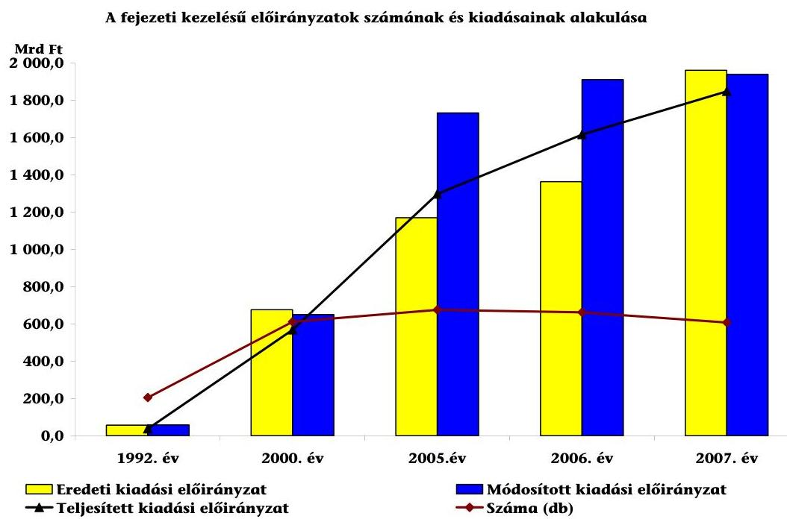

A megszűnt elkülönített állami pénzalapok előirányzatai az alapot kezelő fejezet költségvetésébe épültek be fejezeti kezelésű előirányzatként.

A fejezeti kezelésű előirányzatok az államháztartás múködési rendjéről szóló 217/1998. (XII. 30.) Korm. rendelet (Ámr.) 70. §-a szerint központi beruházásokra, PHARE és az Átmeneti támogatással megvalósuló programokra, a Kohéziós Alap támogatásával megvalósuló programokra, nemzetközi fejlesztési intézmények pénzeszközeiből megvalósuló feladatokra, nemzetközi tagsági díjakra, ösztöndíjakra, kitüntetésekre, díjakra, az állami és nemzeti ünnepek központi lebonyolítására, normatív módon múködő támogatásokra és térítésekre, év közben elkészült beruházások működtetésére, a határon túli magyarok oktatási és kulturális feladataira, valamint államháztartáson kívüli szervezetek támogatására, továbbá az Ámr. 4. számú mellékletében ${ }^{3}$ évente meghatározott célokra biztosítanak forrást.

A ciklusokon áthúzódó államháztartási reform-koncepciók fontos, deklarált célként határozták meg a fejezeti kezelésű előirányzatok körének szűkítését,

[^0]
[^0]:    ${ }^{2}$ Külön jogszabályban szabályozott, legalább középtávú, kiemelt ágazati, területfejlesztési, szakmai célokat szolgáló fejezeti kezelésű előirányzat.
    ${ }^{3}$ Az Ámr. 4. sz. mellékletében meghatározott fejezeti kezelésű előirányzatok célja 20052007 között az informatikai rendszerfejlesztés és múködtetés, a PPP programok finanszírozása, terület- és régiófejlesztés, közlekedésfejlesztés, egyházi kulturális örökség értékeinek rekonstrukciója, esélyegyenlőség fejlesztése, a Schengeni követelmények teljesítése, valamint kiemelt jelentőségű sportlétesítmények megvalósítása volt.

---

tervezésének megalapozottabbá tételét, felhasználásuk nyomon követhetőségének erősítését.

A fejezeti kezelésű előirányzatok - EU-s programokkal együtt számított - súlya, aránya az eredeti kiadási előirányzatokon belül 2007-től meghaladta a költségvetési szervek kiadásait. A közpénzek célszerű felhasználása, működtetése és ellenőrzése rendszerében egyre jelentősebb feladat az átláthatóság, a nyilvánosság biztosítása, a közpénzek felhasználásával való visszaélés megakadályozása, a nem megfelelő felhasználás visszaszorítása.

Az ÁSZ már a vizsgált időszakot megelőző években komoly gondokat jelzett az éves költségvetések végrehajtásával kapcsolatos ellenőrzési jelentéseiben különösen a fejezeti kezelésű előirányzatok felhasználásának ellenőrzésével kapcsolatban és az összeállított beszámolók hitelessége tekintetében, melynek eredményeként a megbízható, valós képet mutató vélemények aránya csökkenő tendenciát mutatott.

Ellenőrzésünk célja annak értékelése volt, hogy a központi költségvetésben a fejezeti kezelésű előirányzatok:

- felhasználásával megvalósított feladatok, valamint az ágazati célok összhangja biztosított volt-e, valamint azok prioritásai mennyiben támogatták a rendszerelvű megközelítést;
- felhasználásának, értékelésének rendszere mennyiben segítette a fejezeteken belüli, illetve a fejezetek közötti egységes és átlátható gazdálkodási gyakorlat kialakítását, a felhasználás nyomon követhetőségét;
- felhasználásának melyek voltak a kockázatot jelentő területei, a fejezetek felügyeletét ellátó szervek részéről a kockázatok csökkentése érdekében tett intézkedések milyen eredménnyel jártak;
- az alkalmazott ellenőrzési, illetve monitoring funkciók/rendszerek mennyiben járultak hozzá az előirányzatok átlátható, eredményes, hatékony és költségtakarékos felhasználásához, a céltól eltérő felhasználások megelőzéséhez;
- a korábbi ÁSZ ellenőrzések megállapításai, javaslatai hogyan hasznosultak.

Az ellenőrzést kérdőíves felméréssel kívántuk megalapozni. A felmérés kiterjedt a fejezeti kezelésű előirányzatok teljes körű számba vételére az Ámr. 70. §-ában megadott csoportokban, valamint az előirányzatok létesítésének és felhasználásának főbb folyamatelemeire ${ }^{4}$, a fejezeti kezelésű előirányzatok felhasználásának lebonyolításában részt vevő szervezetekre, az előirányzatokkal kapcsolatos ellenőrzésekre.

A tanúsítványok kitöltésének színvonala, ezáltal az adatok értékelhetősége jelentős eltéréseket mutatott. A sok fejezeti kezelésű előirányzattal rendelkező GKM nem szolgáltatott a kezelő szervekre, az ellenőrzésekre, valamint a fel-

[^0]
[^0]:    ${ }^{4}$ Az előirányzatok felhasználásával összefüggésben a kezelő szakmai és pénzügyi szervezetek tevékenységét, a felhasználás folyamatát, annak nyomon követését vizsgáltuk.

---

használásra vonatkozóan adatokat. Gyakori volt továbbá a pontatlan (ÖTM a kezelő szervezetekkel, az IRM és a KvVM az ellenőrzésekkel kapcsolatban), feldolgozhatatlan (ÖTM az ellenőrzésekre vonatkozóan) és késedelmes (ME, ÖTM, HM, IRM, KvVM) adatszolgáltatás ${ }^{5}$, így az a helyszíni ellenőrzést megalapozó funkcióját csak részben tudta betölteni.

Az ellenőrzés során felhasználtuk a fejezeti kezelésű előirányzatok alakulására vonatkozó (eredeti, módosított kiadási, illetve bevételi előirányzatok és teljesítéseik) 2005-2007. évi kincstári adatokat.

Az ellenőrzés a 2005-2007. évek múködési, gazdálkodási folyamatainak vizsgálatára irányult, az ellenőrzés befejezéséig tartó időszak releváns intézkedései figyelembevételével.

Az ellenőrzés kiterjedt az összes minisztériumra ${ }^{6}$. A fejezeti kezelésű előirányzatok rendszerének értékeléséhez a kincstári adatbázisból, valamint a fejezeti kezelésű előirányzatok létesítésének és felhasználásának főbb folyamatelemeire vonatkozó tanúsítványok adataiból a kockázati szempontok figyelembevételével választottuk ki a helyszíni ellenőrzés keretében vizsgálandó előirányzatokat (2. sz. melléklet). Kockázatosnak minősítettük, ha az ellenőrzött időszakban változott az államháztartási egyedi azonosító szám ${ }^{7}$ (ÁHT-azonosító) szerinti előirányzat tartalma, célja, továbbá, ha az adott feladatot a fejezet felügyeletét ellátó szerv más forrásból is finanszírozta, illetve ha az előirányzat felhasználását nem követték nyomon. A helyszíni ellenőrzésre kiválasztott előirányzatok között az ellenőrzött időszakban létrehozott, valamint több évre ütemezett és megszűnő előirányzatok egyaránt szerepeltek.

Helyszíni ellenőrzés keretében vizsgáltuk a fejezeti kezelésű előirányzatokkal való gazdálkodás kontroll környezetét, különös tekintettel a célok megfelelő meghatározására, továbbá a felhasználásnak a költségvetés végrehajtására irányuló ÁSZ ellenőrzések által kiszűrt kockázatos területeire (a felhasználás nyomon követhetőségének hiányosságai, az ellenőrzések elmaradása, illetve nem megfelelő elvégzése), kiemelten a magas kockázati minősítésű fejezeteknél ${ }^{8}$.

[^0]
[^0]:    ${ }^{5}$ Az Állami Számvevőszékről szóló 19989. évi XXXVIII. törvény 24. § a) pontja értelmében a vizsgált szerv köteles az ÁSZ megkeresésének soron kívül eleget tenni.
    ${ }^{6}$ A vizsgált időszakban a minisztériumi struktúra a Magyar Köztársaság minisztériumainak felsorolásáról szóló 2006. évi LV. törvény alapján átalakult, megállapításainkat - az auditokra vonatkozó megállapítások kivételével - a jogutód minisztériumokra vonatkozóan tesszük.
    ${ }^{7}$ Az államháztartási egyedi azonosító szám alkalmazásáról szóló, többször módosított 3/1997. (II. 7.) PM rendelet.
    ${ }^{8}$ A magas kockázati minősítés esetén a felügyeleti szervek nem terveztek a fejezeti kezelésű előirányzatok felhasználására irányuló ellenőrzést, illetve a tervezett ellenőrzéseket nem hajtották végre. Az ellenőrzések lefolytatása terén kockázatnövelő tényező volt, hogy a témakiválasztás nem kockázatelemzés alapján történt a fejezetek 1/4-énél. Az ellenőrzéseknek csak 3/4-e terjedt ki a fejezeti kezelésű előirányzatok célszerű felhasználására, továbbá a felhasználókig csak a vizsgálatok fele jutott el. A fejezeti kezelésű előirányzatok kezelésének rendszerét az ellenőrzések 20\%-a nem érintette. A lefolytatott

---

Az ellenőrzés folyamán támaszkodtunk a költségvetés tervezésével, illetve a végrehajtásának ellenőrzésével kapcsolatos jelentéseink megállapításaira és a fejezeti kezelésű előirányzatokat érintő téma vizsgálataink ${ }^{9}$ tapasztalataira.

Az EU-s forrásokkal kapcsolatban az EU Integráció fejezet előirányzatai tekintetében támaszkodtunk a Nemzeti Fejlesztési Ügynökség (NFÜ) múködése ellenőrzésének megállapításaira ${ }^{10}$, az európai uniós támogatások 2006. évi felhasználásának ellenőrzéséről szóló ÁSZ tájékoztatóra ${ }^{11}$, továbbá az EU-s források ellenőrzési rendszerére vonatkozóan az uniós támogatások hazai monitoring és ellenőrzési rendszere múködésének ellenőrzéséről szóló jelentésre ${ }^{12}$.

Az ellenőrzés végrehajtásának jogszabályi alapját az Állami Számvevőszékről szóló 1989. évi XXXVIII. törvény 2. § (3), valamint a 17. § (3) bekezdésében foglaltak képezték.
ellenőrzések nyomon követése terén a realizálások elmaradása (a vizsgálatok 42\%ánál), az intézkedési tervek hiánya (az ellenőrzések 1/3-ánál), az utóellenőrzések elmulasztása (a vizsgálatok $52 \%$-ánál) gyengítette az ellenőrzési munka hatékonyságát.
${ }^{9}$ Pl.: A gazdaságfejlesztés állami eszközrendszere múködésének ellenőrzése (0802); A Nemzeti Fejlesztési Ügynökség múködésének ellenőrzése (0812).
${ }^{10}$ Az NFÜ múködésére irányuló ellenőrzés helyszíni vizsgálatának időtartama: 2007. X. 1 - XI. 30. volt.
${ }^{11}$ Tájékoztató az európai uniós támogatások 2006. évi felhasználásának ellenőrzéséről (0727).
${ }^{12}$ Jelentés az uniós támogatások hazai monitoring és ellenőrzési rendszere múködésének ellenőrzéséről (0723).

---

# I. ÖSSZEGZŐ MEGÁLLAPÍTÁSOK, KÖVETKEZTETÉSEK, JAVASLATOK 

A folyamatosan növekvő központi költségvetési kiadásokon belül a fejezeti kezelésű előirányzatok eredeti kiadási előirányzatai a vizsgált időszakban a 2005. évi 39\%-ról, 2008-ra 52\%-ra emelkedtek, 2007-től meghaladták a költségvetési szervek tervezett kiadásait. A vizsgált időszakban a fejezeti kezelésű előirányzatok teljesítésének nagyságrendje egyes fejezeteknél (ÖTM, FVM, SZMM) 65\%ot, a GKM-nél és az EU Integráció és az NKTH fejezeteknél pedig a $80 \%$-ot is meghaladó mértékű volt (3. sz. melléklet), ezáltal a fejezeti kezelésű előirányzatok szerepe meghatározóvá vált a miniszteri feladatok megvalósulásában.

Ugyanakkor a vizsgált időszakban jelentősen (a 2005. évi ellenőrzések 60\%ára) csökkentek a minisztériumokban a fejezeti kezelésű előirányzatokkal kapcsolatos ellenőrzések, jellemzően létszám problémák (FVM, IRM, EüM, GKM) miatt. A fejezeti kezelésű előirányzatokra vonatkozó vizsgálatok 75\%-a terjedt ki a célszerű felhasználásra, viszont csak a vizsgálatok 30\%-a jutott el a felhasználókig, annak ellenére, hogy jelentős (65\%) a végső felhasználásra közvetlenül az államháztartáson kívülre átadott előirányzatok aránya ${ }^{13}$.
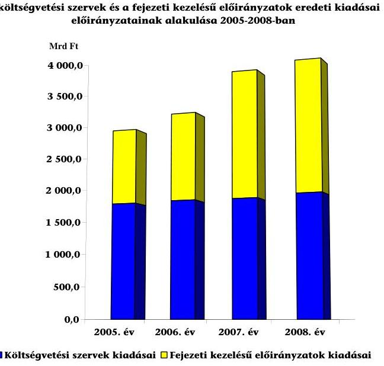

[^0]
[^0]:    ${ }^{13}$ Az államháztartás pénzügyi rendszerének továbbfejlesztési irányairól és a kincstári rendszer új szervezeti rendjének kialakításáról szóló 2064/2000. (III. 29.) határozatában a Kormány előírta az államháztartáson belüli szerveknél végső felhasználásra kerülő előirányzatok megszüntetését. A kormányhatározatot 2004-ben hatályon kívül helyezték anélkül, hogy a fejezeti kezelésű előirányzatokra vonatkozó intézkedést végrehajtották volna.

---

A költségvetés végrehajtására irányuló évenkénti ÁSZ ellenőrzések keretében értékelték a fejezeti kezelésű előirányzatokkal való gazdálkodás kontroll rendszereit is. Megállapításaik szerint a felhasználás ellenőrzésének hiányosságai jelentették az egyik gyenge pontot. Tapasztalataikat az ellenőrzésekre vonatkozó kérdőíves felmérésünk adatai is megerősítették. Gyakori volt, hogy a felügyeleti szervek nem terveztek a fejezeti kezelésű előirányzatok felhasználására irányuló ellenőrzést, illetve a tervezett ellenőrzéseket nem hajtották végre. A lefolytatott ellenőrzések nyomon követése terén a realizálások elmaradása, az intézkedési tervek hiánya, az utóellenőrzések elmulasztása (az évenkénti vizsgálatok mintegy felénél) gyengítette az ellenőrzési munka hatékonyságát.

A fejezeti kezelésű előirányzatok tervezése évente más-más döntési szinten és változó tervezési metodikával történt. A fejezeti kezelésű előirányzatok forrásainak elosztása - a megújító törekvések ellenére - lényegében a meglévő előirányzatokon (bázis) alapult ${ }^{14}$. A megújítás jegyében a kormány 2007-ben határozatba ${ }^{15}$ foglalta a programszemléletű költségvetési rendszer alkalmazását, melynek megalapozásaként a szakfeladat-rend megújítása keretében az egyes szakfeladatokhoz mutatószámokat, illetve fajlagos mutatókat kívánnak hozzárendelni a teljesítmények mérhetősége érdekében.

A vizsgált időszakban a költségvetési politika kiemelt céljai, prioritásai a fejezeti kezelésű előirányzatok tervezésére is kihatottak ${ }^{16}$. Az esetenként kevésbé egyértelmű, gyakran változó prioritások túl széles területeket fogtak át, azok között 13-20 kiemelt terület is szerepelt, ami kétségessé tette a megfelelő súlypontképzést és a finanszírozás átláthatósága ellen hatott. Az éves költségvetési törvények felépítése nem követte a prioritásoknak megfelelő szerkezetet.

A prioritások kijelölése során az általános célokhoz a minisztériumok nem rendeltek elvárt eredményeket, mérhető outputokat. Így a költségvetési törvények jóváhagyásakor nem álltak rendelkezésre a tervezett kiadások várható hasznosságának megítélését lehetővé tevő információk, mutatók, mérőszámok a megalapozott döntésekhez.

[^0]
[^0]:    ${ }^{14}$ Az ÁSZ a Közpénzügyi Szabályozás Téziseiben a költségvetés tervezése kapcsán hangsúlyozta: „A hazai költségvetési tervezési gyakorlat átfogóan megújitandó. A jelenlegi bázis alapú tervezés alkalmatlan mind a teljesítménykövetelmények érvényesitésére, mind a szükséges szerkezeti változások megalapozására. A maradványtervezés jelenlegi gyakorlata egyoldalú fiskális szempontokat közvetít a szektor szereplői felé, akik megfelelő technikákkal formálisan alkalmazkodnak ezekhez a megszoritásokhoz, de gazdálkodásuk lényegi megújitására nem képesek. A pénzügyi egyensúlyi célok követésének nincs alternatívája, azonban e változások nélkül az egyensúlyi problémák újratermelődése törvényszerú. A teljesitményorientáltságot biztositja a programalapú költségvetés gyakorlatának meghatározott kiadási területekre történő elöirása, a költségvetés végrehajtásának monitoringja, illetve a teljesitményellenörzés intézményesitése."
    ${ }^{15}$ A közfeladatok felülvizsgálatával kapcsolatos további feladatokról szóló 2233/2007. (XII. 12.) Korm. határozat 4. pontja alapján a programszemléletű költségvetési rendszer bevezetésének koncepciója 2008. december 31-éig kerül a Kormány elé.
    ${ }^{16}$ Az Ámr. 3. § (5) bekezdése szerint fejezeti kezelésű előirányzat a központi költségvetés alrendszeren belüli felhasználásra akkor tervezhető, ha a tervezés időszakában nem ismert a kedvezményezett vagy a jogosultság mértéke nem határozható meg.

---

Az ellenőrzött előirányzatok célkitúzései általában összhangban voltak a jogszabályokkal és a kormányprogrammal, ugyanakkor azok indokoltságát számításokkal nem minden előirányzatnál, illetve nem kellő mértékben alapozták meg. Az előirányzatok háromnegyedénél az alapokmányukban jogszabályi alátámasztásként a költségvetési törvényre hivatkoztak. Az alapokmányokban általában csak a fejezeti kezelésű előirányzatok céljának meghatározása szerepelt, a célokhoz kapcsolódó (naturális) mutatókra, indikátorokra, illetve az eredményekre és azok értékelésének módjára nem tértek ki.

A fejezeti kezelésű előirányzatok stuktúrája nehezen áttekinthető. Ehhez hozzájárult az egységes kialakításra vonatkozó rendelkezések hiánya. Fejezetenként eltérő címrendet alakítottak ki, továbbá az ugyanazon célú előirányzatok/előirányzat-csoportok azonos elnevezése sem valósult meg ${ }^{17}$. A kialakított szerkezet nem biztosította az előirányzatok évek, valamint az egyes fejezetek közötti összehasonlíthatóságát sem. A fejezeti kezelésű előirányzatok négy nagy csoportba sorolásán túl (központi beruházások, ágazati célelőirányzatok, EU integrációs előirányzatok és fejezeti államháztartási tartalék) fejezetenként más-más szerkezetet képeztek. Túlzott tagoltság (tárcán belüli azonos feladatok szétbontása), esetenként pedig túlzott tömörítettség (sok különböző feladat egy előirányzaton szerepelt) egyaránt tapasztalható volt ${ }^{18}$. Pozitív tendenciaként néhány esetben - a korábbi szerkezeti rendhez viszonyítva - az azonos célú és rendeltetésű feladatok (határon túli, kisebbségi) összevonásra kerültek.

Kedvezőtlenül érintették az előirányzatok átláthatóságát az egyes feladatok ellátásánál előforduló átfedések és párhuzamosságok, illetve a vizsgált időszakra jellemző fejezetek közötti, továbbá fejezeteken belüli gyakori feladatátcsoportosítások. Az újonnan létrehozott előirányzatok és a már működők öszszevonása, illetve megszüntetése is módosította a fejezeti kezelésű előirányzatok körét és szerkezetét.

Az állami feladatok teljes körű definiálásának hiánya, valamint a fejezetek közötti feladat átrendeződések is hozzájárultak ahhoz, hogy különösen bonyolult lett több fejezet (GKM, ÖTM, OKM, SZMM) címrendje. A fejezeteknél nem volt egységes a közfeladatot ellátó állami alapítású, illetve részesedésű, valamint az egyéb államháztartáson kívüli szervezetek támogatási előirányzatainak elnevezése és a címrendben való kezelése (egyedi és csoportos támogatás, alcímen, valamint jogcímcsoportokon is).

Az ellenőrzött években az előirányzatok köre a PPP ${ }^{19}$ programok, az EU integráció fejezeti kezelésű előirányzatok, az NFT és ÜMFT előirányzatai, a Magán-

[^0]
[^0]:    ${ }^{17}$ A fejezetek a költségvetési javaslataik benyújtásával egy időben tehetnek javaslatot a PM által kiadott tervezési címrendtől eltérő címrendre.
    ${ }^{18}$ A PM véleménye szerint: „...a jelentés rendszeresen visszatérően túzi célul az egységességet. Természetesen indokolt lehet az ez irányban történő haladás, ennek megvalósitása azonban - figyelembe véve az államháztartás méretének nagyságát, a benne lévő fejezeti kezelésú elöirányzatok eltérő sajátosságait, szingazdagságát - alighanem jelentős nehézségekbe ütközne, s nem is biztos, hogy minden esetben célszerü lenne."
    ${ }^{19}$ A PPP (Public Private Partnership) a közfeladatok ellátásának az a módja, amikor az állam a szükséges létesítmények és/vagy intézmények létrehozásába, fenntartásába és

---

és egyéb jogi személyek kártérítése, a megszüntetett közalapítványok céljaira fejezeti kezelésű előirányzatokból biztosított támogatások, az államháztartási, illetve az egyensúlyi tartalékok mellett a szakmai feladatok változása alapján kialakított előirányzatokkal bővült.

Évente változtak a strukturális alapokból és a Kohéziós Alapból nyújtott támogatásokat tartalmazó előirányzatok. Minden kormányzati struktúra átalakításnál változott a határon túli magyarok ügyeinek és a Határon Túli Magyarok Hivatala (HTMH) felügyeletének, valamint az élelmiszerbiztonsággal kapcsolatos hatásköri rend fejezeti besorolása.

A minisztériumok a fejezeti kezelésű előirányzatok felhasználásának és ellenőrzésének előírásait az általuk évenként kiadott, a pénzügyminiszter által jóváhagyott, az előirányzatok kezelésével, felhasználásával, ellenőrzésével kapcsolatos eljárási rendre vonatkozó utasításokban, a szakmai és pénzügyi kezelésre, valamint a számviteli elszámolásra vonatkozó belső szabályzatokban meghatározták.

A fejezeti kezelésű előirányzatok kezelési és ellenőrzési rendjének szabályzatai általában megfelelő keretet adtak az előirányzatok szabály- és célszerű felhasználásához. Nem dolgoztak ki azonban fejezetenként sem egységes szempontrendszert, eljárásrendet a támogatási célú előirányzatokból történő pályázatkezelés és egyedi elbírálás folyamatára, a szakmai beszámolók és pénzügyi elszámolások tartalmi követelményeire, azok ellenőrzésének kritériumaira, illetve a támogatási szerződések szerinti célok megvalósításának a szakmai teljesítés és hatékonyság szempontjából történő értékelésére.

Az előirányzatok kezelésének, a pénzeszközök felhasználásának feladatait a minisztériumokban esetenként évente változó eljárási rend és döntési kompetenciák mellett, eltérő módon és színvonalon látták el. Közremúködő szervezeteket vontak be az előirányzatok szakmai és pénzügyi kezelésébe (pályáztatási feladatok, ellenőrzési, egyéb pénzügyi feladatok). A fejezeti kezelésű előirányzatok sokszereplős rendszerében kezelő szervi feladatokat államháztartási és államháztartáson kívüli szervezetek is elláttak. Az ellenőrzött időszakban a fejezeti kezelésű előirányzatok kiadásainak mintegy 75\%-a a kezelő szervezetek közreműködésével került felhasználásra.

A kezelő szervezetekkel kötött megállapodásokban a minisztériumok a jogszabályi előírásokon túl általában nem határoztak meg célszerű kontroll pontokat (egyeztetési kötelezettségek, munkafolyamatba épített ellenőrzések), továbbá a nem szerződésszerű teljesítések esetére biztosítékokat.

A közreműködő szervezetek számára átadott pénzügyi, illetve ellenőrzési jogosultságok terjedelme különböző volt, általában igazodott a szakmai, valamint
üzemeltetésébe versenyeztetés útján bevonja a magánszektort, a felek a közszolgáltatás nyújtásának felelősségét és kockázatát közösen viselik. A PPP tehát nem csupán egy finanszírozási forma, hanem egy hosszú távú, kölcsönös előnyökkel járó szerződéses üzleti megállapodás.

---

a pénzügyi kezelés feladataihoz. Sor került az államháztartáson kívüli szervezetek számára utalványozási jogkör és a számviteli feladatok átadására is. Ugyanakkor az ellenőrzések mennyisége és gyakorisága, különösen a lebonyolító szervezetek részéről nem volt megfelelő.

A szakmai fejezeti kezelésű előirányzatok és a kormányzati beruházások támogatására szolgáló források tervezése 2005-ben pályáztatással történt, 2006-2007-ben a Kormány visszatért a bázis alapú tervezéshez. A fejezetek felügyeletét ellátó szervek által minden évben végrehajtott rangsorolásnak korlátot szabtak a jogszabályi, a nemzetközi és a pénzügyi determinációk. A fejezeti kezelésű előirányzatok pályázatos formában indított tervezése ténylegesen a korábbi évek gyakorlatával megegyező alkufolyamattá alakult, program-szintű egyeztetésre és értékelésre szinte kizárólag kétoldalú szakértői szinten (PM és tárca apparátus) került sor ${ }^{20}$, a tervektől eltérően nem történt meg a tervezési folyamatba a felső vezetői szint bevonása.

A Kormány a pályázati igényekre fordítható kiadásokat prioritási kategóriánként eltérő mértékben csökkentette, egyúttal a mérsékelt forrásokat a következő évek tervezési alapjául alkalmazta (nullbázis), ezzel kockázatossá tette a korábbi determinációk alapján eldöntött programok teljesítését, valamint az alulfinanszírozott feladatok megvalósítását. Az ellenőrzött időszakban egyes jogszabályi kötelezettségek teljesítésével (FVM-nél a hegyközségi szervezetek múködtetése), megkezdett központi beruházások végrehajtásával (HM, EüM, MTA), állami feladatok államháztartáson kívüli ellátásával, támogatások közvetítésével kapcsolatban is felmerültek finanszírozási nehézségek. A decentralizált területfejlesztési programok 2007. évi előirányzata még a 2005-2006-ban vállalt kötelezettségek fedezetére sem nyújtott támogatást, így 2007ben további pályázati kiírásra nem került sor. Több, korábbi szakmai fejlesztési program a hazai források csökkenése következtében fokozatosan elhalt.

A közfeladatok felülvizsgálatáról szóló 2006. évi kormányhatározatok alapján - a fejezetekre kiterjedő - állami feladat felülvizsgálat a 2007. évi költségvetésben megjelenő fejezeti kezelésű előirányzatokat is érintette. Ennek keretében 436 fejezeti kezelésű előirányzatot világítottak át. Az eredmények teljes körű értékelése a helyszíni ellenőrzés lezárásakor folyamatban volt. Ugyanakkor a tagságok és hozzájárulások körének és szükségességének felülvizsgálatát követően a tervezési irányelvekben foglaltak ellenére sem csökkent a nemzetközi tagságok köre ${ }^{21}$.

Az Európai integrációval kapcsolatos előirányzatok kialakítása finanszírozási és hatásköri szempontból - részben az EU előírásai miatt - eltért a hazai finanszírozású előirányzatokétól. A költségvetés szerkezetében való megje-

[^0]
[^0]:    ${ }^{20}$ A PM szakfőosztályai (a Központi költségvetési fejezetek főosztálya és a költségvetés kiadási oldalával foglalkozó társfőosztályok) munkaanyagban értékelték a 2005. évi költségvetési programtervezés kísérletét, melyben felmérték a rendszer problémáit, javaslatot tettek a továbbfejlesztés irányaira.
    ${ }^{21}$ 2007-től a tervezési köriratokban foglalt feladatként határozta meg a PM a nemzetközi tagságok és hozzájárulások körének és szükségességének felülvizsgálatát, a finanszírozás biztosíthatóságára, illetve a kilépések lehetőségére tekintettel.

---

lenítésük és a kapcsolódó jogosítványok jelentősen módosultak a vizsgált időszakban, ezzel nem szolgálták az átláthatóság, a tervezhetőség, kiszámíthatóság követelményét.

A hatékony forrásallokáció szempontját figyelmen kívül hagyva nem került sor az uniós és hazai támogatási források tervezésének és felhasználásának összehangolására. Az uniós források kezelésére a fejezetekétől elkülönült (párhuzamos) intézményeket alakítottak ki. Kedvező tendenciaként értékelhető, hogy egyes fejezeteknél ${ }^{22}$ 2007. évtől a kezelés széttagoltságának megszüntetésére tettek intézkedéseket. A szakmai fejezeti kezelésű előirányzatok bevételei körében a saját bevételek mellett az Európai Unió költségvetéséből származó támogatások átlagosan $65 \%$-ot tettek ki.

A fejezeti kezelésű előirányzatok céljainak teljesülése a kedvezményezettek széles körét érintette. Az egyes megoldások áttekinthetőségét a támogatások folyósításának módja (közvetlen fejezeti kifizetés, szervezésben részt vevő intézményi kifizetés, előirányzat-módosítás, pénzeszköz-átadás), felhasználásának (normatív, illetve pályázati támogatás, egyedi döntés), valamint a pénzellátás formái is (feladatfinanszírozás, feladatfinanszírozáson kívüli) különböző mértékben befolyásolták. Átláthatósági és elszámoltathatósági kockázatot jelent(ett) a fejezetnél közvetlenül felhasznált előirányzatok gyakori módosítása, illetve az, hogy az előirányzat-átcsoportosítással történő felhasználáskor a fejezeti szintű nyilvántartásban a teljesítés nem követhető nyomon. Az előirányzatok felhasználásának célszerű ütemezését nehezítette, hogy a kötelezettségvállalással terhelt maradványok jóváhagyása a PM részéről késedelmes volt.

A költségvetés szerkezete továbbra sem ${ }^{23}$ biztosítja, hogy az állami feladatokat ellátó államháztartáson kívüli szervezetek részére fejezeti kezelésű előirányzatokból átadott költségvetési eszközök teljes körűen áttekinthetők, azonosíthatók legyenek. Az éves költségvetésekről, illetve azok végrehajtásáról szóló törvények adatai az államháztartáson kívüli szervezeteknek juttatott támogatásokról - a névre címzett előirányzatokat és teljesítéseket kivéve - összevontan tájékoztatnak.

Az államháztartáson kívüli szervezetek fejezeti kezelésű előirányzatokból történő finanszírozására nem állapítottak meg egységes rendező elveket, mérőszámokat, mutatókat. A minisztériumok - a lehetőségeik függvényében - egyedi döntésekkel, esetenként pályáztatással biztosították a feladatellátás forrását, továbbá nem elemezték a feladatellátás államháztartáson kívülre szervezésének célszerűségét, hatékonyságát sem a feladatok eredményesebb elvégzése, sem a várható gazdasági előnyök tekintetében.

[^0]
[^0]:    ${ }^{22}$ Az SZMM a pályázati programjai menedzselését egy szervezethez, az ESZA Kht.-hez telepítette, a GKM-nél a korábbi évek sokszereplős szervezetrendszeréhez képest az egyablakos, ügyfélbarát múködés irányába történt elmozdulás a MAG Zrt. megalakításával, az FVM-nél az MVH az EU támogatások kezelése mellett a nemzeti támogatások kezelését is átvette.
    ${ }^{23}$ Az államháztartáson kívüli állami feladatellátás rendszerének ellenőrzéséről szóló 0467 sz. ÁSZ jelentésben ugyanezen átláthatatlansági kockázatokat állapítottuk meg.

---

A vizsgált időszakban nem volt egységes a pályázati úton biztosított támogatások rendszere. A pályáztatás fejezetenként és pályázatonként is eltérően alakult, általában nem dolgoztak ki külön eljárási rendet a pályázaton kívüli, egyedi döntésekkel nyújtott támogatásokra, valamint hiányoztak a döntési preferenciák és támogatási kritériumok. Így nem volt biztosított az esélyegyenlőség a támogatásokhoz való hozzáféréshez.

A döntések átláthatósága ellenében hatott, hogy a fejezeti kezelésű előirányzatokból meghatározott feladatokra nyújtott támogatásokat nagyrészt (55\%) egyedi elbírálás alapján hozott döntéssel határozták meg. Egyes fejezeti kezelésű célelőirányzatok esetében (területrendezés) a teljes forrás egyedi döntéssel államháztartáson kívüli szervezetnél került felhasználásra.

A vizsgált időszakot követően az átláthatóságot, az eljárásrend egységesítését és a nyilvánosságot illetően egy jól körülhatárolható területen, az államháztartáson kívülre juttatott támogatásoknál előrelépés történt. A vonatkozó, 2008. áprilisától hatályos törvény és végrehajtási rendelete ${ }^{24}$ részletesen meghatározta az államháztartáson kívülre kerülő támogatások döntési mechanizmusát és eljárásrendjét.

A feladatfinanszírozásként megvalósuló központi beruházások keretében a vizsgált időszakban a HM, a KvVM és az OKM fejezeteknél valósítottak meg nagy összegű beruházást. A feladatfinanszírozás körébe utalt előirányzatok felhasználása teljesítményarányosan a Kincstár kibővített (a tranzakciók indokoltságának vizsgálata, helyszíni ellenőrzés) ellenőrzési tevékenysége mellett történt. Az ellenőrzött időszakban az informatikai rendszerfejlesztéssel és múködtetéssel 2007. január 1-jétől célszerűen bővült a feladatfinanszírozott előirányzatok köre.

A köz- és magánszféra partnerségét magába foglaló PPP (Public Private Partnership) konstrukcióban sportlétesítményeket, börtönöket, autópályákat, kollégiumi és diákotthonokat, kulturális fejlesztéseket (Múvészetek Palotája) valósítottak meg.

A tisztán hazai finanszírozású intézkedések céljainak számszerűsítésére és a célértékek tényleges alakulására, értékelésére nem volt egységes módszertan és nyilvántartás. A támogatások hasznosulásának értékelése ${ }^{25}$ minisztériumonként, támogatási típusonként eltérő volt.

A központi keret tartaléka egyes fejezeteknél (ME, FVM, GKM) „miniszteri keretként" funkcionált, abból a tartalék céljától eltérően a miniszterek feladatkö-

[^0]
[^0]:    ${ }^{24}$ A közpénzekből nyújtott támogatások átláthatóságáról szóló 2007. évi CLXXXI. törvény, valamint a végrehajtására kiadott 67/2008. (VIII. 23.) Korm. rendelet.
    ${ }^{25}$ Az EU támogatások felhasználásának, hasznosulásának értékelésével kapcsolatban az ÁSZ külön téma vizsgálatai foglalkoz(t)nak (a Nemzeti Fejlesztési Ügynökség) múködése ellenőrzésének várható nyilvánosságra hozatala, a gazdaságfejlesztés állami eszközrendszere múködésének ellenőrzése (0802), az európai uniós támogatások 2006. évi felhasználásának ellenőrzéséről szóló ÁSZ tájékoztató (0727), az EU-s források ellenőrzési rendszerére vonatkozóan az uniós támogatások hazai monitoring és ellenőrzési rendszere múködésének ellenőrzése (0723).

---

rébe nem tartozó szakmai célokat és államháztartáson kívüli szervezeteket is támogattak.

Ugyanakkor a fejezeti kezelésű előirányzatok felhasználásának értékelését, monitoringját egységes módszer, eljárásrend nem támogatta, azt a minisztériumok eltérően vagy egyáltalán nem alakították ki.

Az ellenőrzött időszakban az elszámolások minősége javult annak ellenére, hogy nem készült egységes eljárásrend a befogadható számlák tartalmi és formai követelményeivel kapcsolatban (teljesítés alátámasztása, szakmai beszámolók tartalma). A szakmai főosztályok által ellenőrzött és elfogadott elszámolásokkal kapcsolatban jelen ellenőrzésünk szabálytalanságokat tárt fel (pl. jogosulatlan, illetve céltól eltérő felhasználás). Az egységes, integrált nyilvántartás hiánya is szerepet játszott a párhuzamos és többszörös támogatások előfordulásában, valamint nehezítette a támogatások eredményességének és hatékonyságának megítélését. Az Üvegzseb ${ }^{26}$ törvénynek a közérdekú adatok kötelező közzétételére vonatkozó szabályai közül egyes minisztériumoknál (FVM, ÖTM, KvVM ${ }^{27}$ ) nem érvényesült a fejezeti kezelésű előirányzatok költségvetési alapokmányának nyilvánossá tételére vonatkozó előírás.

Utóellenőrzés keretében megvizsgáltuk hét átfogó és témaellenőrzés, valamint az MK költségvetése 2005. és 2006. évi végrehajtása ellenőrzésének keretében tett, vonatkozó javaslataink (5. sz. melléklet) hasznosulását. Megállapítottuk, hogy a javaslatainkkal kapcsolatban intézkedési terveket készítettek, a hasznosítás többnyire megkezdődött. A kormányzati szféra múködtetése optimális feltételeinek biztosítása érdekében ${ }^{28}$ a KSZF a minisztériumoktól - a HM és a KüM kivételével - átvette az üzemeltetési feladatokat. Az eKormányzati szolgáltatások költséghatékonyságát segítő monitoring rendszerek kialakításához a koncepciók kidolgozása megkezdődött ${ }^{29}$. A Művészetek Palotája kivitelezési munkálatai befejeződtek, az üzemeltetési feladatokat ellátó szervezetek feladatainak koordinálására szolgáló monitoring funkciókat biztosító szoftver beszerzésére kiírt közbeszerzési eljárás viszont eredménytelenül zárult ${ }^{30}$.

A Közmunkaprogramok forrás koordinációjával és az értékeléssel kapcsolatos adatbázis kialakítása nem történt meg, 2007-ben a koncepció készült el ${ }^{31}$.

[^0]
[^0]:    ${ }^{26}$ A közpénzek felhasználásával, a köztulajdon használatának nyilvánosságával, átláthatóbbá tételével és ellenőrzésének bővítésével összefüggő egyes törvények módosításáról szóló 2003. évi XXIV. törvény.
    ${ }^{27}$ A KvVM helyszíni ellenőrzés lezárását követően 2008. májusában intézkedett a fejezeti kezelésű előirányzatok költségvetési alapokmányának közzétételéről.
    ${ }^{28}$ Jelentés a minisztériumok és országos hatáskörű szervek elhelyezéséről és tárgyi eszköz ellátottságáról (0642).
    ${ }^{29}$ Az elektronikus kormányzati szolgáltatások fejlesztésének ellenőrzéséről szóló 0713 sz. ÁSZ jelentés.
    ${ }^{30}$ A Művészetek Palotája megvalósításának és működésének ellenőrzéséről szóló 0660 sz. ÁSZ jelentés.
    ${ }^{31}$ Jelentés a közmunkaprogramok támogatására fordított pénzeszközök hasznosulásának ellenőrzéséről (0732).

---

Az éves állami költségvetések végrehajtásának ellenőrzése során a folyamatba épített, előzetes és utólagos vezetői ellenőrzés (FEUVE) hatékonyságának növelése érdekében tett javaslatunk alapján elkészültek az ellenőrzési nyomvonalak. Ugyanakkor nem valósult meg az FVM-nél a kiegészítő nemzeti területalapú támogatás (Top-Up) előirányzat önálló költségvetési soron történő megjelenítése.

A helyszíni ellenőrzés megállapításainak hasznosítása mellett javasoljuk:

# a Kormánynak 

1. fordítson kiemelt figyelmet - a stratégiai tervezési dokumentumokkal megalapozott (NFT, ÚMFT), EU által társfinanszírozott programok analógiájára - a költségvetési politika prioritásai és a fejezeti kezelésű előirányzatokra is kiterjedő tervezési súlypontok közötti nagyobb összhang kialakítására;
2. intézkedjen az érintett fejezetek felé a fejezeti kezelésű előirányzatok tervezésénél a kiadások várható hasznossága megítélését lehetővé tevő mérőszámok, mutatók kidolgozására, biztosítására;
3. vizsgáltassa felül a szakmai fejezeti kezelésű előirányzatok (részeik) ún. "miniszteri keretként" történő felhasználásának indokoltságát, különös tekintettel a felhasználás prioritásai meghatározásának szükségességére;
4. intézkedjen a fejezeti kezelésű előirányzatok strukturális problémáinak megoldása érdekében a jogszabályok módosításáról, kiemelt figyelemmel:
a) a fejezeti kezelésű előirányzatok címrendjének egységesítésére ${ }^{32}$ (azonosan kezelhető és értelmezhető előirányzatok körére),
b) a fejezeti kezelésű előirányzatoknak a központi költségvetés alrendszeren belüli felhasználásra történő tervezése feltételeire,
c) a pályázatok kezelése, az egyedi elbírálások folyamata, a szakmai beszámolók és pénzügyi elszámolások tartalmi követelményeire, egységes eljárásrendjének kialakítására, valamint
d) az államháztartáson kívüli szervezetek finanszírozásánál - azok teljes körére egységes rendező elvek érvényesítésére ${ }^{33}$;
[^0]
[^0]:    ${ }^{32}$ A PM-től kapott tájékoztatás szerint a 2009. évi költségvetés tervezése során kiadandó tervezési körirat már tartalmazni fogja a címrend egységesítésére vonatkozó irányelveket.
    ${ }^{33}$ Hasonló feladatot ír elő a civil szervezetek támogatásával kapcsolatban a közfeladatok felülvizsgálatával kapcsolatos további feladatokról szóló 2233/2007. (XII. 12.) Korm. határozat 1.52. pontja. A kormányzati civil kapcsolatok fejlesztését szolgáló egyes intézkedésekről szóló 1065/2007. (VIII. 23.) Korm. határozat 1. pontjának megfelelően folyamatban van civil információs portál kialakítása is.

---

e) a párhuzamos és többszörös támogatások kiszűrésére alkalmas integrált nyilvántartás kialakítására ${ }^{34}$.

# a pénzügyminiszternek 

tegyen intézkedéseket az átláthatóság és elszámoltathatóság, továbbá a cél szerinti felhasználás kockázatainak csökkentése érdekében a fejezeti szintű nyilvántartásokban a teljesítések végső felhasználásig történő nyomon követhetőségének biztosítására.

## az érintett fejezetek felügyeletét ellátó szervek vezetőinek:

1. intézkedjenek az ÁSZ által kért adatszolgáltatások (tanúsítványok, kérdőívek, stb.) pontos, határidőre történő teljesítéséről;
2. gondoskodjanak a fejezeti kezelésű előirányzatok felhasználásával kapcsolatban a belső ellenőrzés személyi és tárgyi feltételeinek javításáról a helyszíni ellenőrzések szerepének, hatékonyságának növelése érdekében;
3. tegyenek lépéseket a közpénzekből nyújtott támogatások átláthatósága érdekében nyilvános, átlátható, az értékelési szempontokat is tartalmazó döntési rendszer kialakítására;
4. intézkedjenek a fejezeti kezelésű előirányzatok költségvetési alapokmányainak az „Üvegzseb" tv ${ }^{35}$-ben előírt, honlapon történő közzétételéről.

[^0]
[^0]:    ${ }^{34}$ Egy részterületen, a hazai fejlesztési források tekintetében hasonló feladatot ír elő a közfeladatok felülvizsgálatával kapcsolatos további feladatokról szóló 2233/2007. (XII. 12.) Korm. határozat 1.43. pontja.
    ${ }^{35}$ A közpénzek felhasználásával, a köztulajdon használatának nyilvánosságával, átláthatóbbá tételével és ellenőrzésének bővítésével összefüggő egyes törvények módosításáról szóló 2003. évi XXIV. törvény.

---

J. ÖSSZEGZŐ MEGÁLLAPÍTÁSOK, KÖVETKEZTETÉSEK, JAVASLATOK

---

# II. RÉSZLETES MEGÁLLAPÍTÁSOK 

## 1. A fejezeti kezelésú elóirányzatok feladat- és szabályozási RENDSZERE

### 1.1. A fejezeti kezelésú előirányzatok feladatrendszerének jellemzői

A fejezeti kezelésű előirányzatok feladatrendszere és összetétele általában igazodott a Kormány változó célkitúzéseihez, illetve stratégiai programjaihoz, valamint a miniszterek feladat- és hatásköréről szóló kormányrendeletekben meghatározott feladatokhoz. Ugyanakkor ellentmondásos annak megállapítása, hogy mely feladatok elvégzésére kötelezettek a költségvetési szervek, és melyek azok, amelyeket önként vállaltak. A vizsgált időszak kormányprogram, illetve miniszteri feladatkör változásai a fejezeti kezelésű előirányzatok összetételében, valamint az azokban megjelölt célokban - az egyes fejezeti kezelésű előirányzatoknak a tárca-megszűnésekkel, átalakulásokkal kapcsolatos átcsoportosításai és az alapvetően új feladatok kivételével - nem követhetők nyomon, a fejezeti kezelésű előirányzatok elnevezése és célja alig (átlagosan $6,1 \%$, illetve $3,0 \%$ ) változott.

A Kormány a vizsgált időszakban a „Lendületben az ország 2004-2006" programban, az „Új Magyarország 2006-2010" programjában, majd azt 2006. II. félévétől újra definiálva az „Új Egyensúly 2006-2008" programban (célja az államháztartás hiányának azonnali mérséklése), valamint a 2006. szeptemberére elkészült - majd 2006. decemberében aktualizálásra került Konvergenciaprogramban (célja a tartós egyensúly megteremtése) fogalmazta meg a gazdaság- és költségvetés-politika középtávú (2005-2008. évekre vonatkozó) célrendszerét.

A vizsgált időszakban a költségvetési politika kiemelt céljai, prioritásai a fejezeti kezelésű előirányzatok tervezésére is kihatottak. Az esetenként kevésbé egyértelmű, gyakran változó prioritások túl széles területeket fogtak át, azok között 13-20 kiemelt terület is szerepelt, ami kétségessé tette a megfelelő súlypontképzést és a finanszírozás átláthatósága ellen hatott. A prioritásokhoz ugyanakkor nem rendeltek elvárt eredményeket, mérhető outputokat Ezek hiányában „a költségvetési törvény jóváhagyásakor nem álltak rendelkezésre a tervezett kiadások várható hasznosságának megítélését lehetővé tevő információk. A Parlament a megfelelő adatok és információk hiányában legfeljebb az előirányzatok összegszerú nagyságáról vitatkozhatott, s nem arról, hogy valamely konkrét elérendő cél megvalósitását a tervezett elöirányzat biztositja-e. ${ }^{36}$

[^0]
[^0]:    ${ }^{36}$ Idézet Kovács Árpád: Az államháztartás múködése és gazdálkodása, kapcsolata az egészségüggyel című, a Szegedi Egészségügyi Napok keretében elhangzott előadásából.

---

A vizsgált időszakban végig prioritást élveztek az EU-tagsággal és a nemzetközi megállapodásokkal összefüggő feladatok, valamint az EU források fogadásához szükséges társfinanszírozások biztosítása. A prioritások az éves tervezések során bővültek, viszont végig megmaradtak az Európai Uniós tagságból eredő determinációk.

Az EU-hoz való felzárkózás célkitűzéseit, a csatlakozás utáni EU forrásokból támogatható fejlesztéspolitikai célkitűzéseket és prioritásokat a 2004-2006-os időszakra készített Nemzeti Fejlesztési Terv (NFT), valamint a 2007-2013 évek közötti időszakra kidolgozott Új Magyarország Fejlesztési Terv (ÚMFT) tartalmazta.

Az éves költségvetési javaslatok kiemelten vették számításba az uniós támogatások igénybevételéhez szükséges nemzeti forrásokat, melyet a szakmailag felelős tárcáknak kellett prioritásként kezelnie.

A GKM szakmai vezetése a vizsgált időszakban a gyorsforgalmi úthálózattal, illetve a közúti közlekedéssel kapcsolatos programokat kezelte kiemelten. Minimális követelményként fogalmazódott meg az üzemeltetés, fenntartás fedezetének megőrzése a felújítás és fejlesztés mellett, valamint az EU-s társfinanszírozás maximális kihasználása.

Az FVM-nél a költségvetési javaslatai első helyen vették figyelembe az EU-s támogatás igénybevételéhez szükséges nemzeti forrásokat, a közvetlen mezőgazdasági ártámogatásokat és az uniós támogatások igénybevételével kapcsolatos szervezeti struktúra kialakítását.

Elsősorban az agrártermelés felzárkóztatása érdekében a közvetlen termelői támogatások nemzeti kiegészítését, továbbá az EU piaci támogatás árfolyam kockázatának és a meg nem térült költségek fedezetének a biztosítását szerepeltették az FVM-nél, továbbá kiemelt volt a közvetlen termelői támogatások nemzeti kiegészítése az agrártermelés felzárkóztatása érdekében, amelynek támogatási igénye $100 \%$-ig determinált volt.

Kiemelt prioritásként kezelték a foglalkoztatás elősegítését, munkahelyteremtést (SZMM), felsőoktatási intézmények fejlesztését, átalakítását, az Európai Felsőoktatási Térhez való csatlakozást (OKM), a határon túli magyarokkal, az egyházakkal és a kisebbséggel kapcsolatos feladatok támogatásait (ME, KÜM, OKM). Néhány esetben - a korábbi szerkezeti rendhez viszonyítva - az azonos célú és rendeltetésű feladatok (határon túli, kisebbségi) összevonásra kerültek.

Az Egészségügyi program (EüM) átfogta mindazokat a feladatokat, amelyek az Európa Terv egészségügyi részének megvalósítását jelentették.

Az egészségügyi célú előirányzatok szakmai hátterét az Egészség Évtizedének Népegészségügyi Programja, valamint a „21 lépés az egészségügy átalakításáért" intézkedés-csomag, a területfejlesztési célú és építésügyi fejezeti kezelésű előirányzatokét - konkrét források nélkül -, nemzeti szinten a 2005. év végén elfogadott Országos Fejlesztési Koncepció (OFK) és az Országos Területfejlesztési Koncepció (OTK), a középtávú időszakra szóló fejlesztési elképzeléseket a megújított Lisszaboni stratégiával összhangban a Nemzeti Akcióprogram (2005-2008) tartalmazta. A környezetvédelmi tervezés alapja a hatévente megújítandó Nemzeti Környezetvédelmi Program volt.

---

Az e-Kormányzat 2005 stratégiában megfogalmazott célokhoz kapcsolódtak az Elektronikus Kormányzati Központ (EKK) által kezelt, kormányzati informatikai fejlesztési, múködtetési kiadások.

Az MTA fejezet 2007. évi tervezési munkájára hatással volt az akadémiai reformfolyamat megindítása, melynek kiemelt célja a magyar kutatásszervezet teljesítmény- és minőségelvű átalakítása volt.

A költségvetési törvényben meghatározott előirányzatokat (feladatokat) jellemzően ( $82,7 \%$ ) törvények, kormányrendeletek, kormányhatározatok ( $6,9 \%$ és $6,7 \%$ ), illetve miniszteri rendeletek és utasítások ( $1,2 \%$ és $0,4 \%$ ), valamint egyéb jogi eszközök (2,1\%) alapozták meg.

A fejezeti kezelésű előirányzatok törvényi alátámasztása azok 75\%-ánál az adott évi költségvetési törvény volt. Más jogszabályok pl. a fejezeti kezelésű előirányzatokkal összefüggésben felmerült, a Kincstár által nyújtott szolgáltatások díjainál az Ámr., a HM Nemzetközi kártérítésénél a NATO SOFA hatálya alá tartozó kártérítési ügyekkel kapcsolatos eljárásról szóló 79/2002. (IV. 13.) Korm. rendelet, a fogvatartottakat foglalkoztató gazdálkodó szervezetek támogatásánál a bünte-tés-végrehajtási szervezetről szóló 1995. évi CVII. törvény, a légiközlekedési igazgatással kapcsolatos feladatoknál a légiközlekedési igazgatás szervezeti átalakításáról szóló 2369/2001. (XII.18.) Korm. határozat, a külgazdasági attasé hálózat múködési feltételeinek megteremtésénél az egységes állami külképviseleti rendszer működtetéséről szóló 8/2005. (XI. 18.) GKM-KüM utasítás, az Esélyegyenlőség Mindenki Számára EU Év-2007 előirányzatnál az Európai Parlament és Tanács 771/2006/EK határozata volt.

A Távlati ivóvízbázisok fenntartása fejezeti kezelésű előirányzat létrehozásának alapja a Vízgazdálkodásról szóló 1995. évi LVII. törvény, és az ivóvízbázisok védelmére vonatkozó célprogramról szóló 2249/1995. (VIII. 31.) Korm. határozat volt.

Szakmai igények indokolták az előre nem tervezhető dunai és tiszai árvízvédekezés költségeinek forrásául szolgáló Víz- és környezeti kárelhárítás ágazati célelőirányzat létrehozását. Az előirányzat forrást biztosít az árvízvédekezés során az áradás által érintett igazgatóságok részére a készültségben levő vonalakon az elrendelt készültség mértékének megfelelő figyelő- és őrszolgálat ellátására, töltéseket keresztező műtárgyak állapotának, zárásának ellenőrzésére.

Az előirányzatok költségvetési alapokmányai általában tartalmazták az előirányzatok jogszabályi alátámasztását vagy az adott kormánydöntésekre való hivatkozást, továbbá az előirányzat felhasználásának célját. A célokat azonban a tervezési okmányokban nem jelenítették meg naturális, mérhető formában.

A Kormány befektetés ösztönzési politikájának stratégiai fontosságú eszközeként 2003. óta múködő Beruházás ösztönzési célelőirányzat (BC) jogszabályi alapjaként Magyarország középtávú külgazdasági politikájáról szóló kormányhatározat, valamint GM-GKM rendeletek sora jelent meg. A kormányzat szerint az elérni kívánt cél a versenyképes konstrukciók kínálásával a múködő tőke beáramlás szempontjából meghatározó nagyberuházási projektek megvalósulásának elősegítése volt.

A Közpolitikai kutatások, elemzések 2007. évben indult előirányzattal kapcsolatban jogszabályi előzményként - a jogszabály előkészítési feladatokat magukban

---

foglaló - törvényre, illetve kormányhatározatra hivatkozott az alapokmány. Célként a jogszabály előkészítés folyamatában a társadalmi szempontok fokozottabb megjelenítését jelölte meg.

A fejezetek feladatainak megvalósulásában a fejezeti kezelésú előirányzatok nagyságrendjüknél fogva jelentős szerepet töltöttek be.

Az ellenőrzött időszakban 2006-ig, -a fejezeti államháztartási (2007-től egyensúlyi) tartalék kötelező képzéséig - nem képezett fejezeti kezelésű előirányzatot az Alkotmánybíróság, az Országgyúlési Biztosok Hivatala és az ÁSZ fejezet.

A fejezeti államháztartási/egyensúlyi tartalék az alkotmányos, a Gazdasági Versenyhivatal és a Magyar Tudományos Akadémia fejezeteknél saját hatáskörben felhasználható, míg a többi fejezetnél a Kormány által meghatározott célokra fordítható.

A vizsgált időszakban a fejezeti kezelésű előirányzatok nagyságrendje meghatározó volt, 2007-2008-ra az összes kiadáson belül, azok eredeti kiadási előirányzatai meghaladták az intézményi költségvetést (a 2005. évi 39\%-ról 2008ra $52 \%$-ra nőttek). A kiadási előirányzatok teljesítései - az intézményeknek átadott előirányzatok mellett is - átlagosan a fejezeti költségvetések $41 \%$-a körül alakult, egyes fejezeteknél (ÖTM, FVM, GKM, SZMM, NKTH, TF és EU integráció fejezet) kétharmadot is meghaladó mértékű volt.

A fejezeti kezelésű előirányzatok részesedése az adott fejezet költségvetéséből átlagosan $68 \%$ volt az FVM-nél, $80 \%$ a GKM-nél, a TF és EU Integráció fejezeteknél pedig $94 \%$. A kormányzati struktúra váltással járó átcsoportosítások, valamint feladat bővülések következtében az ÖTM-nél 2006-2007-ben 68-69\%-ra, az SZMM-nél 73\%-ra és az NKTH-nál 2006-ban 83\%-ra nőtt a fejezeti kezelésű előirányzatok aránya.

A fejezetek hatáskörébe utalt központi beruházások, a szakmai fejezeti kezelésű előirányzatok és a fejezeti tartalékok együttes költségvetési támogatása, illetve kiadási előirányzata a 2004. évi takarékossági intézkedéseket követően - az Uniós támogatással megvalósuló programok figyelembe vétele nélkül - is folyamatosan növekedett. A tervezési köriratokban előírt racionalizálási követelmények hatására csak számbeli csökkenés következett be, a 2005. évi 676 előirányzat 2007-re 10\%-kal, 608 előirányzatra csökkent. Az eredeti kiadási előirányzatok a 2005. évi 1170,6 Mrd Ft-ról, 2006-ra 1363,2 és 2007-re 1961,6 Mrd Ft-ra növekedtek (4. sz. melléklet), melyből a fejezeti kezelésű előirányzatok és központi beruházások EU támogatása a 2005. évi 177,0 Mrd Ft-ról 2006-ban 308,7 és 2007-ben 564,5 Mrd Ft-ra nőtt az előirányzatok számának folyamatos (a 2005. évi 224-ről 2007-re 238-ra) emelkedése mellett.

A Magyar Köztársaság 2008. évi költségvetésének tervezésekor is kiemelt szempontként határozták meg az előirányzatok szűkítésére vonatkozó felülvizsgálatot. Ennek eredményeként a fejezeti kezelésű előirányzatok száma 2007-ről 2008-ra 5,1\%-kal (31 előirányzat) csökkent, ugyanakkor a 2008. évi eredeti kiadási előirányzat 2,7\%-kal (53,7 Mrd Ft) volt magasabb a 2007. éviénél ${ }^{37}$.

[^0]
[^0]:    ${ }^{37}$ A 2008. évi növekményt az uniós források tervezett többlete okozta (a fejezeti kezelésű előirányzatok EU támogatásának eredeti bevételi [és kiadási] előirányzata a

---

# 1.2. A fejezeti kezelésú előirányzatok feladatrendszerének változásai 

A fejezeti kezelésű előirányzatok stuktúrája egységes kialakítás, előírások hiányában nehezen áttekinthető, túlzott tagoltság (tárcán belüli azonos feladatok szétbontása), esetenként pedig túlzott tömörítettség (sok különböző feladat egy előirányzaton szerepelt) egyaránt tapasztalható, mindez nem biztosítja az évek és fejezetek közötti összehasonlíthatóságot sem.

Két előirányzaton szerepelt a KvVM-nél a szennyvízkezelés (a Kiemelt városok szennyvízkezelése, és a Szennyvíz-elvezetési és tisztítási program előirányzat).

Az FVM-nél a Folyó kiadások és jövedelemtámogatások előirányzat bontását az ÁSZ a költségvetési tervezés és a zárszámadás éves vizsgálata során 2005-ben és 2006-ban is javasolta, ugyanis az előirányzaton belül mintegy 30 féle feladatot (pl. állattenyésztés és biológiai alapok támogatása, kutatás, képzés, szaktanácsadás, vízkárelhárítási létesítmények üzemeltetése) finanszírozott a tárca, az öszszevonás hátráltatta az előirányzat kezelésének átláthatóságát.

A 2007-től az ME fejezetnél lévő kisebbségek támogatására szolgáló Kisebbségi intézmények átvételének és fenntartásának támogatása, valamint a Kisebbségi koordinációs és intervenciós keret előirányzat - hasonló céllal, feladattal - több év óta szerepelt különböző fejezetekhez sorolva, a Nemzeti és Etnikai Kisebbségi Hivatal felügyeletében. A központi költségvetésben ezen kívül is biztosítottak forrást több fejezetnél ezekre a célokra. Az OGY fejezetnél a Nemzeti és etnikai kisebbségi szervezetek támogatása, továbbá az Országos kisebbségi önkormányzatok által fenntartott intézmények támogatása címeken 2007-re mintegy 1,9 Mrd Ft-ot, az ÖTM fejezetnél az Időközi és kisebbségi választásokra 0,4 Mrd Ft-ot, az OKM fejezetnél az Egyházi és kisebbségi közoktatási intézmények kiegészítő támogatása és a Nemzetiségi kisebbségi és integrációs programok támogatása előirányzatokra 14 Mrd Ft-ot terveztek.

A törvényi sorokon megjelenő előirányzatok egyes programjai tárcánként különböző típusú állami feladatokat - szakmai tevékenységeket, szolgáltatásokat, szak- és továbbképzést - tartalmaztak. Ugyanakkor az EüM-nél a feladatcsoportok fejezeti kezelésű előirányzatként történő alkalmazása módot nyújtott rugalmasabb reagálásra a vizsgált időszakra jellemző változó szakmapolitikai elvárások mellett.

Az EüM fejezetnél 2005-ben három fejezeti kezelésű előirányzat (Egészségügyi modernizációs feladatok, Népegészségügyi program, Alap- és sürgősségi betegellátás, mentés, katasztrófa egészségügyi ellátás feltételeinek javítása) alá 22 szakmai program tartozott, 2006-ban a három előirányzat megszűnt, programjaikat az Egészségügyi ellátási és fejlesztési feladatok, valamint az újonnan kialakított 21 lépés az egészségügy megújításáért előirányzatba vonták össze, amely 2007ben megszűnt, programjai a megmaradó Egészségügyi ellátási és fejlesztési feladatok előirányzathoz kerültek.
2007. évi 464,5 Mrd Ft-ról 2008-ra 601,1 Mrd Ft-ra növekedett). Ugyanakkor az uniós források teljesülése 2007-ben mindössze 60\%-os volt.

---

Az átláthatóságot nehezítette, hogy pl. az ÖTM-nél évről-évre módosították egyes ágazati célelőirányzatok szerkezetét, besorolását.

Többször változott a Vásárhelyi Terv továbbfejlesztése célelőirányzat besorolása (ÖTM) a vizsgált időszakban. 2005-ben Országos jelentőségű területfejlesztésű programokként, 2006-ban a decentralizált szakmai programként, 2007-ben a Terület és régiófejlesztési célelőirányzat alcím alatt önálló jogcímcsoportként határozták meg.

Nem volt egységes a köztestületek támogatásának biztosítása sem. Egyes fejezeteknél (GKM, EüM) az előírásoknak megfelelően külön címen, nevesítetten szerepelt a támogatás. Ugyanakkor az FVM-nél a társadalmi szervezetek támogatásán belül nevesítés nélkül biztosították a Magyar Agrárkamara, a Magyar Állatorvosi Kamara és a Magyar Növényvédő MérnökiNövényorvosi Kamara közfeladat ellátására a támogatást, mely nem felelt meg a kamarákról szóló törvények előírásának, mely szerint az ellátott állami feladatok pénzügyi fedezetét a központi költségvetésben kiemelt előirányzatként kell biztosítani.

A GKM költségvetésében önálló soron szereplő Magyar Kereskedelmi és Iparkamara előirányzat 2005-ben megszűnt.

Az önálló költségvetési soron nevesített kamarák (Magyar Orvosi Kamara, Magyar Gyógyszerész Kamara, Magyar Egészségügyi Szakdolgozók Kamarája), a róluk szóló kamarai törvényekben ${ }^{38}$ megállapított közfeladataik ellátásához kaptak költségvetési támogatást ${ }^{39}$.

Az FVM költségvetéséből finanszírozott mindhárom kamara (Magyar Agrárkamara, Magyar Állatorvosi Kamara, Magyar Növényvédő Mérnöki-Növényorvosi Kamara) közfeladatot látott el, támogatásukra együttműködési keretszerződések, valamint az egyes kamarákra vonatkozó törvények alapján került sor.

Nehezítette az előirányzatok átláthatóságát, nyomon követhetőségét a tárcánként eltérő címrend, a még ugyanazon célú előirányzatok/előirányzatcsoportok azonos részletezettsége sem valósult meg ${ }^{40}$. Azon kívül, hogy a fejezeti kezelésű előirányzatokat négy nagy csoportba sorolták (központi beruházások, ágazati célelőirányzatok, EU integrációs előirányzatok és fejezeti államháztartási tartalék) tárcánként más-más volt azok szerkezeti kialakítása. Eltérő alcímszámon szerepeltek a többnyire minden fejezetnél előforduló Beruházások, Ágazati célelőirányzatok, PHARE programok és az átmeneti támogatás programjai, valamint a Fejezeti tartalék címei.

[^0]
[^0]:    ${ }^{38}$ A Magyar Orvosi Kamaráról szóló az 1994. évi XXVIII. törvény, a Magyar Gyógyszerész Kamaráról szóló a 1994. évi LI. törvény, és a Magyar Egészségügyi Szakdolgozók Kamarájáról szóló a 2003. évi LXXXIII törvény.
    ${ }^{39}$ A Kormányprogram alapján az egészségügyi miniszter a szakmai kamarák köztestületként történő működésének megszüntetését valamint a kamarák által ellátott közfeladatok más állami szervekhez történő telepítését tervezi (2007. október 13-án az Országgyűlés elé beterjesztett az egészségügyben múködő szakmai kamarákról szóló törvényjavaslat).
    ${ }^{40}$ A tárcák a költségvetési javaslataik benyújtásával egy időben tehetnek javaslatot a PM által kiadott tervezési címrendtől eltérő címrendre.

---

Az Áht. a tagolást, az áttekinthetőséget illetően csak annyit írt elő, hogy a központi beruházások előirányzatát 2000-től Beruházások megnevezéssel kell feltüntetni (Áht. 23. §-a), azonkívül csak a pénzügyminiszter által kiadott éves tervezési köriratok szolgáltak útmutatóul egyes azonos elnevezésű cím/alcím megtervezésére. Pl. a minisztériumoknak 2007-től a tervezés időpontjában már ismert peres eljárásokkal kapcsolatos várható költségvetési kiadásokat „Magán és egyéb jogi személyek kártérítése" néven kellett megtervezniük.

Rendszerint az 1 alcímen szerepeltek a Beruházások és 2 alcímen a Célelóirányzatok.

A nemzetközi szervezetek tagdijait a minisztériumok több alcímen határozták meg: pl. az EüM a Nemzetközi kapcsolatokból eredő kötelezettségek alcím alatt, a KvVM és az ME a Célelóirányzatok alcím alatt, az OM az Euro-atlanti oktatási programok alcím alatt, míg az OKM a Nemzetközi kulturális és oktatási kapcsolatok programjai alcím alatt, az ÖTM pedig külön alcímként.

Az állami feladatok teljes körű definiálásának hiánya, valamint a fejezetek közötti feladat átrendeződések is hozzájárultak, hogy különösen bonyolult lett több fejezet (GKM, ÖTM, OKM) címrendje.

A GKM-nél a három fejezet - gazdasági, közlekedési, informatikai - összevonásával kialakult minisztériumi struktúrában az alapfeladatokat (közlekedés, informatika) a címcsoportok követték ugyan, az egyes címcsoportoknál azonban különböző célú és jelentőségű feladatokat szerepeltettek, például a vállalkozások fejlesztése címcsoporton belül megjelentek a termelő szektor fejlesztését célzó, egyedi kormánydöntésen alapuló, nemzetgazdasági jelentőségű beruházások, valamint a kis- és középvállalkozásokat pályázatos úton támogató előirányzatok is.

A GKM fejezet címrendjében önálló sorként nagy szórással a 100 M Ft alattitól (Kutatási feladatok, Belvízi hajózási alapprogram) a 100 Mrd Ft-os nagyságrendűekig (MÁV Zrt. tőkeemelése, Gyorsforgalmi úthálózat fejlesztése) szerepeltek az előirányzatok.

Az OKM-nél a fejezeti kezelésű előirányzatok rendszere bonyolultabb és nehezebben áttekinthető lett a 2006. évi kormányváltással elrendelt, a NKÖM-öt és az OM-et érintő összevonással. Az előirányzatok számozása és elnevezése sem könynyítette az átláthatóságot pl. az Egyházi Kulturális Alap előirányzat, 2006-ban más ÁHT azonosítóval, 2007-től más néven (Egyházi kulturális örökség értékeinek rekonstrukciója és egyéb beruházások) szerepelt.

Az ÖTM-hez tartozó fejezeti kezelésű előirányzatok a 2006. évi kormányváltást követően három nagy csoportba (területfejlesztési, a volt BM alá tartozó, valamint a sportcélú fejezeti kezelésű előirányzatok) tartoztak.

Kedvezőtlenül érintette az előirányzatok átláthatóságát és a feladatellátás hatékonyságát, hogy egyes feladatok ellátásánál átfedések és párhuzamosságok is előfordultak, illetve egyes előirányzatok az ellenőrzött időszakban más-más tárca felelősségi körébe tartoztak. Az ellenőrzött időszakban minden költségvetési törvény esetében változtak a strukturális alapokból és a Kohéziós Alapból nyújtott támogatásokat tartalmazó előirányzatok (a kezelésük viszont az NFÜ-nél volt egységesen), a kormányzati struktúra valamennyi váltásánál módosult a határon túli magyarok ügyeinek és a határon Túli Magyarok Hiva-

---

tala (HTMH) felügyeletének fejezeti besorolása. Ugyancsak oda-vissza módosult az élelmiszerbiztonsággal kapcsolatos felelősség- és hatáskör.

Az állami tulajdonú erdők kezelésével kapcsolatos feladatok két fejezetet is érintenek, az erdőtervezés és az erdészeti hatósági feladatokat az FVM, a védett erdőkkel kapcsolatos hatósági feladatokat a KvVM látja el. Hasonlóan megosztott a vízgazdálkodás szervezeti kerete, a vizitársulatokkal és a mezőgazdasági vízellátással kapcsolatos feladatok az FVM-hez, az egyéb vízgazdálkodással kapcsolatos feladatok a KvVM-hez tartoztak.

Az operatív programok 2005-ben az EU Integráció fejezethez, 2006-ban a szakminisztériumokhoz, de az európai uniós ügyekért felelős tárca nélküli miniszter hatáskörébe tartoztak. 2007. július 1-jétől az NFÜ-höz kerültek, azt megelőzően 2007. június 30-ig a Miniszterelnöki Hivatalt vezető miniszter (MeHVM), majd az önkormányzati és területfejlesztési miniszterhez. A többi, EU-támogatást is tartalmazó előirányzat (PHARE programok és átmeneti támogatás, Schengen Alap, SAPARD, a Nemzeti Vidékfejlesztés terv előirányzatai) az adott szakminiszter felügyelete alá tartozott.

A határon túli magyarok ügyei és a HTMH felügyelete 2004. év végén került a ME fejezettől a KüM-höz, majd a 2006. évi kormányváltás után a Magyar Köztársaság minisztériumainak felsorolásáról szóló 2006. évi LV. törvény alapján újra az ME fejezethez került. Határon túli magyar szervezeteket az FVM, az EüM és az OKM is támogatott.

A Magyar Élelmiszer-biztonsági Hivatal 2005. január 1-jével került át az FVM irányításából az egészségügyi tárca felügyelete alá. Az egységes élelmiszerbiztonsági szervezetalakítással összefüggő kormányrendeletek módosításáról szóló 138/2007. (VI. 18.) Korm. rendelet alapján a Hivatal irányítását 2007. július 1től újra a földművelésügyi és vidékfejlesztési miniszter látta el.

Azonos célokat szolgáltak, de párhuzamosan - bár eltérő feltételekkel - múködtek a GKM egyes vállalkozásainak támogatását szolgáló előirányzatok.

A kis- és középvállalkozások támogatására szolgáló - az Európai Vállalkozási Dijat 2006. évben elnyert - Széchenyi Kártya programmal párhuzamosan, hasonló tartalommal az ÚMFT GOP egyik prioritása, a JEREMIE hitelprogram ugyancsak a kisvállalkozások forrásokhoz való hozzáférését biztosítja 2007. évtől.

Egyes feladatok (felújítások, múködtetés kiegészítés) fejezeti kezelésű előirányzat helyett intézményi előirányzatként is ellátnák a funkciójukat, mivel tervezhetők, kalkulálhatók ${ }^{41}$.

A Központi kezelésű felújítások (MTA), az Intézményi felújítások (EüM) és a Felújítások központi támogatása (OKM) előirányzatok a fejezetek felügyelete alá tartozó költségvetési szervek felújítási munkáira biztosított fedezetet.

Az Állami Foglalkoztatási Szolgálat múködtetésének kiegészítése fejezeti kezelésű előirányzat teljes összegét az SZMM a Foglalkoztatási Hivatalhoz és az intézmény

[^0]
[^0]:    ${ }^{41}$ Az Ámr. 3. § (5) bekezdése szerint fejezeti kezelésű előirányzat a központi költségvetés alrendszeren belüli felhasználásra akkor tervezhető, ha a jogosultság mértéke nem határozható meg a tervezés időszakában. Az előre nem tervezhető kiadások fedezésére a tartalék szolgál.

---

szakmai irányítása alá tartozó Megyei Munkaügyi Központokhoz csoportosította át és az intézmények működtetésére használták fel.

Nem volt egységes a közfeladatot ellátó állami alapítású, illetve részesedésű, valamint az egyéb államháztartáson kívüli szervezetek támogatási előirányzatainak a címrendben való kezelése, valamint az előirányzatok elnevezése sem. Előfordult az egyes szervezetek címzett, illetve csoportos támogatása egy-egy alcímhez tartozóan, valamint az alcímen belüli jogcímcsoportokon való támogatása is.

Egyes fejezeteknél (HM, ÖTM) az Ágazati célelőirányzatokon belül került sor a közhasznú társaságok által ellátott állami feladatok finanszírozására. A címzett államháztartáson kívüli szervezetek mellett a minisztériumok társadalmi önszerveződések, alapítványok, civil szervezetek, kulturális gazdasági társaságok, kulturális feladatok és szervezetek, civil és nonprofit szervezetek támogatása elnevezéseket alkalmaztak.

Az ellenőrzött években az állam működését érintő gyakori feladatátcsoportosítások, valamint az újonnan létrehozott előirányzatok és a már működők összevonása, illetve megszüntetése módosították a fejezeti kezelésű előirányzatok körét és szerkezetét. A folyamatos változtatások hátrányosan befolyásolták az átláthatóságot.

A kormányzati struktúra változásával összefüggésben 2006-ban módosult a minisztériumok száma és struktúrája, összevonásra került az IHM a jogutód GKM-mel, az ICsSzEM és az FMM SZMM néven, a NKÖM és az OM OKM jogutódként, megszűnt a BM, az IM, a TF, feladataikat megosztották az újonnan alakult IRM és ÖTM között.

A KüM-höz került az ME fejezettől az EU közösségi politikáiból eredő kormányzati feladatok összehangolása, az ÖTM-hez a Területpolitikai Kormányzati Hivatal és az általa szakmailag kezelt fejezeti kezelésű előirányzatok. Két fejezeti kezelésű előirányzattal bővült az ÖTM feladata (Kistérségi válságkezelés és romaprogramok támogatása, valamint a Vidékfejlesztési menedzserek múködési támogatása) ÖTM-MEH megállapodás alapján, továbbá az ME fejezethez került a GKM-től a közigazgatási informatikai feladatok ellátása és a KüM-től a határon túli magyarok ügyei.
2006. január 1-jétől módosult a megváltozott munkaképességűek foglakoztatásának támogatási rendszere és 2007. július 1-jével a PM-től az SZMM-hez került.

A KvVM-nél a vízgazdálkodással kapcsolatos egyes előirányzatok megszűntek, pl. Egyéb regionális vízi közmű hálózat fejlesztése, a távlati ivóvízbázisok fenntartása, a szennyvízelvezetés és tisztítási programok.

A GKM-nél a megszűnt előirányzatok körébe tartozik például a Magyar Kereskedelmi és Iparkamara (2005.) az Egészségügyi Fejlesztési Programiroda, a Közlekedéstudományi Intézet (2006.) támogatása.

Az ellenőrzött időszakban az előirányzatok köre a PPP programok, az EU integráció fejezeti kezelésű előirányzatok, az NFT és ÚMFT előirányzatai, a Ma-gán- és egyéb jogi személyek kártérítése, a fejezeti kezelésű előirányzatként biztosított közalapítványi támogatások, az államháztartási, illetve az egyensúlyi

---

tartalékok mellett a szakmai feladatok változása alapján kialakított előirányzatokkal bővült.

Az MK 2005. évi költségvetéséről szóló 2004. évi CXXXV. tv. 51. § (1) bekezdése az államháztartás egyensúlyi kockázatainak mérséklésére az intézményi előirányzatok támogatással fedezett kiadásainak 1\%-át kitevő államháztartási egyensúlyt biztosító tartalék előirányzat létrehozását rendelte el.

A köz- és magánszféra együttműködésén alapuló programokkal kapcsolatos kiadásokat a fejezeti kezelésű előirányzatok között, programonként nevesítve kellett tervezni és a tárgyéven túli kötelezettségvállalásokból adódó kifizetéseket külön be kellett mutatni.

Magán és egyéb jogi személyek kártérítése címen 2007-től a folyamatban lévő peres eljárások várható kiadásaira képeztek fejezeti kezelésű előirányzatot.

Fejezeti kezelésű előirányzattá kell alakítani 2008. március 31-ével az államháztartás hatékony működését elősegítő szervezeti átalakításról és az azokat megalapozó intézkedésekről szóló 2118/2006. (VI. 30.) Korm. határozat módosításáról szóló 2236/2007. (XII. 15.) Korm. határozat alapján az Avicenna, Közel-Kelet Kutatások Közalapítványt (ME), a Mező Ferenc Közalapítványt (ÖTM), a Biztonságos Magyarországért Közalapítványt (IRM) és az Oktatásért Közalapítványt (OKM).

A KüM fejezetnél a megváltozott feladat struktúrának megfelelően tervezték az új - Nemzetközi szervezeteket kutató és népszerűsítő, nem kormányzati szervek támogatása, Magyar állampolgárok válsághelyzetből történő evakuálása, EU vonal Telefonos Tájékoztató Szolgálat, EU pályázatok és projektek, 2011. évi magyar EU elnökségre való felkészülés, Demokratikus átalakulás elősegítése - fejezeti kezelésű előirányzatokat.

Az EU csatlakozással visszaszorultak a nemzeti támogatások és ezzel párhuzamosan előtérbe kerültek az uniós támogatások és azok kötelező hazai társfinanszírozása.

Jelentősen nőtt az uniós társfinanszírozással működő támogatások és a közvetlen uniós kifizetések aránya az FVM-nél, míg a nemzeti támogatások ${ }^{42}$ (fejlesztési célú, és nem fejlesztési célú agrártámogatások, kiegészítő területalapú támogatás, kárenyhítés) szerepe drasztikusan csökkent, azokra kötelezettséget vállalni az EUhoz történt csatlakozásig volt lehetőség. A 2007. április 30-ig tartó átmeneti időszakban ${ }^{43}$ fizetett nemzeti támogatások a csatlakozást megelőző évek kötelezettségvállalásai rendezését szolgálták. A támogatási célok viszont nem szűntek meg, azok egy részét az AVOP, más részét az NVT vette át.

Az újonnan létrehozott előirányzatokat nemzetközi, illetve jogszabályi kötelezettségek, kormányzati vagy fejezeti struktúra-változások és egyéb kötelezettségvállalások indokolták. Az ellenőrzött előirányzatok célkitűzései a kor-

[^0]
[^0]:    ${ }^{42}$ A nemzeti támogatások folyósítása kizárólag a nemzeti költségvetés terhére történnek, a csatlakozáskor meglévő támogatások folytatásának lehetőségét az EU 2007. május 1 -ig engedélyezte.
    ${ }^{43} 2007$ május 1 -től az ún. de minimis (csekély összegű) EU szabályok szerint működő nemzeti támogatások létezhetnek.

---

mányprogramokkal általában összhangban voltak, ugyanakkor az előirányzatok indokoltságát nem minden előirányzatnál alapozták meg számításokkal, illetve azok egyes előirányzatoknál nem bizonyultak kellően alaposnak. Ezek a folyamatok pótelőirányzat biztosításához, valamint a bevételkiesések miatti feladat csúszásokhoz, elmaradásokhoz vezettek.

Az EU-s előírásoknak megfelelően indult a GKM-nél 2006. évben számos közlekedéssel kapcsolatos előirányzat (pl.: Közlekedési Zajvédelem, Vasúti Informatikai Adatbázis Fejlesztése), a 2007. évi előirányzatok közül a helyszíni vizsgálat által érintett négy előirányzat (Közösségi közlekedés összehangolása; Infokommunikációs stratégiák és programok megalapozása; e Információszabadság, Közpolitikai kutatások, elemzések) indokoltságát a szakmai kezelők számításokkal alapozták meg, azonban a Magyar Vállalatok Tőzsdei Bevezetése GKM előirányzatnál ( 100 M Ft) hiányzott az alátámasztás, az előző évről rendelkezésre álló adatok szolgáltak alapul (évente 4-5 pályázóval számolva). Az előirányzatnál a jogszabályi hivatkozás is hiányzott.

A PM-nél az Államháztartás korszerűsítési programhoz kapcsolódó 700,0 M Ft-os összeget (előzmény és tapasztalatok hiányára hivatkozva) becsléssel állapították meg.

Az EU Integráció fejezetben 2007-ben megtervezett fejezeti kezelésű előirányzatok (céltartalékok, technikai segítségnyújtás előirányzatai, fejezeti egyensúlyi tartalék, más szervezetek, illetve közreműködő szervezetek támogatása, egyedi projektek támogatása, illetve a 2007-től induló nagyberuházások előkészítése) részletes számításokkal való megalapozottsága hiányzott ${ }^{44}$.

A FAO ${ }^{45}$ Hivatal elhelyezését biztosító FVM előirányzat (FAO intézmények finanszírozása) kiadásait a tényleges igények ismerete nélkül jelentősen alulbecsülték, az előzetes kalkulációt meghaladó forrás biztosításához a Kormány kötelezettségvállalására, valamint pótelőirányzat biztosítására volt szükség.

A FAO intézmények finanszírozása jogcímcsoporton jóváhagyott előirányzat felhasználásának célja a FAO Közép és Kelet Európai Alregionális Hivatala, illetve a Rómából áttelepülő intézmények elhelyezési, költözési és múködési kiadásainak biztosítása volt. A költöztetéshez szükséges - a Kossuth téri székház IV. emeleti épületrész - átalakítási munkálatok ajánlati költsége 100 M Ft-tal volt több, mint a tervezett költség. A Kormány nevében 2007. március 27 -én aláírt FAO-FVM megállapodás teljesítése érdekében az eredményes közbeszerzési pályázat lefolytatásához a Kormány kötelezettségvállalását kérték, melyet a 2148/2007. (VIII. 8.) Korm. határozatban meg is kaptak.

A bor jövedéki adóját felváltó borforgalmi járulék bevételéből finanszírozandó Bormarketing és minőség-ellenőrzés előirányzatnál a járulék beszedésére vonatkozó végrehajtási rendelet késése következtében a tervezett 1500 M Ft-hoz képest 2006-ban semennyi , 2007-ben 443,1 M Ft bevétel folyt be az FVM-hez.

[^0]
[^0]:    ${ }^{44}$ A Magyar Köztársaság 2007. évi költségvetési javaslatáról 0641 számú ÁSZ jelentés megállapítása.
    ${ }^{45}$ Az ENSZ Élelmezésügyi szervezete.

---

Az ágazati szabályozás EU konformitása érdekében a bor jövedéki adót borforgalmi járulékká konvertáló, az egyes agrárágazati törvények módosításáról szóló 2005. évi CLVII. törvény végrehajtási rendeletét a miniszter a borásztársadalom tiltakozása miatt nem adta ki. A borászoknak a törvény módosításával - a korábbi jövedéki adóval ellentétben - a járulékot az értékesítést megelőzően, előre kellett volna megfizetniük. Az újabb egyeztetéseket követően módosításra került a Bortörvény: a jövedéki adóból átalakított, a belföldön forgalomba hozott borok után fizetendő $8 \mathrm{Ft} /$ liter forgalomba-hozatali járulékot utólagosan, a jövedéki törvény rendelkezései alapján évente kétszer kell megfizetni. A törvénymódosítás végrehajtási rendeletét 2007. júliusában adták ki, járulékfizetésre így a vizsgált időszakban csak egyszer került sor. A bevételt a megelőző években befolyt jövedéki adó átlagában kalkulálták.

Becsült adatok alapján tervezték a Kisforgalmú gyógyszertárak múködtetési támogatása fejezeti kezelésű előirányzat bevételi és kiadási előirányzatait az EüM-nél, 2007-ben az 1228,5 M Ft előirányzattal szemben a teljesítés 680 M Ft , az előirányzott $412,5 \mathrm{M}$ Ft bevétellel szemben pedig $52,2 \mathrm{M} \mathrm{Ft}$ realizálódott.

A korábbi években az Egészségügyi Alapból folyósított előirányzat az egészségügyi reform keretében megvalósított „profiltisztítás" kapcsán került az EüM-höz. A támogatás forrása költségvetési támogatás és a nagy forgalmú gyógyszertárak által fizetett szolidaritási díj. Az előirányzat 2007. évi tervezésekor a rendelkezésre álló tapasztalati adatokat, az OEP ezen a címen 2006-ban teljesített kifizetéseit ( $378,9 \mathrm{M} F \mathrm{Ft}$ ), illetve a gyógyszerek forgalma után realizálható becsült árrést vették alapul. Ugyanakkor mind a támogatások kifizetése, mind a szolidaritási díj bevallása és befizetése az adózás rendjéről szóló 2003. évi XCII. törvény alapján történik. A fejezeti kezelésű előirányzatért szakmailag felelős főosztálynak nem voltak pontos információi az igényelt támogatások összegéről és az igénylő vállalkozások számáról, valamint a támogatás egyik forrását jelentő szolidaritási díjat fizető gyógyszertárak számáról és a befizetett összegről.

A feladatstruktúra változással összhangban a fejezeti kezelésű előirányzatok szerkezetének módosításával átláthatóbb struktúrát hozott létre az EüM, az OKM és az SZMM fejezet, az ÖTM-nél 2008. évben került sor felülvizsgálatra.

Az EüM 2005. évi Egészségügyi modernizációs feladatok kiemelt előirányzat sor mind tartalmában, mind elnevezésében módosult (Egészségügyi ellátási és fejlesztési feladatok), számos előirányzat megszüntetésre került, illetve a 100 lépés kormányprogramhoz kötődő előirányzatokat a 21 lépés az egészségügy megújítását szolgáló feladatok előirányzat tartalmazta.

A OKM fejezetnél racionális összevonásra került sor a Közoktatási feladatok alcímen, a Felsőoktatási feladatok támogatása alcímen belül új törvényi sorokat képeztek a felsőoktatásról szóló 2005. évi CXXXIX. törvény alapján (a Felsőoktatási és Tudományos Tanács, valamint a Magyar Felsőoktatási Akkreditációs Bizottság támogatása).

Az SZMM fejezetnél a 2006. évi 99 előirányzattal szemben 2007. évre 62 fejezeti kezelésű előirányzatot terveztek, a racionalizálás során 11 új előirányzatba vontak 34 korábban múködő előirányzatot.

Az ÖTM-nél 2008-ban a területfejlesztést érintő előirányzatok körében összevonásokat hajtottak végre: a korábbi fejlesztési programok előirányzatait három előirányzati sorban koncentrálták (a sorok legtöbbje már csak a korábbi évek programjainak kifutó összegeit tartalmazta), illetve a területfejlesztési háttérintézmé-

---

nyi feladatok soron a korábban több előirányzati sorból finanszírozott VÁTI Kht. által ellátott feladatokat vonták össze.

Az átcsoportosított előirányzatok azonosíthatóságát, nyilvántartását, nyomon követhetőségét az előirányzatok címének és az államháztartási azonosító ${ }^{46}$ számainak változatlanul hagyása támogatta.

A 2006. évi sturktúraváltás miatt az ME fejezethez 7 előirányzat (1 a GKM-ből, 4 a KÜM-ből, 2 az SZMM-ből), az ÖTM fejezethez 45 (ebből 2 az ME fejezettől, a többi a Területfejlesztéstől), a BM fejezettől az IRM-hez 21 előirányzat, a GKM-hez az IHM-től 20 előirányzat, az SZMM-től és az NKTH-tól 1-1 előirányzat, a megszünő NKÖM fejezettől az OKM-hez 56 előirányzat, valamint a megszünő GYSIM fejezettől az SZMM-hez 60 előirányzat került átadásra.

A költségvetési törvényben 2007-től az FMM fejezeti kezelésű előirányzatai a 8-as címen, az ICsSzEM fejezeti kezelésű előirányzatai a 9-es címen, az összevonást követően azonos megnevezéssel, ÁHT azonosítóval az SZMM fejezetnél a 16. címen szerepeltek.

Az OKM-nél az előirányzatok számozása 2007-től megváltozott, de a címrend logikai felépítése a korábbihoz hasonló volt. Pl. a Beruházások alcímbe integrálták a Kulturális beruházások jogcímcsoportot, az Euro-atlanti oktatási programok alcímet átnevezték Nemzetközi kulturális és oktatási kapcsolatok programjai alcímre és a 2006. évi hét jogcímcsoportból egyet megszüntettek, egyet átneveztek. A Közhasznú társaságok támogatása alcím valamennyi jogcímcsoportja megszűnt, helyette kettőt hoztak létre: egyet az oktatási, másikat a kulturális szakirány támogatására, valamint létrehozták a Kulturális gazdasági társaságok támogatása jogcímcsoportot.

# 1.3. A fejezeti kezelésú előirányzatok szabályozási rendszerének alakulása 

A fejezeti kezelésű előirányzatok felhasználásának módját, illetve rendjét a közpénzek felhasználására általánosan vonatkozó jogszabályok - az Áht. és végrehajtási rendelete, az Ámr., a Közbeszerzésekről szóló törvény, az éves költségvetési törvények - mellett az Áht. 24. § (9)-(12) és 49. § o) alapján a pénzügyminiszter által jóváhagyott tárcánként, évenként kiadott szabályzatok, valamint egyes, kiemelt jelentőségű fejezeti kezelésű előirányzatoknál további jogszabályok (kormányrendeletek és külön miniszteri rendeletek) is meghatározták.

A fejezeti kezelésű előirányzatok kezelésével, felhasználásával, ellenőrzésével kapcsolatos eljárási rendre vonatkozó, évenként kiadott utasításokon kívül a szakmai és pénzügyi kezelés, valamint a számviteli elszámolás rendjét, belső szervezetenkénti tagolását az SzMSz-ben, a gazdálkodási szabályzatokban és a számviteli politikákban is meghatározták. A végrehajtásra vonatkozó részletes

[^0]
[^0]:    ${ }^{46}$ A költségvetési tervezés, beszámolás, előirányzat nyilvántartás és számlavezetés miatt a fejezeti kezelésű előirányzatokat is külön nyilvántartási számmal látták el a törzskönyvi nyilvántartás rendszerében. Az azonosító számot az államháztartási egyedi azonosító szám alkalmazásáról szóló 3/1997. (II. 7.) PM rendelet alapján a PM a Kincstár útján biztosította.

---

feladatokat és jogosítványokat általában az előbbiekkel összhangban az ügyrendek, ezen belül a munkaköri leírások tartalmazták.

Az Áht.-ban adott felhatalmazás alapján a fejezetek felügyeletét ellátó szervek vezetői a fejezeti kezelésú előirányzatok felhasználását, a rendelkezési jogosultságokat és a felhasználás ellenőrzését - mivel az Áht. a szabályozás szintjét nem írta elő - rendeletekben, illetve utasításokban évente szabályozták.

Az ügyrendekhez kapcsolódó munkaköri leírások - a felelősség megállapításra is alkalmas módon - tartalmazták a munkakörökben ellátandó feladatok jellegét, a tevékenységi kört, a munkakört betöltők alá- és fölérendeltségét.

A fejezeti szabályozáshoz egyéb, a kezelésben részt vevő szervezetek belső eljárásai is kapcsolódhatnak (a pályázatkezelő szerv szabályzata, múködési kézikönyve).

Az egyes fejezeti kezelésű előirányzatok kezelésére a felhasználás módjától (feladatfinanszírozás, normatíva, címzett támogatás, összehangolt felhasználás, uniós finanszírozás) függően egyéb jogszabályok (is) vonatkoztak.

Külön jogszabályok rendelkeztek az Európai Uniós társfinanszírozással és közvetlen EU-s támogatással (beleértve az NVT és Új Magyarországért Vidékfejlesztési Program támogatásokat is) finanszírozott programokról [pl. az Európai Mezőgazdasági Vidékfejlesztési Alapból, az Európai Halászati Alapból, valamint az Európai Mezőgazdasági Garancia Alapból támogatott programok és intézkedések pénzügyi, számviteli és ellenőrzési rendszerek kialakításáról, lebonyolításának rendjéről szóló 82/2007. (IV. 25.) Korm. rendelet; a Nemzeti Fejlesztési Terv operatív programjai, az EQUAL Közösségi Kezdeményezés program és a Kohéziós Alap projektek támogatásainak fogadásához kapcsolódó pénzügyi lebonyolítási, számviteli és ellenőrzési rendszerek kialakításáról szóló 360/2004. (XII. 26.) Korm. rendelet; az Európai Uniós előcsatlakozási eszközök és az Átmeneti Támogatás felhasználásának pénzügyi tervezési, lebonyolítási, számviteli és ellenőrzési rendjéről szóló 119/2004. (IV. 29.) Korm. rendelet].

Kormányrendeletekben, miniszteri rendeletekben és utasításokban is rendelkeztek az egyes célelőirányzatok felhasználásáról (pl. a Közoktatási Fejlesztési Célelóirányzat múködésének részletes szabályairól szóló 44/2006. (II. 28.) Korm. rendelet, a Turisztikai Célelóirányzat ifjúsági turizmus céljára fordítandó keretének felhasználási szabályairól szóló 8/2005. (XI. 10.) ICsSzEM-TNM együttes rendelet, a Gazdasági és Közlekedési Minisztérium közúthálózat-finanszírozási célokat szolgáló egyes fejezeti kezelésű előirányzatai tervezésének és felhasználásának szabályairól szóló 5/2007. (II. 14.) GKM utasítás).

A társadalmi bűnmegelőzéssel összefüggő kiadások, támogatások fejezeti kezelésű előirányzat pályázati úton történő felhasználását a 21/2004. (V. 7.) IM rendelet szabályozta. Az előirányzat szakmai felügyeletét ellátó szervezeti egységnek a társadalmi bűnmegelőzés nemzeti stratégiája és cselekvési programja végrehajtásáról évente jelentést kellett készítenie. A vizsgált időszakban csak egy ilyen jelentés készült el (a 2005. évről szóló, 2006. áprilisában).

A fejezeti kezelésű előirányzatok felhasználási rendjének szabályzatai rendszerint megfelelő keretet adtak az előirányzatok szabály- és célszerű felhasználásához.

---

Ugyanakkor a vizsgált időszakban nem dolgoztak ki tárcánként sem egységes szempontrendszert, illetve eljárásrendet a támogatási célú előirányzatokból történő pályázatkezelés és egyedi elbírálás folyamatára, a szakmai beszámolók és pénzügyi elszámolások tartalmi követelményeire, illetve azok ellenőrzésének kritériumaira, továbbá a támogatási szerződések szerinti célok megvalósításának a szakmai teljesítés és hatékonyság szempontjából történő vizsgálatára.

A vizsgált időszakban a fejezeti kezelésű előirányzatok támogatással történő felhasználását csak az azonos támogatási célt szolgáló előirányzatok esetében szabályozták (Ámr. 81. §-93. § szakaszai).

Az egyes fejezeti kezelésű előirányzatokra vonatkozó speciális jogszabályok is tartalmaztak a pályáztatásra vonatkozó rendelkezéseket, ezek hiányában az egyes előirányzatok szakmai felelősének hatásköre volt a felhasználás módjának egyedi szabályozása.

Az évenkénti utasításokban általában meghatározták az egyes fejezeti kezelésű előirányzatok célját, szakmai felelőseit, az előirányzatonkénti eljárási és hatásköri szabályokat, a rendelkezésre jogosultakat, az előirányzat-maradványok jóváhagyását és felhasználását, a támogatások folyósításának és elszámoltatásának szabályait, viszont nem került sor a támogatási kritériumok, illetve alapelvek meghatározására, pl.: támogatható-e több előirányzatból is egy-egy szervezet, illetve egy-egy feladatcsoport, ugyanazon feladatra kaphat pályázati úton, illetve egyedi kérelem alapján is támogatást. Nem határozták meg a támogatások elszámoltatásának tartalmi és formai követelményei sem.

Az OKM-nél a szabályozás keretében az előirányzatok nem pályázati úton történő felhasználásának és ellenőrzésének rendjét is meghatározták.

Az átláthatóságot, az eljárásrend egységesítését és a nyilvánosságot illetően egy jól körülhatárolható területen, az államháztartáson kívülre juttatott támogatásoknál előrelépés történt. A vizsgált időszakot követően, 2008. április 1-jével hatályba lépett a közpénzekből nyújtott támogatások átláthatóságáról szóló 2007. évi CLXXXI. törvény. A törvényben és a végrehajtására kiadott 67/2008. (VIII. 23.) Korm. rendeletben részletesen meghatározták az államháztartáson kívülre kerülő támogatások döntési mechanizmusát és eljárásrendjét.

A fejezeti kezelésű előirányzatok alapján megvalósuló programok jogi szabályozása, eljárásrendje a GKM-nél programonként, támogatási jogcímenként eltérő sajátosságokat tartalmazott.

A vizsgált időszakban, mintegy harminc belső szabályzat, miniszteri utasítás (részben módosítás) szabályozta a fejezeti kezelésű előirányzatok felhasználását, valamint az egyes (cél)előirányzatok forrásainak terhére meghirdetett pályázatok egységes szemléletű kezelését. Nem alkottak egységes, zárt szabályozási rendet a pénzügyi kezelő szervezetek eltérő szakmai tartalommal és szerkezetben kidolgozott számviteli szabályzatai, illetve nem kellő részletezettséggel tartalmazták a sajátosságokat sem (pl. UFCE).

---

Az előirányzatok szakmai és pénzügyi kezelését ${ }^{47}$ végző szervezetek közötti feladatmegosztást a fejezeti kezelésű előirányzatok felhasználási rendjei célszerűen részletezték.

Az előirányzatok szakmai felelősei az előirányzatok felett rendelkezésre jogosult szervezetek/szervezeti egységek, amelyek az előirányzatok felhasználásával kapcsolatban előirányzat-módosítási, felhasználási, beszámolási, információszolgáltatási feladatokat láttak el.

Az előirányzat kezelője a felhasználást lebonyolító szervezeti egység. Az előirányzatok felhasználása (kezelése) esetében a szakmai kezelés, a megvalósítás és a pénzügyi lebonyolítás sok esetben elvált egymástól.

Általában a költségvetésért felelős főosztályok látták el a tervezés és beszámolás koordinációs feladatait (a tervezés során az egyes előirányzatokért szakmailag felelős szervezeti egységek javaslatait, a felhasználás során a feladatszintű, részletes felhasználási terveket, a beszámolás során a szakfőosztályok beszámolóit öszszegezték), illetve a pénzügyi-számviteli feladatokat a saját kezelésű előirányzatoknál.

Az előirányzatok felhasználásához kapcsolódó döntési eljárás, a kötelezettségvállalás, a pénzügyi teljesítés, a beszámoltatás és ellenőrzés szabályait a felhasználási rendek részfeladatonként is meghatározták.

Külön belső eljárásrendben rögzítette az ÖTM a fejezeti kezelésű célelőirányzatai pénzügyi-számviteli kezelésének folyamatát (a számviteli-pénzügyi feladatainak ellátását, a PEF szervezeti egységei közötti munkamegosztást, az alkalmazott integrált ügyviteli rendszer kezelését) a pénzügyi-számviteli feladatok egységesen, zárt rendszerben történő ellátása biztosításának érdekében. Az eljárásrendben azonban nem rögzítették a szerződések teljesítéséhez kapcsolódó pénzügyi-számviteli ellenőrzés folyamatát, az annak során figyelembe veendő szempontokat, a munkamegosztás rendjét, valamint a vegyes kezelésű célelőirányzatok (a pénzügyi-számviteli feladatokat más szervezeti egység, illetve külső partner látja el) esetében a „kiszervezett tevékenység" sajátosságaiból fakadó munkafolyamatba épített ellenőrzés követelményeit, folyamatait (a külső szervezet által szolgáltatott adatok helyességének, megbízhatóságának ellenőrzését, az egyeztetés rendjét).

Az eljárásrend tartalmazta az előirányzatok kezelésére vonatkozó eljárási rendet mind a belső kezelésű normál (csak ÖTM gazdasági szervezete által kezelt) és a vegyes kezelésű (a pénzügyi-számviteli feladatokat más szervezeti egység, illetve külső partner látja el) előirányzatok vonatkozásában, rögzítette az előirányzat szakmai kezelőjével való operatív kapcsolattartást a teljesítésigazolások vonatkozásában, előirányzatonként meghatározta a kezelés módját, az egyes feladatok ellátásáért felelős személyeket. Az előirányzatoknak a szakmai és pénzügyi szakterület közötti egyeztetése dokumentált formában - a felhasználásról szóló utasításban előírtaktól eltérően - 2007. év folyamán nem történt meg. Egyeztetésre az

[^0]
[^0]:    ${ }^{47}$ A szakmai kezelés a fejezeti kezelésű előirányzatokkal való gazdálkodás során a tervezést, a kötelezettségvállalást, annak ellenjegyzését, a szakmai teljesítés igazolását, utalványozását és ellenjegyzését, valamint a felhasználás ellenőrzésére vonatkozó döntést, a pénzügyi kezelés az érvényesítést, valamint az előirányzatok pénzügyi-gazdasági lebonyolítási és nyilvántartási feladatait foglalja magában.

---

egyes szerződések teljesítése kapcsán, az előirányzat felhasználásáért felelős pénzügyi és szakmai munkatárs között került sor.

A fejezeti kezelésű előirányzatok felhasználásának szabályszerűsége a pénzügyi szabályszerűségi vizsgálatok tapasztalatai alapján az évek folyamán javult, a zárszámadási ellenőrzésekben tett megállapításaink szerint a tárcák általában szabályozták a fejezeti kezelésű előirányzatok felhasználásának rendjét (az igénylés és elosztás módját, az engedélyezési hatásköröket, az előirányzatmódosítás rendjét, a pénzügyi lebonyolítást és a szakmai és pénzügyi teljesítés ellenőrzését).

A fejezeti kezelésű előirányzatokról készült éves beszámoló jelentések megbízhatóságát érintő vizsgálatainkban döntően az időszakra jellemző többszöri struktúraváltás, a belső kontroll rendszerek múködésének visszatérő elégtelensége, valamint a minden évben előforduló céltól eltérő felhasználások miatt előfordultak elutasító (2005-ICsSzEM, GKM, 2006-ÖTM), illetve korlátozó vélemények. A fejezeti kezelésű előirányzatokról készült beszámoló jelentéseket 2005-ben két, 2006-ban egy esetben elutasító záradékkal láttuk el. A figyelemfelhívó megjegyzéssel ellátott záradékok 2005-ről 2006-ra négy fejezetről hatra növekedtek ${ }^{48}$.

Az elutasító és korlátozó vélemények indokai elsősorban elszámolásokkal alá nem támasztott támogatások (ÖTM egyes sportcélú előirányzatainál a Sportfolió Kht. közhasznú szerződésében nem írtak elő a rendeltetésszerú felhasználás megalapozásához szükséges elszámolási kötelezettséget, az EüM-nek a Segítő Jobb Alapítvány 2005. évi, a Magyar Koraszülött Mentők Közalapítvány 2006. évi támogatásainál nem volt megállapítható a cél szerinti felhasználás).

A GKM 2005. évi beszámolójának elutasítását egyaránt indokolták a beszámoló megbízhatóságát befolyásoló szabályozási hiányosságok, a könyvviteli mérleg, a pénzforgalmi jelentés, valamint az előirányzat-maradvány kimutatás hiányosságai. Pl. Nem volt megállapítható egyértelműen a követelés keletkezésének éve a KKC követeléseiről vezetett analitikus nyilvántartásban, abban előfordult felszámolásra és a cégnyilvántartásból törlésre került adóssal szembeni követelés kimutatása. A tőkeegyensúly helyreállítását célzó 2005. évi költségvetési támogatás felhasználásával a törvényben meghatározott céltól eltért.

Magas kockázatot képviselt a fejezeti kezelésű előirányzatokat kezelő szervezeteknél a FEUVE kialakítása, múködtetése. 2005-ben hiányzott, illetve késedelmes volt az ellenőrzési nyomvonal (a fejezetek 20\%-ánál), a kockázatkezelés (30\%), a szabálytalanságok kezelése eljárásrendjeinek kidolgozása.

A fejezetek többségénél nem fordítottak kellő figyelmet a fejezeti kezelésű előirányzatok ellenőrzésére a fejezeti belső ellenőrzési egységek, illetve nem kockázatelemzés alapján történt a témakiválasztás.

[^0]
[^0]:    ${ }^{48}$ A 2007. évi fejezeti kezelésű előirányzatok beszámolójának megbízhatósági vizsgálata a helyszíni ellenőrzésünk idején még folyamatban volt, a minősítésüket a MK 2007. évi költségvetésének végrehajtásáról szóló ÁSZ jelentés fogja tartalmazni.

---

# 2. A FEJEZETI KEZELÉSŰ ELŐIRÁNYZATOKKAL VALÓ GAZDÁLKODÁS KOCKÁZATAI 

### 2.1. Az előirányzatok kezelésének rendszere, kockázatai

Az előirányzatok kezelésének, lebonyolításának feladatait - az erre vonatkozó egységes eljárásrend hiányában - fejezetenként, azon belül elöirányzatonként, illetve szakmai felelősönként eltérő módon és színvonalon - esetenként évente változó eljárási jogszabályok és döntési kompetenciák mellett - látták el.

A minisztériumi szakfőosztályok teljes körű szakmai kezelése, illetve az egyes az irányítási, döntési funkció kivételével - szakmai kezelési feladatok intézményekhez való delegálása is előfordult. Jellemző volt a szakmai kezelési és pénzügyi lebonyolítási feladatok külön szervezetben való ellátása.

Közremúködő szervezetek bevonásával történt a kezelési feladatok ellátása azoknál az előirányzatoknál, amelyeknél azt az előirányzat összetettsége, nagyságrendje indokolta. Így különösen a pályáztatási feladatok, ellenőrzési, és egyéb pénzügyi feladatok ellátásába vontak be államháztartási és államháztartáson kívüli szervezeteket.

Az IRM, az EüM, az FVM, az ÖTM, az SZMM fejezeteknél a fejezeti szakfőosztályok, intézmények mellett a Kincstár kezelésében voltak az előirányzatok.

A SZMM-hez tartozó Nemzeti Civil Alapprogram kezelő szervi feladatait 2005-2006-ban a Kincstár, 2007-ben a Kincstár és az ESZA Kht. látta el.

A GKM-nél a különböző kezelési feladatok (pénzügyi kezelés, pályázatkezelés, finanszírozás, szerződéskötés, követeléskezelés, ellenőrzés, stb.) végrehajtásában 11 előirányzatot érintően 13 közreműködő szervezet (a Kincstár és 12 államháztartáson kívüli) vett részt.

A szakmai kezelési feladatok az SZMM-nél az öt szakállamtitkár irányítása és felügyelete alá tartozó 13 szakmai (fő)osztály, valamint a Gazdasági Főosztály feladat- és hatáskörébe tartozott. A szakmai kezelést egyes előirányzatoknál 2007-től a fejezet intézménye a Foglalkoztatási és Szociális Hivatal (FSZH) látta el, államháztartáson kívüli szervezetként egyes előirányzatok szakmai kezelése az ESZA Kht. feladatkörébe tartozott.

A területfejlesztést érintő előirányzatok kezelését az ÖTM jellemzően a saját szervezetében látta el, egy esetben került sor - önálló beszámolót is készítő - kezelő szervezet kijelölésére, négy további szervezetet pedig - különböző mértékben - a szakmai lebonyolítási feladatok elvégzésére vontak be. A Kincstár a vizsgált időszakban (1996-tól) közreműködőként ellátta a szerződések elkészítését, a támogatások átutalását, a helyszíni és dokumentum alapú ellenőrzéseket a szerződésben vállalt kötelezettség lejártáig. Teljes körű kezelő szervezetként vett részt a tárca tevékenységben a MAG Zrt., a Magyar Lakás-innovációs Közhasznú Társaság, illetve későbbiekben az Építésügyi Minőségellenőrző Innovációs Kht. Ugyanakkor az ÖTM-hez tartozó turisztikai célelőirányzat vonatkozásában a Kincstár látta el a pénzügyi lebonyolítási és a helyszíni ellenőrzési feladatokat.

---

Az FVM-nél az agrártámogatások szakmai kezelését a szakfőosztályok, a Mezőgazdasági Szakigazgatási Hivatal (MgSzH) és a Mezőgazdasági és Vidékfejlesztési Hivatal (MVH) látta el. A pénzügyi kezelési feladatokat pedig a Kincstár, az APEH, az MVH és a Költségvetési és Vagyonkezelési Főosztály (KVF).

A fejezeti kezelésű előirányzatok forrásai felhasználásának sokszereplős rendszerében a fejezetek szakmai felelős szervezeti egységei mellett, a Kormány által közremúködésre és/vagy kezelésre kijelölt szervezetek, társminisztériumok, továbbá a szakmai és pénzügyi lebonyolításban résztvevő egyéb szervezetek múködtek közre.

A nemzetgazdasági szempontból kiemelkedő jelentőségű, egyedi kormánydöntés alapján múködő előirányzatok kezelését jogszabályban kijelölt közremúködő szervezetek, az EU-s előirányzatok vonatkozásában a Nemzeti Fejlesztési Ügynökség, illetve az NFÜ-be integrált irányító hatóság végezte. Pl. a Beruházásösztönzési célelőirányzat többlépcsős támogatási folyamatában a Gazdasági Kabinet mellett a GKM, az ITDH Magyar Befektetési és Kereskedelemfejlesztési Kht., a Magyar Fejlesztési Bank Rt. (2007 januárjától a MAG Zrt.) vett részt. Az eljárási folyamatba a GKM koordinálásával társminisztériumok is bekapcsolódtak, az előirányzat felhasználására azonban Kormány döntés alapján került sor.

A területfejlesztési források egy részénél - a regionális és civil érdekek érvényesítése érdekében - a felhasználásra vonatkozó javaslatot az Országos Területfejlesztési Tanács véleményezését követően hagyta jóvá a fejezet irányítója. Egyes, területfejlesztési támogatást biztosító előirányzatok pályázati felhasználása a Fejlesztési Tanácsok döntési jogkörében volt. A Balatonnal kapcsolatos feladatok támogatása előirányzatból a Balaton Fejlesztési Tanács, a Kiemelt térségek területfejlesztése előirányzatból a Térségi Fejlesztési Tanácsok közremúködésével történtek a pályázati kifizetések.

A Kincstár közremúködőként vett részt egyes pályázati úton megvalósuló támogatások pénzügyi lebonyolításában és ellenőrzésében. Az egyes előirányzatokkal kapcsolatos konkrét feladatai eltérőek voltak ${ }^{49}$. A pályázati rendszer múködtetésében a pályázatok befogadását, a döntések előkészítését, a támogatási és/vagy finanszírozási szerződések megkötését, valamint a pénzügyi finanszírozást, továbbá a támogatási szerződésben vállalt kötelezettségek teljesítésére vonatkozó ellenőrzéseket végzett.

A Kincstár kezelési tevékenységet végzett egyes, pályázat útján elnyerhető támogatási célelőirányzatokkal [Agrárgazdasági célok költségvetési támogatások kezelése (FVM), Környezetvédelmi Alap célelőirányzat (KvVM), Gazdaságfejlesztési célelőirányzat (GKM), Beruházás ösztönzési célelőirányzat (GKM), Területfejlesztési célelőirányzat (ÖTM), Társadalmi bűnmegelőzéssel összefüggő kiadások, támogatások előirányzat (IRM), Nemzeti Civil Alapprogram (SZMM)] kapcsolatban.

A jogszabályi keretek között államháztartáson kívüli szervezetek is bekapcsolódtak mind a szakmai, mind a pénzügyi kezelésbe. A pénzügyi keze-

[^0]
[^0]:    ${ }^{49}$ A PM álláspontja szerint az átláthatóság és az elszámoltathatóság tekintetében az EU által támogatott Elektronikus Közigazgatás Operatív Programon belül (2010-ig) megvalósítandó Költségvetési Gazdálkodási Rendszer kincstári tervezési folyamatokat támogató moduljai jelentős előrelépést hoznak.

---

léssel kapcsolatban utalványozási jog átadására is sor került a pénzügyminiszter felhatalmazásával, valamint több fejezetnél az egyes fejezeti kezelésű előirányzatok számviteli feladatait (a főkönyvi és analitikus könyvelés, a leltározás és értékelés, az előirányzatonkénti beszámolók elkészítése) az államháztartáson kívüli szervezet végezte.

Szakmai kezelési feladatokat látott el a határon túli oktatási pályázatok esetében a Márton Áron Szakkollégium. Az ESZA Kht. szakmai kezelésébe egyes Phare támogatással megvalósuló programok, valamint 2007-től a Nemzeti Civil Alapprogram tartozott.

A pénzügyminiszter felhatalmazásával történt a pénzkezelési, köztük az utalványozási feladatok átruházása a GKM központi beruházások egyes előirányzatainál. Azokat a Vasútegészségügyi fejlesztések előirányzatánál a Vasútegészségügyi Kht.-re, az Akadálymentes Közlekedés előirányzatnál a MÁV Zrt.-re, a GySEV Rtre és különböző gazdasági társaságokra (Dunakomp Kft., Dobozi Szolgáltató Kft.) és a Magyarországi Uránércbánya bezárásánál a Mecsek Öko Zrt.-re engedményezték.

Az ÖTM decentralizált forrásai tekintetében egy kft. végezte az előirányzatok analitikus kezelését, a GKM-nél a pénzügyi kezelést ellátó Magyar Vállalkozásfejlesztési Kht. és az Energia Központ Kht. a számviteli feladatokat is ellátta.

Nem alakítottak ki egységes kezelési, eljárási rendet a nem feladatfinanszírozású, azonos célú hazai finanszírozású támogatásoknál sem ${ }^{50}$, hátráltatva ezzel a cél szerinti felhasználás értékelését.

Azonos költségvetési fejezeten belül is eltérő volt a hazai finanszírozású területfejlesztési célú programok [Turisztikai célelőirányzat (TC), Terület- és régiófejlesztési célelőirányzat (TRFC), Országos jelentőségű területfejlesztési programok] felhasználásának, kezelésének jogi szabályozása, holott az előirányzatok kezelését - a TC kivételével - a TF, majd ÖTM a saját szervezetében látta el.

A GKM fejezeti kezelésű előirányzatai között évente megjelenő gazdaságfejlesztési jellegű, Nemzeti beruházás-ösztönzési célelőirányzat, Kis- és középvállalkozói célelőirányzat és autópálya beruházások megalapozását, a gazdasági fejlesztésekkel való összehangolását biztosító, átfogó országos stratégia, valamint a tervezést és a végrehajtást egységes alapokra helyező eljárásrend nem készült.

A PM kivételével minden minisztérium támogatott államháztartáson kívüli szervezeteket. Tárcánként eltérő volt a számukra pályázati úton, illetve egyedi döntésekkel nyújtott támogatások eljárási rendje.

Nem állapítottak meg egységes rendező elveket az állami feladatokat ellátó államháztartáson kívüli szervezetek finanszírozására sem.

Nem volt célszerű ${ }^{51}$ a GKM-nél az azonos, infokommunikációs feladatcsoportokhoz tartozó előirányzatoknak a különböző szakállamtitkárságok alá rendelt szervezeti egységek általi kezelése ${ }^{52}$.

[^0]
[^0]:    ${ }^{50}$ Hasonló megállapításra jutott a gazdaságfejlesztés állami eszközrendszere működésének ellenőrzéséről szóló 0802 sz. ÁSZ jelentés.

---

A Közháló Program kezeléséért az Infrastruktúra Ügyekért Felelős Szakállamtitkár által felügyelt Hálózati Infrastruktúra Főosztály felelt, ugyanakkor az eInformációszabadság előirányzatát a Miniszteri Kabinet kezelte. Az Infokommunikációs Stratégiák és programok megalapozása előirányzat kezelése, valamint az Informatikai Közháló program részeként definiált eMagyarország viszont a Gazdaságfejlesztési szakállamtitkár által felügyelt Infokommunikációs és e-Gazdaság Főosztály feladatkörébe tartozott.

Az előirányzatok szakmai és pénzügyi kezelését végző szervezetek közötti feladatmegosztást az Áht. és az Ámr. előírásai alapján az ellenőrzött szervezeteknél célszerúen alakították ki. Ugyanakkor nem minden esetben történt megfelelő intézkedés az adatszolgáltatásokról. A lebonyolításban közremúködő szervezetekkel kialakított rendszer nem biztosított elegendő információt sem a támogatások felhasználásának elemzéséhez szükséges részletes, többféle szempont szerint csoportosított adatokról (pl. a támogatottak számáról és összetételéről).

Nem rendelkezett az FVM részletes információval a normatív alapú igényeket befogadó és elbíráló hivatalok által vállalt kötelezettségekről (kiállított támogatási okiratról), mert a támogatottak közvetlenül a kifizetést lebonyolító szervezetekhez (APEH, Kincstár, MVH) nyújtották be a támogatási okiratokat. Az APEH a kifizetésekre vonatkozó adatszolgáltatás keretében az általa kezelt támogatási jogcímekről a támogatásokról rendelkező FVM utasítások szerinti bontásban adta meg az utalt Ft-összeget és az utalt tételszám adatokat. Az MVH adatszolgáltatása az egyes jogcímekről kedvezményezettenként adta meg az utalt közösségi és nemzeti támogatási rész Ft összegeit. A Kincstárral kötött megállapodások - a negyedéves, illetve havi követelések és a kötelezettségek összevont adataira vonatkozó megadásán túl - nem részletezték az adatszolgáltatás módját, terjedelmét.

Az SZMM-nél nem rendelkeztek a fejezeti kezelésű előirányzatok célszerinti, végső kedvezményezettjeinek számára, alakulására vonatkozó adatokkal, mert a szakfőosztályokon, illetve a közremúködő, lebonyolító szervezeteknél meglévő adatokat nem összesítették.

A közreműködő szervezetek esetében a számukra átadott pénzügyi, illetve ellenőrzési jogosultságok terjedelme különböző volt és többségében igazodott a szakmai, valamint a pénzügyi kezelés feladataihoz. Az ellenőrzés, annak mértéke mind a fejezet, mind a lebonyolító szervezet részéről igen csekély volt. Ez jelentős kockázatot képez az állami pénzeszközök felhasználásának átláthatósága terén.
${ }^{51}$. A minisztérium álláspontja (forrás: 2008. június 04-én kelt kabinetfönöki levél) szerint az előirányzatok feletti felügyelet a tárcánál mindig az adott szakállamtitkárság által ellátott feladatokhoz igazodott, vagyis nem feltétlenül az előirányzatok által támogatott feladat volt az irányadó a felosztásnál.
${ }^{52}$ A GKM-ben 2008. I. negyedévében felállították az Infokommunikációs Ügyekért Felelős Szakállamtitkárságot és gondoskodtak az azonos feladatcsoportokhoz tartozó előirányzatok összevonásáról, egységes irányításáról

---

| A kezelt előirányzatok és a közremüködő   szervezetek jogosítványai | 2005. év | 2006. év | 2007. év |
| :--: | :--: | :--: | :--: |
| Kezelt előirányzat száma (db) | 90 | 86 | 85 |
| Kezelt előirányzat (Mrd Ft) | 257,6 | 268,6 | 294,7 |
| Közreműködő szervezetek száma (db) | 15 | 17 | 13 |
| Az előirányzatokat   érintően a közremű-   kódő szervezet részére   átadott jogkörök (db) | Kötelezettségvállalás | 36 | 51 | 47 |
|  | Kötelezettségvállalás   ellenjegyzése | 32 | 51 | 48 |
|  | Teljesítés igazolás | 36 | 53 | 47 |
|  | Érvényesítés | 26 | 45 | 41 |
|  | Utalványozás | 52 | 46 | 45 |
|  | FEUVE | 49 | 43 | 41 |
|  | Kedvezményezettek   ellenőrzése | 55 | 36 | 24 |

A MOBILITAS részére 2005, 2006-ban átadásra került a pénzügyi és ellenőrzési jogosítványok teljes köre ${ }^{53}$ úgy, hogy a célszerinti felhasználást a lebonyolítónál, illetve a hasznosulást a végső kedvezményezettnél az átadó SZMM fejezet egyáltalán nem vizsgálta, a lebonyolító szervezet is csak 2005-ben ellenőrizte. A 2006. december 31-el megszűnt MOBILITAS által végzett vizsgálatokkal kapcsolatos információval 2006. vonatkozásában a minisztérium nem rendelkezett. A pénzügyi és ellenőrzési jogosítványok teljes körével rendelkezett 2005-ben a Fogyatékosok Esélye Közalapítvány is, a Közalapítvány azonban a végső felhasználóknál ellenőrzést nem végzett.

Az OKM-nél a pályázatkezelőknek (OMAI, MÁSZ, NKA Igazgatóság, majd OKM Támogatáskezelő) átadott jogosítványok célszerűen az érdemi döntésre nem, csak az adminisztrációs és szervezési feladatok egészére terjedtek ki. A pályázatkezeléssel kapcsolatos pénzügyi és ellenőrzési jogosítványokat az OKM részére megküldendő beszámolók és az OKM szakmai részlegeinek szúrópróbaszerű ellenőrzései egészítették ki.

A nemzeti agrár-támogatási igények, kérelmek (országos szintű) befogadását, elbírálását, a támogatási szerződések kötését, valamint a támogatás elszámoltatását az FVM munkaszervezési szempontból célszerűen delegálta a költségvetési intézményeihez. Ugyanakkor a minisztériumi szakmai felelős főosztályok rendszerint csak a felhasználásról szóló beszámolók ellenőrzését végezték.

[^0]
[^0]:    ${ }^{53}$ A pénzügyi és ellenőrzési jogosítványok teljes köre magába foglalja a kötelezettségvállalás, a kötelezettségvállalás ellenjegyzése, a teljesítésigazolás, érvényesítés, utalványozás és a FEUVE feladatait.

---

A támogatások lebonyolításának feladatait a 2004. évi nemzeti hatáskörben nyújtott agrár- és vidékfejlesztési támogatások igénybevételeinek feltételeiről szóló 25/2004. (III. 3.) FVM rendelet delegálta a megfelelő intézményekhez, a támogatási pályázatokat a Megyei Földhivatalokhoz, az MgSzH területileg illetékes szakigazgatóságaihoz (2007-től az MVH-hoz) kellett benyújtani. A pályázatok elfogadásáról vagy elutasításáról a befogadók előzetes bírálata alapján az FVM felelős szakfősztálya döntött. A pályázat útján igénybe vehető állattenyésztési támogatásoknál a pályázatok elbírálását, a támogatási szerződések kötését az FVM, míg a támogatási szerződésben foglaltak szakmai ellenőrzését a hivatalok végezték.

A normatív alapú támogatások elszámolásait (számlák, igazolások) rendszerint előzetesen (az utalást, utalványozást megelőzően), a pályázati, illetve az egyedi megállapodások esetén utólagosan, a támogatás lezárásának szakaszában ellenőrizték.

Az előirányzatok kezelésével kapcsolatos delegált feladatokat, jogköröket a közremúködő szervezetekkel együttműködési megállapodások tartalmazták. Egyes kezelőknél a feladatokat kormány, illetve miniszteri rendeletek (is) meghatározták.

Az EüM előirányzatait kezelő szervezetekkel kötött 9 megállapodásból 3-at pályázat lebonyolítására, 3-at korábban lebonyolított pályázat nyerteseinél a támogatás felhasználásának helyszíni ellenőrzésére, 3-at egyéb feladatok megvalósítására kötöttek.

Az MVH az EMOGA belpiaci intézkedések kiegészítő nemzeti támogatását az Európai Unió Mezőgazdasági Orientációs és Garancia Részlegéből finanszírozott intézkedések pénzügyi, számviteli és ellenőrzési lebonyolítási rendjéről szóló 92/2004. (IV. 27.) Korm. rendelet, valamint az FVM - MVH - Kincstár között létrejött együttmúködési megállapodás alapján végezte. A feladatellátással összefüggésben múködési kézikönyvek is készültek, amelyek az együttmúködési megállapodással együttesen tartalmazták a pályázatkezelési, szerződéskötési, pénzügyi tervezési, lebonyolítási, kifizetési, számviteli, hitelesítési, igazolási, koordinálási és kapcsolattartási, ellenőrzési, szabálytalanság-kezelési, valamint az egyéb feladatok szervezetenként ellátandó főbb tevékenységeit, ellátási felelősségét.

Mintegy 30-40 jogszabály írta elő az APEH mezőgazdasági támogatási kifizetésekkel kapcsolatos feladatait.

A Kincstár feladatairól a fejezetekkel (FVM, IRM, EüM, SZMM, KvVM, GKM, ÖTM) kötött, évente felülvizsgált megállapodások, a Kincstár belső szabályzatai (eljárásrendek) és miniszteri rendeletek, iránymutatások rendelkeztek.

A GKM az egyes előirányzatok felhasználásában, kezelésében részfeladatokat ellátó közremúködő szervezetekről szóló rendeletében meghatározta az egyes előirányzatok felhasználásával kapcsolatos teendőket.

Az ÖTM fejezet területfejlesztési feladatainak ellátása során kiemelt szerepet kapott VÁTI Kht.-vel megállapodásban rögzítették az éves feladatokat.

A megállapodások egy részénél nem határoztak meg - a jogszabályi előírásokon túli- a célszerű és gondos gazdálkodást támogató kontroll pontokat. Így például nem tértek ki a szükséges egyeztetési kötelezettségekre, a munkafolyamatba épített ellenőrzések rendjére, továbbá a részbeni vagy nem szerződéssze-

---

rű teljesítések, a káresetek rendezését elősegítő biztosítékaira, a szerződés megszűntetésének eseteire.

A lakástámogatással kapcsolatos fejezeti kezelésű előirányzatok kezelését végző ÉMI Kht.-val megkötött szerződés nem rendelkezett a pályázatokhoz kapcsolódó ellenőrzési kötelezettség feltételrendszeréről (ellenőrzési nyomvonal készítési kötelezettség, ellenőrzések köre, gyakorisága, hatóköre), valamint az ÖTM nem hagyta jóvá a Kht. pályázatkezeléshez kapcsolódó (pl. ellenőrzési) szabályzatait.

Az ellenőrzött időszakban a kezelő szervezeteket is érintő kormányzati átalakítások következtében módosult egyes kezelésbe vont szervezetek köre, a kezelést a jogutód szervezet látta el, a vonatkozó szerződések az átalakulások, átadásokra való utalásokat tartalmazták.

A lakásügyi célelőirányzatokat az ÉMI Kht.-t megelőzően a MLI Kht. kezelte, az államháztartás hatékony múködését elősegítő szervezeti átalakításokról és az azokat megalapozó intézkedésekről szóló 2118/2006. (VI. 30) Korm. határozat egyes feladatainak végrehajtásáról szóló 2254/2006. (XII. 25) Korm. határozat alapján az MLI Kht. végelszámolással megszüntetésre került, feladatait az ÉMI Kht. vette át.

A turisztikai ágazat állami irányításával kapcsolatos feladat- és hatáskörök - a kormányzati struktúra változásaival összefüggésben - több alkalommal kerültek a központi közigazgatási szervek között átadás-átvételre: 2004-től a Magyar Turisztikai Hivatal (e feladatkör tekintetében a GKM jogutódjaként), majd 2006-tól az ÖTM volt a TC kezelő szervezet, a MAG Zrt. a közremúködői feladatokat az MFB Rt. és MVF Kht. jogutódjaként látta el.

A kezelés széttagoltságának csökkentésére, továbbá az áttekinthetőség, a kezelési feladatok ellátása hatékonyságának növelése érdekében tett intézkedéseknek köszönhetően a nem minisztériumi főosztályi szakmai kezelők száma a 2006. évi növekedés után 2007-re mintegy a negyedével csökkent. Az SZMM a pályázati programjai menedzselését egy szervezethez, az ESZA Kht.hez telepítette, 2007. évtől a korábbi évek sokszereplős szervezetrendszerhez képest az egyablakos, ügyfélbarát múködés irányába történt elmozdulás a MAG Zrt. megalakításával, az FVM-nél az MVH az EU támogatások kezelése mellett a nemzeti támogatások kezelését is átvette.

Az államháztartás hatékony múködését elősegítő szervezeti átalakításokról és az azokat megalapozó intézkedésekről szóló 2118/2006. (VI. 30.) Korm. határozat tartalmazta az ESZA Kht. megszüntetését is. Az SZMM célszerűnek látta a szakmai felelősségi körébe tartozó, költségvetési fejezeti forrásból, illetve EU-s alapokból finanszírozott összes pályázati programjának menedzselését egy szervezethez telepíteni, a költségek csökkentése és a hatékony, pályázóbarát végrehajtás megteremtése érdekében. Erre a feladatra mind múködési formájában, mind profiljában az ESZA Kht.-t találta a legalkalmasabbnak, ezért a megszüntetés helyett a szervezet megtartását javasolta, melyet a Kormány a 2255/2006. (XII. 25.) Korm. határozatával elfogadott.

A közreműködő szervezetek kezelői tevékenységének finanszírozása eltérő volt, akár kezelőnként is más-más rendszerben (megbízási díj, pénzforgalom után számított jutalék, múködés finanszírozás) történt.

---

A kezelt előirányzatokból finanszírozták a GKM-nél a közreműködő szervezetek tevékenységét, erre a feladatra a vizsgált időszakban a törvény szerinti kiadások főösszegének mintegy 2\%-a jutott. A 2007. évben a négy legnagyobb közreműködő szervezet lebonyolítói feladatait az egyes célelőirányzatok finanszírozták, 4,6 Mrd Ft-os támogatással.

A KüM Nemzetközi Fejlesztési Együttmúködés előirányzatát kezelő HUN-IDA Ma-gyar-Nemzetközi Fejlesztési Segítségnyújtási Kht. havi 1,8 M Ft megbízási dijért látta el feladatait.

A több fejezetnél is kezelői feladatokat ellátó Kincstár ezt a tevékenységet részben megbízási díj ellenében (IRM-Társadalmi bűnmegelőzéssel összefüggő kiadások, támogatások, FVM-Fejlesztési típusú támogatások és SZMM-Nemzeti Civil Alapprogram), részben alapfeladatként (az SZMM normatív típusú támogatásait mint jogszabály által nevesített közreműködő szervezet kezelte) látta el. Az ÖTM a központi fejlesztési feladatok célelőirányzatból finanszírozta a Kincstár megbízási diját, melyet alapdíjból és a folyósított támogatások után járó jutalékból képeztek.

A fejezeti kezelésű előirányzatokon megtervezett költségvetési támogatást a Kincstár teljesítésarányosan, előirányzat finanszírozási terv alapján biztosította.

A fejezeti kezelésű előirányzatokkal való gazdálkodás feladatainak végrehajtásához a gazdálkodást végző szervezeteknek az Ámr. 138/B-138/C. § előírásainak megfelelő, éves előirányzat-felhasználási tervet kellett készíteniük, illetve adatszolgáltatást teljesíteniük a tárca, majd a Kincstár felé.

A feladatfinanszírozású előirányzatok forrásainak felhasználását célszerúen kialakított rendszer támogatta ${ }^{54}$. Az éves költségvetések végrehajtásáról készült ellenőrzéseink tapasztalatai szerint a fejezetek előirányzatfelhasználási keret megállapításánál figyelembe vették a bevételek alakulására vonatkozó, az Áht. 102. § (3) bekezdésében foglaltakat. Kiadási előirányzat túllépés előirányzat módosítás nélkül nem fordult elő.

A feladatfinanszírozási körbe vont előirányzatok finanszírozása teljesítésarányosan, a teljesítést igazoló dokumentumok (kivitelezési szerződés, az elvégzett teljesítményről kiállított számla) bemutatása és ellenőrzése után történt.

A feladatfinanszírozáson kívüli fejezeti kezelésű előirányzatok rendelkezésre bocsátása, az előirányzatokból közvetlenül kifizetésre kerülő felhasználásokhoz szükséges támogatás igénybevétele havonta, az éves kiadási előirányzatra és annak forrásaira (bevétel, támogatás, előirányzat-maradvány) kiterjedő elői-rányzat-finanszírozási tervek ${ }^{55}$ alapján, teljesítmény arányosan történt.

[^0]
[^0]:    ${ }^{54}$ A feladatfinanszírozással megvalósuló előirányzatoknál a dokumentált döntések jóváhagyás szerinti végrehajtásával átláthatóbb és tervezhetőbb a finanszírozás. Az előírt dokumentumok bemutatási kötelezettsége az indokolatlan számlázások megakadályozása irányában fejti ki hatását, pl. a nem dokumentált átutalások visszautasításán keresztül.
    ${ }^{55}$ Az előirányzat-finanszírozási tervek a teljesítésarányos finanszírozás mellett likviditásmenedzselési célokat is szolgáltak.

---

Az előirányzat-finanszírozási tervet minden egyes fejezeti kezelésű előirányzatra el kellett készíteni, a keretek megnyitása során az Ámr. 109. §-ában, és a kincstári rendszer múködésével kapcsolatos pénzügyi szolgáltatások teljesítésének rendjéről szóló 36/1999. (XII. 27.) PM rendeletben foglaltaknak megfelelően jártak el. Az előirányzatok pénzügyi kezelői a havi előirányzat-felhasználási keret megállapításához, a keretnyitáshoz a terveket a Kincstárhoz, a PM rendeletben meghatározott adatlapon havonta, az előirányzatokat felügyelő szakmai főosztály kifizetési igénye alapján a tárgyhónapot megelőző hó 20. napjáig beküldték.

Az MK éves költségvetései végrehajtásáról szóló ÁSZ jelentések tapasztalatai alapján az előirányzatok rendelkezésre bocsátása a szerződéseknek megfelelő ütemben és határidőben történt meg. Kivéve 2006-ban nyolc tranzakciót, amelyeknél az újonnan létrejött szakmai kezelő szervezetek feladatainak folyamatos ellátásában történt fennakadás idézett elő késedelmes teljesítést kettő előirányzatot érintően.

Késedelmesen teljesített kifizetések: Semmelweis Egyetem 5,0 M Ft összegű, a Humán Jövő Kht. 0,7 M Ft-os, a KBA Oktatási Kft. 2,1 M Ft-os és a BM Duna Palota és Kiadó 1,3 M Ft és 0,9 M Ft összegű számláinál következtek be.

Az ún. felülről nyitott előirányzatoknál a Kormány jóváhagyása minden esetben rendelkezésre állt, a kifizetésekre a módosított előirányzatok fedezetet nyújtottak. Ezen előirányzatoknál 2006-ban a tényleges kifizetések átlagosan a módosított előirányzatok 125,5\%-ára növekedtek. (6. sz. melléklet)

A Kincstár ellenőrzési tevékenysége a lebonyolítás folyamatába épített, likviditási és előirányzati fedezet vizsgálatok mellett a tranzakciók indokoltságának vizsgálatára, valamint helyszíni ellenőrzésre is kiterjedt.

A Kincstár ellenőrzése során egyeztetésre kerültek a szerződések és a kiállított okmányok adatai, megjelölt kedvezményezettjei, valamint megkövetelték a tranzakciók indokoltságát, szabályosságát alátámasztó és a teljesítést igazoló bizonylatok (szerződések, kivitelezői számlák, illetve hitelesített számlamásolatok, egyéb dokumentumok, pl. banki folyószámla kivonatok) bemutatását.

# 2.2. A fejezeti kezelésú előirányzatok tervezésének kockázatai 

A fejezeti kezelésű előirányzatként jóváhagyandó támogatásokat, - ezen belül az előirányzat-csoportban tervezett központi beruházásokat, az európai uniós tagsággal és a nemzetközi kapcsolatokkal összefüggő előirányzatokat - a tárcák a prioritásokkal és a tervezési köriratban foglaltakkal összhangban határozták meg.

Az előirányzatokkal megvalósított célok finanszírozására fordítható források elosztása évente más-más döntési szinten és változó tervezési metodikával történt.

A tervezést alapvetően befolyásolta a Kormány kisebb és hatékonyabb államra vonatkozó célkitűzése, a fejezetek évközi támogatásának szűkítése, ami a jövőre vonatkozóan is a költségvetési források mérséklése irányába mutat. A feladatbővülés alapvetően az EU tagságból adódó új követelményeknek való megfelelést szolgálta.

---

A szakmai fejezeti kezelésű előirányzatok és a kormányzati beruházások támogatására szolgáló források tervezése 2005-ben - a korábbi évek bázis alapú tervezésétől eltérően - pályáztatással történt, 2006-2007-ben a Kormány visszatért a pályáztatás előtti metodikához ${ }^{56}$.

A források elosztása 2005-ben a fejezetek felügyeleti szervei által rangsorolt igények alapján a Kormány mérlegelési jogkörébe, 2006-ban - a rendelkezésre álló keretek intézményi és fejezeti kezelésű előirányzatokra való szétosztása - a fejezetgazdák hatáskörébe, 2007-ben a Kormány hatáskörébe (a fejezetek részére kiadott támogatási keretszámok önállóan tartalmazták a fejezeti kezelésű előirányzatok támogatását) tartozott.

Az éves költségvetések összeállításakor a Kormány kisebb és hatékonyabb államra vonatkozó célkitűzése mellett elsődleges prioritást kapott az unióból érkező források és támogatások igénybevételét biztosító hazai társfinanszírozások előirányzatainak megtervezése. Az uniós forrásokon kívüli előirányzatok 2006-2007. évi kialakításánál a megelőző évi előirányzatok csökkentek az államháztartási egyensúlyt biztosító tartalék egy részének végleges viszszatartásával.

A rendelkezésre álló fejezeti kezelésű előirányzatok összegének alakulását alapvetően nem a szakmai igények, hanem a központi költségvetés mindenkori pozíciója határozta meg. Az átfogó fejlesztési célok, stratégiák helyett az ágazatok önálló, programonkénti fejlesztési igényei domináltak.

A tervezési köriratokban előírtak szerint a fejezetek felügyeletét ellátó szervek feladata nem a kiadott keretszám - előírt szerkezetben történő - egyszerű kitöltése volt, hanem a rendelkezésre álló időszakban nem változtatható determinációknak és azoknak a követelményeknek, feltételeknek, folyamatoknak a meghatározása, amelynek eredménye a keretszámok szerint végrehajtható költségvetés.

A Pénzügyminisztérium fejezet múködésének ellenőrzéséről szóló ÁSZ jelentésben (0801) is megállapítottuk, hogy a költségvetési tervezés fejlesztéséhez az uniós előírások - közvetett módon - kedvezően járultak hozzá.

Az uniós forrásokhoz, a társfinanszírozáshoz kapcsolódó több éves kötelezettségek bemutatása, az ilyen jellegú fejezeti kezelésű előirányzatok kialakításának a tervezési köriratokban meghatározott szabályozása, továbbá az uniós fejlesztések kezelésére vonatkozó kötött szabályok megalapozhatnak a költségvetés más előirányzatainál is hasonló változtatásokat a költségvetési gazdálkodásnak a programalapú-költségvetés irányába fejlődése érdekében. ${ }^{57}$.

A megújítás jegyében a kormány 2007-ben határozatba ${ }^{58}$ foglalta a programszemléletű költségvetési rendszer alkalmazását, melynek megalapozásaként a szakfeladat-rend megújítása keretében az egyes szakfeladatokhoz mutatószámo-

[^0]
[^0]:    ${ }^{56}$ Ún. bázis alapú tervezés.
    ${ }^{57}$ A 2007-2008-as köriratokban a fejezeti kezelésű előirányzatok kialakítására vonatkozó előírások már normatívabbá kívánják tenni a folyamatot.
    ${ }^{58}$ A közfeladatok felülvizsgálatával kapcsolatos további feladatokról szóló 2233/2007. (XII. 12.) Korm. határozat 4. pontja alapján a programszemléletű költségvetési rendszer bevezetésének koncepciója 2008. december 31-ig kerül a Kormány elé.

---

kat, illetve fajlagos mutatókat kívánnak hozzárendelni a teljesítmények mérhetősége érdekében.

A fejlesztési kiadások tervezési rendszerének változtatására a MeH által 2004 végén készített módszertani útmutatót a Kormányzati Stratégia-alkotási Követelményrendszert (KSaK) - közel két éves késedelemmel ugyan - a minisztériumok közül elsőként a GKM alkalmazta. A Minisztérium a 2007-2010-re elfogadott stratégia alapján, prioritási sorrendet felállítva tervezett, ezzel biztosította az OGY által jóváhagyott támogatás (Útpénztár, Gyorsforgalmi Úthálózat előirányzat) kezelését. A teljesítmény, illetve az eredmények mérésére vonatkozó mutatószámrendszer kidolgozása vizsgálatunk idején folyamatban volt.

A fejezeti kezelésű előirányzatok pályázatos formában indított tervezése ténylegesen a korábbi évek gyakorlatával megegyező alkufolyamattá alakult, pro gram-szintű egyeztetésre és értékelésre szinte kizárólag kétoldalú szakértői szinten (PM és tárca apparátus) került sor ${ }^{59}$, a tervektől eltérően nem történt meg a tervezési folyamatba a felső vezetői szint bevonása.

A pályázat keretében benyújtott igényekkel kapcsolatos, a kormány-szintű döntést megelőző véleményezés a munkacsoportok (minisztériumok külön-külön, IM, PM) és különböző kormányzati fórumok (kabinetek) részéről elmaradt, elsősorban az elbírálásra rendelkezésre álló rövid határidő (3 hét) miatt.

A 2005. évi tervezésnél a fejezetgazdáknak igényüket rangsorolva, pályázatként kellett benyújtani programonként megjelenítve. A tervezést azonban döntően meghatározta a jelentősen csökkentett támogatási keretszámok betartásához szükséges intézkedések kidolgozása. A programok méretezését, strukturáltságát a minisztériumok választották meg.

Az általános szempontok mellett, a programok rangsorolásánál racionális szempontok is voltak: a mindenképpen finanszírozandó folyamatok (pl. normatív juttatások biztosítása, beruházásból belépő új létesítmények üzemeltetése), a jogszabályi kötelezettségek, az évet terhelő kötelezettségvállalások teljesítése, valamint a kormányprogram szerinti preferenciák érvényesítése.

A programok elbírálásának szempontrendszerében a nem csökkenthető, nemzetközi vagy magánjogi szerződésen alapuló kötelezettségeken felül kiemeltként jelentek meg a társadalom- és fejlesztéspolitikai célok, a források decentralizált eloszthatósága, valamint a hatékony feladatmegvalósítás követelménye.

Prioritásként jelölték meg többek között a foglalkoztatás elősegítését, a munkahelyteremtést, a hátrányos helyzetű lakossági csoportok helyzetének javítását, a pályakezdő, illetve családalapító fiatalok helyzetének könnyítését, az EU-s pénzek fogadásához szükséges társfinanszírozás biztosítását, a gyorsforgalmi úthálózat fejlesztését, továbbá a K+F támogatások növelését. Speciális bírálati szempont

[^0]
[^0]:    ${ }^{59}$ A PM szakfőosztályai (a Központi költségvetési fejezetek főosztálya és a költségvetés kiadási oldalával foglalkozó társfőosztályok) munkaanyagban értékelték a 2005. évi költségvetési program tervezés kísérletét, melyben felmérték a rendszer problémáit, javaslatot tettek a továbbfejlesztés irányaira.

---

volt a párhuzamos igények (azonos célú, illetve EU-s társfinanszírozású programok) kiszűrése.

A rendelkezésre álló forrásokat jelentősen meghaladó 2005. évi pályázatokat a determinációk rangsorolásával, valamint a kétoldalú egyeztetések során csökkentették.

A fejezetek felügyeleti szervei által - a 2005. évi „intézményi" támogatási keretszámokon felüli - a pályázati rendszer keretében igényelt előirányzatok összességükben a 2005. évre vonatkozóan jelentősek voltak. A többletigények a nagyobb és kisebb fejezeteknél egyaránt jellemzőek voltak (OGY, ALB, OBH, BIR, MKÜ, ME, BM, FVM, IM, GKM, KvVM, KüM, OM, ESZCSM, PM, NKÖM, GYISM, IHM, FMM, GVH, KSH, MTA). A közel 1000 pályázat szerinti (amelynek mintegy $35 \%$-a volt új program) összes támogatási igény nagysága közel háromszorosa volt a rendelkezésre álló költségvetési forrásoknak.

A feltétlenül szükséges programok mellett kategorizálták és eltérő mértékben csökkentették az egyes programokhoz kapcsolódó determinációkat. Ezt követően a minisztériumoknak lehetősége volt a programok csökkentett determinációit újraosztani az elfogadott csökkentett determinációs keretet az egyes programok, illetve a törvényjavaslat előkészítési fázisában már az egyes előirányzatok között.

A jelentősen csökkentett támogatási előirányzatok - 2006. évtől - bázisként való alkalmazása kockázatossá tette a forráshiány miatt elmaradt programok teljesítését, valamint az alulfinanszírozott feladatok megvalósítását. Az ellenőrzött időszakban egyes jogszabályi kötelezettségek teljesítésével, megkezdett központi beruházások végrehajtásával, állami feladatok államháztartáson kívüli ellátásával, a decentralizált területfejlesztési programok támogatásával kapcsolatban is felmerültek finanszírozási nehézségek.

Az egységes digitális rádió-távközlő rendszer (EDR) kialakítására és működésére jogszabályi előírás alapján 2006. évtől kellett volna forrást tervezni, erre azonban a fejezet (ME) részére megadott keretszámon belül nem volt lehetőség és többletforrás igénylése sem volt megoldható.

Az EDR kialakítására és múködtetésére az egységes digitális rádió-távközlő rendszer kialakításával, valamint az EDR szolgáltatás vásárlásával kapcsolatos feladatokról szóló 1053/2005. (V. 26.) Korm. határozat alapján került sor, a 2006ban csökkentett forrást 2007-ben pótolták.

Egyes, törvényi előírás alapján célelőirányzatból finanszírozandó tevékenységre nem volt fedezet, azokat más célelőirányzatok forrásai terhére biztosították, illetve egyes célok teljesülése elmaradt.

A 2006. évi területrendezési előirányzat nem nyújtott fedezetet az EPSON 2006 program Közösségi Kezdeményezés tagdíjára, illetve az elfogadott területrendezési tervekből következő kártalanítási igények fedezésére. A fejezeti kezelésű előirányzathoz tartalmilag kapcsolódó területrendezési tervek készítését az intézményi igazgatási (VÁTI) forrásokból finanszírozták.

Egyes fejezeteknél a központi beruházásokra rendelkezésre álló keretek nem tették lehetővé új indítású központi beruházás tervezését (ME, OKM, KvVM), illetve a megkezdett beruházások befejezése is elmaradt (HM, EüM, MTA).

---

Az MTA fejezetnél a beruházási terv teljes mértékben nem valósult meg, mivel a központi beruházás 2006. évi tervezett 275,0 M Ft-os előirányzata a három éves szakmai programban megindokolt beruházási terv 2006. évre jóváhagyott keretének csupán harmada volt.

A Magyar Honvédség Központi Honvédkórház rekonstrukciós beruházás befejezéséről szóló 2058/2003. (III. 27.) Korm. határozattal elrendelt MH KHK rekonstrukció folytatása 2005-ben forráshiány miatt leállt, 2006.II. félévétől viszont folytatódott. A beruházás befejezési határideje a honvédelmet érintő egyes kormányhatározatok módosításáról szóló 2037/2005. (III. 10.) Korm. határozat alapján 2007. április 30-ára módosult.

Az OORI rehabilitációja és a kórházstruktúra átalakítása az ellenőrzött időszak kiemelt feladata volt. A beruházás forrása a 2006. évi 485,0 M Ft-ról 2007-re 100,0 M Ft-ra csökkent, amely gyakorlatilag a beruházás felfüggesztését jelentette.

Komoly finanszírozási feszültségeket okozott a forrásmegvonás az állami feladatokat is ellátó hegyközségi szervezetek múködésében, emiatt 2006-ban hegyközségi titkár és hegybírók kényszerültek lemondani, két hegyközséget csőd miatt meg kellett szüntetni. A szűkített források veszélyeztetik a borpiaci év lezárását jelentő EU-s adatszolgáltatás teljesítését is.

A hegyközségi szervezetek az EU-s és nemzeti jogszabályi kötelezettségeken alapuló közigazgatási feladatok ellátását végzik az ország borszőlő ültetvényével kapcsolatban. Az ellátott állami feladatok finanszírozása a 2004. évi 540 M Ft-ról a 2005-2007. évekre 135 M Ft-ra csökkent. A 2005. évre igényelt 600 M Ft kalkulálása becslés alapján történt, mivel az EU csatlakozás nyomán új közigazgatási feladatok jelentkeztek (újratelepítési jog nyilvántartása, szőlő termőhelyi kataszter felvétele, vezetése, illetve adatszolgáltatások, térinformatikai nyilvántartás), melyek 2004-ben 200 M Ft-os informatikai fejlesztést hajtottak végre.

A szőlőtermesztő tagállamok kötelesek pontos, naprakész nyilvántartást (szőlő ültetvény katasztert) vezetni egyrészt a szőlőtermő területükről, másrészt a termelők által szolgáltatott borkészlet, valamint must- és bortermés adatokról, továbbá be kell nyújtani az összesített adatokat az Európai Bizottsághoz. A nyilvántartás nemcsak a közösségi borpiaci intézkedés végrehajthatóságának, hanem a támogatások igénybevételének is előfeltétele.

A forráshiány áthidalására egyrészt kezdeményezték a hegyközségi törvény módosítását, hatékonyabban múködő szervezet kialakítását, másrészt a HNT részére 2005-ben 300 M Ft (az MVH cím Egyéb működési célú támogatások, kiadások jogcím terhére), 2006-ban 50 M Ft-os (EU tagságból eredő feladatok terhére) pótelöirányzat biztosítására került sor.

A decentralizált területfejlesztési programok 2007. évi előirányzata még a 2005-2006-ban vállalt kötelezettségek fedezetére sem nyújtott fedezetet, így 2007-ben további pályázati kiírásra nem került sor.

Az ÓTM-nél a decentralizált területfejlesztési programokkal kapcsolatban a fejezeti kezelésű előirányzatok terhére 2006-2007. évekre vállalható kötelezettségekről szóló 2062/2005. (IV. 2.) Korm. határozat alapján a fejezeti kezelésű előirányzatok terhére 2007. évre 3324,2 M Ft összegben, illetve a 2006. évi költségvetési törvényben biztosított lehetőség szerint 2007-re 9998,3 M Ft, összesen 14009,3 M Ft kötelezettséget vállaltak. Az államháztartás egyensúlyi helyzetének javítá-

---

sához szükséges intézkedésekről szóló 2106/2006. (VI. 15) Korm. határozat alapján az ÖTM-nél a decentralizált forrásokból 1133,9 M Ft-ot zároltak. A zárolási kötelezettség teljesítése miatt a regionális fejlesztési tanácsok által hozott döntések visszavonásának, illetve szerződések felbontásának elkerülése érdekében 2007-ben a 2006-ban zárolt, kötelezettségvállalással terhelt összeget betervezték, amelyet azonban a költségvetési törvényben már nem biztosítottak.

Több, korábbi szakmai fejlesztési program a hazai források csökkenése következtében fokozatosan elhalt.

2008-tól a költségvetés nem biztosított fedezetet a korábbi decentralizált szakmai programok, valamint az országos jelentőségű programok célelőirányzat feladataira.

Az Európai integrációval kapcsolatos előirányzatok kialakítása finanszírozási és hatásköri szempontból is eltért a hazai finanszírozású előirányzatokétól. A költségvetésben való megjelentésük alapelvei és a kapcsolódó jogosítványok jelentősen módosultak a vizsgált időszakban, ezzel nem szolgálták az átláthatóság követelményét ${ }^{60}$, viszont a más-más szakmai tárcáknál betervezett előirányzatok egységes kezelését biztosították.

A fejezeti kezelésű előirányzatok között tervezték meg az EU programok uniós forrását és a kapcsolódó költségvetési támogatását, az EU forrást bevételként és kiadásként, a központi társfinanszírozás összegét támogatásként és kiadásként jelenítve meg. A 2005. évi költségvetésben az NFT I. és 2006-tól az ÜMFT forrásai a szakmai felelős tárca fejezeti költségvetésében jelentek meg, az EU integráció fejezet költségvetése kizárólag a Technikai Segítségnyújtás forrásait tartalmazta (az NFT I. öt szakmai OP-ja és a KTK technikai segítségnyújtás, az Equal Közösségi Kezdeményezés technikai segítségnyújtás, az ÜMFT Végrehajtás OP, és a Schengen Alap technikai segítségnyújtás).

Az EU integráció fejezeti kezelésű előirányzatok a fejezeti költségvetésekben jelentek meg, ugyanakkor az előirányzatok feletti rendelkezési jogosítványokat nem az érintett fejezet vezetője, hanem az NFÜ elnöke gyakorolta. A 2007. évi költségvetésről szóló 2006. évi CXXVII. törvény 53. § (6) bekezdésében foglaltak szerint: „a fejezetek költségvetésében EU integráció fejezeti kezelésű előirányzat címen, illetve alcímen jóváhagyott elöirányzatokra a fejezet felügyeletét ellátó szerv vezetőjének tervezési, elöirányzat-módosítási, felhasználási, beszámolási, információszolgáltatási, ellenőrzési kötelezettsége és joga nem terjed ki".

Az uniós és hazai támogatási források tervezésére és felhasználására elkülönült, párhuzamos intézményeket alakítottak ki, figyelmen kívül hagyva a hatékony forrásallokáció szempontját. Kivételt képezett az MVH (FVM), valamint a MAG Zrt. (GKM), ahol egy intézményen belül kezelték az uniós és hazai támogatási források egy részét, csökkentve a párhuzamos feladatellátást.

A Nemzeti Fejlesztési Ügynökségről szóló 130/2006. (VI. 15.) Korm. rendelet értelmében az NFÜ egyetlen operatív program, az AVOP kivételével átvette az irányító hatóságok feladatkörét, személyi állományát, státuszait és eszközeit. Ezzel

[^0]
[^0]:    ${ }^{60}$ Az átláthatóság biztosítása érdekében - a korábbi ÁSZ jelentések javaslatai nyomán - 2008-tól az EU-integrációs előirányzatok újra a XIX. Uniós fejlesztések fejezetben kerültek megtervezésre.

---

megszűnt az a mellérendeltségi kapcsolat, amely a hivatal és az irányító hatóságok között korábban fennállt. A feladatok és az ehhez kapcsolódó források átvételével kapcsolatban az érintett fejezetekkel az NFÜ megállapodást kötött.

Nem történt meg a területfejlesztési feladatokra a hazai és európai uniós források összehangolása, a feladatok elhatárolása a 2004-2006-os programozási időszakra vonatkozóan.

A hazai és a közösségi forrásokból nyújtandó területfejlesztési támogatások általános elveit csak 2007. évben, a területfejlesztési támogatásokról és a decentralizáció elveiről, a kedvezményezett térségek besorolásának feltételrendszeréről szóló 67/2007. (VI. 28.) OGY határozatban határozták meg. A decentralizált területfejlesztési programok pályázati célrendszere 2008-tól úgy alakult át, hogy az Európai Unió által nem támogatható, ún. komplementer területek kerüljenek támogatásra. Ennek következtében a hazai források „kisebb" volumenű pályázatokat céloznak meg, amelyek lebonyolítása az operatív programok intézményrendszere számára költséges, ugyanakkor a célok megvalósítása az adott térségben, településen élők számára kiemelt jelentőséggel bír.

Elmaradt az uniós forráshoz kapcsolódó társfinanszírozás összegének megtervezése 2006-ban a PM-nél, azt a maradványból biztosították, ugyanakkor az eljárással megsértették az Európai Uniós előcsatlakozási eszközök és az Átmeneti Támogatás felhasználásának pénzügyi tervezési, lebonyolítási, számviteli és ellenőrzési rendjéről szóló 119/2004. (IV. 29.) Korm. rendelet 25. § (4) bekezdése előírását.

A 2007. évi tervezés folyamán a Kormány az egyes fejezetek hatáskörébe tartozó Kohéziós Alap és Operatív programok előirányzatait az EU Integráció fejezet előirányzataiból a minisztériumok költségvetésébe helyezte - EU integráció fejezeti kezelésű előirányzatként - az európai uniós ügyekért felelős tárca nélküli miniszter felügyelete alatt.

A 2007. évi költségvetési törvényjavaslat szerint az EU Integráció fejezetből az egyes operatív programokban érintett fejezetekhez kerültek át a programok kiadási, bevételi és támogatási összegei, amelyek az adott fejezetnél külön címen, mint EU Integráció fejezeti kezelésű előirányzat szerepelnek.

Az európai uniós előirányzatok „felülről nyitott" fejezeti kezelésű előirányzatként funkcionálnak, azokra külön átcsoportosítási szabályok vonatkoznak. Az uniós források maradéktalan felhasználása érdekében az eredeti támogatási előirányzat 45\%-ával, - e fölött a Kormány döntése alapján - túlléphetők a GVOP, a KIOP, a Kohéziós Alap támogatásából megvalósuló közlekedési projektek, a Közlekedés Operatív Program és a Gazdaságfejlesztési Operatív Program tervezett előirányzatai, és 15\%-ával, - e fölött a Kormány döntése alapján -a Schengen Alap, a TEN-T pályázatok, a PHARE programok és az átmeneti támogatás programjai előirányzatok, ha az átcsoportosítási szabályokra vonatkozó rendelkezésekben foglalt lehetőségek kimerültek.

A szakmai fejezeti kezelésú előirányzatok bevételei körében a saját bevételek (átlagosan 35\%) mellett az Európai Unió költségvetéséből származó támogatások (átlagosan 64,7\%) játszottak szerepet. A szakmai fejezeti kezelésű előirányzatok bevételei közül 2005-ben 195,3 Mrd Ft, 2006-ban 302,2 Mrd Ft,

---

2007-ben - a 464,5 Mrd Ft előirányzattal szemben - 281,8 Mrd Ft ${ }^{61}$ uniós forrásból származott.

Az uniós források több támogatási program keretében voltak felhasználhatók, melyek között még 2006-ra is áthúzódtak az EU tagságot megelőzően indult előcsatlakozási programok (a Phare és a SAPARD program 2006-ban befejeződött, az ISPA program keretében finanszírozott projektekre pedig 2004. május 1-jét követően a Kohéziós Alapra vonatkozó szabályok voltak érvényesek).

A szakmai fejezeti kezelésű előirányzatok (uniós források nélküli) saját bevételei az ellenőrzött időszakban összesen 25\%-kal, a 2005. évi 124,8 Mrd Ft-ról, 2006-ra 133,1 Mrd Ft-ra, 2007-re 156,8 Mrd Ft-ra növekedtek.

A Központi beruházások saját bevételei jelentéktelen, mindössze 0,3\%-os részarányt jelentettek, 2005-ben 754,1 M Ft, 2006-ban 2930,3 M Ft-ot tettek ki.

A vizsgált időszakban az évenkénti tervezési köriratokban megfogalmazott elvárás volt a tárcák által végrehajtandó programok ismételt rangsorolása, a prioritások átrendezésének korlátot szabtak a nemzetközi és jogszabályi determinációk.

A 2006-2007. évi tervezéskor is kiemelt szempont volt a fejezeti kezelésű előirányzatoknál a támogatott alapítványok, közalapítványok, közhasznú társaságok, gazdasági társaságok, szervezetek támogatási mértéke indokoltságának, illetve fenntartásának felülvizsgálata, különösen azon szervezetek esetében, amelyek múködésének forrása alapvetően költségvetési támogatásból származott.

A fejezetek felügyeleti szervei a közalapítványok, alapítványok múködésének felülvizsgálatát az 1069/2006. (VII. 13.) Korm. határozat alapján elvégezték. A felülvizsgálat eredményeként (köz)alapítványok összevonására és megszüntetésére, egyúttal a fejezetek részesedésében lévő rt.-k, kft.-k, kht.-k végelszámolással, illetve felszámolással történő megszüntetésére, privatizációjára, költségvetési szervvé alakítására került sor.

Végelszámolással megszüntették pl. a Nemzeti Gyermek és Ifjúsági Közalapítványt (SZMM), a Környezetgazdálkodási Oktatási Fejlesztésért Alapítványt (KvVM), az Arany János Közalapítványt, a Tudományért Közalapítványt (OKM).

Az ÖTM fejezetnél az MLI Kht.-t költségvetési szervvé alakították, a Sportfólió Kht., a Hazai Sportlapok Lapkiadó Kft., valamint az Országos Kós Károly Otthonteremtést Segítő Kht. megszűnt.

Az FVM-nél a KPKI Konzervipari Kutató-Fejlesztő és Minőségvizsgáló Kht. végelszámolással megszűnt, a Vetőmag-95 Kft.-t pedig privatizálták.

Az EüM fejezetnél intézkedtek az évek óta köztartozásokkal működő Hungarotransplant Kht. megszüntetéséről és feladatainak az Országos Vérellátó Szolgálathoz történő delegálásáról, valamint - a Magyar Koraszülött Mentők Közalapítvány támogatási előirányzata kivételével - csökkentették az alapítványok támogatási előirányzatait.

[^0]
[^0]:    ${ }^{61}$ A 2007. évi teljesítési adatok a Kincstár előzetes adatai.

---

A vizsgált időszakban a Kormány számára nem készült egységes és áttekinthető nyilvántartás a nemzetközi szervezetekben betöltött tagságokról. 2007-től előírták a tagságok és hozzájárulások körének és szükségességének felülvizsgálatát, - a KÜM számára jelentés tételi kötelezettséget, - a finanszírozás biztosíthatósága érdekében. A felülvizsgálat nem járt a PM által elvárt eredménnyel, nem csökkent a nemzetközi tagságok és tagdíjak köre.

A közfeladatok felülvizsgálatáról szóló 2229/2006. (XII. 20.) Korm. határozat alapján az állami feladatok felülvizsgálata a 2007. évi költségvetésben megjelenő fejezeti kezelésű előirányzatokra is kiterjedt.

A felülvizsgálat célja - az állami feladatellátás színvonalasabb és hatékonyabb ellátása érdekében - a redundanciák azonosítása, kiszűrése, az átláthatatlan szabályozások, feladat-meghatározások egyszerűsítése volt.

A fejezeti kezelésű előirányzatok felülvizsgálatát az Államreform Bizottság (ÁRB) által kidolgozott módszertan alapján, 436 előirányzatnál végezték el. A felülvizsgálat keretében ágazati prioritás szerinti sorrendben, jogcímenként bemutatásra került az előirányzatok tartalma, az azokban foglalt kiadások és bevételek determináltsága, a kiadások csökkentésének, illetve az előirányzat megszüntetésének vélhető következményei.

A felülvizsgálat alapján a rendszer megalapozott átalakítását a szűkre szabott határidők, az egyébként is leterhelt apparátus, a szakmai felelősök nem mindig előre mutató hozzáállása megnehezítette.

A felülvizsgálat során az ÁRB felmérte az előirányzatok és az azokból finanszírozott feladatok, programok jellemzőit (felülről nyitottság, a feladatokat megvalósító intézmények jellege, kedvezményezetti kör, a feladatokat meghatározó jogforrások, költségelemzés léte).

A közfeladat-felülvizsgálat alapján hozott határozatában a Kormány a fejezeti kezelésű előirányzatokra vonatkozóan is rendelt el a párhuzamos feladatok felszámolására, illetve összehangolására vonatkozó intézkedéseket, a felülvizsgálat értékelésére azonban teljes körűen még nem került sor.

A Kormány 2007. december 12-én fogadta el a közfeladatok felülvizsgálatával kapcsolatos további feladatokról szóló 2233/2007. (XII. 12.) Korm. határozatot, melyben intézkedett a mezőgazdasági és agrárgazdasági ágazati kutatási rendszer átalakításáról; az erdőgazdálkodással, a vízgazdálkodással kapcsolatos szakpolitikák összhangjának megteremtéséről; a KüM Nemzetközi Fejlesztési Együttmúködés; a kulturális, a civil szervezetek támogatási rendszereinek felülvizsgálatáról, illetve összehangolásáról; a hazai fejlesztési források egységes információs rendszere koncepciójának kialakításáról, valamint a teljesítményinformációkra is építő, program alapú költségvetésre való áttérés koncepciójának elkészítéséről.

# 2.3. Az előirányzatok felhasználásának kockázatai 

A fejezeti kezelésű előirányzatok felhasználásának folyamatát (7. sz. melléklet) az előirányzatok pénzügyi-szakmai irányításában és kezelésében érintett szervezetek, intézmények, valamint a kedvezményezettek széles köre jellemezte. Az egyes megoldások áttekinthetőségét a támogatások folyósítá-

---

sának módja (közvetlen fejezeti kifizetés, szervezésben résztvevő intézményi kifizetés, előirányzat módosítás, pénzeszköz átadás), felhasználásának formája (normatív, illetve pályázati támogatás, egyedi döntés), valamint a pénzellátás formái is (feladatfinanszírozás, feladatfinanszírozáson kívüli) különböző mértékben befolyásolták.

Átláthatósági és elszámoltathatósági kockázatot jelentett, hogy az egyes előirányzatok teljesítése előirányzat-átcsoportosítással történő felhasználás esetén a fejezeti nyilvántartásban nem, csak az előirányzat-módosítással érintett címen követhető nyomon. Bonyolította a folyamatot, hogy a fejezetek többségénél az előirányzatokat évente többször módosították.

A költségvetési törvényekben meghatározott előirányzatok átcsoportosításának, előirányzat-módosításának elsődleges formái az általános- és céltartalékok, valamint az előző évi maradványok igénybevételéhez kapcsolódó fejezeten belüli átrendezés, valamint az államháztartáson belüli felhasználáshoz kapcsolódó fejezetek közötti vagy fejezeten belüli átadás. Előirányzat-módosításként jelentkeznek az eredeti előirányzatot befolyásoló elvonások vagy pótelőirányzatok.

A fejezeti tartalékok az előre nem látható feladatokra és a keletkező pénzügyi feszültségek enyhítésére szolgálnak, az általános tartalék a fejezet, az államháztartási tartalék a Kormány intézkedési körébe tartozik.

A fejezeti kezelésű előirányzatok felhasználása az egyes előirányzatok kedvezményezetti körétől függően többféle módon történt, így előirányzat módosítás nélkül jogi és természetes személyek javára történő közvetlen fejezeti kifizetéssel vagy előirányzat-módosítással történő átcsoportosítással, költségvetési intézményeknél a szakmai feladatellátás részeként, illetve pénzesz-köz-átadással államháztartáson kívüli szervezeteken keresztül. Egyes elői-rányzat-átcsoportosítások késedelmes (decemberi) jóváhagyása kedvezőtlenül hatott a kötelezettségvállalások (szerződéskötések) megalapozott és szabályszerű teljesülésére.

A programok, feladatok és szervezetek támogatására négyféle módon került sor a fejezeti kezelésű előirányzatokból: normatívákkal, pályázati úton, részben pályáztatás és részben egyedi döntés alapján, valamint teljesen egyedi szakmai döntés alapján.

Az éves költségvetések végrehajtására irányuló ÁSZ ellenőrzések a fejezeti kezelésű előirányzatokkal való gazdálkodást illetően jelentős (egyes fejezeteknél 40\%-ot meghaladó) maradvány-képződést tapasztaltak, amely a felhasználással kapcsolatos döntési mechanizmusok hiányosságaira, az eljárások elhúzódására, a nem kellően megalapozott előkészítésre, a tervszerűség hiányára voltak visszavezethetők. Tapasztalataink szerint az előirányzatok felhasználásának célszerű ütemezését nem támogatta a kötelezettségvállalással terhelt maradványok gyakori késedelmes jóváhagyása.

A 2006. évi előirányzatok jóváhagyása a 2167/2007. (IX. 20.) Korm. határozat alapján 2007. június 30 -a helyett csak szeptemberben történt meg.

---

A magas előirányzat maradványok egyik oka volt, hogy már a források lekötésének ütemezése is késett, továbbá egyes esetekben a finanszírozni tervezett program, illetve feladat meghiúsult.

A Bárdudvarnok Község múködéséhez szükséges ingatlanok tulajdonjogának rendezéséhez szükséges források biztosításáról szóló 2181/2005. (VIII. 26.) Korm. határozat felhatalmazta a regionális fejlesztésért és felzárkóztatásért felelős tárca nélküli minisztert, hogy a községet 50 M Ft vissza nem térítendő támogatásban részesítse. Ez a támogatás a TRFC 2005. évi központi forrásaiból miniszteri egyedi döntéssel történt. (A támogatás célja a településen múködő Bárdibükki Állami Gazdaság felszámolása során az osztrák tulajdonban lévő AKURAT Kft. által megvásárolt, a település múködtetése érdekében szükséges ingatlanok tulajdonjogának megszerzése volt) A szükséges önkormányzati lépések és egyeztetések elhúzódásából adódóan a támogatási szerződés megkötésére, valamint a támogatási összeg lehívására nem került sor, pedig a központi költségvetési fejezetek 2006. évi kötelezettségvállalással nem terhelt előirányzat-maradványainak kezeléséről szóló 2107/2007. (VI. 13.) Korm. határozat a maradvány felhasználását biztosította..

A tárcáknál jellemző volt, hogy a szakmai szervezetek a forrás felszabadulása esetén azt más feladat megvalósítására csoportosították át. Az előirányzatok megtervezésének megalapozottsága ellen hat(ott) az a gyakorlat, miszerint az év végére megmaradó forrásokat már következő évi feladatok ellátására kötötték le.

A Területfejlesztési célfeladatok központi keretén belül a VÁTI Kht. által ellátandó 2008. évi szakértői feladatok finanszírozására kötöttek le a 2007. december 22-én elfogadott átcsoportosítással jelentős ( 180 M Ft ) összeget. A megállapodásban meghatározott feladatok egy részének teljesítési ideje túllépte az Ámr. 66. § (2) b) pontjában - a maradványok (tárgyévet követő év június 30-a) felhasználására megszabott határidőt. Az ÖTM álláspontja szerint erre az esetre is a területés régiófejlesztési célelóirányzat felhasználásáról szóló 90/2004. (VI. 25.) Korm. rendelet előírásait kell alkalmazni. Ugyanakkor véleményük kialakításánál figyelmen kívül hagyták, hogy a VÁTI Kht. esetében nem terület- és régiófejlesztési és nem a tárgyévet érintő feladatokat, hanem jól körülhatárolható szakértői feladatokat támogattak.

Mind a feladatfinanszírozás keretében, mind a feladatfinanszírozáson kívüli előirányzatok kiadásainak átlagosan $\mathbf{6 5 \%}$-át meghaladó mértéke közvetlenül az államháztartáson kívüli szervezeteknél került felhasználásra. ${ }^{62}$.

Az OKM az államháztartáson kívülre adta át a fejezeti kezelésű előirányzatai több mint $90 \%$-át, azok mintegy $60 \%$-át azonban normatív módon finanszírozott támogatásokra (közoktatás, felsőoktatás, humánszolgáltatások) fordították.

Az államháztartáson kívüli pénzeszköz-átadásokból a múködési támogatások meghatározó részét öt előirányzat (2 normatív támogatás, az NCA, a Hozzájárulás a hadigondozásról szóló törvényt végrehajtó közalapítvány, valamint a Közmunkaprogramok támogatása) kifizetései tették ki az SZMM-nél.

[^0]
[^0]:    ${ }^{62}$ Torzítja az adatokat, hogy a fejezetek felügyelete alá tartozó intézmények és az államháztartáson kívüli szervezetek által lebonyolított pályázati teljesítési adatok nem a fejezeti kezelésű előirányzatok könyvelésében jelentek meg.

---

Az átlagos tendenciától eltérően az ME fejezetnél 2006-ban a felhasználás nagyobb részben az államháztartáson belül, illetve dologi és egyéb folyó kiadásokra történt. A kiadások mintegy 70\%-át az Elektronikus Kormányzati Gerinchálózat és az arra épülő minősített információkat továbbító hálózat múködtetésére és az államigazgatás hatékonyságának növelését támogató informatikai, adatgazdálkodási, távközlési és nyilvántartási rendszerek fejlesztésére használták fel.

A fejezeti kezelésű előirányzatokból meghatározott feladatokra nyújtott támogatások felhasználóinak körét nagyobb részben egyedi elbírálás alapján hozott döntéssel határozták meg. A nyílt vagy meghívásos pályázati forma kisebb arányt képviselt (az ME, az ÖTM, az SZMM). A források öszszegének csökkenése miatt a pályázati kiírások útján támogatott célok maradtak el pl. az ÖTM fejezetnél.

Az SZMM-nél 2005-ben a meghatározott feladatra átadott pénzeszközök 8\%-a nyílt pályázattal, $92 \%$-a egyedi döntéssel került odaítélésre, addig ez az arány 2006-ban 13, illetve 87\%-os, 2007. I. félévben 2, illetve $98 \%$-os értéket mutatott.

A TRFC központi kerete terhére 2005-ben az Oktatási Minisztériummal közösen támogatott „erdei iskola" program 50 M Ft, 2006-ban a kistérségi felzárkóztatási programra az ISZCSEM-mel 248 M Ft értékben került megvalósításra. 2007-ben a keret drasztikus csökkenése következtében nem került sor pályázati forrás elkülönítésére. A TRFC decentralizált keretének, valamint az országos jelentőségű programok és a területfejlesztési szakmai programok terhére 2006-ban került sor pályázat meghirdetésére, a 2007-ben rendelkezésre álló keretek azonban csak a korábbi években vállalt kötelezettségeket fedezték, a TRFC esetében még azt sem biztosították.

Egyes fejezeti kezelésű célelőirányzatok esetében (pl. területrendezés) a teljes forrás egyedi döntéssel államháztartáson kívüli szervezetnél került felhasználásra.

A területrendezés fejezeti kezelésű célelőirányzat a vonatkozó utasítás és miniszteri rendelet alapján felhasználható egyedi döntések (ÖTM miniszter) alapján, illetve a VÁTI keretszerződésben meghatározott feladatai ellátása érdekében. A VÁTI-val kötött szerződés teljesítésére az előirányzatnak 2005-ben 87,48\%-át, 2006-ban 90,14\%-át, 2007-ben 91,16\%-át fizették ki.

# 2.3.1. A feladatfinanszírozás ${ }^{63}$ körébe vont fejezeti kezelésű előirányzatok felhasználása 

Feladatfinanszírozás keretében használták fel az előirányzatok (8. sz. melléklet)átlagosan 17,3\%-át. Az ellenőrzött időszakban bővült a feladatfinanszírozással megvalósuló előirányzatok köre, 2007. január 1-jétől az Ámr. 70. § (1) bekezdése az informatikai rendszerfejlesztéssel és múködtetéssel kapcsolatos

[^0]
[^0]:    ${ }^{63}$ A feladatfinanszírozás a központi költségvetés tervezése és pénzügyi lebonyolítása során használt gyűjtőfogalom: e körbe tartoznak a központi beruházások, valamint az Ámr.-ben a feladatfinanszírozás körébe utalt költségvetési sorok előirányzatai, valamint feladatfinanszírozási mechanizmust kell alkalmazni az egyes, uniós forrásokból is finanszírozott programokra.

---

előirányzatokra is elrendelte a feladatfinanszírozásra vonatkozó szabályok alkalmazását ${ }^{64}$.

A rendszer múködését támogatta, hogy a Kincstár és a minisztériumi szakfőosztályok - egymástól függetlenül - végezték a felhasználás egyeztetését és ellenőrzését.

A feladatfinanszírozás szabályrendszerét az Ámr. VII. fejezete tartalmazza. Egy adott feladatra feladatismertetőt, a feladatokon belül megvalósuló részfeladatokra szakmai és pénzügyi követelményrendszert kell kidolgozni, valamint meg kell adni a kifizetések teljesítéséhez előírt dokumentumokat (megvalósítási szerződés, az ennek pénzügyi és egyéb paramétereit - határidő stb.- tartalmazó szerződés bejelentési formanyomtatvány, teljesítésigazolással ellátott számla, vagy előleg igénybevételére jogosító dokumentum stb.).

A feladatfinanszírozás folyamatos finanszírozást tesz lehetővé, az áthúzódó programok esetén a felügyeleti szerv az előirányzat módosításra rendszeresített adatlapon, a finanszírozási engedélyokirat módosítása nélkül rendelkezhet egy adott előirányzat visszavezetéséről a fejezeti sorról intézményi sorra, illetve az okmányok változatlan tartalommal történő megnyitásáról, ha az szerződéssel alátámasztott.

A feladatfinanszírozású fejezeti kezelésű előirányzatokon belül csökkenő mértékű nagyságrendet képviseltek a központi beruházások. A központi beruházások költségvetési támogatásának fedezete 2005-ben 49,0 Mrd Ft, 2006-ban 51,1 Mrd Ft, 2007-ben 37,3 Mrd Ft volt (9/a-9/b. sz. melléklet). A csökkenő források következtében (2008-ban még kevesebb forrás, 27,2 Mrd Ft áll rendelkezésre erre a célra) néhány fejezetnél (FVM, EüM) a megkezdett beruházások befejezése elhúzódott, illetve forrás hiányában beruházást sem terveztek. A vizsgált időszakban nagy összegű beruházást a HM, a KvVM és az OKM fejezetnél valósítottak meg.

A központi beruházások feladatfinanszírozású kezelését az egységes szabályok érvényesítése indokolta a szakmai és pénzügyi előkészítés, valamint lebonyolítás során (közbeszerzés, a kivitelezési szerződések bejelentése, számlával alátámasztott fizetési kezdeményezések). A központi beruházások körébe döntően állami infrastrukturális fejlesztések (például felsőoktatási építkezések, környezetvédelmi, nemzetvédelmi létesítmények, stb.) tartoztak.

Az EüM kiemelt beruházásai gyakorlatilag leálltak (Országos Sportegészségügyi Intézet [és Országos Orvosi Rehabilitációs Intézet) és továbbfinanszírozásuk módjairól döntés nem született. Pl.: Az Országos Orvosi Rehabilitációs Intézetnél a beruházás befejezetlensége következtében a régi és az új épületek párhuzamos üzemeltetésére került sor ${ }^{65}$.

[^0]
[^0]:    ${ }^{64} 356 / 2006$. (XII. 27.) Korm. rendelet az államháztartás múködési rendjéről szóló 217/1998. (XII. 30.) Korm. rendelet módosításáról.
    ${ }^{65}$ A 2008. évre biztosított 2500,0 M Ft és a 2009. évi tervezett 3000,0 M Ft kiadási előirányzat ugyanakkor már biztosítja az OORI rekonstrukciós program keretében folyó beruházás 2009. évi várható befejezését. Az OSEI tervezett kiadási előirányzata azonban továbbra is csak az állagmegóvási feladatokra elegendő. Az EüM a szakmai prioritások változása miatt a rekonstrukció folytatását külső tőke bevonásával tervezi.

---

Kiemelt, 1 Mrd Ft feletti volt a pénzügyi felhasználás a HM Központi Honvédkórház rekonstrukciós beruházásánál (2005-2007 között 21,6 Mrd Ft), a Vásárhelyi Terv továbbfejlesztését célzó vízügyi beruházási programnál ( 6,8 Mrd Ft ) és a Debreceni Egyetem Élettudományi épület és könyvtár létesítését célzó fejlesztésnél $(4,4 \mathrm{Mrd} \mathrm{Ft})$.

Jelentős összeggel támogatta a központi költségvetés az egyes kulturális tevékenységekhez és szolgáltatásokhoz kapcsolódó örökségvédelmi rekonstrukciókat, a különböző védelmi, rendvédelmi és közbiztonsági beruházásokat, valamint az igazságszolgáltatás területén megvalósuló bírósági beruházásokat. Nem valósított meg a központi beruházás körébe tartozó fejlesztést a vizsgált időszakban a KüM és az SZMM.

A költségvetési tervezés szakaszában állították össze a szakmai programokkal összhangban álló központi beruházások három éves programját, bruttó módon, a teljes bekerülési érték figyelembe vételével. Az 50 Mrd Ft-ot elérő vagy azt meghaladó összköltségű beruházások tervezéséhez OGY felhatalmazását írták elő.

A központi költségvetés fejezeti kezelésű előirányzatai között összevontan, Beruházás alcímen kellett előirányozni a központi beruházások előkészítésére és megvalósítására szolgáló összegeket. Az állami feladatok ellátását szolgáló, beruházások célját a fejezetek felügyeletét ellátó szervek jelölték meg az ágazati fejlesztési koncepciókkal összhangban. A központi beruházások között kerültek tervezésre a fegyveres és rendvédelmi szervek lakástámogatási előirányzatai is.

A Kohéziós Alap támogatásával megvalósuló és folyamatban levő projektek száma 2005-ben 35, 2006-ban 44, 2007-ben 45 volt. A kivitelezésre kerülő programok pénzügyi teljesítése a Kohéziós Alapból 2005-ben 23 Mrd Ft, 2006-ban 47 Mrd Ft, 2007-ben 56 Mrd Ft és a költségvetési társfinanszírozásból 2005-ben 11 Mrd Ft, 2006-ban 41 Mrd Ft, 2007-ben 43 Mrd Ft volt.

A Kohéziós Alap támogatásából közlekedési, valamint környezetvédelmi projektek valósultak meg, pl. Budapest-Győr-Hegyeshalom vasútvonal rekonstrukciója, hulladékgazdálkodási program, szennyvízkezelési rendszer és csatornahálózat fejlesztése.

A PHARE programok száma a vizsgált időszakban csökkent, 2005-ben 101, 2006-ban 80 és 2007-ben 38 volt, míg az Átmeneti támogatással megvalósuló programok száma nőtt, a 2005. évi 18 -ról, 2006-ra 30-ra és 2007-ben 49-re. A programok pénzügyi teljesítése a PHARE-ból 2005-ben 19 Mrd Ft, 2006-ban 21 Mrd Ft, 2007-ben 0,2 Mrd Ft és a költségvetési társfinanszírozásból 2005-ben 11 Mrd Ft, 2006-ban 7 Mrd Ft, 2007-ben 0,1 Mrd Ft, az Átmeneti támogatásokból 2005-ben 0,4 Mrd Ft, 2006-ban 1 Mrd Ft, 2007-ben 2 Mrd Ft és a költségvetési társfinanszírozásból 2005-ben 2 Mrd Ft, 2006-ban 0,8 Mrd Ft, 2007-ben 2 Mrd Ft volt.

A programok keretében a tárcák feladataival összhangban valósították meg pl. az agrárgazdasági intézményfejlesztést, a börtön körülmények, a halmozottan hátrányos fiatalok helyzetének javítását, az élelmiszerbiztonsági intézményi háttér, a vasúti infrastruktúra fejlesztését.

A feladatfinanszírozás körébe vont előirányzatok felhasználása során a feladatfinanszírozásra vonatkozó jogszabályi előírások - az Ámr. 70-77. §aiban foglaltak - teljesültek, a kialakított munkafolyamatokban az elöi-

---

rányzatok kezelése és felhasználása zárt és szabályozott volt. Az előirányzatok részeként a költségvetési támogatáson kívül egyéb pénzforrások (pl. nemzetközi hitel, intézményi saját forrás) is megjelentek.

A feladatfinanszírozás körébe vont fejezeti kezelésű előirányzatok felhasználásánál a minisztériumok a feladat megvalósításának megkezdése előtt meghatározták az előirányzatok célját, részletes tartalmát, a kezdeti és célállapotát, megvalósítási időtartamát, határidejét, bekerülési költségét, pénzügyi forrásösszetételét, éves ütemezését, a végrehajtásról készítendő időközi, illetve a befejezéskori szakmai értékelés módját, valamint annak tartalmi és formai követelményeit.

A finanszírozási szerződések és az előirányzatok pénzügyi lebonyolítása megfelelte a követelményeknek. Az előirányzatokra vonatkozóan a költségvetési alapokmányok, a részletes feladat-, illetve beruházási ismertetők az Ámr. előírásai szerint készültek el. A feladatfinanszírozási engedélyokiratok és a beruházási alapokmányok benyújtása a Kincstárhoz szabályosan megtörtént, azokat a Kincstár visszaigazolta.

Az előirányzatok felhasználása a feladatfinanszírozás szabályainak megfelelően, megkötött megállapodások alapján, teljesítés arányosan történt. A szerződések rendelkeztek az elszámolások módjáról és határidejéről.

A feladatfinanszírozás pénzügyi lebonyolításánál a végrehajtó szervezetek - a PM engedélyével, az utalványozási jog átadásával - közvetlenül a Kincstárhoz küldték meg kiutalásra a hitelesített számlamásolatokat. A feladatok/beruházások megvalósulásához, lezárásához kapcsolódóan a fel nem használt előirányzatokat a Kincstár - az előirányzat-maradványok elszámolása során - visszavezette a fejezetek számlájára.

# 2.3.2. Azonos támogatási célt szolgáló fejezeti kezelésú előirányzatok 

Az azonos támogatási célt szolgáló - az átlátható felhasználás érdekében öszszehangolt - fejezeti kezelésű előirányzatok felhasználása pályázati rendszerben valósult meg. Összehangolásra kijelölt előirányzatként a vizsgált időszakban 12-15 fejezet különböző előirányzatait határozta meg az Ámr. a 7. sz. mellékletében.

Ezek főleg az EU-csatlakozással kapcsolatos előirányzatok (térség/település/vidékfejlesztés, turisztika, energiafelhasználás, beruházás-ösztönzés, műszaki fejlesztés stb.), de idetartozik például a Környezetvédelmi alap célfeladatok fejezeti kezelésű előirányzat is.

Az azonos támogatási célt szolgáló fejezeti kezelésű előirányzatok körébe tartoztak az Egyházi Kulturális Alap, a Nemzeti Kulturális Alap, a Turisztikai célelőirányzat, a Balatonnal kapcsolatos feladatok támogatása, a Központi fejlesztési feladatok, a Decentralizált területfejlesztési programok, az Idegenforgalmi fejlesztések, az Autópálya-építést segítő közmunkaprogram, a Nemzeti parkok közmunkaprogram, a Belterületi kiépítetlen közúthálózat fejlesztése, a Kerékpárutak fejlesztése, a Vásárhelyi Terv továbbfejlesztése, a Lakáscélú beruházások előirányzatai.

Az előirányzatok kezelésére jogszabály által felhatalmazott szerv vezetője az éves költségvetés elfogadását követően és a támogatási konstrukció megjelentetését

---

megelőzően - az Országos Támogatási Monitoring Rendszer ${ }^{66}$ (OTMR) megfelelő kezelése szempontjából - köteles megküldeni a Kincstár részére az előirányzatok célrendszerének, rendeltetésének meghatározására, támogatási célú felhasználásának tárgyévi keretösszegére, mértékére, a nyújtható támogatás arányára vonatkozó javaslatot, az előirányzatokból nyújtani kívánt támogatási konstrukciók (pályázati felhívások, támogatási programok, egyedi támogatások) tervezetének teljes körű dokumentációját.

A párhuzamos támogatások elkerülése érdekében az érintett előirányzatok kezelői kialakították az azonos célú előirányzatok felhasználásának szabályozását, a pályázati felhívások tartalmának és közzétételének összehangolását, illetve közös pályázati rendszereket hoztak létre, a megvalósítás viszont nem volt mindig zökkenőmentes.

Az azonos támogatású célt szolgáló fejezeti kezelésű előirányzatok összehangolása és felhasználása speciális szabályairól az Ámr. 79-93/C. §-ai szólnak.

Az összehangolási szabályok minden felhasználó minisztériumra kötelezőek voltak. Pl. a 60 napon túl meg nem fizetett köztartozással rendelkezőkkel támogatási szerződés nem köthető, a támogatásból beruházással létrehozott vagyon elidegenítési korlát alatt van, a pályázótól teljességi nyilatkozatot kell kérni.

Nem vezettek eredményre 2007-ig a kiemelt prioritású Vásárhelyi Terv továbbfejlesztésével (VTT) kapcsolatban a szakminisztériumok együttmüködésére tett intézkedések, nem került sor az árvízvédelmi fejlesztések és a kapcsolódó egyéb szakterületi fejlesztési feladatok végrehajtását koordináló tárcaközi bizottság felállítására, illetve a koordinációért felelős, a kezelők által is elfogadott vezető kijelölésére.

A VTT koncepcióterve az árvizek levezetési feltételeinek, a nagyvízi meder vízszál-lító-képességének a javítása, illetve helyreállítása mellett, a mentesített árterek részbeni - szabályozott vízkivezetéssel történő - reaktiválását is célul tűzte ki.

A megvalósításra vonatkozó jogszabályok az árvízvédelmi fejlesztések és a természetvédelmi szempontok érvényesítését a KvVM hatáskörébe, a tájhasználat váltáshoz kapcsolódó támogatási rendszerek kidolgozását az FVM hatáskörébe, a vízgazdálkodási beavatkozásokkal érintett települések infrastrukturális és környezetvédelmi fejlesztési feladatait az ÖTM hatáskörébe utalták.

A VTT végrehajtását a Kormány az 1107/2003. (XI.5.) Korm. határozatával rendelte el, a fejlesztés megvalósítása érdekében az Országgyűlés megalkotta „a Ti-sza-völgy árvízi biztonságának növelését, valamint az érintett térség terület- és vidékfejlesztését szolgáló program (Vásárhelyi-terv továbbfejlesztése) közérdekúségéről és megvalósításáról" szóló 2004. évi LXVII. törvényt.
${ }^{66}$ Az OTMR nyilvántartási rendszer létrehozásával a Kormányzat célja olyan monitoring rendszer kialakítása volt, amely nyomon követi a vállalkozások részére a központi költségvetésből és az elkülönített állami pénzalapokból nyújtott támogatásokat, és emellett biztosítja, hogy a köztartozással rendelkezők ne tudjanak állami támogatásokat igénybe venni. Ugyanakkor az OTMR üzemeltetése, illetve az EMIRrel való összhangja kritikus terület, nem megoldott az adatok egyik rendszerből a másikba való átadása.

---

A Vásárhelyi-terv komplex program: az árvizi biztonság megteremtésén túlmenően lehetőséget ad az érintett térség terület- és vidékfejlesztésére, egy új típusú tájgazdálkodás alkalmazására és meghonosítására az árvizi tározók területén, valamint a Tisza-menti települések infrastruktúrájának fejlesztésére is.

A program koordinációjáról rendelkező 1022/2003. (III. 27.) Korm. határozat tárcaközi bizottság létrehozását írta elő a végrehajtás koordinálására. A program megvalósításában érintett minisztériumok hosszantartó egyeztetés után, megállapodtak a koordinációért felelős személyében, azonban a 35/2005. (IV. 29.) ME határozat a Kormánytól kapott megbízás alapján más személyt jelölt a VTT megvalósításával kapcsolatos kormányzati koordinációra.

A Tárcaközi Bizottság (TKB) felállítására az 1003/2007. (I. 24.) Korm. határozatot követően 2007. év elején, a TKB alakuló ülésére 2007. február 15-én került sor. A kormányhatározat az ÖTM-et jelölte ki a program elemeinek összehangolása érdekében szükséges kormányzati koordináció felelősének. A program további finanszírozását viszont nem biztosították. 2007-től erre a célra nem álltak rendelkezésre elkülönített hazai források.

Az elfogadott operatív programokban és akciótervekben csak a VTT egyes elemei kerültek be. Az VTT egyéb árvízvédelmi fejlesztései (köztük az EUtámogatásra számot tartó, 2007. évi kezdésre ütemezett nagyprojektek előkészítésének költségvetési támogatásáról szóló 1067/2005. (VI. 30.) Korm. határozattal előkészített három árapasztó tározó és a Tisza hullámtér projekt kivitelezése) az ÚMFT KEOP keretében valósulnak meg. A KEOP-ban szereplő árvizi tározókkal összehangolt ütemezésben az infrastrukturális fejlesztési forrásokat a regionális operatív programokból tervezték finanszírozni.

A feladatok kormányzati koordinációjának rendezésére is hozta a Kormány a Ti-sza-völgy árvizi biztonságának növelését, valamint az érintett térség terület- és vidékfejlesztését szolgáló program árvízvédelmi fejlesztéseinek megvalósításáról és a további feladatokról szóló 1003/2007. (I. 24.) számú határozatát.

Az előirányzat terhére a Tiszaroffi tározóhoz kapcsolódó települések 1,4 Mrd Ft, a Cigánd-Tiszakarádi tározóval érintett települések 3,9 Mrd Ft fejlesztési támogatásban részesültek csapadékvíz elvezetés és szennyvízelvezetés-tisztítás beruházásaik megvalósítására.

A 2006. évre rendelkezésre álló forrás 1,8 Mrd Ft volt, amelyet 0,3 Mrd Ft-tal növelt a 2005. évi maradvány. A 2007. évre rendelkezésre álló 2,7 Mrd Ft túlnyomórészt a korábbi évek kötelezettségvállalásait tartalmazta, és a 2008. évi 1,0 Mrd Ft is csak a korábbi években vállalt kötelezettségre biztosít fedezetet, miközben a 1003/2007. (I. 24.) Korm. határozat alapján készített szűkített tartalmú program várható forrásigénye a KEOP szerint a 2007-2013-as időszakra 177 Mrd Ft.

A szűkített tartalmú program készítése során az érintett minisztériumok szakértői olyan programelemek szerepeltetésére törekedtek, melyek támogatására az ÚMFT operatív programjai és ÚMVP konstrukciói lehetőséget adnak.

---

# 2.3.3. A PPP konstrukcióban ${ }^{67}$ megvalósuló fejlesztések 

A köz- és magánszféra partnerségét magába foglaló PPP konstrukcióban sportlétesítmények, börtönépítések, az autópályák, kollégiumi és diákotthoni infrastruktúrák beruházását, kulturális tárgyú fejlesztéseket (Művészetek Palotája) és egyéb projekteket valósítottak meg, illetve kezdeményeztek a vizsgált időszakban.

A PPP konstrukciók esetén a beruházások a magánszektor forrásaiból valósulnak meg, a költségvetést az építési időszakban nem terheli fizetési kötelezettség. A szolgáltatások finanszírozásába részben vagy egészben bevonhatók a szolgáltatás igénybe vevői is (pl. kollégiumi férőhelyek). A tervezés nem kellő megalapozása ${ }^{68}$, valamint a hosszú távú kötelezettségvállalásból fakadó finanszírozási kockázatok (pénzpiaci változások, kamat-, árfolyamkockázat) miatt a kötelezettségvállalások éves ütemezése bizonytalansági tényező.

A projektek várható időtartama, kezdési ideje az egyes projektek megvalósításának eljárásrendjére vonatkozó jogszabályok szerint változott, melyekben a létesítmények üzemeltetésének tervezett kiadásai mellett, a szükséges költségvetési források biztosításának kezdő időpontját is meghatározták.

A Sport XXI. Létesítményfejlesztési Programot a sportlétesítmények fejlesztési és múködési rendszerének átalakításáról szóló 1055/2004. (VI. 8.) Korm. határozat alapján indították el. A program alprogramjai a Korszerű tornatermet mindenhol alprogram, a Tanuszodát minden kistérségben alprogram, valamint a Sporttal a közösségekért alprogram voltak.

A „Magyar Universitas Program" a Kormány 2091/2003. (V. 15.) határozata szerint a kollégiumi férőhelyek bővítését magántőke bevonással kívánta megvalósítani. A program keretében több mint 30 kollégiumi, egyetemi projekt megkezdésére került sor.

A börtönépítési projektekre az új büntetés-végrehajtási intézetek létesítéséről, valamint a beruházásokhoz kötődő forrásbevonásról szóló 2126/2004. (V. 28.) Korm. határozat adott felhatalmazást. A Tiszalökön felépített 700 fős, mintegy 50 Mrd Ft értékű létesítményt 2008. áprilisában adták át. A Szombathely melletti volt katonai laktanyából kialakításra kerülő, 800 férőhelyes beruházás építési szakaszban tart. Költségvetési forrás 2006. június 1-jétől volt tervezhető az IRMnél a felépített büntetés-végrehajtási intézetek személyi jellegű előirányzatainak (legfeljebb 840 millió Ft/év), a kiképzés, az első felszerelés költségeinek biztosítására.

[^0]
[^0]:    ${ }^{67}$ A PPP-modell esetében az állam a közszolgáltatás hosszú távú - jellemzően 20-30 éves - biztosítását rendeli meg a magánszférától, melynek felelőssége kiterjedhet az infrastruktúra megtervezésére, megépítésére, múködtetésére, valamint (legalább részben) a projekt finanszírozása, míg az állam (és/vagy a szolgáltatások tényleges igénybe vevője) szolgáltatási díjat fizet.
    ${ }^{68}$ A projekt tervezet kidolgozása (költségbecslés, a futamidő, a díjfizetési struktúra és a költségvetést terhelő kifizetések tervezése) mellett a PPP-formában történő megvalósítás költséghatékonyságát is igazolni kell a hagyományos állami beruházással vagy más finanszírozási formákkal szemben.

---

Az egyéb projektek a FEREX, a Ferihegyi Repülőtér és Budapest városközpont közötti gyorsvasúti összeköttetés, az Elektronikus Útdíjfizetési Rendszer megvalósítása, valamint az egységes digitális rádiótávközlő rendszer kialakítása voltak.

A PPP programokkal kapcsolatos kiadások hosszú távú szerződéseken alapultak, a megvalósításával kapcsolatban az érintett fejezetek legfeljebb 20 éves hosszú távú kötelezettséget vállalhattak. A PPP programokkal kapcsolatban költségvetési kiadások 2006-tól merültek fel, egyes fejezeteknél (ME, ÖTMNSH, IRM) a kötelezettségvállalás csak 2007. évtől kezdődött.

A 2007. évi tervjavaslatában tervezte meg az EDR kialakításával kapcsolatos kiadásokat az ME fejezet felügyeleti szerve. A program keretszámának meghatározásakor a PM az EDR kialakításával és múködtetésével kapcsolatos kiadásokra 13 Mrd M Ft forrást biztosított. Az EDR szerződést a MeH kötötte meg, de a szerződésből eredő kötelezettségek teljesítése a szolgáltatást igénybevevő intézményeket terheli.

A PPP Tárcaközi Bizottsága sportcsarnok beruházási projektet, valamint tanuszodai és a tornatermi programokat hagyott jóvá az NSH-nál. A programok megvalósításának eljárásrendjéről 2005-ben jelentek meg kormányhatározatok, a végrehajtással kapcsolatos hosszú távú kötelezettségvállalás a 2007-2021. éveket terheli.

A felsőoktatási beruházások megvalósításával kapcsolatban az OKM legfeljebb 20 éves hosszú távú kötelezettséget vállalhat az éves beruházási forrásai 33\%-áig.

Az OKM fejezet a PPP programok keretében oktatási-kutatási infrastruktúra-, meglévő kollégiumi rekonstrukciók valamint új diákotthoni férőhelyek bérleti dijára, a Magyar Nemzeti Múzeum mélygarázsához, valamint a Művészetek Palotája működtetésével kapcsolatos kiadásokra tervezett előirányzatot.

A gyorsforgalmi úthálózat építésének finanszírozási feltételeit az állami autópá-lya-építés és - üzemeltetés finanszírozásáról szóló 1012/2005. (II. 19.) Korm. határozatban állapították meg. (A Magyar Köztársaság gyorsforgalmi közúthálózatának közérdekűségéről és fejlesztéséről szóló többször módosított 2003. évi CXXVIII. tv. felhatalmazása alapján). A magánforrás bevonásával épülő pályaszakaszok megvalósítása, a szerződésekben vállalt fizetési kötelezettség teljesítése érdekében a Kormány készfizető kezességvállalás mellett a megvalósító NA Zrt. részére 158,0 Mrd Ft hitel felvételét rendelte el a Magyar Fejlesztési Bank Rt.-től. Az M6 III. fázisának PPP szerkezetben finanszírozott megépítésére irányuló közbeszerzési eljárás kiírása a 25/2007. (III. 20.) OGY határozat felhatalmazása alapján történt.

A hosszú távú kötelezettségvállalások nyilvántartásával kapcsolatos eljárási szabályokat az Áht. 12/C. §-a tartalmazza.

A Kincstár vezette a szerződéssel rendelkező, hosszú távú kötelezettségvállalásokra vonatkozó nyilvántartást a fejezetek negyedévente jelentett kötelezettségvállalásai alapján.

A PPP hazai intézményi háttere széttagolt, nem került sor önálló PPP intézményi központ felállítására, a tárcák közötti koordinációt részben a GKM-ben működő PPP Tárcaközi Bizottság (PPP TB), részben a PM-ben múködik PPPmunkacsoport végezte.

---

A Kormány az állami és a magánszektor közötti fejlesztési, illetve szolgáltatási együttműködés (PPP) újszerű formáinak alkalmazásáról szóló 2098/2003. (V. 29.) Korm. határozattal 2003 közepén hozta létre a PPP TB-t, melynek feladatait a 2028/2007. (II. 28.) Korm. határozat szabályozza.

A PPP TB feladata a PPP-struktúra feltételeinek megteremtése, a PPPkonstrukciókkal kapcsolatos információk közvetítése, az elkészült PPPprojekttervek szakmai véleményezése, valamint a megvalósuló projektek figyelemmel kísérése, a megvalósulás értékelése, továbbá monitoringra vonatkozó módszertan kidolgozása. A GKM-ben a PPP TB a vizsgált időszakban aktualizálta a PPP módszertani Kézikönyvet.

A PM-ben múködő PPP-munkacsoport feladata a projektvéleményezések mellett a módszertani fejlesztés.

# 2.3.4. A „miniszteri keretek" felhasználásának jellemzői 

A fejezeti kezelésű előirányzatok felhasználásának szabályaiba foglalt miniszteri keretekkel - a jogszabályban is meghatározott TRFC és NKA kivételével - a fejezetek nem, a miniszterek egyedi döntési körébe sorolt előirányzatokkal viszont rendelkeztek, melyeknél általában nem kerültek meghatározásra az OKM kivételével - a felhasználás prioritásai. A döntések előkészítése és odaítélése a szabályok betartásával valósult meg, azok eseti jelleggel és célokra történtek.

A TRFC központi keretéből volt lehetőség a jogszabályban ${ }^{69}$ meghatározott módon nem pályázati rendszerben miniszteri egyedi keret felhasználására a területfejlesztési válságkezelő programok megvalósítására, illetve társadalmi, gazdasági és foglakoztatási válsághelyzetek megoldására.

A támogatásról szóló miniszteri egyedi határozatot a „pályázók" egyedi kérelme alapozta meg. A miniszteri keretként meghatározott forrásokra vonatkozóan a döntési javaslatot megfelelő dokumentumokkal, adatokkal, a döntés előkészítéséért szakmailag felelős szakállamtitkárság készítette elő. A miniszteri döntést követően a forrás felhasználására irányuló szerződés megkötése, a lebonyolítás és az ellenőrzés a normál pályázatos forrásokra előírtak szerint történt.

A vizsgált időszakban a fejezeti kezelésű előirányzatok tekintetében nem volt miniszteri kerete a HM és az IRM fejezetnek.

Az OKM-nél 9 jogcímcsoportnál nevesítettek a miniszter egyedi döntései alapján felosztásra kerülő kis összegű, miniszteri rendelkezésű kereteket. A miniszteri keretek felhasználásának prioritásai a közvélemény tájékoztatása, a tehetséggondozás támogatása és speciális igények kielégítése voltak.

Az OKM-et felügyelő miniszter egyedi döntésű kerete az egyes jogcímcsoportok (Emelt szintű érettségi vizsga lebonyolítása, Oktatási infokommunikációs technológia, Közoktatás-fejlesztési stratégia célprogramjainak támogatása, Felsőoktatás kiegészítő támogatása, Kis létszámú szakok támogatása, Kiemelkedő intézményi teljesítmény és szakkollégiumok, doktori iskolák, tehetséggondozó műhelyek tá-

[^0]
[^0]:    ${ }^{69}$ A terület- és régiófejlesztési célelóirányzat felhasználásának részletes szabályairól szóló 90/2004 (IV.25.) Korm. rendelet

---

mogatása, Útravaló ösztöndíj program, Felsőoktatási kutatási program, Nemzeti Fejlesztési Terv 2. előkészítése) 1-26\%-ig terjedt, évente összesen 235 M Ft volt.

Az ÖTM-nél a Terület- és Régiófejlesztési célelőirányzat központi keretének 2006. évben 20\%-át, 2007-ben 10\%-át különítették el miniszteri felhasználásra. (2007-ben a keret felhasználására nem került sor, azt más célok megvalósítására átcsoportosították.)

A miniszteri keretből főleg gazdasági társaságok által megvalósított technikai fejlesztéseket, önkormányzatok által megvalósítani kívánt beruházásokat (óvoda, iskola felújítás), konferenciák megrendezését és területfejlesztési kommunikációs feladatokat támogattak.

A miniszter egyedi döntési hatásköre a Fejezeti Általános Tartalék felhasználására terjedt ki az ME, az FVM, a GKM fejezeteknél. A keretek felhasználása az általános tartalék céljával összhangban az évközben felmerült, előre nem látható és tervezhető, illetve egyéb állami feladatok finanszírozására is szolgált, azonban a rendkívül heterogén kifizetések nem a fejezetek feladatkörébe tartozó, illetve nemcsak szakmai célokra, feladatokra történtek.

A fejezeti tartalékon teljesítés nem mutatható ki, a kifizetések elszámolása más fejezeti kezelésű előirányzaton (pl. az ME fejezetnél a Központilag kezelt fejezeti feladatok előirányzaton), államháztartáson belüli felhasználásnál pedig átcsoportosítással történt.

A miniszteri és szakállamtitkári döntéssel összefüggő előirányzat módosítások száma a vizsgált időszakban a GKM-nél 50-100 között mozgott, a miniszteri keretből egészítették ki többek között a Vasútegészségügyi előirányzatot 2006. évben 80 M Ft-tal, valamint a Közösségi közlekedés összehangolt fejlesztése előirányzatot 421 M Ft-tal.

Az ME fejezetnél 2005-ről 2006-ra csökkent (762,2 M Ft-ról 452,1 M Ft-ra) majd 2007-ben több mint kétszeresére (1053,6 M Ft) emelkedett a MeHVM döntésű kifizetések összege. (Azok tartalmazták az előirányzat átadás-átvételeket is, valamint 2005-ben a fel nem használt előirányzat összegét is.)

Az ME fejezet előirányzataiból egyedi elbírálás alapján államháztartáson kívüli szervezeteket, képzőművészeti célok megvalósítását is támogatták (Cipők a Duna parton, budapesti Holocaust emlékmú, szegénygyermek nyaraltatási program, horvátok keresztyén gyűjteménye, rákospalotai evangélikus szeretetotthon támogatása, Citadella támfal mellvéd rekonstrukciójára), de sor került más fejezethez történő átcsoportosításra is (pl.: MTA-nak Társadalomkutató Központ Párbeszéd a vidékért vitasorozata, illetőleg a Tudományos Világfórum rendezvényeire, az ÖTM-nek katasztrófavédelmi konferencia megrendezésére, az OKM-nek egyetemi és egyházi támogatásra).

---

# 2.4. Az államháztartáson kívüli szervezetek támogatásának ${ }^{70}$ kockázatai 

Az éves költségvetési törvényekben az államháztartáson kívüli szervezetek támogatására fordítható kiadások - különösen egyes állami feladatot ellátó szervezetek múködésére fordítható források - mintegy 20\%-kal csökkentek, ezzel esetenként akadályozták egyes feladatok ellátását, a megkezdett fejlesztések folytatását.

2007-től a kiemelt térségek tanácsai támogatásának elmaradása miatt veszélybe került egyes feladatok (futó programok, monitoring tevékenység) ellátása.

A HNT múködési költségeihez való hozzájárulás - mely a 2004. évi 540 M Ft-ról a 2005-2007. évekre 135 M Ft-ra csökkent - nem biztosította az EU csatlakozás után megnövekedett feladatok finanszírozását (újratelepítési jog nyilvántartása, szőlő termőhelyi kataszter felvétele, vezetése, illetve azok alapján adatszolgáltatások és térinformatikai nyilvántartás).

A költségvetés szerkezete továbbra sem ${ }^{71}$ biztosítja, hogy az állami feladatokat ellátó államháztartáson kívüli szervezetek részére átadott költségvetési eszközök teljes körűen áttekinthetők, azonosíthatók legyenek. Az éves költségvetésekről, illetve azok végrehajtásáról szóló törvények adatai az államháztartáson kívüli szervezeteknek juttatott támogatásokról - a névre címzett előirányzatokat és teljesítéseket kivéve - összevontan tájékoztatnak, továbbá az egyéb előirányzatokból is előfordul(hat)nak államháztartáson kívüli felhasználások, melyekre vonatkozóan konkrét adatok nincsenek.

Külön törvényi soron rendszerint állami feladatellátást vagy kiemelt prioritású programot finanszíroztak (pl. Önkéntes Túzoltó Egyesületek támogatása, Egészségjavítást célzó sporttevékenység [szabadidősport- és diáksport programok] támogatása, Művészeti tevékenységek támogatása).

A címzett előirányzatokból finanszírozott (köz)alapítványok, közhasznú szervezetek, gazdasági társaságok, társadalmi szervezetek és köztestületek funkciói összhangban voltak a fejezetek feladatrendszerével.

Ugyanakkor sem a jogszabályok alapján állami feladatokat ellátó, sem a kiemelt prioritású programot biztosító államháztartáson kívüli szervezetek finanszírozására nem állapítottak meg egységes rendező elveket, a minisztériumok - a lehetőségeik függvényében - egyedi döntésekkel, esetenként pályáztatással biztosították a feladatellátás, illetve a prioritás forrását, továbbá nem elemezték a feladatellátás államháztartáson kívülre szervezésének célszerűségét sem a feladatok hatékonyabb elvégzése, sem a várható gazdasági előnyök tekintetében.

A Fogyatékos személyek országos és regionális szervezeteinek támogatása előirányzatot a Fogyatékosügyi és Rehabilitációs Főosztály megfelelő szakmai köz-

[^0]
[^0]:    ${ }^{70}$ A normatív módon finanszírozott támogatási rendszer kivételével.
    ${ }^{71}$ Az államháztartáson kívüli állami feladatellátás rendszerének ellenőrzéséről szóló 0467 sz. ÁSZ jelentésben ugyanezen átláthatatlansági kockázatokat állapítottuk meg.

---

reműködése mellett érdekvédelmi feladatok és egyéb szolgáltatások nyújtására használták fel, melyek által az Országos Fogyatékosügyi Programban megfogalmazott szolgáltatások válnak elérhetővé súlyos, halmozottan fogyatékos személyek számára.

A Juh/kecske ENAR rendszer üzemeltetésének segítésére ügyfélszolgálat múködött a Magyar Juhtenyésztő Szövetség központi irodájában, amely pályázati támogatás keretében évente nem meghatározott feladatra, hanem múködésre kapott 2 M Ft támogatást.

Közcélú volt az ME fejezet által támogatott alapítványok feladatellátása. A támogatás tervezése az előző évek összege, a tárgyévi lehetőségek függvényében történt, az alapítvány által elkészített kalkulációk alapján. A Bolyai Műhely Alapítványt a MEH egy 2001-ben kelt megállapodás alapján támogatja 2010-ig, célja a legkiválóbb középiskolás és egyetemista fiatalok neveléséhez való hozzájárulás. A Puskás Tivadar Közalapítvány a 2007. évi költségvetésről szóló 2006. évi CXXVII. törvény alapján 40 M Ft -ot, az ME fejezet fejezeti általános tartalékából további 36 M Ft-ot kapott közhasznú tevékenységével kapcsolatos kiadásokra és múködési költségeire.

Az EüM által támogatott Aranyág Alapítványnak csak 2005-ben, a Gézengúz Alapítványnak és a Húszan Még Vagyunk Alapítványnak 2005-ben és 2006-ban volt támogatási előirányzata, de az is csökkenő mértékben, 2007-ben meg is szűnt, miközben a Gézengúz Alapítvány közfeladatot (is) ellátott. A Húszan még vagyunk Alapítvány ${ }^{72}$ feladatát a forrással ( $17,5 \mathrm{M}$ Ft-tal) együtt beépítették az OORI 2007. évi költségvetésébe. A Magyar Vöröskereszt, a Magyar Orvostársaságok és Egyesületek Szövetsége, valamint a rákbetegek szervezetei támogatására viszont folyamatosan biztosított forrást az EüM.

Az OKM-nél a huszonnégy (köz)alapítványból tizenkét (köz)alapítvány nem kapott költségvetési támogatást, míg a többiek 0,2 M Ft-tól 6 221,0 M Ft-ig részesültek támogatásban.

A kisebbségek és a határon kívüli magyarság támogatására szolgáló pénzeszközök jellemzően pályázatok útján kerültek, döntően államháztartáson kívüli szervezetekhez, egyénekhez, közösségekhez. A rendelkezésre álló pénzeszközök szűkítése miatt az igények többszörösen meghaladták a lehetőségeket, a Kisebbségi intézmények átvételeinek és fenntartásának támogatása pályázatra 194,3 M Ft kérelem érkezett, ebből mintegy 70 M Ft teljesült.

Nem volt egységes a pályázati úton biztosított támogatások rendszere. A pályáztatás fejezetenként és pályázatonként is eltérően alakult, továbbá általában nem dolgoztak ki külön eljárási rendet a pályázaton kívüli, egyedi döntésekkel nyújtott támogatásokra, az államháztartáson kívüli állami feladatellátás rendszerének ellenőrzéséről szóló 0467 sz. ÁSZ jelentésben megfogalmazott javaslat ellenére sem.

Az ÁSZ jelentésben javasoltuk a fejezetek felügyeletét ellátó vezetőknek, hogy vizsgálják felül a fejezetek által nyújtott támogatások rendszerét, intézkedjenek a pályázati úton biztosított támogatások egységesítésére, illetve az egyedi döntések eljárási rendjének kialakítására, mivel az államháztartáson kívüli szervezetek pályázati úton történő támogatása - mint előirányzatok felhasználásának mód-

[^0]
[^0]:    ${ }^{72}$ Az alapítvány 11 légzésbénult beteg gyógykezelését támogatta.

---

ja - sem az Áht.-ban, sem az Ámr.-ben nincs átfogóan szabályozva. A fejezeti kezelésű előirányzatok kezelőjének kompetenciája, hogy az egyes fejezeti kezelésű előirányzatot pályázat útján használja-e fel.

Az ME fejezetnél a belső ellenőrzési megállapítások nyomán került sor az egyedi támogatási döntések eljárási rendjének miniszteri utasításban való szabályozására.

A közpénzekből nyújtott támogatások átláthatóságáról szóló 2007. évi CLXXXI. törvény az államháztartáson kívüli személyek és szervezetek számára akár pályázati úton, akár egyedi döntéssel juttatott támogatások döntési rendszerének átláthatóbbá tétele érdekében fontos előírásokat tartalmaz. Azoknak a döntési rendszerekre gyakorolt hatásmechanizmusa megítéléséhez hosszabb időszak tapasztalatainak elemzése szükséges.

A minisztériumok által kiírt pályázatokat többségében szakértői/bíráló bizottságok bírálták el. Ugyanakkor az ágazati stratégiai céloknak megfelelő, a pályázatok elbírálásánál figyelembe veendő szempontokat általában nem dolgoztak ki, így kevésbé átláthatók a preferenciáik, illetve a célcsoportok, valamint a támogatási kritériumok, melyek hiányában nem volt biztosított az esélyegyenlőség a támogatásokhoz való hozzáférés tekintetében. Az állami pályázati támogatásokkal összefüggésben gyakori a közvélemény részéről a döntések jogosságát megkérdőjelező megítélés, amelynek átformálásához egy nyilvános és átlátható, az értékelési szempontokat is tartalmazó döntési rendszer kialakítása szükséges.

Az FVM-nél az Ágazati szakmai szervezetek és képviseletek támogatása előirányzatra beérkezett pályázatok bíráló bizottságában miniszteri főtanácsadó, az előirányzat pénzügyi kezelő referense, valamint a szakmai kezelő referense vett részt. A Bíráló Bizottság ügyrendje szerint a tagok személyesen járnak el, feladatuk a pályázatok tartalmi értékelése, javaslattétel a pályázatok támogatására vagy elutasítására, az értékelésekről jegyzőkönyvek készítése. Az ügyrend azonban a figyelembe veendő bírálati szempontokat, a stratégiai célokat nem tartalmazta.

Nem határozták meg az FVM-nél sem az Ágazati szakmai szervezetek és képviseletek támogatási előirányzatból egyedi - államtitkári döntésű - keret prioritásait, a felhasználás szabályait, ugyanakkor a kérelmekre vonatkozó támogató döntést követően a forrás felhasználására irányuló szerződés megkötésekor, a lebonyolítás során és az ellenőrzéseknél a normál pályázatos forrásokra előírtak érvényesültek.

A korábbi évek támogatását, az igények fontosságát, a pályázatokban megjelölt prioritásokat vette figyelembe a kisebbségek és a határon kívüli magyarság támogatásának pályázatait elbíráló bizottság az ME fejezetnél.

Azzal, hogy olyan szervezetet is részesítettek egyedi elbírálás alapján támogatásban, amelynél nem érvényesült a pályázati kiírásban szereplő, a társadalmi szervezet nyilvántartásba vételének időbeli feltétele, megsértették a vonatkozó jogszabályi előírásokat, valamint előfordult év közbeni többszöri támogatás is.

A pályázati kiírás szerint csak azon pályázatok értékelésére kerülhet sor, amelyek bírósági végzéssel igazolt nyilvántartásba vétele a megelőző év december 31-ig megtörtént. A 2005. szeptember 12-én bírósági nyilvántartásba vett Magyarországig LEADER Közhasznú Egyesület szeptember 26-án nyújtott be támogatási kérelmet hét regionális konferencia megtartásának költségeihez. A megítélt támo-

---

gatást az október 10-én aláírt támogatási szerződés alapján folyósították. A felhasználás bizonylatolása keretében az egyesület nyilvántartásba vételénél, illetve a támogatás igénylésének időpontjánál korábbi konferenciákra is elszámoltak költségeket.

Az ellenőrzött időszak minden évében, továbbá 2007-ben pályázati és egyedi elbírálás alapján is támogatták az FVM-nél az Együtt-Működés Egyesületet és a Magyarországi LEADER Közhasznú Egyesületet.

Az egyes feladatokhoz nyújtott támogatásokat - miniszteri vagy államtitkári döntést követően - támogatási szerződés alapján biztosították. A szerződések tartalmazták a támogatás célját, a folyósítás feltételeit és ütemezését, a támogatás felhasználásnak szabályait, a támogatottak szempontjából az ellenőrzés tűrési kötelezettséget, a szerződésszegések eseteit és következményeit. Jellemzően nem volt kötelező melléklet a feladat és költségterv, nem írták elő a kapott támogatás elkülönített kezelését és nem részletezték az elszámolás, illetve a szakmai beszámolás tartalmi követelményeit, melyek nélkül a szerződésben meghatározott célok teljesülésének ellenőrzésére nincs mód.

Az egyes egyéb szervezetek beszámoló készítési és könyvvezetési kötelezettségeinek sajátosságairól szóló 224/2000. (XII. 19.) Korm. rendelet 17. § (8) bekezdése alapján a támogatott szervezeteknek olyan nyilvántartási rendszert kell kialakítaniuk, hogy abból a közpénzek felhasználásával, a köztulajdon használatának nyilvánosságával, átláthatóbbá tételével kapcsolatos adatok rendelkezésre álljanak.

A támogatási szerződésekben nem a konkrét feladatokra, hanem a pályázatokban részletezett feladatokra hivatkoztak. Ha a megítélt támogatás lényegesen eltért az igényelttől és elmaradt a támogatott feladat módosítása a pályázati cél teljesülése nem volt számon kérhető.

Az FVM-nél a pénzügyi kezelő KVF többszöri kérése ellenére sem volt a támogatási szerződések melléklete a feladat és költségterv.

A támogatások egyaránt szolgálták szervezetek fenntartását, folyamatos múködését, valamint a meghatározott cél érdekében történő feladatellátást. Pályázati úton nyújtott támogatásoknál is előfordult működési célú hozzájárulás. E támogatásoknak a tárcák feladatellátása hatékonyságához való hozzájárulása nem volt kimutatható.

Az SZMM-nél a Társadalmi szervezetek támogatása előirányzat 12 törvényi soron megtervezett szervezet támogatását tartalmazta, melyből a támogatások 7 esetben múködési célokat szolgáltak. Az előirányzatok pályázaton kívüli felhasználása a foglalkoztatáspolitika, a szociál- és családpolitika, a gyermek és ifjúságvédelem, a szakképzés és felnőttképzés, a társadalmi esélyegyenlőség előmozdítása, a romák társadalmi integrációjának előmozdítása, a fogyasztóvédelem, az érdekegyeztetés, a társadalmi párbeszéd, valamint a társadalmi és civil kapcsolatok fejlesztésének céljait szolgálták.

Az FVM pályázati támogatásai múködés finanszírozását, az egyedi elbírálású támogatásai szakmai események megrendezését, kiadványok készítését, LEADER programban való részvételt célozták.

---

A támogatások múködést, felhalmozást, szakmai kulturális, tudományos célokat egyaránt szolgáltak az OKM-nél. A pénzeszközátadások révén ellátott feladatok általában összhangban voltak az OKM feladatrendszerével.

Az ÖTM fejezet területfejlesztési feladatainak ellátása során kiemelt szerepet kapott VÁTI Kht. tevékenységének egy része vállalkozási, illetve megbízási szerződés keretében is ellátható tevékenységeket takart (koncepciók, tanulmányok elkészítése, szakértői tevékenység), jellemzően azonban a minisztérium feladatkörében meghatározott feladatokhoz kapcsolódó tevékenységet végeztek (ÖTM miniszter felelősségi körében jelentkező területfejlesztési szakmai feladatok ellátása, OGY beszámoló elkészítése stb.). A támogatási szerződésben nem rögzítették, hogy valamennyi dokumentumon fel kell tüntetni, mely előirányzat terhére történt a támogatás. Néhány esetben ez hiányzott.

A címzett előirányzatokból történő finanszírozás általában négy részletben, az előző negyedévi feladatokról való beszámolás alapján történt. A pályáztatással és az egyedi döntéssel átadott támogatás kifizetése egy összegben történt, mely a támogató részéről utólagos elszámolás melletti előfinanszírozást jelentett. A pályázati felhasználású fejezeti kezelésű előirányzatokról (a címzett előirányzatok kivételével) jellemzően a második félévben történtek a terhelések, ami kedvezőtlen, mivel a feladatok végrehajtása a tárgyévet követő évre tolódik át, melynek következtében kockázatos a források rendelkezésre bocsátásának összehangolása a teljesítéssel és szerződésszegés esetén a visszatérítés megvalósítása.

2007-ben a Közoktatási ellenőrzési, pályázat-lebonyolítási feladatok előirányzaton rendelkezésre álló 300 M Ft-ra október 16 -áig csupán két terhelés volt, összesen 152,1 M Ft értékben, december 31-ig 12 kötelezettségvállalás történt az előirányzat terhére, melyek között november 4-én kötött megállapodás szerinti pá-lyázat-lebonyolítási feladat is volt, aminek a teljesülése a tárgyévben a rendelkezésre álló idő rövidsége miatt kétséges volt.

Bár a szerződések az elszámolásra, illetve beszámolásra vonatkozó konkrét előírásokat nem részletezték, a helyszínen ellenőrzött szerződések teljesítése tételesen számlákkal igazolva megtörtént, ugyanakkor a megvizsgált szöveges beszámolók nem mindig a támogatás felhasználásához kapcsolódtak. Előfordult, hogy a benyújtott számla nem egyezett a hozzá csatolt szerződésben megjelölt tevékenységgel, a párhuzamos szervezetek elszámolásában a pályázati célok, a pénzügyi elszámolás, valamint a szakmai beszámoló keveredett, továbbá a szakmai beszámolók terjedelme és tartalma nagyon eltérő volt, egyes szervezetek több oldalas, részletes, míg más szervezetek rövid, egyszerű beszámolót nyújtottak be.

A területrendezés céleIőirányzatból 2006-ban a Magyar Urbanisztikai Társaság részére, közhasznú tevékenység végzésére nyújtott támogatásból olyan tevékenységeket is elszámoltak, amelyek a szerződésben nem szerepeltek és ezt a szakmai teljesítésigazolás során nem tárták fel. A vállalt tevékenység két rendezvény szervezésére terjedt ki. Az elszámolások alapján megállapítható, hogy a társaság a honlapjának elkészítését is ebből finanszírozta.

Nem minden esetben derült ki a megbízási szerződések elszámolásaiból a végzett tevékenység. A TRFC központi keretéből két ÖTM szakállamtitkársági munkavállalóval kötöttek megbízási szerződést az irattár rendbetételére. A teljesítésigazolás

---

alapján azonban nem lehet megállapítani, hogy a dogozók mikor és pontosan mit csináltak.

A támogatások felhasználásáról rendszerint nem konkrét, a feladatok teljesítésére vonatkozó szöveges beszámolót, hanem az éves tevékenységről szóló beszámolót csatoltak, amelyekből nehéz volt megállapítani a pénzügyi elszámoláshoz kapcsolódó tevékenységet.

Egy esetben, a GENERÁCIÓ 2020 Közhasznú Egyesület pénzügyi elszámolásában a benyújtott számla és a csatolt szerződésben vállalt feladat teljesítési ideje, szerződött összege nem egyezett.

Az ugyanazon elnök vezetésével múködő Magyarországi Leader Közhasznú Egyesület és a 8 Palóc Mikrotérségi Egyesület 2006. évi elszámolásaiban a 8 Palóc Mikrotérségi Egyesület támogatási céljai között szerepelt kiadvány készítése is, ugyanakkor mind az elkészített kiadványt, mind a hozzákapcsolódó számlákat a Magyarországi Leader Közhasznú Egyesületet szerepeltette az elszámolásában.

Az ellenőrzött időszakban megfigyelhető volt a bizonylati fegyelem javulása.
Az OKM-nél a vizsgált szerződésekben 2007-től már előírták a bizonylatok nyilvántartási és megőrzési kötelezettségét, szabályozták az elszámolható költségek körét. Megkövetelték a közvetlenül támogatott projektek esetén a közbeszerzési eljárások dokumentumainak megküldését, előírták az eredeti számlák támogató részéről történő záradékoltatását, de a pályázat közös lebonyolításáról szóló együttmúködési megállapodásoknak ezek az előírások még mindig nem képezték részét.

Az FVM-nél a támogatások 2005. évi felhasználásáról a kedvezményezetteknek bizonylatokat, számlákat nem, csak a költségvetés teljesüléséről készített pénzügyi elszámolást és számlaösszesítő jegyzéket kellett benyújtani. Az összesítő jegyzék azonban nem tartalmazta a bizonylatokhoz kapcsolódó gazdasági esemény rövid megnevezését, emiatt a kiadások jogcímek szerinti ellenőrizhetőségét nem biztosította. Az elszámolások felülvizsgálatának tapasztalatai alapján 2006tól kiegészítették a számlaösszesítő jegyzéket a gazdasági esemény megnevezése és a bizonylat kiállítója kitöltendő oszlopokkal, 2007-től a számla másolatok csatolásával. A benyújtott számlák és bankkivonatok eredeti dokumentumaira a támogatottak azonban nem vezették rá, hogy azok felhasználása támogatás terhére történt.

A támogatások elszámoltatásával kapcsolatban a rendeltetésszerú felhasználást a helyszínen nem ellenőrizték, monitoring rendszert nem minden esetben állítottak fel. A szakmai kezelő főosztályok ellenőrzései gyakorlatilag dokumentum alapú vizsgálatokra korlátozódtak, a támogatások hasznosulása kritériumának a határidőben benyújtott, elfogadott szakmai beszámolót és pénzügyi elszámolást tekintették.

Csak dokumentális ellenőrzési szempontokra terjedtek ki a fejezeti kezelésű előirányzatok ellenőrzési nyomvonalában meghatározott ellenőrzési pontok: a szakfőosztályok ügyintézői tételes ellenőrzést folytattak a szerződésben foglaltak, igazolások, minőségbiztosítással megbízott jelentésének bekérése, hivatalok igazolásai alapján.

A zárszámadási dokumentációhoz készített szöveges értékelések a pályázati és az egyedi elbírálás alapján támogatásban részesülők számát, a támogatások mini-

---

mum-maximum összegét, az egyedi támogatású feladatok jellegét tartalmazták, az elszámolást általában tartalmi vizsgálatok nélkül elfogadták, mivel a támogatás összegéről a szervezetek határidőben benyújtották szakmai beszámolójukat és a pénzügyi elszámolást, „ennek alapján a támogatás 100\%-ban hasznosult".

A GKM-nél 2007. évtől indult el a fejezeti kezelésű előirányzatok programszintű és a cél szerinti felhasználás nyomon követhetőségét biztosító kontrolling rendszer kialakítása.

A hazai finanszírozású támogatások egységes szempontok szerinti értékelési rendszeréről jogszabályi előírás a pályázati rendszer keretében felhasználásra kerülő Kutatási feladatok támogatása kivételével nem rendelkezik. Az értékelés módszertanára vonatkozóan az előirányzatokkal kapcsolatos törvények, kormányhatározatok, miniszteri rendeletek és utasítások azonban tartalmaztak előírást.

Pl. a kis- és középvállalkozásokról, fejlődésük támogatásáról szóló 2004. évi XXXIV. tv. a gazdasági miniszter feladatkörébe rendelte az értékelés módszertanának kialakítását. A támogatások felhasználásában a miniszter által vezetett Vállalkozásfejlesztési Tanács javaslattevő, értékelő, véleményező testületként múködik.

A pályázati rendszer keretében felhasználásra kerülő Kutatási feladatoknál a pályázati rendszerben elért eredmények értékelése a közfinanszírozású támogatásban részesülő kutatás-fejlesztési és technológiai innovációs programok értékelése rendszeréről és tartalmi követelményeiről szóló 198/2005. (IX. 22.) Korm. rendelet alapján valamennyi támogatásban részesült kutatás-fejlesztési és technológiai innovációs programra kiterjedően az egyes programok kezelőinek feladata értékelési tervek, illetve indikátorok alkalmazása.

Az adott tudományterület sajátosságai szerinti értékelési terveket, a célok elérésének mérhető ismérveit és indikátorait a támogatandó programok kidolgozásával egyidejúleg kellett meghatározni.

A befogadható számlák tartalmi és formai követelményeit, teljesítési időszakát, a teljesítésről szóló igazolások tartalmi és formai elvárásait, a szakmai beszámolók tartalmi és formai követelményeit rögzítő eljárásrend hiányzott. A helyszínen ellenőrzött, záradékolt elszámolásokban előfordultak tartalmi és formai hibák, valamint jogosulatlan felhasználás is.

A helyszíni ellenőrzés tapasztalatai alapján egy közhasznú egyesület - a LEADER+ program országos megismertetésére kapott - egyedi támogatás elszámolásában a csatolt számlákból nem állapítható meg, melyik konferenciához kapcsolódtak, ugyanis a számlákon szereplő teljesítési időpontok (december 1., december 5., december 20.) és a konferencia időpontjai (október-november) nem egyeztek. Ugyanezen elszámolásnál az elszámolási időszakot követő teljesítést is elfogadtak. Egy másik közhasznú egyesület - civil párbeszéd lebonyolítására kapott - egyedi támogatás elszámolásában a támogatási céltól eltérően, pályázat készítésre számolt el 3212 E Ft-ot, mely jogosulatlan felhasználásnak minősül.

A támogatások nyilvántartását a szakmai kezelést végző szervezetek különböző rendszerekben biztosították. Egységes, integrált nyilvántartás hiányában a támogatási rendszer lehetőséget biztosított párhuzamos, illetve többletfinanszírozásra is, azonos vagy hasonló nevű támogatásfajták többször

---

is különböző előirányzatokból kerültek kifizetésre. Az ellenőrzött időszakban előfordult egy-egy szervezet éves szinten többszöri támogatása akár ugyanazon előirányzatból, akár több jogcímből. A támogatottak összetételére vonatkozó információk hiányában a támogatások eredményességének és a támogatási tevékenység hatékonyságának megítélése sem lehetséges.

A szakmai kezelők feladatát képezte a támogatások nyilvántartása ${ }^{73}$, amit az egyes szervezetek/főosztályok a maguk kialakította szempontok szerint végeztek.

Az Ágazati szakmai szervezetek és képviseletek támogatása FVM előirányzatból 2006-ban a Magyar Állatorvosok Világszervezete, a Várpalota Ifjúságáért Egyesület egyedi megállapodás alapján két alkalommal, a Sikeres Győrért Társaság egyedi megállapodás alapján és pályázat alapján is támogatásban részesült. A jogcímből a különböző egyéb jogcímeken normatív támogatásban részesülő egyesületeket is támogattak.

Az Üvegzseb ${ }^{74}$ törvénynek a közérdekú adatok kötelező közzétételére vonatkozó szabályai közül egyes fejezeteknél (FVM, ÖTM, KvVM) nem érvényesült a fejezeti kezelésű előirányzatok költségvetési alapokmányának nyilvánossá tételére vonatkozó előirás. Nem teljes körűen tette közzé az IRM fejezet az államháztartáson kívüli szervezetek támogatására vonatkozó adatokat.

Az IRM-nél az Igazságügyi Hivatal csak 2004-2006. között tette közzé a honlapján a társadalmi szervezetek, alapítványok, közalapítványok részére nyújtott támogatások adatait, a 2007. évben nem.

Az EüM, az SZMM az internetes honlapján közzétette az államháztartás alrendszereiből nyújtott, nem normatív, céljellegű, fejlesztési támogatások adatait (kedvezményezett, támogatási cél, összeg, megvalósítás helye, támogatási szerződés kelte), valamint a társadalmi szervezetek támogatására vonatkozó adatokat (előirányzat, szervezet, támogatás célja és összege).

Az FVM honlapján, valamint a Földművelésügyi és Vidékfejlesztési Értesítőben is közzé tették az államháztartáson kívüli szervezetek támogatását biztosító pályázatok eredményeit.

A KvVM honlapján és hivatalos lapjában biztosították a pályázati úton nyert támogatások nyilvánosságát, éves tájékoztatót adtak ki a környezetvédelmi, természetvédelmi és vízügyi programba tartozó és a társadalmi célú programok pályázati támogatásáról.

# 2.5. A fejezeti kezelésú előirányzatok ellenőrzése, értékelése 

A fejezeti kezelésű előirányzatok felhasználásának értékelését, monitoringját egységes módszer, eljárásrend nem támogatta, azt a minisztériumok eltérően, vagy nem alakították ki. Az előirányzatok szakmai

[^0]
[^0]:    ${ }^{73}$ Az EU-s támogatások, valamint az összehangolás alá eső előirányzatokból folyósított támogatási rendszereket itt nem értékeljük.
    ${ }^{74}$ A közpénzek felhasználásával, a köztulajdon használatának nyilvánosságával, átláthatóbbá tételével és ellenőrzésének bővítésével összefüggő egyes törvények módosításáról szóló 2003. évi XXIV. törvény

---

kezelői alapvetően a szakmai feladatok teljesítés igazolásáról, valamint az éves beszámolásról gondoskodtak az előírt szempontok alapján. Az éves beszámolók az előirányzatok szakmai sajátosságaiból következően általánosító következtetéseket nem tartalmaztak (javaslatok a címrend egyszerűsítésére, átláthatóbbá tételére, stb.)

A költségvetések végrehajtásával kapcsolatos fejezeti éves beszámolók szerint céltól eltérő felhasználás nem fordult elő.

A zárszámadás elkészítéséhez készített szöveges beszámolóhoz az előirányzatokért felelős szakmai főosztályok feladata volt a nyújtott támogatások felhasználásának hasznosulásáról is tájékoztatást adni.

Fejezeti monitoring rendszert alakítottak ki a fejezeti kezelésű előirányzatok teljes körére az SZMM fejezetnél, míg a fejezeti kezelésű előirányzatokkal kapcsolatos értékelő-elemző tevékenység, a szintetizálásból eredő, a tevékenység színvonalának javítását szolgáló következtetések, tapasztalatok levonása nem funkcionált megfelelően az ÖTM, az FVM, a GKM, az OKM fejezeteknél.

Az SZMM monitoring rendszerét a szakmai főosztályok és a közreműködő szervezetek múködtették.

A monitoring funkciók erősítése érdekében az ÖTM 2008-tól tervezi a jelenleg használt integrált elszámolási rendszerre épülő kontrolling rendszer kialakítását.

Nem épült be a tervezéssel és a végrehajtással szerves egységet alkotó értékelő munka a GKM szervezeti egységeinek rendszeres tevékenységébe.

Az OKM fejezetnél sem alakítottak ki monitoring rendszert az államháztartáson kívüli szervezetek részére átadott előirányzatok felhasználásának folyamatos nyomon követésére.

Nem állítottak fel monitoring rendszert és a támogatások rendeltetésszerú felhasználását a helyszínen sem ellenőrizték az FVM-nél, a támogatás hasznosulásának kritériumának a határidőben benyújtott, elfogadott szakmai beszámolót és pénzügyi elszámolást tekintették.

Ugyancsak eltérően és csökkenő számban alakultak az előirányzatok fejezeti ellenőrzései az egyes minisztériumoknál, elsősorban a vizsgált időszakban az ellenőrzési főosztályokra jellemző létszámgondok miatt. A támogatások elaprózottsága mellett a korlátozott belső ellenőri kapacitás nem támogatta teljes körűen a belső kontroll folyamatok eredményességét, az elszámoltathatóságot, így csak korlátozott mértékben járult hozzá a kontroll kockázatok mérsékléséhez.

A hazai támogatások ellenőrzési rendszere több szintű. A pályáztató szervezetek a kedvezményezetteket ellenőrizték, részben a bekért dokumentumok alapján teljes körűen, részben a helyszínen, jellemzően mintavétel alapján. A pályáztató szervezeteket a forrásgazda fejezetek, valamint a pályáztató szervezetek belső ellenőrzései ellenőrizték.

---

Létszámgondokkal küszködött az FVM, az IRM, az EüM, a GKM fejezet, melynek megoldására külső szakértőt vett igénybe a GKM és az IRM. Az IRM Belső Ellenőrzési Osztályának a funkcionális függetlensége sem volt biztosított.

Az FVM-nél a fejezeti kezelésű előirányzataival kapcsolatos ellenőrzések számának csökkenését a belső ellenőrzési kapacitás 2006. augusztus 1. napjával bekövetkezett jelentős, 22 főről 10 főre történt apadása indokolta. Az előirányzatok pénzeszközei kezelésével, továbbá azok felhasználásával kapcsolatban a fejezet belső ellenőrzése a vizsgált időszakra vonatkozóan összesen 2 ellenőrzést végzett.

Az ÖTM fejezet belső ellenőrzése is csak két ellenőrzést végzett az előirányzatok pénzeszközei kezelésével, továbbá azok felhasználásával kapcsolatban, pedig az előirányzatok felhasználását szabályozó utasítás szerint valamennyi előirányzatot legalább négyévente ellenőrzés alá kell vonni. Ennek teljesülése azonban a belső ellenőrzés kapacitásait tekintve nem reális. A vizsgálat időszakában 6 fő belső ellenőri állománnyal rendelkezett a fejezet, mely létszám kapacitásának 30, illetve $40 \%$-át tették ki az ellenőrzési terven felül elrendelt ellenőrzések. Az ÖTM belső ellenőrzése 2007-ben elvégezte a támogatások nyilvántartásának ellenőrzését és soron kívüli ellenőrzésként a Turisztikai Célelőirányzat vizsgálatát.

A GKM két osztályra tagozódó, a miniszter közvetlen irányítása alatt működő Belső Ellenőrzési Főosztálya létszámkapacitásánál (2006-ban 8 fő, ebből 6 belső ellenőr) és a soron kívüli feladatoknál fogva a fejezeti kezelésű előirányzatoknak csak töredékét tudta a munkatervébe beépíteni, illetve végrehajtani. A feladatok ellátásába külső szakértőket is bevonnak. (2006-ban 7,2 M Ft keret erejéig.)

A EüM belső ellenőrzési szervezetének létszám hiányát külső szakértők bevonásával igyekeztek ellensúlyozni, ezt azonban a rendelkezésre álló források nem tették teljes mértékben lehetővé.

Az IRM fejezetnél a kabinetfőnök volt a vezetője a Belső Ellenőrzési Osztálynak, valamint ő felügyelte a Költségvetési és Gazdasági Főosztály munkáját is. Nem volt biztosított - az IRM létrehozását követő ellenőri kapacitás hiányában - a 119/2004. (IV. 29.) Korm. rendelet által előírt, a Phare támogatások szabályszerű felhasználására vonatkozó ellenőrzési kötelezettség.

Megbízási szerződés alapján, külső ellenőrző szervezetként egy kft. végezte a Schengen Alap felhasználásának, elszámolásának ellenőrzését.

Csökkenő létszámmal látta el a MEH Ellenőrzési Főosztálya a fejezeti kezelésű előirányzatok felhasználásának ellenőrzését.

A fejezeti kezelésű előirányzatokra vonatkozó befejezett vizsgálatok összességében 75\%-a terjedt ki a célszerű felhasználására, viszont csak a vizsgálatok 30\%-a jutott el a felhasználókig, míg az elsődleges elszámolást végző szervezetek nagy részét sem érintették. A realizálások elmaradása, az intézkedési tervek hiánya, az utóellenőrzések elmulasztása rontotta az ellenőrzési munka eredményességét.

A belső ellenőri jelentésekben szereplő, intézkedést igénylő megállapítások indokolják a fejezeti kezelésű előirányzatokra vonatkozó rendszerszemléletű, a közreműködő szervezeteket érintő ellenőrzések, valamint az utóellenőrzések számának a növelését. Az éves munkatervek, valamint beszámolók alapján ezek a témák nem szerepeltek kellő súllyal a feladatok között.

---

A MEH Ellenőrzési Főosztálya által lefolytatott ellenőrzések során kisebb, részben rendszerbeli hiányosságokat, nagyobb részben eseti hibákat tártak fel. A fejezeti kezelésű előirányzatok közül 2006-ban Az 56-os forradalom és szabadságharc 50. évfordulója megünneplésének támogatása fejezeti kezelésű előirányzatnál két támogatási szerződés esetében nem volt dokumentált a megítélt támogatás mértékének, illetve az igényeltnél nagyobb összegű támogatásnak az indoklása, a támogatott által benyújtott elszámolás nem tartalmazta részletesen az elvégzett feladatokat, két támogatott nem nyújtott be szakmai beszámolót.

Intézkedéseket igénylő hiányosságokat a vizsgálatok mintegy $70 \%$-ánál állapítottak meg a GKM-nél, melyek többek között a helyszíni ellenőrzések hatékonyságára, a szabálytalanságok megelőzésére szolgáló belső kontrollpontok kiépítése fejlesztésére, a pályázatok szempontrendszerének átláthatóságára vonatkoztak.

Külső szervezet végzett helyszíni, pénzügyi ellenőrzést az SZMM-nél, melynek során az ellenőrzéssel érintett támogatási összeg mintegy 1,2\%-ában állapítottak meg eltérést, mely alapján a támogatási összeg részben vagy egészben történő visszafizetésére tettek javaslatot.

Az ellenőrzési területek kiválasztása kockázatelemzéssel valósult meg. Kiemelt szempontok voltak: az előirányzat felhasználásának tárgyéven belüli ütemezettsége; a támogatások odaítélésének módja; a támogathatók köre; a szerződések összetettsége; az elszámolás határideje; az előirányzat nagysága; a személyi változások mértéke a kötelezettségvállalók között; az utolsó ellenőrzés óta eltelt idő.

A külső ellenőrzések közül kiemelt jelentőségű volt a KEHI 2007. II. félévében végzett soron kívüli, szabályszerűségi, pénzügyi teljesítmény ellenőrzése, mely a Miniszterelnöki Hivatal és egyes minisztériumok fejezeti kezelésű előirányzatai terhére államháztartáson kívüli szervezeteknek - pályázati úton vagy egyedi döntés alapján - nyújtott költségvetési támogatásokra vonatkozott.

Az ellenőrzésre a Miniszterelnöki Hivatal és egyes minisztériumok fejezeti kezelésű előirányzatai terhére államháztartáson kívüli szervezetek részére nyújtott költségvetési támogatások soron kívüli ellenőrzéséről szóló 2125/2007. (VI. 28.) Korm. határozat alapján került sor.

A vizsgálat az 1998-tól 2006-ig terjedő időszakra vonatkozott, tapasztalatai öszszecsengenek a jelen vizsgálatunk keretében az államháztartáson kívüli szervezetek támogatásának kockázatai részben tett, a szabályozásra, az elszámolások szabályszerűségére, értékelésére, monitoringra és nyilvántartásra vonatkozó megállapításainkkal.

Rendszerbeli megállapításuk, hogy az államháztartáson belül nincs olyan egységes közhiteles, valamennyi alrendszerre kiterjedő adatbázis, amely a támogatásban részesített szervezetekről, illetve a pályázati úton vagy egyedi döntés alapján nyújtott támogatás mértékéről teljes körűen tartalmazza az adatokat, és az azokhoz való elektronikus úton történő hozzáférést biztosítja. Továbbá nincs olyan egységes informatikai rendszer sem, amely a fejezeti kezelésű előirányzatok terhére folyósított támogatások esetében teljes körűen támogatná a monitoring tevékenység mellett az iktatást, döntés előkészítést, a szerződéskötést, a támogatások nyomon követését, a finanszírozást, a számviteli nyilvántartást, az ellenőrzést, továbbá lehetővé tenné a feltárt szabálytalanságok kezelését is.

---

# 3. A KORÁBBI SZÁMVEVŐSZÉKI VIZSGÁLATOK UTÓELLENŐRZÉSE 

### 3.1. Az átfogó és a téma ellenőrzések során tett megállapítások, javaslatok hasznosulása

Az ÁSZ kezdeményezte a minisztériumok és országos hatáskörú szervek elhelyezéséről és tárgyi eszköz ellátottságáról szóló jelentésben, hogy a MeH-et vezető miniszter (MeHVM) vizsgálja felül a múködtetés optimális feltételeinek biztosítása érdekében az állami feladatok tartalmának, körének, a finanszírozás mértékének meghatározásával összefüggésben az igazgatási tevékenységet ellátó központi költségvetési szerveket, ennek eredményeit hasznosítsa a múködési modellek kialakításánál.

Az államháztartás hatékony múködését elősegítő szervezeti átalakításról és az azokat meghatározó intézkedésekről szóló 2118/2006. (VI. 30.) Korm. határozat hatályba lépésével a feladat végrehajtása a MeH koordinálásával megkezdődött. A kezdeményezett ajánlás nem került megvalósításra, tájékoztatásuk szerint az intézkedések teljes körű kidolgozása és végrehajtása több év feladata.

Az elektronikus kormányzati szolgáltatások fejlesztésének vizsgálatáról készült ÁSZ jelentés - az e-kormányzati szolgáltatások költséghatékonyságát segítő módszertanok, illetve monitoring rendszerek kialakításával kapcsolatban - a MeHVM-nek fogalmazott meg javaslatokat.

Az utóellenőrzés idején az ajánlások részben kerültek végrehajtásra, amelyet azzal indokoltak, hogy a közigazgatás informatikai rendszerének átjárhatóságát biztosító projekteket uniós forrásokból tervezik megvalósítani, ezért végrehajtásukra ez idáig nem került sor.

Az ügyfélkapu és a kormányzati portál használatának ösztönzésére vonatkozóan az informatikai kormánybiztos irányításával - a későbbiekben - terveznek intézkedést.

Az ÁSZ az FVM tevékenységét a fejezet költségvetése végrehajtásának, illetve átfogó ellenőrzésének keretében tekintette át. Ennek során a tárcát vezető miniszternek javasolta, hogy gondoskodjon a költségvetési gazdálkodási tevékenységén belül a központosított bevételekből finanszírozott intézményi feladatok előirányzat intézményi költségvetésbe integrálásáról, továbbá a fejezeti kezelésű előirányzatok teljesítményszemléletű, a támogatási célok teljesülését tartalmazó jogcímenkénti értékeléséről.

Az ÁSZ javaslatai alapján intézkedési terv készült. A feladatok végrehajtása a helyszíni ellenőrzés ideje alatt is folyamatban volt.

Az ÁSZ 2007-ben a Múvészetek Palotája üzemeltetésével, illetve az üzemeltetési feladatokat ellátó szervezetek feladatainak koordinálására szolgáló értékelő és ellenőrzési rendszer múködtetésével kapcsolatosan ajánlásokat fogalmazott meg az OKM-et vezető miniszternek.

---

A kivitelezési munkálatok befejeződtek, az üzemeltetési feladatokat ellátó szervezetek feladatainak koordinálására szolgáló monitoring funkciókat biztosító szoftver beszerzésére kiírt közbeszerzési eljárás viszont eredménytelenül zárult.

A közmunkaprogramok szervezésére biztosított költségvetési előirányzatok az ellenőrzött időszakban több tárca - BM (ÖTM), FMM (SZMM), FVM, KvVM, MTRFH, megyei decentralizált források - fejezeti kezelésű előirányzataiban álltak rendelkezésre. A vizsgált időszakban a társfinanszírozás különböző formái alakultak ki, ezek kezelhetősége érdekében az ÁSZ kezdeményezte a közmunkaprogramok forráskoordinációja egységes gyakorlatának kialakítását, valamint az összehasonlításra, értékelésre alkalmas adatbázis kialakítását. A koncepció 2007. októberben elkészült, megvalósítása azonban az adatbázis kivételével a helyszíni vizsgálat befejezéséig nem kezdődött el.

Az EüM és a KvVM átfogó és téma ellenőrzései alkalmával az ÁSZ a fejezeti kezelésű előirányzatok felhasználásáról megfelelő nyilvántartások vezetésére, a felhasználással kapcsolatos ellenőrzések rendszeressé tételére ajánlásokat fogalmazott meg az államháztartáson kívüli állami feladatellátáshoz a KvVM-nél pályázati úton nyújtott támogatások rendszere egységes kialakítása érdekében. A nyilvántartási rendszerek, valamint a támogatások egységesítésének kialakítása megtörtént. A szűkős ellenőrzési kapacitás által lehetővé tett mértékben az ellenőrzések rendszeresebbé váltak.

Az IM (IRM) fejezet múködésének 2005. évi átfogó vizsgálatakor a belső ellenőrzés hatékonyságához szükséges személyi és tárgyi feltételek kialakítását javasolta az ÁSZ. Az igazságügyi miniszter 2006. év elején intézkedési tervben rendelte el a fejezet hatékony belső ellenőrzéséhez szükséges személyi feltételek megteremtését, az intézkedések végrehajtása azonban a kormánystruktúra váltást követően átalakított IRM-nél sem teljesült, a helyszíni ellenőrzés idején mindössze két fő látott el belső ellenőri feladatokat.

# 3.2. A Magyar Köztársaság költségvetése végrehajtásának ellenőrzései során tett megállapítások és javaslatok hasznosulása 

A fejezeti kezelésű előirányzatokat érintő korábbi vizsgálataink során a FEUVE hatékonyágának növelésére fogalmazott meg javaslatokat az ÁSZ. A vizsgált időszakban kismértékű számszerű emelkedés volt tapasztalható az ellenőrzések mennyiségében a MeH-nél, az SZMM-nél, továbbá az ellenőrzési nyomvonalakat általában elkészítették.

A MeH-nél a 2005. évi polgári jogi szerződések felülvizsgálatát kezdeményezte az ÁSZ, melynek alapján megszüntették, illetve módosították azon szerződéseket, amelyeknél jogi kifogások merültek fel. A felülvizsgálat tapasztalatai alapján 2005 novemberében hatályba lépett az új belső utasítás, amely jelentős változásokat, szigorításokat vezetett be.

Az ÁSZ 2006. évi auditja a Belügyminisztériumnál a fejezeti kezelésű előirányzatok tekintetében a sportcélú előirányzatok felhasználása során szabálytalanságokat állapított meg.

---

A minisztérium az ÁSZ kezdeményezésére a 6/2007. (B.K.10.) ÖTM utasításában újraszabályozta a fejezeti kezelésű előirányzatok felhasználásának rendjét.

Nem valósult meg az FVM-nél a kiegészítő nemzeti területalapú támogatás, a Top-Up előirányzat önálló költségvetési soron történő megjelenítése.

Budapest, 2008. augusztus " 4
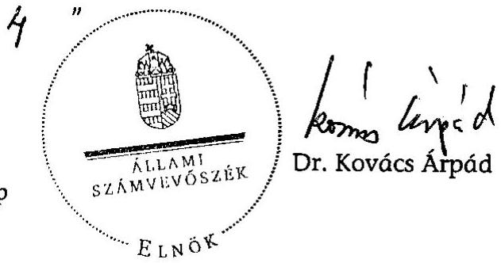

Melléklet: $\quad 9 \mathrm{db} \quad 17$ lap

---

Mellékletek

---

# A jelentésre tett miniszteri észrevételek és ÁSZ elnóki válasz 

| $1 / a$. | Miniszterelnök: Hivatalt vezető miniszier megbizásából a: állomtitkár észrevétele |
| :--: | :--: |
| $1 / b$. | Egészségügyi miniszer észrevétele |
| $1 / c$. | Földmüvelésügyi- és vidékfejlesztési miniszter és:revétele |
| $1 / d$. | Közlekedési, hírközlési és energiaügyi rıiniszter észre'vétel: |
| $1 / e$. | Válasz a közlekedési, hírközlési és energiaügyi rıiniszter észrevéteLire |
| $1 / f$. | Honvédelmi miniszter észrevétele |
| $1 / \mathrm{g}$. | Igazsugügyi és rend észet: mir iszter észrevétele |
| $1 / \mathrm{h}$. | Környezetvédelmi és vizügyi miniszter észre vétel: |
| $1 / \mathrm{i}$. | Külügyminiszter észrevétele |
| $1 / \mathrm{j}$. | Oktatási és: kulturál s miniszter és:revé eele |
| $1 / \mathrm{k}$. | Önko: már yzati miniszter észrevétele |
| $1 / 1$. | Nemzeti fejlesztési és gazdasági miniszter észrevétele |
| $1 / \mathrm{m}$. | Szocićlis és munkaügyi rıiniszter észrevétele |
| $1 / n$. | Pénzügym: niszter észrevétele |

---

# 1/13. sz. melléklet 

a V-18-06:1/2007-2008. sz. jelentéshez

## MINISZTERELNÖKI HIVATAL ÁLLAMITTEÁR

B.t. szám: IX-15/5/16.2008.
Hiv. szán: V-08-058/2007-2008.

Dr. Kovács Árpád úrnak
elnök

Állami Szá nvevöszék
Budapest

Tisztelt Elrök Úr!
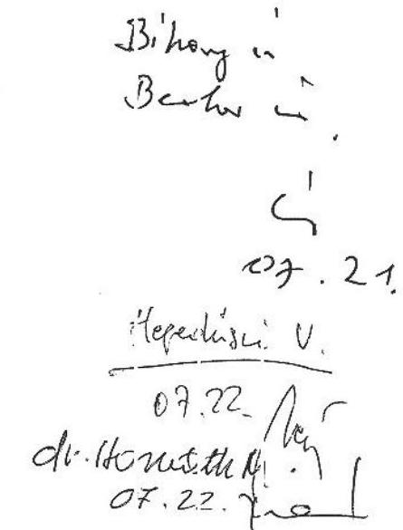

A fejezeti kezelcsű e.öirányzato: ren ́́szercnek zllenírzéséről kiszíte:t V0358 szononító számú jelentéssel kapcsolatban - Kiss Péter miniszter úr megbizása alapján - tėjékoztatom, hogy az ellenőrzés megállapításaira a Miniszterelnöki Hivatal észrevételt nem tesz.

Tájékoztato n továbbá, hogi az ellenčrzés megállapításai a apján a Minisztrelnćkség fejezetnek intézkedési kötelezettsige nem keletkezett.

Budapest, 2008. július 10.

Tiszte ettel:
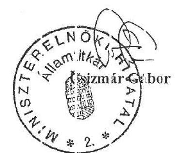

---

# 1/b. s.t. melléklet 

a V-18-0t-3/2007-2008. s.t. jelentéshez

EGÉSZSÉGÜGYI MINISZTÉRIUM MINISZTER

Iktatószám: 4955-4/2008-0006 KTF
Hivatkozási szám: V-18-058/2007-2008.

Dr. Kovács Árpád úrnak
elnök

Állami Számvevíszéls
BL.DAFEST
Apáczai Csere János t. 10.
1052

Elöacó: Domosos Sándor
Telefon: 301-7906
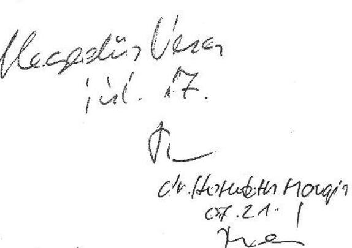

## Tisztelt Enök Úr!

Az Egészségügyi Miniszté:ium 2005-2007. évi fejezeti kezelésũ elő rányzatok rendszerének elenőzés során mutatott egyitttmüködésüket, segitőkészségüket köszönjük. A fenti livatlozási szimú (V 3358 vizsgálati azonosító és 886 tém aszámú) „a fejezeti ke:elésú eléiránrzatck rendszerének ellenőrzíséről" szóló számvevöi jelentés iervezetre észrevételt nem teszek.

A jelentésben megfogalmazott javaslatokra tárcánk kü ön intézkedési tervet nem állít össze a következök rniatt. A fejeze ek felügy eletet ellató szervek vezetői részére tett c. javaslatból csak a 2. pont é:inti tárcinkat. A belső ellenőrzis személyi feltételeinek javitását - a köztisz:viselői illáshelyek rögzitettsége miatt - elsősorban killső szakértők, illetve cégek bevonisával tervezzük végrehajtani.

A többi pontban tircáak nem érintett. Az ÁSZ részére nyú tandó adatszol gálta ásaink jellemzően határidőre történnek, az „Ưvegzseb" törvé yben elöirt közzétcteli sotelezettségének tárcánk - a jelentés sze int is - clege: tess, valamint a több jelentsező közül kiválasztandó támogatásos döntési mechanizmusát a pályazati rendızerünk megfelelően tuclja támogatni.

Bucapest, 2008. július „, 14 ,,

Üdvözlettel:
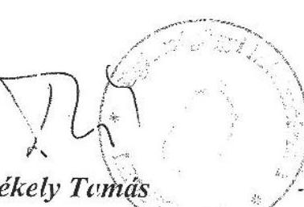

---

$V-18-061-0071207-2008$.
1/c. az. melléklet
a V-18-C63/2007-2008. sz. jelentéshez

FÖIDMÖVELÉGÜGYI ÉS VIDÉKFEJLESZTESI MINISZTER

Ugviratszám: 36025/2/2008.
hiv. szám: V-18-758/2007-2008

Dr. Kovics Árpád
elnök úr részére
Állami Számvevös:ék
Bucapes:

Tisztelt Elnök Vir!

Bihang
Bech
$07.21$.
Hepetín $i$
07.22. /iC
dr. Pouszlth.
05.22

Hivatkozott levelére válaszolva ezúton tájékcztaton, hogy a fejezeti kezelési előirányzatok rencszerének ellenőrzéséről készített Jelentést áttckintcttem arra vonatkozJan észrevételt nem eszek.

Budapest, 2003. júl us $16^{\circ}$.

Tisz elettol:
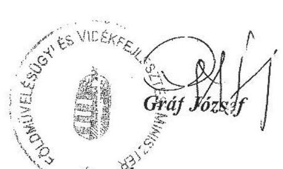

---

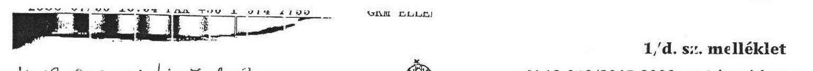

KÖ CLEKEC ÉSI, HÍUKOZLISI ÉS EJERGLY OGYI HINISZTÉKIUM MINIECER

Kovács Árpád
elnćk úr
részére
Állami Számvevőszék
Burlapest

Tisztelt Elnčk Úr

Köszön ettel megkaptam a „fejezeti kezelésti elöirányzatok lezelásének" ellanörzésénól készülteti jelentés-ervezetet

A jelentés-tervezet mind megálapításaiban, minc javaslatalban segiti a minisztáriumot a közpénzekkel való hatékony, átlátható és erceményes gazdállodásának, a további fejlesztését a fejezeti kezelésú elöirányzatok tekintetében.

Köszönetemet fejezem ki a korábbar megküldött észreveteleink kerrekt kezelésében, mely egyetlen elvi álláspont különbség további fennálásával zárult. A kézhezvett válaszlevelük szerint eiten megállapításusst továbbra is fennartják, hogy cülsze ütleri volt a GEM-nál az információs tá sadelommal összefüggő és távkötési feladatok megvalósítását szolgalo előirányzatok kezelése. Elismerve a Számvevőszék jogszabályokon alaculó önálló véleményfornáló jogkörét, kérem a túrca álláspontját is - a lábjegyzetben - megjeleníteni szíveskedjen az eltérő vélemények akceptálásának okán.

Tájékoztatom, hogy a részenre is megfogalmazott javaslatokra a jogszabályban elölrt határ döben megküldöm az intézkedési tervet.

Budapest, 2008. július „JE"

Ödvözlettel:
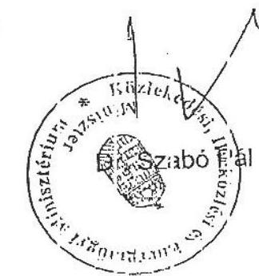

---

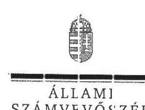

Ikt.szám: V-18-062/2007-2008.

Dr. S:abó Pál ú:
miniszter
Közlekedési, Hírközlési és Energiaügy Minisztér um

# Tisztelt Miniszter Úr: 

A fejszeti kezelésű clőirányzatok rendszerének ellenőrzéséről isészített jelentésünkhöz tett észrevételét megköszönöm.

Annal: alapján a jogelőd minisztériumal az inormációs társadalonmal összefüggő feladatokra szo gáló fejezeti cezelésű előirányzatok célszerütlen kezelés-megosztására vonatlozó, a jelentés 44. oldal utolsó belcezdéébe foglalt meitállapításurkat lábjegyzettel egészitem ki.

Megállapítcsunk szerint: „Nem volt célszerü a GKM-né. az azonos, infokommunikációs jeladctcsoportokioz tartozc elöirányzatoknak a különbözö szakellamtitkárságok alá rendelt szervezeti egységek általi kezelése.".

A tárca álláspontját tükröző látjegyzet szơvege az alábbi: „ ${ }^{51}$ A minisztcrium álláspontja (forrás: 2008. június (4-én kelt k:bline fönöi: leveil) szerint az elöirányzatok jeletti felügyelet a tárcááal az adott szakállamtitkársáit által el'átott feladatokioz igazocott, vagyis nem jeltétlennül cz elöirányzatok által támog:itott jeladet volt az irányaaó a felosztćsnál."

Budapest, 2008. július "S4 ".
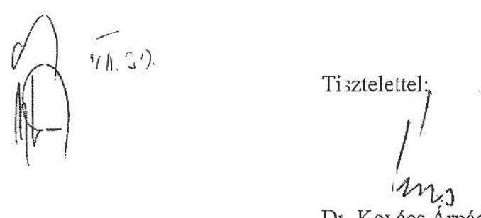

---

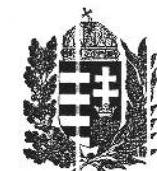

MAGYAR KÖZTÁlKSASÁG
HONVÍDELMI MINISZTERE
Nyt. szim: 729-60/2008 HM KPÜ
Hiv. szim: V-18-058/2007-2008. ÁSZ

1/f. sz. melléklet
a V-18-062/2007-2008. sz. jeler.téshez

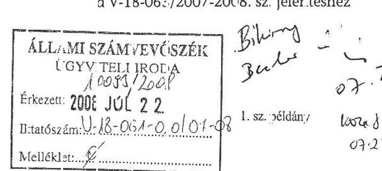

Lr. Kovács Árpád úr
az Állami Számvesőszék
elnöke

Bulug
3ul
07.1
07.2

Budapest

Targy: Jelentés vé eményczése

Tisztelt Elnők Úr

A fenti hivatkozási számú ügyiratioz csatoltan megkülcött, a fejezeti kezelésű előirányzatok rendszerének ellenőrzéséről szóó jelentést (nyt. szám V-18-058/2007-2008. ÁSZ) szalköze zeimrrel át anulmányoztattam, azzal kapcsolatban a Hv tárza vonatkozásában észrevetelt nem teszek.

Budapest, 2008. július 24 - n.

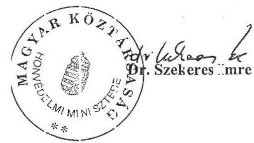

Készült: 2 példányban
Egy péld iny: 1 lap
Üg:intéző (☑): Berkes alez. (268-10)

H-1885 BUDAPEST. PE: 25. • TEL.: (36-1) 474-1104 • FAX: (36-1) 474-1285

Page 7/15

---

U-18-C61-006/2007-2008.

1/g. sz. melléklet
a V-18-063/2007-2008. sz. jelentéshez

IGAZSÁGÜCYI ÉS RENÜÉSZETI MINISZTÉRIUM
Igazságügyi és rendszeti miniszter

Ugyintcző: dr. Pintér Fereniné
telefon: +36 (1) 441-3973
teleax: +36 (1) 441-3791
e-mail: PinterF@irm.gov.hu
hiv. szám: V-18-051/2007-2008.
ügyintéző:ük: -

1/20/2008
Ikrintszám: B0080F0913-22208
RTV

Dr. Kovács Árpád eínők úr

Állami Számvuvőszé c
Budapest, V.
Apáczai Csere János u. 10.
1052

Melléklet:
Tárgy: Fejezeti kezelésű előirányzatok rendszerének ellenőrzééről kiszített ÁSZ, jelentés-tervezet

Tisztelt Elnök Úr!

A:: Állami Számvevőszék részéről hivatkozott számon mezküldött „Fejezei kezelésű előirányzatok rendszerének ellenőrzéséről" szóló jelentést kűszöntetl megkastam.

A jelentésre a XIV. Igazságügyi és Rendészeti Minisztérium fejezet részéről észrevételt nem teszünk. Tájékoztatom Elnök Urat, hogy az Állami Számvuvőszék szamvevőinel: a jelentésben tett szakmai megállapításait a minisztérium szakterületei a működésük során hiszoncítják.

Tisztclette!:

Budapest, 2008. július 10.

Dr. Dráskevics Tibor

melléklet: 1088. Budapest Tiszte hánice tér 4. Postafélér im: 1363 Budapest, Pf.: 54.

Page 8/15

---

# 1/h. sz. melléklet 

a V-18-053/2007-2008. :z. jelentéshez

## Dr. Kovács Árpád ur

## Elnük részére

## Állami Számvuvőszék

## Budapest

Apázzai Csere János utca 10.
1053

Tisztelt Elnök l'́r!
A fejezeii kezelési elćirány:tatok rencszeréröl lészített, V-18-(158/2007-2008. számú jelentésre észrevételt nem teszel:.

Az ellenőzés alapján elrendelt intézkedéseikröl - az clőirt határidőben -tájé cozta:om.
Murkatár sai segitő közremüködését riegkészönöm.
Budspest, 2008. július „//, ,

Tiiztele tel:
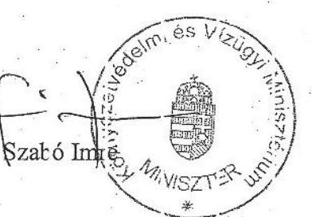

---

# 1/i. sz. melléklet 

a V-18-063/2007-2008. sz. jelentéshez
Ict.sz: 112321 A D H. KI. H. 2008.

MAGYAF. KÖZTÁRSASÁG
KULÜGYMI VISZTERE

Dr.Kovács Árpád
elnök
Állami Számvevőszék
Budapest

Tisztel: Elnök Úr!

## 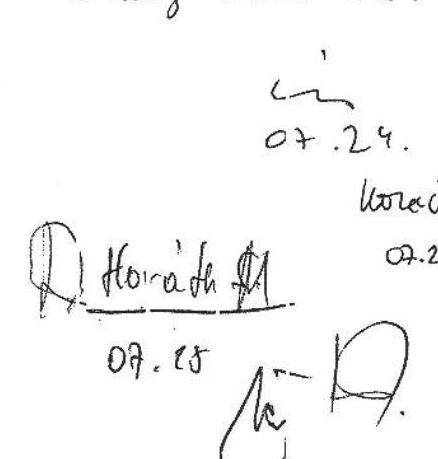

A V-18-058/2007-2008. ikt. számmal ellátott fejezeti kezelésű eloirányzatok rendszerének ellenőrzéséről készített jelentést megkapıam, a jeler tésbe a foglaltakra észrevételt nem teszek.

Budapest, 2008. jú ius 10.

Tisztelettel:
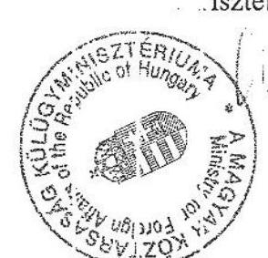

Dr Göncz Kinga

---

# 1/j. sz. melléklet 

a V-18-063/2007-2008. sz. jelentéshez

## Oktatási és Kulturális Minisztérium Minisster

Ikt. szám: 19761/20)8. of. 4
Hiv.sám: $1 /-18-(58 / 2007-20) 8$.

Dr. Kovics Áspád clnök úr részére

Áliami Számvevöszék

## Budapest

## Tisztelt Elnök Úr!

Fe ati hi atko:ási számú, a fejezeti lezelésủ elóirányzatok rendszerér ek ellenőrzéséről készült jelzntésüket köször ettel :negkuptam.
Technikai jel egủ uszrevételünk a elentisen itvezutésre került, így arra tovàl bi észrevé elt ne n tes:ek.

Elnők ú és munkalársai eddigi együttműcödését ezúton is megköszönöm.

Bıdapest, 2008. július 15.
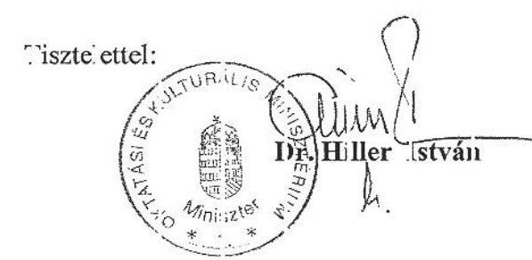

---

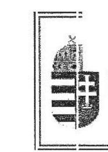

ÖNKORMÁNYZATI MINISZTIR

Ikt:tószám: ÖM/10062/1 (2008)

Hivatkozási szám: V-18-(58/2007-2008

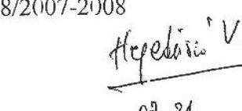

Dr. Kovács Árpád úr
elnök részére
Állami Számlevőszék

Budapest

1/k. sz. melléklet
a V-18-063/2007-2008. sz. jelentéshez
"KUVUUU. 21hars"
"Kir. 11. 19. 19. 21.

Dr. Kovács Árpád úr
elnök részére
Állami Számlevőszék

Budapest

18. 21. 21. 21.

Tisztelt Elnök Úr!

A fejezeti kezelési előirányzatok rendszerének ellenőrzéséről készített jelentést köszönettel megkapam.

Az ellerőrzés megállapításaira észrevételi nem teszek.

Budapest, 2008. június '...

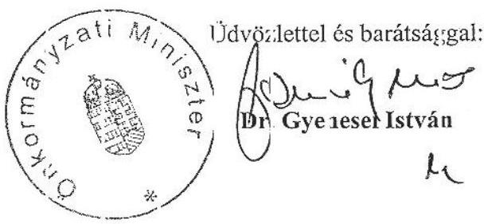

Clm: 1051 Budapest, József Attila u. 2-4. postacím: 1903 Budapest, Pf.: 314

Page 12/15

---

# 1/1. sz. melléklet 

a V-18-063/2007-2008. sz. jelentéshez

## N:MZETI FEJLLSZTÉS ES GnZDASAGI MINISZTIRUM MINISZTIR

Ikta:öszán:NFGM/33K/3/2008.
Hiv. szám V-18-358/2007-2008.
Dr. Kovács Árpád úr
elnök

Állami Számvevêszék
Budapest
Apáczai Csere János Ltca 10.
1032

Tisztelt Elnčk Úr!

Bihay-Becher mat
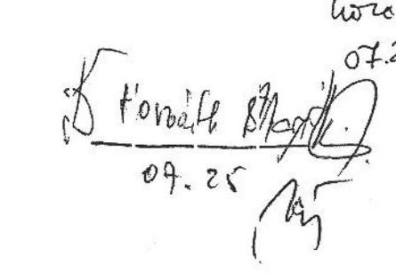

Kčszönettel vettem „a fejezeti kezelissũ clöirányzatok rendszerénok ellenörzéséröl" szóló jelentést. A. jelentésre észrevételt nem :eszek, eryberı me!jkösıönörı, hcgy munkájukkal hoizájá ultak a fejezeti clöirányzatok kezelissénok hatékcnyabbá tételéhezz.

A jóváł agyott jelentésben megfogalmazott javıslatckra intézkedési tervet készitünk, és arró a tájékoziatás: 30 naporı belül megküldöm.

Budapust, 2008. úlius „23.

Üclvözluttel:
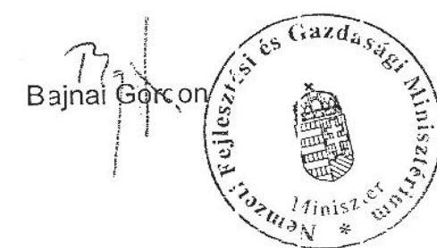

---

V-A8-051-00h/6007-2008.

I./m. sz. melléklet
a V-18-063/2007-2008. sz. jelentéshez

Szociális és Munka ügyi Minisztér um
Miniszter

Át 124/2008.

Ikt.sz.: 14.12.53.-1......./2008-SZMM

Dr. Kovács Árpád
Elnök: úr részére

Állami Számvevőszék

1052 Budapest
Apáczai Csere János u. 10.

Tisztelt Elnök Úr!

Hivatkozva V-18-058/2007-2008. számú ügyiratára, tájékoztatom, hogy a fejezeti kezelési előirányzatok rendszerének ellenőrzéséről készített jelen tésükre észrevételt nem teszek.

Budapest, 2008. július 14.

Üdvözlettel:

Szűcs Erika

Levélcím: 1054 Budapest, Alkotmány utca 3. Telefon: (+36-1) 472-4200, Internet: www.szmm.gov.hu

Page 14/15

---

# H-1051 B JDAPEST V., JÓZSEF NÁDOR TÉR 2-4. FOSTA! 

A V-18-(63/2)07-2008. sz. jelentéshez

TELEFON: (36-1) 327-2159, (36-1) 327-2141
FAX: (36-1) 318-0738
PENZÜGYMINISZTIR

Dr. Kovács Árpád ír
elnök

Á. lami Számvevőszék

## Budapest

T.sztelt Elnök Úr!

Tájékoztatom, hojy a frjezeti kezelésű clőirányzatck ren lszerének ellenőrzésér 3l készült számvevői jelenté ihez észrevételt nem teszün c.

Eudapest, 2008. jillius 0 .

Üdvözlettel:
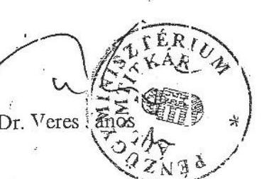

---

|   |  | 2005. év |  |  | 2006. év |  |  | 2007. év |  |   |
| --- | --- | --- | --- | --- | --- | --- | --- | --- | --- | --- |
|  AHTT | Megnevezés | Eredeti
kiadási
előirányzat | Módosított kiadási előirányzat | Teljesítés | Eredeti kiadási előirányzat | Módosított kiadási előirányzat | Teljesítés | Eredeti kiadási előirányzat | Módosított kiadási előirányzat | Teljesítés  |
|  ME fejezet |  |  |  |  |  |  |  |  |  |   |
|  237555 | Bolyai Műhely Közhasznú Alapítvány támogatása | 50000 | 95000 | 95000 | 20000 | 20265 | 10000 | 10000 | 35297 | 35265  |
|  242678 | Kormányzati informatikai fejlesztési kötelezettségek | 2250000 | 3012176 | 1596006 | 1000000 | 2112607 | 1637692 | 500000 | 1047133 | 562240  |
|  243678 | Kisebbségi intézmények átvételének és fenntartásának támogatása |  |  |  |  |  |  | 70000 | 107009 | 66219  |
|  249445 | Közszolgálati és közigazgatási minőségfejlesztési feladatok | 60000 | 89720 | 54198 | 40000 | 74294 | 37761 | 26700 | 70670 | 32753  |
|  252234 | Puskás Tivadar Közalapítvány |  |  |  |  |  |  | 40000 | 5076000 | 5076000  |
|  257012 | Európa Terv projektejeinek megvalósítása | 700000 | 574908 | 925 | 165300 | 577296 | 577274 | 0 | 22 | 22  |
|  272167 | Köztisztviselői továbbképzési rendszer és vezetőképzés támogatása |  |  |  |  |  |  | 150000 | 5302 | 1161  |
|  272178 | Kormányzati személyügyi feladatok támogatása |  |  |  |  |  |  | 250000 | 29799 | 7882  |
|  272012 | Új Magyarország Fejlesztési Terv Elektronikus Közigazgatás Operatív Program |  |  |  |  |  |  | 976000 | 976000 | 0  |
|   | Összesen | 3060000 | 3771804 | 1746129 | 1225300 | 2784462 | 2262727 | 2022700 | 7347232 | 5781542  |
|  BM-ÖTM fejezet |  |  |  |  |  |  |  |  |  |   |
|  934 | Olimpiai felkészülés támogatása |  |  |  |  |  |  | 500000 | 500000 | 260650  |
|  29054 | Önkéntes tüzoltó egyesületek támogatása | 300000 | 324800 | 318323 | 210000 | 6477 | 6477 | 200000 | 200000 | 10000  |
|  208635 | Köztisztviselői továbbképzési rendszer és közigazgatási vezetőképzés működési feltételei | 390000 | 98432 | 31810 | 300000 | 78209 | 77499 | 0 | 3035 | 3034  |
|  219833 | Szabadidősport támogatása | 763000 | 1873930 | 713861 | 584000 | 1617079 | 1115628 | 345900 | 733510 | 324304  |
|  267156 | Cigányság lakáskörülményeinek javítása |  |  |  | 100000 | 100000 | 0 |  |  |   |
|  269834 | Vidékfejlesztési menedzserek foglalkoztatásának támogatása |  |  |  | 0 | 312355 | 211296 | 0 | 87959 | 30999  |
|  270745 | Központi informatikai kötelezettségek finanszírozása |  |  |  |  |  |  | 100000 | 100000 | 58590  |
|  273390 | Hozzájárulás a hivatásos állomány kedvezményes nyugellátásához |  |  |  |  |  |  | 514400 | 514400 | 257198  |

---

|   |  | 2005. év |  |  | 2006. év |  |  | 2007. év |  |   |
| --- | --- | --- | --- | --- | --- | --- | --- | --- | --- | --- |
|  AHTT | Megnevezés | Eredeti
kiadási
előirányzat | Módosított kiadási előirányzat | Teljesítés | Eredeti kiadási előirányzat | Módosított kiadási előirányzat | Teljesítés | Eredeti kiadási előirányzat | Módosított kiadási előirányzat | Teljesítés  |
|  242701 | Területrendezés |  |  |  | 207900 | 252324 | 165954 | 100000 | 186665 | 83575  |
|  243734 | Kistérségi fejlesztési tanácsok és munkaszervezeteik támogatása |  |  |  | 840000 | 1097250 | 1093402 | 840000 | 843848 | 116764  |
|  253490 | Kistérségi megbízott hálózat müködtetése |  |  |  | 0 | 52000 | 52000 | 0 | 1 | 1  |
|  257690 | Vásárhelyi Terv továbbfejlesztése |  |  |  |  |  |  | 2701000 | 3943000 | 1177629  |
|  257701 | Kiemelt térségek területfejlesztése |  |  |  | 200000 | 463283 | 323505 | 20000 | 159778 | 119812  |
|  257767 | Információs szolgáltatások müködtetése |  |  |  | 241600 | 279817 | 279817 | 241600 | 241601 | 120800  |
|  258301 | Központi fejlesztési feladatok |  |  |  | 2216300 | 3378121 | 1770666 | 841600 | 1063266 | 472818  |
|  258312 | Decentralizált területfejlesztési programok |  |  |  | 8400000 | 23551152 | 18546178 | 12277300 | 14589994 | 8354530  |
|  272089 | Észak-alföldi Operatív Program |  |  |  |  |  |  | 2485000 | 2134000 | 0  |
|   | Összesen | 1453000 | 2297162 | 1063993 | 13299800 | 31188067 | 23642423 | 21166800 | 25301057 | 11390704  |
|  FVM fejezet |  |  |  |  |  |  |  |  |  |   |
|  29692 | Állattenyésztési feladatok | 1150000 | 1093851 | 1097969 | 1000000 | 977676 | 1025500 | 780000 | 788829 | 151952  |
|  206972 | Hegyközségek Nemzeti Tanácsa | 150000 | 135000 | 135000 | 135000 | 135000 | 135000 | 135000 | 135000 | 90000  |
|  241601 | Ágazati szakmai szervezetek és képviseletek támogatása | 650000 | 648000 | 570688 | 450000 | 521355 | 519032 | 300000 | 299322 | 18522  |
|  265701 | Bormarketing és minőség-ellenőrzés |  |  |  | 1500000 | 1500000 | 0 | 1500000 | 1500000 | 0  |
|  265978 | Nemzeti agrár kárenyhítés |  |  |  | 1400000 | 0 | 0 | 500000 | 500000 | 0  |
|  271545 | FAO intézmények finanszírozása |  |  |  |  |  |  | 250000 | 228100 | 0  |
|  271556 | Az elektronikus ügyintézés fejlesztése a KAP területén |  |  |  |  |  |  | 67300 | 67300 | 0  |
|  271767 | Magán és egyéb jogi személyek kártérítése |  |  |  |  |  |  | 10000 | 10000 | 108  |
|  249189 | Vidéki térségek fejlesztése |  |  |  | 8306700 | 9687937 | 9646071 | 10600000 | 10946317 | 5010903  |
|   | Összesen | 1950000 | 1876851 | 1803657 | 12791700 | 12821968 | 11325603 | 14142300 | 14474868 | 5271484  |

---

|   |  | 2005. év |  |  | 2006. év |  |  | 2007. év |  |   |
| --- | --- | --- | --- | --- | --- | --- | --- | --- | --- | --- |
|  AHTT | Megnevezés | Eredeti
kiadási
előirányzat | Módosított
kiadási
előirányzat | Teljesítés | Eredeti
kiadási
előirányzat | Módosított
kiadási
előirányzat | Teljesítés | Eredeti
kiadási
előirányzat | Módosított
kiadási
előirányzat | Teljesítés  |
|  IRM fejezet |  |  |  |  |  |  |  |  |  |   |
|  1964 | Rendészeti sportszervezetek támogatása |  |  |  | 40000 | 42000 | 40000 | 40000 | 42000 | 22000  |
|  25595 | A fogvatartottakat foglalkoztató gazdálkodó szervezetek támogatása | 332600 | 24438 | 0 | 150000 | 24438 | 24438 | 150000 | 0 | 0  |
|  236652 | Lakáscélú beruházás |  |  |  | 485500 | 53091 | 13386 | 100000 | 46605 | 0  |
|  249567 | Társadalmi bűnmegelőzéssel összefüggő kiadások, támogatások | 270000 | 516021 | 226760 | 178000 | 449847 | 303999 | 195100 | 341024 | 165776  |
|  258167 | Humánerőforrás-menedzsment fejlesztése a Belügyminisztériumban |  |  |  | 245400 | 380092 | 12050 | 41000 | 286746 | 139428  |
|  258178 | Küzdelem a szervezett bűnözés ellen |  |  |  | 820400 | 1301100 | 0 | 922400 | 1121627 | 416794  |
|  260545 | Nemzedékek Biztonságáért Alapítvány támogatása |  |  |  | 14000 | 15500 | 15500 | 14000 | 19000 | 12000  |
|  271667 | AENEAS program |  |  |  |  |  |  | 147400 | 155400 | 0  |
|   | Összesen | 602600 | 540459 | 226760 | 1933300 | 2266068 | 409374 | 1609900 | 2012402 | 755998  |
|  GKM fejezet |  |  |  |  |  |  |  |  |  |   |
|  15107 | Vasút-egészségügyi fejlesztések | 60000 | 889865 | 233425 | 120000 | 708659 | 681233 | 50000 | 57695 | 25588  |
|  258190 | Informatikai, hírközlési szervezetek támogatása |  |  |  | 0 | 45000 | 45000 |  |  |   |
|  258201 | Közháló program |  |  |  | 4017000 | 9319463 | 8103234 | 3540000 | 4665595 | 3667962  |
|  258789 | Magyar vállalkozások tőzsdei bevezetésének támogatása | 100000 | 100226 | 0 | 100000 | 175226 | 71866 | 100000 | 226055 | 96693  |
|  270501 | A közösségi közlekedés összehangolt fejlesztése |  |  |  |  |  |  | 788000 | 1208640 | 745800  |
|  270534 | Infokommunikációs stratégiák és programok megalapozása |  |  |  |  |  |  | 80000 | 80000 | 498  |
|  270601 | Közpolitikai kutatások, elemzések |  |  |  |  |  |  | 49000 | 99000 | 24750  |
|  270634 | e-Információzabadság |  |  |  |  |  |  | 67000 | 82000 | 24629  |
|  246401 | Átfogó szakértői segítségnyújtás vasúti projektek pályázati eljárásához és ell. |  |  |  | 0 | 369133 | 144690 | 0 | 190000 | 135027  |
|   | Összesen | 160000 | 990091 | 233425 | 4237000 | 10617481 | 9046022 | 4674000 | 6608985 | 4720947  |

---

|   |  | 2005. év |  |  | 2006. év |  |  | 2007. év |  |   |
| --- | --- | --- | --- | --- | --- | --- | --- | --- | --- | --- |
|  AHTT | Megnevezés | Eredeti
kiadási
előirányzat | Módosított
kiadási
előirányzat | Teljesítés | Eredeti
kiadási
előirányzat | Módosított
kiadási
előirányzat | Teljesítés | Eredeti
kiadási
előirányzat | Módosított
kiadási
előirányzat | Teljesítés  |
|  KvVM fejezet |  |  |  |  |  |  |  |  |  |   |
|  220987 | Távlati ivóvízbázisok fenntartása | 50000 | 0 | 0 | 50000 | 0 | 0 | 0 | 0 | 0  |
|  256534 | Hulladékkezelési- és gazdálkodási feladatok | 3374000 | 2473510 | 390528 | 1907000 | 2120837 | 1746980 | 166900 | 288086 | 93937  |
|  256556 | Országos Környezeti Kármentesítési
Program végrehajtása | 4500000 | 0 | 0 | 3700000 | 7697000 | 7692000 | 5009500 | 78082 | 0  |
|  259523 | Társadalmi szervezetek támogatása | 200000 | 200000 | 113841 | 200000 | 286160 | 225060 | 0 | 15250 | 13950  |
|  271145 | Madárvédelmi és élőhelyvédelmi irányelvnek megfelelő monitorozás és területkezelés előkészítése |  |  |  |  |  |  | 333500 | 333500 | 0  |
|  271156 | Magyarországi felszíni vizek hidromorfológiai monitoringjának fejlesztése |  |  |  |  |  |  | 163500 | 163500 | 0  |
|  271167 | Hütéstechnikai Alkalmazásokat Ellenőrző Országos Intézményrendszer kifejlesztése |  |  |  |  |  |  | 68100 | 68100 | 0  |
|  249501 | Vásárhelyi terv továbbfejlesztése | 8000000 | 12584869 | 4532680 | 5700000 | 14637250 | 6801352 | 4924400 | 7877898 | 3853747  |
|  245078 | Környezetvédelmi projektek előkészítése |  |  |  | 0 | 430827 | 240387 |  |  |   |
|   | Összesen | 16124000 | 15258379 | 5037048 | 11557000 | 25172074 | 16705778 | 10665900 | 8824416 | 3961635  |
|  OM-OKM fejezet |  |  |  |  |  |  |  |  |  |   |
|  236377 | Egyházi Kulturális Alap támogatása |  |  |  | 430000 | 833962 | 406092 | 0 | 0 | 0  |
|  244589 | Kulturális szaktörvényből adódó feladatok és kötelezettségek |  |  |  | 320000 | 330743 | 276313 | 200000 | 154430 | 152943  |
|  255634 | Gyógypedagógiai tankönyvellátás, sajátos nevelési igényű gyerekek támogatása | 120000 | 120000 | 42162 | 68000 | 151056 | 145837 | 141000 | 140254 | 101421  |
|  255656 | Közoktatás-fejlesztési stratégia célprogramjainak támogatása | 180000 | 81515 | 64015 | 97000 | 164962 | 108851 | 300000 | 450317 | 440072  |
|  256101 | Művészetek Palotája megvalósításával és működésével kapcsolatos kiadások |  |  |  | 2400000 | 820754 | 820754 | 8800000 | 0 | 0  |
|  270267 | Kulturális közhasznú társaságok által ellátott feladatok támogatása |  |  |  |  |  |  | 4000000 | 5503317 | 5499202  |
|  271478 | Közkultúra, kulturális vidékfejlesztés támogatása |  |  |  |  |  |  | 685000 | 527811 | 480474  |
|  272745 | Közoktatási ellenőrzési, pályázatlebonyolítási feladatok |  |  |  |  |  |  | 300000 | 55135 | 23000  |

---

|   |  | 2005. év |  |  | 2006. év |  |  | 2007. év |  |   |
| --- | --- | --- | --- | --- | --- | --- | --- | --- | --- | --- |
|  AHTT | Megnevezés | Eredeti
kiadási
előirányzat | Módosított
kiadási
előirányzat | Teljesítés | Eredeti
kiadási
előirányzat | Módosított
kiadási
előirányzat | Teljesítés | Eredeti
kiadási
előirányzat | Módosított
kiadási
előirányzat | Teljesítés  |
|  266323 | Társadalmi kirekesztés elleni küzdelem a munkaerőpiacra történő belépés segítésére OKM intézkedés |  |  |  | 2318300 | 2478300 | 1731250 | 1670000 | 1973245 | 2059100  |
|   | Összesen | 300000 | 201515 | 106177 | 5633300 | 4779777 | 3489096 | 16096000 | 8804509 | 8756212  |
|  EÜM fejezet |  |  |  |  |  |  |  |  |  |   |
|  256578 | Egészségügyi modernizációs feladatok | 2029300 | 1147501 | 405123 | 0 | 736849 | 732567 | 0 | 4281 | 4281  |
|  263978 | Egészségügyi ellátási és fejlesztési feladatok |  |  |  | 1578100 | 1536018 | 690404 | 3082500 | 4079082 | 1070576  |
|  263989 | 21 lépés az egészségügy megújításáért |  |  |  | 1950000 | 2518439 | 311559 | 0 | 2206883 | 2206802  |
|  263990 | Belső pénzügyi ellenőrzési tevékenység hatékonyságának fokozása az ÁNTSZ-ben |  |  |  | 62100 | 62100 | 0 | 16000 | 68100 | 0  |
|  266189 | Egészségügyi Fejlesztési Előirányzat |  |  |  | 1000 | 0 | 0 | 1000 | 1000 | 0  |
|  270801 | Légimentés működtetésének támogatása |  |  |  |  |  |  | 800000 | 0 | 0  |
|  270834 | Regionális ágazati feladatok támogatása |  |  |  |  |  |  | 49000 | 49000 | 0  |
|  271889 | Kisforgalmú gyógyszertárak működtetési támogatása |  |  |  |  |  |  | 1228500 | 1228500 | 350000  |
|  266390 | Társadalmi kirekesztés elleni küzdelem a munkaerőpiacra történő belépés segítésére EÜM intézkedés |  |  |  | 1445000 | 1525000 | 894297 | 1670000 | 1856873 | 259177  |
|   | Összesen | 2029300 | 1147501 | 405123 | 3591200 | 4853406 | 1734530 | 5177000 | 7636846 | 3631659  |
|  FMM-SZMM fejezet |  |  |  |  |  |  |  |  |  |   |
|  211244 | Képzéssel támogatott közmunkaprogram | 3050000 | 4873814 | 3863895 | 5745200 | 7581929 | 6990130 | 3100000 | 5581123 | 2154239  |
|  228554 | Kábítószer problémával kapcsolatos képzés, továbbképzés, kortársképzés támogatása |  |  |  | 0 | 105 | 0 | 0 | 105 | 0  |
|  233628 | Fogyatékos személyek országos és regionális szervezeteinek támogatása |  |  |  | 70000 | 96104 | 61434 | 61000 | 95806 | 34670  |
|  247001 | PHARE és ESZA típusú programok végrehajtó szervezeteinek működtetése | 687000 | 924250 | 703893 | 501100 | 717957 | 688957 | 0 | 29000 | 29000  |
|  250223 | Márton Áron Szakkollégiumért Alapítvány -
Agora Irodahálózat működtetése |  |  |  | 35000 | 35000 | 35000 | 10000 | 10000 | 0  |
|  268990 | Gyermekjóléti és gyermekvédelmi szolgáltatások fejlesztése |  |  |  |  |  |  | 300000 | 300000 | 0  |

---

|   |  | 2005. év |  |  | 2006. év |  |  | 2007. év |  |   |
| --- | --- | --- | --- | --- | --- | --- | --- | --- | --- | --- |
|  AHTT | Megnevezés | Eredeti
kiadási
előirányzat | Módosított
kiadási
előirányzat | Teljesítés | Eredeti
kiadási
előirányzat | Módosított
kiadási
előirányzat | Teljesítés | Eredeti
kiadási
előirányzat | Módosított
kiadási
előirányzat | Teljesítés  |
|  271267 | Hálózatfejlesztési központok és szociális képzések, felkészítési feladatok támogatása |  |  |  |  |  |  | 145000 | 145000 | 0  |
|  271512 | Foglalkoztatás és szociálpolitikai információs és tanácsadó szolgáltatások |  |  |  |  |  |  | 150000 | 150000 | 2500  |
|  257045 | Társadalmi kirekesztés elleni küzdelem a munkaerőpiacra történő belépés segítésével |  |  |  | 2957000 | 3883376 | 3256390 | 1670000 | 2215400 | 1285987  |
|   | Összesen | 3737000 | 5798064 | 4567787 | 9308300 | 12314471 | 11031912 | 5436000 | 8526434 | 3506395  |

---

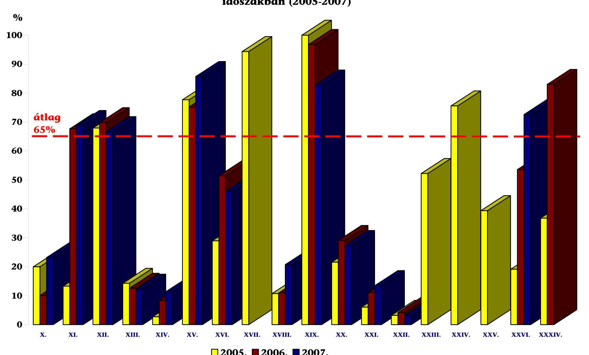

**3. sz. melléklet** a V-18-063/2007-2008. sz. jelentéshez

## **A fejezeti kezelésű előirányzatok teljesített kiadásai arányának alakulása a vizsgált időszakban (2005-2007)**

|  Kérelme | 2005. | 2006. | 2007.  |
| --- | --- | --- | --- |
|  átlag | 65% | 65% | 65%  |
|  kéklet | 61% | 61% | 61%  |
|  sz. melléklet | 61% | 61% | 61%  |
|  sz. fejezet | 61% | 61% | 61%  |
|  felhívás | 61% | 61% | 61%  |
|  felhívás | 61% | 61% | 61%  |
|  2005. | 2006. | 2007. | 2008.  |

---

**4. számú melléklet** a V-18-063/2007-2008. sz. jelentéshez

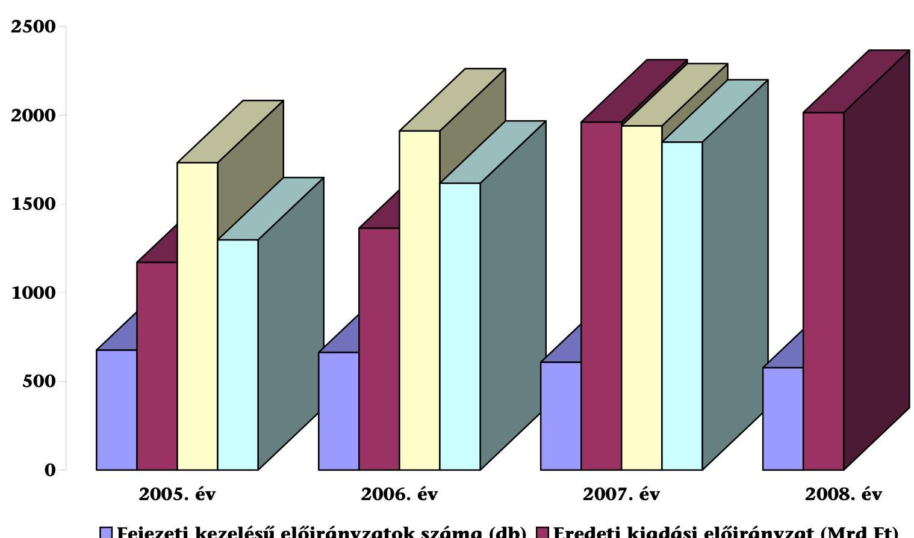

**A fejezeti kezelésű előirányzatok számának (db) és kiadási előirányzatainak (Mrd Ft) alakulása 2005-2008 között**

---

# A fejezeti kezelésű előirányzatokat érintő korábbi ÁSZ ellenőrzések javaslatai 

## A.

## Kivonat a vizsgálathoz kapcsolódó korábbi ÁSZ jelentések releváns javaslataiból

## JELENTÉS a Földmúvelésügyi és Vidékfejlesztési Minisztérium fejezet múködésének ellenőrzéséről (0710. számú jelentés)

## Javaslat a földmúvelésügyi és vidékfejlesztési miniszternek:

Gondoskodjon a költségvetési gazdálkodási tevékenységén belül a „központosított bevételekből finanszírozott intézményi feladatok előirányzat" intézményi költségvetésbe integrálásáról, a top-up előirányzat önálló költségvetési soron történő megjelenítéséről, a fejezeti kezelésű előirányzatok teljesítményszemléletű, a támogatási célok teljesülését tartalmazó jogcímenkénti értékeléséről.

## JELENTÉS a Területfejlesztés fejezet múködésének ellenőrzéséről (0603. számú jelentés)

## Javaslat a Kormánynak:

Vizsgálja felül a területfejlesztési célokat nem tartalmazó feladatok és előirányzatok Területfejlesztés fejezet keretei közötti ellátásának indokoltságát, ill. intézkedjen célkitűzéseik között a területfejlesztési szempontok megjelenítéséről.

## Javaslat a területfejlesztésért felelős tárca nélküli miniszternek:

Intézkedjen a pályázatos támogatási rendszerek EU követelményeknek megfelelő, a ROP eljárásrendjéhez igazodó kialakításáról, a támogatások felhasználását, ill. hasznosulását nyomon követő nyilvántartási, valamint monitoring rendszer kiépítéséről, a beszámolási rendszer teljesítmény szemletűvé tételéről, az adatbázisok megbízhatóságának, egyeztetési rendszerének, biztonságos kezelésének, ellenőrzésének kialakításáról, továbbá gondoskodjon a programdokumentumok elkészítésére és megküldésére vonatkozó rendelkezések végrehajtásáról.

Építse ki a támogatások hasznosulásának eredményét bemutató, a regionális társadalmi és gazdasági elmozdulások nyomon követését biztosító monitoring rendszert.

Vizsgálja felül a Regionális Fejlesztés Operatív Program folyamatos elbírálási rendszerét a szakmailag megfelelőnek elbírált, és a régiók fejlesztési célkitűzéseivel összhangban álló projektek megvalósíthatósága érdekében.

---

Kiemelten kísérje figyelemmel a fejezet által kezelt, EU forrásokból megvalósuló támogatások hazai társfinanszírozásának biztosítását.

JELENTÉS az államháztartáson kívüli állami feladatellátás rendszerének ellenőrzéséről (0467. számú jelentés)

Javaslat a fejezet, Alap felügyeletét ellátó szervezet vezetőjének:
Vizsgálja felül a fejezet által nyújtott támogatások rendszerét, intézkedjen a pályázati úton biztosított támogatások egységesítésére, illetve az egyedi döntések eljárási rendjének kialakítására.

# B. 

Kivonat a Magyar Köztársaság költségvetéséről szóló ÁSZ vélemények és a Magyar Köztársaság költségvetése ellenőrzésének végrehajtásáról szóló ÁSZ jelentések releváns javaslataiból

VÉLEMÉNY a Magyar Köztársaság 2006. évi költségvetési javaslatáról (0550. számú jelentés)

Javaslat a Kormánynak:
Intézkedjen, hogy a 2006. évi költségvetésben, az FVM fejezeti előirányzatai között megtervezett Top-up önállóan, egy törvényi soron jelenjen meg.

VÉLEMÉNY a Magyar Köztársaság 2007. évi költségvetési javaslatáról (0641. számú jelentés)

## Javaslat a Kormánynak:

Intézkedjen, hogy az Állami Számvevőszék által évek óta kifogásolt, és a 2007. évi költségvetési törvényjavaslatban az FVM előirányzatai között, a „Folyó kiadások és jövedelemtámogatások" jogcímen megtervezett „Top-up" (hazai kiegészítő támogatás) - az átláthatóság és az ellenőrizhetőség érdekében - önállóan, egy törvényi soron jelenjen meg.

JELENTÉS a Magyar Köztársaság 2005. évi költségvetése végrehajtásának ellenőrzéséről (0628. számú jelentés)

Javaslat a gazdasági és közlekedési miniszternek és a honvédelmi miniszternek:

Vizsgálja meg, hogy a fejezeti kezelésű előirányzatok beszámolójelentésének megbízhatatlansága miatt kit terhel felelősség.

Javaslat a fejezetek, fejezeti jogosultságú költségvetési szervek felügyeletét ellátó szervek vezetőinek:

---

Növeljék a folyamatba épített előzetes és utólagos vezetői ellenőrzések hatékonyságát, valamint a fejezeti kezelésű előirányzatok ellenőrzését.

# JELENTÉS a Magyar Köztársaság 2006. évi költségvetése végrehajtásának ellenőrzéséről (0724. számú jelentés) 

## Javaslat a pénzügyminiszternek:

Kezdeményezze az Áht. 49. § o) pontjának módosítását annak érdekében, hogy a jogszabály egyértelműen határozza meg a fejezeti kezelésű előirányzatok évközi változása esetén - az államháztartásért felelős miniszterrel egyetértésben a szabályzat módosításának kötelezettségét, továbbá a jogszabály pontosítását annak érdekében, hogy előleg csak azoknál a fejezeti kezelésű előirányzatoknál legyen folyósítható, ahol ezt a hatályos belső szabályzat egyértelműen tartalmazza.

## Javaslat a fejezetek, fejezeti jogosultságú költségvetési szervek felügyeletét ellátó szervek vezetőinek:

Növeljék a folyamatba épített, előzetes és utólagos vezetői ellenőrzések hatékonyságát, valamint fejezeti kezelésű előirányzatok ellenőrzését.

Tekintsék át a fejezeti kezelésű előirányzatok követelés állományának belső szabályozását és tegyék meg a szükséges intézkedéseket, annak érdekében, hogy a követelések értékelése a jogszabályi előírásoknak megfeleljen.

---

**6. sz. melléklet**

a V-18-063/2007-2008. sz. jelentéshez

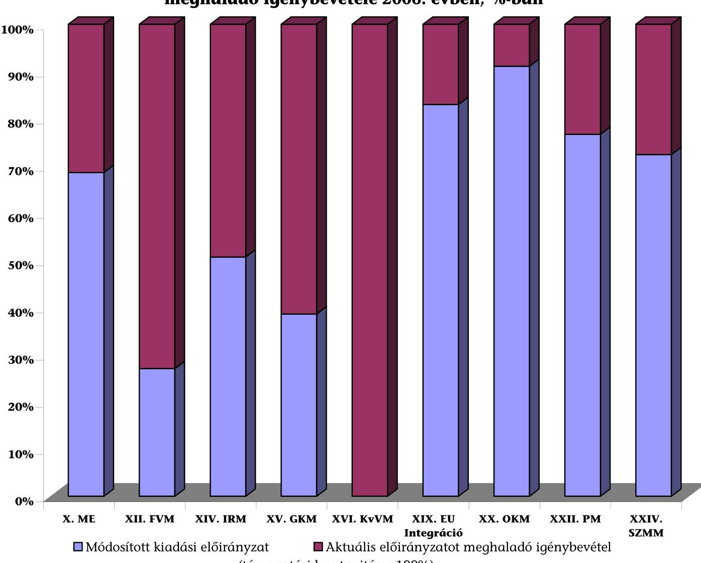

**Előirányzat-módosítás nélkül túlteljesíthető törvényi sorok aktuális előirányzatot meghaladó igénybevétele 2006. évben, %-ban**

---

# A fejezeti kezelésű előirányzatok felhasználásának folyamata 

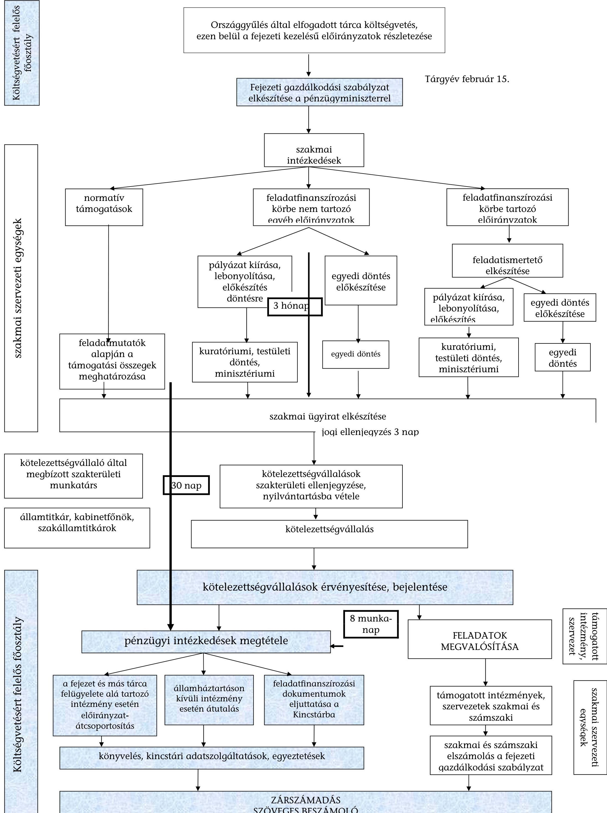

---

# A minisztériumi formában múködő fejezetek fejezeti kezelésű előirányzatai eredeti, módosított és teljesített kiadási előirányzatainak alakulása 

## Mrd Ft

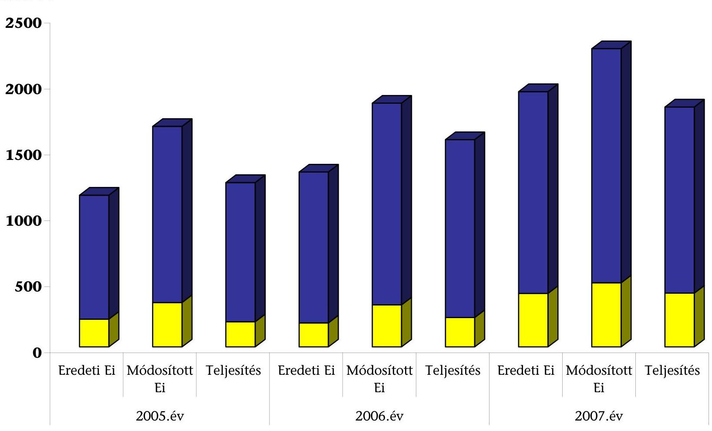

[^0]
[^0]:    ■ Feladatfinanszírozás keretében felhasznált előirányzatok Feladatfinanszírozáson kívül felhasznált előirányzatok

---

**9/a. sz. melléklet** a V-18-063/2007-2008. sz. jelentéshez

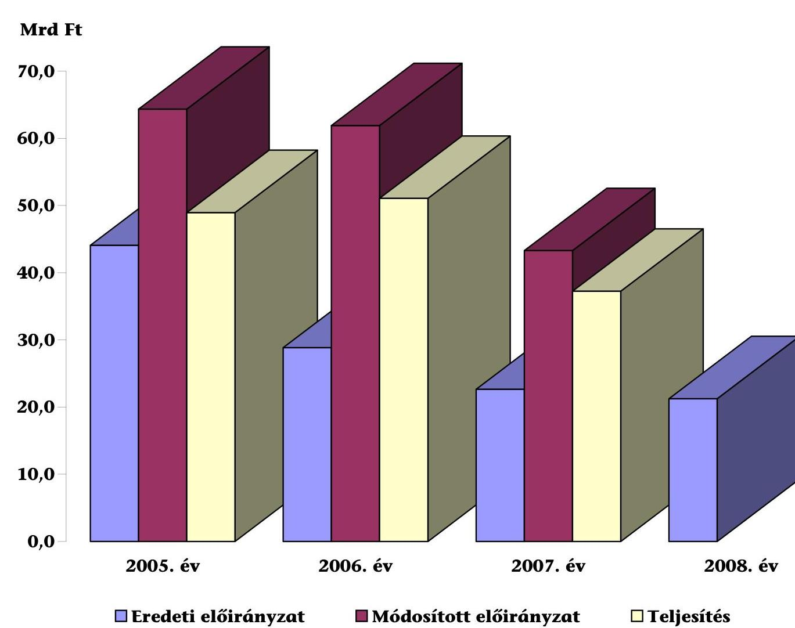

**A központi beruházások alakulása 2005 és 2008 között Mrd Ft-ban**

|  Térdegy | Éredeti előirányzat | Módosított előirányzat | Teljesítés  |
| --- | --- | --- | --- |
|  Mrd Ft | 70.0 | 60.0 | 50.0  |
|  Ár | 60.0 | 40.0 | 30.0  |
|  Személy | 30.0 | 20.0 | 10.0  |
|  Személyes | 10.0 | 0.0 | 0.0  |

**2005. év**

**2006. év**

**2007. év**

**2008. év**

---

9/b. sz. melléklet
a V-18-063/2007-2008. sz. jelentéshez

Az 1 Mrd Ft-ot meghaladó központi beruházások alakulása
(2006-2008)

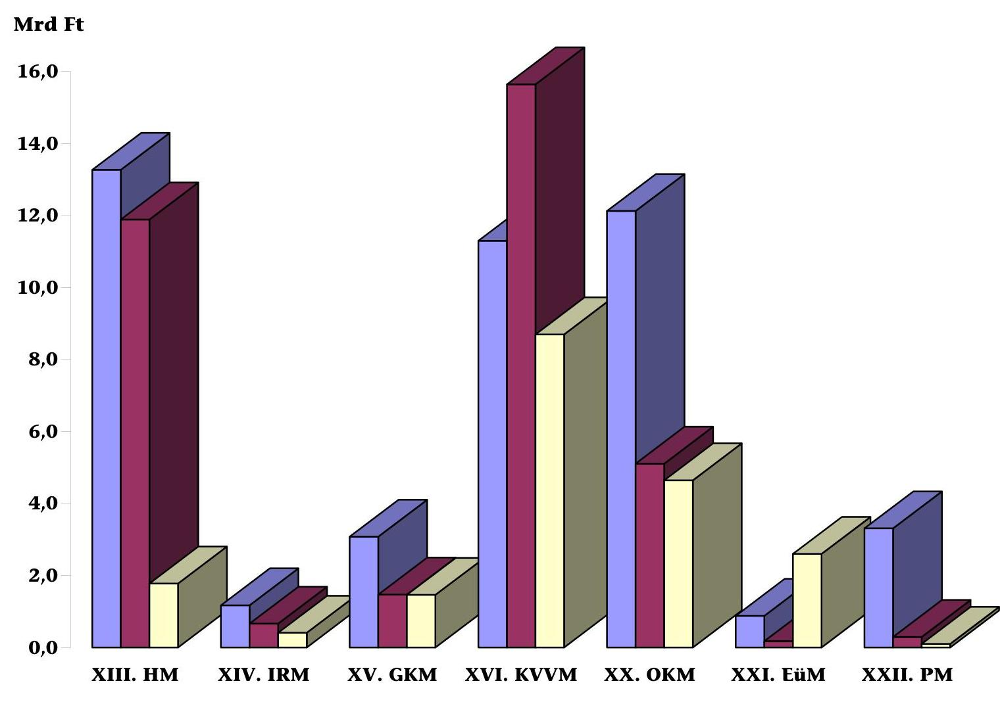

2006. évi teljesítés
2007. évi teljesítés
2008. évi eredeti előirányzat

Budapest, 2008. augusztus