# ÁLLAMI   SZÁMVEVŐSZÉK 

## JELENTÉS

a helyi önkormányzatok gazdálkodási rendszerének 2007. évi átfogó és egyéb szabályszerűségi ellenőrzéséről

---

3. Önkormányzati és Területi Ellenőrzési Igazgatóság
3.3. Átfogó Ellenőrzések Főcsoport

Iktatószám: V-1001-54/2007.
Témaszám: 845
Vizsgálat-azonosító szám: V0361

# Az ellenőrzést felügyelte: 

Dr. Lóránt Zoltán
főigazgató
Az ellenőrzés végrehajtásáért felelős:
Dr. Sepsey Tamás
főigazgató-helyettes
Az ellenőrzést vezette:
Csecserits Imréné
főcsoportfőnök-helyettes
A Budapest fővárosi kerületi önkormányzatok ellenőrzését vezette:
Molnár Gyula Mihály
osztályvezető, számvevő igazgatóhelyettes
A nagyközségek, községek egyéb szabályszerűségi ellenőrzését vezette:
Tímár József
főtanácsadó
Gyüre Lajosné
számvevő tanácsos

A számvevői jelentések feldolgozásában és a jelentés összeállításában közreműködtek:

Bauer Lajosné
főtanácsadó
Castro Hurtadoné Juhász Erika
tanácsadó
Gyüre Lajosné
számvevő tanácsos
Kántor Ilona
főtanácsadó
Köcse Istvánné
főtanácsadó
Puchy Márta
főtanácsadó

---

Az ellenőrzést végezték:

| Alexovics Ágota számvevő tanácsos | Ambrus Lajos főtanácsadó | Balogné Dakó Eszter számvevő tanácsos |
| :--: | :--: | :--: |
| Batkiné Vas Anna számvevő | Bauer Lajosné   főtanácsadó | Bencsik Árpád számvevő |
| Benczik Lászlóné számvevő tanácsos | Benkéné dr. Lavner Klára számvevő tanácsos | Benn Imréné számvevő tanácsos |
| Bialkó Zsolt Gyula számvevő tanácsos | Bíró Zsolt   számvevő | Dr. Boda Sándor számvevő tanácsos |
| Borbély Zsuzsanna főtanácsadó | Dr. Botta Tibor számvevő tanácsos | Böröcz Imre mb. irodavezető főtanácsadó |
| Buús Zoltánné Hütter Erzsébet számvevő | Castro Hurtadoné Juhász Erika tanácsadó | Czifra Erzsébet tanácsadó |
| Dr. Csapó Anna tanácsadó | Csényi István számvevő | Dr. Csermák Judit számvevő |
| Dr. Csikai Zsolt irodavezető főtanácsadó | Csiszárné dr. Kosik Mária tanácsadó | Dr. Csonka Ernő számvevő |
| Csuti Lajos számvevő tanácsos | Dér Géza számvevő | Dér Lívia számvevő tanácsos |
| Ébner Vilmosné irodavezető főtanácsadó | Eigner György Zoltán számvevő | Endrődy Péterné számvevő tanácsos |
| Dr. Fátrainé Zsebedics Katalin tanácsadó | Fejszák Tamás számvevő | Fercsik Gyula főtanácsadó |
| Fodor Tivadarné számvevő tanácsos | Dr. Fónagy Diána számvevő | Fórián Erika számvevő tanácsos |
| Gaál László számvevő | Gelencsér Zoltán számvevő | Groholy Andrásné Hangyál Márta számvevő |
| György Árpád számvevő tanácsos | Gyüre Lajosné számvevő tanácsos | Hadházy Sándor György számvevő tanácsos |
| Dr. Hegedűs György irodavezető főtanácsadó | Hegyes Mária számvevő tanácsos | Hirka Mihály irodavezető főtanácsadó |
| Dr. Horváth Klára számvevő | Horváth Mária számvevő | Huberné Kuncsik Zsuzsanna tanácsadó |

---

| Humli Tamásné számvevő | Huszár Sándorné számvevő tanácsos | Iszakné Dóczé Katalin számvevő |
| :--: | :--: | :--: |
| Jakubcsák Jenő számvevő tanácsos | Kalmár István számvevő tanácsos | Kántor Ilona irodavezető főtanácsadó |
| Kányáné Murvai Tünde számvevő | Dr. Karáné Kőszegi Zsuzsanna tanácsadó | Kenéz Sándor irodavezető főtanácsadó |
| Kéri Péter számvevő tanácsos | Kersmájer Ágota számvevő tanácsos | Keszthelyi Zoltán számvevő tanácsos |
| Kisapáti Angéla számvevő | Kisgergely István számvevő | Kispálné Wiedemann Györgyi tanácsadó |
| Dr. Kiss Károly számvevő tanácsos | Kiss Rita Teréz számvevő | Klinga László számvevő tanácsos |
| Koczor László számvevő | Koltayné Szepesi Zsuzsanna irodavezető főtanácsadó | Komlósné Bogár Éva számvevő tanácsos |
| Kopaczné Horváth   Zsuzsanna   számvevő tanácsos | Korsósné Vígh Andrea számvevő tanácsos | Kozák György irodavezető főtanácsadó |
| Kozma Gábor számvevő tanácsos | Köcse Istvánné irodavezető főtanácsadó | Köllődné Gátai Mária számvevő |
| Dr. Lacó Bálintné főtanácsadó | Lakatos József számvevő | Laki Dóra számvevő tanácsos |
| Lingné Rajz Borbála számvevő tanácsos | Lengyel Árpádné külső szakértő | Luhály Matild számvevő |
| Major Lászlóné számvevő tanácsos | Dr. Marosi Gyöngyi tanácsadó | Mohl Anna számvevő tanácsos |
| Mokánszkiné Mengyi Andrea számvevő | Molnár Istvánné számvevő | Nagy Attila számvevő tanácsos |
| Nagy Ervin Barnabás számvevő | Nagy Istvánné dr. tanácsadó | Nagy Sándorné külső szakértő |
| Nagy László Csaba számvevő tanácsos | Nyikon Zsigmondné számvevő tanácsos | Pálfi András számvevő tanácsos |
| Pálfiné Pusztai Magdolna számvevő | Papp József számvevő tanácsos | Pappné dr. Szamosi Éva számvevő tanácsos |
| Péntek László irodavezető főtanácsadó | Puchy Márta irodavezető főtanácsadó | Puskás Balázs számvevő |

---

| Reichert Margit számvevő | Remeczki László külső szakértő | Renkó Zsuzsanna számvevő tanácsos |
| :--: | :--: | :--: |
| Ritecz Tibor számvevő tanácsos | Schósz Attila Ferencné számvevő tanácsos | Somodiné Fehér Julianna számvevő tanácsos |
| Szabó Leonóra Ildikó számvevő | Szabó Tamás számvevő tanácsos | Szabó Zoltán számvevő tanácsos |
| Szalontai Miklós számvevő tanácsos | Szarvas Szilárd számvevő | Szenténé Tubak Klára számvevő tanácsos |
| Szihalminé Kovács   Zsuzsanna számvevő tanácsos | Dr. Szikszai Bertalan számvevő tanácsos | Szikszainé Király Mária főtanácsadó |
| Dr. Szücs Zoltán számvevő tanácsos | Dr. Telkes Imre számvevő tanácsos | Tímár József főtanácsadó |
| Tormáné Ivánfi Irén számvevő tanácsos | Tótfalusi Zoltán számvevő | Tóth László számvevő |
| Tóth Péter számvevő | Tóth Tamás számvevő | Ujvári Józsefné számvevő |
| Unger Ferenc   külső szakértő | Valu Tibor tanácsadó | Varga József irodavezető főtanácsadó |
| Dr. Vasváriné dr. Ró-   zsa Anikó irodavezető főtanácsadó | Veres Jánosné számvevő | Vida László számvevő tanácsos |
| Vojcsekné Szabó Ágnes számvevő tanácsos |  |  |

# A témához kapcsolódó eddig készített számvevőszéki jelentések: 

címe
Jelentés az egyes települési és helyi kisebbségi önkormányzatok pénzügyi-gazdasági tevékenységének 1998. évi ellenőrzési tapasztalatairól
Jelentés a helyi és a helyi kisebbségi önkormányzatok pénzügyigazdasági tevékenységének 1999. évi ellenőrzési tapasztalatairól
Jelentés a helyi és a helyi kisebbségi önkormányzatok átfogó ellenőrzéséről
Jelentés a helyi és a helyi kisebbségi önkormányzatok gazdálkodásának átfogó ellenőrzéséről
sorszáma
9908
0010
0113
0220

---

Jelentés a helyi és a helyi kisebbségi önkormányzatok gazdálkodásának átfogó ellenőrzéséről
Jelentés a helyi és a helyi kisebbségi önkormányzatok gazdálkodásának átfogó ellenőrzéséről
Jelentés a helyi és a helyi kisebbségi önkormányzatok gazdálkodásának átfogó ellenőrzéséről
Jelentés a helyi és a helyi kisebbségi önkormányzatok gazdálkodási rendszerének átfogó és egyéb szabályszerűségi ellenőrzéséről
Jelentés a helyi és a helyi kisebbségi önkormányzatok gazdálkodási rendszerének 2006. évi átfogó és egyéb szabályszerűségi ellenőrzéséről

---

# TARTALOMJEGYZÉK 

BEVEZETÉS ..... 9
I. ÖSSZEGZŐ MEGÁLLAPÍTÁSOK, KÖVETKEZTETÉSEK, JAVASLATOK ..... 14
II. RÉSZLETES MEGÁLLAPÍTÁSOK ..... 32

1. Az önkormányzatok költségvetési és pénzügyi helyzete ..... 32
1.1. A költségvetési és pénzügyi egyensúly biztosítása ..... 32
1.2. A költségvetési bevételek és kiadások tervezése és teljesítése ..... 38
2. Az önkormányzatok felkészültsége az európai uniós források igénylésére és felhasználására ..... 40
2.1. Az európai uniós források igénybevételére és a várható támogatás felhasználásának szervezettségére történt felkészülés, valamint a belső szabályozottság értékelése ..... 40
2.1.1. A fejlesztési célkitűzések meghatározása ..... 41
2.1.2. Az európai uniós forrásokhoz kapcsolódóan a pályázatfigyelés, a pályázatkészítés, valamint a megvalósuló fejlesztés lebonyolításának szabályozottsága, a végrehajtás személyi, szervezeti feltételei ..... 45
2.1.3. Az európai uniós forrással támogatott fejlesztés megvalósítása ..... 47
3. Az elektronikus közigazgatási feladatok ellátása, a gazdálkodási adatok nyilvánosságának biztosítása ..... 52
4. A költségvetési gazdálkodás kontrolljai ..... 55
4.1. A szabályozottság kockázata, valamint a belső kontrollok érvényesülése a költségvetés tervezési, gazdálkodási, beszámolási és a folyamatba épített ellenőrzés feladatainál ..... 55
4.1.1. A költségvetés tervezési és a zárszámadás készítési folyamat szabályozottsága, a belső kontroll feladatok meghatározottsága és teljesítése ..... 55
4.1.2. A pénzügyi-számviteli tevékenységeknél elvégzendő belső kontroll funkciók szabályozottsága, a szakmai teljesítés igazolás és az utalvány ellenjegyzés kontrollfeladatainak működése ..... 59
4.1.3. A pénzügyi-számviteli feladatoknál alkalmazott informatikai rendszerek szabályozottsága, biztonságos és dokumentált működési feltételeinek kialakítása ..... 67
4.2. A belső ellenőrzés szabályozottsága, szervezettsége és működése ..... 69

---

5. Az ÁSZ korábbi ellenőrzési javaslatai alapján készített intézkedési terv végrehajtása, eredményessége

# MELLÉKLETEK 

1. számú Az ellenőrzött önkormányzatok jegyzéke (3 oldal)
2. számú A vagyon és az adósságállomány alakulása önkormányzat-típusok szerint (1 oldal)
3. számú A helyi önkormányzatok eszközei és azok forrásai (1 oldal)

3/a. számú A Budapest fővárosi és kerületi önkormányzatok eszközei és azok forrásai (1 oldal)
3/b. számú A helyi önkormányzatok eszközei és azok forrásai a Budapest fővárosi és fővárosi kerületi önkormányzatok adatai nélkül (1 oldal)
3/c. számú Az ellenőrzött önkormányzatok eszközei és azok forrásai (1 oldal)
4. számú A helyi önkormányzatok 2004-2007. évi teljesített bruttó és (konszolidált) nettó bevételeinek és kiadásainak alakulása (2 oldal)
4/a. számú Az ellenőrzött önkormányzatok 2002-2007. évi teljesített bruttó és (konszolidált) nettó bevételeinek és kiadásainak alakulása (2 oldal)
5. számú Az ellenőrzött önkormányzatok 2004-2006. évi költségvetési előirányzatainak és azok pénzügyi teljesítésének alakulása (1 oldal)
6. számú Az ellenőrzött önkormányzatok tervezett és teljesített költségvetési bevételei, kiadásai és egyensúlyi helyzete (1 oldal)
7. számú A fizetőképességi mutatók alakulása (1 oldal)
8. számú Az eladósodási és esedékességi mutató alakulása az ellenőrzött önkormányzatoknál (1 oldal)
9. számú Az elektronikus közigazgatási ügyintézési lehetőségek biztosítása (1 oldal)
10. számú A kialakított belső kontrollok megbízhatósága tekintetében vizsgált területekhez kapcsolódó kiadások és azok részarányának alakulása az ellenőrzött önkormányzatoknál (1 oldal)
11. számú A számvevői jelentésekben a helyi önkormányzatok szabályszerű és célszerű működése érdekében a 2007. évben tett javaslatok (10 oldal)
12. számú Dr. Veres János pénzügyminiszter úr észrevétele (2 oldal)
13. számú Dr. Veres János pénzügyminiszter úr észrevételére adott válaszlevél (2 oldal)
14. számú Dr. Gyenesei István önkormányzati miniszter úr észrevétele (2 oldal)
15. számú Dr. Gyenesei István önkormányzati miniszter úr észrevételére adott válaszlevél (2 oldal)
16. számú Kiss Péter miniszterelnök-helyettes úr észrevétele (1 oldal)

---

# RÖVIDÍTÉSEK JEGYZÉKE 

## Törvények

Áht.
Eisztv.

Kbt.
Ötv.
Számv. tv.
2004. évi költségvetési törvény

2005. évi költségvetési törvény

2006. évi költségvetési törvény
2007. évi költségvetési törvény

## Rendeletek, határozatok

Ámr.
Ber.
Vhr.
közigazgatás korszerűsítéséről szóló Korm. határozat

## Szórövidítések

ÁROP
ÁSZ
AVOP
EKOP
e-közigazgatás
FEUVE
HEFOP
jegyző
KDB
KEHI
képviselő-testület
kiemelt önkormányzati kör
az államháztartásról szóló 1992. évi XXXVIII. törvény az elektronikus információszabadságról szóló 2005. évi XC. törvény
a közbeszerzésekről szóló 2003. évi CXXIX. törvény
a helyi önkormányzatokról szóló 1990. évi LXV. törvény
a számvitelről szóló 2000. évi C. törvény
a Magyar Köztársaság 2004. évi költségvetéséről és az államháztartás hároméves kereteiről szóló 2003. évi CXVL. törvény
a Magyar Köztársaság 2005. évi költségvetéséről és az államháztartás hároméves kereteiről szóló 2004. évi CXXXV. törvény
a Magyar Köztársaság 2006. évi költségvetéséről szóló 2005. évi CLIII. törvény
a Magyar Köztársaság 2007. évi költségvetéséről szóló 2006. évi CXXVII. törvény

## az államháztartás működési rendjéről szóló 217/1998. (XII. 30.) Korm. rendelet

a költségvetési szervek belső ellenőrzéséről szóló 193/2003. (IX. 26.) számú Korm. rendelet
az államháztartás szervezetei beszámolási és könyvvezetési kötelezettségének sajátosságairól szóló 249/2000. (XII. 24.) számú Korm. rendelet
a közigazgatás korszerűsítését szolgáló aktuális e-kormányzati feladatokról szóló 1044/2005. (V. 11.) Korm. határozat

ÚMFT Államreform Operatív Program
Állami Számvevőszék
AVOP NFT Agrár és Vidékfejlesztési Operatív Program
ÚMFT Elektronikus Közigazgatási Operatív Program
elektronikus közigazgatás
FEUVE folyamatba épített, előzetes és utólagos vezetői ellenőrzés
HEFOP NFT Humánerőforrás-fejlesztési Operatív Program
főjegyző, jegyző, körjegyző
Közbeszerzések Tanácsa Közbeszerzési Döntőbizottság
Kormányzati Ellenőrzési Hivatal
közgyűlés, képviselő-testület
a megyei, a megyei jogú városi, a Budapest fővárosi kerületi önkormányzatok

---

| KIOP | NFT Környezetvédelmi és Infrastruktúra-fejlesztési Operatív Program |
| :-- | :-- |
| NFT | Nemzeti Fejlesztési Terv |
| OKÉV | Országos Közoktatási, Értékelési és Vizsgaközpont |
| önkormányzati hivatal | megyei önkormányzati hivatal, főpolgármesteri hivatal,   polgármesteri hivatal, körjegyzőségi hivatal |
| PEJ | projekt előrehaladási jelentés |
|

 polgármester | polgármester, közgyűlés elnöke, főpolgármester |
| ROP | NFT Regionális Fejlesztési Operatív Program |
| SzMSz | Szervezeti és Működési Szabályzat |
| ÚMFT | Új Magyarország Fejlesztési Terv |

---

# ÉRTELMEZŐ SZÓTÁR 

1. elektronikus szolgáltatási szint
2. elektronikus szolgáltatási szint
3. elektronikus szolgáltatási szint
4. elektronikus szolgáltatási szint
elektronikus ügyintézés
előcsatlakozási alapok
európai uniós források

A közigazgatás korszerűsítéséről szóló Korm. határozat alapján olyan információs, tájékoztató szolgáltatás, amely csak általános információkat közöl az adott üggyel kapcsolatos teendőkről és a szükséges dokumentumokról.
A közigazgatás korszerűsítéséről szóló Korm. határozat alapján olyan egyirányú kapcsolatot biztosító szolgáltatás, amely az 1. szinten túl biztosítja az adott ügy intézéséhez szükséges dokumentumok, nyomtatványok letöltését, és azok ellenőrzéssel, vagy ellenőrzés nélküli elektronikus kitöltését, amely esetben a dokumentumok benyújtása hagyományos úton történik.
A közigazgatás korszerűsítéséről szóló Korm. határozat alapján olyan kétirányú kapcsolatot biztosító szolgáltatás, amely közvetlen, vagy ellenőrzött kitöltésű dokumentum segítségével biztosítja az elektronikus adatbevitelt és a bevitt adatok ellenőrzését. Az ügy indításához, intézéséhez személyes megjelenés nem szükséges, de az ügyhöz kapcsolódó köz-igazgatási döntés (határozat, egyéb aktus) közlése, valamint a kapcsolódó illeték-, vagy díjfizetés hagyományos úton történik.
A közigazgatás korszerűsítéséről szóló Korm. határozat alapján olyan teljes közvetlen kétirányú ügyintézési folyamatot biztosító szolgáltatás, amikor az ügyhöz kapcsolódó közigazgatási döntés is elektronikus úton kerül közlésre, illetve a kapcsolódó illeték-, vagy díjfizetés elektronikus úton is intézhető.
A honlapon keresztül történő elektronikus ügyintézés megvalósításához kétféle rendszerbelépési lehetőség van, az egyik az ügyfélkapus rendszerhez történő azonosító adatok és jelszó megadásával, a másik mód a digitális aláírással. Az okmányirodák feladatkörébe tartozó - az állampolgárok és vállalkozások részére történő - ügyintézések kezdeményezésére lehetőség van a www.magyarorszag.hu honlapon található ügyfélkapun keresztül.
PHARE (Poland-Hungary: Assistance for Restructuring the Economy, Közép- és Kelet-Európa országainak nyújtott európai uniós támogatások programja), ISPA (Instrument for Structural Policies for Pre-Accession - Strukturális politikák csatlakozás előtti eszköze), SAPARD (Special Accession Programme for Agriculture and Rural Development - Különleges előcsatlakozási program a mezőgazdaság és vidékfejlesztés támogatására).
Az elnyert európai uniós források lehívása a támogatott projekt megvalósítása érdekében, a fejlesztés lebonyolítása során felmerült kiadások finanszírozására.

---

fejlesztési feladat (projekt)
fejlesztési célkitűzés
kedvezményezett
közreműködő szervezet
lebonyolítás
operatív program

A fejlesztési feladat (projekt) tartalmilag és formailag részletesen kidolgozott, megfelelő pénzügyi háttérrel és végrehajtási ütemezéssel rendelkező fejlesztési terv, amely illeszkedik az Európai Unió, illetve a Nemzeti Fejlesztési Terv által támogatott programokhoz.
Az önkormányzat által ellátott kötelező, vagy önként vállalt feladatok ellátásának mennyiségi, vagy minőségi fejlesztésére vonatkozó terv. A mennyiségi fejlesztés megvalósulhat beszerzéssel, létesítéssel, bővítéssel, átalakítással.
Az a helyi önkormányzat, amely a támogatási szerződést kedvezményezettként aláírja, a projektet, illetve a központi programhoz kapcsolódó támogatott önkormányzati programot végrehajtja.
A közreműködő szervezet az európai uniós támogatást elnyert kedvezményezettekkel kapcsolatot tartó szerv. Az operatív programok közreműködő szervezetei befogadják, nyilvántartják, döntésre előkészítik a pályázatokat, rögzítik a támogatással kapcsolatos adatokat az egységes monitoring informatikai rendszerben, elvégzik a támogatások előzetes (szerződéskötést megelőző), közbenső (a pénzügyi elszámolás, finanszírozás folyamatában végzett) és utólagos (a támogatott projekt pénzügyi lezárását megelőző) ellenőrzését. Az önkormányzatoknál a leggyakrabban előforduló operatív program a ROP végrehajtásában közreműködő szervezetek a VÁTI Kht. és a regionális fejlesztési ügynökségek. A Kohéziós Alap közreműködő szervezetei a támogatott projektek végrehajtásához kapcsolódó operatív feladatokat látják el. Ennek keretében megkötik a szerződéseket a projekt kedvezményezettjével, folyamatosan nyomon követik a teljesítéseket, lebonyolítják a támogatások kifizetését, vezetik az egységes monitoring informatikai rendszert.
Az európai uniós források felhasználásával megvalósuló fejlesztésre irányuló műszaki, gazdasági (pénzügyi) tevékenységet magában foglaló szervezési, irányítási szolgáltatás. A szervezési szolgáltatás kiterjedhet a pályázatkészítésre, a közbeszerzési eljárás lebonyolításán keresztül a folyamatos műszaki ellenőrzésre, a pénzügyi elszámolásra, a műszaki átadás-átvételre, az üzembe helyezésre, illetve a fejlesztési folyamat egyes elemeire.
Az Európai Bizottság által jóváhagyott, a Közösségi Támogatási Keret végrehajtására vonatkozó 2004-2006 közötti, több évre szóló intézkedésekhez kapcsolódó prioritások egységes rendszerét tartalmazó dokumentum. A strukturális alapok operatív programjai: Agrár és Vidékfejlesztési Operatív Program; Gazdasági Versenyképesség Operatív Program; Humánerőforrás-fejlesztési Operatív Program; Környezetvédelmi és Infrastruktúra-fejlesztési Operatív Program; Regionális Fejlesztési Operatív Program.

---

támogatási szerződés A strukturális alapok esetében az irányító hatóságnak, illetve a Kohéziós Alap esetében a közreműködő szervezeteknek a kedvezményezett önkormányzattal kötött szerződése, amely a támogatás felhasználásának részletes feltételeit tartalmazza.

---

.

---

# JELENTÉS 

## a helyi önkormányzatok gazdálkodási rendszerének 2007. évi átfogó és egyéb szabályszerűségi ellenőrzéséről

## BEVEZETÉS

Az államháztartás önkormányzati alrendszerét 2007-ben 3194 helyi önkormányzat és 2040 települési kisebbségi önkormányzat alkotta. A helyi önkormányzatok könyvviteli mérlegben kimutatott vagyona 2004-2007 között 9618 milliárd Ft-ról 10624 milliárd Ft-ra nőtt ${ }^{1}$. Az önkormányzatok a 2004. évben 3061 milliárd Ft, a 2007. évben ennél $21 \%$-kal magasabb összegű, 3699 milliárd Ft konszolidált ${ }^{2}$ költségvetési bevétellel gazdálkodtak. A feladatok ellátásában a 2007. évben 41 ezer köztisztviselő és 391 ezer teljes munkaidőben foglalkoztatott közalkalmazott vett részt.

A helyi önkormányzatok gazdálkodását az ÁSZ az Ötv. 92. § (1) bekezdése, valamint az Áht. 120/A. § (1) bekezdése alapján ellenőrzi. Az ÁSZ a stratégiájában foglalt célkitűzéseknek megfelelően a helyi önkormányzatok költségvetési gazdálkodási rendszere átfogó ellenőrzésének programját a 2007. évtől megújította, azt kiegészítette további - teljesítmény-ellenőrzési - elemekkel.

## Az ellenőrzés célja annak értékelése volt, hogy az önkormányzatok:

- a pénzügyi egyensúlyt a költségvetésükben és annak teljesítése során milyen módon biztosították, a teljesített bevételek és kiadások egyes évek közötti jelentős eltérése feladatváltozáshoz kapcsolódott-e;
- felkészültek-e a szabályozottság és a szervezettség terén az európai uniós források igénylésére és felhasználására, továbbá az e-közigazgatás bevezetése miatti szervezet-korszerűsítési feladatokra;

[^0]
[^0]:    ${ }^{1}$ A jelentésben szereplő 2004-2007. évre vonatkozó önkormányzati adatok forrása a Magyar Államkincstár által készített összegzés a helyi önkormányzatok költségvetési beszámolójáról.
    ${ }^{2}$ A konszolidáció tartalma: a konszolidáció során megtörténik az önkormányzati hivatalok és az intézmények közötti, valamint az önkormányzatok közötti pénzeszközát-adások-átvételek miatti halmozódások kiszűrése, a rövid lejáratú hitelfelvételek, visszafizetések, a rövid lejáratú értékpapírok vétele-eladása, a pénzforgalom nélküli kiadá-sok-bevételek miatti halmozódások kiszűrése, továbbá a függő, átfutó és kiegyenlítő tételek figyelmen kívül hagyása.

---

- kialakították-e a külső és a belső feltételeknek megfelelően a gazdálkodás belső kontrollrendszerét ${ }^{3}$, továbbá a költségvetés tervezési, végrehajtási és zárszámadási feladatok szabályszerű ellátásához hozzájárult-e a folyamatba épített, előzetes és utólagos vezetői ellenőrzés, valamint a belső ellenőrzés;
- megfelelően hasznosították-e a korábbi számvevőszéki ellenőrzések megállapításait, szabályszerűségi ${ }^{4}$ és célszerűségi javaslatait.

Az önkormányzati gazdálkodás átfogó ellenőrzéséhez kapcsolódva a nagyközségi, községi önkormányzatoknál végzett egyéb szabályszerűségi ellenőrzések célja a gazdálkodás szabályszerűségét biztosító belső kontrollok kialakításának, működésének vizsgálata volt. Ezért ezen önkormányzatoknál a gazdálkodás szabályozottságát, a bizonylati rend és fegyelem szabályszerűségét, a belső ellenőrzési rendszer kialakítását, működését, valamint a korábbi számvevőszéki ellenőrzések javaslatainak hasznosulását ellenőriztük.

Az ellenőrzésre az Országgyűlés illetékes bizottságai részére is átadott, országosan egységes ellenőrzési program szerint került sor, így az ahhoz nem kapcsolódó, de a gazdálkodást érintő egyéb, esetleges közérdeklődésre is számító további kérdések vizsgálatára, valamint a helyi gazdaságpolitikát megvalósítani szándékozó helyi intézkedések szakmapolitikai elemzésére az ellenőrzés nem terjedt ki.

Az Országgyűlés 47/2006. (X. 27.) számú határozata 3. c) pontjában foglaltaknak megfelelően a kiemelt önkormányzati körben és a városi önkormányzatoknál előre meghatározott négy éves ütemezés első évi időarányos teljesítését biztosítottuk, a nagyközségeknél és községeknél a szabad ellenőri kapacitás mértékéig, véletlenszerűen végeztünk ellenőrzést. A 2007. évben 167 helyi önkormányzatnál - ezen belül a kiemelt önkormányzati körbe tartozó önkormányzatok és a városi önkormányzatok 25\%-ánál (öt megyei, öt megyei jogú városi, hat Budapest fővárosi kerületi, 67 városi önkormányzatnál) valamint nyolc nagyközségi, 76 községi önkormányzatnál - végeztük el a gazdálkodási rendszer átfogó és egyéb szabályszerűségi ellenőrzését. Az ellenőrzött önkormányzatok jegyzékét és az általuk teljesített 2004-2007. évi bevételek és kiadások összegét a jelentés 1. és 4/a számú mellékletei tartalmazzák.

Az ÁSZ ellenőrzései egy adott - múltbeli - időszakra vonatkoznak, s ez már önmagában megnehezíti, hogy az ellenőrzés megállapításai minden fenntartás nélkül adaptálhatók lennének a jelenre is. Sok esetben a helyszíni ellenőrzés lefolytatása alatt az ellenőrzött önkormányzat megszüntette a feltárt szabálytalanságot, hiányosságot, így bár a jelentés rögzíti annak múltbeli fennállását, a kijavítására vonatkozó javaslat megtétele már nem indokolt. Előfordult több

[^0]
[^0]:    ${ }^{3}$ A gazdálkodás szabályszerűségét biztosító kontrollrendszer alatt értjük a kiépített és működő belső irányítási és szabályozási rendszert, valamint a belső ellenőrzési funkciók ellátásának rendszerét.
    ${ }^{4}$ A törvényi előírások betartásának elmulasztásakor a részletes megállapítások fejezetben egységesen a törvénysértés megjelölést alkalmazzuk, mivel az ÁSZ nem tehet különbséget a törvényi előírások között.

---

esetben, hogy az interneten közzétett jelentésünket olvasva egy-egy önkormányzat vezetése már az ellenőrzés megkezdése előtt feltárta és kijavította a tipikus szabálytalanságokat. Ezért a múltra nézve a jelentés rögzíti a hiányosságot, azonban, mivel ténylegesen az önkéntes hibafeltáró és kijavító kontroll működött, s a jövőre nézve küszöbölte ki a hibát, ezt a tényt a jelentésekben rögzítettük.

A helyszíni ellenőrzéseket 2007. január 2. és december 22. közötti időszakban folyamatosan végeztük. Az ellenőrzött időszak a 2004-2006. évek, valamint az ellenőrzés végrehajtásának idejétől függően, év közben a 2007. évre vonatkozóan folyamatosan bővült. Az ellenőrzés során alapvetően a 2006. évi gazdálkodásra koncentráltunk, de a helyszíni vizsgálat befejezéséig figyelemmel kísértük a pénzügyi-gazdasági folyamatokat és az egyes gazdálkodási tendenciák megítélésénél a 2004-2007 közötti időszak eseményeit, adatait is értékeltük.

A költségvetési és pénzügyi helyzetet az összehasonlító elemzés módszerével vizsgáltuk a kiemelt önkormányzati körnél és a városi önkormányzatoknál. A költségvetési és pénzügyi egyensúly alakulásának bemutatása mellett elemeztük a tervezett és tényleges költségvetési hiány okait, a mérséklésére tett intézkedéseket, finanszírozásának módját, a pénzügyi helyzet alakulását.

A teljesítmény-ellenőrzés módszerével vizsgáltuk, és értékeltük, hogy a kiemelt önkormányzati körbe tartozó és a városi önkormányzatok hivatalában a belső szabályozottság, szervezettség terén eredményesen felkészültek-e az európai uniós pályázati lehetőségek figyelésére, ezen források igénylésére és felhasználására, valamint arra, hogy az igényelt európai uniós támogatások a helyi rendeletekben, gazdasági programokban, koncepciókban meghatározott fejlesztési célkitűzésekhez kapcsolódtak-e. Az ellenőrzés során a közigazgatás korszerűsítési céljaihoz kapcsolódva felmértük, hogy az e-közigazgatási feladatok ellátása, illetve bevezetése, működtetése érdekében az önkormányzati hivatalokban milyen intézkedéseket tettek, valamint biztosították-e a gazdálkodáshoz kapcsolódó közérdekű adatok közzétételét.

A költségvetési gazdálkodás belső kontrolljainak ellenőrzése során minősítettük, hogy a kiemelt önkormányzati körbe tartozó, a városi és a nagyközségi, községi önkormányzatok hivatalában a költségvetés tervezési, gazdálkodási, zárszámadás készítési feladatokra, továbbá a pénzügyi-számviteli területen végzett informatikai folyamatokra, feldolgozásokra kialakított belső kontrollok (a FEUVE és a belső ellenőrzés) kiépítettsége megfelelő biztosítékot ad-e a gazdálkodási feladatok szabályszerű ellátására. Értékeltük ezen kialakított belső kontrollok önkormányzati hivatalon belüli működésének eredményességét, megbízhatóságát, továbbá az önkormányzati belső ellenőrzés szervezeti és szabályozási keretét, valamint működését. Ellenőriztük a szakmai teljesítés igazolására és az utalvány ellenjegyzésére kialakított
 kontrollok végrehajtását.

---

Az értékeléshez az ellenőrzést a következő, kiemelt kockázatuk alapján kiválasztott ${ }^{5}$ gazdasági eseményekkel kapcsolatos kifizetésekre folytattuk le ${ }^{6}$ :

- a személyi juttatások közül az állományba nem tartozók megbízási díjai,
- a külső szolgáltató által végzett karbantartási, kisjavítási szolgáltatások, valamint
- a gépek, berendezések, felszerelések beszerzése.

Az ellenőrzés hatékony elvégzése céljából a vizsgálandó területek kiválasztása során a kockázatok elemzésén alapuló megközelítés érvényesült, ezáltal az ellenőrzési erőforrásokat azokra a területekre fókuszáltuk, amelyeken legnagyobb a hibák előfordulási valószínűsége ${ }^{7}$. Az ellenőrzési erőforrások ilyen típusú összpontosításával minimálisra csökkenthető a kívánt ellenőrzési bizonyosság eléréséhez szükséges időráfordítás.

A pénzügyi-számviteli folyamatokban alkalmazott belső kontrollok létezésének és működésének ellenőrzéséhez a vizsgált három terület 2006. évi és - a helyszíni ellenőrzés megkezdését megelőző negyedév végéig terjedően - 2007. évi könyvviteli tételeiből területenként egyszerű véletlen mintát vettünk. Az így kijelölt gazdasági eseményre elvégzett többlépcsős megfelelőségi tesztek alapján értékeltük a kontrollok működésének eredményességét, megbízhatóságát ${ }^{8}$. A helyszíni ellenőrzés megállapításainak részletes dokumentálását három megfelelőségi tesztlapon, öt elővizsgálati és kilenc helyszíni ellenőrzési munkalapon biztosítottuk. Ezeken a teszt- és munkalapokon a minősítés alapjául szolgáló kérdések és a vonatkozó konkrét jogszabályhelyek megjelölése mellett értékel-

[^0]
[^0]:    ${ }^{5}$ Az önkormányzatok kiemelt előirányzataira vonatkozóan, a vertikális folyamatokra elvégeztük a kockázatok becslését.
    ${ }^{6}$ A korábbi ellenőrzési tapasztalataink szerint ezeken a területeken a jegyzők nem, vagy hiányosan szabályozták a megbízás, megrendelés, illetve beszerzés indokoltságának, szükségességének elbírálására, igazolására, valamint a teljesítések dokumentálására, a kifizetések jogosságának megítélésére szolgáló kontrollokat. További kockázatot jelentett a külső szolgáltató által végzett karbantartási, kisjavítási munkák esetében, hogy az 50 ezer Ft alatti megrendelésekre vonatkozóan az ellenőrzési tapasztalataink szerint a jegyzők nem alakították ki a kötelezettségvállalások rendjét és nyilvántartási formáját, valamint az erre vonatkozó szabályozás elmulasztása esetén sem történt meg az írásbeli kötelezettségvállalás és annak az ellenjegyzése.
    ${ }^{7}$ Az állományba tartozók rendszeres személyi juttatásainak számfejtését, valamint folyósítását nem az önkormányzati hivatalok, hanem a nettó finanszírozás keretében a beküldött dokumentumok alapján a Magyar Államkincstár végzi.
    ${ }^{8}$ A többlépcsős megfelelőségi teszt lényege, hogy a kiválasztott minta ellenőrzését csak addig végezzük, amíg elegendő és megfelelő bizonyítékot nem szerzünk a vizsgált kontroll megbízható, vagy nem megbízható voltáról.

---

tük a kialakított belső kontrollokban rejlő kockázatokat ${ }^{9}$ és a kialakított kontrollok működésének megbízhatóságát ${ }^{10}$. A helyszíni ellenőrzés során kitöltött az ellenőrzést végző számvevő és a polgármesteri hivatal felelős köztisztviselője által aláírt - elővizsgálati és helyszíni ellenőrzési munkalapokat, azok kitöltési útmutatóit, továbbá a megfelelőségi tesztek dokumentumait a polgármester részére a számvevői jelentéssel egyidejűleg átadtuk.

Az ÁSZ korábbi ellenőrzési javaslatai alapján a tett intézkedéseket, illetve azok megvalósítását utóellenőrzés keretében vizsgáltuk. A gazdálkodási rendszer átfogó ellenőrzése során megfogalmazott javaslatok végrehajtására tett intézkedések megvalósítását ellenőriztük, a központi költségvetés zárszámadásához kapcsolódó és a teljesítményellenőrzések során tett javaslatok esetében pedig a kiadott intézkedéseket tekintettük át.

A jelentést egyeztettük a Miniszterelnöki Hivatalt vezető miniszterrel, a pénzügyminiszterrel és az önkormányzati miniszterrel. Az egyeztetés során kapott észrevételeket, valamint az arra adott válaszokat a jelentéshez mellékletként csatoljuk.

[^0]
[^0]:    ${ }^{9}$ A kialakított belső kontrollokban rejlő kockázatot alacsonynak minősítettük, ha a kontrollok - végrehajtásuk esetén - megfelelő védelmet nyújtanak a hibák bekövetkezése ellen. Közepesnek minősítettük a belső kontrollokban rejlő kockázatot, amennyiben a kontrollok - végrehajtásuk esetén - a lehetséges hibák többsége ellen védelmet nyújtanak. Magasnak értékeltük a kockázatot, ha a kontrollok - kialakításuk hiányában, vagy hiányos kialakításuk miatt - nem nyújtanak elegendő védelmet a lehetséges hibákkal szemben.
    ${ }^{10}$ A kontrollok működésének eredményességét, megbízhatóságát kiválónak értékeltük abban az esetben, ha azok működése - esetleges apróbb hiányosságoktól eltekintve - megfelelt a hibák megelőzésére és kijavítására meghatározott szabályozásnak és a legmagasabb szintű elvárásoknak. Jónak minősítettük a kontrollok működését, ha a hiányosságok száma ugyan jelentős volt, de nem veszélyeztette az ellenőrzött terület hibáinak megelőzését és kijavítását. Amennyiben a kontrollok működésénél tapasztalt hiányosságok nem biztosították a hibák megelőzését, feltárását, kijavítását és ezáltal azok veszélyeztették az eredményes, megbízható működést, a kontroll működésének megbízhatósága gyenge minősítést kapott.

---

# I. ÖSSZEGZŐ MEGÁLLAPÍTÁSOK, KÖVETKEZTETÉSEK, JAVASLATOK 

A helyi önkormányzatok a lakosság részére nyújtott szolgáltatások, feladataik és a rendelkezésükre álló eszközök alapján az államháztartás rendszerében meghatározó jelentőséggel bírnak. Az államháztartás önkormányzati alrendszerének bevétele-kiadása az elmúlt négy évben folyamatosan emelkedett, a 2007. évi konszolidált bevétele a 2004. évinél 21%-kal, konszolidált kiadása 17%-kal volt magasabb. A 2004-2007 közötti évenkénti növekedési ütem a bevételeknél 10-6-3%-ot tett ki, a kiadásoknál 2004-2006 között 10-8%-os volt, azonban a 2007. évben a 2006. évhez viszonyítva 1%-os csökkenés következett be. Ezen időszak alatt a személyi kiadások 13%-os növelésére, valamint a dologi és a felhalmozási célú kiadások 6-16%-os emelésére a helyi adóbevételek 38%-os, a személyi jövedelemadó bevételek 8%-os, továbbá a kapott támogatások 12%-os, valamint a hitelfelvételekből és az értékpapír kibocsátásból (értékesítésből) származó bevételek együttesen 188%-os növekménye nyújtott fedezetet. A hitelek visszafizetése miatti kiadás igény a 2007. évben 177%-kal magasabb volt a 2004. évinél, kiugróan magas volt a növekedés az előző évhez a 2005. (41%-os) és a 2007. évben (60%-os).

KONSZOLIDÁLT BEVÉTELEK ÉS KIADÁSOK ALAKULÁSA
(ORSZÁGOS ÖSSZESEN)

| Megnevezés | 2004. év | 2005. év | 2006. év $^{11}$ | 2007. év |
| :-- | :--: | :--: | :--: | :--: |
| Bevételek (milliárd Ft) | 3061 | 3364 | 3577 | 3699 |
| Kiadások (milliárd Ft) | 2762 | 3036 | 3267 | 3241 |

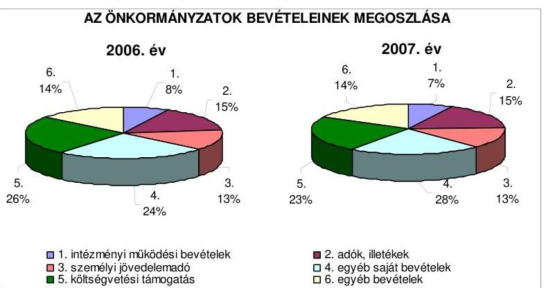

A helyi önkormányzatok könyvviteli mérleg szerinti vagyona a 2007. év végére a 2004. évihez viszonyítva 10,5%-kal nőtt, a 2007. év végén 10624 milliárd Ft volt ${ }^{12}$. Kedvező, hogy a könyvviteli mérleg szerinti vagyon értékének a 2004. évtől a 2007. évre történő növekedését jellemzően a beruházások, felújítások értékének 49,5%-os emelkedése eredményezte. A pénzeszközök év végi állománya a 2004. évihez viszonyítva a 2007. évben 62%-kal nőtt a 2007. évi kötvénykibocsátásokból származó bevételek következtében.

Adatok: milliárd Ft-ban

| A HELYI ÖNKORMÁNYZATOK VAGYONA |  |  |  |  |
| :-- | --: | --: | --: | --: |
| Eszközök | 2004. | 2005. | 2006. | 2007. |
| Immateriális javak | 16 | 21 | 25 | 26 |
| Tárgyi eszközök | 7021 | 7238 | 7576 | 7688 |
| Befektetett pénzügyi eszközök | 575 | 556 | 558 | 557 |
| Üzemeltetésre, kezelésre átadott eszközök | 1396 | 1482 | 1587 | 1721 |
| FORGÓESZKÖZÖK | $\mathbf{610}$ | $\mathbf{564}$ | $\mathbf{554}$ | $\mathbf{632}$ |
| ESZKÖZÖK ÖSSZESEN | $\mathbf{9618}$ | $\mathbf{9861}$ | $\mathbf{10300}$ | $\mathbf{10624}$ |
| KÖTELEZETTSÉGEK | $\mathbf{589}$ | $\mathbf{697}$ | $\mathbf{925}$ | $\mathbf{1088}$ |
| SAJÁT VAGYON | $\mathbf{9029}$ | $\mathbf{9164}$ | $\mathbf{9375}$ | $\mathbf{9536}$ |

A beruházásokra fordított kiadások bővülése mellett kedvezőtlen, hogy növekedett a kötelezettségek év végi állománya, értéke a 2007. év végén 85%-kal volt magasabb a 2004. év végi értéknél. A költségvetési egyensúlyt javító önkormányzati intézkedések következtében, valamint a korábban kibocsátott kötvények beváltása miatt, mintegy harmadával csökkent az önkormányzatok tulajdonában lévő értékpapírok állománya. A megtett intézkedések ellenére a költségvetési évet hiánnyal záró önkormányzatok aránya évről-évre növekedett.

A helyi önkormányzatok kilenctizede 2004-2006 között költségvetési hiányt, és annak finanszírozására hitelfelvételt, valamint támogatások elnyerését tervezte. A teljesített költségvetési bevételek az önkormányzatok évente növekvő, de a tervezettnél jelentősen kisebb arányánál (19-26-33%-ánál) nem fedezték a költségvetési kiadásokat.

# A költségvetési és pénzügyi egyensúly 

Az országos tendenciához hasonlóan az ellenőrzött önkormányzatok évente közel azonos hányada - mintegy kilenctizede - nem biztosította a 2004-2006. években a tervezett költségvetési bevételek és kiadások egyensúlyát, költségvetési bevételeik nem nyújtottak fedezetet a költségvetési kiadásokra. Az évközi likviditás érdekében, valamint a költségvetési egyensúly kialakításához, illetve a tervezett költségvetési kiadások finanszírozása érdekében mintegy kétharmaduk tervezett rövid lejáratú és likvid hitel felvételből, valamint hosszú lejáratú hitel felvételéből származó bevételt 2004-2006 között. A tervezettől eltérően az ellenőrzött önkormányzatok 20-35-40%-ánál volt költségvetési hiány,

[^0]
[^0]:    ${ }^{12}$ A helyi önkormányzatok eszközeinek és azok forrásainak részletezését a jelentés 3. számú melléklete tartalmazza.

---

és a tervezettnél kisebb aránya, közel fele vett fel rövid lejáratú és likvid hitelt, valamint hosszú lejáratú hitelt. Az ellenőrzött önkormányzatok évente növekvő aránya (17-29-39%-a) vett fel ugyanabban az évben rövid- és hosszú lejáratú hitelt is.

A költségvetés végrehajtása során az ellenőrzött önkormányzatok ötöde a 2007. évben deviza alapú, változó kamatozású kötvényt bocsátott ki, amelyek közel kétharmadánál a futamidő 20 év. A kötvénykibocsátás legkisebb összege 200 millió Ft, legnagyobb összege 5000 millió Ft volt, a tőketörlesztés megkezdéséhez meghatározott türelmi idő 1-6 év között változott. A kötvénykibocsátások az önkormányzatok fokozódó eladósodását jelentették, melynek visszafizetését a működési célú költségvetési bevételből tervezték. A 2007. évi bevételek összetételét figyelembe véve az önkormányzatok a tőke és kamatfizetési kötelezettségvállalások során betartották az Ötv-ben meghatározottak szerinti felső határt, annak átlag harmadára vállaltak hosszú távú fizetési kötelezettséget. A kötvénykibocsátásból származó bevétel 63%-át felhalmozási célra, 15%-át működési célra, 22%-át adósságrendezésre tervezték felhasználni. A deviza esetleges árfolyamváltozása, valamint a változó kamatmérték miatt az önkormányzatok számára a kötvénykibocsátás kockázatot jelent ${ }^{13}$.
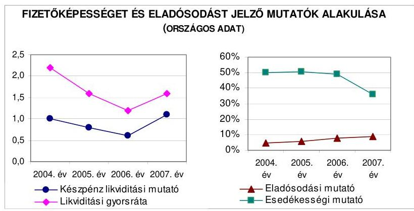

A helyi önkormányzatok összesített adatai alapján számított eladósodási mutató ${ }^{14}$ 2004-2007 közötti folyamatos emelkedése, illetve az esedékességi mutató csökkenése jelzi, hogy az összes forráson belül emelkedett a hosszú és rövid lejáratú kötelezettségek aránya. Ugyanezen időszakban azonban az összes kötelezettségeken belül csökkent a rövid lejáratú kötelezettségek aránya, a hosszú lejáratú kötelezettségek arányának emelkedése miatt. Az esedékességi mutató ${ }^{15}$ csökkenését eredményezte, hogy a rövid lejáratú kötelezettségek állományának növekedése kisebb mértékű volt, mint az összes fizetési kötelezettség növekedése, így a rövid távon teljesítendő kötelezettségek fizetőképességre gyakorolt ha-

[^0]
[^0]:    ${ }^{13}$ A helyi önkormányzatok kötvénykibocsátásának makrogazdasági hatásait

 elemzi az ÁSZ Fejlesztési és Módszertani Intézete által a 2009. évi költségvetési tervezés makrogazdasági mozgásterének néhány összefüggéséről 2008. május hónapban nyilvánosságra hozott értékelő tanulmány (68-72. oldal).
    ${ }^{14}$ Eladósodási mutató = összes kötelezettség-egyéb passzív pénzügyi elszámolások/összes forrás
    ${ }^{15}$ Esedékességi mutató = rövid lejáratú kötelezettségek/összes kötelezettség-egyéb passzív pénzügyi elszámolások

---

tása mérséklődött. Az eladósodás az önkormányzatok pénzügyi helyzetét hosszú távon befolyásolta kedvezőtlenül. A 2004-2006. évi likviditási mutatók ${ }^{16}$ fizetőképességi szempontból jeleztek rosszabbodó pénzügyi helyzetet. A készpénz likviditási mutató és a likviditási gyorsráta 2004-2006 között folyamatosan csökkent, azonban a 2007. év végén mindkét mutató értéke növekedett, az év utolsó hónapjaiban történt kötvénykibocsátások hatására. A likviditási mutatók 2007. év végi emelkedését eredményező kötvénykibocsátások azonban nem jelentik a fizetőképesség tartós, kedvező irányú változását, mivel a kötvénykibocsátásból származó bevétel visszafizetési türelmi idejének lejáratát követően a rövid lejáratú kötelezettségek növekedése a fizetőképességet csökkenti. A pénzügyi mutatók együttesen rámutatnak az önkormányzatok fokozódó eladósodására.

A tervezett költségvetési bevételek és kiadások 2004-2006 között az ellenőrzött önkormányzatok mintegy kilenctizedénél növekedtek. A költségvetési bevételek folyamatos növekedését elsősorban az adóbevételek és a kapott támogatások tették lehetővé, továbbá egy-egy önkormányzatnál a vagyonértékesítés is hozzájárult ehhez. Az ellenőrzött önkormányzatok több mint fele (54%-a) az éves költségvetések megállapításakor az Áht-ban előírtak ellenére 2004-2006 között a költségvetési hiány finanszírozásával kapcsolatos pénzügyi műveletek bevételeit költségvetési hiányt, illetve költségvetési többletet módosító költségvetési bevételként számolta el. Ezzel az elfogadott költségvetési rendelettervezetekben az előterjesztők nem mutatták be az önkormányzat valós pénzügyi helyzetét, a tervezett költségvetési hiány, vagy többlet összegét, valamint a finanszírozási célú pénzügyi műveletek bevételeit, kiadásait és azok egyenlegeként keletkező hiányt, vagy többletet.

A tervezett működési célú költségvetési bevételek 2004-2006 között évente egyre kevesebb ellenőrzött önkormányzatnál fedezték a működési célú költségvetési kiadásokat, míg a teljesítési adatok szerint kedvezőbben, az önkormányzatok a tervezettnél nagyobb, de egyre csökkenő hányadánál nyújtottak erre fedezetet. A működési célú költségvetési bevételeken belül az intézményi bevételeket és a helyi adóbevételeket tervezték elsősorban alul, valamint elmaradt, vagy az indokoltnál kisebb összegben történt az ellenőrzött önkormányzatok harmadánál a pénzmaradvány igénybevételének eredeti előirányzatként történő tervezése.

Az ellenőrzött önkormányzatok kétharmadánál a felhalmozási célú költségvetési bevételeket meghaladó összegben terveztek felhalmozási célú költségvetési kiadásokat. A tendencia nem változott a költségvetések végrehajtása során sem, de a 2006. évben az önkormányzatok csak mintegy felénél haladta meg a felhalmozási célú költségvetési bevételek összegét a teljesített felhalmozási célú költségvetési kiadások összege. Az összes költségvetési bevételen belül 2004-2006 között a működési célú költségvetési bevételeket az önkormányzatok kilenctizedénél alul, a felhalmozási célú költségvetési bevételeket pedig közel felénél túltervezték. A költségvetési bevételek alultervezése és a költségvetési ki-

[^0]
[^0]:    ${ }^{16}$ Készpénz likviditási mutató = pénzeszközök/rövid lejáratú kötelezettségek.
    Likviditási gyorsráta = követelések+forgatási célú értékpapírok+pénzeszközök/rövid lejáratú kötelezettségek.

---

adások túltervezése hatására az ellenőrzött önkormányzatok közül többen, illetve nagyobb összegben terveztek a 2004-2006. években költségvetési hiányt.

A működési célú költségvetési kiadások 2004-2006 közötti nem jelentős (7-3%-os) emelkedésében egyrészt szerepet játszott az infláció, valamint befolyásolta a 2005-2006. évi központi bérintézkedések kiadásnövelő hatása, másrészt a feladatok megoldásának módjában végrehajtott változtatások. Az ellenőrzött önkormányzatoknál a működési célú költségvetési kiadások csökkentése érdekében intézmény összevonásokról, átszervezésekről, valamint a nem kötelező feladatot jelentő középfokú intézmények megyei, fővárosi önkormányzatoknak történő átadásáról döntöttek. Az ellenőrzött önkormányzatoknál 2004-2006 között beruházási, felújítási feladatokra a tervezettnél ugyan alacsonyabb összegben, de évente jelentősen (10%-ot meghaladóan) növekvő összeget fordítottak, amelyhez fedezetet biztosítottak a különböző forrásból kapott támogatások, a pénzmaradvány nem tervezett igénybevétele, a működési célú költségvetési bevételekből történő átcsoportosítások és a hitelfelvételek.

# Felkészültség az európai uniós források igénybevételére 

Az európai uniós forrásokra irányuló pályázatok a gazdasági programokban, az ágazati, szakmai és területfejlesztési koncepciókban, tervekben megfogalmazott fejlesztési célkitűzésekhez többségükben kapcsolódtak, azonban a szabályozottság terén az ellenőrzött önkormányzatok 92%-a, a szervezettség vonatkozásában 17%-a 2004-2006 között nem készült fel eredményesen az európai uniós források igénybevételére és felhasználására. Nem rendelkeztek az európai uniós forrásokhoz kapcsolódóan a pályázatfigyelés, a pályázatkészítés, az európai uniós forrásokkal támogatott fejlesztés lebonyolítási feladatairól, felelőseiről, nem szabályozták az európai uniós forrásokra irányuló pályázatok koordinálásával összefüggő feladatokat, az önkormányzati szintű pályázatnyilvántartás vezetésének felelőseit, az európai uniós forrásokkal kapcsolatos információk áramlásának rendjét. Elmaradt a pályázatfigyelést végzők és a döntési jogkörrel rendelkezők közötti információ-szolgáltatási kötelezettség, valamint a polgármester és a fejlesztési feladat lebonyolítója közötti kapcsolattartás rendjének előírása, továbbá nem határozták meg a pályázatfigyelés, a pályázatkészítés, valamint az európai uniós forrásokkal támogatott fejlesztési feladatok lebonyolításának ellenőrzési kötelezettségét, feladatait és felelőseit. Az ellenőrzött önkormányzati hivatalokon belül, valamint külső személy és szervezet igénybevételével a pályázatfigyelés, a pályázatkészítés személyi és szervezeti feltételeit több mint 90%-nál kialakították, a fejlesztési feladat lebonyolítását mintegy négyötödénél megszervezték.

Az ellenőrzött önkormányzatok a 2004-2007. évekre vonatkozó fejlesztési célkitűzéseiket meghatározták, amelyek négyötöde a kötelező feladataik ellátásához kapcsolódott, ezen túlmenően önként vállalt feladataik ellátásának a fejlesztését is tervezték. A fejlesztési feladatok költségvetési kiadási szükségletét és a lehetséges pénzügyi forrásait az ellenőrzött önkormányzatok közel kétharmada vette számba. A 2004-2006. évek fejlesztési célkitűzéseit az önkormányzatok mintegy kilenctizede a 2007. évben felülvizsgálta és meghatározta a 2007-2010. évek gazdasági programját. Az Ötv-ben foglaltak ellenére az önkormányzatok mintegy tizede előterjesztés hiányában nem, vagy az előírt határidőnél később fogadta el a gazdasági programját. A 2004-2007. években az el-

---

lenőrzött önkormányzatok 96%-a döntött fejlesztési feladatai megvalósításához európai uniós forrásokra irányuló pályázatok benyújtásáról, amelyek több mint harmada (35%-a) zárult eredményesen ${ }^{17}$.

A pályázatok elutasításának okai között pályázati források hiánya, szakmai kidolgozatlanság, formai hibák, költség-hatékonyság elemzésének hiánya szerepelt. Az európai uniós forrásokkal 2004-2006 között támogatott fejlesztési feladatok finanszírozási forrásainak összetétele a következő:
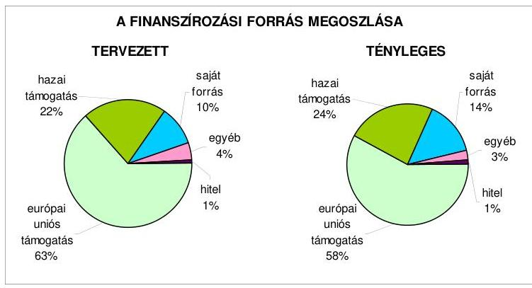

A teljesített bevételek saját forrás részarányának a tervezetthez képest négy százalékponttal magasabb mértékét elsősorban az utólagos finanszírozás miatt az európai uniós és hazai támogatás megelőlegezése, továbbá a megvalósítás során jelentkezett pót- és többletmunkák, a nem támogatott feladatok többletkiadásai okozták. A 2004-2007. évek költségvetési rendeletei készítésekor az ellenőrzött önkormányzatok 80%-a gondoskodott a fejlesztési feladatok megvalósításához szükséges saját forrásról, illetve több mint fele (58%-a) annak kiegészítésére „Önkormányzatok európai uniós, valamint hazai fejlesztés pályázati saját forrás kiegészítésének támogatására" pályázat benyújtásáról döntött ${ }^{18}$.
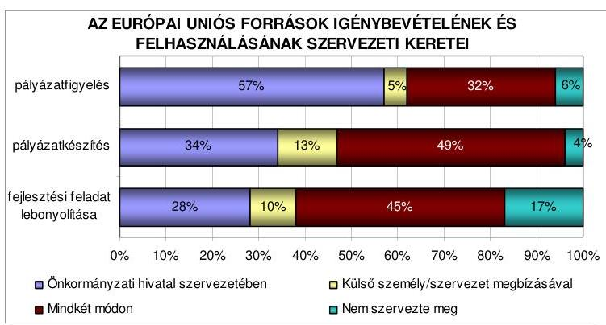

[^0]
[^0]:    ${ }^{17}$ Az NFT 2004-2006 közötti operatív programjaira 2007. december 31-ig 2695 önkormányzat 176 milliárd Ft támogatásban részesült, amelyből 2007. december 31-ig 1913 projekthez 136,6 milliárd Ft támogatást vett igénybe. (Forrás: Egységes Monitoring Információs Rendszer)
    ${ }^{18}$ A 2004-2007. években az önkormányzatok európai uniós, valamint hazai fejlesztés pályázati saját forrás kiegészítésének támogatására a központi költségvetésben kialakított alap a helyi önkormányzatok 928 projektjének 261,3 milliárd Ft összegű beruházásához 17,6 milliárd Ft támogatást biztosított.

---

Az európai uniós forrással támogatott, ellenőrzött fejlesztési feladatok mintegy felének megvalósítása nem a támogatási szerződésben foglalt ütemezésben folyt. A támogatási szerződések közel felét módosították a határidők csúszása, a támogatás és kiadások évek közötti átütemezése, a projektköltségvetésen belüli részösszegek átcsoportosítása, valamint a műszaki tartalom változása miatt. A kifizetési kérelmek benyújtása és azok teljesítése között az önkormányzatok közel felénél félév-háromnegyedév közötti különbség volt, elsősorban az igénylést alátámasztó dokumentumok alaki, tartalmi hiányosságai miatt. A közreműködő szervezetek a támogatási előlegigényléseket 30 napon belül, a hiánytalanul benyújtott fizetési kérelmeket 60 napon belül teljesítették. Az önkormányzatok az európai uniós forrással támogatott ellenőrzött fejlesztési feladataikhoz az éves költségvetési rendeleteikben a saját forrást biztosították, továbbá eleget tettek a strukturális alapok által támogatott fejlesztések esetében a megelőlegezési követelménynek. A támogatás utólagos finanszírozási rendszere az önkormányzatok mintegy ötödénél pénzügyi zavarokat okozott, melyek áthidalására tizedük likviditási és rövid lejáratú hitelt vett fel. A fejlesztési feladatok megvalósításánál az önkormányzatok közel ötödénél a pályázatokban nem szereplő, de a feladat megvalósításához kapcsolódóan teljesített többletkiadások merültek fel, amelyek fedezetét saját forrásból biztosították.

Az önkormányzati hivatalok közel kétharmadánál a folyamatba épített, előzetes és utólagos vezetői ellenőrzéseket végrehajtották. A támogatásban részesült önkormányzatok többségénél (86%-ánál) az európai uniós források felhasználását a belső ellenőrzés a 2004-2007. években nem vizsgálta. Az európai uniós forrással támogatott fejlesztési feladatok megvalósulását az ÁSZ, a KEHI, illetve a közreműködő szervezetek az ellenőrzött önkormányzatok 70%-ánál vizsgálták, ennek során azok háromnegyedénél hiányosságokat állapítottak meg, amelyek megszüntetésére a jegyzők közel kétharmada intézkedéseket tett. A közreműködő szervezetek az ellenőrzések tizedénél tettek olyan szabálytalanságra vonatkozó megállapításokat, melyek miatt a támogatás kifizetését felfüggesztették, illetve visszafizetési kötelezettséget állapítottak meg.
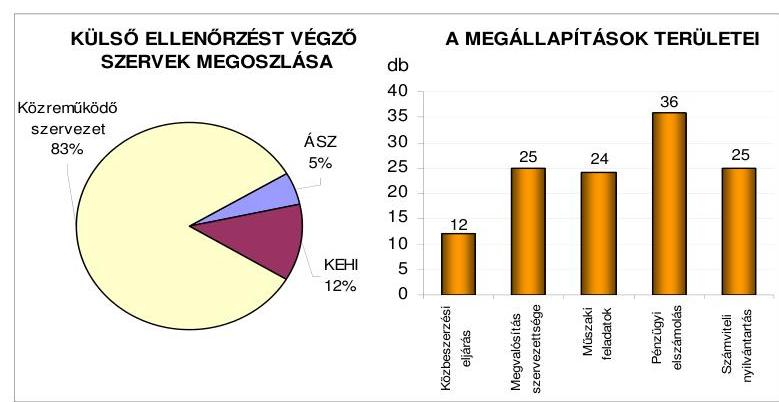

---

# Az e-közigazgatásra történő felkészülés, a gazdálkodási adatok nyilvánossága 

Az ellenőrzött önkormányzatok ${ }^{19}$ közel háromnegyede meghatározta az informatikai és/vagy közigazgatási stratégiáját, melyben a közigazgatás korszerűsítéséről szóló Korm. határozatban meghatározott kritériumok alapján több mint negyedük (29%) célként a 4. elektronikus szolgáltatási szint, harmadik a 3. elektronikus szolgáltatási szint elérését tűzte ki célul. A korszerű, hatékony és átlátható e-közigazgatás kialakításához és működtetéséhez szükséges elektronikus fejlesztési feladatok ellátására történő felkészülés érdekében az önkormányzatok több mint harmada (35%-a) európai uniós, illetve más szervezet által biztosított támogatásra nyújtott be pályázatot. Ezen belül a városi önkormányzatok harmada több önkormányzattal összefogva társulás keretében pályázott. Az ellenőrzött önkormányzatok több mint négyötödénél (82%-ánál) működtettek már e-közigazgatási szolgáltatásokat biztosító informatikai rendszert. Az önkormányzatok közel ötöde az 1., több mint fele (54%) a 2., mintegy tizede a 3. elektronikus szolgáltatási szinten biztosította az elektronikus ügyintézést. A 3. és a 4. elektronikus szolgáltatási szintnek megfelelő ügyintézés széles körű kialakítását a pénzügyi források, az informatikához értő humán erőforrás, valamint a szükséges szoftver hiánya késleltette, és megvalósítását lakossági igény sem sürgette.

A közérdekű adatok elektronikus közzétételére az Eisztv. alapján 2007. január 1-jétől kötelezett volt az ellenőrzött megyei és megyei jogú városi önkormányzatok mindegyike, valamint lakosságszáma alapján az ellenőrzött Budapest fővárosi kerületi önkormányzatok közül négy. A gazdálkodási adatok közzétételi kötelezettségét sem honlapján, sem a helyben szokásos módon nem teljesítette - az Áht-ban előírtak ellenére - az ellenőrzött önkormányzatok mintegy fele a működési és fejlesztési támogatások, valamint az Áht. hatálya alá tartozó szerződések adatai esetében, továbbá közel kétharmada - az Ámr-ben előírtak ellenére - elmulasztotta a költségvetési beszámolók szöveges indoklásának közzétételét. A közérdekű adatok közzétételi kötelezettségére vonatkozó jogszabályi előírások - a közzétételi idő meghatározása tekintetében - nincsenek összhangban, mivel a nem normatív, céljellegű, működési és fejlesztési támogatások adatainak, továbbá az államháztartás pénzeszközei felhasználásával, az államháztartáshoz tartozó vagyonnal történő gazdálkodással összefüggő szerződések, megrendelések adatainak közzétételét az Áht. szerint a döntés meghozatalát követő hatvanadik napig kell teljesíteni. Ezzel

 szemben az Eüsztv-ben foglalt szabályozás a közzétételi kötelezettséget negyedévente írja elő.

## A költségvetési gazdálkodás kontrolljai

A költségvetés tervezési és a zárszámadás készítési folyamatok szabályozottsága az ellenőrzött kiemelt önkormányzati körbe tartozó, valamint városi önkormányzatok több mint felénél (57\%-ánál) összességében alacsony kockázatot jelentett a feladatok megfelelő és szabályszerű végrehajtásában, mivel

[^0]
[^0]:    ${ }^{19}$ Az e-közigazgatási feladatok ellátását a nagyközségi, községi önkormányzatoknál nem vizsgáltuk.

---

a jegyzők az Ámr. előírásainak és a helyi sajátosságoknak megfelelően kialakították a tervezési és a zárszámadás készítési feladatok belső kontrolljait, ennek során előírták az ellenőrzési feladatokat, határidőket és kijelölték azok felelőseit. Az önkormányzatok közel ötödénél a szabályozottság hiányosságai közepes kockázatot jelentettek a költségvetés tervezési és a zárszámadás készítési feladatok végrehajtásában, mivel a jegyzők hiányosan szabályozták az ellenőrzési feladatokat, azonban a kialakított belső kontrollok végrehajtásuk esetén a lehetséges hibák többsége ellen védelmet nyújtottak.

A tervezési és a zárszámadás készítési feladatok belső kontrolljainak kialakítására vonatkozó kötelezettség teljesítését az önkormányzatok negyedénél a jegyzők - az Áht. előírásai ellenére - elmulasztották, a szabályozás hiányosságai magas kockázatot jelentettek ezen feladatok megfelelő és szabályszerű végrehajtásában. A költségvetési intézmények részére a költségvetési javaslat összeállításával kapcsolatos követelményeket a kiemelt önkormányzati körbe tartozók meghatározták, a városi önkormányzatok közel negyedénél azonban nem írták elő. A költségvetési intézmények és az önkormányzati hivatal szervezeti egységei által benyújtott költségvetési igények indokoltságának, illetve teljesíthetőségének ellenőrzésére, valamint a tervezett saját bevételek előirányzatainak és az azok megalapozását szolgáló önkormányzati rendeletek összhangjának felülvizsgálatára vonatkozó belső kontroll tevékenységeket az önkormányzatok több mint felénél (56\%-ánál) nem határozták meg. Az intézményi pénzmaradványok kimunkálásának felülvizsgálatára vonatkozó belső kontrollokat az önkormányzatok harmadánál nem alakították ki.
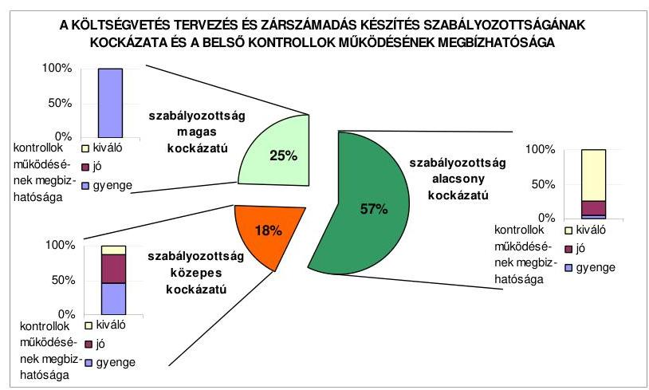

A költségvetés tervezés és a zárszámadás készítés folyamatában kialakított belső kontrollok működésének megbízhatósága az önkormányzatok közel felénél összességében kiváló volt, a kontrollok folyamatosan működtek, teljesítették a lényeges hibák, szabálytalanságok és gyenge teljesítmények megelőzésével, feltárásával és kijavításával kapcsolatos funkciójukat. A belső kontrolleljárások az önkormányzatok ötödénél jól működtek, a megállapított hiányosságok ellenére kielégítették a célszerűségi elvárásokat a működésbeli hibák megelőzése, feltárása és kijavítása tekintetében. Az önkormányzatok több mint harmadánál (35\%-ánál) a költségvetés tervezés és a zárszámadás készítés ellenőrzési feladataira vonatkozó kötelezettségük teljesítését az Áht-ban foglalt előírások ellenére elmulasztották, a belső kontrollok működésének megbízhatósága gyenge volt, amit az önkormányzatok közel háromnegyedénél a jegyzői

---

szabályozás hiánya okozott. Az intézmények és az önkormányzati hivatalok szervezeti egységei által benyújtott költségvetési igények indokoltságát az önkormányzatok közel kétötödénél nem vizsgálták, hasonló arányuknál maradt el a zárszámadás készítés során az intézményi pénzmaradvány megállapítás szabályszerűségének felülvizsgálata, továbbá az intézményi számszaki beszámolók, valamint azok jegyző által meghatározott adatszolgáltatással való összhangjának ellenőrzése. Az önkormányzatok mintegy harmadánál - az Áht. és az Ámr. előírásai ellenére - nem ellenőrizték a költségvetési intézmények részére meghatározott - tervezéssel kapcsolatos - követelmények teljesítését, továbbá háromötödénél nem végezték el a tervezett saját bevételek előirányzatainak, valamint az azok megalapozását szolgáló önkormányzati rendeletek összhangjának ellenőrzését.

A gazdálkodási, a pénzügyi-számviteli és a folyamatba épített ellenőrzési feladatok szabályozottsága az önkormányzatok közel harmadánál összességében alacsony kockázatot jelentett a feladatok megfelelő és szabályszerű végrehajtásában, mivel a pénzügyi gazdálkodás folyamatában a belső kontrollokat a jegyzők a jogszabályi előírásoknak és a helyi sajátosságoknak megfelelően kialakították. Az önkormányzatok közel kétötödénél a szabályozottság hiányosságai közepes kockázatot jelentettek a feladatok végrehajtásában, mivel a jegyzők hiányosan szabályozták az ellenőrzési feladatokat, de a kialakított belső kontrollok végrehajtásuk esetén a lehetséges hibák többsége ellen védelmet nyújtottak. A belső kontrollok kialakítására vonatkozó kötelezettségük teljesítését - az Áht. előírásai ellenére - az önkormányzatok közel harmadánál elmulasztották a jegyzők, ezáltal a szabályozás hiányosságai a gazdálkodási feladatok végrehajtásában magas kockázatot okoztak. Az ellenőrzött önkormányzati hivatalok közel negyede nem rendelkezett - az Ámr. előírása ellenére - a képviselő-testület által jóváhagyott SzMSz-szel, ötödénél a gazdasági szervezet feladatainak szabályozására nem készítettek ügyrendet. A pénzügyi-számviteli dolgozók munkaköri leírása az önkormányzati hivatalok közel felénél nem tartalmazta a gazdálkodási folyamatba épített ellenőrzési jogköröket és feladatokat. Az önkormányzatok kétötödénél a jegyzők belső szabályzatban nem rendelkeztek a pénzgazdálkodás meghatározó belső kontrollját jelentő szakmai teljesítésigazolás módjáról, valamint mintegy negyedénél az azt végző személyeket nem jelölték ki. Az érvényesítési feladatok ellátására az önkormányzati hivatalok mintegy tizedénél a jegyzők nem adtak írásban megbízást, továbbá az írásbeli megbízások ugyanilyen arányánál nem tartották be az iskolai végzettségre és a szakmai képzettségre vonatkozó előírást.

A számviteli szabályzatokban a Vhr-ben előírt évenkénti leltározási kötelezettséget az ellenőrzött önkormányzatok negyedénél a jegyzők nem rögzítették. Az üzemeltetésre, kezelésre átadott eszközök leltározásának módját az önkormányzatok közel felénél, továbbá ezen eszközök selejtezésével, hasznosításával kapcsolatos döntéshozatalra jogosultak körét mintegy háromötödénél nem határozták meg. Az önkormányzatok közel kétharmadánál az önköltségszámítás rendjét a Vhr. előírása ellenére, valamint a pénzkezelés során az utólagos vezetői ellenőrzés gyakoriságát és az ellenőrzés dokumentálásának módját az Ámr. előírása ellenére nem határozták meg.

A FEUVE rendszerét az - Áht. és az Ámr. előírásai ellenére - nem, illetve nem az önkormányzati gazdálkodás folyamataira és sajátosságaira tekintettel ala-

---

kították ki a jegyzők, mivel az ellenőrzési nyomvonalat az ellenőrzött önkormányzatok mintegy harmadánál nem készítették el. Az elkészített ellenőrzési nyomvonalak mintegy tizedében nem azonosították a folyamatokat és a folyamatgazdákat, az egyes feladatok végrehajtásáért felelős személyeket. Az önkormányzatok háromötödénél kockázatkezelési eljárásrendben nem rögzítették a kockázatok azonosítását, illetve folyamatgazdáit, közel háromnegyedénél az elfogadható kockázati keret meghatározását. A jegyzők közel kétötöde nem rögzítette a szabálytalanságok kezelésének eljárásrendjében a szabálytalanság fogalmát, az észlelési kötelezettségét, közel fele nem írta elő a szabálytalanság esetén teendő intézkedések (eljárások) nyomon követését és nyilvántartását. A gazdálkodási, a pénzügyi-számviteli és a folyamatba épített ellenőrzési feladatok szabályozottsága - az ÁSZ korábbi javaslatainak hasznosítása eredményeként - javult a 2004-2007. években, mivel az ellenőrzött önkormányzatok évente növekvő aránya rendelkezett a jogszabályi előírásoknak és a helyi sajátosságoknak megfelelő belső szabályozásokkal.

A szakmai teljesítésigazolás és az utalvány ellenjegyzés működésének megbízhatósága az ellenőrzött önkormányzatok közel harmadánál összességében kiváló volt, mivel a belső kontrollok folyamatosan működtek, az esetleges apróbb hiányosságok ellenére teljesítették a lényeges hibák, szabálytalanságok és gyenge teljesítmények megelőzésével, feltárásával és kijavításával kapcsolatos funkciójukat. A belső kontrollok az önkormányzatok közel tizedénél a gazdálkodás folyamatában jól működtek, a megállapított hiányosságok ellenére kielégítették a célszerűségi elvárásokat a működésbeli hibák megelőzése, feltárása és kijavítása tekintetében. Az önkormányzatok közel kétharmadánál azonban az operatív gazdálkodás folyamatba épített ellenőrzési feladataira vonatkozó kötelezettségük teljesítését az Ámr-ben foglalt előírások ellenére elmulasztották, a szakmai teljesítés igazolás és az utalvány ellenjegyzés működésének megbízhatósága gyenge volt. A belső kontrollok működésével kapcsolatban megállapított hiányosságok rendszerszerűen fordultak elő, egy-egy gazdasági esemény folyamatában egyidejűleg több kontrollfeladat ellátása maradt el, amelyhez hozzájárultak a belső szabályozás hiányosságai, valamint a folyamatba épített ellenőrzési feladatok elvégzésére jogosult személyek kijelölésének elmaradása.

A pénzügyi gazdálkodás során a kiadások jogosultságának, összegszerűségének, valamint a szerződések, megrendelések teljesítésének ellenőrzését a kijelölt személyek - az Ámr-ben foglalt előírások ellenére - nem végezték el az önkormányzatok közel háromötödénél. A szakmai teljesítést a jegyző által kijelölt személyek aláírásukkal nem igazolták az ellenőrzött önkormányzatok közel tizedénél. Az önkormányzatok további tizedénél a szakmai teljesítés igazolására kijelölt személyek a kifizetések alapbizonylatait aláírásukkal ugyan ellátták, azonban, mivel a szakmai teljesítés igazolásának módjáról - az Ámr-ben előírtak ellenére - a jegyzők belső szabályzatban nem rendelkeztek, ezért ezen aláírások önmagukban nem jelentették a kiadások teljesítésének elrendelése előtti ellenőrzések elvégzésének, illetve a jogosultság, az összegszerűség, valamint a kötelezettségvállalásokban (szerződésben, megrendelésben, megállapodásban) foglaltak teljesítésének szakmai igazolását. A szakmai teljesítést a jegyző kijelölésével nem rendelkező személyek jogosulatlanul igazolták aláírásukkal az önkormányzatok harmadánál. A szakmai teljesítés igazolására kijelölt személyek az önkormányzatok ötödénél az igazolás elvégzését tanúsító aláírásuk ellenére

---

nem látták el ellenőrzési feladataikat azon kiadások teljesítését megelőzően, amelyekhez kapcsolódó kötelezettségvállalásokat az Ámr-ben előírtak ellenére nem foglalták írásba, ezért az okmányok, alapdokumentumok hiánya következtében nem ellenőrizték a szerződésben, megrendelésben előírt feladatok teljesítését, a kiadás jogosultságát, összegszerűségét sem.

Az utalvány ellenjegyzés ellenőrzési feladatait az önkormányzatok közel kétharmadánál - az Ámr. előírásai ellenére - nem végezték el, mivel az ellenjegyzők nem ellenőrizték a gazdálkodásra vonatkozó szabályok betartását, illetve mintegy felénél nem győződtek meg arról, hogy a szakmai teljesítés igazolása és az érvényesítés megtörtént-e. A jegyző írásos felhatalmazásával nem rendelkező személyek jogosulatlanul végezték az utalvány ellenjegyzést az önkormányzatok egytizedénél. A jegyzői felhatalmazással rendelkező személyek által végzett utalvány ellenjegyzés az önkormányzati hivatalok mintegy kétötödénél formai volt, mivel aláírásuk ellenére nem végezték el a gazdálkodásra vonatkozó szabályok betartásának ellenőrzését azoknál az önkormányzati hivataloknál, amelyeknél a kötelezettségvállalásokat nem foglalták írásba. Az utalvány ellenjegyzések során az önkormányzatok mintegy tizedénél nem kifogásolták, hogy a kötelezettségvállalást - az Ámr. előírása ellenére - nem előzte meg annak ellenjegyzése. A belső kontrollok működésének hiányosságai következtében az önkormányzatok mintegy tizedénél előirányzat nélküli kötelezettségvállalások alapján teljesítettek kiadásokat, amelyekre pénzügyi fedezetet más előirányzatok maradványa biztosított, ezáltal nem tartották be az Áhtban foglalt, a jóváhagyott előirányzatokon belüli gazdálkodásra vonatkozó előírást.

Az informatikai környezet szabályozottsága az ellenőrzött önkormányzatok kétötödénél összességében alacsony kockázatot jelentett az informatikai feladatok biztonságos végrehajtásában, mivel az önkormányzati hivatalok rendelkeztek az informatikai feladatok biztonságos végrehajtásához szükséges szabályzatokkal. Az önkormányzatok kétötödénél a szabályozottság hiányosságai közepes, illetve ötödénél magas kockázatot jelentettek az informatikai feladatok végrehajtásában, mivel nem ismertették a pénzügyi-számviteli területen dolgozókkal az önkormányzati hivatalban az informatikával kapcsolatos szabályzatokat, nem szabályozták az informatikai eszközökhöz történő hozzáférést, illetve a pénzügy-számviteli számítógépes programrendszerben az adatkarbantartási folyamatokat, ezáltal a kontrollok - hiányos kialakításuk miatt - nem nyújtottak elegendő védelmet a lehetséges hibákkal szemben.

Az informatikai rendszerek működtetésénél a kialakított belső kontrollok megbízhatósága az önkormányzatok kétötödénél összességében kiváló volt, mivel a használt informatikai programok, programrendszerek követték a jogszabályi változásokat, s egyúttal biztosították a számlarend változásainak kezelését, a pénzügyi-számviteli adatok visszamenőleges elérhetőségét, hálózati rendszert működtettek, és biztosították az internet használatához szükséges védelmet. Az önkormányzatok közel kétötödénél az informatikai rendszerek működtetéséhez kialakított belső kontrollok megbízhatósága jó volt, mivel a kontrollok biztosították a működésbeli hibák megelőzését és kijavítását, a feltárt hiányosságok nem veszélyeztették az eredményes, megbízható működést. A belső kontrollok megbízhatósága az önkormányzatok ötödénél gyenge volt, mivel ezen önkormányzatok hivatalaiban nem biztosították a számítógépen vezetett

---

analitikus nyilvántartás és a főkönyvi könyvelés automatikus kapcsolatát, illetve a pénzügyi-számviteli számítógépes programokban használt adatok kapcsolatait nem dokumentálták.

A belső ellenőrzés szervezeti kereteinek kialakítása és szabályozása az ellenőrzött önkormányzatok ${ }^{20}$ több mint felénél (57\%-ánál) alacsony kockázatot jelentett a belső ellenőrzés szabályszerű végrehajtásában, mivel annak szervezeti és szabályozási kereteit, valamint ellátási módját meghatározták, továbbá a belső ellenőrzési kötelezettséget, az ellenőrzést végzők
 jogállását és feladatait belső szabályzatban rögzítették, ezáltal a kialakított belső ellenőrzési szervezet – szabályszerű működése esetén – megfelelő védelmet nyújtott a hibák bekövetkezése ellen. Az önkormányzatok közel harmadánál a belső ellenőrzés szervezeti kereteinek kialakítása, illetve szabályozottságának hiányosságai közepes kockázatot jelentettek a feladatok megfelelő végrehajtásában, mivel hiányosan határozták meg a belső ellenőrzés ellátási módját, a feladatokkal kapcsolatos szabályokat, azonban a kialakított szervezet szabályszerű működése esetén a lehetséges hibák többsége ellen védelmet nyújtottak. A belső ellenőrzés szervezeti kereteinek kialakítására, illetve feladatainak szabályozására vonatkozó kötelezettség teljesítését az önkormányzatok ötödénél – az Ötv. és a Ber. előírásai ellenére – elmulasztották, a hiányosságok magas kockázatot jelentettek ezen feladatok megfelelő és szabályszerű végrehajtásában.

Nem készítettek az önkormányzatok tizedénél belső ellenőrzési kézikönyvet, kétötödénél stratégiai tervet a képviselő-testületek által jóváhagyott stratégiai tervek harmada nem alapult a feladatokat, feltételeket figyelembe vevő kockázatelemzésen, kétharmaduk nem határozta meg a kockázati tényezőket és értékelésüket. E hiányosságok miatt ezen önkormányzatoknál nem, vagy nem megalapozottan fogalmazták meg a belső ellenőrzésre vonatkozó stratégiai célkitűzéseket. Az önkormányzatok harmada nem rendelkezett „jóváhagyott” éves ellenőrzési tervvel, azonban az elkészített éves ellenőrzési tervek harmada nem alapult stratégiai terven, és tartalmilag sem felelt meg a Ber. előírásainak. Az önkormányzatok tizedénél – az Ötv. előírása ellenére – nem a képviselőtestület, hanem a polgármester, illetve a jegyző által jóváhagyott éves ellenőrzési tervben határozták meg az elvégzendő ellenőrzési feladatokat, harmadánál kizárólag a társulási tanács által elfogadott éves ellenőrzési terv állt rendelkezésre. Az ellenőrzött önkormányzatok tizedénél nem terveztek ellenőrzést, további tizedénél pedig az ellenőrzéseket ellenőrzési program nélkül hajtották végre.

Az önkormányzatok 98%-ánál a belső ellenőrzés szervezeti kereteit kialakították, amelyet négyötödüknél társulás keretében biztosítottak. Társulási formában végezték a belső ellenőrzést a községi, nagyközségi és a városi önkormányzatok mintegy kilenctizedénél. A társulási megállapodások hiányosak voltak az önkormányzatok közel kétharmadánál, mivel a Ber-ben foglalt előírás ellenére a belső ellenőrzési vezetői feladatokat nem tartalmazták. Ezen önkormányzatoknál a belső ellenőrzés működésében megállapított mulasztásokat a társulási megállapodások hiányosságai, a feladatok (önkormányzatok és tár-

[^0]
[^0]:    ${ }^{20}$ A belső ellenőrzés szervezeti kereteinek szabályozását és működését a 167 ellenőrzött önkormányzatnál vizsgáltuk.

---

sulások közötti) megosztásának hiánya, illetve a felelősök pontos megjelölésének elmaradása, így a végrehajtás számon-kérhetőségének hiánya okozta.

A belső ellenőrzés működésének megbízhatósága az önkormányzatok közel tizedénél összességében kiváló volt, mivel a hibák feltárásával, javaslataival és célirányos intézkedések kezdeményezésével, valamint a javaslatok hasznosításának ellenőrzésével hozzájárult a kontroll kockázatok csökkentéséhez. Az önkormányzatok kétötödénél a belső ellenőrzés működésének megbízhatósága jó volt, mivel a belső ellenőrzés működésében feltárt hiányosságok nem veszélyeztették, hogy a belső ellenőrzés megelőzze, feltárja, kijavíttassa a lényeges hibákat, szabálytalanságokat és gyenge teljesítményeket. Az önkormányzatok több mint felénél (53%-ánál) gyenge volt a belső ellenőrzés működésének megbízhatósága, mert a belső ellenőrzési feladatokra vonatkozó kötelezettség teljesítését az Ötv. és a Ber. előírásai ellenére elmulasztották, ezáltal a belső ellenőrzés nem teljesítette a lényeges hibák, szabálytalanságok és gyenge teljesítmények megelőzésével, feltárásával és kijavításával kapcsolatos funkcióját.

Az önkormányzatok 11%-ánál nem gondoskodtak az önkormányzati hivatal és az intézmények belső ellenőrzéséről, közel harmadánál az ellenőrzési tervben foglalt feladatokat hiányosan teljesítették. Az önkormányzatok kétharmadánál nem vették figyelembe tervezéskor a magas kockázatúnak értékelt feladatok ellenőrzését és a tervezett magas kockázatúnak értékelt területek ellenőrzése kétharmaduknál elmaradt. A belső ellenőri kapacitás az önkormányzatok mintegy háromtizedénél nem volt elégséges a tervezett feladatok végrehajtására. Az elvégzett ellenőrzések tizede nem tartalmazott megállapításokat, ajánlásokat az ellenőrzöttek részére, ugyanezen aránynál büntető, kártérítési, vagy fegyelmi eljárás megindítására okot adó cselekményt tártak fel. A feltárt hiányosságok megszüntetését az ellenőrzött szervezeteknél az önkormányzatok harmada nem kísérte figyelemmel. A jegyzők az önkormányzatok háromnegyedénél az Áht. előírása ellenére a költségvetési beszámoló keretében nem számoltak be a FEUVE rendszer, valamint a belső ellenőrzés működéséről. Az Ötv. előírása ellenére a polgármesterek harmada a zárszámadás előterjesztése során nem adott tájékoztatást a költségvetési szervek ellenőrzési tapasztalatairól.

A belső ellenőrzés szervezeti kereteinek kialakításánál, szabályozásánál és működésének megbízhatóságánál tapasztalt hiányosságok esetében az önkormányzati mulasztások mellett közrejátszottak a vonatkozó központi előírásokat részletező Ber. hiányosságai is.

# Az ÁSZ javaslatok realizálásának tapasztalatai 

A 2004-2006 között ellenőrzött önkormányzatoknál elkészített számvevői jelentésekben összesen 4550 javaslatot tettünk, amelyek héttizedét hasznosították az önkormányzatok. A javaslatok négyötöde a gazdálkodás szabályszerűségének, ötöde a célszerűségének javítására irányult. Az ellenőrzések megállapításai szerint az átfogó ellenőrzések javaslatainak végrehajtása, valamint a zárszámadáshoz kapcsolódó és az önkormányzati feladatellátás végrehajtása különböző területeire vonatkozó teljesítményellenőrzések javaslataira tett intézkedések eredményeként javult a költségvetés és zárszámadás készítés rendjének, a gazdálkodási és a pénzügyi-számviteli feladatok ellátásának szabályo-

---

zottsága, a vagyon-nyilvántartás és vagyongazdálkodás szabályszerűsége, a belső ellenőrzés kialakítása.

A gazdálkodási rendszer átfogó ellenőrzésekor 3500 javaslatot tettünk ${ }^{21}$, amelyek többségét (kétharmadát) eredményesen hasznosították az önkormányzatok. A tett intézkedések hatására a képviselő-testületek tájékoztatása pontosabbá, teljesebbé vált, nőtt a döntéseik megalapozottsága a költségvetési koncepció, a költségvetési és a zárszámadási rendelettervezetek előírt határidőben és tartalommal történt előterjesztésével, a javasolt előirányzatokat megalapozó rendelettervezetek bemutatásával. Növekedett az önkormányzatok gazdálkodásának szervezettsége, az önkormányzati hivatalok és intézmények pénzügyi-számviteli tevékenységének szabályozottsága a költségvetési szervek egységes számviteli rendjének kialakításával, a számlarend, a számviteli politika és a kapcsolódó belső szabályzatok aktualizálásával, kiegészítésével. Az önkormányzatok mintegy harmadánál a tett javaslatok és az Ötv. előírásai ellenére nem határozták meg, hogy a lakosság igényei alapján, anyagi lehetőségüktől függően mely feladatokat, milyen mértékben és módon látnak el. Előrelépés történt a vagyonnal való gazdálkodás szabályszerűségét biztosító feltételek kialakításában, a vagyont érintő döntési jogkörök, a vagyon tulajdonjogára és kezelési jogára vonatkozó ingyenes átruházás és a követelésről való lemondás módjának, eseteinek meghatározásával, a törzsvagyon és a nem törzsvagyon részét képező eszközök szabályszerű nyilvántartásának kialakításával. Javultak az ellenőrzési rendszer kialakításának, működtetésének feltételei az ellenőrök funkcionális függetlenségének biztosításával, a középtávú és éves ellenőrzési tervek elkészítésével, jóváhagyásával, az ellenőrzések megállapításairól a Ber-ben meghatározott tartalmú jelentések összeállításával.

Az ellenőrzések javaslatainak közel harmadát nem, vagy csak részben hasznosították az önkormányzatok. Javaslataink ellenére az ellenőrzött önkormányzatok több mint fele (54%-a) a költségvetési főösszeg megállapításakor továbbra is finanszírozási célú pénzügyi műveleteket vett figyelembe költségvetési hiányt módosító bevételként és kiadásként, közel négytizede nem határozta meg a költségvetés és a zárszámadás előterjesztésekor bemutatandó mérlegek, kimutatások tartalmi követelményeit. Az önkormányzatok ötödénél nem realizálták a költségvetés módosításának határidejére, több mint tizedénél (12%-ánál) az önkormányzati hivatal SzMSz-ének, közel ötödénél a gazdasági szervezet ügyrendjének elkészítésére, kiegészítésére irányuló javaslatainkat. Az önkormányzatok mintegy tizedénél nem hasznosították a kötelezettségvállalás nyilvántartására, rendjének, formájának szabályozására, közel négytizedénél a szakmai teljesítés igazolás módjának meghatározására, jogosultjainak kijelölésére, mintegy felénél a belső kontrollrendszer működésének megbízhatóságára, harmadánál a belső ellenőrzés eredményességére vonatkozó javaslatainkat. Nem, vagy csak részben teljesítették a jóváhagyott előirányzatokon belüli gazdálkodásra, a leltározásra, valamint a közbeszerzési eljárások szabályszerű lebonyolítására irányuló javaslatokat. A gazdálkodási rendszer előző átfogó el-

[^0]
[^0]:    ${ }^{21}$ Az önkormányzatok gazdálkodási rendszerének 2007. évi átfogó ellenőrzése során készített számvevői jelentésekben a helyi önkormányzatok szabályszerű és célszerű működése érdekében tett javaslatokról a jelentés 11. számú melléklete nyújt részletes tájékoztatást.

---

lenőrzése során tett javaslatok realizálásának elmulasztása miatt személyes felelősséget állapítottunk meg 13 önkormányzatnál a gazdálkodás különböző területeit érintően.

Az ellenőrzött önkormányzatoknál intézkedéseket tettek a 2004-2006. években végzett, zárszámadáshoz kapcsolódó ellenőrzések során tett közel 600 javaslat mintegy kilenctizedének, valamint az önkormányzati gazdálkodás 19 területén lefolytatott teljesítményellenőrzések 450 javaslata közel háromnegyedének hasznosítására. A tett intézkedések a normatív, a normatív kötött és a központosított állami hozzájárulások, támogatások igénylésének és elszámolásának szabályszerűségére, a helyi önkormányzatok beruházásaihoz nyújtott támogatások igénybevételének és felhasználásának jogszerűségére, az önkormányzati feladatellátás 19 területén a szabályszerűség, eredményesség javítására, az önkormányzati feladatok ellátásának célszerűbb megszervezésére irányultak.

A 2004-2006 között végzett ÁSZ ellenőrzések javaslatainak hasznosulását a következő ábra szemlélteti:
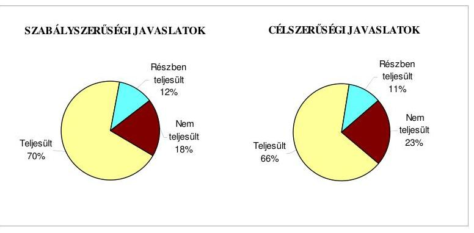

Javaslatunkra az Országgyűlés meghatározta a helyben (önkormányzati szinten) központosított közbeszerzésekre vonatkozó szabályokat, a megyei önkormányzatok kötelező szociális feladatait, a nem normatív céljellegű működési támogatások közzétételi kötelezettségét. A Kormány egységesítette az érvényesítést végzők képesítési előírásait, meghatározta a közvetett támogatások képviselő-testületi bemutatására, a kötelezettségvállalás rendjének belső szabályozására, a szakmai teljesítés igazolás tartalmára vonatkozó követelményeket, valamint biztosította az önállóan gazdálkodó költségvetési szerv vezetőjének döntési jogkörét a számviteli politika és a kapcsolódó szabályzatok részben önállóan gazdálkodó költségvetési szervekre történő kiterjesztésére. Egyetértés, illetve megfelelő előkészítés hiánya miatt nem történt intézkedés a nem lakás céljára szolgáló helyiségek esetében az elővásárlási jog gyakorlására jogosult személy kijelölésére – a gazdálkodó szervezet bérlő részére – biztosított lehetőség megszűntetésére, az önkormányzatok kötelező feladatainak és a költségvetési hiány számításánál a hitel figyelembevételi módjának meghatározására, az egyéb (nem pénzforgalommal járó) gazdasági eseményekre a vezetői elrendelés és az érvényesítés kötelezettségének előírására.

---

A helyszíni ellenőrzés megállapításainak hasznosítása mellett javasoljuk:

# a Miniszterelnöki Hivatalt vezető miniszternek 

kezdeményezze az Eisztv. mellékletében a III. Gazdálkodási adatok 3. és 4. pontjainak módosítását annak érdekében, hogy azokban az Áht. 15/A. § (1) bekezdésében és 15/B. § (2) bekezdésében foglaltakkal összhangban történjen a közzétételi idő meghatározása;

## az önkormányzati miniszternek és a pénzügyminiszternek

1. kezdeményezzék az önkormányzatok belső ellenőrzési feladatainak elősegítése és a jegyzők Ötv. 92. § (4)-(5) bekezdéseiben foglalt felelősségének érvényesíthetősége érdekében
a) annak előírását, hogy a belső ellenőrzést végző társulások esetében a Ber. 18. §-a rögzítsen a belső ellenőrzési feladatokat meghatározó stratégiai terv és éves ellenőrzési terv tartalmára vonatkozóan a jegyző és a társulás közötti egyeztetési kötelezettséget, valamint a jegyző egyetértési jogosultságát;
b) annak meghatározását, hogy a társulások és az önkormányzatok együttműködve biztosítsák a belső ellenőrzési feladatok (igények) és a rendelkezésre álló belső ellenőrzési kapacitás összhangját a Ber. 21. § (2) és (4) bekezdéseiben előírtak betartása érdekében;
c) annak előírását, hogy a társulások évenként készítsenek beszámolót a társulásban érintett képviselő-testületeknek a belső ellenőrzési feladatok tervszerű ellátásának értékeléséről, a tervtől való eltérés indokáról, a terven felüli ellenőrzések indokoltságáról, az ellenőrzések módjáról, fontosabb megállapításairól, javaslatairól, a megállapítások és javaslatok hasznosításáról, az ellenőrzési tevékenység fejlesztésére vonatkozó javaslatokról;
d) annak előírását, hogy – amennyiben a belső ellenőrzési vezetői feladatokat a társulás látja el megállapodás alapján – a társulások az éves ellenőrzési terv végrehajtásáról év közben az ellenőrzések megkezdésekor és befejezésekor tájékoztassák az érintett önkormányzat jegyzőjét, valamint az éves ellenőrzési tervben foglaltaktól csak a jegyző és az éves ellenőrzési tervet jóváhagyó képviselő-testület egyetértését követően térhetnek el;
e) annak rögzítését, hogy a kockázatkezelési szabályzatban meghatározottak szerint elvégzett kockázatelemzés során magas kockázatúnak minősített, belső ellenőrzésre kijelölt feladatoknak a kockázatelemzést követő évben történő ellenőrzését a jegyző egyetértésével a képviselő-testület elé jóváhagyásra előterjesztett éves ellenőrzési tervnek tartalmaznia kell;

## a pénzügyminiszternek

1. kezdeményezze, hogy az Áht. a
 helyi önkormányzatok költségvetési rendeleteire vonatkozóan írja elő a finanszírozási célú pénzügyi műveletek bevételeinek-kiadásainak

---

egyenlegeként jelentkező (pénzügyi) hiány vagy többlet költségvetési rendeletben történő bemutatási kötelezettséget;
2. segítse elő az önkormányzatok kötvénykibocsátásra vonatkozó döntéseinek megalapozását, kockázatainak felmérését, megismerését döntés-előkészítési módszertani útmutató közreadásával;

# az önkormányzati miniszternek 

kezdeményezze az Ötv. 8. § (2) bekezdésében foglalt önkormányzati feladat - miszerint az önkormányzatoknak meg kell határozniuk, hogy a lakosság igényei alapján, anyagi lehetőségeiktől függően, mely feladatokat, milyen mértékben és módon látnak el - pontosítását annak előírásával, hogy ezt milyen szabályozási módon, milyen tartalmi részletezettséggel kell megoldaniuk.

---

# II. RÉSZLETES MEGÁLLAPÍTÁSOK 

## 1. AZ ÖNKORMÁNYZATOK KÖLTSÉGVETÉSI ÉS PÉNZÜGYI HELYZETE

A helyi önkormányzatok által tervezett és teljesített bruttó költségvetési ${ }^{22}$ bevételek és kiadások 2004-2006 között összességében folyamatosan emelkedtek. A tervezett költségvetési bevételek a 2004. évhez viszonyítva a 2006. évben 13%-kal, 2640 milliárd Ft-ról 2989 milliárd Ft-ra, a költségvetési kiadások - a költségvetési bevételeknél három százalékponttal nagyobb mértékben - 16%-kal (2828 milliárd Ft-ról 3271 milliárd Ft-ra) növekedtek. A teljesített költségvetési bevételek 14%-kal, 3111 milliárd Ft-ról 3559 milliárd Ft-ra, a teljesített költségvetési kiadások - a költségvetési bevételeket öt százalékponttal meghaladóan - 19%-kal (2849 milliárd Ft-ról 3404 milliárd Ft-ra) emelkedtek a 2006. évben a 2004. évhez viszonyítva. A helyi önkormányzatoknál 2004-2006 között évente - az előző évhez viszonyítva - a tervezett és teljesített költségvetési kiadások összege nagyobb arányban növekedett, mint a tervezett és teljesített költségvetési bevétel (a 2005. és a 2006. évben a tervezett adatok szerint egy-egy, a teljesített adatok szerint egy-három százalékponttal). A helyi önkormányzatok 2004-2007. évi teljesített bruttó és konszolidált (nettó) bevételeinek és kiadásainak alakulását a jelentés 4. számú melléklete részletezi.

A helyi önkormányzatok 91-91-92%-a 2004-2006 között költségvetési hiányt tervezett, a költségvetési bevételek eredeti előirányzata nem biztosított fedezetet a tervezett költségvetési kiadásokra. A költségvetési hiány finanszírozását hitel felvételével ${ }^{23}$, valamint támogatások elnyerésével tervezték. Az évközi likviditás, valamint a költségvetési egyensúly kialakításához az összes helyi önkormányzat 70-73-68%-a tervezett rövid- és likvid hitel felvételből, 56-58-63%-a hosszú lejáratú hitel felvételből származó bevételt 2004-2006 között. A tervezettel szemben a teljesített költségvetési bevételek az önkormányzatok jelentősen kisebb arányánál (19-26-33%-ánál) nem fedezték a költségvetési kiadásokat, azonban a költségvetési évet pénzügyi hiánnyal záró önkormányzatok aránya évről évre növekedett. A 2004-2006. évek végén likvid hitele volt az összes helyi önkormányzat 11%-ának.

### 1.1. A költségvetési és pénzügyi egyensúly biztosítása

Az ellenőrzött önkormányzatok évente közel azonos hányada (87-84-88%-a) 2004-2006 között a költségvetésben költségvetési hiányt tervezett. Az egy ön-

[^0]
[^0]:    ${ }^{22}$ Finanszírozási célú pénzügyi műveletek bevételei-kiadásai (hitelek felvétele és törlesztése, értékpapírok kibocsátása, értékesítése és visszavásárlása) nélkül számított bevétel-kiadás.
    ${ }^{23}$ Rövid- és hosszú lejáratú hitelek felvételével, hitelviszonyt megtestesítő értékpapírok kibocsátásával, illetve a birtokukban lévő, hitelviszonyt megtestesítő értékpapírok értékesítésével.

---

kormányzatra jutó tervezett költségvetési hiány átlaga a 2004-2006 között 74%-kal emelkedett (280 millió Ft-ról 487 millió Ft-ra) ${ }^{24}$.
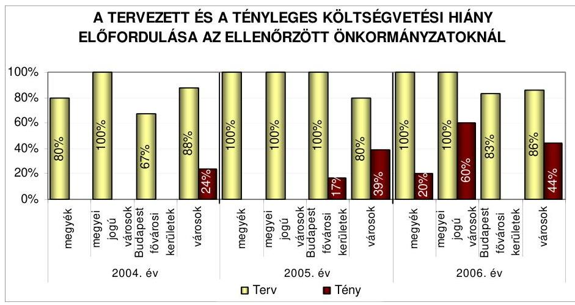

Az ellenőrzött önkormányzatoknál 2004-2006 között tervezett és teljesített működési és felhalmozási célú költségvetési kiadásokra a következő arányban biztosítottak fedezetet a költségvetési bevételek:

Adatok: %-ban

| Megnevezés | 2004. év |  | 2005. év |  | 2006. év |  |
| :--: | :--: | :--: | :--: | :--: | :--: | :--: |
|  | Terv | Tény | Terv | Tény | Terv | Tény |
| Működési célú költségvetési kiadások fedezettsége működési célú költségvetési bevételekből | 99,0 | 109,1 | 98,2 | 106,1 | 95,5 | 103,4 |
| Felhalmozási célú költségvetési kiadások fedezettsége felhalmozási célú költségvetési bevételekből | 83,4 | 88,3 | 84,8 | 87,5 | 87,5 | 95,0 |
| Költségvetési kiadások fedezettsége költségvetési bevételekből | 95,9 | 106,0 | 95,3 | 102,8 | 93,7 | 101,8 |

Az ellenőrzött önkormányzatok által a 2004-2006. években tervezett és teljesített költségvetési - azon belül a működési és a felhalmozási célú - bevételeket és kiadásokat, az azok egyenlegeként kialakult hiány vagy többlet összegét, valamint a finanszírozási célú pénzügyi műveletek bevételeit és kiadásait a jelentés 5. és 6. számú mellékletei részletezik.

[^0]
[^0]:    ${ }^{24}$ A tervezett összes költségvetési kiadáshoz viszonyított költségvetési hiány részaránya a 2004-2006. években a megyei önkormányzatoknál 0,3-9,4%, a megyei jogú városi önkormányzatoknál 0,2-17,4%, a Budapest fővárosi kerületi önkormányzatoknál 0,2-13,5% és a városi önkormányzatoknál 0,05-39,3% között alakult.

---

Az ellenőrzött önkormányzatok esetében a költségvetés teljesítése során a 2004. évben 20%-nál, a 2005. évben 35%-nál és a 2006. évben 40%-nál volt hiány, melynek részaránya a teljesített költségvetési kiadásokhoz viszonyítva 0,02-30,9% között szóródott ${ }^{25}$ a 2004-2006. években. Az egy önkormányzatra jutó tényleges költségvetési hiány átlaga a 2004. évről a 2006. évre 282%-kal, 68 millió Ft-ról 260 millió Ft-ra emelkedett.

A 2004-2006. években az ellenőrzött önkormányzatok tervezettnél kisebb aránya, 40-46-54% vett fel rövid lejáratú és likviditási célú hitelt $^{26}$, 50-60-65% hosszú lejáratú hitelt, illetve 17-29-39% rövid- és hosszú lejáratú hitelt is. A likviditást biztosító hitelek közül a 2004-2006. években folyószámlahitelt felvett ellenőrzött önkormányzatoknál az egy napra jutó legnagyobb folyószámlahitel összege ${ }^{27}$ 2004-2006 között több mint négyszeresére (448%) növekedett.
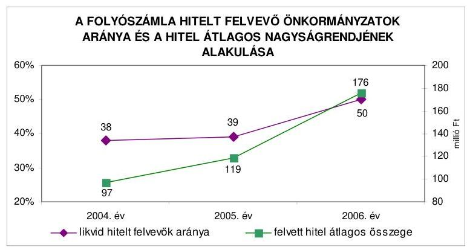

Az ellenőrzött önkormányzatok közül 2004-2006 között egy önkormányzat bocsátott ki kötvényt 900 millió Ft értékben ${ }^{28}$, a 2007. évben azonban már az ellenőrzött önkormányzatok 20%-a ${ }^{29}$. A kötvények futamideje 5 év és 26 év közötti - 61%-nál 20 év - volt. A kötvénykibocsátás legkisebb összege 200 millió Ft (Izsák Város Önkormányzatánál), legnagyobb összege 5000 millió Ft (Borsod-Abaúj-Zemplén Megyei Önkormányzatnál) volt. A 2007. évi kötvénykibo-

[^0]
[^0]:    ${ }^{25}$ A teljesített összes költségvetési kiadáshoz viszonyított költségvetési hiány részaránya a 2004-2006. években a megyei önkormányzatoknál 2,0-17,5%, a megyei jogú városi önkormányzatoknál 2,5-11,4%, a Budapest fővárosi kerületi önkormányzatoknál 0,2-7,2% és a városi önkormányzatoknál 0,02-30,9% közötti volt.
    ${ }^{26}$ Likviditási célú hitelként kell kimutatni a Vhr. 9. számú, a számlaosztályok tartalmára vonatkozó előírásokat tartalmazó mellékletének 14. f) pontja alapján a folyószámla-, a rulírozó- és a munkabér-megelőlegezési hitelek révén befolyó bevételeket.
    ${ }^{27}$ Az egy napra jutó legnagyobb folyószámlahitel összege a 2004. évben 815 millió, a 2005. évben 1719 millió és a 2006. évben 3648 millió Ft volt.
    ${ }^{28}$ A Fejér Megyei Önkormányzat 2006. májusában kibocsátott fejlesztési kötvénye 14 év futamidejű, változó kamatozású, forgalomba hozatala zártkörű volt, a tőke törlesztése hat év türelmi idő után kezdődik, évenként 100 millió Ft-os összegben.
    ${ }^{29}$ A Borsod-Abaúj-Zemplén és a Fejér megyei, Érd megyei jogú városi, Budapest főváros XVI. kerületi, valamint Baja, Battonya, Edelény, Izsák, Karcag, Mohács, Oroszlány, Pápa, Pécel, Szarvas, Tiszafüred, Vecsés városi önkormányzatok.

---

csátás következtében a hosszú lejáratú kötelezettség állománya 28876 millió Ft-tal növekedett, ami ezen önkormányzatok fokozódó eladósodását jelenti. A kötvénykibocsátásból származó bevétel 63%-át felhalmozási célra, 15%-át működési célra, 22%-át adósságrendezésre (korábbi működési és felhalmozási célra felvett hitelek visszafizetésére, kötvények visszavásárlására) tervezték felhasználni. Valamennyi kötvény változó kamatfizetési kötelezettséget jelent, a tőketörlesztés éves összege önkormányzatonként eltérően, 20-377 millió Ft között alakult, a kamatfizetés éves összegét önkormányzatonként 14-149 millió Ft között vették számításba a döntéshozatalnál. A tőketörlesztés megkezdéséhez meghatározott türelmi idő 1-6 év között változott. A tőketörlesztés és kamatfizetés együttes összege - a 2008. évi költségvetési adatok alapján számítva - az éves adósságot keletkeztető kötelezettségvállalás felső határához viszonyítva a kötvényt kibocsátó önkormányzatok kétharmadánál 30% alatti volt.

Mohács és Oroszlány városok önkormányzatai a 4000, illetve az 1400 millió Ft-os 20, illetve 15 évi lejáratra kibocsátott kötvénnyel az Ötv. 88. § (2) bekezdésében meghatározottak szerint számított felső határ 67, illetve 80%-át kitevő adósságra vállaltak kötelezettséget.

Az adósság visszafizetését a működési célú költségvetési bevételből tervezték. A felhalmozási célú felhasználást megelőzően, valamennyi önkormányzatnál átmenetileg pénzügyi befektetésben helyezték el a kötvénykibocsátás bevételét, mely befektetések során a kötvény kamatát meghaladó betéti kamatot érvényesítettek. A deviza esetleges árfolyamváltozása, valamint a változó kamatmérték miatt az önkormányzatok számára a kötvénykibocsátás kockázatot jelent.

A helyi önkormányzatoknál az eladósodási mutató 2004-2007 közötti folyamatos emelkedése jelzi, hogy az összes forráson belül emelkedett a hosszú és rövid lejáratú kötelezettségek aránya. Ugyanezen időszakban az összes kötelezettségeken belül csökkent a rövid lejáratú kötelezettségek aránya, mivel emelkedett a hosszú lejáratú kötelezettségek aránya. A helyi önkormányzatok fizetőképességi mutatóinak alakulását a jelentés 7. számú melléklete szemlélteti. Az országos tendenciával egyező az ellenőrzött önkormányzatok eladósodási folyamata, mivel a hosszú és rövid lejáratú kötelezettség összes forráshoz viszonyított arányát jelző eladósodási mutató 2004-2007 között az ellenőrzött önkormányzatoknál is folyamatosan emelkedett, átlagos értéke 3,3-4,4-5,9-9,3% volt $^{30}$. A helyi önkormányzatoknál és ezen belül az ellenőrzött önkormányzatoknál is a legnagyobb mértékben a megyei önkormányzatok, a legkisebb mértékben a Budapest fővárosi kerületi önkormányzatok adósodtak el.

Az ellenőrzött önkormányzatok eladósodási mutatója a 2004. évben 1,2-10,1%, a 2005. évben 1,7-10,0%, a 2006. évben 2,1-16,5%, és a 2007. évben 2,7-25,2% között alakult. A legnagyobb mutatóérték a megyei önkormányzatoknál volt. Az el-

[^0]
[^0]:    ${ }^{30}$ Az ellenőrzött önkormányzatoknál az egyéb passzív pénzügyi elszámolások nélkül számított kötelezettségek állománya az előző évhez viszonyítva a 2005. évben 33%-kal, a 2006. évben 25%-kal növekedett.

---

lenőrzött önkormányzatok 62%-a a 2004. év végén 5 alatti eladósodási mutatóval rendelkezett. A pénzügyi helyzet kedvezőtlen változása következtében a 2005. év végén az ellenőrzött önkormányzatok 45%-ánál, a 2006. év végén 57%-ánál 5-10% közöttire emelkedett az eladósodási mutató, míg a 2007. évben 26%-nál volt 5-10% közötti. A 2004. év végén 12%-nak, a 2007. év végén már 40%-nak 10% feletti volt az eladósodási mutatója.

Az ellenőrzött önkormányzatok 2004-2007. év végi rövid lejáratú kötelezettségeinek állománya az összes kötelezettséghez viszonyítva (esedékességi aránymutató) évente csökkent, 62,2-61,0-57,4-34,7% volt. Az összes kötelezettség 2004-2007 közötti 117%-os növekedésén belül a hosszú lejáratú kötelezettségeknél kisebb arányban emelkedtek a rövid lejáratú kötelezettségek. A hosszú lejáratú kötelezettségek év végi állománya 336%-kal, a rövid lejáratú kötelezettségek év végi állománya 53%-kal növekedett 2004-2007 között.

Az ellenőrzött önkormányzatok esedékességi aránymutatója a 2004. évben 51,8-78,4, a 2005. évben 46,1-79,0 a 2006. évben 44,2-75,0, és a 2007. évben 31,0-54,5 között szóródott, a legkisebb mutató érték a 2004-2006. években a megyei jogú városi, a 2007. évben a városi önkormányzatoknál, a legnagyobb a 2004. és a 2006-2007. évben a Budapest fővárosi kerületi és a 2005. évben a megyei önkormányzatoknál volt.

Az összes kötelezettségen belül a rövid lejáratú kötelezettségek 2004-ben az
 ellenőrzött önkormányzatok 55%-ánál, 2006-ban 37%-ánál, a 2007. évben 29%-nál képviseltek 70% feletti arányt. A rövid lejáratú kötelezettségek állományának csökkenését okozta átmenetileg, hogy a 2004-2007. években felvett hosszú lejáratú hitelek törlesztésének megkezdésére kettő és három év között változó türelmi időt biztosítottak a hitelt nyújtó pénzintézetek a szerződésekben, valamint a kibocsátott kötvények visszafizetése több év - 5-26 év között - múlva lesz esedékes. (A hitelek futamideje 3-25 évre szólt, türelmi időt a tőketörlesztés megkezdésére a három évnél hosszabb időtartamra nyújtott hitelekre biztosítottak a pénzintézetek.)

Az önkormányzatok pénzügyi helyzete eladósodási szempontból kedvezőtlenül változott, annak ellenére, hogy az esedékességi aránymutató javult, amelyet a rövid lejáratú kötelezettségek összes kötelezettségen belüli arányának csökkenése okozott. Az ellenőrzött önkormányzatoknál az eladósodási és esedékességi mutatók alakulását a jelentés 8. számú melléklete szemlélteti.

A 2004-2007. év végi készpénz likviditási mutatók ${ }^{31}$ fizetőképességi szempontból 2006. év végéig romló pénzügyi helyzetet jeleztek, amelyhez képest a 2007. évben javulás következett be, amelyet szemléltet a következő diagram:

[^0]
[^0]:    ${ }^{31}$ Készpénz likviditási mutató (Likviditási gyorsráta I.) = pénzeszközök/rövid lejáratú kötelezettségek.
    Likviditási gyorsráta (Likviditási gyorsráta II.) = (követelések+forgatási célú, hitelviszonyt megtestesítő értékpapírok+pénzeszközök)/rövid lejáratú kötelezettségek

---

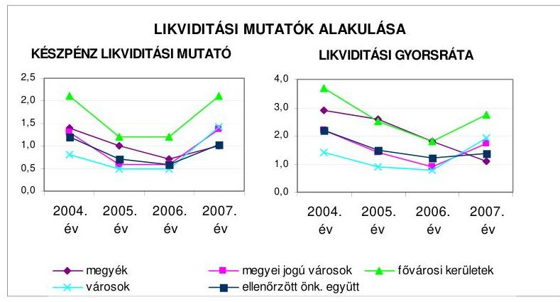

Az ellenőrzött önkormányzatoknál 2004-2006 között csökkenő mértékben nyújtottak fedezetet a pénzeszközök a rövid lejáratú kötelezettségek teljesítésére. Fizetőképességi szempontból a legkedvezőtlenebb pénzügyi helyzetűek voltak a városi önkormányzatok, ahol a rövid lejáratú kötelezettségek pénzeszközökből történő azonnali kiegyenlítésének lehetősége - a készpénz likviditási mutató - a 2006. év végére 0,5-re csökkent. A 2007. évben a kötvénykibocsátásokból elért és fel nem használt bevételek következtében a pénzeszközök év végi állománya növekedett és kedvezően megváltoztatta az ellenőrzött önkormányzatok fizetőképességét. Valamennyi önkormányzati típusnál javult a 2007. év végi készpénz likviditási mutató a 2006. évhez viszonyítva.

A készpénz likviditási mutató a 2004. évben 0,8-2,1, a 2005. évben 0,5-1,2, a 2006. évben 0,5-1,2, és a 2007. évben 1,0-2,1 között szóródott, a legnagyobb mutatóértékekkel a Budapest fővárosi kerületi önkormányzatok rendelkeztek. Az ellenőrzött önkormányzatok 48%-ánál a 2004. év végi pénzeszközök állománya fedezetet nyújtott a rövid lejáratú kötelezettségek teljesítésére, míg a 2006. végén csak 28%-nál, de a 2007. év végén 49%-nál.

Az összes helyi önkormányzat átlagos készpénz likviditási mutatója is folyamatosan csökkent 2004-2006 között, a 2004. év végi 1,0-ról a 2006. év végére 0,6-ra, azonban a 2007. év végén a kötvénykibocsátások miatti pénzeszköz-növekedés következtében 1,1-re emelkedett.

Az önkormányzatok fizetőképességének 2004-2006 közötti rosszabbodását mutatja a likviditási gyorsráta folyamatos csökkenése is, mely szerint az ellenőrzött önkormányzatoknál és valamennyi önkormányzat-típusnál a rövid lejáratú kötelezettségek kiegyenlítésébe a pénzeszközökön túl bevonható követelések és a hitelviszonyt megtestesítő értékpapírok csökkenő arányban biztosítottak fedezetet. A 2007. évi kötvénykibocsátások következtében megnövekedett év végi pénzeszköz-állomány miatt emelkedett a likviditási gyorsráta a megyei jogú, a Budapest fővárosi kerületi és városi önkormányzatoknál. A likviditási gyorsráta csökkent viszont a megyei önkormányzatoknál, mivel a pénzeszközök év végi állományának 34%-os növekedésénél nagyobb volt a követelések év végi állományának csökkenése (92%), melyet az illetékhivatali tevékenység átszervezése, illetve az illetékkövetelések átadása okozott.

A likviditási gyorsráta a 2004. évben 1,4-3,7, a 2005. évben 0,9-2,6 és a 2006. évben 0,8-1,8, és a 2007. évben 1,1-2,8 között szóródott, a legkisebb mutatóértékkel a 2004-2006. években a városi önkormányzatok, a 2007. évben a megyei önkormányzatok, a legnagyobbal a 2004., 2006. és 2007. évben a Budapest fővárosi

---

kerületi önkormányzatok, a 2005. évben a megyei önkormányzatok rendelkeztek.

A likviditási gyorsráta értéke 1,0 alatti volt a 2004. évben az ellenőrzött önkormányzatok 21%-ánál, a 2006. év végén 50%-nál, a 2007. évben a pénzeszközök növekedésének hatására csak 38%-nál, ami jelzi, hogy a pénzeszközök, a követelések és hitelviszonyt megtestesítő értékpapírok együttes értéke az önkormányzatok növekvő hányadánál egyszeri vagy annál kisebb mértékben biztosított fedezetet a rövid lejáratú kötelezettségek teljesítésére.

# 1.2. A költségvetési bevételek és kiadások tervezése és teljesítése 

A tervezett költségvetési bevételek és kiadások 2004-2006 között az ellenőrzött önkormányzatok 39%-ánál folyamatosan növekedtek, 7%-ánál azonban évről évre csökkentek. A költségvetési bevételek folyamatos növekedését elsősorban az adóbevételek és a kapott támogatások tették lehetővé, továbbá egy-egy önkormányzatnál a vagyonértékesítések (ingatlan és gazdasági társasági tulajdonrész eladása) is hozzájárultak ehhez.

Az ellenőrzött önkormányzatok 54%-a az éves költségvetések megállapításakor az Áht. 8/A. § (7) bekezdésében előírtakat megsértve 2004-2006 között a költségvetési hiány finanszírozásával kapcsolatos pénzügyi műveletek bevételeit (a hitelek felvételéből és a hitelviszonyt megtestesítő értékpapírok kibocsátásából, illetve értékesítéséből származó bevételeket) költségvetési hiányt, illetve költségvetési többletet módosító költségvetési bevételként számolta el. Az elfogadott költségvetési rendelettervezetekben az előterjesztők nem mutatták be az önkormányzat valós pénzügyi helyzetét, a tervezett költségvetési hiány, vagy többlet összegét, valamint a finanszírozási célú pénzügyi műveletek bevételeit, kiadásait és azok egyenlegeként keletkező hiányt, vagy többletet.

Az összes költségvetési bevételen-kiadáson belül a működési és felhalmozási célú tervezett és teljesített költségvetési bevételek és kiadások aránya az ellenőrzött önkormányzatoknál a következők szerint alakult:

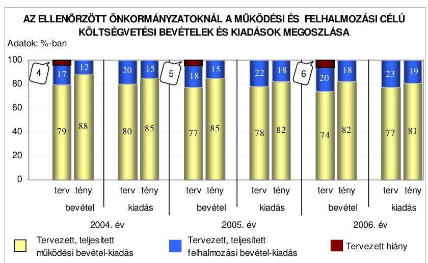

---

A teljesítési adatok alapján 2004-2006 között a költségvetési bevételek eredeti előirányzatát az ellenőrzött önkormányzatok 79-69-74%-a évente alultervezte, és a költségvetési kiadásokat 52%-a túltervezte.

A tervezett működési célú költségvetési bevételek 2004-2006 között évente egyre kevesebb ellenőrzött önkormányzatnál (42-30-18%-nál) fedezték a működési célú költségvetési kiadásokat, míg a teljesítési adatok szerint - a tervezettnél kedvezőbben, az ellenőrzött önkormányzatok nagyobb, de egyre csökkenő hányadánál - 89-74-68%-nál nyújtottak erre fedezetet. Az összes költségvetési bevételen belül a működési célú költségvetési bevételeket az önkormányzatok 91-91-99%-ánál alul, a felhalmozási célú költségvetési bevételeket pedig 49-49-46%-nál túltervezték a 2004-2006. években.

A működési célú költségvetési bevételeken belül az intézményi bevételeket és a helyi adókat tervezték elsősorban alul, valamint elmaradt, vagy az indokoltnál kisebb összegben történt az ellenőrzött önkormányzatok harmadánál a pénzmaradvány igénybevételének tervezése az eredeti előirányzatok meghatározásánál.

Az intézményi bevételek indokolatlan alultervezését okozta az intézményi szolgáltatások térítési díjainak nem a költségvetési rendelettervezet előterjesztéséhez kapcsolódóan, hanem - az Áht. 71. § (2) bekezdésében előírtakat megsértve - a költségvetési rendelet elfogadása után, év közben történő megállapítása. A helyi adóbevételek alultervezése elsősorban az iparűzési adóbevétel tervezési bizonytalanságainak következménye.

A 2004-2006. években az ellenőrzött önkormányzatok 71-76-68%-ánál a felhalmozási célú költségvetési bevételeket meghaladó összegben terveztek felhalmozási célú költségvetési kiadásokat. A tendencia nem változott a költségvetések végrehajtása során sem. A felhalmozási célú költségvetési kiadásait a felhalmozási célú költségvetési bevételeit meghaladó összeggel teljesítette a 2004-2006. években az ellenőrzött önkormányzatok 46-65-52%-a.

A felhalmozási célú költségvetési kiadásokat az ellenőrzött önkormányzatok közel 40%-a túltervezte. A felhalmozási célú feladatok megvalósításához külső források (hitel, támogatás) év közbeni igénybevételét tervezték, azonban a feladatok előkészítettségének hiányosságai, a támogatás elmaradása és a teljesített bevételek figyelembe vételével történt feladatátütemezések, elhúzódások a tervezett kiadások csökkenését okozták.

Az eredeti előirányzatok alapján az ellenőrzött önkormányzatok mintegy 80%-ánál, míg a teljesített költségvetési bevételek és kiadások egyenlege alapján a 2004. évben 20%-ánál, a 2006. évben - a költségvetési bevételek-kiadások növekedés ellenére - 40%-ánál volt ténylegesen is költségvetési hiány. A költségvetési bevételek alultervezése, a költségvetési kiadások túltervezése hatására a 2004-2006. években az ellenőrzött önkormányzatok közül többen és nagyobb összegben terveztek költségvetési hiányt.

A költségvetés teljesítése során 2004-2006 között a működési célú költségvetési bevételek-kiadások minden évben meghaladták a tervezettet, azonban a felhalmozási célú költségvetési bevételek-kiadások minden évben a tervezettnél alacsonyabb összegben teljesültek.

---

A működési célú költségvetési kiadások az előző évhez viszonyítva 2004-2006 között jelentősen nem emelkedtek. A 7%-os, illetve 3%-os emelkedésében szerepet játszott a 2005-2006. évi infláció ${ }^{32}$, valamint a 2005-2006. évi központi bérintézkedések ${ }^{33}$ kiadásnövelő hatása, továbbá a működési célú feladatok ellátásában és annak módjában végrehajtott szervezeti változások. A működési célú költségvetési kiadások csökkentése érdekében az önkormányzatoknál intézményösszevonásokról, átszervezésekről, valamint a nem kötelező feladatot jelentő középfokú oktatási intézmények megyei, fővárosi önkormányzatnak történő átadásáról döntöttek.

Az ellenőrzött önkormányzatoknál 2004-2006 között beruházási, felújítási feladatokra tervezett kiadásokat az eredeti előirányzathoz viszonyítva alulteljesítették, de a feladatok megvalósítására évente jelentősen növekvő (az előző évinél 32%-kal, illetve 14%-kal nagyobb) összeget fordítottak, amelyhez fedezetet a különböző forrásból kapott támogatásokból, a pénzmaradvány nem tervezett igénybevételével és a működési célú költségvetési bevételekből történő átcsoportosítással biztosítottak.

# 2. AZ ÖNKORMÁNYZATOK FELKÉSZÜLTSÉGE AZ EURÓPAI UNIÓS FORRÁSOK IGÉNYLÉSÉRE ÉS FELHASZNÁLÁSÁRA 

### 2.1. Az európai uniós források igénybevételére és a várható támogatás felhasználásának szervezettségére történt felkészülés, valamint a belső szabályozottság értékelése

Az európai uniós forrásokra irányuló pályázatok a gazdasági programokban, az ágazati, szakmai és területfejlesztési koncepciókban, tervekben megfogalmazott fejlesztési célkitűzésekhez kapcsolódtak, azonban a szabályozottság ${ }^{34}$ terén az ellenőrzött önkormányzatok 92%-a, a szervezettség ${ }^{35}$ vonatkozásában 17%-a 2004-2006 között nem készült fel eredményesen az európai uniós források igénybevételére és felhasználására. A szabályozást elmulasztó önkormányzatok nem rendelkeztek az európai uniós forrásokhoz kapcsolódóan a pályázatfigyelés, a pályázatkészítés, az európai uniós forrás-

[^0]
[^0]:    ${ }^{32}$ A KSH által közzétett adatok szerint a fogyasztói árindex a 2005. évben 103,6%, a 2006. évben 103,9% volt, ebből számítva a két év alatti fogyasztói árindex növekedés 7,6%.
    ${ }^{33}$ Az éves költségvetési törvényekben meghatározott átlagos besorolási bér 2005. január 1-jétől 7,5%-kal, 2005. szeptember 1-jétől 4,5%-kal, 2006. április 1-jétől átlagosan 3%-kal emelkedett.
    ${ }^{34}$ Önkormányzati szintű szabályozás azoknak a lényeges információknak, területeknek, kapcsolattartás és ellenőrzés feladatainak meghatározása, amelyek hatást gyakorolnak a döntést hozó döntéseire, a sikeres pályázati tevékenységre, valamint annak eredményes megvalósítására.
    ${ }^{35}$ Az önkormányzati hivatal szervezetén belül, vagy külső személy, szervezet igénybevételével a pályázatfigyelés, pályázatkészítés és a fejlesztési feladat lebonyolítás ellátásának a személyi és szervezeti feltételeit biztosította.

---

sokkal támogatott fejlesztés lebonyolítási feladatairól, felelőseiről, nem szabályozták az európai uniós forrásokra irányuló pályázatok koordinálásával összefüggő feladatokat, nem határozták meg az önkormányzati szintű pályázatnyilvántartás vezetésének felelőseit, az európai uniós forrásokkal kapcsolatos információk áramlásának rendjét. Elmaradt a pályázatfigyelést végzők és a döntési jogkörrel rendelkezők közötti információ-szolgáltatási kötelezettség, valamint a polgármester és a fejlesztési feladat lebonyolítója közötti kapcsolattartás rendjének előírása, továbbá nem írták elő a pályázatfigyelés, a pályázatkészítés, valamint az európai uniós forrásokkal támogatott fejlesztési feladatok lebonyolításának ellenőrzési kötelezettségét, feladatait és felelőseit.

Az önkormányzati hivatalok szervezetén belül, valamint külső személy és szervezet igénybevételével a pályázatfigyelés, a pályázatkészítés és a fejlesztési feladat lebonyolításának személyi és szervezeti feltételeit 2004-2006 között az ellenőrzött önkormányzatoknál 94-96-83%-ánál megszervezték. A pályázatfigyelés, a pályázatkészítés és a fejlesztési feladat lebonyolítását évente csökkenő arányban a polgármesteri hivatal szervezetén belül (61-35-33%-nál), azonban növekvő arányban külső személy/szervezet megbízásával (6-14-12%-nál), valamint a polgármesteri hivatal köztisztviselőinek munkája mellett esetenként külső személy/szervezet igénybevételével (33-51-55%-nál) biztosították.

# 2.1.1. A fejlesztési célkitűzések meghatározása 

Az ellenőrzött önkormányzatok a
 2004-2006. évekre fejlesztési célkitűzéseiket gazdasági programokban, szociális szolgáltatás-tervezési koncepciókban, közoktatási feladat-ellátási, intézményműködtetési és fejlesztési tervekben, településfejlesztési és más fejlesztési koncepciókban határozták meg ${ }^{36}$. A fejlesztési célkitűzések 80\%-a az önkormányzatok kötelező feladatai ellátásához, továbbiak az önként vállalt feladatokhoz kapcsolódtak.

A fejlesztési célkitűzések között a kötelező feladatokhoz kapcsolódóan a megyei önkormányzatok a szociális ellátórendszer fejlesztését, az egészségügyi ellátás színvonalának emelését, a szakképzési és térségi feladatok összehangolását, a megyei jogú városok önkormányzatai az úthálózatok korszerűsítését, a szenvedélybetegek és a pszichiátriai betegek nappali ellátását, az átmeneti szálláshely, éjszakai menedékhely, nappali melegedő, bentlakásos szociális otthon bővítését, Budapest főváros kerületi önkormányzatai az egészségügyi, szociális és közoktatási intézményeinek felújítását, önkormányzati bérlakások építését tervezték. A városi önkormányzatok fejlesztési célkitűzéseikben az ivóvíz- és szennyvízhálózatok, az úthálózatok fejlesztését, a belvízelvezető rendszerek kiépítését, az oktatási intézmények korszerűsítését, a szociális ellátó-hálózatok bővítését fogalmaz-

[^0]
[^0]:    ${ }^{36}$ A szociális igazgatásról szóló 1993. évi III. törvény 92. § (3) bekezdésében, a közoktatásról szóló 1993. évi LXXIX. törvény 85. § (4) bekezdésében előírtaknak megfelelően, valamint a területfejlesztésről és a területrendezésről szóló 1996. évi XXI. törvény és a területfejlesztési koncepciók, programok és a területrendezési tervek tartalmi követelményeiről szóló 18/1998. (VI. 25.) KTM rendelet figyelembevételével, továbbá a sport-, lakás-, közművelődési-, idegenforgalmi koncepciókban, környezetvédelmi programokban.

---

ták meg. A nem kötelező feladataikhoz a megyei önkormányzatok egészségmegőrzést, kistérségi és nemzetközi kapcsolatok kiépítését, valamint a civil közösségek támogatását, a megyei jogú városok turisztikai és nemzetközi kapcsolatok fejlesztését, Budapest főváros kerületi önkormányzatai foglalkoztatás elősegítését, a városi önkormányzatok kórház rekonstrukciót, fürdők felújítását, kerékpárút építését tervezték.

A gazdasági programokban, településfejlesztési és ágazati-szakmai koncepciókban a fejlesztési feladatok költségvetési kiadási szükségletét és azok lehetséges pénzügyi forrásait az ellenőrzött önkormányzatok 61\%-a számba vette, 43\%-a azok megvalósítását az európai uniós forrásokhoz kötötte, 40\%-a fejlesztési célkitűzéseit az NFT-ben megjelenő pályázati lehetőségekhez igazította. Az önkormányzatok 91\%-a a 2004-2006 közötti gazdasági programjaiban foglalt fejlesztési célkitűzéseit a 2007. évben felülvizsgálta és meghatározta a 2007-2010. évek gazdasági programját.

Az Ötv. 91. § (7) bekezdésében foglaltakat megsértve 2007-2010 közötti időszakra gazdasági programot az önkormányzatok 9\%-a nem készített ${ }^{37}$.

A 2004-2007. években az ellenőrzött önkormányzatok 96\%-a ${ }^{38}$, összesen 600 európai uniós forrásokkal összefüggő fejlesztési feladat megvalósításáról döntött ${ }^{39}$.
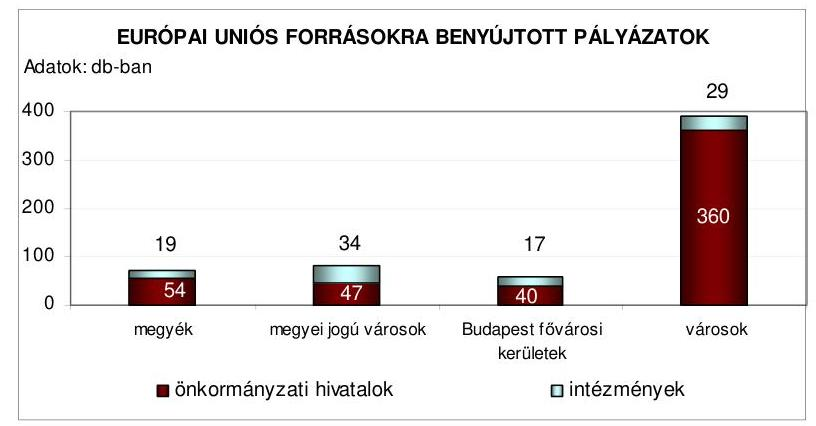

A benyújtott pályázatokban szereplő célkitűzések a gazdasági programban, ágazati, szakmai, településfejlesztési koncepciókban, tervekben meghatározott fejlesztési célkitűzésekhez kapcsolódtak. Az önkormányzatok támogatást

[^0]
[^0]:    ${ }^{37}$ Budapest fővárosi VI. kerület, Fehérgyarmat, Jászberény, Keszthely, Nagymaros, Rétság, Szentlőrinc városok önkormányzatai.
    ${ }^{38}$ Nem döntöttek európai uniós pályázat benyújtásáról 2004-2007 között Nyékládháza és Balatonlelle városok önkormányzatai, valamint nem nyújtott be európai uniós támogatásra pályázatot Budapest Főváros I. Kerület Önkormányzata. A benyújtott pályázatok hiányosságai és forráshiány miatt nem kaptak európai uniós támogatást az ellenőrzött önkormányzatok közül Balatonalmádi, Hévíz, Keszthely, Oroszlány és Villány városok önkormányzatai.
    ${ }^{39}$ Az NFT operatív programjaira 2004. január 1 - 2006. december 31-ig 749 önkormányzat összesen 1490 pályázata részesült támogatásban. (Forrás: Egységes Monitoring Információs Rendszer)

---

kaptak az NFT operatív és az előcsatlakozási alapok programjaira, továbbá egyéb támogatásokra ${ }^{40}$ benyújtott pályázatok 35\%-a alapján.
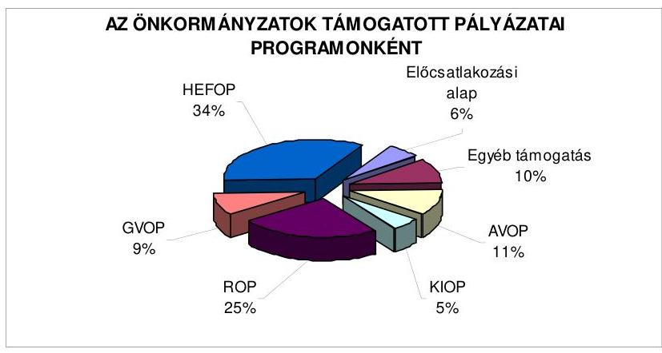

A benyújtott pályázatok elutasítását a pályázati források hiánya, a szakmai kidolgozatlanság, a pályázatok formai hibái - az aláírások, oldalszámozások elmaradása -, a költséghatékonyság hiánya, valamint a pályázati feltételek hiányos, vagy nem teljesítése okozta.

A pályázatok elutasításának okai között szerepelt, hogy a projekt indokoltság alátámasztására nem alkalmaztak megfelelő mutatókat, a tervezett eredmények nem voltak reálisak, a műszaki tervek hiányosak, alacsony színvonalú az üzleti terv, a célcsoport illetve a célterület szükségletének kifejtése hiányzott, a számszerűsített célkitűzések a pályázati kiírásnak nem feleltek meg, nem mutatták be, hogy a tervezett integráció milyen mértékben biztosított és a kitűzött eredmények realitását. Nem feleltek meg a pályázati feltételeknek abban az esetben, ha önkormányzatonként csak egy pályázat volt benyújtható, a beruházás nem teremtett új munkahelyeket, a pályázati felhívás kizárólag községre vonatkozott, a meghatározott célkitűzés (strand-rekonstrukció) nem szerepelt a pályázati kiírásban, vagy az önkormányzat nyújtotta be a pályázatot az intézmény helyett.
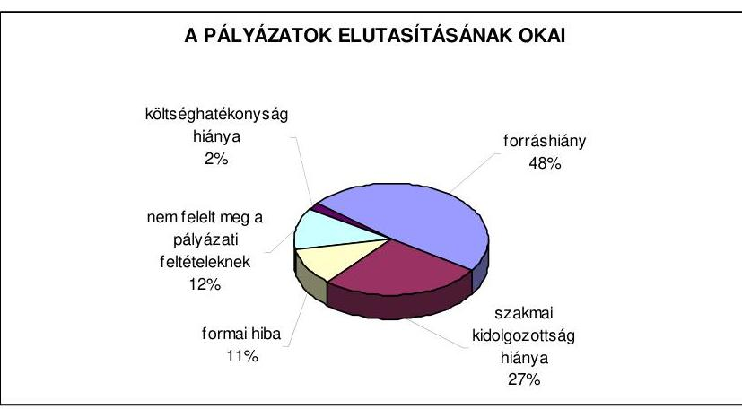

[^0]
[^0]:    ${ }^{40}$ Norvég Alap, INTERREG, Európai Unió Socrates, ÖkoBusinessPlan WIENNA-Győr, Meeting Of Citizens testvérvárosi kapcsolatok támogatására pályáztak az önkormányzatok.

---

Az ellenőrzött önkormányzatok 2004-2007 között az európai uniós forrásokkal támogatott fejlesztési feladatok megvalósítását a következő összetételű forrásokkal tervezték és valósították meg:
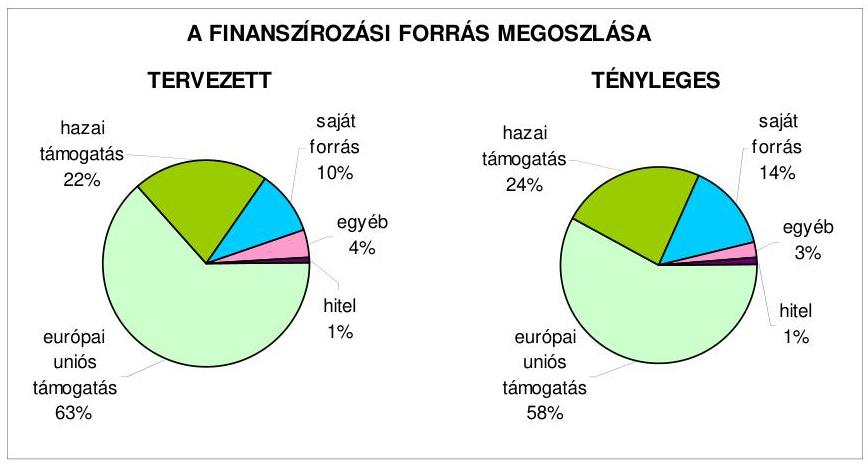

Az egyéb forrás tartalmazta az önkormányzatok európai uniós, valamint hazai fejlesztési pályázati saját forrás kiegészítésének támogatását, az európai uniós forrással megvalósuló programok kiadásainál felszámított és levonható áfát, Kecskemét Megyei Jogú Város Önkormányzatánál az ISPA szennyvízelvezetési és kezelési programnál a konzorciumi tagok hozzájárulását.

Az ellenőrzött önkormányzatoknál 2004-2007 között az európai uniós forrásokkal támogatott fejlesztési feladatok 11\%-a befejeződött, 89\%-nál a megvalósítás a helyszíni ellenőrzéskor folyamatban volt, ezért a támogatási szerződésekben meghatározott kiadási előirányzatok 51\%-át használták fel. A hatályos támogatási szerződésekben rögzített európai uniós támogatás 58\%-át kapták meg az önkormányzatok, amely öt százalékponttal volt alacsonyabb a tervezettnél. A teljesített bevételek saját forrás részarányának a tervezetthez képest négy százalékponttal magasabb mértékét elsősorban az utólagos finanszírozás miatt az európai uniós és hazai támogatás megelőlegezése, továbbá a megvalósítás során jelentkezett pót- és többletmunkák, a nem támogatott feladatok többletkiadásai okozták.

A 2004-2007. évek költségvetési rendeleteiben az ellenőrzött önkormányzatok 80\%-a gondoskodott az európai uniós forrással támogatott fejlesztési feladatok megvalósításához szükséges saját forrás biztosításáról. Az Ámr. 29. § (1) bekezdés k) pontjában foglaltak ellenére az ellenőrzött önkormányzatok 32\%-a ${ }^{41}$ a 2004-2007. évi költségvetési rendeletek mellékletében elkülönítetten nem mutatta be az európai uniós támogatással megvalósuló programok bevételeit és kiadásait.

[^0]
[^0]:    ${ }^{41}$ Érd, Kecskemét és Szombathely megyei jogú város és 22 városi önkormányzat.

---

Ezen kiadásokra Eger és Szombathely megyei jogú városok, valamint Szentgotthárd Város Önkormányzata költségvetési rendeletében előfinanszírozási tartalékot ${ }^{42}$ tervezett.

Az európai uniós forrásból megvalósuló fejlesztési feladatokhoz 2004-2007 között a saját forrás kiegészítése céljából az ellenőrzött önkormányzatok 59\%-a az önkormányzatok európai uniós, valamint hazai fejlesztési pályázatai saját forrás kiegészítésének támogatására ${ }^{43}$ pályázat benyújtásáról döntött, amelyek alapján az ellenőrzött önkormányzatok összesen 2,3 milliárd Ft támogatásban részesültek ${ }^{44}$. A saját forrást kiváltó hitel felvételét az ellenőrzött önkormányzatok 15\%-a tervezte.

# 2.1.2. Az európai uniós forrásokhoz kapcsolódóan a pályázatfigyelés, a pályázatkészítés, valamint a megvalósuló fejlesztés lebonyolításának szabályozottsága, a végrehajtás személyi, szervezeti feltételei 

Az európai uniós források igénybevételének és felhasználásának feladatait az ellenőrzött önkormányzatok 73\%-a hiányosan szabályozta, mivel:

- az európai uniós pályázatok támogatásának igénybevételével, valamint felhasználásával kapcsolatos döntési jogkörökről annak indokoltsága ellenére 80\%-a nem rendelkezett;
- az európai uniós forrásokra irányuló pályázatok koordinálásával összefüggő feladatokat 80\%-nál, az önkormányzati szintű pályázat-nyilvántartás vezetésének felelősét, az európai uniós forrásokkal kapcsolatos információk áramlásának rendjét 83\%-nál, a polgármester és a fejlesztési feladat lebonyolítója közötti kapcsolattartás rendjét 87\%-nál az önkormányzati szabályozás nem tartalmazta;
- az európai uniós forrásokra irányuló pályázatfigyelés, pályázatkészítés, valamint a támogatott fejlesztési feladat lebonyolításának ellenőrzési kötelezettségét, feladatait és felelőseit 73\% nem szabályozta.

Az európai uniós források igénybevételére és felhasználására vonatkozó pályázatfigyeléssel, pályázatkészítéssel, és a fejlesztési feladat megva-

[^0]
[^0]:    ${ }^{42}$ Az ellenőrzött önkormányzatok 96\%-a a 2004-2006. évek költségvetési rendeleteiben az európai uniós pályázatokban szereplő saját forrás előirányzatán túlmenően, indokoltsága ellenére a további esetleges saját forrás szükségletre, a projektek utófinanszírozására fedezetet nem hagyott jóvá.
    ${ }^{43}$ A 2004. évi költségvetési törvény 5. számú mellékletének 19. pontjában, a 2005. évi költségvetési törvény 5. számú mellékletének 18. pontjában, a 2006. évi költségvetési törvény 5. számú mellékletének 17. pontjában és a 2007. évi költségvetési törvény 5. számú mellékletének 12. pontjában meghatározott központi költségvetési előirányzat.
    ${ }^{44}$ A helyi önkormányzati alrendszerben az NFT operatív programjai keretében 20042007 között 2624 projekthez 173,1 Mrd Ft összegű támogatási szerződést kötöttek. (Forrás: NFÜ Informatikai és Tájékoztatási Főosztály)

---

lósításával összefüggő feladatokat az ellenőrzött önkormányzatok 71\%-a nem szabályozta a 2004-2006. évben.

A 2007. évben szabályozták Eger megyei jogú város, valamint Ibrány, Mórahalom, Vecsés városok önkormányzatai az európai uniós források igénybevételének és felhasználásának feladatait és felelőseit, ezzel 2007-től biztosították a szabályozottság és szervezettség tekintetében az eredményes felkészülést.

Kecskemét Megyei Jogú Város Önkormányzata 2007. február 1-jei hatállyal az önkormányzati hivatalban megszüntette a pályázatok koordinálását, a pályázatfigyelés, a pályázatkészítés feladatait ellátó Európai uniós pályázati csoportot. A feladatokat más szervezeti egységhez nem telepítette, nem szabályozta a feladatellátás rendjét és felelőseit.

Az európai uniós források pályázatfigyelésével, pályázatkészítésével, valamint a fejlesztési feladatok lebonyolításával összefüggő személyi, szervezeti feltételek kialakítását a következő táblázat mutatja be:
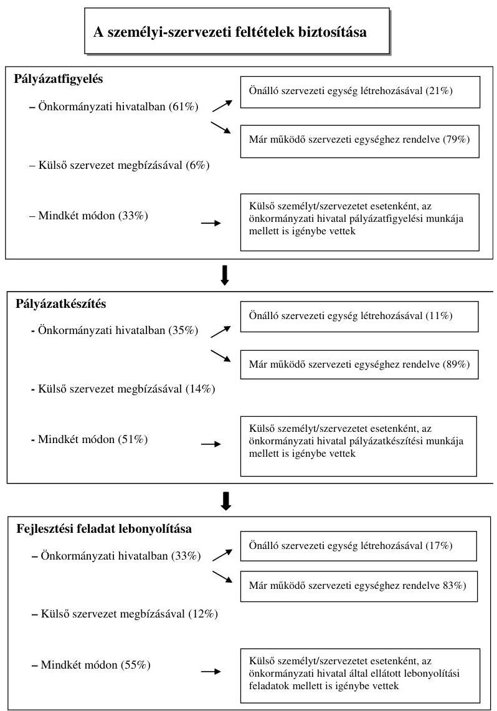

A külső szervezetekkel pályázatfigyelési feladatok ellátására kötött szerződések 97\%-ánál, és pályázatkészítési feladatok ellátására kötött szerző-

---

dések 92\%-ánál meghatározták a feladatellátás kötelezettségét, a szerződések mintegy felénél az információk átadásának formáját, tartalmát és módját, továbbá mintegy kétharmadánál előírták a kapcsolattartás rendjét ${ }^{45}$.

Az európai uniós fejlesztési feladatok lebonyolítására külső szervezetekkel kötött szerződésekben rögzítették a feladatellátás kötelezettségét, 64\%-nál meghatározták a felelős személyeket és 58\%-nál az ellenőrzési feladatok megosztását.

# 2.1.3. Az európai uniós forrással támogatott fejlesztés megvalósítása 

A fejlesztési feladatokat 94 projekt vonatkozásában értékeltük ${ }^{46}$, amelyek mintegy tizedénél a megvalósítás befejeződött, a támogatást igénybe vették az önkormányzatok ${ }^{47}$, közel kilenctizedénél a megvalósítás az ellenőrzés időszakában folyamatban volt.

AZ ELLENŐRZÖTT FEJLESZTÉSI FELADATOK MEGVALÓSÍTÁSA
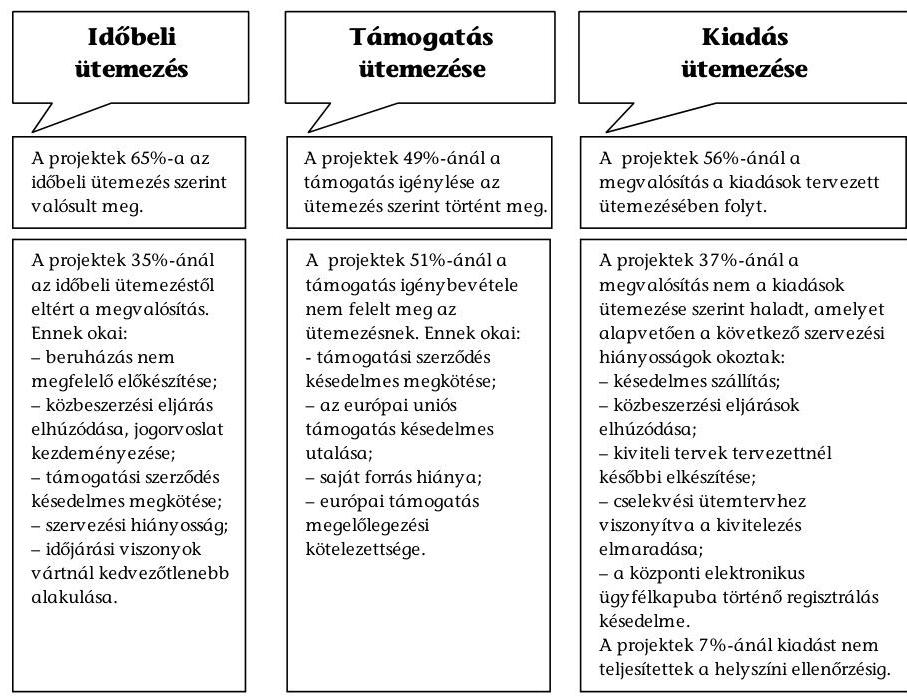
${ }^{45}$ Az információáramlás rendjét a pályázatfigyelésre kötött szerződések 53\%-ában, a pályázatkészítés esetében 54\%-ában, a kapcsolattartás rendjét 67\%, illetve 67\%-ában határozták meg.
${ }^{46}$ Azon önkormányzatoknál ahol 2004-2007 között az önkormányzati hivatalban nem volt nyertes európai uniós pályázat, ott egy önkormányzati intézményben ellenőriztük az európai uniós forrással támogatott fejlesztések megvalósítását, amelyek megállapításairól helyszíni ellenőrzési jegyzőkönyvek készültek. Budapest főváros I. kerületi önkormányzat kettő európai uniós pályázatról szóló döntés ellenére nem nyújtotta be, Budapest főváros VI. kerületi önkormányzat pedig nem döntött a pályázatról.
${ }^{47}$ Nem használta fel a támogatás teljes összegét a fejlesztési feladathoz az ellenőrzött önkormányzatok 11\%-a az áfa kulcs 25\%-ról 20\%-ra történt csökkenése, valamint a közbeszerzési eljárások lefolytatása eredményeként elért alacsonyabb összegű kivitelezési és eszközbeszerzési kiadások miatt.

---

A 2004-2007. években az európai uniós forrással megvalósuló fejlesztések támogatási szerződéseinek 46\%-át ${ }^{48}$ módosították. A módosítás okai között szerepelt az időbeli ütemtervek és a befejezési határidők csúszása, a támogatás és a kiadás évek közötti ütemezésének változása, az előlegek igénylése, a támogatási szerződés mellékletében a költségvetés fősorai közötti átcsoportosítások, a műszaki tartalom módosulása, a projektmenedzser, műszaki ellenőr személyek cseréje. A közreműködő szervezetek a kifizetési kérelmek és jelentési kötelezettség változása ${ }^{49}$ miatt kezdeményeztek támogatási szerződés
 módosítást.

Az európai uniós támogatások igénylésénél a PEJ-ek, valamint a kifizetést alátámasztó számlák, bizonylatok ellenőrzése 30-240 nap közötti időtartamot ${ }^{50}$ vett igénybe. Az európai uniós támogatás igénylését alátámasztó dokumentációk ellenőrzése 60 nap alatt volt az ellenőrzött projektek 25%-ánál, 60-180 nap közötti volt 30%-ánál, 180-240 nap közötti volt 45%-ánál.

A kifizetési kérelmek benyújtása és a támogatás folyósítása közötti időtartamot befolyásolta a bizonylatok felülvizsgálatainak elhúzódása, az igénylést alátámasztó dokumentációk, igazolások hiányosságai ${ }^{51}$, az elszámolások nem feleltek meg a költségütemezésnek, az ajánlatok értékelését nem csatolták a kifizetési kérelmekhez, az önkormányzatok hiánypótlási kötelezettségüket nem teljesítették, a hiánypótlások határidőre nem történtek meg.

Kettő megyei jogú városi és három városi önkormányzatnál ${ }^{52}$, a támogatás összegét csökkentették a közreműködő szervezetek, mivel a részletes költségvetési terv az előírt feltételektől eltérően három éves üzemeltetési költséget tartalmazott, a tervezett műszaki tartalom nem valósult meg, továbbá a pályázatkészítésre fordított kiadást nem fogadta el a finanszírozó.

[^0]
[^0]:    ${ }^{48}$ A támogatási szerződéseket általában egy-öt alkalommal módosították.
    ${ }^{49}$ A strukturális alapok és a Kohéziós Alap felhasználásának általános eljárási szabályairól szóló 14/2004. (VIII. 13.) TNM-GKM-FMM-FVM-PM együttes rendelet 30. § (2), (4) és (33) bekezdései szerint a PEJ-eket a támogatási szerződés megkötésétől számítva félévente, a strukturális alapokból és a hazai társfinanszírozásból együttesen 10 millió Ft-ot nem meghaladó mértékben támogatott vagy a hat hónapot meg nem haladó időtartamú projektek esetében egyetlen PEJ-t kell benyújtani a projekt megvalósításának befejezését követő 45 napon belül, továbbá módosult a támogatás kifizetésének igénylése.
    ${ }^{50}$ Encs Város Önkormányzatánál a ROP projekt egy kifizetési kérelménél a megvalósításához igényelt támogatás folyósításáig 355 nap telt el, a számlák és bizonylatok ellenőrzése során több alkalommal szólította fel a közreműködő szervezet az önkormányzati hivatalt hiánypótlásokra.
    ${ }^{51}$ A pénzügyi menedzser által kiállított számla nem tartalmazta az SZJ és a vállalkozói igazolvány számát, a vállalkozó által benyújtott számlához nem csatolták a teljesítést igazoló bizonylatot, fényképeket, építési naplót, a számlaösszesítő hibás adatot tartalmazott.
    ${ }^{52}$ Érd és Eger megyei jogú városok, továbbá Ajka, Baja, Szarvas város önkormányzatai.

---

A közreműködő szervezetek a támogatási előlegigénylést 30 napon belül teljesítették, valamint a támogatási szerződésben előírt 60 napon belül folyósították a támogatást a hiánytalanul benyújtott kifizetési kérelmek alapján ${ }^{53}$.

Az ellenőrzött önkormányzatok az európai uniós forrásokkal támogatott fejlesztési feladatok megvalósításához biztosították a támogatási szerződésekben vállalt saját forrást, továbbá eleget tettek a strukturális alapok által támogatott fejlesztések esetében a megelőlegezési követelménynek. A gazdálkodásban az önkormányzatok 24%-ánál okozott pénzügyi zavarokat a támogatás utólagos finanszírozási rendszere.

Borsod-Abaúj-Zemplén megye és Encs város önkormányzata a kiadások átütemezésével, Budapest főváros XIII. kerület, Kecskemét és Szombathely megyei jogú város és kilenc ${ }^{54}$ város önkormányzatai likviditási és rövid lejáratú hitelek felvételével, a Tolna Megyei Önkormányzat az intézménye részére biztosította a támogatott fejlesztések kiadásainak fedezetét. Hajdú-Bihar megye és Karcag város önkormányzatainál folyamatos likviditási gondok jelentkeztek a költségvetési gazdálkodásban, Érd Megyei Jogú Város Önkormányzata a kivitelező számláit az előírt határidő után, részletekben egyenlítette ki.

Az ellenőrzött önkormányzatok ${ }^{55}$ a fejlesztési feladatok 18%-át a tervezetthez viszonyított többletkiadással valósították meg, amelyek fedezetét saját forrás biztosította. A fejlesztési feladatok tervezett kiadásához viszonyítva a többletkiadások mértéke 13 projektnél 6% alatti, kettő projektnél 14-26% és egy projektnél 317% - a tervezett 0,6 millió Ft-ot 1,9 millió Ft-tal egészítették ki - volt. A többletkiadások felmerülését nem az önkormányzati szabályozottság hiányosságai, hanem a pályázatban nem szereplő, de a feladat megvalósításához kapcsolódóan teljesített kiadások okozták.

A közbeszerzési eljárás eredményeként megkötött kivitelezői szerződések magasabb összegűek ${ }^{56}$ voltak a pályázatokban tervezett kiadásoknál, a műszaki tartalmak módosításai, a pót- és többletmunkák elrendelései, a pályázatban nem támogatott feladatok - geodéziai munkák, engedélyezési tervek készítése, közműcsatlakozások, vízjogi üzemeltetési engedély, műszaki ellenőr, projektmenedzseri megbízások - miatt többletkiadások jelentkeztek.

Az ellenőrzött önkormányzatok 63%-ánál végezték el 2004-2007 között a folyamatba épített, előzetes és utólagos vezetői ellenőrzés feladatait az európai uniós forrással megvalósuló fejlesztési feladatokkal kapcsolatos be-

[^0]
[^0]:    ${ }^{53}$ Eger és Kecskemét megyei jogú városok támogatási előlegigénylése, Budapest IX. kerületi, Borsod-Abaúj-Zemplén és Tolna megyei önkormányzat - kettő - kifizetési kérelme esetében.
    ${ }^{54}$ Ajka, Baja, Bátorterenye, Budakeszi, Derecske, Dorog, Ibrány, Nyírtelek, Szentes város önkormányzatai.
    ${ }^{55}$ Tolna megyei, Eger, Győr, Kecskemét megyei jogú város, Ajka, Baja, Balkány, Bátorterenye, Csenger, Csurgó, Encs, Mezőkövesd, Nyírtelek város önkormányzatai.
    ${ }^{56}$ Eger Megyei Jogú Város Önkormányzatánál a ROP Eger-Egerszalók közötti összekötő út, Tolna Megyei Önkormányzatnál a ROP Szekszárd Keleti Városkapu projektek esetében.

---

vételek és kiadások teljesítésénél. A kötelezettségvállalás, valamint utalvány ellenjegyzését az arra jogosultak, a teljesítés szakmai igazolását a kijelölt személyek a belső szabályzatban meghatározott módon, az érvényesítést a megfelelő végzettséggel és képzettséggel rendelkező megbízottak végezték. Az Ámr. 145/A. § (1) bekezdésében foglaltak ellenére a jegyzők 37%-a nem tett eleget a folyamatba épített, előzetes és utólagos vezetői ellenőrzési kötelezettségnek.

Tolna Megyei Önkormányzat egy intézményénél, Érd megyei jogú város, Budapest főváros IX. kerületi és Badacsonytomaj, Bátaszék, Encs, Gyál, Heves, Izsák, Szob, Visegrád város önkormányzatainál az Ámr. 134. § (9) bekezdésében foglaltak ellenére a kötelezettségvállalás ellenjegyzője nem győződött meg a fedezet rendelkezésre állásáról, továbbá a gazdálkodásra vonatkozó szabályok betartásáról az önkormányzati hivatalban. Az Ámr. 135. § (2) bekezdésében foglaltakat figyelmen kívül hagyva a Tolna Megyei Önkormányzat intézményénél, valamint Kecskemét megyei jogú város, Budapest főváros XVI. kerületi és Heves, Szob város önkormányzatainál nem a kijelölt személy, Budapest főváros XIII. és a XVI. kerület önkormányzatainál nem a szabályozásban meghatározott módon végezték a szakmai teljesítésigazolást, további 10 városi önkormányzatnál a szakmai teljesítést igazoló személy nem látta el az Ámr. 135. § (1) bekezdésében előírt feladatát, mivel elmulasztotta a megrendelésben, szerződésben meghatározott cél teljesítésének, a kiadás jogosultságának, összegszerűségének az ellenőrzését. Az utalvány ellenjegyzője a Tolna Megyei Önkormányzat intézményénél, Érd, Kecskemét megyei jogú város, Budapest főváros IX., XIII. és XVI. kerületi és 12 városi önkormányzatnál az Ámr. 137. § (3) bekezdésében foglaltnak nem tett eleget, mert a gazdálkodásra vonatkozó szabályok érvényesüléséről, a szakmai teljesítés igazolás és az érvényesítés megtörténtéről nem győződött meg.

A támogatásban részesülő, ellenőrzött önkormányzatok 86%-ánál a belső ellenőrzés nem vizsgálta az európai uniós források felhasználását a 2004-2007. években.

A belső ellenőrzések a megyei önkormányzatoknál a projekt végrehajtásában az ütemezéshez képest jelentős lemaradást, az irattári anyagok, projektdossziék hiányos kezelését állapították meg. Komárom-Esztergom Megyei Önkormányzatnál az intézményi ellenőrzéskor feltárták, hogy a közalkalmazottak munkaidőben, illetve munkaidőn kívül a projekt megvalósításával kapcsolatos feladatokat is elláttak, amelyek elkülönített nyilvántartását és a személyi juttatásait nem biztosították. Eger Megyei Jogú Város Önkormányzatánál a belső ellenőrzés a fejlesztési feladat lebonyolításánál a külső szervezetekkel kötött megállapodások tartalmi hiányosságaira hívta fel a figyelmet, Baja Város Önkormányzatánál egy fejlesztési feladat esetében a szerződésben meghatározott kötbérigény érvényesítésére tett javaslatot. A belső ellenőrzések megállapításainak hasznosítására a jegyzők intézkedtek.

Az európai uniós forrással támogatott fejlesztési feladatok megvalósításának folyamatában a 2004-2006. években külső ellenőrzést a közreműködő

---

szervezetek, a KEHI, az ÁSZ és az Európai Unió auditorai az ellenőrzött önkormányzatok 70%-ánál végeztek ${ }^{57}$.

A külső ellenőrzések az ellenőrzött projektek 82%-ánál tártak fel hiányosságot.
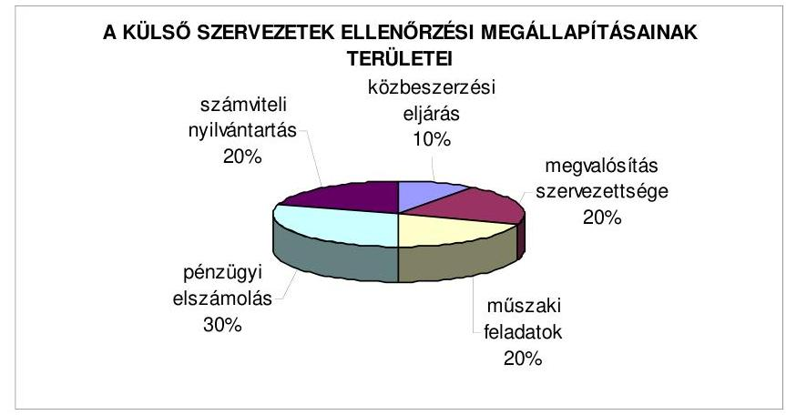

A közreműködő szervezetek az általuk ellenőrzött önkormányzatok tizedénél feltárt szabálytalanságok miatt a támogatás kifizetését felfüggesztették, illetve visszafizetési kötelezettséget, valamint a közbeszerzési eljárások lefolytatásában törvénysértéseket ${ }^{58}$ állapítottak meg, és jogorvoslati eljárást kezdeményeztek a KDB-nél. A PEJ-ek és kifizetési kérelmek felülvizsgálatakor a bizonylatok alaki hiányosságainak megszüntetésére tettek javaslatot.

A közreműködő szervezetek szabálytalanságra vonatkozó megállapításokat tettek az ellenőrzött projektek 4%-ánál a következők szerint:

- Eger Megyei Jogú Város Önkormányzatánál a közbeszerzési eljárás nyertes ajánlattevőjének a műszaki ellenőri tevékenységre vonatkozó referenciaigazolása hamis volt, valamint a szociális konténer beszerzésére a kivitelezővel kötött építési szerződést a közbeszerzési eljárás lefolytatása nélkül módosították;
- Berettyóújfalu Város Önkormányzatánál a pénzügyi menedzser a Polgármesteri hivatalban vezető beosztású személy volt, ezért megbízási szerződéssel való foglalkoztatása ellentétes a Ktv. 21. § (3) bekezdésében foglaltakkal, továbbá a műszaki vezető megbízása és munkaköri leírása között átfedések voltak;

[^0]
[^0]:    ${ }^{57}$ A közreműködő szervezetek 49, a KEHI a Borsod-Abaúj-Zemplén és a Hajdú-Bihar megyei, valamint Eger, Kecskemét és Szombathely megyei jogú városi, továbbá Dorog, Gyomaendrőd város önkormányzatainál, az ÁSZ Eger és Szombathely megyei jogú városok és Baja város önkormányzatainál, az Európai Unió auditorai Gyomaendrőd Város Önkormányzatánál végeztek ellenőrzést.
    ${ }^{58}$ Szabálytalanság miatt egy önkormányzatnál 0,8 millió Ft visszafizetési kötelezettséget állapítottak meg, négy önkormányzatnál összesen 25,7 millió Ft támogatáscsökkentést, egy önkormányzatnál 25,0 millió Ft támogatás-folyósítás felfüggesztését kezdeményezték, valamint a közbeszerzési eljárások ellenőrzése során két önkormányzatnál egy-egy fejlesztési feladat esetében kettő, egy önkormányzatnál egy fejlesztési feladat esetében három törvénysértést állapítottak meg.

---

- Baja Város Önkormányzata projekten belüli költségként olyan kifizetést kezdeményezett, amelyet a támogatási szerződés nem tartalmazott;
- Dorog Város Önkormányzatánál a projekt szakmai vezető 2005. február 1-jétől hatályos megbízását később, 2005. április 1-jén írták alá.

A KEHI a PEJ indikátor adatainak pontatlanságát, a számla 3. példányán a szakmai teljesítés igazolásának hiányát, több száz elektronikus kapcsolat nyitott, védelem nélküli elhelyezését, az archív anyagok szabálytalan tárolását, a fejlesztési-, teszt-, és éles rendszerek fizikai különállósága ellenére a hozzáférési jogosultság elhatárolása nélküli működtetését állapította meg. Rögzítette továbbá, hogy a műszaki tartalom változását a közreműködő szervezet felé a PEJ-ekben nem jelezték, a projektmenedzseri feladatokat a köztisztviselők munkaköri leírásaiban nem tartalmazták, a számlák kezelésének eljárási rendjét nem határozták meg, a projektek pénzügyi iratait hiányosan kezelték. Felhívta a figyelmet a pénzügyi zárás határidőben történő elvégzésére, a szerződésekben a szállítói adatok pontosságára.

Az ÁSZ Eger Megyei Jogú Város Önkormányzatánál a GVOP projekt ellenőrzésekor megállapította, hogy a projekt dossziék dokumentumai és tárolási helye nem felelt meg a támogatási szerződésben rögzítetteknek.

# 3. AZ ELEKTRONIKUS KÖZIGAZGATÁSI FELADATOK ELLÁTÁSA, A GAZDÁLKODÁSI ADATOK NYILVÁNOSSÁGÁNAK BIZTOSÍTÁSA 

A közigazgatási reform keretében megvalósuló önkormányzati ügyfélkezelés korszerűsítéséhez és a közérdekű adatok elektronikus közzétételének elősegítéséhez szükséges feltételek kialakításához 2004-2006 között a GVOP, 2007-2013 között az ÚMFT keretében az EKOP és az ÁROP nyújtottak, illetve nyújtanak európai uniós pályázati támogatást.

Az e-közigazgatási feladatok ellátására történő felkészülés szakaszában a 2003-2005 között ellenőrzött önkormányzatoknál tapasztaltaknál nagyobb arányban (70%-ban) rendelkeztek 2006-ban az ellenőrzött önkormányzatok informatikai és/vagy informatikai fejlesztési célkitűzéseket is tartalmazó közigazgatási stratégiával ${ }^{59}$.

A stratégiák 90%-ában helyzetelemzést készítettek, értékelték az informatikai infrastruktúra állapotát. Az informatikai stratégiát készített önkormányzatok 88%-a meghatározta közép
 és hosszú távú célkitűzéseit, az e-közigazgatás biztosításához szükséges tárgyi, személyi és pénzügyi feltételeket, feladatokat.

A közigazgatás korszerűsítéséről szóló Korm. határozat 1. § a) pontjában meghatározott négyszintű skálát figyelembe véve az önkormányzatok 29%-a a 4., 35%-a a 3., 9%-a a 2. elektronikus szolgáltatási szint elérését

[^0]
[^0]:    ${ }^{59}$ Az önkormányzatok gazdálkodási rendszerének átfogó ellenőrzései során megállapítottuk, hogy a 2003. évben ellenőrzött önkormányzatok 38%-a, a 2004-ben ellenőrzött önkormányzatok 39%-a, a 2005-ben ellenőrzött önkormányzatok 43%-a rendelkezett informatikai stratégiával.

---

tervezte. Az önkormányzatok 27%-ánál azonban nem határozták meg az informatikai stratégiában, hogy melyik elektronikus szolgáltatási szintre kívánnak eljutni.

Az e-közigazgatás kialakításához és működtetéséhez az ellenőrzött önkormányzatok 35%-a pályázatot nyújtott be európai uniós, illetve más szervezet által kiírt támogatásra. Az ellenőrzött városi önkormányzatok 36%-a több önkormányzattal összefogva, társulás keretében pályázott.

Az önkormányzatok e-közigazgatási projektjeinek megvalósításához az információs társadalom és gazdaságfejlesztési prioritáson belül a GVOP kettő komponense biztosított támogatást:

- a 4.3. komponens az ügyfélcentrikus közigazgatás feltételeinek megteremtését, a közösségi feladatok hatékonyabb ellátását, a közigazgatás modernizálását;
- a 4.4. komponens az információs társadalom és gazdaság fejlesztését, az elektronikus közigazgatás fejlesztését, valamint a szélessávú távközlési infrastruktúra bővítését támogatta.
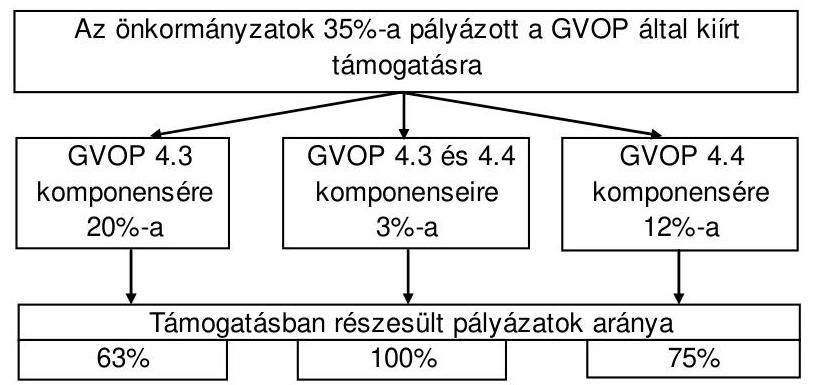

A GVOP pályázati felhívására benyújtott pályázatok eredménytelenségének okai többek között formai hibák, saját forrás biztosításának hiánya ${ }^{60}$, továbbá az Irányító Hatóság értékelése alapján nem érték el a minimális pontszámot. Két városi önkormányzat a kistérségi társulással közösen pályázott, az egyik kistérség nem érte el a pályázatban előírt 10 ezer fő lakosságszámot, a másik pályázatban logikai ellentmondások voltak (Balatonlelle és Csurgó város önkormányzatánál).

Az ellenőrzött önkormányzatok 82%-ánál működtettek különböző szinten e-közigazgatási szolgáltatásokat biztosító informatikai rendszert és rendelkeztek internetes honlappal. Az ügyintézést 19%-nál az 1., 54%-nál a 2., 9%-nál a 3. elektronikus szolgáltatási szinten működtették. A 4. elektronikus szolgáltatási szintnek megfelelő ügyintézés kialakítását a pénzügyi források, az informatikához értő humán erőforrás, valamint a megfelelő és korszerű hardver és szoftver hiánya akadályozta és megvalósítását lakossági igény sem

[^0]
[^0]:    ${ }^{60}$ Törökszentmiklós Város Önkormányzata pályázati példányszáma nem felelt meg a pályázati útmutatóban meghatározottnak, Edelény Város Önkormányzata nem rendelkezett a szükséges pénzügyi forrással.

---

sürgette ${ }^{61}$. Az elektronikus közigazgatási ügyintézési területek alakulását szemlélteti a jelentés 9. számú melléklete.

Az ellenőrzött önkormányzatok az e-közigazgatási feladatok megoldását az önkormányzati hivatal köztisztviselőivel és emellett vállalkozó bevonásával biztosították.

Az e-közigazgatási feladatokat ellátó önkormányzatok 94%-ánál vásárolt szoftvereket használtak, mivel kevés informatikai szakember állt rendelkezésükre saját informatikai fejlesztések elvégzéséhez.

Az ellenőrzött önkormányzatok harmada kialakította az e-közigazgatási feladatokat ellátó informatikai rendszer ügyfelek általi igénybevételének figyelési rendszerét, azonban csupán negyede értékelte esetenként a tapasztalatokat.

A közérdekű adatok közzétételi kötelezettségére vonatkozó jogszabályi előírások a közzétételi idő meghatározása tekintetében nincsenek összhangban. A nem normatív, céljellegű, működési és fejlesztési támogatások adatainak ${ }^{62}$, továbbá az államháztartás pénzeszközei felhasználásával, az államháztartáshoz tartozó vagyonnal történő gazdálkodással összefüggő szerződések, megrendelések adatainak ${ }^{63}$ közzétételét az Áht. 15/A. § (1) bekezdése és a 15/B. § (1) bekezdése szerint a döntés meghozatalát követő hatvanadik napig kell teljesíteni. Ezzel szemben az Eisztv. mellékletében a III. Gazdálkodási adatok 3. és 4. pontjaiban foglalt szabályozás a közzétételi kötelezettséget negyedévente írja elő.

A közérdekű adatok elektronikus közzétételére az Eisztv. 21. § (3) bekezdése alapján 2007. január 1-jétől kötelezett volt az ellenőrzött megyei és megyei jogú városi önkormányzatok mindegyike, valamint lakosságszáma alapján az ellenőrzött Budapest fővárosi kerületi önkormányzatok közül négy ${ }^{64}$. Az önkormányzatok 35%-a teljesítette honlapján a közzétételi kötelezettségét, további 15% már a 2007. évben is megtette ezt, bár számukra csak 2008. július 1-jétől kötelező a honlapon történő közzététel.

Az ellenőrzött önkormányzatok 38%-a honlapján, 11%-a a helyben szokásos módon tette közzé a 2006. évben nyújtott nem normatív, céljellegű fejlesztési,

[^0]
[^0]:    ${ }^{61}$ A digitális aláírásra - annak hitelesítési költségei miatt - a lakosság és a vállalkozások körében alacsony számú az igény.
    ${ }^{62}$ A támogatások kedvezményezettjeinek nevére, a támogatás céljára, összegére, továbbá a támogatási program megvalósítási helyére vonatkozó adatok.
    ${ }^{63}$ A nettó ötmillió forintot elérő vagy azt meghaladó értékű árubeszerzésre, építési beruházásra, szolgáltatás megrendelésre, vagyonértékesítésre, vagyonhasznosításra, vagyon vagy vagyoni értékű jog átadására, valamint koncesszióba adásra vonatkozó szerződések megnevezésére (típusára), tárgyára, a szerződést kötő felek nevére, a szerződés értékére, határozott időre kötött szerződés esetében annak időtartamára vonatkozó adatok.
    ${ }^{64}$ Az elektronikus közzétételt 2008. július 1-jétől valamennyi önkormányzatoknak biztosítania kell.

---

illetve a 2007. évben nyújtott működési és fejlesztési támogatások kedvezményezettjeinek nevét, a támogatás célját, összegét, továbbá a támogatási program megvalósítási helyét. Az önkormányzatok 51%-a a közzététel elmulasztásával megsértette az Áht. 15/A. § (1) bekezdésében foglalt előírást.

Az önkormányzatok 33%-a a honlapján, 25%-a pedig a helyben szokásos módon tette közzé a nettó ötmillió Ft-ot elérő vagy azt meghaladó értékű árubeszerzésre, építési beruházásra, szolgáltatás megrendelésre, vagyonértékesítésre, vagyonhasznosításra vonatkozó szerződések megnevezését, tárgyát, a szerződést kötők nevét, a szerződés értékét, határidőre kötött szerződés esetében annak időtartalmát, valamint az adatok változását. Az önkormányzatok 42%-a az Áht. 15/B. § (1) bekezdésében foglalt előírást megsértve közzétételi kötelezettségének nem tett eleget.

Az ellenőrzött önkormányzatok 64%-a az Ámr. 157/D. § (1) bekezdésében előírtak ellenére a 2005-2006. évi költségvetési beszámolók szöveges indoklását nem hozta nyilvánosságra.

# 4. A KÖLTSÉGVETÉSI GAZDÁLKODÁS KONTROLLJAI 

### 4.1. A szabályozottság kockázata, valamint a belső kontrollok érvényesülése a költségvetés tervezési, gazdálkodási, beszámolási és a folyamatba épített ellenőrzés feladatainál

### 4.1.1. A költségvetés tervezési és a zárszámadás készítési folyamat szabályozottsága, a belső kontroll feladatok meghatározottsága és teljesítése

A költségvetés tervezési és a zárszámadás készítési folyamatok belső kontrolljait a kiemelt önkormányzati körbe tartozók 81%-ánál, valamint a városi önkormányzatok felénél - az Áht. 120. § (1) bekezdésében foglalt előírásoknak és a belső feltételeknek - megfelelően alakították ki a jegyzők. Az ellenőrzött önkormányzatok 57%-ánál a költségvetés tervezés és a zárszámadás készítés feladatainak szabályozottsága összességében alacsony kockázatot jelentett a feladatok szabályszerű végrehajtásában, mivel a folyamat belső kontrolljait a jegyzők a jogszabályi előírások és a helyi sajátosságok figyelembevételével kialakították. Ennek keretében az Ámr. 145/A. § (1)-(2) és a 145/B. § (1) bekezdéseiben előírtaknak megfelelően rögzítették ${ }^{65}$ az elvégzendő ellenőrzési feladatokat és azok felelőseit. Ezeknél az önkormányzatoknál a költségvetés tervezés és a zárszámadás készítés folyamatában kialakított belső kontrollok - végrehajtásuk esetén - az előforduló apróbb szabályozási hiányosságok ${ }^{66}$ ellenére megfelelő védelmet nyújtottak a hibák bekövetkezése ellen.

[^0]
[^0]:    ${ }^{65}$ Az ellenőrzési feladatokat belső szabályzatokban, leíró és folyamatábrával szemléltetett ellenőrzési nyomvonalakban, a gazdasági szervezetek ügyrendjében, jegyzői rendelkezésekben és körlevelekben, valamint a dolgozók munkaköri leírásaiban határozták meg.

---

nyosságok ${ }^{66}$ ellenére megfelelő védelmet nyújtottak a hibák bekövetkezése ellen.

Az ellenőrzött önkormányzatok 18%-ánál a költségvetés tervezés és a zárszámadás készítés szabályozottságának hiányosságai közepes kockázatot jelentettek a feladatok megfelelő és szabályszerű végrehajtásában, mivel a jegyzők hiányosan szabályozták az ellenőrzési feladatokat, de a kialakított belső kontrollok végrehajtásuk esetén a lehetséges hibák többsége ellen védelmet nyújtottak. Az önkormányzatok 25%-ánál magas kockázatot jelentett a feladatok szabályszerű végrehajtásában, hogy az Áht. 121. § (1) bekezdésében foglalt előírásokat megsértve az önkormányzati hivatalban nem szabályozták, illetve hiányosan határozták meg a költségvetés tervezés és a zárszámadás készítés során elvégzendő belső kontroll tevékenységeket, ezáltal a kontrollok nem nyújtottak elegendő védelmet a lehetséges hibákkal szemben.
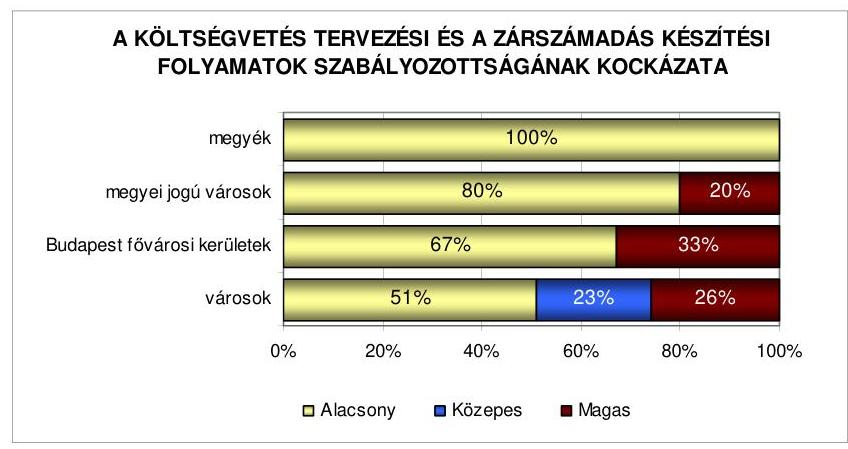

A közepes és magas kockázatot a FEUVE rendszer kialakításának következő szabályozási hiányosságai okozták:

- a városi önkormányzatok 23%-ánál nem határozták meg a költségvetési intézmények részére a költségvetési javaslat összeállításával kapcsolatos követelményeket ${ }^{67}$;
- a költségvetési intézmények és az önkormányzati hivatal szervezeti egységei által benyújtott költségvetési igények indokoltságának, illetve teljesíthetőségének ellenőrzésére, valamint a tervezett saját bevételek előirányzatainak és az azok megalapozását szolgáló önkormányzati rendeletek összhangjának felülvizsgálatára vonatkozó belső kontroll tevékenységeket az önkormányzatok 56%-ánál nem határozták meg ${ }^{68}$;

[^0]
[^0]:    ${ }^{66}$ Ezen önkormányzatok harmadánál a jegyzők nem írták elő a saját bevételek eredeti előirányzatainak és az azok megalapozását szolgáló önkormányzati rendeletek összhangjának ellenőrzését, mintegy tizedénél nem szabályozták a költségvetési szervek elemi beszámolójának felülvizsgálata rendjét, tartalmát és felelőseit, nem határozták meg az intézményi pénzmaradványok kimunkálásának felülvizsgálati kötelezettségét.
    ${ }^{67}$ Ezen követelményeket a kiemelt önkormányzati körbe tartozók meghatározták.
    ${ }^{68}$ A szabályozást a megyei önkormányzatok 60%-ánál, a megyei jogú városok 40%-ánál, a Budapest főváros kerületi önkormányzatok 67%-ánál, valamint a városi önkormányzatok 56%-ánál mulasztották el.

---

- a költségvetés tervezéséhez készített intézményi mutatószám felmérés megalapozottságának ellenőrzését az önkormányzatok 29%-ánál nem írták elő;
- az intézményi pénzmaradványok kimunkálásának felülvizsgálatát az Ámr. 66. § (4) bekezdésében foglalt előírás ellenére az önkormányzatok 33%-ánál nem írták elő, nem jelölték ki annak felelőseit;
- az önkormányzati költségvetési szervek elemi beszámolójának felülvizsgálata rendjét, tartalmát és felelőseit az Ámr. 149. § (2) bekezdés a)-c) pontjaiban előírtak ellenére az önkormányzatok 42%-ánál nem határozták meg ${ }^{69}$, továbbá a zárszámadási feladatok koordinálásáért felelős személyek kijelölését 16%-ánál elmulasztották a jegyzők.

A költségvetés tervezés és a zárszámadás készítés folyamatában kialakított belső kontrollok működésének megbízhatósága az önkormányzatok 45%-ánál összességében kiváló volt, mivel az Áht. 121. § (1) bekezdésében foglalt előírások alapján a belső szabályozásban előírt ellenőrzési és egyeztetési feladatokat elvégezték. Ellenőrizték a költségvetés tervezéséhez készített intézményi mutatószám felmérés adatainak megalapozottságát, a költségvetési javaslat összeállítására meghatározott követelmények betartását, a költségvetési intézmények és az önkormányzati hivatalok szervezeti egységei által benyújtott költségvetési igények indokoltságát, teljesíthetőségét, továbbá a zárszámadás előkészítése során felülvizsgálták az intézményi pénzmaradvány megállapításának szabályszerűségét. A költségvetés tervezés és a zárszámadás készítés folyamatára kialakított belső kontrollok a kiemelt önkormányzati körbe tartozók háromnegyedénél, valamint a városi önkormányzatok 38%-ánál megbízhatóan, kiválóan működtek, teljesítették a lényeges hibák, szabálytalanságok és gyenge teljesítmények megelőzésével, feltárásával és kijavításával kapcsolatos funkciójukat.

# A költségvetés tervezés és a zárszámadás készítés folyamatában a belső kontrollok működésének megbízhatósága az önkormányzatok 

20%-ánál jó volt, mivel az elvégzett kontrolleljárások kielégítették a hibák megelőzésére és kijavítására vonatkozó célszerűségi elvárásokat. Ezen önkormányzatoknál a kontrollok működésénél a feltárt hiányosságok száma ugyan jelentős volt, azonban azok még nem veszélyeztették a hibák megelőzését, kijavítását. A belső kontrollok működésének megbízhatósága az önkormányzatok 35%-ánál volt gyenge, mivel az Áht. 121. § (1)-(3) bekezdésében foglalt előírásokat megsértve a tervezés és a beszámolás folyamatában a belső kontroll feladatokat az önkormányzati hivatalokban nem végezték el, nem biztosították a hibák megelőzését, feltárását, kijavítását és ezáltal veszélyeztették az eredményes, megbízható működést. Ezen önkormányzatok 69%-ánál a belső kont-

[^0]
[^0]:    ${ }^{69}$ A kiemelt önkormányzati körbe tartozók 31%-ánál, valamint a városi önkormányzatok 46%-ánál nem írták elő

 az ellenőrzési feladatokat.

---

rollok a kontrollfeladatok kialakításának hiánya miatt, míg 31%-ánál ${ }^{70}$ a belső szabályozás ellenére nem működtek.
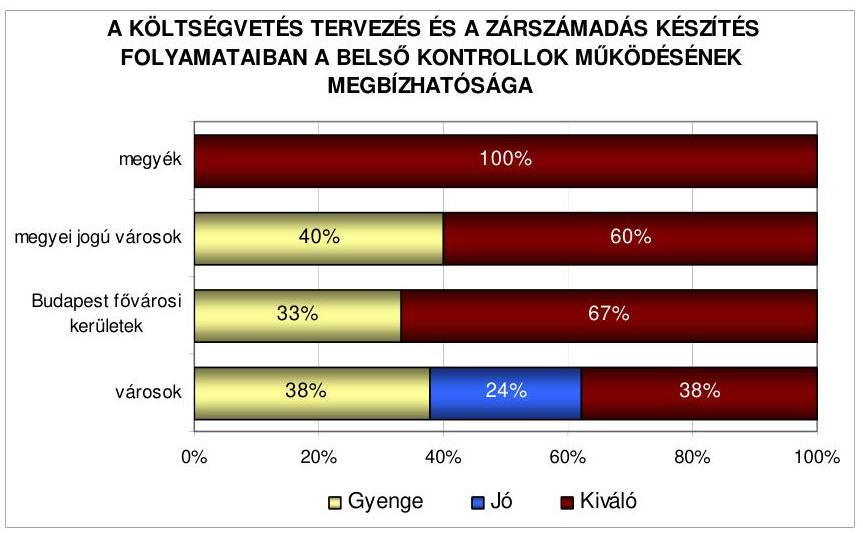

A költségvetés tervezés és a zárszámadás készítés során az Ámr. 145/A. § (1)-(2) és a 145/B. § (1) bekezdésében foglalt előírások ellenére nem ellenőrizték:

- az önkormányzatok 35%-ánál ${ }^{71}$, hogy a költségvetési intézmények teljesítették-e a költségvetési javaslat összeállításával kapcsolatban részükre meghatározott szakmai és pénzügyi követelményeket, amit ezen önkormányzatok 48%-ánál a kontrollok kialakításának hiánya okozott. Az intézmények és az önkormányzati hivatalok szervezeti egységei által benyújtott költségvetési igények indokoltságát az önkormányzatok 37%-ánál nem vizsgálták, ennek oka az ellenőrzési feladat előírásának elmaradása volt. A tervezett saját bevételek előirányzatai és az azok megalapozását szolgáló önkormányzati rendeletek összhangját az önkormányzatok 61%-ánál nem ellenőrizték, ami 80%-ban az ellenőrzési feladat előírásának hiánya miatt maradt el;
- az intézményi pénzmaradványok megállapításának szabályszerűségét az Ámr. 66. § (4) bekezdésében foglalt előírás ellenére az önkormányzatok 41%-ánál ${ }^{72}$ nem vizsgálták felül, a kontrollok - kialakításuk hiánya miatt - nem működtek az ellenőrzési feladatot elmulasztó önkormányzatok 71%-ánál. A költségvetési beszámolókban az eredeti és a módosított előirányzatok, va-

[^0]
[^0]:    ${ }^{70}$ A belső kontrollok működésének megbízhatósága Kecskemét megyei jogú város, és Battonya, Jászapáti, Karcag, Keszthely, Nagymaros, Nyírlugos, Pécel, Szentlőrinc és városok önkormányzatainál gyenge volt, annak ellenére, hogy a szabályozottság alacsony, illetve közepes kockázatot jelentett a feladatok szabályszerű végrehajtásában.
    ${ }^{71}$ A kontrollellárásokat nem végezték el Érd és Kecskemét megyei jogú városok, valamint Budapest főváros XVI. kerületi önkormányzatnál, továbbá a városi önkormányzatok 39%-ánál.
    ${ }^{72}$ A belső kontroll feladatokat azok jegyzői szabályozása ellenére nem végezték el Battonya, Bátaszék, Derecske, Karcag, Keszthely, Kisvárda, Nyírlugos, Szentlőrinc, Tiszafüred, Tiszakécske, és városok önkormányzatainál.

---

lamint a teljesítési adatok eltérése indokoltságának ellenőrzését az önkormányzatok 51%-ánál ${ }^{73}$ az Ámr. 149. § (3) bekezdés c) pontjában előírtak ellenére nem végezték el. Az intézményi számszaki beszámolók belső, valamint azok jegyző által meghatározott adatszolgáltatással való összhangjának felülvizsgálata az Ámr. 149. § (3) bekezdés d) pontjában foglaltak ellenére az önkormányzatok 39%-ánál ${ }^{74}$ maradt el, ami 77%-ban az ellenőrzési feladat előírásának és a felelősök kijelölésének hiányára vezethető vissza.
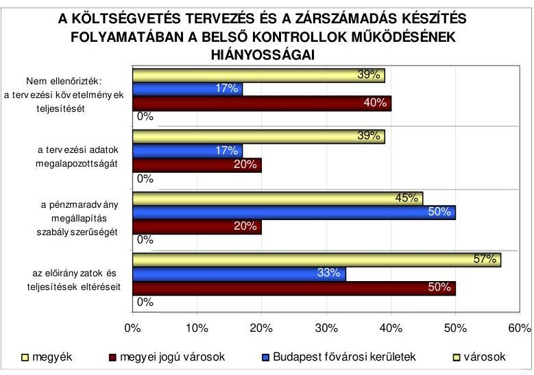

# 4.1.2. A pénzügyi-számviteli tevékenységeknél elvégzendő belső kontroll funkciók szabályozottsága, a szakmai teljesítés igazolás és az utalvány ellenjegyzés kontrollfeladatainak működése 

A gazdálkodási, a pénzügyi-számviteli és a folyamatba épített ellenőrzési feladatok belső kontrolljait a kiemelt önkormányzati körbe tartozók felénél, a városi önkormányzatok 38%-ánál, valamint a nagyközségi és községi önkormányzatok 22%-ánál a külső és a belső feltételeknek megfelelően alakították ki a jegyzők. A gazdálkodási, a pénzügyi-számviteli és a folyamatba épített ellenőrzési feladatok szabályozottsága az önkormányzatok 31%-ánál jelentett összességében alacsony kockázatot a feladatok szabályszerű végrehajtásában, mivel a jegyzők az Áht. 121. § (1) bekezdésében foglalt előírásoknak és a helyi sajátosságoknak megfelelően kialakították ${ }^{75}$ a belső kontrollokat, amelyek - végrehajtásuk esetén - az előforduló apróbb sza-

[^0]
[^0]:    ${ }^{73}$ Az ellenőrzést nem végezték el Érd és Győr megyei jogú városok, valamint Budapest főváros IX. és XVI. kerület, továbbá a városi önkormányzatok 57%-ánál.
    ${ }^{74}$ A számszaki beszámolókat nem vizsgálták felül Érd és Kecskemét megyei jogú város önkormányzatánál, valamint a városi önkormányzatok 47%-ánál.
    ${ }^{75}$ Az SzMSz-ekben, a gazdasági szervezetek ügyrendjében, a gazdálkodási és ellenőrzési jogköröket, feladatokat rögzítő szabályzatokban, a pénzügyi-számviteli szabályzatokban, az ellenőrzési nyomvonalakban, a kockázatkezelésre és a szabálytalanságok kezelésére vonatkozó szabályozásban, valamint a köztisztviselők munkaköri leírásaiban.

---

bályozási hiányosságok ${ }^{76}$ ellenére megfelelő védelmet nyújtottak a hibák bekövetkezése ellen.

A gazdálkodási, a pénzügyi-számviteli és a folyamatba épített ellenőrzési feladatok szabályozottságának hiányosságai az önkormányzatok 38%-ánál jelentettek közepes kockázatot az elvégzendő feladatok megfelelő végrehajtásában, mivel a jegyzők hiányosan szabályozták az ellenőrzési feladatokat, azonban a kialakított belső kontrollok végrehajtásuk esetén a lehetséges hibák többsége ellen védelmet nyújtottak. Az önkormányzatok 31%-ánál az Áht. 121. § (1) bekezdésében foglalt előírásokat megsértve nem határozták meg a gazdálkodási, a pénzügyi-számviteli és a folyamatba épített ellenőrzési feladatokat, a szabályozottság ezen hiányosságai magas kockázatot jelentettek a feladatok szabályszerű végrehajtásában.
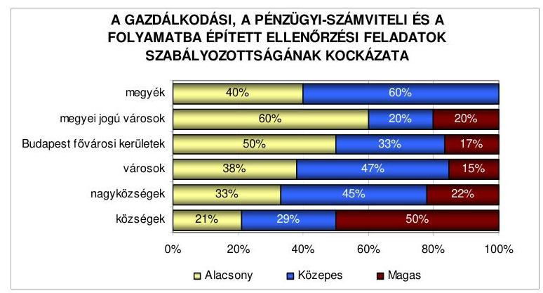

A közepes és magas kockázatot a következő szabályozási hiányosságok okozták:

- a képviselő-testület által jóváhagyott SzMSz-szel az ellenőrzött önkormányzatok 23%-ánál ${ }^{77}$ az Ámr. 10. § 2008. január 1-től hatályos (5) bekezdésében előírtak ellenére az önkormányzati hivatalok nem rendelkeztek. A jóváhagyott SzMSz-ek 16%-ában az Ámr. 17. § (4) bekezdésében előírtak ellenére nem rögzítették a gazdasági szervezet felépítését. Az ellenőrzött önkormányzatok 20%-ánál ${ }^{78}$ a gazdasági szervezetek az Ámr. 17. § (5) bekezdésében foglaltak ellenére nem rendelkeztek ügyrenddel. Az ügyrendek nem tartalmazták a pénzügyi-gazdasági feladatok ellátásáért felelős személyek feladatait, továbbá a vezetők és más dolgozók feladat-, hatás- és jogkörét 26%-nál. A vezetők és a pénzügyi dolgozók munkaköri leírásai nem tartalmazták a gazdálkodási és ellenőrzési jogköröket és feladatokat az önkormányzatok 47%-ánál ${ }^{79}$;

[^0]
[^0]:    ${ }^{76}$ Ezen önkormányzatok mintegy felénél nem készítettek önköltség számítási szabályzatot, nem tartalmazták az ellenőrzési nyomvonalak az egyes feladatok elvégzését igazoló dokumentumok nyilvántartási helyét a rendszerben.
    ${ }^{77}$ A kiemelt önkormányzati körbe tartozók 6%-a, a városi önkormányzatok 17%-a, valamint a nagyközségi és községi önkormányzatok 32%-a.
    ${ }^{78}$ A gazdasági szervezetek nem rendelkeztek ügyrenddel a kiemelt önkormányzati körbe tartozók 6%-ánál, a városok 15%-ánál, a nagyközségek és községek 27%-ánál.
    ${ }^{79}$ A munkaköri leírások nem tartalmazták a gazdálkodási és ellenőrzési jogköröket, illetve feladatokat a kiemelt önkormányzati körbe tartozók 44%-ánál, a városok 42%-ánál, valamint a nagyközségek és a községek 52%-ánál.

---

- a szakmai teljesítés igazolásának módjáról az önkormányzatok 41%-ánál a jegyzők - az Ámr. 135. § (2) bekezdésében foglaltak ellenére - belső szabályzatban nem rendelkeztek, nem írták elő a feladatra kijelölt személyek részére a kiadások teljesítésének és a bevételek beszedésének elrendelése előtt elvégzendő ellenőrzési feladatok végrehajtásának és a feladat elvégzés dokumentálásának a módját. A szakmai teljesítés igazolását végző személyeket az ellenőrzött önkormányzatok 28%-ánál nem jelölték ki a jegyzők;
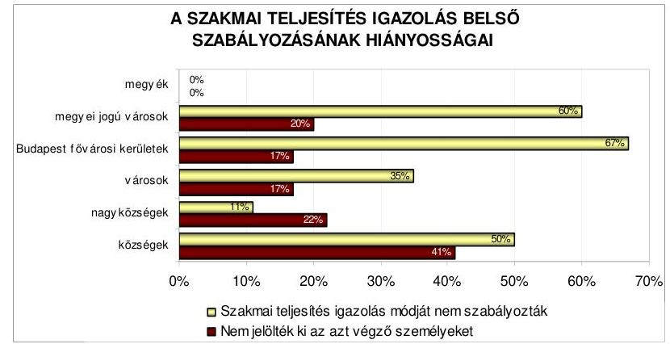
- az érvényesítési feladatok ellátására a jegyzők az Ámr. 135. § (4) bekezdésében foglaltak ellenére az önkormányzatok 14%-ánál nem adtak írásban megbízást, továbbá az írásbeli megbízások 13%-ánál nem tartották be - az Ámr. 135. § (4) bekezdésében foglaltak ellenére - az iskolai végzettségre és a szakmai képzettségre vonatkozó előírást ${ }^{80}$. A gazdálkodási és ellenőrzési jogkörökre adott felhatalmazásoknál, kijelöléseknél, illetve megbízásoknál az összeférhetetlenségi követelmények érvényesülését az Ámr. 138. § (1), 135. § (6), és 138. § (3) bekezdéseiben előírtak ellenére 30%-nál nem biztosították ${ }^{81}$;
- a számviteli szabályzatokban a Vhr. 37. § (1) és (7) bekezdésében előírt évenkénti, illetve kétévenkénti leltározási kötelezettséget az ellenőrzött önkormányzatok 25%-ánál a jegyzők nem rögzítették. Az önkormányzatok 9%-ánál ${ }^{82}$ kétévenkénti mennyiségi leltározási kötelezettséget írtak elő annak ellenére, hogy annak lehetőségét önkormányzati rendeletben nem biztosították. Az üzemeltetésre, kezelésre átadott eszközök leltározásának módját a Vhr. 37. § (5) bekezdésének előírása ellenére az önkormányzatok 47%-ánál nem szabályozták, továbbá ezen eszközök selejtezésével, hasznosításával kapcsolatos döntéshozatalra jogosultak körét 56%-ánál nem határozták meg. Az adókkal kapcsolatos követelések egyszerűsített (csoportos) értékelési eljárásának szempontjait, ezen követelések besorolásának elveit, dokumentálásának szabályait a Vhr. 31/A. §-ban biztosított lehetőség, illetve a 8. § (18) bekezdésében foglalt előírás ellenére az önkormányzati hivatalok 34%-ánál az értékelési szabályzatban nem rögzítették. Az önköltségszámítás rendjét a Vhr. 8. § (4) bekezdés c) pontjában, illetve (16) bekezdésében foglaltak ellenére az önkormányzatok 64%-ánál belső szabályzatban nem határozták meg. Az analitikus nyilvántartások vezetésének, valamint főkönyvi számlákkal történő egyeztetésének feladatait és a feladatok elvégzésének dokumentálási módját

[^0]
[^0]:    ${ }^{80}$ A városi önkormányzatok 6%-ánál, valamint a községi önkormányzatok 24%-ánál.
    ${ }^{81}$ A szabályozás megfelelő volt a kiemelt önkormányzati körbe tartozóknál.
    ${ }^{82}$ A Borsod-Abaúj-Zemplén megyei, Mórahalom, Velence, Karcag, Oroszlány, Kisvárda városi, valamint Csaholc, Fűzvölgy és Hosszúvölgy községi önkormányzatoknál.

---

az önkormányzatok 43%-ánál a Vhr. 49. § (2) bekezdésében előírtak ellenére, a pénzkezelés során az utólagos vezetői ellenőrzés gyakoriságát és az ellenőrzés dokumentálásának módját az Ámr. 145/A. § (1)-(2) bekezdéseiben foglaltak ellenére 61%-ánál nem határozták meg. A pénzügyi dolgozók munkaköri leírásai a számviteli szabályzatokban meghatározott egyeztetési és ellenőrzési feladatokat mintegy felénél nem tartalmazták

- a jegyzők az önkormányzatok 34%-ánál a FEUVE rendszerét az Ámr. 145/A. § (1) bekezdésében előírtak ellenére nem, illetve nem a gazdálkodás folyamataira és sajátosságaira tekintettel alakították ki, az Ámr. 145/B. § előírása ellenére nem készítették el az ellenőrzési nyomvonalat. Az elkészített ellenőrzési nyomvonalak 12%-ában nem határozták meg a folyamatokat és a folyamatgazdákat, 16%-ában nem jelölték meg az egyes feladatok végrehajtásért felelős szervezeti egységeket, személyeket. Az ellenőrzési nyomvonalak 45%-a nem tartalmazott utalást arra, hogy a tevékenységeket, feladatokat részletesen mely belső szabályzatokban rögzítik, 68%-a nem tartalmazta az egyes tevékenység, feladat elvégzését igazoló dokumentum megnevezését és nyilvántartási helyét a rendszerben;
- az önkormányzatok 60%-ánál az Ámr. 145/C. § előírása ellenére kockázatkezelési eljárásrendben nem rögzítették a kockázatok azonosítását, illetve folyamatgazdáit, 71%-ánál az elfogadható kockázati keret meghatározását. Az Ámr. 145/A. § (5) bekezdésében előírtak ellenére a szabálytalanságok kezelésének eljárásrendjében a jegyzők 39%-nál nem határozták meg a szabálytalanság fogalmát, illetve észlelési kötelezettségét, 48%-nál nem írták elő a szabálytalanság esetén teendő intézkedések (eljárások) nyomon követését, a szabálytalanságok és az intézkedések nyilvántartását.
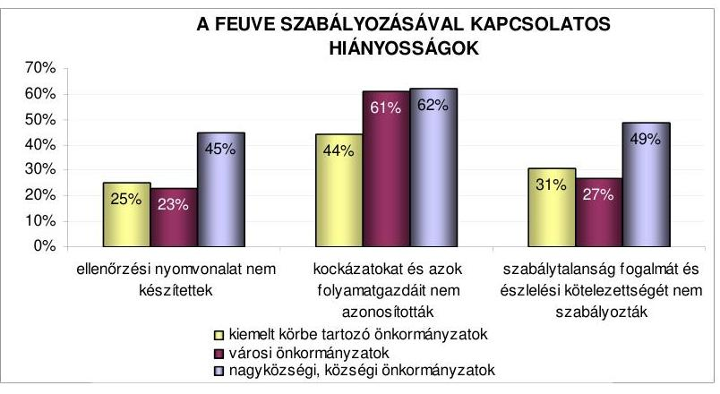

A gazdálkodási, a pénzügyi-számviteli és a folyamatba épített ellenőrzési feladatok szabályozottsága - az ÁSZ korábbi javaslatainak realizálása eredményeként - javult a 2004-2007. években, mivel az ellenőrzött önkormányzatok évente növekvő aránya rendelkezett a jogszabályi előírásoknak és a helyi sajátosságoknak megfelelő belső szabályozásokkal.

A képviselő-testület által jóváhagyott, önkormányzati hivatalra vonatkozó SzMSz-szel nem rendelkező önkormányzatok aránya a 2004. évi 41%-ról, a 2007. évben ellenőrzötteknél 23%-ra csökkent. A gazdasági szervezet feladatait a 2004. évben ellenőrzött önkormányzatok 58%-ánál ügyrendben nem szabályozták, amely hiányosságot a 2007. évben ellenőrzöttek 20%-ánál állapítottuk meg. Az érvényesítési feladatok elvégzésére a 2004. évben ellenőrzött önkormányzatok 19%-ánál, míg a 2007. évben ellenőrzöttek 14%-ánál a jegyzők nem adtak írás-

---

beli megbízást. A szakmai teljesítés igazolás módjáról, illetve az azt végző személyek kijelöléséről a jegyzők a 2004. évben ellenőrzött önkormányzatok 54%-ánál, illetve 41%-ánál nem rendelkeztek, ezeket a mulasztásokat a 2007. évben 41%-nál, illetve 28%-nál állapítottuk meg. Az önkormányzati hivatalok által elkészített számlarendek a 2004. évben ellenőrzött önkormányzatok 66%-ánál, míg a 2007. évben 43%-ánál nem feleltek meg az előírt tartalmi követelményeknek. A leltározás

 és leltárkészítés szabályozása során az üzemeltetésre átadott eszközök leltározásának módját a 2004. évben ellenőrzött önkormányzatok 56%-ánál, a 2007. évben ellenőrzöttek 47%-ánál nem határozták meg a jegyzők. Az ellenőrzési nyomvonalat a jegyzők a 2005. évben ellenőrzött önkormányzatok 59%-ánál, míg a 2007. évben 34%-ánál nem készítették el.

A pénzgazdálkodás folyamatában meghatározó, kulcsfontosságú belső kontrollok - a szakmai teljesítésigazolás és az utalvány ellenjegyzés - az önkormányzatok 31%-ánál működtek megbízhatóan, kiválóan ${ }^{83}$, mivel azok teljesítették a lényeges hibák, szabálytalanságok és gyenge teljesítmények megelőzésével, feltárásával és kijavításával kapcsolatos funkciójukat. A szerződésekben, megrendelésekben meghatározott feladatok teljesítésének, a kiadások jogosultságának, összegszerűségének ellenőrzését a szakmai teljesítés igazolására kijelölt személyek a belső szabályzatokban előírt módon elvégezték. Az utalvány ellenjegyzésre jogosult személyek a folyamatba épített ellenőrzési feladatokat teljesítették, meggyőződtek a gazdálkodásra vonatkozó szabályok érvényesüléséről, a szakmai teljesítésigazolás és az érvényesítés megtörténtéről. Ezeknél az önkormányzatoknál a pénzügyi gazdálkodás folyamatában kialakított belső kontrollok az esetleges apróbb hiányosságok ellenére eredményesen működtek az önkormányzati hivatalokban.

Az önkormányzatok mintegy tizedénél az állományba nem tartozók megbízási díjaival kapcsolatos kifizetések során az utalvány ellenjegyzője nem észrevételezte, hogy az írásbeli kötelezettségvállalásokat nem előzte meg az ellenjegyzése, továbbá az ügyvitel- és számítástechnikai eszközök és az egyéb gépek, berendezések és felszerelések beszerzésével, létesítésével kapcsolatos kifizetések során az utalvány ellenjegyzője nem győződött meg a fedezet meglétéről.
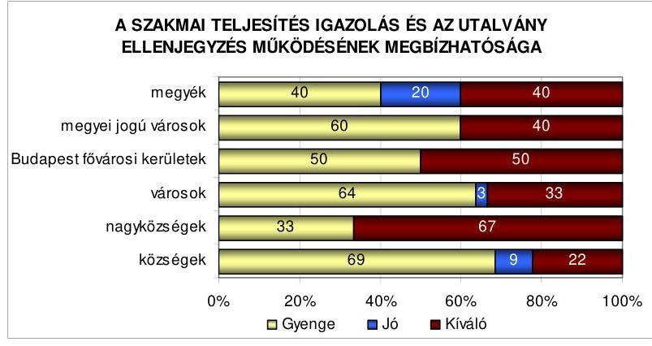

[^0]
[^0]:    ${ }^{83}$ Az értékelést megalapozó megfelelőségi teszteket a kiemelt kockázatuk alapján kiválasztott három terület gazdasági eseményeivel - az állományba nem tartozók megbízási díjaival; a külső szolgáltató által végzett karbantartási, kisjavítási szolgáltatásokkal; valamint az ügyvitel- és számítástechnikai eszközök és az egyéb gépek, berendezések és felszerelések beszerzésével, létesítésével - kapcsolatos kifizetésekre folytattuk le.

---

Az állományba nem tartozók megbízási díjaival ${ }^{84}$; a külső szolgáltató által végzett karbantartási, kisjavítási szolgáltatásokkal ${ }^{85}$; valamint az ügyvitel- és számítástechnikai eszközök és az egyéb gépek, berendezések és felszerelések beszerzésével, létesítésével ${ }^{86}$ kapcsolatos 2006. és 2007. évi kiadások alakulását az ellenőrzött önkormányzatoknál a jelentés 10. számú melléklete mutatja be.

A belső kontrollok működésének megbízhatósága az önkormányzatok 6%-ánál jó volt, mivel a szakmai teljesítés igazolás és az utalvány ellenjegyzés működésében feltárt hiányosságok még nem veszélyeztették a hibák megelőzését és kijavítását. A belső kontrollok működésének megbízhatósága az önkormányzatok 63%-ánál gyenge volt, mivel a folyamatba épített ellenőrzési feladatokat a jegyző, illetve az általa kijelölt, felhatalmazott személyek az Ámr. 135. § (1) bekezdésében, valamint a 137. § (3) bekezdésében foglalt előírások ellenére nem végezték el. A szakmai teljesítés igazolás és az utalvány ellenjegyzés működésével kapcsolatban megállapított hiányosságok rendszeresen fordultak elő, egy-egy gazdasági esemény folyamatában egyidejűleg több kontroll feladat maradt el.

A pénzügyi gazdálkodás során az önkormányzatok 54%-ánál - az Ámr. 135. § (1) bekezdésében foglalt előírás ellenére - elmaradt a kiadások jogosultságának vizsgálata, 56%-ánál az összegszerűségének ellenőrzése, valamint 55%-ánál a szerződés, megrendelés, megállapodás teljesítésének szakmai igazolása.

[^0]
[^0]:    ${ }^{84}$ A megbízási szerződések a 2006. április 9-én tartott országgyűlési képviselőválasztás és a 2006. október 1-jén tartott önkormányzati képviselőválasztás feladatainak ellátására, szakértők megbízására, sajtó tevékenységre, rendezvények szervezésére, a védelmi bizottság tevékenységével kapcsolatos feladatok elvégzésére, önkormányzati folyóirat szerkesztésére, szaktanácsadásra, tolmácsolásra, műszaki ellenőri, üdülőgondnoki, takarítási feladatok elvégzésére, hivatásos gondnoki, postázási feladatok ellátására, eseti gépkocsivezetői feladatok elvégzésére irányultak.
    ${ }^{85}$ A külső szolgáltató által végzett karbantartások, kisjavítások az önkormányzati ingatlanok, számítástechnikai, irodatechnikai és biztonsági berendezések, gépjárművek, felvonók, fűtési rendszerek, klíma berendezések, telefonhálózat vízvezeték rendszerek karbantartására, javítására vonatkoztak.
    ${ }^{86}$ Az ügyvitel- és számítástechnikai eszközök és az egyéb gépek, berendezések és felszerelések beszerzése, létesítése során számítástechnikai berendezéseket, ügyviteli eszközöket, gépeket, fénymásolókat, nyomtatókat, irodai bútorokat, egészségügyi gépeket, műszereket, intézményi eszközöket, telefonokat vásároltak.

---

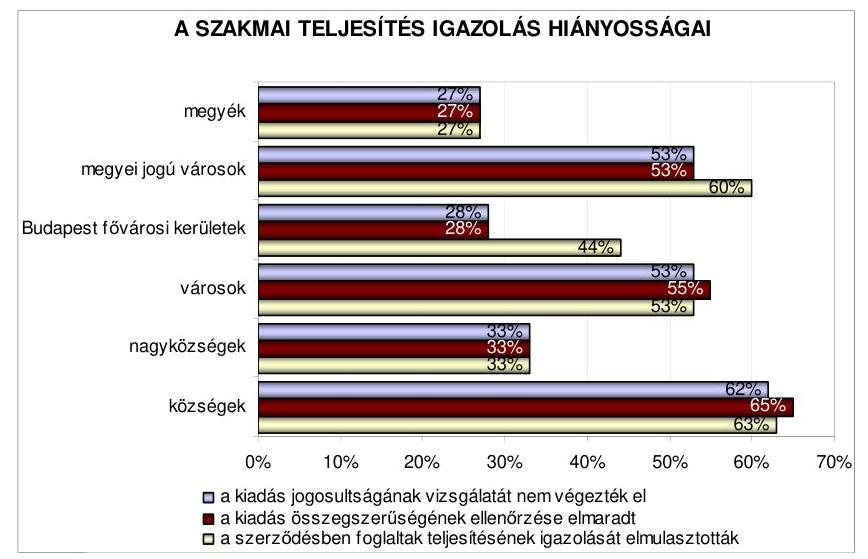

A kiadások jogosultságát és összegszerűségét, valamint a szerződésben, megrendelésben, megállapodásban foglaltak szakmai teljesítését aláírásukkal nem igazolták az ellenőrzési feladatra kijelölt személyek az önkormányzatok 8%-ánál. Az önkormányzatok 11%-ánál a szakmai teljesítés igazolására kijelölt személyek a kifizetések alapbizonylatait aláírásukkal ugyan ellátták, azonban, mivel a szakmai teljesítés igazolásának módjáról - az Ámr. 135. § (2) bekezdésében előírtak ellenére - a jegyzők belső szabályzatban nem rendelkeztek, ezért ezen aláírások önmagukban nem jelentették a kiadások teljesítésének elrendelése előtti ellenőrzések elvégzésének, illetve a jogosultság, az összegszerűség, valamint a kötelezettségvállalásokban (szerződésben, megrendelésben, megállapodásban) foglaltak teljesítésének szakmai igazolását. A szakmai teljesítés igazolását jegyzői kijelölés hiányában jogosulatlanul végezték az önkormányzatok 33%-ánál. A szakmai teljesítés igazolására kijelölt személyek az önkormányzatok 20%-ánál az alapdokumentumok hiánya miatt - az igazolás elvégzését tanúsító aláírásuk ellenére - nem látták el az ellenőrzési feladataikat azon kiadások teljesítését megelőzően, amelyekhez kapcsolódó kötelezettségvállalásokat az Ámr. 134. § (8) bekezdésében előírtak ellenére nem foglalták írásba, így okmányok hiányában nem ellenőrizték a szerződésben, illetve megrendelésben előírt feladatok teljesítését, a kiadás jogosultságát, valamint összegszerűségét. (A mulasztás legnagyobb arányban ${ }^{87}$ a külső szolgáltatók által végzett karbantartási, kisjavítási feladatokkal kapcsolatos 50 ezer Ft-ot el nem érő kifizetéseket ${ }^{88}$ érintette.)

[^0]
[^0]:    ${ }^{87}$ A külső szolgáltató által végzett karbantartási munkákkal kapcsolatos kötelezettségvállalásokat nem foglalták írásba a kiemelt körbe tartozó önkormányzatok 31%-ánál, a városi önkormányzatok 39%-ánál, valamint a nagyközségi és községi önkormányzatok 41%-ánál.
    ${ }^{88}$ Az önkormányzatok 17%-ánál a hivatali belső szabályozás szerint nem volt szükséges előzetes írásbeli kötelezettségvállalás az 50 ezer Ft-ot el nem érő kötelezettségvállalások esetében, azonban - az Ámr. 134. § (3) bekezdésében foglalt előírás ellenére - ennek rendjét és nyilvántartási formáját nem szabályozták.

---

Az utalvány ellenjegyzők az Ámr. 137. § (3) bekezdésében foglalt előírások ellenére az önkormányzati hivatalok 62%-ánál nem ellenőrizték a gazdálkodásra vonatkozó szabályok betartását, továbbá 57, illetve 54%-ánál nem győződtek meg a szakmai teljesítésigazolás, valamint az érvényesítés megtörténtéről.
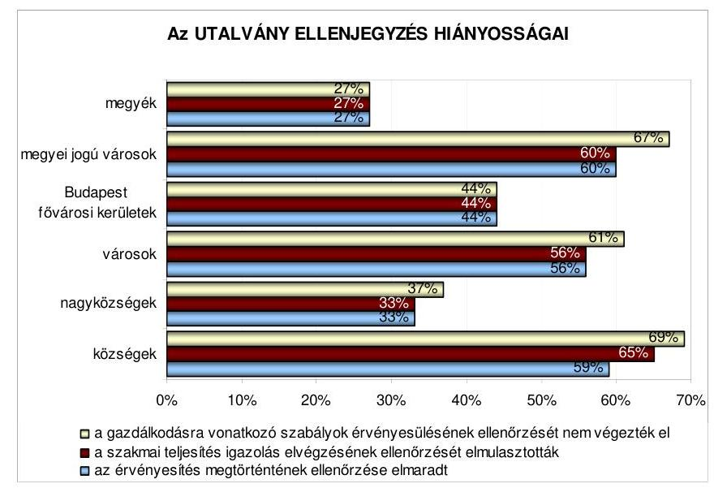

A jegyző, illetve az általa felhatalmazott személyek az utalványt nem ellenjegyezték az önkormányzatok 5%-ánál, az ellenőrzési feladatokat jogosulatlanul - az Ámr. 137. § (2) bekezdésében foglaltak ellenére - a jegyző írásos felhatalmazásával nem rendelkező személyek végezték 10%-ánál. Az utalvány ellenjegyzés az önkormányzatok 44%-ánál formai volt, mivel az utalványt ellenjegyző személyek nem végezték el a szakmai teljesítésigazolás és az érvényesítés megtörténtére, illetve a gazdálkodási szabályok betartására vonatkozó ellenőrzési feladataikat. Ezen önkormányzatoknál az utalvány ellenjegyzők nem észrevételezték, hogy a kötelezettségvállalásokat nem foglalták írásba, vagy a kötelezettségvállalások ellenjegyzését az Ámr. 134. § (8) bekezdésének előírása ellenére nem előzte meg annak ellenjegyzése ${ }^{89}$, ezáltal nem végezték el a kiadási előirányzat által biztosított fedezet meglétének, a kötelezettségvállalás jogszerűségének munkafolyamatba épített ellenőrzését.

A szakmai teljesítés igazolás és az utalvány ellenjegyzés ellenőrzési feladataira vonatkozó megfelelőségi tesztek eredményei azt mutatták, hogy az ellenőrzött önkormányzatok közel kétharmadánál a vizsgált kulcsfontosságú belső kontrollok nem teljesítették a működésbeli hibák megelőzésére, feltárására és kijavítására irányuló céljaikat, ezáltal fennállt a lényeges hiba, szabálytalanság, illetve gyenge teljesítmény kockázata. A szakmai teljesítésigazolás és az utalvány ellenjegyzés működésének hiányosságai következtében a

[^0]
[^0]:    ${ }^{89}$ A kötelezettségvállalások ellenjegyzése Győr és Érd megyei jogú városi önkormányzatoknál, valamint a városi, a községi és a nagyközségi önkormányzatok 12%-ánál maradt el.

---

gazdálkodás során nem a szerződésben meghatározott összeget fizették ki ${ }^{90}$, illetve nem a jogosult részére teljesítettek kifizetést ${ }^{91}$, továbbá előirányzat nélküli kötelezettségvállalások alapján teljesítettek kiadásokat, amelyre pénzügyi fedezetet más előirányzat maradványa biztosított ${ }^{92}$. A fedezet nélküli kötelezettségvállalások az önkormányzatok 4%-ánál a kiadások főösszege tekintetében is előirányzat túllépést okoztak. Az előirányzatok hiányában teljesített kötelezettségvállalásokkal a polgármesterek, jegyzők megsértették az Áht. 93. § (1) bekezdésében foglalt, a jóváhagyott előirányzatokon belüli gazdálkodásra vonatkozó kötelezettséget, valamint az Áht. 12/A. § (1) bekezdésének azon előírását, amely szerint tárgyévi fizetési kötelezettség a jóváhagyott kiadási előirányzatok mértékéig vállalható és kifizetés is ezen összeghatárig rendelhető el.

# 4.1.3. A pénzügyi-számviteli feladatoknál alkalmazott informatikai rendszerek szabályozottsága, biztonságos és dokumentált működési feltételeinek kialakítása 

Az önkormányzatok tevékenységében egységesen érvényesítendő informatikai, informatikai biztonsági követelményrendszert központilag annak ellenére még nem alakítottak ki, hogy a jól kialakított informatikai biztonsági rendszer csökkenti a hibák, a csalások, és más illegális műveletek bekövetkezésének esélyeit, amely elsődlegesen a szabályozással valósítható meg.
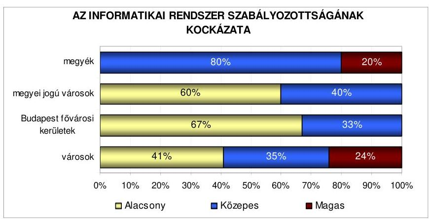

[^0]
[^0]:    ${ }^{90}$ Budapest Főváros VI. kerület Önkormányzatának polgármesteri hivatala egy karbantartási feladat elvégzéséért a szerződésben meghatározott ellenértékhez képest összesen egy millió Ft-tal nagyobb összeget fizetett ki a szolgáltató részére.
    ${ }^{91}$ Jánossomorja Város Önkormányzatának polgármesteri hivatala egy gép vételárát (három millió Ft-ot) nem a szerződésben meghatározott szállító részére fizette ki.
    ${ }^{92}$ A 2006. évi költségvetési beszámolók adatai szerint a személyi juttatások kiemelt előirányzatait az ellenőrzött önkormányzatok 7%-ánál, a dologi kiadásokét 14%-ánál, a felhalmozási kiadásokét 13%-ánál lépték túl.

---

Az informatikai rendszer szabályozottsága az ellenőrzött önkormányzatok 41%-ánál összességében alacsony kockázatot ${ }^{93}$ jelentett az informatikai feladatok biztonságos végrehajtásában, mivel az önkormányzati hivataloknál készítettek informatikai biztonsági szabályzatot, illetve rendelkeztek olyan dokumentummal, belső utasítással, amely tartalmazta az üzletmenet folytonossági tervet és/vagy a váratlan események bekövetkezésekor teendő intézkedéseket meghatározó informatikai katasztrófa elhárítási tervet.

Az ellenőrzött önkormányzatok 38%-ánál az informatikai rendszer szabályozottságának hiányossága közepes kockázatot jelentett az informatikai rendszer szabályszerű használatában, mivel nem ismertették a pénz-ügy-számvitel területén dolgozókkal az informatikával kapcsolatos szabályzatokat, a dolgozók munkaköri leírásai hiányosan tartalmazták az informatika eszközökkel végrehajtott feladataikat, azonban a kialakított kontrollok végrehajtásuk esetén a lehetséges hibák többsége ellen védelmet nyújtottak. Magas kockázatot jelentett az informatikai rendszer szabályszerű használatában az önkormányzatok 21%-ánál, hogy nem szabályozták az informatikai eszközökhöz történő hozzáférést, a pénzügy-számviteli számítógépes programrendszerben az adat-karbantartási folyamatokat, így a kontrollok - hiányos kialakításuk miatt - nem nyújtottak elegendő védelmet a lehetséges hibákkal szemben.
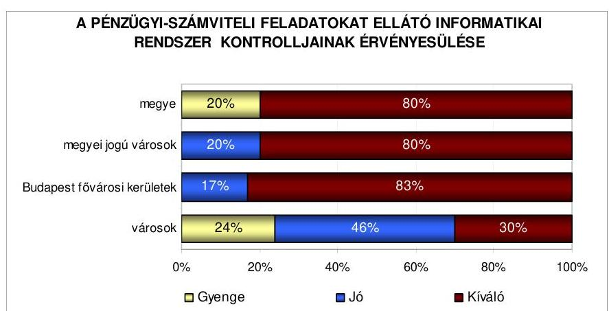

Az informatikai rendszerek működtetésénél a kialakított belső kontrollok megbízhatósága az önkormányzatok 40%-ánál összességében kiváló volt, mivel az önkormányzati hivatalokban a pénzügy-számviteli feladatok közül a főkönyvi könyvelést teljes mértékben informatikai eszközökkel látták el, a használt informatikai programok követték a jogszabályi változásokat, s egyúttal biztosították a számlarend változásainak kezelését, a pénzügyi-szám-

[^0]
[^0]:    ${ }^{93}$ Az informatikai rendszerek belső kontrolljaiban rejlő kockázatot alacsonynak minősítettük, ha a kialakított kontrollok apróbb szabályozási hiányosságok ellenére megfelelő védelmet nyújtanak a hibák előfordulása ellen.

---

viteli adatok visszamenőleges elérhetőségét, illetve működtettek hálózati rendszert, rendelkeztek internettel kapcsolatos védelmi rendszerekkel ${ }^{94}$.

Az önkormányzatok 39%-ánál az informatikai rendszerek belső kontrolljainak megbízhatósága jó volt, mivel, a kontrollok biztosították a működésbeli hibák megelőzését és kijavítását, a működésükben feltárt hiányosságok nem veszélyeztették az eredményes, megbízható működést. A belső kontrollok működésének megbízhatósága az önkormányzatok 21%-ánál gyenge volt, mivel ezen önkormányzatok hivatalainál az informatikai rendszerek belső kontroll feladatait nem végezték

 el, nem biztosították a hibák megelőzését, feltárását, kijavítását és ezáltal veszélyeztették az eredményes, megbízható működést. Az informatikai rendszerek nem biztosították a számítógépen vezetett számviteli analitikus nyilvántartások és a főkönyvi könyvelés automatikus kapcsolatát, emiatt a számviteli analitikus nyilvántartások adatainak időszaki összesítését nem a számítógépes program végezte, nem dokumentálták a pénzügyi-számviteli számítógépes nyilvántartásokban használt adatok kapcsolatait, nem oldották meg, hogy csak engedélyezett tranzakciókat lehessen a könyvvitelben elszámolni, nem alakították ki a rögzített, de hibás, törölt adatok kezelését, nem biztosították a pénzügyi-számviteli adatok visszamenőleges elérhetőségét.

# 4.2. A belső ellenőrzés szabályozottsága, szervezettsége és működése 

A belső ellenőrzés szervezeti kereteinek kialakítása és szabályozása az önkormányzatok 57%-ánál összességében alacsony kockázatot jelentett a belső ellenőrzés szabályszerű végrehajtásában, mivel meghatározták annak szervezeti és szabályozási kereteit, ellátási módját, továbbá szabályzatban rögzítették a belső ellenőrzési kötelezettséget, az ellenőrzést végzők jogállását és feladatait. Ezen önkormányzatoknál a kialakított belső ellenőrzési szervezet - szabályszerű működése esetén - az előforduló apróbb szabályozási hiányosságok ellenére megfelelő védelmet nyújtott a hibák bekövetkezése ellen.

Az ellenőrzött önkormányzatok 27%-ánál a belső ellenőrzés szervezeti kereteinek kialakítása, illetve szabályozottságának hiányosságai közepes kockázatot jelentettek a feladatok megfelelő és szabályszerű végrehajtásában, mivel hiányosan határozták meg a belső ellenőrzés ellátási módját, az önkormányzati hivatalokon belül elfoglalt helyét, a feladatainak ellátásával kapcsolatos szabályokat, azonban a kialakított szervezet - szabályszerű működés esetén - a lehetséges hiányosságok többsége ellen védelmet nyújtott. Az ellenőrzött önkormányzatok 16%-ánál a belső ellenőrzés szervezeti kereteinek kialakítása, illetve szabályozásának hiányosságai magas kockázatot jelentettek a feladatok megfelelő ellátásában, mert a jogszabályi előírások ellenére elmulasztották a belső ellenőrzés szervezeti kereteinek ki-

[^0]
[^0]:    ${ }^{94}$ A védelmi rendszer, tűzfal a behatolás ellen, kémprogram semlegesítő figyelőrendszer.

---

alakítását, illetve feladatainak szabályozását, ezáltal az nem nyújtott elegendő védelmet a lehetséges hiányosságokkal szemben.
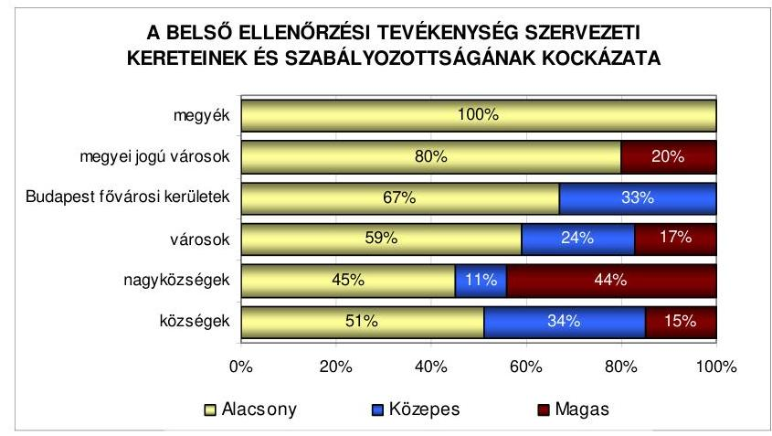

A belső ellenőrzési rendszer működésének közepes és magas kockázatát a következő szabályozási hiányosságok okozták:

- a Ber. 4. § (2) bekezdésben foglaltak ellenére SzMSz-ben nem határozták meg az önkormányzatok 53%-ánál ${ }^{95}$ a belső ellenőrzési kötelezettséget, nem jelölték meg az ellenőrzést végző személy, egység jogállását, továbbá nem határozták meg az ellenőrzést végzők feladatait;
- a belső ellenőrzés nem rendelkezett stratégiai tervvel az önkormányzatok 43%-ánál, a stratégiai tervet nem támasztották alá kockázatelemzéssel ${ }^{96}$ 17%-ánál. A stratégiai terveket megalapozó kockázatelemzések készítésének elmaradása, továbbá a stratégiai tervek hiánya miatt az önkormányzatok 60%-a nem határozta meg a belső ellenőrzésre vonatkozó stratégiai célkitűzéseit, nem végezte el a FEUVE rendszer értékelését, a kockázati tényezők megállapítását, a szükséges ellenőri létszám, és ellenőri képzettség felmérését, nem állította össze a belső ellenőrök hosszú távú képzési tervét, nem mérte fel a belső ellenőrzés tárgyi és információs igényét a szervezet struktúrájában és tevékenységében végbement változások ellenére;

[^0]
[^0]:    ${ }^{95}$ Az önkormányzatok gazdálkodási rendszerének átfogó ellenőrzései során megállapítottuk, hogy nem tartalmazta az SzMSz a belső ellenőrzési feladatokat a 2003. évben ellenőrzött önkormányzatok 62%-ánál, a 2004. évben 54%-ánál, a 2005. évben 52%-ánál.
    ${ }^{96}$ A belső ellenőrzési feladatokat társulással megszervező önkormányzatok kétharmadánál a belső ellenőrzési vezetői feladatok megállapodásban történő rögzítésének elmaradása, továbbá a feladatokat megállapodásban meghatározó önkormányzatok 58%-ánál a megállapodásban foglaltak ellenére kockázatelemzéssel alátámasztott stratégiai tervet nem készítettek.

---

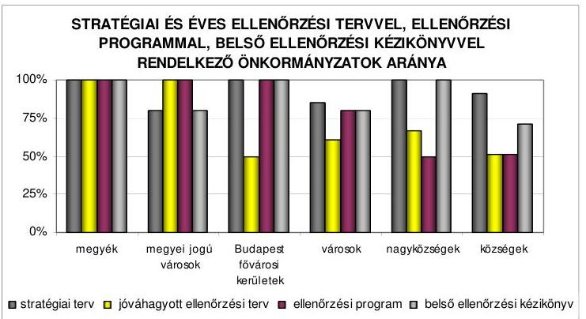

- a belső ellenőrzés az önkormányzatok 34%-ánál az Ötv. 92. § (6) bekezdésében foglalt előírást megsértve nem rendelkezett a képviselő-testület által jóváhagyott éves ellenőrzési tervvel. Az éves ellenőrzési tervek 49%-a a Ber. 21. § (1) bekezdésében foglaltak ellenére nem stratégiai terven alapult. Az elvégzendő ellenőrzési feladatokat tartalmazó éves ellenőrzési tervet az Ötv. 92. § (6) bekezdésében foglaltakat megsértve 23%-ánál a társulási tanács, 7%-ánál nem a képviselő-testület, hanem a polgármester, illetve a jegyző hagyta jóvá, továbbá ellenőrzést nem terveztek 4%-ánál ${ }^{97}$. Az ellenőrzési feladatokat társulás keretében megszervező önkormányzatok 30%-ánál kizárólag a társulás által összeállított és a társulási tanács által elfogadott éves ellenőrzési tervek álltak rendelkezésre, melynek következtében a belső ellenőrzési tevékenység keretében tervezett feladatokat a képviselő-testületek nem ismerték meg. Az ellenőrzési tervek 69%-a nem felelt meg a Ber. 21. § (1)-(2) bekezdéseiben foglaltaknak, mivel nem alapult kockázatelemzéssel alátámasztott stratégiai terven. A képviselő-testületek által elfogadott éves ellenőrzési tervek 42%-a a Ber. 21. § (3) bekezdésében foglalt tartalmi előírásoknak nem felelt meg ${ }^{98}$. Az éves ellenőrzési tervek 53%-nál a Ber. 21. § (4) bekezdésében foglaltak ellenére nem határoztak meg kapacitást soron kívüli ellenőrzési feladatokra. A belső ellenőrzési feladatok tervezését összességében az önkormányzatok 76%-a hiányosan hajtotta végre;
- az ellenőrzések lefolytatásához a Ber. 23. § (1) bekezdésének előírása ellenére a belső ellenőrzési vezetők nem készítettek ellenőrzési programot az önkormányzatok 23%-ánál. A belső ellenőrzési vezetők által jóváhagyott ellenőrzési programok 14%-a nem felelt meg az ellenőrzési módszerek meghatározására, az ellenőrök megnevezésére, feladatmegosztására, az ellenőrzés részletes feladatainak, tárgyának, céljának meghatározására vonatkozó Ber. 23. § (4) bekezdésben foglalt tartalmi előírásoknak;

[^0]
[^0]:    ${ }^{97}$ Belső ellenőrzést nem tervezett a 2006. évben hét önkormányzat - kettő városi, egy nagyközségi, négy községi - akik közül kettő a 2007. évben sem tervezett belső ellenőrzést.
    ${ }^{98}$ A képviselő-testületek által elfogadott éves ellenőrzési tervek 36%-a nem tartalmazta az ellenőrzési tervet megalapozó elemzéseket, 20%-a a szükséges ellenőrzési kapacitás meghatározását, 14%-a az ellenőrzések típusát és módszereit, 11%-a az ellenőrzések célját, 8%-a az ellenőrizendő időszakot, 6%-a az ellenőrzések ütemezését.

---

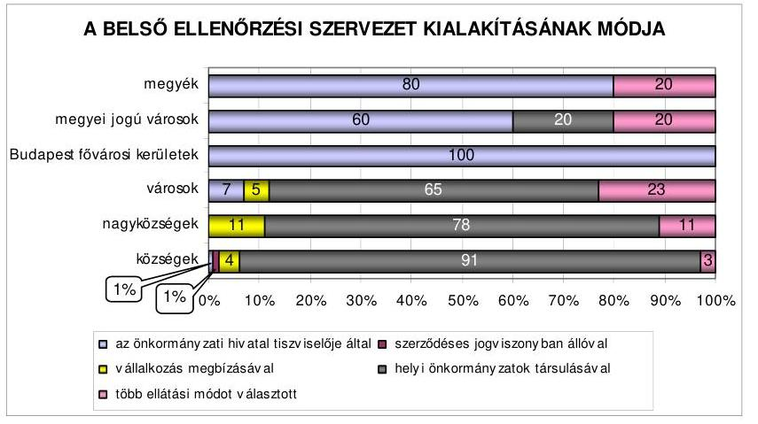

- az önkormányzatok 13%-ánál a belső ellenőrzési vezetők a Ber. 12. § a) pontjában foglaltak ellenére nem készítettek belső ellenőrzési kézikönyvet az ellenőrzési tevékenységre vonatkozó szabályok és eljárások rögzítésére;
- a társulással történő feladatellátásról szóló megállapodásban az önkormányzatok 64%-a a Ber. 4. § (5) bekezdésének ${ }^{99}$ előírása ellenére nem rendelkezett arról, hogy a belső ellenőrzési vezetői feladatokat a társulás látja el. E hiányosságok miatt az érintett önkormányzatoknál nem rendelkeztek a belső ellenőrzési kézikönyv készítésének; a kockázatelemzéssel alátámasztott stratégia tervek és éves ellenőrzési tervek összeállításának, jóváhagyásának, végrehajtásának, megvalósításuk nyomon követésének; a belső ellenőrzési tevékenység megszervezésének, az ellenőrzések végrehajtása irányításának; az ellenőrzések összehangolásának; az éves ellenőrzési jelentés, és az összefoglaló ellenőrzési jelentés összeállításának; az ellenőrzések nyilvántartásának; a továbbképzések megszervezésének; a tárgyi és személyi feltételek megteremtésének; az éves ellenőrzési tervtől való eltérés esetén, az arról való tájékoztatásnak; az intézkedési tervek végrehajtása nyomon követésének a felelőseiről;
- a belső ellenőrök az önkormányzatok 10%-ánál a Ber. 11. § (1) bekezdésében foglaltak ellenére az előírt iskolai végzettséggel, illetve szakmai képesítéssel nem rendelkeztek, továbbá rendszeres továbbképzésüket a Ber. 12. § k) pontjában foglaltak ellenére 26%-nál a belső ellenőrzési vezetői feladatokat ellátók nem biztosították.

A költségvetési szervek belső ellenőrzési feladatainak ellátási módját a képviselő-testületek 98%-a ${ }^{100}$ az Ötv. 92. § (8) bekezdésében előírtaknak megfelelően meghatározta, továbbá biztosította a belső ellenőrzési rendszer működéséhez szükséges forrásokat.

[^0]
[^0]:    ${ }^{99}$ 2007. április 19-től a Ber. 4/A. § (2) bekezdése tartalmazza, hogy amennyiben a költségvetési szerv vezetője külső szolgáltató bevonásával szervezi meg a belső ellenőrzési tevékenységet, úgy az arra vonatkozó megállapodásban rendelkezni kell a belső ellenőrzési vezetői feladatok ellátási módjáról.
    ${ }^{100}$ A 2003. évben a képviselő-testületek 34%-a, a 2004. évben 73%-a, a 2005. évben 87%-a hozott döntést a belső ellenőrzési feladatok ellátási módjáról.

---

Az önkormányzatok 12%-a a belső ellenőrzési feladatok ellátását egyidejűleg több módon - társulás és vállalkozás, társulás és köztisztviselő, illetve vállalkozó és köztisztviselő - biztosította. Ezen önkormányzatok 69%-ánál elmaradt a belső ellenőrzési vezető kijelölése, illetve nem szabályozták a feladatok megosztását. Az önkormányzatok 19%-a foglalkoztatott az önkormányzati hivatalon belül belső ellenőrt, valamint 81%-a társulást, 12%-a vállalkozást bízott meg a belső ellenőrzési feladatok ellátásával a 2006. évben.

A belső ellenőrzés megszervezésének évente egyre szélesebb körben elterjedt módja a feladat társulás útján történő ellátása, amelyet a 2003. évben ellenőrzött önkormányzatok 22%-a, a 2004. évben ellenőrzött önkormányzatok 55%-a, a 2005. évben ellenőrzött önkormányzatok 68%-a választott.

Az önkormányzatok a 2006. évben átlagosan hét ellenőrzést végeztek, melyen belül a megyei önkormányzatok átlagosan 47, a megyei jogú városi önkormányzatok 16, a Budapest fővárosi kerületi önkormányzatok 21, a városi önkormányzatok hét, a községi önkormányzatok kettő vizsgálatot folytattak.

A belső ellenőrzés működésének megbízhatósága az önkormányzatok 7%-ánál összességében kiváló volt, mivel a hibák feltárásával, javaslataival, célirányos intézkedések kezdeményezésével, valamint a realizálás ellenőrzésével hozzájárult a kontroll kockázatok csökkentéséhez. Ezeknél az önkormányzatoknál a belső ellenőrzés - az esetleges apróbb hiányosságok ${ }^{101}$ ellenére - eredményesen működött.

Az önkormányzatok 29%-ánál a belső ellenőrzési tervben foglalt feladatokat nem végezték el maradéktalanul, illetve nem vizsgálták az önkormányzat többségi irányítást biztosító befolyása alatt működő gazdasági társaságoknál, közhasznú társaságoknál, vagyonkezelőknél a rendelkezésre álló erőforrásokkal való gazdálkodást, a vagyon megóvását, gyarapítását, az elszámolások, a beszámoló megbízhatóságát.

A belső ellenőrzés működésének megbízhatósága az ellenőrzött önkormányzatok 40%-ánál jó volt, mivel tevékenységével hozzájárult a kontroll kockázatok csökkentéséhez, a belső ellenőrzés működésében feltárt hiányosságok nem veszélyeztették a lényeges hibák, szabálytalanságok és gyenge teljesítmények megelőzését, feltárását, illetve kijavítását. A belső ellenőrzés működésének megbízhatósága az ellenőrzött önkormányzatok 53%-ánál volt gyenge, mert nem teljesítette a lényeges hibák, szabálytalanságok és gyenge teljesítmények megelőzésével, feltárásával és kijavításával kapcsolatos funkcióját és veszélyeztette az eredményes, megbízható működést.

[^0]
[^0]:    ${ }^{101}$ Ezen önkormányzatok mintegy felénél a belső ellenőrzési tervben foglalt feladatokat nem végezték el maradéktalanul.

---

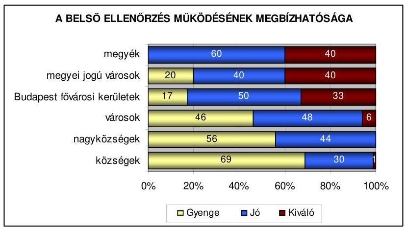

A belső ellenőrzés működésében az alábbi hiányosságokat állapítottuk meg:

- az önkormányzatok 11%-ánál a jegyzők a 2006. évben az Ötv. 92. § (5) bekezdésben foglaltakat megsértve nem gondoskodtak az önkormányzati belső ellenőrzés működtetéséről, az önkormányzati hivatal belső ellenőrzéséről, valamint a felügyelt költségvetési szervek (intézmények) ellenőrzéséről. A tervezett belső ellenőrzési feladatok elvégzését az önkormányzatok 29%-ánál nem biztosították maradéktalanul. A feladatok tervezésénél az önkormányzatok 77%-nál nem az ellenőrzési feladatot, hanem a meglévő ellenőri létszámot tekintették meghatározónak ${ }^{102}$. A társulások 40%-ánál nem állt rendelkezésre a tervezett ellenőrzési feladatok ellátásához szükséges számú belső ellenőr, ennek következtében a belső ellenőrzést társulással ellátó önkormányzatok 16%-ánál a tervezett ellenőrzéseket nem hajtották végre, 19%-ánál részben teljesítették;
- a kockázatbecsléssel alátámasztott stratégiai tervek és az éves ellenőrzési tervek készítésekor az önkormányzatok 60%-a nem vette figyelembe, nem tervezte a magas kockázatú területekre vonatkozó ellenőrzési feladatokat ${ }^{103}$. A végrehajtás során 69% nem teljesítette a magas kockázatúnak minősített tervezett feladatok ellenőrzését. A belső ellenőrzés keretében a FEUVE rendszerek kiépítésének és működésének központi és helyi szabályoknak való megfelelését a Ber. 8. § a) pontjában foglalt előírás ellenére az önkormányzatok 63%-ánál

 nem vizsgálták, továbbá 83%-ánál az Ötv. 92. § (11) bekezdés b) pontjában és a Ber. 8. § c) pontjában foglaltak ellenére nem ellenőrizték az önkormányzat többségi irányítást biztosító befolyása alatt működő

[^0]
[^0]:    ${ }^{102}$ A kiemelt önkormányzati körbe tartozóknál lefolytatták a tervezett ellenőrzéseket, 81%-uknál terven felüli (soron kívüli) vizsgálatot is végeztek.
    ${ }^{103}$ Magas kockázatúnak minősítették a belső szabályozottság és a FEUVE rendszerek működésének színvonalát, a számviteli nyilvántartások megbízhatóságát, a kötelezettségvállalások nyilvántartási rendszerét, a költségvetési tervezés és a végrehajtás szabályozottságát, folyamatát, a mérlegvalódiságot, a pénzmaradvány elszámolás hitelességét, a bevételek és kiadások teljesítését, a helyi adó bevételek és hátralékok vizsgálatát, a pénzkezelést, a likviditás megőrzését, a szabad pénzeszközök lekötését, a hitelfelvételeket, a vagyongazdálkodást, a kapott és nyújtott támogatások elszámolását, felhasználását, illetve egyes intézmények gazdálkodását.

---

gazdasági társaságoknál, közhasznú társaságoknál, illetve vagyonkezelőknél a rendelkezésre álló erőforrásokkal való gazdálkodást, a vagyon megóvását, gyarapítását, az elszámolások, a beszámolók megbízhatóságát, valamint 80%-nál nem végeztek ellenőrzést a kedvezményezett szervezeteknél a céljelleggel nyújtott támogatások rendeltetés szerinti felhasználásáról. A közbeszerzéseket, illetőleg a közbeszerzési eljárásokat 17%-nál a Kbt. 308. § (2) bekezdésében foglalt előírást megsértve nem vizsgálták, továbbá 37%-nál nem ellenőrizték a költségvetési előirányzatok teljesítését;

- az ellenőrzéseket a Ber. 23. § (1) bekezdésében előírtak ellenére hiányos tartalmú, valamint nem a belső ellenőrzési vezető által jóváhagyott ellenőrzési program alapján, illetve ellenőrzési program nélkül hajtották végre az önkormányzatok 16%-ánál;
- az elvégzett ellenőrzésekről készített jelentések 12%-a eredményeket és hiányosságokat összefoglaló értékelést, 10%-a következtetéseket és javaslatokat nem tartalmazott. A belső ellenőrzések során feltárt hiányosságok kijavítására tett javaslatok ellenére nem készítettek intézkedési tervet a megyei jogú városi önkormányzatok 20%-ánál, a Budapest fővárosi kerületi önkormányzatok 17%-ánál, a városi önkormányzatok 39%-ánál, a nagyközségi önkormányzatok 57%-ánál és a községi önkormányzatok 46%-ánál. A belső ellenőrzés által megállapított ${ }^{104}$ hiányosságok megszüntetéséről az önkormányzatok 38%-a utóellenőrzéssel, illetve beszámoltatással sem győződött meg${ }^{105}$;
- a jegyzők 76%-a az Áht. 97. § (2) bekezdésében foglalt előírást megsértve a költségvetési beszámoló keretében nem számolt be a FEUVE rendszer, valamint a belső ellenőrzés működtetéséről, továbbá a polgármesterek 46%-a - az Ötv. 92. § (10) bekezdésében foglalt előírást megsértve - a zárszámadási rendelettel egyidejűleg nem terjesztette a képviselő-testület elé az önkormányzat felügyelete alá tartozó költségvetési szervek éves ellenőrzési jelentései alapján készített összefoglaló jelentést ${ }^{106}$. Az önkormányzatok 35%-ánál - melynek 86%-át a belső ellenőrzési feladatokat társulással ellátó önkormányzatok tették ki - a Ber. 31. § (1) bekezdésében foglaltak ellenére nem készítettek éves ellenőrzési jelentést, az elkészített éves jelentések 38%-a nem felelt meg a Ber. 31. § (3) bekezdésében meghatározott tartalmi követelményeknek. Az éves ellenőrzési jelentések hiánya miatt nem került sor a belső ellenőrzés által végzett tevékenység bemutatására, a feladatok teljesítésének értékelésére, a tervektől történő eltérések indoklására, a tevékenységet befolyásoló tényezők, fontosabb ellenőrzési megállapítások, tett javaslatok hasznosításának bemutatására.

[^0]
[^0]:    ${ }^{104}$ A belső ellenőrök megállapításai a jelentések 93%-ánál a szabályozottságra, 89%-ánál a szabályszerű működésre, 45%-ánál az önkormányzat rendelkezésére álló források gazdaságos, hatékony és eredményes felhasználására vonatkoztak.
    ${ }^{105}$ A megyei jogú városok önkormányzatainak 20%-a, a városi önkormányzatok 27%-a, a nagyközségi önkormányzatok 44%-a, a községi önkormányzatok 49%-a nem követelte meg a hiányosságok felszámolásának nyomon követését.
    ${ }^{106}$ Az előterjesztések hiánya miatt a 2005. évben a képviselő-testületek 45%-a, a 2004-ben 48%-a, a 2003. évben 42%-a nem tekintette át a belső ellenőrzés tapasztalatait.

---

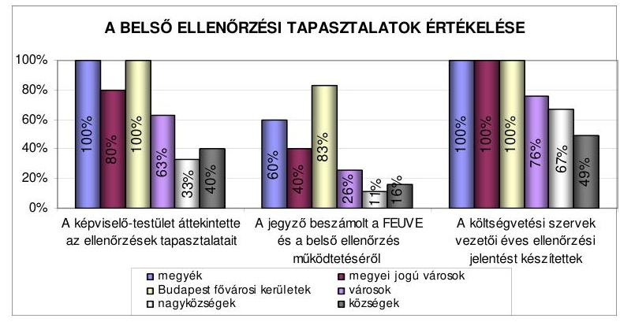

A belső ellenőrzés szervezeti kereteinek kialakításánál, szabályozásánál és működésének megbízhatóságánál tapasztalt hiányosságok esetében az önkormányzati mulasztások mellett közrejátszottak a vonatkozó központi előírásokat részletező Ber. hiányosságai is.

A közbenső egyeztetés során az Önkormányzati Minisztérium szakállamtitkára által adott észrevétel szerint a számvevőszéki jelentés „A 2., 3. 4. pontokban a Ber. több szakaszának módosítására tesz javaslatot, melyben különösen az önkormányzati feladatok tekintetében a jegyző felelősségének kibővítését indítványozza. A fentiekkel kapcsolatban jelzem, hogy az Ötv. kimondja, hogy a jegyző vezeti a képviselő-testület hivatalát, így a belső ellenőr munkáját is, gondoskodik az önkormányzat működésével kapcsolatos feladatok ellátásáról, döntésre előkészíti az ügyeket, valamint köteles jelezni, ha a jogszabálysértést észlel. Az önkormányzati feladatok ellátásáról a képviselő-testület dönt, így az egyebek mellett - az Ötv. 92. § (1) bekezdése alapján - a helyi önkormányzat köteles gondoskodni gazdálkodásának belső ellenőrzéséről, jogszabályban meghatározott képesítésű belső ellenőr útján.

Álláspontom szerint a jegyző felelősségének bővítése nem indokolt, tekintettel arra, hogy a feladatait az Ötv. tartalmazza, a döntés-előkészítés és a hivatal irányítása a jegyző feladata, a belső ellenőrzést a jogszabályban rögzített speciális szakértelemmel rendelkező személynek kell ellátnia, a belső ellenőrzésről való gondoskodás pedig önkormányzati (nem jegyzői) feladat."

Az észrevétel nem megalapozott, mivel a költségvetési szervek belső ellenőrzéséről szóló 193/2003. (IX. 26.) Korm. rendelet (Ber.) módosítására vonatkozó javaslataink nem a jegyző felelősségének kibővítésére, hanem az Ötv. 92. § (4) és (5) bekezdéseiben, az államháztartásról szóló 1992. évi XXXVIII. törvény (Áht.) 97. § (1) és (2) bekezdéseiben valamint a helyi önkormányzatok és szerveik, a köztársasági megbízottak, valamint egyes centrális alárendeltségű szervek feladat- és hatásköreiről szóló 1991. évi XX. törvény 140. § (1) bekezdés e) pontjában a jegyzőkre vonatkozóan szereplő előírások egyértelmű érvényesítése és érvényesíthetősége érdekében szükséges feltételek biztosítására vonatkoznak.

A belső ellenőrzések során az önkormányzatok 9%-ánál tártak fel büntető ${ }^{107}$, kártérítési, illetve fegyelmi eljárás megindítására okot adó cselekményt. Az eljárások a gazdálkodás során tapasztalt visszaélések - a számviteli előírások betartásával, a pénzügyi bizonylati fegyelem érvényesülésével, és a mérlegvalódi-

[^0]
[^0]:    ${ }^{107}$ A kezdeményezett eljárások harmada büntetőeljárás volt.

---

sággal, a mérleg és az analitikus nyilvántartások közötti eltérésekkel, a belső kontrollok szabálytalan végrehajtásával, a karbantartási és felújítási munkákkal, a tanulók étkezési kedvezményei hibás elszámolásával, szabálytalan adójóváírásokkal és átutalások jóváhagyásával, valamint az adóhátralékok nyilvántartásával és behajtásával kapcsolatos hiányosságok - miatt indultak.

# 5. Az ÁSZ korábbi ellenőrzési javaslatai alapján készített intézkedési terv végrehajtása, eredményessége 

A 2007. évben ellenőrzött önkormányzatok 81%-ánál volt ÁSZ vizsgálat 2004-2006 között. Ezen időszak alatt ellenőrzést folytattunk valamennyi megyei, megyei jogú városi, Budapest fővárosi kerületi, városi önkormányzatnál, a nagyközségi önkormányzatok 62%-ánál, a községi önkormányzatok 67%-ánál. A 2004-2006 között lezárt ÁSZ ellenőrzések 30%-a a helyi és a helyi kisebbségi önkormányzatok gazdálkodási rendszerének átfogó ellenőrzésére, 42%-a a zárszámadáshoz kapcsolódóan az állami támogatások igénylésére és felhasználására, 28%-a az önkormányzati gazdálkodás különböző területeire vonatkozó teljesítményellenőrzésre irányult.
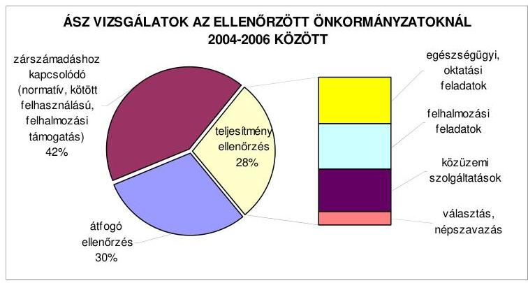

A 2004-2006 között elkészített számvevői jelentések összesen 4550 javaslatot tartalmaztak a feltárt hiányosságok megszüntetése, a feladatok szabályszerűbb, célszerűbb és hatékonyabb megoldása érdekében. A javaslatok 78%-a a gazdálkodás szabályszerűségének, 22%-a a célszerűségének, hatékonyságának javítására irányult. Az utóellenőrzés megállapításai szerint az összes javaslat mintegy 70%-a hasznosult. A javaslatok realizálásának elmulasztása, valamint a gazdálkodási és pénzügyi-számviteli szabályok hiányos kialakítása miatt a 2007. évben személyes felelősséget állapítottunk meg összesen 19${ }^{108}$ önkormányzatnál.

[^0]
[^0]:    ${ }^{108}$ Személyes felelősséget állapítottunk meg Fejér megye, Eger, Érd és Győr megyei jogú város, Budapest főváros XVI. kerület, Abaújszántó, Balatonboglár, Balkány, Bácsalmás, Bátaszék, Fehérgyarmat, Izsák, Nagymaros, Nyírlugos, Pécel, Rétság, Tiszafüred, Vecsés és Visegrád városok önkormányzatánál. Ebből a jelentés átadásakor hat esetben a felelősséggel érintett személynek már nem volt köztisztviselői jogviszonya, továbbá egy esetben a polgármesteri megbízatása már megszűnt.

---

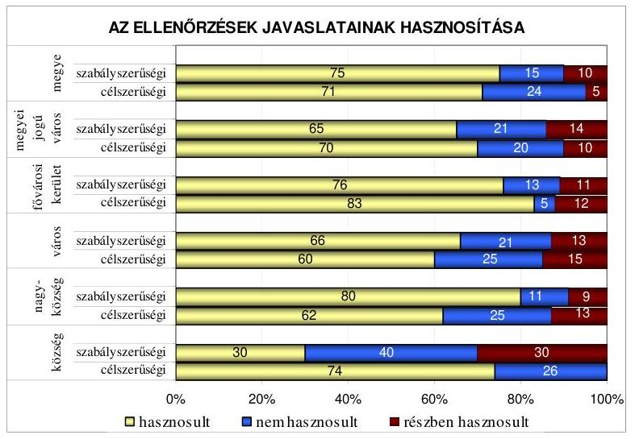

A költségvetési tervezés szabályszerűségének ${ }^{109}$ biztosítása érdekében tett javaslatok kétharmadának hasznosításaként elfogadták, módosították a gazdaság programot, a költségvetési koncepciót a helyben képződő bevételek és az ismert kötelezettségek alapján állították össze, a költségvetési rendelettervezetet az előírt határidőben, a javasolt előirányzatok megalapozottságát biztosító rendelettervezetekkel együtt terjesztették a képviselő-testület elé. A költségvetési rendeletek tartalmazták a címrendet, a működési és felhalmozási célú bevételeket és kiadásokat, ezen belül költségvetési szervenként a személyi jellegű kiadásokat, a dologi jellegű kiadásokat, az ellátottak pénzbeni juttatásait, a speciális célú támogatásokat, a költségvetési létszámkeretet, a költségvetés végrehajtásának szabályait. A költségvetési rendelettervezetekben az előírt részletezettséggel mutatták be az önállóan és a részben önállóan gazdálkodó költségvetési szervek bevételeit, kiemelt előirányzatonként a kiadásokat, célonként a felújítási előirányzatokat, feladatonként a felhalmozási kiadásokat és az önkormányzati hivatal költségvetését, külön tételben az általános és céltartalékot, a létszámkeretet. A tervezett hiányt a költségvetési bevételek és kiadások különbségeként mutatták be.

Az ellenőrzött önkormányzatok 54%-a azonban javaslataink ellenére, megsértve az Áht. 8/A. § (7) bekezdés előírásait, a költségvetés bevételi és kiadási főösszegének megállapításakor finanszírozási célú pénzügyi műveleteket (hitelbevételeket és hiteltörlesztéssel kapcsolatos kiadásokat) vett figyelembe költségvetési hiányt módosító költségvetési bevételként és kiadásként. Az önkormányzatok közel négytizedénél a képviselő-testületek nem határozták meg az Áht. 118. §-ában ${ }^{110}$ foglalt előírást megsértve a költségvetés és a zárszámadás előterjesztéskor a képviselő-testület tájékoztatása céljából bemutatandó mérlegek,

[^0]
[^0]:    ${ }^{109}$ A költségvetési és a zárszámadási rendeletek törvényességét a 2007. évben a közigazgatási hivatalok is ellenőrizték, megállapításaik összefoglalását az ÖTM Önkormányzati Tájékoztató XVIII. évfolyamának 2. száma tartalmazza. A közigazgatási hivatalok ellenőrzései az ÁSZ ellenőrzési megállapításaihoz hasonló hiányosságokra, mulasztásokra hívták fel az önkormányzatok figyelmét.
    ${ }^{110}$ A 2007. január 1-től Áht. 118. § (1) és (2) bekezdések 2. pontjai.

---

kimutatások tartalmi követelményeit. A polgármesterek a költségvetési koncepció előterjesztéséhez az önkormányzatok mintegy ötödénél továbbra sem csatolták az Ámr. 28. § (3) bekezdés előírásai ellenére a helyi önkormányzatnál működő bizottságok és a kisebbségi önkormányzatok véleményét, a költségvetési rendelet-tervezetekhez a 29. § (9) bekezdésének előírása ellenére a pénzügyi bizottság véleményét. A javaslatok, és az Ötv. 8. § (2) bekezdésében foglalt előírást megsértve nem határozta meg az önkormányzatok mintegy harmada, hogy a lakosság igényei alapján, anyagi lehetőségeitől függően mely feladatokat, milyen mértékben és módon kíván ellátni.

A közbenső egyeztetés során az Önkormányzati Minisztérium szakállamtitkára által adott észrevétel szerint: az Ötv. 8. § (2) bekezdésében foglaltak módosítására vonatkozó „... javaslat a korábbi ÁSZ jelentésekben is szerepelt. Az ezzel kapcsolatos korábbi álláspontomat fenntartom, miszerint a javaslat szakmai szempontból nem támogatható. Az önkormányzati szabályozás módja (tehát a rendeletalkotás) kérdése az Ötv. 16. § (1) bekezdésére figyelemmel rendezett, mivel a képviselő-testület a törvény által nem szabályozott helyi társadalmi viszonyok rendezésére (az önként vállalt feladatokról) önkormányzati rendeletet alkot. A 8. § (1) bekezdés felsorolásában szereplőek ellátásáról az Ötv. 91. § alapján a gazdasági programban dönt a képviselő-testület. A gazdasági program a költségvetési lehetőségekkel összhangban, a helyi társadalmi, környezeti, gazdasági adottságok átfogó figyelembevételével - a kistérségi területfejlesztési koncepcióhoz illeszkedve - tartalmazza az önkormányzat(ok) által ellátandó kötelező és önként vállalt feladatok biztosítását a képviselő-testület megbízatásának időtartamára, vagy
 azt meghaladó időszakra vonatkozóan. Arra figyelemmel, hogy az ASZ fenti pontban szereplő javaslatában foglaltakat jelenleg is szabályozza az Ötv., a 8. § (2) bekezdésének pontosítását nem tartom indokoltnak."

Az észrevétel nem megalapozott, mivel a javaslattal kapcsolatban adott válasz téves a tekintetben, hogy az önkormányzatok gazdasági programjának tartalmaznia kell a kötelező és önként vállalt feladatok biztosítását a képviselő-testület megbízatásának időtartamára, vagy azt meghaladó időszakra vonatkozóan. A helyi önkormányzatokról szóló 1990. évi LXV. törvény (Ötv.) 91. § (6) bekezdése szerint „A gazdasági program az önkormányzat(ok) részére helyi szinten meghatározza mindazon célkitűzéseket, feladatokat, amelyek a költségvetési lehetőségekkel összhangban, a helyi társadalmi, környezeti, gazdasági adottságok átfogó figyelembevételével - a kistérségi területfejlesztési koncepcióhoz illeszkedve az önkormányzat(ok) által nyújtandó kötelező és önként vállalt feladatok biztosítását, fejlesztését szolgálják." Ezen előírás alapján a gazdasági program nem a kötelező és önként vállalt feladatok konkrét felsorolását, hanem azon célkitűzéseket, fejlesztési feladatokat tartalmazza, amelyeket a képviselő-testület megbízatásának időtartamára, vagy azt meghaladó időszakra meghatároz. Az Ötv. hivatkozott előírása szerint a gazdasági program tartalmi követelménye nem terjed ki arra, hogy abban egyértelműen meghatározza a képviselő-testület, hogy a lakosság igényei alapján, anyagi lehetőségeitől függően, mely feladatokat, milyen mértékben és módon lát el.

A jóváhagyott költségvetési előirányzatokon belüli gazdálkodás érdekében javaslataink alapján az ellenőrzött önkormányzatok közel háromnegyedénél történtek intézkedések. A polgármesterek az önkormányzat önállóan gazdálkodó költségvetési szervei saját hatáskörében végrehajtott előirányzatváltozásáról a jegyző előkészítésében 30 napon belül tájékoztatták a képviselőtestületeket és megtörtént a költségvetési rendeletek emiatti módosítása is. Az önkormányzatok ötödénél azonban a központi költségvetésből biztosított pót-

---

előirányzattal a költségvetési rendeletet az Ámr. 53. § (2) bekezdésében foglalt határidőn belül nem módosították, a költségvetés végrehajtása során a jóváhagyott előirányzatokat és azok teljesülésének alakulását az Áht. 103. § (1) bekezdésében foglalt előírást megsértve folyamatosan nem tartották nyilván, valamint megsértve az Áht. 12/A. § (1) bekezdésében foglalt előírást tárgyévi fizetési kötelezettséget vállaltak és kifizetéseket rendeltek el a jóváhagyott kiadási előirányzatokon túlmenően, valamint az Áht. 93. § (1) bekezdésében foglaltakat megsértve a költségvetési szervek a jóváhagyott előirányzatokat túllépték.

A gazdálkodás és a pénzügyi-gazdasági feladatok ellátásának szabályozottsága, a bizonylati rend és fegyelem szabályszerűségének javítása érdekében tett javaslataink közel kétharmadát hasznosítva a jegyzők kialakították a költségvetési szervek egységes számviteli rendjét, aktualizálták és kiegészítették a számviteli politikát. A számlarendben rendelkeztek a könyvviteli számlákhoz kapcsolódó analitikus nyilvántartások vezetésének módjáról, formájáról, tartalmáról. Az eszközök és források leltározási és leltárkészítési szabályzatában a leltározás módjának és gyakoriságának meghatározásánál figyelembe vették a Vhr. előírásait. A javaslatok és az Ámr. 10. § (4)${ }^{111}$ bekezdésében foglalt előírások ellenére az önkormányzatok 12%-ánál az önkormányzati hivatalok SzMSz-ét nem egészítették ki, közel ötödénél Ámr. 17. § (5) bekezdésében előírtak ellenére a gazdasági szervezetek ügyrendjét nem készítették el, valamint nem egészítették ki. Az önkormányzatok tizedénél az előzetes írásbeli kötelezettségvállalást${ }^{112}$ nem igénylő, 50 ezer Ft-ot el nem érő kifizetések nyilvántartási rendjét és formáját az előző ellenőrzés javaslatai, illetve az Ámr. 134. § (3)${ }^{113}$ bekezdésében foglaltak ellenére belső szabályzatban nem rögzítették, a nyilvántartások nem voltak alkalmasak a kötelezettségvállalás évenkénti összegének Ámr. 134. § (13)${ }^{114}$ bekezdésében előírt megállapítására. A jegyzők az önkormányzatok közel négytizedénél nem határozták meg a szakmai teljesítés igazolásának módját és nem jelölték ki az azt végző személyeket az Ámr. 135. § (3) bekezdésében${ }^{115}$ foglaltak ellenére, a kötelezettségvállalás, utalványozás gazdálkodási és az ellenjegyzés, érvényesítés, teljesítés szakmai igazolás ellenőrzésének jogosultjai meghatározásánál nem érvényesítették az Ámr. 134-138. §-ában foglaltakat.

[^0]
[^0]:    ${ }^{111}$ A 2008. január 1-től Ámr. 10. § (5) bekezdés.
    ${ }^{112}$ A 2007. január 1-től írásbeli kötelezettségvállalást.
    ${ }^{113}$ A 2004. december 31-ig Ámr. 134. § (4) bekezdés.
    ${ }^{114}$ A 2004. december 31-ig Ámr. 134. § (6) bekezdés.
    ${ }^{115}$ A 2007. január 1-től Ámr. 134. § (2) bekezdés.

---

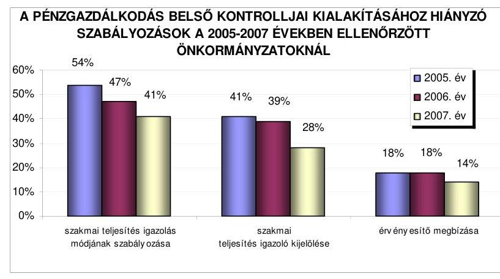

A költségvetési gazdálkodási és az ellenőrzési jogkörök gyakorlása szabályszerűségének biztosítása érdekében tett javaslatok közel felét hasznosítva az önkormányzati hivataloknál a gazdasági műveletekről, eseményekről - amelyek az eszközök, illetve az eszközök forrásainak állományát vagy összetételét megváltoztatják - az előírt alaki és tartalmi követelményeknek megfelelő bizonylatokat kiállították. A bizonylatokon a gazdálkodási jogkört gyakorlók az utalványozás és a kötelezettségvállalás elvégzését aláírásukkal igazolták. A költségvetési pénzforgalmat érintő gazdasági események bizonylatainak adatait késedelem nélkül, megfelelő időben rögzítették a könyvekben. A belső kontrollok azonban az Ámr. 134-138. § előírásai ellenére továbbra sem működtek megfelelően a pénzgazdálkodás folyamatában, mivel az önkormányzatok mintegy felénél kötelezettségvállalást és utalványozást a jegyző, vagy az általa felhatalmazott személy ellenjegyzése nélkül is végeztek. A kiadások teljesítésének és a bevételek beszedésének elrendelése előtt okmányok alapján nem ellenőrizték, szakmailag nem igazolták azok jogosultságát, összegszerűségét, a szerződés, megrendelés, megállapodás teljesítését, illetve az érvényesítő nem tett eleget a munkafolyamatba épített ellenőrzési feladatainak, a szakmai teljesítés igazolás alapján nem ellenőrizte az összegszerűséget, a fedezet meglétét és az előírt alaki követelmények betartását.

Az önkormányzati vagyon nyilvántartása, a vagyonnal való gazdálkodás szabályszerűsége, célszerűsége érdekében tett javaslatok mintegy héttizedének végrehajtásaként módosították, kiegészítették a vagyongazdálkodási rendeletet. Rögzítették a vagyon tulajdonjoga és vagyonkezelési joga ingyenes átruházásának, a követelésről való lemondásnak a módját és eseteit. Rendelkeztek a forgalomképesség szerinti besorolás megváltoztatásának módjáról. A főkönyvi számlák további bontásával, vagy részletező analitikus nyilvántartás vezetésével biztosították a törzsvagyon (ezen belül a forgalomképtelen, illetve korlátozottan forgalomképes) és nem törzsvagyon részét képező eszközök értékének számviteli nyilvántartását. Elmaradt a javaslatok hasznosítása az önkormányzatok mintegy ötödénél, mivel az eszközök és források évenkénti leltározására vonatkozó kötelezettséget a Vhr. 37. § (1) bekezdés előírása ellenére nem teljesítették, az értékvesztés elszámolásának szükségességét nem vizsgálták, elszámolását elmulasztották a Számv. tv. 54. § (1) bekezdés és a (2) bekezdés c) pontjában, valamint az 55. § (1) bekezdésében előírtakat megsértve.

---

A céljelleggel, nem szociális ellátásként szervezetek, magánszemélyek számára nyújtott támogatások rendeltetésszerű felhasználásáról az önkormányzatok mintegy kétharmadánál a javaslatokat hasznosítva számadási kötelezettséget írtak elő, működtették a számadások, felhasználások ellenőrzési rendszerét, intézkedtek a céltól eltérő, nem rendeltetésszerű felhasználás esetén a visszafizetésre, illetve a számadási kötelezettség elmulasztása esetén a kötelezettség teljesítéséig a további támogatás felfüggesztésére. A képviselő-testület hatásköréből nem ruháztak át közösségi célú alapítványi forrás átadására vonatkozó döntési jogot.

A közbeszerzési eljárások esetében az ellenőrzés javaslatait 10 önkormányzatnál nem, háromnál csak részben hasznosították, mivel nem folytatták le valamennyi indokolt esetben a közbeszerzési eljárást, illetve az intézményi és hivatali közbeszerzések központi megvalósíthatóságát nem vizsgálták, a megkötött szerződések tartalma nem volt összhangban az ajánlati felhívás és dokumentáció tartalmával, nem intézkedtek a vállalkozó késedelmes teljesítése esetére kikötött kötbér érvényesítésére, számviteli nyilvántartására. A lefolytatott eljárások eredményéről nem adtak tájékoztatást a Közbeszerzési Értesítőben, a közzétételi kötelezettségnek nem tettek eleget a szerződés teljesítésétől számított öt munkanapon belül. Az ÁSZ az ellenőrzési tevékenysége során tudomására jutott mulasztások miatt a KDB hivatalból való eljárását kettő önkormányzatnál kezdeményezte${ }^{116}$ a Kbt. 327. § (1) bekezdés b) pontja alapján, illetve kettő önkormányzatnál ugyanezen jogszabályhely (2) bekezdésében foglaltak alapján nyitva álló jogvesztő határidő lejárta miatt nem kezdeményezte.

A zárszámadási kötelezettség teljesítésére vonatkozó jogszabályi előírások betartása érdekében tett javaslatok kétharmadát hasznosították az önkormányzatok. A költségvetés végrehajtásáról szóló zárszámadást az elfogadott költségvetéssel összehasonlító módon, az év utolsó napján érvényes szervezeti, besorolási rendnek megfelelően készítették el. A költségvetési szervek beszámolóját felülvizsgálták, annak eredményéről a költségvetési intézmények vezetőit írásban értesítették. A javaslatokat nem, vagy csak részben hasznosították az ellenőrzött önkormányzatok mintegy ötödénél, mivel a zárszámadási rendelet előterjesztéséhez az Áht. 118. §-ában${ }^{117}$ előírtakat megsértve nem csatolták az önkormányzat vagyonkimutatását, valamint szöveges indokolással a közvetett támogatásokat tartalmazó kimutatást és a többéves kihatással járó kiadások számszerűsítését.

Az ellenőrzési rendszer kialakítása és működése érdekében tett javaslatokat hasznosítva az önkormányzatok közel kétharmadánál gondoskodtak a belső ellenőrök funkcionális függetlenségét biztosító feltételek kialakításáról, középtávú és éves ellenőrzési terv jóváhagyásáról, a belső ellenőrök részére megbízólevél kiadásáról, a Ber-ben meghatározott tartalmú ellenőrzési jelentés összeállításáról. Nem, vagy csak részben hasznosították a belső ellenőrzésre

[^0]
[^0]:    ${ }^{116}$ Ebből egy esetben a KDB határozatában megállapította, hogy az önkormányzat megsértette a Kbt-t és összesen ötmillió Ft bírságot szabott ki, egy esetben az ÁSZ az észrevételezési határidő túllépése miatt a kezdeményezést visszavonta.
    ${ }^{117}$ A 2007. január 1-től Áht. 118. § (1) és (2) bekezdése.

---

vonatkozó javaslatokat az önkormányzatok egyharmadánál, ahol az önkormányzati hivatalok SzMSz-ében a Ber. 4. § (2) bekezdés előírása ellenére nem határozták meg a belső ellenőrzést végző szervezet jogállását és feladatait, a 19. §-ában foglaltak ellenére nem készítették el, kockázatelemzéssel nem támasztották alá a belső ellenőrzési stratégiai tervet, az éves ellenőrzési terv tartalmában nem felelt meg a Ber. 21. § (3) bekezdésében, az ellenőrzési program a Ber. 23. § (3)-(4) bekezdésében előírtaknak. A javaslat ellenére a polgármesterek közel fele az Ötv. 92. § (10) bekezdésében előírtakat megsértve évente továbbra sem tájékoztatta a képviselő-testületet a költségvetési szervek ellenőrzésének tapasztalatairól.

Az önkormányzatoknál intézkedéseket tettek a 2004-2006. években végzett, zárszámadáshoz kapcsolódó vizsgálatok során tett közel 600 javaslat mintegy 90%-ának a megvalósítására. Elrendelték a jogosulatlanul igénybevett támogatások visszafizetését, a gyermekvédelmi és szociális rendelet kiegészítését, a közcélú foglalkoztatási programok, ágazati szakmai továbbképzési tervek elkészítését, aktualizálását, az intézmények szervezeti és működési szabályzatának, alapító okiratának, működési engedélyének módosítását, a támogatások, hozzájárulások alapját képező mutatószámok törvényi előírásoknak megfelelő kialakítását, a szükséges OKÉV engedélyek beszerzését. Előírták a különleges gondozást igénylő tanulókról a megfelelő szakvélemények bekérését, egyes pénzbeli szociális ellátások jogosultsági feltételeinek felülvizsgálatát, a támogatások szabályszerű igényléséhez hiányzó dokumentumok, nyilvántartások pontosítását. Intézkedtek, hogy a belső ellenőrzés terjedjen ki az állami támogatások, hozzájárulások igénylésére, elszámolására, az intézményi adatszolgáltatások szakmai nyilvántartásokkal való összhangjára, az önkormányzati hivatalok vezessék a közműfejlesztési támogatások elkülönített analitikus nyilvántartását, a támogatási igényeket az előírt jogosultsági feltételek szerint bírálják el, intézkedjenek az igényelt támogatások határidőn belüli kifizetésére.

A 2004-2006 között az önkormányzati gazdálkodás 19 különböző területén lefolytatott teljesítményellenőrzések 450 javaslata közel háromnegyedének hasznosítására történt intézkedés. A polgármesterek, jegyzők kezdeményezték a gazdasági program ágazati fejlesztési célkitűzésekkel történő kiegészítését, a települési környezetvédelmi program, vízkár-elhárítási stratégia, védekezési terv elkészítését, önkormányzati rendelet alkotását a települési hulladékkezelés feladatairól, a talajterhelési díjról és a kegyeleti közszolgáltatásokról, valamint felmérés készítését a hajléktalanokról és azok ellátási szükségleteiről. Intézkedtek a gyermekvédelmi szakszolgálat szakmai feltételeinek javítására, a szociális szolgáltatástervezési koncepció felülvizsgálatára, a kötelező közszolgáltatások megszervezésére. Intézkedtek annak érdekében,
 hogy az önkormányzati hivatalokban gondoskodjanak a beruházások megfelelő műszaki és pénzügyi előkészítéséről, végezzék el a létrehozott tárgyi eszközök szabályszerű üzembe helyezését, állományba vételét, növeljék a szennyvízközmű hálózatra történő lakossági rákötések számát, pontosítsák a szennyvíz- és víziközmű vagyon forgalomképesség szerinti besorolását, nyilvántartását, egészítsék ki az üzemeltetésükre kötött szerződéseket. Alakítsák ki a köztemetők fenntartásával kapcsolatos pénzügyi elszámolás rendjét, készítsék elő a népszavazáshoz kapcsolódó pótelőirányzat miatti költségvetési rendelet módosítását, biztosítsák a

---

választásokra, népszavazásra juttatott pénzeszközök szabályszerű elszámolását.

Az önkormányzatok gazdálkodásának átfogó ellenőrzéséről a 2005-2007. években készült összefoglaló jelentésekben a Kormánynak és a minisztereknek 27 javaslatot tettünk.

A javaslatok a következők szerint teljesültek:

- javaslatunkra az Országgyűlés meghatározta a helyben központosított közbeszerzésekre vonatkozó szabályokat, módosította a megyei önkormányzatok kötelező szociális feladatainak felsorolását, előírta a céljellegű működési támogatások közzétételi kötelezettségét, a kisebbségi önkormányzatokkal kötött megállapodások tartalmi követelményeit;
- a Kormány egységesítette az érvényesítést végzők képesítési követelményét, meghatározta a költségvetési és zárszámadási rendeletek előterjesztésekor a közvetett támogatások bemutatásának részletezettségét, a kötelezettségvállalások nyilvántartási rendjének belső szabályozására vonatkozó konkrét követelményeket, a szakmai teljesítés igazolás záradékban történő rögzítésének kötelezettségét és tartalmát. Az önállóan gazdálkodó költségvetési szerv vezetője részére biztosította a döntési lehetőséget, hogy a számviteli politikát és a kapcsolódó szabályzatokat a költségvetési szervhez csatlakozó, részben önállóan gazdálkodó költségvetési szervekre kiterjeszti-e, kiegészítette a belső ellenőrzési kézikönyv mintát a céljelleggel nyújtott támogatások ellenőrzésére vonatkozó szempontokkal;
- a Földművelésügyi és Vidékfejlesztési Minisztérium körlevélben felhívta a földhivatalok figyelmét, hogy az önkormányzatok forgalomképtelen ingatlanjai esetében ne jegyezzék be a tulajdonos változást.

Nem történt döntés javaslatunk ellenére a következő esetekben:

- a korlátozottan forgalomképes törzsvagyonként meghatározott vagyon esetében értékesítést megelőzően a törzsvagyonon kívüli egyéb forgalomképes vagyonkategóriába önkormányzati rendelettel történő átsorolási kötelezettség előírását az illetékes minisztérium az Ötv. következő módosításakor tervezi kezdeményezni. Az előkészített törvénymódosítási javaslatban szerepeltették az önkormányzati hitelfelvételi korlát szabályozásának módosítását a működési célú hitelfelvétel folyamatos megújításánál kialakult gyakorlat megszüntetése érdekében;
- a Kbt. módosítására benyújtott munkaanyag tartalmazta az eljárás hivatalból való kezdeményezésére az ÁSZ részére nyitva álló jogvesztő határidő 30 naptári napra történő módosítását;
- nem történt intézkedés az önkormányzatok kötelező feladatai és az ellátásukat szolgáló költségvetési források egyértelmű meghatározására, az önkormányzati tulajdonú nem lakás céljára szolgáló helyiségeknél a gazdálkodó szervezet bérlője részére - az elővásárlási jog gyakorlására jogosult személy kijelölésére - biztosított lehetőség megszüntetésére, a közigazgatási hivataloknál a képviselő-testületek figyelemelhívására a víziközművek önkormányzati tulajdonjogának megszüntetésére vonatkozó jogszabálysértő döntésekre. A pénzügyminiszter nem kezdeményezte a hiány számításánál a hitel figyelembevételi mód meghatározását, az egyéb gazdasági események (elkészült beruházások számviteli nyilvántartásba vétele, értékcsökkenés és értékvesztés elszámolása, értékvesztés visszaírása, követelések, kötelezettségek állományvál-

---

tozásának elszámolása) bizonylataira a vezetői elrendelés és az érvényesítési kötelezettség előírását, így továbbra sem biztosított a számviteli nyilvántartásban elszámolt vagyonváltozások elrendelésének dokumentálása.

Budapest, 2008. július 31.

Melléklet: $\quad 16 \mathrm{db} \quad 37$ lap
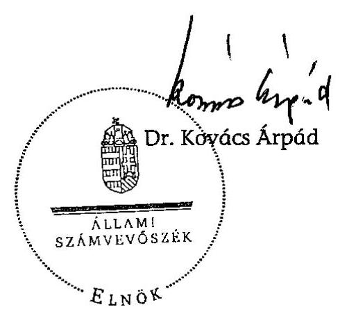

---

# AZ ELLENŐRZÖTT ÖNKORMÁNYZATOK JEGYZÉKE 

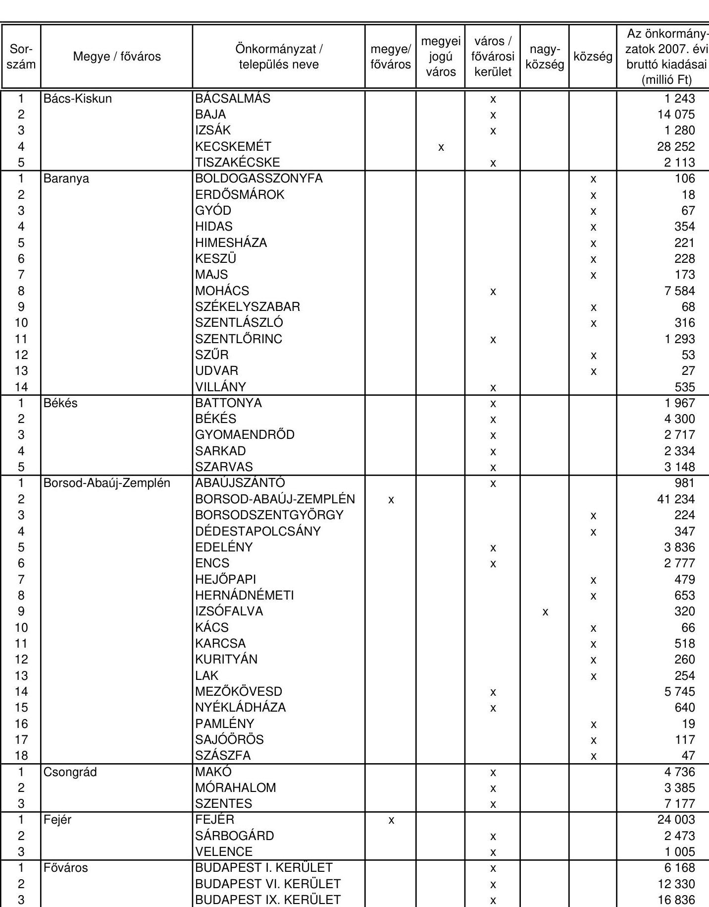

---

| Sorszám | Megye / főváros | Önkormányzat / település neve | megye/ főváros | megyei jogú város | város /   fővárosi kerület | nagy-   község | község | Az önkormányzatok 2007. évi bruttó kiadásai (millió Ft) |
| :--: | :--: | :--: | :--: | :--: | :--: | :--: | :--: | :--: |
| $\begin{aligned} & 5 \\ & 6 \end{aligned}$ |  | BUDAPEST XVI. KERÜLET   BUDAPEST XVIII. KERÜLET |  |  | $\begin{gathered} \mathrm{x} \\ \mathrm{x} \end{gathered}$ |  |  | $\begin{array}{r} 13278 \\ 21229 \end{array}$ |
| $\begin{aligned} & 1 \\ & 2 \\ & 3 \end{aligned}$ | Győr-Moson-Sopron | GÖNYÚ   GYŐR   JÁNOSSOMORJA |  | $x$ |  |  | $x$ | $\begin{array}{r} 355 \\ 35399 \\ 976 \end{array}$ |
| $\begin{aligned} & 1 \\ & 2 \\ & 3 \\ & 4 \\ & 5 \\ & 6 \\ & 7 \end{aligned}$ | Hajdú-Bihar | BALMAZÚJVÁROS   BERETTYÓÚJFALU   BIHARKERESZTES   DERECSKE   HAJDÚBAGOS   HAJDÚBHÁR   KISMARJA   KÖRÖSSZEGAPÁTI |  |  | $\begin{gathered} \mathrm{x} \\ \mathrm{x} \\ \mathrm{x} \\ \mathrm{x} \end{gathered}$ |  |  | $\begin{array}{r} 3296 \\ 8553 \\ 1822 \\ 2092 \\ 294 \\ 24108 \\ 304 \\ 240 \end{array}$ |
| $\begin{aligned} & 1 \\ & 2 \\ & 3 \\ & 4 \\ & 5 \\ & 6 \\ & 7 \end{aligned}$ | Heves | EGER   EGERSZÓLÁT   HEVES   RECSK   TARNAÖRS   TARNAZSADÁNY   TENK |  | $x$ |  |  | $x$ | $\begin{array}{r} 17267 \\ 151 \\ 3385 \\ 421 \\ 504 \\ 289 \\ 248 \end{array}$ |
| $\begin{aligned} & 1 \\ & 2 \\ & 3 \\ & 4 \\ & 5 \\ & 6 \\ & 7 \end{aligned}$ | Jász-Nagykun-Szolnok | JÁSZAPÁTI   JÁSZBERÉNY   KARCAG   TISZAFÜRED   TÖRÖKSZENTMIKLÓS |  |  | $\begin{gathered} \mathrm{x} \\ \mathrm{x} \\ \mathrm{x} \\ \mathrm{x} \\ \mathrm{x} \end{gathered}$ |  |  | $\begin{array}{r} 1589 \\ 9700 \\ 10093 \\ 4884 \\ 5567 \end{array}$ |
| $\begin{aligned} & 1 \\ & 2 \\ & 3 \\ & 4 \\ & 5 \end{aligned}$ | Komárom-Esztergom | CSÁSZÁR   DOROG   KOMÁROM-ESZTERGOM   OROSZLÁNY   TARDOS | $x$ |  | $x$ |  | $x$ | $\begin{array}{r} 150 \\ 3628 \\ 15101 \\ 6100 \\ 244 \end{array}$ |
| $\begin{aligned} & 1 \\ & 2 \\ & 3 \\ & 4 \\ & 5 \end{aligned}$ | Nógrád | BÁTONYTERENYE   LUDÁNYHALÁSZI   RÉTSÁG   ROMHÁNY   SZANDA |  |  | $\begin{gathered} \mathrm{x} \\ \mathrm{x} \\ \mathrm{x} \\ \mathrm{x} \end{gathered}$ |  |  | $\begin{array}{r} 3170 \\ 218 \\ 594 \\ 420 \\ 80 \end{array}$ |
| $\begin{aligned} & 1 \\ & 2 \\ & 3 \\ & 4 \\ & 5 \\ & 6 \\ & 7 \end{aligned}$ | Pest | BUDÁKESZI   BUGYI   DUNAHARASZTI   ÉRD   GYÁL   MAGLÓD   NAGYKOVÁCSI   NAGYMAROS   ÖRKÉNY   PÉCEL   RÁD   SZOB   TÁPIÓSZECSŐ   VECSÉS   VISEGRÁD |  |  | $\begin{gathered} \mathrm{x} \\ \mathrm{x} \\ \mathrm{x} \\ \mathrm{x} \\ \mathrm{x} \\ \mathrm{x} \\ \mathrm{x} \\ \mathrm{x} \\ \mathrm{x} \\ \mathrm{x} \\ \mathrm{x} \\ \mathrm{x} \\ \mathrm{x} \\ \mathrm{x} \\ \mathrm{x} \end{gathered}$ |  | $\begin{array}{r} 2268 \\ 809 \\ 3582 \\ 10993 \\ 5114 \\ 1518 \\ 945 \\ 779 \\ 1493 \\ 2950 \\ 346 \\ 1160 \\ 727 \\ 4188 \\ 692 \end{array}$ |
| $\begin{aligned} & 1 \\ & 2 \\ & 3 \\ & 4 \\ & 5 \\ & 6 \\ & 7 \end{aligned}$ | Somogy | ADÁND   BALATONBOGLÁR   BALATONFÖLDVÁR   BALATONLELLE   CSURGÓ   KÁNYA   MERNYE   NEMESDÉD |  |  | $\begin{gathered} \mathrm{x} \\ \mathrm{x} \\ \mathrm{x} \\ \mathrm{x} \\ \mathrm{x} \\ \mathrm{x} \\ \mathrm{x} \\ \mathrm{x} \\ \mathrm{x} \\ \mathrm{x} \\ \mathrm{x} \\ \mathrm{x} \\ \mathrm{x} \\ \mathrm{x} \\ \mathrm{x} \\ \mathrm{x} \\ \mathrm{x} \\ \mathrm{x} \\ \mathrm{x} \\ \mathrm{x} \\ \mathrm{x} \\ \mathrm{x} \\ \mathrm{x} \\ \mathrm{x} \\ \mathrm{x} \\ \mathrm{x} \\ \mathrm{x} \\ \mathrm{x} \\ \mathrm{x} \\ \mathrm{x} \\ \mathrm{x} \\ \mathrm{x} \\ \mathrm{x} \\ \mathrm{x} \\ \mathrm{x} \\ \mathrm{x} \\ \mathrm{x} \\ \mathrm{x} \\ \mathrm{x} \\ \mathrm{x} \end{gathered}$ |  | $\begin{array}{r} 2268 \\ 809 \\ 3582 \\ 10993 \\ 5114 \\ 1518 \\ 945 \\ 779 \\ 1493 \\ 2950 \\ 346 \\ 1160 \\ 727 \\ 4188 \\ 692 \end{array}$ |

---

| Sorszám | Megye / főváros | Önkormányzat / település neve | megye/ főváros | megyei   jogú   város | város /   fővárosi   kerület | nagy-   község | község | Az önkormányzatok 2007. évi bruttó kiadásai (millió Ft) |
| :--: | :--: | :--: | :--: | :--: | :--: | :--: | :--: | :--: |
| 1 | Szabolcs-Szatmár-Bereg | BALKÁNY |  |  | $x$ |  |  | 1824 |
| 2 |  | BEREGSURÁNY |  |  |  |  | $x$ | 273 |
| 3 |  | BESENYŐD |  |  |  |  | $x$ | 139 |
| 4 |  | BOTPALÁD |  |  |  |  | $x$ | 254 |
| 5 |  | BÖKÖNY |  |  |  |  | $x$ | 626 |
| 6 |  | CSAHOLC |  |  |  |  | $x$ | 214 |
| 7 |  | CSENGER |  |  | $x$ |  |  | 1430 |
| 8 |  | FEHÉRGYARMAT |  |  | $x$ |  |  | 2253 |
| 9 |  | GESZTERÉD |  |  |  |  | $x$ | 284 |
| 10 |  | GYÜRE |  |  |  |  | $x$ | 201 |
| 11 |  | IBRÁNY |  |  | $x$ |  |  | 1497 |
| 12 |  | ILK |  |  |  |  | $x$ | 272 |
| 13 |  | KISPALÁD |  |  |  |  | $x$ | 130 |
| 14 |  | KISVÁRDA |  |  | $x$ |  |  | 8565 |
| 15 |  | LEVELEK |  |  |  | $x$ |  | 620 |
| 16 |  | MÁROKPAPI |  |  |  |  | $x$ | 113 |
| 17 |  | NAGYDOBOS |  |  |  |  | $x$ | 396 |
| 18 |  | NYÍRBOGÁT |  |  |  | $x$ |  | 580 |
| 19 |  | NYÍRLUGOS |  |  | $x$ |  |  | 687 |
| 20 |  | NYÍRTELEK |  |  | $x$ |  |  | 1025 |
| 21 |  | PAP |  |  |  |  | $x$ | 262 |
| 22 |  | SONKÁD |  |  |  |  | $x$ | 211 |
| 23 |  | SZORGALMATOS |  |  |  |  | $x$ | 208 |

 $x$ | 467 |
| 24 |  | TISZABERCEL |  |  |  |  | $x$ | 339 |
| 25 |  | TORNYOSPÁLCA |  |  |  |  | $x$ | 433 |
| 26 |  | ÚJKENÉZ |  |  |  |  | $x$ | 257 |
| 27 |  | VÁLLAJ |  |  |  |  | $x$ | 174 |
| 1 | Tolna | BATASZÉK |  |  | $x$ |  |  | 1245 |
| 2 |  | SZAKÁLY |  |  |  |  | $x$ | 295 |
| 3 |  | TOLNA | $x$ |  |  |  |  | 16859 |
| 1 | Vas | NAGYKÖLKED |  |  |  |  | $x$ | 18 |
| 2 |  | NEMESREMPEHOLLÓS |  |  |  |  | $x$ | 24 |
| 3 |  | SAJTOSKÁL |  |  |  |  | $x$ | 57 |
| 4 |  | SZENTGOTTHÁRD |  |  | $x$ |  |  | 4066 |
| 5 |  | SZOMBATHELY |  | $x$ |  |  |  | 23534 |
| 1 | Veszprém | AJKA |  |  | $x$ |  |  | 9177 |
| 2 |  | ALSÓÖRS |  |  |  |  | $x$ | 499 |
| 3 |  | BADACSONYTOMAJ |  |  | $x$ |  |  | 1037 |
| 4 |  | BAKONYJÁKÓ |  |  |  |  | $x$ | 137 |
| 5 |  | BALATONALMÁDI |  |  | $x$ |  |  | 1593 |
| 6 |  | BALATONEDERICS |  |  |  |  | $x$ | 139 |
| 7 |  | BORZAVÁR |  |  |  |  | $x$ | 166 |
| 8 |  | DÖBRÖNTE |  |  |  |  | $x$ | 34 |
| 9 |  | GANNA |  |  |  |  | $x$ | 51 |
| 10 |  | KIRÁLYSZENTISTVÁN |  |  |  |  | $x$ | 48 |
| 11 |  | MÁRKÓ |  |  |  |  | $x$ | 99 |
| 12 |  | NÉMETBÁNYA |  |  |  |  | $x$ | 30 |
| 13 |  | PÁPA |  |  | $x$ |  |  | 11476 |
| 14 |  | PÉTFÜRDŐ |  |  |  | $x$ |  | 955 |
| 15 |  | PORVA |  |  |  |  | $x$ | 49 |
| 16 |  | SZENTKIRÁLYSZABADJA |  |  |  |  | $x$ | 370 |
| 1 | Zala | FÜZVÖLGY |  |  |  |  | $x$ | 27 |
| 2 |  | HEVÍZ |  |  | $x$ |  |  | 2046 |
| 3 |  | HOSSZÚVÖLGY |  |  |  |  | $x$ | 17 |
| 4 |  | KESZTHELY |  |  | $x$ |  |  | 7268 |
| 5 |  | PÖLÖSKE |  |  |  |  | $x$ | 142 |
| 6 |  | ZALAKAROS |  |  | $x$ |  |  | 847 |
| Összesen |  | 167 | 5 | 5 | 73 | 8 | 76 | 575446 |

---

# A VAGYON ÉS AZ ADÓSSÁGÁLLOMÁNY ALAKULÁSA ÖNKORMÁNYZAT-TÍPUSOK SZERINT 

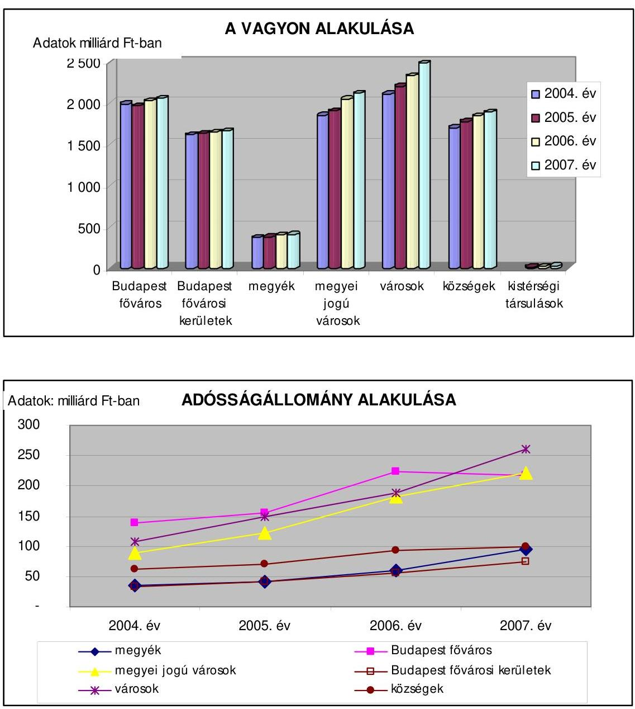

---

# A HELYI ÖNKORMÁNYZATOK ESZKÖZEI ÉS AZOK FORRÁSAI 

| Eszközök | 2004. év | 2005. év | 2006. év | 2007. év | Változás 2007/2004 | Változás 2005/2004 | Változás 2006/2005 | Változás 2007/2006 |
| :--: | :--: | :--: | :--: | :--: | :--: | :--: | :--: | :--: |
|  | milliárd Ft |  |  |  | \% |  |  |  |
| I. Immateriális javak | 15,8 | 21,0 | 24,9 | 26,1 | 165,2 | 132,9 | 118,6 | 104,8 |
| II. Tárgyi eszközök | 7021,3 | 7238,3 | 7575,9 | 7687,9 | 109,5 | 103,1 | 104,7 | 101,5 |
| Ebből: |  |  |  |  |  |  |  |  |
| Ingatlanok és a kapcsolódó vagyoni értékű jogok | 6502,9 | 6623,7 | 6854,5 | 7019,0 | 107,9 | 101,9 | 103,5 | 102,4 |
| Beruházások, felújítások | 249,1 | 310,6 | 397,1 | 372,4 | 149,5 | 124,7 | 127,8 | 93,8 |
| Beruházásra adott előlegek | 3,1 | 3,3 | 11,2 | 7,6 | 245,2 | 106,5 | 339,4 | 67,9 |
| III. Befektetett pénzügyi eszközök | 574,8 | 555,8 | 557,6 | 557,0 | 96,9 | 96,7 | 100,3 | 99,9 |
| Ebből: |  |  |  |  |  |  |  |  |
| Egyéb tartós részesedés | 490,9 | 477,0 | 479,9 | 484,6 | 98,7 | 97,2 | 100,6 | 101,0 |
| Tartós hitelviszonyt megtestesítő értékpapír | 19,3 | 16,2 | 15,6 | 16,5 | 85,5 | 83,9 | 96,3 | 105,8 |
| IV. Üzemeltetésre, kezelésre átadott, koncesszióba adott, vagyonkezelésbe vett eszközök | 1396,4 | 1482,3 | 1586,9 | 1721,2 | 123,3 | 106,2 | 107,1 | 108,5 |
| A) BEFEKTETETT ESZKÖZÖK | 9008,3 | 9297,4 | 9745,3 | 9992,2 | 110,9 | 103,2 | 104,8 | 102,5 |
| I. Készletek | 13,1 | 12,4 | 12,3 | 12,0 | 91,6 | 94,7 | 99,2 | 97,6 |
| II. Követelések | 203,5 | 169,5 | 167,8 | 111,8 | 54,9 | 83,3 | 99,0 | 66,6 |
| Ebből: |  |  |  |  |  |  |  |  |
| Adósok | 155,0 | 115,6 | 115,2 | 56,1 | 36,2 | 74,6 | 99,7 | 48,7 |
| III. Értékpapírok | 81,5 | 69,6 | 57,1 | 53,6 | 65,8 | 85,4 | 82,0 | 93,9 |
| Ebből: |  |  |  |  |  |  |  |  |
| Egyéb részesedés | 5,5 | 5,8 | 6,9 | 0,4 | 7,3 | 105,5 | 119,0 | 5,8 |
| Forgatási célú hitelviszonyt megtestesítő értékpapírok | 76,0 | 63,8 | 50,2 | 53,2 | 70,0 | 83,9 | 78,7 | 106,0 |
| IV. Pénzeszközök | 236,4 | 237,2 | 245,5 | 381,7 | 161,5 | 100,3 | 103,5 | 155,5 |
| V. Egyéb aktív pénzügyi elszámolások | 75,1 | 74,8 | 71,6 | 73,1 | 97,3 | 99,6 | 95,7 | 102,1 |
| B) FORGÓESZKÖZÖK | 609,6 | 563,5 | 554,3 | 632,2 | 103,7 | 92,4 | 98,4 | 114,1 |
| ESZKÖZÖK ÖSSZESEN | 9617,9 | 9860,9 | 10299,6 | 10624,4 | 110,5 | 102,5 | 104,4 | 103,2 |
| D) SAJÁT TÖKE | 8832,2 | 8967,0 | 9178,2 | 9195,0 | 104,1 | 101,5 | 102,4 | 100,2 |
| E) TARTALÉKOK | 197,0 | 197,0 | 196,0 | 341,4 | 173,3 | 100,0 | 99,5 | 174,2 |
| I. Hosszú lejáratú kötelezettségek | 233,8 | 286,0 | 411,3 | 620,0 | 265,2 | 122,3 | 143,8 | 150,7 |
| Ebből: |  |  |  |  |  |  |  |  |
| tartozások fejlesztési célú kötvénykibocsátásból | 4,4 | 3,6 | 22,1 | 188,2 | 4277,3 | 81,8 | 613,9 | 851,6 |
| tartozások működési célú kötvénykibocsátásból | 0,0 | 0,0 | 0,0 | 20,4 |  |  |  |  |
| beruházási és fejlesztési hitelek | 199,6 | 245,4 | 342,7 | 367,0 | 183,9 | 122,9 | 139,6 | 107,1 |
| működési célú hosszú lejáratú hitelek | 0,8 | 2,1 | 7,2 | 5,3 | 662,5 | 262,5 | 342,9 | 73,6 |
| II. Rövid lejáratú kötelezettségek | 234,9 | 295,6 | 392,9 | 349,3 | 148,7 | 125,8 | 132,9 | 88,9 |
| III. Egyéb passzív pénzügyi elszámolások | 120,0 | 115,3 | 121,2 | 118,7 | 98,9 | 96,1 | 105,1 | 97,9 |
| F) KÖTELEZETTSÉGEK | 588,7 | 696,9 | 925,4 | 1088,0 | 184,8 | 118,4 | 132,8 | 117,6 |
| FORRÁSOK ÖSSZESEN | 9617,9 | 9860,9 | 10299,6 | 10624,4 | 110,5 | 102,5 | 104,4 | 103,2 |

Forrás: Magyar Államkincstár önkormányzati éves költségvetési beszámoló "01" számú űrlapja

---

# A BUDAPEST FÖVÁROSI ÉS KERÜLETI ÖNKORMÁNYZATOK ESZKÖZEI ÉS AZOK FORRÁSAI

|  Eszközök | 2004. év | 2005. év | 2006. év | 2007. év | Változás 2007/2004 | Változás 2005/2004 | Változás 2006/2005 | Változás 2007/2006  |
| --- | --- | --- | --- | --- | --- | --- | --- | --- |
|   | milliárd Ft |  |  |  | \% |  |  |   |
|  I. Immateriális javak | 3,3 | 3,4 | 3,9 | 4,4 | 133,3 | 103,0 | 114,7 | 112,8  |
|  II. Tárgyi eszközök | 2413,0 | 2485,8 | 2571,0 | 2611,2 | 108,2 | 103,0 | 103,4 | 101,6  |
|  Ebből: |  |  |  |  |  |  |  |   |
|  Ingatlanok és a kapcsolódó vagyoni értékű jogok | 2281,8 | 2311,3 | 2375,6
 | 2411,5 | 105,7 | 101,3 | 102,8 | 101,5  |
|  Beruházások, felújítások | 35,5 | 46,9 | 58,4 | 77,5 | 218,3 | 132,1 | 124,5 | 132,7  |
|  Beruházásra adott előlegek | 1,1 | 1,3 | 8,5 | 5,4 | 490,9 | 118,2 | 653,8 | 63,5  |
|  III. Befektetett pénzügyi eszközök | 361,0 | 345,8 | 334,3 | 321,4 | 89,0 | 95,8 | 96,7 | 96,1  |
|  Ebből: |  |  |  |  |  |  |  |   |
|  Egyéb tartós részesedés | 326,3 | 311,8 | 303,3 | 300,4 | 92,1 | 95,6 | 97,3 | 99,0  |
|  Tartós hitelviszonyt megtestesítő értékpapír | 1,1 | 0,8 | 0,5 | 0,1 | 9,1 | 72,7 | 62,5 | 20,0  |
|  IV. Üzemeltetésre, kezelésre átadott, koncesszióba adott, vagyonkezelésbe vett eszközök | 588,8 | 556,5 | 577,0 | 588,0 | 99,9 | 94,5 | 103,7 | 101,9  |
|  A) BEFEKTETETT ESZKÖZÖK | 3366,1 | 3391,5 | 3486,2 | 3525,0 | 104,7 | 100,8 | 102,8 | 101,1  |
|  I. Készletek | 3,0 | 2,8 | 2,9 | 3,1 | 103,3 | 93,3 | 103,6 | 106,9  |
|  II. Követelések | 83,5 | 55,8 | 47,2 | 30,1 | 36,0 | 66,8 | 84,6 | 63,8  |
|  Ebből: |  |  |  |  |  |  |  |   |
|  Adósok | 68,9 | 43,4 | 35,9 | 17,0 | 24,7 | 63,0 | 82,7 | 47,4  |
|  III. Értékpapírok | 49,5 | 35,4 | 30,2 | 14,1 | 28,5 | 71,5 | 85,3 | 46,7  |
|  Ebből: |  |  |  |  |  |  |  |   |
|  Egyéb részesedés | 5,2 | 5,4 | 6,6 | 0,0 | 0,0 | 103,8 | 122,2 | 0,0  |
|  Forgatási célú hitelviszonyt megtestesítő értékpapírok | 44,3 | 30,0 | 23,6 | 14,1 | 31,8 | 67,7 | 78,7 | 59,7  |
|  IV. Pénzeszközök | 80,4 | 85,0 | 80,8 | 119,8 | 149,0 | 105,7 | 95,1 | 148,3  |
|  V. Egyéb aktív pénzügyi elszámolások | 18,7 | 20,4 | 20,2 | 19,7 | 105,3 | 109,1 | 99,0 | 97,5  |
|  B) FORGÓESZKÖZÖK | 235,1 | 199,4 | 181,3 | 186,8 | 79,5 | 84,8 | 90,9 | 103,0  |
|  ESZKÖZÖK ÖSSZESEN | 3601,2 | 3590,9 | 3667,5 | 3711,8 | 103,1 | 99,7 | 102,1 | 101,2  |
|  D) SAJÁT TÖKE | 3327,4 | 3289,1 | 3286,0 | 3281,5 | 98,6 | 98,8 | 99,9 | 99,9  |
|  E) TARTALÉKOK | 76,3 | 79,4 | 73,2 | 114,1 | 149,5 | 104,1 | 92,2 | 155,9  |
|  I. Hosszú lejáratú kötelezettségek | 100,7 | 113,8 | 159,2 | 185,0 | 183,7 | 113,0 | 139,9 | 116,2  |
|  Ebből: |  |  |  |  |  |  |  |   |
|  tartozások fejlesztési célú kötvénykibocsátásból | 0,3 | 0,0 | 1,9 | 15,6 | 5200,0 | 0,0 | 0,0 | 821,1  |
|  tartozások működési célú kötvénykibocsátásból | 0,0 | 0,0 | 0,0 | 1,0 | 0,0 | 0,0 | 0,0 | 0,0  |
|  beruházási és fejlesztési hitelek | 99,5 | 111,0 | 154,1 | 164,0 | 164,8 | 111,6 | 138,8 | 106,4  |
|  működési célú hosszú lejáratú hitelek | 0,0 | 0,0 | 0,0 | 0,0 | 0,0 | 0,0 | 0,0 | 0,0  |
|  II. Rövid lejáratú kötelezettségek | 71,2 | 82,7 | 121,2 | 105,8 | 148,6 | 116,2 | 146,6 | 87,3  |
|  III. Egyéb passzív pénzügyi elszámolások | 25,6 | 25,9 | 27,9 | 25,4 | 99,2 | 101,2 | 107,7 | 91,0  |
|  F) KÖTELEZETTSÉGEK | 197,5 | 222,4 | 308,3 | 316,2 | 160,1 | 112,6 | 138,6 | 102,6  |
|  FORRÁSOK ÖSSZESEN | 3601,2 | 3590,9 | 3667,5 | 3711,8 | 103,1 | 99,7 | 102,1 | 101,2  |

Forrás: Magyar Államkincstár önkormányzati éves költségvetési beszámoló "01" számú űrlapja

---

# A HELYI ÖNKORMÁNYZATOK ESZKÖZEI ÉS AZOK FORRÁSAI, A BUDAPEST FÖVÁROSI ÉS FÖVÁROSI KERÜLETI ÖNKORMÁNYZATOK ADATAI NÉLKÜL

| Eszközök | 2004. év | 2005. év | 2006. év | 2007. év | Változás 2007/2004 | Változás 2005/2004 | Változás 2006/2005 | Változás 2007/2006 |
| :--: | :--: | :--: | :--: | :--: | :--: | :--: | :--: | :--: |
|  | milliárd Ft |  |  |  | \% |  |  |  |
| I. Immateriális javak | 12,5 | 17,6 | 21,0 | 21,7 | 173,6 | 140,8 | 119,3 | 103,3 |
| II. Tárgyi eszközök | 4608,3 | 4752,5 | 5004,9 | 5076,7 | 110,2 | 103,1 | 105,3 | 101,4 |
| Ebből: |  |  |  |  |  |  |  |  |
| Ingatlanok és a kapcsolódó vagyoni értékű jogok | 4221,1 | 4312,4 | 4478,9 | 4607,5 | 109,2 | 102,2 | 103,9 | 102,9 |
| Beruházások, felújítások | 213,6 | 263,7 | 338,7 | 294,9 | 138,1 | 123,5 | 128,4 | 87,1 |
| Beruházásra adott előlegek | 2,0 | 2,0 | 2,7 | 2,2 | 110,0 | 100,0 | 135,0 | 81,5 |
| III. Befektetett pénzügyi eszközök | 213,8 | 210,0 | 223,3 | 235,6 | 110,2 | 98,2 | 106,3 | 105,5 |
| Ebből: |  |  |  |  |  |  |  |  |
| Egyéb tartós részesedés | 164,6 | 162,2 | 176,6 | 184,2 | 111,9 | 98,5 | 108,9 | 104,3 |
| Tartós hitelviszonyt megtestesítő értékpapír | 18,2 | 15,4 | 15,1 | 16,4 | 90,1 | 84,6 | 98,1 | 108,6 |
| IV. Üzemeltetésre, kezelésre átadott, koncesszióba adott, vagyonkezelésbe vett eszközök | 807,6 | 925,8 | 1009,9 | 1133,2 | 140,3 | 114,6 | 109,1 | 112,2 |
| A) BEFEKTETETT ESZKÖZÖK | 5642,2 | 5905,9 | 6259,1 | 6467,2 | 114,6 | 104,7 | 106,0 | 103,3 |
| I. Készletek | 10,1 | 9,6 | 9,4 | 8,9 | 88,1 | 95,0 | 97,9 | 94,7 |
| II. Követelések | 120,0 | 113,7 | 120,6 | 81,7 | 68,1 | 94,8 | 106,1 | 67,7 |
| Ebből: |  |  |  |  |  |  |  |  |
| Adósok | 86,1 | 72,2 | 79,3 | 39,1 | 45,4 | 83,9 | 109,8 | 49,3 |
| III. Értékpapírok | 32,0 | 34,2 | 26,9 | 39,5 | 123,4 | 106,9 | 78,7 | 146,8 |
| Ebből: |  |  |  |  |  |  |  |  |
| Egyéb részesedés | 0,3 | 0,4 | 0,3 | 0,4 | 133,3 | 133,3 | 75,0 | 133,3 |
| Forgatási célú hitelviszonyt megtestesítő értékpapírok | 31,7 | 33,8 | 26,6 | 39,1 | 123,3 | 106,6 | 78,7 | 147,0 |
| IV. Pénzeszközök | 156,0 | 152,2 | 164,7 | 261,9 | 167,9 | 97,6 | 108,2 | 159,0 |
| V. Egyéb aktív pénzügyi elszámolások | 56,4 | 54,4 | 51,4 | 53,4 | 94,7 | 96,5 | 94,5 | 103,9 |
| B) FORGÓESZKÖZÖK | 374,5 | 364,1 | 373,0 | 445,4 | 118,9 | 97,2 | 102,4 | 119,4 |
| ESZKÖZÖK ÖSSZESEN | 6016,7 | 6270,0 | 6632,1 | 6912,6 | 114,9 | 104,2 | 105,8 | 104,2 |
| D) SAJÁT TÖKE | 5504,8 | 5677,9 | 5892,2 | 5913,5 | 107,4 | 103,1 | 103,8 | 100,4 |
| E) TARTALÉKOK | 120,7 | 117,6 | 122,8 | 227,3 | 188,3 | 97,4 | 104,4 | 185,1 |
| I. Hosszú lejáratú kötelezettségek | 133,1 | 172,2 | 252,1 | 435,0 | 326,8 | 129,4 | 146,4 | 172,6 |
| Ebből: |  |  |  |  |  |  |  |  |
| tartozások fejlesztési célú kötvénykibocsátásból | 4,1 | 3,7 | 20,2 | 172,6 | 4209,8 | 90,2 | 545,9 | 854,5 |
| tartozások működési célú kötvénykibocsátásból | 0,0 | 0,0 | 0,0 | 19,4 | 0,0 | 0,0 | 0,0 | 0,0 |
| beruházási és fejlesztési hitelek | 100,1 | 134,4 | 188,6 | 203,1 | 202,9 | 134,3 | 140,3 | 107,7 |
| működési célú hosszú lejáratú hitelek | 0,8 | 2,1 | 7,2 | 5,3 | 662,5 | 262,5 | 342,9 | 73,6 |
| II. Rövid lejáratú kötelezettségek | 163,7 | 212,9 | 271,7 | 243,5 | 148,7 | 130,1 | 127,6 | 89,6 |
| III. Egyéb passzív pénzügyi elszámolások | 94,4 | 89,4 | 93,3 | 93,3 | 98,8 | 94,7 | 104,4 | 100,0 |
| F) KÖTELEZETTSÉGEK | 391,2 | 474,5 | 617,1 | 771,8 | 197,3 | 121,3 | 130,1 | 125,1 |
| FORRÁSOK ÖSSZESEN | 6016,7 | 6270,0 | 6632,1 | 6912,6 | 114,9 | 104,2 | 105,8 | 104,2 |

---

# AZ ELLENŐRZÖTT ÖNKORMÁNYZATOK ESZKÖZEI ÉS AZOK FORRÁSAI*

|  Eszközök | 2004. év | 2005. év | 2006. év | 2007. év | Változás 2007/2004 | Változás 2005/2004 | Változás 2006/2005 | Változás 2007/2006  |
| --- | --- | --- | --- | --- | --- | --- | --- | --- |
|   | milliárd Ft |  |  |  | \% |  |  |   |
|

  I. Immateriális javak | 2,7 | 3,7 | 4,5 | 4,6 | 171,4 | 137,0 | 122,1 | 102,5  |
|  II. Tárgyi eszközök | 1195,9 | 1232,6 | 1261,3 | 1274,2 | 106,5 | 103,1 | 102,3 | 101,0  |
|  Ebből: |  |  |  |  |  |  |  |   |
|  Ingatlanok és a kapcsolódó vagyoni értékű jogok | 1113,3 | 1134,4 | 1145,8 | 1182,4 | 106,2 | 101,9 | 101,0 | 103,2  |
|  Beruházások, felújítások | 38,0 | 55,4 | 73,9 | 52,5 | 138,1 | 145,8 | 133,4 | 71,0  |
|  Beruházásra adott előlegek | 0,9 | 0,9 | 1,4 | 0,1 | 13,9 | 100,0 | 155,7 | 8,9  |
|  III. Befektetett pénzügyi eszközök | 50,9 | 51,9 | 54,5 | 55,2 | 108,3 | 101,9 | 105,1 | 101,2  |
|  Ebből: |  |  |  |  |  |  |  |   |
|  Egyéb tartós részesedés | 36,4 | 37,7 | 38,5 | 38,2 | 104,8 | 103,6 | 102,1 | 99,1  |
|  Tartós hitelviszonyt megtestesítő értékpapír | 2,6 | 2,2 | 2,8 | 2,2 | 86,5 | 84,6 | 128,1 | 79,8  |
|  IV. Üzemeltetésre, kezelésre átadott, koncesszióba adott, vagyonkezelésbe vett eszközök | 153,6 | 171,9 | 195,1 | 220,0 | 143,2 | 111,9 | 113,5 | 112,8  |
|  A) BEFEKTETETT ESZKÖZÖK | 1403,1 | 1460,1 | 1515,4 | 1554,0 | 110,8 | 104,1 | 103,8 | 102,5  |
|  I. Készletek | 2,6 | 2,4 | 2,2 | 2,2 | 84,4 | 92,3 | 91,7 | 99,7  |
|  II. Követelések | 27,1 | 29,2 | 27,1 | 15,9 | 58,7 | 107,7 | 92,9 | 58,6  |
|  Ebből: |  |  |  |  |  |  |  |   |
|  Adósok | 19,6 | 19,6 | 19,3 | 8,5 | 43,5 | 100,0 | 98,3 | 44,3  |
|  III. Értékpapírok | 2,5 | 3,7 | 0,8 | 2,9 | 114,2 | 148,0 | 20,7 | 372,9  |
|  Ebből: |  |  |  |  |  |  |  |   |
|  Egyéb részesedés | 0,0 | 0,0 | 0,0 | 0,0 | 0,0 | 0,0 | 0,0 | 0,0  |
|  Forgatási célú hitelviszonyt megtestesítő értékpapírok | 2,4 | 3,7 | 0,8 | 2,9 | 119,0 | 154,2 | 20,7 | 372,9  |
|  IV. Pénzeszközök | 37,2 | 29,7 | 34,8 | 66,5 | 178,8 | 79,8 | 117,3 | 190,9  |
|  V. Egyéb aktív pénzügyi elszámolások | 11,7 | 11,4 | 11,4 | 9,3 | 79,2 | 97,4 | 100,1 | 81,1  |
|  B) FORGÓESZKÖZÖK | 81,1 | 76,4 | 76,4 | 96,7 | 119,2 | 94,2 | 99,9 | 126,7  |
|  ESZKÖZÖK ÖSSZESEN | 1484,2 | 1536,5 | 1591,7 | 1650,7 | 111,2 | 103,5 | 103,6 | 103,7  |
|  D) SAJÁT TŐKE | 1386,5 | 1428,3 | 1452,4 | 1441,6 | 104,0 | 103,0 | 101,7 | 99,3  |
|  E) TARTALÉKOK | 30,2 | 23,1 | 27,5 | 62,5 | 207,0 | 76,5 | 119,1 | 227,3  |
|  I. Hosszú lejáratú kötelezettségek | 18,5 | 26,2 | 39,7 | 82,6 | 446,5 | 141,6 | 151,4 | 208,2  |
|  Ebből: |  |  |  |  |  |  |  |   |
|  tartozások fejlesztési célú kötvénykibocsátásból | 1,4 | 1,1 | 2,1 | 30,5 | 2177,0 | 78,6 | 186,4 | 1486,8  |
|  tartozások működési célú kötvénykibocsátásból | 0,0 | 0,0 | 0,0 | 10,5 | 0,0 | 0,0 | 0,0 | 0,0  |
|  beruházási és fejlesztési hitelek | 15,3 | 23,5 | 32,9 | 37,4 | 243,8 | 153,4 | 140,1 | 113,5  |
|  működési célú hosszú lejáratú hitelek | 0,1 | 0,2 | 3,0 | 3,0 | 3000,0 | 200,0 | 1500,0 | 100,0  |
|  II. Rövid lejáratú kötelezettségek | 30,5 | 41,0 | 53,5 | 46,7 | 153,2 | 134,4 | 130,4 | 87,4  |
|  III. Egyéb passzív pénzügyi elszámolások | 18,5 | 17,9 | 18,7 | 17,3 | 93,6 | 96,8 | 104,3 | 92,8  |
|  F) KÖTELEZETTSÉGEK | 67,5 | 85,1 | 111,8 | 146,6 | 217,2 | 126,1 | 131,4 | 131,2  |
|  FORRÁSOK ÖSSZESEN | 1484,2 | 1536,5 | 1591,7 | 1650,7 | 111,2 | 103,5 | 103,6 | 103,7  |

[^0] [^0]: * Az ellenőrzött megyei, megyei jogú városi, Budapest fővárosi kerületi és városi önkormányzatok adataival. Forrás: Magyar Államkincstár önkormányzati éves költségvetési beszámoló "01" számú űrlapja

---

# A HELYI ÖNKORMÁNYZATOK 2004-2007. ÉVI TERVEZETT ÉS TELJESÍTETT BRUTTÓ ÉS (KONSZOLIDÁLT) NETTÓ BEVÉTELEINEK ÉS KIADÁSAINAK ALAKULÁSA

|  |   |   |   |   |   |   |   |   |   |   |
| --- | --- | --- | --- | --- | --- | --- | --- | --- | --- | --- | --- |
|  Megnevezés | 2004. év |  |  | 2005. év |  |  | 2006. év |  |  | 2007. év |   |
|   | Eredeti előirányzat | Teljesítés bruttó összege | Teljesítés nettó összege | Eredeti előirányzat | Teljesítés bruttó összege | Teljesítés nettó összege | Eredeti előirányzat | Teljesítés bruttó összege | Teljesítés nettó összege | Eredeti előirányzat | Teljesítés bruttó összege  |
|  Bevételek |  |  |  |  |  |  |  |  |  |  |   |
|  Intézményi működési bevételek | 215964 | 250065 | 250065 | 226933 | 258655 | 258655 | 233881 | 264792 | 264792 | 248261 | 272339  |
|  Kamatbevételek | 10689 | 24050 | 24050 | 14935 | 18131 | 18131 | 11619 | 15652 | 15652 | 9797 | 19449  |
|  Gépjárműadó | 37425 | 45941 | 45941 | 46058 | 49177 | 49177 | 49141 | 51266 | 51266 | 56635 | 62432  |
|  Helyi adók és kapcsolódó pótlékok, bírságok | 345493 | 367184 | 367184 | 387030 | 397923 | 397923 | 409482 | 448936 | 448936 | 455021 | 505267  |
|  Illetékek | 54855 | 63169 | 63169 | 61031 | 67288 | 67288 | 65326 | 71097 | 71097 | 57781 | 58540  |
|  Személyi jövedelemadó | 457822 | 455765 | 455765 | 465660 | 439932 | 439932 | 467970 | 459973 | 459973 | 484406 | 492188  |
|  Egyéb átengedett adók, adójellegű bevételek | 495 | 289 | 289 | 395 | 359 | 359 | 415 | 641 | 641 | 624 | 1052  |
|  Önkorm. megillető bírságok és egyéb sajátos bevételek | 30101 | 32583 | 32583 | 31136 | 37034 | 37034 | 34447 | 38477 | 38477 | 34923 | 39035  |
|  Működési célra átvett pénzeszközök | 415104 | 447234 | 301044 | 431529 | 471491 | 439049 | 450539 | 493931 | 457250 | 471866 | 486649  |
|  Költségvetési kiegészítések, visszatérülések | - | 122906 | 122906 | - | 157245 | 2534 | - | 150972 | 7993 | - | 159631  |
|  Felhalmozási és tőkejellegű bevételek | 138801 | 113530 | 113530 | 152578 | 137111 | 137111 | 195018 | 144845 | 144845 | 194611 | 134267  |
|  Ebből: |  |  |  |  |  |  |  |  |  |  |   |
|  Tárgyi eszköz, immateriális javak értékesítése | 69970 | 48926 | 48926 | 80062 | 63680 | 63680 | 105596 | 70613 | 70613 | 93583 | 55942  |
|  Önkorm. lakások, egyéb helyiségek ért., cseréje | 32237 | 23375 | 23375 | 37336 | 28574 | 28574 | 38121 | 34336 | 34336 | 34012 | 27888  |
|  Részesedések értékesítése | 11043 | 8658 | 8658 | 11506 | 15565 | 15565 | 27847 | 15228 | 15228 | 42632 | 23496  |
|  Felhalmozási célra átvett pénzeszközök | 192605 | 129457 | 117230 | 245110 | 167899 | 150519 | 302353 | 223239 | 210280 | 245607 | 186329  |
|  Kölcsönök visszatérülése | 8723 | 11413 | 11413 | 8924 | 11955 | 11955 | 9696 | 14320 | 14320 | 8754 | 14721  |
|  Saját bevételek összesen | 1908077 | 2063586 | 1905169 | 2071319 | 2214200 | 2009667 | 2229887 | 2378141 | 2185522 | 2268286 | 2431899  |
|  Önkormányzat költségvetési támogatása | 664186 | 768672 | 768672 | 730335 | 880902 | 880902 | 688264 | 868179 | 868179 | 701756 | 861877  |
|  Előző évi pénzmaradvány igénybevétele | 67879 | 278386 | 277311 | 76142 | 328477 | 327188 | 71160 | 312396 | 311116 | 69770 | 312460  |
|  Költségvetési bevételek | 2640142 | 3110644 | 2951152 | 2877796 | 3423579 | 3217757 | 2989311 | 3558716 | 3364817 | 3039812 | 3606236  |
|  Hitelek bevételei | 193339 | 114162 | 82641 | 246327 |

 143208 | 110246 | 312872 | 207575 | 175171 | 292956 | 151063  |
|  Értékpapírok bevételei | 52469 | 27197 | 27197 | 64976 | 35718 | 35718 | 49207 | 44512 | 44512 | 44117 | 205954  |
|  Egyéb finanszírozás bevételei | - | -6535 | 0 | - | -3809 | 0 | - | -4534 | 0 | - | -2339  |
|  BEVÉTELEK ÖSSZESEN | 2885950 | 3245468 | 3060990 | 3189099 | 3598696 | 3363721 | 3351390 | 3815337 | 3584500 | 3376885 | 3960914  |

---

|  Megnevezés | 2004. év |  |  | 2005. év |  |  | 2006. év |  |  | 2007. év |  |   |
| --- | --- | --- | --- | --- | --- | --- | --- | --- | --- | --- | --- | --- |
|   | Eredeti előirányzat | Teljesítés bruttó összege | Teljesítés nettó összege | Eredeti előirányzat | Teljesítés bruttó összege | Teljesítés nettó összege | Eredeti előirányzat | Teljesítés bruttó összege | Teljesítés nettó összege | Eredeti előirányzat | Teljesítés bruttó összege | Teljesítés nettó összege  |
|  Kiadások |  |  |  |  |  |  |  |  |  |  |  |   |
|  Személyi juttatások | 983006 | 986085 | 986085 | 1053857 | 1066138 | 1066138 | 1101661 | 1113502 | 1113502 | 1088701 | 1122656 | 1122656  |
|  Munkaadókat terhelő járulékok | 325053 | 324015 | 324015 | 344479 | 346625 | 346625 | 348743 | 351427 | 351427 | 346233 | 355234 | 355234  |
|  Dologi kiadások | 610926 | 667960 | 667960 | 655708 | 704538 | 704538 | 677240 | 750810 | 750810 | 696284 | 732020 | 732020  |
|  Egyéb folyó kiadások | 29175 | 162663 | 40086 | 33817 | 195045 | 40334 | 35107 | 201708 | 58728 | 44676 | 215273 | 64955  |
|  Elátoztali pénzbeli juttatása | 7354 | 8541 | 8541 | 7464 | 8973 | 8973 | 7797 | 9256 | 9256 | 8018 | 8903 | 8903  |
|  Működési célú pénzeszköz átadás | 82673 | 112244 | 88632 | 88993 | 133169 | 100727 | 107997 | 156088 | 119407 | 144621 | 178508 | 126237  |
|  Társadalom- és szociálpolitikai juttatások | 100923 | 114097 | 114097 | 107387 | 130749 | 130749 | 90390 | 109421 | 109421 | 101609 | 127738 | 127738  |
|  Tervezett maradvány, eredmény, tartalék | 147260 | 1075 | 0 | 167753 | 1289 | 0 | 116742 | 1279 | 0 | 125381 | 575 | 0  |
|  Felújítás | 61092 | 65535 | 65535 | 91001 | 98863 | 98863 | 125499 | 127397 | 127397 | 99237 | 99298 | 99298  |
|  Intézményi beruházási kiadások | 388219 | 322507 | 322507 | 448143 | 372567 | 372567 | 509386 | 437645 | 437645 | 428450 | 373195 | 373195  |
|  Részesedések vásárlása | 1930 | 4710 | 4710 | 2139 | 5514 | 5514 | 3958 | 7834 | 7834 | 2314 | 5769 | 5769  |
|  Felhalmozású célú pénzeszköz átadások | 83327 | 68213 | 55986 | 106076 | 102836 | 85455 | 135256 | 122173 | 109214 | 181349 | 116380 | 105418  |
|  Kölcsönök nyújtása, törlesztése | 7329 | 11810 | 11810 | 7881 | 11934 | 11934 | 10910 | 15582 | 15582 | 7662 | 13605 | 13605  |
|  Költségvetési kiadások | 2828267 | 2849455 | 2689964 | 3114698 | 3178240 | 2972417 | 3270686 | 3404122 | 3210223 | 3274535 | 3349154 | 3135023  |
|  Hitelek törlesztése | 47572 | 62349 | 30828 | 60518 | 76503 | 43542 | 79047 | 85607 | 53203 | 100384 | 126404 | 85287  |
|  Értékpapírok kiadásai | 10111 | 41521 | 41521 | 13883 | 20492 | 20492 | 1657 | 11370 | 11370 | 1966 | 29710 | 29710  |
|  Egyéb finanszírozási kiadásai | - | -14240 | 0 | - | -307 | 0 | - | -3197 | 0 | - | 2766 | 0  |
|  KIADÁSOK ÖSSZESEN | 2885950 | 2939085 | 2762313 | 3189099 | 3274928 | 3036451 | 3351390 | 3497902 | 3274796 | 3376885 | 3508034 | 3250020  |

---

AZ ELLENŐRZŐTT ÖNKORMÁNYZATOK* 2004-2007. ÉVI TERVEZETT ÉS TELJESÍTETT BRUTTÓ ÉS (KONSZOLIDÁLT) NETTÓ BEVÉTELEINEK ÉS KIADÁSAINAK ALAKULÁSA

|  Megnevezés | 2004. év |  |  | 2005. év |  |  | 2006. év |  |  | 2007. év |  |   |
| --- | --- | --- | --- | --- | --- | --- | --- | --- | --- | --- | --- | --- |
|   | Eredeti előirányzat | Teljesítés bruttó összege | Teljesítés nettó összege | Eredeti előirányzat | Teljesítés bruttó összege | Teljesítés nettó összege | Eredeti előirányzat | Teljesítés bruttó összege | Teljesítés nettó összege | Eredeti előirányzat | Teljesítés bruttó összege | Teljesítés nettó összege  |
|  Bevételek |  |  |  |  |  |  |  |  |  |  |  |   |
|  Intézményi működési bevételek | 40488 | 46485 | 46785 | 43333 | 47244 | 47944 | 43338 | 51585 | 51785 | 45453 | 50136 | 50136  |
|  Kamatbevételek | 1139 | 3037 | 3037 | 1438 | 1939 | 1939 | 1247 | 1658 | 1658 | 1235 | 2224 | 2224  |
|  Gépjárműadó | 6569 | 8196 | 8196 | 8151 | 8824 | 8824 | 8798 | 9137 | 9137 | 10141 | 11178 | 11178  |
|  Helyi adók és kapcsolódó pótlékok, bírságok | 59458 | 63212 | 63212 | 63573 | 65779 | 65779 | 68249 | 72859 | 72859 | 74904 | 82330 | 82330  |
|  Illetékek | 10450 | 13006 | 13006 | 12610 | 13589 | 13589 | 12920 | 14107 | 14107 | 11617 | 12384 | 12384  |
|  Személyi jövedelemadó | 72161 | 71929 | 71929 | 72911 | 68719 | 68719 | 73702 | 72504 | 72504 | 70789 | 72033 | 72033  |
|  Egyéb átengedett adók, adójellegű bevételek | 34 | 27 | 27 | 66 | 42 | 42 | 35 | 89 | 89 | 77 | 145 | 145  |
|  Önkorm. megillető bírságok és egyéb sajátos bevételek | 7737 | 8400 | 8400 | 8440 | 9646 | 9646 | 9048 | 8935 | 8935 | 8688 | 9105 | 9105  |
|  Működési célra átvett pénzeszközök | 83104 | 90052 | 87430 | 89402 | 94444 | 90686 | 91247 | 97211 | 94415 | 86828 | 96160 | 91540  |
|  Költségvetési kiegészítések, visszatérülések | 0 | 5707 | 826 | 0 | 5707 | 1049 | 0 | 5246 | 1068 | 0 | 5204 | 1061  |
|  Felhalmozási és tőkejellegű bevételek | 25124 | 18659 | 18659 | 29516 | 20571 | 20571 | 36979 | 33018 | 33018 | 28026 | 23308 | 23308  |
|  ebből: |  |  |  |  |  |  |  |  |  |  |  |   |
|  Tárgyi eszköz, immateriális javak értékesítése | 15385 | 10626 | 10626 | 17287 | 11712 | 11712 | 23743 | 20975 | 20975 | 16488 | 10945 | 10945  |
|  Önkorm. lakások, egyéb helyiségek ért., cseréje | 5972 | 4393 | 4393 | 9267 | 5049 | 5049 | 9337 | 7382 | 7382 | 8774 | 6993 | 6993  |
|  Részesedések értékesítése | 685 | 985 | 985 | 1444 | 1363 | 1363 | 677 | 2237 | 2237 | 608 | 2362 | 2362  |
|  Felhalmozási célra átvett pénzeszközök | 36977 | 19795 | 18210 | 47693 | 26740 | 25604 | 50890 | 35511 | 34026 | 49398 | 27257 | 26570  |
|  Kölcsönök visszatérülése | 993 | 1334 | 1334 | 971 | 2200 | 2200 | 1260 | 2570 | 2570 | 1782 | 3654 | 3654  |
|  Saját bevételek összesen | 344234 | 349839 | 341051 | 378104 | 365444 | 356592 | 397713 | 404430 | 396171 | 388938 | 395118 | 385668  |
|  Önkormányzat költségvetési támogatása | 109268 | 121603 | 121603 | 117989 | 136485 | 136485 | 107505 | 125619 | 125619 | 104433 | 127388 | 127388  |
|  Előző évi pénzmaradvány igénybevétele | 6931 | 26713 | 26448 | 7737 | 32466 | 32173 | 7165 | 25552 | 25387 | 9511 | 29857 | 29770  |
|  Költségvetési bevételek | 460433 | 498155 | 489102 | 503830 | 534395 | 525250 | 512383 | 555601 | 547177 | 502882 | 552363 | 542826  |
|  Hitelek bevételei | 26291 | 14793 | 7574 | 32615 | 21592 | 15751 | 45724 | 28204 | 21303 | 48434 | 28389 | 20660  |
|  Értékpapírok bevételei | 7876 | 2539 | 2539 | 3037 | 1299 | 1299 | 2473 | 4498 | 4498 | 2766 | 29710 | 29710  |

 4498 | 1624 | 37225 | 37225  |
|  Egyéb finanszírozás bevételei | - | $-2690$ | 0 | - | $-904$ | 0 | 0 | $-115$ | 0 | 0 | $-1230$ | 0  |
|  BEVÉTELEK ÖSSZÉSEN | 494600 | 512797 | 499215 | 539482 | 556382 | 542300 | 560580 | 588188 | 572978 | 552940 | 616747 | 600711  |

---

|  |   |   |   |   |   |   |   |   |   |   |
| --- | --- | --- | --- | --- | --- | --- | --- | --- | --- | --- | --- |
|  Megnevezés | 2004. év |  |  | 2005. év |  |  | 2006. év |  |  | 2007. év |   |
|   | Eredeti előirányzat | Teljesítés bruttó összege | Teljesítés nettó összege | Eredeti előirányzat | Teljesítés bruttó összege | Teljesítés nettó összege | Eredeti előirányzat | Teljesítés bruttó összege | Teljesítés nettó összege | Eredeti előirányzat | Teljesítés nettó összege  |
|  Kiadások |  |  |  |  |  |  |  |  |  |  |   |
|  Személyi juttatások | 174 731 | 176 189 | 176 189 | 188 331 | 189 370 | 189 370 | 194 906 | 196 638 | 196 638 | 191 214 | 197 547  |
|  Munkaadókat terhelő járulékok | 57 696 | 57 770 | 57 770 | 61 556 | 61 458 | 61 458 | 61 792 | 61 971 | 61 971 | 60 986 | 62 455  |
|  Dologi kiadások | 109 438 | 123 406 | 123 256 | 117 031 | 130 392 | 131 092 | 122 482 | 140 200 | 140 314 | 122 931 | 133 670  |
|  Egyéb folyó kiadások | 4 280 | 12 355 | 7 474 | 4 896 | 11 560 | 6 902 | 5 236 | 11 418 | 7 240 | 7 311 | 13 420  |
|  Eltátottak pénzbeli juttatása | 1 311 | 1 749 | 1 749 | 1 346 | 1 820 | 1 820 | 1 474 | 1 857 | 1 857 | 1 581 | 1 725  |
|  Működési célú pénzeszköz átadás | 15 707 | 16 510 | 13 888 | 14 813 | 18 456 | 14 699 | 16 262 | 17 201 | 14 404 | 15 650 | 19 704  |
|  Társadalom- és szociálpolitikai juttatások | 12 780 | 13 705 | 13 705 | 13 998 | 15 490 | 15 490 | 12 079 | 12 883 | 12 883 | 12 489 | 14 594  |
|  Tervezett maradvány, eredmény, tartalék | 16 645 | 265 | 0 | 20 069 | 294 | 0 | 19 152 | 165 | 0 | 21 459 | 88  |
|  Felújítás | 9 174 | 10 006 | 10 006 | 12 157 | 15 883 | 15 883 | 19 196 | 19 921 | 19 921 | 17 695 | 15 167  |
|  Intézményi beruházási kiadások | 72 302 | 50 358 | 50 358 | 84 901 | 65 177 | 65 177 | 86 322 | 72 480 | 72 480 | 75 649 | 57 255  |
|  Részesedések vásárlása | 222 | 1 115 | 1 115 | 990 | 1 624 | 1 624 | 172 | 505 | 505 | 216 | 487  |
|  Felhalmozási célú pénzeszköz átadások | 4 547 | 5 247 | 3 662 | 7 670 | 6 380 | 5 244 | 6 496 | 6 545 | 5 060 | 6 434 | 6 589  |
|  Kölcélők nyújtása, tőrlesztése | 1 124 | 1 437 | 1 437 | 1 146 | 2 018 | 2 018 | 1 500 | 3 962 | 3 962 | 1 916 | 2 818  |
|  Költségvetési kiadások | 479 957 | 470 112 | 460 609 | 528 904 | 519 922 | 510 777 | 547 069 | 545 746 | 537 235 | 535 531 | 525 519  |
|  Hitelek tőrlesztése | 9 019 | 11 062 | 3 843 | 9 814 | 9 724 | 3 883 | 13 301 | 11 241 | 4 340 | 17 368 | 22 171  |
|  Értékpapírok kiadásai | 5 574 | 1 357 | 1 357 | 764 | 2 610 | 2 610 | 210 | 1 563 | 1 563 | 41 | 5 285  |
|  Egyéb finanszírozás kiadásai | 0 | -3 714 | 0 | 0 | -304 | 0 | 0 | 0 | 0 | 0 | -1 908  |
|  KIADÁSOK ÖSSZESEN | 494 550 | 478 817 | 465 809 | 539 482 | 531 952 | 517 270 | 560 580 | 558 550 | 543 138 | 552 940 | 551 067  |

- Ellenőrzött megyei, megyei jogú városi, Budapest fővárosi kerületi és városi önkormányzatok adataival.

---

# AZ ELLENŐRZÖTT ÖNKORMÁNYZATOK 2004-2006. ÉVI KÖLTSÉGVETÉSI ELŐIRÁNYZATAINAK ÉS AZOK PÉNZÜGYI TELJESÍTÉSÉNEK ALAKULÁSA

|  Megnevezés | 2004. év |  |  |  | 2005. év |  |  |  | 2006. év |  |  |   |
| --- | --- | --- | --- | --- | --- | --- | --- | --- | --- | --- | --- | --- |
|   | Eredeti előirányzat milliárd Ft | Megoszlás
\% | Teljesítés milliárd Ft | Megoszlás
\% | Eredeti előirányzat milliárd Ft | Megoszlás
\% | Teljesítés milliárd Ft | Megoszlás
\% | Eredeti előirányzat milliárd Ft | Megoszlás
\% | Teljesítés milliárd Ft | Megoszlás
\%  |
|  Működési célú költségvetési kiadások összesen | 384,7 | $80 \%$ | 400,2 | $85 \%$ | 412,5 | $78 \%$ | 427,4 | $82 \%$ | 422,3 | $77,2 \%$ | 440,7 | $80,8 \%$  |
|  Felhalmozási célú költségvetési kiadások összesen | 95,3 | $20 \%$ | 69,9 | $15 \%$ | 116,4 | $22 \%$ | 92,5 | $18 \%$ | 124,8 | $22,8 \%$ | 105,0 | $19,2 \%$  |
|  Költségvetési kiadások összesen | 480,0 | $100 \%$ | 470,1 | $100 \%$ | 528,9 | $100 \%$ | 519,9 | $100 \%$ | 547,1 | $100,0 \%$ | 545,7 | $100,0 \%$  |
|  Működési célú költségvetési bevételek összesen | 380,9 | $83 \%$ | 436,5 | $88 \%$ | 405,1 | $80 \%$ | 453,5 | $85 \%$ | 403,2 | $79 \%$ | 455,8 | $82,0 \%$  |
|  Felhalmozási célú költségvetési bevételek összesen | 79,5 | $17 \%$ | 61,7 | $12 \%$ | 98,7 | $20 \%$ | 80,9 | $15 \%$ | 109,2 | $21 \%$ | 99,8 | $18,0 \%$  |
|  Költségvetési bevételek összesen | 460,4 | $100 \%$ | 498,2 | $100 \%$ | 503,8 | $100 \%$ | 534,4 | $100 \%$ | 512,4 | $100 \%$ | 555,6 | $100,0 \%$  |
|  Költségvetési bevételek és kiadások egyenlege: hiány-, többlet+ | $-19,6$ | - | 28,1 | - | $-25,1$ | - | 14,5 | - | $-34,7$ | - | 9,9 | -  |
|  Finanszírozási célú pénzügyi kiadások | 14,6 | - | 12,4 | - | 10,6 | - | 12,3 | - | 13,5 | - | 14,9 | -  |
|  Finanszírozási célú pénzügyi bevételek | 34,2 | - | 17,3 | - | 35,7 | - | 22,9 | - | 48,2 | - | 34,8 | -  |
|  Finanszírozási célú pénzügyi műveletek egyenlege | 19,6 | - | 4,9 | - | 25,1 | - | 10,6 | - | 34,7 | - | 19,9 | -  |

Forrás: - Magyar Államkincstár éves költségvetési beszámoló "80" számú űrlap adatai;

- a költségvetési bevétel-kiadás működési-felhalmozási célra történt megosztásánál az önkormányzatok analitikus nyilvántartása.

---

# AZ ELLENŐRZÖTT ÖNKORMÁNYZATOK* TERVEZETT ÉS TELJESÍTETT KÖLTSÉGVETÉSI BEVÉTELEI, KIADÁSAI ÉS EGYENSÚLYI HELYZETE 

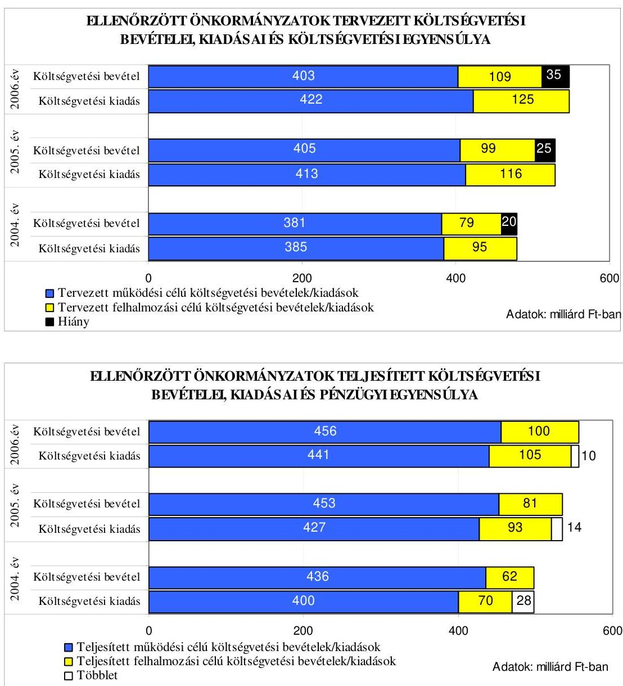

* Ellenőrzött megyei, megyei jogú városi, Budapest fővárosi kerületi és városi önkormányzatok adataival.

---

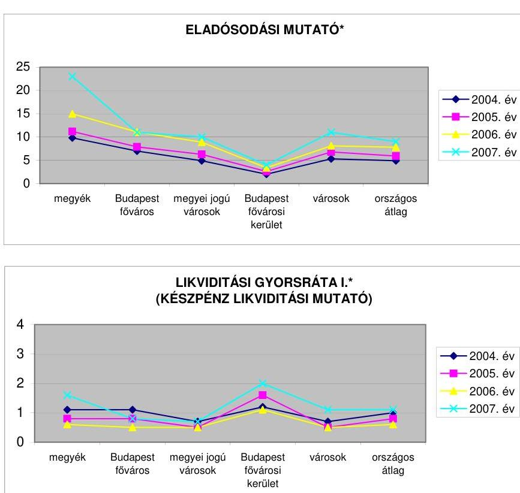

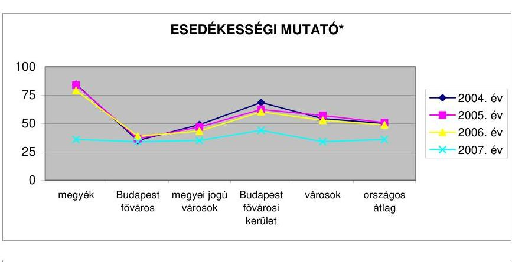

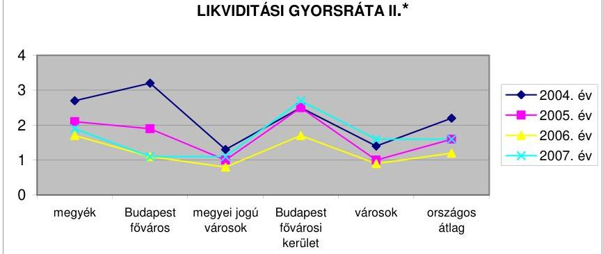

* Eladósodási mutató = összes kötelezettség-egyéb passzív pénzügyi elszámolások/összes forrás

  Esedékességi mutató = rövid lejáratú kötelezettségek/összes kötelezettség-egyéb passzív pénzügyi elszámolások

  Készpénz likviditási mutató = pénzeszközök/rövid lejáratú kötelezettségek.

  Likviditási gyorsráta = követelések+forgatási célú értékpapírok+pénzeszközök/rövid lejáratú kötelezettségek.

---

# AZ ELADÓSODÁSI ÉS ESEDÉKESSÉGI MUTATÓ ALAKULÁSA AZ ELLENŐRZÖTT ÖNKORMÁNYZATOKNÁL 

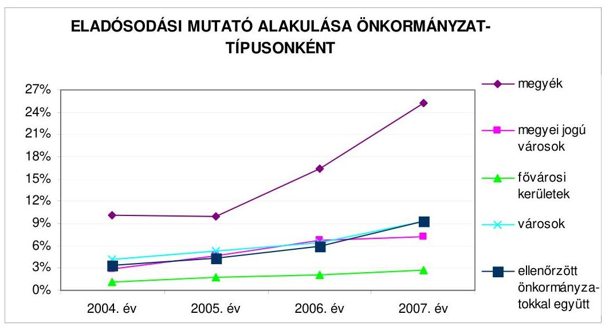

ESEDÉKESSÉGI ARÁNYMUTATÓ ALAKULÁSA ÖNKORMÁNYZATTÍPUSONKÉNT
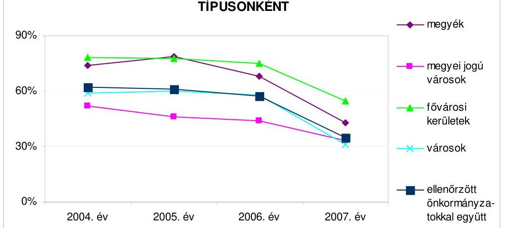

---

# AZ ELEKTRONIKUS KÖZIGAZGATÁSI ÜGYINTÉZÉSI LEHETŐSÉGEK BIZTOSÍTÁSA 

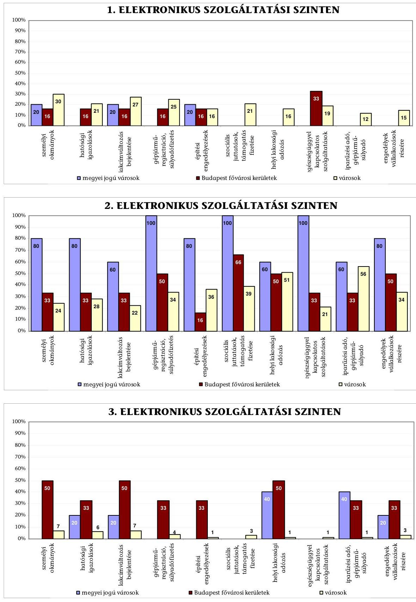

---

# A KIALAKÍTOTT BELSŐ KONTROLLOK MEGBÍZHATÓSÁGA TEKINTETÉBEN A VIZSGÁLT TERÜLETEKHEZ KAPCSOLÓDÓ KIADÁSOK ÉS AZOK RÉSZARÁNYÁNAK ALAKULÁSA AZ ELLENŐRZÖTT ÖNKORMÁNYZATOKNÁL

|  Megnevezés | Eredeti előirányzat |  | Módosított előirányzat |  | Teljesítés |   |
| --- | --- | --- | --- | --- | --- | --- |
|   | 2006. év | 2007. év | 2006. év | 2007. év | 2006. év | 2007. év  |
|  Állományba nem tartozók juttatásai ${ }^{1}$ (millió Ft) | 8632,7 | 8451,9 | 11670,8 | 11921,6 | 11773,9 | 12150,7  |
|  Állományba nem tartozók juttatásainak részaránya a személyi juttatásokból (\%) | 4,2 | 4,2 | 5,6 | 5,6 | 5,7 | 5,9  |
|  Karbantartási, kisjavítási szolgáltatások

 kiadásai ${ }^{2}$ (millió Ft) | 7454,2 | 6899,5 | 9005,3 | 8029,6 | 8194,0 | 7155,2  |
|  Karbantartási, kisjavítási szolgáltatások kiadásainak részaránya a dologi kiadásokból (\%) | 5,9 | 5,4 | 5,8 | 5,3 | 5,7 | 5,2  |
|  Gépek, berendezések és felszerelések vásárlása, létesítése ${ }^{3}$ (millió Ft) | 5213,8 | 2781,2 | 8148,1 | 7029,2 | 6234,4 | 5286,5  |
|  Gépek, berendezések és felszerelések vásárlása, létesítése kiadásainak részaránya a felhalmozási kiadásokból (\%) | 5,8 | 3,5 | 7,4 | 8,0 | 8,3 | 8,9  |

${ }^{1}$ A 2007. évben ellenőrzött 167 önkormányzatnál az önkormányzati hivatal 2006. és 2007. évi költségvetési beszámolója 02 űrlap 43. sor összesített adatai szerint. Az állományba nem tartozók megbízási díjainak kifizetései az állományba nem tartozók juttatásaiból a 2006. évben 23%-ot képviseltek. ${ }^{2}$ A 2007. évben ellenőrzött 167 önkormányzatnál az önkormányzati hivatal 2006. és 2007. évi költségvetési beszámolója 03. űrlap 27. sor összesített adatai szerint. ${ }^{3}$ A 2007. évben ellenőrzött 167 önkormányzatnál az önkormányzati hivatal 2006. és 2007. évi költségvetési beszámolója 05. űrlap 10. sor összesített adatai szerint.

---

# A SZÁMVEVŐI JELENTÉSEKBEN A HELYI ÖNKORMÁNYZATOK SZABÁLYSZERŰ ÉS CÉLSZERŰ MŰKÖDÉSE ÉRDEKÉBEN A 2007. ÉVBEN TETT JAVASLATOK 

#### Abstract

A helyi önkormányzatok gazdálkodásának átfogó ellenőrzéséről készült számvevői jelentésekben a megállapításaink hasznosítása és a hiányosságok megszüntetése érdekében közel négyezer javaslatot tettünk. Javaslataink kétharmada a jogszabályokban és az önkormányzati hivatalok belső szabályzataiban előírtak betartására, a szabályszerű működésre, gazdálkodásra hívta fel a figyelmet, egyharmada az önkormányzati feladatok célszerűbb, színvonalasabb ellátásának elősegítésére, az önkormányzati hivatalok munkájának célszerűbb megszervezésére, szabályozottságának javítására irányult.

## 1. A JOGSZABÁLYI ELŐÍRÁSOK MARADÉKTALAN BETARTÁSA ÉRDEKÉBEN TETT SZABÁLYSZERŰSÉGI JAVASLATOK

1.1. A költségvetési előirányzatok, az európai uniós forrásokkal kapcsolatos fejlesztési célkitűzések és előirányzataik jogszabályi előírásoknak megfelelő meghatározását, az európai uniós forrásokból támogatott fejlesztési feladatokhoz kapcsolódó pályázatok benyújtásának szabályszerűségét, a közérdekű adatok nyilvánosságát a javaslatok mintegy 7%-a szolgálta.

Az európai uniós forrásokkal kapcsolatos fejlesztési célkitűzések és előirányzataik jogszabályi előírásoknak megfelelő meghatározása érdekében:

- a költségvetési rendelettervezet előkészítésekor biztosítsák az Áht. 8/A. § (7) bekezdése előírásainak betartását, a költségvetés bevételi és kiadási előirányzata ne tartalmazzon finanszírozási célú bevételeket és kiadásokat;
- a képviselő-testületek az Ötv. 91. § (1) bekezdésében előírtak betartása érdekében fogadják el, az európai uniós forrásokkal kapcsolatos fejlesztési célkitűzésekkel egészítsék ki az önkormányzat több évre szóló gazdasági programját a Htv. 138. § (1) bekezdés a) pontja alapján;
- az Áht. 69. § (1) bekezdés előírásainak megfelelően tartalmazza a költségvetési rendelet a helyi önkormányzat által kijelölt, európai uniós források igénybevételével megvalósuló fejlesztések előirányzatait, a támogatási szerződésekben szereplő ütemezésben a beruházási és egyéb felhalmozási célú kiadásokat, a támogatásból származó bevételeket, valamint a saját forrás előirányzatát;
- a költségvetési rendelet-tervezetek tartalmazzák az európai uniós forrásokkal támogatott felhalmozásokat feladatonként az Ámr. 29. § (1) bekezdés d) pontja, a több éves kihatással járó feladatok előirányzatait éves bontás-

---

ban a g) pontja, az európai uniós támogatással megvalósuló programok, projektek bevételi és kiadási előirányzatait, az önkormányzaton kívüli projektekhez történő hozzájárulást elkülönítetten a k) pontjában foglaltak alapján;

- a költségvetési rendelet-tervezet előterjesztésekor az Áht. 118. § (1) bekezdés 2. b) pontjának megfelelően tájékoztassák a képviselő-testületeket a többéves kihatással járó döntések számszerűsítéséről évenkénti bontásban, összesítve, valamint szöveges indokolással.

Az európai uniós forrásokból támogatott fejlesztési feladatokhoz benyújtott pályázatok szabályszerűsége tekintetében:

- tartsák be az Áht. 12/A. § (1) bekezdése előírásait, tárgyévi fizetési kötelezettséget az éves költségvetési rendeletben jóváhagyott kiadási előirányzatok mértékéig vállaljanak;
- a saját forrást igénylő európai uniós pályázatok benyújtását megelőzően a képviselő-testületek hagyják jóvá az önerő fedezetét, biztosítva ezzel, hogy az Ötv. 10. § (1) bekezdés d) pont és az Áht. 69. § (1) bekezdés előírásainak megfelelően, a felhalmozási feladatok előirányzatát a költségvetés megállapítása keretében a képviselő-testület határozza meg;
- az Ámr. 134. § (2), (7)-(8) bekezdés előírásainak megfelelően kötelezettséget a jegyző, vagy az általa felhatalmazott személy ellenjegyzése után vállaljanak, a kötelezettségvállalások előirányzat-felhasználási terven alapuljanak.

A közérdekű, gazdasági adatok nyilvánossága érdekében:

- az Eisztv. 21. § (3) bekezdésében előírtak szerint tegyék közzé a tevékenységre, működésre, gazdálkodásra vonatkozó közérdekű adatokat;
- biztosítsák az önkormányzat költségvetéséből nyújtott céljellegű támogatások kedvezményezettjeinek nevére, a támogatás céljára, összegére, továbbá a támogatási program megvalósítási helyére vonatkozóan az Áht. 15/A. §-a, a vagyonnal történő gazdálkodással összefüggő - nettó ötmillió Ft-ot elérő vagy azt meghaladó - árubeszerzésre, építési beruházásra, szolgáltatás megrendelésre, vagyonértékesítésre, vagyonhasznosításra, vagyon vagy vagyonkezelői jog átadásra az Áht. 15/B. §-a hatálya alá tartozó szerződések és a költségvetési beszámoló szöveges indoklásának az Ámr. 157/D. § (1) bekezdésében előírt közzétételét.
1.2. A gazdálkodási feladatok szabályszerű és eredményes feltételeinek biztosítására, a szabályozottság kockázatának csökkentésére a költségvetés tervezési, gazdálkodási, beszámolási és folyamatba épített ellenőrzési feladatoknál, valamint a polgármesteri hivatalok pénzügyi-számviteli tevékenységét, továbbá a belső ellenőrzés szervezeti és szabályozási kereteit érintően a hibák és szabálytalanságok megelőzésére szolgáló belső kontrollok kialakítása érdekében mintegy másfélezer javaslat született.

A költségvetési tervezés és a zárszámadás készítés folyamatában elvégzendő belső kontroll tevékenységek meghatározása, az Áht. 121. § (1) és (3) be-

---

kezdése, az Ámr. 145/A. § (1)-(2) bekezdés és 145/B. § (1) bekezdés és 66. § (4) bekezdés előírásainak teljesítése érdekében szabályozzák a költségvetés tervezés és a zárszámadás elkészítés rendjét:

- határozzák meg az intézmények részére a költségvetési javaslat összeállításával kapcsolatos követelményeket, írják elő annak ellenőrzését, hogy
- a költségvetési tervezéshez készített intézményi mutatószám felmérés adatai megalapozottak-e, az intézmények, hivatali szervezeti egységek által benyújtott költségvetési igények indokoltak-e és teljesíthetőek-e;
- a saját bevételek (helyi adók, intézményi térítési díjak, egyéb szolgáltatási díjak) előirányzatai és a költségvetés megalapozását szolgáló helyi rendeletek összhangja biztosított-e;
- az intézmények által az állami támogatásokkal, hozzájárulásokkal történő elszámoláshoz közölt mutatószámok adatai megbízhatóak-e, az intézményi pénzmaradványok kimunkálása szabályszerű-e;
- jelöljék ki az önkormányzati hivatalokban a tervezési és a zárszámadási feladatok koordinálásáért, valamint az intézményi költségvetésekben szereplő adatok egyeztetéséért, ellenőrzéséért felelős személyeket.

A gazdálkodási, a pénzügyi-számviteli tevékenység és a folyamatba épített előzetes és utólagos vezetői ellenőrzés szabályozottsága, a hibák és szabálytalanságok megelőzésére szolgáló belső kontrollok kialakítása tekintetében:

- az önkormányzati hivatalok szervezeti és működési szabályzatait egészítsék ki az Ámr. 10. § (4) ${ }^{1}$ bekezdésében foglalt tartalmi előírásoknak megfelelően;
- a gazdasági szervezetek ügyrendje az Ámr. 17. § (5) bekezdésében előírtak szerint tartalmazza a szervezet és egységei, a pénzügyi-gazdasági feladatok ellátásáért felelős személyek, valamint a hozzájuk rendelt részben önállóan gazdálkodó költségvetési szervek ellátandó feladatait, a vezetők és más dolgozók feladat-, hatás- és jogkörét;
- az Ámr. 135. § (2) bekezdésében foglaltak alapján a jegyzők határozzák meg a szakmai teljesítés igazolásának módját és rendelkezzenek belső szabályzatban az azt végző személyek kijelöléséről, az Ámr. 135. § (4) bekezdés előírásai szerint bízzák meg írásban az érvényesítést végző személyeket;
- a kötelezettségvállalás, utalványozás gazdálkodási és az ellenjegyzés, érvényesítés, szakmai teljesítés igazolás ellenőrzésének jogosultjai meghatározásánál, kijelölésénél érvényesítsék az Ámr. 134-138. §-aiban foglaltakat;
- rögzítsék belső szabályzatban az Ámr. 134. § (3) bekezdésében foglaltak alapján a gazdasági eseményenként 50 ezer Ft-ot el nem érő, írásbeli kötelezettségvállalás nélküli kifizetések rendjét és nyilvántartási formáját, az Ámr. 134. § (13) bekezdés előírásai szerint a kötelezettségvállaláshoz kapcsolódó-

[^0]
[^0]:    ${ }^{1}$ A 2008. január 1-től Ámr. 10. § (5) bekezdés.

---

an olyan analitikus nyilvántartást vezessenek, amelyből megállapítható az évenkénti kötelezettségvállalás összege;

- a Vhr. 8. § (5) bekezdés b) és g) pontjában foglaltak betartása érdekében a számviteli politikát aktualizálják és egészítsék ki, hogy a kisértékű tárgyi eszközök, vagyoni értékű jogok és a szellemi termékek minősítésénél, valamint a terven felüli értékcsökkenés elszámolásánál mit tekintenek jelentős összegnek, illetve figyelembe veendő szempontnak;
- az önkormányzati hivatalok számlarendje tartalmazza a Számv. tv. 161. § (2) bekezdés a)-d) pontjaiban előírtakat, a belső bizonylatok, feladások tartalmi, formai követelményeit, az analitikus nyilvántartások, formáját, tartalmát, vezetésének módját, a főkönyvi és az analitikus nyilvántartások egyeztetését, dokumentálásának módját a Vhr. 49. § (1)-(2) bekezdése alapján;
- a Vhr. 8. § (4) bekezdés a) pontja alapján elkészített leltározási és leltárkészítési szabályzatban a Vhr. 37. § (1), (5), (7) bekezdéseinek megfelelően, a sajátosságokat figyelembe véve határozzák meg az évenkénti (kétévenkénti) leltározási kötelezettséget, az üzemeltetésre, kezelésre átadott eszközök leltározási módját, a leltárkülönbözetek megállapításának és rendezésének, a leltár és a könyvviteli adatok egyeztetésének módját;
- a Vhr. 8. § (4) bekezdés b) pontja alapján elkészített értékelési szabályzat tartalmazza a Vhr. 8. § (17)-(18) bekezdés és 31/A. § előírásai megfelelően a követelések év végi értékelésének elveit, az adók, illetékek egyszerűsített értékelési eljárásának szempontjait, dokumentumait, a Számv. tv. 53. § (1)-(2) bekezdés, 54-56. § és a Vhr. 30. § (12) bekezdés és 31. § előírásai alapján, a terven felüli értékcsökkenés valamint az értékvesztés elszámolásának és visszaírásának részletes rendjét;
- a Vhr. 8. § (4) bekezdésének c) pontjában, (16) bekezdésében és az Ámr. 157/C. § (1)-(2) bekezdésében foglalt előírás alapján készítsék el az önköltségszámítás rendjének belső szabályzatát a közérdekű adatszolgáltatáshoz kapcsolódó költségtérítés összege megállapítására vonatkozóan;
- A Vhr. 8. § (4) bekezdés d) pontja alapján elkészített pénzkezelési szabályzatban a Számv. tv. 14. § (8) bekezdés és a Vhr. 2. § előírásai, valamint a sajátosságok figyelembe vételével rögzítsék a készpénz felvételének részletes rendjét, a házipénztáron kívüli pénzkezelés és elszámolás szabályait, határozzák meg az Ámr. 145/A. § (1)-(2) bekezdés alapján az utólagos vezetői ellenőrzés gyakoriságát, dokumentálásának módját;
- a Vhr. 37. § (5) bekezdésében foglaltak alapján az eszközök hasznosítási és selejtezési szabályzata a sajátosságok figyelembe vételével és a vagyongazdálkodási rendelet előírásainak megfelelően tartalmazza ezen eszközök selejtezésével, hasznosításával kapcsolatban minősítési jogkört gyakorló munkaköröket, a hasznosítás, nyilvántartás során követendő eljárási rendet, az ármegállapítás szabályait, a döntéshozatalra jogosultak körét, az Ámr. 145/A. § (1)-(2) bekezdés előírásai alapján az eljárás szabályszerű végrehajtásának folyamatba épített ellenőrzéséért felelős személy meghatározását;

---

- az Ámr. 145/B. § (1) bekezdésében előírtak és az Ámr. 145/A. § (3) bekezdésében hivatkozott PM „Útmutató az ellenőrzési nyomvonal kialakításához" módszertani útmutató alapján egészítsék ki az ellenőrzési nyomvonalat az elvégzendő tevékenységek, feladatok és azok végrehajtásáért felelős szervezeti egység (személy), valamint az egyes tevékenységeket, feladatokat részletesen tartalmazó belső szabályzatok megnevezésével, a végrehajtásukért felelős szervezeti egység, személy egyértelmű megfeleltetésével, az ellenőrzési pontok és a tevékenység, feladat elvégzését igazoló dokumentum megnevezésével, nyilvántartási helyének meghatározásával;
- az Ámr. 145/C. § (1)-(4) bekezdésében foglaltak és az Ámr. 145/A. § (3) bekezdésében hivatkozott PM „Útmutató a kockázatkezelés kialakításához" módszertani útmutató alapján a kockázatkezelési eljárásrend tartalmazza a kockázatok azonosítását, folyamatgazdáinak, értékelésének és
 kategóriákba sorolásának, valamint az elfogadható kockázati szintnek a meghatározását, a kockázatokra adható válaszok (válaszintézkedések) megvalósíthatóságának mérlegelését, a kockázat nyilvántartását, a válaszintézkedések beépítését a folyamatba és a kockázati környezet rendszeres felülvizsgálatát;
- az Ámr. 145/A. § (5) bekezdés és a PM „Útmutató a szabálytalanságok kezeléséhez" módszertani útmutató alapján a szabálytalanságok kezelése eljárás rendben rögzítsék a szabálytalanság fogalmát, észlelési kötelezettségét, az intézkedések (eljárások) meghatározását, a szabálytalanságok, intézkedések nyilvántartását.

A belső ellenőrzés szervezeti és szabályozási kereteinek kialakítása érdekében:

- az Ötv. 92. § (8) bekezdés előírásainak megfelelően határozzák meg a képviselő-testületek a belső ellenőrzés ellátásának módját, az Ötv. 92. § (6) bekezdésében foglalt határidőn belül hagyják jóvá az éves ellenőrzési tervet;
- a Ber. 4. § (5) bekezdés előírásai alapján amennyiben nem foglalkoztattak belső ellenőrt, a jegyző gondoskodjon a belső ellenőri tevékenység külső erőforrással történő megszervezéséről, valamint társulással történő feladatellátás esetén a társulási megállapodásban rendelkezzenek arról, hogy a belső ellenőri vezetői feladatokat a társulás látja el;
- a Ber. 4. § (2) bekezdése alapján az önkormányzati hivatalok SzMSz-ében határozzák meg a belső ellenőrzést végző szervezet jogállását és feladatait, a stratégiai terv és az éves ellenőrzési terv a Ber. 18. § és 21. § (2) bekezdés előírásai szerint kockázatelemzés alapján felállított prioritásokon alapuljon, az éves ellenőrzési terv tartalmában feleljen meg a Ber. 21. § (1) és (3)-(4) bekezdésében előírtaknak, legyen összhangban a stratégiai tervvel és tartalmazzon időkeretet a soron kívüli ellenőrzésekre, egészítsék ki a belső ellenőrzési kézikönyvet a Ber. 5. § (2) bekezdés a)-k) pontjai előírásainak megfelelően;
- a Ber. 23. § (1) bekezdés előírásai alapján minden egyes ellenőrzés lefolytatásához a Ber. 23. § (3)-(4) bekezdésében előírt tartalmú, a belső ellenőrzési vezető által jóváhagyott ellenőrzési programot készítsenek;

---

- a belső ellenőrök a Ber. 11. § (1) bekezdés előírásainak megfelelő felsőfokú iskolai végzettséggel, illetve képesítéssel, valamint legalább két éves gyakorlattal rendelkezzenek, a Ber. 12. § k) pontjának megfelelően biztosítsák a belső ellenőrök rendszeres továbbképzését.
1.3. A működésbeli hibák megelőzésére, feltárására, kijavítására kialakított belső kontrollok megbízható működésének biztosítását a költségvetés tervezés és zárszámadás készítés, a szakmai teljesítés igazolás és az utalvány ellenjegyzés kontrolljainak működését a gazdálkodás folyamatában, az általánostól jellemzően eltérő, egyedi eljárást igénylő gazdasági eseményekkel (az állományba nem tartozók megbízási díjaival, a karbantartási, kisjavítási szolgáltatásokkal, a gépek, berendezések, felszerelések beszerzésével) kapcsolatos kifizetések során, a szabályszerűségi javaslatok egytizede szolgálta.

A költségvetés tervezés folyamatában a belső kontroll feladatok teljesítése érdekében az Áht. 121. § (1) és (3) bekezdés, az Ámr. 145/A. § (1)-(2) bekezdés, illetve a 145/B. § (1) bekezdés előírásait figyelembe véve a jegyző dokumentáltan ellenőriztesse, hogy:

- az intézmények teljesítették-e a költségvetési javaslat összeállításával kapcsolatban részükre meghatározott követelményeket;
- a költségvetés tervezéshez készített intézményi mutatószám felmérés adatai megalapozottak-e, az intézmények, hivatali szervezeti egységek által benyújtott költségvetési igények indokoltak-e, teljesíthetőek-e;
- a saját bevételek (helyi adók, intézményi térítési díjak, egyéb szolgáltatási díjak) előirányzatai és a költségvetés megalapozását szolgáló helyi rendeletek összhangja biztosított-e.

A zárszámadás készítés folyamatában az Áht. 121. § (1) és (3) bekezdés, az Ámr. 145/A. § (1)-(2) bekezdés, a 145/B. § (1) bekezdés, 66. § (4) bekezdés, illetve 149. § (3) bekezdés c)-d) pont előírásait figyelembe véve a jegyző dokumentáltan ellenőriztesse:

- az intézmények által az állami támogatásokkal, hozzájárulásokkal történő elszámoláshoz közölt mutatószámok adatainak megbízhatóságát, az intézmények pénzmaradvány megállapításának szabályszerűségét;
- az intézményi eredeti, módosított előirányzatok és teljesítések eltérésének indokoltságát, továbbá számszaki beszámolójuk belső, valamint annak a jegyző által meghatározott adatszolgáltatással való összhangját.

Az operatív gazdálkodás során a működésbeli hibák megelőzése, feltárása, illetve kijavítása érdekében biztosítsák a szakmai teljesítés igazolás és az utalvány ellenjegyzés kontrolljainak működését:

- az Ámr. 134. § (2) és (8) bekezdésében foglaltak érvényre jutását, hogy a kötelezettségvállalás a jegyző vagy az általa felhatalmazott személy ellenjegyzése után, írásban történjen;

---

- az Ámr. 135. § (1), (3) bekezdésében előírtak alapján a kiadások teljesítésének elrendelése előtt a jegyző által kijelölt személyek okmányok alapján, belső szabályzatban előírt módon ellenőrizzék, szakmailag igazolják azok jogosultságát, összegszerűségét, a szerződés, megrendelés, megállapodás teljesítését, az érvényesítő tegyen eleget munkafolyamatba épített ellenőrzési feladatainak, a szakmai teljesítés igazolás alapján ellenőrizze az összegszerűséget, a fedezet meglétét és az előírt alaki követelmények betartását;
- az Ámr. 137. § (2) bekezdés előírásainak megfelelően az arra jogosult személyek végezzék el az utalvány ellenjegyzését;
- az Ámr. 134. § (9) bekezdés, illetve 137. § (3) bekezdés előírásai alapján az utalvány ellenjegyzői a folyamatba épített ellenőrzési feladatok teljesítésével győződjenek meg arról, hogy a kiadási előirányzat rendelkezésre áll-e, az utalványozás nem sérti-e a gazdálkodásra - összeférhetetlenségi követelmények érvényesítésére, a fedezet meglétére, a kötelezettségvállalás ellenjegyzésére - vonatkozó, az Ámr. 138. § (3) bekezdésében, az Áht. 12/A. § (1) bekezdésében, a 93. § (1) bekezdésében, Ámr. 134. § (2) bekezdésében rögzített szabályokat, továbbá, hogy a szakmai teljesítés igazolása az Ámr. 135. § (1) bekezdésében előírtak alapján és az érvényesítés az Ámr. 135. § (3) és (4) bekezdéseiben foglaltak szerint az arra jogosultak által megtörtént-e;
- az Áht. 93. § (1) bekezdésében előírtak szerint az önkormányzati hivatalok és az intézmények a jóváhagyott előirányzatokon belül gazdálkodjanak, és az Áht. 12/A. § (1) bekezdésében foglaltakat betartva a tárgyévi fizetési kötelezettséget a jóváhagyott kiadási előirányzatok mértékéig vállaljanak.
1.4. Az ellenőrzési kötelezettség teljesítését, megállapításainak hasznosulását a szabályozási és működési hibák feltárásával, intézkedések kezdeményezésével, a javaslatok realizálásának ellenőrzésével, a szabályszerűségi javaslatok egyötöde érintette. Javasoltuk, hogy az Ötv. 92. § (5) bekezdés és a Htv. 140. § (1) bekezdés e) pontjában meghatározott gazdálkodási feladat és hatáskörük keretében a jegyzők gondoskodjanak az önkormányzat által alapított és fenntartott költségvetési szervek éves ellenőrzési tervben foglalt ellenőrzéseinek végrehajtásáról, a belső ellenőrzés rendszerében vizsgálják meg:
- az önkormányzati hivatalnál és az önkormányzat költségvetési intézményeinél a Ber. 8. § a) pontja alapján a FEUVE rendszer kiépítésének és működésének központi és helyi szabályoknak való megfelelését, a költségvetési előirányzatok teljesítését, a Kbt. 308. § (2) bekezdés előírásainak megfelelően a közbeszerzéseket, illetve a közbeszerzési eljárásokat;
- az Ötv. 92. § (11) bekezdés b) pont és a Ber. 8. § c) pont előírásai alapján az önkormányzat többségi irányítást biztosító befolyása alatt működő gazdasági társaságoknál, közhasznú társaságoknál, vagyonkezelőknél a rendelkezésre álló erőforrásokkal való gazdálkodást, a vagyon megóvását, gyarapítását, az elszámolások, beszámolók megbízhatóságát;
- az Áht. 13/A. § (2) bekezdés és az Ötv. 92. § (11) bekezdés b) pont előírásainak megfelelve a kedvezményezett szervezeteknél az önkormányzat költségvetéséből céljelleggel nyújtott támogatások rendeltetés szerinti felhasználását dokumentumok, vagy helyszíni ellenőrzés alapján;

---

- az ellenőrzéseket a Ber. 23. § (4) bekezdésében előírt tartalmú ellenőrzési program alapján végezzék, az ellenőrzések megállapításairól készült jelentések a Ber. 27. § (6) bekezdés előírásainak megfelelően tartalmazzák az eredmények és hiányosságok összefoglaló értékelését, a 27. § (2) bekezdés j) pont szerinti következtetéseket, javaslatokat, a belső ellenőrzések által feltárt hiányosságok megszüntetéséről győződjenek meg utóellenőrzéssel, intézkedési terv végrehajtásáról készített beszámolóval, illetve egyéb módon;
- a Ber. 31. § (1) bekezdés előírásai alapján a végrehajtott ellenőrzésekről készítsék el az éves ellenőrzési jelentést, amely feleljen meg a Ber. 31. § (3) bekezdés előírásainak, és tartalmazza a tervtől való eltérés indokolását is;
- az Áht. 97. § (2) bekezdés előírása szerint a jegyzők számoljanak be az éves költségvetési beszámoló keretében a folyamatba épített előzetes és utólagos vezetői ellenőrzés, valamint a belső ellenőrzés működéséről, a képviselőtestületek az Ötv. 92. § (10) bekezdés és a Htv. 138. § (1) bekezdés g) pontjában előírt gazdálkodási feladat és hatáskörükben a zárszámadási rendelettel egyidejűleg tekintsék át a költségvetési szervek éves ellenőrzési jelentései alapján készített éves összefoglaló jelentést.
1.5. A számvevői jelentésekben rögzített jogszabálysértésekért, illetve az előző ellenőrzés által feltárt hiányosságok megszüntetésének elmaradásáért az ellenőrzött városi önkormányzatok 15%-ánál javasoltuk a polgármestereknek, hogy kezdeményezzék a képviselő-testületeknél a Ktv. 51. § (1) bekezdés előírásai alapján a jegyző felelősségének megvizsgálását, és a szükséges intézkedés megtételét. Nem kezdeményeztük a jegyzők felelősségének megállapítását kettő megyei jogú városi, egy-egy megyei és fővárosi kerületi önkormányzatnál, valamint az ellenőrzött városi önkormányzatok 6%-ánál, mert megszűnt az önkormányzatnál a jegyző közszolgálati jogviszonya, továbbá a polgármester felelősségének megállapítását egy megyei jogú városi önkormányzatnál a polgármesteri megbízatás megszűnése miatt.

# 2. A MUNKA SZÍNVONALÁNAK JAVÍTÁSA ÉRDEKÉBEN TETT CÉLSZERŰSÉGI JAVASLATOK 

Az önkormányzatok európai uniós források igénylésére és felhasználására, valamint az e-közigazgatási feladataik ellátására való felkészülésével, a gazdálkodás egyes területeinek szabályozási kérdéseivel, a pénzügyi-számviteli feladatok informatikai támogatottságával, az alkalmazott informatikai rendszerek szabályozottságával, dokumentált működési feltételeinek kialakításával és egyéb kérdésekkel összefüggésben több mint ezer javaslatot tettünk.

Az önkormányzatok európai uniós források igénylésére, felhasználására, és az e-közigazgatási feladataik ellátására való felkészülése érdekében:

- szabályozzák az európai uniós források igénybevételével összefüggő önkormányzati szintű feladatokat, határozzák meg a döntési jogköröket, a pályázat-koordinálás feladatait és felelőseit, az önkormányzati szintű pályázat nyilvántartás vezetésének felelősét, az európai uniós forrásokkal kapcsolatos információk áramlásának rendjét, a polgármester és a fejlesztési feladat le-

---

bonyolítója közötti kapcsolattartás rendjét, az ellenőrzési kötelezettséget, az ellenőrzés feladatait, végrehajtásának felelőseit;

- az önkormányzati hivatalok belső szabályzataiban rögzítsék az európai uniós forrásokkal összefüggő feladatok, valamint, a pályázatfigyelés, pályázatkészítés, a fejlesztési feladatok lebonyolításának belső rendjét, a megvalósítással kapcsolatos folyamatba épített ellenőrzés és belső ellenőrzés feladatait;
- a fejlesztési célkitűzéseket és azok pénzügyi forrásait a valós szükséglet felmérésével, megalapozó számításokkal támaszszák alá, készüljön felmérés, helyzetelemzés a feladatok megoldásánál jelentkező feszültségekről;
- alakítsák ki az európai uniós forrásokra irányuló pályázatfigyelés, pályázatkészítés, valamint az európai uniós támogatással megvalósuló fejlesztések lebonyolításának személyi, szervezeti feltételeit, külső szervezet pályázatfigyelésre, pályázatkészítésre, európai uniós forrásokkal megvalósuló fejlesztési feladat lebonyolítására való megbízása esetén a szerződésekben rögzítsék a feladat ellátási kötelezettséget, annak rendjét, a kapcsolattartás és az információk átadásának szabályait, a felelősség névre szóló meghatározását, illetve az ellenőrzési feladatok megosztását;
- biztosítsák az európai uniós forrással támogatott fejlesztési feladatok támogatási szerződésekben rögzített ütemezésnek megfelelő megvalósítását, és a megvalósítás belső ellenőrzés keretében történő vizsgálatát;
- a pénzügyi-számviteli területen alkalmazott informatikai rendszerek biztonságos, szabályozott működése érdekében készítsék el az informatikai/közigazgatási stratégiát, a biztonsági szabályzatot és a váratlan események bekövetkeztére katasztrófa elhárítási tervet, az informatikai stratégia tartalmazza a helyzetelemzést, a közép- és hosszú távú célkitűzéseket, valamint annak meghatározását, hogy az elektronikus szolgáltatás mely szintjére kívánnak eljutni;
- az önkormányzati hivatalokban az informatikai rendszerekkel történő biztonságos munkavégzés érdekében szabályozzák az informatikai eszközökhöz történő hozzáférést, azok dokumentálását, a pénzügyi-számviteli számítógépes programrendszerekben az adat-karbantartási folyamatot, a szabályozás legyen összhangban az önkormányzati hivatalok SzMSz-ével és a gazdasági szervezetek ügyrendjével, gondoskodjanak az informatikával kapcsolatos szabályzatok érintett köztisztviselők általi
 megismeréséről;
- működtessék az e-közigazgatási szolgáltatásokat biztosító informatikai rendszert, amennyiben a teljes on-line ügyintézés nem biztosított, gondoskodjanak a továbbfejlesztéséről a szükséges hardver, szoftver, pénzügyi és személyi feltételek megteremtésével, kísérjék figyelemmel, értékeljék a működő rendszer ügyfelek általi igénybevételét.

A pénzügyi-számviteli feladatok ellátásának informatikai rendszerekkel történő támogatása, biztonságos, dokumentált működési feltételeinek kialakítása érdekében:

---

- informatikai eszközökkel végezzék az analitikus nyilvántartások vezetését, a költségvetési beszámoló készítését, a rendező és a záró tételek átvezetését, biztosítsák a számítógépen vezetett analitikus nyilvántartások és a főkönyvi könyvelés kapcsolatát, számítógépes programmal a könyvviteli mérleg és a főkönyv, illetve a főkönyv és a költségvetési beszámoló többi adatának egyezőségét, a számlarend változásainak kezelését;
- a könyvviteli feladatok informatikai elvégzése során csak engedélyezett tranzakciók könyvelésére legyen lehetőség, gondoskodjanak az adatok egyszeri beviteléről, a bizonylatok adatainak rögzítésénél a számszaki pontosság automatikus ellenőrzéséről, a könyvelési tételek visszamenőleges azonosításáról a rögzítési idő, a rögzítő és az elvégzett művelet jellege szerint;
- az informatikai rendszer működéséről álljanak rendelkezésre naprakész rendszerdokumentációk és dokumentálják az adatkapcsolatokat, az informatikai hálózaton keresztül tegyék elérhetővé a pénzügy-számvitel által használt programok adatait;
- biztosítsák a számítógépes rendszer védelmét tűzfallal, figyelőrendszerrel, a szoftver-hardver hibák és kezelésük rögzítését, gondoskodjanak az outputok folyamatos kontrolljáról, az adatok feldolgozásának naprakészségéről, a munkafolyamatba épített ellenőrzés informatikai támogatottságáról;
- a pénzügyi-gazdasági, számviteli munkakört betöltő dolgozók munkaköri leírásában a belső szabályzatok előírásainak megfelelően rögzítsék a vezetők és a munkatársak feladatait, kötelezettségeit, hatásköreit és felelősségi jogkörüket, az informatikai rendszerek használatához kapcsolódó feladatokat;
- számoltassák be a felhatalmazottakat a gazdálkodási és ellenőrzési jogkörök gyakorlásáról;
- tárgyalják meg a képviselő-testületek az ÁSZ ellenőrzés tapasztalatait, készítsenek intézkedési tervet a feltárt hiányosságok megszüntetése érdekében.

---

H-1051 BUDAPEST V., JÓZSEF NÁDOR TÉR 2-4, POSTACIM: 1369 BUDAPEST, POSTAFIÓK 481.

TELEFON: (36-1) 327-2159, (36-1) 327-2141
FAX: (36-1) 318 - 0738
PÉNZÜGYMINISZTÉRIUM

12. számú melléklet
a V-1001/2007. számú jelentéshez

Dr. Kovács Árpád úr részére
elnök
Állami Számvevőszék
Budapest

Tisztelt Elnök Úr!

A helyi önkormányzatok gazdálkodási rendszerének 2007. évi átfogó és egyéb szabályszerűségi ellenőrzéséről készített jelentést köszönettel megkaptam.

Örömmel vettem, hogy a jelentés-tervezetre tett észrevételeink egy része elfogadásra került. A jelentésben - az önkormányzati miniszter és a pénzügyminiszter részére - megfogalmazott javaslatokkal alapvetően egyetértek.

A jelentéshez az alábbi észrevételeket teszem:
Az önkormányzati miniszternek és a pénzügyminiszternek a belső ellenőrzési feladatok elősegítése érdekében tett 1. d) pontban megfogalmazott javaslattal - az ellenőrzési tervtől való eltérésnek a jegyző és a képviselő-testület jóváhagyásához kötésével - nem értek egyet. Véleményem szerint ez szükségtelen adminisztratív terhet ró az önkormányzatra, a jegyzőre. A terv végrehajtása általában a realitások függvénye, előfordulhatnak soron kívüli események, melyek befolyásolják a végrehajtást. Amennyiben a tervtől való eltérés a képviselő-testület és a jegyző együttes döntéséhez lenne kötve, úgy komoly késedelmeket, fennakadásokat okozhatna a jóváhagyás beszerzése. Ez a szakmailag független belső ellenőrzés felelősségét csökkentené, a testület és a jegyző felelősségét e területen szükségtelenül növelné.

Az önkormányzati miniszternek és a pénzügyminiszternek tett 1. e) javaslat álláspontom szerint sérti a belső ellenőrzés funkcionális függetlenségét. A FEUVE rendszerben előírt kockázatkezelés keretében elvégzett kockázatelemzés legfeljebb fontos információ lehet a belső ellenőrzési tervezés részére, de abból eredően kötelező elemek nem írhatóak elő. A belső ellenőr saját kockázatelemzés alapján kell kiválasztania az ellenőrizendő területeket (munkájához természetesen felhasználhatja a „menedzsment” kockázatelemzését). A belső ellenőr felelősségét ez esetben sem tartom indokoltnak csökkenteni.

Az önkormányzatok 2007. évi gazdálkodásának tapasztalatai alapján magunk is érzékeltük az önkormányzatok eladósodásának növekedését. Ezért is fontosnak tartottuk, hogy szabályozásra kerüljön az önkormányzati eladósodás mértéke, összekötve az adott önkormányzat rendelkezésére álló, kötelezettségvállalással nem terhelt forrásával. E

---

szabályozást elkészítettük és a Kormány benyújtotta az Országgyűlésnek a közpénzügyi törvényre vonatkozó törvényjavaslattal egy időben. Megítélésem szerint a Pénzügyminisztérium feladata a szabályozás, s az e területen lehetséges mozgástere nem bővülhet ki módszerek, ajánlások készítésével az önkormányzatok részére az Önkormányzati törvényben meghatározott önkormányzati jogosítványok tiszteletben tartása érdekében. Így nem értek egyet azzal a javaslatukkal, amely szerint a pénzügyminiszter módszertani útmutató kibocsátásával segítse elő az önkormányzatok kötvénykibocsátására vonatkozó döntéselőkészítési munkáját. Elhagyását annál is inkább kérem, mivel a tervezetben nem szerepelt, s így nem volt módunk előzetesen véleményezni.

Ismételten megköszönve munkájukat kérem Elnök urat, hogy a Jelentés véglegezése során észrevételeimet figyelembe venni szíveskedjen.

Budapest, 2008. július 15.
Üdvözlettel:
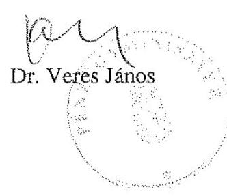

---

# Dr. Veres János úr 

miniszter
Pénzügyminisztérium

Budapest, Pf. 481.
József nádor tér 3-4.
1369

## Tisztelt Miniszter Úr!

Köszönettel megkaptam a helyi önkormányzatok gazdálkodási rendszerének 2007. évi átfogó és egyéb szabályszerűségi ellenőrzéséről szóló jelentésünkre adott válaszát. Örömmel vettem, hogy a jelentésben szereplő megállapítások, javaslatok többségével egyetért.

Az önkormányzatok éves ellenőrzési tervben foglalt belső ellenőrzési feladatainak módosításával kapcsolatban az önkormányzati miniszternek és a pénzügyminiszternek az 1. d) pontban tett javaslatunkat az észrevételében foglaltaktól eltérően továbbra is indokoltnak tartjuk, mivel az Ötv. 92. § (6) bekezdésében foglaltak szerint a helyi önkormányzatra vonatkozó éves belső ellenőrzési tervet a képviselő-testület jogosult jóváhagyni. Amennyiben a képviselő-testület által jóváhagyott éves ellenőrzési tervben foglaltaktól a képviselő-testület előzetes jóváhagyása nélkül eltérő, tartalmilag más feladatokat határozhat meg a végrehajtás során a belső ellenőrzési feladatok elvégzésével megbízott társulás, vagy a jegyző, úgy az Ötv. hivatkozott előírása célját és értelmét veszti, illetve az ilyen eljárás ellentétes az abban foglaltakkal. A korlátozás nélküli módosítás engedélyezése véleményünk szerint a képviselő-testület részére az Ötv-ben biztosított döntési jogkört indokolatlanul elvonja. Az észrevételben hivatkozott, esetenként valóban előfordulható soron kívüli esemény miatti ellenőrzési igény teljesítésére véleményünk szerint a képviselő-testület által jóváhagyott éves ellenőrzési tervben meghatározott szabad ellenőri kapacitás mértékéig indokolt törvényi felhatalmazást biztosítani a jegyző részére, tekintettel az Ötv. 92. § (4) és (5) bekezdéseiben a belső ellenőrzéssel összefüggésben meghatározott kötelezettségeinek teljesítésére vonatkozó felelősségére.

---

A képviselő-testület elé jóváhagyásra előterjesztett éves ellenőrzési tervjavaslat tartalmának kiegészítésére vonatkozóan az önkormányzati miniszternek és a pénzügyminiszternek 1. e) pontban tett javaslatunkat az észrevételben foglaltaktól eltérően továbbra is indokoltnak tartjuk, mivel a belső ellenőrzési vezetőnek a belső ellenőrzési vezető által kidolgozott és a jegyző által jóváhagyott belső ellenőrzési kézikönyvben meghatározott kockázatelemzési módszertanban foglaltaknak megfelelő kockázatelemzéssel alátámasztottan kell az éves ellenőrzési tervet összeállítania. Indokoltnak tartjuk, hogy a képviselő-testület elé jóváhagyásra a belső ellenőrzési vezető által - az ismertetett előírás figyelembe vételével - összeállított javaslat kerüljön, illetve amennyiben attól eltér, akkor a képviselő-testület részére az előterjesztés tartalmazzon indoklást az eltérés okáról.

Az önkormányzatok kötvénykibocsátására vonatkozóan a pénzügyminiszternek címzett 2. javaslatunkat az észrevételében foglaltaktól eltérően továbbra is indokoltnak tartjuk, mivel a pénzügyminiszter az Ötv-ben meghatározott önkormányzati jogosítványok tiszteletben tartása mellett több területen már korábban is kiadott módszertani útmutatókat - pl. a belső ellenőrzés végrehajtásához, a FEUVE rendszer kialakításához, működtetéséhez, és a kockázatelemzéshez - amelyeket az önkormányzati költségvetési szervek vezetőinek figyelembe kell venniük a kapcsolódó feladatok végrehajtása során. Javaslatunk nem kötelező jellegű, hanem a döntések meghozatalához segítséget nyújtó, iránymutató, figyelemfelhívó jellegű tájékoztató összeállítására vonatkozott. Véleményünk szerint közvetve a helyi önkormányzatok gazdálkodásának kockázata az államháztartás kockázata is, tekintettel arra, hogy a helyi önkormányzatok az államháztartás egyik alrendszerét képezik.

Budapest, 2008. július 20.
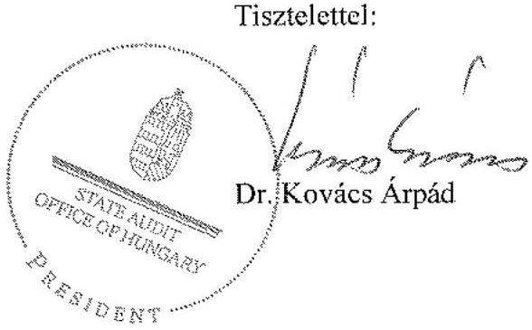

---

# ÖNKORMÁNYZATI MINISZTÉRIUM

Iktatószám: ÖTM/ 10458/3/2003.

Dr. Kovács Árpád úr részére, elnök

Állami Számvevőszék

## Budapest

## Tisztelt Elnök Úr!

A helyi és a helyi kistérségi önkormányzatok gazdálkodási rendszerének 2007. évi átfogó és egyéb szabályszerűségi ellenőrzéséről szóló számvevőszéki Jelentés megküldését köszönettel vettem.

Örömmel tapasztaltam, hogy az Állami Számvevőszék kellő alapossággal vizsgálta a helyi önkormányzatok 2007. évi gazdálkodását. Megállapítható, hogy a korábbi ellenőrzések során tett javaslatok 70%-át az önkormányzatok hasznosították, ezáltal javult a gazdálkodásuk szabályszerűsége, hatékonysága.

A Jelentésben az önkormányzati miniszternek tett javaslatokra az alábbi észrevételt teszem.
A Jelentés 1. pontja az önkormányzati miniszternek és a pénzügyminiszternek határoz meg feladatokat a belső ellenőrzésre vonatkozó jogszabály (Ber.) módosítására vonatkozóan, amelyben az önkormányzati feladatok tekintetében a jegyző felelősségének érvényesíthetőségét indítványozza. Erre vonatkozóan megjegyzem, hogy a költségvetési szervek belső ellenőrzéséről szóló kormányrendelet módosításának kezdeményezése a pénzügyminiszter feladat- és hatáskörébe tartozik, függetlenül attól, hogy a módosítások az önkormányzatokat érinthetik. A javaslatban foglaltakkal egyetértek, amennyiben arra vonatkozik, hogy a pénzügyminiszter kezdeményezi a Kormánynál a hivatkozott jogszabály módosítását, és kikéri - a feladat- és hatáskörébe tartozó kérdésekkel összefüggésben - az Önkormányzati Minisztérium véleményét.

Az önkormányzati miniszternek tett javaslat, miszerint „kezdeményezze az Ötv. 8. § (2) bekezdésében foglalt önkormányzati feladat - miszerint az önkormányzatoknak meg kell határozniuk, hogy a lakosság igényei alapján, anyagi lehetőségeiktől függően, mely feladatokat, milyen mértékben és módon látnak el - pontosítását annak előírásával, hogy ezt milyen szabályozási módon, milyen tartalmi részletezettséggel kell megoldaniuk”, már korábban is szerepelt az ÁSZ jelentéseiben.

---

Az ezzel kapcsolatban az önkormányzati tárca által tett korábbi észrevételeket fenntartom, miszerint a javaslat szakmai szempontból nem támogatható, így annak elhagyását javaslom. Az önkormányzati szabályozás módja (tehát a rendeletalkotás) kérdése - figyelemmel az Ötv. 16. § (1) bekezdésére - rendezett, mivel a képviselő-testület a törvény által nem szabályozott helyi társadalmi viszonyok rendezésére (többek között az önként vállalt feladatokról) önkormányzati rendeletet alkot. A 8. § (1) bekezdése szerinti feladatok ellátásáról az Ötv. 91. § alapján a gazdasági programban dönt a képviselő-testület. A gazdasági program a költségvetési lehetőségekkel összhangban, a helyi társadalmi, környezeti, gazdasági adottságok átfogó figyelembevételével - a kistérségi területfejlesztési koncepcióhoz illeszkedve - tartalmazza az önkormányzat(ok) által ellátandó kötelező és önként vállalt feladatok biztosítását a képviselőtestület megbízatásának időtartamára, vagy azt meghaladó időszakra vonatkozóan. Tekintettel arra, hogy az ÁSZ javaslatában foglaltakat jelenleg is szabályozza az Ötv., a 8. § (2) bekezdésének pontosítását nem tartom indokoltnak.

Bízva további eredményes együttműködésünkben, munkájukhoz további sok sikert kívánok.

Budapest, 2008. július 16.
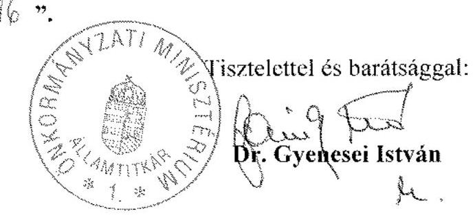

---

15. számú melléklet

a V-1001/2007. számú jelentéshez

ELNÖK

ÁLLAMI
SZÁMVEVŐSZÉK

Ikt.szám: V-1001-53/2007.

Dr. Gyenesei István úr
miniszter
Önkormányzati Minisztérium

Budapest, Pf. 314.
József Attila u. 2-4.
1903

# Tisztelt Miniszter Úr! 

Köszönettel megkaptam a helyi önkormányzatok gazdálkodási rendszerének 2007. évi átfogó és egyéb szabályszerűségi ellenőrzéséről szóló jelentésünkre adott válaszát. Örömmel vettem, hogy a jelentésben szereplő megállapítások többségével egyetért.

A belső ellenőrzéssel kapcsolatos javaslatainkkal kapcsolatban adott egyetértő álláspontját kérem, hogy a továbbiakban - a belső ellenőrzésre vonatkozó jogszabály (Ber.) pénzügyminisztérium által részünkre jelzett tervezett módosítása során - érvényesíteni szíveskedjen.

Az Ötv. 8. § (2) bekezdésében foglaltak módosítását már a megelőző években is kezdeményeztük, valamint az önkormányzati és területfejlesztési miniszter kérésére a tavalyi évben a vonatkozó javaslatot kiegészítettük. A javaslattal kapcsolatban ez évben kapott válasz megítélésünk szerint tévedésen alapul a tekintetben, hogy az önkormányzatok gazdasági programjának tartalmaznia kell a kötelező és önként vállalt feladatok konkrét felsorolását, biztosítási mértékének, megoldási módjának meghatározását a képviselő-testület megbízatásának időtartamára, vagy azt meghaladó időszakra vonatkozóan. A helyi önkormányzatokról szóló 1990. évi LXV. törvény (Ötv.) 91. § (6) bekezdése szerint „A gazdasági program az önkormányzat(ok) részére helyi szinten meghatározza mindazon célkitűzéseket, feladatokat,
 amelyek a költségvetési lehetőségekkel összhangban, a helyi társadalmi, környezeti, gazdasági adottságok átfogó figyelembevételével - a kistérségi területfejlesztési koncepcióhoz illeszkedve - az önkormányzat(ok) által nyújtandó kötelező és önként vállalt feladatok biztosítását, fejlesztését szolgálják." Ezen előírás alapján a gazdasági program nem a kötelező és önként vállalt feladatok konkrét felsorolását, hanem azon célkitűzéseket, fejlesztési feladatokat tartalmazza, amelyeket a képviselő-

---

testület megbízatásának időtartamára, vagy azt meghaladó időszakra meghatároz, ezért a gazdasági program tartalmi követelménye nem terjed ki arra, hogy abban egyértelműen meghatározza a képviselő-testület, hogy a lakosság igényei alapján, anyagi lehetőségeitől függően, mely feladatokat, milyen mértékben és módon lát el.

Az önkormányzatok számára a kötelező és önként vállalt feladatok egyértelmű meghatározása mind a fejlesztési követelmények, mind a finanszírozási feltételek helyi és központi kialakításához szükségesek. Egyetértünk azzal, hogy az Ötv-ben előírtakon túlmenően a különböző ágazati feladatokat rögzítő törvények is előírnak az önkormányzatok számára kötelező feladatokat, azonban szükséges, hogy az önkormányzat feladat- és hatásköre mindenki számára „átlátható" legyen és ennek helyi szinten történő biztosításához szükséges annak előírása, hogy ezt milyen szabályozási módon, milyen tartalmi részletezettséggel kell megoldaniuk, mivel a jelenlegi jogi szabályozás nem egyértelmű.

Budapest, 2008. július 23.
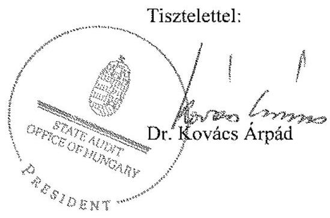

---

# Dr. Kovács Árpád úr részére 

elnök

Állami Számvevőszék

## Tisztelt Elnök Úr!

A „helyi önkormányzatok gazdálkodási rendszerének 2007. évi átfogó és egyéb szabályszerűségi ellenőrzéséről" szóló jelentésben a Miniszterelnöki Hivatalt vezető miniszternek tett javaslatban foglaltakkal egyetértek, s egyben tájékoztatom Elnök Urat, hogy a 1065/2007. (Vill. 23.) Korm. határozat 2. pontjának megfelelően a közeljövőben kerül a Kormány elé a költségvetési szervek jogszabályokban rögzített, közzétételi kötelezettségeinek, egységes, következetes és ésszerű rendjének megállapítását célzó előterjesztés. Ennek keretében kerülhet sor a Jelentésben jelzett közzétételi határidők összhangba hozására.

Elnök úr és munkatársai együttműködését ezúton is köszönöm.

Budapest, 2008. július 22.
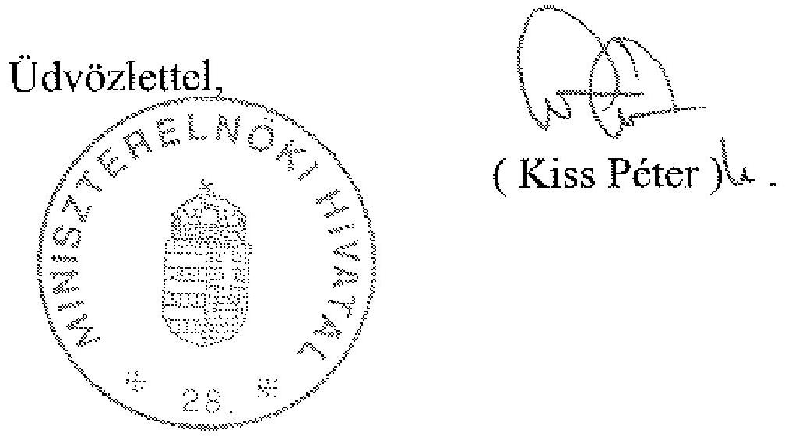
