# ÁLLAMI   SZÁMVEVŐSZÉK 

## JELENTÉS

a kiemelt - turisztikai célú - beruházások ellenőrzéséről a helyi önkormányzatoknál

---

3. Önkormányzati és Területi Ellenőrzési Igazgatóság
3.2. Szabályszerüségi és Teljesítmény Ellenőrzési Föcsoport Iktatószám: V-1025-59/2007.
Témaszám: 883
Vizsgálat-azonosító szám: V0364

# Az ellenőrzést felügyelte: 

Dr. Lóránt Zoltán
főigazgató
Az ellenőrzés végrehajtásáért felelős:
Németh Péterné
főcsoportfőnök
Az ellenőrzést vezette:
Holman Magdolna
osztályvezető főtanácsos

A számvevői jelentések feldolgozásában és a jelentés összeállításában közremüködtek:

| Iszakné Dóczé Katalin | Keszthelyi Zoltán |
| :-- | :-- |
| számvevő | számvevő tanácsos |
| Ritecz Tibor | Tóthné Salamon Ildikó |
| számvevő tanácsos | tanácsadó |

Az ellenőrzést végezték:

| Bíró Zsolt | Buús Zoltánné Hüttner | Eigner György Zoltán |
| :-- | :-- | :-- |
| számvevő | Erzsébet | számvevő |
|  | számvevő |  |
| Dr. Ernst László | Humli Tamásné | Iszakné Dóczé Katalin |
| főtanácsadó | számvevő | számvevő |
| Keszthelyi Zoltán | Kéri Péter | Kiss Rita |
| számvevő tanácsos | számvevő tanácsos | számvevő |
| Kispálné Wiedemann | Komlósiné Bogár Éva | Molnár Istvánné |
| Györgyi | számvevő tanácsos | számvevő |
| tanácsadó |  |  |
| Pálfiné Pusztai | Ritecz Tibor | Tóthné Salamon |
| Magdolna | számvevő tanácsos | Ildikó |
| számvevő |  | tanácsadó |

---

# A témához kapcsolódó eddig készített számvevőszéki jelentések: 

## címe

sorszáma
A helyi önkormányzati fürdők - kiemelten a gyógyfürdők - helyzete, fejlesztésének lehetőségei, hatása az idegenforgalomra és a turizmusra

---

# TARTALOMJEGYZÉK 

BEVEZETÉS ..... 7
I. ÖSSZEGZŐ MEGÁLLAPÍTÁSOK, KÖVETKEZTETÉSEK, JAVASLATOK ..... 10
II. RÉSZLETES MEGÁLLAPÍTÁSOK ..... 22

1. A beruházások előkészítése ..... 22
1.1. Egészségturisztikai fejlesztési célkitűzések ..... 22
1.2. A fürdő beruházási projektek előkészítettsége ..... 24
1.3. Országos jelentőségű, európai uniós támogatással megvalósuló beruházás (Pécs EKF 2010) előkészítettsége ..... 28
2. A projektek megvalósítása ..... 35
2.1. A beruházások megvalósításában résztvevőkkel kötött szerződések ..... 35
2.1.1. A résztvevők kiválasztása ..... 36
2.1.2. A szerződéses feltételek kialakítása ..... 40
2.1.3. A kivitelezői szerződésmódosítások okai, dokumentáltsága és hatása a megvalósítás folyamatára ..... 44
2.2. A beruházások megvalósításának reálfolyamatai ..... 48
2.2.1. A kivitelezési munkák megkezdése, a műszaki tervek és hatósági engedélyek rendelkezésre állása ..... 48
2.2.2. A beruházás műszaki megvalósítása, a teljesítés monitoring ..... 50
2.2.3. Műszaki tartalom változások a megvalósítás folyamatában ..... 53
2.2.4. A műszaki átadás-átvétel, használatba vétel és üzembe helyezés ..... 54
2.2.5. Az üzemeltetés műszaki tapasztalatai ..... 58
2.3. A beruházások pénzügyi folyamatai ..... 59
2.3.1. A beruházások megvalósítását befolyásoló finanszírozási tényezők, a pénzügyi forrásösszetétel alakulása ..... 59
2.3.2. A pénzügyi források rendelkezésre állása és a támogatások felhasználása ..... 64
2.3.3. A műszaki és a pénzügyi teljesítések összhangja a beruházási számlák kifizetésekor, a létrehozott vagyon aktiválása ..... 66
3. A projektek eredményei, társadalmi-gazdasági hatásai ..... 68
3.1. Az egészségturisztikai beruházások megvalósításának tervszerűsége és eredményessége ..... 68
3.2. Az egészségturisztikai létesítmények üzemeltetése ..... 74
4. A külső és belső ellenőrzések szerepe a beruházások megvalósításában ..... 83

---

# MELLÉKLETEK 

1. számú Ellenőrzött szerveztek jegyzéke melléklet
2. számú Kimutatás a benyújtott és elfogadott Széchenyi terv pályázatok adatairól melléklet
3. számú Kimutatás az ellenőrzött beruházások pénzügyi forrásösszetételének váltomelléklet zásáról
4. számú Ábrák melléklet

## FÜGGELÉKEK

1. számú Az ellenőrzött szerveztek fürdőberuházásai függelék

---

# RÖVIDÍTÉSEK JEGYZÉKE 

| Étv. | az épített környezet alakításáról és védelméről szóló 1997.   évi LXXVIII. törvény |
| :--: | :--: |
| $\mathrm{Kbt}_{1}$ | a közbeszerzésekről szóló 1995. évi XL. törvény |
| $\mathrm{Kbt}_{2}$ | a közbeszerzésekről szóló 2003. évi CXXIX. törvény |
| Ptk. | a Polgári Törvénykönyvről szóló 1959. évi IV. törvény |
| Számv. tv. | a számvitelről szóló 2000. évi C. törvény |
| Vg. tv. | a vízgazdálkodásról szóló 1995. évi LVII. törvény |
| Ámr. | az államháztartás múködési rendjéről szóló   217/1998. (XII. 30.) Korm. rendelet |
| Vhr. | az államháztartás szervezetei beszámolási és könyvveze-   tési kötelezettségének sajátosságairól szóló   249/2000. (XII. 24.) számú Korm. rendelet |
| 72/1996. (V. 22.) Korm.   rendelet | a vízgazdálkodási hatósági jogkör gyakorlásáról |
| 158/1997. (IX. 26.)   Korm. rendelet | az építési múszaki ellenőri tevékenységről. Hatályon kívül   helyezte a 290/2007. (X. 31.) Korm. rendelet 28. § (2) be-   kezdés a) pontja, hatálytalan 2008. január 1-től |
| 1/2001. (I. 5.) GM rende-   let | A Gazdasági Minisztérium vállalkozási célelóirányzataia-   nak szabályozásáról |
| 290/2007. (X. 31) Korm.   rendelet | az építőipari kivitelezési tevékenységről, az építési napló-   ról és a kivitelezési dokumentáció tartalmáról |
| 18/1996. (VI. 13.) KHVM   rendelet | a vízjogi engedélyezési eljáráshoz szükséges kérelemről és   mellékleteiről |
| 37/1996. (X. 18.) NM   rendelet | a közfürdők létesítésének és üzemeltetésének közegészség-   ügyi feltételeiről |
| 74/1999. (XII. 25.) EüM   rendelet | a természetes gyógytényezőkről |
| 51/2000. (VIII. 9.) FVM-   GM-KöViM együttes   rendelet | az építőipari kivitelezési, valamint a felelős műszaki veze-   tői tevékenység gyakorlásának részletes szakmai szabályairól és az építési naplóról |
| 14/2002. (XI. 16.)   MeHVM rendelet | A Turisztikai Célelóirányzat felhasználásának és kezelé-   sének részletes szabályairól |
| áfa | általános forgalmi adó |
| ÁNTSZ | Állami Népegészségügyi és Tisztiorvosi Szolgálat |
| ÁSZ | Állami Számvevőszék |
| DDOP | Dél-Dunántúli Operatív Program |
| EKF | Európa Kulturális Fővárosa |
| Közgyűlés | Pécs Megyei Jogú Város Önkormányzatának Közgyűlése |
| MÁK | Magyar Államkincstár |
| MFB Rt. | Magyar Fejlesztési Bank Részvénytársaság |
| MVF Kht. | Magyar Vállalkozásfejlesztési Közhasznú Társaság |
| NFÜ | Nemzeti Fejlesztési Ügynökség |
| Önkormányzat   pályázatkezelők | Pécs Megyei Jogú Város Önkormányzata   az MVF Kht., az MFB Rt., a MÁK |

---

támogató

2001- 2002. május között a Gazdasági Minisztérium, 2002. június - 2003. május között a Miniszterelnöki Hivatal, 2003. júniustól 2004. év végéig a Gazdasági és Közlekedési Minisztérium

---

# ÉRTELMEZŐ SZÓTÁR 

alapszerződés
beruházó
beruházás megvalósításában résztvevő
egészségturizmus
generálkivitelező
indikátor
járulékos költségek
megengedett egyidejú legnagyobb terhelés
megengedhető napi terhelés

A beruházás megvalósítása érdekében a megvalósításban közreműködőkkel a közbeszerzési eljárás és egyéb pályáztatás eredményeként, illetve versenyeztetés nélkül megkötött első szerződés.
Fejlesztési célkitűzéseit megvalósító szervezet, amely a beruházás megvalósításához saját forrásokat, támogatásokat, valamint egyéb visszatérítendő vagy vissza nem térítendő pénzeszközöket vesz igénybe.
Mindazok a személyek és szervezetek, akik a beruházóval kötött szerződés alapján részt vesznek a beruházás megvalósítási folyamatában. Legfontosabb résztvevők: tervező, bonyolító, műszaki ellenőr, kivitelező és a szállító.
Az egészségi állapot fenntartása, illetve a javítása érdekében történő utazás, amelybe beletartozik a gyógyturizmus, a wellness- és a fitnesz turizmus.
A beruházás kivitelezését egy szerződés alapján vállaló kivitelező, aki a különböző tevékenységeket részben saját kapacitásai, részben alvállalkozók bevonásával végzi el. Az alvállalkozók munkáját összehangolja, munkájukért a megrendelővel szemben köteles felelősséget vállalni.
Az indikátor a cél elérésének szintjét szemlélteti mennyiségi információval, a szereplők kommunikációja és a döntéshozatal elősegítse érdekében, olyan elemeket számszerúsít, amelyek egy program nyomon követése során (monitoring) vagy értékelésében relevánsnak minősülnek.
A létesítmény megvalósításához kapcsolódó, a beszerzési érték részét képező, de nem a kivitelezési folyamat során jelentkező (kivitelezési, szállítói, bonyolítói, műszaki ellenőrzési, tervezési) költségek. Ilyenek pl. a pályázati díjak, a földmérés, az ingatlanbejegyzéssel kapcsolatos költségek, a közszolgáltatók rákötési költségei, stb.
A 37/1996. (X. 18.) NM rendelet szerint a közfürdő egyidejű legnagyobb terhelése egyenlő a közfürdő területén fürdés céljából egyidejűleg tartózkodó személyek legnagyobb számával. A megengedett egyidejű legnagyobb terhelés úgy határozandó meg, hogy az egyes medencék egyidejű tényleges terhelhetőségét kell megállapítani, összegezni, majd az összeget a fürdő jellegétől függő „k" (módosító állandó) számmal szorozni. Az egyes medencék egyidejű tényleges terhelhetősége a vízforgató berendezések teljesítményéből, illetve a medencék vízfelületéből és a vízcsere mértékéből határozható meg.
A közfürdő napi terhelése egyenlő a közfürdő területére egy nap alatt - nyitástól zárásig - fürdés céljából belépő személyek számával, amelynek megengedett legnagyobb értéke a megengedhető napi terhelés.

---

mérnöki költségvetés
pótmunka
projekt (beruházási projekt)
teljesítés monitoring
tenderdokumentáció
tenderterv
többletmunka

A műszaki tervek alapján, általában építményenként technológiai szerelési munkáknál létesítményenként normagyújtemények alkalmazásával készített olyan tervirat, amely a létesítmény megvalósításához szükséges munkák felsorolását, a teljesítés múszaki és minőségi meghatározását (ez a szöveges kiírás), mennyiségét, anyagköltségét, diját tartalmazza, és mindezek alapján számított értékét határozza meg.
Az EBH2000. 201. számú elvi határozat szerint a pótmunka az utólag megrendelt, a tervmódosítás folytán felmerült, valamint a múszaki szükségességből elvégzett (többletmunkának nem minősülő) munka.
Mindazon tevékenységek összessége, amelyek egy beruházás céljának megfogalmazásához és kockázatának feltárásához, a beruházás elhatározásához, előkészítéséhez és megvalósításához szükségesek, és amelyek eredménye előre meghatározott műszaki jellemzőkkel leírható, önmagában múködőképes létesítmény.
A projekt tervezése során meghatározott célok fizikai megvalósulásának folyamatos nyomon követése, amely tartalmazza mindazon ellenőrzési technikák, eljárások összességét, amelyeknek célja, hogy a projekt létesítménye(i) térben és időben tervszerűen, a szabványelőírásoknak megfelelően, a meghatározott költségkeretek között épüljön meg.
Az 1/1996 (II. 7.) KTM rendelet ${ }^{1}$ 2. § (1) bekezdés szerint ajánlatkérési múszaki dokumentáció a jogerős, végrehajtható és érvényes építési vagy létesítési hatósági engedélyokirat és a hozzá tartozó tervek alapján készített, az építmény helyszínét, környezetét, jelenlegi, valamint kész állapotát - az ajánlatadáshoz szükséges és elégséges módon - rögzítő írásos dokumentumok és tervrajzok összessége. A 162/2004. (V. 21.) Korm. rendelet 1. számú melléklet 1. pontja szerint a dokumentáció tartalma a jogerős, végrehajtható és érvényes építési vagy létesítési hatósági engedélyokirat és a hozzá tartozó tervek alapján készített, az építmény helyszínét, környezetét, a kész, megépítendő állapotát - az ajánlatadáshoz szükséges és elégséges módon - rögzítő írásos dokumentumok és tervrajzok összessége.
A tenderdokumentáció részeként elkészített tervrajzok, múszaki leírás és költségvetés összessége.
A Ptk. 403. § (4) bekezdése szerint többletmunka a tervben szereplő, de a költségvetésből hiányzó munka, melyért átalánydíjas építési szerződés esetén a kivitelező díjazásra nem tarthat igényt.

[^0]
[^0]:    ${ }^{1}$ Hatályon kívül helyezte a $\mathrm{Kbt}_{2}$ 405. § (1) bekezdés o) pont 2004. május 1-től.

---

# JELENTÉS 

## a kiemelt - turisztikai célú - beruházások ellenőrzéséről a helyi önkormányzatoknál

## BEVEZETÉS

A 2001-2006. években az önkormányzatok évente átlagosan a kiadásaik 13\%át fordították felhalmozási célú feladatokra. Az önkormányzatoknál végzett ellenőrzések tapasztalatai szerint azonban fejlesztéseik nem átgondolt fejlesztési koncepció mentén valósultak meg $^{2}$, és nem igazodtak megfelelően a térségi területfejlesztési elképzelésekhez. A megfelelő műszaki előkészítés hiánya, a versenyeztetés előnyeinek nem kellő kihasználása, a pénzügyi feltételek bizonytalanságai, koordinációs és szervezési problémák sok esetben a beruházások kivitelezésének elhúzódását, az eredeti tervek módosítását, a költségek növekedését eredményezték, továbbá hátrányosan hatottak a megvalósítandó szolgáltatás színvonalára és az üzemeltetés költségeinek az alakulására is.

A 2005-2013. évekre vonatkozó Nemzeti Turizmusfejlesztési Stratégia szerint Magyarország „elsődleges kiemelt terméke az egészségturizmus, mely egyben a természeti adottságokra épülő kínálatfejlesztés legfontosabb eleme is". Az egészségturisztika területén végzett fejlesztések eredményeként a turizmus növekedése közvetlenül és közvetetten is (multiplikátor hatás) pozitív befolyást gyakorol a gazdaságra, a nemzeti jövedelem termelésére. E nemzetgazdasági szempontból kiemelkedő egészségturisztikai fejlesztések - a fejlesztésre fordítható források nagyságrendje miatt - az önkormányzatoknál is kiemelt jelentőségűek voltak. A Széchenyi Terv keretében a központi költségvetés egészségturisztikai beruházásokra (fürdőkre) a 2001-2004. években közel 30,9 milliárd Ft támogatást biztosított 81,5 milliárd Ft tervezett beruházási értékhez. A nyertes pályázók 38\%-a önkormányzat és állami költségvetési szervezet volt.

Az önkormányzatok felismerték a turizmusban rejlő lehetőségeket, mint az elmaradott térségek felzárkóztatásának egyik eszközét, amely kedvező hatást gyakorol a népesség megtartására, az önkormányzati adóbevételekre, a munkahelyteremtésre, hozzájárul a település és környezetének természeti, kulturális értékeinek megőrzéséhez. Az egészségturisztikai beruházások más turisztikai és gazdasági fejlesztéseket is elősegítenek, szükségessé tesznek, ezzel növelik az adott település, térség, régió versenyképességét.

A turizmus folyamatos, hatékony és kiegyensúlyozott fejlődése érdekében 2008. május hónapban beterjesztették az Országgyúlés elé a turizmusról szóló törvényjavaslatot, amelynek elsődleges célja, hogy meghatározza a turizmussal kapcsolatos állami és önkormányzati feladatokat, a turizmusban érdekelt ál-

[^0]
[^0]:    ${ }^{2}$ Függelék a Magyar Köztársaság 2005. évi költségvetése végrehajtásának helyszíni ellenőrzéséhez, Függelék a Magyar Köztársaság 2005. évi költségvetése végrehajtásának helyszíni ellenőrzéséhez.

---

lami és egyéb szervezetek együttműködésének kereteit, elősegítse a turizmus céltudatos fejlesztéséhez szükséges feltételek kialakítását. Turisztikai fejlesztésekre a Regionális Operatív Programokban is mintegy 300 milliárd Ft-ot fordíthatnak a régiók, ezen belül elsősorban turisztikai attrakciókra ${ }^{3}$, kapcsolódó szolgáltatás és desztináció-menedzsment ${ }^{4}$ fejlesztésekre.

Ezen túl a Dél-Dunántúli Operatív Program Integrált Városfejlesztési akciók kerete tartalmazza Pécs EKF 2010 támogatását. Pécs Megyei Jogú Város Önkormányzata a 2006. évben nyerte el az Európa Kulturális Fővárosa 2010 címet. A pályázat szerint 34,6 milliárd Ft fejlesztési program végrehajtása során öt kulcsprojekt megvalósítására kerül sor, amelyek Pécs Város kulturálisturisztikai infrastruktúrájának fejlesztését célozzák. A projektnek az elvárt színvonalú megvalósítása szükségessé teszi, hogy már az előkészítés szakaszában, a város költségvetésének tervezésekor és a konkrét döntések meghozatalában is prioritást kapjanak a projekt fejlesztései és időben felszínre kerüljenek azok a jelenségek, amelyek kiküszöbölése feltétlenül szükséges a beruházás sikeres kimeneteléhez.

# Az ellenőrzés célja annak értékelése volt, hogy: 

- a beruházások előkészítése, a szerződéses feltételek kialakítása, a műszaki és pénzügyi lebonyolítás hatékonyan és költségtakarékosan szolgálta-e a célkitűzések megvalósítását;
- a rendelkezésre bocsátott erőforrásokat a gazdaságosság kritériumai szerint választották-e ki, eredményesen használták-e fel a beruházás megvalósítására, figyelemmel a területfejlesztési, a régió turizmusfejlesztési, üzemeltetési és környezetvédelmi szempontokra;
- a beruházás megvalósítása során működő monitoring, a belső és külső ellenőrzések hozzájárultak-e a minőségi követelmények teljesítéséhez, az engedélyezési dokumentumokban foglaltak betartásához.

Az ellenőrzés 15 helyszínen 16 egységre terjedt ki. A fürdőfejlesztéseket önkormányzatoknál, költségvetési szerveknél, valamint önkormányzat többségi részesedésű gazdasági társaságainál ellenőriztük, a 17 egészségturisztikai beruházás 13 fürdőlétesítményhez kapcsolódott. Ebből hat helyszínen új fürdőt építettek, három helyszínen a már meglévő fürdőt bővítették, négy további esetben pedig a fejlesztés a korábban üzemelt létesítmények teljes- vagy részbeni rekonstrukciójával is együtt járt. Az ellenőrzött fürdők a hazai és a nemzetközi turizmusban betöltött szerepük alapján két csoportba sorolhatók. Nemzetközi jelentőségű fürdő található Bükön, Zalakaroson és Sárváron, míg a fennmaradó 10 fürdő országos jelentőségű, amelyek közül téli-nyári, komplex szolgálta-

[^0]
[^0]:    ${ }^{3}$ Turisztikai céllal hasznosított vonzerő. Olyan turisztikai látnivaló vagy turistalátványosság (idegenforgalmi szakszóval attrakció), hely, terület, kulturális vagy történelmi emlék, intézmény, természeti érték, műemlék, épület, műtárgy, közlekedési eszköz, fesztivál vagy esemény, amelyet rendszeresen turisták látogatnak.
    ${ }^{4}$ A desztináció menedzsment alulról építkező, partnerségen alapuló, széleskörű szakmai tagsággal rendelkező szervezetek létrejötte, melyeknek feladata a turizmus rendszerének kialakítása és működtetésének elősegítése egy adott - földrajzilag jól körülhatárolható - területen.

---

tásokat nyújtanak Pápán, Lentiben, Zalaszentgróton, Gárdonyban és Celldömölkön, szabadtéri (nyári) fürdőként üzemelt Zalaegerszegen, Barcson, Marcaliban, Sellyén és Balatonlellén. Pécs Megyei Jogú Város Önkormányzatánál az Európa Kulturális Fővárosa 2010 projekt megvalósításának előkészítését ellenőriztük.

Az ellenőrzött szervezeteket az 1. számú melléklet tartalmazza. Az ellenőrzés fürdőberuházásoknál a 2002-2006. közötti időszakra terjedt ki, de szükség szerint visszatekintett a 2000-2001. évi előzményekre, valamint figyelembe vette a helyszíni ellenőrzésig terjedő időszak folyamatait is. Pécs EKFF 2010 projekt helyszíni ellenőrzése 2008. március 6-ig tartott, de a jelentés megállapításainál a 2008. június 26 -ig megtörtént döntéseket is figyelembe vettük.

Az ellenőrzés típusa teljesítmény-ellenőrzés volt. A teljesítmény-ellenőrzéssel rendszerszemléletben tekintettük át a beruházás teljes folyamatát, amely magában foglalta a beruházás előkészítését, megvalósítását, annak hatásait, a beruházás megvalósításával létrejött létesítmények üzemeltetését. A vizsgálat során - mivel az egészségturisztikai fejlesztési támogatásokra gazdasági társaságok is pályáztak - az önkormányzatok és a gazdasági társaságok pályázatkészítési, beruházás-szervezési, üzemeltetési tevékenységének eltéréseire is figyelmet fordítottunk.

Az ellenőrzés jogalapja az Állami Számvevőszékről szóló 1989. évi XXXVIII. törvény 2. § (1), (5) és a (9) bekezdései, 16. § (1) bekezdése és 21. §-a, az államháztartásról szóló 1992. évi XXXVIII. törvény 120/A. § (1) bekezdése, 104. § (3) bekezdése, a helyi önkormányzatokról szóló 1990. évi LXV. törvény 92. § (1) bekezdése volt.

---

# I. ÖSSZEGZŐ MEGÁLLAPÍTÁSOK, KÖVETKEZTETÉSEK, JAVASLATOK 

A Széchenyi Terv turizmusfejlesztési célja - állami költségvetési források támogatásával - az ország meglévő, területileg is differenciált idegenforgalmi adottságainak komplex, összehangolt fejlesztése, a minőségi turizmus elősegítése, a vendégkör szélesítése, az egészségturisztikai lehetőségek bővítése, az idegenforgalmi időszak meghosszabbítása, a turizmus szezonális ingadozásainak mérséklése, ezáltal a vendégforgalom növelése és a lakosság egészségi állapota javulásához való hozzájárulás volt. A beruházások előkészítésének időszakában ugyanakkor olyan komplex országos turizmusfejlesztési stratégia, amely a célok megvalósítása érdekében a fejlesztéseket összehangolta volna, nem állt rendelkezésre. Területileg közel egymáshoz párhuzamos fejlesztésekre került sor, egyéni, karakterisztikus jegyek nélkül.

A helyi turizmusfejlesztési célkitűzések a képviselő-testületek által jóváhagyott - eltérő részletezettségű - gazdasági programokban, idegenforgalmi és turizmusfejlesztési programokban és koncepciókban, valamint a hosszú távú fejlesztési stratégiákban jelentek meg. Konkrét egészségturisztikai, fürdőfejlesztési elképzelésekkel csak azokon a településeken rendelkeztek, ahol a termál- és a gyógy-turizmusnak jelentős hagyományai voltak. A fejlesztési irányok prioritásainak kijelölésekor elsősorban a turisztikai vonzerő növelését tűzték ki célul, szerepet kapott emellett a helyi lakossági szükségletek kielégítése, a munkahelyteremtő beruházások elősegítése, valamint az önkormányzati bevételek növelése is. Jó lehetőségként ismerték fel, hogy a vendégforgalom emelését a vendégkör szélesítésén keresztül, új piaci szegmensek, a wellness- és fitnesz turizmus, az élményfürdőzés lehetőségeinek kialakításával lehet elérni. A települési fejlesztési irányok kijelölése során figyelembe vették a rendelkezésre álló térségi és országos fejlesztési programokat és koncepciókat, de a fejlesztések előkészítésekor a beruházók közötti koordinációra, a fürdőágazati kapacitások területi és szakmai összehangolására nem került sor.

A pályázatokban szereplő fejlesztéseket a beruházók megvalósíthatósági tanulmányokban, üzleti tervekben alapozták meg, amelyek helyzetfelméréseken, helyzetértékeléseken, gazdaságossági számításokon alapultak. Ennek során azonban elsősorban az adottságok hangsúlyozására, a lehetőségek optimista bemutatására törekedtek, és nem fordítottak figyelmet a fejlesztéseket akadályozó kockázati tényezők számbavételére, a fejlesztések társadalmi elfogadtatására. Mindössze két esetben végeztek helyzetfelmérést a lakosság, a vállalkozók és civil szervezetek igényeire, lehetőségeire vonatkozóan, továbbá kettő kivételével - nem dolgoztak ki több változatú megoldási lehetőségeket, ami elősegítette volna a megalapozottabb döntéshozatalt. A pályázati dokumentációkat a projektek közel egyötödénél a szervezet saját dolgozói állították össze, a továbbiaknál ezt részben vagy egészben külső szervezetre bízták, amelyekkel döntően pályáztatás nélkül kötöttek szerződéseket. A külső szervezetekkel kötött szerződések mindössze 31,3\%-ánál írtak elő eredményességi feltételeket a díjak kifizetéséhez. A beruházási döntéseknél elsődleges szempont a pályázati kiírási feltételeknek való megfelelés volt. A pályázati kiírások megjele-

---

nése és a pályázatok benyújtása közötti idő rövidsége miatt, a projektek több mint felénél a műszaki tartalom kidolgozottsága hiányos, a pénzügyi háttér a saját források hiánya miatt megalapozatlan volt, ami késleltette a támogatási szerződések megkötését, és kedvezőtlen hatást gyakorolt a beruházások megvalósítására is. Mindehhez hozzájárultak a pályázati rendszer hiányosságai is, mert a pályázati kiírások csak részben tartalmazták a műszaki és a pénzügyi tervezést megalapozó okmányok benyújtásának kötelezettségét.

A beruházások megvalósításában résztvevők kiválasztására a pályázati kiírásokban és a támogatási szerződésekben nem írtak elő versenyeztetési eljárást, mindössze a hatályos közbeszerzési törvények betartásának kötelezettségét fogalmazták meg. A támogatásban részesített gazdasági társaságoknak a beruházás nagyságától és a támogatás mértékétől függetlenül azonban 2002. január 1-től csak abban az esetben kellett közbeszerzési eljárást lefolytatniuk, ha a támogatás összege meghaladta a beszerzés értékének a felét és a közbeszerzési értékhatárt. Ez nem segítette a versenyeztetési rendszer erősödését, mert a beruházók a kötelező előírásokon túl - egy kivételével - nem alkalmazták a közbeszerzési törvény előírásait, így szerződéseiket sem hozták nyilvánosságra. A közbeszerzési törvények hatálya alá nem tartozó beszerzéseknél a versenyeztetés hiánya akadályozta a közpénzek takarékos és átlátható felhasználását, nem tette lehetővé a vállalkozók összeférhetetlenségének, valamint a döntéshozatal folyamatában a szakmai szempontok érvényesülésének a megállapítását.

A nyilvánosság a tervezők, valamint a bonyolítók és a műszaki ellenőrök kiválasztásánál kevésbé érvényesült, mindössze a megkötött szerződések egytizedénél alkalmaztak versenyeztetést. A szerződések nagysága a tervezésnél négy, a bonyolítást és műszaki ellenőrzésnél öt beruházás esetében közbeszerzési eljárás lefolytatását indokolta, közülük azonban a tervezésnél mindössze egy esetben tartották be az erre vonatkozó jogszabályi előírásokat, amikor tervpályázatot folytattak le, és két beruházásnál választották ki a bonyolítót közbeszerzési eljárás keretében. Azoknál a beruházásoknál, ahol a közbeszerzési eljárás lefolytatása nem volt kötelező, a tervezők, műszaki ellenőrök és bonyolítók kiválasztására egyéb versenyeztetést sem alkalmaztak, így a tervezésre, tervezői művezetésre kötött szerződések 92,3\%-át, a bonyolítást és a műszaki ellenőrzést végző szervezeteket a beruházások közel kétharmadánál versenyeztetés, ajánlatok kérése és értékelése nélkül választották ki. A kivitelezők és szállítók kiválasztásánál szélesebb körben érvényesült a nyilvánosság, e szervezeteket 86,5\%ban versenyeztetéssel - közbeszerzéssel vagy egyéb módon - választották ki. A közbeszerzési eljárás lefolytatási kötelezettségüknek a beruházók 31,1\%-ban nem tettek eleget. Mindössze egy beruházó folytatott le úgy közbeszerzési eljárást, hogy arra nem volt kötelezett. A beruházások megvalósításában résztvevők versenyeztetés nélküli kiválasztása, továbbá az egyéb versenyeztetés alkalmazásánál az értékelés és a kiválasztás szempontjai dokumentálásának hiánya nem segítette a megalapozott, nyilvános és ellenőrzött döntéshozatalt, a kiválasztás objektivitását. A versenyeztetési eljárások több mint négyötödénél az ajánlatkérők több ajánlat közül választhattak. Ennek ellenére a beruházások egyharmadánál a megkötött alapszerződések jelentősen meghaladták a támogatási pályázatokban szereplő előzetes számításokat, és már a beruházások kezdeti szakaszában költségtúllépést eredményeztek.

---

A beruházások megvalósításában résztvevôkkel kötött szerzödések - kettő kivételével - megfeleltek a jogszabályi előírásoknak, egymással összhangban voltak és párhuzamos feladatellátást nem tartalmaztak. Versenyeztetés esetén a szerződéseket döntően az ajánlati felhívások, az ajánlati dokumentációk, valamint az ajánlatok tartalmának megfelelően, írásban kötötték meg és alapvetően a támogatások elnyerésére benyújtott pályázatokban megjelölt projektek megvalósítására vonatkoztak. A tervezői, a bonyolítói és a műszaki ellenőrzési szerződések nem, vagy csak részben tartalmaztak garanciális elemeket, szerződést biztosító mellékkötelezettségeket. A tervezői szerződésekben mindössze a tervezők feladatait, a tervszolgáltatások határidejét és a fizetési feltételeket határozták meg. A műszaki ellenőrzésre kötött szerződések csak három beruházásnál tartalmaztak ösztönző feltételeket a költségtakarékos megvalósításra, az indokolatlan pótmunkák kiszűrésére, de a gyakorlatban ott sem alkalmazták. A szerződések többsége nem tartalmazta a folyamatos szakmai ellenőrzéssel kapcsolatos konkrét feladatokat, és nem határozta meg a feladatellátás dokumentálásának módját sem. A beruházók nem gondoskodtak arról, hogy a beruházások megvalósításában résztvevők szerződéseiben előírt ellenőrzési és dokumentálási módok egymással összhangban legyenek, ezért nem rendelkeztek szerződésekbe foglalt biztosítékkal arra, hogy a hibás, hiányos és késedelmes teljesítések időben ismertté váljanak és a megoldásra vonatkozó döntések feltételeit megteremtsék. A kivitelezői és a szállítói szerződésekben rögzített garanciális elemek - a megvalósítás tapasztalatai alapján - jobban szolgálták a beruházók érdekeinek védelmét, mint a tervezői, műszaki ellenőri és bonyolítói szerződések. A kivitelezői alapszerződések szerint a beruházások átlagos átfutási ideje 9,6 hónap volt, az önkormányzatok ennél rövidebb, a gazdasági társaságok hosszabb időtartamban állapodtak meg, a befejezési határidők azonban csak 41,2\%-ban voltak összhangban a támogatási szerződésekkel. A megvalósítandó munkák részletes műszaki tartalmának meghatározásakor a tervdokumentációkra, a közbeszerzési ajánlati és egyéb dokumentációkra, valamint a vállalkozók ajánlatának tartalmára hivatkoztak, ezzel eleget tettek ugyan a Ptk. vonatkozó előírásainak, azonban a hivatkozott okmányok rendszerezett, hiteles és egyértelműen azonosítható módon a beruházások 58,8\%-ánál nem álltak teljes körűen rendelkezésre. Ezzel az utólagos ellenőrzéshez a feltételeket nem biztosították.

A beruházások megvalósításának folyamatában a kivitelezésre kötött szerződések több mint kétharmadát - egy szerződést átlagosan kétszer - módosították, valamint azokhoz kapcsolódóan további szerződéseket kötöttek, emellett szerződésmódosítás nélkül, illetve annak dokumentálása hiányában is számoltak el pótmunkákat. A módosítások leggyakoribb indoka a kivitelezés folyamatában felmerült műszaki, technológiai és kivitelezési problémák voltak. A szerződésmódosítások döntően a műszaki tartalom és az ajánlati ár, valamint a rész- és befejezési határidők változtatására irányultak. A szerződésmódosítások 34,4\%-ánál nem támasztották alá megfelelően a módosítás szükségességét, illetve nem voltak teljes körűek a módosítást indokoló, annak tartalmát meghatározó okmányok. Mindemellett a műszaki tartalomváltoztatásokra irányuló szerződésmódosításokban a beruházások közel felénél a kivitelezői alapszerződésekkel össze nem hasonlítható módon határozták meg a műszaki tartalmat, de előfordult az is, hogy a műszaki tartalom módosítását nem foglalták írott szerződésbe. A műszaki tartalom változásának a kimutatását tovább nehezítette a kiviteli tervek kivitelezéssel párhuzamos készítése, ahol a

---

műszaki tartalomváltozásokat folyamatosan átvezették a tervdokumentációkon. A körülmények és tények dokumentálásának hiányában öt esetben nem volt megítélhető a támogatások eredeti céljuknak megfelelő felhasználása, és nem tette lehetővé a jogszabályokban és a szerződésekben foglalt teljesítményarányos finanszírozás ellenőrzését sem.

A szakmai-múszaki előkészítés a beruházások 41,2 \%-ánál nem volt megfelelő, mert az Étv. és a Vg. tv. előírásai ellenére, a kivitelezés megkezdésekor nem rendelkeztek érvényes jogerős építési és vízjogi létesítési engedéllyel és ennek következtében nem álltak rendelkezésre teljes körűen a hozzá tartozó egyéb műszaki dokumentációk sem. A hiányzó engedélyeket és a hozzájuk tartózó terveket döntően a kivitelezések ideje alatt folyamatos tervszolgáltatással biztosították. A kivitelezések megkezdése előtt a műszaki ellenőrök, a tervezők és a kivitelezők mindössze négy beruházásnál végezték el a rendelkezésre álló különféle tervek egyéb dokumentumokkal és az árazott költségvetéssel történő műszaki tartalmú összevetését, annak ellenére, hogy az - a kivitelezés során végrehajtott műszaki módosítások alapján - a beruházások további 47,1\%ánál indokolt lett volna. A módosított műszaki tartalommal megvalósult beruházásoknál nem értékelték - műszaki-gazdasági összehasonlításokkal - az eredeti és a módosított tervek közötti változások hatását a beruházások költségeire és időbeni megvalósítására, és a változások elfogadását üzemeltetési és fenntartási költség adatokkal sem támasztották alá. Mindezek nem tették lehetővé a végrehajtott módosítások indokainak utólagos ellenőrzését.

Az építési munkaterületek átadás-átvétele - kettő kivételével - a kivitelezői szerződések szerinti időpontokban történt. A munkaterület átadások a beruházások $94,1 \%$-ánál biztosították az időtervek szerinti végrehajtás feltételeit, egy beruházásnál azonban - a mindössze 3,3 hónapos átfutási idő miatt -, indokolt volt a kivitelezési folyamatok átütemezése. Az építési naplókban a napi jelentések döntően tartalmazták a jogszabályban előírt adatokat, információkat, az eseti bejegyzésekhez azonban a beruházások közel kétharmadánál a jogszabályban előírtak ellenére nem csatolták a bejegyzéseket megalapozó dokumentumokat, hanem azok többsége a műszaki átadás-átvételi dokumentációk részét képezte.

A műszaki ellenőrök által végzett folyamatos szakmai ellenőrzés a beruházások háromnegyed részénél nem vagy csak részben járult hozzá a jogszabályokban és a kivitelezői szerződésekben előírtaknak megfelelő megvalósításhoz. A kivitelezések előrehaladásának követése során - beruházások átadási késedelmei ellenére - nem vizsgálták, hogy mely kivitelezési tevékenységek rendelkeztek tartalékidővel, melyek átütemezésére, illetve ezekhez milyen erőforrások bevonására lett volna szükséges. A műszaki üzemeltetési problémák és a költségtúllépések ellenére nem tárták fel a kialakult késedelmek konkrét okait, felelőseit, mindez a megtett jelzések ellenére nem biztosította a beruházások időtervek szerinti megvalósítását. A műszaki ellenőrök - indokoltságuk ellenére - nem alkalmazták azokat az ellenőrzést segítő dokumentumokat, vizsgálati módszereket, eljárásokat, amelyek lehetővé tették volna a folyamatos szakmai ellenőrzés célirányosabb, gyorsabb, hatékonyabb és eredményesebb végrehajtását.

---

A megvalósítás során a beruházások közel kétharmadánál számoltak el pótmunkákat és több mint a felénél elmaradt műszaki tételeket (megtakarítások), két beruházásnál pedig a műszaki tartalmat úgy változtatták meg, hogy az nem befolyásolta a kivitelezői alapszerződésekben vállalt költségeket. A pótmunkák leggyakoribb indokai az utólag megrendelt, a tervmódosítás folytán felmerült, illetőleg a műszaki szükségességből elvégzett munkák voltak. Az elmaradt és a pótmunkák tekintetében a normakönyvek alapján történő tételes elszámolásban állapodtak meg, ami megfelelt a jogszabályi előírásoknak és egy beruházás kivételével a gyakorlatban is alkalmazták. A kivitelezői szerződések mindössze három beruházásnál tartalmaztak tartalékkeretet a pótmunkák fedezetére. Az elmaradt és a pótmunkák miatt a megkötött kivitelezői alapszerződéseket öt beruházás esetében nem módosították, a kifizetésekre szóbeli megállapodások, illetve az elmaradt és a pótmunkákat tartalmazó jegyzőkönyvek, egyéb kimutatások alapján került sor, amely nem felelt meg a Számv. tv., valamint az Ámr. előírásainak.

A múszaki átadás-átvételt mindössze a beruházások 41,2\%-ánál kezdték meg a kivitelezői szerződésekben rögzített - eredeti, illetve módosított - időpontokban. A továbbiaknál már a megkezdésnél késedelmek keletkeztek, és az átadás-átvételek is elhúzódtak. A két ellenőrzött szektorban azonos arányban fordult elő késedelmes teljesítés, de eltért egymástól a szankciók érvényesítésének gyakorlata. Ennek során a gazdasági társaságok nagyobb figyelmet fordítottak arra, hogy az átadások megfeleljenek a Ptk. szabályainak és a kivitelezői alapszerződésekben foglaltaknak, és érvényesítették a kötbér igényeiket, míg az önkormányzatok a hét közül hat esetben eltekintettek ettől, egy esetben pedig jogosulti késedelem keletkezett, ami kizárta a kötelezett egyidejú késedelmét.

A műszaki átadás-átvételekről a Ptk-ban foglaltaknak eleget téve jegyzőkönyv készült, a beruházások $47,1 \%$-ánál azonban ezek nem voltak kellően megalapozottak a dokumentációs hiányosságok miatt, illetve a hiánymentes átadásátvételt nem igazolták az ezt követő próbaüzemi, illetve hatósági eljárások. A műszaki átadás-átvételek befejezéséig a mennyiségi hiányokat pótolták, viszont minőségi hiányok a befejezett beruházások több mint kétharmadánál előfordultak. A Ptk. előírásai ellenére a minőségi hibákról készült jegyzőkönyvek háromnegyedénél nem határozták meg a hiányos teljesítések költségvetés szerinti összegét, így a beruházók nem rendelkeztek adatokkal arra, hogy a jóteljesítési garancia fedezetet nyújt-e a szükséges javításokra, és - indokoltságuk ellenére - nem éltek a hibás teljesítések miatt kötbér igénnyel. A műszaki átadás-átvételt követő használatba vételi és vízjogi üzemeltetési eljárások a beruházások $52,9 \%$-ánál elhúzódtak, ennek során a hatóságok a beruházások közel felénél rendeltek el hiánypótlásokat, kötelezéseket. A beruházók és üzemeltetőik úgy kezdték meg a létesítmények üzemeltetését, hogy a Vg. tv. és az Étv. előírásait megsértve, egy beruházásnál sem rendelkeztek jogerős vízjogi üzemeltetési engedéllyel és a beruházások több mint a felénél jogerős használatbavételi engedéllyel. A műszaki átadás-átvételi eljárások lezárását követően a beruházások $88,2 \%$-ánál merültek fel üzemeltetési problémák, ezek főként kivitelezési és tervezési hibákra voltak visszavezethetők, nem rendeltetésszerú használat nem volt. A beruházók a műszaki ellenőrök közremúködésével - egy beruházás kivételével - előkészítették és lefolytatták az utó-felülvizsgálati eljárásokat, amelyek során megállapították a javítandó minőségi hibákat, hiányokat és a javítási határidőket. A Ptk. előírásai ellenére azonban - egy beru-

---

házás kivételével - ekkor sem határozták meg a hibák költségvetés szerinti öszszegét. Az észrevételezett hibák kijavítását a meghatározott határidőben ellenőrizték, és a nem kielégítő javítások miatt 68,8\%-ban további javítási és felülvizsgálati intézkedésekről döntöttek.

A támogatások elnyerésére benyújtott pályázatokban a tervezett beruházási költségekhez átlagosan 49,1\%-os támogatást kértek. Ez arányait tekintve nem tért el jelentősen a két ellenőrzött szektorban, a tervezett költségek és az igényelt támogatás azonban a gazdasági társaságoknál átlagosan több mint a kétszerese volt az önkormányzatokénak. Az elnyert támogatások átlagosan 15,2\%-kal maradtak el az igényelttől, arányait tekintve a gazdasági társaságok sikeresebbek voltak. Négy beruházásnál az elnyert támogatások összege oly mértékben alatta maradt a pályázottnak, hogy a támogató hozzájárulásával a műszaki tartalom csökkentése és a pályázatok átdolgozása vált szükségessé. A módosítások következtében az ellenőrzött beruházások tervezett összköltsége egytizeddel csökkent, a támogatási arány $46,2 \%$ lett. Az elfogadott támogatási pályázatokban a beruházók döntően saját pénzeszközökből és hitel felvételével tervezték a beruházások megvalósítását. Emellett - részben az előkészítés, részben később a megvalósítás időszakában - a beruházások mintegy harmadrészéhez kapcsolódóan további támogatások elnyerése érdekében is nyújtottak be pályázatokat, ezek döntően sikeresek voltak, az elnyert egyéb támogatások a tervezett költségek 2,9\%-ára nyújtottak fedezetet.

A megvalósítás folyamatában a beruházások több mint háromnegyedénél megváltozott a pénzügyi forrásösszetétel, ami döntően a költségek növekedésével volt összefüggésben, de szerepe volt a pénzügyi források tervezettől eltérő rendelkezésre állásának is. A beruházási költségek tervezettet meghaladó növekedését részben pénzügyi tervezési hibák, részben pedig a különböző műszaki tartalomváltoztatások okozták, amelyek fedezetére saját pénzeszközökből, hitelből, illetve egyéb támogatásokból biztosítottak többletforrásokat. Mindezek a támogatások arányának a csökkenését jelentették a beruházási költségeken belül. A beruházásokhoz kapcsolódóan felvett hitelek a tervezettnek a másfélszeresét tették ki, ami főként az önkormányzatok nem megalapozott tervezésével volt összefüggésben. Egy önkormányzat az adósságot keletkeztető éves kötelezettségvállalás törvényi korlátját sem tartotta be. Az ellenőrzött fürdők közül nyolc közvetlenül 100\%-ban, a további öt az üzemeltető és fejlesztő gazdasági társaságokban lévő tulajdoni részesedéseik alapján döntő részben önkormányzati tulajdonban van, és ez a beruházásokat követően sem változott. Az önkormányzati (rész)tulajdonú gazdasági társaságok beruházásaihoz az önkormányzatok átadott pénzeszközöket nem nyújtottak, de egy beruházásnál törzstőke emeléssel biztosítottak pótlólagos forrásokat, és két gazdasági társaságnál a hitel és kamatai visszafizetéséhez vállaltak készfizető kezességet.

A számlák kifizetéséhez a beruházások mintegy felénél a tervezett források határidőben rendelkezésre álltak, míg a többinél különböző intézkedéseket kellett tenni a források és a költségigény összehangolása érdekében, és átmeneti vagy tartós fizetési nehézségek is jelentkeztek. Két önkormányzatnál a fizetési nehézségek tartóssá váltak és a további beruházásokra is hatást gyakoroltak, azonban a kivitelezési folyamatot nem hátráltatták. Leggyakoribb problémát a támogatások utófinanszírozása, továbbá az előzetesen felszámított áfa megelőlegezése jelentette, a megoldásukra igénybe vett likvid hitelek terhei pedig meg-

---

növelték a beruházások költségeit. A fizetési nehézségek megoldásában közreműködtek a kivitelezők is, a fizetési határidők meghosszabbításával, valamint a jóteljesítési garancia pénzbeli rendelkezésre bocsátásával, és annak beruházás finanszírozási célokra történő felhasználásával.

A beruházók - miközben az elnyert támogatások 99,7\%-át felhasználták - a célul kitűzött létesítmények megvalósításával összességében eleget tettek a támogatási szerződésekben foglalt kötelezettségüknek. Ennek során azonban öt beruházásnál eltértek a támogatási szerződés alapját képező, elfogadott pályázatban szereplő műszaki tartalomtól, négynél pedig kisebb módosításokkal valósították meg. A támogatási szerződésekben nem állapították meg számszerúen a kötelezettségeket. Nem rendelkeztek arról, hogy a pályázatokban szereplő indikátorok közül melyikkel kell mérni a kitűzött célok elérésének szintjét, és ezek közül melyikhez kötik a felhasználható támogatások összegét. Ezért nem volt számszerúsíthető a szerződésben vállalt kötelezettségek teljesítése és eredménye - és ezzel az Ámr. előírásainak betartása - azoknál a beruházásoknál, ahol a támogatás felhasználása során eltértek az elfogadott pályázatban szereplő műszaki tartalomtól. További problémát jelentett, hogy a támogató szervezetek az Ámr. előírásait figyelmen kívül hagyva, a hatósági engedélyek hiánya ellenére ítélték meg és folyósították a támogatásokat a beruházások $41,2 \%$-ánál.

A kivitelezői szerződésekben a műszaki teljesítéshez igazodóan állapodtak meg a számlák benyújtásában, és a megvalósítás során döntően ennek megfelelően jártak el. A kifizetésekhez azonban a beruházások 41,2\%-ánál nem csatolták az azok műszaki tartalmát megalapozó, hiteles kimutatásokat, illetve azokból nem volt megállapítható a tényleges teljesítés nagysága. Ennek következtében a kivitelezők által benyújtott számlák csak formailag feleltek meg a jogszabályi előírásoknak, a műszaki tartalom dokumentálási hibái miatt e beruházásoknál hiányoztak a teljesítések szakmai igazolásának tartalmi kellékei. A műszaki ellenőrök vizsgálták a kifizetések szakmai indokoltságát és a hozzá tartozó műszaki tartalmat, annak ellenére, hogy ezt az ellenőrzött időszakban hatályos jogszabályok nevesítetten nem, csak 2008-tól írták elő számukra, és az erre vonatkozó rendelkezéseket szerződéseik is csak részben tartalmazták. Az ellenőrzés nem állapított meg műszaki teljesítés nélküli kifizetést, a tényleges műszaki és pénzügyi teljesítések azonban eltértek a tervezett, ütemezett teljesítésektől a beruházások 64,7\%-ánál. Az ellenőrzött beruházások üzembe helyezését követően megtörtént a létrehozott vagyon számviteli aktiválása, melynek értéke 17,1 milliárd Ft volt, ez 12,3\%-kal meghaladta az elfogadott pályázatokban tervezettet. Az aktiválás a beruházások több mint háromnegyed részénél megfelelt a hatályos számviteli előírásoknak, hibákat az eszközök bekerülési értéke és eszközcsoportonkénti besorolása vonatkozásában állapítottunk meg. Mindemellett két önkormányzatnál nem a Vhr. előírásainak megfelelően tartották nyilván az üzemeltetésre átadott eszközöket.

A támogatások elnyerésére benyújtott pályázatokban a beruházók jó településfejlesztési, előrelépési lehetőségnek tekintették a termálvízkincs hasznosítását meglévő fürdővagyonuk bővítésével, korszerűsítésével vagy új létesítmények építésével. Az ellenőrzött 17 egészségturisztikai beruházás 13 fürdőlétesítményhez kapcsolódott, négy helyszínen a támogatások felhasználásával két-két beruházást is megvalósítottak. Az ellenőrzött időszakban 11 fürdőnél további fej-

---

lesztések, felújítások is voltak, amelyeknek értéke meghaladta a pályázott és ellenőrzött támogatásokból megvalósított beruházások bekerülési értékének az egyötödét. Szálláshely kapacitást növelő fejlesztéseket egy kivételével nem végeztek, e területen a lehetőségeket kihasználva magánbefektetők jelentek meg.

A beruházások megvalósítása nem volt tervszerű, mert a beruházók 94,1\%-ban eltértek a benyújtott és elfogadott támogatási pályázatokban megjelölt időtervektől, 52,9\%-ban a műszaki tartalomtól, 82,3\%-ban az előirányzott költségektől. A beruházók - a projektek nagyságától, bonyolultságától függően -, átlagosan 13 hónapra tervezték a megvalósítást, ami ténylegesen ennél rövidebb, átlagosan 11,7 hónapot vett igénybe, ugyanakkor a kivitelezés megkezdése és a műszaki átadás-átvétel befejezése is a beruházások több mint háromnegyedénél késedelmesen történt. A gazdasági társaságok a fürdőfejlesztésekben szerzett beruházói tapasztalataik miatt pontosabban megtervezték a beruházások megvalósításának időszükségletét, az önkormányzatokénál hoszszabb időtartamokkal számoltak, ezeket azonban a megvalósítás során be tudták tartani. Ebben a szektorban tervezték meg pontosabban a bekerülési költségeket is, a növekedés átlagosan 6,4\%-os volt az önkormányzati beruházások költségének 21,8\%-os emelkedésével szemben. Mindössze három beruházás valósult meg a tervezett bekerülési értéken vagy azon belül, a bekerülési érték emelkedése pedig a beruházások több mint felénél meghaladta az eredetileg tervezett összeg 10\%-át.

A beruházások eredményeként a fürdőlétesítmények bruttó területe 1,8szeresére, ezen belül a fedett terület több mint a kétszeresére nőtt, 79 új medence - 33 fedett és 46 szabadtéri - épült. Ezzel a medencék száma a két és félszeresére, vízfelületük közel a háromszorosára emelkedett. A megvalósított medencék száma 3,9\%-kal meghaladta, vízfelületük azonban 3,7\%-kal elmaradt a támogatási pályázatokban elfogadotthoz képest. A gazdasági társaságok beruházásai a szezonális ingadozások kiegyenlítése érdekében elsősorban a fedett létesítmények növelésére irányultak, míg az önkormányzatok nagyobb arányban a szabadtéri fürdőket fejlesztették. A fejlesztések hatására a fürdők befogadóképessége több mint a kétszeresére nőtt.

A fürdőlétesítmények az ellenőrzött időszakban egymást követően, folyamatosan jelentek meg az egészségturisztikai piacon, amelynek fizetőképes kereslete a termál- és gyógyfürdők iránti igény - azonban nem növekedett olyan mértékben, mint amilyen ütemben létrehozták az új kapacitásokat. A belépő új létesítmények hatására átrendeződtek a piaci viszonyok, ugyanakkor a fedett fürdőkapacitás közel háromnegyede, a szabadtéri fürdőkapacitás fele továbbra is három fürdőnél koncentrálódott. A beruházások üzembe helyezését követően az egy látogatóra jutó költés ${ }^{5}$ az ellenőrzött időszakban átlagosan 29,8\%-kal nőtt, ami megfelelt az elfogadott támogatási pályázatok célkitűzéseinek. Az egy látogatóra jutó költés nagysága tükrözte a fürdőkben nyújtott szolgáltatások összetettségét és színvonalát, a 2007. évben a nemzetközi jelentőségű fürdőkben 1858 Ft , az országos jelentőségű komplex fürdőkben 1036 Ft , a szabadtéri fürdőkben 729 Ft volt. A fürdők tényleges látogatószáma a 2002. évi 2351

[^0]
[^0]:    ${ }^{5}$ Egy látogató által átlagosan elköltött, és a fürdőben árbevételként megjelenő összeg.

---

ezer fơről a 2006. évre 3367 ezer före ${ }^{6}$, összességében 43,2\%-kal nőtt, ez azonban elmaradt a támogatási pályázatokban tervezettől. A nemzetközi jelentőségű fürdők látogatószáma az átlagos növekedési szint alatt alakult, míg az országos jelentőségű komplex, illetve a szabadtéri fürdők látogatószáma - az új létesítmények belépése miatt - több mint a kétszeresére emelkedett. A fürdők befogadóképességének a látogatószámot meghaladó növekedése miatt a 2002. évről a 2006. évre $40,7 \%$-ról $32,4 \%$-ra csökkent a fürdők kapacitáskihasználtsága.

A fürdők üzemi tevékenységének bevételeit meghaladó mértékben nőttek az üzemi tevékenység ráfordításai, míg a bevételek a 2002. évről a 2006. évre $86,9 \%$-kal, addig a kiadások több mint a kétszeresére növekedtek. Ezzel egyidejűleg átalakult a bevételek és a kiadások belső szerkezete is. Előbbinél az átlagot meghaladóan emelkedtek a fürdő- és az egyéb wellness szolgáltatásokból származó bevételek, utóbbinál visszaszorult az élőmunka és megnőtt az anyagjellegű ráfordítások aránya. A fürdők üzemi tevékenységének eredményessége romlott, a 13 fürdő a 2002. évben 299115 ezer Ft nyereséget, a 2006. évben 35743 ezer Ft veszteséget mutatott ki. Az összesített adatokon belül a 2002-ben üzemelt fürdők $45,5 \%-a$, 2006-ban a $61,5 \%$-a volt veszteséges. A nagyobb, komplex szolgáltatásokat nyújtó, több turisztikai célterületet kielégítő fürdők nyereségesek maradtak, ugyanakkor a szűkebb szolgáltatáskínálatú, illetve szezonálisan nyitva tartó létesítmények veszteségessé váltak.

A gazdasági társaságok maguk üzemeltették a tulajdonukban lévő fürdőket, míg az önkormányzatok költségvetési intézményeikre bízták, illetve üzemeltetési szerződések alapján saját vagy idegen tulajdonú gazdasági társaságok útján üzemeltették. Az önkormányzatok a fürdők fenntartását, üzemeltetését önként vállalt feladatként látták el, és a költségvetési intézményi keretek között történő működtetésnél vállalták a képződő veszteségek finanszírozását is. A saját tulajdonú gazdasági társaságokkal üzemeltetett fürdőknél az önkormányzatok - különböző módon és mértékben - szintén részt vállaltak a működtetés költségeinek finanszírozásában.

Az ellenőrzött fürdőfejlesztéseknél a támogatási pályázatokban kitűzött célok jelentős része teljesült, az idegenforgalmi időszak meghosszabbodott, a középés felső jövedelmű rétegek igényeinek megfelelő korszerűsítések történtek és új létesítmények jöttek létre. Bővült a létesítmények által nyújtott szolgáltatások köre, és a minőségi szolgáltatás irányába tolódott el az összetétele. A beruházók felismerték az egészségturizmus térhódítását, a minőségi szolgáltatások és a többgenerációs turisztikai célterületek irányába való elmozdulás szükségességét. A megvalósított létesítményeknél azonban a romló eredményességi mutatók miatt a befektetések 7,1 évre tervezett megtérülése - a legjövedelmezőbb négy fürdő beruházásait kivéve - lényegesen hosszabb időtartamra várható, illetve a vizsgált időszakban veszteséges fürdőknél nem prognosztizálható.

A fürdőközpontok és egészségturisztikai centrumok fejlesztései hozzájárultak a turizmus szezonális ingadozásainak mérséklődéséhez, az egy turistára jutó bevétel növeléséhez. Elősegítették a vidéki turizmus szempontjából meghatározó

[^0]
[^0]:    ${ }^{6}$ Az előzetes adatok szerint a 2007. évben 3439 ezer vendég látogatta a 13 fürdőt.

---

vonzáskörrel rendelkező településeken a termál- és gyógyfürdők, termálstrandok korszerűsítését és családbarát kialakítását, illetve töltő-ürítő rendszerú medencéinek jogszabályban előírt vízforgató berendezéssel történő ellátását is. A beruházások az új munkahelyek teremtése, az egészségturisztikai kínálat és ezáltal az idegenforgalom bővítése révén hatással voltak a befogadó települések és tágabb környezetük társadalmi-gazdasági viszonyaira, ezzel kapcsolatban azonban a beruházók, illetve a befogadó települések önkormányzatai hatásvizsgálatokat nem végeztek, így a fejlesztések közvetett és gerjesztett (multiplikátor) hatásairól információkkal nem rendelkeztek. A támogatási szerződésekben foglaltaknak eleget téve, évente elkészítették a hatásvizsgálati adatszolgáltatást, ennek értékeléséről, feldolgozásáról azonban visszajelzést nem kaptak.

Az ellenőrzött időszakban pályázatkezelési feladatokat ellátók a beruházások megkezdését megelőzően és a megvalósítás folyamatában végeztek ellenőrzéseket. A MÁK a támogatások pénzügyi lebonyolításához kapcsolódóan ellátta az igénylések tartalmi és formai ellenőrzési feladatait, és ehhez kapcsolódtak közbenső és utóellenőrzései is, melyek során jelentősebb hiányosságokat nem tártak fel. A támogatók ellenőrzései döntően a pénzügyi területekre irányultak, és annak indokoltsága ellenére nem vizsgálták a kitűzött célok műszakiszakmai tartalmának megvalósítását. Az építési és a vízügyi hatóságok ellenőrzései döntően a beruházások engedélyezési eljárásaihoz kapcsolódtak, ezen túlmenően az engedélyezési dokumentumokban foglaltak betartását helyszíni ellenőrzés keretében nem vizsgálták, mindössze három esetben történt vízügyi felügyeleti ellenőrzés. Az önkormányzatok és gazdasági társaságok egy esetben sem végeztek belső ellenőrzést a beruházás megvalósításával és a létesítmények üzemeltetésével kapcsolatban. A műszaki és szakmai ellenőrzések hiányai nem segítették elő a beruházások tervszerű és a szabályszerű megvalósítást, nem járultak hozzá elvárható mértékben a minőségi követelmények teljesítéséhez.

Pécs kétfordulós pályázat keretében nyerte el a 2006. évben az EKF 2010 címet. A kétfordulós pályázat során először előpályázatot, majd helyzetfelmérésekkel alátámasztott, öt kulcsprojekt megvalósítását magában foglaló megvalósíthatósági tanulmányt nyújtott be - 2005. márciusig - az Önkormányzat. A kulcsprojektekben szereplő beruházások megvalósítására európai uniós forrás vehető igénybe, azonban a Dél-Dunántúli Regionális Fejlesztési Ügynökség az erre vonatkozó pályázatot csak 2008. június hónapban írta ki, így a megvalósításra vonatkozó támogatási szerződéseket még nem írhatták alá. A támogatás igényléséhez az Önkormányzatnak jogszabályban előírt tartalmú, részletes megvalósíthatósági tanulmányt kellett készítenie, melyet a Közgyűlés 2007. december hónapban fogadott el. Az EKF Pécs 2010 projekt megvalósítása késésben van, a beruházások jelentős részénél az előkészítés a pályázatban tervezettnél lényegesen lassúbb, a megvalósításra mindössze 18 hónap áll rendelkezésre. Az Önkormányzat a Kormány döntését követően nem hozta meg a szükséges döntéseket az EKF kulturális stratégiájára, a fejlesztési projektek műszaki előkészítésére, illetve ezek összehangolására vonatkozóan. A program nagyságrendje és újszerűsége mellett hozzájárultak ehhez a projekt megvalósításában közreműködők gyakori szervezeti, vezetőinek személyi változásai is. Az önkormányzat az indokolt változtatásokon túl nem tudta biztosítani a szervezeti és személyi stabilitást. A cím elnyerését követően azonnal ki kellett volna dolgozni a kulturális koncepciót, majd ennek figyelembevételével elkészíttetni a pro-

---

jekt megvalósíthatósági tanulmányait. Ezzel szemben a kulturális programot csak 2008. május hónapban fogadta el a Közgyűlés, a kulturális és oktatási miniszterrel 2008. június hónapban írta alá a programok finanszírozásáról szóló módosított együttműködési megállapodást. A fejlesztéssel létrejövő létesítmények működtetése és annak finanszírozása nincs kidolgozva. Az EKF 2010 megvalósításáról szóló kormányhatározat alapján még nem határozták meg a létrejövő új létesítmények országos szintű feladatellátásával kapcsolatos támogatásokat. Az előkészítésre felhasznált források átláthatóságát az Önkormányzat, illetve az projekt megvalósításában közreműködő szervezetek nem biztosították. Várhatóan a projektek egy része nem készül el a 2010. év elejére, csak az év közepére vagy még később, ami kérdésessé teszi a kulturális programok szervezését, az EKF magas színvonalon történő lebonyolítását, a potenciális társadalmi és gazdasági hatások elérését.

A Pécs EKF 2010 projekt indulásakor nem jelölték ki azt a személyt a kormányzati oldalról, aki biztosítja a Kormányon belüli koordinációt. Ezen túlmenően nem volt megfelelő a projekt megvalósításában közreműködők érdemi, folyamatos, gyors és hatékony együttműködése. Az előkészítés hiányosságai is bizonyították, hogy ilyen nagyságrendű, összetett, kivételes koordináltságot igénylő, bonyolult finanszírozási projektre az Önkormányzat nem volt felkészülve, ezért indokolt lett volna szakértőkből álló projektszervezet létrehozása, összehangoltabb, egycsatornás és egyértelműbb kapcsolattartás az Önkormányzat és a Kormány között. A késésben lévő EKF projekt megvalósításának felgyorsítására, a megalapozott és gyors döntéshozatalra a számvevői jelentésben számos javaslatot fogalmaztunk meg az Önkormányzat számára.

A helyszíni ellenőrzés megállapításainak hasznosítása mellett javasoljuk:

# a Kormánynak: 

1. biztosítsa a támogatási feltételek szigorításával a fejlesztések fokozottabb területi és szakmai koordinációját a fizetőképes keresletet meghaladó, párhuzamos kapacitások kiépítésének elkerülése érdekében, továbbá írja elő meghatározott nagyságrendet elérő beruházások esetén a támogatott szervezetek helyzet- és piacfelmérési, hatásta-nulmány-készítési kötelezettségét a jobb előkészítés, a támogatások hatékonyabb felhasználása és a megvalósult beruházások eredményesebb működése érdekében;
2. kezdeményezze, hogy az oktatási és kulturális miniszter az érintett miniszterek bevonásával - az 1038/2006. (IV. 7.) Korm. határozat 4. pontjában foglaltaknak megfelelően - határozza meg az Európa Kulturális Fővárosa 2010 programhoz kapcsolódóan létrejövő új, országos vagy nemzetközi hatókörű kulturális intézmények országos szintű feladatellátásával kapcsolatos támogatásokat;.

## az önkormányzati miniszternek:

1. kezdeményezze a támogatást folyósító szervezeteknél, hogy a helyi önkormányzatok támogatásokból megvalósuló beruházásainál határozzák meg a megvalósításban résztvevőkkel megkötendő szerződések minimális tartalmát, amely előírja az alapvető garanciális szabályokat, a teljesítés monitoring működtetését, és módosítás esetén biz-

---

tosítja azoknak az eredetivel azonos tartalommal, szerkezetben és részletezettségben történő meghatározását;
2. kezdeményezze, hogy a támogatást nyújtó szervezetek a helyi önkormányzatoknál éljenek ellenőrzési jogukkal és a központi támogatásokkal megvalósuló beruházásoknál a szerződésekben előírt célok megvalósulását a pénzügyi ellenőrzés mellett műszaki szempontokból fokozottabban ellenőrizzék.

# az igazságügyi és rendészeti miniszternek: 

kezdeményezze a Kbt. módosítását annak érdekében, hogy az írja elő közbeszerzési eljárás lefolytatását minden, központi költségvetési támogatásból megvalósítandó beszerzések tekintetében, ha a költségvetési támogatások összege meghaladja a közbeszerzési értékhatárt.

---

# II. RÉSZLETES MEGÁLLAPÍTÁSOK 

## 1. A beruházások elóKészítéSE

### 1.1. Egészségturisztikai fejlesztési célkitűzések

Az egészségturizmus fejlesztési célkitűzéseit ${ }^{7}$ a területfejlesztésről és a területrendezésről szóló 1996. évi XXI. törvény, valamint az Országos Területfejlesztési Koncepcióról szóló 35/1998. (III. 20.) OGY határozat ${ }^{8}$ figyelembevétel készített Széchenyi terv tartalmazta. A Széchenyi terv tízéves egészségturizmus fejlesztési programjának stratégiai célja volt, hogy Magyarország - az egyedülálló termálvízkincsre alapozva - az évtized végére vezető helyet foglaljon el Európa egészségturisztikai piacán. A program egyik fejlesztési iránya a gyógyhelyeknek és gyógyfürdőknek a fejlesztése, a másik a gyógy- és termálvizekre épülő wellness- és fitneszturizmus, élményturisztikai szabadidőközpontok kialakítása volt. A programtól az ország turisztikai bevételeinek, a látogatók számának és fajlagos költésének növelését, a hazai turizmus időbeli és térbeli koncentrációjának csökkenését, a belföldi turizmus arányának növelését várták.

Az Állami Számvevőszék 2005. évben közzétett jelentésében ${ }^{9}$ megállapította, hogy a program stratégiai céljai szakmailag nem voltak kellően megalapozottak, nem határozták meg a kitűzött célok elérését szolgáló fejlesztési prioritásokat. Előkészítése során nem készült olyan országos, helyszíni vizsgálatokra épülő, teljes körű tájékozódó felmérés, amely a meglévő vízkészletek, gyógy- és termálfürdők műszaki állapotára, térségi szerepére, fejleszthetőségének jellegére irányult volna.

Az 1996. évi XXI. törvényben foglalt feladataiknak eleget téve, a megyei területfejlesztési tanácsok, a térségi és a regionális fejlesztési tanácsok programokban és koncepciókban fogalmazták meg fejlesztési elképzeléseiket. Az egyes térségek fejlesztési programjai azonban különböző időpontokban, különböző időtávra készültek és eltérő részletezettségben tartalmazták az egészségturisztikai fejlesztési célokat.

Az 1999. évben elkészített Dél-Dunántúli Régió Komplex Fejlesztési Programjában a fejleszteni kívánt fürdőlétesítményeket konkrétan nem szerepeltették, azonban célként jelölték meg a vendégforgalom növelését, a nagyobb jövedelmű vendégek megnyerését, új piaci szegmensek megjelenését, a fürdők összefogásán alapuló közös fellépést és érdekérvényesítést.

[^0]
[^0]:    ${ }^{7}$ Az ellenőrzött beruházások Széchenyi terv keretében benyújtott pályázatok és az azok alapján elnyert támogatásokból megvalósuló beruházások voltak.
    ${ }^{8}$ Hatályos 1998. március 20. és 2005. december 24. között.
    ${ }^{9} 0536$ Jelentés a helyi önkormányzati fürdők - kiemelten a gyógyfürdők - helyzete, fejlesztésének lehetőségei, hatása az idegenforgalomra és a turizmusra.

---

A 2001. évi Nyugat-Dunántúl Turisztikai Koncepciója és Fejlesztési Programban konkrét gyógy- és termálfürdő fejlesztési elképzelések is megfogalmazódtak. Nevesítve szerepelt benne a büki fedett fürdőkapacitás növelése, folyamatos korszerűsítése, vendégbaráttá tétele. Tartalmazta Celldömölkön egy Balneológiai Centrum létrehozását, Sárváron egy teljesen új gyógyfürdőkomplexum felépítését, illetve Zalaegerszegen a termálfürdő megvalósítását.

Az ellenőrzéssel érintett projektek előkészítésének időszakában rendelkezésre álló országos szinten kidolgozott fejlesztési elképzelések és az egyes regionális fejlesztési koncepciók, programok eltérő időtávra, és eltérő időpontokban készültek, eltérő részletezettséggel tartalmazták a fejleszteni kívánt egészségturisztikai területeket.

# A helyi turizmusfejlesztési elképzelések a képviselő-testületek által jóváhagyott gazdasági programokban, idegenforgalmi és turizmusfejlesztési programokban és koncepciókban, valamint a hosszú távú fejlesztési stratégiákban jelentek meg, amelyek különböző módon - általános fejlesztési irányként vagy konkrét projektként - tartalmazták az egészségturisztikai fejlesztési célokat is. Ezek kidolgozottsága, megalapozottsága azonban egyedileg jelentősen különbözött. Határozott egészségturisztikai, fürdőfejlesztési elképzelésekkel csak azokon a településeken rendelkeztek már a pályázatok kidolgozása előtt, ahol a termál- és a gyógy-turizmusnak korábban is jelentős hagyományai voltak. A többieknél konkrét fejlesztési irányokat, prioritásokat nem jelöltek ki, a különböző programok és koncepciók mindössze a településen található termálvízkincs turisztikai hasznosításának lehetőségét és pénzügyi kondícióktól függő szükségességét tartalmazták. Az önkormányzati programok és koncepciók közös vonása volt azonban, hogy mindegyik „kitörési" lehetőségnek, a településfejlesztés egyik eszközének tekintette az egészségturisztikai piac nyújtotta lehetőségek kihasználását a fürdőfejlesztések megvalósításával. Mindössze egy önkormányzat nem dolgozott ki a település fejlesztési irányainak kijelölésére programot, koncepciót, és a beruházási döntések - kellő megalapozottság nélkül -, csak a képviselő-testület egyedi határozataiban jelentek meg. 

Borgátán az önkormányzat gazdasági programmal nem rendelkezett, a tervezett egészségturisztikai beruházások előkészítésekor megbíztak egy gazdasági társaságot a település hosszú távú turisztikai koncepciójának - benne a termálvíz hasznosítási lehetőségeinek - a kidolgozásával, de az nem készült el annak ellenére, hogy a feladat elvégzéséért 8288 ezer Ft-ot fizettek ki ${ }^{10}$.

Az egészségturisztikai fejlesztési elképzelések az ellenőrzött települések 78,6\%ánál részévé váltak az önkormányzatok gazdasági programjainak, 57,1\%-ánál pedig ezeket magukba foglaló idegenforgalmi, turizmusfejlesztési programokat, koncepciókat is kidolgoztak. Az önkormányzatok 42,9\%-a hosszú távú fejlesztési stratégiával is rendelkezett, amelyekben 5-10 éves időtávra, a települések társadalmi-gazdasági viszonyait is figyelembe véve jelölték ki a fejlesztési irányokat, és határozták meg a turizmus, benne az egészségturizmus szerepét.

[^0]
[^0]:    ${ }^{10}$ Az ügyhöz kapcsolódóan az önkormányzat sérelmére elkövetett vagyon elleni és ahhoz kapcsolódó más bűncselekmények alapos gyanúja miatt nyomozás folyt, majd a helyszíni ellenőrzés lezárását követően vádemelés is történt.

---

#### Abstract

Bükön, Lentiben és Zalakaroson a fürdőket üzemeltető, fejlesztő gazdasági társaságok is rendelkeztek hosszú távú fejlesztési programokkal, koncepciókkal. A különböző programok és koncepciók a települések 61,5\%-ánál a termálvízkincs hasznosításának általános megfogalmazásán túl, határozott fürdőfejlesztési elképzeléseket is tartalmaztak.

A pályázatok kidolgozását követően a kitűzött célok adott évre vonatkozó végrehajtási feladatait az önkormányzatok költségvetési rendeleteiben, illetve a fürdők fejlesztésére és üzemeltetésére létrehozott gazdasági társaságok üzleti terveiben hagyták jóvá. Üzleti tervvel egy gazdasági társaság (Pápa) nem rendelkezett az egészségturisztikai beruházás megvalósításának éveiben.

Az önkormányzatok programjaiban és koncepcióiban, a hosszú távú fejlesztési stratégiákban és a gazdasági társaságok üzleti terveiben a fejlesztési irányok prioritásainak kijelölésekor elsősorban a turisztikai vonzerő növelését tűzték ki célul, de szerepet kapott emellett a helyi lakossági szükségletek kielégítése, a munkahelyteremtő beruházások elősegítése, valamint az önkormányzati bevételek növelése is. A vendégforgalom emelkedését a vendégkör szélesítésével tervezték elérni, amely az egészségturisztikai kínálat komplexszé tételét és a hagyományos szolgáltatások mellett az új piaci szegmensként jelentkező wellness- és fitnesz turizmus, továbbá az élményfürdőzés lehetőségeinek a kialakítását tette szükségessé.

A települési fejlesztési irányok kijelölése során figyelembe vették a rendelkezésre álló kistérségi, megyei és regionális fejlesztési programokat és koncepciókat, illetve a konkrét fürdőfejlesztések meghatározása az azokban foglaltakkal - keretjellegük miatt - nem voltak ellentétesek. A fejlesztések előkészítésekor azonban a beruházó önkormányzatok és gazdasági társaságok között nem volt koordináció, a létrejövő fürdőágazati kapacitásokat területi szinten és szakmailag sem hangolták össze. A pályázati feltételeknek minden pályázó önmagában igyekezett megfelelni, amelyhez a területen korábban meglévő egészségturisztikai kínálatot vette figyelembe, a párhuzamosan megvalósuló jelentős nagyságrendű fejlesztések hatásaira nem rendelkezett információkkal.

# 1.2. A fürdő beruházási projektek előkészítettsége 

A pályázati felhívások alapján a beruházók a konkrét egészségturisztikai fejlesztési tervek megalapozására megvalósíthatósági tanulmányokat, a várható hatások bemutatására üzleti terveket készítettek, melyek a pályázati dokumentáció részét képezték.

A megvalósíthatósági tanulmányok és az üzleti tervek kidolgozása helyzetfelméréseken, helyzetértékeléseken, gazdaságossági számításokon alapult, ennek során - részben SWOT analízis készítésével - a tervezett fejlesztések hatásai mellett vizsgálták a turisztikai kapcsolódási lehetőségeket, a település és környezete feltételrendszerét. Elemezték a műszaki megoldási lehetőségeket, azok pénzügyi vonzatait, valamint a vendégforgalom prognosztizálásán keresztül a kiszámították a múködés várható bevételeit és kiadásait, a beruházások megtérülési idejét. Jellemző volt ennek során az adottságok hangsúlyozása, a lehetőségek optimista bemutatása, azonban nem fordítottak figyel-

---

# met a fejlesztéseket akadályozó kockázati tényezők számbavételére és a múködtetést befolyásoló esetleges negatív hatások feltárására. 

A fejlesztések felénél az előkészítés során formailag elkészítették a SWOT analízist, az ott jelzett gyengeségeket és veszélyeket azonban a számítások elvégzésekor figyelmen kívül hagyták. Előfordult, hogy a kistérségi, regionális fejlesztési koncepciók részét képező elemzéseket vették át némi aktualizálást követően a konkrét helyi fejlesztési programokba, vagy az elvégzett hatásvizsgálatokat a tervezett múszaki tartalom szükítése során változatlanul építették be.

A fürdőfejlesztési elképzelések kialakításakor nem fordítottak kellő figyelmet a fejlesztések társadalmi elfogadtatására, a megvalósíthatósági tanulmányok és üzleti tervek kidolgozásakor mindössze két esetben (Barcs, Sárvár) végeztek helyzetfelméréseket a településen és térségi szinten a lakosság, a vállalkozók és civil szervezetek igényeire, lehetőségeire vonatkozóan. A beruházások helyszíneinek mindössze 28,6\%-án volt közmeghallgatás a fejlesztésekhez kapcsolódóan az előkészítés időszakában.

A fürdőfejlesztések műszaki tartalmának kialakításakor több változatú megoldási lehetőségeket csak két beruházásnál (Sárvár és Zalakaros) mutattak be, a többieknél döntési alternatívákat nem kínáltak fel, annak ellenére, hogy a változatok értékelése elősegíthette volna a megalapozottabb döntéshozatalt.

A beruházók a tervkoncepciók kidolgozásakor, valamint a műszaki tervek elkészítésekor és átdolgozásakor határozták meg a fejlesztések műszaki-gazdasági szempontjait, amelyek közül a magas színvonalú fürdőszolgáltatások biztosítása a beruházások felénél, a legalacsonyabb beruházási költség, illetve a hosszabb távon költségtakarékos üzemeltetésre törekvés a 20-20\%-ánál, míg egyéb szempontok a 10\%-ánál szerepeltek elsődleges célként.

Az ellenőrzött 14 szervezet összesen 20 beruházás megvalósítása érdekében nyújtott be pályázatot, ebből 11 beruházás a 2001. évi, négy a 2002. évi és öt a 2003. évi pályázati kiírások alapján.

A pályázati dokumentációkat négy projektnél a pályázók saját dolgozói állították össze, a továbbiaknál azonban a feladatokkal részben vagy egészben külső szervezeteket bíztak meg. Utóbbiak felénél a polgármesteri hivatalok pályázatfigyeléssel foglalkozó dolgozói és a fürdőüzemeltetést végző gazdasági társaságok, költségvetési szervek szakemberei koordinálták a pályázatok összeállítását, és csak a speciális szakértelmet kívánó munkákkal bíztak meg külső szervezeteket. Nyolc projektnél a pályázatkészítést teljes egészében külső szervezetek végezték, amelyekkel - kettő kivételével (Celldömölk és Pápa) - pályáztatás nélkül kötöttek szerződéseket. A kiválasztásnál elsősorban a referenciákat vették figyelembe, az egyéb szempontok (vállalási ár, teljesítési határidő, szerződéses feltételek) kisebb szerepet játszottak. A szerződések tartalmazták a pályázatok elkészítésében részt vevő szervezetek feladatait, a kapcsolattartás és az információk átadásának módját, kevésbé fordítottak azonban figyelmet a pályázók érdekeit szolgáló garanciális elemek meghatározására. A megkötött szerződések 31,3\%-ában a díjak kifizetését a pályázatok eredményéhez kötötték, illetve a szerződött összeget az elnyert támogatás függvényében határozták meg.

---

Zalakaroson és Zalaegerszegen a pályázatkészítésben részt vevő külső szervezeteket a vállalási díj egy része csak sikeres pályázat esetén illette meg, Barcson, Sellyén és Zalaszentgróton pedig a pályázatkészítési díj mellett a pályázaton elnyert összeg 0,45-0,9\%-ának kifizetésében állapodtak meg. Az ún. sikerdíj összegét Barcson - indoklás nélkül - nem fizették ki, a továbbiaknál az elnyert támogatások $0,2-1 \%$-át tették ki.

A 20 összeállított és benyújtott pályázatra a pályázók összesen 87501 ezer Ft-ot fordítottak, amely tartalmazta a megvalósíthatósági tanulmányok, üzleti tervek és tervdokumentációk elkészítésének költségét, valamint a pályázati díjakat. Ez a tervezett beruházási költségek 0,6\%-át tette ki.

A pályázatok benyújtásáról az arra jogosult képviselő-testületek, illetve a gazdasági társaságok taggyúlése, közgyúlése döntött. A gazdasági társaságok által benyújtott pályázatokat a tulajdonos önkormányzatok képviselő-testületei megtárgyalták és határozataikkal támogatták. A döntéshozatalok megalapozó dokumentumai a pályázati dokumentációk, valamint a rendelkezésre álló helyzetfelmérések, gazdaságossági számítások voltak, amelyek alapján a kidolgozott fejlesztési terveket a döntéshozó testületek változtatás nélkül jóváhagyták. A döntéshozatal folyamatában a pályázatok módosítására mindössze egy esetben, a pályázati kiírás feltételeinek való megfelelés érdekében került sor.

Sárváron az igényelt támogatás összege meghaladta a pályázati kiírás szerinti egymilliárd Ft-os felső határt, ezért a pályázatkezelő felhívását követően a beruházást két ütemre bontották és két pályázatot nyújtottak be.

A beruházási döntéseknél az elsődleges szempont a pályázati kiírási feltételeinek való megfelelés volt, és a pályázók a pályázatok mielőbbi benyújtására törekedtek. A pályázati kiírások megjelenése és a pályázatok benyújtása közötti idő rövidsége - átlag 4,5 hónap - miatt, a projektek 55\%-ánál a múszaki tartalom kidolgozottsága hiányos, a pénzügyi háttér a saját források hiánya miatt megalapozatlan volt. Mindezek később problémákat okoztak a támogatási szerződések megkötésekor, illetve a megvalósítás folyamatában. A pályázati kiírások értelmében elegendő volt elvi építési engedélyt, valamint vízjogi létesítési engedély helyett a meglévő létesítmények vízjogi üzemeltetési engedélyét benyújtani, ami nem tette szükségessé a műszaki tartalom előzetes pontos meghatározását, az csak a későbbi engedélyezési eljárások lefolytatásakor történt meg. Műszaki tartalom részletes kidolgozottsága hiányában a költségbecslések is pontatlanok voltak.

A pályázó önkormányzatoknak (költségvetési szervezeteknek) a vállalt saját források tekintetében csak arról kellett nyilatkozni, hogy a pályázatban szereplő cél finanszírozása biztosított, vagyis az éves költségvetésekben tervezésre kerül. A képviselő-testületek határozataikban vállalták a saját források biztosítását, a nyilatkozatok gazdasági megalapozottsága hét pályázat esetében nem volt biztosított, mert nem állt rendelkezésükre a saját források összege ${ }^{11}$.

[^0]
[^0]:    ${ }^{11}$ 2002. november 16-tól a 14/2002. (XI. 16.) MeHVM rendelet 10. § (1) bekezdés d) pontja szerint a saját forrásokról számlavezető vagy hitelintézet nyilatkozata kellett.

---

A benyújtott pályázatok 85\%-ánál hiánypótlási eljárás volt szükséges, mert azok nem feleltek meg teljes körűen a pályázati felhívásokban előírtaknak. A pályázók határidőben teljesítették a hiánypótlásokat és a pályázatkezelők formai és tartalmi szempontból befogadták a pályázatokat annak ellenére, hogy közülük egy a pályázati kiírásnak, nyolc pedig a jogszabályi előírásoknak csak részben felelt meg.

Gárdony önkormányzatának pályázata nem tartalmazta a pályázati kiírásban előírt elvi építési engedélyt, amelynek hiányát azonban a pályázatkezelő nem kifogásolta. Az önkormányzat az elvi építési engedély helyett a gyógyfürdő szabályozási tervét csatolta.

Hét fürdőfejlesztési pályázatot (Balatonlelle két beruházás, Celldömölk II. ütem, Marcali, Zalaegerszeg, Zalaszentgrót, Pápa) a vízi létesítmények építésére vonatkozó engedély nélkül fogadtak be és részesítettek támogatásban. A 2001. évi pályázati feltételekben vízjogi létesítési engedély nem szerepelt, a későbbiek a vízjogi létesítési engedély helyett a meglévő létesítmények vízjogi üzemeltetési engedélye is benyújtható volt, az akkor hatályos Ámr. 81. § (3) bekezdésének és az Ámr. 84. § (1) bekezdés b) pontjának előírásai ellenére ${ }^{12}$.

Barcs 2003. évben benyújtott pályázatánál a pályázatkezelő nem írt elő hiánypótlást annak ellenére, hogy az önkormányzat a saját források igazolására a 14/2002. (XI. 16.) MeHVM rendelet 10. § (1) bekezdés d) pontjában előírt számlavezető banki nyilatkozat helyett a képviselő-testület határozatát csatolta.

Az is előfordult, hogy az 1/2001. (I. 5.) GM rendelet 8. § (4) bekezdése ${ }^{13}$ és a pályázati útmutató előírásai ellenére több alkalommal került sor hiánypótlás előírására és annak teljesítésére. A hiánypótlási eljárásokat követően a pályázatkezelők értesítették a pályázókat a befogadásról. A pályázatok elbírálásáról a pályázók átlagosan a benyújtástól számított három hónap elteltével kaptak értesítést. A szerződéskötés feltételeit a 20 ellenőrzött pályázat közül 19 esetben teljesítették a pályázók. A támogatási szerződéseket a pályázatok benyújtását követő 4-17 hónap, az értesítéstől számítva átlagosan 5,5 hónap elteltével kötötték meg, 17,6\%-ánál pedig elhúzódott és az értesítéstől a szerződéskötésig eltelt idő elérte az egy évet. Egy önkormányzat három nyertes pályázata közül egynél a szerződéskötési feltételeket nem tudta teljesíteni, másik két pályázatánál pedig - a műszaki és a pénzügyi előkészítés hiányosságai miatt - a támogatásokról felhasználás nélkül lemondott.

Borgátán az önkormányzat a benyújtott három pályázat alapján a termál centrum kialakítására 100000 ezer Ft-ot, a rekreációs egészségturisztikai fejlesztéshez 50000 ezer Ft-ot, vízforgató berendezéshez 5000 ezer Ft-ot nyert el. A fejlesztések engedélyezési eljárása múszaki előkészítési hiányosságok miatt elhúzódott, emellett a vállalt saját források sem álltak rendelkezésre. Az önkormányzat

[^0]
[^0]:    ${ }^{12}$ A pályázatok benyújtásának időpontjában hatályos Ámr. 81. § (3) bekezdése szerint a szükséges hatósági engedélyek hiányában állami pénzeszközökből támogatás nem ítélhető meg és nem folyósítható, az Ámr. 84. § (1) bekezdés b) pontja értelmében pedig a fejlesztési támogatások esetében a pályázathoz csatolandó a pályázat tartalmától függően jogerős hatósági engedély.
    ${ }^{13}$ Hatályon kívül helyezte a 19/2004. (II. 27.) GKM rendelet 34. § (3) bekezdés a) pontja 2004. március 1-től.

---

az első két támogatásról a szerződéskötést követően lemondott, a vízforgatónál pedig a szerződés megkötése meghiúsult, mert nem tudta teljesíteni a feltételeket.

# 1.3. Országos jelentőségü, európai uniós támogatással megvalósuló beruházás (Pécs EKF 2010) előkészítettsége 

Az Európa Kulturális Fővárosa cím odaítélés kétfordulós pályázat keretében történt. A nemzetközi zsűri által kétkörös pályázaton a nevezés jogát elnyert Pécs városát a Kormány javaslatára az Európa Tanács választotta 2010 Kulturális Fővárosává Essen és Isztambul mellett. Az EKF cím elnyerésére az Önkormányzat előpályázatát 2004. december 31-ig nyújtotta be. A második fordulóra - a NKÖM 2005. március 21-én meghirdetett pályázata alapján Pécs város mellett Budapest, Debrecen, Eger, Győr, Miskolc és Sopron város kapott meghívást. Ezt követően bízta meg a Közgyűlés az Európa Centrum Kht-t az EKF pályázat második szakaszában készítendő pályázati anyag kidolgozásával foglalkozó operatív munkaszervezet kialakításával és müködtetésével. A második forduló keretében beadott pályázatban ${ }^{14}$, az egyes beruházások és fejlesztések megvalósíthatóságára vonatkozó tanulmányok külön-külön öt kulcsprojekt megvalósítását tartalmazták. A pályázat Pécs EKF 2010 program pénzügyi tervét is magában foglalta, amelyben a fejlesztésekre összesen 34,6 milliárd Ft-ot, a kulturális programok működési kiadásaira 9,5 milliárd Ft-ot irányoztak elő. Az öt kulcsprojekt fejlesztési elképzelésének megalapozására helyzetfelméréseket készítettek, melyet a megvalósíthatósági tanulmány tartalmazott. A második forduló pályázatának benyújtásakor az Önkormányzat tervpályázati-, engedélyezési tervekkel, egyéb tervdokumentációkkal még nem rendelkezett. Az Önkormányzat az EKF címre benyújtott pályázata mindkét fordulóban megfelelt a jogszabályokban és a pályázati felhívásokban előírt tartalmi és formai követelményeknek. Pécs Megyei Jogú Város Önkormányzata a Magyar Köztársaság Kormánya által a 2005. évben lefolytatott kétfordulós pályázatot megnyerve, a 2006. évben hivatalosan is elnyerte az Európa Tanács és az Európai Parlament együttes határozata alapján az Európa Kulturális Fővárosa 2010 címet, melynek köszönhetően öt kulcsprojekt:

- a Dél-dunántúli Regionális Könyvtár és Tudásközpont (4,9 milliárd Ft)
- a Pécsi Konferencia és Koncert Központ (7,9 milliárd Ft)
- a Nagy Kiállítótér (3,5 milliárd Ft)
- a Közterek és Parkok újjáélesztése (7,4 milliárd Ft)
- a Zsolnay Kulturális negyed (10,9 milliárd Ft) megvalósítására nyílt lehetősége.
A kulcsprojektekben szereplő beruházások megvalósításához az Új Magyarország Fejlesztési Terv részeként a DDOP keretében nyílik lehetőség európai forrás elnyerésére.

A Pécs EKF 2010 öt kulcsprojektje jellegénél fogva a DDOP 4.1 prioritási tengelyének „Integrált Városfejlesztési akciók támogatása" című terület részét képezik.

[^0]
[^0]:    ${ }^{14}$ A pályázatot a Közgyűlés a 399/2005. (VII. 14.) számú határozatával egyhangúlag fogadta el.

---

A DDOP a Pécs EKF 2010 elemeit nem mint beruházást, hanem mint funkciót nevesíti: „Pécs és a régió vonzerejének javitása a gazdaságilag hasznositható kulturális vonzerők fejlesztésével az Európa Kulturális Főváros 2010 programhoz kapcsolódóan". Ezzel alternatív megoldásokra is lehetőség nyílik, amennyiben a kulcsprojektek részletes kidolgozása ennek szükségességét igazolja. A végső tartalmat a tanácsadói konzorciumi tanulmányok, a Kormány akciótervről szóló döntése, illetve az Irányító Hatóság határozzák meg.

A 16/2006. (XII. 28.) MeHVM-PM együttes rendeletben 11. § (2) bekezdés a) pontjában előírt - a reális értékelést elősegítő - részletes megvalósíthatósági tanulmányokat az Önkormányzat Közgyülése 2007. december 13-i ülésén tárgyalta meg és választotta ki a megfelelő alternatívát.

Az EKF projektek múszaki előkészítése a tervpályázatok kiírásával kezdődött. A tervpályázati bíráló bizottság tagjainak szakmai összetételénél a tervpályázati eljárások részletes szabályairól szóló 137/2004. (IV. 29.) Korm. rendelet 10. § (3)-(4) bekezdésében foglaltakat szempontokat és a Magyar Építész Kamara tervpályázati szabályzatának ${ }^{15}$ előírásait figyelembe vették, azonban a tagokat alkalmanként választották meg. A bíráló bizottság tagjai díjazására felhasználható költségvetési forrás meghatározásánál, a tagokat megillető díjak differenciálásánál a 137/2004. (IV. 29.) Korm. rendelet 21. § (6)-(7) bekezdésében foglaltakat vették figyelembe, azonban a tagok díjazásának konkrét mértékét az Önkormányzat nem szabályozta. A nemzetközi tervpályázatokat 2006. decembere és 2007. júliusa között bonyolították le a Pécsi Konferencia és Koncertközpont, a Pécsi Belváros Észak-Déli tengelye építészeti ötletpályázat, a Dél-Dunántúli Regionális Könyvtár és Tudásközpont és a Nagy Kiállítótér esetében. A projektek tervpályázati kiírásainak műszaki tartalma - a Nagy Kiállítótér kivételével - összességében megegyezett a beadott EKF Pécs 2010 pályázatban, és a hozzá tartozó megvalósíthatósági tanulmányokban meghatározott tartalommal.

A projektekkel kapcsolatban a 2008. év elején még számos jelentős nyitott kérdés volt. Az Önkormányzati és Területfejlesztési Minisztérium javasolta a Nagy Kiállítótér helyszínének megváltoztatását, annak Zsolnay Kulturális Negyedben való megvalósítását. Az ebből származó megtakarítás - a 2008. március 6-i közgyűlési előterjesztés szerint - 1950 millió Ft. Az elkészült megvalósíthatósági tanulmány alapján, az EKF pályázatban szereplőhöz képest kisebb alapterülettel a Pécsi Konferencia- és Koncertközpontnál 3058 millió Ft, a Zsolnay Kulturális negyednél 647 millió Ft, a Dél-Dunántúli Regionális Könyvtár- és Tudásközpontnál 35 millió Ft költségmegtakarítás érhető el. Az 5690 millió Ft felszabaduló forrást az Önkormányzat a kulcsprojektekre, illetve azon felüli új projektelemekre veheti igénybe. Felhasználására a Közgyűlés a 2008. március 6-i ülésén a 79/2008. (III. 06.) számú határozatában hozta meg döntését. A közgyűlési döntés szerint a közterek és parkok újjáélesztése projektre új területek bevonásával és a forráshiány miatt az eredeti pályázatban szereplő, de a kimaradt területek megújítása révén a korábban tervezettnél 1255 millió Ft-tal többet fordítanak. Az új projektelemek közé került a Pécs-Kelet szo-

[^0]
[^0]:    ${ }^{15}$ A Magyar Építész Kamara Küldöttgyűlése jóváhagyásával 2005. március 30-ától hatályos.

---

ciális városrehabilitációja 1500 millió Ft-tal, a Török kori emlékek felújítása ${ }^{16}$ 500 millió Ft-tal, a „Pécsi színházak felújítása ${ }^{17 \text { " }} 1100$ millió Ft-tal, a Tudásközpont közlekedési csomópont kiépítése 500 millió Ft-tal. Az egyes kulcsprojektek többletköltségei, valamint az új projektelemek a költségmegtakarításból felszabaduló forrásból összesen 4855 millió Ft-ot kötnek le. Az NFÜ-vel egyeztetett funkcióváltozások (növekedések), ennek következtében a műszaki tartalom módosítások miatt a megtakarítások összege azonban várhatóan csökkenni fog.

A fejlesztési projektek megvalósítása késésben van. Az egyes projektek párhuzamos kivitelezése mellett is a projektek megvalósítása feszített, nagyon feszített, valamint extrém módon feszített határidejúnek tekinthető. Az egyes projektek eltérő tervszintű előkészítettsége miatt a tanácsadói konzorcium ${ }^{18}$ az elkészített megvalósíthatósági tanulmányaiban a projekteket két csoportba sorolta, és a már tervpályázatokkal rendelkező projektek 2009. december végi befejezési határidejét megvalósíthatónak tartotta, míg a többi projekt várható befejezési határidejét 2010. év I-III. negyedévre prognosztizálta. A projektek jelenleg prognosztizálható várható befejezési határidői: a Pécsi Konferencia- és Koncertközpont és a Dél-dunántúli Regionális Könyvtár és Tudásközpont 2010 elejére készülhet el. A Zsolnay Kulturális Negyed fejlesztési projekt megvalósításnak ideje a feladat összetettsége miatt nehezen prognosztizálható, valószínűsíthető, hogy annak egyes részei csak 2010. közepére vagy még később készülnek el. A közterek és parkok újjáélesztése projekt I. ütemébe tartozó elemek (Széchenyi tér, Uránváros főtere, Tettye I. ütem, Megyeri városrész központ, Rókus sétány, Diana tér, Köztársaság tér, Kórház tér) 2009 év végi befejezése várható. A projekt II. ütemébe tartatozó elemek (Indóház tér és környéke, Pécs-Kelet, EKF városrész központ és Tettye II. ütem) várhatóan a 2010. év elejére készülnek el.

A közigazgatási, hatósági eljárások gyors, szakszerú lefolytatása is befolyásolja a program teljesülését, a fejlesztési projektek megvalósítását. A Dél-dunántúli Regionális Államigazgatási Kollégium EKF Szakértői Bizottságának 2008. április 9-i ülésén elhangzott, hogy a Kormány az EKF beruházásokat kiemeltté nyilvánította. Ennek köszönhetően a jelentős késések csökkenthetőek, hiszen az engedélyezési eljárások két hónap helyett két hét alatt is lefolytathatók úgy, hogy közben a hatósági eljárások szakmaisága nem sérül. Elkészült az EKF egyik legjelentősebb kulcsprojektjének, a Pécsi Konferencia- és Koncertközpontnak az engedélyezési tervdokumentációja, ezzel május 21-én megkezdődhetett e projekt gyorsított engedélyezési eljárása. A projektek

[^0]
[^0]:    ${ }^{16}$ Jakováli Hasszán dzsámi felújítása, Memi pasa fürdő állagmegóvása 300 millió Ft, Középkori Egyetem 200 millió Ft.
    ${ }^{17}$ Pécsi Nemzeti Színház technikai, építészeti felújítása 800 millió Ft, a Harmadik Színház és környezetének rehabilitációja 250 millió Ft, a Káptalan utcai szabadtéri színpad felújítása 50 millió Ft.
    ${ }^{18}$ A 16/2006. (XII. 28.) MeHVM-PM együttes rendelet 11. § (2) bekezdésében előírt megvalósíthatósági tanulmányok elkészítésére az Önkormányzat 2007. július hónapban szakértőkből álló konzorciummal kötött szerződést. A vállalkozói szerződés tartalmazta az öt kulcsprojekt EU-s források lehívásához szükséges támogatási kérelem összeállítását, valamint az ezzel összefüggő tanácsadói szolgáltatás ellátását is.

---

megvalósításának gyorsításában jelentős szerepet játszhat a közbeszerzési eljárások jó előkészítése, melynek eredményeképp elmaradhatnak a jogorvoslati eljárások.

Az EKF 2010 Program beruházási (fejlesztési) forrásainak biztosításáról és a program megvalósításával kapcsolatos feladatokról 2006. április 6-án szerződést kötött a Nemzeti Kulturális Örökség Minisztériuma, a Belügyminisztérium, az Európai ügyekért felelős tárca nélküli miniszter, a Pénzügyminisztérium, valamint az Önkormányzat. A szerződésben foglaltak szerint a szerződő miniszterek vállalják, hogy az Európai Unió strukturális alapjaiból odaítélhető források tervezésénél a 2007-2009-ig tartó időszakra 31,14 milliárd Ft összeget, (ideértve a projekt összköltségének 5,0\%-át kitevő állami saját forrás kiegészítést is) irányoznak elő az Önkormányzat számára az EKF pályázatban meghatározott, 34,6 milliárd összköltségű beruházás támogatásának biztosítása céljából. A nagyprojekt EU általi befogadásának elősegítése érdekében az Európai ügyekért felelős tárca nélküli miniszter utólagos elszámolással ezen felül legfeljebb 1,0 milliárd Ft előkészítési támogatást biztosít a tervezési feladatok támogatására. A Kormány által elfogadott DDOP akcióterve - az EKF pályázatban meghatározott fejlesztési költségekkel egyezően - a Pécs EKF 2010 kiemelt projektet 31,14 milliárd Ft támogatási összeggel és 34,6 milliárd Ft összköltséggel tartalmazza. Így az öt projekt vonatkozásában az uniós támogatással elismert és elszámolható költségek alapján számított beruházási összköltség 34,60 milliárd Ft, melyből az EU alapokból igényelt forrás összege 29,41 milliárd Ft, a hazai társfinanszírozás keretében biztosított összeg 1,73 milliárd Ft, a pályázó összes saját forrása 3,46 milliárd Ft, melynek fedezetét hitelből kívánja megteremteni.

A beruházások előkészítésére az NFÜ-vel kötött szerződés szerint 1,1 milliárd Ft-ot fordíthat az Önkormányzat, melynek 90\%-át az NFÜ finanszírozza.

A Közgyűlés a 191/2007. (IV. 20.) számú határozatával döntött arról, hogy a projektek megvalósítási költségeinek megelőlegezésére az Önkormányzat állami kezességvállalással 10 milliárd Ft fejlesztési hitelt vesz fel az EIB-től, majd ezt követően a 376/2007. (VII. 31.) számú határozatával döntött az EIB-től felvenni tervezett hitellel finanszírozandó projektekről. E szerint a hitelkeretet az EKF kulcsprojektjei uniós támogatásának igénybevételéhez szükséges önkormányzati önerő biztosításához, a Pécs-Pogányi Repülőtér kifutópályájának meghosszabbításához ${ }^{19}$, a Sopianae tervhez ${ }^{20}$ és a Világörökség II. programhoz ${ }^{21}$ kívánja felhasználni.

[^0]
[^0]:    ${ }^{19}$ Az EKF program kapcsán a város idegenforgalmának jelentős növekedése, a gazdaság és a kulturális élet fejlődése várható, ezért a repülőtér fejlesztése kiemelt fontosságot élvez.
    ${ }^{20}$ A Sopianae terv keretében az Önkormányzat az EKF programhoz kapcsolódóan belső úthálózata útburkolatának felújítását tervezi.
    ${ }^{21}$ Az UNESCO Világörökség helyszínhez kapcsolódó fejlesztés keretében a város elsősorban a török kori emlékeket kívánja feltárni, az emlékek, azok helyszínei és környezete rehabilitációjának végrehajtásával együtt.

---

Az EKF fejlesztési projektek támogatási szerződéseinek aláírására még nem került sor. A Dél-dunántúli Regionális Fejlesztési Ügynökség csak 2008 június hónapban írta ki a pályázatot ${ }^{22}$ és az NFÜ ekkor adta ki a tervezési útmutatót is, amely a beadásra kerülő EKF fejlesztési projektek pályázatainak pontos tartalmi és formai követelményeit írja elő. Az Önkormányzat sem tudta még teljesíteni a kulcsprojektek támogatási kérelmeinek benyújtására vonatkozó követelményeket (engedélyezési szintű műszaki tervdokumentáció, a költségvetési összesítő táblázattal, környezeti hatástanulmány, integrált városfejlesztési stratégia, kulturális stratégia). A kulcsprojektek közül a legkedvezőbb helyzetben a Pécsi Konferencia- és Koncertközpont van, amely tekintetében megkezdődött a gyorsított engedélyezési eljárás. A helyszíni ellenőrzést lezárását következően készült el a Dél-dunántúli Regionális Könyvtár és Tudásközpont és a Közterek és parkok projekten belül a Tettye I. ütem és az Uránváros főterének engedélyezési tervdokumentációja. 2008. június 26-án a Közgyűlés a DDOP 4.1.3-ra vonatkozó pályázati felhívás alapján - döntött a Pécsi Konfe-rencia- és Koncertközpont, a Dél-dunántúli Regionális Könyvtár és Tudásközpont, valamint a Közterek és parkok újjáélesztése I. projekt pályázatának benyújtásáról.

Az Önkormányzat az EKF pályázat előkészítésére, elkészítésére, illetve a projekt megvalósítására - a külső közreműködő szervezeteken keresztül - a 2004. évben 39600 ezer Ft-ot, a 2005. évben 138298 ezer Ft-ot, a 2006. évben 126281 ezer Ft-ot, a 2007. évben 423709 ezer Ft-ot, a négy év alatt összesen 727888 ezer Ft-ot használt fel. A 2008. évben 555000 ezer Ft felhasználását tervezik. E kiadások tartalmazzák azokat a projekt műszaki előkészítési költségeket (tervpályázatok, tervezés, tanácsadás díjai), amelyeknek 90\%-a az NFÜ-URB-01/2006. számú támogatási szerződés ${ }^{23}$ alapján visszaigényelhető. A projektek múszaki előkészítésére 169432 ezer Ft támogatást igényelt le az Önkormányzat a helyszíni vizsgálat befejezésének időpontjáig, mellyel szemben mindössze 12663 ezer Ft támogatás érkezett meg a számlájára, amely az igényelt támogatás 7,5\%-a. A számvevői vizsgálat lezárását követően az igényelt 50,8\%-a érkezett meg az Önkormányzathoz.

Az EKF programra - saját költségvetési forrásokból fordított - kiadások összetételéről sem az Önkormányzat, sem a Menedzsment Központ Kht. ${ }^{24}$, sem a Fejlesztési Kft. nem rendelkezett információkkal, mert a vizsgált években a kiadásokat nem rendszerezték.

Az EKF projekt megvalósításával 2007. november 21-én foglalkozott az Európai Unió Monitoring Bizottsága, 2007. november 28-án az Országgyűlés Európai Ügyek Bizottsága. A Kormány 2007. december 19-én a kiemelt projek-

[^0]
[^0]:    ${ }^{22}$ A DDOP és más jogszabály nem tartalmaz előírást a pályázat kiírásának határidejére.
    ${ }^{23}$ „Európa Kulturális Fővárosa-2010" című, EU támogatással megvalósuló projektek előkészítő költségeinek finanszírozására 1000 millió Ft vissza nem térítendő központi támogatásban részesült az Önkormányzat a Kormány 1067/2005.(VI. 30.) számú határozata szerint.
    ${ }^{24}$ Névváltozás után az Európa Centrum Kht. jogutódja.

---

tek között tárgyalta az EKF 2010 előkészületeinek állását és 2007. decemberében készült az önkormányzati és területfejlesztési miniszter tájékoztatója a Kormány számára az EKF projekt aktuális helyzetéről, amelyet a Kormány 2008. február 13-i ülésén tárgyalt meg. Megállapította, hogy az egyik legfontosabb feladat azoknak a feltételeknek a biztosítása, amelyek alapján elkezdődhet az öt kulcsprojekt és a kiegészítő projektek megvalósítása.

A projekt megvalósításával kapcsolatban belső ellenőrzés keretében Önkormányzat Ellenőrzési Osztálya a 2004. évtől folyamatosan ellenőrizte a megvalósításban közremúködő külső szervezetnek, az Európa Centrum Kht-nek nyújtott önkormányzati támogatások cél szerinti felhasználását. Az Ellenőrzési Osztály 2007. január 30. és március 9. között vizsgálatot végzett az Európa Centrum Kht-nál és súlyos hiányosságokat állapított meg ${ }^{25}$, majd 2007. augusztus 7. és augusztus 10. között ellenőrizte a Menedzsment Központ Kht-t, ahol a megállapított hiányosságok miatt a Kht. ügyvezetőjének hét-, a főjegyzőnek kettő-, a polgármesternek pedig egy javaslatot fogalmaztak meg. Az Ellenőrzési Osztály az EKF program lebonyolításában közreműködő külső közreműködő szervezetnél, a Menedzsment Központ Kht-nál - tekintettel az előző ellenőrzés során megállapított szabálytalanságokra - az idei évre tervezett ellenőrzést a munkatorlódások miatt az eredetileg tervezettnél valamivel később, 2008. június 2-án kezdi meg, melynek során ellenőrizni fogják a Kht-nak nyújtott 2007. évi önkormányzati támogatásokat is.

Az Önkormányzat az EKF program megvalósításának szervezeti kereteit kialakította, a múködés tapasztalataira és a változó feladatokra tekintettel folyamatosan módosította, amely az aktuális feladatok végrehajtását biztosította. Az EKF 2010 pályázat és program megvalósításában közreműködő külső szervezeteknél a vezetői posztokon hat személyi változás volt. Az Európai Unió Monitoring Bizottsága az általa készített jelentésben az EKF projekt megvalósítása érdekében a személyi stabilitásra is felhívta a figyelmet.

Az Önkormányzat már a pályázat kiírását jóval megelőzően megkezdte a felkészülést az EKF 2010 cím elnyerésére, elindította a program társadalmasítását, bevonva város értelmiségét, a tudomány, a kultúra, a művészetek képviselőit, majd az EKF 2010 cím elnyerését követően folytatta azt. Párbeszédet indítottak és folytatnak az egyetemmel, a civil szervezetekkel, a kisebbségi önkormányzatokkal, a tiszteletbeli konzulokkal, az Európai Parlamenti képviselőkkel a kulturális koncepció véglegesítése, a civil szervezetekkel való együttműködés, a projekt sikeres megvalósítása érdekében.

A Közgyűlés az EKF projekt megvalósításának előrehaladását több ülésén tárgyalta. A Közgyűlés 2008. március 27-én tartott ülésén 11, április 17-én tartott ülésén két, 2008. április 24-én tartott rendkívüli ülésén két, 2008. május 8-án tartott ülésén két, 2008. május 22-i rendkívüli ülésén szintén két EKF projekttel összefüggő témát tárgyalt, május 29-én tartandó ülésén pedig hat EKF projekttel összefüggő téma tárgyalását tervezi.

[^0]
[^0]:    ${ }^{25}$ A Kht. nem rendelkezett szabályzatokkal, nem alakították ki a pénzkezelés rendjét, a programok költségeiről nem rendelkeztek kimutatásokkal, nem volt megfelelő az eszköznyilvántartás, szabálytalanul nyújtottak kölcsönöket.

---

A helyszíni vizsgálat lezárásának időpontjában az Önkormányzat nem rendelkezett a Pécs EKF 2010 program kulturális koncepciójával, amelynek - a megkötött együttmúködési megállapodás alapján - legkésőbb 2007. decemberében el kellett volna készülnie, hogy azt a Kormány megtárgyalhassa. A kulturális koncepciónak kell meghatároznia, hogy mi lesz az EKF mondanivalója, melyek lesznek a fő pillérek, amelyeken az egész programsorozat nyugszik.

A helyi kulturális szakemberek véleménye szerint az Önkormányzat és az Oktatási és Kulturális Minisztérium által elfogadott programkoncepció hiánya azt eredményezi, hogy híres előadókat nem tudnak meghívni, mert ahhoz már meg kellett volna velük kötni a szerződést. A kulturális koncepció hiányában erre nincs lehetőség, aminek viszont az a következménye, hogy a kevésbé neves előadókkal alacsonyabb színvonalú programokra kerülhet majd sor.

Az oktatási és kulturális miniszter, valamint a polgármester 2008. február 15én közösen kért fel egy hatfős művészeti, kulturális szakemberekből álló testületet, a Művészeti Tanácsot az EKF program kulturális koncepciójának (stratégiájának) elkészítésére. A Művészeti Tanács 2008. március 1-jén kezdte meg múködését. Feladata az volt, hogy 2008. április 30-ig dolgozza ki az EKF program kulturális koncepcióját, figyelembe véve a korábbi javaslatokat és a győztes pályázat megfelelő elemeit. Amennyiben a kulturális koncepciót az oktatási és kulturális tárca és az Önkormányzat elfogadja, akkor várhatóan ez a team dolgozza ki az EKF részletes programját. Az EKF Müvészeti Tanácsa határidőre, 2008. április 30-ára elkészítette a Pécs EKF 2010 kulturális program koncepcióját és a 2009-2010-es évek programtervét (továbbiakban koncepció). A koncepció május 5-én átadásra került az oktatási és kulturális miniszter részére. A Közgyűlés május 22-i rendkívüli ülésén tárgyalta és fogadta el a kulturális koncepciót és programtervet.
Az EKF 2010 program megvalósításával kapcsolatos feladatokról 2006. december 15-én együttmúködési megállapodást (továbbiakban: megállapodás) kötött az Oktatási és Kulturális Minisztérium, az Európa Centrum Kht. (mely ma, bejegyzett névváltoztatás után Menedzsment Központ Kht.), a Hungarofest Rendezvényszervező Kht. és az Önkormányzat. Az EKF programjaira - a megállapodás szerint - a budapesti székhelyű Hungarofest Kht. volt jogosult a szerződéseket megkötni. A Közgyűlés 2008. május 22-i rendkívüli ülésén tárgyalta és jóváhagyta a módosított együttmúködési megállapodást az Oktatási és Kulturális Minisztérium, az Önkormányzat, a Hungarofest és a Menedzsment Központ Kht. között.

A közgyűlési előterjesztés szerint azért vált szükségessé a négyoldalú megállapodás módosítása, mert a Művészeti Tanács - a korábbi művészeti igazgató egyes feladatait is ellátva - új szervezeti egységként alakult meg. Feladatait, hatáskörét a korábban kötött együttműködési megállapodásban foglaltakkal összhangba kellett hozni, pontosítani kellett az Önkormányzat és a Minisztérium véleményezési és döntési kompetenciáját. A pályázati úton kiválasztásra kerülő kulturális programok esetében a pályáztatás folyamatának technikai lebonyolítása, valamint a pályázatok pénzügyi és jogi minősítése a Menedzsment Központ Kht. feladata. A Művészeti Tanács múködési feltételeit szintén a Menedzsment Központ Kht. biztosítja. Az új megállapodásban pontosabban fogalmazódik meg az Önkormányzat szerepe. A Művészeti Tanács által javasolt, a 2009-es felvezető év,

---

valamint a 2010-es EKF év részletes, átfogó, a kulturális alapú városfejlesztés keretében megvalósuló fejlesztési projektek szükségességét alátámasztó, azok fenntarthatóságát megalapozó koncepcióját az Önkormányzat terjeszti 2008. május 31-ig az oktatási és kulturális miniszter elé. Az Önkormányzat legkésőbb minden tárgyévet megelőző év augusztus 31. napjáig az oktatási és kulturális miniszter részére elfogadás céljából átadja a 2009-2011. évek kulturális és művészeti programjaira és azok részletes költségvetésére vonatkozó teljes körű éves tervet.

# A módosított együttmúködési megállapodást a Kormány részéről az oktatási és kulturális miniszter június 5 -én írta alá. 

Nem tisztázott a megvalósuló EKF projektek múködtetése, a múködési költségek viselése. A megvalósuló új, országos vagy nemzetközi hatókörű kulturális intézmények működési kiadásaihoz központi források is szükségesek. E források biztosításához az 1038/2006. (IV. 7.) Korm. határozat 4. pontja szerint meg kell vizsgálni az Európa Kulturális Fővárosa 2010 programhoz kapcsolódóan létrejött új, országos vagy nemzetközi hatókörű kulturális intézmények országos szintű feladatellátásával kapcsolatos támogatások lehetőségét ${ }^{26}$, amely a helyszíni vizsgálat lezárásának időpontjáig nem történt meg. Az új kulturális intézmények fenntarthatósága függ az állami hozzájárulás mértékétől.

A megvalósított fejlesztési projektek üzemeltetéséhez - a tanácsadói konzorcium által készített projektenkénti megvalósíthatósági tanulmányokban foglalt, a Közgyűlés által kiválasztott változatok szerint - a 2010. év után a Pécsi Konferencia és Koncertközpont esetében várhatóan 150 millió Ft, a Zsolnay Kulturális negyed esetében 60 millió Ft, a Közterek, parkok esetében 150-300 millió Ft évi múködési támogatás szükséges. A Dél-dunántúli Regionális Könyvtár és Tudásközpont múködtetése nem igényel támogatást, mert a bevételei - a tervek szerint - fedezetet nyújtanak a kiadásokra.

## 2. A PROJEKTEK MEGVALÓsÍTÁSA

### 2.1. A beruházások megvalósításában résztvevôkkel kötött szerződések

A beruházások tervezésében, bonyolításában és múszaki ellenőrzésében, valamint a kivitelezésben 83 szervezet vett részt 135 szerződés alapján ${ }^{27}$. A beruházások megvalósításában résztvevőkkel kötött alapszerződések a beruházások bekerülési értékének a 93,4\%-át, a szerződésmódosításokkal együtt a $97,7 \%$-át tették ki.

[^0]
[^0]:    ${ }^{26}$ A kormányhatározat szerint ennek határideje folyamatos, felelőse a nemzeti kulturális örökség minisztere az érintett miniszterek bevonásával.
    ${ }^{27}$ Az ellenőrzés során a tervezői, valamint a bonyolítói és a műszaki ellenőri szerződések teljes körűen, a kivitelezői és a szállítói szerződések közül pedig azok kerültek vizsgálatra, amelyek nettó értéke - a módosításokat is figyelembe véve - meghaladta a 10000 ezer Ft, illetve a beruházás tervezett összköltségének 5\%-a közül a kisebbet.

---

A tervezésre 27 szervezettel 52, a bonyolításra és műszaki ellenőrzésre 18 szervezettel 28, a kivitelezésre (szállításra) 38 gazdasági társasággal 52 szerződést kötöttek a beruházók. A tervezői szerződések nettó értéke 304910 ezer Ft, a bonyolítói és a műszaki ellenőri szerződéseké 169631 ezer Ft volt, együtt a beruházások bekerülési értékének a 2,8\%-át, a módosításokkal együtt a 2,9\%-át tették ki. A kivitelezői és szállítói alapszerződések nettó értéke 15498999 ezer Ft volt, ez a beruházások bekerülési értékének a 90,6\%-át, a szerződésmódosításokkal együtt a $93,4 \%$-át jelentette.

# 2.1.1. A résztvevők kiválasztása 

A beruházások megvalósításában résztvevők kiválasztására a pályázati kiírásokban és a támogatási szerződésekben nem írtak elő versenyeztetési eljárást, csak a hatályos a közbeszerzési törvények betartásának kötelezettségét. A Kbt ${ }_{1} 1 . \S$ d) pontja szerinti támogatásban részesített gazdasági társaságoknak a 10. § d) pont értelmében 2002. január 1-től abban az esetben kellett közbeszerzési eljárást lefolytatniuk a támogatások felhasználásával megvalósított beruházásoknál, ha a támogatás összege meghaladta a beszerzés értékének a felét és a közbeszerzési értékhatárt ${ }^{28}$. Mindez nem segítette a támogatások felhasználásánál a versenyeztetési rendszer erősödését, mivel a jogszabály módosítását követően megkezdett három beruházás közül kettőnél nem kellett a $\mathrm{Kbt}_{1}$-et alkalmazni és a szerződéseket nyilvánosságra hozni annak ellenére, hogy a beruházásokhoz felhasznált támogatások nagyságrendje meghaladta a közbeszerzési értékhatárt ${ }^{29}$. Egy beruházásnál pedig - a jogszabály helytelen értelmezése miatt - nem vették figyelembe a Kbt ${ }_{1}$ előírásait annak ellenére, hogy a központi és helyi támogatások együttes összege meghaladta a beszerzési érték felét.

Pápán az 1599861 ezer Ft összköltségű beruházáshoz 782747 ezer Ft központi, és 400000 ezer Ft helyi önkormányzati támogatási ígérvény, Zalakaroson az 1088000 ezer Ft-os beruházáshoz 300000 ezer Ft központi támogatás kapcsolódott. A beruházások megvalósításának időszakában az építési beruházásokra vonatkozó közbeszerzési értékhatár 36000 ezer Ft, illetve 40000 ezer Ft volt.

A beruházások megvalósításában résztvevő szervezetek közül a tervezők, valamint a bonyolítók és a múszaki ellenőrök kiválasztásánál nem érvényesült a nyilvánosság, mivel mindössze a megkötött szerződések 10\%ánál alkalmaztak versenyeztetést, és a kiválasztás menetét, továbbá annak szempontjait sem dokumentálták.

A tervezőket a beruházások 56,3\%-ánál teljes körűen, 31,2\%-ánál részben nyilvános vagy zártkörű versenyeztetés nélkül választották

[^0]
[^0]:    ${ }^{28}$ Ezt megelőzően a szabályozás vagylagos volt, akkor kellett közbeszerzési eljárást lefolytatni, ha a támogatás összege meghaladta a beszerzés értékének az ötven százalékát vagy a közbeszerzési értékhatárt.
    ${ }^{29}$ A Kbt 2 2004. május 1-jei hatályba lépésével a szabályozás elvei továbbra is változatlanok maradtak. A támogatott szervezeteknek - a támogatásból megvalósítandó közbeszerzés tekintetében - a Kbt 22. § (2) bekezdés b) pontja alapján akkor kell lefolytatniuk a közbeszerzési eljárást, amennyiben költségvetési forrásból többségi részben közvetlenül kapnak támogatást.

---

$\mathbf{k i}^{30}$. A versenyeztetés nélkül kötött szerződések a tervezésre, tervezői múvezetésre kötött szerződéseknek a $92,3 \%$-át, az e jogcímen kifizetett összegeknek a 69,2\%-át tette ki. A tervezési szerződések nagysága három önkormányzat összesen négy beruházásánál közbeszerzési eljárás lefolytatását indokolta volna, közülük azonban csak egy beruházásnál tartották be az erre vonatkozó előirásokat.

Barcson tervpályázatot folytattak le és annak eredménye alapján kötöttek szerződést.

Zalaszentgróton az önkormányzat közbeszerzési eljárás helyett zártkörű pályáztatást folytatott le, a Kbt ${ }_{1}$ 4. § (1) bekezdésének a becsült érték számítására vonatkozó előírásai ellenére ${ }^{31}$. Celldömölkön az önkormányzat két beruházásnál az engedélyezési és a tendertervek elkészítésére közbeszerzési eljárás alapján választotta ki a tervezőt, később azonban közbeszerzési eljárás nélkül kötött négy további szerződést tervezői feladatokra.

Azoknál a beruházásoknál, ahol a közbeszerzési eljárás lefolytatása nem volt kötelező, a tervezők kiválasztására egyéb pályáztatást sem alkalmaztak.

A beruházó gazdasági társaságok ${ }^{32}$ három beruházásnál a tulajdonos önkormányzatok által a beruházás pályázat-előkészítő szakaszában lefolytatott tervpályázat, illetve a tanulmánytervekre kiírt közbeszerzési eljárás nyerteseivel kötöttek tervezői szerződéseket.

A tervezők kiválasztásánál a versenyeztetés korlátozott érvényesüléséhez hozzájárult a szerzői jogok védelme is ${ }^{33}$, mert a beruházások előkészítő szakaszában a tanulmánytervek, engedélyezési tervdokumentációk készítőivel köthettek szerződéseket a beruházók - rendszerint pályáztatás nélkül - a tendertervek és a kivitelezési tervek elkészítésére is.

A tervezők kiválasztásának szempontjai a pályáztatás nélkül megkötött szerződéseknél a szervezetekről beszerzett referencia ajánlatok, valamint a korábbi együttmúködési tapasztalatok voltak. A pályázatoknál az elbírálás során a vállalási árat, a fizetési és a teljesítési határidőket, a késedelmi kötbért, valamint a szolgáltatandó tervek példányszámát vették figyelembe.

[^0]
[^0]:    ${ }^{30}$ Gárdonyban a terveket a beruházó önkormányzat helyett az üzemeltető gazdasági társaság készíttette el és fizette ki, erre nem terjedt ki az ellenőrzés.
    ${ }^{31}$ A jelentésben kifogásolt, közbeszerzési törvényeket sértő cselekményeknél nem álltak fenn az ÁSZ részre biztosított jogorvoslat kezdeményezésének feltételei.
    ${ }^{32}$ A gazdasági társaságok beruházásainál nem volt kötelező a közbeszerzési eljárás lefolytatása, mivel a tervezési munkákra támogatást nem vettek igénybe.
    ${ }^{33}$ A szerzői jogról szóló 1999. évi LXXVI. törvény 1. § (2) bekezdése k) pontja alapján az építészeti alkotás és annak terve, az l) pontja alapján a műszaki létesítmény terve szerzői jogvédelem alá tartozik. A szerzői jogokat a szerződésekben is szerepeltették.

---

A bonyolítást és a múszaki ellenőrzést végző szervezeteket ${ }^{34}$ a beruházások 64,7\%-ánál versenyeztetés, ajánlatok kérése és értékelése nélkül választották ki. Az így megkötött szerződések a bonyolítói és műszaki ellenőri díjak értékének a kétharmada volt. A versenyeztetés nélkül kötött szerződéseknél a kiválasztás a korábbi vállalkozói és szakmai kapcsolatok, referenciák, valamint két esetben a hitelt nyújtó pénzintézet kijelölése alapján történt. A szerződésekbe foglalt vállalkozói díjak, valamint az igénybevett támogatások nagyságrendje a beruházások 29,4\%-ánál (5) közbeszerzési eljárás lefolytatását indokolta volna, ez azonban csak kettőnél történt meg.

Gárdonyban és Barcson az önkormányzat közbeszerzési eljárás keretében választotta ki a bonyolítást és a műszaki ellenőrzést végző szervezeteket, Sárváron a beruházás I-II üteménél és Zalaegerszegen a Kbt, előírásait megsértve kötöttek szerződést.

A bonyolítást és a műszaki ellenőrzést végző szervezetek versenyeztetésénél a legfontosabb bírálati szempont az ajánlati ár volt, ez biztosította a bonyolítói feladatok gazdaságos ellátásának lehetőségét. Ugyanakkor a szakmai felkészültséget a kiválasztásnál kevésbé érvényesítették annak ellenére, hogy azt a műszaki ellenőrök beruházások megvalósításában betöltött szerepe indokolta volna.

A pályázatok elbírálásánál a fizetési határidő, a jóteljesítési garancia, a referenciák és a személyi feltételek két-két esetben, a költségtakarékos koncepció és projektterv kidolgozása, a műszaki tartalom, a szakmai gyakorlat, az ellenőrzések gyakorisága és dokumentáltsága, valamint a koordinációs napok száma mindössze csak egy-egy esetben szerepelt a bírálati szempontok között.

Jellemző volt, hogy a beruházók a bonyolítói és a műszaki ellenőrzési feladatokra együtt kötöttek szerződést. Azoknál a beruházásoknál azonban, ahol a feladat nagyságrendje a vállalkozásba adást nem indokolta, illetve a bonyolítói feladatok ellátására megfelelő végzettségű saját szakemberekkel rendelkeztek, csak a műszaki ellenőrzést végeztették külső szervezettel. Ez hat beruházásnál fordult elő, amelyből négy gazdasági társaság volt.

A beruházások megvalósításában résztvevő kivitelezőket és szállítókat 86,5\%-ban választották ki versenyeztetéssel, ennek során 32 szerződést közbeszerzési eljárás, 13 szerződést egyéb pályáztatás alapján kötöttek meg. Utóbbinál a nyilvánosság és az ellenőrzött döntéshozatal nem volt biztosított, mert 61,5\%-ánál az értékelést és a kiválasztást írásban nem rögzítették, a dokumentumok mindössze öt esetben tartalmazták egyértelműen a kiválasztás szempontjait. A versenyeztetés és a bírálati szempontok dokumentálása nélkül megkötött szerződések a kivitelezői és szállítói alapszerződések értékének a 11,9\%-át tették ki. A beruházók a kivitelezői és szállítói szerződések 86,5\%-ánál közbeszerzési eljárás lefolytatására voltak kötelezettek, ennek azonban 31,1\%-ban nem tettek eleget.

[^0]
[^0]:    ${ }^{34} 11$ beruházásnál a bonyolítási és a műszaki ellenőrzési feladatokra együtt kötöttek szerződést, hat beruházásnál a bonyolítást saját szakemberek, a műszaki ellenőrzést külső szervezet végezte.

---

A közbeszerzési törvény megsértésével kötöttek szerződést Celldömölkön a három szerződés közül egy, Gárdonyban a kilenc szerződés közül kettő esetben, valamint Pápán 11 szerződésnél. Utóbbinál azzal az indokkal nem folytattak le közbeszerzési eljárásokat, hogy a pályázati forrásból elnyert támogatás nem érte el a becsült érték felét ( $48,9 \%$ ), ennek során azonban figyelmen kívül hagyták az önkormányzat 400000 ezer Ft támogatási ígérvényét, amellyel a támogatások aránya a beszerzés megkezdésekor $73,9 \%$ volt.

A Kbt 2002. január 1-jei változását követően két beruházásnál nem kellett alkalmazni a törvény előírásait, azonban közülük egyik (Lenti) a kivitelező kiválasztásakor önkéntesen alkalmazta. A közbeszerzési törvény alkalmazásával kötött szerződések a kivitelezői és szállítói szerződések értékének a 81,1\%-át jelentették.

A közbeszerzési eljárások során a nyertes ajánlat kiválasztásánál a meghatározó bírálati szempont az ellenszolgáltatás mértéke (ajánlati ár) volt az önkormányzatoknál és a gazdasági társaságoknál egyaránt, hat esetben a legalacsonyabb összegű ellenszolgáltatás alapján döntöttek, az összességében legelőnyösebb ajánlat kiválasztása során pedig az ajánlati ár a súlyszámok közel felét jelentette. A további bírálati részszempontok elsősorban a garanciális, a szavatossági és a jótállási feltételek, a teljesítési határidő, valamint a kötbér voltak, amelyek az ajánlati árral együtt a gyakorlatban eldöntötték a vállalkozók kiválasztását. Az összességében legelőnyösebb ajánlat kiválasztásának szempontjainál az ár a súlyszámok $46,6 \%$-át, a garanciális, a szavatossági és a jótállási feltételek értékelése $15,8 \%$-át, a teljesítési határidő $10,3 \%$-át, a kötbér $7,9 \%$-át jelentette. A garanciális, a szavatossági és a jótállási feltételeket valamennyi ajánlatkérő, a teljesítési határidőt a gazdasági társaságok, a kötbér feltételeket az önkormányzatok részesítették előnyben. Az egyéb szempontok között az önkormányzatok a fizetési feltételeket, a helyi munkaerő alkalmazását, a jóteljesítési biztosítékot, a gazdasági társaságok - üzemeltetési tapasztalataikra alapozva - a műszaki szempontokat (projekt tartalom, ajánlatok kidolgozottsága, beépített anyagok korszerűsége és minősége, a szervízszolgáltatás feltételei) vették figyelembe.

Az összességében legelőnyösebb ajánlat bírálati szempontjai a kivitelezők és a szállitók kiválasztásánál
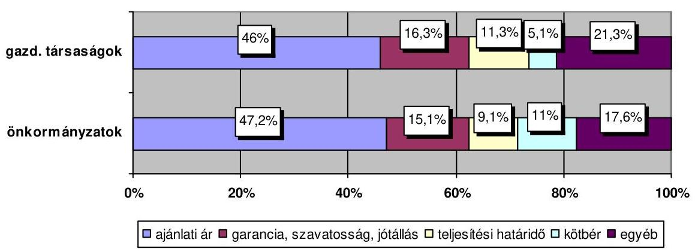

---

A beruházások megvalósításában résztvevők versenyeztetés nélküli kiválasztása, a bírálati szempontok dokumentálásának hiánya nem segítette a megalapozott, nyilvános és ellenőrzött döntéshozatalt, a kiválasztás objektivitását, ezáltal a függetlenség és a megfelelő szakmai felkészültség érvényesülését. A $\mathrm{Kbt}_{1,2}$ hatálya alá nem tartozó beszerzéseknél a versenyeztetés hiánya akadályozta a közpénzek takarékos, nyilvános és átlátható felhasználását, nem tette lehetővé a vállalkozók összeférhetetlenségének, valamint a döntést hozóktól való függetlenségének és a szakmai szempontok érvényesülésének a megállapítását.

A közbeszerzési eljárások 15,6\%-ánál (5 esetben) kezdeményeztek jogorvoslati eljárást, amelyek közül a Közbeszerzések Tanácsa Közbeszerzési Döntőbizottság három esetben hozott elmarasztaló döntést.

Celldömölkön a beruházás I. üteménél és Sárváron az ajánlatok elbírálása nem szabályszerűen történt, a lefolytatott új eljárás és a pályázatok újra értékelése eredményeként azonban a nyertesként kihirdetett ajánlattevő mindkét esetben az eredetivel azonos volt. Gárdonyban a Döntőbizottság az önkormányzatot pénzbüntetésben részesítette, de a szerződést a jogsértés ellenére megkötötték.

A közbeszerzési eljárások és egyéb pályázatok 84,1\%-ánál az ajánlatkérők több ajánlat közül választhattak, ami az alkalmazott bírálati szempontrendszerrel lehetővé tette a beruházásoknak az elfogadott pályázatokban foglaltak szerinti megvalósítását.

Az ajánlattevők száma a közbeszerzési eljárásoknál egy és 16, az egyéb pályázatoknál kettő és kilenc között alakult, átlagosan 3,9 illetve 4,3 volt. Az ajánlatkérők az eljárások felénél alkalmaztak az elbírálás során pontozásos módszert. A nyertesnek minősített ajánlattevők pontszáma átlagosan 23,4\%-kal haladta meg a nyertest követő legkedvezőbb, és 149,3\%-kal a legkedvezőtlenebbnek minősített ajánlattevő pontszámát ${ }^{35}$.

A beruházások megvalósításában résztvevőkkel megkötött alapszerződések a beruházások 64,7\%-ánál összhangban volt az előzetes költségbecslésekkel és gazdaságossági számításokkal ${ }^{36}$, a többi esetben azonban az alapszerződések jelentősen meghaladták az előzetes számításokat, amely már a beruházások kezdeti szakaszában költségtúllépéseket eredményezett.

# 2.1.2. A szerződéses feltételek kialakítása 

A beruházások megvalósításában résztvevőkkel megkötött szerződések - kettő kivételével - megfeleltek a $\mathbf{K b t}_{1,2}$ és a Ptk. elöírásainak, egymással összhangban voltak és párhuzamos feladatellátást nem tartalmaztak.

Barcson a műszaki ellenőrzésre kötött szerződésben nem rögzítették a megbízott pontos feladatát (nem volt meghatározott, hogy a teljes beruházásra, vagy az I.

[^0]
[^0]:    ${ }^{35}$ A szélső értékeket figyelmen kívül hagyva.
    ${ }^{36}$ A Széchenyi terv pályázatokban szereplő költségek és műszaki tartalom figyelembe vételével, összhangban lévőnek tekintettük az előzetes költségbecslések 90-110\%-a közötti, jelentős eltérésnek az azokat 10\%-kal meghaladó alapszerződéseket.

---

ütemre vonatkozott), Zalaegerszegen a közbeszerzési eljárás eredményeként megkötött kivitelezői szerződésben a $\mathrm{Kbt}_{1}$ előírásaival ellentétesen állapodtak meg a módosítás feltételeiben.

Közbeszerzési eljárás és egyéb pályáztatás esetén a szerződéseket az ajánlati felhívások, az ajánlati dokumentációk, valamint az ajánlatok tartalmának megfelelően, írásban kötötték meg, kisebb eltéréseket négy beruházásnál állapított meg az ellenőrzés.

Az ajánlati felhívásokban, az ajánlati dokumentációkban, illetve az ajánlatokban foglaltaktól részben eltérő feltételek szerepeltek Zalaszentgróton a tervezési, Celldömölk I. ütemnél a műszaki ellenőrzési, Barcs és Pápa esetében a kivitelezői szerződésekben.

A szerződések alapvetően a támogatások elnyerésére benyújtott pályázatokban célként megjelölt projektek megvalósítására vonatkoztak, az azokban foglaltakkal azonban a beruházások közel felénél a műszaki tartalom különböző változtatásai miatt nem voltak összhangban.

Celldömölkön mindkét ütemnél eltértek a Széchenyi terv pályázatban foglaltaktól, Zalaszentgróton az elvi építési engedély alapján beadott pályázat múszaki tartalmát később pontosították. Pápán és Zalaegerszegen a költségek alultervezése miatt módosították a pályázatban foglalt műszaki tartalmat, Bükön a tervezett költségek szinten tartása érdekében két részprojektnél munkákat hagytak el. Lentiben a pályázatban tervezettől eltérő technológiával történő építésre kötöttek szerződést, Barcson a tervezői szerződés a kettő közül nemcsak az ellenőrzött I. ütem, hanem a teljes beruházást magában foglalta.

A tervezői szerződések az engedélyezési és a tender tervdokumentációk, valamint - három beruházás kivételével, ahol azt a kivitelezői szerződés tartalmazta - a kiviteli tervdokumentációk elkészítésére vonatkoztak. A szerződések mindössze öt beruházásnál tartalmaztak a tervezői múvezetésre a feladatokat, egy esetben pedig erről a kivitelezői szerződésben állapodtak meg és költségeit is a kivitelező viselte.

# A tervezői szerződésekben meghatározták a tervezők feladatait, a tervszolgáltatások határidejét és a fizetési feltételeket, de azok nem, vagy csak részben tartalmaztak garanciális elemeket. 

Késedelmes teljesítés esetére a szerződések 40,4\%-ában, hibás teljesítés esetére 1,9\%-ában kötöttek ki kötbért. Jótállásra vonatkozó feltételeket a szerződések 5,8\%-ában, szavatosságra vonatkozó előírásokat a 19,2\%-ában szerepeltettek, jóteljesítési garanciában két esetben állapodtak meg (3,9\%). A tervezői szerződések 11,5\%-ában szerepelt egyéb szerződéses garancia, amelyek között a konzultációk biztosítására vonatkozó előírásokat, az elégtelen, hibás, illetve a hiányos tervezésből eredő kötelezettségeket írták elő.

A műszaki ellenőrzésre kötött szerződések a beruházások 11,8\%-ánál nem, a 23,5\%-ánál csak részben tartalmazták az építési műszaki ellenőr számára a

---

158/1997. (IX. 26.) Korm. rendeletben előírt feladatokat ${ }^{37}$, vagy az arra történő hivatkozást. Előfordult, hogy a szerződéses feltételek nem biztosították a beruházás felügyeletének független, elfogulatlan elvégzését ${ }^{38}$, mivel a műszaki ellenőr a beruházó önkormányzat mellett a kivitelezőtől is díjazásban részesült feladatai elvégzéséért (Zalaegerszeg).

A múszaki ellenőrzésre kötött szerződésekben nem, illetve csak részben szerepeltették a beruházók érdekeit védő garanciális előírásokat, kötbért a $17,9 \%$-a, teljesítési vagy jóteljesítési garanciát az $50 \%$-a, egyéb szerződéses garanciákat - általános jelleggel - a 64,3\%-a tartalmazott. Csak három beruházásnál határoztak meg ösztönző feltételeket a beruházás költségtakarékos megvalósítása érdekében, az indokolatlan pótmunkák kiszűrésére, de a gyakorlatban ott sem alkalmazták.

A költségtúllépések esetére Gárdonyban a műszaki ellenőr díjának arányos csökkentésében, a megtakarításból sikerdíj fizetésében állapodtak meg. Bükön a beruházási keret-előirányzatok betartása és a költségtúllépésekrért való felelősség szerepelt a szerződésben, Zalaszentgróton a megtakarításokról külön megállapodást terveztek. Ezek alkalmazására egyik beruházásnál sem került sor.

# A beruházások 82,4\%-ánál a múszaki ellenőrzésre kötött szerződések 

nem tartalmazták a folyamatos szakmai ellenőrzések ellátásával kapcsolatos konkrét feladatokat, és nem határozták meg annak dokumentálása módját sem, holott ez segíthette volna a műszaki ellenőrzés jogszabályokban meghatározottak szerinti feladat ellátását. Az építési- szerelési munka folyamatos figyelemmel kísérése biztosítékaként nem írták elő ellenőrző listák, hibajegyzék, minőségellenőrző terv vagy megvalósulási ütemterv készítését, továbbá nem gondoskodtak arról, hogy a beruházás megvalósításában közreműködők szerződéseiben előírt ellenőrzési és dokumentálási módozatok egymással összhangban legyenek. A beruházók nem rendelkeztek szerződésekbe foglalt biztosítékkal a hibás, hiányos és késedelmes teljesítések időbeni ismertté válására, a megoldására vonatkozó döntések feltételeinek megteremtésére.

Balatonlellén, Barcson, Marcaliban, Sárváron és Zalaegerszegen a kivitelezői szerződés tartalmazott előírásokat mintavételi és minőségbiztosítási tervek, jegyzőkönyvek, megvalósulási ütemtervek, előrehaladási jelentések készíté-

[^0]
[^0]:    ${ }^{37}$ Az ellenőrzött időszakban hatályos 158/1997. (IX. 26.) Korm. rendelet 2. § (2) bekezdése szerint az építési műszaki ellenőr az építmény megvalósítására irányuló építési szerelési munka teljes folyamatában elősegíti és ellenőrzi a vonatkozó jogszabályok, hatósági előírások, szabványok, szerződések, valamint az építésügyi hatóság, illetve az építmény létesítését engedélyező hatóság által jóváhagyott építészeti műszaki terv betartását. A 2. § (3) bekezdés rögzíti az építési műszaki ellenőr legfontosabb feladatait.
    ${ }^{38}$ „A műszaki ellenőr ... az építtető nevében jár el, amikor műszakilag, minőségileg, az eljárás jogszerűsége tekintetében ellenőrzi a vállalkozók tevékenységét és annak eredményét igazolja. Ezért a műszaki ellenőrzés bizalmi feladat, amelyet az építtető saját alkalmazottja, konzulens, a kiviteli tervezésben részt nem vevő tervező, vagy erre szakosodott ellenőrző cég láthat el." Forrás: Építési múszaki ellenőrök kézikönyve, Terc Kft., Budapest, 2001.

---

sére, az ezekkel kapcsolatos feladatok azonban a műszaki ellenőrök szerződéseiből kimaradtak.

A műszaki ellenőrzésre kötött szerződések feltételei (a szerződéses garanciák, az elszámolási módok, az együttműködés szabályozása) a beruházások 47,1\%-ánál nem segítették elő a kivitelezői szerződésekben foglaltak teljesülését, a beruházások tervezett műszaki-, költség- és időtervek szerinti megvalósítását.

A beruházások kivitelezésére döntően generálkivitelezői szerződéseket kötöttek, mindössze négy beruházásnál (Bük, Gárdony, Pápa, Zalakaros II. ütem) bontották - időben vagy feladatok szerint - ütemekre a feladatokat és kötöttek több vállalkozóval szerződést. A kivitelezői szerződésekben megállapodtak a teljesítési rész- és véghatáridőkben és meghatározták - egymással összhangban - a műszaki és a pénzügyi teljesítések ütemezését. A kivitelezői alapszerződések szerint a beruházások átlagos átfutási ideje 9,6 hónap volt, ezen belül az önkormányzatok rövidebb (átlagosan 7,3 hónap), a gazdasági társaságoknál hosszabb (átlagosan 12,8 hónap) kivitelezési időtartamban állapodtak meg. A szerződésekben meghatározott befejezési határidők a beruházásoknak csak a 41,2\%-ában volt összhangban a támogatási szerződésekben foglaltakkal, a továbbiaknál az összhangot a támogatási szerződések későbbi módosításaival biztosították.

A kivitelezői szerződésekben a megvalósítandó munkák részletes műszaki tartalmának meghatározásakor a Ptk. 390. § (3) bekezdés előírásának eleget tettek, amikor a tervdokumentációkra, a közbeszerzési ajánlati és egyéb dokumentációkra, valamint a vállalkozó ajánlatának tartalmára hivatkoztak. A szerződésekben hivatkozott dokumentumok rendszerezett, hiteles, egyértelműen azonosítható módon azonban a beruházások 58,8\%-ánál nem álltak teljes körűen rendelkezésre, így az utólagos ellenőrzés és a szerződés pontos műszaki tartalmának megállapítása nem volt biztosított.

A beruházók a kivitelezői és a szállítói szerződések tartalmának öszszeállításánál gondosabban jártak el a tervezői, a bonyolítói és a műszaki ellenőri szerződéseknél, a szerződésekben rögzített garanciális elemek - a megvalósítás tapasztalatai alapján - nagyobb biztosítékot nyújtottak a beruházók érdekeinek védelmére.

Késedelmes teljesítés esetére a szerződések 90,4\%-ában, nem teljesítés esetére (meghiúsulás) 23,1\%-ában kötbért kötöttek ki. A jótállási feltételekről egy (1,9\%), a szavatossági előírásokról öt szerződés kivételével ( $9,6 \%$ ) megállapodtak, ennek során rendszerint a jogszabályokban ${ }^{39}$ előírtaknál szigorúbb feltételeket írtak elő. A szerződések 9,6\%-ában hibás teljesítés esetére is kötbért kötöttek ki.

[^0]
[^0]:    ${ }^{39}$ A jótállásra vonatkozó előírásokat a 151/2003. (IX. 22.) Korm. rendelet és a 249/2004. (VIII. 27.) Korm. rendelet; a hibás teljesítésért való felelősség (kellékszavatosság) szabályait a Ptk. 305-311/A. §-ai szabályozzák, az egyes épületszerkezetek és azok létrehozásánál felhasználásra kerülő termékek kötelező alkalmassági idejéről a 11/1985. (VI. 22) ÉVM-IpM-KM-MÉM-BkM együttes rendelet tartalmaz előírásokat.

---

A szerződést biztosító mellékkötelezettségek között elterjedt a teljesítési, illetve a jóteljesítési garancia (biztosíték) nyújtása, melynek során a kivitelezők a vállalkozói díj meghatározott \%-át e jogcímen bankgaranciában vagy pénzbeli formában biztosítják a megrendelő részére. A jóteljesítési garancia mértéke három esetben a lefolytatott közbeszerzési eljárás során elbírálási szempont is volt. A vállalkozók a kivitelezői és a szállítói szerződések 65,4\%ában vállaltak teljesítési és/vagy jóteljesítési garanciát (21,2\%-ban mindkettőben megállapodtak), amely $85,3 \%$-ban bankgarancia, $14,7 \%$-ban pénzbeli garanciavállalás volt, annak ellenére, hogy a Ptk. 249.§-ában a szerződést biztosító mellékkötelezettségek között csak a bankgarancia szerepel.

Barcson a kivitelező a jóteljesítési garanciát az önkormányzat számlájára utalta át, és hozzájárult az e jogcímen átutalt pénzeszközök beruházás finanszírozási célokra történő felhasználásához, amikor a megrendelő önkormányzatnál a számlák kifizetéséhez nem állt rendelkezésre fedezet. Az így átutalt, visszatartott pénzeszköz továbbra is a kivitelező tulajdonában maradt, amelyet az önkormányzatnak saját pénzeszközeitől elkülönítetten kellett volna kezelni. Ezáltal nem biztosították, hogy a garanciavállalás jogcímen átutalt pénzeszközök valóban betöltsék eredeti céljukat és rendelkezésre álljanak a garanciális problémák felmerülésekor a kivitelező nem teljesítése (teljesítési garancia) vagy hibás teljesítése (jóteljesítési garancia) esetén.

Az építések múszaki munkálatait az építési munka jellegének megfelelő és jogszabályban meghatározott szakképesítéssel és gyakorlattal rendelkező felelős múszaki vezetők irányították ${ }^{40}$. Az ellenőrzött beruházásoknál a kivitelezői szerződések egy kivételével tartalmazták a kivitelező feladatait, megjelölték a felelős műszaki vezető személyét és - különböző részletezettségben - rendelkeztek a feladatairól.

# 2.1.3. A kivitelezői szerződésmódosítások okai, dokumentáltsága és hatása a megvalósítás folyamatára 

A beruházások kivitelezésére kötött szerződések 71,1\%-át (32 db) a megvalósítás folyamatában 14 beruházást érintően egy vagy több alkalommal - egy szerződést átlagosan kétszer - módosították, valamint azokhoz kapcsolódóan további szerződéseket is kötöttek, emellett szerződésmódosítás nélkül is számoltak el pótmunkákat. A szerződésmódosítások leggyakoribb indoka a kivitelezések folyamatában felmerült múszaki, technológiai ${ }^{41}$ és kivitelezési problémák voltak, szerepe volt emellett a pontatlan műszaki és pénzügyi előkészítésnek és a kivitelezés során jelentkező új szakmai körülményeknek is.

[^0]
[^0]:    ${ }^{40}$ A kivitelező és a felelős műszaki vezető szakmai felelősségét az Étv. 40. § (1)-(2) bekezdései, a felelős műszaki vezető jogosultságának, tevékenységének részletes szabályait a 2007. december 31-ig hatályban volt 51/2000. (VIII. 9.) FVM-GM-KöViM együttes rendelet 6-8. §-ai tartalmazták, 2008. január 1-től a 290/2007. (X. 31.) Korm. rendelet 12-13. §-ai szabályozzák.
    ${ }^{41}$ A kivitelezés folyamatában műszaki, technológiai körülményként jelentkeztek a műszaki tartalom olyan módosításai, amelyeket nem a pontatlan múszaki és/vagy pénzügyi előkészítés okozott.

---

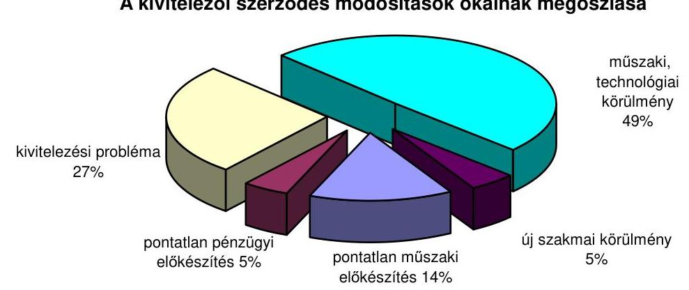

Az önkormányzatoknál és a gazdasági társaságoknál a szerződésmódosítások gyakorisága, valamint annak okai és indokai eltérőek voltak. Az önkormányzatoknál a szerződéseket átlagosan 2,2-szer, a gazdasági társaságoknál 1,8-szer módosították. A pontatlan műszaki előkészítés következtében a szerződések 29,3\%-át módosították az önkormányzatoknál, ugyanakkor a gazdasági társaságoknál ilyen ok miatt szerződésmódosításra nem került sor. A műszaki, technológiai körülmények miatti szerződésmódosítások az átlag 49\%-ot 13 százalékponttal meghaladták a gazdasági társaságoknál, míg az önkormányzatoknál 12 százalékponttal elmaradtak attól. Az új szakmai körülmények miatt a két szektorban azonos arányban módosították a szerződéseket.

A szerződésmódosítások a múszaki tartalom és ehhez kapcsolódóan az ajánlati ár, valamint a teljesítési rész- és befejezési határidők módosításaira irányultak, az egyéb szerződéses feltételek (minőségi követelmények, kötbér, garanciavállalás, egyéb) megváltoztatása nem volt jellemző. A műszaki tartalom változása a szerződésmódosítások 45,9\%-ánál (ezen belül elmaradó munkák 24,6\%-ánál, pótmunkák 39,3\%-ánál) fordult elő, a kivitelezői alapszerződések 51,1\%-ához kapcsolódóan. A szerződéses árat 31,2\%-ban módosították, ez a kivitelezői alapszerződések 37,8\%-át érintette. Mindemellett a szerződések 26,7\%-ához kapcsolódóan írásba foglalt szerződésmódosítás nélkül - de részben azok mellett -, egyéb módon (kiegészítő szerződéssel, jegyzőkönyv, kimutatások készítése alapján) számoltak el pótmunkákat. A teljesítési részhatáridőket a szerződésmódosítások 47,5\%-ánál, a véghatáridőket a 60,7\%-ánál változtatták, ez az alapszerződések 55,6\%-át érintette.

A pótmunka megrendelések, és ezzel összefüggésben a szerződéses árak változása a gazdasági társaságoknál, míg a teljesítési rész- és véghatáridők módosítása az önkormányzatoknál fordult elő nagyobb arányban.

---

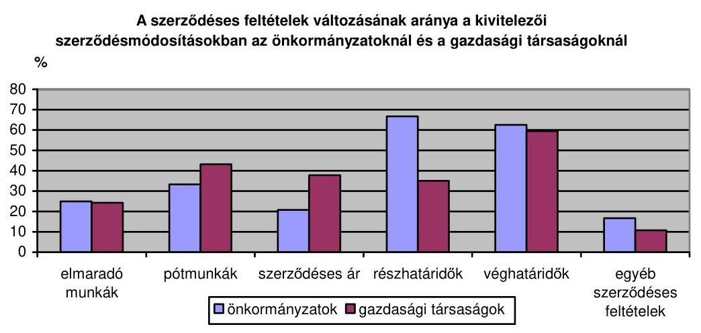

A módosítások 65,6\%-ánál a „vis maior" ${ }^{42}$ körülmények, 52,5\%-ánál a megrendelői közreműködés, $16,4 \%$-ánál pedig a kivitelezői munkavégzés minősége is szerepet játszott ${ }^{43}$. A szerződésmódosítások ennek ellenére minden esetben „közös megegyezéssel" történtek. A kivitelezői szerződéseket mindössze három beruházásnál nem módosították (Celldömölk II. ütem, Sárvár I. ütem, Sellye).

# A szerződésmódosítások pontos tartalma és indokoltsága azok 

65,6\%-ánál volt megállapítható, mivel a módosításokat különböző dokumentumokkal (tervekkel, pénzügyi és műszaki ütemtervekkel, a műszaki tartalomhoz kapcsolódó költségvetési kiírással, pótmunka ajánlati árral, szakértői véleménnyel) alátámasztották.

A műszaki tartalomváltoztatásokra irányuló szerződésmódosítások a beruházások ${ }^{44} 45,5 \%$-ánál szerkezetileg, részletezettségükben és tartalmilag eltértek a kivitelezői alapszerződésektől, ennek következtében az eredeti és a módosított műszaki tartalom közvetlenül nem volt összehasonlítható. A beruházások további $18,2 \%$-ánál a műszaki tartalomváltozások összehasonlíthatósága részben volt biztosított, mert nem álltak rendelkezésre teljes körűen a módosítást indokoló, annak tartalmát meghatározó okmányok, egy beruházásnál pedig a műszaki tartalom módosítását nem is foglalták írott szerződésbe. A műszaki tartalom változásának a kimutatását tovább nehezítette, hogy azoknál a beruházásoknál, ahol a kiviteli terveket a kivitelezéssel párhuzamosan készítették (folyamatos tervszolgáltatás), a műszaki tartalomváltozásokat folyamatosan átvezették a tervdokumentációkon, illetve a kiviteli tervek már a módosított műszaki tartalomra vonatkoztak, így a tervdokumentációk nem tartalmaztak információt a beadott és elfogadott támogatási pályázatban tervezettől történt

[^0]
[^0]:    ${ }^{42}$ A „vis maior" jelentése szó szerint „nagyobb erő". Előre nem látott kényszerítő körülmény illetve elháríthatatlan akadály, amely meggátol valamely kötelezettség teljesítésében (Idegen Szavak Szótára, Akadémiai Kiadó, 1983). A vis maior jogi fogalom is, jellegéből fakadóan sem bekövetkezéséért, sem következményeiért nem felelős senki, így ezek nem róhatók fel senkinek.
    ${ }^{43}$ Az okok és indokok a módosítások 36\%-ánál halmozottan jelentkeztek.
    ${ }^{44}$ A szerződésekben meghatározott műszaki tartalom különböző mértékben 10 beruházásnál változott.

---

eltérésekre. A szerződésmódosításokat indokoló körülmények és tények dokumentálásának hiányában nem volt megítélhető a támogatások eredeti céljuknak megfelelő felhasználása, valamint azok utólagos ellenőrzése, annak ellenére, hogy az 1/2001. (I. 5.) GM rendelet 13. § (2) bekezdése ${ }^{45}$ és a 14/2002. (XI. 16.) MeHVM rendelet 15. § (2) bekezdése értelmében a támogatások folyósítása utólag, teljesítményarányosan történhetett. A kivitelezői szerződésekben is teljesítmény arányos elszámolásban állapodtak meg, amely a pénzügyi elszámolás és számlázás alapja volt.

Gárdonyban már a kivitelezői alapszerződésekben sem határozták meg egyértelmúen, pontosan mennyiségi adatokkal a műszaki tartalmat, Sárváron a múszaki tartalom részletes meghatározását a szerződésmódosítás nem tartalmazta.

Pápán a költségcsökkentésre törekvés és az új igények miatt az építési engedélyes és a kiviteli terveket a megvalósítás folyamatában módosították, kivitelezés közbeni műszaki tartalomváltozásokra hivatkoztak, de azokat pontosan nem dokumentálták.

Barcson a műszaki tartalom módosítására a kivitelező tett javaslatot, és az arról szóló döntést a képviselő-testületi ülés jegyzőkönyve tartalmazta, a folyamatos tervszolgáltatás keretében a kivitelezéssel párhuzamosan készült kiviteli tervekben már a módosított műszaki tartalom szerepelt.

A változások dokumentálása, a műszaki és a pénzügyi elszámolások nyomon követése érdekében az eredeti és a módosított műszaki tartalomról készített kimutatások - a szerződésmódosítások 54,5\%-ához kapcsolódóan - a módosítások 18,2\%-ánál felmérési naplók, a 9,1\%-ánál egységárelemzések, 36,4\%-ánál mérnöki költségvetések, 45,5\%-ánál műszaki tervek voltak.

A kivitelezői szerződésmódosításokhoz kapcsolódóan a beruházások 70,6\%ánál (a szerződésmódosítással érintett beruházások 85,7\%-ánál) módosultak a kivitelezés rész- és véghatáridői, amelyeket egy kivételével (Bük) a műszaki és a pénzügyi ütemtervekben is követtek. A módosított kivitelezési határidők csak a beruházások harmadrészénél biztosították a beruházás befejezését az eredeti támogatási szerződésben foglalt megvalósulási határidőre, kétharmad részénél a támogatási szerződések további módosítására volt szükség.

A helyszíni ellenőrzés adatai szerint a szerződésmódosítások a beruházások 52,9\%-ához kapcsolódóan, összesen 175613 ezer Ft-tal csökkentették és 827725 ezer Ft-tal növelték a beruházási költségeket. A kivitelezői szerződésmódosítások során az eredeti projekt célkitűzésekben meghatározott minőségi követelményeket nem csökkentették, a mennyiségi paraméterek azonban megváltoztak. A beruházók a beruházási költségek és a későbbi üzemeltetési hatások kimutatása céljából a szerződésmódosításokhoz kapcsolódóan nem készítettek hatásvizsgálatokat, gazdaságossági számításokat.

A közbeszerzési eljárások eredményeként megkötött kivitelezői, szállítói szerződéseket is rendszeresen módosították, amelyek 24,1\%-ánál

[^0]
[^0]:    ${ }^{45}$ Hatályon kívül helyezte a 19/2004. (II. 27.) GKM rendelet 34. § (3) a) pontja 2004. március 1-től.

---

nem álltak fenn a szerződésmódosítás törvényekben előírt feltételei ${ }^{46}$. Hét esetben írásbeli szerződés nélkül (jegyzőkönyvek, egyéb számítások alapján) számoltak el pótmunkákat 99958 Ft összegben. A módosításoknál és a pótmunka kifizetéseknél nem vizsgálták a $\mathrm{Kbt}_{1} 70 . \S$ (2) bekezdésében előírt feltételek fennállását, és nem folytattak le közbeszerzési eljárást.

A közbeszerzési eljárások eredményeként megkötött 32-ből 30 szerződést összesen 58 alkalommal módosítottak, amelyekből 13 módosítás a $\mathrm{Kbt}_{1}$ 73. § (1) bekezdésében, egy a $\mathrm{Kbt}_{2}$ 303. §-ában előírt feltételeknek nem felelt meg.

Jegyzőkönyvek, egyéb számítások alapján, szerződésmódosítás nélkül Bükön öt, Lentiben és Zalakaroson egy-egy esetben számoltak el pótmunkákat.

# 2.2. A beruházások megvalósításának reálfolyamatai 

### 2.2.1. A kivitelezési munkák megkezdése, a múszaki tervek és hatósági engedélyek rendelkezésre állása

A szakmai-múszaki előkészítés a beruházások 41,2 \%-ánál nem volt megfelelő, mert az Étv. 38. § (1) bekezdésében és a Vg. tv. 28. § (1) bekezdésében foglaltak ellenére, a kivitelezés megkezdésekor nem rendelkeztek érvényes jogerős építési és vízjogi létesítési engedéllyel. Ennek következtében nem álltak rendelkezésre teljes körűen a hozzá tartozó álló műszaki tervdokumentációk, a kapcsolódó szakági kiviteli tervek és műszaki leírások, az egyéb hatósági engedélyek, valamint a vonatkozó szabványhivatkozások.

Balatonlellén két beruházásnál a jogerős építési és a vízjogi létesítési engedély, Celldömölkön a II. ütemnél, Marcaliban, Zalaegerszegen, Zalaszentgróton a vízjogi létesítési engedély, Pápán a technológiai gépészeti vízjogi létesítési engedély hiányzott.

A kivitelezői alapszerződések megkötésekor 14 beruházásnál ${ }^{47}$ került sor az építészeti, 10 beruházásnál a szakági kiviteli tervek átadására. Az építési munkaterületek átadásakor a vállalkozók rendelkeztek kiviteli tervdokumentációval, vagy annak egy részével három beruházás (Celldömölk I. ütem, Barcs és Zalaegerszeg) kivételével. A kiviteli terveket Celldömölkön a megrendelőnek, a további két esetben - szerződése alapján - a kivitelezőnek kellett volna biztosítania.

E beruházók - Pápa kivételével - a kivitelező kiválasztására közbeszerzési eljárást folytattak le, ennek során azonban nem tettek eleget az akkor hatályos

[^0]
[^0]:    ${ }^{46}$ A $\mathrm{Kbt}_{2}$ 303. §-a szerint a felek csak akkor módosíthatják a szerződésnek a felhívás, a dokumentáció feltételei, illetőleg az ajánlat tartalma alapján meghatározott részét, ha a szerződéskötés követően - a szerződéskötéskor előre nem látható ok következtében beállott körülmény miatt a szerződés valamelyik fél lényeges jogos érdekét sérti. A korábban hatályos $\mathrm{Kbt}_{1}$ 73. § (1) bekezdése szerint a felek csak akkor módosíthatták a szerződésnek az ajánlati felhívás, a dokumentáció feltételei, illetve az ajánlat tartalma alapján meghatározott részét, ha a szerződéskötést követően beállott körülmény folytán a szerződés valamelyik fél lényeges jogos érdekét sértette.
    ${ }^{47}$ Három beruházásnál a kiviteli tervek készítését a kivitelezői alapszerződések tartalmazták.

---

1/1996. (II. 7.) KTM rendelet 2. § (1) bekezdése előírásainak, miszerint az ajánlatkérési műszaki dokumentáció a jogerős, végrehajtható és érvényes építési vagy létesítési hatósági engedélyokirat és a hozzá tartozó tervek alapján készített, az építmény helyszínét, környezetét, jelenlegi, valamint kész állapotát - az ajánlatadáshoz szükséges és elégséges módon - rögzítő írásos dokumentumok és tervrajzok összessége.

A hiányzó engedélyeket - kettő vízjogi létesítési engedély kivételével (Balatonlelle két beruházás) -, valamint a hozzájuk tartozó terveket a kivitelezések ideje alatt folyamatos tervszolgáltatással biztosították. A megvalósítás folyamatában három beruházás esetében történt késedelmes kivitelezői tervszolgáltatás.

Celldömölk I. ütemnél és Zalaegerszegen a kiviteli tervek kettő hónap, Marcaliban a vízgépészetre vonatkozó szakági kiviteli tervek hét hónap késedelemmel készültek el.

A jogerős építési és vízjogi létesítési engedélyek, valamint a hozzá tartozó tervdokumentációk hiányai, nem akadályozták ugyan közvetlenül a beruházások végrehajtását, ezzel azonban nem tartották be az Étv. 38. § (1) bekezdésében és a Vg. tv. 28. § (1) bekezdésében foglaltakat. A hiányokat 57,1\%-ban beruházói mulasztás, $28,6 \%$-ban tervezői késedelem, $14,3 \%$-ban egyéb ok eredményezte.

A kiviteli tervdokumentációk átadás-átvételekor - három beruházás kivételével (Balatonlelle két beruházás, Celldömölk II. ütem) - nem állapítottak meg dokumentumhiányt annak ellenére, hogy összesen hét beruházásnál nem rendelkeztek teljes körűen a szükséges hatósági engedélyekkel és a kapcsolódó műszaki tervekkel.

A kivitelezés megkezdése előtt a műszaki ellenőrök, a tervezők és a kivitelezők mindössze négy beruházásnál - Zalakaros két beruházás, Pápa, Sellye - végezték el a rendelkezésre álló építési engedélyezési, vízjogi létesítési, az egyéb hatósági, a kiviteli tervek, valamint az egyéb dokumentumok és az árazott költségvetés múszaki tartalmú összevetését annak érdekében, hogy a munkák megkezdését megelőzően meggyőződjenek azok tartalmi egyezőségéről és a műszaki hivatkozások összhangjáról. Ezek közül első kettőnél tárták fel és rögzítették az ellentmondó műszaki hivatkozásokat, a másik kettőnél a feltárás nem történt meg. A többi beruházásnál a különböző dokumentumok műszaki tartalmú összehasonlítását nem végezték el annak ellenére, hogy az - a kivitelezés során végrehajtott műszaki módosítások alapján - a beruházások további $47,1 \%$-ánál indokolt lett volna.

A kivitelezések megkezdésekor és a megvalósítások során beruházások 70,6\%ánál szükség volt az építési engedély, $29,4 \%$-ánál a vízjogi létesítési engedély módosítására. Az engedélymódosítások miatt a beruházások 70,6\%-ánál megváltoztatták az építészeti, 29,4\%-ánál a víztechnológiai, 23,5\%-ánál az egyéb szakági kiviteli terveket.

A módosított múszaki tartalommal megvalósult beruházásoknál nem értékelték - műszaki-gazdasági összehasonlításokkal - az eredeti és a módosított tervek közötti változások hatását a beruházások költségeire és időbeni megvalósítására. A felmerült műszaki tartalom változá-

---

sok elfogadását üzemeltetési és fenntartási költség adatokkal sem támasztották alá. Mindezek nem tették lehetővé a végrehajtott módosítások döntési szempontjainak utólagos ellenőrzését.

A beruházásoknál a munkaterületek átadás-átvételekor az építési naplót az 51/2000. (VIII. 9.) FVM-GM-KöViM együttes rendelet ${ }^{48}$ 4. § (1) bekezdésének megfelelően nyitották meg, egy beruházás kivételével (Gárdony), ahol az építési napló a rendelet 2 . számú mellékletében előírtak ellenére nem tartalmazta a szakipari-, a szerelőipari és az egyéb alvállalkozói munkáknak az adatait, továbbá a mellékletként csatolandó hatósági engedélyekre vonatkozó adatokat.

Az építési munkaterületek átadás-átvétele - két beruházás kivételével (Gárdony és Celldömölk I. ütem) - a kivitelezőkkel megkötött alapszerződésekben meghatározott időpontban történt.

A munkaterület átadások a beruházások 94,1\%-ánál biztosították az időtervek szerinti végrehajtás feltételeit, Celldömölkön azonban a beruházás I. üteménél a munkaterület átadását követően indokolt volt a kivitelezési folyamatok átütemezése és a kivitelezési véghatáridő módosítása, a kivitelezésre meghirdetett 3,3 hónapos (102 nap) átfutási idő miatt. A módosítás során az átfutási időt 506 napban rögzítették, a megvalósításra ténylegesen 528 nap alatt került sor.

A munkaterületek átadás-átvételei megfeleltek a Ptk. és az 51/2000. (VIII. 9.) FVM-GM-KöViM együttes rendeletben foglalt elöírásoknak. ${ }^{49}$ Az érdekeltek a munkaterületeket - Zalaegerszeg kivételével, ahol az építési területen rádiótorony volt - munkavégzésre alkalmas állapotúnak minősítették, nem merültek föl olyan egyéb körülmények, amelyek gátolták volna a szerződésszerű teljesítést.

# 2.2.2. A beruházás múszaki megvalósítása, a teljesítés monitoring 

A tervezői szerződések 52,9\%-a, a múszaki ellenőrök megbízási szerződéseinek és a kivitelezői alapszerződések 11,8\%-a, valamint a szállítói szerződések 25,0\%-a nem tartalmazott előírásokat a beruházás megvalósításában közremúködők kapcsolattartására, együttmüködésére vonatkozóan. Az előírásokat tartalmazó szerződésekben a beruházások megvalósításában részt vevők közötti kapcsolattartás módját, az együttmű-

[^0]
[^0]:    ${ }^{48}$ Az építési napló vezetésének tartalmát és formáját 2008. január 1-től a 290/2007. (X. 31.) Korm. rendelet 19. § (1) bekezdése alapján a 2. számú melléklete szabályozza.
    ${ }^{49}$ A Ptk. 393. § (1) bekezdése szerint, ha a munkát a megrendelő által kijelölt helyen kell elvégezni, a megrendelő köteles a munkahelyet munkavégzésre alkalmas állapotban a vállalkozó rendelkezésére bocsátani. Az 51/2000. (VIII. 9.) FVM-GM-KöViM együttes rendelet 4. § (1) bekezdésében foglaltak alapján a kivitelezési munka megkezdésekor az építési munkahelyet az építtető a kivitelező részére átadja. Ezzel egyidejűleg meg kell nyitni az építési naplót és abban az átadás-átvételt rögzíteni kell. Utóbbi szabályokat 2008. január 1-től a 290/2007. (X. 31.) Korm. rendelet 4. § (4)-(5) bekezdése tartalmazza.

---

ködés szabályait eltérően rögzítették. Leggyakrabban - a beruházások 88,2\%-át érintően - a kapcsolattartás formája a helyszíni bejárás volt. A gyakorlatban a kapcsolattartás módjára az eltakarásra kerülő munkák esetében, illetve szükség szerint helyszíni bejárást, továbbá - Barcs kivételével - a koordinációs értekezletek tartását ${ }^{50}$ alkalmazták. Előbbieket az építési naplókban tett bejegyzésekkel, utóbbiakat emlékeztetőkkel dokumentálták. A kapcsolattartás további módja a papíralapú és elektronikus levelezés, fax voltak, ezek összességében megfeleltek a szerződésekben szabályozottaknak. A keletkezett okmányokat Zalaegerszeg kivételével - továbbították a beruházások megvalósításában érdekelt felek részére.

Az építési naplókban a napi jelentések - Barcs és Gárdony kivételével tartalmazták az építési napló vezetéséről szóló 51/2000. (VIII. 9.) FVM-GMKöViM együttes rendelet 2. számú melléklet III. 1. pontjában előírt adatokat.

Az építési naplókban tett eseti bejegyzésekhez az akkor hatályos 51/2000. (VIII. 9.) FVM-GM-KöViM együttes rendelet 15. § (3) bekezdésének előírásai ellenére a beruházások $\mathbf{6 4 , 7 \%}$-ánál a bejegyzéseket megalapozó jegyzőkönyveket és kimutatásokat, 58,8\%-ánál a tervrajzokat, a megfelelőség-igazolásokat és az egyéb dokumentumokat nem csatolták, amely a 158/1997. (IX. 26.) Korm. rendelet 2. § (3) bekezdés j) pontja szerint a műszaki ellenőr feladata lett volna. A dokumentumokat nem csatoló beruházások 70,6\%-ánál az elmaradásokat nem indokolták, 17,6\%-ánál nem tartották indokolnak, 11,8\%-ánál pedig elegendőnek vélték a naplókban a dokumentumokra való hivatkozást. Az építési naplók iratanyagának hiányosságai, valamint a múködtetett monitoring rendszer dokumentumainak rendszerezetlensége nem, vagy csak részben biztosította az utólagos ellenőrzést. A beruházások befejezését követően azonban a beruházások 76,5\%-ánál a múszaki átadás-átvételi dokumentációkhoz csatolták a költségvetéseket, a költségbecsléseket, a kimutatásokat, a tervrajzokat és a megfelelőség-igazolásokat.

A kivitelezésekhez előírt építési naplóbejegyzéseken túli további információkat írásban rögzítették (levél/fax, jegyzőkönyv, feljegyzés, emlékeztető) Sellye kivételével, ahol a koordinációs értekezletről feljegyzés nem készült, csak a műszaki ellenőr tett róla említést az építési naplóban.

A múszaki ellenőrök által végzett folyamatos szakmai ellenőrzés, annak dokumentálása a beruházások 76,5\%-ánál nem, vagy csak részben járult hozzá a megvalósítási folyamatoknak a jogszabályokban és a kivitelezői szerződésekben előírtak szerinti végrehajtásához.

A műszaki ellenőrök a beruházások 52,9\%-ánál okmányokkal igazolt módon nem hívták fel a beruházók figyelmét a kivitelezői szerződéses fegyelem betartására, a kiegészítő szerződések megkötésére, a szerződésmódosítások szükségességére, nem jelezték továbbá a munkaterületek átadás-átvételekor a hatósági engedélyek és a vonatkozó műszaki tervek hiányát a beruházások 41,2\%-ánál.

[^0]
[^0]:    ${ }^{50}$ A koordinációs értekezletekre a beruházások 58,8\%-ánál heti, 11,8\%-ánál dekádonként (10 naponként), 29,4\%-ánál csak alkalmanként került sor.

---

A műszaki ellenőrök a 158/1997. (IX. 26.) Korm. rendelet 2. § (3) bekezdés g-l) pontja alapján részt vettek a műszaki átadás-átvételi eljárásokban, ennek során azonban - a későbbi üzemeltetési problémák szerint - a beruházások 64,7\%-nál hibásan ítélték meg a hatósági engedélyek, hatósági előírások, a határidők és a minőségi előírások, valamint a szerződések betartását.

A műszaki ellenőrök a kivitelezések előrehaladásának követése során - beruházások átadási késedelmei ellenére - nem vizsgálták, hogy mely kivitelezési tevékenységek rendelkeztek tartalékidővel, melyek átütemezése, illetve ezekhez milyen erőforrások bevonása lett volna szükséges. A műszaki üzemeltetési problémák és a költségtúllépések ellenére nem tárták fel a kialakult késedelmek konkrét okait, felelőseit. A Ptk. 405. § (1) és (5) bekezdéseinek előírásai ellenére az utó-felülvizsgált beruházások 93,8\%-ánál a minőségi hibák, hiányok felvételekor nem rögzítették azok költségvetés szerinti összegét.

A műszaki ellenőrök által tett jelzések alapján a beruházók, illetve a beruházások megvalósításában résztvevők megtették a szükséges intézkedéseket, de azok három beruházásnál ${ }^{51}$ - figyelembe véve a tapasztalt 4,5-13,3 hónapos terheléses próbaüzemi eljárásokat - nem biztosították a beruházások időtervek szerinti megvalósítását.

# A múszaki ellenőrök a beruházások folyamatos szakmai ellenőrzése 

során munkanemenként és technológiai lépésenként ellenőrző listákat három beruházás kivételével ${ }^{52}$, munkanemenkénti hibajegyzékeket és minőségellenőrző terveket, valamint Gantt diagramot nem alkalmaztak annak ellenére, hogy e dokumentumok használata lehetővé tette volna a feldatellátási tevékenység célirányosabb, gyorsabb, hatékonyabb és eredményesebb végrehajtását. A jogszabályok nem írják elő, de a megfelelő monitoring rendszer múködtetéséhez és dokumentálásához, a hibák időbeni jelzéséhez a műszaki ellenőr részéről nem elegendő csak az építési naplóba történő bejegyzések elvégzése, hanem célszerű e dokumentumok alkalmazása az ellenőrzés során.

A munkanemenként és technológiai lépésenként felépített ellenőrző listák és minőségellenőrző tervek segítséget nyújtanak a műszaki ellenőrnek abban, hogy a kivitelezés közben, az egyes munkarészek befejezését követően - az üzemelés során keletkező rejtett hibákat - nyílt hibaként ${ }^{53}$ azonnal észlelje, a hibajegyzékek pedig biztosítják a nyílt hibák kijavításának azonnali kontrollját. Az építési munka megfelelő minőségének folyamatos ellenőrzéséhez segítséget nyújthatott volna még a megvalósulási ütemterv, amelynek megjelenítésére a Gantt diagramot (sávos ütemterv) alkalmazhatták volna.

[^0]
[^0]:    ${ }^{51}$ Marcali, Sellye, Zalaszentgrót
    ${ }^{52}$ Pápa, Sárvár I-II. ütem.
    ${ }^{53}$ A nyílt hiba a kivitelezés közben, valamely építési tevékenység alatt, vagy azt követően azonnal, közvetlenül észlelhető. A rejtett hiba a meghibásodás külső jeleinek megjelenésekor, vagy a hiba gyanúja miatt végzett roncsolásos vizsgálat után észlelhető.

---

# 2.2.3. Müszaki tartalom változások a megvalósítás folyamatában 

A megvalósítás során a beruházások 64,7\%-ánál számoltak el pótmunkákat és 52,9\%-ánál elmaradt müszaki tételeket (megtakarítások), két beruházásnál pedig a műszaki tartalmat úgy változtatták meg, hogy az nem befolyásolta a kivitelezői alapszerződésekben vállalt költségeket.

Barcson a pályázatban szereplő úszómedence helyett két kisebb (egy úszó- és egy élmény) medencét, Celldömölkön a tervezett kültéri ülőpados medence helyett gyermekcsúszda medencét építettek.

A pótmunkák leggyakoribb indokai az utólag megrendelt, a tervmódosítás folytán felmerült, illetőleg a műszaki szükségességből elvégzett munkák voltak. Az okok között szerepeltek még a tervezési hibák, a vis maior és az egyéb okok.

A pótmunka-elszámolások okainak megoszlása
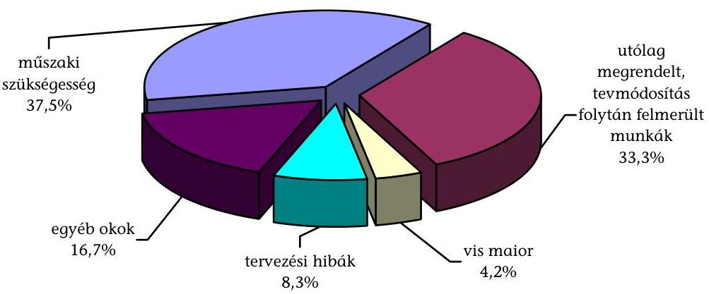

Az elmaradt és a pótmunkák elszámolására vonatkozóan a beruházók tulajdonosi döntéseit befolyásoló egyéb előírások, szabályozások nem voltak, a kivitelezési alapszerződésekben a normakönyvek alapján történő tételes elszámolást írták elő. Az elmaradt és pótmunkák elszámolása az Étv-ben és a Ptk-ban ${ }^{54}$ előírtak alapján történt, továbbá megfeleltek az építési- és a vízjogi létesítési engedélyekben, valamint egy kivételével a kivitelezői alapszerződésekben foglaltaknak.

Zalaszentgróton a pótmunkákat a vállalkozó által benyújtott - a műszaki ellenőr részéről felülvizsgált, véleményezett - költségbecsléssel és tervekkel támasztották alá a kivitelezői alapszerződésben előírt tételes elszámolás helyett.

Az elmaradt és a pótmunkák elszámolása a kivitelezők nyilatkozata, valamint kettő beruházás kivételével a tervezők állásfoglalása, a műszaki ellenőrök szakvéleménye, valamint ezek alapján a képviselő-testületek, illetve a gazdasági társaságok vezetésének jóváhagyó döntésével történtek.

[^0]
[^0]:    ${ }^{54}$ Étv. 38. § (2) bekezdés, Ptk. 403. § (4) bekezdés.

---

Bükön a kivitelezők és a műszaki ellenőr csak jelezték a felmerülő építési problémákat és megoldási javaslatokat adtak, amelyekről a gazdasági társaság vezető műszaki szakemberei döntöttek.

Zalaegerszegen a pótmunkákat és a tervezettől eltérő technológiai megoldásokat a kivitelező egyeztette a műszaki ellenőrrel, de a tervezői állásfoglalások megkérését az építési naplóban, illetve a helyszíni konzultációkról készített jegyzőkönyvekben nem rögzítettek.

# A pótmunka elszámolásokat mérnöki költségvetéssel, felmérési naplóval, illetve egységárelemzéssel, valamint ezeket szükség szerint tervekkel támasztották alá. 

Mérnöki költségvetést a beruházások 70,6\%-ánál, felmérési naplót és egységárelemzést a beruházások 11,8-11,8\%-ánál készítettek.

A pótmunkák fedezetére mindössze három beruházásnál (Bük, Gárdony, Marcali) képeztek tartalékkeretet. A műszaki tartalomváltoztatásokkal összefüggő pótmunkákat először a megtakarítások, majd ezt követően ahol képeztek - a tartalék keret terhére számolták el. A fennmaradó költségek finanszírozása nem hátráltatta a kivitelezéseket.

Az elmaradt és a pótmunkák miatt - a megvalósítások folyamatában - a megkötött kivitelezői alapszerződéseket öt beruházás esetében nem módosították, a kifizetésekre szóbeli megállapodások, illetve az elmaradt és a pótmunkákat tartalmazó jegyzőkönyvek, kimutatások, egyéb dokumentumok alapján került sor.

Barcson, Gárdonyban, Bükön és Pápán és Zalaegerszegen az elmaradt és a pótmunkák miatt a kivitelezői alapszerződést nem módosították, mert a beruházók azokat nem igényelték.

### 2.2.4. A múszaki átadás-átvétel, használatba vétel és üzembe helyezés

A műszaki átadás-átvételt mindössze a beruházások 41,2\%-ánál kezdték meg a kivitelezői szerződésekben rögzített - eredeti, illetve módosított - idöpontokban. A beruházások 64,7\%-ánál módosították a mű-szaki-átadás átvételek kivitelezői szerződések szerinti határidejét, amelyek következtében az alapszerződésekben eredetileg tervezett kivitelezési átfutási idők 4,0-19,2\%-al növekedtek meg, ezen belül Celldömölkön az I. ütemnél a növekedés közel négyszeres volt. Előzőek közül öt beruházásnál ${ }^{55}$ kezdték meg a módosított kivitelezői alapszerződésben rögzített időpontban a műszaki-átadás átvételi eljárásokat, a többinél további késedelmek keletkeztek. Gárdonyban pedig annak ellenére kezdték meg a kivitelezői alapszerződésekben előírt átadási időpontban a beruházás átvételét, hogy a kivitelezési munkák még nem fejeződtek be. Azoknál a beruházásoknál pedig, ahol a szerződések szerinti műszaki átadás-átvételi határidők változatlanok maradtak, mindössze egy beru-

[^0]
[^0]:    ${ }^{55}$ Balatonlelle úszómedence, Marcali, Zalakaros II. ütem, Lenti, Pápa.

---

házásnál (Celldömölk II. ütem) kezdődött meg késedelem nélkül a műszaki át-adás-átvétel.

# A két ellenőrzött szektorban azonos arányban fordult elő késedelmes teljesítés, eltért egymástól azonban a beruházók múszaki átadásátvételi eljárásainak végrehajtási gyakorlata és a hozzá kapcsolódó 

szankciók érvényesítésének módja, a gazdasági társaságok nagyobb figyelmet fordítottak arra, hogy az átadások megfeleljenek a Ptk. szabályainak és a kivitelezői alapszerződésekben foglaltaknak. A gazdasági társaságok által megvalósított hét beruházásból ötnél fordult elő kivitelezői késedelem (71,4\%), amelynek $60 \%$-ában a késedelmi kötbért érvényesítették. Az önkormányzatoknál megvalósított 10 beruházásból hétnél volt kivitelezői késedelem, amelyek közül egy beruházásnál, és csak részben éltek kötbérigénnyel.

Sárváron a gazdasági társaság két beruházásánál a késedelmi kötbér igény érvényesítésének a lehetőségét nem vizsgálták. Késedelmi kötbér érvényesítésére került sor Bükön egy kivitelezővel szemben 51498 ezer Ft, Zalakaroson több részfeladatnál, összesen 22000 ezer Ft, Pápán a szerkezetépítésnél 1500 ezer Ft összegben.

Gárdonyban az önkormányzat három részfeladatra bontott beruházásánál a kivitelezői késedelem ellenére két részfeladat esetében nem, míg a harmadik részfeladatnál csak részben, a 17 napból 10-re állapítottak meg késedelmi kötbért. A további hat önkormányzati beruházásnál késedelmi kötbért nem érvényesítettek.

## A kivitelezői késedelmek ellenére az önkormányzatok hat beruházásnál a szerződésszerú teljesítések vizsgálatakor nem vették figyelembe a Ptk. 405. § (3) bekezdésében és a 298. § a) pontjában foglalt elöírásokat ${ }^{56}$, mert a kivitelezői szerződésekben rögzített teljesítési határidőkhöz képest a műszaki átadás-átvételek kitűzésére 7-26 napos késedelemmel került sor.

Az átadás-átvételi eljárások befejezési határidejét figyelembe véve a késedelem Balatonlellén az élménymedencénél 15, Barcson 48, Celldömölkön a beruházás I. üteménél 53, Sellyén és Zalaszentgróton 19-19 napos volt. Zalaegerszegen a kivitelező a szerződésszerú teljesítés vizsgálatát biztosító átadási dokumentáció és megvalósulási tervek átadását 14 napos késedelemmel vállalta.

Zalaszentgróton - a Ptk. 405. § (1) bekezdésben előírtak ellenére - a műszaki átadás-átvételi eljárás időpontját az önkormányzat 12 napos késedelemmel, nem a vállalkozó értesítésében megjelölt időpontra tűzte ki, ezzel a magatartással a Ptk. 303. § (3) bekezdése értelmében jogosulti késedelembe esett, amely a kötelezett (vállalkozó) egyidejú késedelmét és ezzel a kötbér érvényesítésének a lehetőségét kizárta.

[^0]
[^0]:    ${ }^{56}$ A Ptk. 405. § (3) bekezdése értelmében határidőben teljesít a vállalkozó, ha az át-adás-átvétel a szerződésben előírt határidőn belül, illetőleg határnapon megkezdődött, kivéve, ha a megrendelő a szolgáltatást nem vette át. A Ptk. 298. § a) pontja szerint a kötelezett késedelembe esik, ha a szerződésben megállapított vagy a szolgáltatás rendeltetéséből kétségtelenül megállapítható teljesítési idő, eredménytelenül eltelt.

---

A múszaki átadás-átvételi eljárások átfutási ideje 2 és 116 nap között változott, a kivitelezésekhez viszonyított arányuk 0,7-26,1\% volt. A hoszszú átfutási időt a kivitelezők nem megfelelő teljesítései okozták.

A múszaki átadás-átvételekről a Ptk-ban foglaltaknak eleget téve ${ }^{57}$ jegyzőkönyv készült, a beruházások 47,1\%-ánál azonban a múszaki átadás-átvételek nem voltak kellően megalapozottak. A kivitelezők négy beruházásnál ${ }^{58}$ csak részben csatolták azokat a dokumentumokat, amelyek alkalmasak voltak a szerződésszerű teljesítés megállapításához és a használhatósági próbák ellenőrzéséhez. További négy beruházásnál ${ }^{59}$ pedig a műszaki átadás-átvételek jegyzőkönyveiben és mellékleteiben annak ellenére állapították meg a hiánymentes megvalósulást, hogy a próbaüzemi, illetve hatósági eljárások ezt nem igazolták.

Az átadott dokumentumok között minden beruházásnál szerepeltek a beépítetett anyagok, szerkezetek megfelelőségi tanúsítványai, valamint az eredeti tervektől való eltéréseket tartalmazó megvalósulási tervdokumentációk. Hiányzó dokumentumok voltak az építési naplók egy példánya, a felelős műszaki vezető kivitelezésre vonatkozó nyilatkozata, a vízgépészeti berendezések szállítói megfelelőségi tanúsítványai, a vízkezelő technológia alkalmazási engedélye, a gépészeti berendezések múködéséről szóló ellenőrzési jegyzőkönyvek, a negatív vízminta vizsgálatokról szóló jegyzőkönyvek, a minőségi hibák felvételéről valamint a pótmunkák elszámolásáról szóló jegyzőkönyvek.

A késedelmes teljesítésekből fakadó mennyiségi hiányokat a kivitelezők a múszaki átadás-átvételek befejezéséig minden beruházásnál pótolták. Minőségi hiányokat a befejezett beruházások 70,6\%-ánál állapítottak meg, Balatonlelle két beruházásánál azonban a próbaüzemelés során jelentkező hibák ellenére nem rögzítették. A Ptk. 405. § (1) bekezdésben foglaltak ellenére a minőségi hibákról készült jegyzőkönyvek 75\%-ában nem határozták meg a hiányos teljesítések költségvetés szerinti összegét. A hibás és hiányos teljesítések, illetve azok költségvetés szerinti összege megállapításának hiányában a beruházások $\mathbf{7 5 \%}$-ánál a beruházók nem rendelkeztek adatokkal arra vonatkozóan, hogy a jóteljesítési garancia fedezetet nyújt-e szükséges javításokra. A beruházók nem éltek a hibás teljesítések miatt kötbér igénnyel annak ellenére, hogy a minőségi hibás, hiányos beruházások 50\%-ánál az elhúzódó próbaüzemi és hatósági eljárások során felmerült problémák alapján indokolt lett volna ${ }^{60}$.

[^0]
[^0]:    ${ }^{57}$ A Ptk. 405. § (1) bekezdése szerint a kitűzött átadás-átvétel során, a vizsgálat alapján felfedezett hiányokat, hibákat, a hibás munkarészekre eső költségvetési összegeket, valamint az érvényesíteni kívánt szavatossági igényeket jegyzőkönyvben kell rögzíteni.
    ${ }^{58}$ Gárdony, Pápa, Marcali, Zalaszentgrót.
    ${ }^{59}$ Celldömölk II. ütem, Zalaegerszeg, Sárvár I-II. ütem.
    ${ }^{60}$ A műszaki átadás-átvételi eljárások befejezése és a jogerős vízjogi üzemeltetési engedélyek rendelkezésre állása átfutási idejének értékelése során 90 napos terheléses próbaüzem, 60 napos benyújtási határidő, valamint 60 napos engedélyezési eljárás lett figyelembe véve.

---

A beruházások múszaki átadás-átvételét követően az önkormányzatok, illetve a gazdasági társaságok megkezdték az Étv-ben foglaltakalapján a használatba vételi ${ }^{61}$ és - a balatonlellei két beruházás kivételével - a 72/1996. (V. 22.) Korm. rendelet 5. § (1) bekezdésében foglaltak alapján a vízjogi üzemeltetési eljárásokat. A vízügyi hatóságok a műszaki átadásátvételkor, illetve a terheléses próbaüzemi eljárások megkezdésekor általános jelleggel három hónap terheléses próbaüzemet, ennek lezárását követő 60 napon belül a próbaüzem, a zárójelentés, a kezelési utasítás, az üzemeltetési szabályzat, a szakhatóságok állásfoglalása, a ténylegesen megvalósult állapotot rögzítő létesítményjegyzék és tervdokumentációk benyújtását írták elő. Az építési és a vízügyi hatóságok részéről a beruházások 47,1\%-ánál történtek hiánypótlási elrendelések, illetve pótlólag előírt kötelezések.

Balatonlellén az építési hatóság felelős műszaki vezető nyilatkozatának csatolását, Gárdonyban az eljáró hatóságok pótlólag elvégzendő munkákat írtak elő. Celldömölkön a II. ütemnél a vízügyi hatóság hiánypótlásként további műszaki dokumentációk és leírások becsatolását, műszaki paraméterek közlését írta elő. A benyújtott tervdokumentációk Zalaegerszegen egy, Sárváron kettő, míg Zalaszentgróton három hiánypótlást követően feleltek meg a 18/1996. (VI. 13.) KHVM rendelet 6. §-ában és a 2. számú mellékletében előírt követelményeknek.

A vízügyi hatóságok a már működő fürdők bővítésénél, rekonstrukciójánál, valamint a több ütemben készülő beruházásoknál egységes szerkezetbe foglalt, a többi egyedi beruházásnál egy vízjogi üzemeltetési engedélyezési eljárást folytattak le, Pápa kivételével, ahol a vízügyi hatóság öt, a környezetvédelmi hatóság további egy eljárás alapján adta ki az engedélyeket. A szakhatóságok kikötései miatt három beruházásnál az építési hatóságok ideiglenes múködési engedélyeket adtak ki.

Balatonlelle két beruházásánál - amelyeknél új, vízforgatóval ellátott medencéket építettek - a megvalósításhoz sem vízjogi létesítési engedéllyel nem rendelkeztek és üzemeltetési engedélyt sem kértek, amellyel a beruházó és az üzemeltető szervezet figyelmen kívül hagyta a 72/1996. (V. 22.) Korm. rendelet 5. § (1) bekezdésének előírásait ${ }^{62}$. Két további beruházásnál (Gárdony és Bük) eltértek a jóváhagyott vízjogi létesítési, illetve az építési engedélytől, ezekre a hatóságok fennmaradási engedélyeket adtak ki.

A használatbavételi és a vízjogi üzemeltetési engedélyezési eljárások átfutási idői eltértek egymástól és a beruházások 52,9\%-ánál elhúzódtak. A műszaki átadás-átvételi eljárások befejezésétől a jogerős használatbavételi engedélyek rendelkezésre állásáig 0,3-17,6 hónap, a vízjogi üzemelte-

[^0]
[^0]:    ${ }^{61}$ Az Étv. 44. § (1) bekezdés szerint az építtetőnek minden olyan építményre, építményrészre, amelyre építési engedélyt kellett kérnie - ha jogszabály eltérően nem rendelkezik -, annak használatbavétele előtt használatbavételi engedélyt is kell kérnie.
    ${ }^{62}$ A rendelkezés értelmében a vízhasználat gyakorlásához, vízilétesítmény használatbavételéhez (üzemeltetéshez) szükséges vízjogi üzemeltetési engedélyt annak kell kérni, aki a vízhasználattal vagy a létesítmény üzemeltetésével járó - a jogszabályokban és a hatósági előírásokban meghatározott - jogokat és kötelezettségeket közvetlenül gyakorolja, illetve teljesíti.

---

tési engedélyek rendelkezésre állásáig 5,9-36,7 hónap telt el. Előfordult, hogy a használatbavételi engedélyezési eljárás időigénye 2,4 szerese, a vízjogi üzemeltetési engedélyezési eljárás időigénye 3,7 szerese volt a kivitelezés időszükségletének.

Az engedélyezési eljárások elhúzódása miatt a beruházók és üzemeltetőik úgy kezdték meg a létesítmények üzemeltetését ${ }^{63}$, hogy a Vg. tv. 28. § (1) bekezdés előírásai ellenére egy beruházásnál sem rendelkeztek jogerős vízjogi üzemeltetési engedéllyel és az Étv. 44. § (4) bekezdésében foglaltakat megsértve a beruházások $\mathbf{5 8 , 8 \%}$-ánál nem rendelkeztek jogerős használatbavételi engedéllyel ${ }^{64}$. Az üzemeltetések megkezdéséhez képest a hiányzó használatbavételi engedélyek beszerzésére 1-9,3 hónap, a jogerős vízjogi üzemeltetési engedélyek kiadására 1-36,6 hónap elteltével került sor.

# 2.2.5. Az üzemeltetés múszaki tapasztalatai 

A műszaki átadás-átvételi eljárások lezárását követően a beruházások 88,2\%-ánál merültek fel üzemeltetési problémák, amelyek főként kivitelezési és tervezési hibákra, valamint egyéb okokra voltak visszavezethetők. A nem rendeltetésszerű használatból nem keletkezett probléma. A kivitelezési hibákból fakadó üzemeltetési nehézségek mindegyik beruházásnál, tervezési hibák a beruházások 41,2\%-ánál, egyéb okokra visszavezethető problémák pedig a $17,6 \%$-ánál fordultak elő.

Az üzemeltetés során, az utó-felülvizsgálati és garanciális bejárások előtt a beruházók és az üzemeltetők írásban jelezték a kivitelezők felé az észlelt hibákat. A felmerült üzemeltetési problémák kezelésében, annak dokumentálásában a beruházók gyakorlata nem volt egységes, a hibákat jegyzőkönyvekbe, emlékeztetőkbe, hibajegyzékekbe foglalták, illetve levelek/faxok, átépítési vázrajz, kijavítási terv formájában dokumentálták. A kivitelezők az üzemeltetést nem gátló hibákat a jelzéseket követően folyamatosan javították, az üzemeltetést gátló hibák határidejét külön időpontokban határozták meg. Sárváron a beruházó - a hibák kijavításának elégtelensége miatt - a kivitelező pénzintézeténél a szerződésben szereplő bankgarancia érvényesítését kezdeményezte, tényleges lehívására azonban nem került sor, mert a hibákat az eljárás közben a kivitelező kijavította.

A beruházók a múszaki ellenőrök közremúködésével - egy beruházás kivételével - előkészítették és lefolytatták az utó-felülvizsgálati eljárásokat.

[^0]
[^0]:    ${ }^{63}$ Az üzemeltetés megkezdésénél azt az időpontot vettük figyelembe, amelytől a fürdőzők számára lehetővé tették a medencék és a kiszolgáló helyiségek használatát.
    ${ }^{64}$ Az Étv. 44. § (4) bekezdése szerint használatba vételi engedély hiányában az építményt nem szabad használni, a Vg. tv. 28. § (1) bekezdése értelmében, vízjogi engedély szükséges - jogszabályban meghatározott kivételektől eltekintve - a vízimunka elvégzéséhez, illetve vízilétesítmény megépítéséhez, átalakításához és megszüntetéséhez (létesítési engedély), továbbá annak használatbavételéhez, üzemeltetéséhez, valamint minden vízhasználathoz (üzemeltetési engedély).

---

Sellyén nem tartották be a Ptk. 405. § (5) bekezdésében foglaltakat, amely szerint az átadás-átvételi eljárástól számított egy éven belül a munkát újra meg kell vizsgálni, az utó-felülvizsgálati eljárást a megrendelőnek kell előkészítenie. Az elmaradás okát a beruházó önkormányzat nem indokolta.

A lefolytatott utó-felülvizsgálati eljárások során - Lenti kivételével, ahol hiba nem merült fel - javítandó minőségi hibákat, hiányokat állapítottak meg, amelyeket jegyzőkönyvekben rögzítettek, kijavításukra az üzemeltetési feltételek figyelembe vételével határidőt tűztek ki. A hibák költségvetés szerinti összegét azonban a Ptk. 405. § (1) és (5) bekezdésének előírásai ellenére ${ }^{65}$ Bük kivételével nem határozták meg. Egy beruházásnál fordult csak elő (Zalaegerszeg), hogy a megállapított hibákkal öszszefüggésben költségbecslést végeztek, amelyben a hibákból eredő üzemeltetői bevételkiesést is rögzítették. A lefolytatott utó-felülvizsgálatok során a beruházók érvényesítették a garanciális, valamint szavatossági igényeiket.

Az alapszerződéseikben foglaltaknak megfelelően a kivitelezők a jóteljesítési garanciát a műszaki átadás-átvételkor a beruházók rendelkezésére bocsátották, amelyet az utó-felülvizsgálatok lezárásáig - a jelzett hibák javítása mellett - biztosítottak. Az utó-felülvizsgálatok során a beruházók részben a műszaki átadásátvételi eljárásokon jelzett, de ki nem javított hibákat, részben az üzemeltetés során felismerhetővé vált hibákat állapították meg.

Az utó-felülvizsgálatok során észrevételezett hibák kijavítását az előre megadott határidőben - a műszaki ellenőrök és az üzemeltetők közreműködésével a beruházók ellenőrizték, azonban a nem kielégítő javítások miatt az eljárások 68,8\%-ánál további javítási és felülvizsgálati intézkedésekről kellett dönteniük.

# 2.3. A beruházások pénzügyi folyamatai 

### 2.3.1. A beruházások megvalósítását befolyásoló finanszírozási tényezők, a pénzügyi forrásösszetétel alakulása

A pályázatokban a beruházások várható költségét összesen 16897475 ezer Ftban tervezték, amelyhez 8294767 ezer Ft, átlagosan 49,1\% támogatást kértek. Az igényelt támogatás aránya nem tért el jelentősen a két ellenőrzött szektorban ( $48,9 \%$, illetve $49,3 \%$ ), mivel azokat az igényelhető legmagasabb \%-ban, illetve kis mértékben az alatt jelölték meg ${ }^{66}$, a megvalósítani tervezett beruházások költsége és az igényelt támogatás összege

[^0]
[^0]:    ${ }^{65}$ A Ptk. 405. § (1) bekezdése szerint a megrendelő köteles a munkát ... átadás-átvételi eljárás során megvizsgálni és a vizsgálat alapján felfedezett hiányokat, hibákat, a hibás munkarészekre eső költségvetési összegeket, valamint az érvényesíteni kívánt szavatossági igényeket jegyzőkönyvben rögzíteni. Az (5) bekezdés szerint az átadás-átvételi eljárástól számított egy éven belül a munkát az (1) bekezdésben foglaltak szerint újból meg kell vizsgálni (utó-felülvizsgálati eljárás).
    ${ }^{66}$ Az igényelhető támogatás mértéke $50 \%$ volt, a balatoni turisztikai régióban megvalósított fejlesztéseknél - bizonyos feltételek teljesítése esetén - ez 20\%-kal növekedhetett.

---

# azonban a gazdasági társaságoknál átlagosan több mint a kétszerese volt, mint az önkormányzatoknál. 

A gazdasági társaságok átlagosan 1447983 ezer Ft, az önkormányzatok 676159 ezer Ft tervezett beruházási költséggel nyújtották be a pályázatokat, amelyekhez 708402 ezer Ft, illetve 333595 ezer Ft támogatást kértek. A gazdasági társaságoknál tervezett beruházási költség és a pályázott támogatás mintegy kétszerese volt az önkormányzatok által tervezettnek.

Az elnyert támogatások összege 15,2\%-kal maradt el az igényelttől. Ez a benyújtott pályázatokban tervezett beruházási összköltség 41,6\%-ára nyújtott fedezetet és szervezetenként jelentősen különbözött. Az igényelt támogatás 11 beruházásnál megegyezett, négy beruházásnál jelentősen (átlagosan $61,1 \%$-kal), két beruházásnál kis mértékben (átlagosan $3,3 \%$-kal) a pályázott összeg alatt maradt. A pályázott és az elnyert támogatás aránya gazdasági társaságoknál alakult kedvezőbben, ahol 87,3\%-ra teljesült, míg az önkormányzatoknál ez az arány $81,1 \%$ volt.

A pályázott támogatás $33,3 \%$-át nyerték el Barcson és Celldömölkön a II. ütemhez, ez az arány Zalakaroson az első beruházásnál 31,8\%, a másodiknál 55,6\% lett. Ez azt jelentette, hogy Barcson és Celldömölkön a tervezett 50\% helyett a költségek 16,7\%-ára nyújtott fedezetet, Zalakaroson ennek aránya az első beruházásnál 50\% helyett 15,9\%, a másodiknál 45\% helyett 25\% lett. Pápán és Gárdonyban az igényeltnek a $97,9 \%$-át, illetve a $95,1 \%$-át kapták.

Ahol az elnyert támogatások összege jelentősen alatta maradt a pályázottnak (Barcs, Celldömölk II. ütem, Zalakaros két beruházás), a megvalósíthatóság érdekében a támogató hozzájárult a beruházások csökkentett múszaki tartalommal, illetve költségekkel történő megvalósításához, mivel a hiányzó forrásokat saját pénzeszközökből, hitelből, illetve egyéb támogatásokból a beruházók nem tudták pótolni. A műszaki tartalmat az átdolgozott négy pályázatban úgy módosították, hogy a beruházások továbbra is önállóan üzembe helyezhetők legyenek, ezzel együtt az eredetileg tervezettnek a 33,3-90,7\%-ára csökkentették a beruházási költségeket. Pápán és Gárdonyban a projektgazdák vállalták a hiányzó források pótlását, az eredetileg tervezett műszaki tartalom megvalósítását. A beruházások tervezett összköltsége $9,9 \%$-kal csökkent, az elnyert támogatások a beruházási költségek $46,2 \%$-ára nyújtottak ${ }^{67}$ fedezetet.

A beruházások tervezett összköltségét Barcson 444687 ezer Ft-tal, Celldömölkön a II. ütemnél 400000 ezer Ft-tal, Zalakaroson az első beruházásnál 720000 ezer Ft-tal, majd 112000 ezer Ft-tal csökkentették oly módon, hogy a tervezett műszaki tartalmat - utóbbi kivételével - ütemekre bontották, és egy-egy része került megvalósításra. Utóbbinál egyéb költségcsökkentő megoldásokat, később pótolható kisebb műszaki tartalom csökkentést hajtottak végre.

Az elfogadott pályázatokban a beruházások megvalósítását a pályázott támogatások mellett döntően saját pénzeszközökből és hitel

[^0]
[^0]:    ${ }^{67}$ A benyújtott és az elfogadott, illetve átdolgozott Széchenyi terv pályázatok adatait a jelentés 2. számú melléklete tartalmazza.

---

felvételével tervezték a beruházók, egyéb központi és helyi önkormányzati támogatások bevonásával mindössze három beruházásnál számoltak. Fejlesztési célkitűzések megvalósításába külső befektetőket nem terveztek bevonni.

A megvalósítást a beruházások 41,2\%-ánál a Széchenyi terv támogatás mellett kizárólag saját források bevonásával tervezték, hitel felvételével a 47,1\%-ánál számoltak. Pápán a gazdasági társaság az egyéb források között a tulajdonos önkormányzat támogatását, Sárváron a II. ütemnél és Sellyén a megpályázott további központi, illetve európai uniós támogatásokat szerepeltették. A tervezett forrásösszetételben a támogatás $46,2 \%$, a saját források $32,8 \%$, a hitel $17,7 \%$ és az egyéb források $3,3 \%$ arányt képviseltek.

Az önkormányzatok költségvetési rendeletei, valamint a gazdasági társaságok üzleti tervei - Pápa kivételével - tartalmazták a fejlesztési feladatokat. A költségvetési rendeletek azonban három önkormányzatnál nem voltak összhangban a pályázatokban foglaltakkal.

Pápán a beruházó gazdasági társaság a beruházás megvalósításának éveiben nem rendelkezett üzleti tervvel. Barcson, Celldömölkön és Marcaliban nem a jóváhagyott pályázatoknak megfelelően tartalmazták a költségvetési rendeletek a fejlesztési előirányzatokat.

A beruházások 35,3\%-ához kapcsolódóan - részben az előkészítés, részben a beruházások megvalósításának időszakában - további támogatások elnyerése érdekében is nyújtottak be pályázatokat. Celldömölkön a beruházás II. üteméhez Terület- és Régiófejlesztési Célelóirányzatra, Pápán Területfejlesztési Célelóirányzatra, Sárváron a beruházás II. üteménél munkahelyteremtéshez kapcsolódó támogatásra, Sellyén és Zalaszentgróton a 2001. évi Phare „Tükörprogram" keretében nyújtottak be pályázatokat. Barcson az önkormányzat pályázatokat nyújtott be a Térség- és Településfelzárkóztatási Célelóirányzat központi keretére, a Decentralizált Térség- és Településfelzárkóztatási Célelóirányzatra, a Területi Kiegyenlítő támogatásra, valamint a Barcs Többcélú Kistérségi Társulás területfejlesztési programja keretében is. Négy beruházás (Barcs, Balatonlelle két beruházás, Marcali) emellett pályázati eljárás nélkül kapott támogatást a megyei önkormányzattól. A benyújtott egyéb pályázatokban - Barcs és Zalaszentgrót kivételével - a pályázatokkal összhangban jelölték meg a tervezett célokat és feladatokat, amelyek eredményeként 335209 ezer Ft támogatásban részesültek a beruházók, ez a 110000 ezer Ft megyei önkormányzati támogatással együtt a beruházások tervezett költségeinek a $2,9 \%$-át, az egyéb támogatással érintett beruházások tervezett költségeinek a $7,4 \%$-át tette ki.

# A pénzügyi forrásösszetétel a pályázatokban tervezetthez képest a 

beruházások 76,5\%-ánál a megvalósítás folyamatában megváltozott, amely döntően a beruházási költségek növekedésével volt összefüggésben, de szerepet játszott a pénzügyi források tervezettől eltérő rendelkezésre állása, illetve a két tényező együttes hatása is. A beruházási költségek tervezettet meghaladó növekedését részben a beruházási költségek - és ezáltal a bevonni kívánt források - alultervezése, részben pedig a különböző műszaki tartalom változtatások, a pótmunkák elrendelése okozta, amelyek fedezetére saját pénz-

---

eszközökből, hitelből, illetve egyéb támogatásokból biztosítottak többletforrásokat ${ }^{68}$. Változott a pénzügyi forrásösszetétel emellett a saját források hiánya, hitel és egyéb támogatási pénzeszközök bevonása, a tervezett hitel saját, illetve egyéb forrásokkal való kiváltása, továbbá a tervezett egyéb források helyett hitel bevonása miatt is.

A forrásösszetétel változását 61,6\%-ban a beruházási költségek növekedése, 7,7\%-ban a pénzügyi források tervezettől eltérő rendelkezésre állása, 30,7\%-ban a két tényező együttes hatása okozta.

Barcson a tervezett 555313 ezer Ft saját forrás kiváltása érdekében először egyéb támogatásokra nyújtottak be pályázatokat, amelyek a megyei önkormányzati támogatással együtt 176026 ezer Ft-ban realizálódtak, majd a megvalósítás során 319436 ezer Ft hitelt is felvettek.

Gárdonyban eredetileg 297093 ezer Ft hitel felvételével és 365907 ezer Ft saját forrás bevonásával számoltak. A megnövekedett költségek fedezetére a fürdőt üzemeltető gazdasági társaság vett fel 850000 ezer Ft hitelt, amelyet 15 évre szóló bérleti jog vásárlás és üzemeltetési dí címén adott át az önkormányzatnak.

Pápán a beruházás forrásösszetételében eredetileg az önkormányzat támogatási ígérvényeként 400000 ezer Ft egyéb forrást szerepeltettek, a megvalósítás során ennél kevesebb 177500 ezer Ft pénzeszközátadás történt (törzstőke emeléssel), a hiányzó források pótlására 471832 ezer Ft beruházási hitelt vettek fel.

A beruházások forrásösszetételének változása
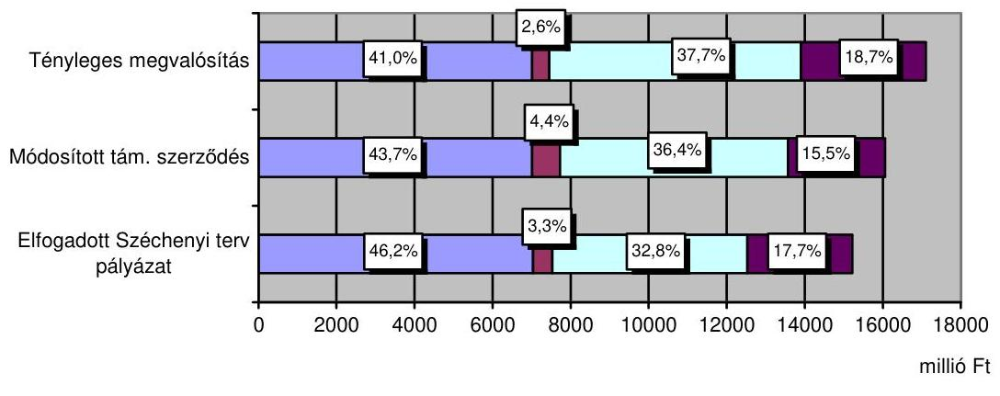

A beruházási költségek növekedését döntő részben - 90,4\%-ban - saját forrásokkal tervezték finanszírozni a beruházók. A támogatás aránya 2,5 százalékponttal csökkent annak ellenére, hogy összege csak 0,3\%-kal lett kevesebb ${ }^{69}$. A támogatási szerződések módosításaival részben követték a beruházási költségek és a forrásösszetétel változását. A módosítások ellenére a beruházások aktivált

[^0]
[^0]:    ${ }^{68}$ Öt beruházásnál a pótlólagos költségekre több forrásból biztosítottak fedezetet.
    ${ }^{69}$ A Széchenyi terv támogatás összege egy beruházásnál, Barcson 21548 ezer Ft-tal csökkent, a le nem vonható áfával tervezett beruházásnál az áfa levonhatóvá vált.

---

költségei 6,5\%kal meghaladták a módosított támogatási szerződésekben foglalt beruházási költséget. A többletköltségeket saját forrásokból és beruházási hitelből finanszírozták, így a támogatás aránya tovább mérséklődött. A pénzügyi forrásösszetétel változását a jelentés 3. számú melléklete tartalmazza.

Az elfogadott pályázatokban a beruházások összköltségét 15220788 ezer Ft-ra tervezték, amely a támogatási szerződések módosításaival 16060842 ezer Ft-ra növekedett. A beruházások aktivált költségei 1039079 ezer Ft-tal meghaladták a módosított támogatási szerződésekben, és 1879133 ezer Ft-tal a pályázatokban elfogadott költségeket.

# A pályázatokban foglaltak szerint a beruházások megvalósítását három önkormányzat és öt gazdasági társaság tervezte 23,3-33,1\%os arányú hitel bevonásával. A megvalósítás során azonban a beruházások megvalósítása érdekében felvett hitelek 50,6\%-kal meghaladták a tervezettet. Három helyett négy önkormányzati beruházáshoz kapcsolódott hitelfelvétel, ebből kettő esetben a tervezettnél jelentősen magasabb összeget vettek igénybe. Ennek következtében a hitelek aránya is megnőtt a beruházások forrásain belül és 23,4-47,4\% között alakult. A gazdasági társaságok a hitelek felvételét megalapozottabban tervezték, az általuk felvett hitelek összege és aránya - Pápa kivételével - a tervezettek szerint alakult. 

A megvalósítás során a négy önkormányzati és hat gazdasági társasági beruházáshoz kapcsolódóan felvett hitel összege a tervezett 2692675 ezer Ft helyett 4053953 ezer Ft lett. Pápán a gazdasági társaság, Barcson az önkormányzat hitel felvételét nem tervezte, ennek ellenére 471832 ezer Ft-ot, illetve 319436 ezer Ft-ot vett igénybe. Celldömölkön az önkormányzat 373932 ezer Ft-ot, Gárdonyban az üzemeltető gazdasági társaság (a beruházó önkormányzatnak történő átadás céljából) 850000 ezer Ft-ot vett fel, ez 33,5\%-kal, illetve 186,1\%-kal haladta meg a tervezettet. Utóbbinál az önkormányzat a forrásösszetételben nem mutatta ki, mert előre megfizetett díj jogcímen vette át az üzemeltetőtől.

A hitelfelvételnél Celldömölkön nem tartották be az adósságot keletkeztető éves kötelezettségvállalásnak az Ötv. 88. § (2) bekezdésében előírt felső korlátját.

Az önkormányzatoknál a pénzügyi bizottság, a gazdasági társaságoknál a felügyelő bizottság a hitelfelvétel okait a beruházások 22,2\%-ánál, gazdasági megalapozottságát 44,4\%-ánál nem vizsgálta.

Az önkormányzati (rész)tulajdonú gazdasági társaságok beruházásaihoz az önkormányzatok átadott pénzeszközként nem nyújtottak forrásokat. Egy beruházásnál az önkormányzat törzstőke emeléssel biztosított pótlólagos forrásokat, két gazdasági társaság három beruházásához pedig a felvett hitel és kamatai visszafizetéséhez az önkormányzatok készfizető kezességet vállaltak. Emellett az üzemeltető gazdasági társaság által felvett hitel visszafizetése érdekében az önkormányzat támogató nyilatkozatot tett és a jelzálogjog bejegyzéséhez szükséges ingatlanokat is biztosította.

Pápán az önkormányzat 177500 ezer Ft-tal emelte meg a gazdasági társaság törzstőkéjét.

Sárváron a két beruházásnál 980479 ezer Ft, Pápán 500000 ezer Ft hitel és kamatai visszafizetésére az önkormányzatok készfizető kezességet vállaltak.

---

Gárdonyban az üzemeltető által felvett 850000 ezer Ft hitelnél az önkormányzat biztosított ingatlanokat jelzálogjog bejegyzéséhez, továbbá céltartalék képzését vállalta a hitel törlesztése érdekében.

# 2.3.2. A pénzügyi források rendelkezésre állása és a támogatások felhasználása 

A számlák kifizetéséhez a beruházások 47,1\%-ánál álltak határidőben rendelkezésre a tervezett források, 52,9\%-ánál azonban különböző intézkedéseket kellett tenni a pénzügyi források és a beruházási költségigény összehangolása érdekében, és átmeneti vagy tartós fizetési nehézségek is jelentkeztek. A fizetési nehézségek nem hátráltatták a kivitelezési folyamatot, a beruházások megvalósításának késedelmei nem voltak egyértelműen visszavezethetők a pénzügyi problémákra.

Leggyakoribb problémát a különböző támogatások rendelkezésre állása jelentette, mivel azokat az utófinanszírozás miatt a számlák kifizetését követően lehetett igénybe venni, és előfordult, hogy csak több hónapos késedelemmel érkezett meg a beruházók számlájára. A beruházások nagyságrendje miatt ezen túl gondot okozott az előzetesen felszámított, levonható áfa megelőlegezése is saját forrásokból. Az átmeneti finanszírozási problémák megoldására hét beruházásnál likvid hitelt vettek igénybe, egy beruházásnál pedig nem különítették el a beruházás megvalósítása érdekében felvett hitelt a működési hitelkerettől. A hitelek a fizetendő kamatok és a hozzá kapcsolódó egyéb terhek miatt megnövelték a beruházások költségeit is.

A támogatás megelőlegezésére Bükön 300000 ezer Ft, Sárváron az I-II. ütemhez 400000 ezer Ft, az áfa megelőlegezésére előbbinél 70000 ezer Ft, utóbbinál 400000 ezer Ft likvid hitelt vettek fel. A likvid hitel összege Pápán 100000 ezer Ft, Barcson 128160 ezer Ft, Celldömölkön az I-II. ütemhez 190128 ezer Ft volt.

Sellyén az önhibáján kívül hátrányos helyzetben lévő (működési forráshiányos) önkormányzatnak az ellenőrzött években 12000 - 40000 ezer Ft közötti összegű folyószámlahitele volt, amely fedezetet nyújtott a beruházás átmeneti finanszírozására is.

A fizetési nehézségek megoldásában három beruházásnál (Barcs, Lenti, Sellye) a fizetési határidők meghosszabbításával, valamint egyéb pénzeszközök rendelkezésre bocsátásával közreműködött a kivitelező is. Két önkormányzatnál a fizetési nehézségek tartóssá váltak és a további beruházásokra is hatással voltak.

Barcson a kivitelező jóteljesítési garanciaként 166975 ezer Ft-ot utalt át, melyet az önkormányzat a Vhr. 9. melléklet 3/d. pontjában előírtakkal ellentétben nem különített el, bevonta a számlák finanszírozásába (az összeget később visszafizette). Az állandósult fizetési nehézségek megoldásához, a beruházás - jelen vizsgálattal nem érintett - II. ütemének megvalósításához a 2041/2006. (III. 10.) Korm. határozat alapján 225000 ezer Ft támogatásban részesült a terület- és régiófejlesztési célelóirányzat központi fejlesztési feladatok előirányzatának a miniszteri egyedi döntések alapján felhasználható kerete terhére. Az önkormányzat folyamatos likvidítási gondjai megoldására 2007-ben 700000 ezer Ft 12 év futamidejű kötvény kibocsátásáról döntött.

---

Celldömölkön a fizetési nehézségek a beruházás I. üteme költségeinek megnövekedése miatt állandósultak, emiatt magasabb összegű felhalmozási hitel felvételére kényszerültek és a problémák a II. ütem megvalósítására is hatással voltak.

A beruházási költségek finanszírozása a beruházások 70,6\%-ánál nem volt tervszerú. A beruházási költségek jelentős - 10\%-ot meghaladó növekedése miatt eredetileg nem tervezett forrásokat vontak be a számlák kifizetésébe, illetve a tervezettet meghaladó mértékben kellett forrásokat bevonni 10 beruházásnál, további kettőnél pedig a költségek jelentősebb emelkedése nélkül került sor nem tervezett források bevonására.

Balatonlellén két beruházásnál a költségek növekedését a megyei önkormányzattól kapott támogatás fedezte, Marcaliban ugyanez saját forrásokat váltott ki. Barcson a tervezett saját források helyett öt különböző forrásból kapott egyéb támogatásokat, majd hitelt vontak be a finanszírozásba. A beruházási költségek jelentős növekedését Lentiben, Zalakaroson, Zalaegerszegen további saját források bevonásával finanszírozták, Zalaszentgróton és Celldömölkön a II. üteménél egyéb támogatásokat is bevontak, az I. ütemnél a tervezettet meghaladó mértékben vettek fel hitelt.

Pápán a költségek növekedését a törzstőke emelésből fedezték, a tervezett önkormányzati támogatás helyett pedig beruházási hitelt vettek fel. Gárdonyban a tervezett hitelt - magasabb összegben - az üzemeltető vette fel és 15 évre előre megfizetett bérleti jog és üzemeltetési díj jogcímen adta át a beruházáshoz, így saját forrásként a tervezettnek közel a háromszorosát mutatták ki.

A beruházásokhoz összesen 7012114 ezer támogatást - az elnyert összeg 99,7\%-át - használtak fel. A kedvezményezettek az egészségturisztikai létesítmények megvalósításával összességében eleget tettek a támogatási szerződésekben foglalt kötelezettségüknek, az igényelt támogatásokat a beruházások megvalósítására fordították. A támogatások felhasználása során azonban öt beruházásnál ${ }^{70}$ eltértek a támogatási szerződés alapját képező, elfogadott pályázatban szereplő műszaki tartalomtól, négynél ${ }^{71}$ pedig kisebb módosításokkal valósították meg. A változásokat Zalaegerszeg kivételével jelezték a támogató, illetve a pályázatkezelők felé. A támogatási szerződésekben nem állapították meg számszerúen a kötelezettségeket. Nem rendelkeztek arról, hogy a pályázatokban szereplő indikátorok közül melyikkel kell mérni a kitüzött célok elérésének szintjét, és ezek közül melyikhez kötik a felhasználható támogatások összegét. Ezért nem volt számszerúsíthető a szerződésben vállalt kötelezettségek teljesítése és eredménye - és ezzel az Ámr. előírásainak betartása azoknál a beruházásoknál, ahol a támogatás felhasználása során eltértek az elfogadott pályázatban szereplő múszaki tartalomtól.

A támogatási szerződésekben azt szerepeltették, hogy a támogatás a pályázatban megnevezett beruházás megvalósítására fordítható, továbbá rögzítették, hogy amennyiben a kedvezményezettek nekik fel nem róható okból a szerződésben vállalt kötelezettségüket csak részben, de legalább 75\%-os arányban teljesítik, a

[^0]
[^0]:    ${ }^{70}$ Barcs, Celldömölk I. ütem, Pápa, Zalaegerszeg, Zalaszentgrót.
    ${ }^{71}$ Marcali, Lenti, Gárdony, Bük.

---

támogatást arányosan csökkenteni kell. Ez az előírás összhangban volt az Ámr. akkor hatályos 88. § (1) bekezdésének előírásaival ${ }^{72}$, de számszerűen megállapított kötelezettségek hiányában, elszámoltatásra nem volt alkalmas.

Az Ámr. 81. § (3) bekezdésének a támogatási döntések meghozatalakor hatályos előírásai ${ }^{73}$ szerint a szükséges hatósági engedélyek hiányában állami pénzeszközökből támogatás nem lett volna megítélhető meg és nem lett volna folyósítható. A támogatási szerződések megkötésekor, illetve a támogatások igénybevételekor a beruházások 41,2\%-ánál nem álltak rendelkezésre teljes körűen a szükséges hatósági engedélyek, erre azonban a támogató és a pályázatkezelők nem voltak figyelemmel.

# 2.3.3. A múszaki és a pénzügyi teljesítések összhangja a beruházási számlák kifizetésekor, a létrehozott vagyon aktiválása 

A kivitelezői szerződésekben a műszaki teljesítéshez igazodóan, a műszaki és pénzügyi ütemterveknek megfelelően állapodtak meg a számlák benyújtásában, amelyek tartalmazták a számlázásra vonatkozó egyéb előírásokat is. A beruházási számlák benyújtásakor és kifizetésekor három beruházás kivételével a szerződésekben foglaltaknak megfelelően jártak el.

A kivitelezői alapszerződések előírásai ellenére Barcson a műszaki teljesítést a megrendelő és az üzemeltető nem igazolta, Zalaszentgróton a számlákhoz nem csatolták a szerződésben meghatározott hiteles kimutatásokat, Zalaegerszegen az ütemterveket nem aktualizálták és nem csatolták a számlákhoz az azokban szereplő munkafázisok minőségbiztosításának dokumentumait.

## A kifizetésekhez a beruházások 41,2\%-ánál nem csatolták azok múszaki tartalmát megalapozó, hiteles kimutatásokat, illetve azokból nem volt megállapítható a tényleges teljesítés nagysága.

Nem csatolták a számlákhoz a teljesítések műszaki tartalmát megalapozó, hiteles kimutatásokat, illetve azokból nem volt megállapítható a tényleges teljesítés nagysága Barcson, Bükön, Celldömölkön két beruházásnál, Zalaszentgróton, Gárdonyban és Pápán.

[^0]
[^0]:    ${ }^{72}$ Az Ámr. 88. § (1) bekezdésének akkor hatályos előírásai szerint, amennyiben a kedvezményezett - neki fel nem róható okból - a szerződésben vállalt kötelezettségeit csak részben, de számszerűen megállapított kötelezettségek esetén legalább 75\%-ot meghaladó arányban teljesíti, az igénybe nem vett támogatás - törvény, illetve kormányrendelet eltérő rendelkezése hiányában - annak zárolásával, törlésével visszavonásra kerül. Ha a kedvezményezett neki felróható okból nem teljesíti a szerződésben vállalt kötelezettségeit, az igénybe vett támogatás egészét vagy arányos részét ... kamattal növelt összeggel kell visszafizetnie.
    ${ }^{73}$ A támogatási döntéseket a 2001-2003. években hozták. Az Ámr. 81. § (3) bekezdésének jelenleg hatályos előírásai szerint a szükséges jogerős hatósági engedélyek ... hiányában támogatási szerződés nem köthető, állami pénzeszközökből támogatás nem folyósítható, kivéve, ha jogszabály eltérően rendelkezik.

---

A kivitelezők által benyújtott számlák csak formailag feleltek meg a jogszabályi előírásoknak ${ }^{74}$, mert a műszaki tartalom dokumentálási hibái miatt a beruházások $41,2 \%$-ánál hiányoztak a teljesítések szakmai igazolásának tartalmi kellékei ${ }^{75}$.

A múszaki ellenőrök vizsgálták a kifizetések szakmai indokoltságát és a hozzá tartozó múszaki tartalmat, annak ellenére, hogy ezt a 158/1997. (IX. 26.) Korm. rendelet nevesítetten nem írta elő számukra ${ }^{76}$ és szerződéseik sem tartalmazták az ellenőrzés módjára vonatkozó előírásokat a beruházások $35,3 \%$-ánál, a hozzá kapcsolódó dokumentálási feladatokat a beruházások $52,9 \%$-ánál.

Az ellenőrzés nem állapított meg múszaki teljesítés nélküli kifizetést, a tényleges múszaki és pénzügyi teljesítések azonban eltértek a tervezett, ütemezett teljesítésektől a beruházások 64,7\%-ánál. Az eltérések nagyságát nem mutatták ki, illetve a tervezettől eltérő teljesítések esetén a beruházók és a kivitelezők módosították az ütemterveket, ezzel teremtették meg a tervezett és a tényleges teljesítés összhangját, gyakran elfedve ezáltal a részteljesítések kivitelezői késedelmeit. A műszaki ellenőrök a tervezettől eltérő teljesítésekre nem tettek észrevételeket, illetve észrevételeik - a tervezett ütemezés tényleges teljesítésekhez történő igazítása miatt - nem a benyújtott számlák teljesítés igazolásaihoz kapcsolódtak. A tervezett, ütemezett és a tényleges műszaki teljesítések eltéréseire az építési naplóban történő bejegyzésekkel, valamint a kooperációs értekezleteken hívták fel a kivitelezők figyelmét, azonban nem jelölték meg konkrétan az elmaradás nagyságát természetes mértékegységben vagy értékben. A műszaki ellenőrök megbízásához kapcsolódóan a számlázás lehetőségét a beruházások 58,8\%-ánál a kivitelezői teljesítésekhez igazodóan, a többi esetben egyéb módon (konkrét ütemezés szerint vagy havi díjat meghatározva) írták elő, a megbízási szerződésekben meghatározottakon túli egyéb feladatellátásért - három beruházás kivételével (Gárdony, Marcali, Zalaegerszeg) - díjazásban nem részesültek. A beruházók részére benyújtott számláik megfeleltek a szerződéseikben foglaltaknak.

Az ellenőrzött beruházások üzembe helyezését követően megtörtént a létrehozott vagyon számviteli aktiválása. A beruházások aktivált értékét összesen 17099921 ezer Ft-ban mutatták ki, ez 12,3\%-kal haladta meg a támogatási pályázatokban elfogadott, és $6,5 \%$-kal a módosított támogatási szerződésekben szereplő költségeket. Az aktiválás a beruházások 76,5\%-ánál megfelelt a hatályos számviteli előírásoknak, négy esetben azonban hibákat

[^0]
[^0]:    ${ }^{74}$ A számlákra vonatkozó előírásokat az általános forgalmi adóról szóló 1992. évi LXXIV. törvény 13. § (1) bekezdése (2008. január 1-től a 2007. évi CXXVII. törvény 169. $\S$-a), a bizonylatra vonatkozó előírásokat a Számv. tv. 167. § (1) bekezdése tartalmazza.
    ${ }^{75}$ A múszaki tartalom dokumentálási hibái a jelentés 2.2.2. pontjában találhatók.
    ${ }^{76}$ A 2007. december 31-ig hatályos 158/1997. (IX. 26.) Korm. rendeletben az építési múszaki ellenőr feladatai között a kifizetések ellenőrzése nem szerepelt, de a 2008. január 1-től hatályos 290/2007. (X. 31.) Korm. rendelet 15. § (3) bekezdés n)-o) pontjai szerint az építési múszaki ellenőr feladata különösen „a pénzügyi elszámolások, felmérések ellenőrzése" és „a teljesítésigazolás".

---

állapított meg az ellenőrzés, mivel nem vették figyelembe a Számv. tv. 47. § (1) bekezdésének előírásait az eszközök bekerülési értéke megállapításakor.

Bükön nem vezettek teljes körű nyilvántartást a kivitelezői feladatokon túli költségekről, így csak egyes tételek voltak megállapíthatók, továbbá a kötbér összegével a beruházás költségeit csökkentették. Utóbbi nem felelt meg a Számv. tv. 77. § (2) bekezdés b) pont előírásainak.

Celldömölkön a beruházás I. ütemében létrejött vagyon értékében a beruházáshoz nem tartozó kiadási tételeket is szerepeltettek, Zalaszentgróton pedig a beruházáshoz tartozó tételt múködési kiadásként számoltak el és az aktivált értékben nem mutatták ki.

Gárdonyban az eszközök bekerülési értékébe beszámító költségeket nem felhalmozási kiadásként számolták el és az aktivált költségek között nem mutatták ki, ugyanakkor a tervezési költségek fedezetére az üzemeltetőnek átadott pénzeszközöket az államháztartáson kívüli végleges pénzeszköz átadások helyett a felhalmozási kiadások között szerepeltették.

Az egészségturisztikai beruházások aktiválásakor problémaként jelentkezett, hogy a létesítmények üzemeltetéséhez szükséges gépek, berendezések és felszerelések (vízforgató berendezések gépészete, szűrők) értékét a beruházók az ingatlanok értékében aktiválták azzal az indokkal, hogy a gépházakban - az építmények részeként - mindent rögzítettek, nem mobil eszközök kerültek beépítésre. A tárgyi eszközök eszközcsoportonkénti besorolásának minősítésekor nem az egybeépítés ténye, illetve a gép, berendezés, felszerelés megnevezése a lényeges, hanem az, hogy azok beépítése, felszerelése az épület rendeltetésszerú használata érdekében történt-e, vagy elsősorban a tevékenység, a technológia érdekében szükséges. Utóbbinál a gépek, berendezések, felszerelések értékét az ingatlanoktól elkülönítetten kell kimutatni ${ }^{77}$.

Gárdonyban és Sellyén az egészségturisztikai létesítmények üzemeltetését nem az önkormányzat vagy annak költségvetési szerve, hanem szerződés alapján gazdasági társaság végezte, ennek ellenére azok értékét a könyvviteli mérlegben az üzemeltetésre átadott eszközök helyett a saját üzemeltetésű eszközök között mutatták ki, amely nem felelt meg a Vhr. 20. § (1) bekezdés előírásainak.

# 3. A PROJEKTEK EREDMÉNYEI, TÁRSADALMI-GAZDASÁGI HATÁSAI 

### 3.1. Az egészségturisztikai beruházások megvalósításának tervszerűsége és eredményessége

A pályázatokban a beruházók jó előrelépési lehetőségnek tekintették a termálvízkincs hasznosítását meglévő fürdővagyonuk bővítésével, korszerűsítésével, vagy új létesítmények építésével. Az ellenőrzött 17 egészségturisztikai be-

[^0]
[^0]:    ${ }^{77}$ 87/1999. Számviteli kérdés, megjelent a Számvitel, adó, könyvvizsgálat 1999. novemberi számában. Az állásfoglalást nem érinti a számviteli szabályok 2000. évi változása.

---

ruházás 13 fürdőlétesítményhez kapcsolódott, amelyből hat helyszínen új fürdőt építettek, három helyszínen a már meglévő fürdőt bővítették, négy további esetben pedig a fejlesztés a korábban üzemelt létesítmények teljes- vagy részbeni rekonstrukciójával is együtt járt. Új komplex (fedett és szabadtéri) fürdőt építettek Sárváron, Celldömölkön és Pápán, szabadtéri fürdő létesült Zalaegerszegen, Marcaliban és Barcson. A korábban meglévő fürdőt (strandot) bővítették Lentiben, Zalaszentgróton és Balatonlellén, a bővítés mellett rekonstrukciós munkákat is végeztek Zalakaroson, Bükön, Gárdonyban és Sellyén ${ }^{78}$.

Az ellenőrzött beruházásokhoz kapcsolódóan 11 fürdőnél további fejlesztések, felújitások is történtek, részben az infrastruktúra kiépítése, részben a fürdőszolgáltatások továbbfejlesztése érdekében. Értékük meghaladta az ellenőrzött beruházások bekerülési értékének az egyötödét, múködtetésük szorosan összekapcsolódott és hatásuk nem volt elválasztható egymástól. A fürdőfejlesztésekkel párhuzamosan azonban a beruházók - Sárvár kivételével szálláshely kapacitást növelő fejlesztéseket nem végeztek, e beruházásoknál megjelentek a magánbefektetők, akik gyógy- és wellness szállodákat, termál kempingeket alakítottak ki, kihasználva a szolgáltatásstruktúrából hiányzó területeken jelentkező keresletet.

A fürdők a hazai és a nemzetközi turizmusban betöltött szerepük alapján két csoportba sorolhatók ${ }^{79}$. Nemzetközi jelentőségü fürdő található Bükön, Zalakaroson és Sárváron, ezek több évtizedes hagyományokkal, kialakult fürdőkultúrával rendelkeznek, alap- és egészségturisztikai infrastruktúrájuk kiépített. A fennmaradó 10 fürdő országos jelentőségü, amelyek közül té-li-nyári, komplex szolgáltatásokat nyújtanak Pápán, Lentiben, Zalaszentgróton, Gárdonyban és Celldömölkön, szabadtéri (nyári) fürdőként üzemelt Zalaegerszegen, Barcson ${ }^{80}$, Marcaliban, Sellyén és Balatonlellén.

Az ellenőrzött fürdők közül nyolc közvetlenül 100\%-ban, a további öt az üzemeltető és fejlesztő gazdasági társaságokban lévő tulajdoni részesedéseik alapján döntő részben önkormányzati tulajdonban van. A beruházásokkal a tulajdonosi szerkezet nem változott.

A fürdők Balatonlellén, Barcson, Celldömölkön, Gárdonyban, Marcaliban, Selylyén, Zalaegerszegen és Zalaszentgróton közvetlenül önkormányzati tulajdon-

[^0]
[^0]:    ${ }^{78}$ Az ellenőrzött szervezetek fürdőberuházásait az 1. számú függelék tartalmazza.
    ${ }^{79}$ A fürdőkre a szakirodalomban és a különböző nyilvántartásokban ettől eltérő besorolások is találhatók. Legismertebb az ÁNTSZ törzskönyvi nyilvántartása, valamint az OEP szerződések szerinti besorolások, amelyek gyógyászati jelentőségük alapján országos, körzeti, illetve helyi jelentőségű fürdőket különböztetnek meg. Első az OTH Országos Gyógyhelyi és Gyógyfürdőügyi Főigazgatóság által minősített gyógyfürdőket, második az OEP által támogatott gyógykezeléseket nyújtó fürdőket tartalmazza. Fenti besorolás az Országos egészségturizmus fejlesztési stratégián alapul (2007. május 30.).
    ${ }^{80}$ Zalaegerszegen az önkormányzati szabadtéri fürdőhöz kapcsolódóan az üzemeltető gazdasági társaság befektetői köre, Barcson az önkormányzat a beruházás II. ütemében fedett fürdőt épített, amelyeket 2007-ben nyitottak meg.

---

ban, Sárváron, Lentiben, Zalakaroson, Pápán, Bükön a 100-93,8\%-os - befogadó települési, illetve utóbbinál részben megyei - önkormányzati részesedésű gazdasági társaságok tulajdonában vannak.

A beruházások megvalósítása részben volt tervszerú, mert a beruházók a megvalósítás során eltértek a pályázatokban megjelölt időtervektől 94,1\%ban, az előirányzott költségektől 82,3\%-ban és műszaki tartalomtól 52,9\%-ban.

A támogatásokra irányuló pályázati kiírások szerint a tervezett projektnek a legrövidebb időn belül, illetve a támogatási szerződés megkötésétől számított két éven belül kellett megvalósulni. Ennek megfelelően a beruházók - a projektek nagyságától, bonyolultságától függően 4-30 hónap között -, átlagosan 13 hónapra tervezték a megvalósítás idöszükségletét. A tényleges idöszükséglet a tervezetthez képest több mint egy hónappal lerövidült, így átlagosan 11,7 hónapot vett igénybe, ugyanakkor a kivitelezés megkezdése $\mathbf{8 8 , 2 \%}$-ban, a múszaki átadás-átvétel befejezése 76,5\%-ban késedelmesen történt. A gazdasági társaságok a fürdőfejlesztésekben szerzett beruházói tapasztalataik miatt pontosabban megtervezték a beruházások megvalósításának időszükségletét, az önkormányzatokénál hoszszabb időtartamokkal számoltak, ezeket azonban a megvalósítás során be tudták tartani. A beruházások kivitelezésének megkezdése és a műszaki átadásátvételek befejezése mindkét ellenőrzött szektorban a tervezettekhez képest késett, a késés azonban a gazdasági társaságoknál kisebb volt.

A beruházások megvalósításának időtartamát a gazdasági társaságok átlagosan 14,7 hónapban, az önkormányzatok 11,8 hónapban jelölték meg. A tényleges időszükséglet előbbieknél átlagosan 13,9 hónap, utóbbiaknál 10,1 hónap lett. Az önkormányzatoknál a tényleges megvalósítási idők rövidülését a beruházások megkezdésének jelentős késedelme és a megvalósítási határidők betartásának a kényszerú követelménye okozta.

A kivitelezések megkezdése a gazdasági társaságoknál átlagosan 3,4 hónap, az önkormányzatoknál 9,2 hónap késedelemmel történt a támogatási pályázatokban foglaltakhoz képest, a befejezés átlagosan 3,2 hónapot, illetve 8 hónapot késett. A kivitelezés mindössze egy gazdasági társasági és egy önkormányzati beruházásnál kezdődött meg, a múszaki átadás-átvétel két gazdasági társasági és egy önkormányzati beruházásnál fejeződött be az eredetileg megjelölt határidőben.

A kivitelezési munkák tervezettől későbbi kezdésének okai részben a pályázati döntések és a támogatási szerződések megkötésének késedelme, részben a beruházások megvalósításában résztvevők kiválasztásának időszükséglete volt, amelyekkel nem számoltak a pályázatokban. A projektek 41,2\%-ánál nőtt a megvalósítás folyamata is, amelyek a kedvezőtlen időjárási tényezőkkel, a tervezett kivitelezési időszükséglet alulbecslésével, a múszaki tartalom módosításaival voltak összefüggésben.

A beruházásokat a pályázatokban tervezett 15220788 ezer Ft helyett 17099921 ezer Ft bekerülési értékkel valósították meg, amelyen belül a gazdasági társaságok pontosabban tervezték meg a bekerülési költségeket, a növekedés ebben a szektorban 6,4\%-os volt, az önkormányzati beruházások költségének 21,8\%-os emelkedésével szemben. Mindössze három beruházás valósult meg a tervezett bekerülési értéken vagy

---

azon belül ${ }^{81}$, a többieknél 1,3-46,8\%-os növekedés következett be. A bekerülési érték emelkedése a beruházások 23,5\%-ánál mérsékeltebb volt, 58,8\%-ánál azonban meghaladta az eredetileg tervezett összeg 10\%-át. A jelentős eltéréseket a projektek műszaki tartalmának a - műszaki szükségszerűségből, illetve hibás tervezésből eredő - változásai, továbbá a pontatlan előzetes költségbecslések okozták ${ }^{82}$.

A gazdasági társaságok beruházásai közül a legnagyobb, 23,5\%-os bekerülési érték növekedés Pápán volt. Az önkormányzati beruházások közül Gárdonyban 46,8\%-kal, Balatonlellén az élménymedence beruházásnál 36,0\%-kal, Celldömölkön az I. ütemnél 27,8\%-kal, a II. ütemnél 46,1\%-kal, Zalaegerszegen $25,6 \%$-kal növekedett a bekerülési érték a tervezetthez képest.

# A beruházások 47,1\%-át a tervezetteknek megfelelően valósították meg, 29,4\%-ánál azonban eltértek az elfogadott pályázatban foglalt múszaki tartalomtól, további 23,5\%-ánál pedig a megvalósítás során kisebb változtatásokat hajtottak végre. 

Barcson a tervezett 50 m -es úszómedence helyett egy 25 m -es úszómedencét és egy élménymedencét, Celldömölkön az I. ütemben az ülőpados medence helyett gyermek csúszda medencét építettek. Pápán a tervezett nyolc helyett 12 medencét valósítottak meg kisebb vízfelülettel, tovább módosították az egyéb létesítményeket. Zalaszentgróton egy medencével kevesebb létesült és módosultak a tervezett méretek is. Zalaegerszegen nem épült meg egy medence és két kiszolgáló létesítmény.

Marcaliban és Lentiben technológiai változtatásokat hajtottak végre, Gárdonyban a tervezetthez képest további építési munkák váltak szükségessé, Bükön pedig kisebb, később pótolható részfeladatokat hagytak el.

A műszaki tartalomban bekövetkezett módosulások szükségessé tették a hatósági engedélyek, az engedélyezési és a kiviteli tervek, valamint a kivitelezői szerződések módosításait is ${ }^{83}$. Problémaként jelentkezett a projektek műszaki tartalmának, illetve azok változásainak nyomon követése, mivel azokról a módosítások 45,5\%-ánál nem készítettek kimutatásokat, illetve az eredeti és a módosított szerződések egymással és a pályázatokkal - az eltérő szerkezet, részletezettség és tartalom miatt - nem voltak közvetlenül összehasonlíthatók.

A beruházások eredményeként a létesítmények bruttó területe 1,8 szeresére, ezen belül a fedett terület több mint a kétszeresére bővült. A fejlesztésekkel összesen 79 új medence - 33 fedett és 46 szabadtéri épült ${ }^{84}$, amellyel a medencék száma a két és félszeresére, vízfelületük közel a háromszorosára növekedett. A megvalósított medencék száma

[^0]
[^0]:    ${ }^{81}$ Bük, Sárvár I. ütem, Barcs, utóbbinál a le ne vonhatóként tervezett áfa levonhatóvá válása miatt. Ezt figyelmen kívül hagyva a bekerülési érték növekedése itt 7,1\%-os volt.
    ${ }^{82}$ A pénzügyi megvalósítást részletesen a jelentés 2.3. pontja tartalmazza. A bekerülési érték növekedését beruházásonként a 4. számú melléklet 1. ábra szemlélteti.
    ${ }^{83}$ A műszaki megvalósítást részletesen a jelentés 2.2. pontja tartalmazza.
    ${ }^{84}$ Tartalmaz Sellyén és Bükön 2-2 db olyan medence fejlesztést, amely rekonstrukcióval (korábbi medencék kettéosztásával) jött létre, ez vízfelület növekedést nem jelentett.

---

3,9\%-kal meghaladta, vízfelületük 3,7\%-kal elmaradt a pályázatokban elfogadotthoz képest. Az ellenőrzött beruházások befejezését követően három fürdőben további nyolc medence fejlesztés is történt ${ }^{85}$. Az újonnan létesített szabadtéri medencék vízfelülete lényegesen meghaladta a fedett medencékét, átlagos nagysága a két és félszeresét tette ki.

A fejlesztéseket megelőzően az ellenőrzésbe bevont fürdők 54 medencével rendelkeztek, amelyek együttes vízfelülete $11121 \mathrm{~m}^{2}$ volt ${ }^{86}$. A beruházások eredményeként a medencék száma 133-ra, vízfelületük $31567 \mathrm{~m}^{2}$-re nőtt. Az új fejlesztésű szabadtéri medencék átlagos mérete $346 \mathrm{~m}^{2}$, míg a fedett medencéké $138 \mathrm{~m}^{2}$ volt.

A gazdasági társaságok beruházásai a szezonális ingadozások kiegyenlítése érdekében elsősorban a fedett létesítmények növelésére irányultak, míg az önkormányzatok nagyobb arányban a szabadtéri fürdőket fejlesztették. Zalaszentgróton az önkormányzat a korábbi szabadtéri fürdő mellé fedett fürdőt épített, ezzel lehetőség nyílt a létesítmény téli-nyári üzemeltetésére és a szezon hosszának a növelésére, összhangban a pályázatban megjelölt célokkal. A 46 új szabadtéri medence $67,4 \%$-a az önkormányzati, míg a 33 új fedett medence $66,7 \%$-a a gazdasági társaságok beruházásaihoz kapcsolódott.

# A fejlesztések hatására a fürdők egyidejú legnagyobb terhelése és a megengedhető napi terhelése több mint a kétszeresére, ezen belül a fedett fürdőké közel a kétszeresére növekedett. 

Az ellenőrzött fürdők megengedett egyidejű legnagyobb terhelése a 2006. évben a 206,2\%-a, a megengedhető napi terhelése a $228,6 \%$-a volt a 2001 . évinek. A nemzetközi jelentőségű fürdők megengedett egyidejű legnagyobb terhelése $48,2 \%$-kal, a megengedhető napi terhelése $55,1 \%$-kal, az országos jelentőségű fedett és szabadtéri fürdőké az öt és félszeresére növekedett a 2002-2006. években. Ennek következtében a fürdők befogadóképességén belül a nemzetközi jelentőségű fürdők részaránya a 2001. évi $81,8 \%$-ról a 2006. évre $55,5 \%$-ra esett vissza.
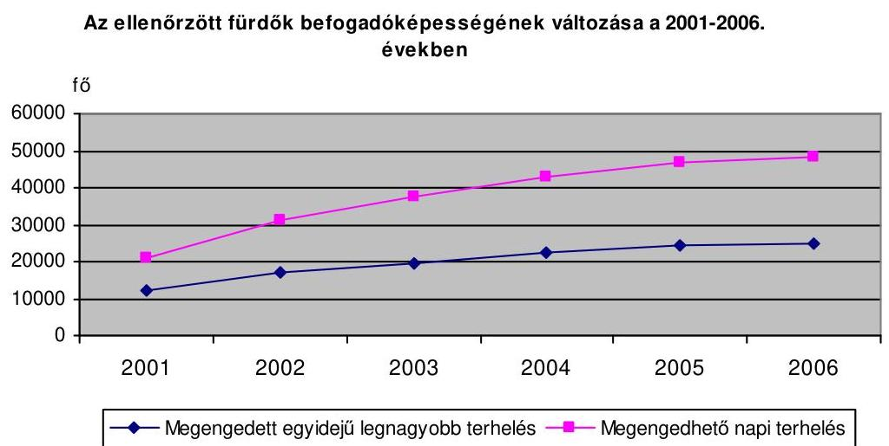

Az ellenőrzött fürdők összes befogadóképességén belül - az új fürdők létesítésével és a kisebb fürdők fejlesztésével - csökkent ugyan, de továbbra is megha-

[^0]
[^0]:    ${ }^{85}$ Barcs fedett fürdő hat medence, továbbá Bük és Zalakaros.
    ${ }^{86}$ Nem tartalmazza Barcs és Sárvár bezárt, illetve elbontott régi fürdőit.

---

tározó a három nagy nemzetközi jelentőségű fürdő részesedése. E három fürdőben található a fedett fürdőkapacitás közel háromnegyede és a szabadtéri fürdőkapacitás fele. A fedett fürdők stabil, szezonális ingadozásoktól és időjárástól független egészségturisztikai kínálatot jelentenek. A szabadtéri fürdők a szezonális, nyári csúcsokat elégítik ki, ebben az országos jelentőségű fürdők kapnak nagyobb szerepet.

A fedett fürdők megengedhető napi terhelése a 2001. évről a 2006. évre 96,7\%kal növekedett és a rendelkezésre álló fürdőkapacitások harmadrészét tette ki. Ennek jelentős része továbbra is a nemzetközi jelentőségű fürdőkben található, részesedésük a fejlesztéseket megelőzően $81,8 \%$-os, ezt követően $71,6 \%$-os volt.

# A pályázatokban foglaltaknak megfelelően, bővült a létesítmények által nyújtott szolgáltatások köre. A beruházók felismerték az egészségturizmus térhódítását, a minőségi szolgáltatások és a többgenerációs turisztikai célterületek irányába való elmozdulás szükségességét. A szolgáltatásszerkezet változtatása részben a vendégek igényeinek felmérésén alapult, részben a hazai és a nemzetközi piacokon megjelent új irányok figyelembe vételével történt. 

A működés során a fürdők 61,5\%-ánál végeztek elégedettségi vizsgálatokat, és ezek felénél a vizsgálatok hatására, azokhoz igazodóan módosítottak a szolgáltatásokon. A fürdők emellett minden esetben rendelkeztek információkkal, végeztek elemzéseket a hazai, továbbá a Nyugat-Dunántúlon az ausztriai konkurens fürdők szolgáltatásainak és árainak alakulásáról is.

A gyógy- és termálfürdők fejlesztése minden fürdőben a hagyományos szolgáltatások színvonalának javítása mellett az élményfürdők kialakítását, a wellness és a fitnesz szolgáltatások fejlesztését célozták. Erősítették a humánegészségügy, a fizikai közérzetjavítás, a rekreációs funkció jelentőségét, mindenütt megjelent célként a több generáció igényeinek kielégítése. Az úszó- és tanmedence építésével megjelent az úszásoktatás és az aktív szabadidő eltöltés további lehetőségei. Két új fürdőben kiépítették az OEP által elismert gyógykezelések feltételeit. Fejlesztések történtek a kiszolgáló létesítmények (öltözők, mosdók, éttermek, üzletek) és egyéb szolgáltatások területén is.

A beruházások során azonban egymással párhuzamosan, hasonló fejlesztések történtek, ezzel nem csökkent- az Egészségturizmus tízéves fejlesztési programjában célként kitűzöttek szerint - a fürdők területi koncentrációja, és kevésbé tudták hangsúlyozni a konkurenciától megkülönböztethető szolgáltatásaikat, az egyedi vonzerőket. A három kategóriába sorolt fürdők kategóriájukon belül - a látogatottsági adatok elemzése szerint ${ }^{87}$ - ugyanannak a vendégkörnek, hasonló szolgáltatásokat nyújtanak. Az egészségturisztikai létesítmények pozicionálásakor ugyanakkor fontos szempont, hogy „csak az egymást jól megtürő célcsoportokat keverjék, ne akarjanak minden célcsoport igényeinek megfelelni ... néhány híres gyógyfürdőtől eltekintve, nincs ma Magyarországon olyan létesítmény, amely arculata és kínálati struktúrája alapján jól körülhatárolható pozícióval rendelkezik"88.

[^0]
[^0]:    ${ }^{87}$ A fürdők látogatottsági adatainak bemutatása a jelentés 3.2. pontjában található.
    ${ }^{88}$ Fürdők kézikönyve, Tervezés - építés - üzemeltetés. Magyar Fürdőszövetség, Budapest, 2006.

---

Zalaszentgrót körzetében 50 km -es távolságon belül olyan nagy múltú fürdők találhatók, mint Zalakaros, Hévíz és Sárvár, emellett a fürdőfejlesztéssel párhuzamosan történt beruházás a közeli Zalaegerszegen, Celldömölkön és - a helyszíni vizsgálattal nem érintett - Kehidakustányban is. Zalaegerszeg 50 km -es körzetében négy, emellett 50-60 km távolságban további két fürdő található.

# 3.2. Az egészségturisztikai létesítmények üzemeltetése 

A fürdőket a 37/1996. (X. 18.) NM rendelet 1. §-ában előírt és az ÁNTSZ városi intézetei által jóváhagyott üzemeltetési szabályzatok alapján múködtették. Naprakészen és folyamatosan vezették az üzemnaplókat, azok azonban a létesítmények 30,8\%-nál nem tartalmazták teljes körűen az előírt ${ }^{89}$ adatokat, illetve vezetésük nem folyamatosan és naprakészen történt.

A gazdasági társaságok maguk üzemeltették a tulajdonukban lévő fürdőket, mindössze egy esetben fordult elő, hogy rész-üzemeltetési feladatokat más gazdasági társaságnak adtak tovább.

Pápán az üzemeltető-tulajdonos egy másik gazdasági társaságra bízta a fürdőmesteri, úszómesteri feladatokat és a takarítást, zöldterület gondozást. A részüzemeltető jogosult volt saját költségén beruházásokat megvalósítani és az azokból származó szolgáltatásokat értékesíteni, a helységek után bérleti díjat fizetett.

Az önkormányzatok a közvetlen tulajdonukban lévő fürdő létesítmények múködtetését költségvetési intézményeikre bízták, illetve saját vagy idegen tulajdonú gazdasági társaságok útján üzemeltették. Utóbbiaknál az üzemeltetés feltételeiről a képviselő-testületek által jóváhagyott szerződésekben állapodtak meg.

Az ellenőrzött fürdők megoszlása tulajdon és üzemeltetési forma szerint
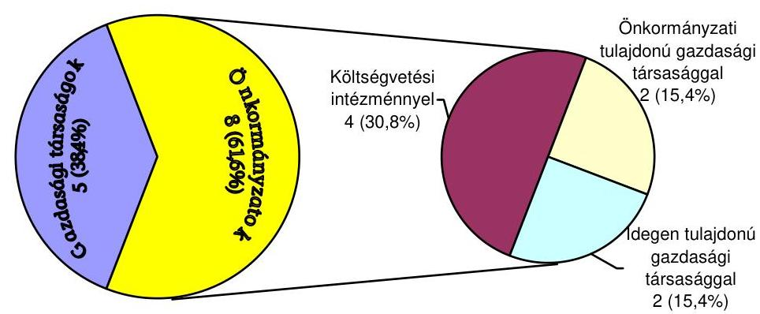

Az üzemeltetési szerződések hiányossága volt, hogy nem tartalmazták az üzemeltetésre átadott vagyonelemeket és a tulajdonosok nem írtak elő teljesítmény elvárásokat az üzemeltetéssel kapcsolatban.

[^0]
[^0]:    ${ }^{89}$ Adattartalmát a 37/1996. (X. 18.) NM rendelet 2. §-a szabályozza.

---

Celldömölkön, Marcaliban, Barcson és Balatonlellén önállóan gazdálkodó költségvetési intézmények alapfeladatként működtették a fürdőt. Gárdonyban és Sellyén 100\%-os önkormányzati tulajdonban lévő, Zalaegerszegen és Zalaszentgróton idegen gazdasági társaság üzemeltette a létesítményeket.

Az önkormányzatok a fürdők fenntartását, üzemeltetését önként vállalt feladatként látták el, és az üzemeltetés költségvetési intézményi keretek között tartásával felvállalták a múködtetés során képződő veszteségek finanszírozását is. Az önkormányzati intézmények által üzemeltetett fürdők $75 \%$-a az ellenőrzött időszakban veszteséges volt, amely veszteséget az egyéb költségvetési bevételekből fedezték. A saját gazdasági társaságokkal üzemeltetett fürdőknél az önkormányzatok - különböző módon és mértékben - szintén részt vettek a múködtetés költségeinek finanszírozásában, egy esetben pedig az idegen tulajdonú gazdasági társasággal üzemeltetett fürdőnél is hozzájárulást vállalt a veszteségek viseléséhez.

Celldömölkön a Városgondnokság látja el a fürdő üzemeltetését, amely 2005. utolsó negyedévében 19691 ezer Ft, a 2006. évben 116740 ezer Ft veszteséggel múködött, a 2007. évre 171029 ezer Ft veszteséget prognosztizáltak. Barcson a Városgazdálkodási Igazgatóság üzemeltette a fürdőt 2514 - 28883 ezer Ft veszteséggel, ez alól egy év képezett kivételt. Marcaliban a Városi Gyógyfürdő és Szabadidőközpont az ellenőrzött években 6059 - 35924 ezer Ft veszteséget mutatott ki és a 2007. évre sem várható nyereséges üzemeltetés.

Sellyén az önkormányzat ún. üzemeltetési díjat fizetett az üzemeltetést végző saját gazdasági társaság részére, melynek összege az ellenőrzött időszakban évente 3625 - 5000 ezer Ft volt. Gárdonyban az önkormányzat a helyi lakosok fürdőlátogatását támogatta a 2004-2006. években évi 11215 ezer Ft-tal.

Zalaszentgróton az önkormányzat a 2002-2003. években átvállalta - az üzemeltető idegen tulajdonú gazdasági társaságtól - a villamos energia, a víz- és a csatornadíj költségét, továbbá megtérítette az üzemeltetés igazolt veszteségét, a 2004. évtől pedig csökkenő mértékben, 20 000-10 000 ezer Ft támogatást biztosított az üzemeltetéshez és visszajuttatta a befizetett használati díjat ${ }^{90}$.

A létesítmények az ellenőrzött időszakban egymást követően, folyamatosan jelentek meg az egészségturisztikai piacon. A 2002-2003. években kettő-kettő, 2005-2006-ban egy-egy új fürdő kezdte meg múködését, továbbá a 2002. évben kettő, 2003-ban három, 2004-ben négy, 2005-ben kettő és a 2006. évben egy fürdőben adtak át új, illetve korszerűsített létesítményeket. Az egészségturisztikai piac fizetőképes kereslete - a termál- és gyógyfürdők iránti igény - ugyanakkor nem növekedett olyan mértékben, mint amilyen ütemben létrehozták az új kapacitásokat. A belépő új létesítmények hatására átrendeződtek a piaci viszonyok, a korábban múködött fürdőknél érezhető volt a belépő új létesítmények, az újdonságnak számító attrakciók elszívó hatása. Mindezek következtében csökkent a tradicionális fürdők piaci részesedése ${ }^{91}$ annak ellenére, hogy a fejlesztések ezekben is - a piaci tren-

[^0]
[^0]:    ${ }^{90}$ Az önkormányzat a helyszíni ellenőrzés lezárását követően, 2008. május 1-től másik gazdasági társaságot bízott meg az üzemeltetéssel.
    ${ }^{91}$ Éves látogatószám alapján számított.

---

deknek megfelelően - az élményfürdőzés és a wellness turizmus igényeinek kielégítése irányába hatottak.
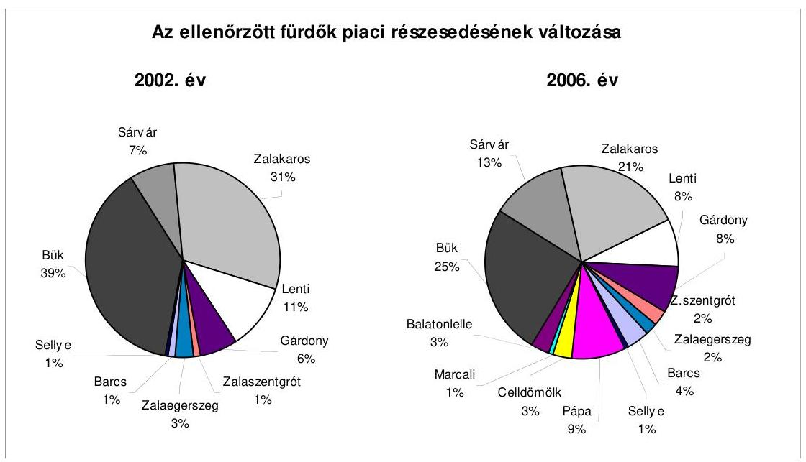

A 2002. évben a vendégek 77\%-a, a 2006. évben az 59\%-a látogatta a nemzetközi jelentőségű fürdőket, ugyanakkor utóbbi 13,5\%-kal több vendéget jelentett.

A beruházók a pályázatokban a beruházások üzembe helyezését követően - 38-42\%-os kapacitáskihasználtság mellett - különböző mértékű, de összességében növekvő látogatószámmal kalkuláltak, ami nem volt megalapozott a párhuzamosan megvalósított fürdőfejlesztések ismeretében. A több éves fürdőüzemeltetési tapasztalatokkal rendelkező beruházók kivételével, nem vették figyelembe reálisan a természeti adottságokból eredő erős területi koncentrációt, a versenytársakat, illetve a lehetséges fizetőképes keresletet. A beruházók a látogatószám tervezésénél évente átlagosan 4-8\%-os növekedési ütemmel kalkuláltak, de előfordult ennél óvatosabb és optimistább tervezés is.

A tervezett látogatószámot a fürdők a növekvő tényleges látogatószám ellenére csökkenő mértékben teljesítették. Legjobban megközelítették, illetve egy évben meg is haladták a tervszámokat a nemzetközi jelentőségű fürdők, legjobban elmaradtak attól a szabadtéri fürdők az elmúlt évek kedvezőtlen nyári időjárása miatt. Jellemző volt, hogy az új, illetve a korszerűsített létesítmények megnyitását követően kiugróan magas volt a látogatók száma (újdonság élménye), majd ezt követően visszaesett és stagnált, illetve csak a tervezett mérték alatt növekedett. A fürdők tényleges látogatószáma az ellenőrzött időszakban 43,2\%-kal nőtt, ezen belül a nemzetközi jelentőségű fedett fürdők látogatószáma az átlagos növekedési szint alatt alakult, míg az országos jelentőségű komplex, illetve a szabadtéri fürdők látogatószáma - az új létesítmények belépése miatt - a 2,3 illetve a 2,6 szeresére emelkedett. Ugyanezen időszakban a beruházások eredményeként a fürdők éves elméleti befoga-

---

dóképessége ${ }^{92}$ több mint a kétszeresére nőtt. Mindezen tényezők hatására a 2002. évről a 2006. évre 40,7\%-ról 32,4\%-ra csökkent a fürdők kapacitáskihasználtsága, vagyis évről évre nőtt az olló a létrehozott befogadóképesség és a tényleges kihasználtság között.
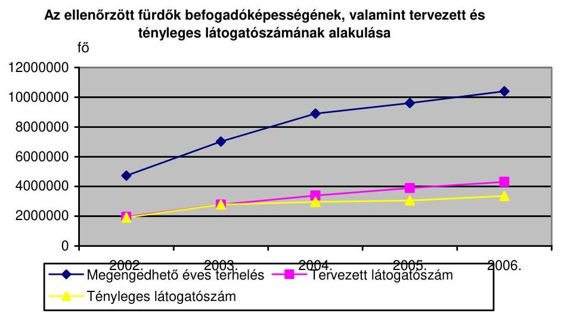

A nemzetközi jelentőségű fürdők 83,2-108,4\%-ban, az országos jelentőségű komplex fürdők 83,8-101,6\%-ban, míg a szabadtéri fürdők mindössze 24,261,6\%-ban teljesítették az előirányzott látogatószámot, annak ellenére, hogy a 2002. évről a 2006. évre a nemzetközi jelentőségű fürdők látogatószáma 13,5\%kal, az országos jelentőségű komplex fürdőké 138\%-kal, a szabadtéri fürdőké 164,1\%-kal növekedett. A tényleges és a tervezett látogatószám aránya a 2003. évi $100 \%$-ról a 2006. évre $78,1 \%$-ra csökkent.

A megengedhető napi terhelés alapján számított ún. éves elméleti befogadóképesség a gyakorlatban a turizmus szezonális ingadozásai és az időjárástól való függősége miatt nem kihasználható, mindemellett azt úgy kell megtervezni és kialakítani, hogy a megengedett egyidejű legnagyobb terhelés betartásával beleférjenek a szezoncsúcsok is. A kapacitások nagyon alacsony kihasználása ugyanakkor hátrányos az üzemeltetők számára, mivel magasan tartja az üzemi tevékenység ráfordításait és így veszteségessé teszi a gazdálkodást.

A gyógyászati célú és a wellness belépések ${ }^{93}$ száma a fürdőbelépéseket kissé meghaladóan, $46,1 \%$-kal növekedett az ellenőrzött időszakban. Ezen belül azonban kisebb mértékben emelkedett a hagyományos OEP által finanszírozott, ugyanakkor az átlagot meghaladóan, a négyszeresére nőtt az egyéb gyógykezelések és a wellness belépők száma.

A különböző gyógyászati, wellness és fitnesz szolgáltatásokkal a fürdők célja új célcsoportok igényeinek kielégítése, a tartózkodási idő és az egy vendégre jutó

[^0]
[^0]:    ${ }^{92}$ A megengedhető napi terhelés és az éves nyitvatartási napok száma alapján számítva. A számításoknál a beruházások üzembe helyezését követő próbaüzemi időszakokat figyelmen kívül hagytuk.
    ${ }^{93}$ Nem tartalmazza a fürdőbelépőkben - megkülönböztetés nélkül - értékesített wellness szolgáltatásokat.

---

költés növelése volt. Fürdőgyógyászati tevékenységet folytattak Bükön, Sárváron, Zalakaroson, Lentiben és Gárdonyban, valamint 2006-tól Barcson. Az OEP által elismert gyógykezeléseket igénybevevők száma 16,5\%-kal növekedett az ellenőrzött időszakban. A rekreáció, az aktív pihenés lehetőségét a fürdőgyógyászati szolgáltatást nyújtó fürdők mellett Pápán, Zalaszentgróton és Celldömölkön - a fürdési célú belépésektől függetlenül is - biztosították, az ezeket látogatók száma három és félszeresére növekedett négy év alatt.

A látogatók számának regisztrálására a fürdők 29,4\%-ában korszerű számítógépes rendszert alakítottak ki, amely részletes és utólag is lekérdezhető adatbázis kialakítását tette lehetővé. A többi fürdőben a látogatókat továbbra is belépőjegy alapján tartották nyilván.

A fürdőszolgáltatások árainak kialakításához önköltségszámításokat nem végeztek, az üzemeltetők árpolitikája, az árképzés rendszere a saját és a versenytársak díjainak és látogatottságának elemzésén alapult, emellett a lehetőségek függvényében érvényesítették a fejlesztések hatását is. A fürdőszolgáltatások díttételeinek kialakításakor alapvetően az előző évi díjakból és látogatottsági adatokból indultak ki, figyelemmel voltak a fizetőképes kereslet alakulására, illetve a környező fürdők vonzerejének és árainak hatására. Ennek során lehetőség szerint a fejlesztések függvényében emelték az árakat, illetve különböző szintű árkategóriákat alakítottak ki, továbbá megjelent a szolgáltatások csomagban történő értékesítése is. A fürdők 84,6\%ánál az ellenőrzött időszakban az inflációt meghaladó mértékben emelkedtek a belépők és az egyéb szolgáltatások árai, évente átlagosan 13,2\%-kal.

A fürdők üzemi tevékenységének bevételei részben az újonnan belépő, részben a korábban üzemelt létesítmények fejlesztésének hatására a 2002. évről a 2006. évre 86,9\%-kal nőttek. Ezen belül az országos jelentőségű komplex fürdők bevételei több mint a négyszeresére, a szabadtéri fürdők bevételei a kétszeresére emelkedtek, amelyek döntően a belépő új fejlesztések eredményei voltak. A növekedéssel egyidejűleg átalakult a bevételek belső szerkezete is. Az átlagot meghaladóan emelkedtek a fürdő- és az egyéb wellness szolgáltatásokból, valamint a szálláshely szolgáltatásból származó, az átlagos mértékben a gyógyászati tevékenységből és a bérbeadásból származó bevételek és visszaszorultak a fürdők egyéb bevételei ${ }^{94}$.

[^0]
[^0]:    ${ }^{94}$ Tartalmazza a nem kiemelt jogcímeken értékesített szolgáltatások nettó árbevételét, az aktivált saját teljesítmények értékét és az üzemi tevékenység egyéb bevételeit.

---

# Az ellenőrzött fürdők üzemi tevékenysége bevételeinek alakulása 

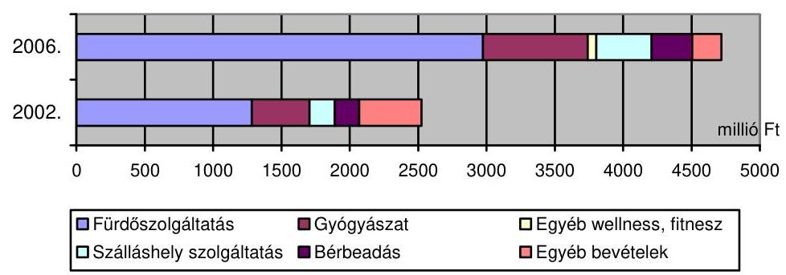

Az üzemi (üzleti) tevékenység bevételei a 2002. évi 2524729 ezer Ft-ról a 2006. évre 4718970 ezer Ft-ra emelkedtek, ez évente átlagosan 17,3\%-os növekedésnek felelt meg. A növekedésből $47,9 \%$ a belépő új létesítmények, a további a korábban üzemelt fürdők bővítése és korszerűsítése hatásához kapcsolódott. Az országos jelentőségű komplex fürdők bevételei $328,5 \%$-kal, a szabadtéri fürdőké $102,5 \%$-kal, a nemzetközi jelentőségű fürdők bevételei $61,6 \%$-kal emelkedtek.

Az egészségturisztikai létesítmények bevételei között meghatározó a fürdőszolgáltatásból származó bevétel, amelynek súlya a 2002. évi $50,8 \%$-ról a 2006. évre $63 \%$-ra növekedett. A bevételekkel arányosan növekedtek a gyógyászati tevékenységből származó bevételek, amelynek háromnegyed részét az OEP-pel kötött támogatási szerződések alapján kapott finanszírozás tette ki. Az ellenőrzött időszakban önálló termékként jelentek meg a különböző wellness és fitnesz szolgáltatások, ezek bevételeken belüli aránya a 2006. évre 1,3\%-ra nőtt.

Öt fürdőnél végeztek szálláshely szolgáltatást, az ebből származó bevétel több mint $95 \%$-át azonban két nemzetközi jelentőségű fürdő - Bük és Sárvár - adta. Sárváron az ellenőrzött időszakban történt szálláshely növelő beruházás hatására az e jogcímen elszámolt bevétel a négyszeresére növekedett. A fürdőkben található kiszolgáló - főként vendéglátó - létesítményeket az üzemeltetők bérbe adták, bevételük az üzemi tevékenység bevételének a 6-7\%-át tette ki.

Az üzemeltetés feltételeit javították négy fürdőnél a tulajdonos önkormányzatoktól az üzemeltetési költségek fedezetére kapott és a rendkívüli bevételek ${ }^{95}$ között kimutatott pénzeszközök, amelyek fürdőnként változó arányt képviseltek.

Zalaszentgróton az önkormányzat mind az öt ellenőrzött évben hozzájárult a fürdő üzemeltetési költségeihez, aránya csökkenő, a fürdő üzemi tevékenységéből származó bevételhez viszonyítva 124,5-18,1\%-os volt. Sellyén négy, Marcaliban három, Celldömölkön két évben járult hozzá pénzeszközökkel az önkormányzat az üzemeltetéshez, a hozzájárulások üzemi tevékenységből származó bevételekhez viszonyított aránya 5,9-36,4\% között változott.

A támogatási pályázati kiírásokban foglaltaknak megfelelve, a pályázatokban a beruházások eredményeként az egy látogatóra jutó költés ${ }^{96} 12,7 \%$-os átlagos

[^0]
[^0]:    ${ }^{95}$ Az önkormányzati szférában átvett pénzeszközök.
    ${ }^{96}$ Az üzemi (üzleti) tevékenység bevételei alapján.

---

emelését tűzték ki célul. A tény adatok szerint a beruházások üzembe helyezését követően az egy látogatóra jutó költés egy fürdő kivételével évről évre növekedett, az ellenőrzött időszakban átlagosan 29,8\%-kal. Az egy látogatóra jutó költés tükrözte a szolgáltatások színvonalát és összetettségét, a legmagasabb a nemzetközi jelentőségű fürdőkben, a legalacsonyabb az országos jelentőségű szabadtéri fürdőkben volt.

A nemzetközi jelentőségű fürdőkben az egy látogatóra jutó költés a 2002. évi 1207 Ft-ról 2006-ra 1718 Ft-ra növekedett. Ugyanezen időszak alatt az országos jelentőségű komplex fürdőkben az egységnyi költés 517 Ft-ról 930 Ft-ra, míg a szabadtéri fürdőkben 259 Ft-ról 542 Ft-ra nőtt. Zalaegerszegen 2002-ben a többi szabadtéri fürdőhöz képest magasan határozták meg a belépőjegyek árát, és 2006-tól csökkentették a látogatottság növelése érdekében, emiatt az egy látogatóra jutó költés 1340 Ft-ról 1049 Ft-ra csökkent.

# A fürdők üzemi tevékenységének ráfordításai az ellenőrzött idôszakban a bevételeket meghaladóan, több mint a kétszeresére növekedtek, amelynek $51,7 \%$-a az új létesítmények belépéséből, míg a fennmaradó a korábban üzemelt fürdők fejlesztéséből származott. A legnagyobb mértékben az országos jelentőségű fedett fürdők, a legmérsékeltebben a nemzetközi jelentőségű fürdők ráfordításai nőttek. A ráfordítások belső összetételének változását jelzi, hogy a technikai fejlődéssel kis mértékben visszaszorult az élőmunkára fordított, és megnövekedett az anyagjellegü ${ }^{97}$ ráfordítások, valamint a nagy értékű beruházások üzembe helyezése miatt az elszámolt értékcsökkenési leírás aránya. A fürdők üzemeltetésére jellemző, hogy a ráfordítások jelentős részét teszik ki a kihasználtságtól független, ún. rugalmatlan költségek.

A ráfordítások között meghatározó személyi jellegű ráfordítások az ellenőrzött időszakban 96,5\%-kal növekedtek, így súlyuk 44\%-ról 40,4\%-ra csökkent. Az átlagos ütemet meghaladóan, 164,4\%-kal növekedtek az anyagjellegú ráfordítások, ezen belül többszörösére növekedtek a közüzemi díjak és a vásárolt szolgáltatások. A két és félszeresére emelkedett az elszámolt értékcsökkenési leírás összege, és a beruházások még 10 évig fokozottan, ezt követően csökkenő mértékben éreztetik költségnövelő hatásukat.

Az ellenőrzött fürdők üzemi tevékenysége ráfordításainak alakulása
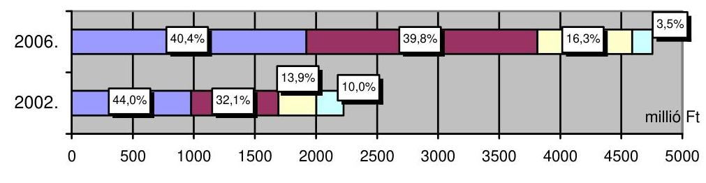

■ Személyi jellegü ■ Anyagjellegü ■Értékcsökkenési leírás ■Egyéb ráfordítások
Az üzemi (üzleti) tevékenység ráfordításai a 2002. évi 2225614 ezer Ft-ról a 2006. évre 4754713 ezer Ft-ra emelkedtek, ez évente átlagosan 21,7\%-os növekedésnek felelt meg, ami 4,4 százalékponttal meghaladta a bevételek növeke-

[^0]
[^0]:    ${ }^{97}$ Önkormányzati szférában dologi kiadások.

---

dési ütemét. A ráfordítások bevételeket meghaladó növekedése a fürdők mindhárom kategóriájára jellemző volt. Az országos jelentőségű komplex fürdők ráfordításai $406 \%$-kal, a szabadtéri fürdőké $201,1 \%$-kal, a nemzetközi jelentőségű fürdők üzemi ráfordításai $75,6 \%$-kal emelkedtek.
A pályázati kiírásokban szerepelt, de a támogatási szerződésekben nem írtak elő a foglalkoztatás növeléséhez konkrét eredményességi feltételeket. Az ellenőrzött fürdőkben 69,4\%-kal növekedett a foglalkoztatottak száma 2002-ről 2006-ra, ezen belül a kétszeresére nőtt a fürdőszolgáltatásban, és az átlagos növekedési szint alatt emelkedett a műszaki és az adminisztratív alkalmazottak létszáma. Az új szabadtéri fürdők belépésével 17,2\%-ról 21,1\%-ra nőtt a szezonálisan foglalkoztatottak aránya.

A fürdők üzemi (üzleti) tevékenységének eredményessége összességében romlott az ellenőrzött időszakban, a ráfordítások bevételeket meghaladó növekedésének következtében, a fizetőképes turisztikai piac nem ismerte el teljes mértékben a végrehajtott beruházásokat. A 2002. évben a 13 fürdő üzleti tevékenységének összesített eredménye 299115 ezer Ft nyereség, és ezen belül a fürdők mindhárom kategóriájának összesített eredménye pozitív volt. A 2006. évben ezzel szemben a 13 fürdő üzleti tevékenységének eredménye 35743 ezer Ft veszteség, és ezen belül a nemzetközi jelentőségű fürdők összesített eredménye pozitív, az országos jelentőségű komplex és a szabadtéri fürdőké pedig negatív volt. Az üzemi tevékenység a 2002-ben üzemelt fürdők 45,5\%ánál, 2006-ban a 61,5\%-ánál veszteséges volt. A nagyobb komplex szolgáltatásokat nyújtó, több turisztikai célterületet kielégítő fürdők a telítettebb piacon is nyereségesek maradtak, a szűkebb szolgáltatáskínálatú, illetve szezonálisan nyitva tartó létesítmények veszteségessé váltak. A fürdők önmagukban nem, illetve kevéssé piacképesek, ezért a fürdőberuházások önmagukban nem túl jövedelmező befektetések, a kiegészítő szolgáltatások, a programlehetőségek, a komplex szolgáltatások nyújtása teheti jövedelmezővé ${ }^{98}$. Ugyanakkor utóbbi döntően nem, illetve nem csak a fürdőlétesítményeknél, hanem a kapcsolódó szolgáltatásokat nyújtóknál áll rendelkezésre és ott jelentkezik jövedelemtermelő hatása is.

Az üzemi (üzleti) tevékenység minden évben nyereséges volt a nemzetközi jelentőségű fürdők közül Bükön és Zalakaroson, az országos jelentőségű komplex fürdők közül Lentiben, a szabadtéri fürdők közül Balatonlellén. A legmagasabb árbevétel arányos nyereséget Zalakaroson érték el. Az üzemi (üzleti) tevékenység minden évben veszteséges volt a nemzetközi jelentőségű fürdők közül Sárváron, az országos jelentőségű komplex fürdők közül Pápán, Zalaszentgróton és Celldömölkön, a szabadtéri fürdők közül Marcaliban és Sellyén. A további fürdők üzemi tevékenységének eredménye az adott évi szezon - főként az időjárás - függvényében változóan volt nyereség vagy veszteség.

A pályázatokban a beruházók dinamikusan, összességében a vizsgált időszak végére közel a háromszorosára növekvő üzemi nyereséggel számoltak. A bevételek azonban a tervezettnél alacsonyabban, a ráfordítások pedig magasabban

[^0]
[^0]:    ${ }^{98}$ Fürdők kézikönyve, Tervezés - építés - üzemeltetés. Magyar Fürdőszövetség, Budapest, 2006.

---

alakultak ${ }^{99}$, így a kettő különbözeteként az üzemi (üzleti) tevékenység eredménye a tervezettnél alacsonyabb lett, illetve az ellenőrzött időszak végére veszteségessé vált ${ }^{100}$.

Az egészségturisztikai beruházások tőkeigényesek és hosszútávon megtérülő befektetések. A pályázatokban indokolatlanul rövid idő, az üzembe helyezést követő 7,1 év alatt tervezték a beruházások megtérülését. A megvalósított létesítményeknél azonban a romló eredményességi mutatók miatt a befektetések megtérülése - a legjövedelmezőbb beruházásokat kivéve - lényegesen hosszabb időtartamra várható, illetve a vizsgált időszakban veszteséges fürdőknél nem prognosztizálható.

Az üzemi (üzleti) tevékenység eredménye és az elszámolt értékcsökkenési leírás alapján a beruházások megtérülése átlagosan 24-25 év alatt várható. Ennél kedvezőbbek megtérülési mutatók Bükön, Zalakaroson, Lentiben és Balatonlellén, a veszteségesen múködő fürdőlétesítményeknél azonban a várható megtérülés ideje az üzemeltetés eddigi adatai alapján nem számítható ki.

A beruházók, illetve az üzemeltetők nem végeztek beruházás gazdaságossági számításokat, nem tárták fel a tervezettnél kedvezőtlenebb eredmények alakulásának okait és hatását a befektetések megtérülésére. A beruházások az új munkahelyek teremtése, az egészségturisztikai kínálat, és ezáltal az idegenforgalom bővítése révén hatással voltak a befogadó települések és tágabb környezetük társadalmi-gazdasági viszonyaira, ezzel kapcsolatban azonban a beruházók, illetve az önkormányzatok hatásvizsgálatokat nem végeztek, így a fejlesztések közvetett és gerjesztett hatásairól információkkal nem rendelkeztek. A beruházások komplex idegenforgalmi, turisztikai tényezőkkel történő összehangolása, figyelemmel kísérése is csak azoknál az önkormányzatoknál kapott figyelmet, ahol az egészségturizmusnak már korábban érzékelhető eredményei voltak.

A befogadó települések önkormányzatainak a 38,5\%-a értékelte a fejlesztési programjainak, koncepcióinak tárgyalásakor a turizmusban és az idegenforgalomban bekövetkezett változásokat, ennek kapcsán tértek ki a fürdőfejlesztésekre.

Az önkormányzatok a helyi adókról szóló 1990. évi C. törvény 30-34. §-ai alapján minden településen bevezették az idegenforgalmi adót. Két esetben az ellenőrzött időszakban, Pápán 2003-tól, Zalaegerszegen 2005-től vetették ki, amelyekben szerepe volt az ellenőrzött egészségturisztikai létesítményeknek is.

A támogatási szerződésekben foglaltaknak ${ }^{101}$ eleget téve, az önkormányzatok, illetve a gazdasági társaságok évente elkészítették és megküldték a MÁK-nak,

[^0]
[^0]:    ${ }^{99}$ Az ellenőrzött fürdők tervezett és tényleges bevételeinek alakulását a 4. számú melléklet 2. ábra, a tervezett és tényleges ráfordításainak alakulását a 3. ábra mutatja. Az ábrákban - összehasonlítható módon - azokat a fürdőket mutattuk be, amelyeknek az adott évben a Széchenyi terv adatai rendelkezésre álltak.
    ${ }^{100}$ A fürdők tervezett és tényleges bevételeinek és ráfordításainak összehasonlítását a 4. számú melléklet 4. ábra mutatja be.
    ${ }^{101}$ A hatásvizsgálati adatszolgáltatást a szerződéses kötelezettség teljesítéséig, vagyis az ingatlanok turisztikai célú hasznosítására vállalt 10 év leteltéig kell készíteni.

---

illetve a Magyar Turisztikai Hivatalnak a hatásvizsgálati adatlapokat a fejlesztésekhez kapcsolódóan. A hatásvizsgálati adatszolgáltatásról azonban visszajelzést nem kaptak, értékeléséről, feldolgozásáról információkkal nem rendelkeztek.

A hatásvizsgálati adatlapok tartalmazták a beruházások megvalósítási idejét, tervezett és tényleges költségeit, a támogatottak (üzemeltetők) mérleg és eredményadatait, a foglalkoztatottak számát és egyéb kapcsolódó információkat.

# 4. A KÜLSŐ ÉS BELSŐ ELLENŐRZÉSEK SZEREPE A BERUHÁZÁSOK MEGVALÓsÍTÁSÁBAN 

Az ellenőrzött időszakban a pályázatkezelési feladatokat az MVF Kht. és az MFB Rt., a támogatások elszámolásával kapcsolatos ellenőrzési feladatokat a MÁK végezte. Az MVF Kht., majd az MFB Rt. feladata volt a pályázatok befogadása és a hiánypótlási eljárások bonyolítása, a támogatási szerződések megkötése, emellett helyszíni ellenőrzéseket végeztek a beruházások megkezdését megelőzően és azok megvalósításának folyamatában. A támogatási szerződések megkötését megelőzően végzett ellenőrzések a beruházások megkezdettségére, a megvalósítás folyamatában a támogatások felhasználásának szabályszerűségére, a hatósági engedélyek meglétére, a pályázati célok megvalósítására irányultak.

A támogatási szerződések megkötését megelőzően öt pályázónál, a megvalósítás folyamatában három beruházásnál végeztek helyszíni ellenőrzést, amelyek megállapításairól jegyzőkönyvek készültek. Az ellenőrzések során a beruházások megkezdettségével, illetve a támogatások felhasználásával kapcsolatban szabálytalanságokat nem állapítottak meg.

A MÁK részt vett a támogatások pénzügyi lebonyolításában, elvégezte az igénylések tartalmi és formai ellenőrzését a számlák és egyéb kifizetési bizonylatok, valamint a teljesítés igazolások alapján. Helyszíni ellenőrzéseket végzett a beruházások megvalósításának folyamatában (közbenső ellenőrzés) és a megvalósítást követően (utóellenőrzés). A MÁK által elvégzett ellenőrzések öt beruházás esetében tártak fel kisebb hiányosságokat, szabálytalanságokat. A közbenső ellenőrzések által megállapított hiányosságok javítását az utóellenőrzések során vizsgálták, az utóbbiak által előírt hiánypótlások megtörténtét később záradékban rögzítették.

A MÁK által végzett ellenőrzések Celldömölkön a beruházás mindkét üteménél, Bükön, Sárváron és Zalaegerszegen állapítottak meg hiányosságokat. A hiányosságok pótlása egy kivételével megtörtént, egy esetben pedig a javítás szükségességét nem írták elő az ellenőrzött részére.

Előzőektől függetlenül a KEHI nyolc beruházásnál végzett helyszíni ellenőrzést a beruházások megvalósítása során, ezek közül egy esetben állapított meg - a támogatások igénybevételének jogszerűségét nem érintő - hiányosságokat.

Az építési és a vízügyi hatóságok ellenőrzései a beruházások engedélyezési eljárásaihoz kapcsolódtak, mindössze három esetben történt vízügyi felügyeleti ellenőrzés, és egy esetben állapítottak meg az üzemeltetési engedélyezési eljárás során engedély nélküli vízhasználatot.

---

Sellyén eltértek a vízjogi üzemeltetési engedélyben foglaltaktól a ténylegesen üzemelt létesítmények, ezért előírták, hogy nyújtsák be a dokumentumokat az engedély módosításához. Gárdonyban a vízügyi hatóság az engedély nélkül épített vízi létesítmények miatt bírság megfizetésére kötelezte az önkormányzatot, Sárváron az üzemeltetési engedély lejárta miatt engedély nélküli vízhasználatot állapított meg és ismételten felszólította az üzemeltetőt az engedélyezési eljárás lefolytatásához szükséges tervdokumentációk benyújtására.

# A beruházó önkormányzatok és gazdasági társaságok nem végeztek belső ellenőrzést a beruházás megvalósításával és a létesítmény üzemeltetésével kapcsolatban. Nem történt ellenőrzés az Ötv. 92. § (11) bekezdése alapján ${ }^{102}$ az önkormányzatok többségi irányítást biztosító befolyása alatt álló, a fürdővagyon hasznosítására és üzemeltetésére létrehozott gazdasági társaságoknál, egy esetben pedig - annak ellenére, hogy a részvények 93,84\%-a önkormányzati tulajdon - külön-külön nem volt ellenőrzési lehetősége a tulajdonos önkormányzatoknak a jogszabály előírásai alapján. A büki önkormányzat a részvénytársaság közgyűlésénél ellenőrzést nem kezdeményezett.

Bükön a Gyógyfürdő Zrt-ben az önkormányzat és a megyei önkormányzat 46,92-46,92\%-os részesedéssel rendelkezik, míg a fennmaradó 6,16\% dolgozói részvény. Egyik önkormányzat belső ellenőrei sem voltak jogosultak ellenőrzést végezni a gazdasági társaságnál, mivel egyik önkormányzat sem rendelkezett többségi irányítást biztosító befolyással.

Budapest, 2008. augusztus ${ }^{102}$.
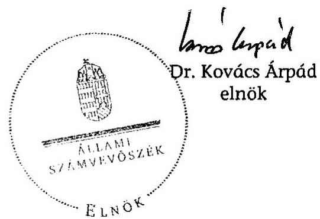

[^0]
[^0]:    ${ }^{102}$ Az Ötv. 92. § (11) bekezdésének 2005. augusztus 31-től hatályos előírása alapján a helyi önkormányzat ellenőrzést végezhet a többségi irányítást biztosító befolyása alatt álló gazdasági társaságoknál.

---

# Ellenőrzött szervezetek jegyzéke 

Dél-Dunántúli Régió
Baranya megye
Svelye Város Önkormányzata
Pécs Megyei Jogú Város Önkormányzata
(Sécs EKF 2010)
Somogy megye
Balatonlelle Város Önkormányzata Városüzemeltetési Szervezete
Barcs Város Önkormányzata
Marcali Város Önkormányzata
Közép-Dunántúli Régió
Fejér megye
Gárdony Város Önkormányzata
Veszprém megye
Pápai Termálvízhasznosító Kereskedelmi és Szolgáltató Zrt.
Nyugat-Dunántúli Régió
Vas megye
Borgáta Község Önkormányzata
Büki Gyógyfürdő Zrt.
Celldömölk Város Önkormányzata
Sárvár Város Önkormányzata és a
Sárvári Gyógyfürdő Kft.
Zala megye
Lenti Gyógyfürdő Kft.
Zalaegerszeg Megyei Jogú Város Önkormányzata
Gránit Gyógyfürdő Zrt., Zalakaros
Zalaszentgrót Város Önkormányzata

---

# Kintutatás

a benyújtott és elfogadott Széchenyi terv pályázatok adatairól adatok ezer Ft-ban

|   | Támogatott szervezet | Projekt megnevezése | Benyújtott Széchenyi terv pályázat |  |  | Elfogadott/átdolgozott Széchenyi terv pályázat |  |  | Pályázott és elnyert támogatás aránya (\%)  |
| --- | --- | --- | --- | --- | --- | --- | --- | --- | --- |
|   |  |  | Beruházási költség | Széchenyi terv
támogatás | Támogatás aránya (\%) | Beruházási költség | Széchenyi terv támogatás | Támogatás aránya (\%) |   |
|  1 | Büki Gyógyfürdő Zrt. | Büki gyógyfürdő bővítése | 2033000 | 1000000 | 49,2 | 2033000 | 1000000 | 49,2 | 100,0  |
|  2 | Sárvári Gyógyfürdő Kft. | Wellness-komplexum I. ütem | 1994845 | 993887 | 49,8 | 1994845 | 993887 | 49,8 | 100,0  |
|  3 | Sárvári Gyógyfürdő Kft. | Wellness-komplexum II. ütem | 2058177 | 1000000 | 48,6 | 2058177 | 1000000 | 48,6 | 100,0  |
|  4 | Gránit Gyógyfürdő Zrt., Zalakaros | Hullámmedence és élményfürdő II. ütem | 1100000 | 550000 | 50,0 | 380000 | 175000 | 46,1 | 31,8  |
|  5 | Gránit Gyógyfürdő Zrt., Zalakaros | Nyári főbejárat épület és Élményfürdő III. ütem (Generációk találkozóhelye) | 1200000 | 540000 | 45,0 | 1088000 | 300000 | 27,6 | 55,6  |
|  6 | Pápai Termálvizhasznosító
Kereskedelmi és Szolgáltató Zrt. | Sport- és élményfürdő építése | 1599861 | 799930 | 50,0 | 1599861 | 782747 | 48,9 | 97,9  |
|  7 | Lenti Gyógyfürdő Kft. | Szabadidős-családi medence építése | 150000 | 75000 | 50,0 | 150000 | 75000 | 50,0 | 100,0  |
|  8 | Gazdasági társaságok összesen |  | 10135883 | 4958817 | 48,9 | 9303883 | 4326634 | 46,5 | 87,3  |
|  9 | Gárdony Város Önkormányzata | Agárdi gyógyfürdő fejlesztése | 1223000 | 588907 | 48,2 | 1223000 | 560000 | 45,8 | 95,1  |
|  10 | Zalaszentgrót Város Önkormányzata | Termálfürdő és Szabadidőközpont II. ütem | 320000 | 160000 | 50,0 | 320000 | 160000 | 50,0 | 100,0  |
|  11 | Celldömölk Város Önkormányzata | Vulkán-fürdő megvalósítása I. ütem | 1120000 | 560000 | 50,0 | 1120000 | 560000 | 50,0 | 100,0  |
|  12 | Zalaegerszeg Megyei Jogú Város
Önkormányzata | Zalaegerszeg-Aquapark termálfürdő bővítés | 1216927 | 608463 | 50,0 | 1216927 | 608464 | 50,0 | 100,0  |
|  13 | Marcali Város Önkormányzata | Gyógyfürdő építése | 800553 | 362812 | 45,3 | 800553 | 362812 | 45,3 | 100,0  |
|  14 | Barcs Város Önkormányzata | Új egészségturisztikai központ létesítése | 1200000 | 600000 | 50,0 | 755313 | 200000 | 26,5 | 33,3  |
|  15 | Sellye Város Önkormányzata | Ökofürdő fejlesztése az Ormándságban | 141375 | 66031 | 46,7 | 141375 | 66031 | 46,7 | 100,0  |
|  16 | Balatonlelle Város Önkormányzata
Városüzemeltetési Szervezete | Felnőtt élménymedence megépítése (fizetőstrand fejlesztése II. ütem) | 39880 | 19880 | 49,8 | 39880 | 19880 | 49,8 | 100,0  |
|  17 | Balatonlelle Város Önkormányzata
Városüzemeltetési Szervezete | Úszómedence építése és szauna-csoport kialakítása (fizetőstrand fejlesztése III. ütem) | 99857 | 69857 | 70,0 | 99857 | 69857 | 70,0 | 100,0  |
|  18 | Önkormányzatok összesen |  | 6761592 | 3335950 | 49,3 | 5916905 | 2707044 | 45,8 | 81,1  |
|  19 | Ellenőrzött beruházások összesen |  | 16897475 | 8294767 | 49,1 | 15220788 | 7033678 | 46,2 | 84,8  |

---

# Kimutatás

## az ellenőrzött beruházások pénzügyi forrásösszetételének változásáról

|  3. számú melléklet a V-1025-59/2007. számú jelentéshez |  |  |  |  |  |  |  |  |  |  |   |
| --- | --- | --- | --- | --- | --- | --- | --- | --- | --- | --- | --- |
|  |   |   |   |   |   |   |   |   |   |   |   |
|  |   |   |   |   |   |   |   |   |   |   |   |
|  |   |   |   |   |   |   |   |   |   |   |   |
|  |   |   |   |   |   |   |   |   |   |   |   |
|  |   |   |   |   |   |   |   |   |   |   |   |
|  |   |   |   |   |   |   |   |   |   |   |   |
|  |   |   |   |   |   |   |   |   |   |   |   |
|  |   |   |   |   |   |   |   |   |   |   |   |
|  |   |   |   |   |   |   |   |   |   |   |   |
|  |   |   |   |   |   |   |   |   |   |   |   |
|  |   |   |   |   |   |   |   |   |   |   |   |
|  |   |   |   |   |   |   |   |   |   |   |   |
|  |   |   |   |   |   |   |   |   |   |   |   |
|  |   |   |   |   |   |   |   |   |   |   |   |
|  |   |   |   |   |   |   |   |   |   |   |   |
|  |   |   |   |   |   |   |   |   |   |   |   |
|  |   |   |   |   |   |   |   |   |   |   |   |
|  |   |   |   |   |   |   |   |   |   |   |   |
|  |   |   |   |   |   |   |   |   |   |   |   |
|  |   |   |   |   |   |   |   |   |   |   |   |
|  |   |   |   |   |   |   |   |   |   |   |   |
|  |   |   |   |   |   |   |   |   |   |   |   |
|  |   |   |   |   |   |   |   |   |   |   |   |
|  |   |   |   |   |   |   |   |   |   |   |   |
|  |   |   |   |   |   |   |   |   |   |   |   |
|  |   |   |   |   |   |   |   |   |   |   |   |
|  |   |   |   |   |   |   |   |   |   |   |   |
|  |   |   |   |   |   |   |   |   |   |   |   |
|  |   |   |   |   |   |   |   |   |   |   |   |
|  |   |   |   |   |   |   |   |   |   |   |   |
|  |   |   |   |   |   |   |   |   |   |   |   |

---

# 4. számú melléklet 

a V-1025-59/2007. számú jelentéshez

1. ábra

A tervezett és a tényleges beruházási költségek alakulása az ellenőrzött beruházásoknál
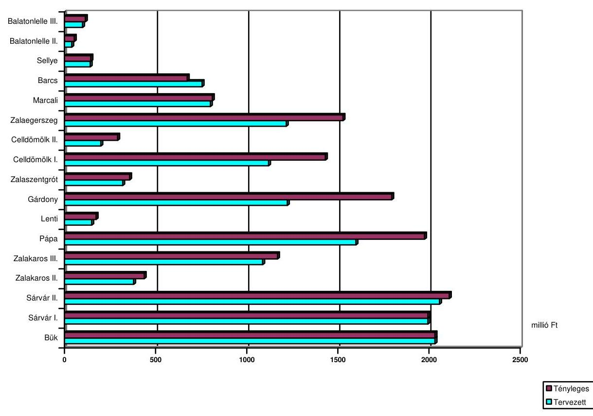
2. ábra

Az ellenőrzött fürdők tervezett és tényleges bevételeinek alakulása
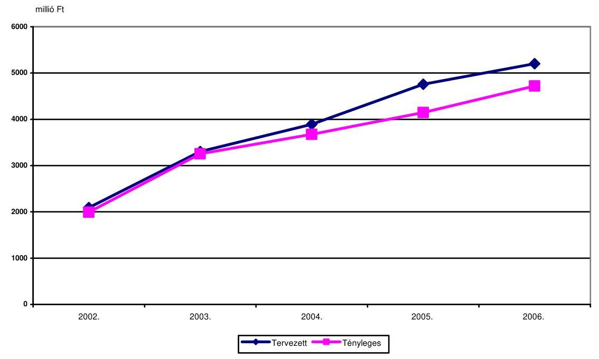

---

# 3. ábra 

Az ellenőrzött fürdők tervezett és tényleges ráfordításainak alakulása
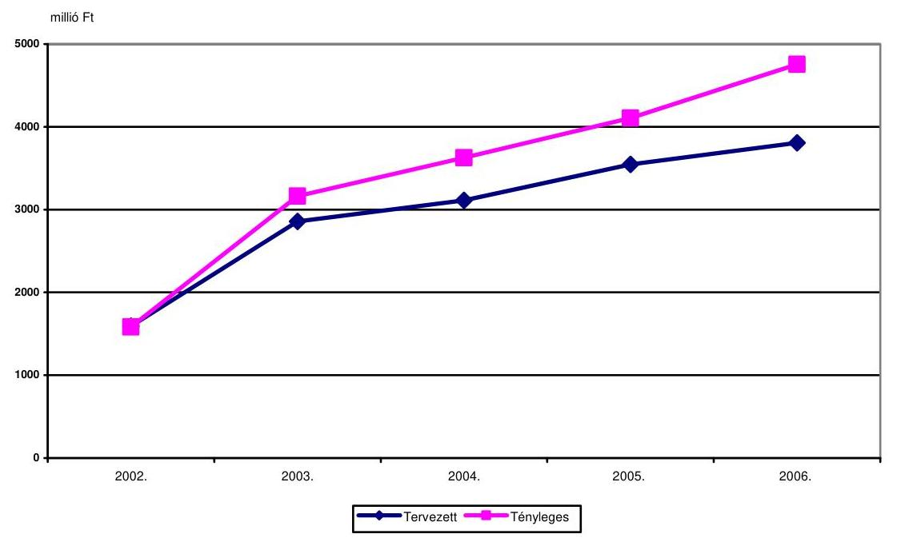
4. ábra
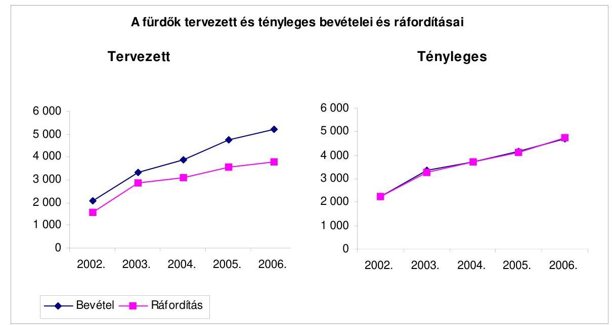

---

# ÖNKORMÁNYZATI MINISZTER 

Iktatószám: ÖM / 10522/1 / 2008

## Dr. Kovács Árpád úrnak

elnök
Állami Számvevőszék

Budapest

## Tisztelt Elnök Úr!

A helyi önkormányzatoknál végzett turisztikai beruházások ellenőrzéséről készített jelentésüket áttekintettük. A vizsgálati megállapítások alapján megfogalmazott javaslatokkal egyetértünk.

Az önkormányzatok egészségturisztikai fejlesztéseinek előkészitésével, megvalósitásával kapcsolatos gyakorlat részletes elemzése úgy véljük tanulságos. Az Új Magyarország fejlesztési terv regionális operatív programjai keretében meghirdetett egészségturisztikai pályázatok értékelése, új támogatási pályázatok előkészítése során is alkalmazhatók a javaslataik (fejlesztési projektek összehangolásának igénye, beruházások szakmai előkészítésének megalapozottságának javítása, stb.). Ezt lehetőségeinknek megfelelően érvényesiteni fogjuk a biráló bizottságokban, illetve a Nemzeti Fejlesztési Ügynökséggel folyó egyeztetések során.

Budapest, 2008. augusztus 05 ,

Tisztelettel és barátsággal:
Dr. Gyenesei István

---

# 6. számú melléklet a V-1025/2007. számú jelentéshez 

## Dr. Kovács Árpád úrnak

elnök
Állami Számvevőszék

## Budapest

Apáczai Csere János u. 10. 1052

## Tisztelt Elnök Úr!

## ÁLLAMI SZÁMVEVÖSZÉK

## Érkezett: 2008.08.05

Iktatúszám: 0-1025-56/2007
Melléklet: $\qquad$
Az Állami Számvevőszék - éves ellenőrzési munkaterve szerint - a helyi önkormányzatok 2001 és 2006 közt végrehajtott kiemelt beruházásait tette vizsgálat tárgyává. A vizsgált fejlesztések az egészségturizmust szolgálták, s kivétel nélkül a Széchenyi terv támogatásával valósultak meg. Az ellenőrzés fontosabb megállapításairól jelentés készült, V0364 számon.
A jelentés közreadását megelőzően, annak tervezetéhez az érintett minisztériumok észrevételeiket megfogalmazhatták. Ezzel a lehetőséggel a Nemzeti Fejlesztési és Gazdasági Minisztérium is élt, 2008. július 2.-n kelt TER/686/2008 számú levelében. A tervezethez füzött kiegészítések a tisztán hazai költségvetésből finanszírozott területfejlesztési támogatási konstrukciók szemszögéből értelmezték a javaslatokat. A Minisztérium különösen fontosnak tartotta a központi támogatásokkal megvalósuló beruházások esetében a műszaki tartalom jelenleginél magasabb szintű ellenőrzését, ennek szigorúbb megkövetelését. A Számvevőszék jelentése e kiegészítést javaslatai közé emelte. A jelentéshez - a tervezethez füzött kiegészítéseken túl - újabb észrevételeket megfogalmazni nem kívánok.
További jó együttműködésünk reményében munkájához sok sikert kívánok.
Budapest, 2008. július 31.

Tisztelettel:
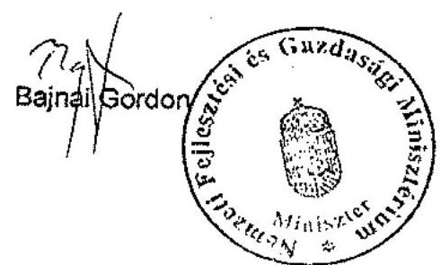

---

# Az ellenőrzött szervezetek fürdőberuházásai 

Sárváron két beruházási ütemben épült meg a gyógy- és egészségturizmusra alapozott új fürdő tíz medencével, gyógyászati épülettel, wellness részleggel és a hozzá kapcsolódó kiszolgáló létesítményekkel. Ezzel egyidejűleg az 1960-as években épített, korszerűtlenné és szűkössé vált korábbi fürdőt bezárták.

Celldömölkön az I. ütemben öt medencés fedett fürdő és kettő szabadtéri, a II. ütemben két további szabadtéri medence készült.

Pápán nyolc fedett és négy szabadtéri medencét építettek élményelemekkel, kiszolgáló épületekkel és wellness részleggel.

Zalaegerszegen Aquapark épült 12 medencével, különféle élményelemekkel, csúszdákkal és kiszolgáló létesítményekkel.

Marcaliban az új szabadtéri fürdő öt medencét és a kiszolgáló létesítményeket, infrastrukturális hálózatot foglalja magában.

Barcson a korábbi városi strandfürdő lebontásra került, és új rekreációs termálközpontot építettek, melynek ellenőrzött I. ütemében négy szabadtéri medence készült a kapcsolódó kiszolgáló létesítményekkel.

Lentiben a komplex fürdő szabadtéri részét egy medencével bővítették.
Zalaszentgróton a korábban üzemelt strandfürdőhöz egy további szabadtéri medencét és négy medencével fedett fürdőt építettek, ezzel a létesítmény téli-nyári üzeművé vált.

Balatonlellén a strandfejlesztés két ütemében élménymedencét és úszómedencét építettek, valamint a meglévő épületben szaunát alakítottak ki a kapcsolódó kiszolgáló létesítményekkel.

Zalakaroson a strand- gyógy- és élményfürdőt magában foglaló komplex létesítményt az I. ütemben hullámmedencével és három szabadtéri élménymedencével, a II. ütemében a fedett élményfürdőt új szárnnyal, négy medencével bővítették, átépítették a nyári bejáratot, öltözőket és Dísz tért építettek.

Bükön a fejlesztés előtt szintén már komplex fürdő működött, a fejlesztés során közmű és a medencetér rekonstrukció, épület felújítás, szigetelés, öltözők kialakítása, Fizioterápiás Intézet bővítése történt, a fejlesztéssel négy fedett és kettő szabadtéri medencével nőtt a medenceszám.

Gárdonyban a korábban működött komplex fürdőben a gyógyászati és a wellness funkciók erősítése volt a cél, egy szabadtéri és két fedett medencét, öltözőket építettek, továbbá megtörtént a meglévő épület belső átalakítása.

Sellyén a városi termál-strandfürdő mindkét medencéjét kettéválasztották és vízforgatóval látták el.