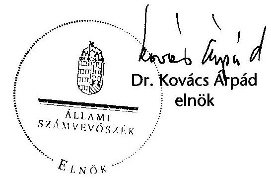
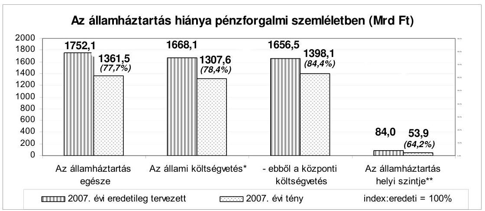
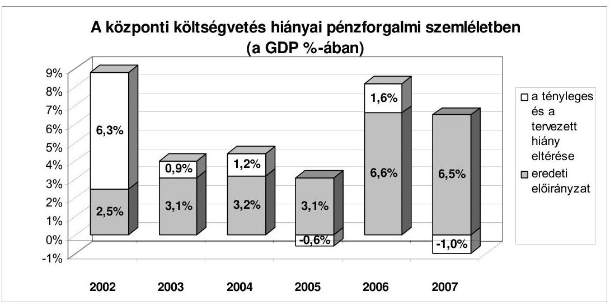
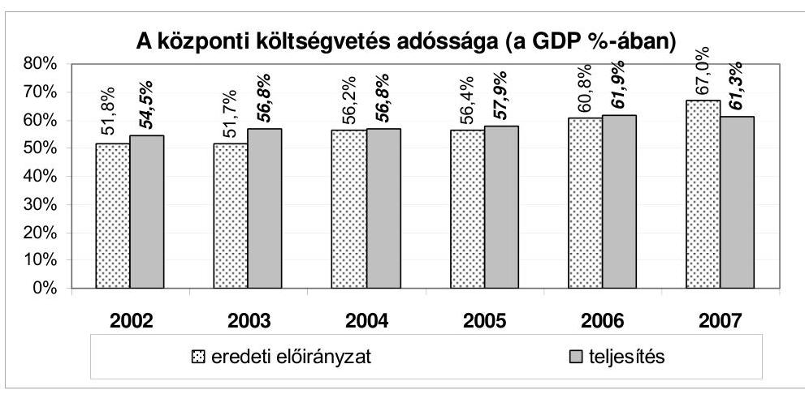
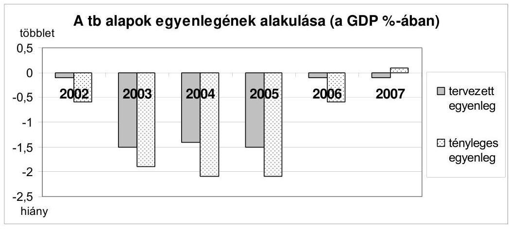
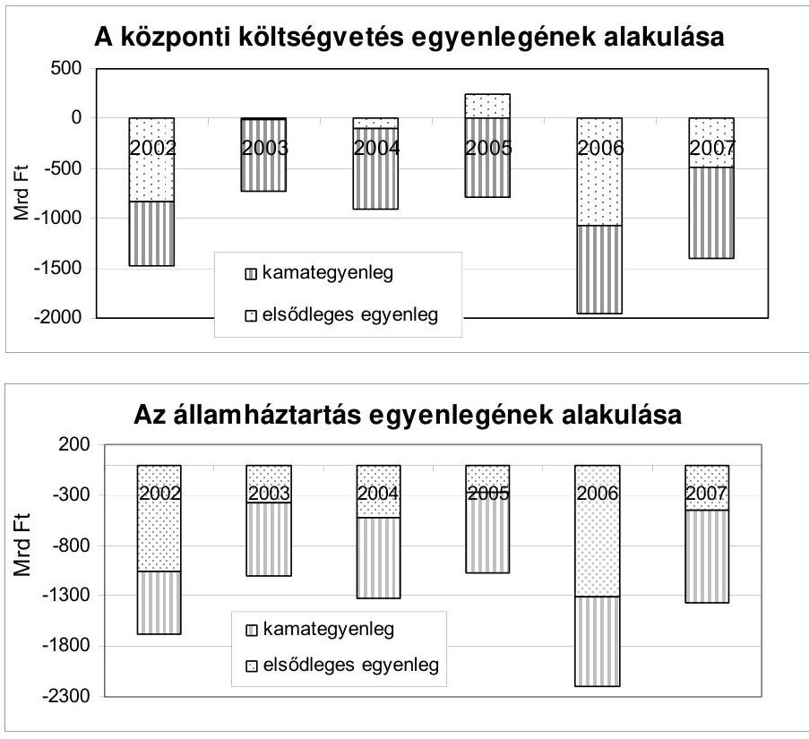
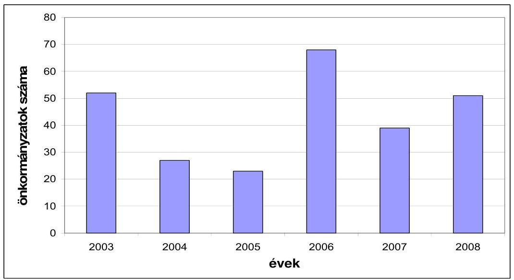

# ÁLLAMI   SZÁMVEVŐSZÉK 

## JELENTÉS

a Magyar Köztársaság 2007. évi költségvetése végrehajtásának ellenőrzéséről

0824
T/6133/1
2008. augusztus

---

# 1. Szervezetirányítási és Működtetési Igazgatóság 

Vizsgálat-azonosító szám: V0353

## Az ellenőrzést felügyelte:

Dr. Csapodi Pál
főtitkár

## Az ellenőrzés végrehajtásáért felelős:

Dr. Kékesi László
főtitkárhelyettes

## Az ellenőrzést vezette:

Horváthné Menyhárt Erika
főcsoportfőnök-helyettes

## Az ellenőrzést végezték:

| Bojtos Rozália | Göller Géza | Nagyné Lakhézi Éva |
| :-- | :-- | :-- |
| tanácsadó | főtanácsadó | számvevő tanácsos |
| Dr. Somorjai Zsoltné | Vicze Klára | Bálint Józsefné |
| számvevő tanácsos | számvevő tanácsos | címzetes főmunkatárs |

## 2. Államháztartás Központi Szintjét Ellenőrző Igazgatóság

## Az ellenőrzést felügyelte:

Bihary Zsigmond
főigazgató

## Az ellenőrzés végrehajtásáért felelős:

Horváth Sándor
főcsoportfőnök

## Az ellenőrzést vezették:

Dr. Csépán Mária Magdolna, Hámoriné Maróti Györgyi igazgatóhelyettes
Morvay András
osztályvezető főtanácsos
Szabóné Farkas Katalin osztályvezető főtanácsos

## Az összefoglaló jelentést készítették:

| Bamberger Mária   tanácsadó | Deli Gáborné   számvevő tanácsos | Dr. Domján Eszter   számvevő tanácsos |
| :-- | :-- | :-- |
| Éva Katalin   főtanácsadó | Farkas László   főtanácsadó | Fehérné Jagasich Mariann   számvevő tanácsos |
| Fekete Győr László   számvevő | Ferencz Katalin   tanácsadó | Fogarasi Miklós   főtanácsadó |
| Görgényi Gábor   számvevő | Gyarmati István   tanácsadó | Holló András   számvevő |
| Horcsin Attila   számvevő | Huszárné Borbás Melinda   számvevő | Dr. Jakab Kornél   számvevő tanácsos |
| Jagicza Istvánné   tanácsadó | Jeszenkovits Tamás   számvevő tanácsos | Karsai Lászlóné   főtanácsadó |
| Molnár Bálint   számvevő | Molnár Imre   tanácsadó | Pető Krisztina   számvevő tanácsos |
| Polyák Ferenc   számvevő tanácsos | Dr. Pósch Gábor   főtanácsadó | Dr. Remport Katalin   tanácsadó |

---

| Dr. Sipos Dóra számvevő tanácsos | Szabóné Simai Mária számvevő tanácsos | Szilágyi Gyöngyi főtanácsadó |
| :--: | :--: | :--: |
| Szilágyi Zsuzsanna tanácsadó | Dr. Szima Mária tanácsadó | Szöllősiné Hrabóczki Etelka főtanácsadó |
| Vacsora Erika számvevő tanácsos | Vas Lajos főtanácsadó | Zaroba Szilvia számvevő tanácsos |
| Az ellenőrzést végezték: |  |  |
| Dr. Ackermann János külső munkatárs | Antal Lajosné, Zsiros Erzsébet külső munkatárs | Dr. Antal Zoltán külső munkatárs |
| Ács László   külső munkatárs | Dr. Baji László számvevő | Baki István számvevő |
| Balla Zoltán   külső munkatárs | Dr. Balázs Melinda tanácsadó | Dr. Balázs Péter külső munkatárs |
| Balogh Ferencné, Simon Eszter külső munkatárs | Dr. Baloghné Sebestyén Éva számvevő | Bartha Gyula külső munkatárs |
| Bamberger Mária tanácsadó | Bata Zsuzsanna külső szakértő | Dr. Bartos László számvevő |
| Bánlaki Lívia külső munkatárs | Beck Miklós számvevő tanácsos | Bedécs Erzsébet számvevő |
| Dr. Beregi Anna főtanácsadó | Beszeda István külső munkatárs | Bodor Alfréd külső munkatárs |
| Burenzsargal Narantuja számvevő | Dr. Burján Margit főtanácsadó | Csatlós Pálné, Szilágyi Erzsébet külső munkatárs |
| Czmarkó Frigyes számvevő | Csóry Györgyné   főtanácsadó | Dancsóné Kuron Ildikó számvevő tanácsos |
| Deli Gáborné számvevő tanácsos | Dr. Deli Lajosné külső munkatárs | Deák Tamásné főtanácsadó |
| Dobos András Csaba tanácsadó | Dombóvári Nóra számvevő | Dr. Domján Anna külső munkatárs |
| Dr. Domján Eszter számvevő tanácsos | Domonkosné Kurilla Edit számvevő tanácsos | Dormán István Zoltán számvevő |
| Eötvös Magdolna számvevő tanácsos | Dr. Endrédy Györgyina számvevő | Éva Katalin   főtanácsadó |
| Farkas László   főtanácsadó | Farkas Timea   külső munkatárs | Fehérné Jagasich Mariann számvevő tanácsos |
| Fekete Győr László számvevő | Félegyházi-Törökné, Somogyi Éva külső munkatárs | Ferencz Katalin Zsuzsanna tanácsadó |
| Fogarasi Miklós   főtanácsadó | Dr. Fónyad Erzsébet számvevő tanácsos | Gaál Attila külső munkatárs |
| Gergely Tilda számvevő gyakornok | Gerencséné Szabó Erika külső munkatárs | Gerner Attila külső munkatárs |
| Görgényi Gábor számvevő | Gyarmati István tanácsadó | Gyeraj Péter Ede számvevő |
| Haáz Andorné külső munkatárs | Haklik Józsefné külső munkatárs | Hajdu Károlyné számvevő tanácsos |
| Hajduné Sipos Erika számvevő tanácsos | Hegedűs Miklós külső munkatárs | Holló András számvevő |
| Horcsin Attila számvevő | Horváthné Herbáth Mária tanácsadó | Horváth József   főtanácsadó |

---

Hozleiter Erika
külső munkatárs
Huszárné Borbás Melinda számvevő

Jankó Géza
számvevő tanácsos
Jeszenkovits Tamás
számvevő tanácsos
Kádár Kriszta
számvevő
Kincses Erzsébet Eszter számvevő

Dr. Király László tanácsadó

Kocsis Ferencné számvevő

Koska János
külső munkatárs
Krémó Márkné számvevő tanácsos

Lődiné Cser Zsuzsanna számvevő tanácsos

Marusa Mária
külső munkatárs
Molnár Bálint számvevő

Nagy Zoltánné külső munkatárs

Némethné Nagy Mária számvevő

Orbán Ferenc
külső munkatárs
Petrovszky Pál
külső munkatárs
Dr. Ritter Gábor
külső munkatárs
Dr. Rugár Oszkár
külső munkatárs
Samu István számvevő

Séra Andrásné főtanácsadó

Stadlerné Hantos Beáta külső munkatárs

Szabó Erzsébet számvevő tanácsos

Szatainé Kováts Erna számvevő

Szilágyi Gyöngyi
főtanácsadó
Szittáné Bilanics Erzsébet külső munkatárs

Dr. Hódos Ágnes
külső munkatárs
Jagicza Istvánné számvevő tanácsos

Jáger Lajos
számvevő
Dr. Kádár Andrásné
külső munkatárs
Keskenyné Varga Gyöngyi Éva
külső munkatárs
Kiss Ferenc Károlyné számvevő

Dr. Klapcsik László
külső munkatárs
Kollár Katalin
külső munkatárs
Kovácsy Tamás
számvevő
Krüzselyi Attila
számvevő
Maklári Ferencné
főtanácsadó
Mátyási József
számvevő
Molnár Imre
tanácsadó
Nedeljkovic Diána
külső munkatárs
Niklai Heléna
számvevő tanácsos
Patthy Júlia
számvevő gyakornok
Polyák Ferenc
számvevő tanácsos
Dr. Remport Katalin
tanácsadó
Rumpler Erzsébet
külső munkatárs
Sándorfi-Magyar Sára
számvevő
Sinka Zoltán
számvevő
Stamler Jánosné
külső munkatárs
Szabóné Simai Mária
számvevő tanácsos
Dr. Szávai Tamás
főtanácsadó
Szilágyi Zsuzsanna
tanácsadó
Szólya Ildikó
számvevő tanácsos

Huszár József
számvevő tanácsos
Dr. Jakab Kornél
számvevő tanácsos
Jenei Zoltán Béláné számvevő

Karsai Lászlóné
főtanácsadó
Dr. Kevevári Edit
számvevő gyakornok
Kiss Józsefné
külső munkatárs
Dr. Knapp József
külső munkatárs
Komáromi Gyula
külső munkatárs
Knoppné Szabó Ildikó
számvevő tanácsos
Dr. Lengyel Attila
tanácsadó
Marozsán Katalin
külső munkatárs
Dr. Mészáros Leila számvevő

Nagy József
főtanácsadó
Németh Mária Erzsébet
külső munkatárs
Dr. Novák Zsuzsanna Csilla
számvevő tanácsos
Pető Krisztina
számvevő tanácsos
Dr. Pósch Gábor
főtanácsadó
Dr. Rónai Éva
külső munkatárs
Salamin Viktor
számvevő
Sápi Henriett
számvevő gyakornok
Dr. Sipos Dóra
számvevő tanácsos
Sükösd István
külső munkatárs
Szakál Pálné
külső munkatárs
Szentesiné Tuka Margit
külső munkatárs
Dr. Szima Mária
tanácsadó
Szöllősiné Hrabóczki Etelka
főtanácsadó

---

| Dr. Szöllősi Zoltán | Szőke Gábor | Takács Andrea |
| :-- | :-- | :-- |
| külső munkatárs | külső munkatárs | külső munkatárs |
| Tasner Mária Veronika | Tolnai Józsefné | Tóthné Kiss Katalin |
| külső munkatárs | külső munkatárs | főtanácsadó |
| Vacsora Erika | Varsányiné Dudás Eleonóra | Váriné Kádár Margit |
| számvevő tanácsos | számvevő gyakornok | külső munkatárs |
| Vas Lajos | Dr. Vass Gábor | Vértényi Gábor |
| főtanácsadó | tanácsadó | számvevő |
| Villányi Antal | Vitányi István | Vitéz Zsolt |
| számvevő tanácsos | számvevő tanácsos | külső munkatárs |
| Vörös Lászlóné dr. | Zagyi Judit | Zakar László |
| külső munkatárs | számvevő tanácsos | számvevő |
| Zaroba Szilvia | Záhonyiné Horváth Ildikó |  |
| számvevő tanácsos | számvevő tanácsos |  |

# 3. Önkormányzati és Területi Ellenőrzési Igazgatóság 

## Az ellenőrzést felügyelte:

Dr. Lóránt Zoltán
főigazgató

## Az ellenőrzés végrehajtásáért felelős:

Dr. Sepsey Tamás főigazgató-helyettes

Németh Péterné főcsoportfőnök

## Az ellenőrzést vezették

Dr. Ernst László
főtanácsadó
Dr. Vasváriné dr. Rózsa Anikó
főtanácsadó

## Az összefoglaló jelentést készítették:

Ambrus Lajos
főtanácsadó
Gelencsér Zoltán
számvevő
Nagy Attila
számvevő tanácsos
Dr. Vasváriné dr. Rózsa Anikó főtanácsadó

## Az ellenőrzést végezték:

Alexovics Ágota számvevő tanácsos

Bíró Zsolt
számvevő tanácsos
Borbély Zsuzsanna
főtanácsadó

Dr. Csermák Judit számvevő tanácsos

Ébner Vilmosné
főtanácsadó

Ambrus Lajos
főtanácsadó
Blahó Ildikó
külső munkatárs
Buús Zoltánné Hütter Erzsébet számvevő
Csuti Lajos
számvevő tanácsos
Eigner György Zoltán számvevő

Turnheimné Lakos Zsuzsa főcsoportfőnök-helyettes

Czifra Erzsébet tanácsadó

Korsósné Vígh Andrea tanácsadó

Varga József
főtanácsadó

Batkiné Vas Anna számvevő
Dr. Boda Sándor számvevő tanácsos

Czifra Erzsébet tanácsadó

Dér Lívia számvevő tanácsos

Fórián Erika számvevő tanácsos

---

| Gaál László számvevő tanácsos | Gelencsér Zoltán számvevő | Groholy Andrásné Hangyál Márta számvevő |
| :--: | :--: | :--: |
| György Árpád számvevő tanácsos | Hadházy Sándor számvevő tanácsos | Dr. Hegedűs György főtanácsadó |
| Hegyes Mária számvevő tanácsos | Dr. Horváth Klára számvevő | Humli Tamásné számvevő |
| Jakubcsák Jenő számvevő tanácsos | Kaiser Ilona   külső munkatárs | Kányáné Murva Tünde számvevő |
| Dr. Karáné Kőszegi Zsuzsa tanácsadó | Katona Zoltánné külső munkatárs | Kéri Péter számvevő tanácsos |
| Kersmájer Ágota főtanácsadó | Kiss Rita Teréz számvevő | Klinga László számvevő tanácsos |
| Dr. Knapp József külső munkatárs | Koczor László számvevő | Korsósné Vígh Andrea tanácsadó |
| Kozák György   főtanácsadó | Kozma Gábor számvevő tanácsos | Köllődné Gátai Mária számvevő |
| Kristóf Jánosné külső munkatárs | Lingné Rajz Borbála számvevő tanácsos | Luhály Matild számvevő |
| Major Lászlóné számvevő tanácsos | Dr. Marosi Gyöngyi tanácsadó | Mohl Anna számvevő tanácsos |
| Mokánszkiné Mengyi Andrea számvevő | Molnár Istvánné számvevő | Nagy Attila számvevő tanácsos |
| Nagy Ervin Barnabás számvevő | Nagy László Csaba számvevő tanácsos | Németh Klaudia külső munkatárs |
| Nyikon Zsigmondné számvevő tanácsos | Pálfi András számvevő tanácsos | Pálfiné Pusztai Magdolna számvevő |
| Pappné dr. Szamosi Éva számvevő tanácsos | Preller Zsuzsanna   főtanácsadó | Puskás Balázs számvevő |
| Reichert Margit számvevő | Renkó Zsuzsanna számvevő tanácsos | Szabó Zoltán számvevő tanácsos |
| Szarvas Szilárd számvevő | Szihalminé Kovács Zsuzsanna számvevő tanácsos | Szilágyi Viktória külső munkatárs |
| Dr. Szűcs Zoltán számvevő tanácsos | Dr. Telkes Imre számvevő tanácsos | Tormáné Ivánfi Irén számvevő tanácsos |
| Tótfalusi Zoltán számvevő | Tóth László számvevő | Tóth Pál számvevő tanácsos |
| Tóth Péter számvevő | Tóth Tamás számvevő | Varga József   főtanácsadó |
| Dr. Vasváriné dr. Rózsa Anikó főtanácsadó | Vojcsekné Szabó Ágnes számvevő tanácsos |  |

# A témához kapcsolódó eddig készített számvevőszéki jelentések: 

| címe | sorszáma |
| :-- | :-- |
| Jelentés a Magyar Köztársaság 2004. évi költségvetése végrehajtásának ellenőrzéséről | 0540 |
| Jelentés a Magyar Köztársaság 2005. évi költségvetése végrehajtásának ellenőrzéséről | 0628 |
| Jelentés a Magyar Köztársaság 2006. évi költségvetése végrehajtásának ellenőrzéséről | 0724 |

---

# TARTALOMJEGYZÉK 

BEVEZETÉS ..... 7
I. ÖSSZEGZŐ MEGÁLLAPÍTÁSOK, KÖVETKEZTETÉSEK, JAVASLATOK ..... 10
II. RÉSZLETES MEGÁLLAPÍTÁSOK ..... 51
A) A ZÁRSZÁMADÁSI DOKUMENTUM TÖRVÉNYESSÉGI ÉS SZÁMSZAKI ELLENŐRZÉSE ..... 53

1. A zárszámadási dokumentum tartalma, szerkezete ..... 55
2. Egyes törvényi előírások és felhatalmazások teljesítése ..... 56
2.1. A dokumentumra vonatkozó Áht.-előírások teljesítése ..... 56
2.2. A költségvetési törvényben kapott felhatalmazások, egyéb rendelkezések teljesítése ..... 60
3. A zárszámadási dokumentum külső, belső egyezősége, átláthatósága ..... 63
4. Fejezeti indokolások ..... 65
B) HELYSZÍNI ELLENŐRZÉS ..... 55
B.1. AZ ÁLLAMHÁZTARTÁS KÖZPONTI SZINTJE ..... 69
B.1.1. A KÖZPONTI KÖLTSÉGVETÉS ..... 69
5. A központi költségvetés 2007. évi törvényi előirányzatainak teljesítése, a hiány alakulása ..... 69
6. A központi költségvetés finanszírozása és a kincstári egységes számla likviditása ..... 71
2.1. A központi költségvetés finanszírozási igénye ..... 71
2.2. A központi költségvetés tényleges finanszírozása ..... 73
7. A központi költségvetés közvetlen előirányzatai ..... 78
3.1. A központi költségvetés közvetlen bevételei ..... 78
3.1.1. Vállalkozások költségvetési befizetései ..... 78
3.1.2. Fogyasztáshoz kapcsolt adók ..... 83
3.1.3. A lakosság befizetései ..... 86
3.1.4. Egyéb költségvetési bevételek ..... 90
3.1.5. Az állami vagyonnal kapcsolatos bevételek ..... 91
3.1.5.1. Osztalékbevételek ..... 91
3.1.5.2. Koncessziós bevételek ..... 91

---

3.1.5.3. Kincstári vagyonkezeléssel és -hasznosítással kapcsolatos központi költségvetést megillető bevételek ..... 93
3.1.5.4. Kincstári vagyonba tartozó pénzügyi eszközök értékesítéséből és -hasznosításából származó, központi költségvetést megillető bevételek .....

 94
3.1.6. Uniós elszámolások ..... 95
3.1.7. Vám- és egyes adónemek visszatérítése ..... 95
3.2. A központi költségvetés közvetlen bevételei elszámolásainak megbízhatósága ..... 96
3.2.1. A belső kontrollok működése az APEH-nél és a VP-nél ..... 96
3.2.2. Az APEH és a VP főkönyvi- és analitikus nyilvántartásának egyezősége ..... 98
3.3. A köztartozások behajtására tett intézkedések ..... 105
3.3.1. Az adóhátralékok behajtására tett intézkedések ..... 105
3.3.2. Végrehajtói letéti rendszer ..... 108
3.3.3. Fizetési könnyítés, méltányossági jogok gyakorlása az APEH-nél ..... 109
3.3.4. A vámhatóság által kezelt vám- és adótartozások behajtására tett intézkedések ..... 110
3.3.5. A központi költségvetési szervek tartozásállománya, köztartozásai ..... 111
3.4. A központi költségvetés közvetlen kiadásai ..... 114
3.4.1. Az előirányzatok felhasználása ..... 114
3.4.2. A központi költségvetés kamatelszámolásai, tőkeviszsza-térülései, adósság- és követeléskezelés költségei ..... 120
3.4.3. A központi költségvetés terhére vállalt kezességek ..... 128
3.4.4. A központi költségvetés általános, cél- és központi egyensúlyi tartalékának felhasználása ..... 134
3.5. A központi költségvetés közvetlen kiadásai elszámolásainak megbízhatósága ..... 142
4. A közvetlen bevételek és kiadások elszámolásában érintett szervezetek informatikai rendszereinek értékelése ..... 157
5. A fejezetek költségvetésének végrehajtása ..... 165
5.1. A fejezetek bevételi és kiadási előirányzatainak teljesítése, az előirányzat-maradványok alakulása, az intézmények finanszírozása ..... 179
5.1.1. A bevételi előirányzatok teljesítése ..... 179
5.1.2. A kiadási előirányzatok teljesítése ..... 181
5.1.3. Az előirányzat-maradványok alakulása ..... 181
5.1.4. A költségvetési intézmények finanszírozása (az előirányzat-felhasználási keret megnyitása, felhasználása) ..... 182
5.2. A beszámolók megbízhatósága ..... 185
5.2.1. Az ún. alkotmányos, illetve egyintézményes fejezetek, fejezeti jogosítvánnyal rendelkező költségvetési címek beszámolóinak megbízhatósága ..... 185

---

5.2.2. A kijelölt fejezetek intézményi körét érintő beszámolók megbízhatósága ..... 186
5.2.2.1. A kijelölt fejezetek teljes intézményi körét érintő beszámolók megbízhatósága ..... 186
5.2.2.2. A két kijelölt fejezet meghatározott intézményi körét érintő beszámolók megbízhatósága ..... 191
5.2.3. Az igazgatási címek, alcímek elemi beszámoló jelentéseinek megbízhatósága ..... 193
5.2.4. A fejezeti kezelésű előirányzatok elszámolásainak megbízhatósága ..... 193
5.2.5. EU Integráció fejezet és a fejezetnél megjelenített EU Integráció fejezeti kezelésű előirányzatok beszámolóinak megbízhatósága ..... 194
5.2.6. A fejezetek által ellenőrzött címek illetve intézmények beszámolóinak megbízhatósága ..... 195
6. Az EU-támogatások és az uniós tagsággal összefüggő hazai befizetések ..... 196
7. Egyéb ellenőrzések ..... 207
7.1. A Budapest VIII., Köztársaság tér 27. sz. alatti ingatlan értékesítése ..... 207
7.1.1. Az ingatlan értékesítésének előzményei ..... 207
7.1.2. Az adásvételi szerződés előkészítése ..... 208
7.1.3. Az adásvételi szerződés megkötése és a pénzügyi teljesítés ..... 210
7.2. A Kormányzati Negyed Projekt ..... 210
7.2.1. A Projekt döntés előkészítése ..... 211
7.2.2. A Projektirányítás, a Projektfelügyelet és az operatív, adminisztratív feladatok ellátásának szervezeti keretei ..... 211
7.2.3. A Projekt műszaki előkészítése, a tervezés és a pályáztatások ..... 213
7.2.4. A Kormányzati Negyed területének biztosítása ..... 218
7.2.5. A Földművelésügyi és Vidékfejlesztési Minisztérium épületének rekonstrukciója ..... 219
7.2.6. A forrásszükségletek meghatározása és rendelkezésre bocsátása ..... 219
7.2.7. A Projekt felfüggesztése, a Projekt kiadásaival és bevételeivel való elszámolás ..... 220
7.3. A strukturális alapok belső kontrollrendszerének működése ..... 223
7.4. Az egyházi kiegészítő támogatás 2007. évi alakulása ..... 226
8. Letéti számlák ..... 230
8.1. A központi letéti számla ..... 230
8.2. Fejezeti letéti számlák ..... 231
9. A korábbi ÁSZ ellenőrzések megállapításaival kapcsolatban tett intézkedések ..... 234
B.1.2. ELKÜLÖNÍTETT ÁLLAMI PÉNZALAPOK ..... 239

1. Munkaerőpiaci Alap ..... 239

---

1.1. Az MPA költségvetési beszámolója ..... 239
1.2. Az MPA pénzügyi helyzete ..... 239
1.3. Az Alap bevételeinek teljesülése ..... 240
1.4. Az MPA 2007. évi kiadásai ..... 240
2. Szülőföld Alap ..... 242
2.1. Költségvetési beszámolója ..... 242
2.2. A Szülőföld Alap 2007. évi költségvetésének végrehajtása ..... 242
2.3. A Szülőföld Alap működésének változásai ..... 243
2.4. A pályázati rendszer működésének tapasztalatai ..... 245
2.5. A Központi támogatás nyilvántartó rendszer ..... 245
2.6. Utóellenőrzés ..... 246
3. Központi Nukleáris Pénzügyi Alap ..... 246
3.1. Az Alap 2007. évi költségvetésének végrehajtása ..... 246
3.1.1. Az Alap bevételei ..... 247
3.1.2. Az Alap kiadásai ..... 247
4. Nemzeti Kulturális Alap ..... 248
4.1. A Nemzeti Kulturális Alap működtetése ..... 248
4.2. A Nemzeti Kulturális Alap 2007. évi költségvetésének végrehajtása ..... 248
4.3. A pályázati rendszer működésének tapasztalatai ..... 249
4.4. Utóellenőrzés ..... 250
5. Wesselényi Miklós Ár- és Belvízvédelmi Kártalanítási Alap ..... 250
6. Kutatási és Technológiai Innovációs Alap ..... 251
6.1. Az Alap 2007. évi költségvetési beszámolója ..... 251
6.2. Az Alap 2007. évi költségvetésének teljesítése ..... 253
6.2.1. A bevételek alakulása ..... 253
6.2.2. A kiadások alakulása ..... 254
6.2.3. Az Alap előirányzat-maradványának alakulása ..... 256
6.2.4. Az alapkezelő ellenőrzési rendszere ..... 256
6.2.5. Utóellenőrzés ..... 256
B.1.3. A TÁRSADALOMBIZTOSÍTÁS PÉNZÜGYI ALAPJAI ..... 258
7. Nyugdíjbiztosítási Alap ..... 258
1.1. A Nyugdíjbiztosítási Alap költségvetési beszámolóinak minősítése ..... 258
1.2. A költségvetési beszámoló tartalma ..... 258
1.2.1. Az Ny. Alap pénzügyi helyzetének értékelése ..... 258
1.2.2. Nyugdíjbiztosítási Alap pénzforgalma és likviditása ..... 260
1.2.3. A Ny. Alap mérlegeinek értékelése ..... 260
1.3. Az alapkezelő feladatellátása ..... 260
1.4. Az Ny. Alap 2007. évi bevételeinek alakulása ..... 261
1.4.1. Az Ny. Alap költségvetési bevételeinek teljesülése ..... 261

---

1.4.2. Az APEH éves adatszolgáltatása és az abból előállított adatok megbízhatósága ..... 261
1.5. Az Ny. Alap kiadásainak alakulása ..... 267
1.6. A működési kiadások alakulása ..... 271
1.7. Utóellenőrzés ..... 272
2. Egészségbiztosítási Alap ..... 273
2.1. Az E. Alap 2007. évi költségvetési beszámolóinak elkészítése, tartalma ..... 273
2.2. Az E. Alap 2007. évi pénzügyi helyzete ..... 274
2.3. Az E. Alap 2007. évi bevételeinek alakulása ..... 276
2.4. Az APEH éves adatszolgáltatása, az ebből nyert adatok bizonytalanságai ..... 277
2.5. Az E. Alap 2007. évi ellátási kiadásainak alakulása ..... 277
2.5.1. Gyógyító-megelőző egészségügyi ellátás ..... 278
2.5.2. Irányított betegellátási rendszer ..... 284
2.5.3. Gyógyszertámogatási kiadások ..... 285
2.6. Az E. Alap működési kiadásai ..... 296
B.2. AZ ÁLLAMHÁZTARTÁS HELYI SZINTJE, A HELYI ÖNKORMÁNYZATOK ..... 298

1. A Kvtv. mellékleteiben meghatározott központi támogatások elszámolásának szabályszerűsége ..... 298
1.1. Előirányzatok nyilvántartása ..... 298
1.1.1. Az eredeti előirányzatok jogcímenkénti megfelelősége a Kvtv.-ben és a PM-ÖTM együttes rendeletben ..... 298
1.1.2. Az előirányzat módosítások szabályszerűsége ..... 299
1.2. A helyi önkormányzatok támogatásainak és hozzájárulásainak jogcímenkénti alakulása ..... 303
1.2.1. A helyi önkormányzatok normatív hozzájárulásai ..... 303
1.2.2. A helyi önkormányzatok személyi jövedelemadó részesedése ..... 306
1.2.3. A helyi önkormányzatok által felhasználható központosított előirányzatok ..... 307
1.2.4. A helyi önkormányzatok működőképességének megőrzését szolgáló kiegészítő támogatások ..... 317
1.2.4.1. Az önhibájukon kívül hátrányos helyzetben lévő helyi önkormányzatok támogatása ..... 317
1.2.4.2. A tartósan fizetésképtelen helyzetbe került helyi önkormányzatok támogatása ..... 319
1.2.4.3. A működésképtelen önkormányzatok egyéb támogatása ..... 320
1.2.5. A helyi önkormányzatok színházi támogatása ..... 321
1.2.5.1. A kőszínházak és a bábszínházak működtetési hozzájárulása ..... 322
1.2.5.2. Színházak pályázati támogatása ..... 322

---

1.2.6. A normatív kötött felhasználású támogatások ..... 323
1.2.7. Felhalmozási célú támogatások ..... 327
1.2.7.1. Címzett és céltámogatások ..... 327
1.2.7.2. A helyi önkormányzatok fejlesztési és vis maior feladatainak támogatása ..... 335
1.2.7.2.1. A területi kiegyenlítést szolgáló önkormányzati fejlesztések támogatása (TEKI) ..... 335
1.2.7.2.2. Önkormányzati fejlesztések támogatása területi kötöttség nélkül (CÉDE) ..... 335
1.2.7.2.3. A decentralizált vis maior támogatás kerete ..... 336
1.2.7.3. Vis maior tartalék ..... 336
1.2.7.4. A leghátrányosabb helyzetű kistérségek felzárkóztatásának támogatása ..... 336
1.2.8. Budapest 4-es - Budapest Kelenföld pályaudvar-Bosnyák tér közötti - metróvonal építésének támogatása ..... 337
1.2.9. Az egészségügy struktúraváltásához kapcsolódó személyi juttatások és járulékai kifizetési kötelezettségének támogatása ..... 344
1.2.10.A Nyári gyermekétkeztetés szociális célú támogatása ..... 345
1.2.11.A 2006. tavaszán kialakult rendkívüli árvíz, valamint a 2006. év első hónapjaiban bekövetkezett jelentős belvíz miatt keletkezett károk enyhítésével összefüggésben keletkezett támogatás többletigényeinek kielégítése ..... 345
1.2.12.Területi kisebbségi önkormányzatok egyszeri kiegészítő kamattámogatása ..... 346
1.2.13.Támogatás a hivatásos önkormányzati tűzoltóságok egyes kiadásaihoz ..... 347
1.2.14.A martinsalakos feltöltésre épült, életveszélyessé vált ózdi közgazdasági szakközépiskola kiváltásának támogatása ..... 348
1.2.15.A szombathelyi színház előkészítésének és a kivitelezés I. ütemének támogatása ..... 349
1.2.16.A Miskolci Városi Uszoda beruházásának befejezésének támogatása ..... 349
1.2.17.A Nyírbátori Gyógyfürdő fejlesztés támogatása ..... 349
2. A helyi önkormányzatok előző évi elszámolása és ellenőrzése során megállapított eltérések rendezésének szabályszerűsége ..... 349
3. A könyvvizsgálati kötelezettség teljesítésének 2008. évi országos tapasztalatai ..... 350
RÖVIDÍTÉSEK JEGYZÉKE ..... 355

---

# BEVEZETÉS 

A Magyar Köztársaság 2007. évi költségvetését a - többször módosított - 2006. évi CXXVII. törvény hagyta jóvá, amely magában foglalta a központi költségvetés, a társadalombiztosítás pénzügyi alapjai, az elkülönített állami pénzalapok, valamint a helyi önkormányzatokat megillető támogatások és hozzájárulások előirányzatait. A törvénymódosítások az egyes előirányzatok felhasználási előírásainak módosításán, illetve pontosításán túl a központi költségvetés és a társadalombiztosítás pénzügyi alapjai előirányzatait érintették. A központi költségvetés kiadási főösszege 8 326,1 Mrd Ft-ra, a bevételi főösszege 6 669,5 Mrd Ft-ra, a hiány 1 656,5 Mrd Ft-ra változott. A társadalombiztosítás pénzügyi alapjainak együttes kiadási főösszege 4 252,1 Mrd Ft-ra, bevételi főösszege 4 224,6 Mrd Ft-ra emelkedett, ami a hiány összegét (27,5 Mrd Ft) nem érintette.

A Kormány a végrehajtásról készített törvényjavaslatot és a döntéshozatalhoz szükséges információkat az éves zárszámadási dokumentumban terjeszti az Országgyűlés elé, amit az együtt tárgyal a zárszámadás ellenőrzéséről készített számvevőszéki jelentéssel.

Az ellenőrzés alapját az Állami Számvevőszékről szóló törvény 1. § (2), a 2. § (1), valamint ezen jogszabályi előírásokra figyelemmel a 2. § (3), (5)-(6) és (9) bekezdései, a 17. § (1), a 18. § (2) bekezdései, továbbá az államháztartásról szóló törvény 104. § (3) és a 120/A. § (1) bekezdései együttesen képezték.

Az ellenőrzés célja annak értékelése volt, hogy

- a 2007. évi költségvetés végrehajtásáról szóló törvényjavaslatot megalapozni hivatott beszámolók ${ }^{1}$ és elszámolások, a központi költségvetés közvetlen bevételei és kiadásai megbízhatóak-e;
- a Magyar Köztársaság 2007. évi költségvetésének végrehajtásáról az Országgyűlésnek benyújtott törvényjavaslat valósághűen tükrözi-e a pénzügyi folyamatokat;
- a költségvetés végrehajtása törvényesen, szabályszerűen történt-e;
- a helyi önkormányzatokat megillető hozzájárulások, támogatások előirányzatainak módosítását szabályszerűen végezték-e, azok folyósítása a jogszabályi előírások szerint történt-e;

[^0]
[^0]:    ${ }^{1}$ A központi költségvetési szervek és a fejezeti kezelésű előirányzatok (elemi) költségvetési beszámolói.

---

- a helyszíni vizsgálatba vont önkormányzatok a jogszabályoknak megfelelően igényelték, használták fel és számolták-e el a hozzájárulásokat és a támogatásokat;
- a támogatások igénylésére vonatkozó pályázati kiírások tartalma és a pályázatokról hozott döntés összhangban van-e a tárgyévre vonatkozó költségvetési törvénnyel és a kapcsolódó ágazati jogszabályokkal.

A zárszámadási jelentés a költségvetési törvény végrehajtásának pénzügyiszabályszerűségi ellenőrzési tapasztalatait foglalja össze. Nem elemzi a végrehajtás mögötti folyamatokat, de néhány területen kitér a 2008. évet érintő összefüggésekre, illetve ahol korábbi, kapcsolódó jelentést adtunk közre, azt lábjegyzetben jelezzük.

A költségvetés szabályszerű végrehajtásában meghatározó szerepe van a belső pénzügyi kontrollrendszereknek, ezért kiemelt figyelmet fordítottunk azok kiépítettségére és működésére. Ellenőrzésünk - Lengyelország, Szlovákia és Ausztria számvevőszékeivel párhuzamosan lefolytatott ellenőrzés keretében - kiterjedt a strukturális alapok belső kontrollrendszerére is.

A költségvetés végrehajtásának szabályszerűségét, a beszámolók megbízhatóságát a financial audit módszerével értékeltük. Ellenőrzésünk teljes körű volt az ún. alkotmányos és egyintézményes fejezeteknél, a fejezeti jogosítvánnyal rendelkező költségvetési címeknél, az ME, az ÖTM, az IRM,
 a KvVM, az EU Integráció és a KSH fejezeteknél, a központi költségvetés közvetlen bevételei és kiadásai elszámolásainál, továbbá kiterjedt valamennyi igazgatási címre és fejezeti kezelésű előirányzatra.

A megbízhatósági ellenőrzés további 5 fejezetnél (GKM, KüM, OKM, PM, SZMM) úgy vált teljes körűvé, hogy a tárcákkal történt megállapodás alapján a fejezeti ellenőrök - a számvevőszék módszertana szerint - minősítették a felügyelt intézmények beszámolóit, illetve az intézmények meghatározott körénél az ÁSZ végezte el a megbízhatósági ellenőrzést. (Az FVM, HM fejezeteknél is végeztek a fejezeti ellenőrök megbízhatósági ellenőrzéseket, de azok nem terjedtek ki valamennyi felügyelt intézményre, az ÁSZ pedig kapacitáskorlát miatt nem tudott további ellenőrzéseket lefolytatni.)

Mindezek eredményeképpen a központi költségvetés kiadási főösszege elszámolásának több mint 93%-a került minősítésre.

Az elkülönített állami pénzalapoknál és a társadalombiztosítás pénzügyi alapjainál az ellenőrzésnek nem volt célja a beszámolók megbízhatóságának értékelése, mivel az említett körben a könyvvizsgálat kötelező, hasznosítottuk annak megállapításait.

A könyvvizsgálat eltérő szakmai módszertana és követelményrendszere ugyanakkor nem teszi lehetővé, hogy az állami költségvetés szintjén összegezzük a megbízhatósági ellenőrzések és a könyvvizsgálatok eredményeit. Erre az éves tevékenységünkről szóló beszámolókban már felhívtuk a figyelmet, és javasoltuk megbízhatósági ellenőrzésünk szakmai követelményének általánossá tételét, ami az alapokról szóló törvények módosítását igényli.

---

Zárszámadási ellenőrzésünk keretében egyes témákkal a közérdeklődésre, a szakmai vitákra tekintettel részletesebben foglalkozunk, így

- az Országgyűlés 112/2007. (XII. 19.) OGY határozatában foglaltaknak megfelelően ellenőriztük a Budapest VIII. Köztársaság tér 27. sz. alatt található, a kincstári vagyon részét képező épület zártkörű értékesítésének törvényességét, valamint azt, hogy az elidegenítés okozott-e a Magyar Államnak vagyonvesztést;
- ellenőriztük a Kormányzati Negyed megvalósítási folyamatát;
- értékeltük az Európai Unióval kapcsolatos elszámolásokat;
- ellenőriztük az egyházi kiegészítő támogatás 2007. évi alakulását.

Az ellenőrzés során áttekintettük az előző évi zárszámadási ellenőrzésről készített számvevőszéki jelentésben (számvevői jelentésekben) rögzített hiányosságok felszámolására tett intézkedéseket.

A 2007. évi zárszámadáshoz kapcsolódóan az önkormányzati alrendszer vonatkozásában 835,7 Mrd Ft központi költségvetésből nyújtott hozzájárulás és támogatás, valamint 513,3 Mrd Ft átengedett személyi jövedelemadó igénylését, felhasználását és elszámolását ellenőriztük szabályszerűségi szempontból.

A normatív hozzájárulás és az átengedett személyi jövedelemadó elszámolását 77 önkormányzatnál és 6 többcélú kistérségi társulásnál, a kötött felhasználású támogatásokat 39 önkormányzatnál és az ÖTM-nél, továbbá a felhalmozási célú támogatásokat 38 önkormányzatnál ellenőriztük.

Zárszámadási ellenőrzésünk alapján 50 javaslatot tettünk, melyekkel erősíteni kívánjuk a zárszámadás adatainak megbízhatóságát, a pénzfelhasználások átláthatóságát, illetve elősegíteni a feltárt hibák jövőbeni elkerülését esetenként megismételve, nyomatékosítva korábbiakban már megtett egyes javaslatainkat.

Az előző évek gyakorlatának megfelelően a zárszámadást közvetlenül érintő legfontosabb, illetve minden fejezetet érintő javaslatainkat az összefoglaló megállapítások mögé szerkesztettük, míg a tárcáknak tett, szabályszerűségre vonatkozó javaslatokat a jelentés függelékében, az adott tárcánál a részletes megállapítások után szerepeltetjük.

A jelentés két kötetből áll. Az első kötet az ellenőrzés legfontosabb megállapításait és javaslatait, illetve a zárszámadási dokumentum törvényességi és számszaki ellenőrzésére, az államháztartás alrendszereire, valamint az egyes kiemelt témákra vonatkozó részletes megállapításokat tartalmazza. A második kötet (Függelék) a költségvetési fejezetekre, az EU-támogatásokkal és az uniós tagsággal összefüggő hazai befizetésekre, az elkülönített állami pénzalapokra, a társadalombiztosítási alapokra és a helyi önkormányzatok költségvetési kapcsolataira vonatkozó részletes megállapításokat és javaslatokat foglalja magában.

---

# I. ÖSSZEGZŐ MEGÁLLAPÍTÁSOK, KÖVETKEZTETÉSEK, JAVASLATOK 

Az államháztartás alrendszereinek 2007. évi bevételi előirányzata 14 396,7 Mrd Ft, kiadási előirányzata 16 148,8 Mrd Ft, tervezett hiánya 1752,1 Mrd Ft volt, ami a GDP 6,9%-ának felelt meg. A Költségvetési Törvény módosításai következtében az államháztartás hiánya 60,0 M Ft-tal nőtt, lényegében az eredetileg jóváhagyotthoz viszonyítva változatlan maradt.

A Költségvetési Törvény a központi költségvetés hiányát 1656,5 Mrd Ft-ban, a társadalombiztosítás pénzügyi alapjai hiányát 27,5 Mrd Ft-ban, az elkülönített állami pénzalapok többletét 15,9 Mrd Ft-ban, a helyi önkormányzatok hiányát 84,0 Mrd Ft-ban irányozta elő.

Az államháztartás tényleges hiánya 1361,5 Mrd Ft (a GDP 5,4%), ami 22,3%-kal alacsonyabb az eredetileg előirányzottnál. A hiány tervezettnél kedvezőbb alakulásának több mint 90%-a az állami költségvetés szintjén realizálódott: a központi költségvetés hiánya 258,4 Mrd Ft-tal, a társadalombiztosítási alapok egyenlege 55,1 Mrd Ft-tal, míg az elkülönített állami pénzalapok egyenlege 46,9 Mrd Ft-tal alakult kedvezőbben az előirányzottnál. A helyi önkormányzatok egyenlege 30,1 Mrd Ft-tal kisebb a tervezettnél

Forrás: zárszámadási törvényjavaslat

* központi költségvetés, elkülönített állami pénzalapok és a társadalombiztosítási alapok együttesen
** helyi önkormányzatok
Megjegyzés: A módosított előirányzatokhoz történő viszonyításokat a jelentésünk részletesen tartalmazza.

A Konvergencia Programban foglalt fiskális célkitűzések egyes makrogazdasági folyamatok (GDP-növekedés tervezettnél nagyobb mértékű lassulása, stagnáló beruházások, tervezettnél nagyobb infláció) kedvezőtlen alakulása mellett valósultak meg.

Az államháztartási egyensúly javulását több tényező befolyásolta, alapvetően a bevételi oldalon képződött többlet eredményezte. Az állami költségvetés bevételei 555,4 Mrd Ft-tal, a kiadásai 194,9 Mrd Ft-tal halad-

---

ták meg a módosított előirányzatot, amelyek egyenlege (360,5 Mrd Ft) a költségvetés pozícióját a GDP 1,4%-ával javította. A helyi önkormányzatok egyenlegének javulását (a GDP 0,1%-a) bevételeik elmaradását meghaladó kiadáscsökkenés okozta.

A bevételi oldalon az egyensúly javításában szerepet kapott az adó- és járulékbevételek többlete, illetve a kamatbevételek alakulása, továbbá a központi költségvetési szervek és fejezeti kezelésű előirányzatok bevételeinek és befizetéseinek túlteljesítése. A kiadási oldalon a tervezettnél alacsonyabban alakultak a kamatkiadások, a metróberuházás kifizetései, az előirányzottaktól elmaradtak a gyógyszer- és táppénz kiadások, valamint az uniós hozzájárulások. Mindezeken túl 2006-ban olyan adósságátvállalásokra került sor, amelyek eredeti ütemezése 2007-re történt.

Az államháztartás egyensúlyi helyzetének javulásához a központi költségvetés meghatározó, 66%-os aránnyal járult hozzá, míg a társadalombiztosítás pénzügyi alapjai, az elkülönített állami pénzalapok, valamint a helyi önkormányzatok hozzájárulása 14%, 12%, illetve 8%-os arányú volt.

A központi költségvetésben képződött többletbevételeken belül az adók 35%-ban, míg a különböző befizetések és bevételek (pl. költségvetési szervek, fejezeti kezelésű előirányzatok saját bevételei, az államháztartási alrendszerekből származó befizetések, adósságszolgálattal kapcsolatos bevételek) 65%-ban járultak hozzá az állami költségvetés egyensúlyának javulásához.

Az államháztartás nagy ellátó rendszereinek az államháztartás pozícióját javító egyenlege a 2006. évben, illetve a 2007. évben megalkotott, az államháztartás egyensúlyi helyzetét javító (bevételnövelő, illetve kiadást mérséklő) törvényi szabályozások, kormányzati intézkedések, valamint a gazdasági folyamatok alakulásának a következménye.

A kedvező pénzügyi hatású (elsősorban bevételi) intézkedések az Ny. Alapnál fedezetet nyújtottak a vártnál nagyobb kiadásokra. Az E. Alapnál lehetőséget biztosítottak az állami és önkormányzati tulajdonú egészségügyi szolgáltatóknál megvalósuló létszámcsökkentés miatti személyi jellegű többletkiadások finanszírozására. Mindezek mellett a társadalombiztosítási alrendszer 2007. évi pozitív egyenlegének alakulásához arányában csökkenő mértékű, azonban az eredeti előirányzattal összegében közel megegyező költségvetési támogatásra is szükség volt. A kialakult helyzet jelzi, hogy mind sürgetőbb a társadalombiztosítási alrendszer átalakítása.

A kormányzat 2006 közepén célul kitűzött - a Konvergencia Program teljesítésének egyik feltételeként megjelölt, a kisebb és hatékonyabb állam kialakítására vonatkozó - intézkedéseinek végrehajtása, a központi költségvetési intézményrendszer átalakítása a 2007. évben tovább folytatódott, de a kormányzati szándék ellenére az év végére sem zárult le. A szervezeti változtatások során, a fejezetek széles körét érintően valósult meg az intézmények megszüntetése, összevonása, területi koncentrációja stb. Az intézményrendszer átalakulása 2008-ban tovább folytatódik. A már megvalósult szervezeti átalakulások az egyszeri többletkiadásokkal szemben, hosszabb távon tartós megtakarítást jelenthetnek.

---

A szervezetrendszer eddigi átalakításainak nem mindenben kellő átgondoltságát, előkészítettségét mutatja, hogy a megvalósítás folyamán az eredetileg elhatározott intézkedések elhúzódtak, esetenként módosításra, illetve törlésre kerültek. Egyes esetekben nem volt megoldott a megszűnő intézmények bizonylatainak szabályszerű kezelése sem.

Nem történt előrelépés a fejezeti belső kontroll rendszer elmúlt évben tapasztalt kedvezőtlen helyzetéhez viszonyítva, így a fejezeteknél 2007-ben sem volt meg a feltételrendszere a közpénzekkel való gazdálkodás törvényességi és hatékonysági kontrolljának. Ezért ismételten fel kell hívnunk a figyelmet, hogy a kialakult helyzet az elszámolások és a beszámolók megbízhatóságának kockázatát növeli.

A 2006. évi zárszámadás kapcsán már jeleztük, hogy a költségvetési törvény és végrehajtásának szabályozása nagy mozgásteret biztosít a mindenkori kormányok (minisztériumok, intézmények) számára az előirányzat-átcsoportosítások, illetve egyes előirányzatok előirányzat-módosítás nélküli túlteljesítése tekintetében. Többször rámutattunk, hogy a költségvetési törvény be nem tartásához nincsenek szankciók rendelve, az éves zárszámadási törvényjavaslat elfogadásával az Országgyűlés lényegében tudomásul veszi az eltéréseket. A költségvetés tervezésének és végrehajtásának rendszerében a fegyelmet, a felelősséget erősítő érdemi elmozdulás alig van, így a 2007. évi folyamatok a korábbi gyakorlat folytatásának tekinthetők. Ezért ismételten ráirányítjuk a figyelmet arra, hogy az ÁSZ által szorgalmazott „szabályalapú" költségvetésre való áttérés tovább nem halasztható.

# A ZÁRSZÁMADÁSI DOKUMENTUM 

Az államháztartási törvény zárszámadási dokumentumra vonatkozó előírásai teljesítésében az elmúlt években lényeges elmozdulás nem érzékelhető. Az alapvetően jellemző elszámolási, tartalmi tényszerűség mellett, a korábbi hiányosságok tapasztalhatók a zárszámadási dokumentum átláthatósága, döntés előkészítést támogató jellege tekintetében. A hosszú távú kötelezettségvállalások állományának összefoglaló, rendszerezett bemutatása továbbra sem szerepel a törvényjavaslatban. A célok és azok tartalmi teljesülése - a jelenlegi finanszírozási és prezentációs rendszerben - nehezen, vagy egyáltalán nem követhető.

A törvényjavaslat normaszövege és a törvényi mellékletek összhangban állnak. Az általános indokolás és annak mellékletei egyezőségére vonatkozóan egyre kevesebb a hiányosság. A dokumentumban bemutatott adatok egyezősége az intézményi beszámolók összesített adataival megfelelő.

Az Áht. éves zárszámadás alkalmával teljesítendő előírásainak a törvényjavaslat jellemzően megfelel. Néhány előírás teljesítése - főként a mérlegek, kimutatások, többéves kihatással járó döntések vonatkozásában - rendre hiányos, illetve nem egyértelműen megítélhető.

---

A költségvetési törvény előírásainak teljesítése nehezen áttekinthető, az információk a zárszámadási törvényjavaslat különféle részeiben, a zárszámadási törvényjavaslat normaszövegében, törvényi mellékleteiben, általános indokolásában, illetve fejezeti köteteiben - esetenként évenként változó módon - jelennek meg.

Az évek óta ismétlődően jelzett hiányosságok alátámasztják, hogy a jelenlegi prezentációs rendszer nem támogatja megfelelően az információtartalom állandóságát, az átláthatóságot, az évek közötti összevetést és a folyamatok elemzését.

Az ÁSZ több éves, a zárszámadási dokumentumra vonatkozó ellenőrzési tapasztalatainak áttekintésével megállapítható, hogy - a zárszámadási törvényjavaslat tartalmi, szerkezeti meghatározása nélkül - a prezentáció minősége a jelenlegi előírások, illetve tervezési és beszámolási rendszer mellett érdemben tovább nem fejleszthető.

A zárszámadási dokumentumra vonatkozó megállapítások részletes kifejtése a jelentés első kötetének II. Részletes megállapítások fejezet A) A zárszámadási dokumentum törvényességi és számszaki ellenőrzése c. pontjában található meg.

# A KÖZPONTI KÖLTSÉGVETÉS 

A központi költségvetés 2007. évi törvényben rögzített bevételi főösszege 6669,5 Mrd Ft, kiadási főösszege 8326,0 Mrd Ft, hiánya 1656,5 Mrd Ft volt. A hiány ettől lényegesen kisebb összegben (1398,1 Mrd Ft) teljesült.

Ez az elmúlt hat évben csak 2005-ben fordult elő. A 2002-2007. évek között három évben, így 2007-ben is a központi költségvetés hiánya 1400 Mrd Ft körüli, illetve 2006-ban ezt jelentősen meghaladó összeg volt (2002-ben 1469,6 Mrd Ft, 2006-ban 1961,6 Mrd Ft, 2007-ben 1398,1 Mrd Ft).

A központi költségvetés korábban is jelzett tervezési pontatlanságaira, problémáira utal azonban, hogy a hiány az elmúlt évekhez hasonlóan 2007-ben is jelentős összegben (258,4 Mrd Ft-tal, 16,6%-kal) tért
 el a törvényben rögzített összegtől.

A központi költségvetés hiánya 2002-ben 251,6 Mrd Ft-tal (20,7%-kal), 2003-ban 163,4 Mrd Ft-tal (28,7%-kal), 2004-ben 218,2 Mrd Ft-tal (32,6%-kal) haladta meg a tervezettet, 2005-ben 265,4 Mrd Ft-tal (32,6%-kal) maradt el az előirányzattól, míg 2006-ban ismét 40,3 Mrd Ft-tal (2,1%-kal) haladta meg a törvényben előirányzott összeget.

---

Forrás: zárszámadási törvényjavaslatok

A központi költségvetés bevételeinek közel háromnegyed részét, 5296,8 Mrd Ft-ot - az APEH és a VP illetékességi körébe tartozó adónemek adták. A kiemelt adónemek (áfa, szja, jövedéki adó, társasági és osztalékadó) teljesítése valamivel meghaladta az előirányzatokat és ez 158,0 Mrd Ft többlet bevételt jelentett. A központi költségvetésben kisebb súlyt jelentő egyéb adók és illetékek előirányzattól elmaradó teljesítése 45,0 Mrd Ft-tal mérsékelte a bevételeket.

Az adóbevételi előirányzatok és teljesítésük azt jelzik, hogy a tervezés megalapozottsága ezen a területen javult és a korábbi évektől eltérően „felültervezettség” a 2007. évben nem volt.

A növekedési prognózis tekintetében megállapítható, hogy - bár a tényleges GDP-növekedés (1,3%) alacsonyabb lett, mint a PM költségvetéshez készített előrejelzése -, a költségvetési tervezés időszakában a PM 2,2%-os növekedési előrejelzése volt a legalacsonyabb az előrejelző intézetek növekedési prognózisai közül, ami óvatos tervezési magatartásra utal.

A két legnagyobb összegű adónemből, az áfá-ból és az szja-ból származó bevételi előirányzatok teljesülése a tervezés során alapul vett nominális változók (lakossági fogyasztási kiadások /terv: 5,5%, tény: 6,1%/, és nemzetgazdasági bértömeg /terv: 6,6%, tény: 6,9%/) tervezetthez közeli alakulása mellett következett be. Ugyanakkor a nominális változók tervezetthez közeli alakulása a feltételezettől eltérő volumen-, illetve létszám-, valamint ár-, illetve béralakulás mellett valósult meg.

A 2007. évi költségvetési törvényjavaslat véleményezése során az ÁSZ úgy értékelte, hogy az adóbevételi előirányzatok teljesülése a korábbi évekétől eltérően kisebb kockázatot jelent. A teljesítések az adónemek többségében az ÁSZ előirányzatokról alkotott véleményét igazolták. A teljesítéstől eltérő kockázati besorolások elsősorban az ÁSZ helyszíni ellenőrzésének lezárása után hatályba lépett jogszabályváltozásokkal és azok végrehajtásával, valamint a makrogazdasági mutatók prognosztizálttól eltérő alakulásával függenek össze.

---

A nemzetgazdasági elszámolások pénzügyi-szabályszerűségi ellenőrzése alapján megállapítható, hogy a 2007. évi zárszámadási törvényjavaslatban a közvetlen bevételek egészében és bevételi nemenként megegyeztek a pénzforgalmi összegekkel.

A társasági és osztalékadó, szja, áfa, eva, jövedéki adó, regisztrációs adó, energiaadó, uniós vámbevételi nemek esetében az APEH és a VP valamennyi lényeges adóztatási, vámigazgatási tevékenységét törvényesen és a saját belső utasításai szerint látta el. A jól működő belső kontrollok valamennyi szakmai tevékenységük folyamatában nyomon követhetők.

Az államháztartási kontroll mechanizmus működésének területén kettősség tapasztalható. Míg a nemzetgazdasági elszámolások bevételeinél a beszedő szervek belső szabályozása és eljárási rendje megfelelően töltötte be funkcióját, addig a költségvetés kiadási oldalán - elsősorban a fejezeti belső kontroll rendszereknél - az előző évhez viszonyítva nem történt előrelépés.

Az államháztartás finanszírozási igénye² az eredeti (2006. novemberi), a 2007. januári és decemberi módosított finanszírozási tervben³ szereplő összegekhez képest 2007-ben kedvezőbben alakult.

A 2007. évi teljes nettó finanszírozási igény⁴ - hitelátvállalások nélkül 1038,1 Mrd Ft volt, amely 556,1 Mrd Ft-tal maradt el a tervezett 1594,2 Mrd Ft összegtől. Az államháztartás hiányának a tervezetnél kedvezőbb alakulásán túlmenően a finanszírozási igényt érdemben mérsékelte az EMGA-ból finanszírozott agrártámogatások nettó előfinanszírozása.

Az államháztartás központi szintjének forrásszükségletét 850,7 Mrd Ft összegű teljes nettó kibocsátás, a KESZ állományának 83,5 Mrd Ft-os csökkenése és az EU-tól érkező 152,9 Mrd Ft összegű egyéb transzferek finanszírozták.

Összegezve: a központi költségvetés, a társadalombiztosítás és az elkülönített pénzalapok finanszírozása 2007-ben is biztosított volt.

[^0]
[^0]:    ² Az éves finanszírozási szükségletet a lejáró adósság megújítási igénye, valamint a központi költségvetés, a TB alapok, az elkülönített állami pénzalapok mindenkori hiánya határozza meg. Ezen túl a finanszírozási igényt módosíthatja a KESZ egyenlegének és az MNB kiegyenlítési tartalékának változása, az Áht.-ban nevesített megelőlegezési, illetve likviditási hitelek nyújtása, az uniós kifizetésekkel kapcsolatos megelőlegezések és privatizációs bevételek költségvetést érintő hányada.
    ³ A finanszírozási terv magába foglalja a nettó finanszírozási igényt, valamint az adósság finanszírozását. Az adósságkezelési műveletek közé a hitelfelvételek és törlesztések, az állampapír visszafizetések és kibocsátások, valamint a hitelátvállalások miatti kifizetések tartoznak.
    ⁴ A központi költségvetés hiánya, a TB pénzügyi alapjainak finanszírozási szükséglete, az elkülönített állami pénzalapok finanszírozási szükséglete, az MNB tartalékfeltöltésének, a privatizációs bevételek és tőkeműveletek, valamint az európai uniós mezőgazdasági támogatások előfinanszírozása és visszatérítése egyenlegének összege, amely nem tartalmazza az adósságátvállalásokat.

---

A KESZ átlagos állománya (megelőlegezés nélkül) 391,6 Mrd Ft volt, ami 14,4%-kal haladta meg az eredeti finanszírozási tervben szereplő összeget. Az előző években tapasztaltaknál kedvezőbb képet mutatott a KESZ napi egyenlegének eltérése az optimális szinttől.

A központi költségvetés adóssága a 2007. év végén - a törvényben tervezett 16 906,6 Mrd Ft-hoz képest 1321,1 Mrd Ft-tal alacsonyabb 15 585,5 Mrd Ft volt, a 2006. évi összeget 6%-kal haladta meg. Az adósságállomány 2002-től tartó jelentős mértékű növekedése a 2007. évben mérséklődött. (Az előző évhez viszonyítottan a növekedési ütem 2002-ben 19,5%, 2003-ban 14,8%, 2004-ben 9,5%, 2005-ben 10,1%, 2006-ban 15,2%, 2007-ben 6% volt.)

Forrás: költségvetési és zárszámadási törvényjavaslatok
Az adósságnak a tervezettnél (15%) jelentősen kisebb mértékű (6%) növekedését több tényező együttes hatása okozta. A 2007. évben a központi költségvetés finanszírozási igénye kedvezőbben alakult. A KESZ likviditása a tervekhez viszonyítva a beérkező EU-források következtében javult, amely csökkenő kibocsátásokat és magasabb adósság-visszafizetéseket tett lehetővé.

A központi költségvetés adósságát tovább csökkentette, hogy az átlagos devizaárfolyam (251,3 Ft/euró) elmaradt a kalkulált átlagos (275,5 Ft/euró) devizaárfolyamtól. Az adósságállomány a GDP arányában 61,3%-ot tett ki, ami 0,6%-ponttal alacsonyabb az előző évi (61,9%) értéknél.

A zárszámadás indokolásai ez évben sem adtak számot az APEH illetékességébe tartozó bevételi nemek év végi hátralékáról, annak alakulásáról és a változások okairól, ami az átláthatóság és ellenőrizhetőség szempontjából is kedvezőtlen.

Az adózók központi költségvetés felé fennálló tartozása - az APEH kimutatása szerint 130,3 Mrd Ft-tal - 1079,7 Mrd Ft-ra növekedett. A hátralékállomány a 2007. évi nyitóállomány tekintetében - a 2006. évben hibásan kitöltött és javítás nélkül feldolgozott ún. forintos bevallások adatainak figyelembevétele miatt - nem valós, a záró állomány pedig - az illetékkövetelések átvétele során felmerült problémák következtében - nem tekinthető hitelesnek.

---

Az APEH által kimutatott adókra vonatkozó 1079,7 Mrd Ft kintlévőségi állományból 427,8 Mrd Ft a késedelmi pótlék és a bírságok együttes összege, amelynek közel egyharmada a járulékokhoz kapcsolódik.

A felhalmozódott hátralék összege azért érdemel kiemelt figyelmet, mert az közel azonos például az államadóssággal kapcsolatos 2007. évi kamattérítésre fordított költségvetési kiadásokkal, vagy a központi költségvetés személyi jövedelemadó bevételének háromnegyedével.

A hátraléknövekedés - az adózói magatartáson és a behajthatatlanságon túlmenően - közvetett oka a gazdasági növekedés mérséklődése, melynek következtében a gazdasági társaságoknál likviditási problémák merültek fel. Ezért a vállalkozások a folyamatos működés biztosításához elsősorban a szállítókkal szembeni tartozások rendezésére törekednek, megelőzve az adótartozások kiegyenlítését. A gazdasági növekedés ütemének csökkenése a fizetésképtelen vállalkozások számának növekedésében is mutatkozik. A 2007. évben felszámolási eljárás alá került adózók tartozása meghaladta a 193,0 Mrd Ft-ot, 9147 céghez kapcsolódóan (a 2006. évben a tartozás 148,5 Mrd Ft volt, amely 8809 céget érintett).

A hátralékállomány összetétele - bár mértékében kisebb javulás következett be - a behajthatóság szempontjából 2007-ben továbbra is kedvezőtlen volt. A működő vállalkozások adóhátraléka az összes kintlévőségen belül 37%-os arányt jelentett (az illetékhátralékok beszámításával 41,4%), szemben a 2005. évi 42%-kal és a 2006. évi 49%-kal.

A hátralékállomány növekedését az APEH a rendelkezésére álló eszközökkel igyekezett mérsékelni. Ezek eredményeként 241,0 Mrd Ft-ot hajtott be, 16 Mrd Ft-tal többet, mint 2006-ban.

A VP által nyilvántartott kintlévőségi állomány 50,6 Mrd Ft volt, közel 1,0 Mrd Ft-tal kevesebb, mint a 2006. évi záró állomány.

A központi költségvetési szervek finanszírozási helyzetét 2007-ben is a tartósan magas - az év végére csökkenő - tartozásállomány jellemezte. Az elmúlt évektől eltérően azonban a finanszírozási problémák nagyságrendje és aránya (a minősített állomány kivételével) mérséklődött. A csökkenés az év végi kormányzati intézkedések hatására alakult ki. Az elmúlt évek ismétlődő tapasztalata, hogy kormányzati intézkedések szükségesek az év végére kialakuló magas adósságállomány mérséklésére. Ez ráirányítja a figyelmet a kormányzati munka azon hiányosságára, hogy a költségvetési intézmények feladatainak és az ezek ellátásához szükséges forrásoknak az összehangolása még mindig nem történt meg. A kapott pótlólagos forrásokat az intézmények elsősorban az év közben átütemezett köztartozásaik visszafizetésére fordították. A minősített (az eredeti költségvetési előirányzat 3,5%-át, illetve az 50,0 M Ft-ot meghaladó) tartozásállomány nőtt, a november végi állomány 7,0 Mrd Ft volt, az utolsó hónapban azonban 1,9 Mrd Ft-tal csökkent.

A 2007-ben tovább bővülő pénzügyi szabályszerűségi ellenőrzések eredményeképpen a központi költségvetés kiadási főösszegének 93%-ának minősítése alapján nagy biztonsággal levonható az a követ-

---

keztetés, hogy a központi költségvetés vonatkozásában a zárszámadási törvényjavaslatban szereplő pénzforgalmi adatok összességében megbízhatóak⁵.

Ezen belül azonban a lényegességi küszöböt meghaladó mértékű hibákat és hiányosságokat tártunk fel a következő területeken: a K-600 hírrendszer működtetésére szolgáló előirányzatnál; a lakástámogatásoknál; az ME fejezet KSZK intézményénél; az FVM fejezet Központi Igazgatásánál; az IRM fejezet RTF intézményénél; az OKM fejezet PTE, SE, OH intézményeinél; az EüM fejezet EBF fejezeti jogosítványú költségvetési szervénél; a HM fejezet MH Támogató Dandár központi beszámolójánál, az OKM fejezet Nyíregyházi Főiskola és Magyar Állami Operaház intézményeinél (ez utóbbi 3 esetben az ellenőrzést a fejezetek ellenőrzési szervezetei végezték).

További, a beszámoló korlátozott véleménnyel való ellátását eredményező hibákat tártunk fel az ÖTM fejezeti kezelésű előirányzatainál; az FVM fejezet fejezeti kezelésű előirányzatainál; az IRM fejezet KGF intézményénél; az OKM fejezet SZTE, OFI intézményeinél, a Balassi Intézetnél; a PM fejezet PmISZK és MÁK intézményeinél, a KVI címnél; a HM fejezet Zrínyi Miklós Nemzetvédelmi Egyetemnél; a HM Fejlesztési és Logisztikai Ügynökség nemzetközi keretek beszámolójánál; a GKM fejezet Közlekedésfejlesztési Koordinációs Központnál; az OKM fejezet Magyar Képzőművészeti Egyetemnél; az SZMM fejezet Szociálpolitikai és Munkaügyi Intézetnél (az utóbbi 5 intézménynél az ellenőrzést a fejezetek ellenőrzési szervezetei végezték); valamint az EU integráció fejezeti kezelésű előirányzatok közül az FVM AVOP, a GKM GVOP és az SZMM EQUAL beszámolóinál.

Az IRM fejezetnél a BM KKI intézmény beszámolóját financial audit módszerével nem lehetett felülvizsgálni, mivel az intézmény az éves kiadási főösszegének több mint 35%-át kitevő - a létszámleépítés fedezetére kapott - összegekről való elszámolását a jogszabályi előírásoknak megfelelő dokumentummal nem tudta alátámasztani, ezért arról nem
 tudtunk véleményt alkotni.

Több területen a lényegességi küszöböt ugyan el nem érő, de potenciálisan veszélyt jelentő hibákra kellett felhívni a figyelmet: az ALB, az OBH, a BIR és az MKÜ alkotmányos fejezeteknél; az OAH, a MEH és az MSZH fejezeti jogosítványú költségvetési szerveknél; a PNSZ címen belül az IH alcímnél; az ME fejezet KSZF, KEKKH intézményeinél és fejezeti kezelésű előirányzatainál; az ÖTM fejezet NUSI intézménynél, OKF címénél; a HM fejezet Igazgatásánál és fejezeti kezelésű előirányzatainál; az IRM fejezet Igazgatásánál, az RSZVSZ, IRM IH, ISZKI, ORFK és BRFK intézményeinél, a BV és a Rendőrség címeknél, a fejezeti kezelésű előirányzatoknál; a KvVM fejezet Igazgatásánál, a Fejlesztési Igazgatóságnál, a KvVM OMSZ intézménynél, a KÖVIZIG címnél; a KüM fejezet igazgatásánál és fejezeti kezelésű előirányzatainál; az EU Integráció fejezet NFÜ intézményénél, fejezeti kezelésű előirányzatainál; az

[^0]
[^0]:    ${ }^{5}$ Az ÁSZ és a fejezetek ellenőrzési szervezetei által a 2007. évben végzett pénzügyiszabályszerűségi ellenőrzések tapasztalatai azt mutatják, hogy a fennmaradt 7\%-hoz tartozó intézményi kör statisztikailag nem jelenthet olyan kockázatot, ami a központi költségvetés megbízhatóságát befolyásolná.

---

OKM fejezet Igazgatásánál, a DE, SZIE intézményeinél, a fejezeti kezelésű előirányzatoknál; az EüM fejezet Központi Igazgatásánál; a PM fejezet Igazgatásánál, az APEH Központi Hivatalánál, a VP intézménynél, a fejezeti kezelésű előirányzatoknál; az SZMM fejezet Igazgatásánál, az EBH, NFH és ORSZI intézményeknél, az RKK, ÁSZI és a GYIVI címeknél, a fejezeti kezelésű előirányzatoknál; a KSH fejezet KSH intézményénél, a KSH Könyvtár és Levéltárnál; az MTA fejezet Igazgatásánál és fejezeti kezelésű előirányzatainál; az FVM fejezet Mezőgazdasági és Vidékfejlesztési Hivatalánál; a HM fejezet Fejlesztési és Logisztikai Ügynökség nemzetközi támogatások beszámolójánál, a HM Infrastrukturális Ügynökség központi beszámolójánál, az MH Támogató Dandár intézményi beszámolójánál; a GKM fejezet Magyar Kereskedelmi és Engedélyezési Hivatalnál, Nemzeti Kutatási és Technológiai Hivatalnál, Magyar Vasúti Hivatalnál, Nemzeti Információs Infrastruktúra Fejlesztési Intézetnél, Magyar Bányászati és Földtani Intézetnél, Magyar Állami Földtani Intézetnél, Magyar Állami Eötvös Loránd Geofizikai Intézetnél, Nemzeti Közlekedési Hatóságnál; az OKM fejezet Eötvös Loránd Tudományegyetemnél, Budapesti Gazdasági Főiskolánál, Budapesti Corvinus Egyetemnél, Kulturális Örökségvédelmi Hivatalnál, a Magyar Nemzeti Múzeumnál (ez utóbbi 17 intézménynél, illetve címnél az ellenőrzést a fejezetek ellenőrzési szervezetei végezték).

A költségvetési szervek belső ellenőrzéséről szóló 2003. évi kormányrendelet rögzíti, hogy a megbízhatósági ellenőrzések évenkénti és teljes körű végrehajtását fokozatosan, 2010-re kell biztosítani. A feladat ellátásához a fejezeti belső kontrollrendszer, a tárcák belső ellenőrzési szervezeteinek fejlesztése szükséges, amihez elengedhetetlen költségvetési forrás biztosítása.

A központi költségvetés tartalékainak (általános tartalék, céltartalék, központi egyensúlyi tartalék) 2007. évi módosított előirányzatai összesen 139,9 Mrd Ft-ot tartalmaztak. Az év során nemcsak ezen összeg került felhasználásra, hanem jogszerűen további 73,4 Mrd Ft is. Ennek oka az, hogy a céltartalék terhére - a költségvetési törvény módosításával - 70,5 Mrd Ft kifizetés történt a közszféra jövedelmi viszonyainak javítása céljából. (Ezzel kapcsolatban szükséges megjegyezni, hogy az ÁSZ által véleményezett 2007. évi költségvetési törvényjavaslat csökkenő létszámot és változatlan jövedelmi színvonalat tartalmazott.)

Az elmúlt két év ellenőrzési tapasztalataival egyezően az általános tartalék felhasználása - az átcsoportosítások 90\%-ánál, az előirányzat összegének 24\%-ával - 10,9 Mrd Ft összegben eltért a jogszabályi előírásoktól. A fejezetek többletforrás igénye egyes feladatok esetében nem minősült előre nem valószínűsíthetőnek, nem tervezhetőnek, illetve előirányzott, de elháríthatatlan ok miatt elmaradó bevétel miatt pótolandónak.

A Költségvetési Törvény központi egyensúlyi tartalék címen 50 Mrd Ft-ot, majd módosítottan 45 Mrd Ft-ot tartalmazott, amely összeg felhasználásra került. A Költségvetési Törvény általános jellegű felhatalmazást adott a Kormánynak, hogy a központi egyensúlyi tartalék felhasználásáról a költségvetési és gazdasági folyamatok függvényében dönthet. E felhatalmazás korlátlan felhasználási lehetőséget jelentett, miután egyetlen jogszabályban sem történt rendelkezés a felhasználás céljáról, feltételeiről, igénybevételi módjáról. Következésképpen

---

a számvevőszéki ellenőrzésnek nem volt lehetősége a költségvetés ezen kiadásai jog- és célszerűségét megítélni.

Az államháztartás hatékony működését elősegítő szervezeti átalakításokról és az azokat megalapozó intézkedésekről szóló 2006. évi kormányhatározatban megfogalmazott feladatok tekintetében a múlt évben eltérő tendenciák érvényesültek ${ }^{6}$. A feladatok egy része a kormányhatározatban foglaltak szerint valósult meg, másik része - a legtöbb esetben a kormányhatározat módosításával - a meghatározottaktól eltérő időben, vagy módon teljesült, illetve nem teljesült. A vonatkozó kormányhatározat 2007. évi módosításai során több fejezetnél több feladat törlésére is sor került.
2007. január 1-jei határidővel kormányhatározat fogalmazta meg a minisztériumok ingatlan üzemeltetési és vagyonkezelési feladatainak kivételével az ellátási és a rendezvényszervezési feladatok átcsoportosítását a KSZF-be, amelynek alapján a KSZF feladatköre 2007. január 1-jei hatállyal jelentősen kibővült.

A feladat- és vagyonátadásban érintett fejezetek képviselői és a KSZF - többségében - 2007. január-március között kötöttek költségvetési, illetve szolgáltatási megállapodásokat az elvégzendő feladatok ellátásához szükséges lét-szám-, kiadási és bevételi előirányzatok, befektetett eszközök és készletek, valamint szerződések és egyéb kötelezettségvállalások átadásairól. A megállapodásokban foglaltak végrehajtása a 2007. évben nem történt meg teljes körűen. A vagyon átadása több ütemben történt, de a vizsgált időszak végéig sem fejeződött be.

A vagyonelemek átadásának elhúzódása, illetve elmaradása a tárcák indoklása szerint összefüggött azzal, hogy a 2007 szeptemberétől hatályos vagyonkezelési törvény szerint állami vagyon tulajdonjogát ingyenesen átruházni csak törvény rendelkezése alapján lehet - bár a hivatkozott törvény részletesen rögzíti az ingyenes vagyonátadás nevesített eseteit -, a felsorolásban a központi költségvetési szervek egymás közötti átadása nem szerepel.

A minisztériumok döntő többsége rendelkezett tulajdonosi részesedéssel társaságokban, közhasznú szervezetekben. Az új vagyonkezelési rendelkezések szerint: „A központi költségvetési szervekkel társasági részesedések vagyonkezelésére kötött szerződések e törvény hatálybalépésével megszűnnek." A rendelkezéssel szemben a kijelölt vagyonkezelő szervezet, az ÁPV Zrt., illetve a korábbi tulajdonosi jogokat gyakorló intézményeknek csak egy része - hét tárca kezdeményezte a tulajdonosi részesedések átadás-átvételét.

Az állami vagyonról szóló törvény végrehajtásának elhúzódása, az átadás-átvételi szerződésekben a fejezeti, intézményi sajátosságok nem körültekintő figyelembevétele, az elmaradt átadás-átvételeknél a kellő időben történő és egyértelmű tájékoztatás elmaradása stb.

[^0]
[^0]:    ${ }^{6}$ Az intézményrendszer átalakításával részletesebben a 2008 májusában közzétett 0808 sz. A központi költségvetés intézményrendszerének ellenőrzéséről szóló jelentés foglalkozik.

---

# következtében az érintett tárcák, illetve intézmények az államot megillető társasági részesedések beszámolóban való kimutatása tekintetében nem egységesen jártak el. 

A társasági részesedések átadás-átvételére az MNV Zrt.-vel a 2007. évi beszámoló elkészítésének határidejéig az ÖTM, a GKM Igazgatása és a Pécsi Tudományegyetem kötött megállapodást, s ennek alapján a beszámoló összeállítása a részesedések vonatkozásában szabályszerűen történt.

A többi érintett fejezet, illetve költségvetési intézmény az állami vagyonról szóló törvény, illetve a számvitelről szóló törvény előírásaival összhangban nem álló módon járt el az államot megillető társasági részesedésekkel kapcsolatban.

Figyelemmel arra, hogy az érintett minisztériumok, illetve intézmények a korábban említett okok miatt és nem a gazdálkodási tevékenységük következtében jártak el a törvényi előírásoktól eltérően, az ellenőrzés során a gazdálkodás minősítésekor - az ÁSZ módszertana által biztosított lehetőséggel élve - az államot megillető társasági részesedésekkel kapcsolatban feltárt hibákat külön kezeltük. A hatályos törvényektől eltérő eljárás miatt fogalmaztunk meg figyelemfelhívó megjegyzést az egyéb tartós részesedések mérlegsorral kapcsolatban.

Az Európai Uniótól Magyarországra érkezett források (455,0 Mrd Ft) összeségében meghaladták a teljesített hazai befizetési kötelezettség (189,5 Mrd Ft-os) összegét ${ }^{7}$.

Ezen belül a költségvetésben megjelenő (beérkezett) uniós források 38,4\%-kal elmaradtak a tervezettől ( 466,7 Mrd Ft), ugyanakkor a központi költségvetési eszközök felhasználása 3,6\%-kal haladta meg az előirányzottat ( 165,6 Mrd Ft). Így az uniós forrásokat is tartalmazó előirányzatok teljesülése összesen 27,2\%-kal maradt el a tervezett összegtől ( 630,2 Mrd Ft). Az uniós források és a hazai társfinanszírozás tényleges felhasználásának a tervezettel szembeni, egymástól eltérő tendenciáját az egyes támogatási csoportoknál eltérő indokok magyarázzák.

A legkiegyenlítettebb megvalósulás a Schengen Alapnál volt, ami a program lezárulásának következménye. Ehhez hasonlóan arányos növekedés volt tapasztalható az I. NFT-hez tartozó operatív programok végrehajtásában is. Ennek magyarázata, hogy jelentősen felgyorsultak a kifizetések ezen programok végrehajtása során. A Kohéziós Alap esetében jelentős elmaradás volt a tervezetthez viszonyítva, melynek indoka a kivitelezések különböző okokra visszavezethető lassúsága. A legnagyobb elmaradás - a terve-

[^0]
[^0]:    ${ }^{7}$ Az Európai Uniótól Magyarországra érkező források a központi költségvetésen keresztül, illetve azon kívül érkeznek a kedvezményezettek számára. A központi költségvetésen keresztül kerülnek felhasználásra a magyar hatóságok által meghirdetett pályázatok útján elnyerhető, illetve a központi programok támogatásai, de ide folynak be a költségvetésből megelőlegezett és az Unió által utólag megtérített összegek is. A központi költségvetésen kívül zajlik az agrárpiaci támogatások, a közvetlen termelői támogatások (területalapú agrártámogatások), valamint az ún. „meglévő politikák" címen juttatott - közvetlenül az EU Bizottságánál pályázott és a kedvezményezettnek magyar állami szervezet közbeíktatása nélkül folyósított - támogatások elszámolása.

---

zetthez viszonyítva mintegy 112,7 Mrd Ft - az ÚMFT programjaival kapcsolatban figyelhető meg. Ennek oka, hogy a tervezés során a folyósítások korábbi megkezdésével számoltak. Az egyéb strukturális támogatások, valamint az egyéb uniós támogatások esetében az elmaradás az egyes programok megvalósulásának elhúzódásával magyarázható. Mind a SAPARD, mind a PHARE program esetében megállapítható, hogy azok már 2006-ban lezárásra kerültek és kifizetésekre már csak a hazai forrás terhére került sor.

Magyarország 2007-ben már nem volt jogosult az EU-tól a korábbi években - egyösszegű pénzforgalmi könnyítés címén - átutalt visszatérítésre.

A költségvetésen kívüli kiadások finanszírozása a Kincstári Egységes Számláról történik. Ilyen típusú támogatási formának minősülnek a közvetlen termelői támogatások (egységes terület alapú támogatás), az agrárpiaci támogatások körébe tartozó exporttámogatások, belpiaci támogatások és az intervenciós felvásárlások, amelyeket a Kifizető Ügynökség a KESZ-ről megelőlegez, és az Unió utólag téríti meg az államháztartás számára.

A közvetlen termelői támogatások címen feltüntetett 120,0 Mrd Ft tartalmazza a 2004. évi jogalap után a 2007. évben kifizetett 44,7 M Ft-ot, a 2005. évi jogalap után 2007-ben kifizetett 88,8 M Ft-ot, a 2006. évi jogalap után a 2007-ben kifizetett 40,6 Mrd Ft-ot, valamint a 2007. évi jogalap után 2007-ben kifizetett 79,7 Mrd Ft-ot. Az agrárpiaci támogatások tartalmazzák az exporttámogatásokra kifizetett 3,4 Mrd Ft-ot, a belpiaci támogatások címén folyósított 7,8 Mrd Ft-ot, és az egyéb agrárpiaci támogatásokra kifizetett 8,2 Mrd Ft-ot. Ezek a KESZ által megelőlegezett összegek az EU-val történő elszámolást követően 2 hónap után térülnek vissza.

Az intervenciós felvásárlás esetében, a Kifizető Ügynökség a KESZ útján megelőlegezi és kifizeti a termelők számára a felvásárolt termék értékét. Ezt az összeget az Európai Unió a költségek vonatkozásában utólag megtéríti, míg az értékesített termékek ellenértéke a vevőtől térül meg a KESZ javára. Ennek következményeként a 2007. évben 1,0 Mrd Ft-ot fordítottak a felvásárlás megelőlegezésére. Ezzel szemben a gabona, cukor és alkohol értékesítéséből befolyt összeg 185,9
 Mrd Ft. Az egyenleg ennek megfelelően 184,9 Mrd Ft. Eszerint az Unió Bizottságának a 2007. évben sikerült értékesíteni a korábbi években intervencióra felvásárolt termékeket. Ez az összeg csökkentette az államháztartás forrásszükségletét. (A tavalyi évben ez az egyenleg még -62,0 Mrd Ft-ot mutatott.)

Az intervenciós felvásárlás megelőlegezésére fordított összeg mértéke az előző évekhez képest jelentősen csökkent. Ez nagyban betudható az elmúlt év kisebb gabonatermésének, valamint a világpiacon az élelmiszerek iránti megnövekedett keresletnek, melynek következtében a termelők - a magasabb áron történő eladás reményében - a szabad piacokon való értékesítést választják az intervencióval szemben.

---

Az NFH általános jogutódjaként létrehozott NFÜ feladatai ${ }^{8}$ az EU-követelmények megvalósításában és a nemzeti fejlesztési tervek (NFT I., ÜMFT) szervezésében, koordinálásában és kivitelezésében jelentkeznek, amelyek kiterjednek mind a folyamatban lévő ügyek, mind az újonnan keletkező feladatok megoldására. Az uniós támogatások lebonyolítását végző szervezetek száma az NFÜ-nél jelentősen bővült a 2007. év során az ÜMFT-t kezelő irányító hatóságok létrehozása miatt. Az irányítási hatáskörök jelentős centralizációja nem változott, a strukturális alapokat kezelő irányító hatóságok - az AVOP IH kivételével - továbbra is egy szervezetbe koncentrálódnak.

A központi költségvetésre vonatkozó megállapítások részletes kifejtése a jelentés első kötetének II. Részletes megállapítások fejezet B) Helyszíni ellenőrzés B.1.1. A központi költségvetés c. pontjában, illetve a Függelék c. második kötet „A" részében található meg.

# AZ ELKÜLÖNÍTETT ÁLLAMI PÉNZALAPOK 

Az államháztartás ezen alrendszerét a 2007. évben is hat elkülönített állami pénzalap alkotta: a Munkaerőpiaci Alap (MPA), a Központi Nukleáris Pénzügyi Alap (KNPA), a Wesselényi Miklós Ár- és Belvízvédelmi Kártalanítási Alap (WMA), a Kutatási és Technológiai Innovációs Alap (KTIA), a Szülőföld Alap (SZA), valamint a Nemzeti Kulturális Alap (NKA).

Az államháztartási törvény szerint az elkülönített állami pénzalapok gazdálkodásáról éves beszámolót kell készíteni, amelyet könyvvizsgálóval kell hitelesíttetni. Az alapok könyvvizsgálata minden esetben hitelesítő záradékot kapott.

Az alapok pénzügyi helyzete a 2007. évben alaponként és összességében is kiegyensúlyozott volt. Alrendszeri szinten a bevételek a vártnál kedvezőbben alakultak, a kiadások a tervezettől elmaradtak. A 16 Mrd Ft-os tervezett többlettel szemben az összesített szufficit 62,9 Mrd Ft volt, ami - a központi költségvetésből biztosított támogatás (27,9 Mrd Ft) nélkül - 35,0 Mrd Ft-tal javította az államháztartás egészének egyensúlyi helyzetét. A bevételek képződését csak az MPA esetében befolyásolta járulékmérték-növelés.

Az MPA 2007. évi többlete 25,5 Mrd Ft, ezzel együtt tartaléka 63,4 Mrd Ft-ra növekedett, ami meghaladja a likviditási tartalékot (27,0 Mrd Ft).

A foglalkoztatás elősegítéséről és a munkanélküliek ellátásáról szóló törvény értelmében, amennyiben a tárgyévi likviditási szintet meghaladja a maradvány, akkor az e feletti rész - a Kormány előzetes jóváhagyását követően - a tárgyévben felhasználható. Az Alap maradványát a zárszámadási törvény melléklete rögzíti.

[^0]
[^0]:    ${ }^{8}$ Az NFÜ és jogelődje tevékenységének ellenőrzési tapasztalatait a 2008 júniusában közzétett 0812 sz. A Nemzeti Fejlesztési Ügynökség működésének ellenőrzéséről szóló jelentés tartalmazza.

---

Az MPA bevételi főösszege ( $311,5 \mathrm{Mrd}$ Ft) előirányzat feletti teljesülését a munkavállalói járulék (2006. szeptember 1-jétől történt 0,5%-os) emelése mellett a tervezettnél magasabb bérkiáramlás okozta.

A kiadások 341,3 Mrd Ft-os összege 7,0 Mrd Ft-tal maradt el a Költségvetési Törvény szerinti kiadási főösszegtől. Az eltérést alapvetően a passzív ellátások, kisebb mértékben az aktív foglalkoztatási eszközök, a bérgarancia-kifizetések és a HEFOP intézkedések előfinanszírozása jogcímeken mutatkozó megtakarítások okozták. E mellett túlteljesült a működési alaprész, a közmunka céljára történt pénzeszköz-átadás, valamint a normatív járulékkedvezmény-visszatérítés.

A kiadások belső szerkezetében bekövetkezett változások egy része kedvezőtlen tendenciát mutat (erre a korábbi évek zárszámadási jelentéseiben is rámutattunk). Egyre nagyobb hányadot tesznek ki (2007-ben 47,1%-ot) az Alap részére a Költségvetési Törvényben meghatározott pénzeszköz-átadások. Az MPA központi költségvetésbe történő befizetési kötelezettsége a 2007. évben két jogcímen, összesen 113,3 Mrd Ft-ot tett ki.

A foglalkoztatás elősegítéséről és a munkanélküliek ellátásáról szóló törvény 2007. évi módosításának eredményeként a foglalkoztatáspolitika aktív eszközeinek felhasználása átláthatóbbá vált, számításaink szerint 102,0 Mrd Ft nagyságrendű összeget fordítottak aktív eszközökre, az aktív eszközök foglalkoztatási hatása nehezen követhető.

A foglalkoztatáspolitika passzív eszközrendszerébe tartozó (az álláskeresők részére nyújtott pénzbeli ellátás, támogatások) kiadások 11,6 Mrd Ft-tal maradtak el a tervezettől. A munkanélküli ellátások céljára a 2007. évben az MPA forrásaiból 7%-kal többet fordítottak, mint az előző évben.

Az Alapból a kiadási főösszeg 9,1%-át fordították (közvetlenül, illetve közvetett módon az Alap feladatait lebonyolító, pénzeszközeinek elosztásában közreműködő) az MPA-hoz kötődő szervezetek működési kiadásainak finanszírozására.

A Szülőföld Alap részére a Költségvetési Törvény 1000,1 M Ft kiadást, 0,1 M Ft bevételt és 1000,0 M Ft költségvetési támogatást hagyott jóvá. A beszámolási időszakban a bevételi és a kiadási előirányzat 2,3 Mrd Ft-ra módosult, a bevétel 2,3 Mrd Ft-ra a kiadás 1,2 Mrd Ft-ra teljesült.

Az alapkezelő működési költségei 183,6 M Ft, az egyéb kiadások 56,5 M Ft összegben teljesültek. Az egyéb kiadásokból az Illyés Közalapítvány (IKA) megszüntetéséhez kapcsolódó költségekre az alapkezelő kapott további 48,7 M Ft-ot. Az egyéb támogatási és egyéb kiadási előirányzatoknál a kincstári beszámoló és a beszámoló adatai között 7,8 M Ft eltérés keletkezett az IKA átvételét követően, a korábbi kuratóriumi döntések alapján kiutalt támogatások eltérő tranzakciós kódon történő nyilvántartása miatt.

Az előző időszak maradványát is tartalmazó módosított, felhasználható előirányzat-maradvány $1,2 \mathrm{Mrd}$ Ft, ebből a szabad előirányzat-maradvány 59,9 M Ft, a többi kötelezettségvállalással terhelt (támogatási döntéssel lekötött). A tárgyévi szabad előirányzat-maradvány $5,1 \mathrm{M}$ Ft, ebből döntéssel le nem kötött $2,0 \mathrm{M}$ Ft, a nem előirányzatosított bevételi túlteljesítés $2,8 \mathrm{M}$ Ft, az

---

előző évi lekötésből törölt kötelezettség 0,3 M Ft. Az előző év maradványából 47,8 M Ft előirányzatosítására jogszabályi tiltás miatt nem került sor.

A beterjesztett pályázatok száma 2505 db, a támogatási igény 6,3 Mrd Ft volt. A jóváhagyott pályázatok száma 1240 db, az igényelt támogatás $4,5 \mathrm{Mrd}$ Ft, az engedélyezett támogatás $2,0 \mathrm{Mrd} \mathrm{Ft}$, az átlagos támogatás $1,6 \mathrm{M}$ Ft, a támogatási mérték 45% volt. A jóváhagyott pályázatok 50%-ára (619 db), az engedélyezett támogatás 46%-át ( $933,3 \mathrm{M}$ Ft) utalták ki.

A Költségvetési Törvény a KNPA 2007. évi bevételeinek előirányzatát 29,1 Mrd Ft-ban, a kiadási előirányzatát 13,1 Mrd Ft-ban és a betétállomány növekedését 16,0 Mrd Ft-ban határozta meg. Év közben a módosítások eredményeként - amelyeket szabályosan hajtottak végre - a bevétel 29,1 Mrd Ft-ra, a kiadás 13,2 Mrd Ft-ra emelkedett, az egyenleg nem változott.

Az Alap kiadási főösszegének 72,7%-a (9,5 Mrd Ft) felhalmozási célú kiadások finanszírozását szolgálta. Az előző évhez viszonyítva a felhalmozási célú felhasználások aránya csökkent (2006-ban 77,3% volt). A Költségvetési Törvényben biztosított felhalmozási keret (9,5 Mrd Ft) 99,6%-ban felhasználásra került.

Az NKA részére a 2007. évre a Költségvetési Törvény 8,6 Mrd Ft kiadási, és ezzel megegyező összegű bevételi előirányzatot hagyott jóvá. A beszámolási időszakban a kiadási és bevételi előirányzat 9,2 Mrd Ft-ra módosult. A teljesítés a kiadásoknál 8,6 Mrd Ft, a bevételeknél (a pénzforgalom nélküli bevételekkel együtt) 9,3 Mrd Ft. A bevételek meghatározó része (94,6%) a kulturális járulék bevételből származott, külső forrásból átvett bevétel 45,0 M Ft, támogatásértékű bevétel 244,5 M Ft, egyéb (nem adójellegű) bevétel 214,5 M Ft volt.

A kiadásokból 7,7 Mrd Ft pályázatok támogatásának finanszírozására szolgált, 916,5 M Ft a működési kiadásokat fedezte. A 2007. év során 1,4 M Ft összegben történt külső forrás maradvány visszautalása.

Az NKA 2007. évi maradványa 3,6 Mrd Ft, melyből kötelezettségvállalással terhelt 3,3 Mrd Ft, szabad előirányzat-maradvány 313,2 M Ft.

A WMA 2007. évre jóváhagyott költségvetés főösszege 85,0 M Ft volt. Az elsődleges bevételi forrásnak számító költségvetési támogatás az előirányzott 79,0 M Ft-nak megfelelően, a kártalanítási szerződésekhez kapcsolódó 6,0 M Ft-ra tervezett befizetés 6,1 M Ft-ban teljesült.

Az Alap eredeti kiadási előirányzata a bevételi oldallal egyezően 85,0 M Ft volt, amely az év közben felmerült 0,3 M Ft-os kártalanítási igény következtében 85,3 M Ft-ra módosult. (Az előirányzatban csak a működési kifizetés szerepel.) A kiadások teljesítése elmaradt az előirányzottól, a kiadások 59,6 M Ft-ban, 72%-ban teljesültek. Az Alap maradványa - a korábbi évekről rendelkezésre álló 229,7 M Ft-ot további 25,4 M Ft-tal növelve - 255,1 M Ft-ra módosult.

A 2007. év - árvíz szempontjából - eseménytelennek bizonyult, emiatt a kártalanításra fordított támogatás az előző évinek töredékét jelentette. A szerződéskötések száma - a 2006 tavaszán kialakult rendkívüli árvízzel kapcsolatos kormányrendeletben foglalt, a WMA-t is érintő feltételek következtében - meg-

---

duplázódott (505-ről 1035 db-ra), de ez is messze elmarad az Alap létrehozásakor várt (tízezres nagyságrendű) szerződésszámtól.

Fenntartjuk a korábbiakban megfogalmazott álláspontunkat, miszerint az alap működése csak formálisan elégíti ki az államháztartási törvényben foglalt feltételt („Az alap létrehozásának feltétele, hogy a meghatározott feladatok állami ellátásához részben célzott adójellegű befizetések, hozzájárulások, járulékok, illetve bírságok címén államháztartáson kívülről származó források legyenek közvetlenül hozzárendelhetők"), miután az államháztartáson kívüli forrás aránytalanul alacsony összegben képződik. A WMA megszüntetésére vonatkozóan a közfeladatok felülvizsgálatával kapcsolatos további feladatokról szóló kormányhatározat a pénzügyminiszter főfelelősségével, 2008. december 31-ei határidőt jelölt meg.

A KTIA ${ }^{9}$ 2007. évi bevételi és kiadási előirányzatát a Költségvetési Törvény 41,5 Mrd Ft-ban határozta meg. A módosított 43,7 Mrd Ft bevételi előirányzatot az 51,9 Mrd Ft összegű teljesített bevételek 18,8%-kal haladták meg, ugyanakkor a módosított kiadási előirányzattal szemben a teljesített kiadások 32,3 Mrd Ft-ot tettek ki, így az Alap 19,6 Mrd Ft egyenleggel zárt.

A kiadások 2007. évi elmaradását az EU-keretszabályhoz történő jogharmonizáció érdekében tett bejelentési eljárás időigénye okozta. A 2007. évben pályázatokat kizárólag a csoportmentességi rendeletek hatálya alá tartozó területen és körben írták ki az év második felében.

Az Alap előző évekből származó pénzmaradványa 30,6 Mrd Ft volt. A tárgyévben keletkezett 11,4 Mrd Ft kiadási megtakarítás, 8,1 Mrd Ft bevételi többlet által a pénzmaradvány 2007. december 31-ére 50,1 Mrd Ft-ra növekedett.

Az elkülönített állami pénzalapokra vonatkozó megállapítások részletes kifejtése a jelentés első kötetének II. Részletes megállapítások fejezet B) Helyszíni ellenőrzés B.1.2.) Az elkülönített állami pénzalapok c. pontjában, illetve a második Függelék c. kötet „B" részében található.

# A TÁRSADALOMBIZTOSÍTÁS PÉNZÜGYI ALAPJAI 

Az államháztartás társadalombiztosítási alrendszerének 2007. évi bevételi főösszege (a korábban az E. Alapból finanszírozott nyugellátások összegével korrigálva a bevételi és a kiadási oldalt is) 4030,3 Mrd Ft. A kiadások összege 4002,7 Mrd Ft, az alapok összevont többlete 27,6 Mrd Ft. A 2007. évi többlet az államháztartási hiányt kedvező irányba befolyásolta azzal együtt, hogy a két biztosítási alap bevételeit a központi költségvetés - különféle jogcímeken - 856,4 Mrd Ft-tal egészítette
 ki. Az államháztartás hiányának kialakulásához a társadalombiztosítás ily módon 828,8 Mrd Ft-tal járult hozzá.

[^0]
[^0]:    ${ }^{9}$ A KTIA működésének előző időszaki tapasztalatait a 2008 júniusában közzétett 0809 sz. A Kutatási és Technológiai Innovációs Alap működésének ellenőrzéséről szóló jelentés tartalmazza.

---

A társadalombiztosítási járulékok együttes mértéke (bérarányosan) 43,5\%-ról 44,5\%-ra nőtt, az egészségbiztosítási járulék 1\%-os emelése következtében. A munkáltatói és a biztosítotti egészségbiztosítási járulék mértékét 2006 szeptemberétől természetbeni és pénzbeli járulék részekre osztották meg.

Forrás: költségvetési és zárszámadási törvényjavaslatok
Az alapok költségvetési beszámolóit könyvvizsgálók hitelesítették. A könyvvizsgálók véleményét kiegészítő megállapítást tettünk az APEH járulék- és hozzájárulás kötelezettségeinek, kintlévőségeinek tartalmával összefüggésben.

Az APEH-nak évenként és alaponként (járulék-nemenként és szektoronként) kell adatot szolgáltatnia - az analitikus nyilvántartásokkal megegyezően - a tárgyévi járulékbevallások és a teljesített befizetések/túlfizetések teljes körű éves feldolgozása alapján. Az egyösszegben és alaponként egy számlára befizetett bevételt az alapok, az államháztartás működési rendjéről szóló kormányrendeletben meghatározott szabályok szerint, a bevallások arányában osztják fel. A felosztás eredménye - az APEH bevallási adatszolgáltatásában szereplő adatok bizonytalanságai miatt - már harmadik évben nem hoz a reálfolyamatokat visszatükröző eredményt. A munkáltatói és egyéni járulékok külön-külön számlára történő befizetése (a mai „egyszámlás" befizetés helyett) előrelépést jelentene, mert a bevallásokkal megbízható, valós kontrolladat állna szembe.

A bevallási rendszer az elmúlt évben megváltozott. Az egyéni, havi bevallási rendszer bevezetéséhez sem az adózóknak, sem az adóhivatalnak nem volt kellő ideje a felkészülésre, így jelentős számú hibás bevallás keletkezett. Ezek alapján sem a 2006. évben, sem a 2007. évben a járulékadatok jogszabály szerinti megosztása nem eredményezett a reálfolyamatok megfigyeléséhez nélkülözhetetlen, szektoronkénti munkáltatói és egyéni járulék értékeket.

A járulék bevételi adatokhoz hasonlóan a járulékadósok és túlfizetők adatai sem tükrözik a valóságot. Az ellenőrzés ezt az Ny. Alap vonatkozásában az önkormányzati szervek tartozásai és a központi költségvetési szervek túlfizetései esetében igazolta.

Az APEH folyószámla rendszere az Art. által szabályozottak szerint működik, a bevallásokat és önellenőrzéseket az esedékesség szerint könyveli. Ezért a tárgyévi folyószámlazárást követően késedelmesen benyújtott, vagy határidőben teljesített, azonban még hibás, könyvelésre alkalmatlan bevallásokban szereplő kötelezettségeket nem tudja a vonatkozási időszakra könyvelni. Az APEH jelenlegi informatikai rendszere egyedi értékeléssel nem képes az adósokat minősíteni.

Ez a folyamat különösen jelentős az adózó javára mutatkozó önellenőrzések esetében, mert olyan hátralékokra számol el értékvesztést, amelyeket az adózó javára mutatkozó önellenőrzések módosíthatnak (ami nincs összhangban a számviteli törvény előírásaival). Olyan túlfizetéseket is nyilván tart, amelyek ténylegesen nem többlet befizetésből adódnak. (A kötelezettséget nem a hibátlan bevallás benyújtása, hanem a bér kifizetése keletkezteti.)

Az Ny. Alap a 2007. évet 206,8 M Ft többlettel zárta. A többlet a központi költségvetés (év végi elszámolásból adódó) közvetlen támogatásának az eredménye. A gazdasági folyamatok tervezettől eltérő alakulása miatt növekvő bevételek fedezetet nyújtottak a törvény által meghatározott kiegészítő nyugdíjemelés megvalósítására és a nyugdíjkiadások alakulását meghatározó automatizmusok (létszámváltozás, összetétel-változás, cserélődés) vártnál nagyobb hatását is fedezték. Az Ny. Alap saját tőke értéke továbbra is negatív előjelű, ami a járulék-kintlévőség értékvesztésének következménye.

Az Alap napi likviditását, az ellátási kiadások teljesítésének zavartalanságát a Költségvetési Törvény rendelkezése alapján a KESZ-ről igénybevett kamatmentes hitel biztosítja. Az év folyamán kilencvenhárom munka-, illetve százötvenhat naptári napon nem vett igénybe hitelt az Ny. Alap. A hitelfelvételek alapvetően az előírások szerint, havonta módosított ütemezésű terv szerint alakultak.

Az Ny. Alap 2007. évi bevételének eredeti előirányzata 2564,7 Mrd Ft volt, a teljesítés 2642,7 Mrd Ft, ami az előirányzatot 3\%-kal haladta meg. A 2006. évi teljesítéshez viszonyított növekedés - a rokkantsági nyugdíj-átcsoportosítás miatti fedezet szerkezeti változásával korrigálva - 11,5\%. A teljesítésen belül meghatározó (az összes bevétel 70,3\%-a) a járulékbevételek és hozzájárulások 1856,6 Mrd Ft-os összege. Ez az előirányzott értéknél 4,3\%-kal magasabb, a 2006. évi korrigált tényt 24,0\%-kal haladja meg.

A központi költségvetés hozzájárulása a 489,1 Mrd Ft-os előirányzattal szemben 484,0 Mrd Ft-ban, 98,9\%-on teljesült az előirányzottnál magasabb járulékbevételek miatt.

# Az Ny. Alappal szembeni járuléktartozás az APEH adatközlése szerint 2007. év végén bruttó 121,4 Mrd Ft. 

A járuléktartozásból év végén - az Áhsz. értékvesztés elszámolásra vonatkozó, a zárszámadási jelentésekben az ÁSZ által évek óta kifogásolt szabályai szerint - 66,2 Mrd Ft értékvesztést (ez a járuléktartozás 54,5\%-a) számoltak el. Ezen elszámolási szabályok, valamint a bevallások hibás teljesítése olyan értékeket keletkeztettek, amelyekre nem lehet közgazdasági értékelést adni. Az ÁSZ évek óta kifogásolja az egyedi értékelés elvétől eltérő (ún. csoportos értékelés) gyakorlatát.

---

Az Alap 2007. évi kiadási főösszege 2642,5 Mrd Ft, ami a törvényi előirányzatot 77,8 Mrd Ft-tal haladta meg. Az ellátási kiadások törvényi előirányzata 2542,0 Mrd Ft volt, ami 2617,3 Mrd Ft-ra teljesült. Az előirányzat alakulását döntően a nyugdíjkiadások határozzák meg, a nyugellátási kiadások az ellátási kiadások 99,8\%-a.

Az Ny. Alapot terhelő nyugellátások eredeti kiadási előirányzata 2536,0 Mrd Ft volt, ami 2611,6 Mrd Ft-ra teljesült. Az eltérés 3,0\%, ami a nyugdíjemelési mértéket meghatározó makrogazdasági mutatók, és az automatizmusok hatásának tervezettől eltérő értékét jelzi.

A nyugellátásokat a 2007. évben - minden 2007. év előtt nyugdíjba vonult személyre kiterjedően - két alkalommal emelték, valamint teljesítették a 2007. január 1-jén esedékes korrekciós célú nyugdíjemeléseket is.

A további években új nyugdíjnövelésre ad lehetőséget egy új jogintézmény (a nyugdíj mellett munkát végzőkre vonatkozó nyugdíj megállapítási szabály) bevezetése. Az ezzel kapcsolatos előkészítő munkát kifogásolta az ellenőrzés. Megállapítottuk, hogy a jogszabályi előírás alapján aránytalanságokat eredményező, a jogszabály kijátszására lehetőséget adó, ezért az Ny. Alap kiadásait veszélyeztető, nagy munkaráfordítással járó rendszert vezettek be.

Az Ny. Alap működési kiadásai az alkalmazottak keresete reálértékének szinten tartását a 2007. évben - a teljes költségvetési szférához hasonlóan - nem biztosították. A dologi és a felhalmozási kiadások továbbra is szűkösen álltak rendelkezésre. Az ágazat rugalmasan alkalmazkodott a régiós átalakításhoz, ami költségtakarékosságot eredményezett. A nyugdíjágazat feladatait ez évben is jó szervezettségi színvonalon látta el, de a hosszú távú biztonságos működtetéshez szükséges források hiánya veszélyezteti a munka minőségének megtartását.

Az ágazat ellenőrzési rendszere megfelelően működik.
Az E. Alap pénzügyi helyzete a 2007. évben alapvetően megváltozott. A korábbi években állandósult hiány helyett az E. Alap az elmúlt évet többlettel zárta. A napi likviditás biztosításához ugyan folyamatosan igénybe vették a KESZ-t, ám ennek napi összege nagyságrendileg kisebb volt a korábbiaknál.

A Költségvetési Törvény az E. Alap költségvetését 1637,7 Mrd Ft bevételi és 1665,2 Mrd kiadási főösszeggel, 27,5 Mrd Ft hiánnyal hagyta jóvá. A Költségvetési Törvény módosítását követően a bevételek előirányzata 1665,2 Mrd Ft-ra, a kiadások előirányzata 1687,4 Mrd Ft-ra változott, a hiány összege változatlan maradt.

A bevételi előirányzat teljesítésének összege 1676,0 Mrd Ft. A többletbevételeket a járulék és hozzájárulás bevételek túlteljesülése eredményezte, a biztosítotti járulékmérték növekedéséből, illetve a keresetnövekedésből eredően. A kiadások összege 1648,6 Mrd Ft-ra teljesült. Kiadási megtakarítás következett be a pénzbeli ellátásoknál és egyes természetbeni ellátásoknál. Az E. Alap elmúlt évi költségvetési többlete így

---

# 27,4 Mrd Ft. Az E. Alap javuló pénzügyi helyzete a központi költségvetés 372,5 Mrd Ft összegű hozzájárulása mellett alakult ki. 

A Költségvetési Törvény módosítását követően az E. Alap az év végén 22,6 Mrd Ft összegű költségvetési befizetést teljesített. A közszférában végrehajtott létszámcsökkentés miatti személyi jellegű többletkiadásokat eredetileg a központi költségvetés céltartalékából nyújtott támogatásként tervezték ellentételezni. Az E. Alap várható többletére tekintettel született az a döntés (a Költségvetési Törvény módosításával), hogy az E. Alapból meg kell téríteni az állami és önkormányzati tulajdonú egészségügyi szolgáltatóknál felmerült állami kiadásokat. A kiadási összeg a zárszámadásban a céltartalék kiadási címen szerepel és nem gyógyító-megelőző egészségügyi ellátási kiadásként.

A korhatár alatti III. csoportos nyugellátások 2007-től az Ny. Alap ellátási kiadásai közé tartoznak, amely kiadásokat az E. Alapból kellett megtéríteni. A kifizetett összeg 288,6 Mrd Ft volt (ez a két alap költségvetésében halmozódást jelent).

A pénzbeli ellátások 2007. évi kiadásai 217,5 Mrd Ft-ra teljesültek, ami 8,2 Mrd Ft-tal kevesebb a tervezettnél, és elsősorban a táppénz jogcímcsoporthoz köthető. A gyermekvállalással kapcsolatos (terhességi-gyermekágyi segély, GYED) kiadások ugyanakkor meghaladták a költségvetési előirányzatokat, ami az ellátások havi átlagos összege emelkedésével függ össze.

Az E. Alap kiadásainak kétharmadát - 1042,4 Mrd Ft-ot - a gyógyító, illetőleg a gyógyszer-támogatási kiadások alkotják, ami az ellátó rendszer szempontjából alapvető jelentőségű. E területeket érintően a 2007. év és a következő évek folyamatait is meghatározó intézkedések születtek.

A gyógyító-megelőző egészségügyi ellátás Költségvetési Törvény szerinti kiadási előirányzata 713,8 Mrd Ft volt, ami csaknem megegyezett a 2006. évi kiadások összegével, azzal az eltéréssel, hogy ebből 23,4 Mrd Ft-ot tett ki a céltartalék (vizitdíj, kórházi napidíj) összege. Az előirányzat év közben 728,8 Mrd Ft-ra módosult. A zárszámadás szerinti teljes pénzfelhasználás 718,7 Mrd Ft volt. Vizitdíj és kórházi napidíj nélkül számítva az OEP a 2007. évben 705,4 Mrd Ft kifizetést teljesített, ami azonos a módosított előirányzat „nettó" (vizitdíj és kórházi napidíj nélkül) összegével.

A költségvetési folyamatokat meghatározóan befolyásoló, az egészségügyi ellátó, valamint a gyógyszer-támogatási rendszer átalakítását célzó törvényi intézkedések parlamenti vitája és elfogadása a 2007. évi költségvetés jóváhagyásával párhuzamosan zajlott. Ez a tervezés biztonságát korlátozó tényező volt.

Az egészségügyi ellátó rendszer fejlesztéséről szóló törvény az összevont szakellátási kasszát, az aktív és a krónikus fekvőbeteg ellátást érintette. A kapacitásszabályozás pénzügyileg és szakmailag is indokolt volt a működőképesség megőrzése érdekében. A megvalósítás során azonban olyan jelenségek is mutatkoztak, amelyekből az előkészítettség, a következetes szakmapolitika hiányosságaira lehet következtetni. A struktúrát érintő ellentmondások, problémák további intézkedéseket tesznek szükségessé.

---

A gyógyító-megelőző ellátás előirányzatának megtartása érdekében számos jogszabályi intézkedés született, ami az OEP-et is arra kényszerítette, hogy a finanszírozás feladatát operatív módon, gyakori beavatkozások mellett lássa el. A finanszírozás általános szabályai érdemben nem változtak, de a teljesítményvolumen korlát fenntartása, szigorítása, kiegészülve a kapacitásváltozás hatásaival, nehezen kezelhető helyzetet teremtett.

Az intézmények működésének fenntartására szolgált a jogszabály alapján nyújtható kiegészítő finanszírozás. Az összevont szakellátási kasszán belül 31,2 Mrd Ft-ot kiegészítő díjazás formájában folyósítottak. Ez egyben azt is jelenti, hogy a 2007. évben már nem működött a teljesítményfinanszírozás tiszta rendszere és jelzi a jelenlegi finanszírozási rendszer átalakításának szükségességét is.

A gyógyszer-támogatási jogcímcsoport eredeti előirányzata 364,2 Mrd Ft volt, ami az évközi módosítások következtében 366,6 Mrd Ft-ra emelkedett. A teljesítés 323,6 Mrd Ft, ami 65,1 Mrd Ft-tal marad el a 2006. évi kiadási összegtől. A kiadások csökkenése a 2006. év végi intézkedéseknek, elsődlegesen a biztonságos és gazdaságos gyógyszer- és gyógyászati segédeszköz ellátás, valamint a gyógyszerforgalmazás általános szabályairól szóló törvény elfogadásának tudható be.

Az új rendszer az E. Alap javára bevételeket teremtett, a kiadásokat pedig csökkentette,
 sőt további csökkentést tett lehetővé. A kiadások csökkentéséhez a támogatási mértékek általános csökkentése is hozzájárult. A támogatásváltozásoknak ugyanakkor fogyasztáscsökkentő, illetőleg lakossági tehernövelő hatása is volt. Az egyidejűleg jelentkező komplex hatások számszerűsítéséről, elemzéséről, értékeléséről az ÁSZ-nak nem álltak rendelkezésre dokumentumok.

A társadalombiztosítási alapokra vonatkozó megállapítások részletes kifejtése a jelentés első kötetének II. Részletes megállapítások fejezet B) Helyszíni ellenőrzés B.1.3.) A társadalombiztosítási alapok c. pontjában, illetve a második, Függelék c. kötet „C" részében található.

# A HELYI ÖNKORMÁNYZATOK KÖLTSÉGVETÉSI KAPCSOLATAI 

A helyi önkormányzatokat megillető támogatások és hozzájárulások előirányzatait a Költségvetési Törvény 1. számú mellékletében a IX. Helyi önkormányzatok támogatásai fejezet, valamint a 4. számú melléklet (személyi jövedelemadó átengedett része) tartalmazta. Ennek alapján az önkormányzatokat a 2007. évben 835,7 Mrd Ft állami támogatás és hozzájárulás, valamint 513,3 Mrd Ft személyi jövedelemadó részesedés, összesen 1349 Mrd Ft illette meg, ami a 2006. évinél 4,6%-kal több.

Az előirányzat módosítások - Kormány és fejezeti hatáskörben - az államháztartási törvényben és a Költségvetési Törvényben meghatározott szabályoknak megfelelően történtek. Év végére az előirányzat 1426,5 Mrd Ft-ra változott${ }^{20}{ }^{10}$. A helyi önkormányzatok támogatásának módosított előirányzata 77,5 Mrd Ft-tal, 5,7%-kal haladta meg az eredeti előirányzatot. A pénzügyi teljesítés 1354,6 Mrd Ft, ami az eredeti előirányzattal közel azonos, a módosítottnak 95%-a és a 2006. évinél 2%-kal magasabb.

Az ellenőrzésbe bevont 77 önkormányzat és 6 többcélú kistérségi társulás (továbbiakban: ellenőrzött önkormányzatok) összesen 40,7 Mrd Ft normatív hozzájárulást számolt el, amelyből tételesen 32,4 Mrd Ft elszámolásának szabályszerűségét ellenőriztük.

Az ellenőrzött önkormányzatok 303,8 M Ft normatív hozzájárulást jogosulatlanul vették igénybe és számoltak el, 35,6 M Ft pedig a feladatellátás alapján pótlólagosan jár részükre. Az ellenőrzött önkormányzatoknál feltárt eltérések egyenlege -268,2 M Ft, ami az önkormányzatok által elszámolt és általunk ellenőrzött normatív hozzájárulások 0,8%-a (ez a 2004. évi elszámoláskor 0,3%, a 2005. évinél 0,5%, a 2006. évinél 0,8% volt).

A 83 önkormányzat közül 4 (az előző évben 72-ből 5) nyújtott be hibátlan elszámolást. A 2% feletti hibát tartalmazó beszámolók száma 24 volt, ami az ellenőrzött önkormányzatok 29%-a (ez az arány a 2004. évben 3%, a 2005. évben 9%, a 2006. évben 15% volt). Mind a 2%-ot meghaladó hibát tartalmazó elszámolások, mind az elszámolásokban megállapított hiba arányának az utóbbi években tapasztalt növekedése jelzi, hogy folyamatosan romlik az elszámolások szabályszerűsége és megbízhatósága.

A romlást előidéző okok közül lényeges volt a normatívák igénylési feltételeinek évenkénti nagyarányú változása, az elszámolás rendjének módosítása és az önkormányzati intézmények intézményfenntartó társulásba, illetve többcélú kistérségi társulás fenntartásába való átadása.

A szakosított szociális ellátásokat biztosító önkormányzatok a 2007. évben csak akkor voltak jogosultak a teljes összegű fajlagos normatív hozzájárulásra, ha már 2006. évben is részesültek a feladatellátásra vonatkozóan normatív hozzájárulásban, az új belépők viszont csak annak 50%-ára. A 2006. december hóban jogerős működési engedélyt szerző intézmények esetében a Költségvetési Törvény előírásai alapján nem dönthető el, hogy milyen fajlagos összegű normatív hozzájárulás vehető igénybe jogszerűen. A hiányos törvényi szabályozás miatt az ilyen intézmények esetében nem kezdeményeztük a hozzájárulás elvonását, hanem új belépőként vettük figyelembe azokat.

Az óvodai neveléshez, az iskolai oktatáshoz, a szakképzés elméleti képzéshez 2007. szeptember 1-jétől teljesítménymutató alapján vehető igénybe a normatív hozzájárulás. A teljesítménymutató az óvodai nevelés esetében az óvoda nyitvatartási idejétől és a nevelési évtől, iskolai oktatásnál az évfolyamoktól függően változott. Ez azt eredményezte, hogy egy naptári éven belül kétféle módon kellett egy feladattal elszámolni és az alkalmazandó elszámolási kódok megtöbbszöröződtek. Tekintettel arra, hogy a teljesítménymutató számítási eljárásának minden paraméterét a közoktatásról szóló törvény és a Költségvetési Törvény meghatározta, annak értéke csak az adott nevelési éveken nevelt, illetve évfolyamokon oktatott gyermekek/tanulók számától függően változik. A teljesítménymutató bevezetése elfedte a normatív hozzájárulás fajlagos értékének 2007. évi csökkentését, kevésbé átláthatóvá tette a normatív hozzájárulás igénylési és elszámolási folyamatát${ }^{11}$.

Az ellenőrzött települési önkormányzatok a jövedelem-differenciálódás mérséklése jogcímen 5,8 Mrd Ft abszolút összegű kiegészítéssel, illetve csökkentéssel számoltak el. Az ellenőrzés alapján az önkormányzatok ezen a jogcímen 8,3 M Ft átengedett személyi jövedelemadót jogosulatlanul vették igénybe, illetve 1,2 M Ft kiegészítés jár részükre. Az eltérések a térségi feladatok mutatószámában megállapított hibák következményei. Összességében megállapítható, hogy az önkormányzatok a jövedelem-differenciálódás mérséklésével a lényegességet figyelembe véve - 5 önkormányzat kivételével - megbízhatóan számoltak el.

A jövedelem-differenciálódás elszámolásában a beszámítással érintett önkormányzatok esetében megállapított eltérés kihat a beruházások után visszaigényelhető összegre is, így 2 önkormányzat részére 0,3 M Ft utalandó ki.

Az Országgyűlés felhasználási kötöttséggel járó állami támogatást állapított meg központosított előirányzatként az 5. számú mellékletben felsorolt, a helyi önkormányzatok által ellátandó feladatokra. A 2007. év során a központosított előirányzatok száma nem változott (egy jogcímmel bővült, és egy jogcímmel csökkent a támogatott feladatok köre). A Költségvetési Törvény alapján a központosított előirányzatok cím 24 jogcímének összesített eredeti előirányzata 98,7 Mrd Ft, a módosított előirányzata 143,9 Mrd Ft volt, amelynek felhasználása 133,7 Mrd Ft-ra teljesült. A teljesülés az eredeti előirányzatnál 35%-kal magasabb, a módosított előirányzatnál 7%-kal alacsonyabb volt. Az eredeti előirányzat 45,2 Mrd Ft összegű növekedése döntően a Helyi szervezési intézkedésekhez kapcsolódó többletkiadások támogatása jogcím előirányzatának 44,9 Mrd Ft összegű emelésével függött össze, amely a költségvetési szerveknél foglalkoztatottak 2007. év után járó tizenharmadik havi illetménye 2007. évi részletének finanszírozásához kapcsolódott.

A vonatkozó kormányrendeletnek megfelelően az ÖTM utalványozta a központosított előirányzatok terhére megállapított támogatásokat, amelyek a Kincstár ellenjegyzésével kerültek jóváírásra az önkormányzatok számláján.

A Költségvetési Törvény 5. számú melléklete kijelölte az igénybevétel feltételének, döntési rendjének, folyósításának, felhasználásának, elszámolásának részletes szabályairól szóló rendelet kiadásáért felelős minisztert. A központosított előirányzatok vonatkozásában 18 rendelet megalkotását írta elő a Költségvetési Törvény. A rendeletalkotásra vonatkozó határidőt 6 rendelet esetében nem tartották be a miniszterek.

A központosított előirányzatokból az önkormányzatok egyrészt pályázat, másrészt igénylés, valamint központilag rendelkezésre álló információk alapján részesültek.

A központosított előirányzatok tizenkét jogcíménél pályázati úton ítélték oda a támogatást. Ezen jogcímekre 72,2 Mrd Ft előirányzatot biztosított a Költségvetési Törvény, amely év közben 121,0 Mrd Ft-ra növekedett. A módosított előirányzat felhasználása 111,3 Mrd Ft-ra teljesült. A pályáztatás eredményeként folyósított támogatások 83%-os arányt képviseltek a központosított előirányzatok teljesített összegéből. A minisztériumokban a pályázatok szakmai felülvizsgálatát a rendeletben meghatározott feltételek teljesítésére vonatkozóan, illetve a szakértők által kialakított bírálati szempontok alapján elvégezték. Az egyes jogcímek esetében igen terjedelmes pályázatok felülvizsgálata, a döntés előkészítésével kapcsolatos feladatok elvégzése a minisztériumok apparátusainak, a szabályszerűségi felülvizsgálat, a hiánypótoltatás a Kincstári Igazgatóságoknak adott jelentős feladatot. A pályázatos jogcímek közül a következő négyet érintette a helyszíni vizsgálat.

A lakossági víz- és csatornaszolgáltatás támogatására a Költségvetési Törvény 4,8 Mrd Ft eredeti előirányzatot tartalmazott, amelynek felhasználása 4,6 Mrd Ft-ra teljesült. A támogatási jogcím szabályozása a 2007. évben is hiányos volt, mivel a szolgáltatás körét nem részletezte, a tárgyévi támogatás elszámolásának és elszámoltatásának kérdéseit, az elszámolás határidejét nem határozta meg. Nem határozta meg azt sem, hogy a támogatás elszámolásakor van-e lehetősége a gesztor önkormányzatnak az azonos vízbázishoz, illetve azonos szennyvíztisztítóhoz tartozó településeket együtt kezelni, vagy önállóan kell minden település támogatását elszámolni. A 2007. évi támogatás-elszámolás 2008. évi utólagos szabályozása - amely a költségvetési beszámolók leadási határidejét követő időben történt - ellentmondásos helyzetet teremtett. Az utólagos szabályozás lehetővé tette a feladattal terhelt maradvány kimutatását, de a 2007. évi költségvetési beszámoló adatainak módosítása már csak önrevíziós helyesbítéssel történhetett.

A helyi szervezési intézkedésekhez kapcsolódó többletkiadások támogatására a Költségvetési Törvényben jóváhagyott 9,1 Mrd Ft-os előirányzat évközi átcsoportosítással közel hatszorosára, 54,0 Mrd Ft-ra növekedett a támogatott feladatok körének év közbeni bővülése miatt. A módosított előirányzat felhasználása 99,7%-ra, 53,8 Mrd Ft-ra teljesült. A 2007. évben az önkormányzatok létszámcsökkentési döntéseivel kapcsolatos költségvetési hozzájárulás igénybevételi feltételei nem változtak. Az öregségi és az előrehozott öregségi nyugdíjjogosultság esetére a 2005. évben bevezetett átmeneti szigorításokat a 2006. évben feloldották és ez a 2007. évben sem változott. Ennek következtében magas volt a nyugdíjas, illetve nyugdíjkorhatárt elért, a hatályos jogszabályok alapján a nyugdíjazás feltételeinek megfelelő, de az ellátást még igénybe nem vevők száma. Ez utóbbiak esetében a szabályozás lehetővé tette a végkielégítés és járulékainak központi költségvetésből történő támogatását is, amire számításaink szerint a költségvetés több mint 2 Mrd Ft támogatást biztosított. Az önkormányzatok az előző évinek több mint négyszeresét kitevő létszám felmentéséhez igényeltek költségvetési támogatást. A nagyarányú növekedés oka részben a pedagógusok kötelező óraszám emelése miatti, részben az egészségügyi struktúraváltásból adódó létszámleépítés volt. A benyújtott pályázatok - a Kincstári Igazgatóságok szabályszerűségi felülvizsgálata ellenére - hiányosak voltak, emiatt a döntéselőkészítés során az ÖTM hiánypótlásokat kért. Az OEP által finanszírozott feladatokon a létszámcsökkentéssel érintett személyek száma az előző évhez viszonyítva közel kétszeresére, a megítélt támogatás összege háromszorosára növekedett. A növekedés azzal is összefügg, hogy az egészségügyi struktúraváltás miatti létszámleépítések esetében a költségvetés - a végkielégítésen túlmenően - a felmentési idő teljes idejére fizetendő bért és járulékait támogatta. A prémiumévek program, illetve a különleges foglalkoztatási állományban lévők támogatását a 2007. évben több mint 20%-kal több önkormányzat igényelte, a felhasznált támogatás összege négyszeresére nőtt az előző évhez képest. A 2007. év után járó 13. havi illetmény hat havi fedezetét évközi előirányzat-átcsoportosítással biztosították.

A helyi közösségi közlekedés normatív támogatására a Költségvetési Törvény 35,2 Mrd Ft pályázat útján elnyerhető támogatási előirányzatot biztosított, amely év közben nem változott. Az előirányzat 99,7%-át kiutalták az önkormányzatoknak, maradványa 104,7 M Ft volt. A helyi közösségi közlekedés normatív támogatásának 2007. évi működése több szempontból sem volt megfelelő. A környezetvédelmi súlyszámok alkalmazása, a minimális saját forrás mértékének 2006. évi csökkentése, az alaptámogatáson felüli többlettámogatás egyaránt a Főváros kiemelt támogatását célozta. Több szolgáltató egyidejű igénybevétele esetén a normatív és a saját forrású támogatás szolgáltatók közötti megosztásáról az önkormányzatok szabadon dönthettek, függetlenül attól, hogy mennyi volt az egyes szolgáltatók előző évi férőhely-kilométer adata. E miatt a támogatás elvesztette normatív jellegét, teljesítményarányosságát. Az önkormányzatok, illetve szolgáltatók egységes elveket nélkülöző támogatása nem egyeztethető
 össze a pályázati rendszerrel. Az uniós előírás miatt a 2008. évben már kötelezően veszteségtérítés jellegűvé kellett tenni a támogatást, amit a korábbi támogatási rendszer kiegészítésével biztosítottak. A 2008. évben sem biztosította az, hogy a viteldíjakat az önkormányzatok, az indokolt költségeket a szolgáltatók azonos elvek szerint állapítsák meg, ezért a veszteségtérítés jellegű támogatás nem tekinthető normatívnak. A 2008. évben sincs előírás a szolgáltatóval kötendő támogatási szerződések kötelező tartalmára, a támogatás elszámoltatásával kapcsolatos kérdésekre, az elszámolás alátámasztásához szükséges okmányok és nyilatkozatok csatolására.

A települési önkormányzati szilárd burkolatú belterületi közutak burkolat-felújításának támogatására a Költségvetési Törvény 8,0 Mrd Ft előirányzatot biztosított, amely év közben 11,6 Mrd Ft-ra módosult, felhasználása 7,8 Mrd Ft-ra, 67%-ra teljesült. A támogatási jogcím szabályozása a korábbi években az utófinanszírozás és a döntéseknek a következő évre való kihatása miatt rendhagyó volt. A támogatás igénybevételének, felhasználásának feltételrendszere a 2007-2008. években egyszerűsödött. A 2007. évi szabályozás megszüntette a Költségvetési Törvényen belüli kétféle előirányzati összeget, a következő évre vállalható kötelezettséget, összevonásokkal csökkentette az alkalmazandó fajlagos költségek számát. Az előző évben le nem hívott, de szerződéssel lekötött támogatások tényleges lehívási összegével továbbra is túlléphető volt a tárgyévi előirányzat. A kivitelezési számlák benyújtását követően - a támogatási szerződésmódosítások hosszadalmas ügyintézése következtében - a támogatás-kiutalás átfutási ideje esetenként több hónap volt.

A központosított előirányzatok nyolc jogcíménél az önkormányzatok részére igénylés alapján nyújtottak támogatást. Ezen jogcímekre a Költségvetési Törvény 15,4 Mrd Ft előirányzatot biztosított. Az előirányzat év közben 12,5 Mrd Ft-ra csökkent, amelynek felhasználása 96%-ra teljesült. A vizsgált önkormányzatok az általuk igénybe vett központosított támogatások 4%-át a helyszínen is ellenőrzött igényléses jogcímen kapták.

---

A közoktatás-fejlesztési célok támogatására 6,3 Mrd Ft előirányzatot biztosított a Költségvetési Törvény, amely év közben átcsoportosítással 5,8 Mrd Ft-ra csökkent. A módosított előirányzat felhasználása 97%-ra teljesült, a maradvány összege 156,9 M Ft volt. A közoktatás-fejlesztési célok támogatása gyűjtő jogcím előirányzatából a szakmai és informatikai fejlesztésekre, a minőségbiztosítás, mérés, értékelés, ellenőrzés feladataira, valamint a teljesítmény motivációs pályázati alapból a kiemelt munkavégzésért megállapítható kereset-kiegészítéshez lehetett támogatást igényelni. A támogatás kiutalása - a szabályozásban előírtak ellenére - több részletben és esetenként határidő után történt. A 2007. évben az előző évek merev szabályozása rugalmasabbá vált. Az önkormányzatok, illetve intézményeik a korábbi években vállalt kötelezettségeik teljesítése után megmaradt támogatásrészt tényleges szükségleteiknek megfelelően használhatták fel informatikai eszközök beszerzésére, szakmai- és taneszközök vásárlására. A beszerzett adminisztrációs és ügyviteli szoftverek működtetése a személyi feltételek hiánya, a jelentős többletmunka igénye, illetve bonyolult kezelése miatt nem volt mindenütt biztosított. A minőségbiztosítás, mérés, értékelés, ellenőrzés támogatásának kiutalása csak 2007 októberében történt meg. A támogatás késői utalása - annak ellenére, hogy annak időpontja megfelelt a jogszabályban előírtaknak - nem tette lehetővé az ágazati célkitűzések tárgyévi megvalósulását. A döntéselőkészítés és a döntéshozatal a teljesítmény motivációs pályázati alapból nyújtott támogatás esetében is időben elhúzódott, de megfelelt a jogszabályi előírásoknak. A támogatás tárgyévi felhasználása biztosított volt, mivel annak összegét egyszeri kereset kiegészítésre használták fel az önkormányzatok.

A vizitdíj visszatérítésének támogatására a Költségvetési Törvényben biztosított 100,0 M Ft-os előirányzat 12%-át használták fel a 2007. évben, a maradvány összege 88,0 M Ft volt. A helyszíni vizsgálattal érintett önkormányzatok kétharmada vett igénybe támogatást ezen a jogcímen, amelynek összege - három önkormányzat kivételével - 20 E Ft alatti volt. A vizitdíj és a kórházi napidíj fizetési kötelezettséget a Kormány 2008. április 1-jétől megszüntette. A biztosítottaknak a 2008. évben visszatérített vizitdíjak után a támogatás igénylésére az önkormányzatoknak 2008. augusztus 31-ig van lehetőségük.

A vizsgálattal érintett önkormányzatok saját elszámolásához képest ellenőrzésünk 23,2 M Ft központosított előirányzatú támogatás visszafizetésére tesz javaslatot, ami az ellenőrzött támogatás 1,1%-át teszi ki.

A Költségvetési Törvény a helyi önkormányzatok által ellátandó feladatok finanszírozásához 2007. évre eredeti előirányzatként összesen 158,8 Mrd Ft normatív, kötött felhasználású támogatást biztosított, amely az előző évit 13%-kal haladta meg. Ebből a mutatószámok alapján tervezett támogatások összegét 58,3 Mrd Ft-ban, az egyes szociális feladatok kiegészítő támogatásának összegét pedig 98,8 Mrd Ft-ban határozta meg. Az előirányzat-növekedést elsősorban az új családi segélyezési rendszer 2006. július 1-jétől történt bevezetésének szintre hozása és az öregségi nyugdíj legkisebb összegének növekedése okozta. A normatív, kötött felhasználású támogatások előirányzata év közben az önkormányzatok kötelező és önkéntes lemondásaival, pótigényeivel egyenlegében 324,7 M Ft-tal csökkent, a módosított előirányzat - elsősorban az egyes jövedelempótló támogatások és a többcélú kistérségi társulások támogatásánál történt előirányzat-túllépés, valamint a közcélú foglalkoztatás támogatásának maradványa egyenlegeként - 104%-ra teljesült. (A Költségvetési Törvény szerint a teljesítésmódosítás nélkül is eltérhetett az előirányzattól.)

---

A normatív kötött felhasználású támogatás odaítélése valamennyi jogcíménél igénylés alapján történt. Ezen előirányzatok közül az egyes jövedelempótló támogatások kiegészítése, az önkormányzatok által szervezett közfoglalkoztatás támogatása és a hivatásos tűzoltóság fenntartási feladataihoz biztosított forrásokat ellenőriztük a helyi önkormányzatoknál.

Az egyes jövedelempótló támogatások kiegészítése jogcímre a Költségvetési Törvény 83,7 Mrd Ft felülről nyitott előirányzatot biztosított, amelynek felhasználása 86,7 Mrd Ft-ra, 4%-os előirányzat túllépéssel teljesült. Az egyes jövedelempótló támogatások gyűjtő jogcím 2 gyermekvédelmi és 6 szociális ellátás támogatásának az előirányzatát tartalmazta. A 2006. évtől a családi segélyezés bevezetésével megváltozott a szociális segélyezés rendszere. A megállapítható szociális segély legmagasabb összegét a szociális igazgatásról és szociális ellátásokról szóló törvény a 2006. évben nem, a 2007. évben a nettó minimálbér összegében határozta meg. A nettó minimálbér összegével egyező, vagy annak összegét megközelítő szociális segélyben részesülőket a 2007. évi szabályozás sem ösztönözte a munkavállalásra. A kiegészítő gyermekvédelmi támogatásra való jogosultság megállapításánál a tartási kötelezettség fogalmának értelmezése nem volt egységes az önkormányzatoknál. A központi szabályozás hiánya miatt a jegyzőknek nem volt egyértelmű a tartási kötelezettség vizsgálatának módja. Az e jogcímen támogatást igénybevett önkormányzatok 65%-ánál a jegyző nem vizsgálta a gyámok tartási kötelezettségét. A 2007. évi szabályozás a határozatlan időre megállapítható kiegészítő gyermekvédelmi támogatás jogosultsági feltételéül a határozott időre (egy éves időtartamra) megállapítható rendszeres gyermekvédelmi kedvezményben való részesülést írta elő, ami ez utóbbi támogatási jogosultság folyamatos figyelemmel kísérését igényelte az önkormányzatoktól. A normatív lakásfenntartási támogatás megállapításánál a központi szabályozás hiánya miatt az önkormányzatoknak nem volt egyértelmű a lakásnagyság „hitelt érdemlő” módon történő igazolásának a módja, ezen igazolás az ellenőrzött személyek 53%-ánál nem állt rendelkezésre.

A szociális ellátásokkal kapcsolatos feladataikat az önkormányzatok (rendeletalkotás, támogatás megállapítása, felülvizsgálata, az ellátottak adatairól nyilvántartás vezetése, az ellátások kifizetése, állami támogatás igénylése) egyharmada megfelelően látta el. Az állami támogatás igénylésével kapcsolatos szabálytalanságok egy része helytelen jogszabály értelmezésből, a másik része pedig a szociális és igazgatási feladatok széttagoltságából, a munkafolyamatok szabályozatlanságából, valamint a munkafolyamatba épített ellenőrzés és a belső ellenőrzés hiányosságaiból adódott. Az ellenőrzés a központi előírások figyelmen kívül hagyása miatt egyenlegében 3,1 M Ft támogatás elvonására tesz javaslatot az egyes jövedelempótló támogatásokat érintően.

A helyi önkormányzati hivatásos tűzoltóságok működésének támogatására 33,5 Mrd Ft támogatást biztosított a Költségvetési Törvény. Az előirányzat év közben nem változott, felhasználása 100%-ban megtörtént. A központi szabályozás a kötelező tűzoltósági feladatellátáshoz szükséges, a központi támogatás alapjaként elismerhető, fűtéssel és világítással ellátott alapterületet nem határozta meg, ezért a tűzoltóságok nem voltak korlátozva abban, hogy a helyi önkormányzati döntéssel létrejött, fűtéssel-világítással ellátott többlet-területek után is normatív támogatást igényelhessenek. A szabályozás nem tartalmazta, hogy a tartósan bérbe adott saját tulajdonú területek után normatív támogatás nem vehető igénybe, ezért ilyen esetben is előfordult a központi támogatás igénylése és elszámolása. Továbbra sem határozta meg a Költségvetési Törvény a többelemes normatíva-rendszerrel juttatott központi támogatás cél szerinti felhasználásának és a visszafizetendő összeg kiszámításának módját, melynek hiánya eltérő elszámolási gyakorlatot eredményezett. A helyi önkormányzati hivatásos tűzoltóságok támogatására a Költségvetési Törvény központosított előirányzatként 1,9 Mrd Ft kiegészítő támogatás előirányzatot is biztosított, amelynek felhasználása 1,3 Mrd Ft-ra teljesült. A tűzoltók 2006. január 1-jei munkaidőcsökkentése miatt szükségessé vált túlórák, valamint az ezt kiváltó létszámfejlesztés fedezetét utólagos felmérésen alapuló, kiegészítő támogatással biztosították. A központi forrás kiutalásának féléves gyakorisága, az előlegigénylés lehetőségének hiánya, valamint az önkormányzatok pénzügyi helyzete nem tette lehetővé a 2006. és 2007. évi túlórák ellenértéke jogszabályi előírásoknak megfelelő, határidőn belüli kifizetését, ezért a tűzoltók járandóságukat többhónapos késedelemmel kapták meg. A november és december havi túlórák fedezetére biztosított támogatás 2008. évre történő átvitelére késedelmesen, a költségvetési beszámolók leadási határidejét követően történt intézkedés, és a 2008. évi szabályozás sem teszi lehetővé az e célra biztosított támogatás következő évre való átvitelét.

A Költségvetési Törvény az önkormányzatok által szervezett közfoglalkoztatás támogatására - a minimálbér emelkedése ellenére - az előző évi előirányzattal azonos összegű, 15,1 Mrd Ft-os előirányzatot állapított meg. Az előirányzat év közben nem módosult, felhasználása 97%-ra teljesült. A vizsgált önkormányzatok 65%-ánál az igénybevett támogatás a kifizetett munkabérekre és járulékaikra sem volt elegendő. A változatlan összegű központi támogatási előirányzatból, változatlan fajlagos támogatás mellett a közcélú foglalkoztatásban résztvevők számának a növelésére nem volt lehetőség. Részbeni megoldást jelentett a 2007. évben a közcélú foglalkoztatás ösztönzésére - a közcélú keretüket már felhasználó önkormányzatoknak - a rendszeres szociális segély 90%-ának megfelelő támogatási összeg lehívási lehetősége. A közfoglalkoztatásra biztosított előirányzatból országosan 455,5 M Ft maradvány keletkezett, melyet - az önkormányzatonkénti keretgazdálkodás miatt - nem igényelhették meg azok az önkormányzatok, amelyek a közcélú keretük kimerítésének időpontját követő időszakban is foglalkoztatottak közcélú munkásokat. Ugyanakkor - a közcélú keretük kimerítését követően - rendszeres szociális segély címen országosan csak 57,8 M Ft központi támogatást igényeltek az önkormányzatok. A közcélú foglalkoztatásra történő alkalmazás feltételei, a támogatás igénybevételi és felhasználási szabályai az előző évhez képest nem változtak. Ennek ellenére az önkormányzatok több mint egynegyedénél állapítottunk meg eltérést hibás igénylés, illetve a céltól eltérő felhasználás miatt. Az ellenőrzés e jogcímen egyenlegében 4,6 M Ft támogatás visszafizetésére tesz javaslatot.

A vizsgálattal érintett önkormányzatok saját elszámolásához képest ellenőrzésünk 8,9 M Ft normatív, kötött felhasználású támogatás visszafizetésére tesz javaslatot, amelyből 7,7 M Ft a szociális ellátásokkal kapcsolatos támogatási jogcímeket érinti.

A korábbi évekhez hasonlóan a 2007. évben sem volt biztosítva - a kiutalt támogatásokat illetően - az ÖTM nyilvántartása, a PM által elfogadott kincstári zárás és a költségvetési beszámolók országos adatai közötti egyezőség. A jelentős eltérések alapvetően a Kincstár december 31-e előtti zárási fordulónapjára vezethetők vissza. Az elektronikus pénzátutalás informatikai háttere ma már lehetőséget biztosít a jelenlegi gyakorlat megváltoztatására.

Az önkormányzatok a címzett és céltámogatási igénybejelentéseiket, a hiánypótlási eljárásokat követően a jogszabályokban előírt célokra, feladatokra nyújtották be, az igénybejelentések 93%-a (37
 db ) megfelelt a jogszabályokban előírt tartalmi és formai követelményeknek. Az ellenőrzött önkormányzatok közül egy önkormányzat céltámogatási és ugyancsak egy önkormányzat címzett támogatási igénybejelentése nem támogatható célt, nem támogatható műszaki tartalmat is szerepeltetett, melyekkel összefüggésben támogatásvisszafizetési, illetve előirányzat-lemondási javaslatot tettünk. Egy önkormányzat a céltámogatási igénybejelentésében a vízjogi létesítési engedélyben szereplő műszaki adatoktól eltérő adatokat tüntetett fel.

A szakmai-műszaki előkészítést - a fejlesztési cél meghatározása, a lakossági szükségletek felmérése, a gazdaságossági számítások, a hatósági engedélyek, műszaki tervek időben rendelkezésre állása és a beruházás műszaki tartalmának módosítási szükséglete alapján értékelve - a beruházások 60%-ánál minősítettük megfelelőnek. A beruházások 40%-ánál hiányosságokat állapítottunk meg, amelyek a műszaki dokumentációk, tervek, építésre jogosító engedélyek hiányosságaival, a műszaki tervezői tevékenység hibáival, illetve a műszaki dokumentációk késedelmes, a beruházások pénzügyi előkészítését vagy megvalósítását késleltető rendelkezésre állásával voltak összefüggésben. Nem megfelelő szakmai-műszaki előkészítés miatt a vizsgált beruházások 33%-ánál a megvalósítás folyamatában módosították a műszaki terveket, a beruházás műszaki tartalmát.

A beruházások forrásösszetétele a címzett és céltámogatási igénybejelentésben szereplőhöz képest a vizsgálat időpontjáig változott. Az igénybejelentésben szereplőhöz képest kismértékben csökkent a címzett és céltámogatások előirányzata, ezzel szemben a decentralizált állami támogatások esetében jelentős mértékű és nagyságú eltérés mutatkozott az igénybejelentésekben szereplő és a tényleges előirányzatok között. E támogatások közül az igénybejelentés időpontjában csak TEKI támogatással számoltak az önkormányzatok, viszont nem számoltak és így nem szerepeltették a TRFC, a CÉDE és a LEKI támogatásokat. A központi és egyéb állami támogatásoknak a beruházások finanszírozásában betöltött szerepe az igénybejelentésben tervezett 71,7%-ról a vizsgálat időpontjáig 74,5%-ra növekedett, miközben az önkormányzati tényleges saját forrás aránya 9,4%-ról 7,1%-ra, a lakossági hozzájárulásoké 16,3%-ról 9,8%-ra csökkent. Az önkormányzati saját forrás és a lakossági források megalapozatlan tervezése miatt a beruházások folyamatában 14 önkormányzat nem tudta biztosítani az igénybejelentésekben megjelölt önkormányzati és lakossági forrásokat, ezért nem tervezett hitelfelvételre kényszerült. A nem tervezett hitelfelvételek következtében a fejlesztési hitelek tervezett 2,4%-os aránya 7,5%-ra növekedett, mivel az igénybejelentésekben szereplő 9 helyett 23 beruházáshoz volt szükség hitel felvételére, ami szintén a nem megalapozott pénzügyi előkészítésre utal. Mindezek ellenére a fejlesztési hiteleknek csak kisebb szerepe volt a beruházások finanszírozásában.

Az önkormányzatok 82%-a alkalmazta a közbeszerzési törvény előírásait a beruházás megvalósításában részt vevő szolgáltatók kiválasztásában. A közbeszerzési értékhatárt meghaladó szerződéseknél az ellenőrzött önkormányzatok közül 7 önkormányzat 13 esetben megsértette a közbeszerzési törvény előírásait, mivel nem folytatta le a közbeszerzési eljárást.

A közbeszerzési eljárás lefolytatása során az önkormányzatok 87%-a betartotta a törvényi előírásokat és a helyi szabályozásnak megfelelően járt el. Hiányos volt a közbeszerzési eljárás dokumentálása 3 önkormányzatnál. Egy önkormányzat a közbeszerzési eljárás nyertesét - érvénytelen ajánlata ellenére - nem zárta ki az eljárásból, egy önkormányzatnál pedig a közbeszerzési eljárás során a belső szabályozás szerint döntésre jogosult képviselő-testület nem döntött az ajánlat érvénytelenségéről, illetve az eljárás nyerteséről.

A címzett és céltámogatás 2007. évben rendelkezésre álló 78,7 Mrd Ft-os előirányzatából 64,4 Mrd Ft (82%) felhasználása történt meg a 2007. évben. A címzett és céltámogatások felhasználásának aránya - az előző évekhez viszonyítva - javult, mert a korábbiakban az érintett önkormányzatok a rendelkezésre álló előirányzat egynegyedét nem tudták felhasználni, a 2007. évi előírányt-maradvány pedig nem érte el a rendelkezésre álló előirányzat egyötödét.

A címzett és céltámogatások felhasználása az esetek 85%-ában a támogatások elnyerésére vonatkozó igénybejelentésekben meghatározott célokra, feladatokra, műszaki tartalomra történt. A vizsgálat 6 ellenőrzött támogatás igénybevételénél és felhasználásánál állapított meg szabálytalanságot, amelyekkel összefüggésben jogosulatlan támogatás igénybevétel és felhasználás miatt 5 címzett támogatás és 1 céltámogatás esetében javasoltunk az önkormányzatoknak összesen 236,7 M Ft támogatás visszafizetést. A visszafizetésre javasolt támogatás a vizsgált önkormányzatok számára a 2007. évben rendelkezésre álló előirányzat 1,4%-a. Az ÁSZ által feltárt jogosulatlan támogatás igénybevételek a kivitelezést végző szervezettől, vagy annak alvállalkozójától közvetlenül, vagy közvetve (alapítványon keresztül) származó bevételhez, nem támogatott műszaki tartalomra történő támogatásigényléshez és felhasználáshoz, valamint az áfa csökkentésből származó megtakarítás engedélyezettnél nagyobb összegű felhasználásához kapcsolódtak.

A beruházások kivitelezését végző szervezetektől, vagy azok alvállalkozóitól származó bevételek miatt a címzett és céltámogatásokkal megvalósuló beruházások ellenőrzése és értékelése során, ahhoz kapcsolódóan, az államháztartási törvény előírásai alapján 23,1 M Ft jogosulatlanul igénybevett egyéb állami támogatásokra (TEKI, TRFC) is megállapítottunk visszafizetési kötelezettséget.

Az ellenőrzött 40 címzett és céltámogatás közül 9 esetben (23%) keletkezett előirányzatról való lemondási kötelezettség, amely a jóváhagyott támogatások 0,7%-ára, összesen 199,5 M Ft előirányzatra vonatkozott. Az előirányzat-lemondási kötelezettségből 76,4 M Ft (38%) a címzett támogatás, 123,2 M Ft (62%) a céltámogatás összege.

A Budapest 4-es - Kelenföldi pályaudvar-Bosnyák tér közötti - metróvonal építésének támogatása 2007. évi 65,6 Mrd Ft-os előirányzata 35,6 Mrd Ft-on teljesült, amely 29,9 Mrd Ft-tal (46%-kal) maradt el a tervezettől. Ennek oka, hogy a projekt megvalósítása nem az eredeti ütemterv szerint halad. Az első szakasz elkészülésének eredeti határidejét (2010. december 31.) 2011. június 30-ra módosították.

A 2007. évben 54 db kifizetést, összesen 2,3 Mrd Ft-ot indítottak el utalvány hiányában. Ez a teljesült előirányzatnak 6,4%-a, a IX. fejezet kiadási főösszegének 0,03%-a. A kifizetések minden esetben a számlákon feltüntetett fizetési határidőkre teljesültek, azonban a fizetési határidők korábbiak voltak, mint az ÖTM által kiállított utalvány kelte. Az ÖTM utalványozása formálissá vált, így nem felel meg a vonatkozó kormányrendeletnek, mely szerint az utalvány a kifizetés alapdokumentuma, anélkül vagy attól eltérő összegben kifizetés nem történhet.

Az ÖTM-nek az utalvány elkészítésekor szakmai vagy pénzügyi szempontból ellenőrzési lehetősége nem volt. A helyzetből adódóan az ÖTM nem tett eleget a Költségvetési Törvényben meghatározott ellenőrzési kötelezettségének, amelyet a jogszabály a IX. Helyi önkormányzatok támogatásai fejezet vonatkozásában számára előír. Továbbá - az előzőekben leírtakra tekintettel - nem érvényesíthette a kormányrendeletben meghatározott utalványozási felelősségét, mivel a finanszírozási folyamatra sem rálátása, sem befolyása nem volt.

A Kincstár - a BKV Zrt.-vel kötött szerződés alapján - valamennyi szerződést, számlát, az ahhoz tartozó teljesítésigazolást, a forrásrészletezést minden lehívás kezdeményezésekor megkapott a beruházótól. Ezek alapján a Kincstár minden esetben ellenőrizte a beküldött dokumentumok szabályszerűségét, a forrásmegosztás arányát. Ezután kérte az ÖTM-től a forrás biztosítását. A szerződésnek megfelelően a Kincstár a számlatulajdonost összevont és tételes számlakivonattal értesítette minden olyan napon, amikor a számlán pénzforgalmi tranzakció történt, illetve minden hónap 10-ig az előző hónap összevont kimutatásával. A 2007. évben a Kincstár valamennyi beérkezett lehívásnál - a beérkező szerződések, számlák ellenőrzése, illetve a számlatulajdonos tájékoztatása vonatkozásában - a BKV Zrt.-vel kötött szerződésben leírtak alapján járt el. A Kincstár által teljesített kifizetések szerződésekkel, számlákkal alátámasztottak.

Az állami kontrollpozícióval függ össze, hogy a projekt I. szakasza előreláthatóan uniós forrásból kerül finanszírozásra - várhatóan erről az Európai Unió Bizottsága legkorábban 2008. év végén dönt -, így a pénzügyi ellenőrzés minősége és mélysége, illetve a projekt megvalósításának ellenőrzése minden bizonnyal szigorúbb lesz az uniós rendszer szabályai szerint, mint azt a jelenlegi finanszírozási struktúra lehetővé teszi. Előbbiek következményeként a PM az állami szakértő igénybevételére irányuló közbeszerzési folyamatot a 2006. évben leállította. A 2007. év folyamán azonban nyilvánvalóvá vált, hogy az EU várhatóan nem fogadja be a metróprojektet teljes terjedelmében az uniós finanszírozásba. Így a PM újra indította a korábbi években már megkezdett - állami szakértő igénybevételét célzó - közbeszerzési eljárás előkészítését és legkésőbb 2008 szeptemberéig kiírja a pályázatot.

A jelenlegi szerződéses struktúra az állami kontroll gyakorlását szűk keretek között teszi lehetővé. Hamarosan új elemek jelennek meg a rendszerben: az uniós finanszírozás, amely által a jelenlegihez képest szigorúbb ellenőrzés valósul meg, illetve állami szakértő bevonására kerül sor a PM részéről. A jövőben a kontroll szempontjából - nemcsak a PM lesz a folyamat részese, hanem az EU, az NFÜ (az Irányító Hatóság), és a Közremúködő Szervezet. A kontrollpontok tehát több szinten, szigorúbban fognak érvényesülni. A PM-nek a jelenlegi szerződés szerint (a kontroll fokozása szempontjából) állami szakértő bevonására van egyedül lehetősége.

A Kormány határozata alapján megkezdődött a budapesti 4-es metróprojekt beillesztése az Európai Unió által támogatható projektek közé. A 2007-2013 közötti időszakban megvalósítani tervezett közlekedésfejlesztési projektek indikatív listájáról szóló kormányhatározat tartalmazza a budapesti 4-es metró beruházást. Az Európai Unió Bizottsága 2007. augusztus 1-jén - az Új Magyarország Fejlesztési Terv részeként - jóváhagyta a Közlekedés Operatív Programot, amely - az unió által - támogatandó nagyprojektek között a „Városi és elővárosi közösségi közlekedés fejlesztése" című 5. prioritásán belül nevesíti a budapesti 4-es metró beruházás támogatását. Ezt követően a Kormány még abban a hónapban jóváhagyta a KözOP 2007-2008. évekre vonatkozó akcióterveit. A határozat értelmében a Támogatási Szerződés megköthető.

# JAVASLATOK 

A helyszíni ellenőrzés megállapításainak hasznosítása mellett javasoljuk:

## a Kormánynak

1. Követelje meg a kormányzati struktúra-változásokkal összefüggő feladatok szabályszerű teljesítését, a személyi feltételek biztosítását és az érintett tárcák vezetőit ezek végrehajtásáról számoltassa be.
2. Tekintse át és értékelje az egészségügyi struktúra átalakítás eddig lezajlott folyamatát, tegye meg a szükséges kiigazító intézkedéseket.
3. Alakítsa ki az egészségügy-finanszírozás stabil, kiszámítható és objektív rendszerét.
4. Fordítson figyelmet arra, hogy a központi költségvetés általános tartalékából csak az Áht. 25. § (1) bekezdésében előírt feltételek megléte esetén kerüljön előirányzat átcsoportosításra a fejezetekhez.
5. Intézkedjen a központi egyensúlyi tartalék céljának, képzésének és felhasználásának szabályozásáról.
6. Tegyen javaslatot az Országgyűlésnek a Tny. 22/A. §-ában foglalt előírás módosítására annak érdekében, hogy a szabályozásból adódó nyugdíjemelési aránytalanságok lehetősége elkerülhető legyen, és egyszerűsítse a kereső tevékenységet folytató nyugdíjasok nyugdíjemelésének eljárási rendjét.
7. Vizsgáltassa meg az adóhatósági adómegállapítás fenntartásának indokoltságát, tekintettel a kis számú adózói igényekre.

## a pénzügyminiszternek

8. Gondoskodjon
a) az önkormányzatok és a többcélú kistérségi társulások által jogtalanul igénybe vett, összesen 303775223 Ft normatív hozzájárulás központi költségvetésbe való visszafizettetéséről, illetve az őket pótlólagosan megillető, összesen 35563309 Ft kiutalásáról;
b) a megyei önkormányzatok által fenntartott intézményekben ellátottak után jogtalanul elszámolt, összesen 1220000 Ft személyi jövedelemadó központi költségvetésbe való visszafizettetéséről;
c) az önkormányzatok jövedelemdifferenciálódás mérséklésének elszámolásában szereplő jogtalanul elszámolt, összesen 8315697 Ft személyi jövedelemadó központi költségvetésbe való visszafizettetéséről, illetve az őket pótlólagosan megillető, összesen 1200000 Ft kiutalásáról;

d) az önkormányzatok jövedelemdifferenciálódás mérséklés elszámolásában megállapított eltérések következményeként a beruházások után a még pótlólagosan megillető, összesen 258923 Ft személyi jövedelemadó kiutalásáról;
e) az éves költségvetési beszámolókban jogtalanul elszámolt kötött felhasználású támogatások - központosított előirányzatok és egyéb kötött felhasználású támogatások jogcímen 23199 E Ft; normatív kötött felhasználású támogatások jogcímen 8910 E Ft - pénzügyi rendezéséről;
f) a helyi önkormányzatok által jogtalanul igénybe vett összesen 216811 E Ft címzett támogatás és 19919 E Ft céltámogatás visszafizettetéséről, figyelemmel az önkormányzatok által időközben visszafizetett címzett és céltámogatásokra.
9. Kezdeményezze az
 előirányzatok kezelőinél az egyes helyi önkormányzatok által jogtalanul igénybe vett összesen 11580 E Ft TEKI támogatás, 11557 E Ft TRFC támogatás visszafizettetését.
10. Kezdeményezze
g) az Áht. 41. §-ának pontosítását annak érdekében, hogy a jogszabály egyértelműen határozza meg - az állami költségvetés pozíciójának romlására és javulására is alkalmazhatóan - a költségvetési törvény kötelező módosításának feltételeit;
h) az Áht. 49. § o) pontjának módosítását annak érdekében, hogy a jogszabály egyértelműen határozza meg a fejezeti kezelésű előirányzatok évközi változása esetén - az államháztartásért felelős miniszterrel egyetértésben - a fejezeti kezelésű előirányzatok felhasználásáról szóló szabályzat módosításának kötelezettségét, továbbá a jogszabály pontosítását annak érdekében, hogy előleg csak azoknál a fejezeti kezelésű előirányzatoknál legyen folyósítható, ahol ezt a hatályos belső szabályzat egyértelműen tartalmazza;
i) az alapokról (társadalombiztosítási alapok és elkülönített állami pénzalapok) szóló törvények módosítását annak érdekében, hogy az alapok és kezelő szerveik beszámolói megbízhatóságának ellenőrzésénél - a központi költségvetéssel azonos módon - az Állami Számvevőszék módszertanát alkalmazzák.
11. Gondoskodjon
a) az állami vagyonkezeléssel és -hasznosítással kapcsolatos, a központi költségvetést megillető bevételeknél az előirányzat megalapozottságáról, az előirányzat és a teljesítés összhangjának megteremtéséről;
b) arról, hogy a 2009. évi tervezés során a Pénzügyigazgatás korszerűsítése alcím felhasználásának céljai a 2007. és a 2008. évinél részletesebben, akár jogcímcsoport mélységben kerüljenek meghatározásra;
c) arról, hogy a központi költségvetés általános tartalékának átcsoportosítására készített kormány-előterjesztésekben a fejezetek által jelzett forrásigények kellően megalapozottak és indokolással alátámasztottak legyenek;
d) arról, hogy a központi költségvetés céltartalék előirányzata fejezetekhez történő átcsoportosításának feltételét képező, jogszabályban előírt előzetes ellenőrzési kötelezettségüknek mind az érintett felügyeleti szervek, mind a PM dokumentált módon tegyenek eleget.
12. Intézkedjen a 8005/2008. (PK. 5.) PM tájékoztató mellékletének módosításáról oly módon, hogy az az alapján készített nyilvántartás alkalmassá váljon az előirányzatból történt felhasználások összesítésével a még rendelkezésre álló szabad előirányzat kimutatására.
13. Vizsgálja meg, hogy az eltérő jogszabályi helyeken szabályozott (a közösségi vámjog végrehajtásáról szóló 2003. évi CXXVI. törvény 51. § (5) bekezdésében, illetve a Vám- és Pénzügyőrség szervezetéről, valamint egyes szervek kijelöléséről szóló 314/2006. (XII. 23.) Korm. rendelet 10. § i. pontjában előírt) folyószámla egyenlegközlők megküldése egységesíthető-e oly módon, hogy a VP egyetlen szervéhez, a Vám- és Pénzügyőrség Számlavezető Parancsnokságához rendeljék az illetékességet.
14. Tekintse át a VP által kezelt - az APEH részére behajtásra átadott - hátralékok alakulását, és intézkedjen az azokból származó megtérülési arány növelése érdekében.
15. Gondoskodjon a szakmai ellenőrzés erősítéséről a Budapest 4-es - Budapest Kelenföldi pályaudvar-Bosnyák tér közötti - metróvonal építése során a 2005. évi LXVII. törvény 2. § (2) bekezdésének megfelelő állami kontrollpozíció érvényesítése érdekében.
16. Kezdeményezze, hogy - az átláthatóság érdekében - a mindenkori költségvetési törvényben a közoktatási normatívák fajlagos összege Ft/fő-ben legyen meghatározva.
17. Gondoskodjon arról, hogy a Magyar Államkincstár az Önkormányzati Minisztériummal együttműködve kidolgozott, a normatív hozzájárulás elszámolását segítő és ellenőrző programokat az önkormányzatok részére a költségvetési beszámoló készítésére vonatkozó PM Tájékoztató közzétételével egyidejűleg adja ki.
18. Kezdeményezze a következő évekre vonatkozó költségvetési törvények 3. számú melléklet kiegészítő szabályok 5. A) pontjában foglalt előírás olyan módosítását, ami az évközi intézményátadás esetében a normatív hozzájárulás folyamatos folyósítását lehetővé teszi.
19. Kezdeményezze a december 31-i kincstári zárás bevezetését az ÖM nyilvántartása, a PM által elfogadott kincstári zárás és a költségvetési beszámolók éves szintű országos adatai közötti eltérés csökkentése érdekében.
20. Fordítson figyelmet arra, hogy az önkormányzati támogatásokkal kapcsolatos miniszteri rendeletalkotási kötelezettségek határideje az egyeztetések időigényének figyelembevételével kerüljön meghatározásra.
21. Kezdeményezze a Magyar Államkincstár elnökénél, hogy
a) gondoskodjon a Budapest 4-es - Budapest Kelenföldi pályaudvar-Bosnyák tér közötti - metróvonal építése finanszírozásánál a belső-, illetve a folyamatba épített ellenőrzés fokozottabb érvényesüléséről;
b) a Kincstár a központi költségvetés tartalékai esetében csak a jogszabályi előírásoknak megfelelően kiadott kormányhatározatok alapján vezesse át az előirányzat-módosításokat a kincstári nyilvántartáson;
c) intézkedjen az adó- és járulék bevallási és fizetési kötelezettség egyezőségének megteremtése érdekében a KIR rendszer hibájának mielőbbi megszüntetésére.
22. Rendelje el az APEH elnökénél annak ellenőrzését, hogy a számvevőszéki ellenőrzés által jelzett társaságok a normatív termelési támogatás számítását meghatározó tényezők szabályszerű alkalmazásával igényeltek-e időarányosan, az átlagosnál magasabb dotációt.
23. Rendelje el a Vám- és Pénzügyőrség Országos Parancsnokánál, hogy
a) vizsgálja ki a végrehajtási eljárásokból befolyt összegnél jelentkező eltérések okait, továbbá intézkedjen a Vámigazgatóság, a Jövedéki Igazgatóság adatszolgáltatásának a VPSZP-vel történő egyeztetéséről;
b) a VPSZP zárt informatikai rendszerben készítse el a jelentéseit és a kimutatásait;
c) növelje jövedéki adó esetén a kiutalás előtti ellenőrzések számát, elsősorban a mezőgazdasági visszatérítéseknél;
d) biztosítsa a megfelelő mennyiségű és képzettségű humán erőforrást a független informatikai biztonsági terület működéséhez, az informatikai biztonsági kontrollok kidolgozásához, naprakészen tartásához és eredményes felügyeletéhez;
e) gondoskodjon a VPOP OPH Koordinációs Osztálya és a VPIF által kidolgozott Informatikai Biztonsági Koncepció végrehajtásáról, a szükséges erőforrások biztosításáról.
24. Értékelje az egyéni bevallási rendszer bevezetésének és működésének tapasztalatait, különös tekintettel a MÁK érintettségére.
25. Segítse elő a munkáltatói és a biztosítotti járulék összegének pontos ismerete érdekében, hogy az önálló, járuléknemenkénti számlák (munkáltatói és biztosítotti) az APEH-nál mielőbb bevezetésre kerüljenek.

# a Miniszterelnöki Hivatalt vezető miniszternek 

26. Intézkedjen a K-600 beruházás keretében beszerzett eszközöknél a GKM és a KSZF közötti átadás-átvétel mielőbbi megvalósítása érdekében.
27. Intézkedjen, hogy a KSZF a K-600 beruházás keretében 2007. évben beszerzett tárgyi eszközöket állományba vegye és az MNV Zrt.-vel a vagyonkezelési szerződést haladéktalanul megkösse.
28. Intézkedjen, hogy a MeH EKK, illetve utódszervezete általi kifizetések az Ámr. 136. § (4) bekezdése alapján a számlákhoz csatolt utalvány alapján történjenek.

29. Fordítson figyelmet arra, hogy a központi költségvetés tartalékai esetében csak a jogszabályi előírásoknak megfelelő kormányhatározatok kerüljenek kihirdetésre.

# az önkormányzati miniszternek 

30. Intézkedjen, hogy az átláthatóság érdekében az egyéb lakástámogatások alcímen belül legalább összevont jogcímcsoportonként jelenjenek meg a speciális jogcímcsoportok előirányzatai.
31. Intézkedjen a lakástámogatásokkal kapcsolatos jogtalanul igénybe vett költségtérítések és kamatok mielőbbi visszafizetéséről.
32. Gondoskodjon arról, hogy - a teljesség és zártság biztosítása érdekében - a IX. Helyi önkormányzatok támogatásai fejezet előirányzatainak, teljesítési adatainak nyilvántartását egységes informatikai rendszer kezelje.
33. Kezdeményezze a hivatásos önkormányzati tűzoltóságok támogatásának szabályozását érintően:
a) a tűzoltósági feladatok ellátásához szükséges, fűtéssel és világítással ellátott, a normatív támogatás szempontjából elismerhető tűzoltólaktanya-területek műszaki normatívák alapján történő meghatározását, a központilag el nem ismerhető, helyi önkormányzati döntéssel létrejött többlet-területek fenntartásának helyi finanszírozását;
b) a többelemes normatíva-rendszerrel juttatott központi támogatásból az elszámoláskor visszafizetendő összeg levezetési sémáját és tartalmának meghatározását;
c) a 14/2008. (III. 27.) ÖTM rendelet 8. § (4) bekezdésében foglaltak módosítását annak érdekében, hogy az önkormányzatok, illetve tűzoltóságaik a november és december hónapi túlórák fedezetére biztosított kiegészítő támogatást feladattal terhelten - összhangban a kifizetést szabályozó Hszt. 88. § (5) bekezdésében előírtakkal - a következő évre átvihessék.
34. Kezdeményezze, hogy az Országgyűlés a Magyar Köztársaság 2007. évi költségvetésének végrehajtásáról szóló törvény elfogadása során hagyja jóvá az egyes helyi önkormányzatok által le nem mondott, jogtalanul lekötött összesen 73342 E Ft címzett támogatási előirányzat csökkentését, visszavonását, figyelemmel a képviselőtestületek döntése alapján időközben lemondott előirányzatokra.

## az igazságügyi és rendészeti miniszternek

35. Gondoskodjon a KGF működésénél az Ámr. 18. § (1) és (3) bekezdésében foglalt előírások biztosításáról, a költségvetési szerv vezetői és a gazdasági vezetői megbízások személyi hatályának elkülönítéséről.
36. Intézkedjen a BM KKI tekintetében az Állami Egészségügyi Központ létrehozása érdekében szükségessé vált egyes feladatokról szóló 2058/2007. (III.31.) Korm. határozatban foglaltak haladéktalan végrehajtásáról, a teljes körű vagyonleltár elkészíttetéséről, a vagyon szabályszerű átadásáról, továbbá a létszámleépítéshez kapcsolódó, központi költségvetésből származó többletforrások teljes körű és pontos elszámolásáról, figyelemmel az Áht., az Ámr. és az Áhsz. vonatkozó előírásainak betartására.

# az oktatási és kulturális miniszternek 

37. Kezdeményezze, hogy a volt egyházi ingatlanok rendezése és a kapcsolódó pénzügyi kártalanítás felgyorsításával összefüggésben a Magyarországi Zsidó Hitközségek Szövetsége, illetve a Budai Szerb Ortodox Egyházmegye rendezésére váró ingatlanai végleges jegyzékének elfogadásáról szóló 1013/2006. (II. 8.) Korm. határozat 1. számú mellékletében, illetve 2. számú mellékletében, valamint a volt egyházi ingatlanok rendezése és a kapcsolódó pénzügyi kártalanítás felgyorsításával összefüggésben a Magyar Katolikus Egyház rendezésére váró ingatlanai végleges jegyzékének elfogadásáról szóló 1040/2006. (IV. 10.) Korm. határozat 2. számú mellékletében eltérően meghatározott valorizációszámítás helyesbítésre kerüljön az alkalmazott valorizációszámítás módszere alapján.
38. Kezdeményezze annak meghatározását a következő évekre vonatkozó költségvetési törvények 3. számú melléklet Kiegészítő szabályok között, hogy a vegyes óvodai csoportban nevelt gyermekeket, valamint az összevont iskolai osztályokban oktatott tanulókat melyik nevelési éven, illetve iskolai évfolyamon kell figyelembe venni.
39. Gondoskodjon a múzeumok szakmai támogatás igénybevételét és felhasználását szabályozó ágazati rendeletben az önerő számításakor alkalmazandó egységes viszonyítási alap megteremtéséről.

## a környezetvédelmi és vízügyi miniszternek:

40. Pontosítsa a 2008. évi lakossági víz- és csatornaszolgáltatás támogatás igénylésének és elbírálásának részletes feltételeiről, valamint az egészséges ivóvízzel való ellátás ideiglenes módozatainak ellentételezéséről szóló 8/2008. (III. 28.) KvVM rendelet elszámolási szabályait az azonos vízbázishoz, illetve szennyvíztisztítóhoz tartozó települések együttes kezelésének a meghatározásával.

## a közlekedési, hírközlési és energiaügyi miniszternek:

41. Szabályozza egységesen a helyi közösségi közlekedés támogatási feltételeit az EU követelményrendszerének való megfelelés érdekében:
a) rendelkezzen a veszteségalapú támogatás mértékéről, határozza meg normatív módon a tervezhető, illetve elismerhető veszteségek (díjbevételek és költségráfordítások) számítási módját, az ehhez kapcsolódó kalkulációs irányelveket;
b) írja elő a szolgáltatóval kötendő támogatási szerződés kötelező minimális tartalmát, ezen belül a támogatás elszámoltatás szabályait, az elszámoláshoz csatolandó okmányokat és nyilatkozatokat.

# a szociális és munkaügyi miniszternek: 

42. Kezdeményezze a következő évekre vonatkozó költségvetési törvények 3. számú melléklet Kiegészítő szabályok 5. B) a) pontjának olyan módon történő meghatározását, hogy az, a november 30. és december 31. között jogerős működési engedélyt kapó utcai szociális munka esetében összhangban legyen a 3. számú melléklet 11. pontjában meghatározott igénylési feltételekkel.
43. Kezdeményezze a kiegészítő gyermekvédelmi támogatás szabályozását érintően:
a) az ellátottak körének kiterjesztését a tartásra nem köteles gyámokkal, vagy határozza meg a jegyzők által követendő szabályokat a gyám tartási kötelezettségének a vizsgálatához;
b) a támogatásnak a rendszeres gyermekvédelmi kedvezménnyel azonos időtartamra történő megállapítását.
44. Kezdeményezze a normatív lakásfenntartási támogatásnál a lakásnagyság hitelt érdemlő módon történő igazolási módjának szabályozását.
45. Kezdeményezze, hogy a rendszeres szociális segély és a nettó minimálbér közötti különbözet olyan mértékű legyen, hogy az munkavállalásra ösztönözze a segélyezetteket.

## a fejezetek, fejezeti jogosultságú költségvetési szervek felügyeletét ellátó szervek vezetőinek

46. Tegyék meg a szükséges intézkedéseket az ÁSZ ellenőrzések megállapításai alapján, különös tekintettel a minősített véleménnyel ellátott jelentésekre, annak érdekében, hogy a hibák, szabálytalanságok ne ismétlődjenek meg.
47. Intézkedjenek a felügyeletük alá tartozó költségvetési szerveknél a működés (SzMSz, ügyrend, munkaköri leírások stb.), a gazdálkodás (számviteli politika, számlarend, leltározás, értékelés, önköltség-számítás, kötelezettségvállalás stb.) szabályozásának aktualizálására, a beszámolás (számszaki, szöveges beszámoló, kiegészítő melléklet)
 jogszabályok által meghatározott időben és tartalommal való elkészítésére.
48. Intézkedjenek a folyamatba épített, előzetes és utólagos vezetői ellenőrzések hatékonyságának növelésére, valamint a fejezeti kezelésű előirányzatok ellenőrzésére.
49. Vizsgáltassák felül a megbízási szerződéssel foglalkoztatott külső munkatársak szerződéseit a jogszabályoknak megfelelő foglalkoztatás érdekében.
50. Gondoskodjanak
a) a működés, gazdálkodás és elszámolás során bekövetkezett hibák kiszűrése, a feltárt hiányosságok időben való kijavítása érdekében a belső ellenőrzés jogszabályi előírásoknak megfelelő működéséről, továbbá intézkedjenek, hogy a belső ellenőrzés munkatervébe a kockázatosabb gazdálkodási területek kontrolljainak ellenőrzése felvételre kerüljön és a vizsgálatok megállapításai alapján a realizálások időben és maradéktalanul megvalósuljanak;

---

b) a teljesítményhez kötött jutalmazás jogcímén kifizetett összegek jogszabálynak megfelelő - személyre szóló - feladat-meghatározásáról, annak értékeléséről és dokumentálásáról;
c) a belső ellenőrzés szervezeti függetlenségének az Áht. 121/A. § (3) bekezdése valamint a költségvetési szervek belső ellenőrzéséről szóló 193/2003. (XI. 26.) Korm. rendelet 6. §-ban foglaltak szerinti megteremtéséről;
d) a gazdálkodásra vonatkozó jogszabályok és belső szabályzatok előírásainak betartatásáról, különös tekintettel a Kbt.-ben, az Ámr.-ben, és az Áhsz.-ben foglaltakra.

---

# II. RÉSZLETES MEGÁLLAPÍTÁSOK

---

.

---

A) A ZÁRSZÁMADÁSI DOKUMENTUM TÖRVÉNYESSÉGI ÉS SZÁMSZAKI ELLENŐRZÉSE

---

.

---

# 1. A ZÁRSZÁMADÁSI DOKUMENTUM TARTALMA, SZERKEZETE 

Az ÁSZ ismétlődően megtett azonos tartalmú észrevételei, valamint az Áht. ezirányú módosításai ellenére a zárszámadási dokumentum tartalma és szerkezete továbbra is az évek óta kialakult gyakorlatot követi, változatlanul szabályozatlan, nehezen áttekinthető, kezelhető és ellenőrizhető.

Az Áht. zárszámadásra vonatkozó megfogalmazásai továbbra sem egyértelműek, nincs meghatározva, hogy mit kell törvényi normaszövegben, annak mellékleteként, illetve mit kell az általános indokolás tájékoztató kimutatásaként, mellékleteként, vagy a fejezeti indokolások között bemutatni. Az sem egyértelmű évek óta, hogy zárszámadáskor pontosan milyen tartalmú mérlegeket kellene tájékoztatásul bemutatni.

Az Áht.-ban a zárszámadással kapcsolatos megfogalmazások: „a zárszámadási törvényjavaslat benyújtásakor a Kormány tájékoztatni köteles az Országgyűlést", „a Kormány a zárszámadási törvényjavaslatban köteles beszámolni az Országgyűlésnek", „az Országgyűlést a zárszámadás keretében évente kell tájékoztatni".

A mellékletek, információs táblák többségének megjelenítése az évek során azonos, azonban az előterjesztésekben a számozott törvényi mellékletek köre folyamatosan változik. A változások okáról a dokumentumban nincs információ.

A 2007-es költségvetési törvény külön törvényi mellékletben mutatta be a helyi önkormányzatok által felhasználható központosított előirányzatokat. A zárszámadási dokumentum törvényi mellékletei között - az előző évek gyakorlatától eltérően - nem található „A helyi önkormányzatok központosított előirányzatainak és pénzforgalmi teljesítésének alakulása" című melléklet, annak ellenére, hogy a PM által kiadott „Zárszámadási körirat"-ban még szerepelt ennek megjelenítése.

Egyes mellékletek az évek során különböző szerkezetben, eltérő információ-tartalommal, illetve esetlegesen jelennek meg.

A törvényjavaslatban „Az államháztartás alrendszereinek főbb jellemzői" című táblázatokban található elsődleges egyenleg számítása eltér a 2006. évről szóló zárszámadásban alkalmazottól. Az elsődleges egyenlegek számítása a kamatbevételek figyelembevételében különbözik. A változtatás tényét és okát a törvényjavaslat nem indokolja. A módosítás az évek közötti összehasonlíthatóságot nehezíti. E mellett a törvényjavaslatban a 2006. évre közölt elsődleges egyenleg eltér a 2006. évi zárszámadási dokumentumban szereplő elsődleges egyenlegtől.

A központi költségvetési szervek bevételeinek a tervezetthez és az előző évi teljesítéshez viszonyított alakulását a korábbi években (2001-2004-ig) a törvényjavaslat általános indokolásában táblázatos összeállításban, 2005-ben és 2007-ben a II. kötetben mellékletként mutatta be az előterjesztő, 2006-ban pedig ez a kimutatás az előterjesztésben egyáltalán nem szerepelt.

A törvényi rendelkezésekről való döntéshozatalt az általános indokolás hivatott elősegíteni. Tartalmi szabályozás a törvényjavaslat indokolására vonatkozóan nincs, így az előterjesztő megítélése és a rendelkezésre álló információk határozzák meg annak részletezettségét, mélységét. Az általános indo-

---

kolásban évről évre megjelennek olyan önálló alcímmel jelölt elemző, értékelő részek, amelyek szinte a vonatkozó mellékletekben bemutatott számadatok, százalékos viszonyszámok megismétlésére korlátozódnak, a megvalósult feladatokról információt nem, vagy kevéssé nyújtanak.

A zárszámadási dokumentum továbbra is nehezen átlátható, kezelhető. Tartalomjegyzék hiányában az egyes témakörök és a hozzájuk kapcsolódó táblázatok fellelhetősége nehézkes. Segítené az 1. sz. mellékletben való eligazodást, ha minden oldalán követni lehetne az adott fejezetet, így az nem csak számmal, hanem rövidített névvel is szerepelne a fejlécben.

Az ÁSZ évek óta jelzi, hogy szükséges lenne a zárszámadási dokumentum tartalmi és formai követelményeinek teljes körű meghatározása ahhoz, hogy biztosítható legyen az információtartalom állandósága, a folyamatok követése és az évek közötti összehasonlítás.

# 2. EGYES TÖRVÉNYI ELŐÍRÁSOK ÉS FELHATALMAZÁSOK TELJESÍTÉSE 

### 2.1. A dokumentumra vonatkozó Áht.-előírások teljesítése

Az Áht. 12/C. § (7) bekezdése előírja, hogy a költségvetési törvényjavaslat, illetve a zárszámadási törvényjavaslat benyújtásakor a Kormány tájékoztatni köteles az Országgyűlést a hosszú távú kötelezettségvállalások állományáról a fejezetek és a várható kifizetések éve szerinti bontásban. A törvényjavaslat továbbra sem tartalmazza a hosszú távú kötelezettségvállalások állományának összefoglaló, rendszerezett bemutatását.

Ezen belül az előző évhez hasonlóan a PPP projektek megvalósítási folyamatairól, eredményeiről, illetve ezen programok következő évekre való számszerű kihatásairól sem tartalmaz tájékoztatást a zárszámadási törvényjavaslat. Az egyes projektekre néhány mondatos utalás található az általános indokolásban, illetve a fejezeti kötetekben.

Az Áht. 20. §-ának (6) bekezdése előírja, hogy a Kormány a címrend változásáról a költségvetés végrehajtásáról szóló törvényjavaslat indokolásában részletesen beszámol. A törvényjavaslat a fejezeti kötetekben indokolja az évközi címrend változásokat.

Az Áht. 23. §-ának (1)-(2) bekezdései értelmében a központi beruházások megvalósítására szolgáló pénzeszközöket „Beruházás" alcímen kell megtervezni és teljesítésüket bemutatni. Az 1000 M Ft összköltség feletti beruházásokat tételesen, az értékhatár alattiakat összevontan kell megjeleníteni. A törvényjavaslat általános indokolása felsorolja a 2007-ben regisztrált 1000 M Ft összköltség feletti 4 db beruházást. A beruházások a törvényi előírás szerint tételesen szerepelnek az 1. sz. mellékletben.

Az Áht. 28. § (2) bekezdése előírja, hogy a zárszámadás elfogadásával egyidejűleg kell dönteni az alrendszerek költségvetési többleteinek rendeltetéséről, illetve jóváhagyni azok költségvetési hiánya finanszírozásának módját. A társadalombiztosítási alapok többletének felhasználásáról a törvényjavaslat 17. §-a rendelkezik. Az Országgyűlés a pénzügyminisztert a Kvtv. 3. §-

---

ában felhatalmazta, hogy a központi költségvetés 2007. évi hiányát finanszírozza, a KESZ folyamatos likviditását biztosítsa és a központi költségvetés adósságát, valamint a Kincstár által kezelt követeléseit kezelje. A hiány finanszírozásával kapcsolatos törvényi rendelkezések a törvényjavaslat 3-6. §-aiban szerepelnek, emellett az általános indokolás és annak mellékletei is bemutatják a finanszírozás fontosabb összefüggéseit, számadatait.

Az Áht. 33/A. § (10) bekezdése szerint a Kormány a zárszámadási törvényjavaslatban köteles beszámolni az Országgyűlésnek az Áht. 33/D. §-ának megfelelő állami kötelezettségvállalásokról (kezességekről, különféle garanciákról és viszont-garanciákról), az azok alapján teljesített kifizetésekről és az azokból származó megtérülésekről. A törvényjavaslat 1. sz. mellékletében, általános indokolásában, annak mellékleteiben bemutatja az állam által vállalt kezességeket, viszontgaranciákat, illetve az azok érvényesítésére előirányzott és fordított összegek, valamint az állományok alakulását.

Az Áht. 41. §-ának (1) bekezdése szerint „a Kormány költségvetési törvénymódosítást köteles az Országgyűlés elé terjeszteni, ha év közben a központi költségvetés, a társadalombiztosítási alapok és az elkülönített állami pénzalapok együttes egyenlegeinek a költségvetési törvényben megállapított összege a jóváhagyottól legalább ezek kiadási főösszege együttes összegének 2,5\%-ával tér el." Ezen előírás értelmezésével, teljesíthetőségével kapcsolatban nehézségek adódnak. A törvény szövege nem különbözteti meg a pozícióromlást, illetve -javulást, pusztán eltérést említ. Ebből adódóan az együttes egyenleg eltérése már a költségvetési év kezdetekor nagyobb 2,5\%-nál. Nem egyértelmű továbbá az eltérés számításának módja sem („...a költségvetési törvényben megállapított összege a jóváhagyottól...").

A központi költségvetés, a társadalombiztosítási alapok és az elkülönített állami pénzalapok 2007. évi teljesített együttes egyenlege a törvényjavaslat szerint 1307574,2 M Ft hiány, míg az eredetileg előirányzott együttes egyenleg 1668012,2 M Ft volt. Ezek eltérését ( $360438,2 \mathrm{M} \mathrm{Ft}$ ) arányítva akár a jelzett alrendszerek eredetileg tervezett kiadási főösszegéhez (12 968 632,2 M Ft), akár a törvényjavaslatban szereplő teljesített együttes kiadási főösszegükhöz (13 185 812,3 M Ft) 2,5\%-nál nagyobb százalékos eltérést ( $2,78 \%$, illetve 2,73\%) kapunk.

Az Áht. 57. §-ának (3) és (4) bekezdése szerint az alappal rendelkező miniszter éves költségvetési beszámolót és mérleget készít, amelyet könyvvizsgálóval hitelesíttet és megküld az ÁSZ részére, majd a Kormány a zárszámadás keretében tájékoztatja az Országgyűlést a könyvvizsgálatok eredményéről. Az elmúlt évekhez hasonlóan 2007-ben is, a könyvvizsgálók megállapítása szerint, az alapok mindegyikének beszámolója a vagyoni, pénzügyi és jövedelmi helyzetükről megbízható és valós képet ad. Az általános indokolás erről tájékoztat, az egyes alapokról kiadott könyvvizsgálói záradékok a fejezeti indokolások mellékleteiben szerepelnek.

Az elkülönített állami pénzalapok összevont mérlege (12. sz. törvényi melléklet) eltér a másik két alrendszer törvényi mellékletek között bemutatott összevont mérlegétől (2. sz. melléklet - központi költségvetés; 15. sz. melléklet - társadalombiztosítási alapok), mivel nem tartalmazza a módosított törvényi előirányzatokat. Pozitív változás az elmúlt évhez képest, hogy az általános indokolás melléklete az előző évi teljesítési adatokat is bemutatja.

---

Az Áht. 86/A. § (3) bekezdése szerint a Kormány a társadalombiztosítási alapok hitelesített mérlegét is tartalmazó beszámolót megküldi az ÁSZ-nak, és a könyvvizsgálat eredményéről a zárszámadás keretében tájékoztatja az Országgyűlést. A könyvvizsgálók szerint mindkét alap beszámolója vagyoni, pénzügyi és jövedelmi helyzetükről megbízható, valós képet ad.

Az Áht. 86. § (1) bekezdése szerint az alapok hiányának a központi költségvetés terhére történő elszámolását zárszámadáskor kell rendezni. A törvényjavaslat 17. §-a rendelkezik az alapok többletének rendezéséről: mindkét alap többletét tartalékként kell kezelni.

A TB alapok hiányának alakulása (Mrd Ft)

|  | $\mathbf{2 0 0 1}$ | $\mathbf{2 0 0 2}$ | $\mathbf{2 0 0 3}$ | $\mathbf{2 0 0 4}$ | $\mathbf{2 0 0 5}$ | $\mathbf{2 0 0 6}$ | $\mathbf{2 0 0 7}$ |
| :-- | :--: | :--: | :--: | :--: | :--: | :--: | :--: |
| egyenleg | $-28,8$ | $-100,9$ | $-349,0$ | $-423,9$ | $-468,8$ | $-130,8$ | $+27,6$ |

Garancia és hozzájárulás a tb-i ellátásokhoz (Mrd Ft)

|  | $\mathbf{2 0 0 1}$ | $\mathbf{2 0 0 2}$ | $\mathbf{2 0 0 3}$ | $\mathbf{2 0 0 4}$ | $\mathbf{2 0 0 5}$ | $\mathbf{2 0 0 6}$ | $\mathbf{2 0 0 7}$ |
| :-- | :--: | :--: | :--: | :--: | :--: | :--: | :--: |
| Ny. Alap | 149,9 | 273,8 | 265,8 | 334,1 | 422,0 | 586,4 | 485,2 |
| E. Alap | 70,6 | 69,7 | 36,0 | 1,8 | 0,4 | 304,2 | 292,6 |
| összesen | 220,5 | 343,5 | 301,8 | 335,9 | 422,4 | 890,6 | 777,8 |

Forrás: 2007. évi zárszámadási törvényjavaslat, illetve éves zárszámadási törvények
Az előirányzat-módosítás nélkül túlteljesíthető előirányzatok aránya az Ny. Alapnál 99\%, az E. Alap esetében 32\%. Ez utóbbi jelentős csökkenést mutat az előző évhez képest. Ezen előirányzatok 3\%-kal, illetve 2,6\%-kal teljesültek túl 2007-ben.

Az Áht. 108/A. §-ának (7) bekezdése előírja, hogy a külföldi követelésekkel való gazdálkodásról az Országgyűlést a zárszámadás keretében évente kell tájékoztatni. Ennek során
 be kell mutatni a külföldi követelések alakulását országonként, követeléstípusonként, lejárat szerint, ezeken belül külön a lejárt és a kétessé vált állományt. A törvényjavaslat az általános indokolás mellékletei között bemutatja a külfölddel szemben fennálló követelések állományát országonként, volt rubel és dollár elszámolású bontásban és a lejárt állományt. Az előző évekhez hasonlóan nem tartalmazza a táblázat a kétessé vált állományt külön, illetve az állomány bemutatását lejárat szerint.

Az Áht. 114. §-ának (3) bekezdése előírásának megfelelően a törvényjavaslat általános indokolásának mellékletei tartalmazzák az államháztartás funkcionális és közgazdasági osztályozás szerinti mérlegeit.

Az Áht. 115. §-ának előírása szerint a mérlegeknek a zárszámadáskor a vonatkozó év terv- és tény-, illetve az előző év tényadatait kell tartalmazniuk. A dokumentumban bemutatott mérlegek közül nem mindegyik felel meg ezen előírásnak. Az államháztartás alrendszereire vonatkozó, funkcionális és közgazdasági osztályozás szerint bemutatott mérlegek teljesítik a törvényi rendelkezést. A központi költségvetés végrehajtásának mérlege nem tartalmazza a 2006. évi teljesítési adatokat. (A mérleg két helyen is megjelenik, 2. sz. törvényi mellékletként és a törvényjavaslat II. kötetében a „központi költségvetés egyéb adatai" kimutatások között.)

---

Az Áht. 116. § (2) bekezdésének 2. pontja alapján zárszámadáskor be kell mutatni az államháztartás alrendszerei költségvetési egyenlegének (többletének vagy hiányának) összefüggését és kapcsolatát a kormányzati szektor hiányával (maastrichti deficitmutató), illetve az ugyanott meghatározott kamatkiadásokat figyelmen kívül hagyó elsődleges egyenlegmutatóval (maastrichti elsődleges egyenlegmutató). Az előző évhez hasonlóan, de annál részletesebben a törvényjavaslat általános indokolása önálló fejezetben foglalkozik a kormányzati szektor hiányának az európai unió módszertana szerinti bemutatásával, valamint az általános indokolás mellékletei között is megtalálhatóak a kormányzati szektor uniós módszertan szerinti adatai. A törvényjavaslat - új információs elemként - az általános indokolás mellékleteiben uniós összehasonlításban is bemutatja a kormányzati szektor egyenlegének és elsődleges egyenlegének alakulását, a GDP arányában.

Az ábrákon a 2007. évi elsődleges egyenleget - az összehasonlíthatóság miatt az előző évek módszerével számolva, kamatbevételek nélkül mutatjuk be.

Az Áht. 116. § (2) bekezdése előírja, hogy zárszámadáskor az Országgyűlés részére tájékoztatásul be kell mutatni az államháztartás adósságát instrumentumok, valamint bel- és külföldi hitelezők szerinti bontásban összevontan és alrendszerenként (6. pont); a központi költségvetés adósságát instrumentumok, bel- és külföldi hitelezők, forint és deviza, valamint éven belüli és éven túli lejárat szerinti bontásban (7. pont); továbbá az Áht. 110. §-ában meghatározott adósság-kategóriákat összefüggéseikkel együtt (8. pont). Az általános indokolásban egyetlen táblázat található, amelyben az alrendszerek adóssága is fellelhető. Az alrendszerek adósságának instrumentumok, valamint belés külföldi hitelezők szerinti bontásának bemutatása nem található meg a törvényjavaslatban. A törvényjavaslat - az előző évekhez hasonlóan - csak a központi költségvetés bruttó adósságának alakulását mutatja be.

Az Áht. 116. § (2) bekezdésének 3. pontja előírja, hogy zárszámadáskor be kell mutatni a központi költségvetés adóbevételeiben érvényesülő közvetett támogatásokat (pl. adóelengedéseket, adókedvezményeket) tartalmazó kimutatást adónemenként. A XLII. A központi költségvetés főbb bevételei fejezet indokolásának mellékletei között szerepel az szja, valamint a társasági adó kedvezményeket bemutató táblázat. Az adóelengedésről a törvényjavaslat tájékoztatást nem tartalmaz. A változásokról szöveges elemzés, értékelés az indokolásban nem szerepel.

Az Áht. 116. § (2) bekezdésének 4. pontja alapján az államháztartás alrendszereinek könyvviteli mérlegét elkülönítetten kell bemutatni. A törvényjavaslat általános indokolásának mellékletei között - hasonlóan az előző évekhez - bemutatja ezen mérlegeket. Az Áht. 105. §-ának rendelkezése szerint az államháztartás alrendszereihez tartozó vagyont, annak változását és értékét nyilván kell tartani, valamint hogy ezek az adatok - az államtitok kivételével - nyilvánosak. A vagyoni állapot bemutatása terén továbbra sem tapasztalható előrelépés.

Az Áht. 116. § (2) bekezdésének 5. pontja szerint be kell mutatni zárszámadáskor az állami költségvetés finanszírozását bemutató pénzforgalmi kimutatást. Az ennek megfeleltethető táblázat az általános indokolás mellékletei között szerepel.

Az Áht. 116. § (2) bekezdésének 9. pontja alapján a központi költségvetés által nyújtott hitelek állományát instrumentumok, bel- és külföldi hitelfelvevők, lejárat szerinti bontásban zárszámadáskor be kell mutatni. Az általános indokolás mellékletei között szereplő „A központi költségvetés hitel, kölcsön- és betéti ügyleteiből származó követelései" c. táblázat foglalkozik a hitelekkel, de a lejárat szerinti bontást nem mutatja be.

# 2.2. A költségvetési törvényben kapott felhatalmazások, egyéb rendelkezések teljesítése 

## A központi költségvetés előirányzat-módosítás nélkül teljesülő kiadásai

Az előirányzat-módosítás nélkül teljesülő előirányzatok körét az éves költségvetési törvények határozzák meg. Az előző évhez képest 2007-ben ezen előirányzatok köre nem bővült, a központi költségvetés kiadási főösszegén belüli súlyuk 40% körül alakul. Az eredeti előirányzathoz képest összességükben a teljesítés 96%-os.

Az előirányzatok jellemzően a törvényi módosított előirányzatokhoz közel azonos nagyságrendben teljesültek, de néhány előirányzat esetében jelentős elmaradás történt a teljesítésben, amit a törvényjavaslat indokol.

---

|  |  |  | millió forint |
| :-- | :-- | --: | --: |
| fejezet | jogcím | előirányzat | teljesítés |
| IX. fej. | Budapest 4-es - Budapest Kelenföldi pályaudvar - Bosnyák tér közötti - metróvonal építésének támogatása | 65550,0 | 22251,8 |
| XXII. fej. | Hozzájárulás az EU költségvetéséhez | 214903,8 | 189520,0 |
| XXVI. fej. | Pénzbeli gyermekvédelmi támogatások | 6500,0 | 4,1* |

*A törvényjavaslat szerint az alacsony teljesítés oka az, hogy a pénzbeli gyermekvédelmi támogatások a költségvetési törvény „A helyi önkormányzatok normatív, kötött felhasználású támogatásai" című, 8. sz. mellékletének II. pont 1. „Egyes jövedelempótló támogatások kiegészítése" című előirányzatból kerültek finanszírozásra.

# Az ÁPV Zrt. költségvetési előirányzatainak teljesítése 

A 2008. évi költségvetési törvény 6. §-ának (1) bekezdése alapján a törvényjavaslat 10. §-ának b) pontjában az Országgyűlés tudomásul veszi az ÁPV Zrt. számláinak megszűnéséből adódóan 138267 M Ft befizetését a KESZ-re. Ez a befizetés két kötelezettségből adódik: egyrészt a 2007. évi költségvetési törvény 6. §-ának (1) bekezdése alapján a jóváhagyott kiadásokon, tartalékfeltöltésen túl fennmaradó pénzkészlet befizetése, másrészt a 2008. évi költségvetési törvény 6. §-ának (1) bekezdése alapján a szervezet számláinak megszűntetéséből eredő befizetés. Az általános indokolás ugyan bemutatja ezt, de célszerű lett volna a törvényjavaslat normaszövegében elkülönítetten megjeleníteni ezen előírások teljesítését és összegét.

Tovább nehezíti az átláthatóságot, hogy az általános indokolás egyazon oldalán az ÁPV Zrt. jóváhagyott kiadások teljesítését követően fennmaradó, a költségvetésbe befizetett összegeként egyszer 67 348,7 M Ft-ot, majd 67 789,7 M Ft-ot jelöl meg. Ezen túl az általános indokolás mellékleteiben a finanszírozási műveleteket bemutató táblázatban egy harmadik összeg, 67 300,0 M Ft szerepel.

Az ÁSZ - zárszámadási jelentésével egyidejűleg - önálló jelentésben számol be a privatizációs szervezet 2007. évi működése és a központi költségvetés végrehajtásához kapcsolódó tevékenysége ellenőrzéséről.

## Helyi önkormányzatok

A helyi önkormányzatok 2007. évi költségvetésének végrehajtásáról, illetve az ennek kapcsán keletkezett költségvetési kiegészítési igényekről, valamint visszafizetési kötelezettségekről a törvényjavaslat normaszövegének 7-9. §-ai számolnak be. A 8. § (1) bekezdésének a)-i) pontjaiba illesztendő - az ÁSZ ellenőrzések megállapítása szerinti - összegek a korábbi évek gyakorlatának megfelelően az Országgyűlés Költségvetési, pénzügyi és számvevőszéki bizottsága által kidolgozott módosító indítványoknak megfelelően kerülnek a törvénybe.

Az ÁSZ rendelkezésére álló törvényjavaslat 9. számú „A helyi önkormányzatok többcélú kistérségi társulásai normatív, kötött felhasználású támogatásának alakulása" című törvényi mellékletében a „2007. évi módosított előirányzat" oszlopa - az összesen sort kivételével - nincs kitöltve.

A helyi önkormányzatok gazdálkodását bemutató részletes szöveges beszámoló a Köriratban foglaltak ellenére nem tartalmazza az intézményirányító társulások és hatósági igazgatási társulások számát 2006. és 2007. december 31-én.

---

A korábbi évek tapasztalataihoz hasonlóan a törvényjavaslat 1. sz. melléklete önkormányzati támogatások teljesítésére vonatkozó adatai eltérést mutatnak az önkormányzatok beszámolóinak összesített adataihoz képest, az előző éveknél alacsonyabb összegekben.

# Szervezeti átalakítások teljesítése 

A Kormány az államháztartás - konvergencia követelményeknek is megfelelő egyensúlyi helyzetének megalapozásához szükséges intézkedések, illetve a közfeladat-ellátás hatékony szervezeti kereteinek kialakítása érdekében hozta az államháztartás hatékony működését elősegítő szervezeti átalakításokról és az azokat megalapozó intézkedésekről szóló - többször módosított - 2118/2006. (VI. 30.) Korm. határozatot. Határozatában a Kormány felhívja a pénzügyminisztert, hogy a kormányhatározat intézkedéseinek költségvetési hatásairól készítsen átfogó elemzést az éves zárszámadás keretében.

A törvényjavaslat általános indokolásának 2.6.8. pontja beszámol az államháztartás hatékony működését elősegítő átalakításokról, melyben külön kiemelésre kerülnek a létszámváltozások, a megtakarítások, a többletkiadások és a többletbevételek. A beszámolás szerint az intézkedések a kiadások/megtakarítások egyenlegként 46,6 Mrd Ft tartós megtakarítást eredményeztek 2007 végéig. Hasonlóképpen a létszámváltozások egyenlege 13600 fős létszámcsökkenést jelentett.

A határozat alapján megvalósított szervezeti átalakítások, intézkedések mellett az előterjesztő fontosnak tartja hangsúlyozni, hogy az utóbbi évtized intézkedés-csomagjai nem helyettesíthetik a költségvetési, közfeladat-ellátási rendszer feladat-meghatározással, feladat-ellátási mód ésszerűsítésével való tartalmi, alapvető korszerűsítését. Ezt az ÁSZ is folyamatosan jelzi ellenőrzései során.

## Felhatalmazások

Az általános indokolás XIII. fejezete évről évre teljesebb körben és tartalommal számol be a költségvetési törvényben kapott felhatalmazások teljesítéséről, bemutatva azt is, ha az érintettek nem éltek a felhatalmazással. Mindezek mellett előfordul, hogy a költségvetési törvény egyes rendelkezéseiről nem tesz említést a beszámoló.

A Kvtv. 51. §-a - 19 bekezdésen át felsorolva - tartalmazza a Kormány, a pénzügyminiszter és a fejezet felügyeletét ellátó szervek vezetőinek különleges jogosítványait. Ezek közül három bekezdésben foglalt rendelkezés teljesítéséről beszámol az előterjesztés (10), (13) és (19), a többiről nem történik említés.

2007-ben összesen 9 új címen keresztül jutott támogatás a helyi önkormányzatok számára. A IX. Helyi önkormányzatok támogatásai fejezeten belül új előirányzat létrehozására a Kormány a Költségvetési törvény 51. §. (3) bekezdésében kapott felhatalmazást. A felhatalmazás teljesítéséről az általános indokolás XIII. Felhatalmazások része nem számol be.

---

# 3. A ZÁRSZÁMADÁSI DOKUMENTUM KÜLSŐ, BELSŐ EGYEZŐSÉGE, ÁTLÁTHATÓSÁGA 

Az utóbbi években előterjesztett zárszámadási törvényjavaslat összeállításával kapcsolatban megállapítható, hogy a dokumentum külső és belső összhangja, számszaki pontossága folyamatosan javult. A törvényjavaslat normaszövege és a törvényi mellékletek összhangban állnak.

Az átláthatóság tekintetében összességében nem tapasztalható pozitív változás. A törvényjavaslat döntéshozatalhoz szükséges teljes körű, illetve kellő mélységű megismerését több olyan tényező nehezíti, melyeket az ÁSZ több éve, ismétlődően észrevételezett.

Általánosságban jellemző, hogy az általános indokolás egyes témaköröket elemző, értékelő része nem nyújt tájékoztatást a kitűzött célok végrehajtásáról, a prioritást élvező feladatokról és azok teljesítéséről. Hiányzik a strukturális változások mélyrehatóbb elemzése, valamint az előző évhez (évekhez) mért változások bemutatása.

Az általános indokolás szöveges, értékelő részében többségében nem történik egyértelmű hivatkozás, illetve figyelem felhívás a vonatkozó mérlegekre, mellékletekre.

A javuló összhang mellett is előfordulnak tájékoztató magyarázat nélkül nem követhető eltérések a normaszöveg, a törvényi mellékletek és az általános indokolás adatai között.

Az általános indokolás mellékleteiben található, a központi költségvetés finanszírozási és adósságműveleteit bemutató táblázat utolsó oszlopában (2007-ben elszámolt finanszírozás összesen) a társadalombiztosítási alapok sorában 28 185,1 M Ft szerepel. Ezzel szemben a társadalombiztosítási alapok együttes egyenlege a normaszöveg 19. §-a
 szerint 27 614,3 M Ft. Hasonlóképpen az elkülönített állami pénzalapok sorában 63005,5 M Ft szerepel, míg az elkülönített állami pénzalapok összevont többlete a 12. sz. törvényi melléklet alapján 62928,2 M Ft. Az eltéréseket nem indokolja a dokumentum. (A 2006. évi zárszámadási dokumentumban a jelzett adatok megegyeztek.)

Az XLI. A központi költségvetés kamatelszámolásai, tőkevisszatérülései, az adósság- és követeléskezelés költségei c. fejezeti indokolásban az OECF hitel tőkevisszatérülését bemutató számadatok (terv: 122,7 M Ft, tény: 123,6 M Ft) nem egyeznek az indokolás mellékletében, illetve az 1. sz. mellékletben szereplőkkel (terv: 245,4 M Ft, tény: 246,3 M Ft).

Az általános indokolás mellékletei között bemutatott, a központi költségvetés kezességvállalási kiadásait és kezesség visszatérüléseit összfoglaló táblázat utolsó oszlopában a központi költségvetés 2007. évi garanciabeváltási kiadásaiként 10 317,1 M Ft szerepel, ezzel szemben az 1. sz. törvényi melléklet XXII. PM fejezet 18. címén és a 2. sz. mérleg melléklet 10328,4 M Ft-ot jelöl meg teljesítésként. Ugyanezen oszlopban 2 983,2 M Ft szerepel a kezesség-visszatérülés 2007. évi bevételeként, míg az 1. sz. törvényi melléklet a XLII. A központi költségvetés fő bevételei fejezet 4. címe 2 994,6 M Ft-ot tartalmaz kezesség-visszatérülésként. A táblázat kiadási egyenleget bemutató utolsó sorában helyes összeg szerepel, mivel mindkét összeg eltérése az 1. sz. melléklettől azonos 11,3 M Ft.

---

A 2. sz melléklet központi költségvetés végrehajtásának mérlegét bemutató táblában a társas vállalkozások különadójának 2007. évi teljesítésénél 176,9 Mrd Ft szerepel. Az általános indokolásban ugyanezen adónemnél 178,6 Mrd Ft 2007. évi teljesítés került feltüntetésre. A különbség 1,7 Mrd Ft, ami a hitelintézetek és pénzügyi vállalkozások megszűnt különadója 2006. évről áthúzódó visszautalásának összegével egyezik meg. Mivel az általános és fejezeti indokolás sem tér ki arra, hogy az általános indokolás 2. sz. mellékletében szereplő központi költségvetési mérlegben az ezen a címen szereplő tétel nem jelenik meg külön soron, ezért csak vélelmezhető, hogy az a társas vállalkozások különadójával került összevonásra.

Az általános indokolás állami kezességek és viszontgarancia érvényesítésével foglalkozó fejezete bemutatja az MFB Zrt. ügyleteihez a Kvtv.-ben előírt keretösszegek kihasználtságát, a törvényi rendelkezés szerinti csoportosításban. Az általános indokolás mellékleteiben szintén megjelennek a különféle állami garanciák állományi adatai, de ez utóbbi kötet táblázatának MFB Zrt.-re vonatkozó adatai - azok bontása miatt - nem vethetők össze az általános indokolás szöveges részében leírtakkal.

Egyes témakörök bemutatása több helyen történik, így előfordulnak párhuzamos indokolások, ismétlődő táblázatok.

Az „V.1 1. 8. Állami kincstári vagyonnal kapcsolatos befizetések" és „VII. Az állami vagyon kezelése" fejezetek között azonos tartalmú szövegrészek szerepelnek.

A központi költségvetés céltartalék előirányzata és felhasználása bemutatásra kerül az előterjesztés XII. fejezet 1. 2. pontjában a Kormány hatáskörében történt előirányzat-módosítások között azzal, hogy „ezekről részletesebben a céltartalékról szóló fejezet számol be." Ugyanezen fejezet 2.2. pontja ismerteti a céltartalék előirányzat felhasználását a tervezett feladatok szerinti részletezésben. Ugyanebben a témakörben a törvényjavaslat II. kötetében szerepel a „2007. évi céltartalék felhasználása a különféle személyi kifizetésekre, jogcímeként" elnevezésű táblázat, amelynek adattartalma megegyezik a 2.2. pontban található kimutatással.

Az általános indokolás a helyi önkormányzatokkal kapcsolatos elszámolásokkal - az előző évekhez hasonlóan - több helyen is foglalkozik. A kiadási előirányzatok alakulásának bemutatásakor a helyi önkormányzatok támogatása rész a főbb támogatási jogcímek teljesítését sorolja fel, melyek a későbbiekben (X. Helyi önkormányzatok támogatása 2.2.4 Az állami hozzájárulások és támogatások pontban) részletesebben is bemutatásra kerülnek. A két részben szó szerint megegyező bekezdések is találhatóak. Az általános indokolás és az általános indokolás mellékletei között teljesen megegyező táblázatként továbbra is megtalálható az önkormányzati vagyonmérleg.

Az államháztartási egyenleg és a kormányzati szektor uniós statisztikai egyenlegének eltérését bemutató táblázat két helyen is szerepel a dokumentumban az általános indokolásban és annak mellékletei között.

Az általános indokolás egyes részei tartalmilag nem következetesek.
A „fejezeti kezelésű előirányzatok EU támogatása" az általános indokolásban 1.4.2. sz. önálló pontként szerepel, ugyanakkor az előirányzat és teljesítési adatok a megelőző (1.4.1.), bevételeket indokoló részben is benne foglaltatnak.

---

Az általános indokolás 2.6.1. pontja - cím és tartalom szerint is - a központi költségvetési szervek kiadásai alakulását értékeli, de ugyanitt részletezésre került a központosított bevételek teljesülése is.

Az általános indokolás 2.6.7. pontja értékeli a bevételek és kiadások kormányzati funkciónkénti alakulását. A „költségvetési szervi, szakmai fejezeti kezelésű előirányzatok" c. kimutatás alapján a funkciók értékelése tartalmilag hiányos, mivel egyes jelentős nagyságrendű kiadásokról, úgymint az összes kiadás 13%-át kitevő egészségügyi feladatokról és társadalombiztosítási és jóléti szolgáltatásokról nem történik említés sem. Erre vonatkozóan az előző években is hasonló hiányosságokat állapított meg az ÁSZ.

# 4. Fejezeti indokolások 

A fejezeti indokolások összeállításához a Pénzügyminisztérium a zárszámadási köriratban fogalmazott meg szempontokat, melyek irányt mutatnak a fejezeti indokolások fejezeti, intézményi és fejezeti előirányzati szintű beszámolójának elkészítéséhez. A fejezetek az előző évekhez hasonlóan eltérő színvonalon tartották magukat a köriratban megfogalmazottakhoz. Minden szempontra részletesen kitérő beszámolót ismét a XIII. Honvédelmi Minisztérium és a XXI. Egészségügyi Minisztérium készített. A fejezeti indokolások esetenként több száz oldalas terjedelműek, az információkhoz jutást továbbra is csak két fejezet könnyítette meg tartalomjegyzék mellékelésével. (XXI. EüM, XXVI. SzMM)

A fejezet általános ismertetését, küldetését a fejezeti indokolások nagy része változó terjedelemben és részletezettséggel bemutatta, egyes fejezeteknél csak jogszabályra való hivatkozással. A fejezet felügyeletét ellátó szerv és a fejezethez tartozó intézmények nevének, internet címének és törzskönyvi azonosítójának bemutatása 2007-re szinte általánossá vált (a XII. FVM kivételével).

A megvalósult feladatokat, az év során hatályba lépő szabályozás hatását a gazdálkodásra a fejezeti indokolások nagy része bemutatta, kitértek a megvalósult létszámcsökkentésekre is. A dologi kiadások terén tett takarékossági intézkedésekről az előző évnél kevesebb fejezet számolt be.

A Körirat a 2007. évben végrehajtott szervezeti intézkedéseknél külön és tételesen kérte bemutatni az államháztartás hatékony működését elősegítő szervezeti átalakításokról és az azokat megalapozó intézkedésekről szóló 2118/2006. (VI. 30.) Korm. határozatban foglaltak végrehajtását. Az érintett tárcák beszámolójukban ennek eleget tettek.

A vagyonváltozás bemutatása a fejezetre összesítve az indokolások felében található meg változó terjedelemben (előfordul, hogy csak a fő mérlegsorok kerülnek bemutatásra), a követelések alakulásának bemutatása is hasonló arányú.

Az érintett tárcák beszámolnak a letéti számlák egyenlegének, forgalmának alakulásáról, a vállalkozási tevékenységek bevételeiről, a gazdasági társaságokban való részvétel nagyságának, indokának bemutatása az előző évhez hasonlóan alakult, kitértek az állami vagyonról szóló 2007. évi CVI. törvény év közbeni hatálybalépése miatti változásokra is.

---

A kincstári finanszírozás továbbfejlesztéséről, a kincstári információszolgáltatás tapasztalatairól, valamint a KESZ-en kívül lebonyolított pénzforgalomról csak néhány fejezet számolt be. A kincstári vagyon hasznosításáról az előző évekhez képest több információt tartalmaznak a fejezeti indokolások.

A fejezeti beszámolók az előző évekhez hasonlóan tartalmazzák a feladatok, tevékenységek, az intézményi működőképesség, az előirányzat-módosító intézkedések hatásának, a főbb bevételi és kiadási tételek, a személyi juttatások, a dolgozók lakásépítési támogatására fordított pénzeszközök, a munkaerőre vonatkozó adatok bemutatását. Az előirányzat-módosítások alakulásáról, az előirányzat-maradványokról való beszámolás teljes körűnek tekinthető. A fejezetek a fejezeti és központi egyensúlyi tartalék felhasználásáról, valamint a maradványképzési kötelezettség teljesítéséről jellemzően beszámolnak.

Az intézményi beszámolók kiszervezett tevékenységekről általában nem számolnak be, a tevékenységi körre, feladatokra vonatkozó információkat, a legfontosabb bevételi és kiadási tételeket, az előirányzat-maradványt tartalmazzák.

Az adóbevételi előirányzatok teljesítésének indokolása nem egyensúlyú. Míg a forgalmi típusú adók pénzforgalmának alakulását meglehetősen alapos elemzéssel támasztják alá, addig a jövedelem típusú adóbevételek teljesítését legfeljebb a fejezeti indokolások és mellékleteik tartalmazzák, az általános indokoláshoz képest csekély többlet információt nyújtva. Az újonnan bevezetésre került hitelintézeti járulék teljesítésének az előirányzathoz viszonyított több mint 50%-os elmaradásának mélyrehatóbb elemzésével adós marad az zárszámadási törvényjavaslat.

---

B) HELYSZÍNI ELLENŐRZÉS

---

.

---

# B.1. AZ ÁLLAMHÁZTARTÁS KÖZPONTI SZINTJE 

## B.1.1. A KÖZPONTI KÖLTSÉGVETÉS

## 1. A KÖZPONTI KÖLTSÉGVETÉS 2007. ÉVI TÖRVÉNYI ELŐIRÁNYZATAINAK TELJESÍTÉSE, A HIÁNY ALAKULÁSA

A Magyar Köztársaság 2007. évi költségvetéséről szóló 2006. évi CXXVII. törvény a 2007. évi központi költségvetés kiadási főösszegét 8326 030,7 M Ft-ban, bevételi főösszegét 6669 545,1 M Ft-ban, hiányát 1656 485,6 M Ft-ban határozta meg. A társadalombiztosítás pénzügyi alapjait a törvény 4229 931,2 M Ft kiadási főösszeggel, 4202 431,3 M Ft bevételi főösszeggel és 27 499,9 M Ft összegű hiánnyal tartalmazta. Az elkülönített állami pénzalapok kiadási főösszege 412 670,3 M Ft, bevételi főösszege 428 643,4 M Ft, egyenlege 15 973,1 M Ft volt.

A Magyar Köztársaság 2007. évi költségvetéséről szóló 2006. évi CXXVII. törvény módosításáról (2007. VI. 12-i hatállyal) kiadott 2007. évi LVIII. törvény a központi költségvetés, a társadalombiztosítás pénzügyi alapjai, és az elkülönített állami pénzalapok főösszegeit nem módosította.

A Magyar Köztársaság 2007. évi költségvetéséről szóló 2006. évi CXXVII. törvény módosításáról (2007. XII. 6-i hatállyal) kiadott 2007. évi CXXXIV. törvény a társadalombiztosítás pénzügyi alapjai főösszegeit az alábbiak szerint módosította:

- a társadalombiztosítás pénzügyi alapjai kiadási főösszege 4224 631,3 M Ft, bevételi főösszege 4252 131,2 M Ft, a hiány változatlanul 27 499,9 M Ft.

A Magyar Köztársaság 2006. évi költségvetésének végrehajtásáról szóló 2007. évi CXXVIII. törvény 10. § (3) bekezdése a központi költségvetés kiadási főösszegét és egyenlegét az alábbiak szerint módosította:

- a központi költségvetés kiadási főösszege 8326 090,7 M Ft, bevételi főösszege változatlanul 6669 545,1 M Ft, a hiány 1656 545,6 M Ft.

A módosítás következtében az állami költségvetés $^{12}$ hiánya összesen 1668 072,4 M Ft. A 2007. évi hiány 1307 574,2 M Ft volt, amely 360 438,2 M Ft-tal, 21,6%-kal alacsonyabb az eredeti törvényi (1 668 012,4 M Ft) előirányzatnál.

[^0]
[^0]:    $^{12}$ A központi kormányzat költségvetése, a társadalombiztosítás pénzügyi alapjainak és az elkülönített állami pénzalapok költségvetése együttesen.

---

A zárszámadási törvényjavaslat számozott mellékletét képező, a központi költségvetés 2007. évi végrehajtását tartalmazó mérleg főösszegei jelentős összegekkel térnek el az eredetileg tervezett összegektől.

A kiadási főösszeg (8498126,3 M Ft) 172 095,6 M Ft-tal, a bevételi főösszeg (7 100 009,6 M Ft) 430 464,5 M Ft-tal magasabb, míg a hiány (1 398 116,7 M Ft) 258 368,9 M Ft-tal alacsonyabb a Költségvetési Törvényben meghatározott összegeknél. Ez az elmúlt 6 évben csak egy alkalommal, 2005-ben volt tapasztalható.

A központi költségvetés tervezési problémáira utal, hogy a hiány az elmúlt évekhez hasonlóan 2007-ben is jelentős összegben (258,4 Mrd Ft-tal, 16,6%-kal) tér el a törvényben rögzített összegtől.

A központi költségvetés hiánya 2002-ben 251,6 Mrd Ft-tal (20,7%-kal), 2003-ban 163,4 Mrd Ft-tal (28,7%-kal), 2004-ben 218,2 Mrd Ft-tal (32,6%-kal) haladta meg a tervezettet, 2005-ben 265,4 Mrd Ft-tal (32,6%-kal) maradt el az előirányzattól, míg 2006-ban ismét 40,3 Mrd Ft-tal (2,1%-kal) haladta meg a törvényben előirányzott összeget.

Jelezni szükséges azonban, hogy a 2002-2007. évek közül a 2005.
 és a 2007. évben az eltérés - a terv szempontjából - pozitív volt.

A hiány megítélésénél indokolt figyelembe venni továbbá, hogy a 2002-2007. évek között 3 évben a központi költségvetés hiánya igen jelentős összeggel meghaladta az 1000,0 Mrd Ft-ot.

A központi költségvetés hiánya 2002-ben 1469,6 Mrd Ft, 2006-ban 1961,6 Mrd Ft, 2007-ben 1398,1 Mrd Ft volt.

A 2007. évi hiány alakulását befolyásolta, hogy a költségvetés egyensúlya szempontjából meghatározó jelentőségű egyes előirányzatok és azok teljesítése nagyobb vagy kisebb mértékben eltérnek egymástól.

Az egyes bevételi tételek közül az egyszerűsített vállalkozói adóból 15,4 Mrd Ft-tal, a hitelintézeti járadékból 12,4 Mrd Ft-tal, az egyéb központosított bevételekből 11,1 Mrd Ft-tal, az egyéb befizetésekből 9,7 Mrd Ft-tal, a játékadóból 1,9 Mrd Ft-tal kevesebb realizálódott a tervezettnél. Az adósságszolgálattal kapcsolatos bevételeknél 30,0 Mrd Ft-tal, az egyéb bevételeknél 15,6 Mrd Ft-tal, az állami, kincstári vagyonnal kapcsolatos befizetéseknél 0,7 Mrd Ft-tal, a társasági adóból 6,8 Mrd Ft-tal, a társas vállalkozások különadójából 26,9 Mrd Ft-tal, a fogyasztáshoz kapcsolt adókból összesen 98,8 Mrd Ft-tal, míg a lakosság befizetéseiből összesen 63,6 Mrd Ft-tal származott több bevétele a költségvetésnek az előirányzottnál. A bevételek növekedéséhez hozzájárult, hogy a költségvetési szervek és a fejezeti kezelésű előirányzatok bevételei 182,3 Mrd Ft-tal, illetve az államháztartás alrendszereinek befizetései 54,2 Mrd Ft-tal meghaladták a törvényi módosított előirányzatot.

Az egyes kiadási tételeknél a költségvetési szervek és fejezeti kezelésű előirányzatok 455,1 Mrd Ft-tal, az egyedi és normatív támogatások 68,9 Mrd Ft-tal, a helyi önkormányzatok támogatása 24,8 Mrd Ft-tal haladta meg a törvényi előirányzatot. Az adósságszolgálat és kamattérítés 106,6 Mrd Ft-tal, az adósságát-

---

vállalás 87,9 Mrd Ft-tal, az EU-ba történő befizetés 25,4 Mrd Ft-tal, a fogyasztói árkiegészítés 8,1 Mrd Ft-tal maradt el a törvényi módosított előirányzattól.

# 2. A KÖZPONTI KÖLTSÉGVEtÉS FINANSZÍROZÁSA ÉS A KINCSTÁRI EGYSÉGES SZÁMLA LIKVIDITÁSA 

### 2.1. A központi költségvetés finanszírozási igénye

A 2007. évi költségvetésről szóló 2006. évi CXXVII. törvény 3. §-ában az Országgyűlés felhatalmazta a pénzügyminisztert, hogy a központi költségvetés 2007. évi hiányát finanszírozza, a KESZ folyamatos likviditását biztosítsa és a központi költségvetés adósságát, valamint a Magyar Államkincstár által kezelt követeléseit kezelje.

A 2007. évi költségvetési tervezés során figyelembe vett, a költségvetés kamatelőirányzatait megalapozó előzetes finanszírozási tervet az ÁKK Zrt. Igazgatósága 2006 szeptemberében fogadta el. Ezt követően 2006. november végén került előterjesztésre a 2007. évi finanszírozási terv, amely a 2006 szeptemberében prognosztizált nettó kamatkiadások jelentős emelkedésével, a teljes nettó finanszírozási igény ${ }^{13}$ javulásával, illetve az államadósságot közvetlenül érintő, - 276,0 Mrd Ft-tal alacsonyabb - az ÁAK Zrt. 146,0 Mrd Ft összegű hitelének átvállalásával számolt.

A költségvetési törvényjavaslatban szereplő nettó kamatkiadást (988,2 Mrd Ft) a 2006. novemberi finanszírozási terv 49,0 Mrd Ft-tal magasabb összegben, 1037,2 Mrd Ft-ban tartalmazta. A kincstári kör ${ }^{14}$ kalkulált finanszírozási igénye majdnem azonos volt a 2006. szeptemberi és novemberi tervben (1523,1 Mrd Ft, illetve 1523,2 Mrd Ft). Ennek alapvető oka, hogy a novemberi finanszírozási terv magasabb összegű nettó kamatkiadást prognosztizált, viszont a társadalombiztosítás hiányának jelentős, 32,2 Mrd Ft-os - a szeptemberi tervhez (317,5 Mrd Ft) képest 285,3 Mrd Ft-os - javulásával számolt. A novemberi tervben az MNB kiegyenlítési tartalékának feltöltési igénye (17,0 Mrd Ft) 3,0 Mrd Ft-tal, míg az európai uniós transzferek ( $80,6 \mathrm{Mrd} \mathrm{Ft}$ ) 8,8 Mrd Ft-tal alacsonyabb összegben szerepeltek a költségvetési törvényjavaslathoz készített tervhez képest. A finanszírozási igényt csökkentő 26,6 Mrd Ft-os privatizációs bevétellel együtt a számított teljes éves nettó finanszírozási igény 1594,2 Mrd Ft volt, amely a szeptemberi tervhez képest (1632,5 Mrd Ft) 38,3 Mrd Ft-tal alacsonyabb.

A pénzügyminiszter által 2006 novemberében jóváhagyott finanszírozási terv a kincstári kör ${ }^{15}$ nettó finanszírozási igényét 1523,2 Mrd Ft-ban határozta meg. (A

[^0]
[^0]:    ${ }^{13}$ A központi költségvetés hiánya, a TB pénzügyi alapjainak finanszírozási szükséglete, az elkülönített állami pénzalapok finanszírozási szükséglete, az MNB tartalékfeltöltésének, a privatizációs bevételek és tőkemúveletek, valamint az európai uniós mezőgazdasági támogatások előfinanszírozása és visszatérítése egyenlegének összege, amely nem tartalmazza az adósságátvállalásokat.
    ${ }^{14}$ A központi költségvetés, a társadalombiztosítás pénzügyi alapjainak és az elkülönített állami pénzalapok egyenlegei együttesen, korábban az államháztartás központi szintje.
    ${ }^{15}$ A központi költségvetés, a társadalombiztosítás pénzügyi alapjainak és az elkülönített állami pénzalapok egyenlegei együttesen.

---

központi költségvetés pénzforgalmi hiánya 1507,0 Mrd Ft, a társadalombiztosítás pénzügyi alapjainak hiánya 32,2 Mrd Ft, az elkülönített állami pénzalapok többlete pedig $16,0 \mathrm{Mrd}$ Ft.) A teljes nettó finanszírozási igényt a terv 1594,2 Mrd Ft, hitel átvállalásokkal ( $146,0 \mathrm{MrdFt}$ ) együtt 1740,2 Mrd Ft összegben tartalmazta, tekintettel a privatizációs bevételre ( $26,6 \mathrm{MrdFt}$ ), valamint a közvetlen uniós kifizetések előfinanszírozásának és ezek visszatérítésének egyenlegére ( $-80,6 \mathrm{MrdFt}$ ), illetve az MNB kiegyenlítési tartalékának 17,0 Mrd Ft összegű feltöltésére. A KESZt érintő nettó piaci kibocsátást (átvállalásokkal együtt) 1820,7 Mrd Ft-ban tartalmazta a terv. Az ÁPV Zrt. számlaállományát 9,2 Mrd Ft-os szinten, míg az év végi megelőlegezések összegét 120,0 Mrd Ft-ban irányozta elő.

A költségvetés 2007. évi alakulását és a 2007. évi finanszírozási tervet az ÁKK Zrt. Igazgatósága - július kivételével - havi rendszerességgel tárgyalta. A finanszírozási terv módosításánál az ÁKK Zrt. figyelembe vette a PM által az ÁKK Zrt. részére megküldött és a PM hivatalos honlapján megjelent, a 2007. évi Költségvetési Törvény teljesülésére vonatkozó prognózisokat (a központi költségvetés, a társadalombiztosítási alapok, az elkülönített állami pénzalapok havi egyenlegét, a központi kormányzat elsődleges egyenlegét, a várható kamategyenleget, a központi kormányzat teljes egyenlegét, továbbá a privatizációs befizetéseket, az MNB és a költségvetés közötti finanszírozási jellegű átutalásokat, a KESZ-ről megelőlegezendő uniós mezőgazdasági támogatások nettó előfinanszírozását, illetve az ÁPV Zrt. várható hó végi számlaállományát).

A pénzügyminiszter a 2007. évi finanszírozási tervet a 2006. novemberi jóváhagyás után, alapítói határozattal, két alkalommal (januárban és decemberben) módosította. A módosítás szükségességét indokolta, hogy a Pénzügyminisztérium előrejelzései alapján a teljes nettó finanszírozási igény és a nettó kibocsátás jelentősen eltért a finanszírozási tervtől.

- A finanszírozási terv 2007 januárjában kidolgozott és az alapító által jóváhagyott módosítását az indokolta, hogy jelentős mértékben csökkent a teljes nettó finanszírozási igény. A kedvezőbb éves finanszírozási helyzet miatt a diszkont kincstárjegyek nettó értékesítését 128,1 Mrd Ft-tal kívánták csökkenteni. A januári tervmódosításban a központi költségvetés, a társadalombiztosítás pénzügyi alapjai és az elkülönített állami pénzalapok hiánya 1519,7 Mrd Ft volt. A teljes nettó finanszírozási igény 1485,4 Mrd Ft-ra csökkent, tekintettel az MNB kiegyenlítési tartalékának 20,6 Mrd Ft-os feltöltésére, a közvetlen uniós kifizetések előfinanszírozásának és ezek visszatérítésének 20,7 Mrd Ft-os bevételére és a privatizációs bevételek 34,2 Mrd Ft összegére. A teljes nettó kibocsátást - a hitelátvállalásokat figyelembe véve - a januárban módosított terv 294,2 Mrd Ft-tal alacsonyabb összegben, 1526,5 Mrd Ft-ban, míg az év végi megelőlegezéseket 15,0 Mrd Ft-tal alacsonyabb összegben, 105,0 Mrd Ft-ban tartalmazta, mint a 2006 novemberében jóváhagyott terv. Az ÁPV Zrt. számlaállományát alig ( $0,16 \mathrm{Mrd}$ Ft-tal) magasabb, 9,36 Mrd Ft szinten vette figyelembe a januári tervmódosítás.

A finanszírozási terv 2007 novemberében kidolgozott és az alapító által decemberben jóváhagyott módosítását az indokolta, hogy jelentős mértékben tovább csökkent a teljes nettó finanszírozási igény. A kedvezőbb éves finanszírozási helyzet miatt a nettó forint kibocsátást 161,2 Mrd Ft-tal, míg a nettó devizakibocsátást 282,5 Mrd Ft-tal (összesen 443,7 Mrd Ft-tal) kívánták csökkenteni a 2007 januári tervhez képest. A novemberi tervmódosításban a köz-

---

ponti költségvetés, a társadalombiztosítás pénzügyi alapjai és az elkülönített állami pénzalapok hiánya 1373,4 Mrd Ft. A teljes nettó finanszírozási igény 1274,2 Mrd Ft, tekintettel az MNB kiegyenlítési tartalékának 20,6 Mrd Ft-os feltöltésére, a közvetlen uniós kifizetések előfinanszírozásának és ezek visszatérítésének 83,5 Mrd Ft-os bevételére és a privatizációs bevételek 36,3 Mrd Ft összegére. A teljes nettó kibocsátást - a hitelátvállalásokat figyelembe véve - a decemberi módosított terv 443,7 Mrd Ft-tal alacsonyabb összegben, 1043,7 Mrd Ft-ban, míg az év végi megelőlegezéseket változatlan összegben, 105 Mrd Ft-ban tartalmazta, mint a 2007 januárjában jóváhagyott terv.

# 2.2. A központi költségvetés tényleges finanszírozása 

Az államháztartás finanszírozási igénye az eredeti (2006. novemberi), a 2007 januári és a decemberi módosított finanszírozási tervben szereplő összegekhez képest 2007-ben kedvezőbben alakult.

Az ÁKK Zrt. adatszolgáltatása alapján a központi költségvetés - hitelátvállalások nélküli - pénzforgalmi hiánya 1336,2 Mrd Ft, a társadalombiztosítás pénzügyi alapjainak többlete 35,6 Mrd Ft, az elkülönített állami pénzalapok többlete pedig 62,9 Mrd Ft volt 2007-ben. A központi költségvetés, hitelátvállalások nélküli pénzforgalmi hiánya (1336,2 Mrd Ft) nem egyezik meg a normaszövegben megjelenített, azonos tartalmú költségvetési hiánnyal (1339,9 Mrd Ft). Ennek okai az elemi beszámolók és a kincstári nyilvántartás szerinti teljesítési adatok közötti - rendszerbeli különbségekből adódó - eltérések.

A kincstári kör ${ }^{16}$ nettó finanszírozási igénye - hitelátvállalások nélkül 1237,7 Mrd Ft volt, amely 285,5 Mrd Ft-tal alacsonyabb a 2006 novemberében jóváhagyott (1523,2 Mrd Ft) finanszírozási tervben szereplő összegnél.

Ennek oka, hogy a központi költségvetés egyenlege 170,8 Mrd Ft-tal, a társadalombiztosítás egyenlege 67,8 Mrd Ft-tal, míg az elkülönített állami pénzalapok egyenlege 46,9 Mrd Ft-tal kedvezőbben alakult a 2006. novemberi tervhez képest.

A 2007. évi teljes nettó finanszírozási igény - hitelátvállalások nélkül 1038,1 Mrd Ft volt, amely 556,1 Mrd Ft-tal maradt el a tervezett 1594,2 Mrd Ft összegtől.

A Költségvetési Törvény 28. § (1) bekezdése alapján a központi költségvetés a Kincstár útján kamatmentes hitelt nyújt a Mezőgazdasági és Vidékfejlesztési Hivatal (a továbbiakban: MVH) részére az Európai Mezőgazdasági Alapból (a továbbiakban: EMGA) finanszírozott agrártámogatások EU által finanszírozott része teljesítéséhez. A törvény szerint az EMGA-ból finanszírozott agrártámogatások nettó előfinanszírozása -89,4 Mrd Ft volt, amely 152,9 Mrd Ft-ban teljesült. Ez azt jelenti, hogy az Unió és a Magyar Köztársaság közötti költségvetésen kívüli pénzügyi kapcsolatok 152,9 Mrd Ft-tal csökkentették a teljes nettó finanszírozási igényt.

[^0]
[^0]:    ${ }^{16}$ A központi költségvetés hitelátvállalás nélküli, a társadalombiztosítás pénzügyi alapjainak és az elkülönített állami pénzalapok egyenlegei együttesen.

---

A Kincstár adatai szerint a 2004-2007. években az EMGA (korábban EMOGA) támogatások KESZ-ről történő megelőlegezése összesen 806 Mrd Ft, az Unió által visszatérített összeg összesen 736,9 Mrd Ft volt, így a megelőlegezés egyenlege összesen $-69,1 \mathrm{Mrd} \mathrm{Ft}$.

A Kincstár adatai szerint a 2007. évben az EMGA támogatások KESZ-ről történő megelőlegezése 186,0 Mrd Ft, az Unió által visszatérített összeg 338,9 Mrd Ft volt, így a megelőlegezés egyenlege 152,9 Mrd Ft, szemben a 2006. novemberi finanszírozási tervben szereplő 80,6
 Mrd Ft-os hiánnyal. A 2006. évben az egyenleg -35,8 Mrd Ft volt, szemben a 2005. novemberi finanszírozási tervben szereplő 17,3 Mrd Ft-os többlettel. A 2005. évben az egyenleg -173,4 Mrd Ft volt, szemben a 2004. novemberi finanszírozási tervben szereplő 48,3 Mrd Ft-os többlettel.

Az MNB kiegyenlítési tartalékának feltöltési igénye 20,6 Mrd Ft volt, amely a 2006. novemberi finanszírozási tervben szereplő 17 Mrd Ft-ot 3,6 Mrd Ft-tal haladta meg. A 2007. évben 67,3 Mrd Ft privatizációs bevétel teljesült, amely 40,7 Mrd Ft-tal haladta meg a 2006. novemberében tervezett 26,6 Mrd Ft összeget.

A 2007. évi adósságátvállalások összege 58,2 Mrd Ft volt, ami egyaránt eltért a 2006. novemberi (146,0 Mrd Ft), valamint a januári (60,1 Mrd Ft) módosított finanszírozási tervekben foglalt összegektől.

A központi költségvetés, a társadalombiztosítás pénzügyi alapjai és az elkülönített állami pénzalapok finanszírozása 2007-ben is biztosított volt.

Az államháztartás központi szintjének forrásszükségletét - a 2006. novemberi tervezett 1674,7 Mrd Ft-nál 824,0 Mrd Ft-tal alacsonyabb - 850,7 Mrd Ft összegű teljes nettó kibocsátás ${ }^{17}$, a KESZ állományának 83,5 Mrd Ft-os (ÁPV Rt. egyenlegével együtt) csökkentése és az európai uniós mezőgazdasági támogatások előfinanszírozása és visszatérítése egyenlegének 152,9 Mrd Ft-os összege finanszírozták.

A 2007. évi kibocsátásokat a 2006. novemberi finanszírozási tervhez viszonyítottan a következők jellemezték:

- A kötvények esetében a nettó kibocsátás 1051,1 Mrd Ft-ot tett ki, amely 16,7 Mrd Ft-tal meghaladta a tervezett 1034,4 Mrd Ft-ot.
- A diszkont kincstárjegyek nettó piaci értékesítése -103,3 Mrd Ft volt, amely lényegesen, 222,4 Mrd Ft-tal elmaradt a tervezett 119,1 Mrd Ft-tól.
- A lakossági nettó piaci értékesítés összege -112,6 Mrd Ft volt, amely lényegesen, 118,8 Mrd Ft-tal alacsonyabb a 2006. novemberi tervben szereplő 6,2 Mrd Ft-nál. A lakossági állampapírokon belül a kincstári takarékjegyek nettó értékesítése 34,1 Mrd Ft-tal, míg a kamatozó kincstárjegy nettó értékesítése 84,7 Mrd Ft-tal elmaradt a tervezettől.
- A forint hitelek nettó forgalma 8,6 Mrd Ft-tal elmaradt a tervektől. Ennek oka, hogy a 2007. évben a forinthitel felvételek és az átvállalt hitelek tör-

[^0]
[^0]:    ${ }^{17}$ A forint és deviza kibocsátások, hitelfelvételek és törlesztések, illetve a deviza betét műveletek egyenlegei összesen.

---

lesztése mind szerkezetében, mind összegében eltérően alakultak a tervezetthez képest.

- A nettó deviza kibocsátás 226,3 Mrd Ft-ot tett ki, amely 403,1 Mrd Ft-tal alacsonyabb a 2006. novemberében tervezett 629,4 Mrd Ft-nál.

Az egyéb műveletek 15,5 Mrd Ft-ot tett ki, amely 12,0 Mrd Ft-tal alacsonyabb a 2006. novemberében tervezett 27,5 Mrd Ft-nál.

A KESZ átlagos állománya (megelőlegezés nélkül) 391,6 Mrd Ft volt, amely 14,4%-kal haladta meg a 2006. novemberi finanszírozási tervben szereplő 342,2 Mrd Ft összeget.

Az ellenőrzés által vizsgált KESZ átlagos állomány a finanszírozási terv hó végi állományainak súlyozott átlagából került kiszámításra. A KESZ átlagos állománya 2004-ben a tervezett 281,0 Mrd Ft-tal szemben 401,2 Mrd Ft volt (142,8%), 2005-ben a tervezett 330,0 Mrd Ft-tal szemben 435,0 Mrd Ft volt (131,8%), 2006-ban a tervezett 376,9 Mrd Ft-tal szemben 438,9 Mrd Ft (116,4%) volt.

A KESZ napi állományai alapján számított átlag 2004-ben 342,4 Mrd Ft, 2005-ben 392,4 Mrd Ft, 2006-ban 383,5 Mrd Ft, 2007-ben 396,2 Mrd Ft volt.

A KESZ optimális szintje és a finanszírozási folyamatokkal, azoknak a KESZ napi - az ÁPV Zrt. számlaállományát tartalmazó - egyenlegével való összevetése az előző évben tapasztaltaknál kedvezőbb képet mutat.

A KESZ egyenlege (az ÁPV Zrt. számlaállományával együtt) a 2007. évben csak 11 napon nem érte el az optimális szinthez tartozó devizaműveletekkel nem korrigált sáv alsó határát, míg a 2006. évben 16, a 2005. évben 19 volt ezen napok száma. A KESZ optimálisként meghatározott sávján belüli napi egyenlegek mindössze - a 2006. évi 102 és a 2005. évi 88 nappal ellentétben - 118 nap (47%) esetében fordultak elő, míg 122 nap során (48,6%) a sáv felső határát meghaladó értékek voltak. A sáv szélessége (az optimális állománytól számított ± 50 Mrd Ft) ellenére a napi záró egyenlegek (a 2006. évhez képest 6,5%-kal, a 2005. évhez képest 12,5%-kal alacsonyabb) 53%-a sávon kívüli érték volt.

A KESZ egyenlege a 2007. évben 10 napon (4%) nem érte el az optimális szinthez tartozó devizaműveletekkel korrigált sáv alsó határát. A KESZ optimálisként meghatározott (devizaműveletekkel korrigált) sávján belül a napi egyenlegek - a 2006. évi 173 és a 2005. évi 186 nappal ellentétben - 194 nap (77,3%) esetében fordultak elő, míg 47 nap során (18,7%) a sáv felső határát meghaladó értékek voltak. A sáv szélessége (az optimális állománytól számított ± 50 Mrd Ft) ellenére a napi záró egyenlegek 22,7%-a sávon kívüli érték volt.

Az Áht. 113/A. § (1) bekezdése alapján az ÁKK Zrt. feladatai közé tartozik az állami költségvetés fizetőképességének fenntartása és az állam átmenetileg szabad pénzeszközeinek kezelése.

Ezen feladat ellátása keretében a 2004. évtől az ÁKK Zrt. aktívan kezeli a KESZ állományát. Ez egy bizonyos szintnél magasabb KESZ állomány esetén aktív repó ügyletek útján történő forráskihelyezést, illetve túl alacsony KESZ szint esetén rövid futamidejú forrásbevonást jelent a piacról. Ezek figyelembevételével az ÁKK Zrt. meghatározza azt az optimális KESZ állományt, amely biztosítja a költségvetés likviditását és biztonságos finanszírozását.

---

Az ÁKK Zrt. likviditáskezelési tevékenységének elsődleges célkitűzéséhez, a KESZ nap végi állományának az optimális szint körüli sávba igazításához az eszköz a likviditási diszkont kincstárjegy és a repózás.

A 2007. évben - a korábbi évekkel ellentétben - az év jelentős részében a költségvetés tényleges helyzete kedvezőbben alakult az előre jelzettnél. Ennek következtében a pótlólagos rövid forrásbevonást célzó likviditási diszkont kincstárjegy kibocsátási igény csökkent. A 2007. évben mindössze 6 alkalommal került sor likviditási diszkont kincstárjegy aukcióra, szemben a 2006. évi 23 alkalommal.

A likviditáskezelés 2007. évi tevékenységére - a tervezettnél kedvezőbb költségvetési egyenleg és a KESZ állomány-emelkedése következtében - az aktív oldali repó tevékenység volt jellemző. Az ÁKK Zrt. a repózás segítségével 107 munkanapon helyezte sávba a KESZ-t, 49 napon a sáv felé tolta, 7 napon kitolta a sávból. A 2007. évben 226 értéknapon került sor repózásra (2006-ban ez 209 napon történt), amely az aktivitás növekedését mutatja. A 2007. évben a megkötött repó tranzakciók összege 40%-kal emelkedett az elmúlt évhez képest.

Az ÁKK Zrt. - a repózás hatásával együtt - optimális szinthez közelítő tevékenysége összesen 54%-kal, 77,0 Mrd Ft-ra csökkentette a KESZ ingadozását (szórását), amely javulást mutat a 2006. évi 88,0 Mrd Ft-hoz, valamint a 2005. évi 91,0 Mrd Ft-hoz képest.

A 2007. év végi KESZ állomány 196,3 Mrd Ft volt, amely jelentős mértékben, 102,4 Mrd Ft-tal meghaladta a 2006. novemberi finanszírozási tervben szereplő összeget (93,9 Mrd Ft).

Az év végi megelőlegezés 100,9 Mrd Ft összeget tett ki, amely 19,1 Mrd Ft-tal kevesebb, mint a 2006. novemberi finanszírozási tervben szereplő (120 Mrd Ft) összeg. A megelőlegezések (az önkormányzatok támogatásának megelőlegezése 61,2 Mrd Ft, a TB ellátás megelőlegezése 11,0 Mrd Ft, a munkabér megelőlegezése 28,7 Mrd Ft) 2008. januárjában visszafizetésre kerültek. (Ezen összegek a 2006. év végi megelőlegezésekkel közel azonosak, azonban a TB ellátás megelőlegezése 3,4 Mrd Ft-tal alacsonyabb.)

A társadalombiztosítás pénzügyi alapjai (a Nyugdíjbiztosítási Alap és az Egészségbiztosítási Alap) az Áht. 18/B. § (1) bekezdésének d) pontja, valamint a Költségvetési Törvény 25. § (1) bekezdése alapján a Nyugdíjbiztosítási Alapot és az Egészségbiztosítási Alapot terhelő ellátások, valamint az alapokat nem terhelő ellátások folyamatos teljesítése érdekében - a bevételek és a kiadások időbeli eltéréséből adódó átmeneti pénzügyi hiányok fedezetére - a központi költségvetésből a Kincstár útján, a KESZ-hez kapcsolódó megelőlegezési számlákról rendszeresen vettek igénybe kamatmentes hitelt.

A hitel igénybevételéhez az Alapok az Áht. 101. §-ának (1) bekezdésében, a Költségvetési Törvény 25. § (2) bekezdésében, az Ámr. 115. §-ában, a kincstári rendszer működésével kapcsolatos pénzügyi szolgáltatások teljesítésének rendjéről szóló 36/1999. (XII. 27.) PM rendelet 17/A.§ (1) bekezdésében foglaltaknak megfelelően készítettek finanszírozási tervet.

A 2007. évben a Nyugdíjbiztosítási Alap 232, az Egészségbiztosítási Alap 361 napon vett igénybe megelőlegezési hitelt, amelyet az Ámr. 116. §-ának, valamint a Költségvetési Törvény 25. § (3) bekezdésének megfelelően törlesztettek.

---

Az ÁPV Zrt. számlaállománya az év végén 0 Mrd Ft volt, amely 9,2 Mrd Ft-tal maradt el a finanszírozási tervben szereplő összegtől.

A Magyar Köztársaság 2008. évi költségvetéséről szóló 2007. évi CLXIX. tv. 6. § (1) bekezdése alapján az ÁPV Zrt. számlája 2007. december 31-én megszűnik. A törvényi előírásoknak megfelelően a számla lezárása megtörtént. (A 2007. december 31-ével megszűnt ÁPV Rt. számláinak záróegyenlegei 2008. január 1-jével átvezetésre kerültek az MNV Zrt. pénzforgalmi számláira a 2007. évi CVI. tv. 22. § (4) bekezdésében foglaltak teljesítéseként.)

A központi költségvetés adóssága a költségvetés végrehajtásáról szóló törvényjavaslatban 2007. év végén - a Költségvetési Törvényben tervezett 16 906,6 Mrd Ft-hoz képest 1321,1 Mrd Ft-tal alacsonyabb - 15 585,5 Mrd Ft volt. A 2006. évi összeget (14 705,7 Mrd Ft) 6%-kal, 879,8 Mrd Ft-tal haladta meg. Az adósságállomány 2002-től tartó jelentős mértékű növekedése a 2007. évben mérséklődött. (Az előző évhez viszonyítottan a növekedési ütem 2002-ben 19,5%, 2003-ban 14,8%, 2004-ben 9,5%, 2005-ben 10,1%, 2006-ban 15,2%, 2007-ben 6%.)

Az adósság a tervtől (15%) jelentősen kisebb mértékű, 6%-os növekedését több tényező együttes hatása okozta. A 2007. évben a központi költségvetés finanszírozási igénye kedvezőbben alakult, 170,8 Mrd Ft-tal maradt el a 2006. novemberi tervtől. A KESZ likviditása a beérkező EU források következtében kedvezőbben alakult a tervekhez képest, amely csökkenő kibocsátásokat és magasabb adósság-visszafizetéseket tett lehetővé. A központi költségvetés adósságát tovább csökkentette, hogy az átlagos devizaárfolyam (251,3 Ft/euró) elmaradt a kalkulált átlagos 275,5 Ft/euró devizaárfolyamtól. Az adósságállomány a GDP arányában 61,4%-ot tett ki, amely 0,5%-ponttal alacsonyabb az előző évi (61,9%) értéknél.

A központi költségvetés forintban fennálló adósság állománya az egyéb forint kötelezettségekkel együtt 2007. december 31-én 11 103,8 Mrd Ft volt, amely 528,5 Mrd Ft-tal (5%-kal) haladta meg a 2006. évit (10 575,3 Mrd Ft).

A központi költségvetés devizában fennálló adósság állománya az egyéb deviza kötelezettséggel együtt 4481,7 Mrd Ft-ot tett ki, amely 351,4 Mrd Ft összegű (8,5%-os) emelkedést jelent a 2006. évihez (4130,5 Mrd Ft) képest.

Az adósságállomány összetételében nem változott az egy évvel korábbihoz képest. A devizában fennálló adósság aránya - az elfogadott stratégiának megfelelően - lényegében nem változott, 28,8%-ot tett ki. (Ez az arány 2002-ben 24,5
 \%, 2003-ban 24,3%, 2004-ben 25,7%, 2005-ben 28,2%, 2006-ban 28% volt.)

A KESZ forintállománya után az MNB által fizetett kamat előirányzata (a 2006. évi CXXVII. törvény XLI. A központi költségvetés kamatelszámolásai, tőkevisszatérülései, az adósság- és követeléskezelés költségei fejezet 2/4. Kincstári egységes számla forint-betét kamatelszámolásai alcímen) 18531,2 M Ft. A teljesítés 31175,6 M Ft volt, amely 12644,4 M Ft-tal (68,2%-kal) haladta meg az előirányzatot. Ennek oka, hogy a KESZ napi átlagos állománya az elő-

irányzatot megalapozó finanszírozási tervben foglalt összegnél 177,8 Mrd Ft-tal magasabban alakult. A KESZ egyenlege után a központi költségvetésbe befolyt kamat a magasabb állomány miatt 13,7 Mrd Ft-tal volt magasabb, a tervezett kamatláb kedvezőtlenebb alakulása miatt 1,1 Mrd Ft-tal volt alacsonyabb.

A Kincstári egységes számla forint-betét kamatelszámolásai alcímen az előirányzott összeghez képest a teljesítés 2002-ben 7816,0 M Ft-tal (40,4%-kal) volt magasabb, 2003-ban 7992,4 M Ft-tal (23,8%-kal) volt alacsonyabb, míg 2004-ben 19 372,5 M Ft-tal (95,4%-kal), 2005-ben 15005,0 M Ft-tal (108,1%-kal) és 2006-ban 4388,6 M Ft-tal (20,5%-kal) volt magasabb.

# 3. A KÖZPONTI KÖLTSÉGVETÉS KÖZVETLEN ELŐIRÁNYZATAI 

### 3.1. A központi költségvetés közvetlen bevételei

Az APEH és a VP a 2007. évben 5296,8 Mrd Ft bevételt realizált, 514,2 Mrd Ft-tal - 10,8%-kal - többet, mint a 2006. évben. Ezen növekményből - hatásköri változás következtében - a vagyonszerzési illetékbevételek 74,1 Mrd Ft-ot jelentettek. Az állami adóhatóság és a vámhatóság által beszedett bevételek aránya a központi költségvetés bevételeinek főösszegén belül 74,5%, az illetékek nélkül számítva 73,5% volt. (A 2006. évi arány 72,8%.)

Az APEH felelősségi körébe tartozó adónemekből a központi költségvetésnek a 2007. évben 4055,8 Mrd Ft bevétele származott.

A VP a 2007. évben 1241,0 Mrd Ft-ot szedett be, 65,0 Mrd Ft-tal meghaladva az előző évben teljesített bevételt.

Egyes kiemeltnek tekinthető adónemek (áfa, társasági adó) bevételi teljesítése kis mértékben, míg az szja és a jövedéki adó bevétel jelentősen (67,4 Mrd Ft-tal, illetve 75,6 Mrd Ft-tal) meghaladta az éves előirányzatokat.

### 3.1.1. Vállalkozások költségvetési befizetései

A társasági és osztalékadó bevétel a 2007. évben 510,8 Mrd Ft volt, ami az éves előirányzatot (504,0 Mrd Ft) 1,3%-kal, a 2006. évi teljesítést (468,7 Mrd Ft) 9%-kal haladta meg.

Az ÁSZ a 2007. évi költségvetési törvényjavaslatról szóló Véleményében az előirányzat teljesíthetőségét alacsony kockázatúnak értékelte, amelyet a realizált bevétel igazolt.

Az általános indokolás szerint - az ellenőrzés véleményével egyezően - az előirányzatot meghaladó adóbevételt a decemberi adóelőleg feltöltésnél jelentkező többletbevétel okozta. Az indokolások ezúttal sem térnek ki az adóalapot befolyásoló tényezőkre. E tényezőknek a 2007. évben kiemelt jelentősége volt, mivel a prognosztizáltnál magasabb adózás előtti nyereség ellenére az eredményt csökkentő jogcímek beszámítása következtében az adóalap elmaradt a tervezettől. A 2007. évről csak előzetes adatok állnak rendelkezésre, tekintve, hogy a benyújtott bevallások összesítésére még nem került sor.

Az adózás előtti nyereség a 2007. évben 7,3%-kal magasabb (tény 5736,1 Mrd Ft), míg a társasági adó alapja (3505,4 Mrd Ft) 11,9%-kal alacsonyabb volt az előirányzat kialakítása során számításba vettnél. A 2006. évi adózás előtti eredményt csökkentő tételek közül figyelemre méltó az adótörvény szerinti értékcsökkenési leírás 280,6 Mrd Ft-os (2561,8 Mrd Ft-ról 2845,4 Mrd Ft-ra való) emelkedése, valamint a visszafizetési kötelezettség nélkül kapott támogatás, elengedett kötelezettség miatt bevételként elszámolt összeg 770,0 Mrd Ft-os növekménye (238,9 Mrd Ft-ról 1008,9 Mrd Ft-ra), illetve ezzel összefüggésben az adózás előtti eredményt növelő tételek közül az adóévben visszafizetési kötelezettség nélkül adott támogatás, juttatás, tartozás-átvállalás 602,0 Mrd Ft-os növekménye (161,0 Mrd Ft-ról 763,0 Mrd Ft-ra).

Az indokolások ugyanakkor megfelelő részletezéssel tartalmazzák a kedvezmények előirányzathoz viszonyított alakulását.

A számított adó összegét kis mértékben növelte az érvényesíthető adókedvezmények tervezettől (137,9 Mrd Ft) 28,0 Mrd Ft-tal való elmaradása. Ezen belül a 10,0 Mrd Ft-os beruházási kedvezmény igénybevételének szigorítása miatt 10,0 Mrd Ft kedvezménycsökkentést terveztek, de az előzetes adatok alapján képzett bevallás szerinti adókedvezmény ténylegesen 24,6 Mrd Ft-tal csökkent.

A társas vállalkozások különadójából a 2007. évben 178,6 Mrd Ft folyt be, 19,1%-kal meghaladva az előirányzatot (150,0 Mrd Ft). A 2006. szeptember 1-jével bevezetett különadó bevétel a bázis évben 50,9 Mrd Ft volt.

Az előirányzat teljesíthetősége a 2007. évi költségvetési törvényjavaslat véleményezése idején nem volt megítélhető, mivel a helyszíni ellenőrzés lezárásáig (2006. október 24-éig) dokumentációk, számítási anyagok nem álltak az ellenőrzés rendelkezésére.

Az általános indokolás szerint - az ellenőrzés véleményével egyezően - az előirányzathoz viszonyított többlet (28,6 Mrd Ft) a tervezettet meghaladó adóalap összegével van összefüggésben.

A 2007. január 1-jével bevezetett hitelintézeti járadékból származó bevétel 12,6 Mrd Ft volt, ami az előirányzatnak (25,0 Mrd Ft) mindössze 50,2%-a.

A Kjt. 4. § (1) bekezdése szerint a hitelintézet az adóévben az állami kamattámogatással, kamatkiegyenlítéssel közvetlenül vagy közvetetten érintett hitelállománya alapján kamat- és kamatjellegű bevétel címen befolyt összeg után 5,0%-os mértékű járadékot állapít meg és fizet.

Az ÁSZ az előirányzat teljesíthetőségét alacsony kockázatúnak értékelte.
Az általános indokolás szerint - az ellenőrzés véleményével egyezően - az előirányzattól való elmaradás a tervezett adóalap csökkenésével kapcsolatos. Ennek oka, hogy az államilag támogatott kedvezményezett lakossági hitelek állománya mind az előirányzat tervezése során prognosztizáltnál, mind a bázisnál alacsonyabb volt.

A bányajáradékból származó bevételek 2007. évi 30,0 Mrd Ft összegű előirányzatát a 31,5 Mrd Ft teljesítés 5%-kal haladta meg. A 2006. évihez viszonyítva 6,2%-kal (2,1 Mrd Ft-tal) csökkent a központi költségvetés bányajáradékból származó 2007. évi bevétele.

A 2007. évi költségvetési törvényjavaslathoz adott ÁSZ vélemény a bányajáradék előirányzat teljesítését alacsony kockázatúnak minősítette, ami a tényadatok ismeretében helytállónak bizonyult.

A 2007. évben a bányajáradék bevételek több éven keresztül tartó folyamatos növekedési üteme megszakadt. A megelőző öt évet tekintve, a 2002. évtől 2006-ig a bevételek - 19,7%-os éves átlagos növekedési ütem mellett - mintegy 2,3-szeresére növekedtek.

A 2007. évi bányajáradék bevételek mintegy 91%-át képező szénhidrogének után fizetett járadék összege a 2006. évhez képest 5,7%-kal kevesebb, ami 1,7 Mrd Ft bevétel elmaradást jelentett a központi költségvetés számára.

A szénhidrogének után fizetendő bányajáradék 2007. évi összegének csökkenése a járadékszámítás során alkalmazandó, jogszabályok által előírt tényezők együttes - a bevétel szempontjából - kedvezőtlen alakulásából adódott.

A kőolaj esetében a járadék alapjának forint összegét meghatározó éves átlagos fajlagos érték 7%-kal csökkent, ami a két számítási tényező változásával - a Brent minőségű kőolaj forint értékét meghatározó USD/Ft árfolyam 12,7%-os csökkenésével, valamint a levonható fajlagos előkészítési költség 18%-os emelkedésével - függ össze. E tényezők hatását mérsékelte a kőolaj világpiaci árának 10,1%-os növekedése.

A járadékköteles földgázkitermelés előző évhez viszonyított 19,8%-os visszaesése okozott kisebb összegű befizetést.

A bányászatról szóló törvény lehetőséget biztosít arra, hogy ásványvagyongazdálkodási vagy egyéb közérdekből, a gazdasági miniszter - a pénzügyminiszterrel egyetértésben - a bányajáradék mértékét csökkentse. Az ilyen intézkedéssel kapcsolatos bevétel kiesés összege a 2007. évben 2,3 M Ft volt, ami a 2006. évhez képest alig változott.

A játékadó bevétel 2007. évi 73,4 Mrd Ft előirányzata 71,5 Mrd Ft-ra teljesült. A 2007. évi játékadó bevétel összege a 2006. évhez képest nem változott.

A játékadó bevételek a 2000. és a 2006. év között folyamatosan emelkedtek. A növekedés azonban a 2004. évtől már csökkenő üteművé vált, ami összefüggésbe hozható az adó mértékek játékonként változó emelésével.

A 2004. évtől a lottó játékok és a Luxor játék adója 17%-ról 24%-ra emelkedett. A 2005. évtől a sorsjegyek adója a havi nyereményalap 16%-áról a havi tiszta játékbevétel 30%-ára változott. A pénznyerő automaták játékhelyei utáni adó 2005. szeptember 1-jétől - havi 75,0 E Ft-ról 100,0 E Ft-ra változott. Emellett újabb módosítás eredményeként, 2006. augusztus 1-jétől lehet elektronikus kaszinót működtetni és az itt üzemeltetett pénznyerő automata játékadója játékhelyenként 120,0 E Ft-os összegben került megállapításra. A kaszinók adózása 2006. január 1-jétől - az addigi 30%-os adókulcstól kiindulva - degresszív módon sávossá vált. A 2007. évben a játékadó mértékében változás nem történt.

A játékadó bevétel összetétel változásának - a pénzforgalmi áthúzódások nélküli - vizsgálata alapján a 2006. évhez viszonyítva 363,3 M Ft bevétel növekedés volt, ami az egyes játékoknál bekövetkezett 2109,0 M Ft növekedés, illetve 1746,0 M Ft csökkenés egyenlegeként alakult ki.

A növekedés 62,4%-a a 6/45 lottó, 10,2%-a a 7/35 lottó, 7,9%-a a kaszinó bevételek után fizetendő játékadó bővülésének eredménye. A kaszinók játékadó befizetésének növekedése a vendégszám 2006. évhez viszonyított 4%-os csökkenése és egy kaszinónak - lejárt koncessziós szerződés miatti - 2007. szeptemberi bezárása miatt következett be. A növekedés további 18,3%-a a 2007. évben indított új szerencsejáték - a Tangó - után fizetett játékadó befizetésből származik.

A csökkenés 38,7%-a az 5/90 lottó, 21,9%-a a pénznyerő automaták, míg közel 14-14%-a a sorsjegyek és a Luxor után fizetett játékadó bevételek csökkenéséből származik.

Az ÁSZ a Magyar Köztársaság 2007. évi költségvetéséről szóló véleményében a játékadó-bevétel teljesülését alacsony kockázatúnak ítélte meg, melyet a teljesítés igazolt.

A PM a 2007. évi játékadó bevétel alakulására ható tényezőket a részletes indokolásban szerencsejáték típusok szerint, megfelelően mutatja be.

Az egyszerüsített vállalkozói adó (eva) 2007. évi 168,2 Mrd Ft-os költségvetési előirányzata 152,8 Mrd Ft-ra teljesült. Az előirányzattól való 9,1%-os elmaradás a költségvetés számára 15,4 Mrd Ft bevétel kiesést jelent. A 2006. évhez képest ezen az adónemen 9,7 Mrd Ft-tal - 6,8%-kal - több bevétel realizálódott.

Az előirányzattól való elmaradás a PM indokolása szerint a tervezettnél lényegesen kisebb 2007. évi adóalap következménye. Ezzel egyetértve a helyszíni ellenőrzés ennek okát abban jelöli meg, hogy a gazdasági növekedés elmaradt a tervezett szinttől és ennek megfelelően a vállalkozói bevételek növekedése is elmaradt a várakozástól.

Az ÁSZ a 2007. évi költségvetésről szóló törvényjavaslathoz adott véleményében a 2007. évi eva előirányzat realizálását alacsony kockázatúnak ítélte meg, tekintettel az adómérték növekedésére és az év végi adóelőleg feltöltési kötelezettség bevezetésére.

A költségvetésnek 2007-ben az energiaadóból 11,9 Mrd Ft bevétele származott, amely a 21,7 Mrd Ft befizetés és a 9,8 Mrd Ft visszautalás egyenlegeként realizálódott. Az adóbevétel az éves előirányzatot (11,5 Mrd Ft) 0,4 Mrd Ft-tal, 3,1%-kal haladta meg.

A PM indokolása szerint a 2007. évben az energiaadót érintő szabályozó változás nem történt. A 2006. évinél 0,6 Mrd Ft-tal, 5,2%-kal alacsonyabb adóbevétel a kedvezőbb időjárás, valamint az áremelések miatt mérséklődő tárgyévi energia felhasználás következménye.

A számvevőszéki ellenőrzés a 2007. évi előirányzat tervezetet alacsony kockázatúnak minősítette, amelyet a teljesítés igazolt.

A környezetterhelési díj 2007. évi 5,5 Mrd Ft-os előirányzata 8,0 Mrd Ft-ra teljesült, ami 45,5%-os túlteljesítést jelent. A 2007. évi teljesítés 42,9%-kal haladja meg a 2006. évben környezetterhelési
 díj címen befolyt 5,6 Mrd Ft-ot.

A 2006. évi teljesítés összegéhez közeli 2007. évi előirányzat nem tükrözte az adott évben megfizetendő díjhányadnak, a környezetterhelési díjról szóló 2003. évi LXXXIX. törvényben rögzített fizetési kötelezettség - fokozatos bevezetéssel összefüggő - éves növekedésének mértékét, valamint azon beruházások előre ütemezhető belépését, amelyek - a PM indokolása alapján - az előirányzat túlteljesítés tényezőivé váltak a 2007. évben.

A törvény a levegő- és a vízterhelési díj esetében öt, míg a talajterhelési díj vonatkozásában hat évben határozza meg a környezetterhelési díj fokozatos bevezetésének időtartamát. A 2007. évben a megállapított levegőterhelési díj 90%-át, a vízterhelési díj 80%-át és a talajterhelési díj 75%-át kellett megfizetni, ami a 2006. évhez képest rendre 15, 30 és 25%-pontos díjemelkedést jelentett.

A bevétel 8,5 Mrd Ft befizetés és 0,5 Mrd Ft kiutalás egyenlegeként alakult ki.
A befizetések összegének 95,5%-a a gazdálkodói kör - mintegy 3400 társaság - közvetlen átutalásaiból származik. Ebbe a körbe tartozik az a tíz 100 M Ft felett teljesítő vállalkozás is, amelyek együttes befizetése az összes bevétel 60,4%-át teszi ki.

A kifizetések jellemzően a 2003. évi LXXXIX. tv. által a légszennyezést és a vízterhelést csökkentő beruházások után biztosított 50%-os díjkedvezménynek az éves bevallásban érvényesíthető elszámolásával és visszaigénylésével kapcsolatosak.

A környezetterhelési díj bevezetése óta nem sikerült kialakítani az előirányzat és a teljesítése közötti összhangot. Az eddig tapasztalt évenkénti jelentős elmaradás a 2007. évben számottevő túlteljesítésbe fordult át. A sorozatos eltérések az előirányzat megalapozott tervezését szolgáló információs háttér hiányosságaira vezethetők vissza.

A 2006. és a 2007. évi költségvetési törvényjavaslat számvevőszéki véleményezése során az ellenőrzés a környezetterhelési díj előirányzatának teljesíthetőségét nem tudta értékelni a következők miatt:

A 2006. évi előirányzat-tervezet számítási anyaggal (levegőterhelési díj, vízterhelési díj, talajterhelési díj, díjkedvezmények, befizetési kötelezettség növekedése, pénzforgalmi bevétel) nem volt megalapozva, és a 2005. évi várható adat sem volt ismert, ezért a bevétel teljesülését nem ítélhette meg.

A 2007. évi előirányzat-tervezetről és annak megalapozottsága véleményezéséhez számítási anyag és szöveges indokolás 2006. október 24-ig nem állt az ellenőrzés rendelkezésére. A javasolt előirányzat teljesíthetősége változatlanul nem volt értékelhető.

Az egyéb befizetések (bírságok, késedelmi pótlék) jogcímen az APEH és a VP a központi költségvetés és a TB alapok részére 33,3 Mrd Ft bevételt realizált.

Az APEH a TB alapok részére átengedett hányadot az előírásoknak megfelelően, határidőben bocsátotta rendelkezésre.

---

A realizált bevételből a központi költségvetést megillető összeg 19,3 Mrd Ft volt, amely az éves előirányzatnak (29,0 Mrd Ft) mindössze kétharmad része (a 2006. évben a bevétel 35,2 Mrd Ft, az önkéntesen feltárt átfutó tételként elszámolt adókülönbözet nélkül számítva 26,0 Mrd Ft volt).

Az ÁSZ a 2007. évi költségvetés véleményezésénél az ellenőrzést követően hatályba lépett jogszabályok és azok végrehajtásának hatásával nem számolhatott, ezért azt nem vehette figyelembe az előirányzat teljesítésére vonatkozó alacsony kockázati értékelés során.

Az előirányzattól való elmaradás oka a tervezés során nem ismert tényezők - az egyéb befizetéseket terhelő, önellenőrzéssel feltárt adókülönbözetek átfutó tételei és a regisztrációs adó részleges visszatérítéséhez kapcsolódó késedelmi kamat - együttes hatása.

Az egyéb befizetések bevételeit a 2006. évben önkéntesen önellenőrzéssel feltárt adókülönbözet számottevő mértékben érintette, annak ellenére, hogy ezen bevételek nem szankció jellegűek. A 2006. év végéig lehetőség volt az elmaradt adókötelezettségeket pótlékmentesen, önellenőrzéssel helyesbíteni. A 2006. év utolsó napjaiban befizetett, feltárt adókülönbözet megfelelő adónemekre történő felosztására már nem volt mód, így 9,2 Mrd Ft a 2006. év egyéb befizetéseit növelte. Az áthúzódó összegből több mint 8,0 Mrd Ft adókülönbözet felosztása a 2007. évben megtörtént, melynek következtében az egyéb befizetések a 2007. évben ezen összeggel csökkentek.

A 2007. február 15-én hatályba lépett A regisztrációs adók részleges visszatérítéséről szóló 2006. évi CXXX. tv. alapján közel 0,9 Mrd Ft késedelmi pótlékot fizettek vissza a regisztrációs adó mellett az ügyfelek részére.

# 3.1.2. Fogyasztáshoz kapcsolt adók 

Az általános forgalmi adóból a 2007. évben 1979,4 Mrd Ft folyt be a költségvetésbe, ami az előirányzatot (1971,2 Mrd Ft) 0,4%-kal, a 2006. évi teljesítést (1832,0 Mrd Ft) 8,0%-kal haladta meg.

Az ÁSZ a 2007. évi előirányzat teljesíthetőségét - döntően a vásárolt fogyasztásból származó bevételi növekmény nagyságrendjének bizonytalansága miatt - közepes kockázatúnak minősítette, tekintettel a reálkeresetek csökkenésére és az adómérték növekedéssel együtt járó áremelkedés visszatartó hatására.

Az ÁSZ véleménye a 6,2%-os fogyasztói árszínvonal növekedéssel számoló előirányzatra vonatkozott. A fogyasztói árak azonban a 2007. évben 8%-kal emelkedtek, a reálkeresetek pedig a prognosztizált 4,3% helyett 4,8%-kal csökkentek. A lakosság a jövedelemcsökkenést nagymértékű hitelfelvétellel ellensúlyozta. E tényezők figyelembevételével az előirányzat teljesíthetőségének óvatos minősítése reálisnak tekinthető.

Az előirányzat teljesítésére vonatkozó fejezeti indokolás - az ellenőrzés véleményével egyezően - a makrogazdasági folyamatok, a szigorodó fiskális politika és az áfa-szabályozás változás (a 15%-os kedvezményes kulcs megszüntetésének áthúzódó hatása) együttes hatásaként értékeli a bevételek növekedését.

---

A zárszámadás általános és fejezeti indokolása azonban a bevételt befolyásoló tényezőt nem tartalmazza.

A 2007. évi teljesítést 6,9 Mrd Ft 2006. évről áthúzódó áfa bevétel is növelte. Ez az összeg a 2006. év utolsó napjaiban befizetett, önellenőrzéssel feltárt adókülönbözet (9,2 Mrd Ft) része, melyből 6,9 Mrd Ft az áfa, amelyet a megfelelő adónem számlákra a 2006. évben már nem lehetett átutalni. Az áthúzódó összegek felosztása és átkönyvelése a 2007. évben történt meg, 6,9 Mrd Ft-tal növelve a 2007. évben elszámolható áfa összegét. (Ezen összeget a 2006. évi teljesítésnél kellett volna figyelembe venni, az egyéb befizetés jogcímen történt elszámolás helyett.)

A jövedéki adóbevételekből a 2007. évben 818,6 Mrd Ft bevétele származott a költségvetésnek. Az adóbevétel az éves előirányzatot (743,0 Mrd Ft) 75,6 Mrd Ft-tal, 10,2%-kal meghaladta. A VP a jövedéki adóbevételekből a 2006. évihez (760,8 Mrd Ft) viszonyítva 57,8 Mrd Ft-tal (7,6%-kal) több bevételt szedett be.

A 2007. évben a jövedéki adó hatálya alá tartozó termékkörben kedvezően alakultak a bevételek. Az üzemanyagok esetében a többletbevétel a jövedéki adó mértékének változatlansága mellett elsősorban a gázolaj, valamint a benzin forgalmának élénküléséből adódott. A dohánytermékek és az egyéb jövedéki adó termékek (szeszesitalok) bevételének alakulását az adóemelések jelentősen befolyásolták. A bevételi többlet elérésében a VP hatékony intézkedéseinek is jelentős szerepe volt (az illegális kereskedelem felderítésével, a forgalom legális csatornákba történő terelésével).

A PM részletes indokolásának V. fejezetében a 2007. évi jövedéki adóbevételek alakulását termékcsoportonként értékelte. Az üzemanyagok pénzforgalmi adóbevétele 475,7 Mrd Ft (13,0 Mrd Ft-tal) 2,8%-kal volt magasabb az előző évinél, e növekedés teljes egészében a forgalom élénküléséből adódott (az adó mértéke nem változott). A dohánytermékek után befizetett jövedéki adó 253,0 Mrd Ft, 40,0 Mrd Ft-tal, 18,8%-kal magasabb a 2006. évinél. E kiemelkedő növekedést - a VP intézkedései mellett - az adóemelések eredményezték. Az egyéb termékek (szeszesitalok) jövedéki adó bevétele 89,8 Mrd Ft-ot tett ki, ez 5,0 Mrd Ft-tal, 5,8%-kal volt több az előző évinél. (A 2006. évi adóemelés áthúzódó hatása, illetve a sör forgalom élénkülés eredménye.)

Az indokolásban foglaltakkal a számvevőszéki ellenőrzés egyetért.
A számvevőszéki ellenőrzés a 2007. évi költségvetési törvényjavaslat véleményezésekor az előirányzat teljesíthetőségét alacsony kockázatúnak minősítette.

A jövedéki adó visszautalások összege a 2007. évben 30462,0 M Ft volt, az előző évinél (32177,0 M Ft) 5,3%-kal alacsonyabb. A visszautalások összege a jövedéki adóbevétel 3,7%-ának felelt meg a 2007. évben, míg ez az arány 2006-ban 4,2% volt.

A visszautalásokból 28 832,0 M Ft-ot (95%-ot) tett ki az üzemanyag jövedéki adójának a visszautalása, amely a mezőgazdaságban felhasznált gázolaj utáni, valamint a vasúti, hajózási és légiforgalmi társaságok részére történő visszafizetéseket tartalmazta.

A mezőgazdaságban felhasznált gázolaj utáni visszatérítéseket a vám- és adótartozások miatti visszatartás 181,8 M Ft összegben mérsékelte.

---

Az összes kiutalás előtti ellenőrzés esetszáma 3876 db volt, amely minimális csökkenést jelentett a 2006. évi esetszámhoz (3913 db) viszonyítva. Az ellenőrzéssel érintett összeg 10151,8 M Ft volt, az előző évinél (9428,0 M Ft) 7,6%-kal magasabb.

A kiutalás előtti ellenőrzések esetszámának döntő része (97,5%) a mezőgazdasági visszatérítésekhez kapcsolódott, hasonlóan a korábbi évekhez. Az elutasított igények a mezőgazdasági visszatérítésekkel voltak kapcsolatosak.

A kiutalás utáni ellenőrzések száma évek óta csökken. Az ellenőrzések 2007. évi esetszáma 99 db volt, az előző évinél (173 db) 42,7%-kal alacsonyabb, az ellenőrzéssel érintett összeg 371,0 M Ft volt, az előző évinél (892,6 M Ft) 58,4%-kal alacsonyabb.

A megállapított jogosulatlan visszaigénylések esetszáma 28 db volt, az összes ellenőrzés 28,2%-a, a 2006. évi 51,4%-kal szemben. A jogosulatlan igények összege 51,9 M Ft volt, az ellenőrzéssel érintett összeg 14%-a (az előző évben az ellenőrzéssel érintett összeg 6,9%-a).

Az ellenőrzések döntő többsége (az esetszám és az érintett összeg 99%-a) ennél az ellenőrzési formánál is a mezőgazdasági kiutalásokra vonatkozott. A feltárt jogosulatlan igények döntő többsége, az esetszám 92,8%-a, az összeg 67,6%-a itt realizálódott.

A regisztrációs adóból a 2007. évben 93,4 Mrd Ft bevétele származott a költségvetésnek, amely az éves előirányzatot (78,4 Mrd Ft) 15,0 Mrd Ft-tal (19,2%-kal) haladta meg. Az adóbevétel a 2006. évihez viszonyítva (88,4 Mrd Ft) 5,0 Mrd Ft-tal, 5,7%-kal növekedett.

A 2007. évi szabályozó változás a regisztrációs adótábla szerkezetét, az abban szereplő adómértékeket, valamint az avulási (adócsökkentési) táblát érintette. Ezen módosítások 2007. február 5-én léptek hatályba. A regisztrációs adó részleges visszatérítéséről rendelkező (2006. évi CXXX.) törvény a 2004-2005. években a külföldről behozott használt autók után befizetett regisztrációs adó kérelemre történő visszatérítéséről 2007. február 15-ével rendelkezett.

A PM részletes indokolása szerint a 2007. évi előirányzat készítésekor 12,0 Mrd Ft bevétel kiesésével számoltak az adó részleges visszatérítése miatt, a kérelmek alapján azonban a vártnál kisebb volt a visszatérítés, mindössze 5,4 Mrd Ft. Az előirányzathoz mért további bevételi többlet a regisztrációs adótételek 2007. február 5-én hatályba lépett 6,2%-os valorizációjával függ össze, amely intézkedéssel az előirányzat kialakításánál nem számoltak. Emellett az értékesítések szerkezete eltolódott a magasabb adókategóriákba tartozó gépjárművek felé, így az átlagos adótétel növekedés hatása 7,4%-ot jelentett. Az új gépjárművek forgalomba helyezésének volumene (a gépjármű forgalmazók adatai alapján) csökkent, ennek ellenére - a behozott használt gépkocsik forgalmának növekedése, valamint az adóemelések miatt előre hozott, illetve késleltetett vásárlások és adófizetések folytán - a regisztrációs adókötelezettség alá vont gépkocsik volumene a 2007. évben 7,6% növekedést mutatott. Az ellenőrzés az indokolásban foglaltakkal egyetért.

A számvevőszéki ellenőrzés a 2007. évi költségvetési törvényjavaslat véleményezésekor a teljesítést közepes kockázatúnak minősítette, a teljesítés kedvező-

---

en alakult. A 2007. évi költségvetés véleményezésekor azonban a szabályozás változása és annak hatása nem volt ismert.

# 3.1.3. A lakosság befizetései 

A központi költségvetés személyi
 jövedelemadóból származó 2007. évi bevételi előirányzata 1238,3 Mrd Ft volt, amely a 2006. évhez képest 13%-kal magasabb bevételi célkitűzést jelentett. Az 1305,7 Mrd Ft összegű teljesítés az előirányzatot 5,4%-kal haladja meg, ami a központi költségvetés számára a 2007. évre 67,4 Mrd Ft többletbevételt jelentett.

A 2007. évi előirányzat számításai azon alapultak, hogy a 2006. évi várható adatokhoz képest az államháztartási szintű szja bevétel tervezett növekedése (10,5%) meghaladja a bér- és keresettömeg (6,6%) növekedését és valamivel alacsonyabb az összevont adóalap (11,6%) emelkedésénél. Azt vették figyelembe, hogy az szja bevétel és az összevont adóalap egyrészt - az egyes jövedelmekkel összevontan adózó - nyugdíj adóalap szélesítő hatásával, másrészt az adókedvezmények igénybevételi lehetőségét szűkítő, alacsonyabb jövedelemkorláttal van összefüggésben.

Az ÁSZ a 2007. évi költségvetési törvényjavaslat véleményezése során az előirányzat teljesíthetőségét közepes kockázatúnak értékelte. Megítélését arra alapozta, hogy az előirányzat számítása során alapul vett bér- és keresetnövekedés 30%-a a közszféra jövedelmi viszonyainak függvénye. A Konvergencia programban megfogalmazottak szerint egyrészt csökken a foglalkoztatottak száma, másrészt a következő két évben a 2006. évi bértömeg változatlan összegben kerül kifizetésre. Az egyensúlyt javító intézkedések következtében kockázati tényezőt jelentett a versenyszférában prognosztizált jövedelemnövekedés (8,7%) mértéke is, figyelemmel a gazdálkodók kiadáscsökkentési törekvéseire és az adóelkerülési szándék erősödésére.

A 2007. évi bér- és keresettömeg emelkedése a számítottnál magasabb (6,9%) volt, továbbá a közszférában foglalkoztatottak jövedelme - a 2007 nyarán hozott kormányzati intézkedések következtében - 6,6%-kal nőtt.

Az előirányzatot meghaladó teljesítés a számvevőszéki ellenőrzés véleménye szerint - a PM zárszámadási indokolásával összhangban - az összevont adóalapnak a 2006. évhez viszonyított 11,9%-os, valamint az elkülönülten adózó jövedelmek utáni adó 7,7%-os növekedésén alapult.

Az összevont adóalap dinamikus növekedését kissé meghaladó mértékben, 12,2%-kal bővült az adóalap után számított adó. Ennek következtében az átlagos adóterhelés a 2006. évi 18,9%-ról a 2007. évben 19%-ra emelkedett.

A jövedelemadó tervezésében és alakulásában jelentős tételt képeztek az adókedvezmények, amelyek 404,7 Mrd Ft-os 2007. évi tervezett összege 436,1 Mrd Ft-ra teljesült.

Az elkülönülten adózó jövedelmek adója címen - a PM előzetes számításai szerint - 165,9 Mrd Ft folyt be, ami a tervezettnél 4,4%-kal alacsonyabb, míg a 2006. évi teljesülést 7,7%-kal haladta meg. A növekedést a kamatadó és a tőzsdei ügyletek jövedelme utáni adófizetési kötelezettség okozta.

---

A PM előzetes számításai szerint a pénzforgalmi szja bevétel GDP-hez viszonyított aránya az államháztartás egészét tekintve 7,1%-ot ért el, ami a 2006. évi 0,1%-pontos növekedést követően további 0,5%-ponttal emelkedett a 2007. évben. A központi költségvetés szintjén a GDP arányos személyi jövedelemadó hányad a 2006. évhez viszonyítva 0,4%-ponttal magasabb (5,1%) volt.

Az Art. 90. § (1) bekezdésében előírt kötelezettség alapján az APEH kidolgozta és közzé tette az ellenőrzési feladatok 2007. évi irányelveit, amelyben kiemelt vizsgálati célként határozta meg a magánszemélyek jövedelme és vagyongyarapodása közötti összefüggés vizsgálatát.

A vagyonosodási vizsgálatok lefolytatásának jogszabályi feltételeit, törvényes kereteit az Art. tartalmazza.

A korábbi években végzett vizsgálatok tapasztalatai alapján az Art. 109. § (3) bekezdésének 2006. július 17-től hatályos módosítása azt is lehetővé teszi, hogy a közhiteles dokumentumokra kiterjedően - az elévülési időt megelőző időszakra vonatkozóan - is vizsgálatot végezzen az APEH, ha ilyen időszakot jelöl meg az adózó a vagyonosodása forrásaként.

Az Art. a vagyongyarapodás megállapítására irányuló vizsgálati eljárást a becsléssel megvalósuló ellenőrzések közé sorolja. A vagyongyarapodási vizsgálat keretében az adóhatóságnak kell bizonyítania, hogy a becslés alkalmazásának feltételei fennállnak, és az adózóra vonatkozóan az adó alapja valószínúsíthető.

A vagyonosodási vizsgálatokat 2007-ben az APEH részletesen kidolgozott módszertani útmutatóra épített, egységes elvek alapján, széles informatikai támogatottsággal folytatta le.

A lefolytatott vagyonosodási vizsgálatokhoz - a technikai erőforrások mellett az APEH a rendelkezésre álló revizori kapacitás 28,3%-át kötötte le.

A 2007. évben az APEH összesen 11662 db vagyonosodási vizsgálatot indított, a 2006. évben indított 2209 darabbal szemben. Az előző évről áthúzódó vizsgálatokkal együtt a 2007. évben 13153 db vagyonosodási vizsgálat folyt. A befejezett vizsgálatok száma 2007-ben 10690 db, míg a 2006. évben 904 db volt.

A megállapítással zárult ellenőrzések száma a 2006. évi 604 darabról a 2007. évben 6935 darabra nőtt. Ezzel együtt nőtt a megállapított nettó adókülönbözet összege is 5,2 Mrd Ft-ról 34,9 Mrd Ft-ra.

A 2007. évben befejezett vagyongyarapodási vizsgálatok 35%-a - azaz 3755 db - esetében a vizsgálatok megállapítás nélkül fejeződtek be. E vizsgálatok esetében, az APEH-től kapott írásbeli tájékoztatás szerint, az adózók igazolni tudták - döntő hányadban a bevallási kötelezettség alá nem eső jövedelmekkel - a vagyongyarapodás forrását.

A bevallási kötelezettség alá nem eső jövedelmek köréből a vagyonosodási vizsgálatok során jellemzően a kölcsönt, a nem adóköteles nyereményt és az ajándékozást jelölték meg az adózók a vagyongyarapodásuk forrásaként, amelyeket az APEH bizonyítottság esetén elfogadott.

---

A 2007. évben az I. fokú nem jogerős határozatok száma 9331 db volt, ami a befejezett vagyonosodási vizsgálatok 87,3%-át teszi ki. E határozatok 26,1 Mrd Ft adóhiányt tartalmaznak. Az I. fokú határozatokból 6792 db (72,8%) vált jogerőssé mindössze 8,3 Mrd Ft adóhiánnyal.

A végre nem hajtható, még nem jogerős fizetési kötelezettséget megállapító I. fokú határozattal érintett 730 vagyongyarapodási vizsgálat esetében az APEH alkalmazta az Art. 60. §-a szerinti behajtási jogsegély intézményét, amely 17,0 Mrd Ft pénzkövetelés biztosítását jelentette. Ez az összeg az I. fokú nem jogerős határozatokkal érintett nettó adókülönbözet 65,1%-a.

A 730 db pénzkövetelés biztosítási intézkedés az APEH által a 2007. évben összesen kezdeményezett 802 db ilyen intézkedés 91%-át, míg az érintett követelés összegének a 61,8%-át jelenti.

A végrehajtható adóhatósági határozatok által kirótt és a pénzkövetelés biztosításokkal érintett nettó adókülönbözet együttesen 25,3 Mrd Ft-ot tesz ki. Ennek alapján az I. fokú jogerős határozatokhoz kapcsolódó nettó adókülönbözetből 800 M Ft az a követelés, amelynek megfizetését a 2007. december 31-ei állapot szerint semmilyen jogi eszköz nem biztosította.

A II. fokú jogerős határozatok (1010 db) 8,6 Mrd Ft nettó adókülönbözetet tartalmaznak.

A vagyongyarapodási vizsgálatokhoz kapcsolódó felügyeleti intézkedés keretében az APEH elnöke nyolc helybenhagyó és egy megváltoztató, míg a pénzügyminiszter egy új eljárást elrendelő, megsemmisítő határozatot adott ki. Az utóbbi két határozat összesen 5,9 M Ft nettó adókülönbözetre vonatkozik.

A megnyert bírósági perek 83,9%-os (26 db) és a perérték 96,9%-os (302,6 M Ft) aránya - a megelőző hatósági szinteken is vitatott - vagyongyarapodási vizsgálatok megalapozottságát igazolja.

A 2007. évben zárult vagyongyarapodási vizsgálatokhoz kapcsolódóan 31 db bírósági ítélet meghozatalára került sor, összesen 312,3 M Ft perértékre. Az 5 db elvesztett per perértéke 9,7 M Ft volt.

Az adóhatósági adómegállapítás (ADAM) az adózók jogainak egyszerűbb gyakorlása, a kötelezettségek egyszerűbb teljesítése és az adózók adminisztratív terheinek mérséklése céljából került bevezetésre.

Az adóhatósági adómegállapítás választására a 2005. évtől ad lehetőséget a személyi jövedelemadóról szóló törvény. A jövedelemadózásnak ezt a módját a 2005. évben 9900, 2006-ban 9997, 2007-ben 14150 adózó választotta, ami mindhárom évben az adóhatósághoz beérkezett és nyilvántartásba vett bevallások számának mindössze 0,4%-a.

A hibás nyilatkozatok magas aránya azt tükrözi, hogy az adóhatósági megállapításra vonatkozó jogszabályok szigorodása az adózók jelentős hányadánál megnehezítette az egyénre vonatkozó helyes döntések meghozatalát. Az ADAM intézménye nem orvosolja a személyi jövedelemadózás bonyolult rendszerét, és az ehhez való igazodás kényszere miatt nem tudja nyújtani az adózóknak azt az átláthatóságot és egyszerűsítést, ami létrehozását vezérelte.

---

A 2007. évben az ADAM-ot választó 14150 adózóból - a jogszabályi feltételek meglétének hiánya miatt kizárt adózók nélkül - a 2007. évben 9414 adózó felelt meg az ADAM feltételeinek. A 2006. évben 9997 adózó választotta ezt az adózási formát és ebből 9102 nyilatkozó felelt meg a feltételeknek. Ez az ADAM-ra nyilatkozók számához képest jelentősen - a 2006. évi 91%-ról a 2007. évi 66,5%-ra csökkenő arányt mutat.

A hibás - nem kizárt - nyilatkozatok aránya a befogadott, jó nyilatkozatokhoz képest a 2006. évi 18,8%-ról 34%-ra növekedett a 2007. évben.

Három év tapasztalata alapot szolgáltathat azon érvek és célkitűzések felülvizsgálatára, amelyek alapján az adóhatósági adómegállapítás intézménye létrehozásra került.

A magánszemélyek különadójának előirányzata a 2007. évben 17,9 Mrd Ft volt. A 20,8 Mrd Ft teljesítés 2,9 Mrd Ft-tal, 16,2%-kal haladja meg az előirányzatot.
2006. szeptember 1-jétől 4% különadó fizetésére kötelezettek az egyéni vállalkozók a vállalkozói költségeket meghaladó bevételeik összege, illetve átalányadózás esetén az átalányadó-alapjuk után.
2007. január 1-jétől különadót kell fizetniük az egyéni vállalkozói tevékenységet nem folytató magánszemélyeknek is az összevont adóalapjuknak, valamint az egyszerűsített vállalkozói adó alanyainak is, az eva-alapba nem tartozó szja bevallásban bevallott összevont adóalapjuknak a járulékfizetés felső határát meghaladó része után.

A magánszemélyek különadója címén teljesült 2007. évi bevételek összetételéről a zárszámadási törvényjavaslat általános és részletes indokolása nem ad tájékoztatást.

Az egyéb lakossági adóból (bérfőzési szeszadó, nem kereskedelmi vámbevételek) és egyéb vámbefizetésekből (csatlakozás előtti vám, vámpótlék) a 2007. évben a VP 5,6 Mrd Ft bevételt realizált, amely az előirányzatot 1,2 Mrd Ft-tal meghaladja. A bevételből 4,8 Mrd Ft a bérfőzési szeszadóból, 0,8 Mrd Ft a vámbefizetésekből származott. (Az előirányzat csak a bérfőzési szeszadó 4,4 Mrd Ft összegű prognózisát tartalmazta.) A bérfőzési szeszadó bevétel bázisévi (6,5 Mrd Ft) bevételhez viszonyított 1,7 Mrd Ft-os csökkenését a 2007. évi gyümölcstermés miatt lecsökkent bérfőzetés okozta.

A 2007. évi előirányzat-tervezet szerinti bevétel realizálását az ellenőrzés alacsony kockázatúnak minősítette, amelyet a teljesítés alátámaszt.

Az államháztartási szintű lakossági illetékbevétel a 2007. évben 177,4 Mrd Ft volt, amelyből a központi költségvetést megillető összeg 118,8 Mrd Ft.

Az illetékbélyegből befolyt eljárási illeték (44,7 Mrd Ft) teljes összegében, a vagyonszerzési illeték (a beszedési költségek fedezetére történt visszatartással együtt) 57%-ban (74,1 Mrd Ft) a központi költségvetés bevétele.

---

A központi költségvetés lakossági illetékekből származó bevétele 6,3%-kal (8,0 Mrd Ft-tal) elmaradt az éves előirányzattól (126,8 Mrd Ft), a 2006. évi teljesítést (111,0 Mrd Ft) azonban 7,0%-kal (7,8 Mrd Ft-tal) haladta meg.

Az előirányzattól való elmaradás meghatározó része - 7,4 Mrd Ft - az APEH hatáskörébe tartozó vagyonszerzési illeték beszedésével kapcsolatos.

A fejezeti indokolás szerint a tervezettől való elmaradás oka az illetékügyi hatáskör APEH általi átvétele során felmerült több, nem várt tényező negatív hatása. Ezek közül ki kell emelni az APEH nyilvántartásaitól eltérő, széttagolt, nem korszerű illetékhivatali rendszert, a korábbi időszakból származó illetékkövetelések rendkívüli erőforrásokat lekötő tisztázását.

# Az illetékhivatali követelések tisztázását az APEH a 2007. évben teljes körűen nem tudta megoldani.

Az APEH a felhalmozott, rendezetlen követelésállomány tisztázását igyekezett felgyorsítani, így átmenetileg az adóhatóságnak - szükségszerűen - a meglévő, működő rendszerre kellett támaszkodnia. Ezért fordulhatott elő, hogy
 egy külső vállalkozás által felügyelt, ún. „illetékszakmai rendszerben" a 2007. évben - a korábbi évek gyakorlatát folytatva - a tértivevények visszaérkeztetése nem a ténylegesen visszaérkezett tértivevényekhez kapcsolódott, hanem egy várható (vélelmezett) időpontot rögzített a program. A vissza nem érkezett, vélelmezett időponttól jegyzett tértivevényekhez kapcsolódó fizetési meghagyások összegeit a 2007. év végén törölték, az adózók folyószámláját felülvizsgálták és ezt követően a szükséges folyószámla rendezések nagy részét végrehajtották.

Az illetékszakmai rendszert az előírásoknak megfelelően módosították. E programot teljes körűen 2007 decemberében kiváltotta - a többhónapos előkészítő munkát igénylő - saját fejlesztésű informatikai rendszer, amely megfelel a jogszabályváltozásoknak. A program használatához valamennyi részfeladatra kiterjedő útmutató készült. Az ügyintéző munkatársak felkészítését folyamatos gyakorlati oktatás biztosította.

### 3.1.4. Egyéb költségvetési bevételek

A Költségvetési Törvény az egyéb költségvetési bevételek cím előirányzatát 4692,2 M Ft összegben állapította meg, amelyből 3146,0 M Ft-ot az egyéb vegyes bevételek, 1546,2 M Ft-ot a kezesség-visszatérülés bevételei adtak.

Az egyéb vegyes bevételek jogcímcsoport 2007. évi teljesítése 17 339,8 M Ft, ami az előirányzatot 14 193,8 M Ft-tal meghaladta. A többletbevételt meghatározóan a verseny-felügyeleti bírság 7940,9 M Ft összegű, az Önkormányzati és Területfejlesztési Minisztérium, az Igazságügyi és Rendészeti Minisztérium, valamint a Honvédelmi Minisztérium összesen 3405,5 M Ft általános tartalék visszapótlása, a nem lakás céljára igénybe vett állami támogatások 1523,6 M Ft és a lakáskedvezmények 1095,6 M Ft összegű visszafizetései, továbbá az önkormányzatok által jogtalanul igénybe vett állami támogatások után fizetett 1136,5 M Ft összegű kamattérítések adták.

A teljesítés és az előirányzat jelentős eltérésének értékelésekor figyelembe kell venni, hogy a jogcímcsoport egyes bevételei a jellegükből adódóan pontosan

---

nem tervezhetők. Ennek alapulvételével a 2007. évi költségvetési törvényjavaslat véleményezése során az ellenőrzés az előirányzatot számszakilag alátámasztottnak és biztonságosan teljesíthetőnek ítélte.

A PM az indokolásában a cím 2007. évi bevételeinek az ismertetésén túl részletesen tájékoztat a jogcímcsoport előirányzatának és teljesítésének jelentős eltérését eredményező bevételekről.

# 3.1.5. Az állami vagyonnal kapcsolatos bevételek 

### 3.1.5.1. Osztalékbevételek

A Költségvetési Törvény az osztalékbevételek előirányzatát összesen 12 620,0 M Ft összegben állapította meg, amelyből 8620,0 M Ft-ot az ÁPV Zrt. osztalékfizetési kötelezettsége, 4000,0 M Ft-ot az egyéb (az MFB Zrt. befizetéséből származó) osztalékbevétel tett ki. A 2007. évi teljesítés 9516,3 M Ft (75,4%), ami az előirányzattól 3103,7 M Ft-tal elmarad. A bevétel teljes összegét az ÁPV Zrt. osztalék-fizetése adja, az egyéb osztalékbevétel nem teljesült. Az Alapító döntése alapján az MFB Zrt.-től nem került sor osztalék elvonásra a PM tájékoztatása szerint, tekintettel arra, hogy a bank nemzetközi tőkepiaci szereplését, a hosszú távon elérhető kedvezőbb forrásbevonási költség lehetőségét ne befolyásolja hátrányosan a tőkéje reálszinten tartását akadályozó osztalékelvonás. Az ÁPV Zrt. 2007. évi teljesítése 896,3 M Ft-tal, 10,4%-kal meghaladja az előirányzatát.

Az előirányzatot meghaladó többletbevételt meghatározóan a Richter Gedeon Nyrt. (+220,7 M Ft), az FHB Nyrt. (+322,9 M Ft), a Nemzeti Tankönyvkiadó Zrt. (+242,6 M Ft) és a Filmes portfolió (+126,1 M Ft) tervezettnél nagyobb összegű osztalékfizetése adja. Ehhez járul hozzá továbbá az ÁPV Zrt. (a 2006. évi zárás utáni, saját vagyonból történt) 156,8 M Ft összegű költségvetési befizetése. Bevételi többletet jelentett a Fővárosi Ítélőtábla azon ítélete, amely szerint az ÁPV Zrt. tulajdonába került a Fővárosi Önkormányzat 825920 db OTP részvénye. Ez a 2007. évben az ÁPV Zrt.-nek 119,8 M Ft összegű osztalékbevételt eredményezett.

Az alcím 2006. évi teljesítése 22 857,4 M Ft volt. A 2006. évben az ÁPV Zrt. 14 748,5 M Ft összegű osztalék befizetésén felül az MFB Zrt. 8000,0 M Ft-ot, a GKM, az általa felügyelt állami vállalkozói vagyon eredménye után 108,9 M Ft-ot fizetett be a költségvetésbe.

A 2007. évi költségvetési törvényjavaslat véleményezése során az ÁPV Zrt. 2007. évre tervezett osztalékfizetési kötelezettségét és annak végrehajthatóságát az ellenőrzés megalapozottnak és számszakilag alátámasztottnak tekintette.

### 3.1.5.2. Koncessziós bevételek

A Költségvetési Törvény a koncessziós bevételek alcím előirányzatát 5362,1 M Ft-ban határozta meg, amelynek az alapját a szerencsejáték szervezésére és az infrastruktúra használatára kötött koncessziós szerződések és hatósági határozatok adták. A 2007. évi teljesítés 27559,0 M Ft, ami az előirányzatot 22 196,9 M Ft-tal meghaladja. A többletbevételt meghatározóan az infrastruktúrával kapcsolatos koncessziós és árverési díjak jogcímcsoport adja.

---

A Költségvetési Törvény a szerencsejátékkal kapcsolatos koncessziós díjbevételek előirányzatát 1629,3 M Ft-ban állapította meg. A teljesítés 1634,8 M Ft, ami 5,5 M Ft-tal, 0,3%-kal több a tervezett bevételnél. Az előirányzat és a teljesítés eltérését a tervezési időszakban becsült és az év végén a KSH által számolt és hivatalosan közzétett árindex eltérése okozza.

A korábbi évekhez hasonlóan a 2007. évben is négy gazdasági társaság fizetett koncessziós díjat: a PANNON-Partner Befektetéskezelő Kft. 166,1 M Ft-ot, a Várkert Kaszinó Kft. 253,0 M Ft-ot, a Las Vegas Casino S. A. és a Belvárosi Kaszinó Kft. azonos összegű, 607,9 M Ft koncessziós díjat fizetett. Az 1991. évi XXXIV. tv. 27. § (6) bekezdése rögzíti a koncessziós díjak megfizetésének a határidejét is, mely szerint az éves koncessziós díjakat minden év február 15-éig a költségvetésbe be kell fizetni.

A jogcímcsoport 2007. évi bevétele (1634,8 M Ft) a 2006. évi teljesítésnél 2,2%-kal alacsonyabb volt.

A helyszíni ellenőrzés a 2007. évi költségvetési törvényjavaslat véleményezése során az előirányzatot megalapozottnak ítélte meg.

A törvényjavaslat indokolása az előirányzat és a teljesítés eltérését részletesen mutatja be.

A Költségvetési Törvény az infrastruktúrával kapcsolatos koncessziós és árverési díjbevétel előirányzatát 3732,8 M Ft összegben állapította meg. A 2007. évi pénzforgalmi szemléletű teljesítés 25924,2 M Ft, amely az előirányzatot 22 191,4 M Ft-tal meghaladja. Az előirányzat és a teljesítés különbözetét az autópálya koncessziós díjbevétel és a frekvenciahasználat meghosszabbításának az egyszeri díjkötelezettsége adja. Ezen belül a frekvenciagazdálkodásból származó bevétel (23679,8 M Ft) az előirányzatnál (3732,8 M Ft) 19 947,0 M Ft-tal több. A tervezési időszakban sem a szerződéshosszabbításokra, sem a koncessziós társaság fizetőképességére nem állt rendelkezésre elegendő megbízható információ, ezért e teljesítéseket az előirányzat kialakításakor nem vehették figyelembe. A 2007. évi költségvetési törvényjavaslat véleményezése során az ellenőrzés az előirányzatot megalapozottnak értékelte.

A gazdasági és közlekedési miniszter a Magyar Állam képviseletében 2004. október 2-án koncessziós szerződést kötött az M6 Duna Autópálya Koncessziós Zrt.-vel az „M6 érdi tető és a Dunaújváros közötti szakasz tervezésére, megépítésére és üzemeltetésére". A koncessziós szerződés 23.5.3. és a 23.5.4. pontjai alapján a koncessziós társaságnak - a fizetőképességétől függően - a 2007. évben összesen 8,8 M euró összegű díjfizetési kötelezettsége volt, amelynek megfelelően a társaság 2244,4 M Ft-ot fizetett be a költségvetésbe. A koncessziós társaságnak a szerződés alapján összesen 19 M euró koncessziós díjat kell fizetnie, amelynek az utolsó részlete 2026. szeptember 30-án válik esedékessé.

A gazdasági és közlekedési miniszter és a két szolgáltató (Pannon GSM Távközlési Zrt. és a Magyar Telekom Nyrt.) 1993. november 4-én a GSM 900 MHz-es és az 1800 MHz-es frekvenciasávok használatára 15 év időtartamra koncessziós szerződést kötöttek. A felek a szerződéseket a lejáratuk előtt közel egy évvel, 2007. november 8-án, a jogszabály biztosította 7,5 évvel meghosszabbították, ami után a társaságok az egyenként 10000,0 M Ft-ot megfizették.

---

Tekintettel arra, hogy a jogosultság átadására 2008-ban kerül sor - 2008. november 4-én - az uniós módszertan szerint a bevétel elszámolására is csak ez évben kerülhet sor. A törvényjavaslat indokolása az előirányzat és a teljesítés eltérését részletesen mutatja be.

# 3.1.5.3. Kincstári vagyonkezeléssel és -hasznosítással kapcsolatos központi költségvetést megillető bevételek 

A Költségvetési Törvény az alcím előirányzatát 22 868,0 M Ft-ban állapította meg. Az előirányzat alapja a KVI tervezési időszakban benyújtott javaslata volt, amelyben a KVI a saját értékesítése keretében, az összevont „kisebb értékű ingatlanokon" felül 19 ingatlant jelölt meg, összesen 22 386,6 M Ft összegben. A javaslat tartalmazott 8, egyes vagyonkezelők kezelésében álló ingatlant, összesen 31000,0 M Ft összegben.

A teljesítés 4338,2 M Ft, ami 18 529,8 M Ft-tal elmarad az előirányzattól. A teljesítés az előirányzat 19%-a. A bevétel elmaradását a KVI jogutódja, az MNV Zrt. azzal indokolta, hogy az ingatlanok értékesítése jellemzően nyilvános pályázat, illetve árverés útján történt, amelyek során érdeklődés hiányában a tervezett ingatlan eladás nem minden esetben realizálódott. Indokolása szerint az új vagyontörvény hatálybalépése 2007. III. negyedévétől az értékesítési folyamatokra is kihatással volt.

A 2007. évi teljesítésben a KVI által a tervezési időszakban megadott, az előirányzat kialakításánál figyelembe vett ingatlanok közül egyik sem szerepel. A korábbi évekkel azonosan, a helyszíni ellenőrzés 2007-ben is azt állapította meg, hogy az előirányzat tervezése és teljesítése között összhang nem tapasztalható.

A KVI a 2007. évi saját ingatlanértékesítése során összesen 15 856,0 M Ft összegben adott el ingatlanokat. Ezen összegből a költségvetésbe csak 709,8 M Ft-ot fizettek be. A Költségvetési Törvény 10. §-a alapján a KVI és a központi költségvetési szervek vagyonkezelésében lévő kincstári vagyon hasznosításából származó bevételből a KVI törvényben meghatározott feladatai ellátására - a pénzügyminiszter jóváhagyása alapján - 9951,1 M Ft-ot fordíthatott a 2007. évben.

Egyes vagyonkezelők (VPOP, Országos Tisztifőorvosi Hivatal, Nemzeti Kutatási és Technológiai Hivatal, Külügyminisztérium) ingatlanértékesítéséből 2635,2 M Ft költségvetési bevétel származott.

Az aukción értékesített 1177500 db üvegházhatású kibocsátási egység 257,4 M Ft költségvetési bevételt eredményezett.

Az FVM tulajdonosi kezelésében állt Országos Mesterséges Termékenyítő Zrt. 60%-os szavazatát képviselő 223,2 M Ft névértékű és a Geodéziai és Térképészeti Zrt. 59,99% tulajdoni hányadát képviselő 110,2 M Ft névértékű részvénycsomagjainak értékesítéséből 735,9 M Ft folyt be a költségvetésbe.

A törvényjavaslat a teljesítés elmaradását a vártnál kedvezőtlenebb ingatlanértékesítési tendenciákkal és a KVI tervezettnél nagyobb összegű vagyonkezelési kiadásaival indokolja. A számvevőszéki ellenőrzés a tervezési időszakban az előirányzat mértékét és végrehajthatóságát magas kockázatúnak ítélte.

---

# 3.1.5.4. Kincstári vagyonba tartozó pénzügyi eszközök értékesítéséből és -hasznosításából származó, központi költségvetést megillető bevételek 

A Költségvetési Törvény az alcím előirányzatát 7300,0 M Ft-ban állapította meg. A 2007. évet megelőzően az alcím a címen belül nem került kiemelésre, a hasonló jogcímen teljesült bevételek a kincstári vagyonkezeléssel és hasznosítással kapcsolatos központi költségvetést megillető bevételek alcímben kerültek elszámolásra. A teljesítés 7400,0 M Ft, ami 1,4%-kal meghaladja az előirányzatot. A teljesítés bevétele a MILLENNIUM MÉDIA Szolgáltató Központ Kft. (MM Kft.) 100%-os állami részesedésének az eladásából származik.

A 2006. október 22-én aláírt szerződésben az eladó KVI - a vevő igényei szerint - olyan jelentős kötelezettségeket vállalt, amelyek a következő évek költségvetési kiadásait növelhetik.

A szerződésben az eladó garantálja, hogy a Budapest, III. ker. 18 848/14 hrsz. alatti ingatlan tekintetében a megkötött és a megkötésre kerülő bérleti szerződések alapján a társaságnak a 2007-2012. és a köztes években évente legalább nettó 500,0
 M Ft bérleti díj bevétele lesz. Ennek elmaradása esetén az eladó a bérleti díj különbözetét a vevőnek minden év február 28-áig megfizeti. Az eladó kötelezte magát arra is, hogy a bérleti díj maximalizálása érdekében minden tőle elvárhatót megtesz. A vevő, az eladó előzőekben vázolt kötelezettségét az eladó hozzájárulása nélkül - a szerződésben rögzített szabályok alkalmazásával - bármikor jogosult átruházni.

Az MNV Zrt. az MM Kft. fenti feltételekkel való eladását a tájékoztatásában azzal indokolta, hogy az MM Kft. tulajdonában van a Budapest, III. ker. Bojtár u. 41-47. szám alatti 18 848/14 hrsz-ú ingatlan, amelyre a Kormány (a 2005. évi XXVI. tv. 79. § (1) bekezdése és a 2179/2004. (VII. 19.) Korm. határozat 1. pontja szerint) az MTV Rt. új székházát fel kívánja építtetni, a hivatkozott kormányhatározat 1/c pontja alapján: „költségvetési forrás bevonása nélkül, magánbefektető és a kormányzat együttműködésében". Az MNV Zrt. tájékoztatásában kifejtette, hogy az MM Kft. új tulajdonosa, a Wallis Zrt. az üzletrész megvásárlásával a megvalósítás kötelezettségét is köteles volt magára vállalni. Az üzletrész adásvételi szerződése, továbbá a hivatkozott jogszabályok és az adásvételt kísérő dokumentáció a Wallis Zrt.-nek az MTV Rt. új székháza megvalósításában való közreműködését nem támasztják alá.

A fenti megállapítást az Állami Számvevőszék által készített, „A nemzeti hírügynökségekről szóló törvényben, valamint a rádiózásról és televíziózásról szóló törvényben meghatározott közszolgálati feladatellátás rendszerének ellenőrzéséről" szóló 0743/2007. számú, 2007. decemberi jelentésének 1. sz. függelékében foglaltak is alátámasztják.

A jelentésben rögzíti, hogy: a Magyar Televízió Közalapítvány (MTVKA) 2007. február 15-én kelt 21/2007. sz. határozatát - amelyben többek között az Alapítvány elfogadja az MM Kft. székházépítésre vonatkozó, a feleket megillető jogokat és kötelezettségeket tartalmazó ajánlatát - az MTVKA Ellenőrző Testülete jogszerűtlennek minősítette; a Magyar Állam, valamint az ÁPV Zrt. korábbi székházépítésre vonatkozó kötelezettségének megszűnése, az MM Kft. értékesítése és annak feltételei kedvezőtlenül hatottak a finanszírozási szükségletekre és az MTV Zrt. gazdálkodására egyaránt; az MTV Zrt. új székházát és gyártóbázisát nem a hatályos törvényi szabályozás alapján valósítják meg.

A törvényjavaslat indokolása az előirányzat és a teljesítés számszerű adatait tartalmazza.

# 3.1.6. Uniós elszámolások 

A vámbeszedési költség megtérítés címén (a vám- és importbefizetésekből a nemzeti költségvetést megillető 25%) a 2007. évi előirányzat 9,0 Mrd Ft bevétellel számolt, a teljesítés ezt 0,2 Mrd Ft-tal, 2,1%-kal meghaladta.

A 2007. évben, a közösségi előírásokban nem történt olyan fizetési feltételeket meghatározó változás, ami érdemben befolyásolta volna a vámbevételek alakulását. A nemzeti vámjogi eljárásokat érintő szabályokban történt pontosítások a hatékonyabb vámbeszedési tevékenységet szolgálták. A közösség vámpreferenciális rendszerét az aktuális EU politikai és gazdaságpolitikai szempontok előre nem tervezhető módon befolyásolták. Az egységes tarifák alapján megállapított vámösszegekhez kapcsolódó könyvelési és fizetési kötelezettségekre vonatkozó szabályokat a közösségi saját forrásokat szabályozó rendeletek határozták meg. Ennek megfelelően a harmadik országos forgalomra megállapított vámösszegek 75%-a az EU költségvetésének forrását, 25%-a pedig a nemzeti költségvetés forrását képezte.

A PM fejezeti indokolása szerint, a bevételek alakulására hatással volt a vámköteles import forgalom csökkenése (Bulgária és Románia csatlakozása az EU-hoz). A forgalom csökkenésében az euró átlag árfolyamának 0,5%-os mérséklődése is szerepet játszott. A harmadik országos forgalom mérséklő hatása azonban nem érintette jelentősen a bevételek alakulását, mert az újonnan csatlakozó országokból a 2007. évi csatlakozást megelőző hónapokban nőtt a forgalom, a befizetések pedig a 2007. év elején realizálódtak. Az átlagvám a 2006. évi 0,51%-ról a 2007. évben 0,54%-ra növekedett, amely a közösségi vámszint változását követte. Ez azonban jelentősen elmaradt a közösség egészére érvényesülő átlag vámtól, amely a 2006. évben 1,54%, a 2007. évben 1,62% volt. A magyar forgalom az EU átlaghoz viszonyítva nagyobb arányban tartalmaz alacsony vámtételű termékeket, illetve meghatározóbb a vámkedvezménnyel érintett országokból származó bevétel aránya.

A számvevőszéki ellenőrzés a 2007. évi költségvetési törvényjavaslat véleményezésekor a 9,0 Mrd Ft előirányzat teljesülését alacsony kockázatúnak minősítette, amelyet a teljesítés igazolt.

### 3.1.7. Vám- és egyes adónemek visszatérítése

A 2007. évben a vám, áfa, statisztikai illeték, fogyasztási adó, vámpótlék, regisztrációs adó, környezetvédelmi termékdíj és az uniós vám számláról összesen 7121,0 M Ft visszatérítés történt, a 2006. évinél 11,8%-kal kevesebb. A vámteher visszautalások tételszáma is csökkent, az előző évinél 26,8%-kal (7345 db) volt alacsonyabb. A visszautalások 83,7%-a, 6147 db 1 M Ft alatti, az 1-3 M Ft közötti tétel 867 db (11,8%), a 3 M Ft feletti tétel 331 db (4,5%) volt.

A visszatérítési eljárásokat 2007-ben is pénzügyi és szakmai felülvizsgálat alá vonták, amelynek módja azonos volt a korábbi évekével. A Számlavezető Parancsnokságnak az 1 M Ft-ot meghaladó visszatérítések esetén - a 9/1998. (III.11.) számú VPSZP Belső utasítás alapján - ellenőrizni kellett a vámhivatal által visszautalni rendelt összeg pénzügyi teljesítését annak érdekében, hogy csak a kiegyenlített vámteher kerülhessen visszautalásra.

A 2007. év során összesen 745 vámvisszatérítéshez kapcsolódó (1136,2 M Ft összeget érintő) felülvizsgálat történt a 2006. évi 2123 esettel szemben. A felülvizsgálatok számszerű csökkenésének fő oka a visszatérítés összegének (73,4%-os) csökkenése, valamint a visszautalások tételszámának (62,8%-os) csökkenése volt.

A 7 regionális parancsnokság, valamint a Központi Repülőtéri Parancsnokság 678 esetben vizsgálta felül az 1 M Ft és 3 M Ft közötti visszatérítésről rendelkező határozatokat. A vizsgálatok 286,6 M Ft-ra terjedtek ki.

A 3 M Ft feletti visszatérítésekről rendelkező határozatok közül 67 esetben, 849,6 M Ft értékre kiterjedően történt felülvizsgálat. A felülvizsgálatok jogsértő határozatot nem találtak.

A régiós felülvizsgálatok a korábbi évekhez hasonlóan több eseti hiányosságot és típushibát tártak fel, amelyekről jelentéseikben a felügyeleti szerv részére beszámoltak. A felterjesztések szerint a parancsnokságok a hiányosságok megszüntetésére a vámhivatalok felé a szükséges intézkedéseket megtették.

A típushibák között ismételten kisebb szabálytalanságok, a határozatokkal kapcsolatos formai hiányosságok, a kérelem határidőn túli benyújtása szerepeltek.

# 3.2. A központi költségvetés közvetlen bevételei elszámolásainak megbízhatósága 

### 3.2.1. A belső kontrollok működése az APEH-nél és a VP-nél

Az APEH belső kontrolljai a 2007. évben az adóztatás minden területén - az ellenőrzési tapasztalatok szerint - általában jól működtek.

Az adóügyi feladatok menetét a nyilvántartásba vételt követően belső kontroll folyamatok kísérik. Az ellenőrzés és a feldolgozás valamennyi fázisában (hibaellenőrzés, kétszeres rögzítés, folyószámla könyvelés, a hibátlan bevallások köztartozás ellenőrzése, formai és logikai ellenőrzés, teljességvizsgálat, összefüggés vizsgálat) ellenőrzési pontok szolgálják a szabályszerűség és a megbízhatóság követelményeit. A belső kontroll rendszer az ellenőrzések hatékonyságának növelését is célozza.

Az adóellenőrzési feladatok kontrolljainak integrálását és továbbfejlesztését biztosítja az Ellenőrzési Korszerűsítési Projekt (EKP), amely - a szakmai irányelvekben meghatározott vizsgálati célokhoz rendelve - előállítja a szükséges modulokat.

A 2007. évben készült egy specifikus, rugalmasan bővíthető kiválasztó rendszer, amely az ellenőrzéshez alkalmazott kiválasztási (és vizsgálatszervezési) rendszer alapja lehet. E modult a minimumadó nyilatkozatot tartalmazó bevallások kockázatalapú kiválasztó és ügyviteli rendszerének szervezésére hozták létre.

Az adattárház alapon készült információs rendszert a 2006. évben fejlesztették ki, többek között a 2007. évi nagyszámú vagyonosodási vizsgálatra való kiválasztáshoz. Az adattárház bővítése és hatékonyabb felhasználása az adatok könnyű elérése, azok többcélú, integrált alkalmazása kiemelt fontosságú. A magánszemélyek utólagos ellenőrzésre történő kiválasztását támogató első modul, a „vagyonosodási piac" a bevalláson túl, az adózó vagyonelemeire vonatkozó kontrolladatokat és fontos információkat tartalmaz.

A kockázatkezelést támogató rendszerek (R+rendszer, Különösen Kockázatos Adózók Nyilvántartása) adatainak adattárházba történő szervezése a 2007. évben készült el. Ezen adatköröknek és a bevallási adatoknak egy központi adattárházban való elérése és összekapcsolása jelentős előrelépés, mivel - a kiválasztás támogatása mellett - segíti az ellenőrzésre való felkészítést és a vizsgálati program kialakítását.

Az illetékekkel kapcsolatos feladatok APEH szervezeti keretek közötti ellátása szükségessé tette a saját fejlesztésű informatikai rendszer kialakítását. A 2007 decemberében elkészült programban - valamennyi részfeladatra kiterjedően - többszörös belső kontrollok szolgálják az „illetékeztetési" tevékenység jogszerűségét.

A Vám- és Pénzügyőrségnél a bevételek megbízhatóságát alátámasztó szakmai ellenőrzési tevékenységet a 2007. évben - a jogszabályi előírásoknak és a VP által kiadott belső szabályzatoknak megfelelően - a testület mindhárom szervezeti szintjén, így a szakmai igazgatóságokon, a középfokú szerveknél, illetve a fő/vámhivataloknál is folytattak.

A 2007. évben az Ellenőrzési Igazgatóság lefolytatta „A VPOP, valamint a VP valamennyi középfokú szervénél a FEUVE rendszer kialakításának, a rendszer szerkezeti elemeinek értékelése" tárgyú vizsgálatát és javaslatot tett a FEUVE rendszer szabályszerűségének, gazdaságosságának, hatékonyságának, valamint eredményességének növelése, javítása érdekében.

A 2007. évben is nagy hangsúlyt helyeztek a rendszer- és teljesítményellenőrzésekre, a döntés-előkészítést, valamint a rendelkezésre álló erőforrások megalapozott elosztását elősegítő, a teljesítményre és a hatékonyságra összpontosító kontrolltevékenységre, amelynek során fokozott figyelmet fordítottak a vizsgált területek kockázatainak feltárására. A rendszer- és teljesítményellenőrzéseken kívül pénzügyi, szabályszerűségi, valamint utóellenőrzéseket végeztek.

A VP SZMSZ-e szerint a VPOP Vámigazgatósága és Jövedéki Igazgatósága (JIG) a 2007. évben is felügyelte a számlavezető vámszerv (VPSZP) tevékenységét, helyszíni (folyamatba épített) ellenőrzést, valamint beszámoltatást végzett.

Az igazgatóságok írásbeli utasítás alapján, az ellenőrzés tartalmi (a vizsgálati szempontok meghatározásával) és formai (megbízólevél, ellenőrzési program stb.) követelményeit betartva végezték munkájukat.

A Vámigazgatóság és a Jövedéki Igazgatóság a 2007. évben a nemzetgazdasági számlákkal kapcsolatosan több előzetes, utólagos és a szervezeti egység vezetője által elrendelt vizsgálatot folytatott le.

A VPOP Vámigazgatósága (helyszíni ellenőrzéssel) a VPSZP Folyószámla Nyilvántartási és Úgyfélszolgálati Osztályának tevékenységével kapcsolatos ellenőrzésekor vizsgálta az előírások, kifizetések korrekcióját, a bevételi elszámolásokat és a személyes egyeztetések lefolytatását. A jegyzőkönyvek és a rendelkezésre álló mellékletek áttekintése alapján megállapította, hogy az eljárásokat megfelelően végezték el.

A VPOP JIG (helyszíni ellenőrzéssel) a VPSZP-n vizsgálta az elévült tételek törlési gyakorlatát. A VPSZP a 30 467/2007. utasításban foglaltaknak megfelelően járt el, az elévült tételeket határidőre leválogatta, a korrekciós bizonylatokat kiállította és azokat további intézkedés céljából megküldte a szervek részére.

A Regionális Jövedéki Központnál (RJK) vizsgálták a mezőgazdaságban felhasznált gázolaj jövedéki adójának visszaigénylése céljából benyújtott adóbevallások határidőre történő feldolgozását. Az adóbevallásokat és azok feldolgozását rendben találták, azok a szakmai követelményeknek megfeleltek. Az adóbevallások feldolgozása során a 25/2002. (III. 22.) VPOP utasítás betartásra került.

A VPSZP Revizori osztálya a 2007. évi ellenőrzési feladatait a VPSZP ellenőrzési szabályzata alapján hajtotta végre, amelyekben az ellenőrzések általános céljaként a VPSZP tevékenysége szakszerűségének és szabályszerűségének folyamatos vizsgálata és értékelése került meghatározásra.

A Revizori Osztály a 2007. évben a folyószámla vezetés, a könyvelés és az ezt támogató szakterületek ellenőrzését végezte. Ezen belül feladata volt az elévült jövedéki túlfizetések törlésének vizsgálata, a vámletét számláról a 2,0 M Ft felett visszautalt tételek ellenőrzése, a részleges regisztrációs adó visszautalások ellenőrzése. A jövedéki számlák, valamint az illetékre vonatkozó késedelmi kamat/pótlék teljes körű ellenőrzése, valamint a késedelmi kamat/pótlék bevételi számláról történő utalások teljes körű ellenőrzése. Az ellenőrzési tervben meghatározott feladataikat végrehajtották.

A számvevőszéki ellenőrzés
 által vizsgált Vám- és Jövedéki Igazgatóság, valamint a Számlavezető Parancsnokság a 2007. évi ellenőrzési terveiben előírt átfogó, téma- és célvizsgálatait szakszerűen és szabályosan végezte.

# 3.2.2. Az APEH és a VP főkönyvi- és analitikus nyilvántartásának egyezősége 

A 2007. évi zárszámadási törvényjavaslatban az APEH felelősségi körébe tartozó adóbevételek összege valamennyi adónemnél megegyezett a nemzetgazdasági számlákon teljesített 2007. évi pénzforgalom év végi záró egyenlegeként kimutatott adatokkal.

A Kincstár a 2007. évben is a hibás tételeket teljes körűen tisztázta és a tételek helyesbítését az előírásoknak megfelelően dokumentálta.

Az APEH által kezelt bevételekről vezetett analitikus nyilvántartás adatai - a nem azonosított 4028,0 M Ft (55 504 tétel) figyelembevételével - megegyeztek a Kincstár adónemenként vezetett főkönyvi számláinak egyenlegével és a zárszámadási törvényjavaslatban kimutatott bevételek adataival. A 2007. évi azonosítatlan állományból 1434,0 M Ft-ot (34 763 tételt) az illetékek képvisel-

---

tek. (A 2006. évben a nem azonosított tételek száma 2891, összege 381,4 M Ft volt.)

A folyószámlák logikai zárásakor, 2008. április 21-én a nem azonosított állomány 381,0 M Ft volt, melyből az illetékek 142,0 M Ft-ot jelentettek. A tételszám az előző évi 385-ről 3357-re emelkedett, melyből az illetékek 2920 darabot képviseltek.

Az azonosítatlan állomány emelkedése - az APEH kimutatása szerint - az illetékállomány mellett, a társasági adóelőleg befizetések tisztázatlan tételeiből származik.

A Vám- és Pénzügyőrség államháztartási bevételi számláit kezelő vámszerve a VPSZP. A VPSZP az államháztartási számlákra vonatkozó szintetikus és analitikus könyvelést végezte, illetve a kettő egyezőségét biztosította.

# A VP illetékességi körébe tartozó vám, adó, illeték, pótlék bevételi számlák 2007. évi záró egyenlege megegyezett a Kincstár azonos megnevezésű számláinak év végi záró kivonatával. 

A VP-nél az államháztartási számlákon kimutatott bevételeket az analitikus ügyfél folyószámlákon és a függő bevételi számlákon lévő befizetések összesítésével támasztották alá, ezzel biztosítva a kincstári főkönyvi számlák valódiságát, teljes körűségét és megbízhatóságát. A VP-nél és a VPSZP-n az államháztartási bevételi számlák kezelésével kapcsolatos tevékenységet belső utasítások szabályozták.

A VP-nél az ügyfél részére megküldött egyenlegközlők, illetve az azok alapján elvégzett folyószámla egyeztetések képezték az analitika alátámasztásának, a tartozások és a követelések egyeztetéssel történő leltározásának az alapját.

A VPOP Vámigazgatóságának írásbeli tájékoztatása szerint „A közösségi vámjog végrehajtásáról" szóló 2003. évi CXXVI. tv. 51. § (5) bekezdésében előírtaknak megfelelően a VPSZP-től a fő/vámhivatalok részére kért adatszolgáltatás alapján a 2004. május 1-je és 2007. augusztus 31-e között keletkezett, lejárt fizetési határidejú, vámeljáráshoz kapcsolódó tartozásokról a fő/vámhivatalok, 2007. november 1-jéig határozattal, egyenlegközlőt küldtek ki. A Vámigazgatóság szóbeli tájékoztatása szerint a hivataloktól egyeztetésről, visszajelzésről a 2007. év végéig nem érkezett információ.

A VPSZP 2007 augusztusában a 2006. december 31-ei időpontra vonatkozóan 51829 tartozó/túlfizető ügyfél részére egyenlegközlőt küldött ki a 314/2006. (XII. 23.) Korm. rendelet 10. § i. pontjában meghatározottaknak megfelelően. A 2007. év végéig 2086 ügyfél kérte meg folyószámláját, illetve kezdeményezte az egyeztetést. A VPSZP szóbeli tájékoztatása, illetve megítélése szerint, azok az ügyfelek, akik nem kértek folyószámla egyeztetést, a kiküldött egyenlegközlőt elfogadták.

A VP az Európai Uniót megillető vámösszegek könyveléséről és elszámolásáról a 66/2006. (VII. 10.) VP-utasítással rendelkezett és szabályozta a vám-

---

bevételek „A" és „B" számlára $^{18}$ könyvelését, a beszedési költségeket, az átvezetést a számlák között, a „B" számlát érintő egyéb jelentési kötelezettségeket, az ellenőrzést stb.

A VP-nél az EU csatlakozástól eltelt 3 év tapasztalatai alapján az „AB" számla rendszer teljes körűen felülvizsgálatra került és új követelményrendszert dolgoztak ki. A program javítását folyamatosan végezték és végzik.

A VPSZP-n az „AB" számla rendszer üzemeltetése, illetve az azzal kapcsolatos feladatok ellátása továbbra is kiemelt feladat volt. A megállapított közösségi jogosultságok (vámösszegek) „A" vagy „B" számla szerinti nyilvántartását, könyvelését az adott körülményeket (manuálisan történik) figyelembe véve jól végezték.

Az EU 2006 novemberében az „AB" számla kimutatásokat ellenőrizte. Megállapították, hogy a saját forrásokhoz való jogosultság időpontjának megállapítása helytelenül történt, emiatt a VPSZP-n 2007. szeptember 5-étől bevezetésre került az ún. könyvelési rekord. Ennek megfelelően nem kell megvárni a határozat kézbesítését (könyvelési rekord ezt megelőzően keletkezik), ugyanis az „A" számla kimutatásban a tételek a vámhivatali revizor jóváhagyását követően nyilvántartásba kerülnek.

A VPSZP elvégezte az általa vezetett Uniós vámbevételek lebonyolítási számlán nyilvántartott vámösszeg 25%-ának utalványozását - a Kincstár elszámolási rendjében meghatározottaknak megfelelően - a nemzeti költségvetés felé. Az „A" számlán előírt és realizált vámösszeget, valamint a „B" minősítésű tételek esetén, a beszedett vámbevételek 75%-át utalványozta az MNB-nél megnyitott EU saját források számlára.

A VPSZP a vámhivatalok által megállapított adatokból dolgozott és ezekből készítette el a havi „A" számlás és a negyedéves „B" számlás kimutatásokat, valamint az éves jelentéseket. A 2007. évben a jelentések elkészítését képező adatállományok feldolgozását továbbra sem zárt informatikai rendszerben, hanem Access táblázatok alkalmazásával végezték, ami az adatok megbízhatósága szempontjából kockázatot hordoz. Ezt a számvevőszéki ellenőrzés már a 2006. évi zárszámadás ellenőrzésekor is jelezte, a problémát teljes körűen megoldó intézkedés azonban nem történt. A kockázatot a VSZP a manuális feldolgozási folyamatba épített ellenőrzési pontokkal csökkentette.

Az APEH a társasági adó bevétel realizálása során a 2007. évben az adóztatási területekre vonatkozóan törvényesen és a saját belső előírásai szerint járt el. A számvevőszék helyszíni ellenőrzése alapján megállapítható, hogy az adatfeldolgozás szabályozottsága és teljeskörűsége biztosított volt.

A belső kontrollok megfelelően működtek.
A fizetési kötelezettségek esedékességének időpontját az APEH belső kontrollrendszere nyomon követte, azonban a számvevőszéki ellenőrzés által vizsgált kis összegű társasági adóelőlegeknél két esetben a végrehajtási cselekményt csak a fizetési határidőt követő több hónap elteltével indították.

[^0]
[^0]:    $^{18}$ A könyvelést a vámeljárást végző vámhivatalnak a vámösszeg kiszámítása után kell elvégezni, az „A" vagy „B" számla megjelölésével.

---

Egy dél-dunántúli kft. 2007. április 20-án fizette meg a 2006. május 31-ei (105 477 Ft) társasági adó és 2006. július 20-ai esedékességű társasági adóelőleg kötelezettségét. A letéti kartont 2007. január 12-én nyitották meg, de az inkasszót csak 2007. április 13-án bocsátották ki.

Egy közép-dunántúli kft. 2007. január 2-án fizette meg a 2006. július 20-án (28 656 Ft) és 2006. október 20-án esedékes (373 000 Ft) társasági adóelőleg kötelezettségének egy részét, 162 656 Ft-ot. A hátralékot 2006. december 20-án az inkasszó teljesülésének napján vonták végrehajtás alá.

A visszatérítések és átvezetések végrehajtását a folyamatba épített kontrollok előzik meg. A tárgyévben 4-6% esetében előfordult, hogy az ellenőrzésre történt kiválasztás után a revízió különféle jogcímen eltekintett az ellenőrzéstől. Az elengedési indokok esetenként nem voltak szakmailag megalapozottak.

Az esetek mintegy 3%-ában a „folyószámla általában túlfizetéses" jogcímen mentesült az adózó az ellenőrzés alól, 1-2%-ában pedig „stabil, folyamatos, ismert működés" indokolással maradt el a revízió.

A visszaigénylést tartalmazó bevallások (már a korábbi években is kimutatott) alacsony ellenőrzöttségi szintje a 2007. évben tovább csökkent, annak ellenére, hogy a visszaigénylést tartalmazó bevallások - a 2006. évi darabszámhoz mérten - 86,5%-kal emelkedtek. A 2006. évi zárszámadási ellenőrzés során az ÁSZ felhívta a figyelmet arra, hogy az alacsony ellenőrzöttségi szint kedvezőtlen folyamatot indukálhat. Negatívan értékelhető, hogy az előző évi ellenőrzöttség 0,8%-ról 0,4%-ra esett vissza.

Az egyszerűsített vállalkozói adó bevételi számlán lebonyolított tranzakciók dokumentumai szerint, a bevallások, az átvezetési és kiutalási kérelmek adóhatósági kezelése az Art.-nak és a vonatkozó belső utasításoknak megfelelően történt. A vizsgált dokumentumok tanúsága szerint az adózók által benyújtott nyomtatványok feldolgozási folyamatában az adóügyi és az adóellenőrzési eljárások kontrolljai szabályszerűen működtek.

A személyi jövedelemadó bevallások feldolgozásának folyamata az Art. és azzal összhangban lévő belső utasítások szerint történt. A több szakaszból álló feldolgozási folyamat informatikai támogatottsággal működik. A feldolgozás fázisainak megfelelő kontrollok biztosították a tartalmi és a formai előírások, valamint a számszaki összefüggések érvényesülését.

A 2007. évben az adóhatósághoz beérkezett és nyilvántartásba vett bevallások száma 3 508 871 db volt, ami 1 075 953 darabbal - 44,2%-kal - bővült a 2006. évihez képest. A jelentős növekedés a munkáltatói adó megállapításának a 2007. január 1-jétől hatályos - az Art. 27. §-a szerinti - változásával függ össze, miszerint a munkáltató nem köteles a munkáltatói adót megállapítani.

A feldolgozó rendszer által hibásnak jelzett bevallások aránya a 2006. évi 48%-ról 39%-ra csökkent a 2007. évben. A mintegy 1,4 millió hibás bevallás 79%-át az adózó közreműködése nélkül javította az APEH és közel 259 ezer bevallás esetében vált szükségessé az adózó bevonása.

---

Az adóhatóság a belső utasításban rögzített eljárási rendjének megfelelően, értesítő levélben szólította fel az adózókat a hivatalnál történő hibajavítás szükségességére és az adatok dokumentálására.

A visszaigényléseket tartalmazó és hibátlan bevallásokra kiterjedően alkalmazták a kiutalás előtti ellenőrzésre történő kiválasztást segítő informatikai rendszert az Art. 90. § (6) bekezdése szerinti - ellenőrzési kötelezettséggel összhangban lévő - belső utasításnak megfelelően.

Az ellenőrzés alá vont bevallások száma a 2006. évhez képest közel 50%-kal, 7801 darabra csökkent a 2007. évben. A jelentős arányú csökkenés a vagyonosodási vizsgálatok miatti revizori kapacitás átcsoportosításokkal van összefüggésben.

Az ellenőrzés alá vont bevallások számának csökkenésével azonos arányban -51%-kal - csökkent a jogerőssé vált megállapítások száma.

A bevallások feldolgozása során a köztartozás miatt kiválasztott és kezelt bevallások száma a 2006. évi 46 308 darabról - 155,4%-kal - 118 258 darabra növekedett a 2007. évben.

Az adóügyi feladatok 2007. évi irányelvei szerint „Kiemelt jelentőségű feladatként kell kezelni a köztartozással rendelkező adózók visszaigényléseinek köztartozásra történő visszatartását, az ehhez kapcsolódó pénzforgalmi rendezések határidőben történő elvégzését."

A köztartozás miatti felülvizsgálatok számának és arányának jelentős növekedése „az adóhatóság által nyilvántartott és az adók módjára behajtandó köztartozás kezelésével kapcsolatos adóhatósági feladatokról" szóló - az Art. 151. §-án alapuló - utasítás módosításával és annak a szűrési feltételekben történő érvényesítésével van összefüggésben.

Az utasítás a magánszemélyekre és az adószámos magánszemélyekre vonatkozóan 1000 Ft-ról 100 Ft-ra csökkentette le a visszatartási jog érvényesítésének összeghatárát.

A köztartozással kezelt bevallások számának jelentős növekedése és a szabályozás változásának ellenére az szja bevallások kiutalás előtti ellenőrzése eredményeként jogerősen visszatartott összeg a 2006. évi 409,6 M Ft-ról 188,2 M Ft-ra csökkent a 2007. évben.

A bevallások feldolgozása során hibátlannak minősített visszaigénylő bevallások alapján a 2007. évben az APEH 90,6 Mrd Ft-ot térített vissza az adózók részére, amelyből az egyéni vállalkozóknak 10,5 Mrd Ft került kiutalásra. E jogcímen történt kiutalások a 2006. évihez képest 61,6%-kal növekedtek, amely a visszaigénylő bevallások számának 68,6%-os bővülésével kapcsolatos.

A személyi jövedelemadóhoz kapcsolódóan a 2007. évben számottevően megnövekedett az adóhatóság által az Art. 37. § (6) bekezdése alapján fizetett késedelmi kamat összege.

Az APEH a 2006. évi 4,2 M Ft-tal szemben a 2007. évben 33,9 M Ft késedelmi kamatot utalt ki, amelynek az szja bevételhez viszonyított aránya azonban nem számottevő.

---

Az APEH
 által a személyi jövedelemadót érintően kiutalt késedelmi kamat növekedése összefügg a visszaigénylő bevallásoknak a 2007. évi jelentős számú bővülésével, amely a pénzforgalmi tételek számottevő növekedésében is megmutatkozott.

Az APEH az általános forgalmi adóbevételek 2007. évi realizálása során valamennyi lényeges adóztatási (adóügyi, bevallási, ellenőrzési, végrehajtási, hatósági) területre vonatkozóan a törvények és a saját belső előírásai szerint járt el. A belső kontrollok megfelelően működtek.

A helyszíni ellenőrzés alapján megállapítható, hogy az adatfeldolgozás szabályozottsága és teljes körűsége biztosított volt.

Az adónemek közötti átvezetések és a visszautalások végrehajtását folyamatba épített kontrollok előzik meg. A revízió nélkül kiutalt tételeknél minden esetben folyószámla felülvizsgálat történt. A nagy összegű (500,0 M Ft feletti) visszautalásoknál, illetve átvezetéseknél a belső utasítás szerinti engedélyek rendelkezésre álltak. Az import termékek után elszámolandó áfa önadózással történő bevallását lehetővé tevő VPOP engedélyeket a számvevőszéki ellenőrzés által vizsgált tételek dokumentációi tartalmazták.

Egy társaság 1356,2 M Ft-ot igényelt vissza a 2006. december havi bevallásában. Az APEH automatikus rendszere a tételt ugyan kiválasztotta ellenőrzésre, de revízió nem történt. Az elengedés okaként több jogcímet is megjelöltek („a tevékenységből kifolyólag visszaigénylő”, „folyamatban lévő beruházás”, „utólagos ellenőrzés javasolt”).

A tételt a szükséges felülvizsgálatok után - az illetékes igazgató engedélyét követően - kiutalták, pedig a VIES kontroll adatok indokolták volna a revíziót, de legalábbis a kiutalás átmeneti visszatartását (a németországi vásárlás bevallásban szereplő összege 723,0 M Ft-tal meghaladta a kontroll adatokat, a Hollandiában vásárolt termék bevallás szerinti összege 333,4 M Ft volt, a kontroll adatok szerint nem volt vásárlás). Az APEH-tól kapott tájékoztatás szerint a társaság utólagos ellenőrzésére 2008. év folyamán kerül sor.

Ezekben az esetekben az áfa adatok összevetését nehezítette az a tény, hogy a kiutalás előtti ellenőrzés lefolytatásához közvetlenül a VIES rendszer adatai, mint kontrollinformációk, annak időbeli eltérése miatt nem használhatók (minden negyedévet követő negyedév végéig küldik meg a tagországok automatikusan azoknak a magyar adóalanyoknak a közösségi adószámát és beszerzéseiknek az összegét (az információt küldő tagállam pénznemében), akik az információt szolgáltató tagállamból az adott negyedévben árubeszerzést teljesítettek).

Kedvezően értékelhető, hogy a kiutalással érintett időszakra vonatkozóan nem, de az azt megelőző időszak utólagos ellenőrzésénél a Kat. rendszer (az adózók költségvetési kapcsolatán alapuló kategorizálási rendszer) adatai felhasználhatók, amely kockázati szempontként értékeli a bevallás és a VIES adatok közötti eltérést.

Az is előfordult, hogy az előzőekben felsorolt indokok mellett olyan esetben mellőzték az ellenőrzést, ahol az adózónak köztartozása volt. Az indok „többször egymást követő évben megállapítás nélkül zárult az ellenőrzés” volt.

---

# A Vám- és Pénzügyőrség belső kontrolljai, a belső szabályzatok és utasítások biztosították a bevételek elszámolásának szabályozottságát. 

Az uniós vámbevételek ellenőrzött dokumentumai a tartalmi és formai követelményeknek megfeleltek. A fizetési határidőt egy esetben nem tartották be, a vámhivatal részéről a késedelmi pótlék megállapításra került, amelyet az ügyfél határidőre megfizetett. A gazdálkodók a vámteher megfizetését azonnali vagy halasztott fizetési móddal teljesítették.

A regisztrációs adó 2007. évi befizetései és visszatérítései az előírásoknak megfelelően, határidőben megtörténtek, a dokumentumok a tartalmi és a formai követelményeknek megfeleltek.

A regisztrációs adó részleges visszatérítését a 2006. évi CXXX. tv. végrehajtásáról szóló és a VP-nél kiadott 8/2007. (II. 08.) VPOP utasítás, valamint a 26/2007. (IV. 25.) VPOP utasítással kiegészített intézkedések szabályozták.

A termékimportot terhelő általános forgalmi adó és a dohánygyártmány áfa befizetések határozat alapján, azonnali vagy halasztott fizetési móddal, határidőre megtörténtek. A határozatokhoz mellékelt bizonylatok a tartalmi és formai követelményeknek megfeleltek.

Az üzemanyagok jövedéki adó befizetései és visszatérítései határidőben, szabályosan történtek.

A dohánygyártmány jövedéki adója 2007. évi befizetéseinél a határozat alapján előírt összegeket azonnali vagy halasztott fizetési móddal teljesítették. Négy esetben történt késedelmes fizetés, azonban a kiszabott késedelmi kamatokat az adózók határidőn belül megfizették.

Az egyéb termékek jövedéki adója 2007. évi befizetései adóbevallás alapján, azonnali fizetési móddal megtörténtek. (Az adóraktárak adóbevallásainak elfogadásáról készített határozatot minden esetben mellékelték.) Az adózók a befizetési határidőt 9 esetben nem tartották be. A regionális jövedéki központok által határozattal megállapított késedelmi pótlékot 8 esetben, határozat alapján megfizették, egy tétel végrehajtás alatt van.

A dokumentumok a formai követelményeknek megfeleltek, a tartalmi követelményeknél ismételten felmerült, hogy a jövedéki adóbevallás részletező táblázatainak (az adóbevallás hátoldalának E, F, G, H fizetendő vagy visszaigényelhető jövedéki adó, megfizetett jövedéki adóelőleg részletezése stb.) kitöltése hiányos, ami az ellenőrizhetőséget hátráltatja.

Az állami vagyonnal kapcsolatos bevételek elszámolása, könyvelési és bizonylati alátámasztása a vonatkozó jogszabályok, valamint a belső utasítások előírásai szerint történt.

Az egyéb vegyes bevételek elszámolását a vonatkozó jogszabályok és a belső utasítások előírásai szerint végezték el, a könyvelési és bizonylati alátámasztottság biztosított volt.

---

# 3.3. A köztartozások behajtására tett intézkedések 

### 3.3.1. Az adóhátralékok behajtására tett intézkedések

A zárszámadás általános és fejezeti indokolása az APEH illetékességébe tartozó bevételek év végi hátralékát, annak alakulását és a változások magyarázatát nem tartalmazza. A kintlévőségi állomány több éve tapasztalható növekedése és a bevételekhez viszonyított arányának kedvezőtlen alakulása (a 2006. évben 23,3 %, a 2007. évben 26,3 %) is indokolja a központi költségvetés adóköveteléseinek a költségvetés végrehajtása során történő bemutatását.

Az adózók központi költségvetés felé fennálló tartozása - az APEH folyószámla állományának adónemre egyenlegezett 2007. év végi adatai szerint 1079,7 Mrd Ft volt, 13,7%-kal (130,3 Mrd Ft-tal) több, mint a 2006. évi záró állomány.

A hátralékállomány azonban a 2006. évi záró állomány és a 2007. évi nyitóállomány tekintetében - a 2006. évben hibásan kitöltött és a javítás nélkül feldolgozott éves bevallások adatainak figyelembevétele miatt - nem valós, a 2007. évi záró állomány - az illetékkövetelések átvétele során felmerült problémák miatt - szintén nem tekinthető hitelesnek.

A 2006. évben a 06084. sz. „A 2006. évi kötelezettségekről, az évente egyszeri bevallás benyújtására kötelezett adózók részére” tárgyú, az adózók által ezer forintra kerekítés helyett forintban kitöltött bevallások adatai - figyelembe véve az „önbevallás” szabályait - könyvelésre kerültek az adózók folyószámláján, melynek következtében az szja 2006. év végi állománya 138,7 Mrd Ft-tal 210,2 Mrd Ftra emelkedett. A hibás bevallások önellenőrzéssel történt helyesbítése (és a többszöri folyószámla rendezés) után az szja hátralékállománya 89,7 Mrd Ft-tal csökkent.

Az önellenőrzéssel helyesbített - ellenőrzött - bevallások könyvelése a 2007. év során a benyújtástól számított esedékesség időpontjától folyamatosan történt (év végére helyreállítva a valós állapotot). A hátralékállomány 2007. évközi változását - a Kincstár részére a mérlegjelentéshez megadott - negyedéves „Adatszolgáltatás”…az „Állományváltozás nem pénzügyi tranzakciók miatt” oszlop tartalmazza.

Az átvett illetékügyek feldolgozása során több, a végrehajtási kötelezettség megállapítását gátló probléma (hiányzó nyitóegyenleg, egyes kötelezettségek többszöri előírása, engedélyezett fizetési könnyítések elmaradása) merült fel. A kötelezettségek tisztázása teljes körűen még nem történt meg, így a tényleges illetékhátralék összege nem volt megállapítható.

Az szja helyesbítések figyelembevételével a 2007. december 31-ei 1079,7 Mrd Ft hátralékállomány 25,6%-kal növekedett a reálisabb (859,7 Mrd Ft) év eleji állományhoz mérten.

A hátralék-növekmény összegét az a tény is befolyásolta, hogy az illetékhivatalok 2007. január 1-jei APEH hatáskörébe történt integrálásával 88,1 Mrd Ft illetékkintlévőség a hátralékos adónemek nyilvántartásában szerepel. Így a teljes növekmény 37,3%-át az illeték-kintlévőségek adták.

---

Az adóra vonatkozó hátralékállomány - az előző évekhez hasonlóan - a járulékokhoz kapcsolódó késedelmi pótlékot és a bírságokat teljes összegben adótartozásként mutatja ki.

Az APEH által kimutatott adókra vonatkozó 1079,7 Mrd Ft kintlévőségi állományból 427,8 Mrd Ft a késedelmi pótlék és a bírságok együttes összege, amelynek közel egyharmada a járulékokhoz kapcsolódik.

A beszedett késedelmi pótlék és a bírságok elszámolása a társadalombiztosítás pénzügyi alapjairól szóló 1992. évi LXXXIV. tv. 13. mellékletében meghatározott módon, az adóbevételi előirányzat és a TB alapok bevételi előirányzatának arányában történt.

A kintlévőségi állomány (illetékhátralék nélküli) emelkedése a behajtási tevékenység eredményességének - tendenciájában állandósuló - javulása mellett következett be. A beszedett hátralék 97,5%-ban a végrehajtási eljárások által realizálódott, a csőd- és felszámolási eljárásból származó bevétel 2,5%-ot képviselt.

Az APEH 2007. évi feladattervében meghatározott, összevont (adó+járulék) behajtási előirányzatát (210,0 Mrd Ft) 114,8%-ra teljesítette.

Az APEH 314546 végrehajtási ügyet indított, 29,2%-kal többet, mint az előző évben. Az új ügyletekhez kapcsolódóan a 2007. évben 622,7 Mrd Ft adó- és járuléktartozást vontak végrehajtás alá, 34,4%-kal meghaladva a 2006. évi adatokat.

A behajtási tevékenység eredményessége elsősorban az informatikai rendszerek folyamatos, széles körű fejlesztésének tulajdonítható.

A Végrehajtási és Hátralékkezelési Információs Rendszer (VHR) program fejlesztései mellett az adattárház (ATAR) új lekérdezési lehetőségei segítik a behajtási feladatok hatékonyabb ellátását.

A „Jövedelemletiltások” és a „Gépjárműfoglalás nyilvántartásból” programok, valamint az ATAR-ban az új, ún. „Végrehajtási mappa” működése a fejlesztések eredményességét igazolja.

A behajtási bevételek - végrehajtási cselekmények szerinti legfontosabb jogcímeinek - adó- és járulék adatokra elkülönített nyilvántartását a végrehajtási statisztika a 2007. évben sem biztosította, így azok csak együtt értelmezhetők.

Adó- és járulékbehajtásból a 2007. évben 241,0 Mrd Ft bevétel származott, 11,9%-kal több, mint a 2006. évben (215,4 Mrd Ft). Ezen felül illetékbehajtásból 7,9 Mrd Ft, az illetékhivataloknál már folyamatban lévő ügyekkel együtt 14,7 Mrd Ft folyt be.

A benyújtott azonnali beszedési megbízásokból 142,5 Mrd Ft realizálódott (a 2006. évben 99,0 Mrd Ft), 13,2%-os megtérülés mellett (a 2006. évben a megtérülési mutató 11,3 % volt).

A végrehajtási cselekményt követően teljesített befizetés 98,5 Mrd Ft volt, ami a 2006. évi bevétel (114,0 Mrd Ft) 86,4%-a.

---

A programfejlesztések hatásaként a jövedelem letiltásokból 1,7 Mrd Ft bevétel származott, 42,4%-kal több, mint a 2006. évben (1,2 Mrd Ft).

Követelésfoglalásból 5,0 Mrd Ft bevétel teljesült, 40,9%-kal meghaladva az előző évi (3,6 Mrd Ft) adatot.

Az ingatlan- és ingó értékesítés (beleértve a gépjármű értékesítést) együttes bevétele 1,0 Mrd Ft volt (a 2006. évben 1,2 Mrd Ft).

A kintlévőségek összetétele a behajthatóság szempontjából a 2006. évhez mérten kedvezőtlenül alakult.

A működő vállalkozások adóhátraléka az összes kintlévőségen belül 37,1, az illetékhátralékok beszámításával 41,4 % volt (a 2006. évben 49%).

# A hátralékállomány növekedését az APEH a rendelkezésére álló eszközökkel - az intenzívebb behajtást támogató informatikai programok fejlesztésével, az állományból való törlésekkel, a felszámolások kezdeményezésének növelésével - igyekezett mérsékelni. 

## A kintlévőségi állomány az intézkedések ellenére (de a revíziós megállapítások hatására is) folyamatosan emelkedett.

A hátralék növekedés közvetett oka a gazdasági növekedés mérséklődése, melynek következtében a cégeknél likviditási problémák merültek fel. Ezért a vállalkozások a folyamatos működés biztosításához a szállítókkal szembeni tartozásokat rendezték, megelőzve az adótartozások kiegyenlítését.

A gazdasági növekedés ütemének csökkenése a fizetésképtelen vállalkozások számának növekedésében is mutatkozik. A 2007. évben a felszámolási eljárás alá került adózók tartozása meghaladta a 193,0 Mrd Ft-ot, 9147 céghez kapcsolódóan (a 2006. évben a tartozás 148,5 Mrd Ft volt, 8809 céget érintve).

A revíziós megállapítások, kiemelkedően a vagyongyarapodási vizsgálatok
 és az adóminimalizálók körében folytatott ellenőrzések számottevően növelték a beszedhetetlen tartozások összegét. A felszámolás alatt állók hátralékának növekedése szintén a (záró) revíziók nagy összegű megállapításai miatt keletkezett.

A végrehajthatatlanság és az elévültetés miatti törlések - a felülvizsgálatokat követően - az előírásoknak megfelelően valósultak meg.

A 2007. évben végrehajthatatlanság, elévülés és méltányosság címen 60,7 Mrd Ft-ot töröltek az adótartozásokból (a 2006. évben törölt adótartozás 64,0 Mrd Ft volt).

A felszámolás alatt álló gazdálkodókkal szembeni követelés engedményezése, valamint a nem engedményezett követelések miatti törlések összesen 295,0 Mrd Ft-tal csökkentették az adóhátralékok állományát (a 2006. évben a törlések 271,5 Mrd Ft-ot tettek ki).

A felszámolással érintett gazdálkodók tartozása - a nagy összegű követelésengedményezés miatti törlések ellenére - tovább emelkedett.

---

A felszámolási eljárás alatt álló gazdálkodók kimutatott hátralékállománya 395,8 Mrd Ft volt, 6,8%-kal több, mint a 2006. évben. Az engedményezés után törölt összeg 248,4 Mrd Ft volt (a 2006. évben 209,7 Mrd Ft).

A követelés-engedményezésből származó megtérülési arány a 2007. évben - az előző évhez hasonlóan - rendkívül alacsony volt.

A felszámolás alatt álló vállalkozásokkal szembeni hitelezői követelések kizárólagos engedményese - az MKK Zrt. - az APEH adatszolgáltatása alapján 1779,2 M Ft-ot fizetett ki (a 2006. évről áthúzódó utalással együtt) a 248,5 Mrd Ft összegben átadott követelésekért. Ebből 1473,9 M Ft került a 2007. évben elszámolásra. A megtérülés a tőkére vetítve 1% (a pótlékokkal és bírságokkal együtt 0,6%), amely a jelenleg érvényes, 2005. október 18-án kelt, Engedményezési Keretszerződésben meghatározott arány. 2007. december 14-én további 305,3 M Ft befizetésére került sor a végrehajtói letéti számlára, amely év végi zárás miatt csak a 2008. évben került átvezetésre és elszámolásra. Ily módon ezen összeg a költségvetés 2008. évi bevételeként jelenik meg.

Ezzel szemben a 2007. évben a felszámolási eljárás alatt lévő gazdálkodókkal szembeni hátralékok APEH általi behajtásából 2908,5 M Ft bevétel származott, amely a tőkére vetítve 3%, a pótlékokkal és bírságokkal együtt 2% megtérülési arány biztosítását jelentette.

# 3.3.2. Végrehajtói letéti rendszer 

A regionális igazgatóságok végrehajtói letéti számláinak 2007. évi záró egyenlege - a letéti számlák forgalmának növekedését (13,7%) meghaladóan - az előző évi záró állományhoz mérten 24,1%-kal - 1080,5 M Ft-tal - emelkedett.

A letéti számlák 2007. december 31-ei záró állománya 5567,7 M Ft, 2006. december 31-én 4487,2 M Ft volt. A letéti számlák követel forgalma a tárgyévben 211 088,0 M Ft, az előző évben 185 653,7 M Ft volt.

A végrehajtói letéti számlák év végi állományának növekedésében alapvetően a hátralékokból (a magánnyugdíjpénztár hátralékaival együtt) származó behajtási bevételek 15,5%-os emelkedése játszott szerepet. Emellett az engedményes részéről 2007. december 29-én átutalt 300,0 M Ft és - az illetékek APEH hatáskörébe kerülésével - illetékek a 200,0 M Ft-ot meghaladó záró egyenlege is befolyásolta a letéti állomány alakulását.

A letéti számlák év végi egyenlegének növekedése a tárgyévben sem éri el az APEH által teljesített bevételek 1 ezrelékét sem, így érdemben nincs hatással az egyes bevételek éves összegére.

A regionális igazgatóságok letéti számláin lévő év végi összeg 99,9%-át a folyószámlák logikai zárásának időpontjáig, 2008. április 25-éig a megfelelő adó- és járulék számlákra utalták.

---

# 3.3.3. Fizetési könnyítés, méltányossági jogok gyakorlása az APEH-nél 

A fizetési kedvezményre irányuló kérelmek száma a 2006. évi 135271 darabról a 2007. évben 227435 darabra emelkedett, ami 68,1%-os bővülést jelent. Az illeték ügyek APEH hatáskörébe kerülésével a méltányossági jogkört érintő feladatok számottevően bővültek.

Az adó- és járulék hátralékokkal kapcsolatos fizetési kedvezményre irányuló kérelmek száma a 2006. évi 11,7%-os csökkenést követően a 2007. évben további 0,7%-kal esett vissza.

A 2007. évben a fizetési kedvezménnyel kapcsolatos kérelmek mintegy 41%-át tették ki az illetékkel kapcsolatos beadványok, amelyek száma elérte a 93 ezer db-ot.

A kérelmekből 118471 db fizetési könnyítésre, 31084 db mérséklésre, míg mindkettőre 29199 db irányult, valamint 48681 db hiányos (a kérelem tartalmi irányultsága annak beérkezésekor nem volt megállapítható) beadványt vettek nyilvántartásba.

A 2007. évben jogerőssé vált I. fokú határozatok száma 140241 db volt, ami a 2006. évhez képest 34%-os bővülést jelent. A növekedést a darabszámban 40,3%-os arányt képező illeték ügyek okozták.

A jelentős arányú növekedés hatására a 2007. évben a 2006. évhez képest 3,4-szeresére növekedett azon I. fokú határozatoknak a száma, amelyek nem váltak jogerőssé. A jogerős és a nem jogerős határozatok egymáshoz viszonyított aránya a 2007. évben 78,5% volt, míg a 2005. és a 2006. években ez az arány 90%-ot tett ki.

A fizetési kedvezményeket engedélyező jogerős határozatok száma 2007-ben kétszeresére emelkedett, az ezekben kedvezményezett összegek 225,2 Mrd Ft-ot tettek ki. Ez a 2006. évhez képest 42%-os növekedést jelent, és a kérelmezett összeg 56,5%-át teszi ki. A növekedés 10,2%-a az illetékekre vonatkozó jogerős I. fokú határozatokon alapul.

A fenti összeg 78,5%-a az adókat érintő kedvezményekre irányul, míg a fennmaradó hányadot a késedelmi pótlék, a bírság, a járulék és 7,3%-ban az illeték teszi ki.

Az I. fokú jogerős határozattal engedélyezett 225,2 Mrd Ft összegnek a 96,9%-a a fizetési könnyítéseket érinti és csak 3,1%-a kapcsolatos az adómérsékléssel.

A mérséklésre irányuló méltányossági kérelmeket az APEH - a törölt összegek nagyságát és arányát illetően - a 2007. évben is szigorúan bírálta el.

A mérséklésre irányuló kérelmek száma a 2006. évi 16%-os csökkenéssel szemben a 2007. évben 17,8%-kal növekedett, miközben a kérelmezett összegek volumene kis mértékben csökkent. A jogerős I. fokú határozatokban méltányosságból törölt összegek ugyanakkor a 2006. évi 8,6 Mrd Ft-ról 6,9 Mrd Ft-ra (20%) csökkentek 2007-ben, ami a kérelmezett összeghez viszonyított arányuknak a 31,6%-ról a 25,4%-ra csökkenését is jelenti.

---

A 2007. évi 6,9 Mrd Ft törlésből a tőke aránya 5,7%-ot tett ki, a 2006. évi 8,6 Mrd Ft törléssel és a 7,3%-os tőke aránnyal szemben. (Tőketartozás csak magánszemély esetében engedhető el. A jogi személyek esetében csak a szankciók mérséklésére nyújt lehetőséget a jogszabály.)

A fizetési kedvezmény kérelmeket elutasító 2007. évi határozatok 81,4 Mrd Ft-ról rendelkeznek, amelyből az illetékek összege 4,9 Mrd Ft (6,1%).

A fizetési kedvezményekre irányuló kérelmek alapján hozott elsőfokú határozatok megalapozottságát támasztja alá, hogy a másodfokú eljárás során hozott döntésekből a helyben hagyott határozatok aránya a 2006. évi 76,5%-ról 82,2%-ra emelkedett a 2007. évben.

A 2007. évben lényegesen szigorodtak a fizetési kedvezmények ügyében hozott másodfokú határozatok.

A 2006. évben a fizetési kedvezmények összevont egyenlege az adózók javára 43,8 M Ft-ot mutatott. Ugyanez a 2007. évben az adózók terhére fordult 157 M Ft összeggel. Hasonlóképpen alakultak a mérséklésre hozott II. fokú határozatok is, amelyek egyenlege a 2006. évben az adózók javára hozott 29,1 M Ft-ról az adózók terhére megállapított 8,7 M Ft-ra változott. Lényeges változás, hogy az adót, bírságot és a pótlékot magába foglaló egyenlegezett összegen belül az adót mint tőkét - kedvezményező mérséklés összege a 2006. évi 10,9 M Ft-ról 156 E Ft-ra csökkent a 2007. évben.

# 3.3.4. A vámhatóság által kezelt vám- és adótartozások behajtására tett intézkedések 

A VP nyilvántartásai szerint 2007. december 31-én a tartozások összege 50623,3 M Ft, a túlfizetések összege 29043,2 M Ft volt.

A tartozásokon belül a tőke összege 25044,1 M Ft-ot, a kamat, bírság összege 25579,2 M Ft-ot tett ki. A túlfizetéseken belül a tőke összege 25 887,6 M Ft, a kamat, bírság összege 3155,6 M Ft volt.

A 2007. évben a tartozásállomány csökkenésének üteme mérséklődött.
A 2006. év zárási adataihoz viszonyítva (tartozások 51 665,9 M Ft, túlfizetések 34313,2 M Ft) a tartozások összege 2%-kal, a túlfizetések összege 15,4%-kal csökkent.

A kintlévőségi állomány összetétele a beszedhetőség szempontjából pozitív irányú, tekintve, hogy a működő és a végrehajtás alatt álló vállalkozások hátralékának az összes tartozáson belüli aránya (74%) 8%-ponttal magasabb a 2006. évinél.

Az 50 623,3 M Ft tartozásállomány összetevői: a folyamatban lévő csőd-, felszámolási és végelszámolási eljárással érintett tartozások (az összes tartozás 22,8%-a) 11552,7 M Ft-ot tettek ki. A működő szervezetek, valamint a folyamatban lévő végrehajtási eljárás alatt állók hátraléka az összes tartozás 74%-a, 37 442,9 M Ft. A hátralék 3,2%-a, (1627,7 M Ft) a törölt és a jogutóddal megszűnt szervezetek tartozása.

---

A behajtási tevékenység a 2007. évben az előző évhez viszonyítva javult. A behajtási tevékenységből származó összes bevétel 825,6 M Ft-ot tett ki, ami (587,3 M Ft) 40,6%-kal magasabb, mint 2006-ban.

Az azonnali beszedési megbízások teljesüléséből befolyt összeg 466,0 M Ft, a növekedés 68,8% volt.

A csőd- és felszámolási eljárásokból 143,3 M Ft folyt be, az APEH a végrehajtói letéti számlára 216,3 M Ft-ot utalt, amely az előző évinél 65,7 M Ft-tal (23,3%-kal) kevesebb.

A VP regionális parancsnokságai által az APEH részére 2007. december 31-ig átadott, behajtani kért összeg 18678,2 M Ft volt. A régiók kimutatása szerinti behajtott összeg minimális, 128,3 M Ft, a VPSZP tanúsítványa szerint ez az összeg 216,3 M Ft (0,7%, illetve 1,2% a behajtani kért összeg %-ában). A behajtási tevékenységet az APEH végezte [2003. évi XCII. törvény 72. § (3)].

A regionális parancsnokságok által kimutatott, a 2007. évben behajtott összeg 88,0 M Ft-tal tért el a VPSZP-nél vezetett APEH végrehajtói letéti számlára utalt összegtől. A számvevőszéki ellenőrzés már a 2006. évi zárszámadás vizsgálatánál is jelezte a két nyilvántartás közötti eltérést, amely azonban a 2006. évben alacsonyabb (35,3 M Ft) volt. A nyilvántartások egyezőségének biztosítása érdekében intézkedés nem történt.

# 3.3.5. A központi költségvetési szervek tartozásállománya, köztartozásai 

A központi költségvetési szervek finanszírozási helyzetét 2007-ben is a tartósan magas - az év végére csökkenő - tartozásállomány jellemezte. Az elmúlt évektől eltérően azonban megállapítható, hogy a finanszírozási problémák nagyságrendje és aránya (a minősített állomány kivételével) mérséklődött.

A 2007. év folyamán a tartozásállomány egyenletesen magas (20,0 Mrd Ft felett), ugyanakkor az előző évhez képest átlagosan 2,5 Mrd Ft-tal kisebb összegű volt.

A tartozásállomány költségvetési előirányzatokhoz viszonyított mértéke átlagosan 1,13% volt, ami az előző évhez képest 0,13%-ponttal csökkent. Az adósság kincstári és ezen belül biztosi eszközökkel kezelhető mértékű maradt.

A tartozás kimutatás szerinti záró állománya december 31-én 14651,0 M Ft volt, amely az előző évi záró állomány 85%-a. A csökkenés az év végi kormányzati intézkedések hatására alakult ki. Az elmúlt évek (a 2005. év 2006. évek zárszámadásáról szóló ÁSZ Jelentések) ismétlődő tapasztalata, hogy kormányzati intézkedések szükségesek az év végére kialakuló magas adósságállomány mérséklésére. Ez ráirányítja a figyelmet a kormányzati munka azon hiányosságára, hogy a költségvetési intézmények feladatainak és az ezek ellátásához szükséges forrásoknak a
 meghatározása még mindig nem történt meg. A kapott pótlólagos forrásokat az intézmények elsősorban az év közben átütemezett köztartozásaik visszafizetésére fordították. A minősített (az eredeti költségvetési előirányzat 3,5%-át, illetve az 50,0 M Ft-ot meghaladó) tartozásállomány azonban nőtt, a november végi állomány 6993,0 M Ft volt, az utolsó hónapban azonban ez is csökkent 1913,0 M Ft-tal.

---

Az éves átlagokat tekintve is egyértelmű az adósság csökkenése: az összes tartozásállomány $21071,0 \mathrm{M}$ Ft, ami $89,7 \%$-a az előző évi átlagnak. Ezen belül a minősített állomány átlagos mértéke $4706,0 \mathrm{M}$ Ft, ami a 2006. évi összeg hatszorosa.

Az adósság lejárat szerinti összetételében - a 2006. év átlagához viszonyítottan - mind a rövid, mind a hosszú futamidejű állomány arányának növekedése, valamint az átütemezett köztartozások összegének jelentős csökkenése állapítható meg.

A 30 nap alatti állomány az összes tartozás $55 \%$-át tette ki. A 30-60 nap közötti állomány $17 \%$, a 60 napon túli $24 \%$, az átütemezett adósság $4 \%$ volt (ugyanezen adatok 2006-ban rendre a következők voltak: $46 \%, 17 \%, 5 \%, 32 \%$ ). Az átütemezett köztartozások felszámolásával ismét nőtt a 30 nap alatti adósság, de ugrásszerűen emelkedett a hosszabb, 60 napon túli, döntően szállítókkal szembeni tartozás is.

Az adósság lejárat szerinti összetételében továbbra is a 30 nap alatti tartozás a legjelentősebb (éves átlagban $11477,0 \mathrm{M}$ Ft). Kedvező változás az átütemezett állomány ( $883,0 \mathrm{M}$ Ft) radikális csökkenése. Az átütemezett állomány az előző évben $7471,0 \mathrm{M}$ Ft volt. Ennek nagy része (elsősorban a Társadalombiztosítási Alapokkal szembeni járuléktartozás) köztartozás volt, amit az APEH a jogszabályoknak megfelelően ütemezett át. Az átütemezett köztartozások állományának jelentős csökkenésében szerepet játszott, hogy a Kincstár a köztartozások újbóli keletkezését megakadályozta (részben a nettó finanszírozás bevezetésével), az intézmények pedig a korábban átütemezett tartozásokat folyamatosan törlesztették és a biztosított többletforrások terhére a köztartozások előtörlesztésével csökkentették az állományt.

A tartozásállomány adósság-nemenkénti megoszlása is jelentősen változott. Az összegszerűségében és arányában továbbra is meghatározó mértékű egyéb szállítói tartozás mellett a megtett intézkedések és az APEH-Kincstár közös tartozásfigyelő rendszere működésének hatására jelentősen csökkent az intézmények köztartozása.

Az egyéb (szállítókkal, szolgáltatókkal szembeni) tartozásállomány mértéke éves átlagban $18323,0 \mathrm{M}$ Ft, aránya az összes tartozás $87 \%$-a. Az adótartozás az összes adósság $6 \%$-át, a járuléktartozás a $7 \%$-át tette ki. (Ugyanezek az adatok 2006-ban rendre a következők voltak: $71 \%, 7 \%, 22 \%$ ).

Az adós költségvetési szervek száma 2007-ben 130-160 között alakult, az adósintézmények átlagos száma (149) 23%-kal kevesebb az előző évinél. (Átlag 78 intézménynek csak 30 nap alatti tartozása volt, ebből a többségnek 1-2 M Ft között mozgott az adóssága, viszont átlag 38 intézmény minden lejárati időre jelzett tartozást.) Kedvezőtlen azonban, hogy a csökkenő adós intézményszám, és a radikálisan csökkenő tartozás mellett az egy adós intézményre jutó átlagos tartozás a 2006. évi 137,0 M Ft-ról 141,0 M Ft-ra nőtt. (A Pécsi Tudományegyetem nélkül 117,0 M Ft.) Ez azt jelzi, hogy a korábbi években tapasztaltakkal egyezően tovább folytatódott az adósság koncentrációja.

A Kincstár Kincstári Biztosi Irodája szervezi a kincstári biztosi rendszer működését. 2007-ben 7 intézmény esetében vált szükségessé az adósság kincstári biztosi eszközökkel történő kezelése. Ennek keretében összesen 9 kincstári biztos, illetve biztosi szakértő kirendelésére került sor.

---

Az előző évről áthúzódóan folytatódott a kincstári biztosi tevékenység a Távközlési Szolgálatnál, valamint a Központi Adatfeldolgozó, Nyilvántartó és Választási Hivatalnál. 2006 decemberében a Kormány döntése alapján mindkét intézmény pótlólagos forráshoz jutott, amit adósságuk rendezésére fordítottak. 2007. január 1-jén a Központi Adatfeldolgozó, Nyilvántartó és Választási Hivatal tevékenységi körének és szervezeti kereteinek a Távközlési Szolgálat, valamint a Kormányzati Frekvenciagazdálkodási Hivatal feladataival történő kibővítésével létrejött a Közigazgatási és Elektronikus Közszolgáltatások Központi Hivatala. Az új intézmény adósságmentesen kezdte meg működését, de a biztosok megállapítása szerint a költségvetésben eleve benne foglalt hiány miatt fennállt a tartozásállomány újraképződésének veszélye. Az érintett tárca, a PM és a Kincstár képviselőiből álló bizottság ezért úgy döntött, hogy előterjesztésben kell a Kormányt tájékoztatni arról, hogyan készült az új intézmény 2008. évi költségvetése és abban milyen feszültségek vannak. Kormányzati segítséggel, az intézmény, a felügyeleti szerv, a Pénzügyminisztérium és a Kincstár folyamatos együttműködésével sikerült elkerülni az adósság újabb felhalmozódását.

A Pécsi Tudományegyetemen a 2006 márciusában zárult kincstári biztosi tevékenység eredményeként a minősített adósság felszámolásra került. Ezt követően azonban a tartozásállomány újra növekedni kezdett, és az év végére már minősített lett. 2007. február és március hónapokban utóellenőrzés jelleggel kincstári biztos vizsgálta a korábban elfogadott intézkedési terv végrehajtását, illetve az intézmény gazdálkodási helyzetét. A jelentésben feltárt problémák alapján a bizottság május 1. napjától újra kirendelte a kincstári biztost. A biztos több hosszabbítás követően, 2008-ra áthúzódóan is folytatja munkáját, elsősorban a gazdálkodási folyamatok szabályozottabbá és átláthatóbbá tétele érdekében. A költségvetési intézmények összes minősített tartozásállományának 40%-át a Pécsi Tudományegyetem adóssága jelentette.

A Szegedi Tudományegyetemen az Orvostudományi Centrum gazdálkodási és adósság helyzetének áttekintése és rendezése, valamint az Egyetem és Szeged város egészségügyi intézményei integrációjának előkészítése céljából 2007. június 1. és szeptember 30. közötti időszakban működött kincstári biztos. Tevékenysége során a minősített adósság felszámolásra került, előrelépések történtek az egységes szabályozási, információs és gazdálkodási rendszer kialakításában és ezen belül az oktatási és az egészségügyi finanszírozás elkülönített elszámolásában.

Az Országos Sportegészségügyi Intézetnél a biztos feltárta az eladósodás okait, intézkedéseket tett az adósság csökkentésére, de rámutatott a feladatok és források közötti összhang hiányára is.

Az Országos Idegsebészeti Tudományos Intézetnél a kincstári biztos súlyos gazdálkodási szabálytalanságokat tárt fel, ami felvetette az intézmény korábbi vezetőségének felelősségét is. Jelentése alapján az Egészségügyi Minisztérium belső ellenőrzési szervezete felügyeleti vizsgálatot végzett az intézetnél. A biztos az új vezetéssel együttműködve megkezdte a gazdálkodási és adósság helyzet rendezését, tevékenysége a 2008. évre is áthúzódik.

Az Országos Mentőszolgálatnál az adósság felszámolása sikerült, de a hosszabb távon kiegyensúlyozott gazdálkodás megteremtésének feltétele a mentés és betegszállítás szétválasztása következtében lényegesen átalakuló feladatrendszer és a hozzárendelt pénzügyi források közötti összhang megteremtése.

A zárolás intézményével a Kincstári Biztosi Irodának 2007-ben sem kellett élnie.

---

Összefoglalva megállapítható, hogy a kincstári biztosi rendszer a felügyeleti szervekkel közösen és közvetlenül az intézményekkel együttműködve jelentős adósság és köztartozás keletkezését akadályozta meg, továbbá több milliárdos adósságot számolt fel a 2007. év folyamán is. Kiemelten kezelte a köztartozásokat és ezen belül az átütemezett tartozások ütemezett megfizetését.

# 3.4. A központi költségvetés közvetlen kiadásai 

### 3.4.1. Az előirányzatok felhasználása

A Költségvetési Törvény 46. §-ának (1) bekezdése szerint a tv. 14. sz. melléklete tartalmazza azon előirányzatok körét, ahol a teljesülés külön szabályozott módosítás nélkül is eltérhet az előirányzattól. Ezen kiadási előirányzatok esetében a túllépés jogszerűen történt.

A „K-600 hírrendszer működtetésére" cím 2007. január 1-jétől a Költségvetési Törvény alapján a GKM fejezetből a X. Miniszterelnökség fejezet 13. címébe került.

A cím előirányzata az ország biztonságát és védelmi felkészítését szolgáló K-600 távközlési és informatikai rendszer meghatározott követelmények szerinti működtetésének, karbantartásának és fejlesztésének pénzügyi forrását biztosítja. A feladatok végrehajtását 3000-es kormányhatározatok írják elő.

A K-600 hírrendszer működtetésére szolgáló 2007. évi előirányzat 400,0 M Ft, a teljesítés $393,1 \mathrm{M} \mathrm{Ft}(98,3 \%)$ volt. Ebből 29,2 M Ft a beruházás keretében beszerzett eszköz, $363,9 \mathrm{M}$ Ft pedig a K-600 hírrendszer üzemeltetésére és fenntartására szolgált.

A 14. Lakástámogatások cím a 2007. évben az ÖTM fejezeten belül a 14/1. Egyéb lakástámogatások alcíméből állt. Az Egyéb lakástámogatás alcímén belül - az Önkormányzati és Területfejlesztési Minisztérium Lakásügyi titkársága (ÖTM Lakásügyi titkárság) által kidolgozott, az előirányzat terhére teljesítendő, az ellátandó feladathoz igazodó - speciális jogcímcsoportokat a lakáscélú állami támogatásokról szóló 12/2001. (I. 31.) Korm. rendelet alapján alakította ki az ÖTM. Az alcím évek óta egy összegben jelenik meg a költségvetésről szóló törvényekben és a zárszámadási törvényekben egyaránt. A speciális jogcímcsoportok egyikben sem szerepelnek, holott kiadási csoportonként megjelenítve javíthatnák az átláthatóságot és az összehasonlíthatóságot. Az ÖTM Lakásügyi titkársága a 2007. május 15-én az ÁSZ részére írt 4114/2007. számú levelében jelezte, hogy az ÖTM fejezet nem látja indokoltnak a speciális jogcímcsoportok önálló megjelenítését.

A 2007. évi költségvetés véleményezéséről szóló számvevőszéki jelentés észrevételezése során a fejezet nem jelezte ezen véleményét, sőt javaslatot tett ezen speciális jogcímcsoportok összevont jogcímcsoportok szerinti bontására és megjelenítésére.

Az ÖM 2008. július 29-ei észrevételében jelezte, hogy „az Egyéb lakáscélú kiadások jogcímeit, egyben a lakáscélú állami támogatások jogcímeit - a lakástakarékpénztári támogatások kivételével - a 12/2001. (I. 31.) Korm. rendelet tartalmazza. A különböző jogcímeken igényelhető támogatások nem tekinthetők

---

önálló előirányzatnak, legfeljebb technikai jogcímeknek. Ezért véleményünk szerint a költségvetésben nem indokolt ezek önálló előirányzatonkénti megjelenése. A több önálló előirányzat kialakítását továbbá azért sem támogatjuk, mivel az egyes jogcímekre elköltött állami támogatás egyértelműen megállapítható, ellenőrizhető a MÁK könyveléséből a jelenlegi egy előirányzaton belül is."

Az egyéb lakástámogatások előirányzata a 2007. évben 225 432,2 M Ft, a teljesítése $228470,7 \mathrm{M}$ Ft (101,3\%) volt. A teljesítés az előirányzatot az előző két évhez képest jóval kisebb ( $1,3 \%$-os) mértékben haladta meg.

A teljesítés 2005-ben 8,1%-kal és 2006-ban 3,5%-kal volt magasabb az előirányzatnál.

A lakástámogatások 2007. évi előirányzatát az ÖTM Lakásügyi titkársága tervezte meg, a 2006. évi várható kiadásokhoz igazítva, az I-XII. hónap várható tényadatainak figyelembevételével. Számolt a kifutó speciális jogcímcsoportok miatti hitelállomány csökkenésével is.

A XX. OKM fejezet 15. Kormányzati rendkívüli kiadások címében a Volt egyházi ingatlanok tulajdoni helyzetének rendezése jogcímcsoport 8812,0 M Ft-os előirányzata és teljesítése megegyezett. A Volt egyházi ingatlanok tulajdoni helyzetének rendezéséről szóló, OKM által készített szöveges indokolás az alcím előirányzatának megvalósulását rögzíti.

A Vállalkozások folyó támogatását - 2005. január 1-je óta - két fejezet (GKM és PM) tartalmazza. A vállalkozások folyó támogatására a költségvetés a GKM fejezetben 103,9 Mrd Ft eredeti előirányzatot, a PM fejezetben 4,5 Mrd Ft előirányzatot biztosított. A támogatás felhasználása a GKM-nél 172,5 Mrd Ft, a PM-nél 3,1 Mrd Ft volt.

A GKM fejezet címrendjében a 27. Vállalkozások folyó támogatása cím Egyedi támogatások 1. alcímének módosított előirányzata 108,9 Mrd Ft, a Költségtérítés a vasúttársaságok személyszállítási közszolgáltatásaihoz (107,9 Mrd Ft) és a Bányabezárás (1,0 Mrd Ft) jogcímcsoportokat tartalmazza. A Költségvetési Törvényben biztosított, felülről nyitott előirányzat teljesítése 172,5 Mrd Ft volt $(158,4 \%)$.

Az általános indokolás szerint - az ellenőrzés véleményével összhangban - a közlekedési társaságok részére nyújtott 63,3 Mrd Ft többlettámogatás a közszolgáltatások ellátásával kapcsolatos magasabb költségek megtérítésével függött össze.

A vasúti személyszállítási közszolgáltatásokhoz nyújtott költségtérítés (amely a szolgáltatások bevételeihez, a kedvezményes utazások költségtérítéséhez, valamint a pályahálózat működtetéséhez járul hozzá) eredeti előirányzata 102,9 Mrd
 Ft volt. Az előirányzat szolgáltató társaságok közötti megosztását - a Költségvetési Törvény 84. § a.) pontjában kapott felhatalmazás alapján - az 52/2007. (III. 26.) Korm. rendelet tartalmazza. A rendelet szerint a MÁV Zrt. 97,9 Mrd Ft, a GYSEV 4,4 Mrd Ft, a BKV-HÉV 0,6 Mrd Ft támogatásban részesült. Az 52/2007. (III. 26.) Korm. rendelet a 2007. év folyamán többször módosult. A kormányrendeletben meghatározottaknak megfelelően a MÁV Zrt. 40,6, a MÁV START Zrt. 22,2, a GYSEV 0,9, a VOLÁN 5,0 Mrd Ft többlettámogatást kapott.

---

A Bányabezárás jogcímcsoport előirányzata 1000,0 M Ft volt, a bányászati ágazat támogatására a 2007. évben igényelt teljes összegből $50,0 \mathrm{M}$ Ft kifizetése a 2008. évre áthúzódott.

A PM fejezet címrendjében a 14. Vállalkozások folyó támogatása cím Egyedi támogatások alcíme előirányzatát ( $4305,0 \mathrm{M}$ Ft) és az Egyéb vállalati támogatás alcím előirányzatát ( $240,0 \mathrm{M}$ Ft) tartalmazza.

A PM címrendjében a 14. Vállalkozások folyó támogatása cím Egyedi támogatás alcímének előirányzata az Eximbank Zrt. kamatkiegyenlítése ( $4300,0 \mathrm{Mrd}$ Ft) és a felszámolt vagyon értékesítéséhez kamattámogatás jogcímcsoportokat, valamint az Egyéb vállalati támogatások alcím a Termelési támogatások jogcímcsoport előirányzatát ( $240,0 \mathrm{Mrd}$ Ft) tartalmazza. A cím előirányzatának felhasználása $3110,5 \mathrm{M}$ Ft volt $(68,4 \%)$.

Az Eximbank Zrt. kamatkiegyenlítési rendszerére 2866,6 M Ft-ot vettek igénybe, ami az előirányzatnak mindössze $2/3$-ad része.

Az általános indokolás - mely szerint a tervezettől való elmaradás néhány tervezett nagy ügylet meghiúsulásával és két nagy hitelügylet előtörlesztésével kapcsolatos - ugyan helytálló, de emellett a túltervezés ténye (a 2006. évi 3000,0 M Ft teljesítést $43,3 \%$-kal meghaladó előirányzat) is szerepet játszott a $33,3 \%$-os mértékű teljesítés elmaradásban.

A felszámolás alatt álló vállalkozások vagyonának értékesítését segítő kamattámogatás 3,4 Mrd Ft volt, ami a tervezett összeg (5,0 Mrd Ft) 68,0\%-a.

A termelési támogatások jogcímcsoport Mecseki uránbányászok baleseti járadékainak és egyéb kártérítési kötelezettségeinek átvállalása jogcímen 239,5 Mrd Ft-ot használtak fel, 8,9\%-kal többet, mint az előirányzat (220,0 M Ft).

Az Egyéb megszűnt jogcímek miatt járó támogatást az előző évi és a 2007. évi előirányzat képzése során is túltervezték. A 2006. évben 49,5 Mrd Ft-ot terveztek, de felhasználás nem történt, a 2007. évben a 20,0 M Ft előirányzatból mindössze 1,0 M Ft-ot vettek igénybe. Az előirányzattól való eltérés okaira az általános és a fejezeti indokolások nem térnek ki.

Az ÁSZ a 2007. évi költségvetési törvényjavaslatról szóló Véleményében az előirányzatot reálisnak értékelte.

A PM fejezet 15. Fogyasztói árkiegészítés címéről a 2007. évben 111,9 Mrd Ft-ot fizettek ki, ami a 120,0 Mrd Ft előirányzattól 6,8\%-kal, a 2006. évi felhasználástól (117,9 Mrd Ft) 5,1\%-kal marad el.

Az ÁSZ az előirányzatot megalapozottnak értékelte a 2007. évi költségvetés véleményezése során, melyet a teljesítés igazolt.

Az előirányzat minősítése a 2007. évi költségvetési törvényjavaslat általános indokolásában foglaltakra épült, mely szerint a támogatási rendszer szabályozásának esetleges módosításával nem számoltak. Ezzel szemben több változás is történt a Költségvetési Törvény benyújtását követően.

A távolsági tömegközlekedésben módosult a kedvezményrendszer és a megszüntetett kedvezményekhez tartozó árkiegészítési tételek törlésre kerültek.

---

A vasúti és a távolsági autóbusz közlekedésnél a tarifák egységesítése kapcsán a fogyasztói árkiegészítési tételeket is egységesítették.

Az előirányzattól 8,1 Mrd Ft-tal elmaradó felhasználás okait a fejezeti indokolás megfelelő részletességgel tartalmazza. Eszerint az előirányzatnál kevesebb kifizetést a vasúti tömegközlekedés tarifáinak többszöri, nagymértékű emelkedése, valamint - a szabályok módosításának hatására - az utasforgalomban a kedvezmények és a kedvezményre jogosultak körének csökkenése okozta. Ennek megfelelően a vasúti tömegközlekedéshez nyújtott árkiegészítés az előirányzathoz képest $12,3 \%$-kal, a távolsági autóbusz közlekedésben $5,1 \%$-kal csökkent.

A PM fejezet 16. Normatív támogatás címének 2007. évi 20 Mrd Ft-os előirányzatát a 21,7 Mrd Ft összegű teljesítés 8,5\%-kal haladta meg. A 2006. évben folyósított $42,4 \mathrm{Mrd}$ Ft normatív támogatáshoz képest a 2007. évi teljesítés 20,7 Mrd Ft-tal ( $48,8 \%$-kal) kevesebb, mivel a dotáció az I. félév végével megszűnt.

Az EU előírásaival nem harmonizáló támogatási rendszernek a 2180/2005. (VIII. 26.) Korm. határozaton alapuló és 2006. január 1-jével megkezdődött átalakítási folyamata 2007. június 30-ával lezárult. A fokozatos átmenetet követően, 2007. július 1-jétől már csak az új rendszer szerint lehet támogatáshoz jutni, amelynek költségvetési előirányzatait az SZMM fejezeti kezelésű előirányzatai tartalmazzák.

A 2007. évi normatív támogatás pénzforgalmában 510 vállalkozás vett részt, ami az előző évhez képest mintegy 18\%-kal kevesebb. A vállalkozások közül 77 társaság rendelkezett célszervezeti kijelöléssel, és itt foglalkoztatták a legnagyobb arányban a megváltozott munkaképességű dolgozókat.

A célszervezetekben alkalmazott megváltozott munkaképességű dolgozók 2007. januári létszáma 19701 fő volt, ami az egy évvel korábbi időszakhoz képest 5107 fővel - 20,6\%-kal - csökkent. A normatív támogatási rendszer 2007. június 30-ai megszűnéséig a létszám további 5835 fővel csökkent.

A PM fejezet 17. Egyéb költségvetési kiadások cím, 17/1. Vegyes kiadások alcímének 2007. évi eredeti előirányzata $18112,5 \mathrm{M}$ Ft, a módosított előirányzata $16415,5 \mathrm{M}$ Ft és a teljesítés $22120,0 \mathrm{M} \mathrm{Ft}(122,1 \%)$ volt.

A PM fejezetből a védelmi felkészítéssel kapcsolatos egyes költségvetési előirányzatok fejezetek közötti - 1197,0 M Ft összegű - átcsoportosítása a vonatkozó kormányhatározatnak megfelelően történt.

A cím eredeti előirányzathoz viszonyított 22,1\%-os túlteljesítése a Helyi önkormányzatok állami támogatásának elszámolásából eredő fizetési kötelezettség közel háromszoros teljesítésével függ össze.

A jogcímcsoport 2007. évi eredeti előirányzata 3000,0 M Ft volt a 2006. évi előirányzattal megegyezően. A teljesítés 8482,9 M Ft volt.

A jogcímcsoport terhére egyrészt akkor történik kifizetés, ha az önkormányzatok számára a tárgyévben folyósított támogatás mértéke alacsonyabb az őket megillető támogatásnál. Másrészt a Magyar Köztársaság 2006. évi költségvetéséről szóló CLIII. tv. 4. számú mellékletének B) III. 8. pontja értelmében a 2006. évi jövedelemdifferenciálódás mérsékléséről történő év végi elszámoláskor megmaradó összeg a kiegészítésben részesülő önkormányzatokat megilleti.

A címhez tartozó további jogcímcsoportok előirányzatai alul- vagy az előirányzatot alig meghaladóan teljesültek.

A felszámolással kapcsolatos kiadások teljesítése 87,3 %, a szanálással kapcsolatos kiadásoké 60 %, a magán- és egyéb jogi személyek kártérítéséé 91,5 %, a védelmi felkészítés előirányzatai 100%-ban átcsoportosításra kerültek az érintett fejezetekhez (ÖTM, GKM, HM, FVM, IRM, EüM, ME). Az egyéb vegyes kiadások 93,5%-ra, az 1% szja felhasználása 100,4%-ra teljesült. A rendkívüli beruházási tartalék teljes összegét átcsoportosították az ÖTM, az OKM, a GKM, a KvVM és az SZMM fejezetekhez.

A Költségvetési Törvény a vámbiztosíték visszautalására és egyéb vámvisszatérítésre fedezetül szolgáló előirányzatot 100,0 M Ft-ban határozta meg.

A 2006. év végén a vámbiztosíték maradvány 4,9 Mrd Ft volt, amelyből a 2007. évben 1,1 Mrd Ft került elszámolásra. Az elszámolás során 201,8 M Ft került az ügyfelek kérelme alapján visszautalásra.

A PM fejezet 24. Kormányzati rendkívüli kiadások cím pénzbeli kárpótlás alcíme alatt három jogcímcsoport előirányzata és teljesítése szerepel. A pénzbeli kárpótlás jogcímcsoport előirányzata 4055,0 M Ft, a teljesítése $3895,8 \mathrm{M} \mathrm{Ft}$ ( $96,1 \%$ ) volt. Az 1947-es Párizsi Békeszerződésből eredő kárpótlás 2334,0 M Ft előirányzata 2162,2 M Ft összegben ( $92,6 \%$ ) teljesült. Az eltérés mindkét jogcímcsoport esetében a kárpótlást igénylők számának tervezettnél gyorsabb csökkenésével függ össze. A pénzbeli kárpótlás folyósítási költségeinek 123,0 M Ft összegű előirányzata és teljesítése megegyezett. A pénzügyi igazgatás korszerűsítése alcím eredeti előirányzata 7857,3 M Ft volt, amelyből 153,2 M Ft összegű átcsoportosításra került sor a PM fejezet 4. PM Informatikai Szolgáltató Központ cím, Dologi kiadások kiemelt előirányzatára. Az alcím előirányzatából további felhasználás az év során nem történt.

A PM fejezet 26. Garancia és hozzájárulás a társadalombiztosítási ellátásokhoz cím kiadásainak eredeti előirányzata 778 037,0 M Ft volt, módosított előirányzata 783 036,9 M Ft. A teljesítés ( $777765,9 \mathrm{M}$ Ft) a módosított előirányzat 99,3%-a.

Az év során 5000,1 M Ft összegű előirányzat módosítására került sor, amelynek 24%-a a Nyugdíjbiztosítási Alap, míg 76%-a az Egészségbiztosítási Alap támogatását érintette. Az átcsoportosítások az általános tartalék (2009,0 M Ft) és a céltartalék (2991,1 M Ft) terhére történtek, melynek során új költségvetési jogcímcsoportok jöttek létre.

A Nyugdíjbiztosítási Alap támogatása alcímen belül a Létszámcsökkentéssel kapcsolatos kiadások jogcímcsoport előirányzataként 593,4 M Ft került átcsoportosításra a Miniszterelnökség fejezet Céltartalékok alcímének Különféle személyi kifizetések jogcímcsoportja előirányzatából. Az átcsoportosított összegből 2007. év december 22-én fel nem használt előirányzatként 1532,0 E Ft visszarendezésre került. További 486,2 M Ft összegű - szintén a céltartalékból történt - átcsoportosítással a 13. havi illetményelőleg, 2,7 M Ft átcsoportosítással az ösztöndíjasok foglalkoztatásával kap-

---

csolatos támogatás jogcímcsoport került kialakításra. A Nyugdíjigazgatási feladatok integrációjának támogatása jogcímcsoport a központi költségvetés általános tartalékából való, 143,9 M Ft összegű átcsoportosítással jött létre.

Az Egészségbiztosítási Alap támogatása alcímen belül 1481,4 M Ft a Létszámcsökkentések kiadásainak támogatására, 9,0 M Ft a Főtisztviselői kar illetményének finanszírozására, 419,9 M Ft a 13. havi illetményelőlegre került átcsoportosításra a céltartalékból. Az általános tartalékból további 565,1 M Ft-ot csoportosítottak az Egészségügyi reformhoz kapcsolódó működési kiadások támogatására és 1200,0 M Ft-ot a Méltányossági gyógyszertámogatás átmeneti kiegészítésére, és 100,0 M Ft-ot az Országos Egészségbiztosítási Pénztár működési többletköltségének támogatására.

A PM fejezet 28. Nemzetközi elszámolások kiadásai cím előirányzata 16 034,7 M Ft volt, a teljesítés 14 624,5 M Ft-ot (91,2%) tette ki.

Az eltérést az okozta, hogy a forint árfolyamváltozása miatt a devizában előírt kötelezettségek teljesítése forintra átszámítva eltért a tervezettől. Az IMF HIPC segélyprogramban való részvétel kamattámogatásánál az előirányzat 49,1%-os túlteljesítése azzal függ össze, hogy az előirányzat az előző évek teljesítése alapján került kialakításra - tervezéskor sem a kamatláb, sem az árfolyam nem volt ismert - ugyanakkor a kamat, a kamattámogatás elszámolásakor több mint 0,75%-ponttal volt magasabb, mint az előző évi elszámoláskor. Az egyéb kiadások 28%-on való megvalósulása annak az eredménye, hogy az előirányzat előre nem látható eseményekre való tartalékolást is tartalmazott, amelyek azonban nem következtek be.

A XXVI. SZMM fejezet 20. Családi támogatások címének eredeti előirányzata 506 270,0 M Ft volt, amely 508 147,4 M Ft-ra (100,4%) teljesült.

A 20. Családi támogatások költségvetési cím nyolc alcímet foglalt magába: 20/1. családi pótlék, 20/2. anyasági támogatás, 20/3. gyermekgondozási segély, 20/4. gyermekgondozási díj, 20/5. gyermeknevelési támogatás, 20/6. apákat megillető munkaidő-kedvezmény távolléti dijának megtérítése, 20/7. pénzbeli gyermekvédelmi támogatások és a 20/8. életkezdési támogatás.

A Családi pótlék alcím előirányzata 340 800,0 M Ft, a teljesítés 348 510,0 M Ft (102,3%) volt. A túlteljesülés oka egyrészt a családszerkezet változása, illetve az, hogy az ún. korhatáron túli, magasabb összegű családi pótlékra jogosult személyek esetében - a vizitdíj és kórházi napidíj bevezetésére tekintettel - március 1-jétől 300 Ft-tal emelkedett a családi pótlék.

Az Anyasági támogatás előirányzata 5600,0 M Ft, a Kincstár által teljesített kiutalás 5797,6 M Ft (103,5%) volt,
 a nyugdíjminimum emelkedésével összefüggésben.

A Gyermekgondozási segély előirányzata 57 590,0 M Ft, a Kincstár által kiutalt összeg 57 061,8 M Ft (99,1\%) volt. Az előirányzat alulteljesülésének oka, hogy a tervezettnél kevesebb szülő ment vissza teljes munkaidőben dolgozni.

A Gyermekgondozási dí előirányzata 75 250,0 M Ft, a teljesítés 77 246,0 M Ft (102,7\%) volt. Az előirányzathoz viszonyított többlet teljesítés oka, hogy a 2007. évben is tovább folytatódott a gyesen lévők átstrukturálódása a gyedet igénybevevők javára.

---

A Gyermeknevelési támogatás előirányzata 15 270,0 M Ft, a Kincstár által teljesített kiutalás 13 627,4 M Ft (89,2\%) volt. Az előirányzat alulteljesülésének oka, hogy az ellátást igénylők, azaz a „főállású anyák" létszáma fokozatosan csökken.

Az Apákat megillető munkaidő-kedvezmény távolléti dijának megtérítése alcím előirányzata 1360,0 M Ft, a Kincstár által kiutalt összeg 1546,6 M Ft (113,7\%) volt, mivel az igénybevevők átlagkeresete magasabb volt, mint a korábbi években.

A Pénzbeli gyermekvédelmi támogatások alcím kiadási előirányzata 6500,0 M Ft, a Kincstár általi kiutalás összege 4,1 M Ft (0,1\%) volt. A Szociális és Munkaügyi Minisztérium a pénzbeli gyermekvédelmi támogatások előirányzatát az XXVI. SZMM fejezet nemzetgazdasági elszámolásai között tervezte meg, ugyanakkor a Költségvetési Törvény 8. sz. melléklete II/1. pont „Egyes jövedelempótló támogatások kiegészítése" előirányzat is tartalmazza e támogatások igénylési lehetőségét. Az Önkormányzati és Területfejlesztési Minisztérium ez utóbbi előirányzat terhére utalványozta a támogatások jelentős részét. Ebből adódóan a Pénzbeli gyermekvédelmi támogatásra tervezett 6500,0 M Ft előirányzat - 4,1 M Ft kivételével - nem került felhasználásra. A 4,1 M Ft összegű felhasználás - az előirányzat 0,1%-a - a jogosultakat 2006 decemberében megillető rendszeres gyermekvédelmi kedvezmény 2007. januári havi kifizetéséhez kapcsolódott.

Az életkezdési támogatás alcím kiadási előirányzata 3900,0 M Ft, a Kincstár által kiutalt ellátmány 4353,9 M Ft (111,6\%). Az előirányzat túlteljesülése egyrészt az életkezdési támogatásban, az ún. „babakötvényben" részesülő gyermekek számának 1,9\%-os emelkedésével függ össze, továbbá a 2006. évben született gyermekek részére megnyitott számlákon megtörtént az ötéves állampapír kamatával megegyező kamat jóváírása.

Az SZMM fejezet 21. Egyéb szociális ellátások és költségtérítések címének 2007. évi kiadási előirányzata 179 420,0 M Ft volt, amely 177 542,2 M Ft-ra (99,0\%) teljesült.

A 21. Egyéb szociális ellátások és költségtérítések cím négy alcímet foglalt magába, amelyek a következőképp teljesültek. A 21/2. alcím Jövedelempótló és jövedelemkiegészítő szociális támogatások kiadási előirányzata 151 900,0 M Ft, amely 151 034,3 M Ft-ra (99,4\%) teljesült. A 21/3. alcím a Különféle jogcímen adott térítések 26 100,0 M Ft előirányzata 95,9\%-ban (25 024,0 M Ft) teljesült. A 21/4. alcím a Folyósított ellátások utáni térítés 1400,0 M Ft előirányzata 104,6\%-ban (1463,9 M Ft) teljesült. A 21/5. alcím a nyugdíjasok távfütési díj támogatásával kapcsolatos feladatokhoz hozzájárulás 20,0 M Ft előirányzata 100,0%-ra teljesült. A túlteljesülések a 2007. február 15-től bekövetkezett vizitdíj kórházi napidíj bevezetésének kapcsolódó emeléssel függnek össze, amely a tervezés időszakában még nem volt ismert.

# 3.4.2. A központi költségvetés kamatelszámolásai, tőkevisszatérülései, adósság- és követeléskezelés költségei 

A fejezettel kapcsolatos összes kiadás 1 112 655,5 M Ft-os előirányzata 1 006 064,9 M Ft-ra, 90,4\%-ban teljesült, ami a tervezettnél 106 590,6 M Ft-tal kevesebb volt. Az adósságszolgálati folyó kiadások csökkenése a kamatkiadások 104 288,7 M Ft-tal és az egyéb költségek 2301,9 M Ft-tal alacsonyabb ki-

---

adásaiból származott. A teljesült kiadásokat döntően (99\%-ban) a kamatteher összege (995 743,9 M Ft) határozta meg. Az előirányzottnál alacsonyabb kamatkiadás a forintban fennálló adósság kamatának 96 637,3 M Ft-os és a devizában fennálló adósság után fizetett kamat 7651,4 M Ft-os megtakarításából származott.

A kamatkiadások csökkenését az okozta, hogy a 2007. évi költségvetés kamatkiadási és bevételi előirányzatainak megalapozásánál figyelembe vett egyes tényezők kedvezőbben alakultak a prognosztizált értékeknél.

Az adósságállomány - a 2006. év végén csökkenő finanszírozási igény és a kincstári kör hiányának 2007. évi csökkenése miatt - alacsonyabb összegben valósult meg az előirányzott értéknél. Az előirányzatnál alacsonyabb nettó finanszírozási igény és a KESZ likviditásának kedvező alakulása lehetővé tette a kibocsátások csökkentését, a forint és deviza előtörlesztések összegének módosítását. Az előirányzathoz képest változott a 2007. évi hitelátvállalások értéke is.

A 2007. évi megvalósult hozamok eltértek a költségvetési előirányzatok alapjául szolgáló hozamoktól. A tényleges forint hozamgörbe átlaga alacsonyabb volt a tervezett három hónapos hozamnál 0,55%-ponttal, az egy évesnél 0,67%-ponttal, a három évesnél 0,77%-ponttal, az öt évesnél 0,64%-ponttal. A kamatköltségekre kedvezően hatott az árfolyam alakulása is. Az adósság kamatelszámolásainál a PM 275,5 Ft/EUR éves átlagos árfolyamot irányzott elő. Ezzel szemben a tényleges éves átlagos árfolyam 251,3 Ft/EUR volt.

A devizában fennálló adósság kamatkiadásainak 193 878,2 M Ft-os előirányzata 96,1%-on teljesült (186 226,8 M Ft). A devizaadósság után fizetett kamat a fejezet kamatkiadásának 18,7%-a volt. A 7651,4 M Ft-os megtakarításból 14 500,1 M Ft a devizakötvények után fizetett kamatkiadás csökkenéséből, 6618,2 M Ft a devizahitelek és 230,5 M Ft az M2M betétek (ún. mark-tomarket: pozíció pillanatnyi piaci árfolyamok melletti kiértékelése) után fizetett kamat többletéből származott.

A devizahitelek kamatelszámolásainak 41 342,8 M Ft-os előirányzata 116%-on teljesült (47 961,0 M Ft). A devizában fennálló adósság kamatkiadásainak 25,8%-át a devizahitelek kamatkiadásai képezték. A devizahitelek után elszámolt többlet kamatkiadás (6618,2 M Ft) a nemzetközi pénzügyi szervezetektől felvett hitelek után fizetett kamatok 3709,3 M Ft-os elmaradásából, az 1999-től felvett devizahitelek kamatterhének 2175,8 M Ft-os és a belföldi devizahitelek kamatának 8151,7 M Ft-os többlet kamatából származott.

A nemzetközi pénzügyi szervezetektől és külföldi pénzintézetektől (Világbank, EBB, EBRD, KfW, ET Fejlesztési Bank) felvett devizahitelek, valamint az átvállalt (MÁV Rt.-től, GySEV Rt.-től, ÁAK Rt.-től) hitelek utáni kamatkiadás 29 385,1 M Ft-os előirányzata 87,4%-ban (25 675,8 M Ft) teljesült. A kamatmegtakarítást az okozta, hogy a tényleges hitellehívások összege és ütemezése eltért a tervezett összegektől és időpontoktól, valamint a tényleges devizaárfolyamok kedvezőbben alakultak a prognosztizált értékeknél.

Az EBB-vel kötött hitelkeretből 2007-ben forintban is történt lehívás, ami eltérést okozott mind a devizahitelek, mind pedig a forinthitelek tényleges kamatkiadásainál.

---

Az 1999-től felvett devizahitelek utáni kamatfizetés 5552,0 M Ft-os előirányzata 139,2%-ban valósult meg (7727,8 M Ft). Az alcímszámhoz a szindikált, a készenléti és a rulírozó hitelek után fizetett kamatkiadások tartoznak. A 2175,8 M Ft többlet kamatkiadás a készenléti és a rulírozó hitelek nem pontos tervezhetőségéből adódott.

Az M2M¹⁹ betétek finanszírozása miatt jelentkező többlet kamatkiadással szemben a költségvetésnek hasonló nagyságú bevétele volt az elhelyezett betétek után. A készenléti hitel tényleges igénybevétele az adott időszak likviditási helyzetétől függ. A lehívandó rulírozó hitelek értékét pedig az ÁKK Zrt. által a partnereknél elhelyezett betétek nagysága határozza meg.

Abban az esetben, ha az ÁKK Zrt.-nek betétet kell elhelyeznie valamelyik partnerénél, az befolyásolja a likviditáskezelést. Ezen nem átmeneti forrásigény biztosítására az ÁKK Zrt. rulírozó deviza hitelkeret felvételét tartotta indokoltnak. Az ÁKK Zrt. Igazgatósága 44/2006. (08. 30.) sz. határozatával döntést hozott a swap ügyletek miatti fedezetnyújtást biztosító 500 millió euró összegű rulírozó hitelkeret-megállapodás megkötésére. A 2007. év során az ÁKK Zrt. 500 millió euró összegben kötött rulírozó hitelkeret szerződéseket.

A szindikált hitel a kedvezőtlen kamatozású átvállalt devizahitelek előtörlesztését biztosította.

A készenléti hitelkeret likviditási hiányt finanszíroz és lehetőséget ad arra, hogy a pénzügyi folyamatok kedvezőbb alakulása esetén az ügyfél a hitelt visszafizesse, majd újból felvehesse azt. A Magyar Köztársaság 2003. november 28-án egy 500 millió euró összegű készenléti hitelkeretet írt alá bankok egy csoportjával. A 2004. évben az ÁKK Rt. - a keretszerződés egyes pénzügyi feltételeinek módosítása mellett - meghosszabbította a készenléti hitelkeretre vonatkozó szerződést. A 2005. évben került sor a keretszerződés másodszori meghosszabbítására, amely a 2004. évi pénzügyi feltételek alapján történt. A 2006. évben az ÁKK Zrt. újabb készenléti hitelkeret szerződést kötött, az előbbivel azonos pénzügyi feltételek mellett, 450 millió euró összegben. Az ÁKK Zrt. 2007-ben meghosszabbította a készenléti hitelkeret szerződést 450 millió euró összegben, változatlan feltételek mellett. Az év folyamán a keretből öt alkalommal történt lehívás, amelynek visszatörlesztése a 2007. évben megtörtént.

Az Állami Számvevőszékről szóló 1989. évi XXXVIII. törvény 2. § (2) bekezdése alapján az Állami Számvevőszék elnöke - kizárólag szabályossági szempontból minden alkalommal ellenjegyezte a szindikált hitel, a készenléti hitel és a rulírozó hitelkeret szerződéseket.

A belföldi devizahitelek kamatelszámolásainak 6405,7 M Ft-os előirányzata 227,3%-ban teljesült (14 557,4 M Ft), ami a tervhez képest 8151,7 M Ft többletkiadást jelentett. A kamatkiadások növekedését egyes hitelelemek előtörlesztése

[^0]
[^0]: ¹⁹ A fedezeti ügyletekhez kapcsolódóan az ÁKK Zrt. és a vele szerződésben álló külföldi partnerek partnerkockázatot csökkentő eljárást (ún. mark-to-market: pozíció pillanatnyi piaci árfolyamok melletti kiértékelése) alkalmaznak, mely megállapodások keretében a felek rendszeresen (3 vagy 6 havonta) meghatározzák az egymással kötött swap ügyletek piaci értékét. Az a fél, akinek oldaláról a swap piaci értéke negatív és az a kiértékelési küszöbértéket meghaladja, ezen piaci értékkel megegyező összegű betétet helyez el a másik félnél.

---

(1997-ben átváltott devizaadósság) okozta, és ezt némileg csökkentette az árfolyam kedvezőbb alakulása az előirányzott értékhez képest. Az 1997-ben átváltott devizaadósság kamatkiadásainak 6072,2 M Ft-os előirányzata 234,7%-ban teljesült (14 248,9 M Ft), ami a tervhez képest 8176,7 M Ft többletkiadást jelent. Az eltérés oka az, hogy a 2007. év végén a kedvező likviditási helyzet eredményeként előtörlesztésre kerültek az MNB által nyújtott devizahitel még fennálló elemei és kamatai. Az MNB-vel szembeni, devizában denominált hiteltartozás ezzel a rendkívüli előtörlesztéssel megszűnt. A MÁV Rt.-től 2002-ben átvállalt devizahitelek kamatkiadásainak 333,5 M Ft-os előirányzata 92,5%-ban teljesült (308,8 M Ft), ami a tervhez képest 25 M Ft-tal kevesebb kiadást jelent. A megtakarítást a prognosztizáltnál erősebb forint devizaárfolyam okozta.

Az 1999-től kibocsátott devizakötvények után fizetendő kamat előirányzata 152 476,5 M Ft, 90,5%-ban teljesült (137 977,1 M Ft), ami a tervhez képest 14 499,4 M Ft-tal kevesebb kiadást jelent. A kamatkiadást mérsékelte 15 325,9 M Ft-tal a hozam és árfolyamhatás (az átlagos árfolyam 24,2 Ft-tal volt kevesebb az előirányzott árfolyamnál), a volumenhatás viszont 826,5 M Ft-tal növelte azt.

A 2007. év végén a bruttó devizaadósság részaránya a központi költségvetés adósságán belül 28,1%-ról 28,2%-ra növekedett. Az év végi devizaadósság az előirányzott 25-32%-os benchmark (az államadósság devizaaránya) közepén helyezkedett el. Az eredeti éves deviza-forrásbevonási terv 2 milliárd euró összegű kötvény kibocsátásával számolt. A finanszírozási igény csökkenése, valamint a romló forrásbevonási feltételek miatt 1,2 milliárd euró értékű deviza forrásbevonás valósult meg. Ennek összetétele a következő:

- egy 10 éves futamidejű, fix kamatozású, 1000 millió eurós értékű kötvénykibocsátás (258,5 Mrd Ft),
- egy 10 éves futamidejű,
 kamatozású 25 milliárd japán jen értékű kötvénykibocsátás, ami 38,6 Mrd Ft-nak felel meg.

Az angol és amerikai kötvények után 2007-ben kifizetett kamat összege 2,2 M Ft volt, amely 0,7 M Ft-tal kevesebb volt, mint az előirányzott (2,9 M Ft) összeg.

Az M2M betétekkel kapcsolatos kamatkiadások 56,0 M Ft-os előirányzata 511,6%-on teljesült (286,5 M Ft), ami a tervhez képest 230,5 M Ft-os többletkiadást jelentett. Az M2M betétek nagyságát (közvetve a kamatkiadását) a partnerek által elhelyezett betétek összege határozza meg. Az előirányzatok elkészítésének időszakában az elhelyezendő betétek összege nem volt pontosan ismert. A külföldi partnerek 2007. év végén 9105,0 M Ft értékben helyeztek el betétet az ÁKK Zrt.-nél.

A forintadóssággal kapcsolatos kamatkiadások 906 154,4 M Ft-os előirányzata 89,3%-ban (809 517,1 M Ft) teljesült és ennek következtében 96 637,3 M Ft-tal volt kevesebb az előirányzott összegnél. A fejezet összes kamatkiadásának 81,3%-át a forintban fennálló adósság után fizetett kamat képezte. Az előirányzottnál alacsonyabb kamatkiadás a forinthitelekben fennálló adósság kamatának 61 378,4 M Ft-os elmaradt kiadásából, az államkötvényekben fennálló adósság után fizetett összeg 13 133,7 M Ft-os és a kincstárjegyek 22 125,2 M Ft-os megtakarításából származott.

A forinthitelek kamatkiadásainak 84 094,7 M Ft-os előirányzata 27%-on teljesült (22 716,3 M Ft). Az eltérés (61 378,4 M Ft) az NA Rt.-től 2006-ban és 2007-ben átvállalt forinthitelek kamatelszámolásainak 65 621,4 M Ft-os elmaradásából, az Európai Beruházási Banktól (M3 autópálya hitel kamata, Innovációs hitel kamata) felvett forinthitelek kamatkiadásainak 4238,2 M Ft-os és az ÁAK Rt.-től 2002-ben átvállalt forinthitelek kamatelszámolásainak 4,7 M Ft-os többletköltségéből származott.

Az NA Rt.-től 2006-ban és 2007-ben átvállalt forinthitelek kamatkiadásai 65 621,3 M Ft-tal maradtak el az előirányzott összegtől. Ez több tényező együttes hatására következett be. A nettó finanszírozási igény csökkenése és a KESZ kedvező likviditási helyzete lehetővé tette az átvállalt hitelek évközi előtörlesztését és így kamatmegtakarítás keletkezett. A 2006-ban átvállalt hitelek felhalmozott kamatának egy része (22 967,9 M Ft-os kamattartozás) a tervezettel ellentétben nem 2007-ben, hanem a 2006. év végén került elszámolásra.

A Magyar Állam 2007-ben forintban is vett fel hiteleket az Európai Beruházási Banktól (M3 autópálya hitel kamata, Innovációs hitel kamata), amelyből 4238,2 M Ft-os többlet kamatkiadás származott. Az eddigi gyakorlattól eltérő forinthitel lehívás oka az, hogy az ÁKK Zrt.-nek a forint portfolión belül növelnie kellett a változó kamatozású adósságelemek arányát.

Az adósságkezelési-kockázatkezelési modell alapján meghatározott teljesítménymutatók (benchmarkok) között szerepel a forint portfolió fix-változó összetétele. Az ÁKK Zrt. számára a forint portfolió fix-változó összetétele alakítható legkevésbé szabadon, a forint adósság összetételét elsősorban a piaci (kötvény, illetve kincstárjegy) kereslet határozhatja meg, illetve jelenleg kizárólag fix kamatozású kötvények kerülnek kibocsátásra. Ezen tényezők - részbeni - ellensúlyozására az ÁKK Zrt. rendelkezésére állnak az Európai Beruházási Bank által nyújtott hitelek, amelyeket változó kamatozású forinthitel formájában is le lehet hívni.

A forint államkötvényekkel kapcsolatos kamatelszámolások 622 347,7 M Ft-os előirányzata 97,9%-on (609 214,0 M Ft) teljesült, ami a tervezetthez képest 13 133,7 M Ft-os megtakarítást jelent. A piaci értékesítésű államkötvényeknél 12 423,4 M Ft-os, míg a nem piaci értékesítésű kötvényeknél 710,3 M Ft-os elmaradás jelentkezett.

A piaci értékesítésű, hiányt finanszírozó államkötvények kamatkiadásának 580 846,6 M Ft-os előirányzata 97,9%-on (568 423,2 M Ft) teljesült, ami az előirányzathoz képest 12 423,4 M Ft-os csökkenést jelent. A kamatelszámolások összegének csökkenését a piaci értékesítésű államkötvények hozamának tervezetthez viszonyított kedvezőbb (alacsonyabb) alakulása okozta.

A nem piaci értékesítésű államkötvények 41 501,1 M Ft-os előirányzata 98,3%-on (40 790,8 M Ft) teljesült, így 710,3 M Ft-os megtakarítás jelentkezett. A lakással, konszolidációval kapcsolatos államkötvények, a kamatmentes adósság kötvényesítésével kapcsolatos államkötvények és egyes Postabank Rt.-nek átadott államkötvények változó kamatozásúak. Az alacsonyabb hozamok 730,1 M Ft-tal csökkentették (tervezett értékhez képest) a kötvények kamatkiadásait. A rubelkövetelések megvásárlását fedező államkötvények kamatkiadásainak 935,1 M Ft-os előirányzata 100%-on teljesült (935,1 M Ft). Az ÁPV Rt. gázközművek miatti tartalékfeltöltést fedező kötvényei utáni kamatkiadás 729,3 M Ft-os előirányzata 102,7%-ban (749,1 M Ft) teljesült. A kis mértékű többletkiadást a tényleges visszavásárlások összegének előirányzattól való elmaradása okozta. Az MFB Rt.-nek átadott államkötvények 1997,2 M Ft-os előirányzata 100%-ban teljesült. Az átadott államkötvények fix kamatozásúak és ennek következtében a hozamok változása nem befolyásolta a kamatkiadást.

A kincstárjegyek 199 712,0 M Ft-os előirányzata 88,9%-on teljesült (177 586,8 M Ft). A diszkont kincstárjegyek és a lakossági kincstárjegyek kamatkiadása kevesebb volt az előirányzottnál. A kincstárjegyek kamatkiadásainak 78,4%-át a diszkont kincstárjegyek kamatkiadása képviselte.

A diszkont kincstárjegyek kamatának 157 335,6 M Ft-os kiadási előirányzata 88,5%-on teljesült (139 307,1 M Ft). A diszkont kincstárjegyek értékesítése a lejáratok megújítását és a Kincstári Egységes Számla likviditásának biztosítását szolgálta. A diszkont kincstárjegyek kamatkiadása 18 028,5 M Ft-tal volt kisebb a tervezettnél. A nettó finanszírozási igény miatti csökkentett kibocsátás és a hozamok csökkenése az előirányzatokhoz viszonyítva meghatározta a kamatkiadások alacsonyabb szintjét.

A lakossági kincstárjegyek 42 376,4 M Ft-os előirányzott kamatkiadása 90,3%-on (38 279,7 M Ft) teljesült. A lakossági kincstárjegyek kamatkiadása 4096,7 M Ft-tal volt kisebb a tervezettnél, melyből 1607,1 M Ft-ot a volumenhatás, 2489,6 M Ft-os csökkenést pedig a lakosság által választott futamidő változása és a tervezettnél alacsonyabb hozamok indokolnak.

# Az adósságkezelés és követeléskezelés egyéb kiadásainak 

12 622,9 M Ft-os tervezett költsége 81,8%-on (10 321,0 M Ft) teljesült, amely 2301,9 M Ft-os megtakarítást jelentett az előirányzathoz képest.

A deviza elszámolások 1912,8 M Ft-os előirányzata 69,2%-on (1324 M Ft) teljesült. 2007-ben az előirányzathoz képest kevesebb devizakötvény kibocsátására került sor és így 588,8 M Ft megtakarítás keletkezett.

A forint elszámolások 9037,1 M Ft-os előirányzata 7600 M Ft-on (84,1%) teljesült. A forintjutalékok csökkenését a lakossági állampapírok értékesítésében történt állománycsökkenés okozta.

Az állampapírok lakossági értékesítését támogató kiadásokra előirányzott 800 M Ft 74%-on teljesült (591,6 M Ft). A PM döntése következtében a költségvetési előirányzatból csak 600 M Ft volt felhasználható. Az állampapírok lakossági értékesítését támogató kiadásokra előirányzott összegből 501,3 M Ft-ot termékkommunikációra, 54,1 M Ft-ot jogszabályi kötelezettségek teljesítésére, 36,2 M Ft-ot internetes és nemzetközi kommunikációra használt fel az ÁKK Zrt.

Az adósságkezelő költségeinek 805 M Ft-os előirányzata 100%-on teljesült.
A követelés-kezelés költségeinek 68 M Ft-os előirányzata 0,4 M Ft-on (0,6%) teljesült. A belföldi követelések kezelésére rendelkezésre álló 1 M Ft-os előirányzatból felhasználás nem történt. A külföldi követelések lebontásához kapcsolódó költségekre előirányzott 67 M Ft-ból 0,4 M Ft kifizetés történt.

A központi költségvetés követeléseivel kapcsolatos tőke- és kamatbevételek eredeti előirányzata 66 365,7 M Ft, módosított előirányzata 66 510,0 M Ft volt.

A bevétel 96 381,3 M Ft, amely a módosított előirányzathoz képest 144,9%-on teljesült. A bevételek 29 871,3 M Ft-tal magasabbak voltak a módosított előirányzatnál. A különbség a Kincstári Egységes Számla, a devizaszámla, az M2M betétekkel kapcsolatos kamatok és az államkötvények felhalmozott kamatbevételének többletéből adódott.

A devizában fennálló követelések bevételeire előirányzott összeg 150,3 M Ft volt. A bevétel 3473,2 M Ft-on teljesült, ami 3322,9 M Ft-os túllépést jelent a tervezett értékhez viszonyítva.

A nemzetközi pénzügyi szervezetektől és külföldi pénzintézetektől felvett hitelek kamatelszámolásai jogcímcsoporton belül a Világbanki hitelek elszámolásai jogcím 31,7 M Ft-os előirányzata 68,7 M Ft-on (217%) teljesült. A többletbevételt a kamatlábak tervezettnél kedvezőbb alakulása okozta.

A Világbank az általa adott kamatkedvezményt (waiver) évente felülvizsgálja. A 2007. pénzügyi évre érvényes waiver a júniusi kamatfizetésnél 734,34 EUR, illetve a decemberi kamatfizetésnél 525,61 EUR érvényesíthető kedvezményt jelentett.

A Devizaszámla kamatelszámolásainak 5,5 M Ft-os bevételi előirányzatát a teljesülés (701,8 M Ft) 696,3 M Ft-tal haladta meg, mivel az előirányzottnál több devizabetét elhelyezésére került sor.

Az M2M betétekkel kapcsolatos kamatbevételek 113,1 M Ft-os előirányzata 2702,7 M Ft-on teljesült, ami a tervhez képest 2589,6 M Ft-os többletbevételt jelentett. Az M2M betétek nagyságát (közvetve a kamatbevételt) az ÁKK Zrt. által elhelyezett betétek összege határozza meg. Az előirányzatok elkészítésének időszakában az elhelyezett betétek nagysága előre nem volt tervezhető. Az ÁKK Zrt. külföldi partnereknél elhelyezett betéteinek összege a 2007. év végén 117 780,7 M Ft volt.

A forintban fennálló adósság kamatbevételeinek 62 673,2 M Ft-os előirányzata 89 223,1 M Ft-on (142,4%-on) teljesült. A tervezett bevételek túllépése (26 549,9 M Ft) az államkötvények felhalmozott kamatbevételének 12 335,1 M Ft-os, a diszkont kincstárjegyek kamatelszámolásainak 1707,8 M Ft-os és a KESZ kamatbevételének 12 644,4 M Ft-os többletéből, illetve az intervenciós felvásárlás előfinanszírozási költség megtérítésének 137,4 M Ft-os elmaradásából adódott.

A Mezőgazdasági és Vidékfejlesztési Hivatal (a továbbiakban: MVH) 2007. májusában önellenőrzési eljárás során feltárta, hogy a 2006. július havi kamattérítés címen továbbutalt összeg nagysága hibás. 2006. szeptember 11-i értéknappal 911 865 143 Ft összeg folyt be az MVH EMOGA megelőlegezési számláról a 820 122 187 Ft összeggel szemben, amely összeg tévesen szerepelt a XLI. fejezet 2/5. Intervenciós felvásárlás előfinanszírozási költségének megtérítése alcímen 2006-ban. Az eltérés 91 742 956 Ft volt. A feltárt hiba korrigálásaként a 2007. április havi kamattérítés címen befolyt 305 125 258 Ft-ot 2007. június 8-i értéknappal 91 742 956 Ft összeggel csökkentették és így a továbbutalt összeg 213 382 302 Ft volt. Az alcím - az MVH nyilvántartása alapján - teljesült előirányzata helyesen 5211,5 M Ft.

A tőke követelések visszatérülésével kapcsolatos bevételek eredeti előirányzata 3542,2 M Ft volt. A cím 3686,5 M Ft-os módosított előirányzata 3684,5 M Ft-on (99,9%) teljesült. A tervezettől való eltérés a kormányhitelek lebontásából származó bevételek 25 M Ft-os többlete, a nemzetközi pénzügyi szervezetek által nyújtott és belföldre kihelyezett hitelek törlesztésének 31,3 M Ft-os elmaradása, illetve az állami alapjuttatásban részesült társaságok törlesztéseinek 4,3 M Ft-tal magasabb befizetései egyenlegeként alakult ki.

A kormányhitelek visszatérüléséből származó bevételek eredeti előirányzata 2321,5 M Ft volt. A 2465,8 M Ft-os módosított előirányzat 2490,8 M Ft-on, 101%-ban valósult meg. A volt rubel elszámolású országoknak korábban nyújtott kormányhitelek visszatérüléséből 2466,4 M Ft, míg a volt dollár elszámolású országoknak korábban nyújtott kormányhitelek visszatérüléséből 24,4 M Ft bevétele származott a központi költségvetésnek.

A volt rubel elszámolású országoknak korábban nyújtott kormányhitelek visszatérülésére 2293,2 M Ft előirányzatot terveztek, amelyből 2466,4 M Ft bevétel teljesült. A bevételek az Oroszországgal (2083,7 M Ft) és Albániával (382,7 M Ft) szemben fennálló követelések tervezett visszatérüléséből származtak.

A 2007. évi előirányzatok kialakításakor Albánia esetében 430,7 M Ft bevételt terveztek, amelyből 48 M Ft-tal alacsonyabb összeg térült meg. Ennek oka, hogy a tervezéskor figyelembe vett 217,5 Ft/USD árfolyam alacsonyabb, 191,62, illetve 182,68 Ft/USD szinten alakult. Oroszország esetében a 2007. évre 1862,5 M Ft költségvetési bevétellel számoltak. A 221,2 M Ft többletbevétel oka, hogy a System Consulting Zrt. esetében a követelés 2006. évi lebontása áthúzódott a 2007. évre, illetve a Speed-Ex Kft.
 2007. évi teljesítése elmaradt a tervezettől.

Az orosz állammal szemben fennálló követelések tekintetében 2007-ben a System Consulting Zrt.-től 1855,4 M Ft, a Speed-Ex Kft.-től 84 M Ft, illetve a hadisírgondozási projekt esetében 144,3 M Ft, összesen 2083,7 M Ft összeg folyt be a központi költségvetésbe.

Az orosz állammal szemben fennálló követelések kezelésével összhangban a kormányközi Jegyzőkönyv 4. cikkének 4.2. pontja alapján 2007. július 1-jéig a felek egyeztették a fennmaradó adósságrész törlesztésének és az utána felszámított kamatok megfizetésének határidejét és rendjét. Ennek alapján 2007. március 28-án létrejött a Kincstár és az Orosz Föderáció Külgazdasági Bankja között a volt Szovjetunió és a Magyar Köztársaság között transzferábilis rubelben történt elszámolások fennálló egyenlege rendezésének technikai rendjéről szóló Technikai Megállapodás 4. sz. kiegészítése (a továbbiakban: 4. sz. Kiegészítés). A 4. sz. Kiegészítés rendelkezett az orosz állammal szemben fennálló követelések áruszállítás és szolgáltatás útján történő lebontásának 2007. évi befejezéséről és a 4. sz. USD nyilvántartási számla lezárásáról, valamint a fennálló adósságmaradványra vonatkozó kamatfelszámításról.

A Jegyzőkönyv 4. cikkének 4.1. pontjában előírtak alapján a Kincstár az orosz állammal szemben fennálló követeléshez kapcsolódó 3. sz. nyilvántartási számlát 2006. december 31-ei értéknappal helyesen lezárta és a még fennálló követelést, azaz 22377 084,28 USD összeget 2007. január 1-jével átvezette egy új, kamatozó nyilvántartási 4. sz. számlára. A Jegyzőkönyv 4. cikkének 4.1. pontja szerint: „Abban az esetben, ha a 2007. január 1-jei állapot szerint nem törlesztett adósságrész marad fenn a jelen Jegyzőkönyv 1. cikkének 1.2. pontjában szereplő adósság tekintetében, akkor 2007. január 1-jétől kezdődően ezen összeg után évi 2,5%-os kamat számítandó fel." A Kincstár - a 4. sz. Kiegészítés 6. pontjának

---

megfelelően - 2007. december 31-ei értékkel a 4. sz. USD nyilvántartási (kamatozó) számlát megterhelte az 525 616,5 USD összegű kamattal és a kamat kivetéséről az Orosz Föderáció Külgazdasági Bankját értesítette.

A volt dollár elszámolású országoknak korábban nyújtott kormányhitelek visszatérülése 24,4 M Ft volt. A bevétel a Nicaraguával szemben fennálló követelés tervezett visszatérüléséből származott.

A Nemzetközi pénzügyi szervezetek és külföldi pénzintézetek belföldre kihelyezett hiteleinek tőke-visszatérülési előirányzata (1043,7 M Ft) 1012,4 M Ft-on (97%) teljesült.

A világbanki hitelek esetében a tervezett 798,3 M Ft-tal szemben 766,1 M Ft folyt be a költségvetésbe, ami 4%-os elmaradást jelent.

Az OECF hitelek tőke visszatérülésére előirányzott 245,4 M Ft 246,3 M Ft-on (100,4%) teljesült. A Magyar Köztársaság 2007. évi költségvetéséről szóló törvény 96. §-a értelmében: „Az Országgyűlés elengedi a Várpalota és Régiója Környezetvédelmi Rehabilitációs Programra létrehozott céltársulásnak a Programban meghatározott beruházáshoz kapcsolódó, 2007. év folyamán esedékes kölcsöntartozások 50%-át, azaz 122722297 forintot." A 122,7 M Ft a XXII. Pénzügyminisztérium fejezet 32. Adósság-átvállalás és tartozás-elengedés cím 2. Várpalota és Régiója Környezetvédelmi Rehabilitációs Programra létrehozott céltársulás 2007. évi kölcsöntörlesztésének részleges elengedése alcím kiadásaként jelenik meg.

Az állami alapjuttatás járadéka 177,0 M Ft-os előirányzata 181,3 M Ft-on (102,4%) teljesült.

A Magyar Köztársaság 2007. évi költségvetésének végrehajtásáról szóló törvényjavaslat 1. számú mellékletében a XLI. A központi költségvetés kamatelszámolásai, tőkevisszatérülései, az adósság- és követeléskezelés költségei fejezet egy új - 6. Adósságszolgálattal kapcsolatos egyéb elszámolások - címmel bővült, amelyet az ÁSZ részére a helyszíni ellenőrzés lezárásáig átadott dokumentumok nem tartalmaztak. Az új cím 0,5 M Ft összegű bevételt tartalmaz, amelynek előirányzata nem volt. A teljesítést a fejezeti indokolás megfelelően tartalmazza.

# 3.4.3. A központi költségvetés terhére vállalt kezességek 

A Magyar Köztársaság 2007. évi költségvetéséről szóló, a 2007. évi LVIII. törvénnyel és a 2007. évi CXXXIV. törvénnyel módosított 2006. évi CXXVII. törvény a XXII. PM fejezet 18. az állam által vállalt kezesség és viszontgarancia érvényesítése címén (9 alcímen) a 2007. évre 16 421,7 M Ft-ot irányzott elő. E költségvetési előirányzatok terhére 2007-ben (7 alcímen) a Kincstár összesen 10 328,4 M Ft kifizetést mutatott ki.

A pénzforgalmi teljesülés ezen összegétől a 2007. évi kezességbeváltások valós kiadási összege 183,2 M Ft-tal kevesebb (10 145,2 M Ft) a Kincstár téves kiutalásai miatt.

A Kincstár 2007. február 28-án - a Támogatásokat és Járadékokat Kezelő Szervezet átutalási kérelmében foglaltaktól eltérően - az Agrár-Vállalkozási Hitelgarancia Alapítvány (AGVHA) számlája helyett tévesen a Hitelgarancia Zrt. (HG Zrt.) számlájára utalt át 91643487 Ft-ot viszontgarancia címén. A HG Zrt. ezen összeg számlájára történő érkezése után egyeztetést folytatott a Kincstárral, és március 8-án a számlájára érkezett összeget visszautalta. Ezután a Kincstár ezen összeget kétszer (március 9-én és március 14-én) átutalta az AVGHA részére, melyből az Alapítvány 91643487 Ft-ot március 12-én visszautalt a Kincstárnak.

E tranzakciók a kiadások és bevételek egyenlegét nem befolyásolták, a téves utalások, majd visszautalások kimutatása a pénzforgalmi adatoknál megfelel a bruttó elszámolás elvének.

Az előzőekben ismertetettek miatt a HG Zrt. és az AVGHA garanciaügyleteiből eredő fizetési kötelezettség összege (XXII. PM 18/5 és a 18/7 alcímek) egyenként 91,6 M Ft-tal, az Állam által vállalt kezesség és viszontgarancia érvényesítése (XXII. PM 18. cím), valamint a megtérülés (XLII. 4/1/9 jogcím) összege 183,2 M Ft-tal kevesebb, mint a pénzforgalom alapján kimutatott kiadási és bevételi összegek.

Az előirányzattól lényegesen kisebb összegű kifizetés okai az alábbiak:

- A költségvetés a jogszabályi és a Kormány által vállalt egyedi kezességek érvényesítéséből eredő fizetési kötelezettségekre 3100,0 M Ft előirányzatot tartalmazott, amely 1354,2 M Ft-ban teljesült. A Budapesti Vegyiművek Zrt. felszámolása 2007. 10. 05-én megkezdődött és a társaság állami kezességgel biztosított hitele miatti követelését az Erste Bank Nyrt. 1354,2 M Ft összegben érvényesítette. Az előirányzat tervezése során a PM azzal számolt, hogy a Profi Liga Kft. kötvénykibocsátásához nyújtott egyszerű állami kezesség érvényesítéséhez szükséges jogerős bírósági végzés 2007-ben meghozatalra kerül.
- Az EXIMBANK Zrt. által vállalt garancia ügyletekből eredő fizetési kötelezettségek fedezetéül szolgáló előirányzat (1767,7 M Ft) terhére mindössze 1023,4 M Ft kifizetés történt. A tervezettnél kedvezőbb helyzet oka, hogy a Ganz Transelektro Zrt. f.a.-t egy indiai befektető megvásárolta. Ezzel a szerződéses kötelezettségek pénzügyi fedezete biztosítottá vált és így további kötelezettség teljesítési garancia érvényesítésére nem került sor.
- A MEHIB Zrt. általi biztosítási tevékenységből eredő fizetési kötelezettség 50,0 M Ft-os előirányzata terhére nem történt kifizetés.
- Az MFB Zrt. által nyújtott hitelekből és vállalt garanciaügyletekből eredő kötelezettség előirányzata 410,0 M Ft volt, melynek terhére nem történt kifizetés.
- Az Agrár-Vállalkozási Hitelgarancia Alapítvány költségvetési viszontgaranciái fedezetéül 1500,0 M Ft előirányzat szolgált, melyből pénzforgalmilag 648,5 M Ft került felhasználásra. Az előirányzat kialakításánál meghatározó szerepet játszott, hogy az Alapítvány által garantált Agrár-Európa hitelekből a 2007. év végéig 34,4 Mrd Ft hiteltörlesztés volt esedékes, amely 20,2 Mrd Ft garancia összeget jelentett. A tervezés során valószínűsített 8-10%-os beváltási arány (ezáltal az előirányzat összege is) túlzottnak bizonyult.

---

Az Alapítvány által garantált Agrár-Európa hitelek tervezettnél lényegesen kisebb összegű beváltásához nagymértékben hozzájárult az, hogy a fizetési gondok áthidalása érdekében a hitelek, így a kezességek futamidejét is meg lehetett hosszabbítani, a törlesztéseket át lehetett ütemezni. Indokolt megemlíteni, hogy az Alapítvány portfoliójában a 2007. év végén jelentős felmondott garantált hitelállomány szerepelt, melyekkel kapcsolatban a beváltási eljárás 2007-ben már megkezdődött, de a hiányos beváltási kérelmek miatt a beváltás tárgyévben nem történhetett meg.

Az agrárhitelekhez vállalt kezességekből eredő fizetési kötelezettség jogcímen az előirányzattól (2914,0 M Ft) lényegesen kisebb (497,9 M Ft) kiadás teljesült, miután az állományhoz viszonyított beváltási arány (2%) prognózisa túlzott óvatossággal került meghatározásra. E megállapítás még annak figyelembevételével is helytálló, hogy az MFB Zrt. által benyújtott 113 beváltási kérelemről (1,3 Mrd Ft összegben) az APEH KAIG sem 2007-ben, sem 2008-ban, a számvevőszéki ellenőrzés lezárásáig nem hozott határozatot.

- Az ún. „fészekrakó” programhoz vállalt kezességből eredő fizetési kötelezettség 120,0 M Ft-os előirányzatával szemben 18,4 M Ft kezességérvényesítés volt.

Egyes alcímeken - előirányzat-módosítás nélkül - túlteljesítés történt, amelyet a Költségvetési Törvény 46. § (1) bekezdésében foglaltak alapján a 14. sz. melléklet 1. pontja tett lehetővé. Elszámolásuk jogszerű volt.

- A Hitelgarancia Zrt. 6500,0 M Ft előirányzata terhére pénzforgalmilag 6593,1 M Ft kifizetés került elszámolásra.
- A közszférában dolgozók lakáshiteleihez vállalt kezességből eredő fizetési kötelezettség 60,0 M Ft összegű előirányzata terhére 192,9 M Ft kifizetés történt.

A korábbi évek kezesség- és viszontgarancia érvényesítésének megtérüléséből származó költségvetési bevételként a Kincstár a 2007. évben 2994,6 M Ft-ot mutatott ki. Ezen - pénzforgalmilag teljesült - összeg jelentős mértékben (93,7%-kal) meghaladta a XLII. központi költségvetés fő bevételei fejezet 4/1/9 jogcímcsoportjának 1546,2 M Ft-os előirányzatát.

A túlteljesítés oka a SZÖVÜR Kft. f.a. felszámolásának befejezéséből származó (2007. 01. 05-én befolyt) 1600,0 M Ft összegű bevétel, melynek realizálását az APEH a 2006. év végére prognosztizálta a 2007. évi költségvetés tervezése során.

A 2007. évi költségvetés megalapozottságának véleményezése során az Állami Számvevőszék az állami kezességekkel és garanciákkal kapcsolatos kiadási és bevételi előirányzatokat megalapozottnak minősítette. E minősítés a 2007. évi teljesítés ismeretében - az Agrár-Vállalkozási Hitelgarancia Alapítvány és az agrárgazdasági kezesség érvényesítés előirányzatai kivételével - helytállónak bizonyult.

A tervezés során indokolt volt a Profi Liga Kft. 3100,0 M Ft összegű kötvénykibocsátásához vállalt kezesség érvényesítésének figyelembevétele, a kezesség beváltása 2008. I. negyedévben megtörtént. A PM nem rendelkezhetett információval arról, hogy a Budapesti Vegyiművek Zrt. 2007. októberében felszámolásra kerül és ennek következtében a költségvetésnek 1354,2 M Ft összegben fizetési kötelezett-

---

sége keletkezik. Nem volt előre látható az sem, hogy a Ganz Transelektro Közlekedési Zrt. f.a.-t egy indiai befektető megvásárolja, mentesítve ezáltal a költségvetést a további kifizetéstől. Reális volt az APEH azon prognózisa, mely szerint a SZÖVÜR Kft. f.a. felszámolása 2006 végén befejeződik, miután az ebből származó bevétel 2007. első napjaiban folyt be.

A Kormány 150,0 Mrd Ft összegű keret mértékig vállalhatott egyedi kezességet 2007-ben. A Kormány egyedi kezességet nem vállalt.

A pénzügyminiszter 200,0 Mrd Ft összegű (a vállalás időpontjában Ft-ra átszámított) állomány mértékéig vállalhatott - az Oktatási és Kulturális Minisztérium miniszterének javaslatára - 2007-ben kiállítási garanciát és viszontgaranciát. E felhatalmazás alapján 7 kiállításhoz kapcsolódva történt 94,2 Mrd Ft-nak megfelelő devizaösszegben garanciavállalás. Emellett 2007. április 15-éig terhelte az állományi keretet a 2006-ban megnyitott VanGogh kiállításra vállalt kiállítási garancia összege is. Az év folyamán a 8 kiállításból 4 befejeződött, így az ezekre vállalt kiállítási garanciák nem terhelték tovább a 200,0 Mrd Ft-os állományi keretet.

A Költségvetési Törvény 35. §-a értelmében az Áht. 33/C. §-a alapján a 2007. évben vállalható kiállítási garanciák és kiállítási viszontgaranciák együttes állománya az év egyetlen napján sem haladhatja meg a 200,0 Mrd Ft-ot.

A 2007. év végével a még nyitva tartó - kiállítási garanciával biztosított - 4 kiállításhoz kapcsolódó garanciaállomány december 31-ei összege
 a PM - Kincstárral egyező - kimutatása szerint 84,6 Mrd Ft volt.

Kiállítási garancia érvényesítésére 2007-ben - csakúgy, mint a korábbi években - nem került sor.

A Kormány a Költségvetési Törvényben meghatározott nemzetközi fejlesztési intézményektől felvehető hitelekkel kapcsolatosan 2007-ben nem vállalt kezességet.

A Magyar Fejlesztési Bank Zrt. (MFB Zrt.) ügyleteiért három módon vállalhatott a Kormány kezességet, illetve garanciát. Forrásszerzési hiteleiért és kötvénykibocsátásaiért 1200,0 Mrd Ft, harmadik fél javára vállalt készfizető kezességeiért, illetve hitelnyújtásaiért 400,0 Mrd Ft és az általa finanszírozott ügyletekhez kapcsolódó hosszú lejáratú külföldi hitelek árfolyamkockázatára 1200,0 Mrd Ft összegben.

A Költségvetési Törvényben foglaltakat az MFB Zrt. betartotta, miután forrásbevonása 821,4 Mrd Ft (68%), készfizető kezessége, illetve hitelnyújtása 30,1 Mrd Ft (8%), árfolyamgarancia vállalása 1037,2 Mrd Ft (86%) volt a 2007. év végén.

A Költségvetési Törvény az EXIMBANK Zrt. által forrásszerzés céljából felvett hitelek és hitelintézetektől elfogadott betétek, valamint a kibocsátott kötvények együttes állományának 2007. évi felső határát 172,0 Mrd Ft-ban határozta meg. A Bank hitelintézetekkel szemben fennálló kötelezettségei 2007. december 31-én 141,2 Mrd Ft-ot (82,1%) tettek ki.

---

A Költségvetési Törvény az EXIMBANK Zrt. számára a központi költségvetés terhére vállalt exportcélú garanciaügyletek 2007. december 31-én fennálló állományát legfeljebb 80,0 Mrd Ft összegben írta elő. A Bank ezen előírást betartotta, miután a kibocsátott garanciaállomány az év végén 31,6 Mrd Ft-ot (40,0%) tett ki. Ez az állomány az előző évihez viszonyítva 6,9 Mrd Ft összegű csökkenést jelent.

A MEHIB Zrt. által vállalható nem piacképes kockázatok elleni biztosítási kötelezettség keretösszegét a Költségvetési Törvény 250,0 Mrd Ft-ban határozta meg. A keret kihasználása a 2007. december 31-ei állomány alapján 54,1% (135,3 Mrd Ft) volt, amely 28,6 Mrd Ft-tal meghaladta az előző évi állományt.

A Költségvetési Törvény előírása szerint a Hitelgarancia Zrt. (HG Zrt.) által vállalt készfizető kezesség állománya 2007. december 31-én a 400,0 Mrd Ft-ot nem haladhatta meg. A kezességállomány ezen időpontban 317,1 Mrd Ft volt, mely összeg 79,3%-os keretkihasználást jelentett.

A 2006. évtől kezdődően a HG Zrt. - a Költségvetési Törvényben rögzítetten - költségvetési garancia nélkül, saját kockázatára is vállalhat készfizető kezességet.

A társaság 2007-ben 29 db szerződésben összesen 11,4 Mrd Ft kötelezettséget vállalt a 2006. évi 6 db-bal szemben, melyek összege 0,1 Mrd Ft volt. A 2007. évi saját kockázatú kötelezettségvállalás aránya a 2007. évi összes kezességvállaláshoz (295,6 Mrd Ft) viszonyítva 3,9%-os mértékű, a 2007. év végi saját kockázatú kötelezettség 11,5 Mrd Ft-os állománya pedig a HG Zrt. 2007. év végi összes garanciaállományából (328,6 Mrd Ft) 3,5%-ot tesz ki. Ebből 1,5 Mrd Ft (a saját kockázatú állomány 13%-a) az Európai Beruházási Bank (EIB) viszontgaranciájával biztosított, míg 10,0 Mrd Ft (a saját kockázatú állomány 87%-a) viszontgaranciával nem biztosított. A 11,5 Mrd Ft-os év végi állományból 5,5 Mrd Ft az önkormányzati üzletágban vállalt garanciák összege, míg 6,0 Mrd Ft új garanciatermékekhez kapcsolódik.

A társaság a saját kockázatra vállalt ügyletekhez kapcsolódó feladatokat az igazgatóság által jóváhagyott vezérigazgatói utasításokban szabályozta.

A 2007. év végéig lezárt 1294 db behajtási eljárásból összesen 1672,0 M Ft folyt be, melyből a 2007. évben elszámolt megtérülés 1348,0 M Ft (normál ügyek 979,0 M Ft, Széchenyi Kártyahitel 369,0 M Ft). A befejezett behajtások átlagos megtérülési aránya 23,6%-os volt (normál ügyek 36,8%, Széchenyi Kártyahitel 15,6%), ami az előző évihez viszonyítva (23,9%) csekély mértékű csökkenést jelent.

Az Agrár-Vállalkozási Hitelgarancia Alapítvány készfizető kezességállománya a Költségvetési Törvény 41. § (4) bekezdése értelmében 2007. december 31-én nem haladhatja meg a 120,0 Mrd Ft-ot. Az év végén fennálló állomány - az előző évivel közel azonosan - 50,7 Mrd Ft volt, amely 42,3%-os keretkihasználást jelent.

A korábbi években beváltott garanciákból 2007-ben 613,0 M Ft térült meg, melyből az Alapítvány 302,9 M Ft-ot utalt a költségvetésnek. A lezárt behajtások megtérülési aránya 31,4% volt, mely az előző évekhez viszonyítottan visszaesést jelent (2004: 37,7%, 2005: 43,1%, 2006: 49,1%).

---

Az agrárgazdasági kezességek jogcímen 2007-ben a költségvetés terhére 497,9 M Ft kifizetés történt, ami az előirányzatnak (2914,0 M Ft) mindössze 17,1%-a. Ebben szerepet játszott a családi gazdahitelek kezessége, valamint az ún. aszályhitelek futamidő növelésének hatása. Az érvényesített kezességek döntő hányada (69,34%) a 107/2004. (VI. 8.) FVM rendelet alapján - a HajdúBét, Parmalat, Novofarm beszállítói által - felvett hitelekhez kapcsolódott.

A Költségvetési Törvény szerint állami kezesség állt fenn a Diákhitel Központ Zrt.-nek (továbbiakban: DK) a diákhitelezési rendszer finanszírozására felvett hitelei, illetve kibocsátott kötvényeiből eredő fizetési kötelezettségei mögött.

A DK 2006. szeptember-2007. augusztusi időszakra vonatkozó finanszírozási tervét a pénzügyminiszter 2006. április 21-én hagyta jóvá. A 2007. szeptember-2008. december időszakra vonatkozó finanszírozási terv jóváhagyására 2007. június 27-én került sor. A diákhitelek refinanszírozását szolgáló kötelezettségek teljes összege 2007. december 31-én 149,9 Mrd Ft volt, amely 23,7 Mrd Ft-tal haladja meg az előző év végi állományt. Kezesség beváltására a DK forrásbevonásai kapcsán 2007 végéig nem került sor.

Az elsőfokú adóhatóságok - a Kiemelt adózók Igazgatósága (KAIG) kivételével - az agrárgazdasági hitelekhez és a lakáshitelekhez vállalt állami kezesség érvényesítésének elbírálása során jogszerűen jártak el.

A helyszíni ellenőrzés tételesen vizsgálta az agrárgazdasági kezességek jogcímen teljesített kifizetések összegének 58,8%-át, a visszafizetések 23,7%-át, a lakáshitelekhez kapcsolódó kezességek jogcímen kifizetett összegek 60,9%-át, a visszafizetések 40,4%-át.

A jogszerű eljárás feltételeit biztosította a 110/2006. (V. 5.) Korm. rendelet módosítását követően kiadott 1142/B/2007. APEH Elnöki utasítás. Az ellenőrzési tevékenységet jelentősen segítette a 2007-ben átdolgozott módszertani útmutató.

Az egyedi jogszabályi és az agrárgazdasági kezességvállalással kapcsolatos pénzügyi tranzakciókat az APEH a Kincstárral egyeztette és ennek eredményeként a vonatkozó nemzetgazdasági számlák és az APEH kimutatásai közötti egyezőség fennáll.

Az APEH KAIG a családi gazdahitelekkel kapcsolatos állami kezesség beváltási kérelmeknél (14 kérelem kivételével) nem tartotta be a Ket. 33. §-ában meghatározott (30, illetve 60 napos) határidőt.

A helyszíni ellenőrzés rendelkezésére álló, az APEH KAIG 2008. április 8-i keltezésű dokumentuma szerint az MFB Zrt. 2006-ban 81 db 855,6 M Ft összegű, 2007-ben 84 db 631,0 M Ft összegű agrárgazdasági kezesség beváltási kérelmet adott be. E kérelmek közül mindössze 11 esetében került jogerős határozat kiadásra 129,1 M Ft összegben, 47 db (155,4 M Ft összegű) kérelem esetében a II. fok új eljárásra utasította az adóhatóságot, míg 3 kérelmet (41,1 M Ft összegben) a Bank visszavont. A hivatkozott dokumentum szerint 87 db beváltási kérelem (799,1 M Ft összegben) ellenőrzése nem történt meg és így határozathozatalra sem kerülhetett sor. (A II. fokú határozat szerint új eljárásra utasított 47 db kérelmen túlmenően 14 db ellenőrzött és határozathozatal alatt lévő kérelem van

---

321,6 M Ft összegben, míg 3 db 40,1 M Ft összegű kérelem esetében az ellenőrzés folyamatban van.)

Ebben szerepet játszott az, hogy a 317/2001. (XII. 29.) Korm. rendeletben meghatározott hitel minimum követelményekkel kapcsolatos pénzügyminiszteri állásfoglalás csak 2007. augusztus 30-át követően vált ismertté. Az ezen állásfoglalás alapján kiadott I. fokú határozatokat (az indokolás egyes hiányosságai miatt, így pl. a vizsgálatra hivatkozás nem volt tényszerű) az APEH Hatósági Főosztálya megsemmisítette és új eljárás lefolytatását rendelte el. (Ez 47 db kérelmet érintett.)

A kialakult helyzet alapvető oka az, hogy a KAIG vezetése nem biztosította a megnövekedett feladatok elvégzéséhez szükséges létszámot. A KAIG a kezességbeváltási kérelmek tekintetében sajátos helyzetben van, miután az éves ellenőrzési irányelvekben e feladat elvégzésére fordítható revizori kapacitás 90%-át ezen igazgatóságnak kell biztosítania.

Az APEH KAIG-nál egyes lakáshitelekkel kapcsolatos kezességbeváltási kérelmek elbírálása is indokolatlanul elhúzódik.

Az APEH Hatósági Főosztály 2007. június 27-én 6 köztisztviselői lakáshitelhez kapcsolódó állami kezesség beváltási kérelem esetén az I. fokú adóhatóságot új eljárásra utasította. Az újbóli vizsgálatokat a KAIG 2007. október 15-november 15. között végezte el. 4 kérelem esetében az új határozat azonban csak 2008. március 20. és 26. között került kiadásra. A vizsgálati jegyzőkönyv ismeretében 1 kérelmet a bank visszavont, további 1 kérelem esetében a 2007. december 21-én hozott határozat ellen a bank nem nyújtott be fellebbezést és így ez 2008. január 15-én jogerőssé vált. Ez utóbbi kérelem elbírálásának hosszadalmas és így jogszerűtlen voltát mutatja, hogy a vizsgálati jegyzőkönyv kelte 2006. június 29., az I. fokú határozat azonban csak 2007. április 14-én került kiadásra.

Az állam által vállalt kezességek és nyújtott hitelek állományáról - az ellenőrzés többszöri észrevételei alapján - a Kincstár teljes körű és az érintett szervezetekkel egyező nyilvántartással rendelkezik.

A zárszámadási törvényjavaslat - PM által készített - általános indokolásában az állami kezességvállalás és viszontgarancia 2007. évi teljesítési adatai kellően részletezettek.

# 3.4.4. A központi költségvetés általános, cél- és központi egyensúlyi tartalékának felhasználása 

A központi költségvetés általános tartalékának 2007. évi eredeti előirányzata 42 200,0 M Ft volt.

Bevétel elmaradás miatt az általános tartalék zárolására, illetve törlésére a 2007. évben nem került sor.

A kormányhatározatok egy részénél - több fejezetet érintően - a 2007. évi előirányzat átcsoportosítására teljes egészében visszatérítési, illetve utólagos elszámolási és a fel nem használt része tekintetében előirányzat-visszarendezési kötelezettséggel került sor. A visszatérítési kötelezettségek teljesítését követően a

---

Kormány két alkalommal - az Áht. 26. § (4) bekezdésében kapott felhatalmazás alapján eljárva - összesen 3405,5 M Ft-tal megemelte a Költségvetés általános tartalékának előirányzatát.

A Kormány az Áht. 38. §-ának (1) bekezdésében biztosított jogkörében eljárva a központi költségvetés általános tartalékának kormányhatározattal 45 605,5 M Ft-ra módosított előirányzatából - a pénzügyminiszter és a fejezet felügyeletét ellátó szerv vezetője által benyújtott előterjesztések alapján - 2007-ben 23 határozattal, összesen 45 225,9 M Ft felhasználását (fejezetekhez történő átcsoportosítását) rendelte el.

A központi költségvetés általános tartalékának év végi fel nem használt összege 379,6 M Ft volt.

A központi költségvetés általános tartalék előirányzatának képzése az Áht. 26. § (1) bekezdésében előírt mérték (kiadási főösszeg 0,5%-a és 2,0%-a között) alsó határán történt.

A Költségvetési Törvény szerinti általános tartalék előirányzat 42 200,0 M Ft-os összege a központi költségvetés eredeti kiadási főösszegének (8 326 030,7 M Ft) 0,5%-át teszi ki.

A tárgyidőszakot megelőző kötelezettségvállalás az általános tartalék terhére nem történt [Áht. 26. § (3) bekezdés].

Az Áht. 38. § (1) bekezdésében kapott felhatalmazás alapján, az Ámr. 47. § (1) bekezdése szerinti joggyakorlása során a Kormány 23 határozattal csoportosított át a fejezetek többletkiadására támogatást. Az általános tartalék felhasználásánál a Kormány betartotta az első félévi kötelezettségvállalás 40%-os felső korlátját (Áht. 26. § (2) bekezdés). Az első félévben kiadott kormányhatározatokban történt 16 349,3 M Ft kötelezettségvállalás az általános tartalék 2007. június 30-án érvényben lévő 42 200,0 M Ft-os előirányzatának 38,7%-át tette ki.

Az általános tartalékból a Kormány 16
 fejezethez csoportosított át előirányzatot, amelyből 10-15% közötti arányban, összesen 61,7%-kal 5 fejezet (ÖTM, FVM, IRM, EüM, PM), 5-10% közötti arányban, összesen 27,1%-kal 3 fejezet (HÖT, MeH, HM), míg 5% alatti arányban, összesen 11,2%-kal 8 fejezet (OGY, KE, GKM, KvVM, KüM, OKM, SZMM, GVH) részesült.

A központi költségvetés általános tartaléka 45 225,9 M Ft-os előirányzatát csoportosításának jogcímek szerint 11,1%-át (5000,0 M Ft) a fagykárt szenvedett termelők fagykár enyhítési költségeinek támogatása, 7,8%-át (3500,0 M Ft) az EüM egészségügyi szakellátás struktúra átalakításával kapcsolatos költségeinek támogatása, egyenként 6,6%-át (3000,0 M Ft) a Központi Honvédkórház rekonstrukciós munkálataira visszatérítési kötelezettséggel adott támogatása, valamint a helyi önkormányzatoknak az egészségügyi ellátó rendszer fejlesztéséhez kapcsolódó csoportos létszámcsökkentése finanszírozásához adott támogatás, 5,4%-át (2448,0 M Ft) a Közigazgatási és Elektronikus Közszolgáltatások Központi Hivatala részére a Hivatal okmányirodai informatikai rendszere bérleti dijának rendezésére adott támogatás, 5,0%-át (2272,4 M Ft) a Rendőrség és a Határőrség integrációja során felmerülő, 2007-ben megvalósítandó feladatok

---

támogatása, míg a fennmaradó 57,5%-ot (26005,5 M Ft) számos tevékenység egyenként kisebb összegű és arányú (5% alatti) támogatása tette ki.

A 2007. évben a Kormány - az általános tartalék előirányzatából 4 határozatában összesen 9400 M Ft-ot - a teljes összegre vonatkozóan visszatérítési kötelezettséggel csoportosított át. Ebből később, szintén kormányhatározattal 6013,0 M Ft visszatérítési kötelezettség törlésre került. A fennmaradó 3387,0 M Ft visszatérítése határidőre megtörtént.

Az elengedett visszatérítési kötelezettségekből 3500,0 M Ft az EüM részére átcsoportosított előirányzathoz kapcsolódott.

A 2133/2007. (VII. 17.) Korm. határozat 2. pontja értelmében a minisztérium, illetve a felügyelete alá tartozó intézmények vagyonkezelésében levő ingatlanok értékesítéséből származó bevétel képezte a visszapótlási kötelezettség alapját. A határozatban előírt határidő folyamatos volt a teljes visszapótlás összegéig. Ezt a határidőt a Kormány a 2231/2007. (XII. 10.) határozatának 2. pontjában 2007. december 20-ára módosította, majd a 2258/2007. (XII. 23.) határozatának 8. pontjában a visszapótlási kötelezettségtől eltekintett. A kormányelőterjesztésben indokolásként az szerepelt, hogy a tárca az ingatlaneladásból az előírt határidőre nem tud teljesíteni.

A számvevőszéki ellenőrzés álláspontja szerint nem volt indokolt az EüM részére előírt visszapótlási kötelezettség elengedése, tekintettel arra, hogy a 2231/2007. (XII. 10.) Korm. határozat előterjesztési anyagában a határidő módosításának szükségességét azzal támasztották alá, hogy az „ingatlaneladásra vonatkozó szerződések megkötése még folyamatban" van. Egyébként sem indokolt ingatlaneladáshoz kötött visszapótlási kötelezettség eltörlése csak azért, mert az nem teljesül a tárgyévben. Az ellenőrzés véleménye szerint a kötelezettségnek mindaddig fenn kell állnia, amíg meghiúsulás nem következik be, azaz amikor a tendereztetés eredménytelensége, vagy a szerződő fél visszalépése miatt nem jön létre az ingatlan adás-vételi ügylet.

Egy határozatban összesen 1752,2 M Ft előirányzat elszámolási és fel nem használt része tekintetében visszarendezési kötelezettséggel került átcsoportosításra az ÖTM-hez. Az előirányzat felhasználásáról megtörtént az elszámolás, a maradvány 18,5 M Ft-os összege visszatérítésre került.

A Kormány a teljesített visszatérítési kötelezettségek összegével két határozattal (18,5 M Ft és 3405,5 M Ft) megemelte 2007 decemberében az általános tartalék előirányzatát.

Az Áht. 26. § (4) bekezdésében foglalt szabályozás szerint az általános tartalékból elszámolási, valamint visszatérítési kötelezettséggel nyújtott támogatás összegét, illetve annak fel nem használt részét az Egyéb vegyes bevételek számlára kell befizetni, amellyel az adott évi általános tartalék előirányzatát a Kormány megnövelheti.

A 2007. évi általános tartalék előirányzat terhére megemelt fejezeti előirányzatok tényleges felhasználására, esetleges maradványára vonatkozó információval a PM a többi esetben - ahol elszámolási, illetve visszapótlási kötelezettséget nem írt elő a kormányhatározat - nem rendelkezik.

---

A Kormány döntéseinél a kedvezményezettek részére nem fogalmazott meg az általános tartalékból juttatott forrás felhasználására vonatkozó, a PM felé teljesítendő célszerűségi, eredményességi és egyéb beszámolási kötelezettséget, az - kiemelés nélkül - a fejezet beszámolójában szerepel.

# Az Áht. és az Ámr. nem rendelkezik az elszámolási és visszatérítési kötelezettség teljesítésének figyelemmel kíséréséért felelős személyéről. A vonatkozó kormányhatározatokban hol a pénzügyminiszter és az érintett tárca vezetője együtt, hol csak az érintett tárca vezetője került felelősként megnevezésre. 

A forrásigények alapján készített kormány-előterjesztések tartalmi-formai kidolgozása és dokumentáltsága, valamint az előirányzat-átcsoportosításhoz kapcsolódó további eljárás lényegesen javult a korábbi évek gyakorlatához képest. Ennek oka az, hogy az Ámr. 47. § (1) bekezdésének 2007. január 1-től hatályos módosítása értelmében a fejezet felügyeletét ellátó szerv vezetője önállóan már nem, csak a pénzügyminiszterrel együttesen készíthet kormányelőterjesztést és ily módon érvényesülhet a Pénzügyminisztérium apparátusának szakmai felkészültsége az anyagok összeállítása során.

Az Állami Számvevőszék jelentésében már évek óta javasolta a Kormánynak a kormány-előterjesztések nagyarányú hiánya, illetve a jogszabályi előírásoktól való eltérése miatt az Ámr. hivatkozott paragrafusának módosítását oly módon, hogy kormány-előterjesztést csak a pénzügyminiszter nyújtasson be a Kormánynak a fejezet felügyeletét ellátó szerv vezetőjének kezdeményezése alapján.

A jogszabályi előírás szerint {Ámr. 47. § (2) bekezdés} a pénzügyminiszternek az előterjesztéssel egyidejűleg tájékoztatnia kell a Kormányt az általános tartalék igénybevételének naprakész helyzetéről. Ez valamennyi esetben megtörtént a PM által készített és az előterjesztéshez csatolt kimutatással, mellyel a jogszabályi előírásoknak tett eleget a PM. Emellett magában az előterjesztésben is bemutatásra került a jóváhagyott előirányzat, a felhasznált előirányzat és a még rendelkezésre álló, átcsoportosítható előirányzat.

Év közben a PM az előterjesztésekben az addigi felhasználások után még rendelkezésre álló előirányzat összegében szerepeltette a visszatérítési kötelezettséggel átcsoportosított általános tartalék összegeket is, holott azok csak akkor válnak újból felhasználhatóvá, ha a Kormány a későbbiekben nem engedi el újabb határozatban ezen kötelezettségeket részben, vagy egészben (mint ahogy azt tette 2007 decemberében) és az adott fejezet az előírt határidőre eleget tesz a visszatérítési kötelezettségnek (amennyiben nem módosul a határidő, mint ahogy az 2007-ben több tétel esetében megtörtént), a Kormány pedig ezt követően - az Áht. 26. § (4) bekezdésében kapott felhatalmazás alapján eljárva - megemeli a költségvetés általános tartalékának 2007. évi előirányzatát.

A Kormány valamennyi előirányzat-átcsoportosításról nyilvános (1000-es, 2000-es) határozatban döntött (Áht. 39. § (4) bekezdés).

A Kormány által jóváhagyott előirányzat-módosításokkal kapcsolatos nyilvántartásba-vételről és a nyilvántartási adatokról a PM a közzétételtől számított 5 munkanapon belül köteles tájékoztatni a Kincstárt (Ámr. 55. § (1) és (2) bekezdés). A tájékoztatás - két eset kivételével - az előírt határidőn belül megtörtént.

---

A zárszámadási törvényjavaslatnak a központi költségvetés általános tartalék előirányzat felhasználásáról készített általános indokolásában a központi költségvetés általános tartalékának 2007. évi előirányzata, felhasználása és év végi maradványa a PM által vezetett analitikus nyilvántartással, valamint a Kincstár nyilvántartásával egyezően került bemutatásra. Az általános indokolásban a visszatérítési kötelezettséggel, illetve elszámolási és a fel nem használt rész tekintetében visszatérítési kötelezettséggel átcsoportosított előirányzatok felhasználásának elszámolása tételesen ismertetésre került.

A központi költségvetés céltartaléka Különféle személyi kifizetések jogcímcsoportjának 2007. évi kiadási előirányzata 49224,5 M Ft volt, melynek terhére 135 847,2 M Ft átcsoportosításáról született kormánydöntés, illetve PM intézkedés. Év közben az - egyes kormányzati rendelkezésekben előírt - elszámolási kötelezettségek egy részének teljesítése megtörtént. Ez alapján 2007-ben összesen 11405,9 M Ft visszatérítésére született döntés kormányzati, illetve pénzügyminiszteri hatáskörben. Ténylegesen 11415,3 M Ft került visszarendezésre. Így a teljesítés 124 431,9 M Ft (253%) volt. A Költségvetési Törvény 4. §-a szerinti célokat szolgáló előirányzat módosítás nélküli, 75 207,4 M Ft-os túlteljesítését a Költségvetési Törvény 46. § (1) bekezdésében foglaltak alapján a 14. sz. melléklet 1. pontja tette lehetővé. Elszámolása jogszerű volt. A túlteljesítést döntően (70 486,2 M Ft összegben) egy, a költségvetési tervezés időszakában még nem ismert, 2007. VI. 15-től hatályos finanszírozási előírás okozta.

A 2007. évi LVIII. tv. 1. § (2) bekezdése alapján a Költségvetési Törvény 4. §-a kiegészült a (8) bekezdéssel, melynek rendelkezése értelmében a 4. § (1) bekezdés szerinti céltartalék terhére kell biztosítani a 2007. év után járó tizenharmadik havi illetmény egy részének külön törvény szerint július-december hónapokban, hat havi részletben történő kifizetését.

A Költségvetési Törvény 4. § (1) bekezdés szerinti céltartalék előirányzatának felmérés alapján történő átcsoportosítására a pénzügyminiszter kapott felhatalmazást (Költségvetési Törvény 51. § (4) bekezdés).

A Költségvetési Törvény 4. §-a 9 címen biztosított lehetőséget a központi költségvetés céltartalékának felhasználására a vonatkozó jogszabályokban előírt feltételek teljesülése esetén. 2007-ben valamennyi címen történt felhasználás.

A központi költségvetés céltartalékának a Költségvetési Törvény 4. §-a szerinti célokat szolgáló előirányzatából támogatás a vonatkozó jogszabályokban meghatározott támogatásigénylési feltételeket és szempontokat érvényesítő felmérés keretében igényelhető.

A költségvetési szerv a támogatási igényét a felmérés szerinti adatlapon a fejezet felügyeletét ellátó szervnek nyújtja be. E szerv a vonatkozó jogszabályban foglalt igénylési feltételeknek való megfelelés vizsgálatát és a számszaki ellenőrzést követően a fejezet összesített igényét megküldi a Pénzügyminisztériumnak.

A pénzügyminiszter a beérkezett támogatásigénylések felülvizsgálatát követően, a feltételek megléte esetén intézkedik az igényelt összeg átcsoportosításáról. Kivétel ez alól a Prémiumévek program, ahol a PM-nek nincs az előirányzat átcsoportosítását megelőzően ellenőrzési kötelezettsége.

---

A felhasználás jogszerűségének utólagos vizsgálata a KEHI hatáskörébe tartozik a 193/2003. (XI. 26.) Korm. rendelet, valamint a 312/2006. (XII. 23.) Korm. rendelet értelmében.

A Költségvetési Törvény 4. § (1) bekezdésének a) pontja alapján, a 7694/2007. PM intézkedéssel és kiadott Útmutatóval, a központi költségvetési szerveknél 2007. évben megvalósuló létszámcsökkentések többletkiadásainak finanszírozására kiadott 13/2007. (II. 6.) Korm. rendeletben szabályozott módon, a tárgyévben megvalósuló létszámcsökkentések 2007. évi egyszeri többletkiadásainak fedezetére - a fejezetek előirányzat-igénylése alapján - a céltartalék előirányzatából 4 ütemben, összesen 35 596,9 M Ft átcsoportosítás történt, melyből 18 fejezet részesült. A támogatás jogosultságáról és felhasználásáról a fejezeteket elszámolási kötelezettség terheli. Év közben 5871,8 M Ft visszarendezése megtörtént. Így a 2007. évi felhasználás az alcímen 29 725,1 M Ft volt. A céltartalékból létszámcsökkentés címén igényelt támogatás 4. ütemének fel nem használt részét az előirányzatmaradvány-elszámolás keretében vissza kell fizetni, abból tárgyévi kifizetés nem teljesíthető és nem vehető figyelembe a tárgyévi igénylésnél.

A Költségvetési Törvény 4. § (1) bekezdésének b) pontja alapján, a 12669/2007. PM intézkedéssel az EU intézményeiben foglalkoztatott köztisztviselő és hivatásos állományú nemzeti szakértők számára a 209/2004. (VII. 9.) Korm. rendeletben meghatározott kiadások fedezetére a 146/2005. (VII. 27.) Korm. rendeletben szabályozott módon történő előirányzat-igénylés alapján 13 fejezet 165,5 M Ft-ban részesült a céltartalék előirányzatából.

A Költségvetési Törvény 4. § (1) bekezdésének c) pontja alapján, a 8071/2007. PM intézkedéssel, az ösztöndíjas foglalkoztatásról szóló 2004. évi CXXIII. törvényben meghatározott kiadások fedezetére a 20/2005. (II. 11.) Korm. rendeletben szabályozott előirányzat-igényléssel 12 fejezet 110,2 M Ft-ban részesült a céltartalékból.

A Költségvetési Törvény 4. § (1) bekezdésének d) pontja alapján, a 11562/2007. PM intézkedéssel a főtisztviselők és a központi tisztek illetménykülönbözeteinek megtérítésére az I. félévben 414,8 M Ft került a céltartalékból átcsoportosításra 15 fejezet részére a 145/2005. (VII. 27.) Korm. rendelet szerint történt igénylés alapján. A köztisztviselők
 jogállásáról szóló 1992. évi XXIII. tv. módosításáról rendelkező 2007. évi LXXXIII. tv. hatálybalépésével egyidejűleg megszűnt a főtisztviselői státusz. Emiatt a II. félévben erre a címre a céltartalék előirányzatából kifizetés nem történt.

A Költségvetési Törvény 4. § (1) bekezdésének e) pontja alapján a PM negyedévenkénti, összesen négy intézkedésével a prémiumévek programmal és a különleges foglalkoztatási állománnyal kapcsolatos egyes munkáltatói kiadások költségvetési megtérítésére a 2004. évi CXXII. tv. alapján kiadott 8/2005. (II. 8.) PM rendelettel szabályozott módon 2634,5 M Ft került átcsoportosításra a céltartalékból. A rendelet alapján a PM-nek ellenőrzési kötelezettsége a beérkezett igényekkel kapcsolatban nem volt. A KEHI részéről a témával kapcsolatban ellenőrzésre még nem került sor. A program 2005-ben kezdődött, 2006. december 31-éig történő belépési lehetőséggel és a legfeljebb 3 éven belül előrehozott öregségi nyugdíjat figyelembe véve 2009-es befejezéssel. Időközben a törvény módosításával 5 évre emelkedett a figyelembe vehető előrehozatal, amellyel két évvel kitolódott a programban való részvétel lehetősége. A program vége 2006-ban került meghosszabbításra a legkésőbb 2008. december 31-ig történő belépéshez igazodóan 2013. december 31-éig. Konkrét forrásmegjelölésre a rendelet módosítása során nem került sor. A rendelet „a 2006-2013. évekre vonatkozóan az éves Költségvetési Törvényben meghatározott forrás"-t jelöli meg a program fedezetéül. Ez 2007-ben csakúgy, mint a korábbi években a központi költségvetés céltartaléka.

---

A Költségvetési Törvény 4. § (2) bekezdésének alapján, a Kormány a 2022/2007. (II. 13.) határozatával 400,0 M Ft átcsoportosításáról rendelkezett az IRM részére utólagos elszámolási és előirányzat-visszarendezési kötelezettség egyidejű előírásával. Az elszámolásra határidőt és felelőst a kormányhatározat nem állapított meg. Az előirányzat átcsoportosítása a Központi Gazdasági Főigazgatóság átszervezésével összefüggő személyi kiadásokra történt. A 2007. év végén nem történt meg az elszámolás és a fel nem használt előirányzat visszarendezése az IRM részéről.

A Költségvetési Törvény 4. § (2) bekezdésének alapján, a Kormány a 2069/2007. (IV. 25.) határozatával 550,0 M Ft átcsoportosításáról rendelkezett az EüM által fenntartott intézményeknél az egészségügyi struktúraváltásból adódó kötelezettségek finanszírozásáról utólagos elszámolási és előirányzat-visszarendezési kötelezettség mellett. Az elszámolásért az egészségügyi minisztert jelölték ki felelősként 2007. október 15-ei határidővel. A támogatásban részesült egészségügyi szolgáltatók részéről az elszámolás megtörtént és az alapján 354,8 M Ft visszarendezésre került. A felhasználás összesen 195,2 M Ft volt.

A Költségvetési Törvény 4. § (8) bekezdésének alapján, a Kormány a 2143/2007. (VII. 27.) határozatával 953,0 M Ft átcsoportosításáról rendelkezett a nem költségvetési szervként működő, normatív állami hozzájárulásban részesülő szociális intézményeknél, szolgáltatóknál, valamint a gyermekjóléti és gyermekvédelmi intézményeknél foglalkoztatottak 2007. év után járó tizenharmadik havi illetménye ez évi részletének finanszírozásáról.

A Költségvetési Törvény 4. § (1) bekezdésének f) pontja alapján, a Kormány 64/2007. (IV. 3.) rendeletével szabályozottan a központi költségvetés céltartalékából a rendeletben foglaltak szerint egyszeri támogatás igénylése vált lehetővé a száz százalékban állami, illetve helyi önkormányzati tulajdonú - 2006. december 31-én - közhasznú vagy gazdasági társasági formában működő, aktív fekvőbeteg szakellátást biztosító egészségügyi szolgáltatók (jogosultak) 2007. évben megvalósuló létszámcsökkentésével kapcsolatos egyszeri személyi kifizetéseinek részbeni, illetve teljes fedezetére. A benyújtott igényléseket a Kincstár felülvizsgálta a rendeletben foglalt előírások szerint. Ezt követően - az EüM-mel kötött támogatási szerződés alapján - intézkedett a PM az igényelt előirányzatok átcsoportosítására, összesen 1147,8 M Ft összegben.

A Költségvetési Törvény 4. § (2) bekezdésének alapján, a Kormány a 2089/2007. (V. 23.) határozatával négy ütemben összesen 14 049,4 M Ft átcsoportosításáról rendelkezett a központi költségvetési szerveknél 2006-2007. évben elrendelt szervezeti és egyéb intézkedésekkel összefüggő kiadások támogatásáról. A felhasználást követő elszámolás alapján 703,0 M Ft visszatérítésére született kormányhatározatban döntés. A tényleges visszarendezés 712,4 M Ft volt.

A Költségvetési Törvény 4. § (5) bekezdésének alapján, a Kormány a 23/2007. (II. 28.) rendeletével a központi költségvetés céltartalékából az e rendeletben meghatározottak szerint egyszeri támogatást igényelhettek a közszolgálati műsorszolgáltató részvénytársaság (jogosult) működési költségmegtakarítást eredményező, 2007. évben megvalósuló létszámcsökkentésével kapcsolatos egyszeri személyi kifizetéseihez. Két műsorszolgáltató igényelt támogatást, az MTV Zrt. és a Duna Televízió Zrt. Az MTV 666,4 M Ft, a Duna TV 17,8 M Ft támogatásban részesült.

A Költségvetési Törvény 4. § (4) bekezdésének alapján, a Kormány a 2235/2007. (XII. 12.) határozatával 4178,4 M Ft-tal megemelte a Helyi önkormányzatok támogatásai fejezet „Helyi szervezési intézkedésekhez kapcsolódó többletkiadások támogatása" előirányzatát.

---

A Költségvetési Törvény 4. § (8) bekezdésének alapján, a Kormány a 145/2007. (VI. 25.) rendeletével szabályozott módon biztosított támogatást a költségvetési szervek számára a 2007. év után járó tizenharmadik havi illetmény egy részének július-december hónapokban, hat havi részletben fizetendő összegének fedezetére - a központi költségvetés 2007. évi céltartaléka terhére - elszámolási kötelezettség előírása mellett. A támogatást kizárólag a foglalkoztatottak jogállása szerinti törvényben foglaltak szerint járó, a 2007. év júliusától esedékes tizenharmadik havi illetmény (munkabér) részletekben történő kifizetésére és az ahhoz kapcsolódó, a munkaadókat terhelő járulékokra lehetett felhasználni. A céltartalékból biztosított támogatás fel nem használt részével a tényleges felhasználásról történő elszámolás alapján az előirányzatot 2007. december hónapban vissza kellett rendezni és a még nem teljesített pótlólagos támogatási igényekre tekintettel az átcsoportosításról is intézkedni kellett. Az előirányzat visszarendezését vagy az előirányzattal való elszámolást követően megállapításra kerülő visszafizetési kötelezettséget az előirányzat-maradványelszámolás keretében kell teljesíteni. Az igények alapján összesen 74 962,5 M Ft került átcsoportosításra, amelyből az elszámolást követően összesen 4476,3 M Ft összeg került visszarendezésre. Így a tényleges felhasználás 70 486,2 M Ft volt.

A Kincstár értesítése - az előirányzat módosításáról a PM ügyirat megküldésével - minden alkalommal határidőben megtörtént.

A központi költségvetés tartalék-előirányzatai két új tartalék fajtával bővültek 2007-ben. Ezek közül az egyik a Költségvetési Törvényben az 5. § alatt került definiálásra és a központi költségvetési szerveknél foglalkoztatottak munkateljesítményeinek elismerésére szolgáló új céltartalék fajta a X. Miniszterelnökség fejezet, 20. cím, 2. alcím, 2. Központi teljesítményösztönzési és értékelési keret jogcím-csoporton jelenik meg.

A keret felhasználásának teljesítményelv-érvényesítésen alapuló szempontjait, a támogatásban részesíthető költségvetési szervek körét, az igénylés feltételeit a Kormány állapítja meg az Országgyűlés Költségvetési Törvényben adott felhatalmazása alapján.

A Kormány a 301/2006. (XII. 23.) Korm. rendeletben határozta meg a köztisztviselői teljesítményértékelés és jutalmazás (a továbbiakban TÉR) szabályait. A Kormány a 2214/2007. (XI. 14.) határozatában kiterjesztette a támogatandó célt és rendelkezett a TÉR hatálya alá tartozók jutalomkeretének a maximálisan adható teljesítményjutalom 95%-os mértékéig történő kiegészítéséről, a TÉR hatálya alá nem tartozó (MeH, illetve minisztériumi) állomány részére három havi illetménynek megfelelő jutalom kifizetéséről, valamint az összkormányzati projektekben résztvevők részére legfeljebb hat havi illetménynek megfelelő jutalom kifizetéséről.

A jutalomkeret fejezetek közötti felosztását a MeH határozza meg, az előirányzat céltartalék terhére történő átcsoportosítására a Költségvetési Törvény 51. § (4) bekezdésének rendelkezése alapján a pénzügyminiszter jogosult.

A 3500,0 M Ft-os kiadási előirányzat terhére 2007-ben összesen 2128,0 M Ft jutalomkeret került felosztásra és az alapján a fejezetekhez az előirányzat átcsoportosításra. Az év végi maradvány összege 1372,0 M Ft.

---

A központi költségvetés 2007. évi céltartalékán belül a TÉR előirányzatának felhasználásáról a zárszámadási törvényjavaslat tervezet általános indokolásában a PM - a kincstári nyilvántartással egyezően - számol be.

A központi költségvetés tartalék-előirányzatainak 2007. évi másik új fajtája a központi egyensúlyi tartalék a X. Miniszterelnökség fejezet, 20. cím, 3. alcímén jelenik meg.

A központi egyensúlyi tartalék 2007. évi eredeti előirányzata 50000,0 M Ft volt, mely évközben a Költségvetési Törvényt módosító 2007. évi CXXXIV. törvény 10. § (1) bekezdésében foglalt rendelkezéssel 45000,0 M Ft-ra módosult. Az előirányzat teljes egészében felhasználásra került.

A központi egyensúlyi tartalék előirányzatának 2007. évi felhasználásáról a zárszámadási törvényjavaslat tervezet általános indokolásában a PM megfelelően - a kincstári nyilvántartással egyezően - számol be.

# 3.5. A központi költségvetés közvetlen kiadásai elszámolásainak megbízhatósága 

A zárszámadási törvényjavaslatban a központi költségvetés 2007. évi közvetlen kiadásai - a K-600 hírrendszer működtetésére szolgáló előirányzat és a lakástámogatások kivételével - teljes körűek, megbízható és valós képet mutatnak az elszámolásokról.

A K-600 hírrendszer működtetésére biztosított előirányzat terhére történt 2007. évi kifizetéseknél megállapítható, hogy a 2007. évben az előirányzat terhére beszerzett 29,2 M Ft (a cím teljesítési összegének 7,4%-a) összegű eszközök a jogszabályokkal való összhang hiánya miatt egyik szervezet költségvetési beszámolójában sem szerepelnek, továbbá 11,9 M Ft összegű kiadást továbbra is szabálytalanul tart nyilván a GKM.

A 2006. október 10-én a GKM és a ME fejezet minisztere által megkötött XIX829/8/2006. számú Megállapodás előírta a vagyon átadás-átvételét a GKM és MeH KSZF között. Az átadás-átvétel 2007-ben nem történt meg.

Az eszközök átadásához a GKM az átadás-átvételi jegyzőkönyvet előkészítette és megküldte azt a KSZF részére. A KSZF az átvételt elutasította azzal az indokkal, hogy az eszközök felsorolását pontos tárolási hely megjelöléssel és aláírt tárolási nyilatkozat csatolásával egészítsék ki. A beszerzett tárolási nyilatkozatokhoz tartozó eszközök átadására a 2006. éves beszámoló elkészítéséig nem került sor. Így ezek az eszközök a GKM Igazgatás 2006. évi analitikus nyilvántartásában, mérlegében szerepelnek.

A közigazgatási informatikáért felelős kormánybiztos 2007 decemberében a XIX1204/1/2007. számú levelében kezdeményezte a KSZF-nél a beszerzett eszközök nyilvántartásba vételét. A KSZF-től a Miniszterelnöki Hivatal Elektronikus-kormányzat-központ (MeH EKK) informális tájékoztatást kapott, amely szerint az eszközöket nem vehetik át, mert az állami vagyonnal való gazdálkodásról szóló 254/2007. (X. 4.) Korm. rendelet 9. § (8) bekezdése értelmében ez vagyonkezelői jog átruházásnak minősülne, amihez a Magyar Nemzeti Vagyonkezelő Zrt. (MNV Zrt.) jóváhagyása szükséges.

---

A KSZF 2008. január 24-én értesítette a GKM-t, hogy az átadás-átvétel előkészítésére megküldött dokumentumok alapján az átvétel nem lehetséges, mert az eszközök beazonosítását az analitikus nyilvántartás és a tárolási nyilatkozatok közötti egyedi azonosítók különbözősége nem teszi lehetővé.

A közigazgatási informatikáért felelős kormánybiztos 2008. január 31-i XIX1204/2/2007. számú levelében megkereste az MNV Zrt.-t és kérte az állásfoglalását. Az MNV Zrt. 2008. március 11-ei MNV/01/18228/2008. számú állásfoglalása szerint a beszámolási és könyvvezetési tevékenységet a KSZF-nek kell ellátnia, de a vagyonkezelés tárgyában a KSZF-nek az MNV Zrt.-vel vagyonkezelési szerződést kell kötnie.

Az eszközök GKM vagyonából való átvétele a tárolási nyilatkozatok hiányában az ellenőrzés lezárásáig sem történt meg. A KSZF észrevételében jelezte, hogy „a valóságban értékelhető, feldolgozható tárolási nyilatkozatok hiányában nem történhetett meg az átvétel, illetve annak kezdeményezése az MNV Zrt. felé." Az átvétellel kapcsolatos egyeztetések nem zárultak le, a bizonylatok feldolgozása a helyszíni ellenőrzés lezárásakor még nem fejeződött be. Az MNV Zrt. állásfoglalása szerint a 2007. évi CVI. törvény 27. § (2) bekezdésére hivatkozással az MNV Zrt. vagyonkezelői jogának KSZF-re történő átruházása csak ellenérték - pénzbeli vagy más kötelezettség - fejében történhet. Ennek alapján a KSZF az alapfeladatait abban az esetben tudja ellátni, ha a működéshez szükséges eszközök vagyonkezelői jogával rendelkezik, azonban
 az eszközök ellenérték fejében történő újbóli megvásárlására, illetve a piaci érték után felszámított áfa megfizetésére fedezettel nem rendelkezik. Az átveendő eszközök állományba vételének MNV Zrt. általi jóváhagyása érdekében 2008. március 31-én a KSZF ismételten megkereste az MNV Zrt. illetékeseit. A KSZF 2008. június 8-i észrevételében jelezte, hogy „A jóváhagyást vagy ennek hiányában a vagyonkezelésbe vételhez szükséges ellenérték megfizetésére vonatkozó dokumentációt az MNV Zrt. a KSZF részére a mai napig nem küldte meg."

A helyszíni ellenőrzés lezárásakor az előzőekben említett eszközök - a 2007. évben beszerzett 29,2 M Ft összegű eszközök kivételével - továbbra is a GKM könyveiben szerepeltek. A Központi Szolgáltatási Főigazgatóságról szóló 272/2003. (XII. 24.) Korm. rendelet 2. §-ának a) bekezdése alapján ezen eszközöket a KSZF-nek kell nyilvántartania, ami azonban sem a 2007. évben, sem az ellenőrzés lezárásáig nem valósult meg.

A 2007. évben beszerzett 29,2 M Ft összegű tárgyi eszközök a KSZF költségvetési beszámolójában nem szerepelnek és ezen eszközök személyhez kötése sem történt meg. A KSZF az észrevételében jelezte, hogy „a KSZF a vagyonkezelői jogot ellenérték megfizetése fejében szerezheti meg a vagyonkezelésbe vétel nélkül ezen eszközök nem felelnek meg az Államháztartás szervezetei beszámolási és könyvvezetési sajátosságairól szóló 249/2000. (XII. 24.) Korm. rendelet 15. § (1) bekezdésében foglaltaknak, mivel az ott felsorolt egyéb feltételek a KSZF-re nem vonatkoztathatóak, így azok a KSZF mérlegében a vagyonkezelésbe vétel engedélyezéséig nem szerepeltethetőek."

Az öt számla alapján beszerzett eszközökre fordított összeg (29,2 M Ft) a MeH EKK által került kifizetésre, amelyet a Kincstár folyósított. A beszerzett eszközök a KSZF leltárában azonban a helyszíni ellenőrzés lezárásakor még nem szerepeltek. Az Áhsz. 15. § (1)-(2) és 20. § (1) bekezdései értelmében ezen eszközöknek a KSZF mérlegében kell szerepelniük. Emellett - a szabályozás szerint - a

---

KSZF-nek kellett volna gondoskodni az értékcsökkenés elszámolásáról is. Ennek feltételei azonban az ellenőrzés lezárásáig nem teremtődtek meg.

A 2006. évi költségvetés végrehajtásának számvevőszéki ellenőrzése során megállapításra került, hogy a GKM a K-600 hírrendszer működtetésével kapcsolatosan 20,8 M Ft összeget szabálytalanul tartott nyilván, ezzel figyelmen kívül hagyta az Áhsz 17. § (1) bekezdésében foglaltakat. Az amortizációval csökkentett 11,9 M Ft összeget a 2007. évben továbbra is szabálytalanul tartotta nyilván a GKM.

A 305386. számú számlán szereplő $9,1 \mathrm{M}$ Ft szoftver termék beszerzését, illetve a SZ00321/06. számú számlán szereplő $11,7 \mathrm{M}$ Ft-ot (memóriabővítés és szoftver termék) a GKM a gépek, berendezések és felszerelések mérlegsoron aktiválta. Az Áhsz. 17. § (1) bekezdése értelmében ezen eszközöket a szellemi termékek, azaz az immateriális javak mérlegsoron kell kimutatni.

A lakástámogatásoknál a számvevőszéki ellenőrzés - már a 2005. évi szerződéseket illetően - megállapította, hogy 26 hitelintézet közül 6 hitelintézet nem írta alá a támogatások folyósítására vonatkozóan a regionális fejlesztésért és felzárkóztatásért felelős tárca nélküli miniszterrel megkötendő szerződést. A 2006. és a 2007. évben ugyanez a 6 hitelintézet továbbra sem rendelkezett új, aláírt szerződéssel. Ezen hitelintézetek 2005-ben, 2006-ban és 2007-ben sem tettek eleget a 12/2001. (I. 31.) Korm. rendelet 24. § (15) bekezdésében foglaltaknak. Az ÖTM ennek ellenére mindhárom évben folyósította a 6 hitelintézet részére a támogatásokat, melynek összege a 2007. évben 21 422,2 M Ft (a cím teljesítési összegének 9,4\%-a) volt. Az előirányzatot kezelő szervezetek felelősek az új - a regionális fejlesztésért és felzárkóztatásért felelős tárca nélküli miniszterrel alá nem írt - szerződések hiányában történt folyósításért.

Az ÖTM észrevételében jelezte, hogy "2008. január 1-jétől a 391/2007. (XII. 23.) Korm. rendelet módosította a Rendeletet, ezért az Önkormányzati Minisztérium a 2008. évben - a jogszabályi rendelkezésekben foglalt kötelezés okán is - új szerződést fog kötni minden hitelintézettel, és így azokkal is, amelyeknek még a Pénzügyminiszterrel kötött hatályos szerződésük van. ... az új megbízási szerződések tervezete és a kötelező mellékletek - a MÁK közreműködésével - már elkészültek és kiküldésre kerültek az összes érintett hitelintézeteknek."

A helyszíni ellenőrzés megállapította, hogy 2007-ben a tájékoztatási költségek speciális jogcímcsoport terhére 15,2 M Ft összeg szabálytalanul került kifizetésre.

Az ÖTM a 2007. évi folyamán támogatási szerződést kötött nyolc céggel szakmai konferencia megszervezésére, tanulmány készítésére, TV műsor készítésére és kiadvány elkészítésére. A szerződések 42 200,0 E Ft-ról szóltak, aminek számvevőszéki ellenőrzése során 12 768,5 E Ft-ról nem állt rendelkezésre számviteli bizonylat, illetve rossz összeadásból adódóan 112,1 E Ft számszaki hiba volt.

Az ÖTM négy cégnek - támogatási szerződés alapján - 2325,0 E Ft előleget fizetett ki, amelyről szintén nem állt rendelkezésre számviteli bizonylat.

A fentiekben jelzett két esetben az elszámolás nem felelt meg a számvitelről szóló 2000. évi C. törvény 167. §-ának, illetve a 249/2000. (XII. 24.) Korm. rendelet 2. §-ának.

---

A 2007. évben sem minden esetben feleltek meg a kormány-előterjesztések, illetve a kormányhatározatok a jogszabályi előírásoknak, mivel 22 esetben, az átcsoportosított előirányzat 24,1\%-át kitevő összegben (10 881,1 M Ft) az általános tartalék előirányzatának átcsoportosítása nem volt indokolt, az igénylés nem felelt meg az Áht. 25. § (1) bekezdésében előírtaknak.

A fejezetek többletforrás igénye egyes feladatok esetében nem minősült előre nem valószínűsíthetőnek, nem tervezhetőnek, illetve előirányzott, de elháríthatatlan ok miatt elmaradó bevétel miatt pótolandónak.

A kormány-előterjesztésekben foglalt átcsoportosítási igények jelentős hányadánál csak az került feltüntetésre, hogy mire kéri az adott fejezet az előirányzatot a központi költségvetés általános tartalékából, arról azonban nem nyilatkozott, hogy a saját költségvetésében a jelzett feladathoz szabad előirányzat, illetve pénzeszköz nem áll rendelkezésre. A fejezetek olyan feladathoz is kértek többletforrást indokolás nélkül, amelyre a költségvetésük nevesítetten (jogcím, alcím) tartalmazott előirányzatot.

A fejezet felügyeletét ellátó szerv vezetőjének - a benyújtást megelőzően elvégzett felülvizsgálat alapján - nyilatkoznia kell arról az előterjesztésben, hogy a fejezet költségvetésében nem áll rendelkezésre az igényelt feladat ellátására felhasználható szabad előirányzat, pénzeszköz [Ámr 47. § (1) bekezdés a) pont].

A szükséges előirányzat az egyes fejezeteknél - azon esetekben, amikor a feladat, illetve tevékenység a tervezéskor már ismert, nem egy esetben folyamatban lévő volt - átgondoltabb költségvetés készítéssel, illetve forrásbiztosítással tervezhető lett volna.

A 2055/2007. (III. 28.) Korm. határozattal 45,0 M Ft-tal kiegészítésre került az általános tartalék előirányzatából az OKM költségvetése egy Batthyány-szobor fővárosban történő felállításának 50,0 M Ft-os várható költsége miatt. Az indokolás az volt, hogy 2007. hivatalosan Batthyány-emlékév, amellyel Batthyány Lajos születésének 200. évfordulójára emlékezik az ország. Ezen esemény azonban már a tervezéskor ismert volt és a szobor költsége teljes összegében tervezhető lett volna.

A 2083/2007. (V. 15.) Korm. határozattal több fejezethez került előirányzat átcsoportosításra, melyek egy részénél nem volt indokolt az általános tartalék terhére történő finanszírozás:

- 300,0 M Ft-tal megemelésre került a Miniszterelnöki Hivatal Nemzeti és kiemelt ünnepek, egyéb rendezvények, események támogatásának 450,0 M Ft-os előirányzata, mivel a II. félévi ünnepi rendezvényekre már nem állt elég fedezet rendelkezésre. Az előirányzat évközi, mintegy 67\%-os megemelése az általános tartalék terhére nem volt indokolt, a szükséges előirányzatot a tervezés során biztosítani kellett volna.
- Az OKM újabb, 20,0 M Ft támogatást kapott, ezúttal a Batthyány-mauzóleum felújítására, ami szintén előrelátható, tervezhető lett volna.
- A PM 1000,0 M Ft támogatást kapott a KVI Kormányzati Negyed Projektigazgatósága számára a Kormányzati Negyed fejlesztési területén található, a terület birtokba vételét akadályozó szerződések, egyéb jogviszonyok megszüntetésére, a Projekt-előkészítés költségeire. A Projekt előkészítésének betervezett

---

éves előirányzat nélküli évközi indítása az általános tartalék terhére - központi nagyberuházásról lévén szó - nem indokolt.

A 2155/2007. (VIII. 23.) Korm. határozattal 300,0 M Ft-tal ismét megemelésre került a Miniszterelnöki Hivatal Nemzeti és kiemelt ünnepek, egyéb rendezvények, események támogatásának eredetileg 450,0 M Ft-ról már 750,0 M Ft-ra módosított előirányzata olyan új rendezvényekre való hivatkozással, melyek többsége már lezajlott, egy része pedig év végén vált esedékessé. Ezzel a Költségvetési Törvényben jóváhagyott előirányzat év közben 133\%-kal került megemelésre az általános tartalék terhére, ami a tervezés során végzett megalapozottabb igényfelméréssel elkerülhető lett volna.

A 2176/2007. (X. 4.) Korm. határozattal is több fejezethez került előirányzat átcsoportosításra, melyek egy részénél szintén nem volt indokolt az általános tartalék terhére történő finanszírozás:

- Az ÖTM 300,0 M Ft támogatást kapott a Pekingi olimpián való részvételhez kapcsolódóan a sportolók felkészítésére, versenyeztetésére, sportegészségügyi kiadások finanszírozására, miközben a Költségvetési Törvény 500,0 M Ft-ot tartalmaz a fejezetnél Olimpiai felkészülés támogatása jogcímen.
- Az ÖTM a több sportszövetség összefogásával létrehozott OLLÉ Szövetség Programjához kapott 100,0 M Ft támogatást. A kormány-előterjesztési anyagban leírtakból nem derül ki, hogy miért vált szükségessé év közben ezen támogatás odaítélése, mi a támogatott Program célja, lényege.
- Az OKM 250,0 M Ft támogatást kapott egy, az ELMŰ tulajdonában lévő ingatlan megvásárlásának 2007. év végén esedékes részlete megfizetéséhez, miközben az ingatlan adásvételi szerződést már 2006 áprilisában 50,0 M Ft részlet megfizetésével egyidejűleg megkötötték. Tehát a tervezés időszakában a forrásigény már ismert volt, mégsem került a fejezetnél betervezésre a fedezet a már megkötött ügylethez.
- A Mátyás templom rekonstrukciós programját a Kormány 2004-ben fogadta el. Az előkészítés során felmerült többletmunkák miatt a 2007. évi előirányzatszükséglet 1549,0 M Ft volt, a Költségvetési Törvényben azonban csak 613,0 M Ft került jóváhagyásra. A különbözetből 700,0 M Ft év közben, az általános tartalék előirányzata terhére került átcsoportosításra.
- Az OKM 62,0 M Ft támogatást kapott a Budavári Palota fejlesztési programjának keretében egy tervpályázat lebonyolítására egy új épület területelőkészítési munkáihoz. A hosszabb távú beruházás indításához szükséges előkészítési munkák fedezetének költségvetésbe való betervezése helyett az általános tartalékból való évközi finanszírozás nem volt indokolt.
- Az OKM „Útravaló Ösztöndíjprogram" címén 351,3 M Ft támogatást kapott diákok, ösztöndíjasok számának növelésére, ösztöndíjra, mentorképzésre. A kormány-előterjesztés indokolást az évközi előirányzat-átcsoportosítás szükségességére vonatkozóan nem tartalmaz.

A 2203/2007. (X. 29.) Korm. határozattal az OKM 60,0 M Ft támogatást kapott a Politikatörténeti Intézet Közhasznú Társaság székhelyének állagmegőrzési munkái finanszírozására. Az Intézet magánjellegű kutatóhely, ami a Néprajzi Múzeum épületének egy részét használja térítés nélkül és annak állagmegőrzési, felújítási költségeit teljes egészében nem tudja magára vállalni. Az ingatlanrész rekonstrukciója 2006-ban az akkori NKÖM-höz rendelt támogatással indult, melynek költségeihez az Intézet is hozzájárult a kormány-előterjesztésben

---

foglaltak szerint. A 2007. évben szükséges 68,0 M Ft-os felújítási költségből csak 8,0 M Ft állt az intézet rendelkezésére. A különbözet központi költségvetés általános tartalékából történő finanszírozása nem volt indokolt.

A 2258/2007. (XII. 23.) Korm. határozattal szintén több fejezethez került előirányzat átcsoportosításra. Két esetben nem volt indokolt az általános tartalék terhére történő finanszírozás:

- A KvVM 1402,0 M Ft támogatást kapott az EUMETSAT és a Kormány képviseletében az Országos Meteorológiai Szolgálat elnöke által aláírt 1999. évi társulási szerződés
 alapján létrejövő együttműködési tagsághoz kapcsolódó, a 2008-2010. évekre kiterjedő éves tagdíjakra és a 2009. évi, teljes jogú tagsághoz kapcsolódó belépési díjra. A kormány-előterjesztésben nincs hivatkozás rá, hogy miért kell 2007. év közben előre egy összegben a 3 évi tagdíjat és a belépési díjat az általános tartalék előirányzata terhére rendezni, miközben a felsorolt kormányrendelkezések egyike, az 1003/1999. (I. 18.) Korm. határozat rendelkezik a pénzügyi fedezetről a következők szerint: a 4. pontban elrendeli, hogy az együttműködő tagsággal járó 1999. évi tagsági díj és működési költség fedezetéről az Országos Meteorológiai Szolgálat saját bevételei terhére gondoskodjon; az 5. pontban felhívja a környezetvédelmi minisztert, hogy az együttműködő tagsággal járó tagsági díj pénzügyi fedezetéről a 2000. évtől a költségvetési tervezés során gondoskodjon, az éves költségvetési törvényjavaslat előkészítéséhez igazodóan. Az Együttműködési megállapodás a 49/2000. (IV. 13.) Korm. rendelettel került kihirdetésre, amelyben rögzítésre került, hogy Magyarország éves hozzájárulását euróban kell fizetni.
- Az OKM 163,1 M Ft támogatást kapott a Hodászi Görög Katolikus Cigány Egyházközség óvoda 204,7 M Ft-os építési költségéhez való hozzájárulás címén. Az előterjesztésben nem indokolták, hogy miért nem a 2008. évi költségvetés tervezésénél vették figyelembe a fejezetnél az építkezés beruházási költségigényét az általános tartalék 2007. év végi átcsoportosítása helyett.

Az előirányzat-átcsoportosítási kérelmek egy részére 2007-ben is egyes előirányzatok alultervezettsége, illetve a fejezeti kötelező fejezeti egyensúlyi tartalékképzés, valamint a kötelező maradványképzés miatt került sor. Mindezek együtt olyan terheket rónak a fejezetekre, amely már veszélyezteti a feladatok ellátását és emiatt van szükség a támogatás más forrásból való biztosítására. Az ilyen kérelem alapján hozott előirányzat-átcsoportosítási döntéssel a Kormány valójában az általános tartalékból - az általános tartalék Áht.-ban meghatározott céljától eltérően - a fejezetek, illetve az önkormányzatok - a költségvetés készítésekor már ismert - működési és felhalmozási költségeit finanszírozta, csakúgy, mint 2005-ben és 2006-ban, amit az ÁSZ már akkor kifogásolt a zárszámadásról szóló jelentéseiben.

A 2035/2007. (III. 7.) Korm. határozattal a Kormány a 2006. decemberi rendeletével létrehozott Közigazgatási és Elektronikus Közszolgáltatások Központi Hivatala részére 2448,0 M Ft pótelőirányzatot biztosított a Hivatal okmányirodai informatikai rendszere bérleti díjának rendezésére. A fedezethiány oka a jogelőd intézményeknél a megelőző években felhalmozódott tartozásállomány, melyet a kiküldött kincstári biztos és biztosi szakértő szerint a feladatcsökkenéssel nem megalapozott forráselvonások okoztak.

A 2099/2007. (VI. 7.) Korm. határozat a nyári gyermekétkeztetésre biztosított külön forrást a korábbi évekhez hasonlóan a gyermekek esélyegyenlőségének megteremtése érdekében. 2007-ben 1200,0 M Ft állami támogatást igényelhettek a te-

---

lepülési önkormányzatok az általános tartalék előirányzata terhére. A rászoruló családok étkeztetésének megoldása a települési önkormányzatok feladata, azonban az ehhez szükséges forrást nem minden önkormányzat tudta biztosítani a saját költségvetéséből.

A 2155/2007. (VIII. 23.) Korm. határozattal 902,0 M Ft többlettámogatás került átcsoportosításra az IRM részére a büntetés-végrehajtási gazdasági társaságok és a büntetés-végrehajtási intézetek működőképességének megőrzése érdekében. Ezen támogatás részben a gazdasági társaságok évek óta fennálló tartozásállományának kompenzálására, az intézmények működtetéséhez szükséges dologi kiadások részbeni fedezetére (mely hiányzik az éves költségvetési előirányzat összegéből az adott címen), valamint a fogvatartottak élelmezési színvonalának szinten tartásához szükséges (az élelmezési norma több mint öt éve változatlanul $320 \mathrm{Ft} /$ fő). A kormány-előterjesztésben foglaltak szerint a tartós megoldást célzó komplex felülvizsgálat folyamatban van. Mindez azonban nem indokolja, hogy a központi költségvetés általános tartaléka terhére történjen egy, a tervezés időszakában már ismert, akut probléma tárgyévi pénzügyi igényének biztosítása, annak Költségvetési Törvényben való jóváhagyása helyett.

A 2176/2007. (X. 4.) Korm. határozattal az OGY 133,0 M Ft támogatást kapott az MTI közszolgálati feladatainak maradéktalan és nívós ellátása érdekében, miközben a Költségvetési Törvény az MTI támogatása közszolgálati feladatokra alcímen 2100,0 M Ft-ot tartalmazott.

A 2121/2007. (VI. 26.) Korm. határozattal 471,0 M Ft került átcsoportosításra az IRM-hez az ORFK Köztársasági Őrezred speciális kialakítású beszerzéseinek finanszírozására. Az indokolás szerint a közelmúltban megnövekedtek az Őrezred feladatai és az ellátásukhoz szükséges biztonsági személygépkocsik és technikai eszközök elavultak (5-10 éves, amortizálódott eszközök), illetve nem állnak teljes körűen rendelkezésre. Ezen beruházás jellegű beszerzésekre - ismerve a meglévő eszközök elavultságát - az adott címen az intézményi beruházási kiadásoknál a tervezés időszakában a szükséges forrást biztosítani kellett volna.

A 2258/2007. (XII. 23.) Korm. határozattal szintén több fejezethez került előirányzat átcsoportosításra, melyek egy részénél nem volt indokolt az általános tartalék terhére történő finanszírozás:

- Az FVM 215,0 M Ft támogatást kapott - a 2007. 01. 01-jével az egyetemekhez kerülő 4 szőlészeti és borászati kutatóintézet korábbi években felhalmozott tartozásállományának rendezésére - a központi költségvetés általános tartalékának előirányzatából annak ellenére, hogy a pénzügyi rendezéshez szükséges összeg a tervezés időszakában ismert és a fejezetnél biztosítható lett volna.
- Az EüM 431,3 M Ft támogatást kapott az Országos Mentőszolgálat korábban átütemezett köztartozásainak rendezésére, a korábbi évek forráshiánya miatt elmaradt munka- és védőruha-ellátás részbeni pótlására, a mentőgépkocsik felszereltségének, üzemeltetési feltételeinek javítására. Mindezek előrelátható kiadások voltak már a költségvetési tervezés során, így az általános tartalék előirányzatának terhére történő átcsoportosítás nem volt indokolt.

Az írásos előterjesztéseknek és a határozatoknak minden esetben mellékletét képezte az Ámr. 3. sz. mellékletében meghatározott adatlap az előírt adattartalommal (Ámr. 47. § (2) és (3) bekezdés).

A Kormány valamennyi előirányzat-átcsoportosításról nyilvános (1000-es, 2000-es) határozatban döntött (Áht. 39. § (4) bekezdés).

---

A számvevőszéki helyszíni ellenőrzés a központi költségvetés céltartalékával való gazdálkodás és nyilvántartás tekintetében a Költségvetési Törvény, a kapcsolódó jogszabályok, a vonatkozó kormánydöntések és a PM rendelet, illetve az Útmutató alapján készített fejezeti felmérések, egyéb munkaanyagok és összesítő kimutatások felülvizsgálatára terjedt ki és két esetben eltérést állapított meg.

Az írásos előterjesztéseknek és a határozatoknak minden esetben mellékletét képezte az Ámr. 3. sz. mellékletében meghatározott adatlap az előírt adattartalommal (Ámr. 47. § (2) és (3) bekezdés). Két esetben azonban a melléklet nem csak a vonatkozó kormány-előterjesztésben és az alapján kiadott kormányhatározatban foglalt előirányzat-átcsoportosítási rendelkezéseket tartalmazta.

A Kormány a 2208/2007. (XI. 9.) határozatában 2452519 E Ft átcsoportosítását rendelte el a melléklete szerint. A melléklet 9 fejezet részére tartalmazott az előírt adatlapon előirányzat-átcsoportosítást, ebből 7-nél a kormányhatározattal megegyezően. Két fejezet esetében azonban az adatlap nem csak előirányzat-átcsoportosításra (módosítás) vonatkozó rendelkezést tartalmazott, hanem külön oszlopban visszarendezésre vonatkozót is. Az ÖTM-nek történő 944 E Ft átcsoportosítása mellett 2068 E Ft visszarendezése, az IRM-nek történő 50673 E Ft átcsoportosítása mellett 4844 E Ft visszarendezése is szerepelt az adatlapján.

A Kormány a 2240/2007. (XII. 23.) határozatában 410470 E Ft átcsoportosítását rendelte el a melléklet szerint. A melléklet 8 fejezet részére tartalmazott az előírt adatlapon előirányzat-átcsoportosítást, ebből 7-nél a kormányhatározattal megegyezően. Egy fejezet esetében azonban az adatlap nem csak előirányzat-átcsoportosításra (módosítás) vonatkozó rendelkezést tartalmazott, hanem külön oszlopban visszarendezésre vonatkozót is. Az ÖTM-nek történő 1759 E Ft átcsoportosítása mellett 2501 E Ft visszarendezés is szerepelt az adatlapján.

A PM ügyiratban megküldte mindkét esetben a kormányhatározatot a mellékletét képező - visszarendezést is tartalmazó - adatlapokkal együtt a Kincstárnak, ahelyett, hogy a módosításukat kezdeményezte volna. A Kincstár pedig végrehajtotta az adatlapokon szereplő adatokkal az előirányzat-átcsoportosításokat és a visszarendezéseket is, ahelyett, hogy visszaküldte volna azokat a PM-nek befogadás és nyilvántartásba vétel nélkül, hogy intézkedjen azok Kormány általi módosításáról.

A kormányhatározatokban foglaltaktól eltérően kiállított adatlapok befogadásával, az azok alapján történő nyilvántartásba vétellel és előirányzat-átcsoportosítással a Kincstár éves szinten összesen 9,4 M Ft-tal kevesebb előirányzat-átcsoportosítást hajtott végre és tartott nyilván - a PM-mel egyezően -, mint amennyiről a Kormány határozati úton rendelkezett.

Sem a PM-ben, sem a Kincstárban nem működtek megfelelően a belső kontrollok a központi költségvetés céltartalékának előirányzatával való gazdálkodás és nyilvántartás során, annak ellenére, hogy mindkét intézménynél szabályozottak a munkafolyamatok és adottak a személyi és tárgyi feltételek a feladat megfelelő színvonalon történő ellátásához.

A 2007. évben hatályos, a Kincstár elnöke által kiadott 31/2005. sz. Elnöki Utasítás 1.2. pontja a következők szerint rendelkezik az előirányzatok módosításáról:

---

„1.2.1. A költségvetési előirányzatok módosítása
... A módosító bizonylatok befogadásakor az ellenőrzésnek ki kell terjednie: ... A módosítást elrendelő összetartozó bizonylatok tartalmi azonosságára. Bizonylat alaki-tartalmi előírásszerűségére (beleértve a számszaki egyezőséget is)."
„1.2.1.1. Országgyűlés, Kormány hatáskörű előirányzat módosítás
... Az előirányzat módosítás kincstári nyilvántartásának alapbizonylata az EG03F számú Adatlap a költségvetési előirányzatok módosítására elnevezésű űrlap, valamint a kötelezően csatolandó: törvény, OGY vagy Kormányhatározat, és a PM ügyirat. ... Az illetékes felügyeleti szerv által 2 példányban megküldött adatlap kitöltését az 1.2.1. pontban rögzített szempontok szerint kell ellenőrizni a fejezeti referenseknek. Eltérés esetén a hiba jellegétől függően a Pénzügyminisztérium illetékes fejezeti referensével és/vagy az adott fejezet (illetékes szervezet) munkatársával egyeztetni kell, mert csak valamennyi bizonylat megléte és egyezősége, továbbá szabályszerű kitöltése esetén vezethető fel előirányzat módosítás a TSH előirányzat nyilvántartó rendszerbe."

A központi költségvetés céltartaléka Különféle személyi kifizetések jogcímcsoportjának ellenőrzése során a számvevőszéki ellenőrzés a vonatkozó kormányrendeletekben a PM részére előírt ellenőrzési kötelezettséggel (a támogatási igény jogosultságának teljesítés előtti vizsgálata) kapcsolatban megállapította - csakúgy, mint 2005-ben és 2006-ban -, hogy azokban az esetekben, ahol az igénylés és a felhasználás feltételeiről nem egyértelműen rendelkező kormányrendeletek alapján készültek a költségvetési intézményi igénylések - és a felügyeleti szervek által sem kerültek ellenőrzésre - anyaga alapján a PM nem tudott e kötelezettségének eleget tenni.

A kormányrendeletek vonatkozó rendelkezése értelmében a jogosulatlanul benyújtott támogatás iránti igény teljesítését a PM-nek meg kell tagadnia. Az igénylés feltételeit nem egyértelműen meghatározó kormányrendeleteknél a beküldésre kerülő adatszolgáltatások miatt azonban a jogosulatlanság megállapítására nincsen módja. A rendelkezésre álló adatok alapján a PM az alaki, a címrend, az ÁHT azonosító helyességét tudja vizsgálni. Emellett számszaki ellenőrzéseket végez, a jogszabályi előírásoknak nem megfelelő kérelmeket egyezteti az igénylést benyújtó intézmények felügyeleti szervével. Vizsgálja a személyi juttatás és a munkaadói járulékok arányosságát, egyezteti az elszámolt munkaadói járulékok helyességét, ellenőrzi a támogatási igény létszámarányosságát, vizsgálja az arányosítások helyességét.

A KEHI jelentésekben foglalt megállapítások szerint a kormányrendeletek nem adnak egyértelmű útmutatást az igénylések szabályszerű összeállításához és későbbi ellenőrzéséhez.

A fejezetek részéről többnyire ellenőrizetlen támogatási igények érkeznek be a PM-hez, mivel a felügyeleti szervek többségében nem ellenőrzik tartalmilag a támogatási igényeket.

A 8001/1997. (PK) PM tájékoztató alapján vezetett - az előirányzatmódosításokat kóddal ellátó és regisztráló, ügyiratszámot is tartalmazó - számítógépes nyilvántartás a Költségvetési Törvény 5. §-ában definiált, Központi teljesítményösztönzési és -értékelési keret (TÉR) adatait megfelelően tartalmazza, azonban nem elkülönítve - a Költségvetési Törvényben a 4. § alatt definiált - különféle személyi kifizetések előirányzatától és annak évközi módosításaitól, ahogy az indokolt lenne.

A központi költségvetésben a X. Miniszterelnökség fejezet 20. címén belül új alcímként jelenik meg a központi egyensúlyi
 tartalék előirányzata.

Céljáról, képzésének módjáról, mértékéről, igénybevételének feltételeiről sem az Áht., sem az Ámr., sem a Költségvetési Törvény nem rendelkezik. Kizárólag a felhasználás egy feltételét tartalmazza a Költségvetési Törvény 52. § (3) bekezdése, melynek értelmében az Országgyűlés felhatalmazza a Kormányt, hogy a költségvetési és gazdasági folyamatok függvényében döntsön a központi egyensúlyi tartalék felhasználásáról. Arról azonban egyetlen jogszabályban sem történik rendelkezés, hogy mi célból, milyen körben, milyen feltételek mellett és hogyan lehet igénybe venni a központi egyensúlyi tartalék éves előirányzatát.

Az Áht. 3. §-ának (4) bekezdése értelmében a központi kezelésű előirányzatok a központi költségvetés - törvény vagy kormányrendelet alapján szabályozott - közvetlen bevételei és kiadásai.

A 2007. év során 5 kormányhatározat került kiadásra, amelyek rendelkezést tartalmaztak a központi egyensúlyi tartalék előirányzatának fejezetekhez történő átcsoportosítására. Ebből az egyik nem tartalmaz egyértelmű rendelkezést arra, hogy mely fejezetek részesülnek és milyen összegben ezen előirányzatból, így éves szinten sem mutatható ki az egyes fejezetek, illetve feladatok (címek, alcímek) részesedése ezen előirányzat felhasználásából.

A 2231/2007. (XII. 10.) Korm. határozat egyidejűleg két előirányzatból történő átcsoportosításról döntött. A központi egyensúlyi tartalék előirányzatából 12 616,2 M Ft, a fejezeti egyensúlyi tartalékok előirányzatából 7161,1 M Ft került átcsoportosításra. Azonban sem a kormány-előterjesztésből, sem annak és a kormányhatározatnak a mellékletét képező adatlapból - mely a részletes adatokat tartalmazza - nem derül ki, hogy melyik fejezet mennyi előirányzatot kap külön a központi és külön a fejezeti egyensúlyi tartalékból.

A 8001/1997. (PK) PM tájékoztató alapján vezetett - az előirányzatmódosításokat kóddal ellátó és regisztráló, ügyiratszámot is tartalmazó - számítógépes nyilvántartás a központi egyensúlyi tartalék előirányzatát és annak évközi módosításait a kiadott kormányhatározatokban foglaltaknak megfelelően tartalmazza.

Mivel a 2231/2007. (XII. 10.) Korm. határozatból és annak mellékletéből nem állapítható meg a kétféle egyensúlyi tartalékból az egyes fejezetekhez történő átcsoportosított összeg külön-külön, így a nyilvántartásban is összevontan jelenik meg a két előirányzat (központi egyensúlyi és fejezeti egyensúlyi) terhére átcsoportosított előirányzatok összege.

A fogyasztói árkiegészítésből azok a közlekedési szolgáltató társaságok részesültek a 2007. évben, amelyeket a FAT szerint megillet. A vizsgált tételek ellenőrzése alapján megállapítható, hogy az APEH belső kontrolljai jól működnek.

---

A gyakorított támogatási engedély megadásának szigorítása eredménnyel járt, tekintve, hogy minimálisra csökkent azon közlekedési társaságok száma, amelyek rendszeresen az indokoltnál átmenetileg többet igényeltek, és a többletet átlagosan egyhavi használat után, a bevallás benyújtásával egyidejűleg fizették vissza.

A 2007. évben az ÁSZ ellenőrzésre kiválasztott tételek mindössze 2%-ánál (2005. évben 14%-nál, 2006. évben 5%-nál) mutatkozott rendszeres többletigénylés. Emellett két közlekedési társaság a túligénylését még a bevallás benyújtása előtt, önrevízió útján rendezte.

Az APEH ellenőrzési kiválasztási rendszere a fogyasztói árkiegészítésnél - a társasági adóhoz és az általános forgalmi adóhoz hasonlóan - nem működött kielégítően. A számvevőszéki vizsgálatra átadott tételek mintegy 2/3-adát jelölték ki ellenőrzésre, melyből közel 40% már az előzetes kiválasztás során kiesett. A fennmaradó tételek több társaság esetében - a 2006. évben tapasztaltakhoz hasonlóan - különféle indokok alapján elmaradt az ellenőrzés.

A vállalkozások folyó támogatását „a gazdálkodó szervezetek részére nyújtott 2007. évi egyedi termelési támogatásról, költségtérítésről" szóló 52/2007. (III. 26.) Korm. rendeletben foglaltak szerint vették igénybe, és az előírásoknak megfelelően számolták el. Az APEH a támogatást az igényelt összegben, a tárgyhavi részletek szerinti ütemezésben folyósította.

A normatív támogatások bevallása és igénylése a megváltozott munkaképességű dolgozók foglalkoztatásáról és szociális ellátásáról szóló, többször módosított 8/1983. (VI. 29.) EüM-PM együttes rendelet alapján történt.

A számvevőszéki ellenőrzés a vizsgált tételekhez tartozó adófolyószámlákon elvégzett adóhatósági könyvelések alapján megállapította, hogy a hivatkozott rendelet normatív támogatásra vonatkozó paragrafusainak 2007. július 1-jei hatályon kívül helyezését követő időszakra szóló támogatás bevallási igényt az APEH nem fogadott be.

A normatív támogatás bevallások befogadása és feldolgozása a vonatkozó belső utasítás szerint történt. A feldolgozást támogató informatikai rendszer biztosította a bevallásban szereplő adatok helyességének és a jogszabályi előírásokon alapuló számszaki összefüggéseknek a kontrollját. Számítási hibából, vagy a kontrollok esetleges hiányából adódó jogosulatlan támogatásigénylést a számvevőszéki ellenőrzés nem tárt fel.

A normatív támogatások kiutalására az Art. 37. § (4) bekezdése szerint nyitva álló határidőt az adóhatóság betartotta.

A normatív támogatások gyakorított igénybevételét a 2007. évre, illetve határozatlan időre engedélyező határozatok 2007. július 1-jei hatállyal történő visszavonására az APEH 2007. június 7-én kelt körlevélben intézkedett az igazgatóságok felé. Az intézkedés alapján kiadott visszavonó határozatok egy-egy példányát a számvevőszéki ellenőrzés által vizsgált dokumentumok is tartalmazzák.

---

Az Art. lehetőséget biztosít a támogatások gyakorított igénybevételére, amelynek engedélyezési eljárását az APEH utasításban szabályozza. Az utasítás lehetővé teszi, hogy indokolt esetben a gyakorított igénybevételt határozatlan időre is lehet engedélyezni. Az ilyen engedéllyel rendelkező adózókat az ellenőrzési szakterületnek évente ellenőrizni kell.

A támogatások gyakorított igénybevételére vonatkozó, határozatlan időre szóló engedéllyel a 2007. évben hét adózó rendelkezett. Ezek közül a gyakorított támogatást engedélyező határozatok visszavonásáig az APEH négy adózó esetében eleget tett az utasításban foglalt éves ellenőrzési kötelezettségnek.

A PM fejezet 17. Egyéb költségvetési kiadások cím, Vegyes kiadások alcíménél a Rendkívüli beruházási tartalék jogcímcsoport előirányzatából átcsoportosítást a központi költségvetési szervek, valamint a központi költségvetésen kívüli, állami feladatot is ellátó szervezetek és intézmények (iskola, óvoda, önkormányzat) igényelhettek. A PM a beérkezett igényekről nyilvántartást vezet. Egy igénylés elbírálása azonban nem felelt meg a 9/2006. (III. 23.) PM rendelet 5. § (2) bekezdésében foglaltaknak és ennek ellenére átcsoportosításra került.

Az előzőekben jelzett bekezdés értelmében a bizottság az előirányzat terhére történő átcsoportosítási igényt akkor támogatja, ha folyamatban lévő beruházás, illetve sürgős, újonnan induló beruházás megvalósításához a finanszírozási igény előre nem tervezhető, váratlan esemény, illetve helyzet miatt következett be.

Kompolt Község Polgármesteri Hivatala faluház építésére 9,0 M Ft összegű igénylést nyújtott be a pénzügyminiszterhez. A döntés előtt a bíráló bizottság megállapította, hogy a 2006. évben már teljesült az ingatlan használatbavétele, így támogatás a kérelmező gazdálkodási hiányát fedezné. A Polgármesteri Hivatal ennek ellenére állami támogatásban részesült.

A Kormányzati rendkívüli kiadások (PM fejezet 24. cím, OKM fejezet 15. cím) előirányzatának teljesülését, illetve az annak terhére történt kifizetéseket, azok könyvelési és bizonylati alátámasztását, illetve az adott cím mérlegadatait - a volt egyházi ingatlanok tulajdoni helyzetének rendezése alcím előirányzatánál 5,0 M Ft összeg kivételével - a vonatkozó jogszabályok, valamint belső utasítások előírásai szerint állították össze.

Két kormányhatározatban, illetve az egyik határozat mellékletében eltérően kerültek meghatározásra a valorizáció szabályai. [A 1013/2006. (II. 8.) Korm. határozat 1. számú melléklete alapján a PM által meghatározott valorizációs rátát kell alkalmazni, a 2. számú melléklet szerint a negyedévente utalásra kerülő összegekhez hozzászámítandóak a korábbi időszakok 3 hónapos budapesti bankközi kamatlábbal számított kiegészítő valorizációs összegek is. A 1040/2006. (IV. 10.) Korm. határozat 2. számú melléklete szerint a negyedévente utalásra kerülő összegekhez hozzászámítandóak a korábbi időszakok 3 hónapos budapesti bankközi kamatlábbal, illetve további 10 bázisponttal számított kiegészítő valorizációs összegek is.] A gyakorlatban egyféle módon, a PM levélben közölt állásfoglalása alapján számolták ki a valorizáció mértékét.

Három esetben (Nyírbátor Város Önkormányzata részére 6,0 M Ft, a KVI részére 35,0 M Ft, Baja Város Önkormányzata részére 19,0 M Ft kártalanítás) az OKM valorizálatlanul állapította meg az utalandó összeget, amit aztán a Kincstár - figyelmen kívül hagyva a mellékletként küldött NKÖM/OKM határozatokban foglaltakat - kiutalt. A számvevőszéki ellenőrzés számítása szerint a kormány-

---

határozatok alapján az utalandó összeg 6501192 Ft, 37923620 Ft, 20587108 Ft lett volna. Az eltérés összege 5011920 Ft, ami az előirányzat 0,5%-a.

Az OKM észrevételében jelezte, hogy várhatóan az év második felében a Kormány elé kerülő ingatlanrendezési jegyzék elfogadására vonatkozó előterjesztésben szövegszerű javaslatot tesz a valorizáció szabályainak formális egységesítésére, továbbá a jogosultakkal folytatott egyeztetéseket követően a valorizációs különbözetet rendezni kívánja.

A PM fejezet 26. Garancia és hozzájárulás a társadalombiztosítási ellátásokhoz cím mérlegadatai az előirányzat teljesüléséről és az elszámolásról megbízható képet mutatnak.

A viszontgaranciával érintett és ellenőrzött szervezetek (EXIMBANK Zrt., Hitelgarancia Zrt., Agrár-Vállalkozási Hitelgarancia Alapítvány) szerződésállományának, a garanciabeváltás és -megtérülés dokumentumainak helyszíni ellenőrzése során megállapítható volt, hogy ezen szervezetek a vonatkozó jogszabályok előírásait betartották.

Az Áht. 12. és 13. §-ában foglaltaknak megfelelően a kezességérvényesítés, illetve a költségvetés által kezesként kifizetett összegek megtérülése esetén a garantőr szervezetek és az állami szervezetek az év folyamán lebonyolított pénzügyi tranzakcióknál és a zárszámadási munkálatok során - a Széchenyi kártya kivételével - a bruttó elszámolás elvét betartották.

A Széchenyi kártya esetében a 48/2002. (XII. 28.) PM rendelet 6. §-ában foglaltak alapján a Hitelgarancia Zrt. az engedményezéséből származó vételárral csökkentette a viszontgarancia összegét és ezen összeget igényelte a Kincstártól. Következésképpen nettó elszámolás valósult meg és így nem a megfelelő költségvetési kiadások és bevételek jelentek meg az elszámolásokban.

A nemzetgazdasági számlákon kimutatott pénzügyi tranzakciók megegyeztek az analitikus helyek nyilvántartásában szereplő tételekkel.

Az ellenőrzés indokoltnak tartja kiemelni, hogy e szervezetek eredményes tevékenységet végeztek annak érdekében, hogy a garanciavállalás során a költségvetés ez irányú kockázati kitettsége alacsony szintű legyen, a garanciabeváltási igények ellenőrzése révén a költségvetési kiadások mérséklődjenek.

A Hitelgarancia Zrt. a 2007. évben 327 db, összesen 31,5 Mrd Ft összegű hitel garanciavállalási kérelmet utasított el, továbbá 216 esetben 21,6 Mrd Ft hitelhez kért garancia kérelmet módosított. Az elutasítás, illetve módosítás okait alapvetően a vonatkozó jogszabályi előírásoknak, illetve a belső szabályzatoknak való meg nem felelés, a korábbi évek kevésbé eredményes gazdálkodása, az üzleti tervek megalapozatlansága képezték.

A gazdasági társaság 0,67 Mrd Ft összegű kérelem beváltását tagadta meg, elsősorban a fedezeti háttér hozzájárulás nélküli változtatása, a határidő elmulasztása, a hitellel kapcsolatos eseményről történő banki tájékoztatás elmaradása miatt, valamint a beváltás kapcsán végzett ellenőrzés szerint a garanciavállaláshoz nem álltak fenn a kezességvállalás feltételei. Figyelemre méltó, hogy a megtagadott beváltási kérelmek 73%-a Széchenyi Kártyával kapcsolatos.

---

Az Agrár-Vállalkozási Hitelgarancia Alapítvány a 2007. évben 45 db, 3,3 Mrd Ft összegű garancia kérelmet utasított el, miután az ezekben foglaltak nem feleltek meg az üzletszabályzat előírásainak (hitelképtelen vállalkozás, fedezethiány). Az Alapítvány 13 esetben, 285,0 M Ft összegű garancia beváltását utasította el a folyósítási feltételek nem teljesítése, fennálló köztartozás és hitelkiváltás miatt.

Az EXIMBANK Zrt. garanciavállalásaival kapcsolatos beváltási kérelmek mind a jogszabályi előírásoknak, mind a belső szabályzatokban foglaltaknak megfeleltek, így ezek elutasítására nem kerülhetett sor.

Az APEH - a korábbi években tapasztaltakkal egyezően - fokozott gondossággal járt el az agrárgazdasági kezességérvényesítési kérelmek elbírálása során.

Az érintett igazgatóságok 1027,3 M Ft összeget jelentő - 2007. évben beadott agrárgazdasági kezességbeváltási kérelmeknél az igényelt összeget részben vagy egészben jogszerűtlennek ítélték meg, és ezzel 402,2 M Ft-tal mérsékelték a költségvetés kiadásait. A kérelmek elbírálása során jóváhagyott összeg 625,1 M Ft.
 volt, melyből 497,9 M Ft került 2007-ben kifizetésre.

A költségvetés ezen jogcímen történt kiadásai mérsékléséhez érdemben hozzájárult az APEH magas színvonalú hatósági tevékenysége.

A korábbi évek kezességbeváltásaihoz kapcsolódó és 2007-ben befejeződő 2 polgári peres eljárásban a Legfelsőbb Bíróság ítéleteiben helybenhagyta a jogerős adóhatósági határozatban foglaltakat. Ezen ítéletek 101,8 M Ft összegű kezességbeváltási kérelem jogszerű elutasítását tanúsítják.

A kezességbeváltások esetén az APEH igazgatóságok minden esetben meghozták a kötelezettséget előíró határozatot. A kezességérvényesítést követő kifizetés és a határozathozatal közötti időszak - az előző évhez képest - nőtt.

2007-ben 18 esetben (23,7%) fordult elő 60 napot meghaladó időszak, míg 2006-ban 3 esetben (3,3%). A határozathozatal a kifizetések 65,8%-ánál 30 napon belül, 10%-nál 30 és 60 nap között történt meg. (2005-ben ezen arányok 66,6%-ot és 30,1%-ot tettek ki.)

Az APEH igazgatóságok 2007-ben - csakúgy, mint 2006-ban - megtették a jogerős határozatokat követő végrehajtási intézkedéseket, illetve figyelembe vették a hitelezői igénybejelentéseket.

A jogerős határozatot követően a végrehajtásra átadott 76 ügy 36,4%-ánál 10 napon belül megtörtént a szükséges intézkedés. A 30 napon túli intézkedések részaránya 37,9%, míg 18,2%-ban a jogerős határozatot 10-30 nap között követte végrehajtási intézkedés. (Ezen arányok 2006-ban 20%, illetve 23,3% voltak.)

Végrehajtási intézkedés nélkül 1 esetben megtörtént a fizetési kötelezettség teljesítése, 4 esetben - kisösszegű tartozások miatt - intézkedés nem történt.

A helyszíni ellenőrzés úgy ítéli meg, hogy mind a 60 napon túli határozathozatal, mind a 30 napot meghaladóan történt végrehajtási intézkedés esetében a 2007. év elején végrehajtott átszervezés (a regionális igazgatóságok létrehozása) hatása tükröződik.

---

A Nemzetközi elszámolások kiadásait a vonatkozó jogszabályok, valamint belső utasítások előírásai szerint állították össze, a központi költségvetés mérlege ezen adatokat megbízhatóan tartalmazza.

A XXVI. SZMM fejezet 20. Családi támogatások, valamint a 21. Egyéb szociális ellátások és költségtérítések címek vonatkozásában a szabályozási rendszer kialakított, a támogatások folyósítása és a kiutalás rendszere megfelelt a jogszabályi követelményeknek. A nemzetgazdasági számláról teljesített Családi támogatások, valamint Egyéb szociális ellátások és költségtérítések címek kiadásainak folyósítása az OEP által beküldött, és a PM által jóváhagyott finanszírozási terveken, továbbá az ONYF által a Kincstárhoz benyújtott elszámolásokon alapult. Az utalványozás és az ellenjegyzés az előírásoknak megfelelően történt. Az ellenőrzés lényeges hibát, szabálytalanságot nem tapasztalt. A Kincstár betartotta a 2/2007. (II. 7.) számú pénzügyminiszteri utasításban foglaltakat.

A központi költségvetés 2007. évi mérlege az adósságszolgálattal kapcsolatos adatokat megbízhatóan tartalmazza.

A forint- és devizaadósságból származó kamatkiadások tranzakcióinak ellenőrzése után megállapítható, hogy az integrált adósságkezelő és elszámoló rendszerben rögzített adatok azonosak az alapdokumentáció (szerződések, kifizetőhelyek jelentései, jegyzési összesítők stb.) adataival (összeg, kamatláb, devizanem, esedékesség stb.).

Az adósság után fizetendő kamat összegét jól állapították meg. A változó kamatozású devizaadósság esetében a kamatláb mértéke megfelel az adott időszakban érvényes kamatlábnak (EURIBOR, EONIA, LIBOR) és a felárnak. A devizaadósság elszámolásánál az időszakra alkalmazott árfolyamok megegyeznek az MNB által nyilvántartott árfolyamokkal. A változó kamatozású forint adósság esetében a kamat mértékét a megfelelő lejáratú kincstárjegyek átlaghozama alapján határozták meg.

A forint- és deviza adóssághoz kapcsolódó költségek és jutalékok ellenőrzése után megállapítható, hogy az adósság után fizetendő költségek összegét jól állapították meg. A devizaadósság jutalékai és egyéb költségei elszámolásánál az időszakra alkalmazott árfolyamok megegyeznek az MNB által nyilvántartott árfolyamokkal.

Az elszámolások megfeleltek a 2/2007. (II. 7.) számú a pénzügyminiszter által kiadott utasításban (a pénzügyminiszter rendelkezése alatt álló központi költségvetési előirányzatok és finanszírozási kiadások kezelésének eljárási rendjéről) foglaltaknak.

Az adósságszolgálattal kapcsolatos elszámolások megbízhatóak, szabályosak és bizonylati alátámasztottságuk megfelelő. A kamatelszámolásokkal, jutalékokkal és egyéb költségekkel kapcsolatos jogszabályi előírásokat és utasításokat betartották és a belső kontrollok az előírtaknak megfelelően működtek.

Az ÁKK Zrt. 2007. évi leltára az érvényben lévő leltározási szabályzat alapján készült, amely tartalmazza az adósságállomány leltározásának módját, az

---

adósságleltárok alátámasztására bekért dokumentumok körét, az egyeztetések munkafolyamatait és a benne részt vevő egységek feladatait. Az egyeztetés az Inforex és egyéb nyilvántartások, számlakivonatok, bankkivonatok és a partnerek által szolgáltatott adatok alapján történt. Az Inforex rendszer adatainak és a leltárak adatainak egyezősége a számítógépes lekérdezések (riportok) alapján ellenőrizhető.

A kamatbevételek és tőke visszatérülések tételeit - a 1./1./1./1. Világbanki hitelek elszámolásai jogcím kivételével - a szerződésekben és megállapodásokban foglaltaknak megfelelően számolták el, a nyilvántartások egyezőek, a jogszabályi előírásokat és a belső szabályozásokban foglaltakat betartották.

A Világbanki kölcsön 3596 HU Nyugdíjigazgatási és egészségbiztosítási program S-részének esetében a kamatösszeg tévesen, a 2006. december 16-tól 2007. június 15-ig terjedő kamatperiódusra az indokoltnál 1595086 Ft-tal magasabb összegben, míg a 2007. június 16-tól 2007. december 17-ig terjedő kamatperiódusra az indokoltnál 7596458 Ft-tal alacsonyabb összegben került kiszámításra. Ezáltal, a téves számítás egyenlegeként, a 2007. évben ezen az alcímen 6,0 M Ft-tal alacsonyabb összegű bevétel teljesült. A 6001372 Ft-os eltérés az alcím - a 2007. évi költségvetés végrehajtásáról szóló törvényben szereplő - teljesült előirányzatának ( $68,7 \mathrm{MFt}$ ) 8,7%-a, a XLI. fejezet bevételi összegének (96 381,3 M Ft) 0,006%-a. A 2008. évben az elmaradt bevétel teljesült.

A program „S" részéhez kapcsolódó fennálló tőkeállományra (584280509 Ft) az I. félévben 25403218 Ft kamatösszeg tévesen került kiszámításra és kivetésre, a helyes összeg 23808132 Ft. A kamatszámítás során 8,06% kamat helyett 8,6% kamatot vettek figyelembe, ebből adódik 1595086 Ft összegű eltérés. A II. félévben fennálló tőkeállományra (389520338 Ft) 7596458 Ft kamatösszeg ugyancsak tévesen került kiszámításra és kivetésre, a helyes összeg 15192916 Ft. A kamatszámítás során a fennálló 389520338 Ft tőkeállomány helyett 194760171 Ft-ot vettek figyelembe, ebből adódik a 7596458 Ft összegű eltérés.

Az ÁSZ helyszíni ellenőrzésének időtartama alatt a KKF - a hiba korrigálásaként - 2008. április 16-án levélben értesítette az adósokat a téves kamatszámításról és a helyes kamatösszegről, akik április 23-i és 29-i értéknappal - összesen 6001372 Ft összegben - eleget tettek fizetési kötelezettségüknek.

# 4. A KÖZVETLEN BEVÉTELEK ÉS KIADÁSOK ELSZÁMOLÁSÁBAN ÉRINTETT SZERVEZETEK INFORMATIKAI RENDSZEREINEK ÉRTÉKELÉSE 

Az APEH adóigazgatási feladatainak teljes körét információs rendszerek támogatják, amelyek szerves részét képezik a szervezet elszámolási és adattovábbítási folyamatainak, valamint adatnyilvántartásainak. Az APEH adatvagyonának és elektronikus infrastruktúrájának megfelelő szintű védelme elengedhetetlen a központi költségvetés bevételeinek zavartalan elszámolása érdekében.

A szervezet munkavégzésének szabályozási feltételei biztosítottak. Az ellenőrzésben érintett szervezeti egységek feladatainak és hatásköreinek meghatározását a vizsgált időszakban a 2007. évi (1/2007. PM utasítás és azt módosító 11/2007. illetve 13/2007. PM utasítás) Szervezeti és Működési Szabályzat (a továbbiakban APEH SZMSZ) tartalmazza. Az APEH SZMSZ megteremti a lehetőséget a testületi feladatok informatikai támogatásának központi szervezésére, irányítására, valamint összhangban van az Adó- és Pénzügyi Ellenőrzési Hivatalról szóló 2002. évi LXV. törvénnyel. Az APEH SZMSZ rögzíti az informatikai feladatellátás felügyeletét és képviseletét a testület felső vezetésében. A jelenlegi szervezeti és ügyviteli szabályzatok alapján az informatikai feladatellátásban a feladat- és felelősségi körök egyértelműen elhatároltak. A felügyeletet az APEH elnöke megbízásából az illetékes elnökhelyettes látja el. A testületnél a SZTADI igazgatója felelős a Hivatal központját és igazgatóságait átfogó informatikai stratégia kialakításáért és az APEH informatikai működésért. A SZTADI szervezetében a főosztályok, a SZTADI és a külső vállalkozók feladatai meghatározottak, a hatás- és felelősségi körök elhatároltak.

Az APEH Informatikai Stratégiájában rögzített célja, hogy a szervezeti és az információtechnológiai szempontokat összeegyeztesse az elérendő célok, a fejlesztési prioritások és a fejlesztések megszervezésének módját illetően.

Az APEH informatikai biztonságát egy több szabályzatból álló Biztonsági Szabályzatnak hívott rendszer (1108/B/2007. APEH Elnöki utasítás) hivatott biztosítani, amelynek célja az APEH információs rendszereinek biztonságát szavatoló megoldások, szabályok és eljárások egységes keretbe foglalása, valamint azok központosított szabályozása (Adatvédelmi és Adatbiztonsági Szabályzat; Informatikai Biztonsági Szabályzat; Informatikai Katasztrófa-elhárítási Szabályzat; Megelőzési Szabályzat; Örzésbiztonsági Szabályzat; Vírusvédelmi Szabályzat; Vizsgálati Szabályzat).

Az APEH Informatikai Biztonsági Szabályzata (a továbbiakban: IBSz) rendelkezik az informatikai rendszerek logikai hozzáférésének szabályozásáról a Hivatal valamennyi számítástechnikai környezetére vonatkozóan. Az IBSz nem önmagában álló szabályozás, hanem szervesen beleilleszkedik az őt körülvevő szabályzati rendszerbe. Tartalmát tekintve eredeztethető a megfelelő jogszabályokból, szabványokból és nemzetközi ajánlásokból.

Az APEH személyi számítógépeinek, valamint adathordozóinak vírusvédelme megoldott és végrehajtásuk a szabályzatoknak megfelelő. Az APEH Vírusvédelmi Szabályzatát az Informatikai Üzemeltetési Szakterület (továbbiakban: IÜ) dolgozza ki és tartja karban.

Az informatikai rendszer hozzáférési megoldásainak kidolgozása és megvalósításának irányítása, az egyes szervezeti egységekhez tartozó rendszergazdák felelősségi és hatáskörének szabályozása az APEH-SZTADI 2007. évi Szervezeti és Működési Szabályzatában (1052/B/2007. APEH Elnöki utasítás) és az IBSz-ben is meghatározásra került. Ezt a tevékenységet a Biztonsági Főosztály vezetője információbiztonsági szempontból ellenőrzi.

A számítógépes hálózat stratégiai elemei megfelelő fizikai védelemmel ellátott helyiségekben kerültek elhelyezésre. A számítógéptermeket tűz- és füstérzékelő rendszerrel szerelték fel, melyhez automata tűzoltórendszert építettek ki. A számítógéptermekben csak a számítástechnikai eszközök folyamatos működtetéséhez szükséges eszközök tárolhatók, telepíthetők és üzemeltethetők, továbbá csak a telepített eszközök üzemeltetésével kapcsolatos tevékenység folytatható. Tűzveszélyes anyag a géptermekben nem tárolható, tűzveszélyes berendezés ott

---

nem üzemeltethető. A helyiségek szünetmentes áramellátása, hőmérséklet szabályozása biztosított. A központi géptermek túláram-, antisztatikus, illetve sugárzott és vezetett zavarvédelme megoldott. A hálózati kábelezés védett a jogosulatlan lehallgatástól vagy károsodástól. A számítógéptermeket a működéshez szükséges ideális hőmérséklet és páratartalom állandó szinten tartása érdekében klímaberendezéssel látták el.

A SZTADI-nál a biztonság és az adatvédelem követelményei szabályozottak, ellenőrzésük többszintű. A Biztonságpolitika APEH-szintű, hatásköre túlnyúlik az informatikán, létrehozása és a hatályos jogszabályokkal, valamint az APEH rendelkezéseivel való összhangjának biztosítása a Biztonsági Főosztály feladata. A biztonságvédelmi feladatokat egy független szervezeti egység, a közvetlen elnöki irányítás alá tartozó Biztonsági Főosztály látja el, szervezi és ellenőrzi. Tevékenysége kiterjed a komplex módon értelmezett biztonság (objektumvédelem, informatikai rendszer védelme, humán védelem, biztonsági krízis kezelése) minden elemére, így ezen korszerű elvekre épülő biztonsági szervezet hatékonyan képes hozzájárulni a biztonságos működés fenntartásához.

Az adatok mentése és a mentéseket tartalmazó adathordozók biztonságos tárolása szabályozott, a végrehajtás a szabályzatok betartásának megfelelően megoldott.

Azokban az esetekben, amikor a védendő információt tartalmazó adathordozó, vagy maga az adat kikerül az APEH védett környezetéből (pl.: laptopok, palmtopok épületen kívüli használata; bérelt vonalon folytatott adattovábbítás), az APEH kriptográfiai módszereket alkalmaz, a védelem több szintű, megfelelően szabályozott. A SZTADI-nál a biztonság és az adatvédelem követelményei szabályozottak, ellenőrzésük többszintű.

Az APEH információvagyonának a kategóriákba való besorolása a 2007. évben nem történt meg.

Az APEH olyan biztonsági rendszert dolgozott ki, amely meghatározza a munkakörökhöz és szerepkörökhöz tartozó hozzáférési jogosultságokat, biztonsági elvárásokat, kizárva az illetéktelen adathozzáférés és jogosulatlan adatmódosítás lehetőségét.

Az APEH-nél a hálózatok, illetve az egyéb telekommunikációs rendszerek megfelelő szintű védelme biztosított. A bérelt vonali adatátvitel az ügyfélszolgálati irodák irányába azonban még nem titkosított. A feldolgozási programok szoftver védelme biztosított, a programokban
 ellenőrizhetetlenül módosítások nem hajthatók végre.

Az informatikai rendszer alkalmas az államháztartási folyószámla adatok megbízható kezelésére, biztosítja annak kontrollját. A kontroll kiterjed mind a bevallásadatok, mind a pénzforgalmi adatok vizsgálatára. A folyószámla rendszer és az adóbevételek elszámolásában használt alkalmazások fejlesztése és üzemeltetése szervezetileg és fizikailag elkülönül.

Az APEH informatikai rendszereihez és eszközeihez történő külsős hozzáférés csak hatályos szerződés szerint, kivételes esetekben, az informatikát felügyelő

---

elnökhelyettes írásos engedélyével történhet. A szolgáltatók tevékenységének szabályozása teljes körű, betartása biztosított.

A VP feladat ellátásának alapvető szabályozási feltételei biztosítottak. Az ellenőrzésben érintett szervezeti egységek feladatait és hatásköreit a vizsgált időszakban hatályos SZMSZ-ek, illetve ügyrendek meghatározták.

Az SZMSZ a bevételi főigazgató (a 85/2007.(X.10.) VPOP utasítás alapján pedig az országos parancsnokhelyettes) feladat- és felelősségi körében rögzíti a testületi feladatok informatikai támogatásának központi szervezését, irányítását, az informatikai feladatellátás felügyeletét, így az informatikai terület képviselete a VP felső vezetésében megfelelően biztosított.

A fejlesztési és üzemeltetési feladatkörök - többek között az Informatikai Tárcaközi Bizottság 12. sz. ajánlásában előírt - szervezeti szinten történő szétválasztását a VPIÜK és a VPRK elhatárolása megfelelően biztosította.

Az informatikai biztonság kontrollrendszerének kialakításával és felügyeletével összefüggő feladatok ellátása a vizsgált időszakban alapvető hiányosságokkal bírt, ami elsősorban a folyamatos erőforráshiányra, továbbá a nem megfelelő szervezeti és szabályozási háttérre (nem egyértelmű hatáskörök, nem számon kérhető feladatok) vezethető vissza.

Az informatikai biztonság szervezeti hátterének egyik fontos eleme, hogy - az ITB 12. sz. ajánlással és az irányadó nemzetközi standardokkal (pl. ISO 27001) összhangban - az informatikai biztonsággal összefüggő egyes feladat- és hatásköröket a VP az informatikai üzemeltetéséért és fejlesztéséért felelős területeitől (VPIF, VPRK, VPIÜK) független szervezeti egységhez rendelte.

E független szervezeti egység eredetileg az Országos Parancsnoki Hivatal (OPH) keretein belül 2005. júniusában létrehozott Biztonság Felügyeleti Osztály (BFO) volt, amelynek feladatait az adat- és titokvédelem mellett az informatikai biztonság kontrollrendszerének kialakítása, a biztonsági feladatok, közte a szabályozók megteremtésének koordinálása és felügyelete alkották.

A VP 2008. július 30-ai észrevételében jelezte, hogy „Mindemellett történtek intézkedések a humánerőforrás-hiány megszüntetésére, így 2007. évben egy, a 2008. évben kettő pályázatot írt ki a Vám- és Pénzügyőrség az informatikai biztonsági szakreferensi beosztás betöltésére, amelyből a 2007. évi sikeresen lezárult egy személy felvételével. A 2008. évi két pályázat (az első 2008. 01. 21-én került meghirdetésre és beadási határideje 2008. 02. 29. volt, míg a második pályázat 2008. 04. 02-án került meghirdetésre és beadási határideje 2008. 05. 01. volt) jelentkező hiányában eredménytelenül zárult. 2008. év III. negyedévében ismét pályázat kerül kiírásra a beosztás betöltésére a financiális feltételek bővítése mellett."

A VP a BFO feladatai ellátásához szükséges személyi állományt 2006 végére már nem tudta biztosítani (aktívan csak 1 fő foglalkozott az informatikai biztonsággal), és 2006. december 29-i hatállyal az osztályt is megszüntette.

Az önálló szervezeti egység megszüntetésével, és azzal, hogy érdemi erőforrás nem volt biztosított a terület rendeltetésszerű működéséhez, a független biztonsági funkció csak részben valósult meg. Az OPH Koordinációs Osztálya az ügy-

---

rendben előírt feladataival összhangban részt vett szabályzatok készítésében és véleményezésében, valamint megkeresések alapján az informatikai biztonsági szakvélemények készítését a prioritások figyelembevétele mellett elvégezte. Az OPH Koordinációs Osztálya azonban biztonsági irányelveket nem készített, önálló (független) ellenőrzéseket nem hajtott végre. Az informatikai biztonsági referens koordinációs tevékenységét nem segítette, hogy az informatikai terület (VPIF, közép- és alsó fokú szervek informatikai osztályai) által végzett ellenőrzések jelentései - és így az azokban feltárt biztonsági problémák - az OPH Koordinációs Osztálya részére nem kerültek megküldésre.

A vizsgált időszak egyik fontos eredménye, hogy a VP - külső vállalkozók által végrehajtott biztonsági felmérések eredményei alapján - egy Biztonsági Fejlesztési Koncepciót dolgozott ki, amely 69 pontban sorolja fel a szükséges feladatokat. A koncepció legmagasabb prioritásai között szerepel az adatvagyon felmérése, biztonsági osztályozása, az informatikai kockázatelemzés, az adatgazdák egyértelmű kijelölése (ezek végrehajtásának szükségességét az ÁSZ a korábbi évek jelentéseiben folyamatosan szorgalmazta). A felsorolt feladatok végrehajtását, illetve emellett a működésfolytonossági tervek (üzletmenet-folytonossági terv, katasztrófaterv) kialakítását a VP - a Pénzügyminisztérium jóváhagyásától függően - külső vállalkozó bevonásával tervezi megoldani 2008 második felében.

Az informatikai biztonsággal összefüggő tevékenységek ellentmondásos szabályozása a felügyeleti ellenőrzés területén hangsúlyosan jelentkezett.

A VPOP Szolgálati Ügyrendje kifejezetten az OPH Koordinációs Osztály feladataként írja elő, hogy „tervezi és végrehajtja az informatikai biztonsággal kapcsolatos ellenőrzéseket", a VPIF számára pedig általános jellegű informatikai ellenőrzési feladatot határoz meg.

Az informatikai szakterületi ellenőrzésről szóló 75/2004. VPOP utasítás ugyanakkor tartalmazza, hogy „az informatikai ellenőrzések tekintetében az Informatikai Főosztály rendelkezik országos hatáskörrel", és - az OPH Koordinációs Osztály ügyrendben megjelölt feladataival átfedésben - az ellenőrzési tevékenység tárgyi hatálya alatt kizárólag biztonsági előírások vizsgálatát jelöli meg. A szabályzat ugyanakkor az OPH Koordinációs Osztály ellenőrzési feladatait nem említi.

A költségvetési szervek belső ellenőrzéséről szóló 193/2003. (XI. 26.) Korm. rendeletben (továbbiakban: Ber.) előírt, az operatív feladatellátástól független informatikai rendszerellenőrzés szervezeti feltételei a VP-nél rendelkezésre álltak.

A VP a vizsgált időszakban rendelkezett informatikai biztonsági politikával, informatikai biztonsági szabályzattal, valamint egységes vírus-védelmi, informatikai adatbiztonsági és adatvédelmi szabályzattal.

A VP informatikai biztonsági kontrollrendszerének - az ÁSZ korábbi ellenőrzéseiben is folyamatosan jelzett - hiányossága, hogy nem rendelkezett az informatikai eszközökön (beleértve a szervereket és munkaállomásokat is) kezelt adatok és adatbázisok teljes körű és naprakész nyilvántartásával, valamint csak részben rendelkezett a szoftverek (beleértve a munkaállomásokon futókat is) teljes körű és naprakész nyilvántartásával. Az ÁSZ által korábban is kifogá-

---

solt hiányosságok (így különösen az adatvagyon felmérés, kockázatok elemzése, védendő elemek biztonsági osztályokba sorolása, védelmi igények részletes meghatározása, adatgazdák egyértelmű kijelölése) megszüntetése érdekében a vizsgált időszakban külső vállalkozó bevonása céljából pályázat került kiírásra. A pályáztatás lezárására a helyszíni ellenőrzés befejezéséig nem került sor. Az informatikai biztonság szabályozását és egyéb kontrolljait alátámasztó felmérések és nyilvántartások hiányában az informatikai rendszerek zárt, teljes körű, folyamatos és kockázatokkal arányos védelme nem volt biztosított.

A testület nem rendelkezett a kritikus folyamatok felmérésén, kiesésük hatáselemzésén alapuló, általános működésfolytonossági és katasztrófatervvel. A működésfolytonossági kockázatokat ugyanakkor csökkentette, hogy a jövedéki, illetve a vámadat-feldolgozó központi rendszerek kiesése (üzemen kívül kerülése) eseteire a VP kidolgozta a kiesés időszakára szóló manuális eljárásrendeket.

Egy teljes körű kontrollrendszernek többek között meg kell határoznia a működés-folytonosság menedzsment rendszerét (pl. felelősségi és hatáskörök), a rendszerek visszaállítására rendelkezésre álló időkereteket, a rendszerek katasztrófahelyzetet követő részleges vagy teljes visszaállítására vonatkozó követelményeket és forgatókönyveket.

A VP rendelkezett a vizsgált időszakra szóló Informatikai Stratégiával, amely érintőlegesen, illetve Középtávú Biztonsági Stratégiával, ami önálló fejezetben foglalkozott az informatikai biztonsággal.

Az adatok mentése és a mentéseket tartalmazó adathordozók biztonságos tárolása szabályozott, ugyanakkor a vizsgált időszakban - az Inter-operabilitási Projekt (IOP) rendszerei kivételével - nem történt helyreállítási teszt annak ellenőrzésére, hogy az elmentett állományokból a kritikus fontosságú rendszerelemek helyreállíthatóak-e.

A Kincstár a pénzügyi irányítás alapvető belső kontrollfunkcióit látja el. A Kincstár feladatainak teljes körét információs rendszerek támogatják, amelyek szerves részét képezik a szervezet elszámolási és adattovábbítási folyamatainak, valamint adatnyilvántartásainak.

A Kincstárnál az informatikai feladatokat az Informatikai Igazgató alá tartozó igazgatóság és főosztályok látják el. A Kincstárnál az Informatikai igazgató helyettes közvetlen felügyelete alatt működő Minőségbiztosítási és Informatikai Biztonsági osztály feladata a biztonságvédelem. Azonban ez az osztály sem funkciójában, sem szervezeti hierarchiában elfoglalt helye szerint nem alkalmas a feladat megfelelő, az idevonatkozó szabályok és szabványok szerinti végrehajtására.

A szervezeti hierarchiában elfoglalt helye teljesen ellentmond az Informatikai Tárcaközi Bizottság (a továbbiakban: ITB) 12. számú ajánlásának 8.1.5. pontjában megfogalmazott biztonsági követelménynek, amely egyértelműen kimondja, hogy „Összeférhetetlen a titokvédelmi felelős, az adatvédelmi felelős és az informatikai biztonsági felügyelő szerepköre az informatika alkalmazásáért, az informatikai rendszerért felelős vezető funkciójával, sőt az informatika alkalmazásáért, az informatikai rendszerért felelős vezető alárendeltségében, tőle függő viszonyban sem lehetnek". Funkcióját pedig azért nem tudja ellátni, mert csak, mint szervezeti egység létezik, ugyanis az ott lévő munkakörök nincsenek betölt-

---

ve. Továbbá a minőségbiztosítás és az informatikai biztonság két teljesen különböző terület, amelyet egy szervezeti egységgé olvasztani akkor sem optimális megoldás, amennyiben az informatikai biztonsági terület a szervezetben a megfelelő helyen lenne.

A korábbi években az ÁSZ által kifogásolt gyakorlat helyett - a fejlesztői csoportok megyénként önálló szervezetként működtek és egy-egy szoftver fejlesztése más-más megyei fejlesztő csoport feladata volt - érvényesült az alkalmazások projektszemléletű fejlesztése. Ennek alapja a PRINCE szoftverfejlesztési projektmódszertanon alapuló egységes projektmódszertan kialakítása és bevezetése.

Az informatikai biztonsági intézkedések és azok betartásának rendszeres ellenőrzése csak részlegesen megoldott, mivel az informatikai terület végez folyamatba épített ellenőrzést, de az informatikai terület függetlenített belső ellenőrzése megfelelő szakképzettségű munkatárs hiányában nem megoldott. Ennek következtében informatikai rendszerellenőrzés a 2007. évben nem történt.

A Kincstár rendelkezik Informatikai Biztonsági Szabályzattal (48/2004. sz. Elnöki utasítás), ugyanakkor az informatikai biztonság részletes eljárásait szabályozó előírások hiányosak.

A szabályozórendszer alapvető problémája, hogy a Kincstár vezetése az informatikai biztonságot elsősorban technológiai, üzemeltetési kérdésként kezeli. A biztonsági kontrollok kialakítása nem az adatvagyon átfogó felmérésén alapult, az adatgazdák formális kijelölése nem történt meg, a védelmi igények meghatározásában az adatgazdák, illetve a felhasználó szakterületek képviselői felelősséget nem viselnek.

A Kincstár a vizsgált időszakban nem rendelkezett informatikai biztonsági politikával, átfogó működésfolytonossági és katasztrófatervvel, informatikai stratégiával.

Az informatikai rendszer üzemzavara esetén felmerülő rendkívüli helyzetben történő pénzforgalmi szolgáltatások (számlavezető, értékpapír-forgalmazó rendszer) teljesítése szabályozott, de a Kincstár nem rendelkezik az összes rendszerére vonatkozó átfogó működésfolytonossági tervvel.

Az informatikai rendszer üzemzavara esetén felmerülő rendkívüli helyzetben történő pénzforgalmi szolgáltatások teljesítésének rendjét a 16/2003. sz. Elnöki utasítás tartalmazza. Az utasítás célja a Kincstárnál az informatikai és adatátviteli rendszerek időleges meghibásodása miatt előforduló rendkívüli helyzetekben a minimális pénzforgalmi szolgáltatások teljesítésének szabályozása. A szabályzatban foglalt technológia tesztelése az elmúlt 3 évben nem történt meg.

A Kincstárnál a katasztrófa-terv elkészítése elkezdődött a Költségvetési Gazdálkodási Rendszere (a továbbiakban: KGR) projekt megvalósításával párhuzamosan, amelynek során földrajzilag elkülönült katasztrófaközpontot fognak létrehozni. A Kincstár a vizsgált időszakban rendelkezett projektvezetési módszertannal, de nem rendelkezett minőségbiztosítási eljárásrenddel.

---

A Kincstár nem rendelkezik olyan szabályzattal, amely egyértelműen meghatározza a számítástechnikai eszközök és dokumentációk kezelését, nyilvántartását, a változáskezelés folyamatát és dokumentáltságát. A szabályozórendszer további hiányossága, hogy aktualizálása a kialakítása óta elmaradt. A Kincstár szabályozó rendszerének kidolgozását lassan és nem projektszerűen hajtja végre. A Kincstár tájékoztatása szerint a KGR elkészültéig erőforrások hiányában már nem tudnak a régi szabályzatok aktualizálásával foglalkozni. Céljuk a KGR realizálásának időpontjára a megfelelő szabályzatrendszer kialakítása.

A központi szervereket befogadó helyiségek fizikai hozzáférésének védelme megfelel az ITB. 12. sz. ajánlásában rögzített fokozott biztonsági szintnek. A budapesti központi épületekben és a területi igazgatóságokon (a továbbiakban: TIG) azonban az érzékeny és kritikus informatikai eszközök egy részének befogadására szolgáló helyiségek klimatizálása,
 mágneskártyás beléptető rendszerrel, videómegfigyelő, illetve automatikus tűzjelző és tűzoltó berendezéssel való felszerelése nem teljes körűen megoldott.

A számítógépes hálózat központi elemei (szerverek, aktív eszközök, rendezőmezők) megfelelő fizikai védelemmel ellátott helyiségekben kerültek elhelyezésre. A hálózat központi elemeit befogadó helyiségek tűzvédelme, szünetmentes áramellátása, hőmérséklet- és páratartalom-szabályozása biztosított. Azonban a központi épület minden területére kiterjedő tűzérzékelő és tűzjelző, valamint automatikus tűzoltó rendszer nincs kiépítve.

A jogosultságok kezelése szabályozott, az üzemeltetés végzi, de nincs elkülönített szervezeti egység kijelölve a fizikai megvalósításra. A Kincstár az általa elfogadott biztonsági irányelvekkel ellentétes gyakorlatot folytat azáltal, hogy központilag egyes felhasználói jelszavak visszakereshetők.

Ugyancsak ellentétes az elfogadott biztonsági irányelvekkel, és a kockázatokat nagy mértékben növeli, hogy a jelszó megváltoztatását nem mindegyik rendszer kényszeríti ki, sőt a UNIX és a T200X rendszerbe való bejelentkezéshez használt jelszó megváltoztatása kimondottan tiltott.

A Kincstárban csak részben naplózzák az érzékeny vagy kritikus fontosságú központi rendszerekhez, alkalmazói szoftverekhez, adatbázisokhoz való hozzáféréssel, vagy módosítással járó tevékenységeket.

A Kincstár személyi számítógépeinek, valamint adathordozóinak a vírusvédelme megoldott.

Az adatok mentése és a mentéseket tartalmazó adathordozók biztonságos tárolása szabályozott, a mentések végrehajtása megfelelően megoldott. Azonban a mentett adatokkal visszatöltési tesztet nem végeztek. Az IBSZ rögzíti továbbá, hogy minden egyes a „Katasztrófa Elhárítási Terv"-ben rögzített katasztrófa típushoz rendelni kell egy „Mentési utasítást". A vizsgált időszakra vonatkozóan sem a „Katasztrófa Elhárítási Terv", sem a „Mentési utasítás" nem állt rendelkezésre. A Kincstárnál a hivatalos adatforgalmazásban felhasználásra kerülő adathordozókon történő adatátvitel, az adathordozók tárolása, és az épületből (használatból) kikerülő adathordozók megsemmisítése szabályozott, amit az IBSZ egyértelműen rögzít.

---

A Kincstár rendszergazdák munkájára vonatkozó szabályozása hiányos, tevékenységük ellenőrzöttsége, elszámoltatása nem megfelelően biztosított. A Kincstár alkalmazásai és fejlesztő környezete heterogén, fellelhető benne a '90-es évekre jellemzőktől napjainkig alkalmazott megoldások széles skálája, ennek következménye a magas üzemeltetési költség mellett a működés folytonosságának bizonytalansága.

A Kincstár számlavezetési, illetve értékpapír-kereskedelmi tevékenységét a T200X Számlavezető, illetve a CLAVIS Értékpapír-kereskedelmi rendszerek támogatják. A CLAVIS alkalmazás esetében az éles- és a tesztadatbázis egy kiszolgálón található, ami kockázatot tartalmaz, és nem felel meg a jogszabályi előírásoknak.

A K11 feldolgozó rendszer feladata a költségvetés tervezésének és a beszámoló összeállításának támogatása. A rendszer igen magas kockázatot hordoz, ugyanis közel 15 éves technológiára épül, továbbfejlesztése ezen a platformon nem megoldható. A rendszer üzemeltetése során egyáltalán nincsenek elhatárolva a feladat- és felelősségi körök, ami szintén magas kockázatot jelent. A K11, a Clavis és a T200X rendszer kiváltására a KGR keretében kerül sor.

A vizsgált időszak folyamán a Kincstár megkezdte a felkészülést a KGR-re való átállásra. Ennek során új, központosított, on-line, integrált rendszer kerül kifejlesztésre és üzembeállításra, a költségvetési folyamatok egységes informatikai támogatásának érdekében. A rendszer bevezetése során az intézmények szakmai és gazdálkodási kompetenciái változatlanok maradnak.

A szándékos, rosszindulatú adatmódosításra irányuló szolgáltatói magatartást a Kincstár kontrolljai 2007. évben nem tették lehetővé.

# 5. A FEJEZETEK KÖLTSÉGVETÉSÉNEK VÉGREHAJTÁSA 

## A vagyontörvény végrehajtása

A Vtv. 2007. szeptember 25-én lépett hatályba. A Vtv. 1. § (2) bekezdés e) pontja szerint állami vagyonnak minősül az államot megillető társasági részesedés és más vagyoni értékű jog.

A törvény 2. § (2) bekezdése kimondja: „A központi költségvetési szerv - ha törvény eltérően nem rendelkezik - önálló tulajdonjoggal nem rendelkezik, bármely dolog tulajdonjogát, gazdálkodó szervezet részesedését, vagy valamely vagyoni értékű jogot a Magyar Állam javára szerez meg."

A törvény 3. § alapján: „Az állami vagyon feletti tulajdonosi jogok és kötelezettségek összességét - ha törvény eltérően nem rendelkezik - a Magyar Állam nevében a Nemzeti Vagyongazdálkodási Tanács (a továbbiakban: Tanács) gyakorolja. A Tanács a feladatait a Magyar Nemzeti Vagyonkezelő Zártkörűen működő Részvénytársaság (a továbbiakban: MNV Zrt.) útján, annak ügyvezető szerveként látja el."

A törvény 59. § (1) bekezdése alapján: „A Tanács a Magyar Állam nevében őt megillető tulajdonosi jogok gyakorlását 2007. december 31-éig - a 3. §-ban foglaltaktól eltérően - a kincstári vagyon kezeléséért felelős szerv, a földalapkezelő szerv és az Állami

---

Privatizációs és Vagyonkezelő Zártkörűen működő Részvénytársaság (a továbbiakban: ÁPV Zrt.) útján is elláthatja."

A Tanács a 14/2007. (X. 24.) NVT sz. határozatában (továbbiakban: Határozat) arról döntött, a központi költségvetési szervek vagyonkezelésében lévő társasági részesedések tekintetében a Magyar Államot megillető tulajdonosi jogok gyakorlását 2007. december 31-éig tartó hatállyal az ÁPV Zrt. útján látja el.

A törvény 59. § (6) bekezdése szerint: „A központi költségvetési szervekkel társasági részesedések vagyonkezelésére kötött szerződések e törvény hatálybalépésével megszűnnek." A Vtv. hatályba lépését követően a korábbi tulajdonosi jogokat gyakorló intézmények egy része kezdeményezte a tulajdonosi részesedések átadás-átvételét a kijelölt vagyonkezelő szervezetnél.

Az FVM fejezetnél a miniszter 2007 decemberében levélben kereste meg a Tanács elnökét, majd 2008. január 8-án 10 020/2008. számon levelet írt a PM részére. A szakállamtitkár 2008. január 14-én 10 020/2/2008. számon levelet írt az MNV Zrt. vezérigazgatója részére. A többszöri megkeresés ellenére az FVM csak szóbeli ígéretet kapott, a megállapodást a beszámoló készítéséig nem kötötték meg.

A GKM Vagyongazdálkodási főosztálya a Vtv. hatálybalépését követően felvette a kapcsolatot, és tárgyalásokat folytatott az MNV Zrt. jogelődjének, az ÁPV Zrt.-nek a képviselőjével, melynek eredményeként a beszámoló készítéséig az államot megillető társasági részesedésekre vonatkozó szerződést az MNV Zrt.-vel megkötötték.

Az OKM fejezet a Vtv. hatályba lépését követően (október elején) felvette a kapcsolatot az ÁPV Zrt.-vel. Az egyeztetések az ÁPV Zrt.-vel, majd az MNV Zrt.-vel elhúzódtak. 2008 januárjában a PM-től kapott állásfoglalás szerint a vagyonkezelői szerződések a törvény erejénél fogva megszűnnek, ugyanakkor a változások számviteli rendezése csak megfelelő dokumentumok, bizonylatok alapján történhet meg. A PM megoldásként azt javasolta, hogy az OKM és az MNV Zrt. között jöjjön létre egy „tényállást rögzítő" megállapodás, melynek mellékletét képezi a részesedések „átadás-átvételi" jegyzőkönyve. Az OKM 2008. február 20-án megküldte az MNV Zrt. részére a minisztérium által elkészített megállapodás tervezetét, de az MNV Zrt. a megállapodást nem írta alá, nem küldte vissza.

A PM 2008. február 29-én kelt levelében foglaltak szerint a költségvetési szervek a Vtv. rendelkezése folytán 2007. szeptember 25-ei határidővel kötelesek voltak a részesedéseket kivezetni a nyilvántartásaikból. A PM ezen levelét mellékelve és erre hivatkozva a fejlesztési és gazdasági szakállamtitkár - 2008. március 11-ei levelében - kérte az OKM felügyelete és fenntartói irányítása alá tartozó valamennyi központi költségvetési szervet, hogy a társasági részesedések kivezetésének kötelezettségéről gondoskodjanak. Ennek megfelelően az OKM Igazgatása mérlegéből kivezette a részesedések állományát.

Az OKM 2008. március 17-ei levelében tájékoztatta az MNV Zrt.-t, hogy a Vtv. 59. § (6) pontja alapján 2007. december 31-ei fordulónappal az OKM nyilvántartásából a közhasznú és gazdasági társaságok üzletrészeit kivezette a 2007. szeptember 24-ei állapotnak megfelelően.

A Pénzügyminiszter 2007. szeptember 21-ei levelében értesítette az SZMM fejezetet a társasági szerződésekre vonatkozó vagyonkezelési szerződések megszűnéséről. Az SZMM 2007 októberében a PM-nek elküldött levelében szerződéskötést javasolt a Vtv. 29. § (5) bekezdésében foglaltakra hivatkozva. Az ÁPV Rt. 2007.

---

október 31-ei levelében tájékoztatta a minisztériumot a társaságokkal kapcsolatos átadás-átvételi feladatokat koordináló ügyintéző személyéről, illetve az SZMM-hez tartozó társaságok tekintetében egyeztetést kezdeményezett. Az ÁPV Rt. 2007. december 6-án tájékoztatta a minisztériumot (2007. október 31-én kelt PM megkeresésre válaszolva), hogy „Az egyes társasági részesedések tulajdonosi jogainak gyakorlási módjáról szóló döntés az érintett társaságok érdemi, komplex átvilágítását követően lehetséges." Az MNV Zrt. 2008. január 22-én együttműködési megállapodást kezdeményezett. Az SZMM 2008. február 15-ei válaszában kifogásolta, hogy a megállapodás tervezetben a minisztérium által megfogalmazott kéréseket és indokokat nem vették figyelembe.

A társasági részesedések átadás-átvételére az MNV Zrt.-vel a 2007. évi beszámoló elkészítésének határidejéig az ÖTM fejezet, a GKM Igazgatása és a Pécsi Tudományegyetem kötött megállapodást.

A 2007. évi zárszámadás ellenőrzési tapasztalatai alapján az ÁSZ által ellenőrzött - a beszámoló elkészítéséig átadás-átvételi megállapodást nem kötött - intézmények az államot megillető társasági részesedésekkel kapcsolatban nem egységesen jártak el.

Az OKM Igazgatása a Vtv. előírásainak megfelelően - kétoldalú megállapodás nélkül - könyveiből kivezette a részesedéseket, a kivezetéssel egy időben értesítette az MNV Zrt.-t.

Ez az eljárás a Vtv. 3. §-ában és a 14/2007. (X. 24.) sz. NVT határozatban megnevezett tulajdonosi joggyakorló részére történő átadás nélkül valósult meg. A kivezetéssel egyidejűleg ugyanakkor nem gondoskodott a Ptk. 196. § (1) bekezdése szerinti felelős őrzésről, illetve az Áht. 104. § (3) bekezdése szerinti vagyongazdálkodási felelősségből következő, valamint az Áht. 105. § (1) bekezdésében az államháztartási vagyonra előírt nyilvántartási kötelezettségről.

A Vtv. előírásai érvényesítésének elhúzódása, a számviteli elszámolás módjára vonatkozó egyértelmű tájékoztatás elmaradása következtében az Oktatási és Kulturális Minisztérium Igazgatása intézmény a beszámoló elkészítése során a jogszabályi előírásoknak teljes körűen nem tudott megfelelni.

A vagyoni rendezetlenség az Oktatási és Kulturális Minisztérium Igazgatása intézmény éves gazdálkodásától független, abban külső tényezők játszottak közre.

A tárca észrevétele szerint: „... Az OKM igazgatása gondoskodott a felelős őrzésről, a Nemzeti Színház Zrt. részvényeit a MNV Zrt.-nek történő átadásig az erre a feladatra szakosodott KELER Zrt.-nél helyezte el, „őrizte"."

Az EüM Központi Igazgatás és a PM fejezet - a DHK Zrt.-ben lévő - a részesedések értékét kivezette a könyveiből, de a nyilvántartási számlák között a 0. számlaosztályban, mint rendezetlen tételeket, nyilvántartásba vette.

A kivezetés a Vtv. 3. §-ában és a 14/2007. (X. 24.) sz. NVT határozatban megnevezett tulajdonosi joggyakorló részére történő átadás nélkül valósult meg.

A tartós állami részesedéssel rendelkező intézmények többi része - a KSZF, az FVM Központi Igazgatása, a Magyar Energia Hivatal, a Magyar Szabadalmi Hivatal, a KvVM Igazgatása, az Országos Meteorológiai Szolgálat, a Debreceni Egyetem, a Szegedi Egyetem, az SZMM Igazga-

---

tása, a KSH Könyvtár és Levéltár - megállapodás hiányában a társasági részesedéseket változatlanul szerepeltette könyveiben.

Ez a megoldás sérti a számvitelről szóló 2000. évi C. törvény 15. § (3) bekezdése szerinti valódiság számviteli alapelvet, és nem felelt meg a Vtv. 3. §-ában és 14/2007. (X. 24.) sz. NVT határozatban foglaltaknak.

A Semmelweis Egyetem és a Szent István Egyetem részesedéseit a könyvekből nem vezette ki a Feot. 121-124. §-aira hivatkozva azzal, hogy a társaságok alapítása a saját bevétel terhére történt.

Az MNV Zrt. és az ellenőrzött intézmények között - a Vtv. hatálya alá tartozó társasági részesedések tekintetében - az átadás-átvételi szerződések 2008. március-június hónapokban megkötésre kerültek.

A MeHVM és a KSZF főigazgatója 2008. március 28-án kötött megállapodást az MNV Zrt. vezérigazgatójával. A megállapodásban foglaltaknak megfelelően a részvények 2008. április 22-én kerültek átadásra.

Az FVM fejezet tájékoztatása szerint a részesedések nyilvántartásból történő kivezetése érdekében (2008. május 29-én) az általa aláírt megállapodásokat megküldte az MNV Zrt. részére. A minisztérium tulajdonosi joggyakorlása alá tartozó
 gazdasági társaságok MNV Zrt. részére történő átadása a tervek szerint 2008. június 30-áig zárult le.

Az MNV Zrt. 2008. május 21-én megküldte az OKM fejezet részére az általa 2008. május 8-ai dátummal aláírt társasági részesedések átadás-átvételéről szóló megállapodást, melyben rögzítették, hogy „a társasági részesedések tekintetében a tulajdonosi joggyakorló személyében a változás - a Vtv. 59. § (6)-(7) bekezdésében foglaltakra figyelemmel - 2007. szeptember 25. napján a törvény erejénél fogva következett be".

Az SZMM fejezetnél a 2008. március 31-ei megállapodás lehetővé tette a társaságokban levő részesedések számviteli és egyéb nyilvántartások jogszabályoknak megfelelő módosítását.

Az MSZH a Tanácstól 2008. március 28-áig megkeresést nem kapott, ezért a Tanács elnökénél levélben kezdeményezte, hogy az MSZH kapjon felhatalmazást a Kht. tulajdonos jogainak gyakorlására. 2008. április 28-án az MSZH és az MNV Zrt. között megkötött megállapodás értelmében a részesedés 2008-ban kivezetésre kerül az MSZH nyilvántartásából.

Az ÁPV Zrt. 2007. november 7-én kelt levelében megkereste a KvVM OMSZ-ot az egyesülésben lévő részesedés átadás-átvétele érdekében. A részesedések átadás-átvételére 2007. december 31-éig nem került sor. Az intézmény 2008. március 12-én írta alá a társasági részesedés átadás-átvételéről szóló megállapodást az MNV Zrt.-vel.

A KSH Könyvtár és Levéltár részesedések átadás-átvételére 2007. december 31-éig, illetve a beszámoló elkészítésének időpontjáig nem került sor. A mindkét fél által cégszerűen aláírt megállapodás 2008. április 29-én lépett hatályba.

Az EüM fejezetnél a vagyonkezelői jogok gyakorlásában korlátozást jelentett a Vtv. hatályba lépése, amely miatt a Hungarotransplant Kht. végelszámolása elhúzódott.

---

A Kormány 2249/2006. (XII. 23.) számú határozatában döntött a Hungarotransplant Kht. végelszámolással történő megszüntetéséről és a szervtranszplantációs feladatoknak az Országos Vérellátó Szolgálathoz való telepítéséről. Az EüM, mint a vagyonkezelői jogok gyakorlója 2007. április 22-én megbízási szerződést kötött a végelszámolás végrehajtására, de a fent említett törvényi változások miatt 2007. szeptember 25-étől az EüM már nem gyakorolhatta a vagyonkezelői jogokat. Az ÁPV Zrt. vezérigazgatója a 3373/26/ÁPV/2007. számú levelében december 5-én egyeztetést kezdeményezett a végelszámolóval, de a végelszámolás áthúzódott a 2008. évre.

# Az államháztartás hatékony működését elősegítő szervezeti átalakításokról és az azokat megalapozó intézkedésekről szóló 2118/2006. (VI. 30.) Korm. határozatban megfogalmazott feladatok tekintetében a 2007. évben eltérő tendenciák érvényesültek. 

## A feladatok egy része a kormányhatározatban foglaltak szerint valósult meg, másik része a meghatározottaktól eltérő időben, vagy módon teljesült, amelyhez a legtöbb esetben a kormányhatározat módosítására is sor került. A feladatok közül többet - szintén a kormányhatározat módosításával - töröltek, míg más feladatokat a kormányhatározatban foglaltak ellenére nem hajtottak végre.

#### Abstract

„Az államháztartás hatékony működését elősegítő szervezeti átalakításokról és az azokat megalapozó intézkedésekről szóló 2118/2006. (VI. 30.) Korm. határozat végrehajtásáról és módosításáról szóló határozat 2007. decemberi előterjesztése szerint a kormányhatározatban elrendelt intézkedéscsomag 264 - szervezeti változással összefüggő - feladatot fogalmazott meg, amelyek megvalósítása 2007 novemberéig 415 költségvetési intézményt és 96 államháztartáson kívüli szervezetet érintett."

Az előírt 264 feladat 51%-át a fejezetek intézményei 2007. novemberig végrehajtották, és további 106 feladat végrehajtása folyamatban volt ${ }^{20}$.

A 2118/2006. (VI. 30.) Korm. határozat az előírt feladat- és szervezeti átalakítások végrehajtása, illetve a kitűzött határidők tekintetében a 2007. évben is többször módosult.

A módosítások az intézményi átalakítások fejezetek általi felülvizsgálatán, illetve a kapcsolódó módosítási előterjesztéseken, valamint a MeH felé teljesített monitoring jelentéseken alapultak.

A módosítások alkalmával 4 új feladat megfogalmazása mellett 23 törlésére és 11 megváltoztatására, 6 esetben új határidő kitűzésére került sor ${ }^{21}$.

A 2007. évi módosítás a következő fontosabb változásokat tartalmazta:

[^0]
[^0]:    ${ }^{20}$ Jelentés a központi költségvetés intézményrendszerének ellenőrzéséről (0808. sz., 2008 májusában közzétett ÁSZ jelentés)
    ${ }^{21}$ Jelentés a központi költségvetés intézményrendszerének ellenőrzéséről (0808. sz., 2008 májusában közzétett ÁSZ jelentés)

---

- módosult a központi egészségügyi szolgáltató szervezetbe és az Állami Egészségügyi Központba kerülő intézmények köre;
- a szőlészeti, borászati kutatóintézetek privatizáció helyett a felsőoktatásnak kerülnek átadásra;
- törlésre került a Rendvédelmi Szervek Védelmi Szolgálatának ME fejezet felügyelete alá helyezésének előírása;
- a 2007. december 15-én hatályba lépő módosítással a megvalósult feladatok törlésre, a végrehajtás alatt lévő feladatok esetében a határidők módosításra kerültek, illetve új (gazdasági szervezetek privatizációjával kapcsolatos) feladatok jelentek meg a határozatban.

# A Korm. határozat szerint a 2007. évben megvalósult, illetve a kitűzött határidők módosításával összhangban, folyamatban lévő intézményi átszervezések a fejezetek széles körét érintették. 

Az ME fejezet intézményi köre bővült a 2007. évben, a több tárcától (KSHECOSTAT, SZMM - NEKH, IRM - SZBEKK) történt intézményátvételek, valamint új szervezetek létrehozása (KSZK, KEKH) következtében.

Az ÖTM fejezetet érintően a Kormány által kijelölt megyei közigazgatási hivatalok regionális közigazgatási hivatallá alakultak át, a többi megyei hivatal szervezeti és jogi önállósága megszűnt, azok a regionális közigazgatási hivatalok kirendeltségeiként működtek tovább. A területi főépítészi irodák 2007. január 1-jével beolvadtak a regionális közigazgatási hivatalokba. Az OKF közvetlen irányítása alá került 2007. január 1-jétől a Katasztrófavédelmi Oktatási Központ. A Nemzeti Sportközpontok átszervezését, valamint a Nemzeti Utánpótlás-nevelési Intézet (NUPI) és a Testnevelési és Sportmúzeum megszűntetését követően 2007. január 1-jén létrejött a Nemzeti Utánpótlás-nevelési és Sportszolgáltató Intézet (NUSI).

Az FVM fejezet 48%-ra csökkentette az intézményeinek számát. A hálózatok összevonásával a párhuzamosan működő szakterületekből (állategészségügy, növény- és talajvédelem, földművelésügy, erdészet) létrehozták a Mezőgazdasági Szakigazgatási Hivatalt (MGSZH), melynek feladatai tovább bővültek. Az Állami Erdészeti Szolgálat (ÁESZ) 2007. január 1-jével, a Nemzeti Földalapkezelő Szervezet (NFA) 2007. december 31-ével megszűnt. Év közben a MéBiH-t átvették az EüM fejezettől.

A GKM fejezetnél a MÁV Közegészségügyi Intézet 2007. június 30-ai hatállyal megszűnt. A GKM 2007. január 1-jével átadta az OKM-nek a Közlekedési Múzeumot és a Magyar Kereskedelmi és Vendéglátóipari Múzeumot. A HM-től átvette és 2007. július 1-jétől a Nemzeti Közlekedési Hatóság szervezetébe integrálta a megszűnt Katonai Légügyi Hivatal feladatait és létszámának egy részét.

A PM fejezetnél a Szerencsejáték Felügyelet és az Illetékhivatalok 2007. január 1-jével az APEH szervezetébe integrálódtak. Az APEH-nál és a Kincstárnál a regionális átszervezés során 7 regionális igazgatóság alakult. 2007 novemberében megalakult a MNV Zrt., 2007. december 31-ével megszűnt a KVI.

Az EüM fejezetnél a MéBiH a FVM-hez, a munkaegészségügyi feladatok az ÁNTSZ-től az SZMM irányítása alatt álló Országos Munkavédelmi és Munkaügyi Felügyelőséghez kerültek. Több intézet integrálásra került az Országos Tisztiorvosi

---

Hivatalba, illetve annak részét képező Országos Szakfelügyeleti Módszertani Központba. A Semmelweis Orvostudományi Egyetem klinikai bázisán működő Országos Igazságügyi Orvostani Intézet működésének felülvizsgálata folyamatban van.

A HM fejezeten belül a Katonai Légügyi Hivatalt, az MH Katonai Fogházat megszüntették, a feladatot a GKM-nek, illetve az IRM-nek adták át. A fejlesztési-logisztikai, a pénzügyi-számviteli valamint az elhelyezési-ingatlanfenntartási területen az e feladatokat korábban ellátó szervezetek bázisán központi intézményeket hoztak létre (HM Fejlesztési és Logisztikai, HM Közgazdasági és Pénzügyi és HM Infrastrukturális ügynökségek). Határidő előtt létrehozták az egységes Összhaderőnemi Parancsnokságot. Egyes honvédségi és több külső egészségügyi intézmény integrálásával létrejött az Állami Egészségügyi Központ. Régiós hadkiegészítési parancsnokságokat hoztak létre. A katonai szervezeteknél jelentős átalakítások történtek, önálló alakulatok szűntek meg, szervezetek integrálódtak.

Az IRM fejezetnél a Schengeni Rendszerhez történő csatlakozás szükségessé tette a közrend- és határbiztonság fenntartásával kapcsolatos közérdekű feladatok felülvizsgálatát, illetve a Határőrség és a Rendőrség szervezetei integrációját. Folytatódott a Büntetés-végrehajtás szervezet-racionalizálási folyamata.

Az OKM fejezet felügyelete alá került 2007. január 1-jével az EüM, a GKM és az SZMM fejezetektől négy önállóan gazdálkodó intézmény. Intézmények összevonásával, beolvadásával hozták létre az Oktatási Hivatalt, az Oktatáskutató és Fejlesztő Intézetet, illetve a Kulturális Örökségvédelmi Hivatalt és a Magyar Művelődési Intézet és Képzőművészeti Lektorátus. Intézmények összevonásával 2007. március 1-jén új intézményként megalakult a Balassi Intézet. Az OKM felügyelete alá tartozó intézmények közül kettő nonprofit Kft.-ként működik tovább, egy költségvetési intézmény beintegrálódott egy gazdálkodó szervezetbe.

Az SZMM fejezetnél a 2007. évben megtörtént az ÁNTSZ-től a munkaegészségügyi feladatok átvétele és az OMMF-be történő beintegrálása. Intézmények összevonásával 2007. január 1-jétől létrejött a Nemzeti Szakképzési és Felnőttképzési Intézet (NSZFI), megalakult a Foglalkoztatási és Szociális Hivatal. A Nemzeti Család- és Szociálpolitikai Intézet bázisán 2007. január 1-jétől létrejött a Szociálpolitikai és Munkaügyi Intézet.

A Korm. határozatban foglalt - más kormányhatározatokban módosított, törölt - meg nem valósult feladat, illetve szervezeti átalakítások

A HM fejezetnél a Korm. határozatban előírt, 2007-ben meg nem valósult feladatokat - a többségi állami befolyás alatt álló közhasznú és gazdasági társaságok átalakítása és a Zrínyi Miklós Nemzetvédelmi Egyetem működésének optimalizálása kivételével - a 2236/2007. (XII. 15.) Korm. határozat törölte.

Az SZMM fejezet felülvizsgálata szerint a Regionális Képző Központok (RKK) és a munkaügyi központok összevonása, illetve az RKK-k és a térségi integrált szakképző központok (TISZK-ek) egységes intézményrendszerbe és közös oktatási rendszerben történő integrálása nem hajtható végre. Az SZMM javaslata alapján a 2236/2007. (XII. 15.) Korm. határozat az integráció helyett a lehető legszorosabb együttműködést (illetve erre vonatkozó javaslat kidolgozását) írta elő.

A PM fejezetet érintően nem történt meg a KVI egységes vagyonkezelő szervezetté alakítása, 2007. január 1-vel a minisztériumok vagyonkezelésében lévő, de a KSZF tevékenységi körébe nem tartozó ingatlanok vagyonkezelési feladatainak, 2007. április 1-jével a KSZF-hez átcsoportosított ellátási feladatokhoz kapcsolódó

---

vagyonkezelési feladatoknak az átcsoportosítása. A feladatokat a 2236/2007. (XII. 15.) Korm. határozat hatályon kívül helyezte.

# A Korm. határozatban foglalt előírásokkal ellentétben meg nem valósult feladatok és szervezeti átalakítások 

Az IRM fejezet a BM Központi Kórház és Intézményei feladatait átadta a 2007. évben megalakult Állami Egészségügyi Központnak, azonban a szervezet megszüntetése a megadott határidőre nem történt meg.

Az OKM fejezeten belül nem valósult meg a 2007. évben a Nemzetközi Pető András Közalapítvány költségvetési intézménnyé történő átalakítása. A Nemzeti Színház Zrt., a Magyar Nemzeti Filharmonikus Zenekar, Énekkar és Kottatár Kht. a Korm. határozatban foglalt vizsgálat elvégzéséhez és javaslat kidolgozásához a tárca módosító javaslatai és szakértői vélemény alapján még további döntésre vár. Az önkormányzati átadásra kijelölt Budapesti Kamaraszínház Kht. és a Játékszín Teréz körúti Kht. esetében a Fővárosi Önkormányzat kinyilvánította, hogy a közeljövőben nem tervez strukturális változtatásokat a budapesti színházak vonatkozásában. A mezőgazdasági szakképző intézmények hálózata koncentrációjának feladat-végrehajtása az FVM-től történő támogatás átadás hiánya miatt nem valósult meg. A klinikák, a tangazdaságok, a továbbképző intézetek gazdasági társaságokká szervezésének feladata a felsőoktatási törvény 2007. évi módosításának elfogadása miatt húzódott el.

A Magyar Mezőgazdasági Múzeum átvétele egy előzetesen kialakított megállapodás tervezet ellenére sem történt meg, mivel az OKM - az FVM által a költségvetési tervben szerepeltetett több mint 70,0 MFt-os (személyi) - támogatáscsökkentést nem tartotta elfogadhatónak. Több elhúzódó reformintézkedés van folyamatban, melynek megoldásához a tárcák nem rendelkeznek teljes körű döntési joggal (a Rendőrtiszti Főiskola
 és a Zrínyi Miklós Nemzetvédelmi Egyetem feladatai összevonásának szervezeti megoldása, az országos egészségügyi intézetek további működésének feltételei, FVM szőlészeti és borászati kutatóintézetei felsőoktatási intézmények részére történő átadása).

## A Korm. határozatban előírt, Kht.-k, Kft.-k, alapítványok és közalapítványok végelszámolásával, megszüntetésével, illetve privatizálásával kapcsolatos feladatok teljesítése

Az EüM fejezetnél a Magyar Koraszülött Mentő Közalapítvány feladatainak az Országos Mentőszolgálat, illetve a Hungarotransplant Kht. feladatainak az Országos Vérellátó Szolgálat részére átadása megtörtént, de a végelszámolás módosított határidejét a minisztérium nem tudta betartani.

Az IRM fejezetnél megszűnt és fejezeti kezelésű előirányzattá alakult a Biztonságos Magyarországért Közalapítvány.

A KvVM fejezet Természeti Örökségünk Alapítványát a Fővárosi Bíróság a 2007. évben a nyilvántartásból törölte. A Nyírségvíz Zrt. részesedését átadták a helyi önkormányzatnak. A CINEGLOB Alapítvány megszüntetése a 2008. március 31-ei határidővel nem történt meg, a KvVM előkészületeket tett más alapítvánnyal való egyesítésére. Az alapító a Környezetgazdálkodási Oktatási Fejlesztésért Alapítvány megszüntetéséről és vagyonának az Ipar a korszerű Mérnökképzésért alapítvány részéről történő felajánlásáról döntött. A „Drégelyvár" Alapítványnak a társtulajdonos önkormányzat részére való átadása folyamatban van. Egy Kft.-t végelszámolással megszüntetettek, egy Kft. végelszámolása folyamatban van. Négy Kft. privatizálása lezárult, három Kft.-nél folyamatban van. Az érintett cé-

---

gek esetében az értékesítés még nem valósult meg, alapvetően a társszervekkel való elhúzódó együttműködés, az üzletrész vagyonértékelésének problémája, a pályáztatási eljárás hosszadalmassága és sikertelenségei és az állami vagyonnal kapcsolatos szervezeti változások miatt. Egy Kft. értékesítése nem történt meg, a felszámolás folyamatban van.

Az OKM fejezet alapítói jogköréhez tartozó gazdálkodó szervezetek közül három beolvadással megszűnt és két Kft. végelszámolása folyamatban van. A közalapítványok közül négy más fejezetek hasonló feladatú/célú alapítványaiba olvadt be, egynek a közfeladatait egy másik OKM felügyeletű közalapítvány veszi át.

Az SZMM fejezetnél a Munkavédelmi Kutatási Közalapítvány végelszámolással történő megszüntetése, feladatainak az Országos Munkabiztonsági és Munkaügyi Főfelügyelőségbe történő beintegrálása a 2007. évben megtörtént. A Nemzeti Gyermek és Ifjúsági Közalapítvány végelszámolással történő megszüntetése az iskolafenntartói feladatok átadásának kötöttségei miatt folyamatban van.

# A minisztériumok és a KSZF között feladat- és vagyonátadások megvalósulása 

A KSZF feladatköre a közigazgatás átalakításának előkészítésével kapcsolatos egyes feladatokról szóló 1054/2006. (V. 26.), valamint az államháztartás hatékony működését segítő szervezeti átalakításokról és az azokat megalapozó intézkedésekről szóló 2118/2006. (VI. 30.) Korm. határozatokban, illetve a Központi Szolgáltatási Főigazgatóságról szóló 272/2003. (XII. 24.) Korm. rendeletben foglaltak alapján 2007. január 1-jei hatállyal jelentősen kibővült, amely a minisztériumok üzemeltetési, vagyongazdálkodási feladatainak csökkentésével járt együtt.

A feladat- és vagyonátadásban érintett fejezetek képviselői és a MeH , többségében 2007 január-március között kötöttek költségvetési, illetve szolgáltatási megállapodásokat az elvégzendő feladatok ellátásához szükséges létszám, kiadási és bevételi előirányzatok, befektetett eszközök és készletek, valamint szerződések és egyéb kötelezettségvállalások átadásairól. A megállapodásokban foglaltak végrehajtása a 2007. évben nem történt meg teljes körűen.

Az FVM-MeH a 2007. január 24-ei megállapodása értelmében az FVM székház üzemeltetési feladatait adták át, az üzemi étterem és büfé üzemeltetése pedig február 1-jei hatállyal került át a Humán Jövő 2000 Kft.-hez. A szolgáltatási megállapodás értelmében az eszközállománnyal foglalkozó létszámot (42 főt), 700,0 M Ft kiadási előirányzatot, forrásául 556,0 M Ft támogatási és 144,0 M Ft bevételi előirányzatot átadták. Az FVM Igazgatás eszközállományának átadására több ütemben került sor, de teljes körűen azt a 2007. évben nem tudták befejezni. Átadásra került 1542,8 M Ft nettó értékű befektetett eszköz, valamint 28,0 M Ft értékű készlet. Nem adtak át 147,2 M Ft értékű befejezetlen beruházást, és 252,4 M Ft nettó értékű befektetett eszközt. Az át nem adott eszközök az FVM 2007. évi mérlegében leltárral alátámasztottan szerepeltek.

A jogszabály előírásai értelmében 2007. január 1-jétől a KSZF lett a GKM Gazdasági Igazgatóság (GKMGI) jogutódja. A KSZF-hez került feladatokkal összefüggésben átkerült 110 fő a GKM-től, ebből 13 fő átcsoportosítása történt meg a megszűnő intézmény állományából. A GKM-MeH közötti költségvetési megállapodás (2007. január 17.) értelmében a Kincstár a 2007. januári támogatási keretet (127,2 M Ft-ot) átutalta a KSZF-nek. A GKMGI bankszámláján lévő 205,0 M Ft

---

pénzmaradvány február 20-án került átadásra. A megállapodásban felsorolt GKM Igazgatási eszközök közül 2007-ben a KSZF csak a tárgyévi beszerzésűeket vette át, a többi eszköz átvételét azok rendezetlen jogi helyzetére hivatkozással nem vette át. A vagyonátadás-átvételi jegyzőkönyvekben rögzítettek szerint az átvett befektetett eszközök nettó értéke 10 080,0 M Ft, a készletek értéke 42,7 M Ft. A K-600-as eszközvagyon fejlesztései a 2007. évi vagyonelemek között nem jelentek meg sem a KSZF-nél, sem a GKM Igazgatásnál.

Az IRM-MeH költségvetési megállapodást 2007. február 21-én írták alá az érintettek. A megállapodás tartalmazta a felek közötti előirányzat- és létszámátcsoportosításokat, valamint a feladatellátást szolgáló vagyon átadás-átvételét. A vagyonátadás 2007-ben nem valósult meg teljes körűen, az IRM Igazgatás részéről a megállapodás szerinti 1140,6 M Ft nettó összeghez képest csak 1006,6 M Ft értékű befektetett eszközt adtak át. Az IRM-MeH megállapodásban azt is rögzítették, hogy a Központi Gazdasági Főigazgatóság jogutódja (a 272/2003. (XII. 24.) Korm. rendelet 1. § (3)-(4) bekezdéseiben foglalt feladatok kivételével) a KSZF. A vagyonátadás átvételi jegyzőkönyvek szerint 15217,7 M Ft értékben vettek át befektetett eszközt, valamint 36,0 M Ft értékben készletet. A KGF befektetett eszköz vagyonából 364,4 M Ft értékűt a vizsgált évben a KSZF nem vett át.

A KvVM-MeH képviselői között megkötött 2007. január 30-ai költségvetési megállapodás értelmében 20 fő átadására került sor. Költségvetési vonatkozásban 710,2 M Ft-ot csoportosítottak át a működésre, melyből 600,0 M Ft dologi, 58,3 M Ft személyi, 17,0 M Ft járulék, 35,0 M Ft felhalmozási előirányzat volt. A megállapodásban szereplő 50216,6 M Ft értékű befektetett eszköz vagyonból nettó értékben mindössze 3094,8 M Ft-ot, a készletekből 31,6 M Ft-ot vett át a KSZF jegyzőkönyv szerint a 2007. év végéig.

Az OKM-MeH között két megállapodás jött létre. A „Szolgáltatási Megállapodás", mely a KSZF-nek az OKM részére nyújtandó szolgáltatások tárgyát és módját, valamint a „Költségvetési Megállapodás", amely az átadott-átvett feladatokhoz rendelt létszámot és előirányzatokat, valamint a vagyonelemeket rögzítette. Az átcsoportosított létszám április 1-jei fordulónappal 94 fő volt, a hozzátartozó kiadási és támogatási előirányzatok időarányos (három negyedév) átadása mellett. A dologi és felhalmozási kiadások átcsoportosítása eltért a Költségvetési Megállapodásban foglaltaktól, mivel a Megállapodás 4.2. pontja tartalmazza: „Az átcsoportosításban a 2007. évi előirányzatból az Átadónál már felhasznált és ennél fogva a 2007. évben átadásra nem kerülő előirányzati összegeket is megjelenítik." A felek már a megállapodás aláírása alkalmával kijelentették, hogy az előirányzatok nem nyújtanak fedezetet az ellátandó feladatokra (mintegy 312,0 M Ft-tal kellett volna több az átcsoportosítottnál). A pénzügyi elszámolások körül nem teremtődött meg az egyetértés, az elszámolás 2007-ben nem zárult le. A vagyonátadás a befektetett eszközök vonatkozásában 1204,1 M Ft összegben történt meg a jegyzőkönyv tanúsága szerint, ezen felül átadásra került 5,6 M Ft értékű készlet.

Az ÖTM-MeH megállapodást 2007. február 28-án írták alá, melynek értelmében az ÖTM létszámot és működési előirányzatot ad át a KSZF-nek. Arról is megállapodás történt, hogy az ÖTM 6856,5 M Ft nettó értékű befektetett eszközt ad át a feladatokhoz. Az évközi dologi és támogatási előirányzat-átadás 753,8 M Ft, a jegyzőkönyv szerinti befektetett eszközátadás pedig mindössze 320,0 M Ft volt (a megállapodásban 6856,5 M Ft összegű vagyon szerepel), valamint 10,5 M Ft készlet került átadásra.

---

Az SZMM-MeH közötti költségvetési megállapodást 2007. január 15-én kötötték meg. A megállapodásban az átadásra kerülő eszközvagyon nagyságát nem rögzítették. Év végéig 618,7 M Ft értékű befektetett eszköz átadása valósult meg.

Az EüM-MeH költségvetési megállapodás (2007. január 15.) értelmében a KSZF a feladatokhoz 27 fős létszámot vett át az Egészségügyi Minisztériumtól. A létszámhoz rendelt $438,4 \mathrm{M}$ Ft kiadási és támogatási előirányzat is átcsoportosításra került év közben. A vagyonátadás a 2007. évben csak részben valósult meg, a megállapodásban szereplő 1402,6 M Ft értékű eszköz helyett mindössze 807,4 M Ft értékben valósult meg, ezen kívül átadott 55,3 M Ft értékű készletet.

A KüM-MeH között 2007-ben három megállapodás aláírására került sor. A 2007 márciusi költségvetési megállapodás szerint a KüM 323,8 M Ft összegű kiadási és támogatási előirányzatot adott át. A KüM az átadott feladatokhoz létszámot a megállapodásban foglaltak szerint kirendeléssel biztosította. A 2007 szeptemberi megállapodás szerint az ingatlanok vagyonkezelői jogának átadás-átvétele történt meg. A megállapodás nem rögzítette az átadásra kerülő eszközök értékét. A jegyzőkönyv szerint az átadott eszközök nettó értéke 125,7 M Ft volt. Jegyzőkönyv nélkül került átadásra 3 db ingatlan térítés nélkül, melynek átadáskori nettó értékét a megállapodás nem rögzítette, így a KüM által megküldött egyedi nyilvántartás alapján 7418,5 M Ft összegben vették nyilvántartásba. Államtitkári, szakmai egyeztetések alapján az átadandó eszközök egy része a KüM Igazgatása intézménynél maradt 2007-ben (pl. a megállapodás szerint 35 db személygépjárművet, informatikai és hírközlési eszközöket kellett volna átadni).

A PM-MeH költségvetési megállapodását 2007 januárjában írták alá. A megállapodásban rögzítették, hogy a PM Üzemeltetési Igazgatóság általános jogutódja a KSZF. Az átadott üzemeltetési és egyéb működtetési feladatokhoz 818,0 M Ft kiadási és támogatási előirányzat átcsoportosítása történt meg. A szolgáltatási megállapodás alapján külön átadás-átvételi jegyzőkönyv valamennyi átadandó vagyonelemre kitérően nem született. A PM az immateriális javakat - átruházási tilalom miatt - nem adta át a KSZF számára. Az év végéig át nem adott eszközök értékét a PM nem a 2007. évi vagyonmérlegben mutatta ki, hanem a „0"-ás számlaosztályban tartotta nyilván. (Az eszközök nettó értéke 723,1 M Ft volt 2007. december 31-én.) 2007. június 9-én írtak alá megállapodást a vagyonkezelői jog KSZF-nek történő átadásáról. Az ingatlanok földhivatali bejegyzése teljes körűen nem történt meg a 2007. év végéig. Összességében a megállapodás szerinti nettó befektetett eszközérték 4185,1 M Ft, a jegyzőkönyv szerinti átadáskori nettó érték 3022,7 M Ft, továbbá átadásra került 12,3 M Ft értékű készlet.

A vagyonelemek átadásának elhúzódását, illetve elmaradását a fejezetek részéről többnyire azzal indokolták, hogy a 2007 szeptemberétől hatályos 2007. évi CVI. törvény (Vtv.) 36. § (1) bekezdése szerint állami vagyon tulajdonjogát ingyenesen átruházni csak törvény rendelkezése alapján lehet, és bár a 36. § (2) bekezdése részletesen rögzíti az ingyenes vagyonátadás nevesített eseteit, a felsorolásban a központi költségvetési szervek egymás közötti átadása nem szerepel.

# A KIR rendszer működése 

A központosított illetményszámfejtésről szóló 172/2000. (X.18.) Korm. rendelet szerint a rendszer működtetésének célja a Korm. rendelet hatálya alá tartozó szervezetek egységes munkaügyi, ügyviteli, eljárási és információs rendszerének megteremtése volt. A rendelet szabályozza a

---

központosított illetményszámfejtésre, a nettó illetmények, egyéb személyi jellegű kifizetések és a közterhek elszámolására, az ezzel kapcsolatos információszolgáltatásra és ellenőrzésre vonatkozó
 előírásokat.

A 2006. évi zárszámadás keretében megállapítottuk, hogy az érintett szervezetek „az adó- és járulékfizetési, valamint elektronikus bevallási kötelezettségüknek a KIR rendszer által előállított havi összesítő listák, illetve bevallások alapján tettek eleget. A KIR rendszer programhibája miatt (az elért javulás ellenére) a havi bevallások adatai a fizetési kötelezettség adataival nem egyeztek meg, ezért az intézmények - tőlük független okok miatt - előírt adóbevallási kötelezettségüknek szabályszerűen nem tudtak eleget tenni."

A beszámolási időszakban a KIR működéséről alkotott vélemény alapjaiban nem változott, a 2007. évi működésben visszatérő és új problémák jelentkeztek (pl. a nyugdíjas munkavállalók foglalkoztatása következtében felmerülő nyugdíjárulék elszámolását a szoftverfejlesztők késve oldották meg; a startkártyás munkavállalók foglalkoztatása következtében jelentkező kedvezmények elszámolása a rendszer keretében nem volt megoldott).

Az ÖTM fejezetnél az OKF-nél az adóhatóság felé történő adók bevallása és befizetése a finanszírozási összesítők alapján történt, mivel a KIR rendszerben készült havi bevallási nyomtatványok pontatlanok voltak. A MÁK az eltérések okára és azok kezelhetőségére többszöri egyeztetés után sem talált megoldást. A Regionális Közigazgatási Hivataloknál az adóhatóság felé történő adók bevallásánál visszatérő problémaként jelentkezett a rendszer nem megfelelő működése. Az Északalföldi Regionális Közigazgatási Hivatal pl. a befizetéseket az év során saját nyilvántartásai alapján teljesítette, és a havi adóbevallásokat az egész évre visszamenőleg csak decemberben tudta teljesíteni.

Az IRM fejezetnél a KIR és az eBEV rendszer közötti adatátvitelben a beszámolási időszakban problémák voltak. Az ellenőrzés időpontjáig a KIR rendszer és az eBEV rendszer közötti problémamentes adatszolgáltatást - a folyamatosan jelentkező programozási hibák miatt - teljes körűen nem sikerült megvalósítani. Az IRM a problémákat több esetben írásban jelezte a MÁK felé.

Az összességében felmerült problémák következtében a KGF intézmény a 2007. évben a jövedelmekkel kapcsolatos SZJA és járulékbevallását első ízben szeptember hónapban teljesítette az adóhatóság számára. Az önrevíziók következtében keletkezett módosításokat egyedileg javították az analitikus nyilvántartásokban.

Az RSZVSZ-nél az adóbevalláshoz szükséges adatállományok sok esetben késve kerültek előállításra, és rendszeresen hibákat tartalmaztak. A Kincstár és az APEH megállapodását követően az év közben teljesített bevallásokat törölték és november-december hónapban a 2007. évi havi bevallásokat újból beküldték.

A GKM a KIR rendszerből automatizmusok révén került beolvasásra az APEH 08-as jelű adó és járulékbevallásba a számfejtett adó és járulék. Az APEH programja az egyéni lapokon a KIR programban a magánszemélyeknél keletkező negatív előjelű elszámolásokat (pl. nyugdíjba vonulásnál a korábbi hónapokra számfejtett járulékok visszatérítését, vagy a munkavállaló által hozott igazolás alapján a járulékfizetési plafont meghaladó járulék túlfizetés miatti rendezést) súlyos hibaként kezelte. A bevallás főösszesítő („A”) lapjainak összesítő sorai nem minden hónapban egyeztek meg a KIR rendszerből kapott adatokkal. Ezeket helyesbítésekkel, önrevíziókkal lehetett csak korrigálni.

---

A MeH 2003. január 1-jével csatlakozott a központosított illetményszámfejtés rendszeréhez. Az Intézményi Munkaügyi Információs rendszerében a bér- és TB-ügyintéző tartotta nyilván az illetmények számfejtéséhez szükséges adatokat, amelyeket havi ütemterv szerint küldött meg a számfejtést végző GKM Költségvetési Főosztályának. A GKM floppyn küldte el az utaláshoz szükséges GIRO adatokat és az adóbevallás adatait. A Hivatal minden hónapban Excel ellenőrző táblázatokat készített, mert 2007-ben minden hónapban volt eltérés a központosított számfejtés és a bevallás, illetve a Hivatalban végzett ellenőrző számítások között. Az ellenőrzés havonta a bér- és TB-ügyintéző 3-4 munkanapját vette igénybe, mert az IMI-ben a szükséges lekérdezéseket nem lehetett végrehajtani.

A KüM fejezetnél a KIR gyakori programozási hibája folyamatosan többletmunkával nehezíti a bérszámfejtők munkáját. Az APEH és KIR kompatibilitásának hiánya miatt rendszeresen önrevízió alá kell vonni a bevallásokat. A 2007. évi leggyakoribb problémát az okozta, hogy a különadó és járulék felső határát nem a törvényi előírásoknak megfelelően vonta a program. A KIR bejelentések mintegy 60%-a programhiba volt (a rendszer alkalmazása óta a helyszíni vizsgálat időtartamáig 3252 alkalommal volt programhiba), amelyekből származó adókülönbözetek utólag rendezésre kerültek. Az APEH a téves adatfeldolgozásból eredően késedelmi pótlékot számított fel, melyet az adategyeztetéseket követően felülbírált, és 2007. november 14-ei esedékességgel a késedelmi pótlékot törölte.

Az EU Integráció fejezetnél a havi bevallások elektronikus teljesítésére az APEH számára az intézménytől kívülálló okok következtében - a Központosított Illetmény számfejtési Rendszer által késedelmesen előállított output adatok miatt szinte egyszerre, 2007 december-2008 január hónapok folyamán került sor. Az NFÜ intézmény havi bevallói státuszban van, de az I-IX. hónap bevallásait 2007. december 27-én, a X-XI. havi bevallását 2007. december 28-án, a XII. havit pedig 2008. január 16-án juttatta el az APEH-hoz. A bevallások késedelmes benyújtása miatt az APEH még nem szabott ki mulasztási bírságot, mert a KIR rendszert üzemeltető KSZF az elektronikus adóbevallás benyújtása során felmerült problémák miatt levelezésben állt az Adóhivatallal.

# A TÉR rendszer bevezetése és működése 

A köztisztviselői teljesítményértékelés és jutalmazás szabályairól szóló 301/2006. (XII. 23.) Korm. rendelet értelmében a köztisztviselői besorolású dolgozók részére teljesítményhez kötött jutalom állapítható meg, az egyénileg kitűzött célok és fejlesztési feladatok teljesítése alapján.

A teljesítményértékelési és jutalmazási rendszerbe (TÉR) bevont szervezetek (MeH és a minisztériumok) közül három intézmény esetében a TÉR működtetéshez szükséges fedezet nem állt rendelkezésre, ezért ezeknél az intézményeknél a jutalom forrása részben a fejezetek közötti átcsoportosítás volt.

A fejezetek közötti előirányzat átcsoportosítás együttesen 589,8 M Ft-tal növelte az EüM, PM, SZMM személyi juttatások és hozzákapcsolódóan a munkaadókat terhelő járulékok előirányzatát a MeH, ÖTM, FVM, HM, IRM, GKM, KvVM, OKM ugyanezen előirányzatainak terhére.

A fejezetek közötti előirányzat átcsoportosítás után a szervezeteknél 11 intézménynél az elemi költségvetésben kialakult személyi juttatások előirányzaton belül további belső átcsoportosításra volt szükség annak érdekében, hogy a minisztériumok és a Miniszterelnöki Hivatal bérkeretének teljesítményelvet tá-

---

mogató módosításáról szóló, 2135/2007. (VII. 17.) Korm. határozatban szereplő modell számítás szerinti 3616,6 M Ft összegű, a TÉR működtetéséhez szükséges forrás rendelkezésre álljon. A Korm. határozat 2. pontja értelmében ezeknél a szervezeteknél az elemi költségvetésben tervezett 2408,0 M Ft normatív jutalom előirányzatot további 1028,0 M Ft-tal kellett megnövelni. Az intézményen belüli átcsoportosítás mértéke rendkívül változó volt (HM-nél átcsoportosításra nem volt szükség, az IRM-nél 184,9 M Ft-tal kellett a normatív jutalom összegét a TÉRhez szükséges mértékig felemelni).

A TÉR működtetéséhez eltérő összegben a központi költségvetés céltartalékából is biztosítottak forrást (pl. KüM 306,3 M Ft összegben).

A kormányrendelet „a közigazgatás személyi állománya teljesítményének hatékonyabb értékelése érdekében" szabályozta a teljesítményértékelés és a jutalmazás rendjét.

A helyszíni ellenőrzés tapasztalatai szerint a - KüM-nél - a kötelező eloszlási rendszerű besoroláshoz rendelt jutalmazás a munkatársak kategorizálását, alul-, illetve túlértékelését eredményezte az értékelésnél. A jogszabály szerinti jutalmazási arányok adaptálása figyelmen kívül hagyta a valós egyéni teljesítményeket.

A TÉR alkalmazása során ellentmondó hatású gyakorlatot is tapasztaltunk:

- A KüM-nél kedvezőbb helyzetbe hozta a felsőbb szintű vezetői állományt és mérsékelt jutalmat engedélyezett az érdemi ügyintézést végzőknek;
- A HM-nél miniszteri döntés eredményeként az 1. eloszlási szintbe sorolt vezetők (szakállamtitkárok, kabinetfőnök, miniszteri titkárságvezető) kivételes, illetve magas teljesítmény esetén még az adott teljesítményhez tartozó minimálisan adandó jutalomösszeget sem kapták meg, ami a rendelet előírásaiba ütközik. A miniszter által kiadott általános irányelvek szerint a többi eloszlási szinten az adott teljesítménykategóriákba tartozók a részükre maximálisan adható jutalom 90-100%-át kellett, hogy megkapják.

A rendszer szabály szerinti működtetése az értékelést végző munkatársak szerint az indokoltnál nagyobb adminisztrációs terhet jelentett (FVM).

A Költségvetési Törvény 52. § (1) bekezdése szerint a fejezetek költségvetésében jóváhagyott fejezeti egyensúlyi tartalék előirányzata a Kormány által engedélyezett célokra volt felhasználható. Kivételt képeztek ez alól az alkotmányos fejezetek, a GVH és az MTA fejezet, amelyek a bevételeik teljesítése, valamint a maradványképzési kötelezettségük tartása esetén saját hatáskörben dönthettek a felhasználásról, ha a működőképesség fenntartása, a megkezdett beruházások, felújítások készültségi foka azt indokolta.

A fejezeten belüli átcsoportosítási lehetősséggel éltek az arra feljogosított fejezetek, a KE fejezetnél nem történt felhasználás.

A tartalék előirányzatot - a Kormány 2007. november 28-ai döntése alapján teljes mértékben elvonták - melyről a PM levélben intézkedett - a KEHI fejezeti jogosítványú költségvetési szervtől és az EU Integráció fejezettől.

---

A 2083/2007. (V. 15.) és a 2216/2007. (XI. 16.) Korm. határozatban meghatározott célokra történő, fejezeten belüli teljes felhasználás az ME, a HM, az EüM és a PM fejezetnél fordult elő.

A többi fejezet által képzett egyensúlyi tartalék előirányzatát csökkentették, az Országgyűlés felhatalmazása alapján a Kormány év végén - a 2216/2007. (XI. 16.) és a 2231/2007. (XII. 10.) Korm. határozattal - a tartalékból átcsoportosításokat hajtott végre a központi költségvetés fejezetei között.

# 5.1. A fejezetek bevételi és kiadási előirányzatainak teljesítése, az előirányzat-maradványok alakulása, az intézmények finanszírozása 

### 5.1.1. A bevételi előirányzatok teljesítése

A bevételek teljesítése a Költségvetési Törvényben meghatározott előirányzatokhoz viszonyítva a fejezeteknél és a fejezeti jogosítványú költségvetési szerveknél - az EU Integráció fejezet kivételével - 100% felett volt. Különösen jelentős, 200% feletti a teljesítés az OGY-nél, az ALB-nél, az MKÜ-nél, az ÖTM-nél, a HM-nél, a KvVM-nél, és a PM-nél.

Az EU Integráció fejezetnél 2007-ben induló Végrehajtás Operatív Program a kiadásokhoz hasonlóan, a bevételeknél sem hozta meg az eredeti elképzeléseket. A tervezett 37,7 Mrd Ft kiadás helyett 4,9 Mrd Ft teljesült, ami miatt (a kiadás 90%-ának 85,0%-a igényelhető az EU-tól) a bevételek is lényegesen elmaradtak a tervezettől.

Az OGY fejezetnél a különösen jelentős eredeti bevételi előirányzathoz viszonyított - 200% feletti - teljesítést a Kossuth tér rendezésére biztosított 760,0 M Ft összeg átvétele okozta.

A fejezetek egy része feladataiból és a gazdálkodási sajátosságaiból adódóan, a bevételek eseti jellege miatt saját bevétel nélkül, illetve minimális eredeti bevétellel rendelkezett (OGY, KE, ALB, OBH, MKÜ, KSH), ahol a tevékenységből adódóan nagyarányú többletbevétel elérésére nincs lehetőség.

A kiemelkedő bevételi előirányzat teljesítés az eseti jelleggel megtervezett eredeti előirányzatok magasabb szintű realizálásából adódott.

A PM-nél jelentkező eredeti előirányzathoz viszonyított magas teljesítés az APEH, a Kincstár, a VP, a KVI módosított bevételi előirányzatok túlteljesítésének a következménye.

A PM fejezethez tartozó címeknél jelentős többletbevétel keletkezett. A VP-nél az eredetileg előirányzott 2591,7 M Ft-hoz képest 4388,2 M Ft teljesítés jellemzően abból adódott, hogy a közúti közlekedésről szóló 1988. évi I. törvény egyes rendelkezéseinek megsértése esetén kiszabható bírságok összege külön jogszabályban került meghatározásra, amely 2007. május 1-jétől lépett hatályba, ennek hatására is a bírság bevételek jelentősen megemelkedtek. A tervezett 425,0 M Ft-tal szemben a teljesülés 2108,6 M Ft volt.

---

A kincstári vagyonkezelés és -hasznosítás bevétele 17680,4 M Ft, több mint kétszerese az eredeti előirányzatnak (7220,5 M Ft). A bevételekből 9951,1 M Ft az ún. „visszaforgatott" bevétel a Költségvetési Törvény 10. §-a alapján. A saját működési bevételek legjelentősebb tételét az ÁAK Zrt. által az elmaradt
 amortizációs kötelezettség teljesítése címén átutalt 5700,0 M Ft jelentette.

A Magyar Államkincstár alaptevékenységével összefüggő bevétele 5640,1 M Ft, 8,5%-kal több mint az eredeti előirányzat. A támogatásértékű bevétel összege a Kincstárnál jelentős, 2607,4 M Ft, amely döntően az SZMM-től származik, a gázár-támogatással összefüggő feladatok kiadásainak finanszírozására. A Schengen Alapból történt kifizetés 4230,8 M Ft volt, jelentősen meghaladva az előző évek szintjét, mivel ez volt a felhasználás utolsó éve.

A módosított bevételi előirányzatot 100%-ra a KE, az ALB, illetve 100% felett teljesítette a KT, az MKÜ, a KvVM, az MTA fejezet.

A módosított bevételi előirányzathoz viszonyítva 1-10%-os bevételi lemaradás az OGY, a ME, az ÖTM, a HM, az IRM, a GKM, a KüM, az OKM, az EüM, a PM, az SZMM, a GVH és a KSH fejezeteknél volt.

A BIR bevételeinek teljesítése 89,3%, ami döntően a bírói határozatokon alapul, alakulása a bíróságokon folyó eljárásoktól és a bírói döntésektől függ.

A bevételi lemaradás jelentős az EU Integráció fejezetnél (47,1%) és az FVM-nél (21%).

Az EU Integráció fejezet bevételi előirányzatai a saját előirányzatain túlmenően tartalmazzák a fejezeteken belüli, külön címen tervezett EU integráció fejezeti kezelésű előirányzatokat is.

A EU Integráció fejezeten belül mind a költségvetési szerv, mind a fejezeti kezelésű előirányzatok esetében kevesebb bevétel keletkezett a módosított előirányzatnál. A közbeszerzési pályázati dokumentáció értékesítés bevétele (KPSZE tevékenység) a tervezett bevételek fele. A Végrehajtás operatív program nem hozta meg az eredeti elképzeléseket, a teljesített kiadáshoz igazított bevételek sem folytak be. A támogatást nem sikerült lehívni, mivel az EMIR rendszer ehhez szükséges modulja még nem funkcionált (32,3 Mrd Ft tervezett bevétel helyett 0 Ft teljesült).

Az FVM-nél 2007-ben teljesített bevételek 39%-a (76 469,6 M Ft) a költségvetési intézményeknél, 56%-a (109 935,6 M Ft) a fejezeti kezelésű előirányzatoknál teljesült, ami fejezeti szinten a módosított bevételi előirányzathoz viszonyítva 21%-os lemaradást eredményezett.

A saját bevételek 39,3%-át a működési bevételek, a 39,7%-át a támogatásértékű bevételek és 21%-át a felhalmozási bevételek képezték. A támogatásértékű bevételeken belül a támogatásértékű működési bevételek (79,1%, az összes bevételen belül 31,4%) voltak a meghatározóak.

A működési bevételek a szervezetek eltérő feladataiból adódóan különböző jogcímeken keletkeztek. Domináltak azonban a hatósági jogkörhöz köthető működési bevétel mellett az egyéb saját bevételek, az áfa bevételek és visszatérülések, valamint a működési célú pénzeszközátvételek államháztartáson kívülről.

---

A felhalmozási és tőke jellegű bevételek viszonylag homogén képet mutattak, mivel főként tárgyi eszközök, immateriális javak értékesítése (17,7%), illetve felhalmozási célú pénzeszközátvétel államháztartáson kívülről (81,9%) formájában realizálódtak.

# 5.1.2. A kiadási előirányzatok teljesítése 

A kiadási előirányzatok teljesítése a fejezetek és fejezeti jogosítványú költségvetési szervek több mint 80%-ánál meghaladta az eredeti kiadási előirányzatot. A teljesítés 110% vagy az alatti az OGY, a BIR, az MKÜ, az FVM és a KSH fejezeteknél, illetve a KT, a KEHI, a PNSZ és az OAH fejezeti jogosítványú költségvetési szerveknél. 110-150% közötti a ME, az ÖTM, a HM, az IRM, a GKM, a KüM, az OKM, az EüM, az SZMM és a GVH fejezeteknél, valamint a MEH, az NHH és a PSZÁF fejezeti jogosítványú költségvetési szerveknél. 180%-os mértékű a KvVM, 179%-os az EU Integráció és 161%-os a PM fejezeteknél.

A kiugró teljesítés a KvVM-nél az előző évi maradvány felhasználása és feladatátcsoportosítás, az EU Integrációnál a szervezeti változások miatt szükséges személyi jellegű többletkiadások, a PM fejezetnél pedig az APEH és a VP feladatnövekedéséből adódó többletköltségek miatt következett be.

A Költségvetési Törvényben jóváhagyott eredeti kiadási előirányzat tárgyévi teljesítése 100% alatti volt a KE, az ALB, az OBH és az MTA fejezeteknél és az MSzH fejezeti jogosítványú költségvetési szervnél. Az EBF-nek a Költségvetési Törvényben eredeti előirányzata nem volt.

A módosított kiadási előirányzatokon belül teljesített a PM fejezet kivételével az összes fejezet és fejezeti jogosítványú költségvetési szerv. A legnagyobb, 55%-os megtakarítást a PSZÁF-nál érték el. 29%-os volt a megtakarítás az EBF-nél és 23%-os a KT-nál. A megtakarítás több mint 10%-os volt az OGY, a KE, az OBH, a ME, az ÖTM, az FVM, az EU Integráció, az EüM, az SZMM fejezeteknél és az OAH, valamint a MEH fejezeti jogosítványú költségvetési szerveknél. 10%-on belül volt az ALB, a BIR, az MKÜ, az IRM, a HM, a GKM, a KvVM, a KüM, az OKM, a KSH, az MTA és a GVH fejezeteknél, valamint a KEHI, a PNSZ, az NHH, és az MSZH fejezeti jogosítványú költségvetési szerveknél. A PM fejezet 9,8%-kal lépte túl kiadási előirányzatát.

A kiadási előirányzatok számbavételénél nem vettük figyelembe az EU-integráció fejezeti kezelésű előirányzatok felhasználását, mert arról külön számolunk be. Szintén nem vettük figyelembe a központosított kiadásokat.

### 5.1.3. Az előirányzat-maradványok alakulása

A fejezetek 2006. évi előirányzat-maradványának a PM által való felülvizsgálata és jóváhagyása a jogszabályokban rögzített határidő után, májusban és októberben történt meg.

Az Ámr. 66. § (1) és (3) bekezdése szerint a pénzügyminiszter a kötelezettségvállalással nem terhelt maradványokat a tárgyévet követő év május 15-éig, majd az előirányzat-maradványt szeptember 15-éig hagyja jóvá.

---

# Maradványképzési kötelezettség 

A Költségvetési Törvény 52. § (4) bekezdése elrendelte, hogy a 2007. évben a központi költségvetési szerveknél - ideértve a társadalombiztosítási költségvetési szerveket is - és a fejezeti kezelésű előirányzatoknál a 2006. évivel azonos összegű előirányzat-maradvány képződését kell elérni. A maradvány megállapításának módjára, összegének mérséklésére, fejezetenkénti meghatározására a Kormány kapott felhatalmazást.

A 2216/2007. (XI. 16.) Korm. határozatban előírt maradványképzési kötelezettség szerint a fejezeteknek - az ún. alkotmányos fejezetekkel együtt - 2007-ben 256 280,2 M Ft előirányzat-maradványt kellett teljesíteniük, amely összességében nem érte el az előző évi maradványkövetelményt (311 495,9 M Ft). Az EüM fejezetnél PM levél (PM 17907/2007. és 20239-11/2007. számú levelei) alapján az előírt összeg további módosítására is sor került. A tartalékképzési kötelezettségnek a fejezetek - az EU Integráció fejezet kivételével - eleget tettek.

A kormány által elrendelt kötelező maradványképzés végrehajtása a fejezeteknél a működésben, gazdálkodásban nem okozott lényeges problémákat.

Az előírtat jelentősen (több mint 30%-kal) meghaladó tényleges maradvánnyal rendelkezett az OGY, a KE, az OBH, az ÖTM, a HM, az IRM, a KüM, az OKM, az EüM, a PM, és a GVH fejezet. Többszörös túlteljesítés a BIR, az ME és a KvVM fejezetnél és a KT fejezeti jogosítványú költségvetési szervnél fordult elő.

Az OGY fejezetnél maradványképzési kötelezettségének túlteljesítését a Kossuth tér rendezési munkálatainak következő évekre történő áthúzódása okozta.

Az ME fejezet 2007. évi előirányzat-maradványa 13414,7 M Ft volt, amely 123,6%-kal több a kötelező maradványképzésnél. Ennek oka az év közben bekövetkezett szervezeti változások voltak.

A KT fejezeti jogosítványú költségvetési szerv 2007. évi maradványa 608,8 M Ft volt, amelynek alakulását a saját bevételeknél keletkezett többlet és a Kormány által jóváhagyott 2006. évi maradvány befolyásolta.

A fejezeteknél 2007-ben összesen 398,0 Mrd Ft maradvány keletkezett, ami a 2006. évi összegnél (420,0 Mrd Ft) 5,2%-kal kevesebb. A 2007. évi maradvány 67,8%-a (270,0 Mrd Ft) a fejezeti kezelésű előirányzatokhoz, 32,2%-a (128,0 Mrd Ft) az intézményi gazdálkodáshoz kapcsolódott. Az előirányzatmaradvány döntő része (313,0 Mrd Ft) kötelezettségvállalással terhelt.

Fejezeti szinten jelentősebb - 30,0 Mrd Ft-ot meghaladó - összegű előirányzatmaradvány a GKM, az OKM, a PM és az SZMM fejezeteknél keletkezett.

### 5.1.4. A költségvetési intézmények finanszírozása (az előirányzatfelhasználási keret megnyitása, felhasználása)

A központi költségvetési szervek havi előirányzat-felhasználási keretét az Áht. 102. § (1) és az Ámr. 109. § (1) bekezdése előírásainak figyelembevételével a

---

Kincstár - a fejezetek döntő többségénél - automatikusan állapította meg és utalta át a fejezeti elosztási számlán keresztül a költségvetési szervek előirányzat-felhasználási keret számlájára. Amennyiben a megállapított havi előirányzat-felhasználási keret nem nyújtott fedezetet a kiadásokra, az Áht. 102. § (2) és az Ámr. 109. § (7) bekezdése alapján lehetőség volt keret-előrehozásra.

A Kincstár által megállapított időarányos költségvetési előirányzat felhasználási kerettől eltérő, előrehozott keret lekérése és a Kincstár általi teljesítése a KE, a BIR, az MKÜ, a ME, az ÖTM, az FVM, az IRM, a KvVM, az OKM, az EüM, a PM, a KSH, az MTA fejezeteknél, valamint az EU Integráció fejezeten belül az NFÜ esetében fordult elő. A keret-előrehozások dokumentáltak és indokoltak voltak.

A KE fejezetnél az előirányzat-felhasználási keret előrehozására a március 15-ei Kossuth és Széchenyi díj átadásához fedezet biztosítása miatt volt szükség. Az előirányzat felhasználási keret (támogatás) előrehozása időarányos havi „visszapótlással" történt.

A BIR fejezetnél a finanszírozási rendből származó likviditási problémát a BIR a zárolt előirányzatok feloldásával és a költségvetési előirányzatok belső átcsoportosításaival segítette. Előfinanszírozásra 12 alkalommal, összesen 3352,9 M Ft volt szükség. Keret-előrehozás két részletben, a 13. havi illetmény és járulékaira 3857,7 M Ft, ruházati költségtérítésre 246,2 M Ft, a 13. havi illetményelőleg előrehozására 333,2 M Ft, majd későbbi visszarendezésére -1123,8 M Ft, valamint üdülési csekk és egyéb adómentes juttatások finanszírozására 39,6 M Ft valósult meg.

Az MKÜ fejezet esetében a finanszírozási rendből származó likviditási problémát a tárca az egyensúlyi tartalék előirányzatának feloldásával és a költségvetési előirányzatok belső átcsoportosításaival segítette. Előfinanszírozásra 1 alkalommal került sor, melynek oka a 13. havi illetmény és járulékaira kormány határozat alapján biztosított előirányzat növekedés.

Az ÖTM fejezet intézményeinél a finanszírozási rendből, vagy a bevételek elmaradásából származó lényeges likviditási probléma nem volt, indokolt előfinanszírozásra azonban sor került. Az OKF címnél keret előrehozást a májusi ruházati költségtérítésekhez igényeltek az intézmények, melyek visszapótlása a megállapodások szerint megvalósult. A Közigazgatási Hivatalok címnél keret előrehozást a 13. havi illetmény időarányos kifizetéséhez négy hivatal igényelt, visszapótlásukat a megállapodások szerint teljesítették.

A 2007. évben az FVM 26 intézményénél soron kívül 249,9 M Ft támogatás előrehozás történt. Ezen felül a kormányhatározatok alapján kapott támogatások és a 2007 január és február hónapban a 13. havi illetmény és járuléka fedezete miatt került sor előfinanszírozásra.

Az IRM Büntetés-végrehajtás címnél a vizsgált időszakban egy alkalommal 2007 júniusában, a személyi állomány ruházati illetményének kifizetéséhez előrehozott támogatás folyósítását kérték, visszapótlása az év folyamán megtörtént.

A KvVM fejezetnél az engedélyezett előfinanszírozás az intézményeknél fellépő átmeneti likviditási gondokból, a közmunka programok, a 13. havi illetmény személyi juttatásai és járulékai finanszírozásából adódott. A felsoroltakra a KvVM fejezet összességében 1677,1 M Ft előrehozást igényelt, amit a Kincstár

---

azonos összegben engedélyezett. A fejezetnél az előfinanszírozás visszapótlása megfelelően megtörtént.

A 2234/2007. (XII. 12.) Korm. határozat az EU integráció fejezet kiadási és támogatási előirányzatát 8,4 M Ft-tal megemelte a központi egyensúlyi tartalék terhére. Az előirányzat igénybevételéhez az NFÜ előirányzat felhasználási keret előrehozást kért a Kincstártól, amelyet szabályszerűen hajtottak végre.

Az EüM fejezetnél előirányzat felhasználási keret előrehozásra négy
 intézménynél került sor. Az intézmények a keret előrehozási kérelmüket indokolták, év közben az előfinanszírozás visszapótlása megtörtént. Az EüM Központi Igazgatásánál a fejezet által az aneszteziológiai géppark megújítása érdekében kötött bérleti és szerviz szerződés féléves 501,3 M Ft díjának kifizetése, az Országos Sportegészségügyi Intézetnél, az Egészségügyi Stratégiai Kutatóintézetnél, illetve az Orvos- és Kórháztechnikai Intézetnél kifizetetlen szállítói tartozások, illetve a 13. havi illetmények és járulékai kifizetése miatt volt szükség keret előrehozásra.

A PM fejezeten belül likviditási probléma miatt az APEH két esetben kért keretelőrehozást, melyet január és február hónapban a 13. havi illetmény és járulékainak kifizetésére használtak fel. Az előfinanszírozás visszapótlása megtörtént.

A fejezeti kezelésű előirányzatok cím esetében a 2006. évi maradványt teljes mértékben elvonták. A Költségvetési Törvény a Kárrendezési célelőirányzatra 2500,0 M Ft eredeti kiadási előirányzatot hagyott jóvá az előirányzatok számára, amely 22,3 %-kal túlteljesült. A célelőirányzatok nem voltak elegendőek a kiadások időarányos teljesítésére, ezért előirányzat-előrehozásra került sor (első alkalommal a Függő kárfizetés előirányzatnál február, a Járadék kifizetés előirányzatnál január, a Tőkésítésre kifizetés előirányzatnál január hónapban).

A KSH fejezet intézményeinél két alkalommal került sor keret-előrehozásra a 13. havi illetmény kapcsán. A Kincstárhoz benyújtott előrehozási kérelmeket számításokkal alátámasztották, a visszapótlás megtörtént.

Az MTA fejezetnél 2007-ben az intézményeknél évközben időlegesen likviditási gondok jelentkeztek. A likviditási problémák egy része fejezeten belül rendezhető volt. Az év folyamán 87 esetben nyújtottak be előfinanszírozási kérelmet - melyből decemberig 19 esetben a likviditási problémák megoldásaként és decemberben 68 esetben a kincstári finanszírozási rendszer működése miatt - melyeket a felügyeleti szerv indokoltnak tartott és engedélyezett. Visszapótlásuk szabályosan megtörtént. A kincstári nettó finanszírozás bevezetése miatt a december havi támogatási igényt november 10-éig kellett beadni. A november 10-e és december 31-e közötti időszakban felmerülő további igényeket előrehozatalként kell a fejezetnek beadni, ezért megnőtt az előrehozatali igény.

Likviditási problémák jelentkeztek a ME, az IRM és az OKM fejezeteknél.
A ME fejezeten belül likviditási probléma a KEKKH-nál jelentkezett. Az intézmény a 2006. évhez hasonlóan a 2007. évben is forráshiánnyal küzdött, amit a 2007. évben lezárult kincstári biztosi jelentés is megerősít. A Kormány a 2035/2007. (III. 7.) Korm. határozatban a probléma megoldása érdekében elrendelte a szervezet átvilágítását. A szükséges többletforrások biztosításáig likviditásuk megőrzésének érdekében 1000,0 M Ft keret-előrehozási igénnyel éltek 2007. július 23-án. A Kincstárral történt egyeztetést követően 2007. augusztus 1-jén 500,0 M Ft összegű keret előrehozást engedélyezett a Kincstár.

---

Az IRM fejezet alá tartozó egyes intézményeknél (megyei rendőrfőkapitányságok, BM Központi Kórház, Határőrség egyes szervezetei) 2007. év folyamán likviditási problémák merültek fel. A likviditási nehézségeket keretelőrehozással oldották meg, melynek visszapótlása 2007. december 31-éig minden intézménynél megtörtént.

A Határőrség cím a szigorú intézkedések fenntartása ellenére (szűkített kiadási keretekkel gazdálkodás belső előírása) a végrehajtott létszámcsökkentés, a nyugdíjazásokkal együtt járó többlet miatt már az év kezdetétől likviditási gondokkal küzdött. A működőképesség megőrzése, a forráshiány ellensúlyozása a vezetői munka meghatározó részévé vált. A probléma kezelésére alkalmazott pénzügyi módszerek csak átmeneti megoldást jelentettek és kényszerűen feladatátütemezéshez vezettek.

A Rendőrség cím szervezetei a 2007. év során folyamatos likviditási problémákkal küzdöttek és csak az év utolsó hónapjaiban biztosított kormányzati és fejezeti póttámogatások eredményeként a költségvetési évet adósságmentesen zárta. A Kormány által biztosított póttámogatások közül kiemelendők a tömegdemonstrációk rendőri biztosítására, a dologi előirányzat pótlására, a 13. havi illetmény részleteire valamint a Rendőrség és Határőrség integrációjának többletkiadásaira rendelkezésre álló támogatási összegek.

Az OKM fejezet intézményeinek 2007. évi gazdálkodása a változó követelményekhez igazodóan általánosságban kiegyensúlyozott volt. Néhány intézmény azonban likviditási gondokkal küzdött. Jelentős adósságállománya miatt két felsőoktatási intézményhez (Pécsi Tudományegyetem, Szegedi Tudományegyetem) kellett Kincstári biztost kirendelni. A likviditási problémák megelőzése érdekében az intézmények éltek az előirányzat felhasználási keret előrehozási kérelemmel, az előrehozások visszapótlása időarányosan megtörtént.

# 5.2. A beszámolók megbízhatósága 

### 5.2.1. Az ún. alkotmányos, illetve egyintézményes fejezetek, fejezeti jogosítvánnyal rendelkező költségvetési címek beszámolóinak megbízhatósága

A Magyar Köztársaság 2007. évi költségvetése végrehajtásának vizsgálata keretében végzett pénzügyi (szabályszerűségi) ellenőrzés során az ún. alkotmányos (az OGY, a KE, az ALB, az OBH, a BIR és az MKÜ), az egyintézményes fejezet (GVH), valamint a KT, a PNSZ a MEH, az OAH, az MSZH, az NHH, az EBF, a KEHI, és a PSZÁF fejezeti jogosítvánnyal felruházott költségvetési címek éves beszámolójának megbízhatóságát és az Szt.-ben foglalt alapelveknek való megfelelését ellenőriztük.

A lényegesség számviteli alapelv teljesülésére való figyelemmel a költségvetési beszámoló, az elkészítésének alapjául szolgáló belső szabályzatok, utasítások, nyilvántartások, dokumentumok és bizonylatok alapján megállapítottuk, hogy az ellenőrzött fejezetek, fejezeti jogosítvánnyal rendelkező költségvetési szervek beszámolóikat nem teljes körűen az Szt.-ben foglaltak és annak végrehajtására kiadott 249/2000. (XII. 24.) Korm. rendelet előírásainak megfelelően készítették el. A beszámolók és azok szöveges indoklásai többségében eleget tettek a törvényi előírásoknak, a PM köriratban foglalt követelményeknek és a vonatkozó egyéb rendelkezéseknek.

---

A fejezet, a fejezeti jogosítvánnyal rendelkező költségvetési szerv vagyoni, pénzügyi helyzetéről megbízható és valós képet adott az OGY, a KT, a KE, az NHH, a KEHI, a PSZÁF, a PNSZ címén belül a Nemzetbiztonsági Hivatal és a Nemzetbiztonsági Szakszolgálat alcímek, valamint a GVH 2007. évi éves beszámolója.

A 2007. évi éves beszámolók megfeleltek a törvényi előírásoknak, a vagyoni és a pénzügyi helyzetről megbízható és valós képet adtak, azonban az ALB, az OBH, a BIR, az MKÜ, az OAH, a MEH, az MSZH és a PNSZ címén belül az Információs Hivatal alcím vezetésének figyelmét fel kellett hívni néhány az ellenőrzés során feltárt, de a beszámoló megbízhatóságát nem befolyásoló hiányosság megszüntetésére.

A 2007. évi éves beszámoló nem felelt meg a törvényi előírásoknak, a vagyoni és a pénzügyi helyzetről nem adott megbízható és valós képet az EBF fejezeti jogosítványú költségvetési szerv esetében. A beszámoló megbízhatóságát befolyásoló jelentős hibák, szabálytalanságok miatt a vizsgálat elutasító véleménnyel zárult.

A vizsgálatok során hiányosságokat tapasztaltunk a szabályozottság területén, elsősorban a szabályzatok aktualizálása és hatálybaléptetése kapcsán, de továbbra is előfordult, hogy az intézmény nem rendelkezett az előírt szabályzattal, illetve az nem felelt meg teljes körűen az Ámr. és az Áhsz. előírásainak. Az EBF 2007-ben egyáltalán nem rendelkezett az előírt belső szabályzatokkal.

Helytelen elszámolásból, illetve az eszközök téves besorolásából adódóan több esetben tapasztaltunk a mérleg valódiságát az összeg nagyságrendje miatt nem befolyásoló, de arra kihatással lévő eltérést. Az előfordult hibák többségében az eszközök év végi értékelésével voltak összefüggésben. Az EBF beszámolójában mind a mérleg valódiságát, mind a teljesség és világosság számviteli alapelvét sértő elszámolások hatottak a beszámoló megbízhatóságára.

A pénzforgalmi tételek vizsgálata során továbbra is hiányosságok voltak tapasztalhatók az utalványozás és ellenjegyzés területén, valamint a kötelezettségvállalások nyilvántartásának vezetésével kapcsolatban. A nem rendszeres személyi juttatásokon belül teljesítményhez kötött jutalom címén történt kifizetéseket nem minden esetben támasztotta alá valós célkitűzés, illetve egyéni értékelés. Az EBF-nél a módosított előirányzatot meghaladó teljesítés volt a személyi juttatásoknál, amely nem felel meg az Ámr. 59. §-a előírásának.

# 5.2.2. A kijelölt fejezetek intézményi körét érintő beszámolók megbízhatósága 

### 5.2.2.1. A kijelölt fejezetek teljes intézményi körét érintő beszámolók megbízhatósága

A Magyar Köztársaság 2007. évi költségvetési végrehajtásának vizsgálata keretében a ME, az ÖTM, az IRM, a KvVM, az EU Integráció és a KSH fejezeteknél teljes körűen, a PM fejezetnél az 5. cím kivételével a fejezetek minden intézményére kiterjedően minősítettük a beszámoló jelentések megbízhatóságát, valamint az Szt.-ben foglalt alapelveknek való megfelelést. A PM APEH címének (APEH Központi Hivatala, APEH Észak-magyarországi Regionális

---

Igazgatósága, APEH Dél-dunántúli Regionális Igazgatósága) pénzügyi (szabályszerűségi) ellenőrzését a PM Ellenőrzési Főosztálya végezte el.

A pénzügyi szabályszerűségi ellenőrzés az ellenőrzött szervezet szempontjából lényegesnek ítélt tranzakcióknál tételes, a beszámoló további területeinél mintavételes eljáráson alapuló számszaki és szabályszerűségi vizsgálatot jelent. Az egyes tételek tartalmi és formai ellenőrzése kiterjed a kincstári tranzakciókhoz kapcsolódó gazdasági esemény teljes folyamatára, a kötelezettségvállalástól az elszámolásig, és a pénzügyi teljesítésig.

Az ellenőrzést részben a címet alkotó intézmények pénzügyi szabályszerűségi ellenőrzésével, részben a központi költségvetés fejezeteiben szereplő, általában több, azonos típusú, vagy hasonló feladatot ellátó költségvetési intézményből álló címek Címaudit módszerrel történő ellenőrzésével végeztük el.

A Közigazgatási Hivatalok az ÖTM fejezet 5. címét alkotják, melyhez 7 önállóan gazdálkodó költségvetési intézmény tartozik.

Az Országos Katasztrófavédelmi Főigazgatóság az ÖTM fejezet 7. címét alkotja, amelyhez 23 költségvetési intézmény tartozik.

A Határőrség az IRM fejezet 8. címet a Határőrség Országos Parancsnoksága és 10 területi szerve alkotta. Az Országos Parancsnokság teljes jogkörű, önállóan gazdálkodó költségvetési szerv volt, a területi igazgatóságok részjogkörű, részben önállóan gazdálkodó költségvetési intézmények.

A Bevándorlási és Állampolgársági Hivatal az IRM fejezet 10. címhez négy, az előirányzatok feletti jogosultság szempontjából teljes jogkörrel bíró önállóan gazdálkodó költségvetési szerv tartozik: Bevándorlási és Állampolgársági Hivatal (Hivatal), Menekülteket Befogadó Állomás Debrecen, Menekülteket Befogadó Állomás Békéscsaba, Menekülteket Befogadó Állomás Bicske.

Az Oktatási Főigazgatóság az IRM fejezet 15. címet hat önállóan gazdálkodó központi költségvetési szerv alkotja. Előirányzatai felett a középirányító Főigazgatóság teljes, az alárendelt rendészeti szakközépiskolák (Adyligeten, Körmenden, Miskolcon, Szegeden) és a Nemzetközi Oktatási Központ részjogkört gyakorolnak.

A Büntetés-végrehajtás az IRM fejezet 5. címhez a vizsgált időszak elején 34 önálló jogi személyiséggel rendelkező, önállóan gazdálkodó, teljes jogkörű intézet, intézmény tartozott. A vizsgált időszak végén 32 önálló jogi személyiséggel rendelkező, önállóan gazdálkodó központi költségvetési szervként működő intézmény volt, továbbá a címhez 5 részben önállóan gazdálkodó költségvetési szervezet tartozott.

A Rendőrség az IRM fejezet 7. címen belül a korábbi évektől eltérően további címekre és alcímekre való lebontás a törvényben nem szerepel. A címhez 2007-ben 21 rendőrségi intézmény (19 megyei Rendőr-főkapitányság /MRFK/, a Rendészeti Biztonsági Szolgálat /REBISZ/ és a Köztársasági Őrezred /Őrezred/ tartozott.

A Környezetvédelmi és vízügyi igazgatóságok (KÖVIZIG) a KvVM fejezet 7. cím alá tartozó 12 önállóan gazdálkodó költségvetési szerv.

A Környezetvédelmi, természetvédelmi és vízügyi hatósági szervek címet (KTVF) a Környezetvédelmi és Vízügyi Minisztérium fejezet alá tartozó 11 önállóan gazdálkodó központi költségvetési szerv alkotja.

---

A Nemzeti park Igazgatóságok címhez a KvVM fejezet alá tartozó 9 önállóan gazdálkodó költségvetési szerv tartozik.

A címek vizsgálata során eltérő eljárások lefolytatása is indokolt volt. Tekintettel arra, hogy összevont költségvetési beszámoló nem készül a költségvetési cím alá tartozó intézmények adatairól, a számvevőszéki ellenőrzés gyakorlata követi a nemzetközi és hazai ellenőrzési szabványok által a pénzügyi kimutatások átvilágítására vonatkozó előírásokat. A számvevőnek ugyanazon szempontokat kell figyelembe vennie, mint a költségvetési beszámoló minősítése esetén, azzal az eltéréssel, hogy a címauditnál ezen eljárások érvényesülése nem teljes körű (pl. kockázatok becslése, mérleg adatok ellenőrzése).

A cím minősítése - csak abban az esetben, ha a címhez tartozó valamennyi intézmény pénzügyi (szabályszerűségi) ellenőrzését az ÁSZ elvégezte - a címhez
 tartozó összes intézmény minősítésének figyelembe vételével történt.

A ME fejezetnél a MeH Igazgatás, a NEKH, valamint az ECOSTAT intézmények beszámolója a vagyoni, pénzügyi helyzetről megbízható, valós képet adott. A költségvetési szervek az intézményi beszámolókat az Szt. és a végrehajtására kiadott 249/2000. (XII. 24.) Korm. rendelet előírásai szerint készítették el.

A KSZF, a KEKKH intézmények, és a fejezeti kezelésű előirányzatok cím beszámolója vagyoni és pénzügyi helyzetről ugyan megbízható és valós képet adott, azonban a megbízhatóságot nem befolyásoló szabályozási és egyeztetési hiányosságok miatt figyelemfelhívó megjegyzéseket fogalmaztunk meg.

- A KSZF-nél a leltározás jogszabály szerinti fordulónappal, valamint a leltározási szabályzatnak megfelelő ütemezésben történő végrehajtására;
- KEKKH-nál a szabályzatok kiegészítésére és átdolgozására, az analitikus nyilvántartás és a főkönyvi könyvelés közötti egyeztetési módok teljes körű kialakítására, a követelések eredményesebb behajtására, és a készletgazdálkodás hatékonyabb kialakítására;
- a fejezeti kezelésű előirányzatoknál két célelőirányzat esetében nem a megfelelő törvényi sorról történt a kifizetés.

A KSZK beszámolója a költségvetési szerv vagyoni, pénzügyi helyzetéről nem ad megbízható és valós képet. (Részletes megállapításainkat a Függelék tartalmazza.)

A beszámoló megbízhatóságát

- a mérlegnél helytelen értékcsökkenési elszámolás,
- a pénzforgalomban a személyi juttatásoknál - Kjt.-től eltérő besorolások miatt - kifizetett többlet illetmény, a dologi kiadásoknál a felhasználói szerződések kifizetésénél tapasztalt hibák befolyásolták.
Az ÖTM fejezet felügyelete alá tartozó beszámolók közül az ÖTM Igazgatás intézmény beszámolója a vagyoni és pénzügyi helyzetről, a Közigazgatási Hivatalok cím beszámolója a költségvetési törvényjavaslatban szereplő pénzforgalmi adatokról megbízható, valós képet adott.
A költségvetési beszámoló a NUSI intézménynél a vagyoni és pénzügyi helyzetről, az OKF cím esetében a költségvetési törvényjavaslatban szereplő pénz-

---

forgalmi adatokról ugyan megbízható és valós képet nyújtott, azonban indokolt volt felhívni az intézmények vezetőinek figyelmét a következőkre:

- A NUSI-nál az induló tőke Alapító Okirattól eltérő összegű kimutatására, a szabálytalan támogatás elszámolásokra, a kötelezettségvállalással terhelt maradványok jogszabályoknak megfelelő kimutatására, valamint a követelések egyeztetésére.
- Az OKF-nél a kiemelt előirányzatok módosítás nélküli túllépésére.

Az ÖTM fejezet fejezeti kezelésű előirányzatainak felhasználásáról készített beszámolója a fejezeti kezelésű előirányzatok pénzügyi és vagyoni helyzetéről megbízható és valós képet nyújtanak, kivéve a Turisztikai Célelőirányzatot. A Célelőirányzat elszámolásánál a beszámoló megbízhatóságát befolyásoló jelentős összegű pénzforgalmi hibákat és a Magyar Turizmus Zrt. támogatásánál szabálytalan elszámolást állapítottunk meg. (Részletes megállapításainkat a Függelék tartalmazza.)

Az IRM fejezet felügyelete alá tartozó BÁH, az OI és a HÖR címek beszámolói a költségvetési törvényjavaslatban szereplő pénzforgalmi adatokról megbízható, valós képet adtak. A címek gazdálkodása és előirányzatainak felhasználása összhangban volt a költségvetési gazdálkodásra vonatkozó szabályokkal.

Az IRM Igazgatás, a RSZVSZ, az IRM IH, az ISZKI, az ORFK, és a BRFK intézmények költségvetési beszámolói a vagyoni és pénzügyi helyzetről, a BV, és a Rendőrség címek beszámolói a költségvetési törvényjavaslatban szereplő pénzforgalmi adatokról ugyan megbízható és valós képet nyújtottak, azonban - a beszámoló megbízhatóságát nem befolyásoló - szabályszerűségi hiányosságok miatt indokolt volt figyelemfelhívást megfogalmazni. A figyelemfelhívások az intézmények szabályozottságával kapcsolatos előírások betartására, valamint szabályszerűségi és a mérleg értékelésével kapcsolatos hiányosságok megállapítására vonatkoztak. (Részletes megállapításainkat a Függelék tartalmazza.)

A KGF a 2007. évi beszámolója a számviteli törvényben foglaltak és annak végrehajtására kiadott 249/2000. (XII. 24.) Korm. rendelet előírásainak csak részben felelt meg. Az intézményi beszámoló a költségvetési szerv vagyoni, pénzügyi helyzetét csak korlátozott módon mutatta. (Részletes megállapításainkat a Függelék tartalmazza.)

A KGF mérlegében a tárgyi eszközök mérlegsor értékét helytelenül állapították meg, dologi kiadásként számoltak el ingatlan felújítást. Az üdülőszállóknál a beszámoló a pénzforgalmi bizonylatok utólagos feldolgozásával készült. Az üdülők megszüntetéskor a vagyonelemek teljes körű mennyiségi és egyeztetési leltározása nem valósult meg, a befektetett eszközök és a készletek migrációs leltárának adatait nem vették figyelembe a vagyonváltozás könyvelésekor. Eltérések voltak a vagyonátadási jegyzőkönyvek és az üdülők beszámolójában szereplő adatok között.

Az RTF 2007. évi beszámolója a számviteli törvényben foglaltak és annak végrehajtására kiadott 249/2000. (XII. 24.) Korm. rendelet előírásainak nem felelt meg. A beszámoló a költségvetési szerv vagyoni, pénzügyi helyzetéről nem

---

adott megbízható és valós képet. Az intézményi beszámoló megbízhatóságát elsősorban a beruházási előlegek szabálytalan elszámolása befolyásolta. (Részletes megállapításainkat a Függelék tartalmazza.)

Az RTF szabályszerű szerződés nélkül 79,4 M Ft előleget utalt át egy Kft. részére, amellyel megsértette az Ámr. 134. § (1) bekezdésében foglaltakat. A beruházási előlegek átutalása nem felelt meg az Szt. 15. § (3) bekezdésében foglalt valódiság elvének, mivel a kifizetett összegek tényleges gazdasági eseményhez nem kapcsolódtak.

A BM KKI 2007. évi beszámolóját financial audit módszerével felülvizsgálni nem lehetett, mivel az intézmény az éves kiadási főösszegének több, mint 35\%-át kitevő - a létszámleépítés fedezetére kapott - összegekről való elszámolását a jogszabályi előírásoknak megfelelő dokumentummal nem tudta alátámasztani. (Részletes megállapításainkat a Függelék tartalmazza.)

Az IRM fejezeti kezelésű előirányzatokról összeállított 2007. évi beszámolóját a számviteli törvényben foglaltak és annak végrehajtására kiadott 249/2000. (XII. 24.) Korm. rendelet előírásai szerint készítették el. A beszámoló a vagyoni, pénzügyi helyzetről összességében megbízható és valós képet ad, de indokolt volt felhívni a figyelmet a fejezeti kezelésű előirányzatok eljárásrendjének és a gazdálkodási szabályzatoknak a kiegészítésére, aktualizálására, az adósok minősítésénél az indokolt értékvesztés elszámolására, a támogatási szerződéseknél az abban foglaltak következetes betartására.

A KvVM fejezet felügyelete alá tartozó beszámolók közül az NPI, a KTVF, a KÖVIZIG címek beszámolói a költségvetési törvényjavaslatban szereplő pénzforgalmi adatokról és a fejezeti kezelésű előirányzatok beszámolója a vagyoni, pénzügyi helyzetéről megbízható, valós képet adott.

A költségvetési beszámoló a vagyoni és pénzügyi helyzetről megbízható és valós képet nyújtott a KvVM Igazgatása, a KvVM FI, és a KvVM OMSZ intézményi beszámolója, de a megállapított - többségében szabályozottsági - hiányosságok miatt indokolt volt felhívni a figyelmet a hiányosságok megszüntetésére.

Az EU Integráció fejezet mindkét címének - NFÜ és fejezeti kezelésű előirányzatok - beszámolója megbízható és valós képet adott a vagyoni és pénzügyi helyzetről, azonban indokolt volt felhívni a figyelmet a feltárt - a beszámoló megbízhatóságát nem befolyásoló - hiányosságok megszüntetésére.

A PM fejezeten belül az APEH Észak-magyarországi Regionális Igazgatóság és az APEH Dél-dunántúli Regionális Igazgatóság beszámolóit a számviteli törvényben foglaltak és annak végrehajtására kiadott 249/2000. (XII. 24.) Korm. rendelet előírásai szerint készítették el. Az intézményi beszámolók a költségvetési szervek vagyoni, pénzügyi helyzetéről megbízható és valós képet adtak.

A PM fejezethez tartozó intézmények közül PM Igazgatása, az APEH Központi Hivatala, a VP, a fejezeti kezelésű előirányzatok esetében a 2007. évi beszámolók megfeleltek a törvényi előírásoknak a vagyoni, pénzügyi helyzetről megbízható és valós képet adtak, azonban indokolt volt felhívni a fi-

---

gyelmet a gazdálkodás szabályozásának teljes körű kialakítására, továbbá a mérleg valódiság pontosabb alátámasztására.

A MÁK és a PmISZK, valamint a KVI beszámolóját korlátozott véleménnyel láttuk el. A beszámolóban feltárt hibák a lényegességi szintet nem érték el, a tapasztalt szabálytalanságok az intézményi beszámoló elutasítását nem indokolták. (Részletes megállapításainkat a Függelék tartalmazza.)

- A PmISZK-nél üzembe helyezési okmány hiányában nem állapítható meg az értékcsökkenés pontos összege, ezáltal a tárgyi eszközök mérlegértéke eltér az Szt. előírásaitól. Az eszközök és források értékelése korlátozott módon érvényesül. A szervezet alapvető szabályzatokkal nem rendelkezett.
- A KVI-nél a mérlegtételeket érintően hibás elszámolásokat tártak fel a tárgyi eszközök, helytelen mérlegsor besorolásokat a kölcsön, a kötelezettségek esetében, és nyilvántartási hibát a szállítóknál. A vevőkövetelések egyeztetését, értékelését nem végezték el. A pénzforgalmi kiadásoknál nem megfelelő jogcím szerinti elszámolásokra került sor.
- A MÁK a 2007. évi leltározásánál a többletként fellelt eszközöket érték nélkül, csak mennyiségben mutatta ki. A vásárolt szoftver licenceket helytelenül a szellemi termékek között tartották nyilván. Befejezetlen állományban szerepeltették a több éve használt saját kivitelezésű szoftverfejlesztéseket. Vagyoni értékű jogként nem mutatták ki az alkalmazott programot.

A KSH fejezet felügyelete alá tartozó intézményi címek, alcímek közül a KSH NKI, és a fejezeti kezelésű előirányzatok beszámolói a vagyoni és pénzügyi helyzetéről megbízható valós képet adtak. A KSH intézmény és a KSH Könyvtár és Levéltár beszámolójának véleményezésénél figyelemfelhívó megjegyzést tettünk, a mérlegtételek (szellemi termékek és vagyoni értékű jogok) helytelen besorolása miatt.

# 5.2.2.2. A két kijelölt fejezet meghatározott intézményi körét érintő beszámolók megbízhatósága 

A Magyar Köztársaság 2007. évi költségvetési végrehajtásának vizsgálata keretében az Állami Számvevőszék a minisztériumok igazgatási címei és fejezeti kezelésű előirányzatai ellenőrzésén felül az OKM fejezet nyolc intézményénél, az SZMM fejezet hat címénél, illetve intézményénél végzett ellenőrzést, míg a Költségvetési Törvényben nevesített címekhez tartozó további intézmények, illetve címek beszámolóját a fejezetek ellenőrzési szervezetei minősítették.

Az OKM fejezetnél az igazgatási és fejezeti kezelésű előirányzatok címek mellett a 2. Egyetemek, főiskolák címen belül a DE, a PTE, az SE, az SZTE, a SZIE, a 6. címből a Balassi Intézet, a 7. címen belül az OFI, valamint az OH beszámolóinak megbízhatóságát, valamint az Szt.-ben foglalt alapelveknek való megfelelést minősítettük.

Az OKM intézményei közül az OKM Igazgatás, a DE és a SZIE és a Fejezeti kezelésű előirányzatok 2007. évi beszámolója megbízható és valós képet adott, azonban az OKM Igazgatásnál az Egyéb tartós részesedéseket érintő eljárás, a többi intézmény esetében szabályszerűségi hiányosságok miatt a beszámolókat figyelemfelhívó megjegyzéssel minősítettük.

---

Az SZTE, a Balassi Intézet és az OFI beszámolója a költségvetési szerv vagyoni, pénzügyi helyzetét csak korlátozott módon mutatja, az adatok megbízhatóságát több tényező befolyásolta. (Részletes megállapításainkat a Függelék tartalmazza.)

- Az SZTE-nél szabálytalanul a tényleges használatbavétel időpontjától függetlenül, a pénzügyi teljesítéshez kapcsolódóan vették az eszközöket nyilvántartásba és számolták el az értékcsökkenést. Besorolási eltéréseket és szabálytalan elszámolásokat állapítottunk meg több mérlegsort érintően. Az Egyetem a 2007. évi beszámoló készítés során nem teljes körűen vette számba eszközeit, illetve forrásait.
- A Balassi Intézetnél a tárgyi eszközök, és a készletek leltára nem támasztotta alá a beszámolóban kimutatott adatok valódiságát.
- Az OFI beszámolóját teljes körű leltár nem támasztotta alá. A vevők és egyéb követelések mérlegsorok év végi értékelését nem hajtották végre, a tartósan adott kölcsönök és a szállítói kötelezettségek év végi értéke és az analitikus nyilvántartások nem mutattak egyezőséget. A mérlegsoroknál téves besorolások voltak.

A 2007. évi költségvetési beszámoló nem ad megbízható és valós képet a költségvetési szerv vagyoni és pénzügyi helyzetéről a SE, a PTE és az OH esetében. (A részletes megállapításokat a Függelék tartalmazza.)

- Az SE beszámolójának mérlegsorain kimutatott adatokhoz képest az ellenőrzés eltérést állapított meg, a készletek, aktív függő, átfutó és kiegyenlítő tételek, egyéb rövid lejáratú kötelezettségek, és a passzív elszámolásoknál. A beszámoló pénzforgalmi kimutatásában talált szabálytalan elszámolások indokolták továbbá a beszámoló elutasítását.
- A PTE 2007. évi mérlegének leltárral való alátámasztása nem volt teljes körű, a követelések és kötelezettségek mérlegsoroknál nagy összegű eltérést állapítottunk meg.
- Az OH 2007. évi beszámolójának
 leltárral való alátámasztása hiányos, több mérlegsor értékét analitika nem támasztja alá.

Az SZMM fejezetnél a RKK, a GYIVI, és az ÁSZI címeket, az SZMM igazgatása, az EBH, a NFH, és az ORSZI intézményeket és a fejezeti kezelésű előirányzatokat ellenőriztük.

Az RKK címhez 9 önállóan gazdálkodó teljes jogkörű költségvetési szerv tartozik.
A GYIVI cím 8 teljes jogkörű, önállóan gazdálkodó költségvetési szerv adatait tartalmazza.

Az ÁSZI cím tartalmazza az Értelmi Fogyatékosok Rehabilitációs Intézete, a Reménysugár Habilitációs Intézet, a Mozgássérültek Állami Intézete, és a Vakok Állami Intézete önálló költségvetési intézmények beszámolóit.

Az SZMM fejezet felügyelete alá tartozó SZMM igazgatása, az EBH, az NFH, és az ORSZI és a fejezeti kezelésű előirányzatok 2007. évi éves beszámolói a vagyoni, pénzügyi helyzetéről, az RKK, az ÁSZI, és a GYIVI címek beszámolói a költségvetési javaslatban szereplő pénzforgalmi adatokról megbízható, valós képet adtak. Az intézményeknél, a címeknél és a fejezeti kezelésű előirányzatoknál a beszámoló megbízhatóságát nem befolyásoló, szabálysértési valamint szabályozást érintő hiányosságok feltárására került sor, ezért indokolt volt felhívni a figyelmet a feltárt hibák, hiányosságok megszüntetésére. (A részletes megállapításokat a Függelék tartalmazza.)

# 5.2.3. Az igazgatási címek, alcímek elemi beszámoló jelentéseinek megbízhatósága 

Az FVM Központi Igazgatása, a HM Igazgatása alcím, a GKM Igazgatása, a KüM Központi Igazgatása alcím, az EüM Központi Igazgatás alcíme és az MTA Titkársága elemi beszámolójelentéseinek megbízhatóságát ellenőriztük.

A pénzügyi (szabályszerűségi) ellenőrzés az ellenőrzött szervezet szempontjából lényegesnek, illetve érzékenynek ítélt, valamint a beszámoló további területeinek mintavételes eljáráson alapuló számszaki és szabályszerűségi vizsgálatára irányult. Az egyes tételek tartalmi és formai ellenőrzése kiterjedt a gazdasági esemény teljes folyamatára, a kötelezettségvállalástól a pénzügyi teljesítésig.

A költségvetési beszámolók, a beszámolók összeállításának alapjául szolgáló bizonylatok, dokumentumok, nyilvántartások és belső szabályzatok ellenőrzése során - tekintettel a lényegesség elvére is - megállapítottuk, hogy a költségvetési szervek az intézményi beszámolókat az Szt. és a végrehajtására kiadott 249/2000. (XII. 24.) Korm. rendelet előírásai szerint készítették el.

Az intézményi beszámolók az Igazgatás címek, illetve alcímek vagyoni, pénzügyi helyzetéről megbízható és valós képet adott a GKM Igazgatása esetében.

A költségvetési szerv vagyoni, pénzügyi helyzetéről ugyan megbízható és valós képet adott a HM Igazgatása alcím, a KüM Központi Igazgatása alcím, az EüM Központi Igazgatás alcím és az MTA Titkársága beszámolója. Azonban indokolt volt felhívni az EüM Központi Igazgatása intézmények vezetésének figyelmét a Vtv. előírásainak betartására, a HM Igazgatása, a KüM Központi Igazgatása alcím és az MTA Titkársága intézmények vezetésének figyelmét a gazdálkodás szabályozásának teljes körű kialakítására, aktualizálására, valamint a feltárt szabályszerűségi hiányosságok megszüntetésére.

A FVM Központi Igazgatása beszámolója a költségvetési szerv vagyoni helyzetét nem megbízható módon mutatta, az abban feltüntetett adatok nem a valós képet tükrözték. (Részletes megállapításainkat a Függelék tartalmazza.)

### 5.2.4. A fejezeti kezelésű előirányzatok elszámolásainak megbízhatósága

A 2007. évi zárszámadás keretében a fejezetek fejezeti kezelésű előirányzatairól összeállított 2007. évi költségvetési beszámolót, annak részeit és tételeit, azok könyvelési és bizonylati alátámasztását a financial audit módszertanban foglaltak szerint felülvizsgáltuk, és ennek alapján elegendő és megfelelő bizonyosságot szereztünk arról, hogy a fejezeti kezelésű előirányzatokkal történő gazdálkodásról készült 2007. évi pénzügyi kimutatásokat és az azokból összeállított költségvetési beszámolót az Szt. és a végrehajtására kiadott 249/2000. (XII. 24.) Korm. rendelet előírásai szerint készítették el.

A költségvetési beszámoló megfelel a törvényi előírásoknak és a vonatkozó egyéb rendelkezéseknek, a vagyoni, pénzügyi helyzetről megbízható és valós képet ad a GKM és az EüM fejezeteknél.

A 2007. évi fejezeti kezelésű előirányzatokról készített éves költségvetési beszámoló a vagyoni, pénzügyi helyzetről megbízható és valós képet ad a HM, a KüM és az MTA fejezetnél, azonban a véleményünket figyelemfelhívó megjegyzéssel egészítettük ki.

Az FVM fejezet fejezeti kezelésű előirányzatairól készített beszámolók az Szt. és a végrehajtására kiadott 249/2000. (XII. 24.) Korm. rendelet előírásainak eleget tesznek, de a feltárt hibák, hiányosságok befolyásolják a fejezeti kezelésű előirányzatokkal való gazdálkodásról kialakított képet, emiatt a beszámolójelentéseket korlátozó minősítéssel láttuk el. (Részletes megállapításainkat a Függelék tartalmazza.)

# 5.2.5. EU Integráció fejezet és a fejezetnél megjelenített EU Integráció fejezeti kezelésű előirányzatok beszámolóinak megbízhatósága 

A XIX. EU Integráció fejezet és a központi költségvetés egyes fejezeteinek költségvetésében megjelenített EU integráció fejezeti kezelésű előirányzat címen, alcímen jóváhagyott kiadási előirányzatokra az adott szakmai fejezet felügyeletét ellátó szerv vezetőjének tervezési, előirányzat-módosítási, felhasználási, beszámolási, információszolgáltatási, ellenőrzési kötelezettsége és joga nem terjedt ki, a fejezet felügyeletét ellátó szerv vezetőjének e jogait a Nemzeti Fejlesztési Ügynökség elnöke gyakorolta (Költségvetési Törvény 53. § (6) bekezdés). A XIX. EU Integráció fejezet és a fejezetek költségvetésében EU integráció fejezeti kezelésű előirányzat címen, illetve alcímen jóváhagyott előirányzatok tekintetében a fejezet felügyeletét ellátó szerv vezetőjének szabályozási jogait és kötelezettségeit a Miniszterelnöki Hivatalt vezető miniszter gyakorolta (2007. június 30-áig a Nemzeti Fejlesztési Ügynökségről szóló 130/2006. (VI. 15.) Korm. rendelet alapján, 2007. június 15-étől a Költségvetési Törvény módosításáról szóló 2007. évi LVIII. tv. 1. § (11) bekezdése alapján).

Az egységes irányítás érdekében az NFÜ szervezetébe integrálták a Közösségi Támogatási Keret Irányító Hatóság és a Kohéziós Alap Irányító Hatóság mellett a strukturális alapok operatív programjainak irányító hatóságait is, az AVOP IH kivételével. Tekintettel arra, hogy az előirányzatok egységes kezelését, megjelenítését, az adatok pontosságának biztosítását, a beszámolók formai és tartalmi áttekinthetőségét az NFÜ feladata biztosítani, és a szaktárcáknak a támogatások kezelésével kapcsolatosan nincsenek jogszabályban előírt feladataik, továbbra sem látszik indokoltnak, hogy az érintett előirányzatok más fejezetek (ME, ÖTM, FVM, GKM, KvVM, OKM, EüM, SZMM) részeként kerüljenek megtervezésre.

A 2007. évben a beszámolók ellenőrzését, értékelését megnehezítette a beszámolási folyamathoz kapcsolódó feladatok, felelősségi körök széttagoltsága, egyes Operatív Programok esetében a Közreműködő Szervezeteknél az EMIR rendszerből előállított eredményszemléletű analitikus nyilvántartások, valamint az NFÜ Költségvetési és Pénzügyi Főosztály (KPF) által készített államháztartási szemléletű beszámolót alátámasztó adatok közötti eseti eltérések.

A Magyar Köztársaság 2007. évi költségvetése végrehajtásának ellenőrzése során pénzügyi (szabályszerűségi) ellenőrzés keretében minősítettük az EU integráció fejezetnél az NFÜ és a fejezeti kezelésű előirányzatok, valamint a költségvetésben a szakmai fejezeteknél külön címen megjelenő EU Integráció fejezeti kezelésű előirányzatok 2007. évi beszámolóinak megbízhatóságát és az Szt.-ben, valamint a 249/2000. (XII. 24.) Korm. rendeletben foglaltaknak való megfelelését.

A költségvetési beszámoló megfelel a törvényi előírásoknak és a vonatkozó egyéb rendelkezéseknek, a vagyoni, pénzügyi helyzetről megbízható és valós képet ad az EKOP, az ETE, az INTERACT, a GKM-GVOP, a GKM GVOP IT, GKM KÖZOP, a KvVM-KIOP, és a KvVM ÚMFT KEOP EU Integráció fejezeti kezelésű előirányzatok esetében.

Az NFÜ intézményi és a fejezeti kezelésű, az ÁROP, a ROP, az INTERREG, a RFOP, a GKM GOP, GKM Kohéziós Alap, a GKM KIOP, a KvVM Kohéziós Alap, és a HEFOP (fejezetei: OKM, EüM, SZMM) EU integráció fejezeti kezelésű előirányzatokról készült beszámolókat figyelemfelhívó véleménnyel láttuk el.

Az FVM AVOP, az EQUAL Közösségi Kezdeményezés Intézkedései EU integráció fejezeti kezelésű előirányzatokról készült beszámolókat korlátozott véleménnyel láttuk el. (Az EU integráció fejezeti kezelésű előirányzatokhoz kapcsolódó beszámolókat az NFÜ, mint forrásgazda készítette el.) A beszámolókban feltárt hibák és hiányosságok befolyásolják az NFÜ intézmény és az EU integráció fejezeti kezelésű előirányzatokkal való gazdálkodásról kialakított képet. (Részletes megállapításainkat a Függelék tartalmazza.)

# 5.2.6. A fejezetek által ellenőrzött címek illetve intézmények beszámolóinak megbízhatósága 

A 2007. évben az Állami Számvevőszék tovább bővítette az ellenőrzöttek körét. A már a tavalyi évben is vizsgált fejezetek (ÖTM, IRM, KvVM, PM - egy cím kivételével -, és KSH) teljes körű pénzügyi (szabályszerűségi) ellenőrzéseit változatlanul végrehajtotta. Az ÁSZ által teljes körűen ellenőrzött fejezetek fejezeti ellenőrzései - a PM APEH címe kivételével - megbízhatósági ellenőrzést nem végeztek.

A 2007. évben további két fejezet (OKM, SZMM) ellenőrzési szervezete vállalta, hogy az ÁSZ ellenőrzéseit kiegészítve elvégzik a felügyeletük alá tartozó intézmények szinte teljes körének pénzügyi (szabályszerűségi) ellenőrzését.

Az OKM fejezeti ellenőrzési szervezete - az ÁSZ által ellenőrzött öt egyetem kivételével - ellenőrizte a fejezethez tartozó intézményekből az 1,0 Mrd Ft-ot meghaladó kiadási főösszegű intézmények beszámolóinak megbízhatóságát. Ezzel a megoldással az ÁSZ és a fejezet ellenőrzési szerve által auditált intézmények költségvetési kiadási főösszege vonatkozásában a tárca által felügyelt intézmények költségvetési kiadásainak 97%-át lefedték.

Az SZMM fejezetnél a tárca által felügyelt teljes intézményi kör ellenőrzésre került. Az ellenőrzésből az SZMM fejezet ellenőrzési szerve négy cím és hét Regionális Munkaügyi Központ megbízhatósági ellenőrzését végezte el.

A további fejezetek közül a GKM fejezet ellenőrzési szerve 12 felügyelt intézmény pénzügyi (szabályszerűségi) ellenőrzését végezte el. Az intézményi megbízhatósági ellenőrzések a 2007. december 31-ei állapotnak megfelelően - az ÁSZ ellenőrzési körébe tartozó szervezetek (Igazgatás, Kormányhivatalok) kivételével - lefedték a fejezet által felügyelt intézményi kört.

A fejezet Ellenőrzési Főosztálya 2007. évi 12 intézményi pénzügyi szabályszerűségi ellenőrzése a 2006. évi öt megbízhatósági ellenőrzéshez viszonyítva 140%-os növekedést jelent.

A HM fejezet Központi Ellenőrzési és Hatósági Hivatala nyolc honvédelmi szerv 17 beszámolójának ellenőrzését tervezte és valósította meg, amely a tárca által végrehajtott szervezeti átalakítást figyelembe véve a honvédelmi szervek mintegy 18%-át érintette. Ezzel a módosított kiadási előirányzat közel 36%-ának pénzügyi, szabályszerűségi ellenőrzését hajtotta végre.

Az ÁSZ, a független könyvvizsgálat (HM Állami Egészségügyi Központ), valamint a HM KEHH által végrehajtott megbízhatósági ellenőrzések a HM fejezet költségvetésének 52%-át fedték le. A 2007. évi ellenőrzés általi lefedettség több mint 10%-kal haladta meg a 2006. évit.

Az FVM fejezet ellenőrzési szervezete öt megbízhatósági ellenőrzést tervezett és végzett el a 2007. évi zárszámadáshoz kapcsolódóan.

Két ellenőrzés a jelentős kiadási főösszeggel rendelkező, szervezetileg és tevékenység szempontjából is igen összetett Mezőgazdasági és Vidékfejlesztési Hivatal, valamint a 2007. január 1-jével megalapított Mezőgazdasági Szakigazgatási Hivatal beszámolóinak ellenőrzésére irányult, a másik három ellenőrzés megyei földhivatalok gazdálkodását minősítette.

A 2007. évi beszámolók befejezett 76 megbízhatósági ellenőrzésének 89,5%-a zárult elfogadó minősítéssel. Ebből 17 beszámoló esetében (22,4%) az ellenőrzés indokoltnak találta felhívni a figyelmet a feltárt hibák, hiányosságok megszüntetésére. Öt beszámolót az ellenőrzés korlátozottan megbízhatónak minősített. Három beszámolóban tárt fel az ellenőrzés a lényegességi határértéket meghaladó hibát és ennek alapján nem megbízható minősítést fogalmaztak meg.

# 6. Az EU-támogatások és az uniós tagsággal összefüggő hazai befizetések 

A Magyar Köztársaság 2007. évi költségvetéséről szóló 2006. évi CXXVII. törvény szerint, azoknak az előirányzatoknak, amelyek európai uniós támogatásokat és a hozzájuk kapcsolódó hazai társfinanszírozást egyaránt tartalmaztak, az eredeti kiadási előirányzata összesen 630165,7 M Ft, eredeti bevételi előirányzata 466692,3 M Ft, eredeti támogatási előirányzata 165629,6 M Ft volt. A módosított kiadási előirányzat 763583,9 M Ft, a módosított bevételi előirányzat 609009,7 M Ft, a módosított támogatási előirányzat 154574,2 M Ft lett. A teljesített kiadás 459011,5 M Ft, a
 teljesített bevétel $350390,8 \mathrm{M}$ Ft, amelyből az EU-s forrás 287396,2 M Ft-ot képvisel, míg a teljesített támogatás 165 235,3 M Ft volt.

A költségvetésben megjelenő uniós források 38,4\%-kal elmaradtak a tervezettől ( $466692,3 \mathrm{M}$ Ft), ugyanakkor a központi költségvetési eszközök felhasználása 3,6\%-kal haladta meg az előirányzottat ( $165629,6 \mathrm{M}$ Ft ). Így az uniós forrásokat is tartalmazó előirányzatok teljesülése összesen 27,2\%-kal marad el a tervezett összegnél ( $630165,7 \mathrm{M}$ Ft). Az uniós források és a hazai társfinanszírozás tényleges felhasználásának a tervezettel szembeni, egymástól eltérő tendenciáját az egyes támogatási csoportoknál eltérő indokok magyarázzák. A legkiegyenlítettebb megvalósulás a Schengen Alapnál volt tapasztalható, ami a program lezárulásának tudható be. Ehhez hasonlóan arányos növekedés volt tapasztalható az I. NFT-hez tartozó operatív programok végrehajtásában. Ennek magyarázata, hogy jelentősen felgyorsultak a kifizetések ezen programok végrehajtása során. A Kohéziós Alap esetében jelentős elmaradás tapasztalható a tervezetthez képest, melynek indokaként a kivitelezések különböző okokra visszavezethető lassúsága nevezhető meg. A legnagyobb elmaradás - a tervezetthez képest mintegy 112 723,3 M Ft - az ÚMFT programjaival kapcsolatban figyelhető meg. Ennek oka, hogy a tervezés során a folyósítások korábbi megkezdésével számoltak. Az egyéb strukturális támogatások, valamint az egyéb uniós támogatások esetében az elmaradás az egyes programok megvalósulásának elhúzódásával magyarázható. Mind a SAPARD, mind a PHARE program esetében megállapítható, hogy azok már 2006-ban lezárásra kerültek és kifizetésekre már csak a hazai forrás terhére került sor.

A 2007. évi költségvetési előirányzat 214 903,8 M Ft-ban határozta meg a hozzájárulás mértékét az EU költségvetéshez. A teljesített nemzeti hozzájárulás összege ezzel szemben 189 520,0 M Ft volt. Az előirányzat és a teljesítés közötti eltérést a forint árfolyam alakulása, valamint a tagországok számára meghatározott befizetési kötelezettség módosítása okozta.

Az elszámolásokról a törvényjavaslat a 2007. évi európai uniós költségvetési kapcsolatokról szóló elszámolása - azzal az indokolással, hogy az nem tartozik a kötelezően biztosítandó hazai költségvetési források közé - nem tartalmazza a top-up címén 2007-ben kifizetett tisztán hazai forrásként megjelölt - a központi költségvetés részét képező - 59 156,2 M Ft-ot. Az összeg a közvetlen termelői támogatásokkal együtt került bemutatásra, amelyet viszont a KESZ finanszíroz. Nem került feltüntetésre továbbá az intervencióhoz kapcsolódó finanszírozási költségtérítésként kifizetett $5119,8 \mathrm{M}$ Ft, valamint a csatlakozás óta felmerült, de az EU által nem térített raktározási, szállítási, bevizsgálási költségekre kifizetett $22125,0 \mathrm{M}$ Ft sem, holott azok közvetlenül a költségvetésben realizálódtak. (A táblázathoz fűzött 4. és 5. lábjegyzet erre magyarázatot ad, ez a megoldás azonban nem könnyíti meg a költségvetési források teljes körének áttekinthetőségét.)

---

A költségvetésen kívüli kiadások finanszírozása a Kincstári Egységes Számláról (KESZ) történik. Ilyen típusú támogatási formának minősül a közvetlen termelői támogatások (egységes terület alapú támogatás), az agrárpiaci támogatások körébe tartozó exporttámogatások, belpiaci támogatások, és az intervenciós felvásárlások, amelyeket a Kifizető Ügynökség a KESZ-ről megelőlegez, és az Unió utólag téríti meg az államháztartás számára.

A közvetlen termelői támogatások címén feltüntetett 119 992,1 M Ft tartalmazza a 2004. évi jogalap után a 2007. évben kifizetett 44,7 M Ft-ot, a 2005. évi jogalap után 2007-ben kifizetett 88,8 M Ft-ot, a 2006. évi jogalap után a 2007-ben kifizetett 40 584,9 M Ft-ot, valamint a 2007. évi jogalap után a 2007-ben kifizetett 79 722,6 M Ft-ot. Az agrárpiaci támogatások tartalmazzák az exporttámogatásokra kifizetett 3444,9 M Ft-ot, a belpiaci támogatások címén folyósított 7780,6 M Ft-ot, és az egyéb agrárpiaci támogatásokra kifizetett 8213,5 M Ft-ot. Ezek a KESZ által megelőlegezett összegek az EU-val történő elszámolást követően 2 hónap után térülnek vissza.

Az intervenciós felvásárlás esetében, a Kifizető Ügynökség a KESZ útján megelőlegezi és kifizeti a termelők számára a felvásárolt termék értékét. Ezt az összeget az Európai Unió a költségek vonatkozásában utólag megtéríti, míg az értékesített termékek ellenértéke a vevőtől térül meg a KESZ javára. Ennek következményeként a 2007. évben 1023,8 M Ft-ot fordítottak a felvásárlás megelőlegezésére. Ezzel szemben a gabona, cukor és alkohol értékesítéséből befolyt összeg 185 870,6 M Ft. Az egyenleg ennek megfelelően 184 846,9 M Ft. Eszerint az Unió Bizottságának a 2007. évben sikerült értékesíteni a korábbi években intervencióra felvásárolt termékeket. Ez az összeg csökkentette az államháztartás forrásszükségletét. (A tavalyi évben még ez az egyenleg -61 966,3 M Ft-ot mutatott.) Összességében megállapítható, hogy az intervenciós felvásárlás megelőlegezésére fordított összeg mértéke az előző évekhez képest jelentősen csökkent. Ez nagyban betudható a kevesebb gabonatermésnek az elmúlt évben, valamint az élelmiszerek iránti megnőtt keresletnek a világpiacon, melynek következtében a termelők - a magasabb áron történő eladás reményében - a szabad piacokon való értékesítést választják az intervencióval szemben.

A támogatások felhasználását különböző szervezetek végezték. A pályázatok útján megítélt támogatások - az operatív programok, a közösségi kezdeményezések, és a Kormány, illetve az EU Bizottságának döntése alapján a Kohéziós Alap támogatásai esetében - az egyes irányító hatóságok rendelkezése alapján kerülhettek a kedvezményezettekhez. Az irányító hatóságokat az Európai Unió strukturális alapjaiból és Kohéziós Alapjából származó támogatások hazai felhasználásáért felelős intézményekről szóló 1/2004. (I. 5.) Korm. rendelet melléklete szerinti minisztériumok szervezetén belül alakították ki. A folyamat lebonyolításában az irányító hatóságok munkáját közreműködő szervezetek és (a Kohéziós Alap vonatkozásában) lebonyolító testületek segítették. Ez utóbbiakat azok a közhasznú szervezetek és gazdasági társaságok alkották, amelyek az adott minisztérium tevékenységéhez kapcsolódóan a megfelelő szakmai kapacitás birtokában a projektek adminisztrációját, valamint a támogatások pénzügyi lebonyolítását végezték.

---

A pályázatokról való érdemi döntések a strukturális alapokból igénybe vehető támogatások esetében az irányító hatóságoknál, a Kohéziós Alap által támogatott projekteknél, az Európai Bizottságnál születtek.

A Pénzügyminisztérium szervezetében kialakított Nemzeti Programengedélyező Iroda látta el a Kifizető Hatóság és az Igazoló Hatóság feladatait a strukturális alapok és a Kohéziós Alap támogatásainak kezelése során, valamint a Nemzeti Alap feladatait az előcsatlakozási támogatások, az EGT és a Norvég Alap esetében.

A Schengen Alapból érkező támogatásoknak az egyes fejezetekhez történő eljuttatásáért a Központi Pénzügyi és Szerződéskötő Egység volt a felelős, amely szervezet az NFÜ szervezetében 2007-ben részben önálló költségvetési szervként funkcionált.

A KPSZE látta el továbbá a Norvég Alap közreműködő szervezeti feladatokat, az Európai Unió PHARE Program és Átmeneti támogatás programmal kapcsolatos menedzsment feladatokat is, valamint részt vett a Végrehajtási Operatív Program 2. prioritás közbeszerzési eljárásainak lebonyolításában is. 2008-tól az NFÜ főosztályaként funkcionál.

Az uniós agrártámogatások lebonyolítását a Földművelésügyi és Vidékfejlesztési Minisztérium, mint Irányító Hatóság, és a Mezőgazdasági és Vidékfejlesztési Hivatal, mint Kifizető Ügynökség és közreműködő szervezet látta el.

Az NFH általános jogutódjaként létrehozott NFÜ feladatai az EU-követelmények megvalósításában és a nemzeti fejlesztési tervek (NFT I., ÜMFT) szervezésében, koordinálásában és kivitelezésében jelentkeznek, amelyek kiterjednek mind a folyamatban lévő ügyek, mind az újonnan keletkező feladatok megoldására. Az uniós támogatások lebonyolítását végző szervezetek száma az NFÜ-nél jelentősen bővült, a 2007. év során az ÜMFT-t kezelő irányító hatóságok létrehozása miatt. Az irányítási hatáskörök jelentős centralizációja nem változott, a strukturális alapokat kezelő irányító hatóságok - az AVOP IH kivételével - továbbra is egy szervezetbe koncentrálódnak.

A Kincstár a pénzügyminiszter irányítása alatt álló, önállóan gazdálkodó, az előirányzatai felett teljes jogkörrel rendelkező központi költségvetési szerv, amely feladatait központi és területi szervei útján látja el.

Fő feladata a költségvetés végrehajtása és - többek között - az EU-s pénzeszközökkel kapcsolatosan jogszabályban, kormányhatározatban megszabott költségvetési, végrehajtási, ellenőrzési és pénzforgalmi feladatok ellátása. Gondoskodik az Európai Unió közös költségvetéséhez való hozzájárulásokkal kapcsolatos, külön jogszabályban meghatározott feladatok ellátásáról is. Jogszabályban meghatározott feltételek fennállása esetén kamatmentes megelőlegezési, likviditási hitelt nyújthat az Európai Unió részére történő cukor-, izoglükóz- és inulinilleték (a továbbiakban: cukorilleték) fizetési kötelezettség teljesítésére a mezőgazdasági és vidékfejlesztési támogatási szervnek.

A PM NAO felügyeleti szerve a Pénzügyminisztérium, szakmai felügyeletét pedig a Pénzügyminisztérium, vagyongazdálkodásért és az ágazati fejlesztések finanszírozásáért felelős szakállamtitkára látja el. Alaptevékenysége körében el-

---

látja a kifizető és igazoló hatóság számára jogszabályokban előírt feladatokat. Feladataihoz tartozik a strukturális alapok - beleértve az INTERREG közösségi kezdeményezés és EQUAL programjait is - és a Kohéziós Alap támogatásainak igénybevételéhez szükséges átutalás igénylés dokumentáció továbbítása az Európai Bizottság részére, az Európai Uniós támogatások fogadása és egyidejű, illetve utólagos átutalása a Magyar Államkincstár rendszerén keresztül a lebonyolító szervezetek számláira. A NAO állítja ki a támogatás igénylések alátámasztására szolgáló költségigazoló nyilatkozatokat, végrehajtja az ezt megalapozó pénzügyi ellenőrzési feladatokat, ellátja a támogatásokkal kapcsolatos pénzügyi lebonyolítási, átutalási, számviteli, jelentéstételi és elszámolási feladatokat. A NAO a SAPARD Program tekintetében az illetékes hatósági feladatokat is ellátja.

Az MVH 2003. július 1-jén a SAPARD Hivatal és az Agrárintervenciós Központ jogutódjaként jött létre. Az MVH a földművelésügyi és vidékfejlesztési miniszter irányítása alatt álló, önálló jogi személyiséggel rendelkező, országos hatáskörű hivatal, önállóan gazdálkodó költségvetési szerv. Tevékenysége során ellátja: az EMGA és EMVA, az EHA-val kapcsolatos végrehajtói, kifizető ügynökségi feladatokat. Közreműködői feladatokat lát el az AVOP keretében kötött támogatási szerződésekkel kapcsolatban, kifizető ügynökségi feladatokat végez a SAPARD támogatási rendszer lezárása során. Ellátja az egyes nemzeti támogatások igénybevételével és végrehajtásával összefüggő feladatokat.

Mind az EU Bizottság, mind a Magyar Kormány több területen megváltoztatta az uniós támogatások lebonyolításának szabályait. Az uniós szabályok körében az egyik jelentős változás, hogy 2007-2013. programozási időszakra vonatkozóan - szemben a 2004-2006. időszakkal - az Európai Bizottság a költség elszámolhatósággal kapcsolatban nem adott ki külön jogszabályt. Az el nem számolható költségeket tartalmazó ún. negatív lista kivételével a tagállam döntésétől függően számolhatóak el a költségek. A hazai új, illetve módosított jogszabályok részben a szervezeti változásokhoz, részben a strukturális alapok, és a Kohéziós Alap felhasználási szabályaihoz kapcsolódtak. Módosultak a Schengen Alap, az európai uniós előcsatlakozási eszközök és az Átmeneti Támogatás felhasználásának, az EGT finanszírozási mechanizmus és a Norvég finanszírozási mechanizmus, az INTERREG III Közösségi Kezdeményezés programok valamint az agrártámogatások kezelésére vonatkozó jogszabályok.

Az agrártámogatások lebonyolítását kezelő IIER elektronikus formában tartalmazza a gazdálkodók által benyújtott támogatási kérelmek adatait olyan formában, hogy az integrált rendszer egyéb nyilvántartásaival az adatcsere problémamentesen megvalósítható legyen. A rendszer zárt, teljes körű működését biztosítja az ügyfél-nyilvántartási rendszer, mely elvégzi az ügyfelek egyértelmű azonosítását. A földterületek azonosítását a földterület-alapegysége teszi lehetővé, melyet a mezőgazdasági parcella testesít meg. 2005-től a parcellaazonosítást térinformatikai, a Mezőgazdasági Parcella Azonosító Rendszerben oldják meg (MePAR).

Az informatikai rendszer (EMIR) működtetése során - hasonlóan a 2006. évhez - adódtak alkalmazásbeli nehézségek. Ennek ellenére kijelenthető, hogy az EMIR 2007-ben továbbfejlődött mind mennyiség (ÚMFT belépésével összefüggő többletfeladatok kezelése), mind minőség szempontjából. A megbízható üze-

---

meltetés elérése érdekében azonban a
 szolgáltatások színvonalának további javítása szükséges.

Az NFÜ-től kapott információ szerint az EMIR és az OTMR közötti elektronikus adatcsere technikailag 2007 folyamán nem ütközött jelentősebb akadályba. Az interface-nek megfelelő informatikai megoldást a rendszer tartalmazza. Az EMIR adatminősége és töltöttsége miatt azonban a teljes körű adatküldések nem valósultak meg, mely probléma javításán és tesztelésén folyamatosan dolgozott, illetve dolgozik az NFÜ. Az adatkapcsolat fenntartásáért felelős munkatársakat – két fő – az NFÜ munkaköri leírás szintjén jelölte ki.

Az eredményszemléletű számviteli nyilvántartási rendszert az érintett szervezeteknek az EMIR keretében kell alkalmazniuk. A finanszírozási modulból a számviteli feladásba került adatok esetében előfordulhat, hogy azok törlésre kerülnek a rendszerből, ugyanakkor nem marad meg az eredeti bizonylat, adat a rendszerben. Az analitikus és főkönyvi nyilvántartások egyeztetését az EMIR-ből kinyerhető folyószámla és főkönyvi kartonok alapján lehet elvégezni. A PM tájékoztatása szerint ezek a listák kinyerhetőek az EMIR-ből, viszont a folyószámla kartonokat hibásan hozza a rendszer. A PM tájékoztatása szerint további problémát generál, hogy a Finanszírozási és Számviteli modul közötti egyeztethetőség teljes körűen nem valósítható meg.

Az I. NFT-hez kapcsolódó 209 521,4 M Ft teljesített kiadást 130 474,5 M Ft EU-s és 79 046,9 M Ft hazai forrás finanszírozta. Az NFÜ Informatikai és Tájékoztatási Főosztály 2007. december 31-ig terjedő időszakra vonatkozó nyilvántartása szerint az I. NFT-re vonatkozóan a beérkezett projektek száma meghaladta a negyven ezret (41 306 db). A projektek közel felét (19 949 db) a döntéshozók támogatták. A támogatott projektek 96,7%-a (19 297 db) rendelkezik szerződéssel, a pénzügyileg 95%-os projektek száma pedig meghaladja a tízezret (10 467 db).

Az I. NFT vonatkozásában a 2007. évben a 2005. évi keret n+2-es határát kellett elérni. Magyarország a 2006-os évhez hasonlóan eleget tett ezen kötelezettségének, így nem került sor forrásvesztésre. Teljesült az n+2-es szabály a 2005. évi keretösszegek tekintetében az INTERREG négy programja és az EQUAL esetén is.

Az ÚMFT esetében a 10 003,1 M Ft teljesített kiadást teljes mértékben hazai forrás finanszírozta. Az ÚMFT-re vonatkozó adatforrás szerint a beérkezett projektek száma meghaladta a hétezret (7017 db). A projektek több mint 40%-át (2830 db) a döntéshozók támogatták. A támogatott projektek 45,4%-a (1284 db) rendelkezik szerződéssel. A 2007. évben a pályázati úton támogatott operatív programok közül csak a GOP-ra történt kifizetés.

A KA vonatkozásában a 94 682,6 M Ft teljesített kiadást 56 034,0 M Ft EU-s és 38 648,6 M Ft hazai forrás finanszírozta. A KA által támogatott mindkét szektor hasonlóan teljesített – mind a szerződéskötés, mind a kifizetés tekintetében – 2007-ben, mint a 2006. év során. A kifizetések azonban elmaradtak a költségvetésben megtervezett eredeti kiadási előirányzatoktól. Ez az elmaradás a közlekedési szektorban volt jelentősebb, ahol az eredeti kiadási előirányzat (91,9 Mrd Ft) 57%-ra teljesült. Bár ez az arány a környezetvédelmi projekteknél

---

kedvezőbb volt (70%-os teljesítési adat), a két szektorban együttesen 57,6 Mrd Ft-tal kevesebb összegű kifizetés teljesült a tervezettnél. Az elmaradás okaként az intézményi változásokat, a közbeszerzési eljárások eredménytelen zárulását, területszerzések elhúzódását, valamint a kivitelezéssel kapcsolatos minőségi problémák felmerülését – és annak jogi úton történő rendezése miatti elhúzódását – nevezték meg az érintett szervek.

A Schengen Alap keretében teljesített 35 580,3 M Ft kiadást 32 058,8 M Ft EU-s és 3521,5 M Ft hazai forrás finanszírozta. A Schengen Alap projektjeinek időbeli határait az Európai Unió által kijelölt 2006. december 31-i szerződéskötési, 2007. szeptember végi megvalósítási és a 2007. december végi kifizetési határidők képezik. Ennek megfelelően a Schengen Alap zárásának is tekinthető a 2007. év, melynek megfelel a kifizetések volumenének jelentős növekedése is az előző évekhez képest. A leszerződött összeg 98,3%-a került felhasználásra. A kifizetés százalékos arányát a forintban megkötött szerződések tervezéskori árfolyammal történt átszámítása torzítja, ugyanis az Európai Unió a záró beszámolóban a forintos szerződések ECB árfolyamon történő átszámítását követeli meg. Az árfolyam különbözetből fakadóan a kifizetési arány kis mértékben, de módosulhat.

A PHARE programmal kapcsolatos 1174,5 M Ft teljesített kiadást 268,5 M Ft EU-s és 906,0 M Ft hazai forrás finanszírozta. A Csatlakozási Okmány értelmében a PHARE programok keretében az Európai Unió az akkori tagjelölt országoknak, s így Magyarországnak a csatlakozás előtti utolsó teljes évre biztosított új keret-összegeket. Ennek megfelelően a 2003. évi PHARE Nemzeti Program volt az utolsó a PHARE programok történetében. A 2003-as PHARE programok kifizetési határideje 2006. év novemberében lejárt, így 2007-ben már csak egyes áthúzódó kifizetések teljesítése történt meg.

Az Átmeneti támogatás 4029,0 M Ft teljesített kiadását 2055,9 M Ft EU-s és 1973,1 M Ft hazai forrás finanszírozta. Az Átmeneti támogatás a PHARE programozás befejezése után nyújt támogatást az új tagállamok számára a még meglévő adminisztratív és intézményes kapacitások megerősítésére, a hiányosságok felszámolására az acquis teljes körű átvétele érdekében. Az ideiglenes pénzügyi támogatásban Magyarország a csatlakozás időpontja és 2006. december 31-e között részesül. Az ÁT programozásának, döntéshozatalának és végrehajtásának intézményrendszere a PHARE program intézményi keretein és eljárásrendjén (EDIS Kézikönyv) alapul. A 2004. évi allokációból finanszírozott projektek 2007. november 30-ig befejeződtek. Ennek keretében képzések, szoftverfejlesztések, valamint eszközbeszerzések valósultak meg. A pénzügyi teljesítésre további 6 hónap áll rendelkezésre. Eddig a lekötött összeg 95,8%-a került kifizetésre. A 2005. évi keretből finanszírozott projektek szerződéskötési határideje 2007. december 15-e volt. A határidőre a keret 90,6%-át kötötték le. A Felelős Hatóság a bizonyos területeken mutatkozó érdektelenséggel magyarázta a források teljes lekötöttségének hiányát.

A 2004. május 1-jén hatályba lépett EU – Európai Gazdasági Térség (továbbiakban: EGT) – szerződés értelmében az EGT nem EU-tag országai (Norvégia, Liechtenstein és Izland) díjat fizetnek a belső piaci részvételért. Ez a hozzájárulás képezi az EGT Finanszírozási Mechanizmus elnevezésű, új támogatási forma alapját. Az EGT Finanszírozási Mechanizmus mellett, a tíz (2004-ben) csat-

---

lakozott ország részére Norvégia kétoldalú szerződésekkel létrehozta a Norvég Finanszírozási Mechanizmust (Norvég Alap). A két mechanizmus alapján Magyarország 5 éven keresztül évi 27 millió euró támogatást kap. A kiadási előirányzat teljesülése az eredeti 6416,2 M Ft-tal szemben mindössze 231,6 M Ft volt, a pénzforgalmi bevételek teljesülése 323,9 M Ft volt, a támogatás teljesülése pedig 127,0 M Ft-ot képviselt. Az eltérés oka egyrészt a beérkezett pályázatok formai értékelésének elhúzódása. Másrészt a támogatásra javasolt pályázatokat a program nemzetközi koordinációját ellátó brüsszeli székhelyű Finanszírozási Mechanizmus Iroda is teljes értékelési eljárásnak veti alá; ez az eljárás a tervezett 4-6 hónap helyett 7-8 hónapig, néhány esetben több mint egy teljes évig tartott.

Az egyéb strukturális támogatások programjai – amelyek magukban foglalják az INTERREG Közösségi programokat, az Európai Területi Együttműködés programot, az INTERACT 2007-2013 programot és az EQUAL Közösségi Kezdeményezés programot – kiadási előirányzatának teljesülése az eredeti 17 971,2 M Ft-tal szemben 11 642,3 M Ft volt.

Az INTERREG esetében nagy jelentőséggel bírt a projektekre vonatkozó kifizetések növelése, tekintettel arra, hogy az Európai Bizottság által a 2005. évre allokált forrás felhasználásának végső határideje 2007. december 31. volt. A 2007. évi teljesülések elmaradtak a várt kifizetésektől, azonban az n+2 célt mind a négy programban túlteljesítették, míg a kötelezettségvállalások tekintetében valamennyi rendelkezésre álló forrás lekötésre került. Az ETE keretében megvalósuló határmenti és transznacionális operatív programok túlnyomó többsége 2007 nyarán került benyújtásra az Európai Bizottsághoz, és többségüknek a jóváhagyása 2007 során megtörtént, kifizetés azonban nem volt. Az INTERACT programhoz kapcsolódó 2007. évi társfinanszírozási szerződés nem került megkötésre, így kifizetés sem történt. A EQUAL program kifizetési sebessége jelentősen meggyorsult, de a 2007. évi kifizetések így is elmaradtak a tervezettől. Ugyanakkor az n+2-es szabály a 2005. évi keretösszegek tekintetében az EQUAL esetén is teljesült.

Az uniós agrártámogatások lebonyolítását a Földművelésügyi- és Vidékfejlesztési Minisztérium, mint Irányító Hatóság, és a Mezőgazdasági és Vidékfejlesztési Hivatal, mint Kifizető Ügynökség és közreműködő szervezet látta el.

A területalapú támogatás körébe az EU által finanszírozott (Single Area Payment Scheme, SAPS) és a nemzeti kiegészítő támogatás (top-up) tartozik. A SAPS nagyságrendje a 2006/2007. támogatási évre az „EU-15-ök" farmereit megillető ilyen célú támogatás szintje 35, illetve 40%-ának megfelelő összeg, jövedelemkiegészítő funkciója van.

A 2007. évben az egységes területalapú támogatásra (SAPS) 192 894 db kérelem érkezett az MVH-hoz és ebből 192 809 db-ot fogadott el a hivatal. A SAPS kérelmek feldolgozása után a támogatás alapját képező terület nagysága: 5 048 933,73 ha. A SAPS támogatás hektáronkénti maximális mértéke: 26 452,8 Ft, melynek fajlagos összege a pénzügyi borítékhoz történő visszaosztási mechanizmus alkalmazása miatt 25 582,51 Ft/hektárra módosult. A 2007. évben a ténylegesen kifizetett összeg: 120 339,1 M Ft volt, melyből a 2007. évi jogalapra kifizetett összeg: 79 722,6 M Ft. A 2006. évi jogalapra kifizetett összeg

---

40 584,9 M Ft, a 2005. évi jogalapra kifizetett összeg 88,8 M Ft, míg a 2004. évi jogalapra kifizetett összeg 44,7 M Ft volt.

Azon gazdálkodók, akik olyan növénykultúrákat termesztenek, amelyek az „EU-15-ök" esetében is támogatásban részesülnek, kiegészítő nemzeti (top-up) támogatást is igényelhetnek.

2007-ben a szántóföldi növények jogcímre 153 273 db támogatási kérelem érkezett, melyből 153 221 db-ot elfogadott az MVH.

A 2007. évi központi költségvetésben a Földművelésügyi és Vidékfejlesztési Minisztérium fejezet Folyó kiadások és jövedelemtámogatás törvényi soron 98 672,7 M Ft eredeti előirányzatot tervezett. A törvényi sor a módosítások során 97 689,1 M Ft-ra csökkent, a teljesülés mértéke 97 471,1 M Ft volt. A teljesítésből top-up-ot érintő kifizetés 59 156,2 M Ft volt, azaz a fejezet a törvényi sor terhére még számos más agrártámogatást is finanszírozott. A top-up előirányzatot külön törvényi soron nem tervezte meg a tárca, annak ellenére, hogy a PM Tervezési Körirata ezt előírja és az Állami Számvevőszék az előző évek ellenőrzéseiben is javasolta. A top-up-ra 2007-ben kifizetett összeg a 2006. évi top-up jogalapra történt. A 2007. évi jogalapra a kifizetés 2008-ban fog teljesülni.

2007-ben felgyorsult az SPS (Single Payment Scheme, egységes (összevont) támogatási) rendszerre történő átállás előkészítése. Az agrártárca a SAPS rendszerről a SPS támogatási rendszerre történő 2009. évi átállásának bevezetése érdekében 2008. május 30-án törvénytervezetet nyújtott be az Országgyűléshez, ezzel párhuzamosan történik a kapcsolódó jogszabályok megalkotása, a meglévők módosítása és az MVH-nál a rendszer működtetési feltételrendszerének a kialakítása. Az előzőekben említett összegen kívül még további 14 953,2 M Ft került az NVT keretéből átforgatásra a top-up céljára.

Az NVT agrár-környezetgazdálkodás támogatása, az EU környezetvédelmi, állatjóléti és állathigiéniai előírásainak való megfeleléshez nyújtott támogatás, félig önellátó mezőgazdasági üzemek szerkezetének átalakításához nyújtott támogatás, termelői
 csoportok létrehozásához és működéséhez nyújtott támogatás, mezőgazdasági területek erdősítése intézkedéseket foglalja magában.

Az intézkedések közül 3 jogcímen még 2007-ben is történtek kötelezettségvállalások. A kötelezettség-állomány a 2007. december 31-ei állapot szerint 351 491,4 M Ft volt, melyből 146 822,3 M Ft az ÚMVP kereteit terheli.

Az NVT intézkedésekhez kapcsolódó támogatások forrása 80%-ban az Európai Uniótól igényelhető közösségi forrás és 20%-a pedig hazai társfinanszírozás. A 2007. évi eredeti kiadási előirányzat 85210,0 M Ft, amelyből 68168,0 M Ft-ot az uniós támogatás, míg 17 042,0 M Ft-ot a nemzeti társfinanszírozás képviselt. A kiadások teljesítése a módosított 85 499,8 M Ft-tal szemben 66 835,7 M Ft volt.

Az agrár-környezetgazdálkodási támogatásra 2004. év őszén adhattak be kérelmet a gazdálkodók. Ennek keretében 32000 kérelem érkezett a Hivatalhoz, amelyeket 2005. folyamán elbíráltak. A több mint 24 ezer támogatási határozattal rendelkező ügyfél 2006/2007-es gazdálkodási évre vonatkozóan az egy-

---

séges területalapú támogatási kérelmen nyújthatott be igénylést. A kifizetési kérelmek 100%-ára kiterjedő adminisztratív (formai és tartalmi) ellenőrzés 2007. év nyarán kezdődött, melynek keretében a helyszíni ellenőrzésekre is sor került.

Az év során összesen e jogcímen 34077,4 M Ft kifizetés történt, melynek 80%-a közösségi és 20%-a pedig hazai forrás.

A mezőgazdasági területek erdősítése jogcímen támogatás adható a mezőgazdasági területek erdősítése esetén ültetésre, ápolásra a telepítést követő 5 évig, valamint a kieső jövedelem pótlására fa fajtától függően legfeljebb 20 évig. A 2007. április 1. - május 31. között a korábban támogatást nyert ügyfelek nyújthatták be kifizetési kérelmüket a határozat szerinti támogatások kifizetésére. Ebben az időszakban több mint 4350 kérelem érkezett az erdészeti igazgatóságokhoz. A kérelmek adminisztratív ellenőrzése szeptemberben kezdődött meg, a 2007. év végéig 3700 kérelemre történt kifizetés 9143,0 M Ft összegben. 2007. évben erre a jogcímre már nem lehetett újabb támogatási kérelmet benyújtani, helyette az EMVA keret terhére történik a kérelmek befogadása.

Az EU környezetvédelmi, állatjóléti és állathigiéniai előírásainak való megfelelés elősegítésének támogatása jogcímre a 2006. évben benyújtott támogatási kérelemnek bírálata a 2007. évre áthúzódott. A 2005. és 2006. évi támogatási kérelmekhez kapcsolódó kifizetési kérelmeket 2006. november 1. és 2007. június 30. között lehetett benyújtani, melynek során 1099 db kifizetési kérelem érkezett a Hivatalhoz. 2007. december 31-éig 648 db fizetési kérelmet hagytak jóvá, ebből kifizetés történt 520 kérelemre, 1409,3 M Ft összegben.

A félig önellátó gazdaságok támogatása 2006. évi támogatási és kifizetési kérelmek kiegyenlítésére 2007-ben került sor. A kifizetés nagyságrendje 213,9 M Ft volt.

A Új Magyarország Vidékfejlesztési Program (ÚMVP) megvalósításának pénzügyi alapja az Európai Mezőgazdasági és Vidékfejlesztési Alap (EMVA). Az EU forrás 2007-2013. évi keret összege 1035189,4 M Ft, amelyből az I. tengely 461 953,3 M Ft, a II. tengely 340 059,7 M Ft, a III. tengely 134 833,4 M Ft, a IV. tengely 56 935,4 M Ft összegű, míg a technikai segítségnyújtás 41 407,6 M Ft-ot képviselt.

Az ÚMVP programra vállalt kötelezettség 64 792,2 M Ft, az NVT kötelezettségvállalás áthúzódó összege 160723,6 M Ft, így együttesen 2007. december 31-éig 225 515,8 M Ft kötelezettség terheli az ÚMVP keretét, amely 20,0%-os lekötöttségnek felel meg.

A legnagyobb volumenű kötelezettség-vállalás az I. és II. tengely intézkedéseinél tapasztalható (jellemzően a mezőgazdasági üzemek korszerűsítése és az agrárkörnyezet-gazdálkodás terület).

A program intézkedéseire a fejezet 2007. évi költségvetése 35 756,5 M Ft eredeti előirányzattal rendelkezett, mely év közben 41473,3 M Ft-ra módosult és 18 704,2 M Ft-ra teljesült.

---

A SAPARD program intézkedései törvényi soron 1700,0 M Ft eredeti előirányzat szerepelt, mely év közben 1398,3 M Ft-ra módosult, - melyre azonos összegű 1398,3 M Ft kifizetés történt. Mivel a pályáztatási szakasz 2004. évben, a kifizetések pedig 2006. évben lezárultak, 2007. évre már csak néhány kisebb hazai forrású tétel elszámolása húzódott át.

Az engedélyezett keretből 2007. december 31-ig 61 096,0 M Ft-ot lekötöttek, a kifizetés mértéke 60308,0 M Ft volt.

Az AVOP intézkedéseinek 2007. évi eredeti előirányzata 32921,0 M Ft, mely 36 989,7 M Ft-ra módosult. A teljesítés mértéke 27 892,3 M Ft volt.

Az AVOP pályáztatási tevékenység 2006-ban lezárult, 2007-ben a program keretében már csak néhány, egyedi ok miatt elmaradt beadvány elbírálására került sor.

A Belpiaci intézkedések között szereplő „Igyál tejet" program 870,7 M Ft-os előirányzata 342,5 M Ft-ra, a Méhészeti Nemzeti program 477,4 M Ft-os előirányzata 469,9 M Ft-ra, míg az Egyes speciális szövetkezések támogatása (TÉSZ, BÉSZ) 450,0 M Ft-os előirányzata 372,0 M Ft-ra teljesült.

A Külpiaci intézkedések tekintetében az MVH elvégzi az exportengedélyezési és export visszatérítési rendszer működtetését.

Az intervenciós tevékenység keretében az elmúlt években összesen mintegy 8,1 millió tonna gabonaféleséget vásárolt fel és tárolt az MVH az ország területén.

Az intervenciós gabonafelvásárlás korábbi évekre jellemző lendülete azonban visszaesett, s a 2007. évi aszályos időjárás miatti gyenge termés következtében a felvásárolt gabona mennyiség minimális volt. A magas piaci árak miatt érdemesebb volt a termést szabadon értékesíteni.

A 2007. naptári év a gabona intervenciós felvásárlás tekintetében két időszakot érintett: A 2006/2007. évben a kukorica-felvásárlás minőségi paramétereit szigorították. A 2007/2008. évben a Bizottság a kukorica-intervenció vonatkozásában felvásárlási felső határt vezetett be (mértéke összeurópai szinten 1,5 millió tonna) azzal, hogy biztosíték előzetes letételét követelte meg.

Intervenciós felvásárlásra 2007-ben 1023,8 M Ft-ot, ezen belül gabonaintervencióra 41,2 M Ft-ot fordítottak.

2007-ben folytatódott a felvásárolt intervenciós gabonakészletek értékesítése. Az év során mintegy 15 ezer tonna árpát, 326 ezer tonna étkezési búzát és 3 millió 700 ezer tonna kukoricát értékesítettek. 2007-ben az intervenciós értékesítés bevétele 185 870,6 M Ft-ot tett ki.

A nagyobb mértékű gabona-értékesítés következtében a 2007. intervenciós készlet értéke 18 653,1 M Ft volt, a 2006. évi 127 844,0 M Ft-tal szemben, amely 85,5%-os csökkenést jelentett.

---

A raktározási, áttárolási és rendelkezésre tartási díj, valamint hazai kalóztöbblet címen a 2005-2007. időszakban összesen 78 918,3 M Ft költség merült fel, melyből az EU megtérített 56 793,3 M Ft összeget, így a központi költségvetést 22125,0 M Ft terhelte.

A teljes intervenciós időszak alatt (2004-től - a jelentéstervezet egyeztetésének időpontjáig - 2008. június 3-áig) a szerződés szerint tárolt gabonaféléknél jelentkező összes veszteség mértéke 306 ezer tonna volt. Ez az összes mennyiséghez viszonyítva 3,7%-nak felel meg. A hiány átlagosan 1103,8 tonna mennyiségű, mely 0,6 és a 11051,8 tonna között szóródik a 229 raktározónál. A hiányból 253 ezer tonna jellegétől függően polgári vagy bűntető jogi eljárás alatt van. A tárolási veszteség vagy áruhiány következtében - visszaélés gyanúja miatt - 45 ügyben tett feljelentést az MVH a rendőrséghez, melynek döntő többsége nyomozati szakban van. A nem leltárhiányként, de a tárolás ideje alatt feltárt veszteség (minőségromlás, fel nem lelhető áru), mint kint lévő követelés nyilvántartási értéke 5500,0 M Ft.

# 7. EGYÉB ELLENŐRZÉSEK 

### 7.1. A Budapest VIII., Köztársaság tér 27. sz. alatti ingatlan értékesítése

Az Országgyűlés a Budapest VIII., Köztársaság tér 27. szám alatti, a kincstári vagyon részét képező, épület értékesítése tárgyában megkötött megállapodás állami számvevőszéki vizsgálatáról szóló 112/2007. (XII. 19.) OGY határozatban felkérte az Állami Számvevőszéket, hogy törvényességi szempontból vizsgálja meg a Budapest VIII., Köztársaság tér 27. szám alatt található, kincstári vagyon részét képező épület zártkörű értékesítésére vonatkozó, a Kincstári Vagyoni Igazgatóság és a Horizont Zrt. által 2006. szeptember 5-én megkötött szerződést és létrejöttének körülményeit. A vizsgálat terjedjen ki arra is, hogy az elidegenítés okozott-e a Magyar Államnak vagyonvesztést.

### 7.1.1. Az ingatlan értékesítésének előzményei

A Budapest VIII., Köztársaság tér 27. szám alatti, 34629 hrsz. számú, nettó 3585 m² hasznos alapterületű ingatlan bérbeadására a KVI 2003. október 27-én határozatlan idejű bérleti szerződést kötött a HORIZONT Rt.-vel.

A szerződés 1. pontja szerint a KVI az irodaépületet 2003. október 15. napjától kizárólagos használatra bérbe adta az épület hasznosítása céljából. Az ingatlanon utoljára az 1950-es években végeztek nagyobb felújítást, így az teljes belső- és épületgépészeti felújításra szorult.

A bérleti szerződés 6. pontjában rögzítették, hogy a bérlő előzetesen egyeztetett terv szerint az ingatlant a saját költségén felújítja.

A felújítás becsült költsége bruttó 133345189 Ft volt. (A KVI a felújítást nem tudta finanszírozni, ezért döntöttek e finanszírozási konstrukció mellett.)

---

A szerződés hatályának kezdetekor esedékes, nagy volumenű, az értéket jelentősen növelő felújítás, illetve beruházás befejezéséig felmerült - a bérlő által számlával igazolt és a bérbeadó által jóváhagyott - költségeket a bérlő a költségek teljes beszámításáig a bruttó 21052500 Ft/év bérleti díjba, annak 70%-áig beszámíthatta. A megtérülés kalkulált időtartama ekkor 10 év volt.

# A bérleti szerződés 2. pontja szerint, amennyiben a bérbeadó az épület értékesítését határozza el, akkor a bérleti díjba való beszámítás idejének lejártáig a bérlő részére elővásárlási jogot biztosít. 

A HORIZONT Rt. a felújítási munkálatokra pályázatot hirdetett, majd kiválasztotta a kivitelezőt. A felújítás bruttó 129772430 Ft összegű költségvetését a KVI a 2003. december 10-én kelt, a közte és a bérlő között létrejött megállapodásban elfogadta. A munkálatok szakszerűségének és minőségének ellenőrzésére a KVI műszaki ellenőrt nevezett ki.

A költségvetés szerinti vállalkozási díj elszámolása tételes felmérésen alapult. Számlázásra, a felmérési naplónak a KVI által megbízott műszaki ellenőr által történt ellenjegyzése után került sor.

A bontási munkák elvégzését követően megállapították, hogy az épület teljes épületgépészeti- és elektromos vezetékeit cserélni kell, amelyet az előzetes műszaki felmérésekben meghatározott költségek nem fedeztek, ezért pótköltségvetés készült, amelyet a KVI jóváhagyott.

A felújítás a vonatkozó záradékban foglaltak szerint 2004. október 1-jén - a II. és a III. emelet egy részének felújítása kivételével - befejeződött. A tényleges ráfordítás összegét bruttó 175969590 Ft-ban állapították meg, a megtérülési idő 11,9 évre emelkedett.

Az épület II. és III. emeleti részei felújítási munkáinak elvégzéséhez a KVI a korábbi feltételekkel hozzájárult, a felújítás 2006. február 13-án fejeződött be. Az elszámolás alapját képező végleges ráfordítás összegét bruttó 195693130 Ft-ban állapították meg, ami alapján a megtérülési idő 13,3 évre nőtt.

A felújítási munkák eredményeként az irodaház nettó hasznos alapterülete 162 m²-rel, 3747 m²-re nőtt.

### 7.1.2. Az adásvételi szerződés előkészítése

A KVI 2005. november hónapban - a felújítás teljes körű befejezését megelőzően - Ingatlanforgalmi Értékelési Szakvéleményt készíttetett. A 2005. december 5-én kelt szakvéleményben az épület nettó értékét 450,0 M Ft-ban határozták meg.

Az értékbecslés az ingatlan 2005. november 21-ei állapotára készült el, az értékelés érvényességének időbeli hatályát 180 napban jelölték meg. Az értékbecslő az ingatlan forgalmi értékét hozamszámításon és piaci összehasonlító adatokon alapuló értékeléssel állapította meg.

A KVI az ingatlan zártkörű értékesítését határozta el, ahol a vevő az elővásárlási joggal rendelkező bérlő, a HORIZONT Rt. volt.

---

Az ingatlan értékbecslő által megállapított piaci értéke meghaladta a 250,0 M Ft-ot,
 ezért az Áht. 109/K. § (1) bekezdése előírásának megfelelően a KVI vezérigazgatója 2006. február 16-án előterjesztést nyújtott be a Pénzügyminisztérium részére, amelyben kérte a pénzügyminiszter jóváhagyását az ingatlan zártkörű értékesítés útján történő kincstári vagyonkörből való kivonásához.

A zártkörű értékesítés lehetőségét az Áht. 109/D. § (3) d) és (6) c) pontjai, valamint a lakások és helyiségek bérletére, valamint elidegenítésére vonatkozó 1993. évi LXXVIII. törvény 59. §-a biztosította.

A Kincstári vagyonnal való gazdálkodásról szóló 58/2005. (IV. 4.) Korm. rendelet 53. §-a meghatározza, hogy a zártkörű értékesítés az Áht. 109/D. § (6) bekezdése szerinti esetekben alkalmazható kivételes értékesítési eljárás, amelynek során az értékesítés lebonyolítója a kincstári vagyonba tartozó vagyontárgyat legalább a becsült forgalmi értéken, versenyeztetési eljárás mellőzésével kiválasztott személy javára idegeníti el.

A pénzügyminiszter - a benyújtott előterjesztési javaslat alapján 2006. március 7-én - hozzájárult az ingatlannak a kincstári vagyonkörből, zártkörű értékesítés útján történő kikerüléséhez.

A KVI, mint az ingatlan vagyonkezelője, az értékesítést kezdeményező javaslatát az 58/2005. (IV. 4.) Korm. rendelet 27. § (2) bekezdésében - a 27. § (2) d) pontban foglaltak kivételével - előírt módon és dokumentumokkal alátámasztva terjesztette elő.

A KVI az értékesítést kezdeményező javaslatához mellékelte az ingatlanforgalmi értékelési szakvéleményt, a tulajdoni lapot, a térképmásolatot, a bérleti szerződést, a felújításra vonatkozó megállapodást és azok záradékait, valamint a vevő cégkivonatát. A javaslatban bemutatták az ingatlan nyilvántartási és forgalmi értékét, valamint az elszámolás módját.

# Az értékesítést kezdeményező javaslat ugyanakkor nem tartalmazta az 58/2005. (IV. 4.) Korm. rendelet 27. § (2) d) pontban foglaltaknak megfelelően az értékesítést megalapozó szakmai érveket, indokokat, a költségvetési vagy egyéb kedvező irányú hatások, illetve az esetleges hátrányok bemutatását, célszerűségi, gazdaságossági számítást. 

Az ingatlan könyv szerinti nyilvántartási értéke 2005. december 31-én nettó 23 704 804 Ft volt, amelyből a telek értéke 18 372 000 Ft-ot, az épület értéke 5 332 804 Ft-ot képviselt. Az ingatlan értékbecslés szerinti forgalmi értéke ugyanebben az időpontban nettó 450 000 000 Ft volt, ebből a telek értéke 100 000 000 Ft-ot, az épület értéke 350 000 000 Ft-ot tett ki.

A bérleti szerződés 6. pontja alapján 2005. december 31-éig a felújítási költség visszatérítése bruttó 25 789 312,50 Ft, a KVI fennmaradt tartozása 169 903 817,50 Ft volt, amelyet az adásvételi szerződés megkötésének napján, a tényleges vételárban terveztek elszámolni.

---

# 7.1.3. Az adásvételi szerződés megkötése és a pénzügyi teljesítés 

A HORIZONT Rt. és a KVI 2006. szeptember 5-én kötötte meg az ingatlan adásvételi szerződést. A szerződés megfelelt a hatályos jogszabályi előírásoknak, törvényességi szempontból nem kifogásolható.

A felek által vételárként elfogadott bruttó 540 000 000 Ft-ból levonták a vevő által az ingatlan felújítására fordított bruttó 166 366 997 Ft-ot, így az ingatlan pénzügyileg rendezendő bruttó vételára 373 633 003 Ft volt.

A zártkörű értékesítéshez benyújtott előterjesztésben szereplő 169 903 817 Ft és a véglegesen levonásba helyezett összeg közötti 3 536 820 Ft különbözet abból adódott, hogy a 2006. év I. negyedévére a vevő még kedvezményes bérleti díjat fizetett a teljes összegű bérleti díj helyett. Ez az összeg tehát indokoltan csökkentette a KVI tartozását.

A 2006. év II.-III. negyedévére a vevő már 100%-os bérleti díjat térített.
Az adásvételi szerződés 5. pontja szerint a vevő az összesen bruttó 373 633 003 Ft összegű vételárat a szerződés aláírását (2006. szeptember 5.) követő 8 banki napon belül fizeti be a KVI számlájára. Az Rt. a vételárat késedelmesen egyenlítette ki, a KVI nem élt a szerződés 6. pontjában foglalt - 15 banki napon túli fizetési késedelem esetére vonatkozó - a szerződéstől való elállás lehetőségével.

A késedelem a szerződés szerinti késedelmi kamat megfizetésének előírását indokolta volna.

A vevő a vételárat három részletben egyenlítette ki (2006. szeptember 22-én 99 932 503 Ft-ot, 2006. szeptember 29-én 273 675 000 Ft-ot, 2006. október 5-én 25499 Ft-ot, összesen 373 633 002 Ft-ot). A pénzügyi teljesítést a bankkivonatok és a főkönyvi könyvelés adatai alátámasztották.

A Budapest VIII., Köztársaság tér 27. szám alatti, a kincstári vagyon részét képező épület zártkörű értékesítésére vonatkozó adásvételi szerződés és az abban rögzített vételár törvényességi szempontból nem kifogásolható, az ingatlan elidegenítésével a Magyar Államot vagyonvesztés nem érte.

### 7.2. A Kormányzati Negyed Projekt

A Kormányzati Negyed létrehozásával a Kormány célja a területileg elszórtan, változó színvonalú és kihasználtságú épületekben működő minisztériumok kifejezetten e célra létrehozott, a kormányzati munka ellátásának megfelelő, a modern követelményeket kielégítő, költségtakarékosabban üzemeltethető, területileg koncentrált elhelyezésének biztosítása volt. Az új Kormányzati Negyed megvalósítását a Kormány kiemelt jelentőségű feladatként kezelte.

---

# 7.2.1. A Projekt döntés előkészítése 

Az új Kormányzati Negyed Projekt a Fejlesztési Területen megvalósítandó Kormányzati Épület(együttes)t és a magánfejlesztők általi ingatlanfejlesztéseket együttesen magában foglaló, kiemelt fővárosi jelentőségű, több ütemre bontott Projektet jelentett.

A Projekt a Kormányzati Épület(együttes) létrehozását, a fejlesztési terület hasznosítását, valamint a miniszterelnök és a MeH elhelyezését biztosító épület műemléki rekonstrukcióját magában foglaló alprojektekből állt.

A Projekt első ütemében (2007-2009-ben) a Kormányzati Épület(együttes) megvalósítását és ezzel egy időben a második ütem előkészítésének megkezdését, második ütemében a magánbefektetők által előreláthatólag több szakaszban megvalósítandó egyéb fejlesztéseket tervezték végrehajtani.

Az új Kormányzati Negyed létrehozásával kapcsolatos intézkedésekről szóló 1001/2007. (I. 16.) Korm. határozat 1. pontja szerint a Kormányzati Negyed átadásának legkésőbb 2009. május 31-éig kellett megtörténnie. A végrehajtás határidejének megállapításakor a megvalósíthatósági tanulmány még nem készült el, valamint még nem születtek meg azok a döntések, amelyek a megvalósítás reális határidejének megállapításához szükségesek lettek volna.

A határidő kitűzésekor a megvalósíthatósági tanulmány hiányában még nem döntöttek pl. a megvalósítás konkrét konstrukciójáról, csak arról, hogy a beruházást a magántőke bevonásával valósítják meg (a döntést előtanulmánnyal alapozták meg).

A 2006. év szeptember 29-én a KVI nyilvános pályázati eljárást indított a Kormányzati Negyed területének kiválasztására. A nyílt eljárás eredménye és a Fővárosi Közgyűlés 2006. november 30-ai javaslata alapján a Kormány a megvalósítás helyszínéül a Nyugati tér-Teréz körút (Nagykörút)-Podmaniczky utca-Dózsa György út-Vágány utca vonala-Ferdinánd híd-Westend City Center-Váci út-Nyugati tér által határolt, a Magyar Állam és a MÁV tulajdonában álló területet jelölte ki.

### 7.2.2. A Projektirányítás, a Projektfelügyelet és az operatív, adminisztratív feladatok ellátásának szervezeti keretei

A Kormánynak a feladat meghatározására, a Projekt szakmai irányítására, az operatív és adminisztratív feladatellátás szervezeti kereteire és a Projekt ellenőrzésére vonatkozó döntése az 1001/2007. (I. 16.) Korm. határozat 3. pontjában foglaltakkal született meg.

A Projekt előkészítését a MeH-et vezető miniszter, majd 2007. november 28-ától a pénzügyminiszter irányította.

A MeH irányító tevékenysége az általa megbízott Projekt operatív kapcsolattartó és - a Projektszervezet heti projektértekezleteinek emlékeztetői alapján - kéthetente folytatott konzultációkon, a MeH-et vezető miniszter kormány-

---

előterjesztésekre vonatkozó folyamatba épített ellenőrzésén, valamint egyes kiemelt folyamatok esetében (pl. a tervpályázat megindítása) a MeH-et vezető miniszter személyes tájékoztatásán keresztül valósult meg.

A beruházás megvalósításával összefüggő operatív és adminisztratív teendőket a KVI látta el. A kormányhatározat felhívta a MeH-et vezető minisztert, hogy a Projekt előkészítését az általa létrehozott Projektszervezet haladéktalanul kezdje meg.

A pénzügyminiszter a Projekt irányításának átvételekor részletes tájékoztatást kért és kapott a KVI vezérigazgatójától a Projekt állásáról.

A Projektszervezetet a KVI szervezetén belül állították fel, a működéséhez szükséges jogi keretet a KVI SZMSZ-ének módosítása teremtette meg. Az SZMSZ módosítása csak 2007. április 12-én - a pénzügyminiszter jóváhagyásával - lépett hatályba, a Projektszervezet jogilag, a kormányhatározatban előírt „haladéktalan" határidőhöz viszonyítva késedelmesen jött létre.

# A szervezet felépítését és feladatait a KVI SZMSZ-e kellő részletezettséggel tartalmazta. Ugyanakkor vezetőjét kötelezettségvállalásra és a teljesítések szakmai igazolására késedelmesen, csak 2007. június 8-án 

hatalmazták fel. (Eddig az időpontig e jogköröket a KVI vezérigazgatója gyakorolta.) A Projektszervezet Ügyrendjét - bár 2007. június 22-én megalkotta - jelentős késéssel, csak 2007. szeptember 1-jei hatállyal hagyták jóvá.

A Projektszervezet a Kormányzati Negyed megvalósításáért felelős, igazgató által irányított igazgatóságból és az igazgató közvetlen irányítása és felügyelete alá rendelt 3 projektirodából állt. A Projektszervezet engedélyezett létszáma 15 fő, betöltött létszáma 11 fő volt. A szervezet munkáját a Projekt egyes szakaszaiban változó számú megbízási szerződéssel foglalkoztatott munkatárs és tanácsadó segítette.

A Projektszervezet a KVI 2007. december 31-ei megszűnésével megszűnt, a továbbiakban még szükséges feladatokat az ÁPV Zrt. által 2007. december 17-én alapított Kormányzati Negyed Projekt Kft. (KoNeP Kft.) látja el.

A Kft.-t 3,0 M Ft törzstőkével alapították (100%-ban pénzbetét), amelyet az Alapító Okirat 2008. május 21-ei módosításával a Nemzeti Vagyongazdálkodási Tanács (Tanács), mint az egyszemélyes állami tulajdonban lévő Kft. tulajdonosi joggyakorlója 90,0 M Ft pénzbeli betét befizetésével 93,0 M Ft-ra emelte. A pénzbeli betétet az MNV Zrt. 2008. május 28-án teljesítette. A törzstőke felemelését - a Kft. által az MNV Zrt.-től a Tanács határozata alapján - átvállalt szerződéses kötelezettségek teljesíthetőségével indokolták.

A 2008. május 23-án, a Tanács döntése alapján a Magyar Nemzeti Vagyonkezelő Zrt. (MNV Zrt.) és a KoNeP Kft. vállalkozási szerződést kötött 2008. február 6-ai visszamenőleges hatállyal. A szerződés tárgya az 1001/2007. (I. 16.) Korm. határozat és az 1031/2007. (V. 11.) Korm. határozat szerinti előkészítő feladatok lezárása és annak megfelelő dokumentálása volt. A feladatok teljesítéséért a Kft.-t a szerződés hatálybalépésének napjától havonta nettó 12,5 M Ft vállalkozói díj illette meg. Ez az összeg tartalmazta a vállalkozói díjon felül a feladatellátás során felmerült valamennyi költség megtérítését is költségátalány formájában. (A

---

szerződés megkötése és a hatályba lépése közötti időszakra - mintegy három és fél hónapra - a Kft.-nek 51,6 M Ft-ot fizettek ki.)

A Projektszervezet vezetői- és projektértekezleteiről emlékeztetőket készítettek, tevékenysége, döntései nyomon követhetőek voltak.

Az 1001/2007. (I. 16.) Korm. határozat 7. b) pontja kimondta a beruházás szakmai és gazdasági kontrollját biztosító Projekt Monitoring Bizottság megalakítását 2007. február 15-ei határidővel.

A Projekt Monitoring Bizottságot 2007. március 30-ával hozták létre, megalakításának időpontja későbbi volt, mint a Projekt megvalósítás előkészítése megkezdésének és egyes kormánydöntések meghozatalának időpontja (az 1001/2007. (I. 16.) Korm. határozat szerinti döntések esetében).

A Bizottság feladata volt, hogy segítse és ellenőrizze az új Kormányzati Negyed Projekt megvalósítását, valamint nem kötelező erejű ajánlásokat és véleményeket fogalmazzon meg a Kormány és a Projekt adminisztratív és operatív feladatait ellátó KVI részére.

A Bizottság időben elfogadott ügyrend alapján működött, üléseiről emlékeztetők készültek, így tevékenysége átlátható volt. Alapításának időpontjából is következően, egyes nem kellő előkészítés alapján hozott kormánydöntések (pl. a tervpályázati eljárás típusának megválasztása, a beruházás megvalósításának határideje) következményeinek elhárítására azonban nem volt lehetősége.

# 7.2.3. A Projekt műszaki előkészítése, a tervezés és a pályáztatások 

Az 1001/2007. (I. 16.) Korm. határozat 5. a) pontja szerint a Kormány egyetértett azzal, hogy a Kormányzati Negyed építészeti arculatáról a KVI nemzetközi tervpályázatot írjon ki. A tervjavaslatokat elbíró zsűri összetétele révén is biztosítani kellett a tervpályázat nemzetköziségét.

Budapest Főváros Önkormányzata, az érintett kerületi önkormányzat, valamint az építész szakmai
 szervezetek egyetértettek a nemzetközi tervpályázat kiírására vonatkozó kormánydöntéssel.

A kiíró célja egyrészt a Kormányzati Épület(együttes) megvalósítására legalkalmasabb tervjavaslat megtalálása, másrészt a Kormányzati Negyed teljes fejlesztési területére vonatkozó városrendezési javaslatok összegyűjtése, valamint ezek felhasználásával egy olyan új szabályozási terv elkészülésének elősegítése volt, ami biztosítja, hogy az épületegyüttes körül kialakuló új városrész Budapest városszerkezetébe szervesen illeszkedjen, és funkciói, elrendezése alapján élő, a város szerves részét képező új negyedként jöjjön létre. (Utóbbi cél a Kormányzati Épület(együttes) megvalósításának felfüggesztése miatt ebben a formában nem valósult meg.)

A tervpályázati eljárás kiírási céljai közül a Kormányzati Épület(együttes) megvalósítására nem találták meg a legalkalmasabb tervjavaslatot. A nyertes pályázat megfelelt a kiírás szerinti követelményeknek, ugyanakkor az építészeti tervkoncepció alapvetően

---

# nem volt alkalmas a fokozott védelmet igénylő minisztériumok elhelyezésére. A tervkoncepció és a minisztériumi igények közötti anomáliák a Kormánynak és a KVI-nek (nem a nyertes tervezőnek) róhatóak fel. 

A Tervpályázati dokumentáció „Biztonsági kérdések" fejezete nem tartalmazta teljes körűen az alapvető, nyilvánosságra hozható biztonsági követelményeket sem (pl. különálló épületek tervezésének előírása legalább a biztonsági szempontból különösen érzékeny minisztériumok vonatkozásában). A kiírásból hiányzó feltételeket a Bíráló Bizottság nyilvánvalóan nem tudta figyelembe venni a benyújtott pályaművek értékelésénél.

A nyílt pályáztatási eljárás nem tette lehetővé állam-, vagy szolgálati titok miatt, olyan szempontok megjeleníttetését a Tervpályázati dokumentációban, amelyek hiánya hozzájárult ahhoz, hogy a Bíráló Bizottság által győztesnek kihirdetett tervkoncepció nem felelt meg valamennyi, az új Kormányzati Negyedbe költöző minisztérium speciális igényeinek (Honvédelmi Minisztérium, Külügyminisztérium).

A Honvédelmi Minisztérium ún. II. biztonsági fokozatba tartozó épületben helyezhető el. E biztonsági fokozat esetében alapvető követelmény pl., hogy a minisztérium épületének falától 50 méterre nem lehet más, a II. biztonsági fokozatnál alacsonyabb biztonsági fokozatú épület. Ezt a követelményt a nem különálló épületekből, hanem valamennyi minisztériumot egy épülettömbben elhelyező építészeti tervkoncepció nem elégíthette ki.

A Külügyminisztérium esetében már a tervezés folyamatába be kellett volna vonni az EU/NATO akkreditáló szervezeteket, ennek hiányában ezen szervezetek akkreditációjának megszerzése az épületre bizonytalanná vált.

A nyertes tervkoncepció szerint az egy épülettömbben elhelyezett minisztériumok „átjárhatóak" lettek volna, ezért nem lett volna betartható azon biztonsági előírás sem, amely szerint egyes speciális szervezeti egységeket, illetve helyiségeket fokozottan védendő és elzárandó területen kell elhelyezni a létesítményen belül. Ehhez egy szuverén ellátórendszer kiépítésére lett volna szükség.

A speciális vezetési pontok, kommunikációs helyiségek stb. energiaellátását a nyertes tervkoncepció nagyrészt megújuló energiát hasznosító „zöld" koncepciója nem tudta volna biztosítani.

A „zöld tetős" elképzelés nehezen lett volna összeegyeztethető a speciális működéshez szükséges kommunikációs és hírközlési berendezések tetőn történő elhelyezésének igényével.

A felmerült problémák megoldása - a Projektszervezet szerint - az építészeti koncepció Kormányzati Épület(együttes)re vonatkozó, lényegi elemeinek megváltoztatásával, vagy a speciális igényeknek az általános igényektől elkülönülő, a Kormányzati Negyeden kívüli biztosításával, vagy a speciális igényeket az általános igényekkel együtt, de az épületegyüttes megvalósításától elkülönülő ütemben biztosítva, illetve a speciális igényeket az általános igényekkel együtt egy, a Kormányzati Épület(együttes)re vonatkozó rekonstrukció keretében biztosítva lett volna megoldható.

A speciális igényeknek az általános igényekkel együtt rekonstrukció keretében történő biztosítása azt jelentette volna, hogy a Honvédelmi Minisztérium adminisztratív és katonai szervei, továbbá más minisztériumokhoz tartozó speciális igényekkel rendelkező szervezeti egységek együttesen a Honvédelmi Minisztérium által használt épületben működnek tovább, az épületet felújítása mellett.

Minden változat optimális esetben is tovább csökkentette volna a rendkívül feszített határidő betarthatóságának esélyét, valamint növelte volna a Projekt költségeit.

A problémák felülvizsgálata és a megoldási javaslatok érdekében a miniszterelnöki megbízott 2007. október 25-én írásban a Nemzetbiztonsági Kabinethez fordult, de - az ellenőrzés részére adott szóbeli tájékoztatása szerint - a Kabinettől választ nem kapott.

Célszerű lett volna nemzetközi kitekintéssel összegyűjteni és hasznosítani a Kormányzati Negyedet megvalósított országok tapasztalatait. A Kormány által előírt határidő erre nem biztosított lehetőséget.

Az építészeti tervpályázat kiírása, annak a kormányhatározat szerinti közzétételi módja megfelelt a jogszabályi előírásoknak. A tervpályázatot elbíráló zsűri összetételén keresztül is biztosított volt a tervpályázat Kormány által előírt nemzetközisége.

A pályázatot a Kbt. 154. § (2) bekezdésében foglaltak alapján a tervpályázati eljárások részletes szabályairól szóló 137/2004. (IV. 29.) Korm. rendelet előírásai szerint bonyolították le.

A tervpályázati eljárás dokumentációjának elkészítéséhez fel kellett mérni a minisztériumok általános és speciális igényeit, valamint el kellett készíteni az ún. Funkcionális leírást.

Először 2006. év végén az ún. „Helyiségprogram" elkészítésére adtak külső cégnek megbízást bruttó 9,6 M Ft-ért, ami tartalmában megfelelt az ún. Funkcionális leírásnak, de annál kevésbé részletes volt. A minisztériumi igények felmérésével és a „Funkcionális leírás" elkészítésével 2007. február hónapban ismét külső céget bíztak meg bruttó 9,5 M Ft-ért, ami - függetlenül attól, hogy a végrehajtást a KVI folyamatosan felügyelte, valamint a tárcákkal egyeztetéseket folytatott - felesleges forrás felhasználásnak és célszerűtlen megoldásnak minősíthető.

A minisztériumok elhelyezésével kapcsolatos funkcionális felmérések és összegzések kifejezetten közigazgatási jellegű feladatok. A Helyiségprogram felhasználásával, annak továbbfejlesztésével is lehetőség lett volna a feladat költségtakarékosabb végrehajtására.

A minisztériumi funkcionális igények felmérése nem volt kellően alapos. Ezt igazolja, hogy a 2007. január hónapban megkezdett felméréseket és egyeztetéseket 2007. év szeptember-november hónapban folytatni kellett, többek között a biztonsági kérdésekre és a speciális igényekre vonatkozóan.

A tervpályázati eljárás eredményeként 2007. november 12-én tervezési és felhasználási szerződést kötöttek a nyertes tervező által alakított Projekttársasággal az engedélyezési, kivitelezési tervdokumentáció elkészítésére minden szakág vonatkozásában bruttó 2880,0 M Ft tervezési díjért.

---

Az eljárás és ebből következően a szerződéskötés elhúzódott, részben az ajánlattevő hiánypótlási kötelezettségének teljesítése, részben a tárgyalások során felmerült számos kérdés egyeztetésének időszükséglete miatt.

A nyertes tervező a Tervezési és felhasználási szerződés 1. számú melléklete szerinti határidőre (2007. november 30.) benyújtotta az előkészítő tervet (vázlattervet), amit a KVI a szerződésben meghatározott ötnapos határidőn belül felülvizsgált és szakértői vélemények alapján elutasított. A javított vázlattervet is elutasították, így a KVI még 2007. december 17-én sem rendelkezett jóváhagyott vázlattervvel, miközben a Kormányzati Épület(együttes) kivitelezésére és üzemeltetésére irányuló versenypárbeszéd eljárást 2007. december végén le kívánta zárni.

A tervező Projekttársaságnak a vázlatterv elutasítása miatt, a helyszíni ellenőrzés lezárásáig, a pályázati díjon felül átutalást nem teljesítettek.

Az új Kormányzati Negyed fejlesztés megvalósítási és finanszírozási konstrukcióiról és a megvalósítás egyes kérdéseiről szóló 1031/2007. (V. 11.) Korm. határozat részletes kormány-előterjesztés alapján született meg, ami egyúttal a Projekt megvalósíthatósági tanulmánya is volt.

Az előterjesztés szerint a Projekt Monitoring Bizottság az abban foglalt, a finanszírozási konstrukciók összehasonlítását tartalmazó és az ennek alapján javasolt konstrukciót megalapozó elemzést megfelelően részletezettnek és előkészítettnek minősítette, a javasolt konstrukció megvalósításával egyetértett.

Az 1031/2007. (V. 11.) Korm. határozat 3. pontja szerint a Kormány a PPP Tárcaközi Bizottság javaslata alapján egyetértett azzal, hogy az új Kormányzati Negyed fejlesztésének első ütemét jelentő Kormányzati Épület(együttes) megvalósítása magánpartner bevonásával (PPP finanszírozási konstrukcióban) történjen meg.

A kormány-előterjesztés lehetséges finanszírozási konstrukcióként az állami beruházást, a hosszú távú bérletet, egy szűkebb és egy bővített PPP konstrukciót vizsgált meg összehasonlító elemzést végezve. A Kormány az előterjesztés alapján a szűkebb változatú (az üzemeltetési feladatok tekintetében a magánpartner csak az alapüzemeltetési tevékenységeket végzi és finanszírozza) PPP konstrukció mellett döntött.

A Kormányzati Épület(együttes) megvalósítására az Áht. 22. § (2) bekezdésének előírását betartva, az Országgyűlés 48/2007. (V. 31.) határozatának felhatalmazása alapján a KVI, a Magyar Állam képviseletében a Kormányzati Épület(együttes) fejlesztési Projekt tárgyában hirdetmény közzétételével versenypárbeszéd eljárást indított, független hivatalos közbeszerzési tanácsadó cég bevonásával.

A versenypárbeszéd eljárás ütemterve többször módosult, aminek oka a valamennyi szakterületen folytatott tárgyalások során felmerült nagyszámú kérdés, valamint alapvető, a pályázóknak továbbítandó, elsősorban a tervezéssel kapcsolatos információk, anyagok hiánya volt.

A részvételi eljárás eredményes volt, a KVI vezérigazgatója mind a 8 jelentkezőt ajánlattételre kérte fel.

---

# Az eljárás során az ajánlatot, illetve megoldási javaslatot benyújtott 

konzorciumok száma fokozatosan csökkent. Valamennyi, az eljárás különböző szakaszaiban visszalépett pályázó irreálisan kockázatosnak minősítette a kiíró szerinti feltételekkel a beruházás kivitelezését. A 8 db részvételre jelentkező pályázóból 6 db nyújtott be megoldási javaslatot 2007. október 8-án. Ezt követően 2 db (2007. december 27-én), majd a végső ajánlattételre 1 db (2007. december 29-én) ajánlattevő jelentkezett. A pályázók az eljárás különböző szakaszaiban történt visszalépésük indokaként a megoldatlan építési logisztikát, a kormányzati elhatározás megvalósításához szükséges, az összetett kivitelezési feladatra vonatkozó tervkoncepció, műszaki tartalom koncepció hiányát, a tervezési bizonytalanságokat, a műszaki tartalom tisztázásának nehézkességét, a kockázatok felek közötti érdemi megosztása lehetőségének hiányát, az e problémáktól függetlenül is szűkre szabott megvalósítási időtartamot jelölték meg.

## Az egyetlen végső ajánlat értékelése, a Bíráló Bizottság döntési javaslata, valamint a döntés 2007. december 29-én megszületett.

A Bizottság a KVI döntésre jogosult (a Vtv. 59. §-a alapján a Nemzeti Vagyongazdálkodási Tanács 2/2007. (X. 16.) NVT sz. határozat 2. pontjában foglalt felhatalmazás alapján) vezérigazgatójának javasolta az 1 db végső ajánlat elfogadását és a pályázó nyertesként való kihirdetését, amit a vezérigazgató nem fogadott el. Döntésében (iktatószám: KN142-13/2007.), arra hivatkozva, hogy általa előre nem látható és elháríthatatlan ok következtében beállott lényeges körülmény miatt a szerződés megkötésére, illetve a szerződés megkötése esetén a szerződés teljesítésére az Ajánlatkérő nem lenne képes, az eljárást a Kbt. 82. § és 92. § d.) pontjában foglaltak alapján 2007. december 29-én eredménytelennek nyilvánította.

A KVI vezérigazgatója az előbbiekben hivatkozott döntésében felkérte a Bíráló Bizottság elnökét, hogy intézkedjen a Kbt. 94. §-a rendelkezéseinek megfelelően az ajánlattevőnek a döntésről való tájékoztatására, ami nem történt meg.

A KVI megbízásából ugyanakkor 2007. december 29-én a hivatalos közbeszerzési tanácsadó arról tájékoztatta az 1 ajánlattevőt, hogy „az ajánlatkérő szervezetében bekövetkezett változás miatt, a beérkezett ajánlatok tartalmi ellenőrzése, értékelése az előre tervezettnél több időt vesz igénybe, így az Ajánlatkérő az eljárás eredményhirdetésére az ajánlattételi felhívásban meghatározott időponthoz képest - a Kbt. 94. § (2) bekezdésében foglaltak alapján - az eredményhirdetés időpontját elhalasztja."

Az MNV Zrt., mint a KVI jogutódja 2008. január 9-én a hivatalos közbeszerzési tanácsadót felkérte, hogy az eredményről (a közbeszerzési eljárás eredménytelenné nyilvánításáról) az ajánlattevőt a Kbt. rendelkezéseinek megfelelően haladéktalanul tájékoztassa. A döntésnek a közbeszerzési tanácsadó eleget tett, 2008. január 11-én eredményt hirdetett, valamint az ajánlatok elbírálásáról készített összegzést átadta az utolsó forduló 1 ajánlattevőjének.

Az ellenőrzés az MNV Zrt.-től írásbeli tájékoztatást kért az eljárás eredménytelenné nyilvánításának konkrét okairól. A tájékoztatásban a KVI vezérigazgatójának döntését ismételték meg (a KVI döntést

---

hozó vezérigazgatója ekkor már a KVI 2007. december 31-ével való megszűnése miatt sem ezen intézménynél, sem az MNV Zrt.-nél nem állt alkalmazásban).

# 7.2.4. A Kormányzati Negyed területének biztosítása 

A MÁV Zrt. és a KVI (a Magyar Állam képviseletében eljárva) 2007. augusztus 31-én ingatlan adásvételi szerződést kötött a Kormányzati Épület(együttes) tervezett helyén lévő, MÁV tulajdonú ingatlanok
 megvásárlására. A szerződés szerinti vételárat a KVI értékbecsléssel alátámasztotta, a vételár bruttó 8520,0 M Ft, a megbízott értékbecslő által becsült érték bruttó 8529,6 M Ft volt (eltérés bruttó 9,6 M Ft).

Az ingatlanok közül három telek esetében elővásárlási joggal a Fővárosi Önkormányzat rendelkezett, amivel, a 2007. szeptember 19-én kelt nyilatkozata szerint, nem kívánt élni.

A felek az adásvételi szerződésben megegyeztek abban, hogy az Eladót terhelő visszapótlási és tartalékképzési kötelezettségen belül kifejezetten az adásvételi szerződés vételára egy részének teljesítése érdekében elszámolnak, amely elszámolás eredményeképpen az Eladónak a Vevővel szemben fennálló, az adásvételi szerződésben meghatározott 2205,0 M Ft összegű kötelezettségét a Vevő a szerződés 4.1. (d) pont rendelkezései szerint beszámítja.

A szerződés nem tartalmazott rendelkezést az elszámolás módjára és az annak alapján kialakított mértékre vonatkozóan. A szerződés 4. (ii) pontjában szereplő elszámolást, amely alapján megállapították a beszámítás útján teljesítendő vételárrész összegét (2205,0 M Ft), az MNV Zrt. nem tudta az ellenőrzés részére bemutatni.

Az adásvételi szerződésben foglaltaknak megfelelően az összesen 6315,0 M Ft kifizetés (2007-ben a vételárból két részletben esedékes kifizetések összesen 5280,0 M Ft, valamint a 2008-ban esedékes pénzforgalmi teljesítés 1035,0 M Ft) határidőben megtörtént.

Az adásvételi szerződés szerint első ütemben átadott területeken a leszerelési- és a bontási munkákat határidőben befejezték. A bontások következtében a területen sürgős rekultivációs igény jelentkezett.

A KoNeP Kft.-nek az ellenőrzés részére átadott írásbeli tájékoztatója szerint a területen a megkezdett és még be nem fejezett funkciókiváltások és bontások következtében kiemelt pincegödrök, el nem távolított vasúti pályatestek találhatóak. Ezek mérete és jellege balesetveszélyes, valamint a környezetben lévő vasúti közlekedésre veszélyt jelentenek. A területen ideiglenes jelleggel, további felhasználásig, rendezett felületet kell kialakítani, amely a további hasznosítást nem befolyásolja, emellett könnyen és olcsón karbantartható és esetlegesen az átmeneti hasznosítást is lehetővé teszi.

Az előbbi követelményeknek megfelelő rekultivációs terv a hozzá tartozó szükséges vizsgálatokkal elkészült. A tervdokumentáció alapján a helyszíni ellenőrzés lezárásakor a rekultivációra vonatkozó közbeszerzés előkészítése folyamatban volt. A rekultiváció szükségességét az okozta, hogy a Projekt felfüggesztése miatt kivitelezővel szerződést nem kötöttek. Az MNV Zrt. a terület élőerős őrzését biztosította.

---

# 7.2.5. A Földművelésügyi és Vidékfejlesztési Minisztérium épületének rekonstrukciója 

Az FVM épületének rekonstrukcióját a Kormányzati Negyed egyik alprojektjeként kezelték. Az 1031/2007. (V. 11.) Korm. határozat 1. pontjában a Kormány egyetértett azzal, hogy az új Kormányzati Épület(együttes) tervezését annak figyelembe vételével kell elvégezni, hogy a miniszterelnök és a MeH végleges elhelyezésére a jelenlegi FVM épületében kerüljön sor.

A megvalósítás érdekében a kormányhatározat 2. pontja előírta a beruházás előkészítésének megkezdését, különös tekintettel a rekonstrukció során elvégzendő feladatok tervezésére és ütemezésére, a költségbecslés és a tervezés megkezdésére. A beruházás megvalósításáról szóló javaslat elkészítésének határidejére a Kormány halasztást adott.

A KVI a módosított határidőre a javaslatot elkészítette, az ellenőrzés részére adott szóbeli tájékoztatása szerint azt a Kormány nem tárgyalta meg.

A 2007. év II. félévében a rekonstrukció előkészítésének munkáit megkezdték (pl. elkészíttették a rekonstrukció terveit) a Kormányzati Épület(együttes) megvalósításához illeszkedő ütemterv tarthatósága érdekében.

Az 1001/2007. (I. 16.) és az 1031/2007. (V. 11.) Korm. határozatokat módosító, a Kormányzati Negyed Projekttel kapcsolatos döntések módosításáról szóló 1010/2008. (II. 29.) Korm. határozat az FVM rekonstrukció további sorsáról nem rendelkezett.

A Kormányzati Épület(együttes) megvalósításának felfüggesztésével összefüggésben szükségessé vált annak vizsgálata, hogy a megváltozott helyzetben a miniszterelnök és a Parlamentben lévő kormányzati szervezetek átköltözése esetén az épület a lehető legkisebb beavatkozással és a legrövidebb idő alatt e szervezetek elhelyezésére hogyan tehető alkalmassá. A KoNeP Kft. vizsgálatot folytatott arra vonatkozóan, hogy mi az az alapvető műszaki tartalom, amely mindenképpen elvégzendő. Az alapvető műszaki tartalom megvalósításának előzetesen becsült költsége 2,3 M Ft.

### 7.2.6. A forrásszükségletek meghatározása és rendelkezésre bocsátása

A Magyar Köztársaság 2007. évi költségvetéséről szóló 2006. évi CXXVII. törvény (Költségvetési Törvény) az új Kormányzati Negyed Projekt 2007. évi várható kiadásaira - mivel a negyed megvalósításáról a Kormány a törvény elfogadását követően döntött - előirányzatot nem tartalmazott.

A 2007. évi központi költségvetés általános tartalékának, a fejezetek egyensúlyi tartalékának, illetve a központi egyensúlyi tartalék felhasználásáról szóló 2083/2007. (V. 15.) Korm. határozat 1000,0 M Ft, a fejezeti bevételek és kiadások 2007. I-III. negyedévi teljesüléséről, a fejezetek egyensúlyi tartalékának felhasználásáról, illetve a fejezetek maradványképzési kötelezettségéről szóló 2216/2007. (XI. 16.) Korm. határozat 1756,0 M Ft előirányzatot biztosított a PM

---

fejezetnek a „Kormányzati negyed előkészítésével kapcsolatos kiadások" jogcímcsoporton.

A Pénzügyminisztérium államtitkárának engedélye alapján - figyelembe véve a KVI szervezetén belül működő Projektszervezet által 2007. évre készített költségvetést és finanszírozási tervet - felügyeleti szervi hatáskörben az 1000,0 M Ft előirányzatot két részletben biztosították a KVI-nek.

Az 1000,0 M Ft forrás rendelkezésre bocsátása késedelmes volt, mivel már az 1001/2007. (I. 16.) Korm. határozat 3. pontja előírta a Projekt előkészítésének haladéktalan megkezdését, a Projektszervezet létrehozását, valamint egyetértett a nemzetközi tervpályázat kiírásával 2007. február 15-ei határidővel. E feladatokra forrás a feladatellátás megkezdésekor nem állt rendelkezésre. (Az előirányzat biztosításáig az előkészítés során felmerült kiadásokat a KVI költségvetéséből finanszírozták.)

Az 1000,0 M Ft pótelőirányzat összességében elegendő volt a 2007. évben esedékes kifizetések fedezetére. Ezt figyelembe véve a felügyeleti szerv az 1756,0 M Ft pótelőirányzatot már nem adta át a KVI-nek, a 2007. évi zárszámadásban a Pénzügyminisztérium fejezet, a Kormányzati negyed előkészítésével kapcsolatos kiadások fejezeti kezelésű előirányzaton mutatta ki.

A felügyeleti szerv által átcsoportosított 1000,0 M Ft előirányzattal való, 2008. január 31-ei határidőre előírt, elszámolási kötelezettséget nem teljesítették.

A Kormányzati Épület(együttes) helyszíne biztosításának kiadásaira (MÁV telkek vásárlására) időben biztosított a pénzügyminiszter - az ÁAK Zrt.-től korábban teljesült bevételből - 5700,0 M Ft-ot.

A Magyar Köztársaság 2008. évi költségvetéséről szóló 2007. évi CLXIX. törvény a Kormányzati negyed előkészítésével kapcsolatos kiadásokra a PM fejezetben 8227,6 M Ft eredeti előirányzatot hagyott jóvá. Az 1010/2008. (II. 29.) Korm. határozat 3. pontja alapján az előirányzatból 3791,0 M Ft-ot átcsoportosítottak az XLIII. Az állami vagyonnal kapcsolatos bevételek és kiadások fejezetbe, szintén a Projekt előkészítésével kapcsolatos kiadásokra.

# 7.2.7. A Projekt felfüggesztése, a Projekt kiadásaival és bevételeivel való elszámolás 

A Kormányzati Negyed Projekttel kapcsolatos döntések módosításáról szóló 1010/2008. (II. 29.) Korm. határozat több döntést tartalmazott a Kormányzati Épület(együttes) Projekt megvalósításával kapcsolatban.

A kormányhatározat intézkedett a Kormányzati Épület(együttes) Projekt megvalósításának felfüggesztésén túl az előkészítő feladatok ráfordításának tételes elszámolásáról, a Kormányzati Negyed építésére kijelölt terület hasznosítása lehetőségeinek - az illetékes önkormányzatok bevonásával, a terület eddigi fejlesztésével kapcsolatos koncepciók és beruházások figyelembe vételével - megvizsgálásáról, amelynek ki kell terjednie a Nyugati pályaudvar rekonstrukciójának koncepciójára is. A kormányhatározat hatályon kívül helyezte az 1001/2007. (I. 16.) és az 1031/2007. (V. 11.) Korm. határozatot.

---

Az 1010/2008. (II. 29.) Korm. határozat az előkészítő feladatok ráfordításaival való tételes elszámolás határidejét 2008. június 30-ában határozta meg.

A 38/2008. (IV. 17.) OGY határozat 1. pontja hatályon kívül helyezte a 48/2007. (V. 31.) OGY határozatot, valamint felkérte a Kormányt, hogy 2008. június 30-áig tételesen számoljon be az Országgyúlésnek a Kormányzati Épület(együttes) megvalósítását célzó közbeszerzési eljárás eredményeiről, az eddig elvégzett munkálatokról, a 2008. évi Költségvetési Törvényben biztosított források felhasználásáról, a beruházáshoz kapcsolódó előkészítő feladatok ráfordításairól, a fennmaradó kötelezettségvállalásokról és azok finanszírozási és pénzügyi vonatkozásairól.

# Az Országgyúlés, illetve a Kormány által előírt beszámolás határideje (2008. június 30.) a helyszíni ellenőrzés lezárását követő időpont. 

A 2006-2008. években - az ellenőrzés részére átadott, nem végleges adatok szerint - a Kormányzati Negyed Projekt számlázott kiadásaira, személyi juttatásokra és a munkaadókat terhelő járulékokra, valamint a KoNeP Kft. tőkeemelésére összesen 7305,9 M Ft-ot fizettek ki. Ezt az összeget 2205,0 M Ft-tal növeli a MÁV telkek vételárába nem pénzforgalmilag, hanem beszámítással teljesített kiadás, így az összes kiadás 9510,9 M Ft volt.

Az elszámolás hiányában - nem végleges adatok szerint - a Projekt évenkénti ráfordításai a következők szerint alakultak.

A Projekt számlázott kiadásai a 2006. évben 7,7 M Ft-ot tettek ki.
A 2007. évben összesen 5899,2 M Ft-ot fizettek ki, ebből számlázott kiadásokra 5798,8 M Ft-ot (utóbbi összegből a MÁV telkek megvásárlására 5280,0 M Ft-ot, egyéb kiadásokra 518,8 M Ft-ot) fordítottak.

A 2007. évben a személyi juttatások és a munkaadókat terhelő járulékok előirányzata terhére 100,4 M Ft-ot fordítottak. Ebből a rendszeres személyi juttatásokra 36,9 M Ft-ot, a nem rendszeres személyi juttatások között elszámolt normatív jutalomra 8,7 M Ft-ot, a Projektszervezet közalkalmazottainak végkielégítésére 3,2 M Ft-ot, szociális segélyezésére 2,6 M Ft-ot használtak fel. Külső személyi juttatásként 29,3 M Ft megbízási díjat számoltak el.

A 2008. január-május hónapokban összesen 1399,0 M Ft teljesítés valósult meg, ebből 1309,0 M Ft értékű számla-kifizetés történt (a MÁV telkek vásárlása végszámlájának kifizetésére 1035,0 M Ft-ot, egyéb célokra 274,0 M Ft-ot fordítottak), valamint 90,0 M Ft-tal emelték a KoNeP Kft. törzstőkéjét.

A helyszíni ellenőrzés lezárásakor rendelkezésre álló adatok és információk szerint a Kormányzati Negyed Projekt előkészítésére rendelkezésre álló előirányzat és teljesítés a 2006-2008. években a következők szerint alakult.

---

# A Kormányzati Negyed Projekt előkészítésére rendelkezésre álló előirányzat és teljesítés a 2006-2008. években 

| Év | Eredeti   előirányzat | Módosított   előirányzat | Előirányzat   maradvány | Teljesítés |
| :--: | :--: | :--: | :--: | :--: |
| 2006. | 0 M Ft | 0 M Ft | 0 M Ft | 7,7 M Ft |
| 2007. | 0 M Ft | 8456,0 M Ft | 2556,8 M Ft | 5899,2 M Ft |
| 2008. | 8227,6 M Ft | 8227,6 M Ft | 6828,6 M Ft | 1399,0 M Ft |
| Mind-   összesen | **8227,6 M Ft** | **16 683,6 M Ft** | **9385,4 M Ft** | **7305,9 M Ft** |

* 2008. július 31-én befizették a központi költségvetésbe.
** Az 1010/2008. (II. 29.) Korm. határozat alapján az előirányzatból 4436,6 M Ft a PM fejezetben szerepel, 3791,0 M Ft-ot átcsoportosítottak az XLIII. Az állami vagyonnal kapcsolatos bevételek és kiadások fejezetbe.
*** A 2008. január-május hónapokban teljesített kifizetések összege (nem éves adat).
**** Ezt az összeget 2205,0 M Ft-tal növeli a MÁV-tartozás elengedése.

A PM által kimutatott adatok és az ÁSZ adatai között 63,8 M Ft az eltérés. A helyszíni ellenőrzés részére az MNV Zrt. és a KoNeP Kft. által rendelkezésre bocsátott dokumentumok (pl.: 2006-2008. évekre
 kiterjedő, a Kormányzati Negyed Projektre vonatkozó szerződés-nyilvántartások, a szerződésekre történő kifizetések tételes kimutatásai az ÁSZ adatait alátámasztják. Megkíséreltük az eltérés okát szakértői egyeztetések keretében tisztázni. Ezek azonban nem jártak eredménnyel.

A helyszíni ellenőrzés lezárásáig az MNV Zrt. nem bocsátotta az ellenőrzés rendelkezésére a 2007. december 31-ével lezárt analitikus és főkönyvi nyilvántartásokat (a szerződéses és a megrendeléses kötelezettségvállalások analitikus nyilvántartása és a kifizetett számlák analitikus nyilvántartása kivételével). Az ellenőrzés az éves nyilvántartás helyett a 2007. december 13-áig könyvelt tételeket tartalmazó főkönyvi nyilvántartásokat kapta meg.

Az Ámr. 49. § (4) bekezdésében előírt elkülönített nyilvántartásra vonatkozó előírásnak általában eleget tettek. (A Projektszervezet személyi juttatásainak és a munkaadókat terhelő járulékokra vonatkozó elkülönített nyilvántartást ugyanakkor nem bocsátották az ellenőrzés rendelkezésére, így e tekintetben a hivatkozott jogszabályi előírás betartása nem volt értékelhető.)

A Projekt előkészítéséhez - az ellenőrzés rendelkezésére bocsátott dokumentumok szerint - 2006-ban 18 db, 2007-ben 154 db, 2008-ban 15 db (három év alatt összesen 187 db) szerződést kötöttek. A szerződéseket az arra jogosultak írták alá, a pénzügyi fedezet meglétére vonatkozó ellenjegyzések azonban többségében a kötelezettségvállalásokat követően történtek meg, ami nem felelt meg az Ámr. 134. § (8)-(9) bekezdései előírásainak. A kifizetéseket megelőzően a teljesítést szabályszerűen igazolták, a teljesítés produktumai valamennyi vizsgált esetben rendelkezésre álltak.

---

A szerződések többségében szakértői tevékenységek igénybevételére irányultak (pl. 2007. évben mintegy 65%-ban). A kormány-előterjesztéseket jellemzően szakértői tanulmányokkal alapozták meg, a Projekt kiadásainak tervezésére és számviteli kérdéseire vonatkozóan is kötöttek megbízási szerződéseket.

A 2007. évről egy közbeszerzési eljárás húzódott át 2008. évre a Kormány általi városfejlesztési feladatokkal érintett MÁV ingatlanok értékesítésével kapcsolatban (hirdetmény nélküli tárgyalásos közbeszerzési eljárás). A tárgyalások, az ingatlanok és a csereingatlanok értékbecslése, ingatlancsere konstrukció megvalósítása érdekében 2008. június hónapban is folyamatban voltak. A közbeszerzési eljárást, mint a KVI jogutódja, az MNV Zrt. zárhatja le.

Az 1010/2008. (II. 29.) Korm. határozat és a 38/2008. (IV. 17.) OGY határozat a Projekt előkészítésére vonatkozó elszámolás határidejét 2008. június 30-ában határozta meg, de erre az időpontra az elszámolásnak csak a tervezete készült el.

A helyszíni ellenőrzés lezárását követően, 2008. június 30-ával az MNV Zrt. háttéranyagot készített a Projekttel kapcsolatos előkészítő feladatok ráfordításaival való elszámolásról szóló pénzügyminiszteri tájékoztatóhoz.

# 7.3. A strukturális alapok belső kontrollrendszerének működése 

A Visegrádi országok, valamint Szlovénia és Ausztria legfőbb ellenőrzési intézményei vezetőinek 2006 októberében megtartott visegrádi értekezletén a résztvevők egy közös nyilatkozatban (Memorandum of Understanding) kötelezték magukat, hogy valamely EU alappal kapcsolatos témában összehangolt ellenőrzést végeznek. A későbbi egyeztetéseket követően az a döntés született, hogy az ellenőrzésre a 2007. évi központi költségvetés vizsgálata keretében kerüljön sor, és annak tárgya strukturális alapok belső kontrollrendszerének vizsgálata legyen. A résztvevő országok maguk választották ki azt a programot, prioritási tengelyt vagy intézkedést, amely az Európai Regionális Fejlesztési Alapjából kapott támogatást, és amelynek működése kapcsán értékelték a strukturális alapok belső kontrollrendszerének az adott országban való érvényesülését. Az alábbiakban a Magyarországról készült jelentés megállapításait összegezzük.

Magyarország az NSRK előkészítése során a Tanács 1083/2006/EK rendeletének megfelelően a kohézióra vonatkozó közösségi stratégiai iránymutatások elfogadását követő (2006. október 6.) öt hónapon belül továbbította az NSRK-t (2006. november 28.), és az operatív programokat (2006. december 20.) a Bizottságnak. Az annak előkészítése során követett eljárás, valamint az NSRK tartalma megfelelt a közösségi szabályoknak.

A GOP és az NSRK viszonyát vizsgálva megállapítható, hogy az a magyar gazdaság tartós növekedésének elősegítésére irányuló programként az NSRK gazdaságfejlesztési prioritásának végrehajtására készült. Átfogó célját, a magyar gazdaság tartós növekedését a fizikai és a humán tőke minőségének javításával kívánja elősegíteni.

---

Az éves allokáció tekintetében az Európai Bizottság mind a Konvergencia, mind a Regionális versenyképesség és célkitűzésre meghatározta azt, így ezen éves allokációt tartalmazza az ÚMFT pénzügyi táblája. A vizsgált prioritási tengely esetében nem beszélhetünk éves finanszírozásról, ugyanis az operatív program pénzügyi táblájában nem kell megadni az egyes prioritási tengelyek éves ütemezését, az NSRK csak az operatív programra összesítve tartalmazza az éves allokációt.

A szervezeti keretek vizsgálatakor az ellenőrzés megállapította, hogy az Ellenőrzési Hatóság feladatait a Kormányzati Ellenőrzési Hivatalról szóló 312/2006. (XII. 23.) Korm. rendelet 3. §-a alapján a Kormányzati Ellenőrzési Hivatal (a továbbiakban: KEHI) látja el. A KEHI fejezeti jogosítványokkal rendelkező, önállóan gazdálkodó költségvetési szerv, amely elkülönült szervezetként működik az Irányító Hatóságtól és az Igazoló Hatóságtól.

A Kormányzati Ellenőrzési Hivatal, mint Ellenőrzési Hatóság, illetve mint a megfelelőségi vizsgálat lefolytatásáért felelős szervezet az 1083/2006/EK rendelet 71. cikk (2) bekezdése alapján elvégezte az irányítási és ellenőrzési rendszerek értékelését, az értékelésről jelentést és véleményt készített.

A megfelelőségi vizsgálat megállapította, hogy a GOP esetében a közösségi szabályok érvényesülése - az eljárásrendek szabályozása alapján - biztosítottak mind az IH, mind a KSZ, mind az Igazoló Hatóság esetében.

A partnerségi követelmények megvalósulását vizsgálva az ÁSZ vizsgálat megállapította, hogy nyílt társadalmi egyeztetés keretében a pályázati kiírás tervezetét véleményezhették a regionális fejlesztési ügynökségek, illetve a GVOP/GOP Monitoring Bizottság tagjai is tehettek észrevételeket. Közülük többet területi szervezetek delegáltak.

A nyílt társadalmi egyeztetés keretében a pályázati kiírás tervezetét több civil szervezettel is véleményeztették. A döntéshozatali eljárásban minden esetben szavazati joggal civil szervezet által delegált tag is részt vett a Bíráló Bizottsági üléseken.

Az NFÜ tájékoztatása szerint az NSRK elfogadása előtt mintegy 4000 partnert szólított meg. Az NSRK 1. számú melléklete felsorolja mindazokat az országos fórumokat és testületeket, valamint a regionális egyeztetések résztvevőit, akik részt vettek az NSRK megvitatásában.

A monitoring rendszer működését vizsgálva az ellenőrzés megállapította, hogy a Monitoring Bizottság a partnerség jegyében került kialakításra. Működését a partnerség, és az esélyegyenlőség elvének tiszteletben tartásával és figyelembe vételével folytatja.

A kiválasztott prioritási tengely vonatkozásában határidőn belül létrehozták a GOP monitoring bizottságot, amely már az OP elfogadása előtt foglalkozott a GOP-pal kapcsolatos kérdésekkel. A monitoring bizottság a 2007. május 16. ülésén elfogadta a kiírásra kerülő GOP pályázatok kiválasztási kritériumait. A 2007. évben a Bizottság két alkalommal ülésezett. A májusi ülésen a résztvevők tájékoztatást kaptak a GOP lebonyolítás addigi tapasztalatairól, illetve elfogadták a fentebb említett kiválasztási szempontokat. A novemberi ülésen a Bizott-

---

ság szintén tájékoztatást kapott a GOP lebonyolításának előrehaladásáról, végrehajtásának eredményeiről.

A beszámolási rendszer működésének ellenőrzése során az ÁSZ vizsgálat megállapította, hogy a 2007. évre vonatkozó éves jelentést az IH elkészítette és azt a Monitoring Bizottság a június 12-i ülésén megtárgyalta és elfogadta. Az Irányító Hatóság eleget téve jogszabályi kötelezettségének, a jelentést június 30-ig megküldi a Bizottság részére.

A Kommunikációs tervvel kapcsolatos egyeztetések a Bizottsággal folyamatosak, a tervet már többször visszaküldték kiegészítésre, a legutóbbi egyeztetésre 2008. március 5-én került sor a Bizottság munkatársával.

A kedvezményezettek tájékoztatása a GOP pályázatokkal kapcsolatban több fórumon is történt. Minden pályázat megjelent az NFÜ és a KSZ MAG Zrt. honlapján. A pályázatok megjelenéséről országos jelentőségű lapokban hirdetésekben tájékoztattak. Országos roadshow keretében az IH részvételével 7 régióközpontban, a MAG Zrt. munkatársai minden megyeszékhelyen tájékoztató rendezvényeket tartottak. Emellett több szakmai szervezet meghívására is tájékoztatókat rendeztek (pl. KISOSZ, Joint-Venture Szövetség, BKIK stb.).

Az SFC rendszer azt követően készült el, hogy az Igazoló Hatóság kiküldte az első időközi átutalás igénylést. Az adatkapcsolat hiánya miatt az átutalás igénylést papíron kellett megküldeni a Bizottság részére. A szükséges adatok utólag az SFC rendszerben is rögzítésre kerültek. A rendszer indulásakor voltak problémák, (adatok, funkciók nem voltak pontosak/készen) de a folyamatos fejlesztések hatására számuk mára folyamatosan csökken. A rendszer adattartalma megfelel a közösségi előírásoknak és annak fejlődésével párhuzamosan, folyamatosan kapják a hozzáféréseket.

Az Egységes Monitoring és Információs Rendszerrel (a továbbiakban: EMIR) kapcsolatban az Igazoló Hatóság több szervezeti egysége (Pénzügyi Felülvizsgálati és Központi Szabálytalanság Nyilvántartási Egység; Szabályossági Felülvizsgálati és Számviteli Egység) is végez olyan ellenőrzéseket, melyek vizsgálják az EMIR rendszer által szolgáltatott adatok valóságtartalmát.

A 2007. év pénzügyi irányításának vizsgálatakor az ÁSZ vizsgálat megállapította, hogy az Igazoló Hatóság a folyó pénzügyi évre valamint a következő pénzügyi évre vonatkozó kifizetés iránti, előrelátható kérelmekkel kapcsolatos ideiglenes előrejelzést határidőre, 2007. április 19-én megküldte a Bizottság részére.

A kiválasztott prioritási tengellyel kapcsolatban benyújtott költségnyilatkozat szabályszerűsége az ÁSZ vizsgálat megállapítása szerint teljes mértékben megfelelt a közösségi előírásoknak. A kiválasztott GOP 2. prioritási tengely nem finanszíroz pénzügyi konstrukciót.

A kiválasztott prioritás tengelyben 2007. év során a lebonyolításban részt vevő szervezeteknél nem történt szabálytalanság észlelése, sem szabálytalan kifizetés. Az Európai Bizottság Csalás Elleni Hivatala (OLAF) felé az 1828/2006/EK rendelet alapján továbbítandó szabálytalansági jelentés nem készült, mivel

---

nem történt szabálytalanság. (A részletes megállapításokat a Függelék tartalmazza.)

# 7.4. Az egyházi kiegészítő támogatás 2007. évi alakulása 

Az egyházi közoktatási intézmények állami támogatását a lelkiismereti és vallásszabadságról, valamint az egyházakról szóló 1990. évi IV. törvény, és a Vatikáni megállapodást kihirdető 1999. évi LXX. törvény alapozza meg.

A támogatásra vonatkozó konkrét szabályozást alapvetően a közoktatásról szóló 1993. évi LXXIX. törvény, az annak végrehajtásáról szóló 20/1997. (II. 13.) Korm. rendelet, valamint a kapcsolódó miniszteri rendeletek tartalmazzák.

Az ágazati törvény mellett egy speciális törvény - az egyházak hitéleti és közcélú tevékenységének feltételeiről szóló 1997. évi CXXIV. törvény (ún. egyházfinanszírozási törvény) - is rendelkezik az egyházi közoktatás feladatellátásának állami támogatásáról.

A közoktatási közfeladatot ellátó egyházak az egyház-finanszírozási törvény és annak indoklása alapján kiegészítő támogatásra jogosultak ${ }^{22}$.

Az egyházak hitéleti és közcélú tevékenységének feltételeiről szóló 1997. évi CXXIV. törvény szerint a kiegészítő támogatás biztosításával az állam az egyházi közoktatási tevékenységet a helyi önkormányzatok hasonló tevékenységével azonos mértékű támogatásban részesíti. A törvény szabályozza a kiegészítő támogatás meghatározását, számítását, valamint a tervezett és tényleges adatok ismeretében az eltérés rendezését.

A 2007. évi kiegészítő támogatás előzetes összegének meghatározása a törvényi előírásnak megfelelően a költségvetés tervezésekor ismert adatok alapján, az éves költségvetésről szóló törvényben történt.

A kiegészítő támogatás (előleg) összege a 2007. évben $145000 \mathrm{Ft} /$ fő/év volt, majd év végén - a Költségvetési Törvény változtatásával (2007. évi CXXXIV. törvény a Magyar Köztársaság 2007. évi költségvetéséről szóló 2006. évi CXXVII. törvény módosításáról) - 190000 Ft/fő/év összegre változott.

Az ellenőrzés részére adott OKM tanúsítványi adatszolgáltatás szerint a 2007. évben az egyházi közoktatási intézmények kiegészítő támogatásának teljesített összege 17355,0 M Ft volt. A kiegészítő támogatás végleges összege a tényleges zárszámadási adatok ismeretében állapítható meg.

Az egyházi kiegészítő támogatás 2007. évi számításához közölt adatszolgáltatás - a megmaradt hiányosságok mellett - a 2006. évihez viszonyítva kedvező irányban változott.

[^0]
[^0]:    ${ }^{22}$ A 0807 sz., 2008 májusában közzétett, az Oktatási és Kulturális Minisztérium fejezetnél a közoktatási feladatok finanszírozására fordított pénzeszközök hasznosulásának ellenőrzéséről szóló ÁSZ jelentés
 foglalkozott részletesen az egyházi kiegészítő támogatás 2005. és 2006. évi alakulásával.

---

Az OKM által megküldött, PM által készített táblázat adatai között, a jogszabályi előírásoknak megfelelően, a 2007. évi intézményi saját bevételek között - az előző évhez viszonyítva előrelépésként - már nem szerepel a támogatásértékű működési bevétel.

A 2004. évi kiegészítő támogatást az Állami Számvevőszék rendezettnek tekinti. Az ÁSZ ellenőrzése alapján a 2005. évi egyházi támogatás összege 3891,1 M Ft, a 2006. évi összeg 7871,5 M Ft a zárszámadási egyenlegrendezések során elfogadott 1840,5 M Ft-os, illetve 7268,5 M Ft-os összegekkel szemben.

Az Állami Számvevőszék a hatályos jogszabályok, az egyházak hitéleti és közcélú tevékenységének feltételeiről szóló 1997. évi CXXIV. törvény ${ }^{23}$ (ún. egyházfinanszírozási törvény) és az államháztartás működési rendjéről szóló 217/1998. (XII. 30.) Korm. rendelet (Ámr.) előírásai alapján alakította ki az ellenőrzési álláspontját.

A 2007. évben - az előző évhez viszonyítva - sem az egyházfinanszírozási törvény kiegészítő támogatásra vonatkozó, sem az Ámr. saját bevételre vonatkozó előírásai nem változtak. A 2007. évben a szakfeladatrend módosult, három közoktatási szakfeladat megszűnt (80512-4, 80513-5, 75176-8) és beépült más közoktatási szakfeladatokba, ami tartalmi változást nem jelentett.

Az egyházfinanszírozási törvény alapján az önkormányzatok közoktatási működési kiadási és felújítási költségei közé - az elemi beszámoló - következő tételei tartoznak: személyi juttatások összesen, munkaadókat terhelő járulékok, dologi kiadások, egyéb folyó kiadások, támogatásértékű működési kiadás, működési célú pénzeszközátadás államháztartáson kívülre, társadalom-, szociálpolitikai és egyéb juttatás, támogatás, ellátottak pénzbeli juttatásai, felújítás.

A PM-OKM által az ellenőrzés részére átadott táblázat adatai az egyházi kiegészítő támogatás számításánál figyelembe vehető kiadások között nem tartalmazzák a támogatásértékű működési kiadásokat annak ellenére, hogy az 1997. évi CXXIV. törvény 6. § (3) bekezdés előírása szerint az önkormányzatok adott ágazati működési kiadásait figyelembe kell venni. Szerepelteti ugyanakkor a támogatási kölcsönök nyújtását, törlesztését, valamint a pénzügyi befektetések kiadását. Ez utóbbi tételek nem képezik részét az önkormányzati ágazati működési kiadásoknak és felújítási költségeknek az egyházfinanszírozási törvény szerint.

Az önkormányzati közoktatási működési kiadások és felújítási költségek 2007. évi összegei a kincstári adatbázis alapján a következők: személyi juttatások összesen (516 662 246 E Ft), munkaadókat terhelő járulékok (163 482 284 E Ft), dologi kiadások (168 361 225 E Ft), egyéb folyó kiadások (2 884 356 E Ft), támogatásértékű működési kiadás (9 943 490 E Ft), működési célú pénzeszközátadás államháztartáson kívülre (2 171 055 E Ft), társadalom-, szociálpolitikai és egyéb juttatás

[^0]
[^0]:    ${ }^{23}$ Az 1997. évi CXXIV. törvény 6. § (3) bekezdés előírása szerint „Az önkormányzatok adott ágazati működési kiadásainak és felújítási költségeinek összegét csökkenteni kell az intézményi saját bevételekkel, továbbá a közoktatásra központosított előirányzatból adott olyan külön támogatással, amelyhez pályázat útján az önkormányzati és egyházi fenntartó, illetve intézményei egyaránt hozzájuthatnak. Az így megállapított összegből határozandó meg a normatív támogatás aránya és a kiegészítő támogatás számított összege."

---

támogatás (631 670 E Ft), ellátottak pénzbeli juttatásai (3 615 501 E Ft), felújítás (13 165 128 E Ft), összesen 880 916 955 E Ft.

Az Ámr. 8. § (3) bekezdés c) pontja és az 57. § (2) bekezdése szerint - az elemi beszámoló tételei közül - saját bevétel ${ }^{24}$ : hatósági jogkörhöz köthető működési bevétel, egyéb saját bevétel, áfa-bevételek, -visszatérülések, hozam- és kamatbevételek, tárgyi eszközök immateriális javak értékesítése, pénzügyi befektetések bevételei.

A PM-OKM táblázat adatai között továbbra is szerepel a működési célú pénzeszközátvétel államháztartáson kívülről, a támogatási kölcsönök visszatérülése és igénybevétele, amelyek az Ámr. szerint nem tartoznak a saját bevételek közé.

A kiegészítő támogatásnál figyelembe vehető intézményi saját bevételek között a táblázat adatai között nem szerepelnek az áfa-bevételek és -visszatérülések, a hozam- és kamatbevételek, valamint a tárgyi eszközök és immateriális javak értékesítése.

Az önkormányzati saját bevételek 2007. évi összege a MÁK adatbázis alapján: hatósági jogkörhöz köthető működési bevétel (38 510 E Ft), egyéb saját bevétel (41 370 852 E Ft), áfa-bevételek, -visszatérülések (8 728 301 E Ft), hozam- és kamatbevételek (495 951 E Ft), tárgyi eszközök, immateriális javak értékesítése (183 335 E Ft), pénzügyi befektetések bevételei (100 E Ft), összesen 50 817 049 E Ft.

Az általános forgalmi adó bevételek és -visszatérülések között az értékesített tárgyi eszközök és immateriális javak általános forgalmi adója is szerepel.

Az OKM álláspontja szerint az egyházfinanszírozási törvény alapján a beruházási kiadások előzetesen felszámított általános forgalmi adója nem képezi részét az egyházi kiegészítő támogatás számítása alapjának, így nem indokolt ezen eszközök értékesítéséből származó áfa-t a saját bevételek között figyelembe venni.

Az OKM - a 2007. évi egyházi kiegészítő támogatás zárszámadási egyenlegrendezéséhez - 2008. június 26-án kapta meg a Pénzügyminisztériumtól az önkormányzati költségvetési beszámolók 21. és 22. számú űrlapjának közoktatásra vonatkozó, a 2007. évi kincstári adatokon alapuló összegzett adatait tartalmazó táblázatot, amelyet az ellenőrzés részére is rendelkezésre bocsátott. Az el-

[^0]Az 57. § (2) bekezdése szerint „a költségvetési szerv saját bevételei különösen a következők: a) az igazgatási szolgáltatási díj, b) a felügyeleti jellegű tevékenység díja, c) a bírságból származó bevétel, d) az áru- és készletértékesítés ellenértéke, e) a szolgáltatások ellenértéke, f) bérleti és lízingdíj, g) az intézményi ellátási díjak, h) az alkalmazottak térítése, i) az alkalmazott, hallgató, tanuló stb. kártérítése és egyéb térítése, j) a felhalmozási és tőke jellegű bevételek.

[^0]:    ${ }^{24}$ A 8. § (3) bekezdés ca)-cb) pontja szerint a saját bevétel: "hatósági jogkörhöz köthető a költségvetési szervet a külön jogszabályban meghatározott mértékben megillető - bevételekből (igazgatási szolgáltatási díj, felügyeleti díj, bírság), egyéb saját bevételként a költségvetési szerv tevékenysége során keletkező működési és felhalmozási célú bevételből, származik.

---

lenőrzés megállapítása szerint az adatok kincstári adatbázissal való egyezősége biztosított.

A Magyar Köztársaság 2007. évi költségvetésének végrehajtásáról szóló törvényjavaslat tervezet 11. § (1) bekezdése rendelkezett az egyházi közoktatási intézményfenntartókat megillető egyszeri - a 2007. évi önkormányzati közoktatási támogatást kompenzáló - közoktatási kiegészítő támogatásról. A normaszöveg nem tartalmazott összeget, mivel a zárszámadási egyenlegrendezés -egyházfinanszírozási törvény szerinti - kiszámítása és annak egyeztetése még nem történt meg.

A Magyar Köztársaság 2007. évi költségvetéséről szóló törvény végrehajtásáról (zárszámadás) készített törvényjavaslat tervezet Általános indokolás címú részének 4.1. pontja (124. oldal) tartalmazta a helyi önkormányzatok közoktatási feladatokra fordított kiadásait, illetve bevételeit.

A helyi önkormányzatok közoktatási feladatokra fordított folyó (működési) kiadásainak összege:

- zárszámadási törvényjavaslat általános indoklásának 4.1. pontja szerint: 860,0 Mrd Ft,
- az OKM-PM által átadott - az egyházi kiegészítő támogatás számításához a helyi önkormányzatok 2007. évi beszámolóiból kinyert - adatok összesítése szerint: $858,5 \mathrm{Mrd} \mathrm{Ft}$,
- az önkormányzati beszámolók 21. űrlapjának összesítésével, az egyházfinanszírozási törvény előírásainak figyelembevételével az ÁSZ háttérszámítása szerint: $867,7 \mathrm{Mrd}$ Ft.

A zárszámadási törvényjavaslat tervezetének indokolásában szereplő működési kiadások az Állami Számvevőszék háttérszámításaitól való eltérésének ( $867,7 \mathrm{Mrd} \mathrm{Ft}-860,0 \mathrm{Mrd} \mathrm{Ft}=-7,7 \mathrm{Mrd} \mathrm{Ft}$ ) oka a működési kiadások részletezésének hiányában nem állapítható meg. A törvényjavaslat tervezetének indoklása a működési kiadások között kiemelten szerepelteti a bérkiadásokat. Ennek összege ( $517,5 \mathrm{Mrd}$ Ft) azonban eltér az önkormányzati beszámolók 21. űrlapjában, valamint az OKM-PM táblázatában szereplő ( $516,7 \mathrm{Mrd}$ Ft) összegtől.

A 2007. évi zárszámadási törvényjavaslat tervezetének általános indokolása nem tartalmazta a $45,3 \mathrm{Mrd}$ Ft összegű közoktatási felhalmozási célú kiadásokból kiemelve a felújítási kiadásokat, amelynek ismerete szükséges az egyházi kiegészítő támogatás számításához.

A zárszámadási törvényjavaslat tervezetének általános indokolása nem tartalmazta kiemelten sem az intézményi saját bevételeket, sem a pályázati forrásokból kapott olyan támogatásokat, amelyekhez az önkormányzati és egyházi fenntartók egyaránt hozzájuthatnak. Az indokolásban mindössze az szerepelt, hogy „a működéshez és egyéb folyó kiadásokhoz kapcsolódóan az intézmények 62,4 Mrd Ft bevételt értek el. Ezt 14,0 Mrd Ft felhalmozási, tőkejellegű bevétel egészítette ki".

A 2007. évi költségvetés végrehajtásáról szóló (zárszámadási) törvényjavaslat tervezetének általános indokolása nem tartalmazza megfelelő részletezettség-

---

ben, átláthatóan, ellenőrizhetően azokat az alapadatokat, amelyek az egyházfinanszírozási törvényben meghatározottak szerint az egyházi kiegészítő támogatás számításához szükségesek.

Az OKM 2008. augusztus 18-án bocsátotta az Állami Számvevőszék rendelkezésére a Magyar Köztársaság 2007. évi költségvetése végrehajtásáról szóló törvényhez készített, a 2007. évi egyházi kiegészítő támogatás modellszámítását.

Az OKM szóbeli tájékoztatása szerint az adatok véglegesek. Az NFÜ a pályázati források meghatározásához nem tudott pontos adatokat szolgáltatni, mivel pályázati struktúrája olyan, hogy nem tudja elkülöníteni az oktatási célú pályázatokat. Az NFÜ adatszolgáltatása hiányában - az OKM becslése szerint - 180 190 M Ft többlet támogatás keletkezik az egyházi fenntartók oldalán.

A pályázati források között az OKM csak azokat a pályázatokat szerepeltette, amelyek részletesen alátámaszthatóak.

A jogszabályi előírások szerint - az ellenőrzés által számított - az egyházi kiegészítő támogatás 2007. évi egyenlegrendezési összege 4 034 504 E Ft, az OKM modellszámítása szerint az összeg 3 708 745 E Ft, a különbség 325 759 E Ft.

A Magyar Államkincstár adatbázisából az ellenőrzés által legyűjtött közoktatási szakfeladatok alapján a helyi önkormányzatok 2007. évi összegzett működési és felújítási közoktatási kiadásai az egyházfinanszírozási törvény szerint 880,9 Mrd Ft-ot tettek ki, az OKM modellszámítása alapján ugyanezen kiadások 871,6 Mrd Ft-ot képviseltek. Az eltérést a támogatásértékű működési kiadások figyelmen kívül hagyása ( $9,9 \mathrm{Mrd}$ Ft), valamint a pénzügyi befektetések bevételei (1 E Ft) és a támogatási kölcsönök nyújtása és törlesztése összesen ( $0,7 \mathrm{Mrd}$ Ft) beszámítása jelentette.

A helyi önkormányzatok 2007. évi összegzett intézményi saját bevételei az Ámr. alapján 50,8 Mrd Ft-ot tettek ki. Az OKM 47,0 Mrd Ft saját bevételt számított ki, mivel az áfa-bevételek, -visszatérülések ( $8,7 \mathrm{Mrd}$ Ft) és a hozam- és kamatbevételek ( $0,5 \mathrm{Mrd}$ Ft), valamint a tárgyi eszközök, immateriális javak értékesítése ( $0,2 \mathrm{Mrd}$ Ft) tételét nem vették figyelembe, a működési célú pénzeszközátvételt államháztartáson kívülről ( $5,3 \mathrm{Mrd}$ Ft) és a támogatási kölcsönök visszatérülését és igénybevételét ( $0,3 \mathrm{Mrd}$ Ft) azonban beszámították.

# 8. LETÉTI SZÁMLÁK 

### 8.1. A központi letéti számla

A központi költségvetés tevékenységi körén kívül eső, nem állami feladatellátást finanszírozó pénzeszközkezelés letéti számlán történik (Áht. 12/A. § (4) bekezdés).

A központi költségvetés 2007-ben egy központi letéti számlával rendelkezett, amelynek nyitó egyenlege nem volt.

A számlára 2007-ben összesen 5 964 847,0 Ft utalás történt, melyből 5 405 716,0 Ft 16 megszűnt társadalmi szervezet vagyonának értékesítéséből származott. Ezen pénzösszeg - döntési jogosultság betartásával történő - közérdekű célra utalására (1989. évi II. törvény 21. § (2) bekezdés) a PM intézkedése

---

alapján december 29-én került sor. A teljes összeget a kiemelten közhasznú szervezetként nyilvántartott Menhely Alapítvány kapta.

Egyéb jogcímen összesen 559 131,0 Ft utalása történt a számlára, mely összeg a továbbutalásra került a jogosult részére a 2007. év folyamán. Elszámolása a központi letéti számlán jogszerű volt.

2006-hoz hasonlóan 2007-ben is egy magyar állampolgár részére, az EU Közösségen belül különélő nem magyar állampolgárságú házastársa után
 családi pótlék került megállapításra, melynek pénzforgalmi elszámolása (utalása és továbbutalása a felmerült banki és postaköltségek levonása után) a központi költségvetés fenti számú letéti számláján történt a Magyar Államkincstár 2006. március 22-én hozott végzése alapján, az abban foglaltak szerint.

A központi letéti számlának 2007. december 31-én nem volt egyenlege.
A központi letéti számla kezelése és analitikájának vezetése a pénzügyi, számviteli előírásokkal összhangban történt.

# 8.2. Fejezeti letéti számlák 

A központi költségvetési szervek számára a letéti számlák nyitásának, a számlák vezetésének szabályait, a letéti pénzkezelést és az arról való beszámolást az Áht. 12/A. § (4) bekezdése, az Ámr. 108. §-a, valamint az államháztartás szervezeteinek beszámolási és könyvvezetési kötelezettségeinek sajátosságairól szóló 249/2000. (XII. 24.) Korm. rendelet 44. § (4) bekezdése határozza meg.

A fejezetek közül az MKÜ, a GKM és az EüM rendelkezett fejezeti letéti számlával, azok kezelése szabályszerűen történt. A ME és a KvVM fejezetek rendelkeztek ugyan letéti számlával, azonban azokon, a 2007. évben nem volt forgalom.

Az MKÜ letéti számlák (forint és deviza) 22,0 M Ft nyitó egyenlege a tárgyidőszak végén 16,7 M Ft-ra csökkent.

A letéti számla az elhunyt ügyészségi dolgozók illetmény- és egyéb személyi jellegű járandóságainak nyilvántartására, a - 11/2003. (V. 8.) IM-BM-PM együttes rendelet alapján - a tárgyletétnek nem minősülő, bűnjelként lefoglalt pénzösszegek (deviza és Ft), valamint a Be. tv. 586. §. alapján ügyész által elrendelt biztosíték kimutatására szolgált.

A deviza letéti számlán (MKB) az ügyészség által lefoglalt külföldi fizetőeszköz bűnjel nyilvántartása történt. A bankkivonatok, bűnjel raktári átadási bizonylatok, utalványozások szabályosak voltak. A kapcsolódó bizonylatok (bankkivonat, befizetési alapbizonylat, utalvány stb.) és egyeztető levelek megfeleltek az előírásoknak.

A GKM fejezeti letéti számlájának 2007. évi nyitó és záró egyenlege 2,8 M Ft, év közben a számlán forgalom nem volt.

A 2,8 M Ft-os egyenleg az 1999. december 30-án megszüntetett Észak-kelet Magyarországi Regionális Idegenforgalmi Bizottság Titkársága költségvetési szerv székhelyét képező ingatlan értékesítéséből befolyt és 2001. évben a letéti számlára átvezetett bevételből származott. Az ingatlant a megszüntetett költségvetési szerv vezetője az Áht. 109/C. § (2) és 109/K. § (1) bekezdésében foglaltakat megsértő módon értékesítette. Az ingatlan értékesítésével kapcsolatban bűntető eljárás, valamint polgári peres eljárás folyamatban van, melyekben 2007. év végéig ítélet nem született.

Az EüM fejezeti letéti számláján az egészségvédelmi, a kémiai terhelési, helyszíni, fogyasztóvédelmi bírságok, illetve az államháztartáson kívülről érkező pénzeszközök kezelése történt.

A letéti számla nyitó egyenlege 81,3 E Ft, a 2007. évi bevétel 5181,0 E Ft, a 2007. évi kiadás 5261,0 E Ft, a számla záró egyenlege 2007. december 31-én 1,3 E Ft volt.

Fejezeti letéti számlákkal nem, de intézményi letéti számlákkal rendelkezett a BIR, az ÖTM, az FVM, a HM, az IRM, az OKM, a PM és az SZMM fejezet. Fejezeti letéti számla mellett intézményi letéti számlával is rendelkezett a GKM. A letéti számlák kezelése szabályszerűen történt.

A BIR fejezethez tartozó intézmények letéti számlái bírói letétből, végrehajtói letétből, felszámolói díj letétből álltak. A 2007. évben a letéti számlák bevételi forgalma 11089,2 M Ft, kiadási forgalma 9501,6 M Ft volt.

A bíróságon kezelt letétekről a 27/2003. (VII. 2.) IM rendelet rendelkezett. Az intézmények letéti számlái bírói letétből, végrehajtói letétből, felszámolói díj letétből álltak. A 2007. évben a letéti számlák bevételi forgalma 11089,2 M Ft, kiadási forgalma 9501,6 M Ft volt.

Az ÖTM fejezetnél a Nyugat-dunántúli Regionális Közigazgatási Hivatal letéti számláján 1,1 M Ft forgalom volt kisajátítási, kártalanítási ügy miatt.

Az FVM intézményeinél 3 letéti számlát (Állami Erdészeti Szolgálat letéti számla, Mezőgazdasági Szakigazgatási Hivatal letéti számla, Mezőgazdasági és Vidékfejlesztési Hivatal Biztosíték számla) kezeltek.

Az Állami Erdészeti Szolgálat letéti számlájának 2007. évi nyitó állománya 8,3 M Ft, bevétele nem volt, a kiadási forgalma 8,3 M Ft és záró állománya nem volt. A 274/2006. (XII. 23.) Korm. rendelet alapján 2007. január 1-jével megalakult a Mezőgazdasági Szakigazgatási Hivatal az Állami Erdészeti Szolgálat jogutód szerve.

A Mezőgazdasági Szakigazgatási Hivatal letéti számlán az intézmény kijelölt szervezetként az erdőgazdálkodók által befizetett összegeket és az erdőfelújítás teljesítésének arányában történő kifizetéseket kezelte és számolta el. A számlának 2007. évi nyitó egyenlege nem volt, 10,7 M Ft bevétel és 2,2 M Ft kiadás mellett, záró egyenlege 8,5 M Ft.

A Mezőgazdasági és Vidékfejlesztési Hivatal Biztosíték számlán fogadták az ügyfelek által befizetett készpénzletéteket. A számlák 2007. évi nyitó egyenlege 1982,6 M Ft, a bevétel 15 104,2 M Ft, 15 571,2 M Ft kiadás mellett 1515,6 M Ft záró egyenleget tartalmaz.

A HM-en belül a Katonai Ügyészségek letéti számlájának év végi záró egyenlege 0,3 M Ft volt. A számlán a Katonai Ügyészségek kezelésében a büntetőeljárások során lefoglalt hazai pénzeszközök kezelése történt.

Az IRM intézményei közül a 2007. évben a Büntetés-végrehajtás, a Rendőrség, a Határőrség, továbbá a Bevándorlási és Állampolgársági Hivatal rendelkezett letéti számlával.

A Büntetés-végrehajtás címnél 2007. évben a letéti számlák nyitóegyenlege 394,5 M Ft, tárgyévi bevétele 3312,4 M Ft, a tárgyévi kiadása 3286,0 M Ft és a záró egyenlege 421,0 M Ft volt.

A Rendőrségnél a 2007. évben a letéti számlák nyitóegyenlege 310,6 M Ft, tárgyévi bevétele 263,2 M Ft, a tárgyévi kiadása 203,9 M Ft és záró egyenlege 369,9 M Ft volt.

A Határőrségnél a 2007. évben a letéti számlák nyitóegyenlege 18,3 M Ft, tárgyévi bevétele 12,2 M Ft, tárgyévi kiadása 19,6 M Ft, záró egyenlege 10,9 M Ft volt.

A Bevándorlási és Állampolgársági Hivatal letéti számláján a 2007. évben az Elme-szociális részlegen elhelyezett befogadottak éves költőpénzét tartották nyilván. A letéti számla nyitóegyenlege 0,4 M Ft volt, a tárgyévi bevétel 1,2 M Ft, tárgyévi kiadás nem volt, és a záró egyenlege 1,6 M Ft volt.

A GKM fejezethez tartozó Magyar Kereskedelmi és Engedélyezési Hivatal letéti számlájának 2007. évi nyitó egyenlege 105,4 M Ft, a záró egyenleg 75,6 Ft volt. Év közben az egyéb letéti kiadások 270,5 M Ft-ot, az egyéb letéti bevételek értéke 240,7 M Ft volt.

Az OKM Igazgatás letéti számláján a 2007. év folyamán mindössze egy téves tétel került jóváírása, amelyet visszautaltak.

Az OKM Igazgatás letéti számláját 2003. december 17-én nyitották meg. A számlán a minisztérium volt köztisztviselőjének járandóságait (6,4 M Ft) kezelték idegen pénzeszközként, a polgárjogi per jogerős lezárásáig. A számlán 2004-2006ban sem volt forgalom.

A PM fejezeten belül a KVI és Kincstár rendelkezett letéti számlával. A Kincstár letéti számlájának azonban nem volt se nyitó, se záró egyenlege.

A KVI-nél lévő, az állami (kincstári) vagyon értékesítéséből származó bevételek számla a KVI tulajdonában vagy kezelésében lévő ingatlanok értékesítéséből származó bruttó bevételek fogadására szolgált. Az Állami vagyon értékesítésével és hasznosításával kapcsolatos költségek, bánatpénzek megnevezésű számlán az értékesítésekkel kapcsolatos bánatpénz és óvadék forgalma realizálódott. A két számla összevont nyitóegyenlege 1956,1 M Ft, a záró egyenlege pedig 2478,7 M Ft volt.

Az SZMM fejezeten belül letéti számlával rendelkezett az Országos Munkabiztonsági és Munkaügyi Főfelügyelőség, a Reménysugár Habilitációs Intézet, három javítóintézet (Aszódi, Rákospalotai, Debreceni), két gyermekotthon (Kalocsai és Zalaegerszegi) és a Károlyi István Gyermekközpont. A letéti számlák nyitó egyenlege 17,9 M Ft, a záró egyenlege 18,9 M Ft volt.

# 9. A korábbi ÁSZ ellenőrzések megállapításaival kapcsolatban tett intézkedések 

A 2006. évi zárszámadás ellenőrzésekor a pénzügyminiszter számára javasoltuk, hogy gondoskodjon a kincstári vagyonkezeléssel és -hasznosítással kapcsolatos központi költségvetést megillető bevételek esetében az előirányzat megalapozottságáról, továbbá az előirányzat és a teljesítés összhangjának megteremtéséről. A javaslat utóellenőrzésére az állami vagyonról szóló 2007. évi CVI. törvény eredményezte szervezeti változások miatt a 2007. évi zárszámadás ellenőrzésekor nem kerülhetett sor.

A VP-nél a 2007. évi zárszámadás ellenőrzésekor elkészült a 40/2008. (IV. 22.) VPOP utasítás, amely a Vám- és Pénzügyőrség feladatkörébe utalt államháztartási számlák kezelésével kapcsolatos beszámolási és könyvvezetési kötelezettség szabályairól szóló 21/2007. (IV. 16.) VPOP utasítást módosította, kiegészítve azt a bizonylati rend és az okmányfegyelem szabályozásával, illetve a számviteli elszámolás szempontjából jelentős összegű hibák meghatározásával. (A jelzett hiányosságokat a számvevőszéki ellenőrzés a 2005 és 2006. évi zárszámadás ellenőrzésekor állapította meg.) A VPSZP-n a kockázatot jelentő, manuálisan végzendő nyilvántartási feladatok elkerülésére intézkedés nem történt. A jövedéki adó kiutalás előtti és kiutalás utáni ellenőrzéseinek száma tovább csökkent, ennek megállítására intézkedés nem történt. A végrehajtási eljárásokból befolyt összeg, különböző adatszolgáltatásokban (Vámigazgatóság, Jövedéki Igazgatóság, Számlavezető Parancsnokság) jelentkező eltéréseinek kivizsgálására nem történt intézkedés.

A Magyar Köztársaság 2006. évi költségvetése végrehajtásának ellenőrzéséről készített számvevőszéki jelentése tartalmazta, hogy az ÁKK Zrt. az OTP Bank Rt.-vel 2005-ben nem zárta le értékpapíroldali elszámoltatását. Az OTP elszámoltatása (19 értékpapír sorozatra) 2006-ban sem zárulhatott le, mivel az elszámoltatás csak a mintegy 860 ezer darab visszaváltott Kamatozó Kincstárjegy hivatalos megsemmisítése után valósulhatott volna meg. Az ÁKK Zrt.-nek 2006-ban közbeszerzési eljárást kellett lefolytatnia az értékpapírok megsemmisítéséhez. A kiválasztott társaság a Codex Zrt. lett, a megsemmisítés a 2007. év elején elkezdődhetett. Az átadott vállalkozási szerződés (ÁKK-5675/2006.) tanúsága szerint a Kincstári Takarékjegyek megsemmisítését a Codex Zrt. 2007. június 25-ig, a Kamatozó Kincstárjegyek megsemmisítését 2007. február 19. véghatáridejével vállalta. A Codex Zrt. a feladatokat mindkét esetben késedelmesen, de még a 2007. év folyamán teljesítette. Az ÁKK Zrt. ezt követően megkereste az OTP-t az elszámoltatás rendezése végett, de 2007-ben nem kapott érdemi választ megkeresésére, következésképpen az elszámoltatás 2007-ben sem zárult le. Az OTP 2008. június 30-át adta meg a végelszámolás új időpontjaként, amelyről az ÁKK Zrt.-t e-mailben értesítette. Az ÁKK Zrt. észrevételében jelezte, hogy intézkedik az ügylet mielőbbi lezárásáról.

A Pénzügyminiszter részére a 2006. évi számvevőszéki jelentésben tett, az adósság-átvállalás szabályozásának felülvizsgálatáról szóló javaslat alapján a PM az Áht. 14. §-ának (2) bekezdését az alábbi formában módosította: „A tartozást az átvállalás, illetve az elengedés időpontjáig terhelő kamatokat és az egyéb jogszabály, bírósági döntés, hatósági szerződés vagy szerződés alapján - fizetendő terheket is tartozásátvállalásként, illetve tartozás-elengedésként kell a költségvetésben elszámolni." A módosítás 2008. január 1-jével lépett életbe.

Az ÁKK Zrt. a jogszabály-kiegészítéssel összhangban módosította Számviteli Politikájának a Mark-to-market betételhelyezésekre és az Adósságátvállalásra vonatkozó fejezeteit. A szabályzat szerint az átvállalás során az ÁKK Zrt. az alábbiak szerint jár el: „Az átvállalás időpontjáig a szerződés szerint lejárt, korábban ki nem fizetett felhalmozott kamatok összegét, az átvállalás időpontjában, adósságállomány-növelő tételként, és a pénzforgalmi teljesítés időpontjától függetlenül a költségvetés kiadásai között jeleníti meg."

A 2002. évtől kezdődően minden évben megállapításra került, hogy a K-600 hírrendszer működtetésére megvalósult beruházásokra beszerzett eszközök az érintett intézmények költségvetési beszámolóiban nem szerepelnek. A 2006. évi költségvetés végrehajtásának számvevőszéki ellenőrzése során megállapításra került, hogy a GKM egy
 20,8 M Ft összegű kiadást szabálytalanul tartott nyilván a mérlegében, és amelyet a 2007. évben sem helyesbített. A 2008. évi első negyedéves mérlegjelentésében ennek rendezése megtörtént.

A 2005. évi költségvetés végrehajtásának számvevőszéki ellenőrzésekor javasoltuk a XI. ÖTM fejezet 14. Lakástámogatás cím, Egyéb lakástámogatás alcímnek a jogcímcsoportonkénti megbontását. Az ÖTM Lakásügyi titkársága az ellenőrzés lezárásáig ez ügyben nem intézkedett. A 2006. évi költségvetés végrehajtásának ellenőrzéséről szóló ÁSZ jelentésben jelzett szabálytalanság megszüntetése - 26 hitelintézet közül 20 írta alá a támogatások folyósításához szükséges szerződést, 6 hitelintézet nem - a 2007. évben sem történt meg. Az ÖTM észrevételében jelezte, hogy a 2008. év folyamán várhatóan az összes hitelintézettel új szerződések megkötésére kerül sor. A 12/2001. (I. 31.) Korm. rendelet 18. § (7) bekezdésben foglalt adatszolgáltatás továbbra is korlátozottan szolgálta a támogatások jogszerű igénylését és annak ellenőrizhetőségét. A 12/2001. (I. 31.) Korm. rendelet 24. § (10) bekezdésében foglaltakkal kapcsolatban - a hitelintézetek költségtérítése elszámolásának módosítása vonatkozásában - az ÖTM Lakásügyi titkársága megtette az intézkedést.

A 2006. évi költségvetés végrehajtásának számvevőszéki ellenőrzésekor a pénzügyminiszternek javasoltuk, hogy kezdeményezze az Áht. módosítását, hogy a Kincstár elnökének jóváhagyásával indokolt esetben devizaszámla nyitható legyen a növekvő számú és összegű deviza alapú kifizetések devizában történő teljesíthetősége érdekében. A 2007. évi zárszámadás helyszíni ellenőrzésének befejezéséig ilyen kezdeményezés nem történt.

A 2006. évi zárszámadással kapcsolatos ellenőrzés során tett számvevőszéki megállapítások alapján az általános tartalékból egy visszapótlási kötelezettséggel átcsoportosított előirányzat elszámolása a 2006. évi határidőre nem teljesült. Az utóellenőrzés megállapította, hogy a visszapótlás az előírásoknak megfelelően 2007. évben megtörtént.

A Kormány a 2166/2006. (X. 5.) határozatával 150,0 M Ft-ot biztosított az MTV Zrt. szeptemberi erőszakos cselekmények során keletkezett kárának rendezéséhez teljes elszámolási kötelezettséggel, valamint visszatérítési kötelezettséggel az esetlegesen fel nem használt rész tekintetében. Az elszámolásra és a visszafizetésre előírt határidő 2006. december 15. volt. Az MTV Zrt. székházában, biztonsági be-

---

rendezéseiben, informatikai felszereléseiben, gépjárműveiben és archívumában keletkezett károk rendezésére, a helyreállítási munkálatok befejezésére 2007. nyarán került sor. Ezt követően készítette el az elszámolást az MTV Zrt., amely alapján 80,9 M Ft visszatérítésre került az Egyéb vegyes bevételi számlára az előírásoknak megfelelően.

A XXII. PM fejezet 18. az állam által vállalt kezesség és viszontgarancia érvényesítése címnél a beváltott kezességek kapcsán előírt egyösszegű fizetési kötelezettségeknél az előző két év tapasztalataihoz hasonlóan 2007-ben sem történt meg a fizetési könnyítések teljesítésének automatikus figyelése. Emiatt - az előírt fizetési határidők elmulasztása esetén - a részletfizetések visszarendezése, valamint a végrehajtási eljárás megindítása sem történt meg minden esetben - még több hónappal a fizetési határidő lejárta után sem - a fizetési könnyítést megállapító adóhatósági határozat rendelkezésétől eltérően.

Az APEH részéről az ÁSZ rendelkezésére bocsátott - az APEH elnöke által a PM Ellenőrzési Főosztálya vezetőjének írt - levélben foglaltak szerint „az adóhatóság - az ÁSZ észrevételei alapján - megteremtette a fizetési könnyítéssel rendelkező adózók bármely időpontban, bármely időszakra történő leválogatásának lehetőségét. Az ügyintéző a leválogatás alapján vizsgálja a fizetési kedvezmény teljesítését és nem teljesítés esetén intézkedik a részletfizetések visszarendezéséről és ezzel együtt a végrehajtási eljárás megindításáról."

Az ellenőrzés a követelés engedményezés elszámolásának gyakorlatát nem tartotta megfelelőnek, mivel az adózó folyószámláján az engedményezést követően (pénzügyi rendezésig) tartozást mutatnak ki. Ez ellentétes a Ptk. 329. §-ával, miután az engedményezési szerződés megkötésével - az engedményezett követelés tekintetében - a követelés átszáll az engedményesre és így az APEH és az adózó közötti jogviszony az engedményezett követelés tekintetében megszűnik. A számvevőszéki ellenőrzés javasolta a Ptk. hivatkozott paragrafusának megfelelő eljárás kialakítását úgy, hogy az engedményezéssel az adózó folyószámlájáról a hátralék törlésre kerüljön, függetlenül a vételár megfizetésétől.

Az ellenőrzés megállapította azt is, hogy az 1999-ben és a 2005-ben kötött engedményezési szerződések alapján átadott követelések folyószámla rendezése eltérően történik annak ellenére, hogy a 1041/B/1999. sz. APEH Elnöki utasítás módosítása nem történt meg.

Az 1999-től hatályos utasítást 2007. január 15-ével a 1005/B/2007. APEH utasítás váltotta fel, amely a 2005-től kialakult gyakorlatot tartalmazza.

Ezen túlmenően az APEH további intézkedést nem tartott indokoltnak az APEH Elnöke által a PM Ellenőrzési Főosztálya vezetőjének írott levélben foglaltak szerint.
„A 2005-ben kötött és jelenleg is hatályos engedményezési szerződés alapján az MKK Zrt. a követelések fizikai átadást követő 8 munkanapon belül egy összegben fizeti meg az ellenértéket. A folyószámlák rendezésére (és az ellenértékkel nem fedezett követelés törlésére) az ellenérték elszámolásával egyidejűleg kerül sor."

---

A 2007. évi zárszámadás számvevőszéki helyszíni ellenőrzése azt állapította meg, hogy az érintett folyószámlák rendezésére nem az ellenérték elszámolásával egyidejűleg, hanem lényegesen hosszabb időszak után került sor.

A 2007. október 24-ei keltezésű egyeztetett iratjegyzék szerinti (MKK Zrt.-nek átadott) követelések közül véletlenszerűen kiválasztott 30 folyószámla adatai azt mutatják, hogy a 8 napos fizetési határidőtől (2007. november 2.) számítottan 11 esetben 31 napot, 4 esetben 15 napot meghaladóan, 10 esetben 6-14 nap között történt a folyószámlák rendezése. (5 esetben az október első napjaiban történt átadás következtében a folyószámlák rendezése 2007. október 26-29. között történt.)

A 2006. évi zárszámadás számvevőszéki ellenőrzése javasolta a kormánynak, hogy a pénzügyminiszter kezdeményezze az Áht. 26. § (4) bekezdésében foglaltak módosítását úgy, hogy valamennyi, az általános tartalékból nyújtott támogatás a felhasználást követő 60 napon belüli elszámolási és - az igényelt célra fel nem használt része tekintetében, illetve nem az igényelt célra történő felhasználás esetén - egyidejű visszatérítési kötelezettséggel kerüljön a fejezetekhez átcsoportosításra. A 2007. évi zárszámadás helyszíni ellenőrzésének befejezéséig ilyen kezdeményezés nem történt.

A 2006. évi zárszámadás számvevőszéki ellenőrzése javasolta a kormánynak, hogy vizsgálja meg a központi költségvetés céltartalékának felhasználásával kapcsolatos /Költségvetési tv. 4. § (1) bekezdés b) és c) pontjai/ KEHI ellenőrzések kiterjesztési lehetőségeit és intézkedjen annak megvalósítása érdekében. A kormány ezt a javaslatot a 2007. évi zárszámadás helyszíni ellenőrzésének lezárásáig nem vette figyelembe.

A 2006. évi költségvetés végrehajtásának számvevőszéki ellenőrzésekor a pénzügyminiszternek javasoltuk, hogy kezdeményezze az APEH elnökénél, hogy alakítson ki egységes eljárást a kezességérvényesítés jogosságának és összegszerű helyességének megállapításánál, különös tekintettel az óvadéki szerződéssel biztosított hitelszerződések alapján történő kezességbeváltási kérelmek vizsgálatára; továbbá gondoskodjon az állam által vállalt kezesség és viszontgarancia érvényesítésével kapcsolatos adóhatósági feladatokról rendelkező belső utasítás aktualizálásáról a hatályos, vonatkozó kormányrendelet alapján.

Az APEH elnöke az egységes eljárás érdekében módszertant léptetett életbe, és elnökhelyettesi körlevél szabályozza az összegszerűség helyességének megállapítását. A belső utasítás aktualizálása megtörtént.

A Magyar Köztársaság 2006. évi költségvetése végrehajtásának ellenőrzéséről készített ÁSZ jelentés összefoglaló megállapításai alapján 53, a függelékben 52 javaslatot fogalmazott meg az ÁSZ, mellyel biztosítani kívánta a feltárt hibák jövőbeni elkerülését.

A 2007. évi költségvetés végrehajtásának ellenőrzése keretében külön vizsgáltuk a fejezeteknél a 2006. évi zárszámadásról készült számvevőszéki jelentésben, illetve a számvevői jelentésekben rögzített hiányosságok felszámolására tett intézkedéseket, a javaslatok hasznosulását.

---

A vizsgált fejezeteknél 2006. évre vonatkozóan 34 esetben tettünk javaslatot a gazdálkodás szabályszerű lebonyolításának, a pénzügyi folyamatok zártságának, illetve a számviteli és egyéb jogi szabályozás naprakészségének megteremtésére.

A beszámolási időszakra vonatkozó vizsgálatunk szerint a javaslatok végrehajtása a HM, az IRM, a GKM, az SZMM, a KSH fejezeteknél, valamint a KT és a PSZÁF fejezeti jogosítvánnyal rendelkező költségvetési címeknél történt meg.

A javaslatokat részben teljesítették, illetve azok végrehajtása folyamatban van az OBH, a BIR, az MKÜ, az ME, az ÖTM, a KvVM, a KüM, az EU Integráció, az OKM, az EüM, a PM és az MTA fejezeteknél, valamint a MeH fejezeti jogosítványú költségvetési címnél.

---

# B.1.2. ELKÜLÖNÍTETT ÁLLAMI PÉNZALAPOK 

## 1. Munkaerőpiaci Alap

A Munkaerőpiaci Alap (a továbbiakban: MPA) költségvetésére vonatkozó sajátos szabályokat a Költségvetési Törvény 68. §-a, a költségvetési előirányzatokat a törvény 9. sz. melléklete tartalmazza.

A Munkaerőpiaci Alap létrehozását és alaprészei működését, eszközrendszerét a foglalkoztatás elősegítéséről és a munkanélküliek ellátásáról szóló 1991. évi IV. törvény (a továbbiakban Flt.) szabályozza. Döntési jogkörrel a MAT, a munkaügyi tanácsok és a szociális és munkaügyi miniszter rendelkezik (egyes kérdésekben egyedül, vagy megosztott jogkörrel).

### 1.1. Az MPA költségvetési beszámolója

Az Alapkezelő megfelelően irányította a regionális munkaügyi központok beszámolási feladatait. Az MPA nyilvántartási rendszere rendkívül élőmunka-igényesen szolgálja ki a beszámoló készítés folyamatát. Az MPA könyvvizsgálata 2008. május 31-ére befejeződött, a könyvvizsgáló az Alap beszámolóját minősítés nélküli, hitelesítő záradékkal látta el.

A követelés és kötelezettség állomány, továbbá az értékvesztés elszámolása tekintetében az APEH által 2008. május 16-án, jogszabály alapján szolgáltatott adatokkal kiegészített könyvviteli mérleg mutatja a pénzügyi, vagyoni, és jövedelmi helyzetet.

A könyvviteli mérleg főösszege a 2006. évi 100 814,2 M Ft-ról 132 139,9 M Ft-ra növekedett.

A kintlévőség adóhatóság által nyilvántartott állománya 22 461,2 M Ft, az adósként nyilvántartott követelésállománynak 56,9%-a értékvesztésként elszámolt állomány, az értékvesztés állományának közel 80%-a az APEH adatszolgáltatás keretében elszámolt értékvesztés.

Forrás oldalon a tőkeváltozás 40 445,0 M Ft-ot tett ki. A tartalékok állománya az előző évi 37 921,9 M Ft-ról 63 412,2 M Ft-ra (67%-kal) emelkedett. A rövidlejáratú kötelezettség állomány 23397,8 MFt, amely a túlfizetés állományával megegyezik.

### 1.2. Az MPA pénzügyi helyzete

A Költségvetési Törvény az MPA bevételi és kiadási főösszegét 348 329,0 M Ft-ban írta elő „0" egyenleg mellett. A tárgyévben realizált többletbevételek miatt az utolsó negyedévben átcsoportosításokat hajtottak végre, ennek alapján az Alap módosított bevételi és kiadási előirányzata 354 860,4 M Ft-ra nőtt. Az Alap bevételi főösszegének teljesítése 366 809,0 M Ft,

---

költségvetési kiadásának összege 341 318,6 M Ft volt, a 2007. évi pénzforgalmi egyenlege 25490,4 M Ft-ra teljesült. A záró pénzkészlet 2007. december 31-én 63 874,03 M Ft-ot tett ki. Az MPA pénzügyi helyzete a 2007. évben is kiegyensúlyozott volt, a KESZ igénybe vételét az Alap likviditási helyzete nem tette szükségessé.

# 1.3. Az Alap bevételeinek teljesülése 

Az Alap tárgyévi bevétele 366 886,7 M Ft volt, az eredeti előirányzathoz viszonyítva 103,4%-ra teljesült. Az Flt. 41. §-a 2006. szeptember 1-jétől a munkavállalói járulék mértékét 0,5%-kal megemelte, ami mintegy 30000,0 M Ft többletbevételt jelentett az Alapnak. A teljesített költségvetési bevételek 55%-át a munkaadói járulék, 25%-át a munkavállalói járulék, 10%-át a szakképzési hozzájárulás, 4%-át a rehabilitációs hozzájárulás, 4%-át a vállalkozói járulék, további 2%-át a bérgarancia törlesztés és az egyéb bevétel tette ki.

A jogszabályváltozások, a befizetési hajlandóság változása, valamint az előző évit 8%-os mértékkel meghaladó bértömeg kiáramlás összességében a 2006. évi - a 2007. évi járulékmérték változások kiszűrésével - számított bevételekhez viszonyítva 10,3%-os többletbevételt eredményezett.

### 1.4. Az MPA 2007. évi kiadásai

Az Alap kiadási főösszegét a Költségvetési Törvény 348 329,0 M Ft-ban határozta meg, azonos nagyságú bevétel
 mellett. A folyó évi költségvetési kiadások az előirányzottól 7010,4 M Ft-tal maradtak el (341 318,6 M Ft).

A 2003-2006. évi zárszámadások ellenőrzésekor jeleztük, hogy a kiadások belső szerkezetében bekövetkezett változások kedvezőtlen tendenciát mutatnak. Az Alap által a Költségvetési Törvényben meghatározott pénzeszköz átadások - költségvetési befizetések, működésre átadott pénzeszközök, EU társfinanszírozás, Ny. Alapnak átadás, közmunka céljára átadás - az Alap kiadási főösszegéhez viszonyítva egyre nagyobb hányadot (47,1\%) tesznek ki.

A Munkaerőpiaci Alap 2007. évi költségvetése - a Költségvetési Törvénynek megfelelően - két központi költségvetési befizetési kötelezettséget tartalmaz: „Megváltozott munkaképességű személyek foglalkoztatásának támogatása" alcímen 52000,0 M Ft, „Egyéb költségvetési befizetés" címen 61 309,5 M Ft kötelezettséget ír elő.

Az MPA a „Megváltozott munkaképességű személyek foglalkoztatásának támogatása" alcímen teljesített befizetése közvetve a forrása a PM fejezetben kiadásként szereplő megváltozott munkaképességűek 2007. július 1-jéig fennálló dotációjának, valamint a megváltozott munkaképességűeket foglalkoztató akkreditált intézmények részére adható bértámogatásnak, költségkompenzációnak. Ez utóbbi kiadási jogcímek a SZMM fejezetben jelennek meg kiadásként, a folyamatokat az SZMM felügyeli.

---

Az „Egyéb költségvetési befizetés" összevont cím a korábbi években nevesítve volt, miszerint a munkanélküli ellátórendszer változásával összefüggésben az önkormányzatoknál felmerülő háromféle kiadás megtérítését tartalmazta (közcélú munkavégzés, aktív korú nem foglalkoztatottak segélyezése, igazgatási feladatok ellátása). A központi költségvetési befizetési kötelezettség céljának változásáról nincs tudomásunk. A vizsgálat során megállapítottuk, hogy a korábban közvetve MPA forrásból megtérítendő, a munkanélküli ellátórendszer változásával összefüggésben az önkormányzatoknál felmerülő kiadások előirányzatait a 2007. évi Költségvetési Törvény (4. és 8. sz. melléklete) tartalmazza. A Költségvetési Törvény 4. számú melléklete szerint ezen kiadásokat 68,49%-ban a személyi jövedelemadó finanszírozza.

A foglalkoztatáspolitika eszközrendszerét, a munkanélküliség kezelésére szolgáló aktív és passzív eszközök működtetésének alapjait az Flt. határozza meg. A jogszabály 2007. január 1-jétől hatályos módosításának eredményeképpen, a foglalkoztatáspolitika aktív eszközeinél a pénzeszközök felhasználása átláthatóbbá vált. Az MPA forrásaiból származó támogatásokat rendeltetésük alapján megítélve, a Munkaerőpiaci Alap pénzeszközeiből számításaink szerint 102 300,0 M Ft nagyságrendű összeget fordítottak aktív eszközökre. Ez azt jelenti, hogy a 2007. évben, az MPA költségvetésében az aktív eszközökre fordított kiadások kisebb mértékben (11%-kal) emelkedtek, mint az MPA közel 17%-kal bővülő kiadási főösszege.

Az MPA Foglalkoztatási és Képzési Alaprészének terhére egyedi szerződések alapján, utólagos elszámolási kötelezettséggel, vissza nem térítendő támogatás nyújtása történik, amelyet a jogi szabályozás tesz lehetővé. A támogatottak a szerződésben meghatározottaknak megfelelően, előfinanszírozás formában jutnak hozzá a támogatási összeghez. Az előfinanszírozásra vezethető vissza több problémakör, melyekre az ÁSZ évek óta csekély eredménnyel próbálja felhívni a figyelmet. A szerződésben meghatározott pénzeszközök folyósítását követően a támogatott esetenként nem szerződésszerűen teljesíti vállalt kötelezettségeit, a támogató nem él a szerződésben kikötött szankciókkal. Az előfinanszírozási gyakorlat következtében az MPA forrásaiból támogatott államháztartáson kívüli szervezeteknél rendkívüli összegű kamatbevétel keletkezik, melyek felhasználása, engedélyezési gyakorlata esetenként eltérő.

A foglalkoztatáspolitika passzív eszközrendszere az álláskeresők részére nyújtott pénzbeli ellátási, támogatási rendszert fogja át. Az Flt. 2005. évi módosításával, a munkanélküli járadék/segély helyébe az álláskeresési támogatási rendszer lépett. A több mint két éve bevezetett rendszer tapasztalatai összességében visszaigazolták a tervezők várakozásait: a passzív foglalkoztatáspolitikai eszközökre fordított kiadások a 2005. évhez képest mérséklődtek, és a tervezett mértéket nem haladták meg, az elmúlt évben az Alap pénzeszközeiből passzív ellátásokra 90 165,7 M Ft-ot fordítottak.

A Munkaerőpiaci Alapnál a működési alaprész terhére megvalósuló költségvetési kiadások mellett az egyes alaprészek is tartalmaznak működési kiadásokat. Az Alap 2007. évi költségvetésében egyes működési kiadásokat külön soron jelenít meg, azonban még így is jelentős összegű az Alapkezelő által nem kimutatott kiadás. Az Alap kiadási főösszegének 8%-a a regionális munkaügyi központok, a Foglalkoztatási és Szociális Hivatal működési- és fejlesztési célú

---

kiadásait, valamint az Alapkezelőnek és az OMMF-nek, NSZFI-nek átadott pénzeszköz. Számításaink szerint az SZMM-hez tartozó szervezetek részére az Alapból, annak 2007. évi költségvetésében megjelenített kiadásokra, programokhoz kapcsolódóan összesen 31074,4 M Ft-ot fizettek ki, amely az Alap költségvetésében kimutatott összeget 3878,9 M Ft-tal haladja meg.

Az MPA zárszámadásával kapcsolatos részletes megállapításokat a Függelék tartalmazza.

# 2. Szülőföld Alap 

### 2.1. Költségvetési beszámolója

A Szülőföld Alap célja, hogy a határon túli magyarságnak támogatást nyújtson a szülőföldjén való egyéni- és közösségi boldogulására, anyagi- és szellemi gyarapodására, nyelvének, kultúrájának megőrzésére és továbbfejlesztésére, az anyaországgal való és egymás közötti sokoldalú kapcsolatának fenntartására és erősítésére.

2007-től a Határon Túli Magyarok Hivatalától (HTMH) a Szülőföld Alap (SZA) kezelői feladatait a MeHVM által alapított és a nemzetpolitikáért felelős szakállamtitkár irányítása alatt működő Szülőföld Alap Iroda (Iroda) vette át. Az SZA 2007. évi beszámolóját megfelelő képesítéssel rendelkező személy készítette el, független könyvvizsgáló auditálta, a MeHVM hagyta jóvá (2006. 05. 26.). A Költségvetési Törvény a LXV. Szülőföld Alap fejezet részére 1000,1 M Ft kiadást és $0,1 \mathrm{M}$ Ft bevételt és 1000,0 M Ft költségvetési támogatást hagyott jóvá. A beszámolási időszakban a bevételi és a kiadási előirányzat 2346,9 M Ft-ra módosult, a bevétel 2349,7 M Ft-ra a kiadás 1221,1 M Ft-ra teljesült.

### 2.2. A Szülőföld Alap 2007. évi költségvetésének végrehajtása

A Költségvetési Törvény szerint a bevételekből a költségvetési támogatás 1000,0 M Ft (910,0 M Ft adomány kiegészítés és 90,0 M Ft SZJA 1%-a), az önkéntes befizetések adományok összege $0,1 \mathrm{M}$ Ft volt. Az év folyamán előirányzat-módosításra 3 esetben került sor, ennek eredményeként a Költségvetési Törvényben nem tervezett egyéb bevételek 1346,8 M Ft támogatás értékű előirányzat-növekedést eredményeztek.

A Munkaerőpiaci Alaptól (MPA) a szakképzési hozzájárulásról és a képzés fejlesztésének támogatásáról szóló 2003. évi LXXXVI. törvény 9. § (2) bekezdés e) pontja szerinti 666,6 M Ft (ebből 66,6 M Ft az SZA működésével kapcsolatos kiadások), a Miniszterelnökség fejezet 9. cím Fejezeti kezelésű előirányzatok 4. alcím határon túli magyarok programjainak, a Nemzeti jelentőségű intézmények és programok támogatása 3. előirányzat terhére 540,0 M Ft (ebből 54,0 M Ft a SZA működésével kapcsolatos kiadások), az Illyés Közalapítvány (IKA) megszüntetéséhez kapcsolódóan 140,2 M Ft forrás átvétele valósult meg. Az előirányzat-módosításokra a jogszabályi előírásoknak megfelelően került sor.

---

A 2346,9 M Ft módosított előirányzathoz képest 2,8 M Ft bevételi többlet keletkezett, a támogatottak által fel nem használt támogatásokból származó visszautalásokból, az önkéntes befizetésekből és adományokból bevétel nem volt.

A Költségvetési Törvény szerint az eredeti kiadási előirányzat 1000,1 M Ft volt, ebből jogcím szerint az SZA-ból nyújtott támogatások 950,1 M Ft, az Alapkezelő működési költségei 50,0 M Ft összeget tettek ki. Az évközi előirányzat módosítások eredményeként az SZA-ból nyújtott támogatások előirányzata 2036,0 M Ft-ra, az alapkezelő működési előirányzata 183,6 M Ft-ra növekedett, az eredetileg nem tervezett egyéb kiadásokat (az IKA megszüntetésével kapcsolatos) 127,2 M Ft-ban határozták meg. A kiadási előirányzata 1221,1 M Ft ebből a támogatási előirányzat 981,0 M Ft összegben teljesült.

Az alapkezelő működési költségei 183,6 M Ft, az egyéb kiadások 56,5 M Ft összegben teljesültek. Az egyéb kiadásokból IKA megszüntetéséhez kapcsolódó költségekre az alapkezelő kapott meg 48,7 M Ft-ot. Az egyéb támogatási és egyéb kiadási előirányzatoknál a kincstári beszámoló és a beszámoló adatai között 7,8 M Ft eltérés keletkezett az IKA átvételét követően, a korábbi kuratóriumi döntések alapján kiutalt támogatások eltérő tranzakciós kódon történő nyilvántartása miatt.

Az előző időszak maradványát is tartalmazó módosított felhasználható előirányzat-maradvány 1232,3 M Ft volt, ebből 1172,4 M Ft kötelezettségvállalással terhelt (támogatási döntéssel lekötött), a szabad előirányzat-maradvány 59,9 M Ft volt. A tárgyévi szabad előirányzat-maradvány 5,1 M Ft, ebből döntéssel le nem kötött 2,0 M Ft, a nem előirányzatosított bevétel túlteljesítés 2,8 M Ft, az előző évi lekötésből törölt kötelezettség 0,3 M Ft volt. Az előző év maradványából 47,8 M Ft előirányzatosítására jogszabályi tiltás miatt nem került sor.

A független könyvvizsgálat megállapította, hogy az SZA az előírt belső szabályzatokkal rendelkezett, ezek döntően megfeleltek a jogszabályi követelményeknek, a beszámolót a számviteli törvény és az általános számviteli elvek szerint készítették el. A felhasználások ellenőrzése során a törvényben meghatározott jogcímektől eltérő teljesítéssel nem találkozott, azonban előfordult a törvénytől eltérő kedvezményezettek támogatása. A könyvvizsgálat minősítése szerint az éves költségvetési beszámoló az SZA vagyoni, pénzügyi és jövedelmi helyzetéről megbízható és valós képet ad.

# 2.3. A Szülőföld Alap működésének változásai 

Változott 2007-től az SZA irányításának legfőbb szerve, tagjai kinevezésének módja, a szakmai döntéshozó testületek (Kollégiumok) személyi összetétele, kinevezési rendje, rájuk vonatkozóan összeférhetetlenségi szabályokat vezettek be, az SZA kezelésére a MeH keretében létrehozták az Irodát.

A támogatási célok köréből kikerült a vállalkozások tevékenységének fejlesztése, az SZA működésére fordítható költségek 5%-os korlátja 10%-ra módosult, megszűnt a Magyar Állandó Értekezlet javaslattételi lehetősége. Megszűnt a korábbi támogatási rendszerben szerepet vállaló HTMH és a támogatási forráso-

---

kat pályázati úton kezelő Közalapítványok (az Apáczai Közalapítvány kivételével).

A Szülőföld Alapról szóló 2005. évi II. törvény végrehajtására kiadott 355/2006. (XII. 27.) Korm. rendelet (Szatv. Vhr.) 2007-től hatályon kívül helyezte a korábbi végrehajtási rendeletet. A változtatásokra a korábbi rendszer hiányosságai miatt került sor. Az átalakítás az átláthatóság, a hatékonyság növelésére, a határon túli magyarság identitás megőrzésével kapcsolatos feladatok SZA-ba integrálódására, a támogatások folyósításának kiszámíthatóságára irányult. A meghatározott határidőkön belül az új szervezetek megalakultak, az SZA működésének folyamatosságát fenntartották.

A működési tapasztalatok alapján, a határon túli magyarok támogatására fordítható források pontos összege a bonyolult, átláthatatlan, sokcsatornás támogatási rendszer miatt továbbra sem ismert, szakmailag megalapozottan, igazolhatóan a hatékonyság növelése nem következett be. Összességében nem eredményezte a források növekedését, az átfogó konszenzuson alapuló támogatási stratégia kialakítását.

Az SZA irányítását 2007-től a Tanácstól a Regionális Egyeztető Fórum (REF) vette át, részben meghozta a szükséges döntéseket, azonban nem hozott határozatot a 2007. évre a források országonkénti és kollégiumonkénti felosztásáról.

A Miniszterelnök javaslatára kialakításra került a jogszabályokban nem nevesített Társadalmi Tanácsadó Testület (TTT). Létrehozták a támogatási célok alapján megszervezett szakmai döntéshozó testületeket, az Oktatási és Szakképzési Kollégiumot (OSzK), a Kulturális és Egyházi Kollégiumot (KEK) és az Önkormányzati együttműködési, Informatikai és Média Kollégiumot (ÖIMK).

A kollégiumokban a határon túli szervezetek képviseletében a döntéshozatalban javaslattevőként résztvevő állandó meghívottak státusza nem megfelelően rendezett. A kollégiumok ellátták a jogszabályokban meghatározott feladataikat, elfogadták a működéshez szükséges szabályzatokat, azonban nem határoztak az ügykörükhöz tartozó pályázati stratégiáról.

A Kollégiumok elnökének és tagjainak járó költségtérítés elszámolásának rendjét a MeHVM nem határozta meg.

Az Iroda 16 fős létszámmal 51,8 M Ft kiadási megtakarítás mellett 180,4 M Ft költséggel működött, ez több mint háromszorosan meghaladta a tervezett és a korábbi időszak működési költségeit. Ez annak a következménye, hogy a korábban kezelőként kijelölt Határon Túli Magyarok Hivatalának az Alappal kapcsolatos költségei, az üzemeltetési, adminisztrációs kiadások a Hivatal más költségeiben beolvadva jelentek meg. A 2007. január 1-jével
 központi költségvetési szervként létrejött Szülőföld Alap Iroda költségei önállóan, teljes körűen kerülnek kimutatásra. Az elkülönített kimutatás valamint a tevékenység jelentős növekedése miatt következett be a költségnövekedés, amely azonban nem haladta meg a Szatv.Vhr.-ben meghatározott maximális mértéket.

---

# 2.4. A pályázati rendszer működésének tapasztalatai 

A rendelkezésre álló 2036,0 M Ft támogatási forrás kollégiumok és régiók közti felosztása a tagokkal folytatott megelőző egyeztetések során kialakított arányok szerint történt, $49,8 \%$-ról ( $1013,8 \mathrm{M}$ Ft) az OSzK, $35,1 \%$-ról ( $715,1 \mathrm{M}$ Ft) a KEK és $15,1 \%$-ról ( $307,1 \mathrm{M}$ Ft) az ÖIMK döntött.

A kollégiumok 151 pályázati programot (célt) határozták meg (kollégiumonként és régiónként egy és hét között), ami a források elaprózódásához vezetett, és nehezen átláthatóvá tette a rendszert. A pályázati programok (célok) és az ezekhez rendelt források megalapozottsága írásos, szakmailag indokolt, alátámasztott előterjesztés hiányában nem volt értékelhető.

A pályázati felhívások részben tartalmazták csak a Szatv. Vhr.-ben meghatározott elemeket. Hiányukban a pályázók tájékoztatása nem volt megfelelő és a későbbi támogatási döntések szakmai megalapozása gyengült. Az Iroda a pályázatok formai ellenőrzését a Szatv. Vhr. előírásainak megfelelően határidőben elvégezte, az összes benyújtott pályázat $6,3 \%$-a és a teljes támogatási igény $2,8 \%$-a volt érvénytelen.

A beterjesztett pályázatok száma 2505 db, a támogatási igény $6321,6 \mathrm{M}$ Ft volt. A jóváhagyott pályázatok száma 1240 db, az igényelt támogatás $4495,6 \mathrm{M} \mathrm{Ft}$, az engedélyezett támogatás $2033,2 \mathrm{M} \mathrm{Ft}$, az átlagos támogatás $1,64 \mathrm{M} \mathrm{Ft}$, a támogatási mérték $45,2 \%$ volt. A jóváhagyott pályázatok $49,9 \%$-át (619 db), az engedélyezett támogatás $45,9 \%$-át ( $933,3 \mathrm{M}$ Ft) utalták ki.

A megkötött támogatási szerződések nem tartalmazták teljes körűen a Szatv. Vhr.-ben meghatározott elemeket, illetve a csatolandó valamennyi dokumentumot. A vállalkozások esetében nem tartalmazta a támogatás támogatástartalmat és a támogatási kategóriát. Pénzügyi kockázatot jelentett a támogatott számlavezető pénzintézete által ellenjegyzett, az azonnali beszedési megbízásról szóló nyilatkozat elmaradása, melynek oka, hogy azt több szomszédos államban nem alkalmazzák.

A folyósításra kizárólag előfinanszírozás keretében, a teljes támogatás egyösszegű kiutalásával került sor, ami növelte a programok végrehajtási kockázatát és elszámolási kényszerét a támogatónál. Az előfinanszírozás alkalmazásával az Iroda a döntések mielőbbi, maradéktalan végrehajtására törekedett. Elutasított elszámolás nem volt, a visszafizetés csekély, az ismételt hiánypótlásokkal a pályázatokat lezárták.

A 2008. április 30-ai állapot szerint az elszámolási határidővel rendelkező, el nem számolt pályázatok száma 188 db, összege 481,1 M Ft. Az Iroda ellenőrzési szabályzatokkal rendelkezett, de az Iroda 2007. évi megalakulása miatt nem került kialakításra és működtetésre a megfelelő ellenőrzési rendszer.

### 2.5. A Központi támogatás nyilvántartó rendszer

A szomszédos államokban élő magyaroknak nyújtott támogatások központi nyilvántartásának célja a támogatási rendszer működésének koordinálása, a halmozott támogatási igények azonosítása és megakadályozása, a támogatás-

---

ról döntő szervezetek szakmai együttműködésének és a támogatások hatásvizsgálatának elősegítése, a szerződésekben foglaltaktól eltérő felhasználók regisztrálása. 2007-től a rendszer kezelését és működtetését a HTMH-tól az Iroda vette át, működtetésére 15,0 M Ft-ot költött. A rendszer korlátozottan használható, mivel a támogatók adatszolgáltatásának hiányosságai miatt nem tartalmazza az összes támogatást.

# 2.6. Utóellenőrzés 

A 2006. évi zárszámadás és a 2008. évi költségvetési tervezés ellenőrzései során az ÁSZ jelentésben és a 2008. évi költségvetés tervezés ellenőrzése során készített számvevői jelentésben az SZA tekintetében nem került javaslat megfogalmazásra.

A 2006. évi zárszámadás keretében készített Számvevői jelentésben 2 javaslat szerepelt. A szerződésekben kötelező tartalmi elemként 2007-ben beépítésre került a támogatás felhasználásának határideje. A 2006. évben támogatottak elszámolásainak teljes körű felülvizsgálata megkezdődött és 110 pályázat tekintetében zárult le. A felülvizsgálat keretében 9 támogatás esetében helyszíni ellenőrzés is volt. A felülvizsgálat eredményeként hiánypótlás bekérésére és ezt követően a pályázatok lezárására került sor.

A 2007. évi beérkezett pályázatok nagy száma miatt a teljes körű felülvizsgálat nem zárult le, az a helyszíni vizsgálat lezárásakor folyamatban volt.

## 3. Központi Nukleáris Pénzügyi Alap

### 3.1. Az Alap 2007. évi költségvetésének végrehajtása

A Költségvetési Törvény az Alap 2007. évi bevételeinek előirányzatát 29 083,7 M Ft-ban, kiadási előirányzatát 13 110,6 M Ft-ban, a betétállomány növekedését 15 973,1 M Ft-ban határozta meg. Év közben a módosítások eredményeként - amelyeket szabályosan hajtottak végre - a bevételi előirányzat 29 145,7 M Ft-ra, a kiadási előirányzat 13 172,6 M Ft-ra emelkedett, az egyenleg nem változott.

## Az Alap költségvetési beszámolójára a könyvvizsgáló hitelesítő záradékot adott.

Az Alap 2007. évi bevétele 29 184,9 M Ft-ra, kiadása 13 068,6 M Ft-ra teljesült. Az Alap 2007. évi pénzforgalma 16 116,3 M Ft-os pozitív egyenleggel zárt, így a kincstári elkülönített számláján felhalmozott „megtakarítás” 114 467,8 M Ft-ra nőtt.

A felhalmozás célja, hogy a távoli jövőben esedékes kiadásokra reális fedezetet biztosítson az Alap. Így valósulhat meg az Atomtörvényben szereplő alapelv, hogy a radioaktív hulladékok biztonságos elhelyezésével kapcsolatosan ne háruljon az elfogadhatónál súlyosabb teher a jövő generációkra.

---

# 3.1.1. Az Alap bevételei 

Az Alap bevételei a Paksi Atomerőmű Zrt. befizetéseiből, az eseti befizetésekből és a központi költségvetési támogatásból származtak.

A Paksi Atomerőmű Zrt. a Költségvetési Törvényben foglaltnak megfelelően teljesítette a 22 827,5 M Ft összegű befizetést. Ez az alap legnagyobb bevételi forrása ( $78,2 \%$ ), amelyet a Költségvetési Törvény 65. §-a írt elő.

A radioaktív hulladékok végleges, eseti elhelyezések befizetéseiből származó 2007. évi bevétel $7,8 \mathrm{M}$ Ft, ami $1,3 \mathrm{M}$ Ft-tal volt magasabb az eredeti előirányzatnál ( $6,5 \mathrm{M} \mathrm{Ft}$ ).

Az Alap további bevételét jelenti a felhalmozott pénz értékállóságát biztosító költségvetési támogatás 6310,7 M Ft összege, amely az összes bevétel 21,6%-a.

Az Alapba egyéb bevételek címen a tervezett 1,0 M Ft helyett 38,9 M Ft folyt be, ami a Bátaapáti tároló bányászati tevékenysége (vágat készítése) kapcsán kitermelt gránit értékesítéséből származott.

### 3.1.2. Az Alap kiadásai

Az Alap 2007. évi költségvetésében biztosított keret felhasználására az RHK Kht. éves munkaprogramot, működési kiadásaira Üzleti tervet készített. A munkaprogramot az Alapkezelő Szakiroda és a Szakbizottság megtárgyalta, elfogadta, az Alap felett rendelkező miniszter jóváhagyta. Az Üzleti tervet az RHK Kht. alapítója, az OAH főigazgatója hagyta jóvá.

Az Alapkezelő a belső szabályzatában és a finanszírozási szerződés 10. pontja alapján 2007. március 28-án kötelezettséget vállalt arra, hogy a Költségvetési Törvényben jóváhagyott keret $100 \%$-áig, azaz 9537,0 M Ft felhalmozási és 2569,6 M Ft működési célú pénzeszközt biztosít a Kht. részére. Az RHK Kht. szerződéses állománya ezzel szemben 9497,9 M Ft felhalmozási és 2504,7 M Ft működési célú finanszírozást igényelt, így a KNPA lekötetlen előirányzatmaradványa kiadási megtakarítás jogcímen 103,9 M Ft-tal nőtt.

Az Alap kiadási főösszegének 72,7%-a (9497,9 M Ft) felhalmozási célú kiadások finanszírozását szolgálta. Az előző évhez viszonyítva a felhalmozási célú felhasználások aránya csökkent (2006-ban 77,3% volt). A Költségvetési Törvényben biztosított keret (9537 M Ft) 99,6%-ban felhasználásra került.

A 257/2006. (XII. 15.) Korm. rendelet alapján a Kormány a Bátaapátiban létesülő kis- és közepes aktivitású radioaktív hulladéktároló projektjéhez kapcsolódó egyes közigazgatási, hatósági ügyeket kiemelt jelentőségűvé nyilvánította. A 2007. évi munkaprogramban előirányzott minden feladat teljesült, a projektre fordított kiadás 2007-ben 6875,6 M Ft volt, ami kis mértékben 0,4%-kal maradt el a 6900,0 M Ft előirányzattól. Nagyaktivitású hulladéktároló létesítésének előkészítésére az előirányzat 200,0 M Ft volt, ebből 197,2 M Ft került felhasználásra. A Kiégett Kazetták Átmeneti Tárolójának (továbbiakban: KKÁT) bővítésének előirányzata 2287,0 M Ft, a felhasználás 2284,2 M Ft volt. A

---

Paksi Atomerőmű leszerelése előkészítésének eredeti előirányzata 50,0 M Ft, a felhasználás $49,9 \mathrm{M}$ Ft volt.

A működési és felhalmozási kiadások aránya kedvezőtlenebb, mint 2006-ban. Az Alap 2007-ben a kiadásának 27,3%-át, 2006-ban 22,7%-át fordította működési kiadásokra. Ennek oka, hogy a 16,3%-os (1,6 Mrd Ft-os) felhalmozási kiadás csökkenés mellett a működési kiadások (239,2 M Ft) 7,2%-kal emelkedtek.

A hulladéktárolók és az RHK Kht. üzemeltetési kiadása 2504,8 M Ft volt. Az előző évhez képest a kiadás - felügyeleti díjfizetés nélkül - 5,4%-kal növekedett. A címen belül kerül elszámolásra a felügyeleti díj fizetési kötelezettség (349,3 M Ft), az RHK Kht. központi kiadásai, a Püspökszilágyi RHFT üzemeltetési (1330,9 M Ft) és KKÁT üzemeltetési kiadásai (830,3 M Ft).

A RHK Kht. 2007. évi gazdálkodása során az üzleti tervében foglaltakat betartotta. Az Alapból 4 társadalmi ellenőrző és információs társulás és ezen keresztül 37 önkormányzat részesült 961,9 M Ft támogatásban. Az alapkezelő tevékenységre 104,0 M Ft (az előirányzattal azonos összegű) pénzeszköz átadása történt meg. Az Alapkezelő a támogatottaknak a számadási kötelezettséget előírta és azokat ellenőrizte. Az Alap 2007. év végén 11 467,8 M Ft felhalmozott pénzeszközzel zárt, amelyet a jövőbeni tevékenységek fedezetére képez.

Az Alapból a felhalmozási célú és a működési célú támogatások elszámolása, ellenőrzése megtörtént, az Áht. 13/A. § (2) bekezdésében foglaltaknak megfelelt az Alapkezelő.

# 4. Nemzeti Kulturális Alap 

### 4.1. A Nemzeti Kulturális Alap működtetése

Az Alap feletti rendelkezési jogot - ágazat stratégiai döntéseivel összhangban a kultúráért felelős miniszter gyakorolja, és felel az Alap forrásainak felhasználásáért. Az Alap céljainak megvalósítását, az elvi, irányító és koordináló döntések meghozatalával a Nemzeti Kulturális Alap Bizottsága segítette. Az Alap pénzeszközeinek pályázatos rendszerben történő felhasználásáról állandó és ideiglenes szakmai kollégiumok döntöttek. A 2007. évben 16 állandó és 1 ideiglenes kollégium működött. Feladatkörükbe tartozott a miniszteri keret kivételével (éves előirányzat 25%-a), a támogatási célok - a Bizottság elnökének egyetértésével - rögzítése és a beadott pályázatok elbírálása.

### 4.2. A Nemzeti Kulturális Alap 2007. évi költségvetésének végrehajtása

A Költségvetési Törvény a LXVII. Nemzeti Kulturális Alap fejezetnek 8615,0 M Ft eredeti előirányzatot határozott meg, ebből 830,0 M Ft-ot működési kiadásokra.

Az Alapnál 2007. évben 9 alkalommal hajtottak végre előirányzat-módosítást. A jogosultság szerinti aláírt előirányzat-módosítások kincstári bejelentése a

---

36/1999. (XII. 27.) PM rendelet 5/c. számú melléklete szerint történt. Az NKA 2007. évi módosított előirányzata $9249,7 \mathrm{M}$ Ft volt, amely $916,5 \mathrm{M}$ Ft összegben a működési kiadásokat tartalmazta.

Az NKA 2007. évi ténylegesen befolyt bevétele 9272,8 M Ft, tényleges kiadása 8623,6 M Ft volt. A tényleges bevételek meghatározó része, 8768,8 M Ft ( $94,56 \%$ ) a kulturális járulék bevételből származott, külső forrásból átvett bevétel $45,0 \mathrm{M} \mathrm{Ft}$, támogatásértékű bevételek $244,5 \mathrm{M} \mathrm{Ft}$, egyéb (nem adójellegű) bevétel $214,5 \mathrm{M} \mathrm{Ft}$ volt.

A tényleges kiadásokból 7705,7 M Ft pályázatok támogatásának finanszírozására szolgált, $916,5 \mathrm{M}$ Ft a működési kiadásokat fedezte.

Az NKA 2007. évi maradványa 649,2 M Ft volt, a tárgyévi bevétel (9272,8 M Ft) 7%-a nem került felhasználásra. Az alaptevékenység előző év(ek)ből származó, tárgyévre jóváhagyott előirányzat-maradványa 2928,4 M Ft, így a felhasználható előirányzat-maradvány összesen 3577,6 M Ft. Ebből kötelezettségvállalással terhelt 3264,4 M Ft,
 szabad előirányzat-maradvány 313,2 M Ft.

Az NKA 2007. évben mindösszesen 7583,2 M Ft összegben ítélt meg támogatást (állandó és ideiglenes kollégiumainak keretei, illetve a miniszteri keret terhére), amelyből a 2007. évi keretet 7517,9 M Ft terhelte, 65,2 M Ft a 2008. évet terhelő 2007. évben vállalt kötelezettség. Az NKA keretfelhasználása a 2007. évben az előírásoknak megfelelően történt.

A konkrét szerződéseket és kincstári kiutalásokat a mindenkori cash-flow figyelembe vételével kötötték meg. Az Alapnak 2007. év során likviditási gondja nem volt.

# 4.3. A pályázati rendszer működésének tapasztalatai 

Az ellenőrzésre került pályázati anyagok alapján az NKA pályáztatási és kifizetési feladatainak ellátása során betartotta a jogszabályi előírásokat és belső szabályzatait.

A 2007. évi kifizetések között szerepeltek 2007. évet megelőző kötelezettségvállalású kifizetések is. A pályázatok benyújtása és kifizetése közötti idő elhúzódása a pályázók határidő-módosítási kérelmei, illetve a késedelmes hiánypótlások miatt történt.

Ellenőrzésre kerültek olyan pályázatok is, melyek elszámolási határideje eredetileg, vagy a támogatási szerződés módosítása miatt a vizsgálat befejezését követően vált esedékessé. A pályázati dokumentációk az előírásoknak megfeleltek, azonban megállapítottuk azt, hogy több esetben a pénzügyi- és szakmai elszámolás határidejének módosítását kérték a pályázók. A határidők módosításának dokumentációja megfelelő volt.

A támogatások határidő-módosításai a támogatási szerződés szerint szabályosan történtek. A 2007. évre készített kimutatás szerint az összesen 5677 db pályázatból 720 db-nál történt határidő-módosítás, amely összességében az NKA

---

támogatási kiadásainak 13%-a (összegszerűen a 7583,2 M Ft megítélt támogatásból 982,5 M Ft).

Ellenőrzésre került két olyan kifizetés is, amely elszámolásának vizsgálata során az NKA hiányt állapított meg. A hiány az előírásoknak megfelelően rendezésre került.

# 4.4. Utóellenőrzés 

Az ÁSZ a „Magyar Köztársaság 2006. évi költségvetése végrehajtásának ellenőrzéséről a Nemzeti Kulturális Alapnál" című jelentésében jelezte, hogy az NKA Pénz- és értékkezelési szabályzata nem tér ki az összeférhetetlenségi kérdésekre. A probléma 2007. december 1-jével rendezésre került. A szabályzat Kötelezettségvállaló és utalványozó pontja 2007. december 1-jétől új alponttal egészült ki, amely az összeférhetetlenségi kérdéseket rendezte.

## 5. Wesselényi Miklós Ár- és Belvízvédelmi Kártalanítási Alap

Az Alap két meghatározó bevételi forrása, a költségvetési támogatás és a kártalanítási szerződésekhez történő rendszeres befizetés, a Költségvetési Törvényben előirányzottakkal - összesen 85,0 M Ft - közel azonosan 85,1 M Ft-ra teljesült.

Az elsődleges bevételi forrásnak számító költségvetési támogatás az előirányzott 79,0 M Ft-nak megfelelően, a kártalanítási szerződésekhez történő 6,0 M Ft-ra tervezett befizetés 6,1 M Ft-ra teljesült.

Az Alap eredeti kiadási előirányzata a bevételi oldallal egyezően 85,0 M Ft volt, amely az év közben felmerült 0,3 M Ft-os kártalanítási igény következtében 85,3 M Ft-ra módosult. A kiadások teljesítése elmaradt az előirányzottól, a kiadások 59,7 M Ft-ban, 70%-ban teljesültek. A kiadások meghatározó hányada, 53,5 M Ft az Alapkezelő részére történő működési célú pénzeszköz átadás volt, káreseménnyel kapcsolatos kártalanításra - mindössze két igénybejelentésre 0,3 M Ft-ot folyósítottak.

A 2007. év árvíz szempontjából eseménytelennek bizonyult, emiatt a kártalanításra fordított támogatás az előző évinek töredékét jelentette.

A szerződéskötések száma - a 2006 tavaszán kialakult rendkívüli árvízzel kapcsolatos kormányrendeletben foglalt, a WMA-t is érintő feltételek következtében - megduplázódott, a 2007. december 31-ei állapot szerint az Alapnak 1035 érvényben lévő szerződése volt.

A maradvány felhasználhatóságával kapcsolatos szabályozás a racionális gazdálkodást nem segíti elő. Az Alap vagyonát képező maradványból nem teljesülhetnek az Alap kártalanítási feladatával kapcsolatos kifizetések, a maradvány felhasználása utólagos engedélyezés mellett nem lehetséges. Mindez előre vetíti a maradvány évről-évre való gyarapodását.

Az Alap bevételei 0,2 M Ft-tal, kiadásai jóval nagyobb mértékben, 25,7 M Ft-tal maradtak el az előirányzottól, így az Alap maradványa - a korábbi évekről

---

rendelkezésre álló 229,7 M Ft-ot további 25,4 M Ft-tal növelve - 255,1 M Ft-ra módosult.

A könyvvizsgáló a WMA 2007. évi költségvetési beszámolóját felülvizsgálta és ennek alapján elegendő és megfelelő bizonyosságot szerzett arról, hogy az éves költségvetési beszámolót a számviteli törvényben, továbbá a vonatkozó kormányrendeletben foglaltak és az általános számviteli elvek szerint készítették el, ezért hitelesítő záradékot adott.

A WMA működésével összefüggő elemzés, hatástanulmány, az öngondoskodás és az állami támogatás összehangolását célzó koncepció nem készült. A közfeladatok felülvizsgálatával kapcsolatos további feladatokról szóló 2233/2007. (XII. 12.) Korm. határozat a pénzügyminiszter fő felelősségével, 2008. december 31-ei határidőt jelöl meg a WMA megszüntetésére vonatkozóan.

# 6. Kutatási és Technológiai Innovációs Alap 

Magyarország gazdasági versenyképességének javítása érdekében - a kutatás-fejlesztésre fordítható források növelésével - az Országgyűlés létrehozta a 2003. évi XC. törvénnyel (továbbiakban: Atv.) a Kutatási és Technológiai Innovációs Alapot (továbbiakban: Alap).

A vizsgált időszakban a KPI-nél rendelkeztek az államháztartás szervezetei beszámolási és könyvvezetési kötelezettségének sajátosságairól szóló 249/2000. (XII. 24.) Korm. rendeletben előírt szabályzatokkal, azonban nem érvényesült a Rendelet 7. §-ában, továbbá az Utasítás 9.1 pontjában foglalt előírás, mely szerint az Alap egységes számviteli rendjét, a könyvvezetés szabályozását a Hivatal egyetértésével a KPI alakítja ki, és a miniszter hagyja jóvá. Az Alap 2007. évi könyvvezetését a korábban kiadott szabályzatok alapján valósították meg.

A 2007. évben a pályáztatási folyamat lelassult, nem a tervezett ütemben haladt, részben az „interregnum” időszak miatt (a Hivatalnak 7 hónapig nem volt kinevezett elnöke), részben az EU keretszabályhoz történő jogharmonizáció érdekében tett bejelentési eljárás elhúzódása miatt. A pályázatokat az év második felében (2007 szeptemberétől) hirdették meg, a pályázati döntések egy része, továbbá a döntésekből származó tényleges felhasználás jelentős része áthúzódott 2008. évre.

### 6.1. Az Alap 2007. évi költségvetési beszámolója

A 2007. évben az Alap feletti rendelkezési jogosultságot a kutatás-fejlesztésért és technológiai innovációért felelős gazdasági és közlekedési miniszter gyakorolta. Az Alap működésének jogszabályi háttere változott a vizsgált időszakban. Az Atv. a 2007. évet megelőző időszakra, az Alap pénzeszközeire vonatkozó döntési jogosultságot a Nemzeti és Technológiai Hivatal (továbbiakban: Hivatal) elnökére delegálta, a 2007. évben a döntési jogkört a miniszterhez rendelte.

Az Alap felhasználásának stratégiai kérdéseivel foglalkozó testület a Kormány által létrehozott Kutatási és Technológiai Innovációs Tanács (továbbiakban: Tanács).

---

Az Alap kezelésének és felhasználásának kapcsolatos szabályokat a 133/2004. (IV. 29.) Korm. rendelet (továbbiakban: Rendelet) tartalmazta. A jogszabály a pályázati programok lebonyolításában közreműködő szervezetek bevonásáról rendelkezett, a közreműködő szervezetet a 305/2007. (XI. 14.) Korm. rendelet jelölte ki. Az 146/2007. (VI. 26.) Korm. rendelet szabályozza az Alapból nyújtható támogatások körét és mértékét az EU Bizottság Keretszabályának megfelelően.

Az Alap pénzeszközeinek kezelésével és felhasználásával összefüggő feladatokat a 2007. évben a Rendelet 1. § (4) bekezdése alapján a Hivatal felügyelete alatt álló Kutatás-fejlesztési Pályázati és Kutatáshasznosítási Iroda (továbbiakban: KPI) látta el.

Az Alap működésének és gazdálkodásának szabályozottsága nem felelt meg teljes körűen az érvényes jogszabályi előírásoknak. A KPI új szervezeti és működési szabályzatának megfelelő ügyrendeket, az intézmény önálló FEUVE szabályzatát nem készítették el. A pályázatkezelési rendszer teljes egészére kiterjedő szabályozás nem volt. Az államháztartás szervezetei beszámolási és könyvvezetési kötelezettségének sajátosságairól szóló 249/2000. (XII. 24.) Korm. rendeletben előírt szabályzatokkal rendelkeztek, azonban a Rendelet, illetve a miniszteri utasításban előírtak ellenére azokat nem aktualizálták.

A korábbi évek zárszámadási ellenőrzéseit követően is jelezte az ÁSZ, hogy a pályáztatási, pályázat-kezelési rendszer működtetése nem felelt meg minden esetben a jogszabályi rendelkezéseknek. Az Alap 2007. évi zárszámadás-ellenőrzése során ezek a problémák lényegében változatlanul fennállnak. Az Ámr. előírásaival ellentétben a pályázóktól nem kérték a saját forrás igazolását. Az Atv. előírásaiban foglalt, kizáró feltételek érdemi ellenőrzését nem végezték el, az Alappal szemben fennálló 60 napot meghaladó lejárt kötelezettség teljesítéséről nyilatkozatot kértek a pályázótól, de az abban foglaltak valódiságát nem ellenőrizték. A bírálók, szakértők és testületi tagok összeférhetetlenségi nyilatkozatai nem tartalmazták a magánokirat hitelességét biztosító kellékeket. A bírálólapokat nem minden esetben töltötték ki szabályszerűen.

Az Alap 2007. évi költségvetési beszámolóját határidőre elkészítették. Az Alap intézményi költségvetési beszámolója és a kincstári beszámolója között az egyezőség nem áll fenn, a határidőn túl is végzett kincstári tranzakciós kódok rendezése miatt. Az Alap 2007. évi költségvetési beszámolójának mérleg főösszege 72 552,7 M Ft.

# Az Alap beszámolóját könyvvizsgáló ellenőrizte, hitelesítő könyvvizsgálói záradékkal látta el. 

A zárszámadás szempontjából lényeges megállapításai, javaslatai:

- a pályázati döntéseket nem, csak a megkötött szerződéseket veszik figyelembe, így a nyilvántartás eltérő kötelezettségvállalást tartalmaz, nem felel meg az Ámr. 85. § (9) bekezdése előírásának;
- az APEH innovációs járulékból eredő követelés és kötelezettség állományának nyilvántartása nem pontos;
- a hosszabb távú kutatás-fejlesztési célok és a költségvetési források összhangja bizonytalan a jelenleg érvényes jogszabályi rendelkezések alapján;

---

- a támogatottak nem azonosítható, illetve nem tisztázott befizetései, az elszámolások ellenőrzésének elhúzódása miatt jelentősen megnőtt a függő bevételek állománya (217,7 M Ft).

# 6.2. Az Alap 2007. évi költségvetésének teljesítése 

Az Alap 2007. évi bevételi és kiadási előirányzatát a Költségvetési Törvény 41 530,6 M Ft-ban határozta meg, 0 GFS egyenleg mellett.

A 2007. évben az Alap költségvetésének végrehajtása során az előirányzatok módosítására két alkalommal került sor. A módosításokat az Áht. 55. § (1) bekezdése figyelembevételével, a miniszter jóváhagyásával végezték el.

A módosított 43671,8 M Ft bevételi előirányzatot az 51 892,6 M Ft összegű teljesített bevételek 18,8%-kal haladták meg, ugyanakkor a módosított kiadási előirányzattal szemben a teljesített kiadások 32 298,4 M Ft-ot tettek ki, így az Alap 19 594,2 M Ft GFS egyenleggel zárt.

Az előírásoknak megfelelően a Hivatal elkészítette az Alap éves finanszírozási tervét. Tekintettel arra, hogy a kiadások és bevételek tárgyhóra tervezett és teljesített adatai között 10%-nál nagyobb volt az eltérés, a finanszírozási tervet az Ámr. 112. §-ában előírtakkal összhangban havonta módosították.

### 6.2.1. A bevételek alakulása

Az Alap bevételi előirányzatai az eredetileg tervezettnél magasabb értékben teljesültek a vállalati innovációs járuléknál jelentkező többletbevételek miatt.

Az Alap előző évben teljesített bevételeihez (37 757,1 M Ft) viszonyítva a 2007. évi realizált bevétele (51 892,6 M Ft) 37,4%-os növekedést mutat. A többletbevétel terhére végrehajtott szabályszerű előirányzat-módosítással az Alap bevételi előirányzata 43671,7 M Ft-ra módosult.

A bevételek forrásonkénti összetétele az alábbiak szerint alakult:

- az innovációs járulék bevétele az eredetileg tervezett 20 390,5 M Ft-tal szemben 28 695,1 M Ft-ra teljesült;
- a költségvetési támogatás 20 548,4 M Ft összege megegyezett a tervezett összeggel;
- a visszterhes támogatások törlesztése az eredetileg tervezett 416,7 M Ft-tal szemben 504,8 M Ft-ra teljesült;
- az átvett pénzeszközök, egyéb bevételek az eredetileg tervezett 175,0 M Ft-tal szemben 2068,5 M Ft-ra teljesült.

Az innovációs járulékbevétel túlteljesülését a vállalkozások által 2006. év májusában bevallott éves innovációs járulék-előleg és a 2007. évben befizetett járulék között jelentkező többlet okozta. A különbözet nagyságát az éves árszínvonal változásának hatása, a járulék fizetésére kötelezett vállalkozások szá-

---

mának és eredménymutatóinak eltérése, a járulékkötelezettek fokozottabb APEH ellenőrzései együttesen befolyásolták. Az éves költségvetési támogatás
 előirányzatánál érvényesítették az Atv. 7. §-ában előírt garanciális szabályt, melynek értelmében az Alapot megillető állami támogatás nem lehet kevesebb a két évvel korábbi innovációs járulék befizetések teljesítésével. Az egyéb bevételek túlteljesítése a fel nem használt támogatási előlegek visszafizetéséből keletkezett.

# 6.2.2. A kiadások alakulása 

Az Alap eredeti 41 530,6 M Ft kiadási előirányzatát év közben 43 671,8 M Ft-ra módosították. Az Alap kiadási előirányzata 32 298,4 M Ft összegben teljesült, ami az eredeti előirányzathoz képest 22,2%-os, a módosított előirányzathoz képest 26%-os elmaradást jelent.

A kiadások 2007. évi elmaradását az EU keretszabályhoz történő jogharmonizáció érdekében tett bejelentési eljárás időigénye okozta. A 2007. évi pályázati kiírásokat kizárólag a csoportmentességi rendeletek hatálya alá tartozó területen és körben írták ki az év második felében.

A Költségvetési Törvény 9. számú melléklete 8 kiadási címre bontja a kiadási főösszeget, melyek a következők szerint alakultak:

- Hazai innováció és a gazdaságban hasznosuló K+F támogatása, melynek 2007. évi 34 493,1 M Ft összegű módosított előirányzatából 27 972,9 M Ft összegű kifizetést teljesítettek, a lemaradás 19%-os. A lemaradás oka a tervezett pályázati programok teljesítésének, különösen a regionális pályázatok áthúzódása a 2008. évre. A pénzügyileg nem teljesített kötelezettségvállalások összege 6517,0 M Ft.
- A nemzetközi együttműködésben megvalósuló innováció támogatása, melynek a 2007. évi 7081,7 M Ft összegű eredeti előirányzatából 2402,6 M Ft kifizetés történt. Az előirányzat 51,3%-os kötelezettségvállalása mellett az előirányzat 33,9%-át fizette ki a Hivatal. A kötelezettségvállalások elmaradását elsősorban a nemzetközi és Európai Uniós közös pályázati kiírások elhúzódása okozta.
- Kutatás-fejlesztést és innovációt támogató EU társfinanszírozású programok hazai támogatásánál nem történt kifizetés, mert a forrás rendelkezésre állt a GKM fejezet 26. cím EU integráció fejezeti kezelésű előirányzat 1. alcím Nemzeti Fejlesztési Terv GVOP 2007. évi költségvetésében is. A jogcím tervezésére az Alap költségvetésében a felügyeleti szerv utasítására került sor. Az előirányzatot átcsoportosították az 1. jogcímre.
- A tudományos és technológiai attasék munkájának támogatása, mely az eredeti 489,5 M Ft előirányzattal szemben 368,7 M Ft-ra teljesült.
- A nemzeti kutatási nyilvántartási rendszer támogatása jogcímnél a felhasználás azonos a 87,0 M Ft összegű eredeti előirányzattal.
- A Tudomány- és Technológiapolitikai Tanácsadó Testület munkájának támogatása teljesítése azonos az 50,0 M Ft eredeti előirányzattal.

---

- Az alapkezelőnek átadott pénzeszközök teljesítése azonos az 1370,5 M Ft eredeti előirányzattal. A teljesítés az Atv.-ben meghatározott 3,3%-os mértéket nem lépte túl.
- Új fejlesztésekre, tervekre való felkészülés, értékelés jogcím tényleges felhasználása a 100,0 M Ft összegű eredeti előirányzattal szemben 46,7 M Ft.

Az Alap forrásainak felhasználása megfelelt a Költségvetési Törvény 68. § (6) bekezdése előírásának, mely szerint az Alap forrásait legalább 40%-ban közvetlenül a vállalkozások támogatására kell fordítani. 2007-ben közvetlenül a vállalkozások részére történt pályázati kifizetések aránya az előző évi 33,3%-ról 41%-ra növekedett. Az Atv. 8. § (7) bekezdése értelmében az Alap tárgyévi kiadási előirányzatának 25%-át regionális innovációs célokra kell felhasználni. Az előírás teljesült, regionális célú programhoz tartozó kifizetések összesen 10 471,0 M Ft-ot tettek ki a 2007. évben. A Költségvetési Törvény 66. § (1) bekezdése rendelkezése szerint a Költségvetési Törvény 16. számú mellékletében régiónként lebontva, összesen 4,0 Mrd Ft-ban határozta meg RFT-ok döntési jogkörébe utalt források nagyságrendjét. A decentralizált keret terhére a 2006. évben meghirdetett pályázati felhívásokból született döntés a 2007. évben.

Az Atv. 8. § (8) bekezdése szerint a kutatói tehetséggondozásra, kutatói, oktatói továbbképzésre és az Európai Szén és Acélipari Kutatási Alapba (ESZAK) együttesen nem lehet több a felhasználás a 2007. évben, mint a tárgyévi költségvetési támogatás 8%-a. Az előírást figyelembe vették, a felhasználási jogcímek alá tartozó kifizetések a 2007. évben nem érték el jogszabályi korlátot.

Pályázaton kívüli támogatások nyújtásáról az Atv.-ben meghatározott 3%-os korlát figyelembevételével döntöttek, a döntéseknél követték a jogszabályi előírásokat.

A vizsgált időszakban a szerződések teljesítésénél jogszabályi előírással ellentétes intézkedést hoztak.

Az 1/2007. február 21-én kelt főigazgatói utasítás szerint a beérkezett, feldolgozás alatt álló elszámolásokat a további előleg folyósítás szempontjából - az előleg-elszámolással érintett projekt kivételével - elfogadottnak kell tekinteni. Előleg, illetve támogatás nyújtható továbbá a kedvezményezettnek abban az esetben is, ha elszámolatlan előleggel rendelkezik, vagy konzorciumi partnerei révén érintett a felsorolt kritériumoknak megfelelő szerződéseknél, a következők szerint: az egy évet meg nem haladó futamidejú támogatási szerződéseknél, kisösszegű támogatási szerződéseknél (max. 5,0 M Ft), Apponyi Albert Mecenatúra, TéT, Innocsekk szerződéseknél és a támogatási szerződések zárásakor utalandó részteljesítéseknél.

Az intézkedést azzal indokolták, hogy a KPI, a személyi kapacitás hiánya miatt nem tudja a benyújtott elszámolások megfelelőségét időben ellenőrizni, a kifizetések visszatartása miatt egyes projektek ellehetetlenülnek, olyan konzorciumi tagok is hátrányos helyzetbe kerülnek, akik a saját elszámolásaikat határidőre beküldték, továbbá a kifizetések visszatartása az Alap működésében jelentős zavart okoz és veszélyezteti a szerződéses kötelezettség teljesítését.

---

Az intézkedéssel összefüggésben a határidőn túl el nem számolt előlegek állománya a korábbi évekhez hasonlóan, a 2007. év végén is jelentős volt. A határidők be nem tartásánál szankciók érvényesítésére nem került sor. A KPI megszüntetését követően az utasítást hatályon kívül helyezték.

# 6.2.3. Az Alap előirányzat-maradványának alakulása 

Az Alap előző évekből származó pénzmaradványa 30558,2 M Ft volt. A tárgyévben keletkezett 11373,4 M Ft kiadási megtakarítás, 8145,0 M Ft bevételi többlet által a pénzmaradvány 2007. december 31-ére 50076,6 M Ft-ra növekedett.

A 2005-2007. évekre vonatkozó Költségvetési Törvények nem tették lehetővé az Alap év végi maradványának felhasználását, megakadályozva ezzel az alapszerű működést. Az áthúzódó kötelezettségek csökkentették a tárgyévben rendelkezésre álló forrásokat, ami akadályozta a törvényi célok érvényesítését. A gyakorlatot az ÁSZ a korábbi vizsgálatok során többször kifogásolta.

### 6.2.4. Az alapkezelő ellenőrzési rendszere

A 133/2004. (IV.29.) Korm. rendelet 8. § (1) bekezdése szerint az Alap működtetésének, pénzforgalmának és felhasználásának belső ellenőrzése a Hivatal feladatát képezi. Ennek azonban nem tettek eleget, a 2007. évben a Hivatal belső ellenőrzése nem terjedt ki az Alap felhasználására.

A KPI-nél a pályázati felhasználások ellenőrzését a 2 főből álló Támogatás Ellenőrzési Osztálya (továbbiakban: TEO) végezte. 2007-ben összesen 16 db projekt helyszíni vizsgálatára került sor, amely 63 db támogatási szerződés vizsgálatát jelentette, mely arányában, a KPI által a 2007. évben kezelt szerződések számához (2007. december 18-án 3989 db elő szerződés) viszonyítva elenyésző. A vizsgálat tárgyát nyilatkozattal történő elszámolások képezték. Az ellenőrzések főbb megállapításai a nyilatkozatokban közölt adatok valódiságát kérdőjelezték meg. A kedvezményezettek által bemutatott - a nyilatkozat alapjául szolgáló - számvitelileg elkülönített nyilvántartás az esetek nagy többségében nem egyezett meg a benyújtott nyilatkozatokban közölt adatokkal.

Az ellenőrzés összesen 140,3 M Ft visszafizetésére tett javaslatot, ebből 21,4 M Ft-ot fizettek vissza a kedvezményezettek. A fennálló követelések behajtására a KPI a 2007. évben nem tette meg a szükséges intézkedéseket, ami ellentétes a rendelet 21. § (7) bekezdésében foglalt előírásával.

### 6.2.5. Utóellenőrzés

Az Alap 2006. évi költségvetése végrehajtásának ellenőrzéséről készült számvevőszéki jelentésben feltárt hiányosságok megszüntetésére az NKTH elnöke a 2/2007. és a 3/2007. számú elnöki utasításokkal intézkedési tervet adott ki, illetve felkérte a KPI főigazgatóját intézkedési terv készítésére. Mindkét elnöki utasításban leírt feladatok teljesítéséről a belső ellenőrnek 2008. február 28-áig összesítő jelentést kellett volna készítenie, amely - tekintettel arra, hogy a belső ellenőri státusz 2008. április 26-áig betöltetlen volt - nem valósult meg.

---

Nem hasznosult az Alap működtetésének, pénzforgalmának és felhasználásának ellenőrzésére vonatkozó javaslat.

A KPI főigazgatója a 2007. szeptember 6-án kiadott 5/2007. számú Utasításában feladatokat jelölt ki az ÁSZ javaslatai alapján. Az intézkedési tervben foglaltak azonban maradéktalanul nem teljesültek. A javaslatok egy része (egységes pályázati dokumentációs rendszer, monitoring) nem hasznosult a PKR éles indításának elmaradása miatt. A támogatásokkal történő elszámolási mód szabályainak megújítására a feladatok kiszervezése miatt nem került sor. A határidőn túl elszámolatlan előlegek felszámolása nem valósult meg.

---

# B.1.3. A TÁRSADALOMBIZTOSÍTÁS PÉNZÜGYI ALAPJAI 

## 1. Nyugdíjbiztosítási Alap

### 1.1. A Nyugdíjbiztosítási Alap költségvetési beszámolóinak minősítése

Az Nyugdíjbiztosítási Alap beszámolóinak (a működési „A" jelű, az ellátási „D" jelű és a kettőből konszolidált „G" jelű) kötelező könyvvizsgálatát 2007. évről is a KPMG Hungária Kft. végezte. A független könyvvizsgáló jelentése szerint a beszámolókban szereplő adatok az Nyugdíjbiztosítási Alap 2007. december 31-én fennálló vagyoni, pénzügyi és jövedelmi helyzetéről megbízható és valós képet adnak.

A tavalyi korlátozott záradék kiadása idejéhez viszonyítva a bevallások teljesítéséből és feldolgozásából eredő hibák csökkentek, az APEH felelősségi körébe tartozó járulékbevételek vonatkozásában, azonban azok mértéke - megítélésünk és a továbbiakban jelzettek szerint - nem biztosítja, hogy az adósok, különösen a túlfizetők adatai, a járulékbevételek járuléknemenkénti és gazdálkodási formánkénti felosztása a reálfolyamatokat megfelelően tükrözze. Ezért ellenőrzésünk a könyvvizsgálók megállapításával - a „D", ill. „G" jelű beszámoló járulék-nemenkénti bevételi adatok, az ahhoz kapcsolódó adósok és kötelezettség adatai vonatkozásában - nem tudott egyetérteni.

A 2007. évi beszámolók esetében az analitikus nyilvántartásban, a főkönyvi kivonatban és a beszámolóban szereplő adatok közötti egyezőség a működési és az ellátási szektor esetében is fennállt. A kincstári és az ONYF beszámolói közötti előirányzati és teljesítési adatok egyeztetése évközben folyamatosan, év végén a 81. és 82. űrlapok kitöltésével megtörtént.

### 1.2. A költségvetési beszámoló tartalma

### 1.2.1. Az Nyugdíjbiztosítási Alap pénzügyi helyzetének értékelése

Év közben a tényleges pénzügyi helyzetet az éves Költségvetési Törvényben rögzített bevételi és kiadási előirányzatoknak a tény adatoktól való eltérései határozzák meg, amit jelentős mértékben befolyásoltak ez évben is a tervezett és tényleges makrogazdasági mutatók eltérései.

Az év végére az Nyugdíjbiztosítási Alap részére a 2007. évi költségvetésében meghatározott nullszaldós követelmény teljesült, a központi költségvetéssel kapcsolatos utólagos elszámolása miatt, az alap minimális, 206,8 M Ft többlettel zárt. Az Nyugdíjbiztosítási Alap 2007. évi bevételei és kiadásai az előirányzott (2 564 685,0 M Ft) értéket (2 642 685,9 M Ft bevétel, és 2642 479,1 M Ft kiadás teljesítés mellett) 3%-kal haladta meg. A központi költségvetésben tervezett

---

pénzeszközátadás teljesítése - a Költségvetési Törvény 26. §-ában meghatározottak miatt - 5 170,9 M Ft-tal kevesebb lett, mint az előirányzat. A járulékbevételek előirányzathoz viszonyított teljesítése 104,3%, ami 1,3%-ponttal magasabb, mint az összbevételeké, a nyugdíjkiadásoké ugyanakkor megegyezik az összkiadások 3,0%-os növekedésével. A működési kiadások 11,2%-kal haladták meg a törvényi előirányzatot, amit jogszabályi felhatalmazások tettek lehetővé.

Az Nyugdíjbiztosítási Alap kiadása, hiánya és közvetlen költségvetési támogatása 2001-2007. között:

|  |  |  |  |  | Mrd Ft |
| :--: | :--: | :--: | :--: | :--: | :--: |
|  | Hiánymegtérités | Központi költségvetésben tervezett pénzátadás | Összesen | Nyugdíjbiztosítási Alap kiadási főösszege | $\begin{gathered} 4 . / 5 . \\

 \% \end{gathered}$ |
| 1. | 2. | 3. | 4. | 5. | 6. |
| 2001. | $+1,5$ | 51,8 | 50,3 | 1175,1 | 4,3\% |
| 2002. | $-14,2$ | 185,2 | 199,4 | 1405,9 | 14,2\% |
| 2003. | $-39,0$ | 115,9 | 154,9 | 1540,1 | 10,1\% |
| 2004. | $-80,2$ | 144,3 | 224,5 | 1707,0 | 13,2\% |
| 2005. | $-93,5$ | 187,3 | 280,8 | 1916,0 | 14,7\% |
| 2006. | $-19,5$ | 321,0 | 340,5 | 2113,1 | 16,1\% |
| 2007. | 0 | 138,5 | 138,5 | 2354,1* | 5,9\% |

*A korábbi évek adattartamával azonosan, korábban az E. Alap által fedezett rokkantnyugdíjjal kapcsolatos kiadások nélkül.

A táblázatból láthatóan a központi költségvetés hozzájárulásának aránya a megelőző évekhez viszonyítva több, mint 10\%-ponttal csökkent.

Az évek közötti összehasonlíthatóság érdekében a továbbiakban az Ny. Alap 2006. évi bevételi és kiadási bázisadatait korrigáltuk a 2006. évi, az E. Alap költségvetésében szereplő rokkantnyugdíjjal kapcsolatos kiadások összegével.

A 2006. évhez viszonyítva az összes bevétel 11,5\%-kal, az összes kiadás 10,6\%-kal növekedett. A járulékbevételek 24\%-os növekedése mellett a központi költségvetési hozzájárulások 17,4\%-kal csökkentek, miközben a nyugdíjkiadások 10,7\%-kal emelkedtek. A működési kiadások ugyanakkor csak 2,9\%-kal haladták meg a korábbi év kiadásait, és nem érik el a kiadási főösszeg 1\%-át sem (0,95\%).

A bevételek növekedésében továbbra is a járulékbevételek növekedése a meghatározó, amelynek egyes tényezőiről a továbbiakban szólunk. A korábbi évekhez hasonlóan, a makrogazdasági mutatóknak a tervezettől eltérő alakulása 2007. novemberében is kiegészítő nyugdíjemelést indukált, ami döntően hatott a kiadási előirányzat túlteljesülésére. A kiegészítő nyugdíjemelés fedezetét a 2007. évben (a korábbi évekkel ellentétben) már a járulékok növekedése biztosította. A 206,8 M Ft-os többlet rendezésére az ONYF - a zárszámadási törvényjavaslatban - az Ny. Alap következő évi egyenlegét nem befolyásoló rendelkezést javasolt. Az ellenőrzés támogatja ezt a - tisztánlátást segítő - megoldást.

---

# 1.2.2. Nyugdíjbiztosítási Alap pénzforgalma és likviditása 

Az Alap napi likviditását, az ellátási kiadások teljesítésének zavartalanságát a Költségvetési Törvény 25. §-a alapján a KESZ-ről igénybevett kamatmentes hitel biztosítja. Az év folyamán kilencvenhárom munka-, illetve százötvenhat naptári napon (január 15-e és március 6-a, július 13-a és november 7-e között, illetve az év utolsó munkanapján) nem vett igénybe hitelt az Ny. Alap. A hitelfelvételek alapvetően az előírások szerint havonta módosított ütemezés szerint terv szerint alakultak.

### 1.2.3. A Ny. Alap mérlegeinek értékelése

Az ONYF ellátási szektor mérlegében az eszközök év végi állománya 79 209,2 M Ft. Az előző évi érték 62,8\%-a. A mérlegben kimutatott eszközök forgóeszközök. Nagyságukat és változásukat alapvetően a követelésállomány alakulása befolyásolja.

Az ellátási szektor forrás oldalán a saját tőke és a költségvetési tartalék csökkenése az előző évhez képest mérséklődött, de a túlfizetések magas aránya mellett is még ez évben is negatív előjelű.

A követelés és kötelezettségállomány adatainak bizonytalanságai az eszközök és források értékét is bizonytalanná teszik, azok nem a reálfolyamatoknak megfelelő értéket mutatnak.

Az ONYF működési szektor mérlegében az eszközök év végi állománya 18 405,8 M Ft, ami az előző évhez mérten 4\%-os csökkenést mutat. Az eszközök legnagyobb hányadát (92,5\%) a befektetett eszközök képezik 17 017,9 M Ft-tal, a forgóeszközök 1 387,9 M Ft-tal, 7,5\%-ot képviselnek. A befektetett eszközök között az immateriális javak 8\%-ot, a tárgyi eszközök 90,1\%-ot, a befektetett pénzügyi eszközök mindösszesen 1,9\%-ot tesznek ki.

A források legnagyobb hányadát (91,7\%-át), azaz 16 878,9 M Ft-ot a saját tőke képviseli, a tartalékok 939,6 M Ft-ot, azaz 5,1\%-ot, a kötelezettségek 587,3 M Ft-ot, azaz 3,2\%-ot jelentenek.

A mérlegtételek részletes alakulását a Függelék, az APEH által kimutatott követelés és kötelezettségállományának alakulását önálló pont tartalmazza.

### 1.3. Az alapkezelő feladatellátása

Az ONYF a 2007. évi munkatervi feladatait jó színvonalon teljesítette és arról beszámolt a felügyeletet ellátó szociális és munkaügyi miniszternek.

Az alapkezelő Szervezeti és Működési Szabályzata 2007. január 31-én módosult, ekkor vezették át a központi államigazgatási szervekről, valamint a Kormány tagjai és államtitkárok jogállásáról szóló 2006. évi LVII. törvényben, valamint az Országos Nyugdíjbiztosítási Főigazgatóságról szóló 289/2006. (XII. 23.) Korm. rendeletben foglaltakat. A rendelet a hivatal feladataiban nem hozott változást.

---

A gazdálkodás szabályozottságát az ONYF vonatkozásában a financial audit módszernél alkalmazott Segédletek segítségével minősítettük. Megállapítottuk, hogy az előírt szabályzatokat elkészítették, és azok tartalma megfelelő. A belső kontroll mechanizmus minősítése alapján az ONYF ebben az évben is alacsony kockázatúnak minősül.

Az ONYF teljes körű (belső ellenőrzés, szakellenőrzés) ellenőrzési rendszerét jó színvonalúan működteti. (A részletes megállapításokat a Függelék tartalmazza.) A főigazgató az éves költségvetési beszámoló keretében beszámolt a folyamatba épített, előzetes és utólagos vezetői ellenőrzésről és a belső ellenőrzésről is.

# 1.4. Az Ny. Alap 2007. évi bevételeinek alakulása 

### 1.4.1. Az Ny. Alap költségvetési bevételeinek teljesülése

Az Ny. Alap 2007. évi bevételének törvényi előirányzata 2564 685,0 M Ft volt, ami a működési bevételek felügyeleti és intézményi hatáskörű módosításával 1 464,3 M Ft-tal emelkedett.

A bevételi előirányzat 2642 685,9 M Ft-ra teljesült, ami az előirányzatot 3\%-kal haladja meg. A 2006. évi bázishoz viszonyított növekedés - a rokkantsági nyugdíj-átcsoportosítás miatti fedezet szerkezeti változásával korrigálva - 11,5\%. A teljesítésen belül meghatározó (az összes bevétel 70,3\%-a) a járulékbevételek és hozzájárulások 1856 562,3 M Ft-os összege, ez az előirányzott értéknél 4,3\%-kal magasabb, a 2006. évi korrigált összeget 24\%-kal haladja meg.

A központi költségvetési hozzájárulás 489 132,0 M Ft-os előirányzata 98,9\%-on teljesült. A nyugdíjbiztosítási tevékenységgel kapcsolatos egyéb bevételek 10 518,4 M Ft-os összege 40,2\%-os növekedést jelentett az előirányzathoz képest és 25,4\%-kal volt magasabb az előző évi értéknél. A korábbi években az Egészségbiztosítási Alapból finanszírozott rokkantsági nyugdíjak, az azokkal kapcsolatos postaköltségek és egyéb kiadások fedezetére a tényleges kiadásoknak megfelelően 288 434,0 M Ft-ot csoportosítottak át az Egészségbiztosítási Alapból, miután azok járulékfedezetét csak 2008. január 1-jétől rendezte a törvény. A vagyongazdálkodás bevétele 3,2 M Ft, amely az előirányzat 32\%-a, az elmúlt évi tény 26,7\%-a. A működési célú bevételek teljesülése 3206,9 M Ft, az eredeti előirányzatnál 88,6\%-kal magasabb, és az elmúlt évi bevételt is meghaladja 42,5\%-kal.

A bevételi jogcímek részletezését a Függelék tartalmazza.

### 1.4.2. Az APEH éves adatszolgáltatása és az abból előállított adatok megbízhatósága

A Ny. Alap járulékbevételeinek 97\%-át az APEH-hez érkező járulékbevétel teszi ki. Az APEH az Ámr. 114.§ (5), (6) bekezdése alapján szolgáltat adatokat az alapkezelő részére.

---

Az éves beszámoló elkészítéséhez az APEH-nak évenként és alaponként adatot kell szolgáltatnia - az analitikus nyilvántartásokkal megegyezően - a tárgyévre esedékes járulékbevallások és a teljesített befizetések/visszafizetések teljes körű éves feldolgozása alapján. Az adatszolgáltatás kiterjed a tárgyévben esedékes összes bevallások jogcímenkénti (járulék-nemenkénti, szektoriális) bontására, a kötelezettségek összegére, az értékvesztés összegére, a tárgyévben és a megelőző időszakban keletkezett tartozások és túlfizetések nyitó- és záró állományára (éves leltár), továbbá a behajtásból származó bevételek december 31-éig teljesített befizetéseinek összegére. Az adatszolgáltatás határideje a beszámolást követő év május 5. és május 15.

Az Ámr. 114. § (8) bekezdése előírja, hogy az ONYF-nek a bevallott kötelezettség arányában kell megosztani a járulék címen részére egy összegben átutalt bevételeket. A (9) bekezdés rögzíti, hogy a szolgáltatott adatok valódiságáért az APEH tartozik felelősséggel.

Az elmúlt évben, a 2006. évi zárszámadás ellenőrzése kapcsán - a könyvvizsgálattal egyetértésben - megállapítottuk, hogy az APEH adatszolgáltatás nem megfelelő minősége bizonytalanságot okoz a járulék-elemek és a szektorok közötti felosztás eredményét illetően. Ez évi vizsgálatunk a felosztás eredményét továbbra is bizonytalannak tartja.

A 2008. évben a 2007. évi beszámoló elkészítéséhez tartozó adatszolgáltatási kötelezettségének az APEH - 2008. április 21-ei feldolgozás alapján - határidőben eleget tett.

A leltártáblákban elszámolt pénzforgalom 1794 010,9 M Ft-os értéke megegyezik a Ny. Alap számlájára ténylegesen 2007. december 31-éig befolyt, e jogcímen járó összeggel.

A 2007. évre vonatkozó, „hiba ágon" lévő, feldolgozott, de folyószámlára nem könyvelt bevallások adatainak összege 6045,3 M Ft. A leltár-táblákban szereplő kötelezettség értéke a 2007. január 1-jei nyitóegyenleggel és a nyitókorrekciókkal együtt 1849 692,5 M Ft.

A leltár-táblákban szereplő kötelezettség és a bevallások összértéke közötti eltérés 92,0 Mrd Ft. A két kimutatás tartalma (a bizonylatsoros a 2007. évre vonatkozó bevallásokat tartalmazza, a leltár tábla a 2007. évi nyitóegyenleget, a 2007. január 1-jei nyitó-korrekciót és a 2007. évben esedékes összes kötelezettséget) eltérő, ami különbséget indokolhat. Azonban a 2007. évre vonatkozó bevallás-adatok és a 2007. évi tárgyévi kötelezettségként könyvelt adatok között sincs egyezőség, a különbség (43,0 Mrd Ft). Az eltérést kisebb mértékben a folyószámlán kötelezettségként előírt revizori megállapítások okozzák. Többségét a 2007. évben esedékes, de 2006. évre vonatkozó 35 555,9 M Ft összegű önellenőrzés indokolja.

A 2007. évre vonatkozó bevallások 1757 665,4 M Ft-os összértékénél 617 917,0 M Ft-tal alacsonyabb érték szerepelt, mint ami a havi adatszolgáltatásokban közölt bevallások értékének összege. A 2006. évben a bevallások összértéke 427 687,5 M Ft-tal magasabb volt a havi adatszolgáltatásokban közölt értékek összegénél. A 2004. évig az eltérés nem volt jelentős, és a 2005. évi adatszolgáltatás utólagos (2006. októberi) feldolgozása is biztosította a nagyságrendi eltérés megszüntetését.

---

A 2007. évi eltérés - az APEH tájékoztatása szerint - abból adódik, hogy a havi adatszolgáltatásokban - a korábbi években kialakult gyakorlat alapján - 668 200,3 M Ft, a 2007. évet megelőző időszakra vonatkozó kötelezettség is szerepel. Ugyanakkor 2008. első négy hónapjában a 2007. évre vonatkozóan 50 283,3 M Ft összegű kötelezettség könyvelése történt meg az önellenőrzések, pótló bevallások, továbbá a határidőben, de hibásan teljesített, azonban még a 2007. évi folyószámla zárást megelőzően javított bevallások alapján. A 2006. évi eltérés abból adódott, hogy a havi adatszolgáltatásokban 218 215,4 M Ft, a 2006. évet megelőző időszakra vonatkozó kötelezettség is szerepel, ugyanakkor 2007. május 15-éig, a 2006. évre vonatkozóan, 645 902,9 M Ft összegű kötelezettség könyvelése történt meg.

A 2006. évi bevallási adatok hibái abból adódtak, hogy az év elején - többször is - változtak a bevallásra vonatkozó szabályok, maga a bevallási rendszer. A KIR körben nagy számú hibás, illetve nem teljesített bevallás keletkezett, illetve az APEH új feldolgozási rendszere nem biztosította a jelentkező Ft/ezer Ft nagyságrendi tévedések kiküszöbölését.

A két év összevont különbsége +200 Mrd Ft-nyi értéket mutat. Az eltérés okát a vizsgálatnak nem sikerült feltárnia.

Az ONYF az előírásoknak megfelelően három variációban osztotta fel járulékbevételeit, hogy a beszámoló adattartalma a valós folyamatoknak jobban megfeleljen, mint a korábbi évben. Az első variációban a teljes bevétel járuléknemenkénti bevallások arányában került felosztásra. A másik esetben a START kártya befizetésének ONYF analitikából származó tényszáma, és
 a hozzá tartozó bevallások értéke nélkül végezték az osztást. Végül a START kártya mellett a MÁK analitikából származó EKHO befizetés tényszáma, illetve a hozzátartozó bevallások értéke nélkül is elvégezték a felosztást. A felosztott értékek közötti eltérések az ismert tényszámok esetében -13,3 és +12,5% között mozog. Hasonló eltérések mutatkozhatnak a jogcímenkénti és a szektoronkénti adatokban is, amelyek kontrolladat hiányában ellenőrizhetetlenek. Az APEH adatainak minősége a korábbi évhez viszonyítva, a feldolgozottsági szint mértékét, az ellenőrzési pontok beépítését tekintve jelentősen javult. Ez sem teremtette meg azonban annak alapját, hogy a Ámr. előírása alapján kiszámított járulékértékek a reálfolyamatokat visszatükrözzék. Ez azonban a folyamatok elemzéséhez, a tervezés szempontjából nélkülözhetetlen. Véleményünk szerint ezt a helyzetet csak a járulék-nemenkénti (munkáltatói nyugdíjbiztosítási járulék és egyéni nyugdíjjárulék) befizetés és az ennek megfelelő számlavezetés oldhatja meg. Az APEH a helyszíni vizsgálat során együttműködési készséget mutatott a két számla 2009. január 1-jei megnyitásában.

Az alapkezelők olyan döntést hoztak a járulékadatokkal összefüggésben, hogy a 2007. évi beszámolóban, illetve a fejezeti indoklás mellékleteként elkészített III.2/A táblázatban, ami a későbbiekben a zárszámadási törvény melléklete lesz, az ismert (START-kártyával és EKHO-val kapcsolatos befizetések) bevételi tényadatait szerepeltessék és csak azon kívül alkalmazzák a felosztás szabályait. Az ellenőrzés ezt a gyakorlatot is az Ámr. előírásával összhangban lévőnek ítélte, ami legalább e kis tételek vonatkozásában segíti a tisztánlátást.

---

Mindezekkel együtt a bevételek járulék-nemek közötti felosztása a reálfolyamatok elemzésének eredménye tekintetében kétséges.

Az APEH hátralékokat és túlfizetéseket tartalmazó adatszolgáltatása alapján sem tudott az alapkezelő és az ellenőrzés sem a reálfolyamatokat tükröző következtetéseket levonni.

A következőkben bemutatásra kerülő 2007. évi hátralék és túlfizetés adatokat a könyvvizsgálat elfogadta, de azt a jelen vizsgálat a feldolgozottság szint 2006. évhez viszonyított jelentős javulása ellenére - a későbbiekben részletezettek szerint - nem tartja elfogadhatónak az önkormányzati költségvetési szervek hátraléka vonatkozásában, valamint a túlfizetés összegét. A vizsgált (központi költségvetési) körben egyértelműen bizonyítható, a túlfizetések értékét a hibás bevallás-teljesítés mellett a 2006. évre vonatkozó bevallások hiánya is jelentős mértékben befolyásolja.

Az APEH adatszolgáltatása alapján a kintlévőségek

|  |  |  |  | Ezer Ft-ban |
| :--: | :--: | :--: | :--: | :--: |
| Megnevezés | 2004. XII. 31. | 2005. XII. 31. | 2006. XII. 31. | 2007. XII. 31. |
| Központi költségvetési szervek | 500514 | 385564 | 1804102 | 332435 |
| Önkormányzati költségvetési szervek | 4748 | 8611 | 6340700 | 4205043 |
| Egyéb költségvetési szervek | 7 | 1078 | 622437 | 1473 |
| Költségvetési szervek Összesen | 505269 | 395253 | 8767239 | 4538951 |
| Vállalkozások | 87413352 | 82811656 | 118309888 | 89842316 |
| Egyéni vállalkozások | 18093659 | 14434714 | 42036093 | 13680890 |
| Non profit szervezetek | 1937472 | 2102100 | 30255634 | 1610183 |
| Magánszemélyek | 11914036 | 11069170 | 14314554 | 11704944 |
| APEH adósok összesen | 119863788 | 110812893 | 213683408 | 121377284 |
| APEH értékvesztés | -71367483 | -68378682 | -100988945 | -66150217 |

Az Ny. Alappal szembeni járulék tartozás az APEH adatközlése szerint a 2007. év végén bruttó 121377,3 M Ft, amely a 2004. és a 2005. évi értékre állt be, mutatva a feldolgozottsági szint javulásának eredményét. Nem mondható ez el a költségvetési szervekre vonatkozó hátralék 4538,9 M Ft-os bruttó értékéről. A hátralék értékét nem lehet tényleges adózói tartozásnak minősíteni.

A hat legnagyobb tartozással rendelkező, technikai adószámon nyilvántartott, a nettó finanszírozású KIR körbe tartozó önkormányzati költségvetési szervek adatait tartalmazó MÁK igazgatóságok (összesen 3433,0 M Ft hátralék) adatainak felülvizsgálata alapján megállapítható volt, hogy a kimutatott hátra-

---

lék a nettó finanszírozási körbe tartozók hibás adatszolgáltatásának következménye, ennek megfelelően az értéke nem tükröz valós tartozást. Öt szervezetnél (a hátralék összege 2239,2 M Ft) a hiba javítása 2008 júniusában megtörtént. A javítás eredményeként a hátralék e körben 108,2 M Ftra csökkent. A hatodik szervezetnél a felülvizsgálat a MÁK által folyamatban van, annak eredménye várhatóan hasonló eredményt mutat.

A hátralék jelentős része abból adódott, hogy a nettó finanszírozottak folyószámlájára 2006 januárban befizetett összeg vegyesen tartalmazott 2005 december hónapra és 2006 január hónapra vonatkozó kötelezettséget is. A befizetést 2005 decemberiként kezelte az APEH, mivel 2006 januárban még nem kellett 2006 januárra vonatkozó kötelezettséget teljesíteni. Az adózók a 2007 őszén kiküldött folyószámla kivonat alapján állapították meg és jelezték a MÁK-nak - tekintettel arra, hogy a befizetett összeg egy részét a 2006 februárban esedékes, 2006 januárra vonatkozó bevallásukba beállították -, vélhetően a kétszeres előírás okozta a hátralék kimutatást. A rendezést az APEH 2007 novemberben kezdeményezte. A MÁK a megyei adatokat 2008 májusban - a folyószámla zárást és leltár táblák készítését követően - küldte meg az APEH-nak. A fővárosi adatok a helyszíni vizsgálat lezárásakor még nem álltak rendelkezésre. A meglévő adatok alapján az ebben az adózói körben kimutatott teljes hátralék döntő részét - a 2006 évtől e körben is bevezetett bevallásra történő átállás körüli adózói tévedés - és annak a KIR rendszeren belüli ellenőrizetlen feldolgozása okozta.

# Az APEH adatszolgáltatása alapján a túlfizetések 

Ezer Ft-ban

| Megnevezés | 2004. XII. 31. | 2005. XII. 31. | 2006. XII. 31. | 2007. XII. 31. |
| :-- | --: | --: | --: | --: |
| Központi költségvetési szervek | 4057947 | 3546285 | 45124212 | 17974361 |
| Önkormányzati költségvetési   szervek | 69454 | 42484 | 21299558 | 11975644 |
| Egyéb költségvetési szervek | 207213 | 432673 | 2565272 | 2605294 |
| Költségvetési szervek   Összesen | $\mathbf{4 334614}$ | $\mathbf{4 021442}$ | $\mathbf{68989042}$ | $\mathbf{32555299}$ |
| Vállalkozások | 8634599 | 9520118 | 25963059 | 22719121 |
| Egyéni vállalkozók | 5176647 | 5145744 | 4805202 | 5833665 |
| Non-profit szervezetek | 1532625 | 1414523 | 3373283 | 2858377 |
| Magánszemélyek | 1185217 | 1474872 | 2182683 | 1729220 |
| Összesen: | $\mathbf{20863702}$ | $\mathbf{21576699}$ | $\mathbf{105313269}$ | $\mathbf{65695682}$ |

Az Ny. Alappal szembeni járulék túlfizetés az APEH adatközlése szerint a 2007. év végén bruttó 65695,7 M Ft volt, ami a 2005. évinek több, mint háromszorosa, ezen belül a költségvetési szerveknél több mint nyolcszoros.

---

Az ellenőrzés kereste a túlfizetések okát, hogy a járulékfizetők miért fizetnek a kötelezettségüknél több nyugdíjjárulékot. Az okok feltárását a költségvetési szervek vonatkozásában, azon belül a központi költségvetési szerveknél végeztük el. E körben 32,6 Mrd Ft-os túlfizetés mutatkozik, amiből a központi költségvetési szervek 18,0 Mrd Ft-tal, az önkormányzati költségvetési szervek 12,0 Mrd Ft-tal részesednek.

A vizsgálat kérésére az APEH biztosította a kiválasztott 50 központi költségvetési szerv 2007. évi leltáradatait. A minta az e körben nyilvántartott túlfizetések 78,8%-át fedi le (14168,4 MFt) és három olyan központi költségvetési szervet tartalmaz, amelyek túlfizetése meghaladja az 1 Mrd Ft értéket. A folyószámlák elemzése alapján megállapítható volt, hogy a túlfizetések 11,9%-a a 2007. évre, 34,9%-a a 2006. évre vonatkozó és a 2007. év zárásakor hibás, könyveletlen, vagy hiányzó bevallások miatt keletkezett. További 32,4%-ot olyan 2007 decemberi járulékfizetés okoz, amely bevallása csak 2008 januárjában esedékes, tehát valós. A túlfizetések több, mint 10%-a az adózók által végzett önellenőrzésből adódik, melyek hibákat eredményezhetnek. Ez azt mutatja, hogy a túlfizetések értéke nem minden esetben tekinthető tényleges többlet befizetésnek.

A 2007. évi záráskor hibás, könyveletlen, vagy hiányzó bevallások összértéke 6622,9 M Ft volt, amiből 1681,9 M Ft a 2007. évre, 4941 M Ft a 2006. évre vonatkozik. A túlfizetés 10 szervezetnél jelentkezett, amelyből egy túlfizetésének értéke 3986,5 M Ft. Az ÁSZ részére biztosított anonim adatszolgáltatás 26. számú adózója annak ellenére nem teljesítette helyesen a 2006. évi bevallási kötelezettségét, hogy az APEH több esetben is mulasztási bírságot szabott ki.

A vizsgálat részére adott információk szerint a hibátlan bevallások teljesítését akadályozta a MÁK által készített, azonban nem megfelelően működő program is.

Az ÁSZ részére biztosított anonim adatszolgáltatás 38. számú adózója 2007 novemberére vonatkozóan téves önellenőrzést végzett, ami miatt túlfizetővé vált. A helyesbítést csak a 2007. év zárása után végezte el. A 2. számon nyilvántartott adózó a 2007. év októberi adatközlésre észrevétellel élt, hogy bevallását és önellenőrzését nem könyvelték. Az APEH 2007 decemberi válasza szerint a folyószámla rendeződéséről tájékoztatta az adózót, de annak folyószámlája 2007. december 31-én ismét 300,1 M Ft túlfizetést mutatott, amelyből 297,4 M Ft, az adózó által beadott önellenőrzésből származott.

Az APEH és az adózók között a folyószámlák egyeztetését jogszabály nem írja elő. Az adófolyószámlák tartalma az adózók részére biztosított, de az éves egyszeri adatközlésre érdemi reakció a vitatott tartozásos számlák esetében történik jellemzően. A vizsgált mintából kiválasztott 12 túlfizető közül csak 1 élt a Ny. Alap bevételét érintő észrevétellel.

A központi költségvetési szervek túlfizetésének vizsgálata alapján megállapítottuk, hogy a túlfizetések magas értékét nem a járulékfizetők túlfizetései, hanem a nem megfelelő bevallás-teljesítés (esetlegesen magas kötelezettséget tartalmazó - döntően 2006., de csökkenő mértékben 2007. évre is vonatkozó - bevallások hiánya) eredményezi.

---

Megjegyezzük, hogy a vállalkozói szférában, az önkormányzati költségvetési szervek és egyéb adózói körben nem ismert olyan reálfolyamatokat érintő változás, ami indokolná a magas túlfizetés állományt.

A 121 377,3 M Ft-os járuléktartozásból év végén - az értékvesztés elszámolásra vonatkozó, a zárszámadási jelentésekben évek óta kifogásolt Áhsz. szabályai szerint - 66 150,2 M Ft értékvesztést (ez a járuléktartozás 54,5%-a) számoltak el. Kifogásainkat nem ismételve, a Szt. és az Ámr. közötti ellentmondás feloldását - az egyedi értékelés elve érvényesülése érdekében - továbbra is megvalósítandónak tartjuk.

# A kintlévőségekre és túlfizetésekre vonatkozó adatszolgáltatás nem terjed ki a START-kártyával és az EKHO-val összefüggő járuléktartozásokra és túlfizetésekre. Az adathiány torzítja az Ny. Alap mérlegét. 

A START-kártyával és az EKHO-val összefüggő járulékfizetés bevezetése óta nem volt szabályozott, hogy e számlákon keletkezett tartozásokról és túlfizetésekről is adatot kell szolgáltatni, illetve hogy ki köteles a felosztást elvégezni. Időközben az Ámr.-t módosító 183/2008. (VII. 16.) Korm. rendelet pótolta a hiányosságot.

Az APEH közlése szerint a 2007. évben a behajtásból befolyt összegből az Ny. Alapot 49 973,1 M Ft illette meg, amely a 2006. december
 31-ei állományra vetítve 23,4%-os megtérülést jelent. A vetítési alap nem megbízható értékét jelzi e viszonyszám alakulása is.

### 1.5. Az NY. Alap kiadásainak alakulása

Az Alap 2007. évi kiadási főösszege 2 642 479,1 M Ft, ami a törvényi előirányzatot 77 794,1 M Ft-tal haladta meg. A működési kiadásokat nem tartalmazó összeg 2 617 341,9 M Ft. Itt az eltérés 75 263 M Ft.

A nyugdíjkiadásokkal kapcsolatos kiadás a törvény értelmében előirányzat módosítási kötelezettség nélkül túlléphető. A működési kiadások tervezettől eltérő többlete az előző évi jóváhagyott előirányzat-maradvány felhasználásából, többletbevételből, illetve engedélyezett túllépési lehetőségből adódott.

Az ellátási kiadások tervezett összege 2 542 048,9 M Ft volt, ami 2 617 339,2 M Ft-ra teljesült. Az előirányzat alakulását döntően a nyugellátási kiadások határozzák meg, az ellátási kiadások 99,8%-át teszik ki.

Az NY. Alapot terhelő nyugellátások eredeti kiadási előirányzata 2 536 016,3 M Ft volt, ami 2 611 588,9 M Ft-ra teljesült. Az eltérés - 3,0%, 75 572,6 M Ft - a nyugdíjemelési mértéket meghatározó makrogazdasági mutatók, illetve az automatizmusok hatásának tervezettől eltérő értékét jelzik.

A nyugdíjkiadások 2006. évi korrigált összege 2 358 181,2 M Ft volt, amit a 2007. évi kiadások 253 407,7 M Ft-tal, 10,7%-kal haladtak meg. Ebből a januári és novemberi nyugdíjemelések 6,5%-ot, a nyugdíjkorrekciós emelések 1,6%-ot, az automatizmusok (létszámváltozás, összetétel változás, kiegészítő ellátások számának változása, a cserélődés) 2,5%-ot tettek ki.

---

A nyugdíjkiadásokon belül öregségi nyugdíjakra 1 518 859,4 M Ft-ot, rokkantsági nyugellátásokra 585 864,1 M Ft-ot, hozzátartozói ellátásokra 313 116,9 M Ft-ot fordítottak. A 13. havi nyugdíj teljes összege 193 595,3 M Ft volt. A méltányossági alapon egyszeri segélyt 153,2 M Ft értékben folyósítottak.

Az öregségi nyugdíjak havi átlagos 1 főre jutó összege 2007-ben 74 861 Ft volt. Az átlagnál jóval magasabb az előrehozott öregségi nyugdíjban részesülők, valamint a korkedvezményes nyugdíjasok ellátása (havi 98 181 Ft, illetve 124 971 Ft). A rokkantsági nyugdíj átlaga a 2007. évben 61 209 Ft, a hozzátartozói főellátások átlaga 43 300 Ft volt. A hozzátartozói kiegészítő ellátások átlagos kiegészítése 23 459 Ft. Az NY. Alapból finanszírozott ellátottak átlagos létszáma 2007-ben 2743 ezer fő volt.

A költségvetési előirányzat elkülönítetten tartalmazta a méltányossági nyugdíjintézkedések 1050 (200+700+150) M Ft-os keret összegét. Ennek módosításáról és felhasználásáról szóló megállapításainkat a Függelék tartalmazza. A méltányossági nyugdíjemelések és megállapítások kiadásait a zárszámadásban a megfelelő nyugellátási kiadások adatai tartalmazzák.

A nyugellátásokat a 2007. évben - minden a 2007. év előtt nyugdíjba vonult személyre kiterjedően - két alkalommal emelték. 2007. január 1-jétől a Költségvetési Törvényben rögzített 1,7%-os nettó keresetnövekedés és 6,2%-os áremelkedés alapul vételével 4%-os nyugdíjemelés valósult meg. Erről a nyugellátások és a baleseti járadékok emeléséről szóló 224/2006. (XI. 20.) Korm. rendelet intézkedett. A rendelet rögzítette a nyugellátások 2007. évi legkisebb összegeit is. Az öregségi nyugdíjminimum havi 25 800 Ft-ról 26 830 Ft-ra emelkedett. Február 15-étől a minimum összegek a vizitdíj miatti 300 Ft-os emelés összegével emelkedtek.

A nettó átlagkereset és a nyugdíjasokat érintő árindex tervezettet meghaladó várható növekedése miatt a 258/2007. (X. 4.) Korm. rendelet november 1-jétől, visszamenőleges hatállyal 2,4%-os kiegészítő nyugdíjemelésről intézkedett. Ennek végrehajtása után az egyéni ellátások 2007. évi emelése 6,5%-os mértékű volt.

A kiegészítő nyugdíjemelést meghatározó paraméterek a Kormány által - a döntés meghozatalakor - várt mértéknél magasabban alakultak az év átlagában. A nettó keresetek 2007-ben 2,8%-kal, a nyugdíjasokat érintő árak 10,7%-kal nőttek.

A nyugdíjak vásárlóértékének és a nettó keresetekhez viszonyított relatív pozíció változásának elmúlt évekbeli alakulását a következő táblázat mutatja, a nyugdíjak vásárlóértéke ugyan 2,2%-kal romlott, de a nettó keresetek változásához viszonyítva 2,8%-kal javult.

---

A nyugdíjak reálértékének és relatív pozíciójának változása

| Évek | Nyugdíjak   növekedése* | Nyugdíjak vásárló-érték   változása | Nyugdíjak relatív   pozíció változása |
| :--: | :--: | :--: | :--: |
| $\mathbf{2002.}$ | 15,8 | 10,0 | -3,1 |
| $\mathbf{2003.}$ | 13,6 | 8,6 | -0,5 |
| $\mathbf{2004.}$ | 10,8 | 3,3 | 4,3 |
| $\mathbf{2005.}$ | 10,4 | 6,3 | 0,0 |
| $\mathbf{2006.}$ | 8,2 | 3,0 | -0,4 |
| $\mathbf{2007.}$ | 8,3 | -2,2 | 2,8 |

*a nyugdíjemelés összes tényezőjét figyelembe véve
A nyugdíjak korrekciós célú emeléséről szóló 2005. évi CLXXIII. törvény előírásai alapján 2007. január 1-jén az 1988. január 1-je előtt megállapított saját jogú nyugellátásban részesülők, illetve az özvegyi nyugellátásban részesülők kaptak további emelést.

Az előírásoknak megfelelő emelés 593 ezer - az 1988. évet megelőzően, saját jogon nyugdíjazott - főt érintett 26,6 Mrd Ft-os éves kihatással. Az özvegyi nyugdíjak újabb 5%-os (55%-os mértékének 60%-ra történő) emelése 305 ezer főt érintett 12,6 Mrd Ft-os éves kihatással.

A vizitdíj bevezetésével összefüggésben a 329/2006. (XII. 23.) Korm. rendelet alapján az 54 260 Ft alatti ellátásokat kellett 200, illetve 300 Ft-tal emelni a folyósított ellátás összegének függvényében.

A szokásostól eltérő - az emelés hó közepi naptól érvényes - emelés feladatát a NYUFIG két ütemben biztosította. Az intézkedés 801 ezer főt érintett az NY. Alapból finanszírozott ellátások vonatkozásában, éves hatása 1,9 Mrd Ft volt.

Az NY. Alap nyugdíjkiadása az automatizmusok hatására együttesen 58,5 Mrd Ft-tal, 2,5%-kal növekedett. A kiadásnövelő hatás kisebb részben a létszám növekedéséből, nagyobb részben a nyugdíjas létszám összetétel változásából, a cserélődés miatt következett be.

Az összetétel-változás, cserélődés hatása 2007-ben 49,9 Mrd Ft-os, 2,1%-os kiadásnövekedést eredményezett. Az állományból kikerült nyugdíjak relatíve alacsonyabbak, az állományba újonnan bekerült ellátások viszonylag magasabbak.

Az ellenőrzés a 2007. évi bevételt még nem érintő új jogintézmény (a Tny. 22/A. paragrafusába foglalt nyugdíj megállapítási szabály) bevezetését vizsgálta.

A Magyar Köztársaság 2007. évi költségvetését megalapozó egyes törvények módosításairól szóló 2006. évi CXXI. törvény 2007. január 1-jétől választhatóan, 2007. április 1-jétől kötelezően írta elő a jövedelmet szerző nyugdíjasok 8,5%-os biztosítotti járulék fizetési kötelezettségét az éves nyugdíjplafon mértékéig. Ezért - 2006 decemberében képviselői módosító indítvány alapján - fogadta el az Országgyűlés a Tny. 22/A paragrafusát, annak érdekében, hogy a

---

biztosítási alapelvek szerint járulékfizetésért cserébe nyugdíjszolgáltatás is történjen.

Az előírás szerint „Annak a saját jogú nyugellátásban részesülő, illetve a saját jogú nyugellátás szüneteltetését a 83/A-83/B. § alapján kérő személynek a nyugellátását, aki 2006. december 31-ét követően a Tbj. 5. §-a szerinti biztosítással járó jogviszonyban áll, kérelemre minden megszerzett 365 nap szolgálati idő után, a járulékalapot képező kereset, jövedelem havi átlagos - a 13. § (3) bekezdése szerint növelt - összegének 0,4%-ával meg kell emelni". Az „átlagos havi összeget úgy kell meghatározni, hogy a nyugellátás folyósítása, illetve szüneteltetése alatt elért, járulékalapot képező kereset, jövedelem együttes összegét el kell osztani ezen időszaknak a biztosításban töltött azon napjainak számával, amelyekre a nyugdíjasnak keresete, jövedelme volt. Az így kapott napi átlagot meg kell szorozni 365-tel, és el kell osztani 12-vel."

2007 decemberében az idézett szabályt megváltoztatta az Országgyűlés. Az új előírás szerint "A saját jogú nyugellátásban részesülő személy - ideértve azt a személyt is, akinek nyugellátása a 83/A-83/B. § szerint szünetel - nyugellátását kérelemre minden, 2006. december 31-ét követően saját jogú nyugdíjasként történt foglalkoztatása, illetve egyéni vagy társas vállalkozóként kiegészítő tevékenysége 365 napja után, az általa ezen időszakban fizetendő nyugdíjjárulék alapja havi átlagos - a 13. § (3) bekezdése szerint növelt - összegének 0,5%-ával meg kell emelni."

A változtatás szükséges volt, miután a járulékfizetési kötelezettség az egyéni, vagy társas vállalkozóként kiegészítő tevékenységet folytatókra vonatkozott, de nyugellátás emelést részükre a korábbi előírás nem tartalmazott. A változtatás egyúttal az emelés mértékét 0,4%-ról 0,5%-ra emelte.

A jogszabály 2008. évi végrehajtása kapcsán derült csak ki, hogy a jogszabályi előírás aránytalanságokat eredményező, könnyen kijátszható, ezért az NY. Alap kiadásait veszélyeztető, nagy munkaráfordítással járó rendszert vezetett be.

A jogszabályi előírás aránytalanságokat eredményező, mert akár egy napi járulékfizetés mellett ugyanakkora havi nyugdíjemelést lehet elérni, mint 365 napi járulékfizetés után.

A jogszabályi előírás az NY. Alap kiadásait veszélyezteti, mert kijátszhatósága miatt a bevételnél jelentősebb kiadás jelentkezhet. Az előbbiekben jelzett példa szerint 365 napi alkalmazotti jogviszony fennállása esetén 1 napi munkavégzés esetén - 2007. évi járulékplafon melletti - 1 napi járulékfizetéssel az NY. Alap 1572 Ft egyéni és 3883 Ft munkáltatói járulékbevételre tesz szert, miközben kötelezettséget vállal az egyén élete végéig 2812 Ft havi kifizetésre. Ilyen tényállás a megállapítás eddigi gyakorlatában az ONYF tájékoztatása szerint még nem fordult elő.

A jogszabályi előírás nagy munkaráfordítással járó rendszer, mert az ellátás megállapítása bonyolult szabályrendszert alkalmaz, többlet adatszolgáltatásra is kényszeríti a munkáltatót.

A rendszer értékelése, módosítása, az aránytalanságokat eredményező megállapítási szabály mielőbbi megváltoztatása a visszaélések elkerülése végett sürgető. Olyan javaslat is szorgalmazható, amely alapján mindenki a megszerzett járulékköteles jövedelem meghatározott %-ában (esetleg életkori eltérést alkalmazva) egy évben egyszer, lehetőleg a munkáltatói adatszolgáltatás teljesítését követően részesüljön nyugdíjemelésben. Ennek az lenne az előnye, hogy visszaélésekre nem ösztönöz, a rendszert nem lehet manipulálni a biztosítotti idővel, és csak az a jövedelem számít, ami után járulékot fizettek. Egyszerű a gyakorlati végrehajtás szempontjából, és nem utolsó sorban könnyen érthető a nyugdíjasok részére is.

Az egyéb kiadások részletezését a Függelék tartalmazza.

# 1.6. A működési kiadások alakulása

A nyugdíj ágazat 2007. évi működési kiadása 25 137,2 M Ft, ami a kiadások főösszegének 0,95%-a. Az arány igen alacsony, mind a korábbi évekhez viszonyítva, mind a magán-nyugdíjpénztárak arányát nézve (a PSZÁF adatai szerint 2007. évben 5%-os a bevételekhez viszonyított arány). Több éve jelezzük, hogy az ágazat hosszú-távú működésének biztosítása érdekében, a jogszabályban előírt feladatok elvégzéséhez szükséges források nem állnak rendelkezésre. A 2006. év végi szervezeti változás hatékonyabb munkavégzést eredményezett, de ennek hatása a továbbiakban nem elégséges. A jogszabályok évről évre növekvő feladatokat rónak az ágazatra, amelyeknek csökkenő létszámmal, az áremelések ellentételezése és az amortizációhoz szükséges források nélkül kell megfelelni, ami előbb-utóbb a feladat ellátásának színvonalát is veszélyezteti.

Az Országgyűlés az NY. Alap 2007. évi működési kiadásaira 22 606,1 M Ft-ot hagyott jóvá. Ebből a központi hivatali szerv működési kiadására (beleértve az ágazatban központosított feladatok - pl. informatika - kiadásait is) 5462,6 M Ft-ot, az igazgatási szervek működésére 17 143,5 M Ft-ot állapított meg.

A 2007. évi működési kiadások teljesítése 25 137,2 M Ft, ami a 2006. évit 2,9%-kal haladja meg. A teljesítés a központi hivatalnál 6046,7 M Ft, igazgatási szerveknél 19 090,5 M Ft volt. Az eredeti előirányzatnál magasabb teljesülés összetevői: 971,2 M Ft az előző évi előirányzat-maradvány felhasználása, 727,3 M Ft túlteljesülési lehetőségből adódott, a központi költségvetés általános
 és céltartalékából kormányrendeletekhez és kormányhatározatokhoz kapcsolódóan 1288,6 M Ft előirányzatot kapott az ágazat, a saját bevételi többlete 218,3 M Ft felhasználására adott lehetőséget. A képződött előirányzatmaradvány 939,6 M Ft volt, amelyből a tárgyévi 674,3 M Ft, az előző évi 265,3 M Ft.

Az ONYF által készített előirányzat-felhasználási terv elkészítésekor a terv és az ismert feladatellátás finanszírozási igénye között az összhang megvolt. A pénzellátás ütemezését a saját bevétel érdemben nem befolyásolja, a működési költségvetés módosított bevételének 0,6%-os igen alacsony aránya miatt.

A Magyar Államkincstár által megállapított időarányos felhasználási keret minden hónapban elegendő volt az ONYF havi kötelezettségei fedezetére. Likviditási probléma nem merült fel.

---

A költségvetési előirányzat 2007. évi átcsoportosításai megfeleltek a hatásköri előírásoknak, a kiemelt előirányzatokra vonatkozó szabályoknak. Az átcsoportosítások a zavartalan működés biztosítása érdekében történtek és indokoltak voltak.

A 2006-ban képződött előirányzat-maradvány 1237,5 M Ft volt, melyet a pénzügyminiszter 2007. július 22-én állapított meg. A 2006. évben képződött előirányzat-maradványból kötelezettségvállalással terhelt 1236,5 M Ft volt, a kötelezettségvállalással nem terhelt részt az Alap számlájára visszafizették. A 2006. évi előirányzatból 2007. évben 971,2 M Ft-ot használtak fel, 265,3 M Ft felhasználása 2008. évre áthúzódik.

A 2007. év végi kötelező előirányzat-maradvány összege a 2216/2007. (XI. 6.) Korm. határozat alapján - az előző évvel azonos - 900 M Ft volt. Az évet 939,6 M Ft-os előirányzat-maradvánnyal zárta az ágazat. A maradványból 808,4 M Ft kötelezettségvállalással terhelt, 549,9 M Ft az informatikai fejlesztésekkel, 257,1 M Ft a folyamatos működéssel kapcsolatos. A világbanki kölcsön törlesztésénél jelentkezik a kötelezettségvállalással nem terhelt előirányzati érték, amit a devizaárfolyam kedvező alakulásának tulajdonítottak.

A főbb kiadások részletezését a Függelék tartalmazza.

# 1.7. Utóellenőrzés 

Az előző évben a Kormány és a Pénzügyminisztérium részére tett javaslatainkat ez évben is fenntartjuk, mivel azokat az idei vizsgálati tapasztalatok alapján továbbra is megfontolandónak tartjuk.

Fontossága miatt kiemeljük a munkáltatói és biztosítotti járulékok külön-külön számlára történő befizetésének javaslatát, amit az elmúlt évek zárszámadási számvevői jelentésében rendszeresen megtettünk, miután a 2005. évben adatfeldolgozási hiba, 2006-tól a bevallási rendszer változásából adódó - bár csökkenő mértékű - hibák miatt a munkáltatói és az egyéni nyugdíjbiztosítási járulékok vonatkozásában pontos információk nem állnak rendelkezésre. Az állami bevételekről, ezen belül különösen a biztosítási alapon befizetett - várományt keletkeztető - járulékbevételekről - szakmai meggyőződésünk szerint - pontos információval kell rendelkezni mindazoknak, akik e rendszerek tervezésére, irányítására és ellenőrzésére hivatottak. Ezek létrejöttének előfeltétele, hogy csak az azonos alapon megállapított bevételek érkezzenek egy számlára (ezek oszthatók már %-osan, algoritmussal). Miután a munkáltató által fizetett nyugdíjbiztosítási járulék alapja más, mint a biztosítotti járuléké (az egyiké a teljes járulékalap, a másiké a nyugdíjplafonig terjedő járulékalap) megosztást elvégezni csak vitatottan lehet. Az önálló számlákra történő befizetés és nyilvántartás az átláthatóság elengedhetetlen feltétele.

---

# 2. Egészségbiztosítási Alap 

### 2.1. Az E. Alap 2007. évi költségvetési beszámolóinak elkészítése, tartalma

Az OEP a 2007. évi költségvetés végrehajtásáról 20 db „A" jelű intézményi, 20 db „D" jelű ellátási, ezekből egy-egy összesített beszámolót, valamint egy (a teljes E. Alapra vonatkozó) „G" jelű konszolidált beszámolót készített, a jogszabályi határidőket betartva.

Az Alap kötelező könyvvizsgálatát a Dialóg Plusz Audit Könyvvizsgáló Kft. végezte el, a három összesített beszámoló ellenőrzése keretében. A minősítés szerint a beszámolók a költségvetés teljesítéséről, a 2007. december 31-én fennálló vagyoni, pénzügyi és jövedelmi helyzetről, az Alap működéséről megbízható és valós képet adnak.

A „D" jelű beszámoló záradékában a könyvvizsgáló (korlátozás nélkül) több fontos tényezőre hívta fel a vezetés figyelmét. Ezek közül különösen azokkal értünk egyet, amelyek az E. Alap beszámolójában megjelenő, külső adatszolgáltatóktól származó adatok megbízhatóságának kockázataira mutatnak rá. Az APEH adatszolgáltatásainak ellentmondásait az ÁSZ maga is évek óta jelzi.

A beszámolók adattartalma az analitikus nyilvántartások, illetőleg a főkönyvi könyvelés adattartalmával megegyezik, abból a zárszámadási adatok levezethetőek. E tekintetben legfontosabb a pénzforgalmi adatok egyezősége, ami teljes körűen biztosított.

| Megnevezés | 2007. év tény   M Ft-ban |
| :-- | :--: |
| Bevételek | 1676024,3 |
| Kiadások | 1648616,8 |
| Többlet | 27407,5 |

Megjegyzés: a bevételek és a kiadások magukban foglalják a vizitdíj és kórházi napidíj - pénzforgalom nélküli - tételeit is.

A kincstári beszámolóval való egyeztetés is megtörtént, az eltéréseket tételesen levezették, megindokolták.

Az E. Alap összevont beszámolójának 2007. évi mérlegfőösszege 86 838,6 M Ft, ami 2006-ban 114 190,0 M Ft volt.

Az ellátási szektor mérlegében az eszközök/források év végi állománya 74837,7 M Ft, szemben a 2006. évi 101 870,9 M Ft-tal. Emlékeztetünk arra, hogy a mérlegfőösszeg 2005. évi nagysága 40 987,0 M Ft volt. Az egymásnak látszólag ellentmondó számok magyarázata eszköz oldalon a követelések, illetőleg a pénzeszközök, forrás oldalon a kötelezettségek, valamint a költségvetési tartalékok állományi adatában rejlik, az alábbi táblázat adatai szerint.

---

|  | 2005. | 2006. | 2007. |
| :-- | :--: | :--: | :--: |
| Adósok | 37626,7 | 91777,1 | 40351,0 |
| Pénzeszközök | -1815,5 | -1543,2 | +27048,3 |
| Egyéb rövid lej. köt. | 27401,8 | 103011,3 | 76865,9 |
| Költségvetési tart. | -1579,8 | -1780,7 | +26658,3 |

Az APEH által közölt kintlévőség, illetve túlfizetés adatok ellentmondásai miatt az egymást követő évek adatainak megbízhatósága korlátozott, az időbeni összehasonlítás és a következtetések levonásának lehetőségeivel sem élhettünk.

A 2006. és a 2005. év viszonylatában az adatok negatív jelenségekre utaltak, a 2007. és a 2006. év adatainak összevetése viszont javuló tendenciákat jelez.

A működési szektor mérlegében az eszközök/források év végi állománya 12 000,9 M Ft. Eszköz oldalon ez a 2006. évhez viszonyítva 2,6%-os csökkenést mutat (a tárgyi eszközök, valamint a pénzeszközök állományának változásával összefüggésben). A források 82,4%-át a saját tőke jelenti (9893,7 M Ft). A fennmaradó rész a tartalékok értéke (1450,7 M Ft), továbbá a kötelezettségek 656,5 M Ft-os összege.

# 2.2. Az E. Alap 2007. évi pénzügyi helyzete 

Az E. Alap napi likviditását, az ellátási kiadások teljesítésének zavartalanságát - a Költségvetési Törvény 25. §-a alapján - a Kincstár biztosította a KESZről, kamatmentes hitel formájában. A 2007. évben is mindennap szükség volt hitelfelvételre, a legnagyobb összegben (január 9-én) 164,1 Mrd Ft-ra, a legalacsonyabb összegben, november 21-én 41,7 Mrd Ft-ra.

Az eredeti elképzelések szerint a Költségvetési Törvény az E. Alap költségvetését 1637 746,3 M Ft-os bevételi és 1665 246,2 M Ft-os kiadási főösszeggel, valamint 27 499,9 M Ft-os hiánnyal hagyta jóvá. Az év második felében világossá vált, hogy a teljesítés a tervezettnél kedvezőbb lesz (kiadási megtakarítás és bevételi túlteljesítés várható).

A Költségvetési Törvényt módosító 2007. évi CXXXIV. törvény a bevételi főösszeget 1659 946,3 M Ft-ra, a kiadási főösszeget 1687 446,2 M Ft-ra módosította, de a hiány összegét változatlanul hagyta (miközben bizonyos volt, hogy az Alap nem hiánnyal, hanem számottevő többlettel zárja a 2007. évet). A várható többletre alapozva emelték meg a gyógyító-megelőző egészségügyi ellátás jogcímcsoport előirányzatát (15 000,0 M Ft-tal).

Az Alap végül 27 407,5 M Ft összegű bevételi többlettel zárta a 2007. évet. A zárszámadási törvény tervezete (17. §) a többlet összegét tartalékként kezeli, a felhasználásra vonatkozó konkrét célmeghatározás nélkül. Az Alap pénzügyi helyzete 2007-ben kedvezően alakult, ami határozott irányváltás a korábbi időszakhoz viszonyítva.

---

A többlet a központi költségvetésből biztosított jelentős - 372 451,0 M Ft-os - hozzájárulás mellett alakult ki, ami konkrét jogcímekhez kötődik. Legnagyobb tétel a járulék címen átvett pénzeszköz 288 905,0 M Ft, ami éppen a biztosítási elv érvényre jutását célozza.

Az E. Alap költségvetési egyenlegének alakulása

| Év | Előirányzat   (Mrd Ft) | Módosított   előirányzat   (Mrd Ft) | Tény   (Mrd Ft) |
| :--: | :--: | :--: | :--: |
| 2002. | -17,2 | -32,6 | -86,7 |
| 2003. | -277,1 | -279,4 | -310,0 |
| 2004. | -286,8 | -320,0 | -343,7 |
| 2005. | -341,3 | -342,8 | -375,2 |
| 2006. | -31,8 | -159,9 | -111,3 |
| 2007. | -27,5 | -27,5 | +27,4 |

# A Költségvetési Törvény „második" módosítása alapvetően az E. Alap megváltozott pénzügyi helyzetével - célzottan a várható bevételi többlettel - függött össze. 

A Költségvetési Törvény 4. § a) eredetileg a Miniszterelnökség fejezet céltartaléka terhére kívánta finanszírozni - részben vagy egészben - a közszférában végrehajtott létszámcsökkentés személyi kifizetés vonzatát, ideértve az egészségügyet is. A Költségvetési Törvényt először módosító 2007. évi LVIII. törvény a 2007. év után járó tizenharmadik havi illetmény hat havi része tárgyévi kifizetésének forrásaként szintén a céltartalékot jelölte meg.

A 2007. évi CXXXIV. törvény 2. §-a (amely a Költségvetési Törvény 26. §-át új (4) és (5) bekezdéssel egészítette ki), eltérve az eredeti szabályozástól egyértelművé tette, hogy a központi költségvetésből az egészségügyi intézmények részére a 2007. év során teljesített előbbi kifizetéseket az E. Alapnak, az év utolsó kincstári napján meg kell térítenie. Erre az Alapban 500,0 M Ft nagyságú céltartalék címet hoztak létre, ami valójában a kialakuló bevételi többletet takarta és lehetővé tette annak teljes elvonását is. A törvényjavaslat indokolása egyértelműen tartalmazza, hogy az Alap pozitív egyenlege esetén az egészségügyi intézmények többletkiadásait a többlet terhére indokolt megtéríteni.

Az E. Alap 2007. évi költségvetésében a gyógyító-megelőző egészségügyi ellátás jogcím csoporton belül már volt egy „céltartalék" jogcím, a vizitdíj és kórházi napidíj előirányzatra. Az Áht. 86/B. § (3) bekezdése - a társadalombiztosítási alapok költségvetésében - a kiadási főösszeg legfeljebb 1%-ának megfelelő tartalék képzését teszi lehetővé, az előre nem valószínűsíthető, nem tervezhető kiadásokra, illetve az elmaradó bevételek pótlására. Ez 2007-re vonatkozóan 16,5 M Ft lehetett volna.

A törvényi előírás alapján az Alap december 29-én 22 606,0 M Ft-ot utalt át a központi költségvetés részére. Az összeget a PM határozta meg, az OEP a folyamatban nem vett részt, a számítások részleteit nem ismerte.

---

A PM tájékoztatása (és az átadott számítások) szerint az E. Alapot:

- a központi költségvetési szervek (a fejezetekhez tartozó egészségügyi intézmények) létszámcsökkentési kiadásai miatt 8181,1 M Ft;
- a helyi önkormányzatok által fenntartott egészségügyi szolgáltatók létszámcsökkentési kiadásai miatt 4791,1 M Ft;
- az állami, illetve önkormányzati tulajdonú társasági formában működő aktív fekvőbeteg ellátó kórházak létszámcsökkentési kiadásai miatt 1147,8 M Ft;
- a 2007. év után járó tizenharmadik havi illetmény kiadásai miatt 8486,6 M Ft, mindösszesen 22 606,6 M Ft terhelte.

A döntés indokoltságát pénzügyi szempontból nem kifogásoljuk, bár -
 elvileg – mérlegelés tárgya lehetett volna, hogy az E. Alap először elért bevételi többletéből ne folyó kiadásokat finanszírozzanak, hanem például egészségfejlesztési célokra fordítsák azt. Az igazi problémát az összeg rendeltetése, tartalma okozza. Az egészségügyi intézmények tárgyévi személyi jellegű kiadásai és annak járulékai egyértelműen a gyógyító-megelőző egészségügyi ellátás kiadásai körébe tartoznak. A jogcímcsoport kiadási összege (718 716,6 M Ft) azonban a 22 606,0 M Ft-ot nem tartalmazza, mert nem az OEP utalta ki az intézményeknek, hanem – év közben – a központi költségvetés céltartalékából kapták a támogatást. A végeredmény szempontjából azonban mindenképpen egészségügyi jellegű kiadásról van szó, ami a zárszámadásból nem derül ki (ott a kiadások „Céltartalék” címén szerepel).

Tartalmi szempontból az E. Alapból egészségügyi ellátásra fordított 2007. évi kiadások összege 741 322,6 M Ft. Álláspontunkat megerősíti a Költségvetési Törvény 77. § (2) bekezdése szerint az intézményi átalakítások és kapacitáscsökkentések támogatására elkülönített 7500,0 M Ft-os támogatási keretre kiírt pályázati felhívás. Azon nem száz százalékban állami, vagy önkormányzati tulajdonú egészségügyi szolgáltatók, amelyek a Költségvetési Törvény 4. §-a szerinti támogatást nem vehették igénybe, pályázhattak a létszámcsökkentés kiadási többletének megtérítésére. Ezen a címen hat pályázó együttesen 627,0 M Ft támogatásban részesült, mely összeg természetesen része a gyógyító-megelőző egészségügyi kiadásoknak.

# 2.3. Az E. Alap 2007. évi bevételeinek alakulása 

Az E. Alap 2007. évi bevételének eredeti előirányzata 1637 746,3 M Ft. Az előirányzatot a 2007. évi CXXXIV. törvény 1659 946,3 M Ft-ra változtatta. Emelkedett a munkáltatói és a biztosítotti egészségbiztosítási járulékbevétel előirányzata. A bevételi előirányzat teljesítésének teljes összege 1676 024,3 M Ft, amely az eredeti előirányzat összegét 38 278,0 M Ft-tal, 2,3%-kal, a módosított előirányzatot 12 140,6 M Ft-tal, 0,7%-kal haladta meg. Az előző évi 1567 364,2 M Ft bevételhez képest a 2007. évben realizált bevétel 106,9%-os teljesítést mutat.

Az E. Alap bevételének növekedése a 107,9%-os bruttó keresettömeg növekedés mértéke alatt maradt. A bevételek belső szerkezetét tekintve a tényadatok a járulékkulcsok időközi változását is tükrözik.

---

Lényeges változás következett be az egészségbiztosítási tevékenység egyéb bevételeinél, ahol a bázis évhez képest a bevételek 77,1%-kal emelkedtek. Az emelkedést az okozza, hogy a vizitdíj és kórházi napidíj a bázisban még nem szerepelt, valamint, hogy a gyógyszergyártók befizetései is jelentős mértékben emelkedtek (2006. évben 21 222,1 M Ft, 2007. évben 31 392,2 M Ft).

Az E. Alap bevételeinek meghatározó részét (2006. évben 73,9%, 2007. évben 74,6%) a különféle járulékbevételek és hozzájárulások alkották, amelyek döntően az APEH-en keresztül érkeznek az E. Alap számlájára. E bevételek együttes törvényi eredeti előirányzata 1190 181,5 M Ft volt, melyet a törvénymódosítással 1212 381,5 M Ft-ra emeltek. A ténylegesen befolyt összeg 1249 462,7 M Ft volt, mely 3,1%-kal haladta meg a módosított, és 5,0%-kal az eredeti előirányzatot. A tárgyévi bevételek 2006. évhez viszonyított növekedése 7,9%, 91 226,1 M Ft.

A korábbi évekhez viszonyítva változást és előrelépést jelentett, hogy 2007. áprilisától megkezdődött a biztosítási jogviszony ellenőrzése. A 2006-ban nyilvántartott 9 millió jogviszony 9,7 millióra emelkedett. A járulékfizetők számának növekedéséből származó összegek alakulásáról nem rendelkezünk számszerű adatokkal, így az intézkedések járulékbevételek alakulására gyakorolt hatását nem tudjuk minősíteni.

# 2.4. Az APEH éves adatszolgáltatása, az ebből nyert adatok bizonytalanságai 

Az E. Alap és az Ny. Alap járulékbevételeinek döntő többsége (a munkáltatói és az egyéni biztosítotti járulék teljes összege) az alapok egy-egy számlájára érkezik a járulékfizetőktől. Az Ámr. előírása szerint az alapkezelők az APEH bevallási adatszolgáltatása alapján osztja fel a bevételeket járuléknemenként és szektoronként.

A zárszámadási ellenőrzés keretében kiegészítő vizsgálatot folytattunk az APEH-nál az Ny. Alap adatszolgáltatásával, valamint az adatszolgáltatásból nyerhető adatok minőségével kapcsolatban, amelynek eredményeit az Ny. Alap jelentésében rögzítettük. Tekintettel arra, hogy az E. Alapra vonatkozó adatszolgáltatás is ugyanazon bevallási rendszerekből származik, valamint az E. Alap járuléknemenkénti, követelés- és kötelezettségállomány adatainak elemzése hasonló tendenciát mutat, mint az Ny. Alap adatai, ezért az ott leírt megállapításainkat nem ismételjük, azokat az E. Alap megosztott számaira, követeléseire és kötelezettségeire is igaznak tartjuk.

### 2.5. Az E. Alap 2007. évi ellátási kiadásainak alakulása

Az E. Alap 2007. évi kiadásai 1648 616,8 M Ft-ra teljesültek, ami 38 916,0 M Ft-tal kevesebb a törvényi módosított előirányzatnál. A kiadások 64%-át – 1042 355,6 M Ft-ot – a gyógyító-megelőző egészségügyi ellátás, illetőleg a gyógyszertámogatás kiadásai teszik ki. E két kiadáscsoport meghatározó jellege, valamint a 2007. évi „fordulat” miatt a kiadások alakulását is meghatározó intézkedéseket, a fő tendenciákat a jelentésben ismertetjük. A fennmaradó összegből az E. Alapot terhelő egyéb ellátások kiadások együttes összege

---

271 921,2 M Ft. E kiadások alakulását részletesebben a Függelék tartalmazza. Az Alap 2007-ben a III. csoportos rokkantsági nyugellátások fedezetére az Ny. Alapnak 288 434,1 M Ft-ot adott át.

# 2.5.1. Gyógyító-megelőző egészségügyi ellátás 

## A 2007. évi költségvetési előirányzat kialakítása, módosítása, teljesülése

A gyógyító-megelőző egészségügyi ellátás 2006. évi kiadásai 713 953,5 M Ft-ot tettek ki. Mint emlékezetes, ez az összeg 53 060,6 M Ft-tal haladta meg a jogcímcsoport eredeti költségvetési előirányzatát. A kiadási túllépés okai között az ÁSZ 2006. évi zárszámadási jelentése az ellátórendszer átalakításának késedelmét is megjelölte. Ezek a lépések 2006. végén, illetőleg 2007. folyamán nagyobb részben megtörténtek. A változtatások a 2007. év költségvetési folyamataira is hatással voltak.

A gyógyító kassza Költségvetési Törvény szerinti 2007. évi eredeti kiadási előirányzata gyakorlatilag megegyezett a 2006. évi kiadási összeggel, 713 833,0 M Ft, azzal a lényeges különbséggel, hogy annak részét képezte – a Költségvetési Törvény 74. §-a értelmében – a 23 353,0 M Ft-os céltartalék előirányzat is. A céltartalék a bevezetendő vizitdíj és kórházi napidíj „becsült” összegét foglalta magában. A 2007. évben vizitdíj és kórházi napidíjjal együtt ugyanannyit terveztek az E. Alapból az egészségügyre fordítani, mint 2006-ban.

Változatlan szerkezetben (az OEP számára) az egészségügy finanszírozásának mozgástere 690 480,0 M Ft jelentette, ami 23 473,5 M Ft-tal volt kevesebb az előző évinél. Az egészségügy közfinanszírozása szempontjából ez az összeg illeszkedett a Konvergencia Programban foglalt célkitűzésekhez.

Az ÁSZ a 2008. évi költségvetésről készített véleményében – 2007. októberében – felhívta a figyelmet arra, hogy a céltartalék (a vizitdíj és kórházi napidíj) „0” szaldós, pénzforgalom nélküli tételként vált az E. Alap költségvetésének részévé.

Az Ebtv. 35/A. §-ában rögzítették, hogy a vizitdíj és kórházi napidíj az E. Alapból történő támogatásnak minősül. A Költségvetési Törvényt módosító 2007. évi LVIII. törvény ugyanakkor kimondta, hogy ez a támogatás az egészségügyi szolgáltatók bevételét képezi. A „kettős megoldás” jelzi, hogy költségvetési szempontból szokatlan, egyedi szabályozás született.

A Költségvetési Törvény módosítására két alkalommal került sor.
A 2007. évi LVIII. törvény a Költségvetési Törvény 77. § új (2) bekezdése az összevont szakellátás jogcím kiadási előirányzatából elkülönített 20 000,0 M Ft-ot 15 000,0 M Ft-ra változtatta, de nem határozta meg a különbözet rendeltetését.

A 2007. évi CXXXIV. törvény az E. Alap főösszegeit 22 200,0 M Ft-tal emelte meg, amiből 15 000,0 M Ft a gyógyító ellátás két jogcímét növelte (a mentés előirányzatát 2000,0 M Ft-tal, az összevont szakellátás előirányzatát 13 000,0 M Ft-tal). Ez által a gyógyító ellátás – céltartalékot is magában

---

foglaló – bruttó előirányzata 728 833,0 M Ft-ra módosult, ami nettó módon 705 480,0 M Ft OEP által felhasználható keretet jelentett.

# A zárszámadás szerinti teljes pénzfelhasználás összességében 718 716,6 M Ft volt, ami „vizitdíj és kórházi napidíj nélkül” 705 399,9 M Ft OEP által teljesített kifizetést jelent. A teljesítés kétféleképpen minősíthető. 

A vizitdíj és kórházi napidíjjal együtt számított összeg 4763,1 M Ft-tal haladta meg a 2006. évi kiadások összegét. A pénzforgalmi – ténylegesen teljesített – kifizetések összege (megegyezett a költségvetés módosított előirányzatával) ugyanakkor 8 553,6 M Ft-tal volt kevesebb az előző évinél. Ennyi volt a közfinanszírozás csökkentésének 2007. évi összege. (Az E. Alap 2007. évi pénzügyi helyzete pontban leírtakat is figyelembe véve, valójában nem is került sor forrás kivonásra, mert az egészségügyi szolgáltatók létszámcsökkentéseinek kiadásait is az E. Alap bevételi többlete fedezte.)

A vizitdíj és kórházi napidíjból származó 2007. évi bevétel összege – az érintett egészségügyi szolgáltatók adatközlése alapján – 13 316,7 M Ft volt. A tervezett 23 353,0 M Ft-ot éves szintre (12 hónapra) számították ki, de a bevezetés csak február 15-ével történt meg. Mivel a beszedett vizitdíj és kórházi napidíjra vonatkozó adatszolgáltatás a teljesítményjelentés részét képezte, ezért az elszámolásra első alkalommal májusban, a június havi kifizetésektől kezdődően került sor, így az elszámolások 7,5 hónapra vonatkoznak.

A vizitdíj és kórházi napidíj az ellátások finanszírozásának új elemeként jelent meg, a közfinanszírozás mellett a magánfinanszírozás sajátos formájaként, növelte az egészségügyi szolgáltatók rendelkezésére álló forrásokat.

A költségvetés tervezése, de még az elfogadása idején sem voltak teljességében és részleteiben sem ismertek a struktúraváltoztatás, a Teljesítményvolumen Korlát (TVK) változtatás, illetve a vizitdíj és kórházi napidíjra vonatkozó szabályok. Ezért a finanszírozás során a jogszabályból adódó változtatásokat, illetve a miniszteri hatáskörben végrehajtható intézkedéseket előirányzat-módosításokkal, átcsoportosításokkal oldották meg. Az átcsoportosítások szabályosak voltak.

Már az év elején kormánydöntés született arra, hogy a háziorvosi ellátás Költségvetési Törvényben meghatározott keretét (61 188,8 M Ft) 5,0 Mrd Ft-tal meg kell növelni. Az OEP 2007. februárjában javaslatot tett az összevont szakellátás keretéből a Költségvetési Törvény 72. § (2) bekezdése szerint elkülönített 20,0 Mrd Ft 5,0 Mrd Ft-os csökkentésére és annak átcsoportosítására. Az átcsoportosításhoz az egészségügyi miniszter február 21-én, a pénzügyminiszter március 28-án járult hozzá és az OEP május hónaptól azt végrehajtotta. Az átcsoportosítást lehetővé tevő Költségvetési Törvény „első” módosítására 2007. május 29-én került sor.

A 2007. év második felében világossá vált, hogy az E. Alap költségvetése a tervezett 27,5 Mrd Ft-os hiánnyal szemben többlettel zárja az évet. Erre tekintettel a költségvetési törvény „második” módosításával a gyógyító kassza előirányzatát összesen 15,0 Mrd Ft-tal megemelték, amiből 10,0 Mrd Ft-ot az érintett egészségügyi szolgáltatók kiegészítő díjazására szántak. A mentés előirányzata 2,0 Mrd Ft-tal emelkedett. A betegek komfortérzetének javítására a kórházak (normatív alapon) további 3,0 Mrd Ft-ot kaptak, ebből 1,0 Mrd Ft-ot eszközbeszerzésekre, 2,0 Mrd Ft-ot az étkezési normatíva javítására. A többletforrások elosztásának módját, a felosztás részletes szabályait – a törvénymódosításon túl – további jogszabályi intézkedések alapozták meg. Az intézkedések végrehajtása megtörtént.

A befolyt vizitdíj és kórházi napidíj összegét – a szolgáltatók adatközlése alapján – az OEP a június havi kifizetésektől kezdődően, minden hónapban a célelöirányzatról történő átcsoportosítás formájában a megfelelő kasszákon mutatta ki a Költségvetési Törvény 74. § (2) bekezdése alapján.

A december havi finanszírozás után a
 jogcímcsoporton 3828,5 M Ft maradvány mutatkozott, amelyet további hóközi kifizetések útján, alapvetően kiegészítő díjazásként kaptak meg az intézmények. A végső maradvány 80,1 M Ft volt, melyből 79,3 M Ft-tal nem elkölthető struktúraátalakítással kapcsolatos pályázati maradvány volt.

Az EüM és a PM a gyógyító-megelőző egészségügyi ellátás jogcímcsoport módosított, átcsoportosításokat is tartalmazó „végső" előirányzatait közös tájékoztatóban, az Egészségügyi Közlöny 24. számában (december 29-én) közzétette.

# Az egészségügy finanszírozási szabályainak változásai 

Az egészségügy finanszírozási feladatának ellátása az OEP szakapparátusát szinte „kézi vezérlésre" kényszerítette.

Az OEP kimutatása szerint a 2007. évben (zömében a struktúra-átalakításhoz kapcsolódó) 59 olyan jogszabályi változás volt, ami a finanszírozás feladatait közvetve, vagy közvetlenül érintette. A finanszírozás alapvető szabályairól szóló 43/1999. (III. 3.) Korm. rendelet 18 alkalommal módosult. Ilyen körülmények között az ellátórendszer működőképességének fenntartása, folyamatos finanszírozásának biztosítása komoly eredményként értékelhető.

Mindez arra is utal, hogy a megváltozott struktúra és a jelenlegi teljesítményfinanszírozás összhangja nem áll fenn, ami a helyzet teljes átgondolását igényli.

A zárszámadási ellenőrzés során - az ellátási kasszákon belül - a háziorvosi és az összevont szakellátási kassza részletesebb vizsgálatát tűztük célul, mivel e két területen használják fel a jogcímcsoport pénzeszközeinek több mint 80%-át.

A „Háziorvosi, háziorvosi ügyelet ellátásai" kassza 2006. évi kiadási összege 64 554,4 M Ft volt. A Költségvetési Törvény a 2007. évi előirányzatot 61 188,8 M Ft-ban határozta meg, amely a 2007. évi LVIII. törvényi (5,0 Mrd Ft) módosítással 66 188,8 M Ft-ra a vizitdíj és kórházi napidíjjal együtt 72 376,7 M Ft-ra módosult. A módosított előirányzat megegyezik a teljesítéssel.

A háziorvosi szolgálatok finanszírozási rendszerében - a vizitdíj és kórházi napidíj bevezetésétől eltekintve - nem volt változás, forráskivonásra nem került sor. A háziorvosok vizitdíjként összesen 6190,9 M Ft-ot szedtek be, aminek megszűntetése érzékelhető bevételkiesést jelentett.

---

Az összevont szakellátás eredeti előirányzata 509 480,1 M Ft, a módosított előirányzata 526 402,3 M Ft volt, amelyből a vizitdíj 5730,2 M Ft-ot tett ki, nettó módon tehát 520 672,1 M Ft-ot jelent.

A teljesítés csaknem egyezik a módosított előirányzattal, vizitdíj nélkül 520 592,6 M Ft, vizitdíjjal együttesen számítva 526 322,7 M Ft.

Az összevont szakellátás tartalmazza a járóbeteg szakellátás - ide értve a CT, MRI diagnosztikát is - és az aktív és krónikus fekvőbeteg szakellátás, a speciális finanszírozású fekvőbeteg ellátás finanszírozási összegét, valamint struktúraátalakítással összefüggő többletkiadások kompenzálására, és az intézményi átalakítások és kapacitáscsökkentések támogatására kifizetett összeget. A 2007. évi kiadási összeg tartalmi okok, illetőleg a struktúra-átalakítás belső átrendező hatásai miatt nem hasonlítható össze a 2006. évi kiadások összegével.

Ezen belül:

|  | Vizitdij és   kórházi napidij nélkül | Vizitdijjal   és kórházi napidijjal   együtt |
| :-- | :--: | :--: |
| A járóbeteg szakellátás kiadásai | 86030,0 | 90030,4 |
| A CT, MRI diagnosztika kiadásai | 12048,6 | 12114,5 |
| A fekvőbeteg ellátás kiadásai | 381056,9 | 382720,7 |

M Ft-ot tettek ki.

# A struktúra-átalakítás hatása az összevont szakellátási kasszára 

Az összevont szakellátás területén a 2007. év valóban a fordulat éve volt. Megvalósult az alapvető cél, átalakult a fekvőbetegellátás szerkezete. Az intézkedések hatására az aktív fekvőbeteg ellátásban a 26%-os ágyszámleépítés és a krónikus rehabilitációs fekvőbeteg ellátás 35%-os bővítése valósult meg (az aktív ellátás finanszírozott ágy száma 15631 ággyal csökkent, a krónikus ágyszám 7039 db-bal növekedett). Az átalakítás szükségessége nem vitatható, nyilvánvaló volt, hogy változatlan szerkezetben a fekvőbeteg ellátás tovább nem finanszírozható.

Az egészségügyi ellátórendszer fejlesztéséről szóló 2006. évi CXXXII. törvény (Eftv.) megalkotása reform-értékű lépésnek tekinthető, bár önmagában nem egyenértékű a tervezett reformmal.

A törvény 1. számú melléklete meghatározta a szakellátás egyes szintjeit (országos feladatkörű speciális intézetek, kiemelt súlyponti kórházak), intézményenként és szakmánként az aktív és a krónikus ágyszámot. A 2. számú melléklet határozta meg az egyes régiókban a Regionális Egészségügyi Tanácsok (RET) által felosztható, szakmacsoportonként megállapított aktív és krónikus fekvőbeteg szakellátási kapacitásokat.

A RET-eknek éves felülvizsgálati és tájékoztatási kötelezettsége van (az egészségügyi miniszter felé) a régió kapacitás helyzetéről. Ennek első alkalommal 2008. március 31-éig kellett eleget tenniük.

---

Az egészségügyi miniszternek szintén évente kell felülvizsgálnia az egészségügyi ellátórendszer működését és arról tájékoztatnia kell az Országgyűlés szakbizottságát (első alkalommal 2008. május 31-éig).

Az eltelt időszak tapasztalatai, eseményei az előkészítettség, az átgondolt szakmapolitika hiányosságaira is utalnak. A struktúrát érintő ellentmondások, problémák további intézkedéseket tesznek szükségessé, amelyekben a betegellátás érdekeit kell előtérbe helyezni. Az eltelt esztendő tapasztalatait feltétlenül összegezni, értékelni kell és ahol szükséges, mielőbbi kiigazításra kell törekedni. Ez a régiók szintjén és országos viszonylatban is indokolt.

Az átalakítás az egyes szakterületek, betegségcsoportok helyzetét eltérően, esetenként hátrányosan érintette. Így - elfogadva a nyilvánosságot kapott szakmai véleményeket - nem tartjuk átgondoltnak az Országos Pszichiátriai és Neurológiai Intézet (OPNI) megszüntetését, a pszichiátriai betegellátás jelenlegi helyzetét, a Svábhegyi Gyermekszanatórium megszüntetését, illetőleg a súlyos kruppos, más tüdőbetegségben és egyéb betegségben szenvedő gyermekek ellátását. Ezek az intézkedések nem szolgálták az egyenlő hozzáférés esélyét, a korábbi magas színvonalú ellátás megtartását.

Magyarországon vezető halálozásként a szív- és koszorúér betegségek szerepelnek. A kardiológiai ellátások között a szívkatéterezés és szívinfarktus megakadályozható beavatkozások költségkímélők és rövid fekvőbeteg-ellátást igényelnek. A várólisták kialakulása - e területen - hosszabb távon többletkiadásokhoz vezet, és nem szolgálja a betegellátás érdekeit. Az ország lefedettsége az akut intervenciós kardiológia esetében még nem egyenletes, így továbbra is vannak olyan területek, ahol az ott élők számára nem érhető el megfelelő időben a sürgősségi ellátás.

Az onkológiai szakmában a struktúra átalakítása már a 2006. évben megtörtént. A szakmai kollégiumok javaslatára létrejöttek a centrumok, amelyek magas színvonalon képesek a daganatos betegeket ellátni. Így az onkológiai ellátásban, 2007-ben nem volt struktúraváltozás. A centrumok a járóbeteg-szakellátás keretei között biztosítják a kezelésükhöz szükséges gyógyszereket is. Ehhez szükséges forrást - a dupla finanszírozás megakadályozására - a gyógyszerészeti főosztálytól a finanszírozási kasszába helyezte. Azon gyógyszereket, amelyeket az OGYI nem törzskönyvezett, azokhoz a betegek egyedi méltányosság keretében jutnak hozzá.

Az onkológia területén is láthatóak a várakozási idő növekedésének jelei, ami véleményünk szerint - összefügghet az itt alkalmazott (ún. védett) TVK-val. A daganatos betegek esetében az időtényező kiemelt hatással van a gyógyulási esélyekre. A védett TVK túllépése esetén az intézmény annyi finanszírozást kap, mintha 95%-ot teljesített volna. Ez különösen az „egyszakmás" intézeteknél jelenthet gondot, a vizsgálatok, beavatkozások, műtétek tervezésénél.

---

# A Teljesítményvolumen Korlát (TVK) megállapítása 

Az egészségügyi szolgáltatók teljesítményének korlátozott finanszírozása a járóbeteg szakellátást, a CT-MRI vizsgálatokat és az aktív fekvőbeteg szakellátást érinti. Az egészségügyi szolgáltatások Egészségbiztosítási Alapból történő finanszírozásának részletes szabályairól szóló 43/1999. (III. 3.) Korm rendelet 27. §-a értelmében 2006. július 1-jétől a teljesítményvolumen szerinti finanszírozás alapja a 2005. évben elszámolt, degresszió nélküli teljesítmény 95%-a. A jogszabály felsorolja azokat a tényezőket, amelyekkel a 95%-os teljesítményt tovább kell korrigálni. Ez az elszámolás 2006. évben még csak 3 hónapot érintett, 2007-ben viszont már az egész évre vonatkozott.

Az elszámolható TVK-nak változatlan kapacitások mellett is jelentős visszaesése következett be. A struktúra-átalakítás/kapacitásleépítés ugyanakkor még tovább csökkentette a kiosztható és felhasználható TVK nagyságát. A rendelet 2007. április 1-jétől életbelépett módosítása a kapacitás-változástól függően további korrekciós tényezőket iktatott be.

Az intézményeket megillető teljesítményeket az OEP-nek kellett meghatároznia. A struktúraváltást követő TVK megállapítás végrehajtását az Egészségbiztosítási Felügyelet és az OEP belső ellenőrzése is vizsgálta és azt szabályosnak és transzparensnek minősítette. A Felügyelet észrevételei között szerepel az is, hogy a TVK megállapításra vonatkozó jogi szabályozás nem elég részletes, amit a jogalkotó a 2008. évi TVK szabályok meghatározása során figyelembe vett.

Az aktív fekvőbeteg szakellátás teljesítményvolumene elosztásának szempontjait, valamint a 2007. II. félévére vonatkozó alapdíj és országos teljesítményvolumen mértékét a kormányrendelet 25. sz. melléklete tartalmazza.

Az aktív fekvőbeteg ellátásban az alapdíj 136 E Ft-ról 146 E Ft-ra, a krónikus napidíjak 4900 Ft-ról 5200 Ft-ra, illetve a rehabilitáció esetében 5300 Ft-ról 5600 Ft-ra emelkedett.

A járóbeteg ellátás pontértéke 1,36 Ft-ról 1,46 Ft-ra emelkedett.

## Kiegészítő díjazás

A finanszírozás szabályozásában alapvető változás nem volt, de az intézmények működésének fenntartásában a korábbi időszakhoz képest az E. Alap gyógyító kasszájából nyújtott kiegészítő díjazás lényeges finanszírozási elemmé alakult.

Az Eftv. végrehajtásával kapcsolatos egyes finanszírozási, szerződéskötési és eljárási kérdésekről szóló 41/2007. (III. 13.) Korm. rendelet - visszautalva a 43/1999. (III. 3.) Korm. rendelet 27. § (19) bekezdésében foglaltakra - lehetővé teszi az egészségügyi kapacitások kiegészítő díjazását. A díjazásban részesíthető szolgáltatói kapacitások jogszabályi feltételeit (amelyeknek meg kell felelni) szintén a kormányrendelet rögzíti.

Az egyszeri kiegészítő díjazás felhasználható keretösszegét - jogszabályi szinten - a Költségvetési Törvény 77. § (2) bekezdése szerinti 15 000,0 M Ft és a jogcímcsoport törvényi előirányzatának 15000,0 M Ft-os megemeléséből

---

13 000,0 M Ft képezte (amiből 2000,0 M Ft az étkeztetés javítására, 1000,0 M Ft eszközbeszerzésekre szolgált). A kifizetésekre márciusban, júniusban, szeptemberben, valamint az év végén november és december hónapokban került sor, összességében 31 200,0 M Ft összegben. A rendelkezésre álló és a felhasznált összeg különbözetét a szakellátási kassza maradványai biztosították. A zárszámadásban a kiegészítő díjazás számszerúen nem jelenik meg, azt csak az OEP háttéranyaga tartalmazza.

A kiegészítő díjazás a struktúra-átalakítás és a teljesítményfinanszírozás által okozott feszültségeket kezelte, elsődlegesen az aktív fekvőbeteg szakellátás területén. Ez egyben azt is jelenti, hogy a 2007. „átmeneti" évben már nem működött a teljesítményfinanszírozás tiszta rendszere, illetőleg csak a rendszerből előbb elvont, majd egyedileg odaítélt kiegészítő támogatások alkalmazásával együttesen biztosíthatta az ellátórendszer működőképességét.

Az átalakulás miatti - egyedi - beavatkozások szükségességét elismerve, hangsúlyozni kívánjuk, hogy az egészségügyben stabil, kiszámítható és objektív finanszírozási rendszerre van szükség.

# Az intézményi átalakítások és kapacitáscsökkentések támogatása 

A Költségvetési Törvény 77. § (2) bekezdése alapján, a 2006. évi gyakorlat folytatásaként, az összevont szakellátás előirányzatából 7500,0 M Ft szolgált az intézményi átalakítások és kapacitáscsökkentések támogatására. Erre a 41/2007. (III. 13.) Korm. rendelet 19. § (8) bekezdésének felhatalmazása alapján az egészségügyi miniszter a pénzügyminiszterrel közösen, pályázatot hirdetett meg.

Fő pályázati célként tűzték ki az ágyszám-változásokból következő struktúra átalakítás megvalósításának elősegítését, a feladatbővüléssel járó, a szolgáltatókat terhelő egyszeri beruházási/felújítási szükségletek költségeinek támogatását, valamint - meghatározott intézményi körben - a 2007. évi létszámcsökkentéssel összefüggő többletköltségek fedezetének biztosítását.

A nyertes pályázatokat az Egészségügyi Közlöny 15. számában tették közzé. A pályázatokra teljesített 2007. évi kifizetés 7420,8 M Ft volt. Az elnyert támogatásokkal kapcsolatos elszámolási kötelezettség 2007. október 31-ei határidejét, kérelemre a két miniszter legfeljebb 2008. december 31-ére módosíthatta. A pályázatok kiírását, elbírálását, lebonyolítását tartalmi szempontból nem vizsgáltuk.

### 2.5.2. Irányított betegellátási rendszer

A 2007. évi költségvetés terhére a 2005. október
 1-jétől 2006. október 1-jéig tartó időszak teljesítményét számolják el és fizetik ki. Erre az időszakra vonatkozóan a fejkvóta szerinti bevétel 173 993,6 M Ft, a kiadás 169 029,0 M Ft. Az egyenleg degresszálása és a negatív számlaegyenlegek kiegyenlítése után maradó megtakarítási keretből a szervezőknek kifizethető összeg 2420,3 M Ft volt, amely 43,3 %-kal több mint az előző évben. Ez a növekedés abból eredt, hogy - veszteséges szervezők kilépése miatt - a veszteség 2227,9 M Ft-ról 1040,0 M Ft-ra csökkent.

---

Az Irányított Betegellátási Modellkísérletet 2006. január 1-jétől felváltó Irányított Betegellátási Rendszer keretében már nem történt kifizetés, így a 2420,3 M Ft-os összeg sem került utalványozásra. Az OEP és a szaktárca állásfoglalása alapján a kifizetések alapjául szolgáló ellátásszervezési tevékenység ellehetetlenült, ezáltal megszűnt a jogalap a megtakarítási keretből történő utalványozásra.

Az ellátás-szervezési tevékenység végzésének legfontosabb eleme a betegkövetés, amit a szervező csak az OEP adatszolgáltatása nyomán tud monitorozni. A vonatkozó adatszolgáltatás megküldése a szervezők részére akkor jogszerű, ha a biztosítottakat az 1997. évi XLVII. törvény 22/B. § alapján értesítik adataik kezeléséről, lehetőséget teremtenek számukra formanyomtatványon adataik kezelésének megtiltására, és a biztosítottak nem tiltakoznak az adatszolgáltatás ellen. Adatkezelési felhatalmazás 2007-ben nem érkezett az OEP-hez, amiért az OEP nem szolgáltathatott adatot a szervezőknek.

Az ellátás-szervezési tevékenység leblokkolása, a veszteséges szervezők kilépése egy sajátos helyzetet idézett elő. A megtakarítások nem feltétlenül az ellátásszervezési tevékenységből eredtek, hanem igen nagy szerephez jutott az ellátási területen élő lakosság ellátás-igénybevételi gyakorisága is, amit sok egyéb tényező befolyásol (életkor, egészségügyi szolgáltató távolsága, aktivitás, stb.). Ez azt az alapvető kritikát veti fel az IBR-rel szemben, hogy részt vevő szervezők a Rendszeren kívül maradt személyek egészségügyi ellátására fordítható összegből jutalmazzák működésüket akkor, amikor éppen egy átlagosnál kedvezőbb igénybevételi szokásokkal rendelkező területen alakítanak ellátásszervezést, mert ezzel kivonják magukat az általános kockázatközösség alól, definiálva egy kedvezőbb kockázatközösséget.

A 2007. évre vonatkozó kifizetések ügyében két szervező pert indított, a 2007. évben az OEP már csak 10 szervezővel tudott szerződést kötni, ezzel a részt vevő biztosítottak létszáma 1393287 főre csökkent.

Az ellenőrzések megállapították, hogy négy szervező a pénzmaradványából finanszírozni tudta az általuk létrehozott önálló szervezeti egységben felmerülő béreket, ettől eltekintve a személyi és tárgyi feltételek csökkennek. A rendszerben résztvevő szolgáltatók mintegy fele az IBR-rel összefüggésben felmerült kiadásait fedezet nélkül teljesítette.

Az ellenőrzöttek beszámolója szerint jogszabályi kezdeményezés van az IBR felszámolására 2009-től. Az IBR fenntartását a továbbiakban mi sem látjuk indokoltnak. El kell gondolkodni azon, hogy miként lehetne az IBR előnyeit a Rendszer fenntartása nélkül beépíteni az egészségügyi szolgáltatók működésébe.

# 2.5.3. Gyógyszertámogatási kiadások 

## Az előirányzat teljesülése

A gyógyszertámogatás jogcímcsoport eredeti előirányzata 364 184,0 M Ft volt, ami az évközi módosítások eredményeképp 366 584,0 M Ft-ra emelkedett. A módosítással a méltányossági gyógyszertámogatás jogcím előirányzatát emelték meg először októberben a 2176/2007. (X. 4.) Korm. határozattal, majd decemberben a Költségvetési Törvény módosításával 1200-1200 M Ft-tal. Az

---

előirányzat megemelésének oka, hogy a Költségvetési Törvény 75. § (1) bek. alapján a tartalék jogcím kizárólag a gyógyszertámogatási jogcím kiadásaira fordítható, a finanszírozási többletigény pedig a méltányossági kasszán jelentkezett.

A 2231/2007. (XII. 10.) Korm. határozat a Költségvetési Törvény módosítását követően rögzítette, hogy az októberi kormányhatározattal teljesült átcsoportosítás vonatkozásában a Kormány eltekint az ott lefektetett visszapótlási kötelezettségtől. Ezzel a méltányossági jogcím 6600,0 M Ft-ra módosult.

A tartalék jogcímről a gyógyszertámogatási jogcímre két ízben történt átcsoportosítás. Az egészségügyi miniszter a pénzügyminiszter egyetértésével a Költségvetési Törvény 75. § (3) bekezdésének megfelelően 10000,0 M Ft-ot csoportosított át novemberben. A 2237/2007. (XII. 15.) Korm. határozat további 7000,0 M Ft-ot csoportosított át a 75. § (2) bekezdés alapján.

# A teljesítés 323639,0 M Ft lett. A gyógyszertámogatási kiadási tartalék jogcímen 37884,0 M Ft-ot nem használtak fel. 

Az előirányzatok alakulását a következő táblázat szemlélteti:

Adatok M Ft-ban

|  | 2007. évi   eredeti   előirányzat | 2007. évi   módosított   előirányzat | 2007. évi   teljesítés |
| :-- | :--: | :--: | :--: |
| Gyógyszertámogatás kiadásai | 287000,0 | 304000,0 | 299982,5 |
| Speciális beszerzésű gyógyszerkiadás | 18100,0 | 18100,0 | 18049,3 |
| Gyógyszertámog. kiadásai tartalék | 54884,0 | 37884,0 | 0 |
| Méltányossági gyógyszertámogatás | 4200,0 | 6600,0 | 5607,2 |
| Összesen | 364184,0 | 366584,0 | 323639,0 |

## A tavalyi évhez képest a kiadás 65071,8 M Ft-tal mérséklődött.

A kiadások ilyen mértékű csökkenése a gyógyszertámogatás kiadásait érintően a 2006. év végi intézkedéseknek tudható be. A legjelentősebb intézkedés a biztonságos és gazdaságos gyógyszer- és gyógyászati segédeszközellátás, valamint a gyógyszerforgalmazás általános szabályairól szóló 2006. évi XCVIII. törvény (Gyftv.) volt. Ugyanilyen fontos változást rögzített a 32/2004. (IV. 26.) ESzCsM rendelet támogatási mértékeket csökkentő módosítása is.

Az új rendszer az E. Alap javára bevételeket teremtett, a kiadásokat pedig egyrészről csökkentette, sőt további csökkentést tett lehetővé. A bevételteremtés terhét a gyártói, forgalmazói kör, a kiadáscsökkentés terhét a lakosság és a gyártói, forgalmazói kör viselte. A hatékonyságnövelés tette lehetővé, hogy mind az E. Alap, mind a lakosság forrásait kímélő módon használják fel, és hogy a szükségleteket körülbelül az eddigiekkel azonos színvonalon elégítsék ki.

---

# A bevételek növelésére vonatkozó szabályok hatása 

A megelőző években a gyógyszergyártókkal, a gyógyszerforgalmazókkal szerződéses formában rögzítették, hogy a forgalom után visszafizetnek az E. Alap javára bizonyos százalékban kifejezett összeget. A visszafizetés annak hallgatólagos elismerése volt, hogy az eladásösztönző tevékenység oly mértékben kihat a fogyasztásra és annak összetételére, ami indokolatlan megterhelést okoz a társadalombiztosítás számára.

A gyógyszergyártók befizetését módosított formában a Gyftv.-be emelték, de a befizetéseket az egész forgalmazói vertikumra (forgalmazó - nagykereskedő - patika) és a gyógyszerismertetőkre is kiterjesztették. Ezzel az ágazat profitérdekelt szereplőitől kérnek szolidaritást.

A befizetésre kötelezett személy a vertikum legfelső szintjén a gyógyszer forgalomba hozatali engedélyének jogosultja. A befizetést a tárgyhavi forgalom alapján havonta kell teljesíteni az adóhatóság felé, mértéke a TB támogatásnak a termelői/importbeszerzési árral arányos részének 12 %-a.

A 2007. évre vonatkozóan a befizetési kötelezettség 22 981,3 M Ft volt, ebből december 31-ig 15 066,9 M Ft érkezett. (A tárgyévi utolsó három havi kötelezettség a tárgyévet követő évben egyenlítődik ki.)

A törvényi befizetési kötelezettségek vonatkozásában az OEP szerepe teljesen átértékelődött. A Gyftv. hatálybalépésétől a befizetések adóként és önbevallás útján való teljesítése révén az APEH-hez került a követelések és a tényleges jóváírások egyeztetése.

A forgalmazók egy másfajta befizetést is teljesítenek, ez az ún. sávos kockázatmegosztás. Amennyiben az éves gyógyszertámogatási kiadás összege (csökkentve a 12 %-os, a nagyker és az ismertetők utáni befizetéssel) meghaladja a 287,0 Mrd Ft-ot, a kiadási többlet költségeit az OEP és a forgalmazók közösen, sávos kockázatmegosztás elve alapján finanszírozzák (Gyftv. 42. §). Előlegbefizetés a januári hónap teljesítése után történt 232,6 M Ft értékben, de végül nem került sor ilyen címen követelésre, mert a Gyftv. 42. § (2) bekezdése értelmében (a megfelelő bevételeket beszámítva) nem történt előirányzat-túllépés.

A gyógyszer-nagykereskedelmi engedély birtokosát a támogatott forgalom utáni nagykereskedelmi árréstömegének 2,5 %-a erejéig befizetési kötelezettség terheli. 2007-ben 469,0 M Ft követelés keletkezett. A tárgyévben teljesített befizetés 339,4 M Ft volt.

Szolidaritási díjat fizet az a közforgalmú gyógyszertárat működtető személy, akinek éves árréstömege a 30,0 M Ft-ot meghaladja. Mértéke sávosan progresszív. Bevételként nem az E. Alapnál jelenik meg, azonban a kötelezettségek számítása az OEP-nél történik a BÉVER-ből. 2007-ben havonta átlagosan 637 patika fizetett (a kb. 2100-ból) szolidaritási díjat. Az összes fizetendő díj év végére 144,8 M Ft lett. A fizetésre kötelezett patikák havonta átlagosan 19600 Ft-ot fizettek.

---

A gyógyszerismertető tevékenység után évente 5 M Ft fizetendő minden munkavégzésre irányuló jogviszonyban foglalkoztatott személy után. (Gyógyászati segédeszköz ismertető személy után 1 M Ft fizetendő.) Az E. Alap bevételei között ilyen címen 2007-ben 6657,7 M Ft jelent meg.

A Gyftv. a gyógyszerek reklámozásával és ismertetésével kapcsolatos bírság bevételekből részesedést biztosít az E. Alap számára, de 2007-ben ilyen címen befizetés nem volt.

A fenti bevételek (a szolidaritási díj kivételével) alkotják az 1.7.7.2. folyamatos gyógyszerellátást biztosító gyógyszergyártói és forgalmazói befizetések és egyéb gyógyszerforgalmazással kapcsolatos bevételek jogcímet, amire összesen 22 296,5 M Ft érkezett, az eredeti 45 000,0 M Ft-os előirányzattal szemben.

# További gyógyszergyártói bevételek az E. Alapban 

Külön jogcímre (1.7.7.1.) érkeznek a szerződések szerinti befizetések. A szerződések szerinti befizetés tartalmazza az állam és a gyártók közötti szerződések 2006. év után történő elszámolását és a támogatásvolumen szerződésekre érkező befizetéseket, ami természetszerűen lehet akár a 2006-os év elszámolása, akár a 2007-es év elszámolása is. Tekintettel arra, hogy az elszámolások lezárása lehetetlennek bizonyult a 2004. és a 2005. évre megkötött szerződések vonatkozásában, ez erre vonatkozó pénzmozgások is e jogcím alá tartoznak.

Összesen 9095,7 M Ft érkezett be 2007-ben az alábbiak szerint.

| A befizetés jogalapja az 1.7.7.1. jogcímen | 2007. évi   befizetés   M Ft | év végén   rendezetlen   M Ft |
| :-- | :--: | :--: |
| Magyar Állam és Gyártók szerződése 2004. | 0,2 | 0,0 |
| Globális-támogatásvolumen (GTV) 2003. | 5,3 | 620,5 |
| Magyar Állam és Gyártók szerződése 2005. | 4,6 | 0,0 |
| Támogatásvolumen szerződések 2006. | 5185,1 | 0,0 |
| Magyar Állam és Gyártók szerződése 2006. | 3513,0 | 5,2 |
| Támogatásvolumen szerződések 2007. | 387,5 | 2069,6 |
| Összesen pénzforgalom | $\mathbf{9 095,7}$ | - |

A követelések elszámolásával kapcsolatban az OEP-nek visszafizetési kötelezettsége keletkezik, amit a gyógyszergyártók ellentételezése, elszámolási különbözet rendezése kiadási jogcímről teljesít. Az eredeti előirányzat 250,0 M Ft volt, a kiadás ezt jóval meghaladta, 3577,2 M Ft volt.

Az 1.7.7.1. és az 1.7.7.2. jogcímre 31 392,2 M Ft érkezett be bevételként, és az elszámolásokból 3577,2 M Ft kiadás adódott.

---

# A gyógyszertámogatás kiadásainak költségcsökkentő hatású intézkedései 

A költségcsökkentő intézkedések végső hatása az alábbi táblázatban követhető nyomon:

| Időszak | Támogatott   forgalom   (M Ft) | TB támogatás   összege   (M Ft) | Támogatás   aránya | Lakossági térítési   díj   (M Ft) |
| :--: | :--: | :--: | :--: | :--: |
| $\mathbf{2005.}$ | 439031,1 | 323945,5 | $73,8 \%$ | 96656,7 |
| $\mathbf{2006.}$ | 498472,9 | 374028,0 | $75,0 \%$ | 105278,1 |
| $\mathbf{2007.}$ | 442819,1 | 302073,9 | $68,2 \%$ | 121429,6 |
| $\mathbf{2007/2006.}$ | $88,7 \%$ | $80,8 \%$ | - |
 $115,3 \%$ |

Forrás: OEP
A támogatott gyógyszerekre 11,3%-kal költöttünk kevesebbet, mint 2006-ban. Ezzel kb. a 2005. évi szintet érte el a fogyasztás. Ugyanakkor a támogatáskiáramlás igen erőteljesen, 19,2%-kal csökkent. A lakosság terheiben 15,3%-os növekedés mutatkozott, a támogatási arány 6,8%-kal esett, 68,2%-os lett. A táblázatban nem került feltüntetésre a 12,3%-os dobozszám-csökkenés.

Az általános forgalomcsökkenést az alábbi tényezők okozták:
a) A támogatási mértékek megváltozása
b) A minimális térítési díj bevezetése
c) Egyes készítmények, gyógyszerkör átsorolása kevésbé támogatott kategóriába
d) Az általános drágulás, azaz az infláció
e) A vizitdíj hatása

A fenti tényezők a TB támogatás-kiáramlás visszafogottságának is okai, de ennek dinamikusabb csökkenését az a) és c) pontokon túl az alábbi intézkedések szolgálták:
a) A fixítés
b) A beinduló árverseny miatt olcsóbbak lettek egyes gyógyszerek
c) Az új befogadások illetve elutasítások
d) Az EÜ indikációs pontok terápiás felülvizsgálata
e) A vényírási gyakorlat megreformálása

Látható, hogy a kasszát igen sokféle komplex változtatás érintette, melyek egymással kölcsönhatásban is kifejtették hatásukat. Hatásában legjelentősebb a támogatási mértékek megváltoztatása volt, amit az 53/2006. (XII. 28.) EüM rendelet szabályozott. A normatív támogatású gyógyszereket $\mathbf{85} \mathbf{\%,} \mathbf{55} \mathbf{\%,} \mathbf{25} \mathbf{\%,} \mathbf{0 \%}$-os támogatási kategóriába sorolták be az addigi $90 \%, 70 \%, 50 \%$ és $0 \%$ helyett.

2006-ban az összes TB támogatás felét tették ki a normatív támogatású készítmények. A normatív jogcímeken a 2006-os fogyasztás a 2007. évi támogatási struktúrában kb. 40,0 Mrd Ft megtakarítást hozott volna. Ez a támoga-

---

tásváltozás hatása. A 2006. évi fogyasztás fenntartása esetén ez a 40,0 Mrd Ft a betegek terhére csapódott volna le. Azonban a támogatottság csökkentése fogyasztáscsökkentő hatású volt, és ezen a hatáson keresztül további kiadáscsökkentés mutatható ki mind a TB-nél, mind a lakosságnál.

A normatív jogcímeken 40,0 Mrd Ft-nál nagyobb mértékben, 58-54 Mrd Ft-tal (attól függően, hogy a közgyógyon bekövetkezett csökkenést is hozzászámítjuk) lett kevesebb a támogatás-kiáramlás. Ebből feltételezhető, hogy TB támogatásban kifejezve kb. 14-18 Mrd Ft volt a támogatás-változások fogyasztáscsökkentő hatása. ${ }^{25}$ A lakosság normatív kifizetésein az látszik, hogy úgy alakították ki fogyasztásukat, hogy a 40 Mrd Ft-ból mintegy 12,5 Mrd Ft-ot vállaltak át, amiből részben a fogyasztás visszafogására, részben az olcsóbb terápiákra való átállásra következtetünk.

A támogatási rendszer megváltoztatása az emelt és kiemelt kategóriákra is hatással volt. Az emelt indikáción a $90 \%$-os támogatási mérték 90-70-50%-ra differenciálódott, a kiemelt indikáción pedig maximum 300 Ft-os minimális térítési díjat kell fizetni. A támogatás-kiáramlás 15 Mrd Ft-tal lett kevesebb, ami 8,5%-os csökkenés a 2006. évhez képest. A megelőző évek növekedéseihez képest (EÜ90-en 16,2%-24,7%-19,4%-os és EÜ100-on 2,2%-40%-32,9%-os volt) ez jelentős eredmény. Az EÜ kategóriákon is megállapítható a lakosság részéről a terhek átvállalása, ugyanakkor ez nem okozott jelentős forgalomcsökkenést. A vények $4,3 \%$-os mértékű csökkenését a 3 havi vényírás is okozhatta. A lakosság az emelt jogcímen (Eü90) 2,2 Mrd Ft-tal fizetett többet 2007-ben, ami a differenciált kulcsoknak köszönhető. A kiemelt kategóriában (Eü100) 1,3 Mrd Ft lett a lakossági teher, ez teljes egészében a minimális térítési díjból származott.

A minimális térítési díj célja az volt, hogy racionalizálja a fogyasztási szokásokat, kiszűrje az indokolatlan vénykiváltást. Elviekben nem lehet indokolatlan a felírt gyógyszer, tekintve, hogy ezek a legsúlyosabb, gyógyíthatatlan betegségben szenvedők orvosságai (onkológiai, cukorbeteg és szervátültetéssel kapcsolatos indikációk). Mindkét jogcímre érvényes, hogy a vényszám sokkal kisebb arányban csökkent, mint a kiváltott dobozszám (EÜ90-en 3,3% ill. 10,5%; EÜ100-on 10% illetve 21%). Ebből arra következtetünk, hogy a gyógyszeres terápiákban végbement átstrukturálódás jelentős volt.

A TB kiadások javára és a lakosság terhére nemcsak a támogatási mértékek csökkentése történt, hanem egyes készítmények átsorolása alacsonyabb támogatási kategóriába. Február 15-étől lépett hatályba az a változtatás, amely alapján a magisztrális termékek támogatása $90 \%$-ról $50 \%$-ra csökkent. Ez a magisztrális gyógyszerek forgalmát felére csökkentette, 100 M dobozról mintegy 50 M dobozra.

[^0]
[^0]:    ${ }^{25}$ Adódik a kérdés, hogyha a 2007. évet megelőző évek trendjére építjük a kiadások becslését, akkor sokkal nagyobb megtakarításról és egyúttal fogyasztáscsökkentő hatásról kellene beszélnünk.

---

A vizitdíj bevezetésének hatását a gyógyszerek fogyasztására nem tudjuk felmérni, az azonban bizonyos, hogy a 3 havi vényfelírással együtt alkalmas volt azon orvos-beteg találkozások csökkentésére, amelyek kizárólag gyógyszerfelírás okán jöttek létre.

A források hatékonyabb felhasználását a folyamatos fixítés, a beinduló árverseny és az EÚ pontok felülvizsgálata szolgálták, a befogadások és a vényírás-gyógyszerrendelés szabályozása támogatták.

A szakminisztérium szerepét megerősítették az új hatóanyagok támogatásba fogadása, az emelt, a kiemelt indikációk, a különkeretes gyógyszerek meghatározása, és az új betegségcsoportok felvétele ügyében.

A meghozott intézkedések a gyógyszerfogyasztást erőteljesen átalakították és csökkentették. Az új rendszer feltételei szigorúbbak és korlátozóbbak lettek, de a kiadások lefaragása részben szakmai indokokon alapszik, illetve, amennyire ez lehetséges, elősegíti a szabályozás a szakmai szempontú kiadáscsökkentést. Ez alól kivétel a támogatási kulcsok csökkentése, ami pénzügyi egyensúlyteremtő lépés volt. Meghozatala szükségesnek látszott a kiadások nagymérvű növekedésének fékezésére, de kihatása ennél lényegesen nagyobbra tehető, amit a támogatott forgalom 11,3%-os csökkenése jelez. E miatt a lakosság terhei, különösen az alacsony támogatottságú (normatív) gyógyszerek fogyasztóinak kiadásai emelkedtek.

Mindezek eredménye, hogy a gyógyszertámogatási kiadások jogcím egyéb külső forrás nélkül teljesíthető volt. Évek óta először a gyógyszertámogatási kiadások jogcím a hozzá rendelt forrásokból finanszírozható.

# A Gyftv. hatásainak értékelése 

A törvény célja szerint garantálja a kötelező társadalombiztosítás körében igénybe vehető ellátások meghatározásának átláthatóságát, kiszámíthatóvá és biztonságossá teszi a rendszer szereplőinek működését, valamint a kötelező társadalombiztosítás rendelkezésére álló források felhasználásának méltányosságát, gazdaságosságát és szakmai hatékonyságát, valamint meghatározza a közvetlen lakossági gyógyszerellátó tevékenység folytatásának alapvető feltételeit.

Ennek érdekében a Gyftv. szabályai kiterjedtek az ismertetés és befogadás szabályaira, a gyógyszer és gyógyászati segédeszköz ágazat profitérdekelt szereplőinek anyagi hozzájárulására, a gyógyszertárak alapítására és a gyógyszertáron kívüli gyógyszerforgalmazás lehetőségére.

A Gyftv. 89. § szerint kormányjelentést kellett volna 2007. szeptember 30-áig az Országgyúlés elé terjeszteni a Gyftv. szabályozási céljainak megvalósulásáról. Ez az anyag nem készült el. Az EüM 2008. márciusban a parlament Egészségügyi Bizottsága elé tárt egy jelentése - formálisan - nem felel meg a kötelezettségnek.

---

A jelentés a törvény által szabályozott területeken (ismertetés, befogadás, előírás betartása és patikaliberalizáció) elért végső eredményeket mutatja be. A törvénynek azonban voltak olyan céljai is, amelyek az ágazati szabályozással karöltve valósíthatók meg, ezért ha csak a Gyftv. hatásait kell értékelni, az egy formális elemzéshez vezet az ágazatot ért hatásokról.

A törvény céljaként megfogalmazott társadalombiztosítás rendelkezésére álló források felhasználásának méltányosságát, gazdaságosságát és szakmai hatékonyságát leíró elemzések az ágazatot ért tényleges hatásokról nem elég mélyek, mert a Gyftv. szabályozási körén alig terjeszkednek túl. Az anyag az E. Alap felhasználását közvetlenül érintő változásokat egyoldalúan, az előnyös hatásokat kiemelve mutatja be, nem ad teljes képet a kialakult helyzetről. A hatások értékelése hiányos, a megközelítése egyoldalú. Nem vizsgálták a nem támogatott készítmények fogyasztási feltételrendszerét, az alacsony terápiás értékű vagy ezzel nem rendelkező gyógyszerekhez való hozzájutásban bekövetkezett változást, a magisztrális termékek támogatásváltozását, a támogatás-átsorolás indokait, a fixített kör volumencsökkenésének okát, stb. Az ágazatot ért jelentős változások nemcsak az E. Alapra gyakorolt befolyás összefoglalását, hanem átfogóbb értékelő-elemző anyag elkészítését indokolják.

A jelentés részletesebb egyes, az E. Alaphoz közvetve kapcsolódó intézkedések hatásainak áttekintésében. Átfogóan elemzi a patikaliberalizáció új koncepciójának eredményeit.

# A „keretes" közgyógyellátás 

A közgyógyellátásban az átállás a listás rendszerről az ún. „keretes" rendszerre formailag azt jelentette, hogy a korábbi közgyógyellátási lista, ami a közgyóggyal rendelhető gyógyszerek körét tartalmazta, megszűnt. Gyógyszerek a teljes támogatotti körből rendelhetőek lettek. További fontos változtatás volt, hogy egyéni gyógyszerkeretet alakítottak ki. 2007. év januártól legfeljebb 6 E Ft lett a nem csak szakorvos által vagy nem csak szakorvosi javaslatra felírható keret. Összesen 12 E Ft értékben támogatott a közgyógyellátott, ha csak szakorvos által vagy csak szakorvosi javaslatra felírható gyógyszerekre van szüksége.

Az új típusú közgyógy-igazolványok bevezetésével azok száma jelentősen lecsökkent, 2006-hoz képest 20%-kal. Az egyéni gyógyszerkeret megállapításához szükséges folyamatok miatt jelentősen megváltozott a közgyógyigazolvánnyal rendelkezők köre is. A 2007. év folyamán a megelőző évhez képest az alanyi jogcímen, ahol leginkább vitatható a rászorultság ténye, a legkisebb, $6 \%$-os volt a csökkenés. A normatív jogcímen a jövedelmi határral összefüggésben, ami irreálisan alacsony (28500 Ft) jelentősebb, 17%-os csökkenés állt be. A méltányos jogcímen drámai, 45%-os a csökkenés, mivel ott a szakhatósági állásfoglalás ismeretében történik meg a jogosultság megállapítása. Amennyiben a beteg gyógyszerköltsége és jövedelmi viszonyai miatt nem felel meg az önkormányzati rendeletben foglaltaknak, úgy a jegyző elutasítja a kérelmet.

---

A közgyógyellátási igazolványok számának alakulása

| Időpont | 2005. 12. 31. | 2006. 12. 31. | 2006/2005. | 2007. 12. 31. | 2007/2006. |
| :-- | :--: | :--: | :--: | :--: | :--: |
| Alanyi | 274965 | 251871 | $-8 \%$ | 235734 | $-6 \%$ |
| Normatív | 89739 | 79666 | $-10 \%$ | 66365 | $-17 \%$ |
| Méltányos | 174504 | 157187 | $-11 \%$ | 86446 | $-45 \%$ |
| Összes | $\mathbf{5 3 9 2 0 8}$ | $\mathbf{4 8 8 7 2 4}$ | $\mathbf{- 9 \%}$ | $\mathbf{3 8 8 5 4 5}$ | $\mathbf{- 2 0 \%}$ |

A közgyógyellátás keretében kiváltott készítmények kiadásai

|  |  | $\mathbf{2 0 0 5 .}$ | $\mathbf{2 0 0 6 .}$ | $\mathbf{2 0 0 7 .}$ | $\mathbf{2 0 0 7 / 2 0 0 6 .}$ |
| :-- | :-- | :--: | :--: | :--: | :--: |
|  | Gyári | 17104,0 | 16493,5 | 24106,2 | $46 \%$ |
| TB támogatás | Magi | 1324,7 | 1111,1 | 593,2 | $-47 \%$ |
|  | Gyári | 18313,4 | 19056,6 | 18940,1 | $-1 \%$ |
| Elvi térítési díj | Magi | 118,6 | 108,9 | 328,6 | $202 \%$ |

Az elvi térítési díj stagnálása mellett a TB támogatás kiáramlás jelentősen nőtt. A fogyasztás szerkezetének további bontásából az látszik, hogy az indikációval rendelhető jogcímekre terelődött a fogyasztás, ami - magas támogatású lévén - magyarázza az említett folyamatokat. Ezzel párhuzamosan a normatív jogcímeken - ahol 2007-ben támogatáscsökkenés volt - 24%-kal csökkent a dobozszámban mért fogyasztás. Ez azt jelenti, hogy a normatívról 90, illetve $100 \%$-os térítésre állt át, akinek erre indoka volt, ami az E. Alapnál többletköltséget okozott.

Mind a jogosulti körben bekövetkezett jelentős változás, mind a közgyógyellátottak társadalombiztosítási támogatás-felhasználásának változása a rendszer átfogó vizsgálatához vezetett a végrehajtó szervnél. Az OEP Gyógyszerügyi
 Főosztály tanulmányában feltárta a jelenlegi rendszerben rejlő problémákat, disszonanciákat, a nem teljesülő célokat. A legfontosabbak az alábbiak voltak:

- A jogosultak körének problematikája: nem teljesül, hogy a legrászorultabbak kapnának jogosultságot. A méltányossági körben jelentős számban szorulnak ki a szegény önkormányzatok területén lakók.
- Az új közgyógyellátás sem képes az egészségügyi szükségleteket pontosan azonosítani, minősíteni, a betegek kiváltásai és a keret megállapítása során figyelembe vett gyógyszerek jelentősen eltérnek egymástól.
- Túlbürokratizáltság, indokolatlan redundanciák a rendszerben.

Összességében az tapasztalható, hogy a szabályozás komplexitása és ágazatközi volta miatt nem biztosított, hogy a végrehajtás során a célokkal konform eredmények születnek. A hatástanulmányban folyamatszervezési és eredményességi szempontú hatékonyságnövelő javaslatokat készítettek, megalapozott kritikai észrevételeket tettek. A javaslatok megvalósításának kihatását modellezték. Ennek a szakértői anyagnak az elemzése meghaladja a zárszámadási kereteket, ez a párhuzamos számvevőszéki vizsgálat tárgyát képezi.

---

# Támogatás-volumen szerződések 

A támogatás-volumen szerződéseket (a továbbiakban: TV szerződések) jól meghatározható betegszámú, jól definiálható incidenciájú kórképek kezelésére szolgáló gyógyszerek támogatására kötik meg. A szerződések megkötését a 217/1997. (XII. 1.) Kormányrendelet 10/C. §-a teszi lehetővé, feltételeit a 2006. évi XCVIII. törvény és a 32/2004. (IV. 26.) ESzCsM rendelet határozza meg. Jelentősége abban áll, hogy a szerződésekben foglalt termékek vonatkozásában az OEP csak egy bizonyos mennyiség fogyasztását támogatja, az ezen felüli fogyasztás után a szerződött gyártó/forgalmazó befizet az E. Alap gyógyszergyártók és forgalmazók befizetése bevételi jogcímre, így a lakosság a támogatott térítési díjon juthat hozzá a gyógyszeréhez.

A 2007. évben összesen 150 különböző hatáserősségű és kiszerelésű termékre kötött az OEP támogatás-volumen szerződést. Ez 53 különböző márkanevet jelentett.

A 2007. évben hatályos szerződésekből eredő összes követelés 2457,1 M Ft, ebből 2007. január 1. és december 31. között 387,5 M Ft befizetése történt meg.

A 2006. évi szerződésekből 5185,1 M Ft folyt be, tekintve, hogy ezek a szerződések éves elszámolásúak, ez így volt szabályszerű.

## A támogatás-volumen szerződések alapján teljesített befizetések összesen 2007. december 31-éig 5572,6 M Ft értékűek voltak.

2007-ben a támogatás-volumen szerződéssel támogatott készítmények összesen 47,0 Mrd Ft társadalombiztosítási támogatás-kiáramlást jelentettek, amely a gyógyszerkiadásokon belül 15,7%-ot tett ki. Ezzel szemben várhatóan 2457,1 M Ft-ra van visszakövetelési joga az OEP-nek, ami a TV kiadást 5,2%-kal faragja le. A TV szerződések szerepe abban rejlik, hogy az új hatóanyagú és/vagy újonnan Eü indikációs pontra tett gyógyszerek után kiszámíthatóvá teszi a kiadásokat. Egyensúlyi helyzetet teremt, mert a gyártónak nem érdeke a határértéknél többet eladni.

A tavalyi év folyamán új gyakorlatot vezettek be, a szerződéseket több évre előre kötik meg. A leghosszabb hatályú szerződés az adott év + 3 éves időtartamú volt. Az év végére új OEP főigazgatói utasítás váltotta fel a régit, amiben szabályozás alá került a többéves szerződéskötési gyakorlat. Ez a 30/2007. (Eb. K. 1/2008.) számú OEP utasítás. Az utasítás szabályozza, hogy az évek előrehaladásával a gyártó/forgalmazó félnek egyre nagyobb részt (1. évben 20%, második évben 35%, harmadik évben 45%) kell vállalnia a határérték alatti forgalomból. Ezzel remélhetőleg az OEP nagyobb mértékben tudja lefaragni a támogatás-volumen szerződésekre eső kiadásait, mint a 2007. évben.

A 2006. évről a 2007. évre 32 készítmény került ki a támogatásvolumen körből. Ennek indokai: a társadalombiztosítási támogatása megszűnt, HBCS-ben folytatódik a finanszírozása, vagy a fixesítés miatt indokolatlanná vált a támogatás-volumen szerződés, illetve, hogy a készítmény forgalma csökkenő vagy stagnáló tendenciát mutatott.

---

# Speciális beszerzésű készítmények 

Az ún. különkeretes gyógyszerek beszerzése a közbeszerzésekről szóló 2003. évi CXXIX. törvény, valamint a gyógyszerek és gyógyászati segédeszközök közbeszerzésének részletes és sajátos szabályairól szóló 130/2004. (IV. 29.) Korm. rendelet alapján kerül végrehajtásra. 2007-ben az erre szolgáló fedezet 18100,0 M Ft volt, a teljesítés 18049,3 M Ft lett, az előirányzat 99,7%-ban teljesült.

2007-ben 12 különkeretes indikáció volt. Az alábbi táblázat az egyes indikációkon felhasznált készítmények fogyasztásának változását mutatja (nem szerepelnek azok, amelyek 2006-ban már nem voltak különkeretben):

| Indikáció | 2006. év   (M Ft) | 2007. év   (M Ft) | Eltérés |
| :-- | :--: | :--: | :--: |
| Cardiotoxicitás | 159,8 | 163,0 | 2,0 % |
| Növekedési hormonzavar | 1248,7 | 1352,7 | 8,3 % |
| Csontanyagcserezavar | 50,0 | 53,6 | 7,2 % |
| Vese/proleukin | 87,0 | 110,2 | 26,6 % |
| Alultápláltság | 420,7 | 446,9 | 6,2 % |
| Focalis dystonia | 118,9 | 138,8 | 16,7 % |
| Vérzékenység | 5345,9 | 6080,2 | 13,7 % |
| Sclerosis Multiplex | 3171,0 | 3799,1 | 19,8 % |
| HIV/AIDS | 752,7 | 990,8 | 31,6 % |
| CML | 4302,2 | 4299,1 | 0,0 % |
| Fabry-kór | 167,9 | 578,8 | 244,7 % |
| Malignus Mesothelioma | 50,7 | 36,2 | -28,6 % |
| Összesen: | 15875,5 | 18049,3 | 13,7 % |

Összesen 13,7%-kal nőtt a kiadás a tavalyi évhez képest, amit csak az a hatás torzít enyhe mértékben, hogy a Fabry-kór 2006. szeptemberétől volt különkeretes finanszírozásban.

A 12 indikáció közül a vérfaktor készítményekre fordítják a legnagyobb összeget. A második legnagyobb tétel a CML indikációra felírt Glivec, majd ezután következik az SM indikáció.

A 2007. év elejétől megkötendő új szerződések előkészületeit az OEP 2006 végén elkezdte. Négy indikációban tárgyalásos eljárásban év végéig sikerült a beszerzéseket végrehajtani (Glivec, Cardioxan, Ketosteril, Proleukin). A többi indikációra a kiírt pályázat eredménytelennek bizonyult, februárra tudtak tárgyalásokat kezdeni, és márciustól az új szerződéseket megkötni. Azért, hogy januárban és februárban ne legyen fennakadás, az előző szerződéseket módosították.

---

A különkeretes gyógyszer-finanszírozás támogatási kategória (100%) és technika is egyben. A készítményeket a Különkeretes Felhasználó Centrumok szolgáltatják ki a betegeknek. 2006 óta a MEP-ek a BÉVER-ben vezették a felhasználást. Az utóbbi években a speciális beszerzés nehézségei miatt több indikációs csoport HBCS-be került.

A különkeret szűkítésének lehetőségére az OEP az alábbi problémák miatt hívta fel a figyelmet: a közbeszerzéses eljárás a 130/2004. (IV. 29.) Korm. rendelet módosítása ellenére is nehézkes, az első kör rendszerint eredménytelen. Más módon való beszerzésre az Európai Unió vonatkozó irányelvei miatt nincs mód. A tervezett betegszám megingása esetén a pótbeszerzések késése miatt időszakosan ellátási problémák adódhatnak. Javaslatuk alapján a Minisztérium mérlegelte a különkeret felszámolását, ami teljes mértékben 2008 folyamán valósul meg.

# Finanszírozási előleg 

A közforgalmú gyógyszertáraknak a 2006. évben is lehetőségük volt a 134/1999. (VIII. 31.) Korm. rendelet értelmében a naptári évben - havi egyenlő részletekben - visszatérítendő kamatmentes finanszírozási előleg igénylésére. A Költségvetési Törvény 79. § (1) bekezdése 8000,0 M Ft-ot biztosított erre a célra a gyógyszertámogatás kiadásai jogcím terhére.

A kiutalt finanszírozási előlegek összege jelentősen lecsökkent, 2006-ban 6763,0 M Ft finanszírozási előleg került kiutalásra kamatmentes hitel formájában a havi 10,0 M Ft-nál kisebb forgalmat bonyolító patikák részére, míg 2007-ben ez az összeg már csak 1724,3 M Ft volt. Ennek oka, hogy a 134/1999. Korm. rendeletben foglalt feltételek szigorúbbá váltak, így jelentősen lecsökkent azon patikák száma, amelyek ehhez az összeghez hozzájuthattak. A jogosultság feltétele limitálttá vált, míg korábban az átlagos gyógyszertámogatásra jogosult patikák a havi átlaguk 60%-át (maximum 15,0 M Ft-ot) igényelhették, addig 2007-től, ha az előleg-kérelmet megelőző 12 hónapban folyósított gyógyszertámogatás 10,0 M Ft havi átlagot meghaladta, előleg nem volt adható. Így 2006-ban még 973 patika részesült előlegben, 2007-ben már csak 383. Határidőre nem térítettek vissza 7,1 M Ft-ot, ezzel az üggyel a jogi osztály foglalkozik.

### 2.6. Az E. Alap működési kiadásai

A Költségvetési Törvény az 5. Egészségbiztosítási költségvetési szervek és központi kezelésű előirányzatok címen 20231,5 M Ft kiadást határozott meg a 2007. évre. A beszámolási időszakban a kiadás 24663,3 M Ft-ra módosult. A tényleges, konszolidált teljesítés 23299,9 M Ft. Az év végi előirányzat maradvány összege 1450,6 M Ft volt.

Az OEP előirányzat felhasználási tervének elkészítésekor a terv és az ismert feladat ellátás finanszírozási igénye között az összhang megvolt. A Magyar Államkincstár a 217/1998. (XII. 30.) Korm. rendelet előírása szerint több alkalommal időarányos felhasználási keretet nyitott. A működési kiadások finanszírozásánál a körültekintő, gyakran komoly erőfeszítést igénylő munka eredményeként 2007-ben likviditási probléma nem volt. A megnyitott időarányos keret elegendő volt, csupán a dolgozók utazási költségtérítésére, az éves bérletek megvásárlása miatt, illetve a létszámleépítéssel összefüggő egyszeri kifizetések következtében került sor előirányzat előrehozására.

Az OEP Központi hivatali szerve a kiemelt előirányzatok közötti átcsoportosításokat, a bevételi és kiadási előirányzat módosításokat az Ámr. előírásának megfelelően szabályszerűen hajtotta végre, megfelelően dokumentálták. Az előirányzat módosítás, átcsoportosítás közel fele decemberben történt. Az átcsoportosítások a zavartalan működés biztosítása érdekében történtek, és indokoltak voltak.

A 2006. évi előirányzat-maradvány kötelezettségvállalással terhelt összegét 2007. évben felhasználták, az azon felüli maradványt az E. Alap számára visszafizették. A 2007. év végi maradványképzési kötelezettség mértékét 1200,0 M Ft-ban állapították meg. A ténylegesen képződött 1450,6 M Ft működési és felhalmozási előirányzat maradvány 250,7 M Ft-tal, 20,9%-kal haladta meg az előírt mértéket. A maradványból a kötelezettségvállalással terhelt összeg 1249,2 M Ft.

A főbb kiadások részletezését a Függelék tartalmazza.

---

# B.2. AZ ÁLLAMHÁZTARTÁS HELYI SZINTJE, A HELYI ÖNKORMÁNYZATOK 

## 1. A KvTv. MELLÉKLETEIBEN MEGHATÁROZOTT KÖZPONTI TÁMOGATÁSOK ELSZÁMOLÁSÁNAK SZABÁLYSZERŰSÉGE

A Magyar Köztársaság 2007. évi költségvetéséről szóló 2006. évi CXXVII. törvény (továbbiakban: Kvtv.) harmadik fejezetének A) pontja meghatározza a helyi önkormányzatok és a központi költségvetés kapcsolatrendszerét. A törvény 15-19. §-ai felsorolják a helyi önkormányzatok központi költségvetési kapcsolatokból származó forrásait.

A helyi önkormányzatok számára a központi költségvetésből nyújtott támogatások eredeti előirányzata a Kvtv. 1. számú mellékletében 835708,5 M Ft, a 4. számú mellékletben az önkormányzatokat megillető átengedett személyi jövedelemadó 513246,0 M Ft. Így az előirányzat összesen 1348954,5 M Ft volt. Az 1. számú melléklet módosított előirányzata év végén 915619,5 M Ft, a 4. számú melléklet módosított előirányzata év végén 510889,3 M Ft volt, így a módosított előirányzat 1426508,8 M Ft-ra változott. A helyi önkormányzatok támogatásának módosított előirányzata 77554,3 M Ft-tal, vagyis 5,7%-kal haladta meg az eredeti előirányzatot. A pénzügyi teljesítés 1354602,7 M Ft, ami az eredeti előirányzatnál 0,4%-kal magasabb, a módosított előirányzatnál 5%-kal alacsonyabb.

### 1.1. Előirányzatok nyilvántartása

### 1.1.1. Az eredeti előirányzatok jogcímenkénti megfelelősége a Kvtv.-ben és a PM-ÖTM együttes rendeletben

A helyi önkormányzatok, valamint a helyi kisebbségi önkormányzatok és a többcélú kistérségi társulások normatív állami hozzájárulásának és normatív részesedésű átengedett személyi jövedelemadójának jogcímeit és fajlagos összegeit a Kvtv. 15. § (1) bekezdése
 értelmében az Országgyűlés a Kvtv. 3., 4. és 8. számú mellékletében foglaltak szerint állapította meg.

A helyi önkormányzatokat és többcélú kistérségi társulásokat a 2007. évben egyes központi költségvetési kapcsolatokból megillető forrásokról szóló 1/2007. (I. 30.) PM-ÖTM együttes rendelet megalkotásával a pénzügyminiszter és az önkormányzati és területfejlesztési miniszter eleget tett a Kvtv. fenti előírásának. Az Áht. 64. § (3) bekezdése, illetve az Áht. 71. § (1) bekezdése által adott határidőt a rendelet megalkotása során betartották, a rendelet hatályba lépésének ideje 2007. január 30.

A PM-ÖTM együttes rendeletben megjelent önkormányzatonkénti, valamint a többcélú kistérségi társulásonkénti támogatások és hozzájárulások összege és a Kvtv. 1., 3., 4. és 8. számú mellékletében szereplő előirányzatok 5 db jogcímnél összesen 84 482,2 M Ft-tal eltérnek.

---

- a PM-ÖTM együttes rendeletben a Települési önkormányzatok feladatai (Kvtv. 3. számú melléklet 1.pont) jogcím összege 0,1 M Ft-tal kevesebb a Kvtv.-ben meghatározott előirányzatnál;
- a PM-ÖTM együttes rendeletben a Szociális és gyermekjóléti alapszolgáltatás feladatai (Kvtv. 3. számú melléklet 11. alcím) jogcím összege 139,6 M Ft-tal több a Kvtv.-ben meghatározott előirányzatnál,
- a PM-ÖTM együttes rendeletben a Gyermek és ifjúságvédelemmel összefüggő juttatások, szolgáltatások (Kvtv. 3. számú melléklet 17. alcím) jogcím összege 400,0 M Ft-tal kevesebb a Kvtv.-ben meghatározott előirányzatnál,
- a PM-ÖTM együttes rendeletben a Kiegészítő támogatás egyes szociális feladatokhoz (Kvtv. 8. számú melléklet II.) jogcím összege 83 702,0 M Ft-tal kevesebb a Kvtv.-ben meghatározott előirányzatnál,
- a PM-ÖTM együttes rendeletben a Többcélú kistérségi társulások támogatása (Kvtv. 8. számú melléklet IV.) jogcím összege 780,2 M Ft-tal kevesebb a Kvtv.-ben meghatározott előirányzatnál.

A Kvtv. 19. § (1) bekezdése alapján a helyi önkormányzatokat együttesen az állandó lakóhely szerint az adózók által 2005. évre bevallott - az Adó- és Pénzügyi Ellenőrzési Hivatal által településenként kimutatott - személyi jövedelemadó 40%-a illeti meg. A helyi önkormányzatokat megillető átengedett személyi jövedelemadó terhére a 2007. évben összesen 494276,2 M Ft összegű kifizetés történt. Ez az 513246,0 M Ft eredeti éves előirányzattal szemben 96,3%-os teljesítésnek felel meg.

# 1.1.2. Az előirányzat módosítások szabályszerűsége 

Az előirányzat módosítások hatáskör szerinti alakulása a következő volt:

|  | Támogatások,   hozzájárulások | Átengedett személyi   jövedelemadó |
| :-- | :--: | :--: |
| Országgyűlés hatáskörben | $-150,9$ |  |
| Kormány hatáskörben | 47273,1 |  |
| Fejezeti hatáskörben | 32788,8 | $-2356,7$ |
| Előirányzat módosítás összesen | 79911,0 | $-2356,7$ |

A Kvtv.-ben eredeti előirányzatként megjelenő előirányzatok a 2007. évi költségvetés végrehajtásáról szóló törvényjavaslat tervezetben törvényi módosított előirányzatként szerepelnek, továbbá a tervezetben részletesen bemutatásra kerülnek azok az alcímek és jogcímcsoportok is, amelyek a Kvtv.-ben mellékletekben (5.-8. számú mellékletek) jelentek meg, ami kedvezőtlenül befolyásolja az összehasonlíthatóságot és az átláthatóságot.

Országgyűlési hatáskörben 1 db előirányzat módosítás történt.
A IX. Helyi önkormányzatok támogatásai fejezet 2. cím előirányzatából a Kvtv. 5. számú mellékletében 19. jogcímen szereplő, az egyes szociális szolgáltatások kiegészítő támogatására biztosított 150,9 M Ft összegű előirányzat - a Kvtv. 86. §-ának a) pontjában foglalt felhatalmazás alapján teljes egészében átcsoportosítására került - a XXVI. SZMM fejezet 15. címszám 48. alcímszám, 2. Szociális szolgáltatások kiegészítő támogatása jogcímcsoportra.

A Kormány és fejezeti hatáskörben történt előirányzat módosítás közül 9 db módosítással új cím jött létre.

A Kormány a 2068/2007. (IV. 25.) határozatában döntött az egészségügyi struktúraváltásból fakadó önkormányzati kötelezettségek támogatásáról. A IX. Helyi önkormányzatok támogatásai fejezet 11. címeként létrehozott támogatás fedezetére - az Áht. 38. § (1) bekezdésének felhatalmazása alapján - 3000,0 M Ft átcsoportosítását rendelte el a X. Miniszterelnökség fejezet 20. Tartalékok címen belül, az 1. Költségvetés általános tartalék alcím terhére.

A Kormány a 2099/2007. (VI. 7.) határozatában döntött a szociális nyári gyermekétkeztetés fedezetének biztosításáról. A IX. Helyi önkormányzatok támogatásai fejezet 12. címeként létrehozott támogatás fedezetére - az Áht. 38. § (1) bekezdésének felhatalmazása alapján - 1200,0 M Ft átcsoportosítását rendelte el a X. Miniszterelnökség fejezet 20. Tartalékok címen belül, az 1. Költségvetés általános tartalék alcím terhére.

A Kormány a 2117/2007. (VI. 25.) határozatában döntött a költségvetési szerveknél foglalkoztatottak 2007. év után járó tizenharmadik havi illetménye 2007. évi részletének finanszírozásáról. A IX. Helyi önkormányzatok támogatásai fejezet 2. Központosított előirányzatok cím Helyi szervezési intézkedésekhez kapcsolódó többletkiadások támogatása jogcím javára - a Kvtv. 4. §-ának (5) és (8) bekezdésének felhatalmazása alapján - 38400,0 M Ft, illetve további 4178,4 M Ft átcsoportosítását rendelte el a X. Miniszterelnökség fejezet 20. Tartalékok címen belül, a 2. Céltartalékok alcím, 1. Különféle személyi kifizetések jogcímcsoport terhére.

A IX. Helyi önkormányzatok támogatásai fejezeten belül az önkormányzati és területfejlesztési miniszter a pénzügyminiszterrel egyetértésben - a Kvtv. 51 § (6) bekezdésében foglaltak alapján - a Címzett és céltámogatások cím terhére 1500,0 M Ft, a 2. Központosított előirányzatok cím 2006. évi jövedelemdifferenciálódás mérséklésénél beszámítással érintett önkormányzatok támogatása jogcím terhére 400,0 M Ft átcsoportosítást hajtott végre a 3. címen belül a Kvtv. 6. sz. mellékletének 3. pontjában meghatározott a Működésképtelen helyi önkormányzatok egyéb támogatása előirányzat javára.

A IX. Helyi önkormányzatok támogatásai fejezeten belül az önkormányzati és területfejlesztési miniszter a pénzügyminiszterrel egyetértésben - a Kvtv. 51 § (6) bekezdésében foglaltak alapján - a Címzett és céltámogatások 6. cím terhére 150,0 M Ft, a 3. címen belül a Kvtv. 6. sz. mellékletének 2. Állami támogatás a tartósan fizetésképtelen helyzetbe került helyi önkormányzatok adósságrendezésére irányuló hitelfelvétel visszterhes kamattámogatására, az adósságrendezés alatt működési célra igényelhető támogatásra, valamint a pénzügyi gondnok díjára szolgáló jogcím terhére 250,0 M Ft, továbbá a 2. Központosított előirányzatok cím Lakossági közműfejlesztés támogatása jogcím terhére 1100,0 M Ft átcsoportosítást hajtott végre a 3. címen belül a Kvtv. 6. sz. mellékletének 3. pontjában meghatározott a Működésképtelen helyi önkormányzatok egyéb támogatása előirányzat javára.

A Kormány a 2156/2007. (VIII. 23.) határozatában döntött a 2006 tavaszán kialakult rendkívüli árvíz, valamint a 2006. év első hónapjaiban bekövetkezett jelentős belvíz miatt keletkezett károk enyhítésével összefüggésben keletkezett támogatási többletigények finanszírozásáról. A IX. Helyi önkormányzatok támogatásai fejezet 13. címeként létrehozott támogatás fedezetére - az Áht. 38. § (1) bekezdésének felhatalmazása alapján - 82,7 M Ft átcsoportosítását rendelte el a X. Miniszterelnökség fejezet 20. Tartalékok címen belül, az 1. Költségvetés általános tartalék alcím terhére.

A Kormány a 2166/2007. (IX. 20.) határozatában döntött a területi kisebbségi önkormányzatok 2007. évi kiegészítő támogatásáról (két egyenlő részletben, szeptember és november hónapban) a Kvtv. 51. §-ának (3) és (7) bekezdésében foglaltak alapján. E célra a IX. Helyi önkormányzatok támogatásai fejezetben belül, a 15. Területi kisebbségi önkormányzatok egyszeri kiegészítendő támogatása címre 15,4 M Ft átcsoportosítását engedélyezte, a IX. Helyi önkormányzatok támogatásai fejezetben a Központosított előirányzatok 2. cím Lakossági közműfejlesztés támogatása jogcím terhére.

A Kormány a 2216/2007. (XI. 16.) határozatában döntött a hivatásos önkormányzati tűzoltóságoknál a tömeges nyugdíjba vonulás kapcsán felmerült többletköltségek biztosításáról, melynek értelmében a IX. Helyi önkormányzatok támogatásai fejezet kiadási előirányzatát 412,0 M Ft-tal megemelte az XI. ÖTM fejezeti egyensúlyi tartaléka terhére. Fejezeti hatáskörben - a Kvtv. 51. § (6) bekezdésében foglaltaknak megfelelően - a Központosított előirányzatok 2. cím Helyi önkormányzati hivatásos tűzoltóságok kiegészítő támogatása jogcím előirányzatából 381,2 M Ft, illetve 50,0 M Ft átcsoportosítás történt IX. Helyi önkormányzatok támogatásai fejezeten belül a Támogatás a hivatásos önkormányzati tűzoltóságok egyes kiadásaihoz cím előirányzata, valamint a 2. Központosított előirányzatok cím Özdi martinsalak miatt kárt szenvedett lakóépületek tulajdonosainak kártalanítása jogcím javára.

A IX. Helyi önkormányzatok támogatásai fejezeten belül az önkormányzati és területfejlesztési miniszter a pénzügyminiszterrel egyetértésben - a Kvtv. 51 § (6) bekezdésében foglaltak alapján - a 2006. évi jövedelemdifferenciálódás mérséklésénél beszámítással érintett önkormányzatok támogatása jogcím terhére 300,0 M Ft átcsoportosítást hajtott végre a Vis maior tartalék 8. cím előirányzat javára.

A IX. Helyi önkormányzatok támogatásai fejezeten belül az önkormányzati és területfejlesztési miniszter a pénzügyminiszterrel egyetértésben - a Kvtv. 51 § (6) bekezdésében foglaltak alapján - az egészségügyi struktúraváltáshoz kapcsolódó személyi juttatások és járulékai kifizetési kötelezettségének támogatása 11. cím előirányzat terhére 2282,9 M Ft átcsoportosítást hajtott végre a 2. Központosított előirányzatok cím Helyi szervezési intézkedésekhez kapcsolódó többletkiadások támogatása jogcím javára.

Fejezeti hatáskörben - a Kvtv. 51. §-ának (15) bekezdése alapján - 37,8 M Ft került átcsoportosításra - a Kvtv. 3. számú melléklet normatív hozzájárulások cím 16. közoktatási kiegészítő hozzájárulások alcímében szereplő 16.2 Alapfokú művészetoktatás júliusi lemondás, pótigénylés egyenlegéből - a 2. Központosított előirányzatok cím között szereplő Alapfokú művészetoktatás támogatás előirányzat javára.

A Kormány a 2238/2007. (XII. 23.) határozatában döntött a martinsalakos feltöltésre épült, életveszélyessé vált ózdi közgazdasági szakközépiskola kiváltása támogatásáról. Ezzel egyidejűleg - az Áht. 39. §-ának (2) bekezdése alapján - e címre 500,0 M Ft-ot csoportosított át a IX. Helyi önkormányzatok támogatásai fejezeten belül a 2. Központosított előirányzatok cím terhére (A lakossági közműfejlesztés támogatása jogcímről 300,0 M Ft-ot, a Helyi önkormányzati hivatásos tűzoltóságok kiegészítő támogatása jogcímről 200,0 M Ft-ot).

---

A Kormány a 2258/2007. (XII. 23.) a fejezeti bevételek és kiadások 2007. évi teljesüléséről, a fejezetek egyensúlyi tartalékáról szóló határozatával további három új fejezeti jogcímet hozott létre. A IX. Helyi önkormányzatok támogatásai fejezet 18. címeként létrehozott a szombathelyi színház előkészítésének és a kivitelezés I. ütemének támogatásának fedezetére - a Kvtv. 51 § (3) bekezdésének felhatalmazása alapján - 1000,0 M Ft átcsoportosítás történt a IX. Helyi önkormányzatok támogatásai fejezeten belül az 1. Normatív hozzájárulások cím 16. Közoktatási kiegészítő hozzájárulások alcím terhére. A IX. Helyi önkormányzatok támogatásai fejezet 19. címeként létrehozott a Miskolci Városi Uszoda beruházása befejezésének támogatására - a Kvtv. 51 § (3) bekezdésének felhatalmazása alapján 500,0 M Ft átcsoportosítás történt a IX. Helyi önkormányzatok támogatásai fejezeten belül a Központosított előirányzatok 2. cím Közoktatás-fejlesztési célok támogatása előirányzat terhére. A IX. Helyi önkormányzatok támogatásai fejezet 20. címeként létrehozott a Nyírbátori Gyógyfürdő fejlesztésének támogatására - a Kvtv. 51 § (3) bekezdésének felhatalmazása alapján - 400,0 M Ft átcsoportosítás történt a IX. Helyi önkormányzatok támogatásai fejezeten belül a Központosított előirányzatok 2. cím Lakossági közműfejlesztés támogatása jogcím terhére.

A fejezeti hatáskörben történt módosítások közül az intézményátadásból és átvételből eredő átcsoportosítások együttesen 281,6 M Ft-tal csökkentették a IX. Helyi önkormányzatok fejezet támogatási előirányzatát.

A felhalmozási célú támogatások előirányzatának az igénybevétellel, valamint az Áht. 101. § (5) bekezdésének b) pontja alapján a maradvány felhasználásával összefüggő módosításai 22 862,0 M Ft előirányzat növekedést eredményeztek.

A módosítással érintett költségvetési sorok a Címzett és céltámogatások, valamint a helyi önkormányzatok fejlesztési és vis maior feladatainak támogatása címek. Az előző évek maradványaiból a központosított előirányzatokon belül 4021,3 M
 Ft előirányzat módosításra került sor a 295/2005. (XII. 23.) Korm. rendelet 5. § (14) bekezdésének megfelelően.

A Kvtv. 16. § (2) bekezdésének megfelelően a normatív hozzájárulások és támogatások lemondásából felszabaduló összegek egyrészével megnövekedett a 3. címen belül a Kvtv. 6. sz. mellékletének 1. pontjában meghatározott önhibájukon kívül hátrányos helyzetben lévő települési önkormányzatok támogatása előirányzat.

A Kvtv. 51. § (6) bekezdésében foglaltaknak megfelelően valamennyi átcsoportosítás az önkormányzati és területfejlesztési miniszter, a pénzügyminiszter és a támogatás jellege szerint illetékes miniszter egyetértésével történt.

Az önkormányzati és területfejlesztési miniszter a pénzügyminiszterrel és a támogatás jellege szerint illetékes miniszterrel egyetértésben a helyi önkormányzatok által felhasználható központosított előirányzatok (IX. Helyi önkormányzatok támogatásai fejezet, 2. cím) 5. számú mellékletben szereplő támogatási jogcímei között a 9. jogcím kivételével, a helyi önkormányzatok működőképességének megőrzését szolgáló kiegészítő támogatások (IX. Helyi önkormányzatok támogatásai fejezet, 3. cím) 6. számú mellékletben szereplő támogatási jogcímei között, továbbá a IX. Helyi önkormányzatok támogatásai fejezet, 2. és 3. cím, valamint a 8. cím között az 5. számú mellékletben szereplő 9. jogcím kivételével - a felhasználási igény figyelembevételével - átcsoportosításokat hajtott végre.

A Kormány és fejezeti hatáskörben történt 2007. évi előirányzat-módosítások és átcsoportosítások az Áht.-ban és a Kvtv.-ben meghatározott szabályoknak megfeleltek.

# 1.2. A helyi önkormányzatok támogatásainak és hozzájárulásainak jogcímenkénti alakulása 

### 1.2.1. A helyi önkormányzatok normatív hozzájárulásai

A Kvtv. a normatív hozzájárulásokra összesen 704 986,5 M Ft eredeti előirányzatot tartalmazott, a módosított előirányzat 699 539,6 M Ft volt. A teljesítés $701 424,8 \mathrm{M} \mathrm{Ft}$, ami $1,6 \%$-kal marad el az eredeti előirányzattól, a módosított előirányzatot $2,6 \%$-kal haladja meg.

A helyi önkormányzatokat eredeti előirányzatként megillető normatív hozzájárulás összességében (az állami támogatás és az átengedett személyi jövedelemadó együtt) 704 986,5 M Ft, melynek az állami támogatás része 514 466,1 M Ft, az átengedett személyi jövedelemadó része 190 520,4 M Ft.

A Kvtv. 15. § (1) bekezdése szerint az Országgyűlés a helyi és a helyi kisebbségi önkormányzatok számára normatív állami hozzájárulást és normatív részesedésű átengedett személyi jövedelemadót állapított meg. A hozzájárulások eredeti és módosított előirányzatát, a teljesítés összegét alcímenként és forrásonként a Kvtv. 1. számú mellékletével összhangban a 3. számú melléklet tartalmazza.

A normatív hozzájárulások összes teljesítése 510 805,4 M Ft volt. A felhasználás $0,3 \%$-kal, azaz 1317,0 M Ft-tal több a módosított (509 488,4 M Ft) előirányzatnál. A Kvtv. 46. § (1) bekezdése szerint ezen a jogcímen a teljesülés külön szabályozás nélkül is eltérhet az előirányzattól.

Az Áht. 64. § (4) bekezdése alapján, a 7/2007. (IV. 24.) PM-ÖTM együttes rendeletben jóváhagyott kiegészítő felmérés eredményeként a normatív hozzájárulás (állami rész) 297,9 M Ft volt.

A normatív hozzájárulások cím együttes teljesítése nem éri el a módosított előirányzat mértékét, az alcímek közül azonban többnek a teljesítése is meghaladja az adott alcím módosított előirányzatát. A normatív hozzájárulások előirányzat-túllépése a helyi önkormányzatok előirányzat-módosítással nem járó évközi lemondásainak és pótlólagos igénylésének egyenlegeként keletkezett.

A helyi önkormányzatok az Áht. 64. § (1) bekezdésében foglaltaknak megfelelően a feladatmutatók szerint járó normatív hozzájárulásokat valamennyi jogcímnél a Kincstár útján igényelték a központi költségvetésből. Az igénylés lebonyolítási rendjéről a pénzügyminiszter az önkormányzati és területfejlesztési miniszterrel együttműködve, tájékoztatót adott ki.

Az önkormányzatokat megillető normatív hozzájárulások finanszírozása során a megállapított nettó finanszírozási összeget - az Ámr. 119. § (1) és (2) bekezdéseinek előírásai szerint - az ÖTM utalványozta.

A normatív állami támogatások és hozzájárulások ÖTM által kimutatott előirányzatai és teljesítési adatai megegyeztek a Kincstár által kimutatott adatokkal.

Az Országgyűlés a normatív hozzájárulások jogcímeit és fajlagos összegeit a Kvtv. 3. számú mellékletében foglaltak szerint állapítja meg.

Az ellenőrzésbe bevont 77 önkormányzat és 6 többcélú kistérségi társulás (továbbiakban: ellenőrzött önkormányzatok) összesen 40 680,8 millió Ft normatív hozzájárulást számolt el, amelyből tételesen 32 402,6 millió Ft elszámolásának szabályszerűségét ellenőriztük.

Az ellenőrzés alapján az ellenőrzött önkormányzatok 30 377 5223 Ft normatív hozzájárulást jogtalanul vettek igénybe és számoltak el, 3 556 3309 Ft pedig pótlólagosan jár részükre a feladatellátás alapján. Az ellenőrzésbe bevont önkormányzatoknál feltárt eltérések egyenlege -268 211 914 Ft, ami az önkormányzatok által elszámolt és általunk ellenőrzött normatív hozzájárulások 0,83%-a, ez a 2005. évi elszámoláskor 0,34%, a 2006. évinél 0,54%, a 2007. évinél 0,79% volt.

A 83 önkormányzat közül négy (az előző évben 72-ből öt) nyújtott be hibátlan elszámolást. A 2% feletti hibát tartalmazó beszámolók száma 24 volt, ez az ellenőrzött önkormányzatok 28,9%-a, ez az arány a 2005. évben 3%, a 2006. évben 9%, a 2007. évben 15,3% volt. Mind a 2%-ot meghaladó hibát tartalmazó elszámolások, mind az elszámolásokban megállapított hiba arányának az utóbbi években tapasztalt növekedése jelzi, hogy romlik az elszámolások szabályszerűsége és megbízhatósága.

A romlást előidéző okok közül lényeges volt a normatívák igénylési feltételeinek évenkénti nagyarányú változása, az elszámolás rendjének módosítása és az önkormányzati intézmények intézményfenntartó társulásba, illetve többcélú kistérségi társulás fenntartásába való átadása.

A szakosított szociális ellátásokat biztosító önkormányzatok a 2007. évben csak akkor voltak jogosultak a teljes összegű fajlagos normatív hozzájárulásra, ha már 2006. évben is részesültek a feladatellátásra vonatkozóan normatív hozzájárulásban. A Kvtv. 3. számú melléklet kiegészítő szabályok 5. B. pontja szerint az új belépőnek minősülők a házi segítségnyújtás, a jelzőrendszeres házi segítségnyújtás, a támogató szolgálat, a közösségi ellátások, az utcai szociális munka, a lakóotthoni ellátás, a demens betegek bentlakásos intézményi ellátása és az emelt színvonalú bentlakásos ellátás után csak a fajlagos normatív hozzájárulás 50%-ra voltak jogosultak. A tárgyévet megelőző év decemberében hatályos működési engedélyt kapó intézmény a Kvtv. 3. számú melléklet kiegészítő szabályok 5. B. a) pontja szerint nem minősül új belépőnek, a tárgyévet megelőző évben pedig még nem részesülhetett fenntartójuk normatív hozzájárulásban. Az ilyen intézmények vonatkozásában a Kvtv. nem tartalmaz olyan előírást, amely alapján a normatív hozzájárulás igénybevételének jogszerűsége minősíthető. A hiányos törvényi szabályozás miatt az ilyen intézmények esetében nem kezdeményeztük a hozzájárulás elvonását, hanem új belépőként vettük figyelembe.

Az önkormányzatok közötti megállapodás alapján történő feladatellátást a Szoctv. és a Ttv. is lehetővé teszi. Ezzel nincs összhangban a Kvtv. 3. számú melléklete, amely szerint a szociális szolgáltatásokra vonatkozó normatív hozzájárulásra abban az esetben jogosult a székhely önkormányzat, ha a szolgáltatást a Ttv. szerinti intézményi társulás keretében biztosítja. Az önkormányzatok közötti megállapodás alapján történő feladatellátást a Kvtv. nem ismeri el a normatív hozzájárulás igénybevételére jogosítónak.

Az időskorúak nappali intézményi ellátása, valamint a fogyatékos és a demens személyek nappali intézményi ellátása esetében változott a mutatószám képzési módja, nem a tagok, hanem az ellátottak számát kellett a 2007. évben naponként összesíteni. Zavart okozott a Kvtv. értelmezésénél, hogy bent maradt a törvényben a 30 napnál folyamatosan hosszabb ideig távolmaradókra vonatkozó utalás, amit a tagok számának naponkénti összesítésénél kellett figyelembe venni.

Az óvodai neveléshez, az iskolai oktatáshoz, a szakképzés elméleti képzéshez 2007. szeptember 1-től teljesítménymutató alapján vehető igénybe a normatív hozzájárulás. A teljesítménymutató az óvodai nevelés esetében az óvoda nyitvatartási idejétől és a nevelési évtől, iskolai oktatásnál az évfolyamoktól függően változott. Ez azt eredményezte, hogy egy naptári éven belül kétféle módon kellett egy feladattal elszámolni és az alkalmazandó elszámolási kódok megtöbbszöröződtek. Tekintettel arra, hogy a teljesítménymutató számítási eljárás minden paraméterét a Közokt. tv. és a Kvtv. meghatározta, annak értéke csak az adott nevelési éveken nevelt, illetve évfolyamokon oktatott gyermekek/tanulók számától függően változik. Az elvégzett próbaszámítások azt igazolták, hogy csak a teljesítménymutató egy tizedesre való kerekítése miatt tér el a Ft/főre visszaszámított hozzájárulás értéke ±2%-nál kisebb mértékben különböző gyermek/tanuló létszám esetén, már 25-35 közötti létszám esetében is, a létszám növekedésével még kisebb eltérések adódnak. A teljesítménymutató bevezetése elfedte a normatív hozzájárulás fajlagos értékének 2007. évi csökkentését, kevésbé átláthatóvá tette a normatív hozzájárulás igénylési és elszámolási folyamatát.

A közoktatási alaphozzájárulás 2007. szeptember 1-től kezdődően az óvodai nevelési évtől/iskolai évfolyamtól függően változott, a Kvtv. azonban nem határozta meg, hogy a különböző nevelési évű gyermekekből szervezett óvodai csoportban nevelt, vagy összevont iskolai osztályban oktatott gyermekeket/tanulókat melyik nevelési évben/iskolai évfolyamon kell figyelembe venni.

Az önkormányzati költségvetési beszámoló űrlapjai kitöltésére vonatkozóan a PM honlapján közzétett Tájékoztatóban nem szerepelt, hogy a normatív állami hozzájárulások és a normatív részesedésű személyi jövedelemadó elszámolása és a mutatószámok, feladatmutatók alakulása címú 31. számú űrlap 2, 4, 6, 8, 10 és 12 számú oszlopába a közoktatási feladatok esetében nem a fejlécben szereplő mutatószámot, hanem a támogatás alapjául szolgáló tényleges létszámot kell beírni. Erről csak a Magyar Államkincstár Regionális Igazgatóságai útján értesültek az önkormányzatok a beszámoló leadási határideje előtt 8-10 nappal. Az Igazgatóságok adtak arról tájékoztatást, hogy a Magyar Államkincstár Önkormányzati Főosztálya segédanyagot készített az űrlap kitöltéséhez és az a Magyar Államkincstár honlapjáról letölthető. Ez a segédanyag - amelynek az alkalmazása nem volt kötelező - tartalmazott útmutatást és segédtáblákat az űrlap kitöltéséhez. Ez a bizonytalan és késői tájékoztatás késleltette a beszámolók elkészítését, a beszámolók ellenőrzése pedig a kincstári befogadáskor hiányos volt.

A 2007. évben önkormányzati körön belül intézményátadásra került sor intézményfenntartó társulás, illetve többcélú kistérségi társulás részére. A hatályos jogi szabályozás csak önkormányzatok közötti feladat, illetve intézményátadás esetében szabályozza a normatív hozzájárulás elszámolását. Az intézményfenntartó társulás, illetve a többcélú kistérségi társulás részére átadott intézmények esetében a feladatellátáshoz kapcsolódó normatív hozzájárulás elszámolási módja nincs szabályozva. A Kvtv. 3. számú melléklet kiegészítő szabályok 5. A. pontjában foglaltak szerint a szociális ellátás után az intézmény működési engedéllyel rendelkező fenntartója jogosult a normatíva igénylésére. A fenntartó változása esetében új működési engedélyt kell kérni, az új működési engedély jogerőre emelkedését követő hónap elsejéig az új fenntartó nem jogosult a normatíva igénylésére.

Az ellenőrzött két megyei önkormányzat az általuk fenntartott intézményekben ellátottak számának az ellenőrzés szerinti csökkenése következményeként 1 220 000 Ft normatív részesedésű személyi jövedelemadót jogtalanul számolt el.

# 1.2.2. A helyi önkormányzatok személyi jövedelemadó részesedése 

A Kvtv. 19. § (1) bekezdése szerint a helyi önkormányzatokat együttesen az állandó lakóhely szerint adózók által a 2005. évre bevallott - az Adó és Pénzügyi Ellenőrzési Hivatal által településenként kimutatott - személyi jövedelemadó 40%-a illeti meg. A helyi önkormányzatokat megillető személyi jövedelemadó megosztásának részletes szabályait a Kvtv. 4. számú melléklete tartalmazza.

A településre kimutatott személyi jövedelemadó 8%-a az önkormányzatot illeti meg, melynek a Kvtv.-ben meghatározott összege 513 246,0 M Ft volt.

A helyi önkormányzatokat a településre kimutatott személyi jövedelemadó 32%-a illeti meg a Kvtv. 3. és 8. számú mellékletében meghatározott jogcímek alapján.

A megyei önkormányzatok személyi jövedelemadó
 részesedése eredeti előirányzata 12 204,4 M Ft volt.

A települési önkormányzatok jövedelemdifferenciálódásának mérséklése eredeti előirányzata 106 485,3 M Ft volt.

Az ellenőrzött települési önkormányzatok a jövedelem-differenciálódás mérséklése jogcímen 5810,3 millió Ft abszolút összegű kiegészítéssel, illetve csökkentéssel számoltak el. Az ellenőrzés alapján az önkormányzatok ezen a jogcímen 8 315 697 Ft átengedett személyi jövedelemadót jogtalanul vettek igénybe, illetve 1 200 000 Ft kiegészítés jár részükre. Az eltérések a térségi feladatok mutatószámában megállapított hibák következményei. Összességében megállapítható, hogy az önkormányzatok a jövedelem-differenciálódás mérséklésével - a lényegességet figyelembe véve - az öt önkormányzat kivételével megbízhatóan számoltak el.

A jövedelem-differenciálódás elszámolásában a beszámítással érintett önkormányzatok esetében megállapított eltérés kihat a beruházások után visszaigényelhető összegre is. Két önkormányzat részére 258 923 Ft utalandó ki.

# 1.2.3. A helyi önkormányzatok által felhasználható központosított előirányzatok 

A Kvtv. 16. § (1) bekezdése a) pontjában az Országgyűlés felhasználási kötöttséggel járó állami támogatást állapított meg központosított előirányzatként az 5. számú mellékletben felsorolt, a helyi önkormányzatok által ellátandó feladatokra.

A központosított előirányzat formájában biztosított támogatás az önkormányzatok sajátos feladataihoz járul hozzá, kiegészíti a normatív alapú támogatási rendszert. A 2007. évben a központosított előirányzatok eredeti előirányzata másfélszerese volt a 2006. évi előirányzatnak.

A 2003. évben a Kvtv. eredeti előirányzatként 19 alcímen 20 013,5 M Ft-ot, a 2004. évben 24 alcímen 53 789,4 M Ft-ot, a 2005. évben 27 alcímen 94 450,3 M Ft-ot, a 2006. évben 28 alcímen 63 954,1 M Ft-ot, a 2007. évben 24 alcímen 98 723,8 M Ft-ot tartalmazott.

A 2007. év során a központosított előirányzatok száma nem változott - a Települési hulladék közszolgáltatásának fejlesztése előző évi maradványfelhasználás miatt - egy jogcímmel bővült, és egy jogcímmel - Az egyes szociális szolgáltatások kiegészítő támogatására biztosított előirányzat teljes egészében átcsoportosításra került a XXVI. Szociális és Munkaügyi Minisztérium fejezetbe - csökkent a támogatott feladatok köre.

A Kvtv. alapján a központosított előirányzatok cím 24 jogcímének összesített eredeti előirányzata $98723,8 \mathrm{M}$ Ft, a módosított előirányzata $143896,7 \mathrm{M}$ Ft volt, amelynek felhasználása 133 711,8 M Ft-ra teljesült. A teljesülés az eredeti előirányzatnál 35,4\%-kal magasabb, a módosított előirányzatnál 7,1\%-kal alacsonyabb volt.

Az eredeti előirányzat 45 172,9 M Ft összegű növekedése döntően a Helyi szervezési intézkedésekhez kapcsolódó többletkiadások támogatása jogcím előirányzatának 44 861,3 M Ft összegű emelésével függött össze, amely a költségvetési szerveknél foglalkoztatottak 2007. év után járó tizenharmadik havi illetménye 2007. évi részletének finanszírozásához kapcsolódott.

A központosított előirányzatok teljesülésében a következő két jogcím volt a meghatározó: a Helyi szervezési intézkedésekhez kapcsolódó többletkiadások támogatása, amely a központosított előirányzatok éves felhasználásának 40,2\%-át adta (133 711,8 M Ft-ból 53 774,7 M Ft), valamint a Helyi közösségi

közlekedés normatív támogatása, melynek részaránya 26,3\%-ot (35 135,3 M Ft) tett ki.

Három jogcím esetében az éves felhasználás megegyezett az előirányzat összegével, előirányzat maradvány huszonegy jogcímnél, 10 184,9 M Ft összegben keletkezett.

A kompok, révek fenntartásának, felújításának támogatása, a határátkelőhelyek fenntartásának támogatása, továbbá a települési hulladék közszolgáltatásának fejlesztése előző évi maradvány felhasználás miatt jogcímek esetében az előirányzatot teljes egészében felhasználták.

A 217/1998. (XII. 30.) Korm. rendelet 121. §-ának megfelelően az ÖTM utalványozta a központosított előirányzatok terhére megállapított támogatásokat, amelyek a Kincstár ellenjegyzésével kerültek jóváírásra az önkormányzatok számláján. A Kincstár a megítélt támogatásokat öt jogcím esetén a Kvtv. 24. § (2) bekezdésének megfelelően a nettó finanszírozás keretében utalta ki.

A Kvtv. 5. számú melléklete kijelölte az igénybevétel feltételének, döntési rendjének, folyósításának, felhasználásának, elszámolásának részletes szabályairól szóló rendelet kiadásáért felelős minisztert. A központosított előirányzatok vonatkozásában 18 rendelet megalkotását írta elő a Kvtv. A rendeletalkotásra vonatkozó határidőt hat rendelet esetben nem tartották be a miniszterek.

Az ÖTM-hez öt, a KvVM-hez egy, a GKM-hez kettő, az SZMM-hez egy, az OKM-hez kilenc jogcím szabályozási feladatai tartoztak. A területfejlesztéshez kapcsolódó jogcím, illetve a vizitdíj visszatérítésének támogatása jogcím esetében az Országgyűlés felhatalmazta a Kormányt a felhasználás általános és sajátos szabályainak rendeleti úton történő megállapítására.

A központosított előirányzatokból az önkormányzatok egyrészt pályázat, másrészt igénylés, valamint központilag rendelkezésre álló információk alapján részesültek.

A központosított előirányzatok tizenkét jogcíménél pályázati úton ítélték oda a támogatást. A pályáztatás eredményeként folyósított támogatások 84,1\%-os arányt képviseltek a központosított előirányzatok teljesített összegéből.

A pályázati úton elnyerhető központosított előirányzatok jogcímeinek száma öttel csökkent, míg a folyósított támogatások részesedése a teljesített kiadásokból 8,1\%-kal nőtt az előző évhez képest.

Az önkormányzatok az Áht. 64/B. § (3) bekezdésében foglaltaknak megfelelően támogatási igényüket a Kincstári Igazgatóságokon keresztül juttatták el a támogatást elbíráló minisztériumhoz. A pályázatokat az Igazgatóságok az Áht. 64/B. § (3) bekezdése alapján szabályszerűségi szempontból megvizsgálták. Az Igazgatóságok számára nem állt rendelkezésre a Kincstár és az érintett minisztériumok által közösen kidolgozott egységes iránymutatás a központosított előirányzatokkal összefüggő pályázatok előzetes szabályszerűségi ellenőrzésének gyakorlatára vonatkozóan. Ennek hiányában az elvégzett formai ellenőrzések megbízhatósága Igazgatóságonként és támogatásnemenként jelentősen eltért, és ez kockázatot hordozott.

Az érintett minisztériumok szóbeli tájékoztatása szerint több esetben (4-5\%) szükség volt az Igazgatóságok formai megfelelőségre vonatkozó ellenőrzését követően - a szakmai ellenőrzés mellett - arra, hogy a minisztériumok formai okok miatt hiánypótlást kérjenek az önkormányzatoktól.

Az Áht. 64/B. § (3) bekezdése értelmében az Igazgatóság - a támogatásról szóló jogszabály, illetve tájékoztató alapulvételével - a rendelkezésre álló iratok, saját nyilvántartása, illetve helyszíni vizsgálat alapján szabályszerűségi szempontból megvizsgálja a támogatási igényt, és szükség esetén, jogszabályban meghatározott rövid határidő kitűzésével hiánypótlásra, módosításra hívja fel az önkormányzatot. Az Áht. 64/D. § (3) bekezdése értelmében, amennyiben az önkormányzat a hiánypótlásra való felhívásnak nem tesz eleget, vagy nem megfelelően teljesíti azt, a Kincstár a támogatási igényt nem továbbítja az elbírálásra jogosult szervnek és erről értesíti az önkormányzatot.

Az Áht. 64/D. § (1) bekezdése alapján a helyi önkormányzatok központi költségvetésből származó, a Helyi önkormányzatok támogatásai fejezetben szereplő támogatásai, hozzájárulásai és év végi elszámolásának szabályszerűségét a Kincstár a tárgyévet követő év végéig felülvizsgálta.

A minisztériumokban a pályázatok szakmai felülvizsgálatát a rendeletben meghatározott feltételek teljesítésére vonatkozóan, illetve a szakértők által kialakított bírálati szempontok alapján végezték el. Az egyes jogcímek esetében igen terjedelmes pályázatok felülvizsgálata, a döntés előkészítéssel kapcsolatos feladatok elvégzése a minisztériumok apparátusainak, a szabályszerűségi felülvizsgálat, a hiánypótoltatás az Igazgatóságoknak adott jelentős feladatot.

# Az önkormányzati helyszíneken is ellenőrzött négy pályázatos jogcím ellenőrzési tapasztalatai a következők: 

A lakossági víz- és csatornaszolgáltatás támogatásának szabályozása a 2007. évben is hiányos volt, mivel a szolgáltatás körét nem részletezte, a tárgyévi támogatás elszámolásának és elszámoltatásának kérdéseit, ezen belül az elszámolás határidejét nem határozta meg. A támogatás szabályozását tartalmazó KvVM rendelet előírta az önkormányzatok támogatással való elszámolási kötelezettségét, de nem határozta meg pontosan a támogatás-visszafizetés eseteit, a visszafizetendő összeg meghatározásának módját, a szolgáltatók és a gesztor önkormányzatok elszámolási kötelezettségét és annak határidejét. Nem tért ki a szabályozás arra, hogy a lakosság részére tárgyévben ki nem adott támogatás - a tárgyévet érintő, de a következő évben történő számlázási gyakorlat miatt - a következő évre átvihető-e. A szabályozás nem határozta meg azt sem, hogy a támogatás elszámolásakor van-e lehetősége a gesztor önkormányzatnak az azonos vízbázishoz, illetve azonos szennyvíztisztítóhoz tartozó településeket együtt kezelni, vagy önállóan kell minden település támogatását elszámolni. A 2007. évi támogatás-elszámolás 2008. évi utólagos szabályozása - amely a költségvetési beszámolók leadási határidejét követő időben történt - ellentmondásos helyzetet teremtett. A 2007. évi önkormányzati költségvetési beszámoló 33. számú űrlapja szerint ezen a jogcímen nem lehetett feladattal terhelten a 2008. évre támogatást átvinni. Emiatt a szolgáltató részére átadott támogatás tárgyévi felhasználási adatában kellett szerepeltetni a 2007. évi vízfogyasztásból 2008. január és február hónapra áthúzódó számlák kifizetését is. Az utólagos szabályozás lehetővé tette a feladattal terhelt maradvány kimutatását, de a 2007. évi költségvetési beszámoló adatainak módosítása már csak önrevíziós helyesbítéssel történhetett. A helyszíni ellenőrzés kettő önkormányzatnál összesen 21 428 E Ft visszafizetendő támogatást állapított meg, mivel a lakosság részére ténylegesen nyújtott ivóvíz- és szennyvíz-szolgáltatás mennyisége kevesebb volt a támogatás megállapításakor figyelembevettnél.

A helyi szervezési intézkedésekhez kapcsolódó többletkiadások támogatására a Kvtv-ben jóváhagyott előirányzat évközi átcsoportosítással közel hatszorosára növekedett. Az előirányzat nagyarányú növelését a támogatott feladatok körének év közbeni bővülése tette szükségessé. A 2007. évben az önkormányzatok létszámcsökkentési döntéseivel kapcsolatos költségvetési hozzájárulás igénybevételi feltételei nem változtak. Az öregségi és az előrehozott öregségi nyugdíjjogosultság esetére a 2005. évben bevezetett átmeneti szigorításokat a 2006. évben feloldották (két évvel az öregségi nyugdíjkorhatár előtt álló munkavállalók esetében is támogatottá vált a végkielégítés kifizetése, az önkormányzati létszám racionalizálására hozott döntést követően hat hónapon belül öregségi nyugdíjra jogosulttá vált munkavállalók felmentésével kapcsolatos kiadásokat a 2006. évtől támogatta a központi költségvetés), és ez a 2007. évben sem változott. A három ütemben benyújtott pályázatok - a Kincstári Igazgatóságok szabályszerűségi felülvizsgálata ellenére - hiányosak voltak, emiatt a döntés-előkészítés során az ÖTM hiánypótlásokat kért, amelyet írásban nem dokumentáltak. Az önkormányzatok az előző évinek több mint négyszeresét kitevő létszám felmentéséhez igényeltek költségvetési támogatást. A nagyarányú növekedés oka részben a pedagógusok kötelező óraszám emelése miatti, részben az egészségügyi struktúraváltásból adódó létszámleépítés volt. További növekedést eredményezett az is, hogy a pályázati feltételek enyhítésének következtében magas volt a nyugdíjas, illetve nyugdíjkorhatárt elért, a hatályos jogszabályok alapján a nyugdíjazás feltételeinek megfelelő, de az ellátást még igénybe nem vevők száma. Ez utóbbiak esetében a szabályozás lehetővé tette a végkielégítés és járulékainak központi költségvetésből történő támogatását is, amire számításaink szerint a költségvetés több mint kettő Mrd Ft támogatást biztosított. Az OEP által finanszírozott feladatokon a létszámcsökkentéssel érintett személyek száma az előző évhez viszonyítva közel kétszeresére, a megítélt támogatás összege háromszorosára növekedett. A növekedés azzal is összefügg, hogy az egészségügyi struktúraváltás miatti létszámleépítések esetében a költségvetés - a végkielégítésen túlmenően - a felmentési idő teljes idejére fizetendő bért és járulékait támogatta. A korábbi évekhez hasonlóan a 2007. évben sem volt megoldott annak ellenőrzése, hogy a költségvetési támogatással megszüntetett álláshelyeket nem állították-e vissza az önkormányzatnál, illetve intézményeiknél. A 2007. évben a költségvetési beszámoló mellékleteként kitöltendő adatlap ennek vizsgálatára nem volt alkalmas. A prémiumévek program, illetve a különleges foglalkoztatási állományban lévők támogatását a 2007. évben több mint 20\%-kal több önkormányzat igényelte, a felhasznált támogatás összege négyszeresére nőtt az előző évhez képest. A 2007. év után járó 13. havi illetmény hat havi fedezetét évközi előirányzat-átcsoportosítással biztosították. A kifizetendő összeget a bérszámfejtés során az Igazgatóságok állapították meg. A helyszíni vizsgálattal érintett önkormányzatok közül négynél tettünk javaslatot a támogatás egy részének visszafizetésére, összesen 1139 E Ft összegben, az igénybevett és ténylegesen felhasznált támogatás eltéréséből adódóan.

A helyi közösségi közlekedés normatív
 támogatása 35135,3 M Ft-os teljesítési adatával nagyságrendileg második a központosított előirányzatok jogcímei között. A támogatási rendszer 2007. évi működése több szempontból sem volt megfelelő. A környezetvédelmi súlyszámok alkalmazása, a minimális saját forrás mértékének 2006. évi csökkentése, az alaptámogatáson felüli többlettámogatás egyaránt a Főváros kiemelt támogatását célozta. Több szolgáltató egyidejű igénybevétele esetén a normatív és a saját forrású támogatás szolgáltatók közötti megosztásáról az önkormányzatok szabadon dönthettek, függetlenül attól, hogy mennyi volt az egyes szolgáltatók előző évi férőhely-kilométer adata. E miatt a támogatás elvesztette normatív jellegét, teljesítményarányosságát. Az önkormányzatok, illetve szolgáltatók egységes elveket nélkülöző támogatása nem egyeztethető össze a pályázati rendszerrel. Az uniós előírás miatt a 2008. évben már kötelezően veszteségtérítés jellegűvé kellett tenni a támogatást, amit a korábbi támogatási rendszer kiegészítésével biztosítottak. Új támogatási korlátot jelent a 2008. évben, hogy a helyi és központi támogatás együttes összege nem haladhatja meg a bevételekkel nem fedezett, indokolt költségek és az ágazatban szokásos ésszerű nyereség együttes összegét, a helyi és központi támogatás nem eredményezheti a szolgáltató túlfinanszírozását. Továbbra sem biztosított az, hogy a viteldíjakat az önkormányzatok, az indokolt költségeket a szolgáltatók azonos elvek szerint állapítsák meg, ezért a veszteségtérítés jellegű támogatás nem tekinthető normatívnak. A 2008. évben sincs előírás a szolgáltatóval kötendő támogatási szerződések kötelező tartalmára, a támogatás elszámoltatásával kapcsolatos kérdésekre, az elszámolás alátámasztásához szükséges okmányok és nyilatkozatok csatolására. A helyszínen vizsgált, támogatással érintett két önkormányzat közül az egyiknél állapítottunk meg jogtalan támogatás igénybevételt 138 E Ft összegben, mivel az előírtnál kisebb összegű saját forrású támogatást biztosított a szolgáltatónak (a központi támogatás 80%-a alatti támogatás).

A települési önkormányzati szilárd burkolatú belterületi közutak burkolat-felújításának támogatása jogcím szabályozása a korábbi években az utófinanszírozás és a döntéseknek a következő évre való kihatása miatt rendhagyó volt, nem illett bele a központosított előirányzatok rendszerébe. A rövid átfutási idejű útfelújításokat indokolatlan volt két évre ütemezni, mert a kivitelezés a gyakorlatban az egybefüggő útszakaszokon egy ütemben valósult meg. Ebből adódóan a következő év támogatási keretének terhére való kötelezettségvállalást sem támasztotta alá szakmai indok. A támogatás igénybevételének, felhasználásának feltételrendszere a 2007-2008. években egyszerűsödött. A 2007. évi szabályozás megszüntette a Kvtv-n belüli kétféle előirányzati összeget, a következő évre vállalható kötelezettséget, összevonásokkal csökkentette az alkalmazandó fajlagos költségek számát. Az előző évben le nem hívott, de szerződéssel lekötött támogatások tényleges lehívási összegével továbbra is túlléphető volt a tárgyévi előirányzat. A 2008. évi szabályozással az útpatka felújítása és az út csapadékvíz-elvezetése is támogatottá vált, a forgalmi sáv növekedése nélküli burkolatszélesítés támogatása megszűnt, az egyes munkanemekre fajlagos költségeket nem tettek közzé. Az odaítélt támogatási keretek változásának, valamint a pénzügyi teljesítések alakulásának nyomon követése kétféle nyilvántartási rendszert és megfigyelést igényelt. A pályázatok csak a támogatható munkákra vonatkoztak, az elszámolások is csak ezekre tértek ki. A felújítással egyidejűleg megvalósítandó nem támogatott műszaki tartalomnak a pályázatban és elszámoláskor való elkülönített bemutatását a szabályozás nem írta elő. A kivitelezési számlák benyújtását követően - a támogatási szerződésmódosítások hosszadalmas ügyintézése következtében - a támogatáskiutalás átfutási ideje esetenként több hónap volt. A támogatásban részesített önkormányzatok egy része a kivitelező számláját - a támogatáslehívási szabályok pontatlan ismerete miatt, és a támogatás késői utalása miatt is a támogatást megelőlegezve - hitelből fizette ki. A helyszíni ellenőrzés visszafizetési kötelezettséget e támogatási jogcímnél nem állapított meg.

Az önkormányzatoknál nem, csak a minisztériumoknál ellenőrzött pályázatos támogatások megállapításai a következők:

A Kompok, révek fenntartásának, felújításának támogatása előirányzat az előző évivel megegyező volt. A támogatás igénybevételi, felhasználási szabályait az ágazati minisztérium - a Kvtv. előírásaihoz képest - egy hónap késedelemmel alkotta meg. Az ÁSZ előző években tett - az elszámolással és az elszámoltatással kapcsolatos - javaslatai a 2007. évi szabályozásban rendeződtek. A támogatási célok között - a rendeletnek megfelelően - első helyen szerepelt a vízi jármű biztonságos közlekedéséhez szükséges fejlesztések támogatása, ezt követte az átkelés működőképességét biztosító feltételek megteremtésének támogatása, azonban nem volt támogatható az átkelésekhez vezető utak felújítása.

A Kiegészítő támogatás nemzetiségi nevelési, oktatási feladatokhoz jogcím esetében a Kvtv. az előző évivel azonos összeget biztosított. A támogatás igénybevételi, felhasználási szabályait az ágazati minisztérium a Kvtv-ben előírt határidőn belül tette közzé. A támogatott feladatok száma az előző évhez képest négyről ötre növekedett. A Kvtv. és az ágazati rendelet formailag nem, tartalmilag azonban összhangban volt egymással. A támogatás pályázati rendszere, döntési mechanizmusa megfelelt a jogszabályi előírásoknak.

# A Könyvtári és közművelődési érdekeltségnövelő támogatása, múzeumok szakmai támogatása előirányzat - az előző évhez képest - egyharmadával nőtt. Ez a többlet abból adódott, hogy a 2007. évben ezen a soron jelent meg a múzeumok szakmai támogatása is. A könyvtári és a közművelődési támogatás összege a 2006. évhez képest nem változott. Mind a könyvtári, mind a közművelődési támogatás esetében a döntési javaslatok előkészítése, a támogatási összegek meghatározása a jogszabályi előírásoknak megfelelően történt. A döntéshozás során a szakmai szempontok kevésbé érvényesültek, mivel - az ágazati rendelet előírásainak megfelelően - a támogatás összegét a helyi ráfordítások arányában határozták meg. A múzeumok szakmai támogatását szabályozó ágazati rendelet továbbra sem tartalmazta egyértelműen a támogatás igénybevételéhez szükséges önerő számításához figyelembe veendő vetítési alapot. A pályázatot benyújtó önkormányzatok 90%-a a fejlesztés teljes költségének összegét tekintette irányadónak, ettől azonban eltérő számítási mód is előfordult. A támogatási szerződések megkötése késedelmesen történt, így a támogatásban részesült önkormányzatok az ágazati rendeletben meghatározott határidőt követően kapták meg annak összegét a nettó finanszírozás keretében. A múzeumok szakmai támogatásának pályázati rendszere, döntési mechanizmusa megfelelt a jogszabályi előírásoknak.

A Helyi önkormányzatok hivatásos zenekari és énekkari támogatása előirányzat az előző évivel megegyező volt. A támogatás igénybevételi, felhasználási szabályait az ágazati minisztérium a Kvtv-ben előírt határidőn belül tette közzé. A rendelet melléklete volt az a két adatlap, amelyet a pályázathoz ki kellett tölteni. Az adatlapon az OKM nem határozta meg, hogy a létszámadatot milyen időpontra vonatkozóan (adatlap 1-7 sorai), az önkormányzati, fenntartói és egyéb költségvetési forrást milyen mértékegységben (Ft-ban, E Ft-ban) kell megadni. Ezen információk a 2008. évi adatlapról is hiányoznak.

Az Önkormányzatok és jogi személyiségű társulásaik európai uniós fejlesztési pályázatai saját forrás kiegészítésének támogatása jogcímen biztosított előirányzat az előző évinél 36,5%-kal több volt. A támogatás igénybevételi, felhasználási szabályait az ágazati minisztérium - a Kvtv. előírásához képest - hét hónap késedelemmel alkotta meg. A korábbi évekhez képest a 2007. évre vonatkozóan a támogatás felhasználásának szabályozása változott, - a hozzájutás feltételei - összhangban az uniós források minél koncentráltabb, nagyobb arányú igénybevételének szándékával - konkrétabbá és szigorúbbá váltak. Az ágazati jogszabályban hangsúlyosan érvényesült az elmaradottsági, illetve jövedelmi viszonyok alapján a differenciált támogatás elve. A 2004-2006. évek között kiadott feltételes támogatásról szóló ígérvények 2007. július 1-jével érvényüket veszítették, kivéve, ha az ígérvénnyel rendelkező pályázó uniós pályázatáról 2007. június 30-áig kedvező döntés született.

Az Alapfokú művészetoktatás támogatása előirányzat igénybevételi, felhasználási szabályait az ágazati minisztérium a Kvtv-ben előírt határidőn belül közzétette. A támogatás pályázati rendszere, döntési mechanizmusa megfelelt a jogszabályi előírásoknak.

A Belterületi belvízrendezési célok támogatása jogcímet a Kvtv. új előirányzatként tartalmazta. A támogatás igénybevételi, felhasználási szabályait az ágazati minisztérium - Kvtv. előírásaihoz képest - másfél hónap késedelemmel alkotta meg. A támogatás pályázati rendszere, döntési mechanizmusa megfelelt a jogszabályi előírásoknak.

A központosított előirányzatok nyolc jogcíménél az önkormányzatok részére igénylés alapján nyújtottak támogatást. Ezen alcímek 8,7%-kal részesedtek a központosított előirányzatok 2007. évi teljesítési összegéből.

Az igénylés alapján juttatott központosított előirányzatok jogcímek száma eggyel nőtt a 2006. évi hét alcímhez képest, a teljesített kiadásokból azonban csökkent a részesedése a 2006. évi 10,4%-hoz képest.

A vizsgált önkormányzatok az általuk igénybe vett központosított támogatások 4,1%-át az ellenőrzött három igényléses jogcímen (Helyi önkormányzati hivatásos tűzoltóságok kiegészítő támogatása, Közoktatás-fejlesztési célok támogatása és a Vizitdíj visszatérítésének támogatása) kapták.

A helyi önkormányzati hivatásos tűzoltóságok kiegészítő támogatása a tűzoltók szolgálatteljesítési idő csökkentése miatt szükségessé vált túlmunka és létszámfejlesztés kiadásaihoz biztosított fedezetet, amely a tűzoltóságok 2007. évi kötött felhasználású támogatását 5,8%-kal növelte meg. A tűzoltók 2006. január 1-jei munkaidő-csökkentése miatti létszámfejlesztési szükséglet felmérése és a létszámfejlesztés elrendelése csak a 2007. évben történt meg az OKF és a felügyeletet ellátó miniszter részéről, ezért a feladatellátást túlórák elrendelésével biztosították. Az 500 fős tűzoltólétszám belépése 2007. július 1-jétől történt meg, amit a 2008. évben további 550 fős létszámbővítés követett. A tűzoltók munkaidő csökkentése miatti túlórák, valamint az ezt kiváltó létszámfejlesztés fedezetét utólagos felmérésen alapuló, kiegészítő támogatással biztosították. A központi forrás kiutalásának féléves gyakorisága, az előlegigénylés lehetőségének hiánya, valamint az önkormányzatok pénzügyi helyzete nem tette lehetővé a 2006. és 2007. évi túlórák ellenértéke jogszabályi előírásoknak megfelelő, határidőn belüli kifizetését, ezért a tűzoltók jogos járandóságukat többhónapos késedelemmel kapták meg. A 2007. IV. negyedévi túlóráknál a késedelem megszűnt, illetve a novemberi és decemberi túlórák fedezetét már előrehozottan biztosította a szabályozás. A kifizetésre vonatkozó jogszabályi előírás ellenére a november és december havi túlórák fedezetére biztosított támogatás 2008. évre történő átvitelére késedelmesen, a költségvetési beszámolók leadási határidejét követően történt a PM részéről intézkedés. A 2008. évi szabályozás sem teszi lehetővé az e célra biztosított támogatás következő évre való átvitelét, viszont a túlórák ellenértékének fedezetét már negyedévenkénti kiutalással biztosítja. A támogatás eredeti előirányzatának csak 66,8%-át utalták ki, 19,8%-át a nyugdíjazások fedezetére, 13,0%-át más célra csoportosították át, a maradvány pedig 8,9 M Ft volt. A helyszíni ellenőrzés alapján az érintettek a támogatást jogszerűen vették igénybe, célszerinti felhasználását biztosították. A munkaidő csökkentés miatti létszámnövekmény, a szerekre beosztott létszám csökkenthetősége, valamint a tartaléklétszám egyenetlensége miatti korrekciók kellő időben elvégzett felmérései alapján a támogatást havonta lehetett volna biztosítani. Az alkalmazott megoldás esetén a feladat finanszírozásához előleget kellett volna biztosítani az önkormányzatoknak.

A közoktatás-fejlesztési célok támogatása gyűjtő jogcím előirányzatából a szakmai és informatikai fejlesztésekre, a minőségbiztosítás, -mérés, -értékelés, -ellenőrzés feladataira, valamint a teljesítmény motivációs pályázati alapból a kiemelt munkavégzésért megállapítható kereset-kiegészítéshez lehetett támogatást igényelni. A három feladatra együttesen rendelkezésre álló 6300 M Ft-os előirányzatból év közben 500 M Ft-ot más feladatokra csoportosítottak át, az előirányzat maradványa 156,9 M Ft volt. A szakmai és informatikai fejlesztési feladatok támogatásának igénybevételét szabályozó OKM rendelet évközi módosítása pótlólagos támogatási igény benyújtását biztosította, de az ellenőrzött önkormányzatok ezzel a lehetőséggel nem éltek. A támogatás kiutalása - a szabályozásban előírtak ellenére - több részletben és esetenként határidő után történt. A 2007. évben az előző évek merev
 szabályozása rugalmasabbá vált. Az önkormányzatok, illetve intézményeik a korábbi években vállalt kötelezettségeik teljesítése után megmaradt támogatásrészt tényleges szükségleteiknek megfelelően használhatták fel informatikai eszközök beszerzésére, szakmai- és taneszközök vásárlására. A fejlesztések megvalósulását az ellenőrzés által érintett önkormányzatok több mint felénél alapítványi, közalapítványi és egyéb pályázati források, illetve a szakképzési hozzájárulás terhére átvett pénzeszközök is segítették. A beszerzett adminisztrációs és ügyviteli szoftverek működtetése a személyi feltételek hiánya, a jelentős többletmunka igénye, illetve bonyolult kezelése miatt nem volt mindenütt biztosított. A minőségbiztosítás, -mérés, -értékelés, -ellenőrzés támogatásának kiutalása csak 2007. októberében történt meg. A támogatás késői utalása - annak ellenére, hogy annak időpontja meg-

---

felelt a jogszabályban előírtaknak - nem tette lehetővé az ágazati célkitűzések tárgyévi megvalósulását. A döntés-előkészítés és a döntés-hozatal a teljesítménymotivációs pályázati alapból nyújtott támogatás esetében is időben elhúzódott, de megfelelt a jogszabályi előírásoknak. A támogatás tárgyévi felhasználása biztosított volt, mivel annak összegét egyszeri keresetkiegészítésre használták fel az önkormányzatok. Az önkormányzatok mindhárom feladatra a támogatást határidőben, a jogszabályi előírásoknak megfelelően igényelték. A helyszíni ellenőrzés négy önkormányzatot érintően 479 E Ft visszafizetendő támogatást állapított meg a nem cél szerinti felhasználás miatt.

A vizitdíj visszatérítésének támogatására a Kvtv-ben biztosított előirányzat 12%-át használták fel a 2007. évben. A helyszíni vizsgálattal érintett önkormányzatok kétharmada vett igénybe támogatást ezen a jogcímen, amelynek összege - három önkormányzat kivételével - 20 E Ft alatti volt. Az önkormányzatok támogatás igénylése - két önkormányzat kivételével - megfelelt a jogszabályi előírásoknak. Vizsgálatunk 15 E Ft jogtalan támogatás igénybevételt állapított meg emelt díjas vizitdíj, illetve kórházi napidíj számlák alapján történő támogatás igénylés miatt, mivel ezen ellátásokra fizetett vizitdíjak visszatérítésére a jogszabály nem adott lehetőséget. A vizitdíj és a kórházi napidíj fizetési kötelezettséget a Kormány 2008. április 1-jétől megszüntette. A biztosítottaknak 2008. évben visszatérített vizitdíjak után a támogatás igénylésére az önkormányzatoknak 2008. augusztus 31-ig van lehetőségük.

Az önkormányzatoknál nem, csak a minisztériumoknál ellenőrzött igényléses támogatások megállapításai az alábbiak.

A lakossági közműfejlesztés támogatásának előirányzati összege az előző évivel megegyező volt. A 2007. évben az önkormányzatoknak - a közműfejlesztési hozzájárulás megállapítási időpontjától függően - kétféle támogatásmértéket és háromféle feltételrendszert kellett figyelembe venniük és alkalmazniuk a támogatási igények befogadásakor, valamint a központi támogatás igénylésekor. Az ÁSZ korábbi javaslatai a 2007. évi rendeletmódosítás során nagyobb részben hasznosultak. 2007. IV. 1-től már csak az ingatlan tulajdonosa igényelhetett rászorultsági alapon központi támogatást, az ingatlan bérlőjének, használójának megszűnt a támogatásigénylési lehetősége. Továbbra is hiányoznak a rendeletből a helyi támogatásigények országos összesítésére vonatkozó előírások. A szabályozás továbbra sem zárta ki annak lehetőségét, hogy egy magánszemély akár több lakóingatlan közművesítésére is igényeljen és kapjon közműfejlesztési támogatást. A támogatás feltételeit szabályozó kormányrendeletek nem határozták meg pontosan a magánszemélyek támogatási kérelem-nyilatkozatának tartalmi követelményeit, a jegyzők részére sem írtak elő ilyen kötelezettséget.

Az Ózdi martinsalak felhasználása miatt kárt szenvedett lakóépületek tulajdonosainak kártalanítása előirányzat az előző évihez képest 1,2-szeresével nőtt. A támogatás igénylésének, döntési rendszerének, folyósításának és elszámolásának részletes feltételeit az ózdi martinsalak felhasználásával készült lakóépületek tulajdonosainak kárenyhítéséről szóló 40/2003. (III. 27.) Korm. rendelet határozta meg. Az OKF a támogatási igények jogszerűségét a vonatkozó jogszabályi előírásoknak megfelelően felülvizsgálta.

---

A szakmai vizsgák lebonyolításának támogatása előirányzat az előző évihez képest közel 40%-kal csökkent. A támogatás igénybevételi, felhasználási szabályait az ágazati minisztérium a Kvtv-ben előírt határidőn belül tette közzé. Az előirányzat a 2006. évben az érettségi és szakmai vizsgák lebonyolítása támogatásának forrásául szolgált, az érettségi vizsgák támogatása 2007. évtől az OKM fejezetbe került, így a IX. fejezet előirányzata már csak a szakmai vizsgák lebonyolításának támogatását tartalmazta. Az előirányzat felhasználása megfelelt az ágazati rendeletben előírtaknak.

Az esélyegyenlőséget, felzárkóztatást segítő támogatások előirányzata az előző évben és a 2007. év első nyolc hónapjában a normatív támogatások, 2007. szeptember 1-jétől - a Közokt. tv. változásával összefüggésben - a központosított előirányzatok között szerepelt. A támogatás igénybevételi, felhasználási szabályait az ágazati minisztérium a Kvtv-ben előírt határidőn belül tette közzé. A támogatás igénylése, döntési mechanizmusa megfelelt a jogszabályi előírásoknak.

Az egyes pedagógiai szakszolgálatok támogatásának igénybevételi, felhasználási szabályait az ágazati minisztérium a Kvtv-ben előírt határidőn belül tette közzé. A támogatás igénylésének rendszere, döntési mechanizmusa megfelelt a jogszabályi előírásoknak.

A központosított előirányzatok négy jogcíménél - a határátkelőhelyek fenntartásának támogatása, a települési és területi kisebbségi önkormányzatok működésének általános támogatása, a 2006. évi jövedelemdifferenciálódás mérséklésénél beszámítással érintett önkormányzatok támogatása és a belterületi utak szilárd burkolattal való ellátásának támogatása - pályázat és igénylés nélkül, a központilag rendelkezésre álló információk alapján biztosították a támogatást az önkormányzatok részére. A központilag rendelkezésre álló információk alapján folyósított támogatások 7,2%-os arányt képviseltek a központosított előirányzatok 2007. évi teljesített összegéből. A támogatás mértékének megállapítása és folyósítása a Kvtv. előírásainak megfelelően történt.

Az előző évihez viszonyítva a pályázat és igénylés nélkül nyújtott támogatások jogcímeinek a száma nem változott, ugyanakkor a teljesített összes kiadásból a folyósított támogatások aránya 12,2%-ról 7,2%-ra módosult.

A belterületi utak szilárd burkolattal való ellátásának támogatási rendszere továbbra is megfelelően működött, a 2006. évtől már nem csak a fővárosi kerületekben, hanem a leghátrányosabb helyzetű kistérségekben levő városokban is elősegítette a burkolatlan belterületi utak szilárd burkolattal való ellátását. A kétféle csapadékvíz-elvezetésű útállomány alapján kapott támogatásrészek átcsoportosított felhasználását a Kvtv. nem tiltotta, ezért ennek megkülönböztetését nem tartjuk szükségesnek. Véleményünk szerint - mivel a támogatás-felosztásnál figyelembe vett kétféle csapadékvíz-elvezetésű útállományt tartalmazó statisztikai adatoktól már eltérnek a megvalósításnál figyelembe veendő útállapotok - a fővárosi kerületeket érintő támogatás szétosztásánál elegendő a burkolatlan útállomány területének együttes figyelembevétele.

A helyszíni vizsgálattal érintett önkormányzatok saját elszámolásuk szerint a 2007. évre kapott 2588,4 M Ft központosított előirányzat 97,1%-át

---

éven belül felhasználták, 2,6%-át feladattal terhelten vitték át a 2008. évre, a jogtalanul igényelt 5,9 M Ft-ot, a támogatás 0,2%-át visszafizetési kötelezettségként mutatták ki. Az ellenőrzött 39 önkormányzat a tárgyévi központosított előirányzatokból egyenlegében 23,2 M Ft támogatást számolt el jogtalanul, ami az ellenőrzött támogatás 1,1%-át teszi ki.

# 1.2.4. A helyi önkormányzatok működőképességének megőrzését szolgáló kiegészítő támogatások 

A helyi önkormányzatok működőképességének megőrzését szolgáló kiegészítő támogatások alcím eredeti előirányzata 14200 M Ft, módosított előirányzata 23577,4 M Ft, amely 23529,6 M Ft-on teljesült. A teljesítés az eredeti előirányzatnál 9329,6 M Ft-tal (65,7%-kal) magasabb, a módosított előirányzatnál 47,8 M Ft-tal (0,2%-kal) alacsonyabb.

### 1.2.4.1. Az önhibájukon kívül hátrányos helyzetben lévő helyi önkormányzatok támogatása

Az önhibájukon kívül hátrányos helyzetben lévő települési önkormányzatok támogatása (a továbbiakban: ÖNHIKI) előirányzatot a Kvtv. 6. számú mellékletének 1. pontja tartalmazza. Az ÖNHIKI eredeti előirányzata 12500 M Ft. A módosított előirányzat 17227,4 M Ft. A 4727,4 M Ft előirányzat-módosítás a normatív hozzájárulásokból és támogatásokról történt lemondásokból, illetve az intézményátadásokból felszabaduló összegek ÖNHIKI-re való átcsoportosításából ered, amely megfelel a Kvtv. vonatkozó előírásainak.

A Kvtv. 16. § (2) bekezdése értelmében a normatív hozzájárulások és támogatások lemondásból felszabaduló előirányzatok - a nem helyi önkormányzat részére történő feladatátadással összefüggő előirányzat-csökkenés kivételével - az alábbi sorrendben növelik az előirányzatokat: ÖNHIKI (6. sz. melléklet 1. pont), Vis maior tartalék (8. cím), A működésképtelen önkormányzatok egyéb támogatása (6. sz. melléklet 3. pont) és az állami támogatás a tartósan fizetésképtelen helyzetbe került helyi önkormányzatok adósságrendezésére irányuló hitelfelvétel visszterhes kamattámogatására, az adósságrendezés alatt működési célra igényelhető támogatásra, valamint a pénzügyi gondnok díjára (6. sz. melléklet 2. pont). Ugyanilyen sorrendben növeli továbbá ezen előirányzatokat az intézményátadásból felszabaduló olyan összeg, amely nem illeti meg az átvevő intézményt.

Az 1. Normatív hozzájárulások címről összesen 2001,2 M Ft, az 5. Normatív, kötött felhasználású támogatások címről összesen 321,2 M Ft, valamint a feladatmutatóról történt lemondásból felszabadult SZJA-ból összesen 2405,0 M Ft került átcsoportosításra a 3. címen belül a Kvtv. 6. sz. mellékletének 1. pontjában meghatározott, az önhibájukon kívül hátrányos helyzetben lévő települési önkormányzatok támogatása előirányzatra.

Az ÖNHIKI teljesítése 17227,4 M Ft volt, ami az eredeti előirányzatnál (12500 M Ft) 37,8%-kal magasabb, míg a módosított előirányzattal (17 227,4 M Ft) megegyező összegű.

A Kvtv. alapján ÖNHIKI támogatást a működési forráshiányból és az önkormányzati kötelező feladatok alacsony szintű ellátási képességéből eredően az önhibájukon kívül hátrányos helyzetben levő települési önkormányzatok igény-

---

elhetnek. E támogatást csak azok az önkormányzatok igényelhetik, amelyek a normatívan képződő forrásokon túl a saját források maximális feltárása és a kiadások lehetséges csökkentésére tett intézkedések mellett sem képesek a kötelező önkormányzati feladatok ellátására.

A Kvtv. alapján az önkormányzatoknak lehetőségük volt a tárgyévi kiegészítő támogatás terhére 2007. február 5-éig, illetve március 5-éig előleget igénybe venni. Az igénybe vett előlegről az önkormányzatok 2007. május 31-éig mondhattak le írásban. A 2007. évben 538 önkormányzat 7684,9 M Ft előleget vett fel.

Az önkormányzat által igényelt előleg összege nem haladhatta meg az önkormányzat részére a 2006. évben folyósított kiegészítő támogatás összegének 50%-át. Azon önkormányzatok esetében, amelyek a 2006. évben nem igényeltek támogatást, az előleg az önkormányzat költségvetési rendeletében meghatározott működési célú hitel összegének legfeljebb 50%-a.

Az előleg folyósításától a lemondás időpontjáig igénybe vett előleget kamattal növelten a nettó finanszírozás keretében kell elszámolni. Mind az igénybevételi, mind a lemondási szándékot - a Magyar Államkincstár Területi Igazgatóságain keresztül - az ÖTM felé kellett jelezni.

A Kvtv. 2007. február 10-ei határidővel módszertani útmutató elkészítését írta elő a pénzügyminiszter számára az önkormányzattól elvárható bevételek és az elismerhető kiadások számításához. A PM a jogszabályi határidőt betartva 2007. február 8-án küldte meg az útmutatót a Magyar Államkincstár Területi Igazgatóságaihoz (a továbbiakban: Igazgatóság).

Az útmutató részletesen tartalmazta az igénylés összeállításának, benyújtásának feltételeit. Az önkormányzatok tárgyév április 20-ig, illetve szeptember 30-ig nyújthatták be az igénylést az Igazgatóságokon keresztül a Pénzügyminisztériumba. Az igényléshez szöveges indokolást és a Kvtv.-ben előírt dokumentumokat kellett csatolni. A második ütemben - főszabályként - az az önkormányzat igényelhetett támogatást, aki az első ütemben ezt nem tette meg.

Az Igazgatóságok ellenőrzését követően az igénylések további felülvizsgálatát a PM végezte. Ennek keretében a PM ellenőrizte az igénylések törvényi előírásoknak való megfelelését, a kizáró feltételek figyelembe vételét, illetve a csatolt mellékletek meglétét, az adatok valódiságát és egyezőségét.

A pénzügyminiszter a támogatásról a Kvtv.-ben előírt határidőt betartva - 2007. július 15-ig, illetve november 30-ig - hozta meg döntését. Ennek alapján a 2007. évben az első támogatási ütemben 1128 önkormányzatból 1050 önkormányzat kapott 16088,7 M Ft támogatást, a második ütemben 214 önkormányzatból 177 önkormányzat kapott 1139,6 M Ft támogatást.

A második ütem 177 támogatott önkormányzata közül 133 az első ütemben is kapott támogatást,
 így összesen 1094 önkormányzat részesült támogatásban.

A 2006. évi zárszámadási ellenőrzés megállapította, hogy a támogatások igénylése és az igénylések jogosságának megítélése összetett és rendkívül időigényes folyamat. Számos paraméter együttes figyelembe vételére van szükség az egyes önkormányzatnak jogszabály szerint járó támogatási összeg meghatározásához. Ez a 2007. évben sem változott.

---

# 1.2.4.2. A tartósan fizetésképtelen helyzetbe került helyi önkormányzatok támogatása 

A Tartósan fizetésképtelen helyzetbe került helyi önkormányzatok támogatása előirányzatot a Kvtv. 6. számú mellékletének 2. pontja tartalmazza. A Kvtv. ezen sorra vonatkozóan 300 M Ft eredeti előirányzatot tartalmaz. A módosított előirányzat 50 M Ft. Az előirányzat módosítása a vonatkozó jogszabályi előírásoknak megfelelően történt.

A Kvtv. 51. § (6) bekezdése értelmében az önkormányzati és területfejlesztési miniszter a pénzügyminiszterrel egyetértésben a 3. cím A helyi önkormányzatok működőképességének megőrzését szolgáló kiegészítő támogatások és a 6. sz. melléklet támogatási jogcímei között átcsoportosításokat hajthat végre. Ennek megfelelően a 6. sz. melléklet 2. pont Állami támogatás a tartósan fizetésképtelen helyzetbe került helyi önkormányzatok adósságrendezésére irányuló hitelfelvétel visszterhes kamattámogatására, az adósságrendezés alatt működési célra igényelhető támogatásra, valamint a pénzügyi gondnok díjára szolgáló támogatási előirányzatról 250 M Ft került átcsoportosításra a 3. pont A működésképtelen helyi önkormányzatok egyéb támogatása előirányzatra.

A 2007. évi teljesítés $2,3 \mathrm{M}$ Ft, ami az eredeti előirányzat (300 M Ft) $0,8 \%$-a, a módosított előirányzat (50 M Ft) $4,6 \%$-a.

A Kvtv. értelmében - a helyi önkormányzatok adósságrendezési eljárásáról szóló 1996. évi XXV. törvény, valamint az ezen törvény végrehajtásának egyes kérdéseiről szóló 95/1996. (VII. 4.) Korm. rendeletnek megfelelően - állami támogatás adható a tartósan fizetésképtelen helyzetbe került helyi önkormányzatok adósságrendezésére irányuló hitelfelvétel visszterhes kamattámogatására, az adósságrendezés alatt működési célra igényelhető támogatásra, valamint a pénzügyi gondnok díjára.

A tartósan fizetésképtelen helyzetbe került helyi önkormányzatok támogatására a 2007. évben egy igénybejelentés érkezett az ÖTM-be, amelynek felülvizsgálatát követően Felsőmocsolád 2,3 M Ft támogatásban részesült.

A Somogy Megyei Bíróság Felsőmocsolád Község Önkormányzata ellen 2005. augusztus 11-én adósságrendezési eljárást indított. Az önkormányzat és a hitelezők között egyezség nem jött létre, ezért a bíróság rendelkezett a vagyon bírósági felosztásának szabályai szerinti eljárás lefolytatásáról. A pénzügyi gondnok által előterjesztett vagyonfelosztási javaslatot a bíróság 2007. január 13-án jogerőre emelte és végzésével jóváhagyta. A bíróság az eljárást befejező végzéssel egyidejűleg a helyi önkormányzatok adósságrendezési eljárásáról szóló 1996. évi XXV. tv. 32. § (5) bekezdése értelmében a pénzügyi gondnokot felmentette tisztsége alól és megállapította a díját, amely $2,3 \mathrm{M}$ Ft.

Az ÖTM a támogatás odaítélését és utalványozását illetően a vonatkozó jogszabályi előírásoknak megfelelően járt el. A támogatást a helyi önkormányzatok adósságrendezési eljárásáról szóló 1996. évi XXV. törvény végrehajtásának egyes kérdéseiről szóló 95/1996. (VII. 4.) Korm. rendelet 9. § (1) bekezdése alapján az illetékes Igazgatóságnál vezetendő elkülönített letéti számlára elutalták.

---

# 1.2.4.3. A működésképtelen önkormányzatok egyéb támogatása 

A Működésképtelen önkormányzatok egyéb támogatása előirányzatot a Kvtv. 6. számú mellékletének 3. pontja tartalmazza. A Kvtv.-ben a Működésképtelen önkormányzatok egyéb támogatásának eredeti előirányzata 1400,0 M Ft, módosított előirányzata 6300,0 M Ft volt. Az 4900,0 M Ft előirányzat növekedés 4 előirányzat átcsoportosításából ered. Az előirányzatok a jogszabályi előírásoknak megfelelően kerültek módosításra.

A négy átcsoportosítás fejezeti hatáskörben történt. A Kvtv. 16. § (2) bekezdésének megfelelően a normatív hozzájárulások és támogatások lemondásából felszabaduló összegekből 1500 M Ft-ot csoportosítottak át. A Kvtv. 51. § (6) bekezdése alapján az önkormányzati és területfejlesztési miniszter a pénzügyminiszterrel egyetértésben - a felhasználási igény figyelembevételével - átcsoportosítást hajthat végre a IX. Helyi önkormányzatok támogatásai fejezeten belül a 2. és 3. cím, valamint a 8. cím között. Ennek megfelelően a 2. cím Központosított előirányzatokból összesen 1500 M Ft, a 3. címen belül a 6. sz. melléklet 2. pont Állami támogatás a tartósan fizetésképtelen helyzetbe került helyi önkormányzatok adósságrendezésére irányuló hitelfelvétel visszterhes kamattámogatására, az adósságrendezés alatt működési célra igényelhető támogatásra, valamint a pénzügyi gondnok díjára támogatási jogcímről 250 M Ft került átcsoportosításra. Az Áht. 101. § (5) bekezdése értelmében a működésképtelen helyi önkormányzatok egyéb támogatását 1650 M Ft-tal növelték meg, míg a Címzett és céltámogatások előirányzatot ugyanilyen összeggel csökkentették.

A 2007. évi teljesítés 6299,9 M Ft volt, ami az eredeti előirányzat (1400,0 M Ft) több mint négyszerese, a módosított előirányzattal (6300,0 M Ft) közel egyező.

Az önkormányzati és területfejlesztési miniszter számára a támogatás igényléséhez és felhasználásához Útmutató elkészítését írta elő a Kvtv. 2007. február 10-i határidővel, amely az előírt határidőben aláírásra került.

A működésképtelen helyi önkormányzatok egyéb támogatásával kapcsolatos döntés-előkészítési feladatokról szóló 4/2007. (BK 10.) ÖTM utasítás tartalmazza az igénylés kötelező mellékleteként beküldendő adatlapokat. Az útmutató pedig kellő részletességgel tartalmazza a kitöltésükhöz szükséges információkat.

Az utasítás és az útmutató értelmében támogatás ugyanazon helyi önkormányzat részére adott költségvetési éven belül csak egyszeri alkalommal javasolható, kivéve, ha különösen méltánylást érdemlő körülmény áll fenn. Ezzel szemben a 2007. évben támogatott önkormányzatok között 308 olyan van, amely az év során egynél többször kapott támogatást. A 2006. évi zárszámadási ellenőrzés megállapította, hogy a méltánylást érdemlő körülmény lehetséges eseteit - a szabályozás és a gyakorlat jelentős eltérésére való tekintettel - szükséges egyértelműbben szabályozni, ez azonban a 2007. évben sem történt meg.

282 önkormányzat kétszer, 26 önkormányzat háromszor kapott támogatást a 2007. év folyamán.

Mind az utasítás, mind az útmutató felsorolja azokat a tényezőket, amelyekre kiemelt figyelmet kell fordítani a döntés előkészítése során. Arra vonatkozóan azonban nem tartalmaz előírást az utasítás, hogy ezen tényezők fennállását,

---

vagy mértékét hogyan kell számba venni, milyen mértékben kell érvényesíteni. Továbbra sem megítélhető az egyes szempontok támogatási összegre gyakorolt hatása. Ezen hiányosságot az ÁSZ a 2006. évi zárszámadási jelentésében is jelezte és javaslatot fogalmazott meg az önkormányzati és területfejlesztési miniszter részére.

Az önkormányzati és területfejlesztési miniszter a működésképtelen önkormányzatok egyéb támogatásaira vonatkozóan intézkedjen az ÖTM utasításban és az ahhoz kiadott Útmutatóban meghatározott szempontok érvényesítésének szabályozásáról annak érdekében, hogy a támogatási összegre gyakorolt hatás egységes és szakmailag megalapozott legyen, illetve intézkedjen a méltánylást érdemlő körülmények egyértelműbb szabályozásáról az utasítással ellentétes gyakorlat megszüntetése érdekében.

Az ÖTM elkészítette a Magyar Köztársaság 2006. évi költségvetése végrehajtásának ellenőrzéséről készült ÁSZ jelentés javaslatai hasznosulására intézkedési tervét. Az ÖTM Önkormányzati Gazdasági Főosztálya a szabályozás lehetőségeit megvizsgálta és a 2008. évi Útmutató már az ÁSZ javaslatok figyelembevételével készült el.

A támogatási kérelmek benyújtása év közben - az Igazgatóságokon keresztül - folyamatos. Az Igazgatóságok a szabályszerűségi vizsgálatot követően továbbítják az igényléseket az ÖTM felé. A kérelmek ÖTM-be való beérkezésének utolsó határideje 2007. december 8. volt a jóváhagyott támogatások tárgyévi felhasználhatósága érdekében.

Az utasítás értelmében a támogatás összegéről az önkormányzati és területfejlesztési miniszter döntött.

A 2007. évben a működésképtelen önkormányzatok egyéb támogatása alcímre 1179 önkormányzat igényelt támogatást, közülük 1139 részesült támogatásban, ami az igénylő önkormányzatok 96,6%-a. A megítélt támogatási összeg 6299,9 M Ft volt, ami 0,1 M Ft-tal maradt el az alcímen rendelkezésre álló, módosított előirányzat összegétől.

# 1.2.5. A helyi önkormányzatok színházi támogatása 

A Kvtv. 16. § (1) bekezdés b) pontja szerint az Országgyűlés felhasználási kötöttséggel járó állami támogatást állapított meg az önálló színházat fenntartó, illetve színházat vagy színházi produkciót támogató helyi önkormányzatok részére 10810,0 M Ft összegben. A teljesítés megegyezett az előirányzattal.

A támogatás önkormányzatok részére való folyósítása - a Kvtv. 24. § (2) bekezdésének alapján - a nettó finanszírozás keretében történt. A támogatások igénylésének, odaítélésének és folyósításának rendje megfelelt a jogszabályi előírásoknak.

---

|  |  |
| :-- | --: |
| Alcím | Előirányzat |
| Kőszínházak működtetési hozzájárulása | 9479,7 |
| Bábszínházak működtetési hozzájárulása | 387,3 |
| Színházak pályázati támogatása | 943,0 |
| Összesen: | $\mathbf{1 0 8 1 0 , 0}$ |

# 1.2.5.1. A kőszínházak és a bábszínházak működtetési hozzájárulása 

A támogatásban a költségvetési szervként, vagy közhasznú társasági formában, állandó vagy alkalmi társulattal új produkciókat létrehozó, folyamatosan játszó kőszínházat, illetve bábszínházat fenntartó helyi önkormányzatok részesültek. A támogatás 23 önkormányzat 37 színházának, illetve 11 megyei bábszínház működtetéséhez járult hozzá.

A Kvtv. a színházak működtetési hozzájárulására 9479,7 M Ft-ot, a bábszínházak működtetési hozzájárulására 387,3 M Ft-ot biztosított. A támogatások elosztása már a költségvetés tervezésekor megtörtént, annak összege önkormányzatonként a Kvtv. elfogadásakor ismert volt.

### 1.2.5.2. Színházak pályázati támogatása

A színházak pályázati támogatásának eredeti előirányzata 943,0 M Ft volt, a teljesítés megegyezett az előirányzattal.

A támogatást az OKM pályázati felhívása alapján a helyi önkormányzatok által fenntartott, illetve az általuk támogatott - működtetési, valamint művészeti tevékenység kiadásaihoz kapcsolódó támogatásban nem részesülő - szabadtéri színpadok, nemzetiségi színházak, valamint független színházi és táncszínházi műhelyek igényelhették.

Az OKM a Kvtv. előírásának megfelelően a támogatáshoz pályázati felhívást adott ki, amelyben meghatározták a támogathatók körét, a pályázat feltételeit, beadási határidejét, valamint a kitöltendő űrlapot.

A pályázatok elbírálására különböző összetételű, a szakmai ismereteket és az érdekeket is képviselő kuratóriumokat hoztak létre. A kuratóriumok tagjai a támogatás odaítélés feltételeinek súlyponti kérdéseit meghatározták. A vitás kérdésekről és a konkrét támogatási összegekről konszenzussal döntöttek. A döntések az OKM rendelet és a pályázati kiírások előírásai szerint történtek. A pályázat nyerteseit, illetve a támogató önkormányzatokat levélben értesítették.

A szabadtéri színházak pályázati támogatására 290,0 M Ft állt rendelkezésre, a rendeletben megjelölt határidőig 11 pályázat érkezett be, 457,2 M Ft támogatási igénnyel.

Az öt tagú kuratórium 2007. március 29-én döntött a támogatás felosztásáról. Valamennyi beérkezett pályázatot elfogadták. A nemzetiségi színházak pályázati támogatására a Költségvetési törvényben 102,0 M Ft állt rendelkezésre,

---

amelyre 16 színház pályázott. A hat tagú kuratórium 2007. március 29-i ülésén 8 pályázat jóváhagyását javasolta a miniszter felé.

Mind a szabadtéri, mind a nemzetiségi színházak számára megítélt összegről az OKM 2007. április 3-án értesítette a támogatást folyósító Kincstárat, valamint április 28-án az érintett önkormányzatokat, színházakat.

A színházi vállalkozások, alternatív színházi műhelyek támogatására a Költségvetési törvényben összességében 109,0 M Ft támogatást irányoztak elő, a kiemelt alternatív színházi műhelyek támogatására pedig 160,0 M Ft-ot.

A hat tagú kuratórium 2007. április 20-án tartotta ülését, ahol meghatározták a kiemeltek körét és döntöttek a támogatás odaítéléséről. A kiemelt körben 6 színház között 156,0 M Ft-ot osztottak fel.

A kiemelt körben a legmagasabb támogatást, 100,0 M Ft-ot a Krétakör színház kapta, a többi kiemelt 1,0 M Ft és 39,0 M Ft közötti összeget.

Az alternatív tánc- és mozgásszínház műhelyek és a kiemelt alternatív tánc- és mozgásszínház műhelyek támogatására a Kvtv.-ben összességében 55,0 M Ft-ot irányoztak elő. A támogatásra 35 pályázó jelentkezett, melyek közül a kuratórium 2007. április 25-én 19-et tartott elfogadhatónak. Hat alternatív tánc- és mozgásszínházi műhelyt
 soroltak be a kiemeltek közé, köztük 90,0 M Ft-ot osztottak fel.

A pályázat kedvező elbírálásának feltétele az volt, hogy az előző évi támogatások felhasználásával elszámoljanak a színházak. Valamennyi színház szakmai beszámolót mellékelt a pályázatához, amelyben a pályázaton nyert összeg felhasználásával elszámolt, valamint a kitöltendő adatlapon beszámolt bevételeiről és kiadásairól. Ez utóbbiból megállapítható, hogy a színházak összes kiadásainak 12-50%-át fedezte ez a támogatás.

A támogatásban részesített önkormányzatokat és színházakat az OKM levélben értesítette, egyben a döntést az OKM honlapján 2007. május 7-én közzétették.

A színházi támogatások előirányzati és teljesítési adatai az ÖTM és a Kincstár kimutatásában megegyeztek.

# 1.2.6. A normatív kötött felhasználású támogatások 

A Kvtv. ezen a címen összesen 158 815,3 M Ft eredeti előirányzatot tartalmazott, amely év közben 158 490,6 M Ft-ra módosult. Az előirányzat felhasználásának teljesítése 164338,5 M Ft, ami az eredeti előirányzatot 3,5%-kal, a módosított előirányzatot 3,7%-kal haladta meg.

A Kvtv. 15. § (2) bekezdése szerint az Országgyűlés felhasználási kötelezettséggel járó normatív állami támogatást állapított meg a helyi önkormányzatok részére az e törvény 8. számú mellékletében meghatározott feltételek szerint. A IX. Helyi önkormányzatok támogatásai fejezet 5. címén megjelent normatív kötött felhasználású támogatások eredeti előirányzata a Kvtv. 8. számú mellékletében 57 428,6 M Ft, a 4. számú mellékletben az önkormányzatokat megillető átengedett személyi jövedelemadó 101 386,7 M Ft.

---

A támogatásokat - a helyi önkormányzatok az Áht. 64. § (1) bekezdésében meghatározott adatszolgáltatása szerinti feladatmutatók, illetve szakmai mutatók alapján - önkormányzatonként és jogcímenként a pénzügyminiszter és az önkormányzati és területfejlesztési miniszter az 1/2007. (I. 30.) PM-ÖTM együttes rendeletben tette közzé.

A normatív kötött felhasználású támogatások eredeti előirányzatából az állami támogatás rész 57 428,6 M Ft, mely az év során 57 105,2 M Ft-ra módosult a következők szerint:

Az önkormányzatok 2007. évi feladatmutatóiról történt lemondásokból átcsoportosított összege 321,2 M Ft, a nem helyi önkormányzat részére történt évközi feladat átadásoknak és önkormányzati körön kívülről származó feladatok átvételének egyenlege: 2,2 M Ft.

A normatív kötött felhasználású támogatások módosított előirányzata 158 490,6 M Ft, ebből állami rész 57 105,2 M Ft, az átengedett személyi jövedelemadó rész 101 385,4 M Ft. A módosított előirányzat 324,7 M Ft-os (323,4 M Ft és 1,3 M Ft) csökkenésének okai:

Az eredeti előirányzatot csökkentette a normatív támogatásokról való 321,2 M Ft lemondás, intézményi átadás 2,4 M Ft és az intézmény átvétel miatti 0,2 M Ft-os növekedés, amely a működésképtelen önkormányzatok egyéb támogatási előirányzatára, az ÖNHIKI-re és vis maior tartalékra került átcsoportosításra.

Az eredeti előirányzatot csökkentette a normatív támogatásokról való 1,5 M Ft lemondás, és az intézmény átvétel miatti 0,2 M Ft-os növekedés, amely a működésképtelen önkormányzatok egyéb támogatási előirányzatára, az ÖNHIKI-re és vis maior tartalékra került átcsoportosításra.

Az állami támogatás rész 2007. évi 61 153,9 M Ft összegű teljesítését a következő tényezők alakították ki:

Az Áht. 64. § (4) bekezdése alapján, a 7/2007. (IV. 24.) PM-ÖTM együttes rendeletben jóváhagyott kiegészítő felmérés összege 2086,1 M Ft.

A normatív kötött felhasználású támogatások esetében - a Kvtv. 46. § (1) bekezdése alapján - a teljesülés külön szabályozott módosítás nélkül eltérhetett az előirányzattól, a többletfelhasználásának összege 1962,6 M Ft volt.

A teljesítés 61 153,9 M Ft-ra, illetve 103 184,6 M Ft-ra növekedett, összesen 164 338,5 M Ft-ra változott.

A normatív kötött felhasználású támogatás odaítélése valamennyi jogcíménél igénylés alapján történt. A normatív, kötött felhasználású támogatások közül a helyi önkormányzatok egyes szociális és a hivatásos önkormányzati tűzoltóság fenntartási feladataihoz biztosított, - csak az adott feladatra felhasználható forrásokat ellenőriztük. Az önkormányzati helyszíni ellenőrzés tapasztalatai alapján a következő főbb megállapításokat és szabályozási problémákat emeljük ki:

Az egyes jövedelempótló támogatások kiegészítése gyűjtő jogcím kettő gyermekvédelmi (pénzbeli támogatás, kiegészítő gyermekvédelmi támogatás és

---

pótlék) és hat szociális ellátás (rendszeres szociális segély, időskorúak járadéka, ápolási díj, normatív lakásfenntartási támogatás, adósságcsökkentési támogatás, személyes szabadságukban korlátozottak kárpótlása) támogatásának az előirányzatát tartalmazta. Az előző évhez képest változás volt, hogy a rendszeres gyermekvédelmi kedvezmény bevezetésével megszüntették a rendszeres gyermekvédelmi támogatást. További változást jelentett, hogy a közcélú keretüket felhasználó önkormányzatok - a közcélú foglalkoztatással kapcsolatos személyi, dologi, szervezési kiadások fedezetére - a közcélú foglalkoztatottak részére megállapított rendszeres szociális segély 90%-ának megfelelő állami támogatást igényelhettek. E szabályozás kedvezőtlen hatása, hogy a közcélú keret kimerítését követően az önkormányzatoknak - mivel a közcélú foglalkoztatásban résztvevők részére megállapított szociális segély összege után igényelhetik a központi támogatást - inkább a magasabb összegű rendszeres szociális segélyre jogosultakat érdeke foglalkoztatni, az alacsonyabb összegű rendszeres szociális segélyre jogosultakat, illetve az együttműködést vállaló, de rendszeres szociális segélyre nem jogosultakat pedig nem. Az előző évben alapvetően megváltozott a rendszeres szociális segélyezés rendszere is, mivel az egyénit a családi segélyezés váltotta fel, amely figyelembe veszi a családi körülményeket, az eltartási kötelezettségeket és a jövedelmi viszonyokat. A segélyezési rendszer 2006. évi átalakításának további célja a segélyből élők munkavállalásra való ösztönzése volt. A megállapítható szociális segély legmagasabb összegét a Szoctv. 2006. évben nem határozta meg, ezért előfordult, hogy a segély összege meghaladta a nettó minimálbér összegét. Így a rendszeres szociális segélyben részesülő nem volt érdekelt abban, hogy munkát vállaljon. Ezért a Szoctv-ben a 2007. évben a minimálbér nettó összegében határozták meg a segély legmagasabb összegét, ami továbbra sem ösztönzi munkavállalásra azokat a segélyezetteket, akik a nettó minimálbér összegével egyező, vagy annak összegét megközelítő segélyben részesülnek.

Központi szabályozást igénylő hiányosságokat a kiegészítő gyermekvédelmi támogatással és a normatív lakásfenntartási támogatással kapcsolatban állapítottunk meg. A kiegészítő gyermekvédelmi támogatásra való jogosultság egyik feltétele, hogy a gyám a Csjt. alapján a gyermek tartására köteles legyen. Nem volt egységes a tartási kötelezettség fogalmának értelmezése az egyes önkormányzatoknál, mert a jegyzőknek - a központi szabályozás hiányában nem volt egyértelmű a tartási kötelezettség vizsgálatának a módja. Az e jogcímen támogatást igénybevett önkormányzatok 65%-ánál nem vizsgálta a jegyző a gyámok tartási kötelezettségét. A Gyvt-ben előírtak alapján a kiegészítő gyermekvédelmi támogatást határozatlan időtartamra kell megállapítani a rendszeres gyermekvédelmi kedvezményben részesülő gyermek gyámja részére. Nem volt célszerű a határozatlan időre megállapítható kiegészítő gyermekvédelmi támogatás jogosultsági feltételéül előírni a határozott időre (egy éves időtartamra) megállapítható támogatási formát, mert ez a rendszeres gyermekvédelmi kedvezményre való jogosultság folyamatos figyelemmel kísérését igényelte az önkormányzatoktól. A jogszabály alapján a normatív lakásfenntartási támogatás megállapítása iránti kérelemhez csatolni kell a lakásnagyság hitelt érdemlő igazolását. Központi szabályozás hiányában az önkormányzatoknak nem volt egyértelmű a lakásnagyság „hitelt érdemlő" módon történő igazolásának a módja, ezen igazolás az ellenőrzött személyek 53%-ánál nem állt rendelkezésre.

---

A szociális ellátásokkal kapcsolatos feladataikat az önkormányzatok (rendeletalkotás, támogatás megállapítása, felülvizsgálata, az ellátottak adatairól nyilvántartás vezetése, az ellátások kifizetése, állami támogatás igénylése) egyharmada megfelelően látta el. Az állami támogatás igénylésével kapcsolatos szabálytalanságok egy része helytelen jogszabály értelmezésből, a másik része pedig a szociális és igazgatási feladatok széttagoltságából, a munkafolyamatok szabályozatlanságából, valamint a munkafolyamatba épített ellenőrzés és a belső ellenőrzés hiányosságaiból adódott. Az ellenőrzés a központi előírások figyelmen kívül hagyása miatt egyenlegében 3,1 M Ft támogatás elvonására tesz javaslatot az egyes jövedelempótló támogatásokat érintően.

A helyi önkormányzati hivatásos tűzoltóságok működési támogatásának kiszámítására alkalmazott normatíva-rendszer és az összevont adatok alapján történő elszámolás megfelelő volt. A kiegészítő vagy vállalkozási tevékenységként végzett térítéses munkákhoz kapcsolódó kilométerek elkülönített nyilvántartását a szabályozás előírta. A támogatás mutatószámai - a fűtéssel és világítással ellátott területek kivételével - jogszabályi mellékleten, illetve tényszámokon alapultak, ezért csak helytelen adatszolgáltatás okozott elszámoláskor mutatószám és támogatás-eltérést. A központi szabályozás a kötelező tűzoltósági feladatellátáshoz szükséges, a központi támogatás alapjaként elismerhető, fűtéssel és világítással ellátott alapterületet nem határozta meg, ezért a tűzoltóságok nincsenek korlátozva abban, hogy a helyi önkormányzati döntéssel létrejött, fűtéssel-világítással ellátott többlet-területek után is normatív támogatást igényelhessenek. Nincs előírva számukra, hogy a felesleges területeiket válasszák le, más célra hasznosítsák, illetve a helyi forrásokból finanszírozzák a kapcsolódó fenntartási költségeket. A szabályozás nem tartalmazta, hogy a tartósan bérbe adott saját tulajdonú területek után normatív támogatás nem vehető igénybe, ezért ilyen esetben is előfordult a központi támogatás igénylése és elszámolása. A tűzoltósági feladatok ellátását szolgáló legkisebb (központilag finanszírozott) létszám, ezen belül a tartaléklétszám arányának korábbi indokolatlan eltérései az OKF szerint a 2007-2008. évi létszámfejlesztésekkel kiegyenlítődtek, és így a szabadságok kiadhatókká váltak. Továbbra sem határozta meg a Kvtv. 8. számú mellékletének III. pontja a többelemes normatívarendszerrel juttatott központi támogatás cél szerinti felhasználásának és a visszafizetendő összeg kiszámításának módját, melynek hiánya nem azonos elszámolási gyakorlatot eredményezett. Az üzemeltetés biztonsága és a balesetmegelőzés érdekében a tűzvédelmi technikát az üzemeltetőnek a 2001. évtől rendszeresen felül kellett vizsgálni (e nélkül a technikai eszközök nem működtethetők), amihez többletfedezet nem kapcsolódott.

A Kvtv. az önkormányzatok által szervezett közfoglalkoztatás támogatására - a minimálbér emelkedése ellenére - az előző évi előirányzattal azonos összegű előirányzatot állapított meg. A vizsgált önkormányzatok 65%-ánál az igénybevett támogatás a kifizetett munkabérekre és járulékaikra sem volt elegendő. A változatlan összegű központi támogatási előirányzatból, változatlan fajlagos támogatás mellett a közcélú foglalkoztatásban résztvevők számának a növelésére nem volt lehetőség. Részbeni megoldást jelentett a 2007. évben a közcélú foglalkoztatás ösztönzésére - a közcélú keretüket már felhasználó önkormányzatoknak - a rendszeres szociális segély 90%-ának megfelelő támogatási összeg lehívási lehetősége. A közfoglalkoztatásra biztosított előirányzatból országosan 455,5 M Ft maradvány keletkezett, melyet - az önkormányzaton-

---

kénti keretgazdálkodás miatt - nem igényelhették meg azok az önkormányzatok, amelyek a közcélú keretük kimerítésének időpontját követő időszakban is foglalkoztatottak közcélú munkásokat. Ugyanakkor - a közcélú keretük kimerítését követően - rendszeres szociális segély címen országosan csak 57,8 M Ft központi támogatást igényeltek az önkormányzatok. A közcélú foglalkoztatásra történő alkalmazás feltételei, az állami támogatás fajlagos összege, annak igénybevételi és felhasználási szabályai az előző évhez képest nem változtak. Ennek ellenére az önkormányzatok több mint egynegyedénél állapítottunk meg eltérést hibás igénylés, illetve a céltól eltérő felhasználás miatt. Az ellenőrzés e jogcímen egyenlegében 4,6 M Ft támogatás visszafizetésére tesz javaslatot.

A korábbi évekhez hasonlóan a 2007. évben sem volt biztosítva - a kiutalt támogatásokat illetően - az ÖTM nyilvántartása, a PM által elfogadott kincstári zárás és a költségvetési beszámolók országos adatai közötti egyezőség. Az eltérések alapvetően a Kincstár december 31-e előtti zárási fordulónapjára vezethetők vissza. Az elektronikus pénzátutalás informatikai háttere ma már lehetőséget biztosít a jelenlegi gyakorlat megváltoztatására.

# 1.2.7. Felhalmozási célú támogatások 

### 1.2.7.1. Címzett és céltámogatások

A Kvtv. a Címzett és céltámogatások 2007. évi eredeti előirányzatát 57500 M Ft-ban határozta meg, a
 módosított előirányzata 78678,8 M Ft volt, amely 64367,4 M Ft-on teljesült. A teljesülés az eredeti előirányzatot 6867,4 M Ft-tal, 11,9%-kal haladja meg, míg a módosított előirányzattól 14 311,4 M Ft-tal, 18,2%-kal marad el.

Az Áht. 101. § (5) bekezdésében foglaltaknak megfelelően a korábbi évek előirányzat-maradványából felhasznált összeg 22828,8 M Ft volt, míg ugyanezen bekezdés értelmében 1650,0 M Ft átcsoportosítás történt a IX. fejezet 3. címen belül - a Kvtv. 6. sz. mellékletének 3. pontjában meghatározott - a működésképtelen helyi önkormányzatok egyéb támogatása előirányzat javára.

A helyi önkormányzatok címzett és céltámogatásáról szóló 1992. évi LXXXIX. törvény (a továbbiakban: Cct.) alapján az önkormányzatok címzett támogatást igényelhetnek a céltámogatási körben nem támogatható vízgazdálkodási, egészségügyi fekvő- és járóbeteg-szakellátási célú, szociális, közoktatási és kulturális önkormányzati térségi, vagy jogszabály által elfogadott országos, illetve törvényben meghatározott fővárosi, megyei szakmai fejlesztési programba foglalt önkormányzati feladatok ellátását szolgáló, kiemelt fontosságú, 250 M Ft feletti beruházási összköltségű önkormányzati beruházások, továbbá a szennyvízelvezetést és -tisztítást szolgáló, 1 Mrd Ft feletti összköltségű beruházások megvalósítására.

A helyi önkormányzatok címzett és céltámogatási rendszeréről szóló 1992. évi LXXXIX. törvény és a helyi önkormányzatok címzett és céltámogatása felhasználásának részletes szabályairól szóló 19/2005. (II. 11.) Korm. rendelet felhatalmazása alapján a Kormány a 2007. évben nem javasolt olyan beruházást, amelyhez címzett támogatás igényelhető.

---

Magyarország 2007 és 2013 között az EU kohéziós politikája keretében 22,4 Mrd euró, illetve az Európai Mezőgazdasági és Vidékfejlesztési Alapból további, mintegy 3 Mrd euró fejlesztési forrásra jogosult, így lehetőség nyílik többek között a korábban címzett támogatással megvalósuló beruházási célok uniós forrásokból történő finanszírozására is. A Kormány javasolta annak vizsgálatát, hogy melyek azok a 2007. évi új címzett támogatásra benyújtott és megfelelően előkészített beruházási koncepciók, amelyek az Operatív Programok Akcióterveiben Központi Projektként jelenhetnek meg.

A Cct. 6. sz. melléklete két fő területet jelöl meg támogatható célként a 2005-2007. évekre: szennyvízelvezetés és -tisztítás, valamint a működő kórházak és szakrendelők gép-műszer beszerzései. A céltámogatás nyújtása - az igények rangsorolását követően - egy megvalósíthatósági tanulmány alapján meghatározott szakmai, műszaki és pénzügyi szempontból legkedvezőbb változat szerinti költség alapján történik.

A Cct. 4. § (1) bekezdése értelmében céltámogatás 1 Mrd Ft, illetve az 1 Mrd Ft alatti beruházási összköltségvetésű önkormányzati beruházások megvalósításához igényelhető.

A 2007. évre 17 igénybejelentés érkezett, melyek összköltségigénye 2,3 Mrd Ft, illetve a hozzájuk kapcsolódó támogatási igény 1,6 Mrd Ft volt. A beérkezett igénybejelentések közül 9 önkormányzati beruházás kapott összesen 368,3 M Ft céltámogatást, amely támogatási összegből 130,5 M Ft összeget ütemeztek a 2007. évre.

A Cct. alapján a beruházó önkormányzatnak finanszírozási szerződést kellett kötnie címzett támogatás esetén a Kincstárral. Céltámogatás esetén a Kincstár keretmegállapodást kötött az önkormányzat számlavezető hitelintézetével a céltámogatás lehívásáról, illetve a finanszírozás rendjéről. Ennek értelmében a számlavezető bank a céltámogatást a Kincstártól hívta le.

A Kincstár vagy a számlavezető bank a központi támogatást a támogatási cél teljesítését igazoló, ki nem egyenlített számla alapján hívhatta le a támogatási arányok betartásával. A Kincstár a jogszabályoknak megfelelően megkötötte valamennyi érintett önkormányzattal a finanszírozási szerződést, illetve pénzintézettel a megállapodást. A finanszírozási szerződések - a Cct. 17. § (4) bekezdés előírásainak eleget téve - felhatalmazást tartalmaznak az önkormányzat részéről arra, hogy a pénzintézet az arányos központi támogatáson felüli összeget minden számla kiegyenlítésekor leemelje a központi támogatás címzettjeként megnevezett önkormányzat számlájáról.

A támogatások odaítélése során a Cct. 1. § (3) és 4/A. § (2) bekezdései nevesítik a Regionális Egészségügyi Tanácsot, illetve a Területi Vízgazdálkodási Tanácsot, amelyek szakmai szervezetként javaslatot tesznek a támogatásra. A folyósítás során azonban nem ezek a szervezetek ellenőrzik, hogy a számlán jelzett szolgáltatás, elvégzett munka stb. ténylegesen kapcsolódik-e a beruházáshoz, és a támogatási cél megvalósulását szolgálja-e. Az Igazgatóságok - a támogatások folyósítása és a pénzügyi lebonyolítás során - a benyújtott számláknak a támogatási/finanszírozási szerződéssel, illetve ezek hátterét jelentő dokumentumokkal (igénybejelentés, vállalkozási szerződések) való összhangját, továbbá a benyújtott számla szabályosságát ellenőrzik.

---

A címzett és céltámogatási döntések megalapozása érdekében az igénybejelentéseket megelőzően a beruházásokhoz az önkormányzatok határidőben - céltámogatás igénybevétele esetében az építési engedélyezési terveket megelőzően - elkészíttették a megvalósíthatósági tanulmányokat. Az ellenőrzés három önkormányzat megvalósíthatósági tanulmányával kapcsolatban tárt fel hiányosságot. A megvalósíthatósági tanulmányok megfeleltek a megvalósíthatósági tanulmány tartalmáról és értékelésének rendjéről szóló kormányrendeletben foglalt általános és az egyes ágazatokra vonatkozó részletes tartalmi követelményeknek, tartalmazták a beruházás egyes változatainak gazdaságossági összehasonlítását, valamint az összességében legelőnyösebb változatra vonatkozó állásfoglalásokat.

A címzett támogatások esetében az önkormányzatok elkészítették beruházási koncepciójukat és azt az előírásoknak megfelelően benyújtották a MÁK Igazgatóságokhoz. A címzett támogatási igénybejelentések döntés-előkészítéséhez benyújtott beruházási koncepciókat a MÁK Igazgatóságok a jogszabályban előírt kötelezettségüknek eleget téve felülvizsgálták. A beruházási koncepciók 21%-ánál hiánypótlási kötelezettséget írtak elő, melyeket az önkormányzatok teljesítettek.

Az önkormányzatok címzett és céltámogatási igénybejelentéseiket a hiánypótlási eljárásokat követően a jogszabályokban előírt célokra, feladatokra nyújtották be, az igénybejelentések 93%-a (37 db) megfelelt a jogszabályokban előírt tartalmi és formai követelményeknek. Az ellenőrzött önkormányzatok közül egy önkormányzat céltámogatási és ugyancsak egy önkormányzat címzett támogatási igénybejelentése nem támogatható célt, nem támogatható műszaki tartalmat is tartalmazott, melyekkel összefüggésben támogatásvisszafizetési, illetve előirányzat-lemondási javaslatot tettünk. Egy önkormányzat a céltámogatási igénybejelentésében a vízjogi létesítési engedélyben szereplő műszaki adatoktól eltérő adatokat tüntetett fel.

A szakmai-műszaki előkészítési - a fejlesztési cél meghatározása, a lakossági szükségletek felmérése, a gazdaságossági számítások, a hatósági engedélyek, műszaki tervek időben rendelkezésre állása és a beruházás műszaki tartalmának módosítási szükséglete alapján értékelve - a beruházások 60%-ánál minősítettük megfelelőnek. A beruházások 40%-ánál hiányosságokat állapítottunk meg, amelyek a műszaki dokumentációk, tervek, építésre jogosító engedélyek hiányosságaival, a műszaki tervezői tevékenység hibáival, illetve a műszaki dokumentációk késedelmes, a beruházások pénzügyi előkészítését vagy megvalósítását késleltető rendelkezésre állásával voltak összefüggésben. Nem megfelelő szakmai-műszaki előkészítés miatt a vizsgált beruházások 33%-ánál a megvalósítás folyamatában módosították a műszaki terveket, a beruházás műszaki tartalmát.

A beruházások 55%-ánál a megvalósítás során különböző pótmunkák végzésére, többletköltségek elszámolására került sor. A pótmunkák többletköltsége fedezetének biztosítására részben az áfa mértékének változásával összefüggő jogszabályi módosítások, részben pedig a közbeszerzési eljárások eredményeként elért megtakarítások adtak lehetőséget. Az áfa csökkentése következtében jelentős mértékű támogatási előirányzatról való lemondási kötelezettsége keletkezett volna az önkormányzatoknak, azonban a Cct., illetve a Cct. végrehajtására ki-

---

adott kormányrendelet lehetőséget biztosított arra, hogy az áfa csökkenéséből elért megtakarítást felhasználhassák a beruházás megvalósítása során felmerülő előre nem látható, műszakilag indokolt többletköltségek, pótmunkák finanszírozására. A 24 címzett és céltámogatásban részesülő, áfa csökkenéssel érintett önkormányzat közül 19 élt azzal a lehetőséggel, hogy az áfa csökkentés miatt a támogatási előirányzat lemondási kötelezettség helyett pótmunkák végzését kérelmezte. Az ÖTM minden vizsgált esetben az engedélyt megadta a támogatási arányok megtartása mellett. Egy önkormányzat pótmunkákra az áfa csökkentés miatti megtakarításból az engedélyezettnél többet használt fel, amelynek visszafizetését javasoltuk. Az önkormányzatok az áfa csökkentés miatt engedélyezett pótmunkákon felül is - az elmúlt évekhez hasonlóan - jelentős mennyiségű és költségű pótmunkát végeztettek el a kivitelezőkkel. A műszaki szükségességből felmerült pótmunkák mellett a szakmai-műszaki előkészítés hiányosságai, tervezési hiányosságok miatt is sor került pótmunkák végzésére. Összességében az elszámolt pótmunkák összege 1010 millió Ft volt, beruházásonként 0,3 millió Ft és 170 millió Ft között változott. A pótmunkák díjával megemelték a vállalkozói szerződések összegét, illetve külön szerződést kötöttek az elvégzésükre.

A beruházások pénzügyi előkészítését vizsgálva megállapítottuk, hogy a 2005. és a 2006. évi új, induló céltámogatásban részesült önkormányzatok megkötötték a támogatási szerződést az illetékes regionális fejlesztési tanáccsal. A címzett és céltámogatásban részesült önkormányzatok finanszírozási szerződést kötöttek a Kincstárral, illetve a számlavezető pénzintézetükkel. A finanszírozási szerződések tartalma összhangban volt a jogszabályi előírásokkal és az igénybejelentésekkel. Az egyéb pénzforrások időben való rendelkezésre állása és forrástervezés megalapozottsága alapján a vizsgált beruházások 40%-ának volt megfelelő a pénzügyi előkészítése, nem volt megfelelő a beruházások 30%-ánál, részben volt megfelelő 30%-ánál. A nem megfelelő pénzügyi előkészítés oka az önkormányzat által biztosítandó saját források nem megfelelő tervezése, a tervezettől eltérő időben történő rendelkezésre állása, a pénzügyi források összehangolásának hiánya volt, amelyek 12 önkormányzatnál nehezítették a beruházás megvalósítását. A legtöbb gondot a beruházások pénzügyi lebonyolítása során az önkormányzati saját forrás biztosítása okozta. A források késedelmes rendelkezésre állása három esetben hátráltatta a beruházás megvalósításának folyamatát. A forráskoordináció, a központi és a decentralizált állami támogatások összehangolása - az elmúlt évekhez hasonlóan - továbbra sem működött hatékonyan.

A beruházások forrásösszetétele a címzett és céltámogatási igénybejelentésben szereplőhöz képest a vizsgálat időpontjáig változott. Az igénybejelentésben szereplőhöz képest kismértékben csökkent a címzett és céltámogatások előirányzata, ezzel szemben a decentralizált állami támogatások esetében jelentős mértékű és nagyságú eltérés mutatkozott az igénybejelentésekben szereplő és a tényleges előirányzatok között. E támogatások közül az igénybejelentés időpontjában csak TEKI támogatással számoltak az önkormányzatok, viszont nem számoltak és így nem szerepeltették a TRFC, a CÉDE és a LEKI támogatásokat. A központi és egyéb állami támogatásoknak a beruházások finanszírozásában betöltött szerepe az igénybejelentésben tervezett 71,7%-ról a vizsgálat időpontjáig 74,5%-ra növekedett, miközben az önkormányzati tényleges saját forrás aránya 9,4%-ról 7,1%-ra, a lakossági hozzájárulásoké 16,3%-ról 9,8%-ra csök-

---

kent. Az önkormányzati saját forrás és lakossági források megalapozatlan tervezése miatt a beruházások folyamatában 14 önkormányzat nem tudta biztosítani az igénybejelentésekben megjelölt önkormányzati és a lakossági forrásokat, ezért nem tervezett hitelfelvételre kényszerült. A nem tervezett hitelfelvételek következtében a fejlesztési hitelek tervezett 2,4%-os aránya 7,5%-ra növekedett, mivel az igénybejelentésekben szereplő kilenc helyett 23 beruházáshoz volt szükség hitel felvételére, ami szintén a nem megalapozott pénzügyi előkészítésre utal. Mindezek ellenére a fejlesztési hiteleknek csak kisebb szerepe volt a beruházások finanszírozásában.

Az önkormányzatok 82%-a alkalmazta a közbeszerzési törvény előírásait a beruházás megvalósításában részt vevő szolgáltatók kiválasztásában. A közbeszerzési értékhatárt meghaladó szerződéseknél az ellenőrzött önkormányzatok közül hét önkormányzat 13 esetben megsértette a közbeszerzési törvény előírásait, mivel nem folytatta le a közbeszerzési eljárást. Az ellenőrzések során feltárt, a közbeszerzési eljárásokkal összefüggő jogsértések tekintetében három önkormányzat (Adony, Alap, Aba) öt beszerzése esetében álltak fenn az ÁSZ közbeszerzési törvényben szabályozott jogorvoslat kezdeményezésének feltételei. Két önkormányzatnál (Adony, Alap) a Közbeszerzési Döntőbizottság két-két beszerzés esetében megállapította a jogsértést, és az önkormányzatokat összeségében 1000 ezer Ft, illetve 400 ezer Ft pénzbírság megfizetésére kötelezte. A harmadik önkormányzatnál (Aba) a szerződés módosítását megelőzően nem folytattak le egyszerű közbeszerzési eljárást, amelyet az ÁSZ vizsgálat törvény-sértőnek minősített. A Közbeszerzési Döntőbizottság az ÁSZ által kezdeményezett jogorvoslati eljárást jogsértés hiányára hivatkozva megszüntette. A Közbeszerzési Döntőbizottság határozatában a
 jogsértés hiányát azzal indokolta, hogy a szerződésmódosítás során a megbízási szerződés tárgya és a beszerzés mennyisége nem változott, amelyek miatt – a közbeszerzési szabályok alkalmazásának kötelezettségét megalapozó – együttes törvényi feltételek nem teljesültek maradéktalanul, így a szerződésmódosítást megelőzően a beszerző nem volt köteles a Kbt. szabályait alkalmazni. Hat önkormányzat nyolc beszerzése tekintetében nem álltak fenn az ÁSZ jogorvoslat kezdeményezésének feltételei, mivel e jogsértések tekintetében a jogorvoslati eljárásra vonatkozó jogvesztő határidő eltelt.

A beruházások kivitelezésére lefolytatott közbeszerzési eljárások esetében az önkormányzatok az egyes eljárási fajtákat (nyílt, meghívásos, tárgyalásos) a törvényi feltételeknek megfelelően választották meg. A közbeszerzések ajánlati felhívásainak részét képező műszaki dokumentációban a Cct-ben foglalt előírásnak megfelelően – négy beruházás kivételével – nem tértek el az önkormányzatok a központi támogatás alapját képező jogerős, érvényes (építésre jogosító) engedély és az ahhoz tartozó tervdokumentáció tartalmától. A vizsgált önkormányzatok a Kbt-ben foglalt előírásnak megfelelően – egy önkormányzat kivételével – szabályozták a közbeszerzési eljárás rendjét. Hiányos volt a szabályozás két önkormányzatnál, mert nem tartalmazta a közbeszerzési eljárás belső ellenőrzésének felelősségi rendjével kapcsolatos szabályokat.

A közbeszerzési eljárás lefolytatása során az önkormányzatok 87%-a betartotta a törvényi előírásokat és a helyi szabályozásnak megfelelően járt el. Hiányos volt a közbeszerzési eljárás dokumentálása három önkormányzatnál. Egy önkormányzat a közbeszerzési eljárás nyertesét – érvénytelen ajánlata ellenére – nem zárta ki az eljárásból, egy önkormányzatnál pedig a közbeszerzési eljárás során a belső szabályozás szerint döntésre jogosult Képviselő-testület nem döntött az ajánlat érvénytelenségéről, illetve az eljárás nyerteséről. A közbeszerzési eljárások befejezését követően az önkormányzatok a bekerülési érték meghatározó hányadát képviselő – építési, kivitelezési tárgyú – vállalkozási szerződéseket az ajánlati felhívások, a dokumentációk és az ajánlatok tartalmával egyezően kötötték meg. Az érintett önkormányzatok a szerződés módosítások során a közbeszerzési törvényben foglalt követelményeknek megfelelően jártak el és rendelkeztek a szerződésmódosítások szükségességét, megalapozottságát alátámasztó dokumentumokkal. A szerződés módosításáról az érintett önkormányzatok 72%-a határidőn belül tette közzé a Közbeszerzési Értesítőben az ajánlattevő egyetértő nyilatkozatát is tartalmazó tájékoztatót. A szerződésmódosítással kapcsolatos tájékoztatási kötelezettségének hét önkormányzat nem tett eleget.

A közbeszerzési eljárások 38%-ánál, 15 közbeszerzésnél, összesen 25 esetben került sor jogorvoslati eljárás kezdeményezésére. A jogorvoslati eljárások kezdeményezői 23 esetben az ajánlattevők voltak, kettő esetben pedig a Közbeszerzési Döntőbizottság hivatalból indított eljárást. A jogorvoslati eljárások hat önkormányzatnál nyolc esetben zárultak az ajánlatkérő önkormányzatokat elmarasztaló jogerős döntéssel. A vizsgált közbeszerzéseket érintő jogorvoslati eljárások során öt esetben került sor 0,5 millió Ft-tól 15 millió Ft-ig terjedő pénzbírság kiszabására. A jogorvoslati eljárások hét beruházás esetében késleltették a beruházások megkezdését, azonban kimutatható hátrányt nem okoztak, érdemben nem befolyásolták a címzett és céltámogatások felhasználását.

A beruházások megvalósítása érdekében benyújtott számlák megfeleltek a jogszabályok által előírt általános és speciális tartalmi és formai követelményeknek. A megvalósult műszaki tartalom és a kivitelező által benyújtott számlák alapját képező műszaki teljesítmény, valamint az ehhez tartozó pénzügyi teljesítés – három beruházás kivételével – összhangban volt.

A címzett és céltámogatás 2007. évben rendelkezésre álló 78 678,8 millió Ft-os előirányzatából 64 367,4 millió Ft (81,8%) felhasználása történt meg a 2007. évben. A címzett és céltámogatások felhasználásának aránya – az előző évekhez viszonyítva – javult, mert a korábbiakban az érintett önkormányzatok a rendelkezésre álló előirányzat egynegyedét nem tudták felhasználni, a 2007. évi előirányzat-maradvány pedig nem érte el a rendelkezésre álló előirányzat egyötödét.

Az ellenőrzött önkormányzatok a 2007. évben 13 829 170 ezer Ft-ot, a rendelkezésre álló előirányzat 79%-át felhasználták, 784 ezer Ft-ról pedig lemondtak. Az ellenőrzött címzett és céltámogatások 2007. év végi előirányzatmaradványa 3 679 101 ezer Ft volt, a 2007. évben rendelkezésre álló előirányzat 21%-a.

[^0]
[^0]:    ${ }^{26}$ Forrás: A Magyar Köztársaság 2007. évi költségvetésének végrehajtásáról szóló törvényjavaslat.

A címzett és céltámogatások felhasználása az esetek 85%-ában a támogatások elnyerésére vonatkozó igénybejelentésekben meghatározott célokra, feladatokra, műszaki tartalomra történt. A vizsgálat hat ellenőrzött támogatás igénybevételénél és felhasználásánál állapított meg szabálytalanságot, amelyekkel összefüggésben jogtalan támogatás igénybevétel és felhasználás miatt öt címzett támogatás és egy céltámogatás esetében javasoltunk a Csernely, Mád, Alap községi, Halásztelek nagyközségi, Adony és Kőszeg városi önkormányzatoknak összesen 236 730 ezer Ft támogatás visszafizetést az 5. és a 6. számú melléklet szerint. A visszafizetésre javasolt támogatás a vizsgált önkormányzatok számára a 2007. évben rendelkezésre álló előirányzat 1,4%-a. Az ÁSZ által feltárt jogtalan támogatás igénybevételek a kivitelezést végző szervezettől, vagy annak alvállalkozójától közvetlenül, vagy közvetve (alapítványon keresztül) származó bevételhez, nem támogatott műszaki tartalomra történő támogatás igényléshez és felhasználáshoz, valamint az áfa csökkentésből származó megtakarítás engedélyezettnél nagyobb összegű felhasználásához kapcsolódtak. A helyszíni ellenőrzést követően az érintett önkormányzatok a számvevői jelentésekben szereplő javaslatokra figyelemmel 19 919 ezer Ft jogtalanul igénybe vett céltámogatást visszafizettek a központi költségvetésbe.

A beruházások kivitelezését végző szervezetektől, vagy azok alvállalkozóitól származó bevételek miatt a címzett és céltámogatásokkal megvalósuló beruházások ellenőrzése és értékelése során, ahhoz kapcsolódóan, az Áht. előírásai alapján 23 137 ezer Ft jogtalanul igénybevett egyéb állami támogatásokra (TEKI, TRFC) is megállapítottunk visszafizetési kötelezettséget Csernely és Alap községi önkormányzatok számára a 7. és 8. számú melléklet szerint, azonban a visszafizetésre vonatkozó javaslatunknak nem tettek eleget.

Az ellenőrzött 40 címzett és céltámogatás közül kilenc esetben (23%) keletkezett előirányzatról való lemondási kötelezettség, amely a jóváhagyott támogatások 0,7%-ára, összesen 199 519 ezer Ft előirányzatra vonatkozott. Az előirányzat-lemondási kötelezettségből 76 358 ezer Ft (38,3%) a címzett támogatás, 123 161 ezer Ft (61,7%) a céltámogatás összege. Nem teljesítette az előirányzatlemondási kötelezettségét a 2007. év végéig Káld Község Önkormányzata a szennyvízelvezetés és -tisztítás beruházással kapcsolatban, részben teljesítette lemondási kötelezettségét Alap Község Önkormányzata a belterületi vízrendezés beruházással összefüggésben, ezért ezekre az ÁSZ Káld esetében 72 628 ezer Ft, Alap esetében 714 ezer Ft címzett támogatási előirányzat-lemondási, illetve visszavonási javaslatot tett a 9. számú melléklet szerint.

A beruházásokkal kapcsolatos analitikus nyilvántartások formáját, tartalmát, vezetésének módját az önkormányzatok 71%-a szabályozta. A szabályozásbeli hiányosságok ellenére a beruházásokról az önkormányzatok – egy kivétellel – vezettek analitikus nyilvántartásokat és biztosították azok főkönyvi nyilvántartásokkal való számszaki egyezőségét. Az önkormányzatok – két kivételtől eltekintve – a beruházással összefüggésben keletkezett számlák és egyéb bizonylatok alapján a beruházás kiadásait teljes körűen, a számlarendben foglaltaknak megfelelően számolták el. A 15 befejezett beruházásnál (38%) az üzembehelyezést, használatbavételt követően megtörtént a beruházás aktiválásának számviteli elszámolása, majd az elkészült vagyontárgyakat felvezették az ingatlanvagyon kataszteri nyilvántartásba. A beruházások további 5%-ánál a részműszaki átadást, és részegységenkénti aktiválást követően is megtörtént az ingatlan kataszteri nyilvántartásba vétel. Az önkormányzatok 89%-a számviteli politikájában – a Vhr-ben foglalt előírás szerint – szerepeltette az előállított tárgyi eszközök, immateriális javak üzembehelyezése dokumentálásának szabályait. A befejezett beruházások üzembehelyezését – három kivételtől eltekintve – a számviteli politika részét képező belső szabályozásnak megfelelően, hitelt érdemlően dokumentálták.

Az önkormányzatok éves költségvetési beszámolóik kiegészítő mellékletében elszámoltak a címzett és céltámogatások felhasználásáról. A vizsgált 2007. évi felhalmozási célú támogatások előirányzatai 98,7%-ának adatai az önkormányzatok költségvetési beszámolóiban valósak, megbízhatóak, a támogatások elszámolásai jogszerűek voltak. A felhalmozási célú támogatások összesített önkormányzati elszámolásában a valószínűsíthetően előforduló hiba nem éri el a lényegességi szintet. Figyelemmel az előzőekre, a helyi önkormányzatok 2007. évi felhalmozási célú támogatásainak igénylése, felhasználása és elszámolása a Magyar Köztársaság 2007. évi költségvetésének végrehajtásáról szóló zárszámadási törvényjavaslatban – a lényegesség figyelembevételével – megbízható képet mutat.

A folyamatban levő beruházásokkal kapcsolatos központi támogatásokkal az önkormányzatok pénzügyi szempontból elszámoltak az adott éveket érintő költségvetési beszámolóval egyidejűleg. A beruházások befejezéséről az önkormányzatok az üzembe helyezett 15 beruházás 53%-ánál a Cct. végrehajtására kiadott kormányrendelet előírásának megfelelően az üzembehelyezési engedély kiadását követő 15 napon belül értesítették a MÁK Igazgatóságot. Az önkormányzatok a beruházások teljes (műszaki-pénzügyi) befejezését követően a Cct-ben, illetve a Cct. végrehajtására kiadott kormányrendeletben foglalt előírások szerint – négy önkormányzat kivételével – elszámoltak a címzett, illetve céltámogatási előirányzataik felhasználásáról, egy önkormányzat kivételével az előírt hat hónapos határidőt is betartva.

A címzett és céltámogatások, illetve a felhasználásukkal megvalósított projektek külső és belső ellenőrzése nem felelt meg az előírásoknak. A címzett és céltámogatások igénylésének és elszámolásának szabályszerűségét a MÁK Igazgatóságok valamennyi támogatásra kiterjedően felülvizsgálták. Az ÖTM és a szakminisztériumok nem éltek a címzett és céltámogatások rendeltetésszerű felhasználásának a Cct. végrehajtására kiadott kormányrendeletben biztosított ellenőrzési lehetőségével. Belső ellenőrzés keretében az önkormányzatok műszaki-gazdasági szempontból nem ellenőrizték a beruházásokat. A beruházásokkal összefüggő közbeszerzések ellenőrzésére – a jogszabályi kötelezettség ellenére – a beruházások mindössze 8%-ánál került sor, azonban ezek során szabálytalanságot nem tártak fel. A beruházások befejezését követően mindössze egy önkormányzat értékelte a beruházás megvalósításának tapasztalatait.

A 2007. évi befejezésre tervezett 24 beruházás 63%-át fejezték be teljesen – műszaki és pénzügyi szempontból – az önkormányzatok a 2007. évben. A befejezett beruházások 87%-a az igénybejelentés szerint tervezett határidőre, vagy azon belül valósult meg, 13%-a a tervezett határidőnél 1-6 hónappal később készült el. Az igénybejelentésben szereplő tervezett összköltséget a beruházások egyharmadánál tudták betartani az önkormányzatok, a beruházások kétharmada a tervezett összköltségnél átlagosan 5,7%-kal magasabb ráfordítással készült el. Az önkormányzatok a címzett és céltámogatási igénybejelentésben szereplő tervezett műszaki tartalommal valósították meg a befejezett beruházások kétharmadát (10 db). A tervezett műszaki tartalomhoz viszonyítva többlet műszaki tartalommal épült meg öt beruházás. A 2007. évi befejezésre tervezett 24 beruházásból kettő kivételével lezajlott a műszaki átadás-átvételi eljárás. Az önkormányzatok a műszakilag és pénzügyileg befejezett 15 beruházás 80%-áról kiállították az üzembehelyezési okmányt. Az érintett önkormányzatok a megvalósított önkormányzati működtetésű létesítmények működéséhez a szükséges forrásokat minden esetben biztosították, a központi költségvetésből származó forrásaik saját bevételeikből történő kiegészítésével, valamint gondoskodtak a szennyvízközmű beruházások üzemeltetéséről.

# 1.2.7.2. A helyi önkormányzatok fejlesztési és vis maior feladatainak támogatása 

A Kvtv. ezen a címen 10 870,0 M Ft eredeti előirányzatot tartalmazott, a módosított előirányzat 12 553,2 M Ft volt. A teljesítés 9857,7 M Ft volt. A teljesítés az eredeti előirányzattól 9,3%-kal, a módosított előirányzattól 21,5%-kal marad el.

Az Országgyűlés a Kvtv. 16. § (1) bekezdés d) pontjában felhasználási kötöttséggel járó támogatást állapított meg a helyi önkormányzatok fejlesztési és vis maior feladataira, amely a helyi önkormányzatok támogatásai fejezet 7. címén jelent meg. Az előirányzat a Regionális Területfejlesztési Tanácsokat (továbbiakban: Tanácsok) és a Fővárosi Önkormányzatot illette meg. A helyi önkormányzatok fejlesztési és vis maior feladataira összesen rendelkezésre álló 10 870,0 M Ft régiónkénti felosztását a Kvtv. 16. számú mellékletében határozták meg.

A korábbi években felhasznált támogatásból történt 5,2 M Ft-os visszafizetés és az előző évek 11 901,3 M Ft-os maradványából történt 1678,0 M Ft felhasználás
 együttesen módosították a tárgyévi előirányzatot 12553,2 M Ft-ra, az Áht. 101. § (5) bekezdésében előírtaknak megfelelően.

### 1.2.7.2.1. A területi kiegyenlítést szolgáló önkormányzati fejlesztések támogatása (TEKI)

A helyi önkormányzatok fejlesztési és vis maior feladatainak támogatása előirányzatokból a vis maior feladatokra szánt 800,0 M Ft-tal csökkentett összeg 50\%-a volt felhasználható a területi kiegyenlítést szolgáló önkormányzati fejlesztések támogatására. A támogatások odaítéléséről a Tanácsok döntöttek.

A Kvtv. ezen a címen 5035,0 M Ft eredeti előirányzatot tartalmazott, a módosított előirányzat 6107,5 M Ft volt. A teljesítés összege 5205,5 M Ft, ami a módosított előirányzatnál 902,0 M Ft-tal (14,8\%-kal) kevesebb.

### 1.2.7.2.2. Önkormányzati fejlesztések támogatása területi kötöttség nélkül (CÉDE)

A helyi önkormányzatok fejlesztési és vis maior feladatainak támogatása előirányzatokból a vis maior feladatokra szánt, 800,0 M Ft-tal csökkentett összeg

---

50\%-a volt felhasználható az önkormányzati fejlesztések területi kötöttség nélküli támogatására. A támogatások odaítéléséről a Tanácsok döntöttek.

A 2007. évi eredeti előirányzat 5035,0 M Ft, a módosított előirányzat 5645,7 M Ft volt. A 2007. évi teljesítés összege 3872,3 M Ft, amely a módosított előirányzat 68,6\%-a

# 1.2.7.2.3. A decentralizált vis maior támogatás kerete 

A helyi önkormányzatok fejlesztési és vis maior feladatainak támogatása cím előirányzatból 2007-ben 800,0 M Ft szolgált az önkormányzatok vis maior feladatainak támogatására. A támogatások odaítéléséről a Tanácsok döntöttek.

A 2007. évi összes teljesítés $779,9 \mathrm{M}$ Ft ( $99,9 \%$-os) volt, ebből a támogatásból a Tanácsok döntése szerint 111 önkormányzatot ért kár helyreállítása valósulhatott meg.

### 1.2.7.3. Vis maior tartalék

Vis maior tartalékra felhasználási kötöttséggel a Kvtv. 16. § (1) bekezdésének e) pontja határozott meg támogatást. A Helyi önkormányzatok támogatásai fejezet 8. címén megjelent támogatás eredeti előirányzat $360,0 \mathrm{M} \mathrm{Ft}$, a módosított előirányzat $772,0 \mathrm{M}$ Ft volt. Az előirányzat fejezeten belüli átcsoportosítása $412,0 \mathrm{M}$ Ft volt.

Az átcsoportosítások a következő jogcímekről történtek: a 2006. évi jövedelemdifferenciálódás mérséklésénél beszámítással érintett önkormányzatok támogatásából $300,0 \mathrm{M}$ Ft, a normatív hozzájárulások és támogatások előirányzat lemondásaiból felszabadult összegből 112,0 M Ft.

A vis maior tartalék módosított előirányzatából 771,8 M Ft-ot (99,9\%-ot) használtak fel a 2007. év során (amely folyósításra került 140 önkormányzat részére) 22 kérelem elutasításra került.

A decentralizált helyi önkormányzati fejlesztési támogatási programok előirányzatai, valamint a vis maior tartalék felhasználásának részletes szabályairól szóló 12/2007. (II. 6.) Korm. rendelet 23. § (4) bekezdése szerint a vis maior tartalékból történő támogatás kifizetése a következő évre nem vihető át.

A 12/2007. (II. 6.) Kormány rendelet 23. § (1) bekezdése alapján a Tanács a vis maior tartalékból akkor vehetett igénybe támogatást, ha az éves előirányzatát már felhasználta. A támogatási igények teljesítéséről a pénzügyminiszterrel történő egyeztetést követően az önkormányzati és területfejlesztési miniszter döntött.

### 1.2.7.4. A leghátrányosabb helyzetű kistérségek felzárkóztatásának támogatása

A leghátrányosabb helyzetű kistérségek felzárkóztatásának támogatása (a továbbiakban: LEKI) címen az eredeti előirányzat 5800 M Ft, a módosított előirányzat 7979,4 M Ft volt, amely 5220,1 M Ft-on teljesült. A teljesítés az eredeti

---

előirányzattól 579,9 M Ft-tal, 10\%-kal, a módosított előirányzattól 2759,3 M Ft-tal, $34,6 \%$-kal marad el.

A 12/2007. (II. 6.) Korm. rendelet 9. § (2) bekezdése lehetővé teszi a rendelkezésre álló előirányzatok tárgyévi, kötelezettséggel terhelt maradványának a következő év június 30-ig való felhasználását. A 2006. évi maradványösszeg 2179,4 M Ft volt, amely összeggel módosították az eredeti előirányzatot.

Támogatást igényelhetnek azok a települési önkormányzatok, illetve többcélú kistérségi társulások, amelyek a területfejlesztés kedvezményezett térségeinek jegyzékéről szóló 64/2004. (IV. 15.) Korm. rendeletben meghatározott, a területfejlesztés szempontjából leghátrányosabb helyzetű kistérségeken belül vannak, valamint azok az önkormányzati társulások, amelyek fejlesztéseiket ezen kistérségeken belül akarják megvalósítani és a fejlesztés a kistérség fejlődését szolgálja.

A Kvtv. 16. sz. melléklete meghatározta a decentralizált fejlesztési programok támogatási kereteinek régiónkénti összegét. A Kvtv. 66. § (3) bekezdésében felhatalmazást kapott a Kormány, hogy az ezen mellékletben szereplő decentralizált fejlesztési programok általános és programspecifikus támogatási feltételeit rendeletben szabályozza. A Kormány a felhatalmazásnak eleget téve megalkotta a 12/2007. (II. 6.) Korm. rendeletet, amelynek értelmében pályázat keretében a leghátrányosabb helyzetű kistérségek felzárkóztatásának támogatására rendelkezésre álló keret felhasználásáról a Tanács dönt. A pénzügyi lebonyolítással (különösen az utalványozással, az előirányzat átadással, a nyilvántartással, a féléves és éves beszámolással) kapcsolatos feladatokat az ÖTM végzi.

A 2007. évben 687 db pályázat támogatásáról döntött a Tanács, a pályázatok együttesen 5220,1 M Ft támogatásban részesültek.

A 2006. évi számvevőszéki vizsgálat lezárásakor előkészítés alatt volt - a Kincstár és az ÖTM között a decentralizált helyi önkormányzati fejlesztési támogatási programok előirányzataival, valamint a vis maior tartalék felhasználásának pénzügyi lebonyolításával - különösen az utalványozással, az előirányzat átadásával, a nyilvántartással, a féléves és az éves beszámolással - összefüggő megállapodás, amely a 2007. évi számvevőszéki vizsgálat lezárásakor sem került aláírásra.

# 1.2.8. Budapest 4-es - Budapest Kelenföld pályaudvar-Bosnyák tér közötti - metróvonal építésének támogatása 

A budapesti 4-es - Budapest Kelenföldi pályaudvar-Bosnyák tér közötti - metróvonal megépítésének állami támogatásáról szóló 2005. évi LXVII. törvény 2. § (1) bekezdése az Állam által a Főváros részére a budapesti 4-es metróvonal megépítéséhez nyújtott támogatás maximális összegét 2002. évi áron, általános forgalmi adó nélkül összesen 208 869,6 M Ft-ban határozta meg. A 4. § alapján az Állam által vállalt támogatási kötelezettség folyóáras összegét, valamint az állami támogatás felhasználásának állami kontrolljára fordítandó összeget a 2006-2010. évekre vonatkozó éves költségvetési kiadásként elő kell irányozni a IX. Helyi önkormányzatok támogatásai fejezetben.

---

A Budapest 4-es - Kelenföldi pályaudvar-Bosnyák tér közötti - metróvonal építésének támogatása 2007. évi 65 550,0 M Ft-os előirányzata 35 648,2 M Ft-on teljesült, amely 29 901,8 M Ft-tal, 45,6\%-kal maradt el a tervezettől.

Ennek oka, hogy a projekt megvalósítása nem az eredeti ütemterv szerint halad. Az első szakasz elkészülésének eredeti határidejét (2010. december 31.) 2011. június 30-ra módosították. A Kormány - a részére készített jelentésekben jelzett - a projekt előrehaladását akadályozó problémák megoldása érdekében a hatósági engedélyezési eljárások felgyorsítása céljából megalkotta a 89/2007. (IV. 26.) Korm. rendeletet, amelyben a 4-es metró beruházását kiemelt jelentőségűvé nyilvánította. Így a beruházással kapcsolatos hatósági engedélyezési eljárások során a továbbiakban az eljárások egyszerüsítését és gyorsítását célzó, a nemzetgazdasági szempontból kiemelt jelentőségű beruházások megvalósításával kapcsolatos 2006. évi LIII. törvény rendelkezései figyelembevételével kell eljárni.

A 1059/2005. (VI. 4.) Korm. határozat 6. pontja értelmében a projekt teljes lebonyolítása a Magyar Államkincstáron keresztül történik. A Magyar Államkincstár a budapesti 4-es metróvonal beruházás finanszírozásának eljárásrendjét a 17/2007. sz. Elnöki Utasításban szabályozza, amely 2007. november 13-án lépett hatályba.
2007. november 12-ig a metróberuházás kincstári kezelésére a Kincstár - a feladatfinanszírozás körébe vont költségvetési előirányzatok felhasználása eljárási rendjének kiadásáról szóló - 33/2005. számú Elnöki Utasításának előírásai vonatkoztak. A Kincstár Feladatfinanszírozási Osztályán - a 2006. évre vonatkozó számvevőszéki ellenőrzés által feltárt hiányosságok megszüntetése érdekében is szükség volt a metróberuházás kezelésének önálló Elnöki Utasításban való szabályozására.

A számvevőszéki ellenőrzés megállapította, hogy a 2007. évben valamennyi devizás kifizetés esetében eltér az ÖTM által kiadott utalványon szereplő összeg és a Kincstár által ténylegesen teljesített kifizetés összege.

A Kincstár által gyakorolt forrásbiztosítási eljárás során a Kincstár a beérkezett és formailag ellenőrzött számlák tényleges kifizetését néhány nappal megelőzően az adott napi árfolyamot figyelembe véve - forrás biztosítására kéri fel az ÖTM-et. Ebben az időpontban a tényleges kifizetéskor érvényes hivatalos árfolyam nem ismert. A kifizetéskor az aznapra érvényes árfolyamon történik a számla kiegyenlítése. A forintárfolyam javulása/romlása alacsonyabb/magasabb összeg kifizetését eredményezi, mint ami az utalványon megjelölt összeg.

A 2007. évben a forint euróhoz viszonyított árfolyama 22 db devizás kifizetés esetében kedvezőbb, 20 db devizás kifizetés esetében kedvezőtlenebb volt a teljesítés napján, mint az utalvány elkészítésekor. Az év első felében - a 2006. évhez hasonlóan - a teljesítéseknek és az utalványokon szereplő összegeknek a különbözetét a Kincstár beszámította a soron következő forráskérés során.

A 2007. év második felében - az ÁSZ 2006. évi zárszámadási helyszíni ellenőrzését követően - a Kincstár a teljesítéseknek és az utalványokon szereplő összegeknek - az árfolyamváltozásból adódó - különbözetéről korrekciós utalványok kiállítását kérte az ÖTM-től. Ennek eredményeként az ÖTM 5 esetben negatív összeget (összesen 108,6 M Ft-ot) tartalmazó utalványt is kiállított.

---

A 2007. évi számvevőszéki ellenőrzés megállapította, hogy a 2007. évben 54 db kifizetést, összesen 2282536314 Ft-ot indítottak el utalvány hiányában. Ez a teljesült előirányzatnak ( $35648,2 \mathrm{M} \mathrm{Ft}$ ) 6,4\%-a, a IX. fejezet kiadási főösszegének ( $860326,5 \mathrm{M} \mathrm{Ft}$ ) 0,03\%-a. A kifizetések minden esetben a számlákon feltüntetett fizetési határidőkre teljesültek. A fizetési határidők korábbiak voltak, mint az ÖTM által kiállított utalvány kelte.

Az 1/2007. sz. utalvány nem tartalmazott összesen 534296302 Ft összegben 9 db - a főváros által a korábbi években megelőlegezett - tételt, amely azonban elutalásra került. Ezt a 3/2007. sz. utalványon utólag utalványozták.

A 2/2007. sz. utalvány 1 db olyan kifizetést tartalmazott, 24422074 Ft összegben, amelyet 1 nappal korábban indítottak el, mint az utalvány kiállításának időpontja.

A 20/2007. utalvány 5 db kifizetést tartalmazott, összesen 1723742458 Ft összegben, amelyből 3 db-ot 4 nappal korábban indítottak el, mint az utalvány kiállításának időpontja.

A 2007. évben 39 db devizás kifizetés - összesen 75480 Ft - díjtétele utalvány nélkül került kifizetésre. Minden díjtételt utólag utalványozták.

Az előzőekben leírtak alapján megállapítható, hogy az ÖTM utalványozása formálissá vált, így nem felel meg a 217/1998. (XII. 30.) Korm. rendelet 136. § (3) bekezdésében foglaltaknak, mely szerint az utalvány a kifizetés alapdokumentuma, anélkül vagy attól eltérő összegben kifizetés nem történhet.

Az ÖTM-nek az utalvány elkészítésekor szakmai vagy pénzügyi szempontból ellenőrzési lehetősége nem volt. A helyzetből adódóan az ÖTM nem tett eleget a Kvtv. 53. § (4) bekezdésében meghatározott ellenőrzési kötelezettségének, amelyet a jogszabály a IX. Helyi önkormányzatok támogatásai fejezet vonatkozásában számára előír. Továbbá - az előzőekben leírtakra tekintettel - nem érvényesíthette a Korm. rendeletben meghatározott utalványozási felelősségét, mivel a finanszírozási folyamatra sem rálátása, sem befolyása nem volt.

A 2007. évben a Kincstár negyedévente küldött tájékoztatást az ÖTM felé a tényleges kifizetésekről. Mivel a tájékoztatás nem állt az ÖTM rendelkezésére minden olyan napon, amikor pénzforgalmi tranzakció történt, az utalvány és a kifizetések naprakész egyeztetésére nem volt lehetőség.

Az ÖTM által készített utalványok sem tartalmilag, sem formailag nem tesznek eleget a 217/1998. (XII. 30.) Korm. rendelet 136. § (4) bekezdésében foglaltaknak.

Az utalvány nem tartalmazta a kedvezményezett megnevezését, címét, bankszámlájának a számát, sem a fizetés időpontját, illetve módját.

Az ÁSZ mindezen hiányosságot a 2006. évi zárszámadás ellenőrzése során is jelezte.

A számvevőszéki ellenőrzés megítélése szerint a Budapest 4-es metróvonal beruházásának előirányzata kezelését és a
 teljesítés ellenőrzését azon fejezet kötelezettségei között kell megjeleníteni, amely fejezet a beruházás szakmai megvalósításáért felelős. Ez a fejezet azonban nem az ÖTM, annak ellenére, hogy a 2005. évi LXVII. törvény 4. §-a alapján az Állam által vállalt támogatást költségvetési kiadásként a IX. Helyi önkormányzatok támogatásai fejezetben kell előirányozni.

A Kincstár által vezetett nyilvántartás, amely alátámasztja az utalványon szereplő összeget, áttekinthető. Az utalványok összegeinek meghatározásához és a kifizetéshez alkalmazott árfolyamok a nyilvántartásból megállapíthatóak. A Kincstár 2007-ben eleget tett a szerződésben foglaltaknak.

A Magyar Államkincstár, Budapest Főváros Önkormányzata és a Budapesti Közlekedési Rt. közötti - a budapesti 4-es metróvonal Budapest Kelenföldi pályaudvar és Budapest Keleti pályaudvar közötti szakasza kincstári finanszírozása lebonyolítására 2004. január 19-én megkötött, 2005. július 18-án módosított - Kincstári Szerződés 7.2. pontja értelmében a Kincstár deviza átutalás esetén az MNB által a teljesítés napjára közzétett árfolyamon terheli meg a Számlatulajdonos számláját. Ebből következően az ÖTM általi utalványozás összegének meghatározásakor szintén az MNB megfelelő napi árfolyamát kell alkalmazni. A kincstári nyilvántartásból egyértelműen megállapítható, hogy az utólag - árfolyamkülönbség miatt - utalványozott összegek esetében mely kifizetésnél történt korrekció.

A kincstári kifizetések, illetve elszámolások analitikával való alátámasztottsága teljes körű. A TKF 2007. október 5-én hatályba lépett új ügyrendje világosan és egyértelműen rögzíti az ellenőrzési nyomvonalat. Ezen költségvetési sorra vonatkozó kincstári belső ellenőrzésre - melyet a támogatási összeg nagyságrendje indokolttá tenne - azonban sem 2007-ben, sem 2006-ban nem került sor.

A Kincstárban a metróberuházás finanszírozására használt szoftver - devizás kifizetés esetén - nem alkalmas a fizetendő összeg meghatározására. Annak kiszámítása manuálisan történik, ami kockázatot hordoz, és amelyet az ÁSZ már a 2006. évi zárszámadás ellenőrzésekor is jelzett.

A Kincstár - a BKV Zrt.-vel kötött szerződés alapján - valamennyi szerződést, számlát, az ahhoz tartozó teljesítésigazolást, a forrásrészletezést minden lehívás kezdeményezésekor megkapott a beruházótól. Ezek alapján - a Kincstárban rendelkezésre álló dokumentáció alapján - a Kincstár minden esetben ellenőrizte a beküldött dokumentumok szabályszerűségét, a forrásmegosztás arányát. Ezután kérte az ÖTM-től a forrás biztosítását. A szerződésnek megfelelően a Kincstár a számlatulajdonost összevont és tételes számlakivonattal értesítette minden olyan napon, amikor a számlán pénzforgalmi tranzakció történt, illetve minden hónap 10-ig az előző hónap összevont kimutatásával. A 2007. évben a Kincstár valamennyi beérkezett lehívásnál - a beérkező szerződések, számlák ellenőrzése, illetve a számlatulajdonos tájékoztatása vonatkozásában - a szerződésben leírtak alapján járt el. A Kincstár által teljesített kifizetések szerződésekkel, számlákkal alátámasztottak.

A budapesti 4-es - Budapest Kelenföldi pályaudvar-Bosnyák tér közötti - metróvonal megépítésének állami támogatásáról szóló 1059/2005. (VI. 4.) Korm. határozat értelmében a 4-es metró beruházója a Főváros 100%-os tulajdonában lévő Budapesti Közlekedési Részvénytársaság. A határozat tartalmazza a

projektköltségek arányosítását, azaz a Főváros vállalja, hogy a projektköltség 21,02197%-át maga finanszírozza.

A Főváros a Magyar Államkincstár és a Budapest Főváros Önkormányzata közötti - a budapesti 4-es metróvonal Budapest Kelenföldi pályaudvar és Budapest Keleti pályaudvar közötti szakasza közös finanszírozásáról szóló - 2004. január 19-én megkötött és 2005. július 18-án módosított - szerződés (a továbbiakban: Finanszírozási Szerződés) hatályba lépése előtt a projekt előkészítésével és megvalósításával kapcsolatban felmerült költségeket (a továbbiakban: Előkészítési Kiadások) 100%-ban finanszírozta. A Finanszírozási Szerződés szerint az ún. Megelőlegezett Támogatás az Előkészítési Kiadások fedezetére nyújtott Fővárosi Támogatásnak azt a részét jelenti, amely meghaladja a Fővárosi Támogatásnak (21,0219%) a tervezett projektköltséghez viszonyított aránya szerinti összegét. A Megelőlegezett Támogatás teljes összegének visszafizetése olyan formában történik, hogy 2007. és 2008. között - egyenlően megosztva az állam a beérkező számláknak nemcsak a ráeső részét, hanem a Főváros részét is kiegyenlíti. A 2007. évben az Állam eleget tett kötelezettségének és 6690,1 M Ft összegű megelőlegezett támogatást fizetett vissza.

A 2005. évi LXVII. törvény 2. § (2) bekezdése értelmében a kontrollpozíció gyakorlását segítő szakértői szolgáltatás igénybevételére az Állam az állami támogatásból évente legfeljebb 50 M Ft összeget használhat fel. Ebből a keretből nem történt felhasználás a 2007. évben.

A tárgyévben fel nem használt részt a tárgyévet követő kettő hónapon belül az Állam a Főváros számára a budapesti 4-es metróvonal megépítéséhez nyújtandó állami támogatásként igénybe vehetővé teszi.

Az állami kontrollpozícióval függ össze, hogy a projekt I. szakasza várhatóan uniós forrásból kerül finanszírozásra - várhatóan erről az Európai Unió Bizottsága legkorábban 2008. év végén dönt -, így a pénzügyi ellenőrzés minősége és mélysége, illetve a projekt megvalósításának ellenőrzése várhatóan szigorúbb lesz az uniós rendszer szabályai szerint, mint azt a jelenlegi finanszírozási struktúra lehetővé teszi. Előbbiek következményeként a PM az Állami Szakértő beszerzésére irányuló közbeszerzési folyamatot a 2006. évben leállította. A 2007. év folyamán azonban nyilvánvalóvá vált, hogy az EU az uniós finanszírozásba várhatóan nem fogadja be a metróprojektet teljes terjedelmében. Így a PM újra indította - a korábbi években már megkezdett - Állami Szakértő igénybevételét célzó közbeszerzési eljárás előkészítését és - legkésőbb 2008 szeptemberéig - kiírja a pályázatot.

Az ÁSZ helyszíni ellenőrzésének időtartama alatt az Állami Szakértő beszerzésére irányuló pályázatot nem írták ki. A megfelelő állami szakértő kiválasztását segítheti, hogy 2008 márciusában a PM a Kincstár észrevételét és javaslatait figyelembe véve pontosította a - 2006 júliusában meghatározott - szakértő (egyszeri, ismétlődő, eseti ellenőrzési) feladatait.

A 1059/2005. (VI. 4.) Korm. határozat alapján megkezdődött a budapesti 4-es metróprojekt beillesztése az Európai Unió által támogatható projektek közé. A 2007-2013 közötti időszakban megvalósítani tervezett közlekedésfejlesztési projektek indikatív listájáról szóló 1004/2007. (I. 30.) Korm. határozat tartalmazza a budapesti 4-es metró beruházást. Az Európai Unió Bizottsága 2007. augusztus

1-jén - az Új Magyarország Fejlesztési Terv részeként - jóváhagyta a Közlekedés Operatív Programot (a továbbiakban: KözOP), amely - az unió által - támogatandó nagyprojektek között a „Városi és elővárosi közösségi közlekedés fejlesztése" című 5. prioritásán belül nevesíti a budapesti 4-es metró beruházás támogatását. Ezt követően a Kormány a 1063/2007. (VIII. 15.) Korm. határozatban jóváhagyta a KözOP 2007-2008. évekre vonatkozó akcióterveit. A határozat értelmében a Támogatási Szerződés megköthető.

A Támogatási Szerződés a Magyar Állam, a Nemzeti Fejlesztési Ügynökség, a Közlekedésfejlesztési Koordinációs Központ és a Budapest Főváros Önkormányzata között - a budapesti 4-es metró és kapcsolódó beruházásai megvalósításához az Európai Unió Kohéziós Alapjából és a Magyar Köztársaság központi költségvetéséből folyósítandó támogatás feltételeiről szóló - megkötendő szerződést jelenti.

A számvevőszéki vizsgálat lezárásakor - az első szakaszra, illetve az ahhoz kapcsolódó beruházásokra vonatkozó - Támogatási Szerződés kidolgozása folyamatban volt.

A budapesti 4-es - Budapest Kelenföldi pályaudvar-Bosnyák tér közötti - metróvonal megépítésének állami támogatásáról szóló 1059/2005. (VI. 4.) Korm. határozat 9. pontjában a Kormány megbízta a KEHI elnökét, hogy a beruházás megvalósítását ellenőrizze, és évente egy alkalommal jelentést tegyen a Kormány részére. A 10. pontban felhívta a pénzügyminisztert, a gazdasági és közlekedési minisztert és felkérte a fővárosi főpolgármestert, hogy félévente adjanak tájékoztatást a Kormány részére a budapesti 4-es metró-projekt előrehaladásáról. A Közlekedési, Hírközlési és Energiaügyi Minisztérium (a továbbiakban: KHEM, 2007-ben GKM) észrevételében jelezte, hogy 2007-ben a kormányhatározatban előírt jelentések a Kormány részére benyújtásra kerültek.

A KHEM észrevételében jelezte, hogy „A gazdasági és közlekedési miniszter a 2007. év első félévi jelentésében előterjesztőként szerepel, azonban a második félévben kérte, hogy a PM által a Kormány részére készült beszámolóban szüntessék meg a GKM társelőterjesztőként való feltüntetését, mivel a tárca a beszámoló elkészítésében ténylegesen nem működik közre. A beszámoló ilyen módosítását a Gazdasági Kabinet elfogadta, és a Kormány az így módosított jelentést fogadta el. A GKM Infrastruktúra Fejlesztési Programok Főosztályának munkatársa szóbeli tájékoztatásában jelezte, hogy ezzel összefüggésben jelezték a 1059/2005. (VI. 4.) Korm. határozat 10. pontja módosításának szükségességét, a módosítás azonban nem történt meg."

A számvevőszéki ellenőrzés tapasztalatai alapján a beruházásra fordítandó összeg nagysága az eddiginél fokozottabb ellenőrzési tevékenységet indokol a Magyar Állam képviseletével megbízott PM részéről. A fokozottabb ellenőrzésnek az eddiginél jelentősebb szakmai kontrollt kell biztosítania. Az erőteljesebb szakmai ellenőrzésnek - a Kormány tájékoztatásán túlmenően - a megvalósítás folyamatának közvetlen vizsgálatát is magában kell foglalnia. Ezt támasztja alá a KEHI általi ellenőrzés megállapítása is.

A 2006. július 1. és 2007. június 30. közötti időszakra kiterjedő, a KEHI által - a budapesti 4-es metró központi költségvetési támogatása felhasználásának ellenőrzése tárgyban - végzett vizsgálat megállapította, hogy a projekt megvalósításának folyamatába épített ellenőrzési tevékenységet az arra kötelezett szervezetek eltérő hatékonysággal valósították meg. A beruházás megfelelő pénzügyi felügyelete a - pénzügyi lebonyolítást végző - Kincstárnál nem megoldott, mivel az érvényben lévő kincstári szerződés szerint az elszámolások alapját képező dokumentumok tartalmi ellenőrzésére nem jogosult.

A PM észrevételében jelezte, „hogy a jelenlegi szerződéses struktúra az állami kontroll gyakorlását szűk keretek között teszi lehetővé. Kettő fontos dolog fog hamarosan új elemként megjelenni a rendszerben: az uniós finanszírozás, amely által a jelenlegihez képest szigorúbb ellenőrzés valósul meg, illetve az állami szakértő beszerzése a PM által. A jövőben - a kontroll szempontjából - nemcsak a PM lesz a folyamat részese, hanem az EU, az NFÜ (az Irányító Hatóság), és a Közreműködő Szervezet. A kontrollpontok tehát több szinten, szigorúbban fognak érvényesülni. A PM-nek a jelenlegi szerződés szerint (a kontroll fokozása szempontjából) az állami szakértő beszerzésére van egyedül lehetősége, amelyet meg is fog tenni."

A Magyar Állam és a Budapest Főváros Önkormányzata között a budapesti 4-es metróvonal Budapest Kelenföldi pályaudvar és Budapest Bosnyák tér közötti szakasza közös finanszírozásáról szóló 2005. július 18-án módosított szerződés (a továbbiakban: Szerződés) 9.2. pontjában a Főváros kötelezettséget vállalt arra, hogy a BKV Zrt. a közbeszerzési eljárás előkészítésének megkezdése előtt írásban megküldi az Állam részére a tervezett beszerzés tárgyának meghatározását. A Főváros kötelezettséget vállalt arra is, hogy a BKV Zrt. a közbeszerzési eljárás eredményeként kötött szerződést megküldi az Állam részére. Az Állam és a Főváros közötti szerződésben foglaltaknak megfelelően a BKV Zrt. a 2007. évben tervezett beszerzések dokumentációját, illetve a megkötött szerződéseket megküldte az Állam részére, melyekkel kapcsolatban az Állam kifogást nem emelt.

A Szerződés ezen módosítása a korábbinál nagyobb lehetőséget ad ugyan az állami kontroll érvényesülésére, de a Szerződés 9.3. pontja értelmében az Állam nem emelhet kifogást a 9.2. pont szerint megküldött szerződést illetően a beszerzés tárgyának meghatározásával kapcsolatos rendelkezésével szemben, ha az lényegében megegyezik a tervezett beszerzés tárgyával. A Szerződés szerint lényegében megegyezőnek minősül a beszerzés tárgya, különösen abban az esetben, ha az eltérés csupán az, hogy a mennyisége kisebb, vagy a meghatározása részletesebb.

A Szerződés szerint „amennyiben az Állam jogosulatlanul emel kifogást, az szerződésszegésnek minősül, és következményeiért felel. Ennek keretében különösen:

-
 a Főváros által az Állami Támogatás helyett a Projektköltségnek minősülő kifizetés teljesítésére folyósított támogatást köteles a Főváros részére megfizetni, és az esedékességkor meg nem fizetett Állami Támogatás után a teljesítése időpontjáig terjedő időre a Polgári Törvénykönyvben meghatározott mértékű késedelmi kamatot köteles a Főváros részére megfizetni;
- a jogosulatlanul emelt kifogás miatt a BKV-nál és/vagy a Fővárosnál felmerült kárt - ideértve a Projektköltség késedelem miatt megnövekedett összegét is - köteles megtéríteni."

A számvevőszéki ellenőrzés megítélése szerint - a szerződés a módosítás ellenére - továbbra is olyan tág lehetőséget biztosít a tervezettől való eltérésre, ami

---

alapján az Államnak nincs reális lehetősége kifogást emelni a beszerzéseket illetően. Ezt az ÁSZ már a 2006. évi zárszámadás ellenőrzése során is jelezte.

A Budapest Főváros Önkormányzata és a BKV Zrt. között létrejött - a budapesti 4-es metróvonal Budapest Kelenföldi pályaudvar és Budapest Keleti pályaudvar közötti szakasza beruházói feladatainak ellátására 2004. január 19-én megkötött és 2005. augusztus 17-én módosított - szerződés értelmében a BKV köteles a beruházás során hozott beruházói döntések és a beruházás megvalósítása ellenőrzésére Független Ellenőrző Mérnököt megbízni. A Budapest Főváros Önkormányzata és az Európai Beruházási Bank között 2005. július 18-án létrejött pénzügyi szerződés 6.09 pontja is előírja „egy független és nemzetközi gyakorlattal rendelkező mérnök" alkalmazását. A Független Ellenőrző Mérnök a BKV által - a Főváros egyetértésével - meghatározott feltételek szerint végezné feladatát.

A 2006. július 1. és 2007. június 30. közötti időszakra kiterjedő, a KEHI által - a budapesti 4-es metró központi költségvetési támogatása felhasználásának ellenőrzése tárgyban - végzett vizsgálat megállapította, hogy nem került sor a Független Ellenőrző Mérnök megbízására, amelyet a vizsgálat súlyos mulasztásnak minősít. Javaslatában felkérte a BKV Zrt. vezérigazgatóját, hogy gondoskodjon a Független Ellenőrző Mérnök megbízására irányuló pályázati eljárás haladéktalan megindításáról és lefolytatásáról.

# 1.2.9. Az egészségügy struktúraváltásához kapcsolódó személyi juttatások és járulékai kifizetési kötelezettségének támogatása 

A IX. Helyi önkormányzatok támogatásai fejezeten belül a 11. cím eredeti előirányzattal nem rendelkezett, módosított előirányzata először 3000,0 M Ft volt, majd - 2282,9 M Ft átcsoportosítását követően - 717,1 M Ft-ra változott, amely 613,8 M Ft-ra (85,6%) teljesült.

A Kormány a 2068/2007. (IV. 25.) Korm. határozatában döntött az egészségügyi struktúraváltásból fakadó önkormányzati kötelezettségek támogatásáról. Erre a célra a IX. Helyi önkormányzatok támogatásai fejezeten belül, 11. az egészségügy struktúraváltásához kapcsolódó személyi juttatások és járulékai kifizetési kötelezettségének támogatása címre 3000,0 M Ft átcsoportosítását rendelte el a X. Miniszterelnökség fejezet 20. Tartalékok címen belül, az 1. Költségvetés általános tartaléka terhére.

Az egészségügyi struktúraváltásból fakadó önkormányzati kötelezettségek támogatása igénylésének, döntési rendszerének, folyósításának, elszámolásának és ellenőrzésének részletes szabályait a 87/2007. (IV. 25.) Korm. rendelet határozza meg.

A támogatást azok a fekvőbeteg ellátást végző önkormányzati fenntartású egészségügyi intézmények (kórházak) igényelhették, amelyeknek a felmentéssel érintett munkavállalóik részére 2007. április és május hónapokra már nem került tervezésre személyi bér, illetve annak járulékai.

A jogszabályban meghatározott határidőre 21 önkormányzat, 704,9 M Ft összegben nyújtott be igényt, a szeptember hónapban megküldött végleges elszámolás alapján ugyanezen 21 önkormányzat tényleges támogatási összege 613,8 M Ft-ot tett ki.

---

Az előirányzaton a 2007. szeptember 30-ai elszámolást követően 2282,9 M Ft maradvány keletkezett, amely fejezeti hatáskörben a Helyi szervezési intézkedésekhez kapcsolódó többletkiadások támogatása jogcímre került átcsoportosításra.

Az előirányzat módosítás a jogszabályi előírásoknak megfelelően történt.

# 1.2.10. A Nyári gyermekétkeztetés szociális célú támogatása 

A Kormány a 2099/2007. (VI. 7.) határozatában döntött a szociális nyári gyermekétkeztetés fedezetének biztosításáról. A Helyi önkormányzatok támogatásai fejezet 12. alcímeként létrehozott támogatás fedezetét - az Áht. 38. § (1) bekezdésének felhatalmazása alapján - a költségvetés általános tartaléka terhére történt átcsoportosítással hozták létre.

A cím előirányzata 1200,0 M Ft volt, amelyből az év végéig 1059,1 M Ft-ot használtak fel. Az önkormányzatok az év során 39,9 M Ft-ot fizettek vissza. A pénzügyi felhasználás 88,2%-os, a képződött előirányzat-maradvány összege 140,9 M Ft volt.

A támogatás felhasználását a települési önkormányzat részére a nyári gyermekétkeztetés szociális célú támogatás igénylésének, folyósításának és elszámolásának részletes szabályairól szóló 126/2007. (VI. 1.) Kormány rendeletben szabályozták.

A rendelet szerint a települési önkormányzatot 2007. július 2-től - 2007. augusztus 31-ig terjedő időszakra a gyermekek szociális étkeztetése céljából kötött felhasználású állami támogatás illeti meg. A támogatás célja, hogy a gyermeki jogokkal összhangban segítse a gyermekek nyári étkeztetését biztosító települési önkormányzatok feladatellátását. A támogatást azok az önkormányzatok igényelhették, amelyek vállalták, hogy a fenti időszakban, a rendszeres gyermekvédelmi kedvezményben részesülő, elsősorban 10 év alatti gyermekek számára legalább 30 munkanapig folyamatosan napi egyszeri melegétkeztetést biztosítanak, ideértve a felmelegíthető ételről való gondoskodást is.

A 2007. évi támogatás igénylése, a támogatási összeg meghatározása, illetve a Kincstár általi folyósítása megfelelt a vonatkozó jogszabályi előírásoknak.

### 1.2.11. A 2006. tavaszán kialakult rendkívüli árvíz, valamint a 2006. év első hónapjaiban bekövetkezett jelentős belvíz miatt keletkezett károk enyhítésével összefüggésben keletkezett támogatás többletigényeinek kielégítése

A Kormány a 2156/2007. (VIII. 23.) Korm. határozat alapján a 2007. évi központi költségvetés általános tartalékából elrendelte a 82,7 M Ft átcsoportosítását a IX. Helyi önkormányzatok támogatásai fejezet 13-as címére. A 2078/2007. (V. 9.) Korm. határozat 3. pontja alapján az ÖTM megkereste az érintett megyei bizottságokat, amelyek jelezték a - jogszabályhoz kapcsolódóan - támogatási többletigényeiket. A felmérést követően 3 megye (Jász-Nagykun-Szolnok, Szabolcs-Szatmár-Bereg, Tolna) 11 település vonatkozásában 82,7 M Ft összegű igényt jelzett és indokolta azok jogszerűségét.

---

A Kormány 2007. augusztus 15-ei döntése értelmében 82,7 M Ft forrás került elkülönítésre. A fenti összeget azon önkormányzatok igényelhették, amelyek átcsoportosítási igényét a megyei újjáépítési bizottság 2007. január 10-ig megküldte az ÖTM-nek.

A 2156/2007. (VIII. 23.) Korm. határozat alapján elkülönített 82,7 M Ft-os összeg terhére 65,1 M Ft összegű többletigényt terjesztettek fel az önkormányzati és területfejlesztési miniszterhez jóváhagyásra. A 155/2006. (VII. 26.) Korm. rendelet szerint az önkormányzati és területfejlesztési miniszter a támogatásról - a támogatási igények felülvizsgálatát követően - 2007. október 5-éig döntött. A támogatást - a jóváhagyást követően - a Kincstár 2007. október 15-ig folyósította.

A kárt szenvedett önkormányzatok és károsodott magánszemélyek vissza nem térítendő állami támogatást kaphattak tulajdonaik helyreállításához, használt lakóingatlan vásárlásra vagy új lakóingatlan építésére. A támogatás feltételeit a Magyarország folyóin 2006 tavaszán kialakult rendkívüli árvíz miatt keletkezett károk enyhítéséről szóló 155/2006. (VII. 26.) Korm. rendeletben szabályozták.

A Budapest Fővárosi Védelmi Bizottság elnöke az 1/2006.(IV. 04.) számú rendeletében szabályozta az árvízvédelemmel kapcsolatos feladatok végrehajtását.

A Budapest Fővárosi Helyreállítási és Újjáépítési Bizottság határozatot hozott 1/2006. (V. 17.) - a 2006. áprilisi árvizet követő kárfelmérésről.

A támogatás a károsodott lakóingatlanok ár- és belvizet megelőző műszaki tartalom és komfortfokozat szerinti helyreállítását szolgálta. Az egyes károsultak támogatásával, a települési keretösszeg elosztásával kapcsolatos feladatokat a jegyző látta el. A fenti rendelet alapján a lakosok támogatásához szükséges települési keretösszegekre vonatkozó javaslataikat az érintett megyei újjáépítési bizottságok határidőre megküldték az ÖTM részére. Az Országos Katasztrófavédelmi Felügyelet (OKF) elvégezte a beérkező igénylések feldolgozását, településsoros listát készített. Összesen 13 megye 263 települése és a főváros 3 kerülete igényelt az ár- és belvíz okozta lakossági károk enyhítésére 2,9 M Ft-ot. A 2132/2006. (VII. 26.) Korm. határozatban biztosított összeg fedezte a településeknek nyújtandó támogatást.

A támogatás önkormányzatok részére történő folyósítása a vonatkozó jogszabályoknak megfelelően történt.

# 1.2.12. Területi kisebbségi önkormányzatok egyszeri kiegészítő kamattámogatása 

A Kormány a 2166/2007. (IX. 20.) határozatában döntött a területi kisebbségi önkormányzatok 2007. évi kiegészítő támogatásáról (két egyenlő részletben, szeptember és november hónapban) a Kvtv. 51. §-ának (3) és (7) bekezdésében foglaltak alapján. E célra a IX. Helyi önkormányzatok támogatásai fejezetben belül, a 15. Területi kisebbségi önkormányzatok egyszeri kiegészítendő támogatása címre 15,4 M Ft átcsoportosítását engedélyezte, a IX. Helyi önkormányzatok támogatásai fejezetben a 2. Központosított előirányzatok cím 1. Lakossági közműfejlesztés támogatása jogcím terhére.

---

A Kvtv. ezen a címen módosított előirányzatként 15,4 M Ft-ot tartalmaz, amely megegyezik a teljesítéssel.

A támogatásra jogosultak a települési és fővárosi kerületi kisebbségi önkormányzatok, továbbá a fővárosi és megyei kisebbségi önkormányzatok.

A támogatás felhasználása és folyósítása megfelelt a jogszabályi előírásoknak.

# 1.2.13. Támogatás a hivatásos önkormányzati tűzoltóságok egyes kiadásaihoz 

A IX. Helyi önkormányzatok támogatásai fejezeten belül a 16. cím eredeti előirányzattal nem rendelkezett, a módosított előirányzata 793,2 M Ft volt, amely 297,2 M Ft-ra (37,5%) teljesült.

A Kormány a 2216/2007. (XI. 16.) határozata értelmében a IX. Helyi önkormányzatok támogatásai fejezet kiadási előirányzatát 412,0 M Ft-tal megemelte az XI. ÖTM fejezeti egyensúlyi tartaléka terhére, továbbá fejezeti hatáskörben - a Kvtv. 51. § (6) bekezdésében foglaltaknak megfelelően - a IX. Helyi önkormányzatok támogatásai fejezet 2. Központosított előirányzatok cím 17. a Helyi önkormányzatok hivatásos tűzoltóságok kiegészítő támogatása jogcím terhére 381,2 M Ft-ot átcsoportosítás történt.

A társadalombiztosítási nyugellátásról szóló 1997. évi LXXXI. törvény módosításának hatására a hivatásos önkormányzati tűzoltóságok hivatásos tűzoltó állománya körében 2006. év végén elkezdődött, 2007. év elejétől pedig felgyorsult a fegyveres szervek hivatásos állományú tagjai szolgálati viszonyáról szóló 1996. évi XLIII. törvény (továbbiakban: Hszt.) által biztosított egészségügyi alkalmassági vizsgálatok (továbbiakban: FÜV) kezdeményezése, a tűzoltók tömeges nyugdíjba vonulása. Ennek következtében a 2007. évben létszámhiány keletkezett a tűzoltóságok készenléti állományában. Az emiatt bekövetkezett túlórák, továbbá a FÜV eljárás miatti alkalmatlanság címén nyugállományba vonuló tűzoltók részére a Hszt.-ben előírt kötelező járandóságok kifizetéséhez a pénzügyi fedezet nem állt az önkormányzatok rendelkezésére. A tárcaközi egyeztetések elhúzódása miatt a támogatás igénylését szabályozó 36/2007. (XII. 6.) ÖTM rendelet kiadására a 2007. év végén került sor.

Az előirányzat a hivatásos önkormányzati tűzoltóságok 2007. évi egyes rendkívüli többletkiadásainak támogatására szolgál. A támogatás igénylésének, döntési rendszerének, folyósításának, elszámolásának és ellenőrzésének részletes szabályait a 36/2007. (XII. 6.) ÖTM rendelet szabályozza.

A 36/2007.(XII. 6.) ÖTM rendelet alapján a szolgálati nyugdíjba vonulók járandóságainak kifizetéséhez támogatást a hivatásos önkormányzati tűzoltóságot fenntartó helyi önkormányzatok igényelhették a 2007. I. félévében nyugállományba vonuló hivatásos állományú tűzoltók részére kifizetett, illetve a 2007. évben kifizetésre kerülő, az ÖTM rendeletben meghatározott járandóságok finanszírozásához, továbbá a 2007. I. félévben a szolgálat ellátásához átmeneti időre igénybe vett - nem az adott hivatásos önkormányzati tűzoltóság állományába tartozó - tűzoltók (létszámfeletti alkalmazás) költségeihez is. A nem szolgálati idő-csökkentésből eredő túlszolgálati díjak kifizetéséhez támogatást a hivatásos önkormányzati tűzoltóságot fenntartó helyi önkormányzatok a

---

készenléti jellegű beosztásban dolgozók által 2007. I. félévében végzett - nem munkaidő-csökkentés miatt keletkezett - túlszolgálat díjával kapcsolatos kiadásaikhoz is igényelhették.

Az igényléseket az önkormányzatok 2007. december 10-éig nyújtották be a Kincstár Igazgatóságaihoz.

Az Igazgatóságok a beérkezett adatokat megyénként, településsoros bontásban - megküldték az ÖTM, valamint az OKF részére. Az OKF a benyújtott igényeket tartalmilag felülvizsgálta
 és a jogos igények vonatkozásában - soron kívül 2007. december 20-áig kezdeményezte a támogatás folyósítását az ÖTM-nél.

A tűzoltóságok a 2007. július havi „hőségriadó"-val kapcsolatos kiadásaikhoz mintegy $47,9 \mathrm{M}$ Ft támogatásban is részesültek.

A támogatást az ÖTM 2007. december 22-ei utalványozása alapján a Kincstár folyósította. A támogatás formája vissza nem térítendő támogatás. A benyújtott igényekből csak a 2007. I. félévi nem szolgálati időcsökkentésből eredő túlszolgálatok pénzbeni megváltásai, a nyugdíjba vonuló tűzoltók helyett felvételre kerülők képzésével kapcsolatos költségek, továbbá a FÜV eljárás alatt lévő tűzoltók nyugdíjba vonulása miatt a 2007. I. félévben felmerült, nem várt kifizetések (jubileumi jutalom, felmentési díj) teljesültek. Ugyanakkor a 2007. II. félévben nyugállományba vonultak többletköltségeit - 631,7 M Ft-ot - 2008. május végéig sem térítette meg a központi költségvetés, ami finanszírozási problémát okozott a helyi önkormányzatoknak.

A PM észrevételében jelezte, hogy „a pénzügyminiszter 2008. május 17-i döntését követően a Kormány június 18-ai ülésének napirendjén szerepelt az ÖM 2007. évi kötelezettségvállalással nem terhelt fejezeti előirányzat-maradványának más célokra történő átcsoportosítására készített előterjesztés. E dokumentum 660,0 M Ft összegben tett javaslatot a IX. Helyi önkormányzatok támogatásai és átengedett személyi jövedelemadója fejezetben új „Támogatás a hivatásos önkormányzati tűzoltóságok nyugdíjtörvény változása miatti 2007. II. félévi többletkiadásokhoz" jogcím létrehozására. A támogatás igénylésének, folyósításának és elszámolásának részletes szabályairól - az előirányzat átcsoportosítását követően - az ÖM alkot rendeletet."

# 1.2.14. A martinsalakos feltöltésre épült, életveszélyessé vált ózdi közgazdasági szakközépiskola kiváltásának támogatása 

A IX. Helyi önkormányzatok támogatásai fejezeten belül a 17. cím eredeti előirányzattal nem rendelkezett. A Kormány a 2238/2007. (XII. 23.) határozatában döntött a martinsalakos feltöltésre épült, életveszélyessé vált ózdi közgazdasági szakközépiskola kiváltása támogatásáról.

Ezzel egyidejűleg az Áht. 39. §-ának (2) bekezdése alapján e címre 500,0 M Ft-ot csoportosított át a IX. Helyi önkormányzatok támogatásai fejezeten belül a 2. Központosított előirányzatok cím terhére (A lakossági közműfejlesztés támogatása jogcímről 300,0 M Ft-ot, a Helyi önkormányzati hivatásos tűzoltóságok kiegészítő támogatása jogcímről 200,0 M Ft-ot).

Az előirányzat teljes egészében felhasználásra került.

---

A támogatást az ÖTM 2007. december 21-ei utalványozása alapján a Kincstár folyósította.

# 1.2.15. A szombathelyi színház előkészítésének és a kivitelezés I. ütemének támogatása 

A Kormány a 2258/2007. (XII. 23.) határozatában döntött a szombathelyi színház előkészítésének és a kivitelezés I. ütemének támogatásáról. A IX. Helyi önkormányzatok támogatásai fejezet 18. jogcímeként létrehozott támogatás finanszírozására 1000,0 M Ft-ot csoportosított át a IX. Helyi önkormányzatok támogatásai fejezeten belül az 1. Normatív hozzájárulások cím 16. Közoktatási kiegészítő hozzájárulások alcím terhére. Az előirányzat megegyezett a teljesítéssel.

### 1.2.16. A Miskolci Városi Uszoda beruházásának befejezésének támogatása

A Kormány a 2258/2007. (XII. 23.) határozatában döntött a Miskolci Városi Uszoda beruházásainak befejezésének támogatásáról. A IX. Helyi önkormányzatok támogatásai fejezet 19. jogcímeként létrehozott támogatás fedezetére 500,0 M Ft-ot csoportosított át a IX. Helyi önkormányzatok támogatásai fejezeten belül a 2. Központosított előirányzatok cím Közoktatás-fejlesztési célok támogatása jogcím terhére. Az előirányzat megegyezett a teljesítéssel.

### 1.2.17. A Nyírbátori Gyógyfürdő fejlesztés támogatása

A Kormány a 2258/2007. (XII. 23.) határozatában döntött a Nyírbátori Gyógyfürdő fejlesztésének támogatásáról. A IX. Helyi önkormányzatok támogatásai fejezet 20. jogcímeként létrehozott támogatás finanszírozására 400,0 M Ft-ot csoportosított át a IX. Helyi önkormányzatok támogatásai fejezeten belül a 2. Központosított előirányzatok cím Lakossági közműfejlesztés jogcím terhére. Az előirányzat megegyezett a teljesítéssel.

## 2. A HELYI ÖNKORMÁNYZATOK ELŐZŐ ÉVI ELSZÁMOLÁSA ÉS ELLENŐRZÉSE SORÁN MEGÁLLAPÍTOTT ELTÉRÉSEK RENDEZÉSÉNEK SZABÁLYSZERŰSÉGE

A helyi önkormányzatok befizetési kötelezettségét a Kvtv. 1. számú melléklet XLII. A központi költségvetés fő bevételei fejezet 5. Költségvetési befizetések cím 2. alcíme tartalmazza 6500,0 M Ft-os előirányzattal.

A helyi önkormányzatok befizetési kötelezettsége a 2006. évi zárszámadási törvény végrehajtásával, az Állami Számvevőszék megállapításaival és a helyi önkormányzatok központi költségvetési kapcsolatokból származó forrásai igénybevétele és elszámolása szabályszerűségének felülvizsgálatával kapcsolatban keletkezett. A helyi önkormányzatok e jogcímre 2007. évben összesen 11 335,6 M Ft-ot fizettek be, amely az előirányzatnak 1,7-szerese.

---

A Magyar Köztársaság 2006. évi költségvetésének végrehajtásáról szóló 2007. évi CXXVIII. törvény (továbbiakban: zárszámadási törvény) 7. §-ának (3)-(10) bekezdéseiben határozta meg az Országgyűlés a helyi önkormányzatok 2006. évi költségvetési kapcsolataiból származó visszafizetési kötelezettségeit. Ennek értelmében az önkormányzatok saját elszámolása szerint 9938,2 M Ft, az ÁSZ megállapítása alapján 472,3 M Ft, összesen 10410,5 M Ft visszafizetési kötelezettség keletkezett 10 jogcímen.

A helyi önkormányzatok 2007. évi visszafizetési kötelezettsége 14,9 M Ft-tal volt több a 2006. évi összegnél.

A zárszámadási tv. 7. § (1) bekezdése előírta a PM és az ÖTM számára a zárszámadási tv. hatályba lépését követő 30 napon belül együttes rendelet megalkotását a helyi önkormányzatok költségvetési kapcsolataiból adódó önkormányzatonkénti és jogcímenként részletezett elszámolására vonatkozóan. A 26/2007. (XII. 18.) PM-ÖTM együttes rendelet megjelentetésére - a jogszabályban megjelölt határidőt betartva - 2007. december 18-án került sor.

A zárszámadási tv. 7. § (13) bekezdése értelmében az államháztartás működési rendjéről szóló 217/1998. (XII. 30.) Korm. rendelet 126. §-a (1) bekezdésének a) pontja alapján az éves beszámoló szerinti helyi önkormányzati visszafizetési kötelezettségek teljesítésének határideje 2007. március 27. A visszafizetési kötelezettséghez kapcsolódó késedelmi kamat-fizetési kötelezettség 2007. március 28. napjától keletkezett.

A zárszámadási tv. 7. § (15) bekezdése kimondja, hogy amennyiben ezen határidőt követő 90 napon belül a befizetések nem érkeznek meg a Kincstár megfelelő számlájára, a Kincstár az Áht 64/A. §-ának (6) bekezdése alapján intézkedik a központi költségvetést megillető követelés érvényesítéséről.

A Kincstár 2007. november 11-én 258 önkormányzat ellen nyújtott be azonnali beszedési megbízást 761,5 M Ft összegben. A késedelmi kamat elszámolása az ellenőrzés ideje alatt megtörtént, 502 önkormányzatot érintett 882,4 M Ft összegben. A saját elszámolásból eredő visszafizetési kötelezettséget rendezték az önkormányzatok, adósságrendezési eljárás Pilisjászfalu Község Önkormányzata ellen indult, 59960 Ft összegben.

# 3. A KÖNYVVIZSGÁLATI KÖTELEZETTSÉG TELJESÍTÉSÉNEK 2008. ÉVI ORSZÁGOS TAPASZTALATAI 

A helyi önkormányzatokról szóló 1990. évi LXV. törvény 92/A § (1)-(2) bekezdései szerint a megyei, megyei jogú városi, fővárosi, fővárosi kerületi önkormányzatok, valamint azon helyi önkormányzatok, amelyek előző évben teljesített kiadásainak összege meghaladja a 300 millió forintot és hitelállománnyal rendelkeznek, vagy hitelt vesznek fel, kötelesek egyszerűsített tartalmú - a helyi önkormányzat és intézményei adatait összevontan tartalmazó - éves beszámolójukat könyvvizsgálóval felülvizsgáltatni és közzétenni a hitelfelvétel évétől a hiteltörlesztés utolsó évéig.

A könyvvizsgálati jelentések, valamint a könyvvizsgálói záradékkal ellátott egyszerűsített beszámolók (egyszerűsített mérleg, egyszerűsített pénzforgalmi je-

---

lentés, egyszerűsített pénzmaradvány és eredmény-kimutatás) képviselőtestület elé terjesztését, majd az elfogadott egyszerűsített beszámolók és jelentések Állami Számvevőszékhez való megküldését az Áht. 82.§-a, valamint az államháztartás szervezetei beszámolási és könyvvezetési kötelezettségeinek sajátosságairól szóló 249/2000. (XII.24.) Kormányrendelet 10. § (7) írja elő.

A könyvvizsgálatra kötelezett önkormányzatok száma a Magyar Államkincstár adatszolgáltatása alapján a 2008. évben 776 volt, a 2007. évihez viszonyítva 15-el nőtt. A folyamatos könyvvizsgálatra kötelezett önkormányzatok száma ez évben egy önkormányzattal nőtt, azaz 66 volt. Az eseti könyvvizsgálatra kötelezettek száma - az előző évihez hasonlítva - 5 önkormányzattal csökkent, így azok száma 659.

A könyvvizsgálatra kötelezett önkormányzatok 93%-a - közülük 23 csak külön felszólításra - eleget tett az elfogadott egyszerűsített beszámolók és jelentések Állami Számvevőszékhez való megküldésére irányuló kötelezettségének. Az auditálás elvégeztetését, illetve az ÁSZ-hoz történő beküldést összesen 51 önkormányzat mulasztotta el. Az előző évi 39-hez képest közel másfélszeresére nőtt a mulasztó önkormányzatok száma.

A megyéket tekintve legnagyobb számban „nem teljesített" Pest megye (26, az előző évben 0!), ezt követi - szinte már hagyományosan - Hajdú-Bihar megye (17). Az auditálási kötelezettség elmulasztásának okai hasonlóak a korábbi évekhez; elsősorban a jogszabályok eltérő értelmezése, a tájékozatlanság és a növekvő forráshiány miatti hitelfelvételből adódó kötelezettség figyelmen kívül hagyása volt a jellemző.

Az auditálási és letétbe helyezési kötelezettséget elmulasztó önkormányzatok száma

Az auditálásra nem kötelezett önkormányzatok közül ez évben, az előző évihez képest kevesebben, 84-en küldték meg az ÁSZ-nak a könyvvizsgálati dokumentumokat.

---

Az ÁSZ-nál letétbe helyezett összesen 809 jelentés alapján 778 önkormányzatnál (96%) látták el a könyvvizsgálók hitelesítő záradékkal az egyszerűsített beszámolót. Ez az arány az előző évi adatokhoz képest nem változott.

A könyvvizsgálók megállapították, hogy a beszámolók megfeleltek a számviteli alapelveknek és a vonatkozó jogszabályi előírásokban foglaltaknak. A 2008. évben megküldött, letétbe helyezett könyvvizsgálói jelentések közül három (a 2007. évben csak egy volt) tartalmazott elutasító záradékot. Mindhárom település község volt:

- a mérlegben kimutatott eszközök nem voltak összhangban az analitikus nyilvántartásokkal és a leltárkimutatásokkal, az önkormányzati vagyonkimutatásban szereplő értékadatokkal.
- az elutasítás indokai jellemzően a vagyonnyilvántartás hiányosságaival, a közös beruházások elszámolásainak hiányosságaival, a szállítói és követelésállomány folyamatos könyvelésének elmulasztásával és a rövid lejáratú kölcsönökkel kapcsolatos elszámolások hiányosságaival voltak kapcsolatosak. Ez az önkormányzat az előző évben korlátozott záradékot kapott, a hibák már ismétlődtek.
- új elem volt az a könyvvizsgáló által feltárt eltérés, mely a beszámolóban kimutatott módosított előirányzat és a képviselő-testület által jóváhagyott összegek között állt fenn.

A korlátozott könyvvizsgálói záradékkal ellátott beszámolók száma azonos az előző évivel (28). A legtöbb hibát a községi önkormányzatok követték el. A városi önkormányzatok közül négynél történt korlátozott záradék adása.

# A könyvvizsgálati záradék megoszlásának alakulása 2003-2008 között (%-ban) 

| Záradék/év | $\mathbf{2 0 0 3}$. év | $\mathbf{2 0 0 4}$. év | $\mathbf{2 0 0 5}$. év | $\mathbf{2 0 0 6}$. év | $\mathbf{2 0 0 7}$. év | $\mathbf{2 0 0 8}$. év |
| :-- | :--: | :--: | :--: | :--: | :--: | :--: |
| Hitelesítő | 90,0 | 91,0 | 94,0 | 95,9 | 96,1 | 96,1 |
| Korlátozott | 9,4 | 8,8 | 6,0 | 4,1 | 3,8 | 3,5 |
| Elutasító | 0,6 | 0,2 | 0,0 | 0,0 | 0,1 | 0,4 |
| Összesen | 100,0 | 100,0 | 100,0 | 100,0 | 100,0 | 100,0 |

A korlátozott záradék adásának jellemző indokai:

- a számviteli törvény be nem tartása;
- az analitikus és főkönyvi nyilvántartások egyeztetését - teljes körűen - nem lehetett elvégezni;
- nem megfelelő kötelezettség értékelés;
- a fizetőképességet és a működőképességet veszélyeztető nagymértékű adósságot keletkeztető kötelezettségvállalás;

---

- a tartozás fennálló követelés realizálásának bizonytalansága;
- a szennyvízberuházáshoz kapcsolódó bankszámla forgalmát nem rögzítették;
- a szennyvízberuházásokkal összefüggő ingatlan-nyilvántartás és a könyv szerinti ingatlanvagyon értéke közötti eltérés és
- a hitelfelvételi korlát túllépése.

A záradék megadásának elutasítása egy esetben történt, melynek alapvető oka az volt, hogy ismétlődő jelleggel fordultak elő a hiányosságok, melyek miatt már az előző évben is korlátozó záradékot kapott az önkormányzat. A hibák összefüggtek a vagyon nyilvántartásának-, a befejezetlen beruházások főkönyvi elszámolásának-, a vevői és szállítói állomány nyilvántartásának-, az áfa
 nyilvántartásának, a bérleti és közterületi díj nyilvántartásának hiányosságaival.

Az összegzés során megállapítottuk, hogy kis mértékben csökkent (219-ről 201-re) azon könyvvizsgálati jelentések száma, amelyek javaslatot, figyelemfelhívást tartalmaztak. Arányuk az összes jelentéshez viszonyítva 27%-ról 25%-ra csökkent. Meg kell említeni, hogy megyénként rendkívül nagy szórást mutat a javaslatot tartalmazó jelentések megoszlása. Van olyan megye, ahol a javaslatokat tartalmazó jelentések száma 0-5 között mozgott (pl. Bács-, Békés-, Fejér-, Hajdú-Bihar-, Vas- és Zala megye), de vannak olyanok is, amelyeknél 30-38 volt (Borsod-Abaúj-Zemplén-, Pest- és Veszprém megye).

A könyvvizsgálói javaslatok jellemzően a következő témaköröket érintették:

- a legtöbb, visszatérő javaslat a számviteli rendszer fejlesztésére, a tárgyi eszközök, készletek értékesítésének, nyilvántartásának rendjére és az auditálási különbözet elszámolására vonatkozott;
- továbbra is jelentős a leltározási tevékenységre, a belső ellenőrzés továbbfejlesztésére, a szabályzatok aktualizálására, az előirányzat-módosítások szabályszerűségére, az önkormányzat likviditási helyzetének javítására, a követelések értékelésére és az értékvesztés elszámolására irányuló javaslatok száma;
- új elemként jelent meg a támogatott szervek elszámoltatására, a jogosulatlanul igénybevett közműfejlesztési támogatás visszafizetésére és az uniós támogatásokhoz kapcsolódó bevételek és kiadások megjelenítésére szóló javaslat.

A megyékből érkezett könyvvizsgálói jelentések feldolgozása során szerzett további tapasztalatok közül kiemeljük, hogy:

- a könyvvizsgálat - a jelenlegi jogi szabályozás miatt - a települések 75%-át nem érintette, ezek zömében kistelepülések, amelyeknél egyedül az Állami Számvevőszék korábbi szabályszerűségi vizsgálatai jelentettek segítséget, amelyek tapasztalatait jellemzően megosztották egymással az érintett önkormányzatok, könyvvizsgáló közreműködését nem tudták igénybe venni;

---

- a szükséges szakmai képesítés hiánya (mérlegképes könyvelő) továbbra is gond a kisebb településeken;
- a megyei jogú városokban készített könyvvizsgálói jelentések egy része nem tartalmazott javaslatot.

Budapest, 2008. augusztus 27.

Függelék: $\quad 1 \mathrm{db}$

---

# RÖVIDÍTÉSEK JEGYZÉKE 

| ÁAK Zrt. | Állami Autópálya Kezelő Zrt. |
| :--: | :--: |
| ACEEEO | Közép- és Kelet Európai Választási Szakértők Egyesülete |
| ADAM | Adóhatósági adómegállapítás |
| AEK | Állami Egészségügyi Központ |
| ÁESZ | Állami Erdészeti Szolgálat |
| áfa | általános forgalmi adó |
| Áfa tv. | Az általános forgalmi adóról 1992. évi LXXIV. törvény |
| ÁFSz | Állami Foglalkoztatási Szolgálat |
| ÁHH | Államháztartási Hivatal |
| ÁHT | Államháztartási egyedi azonosító |
| Áht. | Az államháztartásról szóló 1992. évi XXXVIII. tv. |
| Áhsz. | Az államháztartás szervezeti beszámolási és könyvvezetési kötelezettségének sajátosságairól szóló 249/2000. (XII. 24.) Korm. rendelet |
| AIK | Agrárintervenciós Központ |
| Aktv. | Magyar Tudományos Akadémiáról szóló 1994. évi XL. törvény |
| AKA Zrt. | AKA Alföld Koncessziós Autópálya Zrt. |
| ÁKK Zrt. | Államadósság Kezelő Központ Zrt. |
| ALB | Alkotmánybíróság |
| Ámr. | Az államháztartás működési rendjéről szóló 217/1998. (XII. 30.) Korm. rendelet |
| ÁNTSZ | Állami Népegészségügyi és Tisztiorvosi Szolgálat |
| Ap.tv. | A Magyar Köztársaság gyorsforgalmi közúthálózatának közérdekűségéről és fejlesztéséről szóló 2003. évi CXXVIII. tv. |
| APEH | Adó- és Pénzügyi Ellenőrzési Hivatal |
| APEH KAIG | Adó- és Pénzügyi Ellenőrzési Hivatal Kiemelt Adózók Igazgatósága |
| APEH-SZTADI | Adó- és Pénzügyi Ellenőrzési Hivatal Számítástechnikai és Adatfeldolgozó Intézet |
| ÁPV Zrt. | Állami Privatizációs és Vagyonkezelési Zrt. |
| ÁROP | Államreform Operatív Program |
| Art. | Az adózás rendjéről szóló 2003. évi XCII. tv. |
| ÁSZ | Állami Számvevőszék |
| ÁSZ tv. | Az Állami Számvevőszékről szóló 1989. évi XXXVIII. törvény |
| ÁSZ-FEMI | Állami Számvevőszék Fejlesztési és Módszertani Intézet |
| ÁSZI | Állami szociális intézetek |
| ÁSZTL | Állambiztonsági Szolgálatok Történeti Levéltára |
| ÁSZ tv. | Az Állami Számvevőszékről szóló 1989. évi XXXVIII. tv. |
| ÁT | Átmeneti Támogatás programjai |
| ÁTBP | Állami Támogatású Bérlakás Program |

---

| Atv. | A Kutatási és Technológiai Innovációs Alapról szóló 2003. évi XL. XC. tv. |
| :--: | :--: |
| AVGHA | Agrár-Vállalkozási Hitelgarancia Alapítvány |
| AVOP | Agrár- és Vidékfejlesztési Operatív Program |
| Avtv. | A személyes adatok védelméről és a közérdekű adatok védelméről szóló 1992. évi LXIII. tv. |
| BA Rt. | Budapest Airport Rt. |
| BÁH | Bevándorlási és Állampolgársági Hivatal |
| BC | Beruházásösztönzési Célelőirányzat |
| Ber. | A költségvetési szervek belső ellenőrzéséről szóló 193/2003. (XI. 26.) Korm. rendelet |
| BÉT | Budapesti Értéktőzsde Rt. |
| BIR | Bíróságok |
| Bjt. | Bírák jogállásáról és javadalmazásáról szóló 1997. LXVII. tv. |
| BKIK | Budapesti Kereskedelmi és Iparkamara |
| BKSZ | Budapesti Közlekedési Szövetség |
| BKV Rt. | Budapesti Közlekedési Vállalat Rt. |
| BM | Belügyminisztérium |
| BMFSK Zrt. | Beruházás, Műszaki, Fejlesztési, Sportüzemeltetési és Közbeszerzési Zrt. |
| BMIK | Budapesti Munkaerőpiaci Intervenciós Központ |
| BM KKI | BM Központi Kórház és Intézményei |
| BRFK | Budapesti Rendőr-főkapitányság |
| Bszi. | A bíróságok szervezetéről és igazgatásáról szóló 1997. évi LXVI. tv. |
| BV | Büntetés-végrehajtás |
| Cct. | A helyi önkormányzatok címzett és céltámogatási rendszeréről szóló 1992. évi LXXXIX. tv. |
| CEB | Európa Tanács Fejlesztési Bank |
| CEDEFOP | Európai Szakképzés-fejlesztési Központ |
| CERL | Európai Tudományos Könyvtárak Társulása (Consortium of European Resecarch Libraries) |
| CÉDE | Céljellegű decentralizált támogatás |
| CFCU | Központi Pénzügyi és Szerződéskötő Egység |
| CISZOK | Civil Szolgálatok Központok |
| Csjt. | A házasságról, a családról és a gyámságról szóló 1952. évi IV. törvény |
| CONNECT | Coordination and stimulation of innovative ITS activities in Central and Eastern European Countries |
| DE | Debreceni Egyetem |
| DHK Zrt. | Diákhitel Zrt. |
| DIS | Decentralised Implementation System (decentralizált végrehajtási rendszer) |
| E. Alap | Egészségbiztosítási Alap |

---

| EBF | Egészségbiztosítási Felügyelet |
| :--: | :--: |
| EBH | Egyenlő Bánásmód Hatóság |
| EBRD | Európai Újjáépítési és Fejlesztési Bank |
| Ebtv. | a kötelező egészségbiztosítás ellátásairól szóló 1997. évi LXXXIII. tv. |
| ECOSTAT | Ecostat Gazdaság és Társadalom-stratégiai Kutató Intézet |
| EDIS | Extended Decentralisation Implementation System (kiterjesztett decentralizációs végrehajtási rendszer) |
| EDR | Egységes digitális rádiótávközlő rendszer |
| ÉDUKÖVIZIG | Észak-Dunántúli Környezetvédelmi és Vízügyi Igazgatóság |
| EGT | Európai Gazdasági Térség |
| EGT FM | Európai Gazdasági Térség Finanszírozási Mechanizmus |
| EGC | Energiagazdálkodási célelőirányzat |
| EHJC | Energiahasznosítás javítása célelőirányzat |
| Eht. | az elektronikus hírközlésről szóló 2003. évi C. törvény |
| EIB | Európai Beruházási Bank |
| EK | Európai Közösség |
| EKHO | egységes közteherviselési hozzájárulás |
| EKOP | Elektronikus Közigazgatás Operatív Program |
| ÉKKO Kft. | ÉKKO Építőipari, Közszolgáltató, Kereskedő és Oktató Korlátolt Felelősségű Társaság |
| EKP | Ellenőrzési Korszerűsítési Projekt |
| ELMŰ | Budapesti Elektromos Művek Nyrt. |
| ELTE | Eötvös Lóránd Tudományegyetem |
| EMGA | Európai Mezőgazdasági Garancia Alap |
| EMIR | Egységes Monitoring Információs Rendszer |
| EMMA | Egységes Magyar Munkaügyi Alapnyilvántartás |
| EMOGA | Európai Mezőgazdasági Orientációs és Garancia Alap |
| EMU | Európai Monetáris Unió |
| EMVA | Európai Mezőgazdasági Vidékfejlesztési Alap |
| EP | Európa Parlament |
| EPO | European Patent Office - Európai Szabadalmi Hivatal |
| ÉRÁK | Észak-magyarországi Regionális Képző Központ |
| ERFA | Európai Regionális Fejlesztési Alap |
| ÉRFI | Értelmi Fogyatékosok Rehabilitációs Intézete |
| ESA | Európa Statisztikai Adattár |
| ESA '95 | Nemzeti Számlák Európai Rendszere (ESA 1995) |
| ESKI | Egészségügyi Stratégiai Kutató Intézet |
| ESZA | Európai Szociális Alap |
| ESZA Kht. | Európai Szociális Alap Nemzeti Programirányító Iroda, Társadalmi Szolgáltató Kht. |
| ESZK | Egészségügyi Szakdolgozói Kamara |
| ET | Európa Tanács |

---

| ETE | Európai Területi Együttműködés |
| :--: | :--: |
| ETT | Egészségügyi Tudományos Tanács |
| ETI | Egészségügyi Szak-, és Továbbképző Intézet |
| eTÜK | Elektronikus Titkos Ügykezelés |
| EU | Európai Unió |
| EU Integráció | EU Integráció (fejezet) |
| EUMETSAT | Európai Múholdmeteorológiai Szervezet |
| EUPM | Európai Unió Rendőri Missziója |
| EURIBOR | Frankfurti EUR betéti kamatláb |
| EU SAVE | Európai uniós támogatásból megvalósuló programok |
| EüM | Egészségügyi Minisztérium |
| Eva | egyszerüsített vállalkozói adó |
| EXIMBANK Rt. | Magyar Export-Import Bank Rt. |
| FA | MPA Foglalkoztatási Alaprész |
| f.a. | felszámolás alatt lévő |
| FAT | Fogyasztási árkiegészítéséről szóló 2003. évi LXXXVII. törvény |
| Feot. | a felsőoktatásról szóló 2005. évi CXXXIX. törvény |
| FEUVE | folyamatba épített előzetes és utólagos vezetői ellenőrzés |
| FH | Foglalkoztatási Hivatal |
| FIFA | Felzárkóztatási Infrastrukturális Fejlesztési Alapprogram |
| FIK | Fejlesztési és Innovációs Központ |
| FKA | Munkaerőpiaci Alap Fejlesztési és Képzési Alaprésze |
| FKI | Földművelésügyi Költségvetési Iroda |
| Flt. | A foglalkoztatás elősegítéséről és a munkanélküliek ellátásáról szóló 1991. évi IV. tv. |
| FÖMI | Földmérési és Távérzékelési Intézet |
| FM | Finanszírozási Mechanizmus |
| FM hivatalok | Földművelésügyi Hivatalok |
| FPMNYI | Fővárosi és Pest Megyei Nyugdíjbiztosítási Igazgatóság |
| FTT | Felsőoktatási és Tudományos Tanács |
| FVM | Földművelésügyi és Vidékfejlesztési Minisztérium |
| FVM GH | FVM Gazdasági Hivatala |
| FVMMI GM Kht. | FVMMI GM Gépminősítő Közhasznú Társaság |
| FVMMI GM Kkt. | FVM Műszaki Intézet Gépminősítő Kkt. |
| GAK | Gazdaságorientált Agrárgazdasági Kutatások |
| GDP | Gross Domestic Product - Bruttó hazai termék |
| Get. | A földgázellátásról szóló 2003. évi XLII. tv. |
| GFC | Gazdaságfejlesztési célelőirányzat |
| GFS | Government Financial Statistics |
| GKI | Gazdaság Kutató Intézet |
| GKM | Gazdasági és Közlekedési Minisztérium |
| GKM GI | GKM Gazdasági Igazgatóság |
| GNI | Gross National Income (Bruttó Nemzeti Jövedelem) |

---

| GOP | Gazdaságfejlesztési Operatív Program |
| :--: | :--: |
| GNP | Gross National Product - Bruttó nemzeti termék |
| GSZT | Gazdasági és Szociális Tanács |
| Gt. | A Gazdasági társaságokról szóló 2006. évi IV. tv. |
| GVH | Gazdasági Versenyhivatal |
| GVOP | Gazdasági Versenyképesség Operatív Program |
| GVOP-IH | Gazdasági Versenyképesség Operatív Program Irányító Hatóság |
| GYED | Gyermekgondozási díj |
| Gyer. | A gyámhatóságokról, valamint a gyermekvédelmi és gyámügyi eljárásról szóló 149/1997. (IX. 10.) Korm. rendelet |
| GYES | Gyermekgondozási segély |
| GYET | Gyermeknevelési támogatás |
| GYFA | Gyártmányfejlesztési Forgóalap |
| Gyftv. | A biztonságos és gazdaságos gyógyszer és gyógyászati segédeszköz ellátás, valamint a gyógyszerforgalmazás általános szabályairól szóló 2006. évi XCVIII. tv. |
| GyISM | Gyermek-, Ifjúsági és Sportminisztérium |
| GYIVI | Gyermek- és ifjúságvédelem intézetei |
| Gyöngyösi Kistérségi Társulás | Gyöngyös Körzete Kistérség Többcélú Társulás |
| GySEV Rt. | Győr-Sopron-Ebenfurthi
 Vasút Rt. |
| Gyvt. | A gyermekek védelméről és a gyámügyi igazgatásról szóló 1997. évi XXXI. tv. |
| HEFOP | Humánerőforrás-fejlesztési Operatív Program |
| HEP | Humán Erőforrás Program |
| HC | Hungaro Control Magyar Légiforgalmi Szolgálat |
| HCCP | Ételkészítéshez korszerű műszaki eszközök, berendezések és higiéniás eljárások rendszere |
| HG Zrt. | Hitelgarancia Zrt. |
| HIPC | Súlyosan eladósodott szegény országok adósságkönnyítő program |
| HM | Honvédelmi Minisztérium |
| HM IKH | Honvédelmi Minisztérium Ingatlankezelési Hivatal |
| HM IÜ | HM Infrastrukturális Ügynökség |
| HM KEHH | HM Költségvetési Ellenőrzési és Hatósági Hivatal |
| HM KPSZH | Honvédelmi Minisztérium Központi Pénzügyi és Számviteli Hivatal |
| HM KPÜ | Honvédelmi Minisztérium Közgazdasági és Pénzügyi Ügynökség |
| HM PSZNYI | HM Pénzügyi, Számító és Nyugdíjmegállapító Igazgatóság |
| HM PSZSZ | HM Számviteli Szolgálat |
| HM SZÁT | HM Szakállamtitkár |
| HM TKF | HM Tervezési és Koordinációs Főosztály |

---

| HM TPSZI | HM Területi Pénzügyi és Számviteli Igazgatóság |
| :--: | :--: |
| HOPE | Halászati Orientációs Pénzügyi Eszköz |
| HÖOK | Hallgatói Önkormányzatok Országos Konferenciája |
| HÖR | Határőrség |
| HÖT | Helyi önkormányzatok támogatásai fejezet |
| Hrsz. | Helyrajzi szám |
| Hszt. | A fegyveres szervek hivatásos állományú tagjainak szolgálati viszonyáról szóló 1996. évi XLIII. tv. |
| HTMH | Határon Túli Magyarok Hivatala |
| HTMT | Határon Túli Magyarok Titkársága |
| HVK | Honvéd Vezérkar Főnökség |
| HVKF | Honvéd Vezérkar Főnök |
| HVR | Hátralékkezelési és Végrehajtási Információs Rendszer |
| Iasz | Az igazságügyi alkalmazottak szolgálati jogviszonyáról szóló 1997. évi LXVIII. tv. |
| IBR | Irányított Betegellátás Rendszere |
| IBRD | Nemzetközi Újjáépítési és Fejlesztési Bank |
| IBSZ | Informatikai Biztonsági Szabályzat |
| ICAO | Nemzetközi Polgári Repülési Szervezet (Civil Aviation Organization) |
| ICsSzEM | Ifjúsági, Családügyi, Szociális és Esélyegyenlőségi Minisztérium |
| IH | Irányító Hatóság |
| IIER | Integrált Igazgatási és Ellenőrzési Rendszer |
| Igazgatóság | Magyar Államkincstár Regionális Igazgatósága |
| Igazgatóságok | Magyar Államkincstár Területi Igazgatóságai |
| IKA | Illyés Közalapítvány |
| ILO | Nemzetközi Munkaügyi Szervezet |
| IM | Igazságügyi Minisztérium |
| IMF | Nemzetközi Valutaalap |
| IP | Indikatív Program |
| IRM | Igazságügyi és Rendészeti Minisztérium |
| IRM IH | IRM Igazságügyi Hivatal |
| ISPA | Instrument for Structural Policies for Pre-Accession (Strukturális Politikák Csatlakozás Elötti Eszköze) |
| ISK | Ifjúsági és Sportkommunikációs Szolgáltató Kft. |
| ISZKI | Igazságügyi Szakértői és Kutató Intézetek |
| IT Kht. | Információs Társadalom Kht. |
| ITB | Informatikai Tárcaközi Bizottság |
| ITD-H Kht. | Magyar Befektetési és Kereskedelemfejlesztési Kht. |
| JÁP | Jedlik Ányos Program |
| Jöt. | A jövedéki adóról és a jövedéki termékek forgalmazásának különös szabályairól szóló 2003. évi CXXVII. tv. |
| KA | Kohéziós Alap |
| KAC | Környezetvédelmi Alap Célelóirányzat |

---

| KAIG | Kiemelt Adózók Igazgatósága (APEH) |
| :--: | :--: |
| KANYVH | Központi Adatfeldolgozó, Nyilvántartó és Választási Hivatal |
| Kbt. | A közbeszerzésekről szóló 2003. évi CXXIX. tv. |
| KE | Köztársasági Elnökség |
| KEH | Köztársasági Elnöki Hivatal |
| KEHI | Kormányzati Ellenőrzési Hivatal |
| KEKKH | Közigazgatási és Elektronikus Közszolgáltatások Központi Hivatala |
| KELER Rt. | Központi Elszámolóház és Értéktár Rt. |
| KEOP | Környezet és Energia Operatív Program |
| KEP | Köztársasági Esélyegyenlőségi Program |
| KESZ | Kincstári Egységes Számla |
| $\mathrm{K}+\mathrm{F}$ | Kutatás-fejlesztés |
| KF | Közlekedési Felügyeletek |
| KFKK | Kiemelt Fejlesztési Koordinációs Központ |
| KFGH | Kormányzati és Frekvenciagazdálkodási Hivatal |
| Kft. | Korlátolt felelősségű társaság |
| KfW | Kreditanstalt für Wiederaufbau (Újjáépítési és Hitelbank) |
| KGF | Központi Gazdasági Főigazgatóság |
| KGR | Költségvetési Gazdálkodási Rendszer |
| KHEM | Közlekedési, Hírközlési és Energiaügyi Minisztérium |
| Kht. | Közhasznú társaság |
| Kincstár | Magyar Államkincstár |
| KIOP | Környezetvédelmi és Infrastruktúra Operatív Program |
| KIR | Központi Illetményszámfejtő Rendszer |
| Kjt. | A közalkalmazottak jogállásáról szóló 1992. évi XXXIII. tv. |
| KKC | Kis- és középvállalkozási célelóirányzat |
| KKEK | Kutatás, Kutatásszervezési és Elemzési Központ |
| KKI | Központi Kárrendezési Iroda |
| KMR | Közoktatási Minőségfejlesztési Iroda |
| KNPA | Központi Nukleáris Pénzügyi Alap |
| KOMT | Közalkalmazottak Országos Munkaügyi Tanácsa |
| Korm. | Kormány |
| KÖH | Kulturális Örökségvédelmi Hivatal |
| Költségvetési Törvény (Kvtv.) | A Magyar Köztársaság 2007. évi költségvetéséről szóló 2006. évi CXXVII. tv. |
| Kőszegi Kistérségi Társulás | Kőszeg Város és Vonzáskörzete Többcélú Kistérségi Társulás |
| Közbeszerzési Döntőbizottság | Közbeszerzések Tanácsa Közbeszerzési Döntőbizottsága |
| Közokt.tv. | A közoktatásról szóló 1993. évi LXXIX. törvény |
| KÖZOP | Közlekedés Operatív Program |

---

| Kövice | Környezetvédelmi és vízügyi célelőirányzat |
| :--: | :--: |
| KÖVIZIG | Környezetvédelmi és Vízügyi Igazgatóságok |
| Kp | Központ |
| Kp-i | Központi |
| KPI | Kutatás-fejlesztési Pályázati és Kutatáshasznosítási Iroda |
| KPSZE | Központi Pénzügyi és Szerződéskötő Egység |
| KSH | Központi Statisztikai Hivatal |
| KSH NKI | KSH Népességtudományi Kutató Intézet |
| KSZ | Közreműködő Szervezet |
| KSZF | Miniszterelnökség Központi Szolgáltatási Főigazgatóság |
| KSZI | Kutatásszervezési Intézet |
| KSZK | Kormányzati Személyügyi Szolgáltató és Közigazgatási Képzési Központ |
| KT | Közbeszerzések Tanácsa |
| Kt. | A közoktatásról szóló 1993. évi LXXIX. tv. |
| KTIA | Kutatási és Technológiai Innovációs Alap |
| KTIR | Kormányzati Távközlési és Informatikai Rendszer |
| KTK | Kincstári Tranzakciós Kód |
| KTNYR | Központi Támogatás Nyilvántartó Rendszer |
| Ktv. | A köztisztviselők jogállásáról szóló 1992. évi XXIII. tv. |
| KTVF | Környezetvédelmi, természetvédelmi és vízügyi hatósági szervek |
| KüM | Külügyminisztérium |
| KVI | Kincstári Vagyoni Igazgatóság |
| KvVM | Környezetvédelmi és Vízügyi Minisztérium |
| KvVM FI | Környezetvédelmi és Vízügyi Minisztérium Fejlesztési Igazgatósága |
| KvVM OMSZ | Országos Meteorológiai Szolgálat |
| LEKI | Leghátrányosabb helyzetű kistérségek felzárkóztatásának támogatása |
| LEP | Lakóépületek Energia megtakarítási Program |
| LRI | Légiforgalmi és Repülőtéri Igazgatóság |
| M | Millió |
| MAB | Magyar Akkreditációs Bizottság |
| MACIKA | Magyarországi Cigányokért Közalapítvány |
| MÁI | Mozgássérültek Állami Intézete |
| MAG Zrt. | Magyar Gazdaságfejlesztési Központ Támogatásközvetítő Zártkörűen Működő Részvénytársaság |
| MAHART | Magyar Hajózási Rt. |
| MAK | Magyar Alkotóművészek Közalapítvány |
| MÁK | Magyar Államkincstár |
| MALÉV | Magyar Légiközlekedési Rt. |
| MAOE | Magyar Alkotóművészek Országos Egyesülete |
| MAT | Munkaerőpiaci Alap Irányító Testülete |

---

| MAZSÖK | Magyarországi Zsidó Örökség Közalapítvány |
| :--: | :--: |
| MÁV Zrt. | Magyar Államvasutak Zrt. |
| MBH | Magyar Bányászati Hivatal |
| ME | Miniszterelnökség |
| MeH | Miniszterelnöki Hivatal |
| MEH | Magyar Energia Hivatal |
| MeH-EKK | MeH Elektronikus Kormányzati Központ |
| MEHIB Rt. | Magyar Exporthitel Biztosító Rt. |
| MEHIB Zrt. | Magyar Exporthitel Biztosító Zártkörű Részvénytársaság |
| MeHIG | Miniszterelnöki Hivatal Igazgatása |
| MEH IKB | Miniszterelnökség Informatikai Kormánybiztosság |
| MeHVM | Miniszterelnöki Hivatalt Vezető Miniszter |
| MEP | Megyei Egészségbiztosítási Pénztár |
| METESZ | Műszaki és Természettudományi Egyesületek Szövetsége |
| MéBiH | Magyar Élelmiszer-biztonsági Hivatal |
| M Ft | millió Ft |
| MFB Zrt. | Magyar Fejlesztési Bank Zártkörű Részvénytársaság |
| MgSzH | Mezőgazdasági Szakigazgatási Hivatal |
| MGYK | Magyar Gyógyszerész Kamara |
| MH | Magyar Honvédség |
| MH ÖLTP | Magyar Honvédség Összhaderőnemi Logisztikai Támogató Parancsnokság |
| MK | Munkaügyi Központ |
| MKEH | Magyar Kereskedelmi Engedélyezési Hivatal |
| MKK | Működési Kézikönyv |
| MKK Zrt. | Magyar Követeléskezelő Zártkörű Részvénytársaság |
| MKI | Magyar Külügyi Intézet |
| MKIK | Magyar Kereskedelmi és Iparkamara |
| MKÜ | Magyar Köztársaság Ügyészsége |
| MLI Kht. | Magyar Lakás-innovációs Kht. |
| MMK | Magyar Mozgókép Közalapítvány |
| MNB | Magyar Nemzeti Bank |
| MNV Zrt. | Magyar Nemzeti Vagyonkezelő Zártkörű Részvénytársaság |
| MNYP | Magánnyugdíjpénztár |
| MOB | Magyar Olimpiai Bizottság |
| Mohácsi Kistérségi Társulás | Mohácsi Többcélú Kistérségi Társulás |
| MOL Rt. | Magyar Olaj- és Gázipari Rt. |
| MOK | Magyar Orvosi Kamara |
| MOTESZ | Magyar Orvos-társaságok és Egyesületek Szövetsége |
| MPA | Munkaerőpiaci Alap |
| Mrd | Milliárd |
| MSH | Magyar Sportok Háza |

---

| MSZH | Magyar Szabadalmi Hivatal |
| :--: | :--: |
| Mt. | 1992. évi XXII. tv. a Munka törvénykönyvéről |
| MTA | Magyar Tudományos Akadémia |
| MTA GSZT | MTA Gazdasági és Szociális Tanács |
| MTI | Magyar Távirati Iroda |
| MTH | Magyar Turisztikai Hivatal |
| MTRFH | Magyar Terület és Regionális Fejlesztési Hivatal |
| MTV Zrt. | Magyar Televízió Zártkörű Részvénytársaság |
| MüPa | Múvészetek Palotája Kft. |
| MVf Kht. | Magyar Vállalkozásfejlesztési Kht. |
| MVH | Mezőgazdasági és Vidékfejlesztési Hivatal |
| NA Zrt. | Nemzeti Autópálya Zrt. |
| NATO | Észak-Atlanti Szerződés Szervezete (North Atlantic Treaty Organization) |
| NBC | Nemzeti beruházás-ösztönzési célelőirányzat |
| NBH | Nemzetbiztonsági Hivatal |
| NBSZ | Nemzetbiztonsági Szakszolgálat |
| NCSSZI | Nemzeti Család- és Szociálpolitikai Intézet |
| NEKH | Nemzeti, Etnikai és Kisebbségi Hivatal |
| NEP | Nemzeti Energiatakarékossági Program |
| NFH | Nemzeti Fogyasztóvédelmi Hatóság |
| NFA | Nemzeti Földalapkezelő Szervezet |
| NFGM | Nemzeti Fejlesztési és Gazdasági Minisztérium |
| NFI | Nemzetközi Fejlesztési Intézet |
| NFT | Nemzeti Fejlesztési Terv |
| NFÜ | Nemzeti Fejlesztési Ügynökség   (a Nemzeti Fejlesztési Hivatal jogutódja) |
| NHH | Nemzeti Hírközlési Hatóság |
| NHIT | Nemzeti Hírközlési és Informatikai Tanács |
| NIIF | Nemzeti Információs és Infrastruktúra Fejlesztési Program Iroda |
| NKA | Nemzeti Kulturális Alap |
| NKÖV Kht. | Nemzeti Kulturális Örökségvédelmi Kht. |
| NKR | Nemzeti Kutatás-nyilvántartási Rendszer |
| NKTH | Nemzeti Kutatási és Technológiai Hivatal |
| NKTH-KPI | Nemzeti Kutatási és Technológiai Hivatal Kutatásfejlesztési Pályázati és Kutatáshasznosítási Iroda |
| NNI | Nemzeti Nyomozó Iroda |
| NOK | Nemzeti Oktatási Központ |
| Norvég FM | Norvég Finanszírozási Mechanizmus |
| NPI | Nemzeti park igazgatóságok |
| NSK | Nemzeti Sportközpontok |
| NSRK | Nemzeti Stratégiai Referencia Keret |
| NSIP | NATO Biztonsági Beruházási Program |
| NSZFI | Nemzeti Szakképzési és Felnőttképzési Intézet |

---

| NT Kht. | NT Nemzetközi Technológiai Kht. |
| :--: | :--: |
| NUSI | Nemzeti Utánpótlás-nevelési és Sportszolgáltató Intézet |
| NVT |

 Nemzeti Vidékfejlesztési Terv |
| NVT I. | Nemzeti Vidékfejlesztési Terv I. |
| NVT II. | Nemzeti Vidékfejlesztési Terv II., vagy Új Magyarország |
| ÚMVP | Vidékfejlesztési Program |
| NVT | Nemzeti Vidékfejlesztési Terv |
| Nyírbátori Kistérségi Társulás | Nyírbátor és Vonzáskörzete Többcélú Kistérségi Társulás |
| Ny. Alap | Nyugdíjbiztosítási Alap |
| NYUFIG | Nyugdíjfolyósító Igazgatóság |
| OAH | Országos Atomenergia Hivatal |
| OÁI | Országos Állategészségügyi Intézet |
| OALI | Országos Alapellátási Intézet |
| OBH | Országgyűlési Biztosok Hivatala |
| OBI | Országos Borminősítő Intézet |
| ObmT | Országos Bűnmegelőzési Tanács |
| OECD | Gazdasági Együttműködési és Fejlesztési Szervezet (Organisation for Economic Cooperation and Development) |
| OECF | Japan's Overseas Economic Cooperation Fund |
| OÉI | Országos Élelmiszervizsgáló Intézet |
| OEP | Országos Egészségbiztosítási Pénztár |
| OFA | Országos Foglalkoztatási Közalapítvány |
| OFI | Oktatáskutató és Fejlesztő Intézet |
| OFIK | Országos Felsőoktatási Információs Központ |
| OGY | Országgyűlés |
| OH | Oktatási Hivatal |
| OGYH | Országgyűlés Hivatala |
| OGYI | Országos Gyógyszerészeti Intézet |
| OI | Oktatási Igazgatás |
| OIK | Országos Idegennyelvű Könyvtár |
| OIT | Országos Igazságszolgáltatási Tanács |
| OJA | Országos Játékalap |
| OKÉV | Országos Közoktatási Értékelési és Vizsgaközpont |
| OKF | Országos Katasztrófavédelmi Főigazgatóság |
| OKK | Fodor József Országos Közegészségügyi Központ |
| OKM | Oktatási és Kulturális Minisztérium |
| OKMTI | OKM Támogatáskezelő Igazgatóság |
| OKTV | Országos Középiskolai Tanulmányi Verseny |
| OLAF | Office Européen de Lutte Anti-Fraude (Európai Csalásellenes Hivatal) |
| OLÉH | Országos Lakás- és Építésügyi Hivatal |
| OMFI | Országos Munkahigiénés és Foglalkozás-egészségügyi Intézet |

---

| OMH | Országos Mérésügyi Hivatal |
| :--: | :--: |
| OMMI | Országos Mezőgazdasági Minősítő Intézet |
| OMSZ | Országos Mentőszolgálat |
| OMMF | Országos Munkabiztonsági és Munkaügyi Főfelügyelőség |
| ONYF | Országos Nyugdíjbiztosítási Főigazgatóság |
| OORI | Országos Orvosi Rehabilitációs Intézet |
| OOSZI | Országos Orvosi Szakértői Intézet |
| OP | Operatív Programok |
| OPH | Országos Parancsnoki Hivatal |
| OPKM | Országos Pedagógiai Könyvtár és Múzeum |
| ORFK | Országos Rendőr-főkapitányság |
| ORFK GIF GEI | ORFK Gazdasági és Igazgatási Főigazgatóság Gazdasági Ellátó Igazgatóság |
| ORFK GIF TKF | ORFK Gazdasági és Igazgatási Főigazgatóság Terv- és Költségvetési Főosztály |
| ORKI | Orvos- és Kórháztechnikai Intézet |
| ORSZI | Országos Rehabilitációs és Szociális Szakértői Intézet |
| OSEI | Országos Sportegészségügyi Intézet |
| OSzK | Oktatási Szolgáltatási Központ |
| OSZT | Országos Szakképzési Tanács |
| OTIVA | Országos Takarékszövetkezeti Intézmény Védelmi Alap |
| OTH | Országos Területfejlesztési Hivatal |
| OTKA | Országos Tudományos Kutatási Alapprogramok |
| OTKA Bizottság | Országos Tudományos Kutatási Alapprogramok Bizottsága |
| OTKA tv. | Országos Tudományos Kutatási Alapprogramokról szóló 1997. évi CXXXVI. törvény |
| OTMR | Országos Támogatási Monitoring Rendszer |
| OVSZ | Országos Vérellátó Szolgálat |
| ÖNYP | Önkéntes Nyugdíjpénztár |
| ÖM | Önkormányzati Minisztérium |
| ÖTM | Önkormányzati és Területfejlesztési Minisztérium |
| Ötv. | A helyi önkormányzatokról szóló 1990. évi LXV. törvény |
| PA Zrt. | Paksi Atomerőmű Zrt. |
| PH | Professzorok Háza |
| PHARE | Poland-Hungary Assistance for the Restructuring of the Economy |
| PIR | Pályázati Információs Rendszer |
| PK | Pénzügyi Közlöny |
| PKD | Program-kiegészítő Dokumentum |
| PKN | Pénztárak Központi Nyilvántartása |
| PM | Pénzügyminisztérium |
| PmISZK | Pénzügyminisztérium Informatikai Szolgáltató Központ |

---

| PM-BM együttes rende- | a helyi önkormányzatokat a 2005. évben megillető |
| :-- | :-- |
| let | normatív állami hozzájárulásokról, normatív kötött |
|  | felhasználású támogatásokról, személyi jövedelemadó- |
|  | ról, valamint a helyi önkormányzatok bevételeinek |
|  | aránytalanságát mérséklő kiegészítésről, illetve beszá- |
|  | mításról, valamint az államháztartási tartalékról szóló |
|  | 4/2005. (I. 28.) PM-BM együttes rendelet |
| PM NAO Iroda | Pénzügyminisztérium Nemzeti Programengedélyező |
|  | Iroda |
| PNSZ | Polgári Nemzetbiztonsági Szolgálatok |
| PNSZ IH | PNSZ Információs Hivatal |
| POLEBISZ | Polgári Légiközlekedés Biztonsági Szervezet |
| PPP | Public Private Partnership |
| Priv. tv. | Az állam tulajdonában lévő vállalkozói vagyon értékesítéséről szóló 1995. évi XXXIX. tv. |
| PROMEI Kht. | Modernizációs és Euroatlanti Integrációs Projekt Iroda |
|  | Közhasznú Társaság |
| PSZÁF | Pénzügyi Szervezetek Állami Felügyelete |
| Psztv. | a Pénzügyi Szervezetek Állami Felügyeletéről szóló |
|  | 1999. évi CXXIV. törvény |
| PTE | Pécsi Tudományegyetem |
| Ptk. | A Polgári Törvénykönyvről szóló 1959. évi IV. törvény |
| RA | MPA Rehabilitációs Alaprész |
| REF | Regionális Egyeztető Fórum |
| REFT | Regionális Egészségügyi Fejlesztési Terv |
| REFOP | Regionális Fejlesztés Operatív Program |
| RFT | Regionális Fejlesztési Tanács |
| Reménysugár | Reménysugár Habilitációs Intézet |
| RET | Regionális Egészségügyi Tanács |
| RHK Kht. | Radioaktív Hulladékokat Kezelő Kht. |
| RFÜ | Regionális Fejlesztési Ügynökség |
| Rinyamenti Kistérségi | Rinyamenti Többcélú Kistérségi Társulás |
| Társulás |  |
| RIÜ | Regionális Innovációs Ügynökség |
| RJK | Regionális Jövedéki Központ |
| RKK | Regionális képző központok |
| RMK | Regionális munkaügyi központok |
| ROP | Regionális Fejlesztés Operatív Program |
| RSZVSZ | Rendvédelmi Szervek Védelmi Szolgálata |
| Rt. | Részvénytársaság |
| RTF | Rendőrtiszti Főiskola |
| SA | Schengen Alap |
| SAPARD | Special Accession Programme for Agriculture and Rural |
|  | Development - EU Mezőgazdasági és Vidékfejlesztési |
|  | Előcsatlakozási Program |

---

| SAPS | Single Area Payment Scheme - Egységes Területalapú Támogatás |
| :--: | :--: |
| SE | Semmelweis Egyetem |
| SZA | Szülőföld Alap |
| Szatv. | a Szülőföld Alapról szóló 2005. évi II. tv. |
| Számv. tv. | A számvitelről szóló 2000. évi C. törvény |
| SZBEKK | Szervezett Bűnözés Elleni Koordinációs Központ |
| Szentgotthárdi Kistérségi Társulás | Szentgotthárd Város és Térsége Többcélú Kistérségi Társulás |
| SZÉSZEK | Szénbányászati és Szerkezet-átalakítási Központ |
| SZF | Szerencsejáték Felügyelet |
| SZIE | Széchenyi István Egyetem |
| SzJ | Szolgáltatások Jegyzéke |
| szja | személyi jövedelemadó |
| SzMSz | Szervezeti és Működési Szabályzat |
| Szoc. tv. | A szociális igazgatásról és szociális ellátásról szóló 1993. évi III. tv. |
| SMART Hungary | Nemzeti Beruházás-ösztönzési Program keretében meghirdetett pályázat |
| SZMI | Szociálpolitikai és Munkaügyi Központ |
| SZMM | Szociális és Munkaügyi Minisztérium |
| Szt. | A számvitelről szóló 2000. évi C. törvény |
| SZTE | Szegedi Tudományegyetem |
| SZT-TU | Széchenyi Terv Turisztikai Pályázatok |
| TÁMOP | Társadalmi Megújulás Operatív Program |
| TÁSZ | Távközlési Szolgálat |
| TB alapok | Társadalombiztosítás pénzügyi alapjai |
| TC | Turisztikai célelőirányzat |
| TEKI | Területi kiegyenlítést szolgáló fejlesztési támogatás |
| TEMI | Területi Művelődési Intézmények Egyesület |
| TEN-T | Transzeurópai Közlekedési Hálózat |
| TÉR | Teljesítményértékelési Rendszer |
| TERKI támogatás | Területi kiegyenlítést szolgáló fejlesztési támogatás |
| TÉT | Tudomány és Technológiapolitika |
| TESZ | Térségi Egészségszervezési Szolgálat |
| TIOP | Társadalmi Infrastruktúra Operatív Program |
| TISZK | Térségi integrált szakképző központ |
| TIG Kht. | Tartalékgazdálkodási Kht. |
| TJKSZ | Támogatásokat és Járadékokat Kezelő Szervezet |
| TKA | Tempus Közalapítvány |
| TKH | Területpolitikai Kormányzati Hivatal |
| TKI | Támogatott Kutatóhelyek Irodája |
| TNM | Tárca Nélküli Miniszter |
| Tny. | A társadalombiztosítási nyugellátásról szóló 1997. évi LXXXI. tv. |

---

| top-up | Kiegészítő Nemzeti Támogatás |
| :--: | :--: |
| Tpr. | A tankönyvpiac rendjéről szóló 2001. évi XXXVII. törvény |
| TRFC | Terület és régiófejlesztési célelőirányzat |
| TS | Technikai Segítségnyújtás |
| TSE | Transmissibilis Spongiform Encephalopathia (fertőző agyvelősorvadás) |
| TTI | Tudomány-, technológia- és innováció-politikai stratégia |
| TTPK | Tudomány- és Technológiapolitikai Kollégium |
| TTTT | Tudomány- és Technológiapolitikai Tanácsadó Testület |
| Ttv. | A helyi önkormányzatok társulásairól és együttműködéséről szóló 1997. évi CXXXV. törvény |
| TSH | Előirányzat-nyilvántartó Rendszer (Kincstár) |
| TSM | Testnevelési és Sportmúzeum |
| UFCE | Útfenntartási és fejlesztési célelőirányzat |
| UKIG | Útgazdálkodási és Koordinációs Igazgatóság |
| ÚMFT | Új Magyarország Fejlesztési Terv |
| ÚMVP | Új Magyarország Vidékfejlesztési Program |
| UMZE | Új Magyar Zene Egyesület |
| UVATERV | Út-, Vasúttervező Részvénytársaság |
| VÁI | Vakok Állami Intézete |
| VICE | Vízügyi Célelőirányzat |
| VIES | Árinformációs Csererendszer |
| Vhr. | Az államháztartás szervezeti beszámolási és könyvvezetési kötelezettségének sajátosságairól szóló 249/2000. (XII. 24.) Korm. rendelet |
| VOP | Végrehajtás Operatív Program |
| VP | Vám- és Pénzügyőrség |
| VPOP | Vám- és Pénzügyőrség Országos Parancsnoksága |
| VPIÜK | Vám- és Pénzügyőrség Informatikai Üzemeltetési Központ |
| VPIF | VPOP Informatikai Főosztálya |
| VPOP JIG | VPOP Jövedéki Igazgatósága |
| VPRK | Vám- és Pénzügyőrség Rendszerfejlesztő Központ |
| VPÜSZK | Vám- és Pénzügyőrség Ügyvitel-szervezési és Számítástechnikai Központja |
| VPSZP | Vám- és Pénzügyőrség Számlavezető Parancsnoksága |
| Vtv. | az állami vagyonról szóló 2007. évi CVI. törvény |
| WMA | Wesselényi Miklós Ár- és Belvízvédelmi Kártalanítási Alap |
| ZMNE | Zrínyi Miklós Nemzetvédelmi Egyetem |
| Zrt. | Zártkörűen működő részvénytársaság |

---

2004. évi Kö.tv.
2005. évi CLXXIX. törvény
1/2000. (I. 7.) SzCsM rendelet
1/2007.(I. 30.) PM-ÖTM együttes rendelet
2/2005. (III. 1.) OM rendelet
3/2007. (II. 13.) ÖTM rendelet
10/2006.(II. 28.) GKMBM rendelet
11/1994. (VI. 8.) MKM rendelet
12/2007. (II. 6.) Korm. rendelet
14/1994. (VI. 24.) MKM rendelet
19/2005. (II. 11.) Korm. rendelet
27/2005. (II. 14.) Korm. rendelet
31/2001. (XII. 19.) BM rendelet
35/2007. (III. 23.) GKM-ÖTM együttes rendelet

A Magyar Köztársaság 2004. évi költségvetéséről és az államháztartás három éves kereteiről szóló 2003. évi CXVI. tv.

A fegyveres testületek hivatásos állományú tagjainak szolgálati viszonyáról szóló 1996. évi XLIII. törvény módosításáról
A személyes gondoskodást nyújtó szociális intézmények szakmai feladatairól és működésük feltételeiről szóló 1/2000. (I. 7.) SzCsM rendelet
A helyi önkormányzatokat és kistérségi társulásokat 2007. évben egyes központi költségvetési kapcsolatokból megillető forrásokról szóló 1/2007.(I. 30.) PM-ÖTM együttes rendelet
A Sajátos nevelési igényű gyermekek óvodai nevelésének irányelve és a Sajátos nevelési igényű tanulók iskolai oktatásának irányelve kiadásáról szóló 2/2005. (III. 1.) OM rendelet

A hivatásos önkormányzati tűzoltóságok kiegészítő támogatásának igénylési, folyósítási és elszámolási rendjéről szóló 3/2007. (II. 13.) ÖTM rendelet
A helyi közforgalmú közlekedés normatív támogatásáról szóló 10/2006. (II. 28.) GKM-BM együttes rendelet
A nevelési oktatási intézmények működéséről szóló 11/1994. (VI. 8.) MKM
 rendelet
A decentralizált helyi önkormányzati fejlesztési támogatási programok előirányzatai, valamint a vis maior tartalék felhasználásának részletes szabályairól szóló 12/2007. (II. 6.) Korm. rendelet
A képzési kötelezettségről és a pedagógiai szakszolgálatokról szóló 14/1994. (VI. 24.) MKM rendelet
A helyi önkormányzatok címzett és céltámogatása felhasználásának részletes szabályairól szóló 19/2005. (II. 11.) Korm. rendelet

A decentralizált helyi önkormányzati fejlesztési támogatási programok előirányzatai, valamint a vis maior tartalék felhasználásának részletes szabályairól (a helyébe lépett a 295/2005. (XII. 23.) Korm. rendelet) szóló 27/2005. (II. 14.) Korm. rendelet
A tűzoltási, műszaki mentési és az ezekhez kapcsolódó tűzvédelmi technika alkalmazhatóságának részletes szabályairól szóló 31/2001. (XII. 19.) BM rendelet
A helyi közforgalmú közlekedés normatív támogatásáról szóló 10/2006. (II. 28.) GKM-BM együttes rendelet módosításáról szóló 35/2007. (III. 23.) GKM-ÖTM együttes rendelet
A pénzbeli és a természetbeni szociális ellátások igénylésének és megállapításának, valamint folyósításának részletes szabályairól szóló 63/2006. (III. 27.) Korm. rendelet

---

102/2007. (V. 9.) Korm. rendelet

104/1998. (V. 22.) Korm. rendelet

295/2005. (XII. 23.)
Korm. rendelet

Az önkormányzat által szervezett közcélú foglakoztatás 2007. évi előirányzatának módosítási rendjéről és a többlettámogatás igényléséről, továbbá a pénzbeli és a természetbeni szociális ellátások igénylésének és megállapításának, valamint folyósításának részletes szabályairól szóló 63/2006. (III. 27.) Korm. rendelet módosításáról szóló 102/2007. (V. 9.) Korm. rendelet
A helyi önkormányzatok címzett és céltámogatási igénybejelentéséhez kapcsolódó megvalósíthatósági tanulmány tartalmáról és értékelésének rendjéről szóló 104/1998. (V. 22.) Korm. rendelet
A decentralizált helyi önkormányzati fejlesztési támogatási programok előirányzata, valamint a vis maior tartalék felhasználásának részletes szabályairól szóló 295/2005. (XII. 23.) Korm. rendelet
