# JELENTÉS 

az Állami Privatizációs és Vagyonkezelő Zrt. 2007. évi működésének és a központi költségvetés végrehajtásához kapcsolódó tevékenységének ellenőrzéséről

---

2. Államháztartás Központi Szintjét Ellenőrző Igazgatóság
2.3. Átfogó Ellenőrzési Főcsoport

Iktatószám: V-2001-60/2008.
Témaszám: 894
Vizsgálat-azonosító szám: V0400

# Az ellenőrzést felügyelte: 

Bihary Zsigmond
főigazgató
Az ellenőrzés végrehajtásáért felelős:
Hegedűsné dr. Müllern Veronika
főcsoportfőnök

## Horváth Sándor

főcsoportfőnök (a központi költségvetés végrehajtásához kapcsolódó tevékenységet érintően)

## Az ellenőrzést vezette:

dr. Podonyi László
igazgatóhelyettes
Az ellenőrzést végezték:

| Bátory Béláné számvevő tanácsos, főtanácsadó | Biró Endre számvevő tanácsos, tanácsadó | Dalmayné Szerző Ildikó számvevő |
| :--: | :--: | :--: |
| Fülöppné Nagy Marianna számvevő | György Mária számvevő tanácsos | Koós Lászlóné számvevő tanácsos, főtanácsadó |
| Dr. Majoros Sándor számvevő tanácsos, tanácsadó | Vati László számvevő tanácsos, tanácsadó |  |

A témához kapcsolódó eddig készített számvevőszéki jelentések:
címe
sorszáma
Jelentés az Állami Vagyonügynökség 1991. évi tevékenységéről ..... 113
Jelentés az Állami Vagyonkezelő Rt. tevékenységének ellenőrzéséről ..... 157
Jelentés az Állami Vagyonügynökség 1992. évi tevékenységének ..... 158
ellenőrzéséről
Jelentés az Állami Vagyonügynökség 1993. évi tevékenységének ..... 214
ellenőrzéséről
Jelentés az Állami Vagyonkezelő Rt. 1993. évi tevékenységének ..... 224
ellenőrzéséről
Jelentés az Állami Vagyonügynökség költségvetési cím pénzügyi- ..... 239
gazdasági ellenőrzéséről
Jelentés az Állami Vagyonkezelő Rt. által a Budapest Bank Rt.-nek

---

juttatott tőketartalék-átadás ellenőrzéséről
Jelentés az Állami Vagyonügynökség és az Állami Vagyonkezelő 285
Rt. 1994. évi tevékenységének, valamint a jogutód szervezet megalakulási költségeinek az Állami Privatizációs és Vagyonkezelő Rt.nél végzett ellenőrzésről
Jelentés az Állami Privatizációs és Vagyonkezelő Rt. 1995. évi tevékenységéről
Jelentés az Állami Privatizációs és Vagyonkezelő Rt. 1996. évi tevékenységének ellenőrzéséről
Jelentés az Állami Privatizációs és Vagyonkezelő Rt. hozzárendelt 9830 vagyonnal kapcsolatos 1997. évi tevékenységének ellenőrzéséről
Jelentés az Állami Privatizációs és Vagyonkezelő Rt. Rt. 1998. évi 9926
működésének és a központi költségvetés végrehajtásához kapcsolódó tevékenységének ellenőrzéséről
Jelentés az Állami Privatizációs és Vagyonkezelő Rt. tevékenységé- 0031
nek ellenőrzéséről, a hozzárendelt vagyon alakulásának, privatizációjának és működésének ellenőrzéséről
Jelentés az Állami Privatizációs és Vagyonkezelő Rt. 2000. évi működésének és a központi költségvetés végrehajtásához kapcsolódó tevékenységének ellenőrzéséről
Jelentés az Állami Privatizációs és Vagyonkezelő Rt. 2001. évi működésének és a központi költségvetés végrehajtásához kapcsolódó tevékenységének ellenőrzéséről
Jelentés az Állami Privatizációs és Vagyonkezelő Rt. 2002. évi működésének és a központi költségvetés végrehajtásához kapcsolódó tevékenységének ellenőrzéséről
Jelentés az Állami Privatizációs és Vagyonkezelő Rt. 2003. évi működésének és a központi költségvetés végrehajtásához kapcsolódó tevékenységének ellenőrzéséről
Jelentés az Állami Privatizációs és Vagyonkezelő Rt. 2004. évi működésének és a központi költségvetés végrehajtásához kapcsolódó tevékenységének ellenőrzéséről
Jelentés az Állami Privatizációs és Vagyonkezelő Rt. 2005. évi működésének és a központi költségvetés végrehajtásához kapcsolódó tevékenységének ellenőrzéséről
Jelentés az Állami Privatizációs és Vagyonkezelő Rt. 2006. évi működésének és a központi költségvetés végrehajtásához kapcsolódó tevékenységének ellenőrzéséről

---

# TARTALOMJEGYZÉK 

BEVEZETÉS ..... 5
I. ÖSSZEGZŐ MEGÁLLAPÍTÁSOK, KÖVETKEZTETÉSEK, JAVASLATOK ..... 8
II. RÉSZLETES MEGÁLLAPÍTÁSOK ..... 21

1. A hozzárendelt vagyon szabályozottsága, kezelése és értékesítése ..... 21
1.1. A Társaság működésének szabályozottsága ..... 21
1.1.1. A Társaság szervezeti és működési rendje ..... 21
1.1.2. A hozzárendelt vagyont érintő beszámolási rendszer ..... 25
1.2. A hozzárendelt vagyon kezelése ..... 26
1.2.1. A tranzakciók és a gazdálkodás eredményességének hatása a saját tőkére ..... 28
1.2.2. A szerződésmenedzselés gyakorlata ..... 30
1.2.3. A Bábolna Rt. végelszámolásának megszüntetése ..... 33
1.2.4. A Volán és az erdőgazdasági portfólió reorganizációs döntései ..... 37
1.3. A hozzárendelt vagyon értékesítése ..... 38
1.3.1. A MALÉV Zrt. értékesítése ..... 38
1.3.2. Az FHB Jelzálogbank Nyrt. értékesítése ..... 41
1.3.3. Állami tulajdonban lévő egyéb részesedések értékesítése ..... 44
2. A központi költségvetés végrehajtásához kapcsolódó tevékenység ..... 46
2.1. Az éves bevételek alakulása, összhangja az üzleti tervvel ..... 46
2.2. A követelés- és a kötelezettségállomány változása, értékvesztések ..... 47
2.3. A kormányzati szektor hiányát érintő, ill. nem érintő ráfordítások ..... 48
2.4. A privatizációs tartalék felhasználása ..... 55
3. A Társaság saját vagyonának működtetése ..... 59
4. Az „elődszervezetek" megszűnésével kapcsolatos átmeneti intézkedések ..... 63
4.1. A szervezetek megszűnése, az új szervezet létrehozása ..... 63
4.1.1. Az NVT és az EB létrehozása, az MNV Zrt. alapítása ..... 64
4.1.2. Az ÁPV Zrt., KVI, NFA megszüntetése, az átmeneti rendelkezések végrehajtása, az integráció előkészítése ..... 67
4.1.3. Az MNV Zrt. szervezetének működéséhez szükséges források ..... 72
4.1.4. A gazdasági társaságok feletti tulajdonosi joggyakorlás ..... 72
4.2. Az MNV Zrt. ellenőrző szervei, az RJGY döntések végrehajtása ..... 74
5. Az Állami Számvevőszék 2007. évi ellenőrzési megállapításainak hasznosulása ..... 76

---

# MELLÉKLETEK 

1. sz. melléklet A jelentésre és jelentéstervezetre tett észrevételek
2. sz. melléklet Kérdések és válaszok az ÁPV Zrt. 2007. évi szervezeti változásával, megszűnésével és az átmeneti időszakban végzett tevékenységével összefüggésben
3. sz. melléklet A tulajdonosi ellenőrzés működése
4. sz. melléklet A vagyontörvény életbe lépésének hatása a számviteli politikára
5. sz. melléklet A társasági részesedések feletti tulajdonosi joggyakorlás tárgyában hozott határozatok
6. sz. melléklet Felszámolási eljárások és felszámolás alatti cégekkel szembeni követelések 2007-ben
7. sz. melléklet A hozzárendelt vagyonba tartozó erdészeti társaságok támogatása
8. sz. melléklet A bevételek alakulása
9. sz. melléklet A 2007. évi költségvetési előirányzat és az ÁPV Zrt. 2007. évi ráfordításainak összehasonlítása
10. sz. melléklet Az Állami Számvevőszék 2007. évi ellenőrzési megállapításainak hasznosulása
11. sz. melléklet Tanúsítványok

---

# RÖVIDÍTÉSEK JEGYZÉKE 

| áfa | általános forgalmi adó |
| :--: | :--: |
| Áht. | Az államháztartásról szóló 1992. évi XXXVIII. tv. |
| AO | Az ÁPV Zrt. 1047/1995. (VI. 17.) Korm. határozattal megállapított Alapító Okirata |
| ÁPV Zrt., Társaság | Állami Privatizációs és Vagyonkezelő Zártkörűen működő Részvénytársaság |
| ÁSZ | Állami Számvevőszék |
| ÁVÜ | Állami Vagyonügynökség |
| BA | BUSINESS ASSISTANT integrált pénzügyi-számviteli nyilvántartási rendszer |
| BA Rt. | Budapesti Airport Zrt. |
| BDSZ | Bánya- és Energiaipari Dolgozók Szakszervezeti Szövetsége |
| EB | Ellenőrző Bizottság |
| EU | Európai Unió |
| ESA'95 | EU statisztikai módszertan szabálya |
| FB | Felügyelő Bizottság |
| FHB Jelzálogbank Nyrt. | Földhitel és Jelzálogbank Nyilvános Részvénytársaság |
| GKM | Gazdasági és Közlekedési Minisztérium |
| Gt. (régi) | A gazdasági társaságokról szóló 1997. évi CXLIV. tv. |
| Gt. (új) | A gazdasági társaságokról szóló 2006. évi VI. tv. |
| HM | Honvédelmi Minisztérium |
| HSBC PLC | Honkong and Shanghai Banking Corporation Limited |
| HVB Zrt. | HypoVereinsbank |
| IG | Igazgatóság |
| KEFAG Zrt. | Kiskunsági Erdészeti és Faipari Zrt. |
| KESZ | Kincstári Egységes Számlára |
| KVI | Kincstári Vagyoni Igazgatóság |
| Költségvetési tv., kvt. | A Magyar Köztársaság 2007. évi költségvetésről szóló 2006. évi CXXVII. törvény   Költségvetési törvény |
| MALCO Llc. | A MALÉV Zrt. 2007. évben értékesített leányvállalata |
| MALÉV | Magyar Légiközlekedési Vállalat Zrt. |
| MeH | Miniszterelnöki Hivatal |
| MFB | Magyar Fejlesztési Bank |
| MNB | Magyar Nemzeti Bank |
| MNV Zrt. | Magyar Nemzeti Vagyonkezelő Zártkörű Részvénytársaság |
| MOL | Magyar Olaj és Gázipari Nyilvános Részvénytársaság |
| Mt. | Munka Törvénykönyve |
| MVM Csoport | a Magyar Villamos Művek Zrt. és az általa irányított társaságok |
| NFA | Nemzeti Földalapkezelő Szervezet |

---

| NL | Nemzeti Lóverseny Kft. |
| :-- | :-- |
| NVT, Tanács | Nemzeti Vagyongazdálkodási Tanács |
| OGY | Országgyűlés |
| ONYF | Országos Nyugdíjfolyósító Igazgatóság |
| OTP | Országos Takarékpénztár Nyrt. |
| PM | Pénzügyminisztérium |
| PR | Public Relations |
| privatizációs törvény, | Az állam tulajdonában lévő vállalkozói vagyon értékesítéséről |
| Priv. tv. | szóló 1995. évi XXXIX. tv. |
| RFH Zrt. | Regionális Fejlesztési Holding Zrt. |
| RJGY | Részvényesi Jogok Gyakorlója |
| ROE | Return on Equity |
| SZMSZ | Szervezeti és Működési Szabályzat |
| SZP | Számviteli Politika |
| Sztv. | A számvitelről szóló 2000. évi C. tv. |
| "va" | végelszámolás alatt |
| vagyontörvény, Vtv. | Az állami vagyonról szóló 2007. évi CVI. tv. |
| TRB | Tranzakciós Értékelő Bizottságot |
| VDSZSZ | Villamosenergia-ipari Dolgozók Szakszervezeti Szövetsége |
| Vig. | vezérigazgatói |
| VIR | Vagyonkezelési Információs Rendszer |

---

# JELENTÉS 

## az Állami Privatizációs és Vagyonkezelő Zrt. 2007. évi működésének és a központi költségvetés végrehajtásához kapcsolódó tevékenységének ellenőrzéséről

## BEVEZETÉS

Az Állami Privatizációs és Vagyonkezelő Zrt. (ÁPV Zrt., Társaság) 2007. december 31-éig egyszemélyes részvénytársasági formában működött. A részvényesi jogok gyakorlója (RJGY) 2002. május 27-étől a pénzügyminiszter. A Társaság működését - hatályon kívül helyezéséig - az állam tulajdonában lévő vállalkozói vagyon értékesítéséről szóló 1995. évi XXXIX. törvény (Priv. tv.), ezen kívül a gazdasági társaságokról szóló 2006. évi IV. törvény (Gt.), a cégnyilvánosságról, a bírósági cégeljárásról és a végelszámolásról szóló 2006. évi V. törvény is szabályozta.

Az Országgyűlés 2007. szeptember 10-én fogadta el az állami vagyonról szóló 2007. évi CVI. törvényt (vagyontörvény, Vtv.), ami 2007. december 31-éig nem módosította az ÁPV Zrt. szervezeti önállóságát, miközben 2007. október 17-étől már az újonnan létrehozott Nemzeti Vagyongazdálkodási Tanács (Tanács, NVT) irányította a Társaság működését.

A Vtv. előírásai 2007. szeptember 25-én, illetve egyes szakaszai ${ }^{1}$ 2008. január 1-jén léptek hatályba. Az állami vagyonnal kapcsolatos különböző feladatokat ellátó ÁPV Zrt., Kincstári Vagyoni Igazgatóság (KVI) és a Nemzeti Földalap (NFA) 2007. december 31-én megszűnt, jogai és kötelezettségei ettől az időponttól a 2007. október 16-án megalapított új szervezetre, a Magyar Nemzeti Vagyonkezelő Zrt.-re (MNV Zrt.) szálltak. Az MNV Zrt. gazdasági társasági formában működik, ügyvezető szerve a Tanács, működésének ellenőrzését 2007. október 16-ától az Ellenőrző Bizottság (EB) végzi.

A Társaság feladata volt, hogy gondoskodjon az állami vagyon hasznosításáról, a tartós állami tulajdonú társasági részesedéssel működő társaságok vagyonkezeléséről, valamint gyakorolja az állam tulajdonosi jogait az állami részesedéssel működő gazdasági társaságoknál. Az intézményes privatizáció 2006. évben lezárult, ennek megfelelően 2007-ben az ÁPV Zrt. csak azokkal a privatizációkkal számolt, amelyek előkészítése 2006. évben megkezdődött, illetve amelyekre kormánydöntés született.

[^0]
[^0]:    ${ }^{1}$ A 28. § (2) bekezdése, a 30. § (2) bekezdése, a 47. §, a 48. § (4) bekezdése, az 56. § (1) bekezdésének e) pontja, az 56. § (1) bekezdés g) pontjának a hitelintézetekről és a pénzügyi vállalkozásokról szóló 1996. évi CXII. törvény 51. § (2) bekezdés j) pontja módosítására irányuló rendelkezése, az 56. § (1) bekezdésének n) pontja, az 58. § (1) bekezdésének p) pontja és a 66. § 2008. január 1-jén lépett hatályba.

---

Az ÁPV Zrt. 2007. évi üzleti terve 76,9 Mrd Ft bevétellel számolt, amelyen belül a privatizációs bevételi terv 59,4 Mrd Ft volt. A Társaság hozzárendelt vagyont érintő bevétele 78,8 Mrd Ft volt, ezen belül 67,8 Mrd Ft privatizációból, 9,4 Mrd Ft kapott osztalékból, részesedésekből származott. A legnagyobb privatizációs tranzakció a MALÉV Zrt. állami tulajdonban lévő 99,95%-os részvénycsomag értékesítése és az FHB Nyrt. többségi, 50%+1 részvény részvénycsomag eladása volt.

A Társaság
 hozzárendelt vagyonának 2007. évi záró állománya 618,4 Mrd Ft, saját vagyona az év végén 12,3 Mrd Ft volt. A hozzárendelt vagyonba tartozó gazdálkodó szervezetek száma 2007. év elején 220 – amelyből 163 gazdasági társaság, 57 állami vállalat – év végére ez 221-re emelkedett, adózás előtti eredménye megközelítette a 637 Mrd Ft-ot. A Társaság tulajdonrészére jutó adózás előtti eredménye 62,5 Mrd Ft értékben alakult, a hozzárendelt vagyon részeként év végén 1,2 Mrd Ft követelést és 266,3 Mrd Ft kötelezettséget tartott nyilván. A privatizációs tartalékszámla nyitóegyenlege 82,3 Mrd Ft, záró egyenlege 70,5 Mrd Ft volt.

A Társaság a vagyontörvény hatálybalépéséig változatlan szervezeti felépítéssel végezte tevékenységét. December végén a létszáma 138 fő volt, közel 20%-kal kevesebb, mint egy évvel azelőtt. A Társaság éves szinten 5,73%-os keresetfejlesztést hajtott végre.

# Az ellenőrzés célja annak értékelése volt, hogy 

- megfeleltek-e a Társaság hozzárendelt vagyonának változásával és az egyes portfóliók kezelésével kapcsolatban hozott döntések a Priv. törvényben és a versenyeztetési szabályzatban leírt szempontoknak és azok milyen eredménnyel jártak;
- a 2007. évi költségvetésről szóló (2006. évi CXXVII.) törvényben a Társaság tevékenységét érintő előirányzatok, kötelezettségek, garanciavállalások év végére hogyan teljesültek;
- összhangban voltak-e a törvényi előírásokkal az üzleti tervben meghatározott célkitűzéseknek megfelelően a társaság működési bevételei, ráfordításai, azok a törvényben előírt keretek között alakultak-e; a társaság gazdálkodásában érvényesültek-e a szabályszerűségi, takarékossági szempontok;
- a Társaság célszerűen és eredményesen hajtotta-e végre a vagyontörvényben megfogalmazott: az állami vagyonnal való gazdálkodás új szervezeti rendjének kialakítását, az átmeneti rendelkezéseket és azok költségvetést érintő pénzügyi kihatását hogyan segítette a Társaság ellenőrzési rendszere, ennek során hogyan hasznosultak a 2007-ben végrehajtott ÁSZ ellenőrzés (0725. Jelentés) megállapításai.

Az Állami Számvevőszék törvényi kötelezettség alapján évente ellenőrzi az állam vállalkozói vagyonának alakulását, privatizációját és működését. A 2007. évi tevékenység ellenőrzése kiterjedt a társaság gazdálkodásának – a hozzárendelt és a saját vagyon alakulásának, az állami vagyon privatizációjának és működésének, valamint az állami vagyonról szóló törvény végrehajtásának ellenőrzésére.

---

Ellenőrzésünk társasági szintű átfogó vizsgálat volt, amely az ÁPV Zrt. működésére, valamint a saját- és a hozzárendelt vagyonnal történő 2007. évi gazdálkodásra terjedt ki. A helyszíni tapasztalatok alapján vizsgáltuk az ellenőrzés befejezéséig terjedő időszak pénzügyi eseményeit is. Ellenőriztük a jogszabályokban és a részvényesi jogok gyakorlója által elfogadott üzleti tervben meghatározott kötelezettségek, előirányzatok teljesítését, a privatizációs és vagyonkezelési tevékenységet, a működés szabályozottságát és a saját vagyonnal való gazdálkodást.

Az ÁPV Zrt. megszűnésével és a vagyontörvény előírásai szerint létrejövő vagyonkezelő szervezet működésének előkészítésével összefüggő átmeneti intézkedéseket ${ }^{2}$ teljesítmény-ellenőrzéssel vizsgáltuk. (2. sz. melléklet) A teljesítményellenőrzésre kiválasztott témát és kritériumait előtanulmány alapozta meg. Ebben a vizsgálatban a célszerűség azt jelentette, hogy a hozott intézkedések megfeleltek-e a törvényekben és kormányhatározatokban szereplő célkitűzéseknek. Az eredményesség kritériuma azt jelentette, hogy a szervezeti, irányítási, infrastrukturális és finanszírozási változások a kitűzött céloknak és az elvárt eredményeknek megfelelően valósultak-e meg.

Az ellenőrzés jogszabályi alapját az Állami Számvevőszékről szóló 1989. évi XXXVIII. törvény 2. §-ának (1) és (6) bekezdései, az ellenőrzés szempontjait, szabályait a 16. § (1) bekezdése, valamint a 17. § (1) és az (5) bekezdései, az államháztartásról szóló 1992. évi XXXVIII. törvény (Áht.) 104. § (3) bek. előírásai, továbbá hatályon kívül helyezéséig az állam tulajdonában lévő vállalkozói vagyon értékesítéséről szóló 1995. évi XXXIX. törvény 25. § (1) bekezdése, valamint az állami vagyonról szóló 2007. évi CVI. törvény 19. § (3) bekezdésében foglaltak jelentették.

A jelentéshez csatolt mellékletek részletes megállapításokat és kiegészítő információkat tartalmaznak a Társaság bevételi tervének teljesítéséről, az erdészeti társaságok támogatásáról, a forrásallokáció felhasználásáról, a teljesítményellenőrzés eredményéről, a tulajdonosi ellenőrzésről, irányításról, a felszámolási eljárásokról és a felszámolás alatti cégekkel szembeni kötelezettségekről.

A jelentést véglegezés előtt egyeztettük a pénzügyminiszterrel, a jelentéstervezetet az NVT elnökével, az MNV Zrt. Ellenőrző Bizottságának elnökével és vezérigazgatójával. Az észrevételeket az 1. sz. melléklet tartalmazza.

[^0]
[^0]:    ${ }^{2}$ A vizsgálati program 4.1. pontjában meghatározott szempontrendszer, valamint a program 6. sz. mellékletben megfogalmazott kritériumrendszer szerint.

---

# I. ÖSSZEGZŐ MEGÁLLAPÍTÁSOK, KÖVETKEZTETÉSEK, JAVASLATOK 

Az ÁPV Zrt. működése összességében összhangban volt a hozzárendelt vagyonra vonatkozó szabályozással, az igazgatóság működésében viszont folytonossági hiány alakult ki. A Társaság működése a vagyontörvény hatályba lépése után nem volt átlátható.

A hozzárendelt vagyonba tartozó társaságok előző évhez viszonyítva jelentős eredményjavulást mutattak. A korábbi vagyonkezelési hiányosságok is szerepet játszottak abban, hogy a BA Zrt.-nél és a Bábolna csoportnál továbbra is megoldatlanok a kialakult problémák. A BA Zrt.-nél nem teljesültek a vagyonkezelési szerződésben foglalt feltételek. A Bábolna csoportnál a számonkérés hiánya, a piaci változásra nem megfelelően reagáló, egymásnak ellentmondó tulajdonosi és menedzsmenti intézkedések miatt tovább folytatódott a vagyon felélése.

A hozzárendelt vagyon értékesítésénél a MALÉV esetében teljes körűen nem teljesült a privatizációval elérni kívánt cél. Az alacsony értékesítési ár ellenére az állami garanciás hitelek nem rendeződtek véglegesen, valamint a szerződésben vállalt feltételeket csak részben teljesítette a vevő. Az FHB Nyrt. értékesítése a korábbi bankprivatizációkhoz képest megfelelő és üzletileg sikeres volt. Kifogásolható azonban, hogy a bank jövőbeni szerepére átfogó felmérés nem készült, a gyorsított részvényértékesítést végző tanácsadó kiválasztása és a tranzakció nem volt átlátható, valamint az, hogy a „B" sorozatú részvények megvásárlásánál az ÁPV Zrt. nem érvényesítette teljes körűen az érdekeit.

A társaság privatizációs- és osztalékbevétele elérte a tervezett szintet. A privatizációs tartalékból történt kifizetések – az egyes ügyvédi munkadíjjal kapcsolatos kifizetéseket leszámítva – megfeleltek az előírásoknak.

A saját vagyonnal való gazdálkodást jelentősen befolyásolta a szervezet jogállásában várható várakozás, felkészülés. A Társaság 2007. IV. negyedévében jelentős többletfeladatot látott el a vagyontörvény végrehajtásából adódó egységes vagyonkezelésre való áttérés miatt. A vagyonkezelés átszervezése egyelőre csak részeredményeket hozott. Az állami vagyonról szóló törvénnyel és az átszervezéssel kapcsolatos feladatok végrehajtása elsősorban idő hiányában nem volt megfelelően előkészítve. A vagyonelemek nyilvántartása nem megbízható. A vagyontörvénybe foglaltak eltérően, illetve hiányosan szabályozzák az általános törvényekben ${ }^{3}$ foglaltakat, ezért a garanciális elemek nem érvényesülnek megfelelően.

Az ÁPV Zrt.-nek 2007-ben a privatizációs törvényben és a 2007. szeptember 25-étől hatályos vagyontörvényben megfogalmazott követelmények szerint kellett működnie. A vagyontörvény hatályba lépése után a Társaság működése – a

[^0]
[^0]:    ${ }^{3}$ Társasági, számviteli, cégjogi törvény

---

nem egyértelmű jogi szabályozás, a vagyontörvény és más jogszabályok, szabályozók között meglévő összehangolási hiányosságok és ellentmondások, valamint a kettős feladatvégzés miatt – nem volt átlátható, a döntési hatáskörök nem voltak pontosítva, ami kockázatot jelentett a Társaság működésében és annak ellenőrzésében.

Az átmeneti időszakban az ÁPV Zrt. egyes felső vezetői kettős feladatot láttak el néhány hatásköri kérdés szabályozása nélkül. Ez egyrészt a feladatok mennyisége, másrészt a szabályozás hiánya miatt a döntési felelősséget nem biztosította.

Az ÁPV Zrt. Igazgatósága működésében 2007. június 30-a és 2007. augusztus 9-e között folytonossági hiány volt, ami ellentétes a privatizációs törvénnyel és megnehezítette egyes döntések meghozatalát. A Vtv. hatálybalépése után az állami vagyonnal kapcsolatos tulajdonosi jogokat a Nemzeti Vagyongazdálkodási Tanács gyakorolta és ellátta az ÁPV Zrt. Igazgatósága feladatait is. Az átmeneti időszakban párhuzamosan működő ÁPV Zrt. és Tanács feladatainak tevékenység szintű szétválasztása, az egyes döntési mechanizmusok folyamata, a döntési hatáskörök elkülönítése nem volt szabályozva.
2007. december 31-éig a Társaság a vagyontörvény hatályba lépését megelőzően kialakított szervezettel működött, viszont olyan többletfeladatokat látott el, amelyek a vagyontörvényből és a Tanács működéséből következtek. A feladatok elvégzésének szabályait a Társaság SZMSZ-e és egyéb szabályzatai nem tartalmazták, a Tanács sem szabályozta azokat. Az ÁPV Zrt. és a Részvényesi Jogok Gyakorlója (a pénzügyminiszter) nem mérte fel az ellátandó feladat nagyságát és az ahhoz szükséges munkaerő szükségletet.

A Társaság nem vette figyelembe a Munka Törvénykönyve előírásait a szabadság esedékesség évében történő kiadásáról, kiemelten a 2006. évre járó szabadság 2007. szeptember 30-áig való kiadásáról szóló rendelkezését, ami munkaügyi bírság kiszabását vonhatja maga után. Az ÁPV Zrt. munkavállalói 2007. évi munkaviszonya megszűntetésével kapcsolatos szabadság megváltás, a korábbi években ki nem adott szabadság indokolatlan költségnövekedést okozott.

A hozzárendelt vagyon, a kapcsolódó bevételek és kiadások 2007. évre vonatkozó nyilvántartási és beszámolási rendszerét, sajátos elszámolását az RJGY 2007. május 10-én határozatban szabályozta. Az ÁPV Zrt. számviteli politikájában az alapvető számviteli elszámolásokban megmaradt a számviteli alapelvek sajátos, a számviteli törvénytől eltérő értelmezése.

A 2007. január 1-jei 220 db, összesen 803,1 Mrd Ft nyilvántartási értékű társasággal szemben 2007. december 31-én 221 db 692 Mrd Ft nyilvántartási értékű társaság képezte az ÁPV Zrt. hozzárendelt vagyonát. A vagyonváltozásra növekedést és csökkenést eredményező tranzakciók és átértékelések következtében került sor.

A 2007. év legjelentősebb problémáját az állami vagyon nyilvántartásával és működtetésével kapcsolatos átalakítás lebonyolítása jelentette, amely a társaság hozzárendelt vagyonának összetételét is érintette. Az ÁPV Zrt. rendelkezésére álló információk alapján közel 370 társaság átvétele volt a feladat. 2007. de-

---

cember 31-éig az átadás-átvételi eljárás három társasági részesedés esetében zárult le teljes körűen. A MNV Zrt. 2008. április 8-án a korábbi vagyonkezelőktől (tulajdonosi joggyakorlóktól) átveendő társasági részesedésként összesen 184 db társasági részesedést tartott nyilván, amelyből 45 részesedés átvétele akkorra már megvalósult, 125 folyamatban volt, 14-nél pedig egyeztetés vagy a tulajdonviszonyok tisztázása volt szükséges. ${ }^{4}$

A 2007. évben az ÁPV Zrt. tulajdoni részre jutó adózás előtti eredmény 62,5 Mrd Ft volt, ami jelentős javulást mutat a 2006. évi 7,2 Mrd Ft-os szinthez képest. A meghatározó tag az MVM csoport, amely az ÁPV Zrt. működő társaságokat tartalmazó vagyonérték 47,7%-át jelenti és 2007-ben 41,8 Mrd Ft eredményt mutatott ki.

A korábbi években kötött szerződésekben foglalt vevői és egyéb kötelezettségek ellenőrzésével a szerződésmenedzselés szakterület foglalkozik. 2007. december 31-én 175 privatizációs és 375 egyéb szerződés állt menedzselés alatt. Nyitott privatizációs szerződés, - jövőben lejáró, ellenőrzendő követeléssel, ill. kötelezettséggel - 743 db volt. A szerződésmenedzselési feladatokat a Belső Ellenőrzési Iroda végzi, a nagyszámú feladat nincs arányban az ehhez biztosított létszámmal. Létszámuk 4 fő, adminisztratív feladatokat is ellátnak. Az Iroda végzi az állami tulajdoni résszel nem rendelkező társaságok felé fennálló követelések érvényesítését, illetve a kötelezettségekért való helytállás feladatait is. Ez a megoldás nem biztosítja az ellenőrzés függetlenségét.

A Budapest Airport Rt. privatizációja részeként kötött vagyonkezelési szerződés 2006. és 2007. évre vállalt kötelezettségei részben teljesültek. Az időarányos teljesítésről a BA Zrt. megküldte az adott időszakra vonatkozó, könyvvizsgáló által hitelesített jelentéseket. Ezek alapján a társaság két évre összesítve 35,9 M euró, (9,1 Mrd Ft, 2007. december 31-i MNB közép árfolyamon) fejlesztési hiányt ismert el. A vevő által vállalt kötelezettségek tekintetében az MNV Zrt. összesen 46,6 M euró, (11,8 Mrd Ft) hiányt
 állapított meg, igazságügyi szakértő közreműködésének igénybevételével. A hiány megfizetésére felszólította a vevőt, illetve kinyilvánította tárgyalási készségét a fejlesztések végrehajtása érdekében. ${ }^{5}$

A vevő teljesítési jelentése és a szakértői álláspont közötti különbség a szerződés eltérő értelmezésével függ össze, amely szerint a társaság saját eszközein (tehát nem a kincstári vagyonon) végzett fejlesztéseket, valamint azok banki finanszírozásával összefüggő költségeket is teljesítésként tüntetett fel a jelentésében.

A vagyonkezelési szerződésben félreértelmezhető módon állapították meg a fejlesztési kötelezettségekkel érintett területeket - ami a szerződés előkészítésének korábban is megállapított ${ }^{6}$ problémáira utal - amelyek közé olyan létesítmények, berendezések is bekerültek, amelyek nem képeznek állami tulajdont (Pl.

[^0]
[^0]:    ${ }^{4}$ A Tanács részére készült 14/10/NVT/2008. 04. 19. sz. tájékoztató alapján.
    ${ }^{5}$ Ikt. sz.:MNV-01/25595-1. 2008. ápr. 11.
    ${ }^{6}$ Lásd: Az Állami Privatizációs és Vagyonkezelő Rt. 2004-2006. évi működésének és a központi költségvetés végrehajtásához kapcsolódó tevékenységének ellenőrzéséről szóló ÁSZ jelentéseit.

---

csomagszállító rendszer, beléptetést és utasellenőrzést célzó berendezések). A szerződésben rögzített fejlesztési ütemezések utasszám eléréséhez voltak kötve, amely feltételek szintén nem teljesültek („elégtelen utasforgalom").

Az előzőek alapján az MNV Zrt. felszólítását követően megindultak és vizsgálatunk időpontjában folyamatban voltak az egyeztető tárgyalások a beruházások új ütemezésére történő megállapodásra, a fogalmak tisztázására és azok egyértelmű rögzítésére.

A Bábolna csoportnál 2007-ben is folytatódott a vagyonfelélés ${ }^{7}$. A Bábolna Élelmiszeripari Rt. végelszámolására nyilvánvalóan felszámolási helyzetben került sor. A 2006. július 27-ei kormányhatározat értelmében azonnali hatállyal kellett volna a Bábolna Élelmiszeripari Zrt. végelszámolásának befejezése érdekében 215 M Ft készpénzforrást biztosítani és 130 M Ft kötelezettséget átvállalni. A végelszámolást érvényes megbízási szerződés nélkül végző Reorg Rt. 2006. október 10-ei feljegyzése alapján nem történt meg a forrásátadás. A Bábolna Élelmiszeripari Rt. állammal szemben fedezet nélkül felhalmozott adótartozása 2008-ra meghaladta a 22 Mrd Ft-ot. 2007 áprilisában az ÁPV Zrt. Igazgatósága döntött, hogy a Bábolna Zrt. privatizálhatósága érdekében az Agrárgazdasági Vagyonkezelő Kft. és a Bábolna Zrt. közötti kölcsönszerződésben szereplő kölcsön törlesztéséről és kamatairól az állami tulajdonú kft. lemond. Az MNV Zrt. a felszámolási helyzetbe került Bábolna Zrt. hiteleinek és tulajdonosi kölcsönének az elengedéséről és a megmaradt vagyontárgyak értékesítéséről döntött 2007 decemberében.

A veszteségminimalizáló és a privatizációt megalapozó intézkedéssorozat céljával ellentétben, következetlenségei miatt azt eredményezte, hogy folytatódott a Bábolna Zrt. gazdálkodásának hanyatlása, a felvett kölcsönök és hitelek visszafizetési határidejét módosították, a vagyonfelélés felgyorsult, a társaság megmaradt részeinek erkölcsi leértékelődése folytatódott. Mindezek - a fő tulajdonos az ÁPV Zrt. értékelése szerint - úgy mentek végbe, hogy személyi felelősség senkit nem terhel, annak ellenére, hogy a Magyar Államnak 2007 végéig több 10 Mrd Ft kára keletkezett.

A Nemzeti Vagyongazdálkodási Tanács 2007. december 19-én annak tudatában alakította ki álláspontját az ÁPV Zrt. Felügyelő Bizottságának a témában lefolytatott vizsgálatáról, hogy a felvetett személyi felelősség kérdésében nem álltak rendelkezésére az érintett személyek/testületek észrevételei, véleményei és az ÁPV Zrt. Felügyelő Bizottságának ezekről alkotott értékelése. A számonkérés hiánya, a piaci változásra nem megfelelően reagáló, egymásnak ellentmondó tulajdonosi és menedzsmenti intézkedések 2007. évi továbbfolytatása 2008. évben oda vezetett, hogy felszámolási eljárásban szűnik meg a magyar mezőgazdaság vezetőjének tartott, valamikor jelentős nemzeti vagyont megtestesítő vál-

[^0]
[^0]:    ${ }^{7}$ Az ÁSZ 1995 óta figyelemmel kísérte a Bábolna Zrt. működését és 2007-ig kilenc jelentésben foglalta össze és hívta fel a figyelmet a gazdálkodásban és a privatizációs koncepciókban meglévő ellentmondásokra. Több ajánlást fogalmaztunk meg a tulajdonosnak, illetve a részvényesi jogok gyakorlójának. Ajánlásaink csak részben valósultak meg. Többször kezdeményeztünk személyi felelősségre vonást, de ezek folyamatosan elmaradtak.

---

lalatcsoport tevékenysége. A hátrahagyott tulajdonosi kölcsönök és bankhitelek nem térülhetnek meg, és emiatt újabb nagy összegű kiadás terheli majd a költségvetést még akkor is, ha a technikai társaságokon keresztül juttatott támogatások és kölcsönök nem közvetlenül jelennek meg a felszámolás során.

A Volán társaságok térítésmentes átcsoportosításáról a Kormány és az RJGy 2006 nyarán intézkedett. Ez alapján az ÁPV Zrt. Igazgatósága kezdeményezte a Volán társaságok többségi állami tulajdonú részesedésének kincstári vagyonba való átcsoportosítását. A társaságok átadása nem valósult meg. A Volán társaságok portfóliója 2008. január 1-jétől az MNV Zrt. vagyonkezelésébe került. Ezzel azonban a fő probléma nem oldódott meg, a Társaságok szinte mindegyike kénytelen vagyonfelélésen keresztül biztosítani működési veszteségeinek pótlását, miközben az utasszám radikálisan csökken, az autóbuszpark, illetve az üzemeltetéshez szükséges infrastruktúra folyamatosan elöregszik, a pótlásukra forrás nem képződik. Az ÁPV Zrt. a Volán társaságok működésére 2007. évben 250 M Ft környezetvédelmi támogatást és 140 M Ft tulajdonosi kölcsönt adott.

Az ÁPV Zrt. az évközben jogszabályi változás miatt elmaradt erdőművelési normatív támogatás pótlására 3 Mrd Ft értékben utalt át tulajdonosi támogatást, 16 erdészeti társaságnál 2 Mrd Ft értékben hajtott végre tőkeemelést 2007-ben. Ez alapszinten biztosította az erdészeti alaptevékenység ellátását.

A hozzárendelt vagyon értékesítésénél a MALÉV Zrt. és az FHB Nyrt. részvényeinek értékesítése volt a két legnagyobb tétel.

A MALÉV Zrt. vagyonértékelését végző cég a 2006. évi értékelés során a Társaság valós piaci értékét 860 M Ft-ban határozta meg, amely érték meghatározásánál figyelembe vette a kamattal terhelt 37 Mrd Ft kötelezettségét is a Társaságnak.

Az állami tulajdonban lévő részvények privatizálása folyamatában (privatizációs eljárás) az ajánlattevőnek be kellett mutatnia a MALÉV Zrt. hitelállományának, ezen belül különösen az állami garanciákkal fedezett hitelek kezelésére vonatkozó javaslatait, elképzeléseit megfelelő biztosítéki felajánlásokkal. Az értékesítési szempontok közül igen lényeges állami garanciavállalásos hitelek törlesztésére vonatkozó ajánlatok közül egyik sem felelt meg a kiírásban szereplő elvárásoknak.

A tranzakció részeként megalapították a MALÉV Vagyonkezelő Kft.-t, mint az MFB-hitelhez adott állami készfizető kezesség címzettjét.

A MALÉV Zrt. MFB-től felvett - a technikai társaságon keresztül átvállalt hiteleire vonatkozó állami kezességvállalás időtartama a privatizációs eljárás során 4 évvel meghosszabbodott, melynek jogalapját a részvények adásvételére vonatkozó szerződéshez kapcsolódóan 2007 áprilisában megkötött Tartozásátvállalási és Módosító Szerződés képezte. Ennek az a következménye, hogy a Magyar Állam kezessége a felvett hitelekre 4 évvel meghosszabbodik.

---

A tranzakció zárását követően az ÁPV Zrt. jóváhagyta a MALÉV Zrt. privatizációs emlékeztetőjét, és a Priv. tv.-nek ${ }^{8}$ megfelelően letétbe helyezte azt az Országos Levéltárban. A letétbe helyezett Részvény Adásvételi Szerződést és annak mellékleteit 2007 decemberében NVT határozattal módosították.

Az FHB Nyrt. alaptőkéje „A" sorozatú törzsrészvényekből és „B" sorozatú szavazatelsőbbségi részvényekből áll. A 2005. december 31-ei tulajdoni viszonyok szerint az állami tulajdoni hányad $53,2 \%$ volt, amelyen belül a Társaság irányításában meghatározó „B" sorozatú részvényesek között egyedül az ÁPV Zrt. rendelkezett $26 \%$-ot meghaladó tulajdoni aránnyal.

Az ÁPV Zrt. Igazgatósága 2006 júniusában nem élt a „B" sorozatú elsőbbségi részvénykivásárlási ajánlaton a Szindikátusi szerződésben biztosított elővásárlási jogával, amelyről írásban értesítette a pénzügyminisztert. A döntéssel az ÁPV végleg lemondott annak lehetőségéről, hogy az FHB irányításában az állam többségi részesedést szerezzen. A döntést megelőzően nem készült el az FHB stratégiájáról szóló előterjesztés. A stratégia ismerete nélkül az elővásárlási jog lehetősége az állami jogok gyakorlója számára mindössze financiális kérdéskörré vált.

Az ÁPV Zrt. az FHB privatizációs tanácsadójának a kiválasztására 2007. február 21-én pályázatot írt ki. A pályázatra jelentkező 5 ajánlattevőből a nyertes Raiffeisen Investment AG-val kötötték meg a megbízási szerződést a privatizáció előkészítésére, amelyet a HSBC-vel történő szerződéskötést követően indoklás nélkül mondtak fel. Ez utóbbi szerződés az értékpapírok gyorsított könyvépítéssel történő tőzsdei forgalmazására vonatkozott.

A Kormány 2007. augusztus 2-án fogadta el a szakmai befektető részére történő értékesítés alternativájaként a gyorsított részvényértékesítést, egyben felkérte az ÁPV Zrt.-t, hogy a gyorsított ajánlati könyvépítéssel lebonyolítandó zártkörű tőkepiaci tranzakció megszervezésére a HSBC Plc.-vel írjon alá megállapodást.

A tranzakció lebonyolítására a PM, az ÁPV Zrt. és az FHB Zrt. egy-egy képviselőjéből 2007. augusztus 29-én létrehozták a Tranzakciós Értékelő Bizottságot, amely a tranzakció minden kérdésében jogosult volt dönteni. Ugyanezen a napon a TRB elfogadta a részvények értékesítésével kapcsolatban javasolt 2000 Ft/részvény Minimális Árat. A HSBC jegyzési garanciája mellett a részvények értékesítése 2025 Ft-os vételáron megtörtént, amely 66,8 Mrd Ft privatizációs bevételt jelentett.

A privatizációt megelőzően nem készült az FHB jövőjét, illetve az állam befolyásoló mértékű tulajdoni hányadának értékét bemutató stratégiai terv vagy tanulmány.

A részvényértékesítést követő részvénykönyvi megfeleltetés alapján a három legnagyobb, 10\% mértéket meghaladó tulajdoni hányad letétkezelők neve alatt van bejegyezve, amely alapján nem állapítható meg az FHB Nyrt. valódi tulajdonosi köre.

[^0]
[^0]:    ${ }^{8}$ 34. § (2) bekezdésének

---

Az 1893476 db MOL törzsrészvény belföldi nyilvános értékesítésének lebonyolítására zártkörű pályázaton választották ki a tanácsadót, akivel 2006. augusztus 14-én írták alá a megbízási szerződést. A költségek és díjak együttes összege (376 M Ft) nem éri el az értékesítésből származó bevétel $1 \%$-át, ennek ellenére az egyes címeken kifizetett összegek és az elvégzett munka aránya nem csak a MOL, hanem a kibocsátás más résztvevőjénél sincs alátámasztva.

A hozzárendelt vagyon értékesítésének előkészítése során a Társaság jogi tanácsadói alkalmazási gyakorlata (a MALÉV Zrt., a NL és a Magyar Löversenyfogadást Szervező Kft.-k esetében) nem volt szabályos ${ }^{9}$. Az ügyvédi tevékenységről szóló törvényben meghatározott ügyvédi tevékenységeken kívül a megkötött szerződésekben meghatározott szolgáltatási feladatok privatizációs tevékenység előkészítéséről és összehangolásáról is szóltak, így a közbeszerzésről szóló törvényben leírt kivétel nem volt alkalmazható.

A 67,8 Mrd Ft privatizációs bevétel kismértékben meghaladja a 2007. évi előirányzatot. A legjelentősebb tétel az FHB Nyrt. részvénycsomagjának értékesítéséből befolyt 66,8 Mrd Ft, a MALÉV Zrt. értékesítéséből befolyt 200 M Ft voltak. Az FHB Nyrt. részvénycsomagjának értékesítéséből 2007. szeptember 4-én befolyt bevétellel az ÁPV Zrt. teljesítette a 2007. évi bevételi tervét.

Az ÁPV Zrt.-hez befolyt 9,4 Mrd Ft kapott osztalék a költségvetésbe teljes körűen és ütemesen befizetésre került. Az osztalékbevétel a tervhez képest 108,6\%-os teljesítést jelentett.

Az ÁPV Zrt. felszámolási eljárás alatti és követelés-kötelezettségkezeléssel érintett cégeinek a száma 2007. december 31-én 263 db volt. Ezek közül 121 db cég esetében állhat fenn vagyonelvonás miatti kezesi felelősség. Az ÁPV Zrt.-t terhelő vagyonelvonással összefüggő kötelezettség becsült maximum összege 48,5 Mrd Ft (8,8 Mrd Ft tőke és 39,7 Mrd Ft kamat). A konszernfelelősség szempontjából felszámolási eljárással érintett társaságok száma 82 db volt. A felszámolás alatti cégek közül 53-mal szemben tartott nyilván az ÁPV Zrt. követelést.

A 2006. évi bruttó 28,9 Mrd Ft követeléssel és 25,5 Mrd Ft elszámolt értékvesztéssel szemben 2007. évben 24,9 Mrd Ft bruttó követelés mellett 22,1 Mrd Ft értékvesztés következett be. A HM követelésre teljes mértékű, 100\% értékvesztést számoltak el, mert további megtérülésre reálisan nem lehet számítani.

Az erdészeti társaságok a költségvetési törvény 15.
 sz. mellékletének I. 1. c) pontja szerinti előirányzata terhére 1,8 Mrd Ft vissza nem térítendő támogatást kaptak a 2007. évi erdőművelés részbeni finanszírozására. A hozzárendelt vagyonba tartozó társaságok támogatása esetében az ÁPV Zrt. egyedi, 1000 M Ft feletti döntéseihez a Kormány egyedi jóváhagyása szükséges. Az ÁPV Zrt. a támogatást jóváhagyó Tanácsi döntés előtt nem szerezte be a Kormány jóváhagyását. Jogalkotási hiba miatt a Nemzeti Vagyongazdálkodási Tanácsnak nem kellett a Kormány jóváhagyását kérni a döntéshez, mert a költségvetési törvény ezt kimondottan az ÁPV Zrt. vonatkozásában írta elő.

[^0]
[^0]:    ${ }^{9}$ Az MNV Zrt. szerint az új és bonyolult jogi szabályozás tette szükségessé a jogi szakértő alkalmazását a privatizációban.

---

A Poner Kft.-vel, a MULTI Kereskedelmi és Szolgáltató Kisszövetkezettel és a KELER Zrt.-vel fennálló egyes szerződések felülvizsgálata nem történt meg, az alkalmazott díjtételeket nem aktualizálták.

A HM-től átvett ingatlanok vagyonkezelésének elszámolási rendszere az elmúlt 7 éves időszakban bonyolult és nem pénzügyi szemléletű volt. Az eszközök valós piaci értéke alacsonyabb volt a tervezett szintnél. Emiatt 2007-ben a Társaság HM-mel szemben fennálló követelése közel 5 Mrd Ft volt. A fennálló kötelezettséget a HM nem tudja visszafizetni a Társaságnak. A követelés rendezését az ÁPV Zrt. több alkalommal kezdeményezte a Pénzügyminisztérium bevonásával, de eredménytelenül.

A privatizációs tartalék számlán lévő 82,3 Mrd Ft nyitó pénzösszeg a felhasználási jogcímek szerinti - összesen 11,8 Mrd Ft - kifizetésekre elegendő fedezetet nyújtott, a privatizációs tartalék feltöltésére 2007-ben nem került sor. A privatizációs tartalékszámla záró pénzkészletét a MÁK elvonta, mert a Magyar Köztársaság 2008. évi költségvetéséről szóló törvény alapján a privatizációs tartalék számla 2007. december 31-ével megszűnt. A privatizációs tartalékból történt kifizetések - az egyes, ügyvédi munkadíjjal kapcsolatos kifizetéseket leszámítva - összességében megfeleltek az előírásoknak.

Az ÁPV Zrt. saját vagyonának mérleg főösszege 2007 végén 3,4 Mrd Ft volt, a 2006. év végi 12,8 Mrd Ft-hoz viszonyítva 73,8%-kal csökkent. A mérleg szerinti eredmény -8,6 Mrd Ft veszteség lett, a tervezett 13,1 M Ft nyereséggel szemben, az év végén elrendelt, rendkívüli ráfordításként elszámolt 9,2 Mrd Ft elvonás következtében. Az ÁPV Zrt. saját tőkéje 2006. év végén 11,8 Mrd Ft volt, ami a 2007. év végére 3,1 Mrd Ft-ra csökkent. A jegyzett tőke és a tőketartalék összegei nem változtak, az eredménytartalék csökkent a mérleg szerinti veszteséggel.

A 2007. évi saját vagyon üzleti terve kialakításakor csökkenő feladatokkal és létszámmal, a tevékenység változatlan keretek közötti folytatásával számoltak. A Társaság 2007. évi gazdálkodása során a saját vagyon működési költségeire a Költségvetési tv.-ben meghatározott, és a hozzárendelt vagyon privatizációs bevételéből átutalt 5,4 Mrd Ft forrás, valamint a saját vagyonba tartozó eszközök értékesítéséből, hasznosításából, bérbeadásából, és az egyéb szolgáltatásból származó bevételek 745 M Ft nyújtottak fedezetet.

A Társaság 2007. évi saját vagyonnal való gazdálkodását jelentősen befolyásolták a tevékenységi körben, valamint a szervezet jogállásában várható változásokra történő várakozások, felkészülés. Mindez megmutatkozik a létszám csökkenése miatti személyi jellegű költségek emelkedésén, a tervhez képest kisebb mértékű beruházásokon, a dologi jellegű költségek csökkenésén, a gépkocsi park indokolatlan cseréjében.

Az állami vagyonról szóló törvény 2007. szeptember 25-én lépett hatályba. A törvény-előkészítési folyamatban a Kormány koncepcionális javaslatot nem tárgyalt, kormányhatározat nem született, törvényegyeztetési-elfogadási menetrendet, ütemtervet/intézkedési tervet feladat, határidő, felelősök megjelölé-

---

sével nem hagytak jóvá, a várható gazdasági hatásokat nem számszerűsítették. ${ }^{10}$

A vagyontörvénnyel elérni kívánt általános cél az volt, hogy javuljon az állami vagyonnal való gazdálkodás átláthatósága, hatékonysága, megteremtődjenek a feltételek az állami vagyon hosszú távú hasznosítása terén új, a korábbinál hatékonyabb és költségtakarékosabb megoldások alkalmazásához, a jogi szabályozás egyértelműbb és áttekinthetőbb legyen, a vagyongazdálkodásért felelős egyetlen szervezet az állami vagyon teljes körére egységesen irányadó jogszabály, valamint egységes elvek és követelmények szerint, az addigi rendszernél lényegesen hatékonyabban működjön.

A kitűzött általános célok egyelőre csak részben teljesültek. Az állami vagyonnal való gazdálkodás átláthatósága nem javult, egyelőre nem ismert teljes körűen az a vagyontömeg, amellyel gazdálkodni kellene. A megszűnt szervezetek vagyonának az elszámolása nem zártkörű, nem biztosított a vagyonelemek nyilvántartásának a folyamatossága. Az MNV Zrt. saját és rábízott vagyona 2008. január 1-jei főkönyvi nyitása - a Társaság tájékoztatása szerint - várhatóan 2008. III. negyedév végére készül el. Az új vagyonkezelő a rábízott vagyont sem 2007. december 31-ével, sem 2008. január 1-jével nem vette nyilvántartásba. Ezért pontos vagyonleltár és beértékelt 2007. december 31-ei vagyonmérleg hiányában az állam rábízott vagyona értékének hitelessége aggályos.

A rábízott vagyon számviteli politikája, számlarendje és számlatükre is, a rábízott vagyon beszámolási és könyvvezetési rendjének kialakítása után, várhatóan 2008. III. negyedévben készül el.

Az állami vagyonnal való gazdálkodás hatékonyságának javulása viszonyítási alap hiányában nem mérhető, mivel nem készült olyan számítás, amely a korábbi 3 szervezet (ÁPV Zrt., KVI, NFA) hatáskörében lévő vagyont felmérte, működését átvilágította, elvégzett feladatait, illetve annak kiadásait, továbbá az új szervezet elvégezendő feladatait és annak kiadásait összevetette. A 3 szervezet megszüntetésével és a megalapítással járó egyszer felmerülő tervezett és ténylegesen felmerült kiadások sem ismertek összességükben. (A felmerült kiadások nagyságrendje bemutatására példa, hogy az ÁPV Zrt. munkavállalóinak munkaviszonya megszüntetésével kapcsolatos kilépési költség 631 M Ft, az MNV Zrt. felállításának előkészítése, a feladatok felmérése, a munkaprogram megtervezésének tanácsadói díja 24,4 M Ft+áfa volt.)

Nem készült olyan tanulmány sem, amely bemutatta az állami vagyon hosszú távú hasznosításának a korábbinál hatékonyabb és költségtakarékosabb megoldásait. Az állami vagyon fejlesztésével, hasznosításával, elidegenítésével kapcsolatos, a Tanács feladatai közé tartozó középtávú stratégia sem készült még el.

A jogi szabályozás egyelőre nem lett egyértelműbb és áttekinthetőbb. A vagyontörvény és a végrehajtására kiadott kormányrendelet megfogalmazása helyenként pontatlan, ellentmondásos, rendelkezései hézagosak, azok a garanciális elemek, amelyek a Gt.-ben, a cégjogi törvényekben (pl. végelszámolás) megfogalmazásra kerültek, a Vtv.-ből hiányoznak, jogértelmezési problémák is felmerültek. Mindez gyors megoldási/elintézési módokhoz vezetett, az állami vagyonnal való gazdálkodás átláthatósága romlott.

A Vtv. hatályba lépése a PM számításaihoz képest több mint 2 hónapot késett, ezért a törvényben előírt határidők betartása nehezen, vagy egyáltalán nem volt teljesíthető. A Vtv. hatályba lépése és a 2007. december 31. közötti átmeneti időszak intézkedéseit a menet közben felmerült problémák gyors megoldási módjának megkeresése vagy elodázása jellemezte. Mindez az ellenőrzés befejezésének időpontjáig el nem végzett, illetve csak 2008. I. féléve - III. negyedéve végéig elvégezhetőnek tervezett feladatok sokaságát eredményezte.

A Tanács és az EB létrehozásával, az MNV Zrt. alapításával összefüggő, a döntési és felelősségi hatásköröket tartalmazó dokumentumok (megbízások, kinevezések, alapító okirat dátuma) eltérő időpontjai, visszamenőleges hatályok, előre dátumozások, a feladat gyors elvégzési kényszerére, az átgondoltság hiányára utalnak. Mindezek miatt a döntési és felelősségi kompetenciák sem egyértelműek. (Pl. A vezérigazgatót 2008. január 23-án nevezték ki 2007. december 5-re visszamenőleges hatállyal, miközben 2007. december 5-én is kinevezték. A későbbi kinevezés nem utalt arra, hogy az egy korábbi módosítása. A kinevezések közötti különbség annyi volt, hogy az első 5 a második 6 évre szólt. A vezérigazgató 2007. december 31-éig egyben a PM államtitkára is volt.) ${ }^{11}$

Az alapító okirat csak a cégbejegyzéshez szükséges legfontosabb formai követelményeket teljesítette (pl. az új társaság vagyona 50 M Ft-os jegyzett tőke ${ }^{12}$, megnevezték a Tanács, az Ellenőrző Bizottság tagjait és a vezérigazgatót, az ÁPV Zrt. egyik vezérigazgató-helyettesét. A könyvvizsgáló az ÁPV Zrt. könyvvizsgálója, vele szerződést nem kötöttek). Az MNV Zrt. alapítása a Társaság feladatainak számbavétele, a feladatok elvégzéséhez szükséges szervezet, létszám, tárgyi és egyéb eszközök, a működést biztosító források meghatározása nélkül történt. Az ellenőrzés befejezéséig sem született döntés arról, nem határozták meg, hogy az ÁPV Zrt. saját vagyonából melyek az MNV Zrt. működéshez

[^0]
[^0]:    ${ }^{11}$ MNV Zrt. szerint: Az állami vagyonról szóló 2007. évi CVI. törvény (Vtv.)20. § (4) bekezdése értelmében a vezérigazgatót a Részvényesi Jogok Gyakorlója nevezi ki és menti fel. A Részvényesi Jogok Gyakorlójának döntése alapján az MNV Zrt. első vezérigazgatójának, Somkuti István úrnak a megbízatása 2007. október 16-tól 2007. december 5-ig tartott. Ezt követően a pénzügyminiszter úr 2007. december 3-án 2007. december 5. napjától 2012. október 10. napjáig terjedő időszakra Tátrai Miklós urat nevezte ki az MNV Zrt. vezérigazgatójává. A cégbíróság - egy hiánypótlási kérelem teljesítését követően - 2007. december 5-re visszamenő hatállyal a cégjegyzékbe bejegyezte Tátrai Miklóst, mint önálló képviseleti joggal rendelkező vezérigazgatót. A cégjegyzékbe történt bejegyzés időpontja - 2008. január 29. - tehát nem érinti azt a tényt, hogy Tátrai Miklós vezérigazgató úr 2007. december 5-től az MNV Zrt. vezérigazgatójaként jogosítványait jogszerűen gyakorolta. Az erre vonatkozó dokumentumok a részvényesi jogok gyakorlójánál rendelkezésre állnak.
    ${ }^{12}$ A PM véleménye szerint az MNV Zrt. jegyzett tőkéje úgy került megállapításra, hogy az fedezetet nyújtson a tisztségviselők díjazására. A tisztségviselők díját viszont az ÁPV Zrt.-nél számolták el.

---

szükséges tárgyi eszközök és melyek azok, amelyek a Magyar Államra szállnak. Kérdés maradt, hogy az MNV Zrt. működéséhez szükséges eszközök milyen társaságjogi és számviteli megoldással (apportálás, ingyenes vagyonátadás) kerülnek majd az MNV Zrt. saját vagyonába.

A Vtv. hatályba lépése előtt az állami vagyonnal kapcsolatos - különböző jogszabályok alapján, nem egységes beszámolási rendben működő, munkavállalói jogviszonyt alkalmazó - különböző feladatokat ellátó ÁPV. Zrt., KVI és az NFA 2007. december 31-én megszűnt, jogai és kötelezettségei ettől az időponttól a MNV Zrt.-re szálltak. A Vtv., és a végrehajtására kiadott kormányrendelet sem pontosította, hogy a megszűnő szervezetek jogai és kötelezettségei szempontjából általános jogutódnak tekintendő-e az MNV Zrt. 2008. január 1-jétől. E törvényi pontatlanság, a szervezetek megszüntetésével kapcsolatban teljes körűen fel nem mért, kellő időben el nem végzett, illetve nem felügyelt feladatok miatt az ún. „előd" szervezetek éves beszámolóinak törvényessége, hitelessége, a felelősség megállapítása nem biztosított. A megszűnt szervezetek dolgozói munkaviszonya megszüntetésével kapcsolatos eltérő jogértelmezés, a kellő időben meg nem hozott döntések az alkalmazottak egy csoportját (pl. az NFA közel 30 dolgozója, akiknek az NFA megszüntetése után a munkaviszonyukkal kapcsolatban megmaradt feladatok elvégzését sem az NFA, sem az NVT Zrt. nem tartotta feladatának) hátrányosan érintette, az utólagos megoldások kárigényeket, munkajogi vitákat eredményezhetnek.

A vagyontörvény szerint a Kormány hatásköre a döntési értékhatárokban általában túlzottan szűk körű, a Tanács hatásköre túlzottan széleskörű, a hatáskörök nem tisztázottak. Pl. A 2008-as költségvetési törvény szerint ingyenes vagyonátadásnál csak 1 Mrd Ft
 feletti érték esetén dönt a Kormány ${ }^{13}$, kötelezettségvállalás esetén 250 M Ft felett a Tanács dönt, felső értékhatár nincs kikötve. A Tanács hatásköre az állami vagyon fejlesztésével, hasznosításával, elidegenítésével kapcsolatos középtávú stratégia kialakítása, Kormány elé terjesztése, de nincs szabályozva, hogy azt a Tanácsnak mikor, milyen határidőn belül kell elkészíteni, illetve Kormánynak jóváhagyni. (Az NVT 2007. október 16-tól működik.) Az RJGY bármely ügyben utasítást adhat a Tanácsnak a felelősség átvállalása mellett, ami közvetlen beavatkozási lehetőség a folyamatban lévő ügymenetekbe is.

Az MNV Zrt. szervezetének működéséhez a szükséges forrásokat a központi költségvetés biztosítja. Mivel a működéséhez szükséges eszközöket, személyi és tárgyi feltételeket nem határozták meg, a ktv. 2008-as előirányzata nem megalapozott. A Tanács 2008. február 20-ai határozata szerint a saját vagyon működési költségének hiánya 928 M Ft, a költségvetési törvény javaslatának összeállításakor ismert információkhoz képest. A Tanács és az MNV Zrt. folyamatosan alakítja szervezetét, ami meghatározza a működési költségeit is. A PM nem alakította ki azokat a módszereket, nem határozta meg azokat az eszközöket, amelyekkel a Vtv. általános céljaként megjelölt hatékonyságjavulás és költségtakarékosság biztosítható.

[^0]
[^0]:    ${ }^{13}$ A 2008. évi költségvetésről szóló 2007. évi CLXIX. törvény 7. § (7) bekezdése szerint az 1000 M Ft egyedi könyv szerinti bruttó értéket el nem érő vagyontárgy ingyenes tulajdonba adásáról is kérheti a Nemzeti Vagyongazdálkodási Tanács - az állami vagyonért felelős miniszter útján - az átadással kapcsolatban kialakított álláspontjának ismertetésével egyidejűleg a Kormány nyilvános döntését.

---

A Vtv. társaságokkal kapcsolatos szabályainak betartása a vagyontörvény hatályba lépésének napjával nem volt megvalósítható. A törvény gazdasági társaságok költségvetési intézményektől történő átvételére vonatkozó előírását az ellenőrzés befejezéséig sem tudták betartani. A Tanács és az MNV Zrt. később jött létre, nem mérték fel a társasági vagyoni kört, amelyre a tulajdonosi joggyakorlást érvényesíteni kellett, nem születtek meg azok a szabályok, amelyek a tulajdonosi joggyakorlással összefüggő számviteli, cégjogi intézkedéseket rögzítették. A rendszer nem zárta ki, hogy a gazdasági társaságok vagyona átmenetileg sem a költségvetési intézmények, sem más szervezet éves beszámolójában nem szerepelt ${ }^{14}$.

Az Állami Számvevőszék a 2007. évi jelentésében a helyszíni ellenőrzés megállapításainak hasznosítása mellett a pénzügyminiszternek fogalmazott meg ajánlásokat.

A hiányosságok megszüntetésére, a személyi felelősségre vonás megállapítására vonatkozó ÁSZ javaslatok részben hasznosultak. A Társaság FB-je - amely a pénzügyminiszter felkérésére végezte a vizsgálatot - szabálytalanságot, személyi felelősség megállapítására, jogellenes magatartásra vonatkozó körülményt nem tárt fel.

A Hajógyári szigeti műemlékingatlan visszaszerzése - az opció érvényesítése érdekében az NVT 2008. május 28-ai határozatban az MNV Zrt. vezérigazgatóját felhatalmazta - a határozatban foglalt feltételek, továbbá az opciós szerződés tartalmi feltételeinek betartása esetén - az adásvételi szerződés megkötésére. Az NVT határozata alapján az MNV Zrt. 2008. július 14-én kelt szándéknyilatkozatában opciós igényét határidőben bejelentette az Álomsziget 2004. Kft. felé.

Az MNV Zrt. vezérigazgatója tájékoztatása szerint: amennyiben az Álom Sziget 2004 Ingatlanfejlesztő Kft. a megoldás érdekében nem mutat együttműködést, akkor az ügy érdemi elintézésének időpontja nem prognosztizálható.

A helyszíni ellenőrzés megállapításainak hasznosítása mellett javasoljuk:

# a pénzügyminiszternek 

1. tekintse át az állami vagyonról szóló 2007. évi CVI. törvény tapasztalatait és amennyiben szükséges - az abban lévő pontatlanságok megszüntetése, a joghézagok kiküszöbölése, a hatáskörök egyértelművé tétele érdekében - kezdeményezze annak módosítását;
2. intézkedjen olyan módszerek kialakításáról és alkalmazásáról, amelyekkel elérhető a Vtv. általános céljaként megjelölt hatékonyságjavulás és költségtakarékosság;
[^0]
[^0]:    ${ }^{14}$ A PM tájékoztatása szerint a pénzügyminiszter 2008. július 23-án levélben szólította fel az érintett központi költségvetési szervek vezetőit és az MNV Zrt.-t a szükséges korrekciók végrehajtására annak érdekében, hogy az állami vagyon teljes körű nyilvántartása megvalósuljon.

---

3. vizsgálja felül és módosítsa az MNV Zrt. alapító okiratát, a jelentésben jelzett hiányosságok megszüntetésére;
4. határozza meg, hogy az ÁPV Zrt. saját vagyonából melyek az MNV Zrt. működéshez szükséges tárgyi eszközök, döntse el, hogy az MNV Zrt. működéséhez szükséges eszközök milyen társaságjogi és számviteli megoldással (apportálás, ingyenes vagyonátadás) kerülnek az MNV Zrt. saját vagyonába;
5. vizsgáltassa ki és kezdeményezze a szükséges felelősségre vonást azokkal szemben, akik miatt az ún. „előd" szervezetek éves beszámolóinak törvényessége, hitelessége, a felelősség megállapítása nem biztosított; a megszűnt szervezetek dolgozói munkaviszonya megszüntetésével kapcsolatos eltérő jogértelmezés, a kellő időben meg nem hozott döntések miatt az alkalmazottak egy csoportját hátrány érte, az utólagos megoldások munkajogi vitákat, kárigényeket eredményezhetnek;
6. intézkedjen a volt Hajógyári Sziget Vagyonkezelő Kft.-ben (jelenleg Álomsziget 2004 Ingatlanfejlesztő Kft.) lévő műemlékingatlan állami tulajdonba vétele érdekében és vizsgálja meg a jelenlegi helyzet kialakulásának okait, okozóit.

# a Nemzeti Vagyongazdálkodási Tanács elnökének 

1. alkossa meg az állami vagyon fejlesztésével, hasznosításával, elidegenítésével kapcsolatos, a Tanács feladatai közé tartozó középtávú stratégiát és terjessze a Kormány elé;
2. gondoskodjon az MNV Zrt. működési szabályzatainak felülvizsgálatáról, elkészítéséről, a saját határozatai betartásáról és betartatásáról.

## a Magyar Nemzeti Vagyonkezelő Zrt. vezérigazgatójának

1. fontolja meg a szerződésmenedzselési szakterület szervezeti különválasztását az Belső Ellenőrzési Iroda munkaszervezetétől, a tulajdonosi ellenőrzéstől, létszámának megerősítését a vevői kötelezettségek ellenőrzésének, behajtásának biztonsága érdekében ${ }^{15}$;
2. vizsgálja felül a Poner Kft. (MP Euromédia Zrt.) SZT 26607 sz. reklámszerződését az elszámolási díjtételek, a MULTI Kereskedelmi és Szolgáltató Kisszövetkezet SZT 19481 sz. szerződését az alkalmazott díjtételek tekintetében. Módosítsa a KELLER Zrt. 2002. szeptember 10-én megkötött SZT 24938 sz. szerződését a tárolt dematerializált és fizikai formában meglévő részvények mennyiségének csökkenése miatt.
[^0]
[^0]:    ${ }^{15}$ A Pénzügyminisztérium tájékoztatása szerint a javaslattal kapcsolatban az MNV Zrt. Szervezeti és Működési Szabályzatának módosítása folyamatban van.

---

# II. RÉSZLETES MEGÁLLAPÍTÁSOK 

## 1. A HOZZÁRENDELT VAGYON SZABÁLYOZOTTSÁGA, KEZELÉSE ÉS ÉRTÉKESÍTÉSE

### 1.1. A TÁRSASÁG MŰKÖDÉSÉNEK SZABÁLYOZOTTSÁGA

### 1.1.1. A TÁRSASÁG SZERVEZETI ÉS MŰKÖDÉSI RENDE

Az Állami Privatizációs és Vagyonkezelő Zártkörűen működő Részvénytársaság (ÁPV Zrt.) az állam tulajdonában lévő vállalkozói vagyon értékesítéséről szóló 1995. évi XXXIX. törvény, és 2007. szeptember 25-étől 2007. december 31-ig - a Társaság megszűnéséig - az állami vagyonról szóló 2007. évi CVI. törvény alapján egyszemélyes részvénytársaságként működött.
2007. december 31-éig az ÁPV Zrt. működésére - a Priv. tv. és a Vtv. eltérő rendelkezéseinek kivételével - a gazdasági társaságokról szóló 2006. évi IV. törvény szabályai vonatkoznak. Szervezeti felépítését és működését a többször módosított 1125/1999. (XII. 13.) Korm. határozattal elfogadott Szervezeti és Működési Szabályzat (SZMSZ) határozza meg.

Az ÁPV Zrt. Igazgatóságának működése 2007. június 30-án - ellentétben a Vtv. hatályba lépéséig hatályos Priv. törvénnyel - megszűnt, és ismételten 2007. augusztus 9-ével folytatta működését.

Az Igazgatóság az ÁPV Zrt. testületi vezető szerve volt, 2007. június 30-áig 11, majd a 2007. október 12-i megszűnéséig 9 tagból állt. A Társaságnál ezt követően Igazgatóság nem működik, az állami vagyonnal kapcsolatos tulajdonosi döntési jogokat új irányító testület, a 7 tagú Nemzeti Vagyongazdálkodási Tanács (Tanács) gyakorolja.

Az Igazgatóság tevékenységében bekövetkezett folytonossági hiány megnehezítette egyes döntések meghozatalát.

Többek között az igazgatóság 2007. szeptember 5-ei ülésén tárgyalta az igazgatósági határozatok - a 2007. májusi, júniusi, júliusi határidős feladatok - végrehajtásának ellenőrzéséről szóló tájékoztatót, és utólag döntött - kiemelten - a Volán társaságok részére (a 170/2007. (V. 10.) Ig. sz. határozatának II. pontjában előírt) kiküldendő levél határidejének 2007. július 15-ére történő módosításáról, valamint a MAHART Magyar Hajózási Zrt. alaptőkéjének 100%-át megtestesítő részvénycsomag értékesítéséhez kapcsolódó pályázati felhívás megjelentetési határidejének 2007. augusztus 24-ére történő módosításáról.

A részvényesi jogok gyakorlója (RJGY) - a pénzügyminiszter - nem döntött a Vtv. hatályba lépésével kapcsolatos átmeneti időszakban teljesítésre váró feladatok időbeni meghatározását tartalmazó intézkedési terv elfogadásáról. Sem a Vtv. - és erre épülő belső szabályzat -, sem az RJGY által kiadott határozat nem rendezte az átmeneti időszakban (3 hónapig) párhuzamosan működő

---

ÁPV Zrt. és Tanács feladatainak tevékenységszintű szétválasztását, az egyes döntési mechanizmusok pontos folyamatát, valamint a döntési hatáskörök elkülönítését.

A Vtv. hatályba lépését követően a Társaságnak három hónap állt rendelkezésre arra, hogy felkészüljön a megszűnésre, és tanácsi döntés alapján a Tanács részére döntésre előkészítse mind a Priv. tv-hez, mind a Vtv.-hez kapcsolódó előterjesztéseket.

A Vtv. hatályba lépésével az ÁPV Zrt. 2007. december 31-éig tartó működése a nem egyértelmű jogi szabályozás miatt - nem volt átlátható, a döntési hatáskörök nem voltak pontosítva, ami kockázatot hordoz a Társaság működésében, ellenőrzésében. Pl. Az ÁPV Zrt. vezérigazgatóját a Tanács a Vtv. hatályba lépése előtt megkezdett eljárásokban általánosan hatalmazta fel a döntéshozatalra. Az általános felhatalmazás megadása az MNV Zrt. álláspontja szerint nem mond ellent a Vtv. 59. § (4) bekezdésében foglaltaknak.

A Tanács a 2/2007. (X. 16.) sz. határozatában felhatalmazta a Társaság vezérigazgatóját arra, hogy a Vtv. hatályba lépése előtt megkezdett eljárásokban továbbá adott szervezet tekintetében a 2007. szeptember 24-én hatályos SZMSZ, a vonatkozó jogszabályok és szabályzatok szerint saját hatáskörben járjon el. A Vtv. 59. § (4) bekezdése szerint a Tanács a Törvény hatályba lépése előtt megkezdett, de be nem fejezett, hasznosításra és értékesítésre irányuló eljárásokban esetenként, vagy az ügyek meghatározott csoportjára hatalmazhatja fel az ÁPV Zrt. vezérigazgatóját.

Összehangolási hiányosságok és ellentmondások vannak a Vtv. és az egyéb törvények és szabályozók között.

A Vtv. 6. § (2) bekezdés c) pontja nem határozza meg a Tanács és a Kormány állami vagyon hasznosításával, elidegenítésével és megterhelésével kapcsolatos ügyeket érintő összeghatártól függő döntési jogosultságát. A Vtv. szerint az állami vagyon tulajdonjoga ingyenes átruházásáról - értékhatártól függően - a Tanács is, - a Magyar Köztársaság 2007. évi költségvetéséről szóló törvény szerint - csak a Kormány dönthet.

A Vtv. 36. §-ának 2007. szeptember 25-étől hatályos (2)-(3) bekezdése szerint a Tanács dönt az ingyenes átruházásról, amennyiben az érintett vagyontárgy egyedi könyv szerinti bruttó értéke az éves költségvetési törvényben meghatározott értékhatárt nem éri el. A Kvt. 2007. december 6-ától hatályos 9. § (5) bekezdése szerint 2007-ben valamennyi érintett vagyontárgy esetében a Kormány dönt.

Az ÁPV Zrt. versenyeztetési szabályzata a 1078/2007. (X. 4.) sz. Korm. határozattal történt hatályon kívül helyezésig 2007-ben nem módosult. A Szabályzat hatályon kívül helyezését követően 2007-ben a Vtv. rendelkezései irányadók, azonban az - keretjogszabály lévén - nem határozza meg a versenyeztetési eljárás lebonyolításának menetét, az abban résztvevő felek jogait és kötelezettségeit.

A Tanács 56/2007. (XI. 07.) NVT határozattal elfogadta az Igazgatósági határozatok végrehajtásának ellenőrzéséről készített tájékoztatót. Ekkor a Tanács hatályon kívül helyezte a MAHART Hajózási Zrt. alaptőkéjének 100%-át megtestesítő részvénycsomag értékesítési pályázatának kiírása tárgyában hozott 152/2007.

---

(IV. 19.) Ig. határozatot. E határozat alapján a pályázat kiírása a Priv. tv. és az ÁPV Zrt. Versenyeztetési Szabályzata szerint történt volna, azonban a már hatályon kívül helyezett jogszabályok
 alapján nem volt lefolytatható az eljárás.

2007-ben a Priv. törvény négyszer módosult. A módosítások érintették a tartós állami tulajdonú társasági részesedéssel működő társaságok körét, valamint az ország energiaellátásának biztonsága szempontjából stratégiai jelentőségű gazdasági társaságnak minősített társaságok - a Priv. tv. 2007. január 1-jén hatályos melléklet szerinti - megjelölését. A 2007. április 21-ével hatályos módosítással megszűnt az állam javára kibocsátott szavazatelsőbbségi részvény jogintézménye.

Az ÁPV Zrt. tulajdonosi ellenőrzési - ezen belül a korai riasztás - rendszert működtet, ami lehetőséget ad a tulajdonosi szintet igénylő beavatkozások megalapozott végrehajtására. A rendszer jelzései ellenére a tulajdonos 2007-ben nem tette meg teljes körűen a kedvezőtlen folyamatok leállításához szükséges lépéseket. (3. sz. melléklet)

Az ÁPV Zrt. 1047/1995. (VI. 17.) Korm. határozattal megállapított Alapító Okirata (AO) 2007-ben a 1082/2007. (X. 12.) Korm. határozattal változott. Az AO módosításáig a III. Fejezet 3.3. pontja az igazgatóság működéséről rendelkezett. A Társaságnál október 12-től nem működött igazgatóság, a testület Gt.-ben meghatározott jogait a vezérigazgató gyakorolta a Gt. 247. §-ával összhangban. Ugyanakkor az ÁPV Zrt. Igazgatóságának elnökének és tagjainak visszahívásáról a miniszterelnök a 79/2007. (XI. 9.) ME határozattal döntött, ami nincs összhangban az AO-ban foglaltakkal.

A Társaság 1125/1999. (XII. 13.) Korm. határozattal elfogadott többször módosított SZMSZ-e 2007-ben egyszer - a Vtv. elfogadását megelőzően - a 1024/2007. (IV. 5.) Korm. határozattal módosult, amit elsősorban nem a szervezetet érintő törvényi szabályozás, hanem egyes, Priv. tv. szerinti feladatok közötti súlypont áthelyeződés indukált.

Az ÁPV Zrt. alaptevékenységét ellátó szakterületeinek átalakítása az ágazati (szakterületi) tagozódás rendező elve alapján valósult meg - portfóliókezelő igazgatóságok -, ami megkönnyítette az egységes állami vagyongazdálkodás feladataira való felkészülést, és képessé tette e szakterületeket arra, hogy bármilyen vagyonelemmel kapcsolatos feladatkört ellássanak.
2007. december 31-éig a Társaság a Vtv. hatályba lépését megelőzően kialakított szervezettel működött. Sem az ÁPV Zrt., sem a Részvényesi Jogok Gyakorlója nem mérte fel az ellátandó feladat nagyságát és az ahhoz szükséges munkaerő szükségletet. Az ÁPV Zrt. aktív állományi létszáma 2006. december 31-éről 2007. december 31-ére 19%-kal csökkent, ami pontos létszámtervezés hiányában nem jelenti a feladatokkal arányos szervezetnagyság kialakítását.

Az ÁPV Zrt. Vezérigazgatója 2007-ben összesen 51 vezérigazgatói utasítást adott ki. Ebből 44 utasítás - az SZMSZ változásához és a szervezeti felépítés módosításához kapcsolódóan - belső szabályzat felülvizsgálatát jelentette. E szabályzatok azonban - főként a Vtv. hatályba lépését követően - egyes esetekben nem szabályozták teljes körűen a Társaságot érintő döntési hatásköröket és működési folyamatokat.

---

Például a Társaság saját és hozzárendelt vagyonához kapcsolódó döntések előkészítésére, a döntéshozatalra és a döntések során keletkezett iratok kezelésére vonatkozó 2007. február 15-étől hatályos 4/2007. sz. vezérigazgatói utasítás nem rendelkezik arról, hogy mikor és mely fórumnak, államigazgatási szervnek kell kormány-előterjesztést kezdeményezni, és nem tér ki arra, hogy melyek azok az ismérvek, amelyek alapján a hozzárendelt vagyonnal kapcsolatos döntés kormányzati hatáskörbe tartozik.

A 30/2007. számú vezérigazgatói utasítás rendelkezik az ÁPV Zrt. erőforrás allokációs rendjéről. A Társaság az új szabályozással a tulajdonosi forrásjuttatási döntések többségét is - PM - bejelentési kategóriába sorolja. A Szabályzat rögzíti, hogy e jogcímekhez tartozó kifizetések esetén 2007-ben 1000 M Ft-os egyedi értékhatárig az ÁPV Zrt. Igazgatósága, e felett a Kormány egyedi döntése szükséges. 2007. október 12-ével - az ÁPV Zrt. Igazgatóságának megszűnésével - az erőforrás allokációs rendről szóló szabályzat nem módosult, így ekkortól nem egyértelmű, hogy - 1000 M Ft egyedi értékhatárig - kit illet a döntési kötelezettség.

A Társaság vezérigazgatója a 2007. január 30-ától hatályos 3/2007. számú vezérigazgatói utasítással - az SZMSZ-módosítással összhangban - rendelkezett az ÁPV Zrt. egyes szervezeti egységeinek feladatköreiről, majd 2007. I. negyedévben módosította az ÁPV Zrt. munkavállalóinak munkaköri leírását. Az átmeneti időszakban az ÁPV Zrt. egyes felső vezetői felhatalmazással, azonban az új tevékenység ellátásával kapcsolatos feladatok, illetve egyes hatásköri kérdések szabályozása nélkül kettős feladatot láttak el, ami - azon túl, hogy a feladatok nagyságrendje nem teszi lehetővé - a döntési felelősség kérdését veti fel.

A Pénzügyminiszter 2007. október 15. napjától 2007. december 31. napjáig kinevezte az ÁPV Zrt. portfóliókezelő vezérigazgató-helyettesét az akkor még nem létező MNV Zrt. vezérigazgatójává, majd 2007. december 5. napjától e tisztsége alól felmentette, és kinevezte az MNV Zrt. társasági portfóliót kezelő vezérigazgató-helyettesévé. Az NVT, az MNV Zrt. vezérigazgatójának feladatait, e feladatok végzésének feltételeit és a döntési hatásköröket is tartalmazó Megbízási Szerződést egy hónapos késéssel, a 119/2007. (XI. 28.) NVT számú határozat meghozatalát követően kötötte, és hozzájárult ahhoz, hogy a megbízott vezérigazgató az ÁPV Zrt. vezérigazgató-helyettesi munkakörét is betölthesse.

Szabályozási hiányosság volt a szabadságok kiadási rendjében. A Társaságnál 2007. I. negyedévben nem készült éves szabadságolási ütemterv. A munkavállalók szabadságát - keret, kiadott, fel nem használt napok bontásban - nyilvántartja, azonban ez nem biztosítja a Munka Törvénykönyvében (Mt.) foglaltak maradéktalan betartását. A Társaság nem vette figyelembe az Mt. 1999. január 1-jétől hatályos 134. § (3) bekezdésében foglalt - a szabadság esedékesség évében történő kiadásáról szóló - rendelkezését, valamint nem teljesítette teljes körűen az Mt - 2006. évre járó szabadság 2007. szeptember 30-áig történő kiadásának kötelezettségéről szóló - 2007. április 1-jétől hatályos előírását. A szabadságra vonatkozó rendelkezések megsértése a munkaügyi ellenőrzésről szóló 1996. évi LXXV. törvény alapján munkaügyi bírság kiszabását vonhatja maga után.

Az ÁPV Zrt. munkavállalói 2007. január 1-jén 2082 nap - 2006-ról és a korábbi évekről áthozott - szabadsággal rendelkeztek, amely átlag 12 nap szabadságot jelent dolgozónként. A munkavállalók 2006-ról fennmaradó szabadság napjainak száma 2007. október 1-jén - a vezérigazgató szabadság napjai nélkül - 261 nap, ami átlag 1,8 nap szabadságot jelent.

---

A Társaság munkavállalói 2007. évi munkaviszony megszüntetésével kapcsolatos szabadság megváltásának összege összesen 71,5 M Ft volt. Az összeg nagyságrendjét az előző években és a 2007. évben e tárgyban kiadott vezérigazgatói intézkedések hatékonyabb érvényesítése csökkenthette volna.

# 1.1.2. A hozzárendelt vagyont érintő beszámolási rendszer 

A hozzárendelt vagyon, a kapcsolódó bevételek és kiadások 2007. évre vonatkozó nyilvántartási és beszámolási rendszerének sajátos elszámolását a Részvényesi Jogok Gyakorlójának 7/2007. (V. 10.) sz. határozata szabályozta.

Az ÁPV Zrt. RJGY által jóváhagyott számviteli politikájában az alapvető számviteli elszámolásokat illetően az előző évekhez képest nem történt lényeges változás, továbbra is megmaradt a számviteli alapelvek sajátos értelmezése.

A hozzárendelt vagyonon belül - a tartósan állami tulajdonban maradó részesedéseket, üzletrészeket - a befektetett eszközök között, a privatizálható részesedéseket a forgóeszközök között, állammal szembeni kötelezettségként, sajátos értéken ${ }^{16}$ tartották nyilván a számviteli politikájának megfelelően. Ez az érték azonban nem tükrözi a vagyon egyedi értékelés alapján kalkulált piaci, valós vagy bekerülési értékét. ${ }^{17}$ Az egyes vagyonelemeket eltérő értéken tartották nyilván. A tartós állami tulajdonban maradó vagyont tulajdonarányos sajáttőke értéken, a privatizálható részesedések közül a tőzsdén jegyzett társaságok részvényeit tőzsdei értéken, (az utolsó 6 hónap forgalommal súlyozott átlagárán), az egyéb részesedéseket és üzletrészeket szintén tulajdonarányos saját tőkeértéken szerepeltették. A negatív saját tőkével rendelkező, de működő társaságokat és a felszámolás alatti társaságokat „0" értéken, az ingatlan vagyont részben bekerülési, részben „0" értéken az anyagkészletek között, a földterületeket 2000 Ft /aranykorona értéken tartották nyilván.

A hozzárendelt vagyon részét képező - MALÉV Rt-ben lévő részesedést - „0" értéken tartották nyilván, mivel a Számviteli Politika a számviteli törvénytől eltérően a privatizálandó társaságokban lévő részesedések értékét jegyzett tőke arányos saját tőkeértéken határozta meg. (A számviteli törvény a befektetett eszközökre (részesedésekre) a jegyzett tőke, a valós, esetleg piaci értéken történő értékelést és nyilvántartást írja elő.) A negatív saját tőkéjű társaságban meglévő részvényeket, ezért „0" Ft értéken tartották nyilván. Az értékelés ezáltal az állam hozzárendelt vagyonában 3,5 Mrd Ft értékvesztést okozott, mivel a működő, nagy forgalmat bonyolító és piaci részesedéssel rendelkező légiforgalmi társaság nyilvántartási értéke még a jegyzett tőke értékét sem érte el. A MALÉV Zrt. 3500 M Ft jegyzett tőkéjét megtestesítő, 99,95% tulajdoni hányadot biztosító részvényeit 2007. év során a jegyzett tőke névértékének 5,7%-a ellenében, mindössze 200 M Ft-ért ellenében értékesítették. Az ÁSZ véleménye szerint a társaságban meglévő állami vagyon értékét - a negatív saját tőke ellenére - működő társaságról lévén szó legalább a jegyzett tőke névértékével azonosan kellett volna nyilvántartani.

[^0]
[^0]:    ${ }^{16}$ Az ÁPV Zrt.-nél ez azt jelentette, hogy a nyilvántartásban elkülönítetten szerepel a jegyzett tőke értéke, valamint a saját tőkében bekövetkezett változást mutató érték (göngyölítetten).
    ${ }^{17}$ Ezt a hiányosságot a korábbi ÁSZ jelentésekben és az ÁPV Zrt. éves beszámolási rendszeréről adott véleményünkben is kifogásoltuk.

---

A hozzárendelt vagyon körébe tartozó ingatlanokat (a fellelt, vásárolt ingatlanokat és különböző beépítetlen földterületeket) az anyagkészletek között az egyedi értékelésen alapuló valós értékkel szemben „0" értéken tartották nyilván, így az állami vagyon kimutatott értéke a ténylegesnél kisebb.

Az új vagyonkezelő a rábízott vagyont 2008. január 1-jével nem vette nyilvántartásba. Az MNV Zrt. tájékoztatása szerint a rábízott vagyon főkönyvi nyitása 2008. III. negyedévben várható. Ezért, illetve pontos vagyonleltár és beértékelt 2007. december 31-ei vagyonmérleg hiányában az állam rábízott vagyonának értéke az ellenőrzés időpontjában nem volt pontosan megállapítható.

A vagyontörvény életbelépésének a számviteli politikára gyakorolt hatását részletesen a 4. számú melléklet tartalmazza.

# 1.2. A hozzárendelt vagyon kezelése 

A 2007. január 1-jei 220 db, összesen 803,1 Mrd Ft nyilvántartási értékű társasággal szemben 2007. december 31-én 221 db 634,4 Mrd Ft nyilvántartási értékű társaság képezte az ÁPV Zrt. hozzárendelt vagyonát. ${ }^{18}$ A vagyonváltozásra növekedés és csökkenést eredményező tranzakciók és átértékelések következtében került sor. Az állam tulajdonát képező hozzárendelt vagyonon belül a tartós állami vagyon az előző évihez képest 157,1 Mrd Ft-tal, 27,2%-kal csökkent, 443,3 Mrd Ft-ot tett ki.

A hozzárendelt vagyonba tartozó működő társaságok száma a 2006. évi 120 db-ról 2007. év végére 139 db-ra emelkedett, ami elsősorban a privatizációs törvény 2007. évi változásainak a következménye. Magyarország - az EU irányelveknek megfelelően - megszüntette, illetve átalakította az eddig jelentős tulajdonosi jogosítványokat biztosító „aranyrészvény" rendszerét. Ennek eredményeként az energiaszolgáltató társaságokban, villamos elosztó társaságban illetve infrastruktúra ágazatban eddig a GKM kezében lévő részvények átcsoportosításra kerültek az ÁPV Zrt. portfóliójába. A Priv. tv. csökkentette a tartós körbe sorolt társaságokat is, így az ÁPV Zrt.-hez került négy Kht. szervezeti formában működő gyümölcstermesztő és kutatóintézet valamint az ugyancsak Kht. húsipari kutatóintézet is.

A 2007. évi privatizációs ügyletek közül két társaság privatizációja volt jelentős hatással az ÁPV Zrt. hozzárendelt vagyonára. Az első félévben lezárult a Malév Zrt. privatizációs folyamata, aminek eredményeként a teljes ÁPV Zrt. részvénycsomag értékesítésre került. A
 privatizációs konstrukció részeként az új cégként alakult Malév Vagyonkezelő Kft. tartozásátvállalási szerződés keretében vette meg a vagyonelemek egy részét. A másik kiemelt tranzakció az FHB Jelzálogbank Zrt. többségi részvénycsomagjának értékesítése volt.

A hozzárendelt vagyonba tartozó működő társaságok közül 2007-ben 75 társaságban többségi ( $50 \%$ felett), 7 társaságban jelentős ( $25 \%-50 \%$ között) és 57 társaságban pedig $25 \%$ alatt részesedéssel rendelkezett az ÁPV Zrt.

[^0]
[^0]:    ${ }^{18}$ A társaságok esetében ez a vagyonadat még nem tartalmazza a társaságok 2007. évi gazdálkodási eredményeinek hatását.

---

A 2007. év legjelentősebb problémáját az állami vagyon nyilvántartásával és működtetésével kapcsolatos reformok lebonyolítása jelentette, amely a társaság hozzárendelt vagyonának összetételét is érintette.

A Vtv. hatálybalépésével valamennyi állami tulajdonú társasági részesedés feletti tulajdonosi joggyakorlás a törvény erejénél fogva a Tanács feladatkörébe került. A Tanács a társasági részesedések feletti tulajdonosi joggyakorlás tárgyában a vizsgált időszakban az 5. számú mellékletben felsorolt határozatokat hozta.

Az ÁPV Zrt. rendelkezésére álló információk szerint a Vtv. alapján közel 370 társaság átvétele volt a feladat. 2007. december 31-éig az átadás-átvételi eljárás három társasági részesedés ${ }^{19}$ esetében zárult le teljes körűen, ez a három társasági részesedés szerepel az ÁPV Zrt. 2007. december 31-ei fordulónappal elkészített kimutatásaiban, illetve mérlegében.

Az átvételnél az ÁPV Zrt. a hozzárendelt vagyonába kerülő vagyonelemek átvételének rendjéről szóló 44/2007. számú vezérigazgatói utasítás figyelembevételével járt el. Az utasítás 4. pontja szerint az ÁPV Zrt. hozzárendelt vagyonába kerülő vagyonelemek átvételére írásbeli megállapodás, vagy szerződés alapján kerülhet sor. A társaság irataiban, valamint az átvevő számviteli és egyéb nyilvántartásaiban az átadás-átvételi megállapodás vagy jegyzőkönyv aláírásával válnak átvezethetőkké - dokumentált módon - az átadások. Az eljárások részvények esetében ezen felül azok átadásával, illetve az ÁPV Zrt. letéti számláján való jóváírással zárultak le.

A korábbi gyakorlat szerint az ÁPV Zrt.-nek megállapodást kellett kötnie az átadóval abban az esetben, amikor az átvételre kerülő vagyon az átadást megelőzően a Magyar Állam tulajdona volt és az átvétel jogalapja törvényi, illetve egyéb jogszabályi előírás, vagy kormányhatározaton alapuló RJGY határozat volt, amelynek következtében a vagyonelem az ÁPV Zrt. hozzárendelt vagyonába került. Megállapodás aláírására került sor abban az esetben is, amikor az átadásra az Áht. 108. § (5) bekezdésében meghatározott visszapótlás nélküli átcsoportosítás alapján került sor. Minden más esetben adás-vételi, vagy csereszerződés keretében történt meg a vagyonelem átvétele.

A könyvvizsgáló véleménye szerint az ÁPV Zrt. könyveibe történő nyilvántartásba vétel az át nem vett részesedések tekintetében nem indokolt, ugyanakkor a Vtv. rendelkezései alapján a tulajdonosi jogok gyakorlása ott is megvalósul, ahol a számviteli nyilvántartásba vétel még nem történt meg, azaz a jogi és a számviteli megvalósulás időben elválik egymástól.

A MNV Zrt. 2008. április 8-án a korábbi vagyonkezelőktől (tulajdonosi joggyakorlóktól) átveendő társasági részesedésként összesen 184 db társasági részesedést tartott nyilván, amelyből 45 részesedés átvétele akkorra már megvalósult, 125 folyamatban volt, 14-nél pedig egyeztetés vagy a tulajdonviszonyok tisztázása volt szükséges. ${ }^{20}$

[^0]
[^0]:    ${ }^{19}$ DEPO Kft., AGROGEO Kft., SZIMF-TRAFFIC Kft.
    ${ }^{20}$ A Tanács részére készült 14/10/NVT/2008. 04. 19. sz. tájékoztató alapján.

---

# 1.2.1. A tranzakciók és a gazdálkodás eredményességének hatása a saját tőkére 

2007-ben az ÁPV Zrt. tulajdoni részre jutó adózás előtti eredménye 62,5 Mrd Ft volt, ami jelentős javulást mutat a 2006. évi 7,2 Mrd Ft-os szinthez képest. A 55,3 Mrd Ft-ot megközelítő javulás döntő része (40,6 Mrd Ft) az MVM csoport eredményjavulásához köthető.

Az ÁPV Zrt. hozzárendelt vagyonába tartozó társaságok 2007. évi saját tőkéje (ÁPV Zrt. tulajdoni részre jutó saját tőke vagy tőzsdei társaságok esetében a tőzsdei árfolyam) 914,4 Mrd Ft, így az ÁPV részesedésre eső saját tőkére/adózás előtti eredmény (ROE mutató) hányados 2007. évben 6,84\%-ra alakult, ami jelentős emelkedés a 2006. évi 0,75\%-os értékhez viszonyítva.

Az ÁPV Zrt. eredmény és jövedelmezőségi adatait döntő módon határozza meg a „Jelentős súlyú, kiemelt társaságok" portfólió teljesítménye. A 2006. évi 21,6 Mrd Ft-os ÁPV Zrt.-re jutó eredmény 2007. évre 58,0 Mrd Ft-ra emelkedett, ami a ROE mutató esetében 3,1\%-ról 8,0\%-ra történő növekedést jelent. A meghatározó tag az MVM csoport, amely az ÁPV Zrt. működő társaságokat tartalmazó vagyonérték 47,7\%-át jelenti. Az MVM Csoport 2007. évi látványos fejlődésével az ÁPV Zrt. tulajdoni hányad alapján 41,8 Mrd Ft eredményt mutatott ki. A portfolióba tartozó másik jelentős többségi társaság a Magyar Posta Zrt., ahol 2007. évben az eredmények mérsékelten növekedtek, 5,7 Mrd Ft-ról 6,1 Mrd Ft-ra, ami igen kedvező 8,6\%-os ROE szintet mutat. Visszaesés következett be a Richter Nyrt. eredményében, így a társaság ÁPV Zrt. részesedésre jutó adózás előtti eredménye a 2006. évi 13,0 Mrd Ft-ról 2007. évben 9,0 Mrd Ft-ra csökkent. A Szerencsejáték Csoport eredménye 2,0 Mrd Ft volt. A Budapest Airport Zrt.-ben a fejlesztésekhez szükséges tőkét a többségi tulajdonosok által biztosított kölcsönből finanszírozzák, aminek kamatráfordításai okozzák a társaság veszteségét.

Az erdészeti társaságok 2007. évben egyre csökkenő költségvetési támogatás mellett 2,5 Mrd Ft adózás előtti eredményt értek el. Az elmúlt évben minden erdőgazdaság nyereségesen gazdálkodott. A saját tőke arányos jövedelmezőség mértéke a bázis időszaki 3,6\%-ról 2007. évben közel 4,0\%-ra nőtt. Több társaság kiemelkedő jövedelmezőségi szintet ért el (Zalaerdő Zrt. 10\%, Nyírerdő Zrt. 7,7\%, KEFAG Csoport 6,7\%), míg néhány társaság esetében (Tanulmányi Erdőgazdaság Zrt. 1\%, Vadex Zrt. 1\%) elsősorban a faállomány összetétele nem biztosít nagyobb megtérülési mértéket.

A VOLÁN társaságoknál a 2007. évi szabályzó-változások valamint az utasszám-csökkenés jelentős árbevétel-kiesést eredményezett. A GKM 2007. évben veszteségkiegyenlítési támogatást nyújtott, valamint a cégek tovább folytatták a rendelkezésükre álló vagyonelemek értékesítését, így több társaságnak sikerült elkerülnie 2007. évben a negatív eredményt. A 24 Volán társaság közül 23 cég adózás előtti eredménye pozitív tartományban maradt, de a Vasi Volán Zrt. veszteséggel zárta az évet. Itt az ÁPV Zrt. tulajdoni hányadra eső veszteség elérte a -272 M Ft-os összeget, míg a saját tőkéhez viszonyított adózás előtti jövedelmezősége közel $-21 \%$-ra csökkent.

A Hitelintézetek, Biztosító csoport vagyonkezelőre jutó nyeresége 585,3 M Ft-ot ért el 2007. évben, és 6,3\%-os átlagos jövedelmezőségi szint mellett. A háromtagú (FHB Nyrt, Exim Bank Zrt. és MEHIB Zrt.) csoportból az FHB jövedelmezőségi szintje a 20,4\%-kal kiemelkedik, bár ez jelentős csökkenés a 2006. évi 33\%-os szinthez képest. A csökkenés elsődlegesen a hitelpiaci válság miatt megemelkedett forrásköltségek negatív hatásának tudható be. Ebben az évben értékesítette az ÁPV Zrt. a társaság többségi csomagját, így az év végi részesedés 4,1\% volt. A MEHIB Zrt. a 2006. évi veszteség után 2007. évben ismét pozitív eredményt nyújtott.

A privatizálható többségi társaságok csoportja heterogén társaságokból tevődik össze. A csoportszinten kimutatott -4,7\%-os szint továbbra is néhány meghatározó szereppel bíró társaság veszteségéből adódik. A Bábolna Zrt. idén ugyan minimális veszteséget mutatott ki, de ez a rendkívüli eredménynél elszámolt egyedi tételek hatásának tudható be. Az Agrárgazdasági Vagyonkezelő Kft. továbbra is a Bábolna reorganizációs programjának végrehajtása során átvett részesedések, illetve a nyújtott kölcsönök után képzett értékvesztések hatására került ismét negatív eredménytartományba (-1134 M Ft vagyonkezelőre jutó adózás előtti veszteség és -13,9\%-os ROE mutató). A két lóversenyzéssel foglalkozó társaság (Nemzeti Lóverseny Kft és a Magyar Lóversenyfogadást Szervező Kft.) privatizációs eljárását az ÁPV 2007. évben megkezdte, de addig is fedeznie kell a most fennálló jelentős veszteségeket. A korábbi évek forrásjuttatásainak megtérülése az értékesítési folyamat sikeres lezárása esetén valószínűsíthető. Az ÁPV Zrt. tőkeemelése és működési támogatása ellenére a Nemzeti Lóverseny Kft. vesztesége 944 M Ft, a Magyar Lóversenyfogadást Szervező Kft.-é 38,9 M Ft volt. A portfólió átlagot rontja a Reorg Zrt. közel -109 millió Ft-os vesztesége (-15,7\%-os ROE mutató), amelynek egy része később megtérülhet (APEH tételek rendezése, megbízási díj realizálása).

A többségi társaságok összesített eredményére javító hatású az Autóbusz Invest Kft. 510 millió Ft-os hozama, amely az ÁPV Zrt. portfólióba tartozó VOLÁN társaságokkal van kapcsolatban. A bánya rekultivációval illetve más környezetvédelmi feladattal foglalkozó Mecsek-Öko Zrt (83 M Ft-os adózás előtti eredmény, 8,4\%-os ROE mutató) és a Mecsekérc Zrt. (154 M Ft-os adózás előtti eredmény, 17,9\%-os ROE mutató) fenntartható növekedést mutat, de figyelembe kell venni, hogy feladataik döntő része állami megrendelésből származik. A Tokaj Kereskedőház Zrt. fokozatosan javuló tendenciát mutatott az elmúlt években. A cégnél 2007. év volt hosszú idő után az első olyan év, amelynél az alaptevékenységéből származó eredmény is pozitív volt.

A kisebbségi portfolióban mindössze néhány társaság emelhető ki, a részesedések többsége csak jelképes maradt (aranyrészvény átalakítás vagy korábbi privatizációban az ellenőrzés egyik formájaként megtartott részesedések). A jelentősebb részesedések a Balatoni Hajózási Zrt.-nél (vagyonkezelő részesedésére jutó eredmény 46 M Ft, 2,2\%-os ROE mutató), a Nemzeti Tankönyvkiadó Zrt.-nél (vagyonkezelő részesedésére jutó eredmény 346,7 M Ft, 51\%-os ROE mutató), és a Balatoni Halászati Zrt.-nél (vagyonkezelő részesedésére jutó eredmény 11,5 M Ft, 3\%-os ROE mutató) keletkeztek, de ez utóbbi cég csak ingatlan értékesítés miatt került pozitív eredménysávba. Az ÁPV Zrt. a minimális OTP Bank Nyrt. részvénye ( $0,29 \%$ ) után is 733 M Ft adózás előtti eredményt mutatott ki (a társaság közgyűlése a 2007. üzleti év után osztalék kifizetést nem szavazott meg).

---

A 2007. évi eredmények jelentősen javultak a bázis időszakhoz képest, de a részletes elemzés a cégek gazdálkodásában és helyzetében jelentős különbségeket mutat.

# 1.2.2. A szerződésmenedzselés gyakorlata 

A szerződésmenedzselési terület feladata a szerződésekben rögzített vevői és eladói kötelezettségek teljesülésének nyomon követése, nem teljesítés esetén az adott szerződés kikötéseinek megfelelően a teljesítés kikényszerítése, szükség esetén a szerződésben rögzített szankciók érvényesítése. A tevékenységet a 24/2003. sz. „Eljárási rend az ÁPV Zrt. és jogelődjei által kötött szerződések menedzseléséről, a Szerződéstár működéséről" című Vezérigazgatói utasítás szabályozza.

A szerződésmenedzselés a tulajdonosi ellenőrzéssel egy szervezetben működik, amelynek ma, az MNV Zrt.-nél a teljes létszáma 4 fő. Korábban csak a szerződésmenedzselés az ÁPV Zrt.-nél 4 fővel történt, azóta a volt KVI és a NFA szerződései is feladatkörükbe kerültek, egyéb, újonnan meghatározott feladatok mellett. A szakterület létszámellátottsága nem teszi lehetővé a megnyugtató feladatellátást, annak ellenére, hogy munkájukon milliárdos nagyságrendű privatizációs szerződésekben bevállalt kötelezettségek kikényszerítése múlik.

A szerződésmenedzselési szakterület a tevékenységéről évente beszámolót készített az ÁPV Zrt. Felügyelő Bizottsága részére.

2007-ben 66 szerződést zártak le. Ezen belül privatizációs szerződés 64, nem privatizációs 2 volt. 2007. december 31-én 550 volt a menedzselés alatt álló szerződések száma, 175 privatizációs és 375 nem privatizációs megoszlásban.

Nyitottak a jövőben lejáró kötelezettségeket, valamint az olyan már lejárt kötelezettségeket tartalmazó szerződések,
 amelyeknek az ellenőrzése során bírósági, felszámolási, behajtási eljárást kezdeményezett az ÁPV Zrt., és az még nem zárult le, vagy a lejárt kötelezettség ellenőrzése folyamatban van (Pl. dokumentumok, igazolások bekérése, irattári kutatás stb.).
A nyitott kötelezettségek megoszlása 2007. 12. 31-én
db

|  | Privatizációs   szerződésekben | Nem privatizációs   szerződésekben | Összesen |
| :-- | :--: | :--: | :--: |
| Követelés | $\mathbf{242}$ | $\mathbf{475}$ | $\mathbf{717}$ |
| Ebből |  |  |  |
| - Lejárt, behajtás alatt | 63 | 0 | 63 |
| - Jövőben lejáró | 163 | 457 | 620 |
| - Ellenőrzés folyamatban | 16 | 18 | 34 |
| Kötelezettség (jövőben   lejáró ) | $\mathbf{22}$ | $\mathbf{4}$ | $\mathbf{26}$ |
| Nyitott összesen | $\mathbf{264}$ | $\mathbf{479}$ | $\mathbf{743}$ |

---

A 2007. évi vevői kötelezettségek közül részletesen a Budapest Airport Zrt. (BA) részvényei adásvételi megállapodásában lévő és az ehhez szorosan kapcsolódó, a kizárólagos állami tulajdonra 75 éves vagyonkezelési jogot biztosító szerződésben a vevő által vállalt kötelezettségek teljesítésének helyzetét tekintettük át.

A privatizáció kapcsán megkötött szerződések:

| ssz. | tárgy | szerződő   felek | időpont | összeg |
| :-- | :-- | :-- | :-- | :--: |
| 1. | Részvény adásvétel | ÁPV Zrt.-BUD | 2005. 12. 18. | 60000 M Ft |
| 2. | Vagyonkezelési szerződés   75 év határozott időtartamra | KVI-BA-Rt. | 2005. 12. 22. | 389535 M Ft egyszeri + a   bevétel 0,5%-a évente   (min. 750000 €) |
| 3. | Eszköz adásvételi szerződés | KVI-BA Rt. | 2005. 12. 22. | 15000 M Ft |

A légi közlekedésről szóló 1995. évi XCVII. törvény rendelkezik az állami tulajdonban maradó vagyoni körről és a repülőtér működtetés feltételeiről.
„36/A. § A Polgári Törvénykönyvről szóló 1959. évi IV. törvény 172. §-ának d) pontjában megjelölt nemzetközi kereskedelmi repülőterek közül az állam kizárólagos tulajdonába a Budapest Ferihegy Nemzetközi Repülőtér

- földterülete a rajta lévő felépítményekkel együtt,
- a légiforgalmi távközlő, rádiónavigációs és fénytechnikai berendezései és eszközei, továbbá
- a légiforgalmi irányító szolgálat elhelyezését szolgáló létesítmények tartoznak.”

A vagyonkezelési szerződés 7.4. pontjában és 8. mellékletében foglalt 2006 és 2007 évre vállalt kötelezettségek teljesítéséről a BA Zrt. megküldte az adott időszakra vonatkozó, könyvvizsgáló által hitelesített jelentéseket. Ezek alapján a társaság két évre összesítve 35,9 M euró fejlesztési hiányt ismert el. A vevő által vállalt kötelezettségek tekintetében az MNV Zrt. a specifikus fejlesztési kötelezettségvállalások (szerződés 8. melléklet) terén összesen 46,6 M euró hiányt állapított meg, igazságügyi szakértő közreműködésének igénybe vételével. A hiány megfizetésére felszólította a vevőt, illetve kinyilvánította tárgyalási készségét a fejlesztések végrehajtása érdekében. ${ }^{21}$

A vevő teljesítési jelentése és a szakértői álláspont közötti különbség a szerződés eltérő értelmezésével függ össze, amely szerint a társaság saját eszközein (tehát nem a kincstári vagyonon) végzett fejlesztéseket, valamint azok banki finanszírozásával összefüggő költségeket is teljesítésként tüntetett fel a jelentésében.

A szakértői jelentés szerint ennek alapját az is jelentheti, hogy a vagyonkezelési szerződésben félreértelmezhető módon állapították meg a fejlesztési kötelezettségekkel érintett területeket - ez a szerződés előkészítésének korábban is megállapított ${ }^{22}$ problémáira utal - olyan létesítmények, berendezések is bekerültek ebbe a körbe, amelyek nem képeznek állami tulajdont (Pl. csomagszállító rendszer, beléptetést és utasellenőrzést célzó berendezések).

Előzőekben leírtak, illetve az alapján, hogy a szerződésben rögzített fejlesztési ütemezések utasszám eléréséhez voltak kötve, amely feltételek szintén nem teljesültek („elégtelen utasforgalom”), egyeztető tárgyalásokra és a beruházások új ütemezésében történő megállapodásra van szükség a fogalmak tisztázása, egyértelmű rögzítése mellett, amelyek a MNV Zrt. felszólítását követően megindultak és vizsgálatunk időpontjában folyamatban voltak.

A 2007-re a szerződésben előírt 9,07 millió utassal szemben a tény 8,5 millió utaslétszám volt.

A részvény adásvételi megállapodásban (SZT/26678) a vevő, illetve a társaság zárást követő kötelezettségvállalásait a megállapodás 8. pontja tartalmazza. Ezek az alábbiakra vonatkoznak:

- részvények elidegenítésére, megterhelésére,
- tőkeemelés, tartós állami részesedés mértékének biztosítása,
- foglalkoztatási kötelezettségvállalások
- kötelezettségvállalás a jövőbeli pénzügyi tervezésre.

A Budapest Airport Zrt. 2008. május 30-ai dátummal készítette el jelentését a megállapodás szerinti kötelezettségek teljesítéséről a társaság könyvvizsgálójának, a PriceWaterhouseCoopers Kft. véleményének egyidejű megküldésével. A jelentésben foglaltak ellenőrzését az MNV Zrt. belső ellenőrzési irodája megkezdte.

Az ÁPV Zrt. felszámolási eljárás alatti és lezárt felszámolás után kötelezettségköveteléskezeléssel érintett cégek száma 2007. december 31-én összesen 263 db volt, amelyek részletezését a 6. sz. melléklet tartalmazza.

A felszámolási eljárás alatti követelés, kötelezettségkezeléssel érintett 129 társaságból 80 ÁPV Zrt. tulajdonú, 45 nem ÁPV Zrt. tulajdonú, 4 KVI-től átvett. A 80 ÁPV Zrt. tulajdonú cég közül 17 esetében az ÁPV Zrt. hitelező is. Ezen cégekkel szembeni hitelezői igény közel 7,4 Mrd Ft, amely az összes nyilvántartott hitelezői igényünk 71,5%-a. A felszámolási eljárással lezárt 134 db cégnél további kötelezettségkezelés várható, mert ezen cégeknél az ÁPV Zrt. vagyonelvonás miatti kezesi felelőssége, illetve konszernfelelőssége merülhet fel.

Az ÁPV Zrt. felszámolás alatti és felszámolás alatt állt cégekkel szemben vagyonelvonásból, illetve konszernfelelősségből fennálló esetleges kötelezettségkezelés feladatkörében a vagyonelvonással, konszernfelelősséggel kapcsolatos

[^0]
[^0]:    ${ }^{22}$ Lásd: Az Állami Privatizációs és Vagyonkezelő Rt. 2004-2006. évi működésének és a központi költségvetés végrehajtásához kapcsolódó tevékenységének ellenőrzéséről szóló ÁSZ jelentés.

---

dokumentumok összegyűjtését, az ÁPV Zrt. kötelezettség becslését, a beváltási valószínűség meghatározását és a céltartalék képzését végzi.

Amennyiben az ÁPV Zrt. ill. jogelődjei a felszámolást megelőzően vagyont vontak el, vagy többségi (50+1% feletti) tulajdoni hányaddal rendelkeztek, akkor törvényben rögzített kötelezettségek merülhetnek fel.

A felszámolás alatti cégek közül 2007. 12. 31-én 121 cég esetében állhat fenn vagyonelvonás miatti kezesi felelősség. A konszernfelelősség szempontjából felszámolási eljárással érintett társaságok száma 2007. december 31-én 82 volt.

Az ÁPV Zrt.-nél a privatizációs elszámolási igazgatóság kísérte figyelemmel hozzárendelt vagyonába tartozó cégeket, szerződéses, pénzügyi és egyéb partnereit, valamint az ÁPV Zrt.-vel peres viszonyban álló cégeket a tekintetben, hogy csőd, felszámolási, végelszámolási eljárás indult-e ellenük. Heti rendszerességgel készítették a Cégközlöny adatain alapuló ún. csődfigyelő újságot, melyben tájékoztatták az ÁPV Zrt. érintett szakterületeit a cégekkel kapcsolatos változásokról (névváltozás, átalakulás, törlés, eljárás kezdése, befejezése, cégtörlés). Amennyiben felszámolási, vagy végelszámolási eljárás indul és az ÁPV Zrt.-nek a céggel szemben hitelezői igénye volt, akkor az Igazgatóság jelentette be a hitelezői igényt és képviselte az ÁPV Zrt. érdekeit.

A felszámolás alatti cégek közül az ÁPV Zrt. 53-mal szemben tartott nyilván követelést. A nyilvántartott követelések értéke összesen 10404 M Ft volt 2007. december 31-én az 53 céggel szemben.
2007. évben a felszámolás alatti cégekkel kapcsolatos bevétel összesen 51,4 M Ft volt. A felszámolási eljárás alatti cégekkel kapcsolatos kiadások 0,12 M Ft-ot képviseltek. 2007. évben 33 M Ft + késedelmi kamatkövetelést jelentettek be a felszámolási eljárásokban. Az ÁPV Zrt. 11 felszámolás alatti cégnél képviseltette magát a hitelezői választmányokban.

# 1.2.3. A Bábolna Rt. végelszámolásának megszüntetése 

Az immár 15 éve tartósan lebegtetett egyben történő, vagy részenkénti privatizációs stratégia gyakori változtatása oda vezetett, hogy a Társaság ${ }^{23}$ végelszámolásból történő visszavonása után két évvel felszámolási eljárás alá került.

A Bábolna Zrt. privatizációjáról hozott 2135/2006. (VII. 27.) Korm. határozat végrehajtása érdekében az ÁPV Zrt. a 284/2007. (VI. 28.) sz. IG határozat alapján tudomásul vette, hogy a Bábolna Zrt., végelszámolási időszakából származó adótartozásai (601 M Ft) biztosítékául az APEH jelzálogjogának bejegyzésére került sor a Bábolna Zrt. Kerteskői gazdaság, ingó és ingatlanaira, ha és amennyiben az APEH hozzájárul a Bábolna Zrt. adótartozásainak átütemezéséhez/meghosszabbításához 2008. február 2-ai fizetési határidővel.

[^0]
[^0]:    ${ }^{23}$ Az ÁSZ 1995 óta kísérte figyelemmel a Társaság működését és 2007-ig kilenc jelentésben foglalta össze és hívta fel a figyelmet a gazdálkodásban és privatizációs koncepciókban meglévő ellentmondásokra. Több ajánlást fogalmaztunk meg a tulajdonosnak, illetve a részvényesi jogok gyakorlójának. Ajánlásaink csak részben valósultak meg. Többször kezdeményeztünk személyi felelősségre vonást, de ezek folyamatosan elmaradtak.

---

A 2295/2005. (XII. 23.) Korm. határozat alapján a Bábolna Zrt. végelszámolásához nyújtott 6500 M Ft tőkeösszegű kölcsön és kamatai részleges megtérülésének biztosítása céljából 7000 M Ft vételáron megvásárolta a Bábolna Takarmányipari Kft. üzletrészét. Az ÁPV Zrt. a 74/2007. (II. 22.) IG sz. határozatával visszavonta az Agrárgazdasági Vagyonkezelő Kft. és a hitelező bankok közötti kötelezettségvállalásról szóló, 2006. szeptember 7-én kiadott komfortlevelet. Az ÁPV Zrt. a 131/2007. (IV. 5.) IG sz. határozatával taggyűlésen kívüli határozatokkal intézkedett többek között az Agrárgazdasági Vagyonkezelő Kft. és Bábolna Takarmányipari Kft. közötti adósságok rendezéséről.

Az ÁPV Zrt a 160/2007. (IV. 19.) IG sz. határozatával felhatalmazást adott ki a Bábolna Zrt. közgyűlésére, hogy Bábolna Zrt. és az NFA azonos időpontban, 2007. február 20-án közzétett, de külön-külön kiírt, és együttesen elbírált nyilvános egyfordulós pályázatot, amelyben a Kerteskői gazdaság eszközvagyonának és a gazdasághoz tartozó földterületek értékesítését hirdették ki, érvénytelennek nyilvánítsák. A kiadott határozatot a 164/2007. (V. 10.) IG sz. határozattal módosították, e szerint a közgyűlést 30 napra felfüggeszti a többségi tulajdonos. A pénzügyminiszter kérésére az ÁPV Zrt a 225/2007. (V. 24.) IG sz. határozatával elutasította a Bábolna Zrt. határozati javaslatát, amely alapján a Szendrői gazdaságot értékesítették volna a pályázaton nyertes SÁRRÉT-TEJ Kft. + 29 magánszemély részére, 300 M Ft + ÁFA vételár ellenében. A megajánlott legmagasabb vételár 63%-át tette ki a vagyonértékelés során megállapított 477,2 M Ft-nak. A pénzügyminiszternek írt ÁPV Zrt. vezérigazgatói levél felhívja a figyelmet arra a tényre, hogy a Bábolna Zrt. likviditásának biztosítása szempontjából a Szendrő és Kerteskő gazdaságok értékesítésének késedelme miatt nem realizálható pénzügyi fedezeti hatások - mintegy 600 M Ft készpénz bevétel elmaradása - rendkívüli kockázattal bírnak és tovább fokozzák a tőkevesztés okozta részvényesi, hitelezői és társasági törvényi intézkedési kényszert.

A 284/2007. (VI. 28.) IG határozattal felhatalmazást adott az ÁPV Zrt. a Bábolna Zrt. 2007. június 29-ei közgyűlésére a Bábolna Zrt. és az NFA külön-külön kiírt és együttesen elbírálandó, nyilvános, egyfordulós pályázatának megszavazására a Szendrői gazdaság eszközvagyonának és a gazdasághoz tartozó földterületek értékesítésére. A pályázat egyetlen értékelési szempontja a megajánlott vételár volt.

Az NVT a 133/2007. (XII. 5.) sz. határozatával tudomásul vette, hogy a 2135/2006. (VII. 27.) Korm. sz. határozatban előírt földhaszonbérleti szerződést 2007-ben nem sikerült 20 évre meghosszabbítani az NFA-val. A Társaság jegyzett tőkéje ebben az időpontban 1281 M Ft, saját tőkéje -1572 M Ft. A tőkeszerkezet Gt. szerinti helyreállítása érdekében az NVT javasolja a Bábolna
 Zrt. közgyűlésének, hogy vegye tudomásul a fő részvényesnek az alábbi intézkedési sorrendjét:

- további egyeztetések kezdeményezése/folytatása az MFB Rt. felé a 910 M Ft-os Hyferp hitel elengedésére,
- döntés az ÁPV Zrt. 287 M Ft-os, 2008. június 30-án lejáró tulajdonosi kölcsönének elengedéséről,
- a Szendrői és Kerteskői gazdaságok eszközvagyonának és a hozzájuk tartozó földterületeknek az együttes és azonnali értékesítése az NFA-val újabb pályázattal,

---

- NFA földbérleti díj tartozás elengedése értékesítés esetére a Szendrői Gazdasághoz, valamint a Kerteskői Gazdasághoz tartozó földterületek haszonbérletéről történő lemondása miatt.

A 2007. évben hozott igazgatósági határozatok alapján tett intézkedésekkel csak részben sikerült végrehajtani a 2135/2006. (VII. 27.) Korm. határozatban megjelölt feladatokat.

A 2135/2006. (VII. 27.) Korm. határozat 2. a) pontja értelmében azonnali hatályúal kellett volna a Bábolna Élelmiszeripari Zrt. végelszámolásának befejezése érdekében a társaság részére 215 M Ft készpénzforrást és 130 M Ft kötelezettségátvállalást biztosítani. A végelszámolást érvényes megbízási szerződés nélkül végző Reorg Rt. 2006. október 10-ei feljegyzése alapján nem történt meg a forrásátadás. A szükséges intézkedést csak az 505/2006. (XII. 14.) IG számú határozattal tették meg.

A veszteségminimalizáló és a privatizációt megalapozó intézkedéssorozatban leírtakból megvalósultak oda vezettek, hogy tovább folytatódott a Bábolna Zrt. gazdálkodásának hanyatlása, a felvett kölcsönök és hitelek visszafizetési határidejének további eltolása, ezzel a vagyonfelélés felgyorsult. A Társaság megmaradt részeinek erkölcsi leértékelődése tovább folytatódott. Mindezek - a fő tulajdonos értékelése szerint - úgy mentek végbe, hogy személyi felelősség senkit nem terhel, annak ellenére, hogy a Magyar Államnak 2007 végéig több 10 Mrd Ft vesztesége keletkezett.

A Bábolna társaságcsoport befektetett eszközeinek az értéke 41942 M Ft, forgóeszközeinek az értéke 13250 M Ft volt 1998-ban a társaságok egyesítését követően. A társaság a felszámolási eljárás 2007. évi bekövetkeztéig elvesztette vagyonát annak ellenére, hogy:

- a kormányhatározatokkal a 22363 ha földet nyilvántartási áron $3176 \mathrm{Ft} / \mathrm{ha}$ értéken vásárolta meg a Magyar Állam 2000-2001-ben, amelynek ellenértéke a veszteséges gazdálkodás finanszírozását szolgálta.
- a Bábolna Takarmányipari Kft. 4005 M Ft üzletrészét a magasabb vételi ajánlattal szemben nem értékesítette a menedzsment, amelyért 2006-ban a felhalmozott veszteség és az anyacéggel szembeni követelésállomány miatt már csak 1 Ft vételárat ajánlott meg a vevő.
- kormányhatározatokkal 21480 M Ft állammal szembeni követelést és tartozást engedtek el.
- technikai társaságokon keresztül 836 M Ft hitelt, 421 M Ft jogtalanul igénybevett adósságrendezési és 597 M Ft agrárfinanszírozási támogatást engedtek el, amely nem jelent meg az ÁPV Zrt. könyvelésében.
- az ÁPV Rt. közvetett módon az Agrárgazdasági Vagyonkezelő Kft.-n keresztül 6000 M Ft követelését engedett el.

A Nemzeti Vagyongazdálkodási Tanács 2007. december 19-én annak tudatában alakította ki álláspontját - az ÁPV Zrt. Felügyelő Bizottságának a témában lefolytatott vizsgálatáról -, hogy a felvetett személyi felelősség kérdésében nem álltak rendelkezésére az érintett személyek/testületek észrevételei, véleményei és az ÁPV Zrt. Felügyelő Bizottságának ezekről alkotott értékelése.

---

A 2007-ig keletkezett veszteség, amely az államot, mint a Bábolna Zrt. tulajdonosát közvetve, vagy közvetlen módon érintette, nem tekinthető teljes körűnek. A tartósan veszteségesen működő gazdasági társaságok 2000-2006. évi tevékenységéről valamint az ÁPV Zrt. 2006. évi gazdálkodásáról készült ÁSZ jelentések, amelyek bemutatják az államot ért veszteséget, még nem tartalmazzák a 2008. januárjában nyilvánosságra került azon adatot, miszerint az ÁPV Zrt. által tulajdonolt Reorg Rt. által irányított Bábolna Élelmiszeripari Rt. úgy került felszámolásra, hogy a 2004-2007. közötti tevékenység nyomán mintegy 22 Mrd Ft, soha meg nem térülő adósságot halmozott fel az állammal szemben. A Bábolna csoport ezredfordulót követő erodálásának az államot ért veszteség mértékét felmérni a folyamatban lévő gazdasági folyamatok (végelszámolás, felszámolás, vagyontárgyak értékesítéséből származó bevételek, stb.) lezárását követően lehet megkísérelni. Az állammal szemben felhalmozott és eddig nyilvánossá vált adósság kivizsgálását és felelősségre vonást az ÁPV Zrt.-nél, ill. az MNV Zrt.-nél nem kezdeményeztek.

A felelősségre vonás hiánya és nem megfelelő gazdálkodás 2007. évi továbbfolytatása 2008-ban oda vezetett, hogy felszámolási eljárásban szűnik meg a magyar mezőgazdaság vezetőjének tartott, valamikor jelentős nemzeti vagyont megtestesítő vállalatcsoport tevékenysége. A hátrahagyott tulajdonosi kölcsönök és bankhitelek meg nem térülése miatt újabb, nagy összegű kiadás fogja terhelni a költségvetést, még akkor is, ha a technikai társaságokon keresztül juttatott segélyek és kölcsönök nem közvetlenül jelennek meg a felszámolás során.

Az ÁPV Zrt. hozzárendelt vagyoni körébe tartozó társaságok vizsgálata alkalmával tett ÁSZ megállapításokkal kapcsolatban többször is hivatkozik az ÁPV Zrt. a „törvényrendelkezés nem írja elő" szófordulatra. Jelen esetben a végelszámolás alatt álló társaság számára konszolidált beszámoló készítését nem írja elő törvényi rendelkezés. Ugyanakkor az ÁPV Zrt. „mindig törekedett a valós helyzet aktuális bemutatására". Az ÁPV Zrt. és adott esetben a Bábolna csoport tagjai is több százmillió forintot fordítottak az elmúlt évek alatt tanácsadói feladatokra. Az általunk jogszerűtlennek tartott - időközben igazolt - Bábolna Élip. Rt. végelszámolása is felesleges, százmilliós nagyságrendű kiadást jelentetett. Jogosan merül fel ebben az esetben az ÁSZ megállapítása, hogy a valós helyzet aktuális transzparens bemutatása érdekében a konszolidált beszámoló elkészítése szükséges lett volna. Mindezen véleményünket megerősíti az is, hogy a Bábolna csoport esetében is érvényesült az ÁPV Zrt. gyakorlata az állami vagyon leány-, és unokacégekbe történő kiszervezésével. A Bábolna csoportba tartozó szövevényes cégcsoport gazdálkodási folyamatainak az átláthatóságát „a valós helyzet aktuális bemutatását" - jelentősen javította volna a konszolidált beszámoló elkészítése még akkor is, ha ezt törvény nem írja elő.

Nem fogadható el a világpiaci folyamatok kedvezőtlen tendenciája egyedüli és legfontosabb okként, amiért a Bábolna csoport felszámolására került. A Bábolna Zrt. hagyományaira építve a magyar mezőgazdaság vezetőjének tekintett vertikum fejlesztése is a világpiaci folyamatok közepette ment végbe, nem mindig kedvező feltételek közepette. Az ezredfordulót követő éveket vizsgáló ÁSZ jelentések alapján állítható, hogy az uniós csatlakozással együtt járó erősödő versenyre való felkészülési idő alatt is jelen voltak már a felelőtlen gazdálkodás jegyei az irányításban és vált folyamatossá a Bábolna Zrt. erodálása. Megalapozatlan a Bábolna Zrt. forráshiányára hivatkozni, miközben a ma-

---

gyar mezőgazdaságban nem található még egy, az állam által ennyire jelentős mértékben dotált gazdálkodó szervezet, amely reorganizáció, a működőképesség helyreállítása és fenntarthatósága, a likviditási helyzet javítása, stb. célzattal állami forrásban, támogatásban vagy tartozás elengedésben részesült volna.

# 1.2.4. A Volán és az erdőgazdasági portfólió reorganizációs döntései 

A Volán társaságok térítésmentes átcsoportosításáról szóló 2130/2006. (VII. 24.) Korm. határozat 2. a) pontjában foglalt döntés végrehajtásáról a pénzügyminiszter által kiadott 16/2006. (VIII. 31.) számú RJGy határozatban előírtak alapján az ÁPV Zrt. Igazgatósága 2006. évben kezdeményezte a Volán társaságok többségi állami tulajdonú részesedésének kincstári vagyonba való átcsoportosítását. A társaságok átadása 2007. I. félév végéig nem valósult meg. Az állami vagyonról szóló 2007. évi CVI. törvény 61. §-a 2008. január 1-jétől a Volán társaságokat az MNV Zrt. vagyonkezelésébe helyezte.

Az ÁPV Zrt. 2007. év közepén az Igazgatóság 288/2007. (VI. 28.) sz. határozatával jóváhagyott célja, hogy elősegítse a Volán társaságok:

- vagyonvesztés nélküli, nyereséges gazdálkodását, vagyonuk gyarapítását;
- hatékony és versenyképes struktúrájának létrehozását, erőforrásaik optimális kialakítását és működtetését, hatékonyságuk növelését;
- közszolgáltatási szerződéseiben foglalt közösségi közlekedés stabilitását, miközben a megállapodások gazdasági hátrányt ne jelentsenek;
- kiemelten kezelt autóbusz rekonstrukciós folyamatát, továbbá a környezetvédelmi előírások és szigorításuk következtében előálló feladataikat;
- szolgáltatási színvonalának emelését, de legalább szinten tartását.

Az előbbiekben felsoroltak alapján az ÁPV Zrt. igazgatósága a társaságok hatékonyságának növelése érdekében szükségesnek látta az alapszabályok és a számviteli politikák felülvizsgálatát, egységesítését, a társasági szervezet racionalizálását, az autóbusz-pályaudvarok tulajdonjogi helyzetének rendezését, az Autóbusz-Invest Kft. beolvadással történő megszüntetését, az egységes Elektra alapú elektronikus jegy és bérletrendszer kialakítását, a fokozatosan elöregedő autóbuszpark rekonstrukciós stratégiájának kialakítását, az egységes beszerzési stratégia lehetőségének vizsgálatát, a környezetvédelmi és kárelhárítási program befejezését, valamint a regionális szervezetek kialakítási lehetőségének felülvizsgálatát. A vagyonkezeléssel kapcsolatos vizsgálati anyagokat az ÁPV Zrt. igazgatósága 2007-ben nem tárgyalta, a Volán társaságok középtávú működési stratégiájával kapcsolatos MNV Zrt. koncepciót még nem határozták meg. Az ÁPV Zrt. a Volán társaságok működését 2007. évben 250 M Ft környezetvédelmi támogatással és 140 M Ft tulajdonosi kölcsönnel segítette.

Az ÁPV Zrt. a 2007. évre tervezett, de az évközben jogszabályi változás miatt elmaradt erdőművelési normatív támogatásból adódó forráshiány mérsékléséhez, a természeti károk rendezéséhez és a közmunkaprogramban való részvételhez összesen 3,0 Mrd Ft értékben tulajdonosi támogatást (7. sz. melléklet)

---

biztosított az erdőgazdaságok részére. Az ellentételezés nélküli természetvédelmi kötelezettségek bevételkiesést és többletráfordítást eredményeztek a társaságoknál, mindezek a gazdálkodásukat negatívan befolyásolják. A természetvédelmi korlátozások az erdészeti ágazat amúgy is alacsony jövedelmezőségi pozícióit rontják, csökkentve a fejlesztési forrásokat.

Az erdőgazdasági társaságokat 2007. évben összesen 1730 M Ft természeti kár érte. Az ÁPV Zrt. 2007. évi üzleti tervében 500 M Ft vissza nem térítendő támogatási forrás szerepelt a természeti károk miatt bekövetkező kárfelszámolási többletmunkákra. Az ÁPV Zrt.-nek az egyes kártípusok mértékei és a rendelkezésre álló források alapján csak az erdősítésekben bekövetkezett károk felszámolásának részbeni támogatására, valamint a KEFAG Zrt. tűzkárának rendkívüli nagysága miatt a faállományát ért tűzkár felszámolásával kapcsolatos költségek részbeni ellentételezésére volt lehetősége.
2007. évben az évtizedek óta működő erdőművelés támogatásának rendszere megváltozott. A korábbi rendszer lényege az volt, hogy az erdőgazdálkodók fakitermelésük után erdőfenntartási járulékot fizettek be, egy kvázi „Alapba" (központosított bevételként szerepelt a költségvetésben), amelyből az erdőműveléshez szintén normatív módon támogatást kaptak. Ez az egyensúly 2006-ig állt fenn. 2007. évben változás következett be a rendszer működésében, a járulékfizetési kötelezettség fennmaradt, azonban az állami tulajdonú erdőterületen gazdálkodók támogatásból nem részesülhetnek.

Az erdészeti társaságok 2007. évben, a 2006. évhez hasonlóan - az állami támogatások csökkenése, megszűnése mellett - saját forrásból finanszírozták a társadalmi igények kielégítését szolgáló közjóléti beruházásaikat és azok fenntartását (parkerdei létesítményeket, utakat, erdei iskolákat, egyéb közjóléti berendezéseket, stb.). A fejlesztési források pótlására az ÁPV Zrt. 16 erdészeti társaságnál 2 Mrd Ft értékben hajtott végre tőkeemelést, amelyet a társaságok az ökoturisztikai komplex programot szolgáló fejlesztésekre, erdőgazdasági szolgáltatásokat bővítő faipari feldolgozás-technológiai programokra, valamint egyéb beruházások megvalósítására és szinten tartására használtak fel.

A 2007. évben az erdészeti társaságok részére nyújtott 5,2 Mrd Ft értékű tulajdonosi támogatás és tőkeemelés, lehetőséget adott az erdőgazdálkodási alaptevékenység és a kötelező közjóléti, közhasznú és környezetvédelmi feladatok ellátásának alapszinten történő biztosítására.

# 1.3. A hozzárendelt vagyon értékesítése 

### 1.3.1. A MALÉV Zrt. értékesítése

A MALÉV Zrt. vagyonértékelését végző cég a 2006. évi értékelés során a Társaság - mint működő üzleti vállalkozás 100%-os tulajdonosi érdekeltségének jövedelem megközelítéssel, diszkontált cash-flow módszerrel megállapított - valós piaci értékét 2006. június 30-ai állapotra vonatkozóan 0 forintban határozta meg. Ebben az értékelésben jelentősen közrejátszott, hogy az érték meghatározásánál
 figyelembe vették a Társaság 37033 M Ft-os, kamattal terhelt kötelezettségét is.

---

Az ÁPV Zrt. 368/2006. (IX. 7.) IG sz. határozata előírta, hogy a MALÉV Zrt. állami tulajdonban lévő részvényei privatizációs eljárásának megindítása során közzé kell tenni az Ajánlattételi Felhívást, az Ajánlattételi Tájékoztatót. Jóváhagyta az Igazgatóság az ajánlati felhívással induló tárgyalásos privatizációs eljárás Részvény Adásvételi Szerződés tervezetét is. Az Ajánlattételi Felhívás VI. 4. pontja tartalmazta, hogy az ajánlattevőnek be kell mutatnia ajánlatában a MALÉV Zrt. hitelállományának, ezen belül különösen az állami garanciákkal fedezett hitelek kezelésére vonatkozó javaslatait, elképzeléseit, megfelelő biztosítéki felajánlásokkal.

Az ajánlattételi tájékoztató 7.4. pontja a hitelállomány kezelésére az alábbiakat tartalmazta az ajánlattételi felhívásban leírtakon túl:

- az elképzelések között szerepelhet a vállalt tőkeemelésen felüli készpénzes előtörlesztés; a vállalt tőkeemelés ezirányú felhasználása;
- a hitelek átvállalása; a Társaság meglévő egyes üzletágainak/tevékenységének, illetve további eszközeinek (repülőgépek, stb.) értékesítése, a Társaság működésének biztosítása mellett;
- illetve ezek kombinációja; de bármely egyéb megoldás, amely az állami kitettségnek a fentiekkel legalább egyenértékű csökkenését eredményezi;
- amennyiben az ajánlattevő részben, vagy egészben vagyonelemek értékesítésével kívánja az állami garanciával fedezett hiteleket kiváltani, el kell fogadnia, hogy az ÁPV Zrt. vagy jogutódja az eszközök értékesítése során a teljes folyamat lebonyolításában képviselteti magát, az ajánlati és szerződéses dokumentumokba betekinthet, valamint azt, hogy egyetértése nélkül e vagyonelemek értékesítése nem történhet meg;
- továbbá hogy az ÁPV Zrt. e jogosítványa addig van hatályban, amíg a teljes állami kezességvállalással érintett hitelállomány előtörlesztésre, vagy az állami kezességvállalás teljes mértékben kiváltásra nem kerül (pl. az ajánlattevő a minimum tőkeemelésen felül vállalt többlet tőkeemelésből, vagy egyéb külső forrásból a hiteleket előtörleszti/az állami kezességvállalást csökkenti).

A pályázatra beérkezett hét ajánlat közül végül az 506/2006. (XII. 14.) IG sz. határozattal, három ajánlattevővel indult meg a privatizációs eljárás tárgyalásos szakasza (AirBridge Zrt., UAB LAL Investiciju Valdymas és Ofer Hava). A tárgyalási szakasz megkezdése előtt beérkezett négy ajánlat eleget tett a formai elvárásoknak és azok alkalmasak voltak az értékelésre, de mind a négy ajánlat jelentős mértékben hiánypótlásra szorult. Egyetlen pályázó ajánlata sem rendelkezett olyan banki garanciákkal, amely megfelelt volna a pályázati kiírásban foglaltaknak.

A hiánypótlások után a négy ajánlat összege a részvénycsomag vételárára vonatkozóan 200 és 510 M Ft között szóródik. Az értékesítési szempontok közül igen lényeges állami garanciavállalásos hitelek törlesztésére vonatkozó ajánlatok közül egyik sem felelt meg a kiírásban szereplő elvárásoknak. Legkedvezőbb ajánlatot a - végül nyertes - AirBridge tette. Ajánlatában a 13,12 Mrd Ft hiteltörlesztés rendezését állami vagyonkezelő cég létrehozásával és a projekthitelek 20 éves lejáratra történő hosszabbításával kívánta elérni. Az MFB 19,8

---

Mrd Ft-os hitelének törlesztésére, az állami garancia kiváltására csak a tárgyalási szakaszban kívánt ajánlatot tenni.

A pontozásos eljárásnak megfelelően az ajánlatok elvi sorrendjét az Értékelő Bizottság a következőképpen állapította meg: 1. AirBridge Zrt., 2. UAB LAL Investiciju Valdymas, 3. Ofer Hava, 4. Sky Alliance Zrt. A jelentkezők közül a jegyzőkönyvek tanúsága szerint érdemben csak egynek volt esélye a nyerésre, így valódi verseny nem alakult ki.

Az uniós csatlakozásunkat követően 2004. május 1-től számított négy hónapon belül Magyarország létező támogatásként bejelentette a szállítási szektorban a csatlakozás előtt bevezetett és a csatlakozás időpontjában is alkalmazandó állami támogatásokat. Ennek következtében 2007. december 31-éig létező támogatásnak minősültek a Csatlakozási Okmány IV. mellékletének 3.4 pontjában szereplő alábbi támogatások:

- MALÉV regionális flottafejlesztése érdekében felvett EIB hitelhez kapcsolódó állami készfizető kezességvállalás,
- a MALÉV által a Magyar Fejlesztési Bank Rt.-től felvett hátrasorolt hitelhez kapcsolódó állami készfizető kezességvállalás,
- a MALÉV-nek hitelt nyújtó kereskedelmi bankok részére történt komfort levél kiadása,
- a MALÉV tulajdonosi támogatása.

A PM Támogatásokat Vizsgáló Irodája 2006. december 5-én adott állásfoglalásában felhívta az ÁPV Zrt. figyelmét arra, hogy a hitelállomány egy részének vagyonkezelő társaságba történő kiszervezése tekintetében a jogügyletek állami támogatási szempontú vizsgálatánál elsősorban azt kell figyelembe venni, hogy egy piaci szereplő azonos feltételek mellett hasonló jogügyletet végrehajtott volna-e. Állami támogatásnak minősül, ha a MALÉV, vagy későbbi vásárlója a céget terhelő hitelektől úgy szabadul meg, hogy ez nem jelentkezik a privatizációs árban. A PM felhívta a figyelmet, hogy a vásárlónak mindenképpen piaci árat kell fizetnie a cégért, beleértve a céget jelenleg terhelő hiteleket is. Vagy kifizeti/átvállalja a hiteleket, vagy többet fizet (az adásvétel időpontjában jelenértékre számított bérleti díjat is beleszámítva), ha az állam egy vagyonkezelőn keresztül átvállalja a hitelek kifizetésének terhét. Amennyiben a kiszervezéssel a hitel futamideje is növekszik, akkor a Bizottság valószínűleg ezt a tényt csatlakozáson túlnyúló támogatásnak minősíti, így az bizottsági vizsgálat alá eshet.

A beérkezett pályázatok alapján a 17/2007. (I. 25.) IG számú határozat a tárgyalások egyedüli résztvevőjeként az Air Bridge Zrt.-t jelölte ki. Az ajánlattevővel a Részvény Adásvételi Szerződés feltételeinek kialakítására irányuló tárgyalások után a 40/2007. (II. 8.), valamint a 49/2007. (II. 22.) sz. IG határozatok alapján az Air Bridge Zrt. és az ÁPV Zrt. a szerződést 2007. február 23-án aláírta.

Az adás-vételi tranzakció részeként a MALÉV Zrt. MFB hitelének kezelése érdekében 46 M Ft tőkével megalapították a MALÉV Vagyonkezelő Kft.-t, amely

---

eszköz-átruházási szerződést kötött a MALÉV Zrt.-vel a Százhalombatta-Ferihegy közötti kerozin vezeték tulajdonjogának megszerzésére. A Kormány a 2052/2007. (III. 26.) sz. határozatában nevesítette a MALÉV Vagyonkezelő Kft.-t, mint az MFB-hitelhez adott állami készfizető kezesség címzettjét. A tranzakció zárás egyik előfeltétele volt, hogy sor kerül az MFB-hitel átvállalására, a Malév Zrt.-től a MALCO Llc. és a Márkanév átruházására, valamint ezen javak MALÉV Zrt. részére történő bérbeadására.

A tranzakció pénzügyi zárása 2007. április 24-én megtörtént. A fenti feltételekkel lebonyolított tranzakció során nem érvényesült teljes körűen az Ajánlattételi felhívásban közzétett értékesítési szándék, amelynek alapelve volt, hogy az állam mentesüljön a közel 33 Mrd Ft-os készfizető kezességtől. Továbbá versenyeztetés során a MALÉV Zrt. piaci értékének 0 Ft-ban történt meghatározásában alapvető körülmény volt, hogy a Társaság jelentős hitelállománnyal rendelkezett. Az ajánlattevők előtt nem volt ismeretes az a tény, hogy a tárgyalásos szakaszban lehetőség nyílik a hitelek kimentésére másik gazdasági társaságba.

A MALÉV Zrt. MFB-től felvett - a technikai társaságon keresztül átvállalt hiteleire vonatkozó állami kezességvállalás időtartama a privatizációs eljárás során 4 évvel meghosszabbodott, melynek jogalapját a részvények adásvételére vonatkozó szerződéshez kapcsolódóan 2007 áprilisában megkötött Tartozásátvállalási és Módosító Szerződés képezte. Ennek az a következménye, hogy a Magyar Állam kezessége a felvett hitelekre 4 évvel meghosszabbodik.

A tranzakció zárását követően az ÁPV Zrt. 273/2007. (VI. 28.) IG sz. határozatával jóváhagyta a MALÉV Zrt. privatizációs emlékeztetőjét, és a Priv. tv 34. § (2) bekezdésének megfelelően letétbe helyezte azt az Országos Levéltárban.

A letétbe helyezett Részvény Adásvételi Szerződést és annak mellékleteit 2007. decemberében a 254/2007. (XII. 19.) NVT határozattal módosították.

# 1.3.2. Az FHB Jelzálogbank Nyrt. értékesítése 

Az FHB-t a Magyar Állam 1997. október 21-én alapította meg 3 Mrd Ft alaptőkével. A jegyzett tőkét először 2000. év végén 1,1 Mrd Ft-tal, majd 2003-ban 2,5 Mrd Ft-tal megemelték, amivel a Társaság jegyzett tőkéje 6,6 Mrd Ft-ra változott. Az alaptőke „A" sorozatú törzsrészvényekből ( 5800 M Ft ) és „B" sorozatú szavazatelsőbbségi részvényekből ( 800 M Ft ) állt. Amennyiben a Magyar Állam tulajdona a Társaságban 50\% alá csökken az „A" sorozatú részvényesek vagy azok csoportja a Társaság által kibocsátott részvények után számított összes szavazati jog 10\%-nál nem gyakorolhat több szavazati jogot. A „B" sorozatú szavazatelsőbbségi részvények - alacsony értékük ellenére - egyszerű szótöbbsége meghatározó a Társaság irányításában.

A "B" sorozatú szavazatelsőbbségi részvények egyszerű többségének igenlő szavazata mellett hozhat döntést a közgyűlés fontosabb kérdésekben (pl. Alapszabály módosítása, a Társaság más részvénytársasággal való egyesülésének, beolvadásának, szétválásának és megszűnésének valamint más társasági formába történő átalakulásának, továbbá az alaptőke felemelésének és leszállításának elhatározása, az igazgatóság tagjainak és a könyvvizsgálónak a megválasztása, stb.).

---

A Kormány 2138/2005. (VII. 14.) sz. határozatában egyetértett az FHB Rt. 50%+1 szavazatot megtestesítő „A" sorozatú részvények legmagasabb áron történő értékesítésével, illetve azzal, hogy a tranzakció alakulásától függően a „B" sorozatú részvények is értékesítésre kerüljenek. Pár nappal később a döntést a Kormány 3065/2007. (VIII. 2.) sz. határozatában - az RJGY 13/2005. (VII. 20.) határozatában foglalt javaslat alapján - módosította. A 2005. december 31-ei tulajdoni viszonyok szerint az ÁPV Zrt. hozzárendelt vagyonában lévő állami tulajdoni hányad 53,2% volt. Ezen belül a Társaság irányításában meghatározó „B" sorozatú részvényesek között egyedül az ÁPV Zrt. rendelkezett 26%-ot meghaladó tulajdoni aránnyal.
2006. február 3-án előbb az ÁB Aegon Biztosító Zrt., értékesítette a tulajdonában álló 25% „B" sorozatú, majd március 10-én az InterEuropa Bank Zrt a 14,3% szintén „B" sorozatú részvényeit. Az előbbi esetben az ÁPV Zrt. élt a Szindikátusi szerződésben biztosított elővásárlási jogával, a második esetben már nem. Ennek megfelelően a „B" sorozaton belüli új tulajdoni struktúra a következőképpen alakult ki: ÁPV Zrt. 33,93%, CIB Bank Zrt. 37,12% és az Allianz Hungária Biztosító Zrt. 28,95%.
2006. május 19-én vételi ajánlat érkezett a kifejezetten FHB részvények megvásárlására létrehozott Investitio Befektetési és Tanácsadó Kft-től a CIB tulajdonában álló „B" sorozatú részvények megvásárlására.

Az ÁPV Zrt. Igazgatósága 2006. június 1-jei ülésén úgy határozott, hogy nem él az 1900 Ft-os „B" sorozatú elsőbbségi részvénykivásárlási ajánlaton a Szindikátusi szerződésben biztosított elővásárlási jogával, amelyről írásban értesítette a Pénzügyminisztert. A döntéssel az ÁPV Zrt. végleg lemondott annak lehetőségéről, hogy az FHB irányításában az állam többségi részesedést szerezzen. Az 1900 Ft-os vételár kedvező ajánlatnak tűnt az akkori 1400 Ft körüli „A" sorozatú tőzsdei részvényárfolyamhoz képest. Az elővásárlási jog gyakorlásával az ÁPV Zrt. mindössze 2,442 Mrd Ft-tal biztosíthatta volna a döntő befolyás megszerzését az FHB irányításában.

Összehasonlításképpen, a 2007. évi részvényértékesítés során az „A" sorozatú részvényekért - amelyek nem elsőbbségi részvények és az ÁPV Zrt. nem rendelkezett döntő befolyással az irányításban - az ajánlott vételár 2100 Ft. volt. A döntés előkészítés során az ÁPV Zrt. vezérigazgatója is felvetette a „B" részvényekre tett árajánlat prémium tartartalmára utalva, hogy „valamiféle jövőbeni spekulációs szándék lehet a részvényvásárlások mögött". Ennek ellenére sem az ÁPV Zrt. Igazgatósága, sem a Pénzügyminiszter nem tartotta szükségesnek erősíteni az állami befolyás mértékét, amelynek következtében a privatizációs eljárásban kedvezőbb feltételekkel értékesíthetők a részvények.

A döntést megelőzően nem készült el az FHB stratégiájáról szóló előterjesztés, annak ellenére, hogy ezzel a döntéssel az állam elvesztette az FHB-ben meglévő meghatározó befolyásolás mértékét. A döntést az ÁPV Zrt. Igazgatósága annak ismeretében hozta meg, hogy a hatályos Költségvetési tv. 5. § (8) bekezdése értelmében a megfelelő forrás biztosításához a
 költségvetési törvény módosítására lett volna szükség. Az elővásárlási jog gyakorlásának hiányában az FHB Alapszabályának 12.6. pontjában meghatározott döntő irányítást biztosító befolyás az Allianz Hungária Biztosító Zrt.-hez került. A jegyzőkönyv szerint az előterjesztésben szereplő Investitio Befektetési és Tanácsadó Kft.-vel kapcsolatban felmerült a „stroman" szerep is, mivel a döntés meghozatalakor az Igazgatóság tagjai nem rendelkeztek információval a frissen alapított cég üzleti hátterét illetően.

Az RJGY 20/2006. (XI. 14.) sz. határozata, a Kormány 2006. október 31-i állásfoglalásával összhangban felhatalmazta az ÁPV Zrt. Igazgatóságát, hogy intézkedjen - az FHB Rt. 50%+1 szavazatot megtestesítő „A" sorozatú részvényeinek pályázat útján - szakmai befektető részére történő értékesítésének a megkezdéséről. Az értékesítés során kiemelt szempont a bank hitelminősítésének és az üzleti értékeknek a megőrzése. A tranzakció alakulásától függően a „B" sorozatú részvények is kerüljenek értékesítésre.

Az ÁPV Zrt. az FHB Privatizációs tanácsadójának a kiválasztására 2007. február 21-én pályázatot írt ki. A pályázatra jelentkező 5 ajánlattevőből a nyertes Raiffeisen Investment AG-val kötötték meg a megbízási szerződést.

Az FHB alapszabályának változtatására és a „B" típusú részvények értékesítésére az ÁPV Zrt. az Allianz Hungária Zrt.-vel egyeztető tárgyalásokat folytatott. Az ÁPV Zrt. 2007. július 11-én írásban jelezte az RJGY felé, hogy a tárgyalások nem hoztak olyan eredményt, ami a szakmai befektető részére történő értékesítést és az elvárt bevétel elérését lehetővé tette volna. A privatizációs tanácsadó értékelése szerint az FHB részvények reális, fundamentumokon alapuló ára 1376-1667 Ft, ugyanakkor az aktuális piaci értéke 2215 Ft körül alakult. Az SZT 27018 sz. megbízási szerződés díjkeretéből teljesítményarányos elszámolás alapján, a privatizációs tanácsadónak összesen 95,5 M Ft tranzakciós díj és bruttó 2,0 M Ft költségtérítés került kifizetésre.

A Kormány 2007. augusztus 2-ai ²⁴ döntésére hivatkozva a pénzügyminiszter 12/2007. (VIII. 2.) sz. RJGY határozata alapján - az értékpapírok gyorsított könyvviteli eljárással történő tőzsdei értékesítésére - a később megbízott forgalmazó, a HSBC plc megküldött ajánlata figyelembevételével történt. A döntés nem volt körültekintő és megalapozott. A forgalmazó - marketing és jegyzési garanciavállalási - díja a közremúködői szerződés 1.5. pontja szerint együttesen az értékpapírok értékesítéséből befolyó bruttó összeg 1,4%-a volt.

A tranzakció lebonyolítására a PM, az ÁPV Zrt. és az FHB Zrt. egy-egy képviselőjéből 2007. augusztus 29-én létrehozták a Tranzakciós Értékelő Bizottságot, amely a tranzakció minden kérdésében jogosult volt dönteni. Az RJGY közölte és egyetértett azzal, hogy a TRB fogadja el a részvények értékesítésével kapcsolatban javasolt 2000 Ft/részvény Minimális Árat. Ugyanezen a napon a HSBC jegyzési garanciája mellett a részvények értékesítése 2025 Ft-os vételáron megtörtént. Az elszámolás szeptember 4-én volt a 66825 M Ft privatizációs bevétel jóváírásával.

[^0]
[^0]:    ²⁴ A Kormány 3065/2007. (VIII. 02.) sz. határozatában leírta, hogy az FHB Nyrt. törzsrészvényei zárt körben, tőkepiaci tranzakcióval nemzetközi és magyar intézményi befektetőknek kerüljön értékesítésre jóváhagyott minimum árral, gyorsított részvényértékesítés keretében. A Kormány a részvények forgalmazójaként a HSBC plc befektetési bankot határozta meg, jegyzési garancia vállalása mellett.

---

A privatizációt megelőzően nem készült az FHB jövőjét, illetve az állam befolyásoló mértékű tulajdoni hányadának értékét bemutató tanulmány, stratégiai terv.

Az ÁPV Zrt. 2006. június 1-jei igazgatósági ülésén döntöttek az elővásárlási jog gyakorlásáról. A jegyzőkönyv szerint, nem kapott tájékoztatást az IG az FHB átfogó stratégiájával kapcsolatban a döntés meghozatalát megelőzően. Az FHB „B" sorozatú részvényeire tett vételi ajánlatról szóló 272/2206. (VI. 01.) határozatát a stratégia ismerete nélkül hozta meg az igazgatóság. A döntés meghozatalát követően 2006. június 15-én szóbeli tájékoztatás kapott az igazgatóság, de ez a tájékoztatás - a két héttel későbbi időpont miatt - már nem volt hatással a határozat érdemi befolyásolására.

Nem állt rendelkezésre a részvények Minimál Árának meghatározását alátámasztó dokumentum. A tőzsdére bevezetett „A" sorozatú részvényekre vonatkozó tranzakciót megelőző napi tőzsdei záróárfolyam 2145 Ft volt. Nem állt rendelkezésre információ arról, hogy a TRB döntése alapján az ÁPV Zrt. Vezérigazgatója augusztus 29-i tájékoztatójában miért határozott úgy - a HSBC-vel kötött megállapodással ellentétben -, hogy az 5%-os befolyási arányt meghaladó ajánlattevőket is befogadhatja az értékesítési folyamatban a HSBC. A részvényértékesítést követő részvénykönyvi megfeleltetés alapján a három legnagyobb, 10% mértéket meghaladó tulajdoni hányad letétkezelők neve alatt van bejegyezve, amely alapján nem állapítható meg az FHB Nyrt. valódi tulajdonosi köre.

# 1.3.3. Állami tulajdonban lévő egyéb részesedések értékesítése 

Az ÁPV Zrt. Igazgatósága a 27/2007. (I. 25.) sz. határozatában döntött a Tisza Cipő Zrt. 99,37% tulajdonrészének tárgyalásos privatizáció keretében történő értékesítéséről. A tárgyalásos eljárás során a társaságcsoportnál fennálló foglalkoztatottság megtartását és a nehéz gazdasági helyzetben lévő társaságcsoport működőképességének a megtartását tekintették elsődleges szempontnak. Ezeket követő szempontok a 70 M Ft tulajdonosi kölcsön megtérítése, a környezetvédelmi kötelezettség átvállalása, valamint a privatizációs bevétel elérése voltak.

Az értékesítési felhívásra 6 regisztrált érdeklődőből 2 társaság tett vételi ajánlatot, amely társaságokat ismételt ajánlat megtételére hívta fel az értékelő bizottság. A 2007. május 31-én benyújtott ajánlatok alapján a RADFAR Kft.-vel az értékelő bizottság hosszas tárgyalásokat folytatott az eredeti privatizációs célok érvényre jutása érdekében. A tárgyalások eredményeként 2007. augusztus 16-án megkötött adás-vételi szerződés a 2 M Ft vételár mellett tartalmazta a munkavállalókkal szemben és a környezetvédelmi terhek megszüntetése érdekében tett vállalásokat és a jelzálog biztosítása melletti 70 M Ft tulajdonosi kölcsön átvállalását. Az alacsony értékesítési bevétel ellenére az ÁPV Zrt. a tranzakciót sikeresnek értékelte mivel ezzel biztosítható a társaságcsoport reorganizációja. A tranzakciót a RJGY képviseletében eljáró Pénzügyminiszter jóváhagyta.

A MOL 1893476 db törzsrészvényének belföldi nyilvános értékesítését az ÁPV Zrt. 592/2005 IG. határozatának 5. pontja és a 2272/2005. (XII. 06.) Korm. határozat 1.b. pontja hagyta jóvá. Az értékesítés lebonyolítására zártkörű pályázat útján választották ki a tanácsadót, akivel 2006. augusztus 14-én írták alá a megbízási szerződést.

A RJGY hozzájárulását követően a TRB a MOL részvények reális piaci árát részvényenként 22000 Ft értékben, míg maximum árát 25500 Ft-ban határozta meg. Az allokációt követően a TRB határozta meg a részvények legutolsó 180 napos átlagára (21972 Ft) alapján a részvények értékesítési átlagárát 21592 Ft-ban. Az értékesítésből 40374 M Ft bevétel származott, amelyet a tranzakciós költségek levonását követően befizettek a MÁK-ba.

Az értékesítéssel összefüggésben 218 M Ft díjat és 103 M Ft költséget számoltak el, amelyből a PR költség 55 M Ft, a jogi közreműködés költsége 42 M Ft volt. A MOL Nyrt., az ÁPV Zrt. és a HVB Zrt. között megkötött Részvényértékesítési Megállapodásban az ÁPV Zrt. vállalta az Értékesítési Tájékoztató humánerőforrás és könyvvizsgálati költségeik maximum 75 M Ft +ÁFA megtérítését. A MOL Nyrt. által bejelentett költségigény ez alapján 55 M Ft volt, amelyet az ÁPV Zrt. megkifogásolt, ezért ennek kifizetésére csak 2007. januárban került sor. Az elszámoláshoz készített kimutatásban az elvégzett tevékenység, valamint a privatizációs tanácsadók feladatkörében átfedés tapasztalható, amely a privatizációs költségek megtérítését irreálissá teszi.

A költségek és díjak együttes értéke (376 M Ft) nem éri el az értékesítésből származó bevétel 1%-át, ennek ellenére az egyes címeken kifizetett összegek és az elvégzett munka aránya nem csak a MOL, hanem a kibocsátás más résztvevőjénél sincs megalapozva.

A HVB Zrt. tájékoztatása szerint a MOL munkatársai a Tájékoztató előkészítésében „két intenzívebb - egyenként, mintegy egy hétig tartó - véleményezési szakaszban" vettek részt áttekintés és ellenőrzési céllal. Ezzel szemben a MOL tájékoztatása szerint a megállapodás 6.2. pontja nem tartalmaz az elszámolás módjára vonatkozó pontos meghatározást. A MOL-nál nem működik óradíjas teljesítmény elszámolási-számlázási rendszer. A MOL csoport munkatársai nem passzív szöveg és adatellenőrzési munkát láttak el, hanem a prospektusírásban aktívan közreműködtek. A kifizetést megelőzően teljesítés ellenőrzést nem végzett az ÁPV Zrt.

A fentiek értelmében mind a HVB és a MOL által elvégzett tevékenységben átfedés tapasztalható és az elvégzett munka és a kifizetés ellenértékének az aránya a szerződés és az elszámolás hiányosságai miatt nem igazolható.

A Martonseed Kft. ÁPV Zrt. tulajdonában álló 15% részvénycsomagját a Kormány 2139/2003. (VI. 27.) határozatának 2/a. pontja alapján 2006-ban értékesítették a dolgozók részére. A 2007. februárban készült emlékeztető szerint a részvénycsomagot kedvezményes áron jegyezték le a társaság alkalmazottai.

A Győri ÉPFU Rt. részvényeinek 81,6%-át az ÁVÚ 1995. május 31-én értékesítette 7 éves részletfizetési kedvezménnyel. Az értékesítési szerződésben a vevők vállalták, hogy ha a dolgozók számára felajánlott 10% részvénycsomagot a dolgozók nem jegyzik le, azt az eredeti adás-vételi szerződésben vállalt árfolyamon megvásárolják. Az ÁPV Zrt. 2004. október 24-én szólította fel a vevői konzorciumot a dolgozók által le nem jegyzett részvények megvásárlására. A konzorciumi tagok egyike vállalta a társaság alaptőkéjének 10%-át kitevő részvények egyösszegű megvásárlását. A Társaság 2005. március 2-án tájékoztatta az ÁPV Zrt.-t a 2005. február 2-ai részvénykibocsátás eredménytelenségéről. Ezt követően a szerződésben vállalt kötelezettségre való hivatkozás ellenére sem tudott az ÁPV Zrt. megállapodni a konzorcium tagjával a dolgozói részvények átvételéről. Az eredménytelen tárgyalásokat követően az ÁPV Zrt. Vezérigazgatója az SZT/27031. sz. Részvény adásvételi szerződésben 2007. május 25-én jóváhagyta a részvények 16 M Ft-ért, az eredeti megállapodásban vállalt ár 37%-ért történő értékesítést.

Az ÁSZ több alkalommal észrevételezte, hogy a befolyásolásra alkalmatlan kisebbségi részesedések megszüntetésével kapcsolatban az ÁPV Zrt.-nek intézkedéseket kell hozni, mert értékesítésük az értékükhöz képest jelentős költséget jelent. Mint az ÁPV Zrt. ebben a tárgyban írt igazgatósági előterjesztése is tartalmazza: a privatizációs szerződésekben a vevők által vállalt vételi kötelezettség kikényszerítésére nincs elegendő jogi lehetősége a Társaságnak, illetve az eljárás költségei és időigénye kérdésessé teszi az értékesítés sikerét.

Az ÁPV Zrt. több alkalommal (2003, 2005. szeptember, 2005. december, 2006. január) kezdeményezte a Fertőtavi Nádgazdaság Zrt. részvényeinek (81,81%) értékesítését, eredménytelenül. 2006. március 20-i ügyvezetői értekezleten döntés született a korábbi jelentkezőkkel folytatandó tárgyalásos eljárás lefolytatására. Az értékelő bizottság 2006. július 19-én versengő ajánlattételre hívta fel a két pályázót. A pályázatot az értékelő bizottság érvényesnek tekintve elfogadta a Társaság 213110 E Ft névértékű részvénycsomagjának 81,81%-ra tett 34 M Ft ajánlatot azzal, hogy az ÁPV Zrt. felé fennálló 140 M Ft tulajdonosi hitelt a vételárral egy időben megfizeti a nyertes pályázó. A Társaság vagyonértékét 50154 M Ft-ban állapították meg. Az adásvételi szerződést 2006. augusztus 8-án kötötték meg.

Az ÁPV Zrt. a Társaság dolgozói számára ajánlotta fel a Társaság 15% részvénycsomagjának kedvezményes vásárlási lehetőségét, amellyel 4 dolgozó élt. A 29/2006. (VII. 27.) ÜV határozat alapján megkötötték a szerződést és 2007. január 10-én a vevők tulajdonába adták a részvénycsomagot, amivel lezárult a társaság privatizációja.

# 2. A KÖZPONTI KÖLTSÉGVETÉS VÉGREHAJTÁSÁHOZ KAPCSOLÓDÓ TEVÉKENYSÉG 

###
 2.1. Az éves bevételek alakulása, összhangja az üzleti tervvel

A hozzárendelt vagyont terhelő 2007. évi kiadási előirányzatokat a hatályos költségvetési törvény melléklete tételesen rögzítette, míg a bevételekre nem tartalmazott előirányzatot. A teljesítendő bevételek összetételét és mértékét az RJGY és Igazgatóság által jóváhagyott Üzleti Terv részletezte. Bár a 2007. évi 67,8 Mrd Ft privatizációs bevétel meghaladja az előirányzatot, az előző évi 292,2 Mrd Ft bevételt meg sem közelíti. Az ok a privatizálható nagy értékű részesedések csökkenése.

Az ÁPV Zrt. 2007. évben 78813 M Ft összes bevételt realizált, amely az üzleti tervben előírt érték 102,5%-ának felel meg.

---

A bevételek összetételét a 8. sz. melléklet mutatja be. A legjelentősebb tétel az FHB Nyrt. részvénycsomagjának értékesítéséből befolyt 66,8 Mrd Ft és a MALÉV Zrt. értékesítéséből befolyt 200 M Ft voltak. Az FHB Nyrt. részvénycsomagjának értékesítéséből 2007. szeptember 4-én befolyt bevétellel az ÁPV Zrt. teljesítette a 2007. évi bevételi tervét. A bevételek összetétele szerint a tervhez képest elmaradás csak az egyéb bevételek soron keletkezett a tervhez képest, ahol a teljesítés a tervezett 8481 M Ft-tal szemben 1586 M Ft, azaz 18,7% volt. Az 1586 M Ft egyéb bevételek 57 M Ft bánatpénz visszafizetését, 75 M Ft kamatbevételt, 30 M Ft végelszámolásból, felszámolásból befolyt bevételt, valamint 937 M Ft tulajdonosi kölcsön megtérülést tartalmaz kisebb tételek mellett. Az elmaradás legnagyobb tételét a MALÉV Vagyonkezelő Kft. tulajdonosi kölcsönének a csak 2008. évi beérkezése okozta.

Az osztalékbevétel az előző évi közel harmadára esett vissza a nagyobb osztalékfizető társaságok, a MOL Rt., a Budapest Airport Rt. 2006. évi értékesítésével. A költségvetési törvény 15. mellékletének I./2. a) sorában 8620 M Ft osztalékbefizetési kötelezettséget irányzott elő. Az ÁPV Zrt. a központi költségvetésbe 9359,5 M Ft-ot fizetett be. A Társaság az év során 2007. április 26. - október 30-a között az elvont osztalékot folyamatosan befizette a költségvetésbe. A MAVIR Rt.-től 2007. novemberében 508,8 E Ft osztalékelőleget vontak el, melyet 2007. november 28-án fizetett be az ÁPV Zrt. a költségvetésbe.

A költségvetési törvény 6. § (10) bekezdése csak arról rendelkezik, hogy a Társaság az állami vagyon utáni részesedésként osztalékbevételeinek megfelelő összegű befizetést teljesítsen a költségvetés felé. A dokumentumokból nem állapítható meg a nyereség elvonás módszere, valamint az sem, hogy az osztalék mértékét milyen egyedi megfontolások alapján határozták meg.

Az ÁPV Zrt. a hozzárendelt vagyon hasznosítása után 138,3 Mrd Ft befizetést teljesített a központi költségvetésbe ${ }^{25}$, amely a privatizációs bankszámla és tartalék bankszámla 2007. december 27-ei együttes egyenlegének felelt meg. A társaságtól nem került elvonásra 505 M Ft összegben az MKB-nál vezetett számlán lévő bánatpénz egyenlege, valamint a környezetvédelmi fedezeti számlán lévő összeg.

# 2.2. A követelés- és a kötelezettségállomány változása, értékvesztések 

A hozzárendelt vagyon kiadásai között az ÁPV Zrt. működési költségeire az előző évivel azonos 5,4 Mrd Ft költségvetési előirányzat állt rendelkezésre. Az ÁPV Zrt. ráfordításai 2007. évben 36 Mrd Ft összegben, az üzleti tervhez viszonyítva 95,1%-on teljesültek. A költségvetési törvény által meghatározott ráfordítások alakulását a tervvel összehasonlítva a 9. melléklet tartalmazza.

A követelések 2006. évi bruttó 29857 M Ft és 25543 M Ft elszámolt értékvesztéssel szemben 2007. évben 24937 M Ft bruttó követelés mellett 22094 M Ft értékvesztés következett be. A tulajdonosi és egyéb követelések között a végelszámolásból és felszámolásból eredő egyéb követelések 9155 M Ft összege után

[^0]
[^0]:    ${ }^{25}$ Az osztalék befizetésén felül.

---

9026 M Ft, a HM ingatlanokkal kapcsolatos 4938 M Ft követelés után azonos összegű értékvesztést mutattak ki. A HM követelésre teljes mértékű, 100% értékvesztést számoltak el, mert további megtérülésre reálisan nem lehet számítani.

A végelszámolásból, felszámolásból eredő és egyéb követelések nettó értéke 129 M Ft, melyből 14 M Ft követelésvásárláshoz, 2 M Ft követelésengedményezéshez, 99 M Ft egyéb jogcímen keletkezett követeléshez, 14 M Ft végelszámolásból eredő tulajdonosi követeléshez kapcsolódik. Értékvesztések területén a hozzárendelt vagyon részét képező társaságokkal szemben - a részükre nyújtott rövidlejáratú tulajdonosi kölcsönök és éven belüli reorganizációs hitelek miatt - 8066 M Ft követelés állt fenn, amely után 7534 M Ft értékvesztést számoltak el. A kölcsönök visszafizetéséből 2007-ben megtérülés nem keletkezett.

Az adott előlegek között korábban a HMEI részére adott előleg 581 M Ft-os egyenlege 2006. december 31-re 251 M Ft-ra csökkent, amely elengedését a Honvédelmi Minisztérium kezdeményezte a Pénzügyminisztériumnál. Így a követelésre 100%-ban értékvesztést számolt el az ÁPV Zrt.

Az egyéb követelések értékvesztése csökkenésének jelentősebb tételei:

- tulajdonosi kölcsönök visszafizetése Zsolnay Porcelánmanufaktúra Kft. 199 M Ft, Agrárgazdasági vagyonkezelő Kft. 320 M Ft;
- reorganizációs hitel visszafizetése: Zsolnay Porcelánmanufaktúra Kft. 218 M Ft SZÖVÜR Kft. követelés megtérülése 219 M Ft;
- Agrárgazdasági Vagyonkezelő Kft. kölcsönének átsorolása éven túli követeléssé 2250 M Ft.

A növekedés jelentősebb tételei:

- Hollóházi Porcelángyár kölcsönére elszámolt értékvesztés 215 M Ft.
- Nemzeti Lóverseny Kft. kölcsönére elszámolt értékvesztés 350 M Ft.
- MAFILM kölcsönére elszámolt értékvesztés 69 M Ft.
- Két Kalmár Rt. F.A. követelésére elszámolt értékvesztés 140 M Ft.

A vevők értékvesztésének jelentősebb tétele a hitelezési veszteségként leírt 58 M Ft.

# 2.3. A kormányzati szektor hiányát érintő, ill. nem érintő ráfordítások 

A Magyar Köztársaság 2007. évi költségvetéséről szóló 2006. évi CXXVII. törvény 15. sz. mellékletében eredetileg 29,6 Mrd Ft költségvetési előirányzatot hagytak jóvá az ÁPV Zrt. kormányzati szektor hiányát érintő ráfordítások elszámolása címen. Az üzleti tervet jóváhagyó 5/2007. (II. 20.) RIGY határozat a költségvetési törvény által megengedett előirányzat-átcsoportosítást is figyelembe vette.

---

Az ÁPV Zrt. nyilvántartása nem az ESA 95 módszertan szerint került kialakításra, hanem a gazdasági eseményeknek a Társaság vagyonára gyakorolt hatása szerint. A nyilvántartásában nem különbözteti meg a kormányzati szempontból javító, rontó, semleges tételeket, de a gazdasági események egyedi vizsgálatával a tételek besorolhatóak a kormányzati szektor egyenlegét befolyásoló és nem befolyásoló csoportokba. E besorolás alapján havonta elkészíti a társaság a Pénzügyminisztérium részére az ESA 95 módszertan szerinti kimutatást. A fenti előírásoknak való megfelelést az ÁPV Zrt. 30/2007. sz. vezérigazgatói utasításában szabályozta.

Az ÁPV Rt. 2007. évben ezen a költségvetési soron az - átcsoportosításokkal módosított - 29 Mrd Ft költségvetési előirányzatot az osztalék-befizetési kötelezettség 0,74 Mrd Ft-tal történt megemelése miatt lépte túl.

A hozzárendelt vagyon értékesítésének előkészítésére, illetve a privatizációval összefüggő kifizetésekre a módosított előirányzat 3325 M Ft költségelszámolást engedélyezett. Az előirányzat tényleges felhasználása 3002,9 M Ft értékben alakult. Ebből az ÁPV Zrt. által kibocsátott Richter Gedeon Nyrt. részvényre átcserélhető kötvény 2007. évi kamata 1602,4 M Ft-ot jelentett.

A hozzárendelt vagyon értékesítésének költségein belül a vagyonértékelés és a szakértői, tanácsadói díjak együttes 244,3 M Ft értéke, a hirdetés és forgalomba hozatal 951,2 M Ft költségei, az ügyvédi díjak és a bonyolítás egyéb költségei 63,4 M Ft értékben alakultak.

A szakértői, tanácsadói díjak közül jelentős nagyságrendet képviseltek az FHB Nyrt., és a MOL Nyrt. privatizációjának, illetve tőzsdei tranzakciójának lebonyolításáért kifizetett tanácsadói díjak és forgalmazói jutalékok. A jogi tanácsadók ajánlattételi felhívás útján történő kiválasztási folyamata megfelel a Társaság belső jogi szabályozásának, amely alapján a saját belső Versenyeztetési Szabályzatot nem alkalmazták. A Társaság jogi tanácsadói alkalmazási gyakorlata - amelynek során a kiválasztott partnereknek ügyvédi szolgáltatásként feladatuk volt a privatizáció lebonyolítási menetének összehangolása például: a MALÉV Zrt., a Nemzeti Lóverseny és a Magyar Lóversenyfogadást Szervező Kft.-k esetében - jogilag nem kellően alátámasztott, mivel az ügyvédi tevékenységről szóló 1998. évi XI. törvény 5. §-ának (1)-(2) bekezdésében meghatározott tevékenységeken kívül a szerződésekben meghatározott szolgáltatási feladatok privatizációs tevékenység előkészítéséről és összehangolásáról, valamint a potenciális pályázók felkutatásáról és az értékelés előkészítéséről szólnak. Ezekre a feladatokra nem alkalmazható a közbeszerzésekről szóló 2003. évi CXXIX. törvény 153. § (1) bekezdésében leírt kivétel.

Az MNV Zrt. szerint: „...A Kbt. 153. § (1.) bekezdése alapján az ügyvédekről szóló 1998. évi XI. tv. 5. §-nak (1.) - (2.) bekezdésében meghatározott tevékenység, mint szolgáltatás megrendelése esetén az ajánlatkérőnek nem kell közbeszerzési eljárást lefolytatnia. Megjegyezzük, hogy az Útv. 5. § (1.) és (2.) bekezdés szerinti szolgáltatások megrendelése esetén értékhatártól függetlenül nem szükséges lefolytatni a közbeszerzési eljárást. (Kbt. 153. §, 269. § és 296 §.) A jogi tanácsadó igénybevételének módját az ÁPV Zrt. saját belső vezérigazgatói utasítása szabályozta (35/2003. VIG Utasítás), amelynek 2. 2. pontja is kimondta, hogy az utasítás hatálya értékhatárra tekintet nélkül terjed ki a Kbt. 153. §-ában meghatározott szolgáltatás, az ügyvédekről szóló 1998. évi XI. törvény 5. §-ának (1)-(2) bekezdésében meghatározott tevékenység, mint szolgáltatás megrendelése esetére.

---

Az NL Kft. és az MLSZ Kft. privatizációjához kapcsolódó ÁSZ által kifogásolt jogi tanácsadói feladatok a Marosi Préda és Társa Ügyvédi Irodával kötött SZT- 26975 számú megbízási szerződésben az alábbiak szerint kerültek megfogalmazásra:

Közreműködés a pályázati kiírás és egyéb dokumentumok elkészítésében:
(A pályázatoknak a magyarországi lóverseny hagyományok megőrzését biztosító garancia és szankció szempontrendszerének kidolgozása, a privatizációs és koncessziós pályázat feltételrendszerének, értékelési rendszerének, lebonyolítási menetének összehangolása, figyelembe véve a Privatizációs, Koncessziós és Szerencsejáték törvény előírásait, az ÁPV Zrt. Versenyeztetési Szabályzatát, és a 1115/2006 (XI.30.) Korm. határozatot.)

Közreműködés a privatizációs és koncessziós pályázat összehangolásában.
(Pályázati ütemtervek véglegesítése, az összehangolás biztosítása a két eljárás lefolytatása során, különös tekintettel az egyes közbelső döntési pontokra.)

A Magyar Köztársaság Kormánya a 1115/2006 (XI. 30.) sz. Kormányhatározat alapján a Nemzeti Lóverseny Kft. és a Magyar Lóversenyfogadást Szervező Kft. együttes értékesítésére vonatkozó privatizációs pályázat, valamint a lóversenyfogadás és bukmékeri rendszerű fogadásszervezésre együttes koncessziós pályázat egyidejű kiírásáról döntött. A koncessziós pályázat kiírására a koncesszióról szóló 1991. évi XVI. tv. a 2006. augusztus 08. napjától hatályos 10/A§ - a szerint került sor. A koncesszióról szóló törvény e szakasza kifejezetten ezen értékesítést előkészítése érdekében került beépítésre a törvénybe, és a módosítás szükségszerű velejárója volt az ÁPV Zrt. Versenyeztetési Szabályzatának módosítása is. A koncesszióról szóló törvény 10/A §-hoz füzött magyarázata egyébiránt a fentieket maga is nevesíti.

Figyelemmel arra, hogy ilyen jellegű (koncessziós pályázattal egybekötött) értékesítésre az ÁPV Zrt. gyakorlatában korábban még nem került sor, az értékesítéssel egybekötött koncessziós pályázat során a jogi tanácsadó feladatát képező összehangolás a 2 pályázat (koncessziós és privatizációs) közötti jogi összhang megteremtését és jogszabályoknak való megfelelőségét volt hivatott szolgálni a vonatkozó új jogszabályhelyek ismeretében. Az ÁSZ jelentésben kifogásolt „összehangolási tevékenységet" a megbízási szerződés a Megbízott fentebb megjelölt feladatai között egyértelműen nevesíti is, amelyből jól látható, hogy a jogi tanácsadó feladata kifejezetten jogi tevékenység volt, és egyértelműen megfelelt az ügyvédi törvényben felsorolt azon tevékenységnek (Ütv. 5. § (1.) bekezdés c.) pont szerinti jogi
 tanácsadás), amelyre a Kbt. 153. § (1.) bekezdése értelmében nem kellett közbeszerzési eljárást lefolytatni. (A megbízási szerződésben rögzített, fentebb nem említett további feladatok esetén a Kbt. 153. § (1.) bekezdésének alkalmazhatósága véleményünk szerint nem kérdéses, azt az ÁSZ sem kifogásolta, így erre ehelyütt külön nem tértünk ki.)

Az Útv. fentebb hivatkozott szakaszai értelmében a megbízott ügyvédi irodák, mint kiválasztott jogi tanácsadók feladata minden esetben olyan Útv. 5. § (1.) és (2.) bekezdésének hatálya alá tartozó tevékenység volt, amelyre a Kbt. 153. § (1.) bekezdése alapján az ajánlatkérő ÁPV Zrt.-nek nem kellett közbeszerzési eljárást lefolytatnia. Az ÁSZ részjelentésében egyébiránt maga is megerősítette, hogy a jogi tanácsadók igénybevétele megfelel az ÁPV Zrt. belső jogi szabályozásának...

A megkötött megbízási szerződések esetenként és utólag történő módosítása - a megnövekedett és új részfeladatok, a megbízotti rendelkezésre állás időtartamának megnövekedése, az ismételt privatizációs kiírás, a potenciális pályázók felkutatása stb. okok miatt - az eredeti szerződésben nem rögzített „a felek által előre nem látható" további közreműködői feladatok felmerülése miatt sem fér bele az ügyvédi tevékenységről szóló törvény 5. §-ának (1)-(2) bekezdésében meghatározott tevékenységek körébe. A megkötött szerződések értéke a legtöbb

---

esetben meghaladja a 8 MFt+ÁFA értéket, melyre szükséges lett volna alkalmazni a közbeszerzésről szóló 2003. évi CXXIX. törvény előírásait.

Az ÁPV Zrt. a privatizált társaságoktól (MOL, FHB) a tranzakciók előkészítésével kapcsolatosan olyan költségelszámolásokat és költségmegosztásokat fogadott be, amelyek nem felelnek meg az érintett társaság eredeti Részvényértékesítési Szerződésében vállalt kötelezettségeivel és nem konform a kibocsátói közreműködésről szóló nyilatkozatban vállalt kötelezettségekkel.

A Részvényértékesítési Szerződésben vállalt kötelezettség ellent mond a MOL Nyrt. és az ÁPV Zrt. között létrehozott SZT 26631 sz. megállapodás 6.3. pontja szerinti kitételnek, amely szerint: a MOL Nyrt. vállalja, hogy az ÁPV Zrt. részére megad minden szükséges támogatást, így különösen közreműködik a nyilvános forgalomba hozatalhoz szükséges tájékoztató elkészítésében.

Az FHB Nyrt. a részvényértékesítés előkészítéséért az SZT 27099. sz. szerződés alapján 15,4 M Ft bonyolítási díjat számolt el az ÁPV Zrt. felé. A felmerült költség elszámolása nem megalapozott, mivel a Társaságnak a tranzakció bonyolítására rendelkezésre állt - közbeszerzési eljárás útján kiválasztott - nemzetközi tapasztalatokkal rendelkező privatizációs tanácsadó és megbízott jogi szakértő.

Az FHB Nyrt. a tranzakció biztonságos, szakszerű és eredményes megvalósítása érdekében külön megbízást kötött jogi és tőkepiaci tanácsadókkal, melynek költségeit - az SZT 27099 sz. megállapodás alapján - 50%-ban megosztotta az ÁPV Zrt.-vel. A költségek befogadása nem kellően megalapozott, mivel a Raiffeisen Investment AG-val kötött megbízási szerződés 1.1. -1.10. pontjaiban a Társaság részletesen szabályozta a privatizációs tanácsadó feladatát. Az FHB-val történő elszámolásról a Társaság az FHB Nyrt. privatizációs emlékeztetőjében tájékoztatta a Vagyontanácsot.

A Nemzeti Lóverseny és a Magyar Lóversenyfogadást Szervező Kft.-k privatizációja lebonyolítási menetének összehangolására jogi tanácsadót (Marosi & Préda ügyvédi Iroda) bíztak meg. A  ajánlattételi felhívás útján történt szakértő megbízási díja 37,5 M Ft+ÁFA összegű volt. Az összetett privatizációs tranzakció tanácsadójának kiválasztására szükségesnek tartottuk volna a nyilvános egyfordulós közbeszerzési eljárás alkalmazását, mivel a szerződésben megfogalmazott tevékenységek túlnőnek az ügyvédi tevékenységről szóló 1998. évi XI. törvény 5. §-ának (1) bekezdésében meghatározott tevékenységeken. A tranzakció 2007. év végéig nem zárult le ezért a jogi tanácsadó a 2007. évben elvégzett munkáját szerződés módosítás alapján 2007 októberében a Társaság felé kiszámlázta.

Az értékesítésre kerülő társaságok nyilvános ajánlattételre szóló felhívását a Társaság országos napilapokban hirdeti meg. A felmerült média költségekről a Poner 2002 Reklám és Hirdetési Kft., illetve MP Euromédia Zrt. állítja ki a számlákat, 2007. évben összesen 40,2 M Ft értékben. Az SZT 26607 sz. Vállalkozási Szerződés nem tartalmazza a megkötés időpontjában érvényes tarifa táblázatot, illetve nem lelhető fel a szerződés 4/c. pontjában vállalt tarifatáblázat módosításairól szóló hivatalos tájékoztató, ennek hiányában megalapozottan nem ellenőrizhető a megküldött számlákban szereplő aktuális tarifa. A fordítást és tolmácsolási feladatokat a Multi Ker. Szolgáltató Szövetkezet megbízás útján végzi, a szolgáltatások díjszabását a Szövetkezet 2003. január 1-jétől rögzíti. A díjszabás aktualizálása nem történt meg, mivel a 2007. évben vizsgált

---

számlák esetében az elszámolt díjak a sürgősségi felár tekintetében eltérnek a díjszabástól.

A vagyonkezeléssel összefüggő ráfordítások az üzleti terv alapján meghatározott költségkeret 435 M Ft volt. Az előirányzat tényleges felhasználása 273,8 M Ft értékben alakult.

Az átvett ingatlanok vagyonkezelésével kapcsolatosan 2007. évben az ÁPV Zrt. 144,3 M Ft vagyonkezelési díjat fizetett a Belvárosi Irodaház Kft. részére. A felek között 2004. november 22-én létrehozott SZT 26185. sz. - elszámolási díjtételeiben többször módosított - átalányáras vagyonkezelési szerződés a bonyolult elszámolás miatt nehezen áttekinthető, a tényleges helyszíni költség ráfordítást csak a vagyonkezelő ellenőrzi.

A részvények letéti őrzését a KELER Zrt. 2002. szeptember 12-én megkötött szerződés alapján végzi, évi 63 M Ft átalány összegért. Az eltelt öt évet követően nem történt meg a díjszabás aktualizálása. A KELER Zrt. által kezelt az ÁPV Zrt. hozzárendelt vagyonában lévő társaságok 2007. év végi értékpapír állományának jelentős csökkenése a szerződés módosítását indokolja.

Az ÁPV Rt., 1996. évben a Kormány és a privatizációt felügyelő miniszter határozata alapján 3 Mrd Ft értékű ingatlan átvételének vételárát előlegezte meg a Honvédelmi Minisztériumnak, 1999. év végén - az 1999. évi költségvetési tv. alapján - további 9,9 Mrd Ft előleget utalt át a HM részére. Az ÁPV Zrt. 2000-2007. években az ingatlanok értékesítéséből (a felmerült üzemeltetési költségek figyelembevételével) összesen mintegy 4,9 Mrd Ft bevételt realizált. Az elmúlt 7 éves időszakban a HM által átadott eszközök értékesítéséből (költségekkel csökkentett, illetve a kötelező térítésmentes tulajdonba adás miatt) befolyt árbevétel nem érte el a tervezett értékesítés 62%-át. Az eszközök valós piaci értéke alacsonyabb volt a tervezett szintnél. A tranzakció sokéves elszámolásának rendszere bonyolult és nem pénzügyi szemléletű. Az átutalt előleg éves kamatait nem számították be az elszámolásba. A 2007. évben elkészített elszámolások egyeztetését követően a Társaság HM-mel szemben fennálló követelése 4938 M Ft. A PM Vagyongazdálkodási Főosztályának véleménye szerint a fennálló követelést kormányhatáskörben célszerű rendezni.

A hozzárendelt vagyonba tartozó társaságok támogatására - forrásátadásra, kamatátvállalásra, válságkezelésre tervezett költsége - 3300 M Ft volt. Az előirányzat módosítása miatt a tényleges felhasználása nem haladhatta meg a 2995 M Ft-ot. A 19 erdészeti társaság 2007. évben közel 3,0 Mrd Ft vissza nem térítendő támogatást kapott. Ebből a társaságok az erdőművelési közmunkaprogramban való részvételre 720 M Ft, az erdőgazdaságok 2007. évi természeti károkkal kapcsolatos kárenyhítési feladatokra 500 M Ft, közjóléti és erdőművelési feladatok ellátására 1775 M Ft értékben használhattak fel.

Az erdőművelés részbeni finanszírozására a Tanács 101/2007. (XI. 28.) sz. határozatában összesen 1775 M Ft vissza nem térítendő támogatást hagyott jóvá 2007. évben. A támogatást a Társaság a költségvetési törvény 15. számú mellékletének I./1.c) pontja szerinti előirányzat terhére számolta el. Az előirányzott támogatás teljes összegét az erdészeti portfólió kapta. A hivatkozott törvény 6. § (7) bekezdése kimondja, hogy a hozzárendelt vagyonba tartozó társaságok tá-

---

mogatása esetében az ÁPV Zrt. egyedi, 1000 M Ft feletti döntéseihez a Kormány egyedi jóváhagyása szükséges. Az ÁPV Zrt. a támogatást jóváhagyó Tanácsi döntés előtt nem szerezte be a Kormány jóváhagyását. Jogalkotási hiba miatt a Nemzeti Vagyongazdálkodási Tanácsnak nem kellett a Kormány jóváhagyását kérni a döntéshez, mert a költségvetési törvény ezt kimondottan az ÁPV Zrt. vonatkozásában írta elő, a döntéseket pedig az NVT hozta.

A fenti támogatás céljára kifizetett teljes összeg a kormányzati oldal szempontjából ESA hiányt érintő kiadást jelent.

A privatizációval és vagyonkezeléssel kapcsolatos reorganizációs kifizetésekre a költségvetési törvény 15. mellékletének I.1.e) pontja szerinti módosított előirányzat, azaz 1269 M Ft áll rendelkezésre. A Társaság eredeti üzleti tervében ez a ráfordítás 500 M Ft-tal szerepelt, a teljesítés 1162,6 M Ft értéken valósult meg. A Társaság e keret terhére számolta el többek között a Pri-Man Kft. 90 M Ft reorganizációs pótbefizetését, a Balatoni Halászati Rt. részére biztosított 200 M Ft értékű és a Pannóniafilm Kft. 70 M Ft értékű - reorganizáció terhére elszámolt - tőkeemelését. Továbbá a Nemzeti Lóverseny Kft. működésének finanszírozásához szükséges 350 M Ft és a Vasi Volán Zrt. reorganizációjához szükséges 140 M Ft tulajdonosi kölcsönt.

A Kormány 2034/2007. (III. 7.) számú határozatában intézkedéseket fogadott el a Balatoni Halászati Zrt. működése stabilizálása és a tulajdonosi szerkezet átalakítása érdekében. A kormányhatározat végrehajtása érdekében a részvények átadására vonatkozó szerződés-tervezet a KVI-nek 2007. szeptember 10-ét követően megküldésre került. A KVI a részvények átvételét - állami vagyonról szóló törvény hatályba lépése miatt - az ügylet oka fogyottá válására hivatkozva elutasította. A KVI döntése nem volt jogszerű, mert 2007. évi CVI. törvény 2007. szeptember 17-ei kihirdetését követően a Tanács 2/2008. (X. 16.) NVT határozatában döntött arról, hogy a Magyar Államot megillető tulajdonosi jogok gyakorlását 2007. december hó 31. napjáig tartó hatállyal a KVI útján látja el. A vizsgálat időszakában a Kormány 2034/2007. (III. 7.) számú határozatának 2. és 3. pontja a kormányhatározatban meghatározott határidőben a KVI hajtotta végre. Az MNV Zrt. a hivatkozott kormányhatározat végrehajtása érdekében - a 158/2007. (XII. 12.) sz. NVT határozat alapján - a Balatoni Halászati Zrt. 200 M Ft névértékű részvényeit a 2008. január 31-éig a Balatoni Fejlesztési Tanácsnak közvetlenül vagyonkezelésbe adta.

A tulajdonosi kölcsönök visszafizetési határideje az érintett társaságok esetében az ÁPV Zrt. Igazgatóságának jóváhagyásával - a szerződésben meghatározott visszafizetési határidő elmulasztása miatt - rendszeresen meghosszabbításra kerül.

A költségvetési törvény 15. mellékletének I/2. b) sorának módosítása az állam tulajdonosi felelősségével kapcsolatos környezetvédelmi feladatok finanszírozására 7461 M Ft-ot irányzott elő az ÁPV Zrt. hozzárendelt vagyonába tartozó társaságok, illetve egyéb vagyontárgyak esetében. A Társaság üzleti tervében az átcsoportosítások miatt 7415 M Ft összeg szerepel, amit 7411,5 M Ft-ban teljesítettek. Jelentős összeget fizettek ki a Nitrokémia Rt. környezetvédelmi kárelhárítására és környezetvédelmet szolgáló beruházások megvalósítására (972 M Ft), a MECSEK-ÖKO Környezetvédelmi Rt. bányabezárás és rekultiváció végrehajtására (5882,6 M Ft), valamint az Erdő és Volán társaságok környezetvé-

---

delmi beruházásainak támogatására és a környezetvédelmi kármentesítési feladatok elvégzésére (450 M Ft).

A Nitrokémia Rt. környezetvédelmi kárelhárításra felhasználható összege 2007. évben 972 M Ft volt. A Nitrokémia Rt. 1999-2007. években összesen 23,1 Mrd Ft környezetvédelmi támogatásban részesült. A munkálatok a középtávú és éves terveknek megfelelően haladtak, a kármentesítési munkák döntő része 2006-ban befejeződött, a talajvíz kitermelő rendszereket és a monitoring rendszereket azonban tovább kellett üzemeltetetni. Az ÁPV Zrt. által megbízott REPÉT Kft. a környezetvédelmi feladatok elvégzésének műszaki ellenőri feladatait 19,1 M Ft + ÁFA megbízási díj alapján
 végzi.

A 2007. évi környezetvédelmi támogatás kamatbevételekkel növelt forrása 1001,9 M Ft volt, a kármentesítésre fordított tényleges költségek összege 848,7 M Ft. A társaság nem lépte túl az SZT 26990 sz. támogatási szerződésben meghatározott éves támogatás összegét. A Központi 1. telephely kármentesítése befejeződött, a kármentesítésről szóló műszaki beavatkozási záró dokumentációt a Nitrokémia Zrt. 2008. márciusában nyújtotta be az illetékes környezetvédelmi hatóságnak.

MECSEK-ÖKO Rt. összesen 5882,6 M Ft környezetvédelmi támogatást kapott. Az üzemeltetési költségek fedezetére 182 M Ft-ot, és a környezetvédelmi munkák támogatására 5700,6 M Ft-ot használhatott fel. A támogatás célja a mátrai ércbányák bezárásával kapcsolatos rekultivációs, kármentesítési, tájrendezési és monitoring üzemeltetési feladatok ellátása volt. A tervezett környezetvédelmi feladatok megvalósítását az Rt. a kamatok bevonásával együtt 5732,1 M Ft költségfelhasználás mellett a tervezett határidőre teljesítette.

Az ÁPV Zrt. Igazgatósága a 250/2007. (V. 24.) IG sz. határozatával döntött az erdőgazdasági társaságok környezetvédelmi beruházási támogatásáról 200 M Ft összegben. A beruházások tervezett teljes költsége 445,2 M Ft, a hiányzó összeget a támogatott erdőgazdaságok saját forrásból biztosítják. Az ÁPV Zrt. Üzleti Tervének módosítása alapján - az RJGY által jóváhagyott forrásátcsoportosítás szerint - lehetőség nyílt a Volán Társaságoknál megkezdett környezetvédelmi kármentesítési program támogatására. Az átcsoportosítás eredményeképpen a Volán Társaságok 250 M Ft támogatásban részesültek.

A volt szovjet ingatlanok környezetvédelmi kárainak elhárítására fordított kiadásokra a módosított költségvetési előirányzat 670 M Ft volt. A Társaság 2007. évben a kárelhárításra 669 M Ft-ot használt fel.

A Társaság felelősségi körébe tartozó ún. volt szovjet ingatlanok közül 2007-ben, a kiskunlacházai, kalocsai, tököli repülőterek kármentesítése a környezetvédelmi hatóság jogerős nyilatkozataival befejeződött. A berettyóújfaluingatlanok területén a tényfeltárás során beavatkozást igénylő szennyezettség nem került kimutatásra. Mezőkövesden a véglegesített műszaki beavatkozási terv alapján közbeszerzés útján kiválasztott kivitelező a kármentesítési munkákat a megkötött szerződés szerint 2008. december 31-éig kell, hogy befejezze. A legnagyobb összeget a tököli (199,4 M Ft), a mezőkövesdi (169,0 M Ft), a kiskunlacházi (141,4 M Ft) és a kalocsai (133,3 M Ft) repülőterek kármentesítésére fizettek ki.

---

A Magyar Köztársaság 2007. évi költségvetéséről szóló 2006. évi CXXVII. törvény 15. sz. mellékletében eredetileg 8291 M Ft költségvetési előirányzatot hagytak jóvá az ÁPV Zrt. kormányzati szektor hiányát nem érintő ráfordítások elszámolására. A költségvetési törvény által megengedett előirányzat-átcsoportosítás figyelembe vételével a 18/2007. (XII. 20.) RJGY határozat ezt a keretösszeget 9431 M Ft-ban határozta meg. Az ÁPV Zrt. 2007. évi gazdálkodása során a törvény által engedélyezett keretet nem lépte túl. Az elszámolt teljesítés 6887 M Ft összegben alakult.

Üzleti célú befektetésekre az előirányzat-átcsoportosítás során a 18/2007. (XII. 20.) RJGY határozat 8162 M Ft-ot irányzott elő. Az ÁPV Zrt. üzleti tervében ez a ráfordítás 7862 M Ft értékben szerepelt. A hozzárendelt vagyon pénzforgalmi kimutatása alapján 5724,3 M Ft értékben valósult meg.

A szerencsejáték szervezéséről szóló 1991. évi XXXIV. tv. 28/A. § (5) bekezdésének módosítása lehetővé teszi, hogy a Magyar Lóversenyfogadást Szervező Kft. (MLSZ Kft.) amennyiben rendelkezik 1 Mrd Ft alap- vagy törzstőkével a lóversenyfogadás szervezése mellett - bukmékeri rendszerű fogadás szervezésére történő feljogosítást is szerezhet. A két lóversenytársaság (MLSZ Kft., NL Kft.) együttes magánkézbe adásának elősegítése érdekében az ÁPV Zrt. igazgatósága 1/2007. (I. 9.) határozatában jóváhagyta az MLSZ Kft. 900 M Ft értékű tőkeemelését a bukmékeri jogosultság megszerzése céljából. A hivatkozott törvényhely (5) bekezdése a bukmékeri rendszerű fogadásra kiírt koncessziós pályázat nyertesére vonatkozó feltételrendszert határozza meg, illetve az általa alapított koncessziós társaság alap-(törzs)tőkéjére irányuló feltételeket pontosítja. Üzletileg nem megalapozott az MLSZ Kft. magánkézbe adása előtt törzstőkéjének felemelése (tőkeemeléses privatizációs kiírás során szerződéses kötelezettségként vállalja azt a nyertes pályázó), annak ismeretében, hogy az NL Kft. tartozása 2007. december 31-ei állapot szerint meghaladja az 5 Mrd Ft-ot és ennek megtérülését is az eredményes közös pályázattól várja a Társaság.

Kárpótlási jegy bevonásra az előirányzat-átcsoportosítás során a 18/2007. (XII. 20.) RJGY határozat 129 M Ft-ot irányzott elő. Az ÁPV Zrt. üzleti tervében ez a ráfordítás eredetileg 429 M Ft értékben szerepelt. A hozzárendelt vagyon pénzforgalmi kimutatása alapján ezen a számlán tényleges ráfordítás a vizsgált időszakban nem valósult meg. Az ÁPV Zrt. a 2006. évi CXXVII. törvény 15. sz. mellékletben előírt, többször módosított költségvetési előirányzatban szereplő források - költségvetési soronkénti - felhasználását a 9. sz. mellékletben mutatjuk be. A diagram adatai szerint a Társaság a módosított költségvetési előirányzatokat egyik felhasznált költségnemben sem lépte túl.

# 2.4. A privatizációs tartalék felhasználása 

A Magyar Köztársaság 2007. évi költségvetéséről szóló 2006. évi CXXVII. tv. 6. § (1) bekezdése az ÁPV Zrt. záró pénzkészletének összegét legfeljebb 25000 M Ft-ban határozta meg. A 6. § (4) bekezdése szerint a privatizációs tartalék záró pénzkészlete nem lehet kevesebb 10000 M Ft-nál. A kvt. 6. § (3) bekezdése, valamint a Priv. tv. 23. § (2) bekezdése a privatizációs tartalék, a kvt. 15. sz. melléklete a privatizáció és vagyonkezelés bevételének felhasználási jogcímeit rögzítette. A privatizációs tartalék feltöltésére 2007-ben nem került sor. A tartalék

---

számlán lévő 82304 M Ft nyitó pénzösszeg a felhasználási jogcímek szerinti összesen 11791 M Ft kifizetésekre elegendő fedezetet nyújtott.

A privatizációs tartalékszámla bankszámla 2007. december 27-ei 70477 M Ft összegű záró pénzkészletét, a privatizációs bankszámla 67789 M Ft egyenlegével együtt 138266 M Ft összegben a Magyar Államkincstárba a társaság befizette.

A tartalékszámla záró pénzkészletének elvonására annak alapján került sor, hogy a Magyar Köztársaság 2008. évi költségvetéséről szóló 2007. évi CLXIX. tv. 6. § (1) bekezdés alapján az ÁPV Zrt. 1995. évi XXXIX. tv. 23. § (2) bekezdése alapján képzett privatizációs tartalék számlája és az ÁPV Zrt. hozzárendelt vagyonának elszámolási számlája 2007. december 31-ével megszűnt.

Jótállással, szavatossággal kapcsolatosan, átvállalt tartozásból eredően, konszernfelelősség alapján, szerződéses kapcsolaton alapuló kifizetés 2007. évben nem történt.

Az elvont vagyontárgyak utáni kezesi felelősség rendezése jogcímen 3297 M Ft került elszámolásra a privatizációs tartalék terhére. Az összeget 2007. 07. 5-én inkasszóval a pernyertes Hermes Hitel és Faktor Zrt. a privatizációs bankszámláról emelte le. A 2G.40.271/2002/72 és a 1b40.477/2006/6.sz. ítéletek alapján kifizetésre került összeg a privatizációs tartalék terhére szabályszerűen került elszámolásra. Az évek óta húzódó perben a bíróság 593 M Ft tőke megfizetése mellett, 2662 M Ft felhalmozott kamat és 16 M Ft perköltség megfizetésére is kötelezte a vagyonkezelőt. A vagyonkezelő jogelődei által az 1992. évi LIV. tv. 53. §-a alapján a vagyonelvonás arányában és mértékéig az ÁPV Zrt. felel azon tartozások kiegyenlítéséért, amelyek a vagyonelvonáskor fennálltak.

A vagyonelvonáson alapuló kezesi felelősség megállapítása iránt indított bel- és külföldi perek tekintetében az ÁPV Zrt. perbeli képviseletét több esetben a Köteles Ügyvédi Iroda látja el. Az irodával kapcsolatos elszámolásokat új alapokra helyezték és a havi kifizetést korlátozták, melynek alapján 2007. szeptember 1. napjától a megbízási díj kifizetése tételes óradíjas időelszámolás alapján történik, azzal, hogy a megbízás alapján történő kifizetés havonta nem haladhatja meg az 5000 euró + áfa összeget.

A kezességvállalásból eredő kötelezettség címén a 2006. évi 15 Mrd Ft-tal szemben mindössze 9 M Ft kifizetésére került sor.

A belterületi föld értéke alapján az önkormányzatokat megillető 2007. évi kifizetések egyrészről az 1989. évi XIII. törvény, másrészről az 1992. évi LIV. törvény alapján történtek. A 2007. évi kifizetés az 1989. évi XIII. törvény alapján bírósági ítéletet követően - összesen 154,1 M Ft, az 1992. évi LIV. törvény alapján összesen 9,9 M Ft volt.

Budapest Főváros Önkormányzata felperes és az ÁPV Zrt. alperes között az Első Magyar Sertéshízlaló Rt. az 1989. évi XIII. törvény alapján történt átalakulása kapcsán - részvények kiadása és kártérítés megfizetése iránt - indult perben a Fővárosi Ítélőtábla másodfokú, jogerős és végrehajtható ítéletével a Fővárosi Bíróság I. fokú ítéletének rendelkezéseit helyben hagyta. Az ÁPV Zrt. a szükséges aláírásokkal ellátott teljesítés igazolás kitöltését követően a Fővárosi Önkormányzat felé 2007. szeptember 6-án teljesítette (50,8 M Ft tőke és annak 1992. október 28. napjától számított 103,3 M Ft késedelmi kamata, valamint a 3,1 M Ft perköltség) fizetési kötelezettségét.

Az 1992. évi LIV. törvény szerinti kötelezettség megnyílásokról, valamint a kötelezettségek rendezéséről a Vagyonkezelési Információs Rendszerben tételes analitika áll rendelkezésre. A kifizetések indokoltak, és megfelelő dokumentációval alátámasztottak voltak.

A 8 vizsgált tétel esetében, a törvény szerinti önkormányzati járandóságok felülvizsgálatáról szóló eljárási renddel összhangban, a teljesítés igazoló lapja mellett (az értékesített állami vagyonrész %-át, az értékesítés keltét, valamint az értékesítés ellenértéke megfizetésének keltét tartalmazó) a kötelezettség megnyílásairól és azok rendezéséről készített kimutatások, valamint összesítő lapok biztosítják az e címen történt 2007. évi kifizetések ellenőrzését.

A villamosipari dolgozókkal kötött megállapodások szerint az ÁPV Zrt. a Villamosenergia-ipari Dolgozók Szakszervezeti Szövetsége (VDSZSZ) és a Bánya- és Energiaipari Dolgozók Szakszervezeti Szövetsége (BDSZ) részére - a működési támogatással együtt - 2007-ben összesen 568,5 M Ft-ot utalt át. 2007. november 14-én a humánpolitikai kérdések rendezését célzó támogatások átutalása - a teljesítés igazolások szabályos kitöltését követően - az önsegélyező pénztárak felé megtörtént, alátámasztásuk kellően dokumentált.

A villamosenergia-ipari társaságok privatizációjával kapcsolatos humánpolitikai kérdések rendezésére alakult Tárcaközi Bizottság 2007. október 1-jén a 4/2007. (X. 1.) és az 5/2007. (X. 1.) sz. határozataiban javasolta a VDSZSZ részére 136,7 M Ft, a BDSZ részére 347,5 M Ft támogatás kifizetését, amelyet mind a Pénzügyminiszter, mind a Szociális és Munkaügyi Miniszter 2007. októberében jóváhagyott. Ezt követően a reprezentatív szakszervezetek, a BDSZ, illetve VDSZSZ Önsegélyező Pénztár és az ÁPV Zrt. a 2007. novemberében megkötött Megállapodásokban rögzítették a jóváhagyott támogatások összegét, a kifizetések idejét, az átutalások feltételeit, valamint az elszámolások módját és idejét.

A Tárcaközi Bizottság 4/2008. (II. 5.) sz. határozatában felkérte az MNV Zrt-t, hogy 2008. június 30-áig az Önsegélyező Pénztárak tevékenységével és elszámolásával kapcsolatban záró vizsgálatot végezzen. A vizsgálatot az MNV Zrt. Belső Ellenőrzési Irodája végzi, amely a helyszíni vizsgálat alatt még nem zárult le.

A kárpótlási jegyek életjáradékra váltásával kapcsolatos kifizetés 2007-ben 2758 M Ft volt. Az ÁPV Zrt. a 2002. július 4-én létrejött megállapodásban foglaltak és az Országos Nyugdíjfolyósító Igazgatóság által havonta készített összesítések alapján az életjáradékok összegét és a folyósítás költségeit térítette meg az ONYF-nek. A dokumentumok tartalmazták a már kifizetett életjáradékokat, valamint a folyósítással kapcsolatos működési költségeket. A megállapodás I/A. 3. pontja szerint a tárgyévben életjáradék címén folyósított összegek felhasználásáról az ONYF véglegesen az azt követő év legkésőbb április 20-ai adatközlésével egyidejűleg számol el. Az ONYF 2008. április 21-én kelt, a 2007. évről készített elszámolást is tartalmazó dokumentuma azonban nem kellően részletezett,
 az utólagos ellenőrzés lehetősége nem biztosított.

---

A „reverzális levelek" alapján történő kifizetések kötelezettség alapja a Magyar Hitel Bank Zrt. és az ÁPV Zrt. 1996. év végén kötött tartozásátvállalási szerződése arról, hogy a Magyar Nemzeti Bank által kezelt és nyilvántartott korábbi magyar exportügyletekhez kapcsolódó garanciák miatti fizetési kötelezettségeket az ÁPV Zrt. teljesítse. 2002. április 26-án a líbiai fél és a magyar fél között - az MNB-vel szemben igénybejelentés alatt álló líbiai bankgaranciák felszabadításáról és 28 M USD „egyezzégi összeg" kifizetéséről - megállapodás jött létre.

A Részvényesi Jogok Gyakorlója a 11/2007. (VII. 20.) sz. határozatában arról rendelkezett, hogy az ÁPV Zrt. a privatizációs tartalékalapból 28 M USD összeget a líbiai bankgaranciák felszabadítására fordítson.

Az ÁPV Zrt. az RJGY és a 257/2007. (V. 24.) IG sz. határozatok alapján 2007. november 20-án átutalt a kedvezményezett bankja felé - a fizetési kötelezettség MNB által vizsgált teljesítésének feltételeire és a 2007. november 14-ei akkreditív nyitásával kapcsolatos közreműködői feladatok ellátására kötött Megbízási Szerződésre is figyelemmel - 20,9 M eurónak megfelelő, azaz 5326 M Ft-ot.

Az ÁPV Zrt. Könyvszakértő, Pénzügyi és Számviteli Igazgatósága a szükséges dokumentumokat csatolva, teljesítés igazolás alapján - az ÁPV Zrt. utalványozási rendjéről szóló 37/2007. sz. vezérigazgatói utasításban foglaltakkal összhangban - indította a kifizetést.
2007. december 18-án 503,8 M Ft az ÁPV Zrt. számláján - a 2007. november 14-ei Megbízási Szerződés 1. pontja alapján - jóváírásra került. (Az összeg tartalmazza a Megbízási Szerződés 8. pontjában kikötött banki lebonyolítási díjat, valamint az ügyleti kamatot.) Az ÁPV Zrt., összhangban az MNB 2007. május 10-i nyilatkozatával 2007. december 20-án az MNB-től kérte - és e napon igazolhatóan megkapta - a bank nyilvántartásából törölt (összesen 44,8 M USD-t kitevő) négy líbiai bankgarancia azonosító számát és a hozzájuk kapcsolódó garancia összegét tartalmazó dokumentumot.
2007. december 21-én az ÁPV Zrt. a tranzakcióhoz kapcsolódó részletes, ellenőrizhető pénzügyi elszámolást elkészítette.

# A privatizációs tartalékból történő kifizetésekkel kapcsolatos ráfordítás 2007-ben összesen (Áfa nélkül) 142,3 M Ft volt. Ebből (Áfa nélkül) 121,6 M Ft-ot a tartalékkal kapcsolatos perköltség és ügyvédi munkadíj, 20,7 M Ft-ot az egyéb ráfordítás tette ki. A tartalékkal kapcsolatos perköltség és ügyvédi munkadíjakat 14 esetben tételesen ellenőriztük, amikhez az e címen történt kifizetés összegének 50%-a tartozik. 

Az ÁPV Zrt. a Köteles Ügyvédi Iroda felé 2007. május 21-én, június 20-án, valamint október 15-én teljesített kifizetések (ÁFÁ-val összesen 13 M Ft) alapdokumentumának az SZT-24903 számon nyilvántartott, 2002. augusztus 30-án létrejött és több esetben módosított Megbízási Szerződést tekintette. A szerződés 1. pontja szerint az ÁPV Zrt. azonban az 1. számú mellékletben részletezett - az ott kiemelt peres és nem peres - ügyekben bízta meg jogi képviselet ellátásával a Köteles Ügyvédi Irodát, és a tárgyat érintő megbízásról a szerződés nem rendelkezik. A szerződés 3.1. pontja alapján megbízási díj a szerződésben foglaltak teljesítése esetén illeti meg az ügyvédi irodát.

---

#### Abstract

Az MNV Zrt. szerint: „A Köteles Ügyvédi Iroda részére teljesített kifizetések alapdokumentumokkal történő összevetésének és ellenőrzésének lehetőségét biztosítja, hogy a Köteles Ügyvédi Iroda és az ÁPV Zrt. között létrejött SZT-24903 számú szerződés és annak módosításai alapján a Köteles Ügyvédi Iroda az általa képviselt peres és nem peres ügyek tekintetében ügyenként kapott - az ÁPV Zrt. által átadott aktákkal - meghatalmazás és átadás-átvételi jegyzőkönyv alapján járt el. Általános meghatalmazást a szerződés nem tartalmaz, az ÁPV Zrt. a perenkénti meghatalmazás alapján teljesítette a kifizetéseket.

Az átadás-átvételi jegyzőkönyveken a szerződés beazonosíthatósága érdekében a szerződésszám megtalálható, így nem értünk egyet azzal, hogy a kifizetés dokumentumokkal nem vethető össze. Valamennyi ÁSZ által kifogásolt számla az ÁPV Zrt. belső utasításának megfelelően mellékletekkel felszerelve, megfelelő módon került igazolásra. Az ügyvédi iroda által készített, számla mellékletét képező óradíj-elszámoláson az átadott peres ügy belső perszáma minden esetben feltüntetésre kerül, ami az átadás-átvételi jegyzőkönyvvel átadott peres ügy beazonosítását még egyértelműbbé teszi..."

A 2007. május 21-én, június 20-án, valamint október 15-én teljesített kifizetések mellett részletes munkaelszámolás, teljesítésigazolás, valamint jogi képviselet munkadíja címen kiállított számla megtalálható, azonban a Megbízási Szerződés, és annak módosításai - a tárgyat érintő megbízás hiányában - nem képezik alapját e kifizetéseknek. A peres ügyek vitelére kiállított meghatalmazások és a peres ügyekhez kapcsolódó átadás-átvételi jegyzőkönyvek nem jelentik a szerződés 1. sz. mellékletének módosítását.

# 3. A TÁRSASÁG SAJÁT VAGYONÁNAK MÜKÖDTETÉSE 

A Priv. tv. 21. § (1) bekezdése értelmében az ÁPV Zrt. nyilvántartásában különválasztottan kezeli a saját és a rendelt vagyont, továbbá az értékesítésre átvett vagyont és ezek értékesítésével, hasznosításával összefüggő bevételeket és kiadásokat. Évente üzleti tervet készít, amelyben elkülöníti a saját vagyonára vonatkozó eredmény- és beruházási tervet. (A 2007. évi üzleti tervet az 5/2007. (II. 20.) RJGY határozattal hagyta jóvá a pénzügyminiszter.) Az első félévet követő terv felülvizsgálat nem indokolta a terv nagyságrendi változtatását, ezért az eredeti tervet nem módosították. Az ÁPV Zrt. saját és hozzárendelt vagyona változásáról, hasznosításáról, elvégzett tevékenységéről félévente tájékoztatta az ÁSZ-t és negyedévente a Társaság Felügyelő Bizottságát.

A Társaság kettős könyvviteli rendszert vezet, eredmény kimutatását „A" típusú összköltség eljárással készítette el. 2007 végén az ÁPV Zrt. saját vagyonának mérleg szerinti főösszege 3349,6 M Ft, amely 73,8%-kal alacsonyabb az előző évinél. A mérleg szerinti eredménye 8616,4 M Ft veszteség, a tervezett 13,1 M Ft-os nyereséggel szemben, az év végén elvont, rendkívüli ráfordításként elszámolt és a Kincstári Egységes Számlára (KESZ) átutalt 9217 M Ft miatt. A veszteség rendezésére az ÁPV Zrt.-nek a Vtv. 60. § (1) alapján történt 2007. december 31-ei megszűnése miatt nincs már szükség.

A Társaság éves tevékenységének tényleges eredményességét a szokásos vállalkozási eredmény mutatja. Ennek összege 600 M Ft, 581,9 M Ft-tal haladja meg a tervezettet és 435,0 M Ft-tal a bázis évet. A gazdálkodási év tényleges adatai azt mutatják, hogy a tervhez viszonyítva az értékesítési bevételi terv csaknem teljes egészében (99,9%-ban) teljesült, a ráfordítások a terven belül alakultak

---

(anyagjellegű ráfordítások 82,83%, személyi jellegű ráfordítások 99,8%). Az előző évi tényszámokhoz képest az értékesítési nettó árbevétel minimálisan (0,41%-kal) meghaladja a bázist, az anyagjellegű ráfordítások 11,3%-kal a 2006. évi szint alatt teljesültek, szemben a személyi ráfordítások 7,13%-os növekedésével.

A Társaság befektetett eszközeinek záró állománya 2894,8 M Ft, 104,1 M Ft-tal (3,47%-kal) csökkent a 2006 évhez képest. A tárgyi eszközökön belül a befejezetlen beruházások állománya év végén 10 M Ft (megrendelt, kifizetett, 2008-ban szállított gépkocsi).

A 2007. évi beruházási tervet 334,5 M Ft összegben hagyták jóvá, amelyet 74,3%-ban teljesítettek. A tervezett 115 M Ft-os ingatlan felújításból 52,2 M Ft valósult meg. A gépjárműpark részleges cseréjére fordított összeg alig marad el a tervezettől (4,86%-kal), 114 M Ft-ban realizálódott.

A forgóeszközök állománya összesen 454,8 M Ft-ra, az előző évi 4,68%-ára csökkent, záró pénzeszköze 77,7 M Ft, amely a lakásépítési célú- és az utazási keret számlák együttes összege.

Előzőek eredményeként a Társaság eszközei az előző évi záró állomány 26,16%-ára csökkentek, az év végi záró állomány 3349,6 M Ft volt.

A Társaság saját tőkéje a 2006. év végi 11 757,345 M Ft-ról 2007. december 31-ére 3140,9 M Ft-ra (26,71%-ra) csökkent, a tőketartalék, az eredménytartalék és a jegyzett tőke összegei nem változtak.

A pénzügyminiszter a Társaság megszűnése előtt (a megszűnés napja 2007. december 31-e) elrendelte az ÁPV Zrt. záró pénzkészletének a KESZ számlára történő átvezetését. A befizetési kötelezettség elrendelésének jogszabályi alapja a 2008. évi költségvetési törvény 6. § (3) és az állami vagyonról szóló 2007. évi CVI. Tv. 60. § (4).

A KESZ számlára átutalt 9217 M Ft-ot a rendkívüli ráfordítások között, végleges pénzeszköz átadásként számolták el, amelynek következtében a Társaság saját tőkéje 3140,9 M Ft-ra csökkent. Ez a Társaság egy darab, 9698 M Ft névértékű kizárólagos állami tulajdonú - részvényének csaknem 74%-os leértékelését jelentette. Így az ÁPV Zrt. 9698 M Ft névértékű részvénye által megtestesített állami vagyon a társaság 3140,9 M Ft saját tőkéjében és a KESZ számlára átutalt 9217 M Ft összeg formájában jelent meg.
A számviteli szabályzatának megfelelően, a rendkívüli ráfordítások között, végleges pénzeszköz átadásként számoltak el 9222,1 M Ft-ot, amelynek 99,95%-a a már említett társasági saját vagyon, MNB-nél vezetett folyószámlája záró egyenlege - és a házipénztár záró pénzkészlete együttes összegének, a KESZ-re, az Államkincstárba való átutalása. A további (0,05%) 5 M Ft kuratóriumi döntések alapján, alapítványoknak adott - és a térítés nélkül átadott vagyontárgyak nyilvántartás szerinti értékének együttes összege.

Az OTP-nél vezetett Lakásépítési célú bankszámla 2007. december 31-ei záró állománya 75,8 M Ft, amely 25,8 M Ft-tal magasabb az előző évi záró értéknél. A Társaság a számla záró egyenlegét nem utalta át a KESZ-re.

---

A törvényi előíráson alapuló befizetési kötelezettség teljesítése miatti részvény leértékelődéssel összefüggésben betekintettünk az ÁPV Zrt. által biztosított garanciavállalás további, jövőbeni érvényesítési körülményeibe. Pl. Az állami tulajdonú Richter Gedeon Rt. törzsrészvényekre átcserélhető, 2004. szeptemberében kibocsátott, 639 M € össznévértékű kötvényekre 2009. szeptember 28-ig az állami kezességvállalás, az ÁPV Zrt. kötelezettségvállalásán keresztül valósul meg. Ennek további érvényesítési feltétele - az ÁPV Zrt. jogállásában és tőkéjében bekövetkezett változások miatt - a „Letétkezelő" és általa a kötvénytulajdonosok értesítése.

Az állami vagyonról szóló 2007. évi CVI. törvény 60. § (1) értelmében, az ÁPV Zrt. december 31-ei megszűnését követően, a Társaság jogai és kötelezettségei az MNV Zrt.-re szállnak. Ez egyidejűleg nem jelenti a korábban megkötött szerződések módosulását és a Társasággal szembeni követelések biztosítékokkal ellátott követeléseknek minősülnek. Az MNV Zrt. Vezérigazgatója, 2008. február 8-ai keltezésű levelében értesítette a letétkezelőt, a Bank of New Yorkot a bekövetkezett változásokról és arról, hogy a kezességvállalás tekintetében semminemű módosulás nem történt.

Az ÁPV Zrt. 2007. évi keresetfejlesztésének mértékét 6%-ban állapította meg az Igazgatóság, továbbá a prémium mérték 60%-át az üzleti terv meghatározott soraihoz, 40%-át szakmai prémiumfeladathoz kötötte. 2007-ben az ÁPV Zrt. személyi jellegű ráfordításai 3435,5 M Ft-ot tettek ki, amely 7,13%-kal haladja meg az előző évit, és csaknem eléri az éves tervet. A munkavállalók havi átlagkeresete a tervezett 6%-hoz és az előző évhez viszonyítva átlagosan 5,73%-kal nőtt.

Az ÁPV Zrt. 2007. december 31-ei záró állományi létszáma (a betöltött álláshelyek száma) 138 fő, az előző évi 81,18%-a; 2007. évi átlagos statisztikai állományi létszáma 151 fő, a 2006. évinek 82,07%-a és a tervezettnek 87,28%-a. Az ÁPV Zrt. Igazgatósága a 12/2007. (I. 18.) IG számú határozatával fogadta el az ÁPV Zrt. SZMSZ-ének módosítását és e határozatában megállapította az
 ÁPV Zrt. új szervezeti felépítését.

Az ÁPV Zrt. Igazgatósága, a Társaság 2007. évi javadalmazási rendszerének irányelveit és azok mértékeit 78/2007. (II. 22.) IG. határozatában szabályozta. A személyi jellegű ráfordítások összetételét, annak az előző évhez és a tervezetthez képest történő alakulását alapvetően befolyásolta az új szervezet felállásához történő előkészítéssel összefüggő intézkedések végrehajtása. Összességében, a 2007. évben létszámcsökkentésekkel kapcsolatban (felmentés, szabadság megváltás, egyösszegű kifizetések)  $630,5 \mathrm{M}$ Ft és ennek járulékai kerültek elszámolásra.

A bérköltségen belül a részletes főkönyv adatai alapján az állományba tartozók alapbér és pótlékok kifizetései $851,8 \mathrm{M}$ Ft, az előző év $87,68 \%$-a, a prémiumra kifizetett összeg $297,5 \mathrm{M}$ Ft, ami az előző év $87,68 \%$-a, továbbá a jutalomra kifizetett összeg $86,8 \mathrm{M} \mathrm{Ft}(76,21 \%)$ volt. A béren kívüli juttatások köre a 2007. évben nem változott.

A vizsgált évben, az első félévben kilépő dolgozók esetében (10 főnél) csökkentett mértékű prémium kifizetés történt, amely a félévre kitűzött feladatok időarányos teljesülése miatt indokolt volt. Éves szinten összesen 122 fő részére fizettek ki prémiumot, összesen 297,5 M Ft összegben. 2007-ben, a humánpolitikai tevékenységben a létszámcsökkentéssel összefüggő feladatellátás kiemelt jelentőségű és pénzügyi kihatású volt. A személyi jellegű ráfordítások kifizetése szabályszerű és dokumentált.

A Társaság költségstruktúrájában a személyi jellegű és az anyagjellegű költségek dominálnak. A feladat ellátás érdekében 2007-ben 5249 M Ft anyag- és személyi jellegű ráfordítás merült fel, amelynek összegéből a személyi jellegű ráfordítások $65,5 \%$-t, az anyagjellegű ráfordítások $34,6 \%$-t, tettek ki.

Az anyagjellegű ráfordítás ténylegesen 1813,9 M Ft volt, az előző évi 88,7%-a. Ezen belül a költségek szerkezete, az egyes tényezők aránya alig változott. Így a Társaság működési kiadásaiban továbbra is az igénybe vett szolgáltatások aránya ( $90,3 \%$ ) a meghatározó, összege 1637,1 M Ft.

A Társaságnál a személygépjárművek száma 2007. év elején 31 db, amelyből 21 gépkocsi személyi használatúként, 1 gépjármű a Vezérigazgatói Titkársághoz rendelten, 9 pedig taxi rendszerben (kulcsos gépkocsiként) működött. Az év közbeni változások (szervezeti továbbá gépjármű értékesítések és beszerzések) miatt év végén a gépkocsi park 30 db-ból állt. Az ÁPV Zrt. által üzemeltetett gépkocsik használatát vezérigazgatói utasítások szabályozzák. A személyi használatú gépjárművek után a cégautó adó megállapítását, befizetését és bevallását rendezték, összege éves szinten $8,1 \mathrm{MFt}$.

2007-ben összesen 15 új gépkocsi megrendelésére és kifizetésére került sor, összesen 99,7 M Ft-os összegben (amelyből egy gépkocsi/mikrobusz szállítása 2008-ban realizálódik). A tárgyévben megrendelt és kiegyenlített 15 járműből 7 db járművet a számlák alapján tévesen aktiváltak, mert a 7 Skoda Fabiát 2008-ban szállították, amelyet kiállított gépjármű okmányok is bizonyítanak (a forgalmi engedélyek 2008. január 23-ai keltezésűek, a törzskönyvek 2008. január 29-ei kiállításúak). A megfelelő üzembe helyezési dokumentáció hiányában, 2007. december 21-én aktivált 7 gépkocsi után decemberre összesen 93,5 E Ft értékcsökkenést is elszámoltak, továbbá a Társaság 2007. december 31-ei vagyonleltárába is felvették, az elszámolt amortizáció összegével csökkentett értéken. Így a tévesen az ÁPV Zrt. terhére elszámolt költségek már az MNV Zrt.-t fogják terhelni. A gépkocsik cseréje, beszerzése az új vagyonkezelő részére történt a 2007. év folyamán.

A beszerzett új gépkocsikkal, gyakorlatilag egy év alatt, a 2007. januári gépkocsipark 50%-át újra cserélték. A gépkocsi beszerzésekre az éves üzleti terv 120 M Ft-ot tartalmazott, részben az előző évről elmaradt gépkocsi cserék pótlására, részben a megváltozott tevékenységi kör ellátására, a várható új szervezetre való felkészülésként.

A Társaság üzleti terve nettó árbevételként 5890 M Ft-ot tartalmaz, amely 99,87%-osan teljesült. A tervezett nettó árbevétel 91,68%-a, a működés 5400 M Ft állami támogatása. Az ezt meghaladóan tervezett 490,6 M Ft-os összeg 1,6%-kal alacsonyabban, 482,8 M Ft-os nagyságban realizálódott. Egyéb bevételként 263,3 M Ft-ot realizáltak, amely a bázist is és a tervet is jelentősen meghaladta. Itt számolták el a nem tervezett, előző évi céltartalék igénybe vételét, 227,3 M Ft-ot, amelyet a létszámcsökkentés végrehajtásának részbeni fedezetére használtak fel. Az értékesített immateriális javak és tárgyi eszközök bevétele 15,2 M Ft-t, a káreseménnyel kapcsolatos bevételek 12,7 M Ft-t tettek ki. A pénzügyi

műveletek bevétele 8,7 M Ft volt, amelynek meghatározó része ( $97,84 \%$-a) PrivDat Kft.-től kapott 2006. évi osztalék. A rendkívüli bevételek (5,6 M Ft) között döntően az elengedett szállítói kötelezettségeket számolták el.

Az ÁPV Zrt. 2007. december 31-ei megszűnésével, ill. jogállásának változásával összefüggő, saját vagyont érintő feladatok ellátása érdekében a Társaság tevékenységét lezáró beszámolót, év végi vagyonmérleget készített, amelyet Vagyonleltárral támasztott alá. Ebben, mérlegtételenként elszámol az eszközökről, forrásokról, a követelésekről és a kötelezettségekről.

A Társaság 2007. december 31-ei fordulónappal a saját vagyon felvételére teljes leltározást végzett; a tárgyi eszközök tekintetében mennyiségi felvétellel, az ezzel nem érintett eszközök és források vonatkozásában egyeztetéssel.

A Társaság időben elkészítette - a megszűnés miatt egyidejűleg tevékenységét lezáró - éves beszámolóját, a számszaki mérleget és eredménykimutatást, a Kiegészítő mellékletet és az Üzleti jelentést, valamint az ezeket alátámasztó Vagyonleltárt. A Társaság 2007. évi saját vagyonnal való gazdálkodását alapvetően befolyásolták a feladatok csökkenése miatti körülmények, és a tevékenységi körben-, valamint a szervezet jogállásában várható változásokra történő várakozások, felkészülés. Mindez megmutatkozik a létszám csökkenése miatti személyi jellegű költségek emelkedésén, a tervhez képest kisebb mértékű beruházásokon, a dologi jellegű költségek csökkenésén, a gépkocsi park műszaki színvonalának fenntartási szándékán.

# 4. AZ „ELŐDSZERVEZETEK" MEGSZÜNÉSÉVEL KAPCSOLATOS ÁTMENETI INTÉZKEDÉSEK 

### 4.1. A szervezetek megszűnése, az új szervezet létrehozása

Az állami vagyonról szóló 2007. CVI. törvényt 2007. szeptember 17-én hirdették ki és szeptember 25-én lépett hatályba. A törvény szerint a hatályba lépése előtt az állami vagyonnal kapcsolatos - eltérő jogszabályok alapján, eltérő szervezeti formában, beszámolási rendben, eltérő munkavállalói jogviszonyban működő - különböző feladatokat ellátó ÁPV. Zrt, KVI és az NFA 2007. december 31-én megszűnik, jogaik és kötelezettségeik ettől az időponttól egy új szervezetre, az MNV Zrt.-re szállnak. Az MNV Zrt. - az állami vagyon teljes körére, az azzal való gazdálkodásért felelős egyetlen szervezet - gazdasági társasági formában működik, de a Vtv.-ben rögzített speciális szabályokkal. Ügyvezető szerve a Nemzeti Vagyongazdálkodási Tanács (NVT), működését az Ellenőrző Bizottság (EB) ellenőrzi, a részvényesi jogok gyakorlója a pénzügyminiszter, bevételeire és kiadásaira a költségvetési törvényben vannak előírások.

A törvény kidolgozásának alapját képező koncepciót a Kormány nem tárgyalta, így kormányhatározat sem született ilyen tartalmú előterjesztésről. Törvényegyeztetési-elfogadási menetrendet, ütemtervet/intézkedési tervet feladat, határidő, felelősök megjelölésével nem hagytak jóvá, a várható gazdasági hatásokat nem számszerűsítették.

Az állami vagyonnal való gazdálkodás új szabályozása - több, évekkel korábbi elképzelést, tanulmánykészítést követően - a 2118/2006. (VI. 30.) sz. Korm. határozathoz kapcsolható. A határozat 7. h) pontja értelmében 2006. december 31-ig javaslatot kell kidolgozni az állami vagyonnal való gazdálkodás új szabályozása keretében a KVI egységes vagyonkezelő szervezetté alakítására, ennek keretében a minisztériumok, majd az igazgatási jellegű szervek vagyonkezelési és üzemeltetési feladatainak átvételére, megvizsgálva az NFA bevonásának lehetőségét is. A PM előterjesztést - a MeH államtitkára készíttette emlékeztető (2007. január 23.) szerint - a kormánynál szűkebb körben, de a miniszterelnök részvételével tárgyalták és a főbb irányokról döntöttek. Pl. Az állami vagyonkezelő gazdasági társasági formában jön létre, ez gyakorolja az állami tulajdonú gazdasági társaságok feletti tulajdonosi jogokat, minisztériumi joggyakorlás csak kivételként, nyomós szakmai érvek alapján engedélyezhető. Az állami vagyonkezelő létrehozása után átmeneti időszak kezdődik, amely alatt az új szervezet és a már létező vagyonkezelők párhuzamosan működnek. Törekedni kell arra, hogy a törvény 2007. július 1-jéig elfogadásra kerüljön, előkészítéséért a PM a felelős.

A PM készítette vagyontörvény tervezetet a Parlament 2007. június 25-én fogadta el, hatálybalépését 2007. július 15-re tervezték. A köztársasági elnök a törvény aláírását megtagadta. Észrevételei figyelembevétele miatt a törvény hatálybalépése a PM számításaihoz képest késett, végül 2007. szeptember 25-én lépett hatályba, de a törvényben rögzített legfontosabb határidők (2007. december 31., 2008. január 1.) nem változtak. Így a jogszabályban előírt határidők az elvégzendő, de korábban fel nem mért feladatokhoz képest nem teljesíthető követelményeket támasztottak. A Vtv. hatályba lépése és 2007. december 31-e közötti átmeneti időszak intézkedéseit a tervszerű, megfontolt lépések helyett a menet közben felmerült probléma gyors megoldási módjának megkeresése jellemezte. Mindez az ellenőrzés befejezésének időpontjáig el nem végzett, illetve csak 2008. I. féléve - III. negyedéve végéig elvégezhetőnek tervezett feladatok sokaságát eredményezte.

# 4.1.1. Az NVT és az EB létrehozása, az MNV Zrt. alapítása 

A Tanács és az EB létrehozásával, az MNV Zrt. alapításával összefüggő a döntési és felelősségi kompetenciákat is meghatározó dokumentumok eltérő időpontjai, egyes dokumentumok visszamenőleges hatálya, mások előre dátumozása, a feladatok gyors megoldási módjának keresése az átgondoltság hiányára utal, ugyanakkor mindezek miatt a döntési és felelősségi kompetenciák sem egyértelműek. (Pl. A vezérigazgatót 2008. január 23-án nevezték ki 2007. december 5-re visszamenőleges hatállyal. A vezérigazgató 2007. december 31-ig egyben a PM államtitkára is volt, ugyanakkor 2007. december 3-án is kapott egy december 5-ére vonatkozó kinevezést. A későbbi kinevezés nem utal arra, hogy ez a korábbi módosítása.) (Lásd: MNV Zrt. kiegészítés 11. sz. lábjegyzet)

Az MNV Zrt. alapítása a Társaság feladatainak számbavétele, a feladatok elvégzéséhez szükséges szervezet, létszám, tárgyi és egyéb eszközök, a működést biztosító források meghatározása nélkül történt. Az Alapító Okirat (AO) csak a cégbejegyzéshez szükséges legfontosabb formai követelményeknek tett eleget. (Vagyona 50 M Ft-os jegyzett tőke, a Tanács tagjainak, az Ellenőrző Bizottság (EB) tagjainak megnevezése, a vezérigazgató megnevezése, aki 2007. december 31-éig szóló kinevezéssel az ÁPV Zrt. egyik vezérigazgató-helyettese is egyben, a

könyvvizsgáló megnevezése 2008. május 31-éig, aki az ÁPV Zrt. könyvvizsgálója is, vele a feladatra szerződést nem kötöttek.)

Az AO a Kormány 1001/2008. (I. 25.) Korm. határozatával egyszer módosult, a vezérigazgató személye változott, ezt követően nem változott. Időközben az EB utolsó tagját is kinevezték, ezt az AO-on nem vezették át. Nem módosult a Társaság jegyzett tőkéje sem. Nem született döntés arról, hogy az MNV Zrt. működéséhez szükséges tárgyi eszközök 2008. január 1-jével kitől és milyen - jogszabályoknak megfelelő - megoldással (apportálás, ingyenes vagyonátadás) kerülnek a Társaság saját vagyonába. (Vtv. 60. § (4) bek.) Az AO jóváhagyásáról a Kormány részére készített előterjesztésben az MNV Zrt. további tőkerendezését (emelését), az MNV Zrt. tulajdonába kerülő vagyon (apport) ismeretében tervezték elvégezni.

Az állami vagyonról szóló 2007. CVI. törvény 2007. szeptember 25-én lépett hatályba. A törvény végrehajtási rendelete az állami vagyonnal való gazdálkodásról szóló 254/2007. (X. 4.) Korm. rendelet. Az 5/2008. (I. 22.) Korm. rendelet a Magyar Nemzeti Vagyonkezelő Zrt. saját vagyonával és a rábízott állami vagyonnal kapcsolatos éves beszámoló készítési és könyvvezetési kötelezettségéről szól.

A
 vagyontörvény alapján 2007. szeptember 25-e után egy szervezet (ÁPV Zrt, KVI, NFA helyett) jött létre, amely az állami vagyongazdálkodásért felelős. A 7 tagú Nemzeti Vagyongazdálkodási Tanács (NVT) testületi vezető szerv, az állami vagyon feletti tulajdonosi jogok és kötelezettségek összességét gyakorolja, feladatait az MNV Zrt. útján, annak ügyvezető szerveként látja el. Az MNV Zrt. a Magyar Állam által alapított egyszemélyes részvénytársaság, Alapító Okiratának elfogadása és módosítása a Kormány hatáskörébe tartozik. Az MNV Zrt. alapítására és működésére az új Gt. szabályait kell alkalmazni, a Magyar Állam részvényesi és közgyűlési jogait az állami vagyon felügyeletéért felelős miniszter (jelenleg a pénzügyminiszter) gyakorolja, aki a Tanács részére írásban utasítást adhat. A Tanács és a vagyonkezelő részvénytársaság működését 11 tagú Ellenőrző Bizottság ellenőrzi.

A Vtv. előírásai szerint a köztársasági elnök 2007. október 10-i határozatában - a miniszterelnök javaslata alapján - hat évre kinevezte az állami vagyonnal kapcsolatos tulajdonosi döntések meghozatalára jogosult, egyben az új vagyonkezelő szervezet igazgatóságának a hatáskörét is gyakorló testület, a Nemzeti Vagyongazdálkodási Tanács tagjait. A 7 fős testület 2008. október 16-án határozatban elfogadta ügyrendjét és ezen az ülésén meghozta az átmeneti időszakban a folyamatos feladatellátás érdekében szükségesnek tartott döntéseit. (A Tanácsnak munkaszervezete nem volt, az ügyvezetést 2007. december 31-éig a korábbi 3 szervezet, döntően az ÁPV Zrt. útján, azok költségére végezte. Munkaterve nem volt, a 3 szervezet ügyvezetését a beszámoltatás módszerével irányította, döntései nagy részben az elé vitt nagyszámú ügyekre korlátozódtak.)

A miniszterelnök 2007. október 15-ei határozatában öt évre - a delegálásra jogosultak (miniszterek, parlamenti frakciók, OÉT két oldala) javaslatai alapján - kinevezte a 11 tagból álló, az MNV Zrt. és a Tanács munkájának ellenőrzését ellátó testület, az Ellenőrző Bizottság 10 tagját. A 11. tagot később, 2007. december 12-én (az MDF nem javasolt korábban jelöltet) nevezte ki. Az EB-nek 2007-ben ügyrendje volt, munkaterve nem. Az EB munkatervet 2007. évre azért nem készített,

---

mert az átmeneti időszakban az ellenőrzési tevékenységet lényegében az ÁPV Zrt. kinevezett Felügyelő Bizottsága gyakorolta.

Az MNV Zrt. alapítása a 1083/2007. (X. 17.) Korm. határozattal megtörtént. A létesítő okirat kelte 2007. október 16., a cégbejegyzés kelte a cégkivonat szerint 2007. november 20. A Társaság vezérigazgatóját 2007. október 15-ével nevezte ki az RJGY 2007. december 31-éig tartó határozott időre. Az első vezérigazgatót az RJGY 2007. december 5-ével felmentette, az új vezérigazgatót az RJGY 2008. január 23-án visszamenőleges hatállyal, 2007. december 5-étől öt éves határozott időtartamra kinevezte. Az AO módosításáról - amely a vezérigazgató személyében történt változást rögzítette - a Kormány 1001/2008. (I. 25.) Korm. határozattal döntött. A módosítási kérelem 2008. január 24-én kelt. A könyvvizsgálót az Alapító Okiratban (AO) 2007. május 31-éig tartó határozott időre megnevezték.

Az alapító Kormány, a közgyűlési/részvényesi jogokat gyakorló pénzügyminiszter, a Tanács, az MNV Zrt. vezérigazgatója, a Társaság munkaszervezete feladat, hatáskör felelősségi szabályait a Vtv. a Korm. rendeletek, az ügyrendek, az SZMSZ, illetve különböző szabályzatok rögzítik.

A vagyontörvény hatásköri kérdésekben pontatlan. Ugyanis a Kormány hatásköre a döntési értékhatárokban általában túlzottan szűk körű, a Tanács hatásköre túlzottan széleskörű, egyes esetekben pedig a hatáskörök nem tisztázottak. Pl. A költségvetési törvények rövid távú, csak éves szintű korlátokat szabnak ingyenes vagyonátadásról 2008-ban 1 Mrd Ft felett a Kormány dönt, tulajdonosi hitel/kölcsön nyújtása esetén a Kormány előzetes jóváhagyása szükséges értékhatártól függetlenül. A Tanács hatásköre az állami vagyon fejlesztésével, hasznosításával, elidegenítésével kapcsolatos középtávú stratégia kialakítása, amit a Kormány elé kell terjeszteni, de arra vonatkozóan nincs előírás, hogy ezt milyen határidőn belül kell elkészíteni és a Kormánynak jóváhagyni. (A Tanács 2007. október 16-tól működik.) A Vtv. szerint az RJGY bármely ügyben utasítást adhat a Tanácsnak a felelősség átvállalása mellett, közvetlen beavatkozást biztosítva ezzel az RJGY-nek.

A vagyontörvény előírásai szerint a Társaság munkaszervezetét a vezérigazgató vezeti, a munkavállalókra a Munka Törvénykönyve vonatkozik. Saját vagyonától elkülönítetten tartja nyilván azt a vagyont, amely felett az állam nevében tulajdonosi jogot gyakorol, továbbá a saját bevételeit és kiadásait is el kell különítenie a rábízott vagyon bevételeitől és kiadásaitól. A Tanács működésével kapcsolatos költségeket az MNV Zrt. számviteli politikájában meghatározott módon, elkülönítetten kell kezelni. A Vtv. előírásainak a Tanács, illetve az MNV Zrt. megalapítása óta (2007. október 10., illetve október 16.) 2008. június 30-ig nem tett eleget. ${ }^{26}$ 2007-ben ugyan készültek később felülvizsgálandó szabályzatok, a felülvizsgálatra a Tanács által megszabott határidőig nem került sor.

[^0]
[^0]:    ${ }^{26}$ MNV Zrt. szerint: Az MNV Zrt. számviteli politikája tételesen nem tartalmazta ezt a szabályozást, azonban a költségek elkülönített kezelése folyamatosan megtörtént, a vonatkozó költségelemekről a tételes kimutatás mindenkor rendelkezésre állt.

---

A megalapított új Társaságnak 2007-ben Szervezeti és Működési Szabályzata, továbbá néhány tanácsi szabályzata (2007-ben a Tanács saját ügyrendjén kívül 6) elkészült, munkaszervezete nem volt. Az említett szabályzatokat a Tanács a 270/2007. (XII. 19.) sz. NVT határozattal fogadta el, azzal a kikötéssel, hogy 2008. január 30-áig a vezérigazgató vizsgálja felül azokat. (Az elkészült és felülvizsgálandó szabályzatok az Értékelő Bizottság ügyrendje, az MNV Zrt. saját vagyonára vonatkozó számviteli politika, az állami vagyon nyilvántartásáról szóló szabályzat, az állami vagyon értékesítésére irányuló versenyeztetés rendje, az állami vagyon hasznosítására irányuló versenyeztetés rendje, a Nemzeti Földalapba tartozó földterületek értékesítése voltak.) Nem készült el a rábízott vagyon számviteli politikája, számlarendje és számlatükre. A Társaság 2008. május 19-ei tájékoztatása szerint erre az MNV Zrt. rábízott vagyona beszámolási és könyvvezetési rendjének - a PM-mel együtt történő - kialakítását követően kerül sor, várhatóan 2008. III. negyedévben.

Az MNV Zrt. 2008. június 5-ei tájékoztatása szerint a Társaság saját és rábízott vagyonának elkülönítése és 2008. január 1-jei főkönyvi nyitása nem történt meg. Erre a megszűnt szervezetek zárását, a vagyonelemek saját és rábízott vagyoni körbe való besorolását követően kerül sor. A Társaság tájékoztatása szerint ennek oka az, hogy a Vtv. előírásaiból nem határozható meg a nyitás és a vagyonelemek MNV Zrt.-be kerülésének módja. További oka az volt, hogy nem készültek el, nem álltak rendelkezésre a három megszűnt szervezet záró adatainak a 2008. évi nyitáshoz szükséges megfeleltetési szabályai. Az elvégzendő feladatokat az MNV Zrt. a PM-mel egyezteti.

Vezérigazgatói utasítás 2007-ben 4 alkalommal (a munkáltatói jogok gyakorlásáról, a házipénztár kezeléséről, a számlázásról és az utalványozás rendjéről) született. Ezek közül a munkáltatói jogok gyakorlásának teljes körű átruházásáról szóló 1/2007. (XI. 28.) sz. Vig. határozat 2008. május 27-éig (az ellenőrzés időpontjában) nem került visszavonásra. Az utasítás alapján az MNV Zrt. vezérigazgatójának nem, csak a humánpolitikai és koordinációs igazgatónak volt joga munkáltatói kérdésekben dönteni. Az MNV Zrt. véleménye szerint mindketten teljes körűen gyakorolhatták ugyanazokat a jogokat, mert a teljes körű átruházás nem jelenti a jogok kizárólagos átruházását. Véleményünk szerint a párhuzamos szabályozás miatt a döntési és felelősségi kompetenciák nem egyértelműek. (Pl. A szabályozás szerint munkaügyi vita esetén felmerülő kérdés a humánpolitikai és koordinációs igazgató 2007. december 29-i kelű munkaszerződése, a társasági portfólióért felelős vezérigazgató-helyettes 2008. január 31-i kelű 2007. december 5-étől visszamenőleges hatályú munkaszerződése, amelyeket a vezérigazgató írt alá. Figyelembe veendő az a tény is, hogy a vezérigazgatót a pénzügyminiszter 2008. január 23-án nevezte ki, 2007. december 5-ére visszamenőleges hatállyal, ugyanakkor 2007. december 3-án is kapott egy december 5-ére vonatkozó kinevezést. A későbbi kinevezés nem utal arra, hogy ez a korábbi módosítása.) (Lásd: MNV Zrt. kiegészítés 11. sz. lábjegyzet)

# 4.1.2. Az ÁPV Zrt., KVI, NFA megszüntetése, az átmeneti rendelkezések végrehajtása, az integráció előkészítése 

A vagyontörvény hatályba lépése előtt az állami vagyonnal kapcsolatos - eltérő jogszabályok alapján, eltérő szervezeti formában, beszámolási rendben, eltérő munkavállalói jogviszonyban működő - különböző feladatokat ellátó ÁPV

---

Zrt, KVI és az NFA 2007. december 31-én megszűnt, jogai és kötelezettségei ettől az időponttól a MNV Zrt.-re szálltak. (Vtv. 60. § (1), 61. § (1),(3) bek.)

A vagyontörvény és a végrehajtására kiadott kormányrendelet nem pontosította, hogy a megszűnő szervezet jogai és kötelezettségei szempontjából általános jogutódnak tekintendő-e az MNV Zrt. 2008. január 1-jétől. Pl. Nem volt egyértelműen meghatározva, hogy a megszűnő szervezetek éves beszámolóit kinek kell elkészíteni és a beszámolók készítéséért ki a felelős. Az ÁPV Zrt. éves beszámolója határidőben elkészült ugyan, de a KVI és az NFA beszámolói kérdésében vita alakult ki, az MNV Zrt. vezérigazgatója és a PM között abban, hogy a beszámoló készítése kinek a feladata. A megszűnt KVI és NFA éves beszámolói határidőre (2008. február 28.) nem készültek el, a szervezetek korábbi (2007. december 31-éig) vezetői az ezért való felelősséget elhárították, mert az éves beszámoló készítésének időpontjában már nem voltak közalkalmazottak, illetve köztisztviselők. Az első számú és a gazdálkodásért felelős vezetőket elengedték (köztisztviselői jogviszonyuk megszűnéséhez hozzájárultak) anélkül, hogy a feladatukat elvégezték, illetve a feladatkörükbe tartozó tevékenységükről tételes átadás-átvétel történt volna. A PM véleménye szerint az MNV Zrt.-nek, mint általános jogutódnak a feladata és kötelessége a beszámolók elkészítése, az MNV Zrt. szerint azonban nem.

A KVI beszámolóját végül, jóval a határidő után (2008. május 14.), az MNV Zrt. döntően külső megbízottakkal, illetve saját informatikusaik bevonásával készíttette el és vezérigazgatója írta alá. A beszámolóhoz a vezérigazgató észrevételt fűzött. E szerint a költségvetési beszámolókat - különös tekintettel a kezelt kincstári vagyonra - a rendelkezésre álló, illetve menet közben kidolgozott (korrigált) adatok, valamint az általuk fellelt analitikus adatok felhasználásával készítették el, kizárólag a jogszabályban előírt beszámolási kötelezettség teljesítése érdekében, a 2007. évi gazdasági eseményekért felelős vezérigazgató helyett.

Az NFA éves beszámolójából 2007. évi szöveges beszámoló című, 2008. március 13-i kelű, az NFA volt elnöke által alá nem írt dokumentum állt rendelkezésre. Az FVM szakállamtitkára 2008. április 4-ei levelében az MNV Zrt. vezérigazgatóját arról tájékoztatta, hogy az NFA 2007. évi költségvetési beszámolója a volt gazdasági vezető irányításával elkészült, ellenőrzésre, egyeztetésre került, része a tárca 2007. évi beszámolójának, amelyet a Magyar Államkincstár részére 2008. március 20-án leadtak. Az államtitkár kéri a vezérigazgató urat, hogy nyilatkozzon az NFA beszámolójának elfogadásáról.

Nem volt egyértelműen meghatározva az sem, hogy a megszűnt szervezetek dolgozói munkaviszonya megszüntetésével kapcsolatos 2008. január 1-je után megmaradt feladatokat, (felmentési időre járó illetmények, elmaradt járandóságok kifizetése, az adók és járulékok teljesítése, a jogviszonyok igazolása, személyi anyagok őrzése, stb.) elvégzése kinek a feladata. Az MNV Zrt. szerint csak a volt ÁPV Zrt. dolgozókra egyértelmű a munkáltatói jogutódlás, a másik két szervezet esetében nem. A PM szerint a feladatot az MNV
 Zrt.-nek kell ellátni. Az ellenőrzés rendelkezésére bocsátott dokumentumokból nem volt megállapítható, hogy a KVI és az NFA hány alkalmazottját érintette hátrányosan az időben meg nem hozott intézkedések következménye, indultak-e peres eljárások, illetve keletkeztek-e kártérítési igények. ${ }^{27}$

A továbbiakban már nem odázható munkáltatói jogutódlással összefüggő feladatok elvégzésére 2008. március 10-én a PM, az FVM és az MNV Zrt. háromoldalú megállapodást kötött. Megállapodtak a személyi iratanyagok tárolásának és az igazolások kiadásának rendjéről; a köztisztviselők, közalkalmazottak járandóságainak rendezéséről; a felmentési idő lejáratát követően GYES-re, GYED-re, passzív táppénzre menők igazolásairól, a munkaügyi jogvitákból eredő peres eljárásokról és az együttműködés rendjéről. Lényegében abban állapodtak meg, hogy a megmaradt feladatokat az MNV Zrt. végzi, az adatokat a minisztériumok szolgáltatják, az NFA volt dolgozói esetében a felmerülő járandóságokat és járulékokat az FVM az MNV Zrt. részére megtéríti. A megállapodásban a KVI volt dolgozói felmerülő költségeinek viseléséről az NFA dolgozóihoz hasonló egyértelmű rendelkezés nem volt.

Az MNV Zrt. szerint: „A megállapítás helytelen, mivel az említett megállapodás II. pontja, különösen annak 5. bekezdése rendelkezik az NFA köztisztviselőinek és a KVI közalkalmazottainak az MNV Zrt. által folyósított járandóságairól, illetve arról, hogy az MNV Zrt. által folyósított kifizetések összegét (kifizetőt terhelő járulékok, késedelmi kamat stb.) az illetékes minisztérium, mint Alapító az MNV Zrt. részére utólag megfizeti.

Álláspontunk szerint a megállapodás szövegkörnyezetéből egyértelműen megállapítható, (még akkor is, ha a minisztérium és az Alapító szó egyes számban szerepel), hogy mindkét minisztérium vállalta az NFA és a KVI volt munkavállalóival kapcsolatban felmerülő és MNV Zrt. által kifizetett összegek MNV Zrt. részére történő utólagos megfizetését."

A vagyontörvény 60. § (2) bek. szerint „az ÁPV Zrt. a cégjegyzékből való - a pénzügyminiszter kérelmére 2007. december 31-ei hatállyal történő - törléssel szűnik meg". A Fővárosi Bírósághoz, mint Cégbírósághoz benyújtott 2007. december 20-ai pénzügyminiszteri törlési kérelemnek, a Cégbíróság 2008. január 23-án eleget tett.

A Vtv. úgy rendelkezik, hogy a KVI megszüntetése érdekében a pénzügyminiszter, mint alapító, az NFA megszüntetése érdekében a földművelésügyi és vidékfejlesztési miniszter, mint alapító megteszi az Áht. 91/A §-ában előírt intézkedéseket (Vtv. 61. § (1); (3) bek.). Az alapítók e törvényi előírásokat teljes körűen nem tartották be.

A KVI Áht. 91/A §-a szerinti megszüntetéséről a PM megszüntető okiratban intézkedett. A megszüntető okiratban intézkedett arról, hogy alaptevékenységének folytatója a Vtv. 66. § (1) bek. kivételével az MNV Zrt. Az okirat a költségvetési szerv jogutódlása tekintetében a Vtv. 61. § (1) bek. alapján úgy rendelkezett, hogy az MNV Zrt.-t illetik meg azok a jogok, illetőleg terhelik azok a kötelezettségek, amelyek a jogelőd költségvetési szervet illették meg, illetőleg terhelték. A vagyon feletti rendelkezés szerint a KVI zárómérleg szerinti vagyona az MNV Zrt. rábízott vagyonába kerül. Az okirat a munkavállalókra vonatkozóan a közalkalmazotti törvény vonatkozó szakaszainak beidézésével vagy a jogviszony megszűnése, vagy továbbfoglalkoztatás esete - rendelkezett.

A PM főosztályvezetője 2007. december 13-ai levelében a KVI vezérigazgatóját a jogszabályoknak és a PM-hez eljuttatott ütemtervnek megfelelő zárlati teendők elvégzésére, illetve a munka elvégzéséhez munkatársak kijelölésére kérte fel. Ennek ellenére nem készült el az államháztartás szervezetei beszámolási és könyvvezetési kötelezettségének sajátosságairól szóló 249/2000. (XII. 24.) Korm. rendeletben előírt éves költségvetési beszámoló. A rendelkezésre álló dokumentumok alapján az átadott beszámoló sem tartalmában (könyvviteli mérleg, pénzforgalmi jelentés, pénzmaradvány-kimutatás, eredménykimutatás, kiegészítő melléklet, szöveges indoklás), sem az elkészítési határidő betartásában (2008. február 28-ig) nem felelt meg a Korm. rendelet előírásainak.

Az NFA Áht. 91/A §-a szerinti megszüntetésével - határozat, a megszüntetés érdekében hozott intézkedések, illetve azok végrehajtása - kapcsolatos dokumentum nem állt rendelkezésre. A szervezet megszüntetésével kapcsolatban - meg nem hozott, vagy nem kellő körültekintéssel meghozott döntések miatt - később olyan problémák merültek fel/kerültek elő (éves beszámoló készítés, aláírás, dolgozók munkaviszonyának megszüntetése), amelyeket utólag kellett megoldani.

A Vtv. 62. § a) pontja szerint a három szervezet tevékenységét lezáró beszámolót, vagyonmérleget és az azt alátámasztó vagyonleltárt készít az érvényes (számviteli, adózási vagy egyéb) jogszabályok szerint 2007. december 31-ei fordulónappal.

Az ÁPV Zrt. tevékenységet lezáró beszámolójaként, a saját vagyonáról szóló éves beszámolóját készítette el, a beszámoló szerint ez képezi a vagyonmérleg alapját. A Társaság tájékoztatása szerint a rendelt vagyonról készített beszámoló is tényleges leltárral és vagyonmérleggel alátámasztott. A 2007. évi éves beszámoló mérleg készítésének napja - a vonatkozó 7/2007. (V. 10.) RJGY határozatban foglaltaknak megfelelően - a portfólióba tartozó részesedések értékelése tekintetében 2008. június 30.

Az ÁPV Zrt. könyvvizsgálója az Ernst és Young Kft., akit a hatályos jogszabályok szerint az ÁSZ javaslata alapján bíztak meg. A könyvvizsgáló véleménye szerint a tevékenységet lezáró beszámoló az ÁPV Zrt. saját vagyonának 2007. december 31-én fennálló vagyoni, pénzügyi és jövedelmi helyzetéről megbízható és valós képet ad. Véleményük korlátozása nélkül felhívták a figyelmet arra, hogy a Társaságtól 2007. december 20-án RJGY határozattal KESZ részére elvont 9,2 Mrd Ft, nem felelt meg a Gt. 219. § (1) bekezdésének. A könyvvizsgáló véleményével az Ellenőrző Bizottság is egyetértett.

Felhívták a figyelmet arra is, hogy a tevékenységet lezáró beszámoló a vállalkozás folytatásának elve alapján készült, ugyanakkor a Vtv. 60. § (1) bekezdése alapján az ÁPV Zrt. 2007. december 31-én megszűnik, jogai és kötelezettségei ettől az időponttól az MNV Zrt.-re szálltak.

[^0]
[^0]:    ${ }^{27}$ Az MNV Zrt. szerint: „Az Állami Számvevőszék jelentésében foglaltakkal ellentétben a KVI és az NFA azon alkalmazottait, akik nem kerültek továbbfoglalkoztatásra, hátrány nem érte, tekintettel arra, hogy jogviszonyuk megszünésekor részükre jogviszony megszüntetésével kapcsolatban felmerült valamennyi járandóság kifizetésre került. A vitás kérdések kezelésére az MNV Zrt. és a jogelőd szervezetek alapítói (PM és FVM) egymással háromoldalú megállapodást kötöttek, amelynek alapján az elszámolás teljes mértékben megtörtént. Azt, hogy a felmondás következtében a jogelőd szervezetek alkalmazottait hátrány nem érte, mutatja az is, hogy a felmondás jogellenességének megállapítása iránt 2008. január 1.-t követően mindössze 8 db kártérítési pert indítottak a volt munkavállalók."

---

A KVI beszámolója e követelményeknek nem felelt meg, az NFA dokumentumai nem álltak rendelkezésre.

A törvény 62. § c)-e) pontja szerint a folyamatban lévő ügyekről tájékoztatást, a hatályos szerződésekről jegyzéket készít és azok iratanyagát átadásra előkészíti, a folyamatban lévő ügyek iratairól valamint az állami vagy szolgálati titkot tartalmazó iratokról iratjegyzéket készít és azokat valamint az irattárakat átadásra előkészíti.

A Tanács és az MNV Zrt. EB-je ellenőriztette a Vtv.-ben és az állami vagyonnal való gazdálkodásról kiadott Korm. rendeletben 2007. december 31-ig előírt határidős feladatok teljesítését. Az EB többek között azt állapította meg, hogy a törvényben előírt iratjegyzékek készítési kötelezettségének egyedül az ÁPV Zrt. tett eleget. A KVI és NFA dokumentumok teljes körű átadását az ellenőrzés rendelkezésére bocsátott dokumentumok nem igazolták vissza.

A korábbi szervezetek munkavállalói továbbfoglalkoztatása esetén az ÁPV Zrt. munkavállalói továbbfoglalkoztatása munkáltatói jogutódlásnak tekintendő (60. § (3) bek.), a KVI dolgozói továbbfoglalkoztatása esetén a közalkalmazotti (61. § (2) bek.), az NFA munkavállalói továbbfoglalkoztatása esetén a köztisztviselői törvény vonatkozó előírásait (61. § (4) bek.) kell alkalmazni.

Az MNV Zrt. 2008. január 10-ei NVT részére készített, az MNV Zrt. működéséhez szükséges szervezési feladatok teljesítéséről szóló beszámolója szerint e kívánalmaknak megfelelően az ÁPV Zrt. munkavállalói esetében a szerződéseket módosították, a KVI-től és NFA-tól továbbfoglalkoztatottakkal új munkaszerződést kötöttek. A munkaköri leírások elkészítése, a területi irodák betöltetlen státuszaira a munkaerő felvétele a beszámoló készítésének időpontjában folyamatban volt.

Az MNV Zrt. tájékoztatása szerint a Társaság 2008. január 1-jei aktív összesített létszáma 342 fő volt. Ebből az ÁPV Zrt.-ből 112 fő, a KVI-ből 121 fő, az NFA-ból 89 fő volt a továbbfoglalkoztatottak, 20 fő az új munkavállaló száma. 2008. március 31-ére a létszám 377 főre nőtt.

A 2008. január 1-jei szervezeti változáshoz kapcsolódó előkészítő munkák (2007. szeptember 17-ei, 2007. október 11-ei PM szakállamtitkári, illetve államtitkári - az ÁPV Zrt. vezérigazgatójának címzett - levéllel, amelyet megkapott a KVI vezérigazgatója és az NFA elnöke is) csak a vagyontörvény hatályba lépése körüli időpontokban kezdődtek meg. Mindkét levél alapján az MNV Zrt. felállításának előkészítését, feladatok felmérését, munkaprogram megtervezését, konkrétan megnevezett tanácsadó cégek bevonásával és a 3 szervezet közreműködésével tervezte a PM megvalósítani. A megnevezett tanácsadó cégek az IFUA Horváth & Partners Kft. tanácsadó, a Csillag, Keszthelyi és Társai Ügyvédi Iroda és a Telkes Tanácsadó Zrt. voltak. A 2007. október 11-ei PM levélben szakterületek szerint 7 munkacsoportot határoztak meg, feladataik nagyvonalú megjelölésével. A levél szerint a munkacsoportok előreláthatóan heti rendszerességgel üléseznek, a három szervezet munkacsoportonként 2-2 főt delegáljon, a delegáltak kiválasztásánál figyelembe veendő szempont a szakterület ismerete és a döntéshozatali jogkör megléte.

---

A tanácsadók kiválasztása szempontrendszerének, illetve a meghozott döntés indoklásának a dokumentumai, továbbá a tanácsadók által elvégzett munka tételes felsorolása, dokumentumai, az elvégzett munka eredményeként létrejött összegző jelentés, intézkedési/végrehajtási ütemterv javaslat nem állt az ellenőrzés rendelkezésére, a munkacsoport megbeszélések nem teljes körű emlékeztetői kivételével. Ez utóbbiakból nem állapítható meg, hogy a tanácsadók kiválasztása, az 24,4 M Ft+Áfa összegért végzett munka célszerű és eredményes volt-e. Az sem volt megállapítható, hogy a 2008. január 1-jei szervezeti változáshoz kapcsolódó munkafolyamatban a döntések meghozataláért és a végrehajtásért ki volt a felelős.

# 4.1.3. Az MNV Zrt. szervezetének működéséhez szükséges források 

Az ÁPV Zrt. saját vagyona - a Társaság megszűnését követően, az MNV Zrt. működéséhez szükséges tárgyi eszközök kivételével - a Magyar Államra száll. Az MNV Zrt. működéséhez szükséges tárgyi eszközök az MNV Zrt. saját vagyonába kerülnek (60. § (4) bek.) E törvényi előírásoknak az alapítók 2008. május 31-éig nem tettek eleget. Nem került meghatározásra, hogy az ÁPV Zrt. saját vagyonából melyek az MNV Zrt. működéséhez szükséges tárgyi eszközök és melyek azok, amelyek a Magyar Államra szállnak. Nem határozták meg, hogy az MNV Zrt. működéséhez szükséges eszközök milyen társaságjogi és számviteli megoldással kerülnek az MNV Zrt. saját vagyonába, illetve azt sem, hogy a működéshez nem szükséges eszközöket a Magyar Állam nevében ki veszi át, illetve ezt követően hová kerülnek, pl. az MNV Zrt. rábízott vagyonában kell-e nyilvántartani. A vagyonelemek szétválasztása nem történt meg.

Az MNV Zrt. szervezetének működéséhez a szükséges forrásokat a központi költségvetés biztosítja. (Vtv. 22. § (1)) Ez a 2008. évi kvt.-ben szabályozva van. A működéséhez szükséges eszközöket nem határozták meg, emiatt a kvt. előirányzata nem volt kellően megalapozva.

A Tanács 64/2008. (II. 20.) sz. határozata szerint „a saját vagyon működési költségének hiánya 928 M Ft, a költségvetési törvény javaslatának összeállításakor ismert információkhoz képest". A Tanács felkéri
 a vezérigazgatót, hogy kezdeményezze a működési hiány fedezetére a pénzügyminiszternél a KVT. szerinti forrásátcsoportosítást.

A PM tájékoztatása szerint „a 928 M Ft működési hiány fedezetének biztosítását, éppen a leírt követelmények érvényesülése érdekében nem tartjuk megalapozottnak, ezért az nem került elfogadásra, kérve a lehetséges költségcsökkentést."

Az alapítók nem hoztak döntést abban a kérdésben, hogy ha a Tanács és az MNV Zrt. alakítja ki szervezetét, határozza meg működési költségeit, megvalósulhat-e, és milyen eszközökkel érhető el a Vtv. általános céljaként megjelölt hatékonyságjavulás és költségtakarékosság.

### 4.1.4. A gazdasági társaságok feletti tulajdonosi joggyakorlás

A Vtv. állami tulajdonú társaságokkal kapcsolatos rendelkezéseinek betartása 2007. szeptember 25-én, a vagyontörvény hatálybalépésének napjával megvalósíthatatlan feladat volt. Egyrészt, mert a Tanács és az MNV Zrt. még nem jött létre, másrészt nem mérték fel azt a társasági vagyoni kört, amelyekre nézve a

---

tulajdonosi joggyakorlást érvényesíteni kellett, harmadrészt nem születtek meg azok a szabályok, amelyek a tulajdonosi joggyakorlással összefüggő számviteli, cégjogi intézkedésekről rendelkeztek. Az elvégzendő feladatok számbavétele sem történt meg.

Központi költségvetési szerv állami tulajdonú gazdálkodó szervezetben az állam nevében tulajdonosi jogokat (tagsági, részvényesi) az MNV Zrt.-vel kötött szerződés alapján gyakorolhat. (29. §. (5) bek.) A központi költségvetési szervekkel társasági részesedések vagyonkezelésére kötött szerződések a Vtv. hatálybalépésével megszűnnek. (59. §. (6) bek.) A Priv. törvény mellékletében felsorolt társasági részesedések a Vtv. hatálybalépésével kerülnek a Tanács tulajdonosi joggyakorlása alá. (59. §. (7) bek.)

A Vtv. hatályba lépése és 2007. december 31-e közötti időszakban, majd ezt követően sem valósult meg a törvény előírása a gazdasági társaságok teljes körű tulajdonosi joggyakorlásának átvételére. A Tanács nem döntött arról, hogy az ÁPV Zrt. a tulajdonosi jogok gyakorlásának átvételével kapcsolatban milyen átadás-átvételi, számviteli és cégjogi feladatokat lásson el és annak mi az ütemterve. Nem volt kizárt annak a lehetősége, hogy a gazdasági társaságok vagyona átmenetileg sem a költségvetési intézmények, sem más szervezet éves beszámolójában nem szerepel, államháztartáson kívülre került.

A Tanács a 2/2007. (X. 16.) NVT sz. határozat 5. pontjában - a vagyontörvény 59. §-ára hivatkozva - úgy rendelkezett, hogy a Priv. törvény mellékletében felsorolt társasági részesedések tekintetében a tulajdonosi jogok gyakorlását 2007. december 31-ig az ÁPV Zrt. útján látja el.

A Tanács a 14/2007. (X. 24.) NVT sz. határozatban - a vagyontörvény 59. §-ára hivatkozva - úgy rendelkezett, hogy „a Magyar Állam kincstári vagyonába tartozó, a Vtv. hatálybalépéséig a központi költségvetési szervek vagyonkezelésében lévő társasági részesedések tekintetében a tulajdonosi jogok gyakorlását 2007. december hó 31. napjáig tartó hatállyal az Állami Privatizációs és Vagyonkezelő Zártkörűen működő Részvénytársaság (a továbbiakban: ÁPV Zrt.) útján látja el." Felkérte az ÁPV Zrt. vezérigazgatóját az érintett gazdasági társaságok értesítésére.

Az MNV Zrt. kimutatása szerint a társaságok átvétele 2007. november 11-én kezdődött, 2008. májusában is folyamatban volt. 2007-ben 13+4, szerződéssel átvett társaság szerepelt a nyilvántartásban. A társaságok tulajdonosi joggyakorlásának átvételével (rábízott vagyon) kapcsolatos számviteli feladatokat 2008. I. félévében sem tudta az MNV Zrt. elvégezni/befejezni.

Már a Vtv. hatálybalépésével megkezdődött a tulajdonosi jogok ideiglenes vagyonkezelési szerződéssel történő visszaadása a minisztériumoknak. Az első visszaadás a GKM részére a 2/2007. (X. 23.) RJGY határozattal 13 társaságra vonatkozott. Az ideiglenes vagyonkezelési szerződés hatálya a vagyonkezelési stratégia Kormány általi jóváhagyásáig szól. Ezt követően további két RJGY döntés született ideiglenes vagyonkezelésbe adásról. Az elkezdett gyakorlat a visszarendeződés jeleit mutatja.

---

# 4.2. Az MNV Zrt. ellenőrző szervei, az RJGY döntések végrehajtása 

2007. szeptember 25-e után - mivel a Tanács a feladatok nagy része elvégzésével az ÁPV Zrt.-t bízta meg - gyakorlatilag az ÁPV Zrt. kontrolling szervezete működött. 2007-ben az ÁPV Zrt. kontrolling-rendszerei (FB, az FB szakmai irányításával működő függetlenített Belső Ellenőrzési Igazgatóság, a vezetői ellenőrzés szervezeti rendszere, Kontrolling Igazgatóság a hozzárendelt vagyon ellenőrzésére, könyvvizsgáló) szabályozásában és tényleges működésében érdemi változás nem volt. Az állami vagyonról szóló 2007. évi CVI. törvény 2007. szeptember 25-ei hatálybalépésével, majd az NVT, az Ellenőrző Bizottság és a MNV Zrt. megalapításával a kontrolling rendszerbe nem szabályozott módon párhuzamosan végzendő feladatok kerültek.

Az MNV Zrt. SZMSZ-ét a Tanács 92/2007. (XI. 21.) sz. határozatával fogadta el azzal a kikötéssel, hogy azt a féléves működési tapasztalatok ismeretében 2008. július 1-jéig felül kell vizsgálni. Az RJGY az SZMSZ-t 4/2007. (XI. 28.) sz. határozattal fogadta el, amit Magyar Közlöny 2007/171. számában tettek közzé. (Vtv. 21. § (4) ) Az MNV Zrt.-nek, Tanácsa, Ellenőrző Bizottsága, vezérigazgatója, szervezeti és működési szabályzata volt, munkaszervezete azonban nem.

Az ÁPV Zrt. munkaszervezetének el kellett látni pl. a társaságokkal kapcsolatos többletfeladatokat, de ellenőrizni kellett az RJGY MNV Zrt.-re vonatkozó határozatai, továbbá az NVT havonta 100-as nagyságrendű (2007-ben 279) határozatainak végrehajtását is. Az ÁPV Zrt. SZMSZ-e, egyéb szabályzatai ezeket a többletfeladatokat, illetve azok elvégzésének szabályait (feladat, felelős) nem tartalmazta.

A részvényesi jogok gyakorlójának az ÁPV Zrt. gazdálkodásával összefüggő ellenőrzési feladatait az FB szakmai irányításával működő függetlenített Belső Ellenőrzési Igazgatóság végezte 2007-ben.

2007-ben az RJGY az MNV Zrt. működésével összefüggésben 7 (ebből 1 nem került kiadásra), 2008. április 30-ig 8 határozatot hozott. A 14 határozatból 2 Korm. határozathoz kapcsolódott. Az MNV Zrt. előtársasági beszámolója, illetve első üzleti éve éves beszámolója, továbbá a 2008. évi üzleti terve elfogadásáról 2008. május 31-ig RJGY döntés nem született.

Az Ellenőrző Bizottság ellenőriztette az ÁPV Zrt. és az MNV Zrt. Részvényesi Jogok Gyakorlójának 2007. II. félévben meghozott határozatainak végrehajtását. Az EB által elfogadott (3/2008. II. 26. EB hat.) vizsgálati jelentésben megállapították, hogy az RJGY határozatok végrehajtása megtörtént, 1 RJGY határozat kivételével. Erről 30 napon belül kért tájékoztatást az EB.

Az MNV Zrt. elkészítette 2007. évi előtársasági időszakra vonatkozó (2007. október 16. - 2007. november 19.), továbbá 2007. évi éves beszámolóját. Ez utóbbi a 2007. november 20. - 2007. december 31. időszakról készült. Az előtársasági beszámoló alapján ez idő alatt a Társaságnak nem voltak gazdasági eseményei, mérlege az alapításkor kapott 50 M Ft-os pénzeszközt tartalmazza, eredmény-kimutatása „0"-ás. Az előtársasági beszámoló szerint a rábízott vagyonról - vagyonelemek hiányában - beszámoló nem készül.

---

Az éves beszámoló mindössze néhány gazdasági eseményt rögzít. A Társaság alapításával kapcsolatos költségeket nem számoltak el, a működésével kapcsolatban (pl. tisztségviselők tiszteletdíja, költségtérítése, volt vezérigazgatója, a humánpolitikai feladatokat megbízással végezték,) személyi jellegű ráfordítások nem merültek fel. A beszámoló szerint ez utóbbit megállapodás alapján az ÁPV Zrt. végezte, az ÁPV Zrt. költségére. Az elszámolás módja átszámlázás hiányában ellentétes a számviteli törvény előírásaival. ${ }^{28}$

Az EB szerint az előtársasági beszámoló tartalmilag eleget tett a számviteli törvény előírásainak, de a törvényben előírt határidőn túl - a cégbejegyzés napját követő 90 nap - készült el.

A 2007 végén megalakult testületek (Ellenőrző Bizottság, az NVT) ügyrendjüket elkészítették, elfogadták. Elkészült az MNV Zrt. SZMSZ-e is. Ezekben a testületek és a Társaság egymás közötti munkakapcsolata szabályozva van. 2008-ban elkészült és elfogadásra került az Ellenőrzési Szabályzat is. A Tulajdonosi Ellenőrzési Szabályzat 2008. május 28-án, a 338/2008. (V. 28.) NVT határozattal lépett hatályba.

Az Ellenőrzési Szabályzat szerint az MNV Zrt. munkaszervezetében 3 egymástól elkülönített ellenőrzési szervezet működik. Az EB irányítása alá tartozó Ellenőrzési Igazgatóság, a tulajdonosi ellenőrzési és a belső ellenőrzési feladatokat ellátó, a vezérigazgató szakmai irányításával működő Belső Ellenőrzési Iroda, a Társaság Nemzeti Földalappal kapcsolatos tevékenységének ellenőrzését végző Nemzeti Földalap Ellenőrző Bizottsága. Ez utóbbi szervezetről a Nemzeti Földalapról szóló 2001. évi CXVI. törvény (1., 4. §) rendelkezik. Működéséről, az MNV Zrt. ellenőrző szervezeteivel való együttműködésének szabályozásáról dokumentum nem állt rendelkezésre. ${ }^{29}$

Az EB 2008-ban az első ellenőrzési vizsgálatot a 2008. I. félévi munkaterv alapján végezte, a Vtv. és a végrehajtásáról rendelkező Kormányrendelet 2007. december 31-ei határidő előírásainak betartásáról. A Tanács és az MNV Zrt. ellenőrzésére vonatkozó Ellenőrzési Szabályzatot az EB 2008. március 11-ei ülésén fogadta el. Az EB ügyrendjét az RJGY 2007. december 12-én hagyta jóvá, aminek alapján az Ellenőrzési Szabályzatot 2008. április 7-én vette tudomásul. Ez szabályozza az EB irányításával működő Ellenőrzési Igazgatóság tevékenységét is.

A Belső Ellenőrzési Iroda a Vtv. a Kormányrendelet az SZMSz 24. §-a szabályait figyelembe véve a Zrt. vezérigazgatója irányításával végzi munkáját. A nagyszámú feladatot - többek között a Zrt. és a jogelődök által kötött értékesítési szerződésekben lévő kötelezettségek rendszeres, folyamatos ellenőrzése (több száz szerződés) - az Iroda elvégezni nem tudja ${ }^{30}$. Létszámuk 4 fő, akik adminisztratív feladatokat is ellátnak. Az Iroda végzi az állami tulajdoni résszel nem rendelkező társaságok felé fennálló követelések érvényesítését, illetve a kötelezettségekért való helytállás feladatait. Ilyen jellegű feladatokat, pl. nyilatkozatok megtétele,

[^0]
[^0]:    ${ }^{28}$ A PM tájékoztatása szerint: „a beszámoló RJGY által még nem került elfogadásra az ÁSZ megállapításaival egyező hiányosságok miatt."
    ${ }^{29}$ Az MNV Zrt. szerint: „Az NFA Ellenőrző Bizottság nem része a munkaszervezetnek és jogszabály sem írja elő, hogy az együttműködésről dokumentumot kellene készíteni."
    ${ }^{30}$ Az MNV Zrt. szerint: „a Belső Ellenőrzési Iroda feladatát határidőre elvégezte."

---

tárgyalás a felszámolóval, mérlegek elfogadása, az Ellenőrzési Iroda összeférhetetlenség miatt - saját döntéseit, illetve azok végrehajtását kellene ellenőrizni - nem végezhet.

A Társaság könyvvizsgálója 2008. május 31-éig az AO-ban megnevezett Ernst és Young Kft.. A könyvvizsgáló megbízása 2008. május 31-én lejárt, az MNV Zrt.-nek a helyszíni ellenőrzés időszakában könyvvizsgálója nem volt. Az RJGY 7/2008. (IV. 22.) sz. határozatában felhatalmazta a Tanácsot az MNV Zrt. könyvvizsgálójának kiválasztásával összefüggő közbeszerzési eljárás lefolytatására.

# 5. Az Állami Számvevőszék 2007. ÉVI Ellenőrzési megállapításainak hasznosulása 

Az Állami Számvevőszék 2007. évi jelentésében a helyszíni ellenőrzés megállapításainak hasznosítása mellett a pénzügyminiszternek 6 pontban fogalmazott meg ajánlásokat. Az ÁPV Zrt. Felügyelő Bizottsága a pénzügyminiszter 2007. szeptember 21-i felkérésére 2007. november 15-ig elvégezte az ÁSZ jelentésben foglalt, a miniszteri felkérésben 5 pontban felsorolt, ÁSZ által feltárt hiányosságok kiküszöbölése érdekében szükséges vizsgálatokat.

A felsorolt hiányosságok megszüntetésére, személyi felelősség megállapítására vonatkozó ÁSZ javaslatok nem hasznosultak. Egyedül a MOL részvények értékesítésével kapcsolatban tett megállapításunk alapján végzett vizsgálatában hívta fel az FB az NVT és az ÁPV Zrt. vezérigazgatója figyelmét, hogy a jövőben előforduló hasonló tőzsdei tranzakciók esetében körültekintően vizsgálja meg az önkötés vizsgálatának lehetőségét. (Az ÁSZ korábbi megállapításainak hasznosulását a 10. sz. melléklet tartalmazza)

Az FB megállapításai a következők voltak:

- A MOL opciós szerződés alapján történő értékesítése esetében az FB tudomásul vette, hogy az opciós megállapodásnál nem lehetett előre meghatározni, hogy melyik fél számára alakul kedvezőbben, vagy kedvezőtlenebbül az önkötési tranzakció.
- A Forrás Rt. részvényeinek értékesítésekor az ÁPV Zrt. a hatályos vagyonértékelési
 rend szerint járt el, a vizsgálat nem állapított meg jogellenességet.
- Az FB megállapítása szerint a privatizációs tartalékból a Tesco Kft. számára teljesített 5 M Ft + ÁFA kifizetésében szabálytalanság nem volt, az ÁPV Zrt.-t kár nem érte. A sportingatlanok után a Dunaferrnek megfizetett 25,7 M Ft üzemeltetési alapköltség szerződéses kötelezettség volt, az ÁPV Zrt.-t kár nem érte. A saját vagyon terhére egyéb díjként az FHB tisztségviselője részére - az FHB középtávú stratégiája kidolgozásában részvétel címen - kifizetett 5 M Ft a Társaság szabályait betartva került kifizetésre.
- Az ÁPV Zrt. FB-je megállapította, hogy a Malév Zrt. privatizációjához a jogi tanácsadó közbeszerzés mellőzése nélküli kiválasztása jogszerű döntés volt. A Malév Zrt. részvény adásvételi szerződésének az ÁSZ által kifogásolt szakfordítását célszerűség, szakszerűség és az indokolta, hogy azt a tranzakció-

---

ban résztvevő, annak jogi helytállóságáért felelős, adásvételi szerződést előkészítő megbízott ügyvédi iroda végezze el.

Az EB 2008. május 27-ei ülésén tárgyalta az MNV Zrt. belső szabályozottságának értékelő, elemző vizsgálatáról szóló Ellenőrzési Jelentést. Ebben az előkészítés alatt lévő közbeszerzési szabályzat elkészítését sürgeti és javasolja, hogy az ÁSZ korábbi jelentéseiben a közbeszerzéssel kapcsolatban megfogalmazott kritikai észrevételeket a szabályzatban a Társaság vegye figyelembe.

- A Hajógyári Sziget Vagyonkezelő (HSZV) Kft.-ben, jelenleg Álomsziget 2004 Ingatlanfejlesztő Kft.-ben levő opciós szerződési lehetőség kihasználására 2008. augusztus 4-ig (aláírást követő öt év) van elvi lehetőség. A 2003-ban adásvétel útján keletkezett opció (vételi jog), amely a KVI-t illette meg, az ingatlan-nyilvántartásba a helyszíni ellenőrzés befejezéséig nem került bejegyeztetésre. 2007-ben az ingatlant az Álomsziget 2004 Ingatlanfejlesztő Kft. 33 M EUR és járulékai erejéig jelzáloggal terheltette meg, amelynek az MKB Bank Zrt. a jogosultja.

A műemlékingatlan visszaszerzése az opció érvényesítésével, érdekében az NVT a 390/2008. (V. 28.) sz. határozatban az MNV Zrt. vezérigazgatóját felhatalmazta - a határozatban foglalt feltételek, továbbá az opciós szerződés tartalmi feltételeinek betartása esetén - az adásvételi szerződés megkötésére. Az NVT határozata alapján az MNV Zrt. 2008. július 14-én kelt szándéknyilatkozatában opciós igényét határidőben bejelentette az Álomsziget 2004. Kft. felé.

Az MNV Zrt. vezérigazgatója tájékoztatása szerint amennyiben az Álomsziget 2004 Ingatlanfejlesztő Kft. a megoldás érdekében nem mutat együttműködést, akkor az ügy érdemi elintézésének időpontja nem prognosztizálható.

Budapest, 2008. augusztus 23.
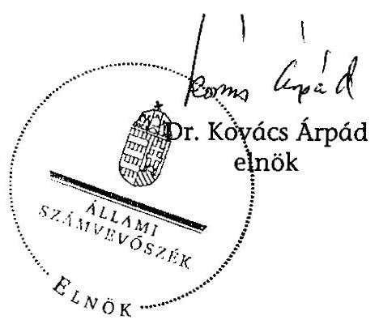

---

# Mellékletek

---

# Mellékletek jegyzéke 

| 1. sz. melléklet | A jelentésre és jelentéstervezetre tett észrevételek |
| :--: | :--: |
| 2. sz. melléklet | Kérdések és válaszok az ÁPV Zrt. 2007. évi szervezeti változásával, megszűnésével és az átmeneti időszakban végzett tevékenységével összefüggésben |
| 3. sz. melléklet | A tulajdonosi ellenőrzés működése |
| 4. sz. melléklet | A vagyontörvény életbe lépésének hatása a számviteli politikára |
| 5. sz. melléklet | A társasági részesedések feletti tulajdonosi joggyakorlás tárgyában hozott határozatok |
| 6. sz. melléklet | Felszámolási eljárások és felszámolás alatti cégekkel szembeni követelések 2007-ben |
| 7. sz. melléklet | A hozzárendelt vagyonba tartozó erdészeti társaságok támogatása |
| 8. sz. melléklet | A bevételek alakulása |
| 9. sz. melléklet | A 2007. évi költségvetési előirányzat és az ÁPV Zrt. 2007. évi ráfordításainak összehasonlítása |
| 10. sz. melléklet | Az Állami Számvevőszék 2007. évi ellenőrzési megállapításainak hasznosulása |
| 11. sz. melléklet | Tanúsítványok |

---

1. sz. melléklet

a V-2001-60/2008. sz. jelentéshez

# A jelentésre és a jelentéstervezetre tett észrevételek

---

1. sz. melléklet a V-2001-60/2008. sz. jelentéshez

H-1051 BUDAPEST V., JÓZSEF NÁDOR TÉR 2-4. POSTACIM: 1369 BUDAPEST, POSTAFIÓK 481.

TELEFON: (36-1) 327-2159, (36-1) 327-2141
FAX: (36-1) 318-0738

PÉNZÜGYMINISZTER

Dr. Kovács Árpád úr
elnök

Állami Számvevőszék

Budapest

Tisztelt Elnök Úr!

Köszönettel megkaptam az Állami Privatizációs és Vagyonkezelő Zrt. 2007. évi működésének és a központi költségvetés végrehajtásához kapcsolódó tevékenységének ellenőrzéséről készített jelentést, melyben foglaltakra - tekintettel a korábbi szakállamtitkári szintű egyeztetésekre - további észrevételt nem teszek.

Budapest, 2008. augusztus 27.

Üdvözlettel:
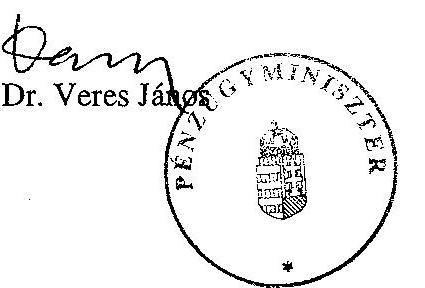

---

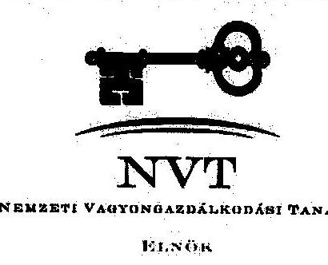

ÁLLAMI SZÁMVEVŐSZÉK
ÜGYVITELI IRDA
H 798/08
Érk.: AUG 28 2008
Iktatószám: V-2001-57/08
Melléklet: 1595/08

1133 Budapest, Pozsony út 56., 1300 Budapest, Pf. 706
Telefon: (06 1) 237 4290, Fax: (06 1) 237 4291
Honlap: www.mnvert.hu, E-mail: info@mnvert.hu

Bihary Zsigmond
főigazgató úr

Állami Számvevőszék

H-1052 Budapest
Apáczai Csere János u. 10.

Hegedűs V.

28. V.

28. V.

1595/08

28. V. 2008

Tárgy: Az ÁPV Zrt. 2007. évi működése vizsgálatáról szóló jelentés

Tisztelt Főigazgató Úr!

Köszönettel vettem az Állami Privatizációs és Vagyonkezelő Zrt. 2007. évi működésének és a központi költségvetés végrehajtásához kapcsolódó tevékenységének ellenőrzéséről készült, V-2001-57/2008. számú jelentéstervezetet.

Az MNV Zrt. és az Ön tájékoztatása alapján a jelentéstervezet tartalmazza a véleményeltéréseket és az MNV Zrt. képviselt álláspontját, ezért észrevételt a jelentéstervezethez kapcsolódóan nem teszek.

Budapest, 2008. augusztus 27.

Tisztelettel:

Nemzeti Vagyonkezelő Zrt.
Prof. dr. Nagy János

elnök

---

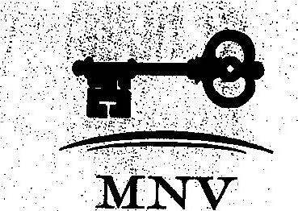

Ellenőrző Bizottság elnöke

# Állami Számvevőszék 

Bihary Zsigmond
főigazgató úr
1364. Budapest 4.

Pf.: 54

Tisztelt Főigazgató Úr!
A 2008. július 24-én részemre megküldött, MNV-01/41843/11 számon iktatott az ÁPV Zrt. 2007. évi működésének és a központi költségvetés végrehajtásához kapcsolódó tevékenységének ellenőrzéséről készített - V-2001-42/2008 azonosító számú - számvevői jelentéstervezet észrevételezési lehetőségét megköszönöm.

Tájékoztatom, hogy a jelentéstervezet készítése során több alkalommal egyeztetésre került sor az ellenőrzést végző számvevők és az Ellenőrzési Igazgatóság vezetője között, továbbá észrevételezési lehetőséget kaptunk az ellenőrzés végrehajtásáért felelős főcsoportfőnök úrhölgytől is.
Az egyeztetés folyamatában a közösen megfogalmazott észrevételek és javaslatok a jelentéstervezetbe beépítésre, illetve átvezetésre kerültek, amit ezúton is megköszönök.

A jelentéstervezetet korrektnek tartom, így ahhoz további észrevételt nem teszek.

Budapest, 2008. július 29.
Tisztelettel:
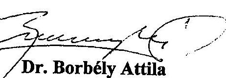

---

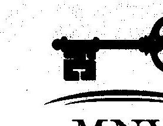
A'67-589/08.

# MAGYAR NEMZETI VAGYONKEZELŐ ZRT. 

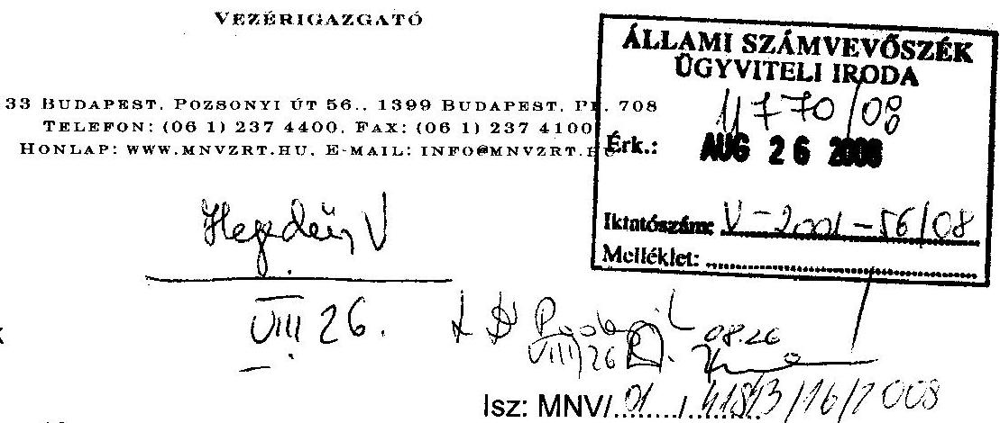

Bihary Zsigmond
főigazgató úr
Állami Számvevőszék
H-1052 Budapest
Apáczai Csere János u. 10.

Tárgy: Az ÁPV Zrt. 2007. évi működése vizsgálatáról szóló jelentés

Tisztelt Főigazgató Úr!
Köszönettel vettem az Állami Privatizációs és Vagyonkezelő Zrt. 2007. évi működésének és a központi költségvetés végrehajtásához kapcsolódó tevékenységének ellenőrzéséről készült, V-2001-54/2008. számú jelentéstervezetet.

Ezúton szeretném szíves tudomására hozni, hogy a tárgyban lefolytatott egyeztetési folyamat eredményeként kialakult, jelen levelem mellékletében szereplő jelentéstervezet a fennmaradt véleményeltérések vonatkozásában tartalmazza az MNV Zrt. adott kérdésben képviselt álláspontját is, így további észrevételt a jelentéstervezethez kapcsolódóan nem teszek.

Budapest, 2008. augusztus 25.
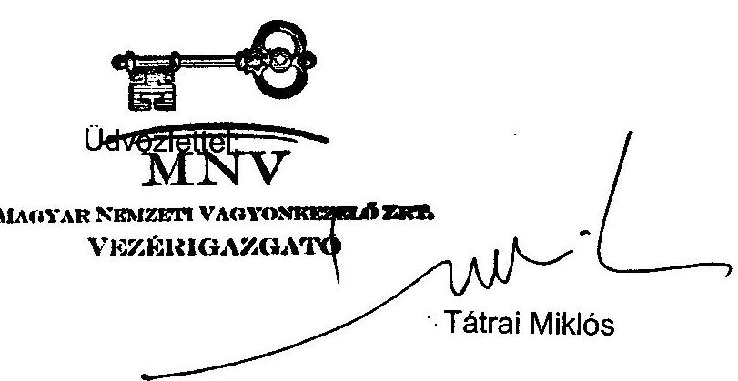

Melléklet: ÁSZ jelentéstervezet

---

# Kérdések és válaszok az ÁPV Zrt. 2007. évi szervezeti változásával, megszűnésével és az átmeneti időszakban végzett tevékenységével összefüggésben 

Főkérdés: A vagyontörvény hatályba lépése miatt szükségessé vált átmeneti intézkedések biztosították-e az ÁPV Zrt. zökkenőmentes feladatellátását, kialakították-e az állami vagyonnal való gazdálkodás szervezeti kereteit, a megalapított új szervezet szervezeti és működési rendje megfelelt-e az eredményes vagyongazdálkodás követelményeinek?
(Ebben a vizsgálatban a célszerűség azt jelenti, hogy a hozott intézkedések megfelelnek-e a törvényekben és kormányrendeletekben, határozatokban szereplő célkitűzéseknek. Az eredményesség kritériuma azt jelenti, hogy a szervezeti, irányítási, infrastrukturális és finanszirozási változások a kitűzött céloknak és az elvárt eredményeknek megfelelően valósultak-e meg.)

A vagyontörvény és a végrehajtására kiadott kormányrendelet rendelkezései hiányosak, a végrehajtáshoz rendelkezésre álló viszonylag rövid időben nem a megfontolt döntéseket, hanem a gyors megoldást keresték meg. A törvény előkészítése sem volt körültekintő, a végrehajtás feladatait, időigényét nem vették számba.

Az ÁPV Zrt. a törvény végrehajtása érdekében többletfeladatokat látott el, nem szabályozott módon, a Társaság költségére. Az átmeneti időszakban az ÁPV Zrt. kettős feladatainak nagyságát, végrehajthatóságát az RJGY, a Tanács, az ÁPV Zrt., sem mérte fel. Az ÁPV Zrt. szervezeteit a Vtv. hatályba lépését megelőzően átalakították, a létszám csökkent, a nagyszámú munkaidőn túli munkavégzés jelentős kockázatot hordozott.

A Tanács 2007. október 16-án kezdte meg működését, az ügyvezetést 2007. december 31-éig a korábbi 3 szervezet, döntően az ÁPV Zrt. útján végezte. Az MNV Zrt.-t a Kormány 1083/2007 (X. 17.) Korm. határozattal alapította, vezérigazgatója volt, munkaszervezete nem. A Vtv. és a kormányrendelet nem pontosította, hogy a megszűnő szervezet jogai és kötelezettségei szempontjából általános jogutódnak tekintendő-e az MNV Zrt. 2008. január 1-jétől. Pl. Kinek a feladata és felelőssége a megszűnt szervezetek éves beszámolóinak elkészítése, aláírása, ki végzi az elbocsátott dolgozók munkaviszonya megszűnésével kapcsolatos ügyintézést. Az MNV Zrt. és a PM között nézeteltérés volt ebben a kérdésben, a KVI éves beszámolója határidőre nem készült el, az MNV Zrt. vezérigazgatója csak különvélemény megfogalmazása mellett írta alá. Emiatt a megszűnt KVI, NFA éves beszámolójának hitelessége nem volt biztosított, az elbocsátott dolgozók járandóságaival kapcsolatban maradtak rendezetlen, kártérítésre okot adó ügyek.

---

A MNV Zrt.-nek 2007-ben SZMSZ-e, néhány tanácsi szabályzata volt. A szabályzatokat a Tanács határozata alapján 2008. január 30-ig a vezérigazgatónak felül kellett volna vizsgálni, ez nem történt meg. Több fontos szabályzat nem készült el. Az MNV Zrt. szervezetének működéséhez a szükséges forrásokat a központi költségvetés biztosítja. Mivel az MNV Zrt. működéséhez szükséges tárgyi eszközöket nem határozták meg, a kvt. előirányzatának megalapozottsága sem ítélhető meg.

Az NVT feladatait, hatáskörét a Vtv., a Tanács 2008. október 16-án elfogadott ügyrendje, illetve az MNV Zrt. SZMSZ-e szabályozza. Az átmeneti időszakban az ÁPV Zrt, KVI, NFA vezetői a döntések előkészítését az ügyrend szerint kellett, hogy végezzék, az ÁPV Zrt. igazgatóságát az NVT pótolta. Az ügyrend nem veszi számba teljes körűen az állami vagyon feletti tulajdonosi jogok és kötelezettségek összességét. Ezt a törvényelőkészítők és alkotók sem tették meg. 2007-ben a Tanács az elé kerülő ügyeket tárgyalta. Az átmeneti időszakban az ellenőrzési tevékenységet lényegében az ÁPV Zrt. kinevezett Felügyelő Bizottsága gyakorolta. A vagyontörvény hatásköri kérdésekben is pontatlan, a Tanácsnak túlzott mértékű, a Kormánynak nem elégséges hatásköre van, az RJGY bármely ügyben kézi vezérlést alkalmazhat.

| 1. | A vagyontörvény hatályba lépése miatt szükségessé vált átmeneti intézkedések biztosították-e az ÁPV Zrt. zökkenőmentes feladatellátását, kialakították-e az állami vagyonnal való gazdálkodás szervezeti kereteit, a megalapított új szervezet szervezeti és működési rendje megfelelt-e az eredményes vagyongazdálkodás követelményeinek? |
| :--: | :--: |
| 1.1 | Összhangban voltak-e a vizsgált időszakban módosított szakmai, társasági és gazdálkodást érintő jogszabályok ill. a belső szabályzatok   Részben. A vagyontörvény és a végrehajtására kiadott kormányrendelet rendelkezései hiányosak, egyes szakaszaiban nem egyértelműek, a végrehajtáshoz rendelkezésre álló viszonylag rövid időben nem a megfontolt döntéseket, hanem a gyors megoldási módokat keresték meg. Az ÁPV Zrt. a törvény végrehajtása érdekében többletfeladatokat látott el, nem szabályozott módon, a Társaság költségére. |
| 1.1.1 | Célszerűek és eredményesek voltak-e a megváltozott vagyontörvényhez (2007. évi CVI. tv.) kiadott végrehajtási jogszabályok (Korm. rendelet (254/2007. (XII. 27.), és kormányhatározatok)? | Nem.   A vagyontörvénnyel elérni kívánt egyik általános cél az volt, hogy a jogi szabályozás egyértelműbb és áttekinthetőbb legyen.   A jogi szabályozás egyelőre nem lett egyértelműbb és áttekinthetőbb. A vagyontörvény és a végrehajtására kiadott kormányrendelet helyenként nem egyértelmű, ellentmondásos, rendelkezései hiányosak, ezért jogértelmezési problémák merültek fel, ami a gyors megoldási módok megkereséséhez és alkalmazásához vezetett. |

---

| 1.1.2 | Összhangban voltak-e a szervezeti működés és az SZMSZ, az SZMSZ és az egyes szervezeti egységek ügyrendje, az ügyrendek és a vezetői kinevezések, a munkaszerződések és a munkaköri leírások? | Részben.   A Vtv. hatályba lépését

 követő átmeneti időszakban az ÁPV Zrt. SZMSZ-e nem változott, a Társaság az ezt megelőzően kialakított szervezettel működött 2007. december 31-ig. Sem az ÁPV Zrt., sem a Részvényesi Jogok Gyakorlója nem mérte fel az ellátandó - NVT döntéssel átruházott - feladat nagyságát és az ahhoz szükséges munkaerő szükségletet, így a szervezeti működés és az SZMSZ összhangja nehezen értékelhető. A Társaság egyes munkavállalói olyan többletfeladatot kaptak, amelyek indokolták volna a munkaköri leírások módosítását. |
| :--: | :--: | :--: |
| 1.1 .3 | Aktualizálták-e a társaság feladatainak ellátásához kapcsolódó belső szabályzatokat? | Nem.   2007. I. negyedévben a belső szabályzatok átfogó módosítása megtörtént, azonban a Vtv. hatályba lépését követően a Társaság belső szabályzatai nem módosultak. |
| 1.2 | Az átmeneti intézkedések biztosították-e az ÁPV Zrt. zökkenőmentes feladatellátását?   Részben. Az átmeneti időszakban az ÁPV Zrt. kettős feladatot látott el. Az RJGY, a Tanács, az ÁPV Zrt., sem mérte fel az ellátandó feladat nagyságát, annak végrehajthatóságát. Az ÁPV Zrt. szervezeteit a Vtv. hatályba lépését megelőzően átalakították, a létszám csökkent, a nagyszámú munkaidőn túli munkavégzés jelentős kockázatot hordozott.   A Tanács 2007. október 16-án megkezdte működését, az ügyvezetést 2007. december 31-éig a korábbi 3 szervezet, döntően az ÁPV Zrt. útján, azok költségére végezte. A Vtv. és a kormányrendelet nem pontosította, hogy a megszűnő szervezet jogai és kötelezettségei szempontjából általános jogutódnak tekintendő-e az MNV Zrt. 2008. január 1-jétől. Emiatt a megszűnt 3 szervezet éves beszámolójának hitelessége megkérdőjelezhető, az elbocsátott dolgozók járandóságaival kapcsolatban maradtak rendezetlen, kártérítésre okot adó ügyek.   A megalapított új Társaságnak 2007-ben SZMSZ-e, néhány tanácsi szabályzata volt. A szabályzatokat a Tanács határozata alapján 2008. január 30-ig a vezérigazgatónak felül kellett volna vizsgálni, ez nem történt meg. Több fontos szabályzat pl. a rábízott vagyon számviteli politikája, számlarendje és számlatükre nem készült el. Az MNV Zrt. szervezetének működéséhez a szükséges forrásokat a központi költségvetés biztosítja. Mivel az MNV Zrt. működéséhez szükséges tárgyi eszközöket nem határozták meg, a kvt. előirányzatának megalapozottsága sem ítélhető meg. |

---

| 1.2.1. | Célszerűen készítették-e elő a megváltozott feladatkörű ÁPV Zrt. struktúráját? | Részben.   Az ÁPV Zrt. alaptevékenységét ellátó szakterületeinek Vtv. hatályba lépését megelőző átalakítása az ágazati (szakterületi) tagozódás rendező elve alapján valósult meg - portfólió kezelő igazgatóságok -, ami megkönnyítette az egységes állami vagyongazdálkodás feladataira való felkészülést. Így a szakterületek bármilyen vagyonelemmel kapcsolatos feladatkör ellátására képessé váltak, azonban a feladatok nagyságának felmérése nélkül nem lehet a Társaság struktúráját célszerűségi szempontból megítélni. |
| :--: | :--: | :--: |
| 1.2.2. | Teljes körűen felmérték-e az ellátandó feladat nagyságát, annak konzekvenciáit? | Nem.   Az átmeneti időszakban a Társaság kettős feladatot látott el, azonban sem az ÁPV Zrt., sem a Tanács, sem a Részvényesi Jogok Gyakorlója nem mérte fel az ellátandó feladat nagyságát, annak konzekvenciáit. |
| 1.2.3. | Megteremtették-e az összhangot a működés feltételei és a feladat ellátás között? | Nem.   Az ÁPV Zrt. kevesebb munkavállalóval, a működés feltételeinek módosítása nélkül olyan többletfeladatokat végzett, amelyekről az NVT a 2/2007. (X. 16.) és a 14/2007. (X. 24.) sz. határozatokban döntött. Pl. valamennyi Tanács elé kerülő előterjesztés ügyintézése (havi 100 tanácsi határozat született), a döntések végrehajtásának ellenőrzése, valamennyi állami tulajdonú gazdasági társaság feletti tulajdonosi joggyakorlás, stb.) |
| 1.2.3.1. | Megfelelően előkészítették-e a Nemzeti Vagyongazdálkodási Tanács (NVT) létrehozását, biztosították-e a működés személyi és dologi feltételeit? | Részben.   A Vtv. előírásai (hatályos, 2007. szept. 25-től) szerint a köztársasági elnök 2007. október 10-i határozatában - a miniszterelnök javaslata alapján - hat évre kinevezte a 7 fős testület tagjait. A Tanácsnak 2007-ben munkaszervezete nem volt, az ügyvezetést 2007. december 31-éig a korábbi 3 szervezet, döntően az ÁPV Zrt. útján, azok költségére végezte. A Tanács működéséhez a személyi és a tárgyi feltételeket az ÁPV Zrt. biztosította, de üzleti terve (többletkiadások) emiatt nem módosult. |

---

| 1.2.3.2. | Eredményesen meg az ÁPV Zrt., a Kincstári Vagyon Igazgatóság és a Nemzeti Földalap összeolvadásának feltételeit, biztosították-e a működés személyi és dologi feltételeit? | Nem.   A Vtv. és a végrehajtására kiadott kormányrendelet nem pontosította, hogy a megszűnő szervezet jogai és kötelezettségei szempontjából általános jogutódnak tekintendő-e az MNV Zrt. 2008. január 1-jétől. Pl. Nem volt egyértelműen meghatározva, hogy a megszűnő szervezetek éves beszámolóit kinek kell elkészíteni és a beszámolók készítéséért ki a felelős, a megszűnt szervezetek dolgozói munkaviszonya megszüntetésével kapcsolatos 2008. január 1-je után megmaradt feladatokat, (felmentési időre járó illetmények, elmaradt járandóságok kifizetése, az adók és járulékok teljesítése, a jogviszonyok igazolása, személyi anyagok őrzése, stb.) kinek kell elvégezni. |
| :--: | :--: | :--: |
| 1.2.4. | A Magyar Nemzeti Vagyonkezelő Zrt. (MNV Zrt.) szervezete mennyiben biztosítja a vagyontörvényben megfogalmazott feladatok célszerű és hatékony ellátását? | Részben.   A megalapított új Társaságnak 2007-ben Szervezeti és Működési Szabályzata, továbbá néhány tanácsi szabályzata (2007-ben a Tanács saját ügyrendjén kívül 6) elkészült, munkaszervezete nem volt. A szabályzatokat a Tanács a 270/2007. (XII. 19.) sz. NVT határozattal fogadta el, azzal a kikötéssel, hogy 2008. január 30-ig a vezérigazgató vizsgálja felül azokat. A felülvizsgálat elmaradt. Nem készült el a rábízott vagyon számviteli politikája, számlarendje és számlatükre. A Társaság 2008. május 19-i tájékoztatása szerint erre az MNV Zrt. rábízott vagyona beszámolási és könyvvezetési rendjének - a PM-mel együtt történő - kialakítását követően kerül sor, várhatóan 2008. III. negyedévben. |
| 1.2.5. | Az MNV Zrt. gazdálkodási keretei biztosítják-e az állami vagyonnal való hatékony és eredményes gazdálkodást? | Részben.   A Vtv. alapján az ÁPV Zrt. a pénzügyminiszter kérelmére 2007. december 31-ével a cégjegyzékből való törléssel szűnik meg. Az ÁPV Zrt. saját vagyona - az MNV Zrt. működéséhez szükséges tárgyi eszközök kivételével - a Magyar Államra száll. Az MNV Zrt. működéséhez szükséges tárgyi eszközök az MNV Zrt. saját vagyonába kerülnek. E törvényi előírásoknak az alapítók 2008. június 30-ig nem tettek eleget. Az MNV Zrt. szervezetének működéséhez a szükséges forrásokat a központi költségvetés biztosítja. Ez a 2008. évi ktv-.ben szabályozva |

---

|  |  | van. Kérdés maradt, hogy, ha a működéséhez szükséges eszközöket sem határozták meg, mennyire megalapozott és megítélhető-e a kvt. előirányzata. A Tanács 64/2008. (II. 20.) sz. határozata szerint a saját vagyon működési költségének hiánya 928 M Ft , a költségvetési törvény javaslatának összeállításakor ismert információkhoz képest. |
| :--: | :--: | :--: |
| 1.3. | A Nemzeti Vagyongazdálkodási Tanács az átmeneti időszakban biztosította-e az ÁPV Zrt. a zökkenőmentes feladatellátását?

Részben. Az NVT feladatait, hatáskörét a Vtv., a Tanács 2008. október 16-án elfogadott ügyrendje, illetve az MNV Zrt. SZMSZ-e szabályozza. Az átmeneti időszakban az ÁPV Zrt, KVI, NFA vezetői a döntések előkészítését az ügyrend szerint kellett, hogy végezzék, az ÁPV Zrt. igazgatóságát az NVT pótolta. Az ügyrend természetesen nem veszi számba teljes körűen az állami vagyon feletti tulajdonosi jogok és kötelezettségek összességét. Ezt a törvényelőkészítők és alkotók sem tették meg. 2007-ben a Tanács gyakorlatilag az elé kerülő ügyeket tárgyalta. Az átmeneti időszakban az ellenőrzési tevékenységet lényegében az ÁPV Zrt. kinevezett Felügyelő Bizottsága gyakorolta. A vagyontörvény hatásköri kérdésekben is pontatlan, a Tanácsnak túlzott mértékű, a Kormánynak nem elégséges hatásköre van, az RJGY bármely ügyben kézi vezérlést alkalmazhat. |
| 1.3.1. | Egyértelműen meghatározták-e az NVT jogait és kötelezettségeit? | Részben.   Az NVT feladatait, hatáskörét a Vtv. szabályozza. A törvény több ponton pontosításra szorul. A Tanács első ülésén 2008. október 16-án elfogadta ügyrendjét, illetve feladatait, hatáskörét az MNV Zrt. SZMSZ-ében (92/2007. (XI. 21. NVT sz. hat.) is megfogalmazták. Az NVT az ÁPV Zrt. igazgatósági feladatait is ellátta. |
| 1.3.1.1. | Az NVT Ügyrendje célszerűen biztosítja-e az állami vagyon feletti tulajdonosi jogok és kötelezettségek összességének maradéktalan ellátását? | Részben.   Az NVT az (1/2007. (X. 16. NVT sz. határozatban elfogadta ügyrendjét. Az RJGY az ügyrendet 1/2007. (X. 24. sz. határozattal jóváhagyta. Az ügyrend szerint a Tanács jogait és kötelezettségeit testületként, az ügyrendben foglaltaknak megfelelően, az ülésein gyakorolja. Ennek megfelelően az ügyrend az ülések előkészítésével, az üléssel, a jegyzőkönyv, határozatok tára, nyilvánosság kérdéseivel foglalkozik. Az átmeneti időszakban a tanácsi határozat szerint az ÁPV Zrt, KVI, NFA vezetői a döntések előkészítését az ügyrend szerint kellett, hogy végezzék. Az ügyrend természetesen nem veszi számba teljes körűen az állami vagyon feletti tulajdonosi jogok és kötelezettségek összességét. |

---

|  |  | Ezt a törvényelőkészítők és alkotók sem tették meg. |
| :--: | :--: | :--: |
| 1.3.1.2. | Az NVT Ügyrendje biztosítja-e a vagyonkezelési feladatok, valamint az állami vagyon megóvásával kapcsolatos feladatok zavartalan ellátását, az állami vagyon hatékony és gazdaságos működtetését, megőrzését, gyarapítását, értékesítését? | Részben.   Az ügyrend szerint a Tanács a Vtv.-ben meghatározott feladat és hatáskörrel az állami vagyon feletti tulajdonosi jogok és kötelezettségek összességét a Magyar Állam nevében, az MNV Zrt.-n keresztül gyakorolja. Éves, illetve részletes negyedéves munkaterv alapján dolgozik.   Tekintettel arra, hogy nem vették számba az állami vagyont, ami felett valamennyi tulajdonosi jogot és kötelezettséget gyakorolni kell, 2007-ben a Tanács gyakorlatilag az elé kerülő ügyeket tárgyalta. |
| 1.3.2. | Az Ellenőrző Bizottság feladatköre mennyiben biztosítja az NVT eredményes működésének és az állami vagyonnal való hatékony gazdálkodásnak az ellenőrzési lehetőségét? | Részben.   Az EB feladatait a Vtv., illetve a Gt. határozza meg. A Tanács és a vagyonkezelő részvénytársaság működését 11 tagú Ellenőrző Bizottság ellenőrzi. A miniszterelnök 2007. október 15-ei határozatában öt évre kinevezte a 11 tagból álló, az MNV Zrt. és a Tanács munkájának ellenőrzését ellátó testület, az Ellenőrző Bizottság 10 tagját. A 11. tagot később, 2007. december 12-én (az MDF nem javasolt korábban jelöltet) nevezte ki. Az EB-nek 2007-ben ügyrendje volt, munkaterve nem. Az EB munkatervet 2007. évre azért nem készített, mert az átmeneti időszakban az ellenőrzési tevékenységet lényegében az ÁPV Zrt. kinevezett Felügyelő Bizottsága gyakorolta. |
| 1.3.3. | A részvényesi jogokat gyakorló miniszter és az NVT hatáskörének megosztása biztosítja-e az állami vagyon működtetésével kapcsolatos célszerű döntések meghozatalát? | Részben.   A vagyontörvény hatásköri kérdésekben pontosításra szorul. A Kormány hatásköre a döntési értékhatárokban általában túlzottan szűk körű, a Tanács hatásköre túlzottan széleskörű, egyes esetekben pedig a hatáskörök

 nem tisztázottak. Pl. A költségvetési törvények rövid távú, csak éves szintű korlátokat szabnak, ingyenes vagyonátadásról 2008-ban 1 Mrd Ft felett a Kormány dönt, tulajdonosi hitel/kölcsön nyújtása esetén a Kormány előzetes jóváhagyása szükséges értékhatártól függetlenül. A Tanács hatásköre az állami vagyon fejlesztésével, hasznosításával, elidegenítésével kapcsolatos középtávú stratégia kialakítása, amit a Kormány elé kell terjeszteni, de arra vonatkozóan |

---

|  | nincs előírás, hogy azt a Kormánynak jóvá kell-e hagyni. A Vtv. szerint az RJGY bármely ügyben utasítást adhat a Tanácsnak a felelősség átvállalása mellett, közvetlen beavatkozást biztosítva ezzel a már előkészített ügymenetekbe is. |
| :--: | :--: |

---

# A tulajdonosi ellenőrzés működése 

Az ÁPV Zrt. tulajdonosi ellenőrzési rendszert működtet a vagyoni körébe tartozó azon társaságok esetében, ahol többségi tulajdoni hányaddal rendelkezik. A rendszer legfőbb részei a monitoring rendszer, valamint az ezt támogató - a társaságok gazdálkodásáról, jövedelmezőségéről, likviditási helyzetéről információval szolgáló - kontrolling információs rendszer. Utóbbinak, a különböző súlyosságú problémákat jelző „korai riasztás" funkciója révén lehetőség van a tulajdonosi szintet igénylő beavatkozások megalapozott végrehajtására. A korai riasztás rendszere 2007-ben is folyamatosan jelezte a tulajdonosi szintet igénylő beavatkozások megalapozott végrehajtásának szükségességét, azonban egyes vizsgálat alá vont társaságok esetében a tulajdonos nem tette meg a kedvezőtlen folyamatok leállításához szükséges intézkedéseket.

A korai riasztás 5+1 fokozatú rendszere 2007-ben kiemelten a jövedelmezőség romlás, a törvényi elégtelenség és a „figyelmeztetés válságos helyzetre" riasztással előre jelezte a MALÉV Vagyonkezelő Kft., a Bábolna Zrt., a MAHART Zrt., a Hollóházi Porcelán Zrt., az Agrárgazdasági Kft., a Budapest Airport Zrt., a Fertődi Kutató Kht., a Fűzfői Szennyvíz Kft., valamint a MOKÉP Zrt. esetében a tulajdonosi beavatkozás szükségességét.

A Társaság a 20/2007. Vezérigazgatói utasítással szabályozta a negyedéves tulajdonosi értékelő értekezletek működését, amelynek kiemelt feladata, hogy a társaságoknál kedvezőtlenül alakuló folyamatok esetén feltárja azok okait, és biztosítsa a tulajdonos részéről történő időbeni beavatkozás lehetőségét. 2007-ben az ÁPV Zrt. portfoliójába tartozó társaságok közül nyolc esetben került sor tulajdonosi értékelő értekezlet összehívására.

Az 51/2007. (II. 13.) Vig. sz. határozat a 2007. I. negyedévben tulajdonosi értékelő értekezlet megtartását rendelte el a MALÉV Zrt., a Bábolna Zrt., a Hollóházi Porcelánmanufaktúra Zrt. és a Nemzeti Lóverseny Kft. esetében. A 297/2007. (VI. 04.) Vig. sz. határozat a 2007. II. negyedévben tulajdonosi értékelő értekezlet megtartását rendelte el a Volánbusz Zrt., az Egererdő Zrt., a Tiszavíz Vízerőmű Kft. és a MOKÉP Zrt. esetében. Az értekezletekről az ügyvezetés részére beszámolók, illetve emlékeztetők készültek. Az ÁPV Zrt. ügyvezetése az e tárgyban készült beszámolókat megismerte, a 261/2007. (VI. 14.) IG., valamint a 304/2007. (IX. 05.) IG. határozatokkal a tájékoztatókat elfogadta.

A 4/2007. számú vezérigazgatói utasítással összhangban az ÁPV Zrt. Igazgatósága kormány-előterjesztést készített és kormány határozat kiadását kezdeményezte (a vizsgálat alá vont társaságok közül) a 17/2007. (I. 25.) IG határozattal „a MALÉV Zrt. privatizációs eljárásának lezárásával kapcsolatos döntések meghozatala" tárgyában.

A Részvényesi Jogok Gyakorlója 1/2007. (I.9.) számon határozatot adott ki „A lóversenyzés helyzetének rendezéséről szóló 1115/2006. (XI. 30.) Korm. határozat végrehajtása" tár-

---

gyában (az Igazgatóság meghozta a 18/2007. (I. 29.) IG sz. határozatot), 4/2007. (II. 12.) számon határozott a MALÉV állami tulajdonban lévő részvényeinek privatizációjával kapcsolatos intézkedésekről szóló 2016/2007. (II. 06.) számú Korm. határozat végrehajtásáról (az Igazgatóság meghozta a 49/2007. (II. 22.) IG sz. határozatot), 6/2007. (III. 20.) számon határozott a Balatoni Halászati Zrt. működésének stabilizálásáról és a tulajdonosi szerkezet átalakításáról szóló 2034/2007. (III. 7.) számú Korm. határozat végrehajtásáról (az Igazgatóság meghozta a 132/2007. (IV. 05.) IG sz. határozatot).

---

# A vagyontörvény életbelépésének hatása a számviteli politikára 

Az új vagyontörvénnyel megteremtődtek az állami vagyonnal való tartós gazdálkodás törvényi szabályozásának, a gazdálkodás egységes szervezeti és működési rendszere kialakításának és a számviteli törvényhez való alkalmazkodásának feltételei. Az 2007. szeptember 25-én hatályba lépett 2007. évi CVI. tv. az állam tulajdonát képező termelő és nem termelő vagyon kezelésével, gazdálkodásával, számviteli elszámolásával és nyilvántartásával kapcsolatos feladatokat és ezzel párhuzamosan a korábbi intézményrendszert megszüntette, új alapokra helyezte.

Az átmeneti időszakra vonatkozóan az új vagyontörvény számviteli szempontból a legfontosabb teendők között a következőket határozta meg:

- A vagyonkezelő szerveknek - ÁPV Zrt., KVI és NFA - az általuk kezelt vagyonnal kapcsolatban 2007. december 31-ei állapot szerint vagyonmérleget és alátámasztására vagyonleltárt kell készíteni.
- A vagyonkezelő szervek tevékenységének megszűnésére tekintettel 2007. december 31-ei fordulónappal a tevékenységet lezáró mérleget, a folyamatban lévő ügyekről beszámolót, a hatályos szerződésekről jegyzéket kell készíteni és az iratanyagot a Tanács, illetve a MNV Zrt. Igazgatósága részére át kell adni.

A vagyontörvény és a végrehajtására kiadott kormányrendelet nem biztosították az átmeneti időszak alatt az állami vagyon kezelésének átlátható, hatékony, a számviteli törvény előírásainak megfelelő, egységes elvek szerint történő kezelését. A végrehajtási rendelet az átmeneti időszakra nem adott kielégítő szabályozást a rábízott vagyonnal való gazdálkodás számviteli elszámolását és nyilvántartását illetően.

Az új vagyontörvény a vagyonkezelő szerv megalakulására a Gt. szabályainak alkalmazását írta elő. A Vtv. törvényi jogutódlás alapján történő vagyonátadásról rendelkezik, melynek alapján az elődszervezeteknek a megszűnésükkel egy időben kell átadni az MNV Zrt. részére a rábízott vagyont. A végrehajtási rendelet nem adott választ többek között arra, hogy az elődszervezeteknél különböző módon és értéken nyilvántartott vagyon miként alakul át rábízott vagyonná és kerül az új vagyonkezelő szervezet nyilvántartásába. A vagyon nyilvántartásának a MNV Zrt. által kialakítandó legfontosabb szabályai a vizsgálat lezárásáig sem kerültek rögzítésre, az állami vagyon értékének meghatározása során továbbra is eltérnek a számviteli törvénytől.

Az új vagyontörvény az MNV Zrt. saját vagyonát, az azzal kapcsolatos bevételek és kiadások nyilvántartását és beszámolási rendjét továbbra is elkülöníti a rábízott vagyonától.

---

A Vtv. 17. § (b) pontja szerint az állami vagyonról az MNV Zrt. 2007. december 31-ével köteles nyilvántartást vezetni. A 254/2007. (X. 4.) Korm. rendelet 13-15. § a következőket írja elő: Az MNV Zrt. a saját vagyonától elkülönítetten kell nyilvántartani azt a vagyont, amely felett a magyar állam nevében a tulajdonosi jogokat a Tanács az MNV Zrt. útján gyakorolja. Az MNV Zrt. az állami vagyont az adott vagyontárgy sajátosságainak megfelelően, az azonosítást lehetővé tévő módon naturáliában és értékben a keletkezés aktiválás időpontját is feltüntetve tartja nyilván.

A rábízott vagyon új vagyonkezelő nyitómérlegében 2008. június 30-ával tervezett felvétele esetén az állami vagyon értékének teljessége és a valódisága megkérdőjelezhető, tekintettel arra, hogy a jogelőd szervezetek a törvény szerint mennyiségben és értékben történő kiértékelt vagyonleltárt nem készítettek 2007. december 31-ével.

A vagyontörvény 2007. szeptember 25-ei életbelépésével a tulajdonosi jogokat a Tanács gyakorolja. A rábízott vagyon kezelésével kapcsolatos jogok és kötelezettségek az elődszervezetek megszűnésétől - ettől az időponttól - tehát 2007. december 31-étől szálltak át az MNV Zrt.-re. A rábízott vagyon mennyiségben és értékben történő nyilvántartási kötelezettsége az MNV Zrt. részéről ennek alapján 2007. december 31-ével állt fenn. Megjegyezzük, hogy a rábízott vagyon 2007. december 31-ével történő nyilvántartásba vétele nem történt meg.

---

# A társasági részesedések feletti tulajdonosi joggyakorlás tárgyában hozott határozatok 

A Vtv. hatálybalépésével valamennyi állami tulajdonú társasági részesedés feletti tulajdonosi joggyakorlás a törvény erejénél fogva a Tanács feladatkörébe került, beleértve a Vtv. hatálybalépése előtt az ÁPV Zrt. hozzárendelt vagyonába tartozó társaságok feletti tulajdonosi joggyakorlást is. Ennek megfelelően az ÁPV Zrt. év végi megszűnése előtti eljárási jogköreit és feladatait - figyelemmel a Vtv. 59. §-ának (1) bekezdésére is - teljes körűen a Tanács jogköre volt megállapítani.

A Tanács a társasági részesedések feletti tulajdonosi joggyakorlás tárgyában a vizsgált időszakban az alábbi határozatokat hozta:

- A Döntés a Magyar Államot megillető tulajdonosi jogok gyakorlásáról 2007. december hó 31. napjáig tárgyban hozott 2/2007. (X. 16.) NVT sz. határozat 1. pontja. E szerint a Tanács úgy döntött, hogy a Magyar Államot megillető tulajdonosi jogok gyakorlását 2007. december hó 31. napjáig a KVI, az NFA, valamint az ÁPV Zrt. útján látja el: a KVI, az NFA és az ÁPV Zrt. az állami vagyon azon elemeivel kapcsolatban lett jogosult eljárni, amelyekre vonatkozóan az adott szervezetet a Vtv. hatálybalépésének napját közvetlenül megelőző napon, azaz 2007. szeptember 24-én megillette a tulajdonosi jogok gyakorlásának joga.
- A fent hivatkozott 2/2007. (X. 16.) NVT sz. határozat 5. pontjában a Tanács úgy határozott, hogy a Priv. tv. mellékletében felsorolt társasági részesedések tekintetében a tulajdonosi jogok gyakorlását 2007. december 31. napjáig tartó hatállyal az ÁPV Zrt. útján látja el.
- A döntés a Magyar Állam kincstári vagyonába tartozó, a Vtv. hatályba lépéséig a költségvetési szervek vagyonkezelésében volt társasági részesedések feletti tulajdonosi joggyakorlásról szóló 14/2007. (X. 24.) NVT sz. határozat szerint a Tanács a Magyar Állam kincstári vagyonába tartozó, a Vtv. hatálybalépéséig a központi költségvetési szervek vagyonkezelésében lévő társasági részesedések tekintetében a tulajdonosi jogok gyakorlását 2007. december 31. napjáig tartó hatállyal az ÁPV Zrt. útján látja el.
- A korábban kincstári vagyonba tartozó társasági részesedések tekintetében a tulajdonosi jogok gyakorlása tárgyban hozott 54/2007. (XI. 07.) NVT sz. határozatban a Tanács felhatalmazta a KVI vezérigazgatóját a KIVING Ingatlangazdálkodási és Beruházás Szervező Kft., a Club Aliga Vagyonkezelő Zrt., a XTERRUM IMMOBILIA Ingatlanhasznosító Kft., a Ferihegyi Utasterminál Fejlesztő Kft. és a KÖTIVIÉP'B Kft. cégek vonatkozásában a döntési, tulajdonosi jogok gyakorlására a 2007. december 31-éig terjedő időszakra és ezzel kivételeket állapított meg az ÁPV Zrt.-hez kerülő társasági körhöz.

---

# Felszámolási eljárások és felszámolás alatti cégekkel szembeni követelések 2007-ben 

Felszámolások:
db

| Megnevezés | Vállalat | Társaság | Összesen |
| :-- | --: | --: | --: |
| Folyamatban lévő felszámolási eljárás | 40 | 89 | 129 |
| Ebből: ÁPV Zrt. tulajdonban levő cég | 40 | 40 | 80 |
| Nem ÁPV Zrt. tulajdonban levő cég | 0 | 45 | 45 |
| KVI-től átvett cég | 0 | 4 | 4 |
| Kötelezettség-követeléskezeléssel érintett lezárt f.a. | 64 | 70 | 134 |
| Portfólió összesen: | 104 | 159 | 263 |

Felszámolás alatti cégekkel szembeni követelések cégcsoportonkénti bontásban:

| Megnevezés | Cégszám db | 2007. 12. 31-ei kö-   vetelés (millió Ft) |
| :-- | --: | --: |
| I. Követelések ÁPV Zrt. tulajdonú cégekkel szem-   ben | 17 | 7439 |
| II. Követelések nem ÁPV Zrt. tulajdonú cégekkel   szemben | 36 | 2965 |
| Összesen: | 53 | 10404 |

---

A HOZZÁRENDELT VAGYONBA TARTOZÓ ERDÉSZETI TÁRSASÁGOK TÁMOGATÁSA (KÖTV. TV. 15. SZ. MELLÉKLET I. 1. C) 2007. évben E Ft

|  Sor-
szám | Társaságok megnevezése | Közmunka program | Közmunka |
 program bővítés | Erdőgazdaságok természeti károk kezelése | Közjóléti és erdőművelési támogatás | Összesen  |
| --- | --- | --- | --- | --- | --- | --- |
|  1 | Bakonyerdő Erdészeti és Faipari Zrt. | - | - | - | 71400 | 71400  |
|  2 | DALERD Délalföldi Erdészeti Zrt. | 51600 | - | 15000 | 44000 | 110600  |
|  3 | Egererdő Erdészeti Zrt. | 38400 | - | 11000 | 140200 | 189600  |
|  4 | Északerdő Erdőgazdasági Zrt. | 57300 | - | 16000 | 190800 | 264100  |
|  5 | Gemenci Erdő- és Vadgazdaság Zrt. | 57300 | - | 12000 | 76400 | 145700  |
|  6 | GYULAJ Erdészeti és Vadászati Zrt. | 29200 | - | 19000 | 26200 | 74400  |
|  7 | Ipoly Erdő Zrt. | 45900 | - | 29000 | 118000 | 192900  |
|  8 | Kisalföldi Erdőgazdaság Zrt. | 16000 | - | 12000 | 57400 | 85400  |
|  9 | KEFAG Zrt. | 45900 | - | 207000 | 123300 | 376200  |
|  10 | Mecseki Erdészeti Zrt. | 34400 | - | 17000 | 124400 | 175800  |
|  11 | NEFAG Zrt. | 27500 | - | 8000 | 97000 | 132500  |
|  12 | NYÍRERDŐ Nyírségi Erdészeti Zrt. | 131300 | 20000 | 54000 | 129000 | 334300  |
|  13 | Pilisi Parkerdő Zrt. | 24100 |  - | 18000 | 98700 | 140800  |
|  14 | SEFAG Somogyi Erdészeti és Faipari Zrt. | 67100 | - | 36000 | 174900 | 278000  |
|  15 | Szombathelyi Erdészeti Zrt. | 17200 | - | - | 99400 | 116600  |
|  16 | Tanulmányi Erdőgazdaság Zrt. | - | - | 3000 | 28100 | 31100  |
|  17 | VADEX Mezöföldi Erdő- és Vadgazd. Zrt. | 25800 | - | 21000 | 19200 | 66000  |
|  18 | Vértesi Erdészeti és Faipari Zrt. | 31000 | - | 22000 | 33200 | 86200  |
|  19 | Zalaerdő Erdészeti Zrt. | - | - | - | 123400 | 123400  |
|   | Összesen | 700000 | 20000 | 500000 | 1775000 | 2995000  |

---

# A bevételek alakulása 

| Megnevezés |  | Terv | Tény | 2007. év tény      (%) |
| :-- | :-- | --: | --: | --: |
|  |  | 2007. év | 2007. év |  |
| B.1.1. | Privatizációs bevétel | 59374 | 67838 | 114,3 |
| B.1.2. | Vagyonhasznosítási bevétel | 0 | 30 | - |
| B.1.3. | Kárpótlási jegy bevétel | 429 | 0 | - |
| B.1. | Értékesítés és vagyonhasz-   nosítás összesen | 59803 | 67868 | 113,5 |
| B.2. | Kapott osztalék, részesedés | 8620 | 9359 | 108,6 |
| B.3. | Egyéb bevételek | 8481 | 1586 | 18,7 |
| B.R. | Rendelt vagyonnal kapcso-   latos bevételek összesen | 76904 | 78813 | 102,5 |

---

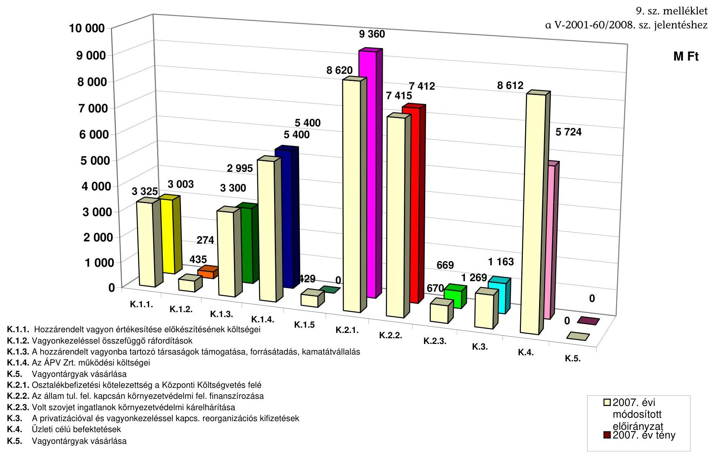

# A 2007. évi költségvetési előirányzat és az ÁPV Zrt. 2007. évi ráfordításainak összehasonlítása

## K.1.1. Hozzárendelt vagyon értékesítése előkészítésének költségei

## K.1.2. Vagyonkezeléssel összefüggő ráfordítások

## K.1.3. A hozzárendelt vagyonba tartozó társaságok támogatása, forrásátadás, kamatátvállalás

## K.1.4. Az ÁPV Zrt. működési költségei

## K.5. Vagyontárgyak vásárlása

## K.2.1. Osztalékbeltzetési kötelezettség a Központi Költségvetés felé

## K.2.2. Az állam tul. fel. kapcsán környezetvédelmi fel. finanszírozása

## K.2.3. Volt szovjet ingatlanok környezetvédelmi kárelhárítása

## K.3. A privatizációval és vagyonkezeléssel kapcs. reorganizációs kifizetések

## K.4. Üzleti célú befektetések

## K.5. Vagyontárgyak vásárlása

---

**2007. évi módosított előirányzat**

**2007. év tény**

---

# Az Állami Számvevőszék 2007. évi ellenőrzési megállapításainak hasznosulása 

Az Állami Számvevőszék 2007. évi jelentésében a helyszíni ellenőrzés megállapításainak hasznosítása mellett a pénzügyminiszternek 6 pontban fogalmazott meg ajánlásokat.

Az ÁPV Zrt. Felügyelő Bizottsága a pénzügyminiszter 2007. szeptember 21-ei felkérésére 2007. november 15-ig elvégezte az ÁSZ jelentésben foglalt, a miniszteri felkérésben öt pontban felsorolt, ÁSZ által feltárt hiányosságok kiküszöbölése érdekében szükséges vizsgálatokat.

A felsorolt hiányosságok megszüntetésére, személyi felelősségre vonás megállapítására vonatkozó ÁSZ javaslatok egyike sem hasznosult, mert a Társaság FB-je a felsorolt hiányosságokban szabálytalanságot, személyi felelősség megállapítására, jogellenes magatartásra vonatkozó körülményt nem tárt fel. A MOL részvények értékesítésével kapcsolatban ugyanakkor felhívta az NVT és az ÁPV Zrt. vezérigazgatója figyelmét, hogy a jövőben előforduló hasonló tőzsdei tranzakciók esetében körültekintően vizsgálja meg az önkötés vizsgálatának lehetőségét.

Az FB megállapításai az ÁSZ ajánlások megismétlésével, annak sorrendjében:

1. vizsgáltassa ki az ellenőrzés során feltárt a MOL részvényeinek értékesítésénél elkövetett hibából keletkezett 5,4 Mrd Ft bevételkiesés körülményeit;

A MOL opciós szerződés alapján történő értékesítése esetében az FB tudomásul vette, hogy az opciós megállapodásnál az ügylet jövőbeni teljesítési időpontjára vonatkozóan az adott esetben nem lehetett előre meghatározni, hogy melyik fél számára alakul kedvezőbben, vagy kedvezőtlenebbül az önkötési tranzakció. Ugyanakkor felhívta az NVT és az ÁPV Zrt. vezérigazgatója figyelmét, hogy a jövőben előforduló hasonló tőzsdei tranzakciók esetében körültekintően vizsgálja meg az önkötés vizsgálatának lehetőségét.
2. tárja fel a Forrás Rt. feltőkésítéséből és privatizációjából keletkezett 3,8 Mrd Ft vagyonvesztés indokoltságát, figyelemmel arra, hogy a vagyonvesztés nem az alanyi kárpótlási jeggyel rendelkezőknél jelentkezett;

A Forrás Rt. részvényeinek értékesítésekor az ÁPV Zrt. a hatályos vagyonértékelési rend szerint járt el, a vizsgálat nem állapított meg jogellenességet, így a személyi felelősség a vizsgálat rendelkezésére bocsátott információk alapján nem állapítható meg.
3. kezdeményezze a Bábolna Rt. szükségtelen végelszámolása miatti veszteségek (Reorg Rt.-nek kifizetett díj) okozóinak személyes felelősségre vonását, tárja fel a végelszámolás alatt érdemi munkát nem végző igazgatóság tagjainak indokolatlanul kifizetett megbízási díjak okait, a végelszámolás alatt felhalmozott 1,2 Mrd Ft-os lejárt kétes követelés felhalmozásának és

---

a végelszámolást végző társaság leányvállalatának 175 M Ft értékű eladása körülményeit;

A pénzügyminiszter felkérésére az ÁPV Zrt. Felügyelő Bizottsága megvizsgálta az ajánlásokat, és a felvetett három témában kettő esetében az ÁSZ megállapításaival ellentétes következtetésre jutott. Az indokolatlanul kifizetett megbízási díjakkal kapcsolatban elismeri a munkavégzés nélküli megbízási díjak kifizetését, de sem felelőst, sem visszafizetési kötelezettséget az 5636670 Ft-ra nem nevez meg az FB a jelentésében.

A szükségtelen végelszámolás miatt okozott veszteségnövekedéssel kapcsolatban az FB valószínűsíti, hogy az ÁPV Zrt. Igazgatósága a végelszámolással történő megszüntetésre vonatkozó döntéssel a veszteségeket kívánta minimalizálni, lehetőséget teremteni a kormányhatározat végrehajtását célzó reorganizációs program tulajdonosi felügyelet mellett történő megvalósítására. A végelszámolást az FB alternatíva nélküli döntésnek tekintette 2007. november 15 -ei ülésén. A végelszámolás folyamatának vizsgálata során az FB nem tárt fel olyan tényeket, nem találkozott olyan dokumentumokkal, cselekményekkel, amelyek alapján megállapítható lenne a vagyonvesztéssel összefüggésben olyan számszerúsíthető kár, amelyet valamely személy bizonyítható jogellenes magatartással okozott, ezért személyi felelősség nem állapítható meg.

Az FB nem vette figyelembe, hogy a 2004. évi ÁSZ vizsgálat feltárta a vagyonkimentésből fakadó hátrányok várható következményeit, valamint az Élelmiszeripari Rt.-be apportált fiktív vagyonelemek miatti veszteségnövekedést. Az FB nem kérte számon az ügyvezetésen azt a tényt, hogy nem készült konszolidált beszámoló a vállalatcsoportról, amely alapján a valós vagyoni és jövedelmi helyzet ismertté vált volna. Az FB a számvevői jelentésekben feltárt tények alapos vizsgálata, valamint a Bábolna Zrt. könyvvizsgálóinak, illetve az ÁPV Zrt. könyvvizsgálójának korlátozó záradékai alapján tett intézkedések, illetve elmulasztott intézkedések szerinti vizsgálat alapján más következtetésre jut.

A végelszámolás időszakában keletkezett 1,2 Mrd Ft-os lejárt kétes követelés felhalmozása és eladása tárgyában is az ÁSZ jelentéstől ellentétes megállapításra jutott az FB. Konszolidált beszámoló nélkül nem lehetett megállapítani, hogy a kétes követelések közül mennyi volt a vállalatcsoporton belüli számlák összege, és azok hogyan keletkeztek. A végelszámoló többször felhívta a társaság és a tulajdonos ÁPV Zrt. figyelmét, hogy alapvető szerződések és könyvelési bizonylatok hiánya miatt veszélybe kerülhet a végelszámolás folytatása. Az ÁPV Zrt. 2007. június 30 -ai mérlegének felülvizsgálata során a könyvvizsgáló hivatkozik a Bábolna Zrt. könyvvizsgálójának 2007. április 18-án kiadott jelentésére, amelyben felhívja a társaság figyelmét arra a tényre, hogy az egységes szerződés nyilvántartás hiánya miatt nem tudott meggyőződni arról, hogy a beszámoló tartalmaz-e minden, a Bábolna Zrt. működéséből fakadó követelést és kötelezettséget. E tények figyelmen kívül hagyásával folytatta le az FB a vizsgálatát.

---

4. kezdeményezze a szükséges felelősségre vonást a privatizációs tartalék (költség 5 M Ft , sportingatlan  $25,7 \mathrm{M}$ Ft) és saját vagyon terhére (egyéb díj 5 M Ft ) indokolatlanul kifizetett mintegy $35,7 \mathrm{M}$ Ft esetében;

A privatizációs tartalék (költség 5 M Ft , sportingatlan $25,7 \mathrm{M} \mathrm{Ft}$ ) és saját vagyon terhére (egyéb díj 5 M Ft ) indokolatlanul kifizetett mintegy 35,7 M Ft esetében az FB megállapítása a következő volt:

- a privatizációs tartalékból a Tesco Kft. számára teljesített 5 M Ft + ÁFA kifizetésében szabálytalanság nem volt, az ÁPV Zrt.-t kár nem érte, személyi felelősség megállapítására vonatkozó körülményt nem tártak fel.
- a privatizációs tartalékból a sportingatlanok után a Dunaferrnek megfizetett $25,7 \mathrm{M}$ Ft üzemeltetési alapköltség szerződéses kötelezettség volt, az ÁPV Zrt.-t kár nem érte, jogellenes magatartásra utaló körülményt nem tártak fel.
- a saját vagyon terhére egyéb díjként az FHB tisztségviselője részére az FHB középtávú stratégiája kidolgozásában részvétel címen - kifizetett 5 M Ft a Társaság szabályait betartva került kifizetésre, a Társaságot kár nem érte, jogellenes magatartásra utaló körülményt nem tártak fel.

5. vizsgáltassa meg a közbeszerzési szabályok figyelmen kívül hagyásával történt szerződéskötéseket és a szerződések megkötése utáni költségek növekedésének indokait;

Az ÁPV Zrt. FB-je megvizsgálta, hogy a Malév Zrt. privatizációjához a jogi tanácsadó közbeszerzés mellőzése nélküli kiválasztása jogszerű döntés volt-e. Azt állapították meg, hogy közbeszerzési eljárás lefolytatására a Kbt. 153. § (1) bekezdése - az ügyvédekről szóló 1998. évi XI. törvény 5. § (1)(2) bekezdésében meghatározott tevékenység, mint szolgáltatás megrendelése estén az ajánlatkérőnek nem kell közbeszerzési eljárást lefolytatni - alapján nem volt szükség.

A Malév Zrt. részvény adásvételi szerződésének az ÁSZ által kifogásolt szakfordítását célszerűség, szakszerűség és az indokolta, hogy azt a tranzakcióban résztvevő, annak jogi helytállóságáéért felelős, adásvételi szerződést előkészítő megbízott ügyvédi iroda végezze el.

Az FB végső megállapítása az volt, hogy az ÁPV Zrt. által meghozott döntések során jogellenesség nem történt és
 kimutatható kár nem keletkezett.

Az EB 2008. május 27-ei ülésén tárgyalta az MNV Zrt. belső szabályozottságának értékelő, elemző vizsgálatáról szóló Ellenőrzési Jelentést. Ebben az előkészítés alatt lévő közbeszerzési szabályzat elkészítését sürgeti és javasolja, hogy az ÁSZ korábbi jelentéseiben a közbeszerzéssel kapcsolatban megfogalmazott kritikai észrevételeket a szabályzatban a Társaság vegye figyelembe.
6. intézkedjen a Hajógyári Sziget Vagyonkezelő (HSZV) Kft.-ben lévő műemlékingatlan állami tulajdonba vétele érdekében.

---

A Hajógyári Sziget Vagyonkezelő (HSZV) Kft.-ben, jelenleg ÁLOM SZIGET 2004 Ingatlanfejlesztő Kft.-ben levő opciós szerződési lehetőség kihasználására 2008. augusztus 4-éig (aláírást követő öt év) van elvi lehetőség. A 2003-ban adásvétel útján keletkezett opció (vételi jog), amely a KVI-t illette meg, az ingatlan-nyilvántartásba a helyszíni ellenőrzés befejezéséig nem került bejegyeztetésre. 2007-ben az ingatlant az ÁLOM SZIGET 2004 Ingatlanfejlesztő Kft. 33 M EUR és járulékai erejéig jelzáloggal terheltette meg, amelynek az MKB Bank Zrt. a jogosultja.

A PM tájékoztatása szerint a felmerült problémák megoldására, a műemlék állami tulajdonba történő visszaszerzésének megvalósítása érdekében 2008-ban jogi állásfoglalást kértek, amelyet 2008. március 20-án kaptak kézhez. Az állásfoglalás szerint két lehetőség van a visszaszerzésre. Az opciós szerződést kiegészítve, módosítva földhivatali bejegyzésre alkalmassá téve megkötni a szükséges szerződést, megfizetni az opciós szerződésben szereplő vételárat, teljesíteni a szerződésben foglaltakat. A másik lehetőség az ingatlan kisajátítása és tehermentes megszerzése. Ebben az esetben a kártalanítási összeg az ingatlan jelenlegi forgalmi értéke. Ez a megoldás idő- és költségigényesebb.

A műemlékingatlan visszaszerzése az opció érvényesítésével érdekében az NVT 2008. május 28-án hozott határozatot. (A 390/2008. (V. 28.) sz. határozatban az MNV Zrt. vezérigazgatója felhatalmazást kapott - a határozatban foglalt feltételek, továbbá az opciós szerződés tartalmi feltételeinek betartása esetén - az adásvételi szerződés megkötésére.

A 390/2008. (V. 28.) NVT sz. határozattal az MNV Zrt. Vezérigazgatója felhatalmazást kapott arra, hogy a vételi szándéknyilatkozatot aláírja, a vételár letétbe helyezéséről intézkedjen és a földhivatali bejegyzésre alkalmas adásvételi szerződést aláírja.

Az MNV Zrt. tájékoztatása szerint a vételi szándéknyilatkozat véglegesítése folyamatban van, aláírása után kerül letétbe helyezésre a vételár. „Az Álom Sziget 2004 Ingatlanfejlesztő Kft.-vel közreműködve kerül sor az adásvételi szerződés kidolgozására. A vételár akkor kerülhet kiegyenlítésre az Álom Sziget 2004 Ingatlanfejlesztő Kft.-nek, ha az időközben megterhelt ingatlanról törölteti a mintegy 33 M EUR és járulékai erejéig terjedő jelzálogjogot. Amennyiben az Álom Sziget 2004 Ingatlanfejlesztő Kft. valóban együttműködik a megoldás érdekében, a tulajdoni viszonyok rendezése egy-két hónapon belül befejeződhet. Ezt követően a 2003-as Opciós adásvételi szerződés 10. és 11. pontjában foglaltak alapján a szolgalmi megállapodásokat és bérleti szerződéseket kell megkötni.

Amennyiben az Álom Sziget 2004 Ingatlanfejlesztő Kft. a megoldás érdekében nem mutat együttműködést, akkor az ügy érdemi elintézésének időpontja nem prognosztizálható. A régészeti feltárás előkészítése érdekében az előzetes egyeztető tárgyalások megkezdődtek."

Az MNV Zrt. vezérigazgatója a PM-et 2008. június 10-én arról tájékoztatta, hogy a szerződéskötés feltételeinek biztosítása miatt az ügy érdemi elintézésének időpontja nem prognosztizálható.

---

Az MNV Zrt. 2008. július 31-én a jelentéstervezetre tett észrevételeiben arról tájékoztatta az ÁSZ-t, hogy 2008. július 14-én a vételi szándéknyilatkozat az MNV Zrt. részéről aláírásra került, és azt postázták az Álom Sziget Kft. részére. Az Álom Sziget Kft.-vel együttműködve a földhivatali bejegyzésre alkalmas megállapodás elkészítése folyamatban van. Az MNV Zrt. tájékoztatása szerint további lépésekre akkor kerülhet sor, ha az Álom Sziget 2004 Kft. az ingatlanon lévő közel 33 M EUR és járulékai erejéig bejegyzett jelzálogjogát törölteti és a Magyar Állam vételi joga az ingatlannyilvántartásba első helyen bejegyzésre kerül.

---

# Tanúsítványok jegyzéke 

1. sz. tanúsítvány

A hozzárendelt vagyon változása 2007. 12. 31. összesített kimutatás
2. sz. tanúsítvány

Az ÁPV Zrt. hozzárendelt vagyon alakulása tranzakciók alapján 2007.01.01. - 2007.12.31.
3. sz. tanúsítvány

Pénzforgalmi szemléletű eredménykimutatás az ÁPV Zrt. hozzárendelt vagyon bevételeiről és kiadásairól 2007. évben
4. sz. tanúsítvány

Az ÁPV Zrt. privatizációs tartaléka 2007. évben
5. sz. tanúsítvány

Az ÁPV Zrt. kötelezettségeinek alakulása 2007. évben
6. sz. tanúsítvány

Az ÁPV Zrt. saját vagyonának eszközállomány változása 2007. év

7. sz. tanúsítvány

Az ÁPV Zrt. saját vagyonának forrásösszetételének változása 2007. év

8. sz. tanúsítvány

Az ÁPV Zrt. működéséhez kapcsolódó anyagjellegű ráfordítások alakulása 2007. év

9. sz. tanúsítvány

Az ÁPV Zrt. átlagos állományi létszámának alakulása 2006. és 2007. évben

10. sz. tanúsítvány

Az ÁPV Zrt. állományi létszáma 2006-2007. években
11. sz. tanúsítvány

Az ÁPV Zrt. működésével kapcsolatos személyi jellegű ráfordítások alakulása 2007. évben, az előző évhez viszonyítva

12. sz. tanúsítvány

Az ÁPV Zrt. munkavállalóinak beosztásonkénti átlagkeresete 2006-2007. években

13. sz. tanúsítvány

Az ÁPV Zrt. 2007. évi forrásallokációja a felhasználás célja szerint
14. sz. tanúsítvány Az ÁPV Zrt. hozzárendelt vagyonába tartozó, működő társaságok adatai 2007. XII. 31-én
15. sz. tanúsítvány

Személyi jellegű ráfordítások összetétele 2006-2007. években (E Ft-ban)

---

|  A hozzárendelt vagyon változása |  |  |  |  |  |  |  |  |  |  |  |  |  |  |  |  |  |  |  |  |  |   |
| --- | --- | --- | --- | --- | --- | --- | --- | --- | --- | --- | --- | --- | --- | --- | --- | --- | --- | --- | --- | --- | --- | --- |
|  2007. 12.31. - összesített kimutatás |  |  |  |  |  |  |  |  |  |  |  |  |  |  |  |  |  |  |  |  |  |   |
|   |  |  |  |  |  |  |  |  |  |  |  |  |  |  |  |  |  |  |  |  |  |   |
|   |  |  |  |  |  |  |  |  |  |  |  |  |  |  |  |  |  |  |  |  |  |   |
|   |  |  |  |  |  |  |  |  |  |  |  |  |  |  |  |  |  |  |  |  |  |   |
|   |  |  |  |  |  |  |  |  |  |  |  |  |  |  |  |  |  |  |  |  |  |   |
|   |  |  |  |  |  |  |  |  |  |  |  |  |  |  |  |  |  |  |  |  |  |   |
|   |  |  |  |  |  |  |  |  |  |  |  |  |  |  |  |  |  |  |  |  |  |   |
|   |  |  |  |  |  |  |  |  |  |  |  |  |  |  |  |  |  |  |  |  |  |   |
|   |  |  |  |  |  |  |  |  |  |  |  |  |  |  |  |  |  |  |  |  |  |   |
|   |  |  |  |  |  |  |  |  |  |  |  |  |  |  |  |  |  |  |  |  |  |   |
|   |  |  |  |  |  |  |  |  |  |  |  |  |  |  |  |  |  |  |  |  |  |   |
|   |  |  |  |  |  |  |  |  |  |  |  |  |  |  |  |  |  |  |  |  |  |   |
|   |  |  |  |  |  |  |  |  |  |  |  |  |  |  |  |  |  |  |  |  |  |   |
|   |  |  |  |  |  |  |  |  |  |  |  |  |  |  |  |  |  |  |  |  |  |   |
|   |  |  |  |  |  |  |  |  |  |  |  |  |  |  |  |  |  |  |  |  |  |   |
|   |  |  |  |  |  |  |  |  |  |  |  |  |  |  |  |

 |  |  |  |  |  |   |
|---|---|---|---|---|---|
|   |  |  |  |  |  |  |  |  |  |  |  |  |  |  |  |  |  |  |  |  |  |   |
|   |  |  |  |  |  |  |  |  |  |  |  |  |  |  |  |  |  |  |  |  |  |   |
|   |  |  |  |  |  |  |  |  |  |  |  |  |  |  |  |  |  |  |  |  |  |   |
|   |  |  |  |  |  |  |  |  |  |  |  |  |  |  |  |  |  |  |  |  |  |   |
|   |  |  |  |  |  |  |  |  |  |  |  |  |  |  |  |  |  |  |  |  |  |   |
|   |  |  |  |  |  |  |  |  |  |  |  |  |  |  |  |  |  |  |  |  |  |   |
|   |  |  |  |  |  |  |  |  |  |  |  |  |  |  |  |  |  |  |  |  |  |   |
|   |  |  |  |  |  |  |  |  |  |  |  |  |  |  |  |  |  |  |  |  |  |   |
|   |  |  |  |  |  |  |  |  |  |  |  |  |  |  |  |  |  |  |  |  |  |   |
|   |  |  |  |  |  |  |  |  |  |  |  |  |  |  |  |  |  |  |  |  |  |   |
|   |  |  |  |  |  |  |  |  |  |  |  |  |  |  |  |  |  |  |  |  |  |   |
|   |  |  |  |  |  |  |  |  |  |  |  |  |  |  |  |  |  |  |  |  |  |   |
|   |  |  |  |  |  |  |  |  |  |  |  |  |  |  |  |  |  |  |  |  |  |   |
|   |  |  |  |  |  |  |  |  |  |  |  |  |  |  |  |  |  |  |  |  |  |   |
|   |  |  |  |  |  |  |  |  |  |  |  |  |  |  |  |  |  |  |  |  |  |   |
|   |  |  |  |  |  |  |  |  |  |  |  |  |  |  |  |  |  |  |  |  |  |   |
|   |

---

2. sz. tanúsítvány a V-2001-60/2008. sz. jelentéshez

|  Megnevezés |  |  |  |  |  |  |  |  |  |  |  |  |  |  |  |  |  |  |  |  |  |  |  |  |  |  |  |  |  |  |  |  |  |  |   |
|---|---|---|---|---|---|---|---|---|---|---|---|---|---|---|---|---|---|---|---|---|---|---|---|---|---|---|---|---|---|---|---|---|---|---|
|   |  |  |  |  |  |  |  |  |  |  |  |  |  |  |  |  |  |  |  |  |  |  |  |  |  |  |  |  |  |  |  |  |  |  |   |
|   |  |  |  |  |  |  |  |  |  |  |  |  |  |  |  |  |  |  |  |  |  |  |  |  |  |  |  |  |  |  |  |  |  |  |   |
|   |  |  |  |  |  |  |  |  |  |  |  |  |  |  |  |  |  |  |  |  |  |  |  |  |  |  |  |  |  |  |  |  |  |  |   |
|   |  |  |  |  |  |  |  |  |  |  |  |  |  |  |  |  |  |  |  |  |  |  |  |  |  |  |  |  |  |  |  |  |  |  |   |
|   |  |  |  |  |  |  |  |  |  |  |  |  |  |  |  |  |  |  |  |  |  |  |  |  |  |  |  |  |  |  |  |  |  |  |   |
|   |  |  |  |  |  |  |  |  |  |  |  |  |  |  |  |  |  |  |  |  |  |  |  |  |  |  |  |  |  |  |  |  |  |  |   |
|   |  |  |  |  |  |  |  |  |  |  |  |  |  |  |  |  |  |  |  |  |  |  |  |  |  |  |  |  |  |  |  |  |  |  |   |
|   |  |  |  |  |  |  |  |  |  |  |  |  |  |  |  |  |  |  |  |  |  |  |  |  |  |  |  |  |  |  |  |  |  |  |   |
|   |  |  |  |  |  |  |  |  |  |  |  |  |  |  |  |  |  |  |  |  |  |  |  |  |  |  |  |  |  |  |  |  |  |  |   |
|   |  |  |  |  |  |  |  |  |  |  |  |  |  |  |  |  |  |  |  |  |

 |  |  |  |  |  |  |  |  |  |  |  |  |  |   |
|   |  |  |  |  |  |  |  |  |  |  |  |  |  |  |  |  |  |  |  |  |  |  |  |  |  |  |  |  |  |  |  |  |  |  |   |
|   |  |  |  |  |  |  |  |  |  |  |  |  |  |  |  |  |  |  |  |  |  |  |  |  |  |  |  |  |  |  |  |  |  |  |   |
|   |  |  |  |  |  |  |  |  |  |  |  |  |  |  |  |  |  |  |  |  |  |  |  |  |  |  |  |  |  |  |  |  |  |  |   |
|   |  |  |  |  |  |  |  |  |  |  |  |  |  |  |  |  |  |  |  |  |  |  |  |  |  |  |  |  |  |  |  |  |  |  |   |
|   |  |  |  |  |  |  |  |  |  |  |  |  |  |  |  |  |  |  |  |  |  |  |  |  |  |  |  |  |  |  |  |  |  |  |   |
|   |  |  |  |  |  |  |  |  |  |  |  |  |  |  |  |  |  |  |  |  |  |  |  |  |  |  |  |  |  |  |  |  |  |  |   |
|   |  |  |  |  |  |  |  |  |  |  |  |  |  |  |  |  |  |  |  |  |  |  |  |  |  |  |  |  |  |  |  |  |  |  |   |
|   |  |  |  |  |  |  |  |  |  |  |  |  |  |  |  |  |  |  |  |  |  |  |  |  |  |  |  |  |  |  |  |  |  |  |   |
|   |  |  |  |  |  |  |  |  |  |  |  |  |  |  |  |  |  |  |  |  |  |  |  |  |  |  |  |  |  |  |  |  |  |  |   |
|   |  |  |  |  |  |  |  |  |  |  |  |  |  |  |  |  |  |  |  |  |  |  |  |  |  |  |  |  |  |  |  |  |  |  |   |
|   |  |  |  |  |  |  |  |  |  |  |  |  |  |  |  |  |  |  |  |  |  |  |  |  |  |  |  |  |  |  |  |  |  |  |   |
|   |  |  |  |  |  |  |  |  |  |  |  |  |  |  |  |  |  |  |  |  |  |  |  |  |  |  |  |  |  |  |  |  |  |  |   |
|   |  |  |  |  |  |  |  |  |  |  |  |  |  |  |  |  |  |  |  |  |  |  |  |  |  |  |  |  |  |  |  |  |  |  |   |
|   |  |  |  |  |  |  |  |  |  |  |  |  |  |  |  |  |  |  |  |  |  |  |  |  |  |  |  |  |  |  |  |  |  |  |   |
|   |  |  |  |  |  |  |  |  |  |  |  |  |  |  |  |  |  |  |  |  |  |  |  |  |  |  |  |  |  |  |  |  |  |  |   |
|   |  |  |  |  |  |  |  |  |  |  |  |  |  |  |  |  |  |  |  |  |  |  |  |  |  |  |  |  |  |  |  |  |  |  |   |
|   |  |  |  |  |  |  |  |  |  |  |  |  |  |  |  |  |  |  |  |  |  |  |  |  |  |  |  |  |  |  |  |  |  |  |   |
|   |  |  |  |  |  |  |  |  |  |  |  |  |  |  |  |  |  |  |  |  |  |  |  |  |  |  |  |  |  |  |  |  |  |  |   |
|   |  |  |  |  |  |  |  |  |  |  |  |  |  |  |  |  |  |  |  |  |  |  |  |  |  |  |  |  |  |  |  |  |  |  |   |
|   |  |  |  |  |  |  |  |  |  |  |  |  |  |  |  |  |  |  |  |  |  |  |  |  |  |  |  |  |  |  |  |  |  |  |   |
|   |  |  |  |  |  |  |  |  |  |  |  |  |  |  |  |  |  |  |  |  |  |  |  |  |  |  |  |  |  |  |  |  |  |  |   |
|   |

---

3. sz. tanúsítvány a V-2001-GO/2008. sz. jelentéshez

|  Hozzárendelt vagyon bevételek | 
 |  |  |  |  |  | adatok MFt-ban |   |
| --- | --- | --- | --- | --- | --- | --- | --- | --- |
|   |  | költs. előirányzat | módosított előirányzat I. (5/2007. (II.20. RJGY hat.) | módosított előirányzat II. (14/2007. (X.10. RJGY hat.) | módosított előirányzat III. (15/2007. (XI.30. RJGY hat.) | mű előirányzat IV. (18/2007. (XII.20. RJGY hat.) | üzleti terv (5/2007. (II.20.) RJGY hat.) | Tény  |
|   | Hozzárendelt vagyon folyó tételek |  |  |  |  |  | 25 443 | 25 443  |
|  B.1.1. | Privatizációs bevétel |  |  |  |  |  | 59 404 | 67 837  |
|  B.1.2. | Vagyonhasznosítási bevételei |  |  |  |  |  |  | 30  |
|  B.1.3. | Kárpótlási jegy |  |  |  |  |  | 429 | 0  |
|  B.1. | Értékesítés és vagyonhasznosítás összesen |  |  |  |  |  | 59 833 | 67 868  |
|  B.2. | Kapott osztalék, részesedés |  |  |  |  |  | 8 620 | 9 360  |
|  B.3. | Egyéb bevételek |  |  |  |  |  | 8 451 | 1 586  |
|  B.4. | Gázközmű államkötvény kamata |  |  |  |  |  |  |   |
|  B. | Rendelt vagyonnal kapcsolatos bevételek összesen (B.1.- B.4.) |  |  |  |  |  | 76 904 | 78 813  |
|  Hozzárendelt vagyon kiadások |  |  |  |  |  |  |  |   |
|  K.1.1. | Hozzárendelt vagyon értékesítése előkészületének ktg. kiadások, díjak | 2 725 | 2 725 | 3 325 | 3 325 | 3 325 | 2 725 | 3 003  |
|  K.1.2. | Vagyonkezeléssel összefüggő ráfordítások | 435 | 435 | 435 | 435 | 435 | 435 | 274  |
|  K.1.3. | A hozzárendelt vagyonba tartozó társaságok támogatása, forrásátadás, kamatátvállalás | 3 300 | 3 300 | 3 155 | 2 975 | 2 995 | 3 300 | 2 995  |
|  K.1.4. | Az ÁPV Zrt. működési költségei | 5 400 | 5 400 | 5 400 | 5 400 | 5 400 | 5 400 | 5 400  |
|  K.1.5. | Kárpótlási jegy bevonás | 500 | 429 | 129 | 129 | 129 | 429 | 0  |
|  K.1. | Ráfordítások az 1995. évi XXXIX. tv. 23. §-a alapján | 12 360 | 12 289 | 12 444 | 12 264 | 12 284 | 12 289 | 11 672  |
|  K.2.1. | Osztalékbefizetési kötelezettség a Központi Költségvetés felé | 8 620 | 8 620 | 8 620 | 8 620 | 8 620 | 8 620 | 9 360  |
|  K.2.2. | Az állam tulajdonosi feladatokkal kapcsolatos környezetvédelmi feladatok finanszírozása | 7 415 | 7 415 | 7 615 | 7 461 | 7 461 | 7 415 | 7 411  |
|  K.2.3. | Volt szovjet ingatlanok környezetvédelmi kárelhárítása | 1 180 | 1 180 | 880 | 670 | 670 | 1 180 | 669  |
|  K.2. | Ráfordítások az 2000. évi CXXXIII. tv. alapján | 17 215 | 17 215 | 17 115 | 16 751 | 16 751 | 17 215 | 17 440  |

---

|  29 575 | 29 504 | 29 559 | 29 015 | 29 035 | 29 504 | 29 112  |
| --- | --- | --- | --- | --- | --- | --- |
|  500 | 500 | 745 | 1 289 | 1 269 | 500 | 1 163  |
|  4 529 | 7 862 | 8 162 | 8 162 | 8 162 | 7 862 | 5 724  |
|  4 529 | 7 862 | 8 162 | 8 162 | 8 162 | 7 862 | 5 724  |
|  8 291 | 8 362 | 9 451 | 9 431 | 8 362 | 6 887 |   |
|  37 866 | 38 466 | 38 466 | 38 466 | 37 866 | 35 999 |   |
|  37 866 | 38 466 | 38 466 | 38 466 | 37 866 | 35 999 |   |
|  8 291 | 8 362 | 9 451 | 9 431 | 8 362 | 6 887 |   |
|  37 866 | 38 466 | 38 466 | 38 466 | 37 866 | 35 999 |   |
|  37 866 | 38 466 | 38 466 | 38 466 | 37 866 | 35 999 |   |
|  8 291 | 8 362 | 9 451 | 9 431 | 8 362 | 6 887 |   |
|  37 866 | 38 466 | 38 466 | 38 466 | 37 866 | 35 999 |   |
|  8 291 | 8 362 | 9 451 | 9 431 | 8 362 | 6 887 |   |
|  37 866 | 38 466 | 38 466 | 38 466 | 37 866 | 35 999 |   |
|  8 291 | 8 362 | 9 451 | 9 431 | 8 362 | 6 887 |   |
|  37 866 | 38 466 | 38 466 | 38 466 | 37 866 | 35 999 |   |
|  8 291 | 8 362 | 9 451 | 9 431 | 8 362 | 6 887 |   |
|  37 866 | 38 466 | 38 466 | 38 466 | 37 866 | 35 999 |   |
|  8 291 | 8 362 | 9 451 | 9 431 | 8 362 | 6 887 |   |
|  37 866 | 38 466 | 38 466 | 38 466 | 37 866 | 35 999 |   |
|  8 291 | 8 362 | 9 451 | 9 431 | 8 362 | 6 887 |   |
|  37 866 | 38 466 | 38 466 | 38 466 | 37 866 | 35 999 |   |
|  8 291 | 8 362 | 9 451 | 9 431 | 8 362 | 6 887 |   |
|  37 866 | 38 466 | 38 466 | 38 466 | 37 866 | 35 999 |   |
|  8 291 | 8 362 | 9 451 | 9 431 | 8 362 | 6 887 |   |
|  37 866 | 38 466 | 38 466 | 38 466 | 37 866 | 35 999 |   |
|  8 291 | 8 362 | 9 451 | 9 431 | 8 362 | 6 887 |   |
|  37 866 | 38 466 | 38 466 | 38 466 | 37 866 | 35 999 |   |
|  8 291 | 8 362 | 9 451 | 9 431 | 8 362 | 6 887 |   |
|  37 866 | 38 466 | 38 466 | 38 466 | 37 866 | 35 999 |   |
|  8 291 | 8 362 | 9 451 | 9 431 | 8 362 | 6 887 |   |
|  37 866 | 38 466 | 38 466 | 38 466 | 37 866 | 35 999 |   |
|  8 291 | 8 362 | 9 451 | 9 431 | 8 362 | 6 887 |   |
|  37 866 | 38 466 | 38 466 | 38 466 | 37 866 | 35 999 |   |
|  8 291 | 8 362 | 9 451 | 9 431 | 8 362 | 6 887 |   |
|  37 866 | 38 466 | 38 466 | 38 466 | 37 866 | 35 999 |   |
|  8 291 | 8 362 | 9 451 | 9 431 | 8 362 | 6 887 |   |
|  37 866 | 38 466 | 38 466 | 38 466 | 37 866 | 35 999 |   |
|  8 291 | 8 362 | 9 451 | 9 431 | 8 362 | 6 887 |   |
|  37 866 | 38 466 | 38 466 | 38 466 | 37 866 | 35 999 |   |

   |
|  8 291 | 8 362 | 9 451 | 9 431 | 8 362 | 6 887 |   |
|  37 866 | 38 466 | 38 466 | 38 466 | 37 866 | 35 999 |   |
|  8 291 | 8 362 | 9 451 | 9 431 | 8 362 | 6 887 |   |
|  37 866 | 38 466 | 38 466 | 38 466 | 37 866 | 35 999 |   |
|  8 291 | 8 362 | 9 451 | 9 431 | 8 362 | 6 887 |   |
|  37 866 | 38 466 | 38 466 | 38 466 | 37 866 | 35 999 |   |
|  8 291 | 8 362 | 9 451 | 9 431 | 8 362 | 6 887 |   |
|  37 866 | 38 466 | 38 466 | 38 466 | 37 866 | 35 999 |   |
|  8 291 | 8 362 | 9 451 | 9 431 | 8 362 | 6 887 |   |
|  37 866 | 38 466 | 38 466 | 38 466 | 37 866 | 35 999 |   |
|  8 291 | 8 362 | 9 451 | 9 431 | 8 362 | 6 887 |   |
|  37 866 | 38 466 | 38 466 | 38 466 | 37 866 | 35 999 |   |
|  8 291 | 8 362 | 9 451 | 9 431 | 8 362 | 6 887 |   |
|  37 866 | 38 466 | 38 466 | 38 466 | 37 866 | 35 999 |   |
|  8 291 | 8 362 | 9 451 | 9 431 | 8 362 | 6 887 |   |
|  37 866 | 38 466 | 38 466 | 38 466 | 37 866 | 35 999 |   |
|  8 291 | 8 362 | 9 451 | 9 431 | 8 362 | 6 887 |   |
|  37 866 | 38 466 | 38 466 | 38 466 | 37 866 | 35 999 |   |
|  8 291 | 8 362 | 9 451 | 9 431 | 8 362 | 6 887 |   |
|  37 866 | 38 466 | 38 466 | 38 466 | 37 866 | 35 999 |   |
|  8 291 | 8 362 | 9 451 | 9 431 | 8 362 | 6 887 |   |
|  37 866 | 38 466 | 38 466 | 38 466 | 37 866 | 35 999 |   |
|  8 291 | 8 362 | 9 451 | 9 431 | 8 362 | 6 887 |   |
|  37 866 | 38 466 | 38 466 | 38 466 | 37 866 | 35 999 |   |
|  8 291 | 8 362 | 9 451 | 9 431 | 8 362 | 6 887 |   |
|  37 866 | 38 466 | 38 466 | 38 466 | 37 866 | 35 999 |   |
|  8 291 | 8 362 | 9 451 | 9 431 | 8 362 | 6 887 |   |
|  37 866 | 38 466 | 38 466 | 38 466 | 37 866 | 35 999 |   |
|  8 291 | 8 362 | 9 451 | 9 431 | 8 362 | 6 887 |   |
|  37 866 | 38 466 | 38 466 | 38 466 | 37 866 | 35 999 |   |
|  8 291 | 8 362 | 9 451 | 9 431 | 8 362 | 6 887 |   |
|  37 866 | 38 466 | 38 466 | 38 466 | 37 866 | 35 999 |   |
|  8 291 | 8 362 | 9 451 | 9 431 | 8 362 | 6 887 |   |
|  37 866 | 38 466 | 38 466 | 38 466 | 37 866 | 35 999 |   |
|  8 291 | 8 362 | 9 451 | 9 431 | 8 362 | 6 887 |   |
|  37 866 | 38 466 | 38 466 | 38 466 | 37 866 | 35 999 |   |
|  8 291 | 8 362 | 9 451 | 9 431 | 8 362 | 6 887 |   |
|  37 866 | 38 466 | 38 466 | 38 466 | 37 866 | 35 999 |   |
|  8 291 | 8 362 | 9 451 | 9 431 | 8 362 | 6 887 |   |
|  37 866 | 38 466 | 38 466 | 38 466 | 37 866 | 35 999 |   |
|  8 291 | 8 362 | 9 451 | 9 431 | 8 362 | 6 887 |   |
|  37 866 | 38 466 | 38 466 | 38 466 | 37 866 | 35 999 |   |
|  8 291 | 8 362 | 9 451 | 9 431 | 8 362 | 6 887 |   |
|  37 866 | 38 466 | 38 466 | 38 466 | 37 866 | 35 999 |   |
|  8 291 | 8 362 | 9 451 | 9 431 | 8 362 | 6 887 |   |
|  37 866 | 38 466 | 38 466 | 38 466 | 37 866 | 35 999 |   |
|  8 291 | 8 362 | 9 451 | 9 431 | 8 362 | 6 887 |   |
|  37 866 | 38 466 | 38 466 | 38 466 | 37 866 | 35 999 |   |
|  8 291 | 8 362 | 9 451 | 9 431 | 8 362 | 6 887 |   |
|  37 866 | 38 466 | 38 466 | 38 466 | 37 866 | 35 999 |   |
|  8 291 | 8 362 | 9 451 | 9 431 | 8 362 | 6 887 |   |
|  37 866 | 38 466 | 38 466 | 38 466 | 37 866 | 35 999 |   |
|  8 291 | 8 362 | 9 451 | 9 431 | 8 362 | 6 887 |   |
|  37 866 | 38 466 | 38 466 | 38 466 | 37 866 | 35 999 |   |
|  8 291 | 8 362 | 9 451 | 9 431 | 8 362 | 6 887 |   |
|  37 866 | 38 466 | 38 466 | 38 466 | 37 866 | 35 999 |   |
|  8 291 | 8 362 | 9 451 | 9 431 |

 8 362 | 6 887 |   |
|  37 866 | 38 466 | 38 466 | 38 466 | 37 866 | 35 999 |   |
|  8 291 | 8 362 | 9 451 | 9 431 | 8 362 | 6 887 |   |
|  37 866 | 38 466 | 38 466 | 38 466 | 37 866 | 35 999 |   |
|  8 291 | 8 362 | 9 451 | 9 431 | 8 362 | 6 887 |   |
|  37 866 | 38 466 | 38 466 | 38 466 | 37 866 | 35 999 |   |
|  8 291 | 8 362 | 9 451 | 9 431 | 8 362 | 6 887 |   |
|  37 866 | 38 466 | 38 466 | 38 466 | 37 866 | 35 999 |   |
|  8 291 | 8 362 | 9 451 | 9 431 | 8 362 | 6 887 |   |
|  37 866 | 38 466 | 38 466 | 38 466 | 37 866 | 35 999 |   |
|  8 291 | 8 362 | 9 451 | 9 431 | 8 362 | 6 887 |   |
|  37 866 | 38 466 | 38 466 | 38 466 | 37 866 | 35 999 |   |
|  8 291 | 8 362 | 9 451 | 9 431 | 8 362 | 6 887 |   |
|  37 866 | 38 466 | 38 466 | 38 466 | 37 866 | 35 999 |   |
|  8 291 | 8 362 | 9 451 | 9 431 | 8 362 | 6 887 |   |
|  37 866 | 38 466 | 38 466 | 38 466 | 37 866 | 35 999 |   |
|  8 291 | 8 362 | 9 451 | 9 431 | 8 362 | 6 887 |   |
|  37 866 | 38 466 | 38 466 | 38 466 | 37 866 | 35 999 |   |
|  8 291 | 8 362 | 9 451 | 9 431 | 8 362 | 6 887 |   |
|  37 866 | 38 466 | 38 466 | 38 466 | 37 866 | 35 999 |   |
|  8 291 | 8 362 | 9 451 | 9 431 | 8 362 | 6 887 |   |
|  37 866 | 38 466 | 38 466 | 38 466 | 37 866 | 35 999 |   |
|  8 291 | 8 362 | 9 451 | 9 431 | 8 362 | 6 887 |   |
|  37 866 | 38 466 | 38 466 | 38 466 | 37 866 | 35 999 |   |
|  8 291 | 8 362 | 9 451 | 9 431 | 8 362 | 6 887 |   |
|  37 866 | 38 466 | 38 466 | 38 466 | 37 866 | 35 999 |   |
|  8 291 | 8 362 | 9 451 | 9 431 | 8 362 | 6 887 |   |
|  37 866 | 38 466 | 38 466 | 38 466 | 37 866 | 35 999 |   |
|  8 291 | 8 362 | 9 451 | 9 431 | 8 362 | 6 887 |   |
|  37 866 | 38 466 | 38 466 | 38 466 | 37 866 | 35 999 |   |
|  8 291 | 8 362 | 9 451 | 9 431 | 8 362 | 6 887 |   |
|  37 866 | 38 466 | 38 466 | 38 466 | 37 866 | 35 999 |   |
|  8 291 | 8 362 | 9 451 | 9 431 | 8 362 | 6 887 |   |
|  37 866 | 38 466 | 38 466 | 38 466 | 37 866 | 35 999 |   |
|  8 291 | 8 362 | 9 451 | 9 431 | 8 362 | 6 887 |   |
|  37 866 | 38 466 | 38 466 | 38 466 | 37 866 | 35 999 |   |
|  8 291 | 8 362 | 9 451 | 9 431 | 8 362 | 6 887 |   |
|  37 866 | 38 466 | 38 466 | 38 466 | 37 866 | 35 999 |   |
|  8 291 | 8 362 | 9 451 | 9 431 | 8 362 | 6 887 |   |
|  37 866 | 38 466 | 38 466 | 38 466 | 37 866 | 35 999 |   |
|  8 291 | 8 362 | 9 451 | 9 431 | 8 362 | 6 887 |   |
|  37 866 | 38 466 | 38 466 | 38 466 | 37 866 | 35 999 |   |
|  8 291 | 8 362 | 9 451 | 9 431 | 8 362 | 6 887 |   |
|  37 866 | 38 466 | 38 466 | 38 466 | 37 866 | 35 999 |   |
|  8 291 | 8 362 | 9 451 | 9 431 | 8 362 | 6 887 |   |
|  37 866 | 38 466 | 38 466 | 37 866 | 35 999 |   |
|  8 291 | 8 362 | 9 451 | 9 431 | 8 362 | 6 887 |   |
|  37 866 | 38 466 | 38 466 | 38 466 | 37 866 | 35 999 |   |
|  8 291 | 8 362 | 9 451 | 9 431 | 8 362 | 6 887 |   |
|  8 291 | 8 362 | 9 451 | 9 431 | 8 362 | 6 887 |   |
|  8 291 | 8 362 | 9 451 | 9 431 | 8 362 | 6 887 |   |
|  8 291 | 8 362 | 9 451 | 9 431 | 8 362 | 6 887 |   |
|  8 291 | 8 362 | 9 451 | 9 431 | 8 362 | 6 887 |   |
|  8 291 | 8 362 | 9 451 | 9 431 | 8 362 | 6 887 |   |
|  8 291 | 8 362 | 9 451 | 9 431 | 8 362 | 6 887 |   |
|  8 291 | 8 362 | 9 451 | 9 431 | 8 362 | 6 887 |   |
|  8 291 | 8 362 | 9 451 | 9 431 | 8 362 | 6 887 |   |
|  8 291 | 8 362 | 9 451 |

 9 431 | 8 362 | 6 887 |   |
|  8 291 | 8 362 | 9 451 | 9 431 | 8 362 | 6 887 |   |
|  8 291 | 8 362 | 9 451 | 9 431 | 8 362 | 6 887 |   |
|  8 291 | 8 362 | 9 451 | 9 431 | 8 362 | 6 887 |   |
|  8 291 | 8 362 | 9 451 | 9 431 | 8 362 | 6 887 |   |
|  8 291 | 8 362 | 9 451 | 9 431 | 8 362 | 6 887 |   |
|  8 291 | 8 362 | 9 451 | 9 431 | 8 362 | 6 887 |   |
|  8 291 | 8 362 | 9 451 | 9 431 | 8 362 | 6 887 |   |
|  8 291 | 8 362 | 9 451 | 9 431 | 8 362 | 6 887 |   |
|  8 291 | 8 362 | 9 451 | 9 431 | 8 362 | 6 887 |   |
|  8 291 | 8 362 | 9 451 | 9 431 | 8 362 | 6 887 |   |
|  8 291 | 8 362 | 9 451 | 9 431 | 8 362 | 6 887 |   |
|  8 291 | 8 362 | 9 451 | 9 431 | 8 362 | 6 887 |   |
|  8 291 | 8 362 | 9 451 | 9 431 | 8 362 | 6 887 |   |
|  8 291 | 8 362 | 9 451 | 9 431 | 8 362 | 6 887 |   |
|  8 291 | 8 362 | 9 451 | 9 431 | 8 362 | 6 887 |   |
|  8 291 | 8 362 | 9 451 | 9 431 | 8 362 | 6 887 |   |
|  8 291 | 8 362 | 9 451 | 9 431 | 8 362 | 6 887 |   |
|  8 291 | 8 362 | 9 451 | 9 431 | 8 362 | 6 887 |   |
|  8 291 | 8 362 | 9 451 | 9 431 | 8 362 | 6 887 |   |

---

# Az ÁPV Zrt. privatizációs tartaléka 2007. évben

|   | ezer Ft-ban  |
| --- | --- |
|  Privatizációs tartalék bankszámla nyitóegyenlege | 82 304 035  |
|  Gázközműkötvény nyitóegyenlege | 0  |
|  Privatizációs tartalék NYITÓEGYENLEGE | 82 304 035  |
|  Privatizációs tartalékképzés priv. bevételből + megtérülések | 0  |
|  Privatizációs tartalékképzés egyéb forrásból | 0  |
|  Privatizációs tartalékképzés összesen | 0  |
|  Összes forrás | 82 304 035  |
|  Jótállással, szavatossággal, kezességvállalással kapcs. kifiz. | 0  |
|  Készfizető kezességek, átvállalt tartozások kiegyenlítése | 8 855  |
|  Konszernfelelősség alapján történő kifizetések | 0  |
|  Szerződéses kapcsolaton alapuló tartozás kiegyenlítése | 0  |
|  Belt föld értéke alapján, alapítói jogon kifiz. önk. járandóság | 164 136  |
|  Elvont vagyontárgyak után beálló kezesi felelősség rendezése | 3 263 933  |
|  A "reverzális levelek" alapján történő kifizetések | 4 806 733  |
|  Vill.ipari dolg. energiasz. priv. kapcs. kötött megáll. fedezete | 568 503  |
|  Privatizációs ellenérték hányad | 0  |
|  A gázközművekkel kapcsolatos önkormányzati igények rendezése | 78 883  |
|  Kárpótlási jegyek életjáradékra váltása | 2 758 321  |
|  Előbbi feladatok végrehajtásával kapcs. ráfordítások | 141 896  |
|  Összes kiadás | 11 791 260  |
|  Bankszámlák közötti rendezés | 0  |
|  Gázközműkötvény záróegyenlege | 0  |
|  Privatizációs tartalék bankszámla záróegyenlege | 0  |
|  Privatizációs tartalék ZÁRÓEGYENLEGE | 0  |

1. június 18.

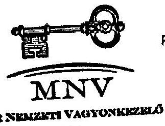

P.H.

alárás

MAGYAR NEMZETI VAGYONKEZELŐ ZRT. 25.

---

5. sz. tanúsítvány a V-2001- 60/2008. sz. jelentéshez

|  Normatív kötelezettségek | 2007.01.01-i nyitó |  |  | Növekedés |  | Csökkenés |  | 2007.12.31-i név |  |   |
| --- | --- | --- | --- | --- | --- | --- | --- | --- | --- | --- |
|   | alap- |  |  | korrekció | tárgyév
növekedés | korrekció | tárgyév
csökkenés | alap | kamat | alap+
kamat  |
|  Gázkittenővagyonmal kapcsolatos kötelezettség | 0 | 0 |  |  |  |  |  | 0 | 0 | 0  |
|  PSH | 3 | 1 |  |  |  |  | 1 | 0 | 0 | 0  |
|  Önkormányzati járandóságok | 298 | 167 | 0 | 0 | 0 | 122 | 45 | 0 | 45 | 0  |
|  ebből Belterületi Bód utáni járandóság | 297 | 166 | 0 | 0 | 0 | 121 | 45 | 0 | 45 | 0  |
|  ebből 1989. évi XIII. tv. Szerint átalakult társas | 220 | 116 |  |  |  | 71 | 45 | 0 | 45 | 0  |
|  1992. évi LIV. Szerint átalakult társas | 77 | 20 |  |  |  | 50 | 0 | 0 | 0 | 0  |
|  ebből alapítói jog alapján járó- árandóság | 1 | 1 |  |  |  | 1 | 0 | 0 | 0 | 0  |
|  Tű részére fennálló kötelezettség | 0 | 0 |  |  |  |  |  | 0 | 0 | 0  |
|  Völtenzsípari dolgozók járandósága | 207 | 207 |  | 420 |  | 559 | 68 | 0 | 68 | 0  |
|  Egyéb kötelezettség | 163 847 | 165 047 | 0 | 8 814 | 0 | 11 741 | 163 120 | 0 | 163 120 | 0  |
|  ebből Bánatpálycsatállítóirvagát vagy asembesz köt | 544 | 544 |  | 378 |  | 419 | 503 |  | 503 | 0  |
|  Be nem jegyzett tőkezmelés | 3 523 | 3 523 |  | 3 |  | 3 237 | 289 |  | 289 | 0  |
|  Egyéb rövid tej köt | 98 | 98 |  | 54 |  | 152 | 0 |  | 0 | 0  |
|  Priv. elők. kapcs. egyéb. köt | 5 | 5 |  |  |  | 5 | 0 |  | 0 | 0  |
|  Priv. tartásként terhető egyéb köt | 5 | 5 |  | 3 288 |  | 3 286 | 7 |  | 7 | 0  |
|  Egyéb hosszúkészítő köt | 161 219 | 161 219 |  | 4 761 |  | 4 089 | 161 891 |  | 161 891 | 0  |
|  Puszcív időbeli elhatárolások | 553 | 553 |  | 430 |  | 553 | 430 |  | 430 | 0  |
|  Normatív kötelezettségek összesen: | 166 455 | 166 322 | 0 | 9 234 | 0 | 12 423 | 163 233 | 0 | 163 233 | 0  |
|  Függő kötelezettségek |  |  |  |  |  |  |  |  |  |   |
|  Privatszkoló szerződésebből eredő garancia és szavatoság | 9 097 | 9 097 | 0 | 86 | 0 | 481 | 8 702 | 0 | 8 702 | 0  |
|  ebből jogszavatoság | 2 572 | 2 572 |  | 86 |  |  | 2 658 | 0 | 2 658 | 0  |
|  kereskedelmi szavatoság | 4 964 | 4 964 |  |  |  |  | 4 964 | 0 | 4 964 | 0  |
|  környezetvédelmi garancia | 1 527 | 1 527 |  |  |  | 447 | 1 080 | 0 | 1 080 | 0  |
|  vagyonkezeléshez kapcsolódó garancia | 34 | 34 |  |  |  | 34 | 0 | 0 | 0 | 0  |
|  ebből 52031 UN garancia | 0 | 0 |  |  |  |  | 0 | 0 | 0 | 0  |
|  Elvoni vagyon utáni kezesség | 15 665 | 2 790 |  |  |  | 1 524 | 1 466 | 7 071 | 8 537 | 0  |
|  Konszem felelősség | 5 918 | 1 511 |  |  |  | 347 | 1 164 | 3 369 | 4 733 | 0  |
|  PSH | 0 | 0 |  |  |  |  | 0 | 0 | 0 | 0  |
|  Önkormányzati járandóságok | 17 155 | 15 276 | 0 | 373 | 0 | 182 | 15 467 | 1 685 | 17 152 | 0

  |
|  ebből Belter. Föld utáni járandóság (1989. évi XIII. tv.) | 16 484 | 15 007 |  | 210 |  | 124 | 15 093 | 1 306 | 16 399 | 0  |
|  ebből Belter. Föld utáni járandóság (1992. évi LIV. tv.) | 0 | 0 |  | 122 |  |  | 123 | 75 | 195 | 0  |
|  ebből Alaptitől jog alapján járó járandóság | 349 | 123 |  |  |  |  | 123 | 231 | 354 | 0  |
|  ebből Glükózmő | 222 | 146 |  | 41 |  | 58 | 129 | 75 | 204 | 0  |
|  Tőkepótlási kötelezettség (ÁPV Zrt. társaságok) | 2 829 | 2 829 |  | 2 076 |  | 2 829 | 2 076 | 0 | 2 076 | 0  |
|  Reverzális levelek utáni kötelezettség | 9 944 | 9 944 |  |  |  | 8 724 | 1 220 |  | 1 220 | 0  |
|  Egyéb kötelezettségek | 43 392 | 43 392 | 0 | 36 | 0 | 18 901 | 24 527 | 106 | 24 653 | 0  |
|  ebből Kárpótlási jegyek életjáradékra váltása | 14 359 | 14 359 |  |  |  | 1 652 | 12 707 | 0 | 12 707 | 0  |
|  ebből Richter opció | 29 033 | 29 033 |  |  |  | 17 249 | 11 784 | 0 | 11 784 | 0  |
|  ebből egyéb perszítet | 0 | 0 |  | 26 |  |  | 26 | 142 | 142 | 0  |
|  Függő kötelezettségek összesen: | 104 060 | 54 829 |  | 2 971 | 0 | 32 788 | 54 622 | 12 431 | 67 052 | 0  |
|  Mindösszesen: | 270 455 | 270 455 |  | 11 905 | 0 | 45 211 | 217 855 | 12 431 | 230 286 | 0  |

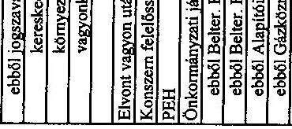

Budapest, 2008.08.08.

MANVAM NEMZETI VAGYONKEZELŐ ZRT.

szárós

---

6. sz. tanúsítvány a V-2001- 60/2008. sz. jelentéshez

Állami Privatizációs és Vagyonkezelő Zrt.

Az ÁPV Zrt. saját vagyonának eszközállomány változása 2007. év

|  Megnevezés | 2006. évi záró állomány (nyitó) | növekedés | Változás csökkenés | Változás áll. vált. | 2007. évi záró állomány  |
| --- | --- | --- | --- | --- | --- |
|  Immateriális javak | 66 798 | 25 059 | 48 750 | 23 691 | 43 107  |
|  Tárgyi eszközök | 2 615 307 | 401 300 | 454 418 | 53 118 | 2 562 189  |
|  Befektetett pénzügyi eszközök | 316 818 | - | 27 294 | 27 294 | 289 524  |
|  Befektetett eszközök összesen | 2 998 923 | 426 359 | 530 462 | 104 103 | 2 894 820  |
|  Készletek | 206 | - | - | - | 206  |
|  Követelések | 354 623 | 22 334 | - | 22 334 | 376 957  |
|  Pénzeszközök | 9 357 414 | - | 9 279 761 | 9 279 761 | 77 653  |
|  Forgóeszközök | 9 712 243 | 22 334 | 9 279 761 | 9 257 427 | 454 816  |
|  Aktív időbeli elhatárolások | 92 995 | - | 92 995 | 92 995 | -  |
|  Eszközök összesen | 12 804 161 | 448 693 | 9 903 218 | 9 454 525 | 3 349 636  |

Budapest, 2008. 06.30.

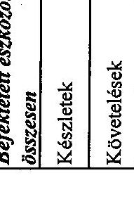

21.

---

7. sz. tanúsítvány a V-2001- 60/2008. sz. jelentéshez

Állami Privatizációs és Vagyonkezelő Zrt.

Az ÁPV Zrt. saját vagyonának forrásösszetételének változása 2007. év

|  Megnevezés | 2006. évi záró állomány | növekedés | Változás csökkenés | áll. vált. állomány | 2007. évi záró állomány  |
| --- | --- | --- | --- | --- | --- |
|  Saját tőke | 11 757 345 | - | 8 616 428 | - 8 616 428 | 3 140 917  |
|  Céltartalék | 227 332 | - | 227 332 | - 227 332 | -  |
|  Kötelezettségek | 726 777 | 61 819 | 579 877 | - 518 058 | 208 719  |
|  Passzív időbeli elhatárolások | 92 707 | - | 92 707 | - 92 707 | -  |
|  Források összesen | 12 804 161 | 61 819 | 9 516 344 | - 9 454 525 | 3 349 636  |

Budapest, 2008. 06.30.

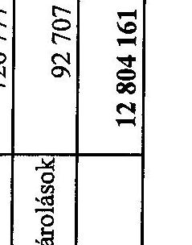

---

Állami Privatizációs és Vagyonkezelő Zrt.

# Az ÁPV Zrt. működéséhez kapcsolódó anyagjellegű ráfordítások alakulása 2007. év 

| Megnevezés | 2007. év |  |  |  | \%   Tervhez |
| :--: | :--: | :--: | :--: | :--: | :--: |
|  | $\operatorname{terv}(\mathrm{E} \mathrm{Ft})$ | $\%$ | tény (E Ft) | tény $\%$ |  |
| Energia | 127226 | 5,93 | 107314 | 6,02 | 84,35 |
| Üzemanyag | 16000 | 0,75 | 12358 | 0,69 | 77,24 |
| Nyomtatvány, irodaszer | 17300 | 0,81 | 22554 | 1,27 | 130,37 |
| Egyéb ki nem emelt anyag-   költség | 14000 | 0,65 | 3414 | 0,19 | 24,39 |
| 1. Anyagköltség összesen | 174526 | 8,13 | 145640 | 8,17 | 83,45 |
| Utazás- és szállásköltség | 6000 | 0,28 | 4316 | 0,24 | 71,93 |
| Fenntartás, javítás és karbantartás | 62700 | 2,92 | 59459 | 3,34 | 94,83 |
| Posta, telefon, futárszolgálat | 32500 | 1,51 | 23766 | 1,33 | 73,13 |
| Székház fenntartás, üzemeltetés | 340000 | 15,84 | 326183 | 18,30 | 95,94 |
| Egyéb ki nem emelt anyag-   jellegű szolgáltatás | 1510955 | 70,41 | 1206752 | 67,69 | 79,87 |
| Egyéb ki nem emelt anyag-   jellegű szolgáltatás | 19225 | 0,90 | 16622 | 0,93 | 86,46 |
| 2. Anyagjellegű szolgáltatás összesen | 1971380 | 91,87 | 1637098 | 91,83 | 83,04 |
| 3. Anyagjellegű ráfordítások összesen (1 + 2) | 2145906 | 100,00 | 1782738 | 100,00 | 83,08 |

Budapest, 2008. 06. 30.
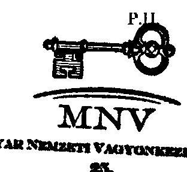
aláírás

---

9. sz. tanúsítvány a V-2001-6C/2008. sz. jelentéshez

Állami Privatizációs és Vagyonkezelő Zrt.

Az ÁPV Zrt. átlagos állományi létszámának alakulása 2006. és 2007.évben

|  Megnevezés | 2006. év |  |  | 2007. év |  |  | Teljesítés %  |
| --- | --- | --- | --- | --- | --- | --- | --- |
|   | terv | tény | Teljesítés % tervhez | terv | tény | Teljesítés % tervhez | 2007/2006.  |
|  Teljes munkaidőben fogl. (fő) | 184 | 183 | 99,46 | 173 | 151 | 87,28 | 82,51  |
|  Részmunkaidőben fogl. (fő) | 1 | 1 | 100,00 | 0 | 0 | 0,00 | 0  |
|  Állományi létszám összesen (fő) | 185 | 184 | 99,46 | 173 | 151 | 87,28 | 82,07  |
|  Keresetfejlesztés (%) | 4,5 | 4,5 | 100 | 6 | 5,73 | 95,50 | 127,33  |

Budapest, 2008. május 20.

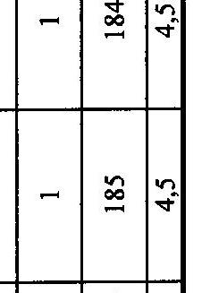

---

1. sz. tanúsítvány a V-2001-6C/2008. sz. jelentéshez

Az ÁPV Zrt. állományi létszáma 2006. - 2007. években

|  Megnevezés | 2006. december 31. |  | 2007. december 31. |  | Telj.% 2007/2006. | Telj.% 2007/2006.  |
| --- | --- | --- | --- | --- | --- | --- |
|   | Státusz | Betöltött állás | Státusz | Betöltött állás | Státusz | Betöltött állás  |
|  Vezető | 17 | 17 | 16 | 16 | 94,12 | 94,12  |
|  Vezető-helyettes | 24 | 24 | 10 | 9 | 41,67 | 37,50  |
|  Menedzser | 87 | 86 | 86 | 79 | 98,85 | 91,86  |
|  Ügyintéző | 45 | 43 | 40 | 34 | 88,89 | 79,07  |
|  Összesen | 173 | 170 | 152 | 138 | 87,86 | 81,18  |

Budapest, 2008. május 20.

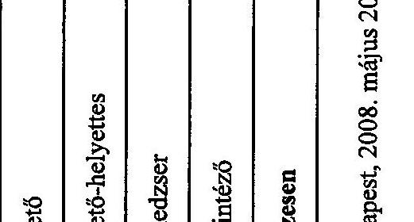

---

1. sz. tanúsítvány a V-2001-GC/2008. sz. jelentéshez

Állami Privatizációs és Vagyonkezelő Zrt.

Az ÁPV Zrt. működésével kapcsolatos személyi jellegű ráfordítások alakulása 2007. évben, az előző évhez viszonyítva

|  Megnevezés |  |  |  |  |  |  |  |  |  |  |  |  |  |  |  |  |  |  |  |  |  |  |  |  |  |  |  |   |
| --- | --- | --- | --- | --- | --- | --- | --- | --- | --- | --- | --- | --- | --- | --- | --- | --- | --- | --- | --- | --- | --- | --- | --- | --- | --- | --- | --- | --- |
|   |  |  |  |  |  |  |  |  |  |  |  |  |  |  |  |  |  |  |  |  |  |  |  |  |  |  |  |   |
|   |  |  |  |  |  |  |  |  | 

 |  |  |  |  |  |  |  |  |  |  |  |  |  |  |  |  |  |  |   |
|  |   |   |   |   |   |   |   |   |   |   |   |   |   |   |   |   |   |   |   |   |   |   |   |   |   |   |   |   |
|   |  |  |  |  |  |  |  |  |  |  |  |  |  |  |  |  |  |  |  |  |  |  |  |  |  |  |  |   |
|  |   |   |   |   |   |   |   |   |   |   |   |   |   |   |   |   |   |   |   |   |   |   |   |   |   |   |   |   |
|  |   |   |   |   |   |   |   |   |   |   |   |   |   |   |   |   |   |   |   |   |   |   |   |   |   |   |   |   |
|  |   |   |   |   |   |   |   |   |   |   |   |   |   |   |   |   |   |   |   |   |   |   |   |   |   |   |   |   |
|  |   |   |   |   |   |   |   |   |   |   |   |   |   |   |   |   |   |   |   |   |   |   |   |   |   |   |   |   |
|  |   |   |   |   |   |   |   |   |   |   |   |   |   |   |   |   |   |   |   |   |   |   |   |   |   |   |   |   |
|  |   |   |   |   |   |   |   |   |   |   |   |   |   |   |   |   |   |   |   |   |   |   |   |   |   |   |   |   |
|  |   |   |   |   |   |   |   |   |   |   |   |   |   |   |   |   |   |   |   |   |   |   |   |   |   |   |   |   |
|  |   |   |   |   |   |   |   |   |   |   |   |   |   |   |   |   |   |   |   |   |   |   |   |   |   |   |   |   |
|  |   |   |   |   |   |   |   |   |   |   |   |   |   |   |   |   |   |   |   |   |   |   |   |   |   |   |   |   |
|  |   |   |   |   |   |   |   |   |   |   |   |   |   |   |   |   |   |   |   |   |   |   |   |   |   |   |   |   |
|  |   |   |   |   |   |   |   |   |   |   |   |   |   |   |   |   |   |   |   |   |   |   |   |   |   |   |   |   |
|  |   |   |   |   |   |   |   |   |   |   |   |   |   |   |   |   |   |   |   |   |   |   |   |   |   |   |   |   |
|  |   |   |   |   |   |   |   |   |   |   |   |   |   |   |   |   |   |   |   |   |   |   |   |   |   |   |   |   |
|  |   |   |   |   |   |   |   |   |   |   |   |   |   |   |   |   |   |   |   |   |   |   |   |   |   |   |   |   |
|  |   |   |   |   |   |   |   |   |   |   |   |   |   |   |   |   |   |   |   |   |   |   |   |   |   |   |   |   |
|  |   |   |   |   |   |   |   |   |   |   |   |   |   |   |   |   |   |   |   |   |   |   |   |   |   |   |   |   |
|  |   |   |   |   |   |   |   |   |   |   |   |   |

   |   |   |   |   |   |   |   |   |   |   |   |   |   |   |   |
|  |   |   |   |   |   |   |   |   |   |   |   |   |   |   |   |   |   |   |   |   |   |   |   |   |   |   |   |   |
|  |   |   |   |   |   |   |   |   |   |   |   |   |   |   |   |   |   |   |   |   |   |   |   |   |   |   |   |   |
|  |   |   |   |   |   |   |   |   |   |   |   |   |   |   |   |   |   |   |   |   |   |   |   |   |   |   |   |   |
|  |   |   |   |   |   |   |   |   |   |   |   |   |   |   |   |   |   |   |   |   |   |   |   |   |   |   |   |   |
|  |   |   |   |   |   |   |   |   |   |   |   |   |   |   |   |   |   |   |   |   |   |   |   |   |   |   |   |   |
|  |   |   |   |   |   |   |   |   |   |   |   |   |   |   |   |   |   |   |   |   |   |   |   |   |   |   |   |   |
|  |   |   |   |   |   |   |   |   |   |   |   |   |   |   |   |   |   |   |   |   |   |   |   |   |   |   |   |   |
|  |   |   |   |   |   |   |   |   |   |   |   |   |   |   |   |   |   |   |   |   |   |   |   |   |   |   |   |   |
|  |   |   |   |   |   |   |   |   |   |   |   |   |   |   |   |   |   |   |   |   |   |   |   |   |   |   |   |   |
|  |   |   |   |   |   |   |   |   |   |   |   |   |   |   |   |   |   |   |   |   |   |   |   |   |   |   |   |   |
|  |   |   |   |   |   |   |   |   |   |   |   |   |   |   |   |   |   |   |   |   |   |   |   |   |   |   |   |   |
|  |   |   |   |   |   |   |   |   |   |   |   |   |   |   |   |   |   |   |   |   |   |   |   |   |   |   |   |   |
|  |   |   |   |   |   |   |   |   |   |   |   |   |   |   |   |   |   |   |   |   |   |   |   |   |   |   |   |   |
|  |   |   |   |   |   |   |   |   |   |   |   |   |   |   |   |   |   |   |   |   |   |   |   |   |   |   |   |   |

---

1. sz. tanúsítvány a V-2001-66/2008. sz. jelentéshez

Állami Privatizációs és Vagyonkezelő Zrt.

Az ÁPV Zrt. munkavállalóinak beosztásonkénti átlagkeresete 2006-2007. években

|  Sorszám | Állománycsoport | 2006. évi átlagkereset Ft/fő/hó | 2007. évi átlagkereset Ft/fő/hó | Telj.% 2007/2006.  |
| --- | --- | --- | --- | --- |
|  1 | Felsővezetők | 3 897 021 | 3 809 113 | 97,74  |
|  2 | Ügyvezetők | 1 195 838 | 1 282 232 | 107,22  |
|  3 | Ügyvezető igazgató-helyettesek | 830 523 | 848 837 | 102,21  |
|  4 | Menedzserek | 534 029 | 560 884 | 106,03  |
|  5 | Ügyintézők | 259 610 | 284 341 | 109,53  |
|  6 | Ügyviteli alkalmazottak | 0 | 0 | 0  |
|  7 | Összesen | 645 230 | 682 184 | 106,73  |

Budapest, 2008. május 20.

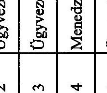

MAGYAR NEMZETI VAGYONKEZELŐ ZRT. 27.

---

1. sz. tanúsítvány

Állami Privatizációs és Vagyonkezelő Zrt. a V-2001-60/2008. sz. jelentéshez

Az ÁPV Zrt. 2007. évi forrásallokációja a felhasználás célja szerint

|  MEGNEVEZÉS |  | 2007. évi üzleti terv (eFt) | 2007. év előzetes tény (eFt)  |
| --- | --- | --- | --- |
|  K.1.3. | A hozzárendelt vagyonba tartozó társaságok támogatása, forrásátadás, kamatátvállalás | 3 300 000 | 2 995 000  |
|   | Erdő-társaságok hitelkamat átvállalása - Natura 2000, közjólét | 1 775 000 |   |
|   | Erdő-társaságok természeti károk miatti termelőeszközök helyreállítása | 500 000 |   |
|   | Erdő-társaságok közmunka | 700 000 |   |
|   | Dialóg Filmműtődió; ÁFA fiz. kötelezettség | 225 000 |   |
|   | Tisza Cipő Rt. válságkezelés | 100 000 |   |
|   | Bakonyi Erdészeti és Faipari Rt. |  | 71 400  |
|   | Délalföldi Erdészeti Rt. |  | 110 600  |
|   | Egererdő Erdészeti Rt. |  | 189 600  |
|   | Észak-Magyarországi Erdőgazdasági Rt. |  | 264 100  |

 |
|   | Gemenci Erdő- és Vadgazdaság Rt. |  | 145 700  |
|   | GYULAJ Erdészeti és Vadászati Rt. |  | 74 400  |
|   | Ipoly Erdő Rt. |  | 192 900  |
|   | Kisalföldi Erdőgazdaság Rt. |  | 85 400  |
|   | Kiskunsági Erdészeti és Faipari Rt. |  | 376 200  |
|   | Mecseki Erdészeti Rt. |  | 175 800  |
|   | Nagykunsági Erdészeti és Faipari Rt. |  | 132 500  |
|   | Nyírségi Erdészeti Rt. |  | 334 300  |
|   | Pilisi Parkerdőgazdaság Rt. |  | 140 800  |
|   | Somogyi Erdészeti és Faipari Rt. |  | 278 000  |
|   | Szombathelyi Erdészeti Rt. |  | 116 600  |
|   | Tanulmányi Erdőgazdaság Rt. |  | 31 100  |
|   | VADEX Mezőföldi Erdő- és Vadgazd. Rt. |  | 66 000  |
|   | Vértesi Erdészeti és Faipari Rt. |  | 86 200  |
|   | Zalai Erdészeti és Faipari Rt. |  | 123 400  |
|  K.2.2. | Az állam tulajdonával kapcsolatos környezetvédelmi feladatok finanszírozása | 7 415 000 | 7 411 452  |
|   | Nitrokémia Rt. környezeti kárelhárítás | 972 000 | 972 000  |
|   | Mecsekérc, Mecsek ÖKO Rt. bányabezárások, rekultiváció | 5 883 000 | 5 882 571  |
|   | Erdőgazdasági társaságok környezetvédelmi beruházási támogatása | 200 000 |   |
|   | Műszaki ellenőrök, szakértők (NIKE, Hidrotech, Alkaloida) | 200 000 |   |
|   | Felszámolás, végelszámolás alatti cégek környezeti kárelhárítás - monitoring | 100 000 |   |
|   | Egyéb környezetvédelmi kiadás | 60 000 | 106 881  |
|   | Bakonyi Erdészeti és Faipari Rt. |  | 74 000  |
|   | Kiskunsági Erdészeti és Faipari Rt. |  | 17 900  |
|   | Pilisi Parkerdőgazdaság Rt. |  | 10 000  |
|   | Somogyi Erdészeti és Faipari Rt. |  | 65 000  |
|   | Tanulmányi Erdőgazdaság Rt. |  | 33 100  |
|   | Alba Volán Rt. |  | 4 800  |

Tanúsítom, hogy az adatok az MNV Zrt. aktuális nyilvántartásával megegyeznek.

Gudra Tamás igazgató Bp. 2008.06.18. 1

---

|  MEGNEVEZÉS |  | 2007. évi üzleti
terv (eFt) | 2007. év előzetes
tény (eFt)  |
| --- | --- | --- | --- |
|   | Bakony Volán Rt. |  | 25 700  |
|   | Borsod Volán Rt. |  | 37 300  |
|   | Gemenc Volán Rt. |  | 15 600  |
|   | HAJDÚ Volán Rt. |  | 4 450  |
|   | Hatvani Volán Rt. |  | 1 600  |
|   | Jászkun Volán Rt. |  | 12 500  |
|   | Kisalföld Volán Rt. |  | 30 000  |
|   | Kunság Volán Rt. |  | 1 500  |
|   | Mátra Volán Rt. |  | 1 920  |
|   | Nógrád Volán Rt. |  | 7 800  |
|   | Pannon Volán Rt. |  | 6 260  |
|   | Szabolcs Volán Rt. |  | 21 600  |
|   | Vasi Volán Rt. |  | 4 710  |
|   | Vértes Volán Rt. |  | 47 900  |
|   | VOLÁNBUSZ Rt. |  | 11 360  |
|   | Zala Volán Rt. |  | 15 000  |
|  K.3. | A privatizációval és vagyonkezeléssel kapcsolatos reorganizációs célú kifizetések | 500 000 | 1 162 639  |
|   | OMT ingatlan vásárlás | 96 000 | 80 000  |
|   | Aranykereszt Gondoskodás Háza Rt. ingatlan vásárlás |  | 96 000  |
|   | Nemzeti Lóverseny Kft. tulajdonosi kölcsön |  | 350 000  |
|   | Pri-Man Kft. tőkepótlás |  | 90 489  |
|   | Balatoni Halászati Zrt. (követelés - tőke konverzió) |  | 200 000  |
|   | Pannóniafilm Kft. |  | 70 000  |
|   | Vasi Volán Rt. |  | 140 000  |
|   | Aranykereszt Gondoskodás Háza Rt. vagyon |  | 13 500  |
|   | GDHD vagyon |  | 4 500  |
|   | Szerszámgépipari művek vagyon |  | 5 000  |
|   | Budafiax |  | 150  |
|   | Fertődi Gyümölcstermesztési KFI Kht. |  | 15 000  |
|   | OHKI Kht. |  | 20 000  |
|   | Ceglédi Gyümölcstermesztési KFI Kht. |  | 48 000  |
|   | Újfehértői Kht. |  | 30 000  |
|   | Egyéb ESA rontó reorganizációs célú kifizetés | 404 000 |   |
|  K.4. | Üzleti célú befektetések | 7 862 000 | 5 724 317  |
|   | Erdőgazdasági társaságok megtérülő beruházások | 2 000 000 |   |
|   | MALÉV Vagyonkezelő Kft. tulajdonosi kölcsön | 3 333 000 | 250 000  |
|   | Szempont Kft. opciós vétel | 279 000 |   |
|   | Richter Rt. részvényvásárlás | 650 000 | 490 317  |

Tanúsítom, hogy az adatok az MNV Zrt. aktuális nyilvántartásával megegyeznek.

Gudra Tamás igazgató Bp. 2008.08.18.

---

|  MEGNEVEZÉS | 2007. évi üzleti
terv (eFt) | 2007. év előzetes
tény (eFt)  |
| --- | --- | --- |
|  MLSZ Kft. tőkeemelés | 900 000 | 900 000  |
|  Nitrokémia Zrt. tőkeemelés |  | 180 000  |
|  MALÉV Vagyonkezelő Kft. |  | 46 000  |
|  RFH Zrt. tőkeemelés |  | 1 850 000  |
|  Kormányzati Negyed Projekt Kft. |  | 3 000  |
|  Bakonyi Erdészeti és Faipari Zrt. |  | 250 000  |
|  Dél-alföldi Erdészeti Zrt. |  | 96 000  |
|  Egererdő Erdészeti Zrt. |  | 125 000  |
|  Gemenci Erdő- és Vadgazdaság Zrt. |  | 86 000  |
|  Ipoly Erdő Zrt. |  | 90 000  |
|  Kisalföldi Erdőgazdaság Zrt. |  | 70 000  |
|  Kiskunsági Erdészeti és Faipari Zrt. |  | 140 000  |
|  Mecseki Erdészeti Zrt. |  | 108 000  |
|  Nagykunsági Erdészeti és Faipari Zrt. |  | 133 000  |
|  Nyírségi Erdészeti Zrt. |  | 129 000  |
|  Pilisi Parkerdőgazdaság Zrt. |  | 95 000  |
|  Somogyi Erdészeti és Faipari Zrt. |  | 161 000  |
|  Szombathelyi Erdészeti Zrt. |  | 98 000  |
|  VADEX Mezőföldi Erdő- és Vadgazd. Zrt. |  | 76 000  |
|  Vértesi Erdészeti és Faipari Zrt. |  | 80 000  |
|  Zalai Erdészeti és Faipari Zrt. |  | 268 000  |
|  Egyéb üzleti célú befektetés | 700 000 |   |
|  Mindösszesen | 19 077 000 | 17 293 408  |

Budapest, 2008. június 18.

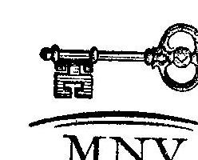

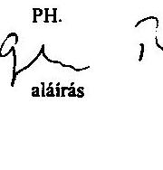

25.

Tanúsítom, hogy az adatok az MNV Zrt. aktuális nyilvántartásával megegyeznek.

Gudra Tamás igazgató Bp. 2008.06.18.

---

# Az ÁPV Zrt. 2007. évi forrásallokációja felhasználási forma szerint

|  Forrásallokáció | Tőkeemelés | Támogatás | Környezetvédelmi támogatás | Kamat-támogatás | Tulajdonosi kölcsön  |
| --- | --- | --- | --- | --- | --- |
|  Erdő csoport | 2 005 000 | 2 995 000 | 200 000 | 0 | 0  |
|  Bakonyi Erdészeti és Faipari Rt. | 250 000 | 71 400 | 74 000 |  |   |
|  Dél-alföldi Erdészeti Rt. | 96 000 | 110 600 |  |  |   |
|  Egererdő Erdészeti Rt. | 125 000 | 189 600 |  |  |   |
|  Eazak-Magyarország Erdőgazdasági Rt. |  | 264 100 |  |  |   |
|  Gemenci Erdő- és Vadgazdaság Rt. | 86 000 | 145 700 |  |  |   |
|  GYULAJ Erdészeti és Vadászati Rt. |  | 74 400 |  |  |   |
|  Ipoly Erdő Rt. | 90 000 | 192 900 |  |  |   |
|  Kisalföldi Erdőgazdaság Rt. | 70 000 | 83 400 |  |  |   |
|  Kiskunsági Erdészeti és Faipari Rt. | 140 000 | 376 200 | 17 900 |  |   |
|  Mecseki Erdészeti Rt. | 108 000 | 175 800 |  |  |   |
|  Nagykunsági Erdészeti és Faipari Rt. | 133 000 | 132 500 |  |  |   |
|  Nyírségi Erdészeti Rt. | 129 000 | 334 300 |  |  |   |
|  Pilisi Parkerdőgazdaság Rt. | 95 000 | 140 800 | 10 000 |  |   |
|  Somogyi Erdészeti és Faipari Rt. | 161 000 | 278 000 | 65 000 |  |   |
|  Szombathelyi Erdészeti Rt. | 98 000 | 116 600 |  |  | 

  |
|  Tanulmányi Erdőgazdaság Rt. |  | 21100 | 33100 |  |   |
|  VADEX Mezőföldi Erdő- és Vadgazd. Rt. | 76000 | 66000 |  |  |   |
|  Vértesi Erdészeti és Faipari Rt. | 80000 | 86200 |  |  |   |
|  Zalai Erdészeti és Faipari Rt. | 268000 | 123400 |  |  |   |
|  Volán csoport | 0 | 0 | 250000 | 0 | 140000  |
|  Agria Volán Rt. |  |  |  |  |   |
|  Alba Volán Rt. |  |  | 4800 |  |   |
|  Bakony Volán Rt. |  |  | 25700 |  |   |
|  Balaton Volán Rt. |  |  |  |  |   |
|  Bácsi Volán Rt. |  |  |  |  |   |
|  Borsodi Volán Rt. |  |  | 37300 |  |   |
|  Gemenc Volán Rt. |  |  | 15600 |  |   |
|  HAJDÚ Volán Rt. |  |  | 4450 |  |   |
|  Hatvani Volán Rt. |  |  | 1600 |  |   |
|  Jászlói Volán Rt. |  |  | 12500 |  |   |
|  Kapos Volán Rt. |  |  |  |  |   |
|  Kisalföld Volán Rt. |  |  | 30000 |  |   |
|  Körös Volán Rt. |  |  |  |  |   |
|  Kunság Volán Rt. |  |  | 1500 |  |   |
|  Mátra Volán Rt. |  |  | 1920 |  |   |
|  Nógrád Volán Rt. |  |  | 7800 |  |   |
|  Pannon Volán Rt. |  |  | 6260 |  |   |
|  Somló Volán Rt. |  |  |  |  |   |
|  Szabolcs Volán Rt. |  |  | 21600 |  |   |
|  Tisza Volán Rt. |  |  |  |  |   |
|  Vasi Volán Rt. |  |  | 4710 |  | 140000  |
|  Vértesi Volán Rt. |  |  | 47900 |  |   |
|  VOLÁNIBUSZ Rt. |  |  | 11360 |  |   |
|  Zala Volán Rt. |  |  | 15000 |  |   |
|  Kiemelt és egyéb társaságok | 1486489 | 0 | 6854571 | 0 | 713000  |
|  Richter Gedeon Rt. | 0 |  |  |  |   |
|  Magyar Lóverseny Fogadási Szervező Kft. | 900000 |  |  |  |   |
|  Mecsek ÖKO Zrt. |  |  | 5882571 |  |   |
|  Nemzeti Lóverseny Kft. |  |  |  |  | 350000  |
|  Nitrokémia Vegyipari Zrt. | 180000 |  | 972000 |  |   |
|  Pannóniafilm Kft. (tőkebefektetési) | 70000 |  |  |  |   |
|  PRI-MAN Privatizációt Menedzselő Kft. | 90489 |  |  |  |   |
|  MALEV Vagyonkezelő Kft. | 46000 |  |  |  | 250000  |
|  Balatoni Halászati Rt. | 200000 |  |  |  |   |
|  Fertődi Gyümölcstermelési KFI Kht. |  |  |  |  | 15000  |
|  OHKI Kht. |  |  |  |  | 20000  |
|  Ceglédi Gyümölcstermelési KFI Kht. |  |  |  |  | 48000  |
|  Újfehértói Kht. |  |  |  |  | 30000  |
|  |   |   |   |   |   |
|  Végelszámolás alatt álló társaságok | 0 | 0 | 0 | 0 | 23150  |
|  Aranykereszt Gondoskodás Háza Rt. va. |  |  |  |  | 13500  |

Tanúsítom, hogy az adatok az MNV Zrt. aktuális nyilvántartásával megegyeznek.

Gudra Tamás igazgató Bp. 2008.06.18.

---

Állami Privatizációs és Vagyonkezelő Zrt.

|  Ganz Danubius va. |  |  |  |  | 4500  |
| --- | --- | --- | --- | --- | --- |
|  Szerszámgépgyári művek va. |  |  |  |  | 5000  |
|  Budaflász |  |  |  |  | 150  |
|  |   |   |   |   |   |
|  Regisztráció/átvétel alatt lévő társaságok | 1853000 | 0 | 0 | 0 | 0  |
|  Regionális Fejlesztési Holding | 1850000 |  |  |  |   |
|  Kormányzati Negyed Projekt Kft. | 3000 |  |  |  |   |
|  |   |   |   |   |   |
|  Összesen jogcímenként | 5344489 | 2995000 | 7304571 | 0 | 876150  |
|  Mindösszesen |  |  |  |  | 16520210,00  |
|   |  |  |  | egyéb környezetvédelem | 106881,00  |
|   |  |  |  | ingatlanvásárlás | 176000,00  |
|   |  |  |  | részvényvásárlás (Richter Rt.) | 490317,00  |
|   |  |  |  |  | 17293408,00  |

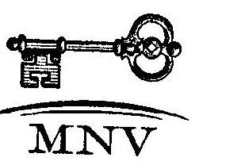

MAGYAR NEMZETI VAGYONKEZELŐ ZRT. 25.

Tanúsítom, hogy az adatok az MNV Zrt. aktuális nyilvántartásával megegyeznek.

Gudra Tamás igazgató Bp. 2008.06.18.

---

14. sz. tanúsítvány a V-2001-6C/2008. sz. jelentéshez

Az ÁPV Zrt. hozzárendelt vagyonába tartozó, működő társaságok adatai 2007. XII. 31.-én (adatok eFt-ban)

|  cég | Működő társaságok 2007. XII.31. | ÁPV Zrt. tulajdoni hányad | Tartós állami tulajdoni hányad | Saját tőke | Saját tőke ÁPV Zrt. rész (2007. évi %-kal) | Adózás előtti eredmény | Adózás előtti eredmény ÁPV Zrt. rész (2007. évi %-kal)  |
| --- | --- | --- | --- | --- | --- | --- | --- |
|   |  | 2007. év | 2007. év | 2006. év tény | 2007. év tény | 2006. év tény | 2007. év tény  |
|  1. | Legsúlyosabb, kiemelt cégek |  |  | 1005811036 | 939521032 | 687493353 | 716175363  |
|  2. | Budapest Airport Zrt. | 24,94% | 0,00% | 228700000 | 108475723 | 22341000 | 24571194  |
|  3. | Magyar Posta Zrt.(Csoport) | 100,00% | 75%+1 sz. | 71437081 | 71167968 | 71437081 | 71167968  |
|  4. | Magyar Villamos Művek Zrt. (Csoport) | 99,87% | 75%+1 sz. | 209587589 | 435906311 | 203086906 | 433360120  |
|  5. | Richter Gedeon Nyrt.(Csoport) | 25,12% | 0,00% | 288115000 | 206183000 | 176759000 | 166975250  |
|  6. | Szerencsejáték Zrt.(Csoport) | 100,00% | 100,00% | 17960366 | 17798850 | 17969366 | 17798850  |
|  7. | Erdőgazdasági csoport |  |  | 56825865 | 62666097 | 56825865 | 62666097  |
|  8. | Bakonyerdő Erdőgazdasági és Faipari Zrt. | 100,00% | 100,00% | 5348189 | 6120401 | 5348189 | 6120401  |
|  9. | Dél-alföldi Erdőgazdasági Zrt. | 100,00% | 100,00% | 1258855 | 1376981 | 1258855 | 1376981  |
|  10. | Egererdő Erdőgazdasági Zrt. | 100,00% | 100,00% | 3274451 | 3562210 | 3274451 | 3562210  |
|  11. | Északerdő Erdőgazdasági Zrt. | 100,00% | 100,00% | 3687829 | 3779352 | 3687829 | 3779352  |
|  12. | Gemenci Erdő- és Vadgazdaság Zrt. | 100,00% | 100,00% | 2222260 | 2346508 | 2222260 | 2346508  |
|  13. | Gyulaji Erdőgazdasági és Vadgazdasági Zrt. | 100,00% | 100,00% | 1394956 | 1509578 | 1394956 | 1509578  |
|  14. | Ipoly Erdő Zrt. | 100,00% | 100,00% | 2786644 | 2963715 | 2786644 | 2963715  |
|  15. | Kisalföldi Erdőgazdasági Zrt. | 100,00% | 100,00% | 2303852 | 2524972 | 2303852 | 2524972  |
|  16. | KEFAG Kiskunsági Erdőgazdasági Zrt.(Csoport) | 100,00% | 100,00% | 2341778 | 3722647 | 2341778 |

 3 722 647  |
|  17. | Mezõkí Erdõszert Zrt. | 100,00% | 100,00% | 2 985 086 | 3 380 556 | 2 985 086 | 3 380 556  |
|  18. | NEPAG Nagyközögi Erdõszert Zrt. | 100,00% | 100,00% | 1 616 312 | 1 804 551 | 1 616 312 | 1 804 551  |
|  19. | Nyírségi Nyírség Erdõszert Zrt. | 100,00% | 100,00% | 3 668 350 | 4 222 595 | 3 668 350 | 4 222 595  |
|  20. | Pölni Parkerdőgazdasági Zrt. | 100,00% | 100,00% | 4 812 459 | 5 286 094 | 4 812 459 | 5 286 094  |
|  21. | SEFAG Erdõszert és Faipari Zrt.(Csoport) | 100,00% | 100,00% | 5 544 412 | 6 119 818 | 5 544 412 | 6 119 818  |
|  22. | Szombathelyi Erdõszert Zrt. | 100,00% | 100,00% | 2 591 036 | 2 818 747 | 2 591 036 | 2 818 747  |
|  23. | Tanulmányi Erdőgazdasági Rt. | 100,00% | 100,00% | 1 761 253 | 1 902 824 | 1 761 253 | 1 902 824  |
|  24. | VÁDEX Mezőföldi Erdő- és Vadgazd. Zrt. | 100,00% | 100,00% | 1 942 625 | 2 108 796 | 1 942 625 | 2 108 796  |
|  25. | Vértesi Erdõszert és Faipari Zrt. | 100,00% | 100,00% | 1 401 486 | 1 603 308 | 1 401 486 | 1 603 308  |
|  26. | Zalaserdo Erdõszert Zrt.(Csoport) | 100,00% | 100,00% | 4 884 051 | 5 512 444 | 4 884 051 | 5 512 444  |
|  27. | Volán csoport |  |  | 66 781 450 | 69 202 124 | 64 895 767 | 67 282 252  |
|  28. | Agros Volán Zrt. | 97,39% | 0,00% | 1 754 764 | 1 756 336 | 1 707 349 | 1 708 849  |
|  29. | Alba Volán Zrt. | 98,02% | 0,00% | 3 172 280 | 3 173 126 | 3 107 566 | 3 110 355  |
|  30. | Bakony Volán Zrt. | 96,87% | 0,00% | 1 398 420 | 1 459 220 | 1 355 984 | 1 414 939  |
|  31. | Balaton Volán Zrt. | 97,23% | 0,00% | 1 865 137 | 1 866 754 | 1 814 856 | 1 815 461  |
|  32. | Bács Volán Zrt. | 96,81% | 0,00% | 920 614 | 923 246 | 891 329 | 893 777  |
|  33. | Borsod Volán Zrt. | 98,13% | 0,00% | 4 737 133 | 4 750 133 | 4 648 497 | 4 661 312  |
|  34. | Gemenc Volán Zrt. | 98,87% | 0,00% | 2 504 593 | 2 508 733 | 2 476 379 | 2 480 531  |
|  35. | Hajdú Volán Zrt. | 96,83% | 0,00% | 3 350 159 | 3 450 038 | 3 244 059 | 3 240 775  |
|  36. | Hatvani Volán Zrt. | 98,23% | 0,00% | 557 116 | 559 152 | 547 253 | 549 253  |
|  37. | Jász-Nagykun Volán Zrt.(Csoport) | 97,09% | 0,00% | 3 380 330 | 3 407 017 | 3 281 983 | 3 307 903  |

---

|  15. |  |  |  |  |  |  |  |  |  |  |   |
| --- | --- | --- | --- | --- | --- | --- | --- | --- | --- | --- | --- |
|  16. |  |  |  |  |  |  |  |  |  |  |   |
|  17. |  |  |  |  |  |  |  |  |  |  |   |
|  18. |  |  |  |  |  |  |  |  |  |  |   |
|  19. |  |  |  |  |  |  |  |  |  |  |   |
|  20. |  |  |  |  |  |  |  |  |  |  |   |
|  21. |  |  |  |  |  |  |  |  |  |  |   |
|  22. |  |  |  |  |  |  |  |  |  |  |   |
|  23. |  |  |  |  |  |  |  |  |  |  |   |
|  24. |  |  |  |  |  |  |  |  |  |  |   |
|  25. |  |  |  |  |  |  |  |  |  |  |   |
|  26. |  |  |  |  |  |  |  |  |  |  |   |
|  27. |  |  |  |  |  |  |  |  |  |  |   |
|  28. |  |  |  |  |  |  |  |  |  |  |   |
|  29. |  |  |  |  |  |  |  |  |  |  |   |
|  30. |  |  |  |  |  |  |  |  |  |  |   |
|  31. |  |  |  |  |  |  |  |  |  |  |   |
|  32. |  |  |  |  |  |  |  |  |  |  |   |
|  33. |  |  |  |  |  |  |  |  |  |  |   |
|  34. |  |  |  |  |  |  |  |  |  |  |   |
|  35. |  |  |  |  |  |  |  |  |  |  |   |
|  36. |  |  |  |  |  |  |  |  |  |  |   |
|  37. |  |  |  |  |  |  |  |  |  |  |   |
|  38. |  |  |  |  |  |  |  |  |  |  |   |
|  39. |  |  |  |  |  |  |  |  |  |  |   |
|  40. |  |  |  |  |  |  |  |  |  |  |   |
|  41. |  |  |  |  |  |  |  |  |  |  |   |
|  42. |  |  |  |  |  |  |  |  |  |  |   |
|  43. |  |  |  |  |  |  |  |  |  |  |   |
|  44. |  |  |  |  |  |  |  |  |  |  |   |
|  45. |  |  |  |  |  |  |  |  |  |  |   |
|  46. |  |  |  |  |  |  |  |  |  |  |   |
|  47. |  |  |  |  |  |  |  |  |  |  |   |
|  48. |  |  |  |  |  |  |  |  |  |  |   |
|  49. |  |  |  |  |  |  |  |  |  |  |   |
|  50. |  |  |  |  |  |  |  |  |  |  |   |
|  51. |  |  |  |  |  |  |  |  |  |  |   |
|  52. |  |  |  |  |  |  |  |  |  |

  |   |
|  53. |  |  |  |  |  |  |  |  |  |  |   |
|  54. |  |  |  |  |  |  |  |  |  |  |   |
|  55. |  |  |  |  |  |  |  |  |  |  |   |
|  56. |  |  |  |  |  |  |  |  |  |  |   |
|  57. |  |  |  |  |  |  |  |  |  |  |   |
|  58. |  |  |  |  |  |  |  |  |  |  |   |
|  59. |  |  |  |  |  |  |  |  |  |  |   |
|  60. |  |  |  |  |  |  |  |  |  |  |   |
|  61. |  |  |  |  |  |  |  |  |  |  |   |
|  62. |  |  |  |  |  |  |  |  |  |  |   |
|  63. |  |  |  |  |  |  |  |  |  |  |   |
|  64. |  |  |  |  |  |  |  |  |  |  |   |
|  65. |  |  |  |  |  |  |  |  |  |  |   |
|  66. |  |  |  |  |  |  |  |  |  |  |   |
|  67. |  |  |  |  |  |  |  |  |  |  |   |
|  68. |  |  |  |  |  |  |  |  |  |  |   |
|  69. |  |  |  |  |  |  |  |  |  |  |   |
|  70. |  |  |  |  |  |  |  |  |  |  |   |
|  71. |  |  |  |  |  |  |  |  |  |  |   |
|  72. |  |  |  |  |  |  |  |  |  |  |   |
|  73. |  |  |  |  |  |  |  |  |  |  |   |
|  74. |  |  |  |  |  |  |  |  |  |  |   |
|  75. |  |  |  |  |  |  |  |  |  |  |   |
|  76. |  |  |  |  |  |  |  |  |  |  |   |
|  77. |  |  |  |  |  |  |  |  |  |  |   |
|  78. |  |  |  |  |  |  |  |  |  |  |   |
|  79. |  |  |  |  |  |  |  |  |  |  |   |
|  80. |  |  |  |  |  |  |  |  |  |  |   |
|  81. |  |  |  |  |  |  |  |  |  |  |   |
|  82. |  |  |  |  |  |  |  |  |  |  |   |
|  83. |  |  |  |  |  |  |  |  |  |  |   |
|  84. |  |  |  |  |  |  |  |  |  |  |   |
|  85. |  |  |  |  |  |  |  |  |  |  |   |
|  86. |  |  |  |  |  |  |  |  |  |  |   |
|  87. |  |  |  |  |  |  |  |  |  |  |   |
|  88. |  |  |  |  |  |  |  |  |  |  |   |
|  89. |  |  |  |  |  |  |  |  |  |  |   |
|  90. |  |  |  |  |  |  |  |  |  |  |   |
|  91. |  |  |  |  |  |  |  |  |  |  |   |
|  92. |  |  |  |  |  |  |  |  |  |  |   |
|  93. |  |  |  |  |  |  |  |  |  |  |   |
|  94. |  |  |  |  |  |  |  |  |  |  |   |
|  95. |  |  |  |  |  |  |  |  |  |  |   |
|  96. |  |  |  |  |  |  |  |  |  |  |   |
|  97. |  |  |  |  |  |  |  |  |  |  |   |
|  98. |  |  |  |  |  |  |  |  |  |  |   |
|  99. |  |  |  |  |  |  |  |  |  |  |   |
|  100. |  |  |  |  |  |  |  |  |  |  |   |
|  101. |  |  |  |  |  |  |  |  |  |  |   |
|  102. |  |  |  |  |  |  |  |  |  |  |   |
|  103. |  |  |  |  |  |  |  |  |  |  |   |
|  104. |  |  |  |  |  |  |  |  |  |  |   |
|  105. |  |  |  |  |  |  |  |  |  |  |   |
|  106. |  |  |  |  |  |  |  |  |  |  |   |
|  107. |  |  |  |  |  |  |  |  |  |  |   |
|  108. |  |  |  |  |  |  |  |  |  |  |   |
|  109. |  |  |  |  |  |  |  |  |  |  |   |
|  110. |  |  |  |  |  |  |  |  |  |  |   |
|  111. |  |  |  |  |  |  |  |  |  |  |   |
|  112. |  |  |  |  |  |  |  |  |  |  |   |
|  113. |  |  |  |  |  |  |  |  |  |  |   |
|  114. |  |  |  |

  |  |  |  |  |  |  |   |
|  115. |  |  |  |  |  |  |  |  |  |  |   |
|  116. |  |  |  |  |  |  |  |  |  |  |   |
|  117. |  |  |  |  |  |  |  |  |  |  |   |
|  118. |  |  |  |  |  |  |  |  |  |  |   |
|  119. |  |  |  |  |  |  |  |  |  |  |   |
|  120. |  |  |  |  |  |  |  |  |  |  |   |
|  111. |  |  |  |  |  |  |  |  |  |  |   |
|  112. |  |  |  |  |  |  |  |  |  |  |   |
|  113. |  |  |  |  |  |  |  |  |  |  |   |
|  114. |  |  |  |  |  |  |  |  |  |  |   |
|  115. |  |  |  |  |  |  |  |  |  |  |   |
|  116. |  |  |  |  |  |  |  |  |  |  |   |
|  117. |  |  |  |  |  |  |  |  |  |  |   |
|  118. |  |  |  |  |  |  |  |  |  |  |   |
|  119. |  |  |  |  |  |  |  |  |  |  |   |
|  120. |  |  |  |  |  |  |  |  |  |  |   |
|  111. |  |  |  |  |  |  |  |  |  |  |   |
|  112. |  |  |  |  |  |  |  |  |  |  |   |
|  113. |  |  |  |  |  |  |  |  |  |  |   |
|  114. |  |  |  |  |  |  |  |  |  |  |   |
|  115. |  |  |  |  |  |  |  |  |  |  |   |
|  116. |  |  |  |  |  |  |  |  |  |  |   |
|  117. |  |  |  |  |  |  |  |  |  |  |   |
|  118. |  |  |  |  |  |  |  |  |  |  |   |
|  119. |  |  |  |  |  |  |  |  |  |  |   |
|  120. |  |  |  |  |  |  |  |  |  |  |   |
|  111. |  |  |  |  |  |  |  |  |  |  |   |
|  112. |  |  |  |  |  |  |  |  |  |  |   |
|  113. |  |  |  |  |  |  |  |  |  |  |   |
|  114. |  |  |  |  |  |  |  |  |  |  |   |
|  115. |  |  |  |  |  |  |  |  |  |  |   |
|  116. |  |  |  |  |  |  |  |  |  |  |   |
|  117. |  |  |  |  |  |  |  |  |  |  |   |
|  118. |  |  |  |  |  |  |  |  |  |  |   |
|  119. |  |  |  |  |  |  |  |  |  |  |   |
|  120. |  |  |  |  |  |  |  |  |  |  |   |
|  111. |  |  |  |  |  |  |  |  |  |  |   |
|  112. |  |  |  |  |  |  |  |  |  |  |   |
|  113. |  |  |  |  |  |  |  |  |  |  |   |
|  114. |  |  |  |  |  |  |  |  |  |  |   |
|  115. |  |  |  |  |  |  |  |  |  |  |   |
|  116. |  |  |  |  |  |  |  |  |  |  |   |
|  117. |  |  |  |  |  |  |  |  |  |  |   |
|  118. |  |  |  |  |  |  |  |  |  |  |   |
|  119. |  |  |  |  |  |  |  |  |  |  |   |
|  120. |  |  |  |  |  |  |  |  |  |  |   |
|  111. |  |  |  |  |  |  |  |  |  |  |   |
|  112. |  |  |  |  |  |  |  |  |  |  |   |
|  113. |  |  |  |  |  |  |  |  |  |  |   |
|  114. |  |  |  |  |  |  |  |  |  |  |   |
|  115. |  |  |  |  |  |  |  |  |  |  |   |
|  116. |  |  |  |  |  |  |  |  |  |  |   |
|  117. |  |  |  |  |  |  |  |  |  |  |   |
|  118. |  |  |  |  |  |  |  |  |  |  |   |
|  119. |  |  |  |  |  |  |  |  |  |  |   |
|  120. |  |  |  |  |  |  |  |  |  |  |   |
|  111. |  |  |  |  |  |  |  |  |  |  |   |
|  112. |  |  |  |  |  |  |  |  |  |  |   |
|  113. |  |  |  |  |  |  |  |  |  |  |   |
|  114. |  |  |  |  |  |  |  |  |  |  |   |
|  115. |  |  |  |  |  |  |  |  |  |  |

   |
|  116. |  |  |  |  |  |  |  |  |  |  |   |
|  117. |  |  |  |  |  |  |  |  |  |  |   |
|  118. |  |  |  |  |  |  |  |  |  |  |   |
|  119. |  |  |  |  |  |  |  |  |  |  |   |
|  111. |  |  |  |  |  |  |  |  |  |  |   |
|  112. |  |  |  |  |  |  |  |  |  |  |   |
|  113. |  |  |  |  |  |  |  |  |  |  |   |
|  114. |  |  |  |  |  |  |  |  |  |  |   |
|  115. |  |  |  |  |  |  |  |  |  |  |   |
|  116. |  |  |  |  |  |  |  |  |  |  |   |
|  117. |  |  |  |  |  |  |  |  |  |  |   |
|  118. |  |  |  |  |  |  |  |  |  |  |   |
|  119. |  |  |  |  |  |  |  |  |  |  |   |
|  111. |  |  |  |  |  |  |  |  |  |  |   |
|  112. |  |  |  |  |  |  |  |  |  |  |   |
|  113. |  |  |  |  |  |  |  |  |  |  |   |
|  114. |  |  |  |  |  |  |  |  |  |  |   |
|  115. |  |  |  |  |  |  |  |  |  |  |   |
|  116. |  |  |  |  |  |  |  |  |  |  |   |
|  117. |  |  |  |  |  |  |  |  |  |  |   |
|  118. |  |  |  |  |  |  |  |  |  |  |   |
|  119. |  |  |  |  |  |  |  |  |  |  |   |
|  111. |  |  |  |  |  |  |  |  |  |  |   |
|  112. |  |  |  |  |  |  |  |  |  |  |   |
|  113. |  |  |  |  |  |  |  |  |  |  |   |
|  114. |  |  |  |  |  |  |  |  |  |  |   |
|  115. |  |  |  |  |  |  |  |  |  |  |   |
|  116. |  |  |  |  |  |  |  |  |  |  |   |
|  117. |  |  |  |  |  |  |  |  |  |  |   |
|  118. |  |  |  |  |  |  |  |  |  |  |   |
|  119. |  |  |  |  |  |  |  |  |  |  |   |
|  111. |  |  |  |  |  |  |  |  |  |  |   |
|  112. |  |  |  |  |  |  |  |  |  |  |   |
|  113. |  |  |  |  |  |  |  |  |  |  |   |
|  114. |  |  |  |  |  |  |  |  |  |  |   |
|  115. |  |  |  |  |  |  |  |  |  |  |   |
|  116. |  |  |  |  |  |  |  |  |  |  |   |
|  117. |  |  |  |  |  |  |  |  |  |  |   |
|  118. |  |  |  |  |  |  |  |  |  |  |   |
|  119. |  |  |  |  |  |  |  |  |  |  |   |
|  111. |  |  |  |  |  |  |  |  |  |  |   |
|  112. |  |  |  |  |  |  |  |  |  |  |   |
|  113. |  |  |  |  |  |  |  |  |  |  |   |
|  114. |  |  |  |  |  |  |  |  |  |  |   |
|  115. |  |  |  |  |  |  |  |  |  |  |   |
|  116. |  |  |  |  |  |  |  |  |  |  |   |
|  117. |  |  |  |  |  |  |  |  |  |  |   |
|  118. |  |  |  |  |  |  |  |  |  |  |   |
|  119. |  |  |  |  |  |  |  |  |  |  |   |
|  111. |  |  |  |  |  |  |  |  |  |  |   |
|  112. |  |  |  |  |  |  |  |  |  |  |   |
|  113. |  |  |  |  |  |  |  |  |  |  |   |
|  114. |  |  |  |  |  |  |  |  |  |  |   |
|  115. |  |  |  |  |  |  |  |  |  |  |   |
|  116. |  |  |  |  |  |  |  |  |  |  |   |
|  117. |  |  |  |  |  |  |  |  |  |  |   |
|  118. |  |  |  |  |  |  |  |  |  |  |   |
|  119. |  |  |  |  |  |  |  |  |  |  |   |
|  111. |  |  |  |  |  |  |  |  |  |  |   |
|  112. |  |  |  |  |  |  |  |  |  |  |   |
|  113. |  |  |  |  |  |  |  |  |  |  |   |
|  114. |  |  |  |  |  |  |  |  |  |  |

  |  |  |  |  |  |   |
|  115. |  |  |  |  |  |  |  |  |  |  |   |
|  116. |  |  |  |  |  |  |  |  |  |  |   |
|  117. |  |  |  |  |  |  |  |  |  |  |   |
|  118. |  |  |  |  |  |  |  |  |  |  |   |
|  119. |  |  |  |  |  |  |  |  |  |  |   |
|  111. |  |  |  |  |  |  |  |  |  |  |   |
|  112. |  |  |  |  |  |  |  |  |  |  |   |
|  113. |  |  |  |  |  |  |  |  |  |  |   |
|  114. |  |  |  |  |  |  |  |  |  |  |   |
|  115. |  |  |  |  |  |  |  |  |  |  |   |
|  116. |  |  |  |  |  |  |  |  |  |  |   |
|  117. |  |  |  |  |  |  |  |  |  |  |   |
|  118. |  |  |  |  |  |  |  |  |  |  |   |
|  119. |  |  |  |  |  |  |  |  |  |  |   |
|  112. |  |  |  |  |  |  |  |  |  |  |   |
|  113. |  |  |  |  |  |  |  |  |  |  |   |
|  114. |  |  |  |  |  |  |  |  |  |  |   |
|  115. |  |  |  |  |  |  |  |  |  |  |   |
|  116. |  |  |  |  |  |  |  |  |  |  |   |
|  117. |  |  |  |  |  |  |  |  |  |  |   |
|  118. |  |  |  |  |  |  |  |  |  |  |   |
|  119. |  |  |  |  |  |  |  |  |  |  |   |
|  112. |  |  |  |  |  |  |  |  |  |  |   |
|  113. |  |  |  |  |  |  |  |  |  |  |   |
|  114. |  |  |  |  |  |  |  |  |  |  |   |
|  115. |  |  |  |  |  |  |  |  |  |  |   |
|  116. |  |  |  |  |  |  |  |  |  |  |   |
|  117. |  |  |  |  |  |  |  |  |  |  |   |
|  118. |  |  |  |  |  |  |  |  |  |  |   |
|  119. |  |  |  |  |  |  |  |  |  |  |   |
|  112. |  |  |  |  |  |  |  |  |  |  |   |
|  113. |  |  |  |  |  |  |  |  |  |  |   |
|  114. |  |  |  |  |  |  |  |  |  |  |   |
|  115. |  |  |  |  |  |  |  |  |  |  |   |
|  116. |  |  |  |  |  |  |  |  |  |  |   |
|  117. |  |  |  |  |  |  |  |  |  |  |   |
|  118. |  |  |  |  |  |  |  |  |  |  |   |
|  119. |  |  |  |  |  |  |  |  |  |  |   |
|  112. |  |  |  |  |  |  |  |  |  |  |   |
|  113. |  |  |  |  |  |  |  |  |  |  |   |
|  114. |  |  |  |  |  |  |  |  |  |  |   |
|  115. |  |  |  |  |  |  |  |  |  |  |   |
|  116. |  |  |  |  |  |  |  |  |  |  |   |
|  117. |  |  |  |  |  |  |  |  |  |  |   |
|  118. |  |  |  |  |  |  |  |  |  |  |   |
|  119. |  |  |  |  |  |  |  |  |  |  |   |
|  112. |  |  |  |  |  |  |  |  |  |  |   |
|  113. |  |  |  |  |  |  |  |  |  |  |   |
|  114. |  |  |  |  |  |  |  |  |  |  |   |
|  115. |  |  |  |  |  |  |  |  |  |  |   |
|  116. |  |  |  |  |  |  |  |  |  |  |   |
|  117. |  |  |  |  |  |  |  |  |  |  |   |
|  118. |  |  |  |  |  |  |  |  |  |  |   |
|  119. |  |  |  |  |  |  |  |  |  |  |   |
|  112. |  |  |  |  |  |  |  |  |  |  |   |
|  113. |  |  |  |  |  |  |  |  |  |  |   |
|  114. |  |  |  |  |  |  |  |  |  |  |   |
|  115. |  |  |  |  |  |  |  |  |  |  |   |
|  116. |  |  |  |  |  |  |  |  |  |  |   |
|  117. |  |  |  |  |  |  |  |  |  |  |   |
|  118. |  |  |  |  |  |  |  |  |  |  |  

 |
|  119. |  |  |  |  |  |  |  |  |  |  |   |
|  116. |  |  |  |  |  |  |  |  |  |  |   |
|  117. |  |  |  |  |  |  |  |  |  |  |   |
|  118. |  |  |  |  |  |  |  |  |  |  |   |
|  119. |  |  |  |  |  |  |  |  |  |  |   |
|  119. |  |  |  |  |  |  |  |  |  |  |   |
|  119. |  |  |  |  |  |  |  |  |  |  |   |
|  119. |  |  |  |  |  |  |  |  |  |  |   |
|  119. |  |  |  |  |  |  |  |  |  |  |   |
|  119. |  |  |  |  |  |  |  |  |  |  |   |
|  119. |  |  |  |  |  |  |  |  |  |  |   |
|  119. |  |  |  |  |  |  |  |  |  |  |   |
|  119. |  |  |  |  |  |  |  |  |  |  |   |
|  119. |  |  |  |  |  |  |  |  |  |  |   |
|  119. |  |  |  |  |  |  |  |  |  |  |   |
|  119. |  |  |  |  |  |  |  |  |  |  |   |
|  119. |  |  |  |  |  |  |  |  |  |  |   |
|  119. |  |  |  |  |  |  |  |  |  |  |   |
|  119. |  |  |  |  |  |  |  |  |  |  |   |
|  119. |  |  |  |  |  |  |  |  |  |  |   |
|  119. |  |  |  |  |  |  |  |  |  |  |   |
|  119. |  |  |  |  |  |  |  |  |  |  |   |
|  119. |  |  |  |  |  |  |  |  |  |  |   |
|  119. |  |  |  |  |  |  |  |  |  |  |   |
|  119. |  |  |  |  |  |  |  |  |  |  |   |
|  119. |  |  |  |  |  |  |  |  |  |  |   |
|  119. |  |  |  |  |  |  |  |  |  |  |   |
|  119. |  |  |  |  |  |  |  |  |  |  |   |
|  119. |  |  |  |  |  |  |  |  |  |  |   |
|  119. |  |  |  |  |  |  |  |  |  |  |   |
|  119. |  |  |  |  |  |  |  |  |  |  |   |
|  119. |  |  |  |  |  |  |  |  |  |  |   |
|  119. |  |  |  |  |  |  |  |  |  |  |   |
|  119. |  |  |  |  |  |  |  |  |  |  |   |
|  119. |  |  |  |  |  |  |  |  |  |  |   |
|  

---

|  Szeg
szó | Működő társaságok 2007. XII.31. |  |  |  |  |  |  |  |  |  |   |
| --- | --- | --- | --- | --- | --- | --- | --- | --- | --- | --- | --- |
|   |  |  |  |  |  |  |  |  |  | Adózás előtti eredmény | Adózás előtti eredmény
ÁPV Zrt. rész (2007. évi
%-kal)  |
|   |  |  |  |  |  |  |  |  |  | 2006 év tény 2007 év tény |   |
|  72. | Moggékérőengelmestár Zrt. |  |  |  |  |  |  |  |  |  |   |
|  73. | Nemzeti Lőverseny Kft. |  |  |  |  |  |  |  |  |  |   |
|  74. | Nöroledvsa Vegyipari Zrt. |  |  |  |  |  |  |  |  |  |   |
|  75. | Objektív Filmatúdió Kft. |  |  |  |  |  |  |  |  |  |   |
|  76. | OHKI Országos Húsipari Kutatóintézet Kht. |  |  |  |  |  |  |  |  |  |   |
|  77. | Parmóniafilm Kft. |  |  |  |  |  |  |  |  |  |   |
|  78. | REORG Gazdasági és Pénzügyi Zrt. |  |  |  |  |  |  |  |  |  |   |
|  79. | Tokaj Kereskedőház Zrt. |  |  |  |  |  |  |  |  |  |   |
|  80. | Újfoktár GYKSZ Gyöndörzetmezőtő Kht. |  |  |  |  |  |  |  |  |  |   |
|  81. | Pfrisekölhető Lőv. |  |  |  |  |  |  |  |  |  |   |
|  82. | AEROGEO Kft. |  |  |  |  |  |  |  |  |  |   |
|  83. | AOROPRODUKT Mg. Rt. |  |  |  |  |  |  |  |  |  |   |
|  84. | Agrosystem Mg. Zrt. (Herzeghelmi) |  |  |  |  |  |  |  |  |  |   |
|  85. | Bakonyi Erőmű Zrt. |  |  |  |  |  |  |  |  |  |   |
|  86. | Balatonboglári Borg. Rt. |  |  |  |  |  |  |  |  |  |   |
|  87. | Balatoni Hajózási Rt. |  |  |  |  |  |  |  |  |  |   |
|  88. | Balatoni Halászati Zrt. |  |  |  |  |  |  |  |  |  |   |
|  89. | Budapest Elektronikus Művek Nyrt. |  |  |  |  |  |  |  |  |  |   |
|  90. | Budapest Erőmű Zrt. |  |  |  |  |  |  |  |  |  |   |
|  91. | Budapest Szabadkikötői Logisztikai Rt. |  |  |  |  |  |  |  |  |  |   |
|  92. | Dalmandi Mg.

 Zrt. |  |  |  |  |  |  |  |  |  |   |
|  93. | DEPO KFT. |  |  |  |  |  |  |  |  |  |   |
|  94. | DÉMÁSZ Zrt. |  |  |  |  |  |  |  |  |  |   |
|  95. | Dél-Pest Megyei Mezőgazdasági Rt. |  |  |  |  |  |  |  |  |  |   |
|  96. | Donamenti Erőmű Zrt. |  |  |  |  |  |  |  |  |  |   |
|  97. | E.ON Dél-dunántúli Áramszolgáltató Zrt. |  |  |  |  |  |  |  |  |  |   |
|  98. | E.ON Dél-dunántúli Gázszolgáltató Zrt. |  |  |  |  |  |  |  |  |  |   |
|  99. | E.ON Észak-dunántúli Áramszolgáltató Zrt. |  |  |  |  |  |  |  |  |  |   |
|  100. | E.ON Közép-dunántúli Gázszolgáltató Zrt. |  |  |  |  |  |  |  |  |  |   |
|  101. | E.ON Tiszántúli Áramszolgáltató Zrt. |  |  |  |  |  |  |  |  |  |   |
|  102. | Egáz-Dégáz Zrt. |  |  |  |  |  |  |  |  |  |   |
|  103. | ÉMÁSZ Nyrt. |  |  |  |  |  |  |  |  |  |   |
|  104. | Fertő-vidéki Helyi Érdekű Vasút Rt. |  |  |  |  |  |  |  |  |  |   |
|  105. | Gödöllői Tangazdaság Zrt. |  |  |  |  |  |  |  |  |  |   |
|  106. | Herendi Porcelánmanufaktúra Rt. |  |  |  |  |  |  |  |  |  |   |
|  107. | Herz Szőnyeggyár Rt. |  |  |  |  |  |  |  |  |  |   |
|  108. | Hidaskáti Mg. Rt. |  |  |  |  |  |  |  |  |  |   |
|  109. | Hungaropharma Gyógyszerker. Rt. |  |  |  |  |  |  |  |  |  |   |
|  110. | Hungarian Music Rt. |  |  |  |  |  |  |  |  |  |   |
|  3 |  |  |  |  |  |  |  |  |  |  |   |
|  32. |  |  |  |  |  |  |  |  |  |  |   |

---

|  |   |   |   |   |   |   |   |   |   |   |   |
| --- | --- | --- | --- | --- | --- | --- | --- | --- | --- | --- | --- |
|  Cég
sz | Működő társaságok 2007. XII.31. |  |  |  |  |  |  |  |  | Adózás előtti eredmény | Adózás előtti eredmény
ÁPV Zrt. rész (2007. évi
%-kal)  |
|   |  |  |  |  |  |  |  |  |  | 2006 év tény | 2007 év tény  |
|  111. | Hungersp. Rt. |  |  |  |  |  |  |  |  |  |   |
|  112. | Indapark Ingatlanhasznosító Zrt. |  |  |  |  |  |  |  |  |  |   |
|  113. | Kalocsai Főszempaprika Rt. |  |  |  |  |  |  |  |  |  |   |
|  114. | Katatópark Ingatlanhasznosító Zrt. |  |  |  |  |  |  |  |  |  |   |
|  115. | La Prime KR. |  |  |  |  |  |  |  |  |  |   |
|  116. | Lajta-Hanság Rt. |  |  |  |  |  |  |  |  |  |   |
|  117. | Magyar Telekom Rt. |  |  |  |  |  |  |  |  |  |   |
|  118. | MAVIR Zrt. |  |  |  |  |  |  |  |  |  |   |
|  119. | Mátra Erőmű Zrt. |  |  |  |  |  |  |  |  |  |   |
|  120. | Mezőfokosi Mg. Term. és Szolg. Zrt. |  |  |  |  |  |  |  |  |  |   |
|  121. | MOL Magyar Olaj- és Gázip. Rt.(Csoport) |  |  |  |  |  |  |  |  |  |   |
|  122. | Mór-tópark Ingatlanhasznosító Zrt. |  |  |  |  |  |  |  |  |  |   |
|  123. | Nemzeti Takarékpénztár Rt. |  |  |  |  |  |  |  |  |  |   |
|  124. | OTP Bank Rt. (Csoport) |  |  |  |  |  |  |  |  |  |   |
|  125. | OVIT Zrt. |  |  |  |  |  |  |  |  |  |   |
|  126. | Paksi Atomerőmű Zrt. |  |  |  |  |  |  |  |  |  |   |
|  127. | Pannon Hőerőmű Zrt. |  |  |  |  |  |  |  |  |  |   |
|  128. | PICK Zrt. (Csoport) |  |  |  |  |  |  |  |  |  |   |
|  129. | Richárd Ingatlanhasznosító Zrt. |  |  |  |  |  |  |  |  |  |   |
|  130. | Sárvár Mg. Rt. |  |  |  |  |  |  |  |  |  |   |
|  131. | Szarvasi Mg. Termelő és Élelmiszeripari Rt. |  |  |  |  |  |  |  |  |  |   |
|  132. | SZIMF - TRAFFIC KR. |  |  |  |  |  |  |  |  |  |   |
|  133. | Szombathelyi Tangazdaság Rt. |  |  |  |  |  |  |  |  |  |   |
|  134. | TBP Ingatlanhasznosító Zrt. |  |  |  |  |  |  |  |  |  |   |
|  135. | TKIÁZ Zrt. |  |  |  |  |  |  |  |  |  |   |
|  136. | Törökszentmiklósi Mg. Zrt. |  |  |  |  |  |  |  |  |  |   |
|  137. | Tramelektor Ganz RÁBA Rt. |  |  |  |  |  |  |  |  |  |   |
|  138. | Vértesi Erőmű Zrt. |  |  |  |  |  |  |  |  |  |   |
|  139. | Vizivárosi Rt. |  |  |  |  |  |  |  |  |  |   |
|  |   |   |   |   |   |   |   |   |   |   |   |
|  |   |   |   |   |   |   |   |   |   |   |

   |
|  |   |   |   |   |   |   |   |   |   |   |   |
|  |   |   |   |   |   |   |   |   |   |   |   |
|  |   |   |   |   |   |   |   |   |   |   |   |
|  |   |   |   |   |   |   |   |   |   |   |   |
|  Magyarország: A MOL Nyrt, Richter Nyrt., az OTP Nyrt. és az FHB Nyrt. esetében az ÁPV Zrt-re jutó saját tőke a 180 napos tőzsdei átlagárfolyamról került kiszámításra. |  |  |  |  |  |  |  |  |  |  |   |
|  A Budapest Airport Zrt. esetében az ÁPV Zrt-re jutó saját tőke a privatizációs szerződésben található opciós szerződés alapján számított piaci érték. |  |  |  |  |  |  |  |  |  |  |   |
|  Azoknál a cégeknél, ahol nem rendelkezünk adattal, ott a 2006. évi adatokat szerepeltettük. |  |  |  |  |  |  |  |  |  |  |   |
|  Az ÁPV Zrt-re jutó részesedés megállapítása során mindkét évben a 2007. évi tulajdoni mértékekkel számoltunk. Az alább írott adatok konszolidált 2007. évi saját tőkéje -1.992 M Ft, de az ÁPV Zrt. vagyonnyilvántartásában a negatív saját tőkéjű cégek vagyonértéke 0. |  |  |  |  |  |  |  |  |  |  |   |
|  Budapest, 2008. augusztus 12. |  |  |  |  |  |  |  |  |  |  |   |
|  |   |   |   |   |   |   |   |   |   |   |   |
|  |   |   |   |   |   |   |   |   |   |   |   |
|  |   |   |   |   |   |   |   |   |   |   |   |
|  |   |   |   |   |   |   |   |   |   |   |   |
|  |   |   |   |   |   |   |   |   |   |   |   |
|  |   |   |   |   |   |   |   |   |   |   |   |
|  |   |   |   |   |   |   |   |   |   |   |   |
|  |   |   |   |   |   |   |   |   |   |   |   |
|  |   |   |   |   |   |   |   |   |   |   |   |
|  |   |   |   |   |   |   |   |   |   |   |   |
|  |   |   |   |   |   |   |   |   |   |   |   |
|  |   |   |   |   |   |   |   |   |   |   |   |
|  |   |   |   |   |   |   |   |   |   |   |   |
|  |   |   |   |   |   |   |   |   |   |   |   |
|  |   |   |   |   |   |   |   |   |   |   |   |
|  |   |   |   |   |   |   |   |   |   |   |   |
|  |   |   |   |   |   |   |   |   |   |   |   |
|  |   |   |   |   |   |   |   |   |   |   |   |
|  |   |   |   |   |   |   |   |   |   |   |   |
|  |   |   |   |   |   |   |   |   |   |   |   |
|  |   |   |   |   |   |   |   |   |   |   |   |
|  |   |   |   |   |   |   |   |   |   |   |   |
|  |   |   |   |   |   |   |   |   |   |   |   |
|  |   |   |   |   |   |   |   |   |   |   |   |
|  |   |   |   |   |   |   |   |   |   |   |   |
|  |   |   |   |   |   |   |   |   |   |   |   |
|  |   |   |   |   |   |   |   |   |   |   |   |
|  |   |   |   |   |   |   |   |   |   |   |   |
|  |   |   |   |   |   |   |   |   |   |   |   |

---

1. sz. tanúsítvány a V-2001- 6C/2008. sz. jelentéshez

# Személyi jellegű ráfordítások összetétele 2006 - 2007. években (E Ft-ban)

|  Sorsz. | Megnevezés | 2006. évi
tény | Részarány
% | 2007. évi
terv | Részarány
% | 2007. évi
tény | Részarány
% | 2007.tény/
2006.tény
% | 2007.tény/
2007.terv
%  |
| --- | --- | --- | --- | --- | --- | --- | --- | --- | --- |
|  1=Σ(2+5) | Személyi jellegű ráford.
összesen | 3 206 932 | 100,00 | 3 443 706 | 100,00 | 3 435 508 | 100,00 | 107,13 | 99,76  |
|  2=Σ(3+4) | Bérjellegű
kifizetések | 1 707 525 | 53,24 | 1 724 476 | 50,08 | 1 983 071 | 57,72 | 116,14 | 115,00  |
|   | Ebből: |  |  |  |  |  |  |  |   |
|  3 | Állományba
tartozók

 bérköltség | 1 577 570 | 92,39 | 1 569 867 | 91,03 | 1 866 601 | 94,13 | 118,32 | 118,90  |
|  4 | Állományon
kívül bérjelzett kiad. | 129 955 | 4,05 | 154 609 | 4,49 | 116 470 | 3,39 | 89,62 | 75,33  |
|  5=Σ(6+7) | Személyi
kifizetések össz. | 1 499 407 | 46,76 | 1 719 230 | 49,92 | 1 452 437 | 42,28 | 96,87 | 84,48  |
|   | Ebből: |  |  |  |  |  |  |  |   |
|  6 | Személyi
kiadások | 749 950 | 23,39 | 891 082 | 25,88 | 658 691 | 19,17 | 87,83 | 73,92  |
|  7 | Bérjárulékok | 749 457 | 23,37 | 828 148 | 24,05 | 793 746 | 23,10 | 105,91 | 95,85  |

Budapest, 2008. június 19.

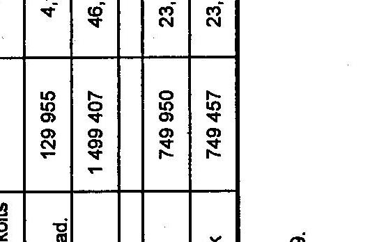
