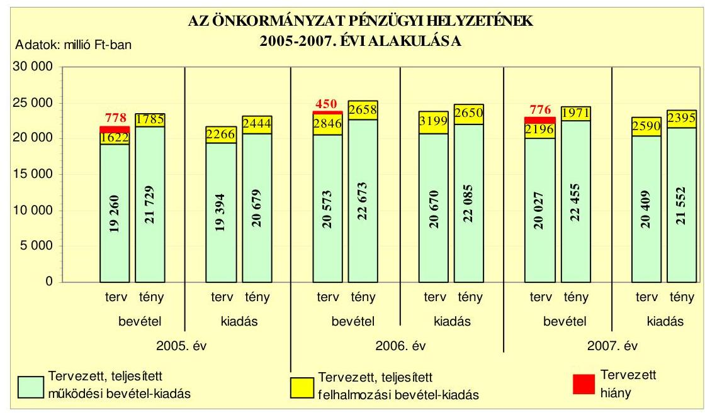
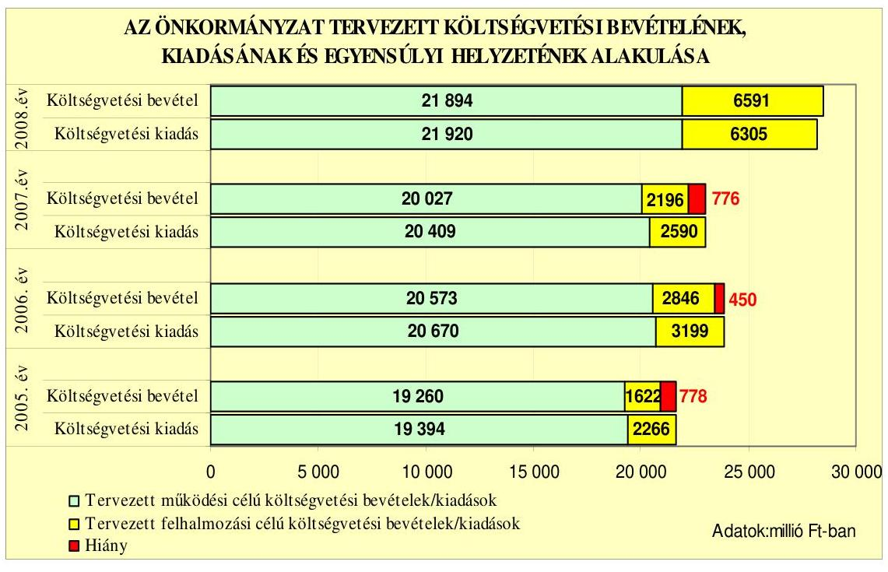
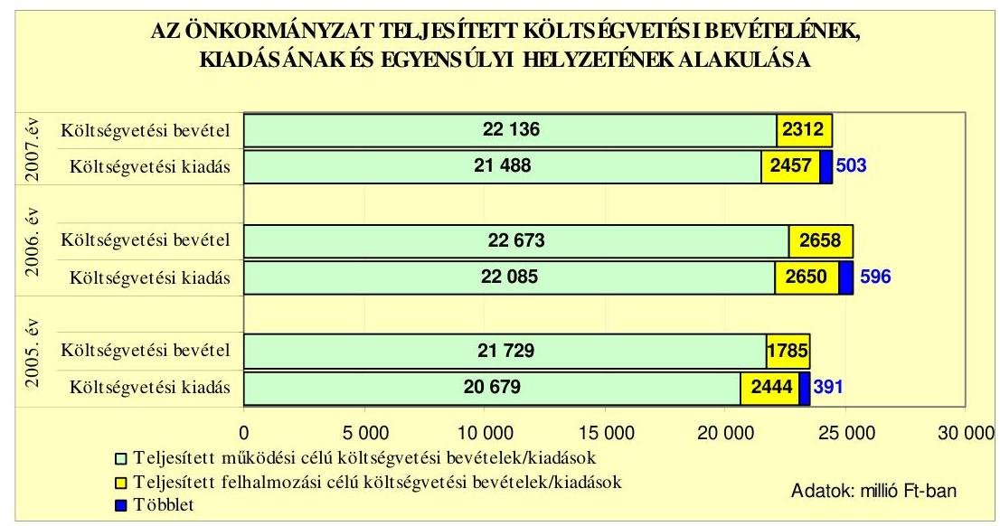
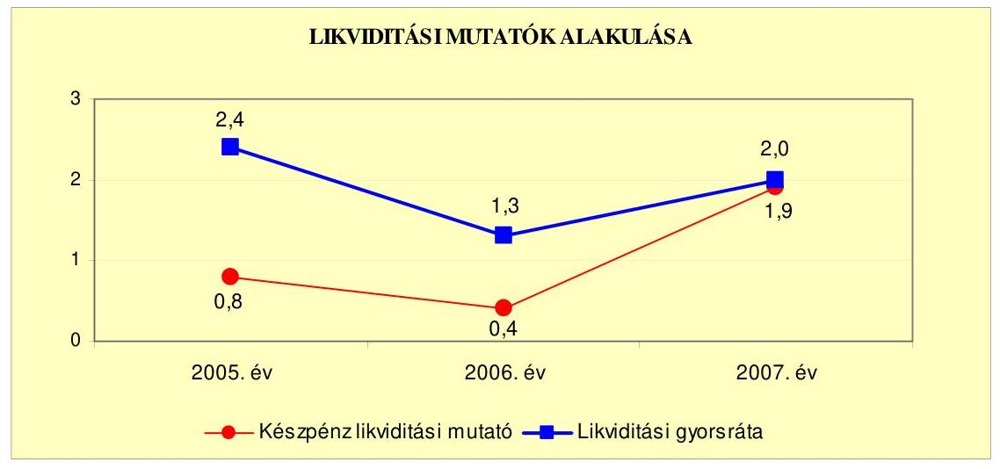
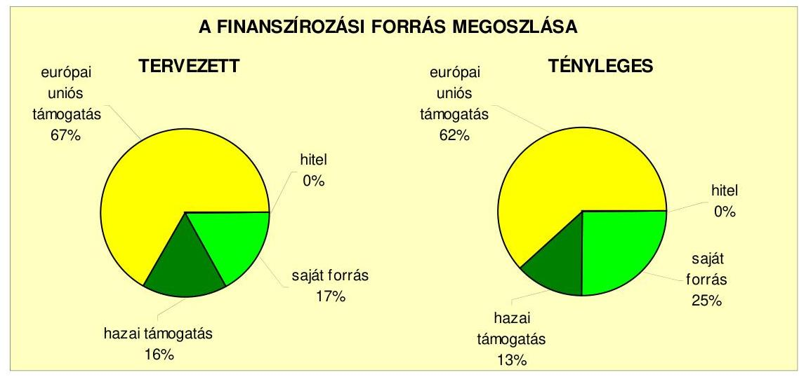
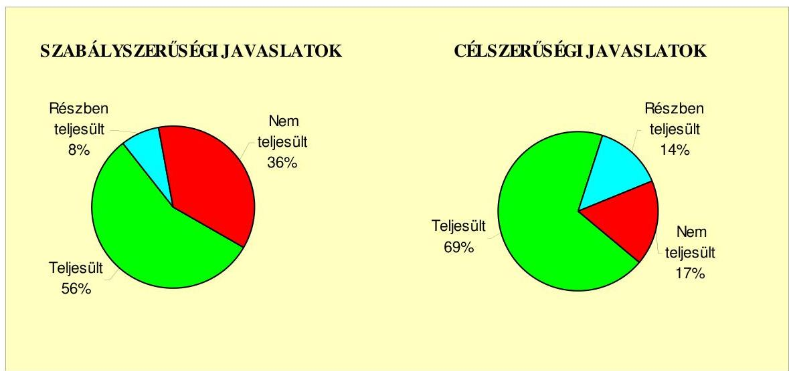
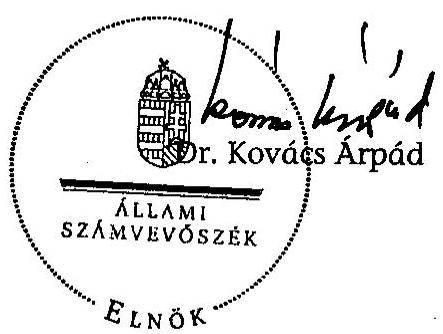
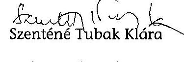
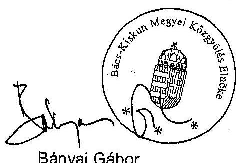

# ÁLLAMI   SZÁMVEVŐSZÉK 

## JELENTÉS

a Bács-Kiskun Megyei Önkormányzat gazdálkodási rendszerének 2008. évi ellenőrzéséről

---

# 3. Önkormányzati és Területi Ellenőrzési Igazgatóság 

## Átfogó Ellenőrzési Főcsoport

Iktatószám: V-3003-6/20/19/2008.
Témaszám: 898
Vizsgálat-azonosító szám: V0381

## Az ellenőrzést felügyelte:

Dr. Lóránt Zoltán
főigazgató
Az ellenőrzés végrehajtásáért felelős:
Dr. Sepsey Tamás
főigazgató-helyettes

## Az ellenőrzést vezette:

## Csecserits Imréné

főcsoportfőnök-helyettes

## Az ellenőrzést végezték:

| Dr. Csikai Zsolt | Dr. Botta Tibor | Szenténé Tubak Klára |
| :-- | :-- | :-- |
| irodavezető, főtanácsadó | számvevő tanácsos | számvevő tanácsos |

## A témához kapcsolódó eddig készített számvevőszéki jelentések:

címe
Jelentés a Bács-Kiskun Megyei Önkormányzat gazdálkodásának 2004. évi átfogó ellenőrzéséről
Jelentés a helyi és a helyi kisebbségi önkormányzatok gazdálkodásának átfogó ellenőrzéséről
Jelentés a Magyar Köztársaság 2004. évi költségvetése végrehajtásának ellenőrzéséről
Függelék:

- a helyi önkormányzatokat a 2004. évben megillető normatív állami hozzájárulás elszámolásának ellenőrzése
- a helyi önkormányzatok beruházásaihoz és rekonstrukcióihoz nyújtott 2004. évi felhalmozási célú támogatások ellenőrzése
Jelentés a 2004. június 13-án megtartott, az EP tagjai választás és a 2004. december 5-én megtartott országos népszavazás lebonyolításához felhasznált pénzeszközök elszámolásának ellenőrzéséről
Jelentés a Magyar Köztársaság 2005. évi költségvetése végrehajtásának ellenőrzéséről
Függelék:
- a helyi önkormányzatok beruházásaihoz és rekonstrukcióihoz nyújtott 2005. évi felhalmozási célú támogatások ellenőrzése

---

# TARTALOMJEGYZÉK 

BEVEZETÉS ..... 11
I. ÖSSZEGZŐ MEGÁLLAPÍTÁSOK, KÖVETKEZTETÉSEK, JAVASLATOK ..... 16
II. RÉSZLETES MEGÁLLAPÍTÁSOK ..... 24

1. Az Önkormányzat költségvetési és pénzügyi helyzete ..... 24
1.1. A tervezett és teljesített költségvetési bevételek és kiadások alapján a költségvetési és a pénzügyi egyensúly alakulása, valamint a költségvetési hiány megállapításának szabályszerűsége ..... 24
1.2. A költségvetési és a pénzügyi egyensúlyi helyzet kialakításához tervezett és teljesített finanszírozási célú pénzügyi műveletek módja és azok hatása a tárgyévet követő évek költségvetéseire ..... 26
1.3. A költségvetés tervezésének megalapozottsága ..... 34
2. Az Önkormányzat felkészültsége az európai uniós források igénylésére és felhasználására, valamint az elektronikus közigazgatási feladatok ellátására ..... 35
2.1. Az európai uniós források igénybevételére és a várható támogatás felhasználására történt felkészülés szabályozottsága, szervezettsége ..... 35
2.1.1. Az európai uniós forrásokra történő pályázatok benyújtására vonatkozó döntések összhangja a fejlesztési célkitűzésekkel ..... 35
2.1.2. Az európai uniós forrásokhoz kapcsolódóan a pályázatfigyelés, a pályázatkészítés, valamint az európai uniós támogatással megvalósuló fejlesztés lebonyolításának belső rendjének szabályozottsága, a végrehajtás személyi, szervezeti feltételei ..... 43
2.1.3. A fejlesztési feladat lebonyolításánál a feladatellátás rendjére, az ellenőrzési feladatok teljesítésére, valamint a felelősségi szabályokra vonatkozó előírások betartása ..... 45
2.2. Az elektronikus közigazgatási feladatok ellátása, a közérdekű adatok elektronikus közzététele ..... 50
3. A költségvetési gazdálkodás belső kontrolljai ..... 54
3.1. A szabályozottság kockázata a költségvetés tervezési, gazdálkodási, beszámolási és a folyamatba épített, előzetes és utólagos vezetői ellenőrzési feladatoknál ..... 54
3.2. A belső kontrollok érvényesülése az önkormányzati források szabályszerű felhasználásában, a költségvetési tervezés, gazdálkodás, beszámolás folyamataiban ..... 55
3.3. A belső ellenőrzési kötelezettség teljesítése, javaslatainak hasznosulása ..... 59

---

4. Az ÁSZ korábbi ellenőrzési javaslatai alapján készített intézkedési terv végrehajtása, eredményessége ..... 62
4.1. Az Önkormányzat gazdálkodási rendszerének átfogó ellenőrzése során tett javaslatok végrehajtására tervezett intézkedések megvalósulása ..... 62
4.2. A zárszámadáshoz kapcsolódó (állami hozzájárulások, támogatások igénylésének és felhasználásának ellenőrzése), valamint a további vizsgálatok esetében a megállapítások, javaslatok alapján tett intézkedések ..... 67

# MELLÉKLETEK 

1. számú Az Önkormányzat gazdálkodását meghatározó adatok, mutatószámok (1 oldal)
2. számú Az önkormányzati vagyon alakulása (1 oldal)
3. számú Az Önkormányzat 2005-2007. évi költségvetési előirányzatainak és azok pénzügyi teljesítéseinek alakulása (1 oldal)
4. számú Tanúsítvány az európai uniós forrásokkal támogatott fejlesztések tervezett és tényleges 2005-2008. évi adatairól (2 oldal)
5. számú Adatlap a Kiskőrösi Közoktatási Intézmény európai uniós forrással támogatott fejlesztéséről (4 oldal)
6. számú Bányai Gábor úr, a Bács-Kiskun Megyei Önkormányzat Közgyűlése elnökének észrevétele (1 oldal)

---

# RÖVIDÍTÉSEK JEGYZÉKE 

## Törvények

Áht.
Eisztv.
Kbt.
Ötv.

## Rendeletek

Ámr.
Ber.
2005. évi költségvetési rendelet
2005. évi zárszámadási rendelet
2006. évi költségvetési rendelet
2006. évi zárszámadási rendelet
2007. évi költségvetési rendelet
2008. évi költségvetési rendelet
vagyongazdálkodási rendelet

Vhr.

## Szórövidítések

APEH
ÁSZ
Bajai Közoktatási Intézmény
az államháztartásról szóló 1992. évi XXXVIII. törvény az elektronikus információszabadságról szóló 2005. évi XC. törvény
A közbeszerzésekről szóló 2003. évi CXXIX. törvény
A helyi önkormányzatokról szóló 1990. évi LXV. törvény
az államháztartás működési rendjéről szóló 217/1998. (XII. 30.) Korm. rendelet
a költségvetési szervek belső ellenőrzéséről szóló 193/2003. (XI. 26.) Korm. rendelet

Bács-Kiskun Megyei Önkormányzat 1/2005. (II. 28.) számú rendelete az Önkormányzat 2005. évi költségvetéséről Bács-Kiskun Megyei Önkormányzat 9/2006. (V. 10.) számú rendelete az Önkormányzat 2005. évi költségvetésének végrehajtásáról
Bács-Kiskun Megyei Önkormányzat 1/2006. (II. 22.) számú rendelete az Önkormányzat 2006. évi költségvetéséről Bács-Kiskun Megyei Önkormányzat 9/2007. (V. 7.) számú rendelete az Önkormányzat 2006. évi költségvetésének végrehajtásáról
Bács-Kiskun Megyei Önkormányzat 1/2007. (III. 1.) számú rendelete az Önkormányzat 2007. évi költségvetéséről Bács-Kiskun Megyei Önkormányzat 1/2008. (II. 29.) számú rendelete az Önkormányzat 2008. évi költségvetéséről a Bács-Kiskun Megyei Önkormányzatnak a vagyonáról és a vagyongazdálkodás szabályairól, valamint a lakások és helyiségek bérletéről szóló többször módosított 11/1996. (VI. 17.) számú rendelete
az államháztartás szervezetei beszámolási és könyvvezetési kötelezettségének sajátosságairól szóló 249/2000.
(XII. 24.) Korm. rendelet

Adó- és Pénzügyi Ellenőrzési Hivatal
Állami Számvevőszék
Bács-Kiskun Megyei Önkormányzat Bajai Óvodája, Általános Iskolája, Speciális Szakiskolája, Kollégiuma, Egységes Módszertani Intézménye, II. sz. Tanulási Képességet Vizsgáló Szakértői és Rehabilitációs Bizottsága és Gyermekotthona

---

BM Önerő Alap támogatás

Dunavecsei Közoktatási Intézmény
e-közigazgatás
ESZA Kht.
Ellenőrzési osztály
FEUVE
főjegyző
FH
Garbai Sándor Szakközépiskola gazdasági program ${ }_{1}$
gazdasági program ${ }_{2}$
gazdasági ügyrend

Gyermekvédelmi Központ
hatályos támogatási szerződés

HEFOP

A Magyar Köztársaság 2007. évi költségvetéséről szóló 2006. évi CXXXVII. tv. - 5. számú mellékletének 12. pontja alapján - központi költségvetési hozzájárulást biztosít a helyi önkormányzatok és jogi személyiségű társulásaik számára, azok európai uniós fejlesztési célú pályázataihoz szükséges saját forrás kiegészítésére
Bács-Kiskun Megyei Önkormányzat Duna Menti Egysége Gyógypedagógiai Módszertani Intézménye, Óvodája, Általános Iskolája, Szakiskolája, Kollégiuma és Gyermekotthona
elektronikus közigazgatás
Európai Szociális Alap Nemzeti Programirányító Iroda Társadalmi Szolgáltató Kht.
a Bács-Kiskun Megyei Közgyűlés Hivatalának Ellenőrzési Osztálya
folyamatba épített, előzetes és utólagos vezetői ellenőrzés
Bács-Kiskun Megyei Önkormányzat Főjegyzője
Foglalkoztatási Hivatal Európai Szociális Alap Főosztály Kihelyezett Monitoring Egysége, Bács-Kiskun megye
Bács-Kiskun Megyei Önkormányzat Garbai Sándor Szakközépiskolája, Szakiskolája és Kollégiuma
a Bács-Kiskun Megyei Önkormányzat 2003-2006. évekre vonatkozó gazdasági programja, amelyet a Közgyűlés a 36/2003. (III. 28.) számú határozattal fogadott el
a Bács-Kiskun Megyei Önkormányzat 2007-2010. évekre vonatkozó gazdasági programja, amelyet a Közgyűlés a 63/2007. (IV. 27.) számú határozattal fogadott el
a Bács-Kiskun Megyei Közgyűlés Hivatala gazdasági szervezetének ügyrendje, melyet a főjegyző 2003. március 28-án hagyott jóvá
Bács-Kiskun Megyei Önkormányzat Gyermekvédelmi Központja
a HEFOP 2.1.2. intézkedés keretében „A sajátos nevelési igényű diákok integrált nevelése óvodában, általános iskolában és helytállása középiskolában együttműködés keretében" nyert európai uniós támogatásra vonatkozó, a Bács-Kiskun Megyei Önkormányzat Óvodája, Általános Iskolája, Előkészítő Szakiskolája, Egységes Gyógypedagógiai Módszertani Intézménye, Nevelési Tanácsadója és a Foglalkoztatáspolitikai és Munkaügyi Minisztérium (irányító hatóság) között 2005. január 31-én létrejött szerződés
NFT Humánerőforrás-fejlesztési Operatív Program

---

HEFOP sajátos nevelési igényű diákok integrált nevelése feladat
irányító hatóság

Illetékhivatal
Kiskőrösi Közoktatási Intézmény

Közgazdasági főosztály
Közgyűlés
Közgyűlés elnöke
Közgyűlés hivatala
Közgyűlés hivatalának
ügyrendje
Közgyűlés hivatalának SzMSz-e
Közművelődési Intézet
Közoktatási Szakszolgálat
közreműködő szervezet

MÁK
Megyei kórház
Megyei könyvtár
NFT
OEP
OM
OMAI
Önkormányzat
„Őszi Napfény" Szociális Intézmény
„A sajátos nevelési igényű diákok integrált nevelése óvodában, általános iskolában és helytállása középiskolában együttműködés keretében" fejlesztési feladat, amelyhez a HEFOP 2.1.2. intézkedés keretében kiírt pályázaton nyert a Bács-Kiskun Megyei Önkormányzat Óvodája, Általános Iskolája, Előkészítő Szakiskolája, Egységes Gyógypedagógiai Módszertani Intézménye, Nevelési Tanácsadója európai uniós támogatást
a HEFOP 2.1.2. intézkedésre kiírt pályázaton „A sajátos nevelési igényű diákok integrált nevelése óvodában, általános iskolában és helytállása középiskolában együttműködés keretében" nyert támogatás esetében a Foglalkoztatáspolitikai és Munkaügyi Minisztérium
Bács-Kiskun Megyei Önkormányzat Illetékhivatala
Bács-Kiskun Megyei Önkormányzat Óvodája, Általános Iskolája, Előkészítő Szakiskolája, Egységes Gyógypedagógiai Módszertani Intézménye, Nevelési Tanácsadója
a Bács-Kiskun Megyei Közgyűlés Hivatalának Közgazdasági Főosztálya
Bács-Kiskun Megyei Önkormányzat Közgyűlése
Bács-Kiskun Megye Önkormányzat Közgyűlésének Elnöke
Bács-Kiskun Megyei Közgyűlés Hivatala
a Bács-Kiskun Megyei Közgyűlés Hivatalának a Közgyűlés 4/2003. (I. 31.) számú határozatával elfogadott Ügyrendje A Bács-Kiskun Megyei Közgyűlés Hivatalának a Közgyűlés 6/2008. (II. 29.) számú határozatával elfogadott SzMSz-e Bács-Kiskun Megyei Önkormányzat Közművelődési Szakmai Tanácsadó és Szolgáltató Intézete
Bács-Kiskun Megyei Önkormányzat Kecskeméti Közoktatási Szakszolgálata és Gyermekvédelmi Intézete
a HEFOP 2.1.2. intézkedésre kiírt pályázaton „A sajátos nevelési igényű diákok integrált nevelése óvodában, általános iskolában és helytállása középiskolában együttműködés keretében" nyert támogatás esetében az Oktatási Minisztérium Alapkezelő Igazgatósága
Magyar Államkincstár
Bács-Kiskun Megyei Önkormányzat Kórháza
Bács-Kiskun Megyei Önkormányzat Katona József Megyei Könyvtára
Nemzeti Fejlesztési Terv
Országos Egészségügyi Pénztár
Oktatási Minisztérium
OM Alapkezelő Igazgatósága
Bács-Kiskun Megyei Önkormányzat
Bács-Kiskun Megyei Önkormányzat „Őszi Napfény" Integrált Szociális és Módszertani Intézménye

---

pályázati szabályzat a Közgyűlés 225/2007. (XII. 7.) számú határozatával jóváhagyott szabályzat a támogatással, európai uniós forrásokkal kapcsolatos pályázatfigyelés, pályázatkészítés és lebonyolítás rendjéről
Pedagógusház Bács-Kiskun Megyei Önkormányzat Pedagógiai Intézete és Továbbtanulási, Pályaválasztási Tanácsadója Pedagógusház
szja személyi jövedelemadó
Területfejlesztési osztály a Bács-Kiskun Megyei Közgyűlés Hivatalának Területfejlesztési Osztálya
ÚMFT Új Magyarország Fejlesztési Terv
VÁTI Kht. VÁTI Magyar Regionális Fejlesztési és Urbanisztikai Közhasznú Társaság

---

# ÉRTELMEZŐ SZÓTÁR 

1. elektronikus szolgáltatási szint
2. elektronikus szolgáltatási szint
3. elektronikus szolgáltatási szint
4. elektronikus szolgáltatási szint

DAOP 4.3.1 intézkedés

EMIR

EQUAL
európai uniós források

Az 1044/2005. (V. 11.) Korm. határozat alapján olyan információs, tájékoztató szolgáltatás, amely csak általános információkat közöl az adott üggyel kapcsolatos teendőkről és a szükséges dokumentumokról.
Az 1044/2005. (V. 11.) Korm. határozat alapján olyan egyirányú kapcsolatot biztosító szolgáltatás, amely az 1. szinten túl biztosítja az adott ügy intézéséhez szükséges dokumentumok, nyomtatványok letöltését, és azok ellenőrzéssel, vagy ellenőrzés nélküli elektronikus kitöltését, amely esetben a dokumentumok benyújtása hagyományos úton történik.
Az 1044/2005. (V. 11.) Korm. határozat alapján olyan kétirányú kapcsolatot biztosító szolgáltatás, amely közvetlen, vagy ellenőrzött kitöltésű dokumentum segítségével biztosítja az elektronikus adatbevitelt és a bevitt adatok ellenőrzését. Az ügy indításához, intézéséhez személyes megjelenés nem szükséges, de az ügyhöz kapcsolódó közigazgatási döntés (határozat, egyéb aktus) közlése, valamint a kapcsolódó illeték-, vagy díjfizetés hagyományos úton történik.
Az 1044/2005. (V. 11.) Korm. határozat alapján olyan teljes közvetlen kétirányú ügyintézési folyamatot biztosító szolgáltatás, amikor az ügyhöz kapcsolódó közigazgatási döntés is elektronikus úton kerül közlésre, illetve a kapcsolódó illeték-, vagy díjfizetés elektronikus úton is intézhető.
A Regionális Operatív Program (ROP) részeként a Délalföldi Operatív Program Akadálymentesítés intézkedése
Egységes monitoring informatikai rendszer az Európai Unió által nyújtott egyes pénzügyi támogatások felhasználásával megvalósuló programok, projektek figyelemmel kísérésére kialakított számítógépes nyilvántartási rendszer, amely a programok és a projektek adatait gyűjti, rendszerezi és tartja nyilván.
Az EQUAL Közösségi Kezdeményezés célja olyan innovatív megközelítések és módszerek kidolgozása és elterjesztése, amelyek hozzájárulnak a munkaerőpiachoz kapcsolódó diszkrimináció és egyenlőtlenségek megszüntetéséhez. Az EQUAL által támogatott kezdeményezések az Európai foglalkoztatási stratégia és a Társadalmi kirekesztés elleni küzdelem közösségi stratégiái által meghatározott szakmapolitikai keretekbe illeszkednek.
Az elnyert európai uniós források lehívása a támogatott projekt megvalósítása érdekében, a fejlesztés lebonyolítása során felmerült kiadások finanszírozására.

---

fejlesztési feladat (projekt)
fejlesztési célkitűzés

HEFOP intézkedések
irányító hatóság
kedvezményezett
közösségi kezdeményezések
közösségi programok

A fejlesztési feladat (projekt) tartalmilag és formailag részletesen kidolgozott, megfelelő pénzügyi háttérrel és végrehajtási ütemezéssel rendelkező fejlesztési terv, amely illeszkedik az Európai Unió, illetve az NFT és az ÚMFT által támogatott programokhoz.
Az önkormányzat által ellátott kötelező, vagy önként vállalt feladatok ellátásának mennyiségi, vagy minőségi fejlesztésére vonatkozó terv. A mennyiségi fejlesztés megvalósulhat beszerzéssel,

 létesítéssel, bővítéssel, átalakítással. A HEFOP 2.1 Hátrányos helyzetű tanulók esélyegyenlőségének biztosítása az oktatásban; a HEFOP 2.2 A társadalmi befogadás előmozdítása a szociális területen dolgozó szakemberek képzésével; a HEFOP 3.1 az egész életen át tartó tanuláshoz szükséges készségek és kompetenciák fejlesztésének támogatása; a HEFOP 3.3 A felsőoktatás szerkezetének és tartalmának fejlesztése; a HEFOP 3.5 a felnőttképzés rendszerének fejlesztése. Ezen intézkedések keretében különféle programok megvalósítására kiírt pályázatokon nyert támogatást a Bács-Kiskun Megyei Önkormányzat.
A strukturális alapok és a Kohéziós alap forrásainak szabályszerű, hatékony és eredményes felhasználásához szükséges intézményrendszer felső eleme. Az irányító hatóság általános és átfogó felelősséget visel a programok, projektek hatékony és szabályszerű végrehajtásáért. Felelősségi köréből eredően ellenőrzi a közösségi, valamint a hazai jogszabályok betartását, koordinálja az európai uniós források szétosztásának folyamatát, irányítja az intézményrendszer, a statisztikai és a pénzügyi nyilvántartási rendszer működését.
Az a helyi önkormányzat/intézmény, amely a támogatási szerződést kedvezményezettként aláírja, a projektet végrehajtja.
Az Európai Bizottság által kidolgozott, a strukturális alapokat kiegészítő programok, melyeket a tagállamok nemzeti szinten hajtanak végre. Ilyen program az EUQAL. Az EUQAL kezdeményezés célja a munkaerőpiacon kialakult hátrányos helyzet és mindennemű egyenlőtlenség leküzdése.
Az Európai Unió a tagállamok közötti együttműködés ösztönzését, az oktatásban és szakképzésben részt vevő intézmények fejlesztésének támogatását, a minőségi oktatás és szakképzés elősegítését az ún. közösségi programokon keresztül valósítja meg. Közösségi programoknak a gazdasági és társadalmi élet szinte minden területét átfogó közösségi politikák végrehajtását szolgáló programokat nevezzük. (Ezek a területek pl. az ipar, az oktatás, a környezetvédelem, az egészség, a kultúra stb.)

---

közreműködő szervezet
lebonyolítás
operatív program

A közreműködő szervezet az európai uniós támogatást elnyert kedvezményezettekkel kapcsolatot tartó szerv. Az operatív programok közreműködő szervezetei befogadják, nyilvántartják, döntésre előkészítik a pályázatokat, rögzítik a támogatással kapcsolatos adatokat az egységes monitoring informatikai rendszerben, elvégzik a támogatások előzetes (szerződéskötést megelőző), közbenső (a pénzügyi elszámolás, finanszírozás folyamatában végzett) és utólagos (a támogatott projekt pénzügyi lezárását megelőző) ellenőrzését. Továbbá megkötik a szerződéseket a projekt kedvezményezettjével, folyamatosan nyomon követik a teljesítéseket, lebonyolítják a támogatások kifizetését, vezetik az egységes monitoring informatikai rendszert. Az NFT-hez kapcsolódó HEFOP-intézkedések közreműködő szervezete az ESZA Kht., OMAI. Az ÚMFT-hez kapcsolódó DAOP intézkedés közreműködő szervezete a VÁTI Kht.
Az európai uniós források felhasználásával megvalósuló fejlesztésre irányuló műszaki, gazdasági (pénzügyi) tevékenységet magában foglaló szervezési, irányítási szolgáltatás. A szervezési szolgáltatás kiterjedhet a pályázatkészítésre, a közbeszerzési eljárás lebonyolításán keresztül a folyamatos műszaki ellenőrzésre, a pénzügyi elszámolásra, a műszaki átadás-átvételre, az üzembe helyezésre, illetve a fejlesztési folyamat egyes elemeire.
Az Európai Bizottság által jóváhagyott, a Közösségi Támogatási Keret végrehajtására vonatkozó 2004-2006 és a 2007-2013 közötti, több évre szóló intézkedésekhez kapcsolódó prioritások egységes rendszerét tartalmazó dokumentum. A strukturális alapok NFT-hez kapcsolódó operatív programjai: Agrár és Vidékfejlesztési Operatív Program (AVOP); Gazdasági Versenyképesség Operatív Program (GVOP); Humánerőforrás-fejlesztési Operatív Program (HEFOP); Környezetvédelmi és Infrastruktúrafejlesztési Operatív Program (KIOP); Regionális Fejlesztési Operatív Program (ROP). Az ÚMFT-hez kapcsolódó operatív programok: Gazdaságfejlesztési Operatív Program (GOP); Környezet és Energia Operatív Program (KEOP); Társadalmi Megújulás Operatív Program (TÁMOP); Társadalmi Infrastruktúra Operatív Program (TIOP); Délalföldi Operatív Program (DAOP); Dél-dunántúli Operatív Program (DDOP); Észak-alföldi Operatív Program (ÉAOP); Észak-magyarországi Operatív Program (ÉMOP); Középdunántúli Operatív Program (KDOP); Közép-magyarországi Operatív Program (KMOP); Nyugat-dunántúli Operatív Program (NYDOP); Balatoni kiemelt Üdülőkörzet; Államreform Operatív Program (ÁROP)

---

projekt előrehaladási jelentés (PEJ)
támogatási szerződés

A Strukturális Alapok által társfinanszírozott projektek megvalósítása során a kedvezményezetteknek a támogatási szerződésben meghatározott időközönként, általában negyedévente, a támogatás fizetési kérelmekhez kapcsolódóan pár oldalas projekt előrehaladási jelentéseket kell benyújtaniuk. A projekt előrehaladási jelentés jóváhagyása a további támogatások kifizetésének előfeltétele.
Az irányító hatóságnak/közreműködő szervezeteknek a kedvezményezett önkormányzattal/intézménnyel kötött szerződése, amely a támogatás felhasználásának részletes feltételeit tartalmazza.

---

# JELENTÉS 

## a Bács-Kiskun Megyei Önkormányzat gazdálkodási rendszerének 2008. évi ellenőrzéséről

## BEVEZETÉS

Az Ötv. 92. § (1) bekezdése, az Állami Számvevőszékről szóló 1989. évi XXXVIII. törvény 2. § (3) bekezdése, valamint az Áht. 120/A. § (1) bekezdése alapján az önkormányzatok gazdálkodását az Állami Számvevőszék ellenőrzi. Az ellenőrzésre az Országgyűlés illetékes bizottságai részére is átadott, országosan egységes ellenőrzési program szerint került sor.

Az Állami Számvevőszék a stratégiájában foglalt célkitűzéseknek megfelelően a helyi önkormányzatok költségvetési gazdálkodási rendszere átfogó ellenőrzésének programját a 2007. évtől megújította, azt kiegészítette további - teljesítmény-ellenőrzési - elemekkel.

## Az ellenőrzés célja annak értékelése volt, hogy az Önkormányzat:

- milyen módon biztosította a költségvetési és a pénzügyi egyensúlyt a költségvetésében és annak teljesítése során, valamint változott-e a finanszírozási célú pénzügyi műveletek jelentősége a hiányzó bevételi források pótlásában;
- eredményesen készült-e fel a szabályozottság és a szervezettség terén az európai uniós források igénylésére és felhasználására, továbbá biztosította-e az e-közigazgatás feltételeit, az adatok közzétételével a gazdálkodás nyilvánosságát;
- kialakította-e a külső és a belső feltételeknek megfelelően a költségvetés tervezési, gazdálkodási és zárszámadási feladatai belső kontrollrendszerét ${ }^{1}$, ezen tevékenységek szabályszerű ellátásához hozzájárult-e a folyamatba épített, előzetes és utólagos vezetői ellenőrzés, valamint a belső ellenőrzés;
- megfelelően hasznosították-e a korábbi számvevőszéki ellenőrzések megállapításait, szabályszerűségi ${ }^{2}$ és célszerűségi javaslatait.

[^0]
[^0]:    ${ }^{1}$ A gazdálkodás szabályszerűségét biztosító kontrollrendszer alatt értjük a kiépített és működő belső irányítási és szabályozási rendszert, valamint a belső ellenőrzési funkciók ellátásának rendszerét.
    ${ }^{2}$ A törvényi előírások betartásának elmulasztásakor egységesen a törvénysértés megjelölést alkalmazzuk, mivel az ÁSZ nem tehet különbséget a törvényi előírások között.

---

Az ellenőrzés típusa: átfogó ellenőrzés, amely egyidejűleg - egy ellenőrzés keretében - meghatározott területekre összpontosítva érvényesíti a szabályszerűségi, valamint a teljesítmény-ellenőrzés jellemzőit.

Az ellenőrzött időszak: az 1., 2. és 4. programpontok tekintetében a 2005-2007. évek, a 3. ellenőrzési programpontnál a 2007. év.

Bács-Kiskun megye lakosainak száma - Kecskemét megyei jogú város lakosai nélkül - 2008. január 1-jén 433695 fő volt. A megyében a 2007. évben 119 települési önkormányzat működött, amelyből 19 város, 9 nagyközség és 91 község. A 2006. évi önkormányzati választást követően az Önkormányzat 46 tagú Közgyűlésének munkáját 11 állandó bizottság segítette. A 2006. évi önkormányzati választást követően a Közgyűlés elnökének személye változott. A főjegyző 1995. július hótól tölti be tisztségét.

Az Önkormányzat feladatainak végrehajtása érdekében a 2007. évben 30 költségvetési intézményt működtetett, amelyekből 14 önállóan gazdálkodott. A feladatok ellátásában részt vett nyolc gazdasági társasága, továbbá 21 alapítványa. Az Önkormányzat a 2007. évi költségvetési beszámolója szerint 24448 millió Ft költségvetési bevételt ért el és 23945 millió Ft költségvetési kiadást teljesített, 2007. december 31-én a könyvviteli mérleg szerint 24551 millió Ft értékű vagyonnal rendelkezett.

Az Önkormányzat vagyona a 2005. év végi állományhoz viszonyítva a 2007. év végére 37,5%-kal emelkedett, ezen belül 568,1%-kal nőtt a pénzeszközök állománya, főként a fejlesztési forrás biztosítása céljából a 2007. év végén 5000 millió Ft értékben kibocsátott kötvényből befolyt bevétel miatt. A beruházások állománya ugyanezen időszak alatt több mint három és félszeresére nőtt (258%-kal), elsősorban a regionális kórházak ${ }^{3}$ címzett támogatásból megvalósuló rekonstrukciója és intézményfejlesztések miatt. A követelések állománya a 2007. év végén a 2006. év végi állomány 6%-ára csökkent, amelynek oka az Illetékhivatalnak 2007. január 1-jétől az APEH-nek történő átadása volt. Több mint kétszeresére (4297 millió Ft-ról 9666 millió Ft-ra) nőtt a kötelezettségek 2007. év végi állománya a 2006. év végi állományhoz képest, főként a 2007. évben kibocsátott 5000 millió Ft-os kötvény és a folyószámla-hitel 2007. év végi 680 millió Ft-os állománya hatására (a 2006. év végén nem volt folyószámlahitel állomány). A saját tőke 2007. év végi értéke közel a felére csökkent a 2006. év végi saját tőke értékéhez képest az Illetékhivatal eszközeinek átadásával összefüggésben.

[^0]
[^0]:    ${ }^{3}$ A helyi önkormányzatok 2004. évi új címzett támogatásáról és az egyes címzett támogatással folyamatban lévő beruházások eredeti döntéseinek módosításáról, valamint a helyi önkormányzatok címzett és céltámogatási rendszeréről szóló 1992. évi LXXXIX. törvény módosításáról szóló 2004. évi XLII. törvény 1. számú mellékletében foglaltak alapján az Önkormányzat a Megyei kórház és a Kiskunfélegyházi Kórház-Rendelőintézet rekonstrukciójára (Regionális Kórházrekonstrukció) a 2004-2007. évek között 3100 millió Ft-os beruházási költséghez 3000 millió Ft címzett támogatásban részesült.

---

A 2008. évi költségvetési rendeletben 28485 millió Ft költségvetési bevételt és 28225 millió Ft költségvetési kiadást irányoztak elő, a költségvetési többlet 260 millió Ft. Az összes költségvetési bevétel 21,4%-át a saját bevétel biztosította a 2007. évben. Az összes költségvetési kiadásból a felhalmozási célú kiadás részaránya a 2007. évben 10,3% volt. A Közgyűlés hivatalában dolgozó köztisztviselők száma 2007. december 31-én 78 fő, a költségvetési intézményekben foglalkoztatott közalkalmazottak száma 3968 fő volt. Az Önkormányzat gazdálkodására vonatkozó adatokat, mutatószámokat az 1-3. számú mellékletek tartalmazzák.

Az Önkormányzat költségvetési és pénzügyi helyzetét az elemző eljárás módszerével vizsgáltuk. E körben elemeztük a költségvetés egyensúlyi helyzetének alakulását, a tervezett és tényleges költségvetési hiány okait, a mérséklésére tett intézkedéseket, finanszírozásának módját, az Önkormányzat adósságállományának alakulását, összetevőit.

A teljesítmény-ellenőrzés módszerével vizsgáltuk a belső szabályozottság, szervezettség terén az Önkormányzat felkészültségét az európai uniós források figyelésére, igénylésére és felhasználására, továbbá értékeltük, hogy az igényelt európai uniós támogatások az Önkormányzat által meghatározott fejlesztési célkitűzésekhez kapcsolódtak-e. Az eredményesség szempontjából a minősítést a lényegességi szinthez való viszonyítással végeztük el. Az ellenőrzés során felmértük, hogy az e-közigazgatási feladat ellátása, illetve bevezetése, működtetése érdekében milyen intézkedéseket tettek, valamint biztosították-e a közérdekű adatok közzétételét.

A költségvetési gazdálkodás belső kontrolljainak ellenőrzése során értékeltük, hogy a Közgyűlés hivatalánál a költségvetés tervezési, gazdálkodási, zárszámadás-készítési feladatok belső kontrolljainak kiépítettsége és működése megfelelő biztosítékot ad-e a gazdálkodási feladatok megfelelő, szabályszerű ellátására. Felmértük és minősítettük a költségvetés tervezési, a gazdálkodási, a zárszámadás-készítési feladatokkal, továbbá a pénzügyi-számviteli területen az informatikával kapcsolatosan kialakított kontrollok megfelelőségét, valamint azok működésének eredményességét, megbízhatóságát. Értékeltük a belső ellenőrzés szervezeti és szabályozási keretét, továbbá működését.

A Közgyűlés hivatalánál értékeltük a gazdálkodás folyamatában a kontrollok működésének megbízhatóságát, ennek keretében ellenőriztük a szakmai teljesítés igazolására és az utalvány ellenjegyzésére kialakított kontrollok végrehajtását. Az ellenőrzést a következő, kiemelt kockázatuk alapján kiválasztott ${ }^{4}$, az általánostól jellemzően eltérő, egyedi eljárást igénylő gazdasági eseményekkel kapcsolatos kifizetésekre folytattuk le ${ }^{5}$ :

- a külső szolgáltató által végzett karbantartási, kisjavítási szolgáltatások,
- a gépek, berendezések, felszerelések beszerzése, továbbá
- a működési célú pénzeszköz átadásokból az államháztartáson kívülre teljesített kifizetésekre.

Az ellenőrzés hatékony elvégzése céljából
 a vizsgálandó területek kiválasztása során a kockázatokon alapuló megközelítés érvényesült, ezáltal az ellenőrzési erőforrásokat azokra a területekre fókuszáltuk, amelyeken legnagyobb a hibák előfordulási valószínűsége. Az ellenőrzési erőforrások ilyen típusú összpontosításával minimálisra csökkenthető a kívánt ellenőrzési bizonyosság eléréséhez szükséges időráfordítás.

A pénzügyi-számviteli folyamatokban alkalmazott belső kontrollok létezésének és működésének ellenőrzésére a vizsgált három terület 2007. évi könyvviteli tételeiből területenként egyszerű véletlen mintát vettünk. A kijelölt gazdasági eseményre elvégzett megfelelőségi tesztek alapján értékeltük a kontrollok működésének eredményességét, megbízhatóságát a vizsgált három területre külön-külön, majd összefoglalóan ${ }^{6}$ a Közgyűlés hivatalában az egyedi eljárást igénylő gazdasági eseményekre.

A helyszíni ellenőrzés megállapításainak részletes dokumentálását három megfelelőségi tesztlapon, öt elővizsgálati és kilenc helyszíni ellenőrzési munkalapon biztosítottuk. Ezeken a teszt- és munkalapokon a minősítés alapjául szolgáló kérdések és a vonatkozó konkrét jogszabályhelyek megjelölése mellett értékel-

[^0]
[^0]:    ${ }^{5}$ A korábbi ellenőrzési tapasztalataink szerint ezeken a területeken a jegyzők nem, vagy hiányosan szabályozták a megbízás, megrendelés, illetve beszerzés indokoltságának, szükségességének elbírálására, igazolására, valamint a teljesítések dokumentálására, a kifizetések jogosságának megítélésére szolgáló kontrollokat. További kockázatot jelentett a külső szolgáltató által végzett karbantartási, kisjavítási munkák esetében, hogy az 50 ezer Ft alatti megrendelésekre vonatkozóan az ellenőrzési tapasztalataink szerint a jegyzők nem alakították ki a kötelezettségvállalások rendjét és nyilvántartási formáját, valamint a szabályozás elmulasztása esetén nem történt meg az írásbeli kötelezettségvállalás és annak az ellenjegyzése sem.
    ${ }^{6}$ A vizsgált három terület egyedi értékelési pontszámait a területek relatív költségvetési súlyával arányosan összegeztük.

---

tük a kialakított belső kontrollokban rejlő kockázatokat ${ }^{7}$ és a kialakított kontrollok működésének megbízhatóságát ${ }^{8}$.

Az ÁSZ korábbi ellenőrzési javaslatai alapján tett intézkedéseket, illetve azok megvalósítását utóellenőrzés keretében vizsgáltuk. A gazdálkodási rendszer átfogó ellenőrzése során megfogalmazott javaslatok végrehajtására tett intézkedések megvalósítását ellenőriztük, az egyéb számvevőszéki ellenőrzések során tett javaslatok esetében pedig a kiadott intézkedéseket tekintettük át.

A helyszíni ellenőrzés során kitöltött - az ellenőrzést végző számvevő és a Közgyűlés hivatalának felelős köztisztviselője által aláírt - elővizsgálati és helyszíni ellenőrzési munkalapokat, azok kitöltési útmutatóit, továbbá a megfelelőségi tesztek dokumentumait a Közgyűlés elnöke részére a számvevői jelentéssel egyidejűleg átadtuk.

A jelentést az ÁSZ-ról szóló 1989. évi XXXVIII. tv. 25. § (1) bekezdése alapján észrevétel közlése céljából megküldtük a Bács-Kiskun Megyei Önkormányzat Közgyűlése elnökének. A kapott észrevételt a jelentés 6. számú melléklete tartalmazza.
${ }^{7}$ A kialakított belső kontrollokban rejlő kockázatot alacsonynak minősítettük, ha a kontrollok - végrehajtásuk esetén - megfelelő védelmet nyújtanak a hibák bekövetkezése ellen. Közepesnek minősítettük a belső kontrollokban rejlő kockázatot, amennyiben a kontrollok - végrehajtásuk esetén - a lehetséges hibák többsége ellen védelmet nyújtanak. Magasnak értékeltük a kockázatot, ha a kontrollok - kialakításuk hiányában, vagy hiányos kialakításuk miatt - nem nyújtanak elegendő védelmet a lehetséges hibákkal szemben.
${ }^{8}$ A kontrollok működésének eredményességét, megbízhatóságát kiválónak értékeltük abban az esetben, ha azok működése - esetleges apróbb hiányosságoktól eltekintve - megfelelt a hibák megelőzésére és kijavítására meghatározott szabályozásnak és a legmagasabb szintű elvárásoknak. Jónak minősítettük a kontrollok működését, ha a hiányosságok száma ugyan jelentős volt, de nem veszélyeztette az ellenőrzött terület hibáinak megelőzését és kijavítását. Amennyiben a hiányosságok mértéke nem biztosította a hibák megelőzését, feltárását, kijavítását és ez által veszélyeztette az eredményes, megbízható működést, a kontroll működésének megbízhatósága gyenge minősítést kapott.

---

# I. ÖSSZEGZŐ MEGÁLLAPÍTÁSOK, KÖVETKEZTETÉSEK, JAVASLATOK 

Az Önkormányzat tervezett költségvetési bevételei és kiadásai - az előző évihez viszonyítva - a 2005-2006. és a 2008. évben növekedtek, a 2007. évben csökkentek az Illetékhivatal APEH-hez történő átadása és az szja helyben maradó részének csökkenése miatt. A költségvetés egyensúlya a 2005-2007. években nem volt biztosítva, a tervezett költségvetési bevételek nem nyújtottak fedezetet a tervezett költségvetési kiadásokra. Az Önkormányzat a 2005-2008. évi költségvetési rendeleteiben a költségvetés bevételi és kiadási főösszegének megállapításakor - az Áht. előírása ellenére - finanszírozási célú pénzügyi műveleteket is figyelembe vett költségvetési hiányt módosító bevételként, illetve kiadásként. A 2005-2007. évi költségvetések végrehajtása során a teljesített költségvetési bevételek meghaladták a teljesített költségvetési kiadásokat, a pénzügyi egyensúly biztosított volt. A teljesített működési célú költségvetési bevételek a 2005-2007. években fedezték a működési célú költségvetési kiadásokat, valamint fedezetet nyújtottak a felhalmozási célú költségvetési bevételeket meghaladó összegű felhalmozási célú költségvetési kiadások finanszírozására.

Az Önkormányzat a 2005-2007. évi költségvetési rendeleteiben a költségvetési egyensúly biztosításához rövid- és hosszú lejáratú hitelek felvételét, értékpapírok értékesítését, az intézményi struktúra átalakítását tervezte, valamint előírta az évközi többletbevételekből a hiány csökkentését. A költségvetés teljesítése során a 2005-2007. években pénzügyi hiány nem volt, a költségvetési bevételek fedezetet biztosítottak a költségvetési kiadásokra, ennek ellenére az Önkormányzat rövid- és hosszú lejáratú hitelt vett fel, felhalmozási célú kötvényt bocsátott ki és értékesítette befektetési jegyeit.

Az évközi likviditás biztosítása érdekében az Önkormányzat a 2005-2007. években folyószámla-hitelt vett igénybe. A folyószámla hitelkeretének összege és a ténylegesen felvett folyószámla-hitel éves átlagos állománya a 2005-2007. évek között emelkedett. A felvett folyószámla-hitel maximális összege folyamatosan emelkedő volt 2005-2007 között, amelynek oka a beruházási kiadások időbeli teljesítése és a tervezett bevételek realizálódása közötti ütemkülönbség volt. Az Önkormányzatnál a 2005-2007. évek költségvetéseinek végrehajtása során a pénzügyi egyensúlyt a tervezettet meghaladó bevétel, az előző évi pénzmaradvány nem tervezett igénybevétele, valamint az intézményátszervezések miatt keletkezett kiadási megtakarítások okozták. A tervezett európai uniós és hazai pályázati pénzeszközökkel megvalósítandó beruházásokhoz szükséges saját erő biztosításához, illetve az európai uniós források megelőlegezéséhez tervezték felhasználni a 2007. decemberében 5000 millió Ft értékben kibocsátott kötvényből származó bevételt. A tervezett célra történő felhasználásig 2007-2008-ban a kötvénykibocsátásból befolyó bevételt az Önkormányzat betétként lekötötte.

Az Önkormányzat eladósodása a kötvénykibocsátás miatt a 2007. évben emelkedett, az eladósodási mutató a 2005. év végéhez viszonyítva a 2007. év végére

---

közel négyszeresére nőtt. A rövidtávon teljesítendő fizetési kötelezettségek fizetőképességre gyakorolt hatása mérséklődött. Az Önkormányzat fizetőképessége a likviditási mutatók alapján 2005-2007 között változóan alakult - az előző év végéhez viszonyítva - a 2006. év végén romlott, a 2007. év végén a kötvénykibocsátásból származó bevétel betétként történt elhelyezése miatt javult.

Az Önkormányzat középtávú fejlesztési célkitűzéseit a 2005-2008. évek között a gazdasági program ${ }_{1,2}$, a szolgáltatástervezési koncepció és a közoktatási intézmények feladat-ellátási, intézményműködtetési és fejlesztési terve az NFT-ben, illetve az ÚMFT-ben foglalt célokkal összhangban tartalmazta. A Közgyűlés hivatala és az intézmények a 2005-2008. évek között 19 európai uniós forrásokkal támogatott fejlesztési feladat megvalósításához nyújtottak be pályázatot, valamennyi az Önkormányzat kötelező feladataihoz kapcsolódott. A benyújtott pályázatokból 13 eredményes volt, négy pályázatot elutasítottak, kettő elbírálása folyamatban van. Az eredménytelen pályázatok közül az elutasítás oka két pályázat esetében a pályázati kiírásban meghatározott célok és eredmények összhangjának hiánya, egy esetben a program tartalmának és címének összhanghiánya, egy esetben pedig a forráshiány volt.

Az európai uniós források igénybevételével és felhasználásával kapcsolatos önkormányzati feladatokat a 2005-2007. években nem határozták meg. A szabályozás hiánya közrejátszott abban, hogy a 2005-2007. évek költségvetési rendeletei nem tartalmazták az európai uniós forrással megvalósuló fejlesztések támogatási szerződésekben meghatározott felhasználási ütemeknek megfelelő előirányzatait, elkülönítetten nem mutatták be az Önkormányzatnál európai uniós forrásokkal megvalósuló fejlesztések kiadásait és azok forrásait. A Közgyűlés hivatalában a 2005-2007. évek között az európai uniós pályázatok figyelésével, a pályázatok készítésével összefüggő feladatok ellátásának személyi feltételeit kialakították, azonban a Közgyűlés hivatalában nem bonyolítottak európai uniós támogatással megvalósuló fejlesztési feladatot a 2005-2007. években. Az intézményeknél megvalósított fejlesztések projektenkénti személyi feltételeit kialakították.

Az Önkormányzat felkészülése 2005-2007 között az európai uniós források igénybevételére és felhasználására a belső szabályozottság és szervezettség terén összességében nem volt eredményes, annak ellenére, hogy az Önkormányzat európai uniós pályázatai a gazdasági program ${ }_{1,2}$-ben megfogalmazott fejlesztési célkitűzésekhez kapcsolódtak. Nem határozták meg azonban az európai uniós forrásokhoz kapcsolódó pályázatfigyelés, pályázatkészítés és a lebonyolítás önkormányzati szintű feladatait, a feladatok ellátásának rendjét, az önkormányzati szintű pályázat-nyilvántartás vezetésének felelősét, az információk áramlásának rendjét, az európai uniós forrásokra irányuló pályázatfigyelés, pályázatkészítés és az európai uniós forrással támogatott fejlesztés lebonyolításának ellenőrzési kötelezettségét, feladatait és felelőseit. A Közgyűlés hivatalán belül és külső szervezet igénybevételével ugyan biztosították a pályázatfigyelés, pályázatkészítés és lebonyolítás személyi feltételeit, de a feladatokat ellátók munkaköri leírásában nem határozták meg a pályázatfigyelést, pályázatkészítést végző személyek és a pályázat benyújtásáért felelős személy közötti kapcsolattartás szabályait és az ellenőrzési kötelezettséget. A 2008. január 1-jétől hatályos pályázati szabályzatban meghatározták az európai uniós támogatásokhoz kapcsolódó pályázatfigyelés, pályázatkészítés és a támogatott fejlesztés lebonyolításának feladatait, felelőseit, a feladatellátás és a belső ellenőrzés rendjét. A Közgyűlés hivatalának 2008. március 1-jétől hatályos SzMSz-e tartalmazta a pályázati szabályzatban foglalt feladatokat, továbbá a pályázatok nyilvántartásának kötelezettségét is. A pályázatfigyeléssel, pályázatkészítéssel és a pályázatok lebonyolításával megbízott köztisztviselők munkaköri leírásait 2008. január 1-jei hatállyal módosították a pályázati szabályzatban foglalt feladat-ellátási kötelezettséggel, a kapcsolattartás szabályaival. Az európai uniós pályázatok nyilvántartásának kötelezettségét a feladattal megbízott köztisztviselő munkaköri leírásában előírták.

Az Önkormányzat rendelkezett informatikai stratégiával, amelyben célként tűzték ki az elektronikus szolgáltatás 4. szintjének elérését. A Közgyűlés hivatalában a 2007. évben működtetett e-közigazgatási feladatokat ellátó informatikai rendszer az 1. elektronikus szolgáltatási szint követelményeinek felelt meg, mivel csupán információs, tájékoztató szolgáltatást nyújtott a költségvetési szerveknél intézhető ügyekkel kapcsolatos teendőkről és a szükséges dokumentumokról. Az Önkormányzat főjegyzője az Áht. előírásai ellenére nem gondoskodott a 2005-2007. években nyújtott, önkormányzati rendeletben meghatározott összeget meghaladó mértékű, céljellegű fejlesztési, a 2007. évben pedig ezen túlmenően a céljellegű működési támogatások esetében a kedvezményezettek nevének, a támogatás céljának, összegének, a támogatási program megvalósítási helyének a közzétételéről. A főjegyző - az Áht. előírása ellenére - nem gondoskodott a 2005-2007. években az Önkormányzat pénzeszközei felhasználásával, a vagyonnal történő gazdálkodással összefüggő - a nettó ötmillió Ft-ot elérő vagy azt meghaladó összegű - árubeszerzésre, építési beruházásra, szolgáltatás megrendelésre, vagyonértékesítésre, vagyonhasznosításra, vagyon-, vagy vagyoni értékű jog átadására, valamint koncesszióba adásra vonatkozó szerződések megnevezésének, tárgyának, a szerződést kötő felek nevének, a szerződés értékének, határozott időre kötött szerződések esetében annak időtartamának közzétételéről. A főjegyző - az Ámr. előírásai ellenére - a 2005-2006. évi költségvetési beszámolók szöveges indokolását nem tette közzé.

A 2007. évben a Közgyűlés hivatalában a költségvetés tervezési és a zárszámadás-készítési folyamatok szabályozottsága összességében alacsony kockázatot jelentett a feladatok szabályszerű végrehajtásában, mivel a főjegyző a pénzügyi irányítási és ellenőrzési rendszer keretében szabályozta a költségvetési tervezés és a zárszámadás elkészítés rendjét, meghatározta a költségvetési javaslat összeállításával kapcsolatos követelményeket. Annak ellenére összességében alacsony volt a kockázat, hogy a főjegyző nem írta elő az intézmények, és a Közgyűlés
 hivatala szervezeti egységei által benyújtott költségvetési igények teljesíthetőségének, továbbá a saját bevételek előirányzatai és a költségvetés megalapozását szolgáló önkormányzati rendeletek összhangjának ellenőrzési kötelezettségét. A költségvetés tervezési és zárszámadás-készítési folyamatban a kontrollok működésének megbízhatósága jó volt, mivel a főjegyző a szabályozásban foglaltaknak megfelelően ellenőriztette, hogy a költségvetési intézmények teljesítették-e a részükre meghatározott követelményeket. Az előírások ellenére azonban a főjegyző nem ellenőriztette a költségvetési tervezés folyamatában a saját bevételek előirányzatai és a költségvetés megalapozását

---

szolgáló önkormányzati rendeletek összhangját, a 2006. évi zárszámadás készítés folyamatában az intézmények által közölt mutatószámok megbízhatóságát, valamint az intézményi eredeti, és módosított előirányzatok, valamint teljesítési adatok eltérésének indokoltságát.

A gazdálkodási, a pénzügyi-számviteli és a folyamatba épített ellenőrzési feladatok szabályozottsága a Közgyűlés hivatalában a 2007. évben összességében alacsony kockázatot jelentett a feladatok szabályszerű végrehajtásában, mivel a főjegyző szabályozta a gazdasági szervezet felépítését, feladatait és a Közgyűlés hivatala rendelkezett az előírt - és aktualizált - szabályzatokkal. Annak ellenére összességében alacsony volt a kockázat, hogy a gazdasági ügyrend nem tartalmazta a beosztottak feladat-, hatás- és jogkörét; az ellenőrzési nyomvonal nem tartalmazta az ellenőrzési pontokat. A Közgyűlés hivatalánál a gazdasági eseményekkel kapcsolatos kifizetések során a kialakított belső kontrollok nem működtek megbízhatóan. A szakmai teljesítésigazolás és az utalvány ellenjegyzés működésének megbízhatósága gyenge volt, mert a szakmai teljesítésigazolások során a kifizetés jogosultságának, összegszerűségének és a szerződés, megrendelés szakmai teljesítésének igazolását nem, vagy nem a belső szabályzatban előírt módon végezték el. Az utalványok ellenjegyzése során pedig nem ellenőrizték a gazdálkodásra vonatkozó szabályok betartását, a szakmai teljesítésigazolás és az érvényesítés megtörténtét, valamint nem észrevételezték, hogy az érvényesítést a szakmai teljesítés igazolásának hiányában végezték.

A Közgyűlés hivatalában az informatikai rendszer környezete szabályozottságának hiányosságai közepes kockázatot jelentettek az informatikai feladatok biztonságos végrehajtásában, mivel a Közgyűlés hivatala nem rendelkezett informatikai katasztrófa-elhárítási tervvel, az informatikai szabályzatban nem határozták meg a hozzáférések ellenőrzésének jogosultját és rendjét, valamint nem gondoskodtak az informatikával kapcsolatos szabályzatok megismertetéséről, azonban a kialakított kontrollok - végrehajtásuk esetén - a lehetséges hibák többsége ellen védelmet nyújtottak. Az informatikai rendszer 2007. évi működtetésénél a Közgyűlés hivatalában a működésbeli hibák megelőzésére, feltárására, kijavítására kialakított kontrollok megbízhatósága jó volt, mivel a számítógépes program biztosította a főkönyv és a költségvetési beszámoló adatainak egyezőségét, megoldotta a rögzített, de hibás, törölt bizonylatok kezelését, azonban a függő tételek, az értékpapírok és a hosszú lejáratú követelések analitikus nyilvántartásának vezetése, a rendező- és zárótételek átvezetése nem számítógépen történt, a könyvviteli feladatoknál nem megoldott, hogy csak engedélyezett tranzakciót lehet könyvelni.

A belső ellenőrzés szervezeti kereteinek kialakítása és szabályozása a belső ellenőrzési feladatok végrehajtásában alacsony kockázatot jelentett, mivel a Közgyűlés kialakította a belső ellenőrzés szervezeti kereteit és meghatározta a belső ellenőrzés ellátási módját, feladatait, és a szabályozás során biztosította a belső ellenőrök függetlenségét. A belső ellenőrzés működésénél a kialakított kontrollok megbízhatósága összességében kiváló volt, mivel a 2007. évi ellenőrzési tervben tervezett 17 ellenőrzést végrehajtották, a hibák feltárásával és az intézkedések kezdeményezésével, a javaslatok realizálásának ellenőrzésével a belső ellenőrzés hozzájárult a hiányosságok csökkentéséhez. Annak ellenére összességében kiváló volt a belső ellenőrzésnél kialakított kontrollok megbízha-

---

tósága, hogy a főjegyző - az Áht. előírása ellenére - a 2006. költségvetési beszámoló keretében nem számolt be a Közgyűlés hivatalában a FEUVE, valamint a belső ellenőrzés működtetéséről. A Közgyűlés elnökének előterjesztése alapján a 2006. évi zárszámadási rendelettervezettel egyidejűleg a Közgyűlés áttekintette a költségvetési szervek éves ellenőrzési jelentései alapján készített éves összefoglaló jelentést, további követelményeket, elvárásokat nem fogalmazott meg.

Az ÁSZ az Önkormányzat gazdálkodását átfogó jelleggel a 2004. évben ellenőrizte, ennek során 25 szabályszerűségi és 12 célszerűségi javaslatot tett. A javaslatok realizálása érdekében a főjegyző - felelősöket és határidőket tartalmazó - intézkedési tervet készített, amit a Közgyűlés elfogadott. Az ÁSZ ellenőrzés által tett javaslatok 46%-a realizálódott, 16%-a részben valósult meg és 38%-ánál a hasznosítás elmaradt. A megtett intézkedésekkel biztosították az Áht-ban előírt mérlegek, kimutatások tartalmi követelményeinek önkormányzati rendeletben történő meghatározását, valamint az ennek alapján elkészített mérlegeket, kimutatásokat a Közgyűlésnek bemutatták, de az Ámr. előírása ellenére a költségvetési koncepció- és rendelettervezetekhez nem csatolták a bizottságoknak azokról alkotott véleményét, valamint a főjegyző nem gondoskodott a likviditási terv szükség szerinti aktualizálásáról. Az Áht. előírása ellenére a Közgyűlés hivatalában a 2006. évben továbbra is a jóváhagyott előirányzaton felül is teljesítettek kifizetéseket. A gazdálkodási és a pénzügyi-számviteli feladatellátás terén - a korábbi hiányosságokat megszüntetve - a főjegyző az intézmények részére előírta a számviteli politika és a számlarend készítésének kötelezettségét, meghatározta a figyelembe veendő egységes szabályokat.

A gazdálkodási és ellenőrzési jogkörök gyakorlásának szabályszerűsége érdekében tett javaslatok ellenére nem biztosították, hogy a kötelezettségvállalás csak ellenjegyzés után történjen. A gazdasági eseményeket magukba foglaló bizonylatok alaki, tartalmi követelményeire vonatkozó javaslatok közül nem hasznosultak az érvényesítésre, utalványozásra és a kötelezettségvállalás nyilvántartására vonatkozó javaslatok. Az érvényesítő nem tett eleget az Ámr-ben előírt kötelezettségének, az érvényesítés során nem győződött meg a fedezet meglétéről, nem jelölte ki a könyvviteli elszámolásra utaló főkönyvi számlaszámot, valamint alaki követelményeknek meg nem felelő szakmai teljesítésigazolás esetén is elvégezte az érvényesítést. A Közgyűlés hivatalában a kötelezettségvállalásokról nyilvántartást nem vezettek. A vagyongazdálkodással kapcsolatos javaslat részben hasznosult, mivel egy ingatlant értékesítésre a vagyongazdálkodási rendeletben előírtaknak megfelelően a Közgyűlés jelölte ki, és versenytárgyalást hirdettek, azonban a vagyongazdálkodási rendeletben előírtak ellenére az ingatlan értékesítése a versenytárgyalást követően közgyűlési döntés nélkül, a becsült érték alatt valósult meg, továbbá az adásvételi szerződést a Közgyűlés elnöke helyett a főjegyző írta alá.

A céljellegű támogatások szabályszerűsége érdekében tett javaslatok közül hasznosult a közösségi célú alapítványi források átadásának közgyűlési hatáskörbe tartozására vonatkozó javaslat, azonban az Áht-ban előírtak ellenére nyolc olyan szervezetnek is nyújtottak támogatást, amelyek előzőleg nem tettek eleget számadási kötelezettségüknek. A zárszámadási rendelet tartalmához kapcsolódó javaslatok hasznosultak, a követelések és a részesedések értékvesztésének szabályszerű elszámolásáról gondoskodtak. A belső ellenőrzési tevéken

---

ységre vonatkozó javaslatok is hasznosultak, a főjegyző a belső ellenőrzési tevékenységet megfelelően szabályozta, valamint a Közgyűlés áttekintette a költségvetési szervek ellenőrzési tapasztalatait.

A célszerűségi javaslatok közül részben hasznosult a kötelezettségvállalásra és az utalványozásra felhatalmazottak beszámoltatására, az informatikai szabályozottság biztosítására, valamint a munkaköri leírások tartalmi kiegészítésére vonatkozó javaslat. Az intézkedési tervben rögzített határidőn túl hasznosult az üzemeltetői szerződések kiegészítésére és az üzemeltetésre átadott eszközök feletti rendelkezési jogosultságra, a gazdálkodási és ellenőrzési jogkörökkel felhatalmazott személyek beszámoltatásának szabályozására, az előirányzattúllépés esetén a felelősség megállapítására vonatkozó javaslat.

Az ÁSZ a 2005-2007. évek között az Önkormányzatnál ellenőrizte a helyi önkormányzatokat megillető normatív hozzájárulás elszámolását, az Európai Parlament tagjai választásának és a 2004. december 5-i országos ügydöntő népszavazás lebonyolításához felhasznált pénzeszközök felhasználását, valamint a helyi önkormányzatok beruházásaihoz és rekonstrukcióihoz nyújtott 2004. és 2005. évi felhalmozási célú támogatások felhasználását. A számvevői jelentésekben tett javaslatok hasznosítására a főjegyző intézkedett.

Az Önkormányzat gazdálkodásának 2004. évi átfogó ellenőrzése, valamint a 2005-2007. évek között végrehajtott ellenőrzések során tett javaslatok a megtett intézkedések következtében összességében 63%-ban hasznosultak, 11%-ban részben és 26%-ban nem teljesültek.

A helyszíni ellenőrzés megállapításainak hasznosítása mellett javasoljuk:

# a Közgyűlés elnökének 

a jogszabályi előírások maradéktalan betartása érdekében

1. gondoskodjon az Önkormányzat gazdálkodásának 2004. évi átfogó ellenőrzése során az ÁSZ által tett és nem teljesült szabályszerűségi és célszerűségi javaslatok végrehajtásáról;
a munka színvonalának javítása érdekében
2. kezdeményezze, hogy a számvevőszéki jelentésben foglaltakat a Közgyűlés tárgyalja meg és a feltárt hiányosságok megszüntetése érdekében készíttessen intézkedési tervet a határidők és felelősök megjelölésével;

---

# a főjegyzőnek 

a jogszabályi előírások maradéktalan betartása érdekében

1. gondoskodjon arról, hogy a költségvetési rendelettervezetben a költségvetés bevételi és kiadási főösszegének megállapítása az Áht. 8/A. § (7) bekezdés alapján a finanszírozási célú pénzügyi műveletek bevételei-kiadásai nélkül történjen;
2. az Önkormányzat közzétételi kötelezettségének teljesítése érdekében
a) biztosítsa a nem normatív, céljelleggel nyújtott működési és fejlesztési támogatások esetében a kedvezményezett nevének, a támogatás céljának, összegének, a támogatási program megvalósítási helyének a közzétételét az Áht. 15/A. § (1) bekezdésében foglalt előírásoknak megfelelően;
b) gondoskodjon az Önkormányzat pénzeszközei felhasználásával, a vagyonnal történő gazdálkodással összefüggő a nettó ötmillió Ft-ot elérő vagy azt meghaladó összegű, árubeszerzésre, építési beruházásra, szolgáltatás megrendelésre, vagyonértékesítésre, vagyonhasznosításra, vagyon, vagy vagyoni értékű jog átadására, valamint koncesszióban adásra vonatkozó szerződések megnevezésének, tárgyának, a szerződést kötő felek nevének, a szerződés értékének, határozott időre kötött szerződések esetében annak időtartamának közzétételéről az Áht. 15/B. § (1) bekezdésében foglalt előírásoknak megfelelően;
c) biztosítsa az Ámr. 157/D. § (1) bekezdésében hivatkozott 22. számú melléklet alapján az éves költségvetési beszámoló szöveges indokolásának közzétételét;
3. egészítse ki az Ámr. 17. § (5) bekezdésében foglaltak alapján a gazdasági ügyrendet a beosztottak feladat-, hatás- és jogkörével;
4. gondoskodjon arról, hogy a kiadás teljesítésének és a bevétel beszedésének elrendelése előtt - az Ámr. 135. § (1)-(2) bekezdésében, valamint a belső szabályzatban előírtaknak megfelelő módon - okmányok alapján ellenőrizzék, szakmailag igazolják azok jogosultságát, összegszerűségét, a szerződés, a megrendelés teljesítését;
5. gondoskodjon arról, hogy az érvényesítéssel megbízott az érvényesítés során az Ámr. 135. § (3) bekezdésében előírtaknak megfelelően a szakmai teljesítésigazolás alapján ellenőrizze az összegszerűséget, a fedezet meglétét és azt, hogy az előírt követelményeket betartották-e;
6. gondoskodjon arról, hogy az utalványok ellenjegyzői az utalványok ellenjegyzése során az Ámr. 137. § (3) bekezdésének előírása alapján győződjenek meg arról, hogy a szakmai teljesítés igazolása és az érvényesítés megtörtént-e, valamint az érvényesítés a szakmai teljesítés igazolása alapján történt-e;
7. számoljon be - az Áht. 97. § (2) bekezdésében előírtaknak megfelelően - az éves költségvetési beszámoló keretében a Közgyűlés hivatalában a FEUVE, valamint a belső ellenőrzés működtetéséről;

---

8. gondoskodjon az Önkormányzat gazdálkodásának 2004. évi átfogó ellenőrzése során az ÁSZ által tett és nem teljesült szabályszerűségi és célszerűségi javaslatok végrehajtásáról;
a munka színvonalának javítása érdekében
9. írja elő és gondoskodjon az intézmények és a Közgyűlés hivatala szervezeti egységei által benyújtott költségvetési igények teljesíthetőségének, valamint a saját bevételek előirányzatai és a költségvetés megalapozását szolgáló önkormányzati rendeletek összhangjának ellenőrzéséről;
10. gondoskodjon a zárszámadás-készítés folyamatában az állami támogatásokkal, hozzájárulásokkal történő elszámoláshoz közölt mutatószámok megbízhatóságának, valamint az intézményi eredeti és módosított előirányzatok, valamint teljesítési adatok eltérése indokoltságának ellenőrzéséről;
11. gondoskodjon az ellenőrzési nyomvonal ellenőrzési pontokkal történő kiegészítéséről;
12. határozza meg az informatikai szabályzatban a hozzáférések ellenőrzésének jogosultját és rendjét, valamint gondoskodjon az informatikával kapcsolatos szabályzatok megismertetéséről;
13. kezdeményezze, hogy a függő tételek, az értékpapírok és a hosszú lejáratú követelések analitikus nyilvántartása, valamint a rendező- és záró tételek átvezetése számítógépen történjen, továbbá a könyvviteli feladatoknál annak megoldását, hogy csak engedélyezett tranzakciót lehessen könyvelni.

---

# II. RÉSZLETES MEGÁLLAPÍTÁSOK 

##
 1. Az Önkormányzat költségvetési és pénzügyi helyzete

### 1.1. A tervezett és teljesített költségvetési bevételek és kiadások alapján a költségvetési és a pénzügyi egyensúly alakulása, valamint a költségvetési hiány megállapításának szabályszerűsége

Az Önkormányzatnál a tervezett költségvetési bevételek és kiadások főösszege - az előző évhez viszonyítva - a 2005-2006. években és a 2008. évben növekedett, a 2007. évben csökkent az Illetékhivatal APEH-hez történő tervezett átadása és az szja helyben maradó részének csökkenése miatt. A 2005-2007. évek költségvetési rendeleteiben a költségvetési bevételek és kiadások nem voltak egyensúlyban, a tervezett költségvetési bevételek nem nyújtottak fedezetet a tervezett költségvetési kiadásokra.

A 2008. évi költségvetési rendeletben a költségvetés egyensúlyát biztosították, a tervezett költségvetési bevételek 260 millió Ft-tal meghaladták a tervezett költségvetési kiadásokat. A tervezett költségvetési hiány költségvetési kiadásokhoz viszonyított részaránya a 2005-2007. években 1,9-3,6% között alakult.

A teljesített költségvetési bevételek és kiadások főösszege - az előző évhez viszonyítva - a 2006. évben növekedett, a 2007. évben csökkent.

A 2007. évi költségvetés teljesített kiadásainak és bevételeinek előző évhez viszonyított csökkenését elsősorban az Illetékhivatal APEH-hez történő átadása, és a költségvetési intézmények összevonása során elért kiadáscsökkenések, valamint a bevételeknél az szja helyben maradó részének csökkenése okozta. Az Önkormányzatnál a költségvetés végrehajtása során a 2005-2007. években a pénzügyi egyensúlyt biztosították, a tervezett költségvetési hiánnyal szemben 1,7-2,4% közötti költségvetési többletet értek el.

A 2005-2007. évi tervezett és tényleges költségvetési bevételek és kiadások alakulását a következő ábra szemlélteti:

---

A 2005-2008. években a tervezett költségvetési és a tényleges pénzügyi hiány részarányát a működési és felhalmozási célú, valamint az összes költségvetési kiadáshoz viszonyítottan a következő táblázat szemlélteti:

| Megnevezés | A hiány részaránya %-ban |  |  |  |  |  |  |
| :--: | :--: | :--: | :--: | :--: | :--: | :--: | :--: |
|  | 2005.   évben |  | 2006.   évben |  | 2007.   évben |  | 2008.   évben |
|  | terv | tény | terv | tény | terv | tény | terv |
| Működési célú költségvetési bevételek hiányának aránya a működési célú költségvetési kiadásokhoz viszonyítva | 0,7 | - | 0,5 | - | 1,9 | - | 0,1 |
| Felhalmozási célú költségvetési bevételek hiányának aránya a felhalmozási célú költségvetési kiadásokhoz viszonyítva | 28,4 | 27,0 | 11,0 | - | 15,2 | 5,9 | - |
| A költségvetési hiány részaránya a költségvetési kiadásokhoz viszonyítva | 3,6 | - | 1,9 | - | 3,4 | - | - |

Az Önkormányzatnál a 2005-2007. években mind a működési célú, mind a felhalmozási célú költségvetési bevételeket meghaladó összegben terveztek működési célú és felhalmozási célú költségvetési kiadást. A működési célú és a felhalmozási célú költségvetési bevételek hiányának aránya - a működési célú és a felhalmozási célú költségvetési kiadásokhoz viszonyítva - a 2005-2007. években változó volt, az előző évhez viszonyítva a 2006. évben csökkent, a 2007. évben növekedett. A 2008. évi költségvetésben nem tervezték az összes költségvetési bevételt meghaladó összegű költségvetési kiadást, a felhalmozási célú költségvetési kiadásokat a felhalmozási célú költségvetési bevételeknél alacsonyabb összegben tervezték, azonban a működési célú költségvetési bevételeket 0,1%-kal (26 millió Ft-tal) meghaladó összegű működési célú költségvetési kiadást terveztek.

---

Az Önkormányzatnál a 2005-2007. években a pénzügyi egyensúlyt a költségvetés végrehajtása során a működési célú költségvetési bevételeknél elért többletbevételekből biztosították. A teljesített felhalmozási célú kiadások - a 2006. évet kivéve - a 2005. és a 2007. évben is meghaladták a teljesített felhalmozási célú költségvetési bevételeket.

Az Önkormányzatnál a 2005-2008. évi költségvetési rendeletekben a költségvetés bevételi és kiadási főösszegének megállapításakor - az Áht. 8/A. § (7) bekezdésében foglaltakat megsértve - finanszírozási célú pénzügyi műveleteket is figyelembe vettek költségvetési hiányt módosító bevételként, illetve kiadásként.

A 2005. évi költségvetésben hiányt módosító bevételként vettek figyelembe 359 millió Ft értékpapír értékesítésből, 420 millió Ft hitelfelvételből származó bevételt, és kiadásként 1,1 millió Ft hitel visszafizetést. A 2006. évi költségvetésben költségvetési bevételként mutattak ki 61,4 millió Ft értékpapír értékesítésből, 511 millió Ft hitelfelvételből származó bevételt, és költségvetési kiadásként 122,1 millió Ft hitel visszafizetést. A 2007. évi költségvetésben hiányt módosító bevételként vettek számba 61,4 millió Ft értékpapír értékesítésből, 716,1 millió Ft hitelfelvételből származó bevételt és kiadásként 1,1 millió Ft hitel visszafizetést. A 2008. évi költségvetésben költségvetési bevételként mutattak ki 421,7 millió Ft hitelfelvételből származó bevételt és költségvetési kiadásként 681,1 millió Ft hitel visszafizetést.

# 1.2. A költségvetési és a pénzügyi egyensúlyi helyzet kialakításához tervezett és teljesített finanszírozási célú pénzügyi műveletek módja és azok hatása a tárgyévet követő évek költségvetéseire 

Az Önkormányzatnál a 2005-2007. években a költségvetési kiadásokra - ezen belül sem a működési, sem a felhalmozási célú tervezett költségvetési kiadásokra - a költségvetési bevételek az eredeti költségvetésben nem nyújtottak fedezetet. A költségvetés végrehajtása során azonban a teljesített költségvetési bevételek összességében meghaladták a teljesített költségvetési kiadásokat, bevételi többlet keletkezett. A teljesített működési célú költségvetési bevételek a 2005-2007. években fedezték a működési célú költségvetési kiadásokat, valamint éves szinten a 2005. és a 2007. évben fedezetet nyújtottak a felhalmozási célú költségvetési bevételeket meghaladó összegű felhalmozási célú költségvetési kiadások finanszírozásához is.

Az Önkormányzatnál a 2005-2008. években a tervezett és a 2005-2007. években a teljesített működési és a felhalmozási célú bevételek a költségvetési kiadásokra a következő arányban biztosítottak fedezetet:

---

Adatok: %-ban

| Megnevezés | 2005. |  | 2006. |  | 2007. |  | 2008. |
| :--: | :--: | :--: | :--: | :--: | :--: | :--: | :--: |
|  | év |  | év |  | év |  | év |
|  | Terv | Tény | Terv | Tény | Terv | Tény | Terv |
| Működési célú költségvetési kiadások fedezettsége működési célú költségvetési bevételekből | 99,3 | 105,1 | 99,5 | 102,7 | 98,1 | 103,2 | 99,9 |
| Felhalmozási célú költségvetési kiadások fedezettsége felhalmozási célú költségvetési bevételekből | 71,6 | 73,1 | 89,0 | 100,3 | 84,8 | 94,1 | 104,5 |
| Költségvetési kiadások fedezettsége költségvetési bevételekből | 96,4 | 101,7 | 98,1 | 102,4 | 96,6 | 102,1 | 100,9 |

Az Önkormányzat 2005-2008. években tervezett költségvetési egyensúlyi helyzetét a következő ábra szemlélteti:

Az Önkormányzat a 2005-2007. évi költségvetési rendeleteiben a költségvetési egyensúly biztosításához rövid- és hosszú lejáratú hitelek felvételét, értékpapírok értékesítését, az intézményi struktúra átalakítását tervezte, valamint előírta az évközi többletbevételekből a hiány csökkentését.

A 2005. évi költségvetési rendeletben 359 millió Ft befektetési jegy értékesítését és 419 millió Ft felhalmozási célú hitel felvételét, a 2006. évi költségvetési rendeletben 61 millió Ft befektetési jegy értékesítését és 389 millió Ft felhalmozási célú hitel felvételét, a 2007. évi költségvetési rendeletben 61 millió Ft befektetési jegy értékesítését és 496 millió Ft működési célú és 219 millió Ft felhalmozási célú hitel felvételét határozták el. A 2005-2007. évek költségvetési rendeleteiben - a tervezett hiány csökkentése érdekében - az intézménystruktúra átalakítását is elhatározták, azonban az ennek során elérendő megtakarítás számszerűsítésére a költségvetésekben nem került sor.

A költségvetés végrehajtása során a 2005-2007. években pénzügyi hiány nem volt.

A 2005-2007. években a teljesített költségvetési bevételek - a felvett hitelek nélkül - fedezetet nyújtottak a költségvetési kiadásokra. Ennek ellenére az Önkormányzat a 2005-2007. években rövid- és hosszú lejáratú hitelt vett fel, felhalmozási célú kötvényt bocsátott ki és értékesítette a 2005 előtt vásárolt befektetési jegyeit. A finanszírozási célú pénzügyi műveletek bevételei (értékpapírértékesítés, hitelfelvétel, kötvénykibocsátás) az Önkormányzat bevételeit növelték. Ennek segítségével a Közgyűlés hivatalának, a Megyei kórháznak és az intézményeknek a bevételei a 2005. évben 809 millió Ft-tal $^{9}$, a 2006. évben 737 millió Ft-tal $^{10}$, a 2007. évben 6381 millió Ft-tal $^{11}$ haladták meg a kiadásokat. A bevételi többletekből a finanszírozási célú pénzügyi műveletek bevételeinek figyelembe vétele nélkül számított költségvetési többleteket a 2005-2007. években elsősorban az OEP finanszírozás tervezettet meghaladó összege és a nem tervezett előző évi pénzmaradvány felhasználás okozta. A 2007. évi bevételi többlet 78,6%-a a kötvénykibocsátásból befolyt bevételből származott.

Az Önkormányzat a 2005-2007. években a költségvetés végrehajtása során a pénzügyi egyensúlyt a tervezettet meghaladó bevételekből (pénzmaradvány felhasználás, tervezettnél nagyobb összegű OEP finanszírozás), va-

[^0]
[^0]:    $^{9}$ A 2005. évi költségvetési többlet 391 millió Ft, a rövid lejáratú hitelfelvétel 121 millió Ft, az értékpapír értékesítésből származó bevétel 298 millió Ft volt.
    $^{10}$ A 2006. évben a költségvetési többlet 596 millió Ft, hosszú lejáratú hitelfelvétel 263 millió Ft volt.
    $^{11}$ A 2007. évben a költségvetési többlet 509 millió Ft, a rövid lejáratú hitelfelvétel 680 millió Ft, a hosszú lejáratú hitelfelvétel 117 millió Ft, az értékpapír értékesítés bevétele 61 millió Ft, a kötvénykibocsátásból származó bevétel pedig 5014 millió Ft volt.

---

lamint az intézmények szervezeti struktúrájának átalakításával kapcsolatos döntések végrehajtása miatt keletkezett kiadási megtakarításokból biztosította.

A Közgyűlés 2005. január 1-jétől hat intézmény összevonásával létrehozta a Gyermekvédelmi Központot és az összevonás során 47 álláshelyet megszüntetett. A Bács-Kiskun Megyei Önkormányzat Nevelési Tanácsadója, Kiskunhalas intézményt 2006. december 31-én megszüntette, 2007. december 31-én a garai és a katymári szociális intézményeket a bácsborsódi, a solti intézményt a kaskantyúi intézménybe integrálta.

Az Önkormányzat hosszú lejáratú hitelállománya a 2005. év végén 4,4 millió Ft, a 2006. év végén 266,0 millió Ft, a 2007. év végén 384,5 millió Ft volt a következők miatt:

- 2003. szeptember 30-án az árvízkárok helyreállítására 7,7 millió Ft (9,26% évi kamattal) hitelt vett fel hétéves futamidővel, amelynek a 2005. év végi állománya 4,4 millió Ft volt;
- a 2006. évben a „Sikeres Magyarországért" önkormányzati infrastruktúra fejlesztési hitelprogram keretében összesen 498,9 millió Ft hitelkeretből 262,7 millió Ft-ot vett fel 15 éves futamidőre, három év türelmi idővel (4,1-4,6% évi kamattal). A hitelkeretből a hitelszerződésben meghatározott célok közül az egészségügyi szolgáltatások fejlesztésére 183,5 millió Ft-ot, oktatási célú beruházásokra 21 millió Ft-ot, általános beruházási célokra 58,2 millió Ft-ot folyósított a bank. Az Önkormányzat annak ellenére döntött a hitel felvételéről, hogy a 2006. évben a pénzügyi egyensúly biztosított volt, a költségvetési bevételek fedezetet nyújtottak a költségvetési kiadásokra;
- a 2007. évben az előző évben kötött hitelkeret-szerződés terhére 117,4 millió Ft hitelt vett fel, amelyből a közoktatási célú beruházások 60,4 millió Ft-os kiadását, 46,5 millió Ft
 általános célú beruházási kiadások és 10,5 millió Ft környezetvédelmi beruházások kiadásainak fedezetét tervezte biztosítani. Ugyancsak a 2007. évben a „Sikeres Magyarországért" önkormányzati fejlesztési hitelprogram keretében összesen 91,6 millió Ft összegű hitelszerződést kötött 15 éves futamidőre, három év türelmi idővel (5,9-6,3% évi kamattal). Ezt a hitelt a kulturális infrastruktúra kialakítására (3,4 millió Ft), az általános beruházási célokra (14,4 millió Ft), és az egészségügyi szolgáltatások fejlesztésére (73,8 millió Ft) nyújtotta a hitelintézet. Ezen hitelszerződésből hitelfelvétel még nem történt.

Az Önkormányzat a 2005-2008. évi gazdálkodás során, év közben, a fizetőképesség folyamatos biztosítása érdekében rövid lejáratú folyószámlahitelt vett igénybe.

---

A 2005-2008. években a folyószámlahitellel kapcsolatos jellemzőket mutatja a következő táblázat:

| Megnevezés | 2005.   évben | 2006.   évben | 2007.   évben | 2008.   március   18-ig |
| :-- | :--: | :--: | :--: | :--: |
| A folyószámlahitel keretösszege (millió Ft) | 260 | 600 | 717 | 800 |
| Év végén fennálló folyószámlahitel (millió Ft) | 121 | 0 | 680 | 525 |
| Folyószámlahitellel zárt napok száma | 56 | 232 | 228 | 55 |
| A ténylegesen felvett folyószámlahitel éves   átlagos állománya (millió Ft) | 77 | 255 | 365 | - |
| A felvett folyószámlahitel minimum összege   (millió Ft) | 1 | 3 | 2 | 128 |
| A felvett folyószámlahitel maximum összege   (millió Ft) | 178 | 438 | 680 | 525 |

A folyószámla hitelkeretének összege ${ }^{12}$ és a ténylegesen felvett folyószámlahitel éves átlagos állománya a 2005-2007. évek között emelkedett. A felvett folyószámlahitel maximum összege is folyamatosan emelkedő volt 2005-2007 között, amelyet elsősorban a beruházási kiadások időbeli teljesítése és a tervezett bevételek realizálódása közötti ütemkülönbség okozott. A Közgyűlés hivatalának könyvviteli mérlegében 2005. december 31-én 121 millió Ft folyószámlahitel állomány volt annak ellenére, hogy a Közgyűlés hivatalának költségvetési elszámolási számláján az ezen hitelre is fedezetet biztosító 236 millió Ft számlaegyenleg ${ }^{13}$ volt. A 2007. év végi könyvviteli mérlegben 680 millió Ft folyószámlahitel állományt ${ }^{14}$ mutattak ki, annak ellenére, hogy az Önkormányzat pénzeszközállománya a 2007. év végén 6248 millió Ft volt, amelynek 80%-át a kötvénykibocsátásból befolyt bevétel tette ki. A 2007. év végi 680 millió Ft folyószámlahitel állomány oka elsősorban az volt, hogy nem a költségvetési elszámolási számlán rendelkeztek a visszafizetéshez szükséges fedezettel.

Az Önkormányzat 2007. december 21-én 152 Ft/CHF árfolyamon kibocsátott 5000 millió Ft összegű kötvényből befolyó bevételt a kibocsátó banknál ugyanezen a napon devizabetétként lekötötte (devizabetét forintra történő átváltása 2008. január 25-én történt meg). A kibocsátott kötvény 2007. december 31-i záró

[^0]
[^0]:    ${ }^{12}$ Az Önkormányzat folyószámla hitelkerete 2005. november 22-ig 230 millió Ft, 2007. május 31-ig 600 millió Ft, 2007. június 1-jétől 800 millió Ft volt.
    ${ }^{13}$ A költségvetési elszámolási számlát vezető bank fedezet-hiányában a 2005. december 30-án felmerült kiadásokra 121 millió Ft folyószámla-hitelt írt jóvá. Ugyanezen a napon (utolsó banki nap) az Illetékhivatal bevételi számlájáról 236 millió Ft költségvetési elszámolási számlára történő átvezetésére intézkedtek a Közgyűlés hivatalában. A két tranzakció közül a folyószámla-hitel nyújtása megelőzte az illetékbevétel könyvelését, a bank a fedezet ugyanazon napi rendelkezésre állása ellenére nem intézkedett a folyó-számla-hitel visszafizetésére, megszüntetésére. Így a könyvviteli mérleg szerint a folyószámlahitel 2005. év végi záró állománya 121 millió Ft volt.
    ${ }^{14}$ A Közgyűlés elnöke 2007. május 24-én írta alá a 2007. június 1-jétől 2008. május 31-ig terjedő időszakra vonatkozó folyószámlahitel keretszerződését a 2007. évi költségvetési rendeletben kapott felhatalmazás alapján.

---

állománya az árfolyam változás és a kamat figyelembevételével 5017 millió Ft volt. Az Önkormányzat 2008. január 25-én a svájci frank alapú betétjét forint alapú betétre váltotta át 160 Ft/CHF árfolyamon és ezzel árfolyam-nyereséget (264 millió Ft-ot) realizált.

Az Önkormányzat a 2005 előtt vásárolt befektetési jegyeit a 2005-2007. évek között értékesítette. A Közgyűlés a 211/2007. (X. 26.) számú határozatával döntött 5000 millió Ft értékben kötvény kibocsátásáról a határozat mellékletében felsorolt ${ }^{15}$ tervezett beruházási és fejlesztési feladatok megvalósításához fedezet biztosítása céljából. A kötvényt a pályázati eljárás keretében kiválasztott bank ajánlata alapján svájci frankban 20 éves törlesztési idővel, ötéves tőkefizetési halasztással, változó összegű (a kibocsátáskor 3,23%) kamatfizetési kötelezettséggel bocsátották ki.

A 2008. évi költségvetésben a kötvénykibocsátásból származó bevételből az előző évi pénzmaradvány terhére fejlesztési céltartalékot képeztek, amelynek célja a 2008. évre és a következő évekre tervezett európai uniós és hazai beruházásokhoz pályázati önerő biztosítása, valamint európai uniós pályázatok finanszírozásának megelőlegezése volt.

Az Önkormányzat pályázati támogatással tervezte megvalósítani:

- a Megyei kórházban gyógyintézeti központ kialakítását (bekerülési költsége 12370 millió Ft);
- a hajósi Érseki Kastély felújítását (bekerülési költsége 563 millió Ft);
- a veránkai üdülő korszerűsítését (bekerülési költsége 250 millió Ft);
- a bajai Közoktatási Intézmény fejlesztését (bekerülési költsége 246 millió Ft);
- kecskeméti Juhar utcai iskola épületének felújítását, bővítését (bekerülési költsége 204 millió Ft) és
- az intézmények akadálymentesítését (bekerülési költsége 70 millió Ft).

Az Önkormányzatnál a beruházások finanszírozása szempontjából a kötvénykibocsátás kedvezőbb forrás volt, mint a felhalmozási hitelek felvétele, mivel a kötvény kamata a kibocsátáskor 3,23%, felhalmozási hiteleké 4,1-4,6%-os volt.

Az 5000 millió Ft értékű kötvény 20 éves futamidőre tervezett kamata 160 Ft/CHF árfolyamot figyelembe véve összesen 2123 millió Ft. Az első öt évben a tőketörlesztési halasztás miatt csak kamatfizetési kötelezettség jelentkezik évi 200 millió Ft összegben, a 2013. évtől kezdődően 15 éven keresztül a kamatfizetésen felül évi 333 millió Ft tőketörlesztési kötelezettséggel.

A Közgyűlés a kötvénykibocsátásról szóló döntés meghozatalakor a döntéskor ismert pénzpiaci feltételekkel számolt. A forint svájci frankhoz viszonyított árfolyamváltozása, valamint a változó kamatmérték miatt az Önkormányzat számára a kötvénykibocsátás kockázatot jelent.

[^0]
[^0]:    ${ }^{15}$ Megyei kórház fejlesztése, négy közoktatási intézmény rekonstrukciója, két intézmény akadálymentes közlekedésének megoldása, nyolc intézmény fűtéskorszerűsítése, intézmények fejlesztési, felújítási igényei.

---

A Közgyűlés a tervezett európai uniós pályázatoknál az önerő fedezetét a kötvénykibocsátásból származó bevételből tervezte biztosítani, melynek segítségével összesen 13433 millió Ft európai uniós forrásból származó bevétel elérésével számolt. A 2008. évben azonban a kötvénykibocsátásból származó bevétel beruházásra történő felhasználását még nem tervezték a beruházások előkészítési időigénye miatt (pályáztatás, közbeszerzés), ezért a 2008. évi költségvetési rendeletben a 2007. évi kötvénykibocsátásból befolyt bevétel betétként való elhelyezése miatt 460 millió Ft kamatbevételt, illetve a kibocsátott kötvény kamatfizetési kötelezettsége miatt 200 millió Ft, és az egyéb működési és fejlesztési célú hitelek után 40 millió Ft kamatkiadást terveztek.

Az Önkormányzat eladósodását az eladósodási mutató ${ }^{16}$ és az esedékességi aránymutató ${ }^{17}$ változása mutatja:

- az eladósodási mutató a 2006-2007. években a rövid- és hosszú lejáratú kötelezettségek év végi állományának növekedése miatt folyamatosan emelkedett, a 2005. év végéhez viszonyítva a 2007. év végére közel négyszeresére nőtt, ami az eladósodottság növekedését jelzi;

A 2005. év végéhez viszonyítva a 2007. év végére a rövid és hosszú lejáratú kötelezettségek állománya 7527 millió Ft-tal (448%-kal), az összes forrás állománya pedig 6615 millió Ft-tal (36,9%-kal) nőtt. A rövid és hosszú lejáratú kötelezettségek 2007. év végi állománya - az előző év végéhez viszonyítva - 5951 millió Ft-tal nőtt, 84%-ban a kötvénykibocsátás miatt.

- az esedékességi aránymutató a 2006. év végén az előző év végéhez viszonyítva romlott, mivel a rövid lejáratú kötelezettségek állománya gyorsabban növekedett, mint az összes kötelezettség állománya ${ }^{18}$, erősödött a rövid távon teljesítendő kötelezettségek fizetőképességre gyakorolt hatása. A 2007. év végén az esedékességi aránymutató az előző év végéhez viszonyítva javult, mivel az összes kötelezettségen belül a kötvénykibocsátás miatt a hosszú lejáratú kötelezettségek év végi állománya jobban nőtt, mint a rövid távon teljesítendő fizetési kötelezettségek év végi állománya, ezért aránya az összes fizetési kötelezettségen belül csökkent ${ }^{19}$. A rövid távon teljesítendő fizetési kötelezettségek fizetőképességre gyakorolt hatása mérséklődött.

Az eladósodási mutató 2005-2007. év végi kedvezőtlen alakulása mellett az Önkormányzatnál a kötvénykibocsátásból származó bevétel miatt a pénzeszközök (betétek) 2007. év végi állománya a 2006. év végi pénz-eszköz-állományhoz viszonyítva közel öt és félszeresére nőtt.

[^0]
[^0]:    ${ }^{16}$ Eladósodási mutató = önkormányzati összes forráson belüli a hosszú és rövid lejáratú fizetési kötelezettségek aránya
    ${ }^{17}$ Esedékességi aránymutató = az összes fizetési kötelezettségen belül a rövid lejáratú kötelezettségek aránya
    ${ }^{18}$ A 2006. évben a 2005. évi állományhoz képest a rövid lejáratú kötelezettség állománya 154%-kal, az összes kötelezettség állománya 94%-kal nőtt.
    ${ }^{19}$ A 2007. év végén a rövid lejáratú kötelezettségek állománya az előző év végi állományhoz viszonyítva 223 millió Ft-tal (7,5%-kal) nőtt.

---

Az Önkormányzat fizetőképességének, likviditásának 2005-2007 közötti alakulását mutatja a készpénz-likviditási mutató ${ }^{20}$ és a likviditási gyorsráta II. ${ }^{21}$ :

A készpénz-likviditási mutató 2005-2007 között változóan alakult. Az előző év végéhez viszonyítva a 2006. év végén romlott, jelezve, hogy a pénzeszközök csökkenő arányban nyújtottak fedezetet a rövid lejáratú kötelezettségek kiegyenlítésére ${ }^{22}$. A 2007. év végén az előző év végéhez képest azonban a fizetőképesség javult, mivel a kötvénykibocsátás miatt a pénzeszközök (betétek) év végi állománya nagyobb arányban nőtt, mint a rövid lejáratú kötelezettségek állománya.

A likviditási gyorsráta II. is változóan alakult 2005-2007 között. A 2006. év végén az előző év végéhez viszonyítva romlott, mivel a rövid lejáratú kötelezettségek év végi állománya nagyobb arányban növekedett, mint a követelések, értékpapírok és pénzeszközök együttes összege ${ }^{23}$, emiatt ezek csökkenő arányban nyújtottak fedezetet a rövid lejáratú kötelezettségekre. A 2007. év végén az előző év végéhez képest a pénzeszközök (betétek) év végi állománya nőtt a kötvénykibocsátásból származó bevétel betétként történő elhelyezése miatt, a követelések viszont csökkentek (2516 millió Ft-tal), főként az Illetékhivatal követeléseinek APEH-hoz történő átadása miatt.

Az Önkormányzat fizetőképessége a likviditási mutatók alapján 2005-2007 között változóan alakult, az előző év végéhez viszonyítva a 2006. évben

[^0]
[^0]:    ${ }^{20}$ Készpénz-likviditási mutató = pénzeszközök/rövid lejáratú kötelezettségek.
    ${ }^{21}$ Likviditási gyorsráta = követelések + értékpapírok + pénzeszközök/rövid lejáratú kötelezettségek.
    ${ }^{22}$ A 2006. évben az előző évhez viszonyítva a pénzeszközök év végi állománya 22%-kal, a rövid lejáratú kötelezettségek év végi állománya 154%-kal nőtt.
    ${ }^{23}$ A 2006. év végén a rövid lejáratú kötelezettségek év végi állománya 154%-kal, a követelések + értékpapírok +
 pénzeszközök együttes összegeinek év végi állománya 38%-kal nőtt az előző évhez viszonyítva.

---

romlott, a 2007. évben pedig - a kötvénykibocsátásból származó bevétel megtartása, betétként történt elhelyezése miatt - javult.

A Közgyűlés a 2008. március 28-i ülésén a 41/2008. (III. 28.) számú határozatában úgy döntött, hogy a bankokkal kötött korábbi hét hitelkeret-szerződésből (összesen 590,5 millió Ft-os hitelkeret) a 2006-2007. években felvett 380,1 millió Ft fejlesztési célú hitelt nem fizeti vissza a kötvénykibocsátásból származó bevétel terhére. A határozat előterjesztéséhez csatolt számítás szerint a fejlesztési célú hitel egyösszegű visszafizetése esetén 17 millió Ft kamatmegtakarítás keletkezik, ugyanakkor a kötvénykibocsátásból származó bevétel lekötéséből ugyanazt az időszakot figyelembe véve a jelenlegi banki feltételek melletti 7,5%-os kamattal 44 millió Ft kamatbevétel érhető el. A határozatban foglaltak alapján az Önkormányzat csak a viszonylag kedvezőtlen kamatozású (9,3%-os kamatozású) - működési célra felvett - folyószámla-hitelt fizette vissza a kötvénykibocsátásból származó bevételből.

# 1.3. A költségvetés tervezésének megalapozottsága 

Az Önkormányzat 2005-2007 között a költségvetési rendelet eredeti előirányzatait a bevételeknél 8,2-12,6%-kal, a kiadásoknál 3,6-6,8%-kal teljesítette túl.

Az önkormányzati szintű működési célú költségvetési bevételek eredeti előirányzathoz viszonyított túlteljesítését eredményezte, hogy az előző évi pénzmaradvány működési célú igénybevételét a 2005. évben a teljesített igénybevétel csupán 16%-ának megfelelő összegben, a 2006. és a 2007. évben pedig egyáltalán nem vették figyelembe a költségvetési rendelet eredeti előirányzatainak meghatározása során ${ }^{24}$, másrészt a működési célú költségvetési bevételeket 10,2-11,8%-kal alultervezték. A működési célú költségvetési bevételek eredeti előirányzathoz viszonyított túlteljesítési arányának a növekedését 2005-2007 között az intézményi működési bevételek, valamint az OEP finanszírozásból származó bevételek alultervezései okozták ${ }^{25}$. (Az intézményi működési bevételek 2005-2006. évi 36-37%-os, 2007. évi 10%-os eredeti előirányzathoz viszonyított túlteljesítésének 50%-a a Megyei kórháznál jelentkezett.)

A költségvetési rendeletekben 2005-2007 között a kimutatott költségvetési hiány ellenére a költségvetési bevételek eredeti előirányzata a teljesített pénzmaradvány igénybevétel összegének bevételként történő figyelembevételével a költségvetési kiadások eredeti előirányzatára fedezetet biztosítottak.

[^0]
[^0]:    ${ }^{24}$ A 2008. évi költségvetési rendeletben az Önkormányzat 5307 millió Ft előző évi kötelezettségvállalással nem terhelt pénzmaradvány igénybevételét tervezte elsősorban a céltartalék fedezetére.
    ${ }^{25}$ Az intézményi bevételek a 2005. évben 36,1%-kal, a 2006. évben 37,6%-kal, a 2007. évben 10%-kal túlteljesültek az eredeti előirányzathoz viszonyítva. Az OEP finanszírozásnál a 2005. évben 10,5%-os, a 2006. évben 3,0%-os, a 2007. évben 8,7%-os túlteljesülés volt.

---

A működési célú költségvetési kiadások eredeti előirányzatát a 2005-2007. években 5,4-6,9%-kal teljesítették túl, amelyet a működési célú költségvetési kiadások mintegy 40%-át képviselő dologi kiadások eredeti előirányzatának 6,5-10,8%-os túlteljesítése okozott.

A felhalmozási célú költségvetési bevételeknél a 2005. évben többletbevételt eredményezett a benyújtott pályázatok tervezettnél nagyobb összegű eredményessége ${ }^{26}$. A 2006. évben a tervezett felhalmozási célú költségvetési bevételek alulteljesítését okozta, hogy az eredeti előirányzatokban tervezett beruházásokhoz kapcsolódóan benyújtott pályázatok közel kétharmada elutasításra került ${ }^{27}$. A 2007. évben a Megyei kórház átszervezésére év közben kapott 80 millió Ft állami támogatás eredményezte az eredeti előirányzathoz viszonyított többletbevételt.

# 2. AZ ÖNKORMÁNYZAT FELKÉSZÜLTSÉGE AZ EURÓPAI UNIÓS FORRÁSOK IGÉNYLÉSÉRE ÉS FELHASZNÁLÁSÁRA, VALAMINT AZ ELEKTRONIKUS KÖZIGAZGATÁSI FELADATOK ELLÁTÁSÁRA 

### 2.1. Az európai uniós források igénybevételére és a várható támogatás felhasználására történt felkészülés szabályozottsága, szervezettsége

### 2.1.1. Az európai uniós forrásokra történő pályázatok benyújtására vonatkozó döntések összhangja a fejlesztési célkitűzésekkel

A gazdasági program ${ }_{1,2}$ tartalmazta az egyes fejlesztendő területek helyzetelemzését, az elkészítésnél figyelembe vették az Európai Unió területfejlesztési stratégiáját, a nemzeti gazdaságpolitika speciális elemeit, a terület- és településfejlesztési, illetve regionális politikával kapcsolatos hatásokat. A gazdasági program ${ }_{1,2}$-ben - összhangban az Önkormányzat szolgáltatástervezési koncepciójával ${ }^{28}$ és közoktatási intézményeinek feladat-ellátási, intézményhálózat működtetési és fejlesztési tervével ${ }^{29}$ - prioritásként jelölték meg a fenntartott intézmények infrastrukturális fejlesztési igényeit, intézményi programokat, a turisztika és a nemzetközi kapcsolatok fejlesztését. A gazdasági program ${ }_{1,2}$-ben elsősorban a kötelező közszolgáltatási feladatok (egészségügyi és szociális ellátás, közoktatás, közgyűjtemények, közművelődés, idegenforgalom, sport, gyermek- és ifjúsági jogok biztosítása) ellátásával összefüggő célokat határoztak meg feladatcsoportonként. A kitűzött fejlesztési célok közel 90%-a az Önkor-

[^0]
[^0]:    ${ }^{26}$ A támogatások eredeti előirányzata 164,8 millió Ft volt, a sikeres pályázatok hatására a teljesítés 438,9 millió Ft.
    ${ }^{27}$ A támogatások eredeti előirányzata 692,9 millió Ft volt, az eredménytelen pályázatok hatására a teljesítés 268,3 millió Ft.
    ${ }^{28}$ A Közgyűlés a 168/2005. (X. 28.) számú határozatában döntött az Önkormányzat aktualizált szociális szolgáltatástervezési koncepciójáról.
    ${ }^{29}$ Az Önkormányzat intézményeinek feladat-ellátási, intézményhálózat működtetési és fejlesztési tervét a Közgyűlés a 62/2004. (IV. 28.) számú határozattal fogadta el.

---

mányzat kötelező feladataihoz kapcsolódott. A fejlesztési célok megvalósításához szükséges forrásokat a gazdasági program ${ }_{1,2}$-ben rögzítették, tervezték külső források (európai uniós és hazai pályázatok) igénybevételét. Rögzítették, hogy a tervezett fejlesztési feladatok megvalósítása az Önkormányzat anyagi helyzetétől és a külső források nagyságától függ.

A gazdasági program ${ }_{1}$-ben kötelező feladathoz illesztett fejlesztési célként határozták meg az oktatás területén az ellátási kötelezettségek körébe tartozó intézmények felújítását, korszerűsítését, a taneszköz-ellátási kötelezettség teljesítését, térségi integrált szakképző központ, valamint térségi művészeti és művészetoktatási központ létrehozását, az egészségügyi feladatok korszerűsítése kapcsán mobil szűrőállomások létesítését, komplex érvizsgáló központ létesítését. Tervezték továbbá a közművelődési intézmények épületeinek felújítását, a megyei könyvtár infrastruktúrájának fejlesztését, a megyei levéltár raktározási feltételeinek javítását, a középületekben az akadálymentes közlekedés biztosítását. A szociális feladatoknál a fejlesztendő célok között határozták meg az idősek otthonaiban meglévő intézményi férőhelyek számának növelését, intenzív gondozási egységek (demens és antiszociális személyek részére) kialakítását, a lakóotthoni bentlakásos intézményi ellátási forma férőhelyszámának fejlesztését, átmeneti elhelyezést nyújtó intézmények, gondozóházak létrehozását, valamint az előírt szakmai létszámok és lakóterület biztosítását, amely feladatokat a szolgáltatástervezési koncepció is tartalmazta.

Az Önkormányzat a 2003-2006. évek gazdasági program ${ }_{1}$-et nem módosította, mivel a megfogalmazott fejlesztési célkitűzések összhangban voltak az európai uniós forrásokhoz kapcsolódóan az NFT-ben meghatározott operatív programok célkitűzéseivel. A 2007-2010. évek fejlesztési célkitűzéseit az ÚMFT céljaival összhangban határozták meg.

Az Önkormányzatnál a Közgyűlés hivatala kettő ${ }^{30}$, az intézmények 17 európai uniós források megszerzésére irányuló pályázatot nyújtottak be a 2005-2007. években. (Az eredményes pályázatok tervezett és teljesített kiadásainak és azok forrásainak részletezését a jelentés 4. számú melléklete tartalmazza).

Az Önkormányzat 30 intézményéből a 2005-2007. években 10 intézmény összesen 17 pályázatot nyújtott be európai uniós források megszerzésére, amelyből nyolc az NFT HEFOP prioritása keretében meghirdetett programokhoz, kilenc pályázat a közösségi programokhoz kapcsolódó pályázati források megszerzésére irányult. Ezen pályázatokat megelőzően a 2004. évben a kiskőrösi és a bajai közoktatási intézmények a HEFOP keretében kiírt pályázatokra nyújtottak be eredményesen pályázatot, amelyek esetében a támogatási szerződések megkötése és a célok megvalósítása a vizsgált időszakban történt.

A Kiskőrösi Közoktatási Intézmény 2004-ben nyújtott be pályázatot a HEFOP 2.1.2 intézkedés keretében „A sajátos nevelési igényű diákok integrált nevelése óvodában, általános iskolában és helytállása középiskolában együttműködé-

[^0]
[^0]:    ${ }^{30}$ Az EMIR-ben nyilvántartott adatok szerint az Önkormányzatnak a 2005-2007. évben nem volt benyújtott pályázata.

---

retében" című projekt megvalósításához európai uniós forrás megszerzésére. A pályázat eredményes volt, a 40 millió Ft bekerülési költséggel tervezett projekt megvalósításához 40 millió Ft európai uniós és hazai támogatáshoz jutott a Kiskőrösi Közoktatási Intézmény. (Saját forrás vállalásának kötelezettségét a pályázat kiírója nem írta elő.) A támogatási szerződést 2005. január 31-én írták alá, a megvalósítás befejezésének időpontja 2006. augusztus 8-a volt, a projektre összesen 38,7 millió Ft kifizetést teljesített a Kiskőrösi Közoktatási Intézmény. A Bajai Közoktatási Intézmény partnerségi tagként vett részt az EQUAL „Esélyteremtés a foglalkoztatásban" közösségi kezdeményezés keretében kiírt pályázatban, amelyet 2004. szeptember 15-én nyújtottak be. A pályázat eredményes volt, a Bajai Közoktatási Intézménynél megvalósítandó projekt bekerülési költsége 19,6 millió Ft volt, amelynek forrásául 19,6 millió Ft európai uniós és hazai támogatás elnyeréséről döntött a pályázat kiírója. (Saját forrás vállalásának kötelezettsége a pályázatban nem szerepelt.) A támogatási szerződést 2005. december 16-án kötötték meg, a projektre 2007. év végéig 19,3 millió Ft kifizetést teljesítettek.

A benyújtott pályázatokban szereplő célok ${ }^{31}$ az Önkormányzat kötelező feladataihoz kapcsolódtak és összhangban voltak a gazdasági program $_{1,2}$ célkitűzéseivel. Az intézmények annak ellenére nem kérték a Közgyűlés jóváhagyását a 2006-2007. években benyújtott kilenc pályázatból nyolchoz (önerőt nem igénylő pályázatokhoz), hogy a 2006. és a 2007. évi költségvetési rendeletekben szabályozottak szerint a pályázatok benyújtására vonatkozó döntési jogkörrel ${ }^{32}$ a Közgyűlés rendelkezett. Egy 2007. évben lezárult és 2004. évben benyújtott pályázat esetében az Önkormányzat a Közgyűlés döntése alapján partnerként ${ }^{33}$ vett részt.

A Közgyűlés hivatala által a 2005-2007. évek között elkészített és benyújtott pályázatok a következők:

- az Önkormányzat 2007. november 16-án pályázatot nyújtott be a DAOP 4.3.1 intézkedésre a Bács-Kiskun Megyei Önkormányzat „Harmónia" Szenvedélybetegek Otthona Országos Módszertani Központ Kaskantyú komplex akadálymentesítése fejlesztési cél megvalósítása érdekében 21,4 millió Ft fejlesztési

[^0]
[^0]:    ${ }^{31}$ A pályázatokban meghatározott célok a közoktatás, a szociális ellátás minőségének fejlesztésére, az intézmények korszerűsítésére irányultak.
    ${ }^{32}$ Az Önkormányzat a 2005-2008. évi költségvetési rendeletekben szabályozta a pályázatok benyújtására vonatkozó döntési jogköröket. A 2005. évben a szabályozás szerint az önerőt nem igénylő pályázatok esetében a pályázat benyújtására az intézményvezetők kaptak hatáskört, a Közgyűlés hivatala által benyújtott pályázatokkal kapcsolatos hatáskört nem szabályozták. A 2006-2007. években a szabályozás szerint a pályázatok benyújtásáról szóló döntés meghozatalára a Közgyűlés volt jogosult azzal, hogy ha a benyújtási határidő azt indokolja a Közgyűlés elnöke a Közgyűlés utólagos jóváhagyása mellett hozhat döntést a pályázati saját erő biztosításáról.
    ${ }^{33}$ Az Eötvös József Főiskola, mint főkedvezményezett által a 2004. évben a HEFOP 3.3.1-P-2004 keretében az „Eötvös József Főiskola Pedagógiai Fakultása képzési kínálatának bővítése, fejlesztése" címen benyújtott pályázatban az Önkormányzat partnerként vett részt. A pályázat eredményes volt, a Közgyűlés hivatalánál megvalósítandó projekt bekerülési költsége 2,3 millió Ft volt, amelynek fedezetére 2,3 millió Ft európai uniós és hazai támogatás elnyeréséről döntött a pályázat kiírója. (Saját forrás vállalásának kötelezettségét a pályázati kiírás nem tartalmazta.) A támogatási szerződést 2005. május 19-én kötötték meg. A projekt megvalósítására az Önkormányzatnál összesen 1,1 millió Ft európai uniós kifizetés történt 2007. december 31-éig.

---

költséghez 15,0 millió Ft európai uniós forrás megszerzésére. A pályázatot a VÁTI Kht. K-2007-DAOP 4.3.1-0000344 iktatószámú, 2007. december 7-én kelt levele alapján befogadták. A pályázat elbírálása a jelenlegi helyszíni vizsgálat ideje alatt még nem történt meg. A pályázat benyújtásáról a
 Közgyűlés utólag, a 2008. február 29-ei ülésén a 20/2008. (II. 29.) számú határozatban döntött;

- ugyancsak a DAOP 4.3.1 intézkedés keretében 15,0 millió Ft európai uniós támogatás elnyerésére pályázott az Önkormányzat 2007. november 16-án a Dunavecsei Közoktatási Intézmény 48,3 millió Ft fejlesztési költséggel tervezett akadálymentesítése céljából. A pályázatot a VÁTI Kht. 2008. január 2-án kelt levele értelmében befogadták, az elbírálás a jelenlegi helyszíni vizsgálat ideje alatt még nem történt meg. A pályázat benyújtásáról a Közgyűlés utólag, a 20/2008. (II. 29.) számú határozatban döntött.

Az intézmények által benyújtott 17 pályázatból 13 volt eredményes, négy pályázatot elutasítottak:

- a Közművelődési Intézet (főkedvezményezett) a 2005. évben pályázatot nyújtott be a HEFOP 3.5.4 intézkedés keretében kiírt pályázatra 49,2 millió Ft támogatás elnyerésére. A fejlesztési feladat címe „a Bács-Kiskun Megyei közművelődési intézményrendszer és foglalkoztatottainak alkalmassá tétele a felnőttképzésbe való bekapcsolódásra, különös tekintettel a jánoshalmi kistérségre" volt. A fejlesztési cél megvalósítását 100%-ban európai uniós és hazai forrásból tervezték. A pályázatot két partner - Kecskeméti Regionális Képző Központ és a Honvéd Kaszinó Kulturális Egyesület - részvételével nyújtották be. (A főkedvezményezett által tervezett európai uniós támogatás 16,7 millió Ft volt). A pályázat eredményes volt, az erről szóló értesítést a közreműködő szervezettől (ESZA Kht.) 2005. október 13-án kapták meg. A támogatási szerződést 2006. február 22-én írták alá;
- a Dunavecsei Közoktatási Intézmény pályázatot nyújtott be a 2005. évben a „Kompetencia-alapú oktatási programcsomagok gyógypedagógiai adaptációja, felkészülés a kompetencia-alapú oktatást támogató módszertani feladatok ellátására a Kunszentmiklósi kistérségben" című projekt megvalósításához 18,0 millió Ft európai uniós forrás megszerzésére a HEFOP 3.1.3 intézkedés keretében. A fejlesztési feladat kiadásainak forrásául 100%-ban európai uniós és hazai forrást terveztek. A pályázat pozitív elbírálásáról szóló értesítést 2006. március 21-én kapták meg. A támogatási szerződést 2006. augusztus 21-én kötötték meg;
- „A pedagógus mesterség új tartalmai: együttműködés, tevékenykedtetés, differenciálás óvodától a középiskoláig (A kompetencia-alapú oktatás elterjesztése a Dél-alföldi régió kistérségeiben)" című projektre nyújtott be pályázatot a Pedagógusház a HEFOP 3.1.4 intézkedés keretében kiírt pályázatra a 2005. évben 79,8 millió Ft támogatás elnyerése érdekében, amelynek forrásához önerőt nem terveztek, a fejlesztési kiadást 100%-ban európai uniós és hazai forrásból tervezték biztosítani. A pályázat eredményes volt, a pályázatban igényelt támogatási összeg elnyeréséről 2006. január 11-én kaptak értesítést, a támogatási szerződést 2006. június 2-án kötötték meg;
- a HEFOP 2.2.1 intézkedés keretében kiírt pályázaton vett részt az „Őszi Napfény" Szociális Intézmény. A pályázatot 19,1 millió Ft európai uniós támogatás elnyerésére 2006. decemberben nyújtották be a „Második esély a hátrányos helyzetű és szenvedélybeteg emberek társadalomba való reintegrálása a munkaerőpiacra való visszatérés segítségével" címmel. A fejlesztési feladat megvalósításához a pályázatban saját erőt nem terveztek, a kiadások fedezetét 100%-ban európai uniós és hazai forrásból tervezték. A pályázat eredményes volt, a pozitív döntésről 2007. június 26-án kaptak értesítést. A támogatási szerződés aláírására 2007. október 10-én került sor;

- a HEFOP 2.1.6 intézkedés alatt megjelent pályázati kiírásra a 2005. évben nyújtott be pályázatot a Bajai Közoktatási Intézmény. A pályázati forrás (a megvalósítás költségének 100%, 24,7 millió Ft) megszerzésének célja a „Lenti Kistérségi Integrációs Modell" kialakítása volt. A pályázatot elutasították, az erről szóló értesítést 2006. február 15-én kapták meg. Az elutasítás indokolása szerint a szükséglet felmérés nem szerepelt a pályázatban, a célcsoport kiválasztása tekintetében a pályázat erősen fókuszált céljaiban a pályaválasztás előtt állók célcsoportjára, az ez alatti korcsoportok vonatkozásában markáns célkitűzések kevésbé jelennek meg. Az adaptációs szakasz csak részben felelt meg a pályázati kiírásnak, a kockázatelemzés nem adott releváns megoldásokat a kockázatok kezelésére. A projekt az esélyegyenlőség szempontjának részben felelt meg;
- a 2006. évben a HEFOP 2.2.1 intézkedés keretében kiírt pályázaton vett részt a Gyermekvédelmi Központ. A pályázatot az „Indulás az életbe- gyermekvédelmi szakemberek és önkéntesek képzése a hátrányos helyzetű fiatalok munkaerő piaci integrálásának és reintegrálásának elősegítésére" címmel nyújtották be. A pályázat eredményes volt, a 19,6 millió Ft támogatás - a fejlesztési költség 100%-a elnyeréséről szóló értesítést 2007. június 26-án kapták meg. A támogatási szerződést 2007. szeptember 25-én kötötték meg;
- a Garbai Sándor Szakközépiskola konzorciumi partnerként $^{34}$ vett részt a HEFOP 2.1.5 B intézkedés által kiírt pályázaton a 2006. évben. A projekt megnevezése „Minőség, esélyegyenlőség, hatékonyság". A megpályázott 4,0 millió Ft - a fejlesztési feladat 100%-a - európai uniós támogatás célja volt a Kiskunhalas, Harkakötöny és Kömpöc önkormányzatai által fenntartott oktatási intézményekben az integrált nevelést segítő adaptáció megvalósítása. A pályázat eredményes volt, az elbírálásról 2007. május 15-én kaptak értesítést. A támogatási szerződés aláírására 2007. július 24-én került sor;
- az „Őszi Napfény" Szociális Intézmény, mint főkedvezményezett két konzorciumi partnerrel $^{35}$ a 2007. évben nyújtott be pályázatot a HEFOP 2.2 intézkedés keretében kiírt pályázatra 18,4 millió Ft (a tervezett fejlesztési kiadás 100%-ára) európai uniós támogatás elnyerésére. A pályázat célja volt „Az enyhe és középsúlyos fogyatékkal élők munkaerő piaci helyzetének javítása az őket gondozók, támogatók készségeinek fejlesztésével, ismereteinek bővítésével". A pályázatot eredményesnek ítélték, az erről szóló értesítést 2007. július 25-én kapták meg. A támogatási szerződést 2007. szeptember 26-án kötötték meg;
- a közösségi programok (Socrates/Comeneus, Leonardo) keretében kiírt pályázatokra a 2005-2007. években összesen kilenc pályázatot nyújtottak be (öt intézmény), amelyeknek céljai a következők voltak: szemináriumok, konferenciák szervezése, külföldi tapasztalatcsere, nemzetközi iskolai együttműködés, szakértői tanulmányút, EUROPE DIRECT tájékoztató hálózat létrehozása és irányítása. A EUROPE DIRECT tájékoztató hálózat létrehozása és irányítása fejlesztési feladat kivételével a pályázott forrásokkal 100%-ban tervezték fedezni

[^0]
[^0]:    $^{34}$ A konzorcium partnerei: Fazekas Gábor utcai Általános Iskola (főkedvezményezett), Garbai Sándor Szakközépiskola, Bóbita Óvoda Bölcsőde, Harkakötönyi Általános Iskola, Napköziotthonos Óvoda és Közösségi Könyvtár.
    $^{35}$ A konzorcium partnerei: „Őszi Napfény" Szociális Intézmény, Kecskemét Megyei Jogú Város Egészségügyi és Szociális Intézmények Igazgatósága, Kalocsa Város Önkormányzata Szociális Alapszolgáltatási-és Szakellátási Központja.

---

a felmerült költségeket. Az EUROPE DIRECT tájékoztató hálózat létrehozása és irányítása fejlesztési feladat esetében a pályázati kiírás 50%-os saját erő vállalásának kötelezettségét írta elő. A kilencből három pályázatot utasítottak el, egyet forráshiány, egyet a téma választásának indokolása és a várható eredmények ismertetésének hiánya miatt, egyet pedig annak okán, hogy a program tartalma és címe nem volt összhangban és a pénzügyi terv tartalmazott nem elszámolható tételeket is.

Az Önkormányzatnál 2007. december 31-éig európai uniós forrással megvalósult és megvalósuló fejlesztési feladatok tervezett és teljesített kiadásait és annak forrásait a jelentés 4. számú melléklete tartalmazza. A 2005-2007 között nyert és az előző évről áthúzódó európai uniós támogatásokkal megvalósuló fejlesztések fele 2007. december 31-én folyamatban volt, a másik fele 2007. december 31-éig befejeződött. Összesítetten a következő diagram mutatja az Önkormányzat 2004-2007 közötti európai uniós forrásokkal támogatott és befejezett fejlesztési feladatainál a finanszírozási források tervezett és tényleges megoszlását.

A ténylegesen teljesített bevételek saját forrás aránya 25% volt, amely a tervezetthez (17%) képest 8 százalékponttal nőtt. A saját forrás arányának növekedését az okozta, hogy az utólagos finanszírozás miatt a kifizetések fedezetét saját forrásból (az érintett intézmények részére nyújtott finanszírozási előleg) biztosította az Önkormányzat. Ebből következően a teljesített európai uniós források aránya a tervezett 67%-ról 62%-ra, a hazai források aránya 16%-ról 13%-ra csökkent.

Az Önkormányzatnál - az Áht. 69. § (1) bekezdését megsértve - nem a hatályos támogatási szerződésekben foglalt éves támogatási és felhasználási ütemeknek megfelelően építették be a 2005-2007. évi költségvetési rendeletekbe az intézményeknél európai uniós támogatással megvalósuló feladatok kiadási és bevételi előirányzatait.

A támogatási szerződésben foglaltaktól eltérően építették be a projektek bevételeit és kiadásait a következő esetekben:

- a Kiskőrösi Közoktatási Intézmény és a közreműködő szervezet között 2005. január 31-én létrejött - a 2.1.2-P-2004 azonosító számú HEFOP 2.1.2 sajátos

---

nevelési igényű diákok integrált nevelése feladatra nyert európai uniós és hazai forrás felhasználására vonatkozó - támogatási szerződésben a 2005. évben 30,6 millió Ft, a 2006. évben 9,4 millió Ft felhasználását határozták meg. A támogatási szerződésben meghatározott évenkénti előirányzatok ellenére a 2005. évi költségvetési rendelet nem tartalmazott a feladatra kiadási és bevételi eredeti előirányzatot. A 2005. évi költségvetési rendelet decemberi és a 2006. februári módosításaiban a feladat megvalósítására 11,1 millió Ft kiadási és bevételi előirányzatot hagyott jóvá a Közgyűlés (a teljesített kifizetés 16,6 millió Ft volt 2005. december 31-ig, amely meghaladta a jóváhagyott kiadási előirányzatot). A támogatási szerződést a tényleges felhasználási ütem alapján utólag 2006. december hóban módosították;

- a Dunavecsei Közoktatási Intézmény és a közreműködő szervezet között a HEFOP keretében 3.1.3-05/-2005 azonosító számon nyilvántartott fejlesztési feladat megvalósításához nyert támogatásra vonatkozó szerződés 2006. augusztus 21-én jött létre. A támogatási szerződés szerint a 2006. évben 13,3 millió Ft, a 2007. évben 4,7 millió Ft, a 2008. évben 0,01 millió Ft felhasználást határozták meg. Ettől eltérően a 2006. évi költségvetés novemberi módosításában 8,1 millió Ft, a 2007. évi költségvetési rendeletben 0,7 millió Ft kiadási és bevételi előirányzatot terveztek. A 2006. évben a módosított előirányzatnak megfelelően 8,1 millió kifizetést, a 2007. évben a 0,7 millió Ft előirányzattal szemben 3,0 millió Ft kifizetést teljesítettek a 2-3. számú projekt előrehaladási jelentések szerint;
- a Pedagógusház által nyert támogatás (azonosító száma: HEFOP 3.1.4/05/12005) felhasználására vonatkozó támogatási szerződést 2006. június 2-án kötötték meg. A támogatási szerződés szerint a 79,8 millió Ft bekerülési költségből a 2006. évben 45,1 millió Ft, a 2007. évben 29,1 millió Ft, a 2008. évben 3,1 millió Ft költségfelhasználást határozták meg, a különbözetet - 2,5 millió Ft-ot - tartalékba helyezték. A 2006. évi költségvetési rendeletben 24,6 millió Ft előirányzatot hagytak jóvá, a teljesített kiadás 28,0 millió Ft volt a projekt előrehaladási jelentések szerint.

Az Önkormányzatnál a 2005., a 2006., valamint a 2007. évi költségvetési rendeletekben - az Ámr. 29. § (1) bekezdés k) pontjában foglalt előírás ellenére - nem szerepeltették elkülönítetten az európai uniós forrásokkal megvalósuló fejlesztések kiadásait és azok forrásait. Nem tartalmazták a költségvetési rendeletek - az Ámr. 29. § (1) bekezdés g) pontjában foglalt előírás ellenére - a többéves kihatással járó fejlesztési feladatok $^{36}$ előirányzatait évenként bontásban.

A 2005-2006. évi zárszámadási rendeletekben bemutatták elkülönítetten az európai uniós forrással megvalósuló feladatokat, de azok kiadási és bevételi előirányzatai és teljesítési adatai a projekt előrehaladási jelentésben és a pénzforgalmi kimutatásban szereplő összegektől eltértek.

- A 2005. évi költségvetésben a Kiskőrösi Közoktatási Intézmény HEFOP 2.1.2 sajátos nevelési igényű diákok integrált nevelése feladat 2005. évi bevételi és kiadási előirányzatát
 11,1 millió Ft-ban határozta meg a Közgyűlés. A projekt előrehaladási jelentések és a pénzforgalmi kimutatás szerint 16,6 millió Ft ki-

[^0]
[^0]:    ${ }^{36}$ A többéves kihatással járó feladatok között az Önkormányzat csak a hitelekkel kapcsolatos kötelezettségeit mutatta be évenkénti bontásban, a több évre vonatkozó - támogatási szerződésekben rögzített - fejlesztési döntéseinek előirányzatait nem mutatták be.

---

fizetés történt 2005. december 31-éig. Ettől eltérően a 2005. évi zárszámadás 15. mellékletében a HEFOP 2.1.2 sajátos nevelési igényű diákok integrált nevelése feladatra kimutatott kiadási és bevételi előirányzat 40,0 millió Ft, a teljesítés 11,4 millió Ft volt. A 2006. évi költségvetésben a Közgyűlés a HEFOP 2.1.2 sajátos nevelési igényű diákok integrált nevelése feladatra 24,0 millió Ft kiadási és bevételi előirányzatot hagyott jóvá. A projekt előrehaladási jelentések és a pénzforgalmi kimutatás szerint 14,5 millió Ft bevétel realizálódott és 22,1 millió Ft kiadás teljesült. E pénzforgalmi adatoktól eltérően a 2006. évi zárszámadás 15. számú mellékletében kiadási és bevételi előirányzatként 14,5 millió Ft-ot, teljesített kiadásként és bevételként 23,2 millió Ft-ot mutattak ki.

- A közösségi programok keretében a Bajai Közoktatási Intézmény által iskolai együttműködésre (Leonardo „akcióprogram a szakképzés támogatására asztalosképzés tapasztalatcsere") nyert támogatás esetében a 2006. évi zárszámadás 15. számú mellékletében a feladaton kimutatott bevételi (0,7 millió Ft) előirányzat nem egyezett meg a kiadási előirányzattal (2,3 millió Ft). A Leonardo „Zöldtanterem" közösségi program keretében is nyert támogatást a Bajai Közoktatási Intézmény. A nyert támogatáshoz kapcsolódóan a 2006. évi zárszámadás 15. számú mellékletében a feladatra 0,5 millió Ft bevételi előirányzatot mutattak ki, de kiadási előirányzatot nem tartalmazott a zárszámadás.
- A Pedagógusház által nyert - a HEFOP 3.1.4/05/1-2005 azonosító számon nyilvántartott - támogatáshoz kapcsolódó fejlesztési feladat kiadásait és azok forrásait a 2006. évi zárszámadás 15. számú mellékletében bemutatták, azonban 2,2 millió Ft-tal kevesebb forrást (25,9 millió Ft) mutattak ki, mint a kiadási előirányzat és teljesített kiadás (28,0 millió Ft).

Az Önkormányzat 2008. évi költségvetési rendelete tartalmazza elkülönítetten is a folyamatban lévő, valamint a tervezett európai uniós forrással megvalósuló feladatok bevételeit és kiadásait, valamint azok többéves kihatással járó előirányzatait évenkénti bontásban.

A benyújtott európai uniós pályázatokhoz kapcsolódó saját forrás fedezetét a 2005-2008. évi költségvetési rendeletekben tervezett céltartalék (pályázati saját erő jogcímen tervezett előirányzat) terhére biztosították.

Az Önkormányzat gondoskodott az elnyert európai uniós támogatásokkal megvalósult és megvalósuló fejlesztések saját forrásának biztosításáról a 2005-2008. évi költségvetésekben. Saját forrás hiánya miatt a fejlesztések megvalósulási ütemében késedelem nem volt. Saját forrást kiváltó pénzintézeti hitel felvételét nem tervezték a 2005-2007. években. A Közgyűlés a 2008. évi költségvetésben az európai uniós forrással tervezett fejlesztések saját forrásának, valamint a pályázati saját erő jogcímen tervezett kiadási előirányzatnak a fedezetéül a 2007. decemberben kibocsátott kötvényből származó bevételt határozta meg.

Az Önkormányzatnál a 2005-2007. években benyújtott és európai uniós forrással megvalósított feladatok tekintetében a pályázatokban meghatározott saját forráson túl további saját forrás szükséglet nem merült fel. Az európai uniós forrásokkal megvalósuló feladatokhoz kapcsolódóan a projektek utófinanszírozása miatti többletforrást az Önkormányzat saját bevételeiből finanszírozta (az intézményeknél az intézményfinanszírozás megelőlegezésével).

---

Az Önkormányzat a 2005-2007. években nem nyújtott be pályázatot a BM Önerő Alapból támogatás megszerzésére.

# 2.1.2. Az európai uniós forrásokhoz kapcsolódóan a pályázatfigyelés, a pályázatkészítés, valamint az európai uniós támogatással megvalósuló fejlesztés lebonyolításának belső rendjének szabályozottsága, a végrehajtás személyi, szervezeti feltételei 

Az Önkormányzatnál a 2005-2007. években nem szabályozták az európai uniós források igénybevételének és felhasználásának önkormányzati szintű feladatait. Nem határozták meg az önkormányzati szintű pályázatkoordinálás feladatait és felelőseit, az önkormányzati szintű pályázatnyilvántartás vezetésének felelősét, az információk áramlásának rendjét, az információ-szolgáltatási kötelezettséget, a pályázatfigyeléssel megbízottak és a döntési jogkörrel rendelkezők közötti, a Közgyűlés elnöke és a fejlesztés lebonyolítója közötti kapcsolattartás rendjét.

A 2005-2007. évek között a Közgyűlés hivatalának ügyrendje és más szabályzatok sem tartalmazták a Közgyűlés hivatalában az európai uniós pályázatok figyelésének és készítésének a rendjét, valamint a fejlesztési feladatok lebonyolításával kapcsolatos eljárási rendet.

A Közgyűlés hivatalának ügyrendjét a 2003. évben a Közgyűlés a 84/2003. (V. 29.) számú határozattal módosította, amely szerint létrehozta a Területfejlesztési osztályt. A Területfejlesztési osztály feladatkörébe a területfejlesztési pályázati rendszerben a Megyei Területfejlesztési Tanács hatáskörébe utalt pályázatok kiírásainak egyeztetése, a kiírások előkészítése, kapcsolódó adatbázis kezelése, döntési javaslattétel, támogatási szerződések kötése, finanszírozás lebonyolítása, stb. tartozott. Nem határozták meg azonban a Közgyűlés hivatalának ügyrendjében sem a Területfejlesztési osztály, sem más osztály feladatai között az európai uniós forrásokhoz kapcsolódó pályázatfigyelés, pályázatkészítés, lebonyolítás feladatait.

A Közgyűlés hivatalában az európai uniós forrásokkal támogatott fejlesztési feladatok lebonyolításával kapcsolatos folyamatba épített ellenőrzést a FEUVE ${ }^{37}$ tartalmazta, de az európai uniós támogatásokkal összefüggésben a belső ellenőrzés rendjét nem határozták meg, a belső ellenőrzési kézikönyvben az erre vonatkozó eljárási rendet nem rögzítették. A belső ellenőrzés stratégiai terve és az éves ellenőrzési terv az európai uniós forrásokkal támogatott fejlesztési feladatok lebonyolításával kapcsolatos ellenőrzési feladatot nem tartalmazott.

Az Önkormányzatnál 2008. január 1-jétől a pályázatfigyelés és pályázatkészítés feladatait, felelőseit, a feladatellátás rendjét a pályázati szabályzatban határozták meg. A pályázati szabályzat szerint az európai uniós pályázatokkal kapcsolatos önkormányzati szintű feladatok ellátása a Területfejlesztési osztály feladatkörébe tartozik. A pályázati szabályzatban meghatározták az önkormányzati szintű pályázatkoordinálás feladatait és felelőseit, az

[^0]
[^0]:    ${ }^{37}$ A FEUVE szabályzat a Közgyűlés hivatala ügyrendjének mellékletét képezte, amely 2005. május 27-én lépett hatályba.

---

információk áramlásának rendjét, az információ-szolgáltatási kötelezettséget, a pályázatfigyeléssel megbízottak és a döntési jogkörrel rendelkezők közötti, a Közgyűlés elnöke és a fejlesztés lebonyolítója közötti kapcsolattartás rendjét, a belső ellenőrzés európai uniós pályázatokkal kapcsolatos feladatait. Nem rögzítették indokoltsága ellenére az önkormányzati szintű pályázat-nyilvántartás vezetésének felelősét. A pályázati szabályzat hatásköri szabályokat ${ }^{38}$ is tartalmazott, így a 2008. évi költségvetési rendeletben foglaltakat kiegészítve tartalmazta, hogy európai uniós pályázaton való részvételi szándékot kizárólag a Közgyűlés hagyhat jóvá (függetlenül attól, hogy a pályázatot intézmény, vagy a Közgyűlés hivatala nyújtja be). A Közgyűlés hivatalának SzMSz-ében 2008. március 1-jétől a Területfejlesztési osztály feladataiként határozták meg a pályázati szabályzatban foglalt feladatokat, kiegészítve az európai uniós pályázatok önkormányzati szintű nyilvántartása vezetésének kötelezettségével.

Az Önkormányzatnál a 2005-2007. években az európai uniós források megszerzésére irányuló pályázatfigyeléssel és pályázatkészítéssel kapcsolatos feladatokat a Közgyűlés hivatalán belül a Közgazdasági főosztály két köztisztviselője, a főjegyzői referens, továbbá a 2007. évtől a Területfejlesztési osztály hat köztisztviselője látott el. A pályázatok figyelésével és készítésével megbízott köztisztviselők munkaköri leírásaikban foglalt előírások figyelembevételével végezték a pályázatfigyeléssel és pályázatkészítéssel kapcsolatos feladatokat. A köztisztviselők rendelkeztek nyelvismerettel és a feladat ellátásához szükséges megfelelő végzettséggel. A feladatellátáshoz rendelkezésre álltak a tárgyi feltételek, az érintett köztisztviselők részére biztosított volt munkahelyi számítógép használat és Internet elérhetőség. A pályázatok figyelésére - a Közgyűlés hivatalának köztisztviselői mellett - az Önkormányzat határozatlan idejű megállapodást kötött a Bács-Kiskun Megyei Önkormányzat Katona József Könyvtárával 2005. június 1-jén. A megállapodásban rögzítették a pályázatfigyeléssel kapcsolatos ellátandó feladatot, a feladatellátás rendjét, amelynek keretében meghatározták a külső szervezet és a Közgyűlés hivatalának megbízott köztisztviselője közötti kapcsolattartás és felelősség szabályait, az információátadás formáját, tartalmát és módját. E mellett az Önkormányzat 2006. december 15-én kötött határozott időre (2007. december 31-éig) megbízási keretszerződést külső szervezettel pályázatok figyelésére és készítésére. A megbízási keretszerződés tartalmazta a pályázatfigyeléshez kapcsolódó feladatellátás kötelezettségét, a kapcsolattartás és felelősség szabályait, az információk átadásának formáját, tartalmát és módját. A pályázatkészítésre vonatkozó konkrét feladatokat nem tartalmazott a keretszerződés, mivel úgy rendelkeztek, hogy az Önkormányzat által kijelölt pályázat esetében a pályázat elkészítésére külön szerződést kötnek. A külső

[^0]
[^0]:    ${ }^{38}$ A pályázati szabályzat szerint: „Pályázaton való részvétel, pályázat benyújtása, anyagi kihatásától függetlenül kötelezettségvállalásnak minősül. E tárgykörben kötelezettségvállalásra a Közgyűlés elnöke, illetve az önálló intézmények vezetői jogosultak. Pályázatok benyújtását - utófinanszírozott, infrastruktúrafejlesztést tartalmazó, beruházási célú, működési kiadás növekményt eredményező - kizárólag a Közgyűlés engedélyezheti akkor is, ha a pályázat önerőt nem igényel. Uniós pályázaton való részvételi szándékot kizárólag a Közgyűlés hagyhat jóvá."

---

megbízott a keretszerződés időbeli fennállásának hatálya alatt nem készített az Önkormányzat részére pályázatot. Az intézmények a pályázatok benyújtásáról szóló döntés meghozatalát követően a pályázatokat saját maguk készítették. A Közgyűlés hivatalában 2005-2008 között benyújtott pályázatokat a Közgyűlés hivatalának köztisztviselői készítették.

Az európai uniós támogatásokkal megvalósuló fejlesztések lebonyolításával összefüggő feladatok ellátásával, az abban való közreműködéssel a Közgazdasági főosztály és a Területfejlesztési osztály hat köztisztviselőjét bízták meg a munkaköri leírásaikban előírt feladat meghatározása alapján. A Közgyűlés hivatalában 2005-2007 között nem bonyolítottak európai uniós forrással megvalósuló fejlesztést, egy projektben vettek részt partnerként, a lebonyolítási feladatokat a főkedvezményezett látta el. Az Önkormányzat 2006. december 15-én határozott időtartamra (2007. január 1. napjától 2007. december 31. napjáig terjedő időszakra) megbízási keretszerződést kötött, amelyben a megbízott vállalta, hogy az általa elkészített két pályázat elnyerése esetén a projektmenedzseri feladatokat is ellátja. A keretszerződés nem tartalmazta az elvégzendő feladatot, felelősséget, ellenőrzési feladatok megosztását, mivel a konkrét feladat végrehajtására külön szerződéskötési kötelezettséget határoztak meg. Az Önkormányzat külön szerződéssel még nem bízta meg a külső szervezetet projektmenedzseri feladatok ellátásával.

Az európai uniós pályázatokkal kapcsolatos feladatok (pályázatfigyelés, pályázatkészítés, európai uniós támogatással megvalósuló fejlesztések lebonyolítása) ellátásával megbízott köztisztviselők munkaköri leírásait módosították a 2008. január 1-jétől hatályba lépett pályázati szabályzatban foglalt feladatellátás kötelezettségének előírásával. A 2008. március 1-jétől hatályba lépett Közgyűlés hivatalának SzMSz-ében előírt európai uniós pályázatok nyilvántartása vezetésének felelősét kijelölték, a feladatellátás kötelezettségét a munkaköri leírásában rögzítették.

# 2.1.3. A fejlesztési feladat lebonyolításánál a feladatellátás rendjére, az ellenőrzési feladatok teljesítésére, valamint a felelősségi szabályokra vonatkozó előírások betartása 

Az Önkormányzatnál a 2005-2007. évek között az NFT operatív programjai (HEFOP) keretében nyolc európai uniós forrás megszerzésére benyújtott nyolc pályázat mindegyike eredményes volt, azok közül egyik sem fejeződött be 2007. december 31-éig. A nyolc pályázat főkedvezményezettjei az Önkormányzat által fenntartott intézmények voltak. A Kiskőrösi Közoktatási Intézmény a pályázatát ${ }^{39}$ a 2004. évben nyújtotta be a HEFOP 2.1.2 sajátos nevelési igényű diákok integrált nevelése feladat megvalósításához európai uniós forrás el-

[^0]
[^0]:    ${ }^{39}$ A pályázat célja volt egységes gyógypedagógiai módszertani központ létrehozása, a sajátos nevelési igényű tanulók, roma gyerekek létszámának csökkentése az eltérő tantervű oktatási intézményben, sérült diákok továbbtanulása szakközépiskolában, valamint utazó szakszolgálat létrehozása.

---

nyerésére ${ }^{40}$. A pályázat eredményes volt, a támogatási szerződés megkötésére, a fejlesztés megvalósítására és befejezésére a vizsgált időszakban került sor. A HEFOP sajátos nevelési igényű tanuló integrált nevelése feladat megvalósítására vonatkozó támogatási szerződés 2005. január 31-én jött létre a Kiskőrösi
 Közoktatási Intézmény és az irányító hatóság között. A támogatási szerződésben foglaltak szerint a megvalósításhoz 40,0 millió Ft támogatáshoz (európai uniós és hazai) jutott a Kiskőrösi Közoktatási Intézmény, amely összeg a teljes bekerülési költséget jelentette. Önerő biztosításának kötelezettségét nem írták elő sem a pályázati kiírásban, sem a megkötött támogatási szerződésben.

A HEFOP 2.1.2 sajátos nevelési igényű diákok integrált nevelése feladat megvalósítása megfelelt a támogatási szerződésben rögzített határidőknek, a hatályos támogatási szerződésben meghatározott ütemezésnek megfelelően haladt a feladatok megvalósítása, a kiadások teljesítése és a tervezett források igénybevétele. A HEFOP 2.1.2 sajátos nevelési igényű diákok integrált nevelése feladat megvalósítását a 2004-2006. évekre tervezték.

A támogatási szerződést két alkalommal módosították a projekt előrehaladási jelentésekhez csatolandó mellékletek kiegészítése és a kiadások felmerülésének évek közötti megváltozása miatt.

- a támogatási szerződést első alkalommal 2005. június 30-án a közreműködő szervezet kezdeményezésére módosították a projekt előrehaladási jelentés formanyomtatványának megváltozása, illetve a projekt előrehaladási jelentéshez csatolandó kötelező mellékletek kiegészítése miatt;
- a 2005. január 31-én megkötött támogatási szerződésben határozták meg a projekt kezdési időpontját (2004. október 15-e) és befejezési napját (2006. augusztus 14-e). A pályázatban és a támogatási szerződésben a 2005. évben 30,6 millió Ft, a 2006. évben 9,4 millió Ft kiadási előirányzat felhasználását határozták meg, azonban a támogatási szerződés elkészítése az irányító hatóság részéről elhúzódott (okai nem ismertek), amely miatt az előkészítési szakasz a tervezettnél később kezdődhetett meg. A támogatási szerződés módosítását a Kiskőrösi Közoktatási Intézmény 2006. május 3-án szerződésmódosítási kérelemben kezdeményezte, amelyben a támogatás felhasználási ütemének megváltoztatását kérte. A közreműködő szervezet 2006. október 26-án intézkedett a támogatási szerződés módosítására. A módosított támogatási szerződés szerint a 2005. évi felhasználási ütem 16,6 millió Ft-ra a 2006. évi pedig 23,4 millió Ft-ra változott. A kezdés és a befejezés időpontja változatlan maradt.

[^0]
[^0]:    ${ }^{40}$ Az Önkormányzatnál az európai uniós támogatással 2007. december 31-éig befejezett fejlesztési feladatok közül a Kiskőrösi Közoktatási Intézmény által megvalósított HEFOP 2.1.2-P-2004 sajátos nevelési igényű diákok integrált nevelése - feladat tervezett (40,0 millió Ft) és ténylegesen teljesített kiadása (38,7 millió Ft) volt a legnagyobb összegű (forrása 100%-ban európai uniós és hazai támogatás volt).

---

A hatályos támogatási szerződéshez kapcsolódó projekt-költségvetésben foglaltaknak megfelelően a 2005. évben 16,6 millió Ft-ot, a 2006. évben 22,1 millió Ft-ot fizettek ki ${ }^{41}$. Előleget nem vettek igénybe.

A projekt előrehaladási jelentéseket, és a fizetési kérelmeket a támogatási szerződésben előírt ütemezésnek megfelelően nyújtották be (részletezését az 5. számú melléklet tartalmazza).

Az 1-5. számú projekt előrehaladási jelentésekkel benyújtott fizetési kérelmekben igényelt támogatás és a folyósított támogatás összege egy esetben tért el, mivel a közreműködő szervezet a felülvizsgálat során megállapította, hogy el nem számolható költségeket is tartalmaztak a benyújtott számlák ${ }^{42}$. A 6. számú projekt előrehaladási jelentéshez csatolt fizetési kérelemben igényelt 7,2 millió Ft-ból 6,1 millió Ft-ot utalt a közreműködő szervezet a benyújtástól számított hat hónap múlva, 2007. január 23-án a Kiskőrösi Közoktatási Intézmény költségvetési elszámolási számlájára. Az igényelt és az átutalt támogatási összeg közötti különbözetet az okozta, hogy a támogatási szerződésben foglaltak szerint az előleg és a közbenső kifizetések együttes értéke nem haladhatja meg a támogatás 80%-át, vagyis az utolsó támogatási részlet a támogatásnak a 20%-a, azaz 8,0 millió Ft. Az 1-5. számú projekt előrehaladási jelentésekhez kapcsolódó fizetési kérelmek alapján kiutalt támogatás összesen 25,8 millió Ft volt, amely a 6. számú projekt előrehaladási jelentéshez kapcsolódóan kiutalt 6,1 millió Ft-tal elérte a 40,0 millió Ft támogatás 80%-át. A Kiskőrösi Közoktatási Intézmény a 7. számú projekt előrehaladási jelentést és a zárójelentést (8. számú projekt előrehaladási jelentés) az előírt határidőben benyújtotta. A támogatás 20%-ának megfelelő összegből a tényleges kifizetés szerint járó támogatásra a zárójelentés felülvizsgálatát és a megállapított hiányosságok pótlását követően jogosult a Kiskőrösi Közoktatási Intézmény. A közreműködő szervezet 2008. március 10-én a zárójelentést felülvizsgálta, az utalásra azonban még nem került sor.

A fizetési kérelmeket a támogatási szerződésben előírtaknak megfelelően mérlegképes könyvelő ellenjegyezte.

A projekt előrehaladási jelentések és a támogatás kifizetés igénylését alátámasztó bizonylatok ellenőrzése hátráltatta a támogatás igénybevételének ütemezését, mivel a közreműködő szervezet a fizetési kérelmek benyújtását követően átlagosan csak félév múlva utalta a Kiskőrösi Közoktatási Intézmény költségvetési elszámolási számlájára az igényelt támogatást. Ennek ellenére a feladat megvalósítása és a kiadások teljesítése a hatályos támogatási szerződésben meghatározott ütemezésben megtörtént. A feladat megvalósítása során az eljárási rendet a Kiskőrösi Közoktatási Intézmény vezetője alakította ki, részére a Közgyűlés nem írt elő eljárási szabályokat. A feladat lebonyolításánál betartották a feladatellátás rendjére, a folyamatba

[^0]
[^0]:    ${ }^{41}$ A 2005. évi költségvetési rendeletben a HEFOP 2.1.2 sajátos nevelési igényű diákok integrált nevelése feladatra 11,1 millió Ft kiadást (személyi juttatások, dologi kiadások) és bevételt terveztek, a kifizetés 16,6 millió Ft volt, ennek ellenére a Kiskőrösi Közoktatási Intézmény a részére jóváhagyott kiemelt személyi és dologi kiadások előirányzatait nem lépte túl.
    ${ }^{42}$ A 4. számú projekt előrehaladási jelentéshez csatolt számlák 0,2 millió Ft el nem számolható reprezentációs költséget (kávé, cukor, üdítő, pogácsa, ételfogyasztás) tartalmaztak.

---

épített ellenőrzési feladatok teljesítésére, valamint a felelősségi szabályokra vonatkozó előírásokat.

A HEFOP 2.1.2 sajátos nevelési igényű diákok integrált nevelése feladat megvalósításának pénzügyi forrásai rendelkezésre álltak, a kiadások megelőlegezését Önkormányzat saját forrásból biztosította. A jóváhagyott 40,0 millió Ft-os kiadási előirányzatból 38,7 millió Ft-ot használtak fel. A benyújtott fizetési kérelmek alapján a 40,0 millió Ft európai uniós és hazai támogatásból 1,3 millió Ft-ot nem vettek igénybe. A fel nem használt támogatás 76%-a a bérek járulékai mértékének csökkenéséből, 24%-a a tervezetthez képest olcsóbb eszközök beszerzéséből adódott. Saját forrás felhasználásának kötelezettségét a hatályos támogatási szerződés nem tartalmazott. A kifizetések során a megelőlegezési követelményt teljesítették, de a Kiskőrösi Közoktatási Intézmény számára pénzügyi zavarokat okozott a támogatás utólagos finanszírozási rendszere. A kifizetések megelőlegezését saját forrásból nem tudták finanszírozni, ezért az Önkormányzat a 2005. évben 7,4 millió Ft, a 2006. évben 16,0 millió Ft előfinanszírozást engedélyezett, amelyet a támogatás kifizetésekor visszavont. Többletkiadás nem merült fel.

A HEFOP 2.1.2 sajátos nevelési igényű diákok integrált nevelése feladat megvalósítása a hatályos támogatási szerződésben előírt időpontban, 2006. augusztus 14-én befejeződött. A támogatási szerződésben rögzített célok és indikátorok a következők szerint teljesültek:

| Indikátorok |  |  |  |
| :-- | :--: | :--: | :--: |
| Mutató | Kiinduló érték | Célérték | Teljesített érték |
| Az integrált oktatás elterjesztése érdekében együttműködő intézmények, szakmai szolgáltatók száma | 10 intézmény | 13 intézmény | 14 intézmény |
| Integrált nevelésre felkészítő továbbképzéseken részt vett pedagógusok és pedagógiai munkát segítők száma | 4 fő | 30 fő | 84 fő |
| Képzettséget szerzett pedagógusok és pedagógiai munkát segítők száma | 2 fő | 64 fő | 84 fő |
| Integrált oktatásban részesülő sajátos nevelési igényű tanulók száma | 81 fő | 135 fő | 235 fő |

A Kiskőrösi Közoktatási Intézménynél szabályzatban ${ }^{43}$ előírták a gazdálkodásra vonatkozó folyamatba épített előzetes és utólagos vezetői ellenőrzési kötelezettséget. A szabályzatban foglaltak figyelembevételével végezték az európai uniós támogatással megvalósult HEFOP 2.1.2 sajátos nevelési igényű diákok integrált nevelése feladat kiadásaival és bevételeivel összefüggő folyamatba épített ellenőrzési feladatokat.

A Kiskőrösi Közoktatási Intézményben a belső ellenőrzési feladatok ellátásával az Ellenőrzési osztály volt megbízva. A 2005. és a 2006. évi ellenőrzési tervek

[^0]
[^0]:    ${ }^{43}$ A Kiskőrösi Közoktatási Intézmény pénzgazdálkodásával kapcsolatos kötelezettségvállalás, utalványozás, érvényesítés és ellenjegyzés hatásköri rendjéről szóló szabályzatot a Kiskőrösi Közoktatási Intézmény vezetője hagyta jóvá 2005. szeptember 1-jén.

---

nem tartalmazták, és ennek alapján a belső ellenőrzés keretében nem ellenőrizték a HEFOP 2.1.2 sajátos nevelési igényű diákok integrált nevelése feladat megvalósításának folyamatát.

Külső ellenőrzést a HEFOP 2.1.2 sajátos nevelési igényű diákok integrált nevelése feladat megvalósítása folyamatában három alkalommal végeztek:

- folyamatkövető közös helyszíni ellenőrzést tartott 2005. november 29-én az FH, a MÁK, és az OMAI. A helyszíni ellenőrzésről készült jegyzőkönyv szerint az előírt dokumentumok megfelelő módon rendelkezésre álltak, a szakmai program megvalósítását példaértékűen dokumentálták, a projekt előrehaladási jelentésekhez nem kapcsolódó egyéb dokumentumok kezelése is példaértékű, a projekt keretében vásárolt eszközök bemutatása megtörtént, a pénzügyi nyilvántartások megfelelőek és az ellenőrzésük megfelelően biztosított, a szakmai tevékenység az ütemterv szerint halad, a tájékoztatási és nyilvántartási kötelezettségnek eleget tettek. A helyszíni vizsgálat hibát, szabálytalanságot nem állapított meg;
- az OMAI, mint közreműködő szervezet 2006. március 2-án tartott szakmai helyszíni látogatást. A látogatásról készült jegyzőkönyvben az OMAI két észrevételt tett. Kezdeményezte, hogy a projektben résztvevő partnerek minél rövidebb időn belül alkalmazzanak gyógypedagógust, valamint jelezte, hogy a gyakorlott utazó tanár tanácsaira a partnereknél is szükség van. Az észrevételre intézkedést a közreműködő szervezet nem írt elő, a projektvezető észrevételre tett írásos megjegyzését elfogadta. Az ellenőrzés során szabálytalanságot, hibát nem tártak fel;
- a közreműködő szervezet záró ellenőrzést tartott 2008. március 10-én. A helyszíni ellenőrzés során az ellenőrzésbe bevont dokumentumokat rendben találta, az interjúk alapján kialakított véleménye szerint a projekt szakmai szempontból kimondottan jól sikerült, szabálytalanságot eljárásrendi és teljesítési szempontból nem tapasztalt. A pénzügyi ellenőrzés során megállapította, hogy a HEFOP 2.1.2 sajátos nevelési igényű diákok integrált nevelése feladat megvalósítása során a bevételeket és kiadásokat - az Ámr. 29. § (1) bekezdés k) pontjában foglalt előírás ellenére - elkülönítetten nem mutatták ki, amelynek helyesbítésére tíz munkanap határidőt írt elő. A záró projekt előrehaladási jelentésben az indikátorok tekintetében a közölt tényértékekhez képest az ellenőrzés során eltérést állapítottak meg a megtekintett dokumentumok alapján, ennek korrekciójára öt munkanap állt a Kiskőrösi Közoktatási Intézmény rendelkezésére. A helyszíni záró ellenőrzés megállapításainak összegzése szerint a látottak alátámasztják a projekt előrehaladási jelentésekben foglaltakat, a támogatás felhasználása a támogatási szerződésben meghatározott célra történt. A közreműködő szervezet kifizetést hátráltató szabálytalanságot nem állapított meg, a 2005. évi könyvelési adatok jegyzőkönyvben előírt elkülönítésének pótlására és az indikátorok korrekciójára hívta fel a Kiskőrösi Közoktatási Intézményt. A 6-7. számú projekt előrehaladási jelentésekhez és a zárójelentéshez kapcsolódó fizetési kérelmek szerinti támogatásra a zárójelentéshez kapcsolódó ellenőrzés során megállapított hiányosságok pótlását követően jogosult a Kiskőrösi Közoktatási Intézmény.

---

Az Önkormányzat felkészülése a 2005-2007. években az európai uniós források igénybevételére és felhasználására a belső szabályozottság és szervezettség terén összességében nem volt eredményes annak ellenére, hogy az Önkormányzat európai uniós pályázatai a gazdasági progra $\mathrm{m}_{1,2}$-ben megfogalmazott fejlesztési célkitűzésekhez kapcsolódtak. Nem
 határozták meg azonban az európai uniós forrásokhoz kapcsolódó pályázatfigyelés, pályázatkészítés és a pályázat lebonyolítás önkormányzati szintű feladatait, a feladatok ellátásának rendjét, az önkormányzati szintű pályázat-nyilvántartás vezetésének felelősét, az információk áramlásának rendjét, az európai uniós forrásokra irányuló pályázatfigyelés, pályázatkészítés és az európai uniós forrással támogatott fejlesztés lebonyolításának ellenőrzési kötelezettségét, feladatait és felelőseit. A Közgyűlés hivatalán belül és külső szervezet igénybevételével ugyan biztosították a pályázatfigyelés, pályázatkészítés és lebonyolítás személyi feltételeit, de a feladatokat ellátók munkaköri leírásában 2005-2007 között nem határozták meg a pályázatfigyelést, pályázatkészítést végző személyek és a pályázat benyújtásáért felelős személy közötti kapcsolattartás szabályait és az ellenőrzési kötelezettséget. A 2008. január 1-jétől hatályos pályázati szabályzatban meghatározták az európai uniós támogatásokhoz kapcsolódó pályázatfigyelés, pályázatkészítés és a támogatott fejlesztés lebonyolításának feladatait, felelőseit, a feladatellátás és a belső ellenőrzés rendjét. A Közgyűlés hivatalának 2008. március 1-jétől hatályos SzMSz-e tartalmazza a pályázati szabályzatban foglalt feladatokat, továbbá a pályázatok nyilvántartásának kötelezettségét is. A pályázatfigyeléssel, pályázatkészítéssel és a pályázatok lebonyolításával megbízott köztisztviselők munkaköri leírásait 2008. január 1-jei hatállyal módosították a pályázati szabályzatban foglalt feladat-ellátási kötelezettséggel, a kapcsolattartás szabályaival. Az európai uniós pályázatok nyilvántartásának kötelezettségét a feladattal megbízott köztisztviselő munkaköri leírásában előírták.

# 2.2. Az elektronikus közigazgatási feladatok ellátása, a közérdekű adatok elektronikus közzététele 

A Közgyűlés a 22/2005. (IV. 1.) számú határozatban döntött Bács-Kiskun megye középtávú informatikai stratégiájáról. Az informatikai stratégia részeként elkészítették a helyzetfelmérést.

A helyzetfelmérés tartalmazta a szabályozó rendszer áttekintését, a várható technikai trendeket, nemzeti és nemzetközi stratégiák áttekintését, a kormányzati projektek és megyei kapcsolódási pontokat, a megye és az Önkormányzat helyzetének sajátosságait, a megye jelenlegi informatikai áttekintését, valamint az erősségeket, gyengeségeket, lehetőségeket és veszélyeket.

Az informatikai stratégia fő célkitűzése, hogy informatikai alapok megteremtésével hozzájáruljon az Önkormányzat és a megyében lévő települési önkormányzatok szolgáltató önkormányzattá válásához, valamint elősegítse az igazgatási feladatok szolgáltatási szemléletű megújulását.

---

Az informatikai stratégiában célként határozták meg az elektronikus szolgáltatás 4. szintjének elérését, amelyhez az alábbi programok megvalósítása útján kívánnak eljutni:

- infrastruktúra program (belső hálózat tervezése, elemzése, hálózatbővítés, szélessávú Internet bevezetése, az Önkormányzat informatikai rendszerének korszerűsítése, az információ biztonságának felmérése, beléptető rendszer telepítése);
- szolgáltató önkormányzat program (egységes Internet alapú levelező rendszer bevezetése, az Önkormányzat internetes portáljának működtetése, a webportál népszerűsítése, call center ${ }^{44}$ létrehozása, többszintű publikus kommunikációs rendszer kialakítása);
- belső ügyintézés automatizálási program (speciális adatszinkronizációs modulok megtervezése, intézményirányítási rendszer bevezetése, digitális aláírás bevezetése);
- e-ügyintézés program (e-ügyintézés népszerűsítése, az elektronikus aláírás bevezetése a lakosság számára);
- oktatási program (az Önkormányzat és az intézmények informatikai humán felkészültségének felmérése, informatikai oktatások szervezése).

Az informatikai stratégiában megfogalmazott elérendő célokhoz kapcsolódó programok alapján kiépítették a Közgyűlés hivatal informatikai hálózatát, megteremtették az intézményekkel az on-line kapcsolatot, rendelkezik az Önkormányzat saját fejlesztésű honlappal ${ }^{45}$.

Az NFT-ben az elektronikus önkormányzat témakörét a GVOP tartalmazta. Az Önkormányzat a GVOP keretében információ szolgáltatás fejlesztésére kiírt pályázatokon nem vett részt a 2005-2007. évek között.

Az e-közigazgatási feladatok ellátásának személyi feltételeit a Közgyűlés hivatalán belül biztosították, az alkalmazott szoftverek üzemeltetését, a honlap elkészítését a Közgyűlés hivatalának köztisztviselője végezte a munkaköri leírásában foglaltak szerint. Az e-közigazgatási feladatok keretében ellátott tevékenységeket nem tartalmazta a Közgyűlés hivatalának ügyrendje ${ }^{46}$ a 2005-2007. években. A Közgyűlés hivatalának SzMSz-ébe azonban már beépítették az e-közigazgatási feladatokat.

[^0]
[^0]:    ${ }^{44}$ A call center egy szervezeten belüli funkció, amelynek segítségével a szervezet nagyszámú telefonhívást képes hatékonyan kezelni. A call centerek hozzájárulhatnak az ügyfelek elégedettségéhez, csökkenthetik a szervezet költségeit.
    ${ }^{45}$ www.bacskiskun.hu
    ${ }^{46}$ A Közgyűlés hivatalának ügyrendje meghatározta a szervezeti és működési szabályzatok tartalmi követelményeit előíró Ámr. 10.§ (5) bekezdésében előírtakat, az Ámr. 10. § (5) bekezdés a), h) és i) pontjaiban foglaltak kivételével. A Közgyűlés hivatalának SzMSz-e megfelel az Ámr. 10. § (5) bekezdés a)-j) pontjaiban foglaltaknak.

---

A Közgyűlés hivatalának SzMSz-ében a V. 2. pontban a Közgyűlési és Jogi Osztály feladataként rögzítették 2008. március 1-jétől:

- a Közgyűlés hivatalában az informatikai rendszerek működtetését;
- az Önkormányzat honlapjának működtetését és fejlesztését;
- a közérdekű adatok nyilvánosságra hozatalát.

Az e-közigazgatási feladatok biztosítását saját fejlesztésű szoftverrel valósították meg.

A Közgyűlés hivatalában működtetett e-közigazgatási feladatokat ellátó informatikai rendszer az 1. elektronikus szolgáltatási szint követelményeinek felelt meg. Az Önkormányzat elektronikus úton információs, tájékoztató szolgáltatást ${ }^{47}$ nyújtott a költségvetési szerveinél intézhető ügyekkel kapcsolatos teendőkről és a szükséges dokumentumokról. Az elektronikus szolgáltatási szint továbbfejlesztését pénzügyi források hiánya akadályozta.
Az Önkormányzat - a Ket. 160. § (1) bekezdésében foglalt felhatalmazás alapján - az elektronikus ügyintézésről a 14/2005. (XI. 5.) számon rendeletet alkotott, mely szerint „a Bács-Kiskun Megyei Közgyűlés, valamint a megyei főjegyző hatáskörébe tartozó közigazgatási hatósági eljárás során az ügyek elektronikusan nem intézhetők".

Az Eisztv. 21. § (3) bekezdése alapján az Önkormányzat 2007. január 1-jétől kötelezett a közérdekű adatok elektronikus úton történő közzétételére. A közérdekű adatok elektronikus közzétételére vonatkozó eljárási rendet, az adatok honlapon történő megjelenítésének és frissítésének felelőseit azonban 2008. február 29-éig nem határozták meg.

A Közgyűlés hivatalának SzMSz-ében 2008. március 1-jétől a Közgyűlési és Jogi Osztály feladatköreként határozták meg a közérdekű adatok közzétételével kapcsolatos feladatokat. A feladat ellátásával megbízott köztisztviselő munkaköri leírása tartalmazta a közzétételre vonatkozó feladatot, de az eljárás rendjét nem rögzítették.

Az Önkormányzat honlapján a közérdekű adatok közül a gazdálkodásra vonatkozó adatok közzététele a 2005-2007. évben nem történt meg. Az Önkormányzat a 18/2005. (XII. 27.) IHM rendelet 2. § (1) bekezdésében előírt „közérdekű adatok" hivatkozást a honlapján elhelyezte, de a 2. számú melléklet szerinti közzétételi listák közül a gazdálkodásra vonatkozó közzétételi lista, azon belül a közzétételi egységek nem voltak elérhetők a honlapon 2008. február 10-éig.

[^0]
[^0]:    ${ }^{47}$ Önkormányzat hatósági feladatainak ismertetése, az eljárás rendje az Önkormányzat internetes honlapján (www.bacskiskun.hu) megtekinthető.

---

A főjegyző az Áht. 15/A. § (1) bekezdésében foglaltakat megsértve nem gondoskodott a 2005-2007. években nyújtott, a 200 ezer Ft-ot meghaladó ${ }^{48}$ céljellegű fejlesztési, a 2007. évben a céljellegű működési támogatások ${ }^{49}$ esetében a támogatottak nevének, a támogatás céljának, összegének, , a támogatási program megvalósítási helyének közzétételéről. A főjegyző - az Áht. 15/B. § (1) bekezdésében foglalt előírást megsértve - nem gondoskodott a 2005-2007. években az Önkormányzat pénzeszközei felhasználásával, a vagyonnal történő gazdálkodással összefüggő - a nettó ötmillió Ft-ot elérő vagy azt meghaladó értékű - árubeszerzésre, építési beruházásra, szolgáltatás megrendelésre, vagyonértékesítésre, vagyonhasznosításra, vagyon, vagy vagyoni értékű jog átadására, valamint koncesszióban adásra vonatkozó szerződések megnevezésének, tárgyának, a szerződést kötő felek nevének, a szerződés értékének, határozott időre kötött szerződések esetében annak időtartamának közzétételéről ${ }^{50}$.

A főjegyző nem tette közzé az Ámr. 157/D. § (1) bekezdésében hivatkozott 22. számú melléklet 1.2.5 pontjában foglaltak ellenére a 2005-2006. évi költségvetési beszámolók szöveges indoklását ${ }^{51}$.

Az Önkormányzat a 2007. évben az e-közigazgatási feladatot ellátó informatikai rendszer ügyfelek általi igénybevételét nem vizsgálta, a honlap látogatottságát figyelemmel kísérte, az információk értékelése és elemzése nem történt meg.

[^0]
[^0]:    ${ }^{48}$ Az Önkormányzat a 2005-2008. évek költségvetési rendeleteiben - az Áht. 15/A. (2) bekezdésében foglalt előírás figyelembevételével - úgy döntött, hogy a költségvetésből nyújtott, nem normatív, céljellegű fejlesztési, és a 2007. évtől a működési célú támogatások esetében is a kedvezményezettek nevére, a támogatás céljára, összegére és a támogatási program megvalósítási helyére vonatkozó adatok közzétételét a 200 ezer Ft alatti támogatási összegek esetében - melyet adott költségvetési évben egybe kell számítani - mellőzi.
    ${ }^{49}$ 2008. február 10-én a 2007. évben kifizetett céljellegű működési és fejlesztési támogatásokra vonatkozóan a támogatottak nevét, a támogatás célját, összegét közzétették a honlapon.
    ${ }^{50}$ A pénzeszközök felhasználásával, a vagyonnal történő gazdálkodással összefüggő, a nettó ötmillió Ft-ot elérő vagy azt meghaladó értékű 2007. évben kötött, árubeszerzésre, építési beruházásra, szolgáltatás megrendelésre, vagyonértékesítésre, vagyonhasznosításra, vagyon, vagy vagyoni értékű jog átadására, valamint koncesszióban adásra vonatkozó szerződések adatait 2008. február 10-én az Önkormányzat honlapján közzétették.
    ${ }^{51}$ A gazdálkodási adatok között a 2005-2006. évi költségvetési beszámolók számszaki adatait tartalmazó űrlapok 2008. február 10-én felkerültek a honlapra, de az előírt, a Vhr. 40. §-ában foglaltak szerinti tartalommal elkészített szöveges indokolást nem tették közzé.

---

# 3. A KÖLTSÉGVETÉSI GAZDÁLKODÁS BELSŐ KONTROLLJAI 

### 3.1. A szabályozottság kockázata a költségvetés tervezési, gazdálkodási, beszámolási és a folyamatba épített, előzetes és utólagos vezetői ellenőrzési feladatoknál

A 2007. évben a Közgyűlés hivatalában a költségvetés tervezési és a zárszámadás készítési folyamatok szabályozottsága összességében alacsony kockázatot jelentett a feladatok megfelelő, szabályszerű végrehajtásában, mivel a főjegyző a pénzügyi irányítási és ellenőrzési rendszer keretében a gazdasági ügyrendben és körlevelekben szabályozta a költségvetési tervezés és a zárszámadás elkészítés rendjét, meghatározta az intézmények részére a költségvetési javaslat összeállításával kapcsolatos követelményeket. Annak ellenére összességében alacsony volt a kockázat, hogy a főjegyző nem írta elő az intézmények és a Közgyűlés hivatalának szervezeti egységei által benyújtott költségvetési igények teljesíthetőségének, továbbá a saját bevételek előirányzatai és a költségvetés megalapozását szolgáló helyi rendeletek összhangjának ellenőrzési kötelezettségét.

Az ÁSZ előző - a gazdálkodás 2004. évi átfogó ellenőrzése során tett javaslatainak eredményeként javult a költségvetés és zárszámadás készítési folyamatok szabályozottsága.

Az Önkormányzat a 17/2005. (XII. 7.) számú rendeletében szabályozta az Önkormányzat költségvetési és zárszámadási rendelettervezetek előterjesztésekor tájékoztatásul bemutatandó mérlegek tartalmi követelményeit. A főjegyző gondoskodott arról, hogy a költségvetési és a zárszámadási rendelettervezetek tartalmazzák a felújítási előirányzatokat célonként és a felhalmozási kiadásokat feladatonként.

A Közgyűlés hivatalában a 2007. évben a gazdálkodási, a pénzügyi-számviteli és a folyamatba épített ellenőrzési feladatok szabályozottsága összességében alacsony kockázatot jelentett a feladatok megfelelő, szabályszerű végrehajtásában, mivel a főjegyző a pénzügyi irányítási és ellenőrzési rendszer szabályozása keretében előírta a gazdasági szervezet felépítését és feladatait, a gazdasági szervezet elkészítette az ügyrendjét, a Közgyűlés hivatala rendelkezett számviteli politikával és a kapcsolódó - aktualizált - szabályzatokkal, számlarenddel. Annak ellenére összességében alacsony volt a kockázat, hogy:

- a gazdasági ügyrend nem tartalmazta a beosztottak feladat-, hatás- és jogkörét;
- az ellenőrzési nyomvonal nem tartalmazta az ellenőrzési pontokat.

Az ÁSZ előző - a gazdálkodás 2004. évi átfogó ellenőrzése során tett javaslatainak eredményeként javult a gazdálkodás szabályozottsága.

A számviteli politika mellékletét képező számlarendet 2004. július 23-án a számlaösszefüggésekkel kiegészítették, az év végi zárlati feladatok során a főkönyvi számlák és az analitikus nyilvántartások között elvégzendő egyeztetéseket és an-

---

nak dokumentálását meghatározták, a leltározási szabályzatot az üzemeltetésre, kezelésre átadott eszközökre vonatkozó rendelkezésekkel kiegészítették.

A Közgyűlés hivatalában az informatikai rendszer környezete szabályozottságának hiányosságai közepes kockázatot
 jelentettek ${ }^{52}$ az informatikai feladatok biztonságos végrehajtásában, amelyet a következő rendelkezések hiánya okozott:

- a Közgyűlés hivatala nem rendelkezett a váratlan események bekövetkezésekor teendő intézkedéseket meghatározó informatikai katasztrófa-elhárítási tervvel ${ }^{53}$;
- az informatikai szabályzatban nem határozták meg a hozzáférések ellenőrzésének jogosultját és rendjét;
- nem gondoskodtak az informatikával kapcsolatos szabályzatok megismertetéséről.

Az ÁSZ előző - a gazdálkodás 2004. évi átfogó ellenőrzése során tett javaslatainak eredményeként javult az informatikai rendszer szabályozottsága.

# 3.2. A belső kontrollok érvényesülése az önkormányzati források szabályszerű felhasználásában, a költségvetési tervezés, gazdálkodás, beszámolás folyamataiban 

A Közgyűlés hivatalában a költségvetés tervezési és zárszámadás készítési folyamatban a kontrollok működésének megbízhatósága jó volt, mivel a szabályozásban foglaltaknak megfelelően a főjegyző dokumentáltan ellenőriztette, hogy a költségvetési intézmények teljesítették-e a költségvetési javaslat összeállításával kapcsolatban a részükre meghatározott ${ }^{54}$ követelményeket, valamint azt, hogy a költségvetési tervezéshez készített intézményi mutatószámok adatai megalapozottak-e, az intézmények és a Közgyűlés hivatala szervezeti egységeinek költségvetési igényei indokoltak és teljesíthetők-e. Az előírások ellenére azonban a főjegyző nem ellenőriztette, hogy:

- a költségvetési tervezés folyamatában a saját bevételek előirányzatai és a költségvetés megalapozását szolgáló önkormányzati rendeletek összhangja biztosított-e;

[^0]
[^0]:    ${ }^{52}$ Közepesnek minősítettük a belső kontrollokban rejlő kockázatot, amennyiben a kontrollok - végrehajtásuk esetén - a lehetséges hibák többsége ellen védelmet nyújtanak.
    ${ }^{53}$ A Közgyűlés hivatalában az informatikai szabályzatot 2008. február 7-én a katasztrófa-elhárítási tervvel kiegészítették.
    ${ }^{54}$ A költségvetési intézmények részére a 2007. évi költségvetési javaslat összeállításával kapcsolatos követelményeket a Közgyűlés 176/2006. (XII. 15.) számú határozatával jóváhagyott 2007. évi költségvetési koncepcióban, továbbá a főjegyző a 9297-2/2006. és a 9297-4/2006. számú, a 2007. évi költségvetés tárgyú körlevelekben írta elő.

---

- a 2006. évi zárszámadás készítés folyamatában az intézmények által az állami támogatásokkal, hozzájárulásokkal történő elszámoláshoz közölt mutatószámok megbízhatók-e;
- az intézményi eredeti és módosított előirányzatok, valamint a teljesítési adatok eltérése indokolt-e.

A Közgyűlés hivatala a 2007. évi elemi költségvetésében 5,7 millió Ft költségvetési előirányzatot tervezett a külső szolgáltató által végzett karbantartási, kisjavítási szolgáltatásokkal kapcsolatos kiadások fedezetére, amely a dologi kiadások eredeti előirányzatának 0,9%-a, a módosított előirányzat 1,0%-a volt. Az előirányzat felhasználására vonatkozó kötelezettségvállalások (szerződések, megrendelések) tárgya ${ }^{55}$ összhangban volt a Közgyűlés hivatala által ellátott feladatokkal.

A Közgyűlés hivatalánál a külső szolgáltató által végzett karbantartási, kisjavítási feladatokkal kapcsolatos kifizetések során a szakmai teljesítésigazolás és az utalvány ellenjegyzés működésének megbízhatósága gyenge volt, mert:

- a szakmai teljesítés igazolására a főjegyző által kijelölt személyek ellenőrzési feladataikat - az Ámr. 135. § (1)-(2) bekezdéseiben előírtak ellenére - nem a belső szabályzatban ${ }^{56}$ előírt módon végezték el. A személygépkocsik javítása és olajfeltöltése esetében nem állították ki az 50 ezer Ft-ot el nem érő kifizetések esetében a belső szabályzatban előírt „Feljegyzés kötelezettségvállalásról" elnevezésű, a kötelezettségvállalás tárgyát, összegét, teljesítési határidejét és a megbízott személy vagy szervezet megnevezését tartalmazó bizonylatot, illetve a feladat elvégzésére vonatkozóan a „Megrendelés" ${ }^{57}$-t, ezért a szakmai teljesítés igazolója a kiadás jogosultságát, összegszerűségét és a megrendelésben foglaltak teljesítését alapdokumentum hiányában nem tudta ellenőrizni. A vízvezeték-javítási munkákra vonatkozó kötelezettségvállalást az Ámr. 134. § (8) bekezdésében foglaltak ellenére nem foglalták írásba, ezért a kifizetést megelőzően a kiadás jogosultságát, összegszerűségét, a megrendelés szakmai teljesítését okmányok (megrendelés) hiányában nem tudták ellenőrizni. A fűtésjavítási munkák kifizetését megelőzően nem végezték el az összegszerűség ellenőrzését (a számlában szereplő tételeket nem egyeztették az elvégzett munkák építési naplóban rögzített tételes jegyzékével), nem észrevételezték, hogy az elvégzett munkák tételes jegyzék szerinti értéke nem egyezett a számlában szereplő értékkel, aminek következtében a számlában szereplő összegnél 2000 Ft-tal kevesebbet fizettek ki;
- az utalvány ellenjegyzője a monitorjavítás és a vízvezeték-szerelés kifizetését megelőzően nem tett eleget ellenjegyzési kötelezettségének, aláírásával nem igazolta a szakmai teljesítésigazolás és az érvényesítés megtörténtének el-

[^0]
[^0]:    ${ }^{55}$ A külső szolgáltatók által végzett karbantartások, kisjavítások az önkormányzati gépek, járművek, továbbá épületek karbantartási munkáira irányultak.
    ${ }^{56}$ A Közgyűlés elnöke és a főjegyző 1/2006. számú együttes rendelkezése a kötelezettségvállalás és az ellenjegyzés rendjéről.
    ${ }^{57}$ A „Megrendelés"-t utólag, a számla megérkezését követően állították ki.

---

lenőrzését, valamint aláírása ellenére az utalvány ellenjegyzése során - az Ámr. 137. § (3) bekezdésének előírásai ellenére - nem végezte el a gazdálkodásra vonatkozó szabályok betartásának, a szakmai teljesítés igazolásának és az érvényesítés, kötelezettségvállalás ellenjegyzése megtörténtének ellenőrzését, mivel a kötelezettségvállalás ellenjegyzője a kötelezettségvállalási nyilvántartás hiányában nem győződött meg arról, hogy a kötelezettségvállaláshoz a fedezet rendelkezésre áll-e. A monitorjavítás, vízvezeték-szerelés, alkatrészbeszerzés kifizetései során az utalvány ellenjegyzője - az Ámr. 135. § (3) bekezdésében előírtak ellenére - nem észrevételezte, hogy a szakmai teljesítés igazolását nem a belső szabályzatban előírt módon végezték. Az utalvány ellenjegyzője a kifizetések során nem észrevételezte, hogy az érvényesítéssel megbízott személy által elvégzett érvényesítés - az Ámr. 135. § (5) bekezdésében előírtak ellenére - nem tartalmazta a könyvviteli elszámolásra utaló főkönyvi számlaszámot ${ }^{58}$.

A Közgyűlés hivatala a 2007. évi elemi költségvetésében a gépek, berendezések és felszerelések beszerzésére 106,9 millió Ft eredeti előirányzatot tervezett, amely az év közbeni módosítások következtében 186,9 millió Ft-ra nőtt, a 2007. évi teljesítés 201,8 millió Ft volt. Az eredeti előirányzat 6,1%-ot, a módosított előirányzat 9,9%-ot képviselt a felhalmozási célú kiadások előirányzatából. Az előirányzat felhasználására vonatkozó kötelezettségvállalások tárgya ${ }^{59}$ összhangban volt a Közgyűlés hivatala által ellátott feladatokkal.

A Közgyűlés hivatalában a gépek, berendezések és felszerelések vásárlásával kapcsolatos kifizetések során a szakmai teljesítésigazolás és az utalvány ellenjegyzés működésének megbízhatósága gyenge volt, mert:

- a szakmai teljesítésigazolás a gazdálkodás folyamatában nem megfelelően működött. A szakmai teljesítés igazolására a főjegyző által kijelölt személyek nem a belső szabályzatban előírt módon végezték el a monitorok vásárlása esetén a kifizetés jogosultságának, összegszerűségének, a megrendelés teljesítésének ellenőrzését az Ámr. 135. § (1)-(2) bekezdésében előírtak ellenére. A Nikon kamera, GPS és a gázfőzőlapok, reluxa, PET/CT beszerzés esetében a főjegyző kijelölésével nem rendelkező személy végezte el a szakmai teljesítés igazolását;
- az utalvány ellenjegyzői az LCD monitor és a lézernyomtató beszerzésére vonatkozó utalványok ellenjegyzése során az Ámr. 137. § (3) bekezdésének előírásai ellenére aláírásukat megelőzően nem ellenőrizték a szakmai teljesítésigazolás, valamint az érvényesítés megtörténtét, mivel a szakmai teljesítésigazolás az Ámr. 135. § (1)-(2) bekezdésében előírtak ellenére nem a belső szabályzatban előírt módon történt, és az érvényesítést- az Ámr. 135. (3) bekezdésében foglaltak ellenére - nem a belső szabályzatban előírtak szerinti

[^0]
[^0]:    ${ }^{58}$ A közbenső egyeztetés során a Közgyűlés elnöke által adott észrevétel szerint: „Az érvényesítés 2008. márciusa óta tartalmazza a könyvviteli elszámolásra vonatkozó főkönyvi számlaszámot is. Ennek megjelölése az utalványrendeleten szerepel, az érvényesítő aláírása mellett".
    ${ }^{59}$ Számítástechnikai eszközök, fényképezőgép, GPS készülékek, bútorok, orvosi műszerek vásárlása.

---

szakmai teljesítésigazolás alapján végezték. Az utalvány ellenjegyzője a kifizetések során nem észrevételezte, hogy a kötelezettségvállalás ellenjegyzése, valamint az érvényesítés az Ámr. 135. § (5) bekezdésében előírtak ellenére nem tartalmazta a könyvviteli elszámolásra utaló főkönyvi számlaszámot. A könyvviteli elszámolásra utaló számlaszámok kijelölését nem az érvényesítés során és nem a főjegyző által érvényesítéssel megbízott személy végezte el.

A Közgyűlés hivatala a 2007. évi elemi költségvetésben a működési célú pénzeszközátadások államháztartáson kívülre teljesített kifizetéseire 232,7 millió Ft eredeti előirányzatot tervezett, amely az év közbeni módosítások következtében 255,8 millió Ft-ra nőtt, a 2007. évi teljesítés 221,7 millió Ft volt. Az eredeti és a módosított előirányzat is 100%-ot képviselt az összes államháztartáson kívüli pénzeszközátadások kiadási előirányzatából, mivel fejlesztési célú pénzeszközátadást nem terveztek. A támogatási szerződésekben meghatározott célok ${ }^{60}$ összhangban voltak az Ötv. 8. § (1) bekezdésében foglalt önkormányzati feladatokkal.

A Közgyűlés hivatalában a működési célú pénzeszközátadások államháztartáson kívülre teljesített kifizetései során a szakmai teljesítésigazolás és az utalvány ellenjegyzés működésének megbízhatósága gyenge volt, mert:

- a szakmai teljesítésigazolás a gazdálkodás folyamatában nem működött. A szakmai teljesítés igazolására a főjegyző által kijelölt személyek a kifizetés jogosultságának, összegszerűségének ellenőrzését - az Ámr. 135. § (1)-(2) bekezdéseiben előírtak ellenére - a működési célú pénzeszközátadások államháztartáson kívülre történő kifizetéseket megelőzően nem végezték el;
- az utalvány ellenjegyzője az utalványok ellenjegyzése során az Ámr. 137. § (3) bekezdésének előírása ellenére nem végezte el a gazdálkodásra vonatkozó szabályok betartásának ellenőrzését, nem észrevételezte, hogy a szakmai teljesítés igazolását nem végezték el.

A Közgyűlés hivatalában a külső szolgáltató által végzett karbantartási, kisjavítási szolgáltatásokkal, a gépek, berendezések és felszerelések beszerzéseivel, valamint az államháztartáson kívülre történő működési célú pénzeszközátadásokkal kapcsolatos kifizetések során a kialakított belső kontrollok (szakmai teljesítésigazolás, ellenjegyzés, érvényesítés) a gazdálkodás folyamatában nem működtek megbízhatóan. A szakmai teljesítésigazolás és az utalvány ellenjegyzés működésének megbízhatósága gyenge volt, mert a szakmai teljesítésigazolások során a kifizetés jogosultságának, összegszerűségének és a szerződés, megrendelés szakmai teljesítésének igazolását nem, vagy nem a belső szabályzatban előírt módon végezték el. Az utalványok ellenjegyzése során nem végezték el a gazdálkodásra vonatkozó szabályok betartásának, a szakmai teljesítés igazolásának és az érvényesítés megtörténtének az el-

[^0]
[^0]:    ${ }^{60}$ A támogatások a sport támogatására, kulturális és ifjúsági szervezetek különböző kulturális és sport rendezvényeinek támogatására irányultak.

---

lenőrzését, nem észrevételezték, hogy a szakmai teljesítés igazolását nem végezték el.

A Közgyűlés hivatalában az informatikai rendszer 2007. évi működtetésénél a működésbeli hibák megelőzésére, feltárására, kijavítására kialakított kontrollok működésének megbízhatósága jó volt, mivel a számítógépes program biztosította a főkönyv és a költségvetési beszámoló adatainak egyezőségét, megoldott a rögzített, de hibás, törölt bizonylatok kezelése, azonban:

- a függő tételek, az értékpapírok és a hosszú lejáratú követelések analitikus nyilvántartásának vezetése, a rendező- és zárótételek átvezetése nem számítógépen történt;
- a könyvviteli feladatok elvégzése során nem megoldott, hogy csak engedélyezett tranzakciókat lehessen könyvelni;
- nem megoldott a pénzügyi-számviteli számítógépes informatikai rendszer által szolgáltatott adatok felülvizsgálata.

# 3.3. A belső ellenőrzési kötelezettség teljesítése, javaslatainak hasznosulása 

A belső ellenőrzés szervezeti kereteinek kialakítása és szabályozása a belső ellenőrzési feladatok végrehajtásában alacsony kockázatot jelentettek, mivel a Közgyűlés kialakította a belső ellenőrzés szervezeti kereteit, meghatározta a belső ellenőrzés ellátási módját, feladatait ${ }^{61}$ és a szabályozás során biztosította a belső ellenőrök függetlenségét.

A Közgyűlés hivatalának ügyrendje szerint a belső ellenőrzési feladatok ellátására 2004. május 1. hatállyal a főjegyző közvetlen irányítása alatt működő Ellenőrzési osztályt hoztak létre. Az Ellenőrzési osztály feladata ${ }^{62}$ volt az Önkormányzat által alapított és fenntartott költségvetési szervek pénz-ügyi-gazdasági ellenőrzése, az állami támogatás alapjául szolgáló normatívák teljesítési adatainak felülvizsgálata az intézményekben, az

 előző évi pénzmaradvány felülvizsgálata, valamint az Önkormányzat által szerződés alapján nyújtott támogatások elszámolásának felülvizsgálata. A 2007. decemberében foglalkoztatott négy fő belső ellenőr iskolai és szakmai képesítése megfelelt az előírt követelményeknek.

A belső ellenőrzés a 2005-2010. évekre vonatkozóan rendelkezett kockázatelemzéssel alátámasztott stratégiai tervvel, valamint azzal összhangban lévő 2007. és a 2008. évre vonatkozó kockázatelemzésen alapuló éves ellenőrzési

[^0]
[^0]:    ${ }^{61}$ A Közgyűlés hivatalának ügyrendjéről szóló 4/2003. (I. 31.) számú határozat módosításáról szóló 63/2004. (IV. 28.) és 109/2004. (VII. 2.) számú határozataiban.
    ${ }^{62}$ Közgyűlés hivatala ügyrendjének 6. számú mellékletében meghatározottak szerint.

---

tervvel ${ }^{63}$, melyekben a szükséges ellenőri kapacitást négyfős létszámkeretre tervezték.

A 2007. évi belső ellenőrzési tervet megalapozó kockázatelemzésben magas kockázatúnak értékelték a költségvetés tervezését, a költségvetési gazdálkodást, a közbeszerzések és a közbeszerzési eljárások szabályszerűségét, a FEUVE rendszerének kiépítettségét és működését. A magas kockázatúnak minősített feladatok közül négy intézménynél a költségvetéssel történő gazdálkodás során a jogszabályokban foglaltak érvényesülésének és a költségvetési rendelet betartásának, a Közgyűlés hivatalánál a közbeszerzési eljárások szabályszerűségének, és az Önkormányzat intézményeinél a FEUVE rendszer kiépítésének és működésének ellenőrzését tervezték. A költségvetés tervezésének ellenőrzését magas kockázata ellenére az éves terv nem tartalmazta.

A 2008. évi belső ellenőrzési tervet megalapozó kockázatelemzésben magas kockázatúnak értékelték a költségvetési gazdálkodást, a vagyonnal történő gazdálkodást és annak szabályozottságát, a jogszabályokban és a belső szabályozásban foglaltak betartását, a FEUVE rendszer érvényesülését. A magas kockázatúnak értékelt területek közül hat intézménynél és a Közgyűlés hivatalánál a költségvetési gazdálkodás és az elszámolások, beszámolók megbízhatóságának, a szabályozásokban foglaltak betartásának, az önkormányzati támogatásban részesült szervezetek elszámolásainak, az Önkormányzat intézményeinél a FEUVE rendszer kiépítésének és működésének ellenőrzését tervezték. A vagyonnal történő gazdálkodás szabályozottságát, végrehajtását magas kockázata ellenére nem tervezték.

A soron kívüli feladatokra a 2007. évi ellenőrzési tervben az éves ellenőri kapacitás 15%-át, a 2008. évi ellenőrzési tervben az éves ellenőri kapacitás 30%-át határozták meg. Az ellenőrzések lefolytatásához készített ellenőrzési programok tartalma és jóváhagyása megfelelt az előírásoknak.

A 2006. szeptember 28-án elkészített és 2007. október 27-én módosított belső ellenőrzési kézikönyv tartalma megfelelt az előírásoknak.

Az ÁSZ előző, a 2004. évi gazdálkodás átfogó ellenőrzés során tett javaslatok eredményeként javult a Közgyűlés hivatalban ellátott belső ellenőrzési feladatok szabályozottsága.

A belső ellenőrzés működésénél a kialakított kontrollok megbízhatósága összességében kiváló volt, mivel a 2007. évi ellenőrzési tervben tervezett 17 ellenőrzést - ellenőrzési program alapján - végrehajtották, a hibák feltárásával és a célirányos intézkedések kezdeményezésével, a javaslatok realizálásának ellenőrzésével a belső ellenőrzés hozzájárult a hiányosságok csökkentéséhez. Annak ellenére összességében kiváló volt a belső ellenőrzés működésénél kialakított kontrollok megbízhatósága, hogy a főjegyző az Áht. 97. § (2) bekez-

[^0]
[^0]:    ${ }^{63}$ A Közgyűlés az Önkormányzat 2007. évi belső ellenőrzési tervét a 164/2006. (XI. 24.) számú, a 2008. évi belső ellenőrzési tervét a 206/2007. (X. 26.) számú határozatával fogadta el.

---

désében előírtakat megsértve a 2006. költségvetési beszámoló keretében nem számolt be a FEUVE rendszer, valamint a belső ellenőrzés működtetéséről.

A főjegyző a 2007. évi ellenőrzési tervben foglaltaknak megfelelően gondoskodott a költségvetési szervek ellenőrzéseinek végrehajtásáról. A 2007. évben a Közgyűlés hivatalában tervezett három ellenőrzést, és a költségvetési intézményeknél tervezett 14 ellenőrzést az ütemezésnek megfelelően végrehajtották, ezen felül a Közgyűlés hivatalában két, a költségvetési intézményeknél öt terven felüli ellenőrzést végeztek.

A Közgyűlés hivatalában a közbeszerzések, illetőleg a közbeszerzési eljárások szabályszerűségét; az önkormányzat költségvetéséből céljelleggel nyújtott támogatások rendeltetés szerinti felhasználását (dokumentumok alapján); a FEUVE rendszer kiépítésének és működésének a központi és a helyi szabályoknak való megfelelését; terven felül a Közgyűlés hivatala 2006. évi pénzmaradványának felülvizsgálatát és a helyben központosított közbeszerzési eljárások megvalósíthatóságát ellenőrizték.

Az intézményeknél - az éves ellenőrzési tervnek megfelelően - négy átfogó pénz-ügyi-gazdasági ellenőrzést végeztek. Ennek keretében vizsgálták a vagyon megóvását és gyarapítását; az elszámolások, beszámolók megbízhatóságát, egy intézménynél vizsgálták a FEUVE rendszer kiépítésének és működésének a központi és a helyi szabályoknak való megfelelését; valamint kilenc utóellenőrzést hajtottak végre.

Terven felül öt ellenőrzést végeztek a kisebbségi önkormányzati képviselőválasztás lebonyolítására biztosított pénzeszközök felhasználásával kapcsolatban.

Az ellenőrzéseket ellenőrzési program alapján hajtották végre, az ellenőrzések megszakítására, felfüggesztésére nem került sor. A belső ellenőrzést végzők függetlensége a feladatuk ellátása során érvényesült.

A végrehajtott ellenőrzések során a Közgyűlés hivatalában, valamint a költségvetési intézményeknél vizsgálták és értékelték a FEUVE rendszer kiépítésének és működésének a központi és a helyi szabályoknak való megfelelését, a rendelkezésre álló erőforrásokkal való gazdálkodást. A Közgyűlés hivatalában azonban nem vizsgálták a pénzügyi irányítási és ellenőrzési rendszerek működésének gazdaságosságát, hatékonyságát és eredményességét.

Kockázatelemzés alapján tervezték és a 2007. évben végrehajtották a közbeszerzések és a közbeszerzési eljárások ellenőrzését, azonban a Közgyűlés hivatalában nem vizsgálták - mivel a kockázatelemzésben alacsony kockázatúnak értékelték - az Önkormányzat többségi irányítást biztosító befolyása alatt működő gazdasági társaságoknál a rendelkezésre álló erőforrásokkal való gazdálkodást, a vagyon megóvását, gyarapítását, az elszámolások és beszámolók megbízhatóságát. A kedvezményezett szervezeteknél dokumentumok alapján ellenőrizték az Önkormányzat költségvetéséből céljelleggel nyújtott támogatások rendeltetés szerinti felhasználását.

A belső ellenőrzésekről készített jelentések megfeleltek a Ber-ben foglaltaknak, értékelték a rendelkezésre álló információkat, tartalmaztak ajánlásokat, következtetéseket és javaslatokat. Az ellenőrzést végzők az ellen-

---

őrzések során büntető-, kártérítési, illetve fegyelmi eljárás megindítására okot adó cselekményt nem tártak fel. A belső ellenőrök a 2007. évben végrehajtott 24 ellenőrzés során összesen 136 javaslatot tettek, a javaslatok 40%-a a szabályozottságra, 48%-a a szabályszerű működésre és 12%-a az Önkormányzat rendelkezésére álló források gazdaságos, hatékony és eredményes felhasználására irányult.

A 2007. évben végrehajtott ellenőrzések megállapításaival kapcsolatban az ellenőrzöttek észrevételt nem tettek. A hiányosságokat feltáró, illetve megállapító ellenőrzési jelentésekben az ellenőrzötteket - a feltárt hiányosságok megszüntetése érdekében - intézkedési terv készítésére kötelezték. Az ellenőrzöttek az intézkedési terveket az ellenőrzést végző és a főjegyző részére megküldték. Az intézkedési tervben foglaltak, illetve a feltárt hiányosságok megszüntetéséről - az ellenőrzést követő évben - utóellenőrzéssel győződnek meg.

A belső ellenőrzési vezető a 2006. évi ellenőrzési jelentés elkészítésekor értékelte a belső ellenőrzés tárgyi, személyi feltételeit és javaslatot tett a főjegyzőnek a feltételek éves tervvel történő összehangolására (egy fő belső ellenőr felvételére). A belső ellenőrzés minőségértékelést és tanácsadói tevékenységet nem végzett.

A főjegyző az Áht. 97. § (2) bekezdésében előírtakat megsértve a 2006. évi költségvetési beszámoló keretében nem számolt be a Közgyűlés hivatala FEUVE rendszerének, valamint a belső ellenőrzésnek a működtetéséről.

A Közgyűlés a Közgyűlés elnökének előterjesztése alapján a 2006. évi zárszámadási rendelettervezettel egyidejűleg áttekintette a költségvetési szervek éves ellenőrzési jelentései alapján készített éves összefoglaló jelentést, további követelményeket, elvárásokat nem fogalmazott meg.

# 4. Az ÁSZ KORÁBBI ELLENŐRZÉSI JAVASLATAI ALAPJÁN KÉSZÍTETT INTÉZKEDÉSI TERV VÉGREHAJTÁSA, EREDMÉNYESSÉGE 

### 4.1. Az Önkormányzat gazdálkodási rendszerének átfogó ellenőrzése során tett javaslatok végrehajtására tervezett intézkedések megvalósulása

Az ÁSZ az Önkormányzat gazdálkodását a 2004. évben ellenőrizte átfogó jelleggel, melynek során 23 szabályszerűségi és 14 célszerűségi javaslatot tett. A javaslatok realizálása érdekében a főjegyző - a felelősöket és határidőket tartalmazó - intézkedési tervet készített. Az intézkedési tervet - és az Önkormányzat gazdálkodásának átfogó ellenőrzéséről készült tájékoztatót - a Közgyűlés megtárgyalta és a 115/2004. (VII. 2.) számú határozatával elfogadta.

Az ÁSZ ellenőrzés által tett javaslatok 46%-a realizálódott, 16%-a részben hasznosult, és 38%-a nem teljesült. A szabályszerűségi javaslatok 56%-a realizálódott, 8%-a részben hasznosult, és 36%-a nem teljesült. A célsze-

---

rűségi javaslatok 25%-a realizálódott, 23%-a részben hasznosult és 42%-a nem teljesült.

# A következő szabályszerűségi javaslatok valósultak meg: 

- a költségvetési koncepció és a költségvetési rendelet tartalmára, mellékleteire tett hat javaslat közül hármat hasznosítottak. A Közgyűlés elnökének előterjesztése alapján az Áht-ban előírt mérlegek, kimutatások tartalmának meghatározásáról szóló rendelettervezetet az Önkormányzat a 20/2004. (XII. 22.) számú rendeletével elfogadta. A felújítási előirányzatokat célonként, a felhalmozási kiadásokat feladatonként, a működési és a felhalmozási célú bevételi és kiadási előirányzatokat mérlegszerűen mutatták be, továbbá gondoskodtak a közvetett támogatások szöveges indoklással történő bemutatásáról a 2005. évi zárszámadási és a 2006. évi költségvetési rendelettervezetekben;
- a gazdálkodási és a pénzügyi-számviteli feladatellátás szabályozottságához kapcsolódó két javaslat realizálódott. A főjegyző az intézmények részére előírta ${ }^{64}$ a számviteli politika és a számlarend készítésének kötelezettségét és meghatározta a figyelembe veendő egységes szabályokat. A Közgyűlés hivatalának számlarendjét 2004. július 23-án a számla összefüggésekkel, valamint a főkönyvi számlák és az analitikus nyilvántartások között elvégzendő egyeztetések formájának, dokumentálásának meghatározásával kiegészítették, ezáltal javult a feladatellátás szabályozottsága;
- a leltározási kötelezettség teljesítésére vonatkozó egy javaslat hasznosult. A Közgyűlés hivatalának leltározási szabályzatát az üzemeltetésre, kezelésre átadott eszközökre vonatkozó szabályokkal 2004. július 23-án kiegészítették;
- a céljellegű támogatásokról szóló döntésekkel és a támogatások rendeltetésszerű felhasználásának ellenőrzésével kapcsolatban tett két javaslatból egy realizálódott. A Közgyűlés elnöke a 2005. évtől kezdődően gondoskodott arról, hogy a céljelleggel nyújtott támogatásokról szóló döntéseket a Közgyűlés hozza meg az alapítványok esetében;
- a zárszámadási rendelet szerkezetére, tartalmára vonatkozó követelmények érvényesülése érdekében tett két javaslat realizálódott. A főjegyző gondoskodott a követelések és a részesedések értékvesztésének szabályszerű számviteli elszámolásáról a 2005. és a 2006. évi zárszámadási rendelettervezetek összeállításakor;
- a belső ellenőrzési rendszer kialakítására és a költségvetési szervek ellenőrzésének tapasztalatairól a Közgyűlés tájékoztatására vonatkozóan tett javaslatokat realizálták. Az Ötv. 92. § (3) és (5) bekezdése alapján az Önkormányzat a költségvetési szervek ellenőrzéséről a belső ellenőrzés keretében gondoskodott, a belső ellenőrzési tevékenységre vonatkozó szabályokat, az ellenőrzések tartalmát és a realizálás módját a 2006. szeptember 28-án elkészült „Belső Ellenőrzési Kézikönyv"-ben meghatározták. A Közgyűlés a Közgyűlés elnökének előterjesztése alapján a zárszámadási rendelettervezetekkel

[^0]
[^0]:    ${ }^{64}$ A főjegyző 2004. május 28-án és 2006. március 17-én kelt leveleiben.

---

egyidejűleg ${ }^{65}$ áttekintette a költségvetési szervek ellenőrzési tapasztalatait. A belső ellenőrzési tevékenység szabályozásával gondoskodtak arról ${ }^{66}$, hogy a költségvetési bevételek és kiadások tervezése, felhasználása és elszámolása, valamint az eszközökkel és forrásokkal való gazdálkodás a belső ellenőrzés tárgyát képezzék;

- a főjegyző gondoskodott az Önkormányzat közbeszerzéseiről szóló éves statisztikai összegzés határidőre történő elkészítéséről és a Közbeszerzések Tanácsának történő megküldéséről ${ }^{67}$. A főjegyző gondoskodott az ingatlanvagyon kataszteri nyilvántartás folyamatos vezetéséről, valamint az ingatlanok bruttó értékadatainak a számviteli nyilvántartásban és az ingatlankataszteri nyilvántartásban történő egyezőségéről;
- az Önkormányzat által megvalósított beruházásoknál az akadálymentesítési előírásokat figyelembe vették ${ }^{68}$.

# A következő szabályszerűségi javaslatok részben hasznosultak: 

- a vagyongazdálkodási feladatokra és döntési hatáskörökre vonatkozó egy javaslat részben hasznosult. Az Önkormányzat 2005. április 15-én egy ingatlanát a vagyongazdálkodási rendelet 8. § (4) bekezdésében előírtak ellenére közgyűlési döntés nélkül - az erre fel nem jogosított Pénzügyi

 bizottság döntése alapján – értékesítette;

A Közgyűlés a vagyongazdálkodási rendelet 11. § a) bekezdése alapján – a kecskeméti 4035/1. helyrajzi számon felvett – ingatlant értékesítésre kijelölte ${ }^{69}$, és a vagyongazdálkodási rendelet 7. § (2) bekezdésében előírtak alapján 2004. november 12-én az ingatlan értékesítésére versenytárgyalást hirdetett. Az ingatlan ( $565 \mathrm{~m}^{2}$ telek és $1092 \mathrm{~m}^{2}$ orvosi rendelő és iroda) értékbecslő által megállapított becsült értéke 77954 ezer Ft volt. A versenytárgyaláson a legmagasabb ajánlott vételár 60500 ezer Ft volt. A vagyongazdálkodási rendelet 8. § (4) bekezdése szerint értékesítéskor a minimális eladási ár nem lehet alacsonyabb a becsült értéknél, kivéve, ha a Közgyűlés nyomós közérdekből vagy gazdasági érdekből ettől eltérően dönt. A főjegyző – közgyűlési döntés nélkül – 2005. április 15-én az ingatlant adásvételi szerződéssel a legmagasabb ajánlatot tevőnek – a Pénzügyi bizottság 15/2005. (II. 23.) számú határozatával elfogadott – bruttó 60500 ezer Ft vételáron értékesítette. Az adásvételi szerződést a főjegyző írta alá, annak ellenére,

[^0]
[^0]:    ${ }^{65}$ Az Önkormányzat 2006. és 2007. évi költségvetésének végrehajtásáról szóló 9/2006. (V. 10.) és 9/2007. (V. 7.) számú rendeletekkel egyidejűleg.
    ${ }^{66}$ A Közgyűlés a Közgyűlés hivatala ügyrendjének kiegészítéséről és módosításáról szóló 109/2004. (VII. 2.) számú határozatában.
    ${ }^{67}$ A 5105-2/2005. iktatószámú, május 26-án kelt és a 8150/2006. iktatószámú, május 29-én kelt iratokban.
    ${ }^{68}$ Az akadálymentesítési előírásokat a Cifrapalota rekonstrukció; Dunavecsei lakásotthon; Idősek Otthona, Szabadszállás; Mozgássérültek Intézete, Kiskunhalas; Ápoló-Gondozó felújítása, Solt; Időskorúak Otthona, Bácsalmás beruházásoknál figyelembe vették.
    ${ }^{69}$ A Közgyűlés az Önkormányzat 2005. évi költségvetési rendelete végrehajtásának irányelveiről szóló 4/2005. (II. 25.) számú határozatában jelölte ki értékesítésre az ingatlant.

---

hogy a vagyongazdálkodási rendelet 7. § (5) bekezdése szerint „az Önkormányzat vagyonának hasznosítására vonatkozó szerződés megkötésére a Közgyűlés elnöke jogosult.”

- az önkormányzati gazdálkodás egyéb területeinek szabályszerű ellátását érintően tett javaslatok közül egy javaslat részben hasznosult, mivel a Közgyűlés – az Áht. 88. § (3) bekezdésében előírtaknak megfelelően – a 12/2004. (II. 27.) számú határozatával elfogadta a Közgyűlés hivatalának alapító okiratát. A Közgyűlés hivatala – mint önálló gazdálkodási jogkörrel rendelkező költségvetési szerv – azonban továbbra sem rendelkezett az Ámr. 10. § (4) bekezdésében ${ }^{70}$ előírt szervezeti és működési szabályzattal ${ }^{71}$.

# A következő szabályszerűségi javaslatok nem hasznosultak: 

- a Közgyűlés elnöke az Önkormányzat a 2006. és a 2007. évi költségvetési koncepció-tervezetekhez és a költségvetési rendelettervezetekhez ${ }^{72}$ – az Ámr. 28. § (3) bekezdés, illetve az Ámr. 29. § (9) bekezdésében előírtak ellenére – nem csatolta a bizottságok koncepciótervezetről, valamint a Pénzügyi bizottságnak a költségvetési rendelettervezetről alkotott véleményét. A főjegyző a 2005-2007. években – az Ámr. 139. § (1) bekezdésében előírtak ellenére – nem gondoskodott a likviditási terv szükség szerinti aktualizálásáról;
- a jóváhagyott előirányzatokon belüli gazdálkodásra vonatkozó javaslat megvalósítása elmaradt, mivel az Áht. 12/A. § (1) bekezdésében előírtakat megsértve a 2006. évben a Közgyűlés hivatalában a dologi kiadások és a működési célú pénzeszköz-átadások államháztartáson kívülre teljesített kifizetései során a jóváhagyott kiadási előirányzatokon felül is vállaltak fizetési kötelezettséget és teljesítettek kifizetéseket. Ennek következtében az Áht. 93. § (1) bekezdésében előírtakat megsértve a dologi kiadások módosított előirányzatát 6,1%-kal, az összes működési kiadás módosított előirányzatát 2,8%-kal túllépték;
- a költségvetési gazdálkodási és ellenőrzési jogkörök szabályszerű gyakorlására vonatkozó egy javaslat realizálása elmaradt. A kötelezettségvállalás ellenjegyzési kötelezettségének – az Ámr. 134. § (2) és (9) bekezdéseiben foglalt előírások és a helyi szabályok ellenére – nem tettek eleget a karbantartási, kisjavítási szolgáltatások, a gépek, berendezések, felszerelések beszerzései és a működési célú pénzeszköz-átadások államháztartáson kívülre történő teljesített kifizetéseinek során;
- a gazdasági eseményeket magukban foglaló bizonylatok alaki, tartalmi követelményeknek való megfeleléséhez kapcsolódó két javaslat realizálása nem történt meg. A főjegyző nem gondoskodott az Ámr. 135. § (3)-(4) bekezdéseiben foglalt előírás ellenére az érvényesítési feladat elvégeztetéséről, mivel az érvényesítő az érvényesítés során – a kötelezettségvállalás nyilvántar-

[^0]
[^0]:    ${ }^{70}$ 2008. január 1-jét követően (5) bekezdésében.
    ${ }^{71}$ A Közgyűlés 6/2008. (II. 29.) számú határozatával fogadta el a Közgyűlés hivatalának SzMSz-ét.
    ${ }^{72}$ Az Önkormányzat 2008. évi költségvetési rendelettervezetéhez a bizottságok rendelettervezetről alkotott véleményét már csatolták.

---

tás hiányában – nem győződött meg a fedezet meglétéről; az Ámr. 135. § (1)(2) bekezdésében előírtaktól eltérő, az alaki követelményeknek meg nem felelő szakmai teljesítésigazolás esetén is elvégezte az érvényesítést; valamint az érvényesítés során nem jelölte ki a könyvviteli elszámolásra utaló főkönyvi számlaszámot. Az utalványrendelet az Ámr. 136. § (4) bekezdés h) pontjában előírtak ellenére továbbra sem tartalmazta a kötelezettségvállalás nyilvántartásba vétel sorszámát. A főjegyző az Ámr. 134. § (13) bekezdésében előírtak ellenére nem gondoskodott a kötelezettségvállalásokhoz kapcsolódóan olyan analitikus nyilvántartás vezetéséről, amelyből megállapítható az évenkénti kötelezettségvállalás összege ${ }^{73}$;

- a céljelleggel nyújtott támogatások szabályszerűsége érdekében tett javaslatok közül nem hasznosult egy javaslat. A Közgyűlés elnöke az Áht. 13/A. § (2) bekezdésében előírtakat megsértve a 2006. évben ${ }^{74}$ nyolc szervezet esetében nem függesztette fel a további támogatást annak ellenére, hogy azok az előző (2005.) évben kapott támogatások esetében az előírt számadási kötelezettségüknek nem tettek eleget;
- a pénzkezelés szabályszerű ellátására vonatkozó javaslat nem hasznosult. A főjegyző a 2007. évben kifizetett előlegek 18%-ánál továbbra sem gondoskodott a pénzkezelési szabályzatban előírt azon rendelkezés betartásáról, hogy ugyanaz a személy csak a korábban felvett összeggel történő elszámolást követően kaphat újabb előleget.

A 14 célszerűségi javaslat közül négy hasznosult, négy részben hasznosult és hat nem realizálódott.

A célszerűségi javaslatok alapján a Közgyűlés hivatala az Önkormányzat Bugaci Kisvasút Kht-ban való részesedését felülvizsgálta, a Kht. a tevékenységéről évente – egyszerűsített éves beszámoló megküldésével – beszámolt.

# A célszerűségi javaslatok közül négy részben valósult meg, mivel 

- a Közgyűlés az Önkormányzat informatikai stratégiai tervét a 22/2005. (IV. 1.) számú határozatával elfogadta, de a Közgyűlés hivatalában továbbra sem készítettek – a váratlan események bekövetkezésekor teendő intézkedésekre vonatkozó – katasztrófa-elhárítási tervet ${ }^{75}$;
- a Közgazdasági főosztály köztisztviselőinek munkaköri leírásait kiegészítették az elvégzendő gazdálkodási, ellenőrzési, egyeztetési feladatok tartalmának részletes kijelölésével, azonban a közgazdasági elemző munkaköri leírása az utalványozási, a beruházási referens munkaköri leírása a szakmai tel-

[^0]
[^0]:    ${ }^{73}$ A Közgyűlés hivatalában a kötelezettségvállalás nyilvántartást 2008. január 1-jétől vezették be.
    ${ }^{74}$ A Közgyűlés hivatalában a 2006. évtől kezdődően nyújtott támogatások felhasználását és a számadást – az Áht. 13/A. § (2) bekezdésében előírtak szerint – ellenőrizték.
    ${ }^{75}$ A Közgyűlés hivatalának „Informatikai szabályzat”-át 2008. február 7-én a katasztrófa-elhárítási tervvel kiegészítették.

---

jesítésigazolási feladatot annak ellenére nem tartalmazta ${ }^{76}$, hogy erre a főjegyző felhatalmazásával, illetve kijelölésével rendelkeztek;

- részben valósult meg a kötelezettségvállalásra, utalványozásra felhatalmazottak beszámoltatása, mivel – a felhatalmazottak közül – csak a Közgazdasági főosztály vezetője számolt be rendszeresen a Közgyűlés elnökének a kötelezettségvállalási jogköre gyakorlásáról ${ }^{77}$.

# A következő célszerűségi javaslatok nem teljesültek: 

Az üzemeltetésre átadott eszközök üzemeltetőivel megkötött szerződésekben az önkormányzati tulajdon védelmét szolgáló vagyonmegállapító leltározási kötelezettséget továbbra sem szerepeltették ${ }^{78}$. Az Önkormányzat vagyongazdálkodási rendeletét az intézkedési tervben előírt 2004. október 31-i határidőre nem egészítették ki ${ }^{79}$ az üzemeltetésre, kezelésre átadott eszközök feletti rendelkezési jogosultság szabályozásával, valamint a vagyontárgyak forgalomképesség szerinti besorolás megváltoztatása módjának meghatározásával. A főjegyző a gazdálkodási és ellenőrzési jogkörökkel felhatalmazott személyek beszámoltatásának módját az intézkedési tervben előírt – 2004. október 31-i – határidőre nem határozta meg, az előírt szabályozás az 1/2006. számú, 2006. november 8-i kelű, a kötelezettségvállalás és az ellenjegyzés rendjéről szóló rendelkezésben történt meg. A főjegyző nem gondoskodott a költségvetési szerveknél az előirányzat-túllépés esetén a felelősség megállapításáról, ezért a 2006. évben a Közgyűlés hivatala dologi kiadásainak 6,1%-os, az összes működési kiadás 2,8%-os túllépését követően az okok feltárásán alapuló személyes felelősségre vonást a főjegyző nem kezdeményezett. A főjegyző a 2005. és a 2006. évi cél- és címzett támogatások felhasználását nem ellenőriztette.

### 4.2. A zárszámadáshoz kapcsolódó (állami hozzájárulások, támogatások igénylésének és felhasználásának ellenőrzése), valamint a további vizsgálatok esetében a megállapítások, javaslatok alapján tett intézkedések

Az Önkormányzatnál az ÁSZ a 2005-2007. évek között négy országos összefoglaló számvevőszéki jelentéssel lezárt vizsgálatot végzett.

## A Magyar Köztársaság 2004. évi költségvetése végrehajtásának ellenőrzése keretében:

[^0]
[^0]:    ${ }^{76}$ A közbenső egyeztetés során a Közgyűlés elnöke által adott észrevétel szerint: „A Közgazdasági Főosztály vezetője, illetve a Költségvetési Osztály vezetője távollétében – a megyei főjegyző által 2006. november 6-án adott felhatalmazás alapján – ellátja az utalványozási feladatokat.”
    ${ }^{77}$ Nem számolt be három – a Közgyűlés hivatalának kiadási előirányzata terhére egyenként 100 ezer Ft-os összeghatárig – kötelezettséget vállaló köztisztviselő.
    ${ }^{78}$ Az Önkormányzat az üzemeltetőkkel kötött szerződéseket 2008. március 10-én módosította és a leltározási szabályokkal kiegészítette.
    ${ }^{79}$ A vagyongazdálkodási rendeletet az ÁSZ javaslatában felsorolt rendelkezésekkel az Önkormányzat a 21/2007. (XII. 7.) számú rendeletében kiegészítette.

---

- az Önkormányzat 2004. évi normatív állami hozzájárulás igénylésének és elszámolásának ellenőrzésekor az ÁSZ négy célszerűségi javaslatot tett. A javaslatok hasznosítására a főjegyző az 5107-2/2005. számú, 2005. május 26-i kelű – az Önkormányzat fenntartásában álló intézmények igazgatóinak írt – levelében intézkedett. Utasította a sajátos nevelési igényű gyermekeket ellátó intézmények vezetőit, hogy az előírt felülvizsgálatokat végeztessék el, és maradéktalanul tartsák be a vizsgálatok eljárási rendjére, valamint a felülvizsgálatok határidejére vonatkozó előírásokat;
- az Önkormányzat beruházásaihoz és rekonstrukcióihoz nyújtott 2004. évi felhalmozási célú támogatások ellenőrzésekor készített számvevői jelentés hat célszerűségi javaslatot tartalmazott. A javaslatok hasznosítására külön intézkedési terv nem készült, de a főjegyző intézkedett és a 3032-9/2005. számon előterjesztést készített a Közgyűlés 2005. szeptemberi ülésére a bajai családotthonos beruházással kapcsolatos 182 ezer Ft támogatási előirányzatról történő lemondásra. (A Közgyűlés az előterjesztést megtárgyalta és a 128/2005. (IX. 30.) számú határozatával elfogadta.)

A 2004. június 13-án megtartott, az Európai Parlament tagjainak választásához és a 2004. december 5-i országos ügydöntő népszavazás lebonyolításához biztosított pénzeszközök felhasználásának ellenőrzésekor készített számvevői jelentés egy célszerűségi javaslatot tartalmazott. A javaslat hasznosulása érdekében a főjegyző intézkedett, hogy a 2006. évi országgyűlési képviselő-választások költségtervében az Önkormányzat által biztosított saját forrást is figyelembe vegyék.

A Magyar Köztársaság 2005. évi költségvetése végrehajtásának ellenőrzése keretében a helyi önkormányzatok beruházásaihoz és rekonstrukcióihoz nyújtott 2005. évi felhalmozási célú támogatások ellenőrzésekor készített számvevői jelentés hat célszerűségi javaslatot tartalmazott.
 A javaslatok hasznosítására a főjegyző intézkedett. Az intézkedés alapján a közbeszerzési eljárások időben történő szakszerű lebonyolítása érdekében a Közgyűlés a 46/2007. (III. 30.) számú határozatával új közbeszerzési szabályzatot alkotott. A főjegyző intézkedett továbbá a felhalmozási célú támogatások ütemszerű lehívására és a műszaki előkészítés javításával a pótmunkák miatti szerződésmódosítások csökkentésére, valamint a beruházások terv szerinti befejezésére.

Az ÁSZ által a 2004-2007. években végzett ellenőrzések során tett javaslatok összességében 63%-ban hasznosultak, 11%-ban részben és 26% nem teljesültek. A gazdálkodás 2004. évi átfogó ellenőrzése és a zárszámadásokhoz kapcsolódó ellenőrzések javaslatai végrehajtásának eredményeként javult a költségvetés és a zárszámadás készítési folyamatok, valamint a gazdálkodási és a pénzügyi-számviteli feladatok ellátásának szabályozottsága, a belső ellenőrzés. A Közgyűlés hivatalában azonban a gazdálkodás során nem javult a folyamatba épített ellenőrzés.

---

Az Önkormányzatnál végzett ÁSZ ellenőrzések során tett javaslatok hasznosulásának megoszlását a következő ábra szemlélteti:

Budapest, 2008. szeptember 1.

Melléklet:  6 db 10 lap

---

Bács-Kiskun Megyei Önkormányzat

# Az Önkormányzat gazdálkodását meghatározó adatok, mutatószámok 

| Megnevezés |  |
| :--: | :--: |
| Bács-Kiskun Megye állandó lakosainak száma (fő) 2008. január 1-jén* | 433695 |
| A Közgyűlés tagjainak a száma (fő) (2007. december 31-én) | 46 |
| A Közgyűlés munkáját segítő állandó bizottságok száma (2007. december 31-én) | 11 |
| A Közgyűlési hivatalban foglalkoztatott köztisztviselők száma (fő) (2007. december 31-én) | 78 |
| Az összes vagyon értéke a 2007. december 31-i könyvviteli mérleg szerint (millió Ft) | 24551 |
| Az adósságállomány (hosszú és rövid lejáratú kötelezettség) 2007. december 31-én (millió Ft) | 9207 |
| Az egy lakosra jutó adósságállomány (Ft) (2007. december 31-én) | 21229 |
| Az összes költségvetési bevétel (millió Ft) (2007. évben) | 24448 |
| Ebből: saját bevétel (millió Ft), melyből | 5236 |
| Az egy lakosra jutó összes költségvetési bevétel (Ft) (2007. évben) | 56371 |
| Az egy lakosra jutó saját bevétel (Ft) (2007. évben) | 12073 |
| Saját bevétel/Összes költségvetési bevétel (%) (2007. évben) | 21,4 |
| Az összes teljesített költségvetési kiadás (millió Ft) (2007. évben) | 23945 |
| Ebből: felhalmozási célú kiadás (millió Ft) | 2457 |
| Az összes költségvetési kiadásból a felhalmozási kiadás részaránya (%) (2007. évben) | 10,3 |
| Az egy lakosra jutó költségvetési kiadás (Ft) (2007. évben) | 55212 |
| Az egy lakosra jutó felhalmozási kiadás (Ft) (2007. évben) | 5665 |
| A költségvetési intézmények száma (db) (2007. december 31-én) | 30 |
| Ebből: részben önállóan gazdálkodó (db) | 16 |
| A költségvetési intézményekben foglalkoztatott közalkalmazottak száma (fő) (2007. december 31-én) | 3968 |

[^0]
[^0]:    * Megjegyzés: A megyék esetében a lakosságszám a megyei jogú város lakosságszáma nélkül értendő!

---

Bács-Kiskun Megyei Önkormányzat

# Az önkormányzati vagyon alakulása

|  Mérlegsor
megnevezése | 2005.év
(millió Ft) | 2006. év
(millió Ft) | 2007. év
(millió Ft) | Változás %-a |  |   |
| --- | --- | --- | --- | --- | --- | --- |
|   |  |  |  | 2006/2005. | 2007/2006. | 2007/2005.  |
|  Immateriális javak | 148 | 123 | 80 | -16,9 | -34,9 | -46,0  |
|  Tárgyi eszközök | 13611 | 14920 | 16663 | 9,6 | 11,7 | 22,4  |
|  ebből: ingatlanok | 9533 | 9710 | 9996 | 1,9 | 2,9 | 4,9  |
|  beruházások | 1862 | 2970 | 6667 | 59,5 | 124,5 | 258,1  |
|  Befektetett pénzügyi eszközök | 354 | 376 | 373 | 6,2 | -0,8 | 5,4  |
|  Üzemeltetésre átadott eszközök | 176 | 185 | 183 | 5,1 | -1,1 | 4,0  |
|  Befektetett eszközök összesen | 14289 | 15604 | 17299 | 9,2 | 10,9 | 21,1  |
|  Forgóeszközök összesen | 3647 | 4761 | 7252 | 30,5 | 52,3 | 98,8  |
|  ebből: követelések | 1818 | 2683 | 4677 | 47,6 | 74,2 | 157,2  |
|  pénzeszközök | 935 | 1139 | 6248 | 21,8 | 458,6 | 668,2  |
|  Eszközök összesen | 17936 | 20365 | 24551 | 13,5 | 20,6 | 36,9  |
|  Saját tőke összesen | 14756 | 15446 | 15571 | 4,7 | 0,8 | 5,5  |
|  Tartalék összesen | 802 | 622 | 6314 | -22,4 | 1015,1 | 687,3  |
|  Kötelezettségek összesen | 2378 | 4297 | 9666 | 80,7 | 124,9 | 406,5  |
|  ebből: rövid lejáratú kötelezettségek | 1177 | 2985 | 3604 | 153,6 | 20,7 | 205,2  |
|  hosszú lejáratú kötelezettségek | 503 | 271 | 5603 | -46,1 | 2067,5 | 1113,9  |
|  Források összesen: | 17936 | 20365 | 24551 | 13,5 | 20,6 | 36,9  |

Forrás: Magyar Államkincstár éves költségvetési beszámoló "01" számú űrlap adatai.

---

# Az Önkormányzat 2005-2007. évi költségvetési előirányzatainak és azok pénzügyi teljesítéseinek alakulása

|  Adatok: millió Ft-ban |  |  |  |  |  |  |  |  |  |   |
| --- | --- | --- | --- | --- | --- | --- | --- | --- | --- | --- |
|  Megnevezés | 2005. év |  |  | 2006. év |  |  | 2007. év |  |  | 2008.  |
|   | Eredeti | Módosított | Teljesítés | Eredeti | Módosított | Teljesítés | Eredeti | Módosított | Teljesítés | Terv  |
|   | előirányzat |  |  | előirányzat |  |  | előirányzat |  |  |   |
|  Müködési célú költségvetési kiadások összesen | 19394 | 21971 | 20679 | 20670 | 22812 | 22085 | 20409 | 22439 | 21488 | 21920  |
|  Felhalmozási célú költségvetési kiadások összesen | 2266 | 3034 | 2444 | 3199 | 3214 | 2650 | 2590 | 8188 | 2457 | 6305  |
|  Költségvetési kiadások összesen | 21660 | 25005 | 23123 | 23869 | 26026 | 24735 | 22999 | 30627 | 23945 | 28225  |
|  Müködési célú költségvetési bevételek összesen | 19260 | 22019 | 21729 | 20573 | 23001 | 22673 | 20027 | 22324 | 22136 | 21894  |
|  Felhalmozási célú költségvetési bevételek összesen | 1622 | 2208 | 1785 | 2846 | 2638 | 2658 | 2196 | 2493 | 2312 | 6591  |
|  Költségvetési bevételek összesen | 20882 | 24227 | 23514 | 23419 | 25639 | 25331 | 22223 | 24817 | 24448 | 28485  |
|  Költségvetési bevételek és kiadások egyenlege: hiány-, többlet+ | -778 | -778 | 391 | -450 | -387 | 596 | -776 | -5810 | 503 | 260  |
|  Finanszírozási célú pénzügyi kiadások | 1 | 1 | 1 | 122 | 122 | 122 | 1 | 1 | 1 | 681  |
|  Finanszírozási célú pénzügyi bevételek | 779 | 779 | 419 | 572 | 509 | 263 | 777 | 5811 | 5872 | 421  |
|  Finanszírozási célú pénzügyi műveletek egyenlege | 778 | 778 | 418 | 450 | 387 | 141 | 776 | 5810 | 5871 | -260  |

Forrás: - Magyar Államkincstár éves költségvetési beszámoló "80" számú űrlap adatai;

- a 2008. évi adatok esetében az Önkormányzat 2008. évi költségvetése;
- a költségvetési bevétel-kiadás müködési-felhalmozási célra történt megosztásánál az analitikus nyilvántartás.

---

## 4. számú melléklet a V-2003-6/20/2008. számú jelentéshez

|  TANÚSÍTVÁNY |  |  |  |  |  |  |  |  |  |  |  |  |  |  |  |  |  |   |
| --- | --- | --- | --- | --- | --- | --- | --- | --- | --- | --- | --- | --- | --- | --- | --- | --- | --- | --- |
|   |  |  |  |  |  |  |  |  |  |  |  |  |  |  |  |  |  |   |
|   |  |  |  |  |  |  |  |  |  |  |  |  |  |  |  |  |  |   |
|   |  |  |  |  |  |  |  |  |  |  |  |  |  |  |  |  |  |   |
|   |  |  |  |  |  |  |  |  |  |  |  |  |  |  |  |  |  |   |
|   |  |  |  |  |  |  |  |  |  |  |  |  |  |  |  |  |  |   |
|   |  |  |  |  |  |  |  |  |  |  |  |  |  |  |  |  |  |   |
|   |  |  |  |  |  |  |  |  |  |  |  |  |  |  |  |  |  |   |
|   |  |  |  |  |  |  |  |  |  |  |  |  |  |  |  |  |  |   |

  |  |  |  |  |  |  |  |  |  |  |   |
|   |  |  |  |  |  |  |  |  |  |  |  |  |  |  |  |  |  |   |
|   |  |  |  |  |  |  |  |  |  |  |  |  |  |  |  |  |  |   |
|   |  |  |  |  |  |  |  |  |  |  |  |  |  |  |  |  |  |   |
|   |  |  |  |  |  |  |  |  |  |  |  |  |  |  |  |  |  |   |
|   |  |  |  |  |  |  |  |  |  |  |  |  |  |  |  |  |  |   |
|   |  |  |  |  |  |  |  |  |  |  |  |  |  |  |  |  |  |   |
|   |  |  |  |  |  |  |  |  |  |  |  |  |  |  |  |  |  |   |
|   |  |  |  |  |  |  |  |  |  |  |  |  |  |  |  |  |  |   |
|   |  |  |  |  |  |  |  |  |  |  |  |  |  |  |  |  |  |   |
|   |  |  |  |  |  |  |  |  |  |  |  |  |  |  |  |  |  |   |
|   |  |  |  |  |  |  |  |  |  |  |  |  |  |  |  |  |  |   |
|   |  |  |  |  |  |  |  |  |  |  |  |  |  |  |  |  |  |   |
|   |  |  |  |  |  |  |  |  |  |  |  |  |  |  |  |  |  |   |
|   |  |  |  |  |  |  |  |  |  |  |  |  |  |  |  |  |  |   |
|   |  |  |  |  |  |  |  |  |  |  |  |  |  |  |  |  |  |   |
|   |  |  |  |  |  |  |  |  |  |  |  |  |  |  |  |  |  |   |
|   |  |  |  |  |  |  |  |  |  |  |  |  |  |  |  |  |  |   |
|   |  |  |  |  |  |  |  |  |  |  |  |  |  |  |  |  |  |   |
|   |  |  |  |  |  |  |  |  |  |  |  |  |  |  |  |  |  |   |
|   |  |  |  |  |  |  |  |  |  |  |  |  |  |  |  |  |  |   |
|   |  |  |  |  |  |  |  |  |  |  |  |  |  |  |  |  |  |   |
|   |  |  |  |  |  |  |  |  |  |  |  |  |  |  |  |  |  |   |
|   |  |  |  |  |  |  |  |  |  |  |  |  |  |  |  |  |  |   |
|   |

---

|  |   |   |   |   |   |   |   |   |   |   |   |   |   |   |   |   |   |   |   |   |   |   |   |   |   |   |   |   |   |   |   |   |   |   |   |   |   |   |   |   |   |   |   |   |   |   |   |   |   |   |   |   |   |   |   |   |   |   |   |   |   |   |   |   |   |   |   |   |   |   |   |   |   |   |   |   |   |   |   |   |   |   |   |   |   |   |   |   |   |   |   |   |   |   |   |   |   |   |   |   |   |   |  

---

# ADATLAP 

## a Kiskőrösi Közoktatási Intézmény európai uniós forrásal támogatott fejlesztéséről

Az adatlap az Önkormányzat egy európai uniós támogatásának ${ }^{1}$ adatait 2004. január 1-jétől a helyszíni ellenőrzés időszakáig tartalmazza.

1. A pályázó Önkormányzat (intézmény) neve: Bács-Kiskun Megyei Önkormányzat Óvodája, Általános Iskolája, Előkészítő Szakiskolája, Egységes Gyógypedagógiai Módszertani Intézménye, Nevelési Tanácsadója
2. A pályázó Önkormányzat (intézmény) címe: 6200 Kiskőrös, Hrúz M. u. 2/1
3. A stuktúrális alap pályázott operatív programjának megnevezése: HEFOP
4. A pályázott operatív programon belül a projekt megnevezése: HEFOP 2.1.2 „A sajátos nevelési igényű diákok integrált nevelése óvodában, általános iskolában és helytállása középiskolában együttműködés keretében"
5. A pályázatot készítő megnevezése: Radicsné Szerencsés Terézia intézményvezető
6. A pályázott európai uniós támogatás összege: 40,0 millió Ft
7. A pályázott projekt

- teljes kiadás összege: 40,0 millió Ft
- a megvalósítás tervezett időtartama: 2004. október 15-2006. augusztus 14.

8. A pályázat elbírálásának eredménye: eredményes
9. Az elutasított pályázatnál az elutasítás okai: -
10. A pályázat tartalék státuszba helyezett-e: igen- nem

[^0]
[^0]:    ${ }^{1}$ Az Önkormányzatnál a befejezett európai uniós forrással megvalósuló fejlesztések közül a 2005-2008. években a Kiskőrösi Közoktatási Intézmény által a HEFOP 2.1.2 sajátos nevelési igényű diákok integrált nevelése fejlesztési feladatra nyert támogatás volt a legnagyobb összegű, ezért ezt vizsgáltuk részletesen.

---

# 11. A támogatási szerződés adatai: 

- megkötés időpontja: 2005. január 31.
- a támogatás tárgya: A sajátos nevelési igényű diákok integrált nevelése óvodában, általános iskolában és helytállása középiskolában együttműködés keretében
- időbeli ütemezése: 2005. évben 16,6 millió Ft

2006. évben 23,4 millió Ft

- előírt támogatási határidők: 2005. 04. 11.; 2005. 07. 11.; 2005. 10. 11.; 2006. 01. 09.; 2006. 04. 17.; 2006. 07. 19.; 2006. 10. 09.; zárójelentés 2006. 11. 13.
- előírt fizetési kötelezettségek: 2004. 10. 15-2006. 08. 14-ig folyamatosan az előírt felhasználási ütemeknek megfelelően

12-13. A kifizetési kérelem adatai:

| Kifizetési kérelem   (PEI) benyújtásának   időpontja | Számla   bruttó   összege | Kért   támogatási   összeg | Folyósított   összeg | Támogatás   folyósításá-   nak   időpontja | Benyújtás   folyósítás   között   eltelt időtar-   tam   napokban |
| :-- | :-- | :-- | :-- | :-- | :--: |
| 1. 2005.04. 10. | 7,5 millió Ft |

 7,5 millió Ft | 7,5 millió Ft | 2005. 10. 01. | 194 |
| 2. 2005. 07. 11. | 3,9 millió Ft | 3,9 millió Ft | 3,9 millió Ft | 2005. 11. 10. | 122 |
| 3. 2005. 10. 10. | 3,6 millió Ft | 3,6 millió Ft | 3,6 millió Ft | 2006. 01. 26. | 108 |
| 4. 2006. 01. 09. | 1,5 millió Ft | 1,5 millió Ft | 1,3 millió Ft | 2006. 05. 08. | 119 |
| 5. 2006. 04. 10. | 9,6 millió Ft | 9,6 millió Ft | 9,6 millió Ft | 2006. 12. 11. | 245 |
| 6. 2006. 07. 10. | 7,2 millió Ft | 7,2 millió Ft | 6,1 millió Ft | 2007. 01. 23. | 197 |
| 7. 2006. 10. 09. | 4,4 millió Ft | 4,4 millió Ft | - | - | - |
| 8. 2006. 11. 10. | 1,0 millió Ft | 1,0 millió Ft | $\checkmark$ | - | - |

[^0]
[^0]:    ${ }^{2}$ A támogatási szerződésben foglalt előírás szerint az előleg és a közbenső kifizetések együttes értéke nem haladhatja meg a támogatás $80 \%$-át (32 millió Ft-ot), ezért a kért 7,2 millió Ft helyett 6,1 millió Ft-ot kapott meg a Kiskőrösi Közoktatási Intézmény, amely összeggel a kapott támogatás összesen 32 millió Ft volt.
    ${ }^{3}$ A támogatási szerződés szerint a támogatás $80 \%$-ának megfelelő összeg utalható ki előlegként és közbenső kifizetésként, a $20 \%$-ra a zárójelentéshez kapcsolódó ellenőrzést követően jogosult a Kiskőrösi Közoktatási Intézmény. E miatt a 7. projekt előrehaladási jelentéshez benyújtott kifizetési kérelemben kért 4,4 millió Ft-ot nem utalták ki, mivel a már kiutalt támogatás elérte az összes támogatás $80 \%$-át.
    ${ }^{4}$ A 8. projekt előrehaladási jelentés a projekt zárójelentése volt.

---

14. A külső ellenőrzésre vonatkozó adatok:

- az ellenőrzések száma: három
- az ellenőrzést végző szervek megnevezése: közreműködő szervezet, FH, MÁK
- az ellenőrzések megállapításai: folyamatkövető közös helyszíni ellenőrzést tartott 2005. november 29-én az FH, a MÁK, és az OMAI. A projekt keretében vásárolt eszközök bemutatása megtörtént, a pénzügyi nyilvántartások megfelelőek, az ellenőrzésük megfelelően biztosított, a szakmai tevékenység az ütemterv szerint halad, a tájékoztatási és nyilvántartási kötelezettségnek eleget tettek. A helyszíni vizsgálat hibát, szabálytalanságot nem állapított meg. A közreműködő szervezet 2006. március 2-án tartott szakmai helyszíni látogatást. A látogatásról készült jegyzőkönyvben a közreműködő szervezetnek két észrevétele volt: a projektben résztvevő partnerek minél rövidebb időn belül alkalmazzanak gyógypedagógust, valamint a gyakorlott utazó tanár tanácsaira a partnereknél is szükség lenne. Az észrevételre intézkedést nem írt elő a közreműködő szervezet, a projektvezető észrevételre tett írásos megjegyzését elfogadta. Az ellenőrzés során szabálytalanságot, hibát nem tártak fel. A közreműködő szervezet záró ellenőrzést tartott 2008. március 10-én. A helyszíni ellenőrzés során az ellenőrzésbe bevont dokumentumokat rendben találta, az interjúk alapján kialakított véleménye szerint a projekt szakmai szempontból kimondottan jól sikerült, szabálytalanságot eljárásrendi és teljesítési szempontból nem tapasztalt, a jegyzőkönyvben előírt 2005. évi könyvelési adatok elkülönítésének pótlására és az indikátorok korrekciójára felhívta a Kiskőrösi Közoktatási Intézményt.

15. Szabálytalanságokra vonatkozó adatok: kifizetést hátráltató szabálytalanságot nem állapított meg a közreműködő szervezet, de a könyvelési adatok elkülönítésére - figyelemmel az Ámr. 29. § (1) bekezdés k) pontjában foglaltakat - és az indikátorok teljesítésének korrekciójára felhívta a Kiskőrösi Közoktatási Intézményt.

- Mely előírást nem tartotta be az Önkormányzat/intézmény: a HEFOP 2.1.2 sajátos nevelési igényű diákok integrált nevelése feladat bevételeit és kiadásait - az Ámr. 29. § (1) bekezdés k) pontjában foglaltak ellenére - nem különítették el a 2005. évben, továbbá a záró projekt előrehaladási jelentésben közölt tényértékekhez képest az ellenőrzés során az indikátorok eltérését állapította meg a közreműködő szervezet a megtekintett dokumentumok alapján;

[^0]
[^0]:    ${ }^{5}$ A kért 1,0 millió Ft összegű támogatást csak a zárójelentés felülvizsgálatát követően utalhatja a közreműködő szervezet, mivel a már kiutalt támogatás elérte az összes támogatás $80 \%$-át.

---

- Rendezésre előírt kötelezettségek: az elkülönített könyvelés pótlása, az indikátorok teljesítési adatainak módosítására;
- A rendezésre előírt kötelezettséget mikor teljesítették: a könyvelési adatok elkülönítését március 25-én, az indikátorok teljesítési adatainak módosítását március 17-én a közreműködő szervezet részére megküldték;
- Milyen időbeli csúszást eredményezett ez a projekt megvalósításában: nem eredményezett csúszást, az észrevételeket a zárójelentés felülvizsgálata során tette a közreműködő szervezet.

Kiállítás időpontja: Kiskőrös, 2008. május 14.

Szenténé Tubak Klára
számvevő tanácsos

Radicsné Szerencsés Terézia
intézmény vezető

---

Ikt.sz.: 3.074-7/2008.
Binszki Erzsébet
Tel: 76/513-866
E-mail: binszki@bacskiskun.hu

Tárgy: Számvevői jelentésre észrevétel
Hiv.sz.: V-3003-6/20/16/2008.

Dr. Kovács Árpád úr
elnök
Állami Számvevőszék
Budapest
Apáczai Csere János u. 10.
1052

Tisztelt Elnök Úr!

Az ÁSZ Önkormányzati Területi Ellenőrzési Igazgatóság V-3003-6/20/16/2008. iktatószám, V0381 azonosító szám alatt elvégzett állami számvevőszéki ellenőrzésről készült, 2008. július 8-ai keltezésű Jelentés teljes szövegét megismertem, az érintett munkatársaimmal megismertettem, az abban foglaltakat elfogadom, észrevételt nem teszek.

A feltárt hiányosságok megszüntetése érdekében el fogom készíttetni az intézkedési tervet, és azt - a törvény szerinti 30 napos határidőn belül - meg fogom küldeni Elnök úr részére.

Munkájukat, segítő közreműködésüket köszönöm.
Kecskemét, 2008. július 16.
Tisztelettel:

Bányai Gábor
