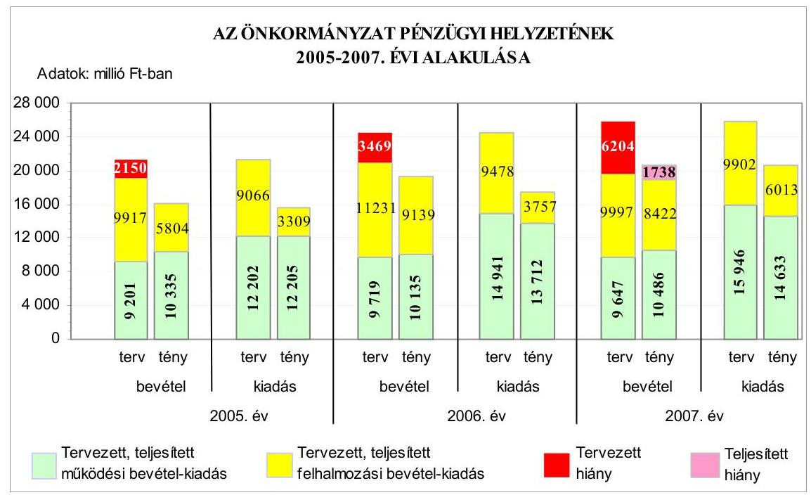
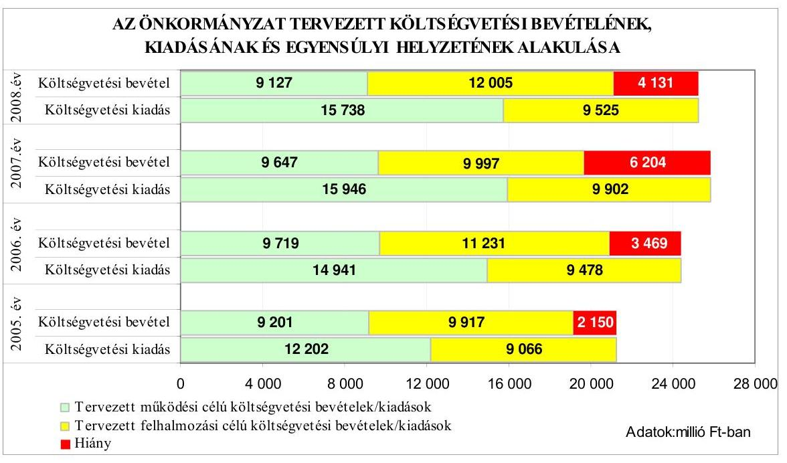
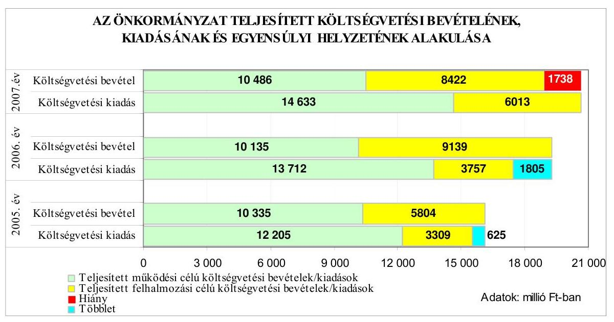
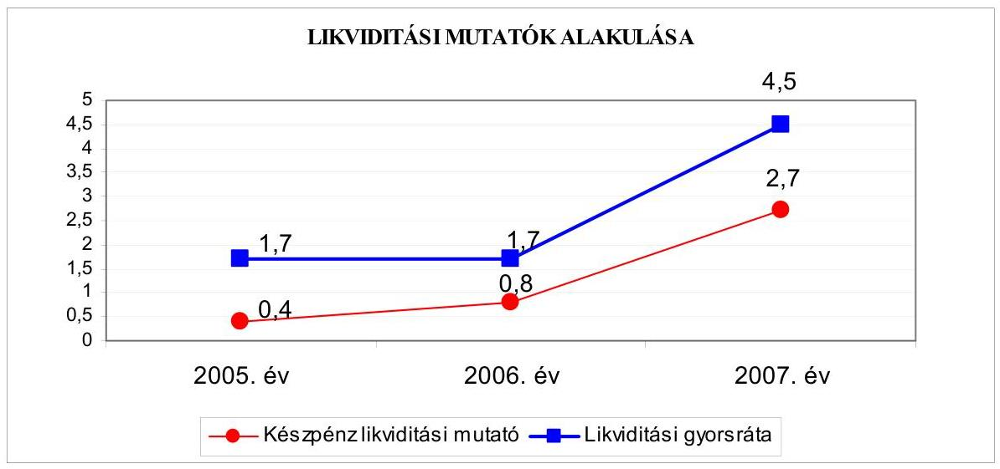
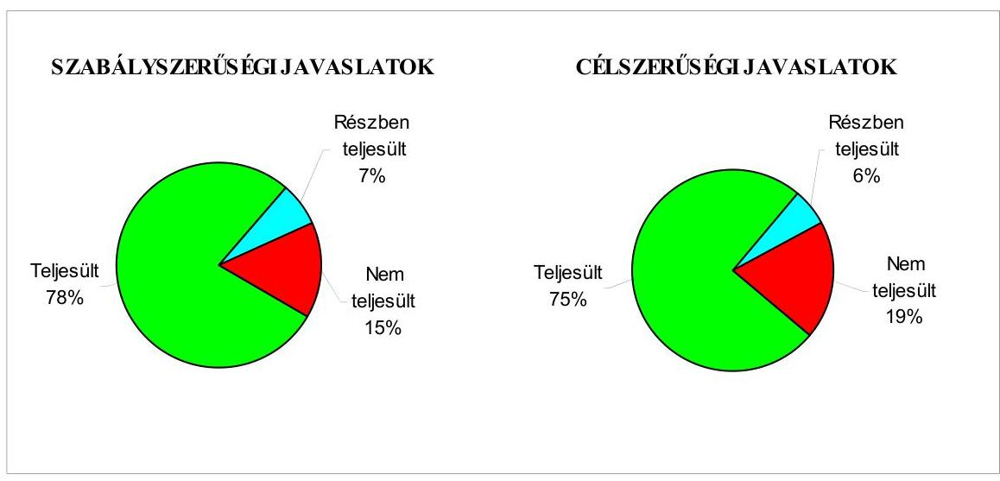
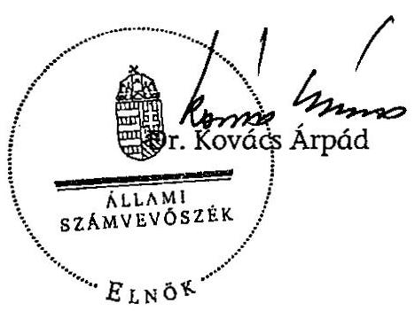
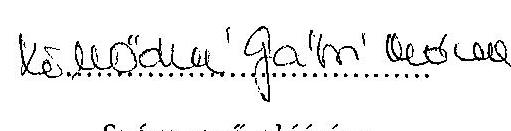
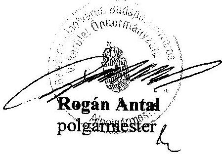
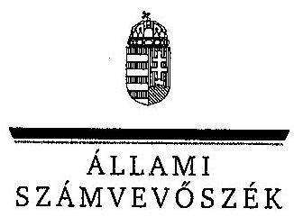
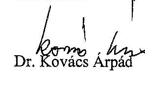

# ÁLLAMI   SZÁMVEVŐSZÉK 

## JELENTÉS

a Budapest Főváros V. kerület Belváros-Lipótváros Önkormányzata gazdálkodási rendszerének 2008. évi ellenőrzéséről

---

# 3. Önkormányzati és Területi Ellenőrzési Igazgatóság 

3.3. Átfogó Ellenőrzések Főcsoport

Iktatószám: V-3003-6/32/25/2008.
Témaszám: 898
Vizsgálat-azonosító szám: V0392

## Az ellenőrzést felügyelte:

Dr. Lóránt Zoltán
főigazgató
Az ellenőrzés végrehajtásáért felelős:
Dr. Sepsey Tamás
főigazgató-helyettes
Az ellenőrzést vezette:
Molnár Gyula Mihály
igazgató-helyettes
Az ellenőrzést végezték:
Dr. Karáné Kőszegi Zsuzsanna Köllődné Gátai Mária
tanácsadó
számvevő
Dr. Marosi Gyöngyi
Vojcsekné Szabó Ágnes
tanácsadó
számvevő tanácsos

## A témához kapcsolódó eddig készített számvevőszéki jelentések:

## címe

Jelentés Budapest Főváros V. kerület Belváros-Lipótváros Önkormányzata gazdálkodásának átfogó ellenőrzéséről
Jelentés a helyi és a helyi kisebbségi önkormányzatok gazdálkodásának átfogó ellenőrzéséről
Jelentés a Magyar Köztársaság 2005. évi költségvetése végrehajtásának ellenőrzéséről
Függelék:

- a helyi önkormányzatokat a 2005. évben megillető normatív állami hozzájárulás igénylésének és elszámolásának ellenőrzése
Jelentés a 2006. évi országgyűlési, valamint önkormányzati és 0722
nemzeti, etnikai kisebbségi képviselőválasztások lebonyolításához felhasznált pénzeszközök ellenőrzése

---

# TARTALOMJEGYZÉK 

BEVEZETÉS ..... 9
I. ÖSSZEGZŐ MEGÁLLAPÍTÁSOK, KÖVETKEZTETÉSEK, JAVASLATOK ..... 13
II. RÉSZLETES MEGÁLLAPÍTÁSOK ..... 21

1. Az Önkormányzat költségvetési és pénzügyi helyzete ..... 21
1.1. A tervezett és teljesített költségvetési bevételek és kiadások alapján a költségvetési és a pénzügyi egyensúly alakulása, valamint a költségvetési hiány megállapításának szabályszerűsége ..... 21
1.2. A költségvetési és a pénzügyi egyensúlyi helyzet kialakításához tervezett és teljesített finanszírozási célú pénzügyi műveletek módja és azok hatása a tárgyévet követő évek költségvetéseire ..... 23
1.3. A költségvetés tervezésének megalapozottsága ..... 29
2. Az Önkormányzat felkészültsége az európai uniós források igénylésére és felhasználására, valamint az elektronikus közigazgatási feladatok ellátására ..... 30
2.1. Az európai uniós források igénybevételére és a várható támogatás felhasználására történt felkészülés szabályozottsága, szervezettsége ..... 30
2.1.1. Az európai uniós forrásokra történő pályázatok benyújtására vonatkozó döntések összhangja a fejlesztési célkitűzésekkel ..... 30
2.1.2. Az európai uniós forrásokhoz kapcsolódóan a pályázatfigyelés, a pályázatkészítés, valamint az európai uniós támogatással megvalósuló fejlesztés lebonyolításának belső rendjének szabályozottsága, a végrehajtás személyi, szervezeti feltételei ..... 32
2.1.3. A fejlesztési feladat lebonyolításánál a feladatellátás rendjére, az ellenőrzési feladatok teljesítésére, valamint a felelősségi szabályokra vonatkozó előírások betartása ..... 33
2.2. Az elektronikus közigazgatási feladatok ellátása, a közérdekủ adatok elektronikus közzététele ..... 33
3. A költségvetési gazdálkodás belső kontrolljai ..... 36
3.1. A szabályozottság kockázata a költségvetés tervezési, gazdálkodási, beszámolási és a folyamatba épített, előzetes és utólagos vezetői ellenőrzési feladatoknál ..... 36
3.2. A belső kontrollok érvényesülése az önkormányzati források szabályszerű felhasználásában, a költségvetési tervezés, gazdálkodás, beszámolás folyamataiban ..... 38
3.3. A belső ellenőrzési kötelezettség teljesítése, javaslatainak hasznosulása ..... 40

---

4. Az ÁSZ korábbi ellenőrzési javaslatai alapján készített intézkedési terv végrehajtása, eredményessége ..... 45
4.1. Az Önkormányzat gazdálkodási rendszerének átfogó ellenőrzése során tett javaslatok végrehajtására tervezett intézkedések megvalósulása ..... 45
4.2. A zárszámadáshoz kapcsolódó (állami hozzájárulások, támogatások igénylésének és felhasználásának ellenőrzése), valamint a további vizsgálatok esetében a megállapítások, javaslatok alapján tett intézkedések ..... 51
MELLÉKLETEK
5. számú Az Önkormányzat gazdálkodását meghatározó adatok, mutatószámok (1 oldal)
6. számú Az önkormányzati vagyon alakulása (1 oldal)
7. számú Az Önkormányzat 2005-2007. évi költségvetési előirányzatainak és azok pénzügyi teljesítéseinek alakulása (1 oldal)
8. számú Tanúsítvány az európai uniós forrásokkal támogatott programok, célok tervezett és tényleges 2005-2008. évi adatairól (1 oldal)
9. számú Adatlap az Önkormányzat európai uniós forrással támogatott fejlesztéséről (2 oldal)
10. számú Rogán Antal úr, a Budapest Főváros V. kerület Belváros-Lipótváros Önkormányzata polgármestere által adott észrevétel (3 oldal)
11. számú Rogán Antal úrnak, a Budapest Főváros V. kerület Belváros-Lipótváros Önkormányzata polgármesterének észrevételére adott válaszlevél (1 oldal)

---

# RÖVIDÍTÉSEK JEGYZÉKE 

## Törvények

Áht.
Eisztv.

Htv.

Kbt.
Ket.

Ktv.
Ötv.
Számv. tv.

## Rendeletek

2005. évi költségvetési rendelet

2006. évi költségvetési rendelet

Ámr.
Ber.
18/2005. (XII. 27.) IHM rendelet

SzMSz $_{1}$

SzMSz $_{2}$

Vhr.

## Szórövidítések

Aranytíz Kereskedelmi és Szolgáltató Kft.
ÁROP
ÁSZ
BLIBER Kft.
Cigányzenekar Kht.
az államháztartásról szóló 1992. évi XXXVIII. törvény
az elektronikus információszabadságról szóló 2005. évi XC. törvény
a helyi önkormányzatok és szerveik, a köztársasági megbízottak, valamint egyes centrális alárendeltségű szervek feladat- és hatásköreiről szóló 1991. évi XX. törvény
a közbeszerzésekről szóló 2003. évi CXXIX. törvény
a közigazgatási hatósági eljárás és szolgáltatás általános szabályairól szóló 2004. évi CXL. törvény
a köztisztviselők jogállásáról szóló 1992. évi XXIII. törvény
a helyi önkormányzatokról szóló 1990. évi LXV. törvény
a számvitelről szóló 2000. évi C. törvény

Budapest Főváros V. kerület Belváros-Lipótváros Önkormányzatának 12/2005. (IV. 7.) számú rendelete az Önkormányzat 2006. évi költségvetésről
Budapest Főváros V. kerület Belváros-Lipótváros Önkormányzatának 10/2006. (III. 19.) számú rendelete az Önkormányzat 2005. évi költségvetésről
az államháztartás múködési rendjéről szóló 217/1998. (XII. 30.) Korm. rendelet
a költségvetési szervek belső ellenőrzéséről szóló 193/2003. (XI. 26.) Korm. rendelet
a közzétételi listákon szereplő adatok közzétételéhez szükséges közzétételi mintákról szóló 18/2005. (XII. 27.) IHM rendelet
Budapest Főváros V. kerület Belváros-Lipótváros Önkormányzatának 11/2006. (IV. 18.) számú rendelete az Önkormányzat Szervezeti és Múködési Szabályzatáról
Budapest Főváros V. kerület Belváros-Lipótváros Önkormányzatának 30/2007. (IX. 19.) számú rendelete az Önkormányzat Szervezeti és Múködési Szabályzatáról
az államháztartás szervezetei beszámolási és könyvvezetési kötelezettségének sajátosságairól szóló 249/2000.
(XII. 24.) Korm. rendelet

Aranytíz Kereskedelmi és Szolgáltató Korlátolt Felelősségű Társaság
ÚMFT Államreform Operatív Program
Állami Számvevőszék
Belváros-Lipótváros Beruházó Korlátolt Felelősségű Társaság
Belvárosi Cigányzenekar Közhasznú Társaság

---

EKOP
e-közigazgatás
FEUVE
GAMESZ
gazdálkodási jogkörök szabályzata
gazdasági program ${ }_{1}$
gazdasági program ${ }_{2}$

GVOP
HEFOP
hivatali SzMSz ${ }_{1}$
hivatali SzMSz ${ }_{2}$
informatikai stratégia
jegyzó
Kamarazenekar Kht.
Képviselő-testület

KMOP
Költségvetési csoport
Mélygarázs Beruházó és Üzemeltető Kft.
MFB ÖKIF Hitelprogram
Műsorszolgáltató Kft.
NFT

ÚMFT Elektronikus Közigazgatási Operatív Program elektronikus közigazgatás
folyamatba épített, előzetes és utólagos vezetői ellenőrzés
Budapest Főváros V. kerület Belváros-Lipótváros Önkormányzatának Gazdasági Műszaki Ellátó Szolgálata
Budapest Főváros V. kerület Belváros-Lipótváros Önkormányzat Polgármesteri hivatalának a kötelezettségvállalások és azok eljárási rendje szabályozásáról szóló 1/2004. számú együttes polgármesteri és jegyzői utasítás
Budapest Főváros V. kerület Belváros-Lipótváros Önkormányzat Képviselő-testületének 186/2004. (III. 11.) számú határozatával elfogadott korszerűsítési és kerületfejlesztési terv a 2004-2006. évekre
Budapest Főváros V. kerület Belváros-Lipótváros Önkormányzat Képviselő-testületének 202/2007. (IV. 12.) számú határozatával elfogadott gazdasági programja és a programhoz kapcsolódó 2007-2010. évekre szóló fejlesztési terv NFT Gazdasági Versenyképesség Operatív Program
NFT Humánerőforrás-fejlesztési Operatív Program
Budapest Főváros V. kerület Belváros-Lipótváros Önkormányzat 11/2006. (IV. 18.) számú rendeletével elfogadott $\mathrm{SzMSz}_{1}$-ének 7. számú melléklete: a Polgármesteri hivatal Ügyrendje
Budapest Főváros V. kerület Belváros-Lipótváros Önkormányzat 30/2007. (IX. 19.) számú rendeletével elfogadott $\mathrm{SzMSz}_{2}$-ének 8. számú melléklete: a Polgármesteri hivatal Ügyrendje
Budapest Főváros V. kerület Belváros-Lipótváros Önkormányzata Képviselő-testületének 401/2004. (V. 13.) számú határozatával elfogadott Középtávú Informatikai Stratégiája a 2004-2008. évekre
Budapest Főváros V. kerület Belváros-Lipótváros Önkormányzatának Jegyzője
Belvárosi Virtuózok Kamarazenekar Közhasznú Társaság
Budapest Főváros V. kerület Belváros-Lipótváros Önkormányzat Képviselő-testülete
Közép-Magyarországi Operatív Program
Polgármesteri hivatal Pénzügyi Osztályának Költségvetési és Számviteli Csoportja
Szent István tér Mélygarázs Beruházó és Üzemeltető Korlátolt Felelősségű Társaság
Magyar Fejlesztési Bank Rt. „Sikeres Magyarországért" Önkormányzati Infrastruktúrafejlesztési Hitelprogram
CITY Televíziós Músorszolgáltató Korlátolt Felelősségű Társaság
Nemzeti Fejlesztési Terv

---

| Önkormányzat | Budapest Főváros V. kerület Belváros-Lipótváros Önkormányzata |
| :--: | :--: |
| Pénzügyi bizottság | Budapest Főváros V. kerület Belváros-Lipótváros Önkormányzat Pénzügyi és Közbeszerzési Bizottsága |
| Pénzügyi Ellenőrző bizottság | Budapest Főváros V. kerület Belváros-Lipótváros Önkormányzat Pénzügyi Ellenőrző Bizottsága |
| Pénzügyi osztály | Budapest Főváros V. kerület Belváros-Lipótváros Önkormányzat Polgármesteri hivatalának Pénzügyi Osztálya |
| PM   polgármester | Pénzügyminisztérium   Budapest Főváros V. kerület Belváros-Lipótváros Önkormányzatának Polgármestere |
| Polgármesteri hivatal | Budapest Főváros V. kerület Belváros-Lipótváros Önkormányzat Polgármesteri hivatala |
| TILIANA Kht. | TILIANA Erdei Oktatási Központ és Szálloda Közhasznú Társaság |
| ÚMFT | Új Magyarország Fejlesztési Terv |
| Vagyonkezelő Zrt. | Belváros-Lipótváros Vagyonkezelő Zártkörú Részvénytársaság |
| Városüzemeltető Kft. | Belváros-Lipótváros Városüzemeltető Korlátolt Felelősségú Társaság |

---

.

---

# ÉRTELMEZŐ SZÓTÁR 

1. elektronikus szolgáltatási szint
2. elektronikus szolgáltatási szint
3. elektronikus szolgáltatási szint
4. elektronikus szolgáltatási szint
európai uniós források
fejlesztési feladat (projekt)
fejlesztési célkitúzés

Az 1044/2005. (V. 11.) Korm. határozat alapján olyan információs, tájékoztató szolgáltatás, amely csak általános információkat közöl az adott üggyel kapcsolatos teendőkről és a szükséges dokumentumokról.
Az 1044/2005. (V. 11.) Korm. határozat alapján olyan egyirányú kapcsolatot biztosító szolgáltatás, amely az 1. szinten túl biztosítja az adott ügy intézéséhez szükséges dokumentumok, nyomtatványok letöltését, és azok ellenőrzéssel, vagy ellenőrzés nélküli elektronikus kitöltését, amely esetben a dokumentumok benyújtása hagyományos úton történik.
Az 1044/2005. (V. 11.) Korm. határozat alapján olyan kétirányú kapcsolatot biztosító szolgáltatás, amely közvetlen, vagy ellenőrzött kitöltésű dokumentum segítségével biztosítja az elektronikus adatbevitelt és a bevitt adatok ellenőrzését. Az ügy indításához, intézéséhez személyes megjelenés nem szükséges, de az ügyhöz kapcsolódó közigazgatási döntés (határozat, egyéb aktus) közlése, valamint a kapcsolódó illeték-, vagy díffizetés hagyományos úton történik.
Az 1044/2005. (V. 11.) Korm. határozat alapján olyan teljes közvetlen kétirányú ügyintézési folyamatot biztosító szolgáltatás, amikor az ügyhöz kapcsolódó közigazgatási döntés is elektronikus úton kerül közlésre, illetve a kapcsolódó illeték-, vagy díffizetés elektronikus úton is intézhető.
Az elnyert európai uniós források lehívása a támogatott projekt megvalósítása érdekében, a fejlesztés lebonyolítása során felmerült kiadások finanszírozására.
A fejlesztési feladat (projekt) tartalmilag és formailag részletesen kidolgozott, megfelelő pénzügyi háttérrel és végrehajtási ütemezéssel rendelkező fejlesztési terv, amely illeszkedik az Európai Unió, illetve a Nemzeti Fejlesztési Terv által támogatott programokhoz.
Az önkormányzat által ellátott kötelező, vagy önként vállalt feladatok ellátásának mennyiségi, vagy minőségi fejlesztésére vonatkozó terv. A mennyiségi fejlesztés megvalósulhat beszerzéssel, létesítéssel, bővítéssel, átalakítással.

---

operatív program

Az Európai Bizottság által jóváhagyott, a Közösségi Támogatási Keret végrehajtására vonatkozó 2004-2006 közötti, több évre szóló intézkedésekhez kapcsolódó prioritások egységes rendszerét tartalmazó dokumentum. A strukturális alapok operatív programjai: Agrár és Vidékfejlesztési Operatív Program (AVOP); Gazdasági Versenyképesség Operatív Program (GVOP); Humánerőforrás-fejlesztési Operatív Program (HEFOP); Környezetvédelmi és Infras-truktúra-fejlesztési Operatív Program (KIOP); Regionális Fejlesztési Operatív Program (ROP). Az ÚMFT-hez kapcsolódó operatív programok: Gazdaságfejlesztési Operatív Program (GOP); Közlekedés Operatív Program (KÖZOP); Társadalmi Megújulás Operatív Program (TÁMOP); Társadalmi Infrastruktúra Operatív Program (TIOP); Környezet és Energia Operatív Program (KEOP); Államreform Operatív Program (ÁROP); Elektronikus Közigazgatás Operatív Program (EKOP); Nyugat-dunántúli Operatív Program (NYDOP); Dél-alföldi Operatív Program (DAOP); Észak-alföldi Operatív Program (ÉAOP); Középmagyarországi Operatív Program (KMOP); Északmagyarországi Operatív Program (ÉMOP); Középdunántúli Operatív Program (KDOP); Dél-dunántúli Operatív Program (DDOP).

---

# JELENTÉS 

## Budapest Főváros V. kerület BelvárosLipótváros Önkormányzata gazdálkodási rendszerének 2008. évi ellenőrzéséről

## BEVEZETÉS

Az Ötv. 92. § (1) bekezdése, az Állami Számvevőszékről szóló 1989. évi XXXVIII. törvény 2. § (3) bekezdése, valamint az Áht. 120/A. § (1) bekezdése alapján az önkormányzatok gazdálkodását az Állami Számvevőszék ellenőrzi. Az ellenőrzésre az Országgyúlés illetékes bizottságai részére is átadott, országosan egységes ellenőrzési program szerint került sor.

Az Állami Számvevőszék a stratégiájában foglalt célkitűzéseknek megfelelően a helyi önkormányzatok költségvetési gazdálkodási rendszere átfogó ellenőrzésének programját a 2007. évtől megújította, azt kiegészítette további - teljesít-mény-ellenőrzési - elemekkel.

## Az ellenőrzés célja annak értékelése volt, hogy az Önkormányzat:

- milyen módon biztosította a költségvetési és a pénzügyi egyensúlyt a költségvetésében és annak teljesítése során, valamint változott-e a finanszírozási célú pénzügyi műveletek jelentősége a hiányzó bevételi források pótlásában;
- eredményesen készült-e fel a szabályozottság és a szervezettség terén az európai uniós források igénylésére és felhasználására, továbbá biztosította-e az e-közigazgatás feltételeit, az adatok közzétételével a gazdálkodás nyilvánosságát;
- kialakította-e a külső és a belső feltételeknek megfelelően a költségvetés tervezési, gazdálkodási és zárszámadási feladatai belső kontrollrendszerét ${ }^{1}$, ezen tevékenységek szabályszerű ellátásához hozzájárult-e a folyamatba épített, előzetes és utólagos vezetői ellenőrzés, valamint a belső ellenőrzés;
- megfelelően hasznosították-e a korábbi számvevőszéki ellenőrzések megállapításait, szabályszerűségi ${ }^{2}$ és célszerűségi javaslatait.

[^0]
[^0]:    ${ }^{1}$ A gazdálkodás szabályszerűségét biztosító kontrollrendszer alatt értjük a kiépített és múködő belső irányítási és szabályozási rendszert, valamint a belső ellenőrzési funkciók ellátásának rendszerét.
    ${ }^{2}$ A törvényi előírások betartásának elmulasztásakor egységesen a törvénysértés megjelölést alkalmazzuk, mivel az ÁSZ nem tehet különbséget a törvényi előírások között.

---

Az ellenőrzés típusa: átfogó ellenőrzés, amely egyidejúleg - egy ellenőrzés keretében - meghatározott területekre összpontosítva érvényesíti a szabályszerűségi, valamint a teljesítmény-ellenőrzés jellemzőit.

Az ellenőrzött időszak: az 1., 2. programpontok tekintetében a 2005-2007. évek és 4. programpont tekintetében a 2004-2007. évek, a 3. ellenőrzési programpontnál a 2007. év.

Budapest Főváros V. kerület lakosainak száma 2008. január 1-jén 26899 fő volt. A 2006. évi önkormányzati választást követően az Önkormányzat 24 tagú Képviselő-testületének munkáját nyolc állandó bizottság segítette. A helyi önkormányzat mellett a 2006. évi önkormányzati választásokat követően 10 kisebbségi önkormányzat ${ }^{3}$ múködött. A polgármester a 2006. évi önkormányzati képviselő és polgármester választás óta, a jegyző 1999. évtől tölti be tisztségét.

Az Önkormányzat feladatainak végrehajtása érdekében a 2007. évben 18 költségvetési intézményt múködtetett, amelyekből három önállóan gazdálkodott. A feladatok ellátásában részt vett hat gazdasági társasága, három közhasznú társasága, továbbá kettő alapítványa. Az Önkormányzat a 2007. évi költségvetési beszámolója szerint 18908 millió Ft költségvetési bevételt ért el és 20646 millió Ft költségvetési kiadást teljesített, 2007. december 31-én a könyvviteli mérleg szerint 67461 millió Ft értékű vagyonnal rendelkezett. Az Önkormányzat vagyona a 2005. év végi állományhoz viszonyítva 8,2\%-kal emelkedett, ezen belül több mint háromszorosára nőtt a forgóeszközök állománya a követelések 63,5\%-os, a pénzeszközök közel tízszeres növekedése miatt, valamint több mint ötszörösére, 10977 millió Ft-ra nőtt a kötelezettségek állománya a 2007. évben kibocsátott 3145 millió Ft-os kötvény, illetve az összesen 3467 millió Ft fejlesztési hitel felvétel eredményeképpen. A 2007. évben az öszszes költségvetési bevétel $72 \%$-át a saját bevétel, illetve $12 \%$-át a helyi adó bevétel biztosította. Az összes költségvetési kiadásból a felhalmozási célú kiadás részaránya a 2007. évben 29\% volt. A 2008. évben 21132 millió Ft költségvetési bevételt és 25263 millió Ft költségvetési kiadást irányoztak elő. A Polgármesteri hivatalban dolgozó köztisztviselők száma 2007. december 31-én 233 fő, a költségvetési intézményekben foglalkoztatott közalkalmazottak száma 851 fő volt. Az Önkormányzat gazdálkodását meghatározó adatokat, mutatószámokat az 1-3. számú mellékletek tartalmazzák.

Az Önkormányzat költségvetési és pénzügyi helyzetét az elemző eljárás módszerével vizsgáltuk. E körben elemeztük a költségvetés egyensúlyi helyzetének alakulását, a tervezett és tényleges költségvetési hiány okait, a mérséklésére tett intézkedéseket, finanszírozásának módját, az Önkormányzat adósságállományának alakulását, összetevőit.

A teljesítmény-ellenőrzés módszerével vizsgáltuk, a belső szabályozottság, szervezettség terén az Önkormányzat felkészültségét az európai uniós források figyelésére, igénylésére és felhasználására, továbbá értékeltük, hogy az igényelt európai uniós támogatások az Önkormányzat által meghatározott fejlesztési célkitűzésekhez kapcsolódtak-e. Az eredményesség szempontjából a minősítést

[^0]
[^0]:    ${ }^{3}$ Bolgár, cigány, görög, horvát, lengyel, német, örmény, román, ruszin, szlovák.

---

a lényegességi szinthez való viszonyítással végeztük el. Az ellenőrzés során felmértük, hogy az e-közigazgatási feladat ellátása, illetve bevezetése, múködtetése érdekében milyen intézkedéseket tettek, valamint biztosították-e a közérdekű adatok közzétételét.

A költségvetési gazdálkodás belső kontrolljainak ellenőrzése során értékeltük, hogy a Polgármesteri hivatalnál a költségvetés tervezési, gazdálkodási, zárszámadás készítési feladatok belső kontrolljainak kiépítettsége és múködése megfelelő biztosítékot ad-e a gazdálkodási feladatok megfelelő, szabályszerű ellátására. Felmértük és minősítettük a költségvetés tervezési, a gazdálkodási, a zárszámadás készítési feladatokkal, továbbá a pénzügyi- számviteli területen az informatikával kapcsolatosan kialakított kontrollok megfelelőségét, valamint azok múködésének eredményességét, megbízhatóságát. Értékeltük a belső ellenőrzés szervezeti és szabályozási keretét, továbbá működését.

A Polgármesteri hivatalnál értékeltük a gazdálkodás folyamatában a kontrollok múködésének megbízhatóságát, ennek keretében ellenőriztük a szakmai teljesítés igazolására és az utalvány ellenjegyzésére kialakított kontrollok végrehajtását. Az ellenőrzést a következő, kiemelt kockázatuk alapján kiválasztott ${ }^{4}$ az általánostól jellemzően eltérő, egyedi eljárást igénylő gazdasági eseményekkel kapcsolatos kifizetésekre folytattuk le ${ }^{5}$ :

- a külső szolgáltató által végzett karbantartási, kisjavítási szolgáltatások,
- a gépek, berendezések, felszerelések beszerzése, továbbá
- a múködési célú pénzeszköz átadásokból az államháztartáson kívülre teljesített kifizetésekre.

Az ellenőrzés hatékony elvégzése céljából a vizsgálandó területek kiválasztása során a kockázatokon alapuló megközelítés érvényesült, ezáltal az ellenőrzési erőforrásokat azokra a területekre fókuszáltuk, amelyeken legnagyobb a hibák előfordulási valószínűsége. Az ellenőrzési erőforrások ilyen típusú összpontosításával minimálisra csökkenthető a kívánt ellenőrzési bizonyosság eléréséhez szükséges időráfordítás.

[^0]
[^0]:    ${ }^{4}$ Az önkormányzatok kiemelt előirányzataira vonatkozóan, a vertikális folyamatokra elvégeztük a kockázatok becslését, amelynek eredményeként a külső szolgáltató által végzett karbantartási, kisjavítási szolgáltatások, a gépek, berendezések, felszerelések beszerzése valamint a múködési célú pénzeszköz átadások államháztartáson kívülre teljesített kifizetései kiemelkedően kockázatos területeknek bizonyultak.
    ${ }^{5}$ A korábbi ellenőrzési tapasztalataink szerint ezeken a területeken a jegyzők nem, vagy hiányosan szabályozták a megbízás, megrendelés, illetve beszerzés indokoltságának, szükségességének elbírálására, igazolására, valamint a teljesítések dokumentálására, a kifizetések jogosságának megítélésére szolgáló kontrollokat. További kockázatot jelentett a külső szolgáltató által végzett karbantartási, kisjavítási munkák esetében, hogy az 50 ezer Ft alatti megrendelésekre vonatkozóan az ellenőrzési tapasztalataink szerint a jegyzők nem alakították ki a kötelezettségvállalások rendjét és nyilvántartási formáját, valamint a szabályozás elmulasztása esetén nem történt meg az írásbeli kötelezettségvállalás és annak az ellenjegyzése sem.

---

A pénzügyi-számviteli folyamatokban alkalmazott belső kontrollok létezésének és múködésének ellenőrzésére a vizsgált három terület 2007. évi könyvviteli tételeiből területenként egyszerű véletlen mintát vettünk. A kijelölt gazdasági eseményekre elvégzett megfelelőségi tesztek alapján értékeltük a kontrollok múködésének eredményességét, megbízhatóságát a vizsgált három területre külön-külön, majd összefoglalóan ${ }^{6}$ a Polgármesteri hivatal gazdasági eseményeire. A helyszíni ellenőrzés megállapításainak részletes dokumentálását három megfelelőségi tesztlapon, öt elővizsgálati és kilenc helyszíni ellenőrzési munkalapon biztosítottuk. Ezeken a teszt- és munkalapokon a minősítés alapjául szolgáló kérdések és a vonatkozó konkrét jogszabályhelyek megjelölése mellett értékeltük a kialakított belső kontrollokban rejlő kockázatokat ${ }^{7}$ és a kialakított kontrollok múködésének megbízhatóságát ${ }^{8}$.

Az ÁSZ korábbi ellenőrzési javaslatai alapján tett intézkedéseket, illetve azok megvalósítását utóellenőrzés keretében vizsgáltuk. A gazdálkodási rendszer átfogó ellenőrzése során megfogalmazott javaslatok végrehajtására tett intézkedések megvalósítását ellenőriztük, az egyéb számvevőszéki ellenőrzések során tett javaslatok esetében pedig a kiadott intézkedéseket tekintettük át.

A helyszíni ellenőrzés során kitöltött - az ellenőrzést végző számvevő és a Polgármesteri hivatal felelős köztisztviselője által aláírt - elővizsgálati és helyszíni ellenőrzési munkalapokat, azok kitöltési útmutatóit, továbbá a megfelelőségi tesztek dokumentumait a polgármester részére a számvevői jelentéssel egyidejűleg átadtuk.

A jelentést az ÁSZ-ról szóló 1989. évi XXXVIII. tv. 25. § (1) bekezdése alapján észrevétel közlése céljából megküldtük a Budapest Főváros V. kerület BelvárosLipótváros Önkormányzata polgármesterének. A kapott észrevételt és az arra adott válaszlevelet a jelentés 6 . és 7 . számú melléklete tartalmazza.
${ }^{6}$ A vizsgált három terület egyedi értékelési pontszámait a területek relatív költségvetési súlyával arányosan összegeztük.
${ }^{7}$ A kialakított belső kontrollokban rejlő kockázatot alacsonynak minősítettük, ha a kontrollok - végrehajtásuk esetén - megfelelő védelmet nyújtanak a hibák bekövetkezése ellen. Közepesnek minősítettük a belső kontrollokban rejlő kockázatot, amennyiben a kontrollok - végrehajtásuk esetén - a lehetséges hibák többsége ellen védelmet nyújtanak. Magasnak értékeltük a kockázatot, ha a kontrollok - kialakításuk hiányában, vagy hiányos kialakításuk miatt - nem nyújtanak elegendő védelmet a lehetséges hibákkal szemben.
${ }^{8}$ A kontrollok múködésének eredményességét, megbízhatóságát kiválónak értékeltük abban az esetben, ha azok múködése - esetleges apróbb hiányosságoktól eltekintve megfelelt a hibák megelőzésére és kijavítására meghatározott szabályozásnak és a legmagasabb szintű elvárásoknak. Jónak minősítettük a kontrollok múködését, ha a hiányosságok száma ugyan jelentős volt, de nem veszélyeztette az ellenőrzött terület hibáinak megelőzését és kijavítását. Amennyiben a hiányosságok mértéke nem biztosította a hibák megelőzését, feltárását, kijavítását és ezáltal veszélyeztette az eredményes, megbízható múködést, a kontroll múködésének megbízhatósága gyenge minősítést kapott.

---

# I. ÖSSZEGZŐ MEGÁLLAPÍTÁSOK, KÖVETKEZTETÉSEK, JAVASLATOK 

Az Önkormányzatnál a 2005-2008. évek között a tervezett és a teljesített költségvetési bevétel főösszege változó irányú volt, a 2005. évről a 2006. évre növekedett, a 2007. évre csökkent, majd a 2008. évre ismét növekedett. A tervezett és teljesített költségvetési kiadás a 2006. és a 2007. évben is növekedett az előző évhez képest, a 2008. évben a tervezett költségvetési kiadás csökkent. Az Önkormányzat költségvetésének egyensúlya a 2005-2008. években nem volt biztosított, mivel a költségvetési bevételek előirányzata nem fedezte a tervezett költségvetési kiadásokat. A teljesítési adatok alapján ugyanakkor az Önkormányzat a 2005. és a 2006. évben költségvetési többlettel, a 2007. évben költségvetési hiánnyal zárta az évet. A 2005-2006. évi költségvetési rendeletekben a költségvetés kiadási főösszegének megállapításakor az Áht. előírásai ellenére finanszírozási célú pénzügyi műveleteket (hitel visszafizetés) vettek figyelembe költségvetési hiányt módosító költségvetési kiadásként.

A 2005-2008. évek költségvetési hiányát a múködési célú költségvetési bevételeket meghaladó összegben tervezett múködési célú költségvetési kiadások okozták, azon belül is az Önkormányzat által önként vállalt feladatok tervezett kiadásaira az önként vállalt feladatok tervezett bevételei nem nyújtottak fedezetet. A felhalmozási célú költségvetési bevételek tervezett előirányzatai mind a négy évben meghaladták a felhalmozási célú költségvetési kiadási előirányzatokat. A Képviselő-testület a költségvetési egyensúlyt a 2005-2008. évi költségvetési rendeletek szerint hitel felvételével, illetve a 2008. évben kötvénykibocsátásból is tervezte biztosítani. A költségvetési rendeletek szerint felhalmozási kiadásokra tervezték felhasználni a költségvetési egyensúly megteremtése érdekében tervezett hitelfelvételből, illetve a kötvénykibocsátásból származó bevételt, valamint a 2006-2008. években a 2005. és 2006. években megkötött szerződések alapján a tárgyévben igénybe vehető fejlesztési hitelek összegét tervezték be hiányt csökkentő forrásként. Az Önkormányzat felhalmozási feladatok megvalósítására és felújítási célokra a 2005-2007. években hosszú lejáratú fejlesztési célú hiteleket vett fel. A hiteleket három éves törlesztési türelmi időt követően öt, illetve 12-12 év alatt kell visszafizetni, de a kamatfizetési kötelezettség mindhárom hitelszerződés alapján a folyósttás napjától fennállt és negyedévenként esedékes. A Képviselő-testület döntése szerint a 2007. évben felhalmozási feladatokra az eredetileg tervezett hitelfelvétel helyett év közben svájci frank alapú kötvényt bocsátottak ki, zártkörű forgalomba hozatallal, amelynek a futamideje 20 év, változó kamatozású, és négy év türelmi időt követően évente egyenlő részletekben kell törleszteni. A kötvény kibocsátási konstrukció szerint a felhasználásig betétként került elhelyezésre. A kiadások csökkentése érdekében a 2006. év közben két középfokú oktatási intézményt, amelyben önként vállalt feladatként gimnáziumi oktatás folyt, átadtak a Fővárosi Önkormányzatnak. Az Önkormányzat eladósodottsága a hitelfelvételek, illetve kötvénykibocsátás miatt a 2005. évről a 2007. évre nőtt, a fizetőképessége javult a kötvénykibocsátásból származó bevétel lekötése miatt.

---

Az Önkormányzatnál a 2005-2007. évben a költségvetési bevételi és kiadási főösszeg teljesítése elmaradt a tervezett eredeti előirányzattól, annak ellenére, hogy a múködési célú költségvetési bevételek mindhárom évben meghaladták az eredetileg tervezett előirányzatot. A felhalmozási célú költségvetési bevételek és kiadások teljesítése egyik évben sem érte el az eredetileg tervezett előirányzatot. A költségvetés tervezésének megalapozottságát tekintve a múködési célú költségvetési bevételeken belül a helyi adóbevételeknél és a kapott támogatásoknál kismértékű alultervezés volt, illetve az előző évi pénzmaradvány nem tervezett, de teljesített igénybevétele mérsékelte a költségvetési hiányt. A felhalmozási célú költségvetési bevételeken belül az eredeti előirányzathoz képest az ingatlanértékesítési, a vagyonhasznosítási bevételeknél, és a kapott támogatásoknál volt alulteljesítés. A pénzügyi befektetések bevételének tervezése nem volt megalapozott, mert a 2005. és 2006. években nem, illetve a 2007. évben alacsony mértékben teljesült az eredetileg előirányzott bevétel. A felhalmozási célú kiadásokon belül a tervezett díszburkolat kiépítések és intézmény felújítások maradtak el, illetve a következő évekre húzódtak át, ezért a 2005. évben a tervezett felhalmozási célú pénzeszközátadásnál, a 2006. évben a tervezett részesedés-vásárlásnál a tervezettnél alacsonyabb volt a teljesítés, valamint a 2007. évben a tartalékot nem használták fel.

Az Önkormányzat fejlesztési célkitűzéseit a gazdasági program ${ }_{1,2}$-ben és fejlesztési koncepciókban ${ }^{9}$ rögzítették, de a fejlesztési célkitűzések megalapozottságát helyzetelemzéssel nem támasztották alá. A 2005-2007. évekre vonatkozó fejlesztési célkitűzések megvalósításának lehetséges pénzügyi forrásaként a saját forráson túlmenően kormányzati, fővárosi és európai uniós pályázatokon elnyerhető támogatási összegeket határoztak meg. A Képviselő-testület az európai uniós forrásokkal összefüggő fejlesztési feladatról a gazdasági progra $\mathrm{m}_{2}$-ben és az integrált városfejlesztési stratégiában meghatározott fejlesztési célkitűzéssel egyezően egy esetben - 2007. év novemberében - döntött. Az Önkormányzat a „Budapest Szíve Program" megvalósítása keretében KMOP fejlesztési támogatás pályázatához az önerő biztosítására 1,5 milliárd Ft értékben vállalt kötelezettséget a 2008. évi költségvetés terhére. Az Önkormányzat a költségvetési rendeleteiben uniós pályázatok kiadásaira céltartalékot tervezett a hazai és az európai uniós pályázatok önrészére, illetve a pályázati előkészítő munkák kiadásaira. Az Önkormányzat nem készült fel eredményesen az európai uniós források igénybevételére és felhasználására a szabályozottság és a szervezettség terén, bár a gazdasági program ${ }_{2}$-ben meghatározott fejlesztési célkitűzéssel összhangban lévő európai uniós pályázat benyújtásáról és az ahhoz szükséges önerő biztosításáról egy esetben döntött. Az európai uniós forrásokkal összefüggésben azonban nem határozták meg a döntési jogköröket, nem szabályozták a pályázatfigyelést végző és a döntési, illetve a döntéselőterjesztési jogkörrel rendelkezők közötti információ szolgáltatás kötelezettségét, a polgármester és a fejlesztési feladat lebonyolítója közötti kapcsolattartás rendjét, nem írták elő a folyamatba épített, előzetes és utólagos vezetői ellenőrzési feladatokat. A pályázatkészítést végző gazdasági társaság és a pályázat benyújtásáért felelős személy közötti kapcsolattartás és felelősség szabályait

[^0]
[^0]:    ${ }^{9}$ A területfejlesztési stratégia, az intézményhálózat múködtetési és fejlesztési terve, a lakáskoncepció, az integrált városfejlesztési stratégia, a rövid távú városfejlesztési program.

---

nem rögzítették, az információk átadásának formáját, tartalmát és módját nem határozták meg. A fejlesztések lebonyolítási feladatainak szervezeti, személyi feltételeit a Polgármesteri hivatalon belül, vagy külső szervezet igénybevételével nem biztosították.

Az Önkormányzat rendelkezett a 2005-2007. évekre szóló informatikai stratégiával. Az informatikai stratégia a 2006. év végére a 2. elektronikus szolgáltatási szint, a 2008. év végére a 3. elektronikus szolgáltatási szint megvalósítását tűzte ki célul, az informatika fejlesztésére vonatkozó hosszú távú célkitűzéseket nem tartalmazta. Az Önkormányzat nem pályázott a 2005-2007. évek között GVOP, ÁROP, illetve EKOP támogatásra. Az Önkormányzatnál kialakították és múködtették az e-közigazgatási feladatokat ellátó informatikai rendszert. Az Önkormányzat honlapján az e-ügyintézés 2. elektronikus szolgáltatási szintjét valósították meg. Az Önkormányzat rendelete alapján a Polgármesteri hivatalnál a közigazgatási hatósági eljárások - elektronikus aláírást biztosító informatikai rendszer hiányában - elektronikus úton, a rendeletben felsorolt zajpanaszok, építési engedély alapján elvégzett építési munkák, üzlet nyitvatartási idejének bejelentése, valamint jogszabály rendelkezése alapján biztosított ügyintézés kivételével nem intézhetők.

Az Önkormányzat által nyújtott nem normatív céljellegú fejlesztési és múködési támogatásokra vonatkozó adatokat a jegyző az Áht. előírása ellenére nem tette közzé. A vagyonnal történő gazdálkodással összefüggő - nettó öt millió Ftot elérő, vagy azt meghaladó értékű - árubeszerzésre, építési beruházásra, szolgáltatás megrendelésre, vagyonértékelésre, vagyonhasznosításra, vagyon, illetve vagyonértékű jog átadására, valamint koncesszióba adására vonatkozó szerződések esetében az Áht. előírása ellenére az Önkormányzat által közzé tett adatok nem tartalmazták a határozott időre kötött szerződések időtartamát és a szerződéssel kapcsolatos adatok változásait, valamint a közzététel nem tartalmazott minden szerződést. Az adatokat az Önkormányzat honlapján nem a 18/2005. (XII. 27.) IHM rendeletben meghatározott szerkezetben tették közzé. Az Önkormányzat 2008. márciusában honlapján közzé tette az Áht. előírásának megfelelő tartalommal és teljes körűen az előírt közérdekű adatokat. Az Önkormányzat az Ámr. előírása ellenére az éves költségvetési beszámoló szöveges indoklását nem tette közzé. Az e-közigazgatási feladatokat ellátó informatikai rendszer ügyfelek általi igénybe vételét nem kísérték figyelemmel.

A költségvetés tervezési és a zárszámadás készítési folyamatok szabályozottsága alacsony kockázatot jelentett a feladatok megfelelő, szabályszerű végrehajtásában, mivel a jegyző a pénzügyi irányítási és ellenőrzési rendszer keretében szabályozta a költségvetés tervezés és a zárszámadás készítés rendjét, meghatározta az intézmények részére a költségvetési javaslat összeállításával kapcsolatos követelményeket. A költségvetés tervezési és a zárszámadás készítési folyamatban a múködésbeli hibák megelőzésére, kijavítására kialakított kontrollok múködésének megbízhatósága kiváló volt, mivel a Polgármesteri hivatalnál az előírásoknak megfelelően ellenőrizték a költségvetési javaslat összeállításával kapcsolatosan meghatározott követelmények érvényesülését, a költségvetési igények indokoltságát, teljesíthetőségét. A zárszámadás készítés folyamatában ellenőrizték az intézményi pénzmaradványok megállapításának szabályszerűségét, az eredeti és a módosított előirányzatok, valamint a teljesítési adatok eltérésének indokoltságát.

---

A gazdálkodási, a pénzügyi-számviteli és a folyamatba épített ellenőrzési feladatoknál a szabályozottság hiányosságai közepes kockázatot jelentettek a feladatok szabályszerű végrehajtásában, mivel bár a jegyző hiányosan szabályozta az ellenőrzési feladatokat, de a kialakított belső kontrollok végrehajtásuk esetén a lehetséges hibák többsége ellen védelmet nyújtottak. A jegyző nem szabályozta a gazdasági szervezet részletes feladatait, valamint a vezetők és a beosztottak feladat-, hatás- és jogkörét, a gazdálkodási jogkörök szabályzata mellékletében feltüntetett aláírás minták esetében nem biztosította az egyezőséget a polgármesteri és a jegyzői intézkedésekben foglaltakkal, a kötelezettségvállalás és az utalványozás ellenjegyzése, az érvényesítés feladata nem szerepelt minden felhatalmazott, kijelölt köztisztviselő munkaköri leírásában. Az 50 ezer Ft-ot el nem érő kifizetések esetében nem határozta meg a nyilvántartás formáját. A jegyző nem az Ámr. előírásának megfelelően szabályozta az ingatlanok leltározási kötelezettségének gyakoriságát, az egyszerűsített értékelési eljárás alkalmazását az adókövetelések értékelésénél, az értékelések ellenőrzéséért felelős munkaköröket, továbbá nem rögzítette az érintett dolgozók munkaköri leírásaiban az értékelési és az azzal kapcsolatos ellenőrzési feladatokat. A FEUVE rendszer részeként elkészített ellenőrzési nyomvonalban nem rögzítette az egyes tevékenységek, feladatok elvégzését igazoló dokumentumok nyilvántartási helyét. A jegyző nem készítette el a kockázatkezelésre és a szabálytalanságok kezelésére vonatkozó szabályozásokat.

A Polgármesteri hivatalnál a külső szolgáltató által végzett karbantartási, kisjavítási szolgáltatások, a gépek, berendezések és felszerelések beszerzésével, létesítésével kapcsolatos kifizetések, továbbá az államháztartáson kívülre teljesített múködési célú pénzeszközátadások során a belső kontrollok múködésének megbízhatósága összességében kiváló volt, mert a szerződésekben meghatározott cél teljesítésének, a kiadás jogosultságának, összegszerűségének ellenőrzését a szakmai teljesítés igazolására kijelölt személy a belső szabályzatban előírt módon igazolta. Az utalvány ellenjegyzője a gazdálkodásra vonatkozó szabályok érvényesüléséről, az érvényesítés és a szakmai teljesítésigazolás megtörténtéről meggyőződött.

A Polgármesteri hivatalban az informatikai rendszer szabályozottságának hiányosságai magas kockázatot jelentettek az informatikai feladatok biztonságos végrehajtásában, mivel nem szabályozták az informatikai eszközökhöz történő hozzáférést, a hozzáférések ellenőrzését, illetve a pénzügyi-számviteli számítógépes programrendszerben az adat-karbantartási folyamatot, nem gondoskodtak a pénzügy-számvitel területén dolgozók informatikával kapcsolatos szabályzatokkal való megismertetéséről, valamint a munkaköri leírásaik nem tartalmazták az informatikai feladatokat. Az informatikai rendszernek a múködésbeli hibák megelőzésére, feltárására, kijavítására kialakított kontrollok múködésének megbízhatósága gyenge volt, mert a pénzügy-számvitel által használt program nem érhető el hálózaton keresztül, a rögzítő személye és a rögzítés ideje nem állapítható meg, az évnyitással kapcsolatos feladatokat nem számítógépes programmal végzik, a törölt tételeket a program nem rögzíti. A gazdasági események rögzítését öt személy esetében a tranzakciót engedélyező személy hajtja végre, valamint a pénzügyi számviteli adatok feldolgozása nem napra kész, a számítógépen vezetett analitikus nyilvántartások és a főkönyvi könyvelés automatikus kapcsolatát a tárgyi eszközök nyilvántartása, az adó-

---

nyilvántartás és a kis értékű tárgyi eszközök nyilvántartása esetében nem biztosították.

A belső ellenőrzés szervezeti kereteinek kialakítása és szabályozásának hiányosságai közepes kockázatot jelentettek a feladatok megfelelő végrehajtásában, mivel bár hiányosan határozták meg a belső ellenőrzés ellátási módját, az Önkormányzat a hivatali $\mathrm{SzMSz}_{1}$-ben nem biztosította az Ellenőrzési Csoport függetlenségét, közvetlen jegyzői irányítását, azonban a kialakított szervezet szabályszerű működése esetén - a lehetséges hibák többsége ellen védelmet nyújtott. A belső ellenőrzési vezető a Ber-ben foglaltak ellenére nem készített kockázatelemzést a stratégiai-, valamint a 2007. és a 2008. évi ellenőrzési tervekhez. Az éves ellenőrzési tervek nem tartalmazták az ellenőrzések célját, az ellenőrizendő időszak megjelölését, a szükséges ellenőrzési kapacitás meghatározását és az ellenőrzések során alkalmazandó módszereket, a tervezés során nem határoztak meg ellenőri kapacitást a soron kívüli feladatokra. A céljelleggel nyújtott támogatások rendeltetés szerinti felhasználásának ellenőrzése kivételével a vizsgálatokat ellenőrzési program alapján végezték. A belső ellenőrzés ellátásának módját, a belső ellenőrzési kötelezettséget, az ellenőrzést végző szervezeti egység jogállását, feladatait a hivatali $\mathrm{SzMSz}_{1,2}$-ben előírták, amely 2008. februárjától tartalmazta az Ellenőrzési Csoport függetlenségét, közvetlen jegyzői irányítását.

A 2007. évben a belső ellenőrzés működésénél a kialakított kontrollok megbízhatósága összességében jó volt, mivel a jegyző gondoskodott a költségvetési szervek ellenőrzéséről, azonban a 2007. évi ellenőrzési tervben foglalt feladatoknak a $83 \%$-át hajtották végre, nem végeztek ellenőrzést az Önkormányzat többségi irányítást biztosító befolyása alatt működő gazdasági társaságoknál, közhasznú társaságoknál, a vagyonkezelőnél a rendelkezésre álló erőforrásokkal való gazdálkodásra, a vagyon megóvására és gyarapítására, valamint az elszámolások, beszámolók megbízhatóságára vonatkozóan, továbbá a közbeszerzések és a közbeszerzési eljárások esetében. A belső ellenőrzés nem vizsgálta és nem értékelte a pénzügyi irányítási és ellenőrzési rendszer múködésének gazdaságosságát, hatékonyságát és eredményességét. A 2007. évre tervezett 12 ellenőrzésből, kettő vizsgálat befejezése áthúzódott a 2008. évre. Terven felül a Polgármesteri hivatalban kettő, a költségvetési intézményekben egy ellenőrzést végeztek. A tervtől való elmaradás oka a soron kívüli vizsgálatok lehetőségének figyelmen kívül hagyása, a többlet feladatok kapacitás-igénye felmérésének elmaradása volt. Az elvégzett ellenőrzésekről a belső ellenőrök jelentést készítettek, amelyek kettő esetben nem tartalmazták a helyszíni ellenőrzés kezdetét és végét, az ellenőrzés célját és feladatait, az alkalmazott ellenőrzési módszereket és eljárásokat, valamint az ellenőrzött időszakban hivatalban lévő vezetők nevét, beosztását. A belső ellenőrök összesen 30 javaslatot tettek, amelyeknek több mint fele a szabályszerű működésre, több mint harmada a szabályozottságra, kettő pedig az erőforrások gazdaságos felhasználására irányult, amelyek realizálására intézkedési tervet készítettek. Az intézkedési tervek végrehajtásáról szóló beszámolók szerint a 2007. évben tett javaslatok közel fele hasznosult. A belső ellenőrzési vezető a Ber-ben foglalt előírásnak eleget téve elkészítette a 2007. évi ellenőrzési jelentést, értékelte a belső ellenőrzés tárgyi és személyi feltételeit, javaslatot tett a létszám bővítésére. A korábbi ÁSZ megállapítás ellenére a Polgármesteri hivatal ellenőrzésének rendszeressége a rendelkezésre álló ellenőri kapacitás nagyságrendje miatt - amely nem állt arányban az Önkor-

---

mányzat által ellátott feladatokkal - nem javult. A jegyző az Áht. előírása ellenére nem a 2006. évi költségvetési beszámoló keretében, hanem a 2006. évi zárszámadással egyidejűleg számolt be a FEUVE, valamint a belső ellenőrzés működtetéséről. A polgármester a 2006. évi zárszámadási rendelettel egyidejűleg, külön napirend pont keretében az Ötv. előírásainak megfelelően a Képviselö-testület elé terjesztette az éves összefoglaló jelentést, amelyet az elfogadott.

A 2003-2006. években az ÁSZ által végzett ellenőrzések során tett javaslatok összességében 77\%-ban hasznosultak. Az ÁSZ az Önkormányzat gazdálkodását átfogó jelleggel a 2003. évben ellenőrizte. Az átfogó ellenőrzéséről készített számvevői jelentés 30 szabályszerűségi és 14 célszerűségi javaslatot tartalmazott. A szabályszerűségi javaslatok megvalósulása céljából részletes intézkedési terv, a célszerűségi javaslatok megvalósulására jegyzői intézkedés készült határidő és felelősök megjelölésével. A számvevői jelentést a Képviselő-testület megtárgyalta és jóváhagyta, intézkedési terv készítését rendelte el, annak végrehajtásáról folyamatos tájékoztatást írt elő. Az intézkedési tervet a Képviselőtestületnek a polgármester tájékoztatásul bemutatta. A célszerűségi javaslatokra készített jegyzői intézkedést nem terjesztették a Képviselő-testület elé. A javaslatokból az intézkedési tervben és a jegyzői intézkedésben foglalt határidőkre $75 \%$ hasznosult, $9 \%$ részben hasznosult, $16 \%$ nem hasznosult, a szabályszerűségi javaslatok $77 \%$-a realizálódott, $10 \%$-a részben hasznosult, és $13 \%$-a nem teljesült, a célszerűségi javaslatok közül 10 realizálódott, egy részben valósult meg és három nem hasznosult. Az intézkedési tervben illetve a jegyzői utasításban foglalt határidőket követően a pénzügyi-számviteli feladatellátáshoz kapcsolódó szabályzatokat a javaslatok alapján részben a 2006. évben módosították. Nem számolták fel maradéktalanul a vagyongazdálkodáshoz és a vagyonnyilvántartáshoz kapcsolódó szabályszerűségi hiányosságokat, mert nem szabályozták a forgalomképesség szerinti besorolás megváltoztatásának módját az Önkormányzat tulajdonában álló vagyonnal való rendelkezés egyes szabályairól szóló önkormányzati rendeletekben, és ezek nem tartalmazták teljes körűen a vagyoncsoportokat. Az ingatlanvagyont érintően nem volt biztosított a főkönyvi könyvelés és az ingatlan kataszteri nyilvántartás közötti egyezőség. Nem szabályozta a jegyző a gazdasági eseményenként 50 ezer Ft-ot el nem érő kötelezettségvállalásokhoz kapcsolódó nyilvántartás formáját. A számlarendben nem szabályozták az analitikus nyilvántartások formáját, tartalmát és azok vezetésének módját, nem gondoskodtak a bizonylati rend kialakításáról és azzal a számlarend kiegészítéséről. A kisebbségi önkormányzatokkal nem kötötték meg a megállapodásokat. Az üzemeltetésre átadott eszközöket nem leltározták. Az informatikai szabályozottságra tett célszerűségi javaslat részben teljesült, mert nem szabályozták a hozzáférési jogosultsági rendszert, és nem dokumentálták az engedélyezési jogköröket. A javaslatok hasznosítása következtében javult az önkormányzati gazdálkodás színvonala a költségvetés, az előirányzat-nyilvántartás, a zárszámadás, a pénzmaradvány-elszámolás törvényessége, a céljellegú támogatások szabályszerűsége terén.

A 2005. évi zárszámadáshoz kapcsolódó ÁSZ ellenőrzés javaslatainak hasznosítása érdekében intézkedési tervet készítettek. A szabályszerűségi javaslatok közül a polgármester nem tett intézkedést a Váci utcai Ének-Zenei Általános Iskola Alapító Okiratának kiegészítésére az iskolaotthonos ellátás feladatával, a jegyző pedig arra, hogy a gyógypedagógiai ellátásban részesülő tanulók rendelkezzenek szakértői és rehabilitációs bizottsági szakvéleménnyel. A Képviselő-

---

testület jóváhagyta 2008. március hónapban az iskola Alapító Okiratának kiegészítését az iskolaotthonos ellátás feladatával, a Művelődési Osztály vezetője előírta a gyógypedagógia ellátásban részesülő tanulók egészségi állapotát igazoló szakvélemények felülvizsgálatát. A jegyző az ÁSZ által tett három szabályszerűségi javaslat hasznosítására intézkedést tett, gondoskodott a 2006. évi normatíva igénylés és elszámolás ellenőrzéséről, illetve arról, hogy az átmeneti elhelyezést nyújtó intézményben szerződés alapján biztosítsák az ellátást, az intézményi étkeztetésben résztvevőkről jogcímenként elkülönített nyilvántartást vezessenek. A 2006. évi országgyűlési, valamint önkormányzati és nemzeti, etnikai kisebbségi képviselő-választások lebonyolításához felhasznált pénzeszközök ellenőrzése kapcsán tett javaslatok hasznosítása érdekében készített intézkedési tervet a Képviselő-testület elfogadta. A hat szabályszerűségi javaslat realizálására a jegyző intézkedett, a 2006. évi költségvetési rendelet módosításával biztosította a választásokhoz kapcsolódóan az előirányzati számlák megnyitását, a saját hatáskörben végrehajtott előirányzat módosítások Képviselő-testület részére történő bemutatását, utasításban szabályozta a választások pénzügyi lebonyolításának rendjét, kijelölte a gazdálkodási jogkörgyakorlást és annak ellenőrzését végző személyeket, valamint elrendelte, hogy az ellenőrzési jogkörgyakorlók teljesítsék feladataikat.

A helyszíni ellenőrzés megállapításainak hasznosítása mellett javasoljuk:

# a polgármesternek 

a munka színvonalának javítása érdekében

1. kezdeményezze, hogy a jelentésben foglaltakat a Képviselő-testület tárgyalja meg és a feltárt hiányosságok megszüntetése érdekében készíttessen intézkedési tervet a határidők és felelősök megjelölésével;

## a jegyzőnek

a jogszabályi előírások maradéktalan betartása érdekében

1. a gazdálkodási, a pénzügyi-számviteli és a folyamatba épített ellenőrzési feladatok szabályszerű végrehajtási feltételeinek kialakítása érdekében:
a) kezdeményezze a 1/2007. számú együttes polgármesteri és jegyzői utasítás aláírás mintákat tartalmazó mellékletének módosítását a 2/2006. és 3/2006. számú polgármesteri intézkedésnek, valamint a 13/2006. számú jegyzői intézkedésnek megfelelően, gondoskodjon arról, hogy a munkaköri leírásokban rögzítsék a kötelezettségvállalás és az utalványozás ellenjegyzése, valamint az érvényesítés feladatait;
b) határozza meg az értékelési szabályzatban, hogy alkalmazzák-e a Vhr. 31/A. § (1) bekezdésben foglalt lehetőség alapján az egyszerűsített értékelési eljárást az adó követelések értékelése során, gondoskodjon arról, hogy a munkaköri leírásokban rögzítsék az értékelési és annak ellenőrzési feladatát;
2. belső ellenőrzés szabályszerű kereteinek kialakítása érdekében:

---

a) gondoskodjon arról, hogy a belső ellenőrzési vezető a Ber. 18. §-ában foglalt előírásnak megfelelően készítsen kockázatelemzést a stratégiai és az éves ellenőrzési tervek készítéséhez, az éves ellenőrzési terv a Ber. 21. § (3) bekezdés c)-f) pontjaiban foglaltak szerint tartalmazza az ellenőrzések célját, az ellenőrizendő időszakot, a szükséges ellenőrzési kapacitás meghatározását, az ellenőrzések módszereit, továbbá a tervezés során a Ber. 21. § (4) bekezdésében foglaltaknak megfelelően biztosítson ellenőri kapacitást a soron kívüli ellenőrzésekre;
b) gondoskodjon arról, hogy a belső ellenőrzés vizsgálja és értékelje a pénzügyi irányítási és ellenőrzési rendszerek múködésének gazdaságosságát, hatékonyságát és eredményességét a Ber. 8. § b) pontjában foglalt előírás érvényesülése érdekében;
c) gondoskodjon, hogy a belső ellenőrzés vizsgálja az Önkormányzat többségi irányítást biztosító befolyása alatt múködő gazdasági társaságoknál, közhasznú társaságoknál, a vagyonkezelőnél a rendelkezésre álló erőforrásokkal való gazdálkodást, a vagyon megóvását, gyarapítását, az elszámolások, beszámolók megbízhatóságát a Ber. 8. §. c) pontjának előírásai alapján;
d) gondoskodjon arról, hogy az elvégzett ellenőrzésekről készített jelentések a Ber. 27. § (2) bekezdése f)-h) és k) pontjaiban foglaltak szerint tartalmazzák a helyszíni ellenőrzés kezdetét és végét, az ellenőrzés célját és feladatait, az alkalmazott ellenőrzési módszereket és eljárásokat, az ellenőrzött időszakban hivatalban lévő vezetők nevét, beosztását;
e) tegyen eleget az Áht. 97. § (2) bekezdésében foglalt előírásnak, az éves költségvetési beszámoló keretében számoljon be a FEUVE, valamint a belső ellenőrzés múködtetéséről;
a munka színvonalának javítása érdekében
3. gondoskodjon arról, hogy az informatikai stratégia tartalmazzon hosszú távú célkitűzéseket is;
4. gondoskodjon az informatikai rendszer szabályozása keretében az informatikai eszközökhöz történő hozzáférésről, azok ellenőrzéséről, a pénzügyi-számviteli programrendszerben az adat-karbantartási folyamat leírásáról, a pénzügy-számvitel területén dolgozók munkaköri leírásainak informatikai feladatokkal történő kiegészítéséről;
5. gondoskodjon az informatikai rendszer múködtetése keretében a pénzügy-számvitel területén használt programok hálózaton keresztüli elérhetőségéről, a pénzügyiszámviteli feladatok informatikai rendszerrel történő segítéséről, a biztonságos, dokumentált múködés feltételeinek kialakításáról;
6. a belső ellenőrzés célszerű működése érdekében:
a) intézkedjen, hogy kockázatelemzés alapján a Polgármesteri hivatalban és az intézményeknél a belső ellenőrzés keretében ellenőrizzék a közbeszerzéseket, illetve a közbeszerzési eljárásokat;
b) kísérje fokozott figyelemmel a belső ellenőrzési javaslatok hasznosulását.

---

# II. RÉSZLETES MEGÁLLAPÍTÁSOK 

## 1. Az ÖNKORMÁNYZAT KÖLTSÉGVETÉSI ÉS PÉNZÜGYI HELYZETE

### 1.1. A tervezett és teljesített költségvetési bevételek és kiadások alapján a költségvetési és a pénzügyi egyensúly alakulása, valamint a költségvetési hiány megállapításának szabályszerűsége

Az Önkormányzatnál a tervezett költségvetési bevétel főösszege az előző évekhez viszonyítva ellentétes irányokban változott, a 2005. évről a 2006. évre 1832 millió Ft-tal növekedett, a 2007. évre 1306 millió Ft-tal csökkent, majd a 2008. évre 1488 millió Ft-tal növekedett. A teljesített költségvetési bevétel főösszegének változása a tervezettel azonos irányú volt, a 2006. évre 3135 millió Ft-tal növekedett, a 2007. évre 366 millió Ft-tal csökkent. A tervezett költségvetési kiadás főösszege a 2006. és a 2007. években 3151 millió Ft-tal, illetve 1429 millió Ft-tal növekedett az előző évhez képest, a 2008. évben viszont csökkent, 585 millió Ft-tal kevesebb kiadást terveztek. A teljesített költségvetési kiadás évről évre növekedett, a 2005. évről a 2006. évre 1955 millió Ft-tal, a 2007. évre 3177 millió Ft-tal.

Az Önkormányzat költségvetésének egyensúlya a 2005-2008. években nem volt biztosított, mivel a költségvetési bevételek előirányzata nem fedezte a tervezett költségvetési kiadásokat. A teljesítési adatok alapján ugyanakkor az Önkormányzat a 2005. és a 2006. évben költségvetési többlettel, a 2007. évben költségvetési hiánnyal zárta az évet. A tervezett költségvetési hiány részaránya az összes költségvetési kiadáshoz viszonyítva a 2005. évről a 2007. évre növekedett, 4,1 illetve 9,8 százalékponttal ( $10,1 \%$-ról $14,2 \%$-ra, illetve $24,0 \%$-ra), míg a 2008. évben ez előző évhez képest 7,6 százalékponttal csökkent ( $16,4 \%$-ra). A teljesítés során a 2007. évben a pénzügyi hiány részaránya az összes költségvetési kiadáshoz viszonyítva $8,4 \%$ volt.

A 2005-2007. években tervezett és teljesített múködési, illetve felhalmozási célú költségvetési bevételeket és kiadásokat, azok egyenlegeként a kialakult hiány, illetve többlet összegét, valamint a finanszírozási célú pénzügyi műveletek bevételeit és kiadásait a jelentés 3 . számú melléklete részletezi.

---

A 2005-2008. években a tervezett költségvetési bevételekből a működési célú költségvetési bevételek 48,1-46,4-49,1-43,2\%-os részarányt tettek ki. A tervezett költségvetési kiadásokból a működési célú költségvetési kiadások 57,4-61,2-61,7-62,3\%-os részt képviseltek. A 2005-2007. években a realizált költségvetési bevételekből a működési célú költségvetési bevételek 64,0-52,6-55,5\%-os részarányt tettek ki. A ténylegesen teljesített költségvetési kiadásokból a működési célú költségvetési kiadások 78,7-78,5-70,9\%-os részt képviseltek.

A 2005-2008. években a tervezett költségvetési és a tényleges pénzügyi hiány részarányát a működési és felhalmozási célú, valamint az összes költségvetési kiadáshoz viszonyítottan szemlélteti a következő táblázat:

| Megnevezés | A hiány részaránya \%-ban |  |  |  |  |  |  |
| :--: | :--: | :--: | :--: | :--: | :--: | :--: | :--: |
|  | 2005.   évben |  | 2006.   évben |  | 2007.   évben |  | 2008.   évben |
|  | Terv | Tény | Terv | Tény | Terv | Tény | Terv |
| Múködési célú költségvetési bevételek hiányának aránya a múködési célú költségvetési kiadásokhoz viszonyítva | 24,6 | 15,3 | 35,0 | 26,1 | 39,5 | 28,3 | 42,0 |
| Felhalmozási célú költségvetési bevételek hiányának aránya a felhalmozási célú költségvetési kiadásokhoz viszonyítva | - | - | - | - | - | - | - |
| A költségvetési hiány részaránya a költségvetési kiadásokhoz viszonyítva | 10,1 | - | 14,2 | - | 24,0 | 8,4 | 16,4 |

---

A 2005-2006. évi költségvetési rendeletekben a kiadási főösszegének megállapításakor ${ }^{10}$ finanszírozási célú pénzügyi műveleteket (hitelek visszafizetését) vettek figyelembe költségvetési hiányt módosító költségvetési kiadásként, megsértve az Áht. 8/A. § (7) bekezdésében előírtakat ${ }^{11}$. A 2007. és 2008. években nem volt hitel visszafizetési kötelezettsége az Önkormányzatnak, és annak idő előtti visszafizetését sem tervezték.

# 1.2. A költségvetési és a pénzügyi egyensúlyi helyzet kialakításához tervezett és teljesített finanszírozási célú pénzügyi műveletek módja és azok hatása a tárgyévet követő évek költségvetéseire 

Az Önkormányzatnál a 2005-2008. években tervezett és a 2005-2007. években teljesített múködési és felhalmozási célú költségvetési kiadásokra a következő arányban biztosítottak fedezetet a költségvetési bevételek:

Adatok: \%-ban

| Megnevezés | 2005.   év |  | 2006.   év |  | 2007.   év |  | 2008.   év |
| :--: | :--: | :--: | :--: | :--: | :--: | :--: | :--: |
|  | Terv | Tény | Terv | Tény | Terv | Tény | Terv |
| Múködési célú költségvetési kiadások fedezettsége múködési célú költségvetési bevételekből | 75,4 | 84,7 | 65,0 | 73,9 | 60,5 | 71,7 | 58,0 |
| Felhalmozási célú költségvetési kiadások fedezettsége felhalmozási célú költségvetési bevételekből | 109,4 | 175,4 | 118,5 | 243,3 | 101,0 | 140,1 | 126,0 |
| Költségvetési kiadások fedezettsége költségvetési bevételekből | 89,9 | 104,0 | 85,8 | 110,3 | 76,0 | 91,6 | 83,6 |

Az Önkormányzatnál a tervezett költségvetési bevételek a 2005-2008. években nem biztosítottak fedezetet a költségvetési kiadásokra, mert a költségvetési kiadások fedezettsége a költségvetési bevételekből a 2005. évben $89,9 \%$, a 2006. évben $85,8 \%$, a 2007. évben $76,0 \%$ és a 2008. évben $83,6 \%$ volt.

[^0]
[^0]:    ${ }^{10}$ A költségvetési kiadások között a 2005. évi költségvetési rendeletben 50 millió Ft múködési célú hitel visszafizetést, és 300 millió Ft felhalmozási célú hitel visszafizetést, a 2006. évi költségvetési rendeletben 300 millió Ft felhalmozási célú hitel visszafizetést vették figyelembe.
    ${ }^{11}$ A közbenső egyeztetés során a polgármester által adott tájékoztatás szerint az Önkormányzat a 24/2008. (VI. 13.) számú rendeletével módosította a 2008. évi költségvetésről szóló 7/2008. (II. 20.) számú rendeletét, melynek 1. § (1) bekezdésében meghatározott költségvetési kiadási főösszeg nem tartalmaz finanszírozási célú kiadást.

---

A 2005-2008. évek költségvetési hiányát a múködési célú költségvetési bevételeket meghaladó összegben tervezett múködési célú költségvetési kiadások okozták. A felhalmozási célú költségvetési bevételek tervezett előirányzatai mind a négy évben fedezték a felhalmozási célú költségvetési kiadási előirányzatokat.

A teljesítési adatok alapján a 2005-2006. években a költségvetési bevételek 104,0\%-ban, illetve 110,3\%-ban nyújtottak fedezetet a költségvetési kiadásokra. A 2007. évben a költségvetési kiadások fedezettsége 91,6\% volt. A felhalmozási célú költségvetési bevételek mindhárom évben fedezetet biztosítottak az azonos célú kiadásokra, ellenben a múködési célú költségvetési bevételek egyik évben sem haladták meg a múködési célú kiadásokat.

Az Önkormányzat tervezett egyensúlyi helyzete a 2005. és 2007. évek között romlott, mivel a kiadások nagyobb arányban nőttek, mint a bevételek. A 2008. évben a tervezett egyensúlyi helyzet a 2007. évhez viszonyítva javult, a hiány aránya 7,6 százalékponttal csökkent. A 2005. és 2006. évek teljesítési adatai nem tükrözték a tervezett romló költségvetési egyensúlyi helyzetet, mivel év végére a költségvetési bevételek meghaladták a költségvetési kiadásokat. A 2007. év végén azonban a költségvetési bevételek már nem nyújtottak fedezetet a költségvetési kiadásokra.

A tervezett költségvetési kiadásokon belül a 2005-2008. években a múködési célú költségvetési kiadásoknál volt forráshiány, a felhalmozási célú költségvetési részt érintően a felhalmozási célú költségvetési többletbevétel volt jellemző minden évben. A költségvetés hiányát a tervezett múködési célú költségvetési bevételeket meghaladó múködési célú költségvetési kiadások okozták, amelyen belül meghatározó volt az, hogy az Önkormányzat által önként vállalt feladatok tervezett kiadásai meghaladták az önként vállalt feladatok tervezett bevételeit.

---

A Képviselő-testület a költségvetési egyensúlyt a 2005-2007. évi költségvetési rendeletek szerint hitel felvételével tervezte biztosítani, de nem határozták meg, hogy milyen lejárattal - rövid vagy hosszú - veszik igénybe a hitelt, valamint a 2008. évben kötvény kibocsátását határozták el. A 2005-2008. évi költségvetési rendeletek szerint - annak ellenére, hogy a múködési célú költségvetési kiadások haladták meg a múködési célú költségvetési bevételeket - a felhalmozási célú kiadások finanszírozására terveztek hitelt, illetve a kötvénykibocsátásból származó bevételt.

A költségvetési rendeletek szerint a tervezett költségvetési hiány egy részét a 20062008. években a tárgyévet megelőzően kötött szerződések alapján a tárgyévben felvehető fejlesztési hitelek fedezték. A Képviselő-testület a költségvetési rendeletekben a polgármester számára felhatalmazást adott a 2005. évben a hiány teljes összegére, a 2006-2007. években pedig az előző években kötött szerződések szerint felvehető hitelen felül még hiányzó forrás biztosítása érdekében fejlesztési célra felhasználható - és nem múködési hiányt finanszírozó - hitel felvételére vonatkozó szerződések aláírására, illetve a 2008. évben fejlesztési célra történő kötvénykibocsátással kapcsolatos tárgyalások lefolytatására.

A költségvetési rendeletekben nem határoztak meg kiadási megtakarítást eredményező intézkedéseket, illetve nem írták elő azt, hogy az év közben keletkező többletbevételt hiány csökkentésére kell felhasználni.

A teljesített költségvetési kiadásokon belül a 2005-2007. években a múködési célú költségvetési kiadásoknál forráshiány volt, annak ellenére, hogy a múködési célú költségvetési bevételek a tervezettet meghaladóan - 112,3\%-104,3\%$108,7 \%$-ra - teljesültek. A múködési célú költségvetési többletbevétel mindhárom évben mérsékelte a múködési célú költségvetési kiadások tervezett hiányát. A teljesített felhalmozási célú költségvetési bevételek mindhárom évben meghaladták a teljesített felhalmozási célú költségvetési kiadásokat. A keletkezett felhalmozási célú költségvetési bevételek többlete fedezetet nyújtott a 20052006. években a múködési célú költségvetési kiadásoknak a múködési célú bevétellel nem fedezett részére, illetve a 2007. évben a múködési célú költségvetési bevétellel nem fedezett múködési célú költségvetési kiadások 70\%-ára. A teljesí-

---

tett felhalmozási célú költségvetési bevételek 58,7-61,7-43,8\%-a tárgyi eszközök értékesítéséből származott, amely az Önkormányzat vagyonának a felélését jelzi.

A múködési célú költségvetési kiadásoknál a forráshiány kialakulásában az önként vállalt feladatok (középfokú oktatás, támogatások, vagyongazdálkodási feladatok, járóbeteg-szakellátás, szociális és gyermekjóléti feladatok) mértéke volt a meghatározó. A múködési célú költségvetési kiadásokon belül az önként vállalt feladatok tervezett kiadásának aránya 46,7-40,3\%-a közötti, illetve tényleges kiadásának aránya 39,7-44,1\% közötti volt. Az önként vállalt feladatok tervezett kiadásaira az önként vállalt feladatok tervezett bevételei a 2005. évi $50 \%$-ról a 2008. évi $20 \%$-ra, és a teljesítési adatok szerint pedig a 2005. évi $60 \%$-ról a 2007. évi $50 \%$-ra csökkenő mértékben nyújtottak fedezetet. Az önként vállalt feladatok tervezett hiánya a múködési célú költségvetési bevétellel nem fedezett múködési célú költségvetési kiadásoknak a 88,1-68,0-63,1-78,6\%át tette ki, az önként vállat feladatok teljesített bevételeit meghaladó kiadásai pedig a múködési célú költségvetési bevétellel nem fedezett múködési célú költségvetési kiadások $96,6 \%, 74,8 \%, 77,5 \%$-át tette ki.

A 2005-2007. években annak ellenére, hogy a teljesítésnél is múködési célú költségvetési bevételt meghaladó volt a múködési célú költségvetési kiadás, a 2005-2007. években felvett hitel, illetve a 2007. évben kibocsátott kötvényből származó bevétel felhalmozási célú költségvetési kiadásokat finanszírozott. Hitelfelvételből a 2005. évben 637 millió $\mathrm{Ft}^{12}$, a 2006. évben 919 millió Ft, a 2007. évben 1994 millió Ft bevétele volt az Önkormányzatnak. A felhalmozási célú (hosszú lejáratú) hitelek állománya a december 31-i állapotok szerint 2005. évben 854 millió Ft, a 2006. évben 1473 millió Ft, és a 2007. évben 3467 millió Ft volt. Kötvénykibocsátásból a 2007. évben 3054 millió Ft finanszírozási célú bevétele volt az Önkormányzatnak. A kiadások csökkentése érdekében 2006. július 1-től kettő gimnáziumot - a gimnáziumi feladatokat és a feladat ellátását szolgáló ingó és ingatlan vagyont - adtak át a Fővárosi Önkormányzatnak. A bevételek növelése érdekében intézkedtek a helyiség-bérleti díjak emelésére.

Az Önkormányzat a 2005. évben a 2003. évben város-rehabilitációra kötött hitel 2005. évre áthúzódó 83 millió Ft maradványát vette igénybe, amely hitelt folyamatosan törlesztve a 2006. évben fizette vissza. A 2005. évben 2500 millió Ft keretösszegre kötött hitelszerződést 15 felhalmozási feladat (beruházási és felújítási) finanszírozása érdekében.

A hitelszerződés szerint a hitelt a 2010. évtől kell törleszteni és öt év alatt (2015ig) kell visszafizetni. A hitelszerződés alapján a 2005. évben 554 millió Ft-ot a 2006. év októberig 467 millió Ft-ot és a 2007. évben 853 millió Ft-ot vettek fel.

A 2006. évben kötött hitelkeret szerződés alapján kettő kölcsönszerződést kötöttek, az MFB ÖKIF Hitelprogram szerinti célra és célhitelre. Az MFB ÖKIF Hitelprogram keretében az Önkormányzatnak 1453 millió Ft összegű kedvezményes kamatozású, hosszú lejáratú hitel felvételre volt lehetősége azon beruházások-

[^0]
[^0]:    ${ }^{12}$ Az összegből 83 millió Ft a 2003. évben kötött hitelszerződés alapján a célhitelmaradvány volt.

---

hoz, melyekhez a költségvetési rendeletében a saját forráson túlmenően hitelfelvételt tervezett. Ezen Hitelprogram alapján a közterületi díszburkolatok kialakításához, város rehabilitációs feladatokhoz és intézmény felújításokhoz a 2006. évben októberig 149 millió Ft, azt követően 137 millió Ft, a 2007. évben 814 millió Ft hitelt vett fel az Önkormányzat. A célhitelre vonatkozó keretszerződés 669 millió Ft összegű hitel felvételi lehetőségét tartalmazta. A célhitelt az MFB ÖKIF Hitelprogram keretében megvalósuló beruházásokhoz szükséges önerő biztosítására, valamint a költségvetésben meghatározott egyéb (intézmény felújítási, lakásgazdálkodási, társasházak támogatása) feladatok finanszírozására tervezte az Önkormányzat. A célhitel keretből a 2006. évben októberig 138 millió Ft-ot, azt követően 28 millió Ft-ot, a 2007. évben 327 millió Ft-ot vettek fel. Mind az MFB ÖKIF Hitelprogram keretében felvett hitel, mind pedig a célhitel (2123 millió Ft) esetében a szerződéskötés napjától számított három éves türelmi időt tartalmazott a szerződés a tőke visszafizetésére - melynek kezdő időpontja 2009. június 5. - vonatkozóan. Mindkét hitelt 15 éves lejáratra vette fel az Önkormányzat, az utolsó törlesztés 2021-ben esedékes.

Az évközi likviditási gondok megoldása céljából a Képviselő-testület a 20052008. évi költségvetési rendeletekben folyószámlahitel felvételét engedélyezte a polgármester számára.

A 2005-2008. években a folyószámlahitellel kapcsolatos jellemzőket mutatja be a következő táblázat:

| Megnevezés | 2005.   évben | 2006.   évben | 2007.   évben | 2008.   évben |
| :-- | :--: | :--: | :--: | :--: |
| A folyószámlahitel keretösszege   (millió Ft-ban) | 500 | 900 | 900 | 900 |
| Év végén fennálló folyószámlahitel   (millió Ft-ban) | 0 | 0 | 0 | - |
| Folyószámlahitellel zárt napok szá-   ma | 90 | 132 | 0 | - |
| A ténylegesen felvett folyószámlahi-   tel éves átlagos állománya (millió   Ft-ban) | 22 | 27 | 0 | - |
| A felvett folyószámlahitel minimum   összege (millió Ft-ban) | 0,4 | 0,3 | 0 | - |
| A felvett folyószámlahitel maxi-   mum összege (millió Ft-ban) | 254 | 210 | 0 | - |

A folyószámlahitel felvételét a bevételek kiadásoktól eltérő ütemben történt realizálása indokolta. A 2005. évben január-február és július-november hónapokban, a 2006. évben januártól augusztus hónapig vett igénybe az Önkormányzat folyószámlahitelt, melynek éves átlagos állománya a folyószámla keretösszegének 2005-ben 4,4\%-a, 2006. évben 3,0\%-a volt. A 2007. év közben folyószámlahitel igénybevételére nem volt szükség.

[^0]
[^0]:    ${ }^{13}$ A folyószámlahitel-keret összege 2005. január 1-től 2006. február 22-ig 500 millió Ft volt, amelyet a 2006. február 23-tól 900 millió Ft-ra emeltek.

---

A felhalmozási célra a 2005. és a 2006. évben kötött hitelszerződések alapján 1874 millió Ft, 1100 millió Ft, illetve 493 millió Ft hosszú lejáratú hitelt vett igénybe az Önkormányzat, amelyeket három éves törlesztési halasztást követően öt, illetve 12-12 év alatt kell visszafizetni. Mindhárom hitelszerződés szerint a kamatfizetési kötelezettség a folyósítás napjától keletkezik és negyedévenként esedékes.

A Képviselő-testület a 2007. I. félév végén a hitelkeret szerződésekben biztosított hitelfelvételi lehetőségeken túlmenően a hiány finanszírozásához 3054 millió Ft értékben svájci frank alapú fejlesztési célú kötvény kibocsátásáról döntött ${ }^{14}$. A zártkörű forgalomba hozatallal, svájci frankban kibocsátott kötvény futamideje 20 év (2027 október 31-i lejáratú), változó kamatozású, négy év türelmi idő után, évente egyenlő részletekben törlesztendő. A kötvény kibocsátási konstrukció szerint a keletkezett bevételi forrás a felhasználásáig 2007. július 11-től betétként kerül elhelyezésre, ebből az Önkormányzatnak 2007. december 31-ig 97,7 millió Ft kamatbevétele keletkezett.

Az Önkormányzatnál a rövid lejáratú kötelezettségek aránya az összes kötelezettségen belül a 2005. évi 58,2\%-ról 14,9\%-ra csökkent a 2007. év végére, öszszege az egyes években 1254 millió Ft, 2322 millió Ft és 1633 millió Ft volt. Az esedékességi aránymutató ${ }^{15}$ folyamatosan csökkent a rövid lejáratú kötelezettségek év végi állományának csökkenése miatt, a 2005. évben 69,4\%, a 2006. évben $61,0 \%$, a 2007. évben $15,8 \%$ volt, ami jelzi, hogy a rövidtávon teljesítendő kötelezettségek fizetőképességre gyakorolt hatása mérséklődött. Az Önkormányzat eladósodása 2005-2007. között folyamatosan emelkedett, mivel a hosszú és rövid lejáratú fizetési kötelezettségek önkormányzati összes forráson belüli aránya (eladósodási mutató) 2,9\%-ról 15,3\%-ra emelkedett. Az eladósodási mutató növekedését a hosszú lejáratú kötelezettségek év végi állományának emelkedése okozta. A két mutató jelzi, hogy eladósodás szempontjából kedvezőtlenül alakult az Önkormányzat pénzügyi helyzete, mivel a hosszú lejáratú kötelezettségek állományának növekedése meghaladta a kötelezettségek növekedését, amely eladósodást mérsékelt a rövid lejáratú kötelezettségek hullámzó összege.

Az Önkormányzatnál a költségvetési kiadások teljesíthetőségét, ezáltal a feladatok megvalósíthatóságát jelző fizetőképességi mutatók (készpénz likviditási mutató ${ }^{16}$ és likviditási gyorsráta ${ }^{17}$ ) folyamatos emelkedése jelzi, hogy a pénzeszközök és a rövid lejáratú kötelezettségek pénzügyi teljesítésébe a pénzeszközök mellett bevont követelések egyre nagyobb arányban képesek fedezetet biz-

[^0]
[^0]:    ${ }^{14}$ Az Önkormányzatnak a 2007. évi költségvetésről szóló 4/2007. (II. 12.) számú rendelet módosítására vonatkozó 27/2007 (VI. 29.) számú rendeletének 1. § (2)-(3) bekezdése.
    ${ }^{15}$ Az esedékességi aránymutató az egyéb passzív pénzügyi elszámolások összegével csökkentett fizetési kötelezettségen belül a rövid lejáratú fizetési kötelezettségek arányát mutatja.
    ${ }^{16}$ A készpénz likviditási mutató a pénzeszközök év végi állományának a rövid lejáratú kötelezettségekhez mért arányát mutatja.
    ${ }^{17}$ A likviditási gyorsráta azt mutatja, hogy a rövid lejáratú kötelezettségek kiegyenlítéséhez a pénzeszközökön túl a bevonható követelések, forgatási célú értékpapírok együttesen milyen arányban nyújtanak fedezetet.

---

tosítani a rövid lejáratú kötelezettségek pénzügyi teljesítésére, és javult a fizetőképesség. A javulást a pénzeszközök év végi állományának növekedése okozta, amelyet a kötvénykibocsátásából származó bevétel betétként történő elhelyezése eredményezett a 2007. év végén.

Az Önkormányzat fizetőképességét jellemző mutatók alakulását a 2005-2007. években a következő ábra szemlélteti:

# 1.3. A költségvetés tervezésének megalapozottsága 

Az Önkormányzatnál a költségvetés bevételi és kiadási főösszegének teljesítése évente csökkenő arányban elmaradt a tervezett eredeti előirányzattól. Az évek sorrendjében a költségvetési bevételek föösszege 84,4-92,0-96,3\%-ban, a költségvetési kiadások főösszege az eredeti előirányzathoz viszonyítva 72,9-71,5-79,9\%-ban teljesült. A múködési célú költségvetési bevételeket mindhárom évben túlteljesítették 12,3-4,3-8,7\%-kal, a múködési célú költségvetési kiadásokat a 2005. évben 100\%-ra teljesítették azonban a 2006. és 2007. években a teljesítés alatta maradt az eredeti előirányzatnak, mindkét évben $91,8 \%$ volt. A felhalmozási célú költségvetési bevételek és kiadások teljesítése mindhárom évben alacsonyabb volt a tervezett eredeti előirányzatnál (a bevételeknél 58,5-81,4-84,2\%, a kiadásoknál $36,5-39,6-60,7 \%$ volt).

Az összes költségvetési bevételen belül a működési célú költségvetési bevételeken belül a helyi adóbevételek és kapott támogatások kismértékű alultervezése, valamint az előző évi pénzmaradvány nem tervezett, de teljesített igénybevétele okozta a költségvetési hiányt mérséklő túlteljesítést.

A felhalmozási célú költségvetési bevételek eredeti előirányzatként tervezet öszszegből történt elmaradását a 2005. évben a tervezett ingatlan értékesítési bevételének 79\%-ra, valamint a kapott támogatások, vagyonhasznosítási bevételek tervezettnél 7 illetve $80 \%$-kal alacsonyabb összegű teljesítése, valamint a felhalmozási célú költségvetési bevételen belül 20\%-ot képviselő tervezett pénzügyi befektetési bevétel teljes elmaradása okozta. A 2006. évben a kapott támogatások $52 \%$-ra, valamint az előző évhez hasonló arányt képviselő tervezett

---

pénzügyi befektetési bevétel teljes elmaradása okozta a felhalmozási célú költségvetési bevétel eredeti előirányzatának alulteljesítését. A 2007. évben a tervezett ingatlan értékesítési bevételek tervezettnél alacsonyabb teljesítése, valamint a felhalmozási célú költségvetési bevételek eredeti előirányzatán belül 15\%-ot képviselő pénzügyi befektetési bevétel tervezett összegének 22\%-ra történt teljesítése alulteljesítést eredményezett annak ellenére, hogy felhalmozási célra is történt nem tervezett pénzmaradvány igénybevétel. A pénzügyi befektetések bevételének tervezése (Mélygarázs Beruházó és Üzemeltető Kft. üzletrészének értékesítéséből 1500-2000 millió Ft), figyelemmel a teljesítés viszszatérő elmaradására, illetve alacsony arányban történő teljesítésére, nem volt megalapozott. A felhalmozási célú költségvetési kiadások eredeti előirányzatként tervezett összege a felhalmozási célú költségvetési bevételek eredeti előirányzatának teljesítési mértékénél nagyobb arányban nem teljesült. A tervezett felhalmozási célú költségvetési kiadások alulteljesítését a tervezett díszburkolat kiépítések és intézmény felújítások elmaradása, következő évekre elhúzódása, valamint a 2007. évben a tervezett maradvány, tartalékképzés elmaradása, a 2005. évben a tervezett felhalmozási célú pénzeszközátadás 37\%ra történt teljesítése, a 2006. évben a tervezett részesedés vásárlás $47 \%$-ra történt teljesítése eredményezte. Az intézmény felújításokra és díszburkolat kiépítésekre tervezett kiadások összege - figyelemmel a 2005-2007. években történt 20-70\% közötti teljesítésre - részben nem volt megalapozott. A díszburkolat kiépítés egy része nem kerülhetett megvalósításra a „Budapest Szíve Program" sajátossága miatt, mivel az Önkormányzatnak első lépésben a Fővárosi Önkormányzattal kellett megállapodnia az együttműködésről és az Európai Unióhoz benyújtott fejlesztési pályázatról, melynek az elbírálása a 2008. évig nem történt meg.

# 2. AZ ÖNKORMÁNYZAT FELKÉSZÜLTSÉGE AZ EURÓPAI UNIÓS FORRÁSOK IGÉNYLÉSÉRE ÉS FELHASZNÁLÁSÁRA, VALAMINT AZ ELEKTRONIKUS KÖZIGAZGATÁSI FELADATOK ELLÁTÁSÁRA 

### 2.1. Az európai uniós források igénybevételére és a várható támogatás felhasználására történt felkészülés szabályozottsága, szervezettsége

### 2.1.1. Az európai uniós forrásokra történő pályázatok benyújtására vonatkozó döntések összhangja a fejlesztési célkitűzésekkel

Az Önkormányzat 2005-2007. évekre vonatkozó fejlesztési célkitűzéseit a gazdasági program ${ }_{1,2}$-ben, a területfejlesztési stratégiában, az intézményhálózat működtetési és fejlesztési tervében, a lakáskoncepcióban, az integrált városfejlesztési stratégiában, a rövid távú városfejlesztési programban rögzítették.

A gazdasági program ${ }_{2}$-ben „a gyalogos belváros, az élhető, otthonos belváros, a szolgáltató város programját", valamint az üzlet és lakónegyed kialakítását, illetve a turizmus és kereskedelemfejlesztés feladatát tűzték ki célul. Az integrált városfejlesztési stratégia a kerület egészére vonatkozó 15-20 évre szóló átfogó célokat határozott meg, mellyel összhangban lévő rövid távú városfejlesztési program kere-

---

tében a kerület belső forgalmi rendjének és közlekedési hálózatának, épületállományának megújítását, új főutca megvalósítását tervezték.

A gazdasági program ${ }_{1,2}$-ben a megvalósítás lehetséges pénzügyi forrásainak a saját forráson túlmenően kormányzati, fővárosi és európai uniós pályázatokon elnyerhető támogatási összegeket határoztak meg, azonban a meghatározott fejlesztési célkitűzéseket az NFT, illetve az ÜMFT keretében megjelenő pályázati lehetőségek alapján nem módosították. A fejlesztési célkitűzések megalapozottságát a gazdasági program ${ }_{1,2}$-ben helyzetelemzéssel nem támasztották alá ${ }^{18}$.

Az Önkormányzatnál a 2005-2007. évekre vonatkozóan európai uniós forrásokkal összefüggő fejlesztési feladatról - a gazdasági program ${ }_{2}$-ban és az integrált városfejlesztési stratégiában meghatározott fejlesztési célkitűzéssel összhangban - egy esetben döntöttek.

Az Önkormányzat a „Budapest Szíve Program" megvalósítása keretében a KMOP Települési területek megújítása prioritás tengelyéhez kapcsolódó kiemelt projekt megvalósításához önerő biztosítására a Képviselő-testület 688/2007. (XI. 29.) számú határozatában vállalt kötelezettséget a 2008. évi költségvetés terhére. A „Budapest Szíve Program" keretében az Önkormányzat a Kiskörút forgalomcsillapítását és környezettudatos városi közlekedés fejlesztését, a belváros új főutcájának kiépítését, a világörökségi terület turisztikai vonzerejének növelését tervezte megvalósítani, összesen 17 milliárd Ft értékben. Az európai uniós forrásból tervezett fejlesztés 20\%-os - 3,4 milliárd Ft - önrészéből a Budapest Főváros Önkormányzatával kötött együttmúködési megállapodás alapján az Önkormányzat 1,5 milliárd Ft értékben vállalt kötelezettséget. A pályázat 2007. december 21-én benyújtásra került. A leadott dokumentációt 2008. februárjában a ProRégió Ügynökség továbbfejlesztésre visszaküldte. A módosított pályázat alapján a teljes fejlesztés költségének csökkenésével arányosan az önkormányzati önerő 850 millió Ft-ra csökkent, amely összeget a 2008. évi költségvetés fejlesztési céltartalék előirányzata tartalmazta.

Az Önkormányzat egy intézménye konzorciumi tagként vett részt a HEFOP 3.3.2 „Kompetencia-alapú tanítási-tanulási programok elterjesztése a pedagógusképzésben" európai uniós pályázatban. A pályázat 2006. februárban történt benyújtását Képviselő-testületi döntés nem előzte meg, mivel a fejlesztés megvalósítása önrészt nem igényelt. A pályázat elutasításra került, annak okáról az intézmény értesítést nem kapott.

Az Önkormányzat a 2005-2007. évi költségvetési rendeleteiben céltartalékként előirányzatot biztosított az európai uniós pályázatok kiadásaira.

A költségvetési rendeletekben a 2005. évben 20 millió Ft, a 2006. évben 29 millió Ft és a 2007. évben 50 millió Ft céltartalékot képeztek az európai uniós pályázatok önrészére, valamint a pályázati előkészítő munkák kiadásaira.

[^0]
[^0]:    ${ }^{18}$ A közbenső egyeztetés során a polgármester által adott tájékoztatás szerint a jegyző a 8/2008. (VI. 11.) számú intézkedésében elrendelte, hogy a gazdasági programban és a fejlesztési koncepciókban meghatározott fejlesztési célkitűzések megalapozottságát helyzetelemzéssel kell alátámasztani.

---

# 2.1.2. Az európai uniós forrásokhoz kapcsolódóan a pályázatfigyelés, a pályázatkészítés, valamint az európai uniós támogatással megvalósuló fejlesztés lebonyolításának belső rendjének szabályozottsága, a végrehajtás személyi, szervezeti feltételei 

Az európai uniós forrásokra vonatkozó pályázatokkal összefüggésben a Polgármesteri hivatalon belül az önkormányzati szintű pályázatkoordinálás feladatainak, valamint a pályázat-nyilvántartás vezetésének felelősét nem jelölték ki. A pályázatfigyelést végzők és a döntési, illetve a döntés-előterjesztési jogkörrel rendelkezők közötti információ-szolgáltatási kötelezettség előírását, valamint a polgármester és a fejlesztési feladat lebonyolítója (projektmenedzsere) közötti kapcsolattartás rendjét nem szabályozták ${ }^{19}$. A Pénzügyi bizottság $\mathrm{SzMSz}_{1,2}$-ben meghatározott feladat- és hatásköri leírása tartalmazta a pályázatfigyelés feladatát, de az európai uniós forrásokra irányuló pályázatfigyelés, pályázatkészítés, valamint az európai uniós forrással támogatott fejlesztés lebonyolításával kapcsolatos eljárási rendet (feladat, kapcsolattartás, információáramlás, ellenőrzés) belső szabályzatban nem határozták meg. Az európai uniós forrással támogatott fejlesztési feladatok lebonyolításával kapcsolatos folyamatba épített, előzetes és utólagos vezetői ellenőrzési feladatokat nem szabályozták, az éves ellenőrzési terv nem tartalmazta az európai uniós fejlesztéssel kapcsolatos belső ellenőrzési feladatokat.

Az európai uniós források pályázatfigyelésével kapcsolatos feladatokat a Polgármesteri hivatal köztisztviselőjének kijelölésével és külső szervezettel kötött megbízási szerződés formájában biztosították. A Polgármesteri hivatalon belül a 2005-2006. években a Polgármesteri titkárság külügyi referensének, 2007. évtől a Társadalmi és Külkapcsolati Osztály külügyi és pályázati referensének munkaköri leírása tartalmazta az önkormányzati szintű pályázatfigyelés feladatát, azonban a pályázatfigyelés során összegyűjtött információ továbbadási kötelezettségét nem írták elő. A megbízott külügyi referens felsőfokú végzettséggel és nyelvvizsgával rendelkezett. A Polgármesteri hivatal számítógéppel, korlátlan Internet hozzáféréssel biztosította a pályázatfigyelés tárgyi feltételeit.

Az Önkormányzat megbízási szerződést kötött a 2007. május 2-án egy gazdasági társasággal a pályázatfigyelési feladatok ellátására, de a szerződés nem tartalmazta a gazdasági társaság és Polgármesteri hivatal képviselője közötti kapcsolattartás és felelősség szabályait, az információk átadásának formáját, tartalmát és módját.

A pályázatkészítés személyi, szervezeti feltételeit a Polgármesteri hivatalon belül 2007. májusáig nem alakították ki, a 2007. év májusától megbízott gazdasági társasággal kötött szerződés tartalmazta a pályázatkészítés feladatát is, de a szerződés nem írta elő a megbízott külső szervezet és a Polgármesteri

[^0]
[^0]:    ${ }^{19}$ A közbenső egyeztetés során a polgármester által adott tájékoztatás szerint az Önkormányzat 17/2008. (III. 31.) számú rendelete módosította az $\mathrm{SzMSz}_{2}$-t, melynek megfelelően a Képviselő-testület létrehozta az európai uniós pályázatokon való közös részvételhez szükséges irányító munkacsoportot, és döntött az elnyert projektek teljes megvalósítása érdekében gazdasági társaság alapításáról.

---

hivatal képviselője közötti kapcsolattartás és felelősség szabályait, az információk átadásának formáját, tartalmát és módját ${ }^{20}$.

# 2.1.3. A fejlesztési feladat lebonyolításánál a feladatellátás rendjére, az ellenőrzési feladatok teljesítésére, valamint a felelősségi szabályokra vonatkozó előírások betartása 

Az Önkormányzatnál európai uniós forrásból támogatott fejlesztési feladat megvalósítására nem került sor a 2005-2007 közötti időszakban.

A szabályozottság és szervezettség terén az Önkormányzat 2005-2007. között nem készült fel eredményesen az európai uniós források igénybevételére és felhasználására, bár a Képviselő-testület a gazdasági program ${ }_{2}$-ban meghatározott fejlesztési célkitűzéssel összhangban lévő európai uniós pályázat benyújtásáról és az ahhoz szükséges önerő biztosítatásról egy esetben döntött, azonban az európai uniós forrásokkal összefüggésben nem határozták meg a döntési jogköröket, nem szabályozták a pályázatfigyelést végző és a döntési, illetve a döntés-előterjesztési jogkörrel rendelkezők közötti információk szolgáltatásának kötelezettségét, a polgármester és a fejlesztési feladat lebonyolítója közötti kapcsolattartás rendjét, nem írták elő a folyamatba épített, előzetes és utólagos vezetői, ellenőrzési feladatokat. A pályázatkészítést végző gazdasági társaság és a pályázat benyújtásáért felelős személy közötti kapcsolattartás és felelősség szabályait nem rögzítették, nem határozták meg az információk átadásának formáját, tartalmát és módját. A Polgármesteri hivatalon belül, vagy külső szervezet igénybevételével nem alakították ki a fejlesztések lebonyolítási feladatainak szervezeti, személyi feltételeit.

### 2.2. Az elektronikus közigazgatási feladatok ellátása, a közérdekú adatok elektronikus közzététele

A Polgármesteri hivatal informatikai stratégiája az önkormányzati honlap korszerűsítésének, az e-ügyintézés megvalósításának, az intelligens kerületi rendszer kialakításának, az infrastruktúra fejlesztésének, valamint az önkormányzati digitális írástudás feladatának megvalósítását tűzte ki célul. A Polgármesteri hivatal rendelkezett a 2005-2007. évekre szóló informatikai stratégiával, amely tartalmazta a helyzetelemzést, meghatározta a rövid- és középtávú célkitűzéseket, azokból származó előnyöket, valamint a megvalósítás „sikerkritériumait". Az informatikai stratégia a 2006. év végére a 2. elektronikus szolgáltatási szint, a 2008. év végére a 3. elektronikus szolgáltatási szint megvalósítását tűzte ki célul, az informatikai rendszer fejlesztésére vonatkozó hosszú távú célkitűzéseket nem tartalmazta.

Az Önkormányzat nem pályázott a 2005-2007. évek között GVOP, ÁROP, illetve EKOP támogatásra.

[^0]
[^0]:    ${ }^{20}$ A közbenső egyeztetés során a polgármester által adott tájékoztatás szerint a pályázatfigyelési és készítési feladat ellátására kötött megbízási szerződést kiegészítették a gazdasági társaság és a Polgármesteri hivatal képviselői közötti kapcsolattartás és felelősség szabályaival, az információ átadás formájával, tartalmával és módjával.

---

Az Önkormányzat 2004. májusában szándék nyilatkozatot írt alá, mely szerint Budapest főváros VI.,VII.,VIII. kerületeivel együtt a GVOP 4.3.1. „Információs tár-sadalom- és gazdaságfejlesztés témakörén belül az e-közigazgatás fejlesztése" pályázaton kíván részt venni. A pályázat nem került benyújtásra, mert a pályázat benyújtási határidejéig nem készültek el a pályázathoz szükséges dokumentációk összeállításával.

Az önkormányzati szintű e-közigazgatási feladatokat a Polgármesteri hivatal jegyzői irodája alá tartozó öt fős informatikai csoport látta el. Az eközigazgatási feladatok megvalósítását saját számítógépes információs rendszeren keresztül múködtették, a feladatok ellátását vásárolt szoftverekkel valósították meg.

Az Önkormányzatnál kialakították és működtették az e-közigazgatási feladatokat ellátó informatikai rendszert, az ügyfelek az Önkormányzat honlapján ${ }^{21}$ „ügyintézés" címszó alatt tájékozódhattak az 1. elektronikus szolgáltatási szinten, illetve 2. elektronikus szolgáltatási szinten megvalósított elektronikus ügyintézés lehetőségeiről.

Az Önkormányzat honlapján az e-ügyintézés 2. elektronikus szolgáltatási szintjét valósították meg:

- az állampolgárok vonatkozásában az adatváltozás miatti igazolvány cseréje, az adóhatósági eljárások, az építményadó, és a gépjármúadó, a beiskolázási segély, a bérlettámogatás, az étkezési hozzájárulás, a fűtéstámogatás, a gyógyszertámogatás, a közlekedési kedvezmény, a lakbér-, víz- és csatornadíj támogatás, a nevelési segély, a rendkívüli gyermekvédelmi támogatás, a rendszeres létfenntartási segély, a szociális tanulmányi ösztöndíj és a temetési segély igénylés esetében;
- a vállalkozások vonatkozásában a magánszálláshelyek idegenforgalmi célú hasznosítása, a vállalkozói igazolvány pótlása és megszűnése miatti visszaadás, az adóhatósági eljárások, az építményadó, a gépjárműadó, a múködési engedély, valamint a telephely engedély iránti kérelem esetében.

A közvetlen elektronikus ügyintézés feltételei nem biztosítottak, mivel a meglévő számítógép és program állomány elavult, annak fejlesztését a 2005-2007. években nem tervezték.

Az Önkormányzat 38/2005. (XI. 25.) számú rendelete alapján a közigazgatási hatósági eljárások - elektronikus aláírást biztosító informatikai rendszer hiányában - elektronikus úton, a rendeletben felsoroltak kivételével, nem intézhetők.

A rendelet alapján elektronikus úton intézhető a zajpanaszok, az építési engedély alapján elvégzett építési munkák bejelentése, ha jogszabály használatba vételi engedély megkérését nem írja elő, üzlet nyitvatartási idejének, illetve időszakos zárva tartásának bejelentése, oktatási ügyekkel kapcsolatos panaszok bejelentése, póthagyatéki eljárás megindítására vonatkozó, illetve nem az Önkormányzat által fenntartott közoktatási intézmények múködésével kapcsolatos kérelem be-

[^0]
[^0]:    ${ }^{21}$ Az Önkormányzat honlapja a www.belvaros-lipotvaros.hu címen érhető el.

---

nyújtása, valamint azon ügyek, amelyek esetében jogszabály rendelkezése alapján biztosítani kell az ügyfelek számára az elektronikus úton történő ügyintézést.

Az Önkormányzat az Eisztv. 21. § (3) bekezdése alapján a közérdekú adatok közzétételére 2008. július 1-től kötelezett ${ }^{22}$.

Az Áht. 15/A. § (1) bekezdés előírását megsértve a jegyző az Önkormányzat által nyújtott nem normatív céljellegú fejlesztési és múködési támogatásokra vonatkozó adatok 48\%-ának közzétételéről nem gondoskodott. Az Önkormányzat által közzétett adtok az Áht. 15/B. § (1) bekezdés előírását megsértve nem tartalmazták a vagyonnal történő gazdálkodással összefüggő - nettó öt millió forintot elérő, vagy azt meghaladó értékű - árubeszerzésre, építési beruházásra, szolgáltatás megrendelésre, vagyonértékesítésre, vagyonhasznosításra, vagyon vagy vagyonértékú jog átadására, valamint koncesszióba adása vonatkozó szerződések esetében a határozott időre kötött szerződések időtartamát és a szerződéssel kapcsolatos adatok változásait, valamint a közzététel nem tartalmazta valamennyi szerződést. Az adatok az Önkormányzati honlapon nem a 18/2005. (XII. 27.) IHM rendeletben meghatározott szerkezetben kerültek közzétételre, mivel a honlap megnyitásakor megjelenő oldalon nem szerepelt a „közérdekú adatok" elnevezés és a közérdekú adatok jegyzéke nem az 1. számú melléklet tagolásában tartalmazta az általános közzétételi lista szerinti adatokat tartalmazó közzétételi egységeket, vagy az arra vonatkozó hivatkozást ${ }^{23}$.

Az Önkormányzat 2008. március 10-én honlapján közzétette az Áht. 15/A. § (1) bekezdés és az Áht 15/B. § (1) bekezdés előírásának megfelelő tartalommal és teljes körűen az előírt közérdekú adatokat.

Az Önkormányzat az Ámr. 157/D. § (1) bekezdésében előírt Ámr. 22. számú melléklet 1. 2. 5. pontjában foglaltak ellenére a 2005-2006. évek költségvetési beszámoló szöveges indoklását nem tette közzé ${ }^{24}$.

A Polgármesteri hivatalban az e-közigazgatási feladatokat ellátó informatikai rendszer ügyfelek általi igénybevételét nem kísérték figyelemmel ${ }^{25}$.

[^0]
[^0]:    ${ }^{22}$ A jogszabály alapján az 50000 -nél kisebb lakónépességú önkormányzat vonatkozásában a törvény rendelkezéseit 2008. július 1-től kell alkalmazni.
    ${ }^{23}$ A közbenső egyeztetés során a polgármester által adott tájékoztatás szerint a közérdekú adatok a 18/2005. (XII. 27.) IHM rendeletben meghatározott szerkezetben kerültek közzétételre.
    ${ }^{24}$ A közbenső egyeztetés során a polgármester által adott tájékoztatás szerint a közérdekú adatok között közzétették a 2007. évi költségvetési beszámoló szöveges indoklását.
    ${ }^{25}$ A közbenső egyeztetés során a polgármester által adott tájékoztatás szerint a jegyző a 8/2008. (VI. 11.) számú intézkedésében elrendelte az e-közigazgatási feladatok igénybevételének figyelemmel kísérését.

---

# 3. A KÖLTSÉGVETÉSI GAZDÁLKODÁS BELSŐ KONTROLLJAI 

### 3.1. A szabályozottság kockázata a költségvetés tervezési, gazdálkodási, beszámolási és a folyamatba épített, előzetes és utólagos vezetői ellenőrzési feladatoknál

A költségvetés tervezési és a zárszámadás készítési folyamatok szabályozottsága alacsony kockázatot jelentett a feladatok megfelelő, szabályszerű végrehajtásában, mivel a jegyző a pénzügyi irányítási és ellenőrzési rendszer keretében szabályozta a költségvetési tervezés és a zárszámadás elkészítésének rendjét, meghatározta az intézmények részére a költségvetési javaslat összeállításával kapcsolatos követelményeket.

Az előző átfogó ellenőrzés javaslataira tett intézkedések eredményeként javult a költségvetés tervezési és a zárszámadási folyamatok szabályozottsága.

Az Önkormányzat rendeletben meghatározta a költségvetés címrendjét, a csatolandó mérlegek, kimutatások tartalmát. A költségvetési rendelettervezet intézményekkel történő egyeztetését írásban rögzítették, a költségvetés végrehajtását meghatározó rendelkezéseket beépítették a költségvetési rendelettervezetbe, mellékelték a Pénzügyi bizottság véleményét, a zárszámadáskor bemutatták az éves létszámkeret előirányzatának teljesítését, a pénzmaradvány elszámolását.

A gazdálkodási, a pénzügyi-számviteli és a folyamatba épített ellenőrzési feladatok szabályozottságának hiányosságai közepes kockázatot jelentettek az elvégzendő feladatok megfelelő végrehajtásában, mivel bár a jegyző hiányosan szabályozta:

- a gazdasági szervezet felépítését és általános feladatait a hivatali $\mathrm{SzMSz}_{2}$ 8. számú mellékletében határozta meg, azonban nem szabályozta a gazdasági szervezet részletes feladatait, valamint a vezetők és a beosztottak fel-adat-, hatás- és jogkörét ${ }^{26}$;
- nem tüntette fel a gazdálkodási jogkörök szabályzata mellékletében lévő aláírás minták esetében a polgármesteri intézkedésben ${ }^{27}$ az utalványozásra és a jegyzői intézkedésben ${ }^{28}$ az utalvány ellenjegyzésére felhatalmazottakat. A kötelezettségvállalásra és a kötelezettségvállalás ellenjegyzésére felhatalmazottakat nem különítette el, továbbá az intézményi csoportvezető nem rendelkezett a polgármesteri, illetve jegyzői intézkedés alapján sem kötelezettségvállalásra, sem annak ellenjegyzésére felhatalmazással. Nem tüntette

[^0]
[^0]:    ${ }^{26}$ A közbenső egyeztetés során a polgármester által adott tájékoztatás szerint az Önkormányzat 20/2008.(IV. 24.) számú rendelete módosította az $\mathrm{SzMSz}_{2}$-t, melyben meghatározta a gazdasági szervezet feladatait, illetve a vezetők és a beosztottak feladat-, hatás- és jogkörét.
    ${ }^{27}$ A polgármester 3/2006. számú intézkedése a kötelezettségvállalási, utalványozási jogkör gyakorlásának átruházásáról, a 2/2004. számú Polgármesteri Intézkedés hatályon kívül helyezéséről.
    ${ }^{28}$ A jegyző 13/2006. számú intézkedése a kötelezettségvállalás ellenjegyzéséről, amely tartalmazza az utalvány ellenjegyzésére vonatkozó rendelkezést is.

---

fel továbbá a Költségvetési csoportvezető nevét, aláírás mintáját, aki a jegyzői intézkedés alapján a Pénzügyi osztályvezető akadályoztatása esetén kapott felhatalmazást a kötelezettségvállalás, valamint az utalványozás ellenjegyzésére, ezáltal nem határozta meg a folyamatba épített ellenőrzések kontrollfeladatait;

- nem határozta meg a munkaköri leírásokban négy esetben az érvényesítés, három esetben a kötelezettségvállalás és utalványozás ellenjegyzése feladatot;
- nem szabályozta a gazdasági eseményenként 50 ezer Ft-ot el nem érő kifizetések esetében azok nyilvántartási formáját ${ }^{29}$;
- a leltározási és leltárkészítési szabályzatban ${ }^{30}$ nem a Vhr. 37. § (1) bekezdés előírásának megfelelően határozta meg az ingatlanok leltározási kötelezettségének gyakoriságát ${ }^{31}$;
- nem határozta meg az értékelési szabályzatban, hogy élnek-e az egyszerűsített értékelési eljárás lehetőségével az adó követelések értékelése során, továbbá nem rögzítette az érintett dolgozók munkaköri leírásaiban az értékelési és ellenőrzési feladataikat;
- nem rögzítette a FEUVE rendszer részeként elkészített ellenőrzési nyomvonalban az egyes tevékenységek, feladatok elvégzését igazoló dokumentumok nyilvántartási helyét a rendszerben, nem készítette el a kockázatkezelési szabályzatot, valamint a szabálytalanságok kezelésének eljárásrendjét ${ }^{32}$, ezáltal nem határozta meg az elfogadható kockázati szintet, a kockázatokra teendő válaszintézkedések beépítését a folyamatba, továbbá az adott szabálytalanság észlelésekor a követendő eljárást ${ }^{33}$,
azonban a kialakított belső kontrollok végrehajtásuk esetén a lehetséges hibák többsége ellen védelmet nyújtottak.

Az előző átfogó ellenőrzést követően - a még fennálló hiányosságok ellenére is - a gazdálkodási, a pénzügyi-számviteli és a folyamatba épített ellenőrzési feladatok szabályozottsága javult, mivel a jegyző gondoskodott a pénzügyi-

[^0]
[^0]:    ${ }^{29}$ A közbenső egyeztetés során a polgármester által adott tájékoztatás szerint a 3/2008. számú együttes polgármesteri és jegyzői utasításban szabályozták az 50 ezer Ft-ot el nem érő kifizetések esetében a nyilvántartás formáját.
    ${ }^{30}$ A leltározási és leltárkészítési szabályzatban az ingatlanokat mennyiségi felvétellel tíz évenként, az üzemeltetésre átadott ingatlanokat öt évenként kell leltározni.
    ${ }^{31}$ A közbenső egyeztetés során a polgármester által adott tájékoztatás szerint a 7/2008. számú jegyzői intézkedésben az ingatlanok évenkénti leltározását határozták meg.
    ${ }^{32}$ A szabályozás elkészítésének határideje az Ámr. előírása szerint, a pénzügyminiszter által kiadott módszertani útmutató közzétételétől számított 90 nap volt. Az útmutató a Pénzügyminisztérium honlapján 2005. január 20-i dátummal jelent meg.
    ${ }^{33}$ A közbenső egyeztetés során a polgármester által adott tájékoztatás szerint az 5/2008. számú jegyzői intézkedés 2. pontjában foglaltak alapján elrendelték a Polgármesteri hivatal FEUVE rendszerének kiegészítését.

---

számviteli szabályzatok kiadásáról és a gazdálkodási jogkörök szabályzata módosításáról.

A Polgármesteri hivatalban az informatikai rendszer szabályozottságának hiányosságai magas kockázatot jelentettek az informatikai feladatok biztonságos végrehajtásában, amelyet a következő szabályzatok hiánya, illetve hiányos rendelkezései okoztak:

- a Polgármesteri hivatalban nem szabályozták az informatikai eszközökhöz történő hozzáférést, a hozzáférések ellenőrzését, illetve a pénzügyi-számviteli számítógépes programrendszerben az adat-karbantartási folyamatot.
- nem gondoskodtak a pénzügy-számvitel területén dolgozók informatikával kapcsolatos szabályzatokkal való megismertetéséről, valamint a munkaköri leírásaik nem tartalmazták az informatikai feladatokat.

# 3.2. A belső kontrollok érvényesülése az önkormányzati források szabályszerű felhasználásában, a költségvetési tervezés, gazdálkodás, beszámolás folyamataiban 

A költségvetés tervezési és a zárszámadás készítés folyamatában a múködésbeli hibák megelőzésére, feltárására, kijavítására kialakított kontrollok múködésének megbízhatósága kiváló ${ }^{34}$ volt, mivel a Polgármesteri hivatalnál az előírásoknak megfelelően ellenőrizték, hogy a költségvetési intézmények teljesítették-e a költségvetési javaslat összeállításával kapcsolatban részükre meghatározott követelményeket, valamint a költségvetési igények indokoltságát, teljesíthetőségét, továbbá a tervezett saját bevételek előirányzatai és az azok megalapozását szolgáló önkormányzati rendeletek összhangját. A zárszámadás készítés folyamatában ellenőrizték az intézményi pénzmaradványok megállapításának szabályszerűségét, az eredeti és a módosított előirányzatok, valamint a teljesítési adatok eltérésének indokoltságát, továbbá felülvizsgálták az intézményi számszaki beszámolók belső, valamint azoknak az adatszolgáltatással való összhangját.

A Polgármesteri hivatal a külső szolgáltató által végzett karbantartási, kisjavítási szolgáltatásokkal kapcsolatos kiadások fedezetére a 2007. évi elemi költségvetésben 662,3 millió Ft eredeti előirányzatot tervezett, ezt év közben 762,6 millió Ft-ra módosították, a 2007. évi teljesítés 705,1 millió Ft volt. Az eredeti előirányzat $11 \%$-ot, a módosított előirányzat $11,8 \%$-ot és a teljesítés $13,4 \%$-ot képviselt a tervezett, illetve teljesített dologi kiadásokból. A 2007. évi

[^0]
[^0]:    ${ }^{34}$ A kontrollok múködésének eredményességét, megbízhatóságát kiválónak értékeltük abban az esetben, ha azok múködése - esetleges apróbb hiányosságoktól eltekintve megfelelt a hibák megelőzésére és kijavítására meghatározott szabályozásnak és a legmagasabb szintű elvárásoknak. Jónak minősítettük a kontrollok múködését, ha a hiányosságok száma ugyan jelentős volt, de nem veszélyeztette az ellenőrzött terület hibáinak megelőzését és kijavítását. Amennyiben a hiányosságok mértéke nem biztosította a hibák megelőzését, feltárását, kijavítását és ezáltal veszélyeztette az eredményes, megbízható múködést, a kontroll múködésének megbízhatósága gyenge minősítést kapott.

---

költségvetési előirányzatok felhasználása során az írásban rögzített kötelezettségvállalások tárgya ${ }^{35}$ összhangban volt a Polgármesteri hivatal által ellátott feladatokkal. A Polgármesteri hivatalnál a külső szolgáltató által végzett karbantartási, kisjavítási szolgáltatásokkal kapcsolatos kifizetések során a szakmai teljesítés igazolás és az utalvány ellenjegyzés múködésének megbízhatósága kiváló volt, mivel a szerződésekben, megrendelésekben meghatározott feladatok teljesítésének, a kiadások jogosultságának, összegszerűségének ellenőrzését a szakmai teljesítés igazolására kijelölt személyek a belső szabályzatban előírt módon végezték el. Az utalvány ellenjegyzői a gazdálkodásra vonatkozó szabályok érvényesüléséről, a szakmai teljesítés igazolás és az érvényesítés elvégzéséről meggyőződtek.

A Polgármesteri hivatal a gépek, berendezések és felszerelések beszerzésével, létesítésével kapcsolatos kiadások fedezetére a 2007. évi elemi költségvetésben 37,9 millió Ft eredeti előirányzatot tervezett, amely összeg az év közbeni módosítások következtében 163,2 millió Ft-ra változott, a 2007. évi teljesítés 73,6 millió Ft volt. Az eredeti előirányzat 2,1\%-ot, a módosított előirányzat $9,9 \%$-ot és a teljesített előirányzat $12,6 \%$-ot képviselt a tervezett, illetve teljesített felhalmozási kiadásokból. Az előirányzat felhasználására vonatkozó kötelezettségvállalások tárgya ${ }^{36}$ összhangban volt a Polgármesteri hivatal által ellátott feladatokkal. A Polgármesteri hivatalnál a gépek, berendezések és felszerelések beszerzésével, létesítésével kapcsolatos kifizetések során a szakmai teljesítés igazolás és az utalvány ellenjegyzés múködésének megbízhatósága kiváló volt, mivel a szerződésekben, megrendelésekben meghatározott feladatok teljesítésének, a kiadások jogosultságának, összegszerűségének ellenőrzését a szakmai teljesítés igazolására kijelölt személyek a belső szabályzatban előírt módon végezték el. Az utalvány ellenjegyzői a gazdálkodásra vonatkozó szabályok érvényesüléséről, a szakmai teljesítés igazolás és az érvényesítés elvégzéséről meggyőződtek.

A Polgármesteri hivatal az államháztartáson kívülre teljesített múködési célú pénzeszközátadások fedezetére a 2007. évi elemi költségvetésben 1410 millió Ft eredeti előirányzatot tervezett, amely összeg az év közbeni módosítások következtében 1853,5 millió Ft-ra változott, a 2007. évi teljesítés 1805,1 millió Ft volt. Az eredeti előirányzat 64,1\%-ot, a módosított 60,5\%-ot, a teljesítés $78,1 \%$-ot képviselt a tervezett, illetve teljesített államháztartáson kívüli pénzeszközátadások kiadásaiból. A 2007. évi költségvetési előirányzatok felhasználása során a támogatási szerződések tárgya ${ }^{37}$ összhangban volt az önkormányzati feladatokkal.

[^0]
[^0]:    ${ }^{35}$ A megfelelőségi teszt elvégzése során tételesen ellenőrzött külső szolgáltató által végzett karbantartások, kisjavítások az önkormányzati irodai gépek, berendezések, gépjármúvek, nem lakóépületek, intézmények, lakások, közparkok, nyári táborok karbantartására, javítására irányultak.
    ${ }^{36}$ Vagyonvédelmi rendszert, bútort, irodai gépeket, eszközöket, számítástechnikai hardver eszközöket, továbbá térfigyelő rendszert vásároltak.
    ${ }^{37}$ Az államháztartáson kívülre teljesített múködési célú pénzeszközátadásokkal az Önkormányzat oktatási, múvészeti, nyári táborozási, testvérvárosi, szociális feladatokat ellátó szervezeteket támogatott.

---

Az államháztartáson kívülre teljesített múködési célú pénzeszközátadások során a működésbeli hibák megelőzésére, feltárására, kijavítására kialakított kontrollok múködésének megbízhatósága kiváló volt, mivel a szerződésekben, megrendelésekben meghatározott feladatok teljesítésének, a kiadások jogosultságának, összegszerűségének ellenőrzését a szakmai teljesítés igazolására kijelölt személyek a belső szabályzatban előírt módon végezték el. Az utalvány ellenjegyzői a gazdálkodásra vonatkozó szabályok érvényesüléséről, a szakmai teljesítés igazolás és az érvényesítés elvégzéséről meggyőződtek.

A Polgármesteri hivatalnál a külső szolgáltató által végzett karbantartási, kisjavítási szolgáltatásokkal, a gépek, berendezések és felszerelések beszerzésével, létesítésével kapcsolatos kifizetések, továbbá az államháztartáson kívülre teljesített múködési célú pénzeszközátadások során a szakmai teljesítés igazolás és az utalvány ellenjegyzés múködésének megbízhatósága összességében kiváló volt, mert a szerződésekben, megrendelésekben meghatározott cél teljesítésének, a kiadás jogosultságának, összegszerűségének ellenőrzését a szakmai teljesítés igazolására kijelölt személy a belső szabályzatban előírt módon igazolta. Az utalvány ellenjegyző́je a gazdálkodásra vonatkozó szabályok érvényesüléséről, a szakmai teljesítés igazolás és az érvényesítés elvégzéséről meggyőződött.

A pénzügyi-számviteli informatikai rendszer múködtetésénél a múködésbeli hibák megelőzésére, feltárására, kijavítására kialakított kontrollok múködésének megbízhatósága gyenge, mivel:

- a pénzügy-számvitel által használt program nem volt elérhető a hálózaton keresztül, az analitikus nyilvántartások egy részét kézzel vezették, a gazdasági eseményeket rögzítő személye és a rögzítés ideje nem volt megállapítható, az évnyitással kapcsolatos adatok rögzítése nem automatikusan történt, a törölt tételeket a program nem rögzítette;
- a számítógépen vezetett analitikus nyilvántartások és a főkönyvi könyvelés automatikus kapcsolatát a tárgyi eszközök nyilvántartása, az adónyilvántartás és a kis értékű tárgyi eszközök nyilvántartása esetében nem biztosították;
- a gazdasági események rögzítését öt személy esetében a tranzakciót engedélyező személy hajtotta végre, valamint a pénzügyi-számviteli adatok feldolgozása nem volt napra kész.

# 3.3. A belső ellenőrzési kötelezettség teljesítése, javaslatainak hasznosulása 

A belső ellenőrzés szervezeti kereteinek kialakítása, illetve szabályozottságának hiányosságai közepes kockázatot jelentettek a feladatok megfelelő és szabályszerű végrehajtásában, mivel bár hiányosan határozták meg a belső ellenőrzés ellátási módját, az Önkormányzat a hivatali SzMSz ${ }_{1}$-ben nem biztosította az Ellenőrzési Csoport függetlenségét, közvetlen jegyzői irányítását, azonban a kialakított szervezet - szabályszerű működése esetén - a lehetséges hiányosságok többsége ellen védelmet nyújtott. A hivatali $\mathbf{S z M S z}_{1}$-ben a Jegyzői Titkárságon belül múködő Ellenőrzési Csoport közvetlen jegyzői irányítá-

---

sát nem rögzítették, így nem biztosították a belső ellenőrzési egység jogállásának szabályozása során az Ellenőrzési Kézikönyvvel való összhangot. Az Önkormányzat 2008. február 20-án módosította ${ }^{38}$ a hivatali $\mathrm{SzMSz}_{2}$-t, rögzítette, hogy az Ellenőrzési Csoport feladatait a jegyző közvetlen irányítása alatt végzi.

A 2007. év folyamán belső ellenőrzési feladatot látott el heti 20 órában a csoport vezetője, valamint egy fő ellenőrzési előadó, aki 2007. október 1-től belső ellenőri kinevezést kapott. A belső ellenőrök közszolgálati jogviszonyban látták el feladatukat, ezzel eleget tettek az ÁSZ korábbi vizsgálata javaslatának.

Az ellenőrzési munka megtervezéséhez a belső ellenőrzési vezető az előírások ellenére nem készített kockázatelemzést a stratégiai, valamint a 2007. és a 2008. évi ellenőrzési tervek készítéséhez. A 2007. évi ellenőrzési tervet a Képviselő-testület az Ötv. 92. § (6) bekezdésének rendelkezését megsértve, az abban foglalt határidőhöz - a megelőző év november 15. napjához - képest egy hónapos késéssel hagyta jóvá ${ }^{39}$. A 2008. évi ellenőrzési tervet a Képviselőtestület az előírt határidőt betartva ${ }^{40}$ hagyta jóvá. Az éves ellenőrzési tervek nem tartalmazták az ellenőrzések célját, az ellenőrizendő időszak megjelölését, a szükséges ellenőrzési kapacitás meghatározását és az ellenőrzések során alkalmazandó módszereket. A tervezés során nem számoltak a soron kívüli ellenőrzések lefolytatásának időigényével, ezekre szabad kapacitást nem határoztak meg. A 2007. évi ellenőrzések lefolytatásához egy ellenőrzést kivéve - az Önkormányzat költségvetéséből céljelleggel nyújtott támogatások rendeltetés szerinti felhasználásának vizsgálata - ellenőrzési programot készítettek ${ }^{41}$. A belső ellenőrök rendszeres továbbképzését biztosították, amely a 2007. évben nem képzési terv alapján történt. A jegyző 2008. január 30-án jóváhagyta a belső ellenőrök 2008. évi egyéni képzési tervét.

A hivatali $\mathrm{SzMSz}_{1,2}$-ben előírták a belső ellenőrzés ellátásának módját, a belső ellenőrzési kötelezettséget, az ellenőrzést végző szervezeti egység jogállását, feladatait. A belső ellenőrök iskolai végzettsége és szakképesítése megfelelt az előírásoknak. Az előírt tartalmi követelményeknek megfelelő ellenőrzési programokat a belső ellenőrzési vezető jóváhagyta. Az Ellenőrzési Kézikönyv tartalma megfelelt az előírásoknak ${ }^{42}$.

# A belső ellenőrzés múködésénél a kialakított kontrollok megbízhatósága összességében jó volt, mivel a jegyző gondoskodott a költségvetési 

[^0]
[^0]:    ${ }^{38}$ Az Önkormányzat 10/2008. (II. 20.) számú rendelete a Szervezeti és Működési Szabályzatról szóló 30/2007. (IX. 19.) számú rendelet módosításáról.
    ${ }^{39}$ A Képviselő-testület a 2006. december 14-i ülésén elfogadott 1075/2006. (XII. 14.) számú határozatával döntött az Önkormányzat 2007. évi belső ellenőrzési tervéről.
    ${ }^{40}$ A Képviselő-testület a 645/2007. (XI. 8.) számú határozatával hagyta jóvá az Önkormányzat 2008. évi belső ellenőrzési tervét.
    ${ }^{41}$ A közbenső egyeztetés során a polgármester által adott tájékoztatás szerint a 2008. évben július 31-ig tervezett ellenőrzések lefolytatásához a vizsgálatvezető és az ellenőrzést végző belső ellenőr elkészítette az ellenőrzési programot.
    ${ }^{42}$ A jegyző 5/2004. (VII. 20.) számú utasításával 2004. augusztus 1-jén helyezte hatályba az Ellenőrzési Kézikönyvet, amelyet 2006. április 1-i, valamint 2007. december 1-i hatállyal módosított.

---

szervek ellenőrzéséről, a feladatellátás során biztosította az ellenőrzést végzők függetlenségét, azonban a 2007. évi ellenőrzési tervben foglalt ellenőrzéseket csupán $83 \%$-ban hajtották végre, a 2007. évben elmaradt a közbeszerzési eljárások ${ }^{43}$ belső ellenőrzése, valamint az Önkormányzat többségi irányítást biztosító befolyása alatt működő vagyonkezelő szervezetnél, gazdasági társaságoknál ${ }^{44}$, közhasznú társaságoknál ${ }^{45}$, az előírások ellenére az erőforrásokkal való gazdálkodás, a vagyonmegóvás, gyarapítás, valamint az elszámolások, beszámolók megbízhatóságának ellenőrzése.

A 2007. évben a belső ellenőrök javaslatainak 46,7\%-a hasznosult. A céljelleggel nyújtott támogatások rendeltetés szerinti felhasználásának kivételével az ellenőrzéseket ellenőrzési program alapján hajtották végre, az elvégzett ellenőrzésekről jelentést készítettek, amelyek tartalmazták az eredményeket és a hiányosságokat összefoglaló tömör értékelést, ajánlásokat és javaslatokat, az ellenőrzött szervezetek intézkedési tervet készítettek a feltárt hiányosságok megszüntetésére, amelyről a belső ellenőrök utóellenőrzés, valamint az intézkedési tervek végrehajtásáról készített beszámolók alapján győződtek meg. A 2004. és a 2006-2007. években a Polgármesteri hivatalban a rendszeres ellenőrzés feltételeit a rendelkezésre álló ellenőri kapacitás a Ber. 4. § (6) bekezdésében foglaltak ellenére nem biztosította ${ }^{46}$.

A jegyző a Képviselő-testület által jóváhagyott 2007. évi ellenőrzési terv alapján gondoskodott a költségvetési szervek ellenőrzéséről.

#### Abstract

A 2007. évben a Polgármesteri hivatalban egy vizsgálatot terveztek, a 2006. évi elemi költségvetési beszámoló megbízhatósági ellenőrzését, amely a vevők, a szállítók, az adósok, az aktív függő- és átfutó tételek, a pénztár és a bank főkönyvi és analitikus nyilvántartási adatai, az ingatlankataszter, valamint a könyvviteli mérleg vonatkozó eszköz sorai egyezőségének vizsgálatára irányult. A 2007. évben négy önállóan gazdálkodó költségvetési intézménynél a pénzmaradvány elszámolásának szabályszerűségét, hét költségvetési intézménynél pénzügyiszabályszerüségi ellenőrzést terveztek, amely egy általános iskola, kettő óvoda és a Nevelési Tanácsadó esetében egyben utóellenőrzést is jelentett. A pénzügyiszabályszerüségi ellenőrzések az étkezési térítési díjak és támogatások szabályszerű elszámolásának és nyilvántartásának, az étkezési támogatási jogosultság dokumentáltságának, a szabályzatok jogszabályi előírásoknak való megfelelőségé-

[^0]
[^0]:    ${ }^{43}$ A közbeszerzések és a közbeszerzési eljárások végrehajtása belső ellenőrzés keretében történő ellenőrzését indokolta - a Kbt. 308. § (2) bekezdésében foglalt kötelezettség mellett - a 2007. évben lefolytatott hét egyszerü-, négy hirdetmény nélküli tárgyalásos-, kettő nemzeti nyílt-, egy-egy nemzeti meghívásos, valamint közösségi nyílt közbeszerzési eljárás. Az Önkormányzat 2006. október 13-án megbízási szerződést kötött egy ügyvédi irodával a közbeszerzési jog területén szakértői tevékenység ellátására, javaslatok tételére, együttmúködésre a közbeszerzési eljárások jogszerú lebonyolításának biztosításában.
    ${ }^{44}$ A Vagyonkezelő Zrt., Városüzemeltető Kft., Músorszolgáltató Kft., Mélygarázs Beruházó és Üzemeltető Kft., Aranytíz Kereskedelmi és Szolgáltató Kft., BLIBER Kft.
    ${ }^{45}$ TILIANA Kht., Cigányzenekar Kht., Kamarazenekar Kht.
    ${ }^{46}$ A közbenső egyeztetés során a polgármester által adott tájékoztatás szerint a Képvise-lő-testület a 212/2008. (IV. 17.) számú határozatában döntött az ellenőri kapacitás növeléséről.

---

nek, az előlegekkel, az utazási költségtérítéssel való elszámolás szabályszerűségének, a selejtezést dokumentáló selejtezési jegyzőkönyv felvételének, az óvodai textília ellátottság nagyságrendje indokoltságának, a költségvetési előirányzatok teljesítésének, a készpénzfizetéshez kapcsolódóan a FEUVE érvényesülésének ellenőrzésére irányultak.

A 2007. évben az ellenőrzési tervben előirányzott 12 ellenőrzésből 10 teljesült. A további kettő vizsgálat - a Nevelési Tanácsadó és a Szent István Általános Iskola utóellenőrzése - befejezése áthúzódott a 2008. évre ${ }^{47}$. A Polgármesteri hivatalban terven felül két vizsgálatot végeztek.

Ennek során áttekintették a múködési-, közüzemi kiadások alakulását, ellenőrizték a közüzemi szolgáltatások ${ }^{48}$ szerződéseinek nyilvántartását, a vezetékes- és mobil telefonhasználat kiadásai költséghelyenkénti elszámolásának szabályszerűségét és nyilvántartási rendjét, a közüzemi számlák kifizetéséhez kapcsolódóan a gazdálkodási jogkörgyakorlás előírásainak érvényesülését, a közterületi kutak vízfogyasztásának gazdaságosságát. A másik soron kívüli vizsgálat az Önkormányzat költségvetéséből céljelleggel nyújtott támogatások cél szerinti felhasználásának ellenőrzésére irányult a kedvezményezettek által benyújtott dokumentumok alapján. A belső ellenőrzés a vizsgálat során nem kockázatelemzés alapján kiválasztott kedvezményezett szervezetek elszámolásának felülvizsgálatát végezte el, hanem 2008. január 31-ig több mint 200 támogatott szervezet elszámolását ellenőrizve ellátta a szakmai osztályok ${ }^{49}$ feladatkörébe tartozó ellenőrzési feladatot.

A 2007. évben egy soron kívüli ellenőrzésre került sor az Önkormányzat felügyelete alá tartozó költségvetési intézményekben.

Az Egyesített Szociális Intézmények vezetője kezdeményezésére a Falk Miksa utcai Gondozási Központban a belső ellenőrök célvizsgálat keretében ellenőrizték a pszichiátriai betegek közösségi ellátására biztosított fővárosi önkormányzati támogatás cél szerinti felhasználását, a határidőre történő elszámolást, a GAMESZtől átvett előlegekkel, az utazási költségtérítéssel való elszámolás szabályszerűségét.

A 2007. évi ellenőrzési tervben jóváhagyott két utóvizsgálat átütemezésének, befejezése 2008. évre történő áthúzódásának az volt az oka, hogy tervezéskor a soron kívüli vizsgálatok lehetőségét figyelmen kívül hagyták, a többletfeladatok kapacitás igényének felmérése elmaradt.

A 2008. évi ellenőrzési tervben egy ellenőrzést terveztek a Polgármesteri hivatalban; a GAMESZ megszüntetése tapasztalatainak felméréséről, értékeléséről döntött a Képviselő-testület. Hét költségvetési intézményt jelöltek ki utóellenőrzésre a korábbi belső ellenőri javaslatok realizálása érdekében.

[^0]
[^0]:    ${ }^{47}$ A Nevelési Tanácsadó részére a végleges belső ellenőri jelentést 2008. január 10-én küldték meg, a Szent István Általános Iskola a jelentés tervezetét 2008. február 11-én vette át.
    ${ }^{48}$ Áram-, gáz-, víz- és csatorna-, valamint távközlési szolgáltatás, kéményseprés és a települési szilárd hulladékszállítás.
    ${ }^{49}$ A 2006. évben a támogatott szervezetek elszámolásának felülvizsgálatát a Pénzügyi Osztály kijelölt dolgozója végezte.

---

A 2007. évben az ellenőrzéseket ellenőrzési program alapján hajtották végre. Az Önkormányzat költségvetéséből céljelleggel nyújtott támogatások rendeltetés szerinti felhasználásának vizsgálatához ellenőrzési programot nem készítettek. A belső ellenőrök az ellenőrzések során kártérítési, fegyelmi, illetve büntető eljárás megindítására okot adó cselekményt nem tártak fel, ellenőrzést nem szakítottak meg, nem függesztettek fel.

A belső ellenőrzés keretében vizsgálták a Polgármesteri hivatalban, valamint a költségvetési intézményeknél az elszámolások, beszámolók megbízhatóságát, a rendelkezésre álló erőforrásokkal való gazdálkodást, a közüzemi számlák teljesítéséhez és a pénztári kifizetésekhez kapcsolódóan a FEUVE érvényesülését, egy intézmény esetében ${ }^{50}$ javaslatot tettek a FEUVE megerősítésére. A belső ellenőrzés az előírások ellenére nem vizsgálta és értékelte a pénzügyi irányítási és ellenőrzési rendszer működésének gazdaságosságát, hatékonyságát és eredményességét.

A belső ellenőrök az elvégzett ellenőrzésekből jelentést készítettek ${ }^{51}$, amelyek tartalmazták az eredményeket és a hiányosságokat összefoglaló tömör értékelést, ajánlásokat és javaslatokat a hiányosságok felszámolása, illetve a folyamatok hatékonyabb, eredményesebb múködése érdekében. A Polgármesteri hivatal 2006. évi elemi költségvetési beszámolója megbízhatósági ellenőrzéséről, valamint a közüzemi kiadások alakulásáról és elszámolásáról készített jelentések nem tartalmazták a helyszíni ellenőrzés kezdetét és végét, az ellenőrzés célját és feladatait, az alkalmazott ellenőrzési módszereket és eljárásokat, valamint az ellenőrzött időszakban hivatalban lévő vezetők nevét, beosztását.

A belső ellenőrök a 2007. évben összesen 30 javaslatot tettek, amelyek 53,3\%-a a szabályszerú múködésre, $40 \%$-a a szabályozottságra, $6,7 \%$-a pedig az erőforrások gazdaságos felhasználására irányult. A belső ellenőrzés minőségértékelést, tanácsadási tevékenységet nem folytatott. Az ellenőrzöttek négy esetben tettek a jelentésben megfogalmazottakra észrevételt, a javaslatokban foglaltak realizálására intézkedési tervet készítettek. A belső ellenőrök a 2007. évben nyomon követték a belső ellenőri jelentések alapján tett intézkedéseket egyrészt a tárgyévet megelőző évek vizsgálatainak utóellenőrzésével, másrészt az intézkedési tervek végrehajtásáról szóló, az ellenőrzött intézmények által 2008. január 31-ig elkészített és a jegyző részére megküldött beszámolók alapján. A beszámolókban foglaltak szerint a 2007. évben a belső ellenőrök javaslatainak 46,7\%-a hasznosult.

A belső ellenőrzési vezető elkészítette a 2007. évi ellenőrzési jelentést, önértékelés keretében értékelte a belső ellenőrzés tárgyi, személyi feltételeit. Felhívta a figyelmet a belső ellenőrzésnek a Kbt. 308. § (2) bekezdése és az Ötv. 92. § (11) bekezdés b) pontja előírásából adódó ellenőrzési kötelezettségére, valamint

[^0]
[^0]:    ${ }^{50}$ Falk Miksa utcai Gondozási Központ.
    ${ }^{51}$ A céljelleggel nyújtott támogatások rendeltetésszerú felhasználásának ellenőrzése nem fejeződött be 2008. február 29-ig, ezért jelentés nem készült. A belső ellenőrök az ellenőrzött szervezetek elszámolásának ellenőrzési megállapításairól nyilvántartást vezettek.

---

arra a körülményre, hogy a GAMESZ 2007. augusztus 1-jén történt megszüntetésével a Pénzügyi Osztály Intézményi Csoportja látja el a részben önállóan gazdálkodó költségvetési intézmények gazdálkodási feladatait, amely a megelőző éveknél több vizsgálat elvégzését teszi szükségessé a Polgármesteri hivatalban. Javaslatot tett a létszám bővítésére, a technikai feltételek javítására. Az ÁSZ korábbi ellenőrzése az önállóan gazdálkodó költségvetési szervek, különösen a Polgármesteri hivatal nem rendszeres ellenőrzését kifogásolta. Ez utóbbi területen érdemi változás nem történt, - a 2004. és a 2006. évben egy, a 2007. évben két ellenőrzés volt a Polgármesteri hivatalban - a rendszeres ellenőrzés feltételeit a rendelkezésre álló ellenőri kapacitás a Ber. 4. § (6) bekezdésében ${ }^{52}$ foglaltak ellenére nem biztosította.

A jegyző az Áht. 97. § (2) bekezdésében foglalt előírást megsértve nem a 2006. évi költségvetési beszámoló keretében, hanem a 2006. évi zárszámadási rendelettervezettel egyidejűleg, a Képviselő-testület 2007. április 12-i ülésén külön napirendi pont keretében számolt be a FEUVE, valamint a belső ellenőrzés múködtetéséről. A polgármester az Ötv. 92. § (10) bekezdése előírásának megfelelően a Képviselő-testület elé terjesztette az Önkormányzat által alapított és fenntartott költségvetési szervek éves ellenőrzési jelentései alapján készített éves összefoglaló ellenőrzési jelentést. A Képviselő-testület erről a 2006. évről szóló zárszámadással egyidejűleg, külön napirendi pont keretében döntött, 203/2007. (IV. 12.) számú határozatával elfogadta azt, további elvárást, követelményt nem fogalmazott meg.

# 4. Az ÁSZ KORÁBBI ELLENŐRZÉSI JAVASLATAI ALAPJÁN KÉSZÍTETT INTÉZKEDÉSI TERV VÉGREHAJTÁSA, EREDMÉNYESSÉGE 

### 4.1. Az Önkormányzat gazdálkodási rendszerének átfogó ellenőrzése során tett javaslatok végrehajtására tervezett intézkedések megvalósulása

Az Önkormányzat gazdálkodásának 2003. évi átfogó ellenőrzéséről készített ÁSZ jelentés 30 szabályszerűségi és 14 célszerűségi javaslatot tartalmazott. A szabályszerűségi javaslatok megvalósulása érdekében a polgármester 2004. január 23-i keltezéssel intézkedési tervet készített, a munka színvonalának növelésére tett célszerűségi javaslatokra a jegyző 1/2004. (IV. 20.) számon jegyzői intézkedést adott ki. Mindkét intézkedés tartalmazta a határidőket és felelősöket. A számvevői jelentést a Képviselő-testület megtárgyalta és a 31/2004. (I. 18.) számú határozatával jóváhagyta, intézkedési terv készítését rendelte el, annak végrehajtásáról folyamatos tájékoztatást írt elő. A polgármester által készített intézkedési tervet a Képviselő-testületnek a 2004. február 12-i ülésre tájékoztatásul bemutatták. A célszerűségi javaslatokra készített jegyzői intézkedést nem terjesztették a Képviselő-testület elé.

[^0]
[^0]:    ${ }^{52}$ A Ber. 4. § (6) bekezdése előírja, hogy a költségvetési szerveknél a foglalkoztatott belső ellenőrök számát kapacitás felmérés alapján úgy kell megállapítani, hogy az arányban álljon a szervezet által ellátott feladatokkal, a kezelt eszközök nagyságával és a Ber. 19. §-ában meghatározott stratégiai tervben foglaltakkal.

---

Az ÁSZ ellenőrzés során tett javaslatokból az intézkedési tervben és a jegyzői intézkedésben foglalt határidőre $75 \%$ hasznosult, $9 \%$ részben teljesült és $16 \%$ nem hasznosult. A szabályszerűségi javaslatok 77\%-a realizálódott, 10\%-a részben hasznosult és $13 \%$-a nem hasznosult. A célszerűségi javaslat közül 10 realizálódott, egy részben valósult meg és három nem hasznosult.

# A következő szabályszerűségi javaslatok valósultak meg: 

- a költségvetési koncepció és a költségvetési rendelet összeállítására, jóváhagyásának rendjére, tartalmára, szerkezetére, mellékleteire, a végrehajtás szabályaira tett javaslatok hasznosultak: az Ötv. 91. § (1) bekezdésében előírtak betartása érdekében az Önkormányzat több évre szóló gazdasági programként a 2004-2006. évekre szólóan hároméves korszerűsítési és kerületfejlesztési tervet fogadott el ${ }^{53}$; az Önkormányzat az 1/2004. (I. 21.) számú rendeletében meghatározta az Áht. 118. §-a alapján az Áht. 116. § 6., 8., 9. és 10. pontja szerint ${ }^{54}$ a költségvetés előterjesztésekor, illetőleg a zárszámadáskor a Képviselő-testület részére tájékoztatásul bemutatandó mérlegek és kimutatások tartalmi követelményeit, és a polgármester azokat a 2004. évi költségvetési rendelettervezetben előterjesztette; az Áht. 67. §-ában foglaltak alapján a 2004. évi költségvetési rendeletben ${ }^{55}$ meghatározták a költségvetés címrendjét; a jegyző csatolta az Ámr. 28. § (3) bekezdésében előírtak betartása érdekében a 2005. évi költségvetési koncepcióhoz a Pénzügyi Ellenőrző bizottságnak a koncepcióról kialakított véleményét tartalmazó határozatát ${ }^{56}$; a 2004. tervév költségvetési javaslatainak kimunkálását az Ámr. 26. §-ában előírtak szerint végezték el; az Ámr. 29. § (4) bekezdésében előírtak betartása érdekében a 2004. évi költségvetési rendelettervezet önkormányzati intézményekkel történő egyeztetésének eredményét írásban rögzítették; a jegyző csatolta az Ámr. 29. § (9) bekezdésében előírtak betartása érdekében a 2004. évi költségvetési rendelettervezethez a Pénzügyi Ellenőrző bizottságnak a rendelettervezetről szóló véleményét tartalmazó határozatát ${ }^{57}$; a jegyző gondoskodott a költségvetés végrehajtását meghatározó rendelkezések beépítéséről a 2004. évi költségvetési rendelettervezetbe. Nem a 2004. évi költségvetési rendelettervezetben, hanem az önkormányzati biztos kirendelésének és tevékenységének rendjéről szóló 21/2004. (IV. 15.) számú rendeletben határozták meg az Áht. 98. § (6) bekezdése alapján az önkormányzati biztos kijelöléséhez szükséges, az Önkormányzat költségvetési szerve által elismert tartozásállomány mértékét és időtartamát; a jegyző gondoskodott a 2004. évi költségvetési rendelettervezet elkészítésekor az Áht. 69. § (1) bekezdésében, illetve az Ámr. 29. § (1) bekezdésében a rendelet tartalmára, szerkezetére előírtak teljes körű betartásáról és az Áht. 73. § (1) bekezdésében előírtak betartásáról a céltartalék előirányzatok teljes körű elkülönítése érdekében; az Ötv. 82. §

[^0]
[^0]:    ${ }^{53}$ A Képviselő-testület a 186/2004. (III. 11.) számú határozattal fogadta el.
    ${ }^{54}$ 2007. január 1-től az Áht. 118. § (1) bekezdés 2. pontja, valamint (2) bekezdés 2. pontja.
    ${ }^{55}$ Az Önkormányzat 13/2004. (III. 18.) számú rendelete az Önkormányzat 2004. évi költségvetéséről.
    ${ }^{56}$ A Pénzügyi Ellenőrző bizottság 123/2004. (X. 7.) számú határozata.
    ${ }^{57}$ A Pénzügyi Ellenőrző bizottság 30/2004. (III. 9.) számú határozata.

---

(1) bekezdése b) pontjában meghatározottak alapján a lakás- és nem lakás célú helyiségek bérleti diját az önkormányzati bevételek közötti 2004. évben megtervezték;

- az előirányzat-nyilvántartási kötelezettség teljesítése érdekében a jóváhagyott előirányzatokat és változásait, valamint azok várható teljesülését tartalmazó nyilvántartás-rendszert dolgoztak ki a 2004. évben és vezették elektronikus formában, az Áht. 103. § (1)-(2) bekezdéseiben előírtak betartása érdekében;
- a gazdálkodás és a pénzügyi-számviteli feladatellátás szabályozottságának biztosítása érdekében szabályozták a kötelezettségvállalások célszerűségét megalapozó eljárást és dokumentumai tartalmát a 2004. évben a gazdálkodási jogkörök szabályzatában, az Ámr. 10. § (5) bekezdése c) pontjában előírtak ${ }^{58}$ betartása érdekében;
- a költségvetési gazdálkodási és ellenőrzési jogkörök gyakorlásának szabályszerűsége érdekében hatályon kívül helyezték a kötelezettségvállalási, utalványozási és ellenjegyzési jogkör gyakorlását szabályozó 4/1996. számú polgármesteri és jegyzői együttes utasítást, és a 2004. évben kiadott gazdálkodási jogkörök szabályzata készítésekor a Htv. 139. § (1) bekezdés d) pontjában és a 140. § (1) bekezdés k) pontjában adott felhatalmazással élve figyelemmel voltak az Ámr. 138. § (1) bekezdésében foglalt összeférhetetlenségi szabályokra;
- a céljelleggel nyújtott támogatások szabályszerűsége érdekében az alapítványoknak céljelleggel nyújtott önkormányzati támogatások esetében a polgármester a 2004. évtől gondoskodott arról, hogy a támogatásról szóló döntést az Ötv. 10. § (1) bekezdés d) pontjában előírtak szerint a Képviselőtestület hozza meg; a céljelleggel juttatott támogatásokra megállapodásokat kötöttek a 2004. évben, betartva az Áht. 13/A. § (2) bekezdésének a számadási kötelezettségre és az ellenőrzésre vonatkozó előírásait;
- a zárszámadási rendelet szerkezetére, tartalmára, a Képviselő-testület tájékoztatását szolgáló mellékletekre vonatkozó követelmények érvényesülése terén a 2003. évi zárszámadási rendelettervezet előterjesztésekor az Áht. 118. $\S$-ában meghatározott mérlegeket, kimutatásokat, és szöveges indokolásokat az önkormányzati rendeletben meghatározottak szerint formában, valamint az Ámr. 29. § (1) bekezdésének f) pontjára figyelemmel az éves létszámkeret előirányzatának teljesítését teljes körűen bemutatták;
- a pénzmaradvány elszámolása során a 2003. évi pénzmaradvány elszámolását az Ámr. 66. § (4) bekezdésében és (6) bekezdése g) pontjában előírtaknak megfelelően mutatták be;
- a belső ellenőrzési rendszer kialakítása kapcsán az ellenőrzési feladatok ellátása a Ktv. 1. § (8) bekezdésében előírtak alapján közszolgálati jogviszony keretében történt 2004. április 1-től;

[^0]
[^0]:    ${ }^{58}$ Az Ámr. 10. § (5) bekezdését 2005. január 1-től hatályon kívül helyezte a 382/2004. (XII. 29.) Korm. rendelet.

---

- az önkormányzati gazdálkodás egyéb területeinek törvényes, szabályszerű ellátását érintően a 2004. évi költségvetési adatszolgáltatás és a Képviselőtestület által jóváhagyott 2004. évi költségvetés számszaki egyezősége biztosított volt, megfelelve ezzel az Ámr. 43. § (3) ${ }^{59}$ bekezdésében foglaltaknak; az eszközök értékcsökkenésének elszámolása a 2004. évben a Vhr. 30. § (2) bekezdésében előírtaknak megfelelően időarányosan és az előírt kulcsok alapján történt; az Önkormányzat 2004. évi számviteli nyilvántartásaiban az önkormányzati lakások lakbérbevételét, valamint az önkormányzati egyéb helyiségek bérbeadásából származó bevételt az Ötv. 82. § (1) bekezdése b) pontjában és a Vhr. 49. § (1) bekezdése alapján a 9. számú melléklet 14. b) pontjában foglaltak szerint az egyéb sajátos folyó bevételek között mutatták ki, és a számviteli nyilvántartásban szerepeltek az e feladattal összefüggő kiadások is.

# A következő szabályszerűségi javaslatok részben hasznosultak: 

- a költségvetési gazdálkodási és ellenőrzési jogkörök gyakorlásának szabályszerűsége terén az Ámr. 134. § (6) bekezdése értelmében szabályozták a kötelezettségvállalások nyilvántartását az Ámr. 134. § (2) és (4) bekezdéseiben foglaltakra is figyelemmel a gazdálkodási jogkörök szabályzatában, de az Ámr. 134. § (4) bekezdéseiben előírt szabályozásnak ${ }^{60}$ maradéktalanul nem tett eleget a jegyző, mert szabályozta ugyan a gazdasági eseményenként 50000 Ft-ot el nem érő, írásbeli kötelezettségvállaláshoz nem kötött kötelezettségvállalások rendjét, de nem szabályozta ehhez kapcsolódóan a nyilvántartás formáját;
- az önkormányzati vagyon-nyilvántartáshoz kapcsolódóan az ingatlan kataszteri nyilvántartást a 2003. évi beszámoló elkészítése időszakában a 2004. évben kiegészítették a korábban érték nélkül nyilvántartott ingatlanok értékével, továbbra sem volt biztosított a főkönyvi könyvelés és az ingatlan kataszteri nyilvántartás közötti egyezőség.

Az ingatlan kataszteri nyilvántartást megbízási díj ellenében a Vagyonkezelő Zrt. vezette és vezeti. A Vagyonkezelő Zrt. által a Polgármesteri hivatalnak adott 2003. évi (és a 2007. évi) összesítés a vagyonkataszterben nyilvántartott eszközökről és azok értékéről nem volt összhangban és nem egyezett a Polgármesteri hivatal számviteli nyilvántartása szerinti bontással és értékekkel. A kimutatás szerint a Vagyonkezelő Zrt. az Önkormányzat intézményei által kezelt ingatlanokat és az üzemeltetésre, kezelésre átadott eszközöket együttesen, és nem egymástól elkülönítetten tartotta nyilván. Ezért nem vethető össze a főkönyvi számlák, illetve az analitikus nyilvántartás adataival.

## A következő szabályszerűségi javaslatok nem teljesültek:

- a gazdálkodás és a pénzügyi-számviteli feladatellátás szabályozottságának biztosításához kapcsolódóan tett javaslatok közül az intézkedési tervben meghatározott 2004. április 30-i határidőre nem szabályozták a számla-

[^0]
[^0]:    ${ }^{59}$ 2006. január 1-től (4) bekezdésre módosult a számozása.
    ${ }^{60}$ Az Ámr. 134. § (6), (2), illetve (4) bekezdéseiben előírtakat 2005. január 1-től az Ámr. 134. § (13), (8), illetve (3) bekezdései tartalmazzák.

---

rendben teljes körűen a Számv. tv. 161. § (2) bekezdés c) pontja alapján a Vhr. 49. § (2) bekezdésére figyelemmel az analitikus nyilvántartások formáját, tartalmát és azok vezetésének módját; nem gondoskodtak a bizonylati rend kialakításáról és azzal a számlarend kiegészítéséről a Számv. tv. 161. § (2) bekezdése d) pontja alapján; a számviteli politikában, valamint az eszközök és források értékelési szabályzatában az immateriális javak és a tárgyi eszközök értékcsökkenésére vonatkozó előírásokat nem határozták meg annak érdekében, hogy azok feleljenek meg a Vhr. 30. § (2) és (10) bekezdéseiben, továbbá a követelések, részesedések és értékpapírok értékvesztésének elszámolása tekintetében a Vhr. 31. §-ában foglaltaknak;

A 2007. január 1-től hatályba lépett szabályzatok szerint a javasoltakat, a számlarend bizonylati rendre, illetve az analitikus nyilvántartások teljes körűségére vonatkozó javaslatok kivételével, figyelembe vették, és a szabályozásokat elvégezték.

- a vagyongazdálkodási feladatok és döntési hatáskörök meghatározása kapcsán az intézkedési tervben meghatározott 2004. március 31-i határidőig, illetve a Képviselő-testület által 2004. április 13-ra módosított határidőre ${ }^{61}$ nem nyújtott be rendelet-tervezetet a hiányosságok felszámolása érdekében a polgármester az Önkormányzat tulajdonában álló vagyonnal való rendelkezés egyes szabályairól szóló 18/1995. (VI. 10.) számú önkormányzati rendelet módosítása miatt a vagyoncsoportok teljes körű felsorolása, az üzemeltetésre átadott eszközökkel kapcsolatos jogkörök és a forgalomképesség szerinti besorolás megváltoztatásának módjának meghatározása, a vagyonnyilvántartás teljes körű szabályozása, valamint a követelés állomány kezelésére vonatkozó előírások kialakítása érdekében;

A 2004. évben a 44/2004. (XII. 2.) számú rendeletben meghatározták a vagyon kezelésével kapcsolatos jogköröket, az egyéb szabályozási hiányosságokat nem pótolták. A rendeletet 2007. május 1-től hatályon kívül helyezte az Önkormányzat tulajdonában álló vagyonnal való rendelkezés szabályairól szóló 14/2007. (IV. 19. ) számú rendelet, de ebben sem határozták meg a forgalomképesség szerinti besorolás megváltoztatásának módját, és nem tartalmazza teljes körűen a vagyoncsoportokat.

A rendeletben a különböző törvényi rendelkezésekre hivatkozással határozták meg, hogy mely vagyontárgyak tartoznak a forgalomképtelen, illetve a korlátozottan forgalomképes törzsvagyonhoz. ${ }^{62}$ A vagyonnyilvántartásban a főbb vagyoncsoportokon belül a vagyonrendeletben nem szereplő csoportosításban mutatják ki a vagyontárgyakat. A forgalomképtelen ingatlanvagyonon belül külön csoportot alkotnak a terek, parkok földterülete, a terek, parkok, és a zöldterületek az utak, hidak földterülete és az utak, hidak mellett. A korlátozottan forgalomképes ingatlanvagyont szakmai épületek alatti földterületre, önkormányzati

[^0]
[^0]:    ${ }^{61}$ A gazdasági program ${ }_{1}$ 6.1.3. pontja tartalmazta a feladatot és annak határidejét.
    ${ }^{62}$ A rendelet 5. § (7) bekezdése szerint „A Kt. rendeletben határozza meg az általa törzsvagyonná minősített, s ezen belül korlátozottan forgalomképesnek vagy forgalomképtelennek nyilvánított vagyonkört", valamint a (8) bekezdése szerinti „Ingatlanok esetében a rendeletben mellékletként fel kell sorolni, hogy melyek a korlátozottan forgalomképesek és forgalomképtelenek". A jelzett rendeletet, illetve ingatlanokat tartalmazó mellékletet tartalmazó rendeletet nem alkotta meg az Önkormányzat.

---

székház alatti földterületre, szakmai épületekre, önkormányzati székházra, építmények parkjaira és szakmai egyéb építményekre bontották.

- a kisebbségi önkormányzatokkal nem kötötték meg az Áht. 66. § és 68. § (3) bekezdésében meghatározott megállapodást ${ }^{63}$.

# A következő célszerúségi javaslatok hasznosultak 

Az önkormányzati gazdálkodás egyéb területeinek célszerűbb, gazdaságosabb ellátására tett javaslatok közül a kötelezően és az önként vállalt feladatokat a 2004. évi költségvetési rendeletben - és a követő évek költségvetési rendeleteiben - elkülönítetten mutatták be; az Önkormányzat által átadott pénzeszközökből és az Önkormányzatot megillető, de fejlesztési célra a társaságnál (Vagyonkezelő Zrt.) hagyott osztalékból finanszírozott, üzemeltetésre átadott vagyonnal kapcsolatos beruházásokat és felújításokat elszámolták az Önkormányzat számviteli nyilvántartásában és aktiválták; a vagyonkezelési díjakat a Képviselő-testület a gazdasági program ${ }_{1}$ 8.1. pontjában vagyonkezelési normatíva formájában meghatározta; felülvizsgálták, és a gazdálkodási jogkörök szabályzatában hatályon kívül helyezték a szerződéskötésekről és a beruházások rendjéről szóló 2/1997. számú polgármesteri és jegyzői együttes utasítást; az új Kbt. hatályba lépését követően a 2005. évben elkészítették az éves közbeszerzési tervet; a 2003. évi beszámoló készítésének időszakában az év végi eszközértékelési feladatokat - értékvesztések elszámolása - dokumentáltan elvégezték; a jegyző a 12/2004. sz. jegyzői utasítással 2004. november 1-i hatállyal kiadta a Polgármesteri hivatal ellenőrzési nyomvonalát, meghatározva a pénzügyigazdasági munkafolyamatokhoz kapcsolódóan a szervezeti egységek közötti munkakapcsolatokat, az ellenőrzési pontokat, valamint a munkafolyamatokba épített ellenőrzési pontokat; a jegyző gondoskodott a pénztár-ellenőrzési feladatok dokumentált elvégzéséről.

A célszerúségi javaslatok közül egy részben valósult meg, mivel az informatikai szabályozottság biztosítása érdekében elkészítették az informatikai stratégiát és a katasztrófa elhárítási tervet, szabályozták az informatikai rendszer adatbiztonsági eljárásait, de nem szabályozták a hozzáférési jogosultsági rendszert, és nem dokumentálták az engedélyezési jogköröket.

A célszerúségi javaslatok közül nem teljesült az önkormányzati gazdálkodás egyéb területeinek célszerűbb, gazdaságosabb ellátására tett javaslatok közül kettő javaslat. A jegyzői intézkedésben meghatározott 2004. április 30-i határidőre nem gondoskodott a jegyző a belső szabályozások kiegészítéséről annak érdekében, hogy azok tartalmazzák a kisebbségi önkormányzatok gazdálkodásához kapcsolódó feladatokat, esetleges eltéréseket; és a 2003. zárszámadási rendelet elfogadásáig megjelölt határidőre - 2004. április 8. - az üzemeltetésre átadott eszközöket nem leltározták.

A kisebbségi önkormányzatok gazdálkodásához kapcsolódó feladatokat a 2007. évben hatályos belső szabályozások mindegyike tartalmazta.

[^0]
[^0]:    ${ }^{63}$ A közbenső egyeztetés során a polgármester leveléhez mellékelte a 10 kisebbségi önkormányzattal kötött megállapodás másolatát, melyek megfeleltek a jogszabályok előírásainak.

---

A részben hasznosult vagy a meg nem valósult javaslatok hasznosulását akadályozták, hogy a szabályozással kapcsolatos hibák felszámolásához, kijavításához az intézkedésekben megjelölt határidőig nem végezték el az előírt egyeztetéseket. A vagyongazdálkodáshoz kapcsolódóan a polgármester a Kép-viselő-testület elé terjesztette a 2004. december 9-i ülésre az Önkormányzat tulajdonában álló vagyonnal való rendelkezés egyes szabályairól szóló 18/1995. (VI. 10.) számú önkormányzati rendelet módosítása céljából az ingatlanvagyont tételesen felsoroló mellékletet is, de a Képviselő-testület a mellékletet nem fogadta el. A rendeletmódosítás elfogadásakor az ingatlanokat tartalmazó melléklet ismételt napirendre tűzését írta elő a Képviselő-testület, de sem a kitűzött határidőre, sem azt követően nem került beterjesztésre a Képviselő-testület elé ingatlanokat tartalmazó rendelet-tervezet. Az üzemeltetésre átadott eszközök leltározásának - célszerűségi javaslat - elvégzését akadályozta, hogy a feladat elvégzésének felelőseiként a jegyző csak a Polgármesteri hivatal dolgozóit jelölte ki, a vagyont üzemeltetőket (kezelőket) nem.

Az önkormányzati vagyon-nyilvántartási feladatokat, beleértve az ingatlan kataszteri nyilvántartást képviselő-testületi határozattal jóváhagyott szerződés alapján és díjak ellenében a Vagyonkezelő Zrt. is végezte/végzi, amellett, hogy a Polgármesteri hivatalban is vezettek különböző vagyonnyilvántartásokat, és a Polgármesteri hivatalban vezetett számviteli nyilvántartások szerint a Vagyonkezelő Zrt. számára sem üzemeltetésre, sem kezelésre nem adtak át ingatlan és ingó vagyont, illetve vagyonkezelői jogot sem kapott.

A kisebbségi önkormányzatokkal kötendő megállapodásokra vonatkozó ÁSZ javaslat azért nem teljesült, mert az intézkedési terv készítését megelőzően 2004. januárban aláírt megállapodásokban csak a 2004. gazdálkodási évre szólóan a kisebbségi önkormányzatok 2004. évi finanszírozását, valamint a költségvetésük elkészítésének határidejét rögzítették, az egyéb Áht. szerinti együttműködést érintő eljárási és szabályozási kérdésekről nem rendelkeztek ${ }^{64}$.

# 4.2. A zárszámadáshoz kapcsolódó (állami hozzájárulások, támogatások igénylésének és felhasználásának ellenőrzése), valamint a további vizsgálatok esetében a megállapítások, javaslatok alapján tett intézkedések 

Az ÁSZ a 2006. évben az Önkormányzatnál a 2005. évi zárszámadáshoz kapcsolódóan ellenőrizte a normatív hozzájárulás igénylését és elszámolását. A vizsgálatról készített jelentés öt szabályszerűségi és egy célszerűségi javaslatot tartalmazott. A javaslatok hasznosítása érdekében az Önkormányzatnál - a célszerűségi javaslat előírását teljesítve - a Művelődési Osztályt érintő javaslatok realizálására a jegyző 2006. július 11-én, a Népjóléti Osztályt érintő feladatok teljesítésére a Népjóléti Osztály vezetője 2006. május 30-án intézkedési tervet készített. A Népjóléti Osztály vezetője az intézkedési tervben foglaltak végrehajtásának biztosítása érdekében 2006. május 30-án körlevelet adott ki valamennyi szociális feladatot ellátó intézménynek. Ebben felhívta a figyelmet

[^0]
[^0]:    ${ }^{64}$ A közbenső egyeztetés során a polgármester által adott tájékoztatás szerint az 1/2008. számú együttes polgármesteri és jegyzői utasításban intézkedtek a 2003. évi átfogó ellenőrzés során tettek és még nem teljesített javaslatok végrehajtására.

---

a nyilvántartások szabályszerű vezetésére, adatszolgáltatási kötelezettséget írt elő a tárgyhónapot követő hónap 10-ig a normatív támogatások igénylésének és elszámolásának folyamatos figyelemmel kísérése céljából, az átmeneti elhelyezést nyújtó intézményben felelőst jelölt ki az ellátás szerződés alapján történő biztosítására. A jegyző a belső ellenőrzések során biztosította ${ }^{65}$ az étkezési térítési díjak és támogatások szabályszerű elszámolásának és nyilvántartásának, az étkezési támogatási jogosultság dokumentáltságának ellenőrzését.

A jegyző nem tett intézkedést annak érdekében, hogy a gyógypedagógiai ellátásban részesülő tanulók a képzési kötelezettségről és a pedagógiai szakszolgálatokról szóló 14/1994. (VI. 24.) MKM rendelet előirásai alapján a szakértői és rehabilitációs bizottság szakvéleményével rendelkezzenek. A Művelődési Osztály vezetője 2008. március 7-én előírta a gyógypedagógiai ellátásban részesülő tanulók egészségi állapotát igazoló szakvélemények felülvizsgálatát.

A polgármester nem kezdeményezte a Váci utcai Ének- Zenei Általános Iskola Alapító Okiratának kiegészítését az iskolaotthonos ellátás feladataival, hogy az igényjogosultságot megalapozó tevékenység a költségvetési törvény 3. sz. melléklete kiegészítő szabályok 1. b.) pontjának előirása szerint abban szerepeljenek. A Képviselő-testület 2008. március 13-án jóváhagyta az Alapító Okirat kiegészítését az iskolaotthonos ellátás feladatával.

Az ÁSZ a 2007. évben az Önkormányzatnál ellenőrizte a 2006. évi országgyűlési, valamint önkormányzati és nemzeti, etnikai kisebbségi képviselőválasztások lebonyolításához felhasznált pénzeszközöket. A jelentés hat szabályszerűségi és egy célszerűségi javaslatot tartalmazott. A javaslatok hasznosítása érdekében készített intézkedési tervet - a célszerűségi javaslatot teljesítve - a Képvise-lö-testület 524/2007. (IX. 13.) számú határozatával elfogadta. A jegyző a hat szabályszerűségi javaslat realizálására intézkedést tett. Gondoskodott az Önkormányzat 2006. évi költségvetésének módosításáról ${ }^{66}$, amelynek során biztosította a választásokhoz kapcsolódóan az előirányzati számlák megnyitását, a saját hatáskörben végrehajtott előirányzat- módosítások Képviselőtestület részére történő bemutatását. A jegyző a 6/2007. számú utasításban szabályozta a választások pénzügyi lebonyolításának rendjét, kijelölte a gazdálkodási jogkörgyakorlást és annak ellenőrzését végző személyeket, valamint elrendelte, hogy az ellenőrzési jogkörgyakorlók teljesítsék feladataikat.

A 2003-2006. években az ÁSZ által végzett ellenőrzések során tett javaslatok összességében 77\%-ban hasznosultak.

[^0]
[^0]:    ${ }^{65}$ A belső ellenőrzés a 2007. évben öt intézményben ellenőrizte az étkezési térítési díjak és támogatások szabályszerű elszámolását és nyilvántartását, az étkezési támogatási jogosultság dokumentáltságát.
    ${ }^{66}$ Az Önkormányzat 10/2007. (III. 12.) számú rendelete.

---

A javaslatok hasznosulásának szabályszerűségi és célszerűségi javaslatok szerinti csoportosításban való megoszlását a következő ábra mutatja be:

Az ÁSZ javaslatok hasznosítása következtében javult az önkormányzati gazdálkodás színvonala, különösen a költségvetés készítése, az előirányzatnyilvántartás, a zárszámadás, a pénzmaradvány-elszámolás, a céljellegú támogatások törvényessége és szabályszerűsége terén.

Budapest, 2008. szeptember" $\delta$ "

---

Budapest Főváros V. kerület Belváros-Lipótváros Önkormányzata

# Az Önkormányzat gazdálkodását meghatározó adatok, mutatószámok 

| Megnevezés |  |
| :--: | :--: |
| A kerület állandó lakosainak száma (fő) 2008. január 1-jén | 26899 |
| A Képviselő-testület tagjainak a száma (fő) (2007. december 31-én) | 24 |
| A Képviselő-testület munkáját segítő állandó bizottságok száma (2007. december 31-én) | 8 |
| A Polgármesteri hivatalban foglalkoztatott köztisztviselők száma (fő) (2007. december 31-én) | 233 |
| Az összes vagyon értéke a 2007. december 31-i könyvviteli mérleg szerint (millió Ft) | 67461 |
| Az adósságállomány (hosszú és rövid lejáratú kötelezettség) 2007. december 31-én (millió Ft) | 10343 |
| Az egy lakosra jutó adósságállomány (Ft) (2007. december 31-én) | 384512 |
| Az összes költségvetési bevétel (millió Ft) (2007. évben) | 18908 |
| Ebből: saját bevétel (millió Ft), melyből | 13641 |
| helyi adóbevétel (millió Ft) | 2212 |
| Az egy lakosra jutó összes költségvetési bevétel (Ft) (2007. évben) | 702926 |
| Az egy lakosra jutó saját bevétel (Ft) (2007. évben) | 507119 |
| Az egy lakosra jutó helyi adóbevétel (Ft) (2007. évben) | 82234 |
| Saját bevétel/Összes költségvetési bevétel (\%) (2007. évben) | 72,1 |
| Helyi adó bevétel/Összes költségvetési bevétel (\%) (2007. évben) | 11,7 |
| Az összes teljesített költségvetési kiadás (millió Ft) (2007. évben) | 20646 |
| Ebből: felhalmozási célú kiadás (millió Ft) | 6013 |
| Az összes költségvetési kiadásból a felhalmozási kiadás részaránya (\%) (2007. évben) | 29,1 |
| Az egy lakosra jutó költségvetési kiadás (Ft) (2007. évben) | 767538 |
| Az egy lakosra jutó felhalmozási kiadás (Ft) (2007. évben) | 223540 |
| A költségvetési intézmények száma (db) (2007. december 31-én) | 18 |
| Ebből: részben önállóan gazdálkodó (db) | 15 |
| A költségvetési intézményekben foglalkoztatott közalkalmazottak száma (fő) (2007. december 31-én) | 851 |

---

Budapest Főváros V. kerület Belváros-Lipótváros Önkormányzata

# Az önkormányzati vagyon alakulása

|  Mérlegsor
megnevezése | 2005.év
(millió Ft) | 2006. év
(millió Ft) | 2007. év
(millió Ft) | Változás \%-a |  |   |
| --- | --- | --- | --- | --- | --- | --- |
|   |  |  |  | 2006/2005. | 2007/2006. | 2007/2005.  |
|  Immateriális javak | 37 | 21 | 26 | 56,8 | 123,8 | 70,3  |
|  Tárgyi eszközök | 46167 | 43594 | 46921 | 94,4 | 107,6 | 101,6  |
|  ebből: ingatlanok | 45264 | 41861 | 44623 | 92,5 | 106,6 | 98,6  |
|  beruházások | 565 | 1383 | 1905 | 244,8 | 137,7 | 337,2  |
|  Befektetett pénzügyi eszközök | 6707 | 6105 | 6008 | 91,0 | 98,4 | 89,6  |
|  Üzemeltetésre átadott eszközök | 6967 | 6819 | 6691 | 97,9 | 98,1 | 96,0  |
|  Befektetett eszközök összesen | 59878 | 56539 | 59646 | 94,4 | 105,5 | 99,6  |
|  Forgóeszközök összesen | 2463 | 4733 | 7815 | 192,2 | 165,1 | 317,3  |
|  ebből: követelések | 1718 | 2184 | 2809 | 127,1 | 128,6 | 163,5  |
|  pénzeszközök | 453 | 1748 | 4490 | 385,9 | 256,9 | 991,2  |
|  Eszközök összesen | 62341 | 61272 | 67461 | 98,3 | 110,1 | 108,2  |
|  Saját tőke összesen | 59803 | 54953 | 52393 | 91,9 | 95,3 | 87,6  |
|  Tartalék összesen | 383 | 2149 | 4091 | 561,1 | 190,4 | 1068,1  |
|  Kötelezettségek összesen | 2155 | 4170 | 10977 | 193,5 | 263,2 | 509,4  |
|  ebből: rövid lejáratú kötelezettségek | 1254 | 2322 | 1633 | 185,2 | 70,3 | 130,2  |
|  hosszú lejáratú kötelezettségek | 554 | 1482 | 8710 | 267,5 | 587,7 | 1572,2  |
|  Források összesen: | 62341 | 61272 | 67461 | 98,3 | 110,1 | 108,2  |

Forrás: Magyar Államkincstár éves költségvetési beszámoló "01" számú űrlap adatai.

---

Budapest Főváros V. kerület Belváros-Lipótváros Önkormányzata

Az Önkormányzat 2005-2007. évi költségvetési előirányzatainak és azok pénzügyi teljesítéseinek alakulása

|  |   |   |   |   |   |   |   |   |   |   |
| --- | --- | --- | --- | --- | --- | --- | --- | --- | --- | --- |
|  Megnevezés | 2005. év |  |  | 2006. év |  |  | 2007. év |  |  | 2008.  |
|   | Eredeti előirányzat | Módosított | Teljesítés | Eredeti előirányzat | Módosított | Teljesítés | Eredeti előirányzat | Módosított | Teljesítés | Terv  |
|  Müködési célú költségvetési kiadások összesen | 12202 | 13391 | 12205 | 14941 | 16067 | 13712 | 15946 | 17479 | 14633 | 15738  |
|  Felhalmozási célú költségvetési kiadások összesen | 9066 | 9036 | 3309 | 9478 | 9336 | 3757 | 9902 | 11486 | 6013 | 9525  |
|  Költségvetési kiadások összesen | 21268 | 22427 | 15514 | 24419 | 25403 | 17469 | 25848 | 28965 | 20646 | 25263  |
|  Müködési célú költségvetési bevételek összesen | 9201 | 10182 | 10335 | 9719 | 10529 | 10135 | 9647 | 11939 | 10486 | 9127  |
|  Felhalmozási célú költségvetési bevételek összesen | 9917 | 10045 | 5804 | 11231 | 11406 | 9139 | 9997 | 10822 | 8422 | 12005  |
|  Költségvetési bevételek összesen | 19118 | 20227 | 16139 | 20950 | 21935 | 19274 | 19644 | 22761 | 18908 | 21132  |
|  Költségvetési bevételek és kiadások egyenlege: hiány-, többlet+ | $-2150$ | $-2200$ | 625 | $-3469$ | $-3468$ | 1805 | $-6204$ | $-6204$ | $-1738$ | $-4131$  |
|  Finanszírozási célú pénzügyi kiadások | 350 | 300 | 300 | 300 | 301 | 301 | 0 | 0 | 0 | 0  |
|  Finanszírozási célú pénzügyi bevételek | 2500 | 2500 | 637 | 3769 | 3769 | 919 | 6204 | 3204 | 5048 | 4131  |
|  Finanszírozási célú pénzügyi műveletek egyenlege | 2150 | 2200 | 337 | 3469 | 3468 | 618 | 6204 | 3204 | 5048 | 4131  |

Forrás: - Magyar Államkincstár éves költségvetési beszámoló "80" számú űrlap adatai;

- a 2008. évi adatok esetében az Önkormányzat 2008. évi költségvetése;
- a költségvetési bevétel-kiadás müködési-felhalmozási célra történt megosztásánál az analitikus nyilvántartás.

---

Budapest Főváros V. kerület Belváros-Lipótvány Önkormányzat

1. számú melléklet a V-3003-6/32/2008. számú jelentőshez

TANÚSÍTVÁNY az európai uniós forrásokkal támogatott célok és programok tervezett és tényleges adatairól 2005-2008. évekre

|  Sorszám | Az európai uniós forrásokkal támogatott fejlesztés megnevezése* |  |  |  |  |  |  |  |  |  |  |  |  |  |  |  |  |  |  |  |  |  |  |  |  |  |  |  |  |  |  |  |  |  |  |  |  |  |  |  |  |  |  |  |  |   |
| --- | --- | --- | --- | --- | --- | --- | --- | --- | --- | --- | --- | --- | --- | --- | --- | --- | --- | --- | --- | --- | --- | --- | --- | --- | --- | --- | --- | --- | --- | --- | --- | --- | --- | --- | --- | --- | --- | --- | --- | --- | --- | --- | --- | --- | --- | --- | --- |
|   |  |  |  |  |  |  |  |  |  |  |  |  |  |  |  |  |  |  |  |  |  |  |  |  |  |  |  |  |  |  |  |  |  |  |  |  |  |  |  |  |  |  |  |   |
|   |  |  |  |  |  |  |  |  |  |  |  |  |  |  |  |  |  |  |  |  |  |  |  |  |  |  |  |  |  |  |  |  |  |  |  |  |  |  |  |  |  |  |  |   |
|   |  |  |  |  |  |  |  |  |  |  |  |  |  |  |  |  |  |  |  |  |  |  |  |  |  |  |  |  |  |  |  |  |  |  |  |  |  |  |  |  |  |  |  |   |
|   |  |  |  |  |  |  |  |  |  |  |  |  |  |  |  |  |  |  |  |  |  |  |  |  |  |  |  |  |  |  |  |  |  |  |  |  |  |  |  |  |  |  |  |   |
|   |  |  |  |  |  |  |  |  |  |  |  |  |  |  |  |  |  |  |  |  |  |  |  |  |  |  |  |  |  |  |  |  |  |  |  |  |  |  |  |  |  |  |  |   |
|   |  |  |  |  |  |  |  |  |  |  |  |  |  |  |  |  |  |  |  |  |  |  |  |  |  |  |  |  |  |  |  |  |  |  |  |  |  |  |  |  |  |  |  |   |
|   |  |  |  |  |  |  |  |  |  |  |  |  |  |  |  |  |  |  |  |  |  |  |  |  |  |  |  |  |  |  |  |  |  |  |  |  |  |  |  |  |  |  |  |   |
|   |  |  |  |  |  |  |  |  |  |  |  |  |  |  |  |  |  |  |  |  |  |  |  |  |  |  |  |  |  |  |  |  |  |  |  |  |  |  |  |  |  |  |  |   |
|   |  |  |  |  |  |  |  |  |  |  |  |  |  |  |  |  |  |  |  |  |  |  |  |  |  |  |  |  |  |  |  |  |  |  |  |  |  |  |  |  |  |  |  |   |
|   |  |  |  |  |  |  |  |  |  |  |  |  |  |  |  |  |  |  |  |  |  |  |  |  |  |  |  |  |  |  |  |  |  |  |  |  |  |  |  |  |  |  |  |   |
|   |  |  |  |  |  |  |  |  |  |  |  |  |  |  |  |  |  |  |  |  |  |  |  |  |  |  |  |  |  |  |  |  |  |  |  |  |  |  |  |  |  |  |  |   |
|   |  |  |  |  |  |  |  |  |  |  |  |  |  |  |  |  |  |  |  |  |  |  |  |  |  |  |  |  |  |  |  |  |  |  |  |  |  |  |  |  |  |  |  |   |
|   |  |  |  |  |  |  |  |  |  |  |  |  |  |  |  |  |  |  |  |  |  |  |  |  |  |  |  |  |  |  |  |  |  |  |  |  |  |  |  |  |  |  |  |  |   |
|   |  |  |  |  |  |  |  |  |  |  |  |  |  |  |  |  |  |  |  |  |  |  |  |  |  |  |  |  |  |  |  |  |  |  |  |  |  |  |  |  |  |  |  |  |   |
|   |  |  |  |  |  |  |  |  |  |  |  |  |  |  |  |  |  |  |  |  |  |  |  |  |  |  |  |  |  |  |  |  |  |  |  |  |  |  |  |  |  |  |  |  |   |
|   |  |  |  |  |  |  |  |  |  |  |  |  |  |  |  |  |  |  |  |  |  |  |  |  |  |  |  |  |  |  |  |  |  |  |  |  |  |  |  |  |  |  |  |  |   |
|   |  |  |  |  |  |  |  |  |  |  |  |  |  |  |  |  |  |  |  |  |  |  |  |  |  |  |  |  |  |  |  |  |  |  |  |  |  |  |  |  |  |  |  |  |   |
|   |  |  |  |  |  |  |  |  |  |  |  |  |  |  |  |  |  |  |  |  |  |  |  |  |  |  |  |  |  |  |  |  |  |  |  |  |  |  |  |  |  |  |  |  |   |
|   |  |  |  |  |  |  |  |  |  |  |  |  |  |  |  |  |  |  |  |  |  |  |  |  |  |  |  |  |  |  |  |  |  |  |  |  |  |  |  |  |  |  |  |  |   |
|   |  |  |  |  |  |  |  |  |  |  |  |  |  |  |  |  |  |  |  |  |  |  |  |  |  |  |  |  |  |  |  |  |  |  |  |  |  |  |  |  |  |  |  |  |   |
|   |  |  |  |  |  |  |  |  |  |  |  |  |  |  |  |  |  |  |  |  |  |  |  |  |  |  |  |  |  |  |  |  |  |  |  |  |  |  |  |  |  |  |  |  |  |   |
|   |  |  |  |  |  |  |  |  |  |  |  |  |  |  |  |  |  |  |  |  |  |  |  |  |  |  |  |  |  |  |  |  |  |  |  |  |  |  |  |  |  |  |  |  |  |   |
|   |  |  |  |  |  |  |  |  |  |  |  |  |  |  |  |  |  |  |  |  |  |  |  |  |  |  |  |  |  |  |  |  |  |  |  |  |  |  |  |  |  |  |  |  |  |   |
|   |  |  |  |  |  |  |  |  |  |  |  |  |  |  |  |  |  |  |  |  |  |  |  |  |  |  |  |  |  |  |  |  |  |  |  |  |  |  |  |  |  |  |  |  |  |   |
|   |  |  |  |  |  |  |  |  |  |  |  |  |  |  |  |  |  |  |  |  |  |  |  |  |  |  |  |  |  |  |  |  |  |  |  |  |  |  |  |  |  |  |  |  |  |   |
|   |  |  |  |  |  |  |  |  |  |  |  |  |  |  |  |  |  |  |  |  |  |  |  |  |  |  |  |  |  |  |  |  |  |  |  |  |  |  |  |  |  |  |  |  |  |   |
|   |  |  |  |  |  |  |  |  |  |  |  |  |  |  |  |  |  |  |  |  |  |  |  |  |  |  |  |  |  |  |  |  |  |  |  |  |  |  |  |  |  |  |  |  |  |   |
|   |  |  |  |  |  |  |  |  |  |  |  |  |  |  |  |  |  |  |  |  |  |  |  |  |  |  |  |  |  |  |  |  |  |  |  |  |  |  |  |  |  |  |  |  |  |   |
|   |  |  |  |  |  |  |  |  |  |  |  |  |  |  |  |  |  |  |  |  |  |  |  |  |  |  |  |  |  |  |  |  |  |  |  |  |  |  |  |  |  |  |  |  |  |   |
|   |  |  |  |  |  |  |  |  |  |  |  |  |  |  |  |  |  |  |  |  |  |  |  |  |  |  |  |  |  |  |  |  |  |  |  |  |  |  |  |  |  |  |  |  |  |   |
|   |  |  |  |  |  |  |  |  |  |  |  |  |  |  |  |  |  |  |  |  |  |  |  |  |  |  |  |  |  |  |  |  |  |  |  |  |  |  |  |  |  |  |  |  |  |   |
|   |  |  |  |  |  |  |  |  |  |  |  |  |  |  |  |  |  |  |  |  |  |  |  |  |  |  |  |  |  |  |  |  |  |  |  |  |  |  |  |  |  |  |  |  |  |   |
|   |  |  |  |  |  |  |  |  |  |  |  |  |  |  |  |  |  |  |  |  |  |  |  |  |  |  |  |  |  |  |  |  |  |  |  |  |  |  |  |  |  |  |  |  |  |   |
|   |  |  |  |  |  |  |  |  |  |  |  |  |  |  |  |  |  |  |  |  |  |  |  |  |  |  |  |  |  |  |  |  |  |  |  |  |  |  |  |  |  |  |  |  |  |  |   |
|   |  |  |  |  |  |  |  |  |  |  |  |  |  |  |  |  |  |  |  |  |  |  |  |  |  |  |  |  |  |  |  |  |  |  |  |  |  |  |  |  |  |  |  |  |  |  |   |
|   |  |  |  |  |  |  |  |  |  |  |  |  |  |  |  |  |  |  |  |  |  |  |  |  |  |  |  |  |  |  |  |  |  |  |  |  |  |  |  |  |  |  |  |  |  |  |   |
|   |  |  |  |  |  |  |  |  |  |  |  |  |  |  |  |  |  |  |  |  |  |  |  |  |  |  |  |  |  |  |  |  |  |  |  |  |  |  |  |  |  |  |  |  |  |  |   |
|   |  |  |  |  |  |  |  |  |  |  |  |  |  |  |  |  |  |  |  |  |  |  |  |  |  |  |  |  |  |  |  |  |  |  |  |  |  |  |  |  |  |  |  |  |  |  |   |
|   |  |  |  |  |  |  |  |  |  |  |  |  |  |  |  |  |  |  |  |  |  |  |  |  |  |  |  |  |  |  |  |  |  |  |  |  |  |  |  |  |  |  |  |  |  |  |   |
|   |  |  |  |  |  |  |  |  |  |  |  |  |  |  |  |  |  |  |  |  |  |  |  |  |  |  |  |  |  |  |  |  |  |  |  |  |  |  |  |  |  |  |  |  |  |  |   |
|   |  |  |  |  |  |  |  |  |  |  |  |  |  |  |  |  |  |  |  |  |  |  |  |  |  |  |  |  |  |  |  |  |  |  |  |  |  |  |  |  |  |  |  |  |  |  |   |
|   |  |  |  |  |  |  |  |  |  |  |  |  |  |  |  |  |  |  |  |  |  |  |  |  |  |  |  |  |  |  |  |  |  |  |  |  |  |  |  |  |  |  |  |  |  |  |   |
|   |  |  |  |  |  |  |  |  |  |  |  |  |  |  |  |  |  |  |  |  |  |  |  |  |  |  |  |  |  |  |  |  |  |  |  |  |  |  |  |  |  |  |  |  |  |  |   |
|   |  |  |  |  |  |  |  |  |  |  |  |  |  |  |  |  |  |  |  |  |  |  |  |  |  |  |  |  |  |  |  |  |  |  |  |  |  |  |  |  |  |  |  |  |  |  |   |
|   |  |  |  |  |  |  |  |  |  |  |  |  |  |  |  |  |  |  |  |  |  |  |  |  |  |  |  |  |  |  |  |  |  |  |  |  |  |  |  |  |  |  |  |  |  |  |   |
|   |  |  |  |  |  |  |  |  |  |  |  |  |  |  |  |  |  |  |  |  |  |  |  |  |  |  |  |  |  |  |  |  |  |  |  |  |  |  |  |  |  |  |  |  |  |  |   |
|   |  |  |  |  |  |  |  |  |  |  |  |  |  |  |  |  |  |  |  |  |  |  |  |  |  |  |  |  |  |  |  |  |  |  |  |  |  |  |  |  |  |  |  |  |  |  |  |   |
|   |  |  |  |  |  |  |  |  |  |  |  |  |  |  |  |  |  |  |  |  |  |  |  |  |  |  |  |  |  |  |  |  |  |  |  |  |  |  |  |  |  |  |  |  |  |  |  |   |
|   |  |  |  |  |  |  |  |  |  |  |  |  |  |  |  |  |  |  |  |  |  |  |  |  |  |  |  |  |  |  |  |  |  |  |  |  |  |  |  |  |  |  |  |  |  |  |  |   |
|   |  |  |  |  |  |  |  |  |  |  |  |  |  |  |  |  |  |  |  |  |  |  |  |  |  |  |  |  |  |  |  |  |  |  |  |  |  |  |  |  |  |  |  |  |  |  |  |   |
|   |  |  |  |  |  |  |  |  |  |  |  |  |  |  |  |  |  |  |  |  |  |  |  |  |  |  |  |  |  |  |  |  |  |  |  |  |  |  |  |  |  |  |  |  |  |  |  |   |
|   |  |  |  |  |  |  |  |  |  |  |  |  |  |  |  |  |  |  |  |  |  |  |  |  |  |  |  |  |  |  |  |  |  |  |  |  |  |  |  |  |  |  |  |  |  |  |  |  |   |
|   |  |  |  |  |  |  |  |  |  |  |  |  |  |  |  |  |  |  |  |  |  |  |  |  |  |  |  |  |  |  |  |  |  |  |  |  |  |  |  |  |  |  |  |  |  |  |  |  |  |   |
|   |  |  |  |  |  |  |  |  |  |  |  |  |  |  |  |  |  |  |  |  |  |  |  |  |  |  |  |  |  |  |  |  |  |  |  |  |  |  |  |  |  |  |  |  |  |  |  |  |  |   |
|   |  |  |  |  |  |  |  |  |  |  |  |  |  |  |  |  |  |  |  |  |  |  |  |  |  |  |  |  |  |  |  |  |  |  |  |  |  |  |  |  |  |  |  |  |  |  |  |  |  |   |
|   |  |  |  |  |  |  |  |  |  |  |  |  |  |  |  |  |  |  |  |  |  |  |  |  |  |  |  |  |  |  |  |  |  |  |  |  |  |  |  |  |  |  |  |  |  |  |  |  |   |
|   |  |  |  |  |  |  |  |  |  |  |  |  |  |  |  |  |  |  |  |  |  |  |  |  |  |  |  |  |  |  |  |  |  |  |  |  |  |  |  |  |  |  |  |  |  |  |  |  |   |
|   |  |  |  |  |  |  |  |  |  |  |  |  |  |  |  |  |  |  |  |  |  |  |  |  |  |  |  |  |  |  |  |  |  |  |  |  |  |  |  |  |  |  |  |  |  |  |  |  |   |
|   |  |  |  |  |  |  |  |  |  |  |  |  |  |  |  |  |  |  |  |  |  |  |  |  |  |  |  |  |  |  |  |  |  |  |  |  |  |  |  |  |  |  |  |  |  |  |  |  |   |
|   |  |  |  |  |  |  |  |  |  |  |  |  |  |  |  |  |  |  |  |  |  |  |  |  |  |  |  |  |  |  |  |  |  |  |  |  |  |  |  |  |  |  |  |  |  |  |  |  |   |
|   |  |  |  |  |  |  |  |  |  |  |  |  |  |  |  |  |  |  |  |  |  |  |  |  |  |  |  |  |  |  |  |  |  |  |  |  |  |  |  |  |  |  |  |  |  |  |  |  |   |
|   |  |  |  |  |  |  |  |  |  |  |  |  |  |  |  |  |  |  |  |  |  |  |  |  |  |  |  |  |  |  |  |  |  |  |  |  |  |  |  |  |  |  |  |  |  |  |  |  |   |
|   |  |  |  |  |  |  |  |  |  |  |  |  |  |  |  |  |  |  |  |  |  |  |  |  |  |  |  |  |  |  |  |  |  |  |  |  |  |  |  |  |  |  |  |  |  |  |  |  |   |
|   |  |  |  |  |  |  |  |  |  |  |  |  |  |  |  |  |  |  |  |  |  |  |  |  |  |  |  |  |  |  |  |  |  |  |  |  |  |  |  |  |  |  |  |  |  |  |  |  |  |   |
|   |  |  |  |  |  |  |  |  |  |  |  |  |  |  |  |  |  |  |  |  |  |  |  |  |  |  |  |  |  |  |  |  |  |  |  |  |  |  |  |  |  |  |  |  |  |  |  |  |  |   |
|   |  |  |  |  |  |  |  |  |  |  |  |  |  |  |  |  |  |  |  |  |  |  |  |  |  |  |  |  |  |  |  |  |  |  |  |  |  |  |  |  |  |  |  |  |  |  |  |  |  |  |   |
|   |  |  |  |  |  |  |  |  |  |  |  |  |  |  |  |  |  |  |  |  |  |  |  |  |  |  |  |  |  |  |  |  |  |  |  |  |  |  |  |  |  |  |  |  |  |  |  |  |  |  |   |
|   |  |  |  |  |  |  |  |  |  |  |  |  |  |  |  |  |  |  |  |  |  |  |  |  |  |  |  |  |  |  |  |  |  |  |  |  |  |  |  |  |  |  |  |  |  |  |  |  |  |  |  |   |
|   |  |  |  |  |  |  |  |  |  |  |  |  |  |  |  |  |  |  |  |  |  |  |  |  |  |  |  |  |  |  |  |  |  |  |  |  |  |  |  |  |  |  |  |  |  |  |  |  |  |  |  |  |   |
|   |  |  |  |  |  |  |  |  |  |  |  |  |  |  |  |  |  |  |  |  |  |  |  |  |  |  |  |  |  |  |  |  |  |  |  |  |  |  |  |  |  |  |  |  |  |  |  |  |  |  |  |  |  |  |   |
|   |  |  |  |  |  |  |  |  |  |  |  |  |  |  |  |  |  |  |  |  |  |  |  |  |  |  |  |  |  |  |  |  |  |  |  |  |  |  |  |  |  |  |  |  |  |  |  |  |  |  |  |  |  |  |  |   |
|   |  |  |  |  |  |  |  |  |  |  |  |  |  |  |  |  |  |  |  |  |  |  |  |  |  |  |  |  |  |  |  |  |  |  |  |  |  |  |  |  |  |  |  |  |  |  |  |  |  |  |  |  |  |  |  |  |   |
|   |  |  |  |  |  |  |  |  |  |  |  |  |  |  |  |  |  |  |  |  |  |  |  |  |  |  |  |  |  |  |  |  |  |  |  |  |  |  |  |  |  |  |  |  |  |  |  |  |  |  |  |  |  |  |  |  |  |   |
|   |  |  |  |  |  |  |  |  |  |  |  |  |  |  |  |  |  |  |  |  |  |  |  |  |  |  |  |  |  |  |  |  |  |  |  |  |  |  |  |  |  |  |  |  |  |  |  |  |  |  |  |  |  |  |  |  |  |  |  |   |
|   |  |  |  |  |  |  |  |  |  |  |  |  |  |  |  |  |  |  |  |  |  |  |  |  |  |  |  |  |  |  |  |  |  |  |  |  |  |  |  |  |  |  |  |  |  |  |  |  |  |  |  |  |  |  |  |  |  |  |  |  |  |  |  |   |
|   |  |  |  |  |  |  |  |  |  |  |  |  |  |  |  |  |  |  |  |  |  |  |  |  |  |  |  |  |  |  |  |  |  |  |  |  |  |  |  |  |  |  |  |  |  |  |  |  |  |  |  |  |  |  |  |  |  |  |  |  |  |  |  |  |  |  |  |   |
|   |  |  |  |  |  |  |  |  |  |  |  |  |  |  |  |  |  |  |  |  |  |  |  |  |  |  |  |  |  |  |  |  |  |  |  |  |  |  |  |  |  |  |  |  |  |  |  |  |  |  |  |  |  |  |  |  |  |  |  |  |  |  |  |  |  |  |  |  |  |  |   |
|   |  |  |  |  |  |  |  |  |  |  |  |  |  |  |  |  |  |  |  |  |  |  |  |  |  |  |  |  |  |  |  |  |  |  |  |  |  |  |  |  |  |  |  |  |  |  |  |  |  |  |  |  |  |  |  |  |  |  |  |  |  |  |  |  |  |  |  |  |  |  |  |  |  |  |  |  |  |  |  |  |  |  |  |  |  |  |  |  |  |  |  |  |  |  |  |  |  |  |  | 

---

# ADATLAP 

## az Budapest Fôváros V. kerület Belváros-Lipótváros Önkormányzat eưópai uniós forrással támogatott fejlesztéséröl

Az Önkormányzat európai uniós támogatással megvalósuló fejlesztése 2004. január 1-jétől a helyszíni ellenőrzés időszakáig nem volt.

1. A pályázó Önkormányzat (intézmény) neve:
2. A pályázó Önkormányzat (intézmény) címe:
3. A stuktúrális alap pályázott operatív programjának megnevezése:
4. A pályázott operatív programon belül a projekt megnevezése:
5. A pályázatot készítô meginevezése:
6. A pályázott európai uniós támogatás összege:
7. A pályázott projekt

- teljes kiadás összege:
- a megvalósítás tervezett idötartama:

8. A pályázat elbírálásának eredménye:
9. Az elutasított pályázatnál az elutasítás okai:
10. A pályázat tartalék státuszba helyezett-e: igen- nem
11. A támogatási szerződés adatai:

- megkötés idópontja:
- a támogatás tárgya:
- idóbeli ütemezése:
- elôírt támogatási határidők:
- elôírt fizetési kötelezettségek:

---

12-13. A kifizetési kérelem adatai:

| Kifizetési kérelem   (PLJ) benyújtásá-   nak   idöpontja | Számla   bruttó   összege | Kért   támogatási   összeg | Folyósitott   összeg | Támogatás   folyósitá-   sának   idöpontja | Benyújtás   folyósitás   között   eltelt idö-   tartam   napokban |
| :-- | :-- | :-- | :-- | :-- | :-- |

14. A külső ellenőrzésre vonatkozó adatok:

- az ellenőrzések száma:
- az ellenőrzést végző szervek megnevezése:
- az ellenőrzések megállapításai:

15. Szabálytalanságokra vonatkozó adatok:

- mely előírást nem tartotta be az Önkormányzat/intézmény:
- az előírás nem teljesítésének okai:
- a rendezésre előírt kötelezettségek:
- a rendezésre előírt kötelezettséget mikor teljesítették:
- milyen időbeli csúszást eredményezett ez a projekt megvalósításában:

# A Kohéziós Alappal összefüggő adatok 

1. Melyik országos fejlesztéshez csatlakozott az Önkormányzat:
2. Az Önkormányzat csatlakozási kérelmének státusza (pl. tartalék státusz)
3. A támogatási szerződés adatai: (A 11. ponttól egyezőek az információk a strukturális alapoknál feltüntetettekkel

Kiállítás időpontja: 2008. 46. 4. 15

Számvevő aláírása
Kitöltő aláírása

---

# A JÖVŐ 

## A. Számú melléklet

Dr. Kovács Árpád Úr
Állami Számvevőszék Elnöke részére

## ÁLLAMI SZÁMVEVŐSZÉK

$14389 /$
Erkezoi/ 2008 AUG 08.
Iktatószám: 4-3003-6/32/19/2008
Melléklet: 906

Budapest 1052.
Apáczai Cs. J. u. 10.

Tárgy: észrevételek az Állami Számvevőszék jelentéséhez, amely Budapest Főváros V. kerületi Önkormányzata gazdálkodási rendszerének 2008. évi ellenőrzéséről készült 2008. júliusban

Tisztelt Elnök Úr!

Az Önkormányzat gazdálkodási rendszeréről készített jelentéshez az alábbi észrevételeket teszem:

1. Örömmel vettük, hogy az előzetes jelentéshez mellékelt intézkedéseink egy része- a gazdasági szervezet részletes feladatai, az Európai Uniós források igénybevételére és felhasználására vonatkozó önkormányzati feladatok, valamint a belső ellenőrök számának növelése - a számvevői jelentésben javaslatként már nem szerepel. (V-3003-6/32/13/2008. sz. levél, ügyintéző Dr. Karáné Kőszegi Zsuzsanna)

Észrevételezném, hogỷ a 2003. évi átfogó ellenőrzés során tett és részben megvalósult javaslatokra is készítettünk intézkedést, de a polgármester és a jegyző részére megfogalmazott javaslatok között változatlanul szerepel. Kérem ezt a végleges jelentésben korrigálni.

---

2. Kérem, hogy az előzetes jelentés óta megtett konkrét intézkedéseink alapján - amelyet mellékelünk - az alábbi javaslataikat a végleges jelentésnél szíveskedjenek elhagyni:

- 19. oldal 1. pontjában a költségvetési rendelettervezet föösszegeire vonatkozóan tájékoztatom, hogy az finanszírozási célú kiadásokat már nem tartalmaznak. Mellékelem a 24/2008. (VI.13.) sz. Önkormányzati rendeletet mellékletei nélkül.
- 20. oldalon a $2 / \mathrm{b}$. pontban kifogásolt, a gazdasági eseményenként 50000 Ft -ot el nem érő kifizetések nyilvántartási formája. A nyilvántartási formát a 3/2008. Együttes Polgármesteri és Jegyzői Utasításban szabályoztuk. (mellékelve)
- 20. oldal 4. pontjában a közérdekủ adatok közzétételére vonatkozóan tájékoztatom, hogy a 6/2008. sz. Jegyzői Intézkedés 2008. július 1.-i határidővel végrehajtásra került. A jelenlegi honlap kiegészült egy „közérdekü adatok" link-kel, amely alatt az összes információ a jogszabályok szerinti bontásban szerepel, naprakészen.

Tájékoztatom, hogy a közérdekủ adatok megismerésére irányuló igények teljesítésére 2/2008. (V.27.) sz. Együttes Polgármesteri és Jegyzői Utasítás formájában szabályzatot adtunk ki, amelyet mellékelek.

- 20. oldal 5/b. pontjában az ellenőrzési programok helyes aláirására mellékelek 3 erről szóló dokumentumot.
- 21. oldal 7/b. pontban szereplő megbízási szerződés kiegészült a gazdasági társaság és a Polgármesteri Hivatal képviselője közötti kapcsolattartás és felelősség szabályaival. (mellékelve)
- 21. oldal 7. pont a.) és c.) pontjában az Európai Uniós források igénybevételével kapcsolatos fejlesztésekre a 8/2008. (VI.11.) sz. Jegyzői Intézkedés illetve a 9/2008. (VI.11.) sz. Jegyzői Intézkedés került kiadásra.

---

3. Végezetül tájékoztatom Elnök Urat, hogy az általam korábban tett, és az Állami Számvevőszék által el nem fogadott észrevételeket nem kérjük a végleges jelentésben feltüntetni.

Budapest, 2008. augusztus 6.

Maradok tisztelettel:

Mellékletek:

- 24/2008. (VI.13.) számú önkormányzati rendelet
- 2/2008. (VI.27.) számú Együttes Polgármesteri és Jegyzői Utasítás
- 3/2008. számú Együttes Polgármesteri és Jegyzői Utasítás
- 8/2008. (VI.11.) számú Jegyzői Intézkedés
- 9/2008. (VI.11.) számú Jegyzői Intézkedés
- 1 db megbízási szerződés módosítása
- 3 db ellenőrzési program

---

ELNÖK

Ikt.szám: V-3003-6/32/20/2008.

# Rogán Antal úr, 

polgármester
Budapest Főváros V. kerület
Belváros-Lipótváros Önkormányzata

## Budapest

Erzsébet tér 4.
1051

## Tisztelt Polgármester Úr!

Köszönettel vettem Budapest Főváros V. kerület Belváros-Lipótváros Önkormányzata gazdálkodási rendszerének 2008. évi ellenőrzéséről készült számvevői jelentéshez tett észrevételeit, valamint tájékoztatását a megtett intézkedésekről. Örömmel értesültem arról, hogy a megállapításaink, javaslataink egy részét az ellenőrzést követően megvalósították. A tájékoztatása szerint megvalósult intézkedéseket a számvevőszéki jelentésben az érintett megállapításhoz kapcsolt lábjegyzetben szerepeltetttük és a vonatkozó javaslatokat elhagytuk.

Az ellenőrzés lefolytatásához nyújtott segítő közreműködését köszönöm.
Budapest, 2008. szeptember " $\delta$ "
Tisztelettel:
