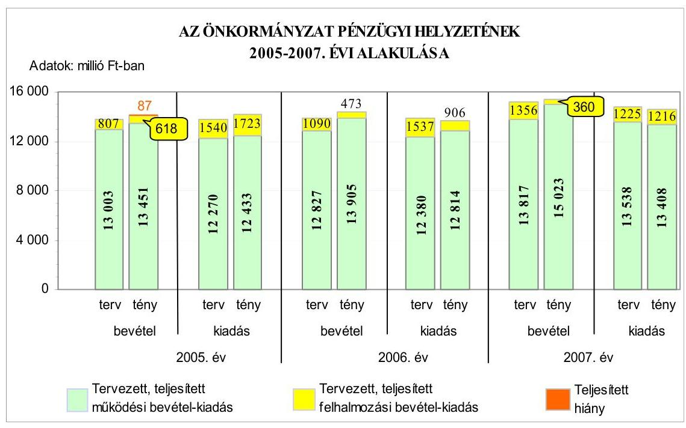
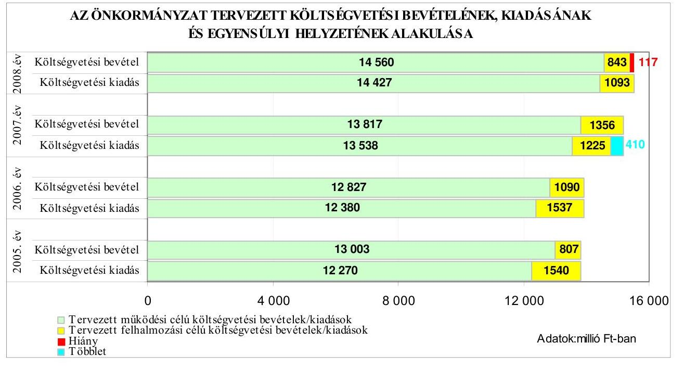
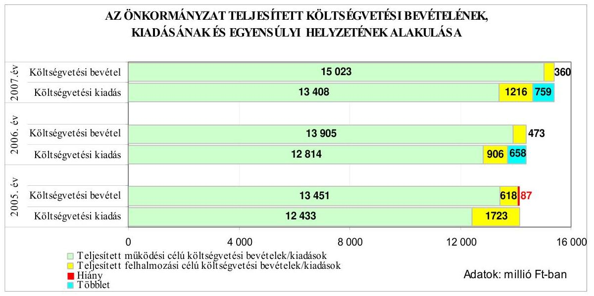
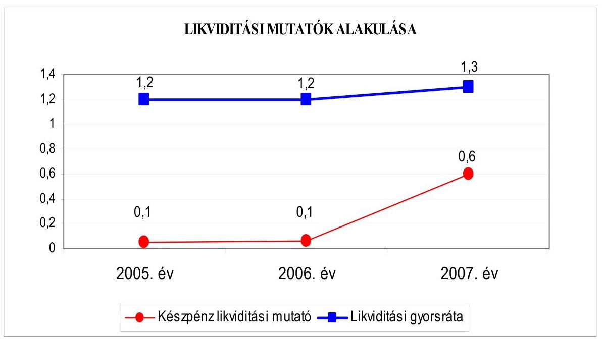
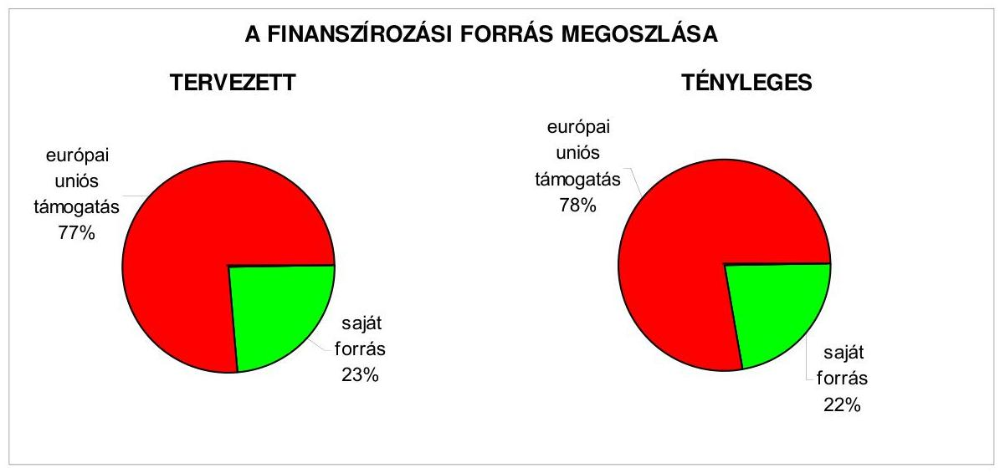
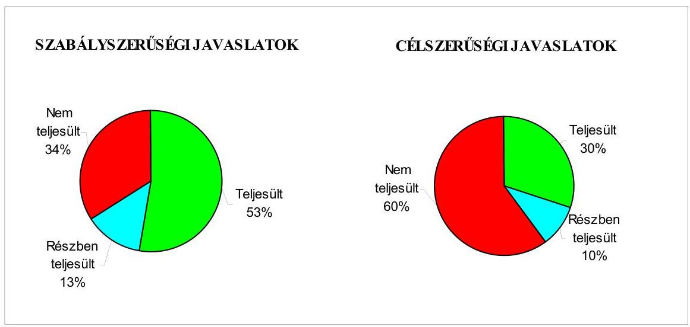
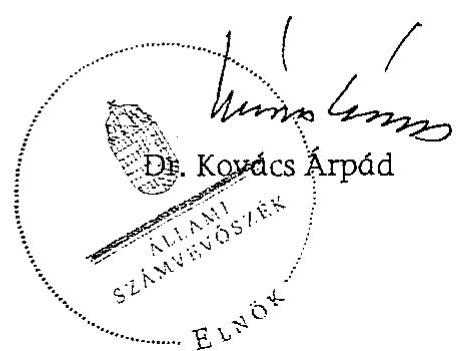
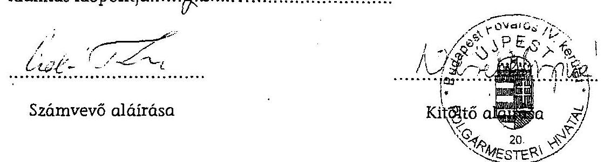
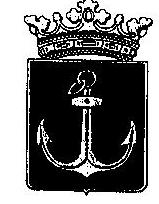
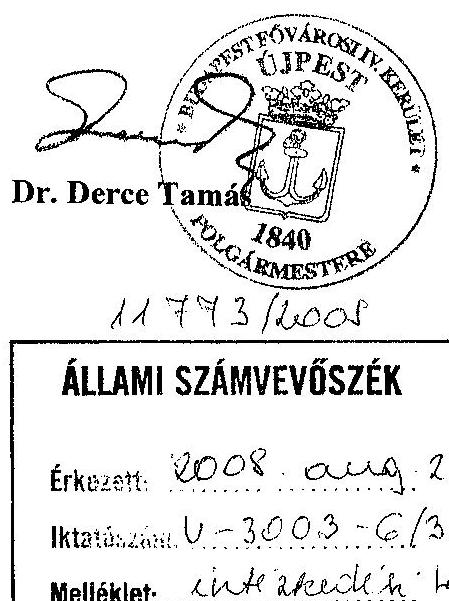

# ÁLLAMI   SZÁMVEVŐSZÉK 

## JELENTÉS

a Budapest Főváros IV. kerület Újpest Önkormányzata gazdálkodási rendszerének 2008. évi ellenőrzéséről

---

# 3. Önkormányzati és Területi Ellenőrzési Igazgatóság 

## Átfogó Ellenőrzési Főcsoport

Iktatószám: V-3003-6/31/24/2008.
Témaszám: 898
Vizsgálat-azonosító szám: V0393

## Az ellenőrzést felügyelte:

Dr. Lóránt Zoltán
főigazgató
Az ellenőrzés végrehajtásáért felelős:
Dr. Sepsey Tamás
főigazgató-helyettes
Az ellenőrzést vezette:
Molnár Gyula Mihály
igazgató-helyettes
Az ellenőrzést végezték:
Kozma Gábor Kisgergely István Szabó Tamás
számvevő tanácsos számvevő tanácsos

## A témához kapcsolódó eddig készített számvevőszéki jelentések:

## címe

Jelentés Budapest Főváros IV. kerület Újpest Önkormányzata gazdálkodásának átfogó ellenőrzéséről

0345
Jelentés a helyi és a helyi kisebbségi önkormányzatok gazdálkodásának átfogó ellenőrzéséről

0436
Jelentés a Magyar Köztársaság 2005. évi költségvetése végrehajtásának ellenőrzéséről

0628
Függelék:

- a helyi önkormányzatokat megillető kötött felhasználású támogatások 2005. évi felhasználásának ellenőrzése
Jelentés a Magyar Köztársaság 2006. évi költségvetése végrehajtásának ellenőrzéséről
Függelék:
- a helyi önkormányzatok 2006. évi normatív hozzájárulás igénylésének és elszámolásának ellenőrzése

---

# TARTALOMJEGYZÉK 

BEVEZETÉS ..... 9
I. ÖSSZEGZŐ MEGÁLLAPÍTÁSOK, KÖVETKEZTETÉSEK, JAVASLATOK ..... 14
II. RÉSZLETES MEGÁLLAPÍTÁSOK ..... 25

1. Az Önkormányzat költségvetési és pénzügyi helyzete ..... 25
1.1. A tervezett és teljesített költségvetési bevételek és kiadások alapján a költségvetési és a pénzügyi egyensúly alakulása, valamint a költségvetési hiány megállapításának szabályszerűsége ..... 25
1.2. A költségvetési és a pénzügyi egyensúlyi helyzet kialakításához tervezett és teljesített finanszírozási célú pénzügyi műveletek módja és azok hatása a tárgyévet követő évek költségvetéseire ..... 27
1.3. A költségvetés tervezésének megalapozottsága ..... 32
2. Az Önkormányzat felkészültsége az európai uniós források igénylésére és felhasználására, valamint az elektronikus közigazgatási feladatok ellátására ..... 33
2.1. Az európai uniós források igénybevételére és a várható támogatás felhasználására történt felkészülés szabályozottsága, szervezettsége ..... 33
2.1.1. Az európai uniós forrásokra történő pályázatok benyújtására vonatkozó döntések összhangja a fejlesztési célkitűzésekkel ..... 33
2.1.2. Az európai uniós forrásokhoz kapcsolódóan a pályázatfigyelés, a pályázatkészítés, valamint az európai uniós támogatással megvalósuló fejlesztés lebonyolításának belső rendjének szabályozottsága, a végrehajtás személyi, szervezeti feltételei ..... 36
2.1.3. A fejlesztési feladat lebonyolításánál a feladatellátás rendjére, az ellenőrzési feladatok teljesítésére, valamint a felelősségi szabályokra vonatkozó előírások betartása ..... 36
2.2. Az elektronikus közigazgatási feladatok ellátása, a közérdekű adatok elektronikus közzététele ..... 39
3. A költségvetési gazdálkodás belső kontrolljai ..... 41
3.1. A szabályozottság kockázata a költségvetés tervezési, gazdálkodási, beszámolási és a folyamatba épített, előzetes és utólagos vezetői ellenőrzési feladatoknál ..... 41
3.2. A belső kontrollok érvényesülése az önkormányzati források szabályszerű felhasználásában, a költségvetési tervezés, gazdálkodás, beszámolás folyamataiban ..... 44
3.3. A belső ellenőrzési kötelezettség teljesítése, javaslatainak hasznosulása ..... 47

---

4. Az ÁSZ korábbi ellenőrzési javaslatai alapján készített intézkedési terv végrehajtása, eredményessége ..... 52
4.1. Az Önkormányzat gazdálkodási rendszerének átfogó ellenőrzése során tett javaslatok végrehajtására tervezett intézkedések megvalósulása ..... 52
4.2. A zárszámadáshoz kapcsolódó (állami hozzájárulások, támogatások igénylésének és felhasználásának ellenőrzése), valamint a további vizsgálatok esetében a megállapítások, javaslatok alapján tett intézkedések ..... 56
MELLÉKLETEK
5. számú Az Önkormányzat gazdálkodását meghatározó adatok, mutatószámok (1 oldal)
6. számú Az önkormányzati vagyon alakulása (1 oldal)
7. számú Az Önkormányzat 2005-2007. évi költségvetési előirányzatainak és azok pénzügyi teljesítéseinek alakulása (1 oldal)
8. számú Tanúsítvány az európai uniós forrásokkal támogatott programok, célok tervezett és tényleges 2005-2008. évi adatairól (1 oldal)
9. számú Adatlap az Önkormányzat európai uniós forrással támogatott fejlesztéséről (3 oldal)
10. számú Jegyzőkönyv az európai uniós forrásból megvalósuló HEFOP/2005/3.5.4. pályázat ellenőrzése (4 oldal)
11. számú Dr. Derce Tamás úr, a Budapest Főváros IV. kerület Újpest Önkormányzata polgármestere által adott észrevétel (1 oldal)

---

# RÖVIDÍTÉSEK JEGYZÉKE 

## Törvények

2005. évi költségvetési törvény
2006. évi költségvetési törvény
2007. évi költségvetési törvény
2008. évi költségvetési törvény
Áht.
Eisztv.
Htv.

Kbt.
Ket.

Ktv.

Ötv.
Számv. tv.

## Rendeletek

2004. évi zárszámadási rendelet
2005. évi költségvetési rendelet
2005. évi zárszámadási rendelet
2006. évi költségvetési rendelet
2006. évi zárszámadási rendelet
a Magyar Köztársaság 2005. évi költségvetéséről és az államháztartás hároméves kereteiről szóló 2004. évi CXXXV. törvény
a Magyar Köztársaság 2006. évi költségvetéséről szóló 2005. évi CLIII. törvény
a Magyar Köztársaság 2007. évi költségvetéséről szóló 2006. évi. CXXI. törvény
a Magyar Köztársaság 2008. évi költségvetéséről szóló 2007. évi. CLXIX. törvény
az államháztartásról szóló 1992. évi XXXVIII. törvény az elektronikus információszabadságról szóló 2005. évi XC. törvény
a helyi önkormányzatok és szerveik, a köztársasági megbízottak, valamint egyes centrális alárendeltségű szervek feladat- és hatásköreiről szóló 1991. évi XX. törvény
a közbeszerzésekről szóló 2003. évi CXXIX. törvény
a közigazgatási hatósági eljárás és szolgáltatás általános szabályairól szóló 2004. évi CXL. törvény
a köztisztviselők jogállásáról szóló 1992. évi XXIII. törvény
a helyi önkormányzatokról szóló 1990. évi LXV. törvény a számvitelről szóló 2000. évi C. törvény

Budapest Főváros IV. kerület Újpest Önkormányzat 4/2005. (IV. 28.) számú rendelete a 2004. évi zárszámadásról
Budapest Főváros IV. kerület Újpest Önkormányzat 1/2005. (III. 3.) számú rendelete a 2005. évi költségvetésről
Budapest Főváros IV. kerület Újpest Önkormányzat 9/2006. (V. 8.) számú rendelete a 2005. évi zárszámadásról
Budapest Főváros IV. kerület Újpest Önkormányzat 4/2006. (III. 3.) számú rendelete a 2006. évi költségvetésről
Budapest Főváros IV. kerület Újpest Önkormányzat 13/2007. (V. 30.) számú rendelete a 2008. évi zárszámadásról

---

2007. évi költségvetési rendelet

2008. évi költségvetési rendelet

18/2005. (XII. 27.) IHM rendelet

Ámr.
Ber.
Vhr.

## Szórövidítések

AMK
ÁMK
ÁSZ
ÁROP
Belső Ellenőrzési Egység
BMIK
EKOP
e-közigazgatás
ESZA Kht.
FEUVE
Gazdasági Intézmény

GVOP
jegyző
Képviselő-testület
SzMSz

MÁK
NFT
Önkormányzat
PEJ

Budapest Főváros IV. kerület Újpest Önkormányzat 6/2007. (III. 6.) számú rendelete a 2007. évi költségvetésről
Budapest Főváros IV. kerület Újpest Önkormányzat 3/2008. (II. 20.) számú rendelete a 2008. évi költségvetésről
a közzétételi listákon szereplő adatok közzétételéhez szükséges közzétételi mintákról szóló 18/2005. (XII. 27.) IHM rendelet
az államháztartás múködési rendjéről szóló 217/1998. (XII. 30.) Korm. rendelet
a költségvetési szervek belső ellenőrzéséről szóló 193/2003. (XI. 26.) Korm. rendelet
az államháztartás szervezetei beszámolási és könyvvezetési kötelezettségének sajátosságairól szóló 249/2000. (XII. 24.) Korm. rendelet

Ady Endre Művelődési Központ
Karinthy Frigyes Általános Művelődési Központ
Állami Számvevőszék
ÚMFT Államreform Operatív Program
Budapest Főváros IV. kerület Újpest Önkormányzata Polgármesteri Hivatalának Belső ellenőrzési egysége
Budapesti Munkaerőpiaci Intervenciós Központ
ÚMFT Elektronikus Közigazgatási Operatív Program
elektronikus közigazgatás
Európai Szociális Alapok Közhasznú Társaság
folyamatba épített, előzetes és utólagos vezetői ellenőrzés
Budapest Főváros IV. kerület Újpest Önkormányzata Gazdasági Intézménye
NFT Gazdasági Versenyképesség Operatív Program
Budapest Főváros IV. kerület Újpest Önkormányzat
jegyzője
Budapest Főváros IV. kerület Újpest Önkormányzat Képviselő-testülete
Budapest Főváros IV. kerület Újpest Önkormányzat Képviselő-testületének 264/2005. (X. 25.) számú határozata a Polgármesteri Hivatal Szervezeti és Működési Szabályzatáról
Magyar Államkincstár
Nemzeti Fejlesztési Terv
Budapest Főváros IV. kerület Újpest Önkormányzat
projekt előrehaladási jelentés

---

| polgármester | Budapest Főváros IV. kerület Újpest Önkormányzat polgármestere |
| :-- | :-- |
| Polgármesteri hivatal | Budapest Főváros IV. kerület Újpest Önkormányzat Polgármesteri Hivatala |
| SZEI | Szociális és Egészségügyi Intézmény |
| UGYIH | Újpesti Gyermek- és Ifjúsági Ház |
| Újpesti Média Kht | Újpesti Média Szolgáltató Közhasznú Társaság |
| ÚMFT | Új Magyarország Fejlesztési Terv |
| ÚV Zrt. | Újpesti Vagyonkezelő Zártkörű Részvénytársaság |

---

.

---

# ÉRTELMEZŐ SZÓTÁR 

1. elektronikus szolgáltatási szint
2. elektronikus szolgáltatási szint
3. elektronikus szolgáltatási szint
4. elektronikus szolgáltatási szint
európai uniós források
fejlesztési feladat (projekt)
fejlesztési célkitűzés
irányító hatóság

Az 1044/2005. (V. 11.) Korm. határozat alapján olyan információs, tájékoztató szolgáltatás, amely csak általános információkat közöl az adott üggyel kapcsolatos teendőkről és a szükséges dokumentumokról.
Az 1044/2005. (V. 11.) Korm. határozat alapján olyan egyirányú kapcsolatot biztosító szolgáltatás, amely az 1. szinten túl biztosítja az adott ügy intézéséhez szükséges dokumentumok, nyomtatványok letöltését, és azok ellenőrzéssel, vagy ellenőrzés nélküli elektronikus kitöltését, amely esetben a dokumentumok benyújtása hagyományos úton történik.
Az 1044/2005. (V. 11.) Korm. határozat alapján olyan kétirányú kapcsolatot biztosító szolgáltatás, amely közvetlen, vagy ellenőrzött kitöltésű dokumentum segítségével biztosítja az elektronikus adatbevitelt és a bevitt adatok ellenőrzését. Az ügy indításához, intézéséhez személyes megjelenés nem szükséges, de az ügyhöz kapcsolódó közigazgatási döntés (határozat, egyéb aktus) közlése, valamint a kapcsolódó illeték-, vagy díjfizetés hagyományos úton történik.
Az 1044/2005. (V. 11.) Korm. határozat alapján olyan teljes közvetlen kétirányú ügyintézési folyamatot biztosító szolgáltatás, amikor az ügyhöz kapcsolódó közigazgatási döntés is elektronikus úton kerül közlésre, illetve a kapcsolódó illeték-, vagy díjfizetés elektronikus úton is intézhető.
Az elnyert európai uniós források lehívása a támogatott projekt megvalósítása érdekében, a fejlesztés lebonyolítása során felmerült kiadások finanszírozására.
A fejlesztési feladat (projekt) tartalmilag és formailag részletesen kidolgozott, megfelelő pénzügyi háttérrel és végrehajtási ütemezéssel rendelkező fejlesztési terv, amely illeszkedik az Európai Unió, illetve a Nemzeti Fejlesztési Terv által támogatott programokhoz.
Az önkormányzat által ellátott kötelező, vagy önként vállalt feladatok ellátásának mennyiségi, vagy minőségi fejlesztésére vonatkozó terv. A mennyiségi fejlesztés megvalósulhat beszerzéssel, létesítéssel, bővítéssel, átalakítással.
A strukturális alapok és a Kohéziós alap forrásainak szabályszerű, hatékony és eredményes felhasználásához szükséges intézményrendszer felső eleme. Az irányító hatóság általános és átfogó felelősséget visel a programok, projektek hatékony és szabályszerű végrehajtásáért. Felelősségi köréből eredően ellenőrzi a közösségi, valamint a hazai jogszabályok betartását, koordinálja az európai uniós források szétosztásának folyamatát, irányítja az intézményrendszer, a statisztikai és a pénzügyi nyilvántartási rendszer működését.

---

kedvezményezett
lebonyolítás
operatív program
támogatási szerződés

Az a helyi önkormányzat, amely a támogatási szerződést kedvezményezettként aláírja, a projektet, illetve a központi programhoz kapcsolódó támogatott önkormányzati programot végrehajtja.
Az európai uniós források felhasználásával megvalósuló fejlesztésre irányuló műszaki, gazdasági (pénzügyi) tevékenységet magában foglaló szervezési, irányítási szolgáltatás. A szervezési szolgáltatás kiterjedhet a pályázatkészítésre, a közbeszerzési eljárás lebonyolításán keresztül a folyamatos műszaki ellenőrzésre, a pénzügyi elszámolásra, a műszaki átadás-átvételre, az üzembe helyezésre, illetve a fejlesztési folyamat egyes elemeire.
Az Európai Bizottság által jóváhagyott, a Közösségi Támogatási Keret végrehajtására vonatkozó 2004-2006 közötti, több évre szóló intézkedésekhez kapcsolódó prioritások egységes rendszerét tartalmazó dokumentum. A strukturális alapok operatív programjai: Agrár és Vidékfejlesztési Operatív Program (AVOP); Gazdasági Versenyképesség Operatív Program (GVOP); Humánerőforrás-fejlesztési Operatív Program (HEFOP); Környezetvédelmi és Infrastruktúra-fejlesztési Operatív Program (KIOP); Regionális Fejlesztési Operatív Program (ROP). Az ÚMFT-hez kapcsolódó operatív programok: Gazdaságfejlesztési Operatív Program (GOP); Közlekedés Operatív Program (KÖZOP); Társadalmi Megújulás Operatív Program (TÁMOP); Társadalmi Infrastruktúra Operatív Program (TIOP); Környezet és Energia Operatív Program (KEOP); Államreform Operatív Program (ÁROP); Elektronikus Közigazgatás Operatív Program (EKOP); Nyugat-dunántúli Operatív Program (NYDOP); Dél-alföldi Operatív Program (DAOP); Észak-alföldi Operatív Program (ÉAOP); Középmagyarországi Operatív Program (KMOP); Északmagyarországi Operatív Program (ÉMOP); Középdunántúli Operatív Program (KDOP); Dél-dunántúli Operatív Program (DDOP).
A strukturális alapok esetében az irányító hatóságnak, illetve a Kohéziós alap esetében a közreműködő szervezeteknek a kedvezményezett önkormányzattal kötött szerződése, amely a támogatás felhasználásának részletes feltételeit tartalmazza.

---

# JELENTÉS 

## a Budapest Főváros IV. kerület Újpest Önkormányzata gazdálkodási rendszerének 2008. évi ellenőrzéséről

## BEVEZETÉS

Az Ötv. 92. § (1) bekezdése, az Állami Számvevőszékről szóló 1989. évi XXXVIII. törvény 2. § (3) bekezdése, valamint az Áht. 120/A. § (1) bekezdése alapján az önkormányzatok gazdálkodását az Állami Számvevőszék ellenőrzi. Az ellenőrzésre az Országgyűlés illetékes bizottságai részére is átadott, országosan egységes ellenőrzési program szerint került sor.

Az Állami Számvevőszék a stratégiájában foglalt célkitűzéseknek megfelelően a helyi önkormányzatok költségvetési gazdálkodási rendszere átfogó ellenőrzésének programját a 2007. évtől megújította, azt kiegészítette további - teljesítmény-ellenőrzési - elemekkel.

## Az ellenőrzés célja annak értékelése volt, hogy az Önkormányzat:

- milyen módon biztosította a költségvetési és a pénzügyi egyensúlyt a költségvetésében és annak teljesítése során, valamint változott-e

 a finanszírozási célú pénzügyi műveletek jelentősége a hiányzó bevételi források pótlásában;
- eredményesen készült-e fel a szabályozottság és a szervezettség terén az európai uniós források igénylésére és felhasználására, továbbá biztosította-e az e-közigazgatás feltételeit, az adatok közzétételével a gazdálkodás nyilvánosságát;
- kialakította-e a külső és a belső feltételeknek megfelelően a költségvetés tervezési, gazdálkodási és zárszámadási feladatai belső kontrollrendszerét ${ }^{1}$, ezen tevékenységek szabályszerű ellátásához hozzájárult-e a folyamatba épített, előzetes és utólagos vezetői ellenőrzés, valamint a belső ellenőrzés;

[^0]
[^0]:    ${ }^{1}$ A gazdálkodás szabályszerűségét biztosító kontrollrendszer alatt értjük a kiépített és működő belső irányítási és szabályozási rendszert, valamint a belső ellenőrzési funkciók ellátásának rendszerét.

---

- megfelelően hasznosították-e a korábbi számvevőszéki ellenőrzések megállapításait, szabályszerűségi ${ }^{2}$ és célszerűségi javaslatait.

Az ellenőrzés típusa: átfogó ellenőrzés, amely egyidejűleg - egy ellenőrzés keretében - meghatározott területekre összpontosítva érvényesíti a szabályszerűségi, valamint a teljesítmény-ellenőrzés jellemzőit.

Az ellenőrzött időszak: az 1., 2. és 4. programpontok tekintetében a 2005-2007. évek, a 3. ellenőrzési programpontnál a 2007. év.

Újpest lakosainak száma 2008. január 1-jén 104 754 fő volt. A 2006. évi önkormányzati választást követően az Önkormányzat 33 tagú Képviselőtestületének munkáját 11 állandó bizottság segítette. A helyi önkormányzat mellett a 2006. évi önkormányzati választásokat követően 10 kisebbségi önkormányzat ${ }^{3}$ működött. A polgármester az 1990. évi önkormányzati képviselő és polgármester választás óta tölti be tisztségét, a jegyző személye 1990-től nem változott.

Az Önkormányzat feladatainak végrehajtása érdekében a 2007. évben 48 költségvetési intézményt működtetett, amelyekből hat önállóan gazdálkodott, a feladatok ellátásában kettő gazdasági, és egy közhasznú társaság vett részt. Az Önkormányzat a 2007. évi költségvetési beszámolója szerint 15 383 millió Ft költségvetési bevételt ért el és 14 624 millió Ft költségvetési kiadást teljesített, 2007. december 31-én a könyvviteli mérleg szerint 30 660 millió Ft értékű vagyonnal rendelkezett. Az Önkormányzat vagyona a 2005. év végi állományhoz viszonyítva 19,5%-kal emelkedett, ezt a változást a pénzeszközök állományának 2007. év végi kiemelkedő mértékű (több mint harmincszoros) növekedése okozta. A vagyon 2007. év végi növekedése a rövid lejáratú kötelezettségek 250%-os növekedésével együttesen következett be, a pénzeszközök és a rövid lejáratú kötelezettségek párhuzamos növekedését a 3000 millió Ft összegű folyószámlahitel folyósítása és lekötött betétként történő elhelyezése okozta. A pénzeszközök és a rövid lejáratú kötelezettségek jelentős mértékű változása mellett a befektetett eszközök mérsékelten, közel 3%-kal növekedtek a 2005. év végi állományhoz viszonyítva, elsősorban az intézmények körében végzett beruházások és felújítások miatt. A 2008. évi költségvetési rendeletben 15 403 millió Ft költségvetési bevételt és 15 520 millió Ft költségvetési kiadást irányoztak elő. Az összes költségvetési bevétel 54%-át a saját bevétel, illetve 42%-át a helyi adó bevétel biztosította a 2007. évben. Az összes költségvetési kiadásból a felhalmozási célú kiadás részaránya a 2007. évben 8% volt. A Polgármesteri hivatalban dolgozó köztisztviselők száma 2007. december 31-én 251 fő, a költségvetési intézményekben foglalkoztatott közalkalmazottak száma 2215 fő volt. Az Önkormányzat gazdálkodását meghatározó adatokat, mutatószámokat az 1-3. számú mellékletek tartalmazzák.

[^0]
[^0]:    ${ }^{2}$ A törvényi előírások betartásának elmulasztásakor a részletes megállapítások fejezetben egységesen a törvénysértés megjelölést alkalmazzuk, mivel az ÁSZ nem tehet különbséget a törvényi előírások között.
    ${ }^{3}$ Bolgár, cigány, görög, horvát, lengyel, német, ruszin, szerb, szlovák, ukrán.

---

Az Önkormányzat költségvetési és pénzügyi helyzetét az elemző eljárás módszerével vizsgáltuk. E körben elemeztük a költségvetés egyensúlyi helyzetének alakulását, a tervezett és tényleges költségvetési hiány okait, a mérséklésére tett intézkedéseket, finanszírozásának módját, az Önkormányzat adósságállományának alakulását, összetevőit.

A teljesítmény-ellenőrzés módszerével vizsgáltuk a belső szabályozottság, szervezettség terén az Önkormányzat felkészültségét az európai uniós források figyelésére, igénylésére és felhasználására, továbbá értékeltük, hogy az igényelt európai uniós támogatások az Önkormányzat által meghatározott fejlesztési célkitűzésekhez kapcsolódtak-e. Az eredményesség szempontjából a minősítést a lényegességi szinthez való viszonyítással végeztük el. Az ellenőrzés során felmértük, hogy az e-közigazgatási feladat ellátása, illetve bevezetése, működtetése érdekében milyen intézkedéseket tettek, valamint biztosították-e a közérdekű adatok közzétételét.

A költségvetési gazdálkodás belső kontrolljainak ellenőrzése során értékeltük, hogy a Polgármesteri hivatalnál a költségvetés tervezési, gazdálkodási, zárszámadás készítési feladatok belső kontrolljainak kiépítettsége és működése megfelelő biztosítékot ad-e a gazdálkodási feladatok megfelelő, szabályszerű ellátására. Felmértük és minősítettük a költségvetés tervezési, a gazdálkodási, a zárszámadás készítési feladatokkal, továbbá a pénzügyi-számviteli területen az informatikával kapcsolatosan kialakított kontrollok megfelelőségét, valamint azok működésének eredményességét, megbízhatóságát. Értékeltük a belső ellenőrzés szervezeti és szabályozási keretét, továbbá működését.

A Polgármesteri hivatalnál értékeltük a gazdálkodás folyamatában a kontrollok működésének megbízhatóságát, ennek keretében ellenőriztük a szakmai teljesítés igazolására és az utalvány ellenjegyzésére kialakított kontrollok végrehajtását. Az ellenőrzést a következő, kiemelt kockázatuk alapján kiválasztott ${ }^{4}$ az általánostól jellemzően eltérő, egyedi eljárást igénylő gazdasági eseményekkel kapcsolatos kifizetésekre folytattuk le ${ }^{5}$:

- a külső szolgáltató által végzett karbantartási, kisjavítási szolgáltatások,
- a gépek, berendezések, felszerelések beszerzése, továbbá

[^0]
[^0]:    ${ }^{4}$ Az önkormányzatok kiemelt előirányzataira vonatkozóan, a vertikális folyamatokra elvégeztük a kockázatok becslését, amelynek eredményeként a külső szolgáltató által végzett karbantartási, kisjavítási szolgáltatások, a gépek, berendezések, felszerelések beszerzése valamint a működési célú pénzeszköz átadások államháztartáson kívülre teljesített kifizetései kiemelkedően kockázatos területeknek bizonyultak.
    ${ }^{5}$ A korábbi ellenőrzési tapasztalataink szerint ezeken a területeken a jegyzők nem, vagy hiányosan szabályozták a megbízás, megrendelés, illetve beszerzés indokoltságának, szükségességének elbírálására, igazolására, valamint a teljesítések dokumentálására, a kifizetések jogosságának megítélésére szolgáló kontrollokat. További kockázatot jelentett a külső szolgáltató által végzett karbantartási, kisjavítási munkák esetében, hogy az 50 ezer Ft alatti megrendelésekre vonatkozóan az ellenőrzési tapasztalataink szerint a jegyzők nem alakították ki a kötelezettségvállalások rendjét és nyilvántartási formáját, valamint a szabályozás elmulasztása esetén nem történt meg az írásbeli kötelezettségvállalás és annak az ellenjegyzése sem.

---

- a működési célú pénzeszköz átadásokból az államháztartáson kívülre teljesített kifizetésekre.

Az ellenőrzés hatékony elvégzése céljából a vizsgálandó területek kiválasztása során a kockázatokon alapuló megközelítés érvényesült, ezáltal az ellenőrzési erőforrásokat azokra a területekre fókuszáltuk, amelyeken legnagyobb a hibák előfordulási valószínűsége. Az ellenőrzési erőforrások ilyen típusú összpontosításával minimálisra csökkenthető a kívánt ellenőrzési bizonyosság eléréséhez szükséges időráfordítás.

A pénzügyi-számviteli folyamatokban alkalmazott belső kontrollok létezésének és működésének ellenőrzésére a vizsgált három terület 2007. évi könyvviteli tételeiből területenként egyszerű véletlen mintát vettünk. A kijelölt gazdasági eseményre elvégzett megfelelőségi tesztek alapján értékeltük a kontrollok működésének eredményességét, megbízhatóságát a vizsgált három területre külön-külön, majd összefoglalóan ${ }^{6}$ a Polgármesteri hivatal egyedi eljárást igénylő gazdasági eseményeire. A helyszíni ellenőrzés megállapításainak részletes dokumentálását három megfelelőségi tesztlapon, öt elővizsgálati és 12 helyszíni ellenőrzési munkalapon biztosítottuk. Ezeken a teszt- és munkalapokon a minősítés alapjául szolgáló kérdések és a vonatkozó konkrét jogszabályhelyek megjelölése mellett értékeltük a kialakított belső kontrollokban rejlő kockázatokat ${ }^{7}$ és a kialakított kontrollok működésének megbízhatóságát ${ }^{8}$.

Az ÁSZ korábbi ellenőrzési javaslatai alapján tett intézkedéseket, illetve azok megvalósítását utóellenőrzés keretében vizsgáltuk. A gazdálkodási rendszer átfogó ellenőrzése során megfogalmazott javaslatok végrehajtására tett intézkedések megvalósítását ellenőriztük, az egyéb számvevőszéki ellenőrzések során tett javaslatok esetében pedig a kiadott intézkedéseket tekintettük át.
${ }^{6}$ A vizsgált három terület egyedi értékelési pontszámait a területek relatív költségvetési súlyával arányosan összegeztük.
${ }^{7}$ A kialakított belső kontrollokban rejlő kockázatot alacsonynak minősítettük, ha a kontrollok - végrehajtásuk esetén - megfelelő védelmet nyújtanak a hibák bekövetkezése ellen. Közepesnek minősítettük a belső kontrollokban rejlő kockázatot, amennyiben a kontrollok - végrehajtásuk esetén - a lehetséges hibák többsége ellen védelmet nyújtanak. Magasnak értékeltük a kockázatot, ha a kontrollok - kialakításuk hiányában, vagy hiányos kialakításuk miatt - nem nyújtanak elegendő védelmet a lehetséges hibákkal szemben.
${ }^{8}$ A kontrollok működésének eredményességét, megbízhatóságát kiválónak értékeltük abban az esetben, ha azok működése - esetleges apróbb hiányosságoktól eltekintve - megfelelt a hibák megelőzésére és kijavítására meghatározott szabályozásnak és a legmagasabb szintű elvárásoknak. Jónak minősítettük a kontrollok működését, ha a hiányosságok száma ugyan jelentős volt, de nem veszélyeztette az ellenőrzött terület hibáinak megelőzését és kijavítását. Amennyiben a hiányosságok mértéke nem biztosította a hibák megelőzését, feltárását, kijavítását és ezáltal veszélyeztette az eredményes, megbízható működést, a kontroll működésének megbízhatósága gyenge minősítést kapott.

---

A helyszíni ellenőrzés során kitöltött - az ellenőrzést végző számvevő és a Polgármesteri hivatal felelős köztisztviselője által aláírt - elővizsgálati és helyszíni ellenőrzési munkalapokat, azok kitöltési útmutatóit, továbbá a megfelelőségi tesztek dokumentumait a polgármester részére a számvevői jelentéssel egyidejűleg átadtuk.

A jelentést az ÁSZ-ról szóló 1989. évi XXXVIII. tv. 25. § (1) bekezdése alapján észrevétel közlése céljából megküldtük a Budapest Főváros IV. kerület Újpest Önkormányzata polgármesterének. A kapott észrevételt a jelentés 7. számú melléklete tartalmazza.

---

# I. ÖSSZEGZŐ MEGÁLLAPÍTÁSOK, KÖVETKEZTETÉSEK, JAVASLATOK 

Az Önkormányzat tervezett költségvetési bevételei a 2005-2007. évek közötti időszakban fedezték a tervezett költségvetési kiadásokat. A 2008. évben a költségvetési hiányt a felhalmozási célú költségvetési bevételeket meghaladó felhalmozási célú költségvetési kiadások tervezése okozta, melynek finanszírozására hosszú lejáratú hitelfelvételt terveztek. Az Önkormányzat a 2008. évi költségvetési rendeletben - az Áht. előírásaival ellentétesen - a finanszírozási célú pénzügyi műveleteket a költségvetési bevételekkel és kiadásokkal összevontan mutatta ki, illetve nem mutatta be a költségvetés hiányát. A 2005-2007. évek közötti időszakban - a 2005. év kivételével - a teljesített költségvetési bevételek a teljesített költségvetési kiadásokat meghaladták, az Önkormányzat a 2006. és a 2007. évben költségvetési többlettel zárt. A 2005-2008. évek közötti időszakban a 2007. évi költségvetés módosítása során intézkedéseket tettek, továbbá a 2008. évi költségvetés készítése során intézkedéseket terveztek a költségvetési szervek kiadási megtakarítást eredményező átszervezésére.

Az Önkormányzat pénzügyi helyzete a 2005. és a 2007. évek között eladósodás vonatkozásában romlott, amit a rövid lejáratú kötelezettségek arányának növekvő tendenciája okozott. Az Önkormányzat a 2005-2007. évek közötti időszakban nem vett igénybe hosszú lejáratú, fejlesztési célú hitelt, az önkormányzati bérlakások építésre felvett hosszú lejáratú kölcsön és kötvénytartozását 2007. júniusáig visszafizette. A 2005-2008. években az Önkormányzat folyószámla hitelkeretének összege több mint két és félszeresére növekedett. Az Önkormányzatnak a 2007. év végén 3000 millió Ft összegű folyószámla hitele volt, ennek nagy részét betétként lekötötték. A pénzeszközök állományának növekedése következtében az Önkormányzat fizetőképessége a 2007. év végére javult, azonban a rövid lejáratú kötelezettségek pénzeszközökből történő azonnali kiegyenlítése így sem volt biztosított.

A 2005-2007. évek közötti időszakban a teljesített működési célú költségvetési bevételek növekvő mértékben fedezték a működési célú költségvetési kiadásokat. A teljesített működési célú költségvetési bevételek működési célú kiadásokhoz viszonyított többletének növekedését a helyi adóbevételek folyamatos emelkedése, különösen a forrásmegosztásból származó adóbevételek emelkedése segítette elő. A tervezett és teljesített felhalmozási kiadások a
 Polgármesteri hivatal új épületének beruházása, továbbá az önkormányzati intézmények bővítése, felújításai miatt a 2005-2008. évek közötti időszakban - a 2007. évi tervezett előirányzatok kivételével - meghaladták a tervezett és teljesített felhalmozási célú bevételeket. A 2005-2007. években a felhalmozási célú költségvetési kiadások fedezettsége a tervezetthez viszonyítva kedvezőtlenebbül alakult a teljesítés során, melyet az ingatlanértékesítésből tervezett bevételek elmaradása okozott, mivel az ingatlanértékesítési bevételek tervezése nem volt megalapozott.

Az Önkormányzat - az Ötv-ben előírtak ellenére - gazdasági programmal a 2005-2008. évek közötti időszakban nem rendelkezett, melyért felelős a jegyző,

---

mivel a Htv. előírása alapján az Önkormányzat gazdasági programtervezetének elkészítése a jegyző feladata. Fejlesztési célkitűzéseit az ágazati koncepciók tartalmazták, ezeket az NFT és az ÚMFT keretében megjelenő pályázati lehetőségek alapján nem módosították. A fejlesztési célkitűzések megvalósításának lehetséges pénzügyi forrásait a szakmai koncepciók nem tartalmazták. Az európai uniós forrásokkal összefüggően kettő Norvég Finanszírozási Mechanizmus keretébe tartozó pályázatot nyújtott be sikertelenül a Polgármesteri hivatal. A Polgármesteri hivatalon kívül az AMK és az ÁMK intézmények három esetben sikeresen pályáztak európai uniós forrásokra. Az Önkormányzat 2005-2007. évi költségvetési rendeletei - az Áht-ban foglaltak ellenére - nem tartalmazták az európai uniós forrással támogatott fejlesztési feladatok megvalósításához, a hatályos támogatási szerződés éves kiadási és támogatási ütemezésében rögzített költségvetési kiadásokat és a fedezetéül szolgáló pénzügyi forrásokat. Az Ámr. előírásai ellenére a 2005-2007. évek költségvetési rendeleteiben önkormányzati szinten, elkülönítetten nem mutatták be az európai uniós támogatással megvalósuló programok bevételeit és kiadásait. A Képviselőtestület tájékoztatása céljából - az Ámr-ben foglaltak ellenére - nem mutatták be a többéves kihatással járó feladatokat számszerűsítve, éves bontásban, szöveges indoklással.

Az Önkormányzat a szabályozottság és szervezettség terén a 2005-2007. évek között nem készült fel eredményesen az európai uniós források igénybevételére és felhasználására. Az európai uniós források igénybevételével és felhasználásával kapcsolatban, önkormányzati szintű szabályozás keretében nem jelölték ki a pályázatkoordinálás feladatait és felelősét, nem határozták meg a pályázat-nyilvántartás vezetésének felelősét. Nem szabályozták a polgármester és a pályázatfigyeléssel, pályázatkészítéssel megbízott külső szervezetek közötti kapcsolattartás rendjét, az információk átadásának formáját, tartalmát és módját, valamint a felelősség szabályait. Szabályozás hiányában a fejlesztési feladat lebonyolítására vonatkozóan nem határozták meg a folyamatba épített, előzetes és utólagos vezetői ellenőrzési feladatokat. A pályázatfigyelés személyi feltételeit sem a Polgármesteri hivatalon belül, sem külső megbízással nem biztosították.

A 2003-2005. évekre szóló informatikai stratégiát nem a Képviselő-testület fogadta el, hanem a jegyző adta ki, ebben a 4. elektronikus szolgáltatási szint megvalósítását tűzte ki célul. Az Önkormányzat nem rendelkezett a 2006-2007. évekre vonatkozó informatikai stratégiával. Az Önkormányzatnál kialakították és működtették az e-közigazgatási feladatokat ellátó informatikai rendszert. Az Önkormányzat honlapján egyes ügykörökben az e-ügyintézés 2. szintjét valósították meg. Az Önkormányzat az elektronikus ügyintézés szabályairól rendeletet alkotott, melyben felsorolta azokat a közigazgatási, hatósági ügyeket, amelyek intézése elektronikus úton történik, a többi elektronikusan intézhető ügyfajtát azonban kizárták. Az Önkormányzat - az Áht. előírása ellenére - nem tette közzé a céljellegű fejlesztési és működési támogatások adatai közül a támogatások céljára, a megvalósulás helyszínére, valamint a vagyonnal történő gazdálkodással összefüggő, nettó öt millió Ft-ot elérő, vagy azt meghaladó értékű vagyonértékesítésre, vagyonhasznosításra vonatkozó szerződések adatait. Az Önkormányzat - az Ámr. előírása ellenére - a költségvetési beszámolók szöveges indoklását nem tette közzé. Az e-közigazgatási feladatokat ellátó informatikai rendszer ügyfelek általi igénybevételét nem kísérték figyelemmel.

---

A költségvetés tervezési és a zárszámadás készítési folyamatok szabályozottságának hiányosságai magas kockázatot jelentettek a feladatok szabályszerű végrehajtásában, mivel a jegyző - az Áht. előírásai ellenére - nem alakította ki a költségvetés tervezés és a zárszámadás készítés ellenőrzési feladatait. Az Önkormányzat intézményei részére a költségvetési javaslat összeállításával kapcsolatos követelményeket nem határozta meg, az intézményi mutatószám felmérés és elszámolás, a saját bevételek előirányzatai és a költségvetés megalapozását szolgáló helyi rendeletek összhangja ellenőrzését nem írta elő. A költségvetési igények indokoltsága, teljesíthetősége tekintetében a munkafolyamatba épített ellenőrzést a jegyző nem szabályozta, a költségvetési tervezés és a zárszámadás koordinálásáért, az intézményi költségvetésekben szereplő adatok egyeztetéséért, ellenőrzéséért felelős személyeket nem jelölte ki. A jegyző - az Ámr. előírása ellenére - nem készítette elő a költségvetési szervek elemi beszámolója felülvizsgálatának rendjét az Önkormányzat költségvetési szerveinek felügyeletét ellátó Képviselő-testület általi elfogadásra. A költségvetés tervezési és zárszámadás készítési folyamatban a kontrollok működésének megbízhatósága gyenge volt, mert a jegyző - az Áht. előírásai ellenére - nem ellenőriztette a költségvetési javaslat összeállításával kapcsolatos követelményeket, a költségvetési tervezéshez készített intézményi mutatószám felmérés és elszámolás adatainak megalapozottságát. A jegyző nem ellenőriztette az Önkormányzat intézményei és a Polgármesteri hivatal szervezeti egységei által benyújtott költségvetési igények indokoltságát és teljesíthetőségét, a saját bevételek előirányzatai és a költségvetés megalapozását szolgáló helyi rendeletek összhangját, továbbá - az Ámr. előírása ellenére - az intézményi számszaki beszámolóknak az általa meghatározott adatszolgáltatással való összhangját.

A gazdálkodási, a pénzügyi-számviteli és a folyamatba épített ellenőrzési feladatok szabályozottságának hiányosságai magas kockázatot jelentettek a gazdálkodási feladatok megfelelő és szabályszerű végrehajtásában, mivel a gazdasági szervezet részletes feladatainak szabályozására nem készítettek ügyrendet, a jegyző a kötelezettségvállalás és utalványozás ellenjegyzésére nem adott felhatalmazást, az 50 ezer Ft-ot el nem érő kifizetések esetében a kötelezettségvállalások nyilvántartási formáját és rendjét belső szabályzatban nem rögzítette. A szakmai teljesítés igazolás módjáról a jegyző belső szabályzatban nem rendelkezett, valamint nem jelölte ki az azt végző személyeket, az érvényesítési feladatok kontrolljainak kialakítása a költségvetési gazdálkodás teljesítése során nem történt meg, mert annak ellátására a jegyző írásban csak a kimenő és a szállítói számlák tekintetében adott megbízást. A pénzügyi-számviteli területen dolgozó munkatársak munkaköri leírásai nem tartalmazták a vezetők és a munkatársak feladatait, kötelezettségeit, hatás- és felelősségi jogkörüket. A számviteli szabályzatokban a jegyző nem rögzítette az üzemeltetésre átadott eszközök leltározásának a módját, a követelések besorolásának elveit, dokumentálásának szabályait, az értékelések ellenőrzéséért felelős munkaköröket, az önköltségszámítás rendjét, a pénzkezelés során az utólagos vezetői ellenőrzés gyakoriságát, dokumentálásának módját, a selejtezési eljárás szabályszerű végrehajtásának folyamatba épített ellenőrzéséért felelős személyeket, valamint nem készítette el a számlarendet. A FEUVE rendszer részeként elkészített ellenőrzési nyomvonalban nem rögzítette az egyes tevékenységek, feladatok elvégzését igazoló dokumentumok nyilvántartási helyét a rendszerben. A gazdálkodási, a pénzügyi-számviteli és a folyamatba épített ellenőrzési feladatok szabályozottságának hiányosságaiért, hibáiért a jegyző a felelős, mi-

---

vel a szabályszerű gazdálkodási, pénzügyi-számviteli, a folyamatba épített, előzetes és utólagos vezetői ellenőrzés megszervezése és hatékony működtetése - az Áht., valamint az Ötv. előírásai alapján - a jegyző kötelezettsége. A Htv-ben foglaltak alapján a jegyző feladat- és hatásköre a Polgármesteri hivatal operatív gazdálkodási feladatainak irányítása, valamint a Ktv. előírása alapján a jegyzőnek, mint köztisztviselőnek a feladatait megfelelő szakmai hozzáértéssel, a jogszabályi előírásokat betartva kellett volna ellátnia.

A jegyző 2008. április hónapban elkészítette a Polgármesteri hivatal számlarendjét, önköltségszámítási szabályzatát és meghatározta a szakmai teljesítés igazolásának a módját, valamint kijelölte az azt végző személyeket, meghatározta az egyedileg 50 ezer Ft-ot el nem érő kifizetések rendjét és nyilvántartási formáját.

A Polgármesteri hivatalban a 2007. évben a gazdasági eseményekkel kapcsolatos kifizetések során a működésbeli hibák megelőzésére, feltárására, kijavítására kialakított kontrollok működésének megbízhatósága összességében gyenge volt, mert a szakmai teljesítés igazolásának a módját a jegyző nem határozta meg, valamint nem jelölte ki az azt végző személyeket. Az utalványok ellenjegyzése során a jegyző aláírása ellenére a kifizetést megelőzően nem ellenőrizte a gazdálkodásra vonatkozó szabályok betartását, a szakmai teljesítésigazolás és az érvényesítés megtörténtét, valamint a programozás, klímajavítás, kazán karbantartás, számítógépes konfigurációk, nyomtatók, hangszerek beszerzése, illetve egy alapítvány támogatásának eseteiben az utalványok ellenjegyzését felhatalmazás nélküli személy végezte. A szakmai teljesítés igazolás és az utalvány ellenjegyzése során a kontrollok gyenge megbízhatóságú működéséért, hibáiért a jegyző a felelős, mivel a szabályszerű gazdálkodási, pénzügyi-számviteli, a folyamatba épített, előzetes és utólagos vezetői ellenőrzés megszervezése és hatékony működtetése - az Áht. és az Ötv. előírásai alapján - a jegyző kötelezettsége.

A Polgármesteri hivatalban az informatikai rendszer szabályozottságának hiányosságai közepes mértékű kockázatot jelentettek az informatikai feladatok biztonságos végrehajtásában, mivel a 2007. évben nem rendelkeztek az Önkormányzat közép- és hosszú távú célkitűzéseit és az azok megvalósításához szükséges intézkedéseket tartalmazó informatikai stratégiával, továbbá nem biztosították az informatikával kapcsolatos szabályzatok dolgozókkal való megismertetését, azonban a kialakított belső kontrollok végrehajtásuk esetén a lehetséges hibák többsége ellen védelmet nyújtottak. A pénzügyi-számviteli informatikai rendszer 2007. évi működtetésénél a működésbeli hibák megelőzésére, feltárására, kijavítására kialakított kontrollok működésének megbízhatósága jó volt, mivel a számítógépes program biztosította a könyvviteli mérleg és főkönyv, illetve a főkönyv és a költségvetési beszámoló adatainak egyezőségét, azonban nem volt megoldott az analitikus nyilvántartások informatikai eszközökkel történő vezetése, feldolgozása. Nem volt biztosított a rögzített hibás adatok kezelése, és a pénzügyi-számviteli számítógépes informatikai rendszer kimeneti adatainak folyamatos kontrollját nem alakították ki.

A belső ellenőrzés szervezeti keretei kialakításának és szabályozásának hiányosságai a belső ellenőrzési feladatok végrehajtásában közepes kockázatot jelentettek, mivel nem biztosították a belső ellenőrök függetlenségét, az a pol-

---

gármesteri kabinet részeként működött, nem határidőre alakították ki a belső ellenőrzés ellátásának módját és az éves ellenőrzési terv tartalmában nem felelt meg a Ber. előírásainak, azonban a kialakított szervezet - szabályszerű működése esetén - a lehetséges hibák többsége ellen védelmet nyújtott. Az SzMSz-ben meghatározták a belső ellenőrzési kötelezettséget, az ellátandó feladatokat, de a Ber-ben foglaltak ellenére nem szabályozták a belső ellenőrzést végzők jogállását. A Képviselő-testület a 2007-2008. évek vonatkozásában az Ötv-ben előírt határidőn túl fogadta el a belső ellenőrzési tervet. A belső ellenőrök függetlenségét 2008. márciustól biztosították.

Az intézmények ellenőrzése tekintetében kockázatelemzést nem végeztek. Az évközben elrendelt soron kívüli vizsgálatok esetében ellenőrzési programot nem készítettek. A belső ellenőrzés működésénél kialakított kontrollok megbízhatósága jó volt, mivel az éves ellenőrzési tervben foglaltaknak megfelelően gondoskodtak a költségvetési szervek ellenőrzéseinek végrehajtásáról, azonban az ellenőrzéseket nem minden esetben ellenőrzési program alapján hajtották végre, a belső ellenőrök függetlenségét a belső ellenőrzési tevékenység során nem biztosították. A Polgármesteri hivatalnál a FEUVE rendszer kiépítésének és működésének helyi szabályoknak való megfelelését, a pénzügyi irányítási rendszer működésének gazdaságosságát, hatékonyságát és eredményességét, valamint az Önkormányzat költségvetéséből céljelleggel nyújtott támogatások rendeltetés szerinti felhasználását nem ellenőrizték. Az ellenőrzési jelentések nem feleltek meg a Ber-ben foglalt követelményeknek, az ellenőrzöttek - két kivételtől eltekintve - nem készítettek intézkedési tervet a hiányosságok megszüntetésére. A 2007. évi ellenőrzési jelentésben a belső ellenőrzési vezető nem értékelte a belső ellenőrzés tárgyi és személyi feltételeit. Az ÁSZ 2003. évben végzett előző átfogó ellenőrzése javaslataira tett intézkedések ellenére a Polgármesteri hivatal által ellátott belső
 ellenőrzési feladatok szabályozottsága összességében nem javult.

A 2007. éves ellenőrzési tervben előírt feladatok 25%-át nem végezték el, azonban a tervezett ellenőrzéseken felül további 13 ellenőrzés elvégzéséről határozott a polgármester, amely feladatokra a soron kívül végzendő ellenőrzésekre tervezett tartalék idő nem volt elegendő. A Polgármesteri hivatalban a Belső Ellenőrzési Egység a 2007. évben összesen 19 vizsgálatot végzett. A belső ellenőrzésekről készített jelentések értékelték a rendelkezésre álló információkat, azonban hét vizsgálati jelentés nem tartalmazott ajánlásokat, következtetéseket, javaslatokat. A jegyző a 2006. évi költségvetési beszámoló keretében - az Áht. előírásainak megfelelően - beszámolt a Polgármesteri hivatal belső ellenőrzésének és a FEUVE működtetésének tapasztalatairól. A polgármester a 2006. évről szóló éves ellenőrzési jelentést a zárszámadási rendelettervezettel egyidejűleg terjesztette a Képviselő-testület elé, melyet az elfogadott, további követelményeket, elvárásokat nem fogalmazott meg.

Az ÁSZ által a 2003-2007. években végzett ellenőrzések során tett javaslatok összességében 48%-ban hasznosultak, 13%-ban részben teljesültek, 39%-nál nem történt intézkedés. Az ÁSZ az Önkormányzat gazdálkodását a 2003. évben ellenőrizte átfogó jelleggel, melynek során szabályszerűségi és célszerűségi javaslatokat tett. A polgármester nem készíttetett intézkedési tervet a javaslatok realizálása érdekében. Az ÁSZ jelentés 36 javaslatot tartalmazott, a szabályszerűségi javaslatok közül a költségvetési rendeletek előirányzatainak módosításá-

---

ra, a vagyon kimutatására, a víziközművek önkormányzati tulajdonban maradásának biztosítására, a céljellegű támogatások számadási kötelezettségének előírására, a közbeszerzési rendelet hatályon kívül helyezésére, a jóváhagyott pénzmaradványról az intézmények értesítésére, a likviditási terv folyamatos aktualizálására vonatkozó javaslatokat megvalósították. Részben teljesültek a számviteli politika keretében elkészített szabályzatok tartalmi kiegészítésére, a költségvetési gazdálkodási és ellenőrzési jogkörök gyakorlására, az eszközök értékelésére, a vagyongazdálkodási rendelet kiegészítésére, a zárszámadási rendelet határidőben történő benyújtására vonatkozó szabályszerűségi javaslatok. Nem hasznosultak a gazdasági program elkészítésére, a munkafolyamatba épített ellenőrzések elvégzésére, a követelések minősítésére, a lakásértékesítésekből származó bevétel átutalására vonatkozó szabályszerűségi javaslatok. Nem hasznosultak továbbá az alapítványoknak céljelleggel nyújtott önkormányzati támogatások esetében a Képviselő-testület döntési hatáskörének gyakorlására, a közbeszerzések teljes körű lefolytatására, a zárszámadási rendelet mellékleteinek kiegészítésére, a helyi kisebbségi önkormányzatok költségvetési határozatainak a költségvetési rendeletbe változatlan formában történő beépítésére, a helyi kisebbségi önkormányzatokkal kötött együttműködési megállapodások módosítására, a költségvetési szervek ellenőrzési tapasztalatainak rendszeres áttekintésére vonatkozó szabályszerűségi javaslatok. A célszerűségi javaslatok közül a belső ellenőrzés szabályozására, a munkaköri leírásoknak az informatikai rendszerek használatához kapcsolódó feladatokkal történő kiegészítésére vonatkozó javaslatokat megvalósították, részben teljesült az intézmények ellenőrzését ellátók létszámának fejlesztésére vonatkozó célszerűségi javaslat. Nem valósították meg a vagyongazdálkodási koncepció elkészítésére, a vagyongazdálkodással kapcsolatos előterjesztések formai követelményeinek meghatározására, az ingatlanforgalmi szakvélemény beszerzésének szabályozására, a belső ellenőrzés munkatervének kiegészítésére és módosítására, a belső ellenőrzés javaslatainak megvalósítására, a munkafolyamatba épített ellenőrzés működésének feltételeire, a készpénzforgalom csökkentésére vonatkozó célszerűségi javaslatokat.

A 2004. és a 2006. évi zárszámadás vizsgálatához kapcsolódóan a kötött felhasználású támogatások 2005. évi, valamint a normatív állami hozzájárulás igénylésének és elszámolásának 2007. évi ellenőrzését követően a jegyző az ÁSZ jelentésben megfogalmazott javaslatok végrehajtására - határidő és felelősök meghatározásával - intézkedési tervet készített és annak végrehajtására intézkedett. Az átfogó ellenőrzés javaslatainak alacsony arányú hasznosítása miatt számottevően nem javult a költségvetés készítés rendje, a gazdálkodási és a pénzügyi-számviteli feladatok ellátásának szabályozottsága, a belső kontrollrendszer működése.

---

A helyszíni ellenőrzés megállapításainak hasznosítása mellett javasoljuk:

# a polgármesternek 

a jogszabályi előírások maradéktalan betartása érdekében

1. terjessze a Képviselő-testület elé az Ötv. 91. § (7) bekezdésében foglaltaknak megfelelően a jegyző által a Htv. 140. § (1) bekezdés a) pontjában foglaltak alapján elkészített gazdasági program tervezetet;
2. gondoskodjon, hogy a Képviselő-testület az Ötv. 92. § (6) bekezdésében foglaltak alapján határidőben fogadja el a belső ellenőrzési tervet;
3. gondoskodjon az Önkormányzat gazdálkodásának 2003. évi átfogó ellenőrzése során az ÁSZ által tett és nem teljesült szabályszerűségi és célszerűségi javaslatok végrehajtásáról;
4. tegyen javaslatot a Képviselő-testületnek, hogy vizsgálja meg a jegyző felelősségét a számvevői jelentés 2.1, valamint 3.1-3.2. pontjaiban rögzített jogszabálysértések tekintetében a Ktv. 51. § (1) bekezdése alapján és tegye meg a szükséges intézkedéseket a vizsgálat eredménye figyelembevételével;
a munka színvonalának javítása érdekében
5. kezdeményezze, hogy a jelentésben foglaltakat a Képviselő-testület tárgyalja meg és a feltárt hiányosságok megszüntetése érdekében készíttessen intézkedési tervet a határidők és felelősök megjelölésével;

## a jegyzőnek

a jogszabályi előírások maradéktalan betartása érdekében

1. gondoskodjon arról, hogy az Áht. 8/A. § (1) és (7) bekezdésében előírtaknak megfelelően a költségvetés megállapításakor, valamint a költségvetés végrehajtásáról szóló beszámoláskor a rendelet-tervezetben meghatározzák a költségvetés hiányát és finanszírozásának módját, továbbá a finanszírozási célú pénzügyi műveleteket ne számolják el a költségvetési hiányt módosító költségvetési bevételként, illetve költségvetési kiadásként;
2. gondoskodjon a költségvetési rendelettervezet elkészítésénél arról, hogy az európai uniós forrásokkal támogatott fejlesztések
a) bevételi és kiadási előirányzatait az Áht. 69. § (1) bekezdése alapján tervezzék meg;
b) bevételi és kiadási előirányzatait az Ámr. 29. § (1) bekezdés k) pontja alapján elkülönítetten tartalmazza a költségvetési rendelettervezet;

---

3. gondoskodjon a közérdekű adatok közzététele során:
a) a 18/2005. (XII. 27.) IHM rendelet 1. § (2) bekezdésében meghatározott szerkezeti rend betartásáról;
b) az Áht. 15/A. § (1) bekezdés és 15/B. § (1) bekezdés előírásai alapján a működési és fejlesztési célú támogatások céljának, a megvalósítás helyszínének, valamint a vagyonnal történő gazdálkodással összefüggő, nettó öt millió Ft-ot elérő, vagy azt meghaladó értékű vagyonértékesítésre, vagyonhasznosításra vonatkozó szerződések adatainak közzétételéről;
c) az Ámr. 157/D. § (1) bekezdésében említett 22. számú mellékletben előírt éves költségvetési beszámoló szöveges indoklásának közzétételéről;
4. gondoskodjon az Áht. 121. § (1) bekezdés a) és c) pontjainak megfelelően a költségvetés tervezési és a zárszámadás készítési folyamatok szabályozottságának biztosítása érdekében:
a) az Önkormányzat intézményei részére a költségvetési javaslat összeállításával kapcsolatos követelmények meghatározásáról;
b) a költségvetési tervezéshez készített intézményi mutatószám felmérés, illetve az állami támogatásokkal, hozzájárulásokkal történő elszámoláshoz közölt mutatószámok folyamatba épített ellenőrzésének, továbbá a saját bevételek (helyi adók, intézményi térítési díjak, egyéb szolgáltatási díjak) előirányzatai és a költségvetés megalapozását szolgáló helyi rendeletek összhangja ellenőrzésének szabályozásáról, valamint a feladatot végző köztisztviselők munkaköri leírásaiban történő előírásáról;
c) az Önkormányzat intézményei és a Polgármesteri hivatal szervezeti egységei által benyújtott költségvetési igények indokoltsága, teljesíthetősége tekintetében a munkafolyamatba épített ellenőrzés szabályozásáról;
d) a költségvetési tervezés és a zárszámadás készítés koordinálásáért, továbbá az intézményi költségvetésekben szereplő adatok egyeztetéséért, ellenőrzéséért felelős személyek kijelöléséről a Polgármesteri hivatalban;
5. gondoskodjon az Ámr. 149. § (2) bekezdés a)-c) pontjainak megfelelően a költségvetési intézmények elemi beszámolója felülvizsgálati rendjének elkészítéséről és a Képviselő-testület részére történő előterjesztés előkészítéséről;
6. a gazdálkodási, a pénzügyi-számviteli és a folyamatba épített ellenőrzési feladatok szabályszerű végrehajtási feltételeinek kialakítása érdekében:
a) készítse el az Ámr. 17. § (5) bekezdésében előírtak alapján a Polgármesteri hivatal gazdasági szervezetének ügyrendjét;
b) egészítse ki az érvényesítő írásos megbízását az Ámr. 135. § (3)-(4) bekezdésének előírása alapján, hogy az érvényesítést minden gazdasági eseményre végezzék el;

---

c) határozza meg a Vhr. 37. § (5) bekezdése alapján a leltározási szabályzatban az üzemeltetésre átadott eszközök leltározásának módját;
7. intézkedjen a Polgármesteri hivatal FEUVE rendszerének kiegészítéséről:
a) az ellenőrzési nyomvonalban a feladatokat részletesen tartalmazó belső szabályzatok megjelölésével, és a tevékenység elvégzését igazoló dokumentumok fellelési helyének rögzítésével, az Ámr. 145/B. § (1) bekezdésében előírtak és az Ámr. 145/A. § (3) bekezdésében hivatkozott „Útmutató az ellenőrzési nyomvonal kialakításához" kiadott módszertan alapján;
b) a Polgármesteri hivatalra, annak sajátos feladatai figyelembevételével a kockázatkezelés eljárási rendjének kialakításával, az Ámr. 145/C. § (1)-(4) bekezdéseiben foglaltak és az Ámr. 145/A. § (3) bekezdésében hivatkozott Pénzügyminisztériumi „Útmutató a kockázatkezelés kialakításához" kiadott módszertan alapján;
8. gondoskodjon az Áht. 121. § (1) bekezdés a) és c) pontjainak, valamint az Ámr. 145/A. § (1)-(2) bekezdéseinek, illetve 145/B. § (1) bekezdésének megfelelően a költségvetés tervezési és a zárszámadás készítési folyamatok kontrolljainak működtetése, a folyamatba épített ellenőrzések elvégzése érdekében:
a) az Önkormányzat intézményei részére a költségvetési javaslat összeállításával kapcsolatos követelmények meghatározásáról, a költségvetési tervezéshez készített intézményi mutatószám felmérés adatainak megalapozottsága, az Önkormányzat intézményei és a Polgármesteri hivatal szervezeti egységei által benyújtott költségvetési igények indokoltsága, teljesíthetősége, a saját bevételek (helyi adók, intézményi térítési díjak, egyéb szolgáltatási díjak) előirányzatai és a költségvetés megalapozását szolgáló helyi rendeletek összhangja ellenőrzéséről;
b) az Önkormányzat intézményei által az állami támogatásokkal, hozzájárulásokkal történő elszámoláshoz közölt mutatószámok megbízhatósága, az intézményi számszaki beszámoló belső, illetve a jegyző által meghatározott adatszolgáltatással való összhangjának az Ámr. 149. § (3) bekezdése szerinti ellenőrzéséről;
9. gondoskodjon az operatív gazdálkodás során a működésbeli hibák megelőzése, feltárása, illetve kijavítása tekintetében kialakított kontrollrendszer megbízható működése, kockázatainak csökkentése érdekében:
a) az Ámr. 135. § (1) bekezdésében előírtak betartásáról, annak érdekében, hogy a kiadások teljesítésének elrendelése előtt az általa kijelölt személyek okmányok alapján, a belső szabályzatban előírt módon ellenőrizzék, szakmailag igazolják azok jogosultságát, összegszerűségét, a szerződés, megrendelés, megállapodás teljesítését;
b) a folyamatba épített ellenőrzési feladatok elvégzéséről, azáltal, hogy az utalvány ellenjegyzője az Ámr. 137. § (3) bekezdésének előírásai alapján győződjön meg arról, hogy az utalványozás nem sérti-e a gazdálkodásra vonatkozó, az Ámr. 134. § (8)-(9) bekezdéseiben foglalt szabályokat, továbbá, hogy a szakmai teljesítés igazolása az Ámr. 135. § (1) bekezdésében előírtak alapján, és az érvényesítés az Ámr. 135. § (3)-(4) bekezdéseiben foglaltak szerint az arra jogosultak által megtörtént-e;

---

10. gondoskodjon arról, hogy a belső ellenőrzés rendszerében a belső ellenőrzési vezető
a) a Ber. 31. § (1) bekezdésben foglalt határidőben és tartalommal készítse el a Polgármesteri hivatalra és az intézményekre vonatkozó éves ellenőrzési tervjavaslatot;
b) az éves ellenőrzési jelentést a Ber. 31. § (3) bekezdésében előírt tartalommal készítse el és indokolja meg az éves ellenőrzési tervtől való eltérést, a terven felüli ellenőrzéseket, továbbá értékelje a belső ellenőrzés tárgyi feltételeit;
c) a Ber. 23. § (1) bekezdésének megfelelően minden ellenőrzés lefolytatásához készítsen ellenőrzési programot;
11. gondoskodjon az Áht. 121. § (1) bekezdése előírásai alapján a Polgármesteri hivatalnál a FEUVE rendszer kiépítése és működése központi szabályoknak való megfeleléséről, továbbá biztosítsa az irányítási és az ellenőrzési rendszerek működésének gazdaságosságát, hatékonyságát és eredményességét;
12. gondoskodjon az Önkormányzat gazdálkodásának 2003. évi átfogó ellenőrzése során az ÁSZ által tett és nem teljesült szabályszerűségi és célszerűségi javaslatok végrehajtásáról;
a munka színvonalának javítása érdekében
13. az európai uniós forrásokkal kapcsolatos fejlesztési feladatoknál:
a) intézkedjen, hogy az SzMSz-ben, illetve belső szabályzatban határozzák meg, a feladatellátással megbízott köztisztviselők munkaköri leírásában tüntessék fel az európai uniós források igénybevételére és felhasználására vonatkozó feladatokat és az ezzel összefüggő felelősségükre vonatkozó szabályokat, a döntési hatásköröket, szervezzék meg az európai uniós fejlesztési feladatok önkormányzati szintű nyilvántartását, biztosítsák az információ áramlás feltételeit, rögzítsék a pályázatfigyelés, pályázatkészítés rendjét, a pályázat lebonyolításának eljárási rendjét, az európai uniós pályázatfigyelés, -készítés és az európai uniós forrásokkal támogatott fejlesztési feladatok lebonyolításával kapcsolatos folyamatba
 épített ellenőrzés rendjét;
b) gondoskodjon arról, hogy a belső ellenőrzési terv - a kockázatelemzést figyelembe véve - tartalmazza az európai uniós forrásokkal megvalósuló fejlesztési feladat ellenőrzését;
14. intézkedjen, hogy kísérjék figyelemmel az e-közigazgatási feladatokat ellátó informatikai rendszer ügyfelek általi igénybevételét;
15. gondoskodjon az informatikai szabályzatok dolgozókkal való megismertetéséről, illetve arról, hogy a pénzügyi-számviteli programból a rögzítő személye elérhető legyen;
16. biztosítsa pénzügyi-számviteli számítógépes informatikai rendszer kimeneti adatainak folyamatos kontrollját, valamint a rögzített, de hibás adatok kezelését;

---

17. egészítse ki a munkaköri leírásokat, hogy azok tartalmazzák a pénzügyi-számviteli területen dolgozó vezetők és munkatársak feladatait, kötelezettségeit, hatásköreit és felelősségi jogkörüket, valamint az engedélyezési, a leltározási és leltárellenőrzési, az értékelési és annak ellenőrzési, illetve a pénzkezelési és annak ellenőrzési feladatait;
18. végeztesse el a belső ellenőrzések javaslatainak realizálása érdekében az utóellenőrzéseket, és biztosítsa, hogy a belső ellenőrzésekről készített jelentések tartalmazzanak ajánlásokat, következtetéseket, javaslatokat;
19. gondoskodjon arról, hogy a belső ellenőrzés keretében vizsgálják a kedvezményezett szervezeteknél az önkormányzati költségvetésből céljelleggel nyújtott támogatások rendeltetésszerű felhasználását.

---

# II. RÉSZLETES MEGÁLLAPÍTÁSOK 

## 1. Az ÖNKORMÁNYZAT KÖLTSÉGVETÉSI ÉS PÉNZÜGYI HELYZETE

### 1.1. A tervezett és teljesített költségvetési bevételek és kiadások alapján a költségvetési és a pénzügyi egyensúly alakulása, valamint a költségvetési hiány megállapításának szabályszerűsége

Az Önkormányzatnál a 2005-2008. évek közötti időszakban a tervezett, illetve a 2005-2007. évek közötti időszakban a teljesített költségvetési bevételek főösszege folyamatosan növekedett a működési célú költségvetési bevételek - ezen belül a helyi adóbevételek - növekedése miatt. A 2005-2008. évek közötti időszakban a tervezett költségvetési kiadások főösszege folyamatosan növekedett, a működési célú költségvetési kiadások - ezen belül a személyi juttatások és a munkaadókat terhelő járulékok - tervezett növekedése miatt. A teljesített költségvetési kiadások főösszege az előző évhez viszonyítva a 2006. évben csökkent, a 2007. évben növekedett, a változást a teljesített felhalmozási célú költségvetési kiadások okozták. A teljesített működési célú kiadások a 2005-2007. évek közötti időszakban folyamatosan növekedtek.

A költségvetés egyensúlya a tervezett eredeti előirányzatok alapján a 2005-2007. években biztosított volt, a tervezett költségvetési bevételek fedezetet biztosítottak a tervezett költségvetési kiadásokra. A 2008. évben a tervezett költségvetési bevételek nem nyújtottak fedezetet a költségvetési kiadásokra, a tervezett költségvetési hiány 117 millió Ft volt. A 2005-2007. évek közötti időszakban - a 2005. év kivételével - a teljesített költségvetési bevételek a teljesített költségvetési kiadásokat meghaladták, az Önkormányzat a 2006. és a 2007. évben növekvő összegű költségvetési többlettel zárt. A 2005. évben a működési célú költségvetési kiadásokat meghaladó működési célú költségvetési bevételekből eredő többlet összege elmaradt a felhalmozási célú bevételeknél magasabb felhalmozási célú kiadások különbözetének összegétől, ami a költségvetés teljesítése során pénzügyi hiányt okozott.

A tervezett felhalmozási célú költségvetési bevételek kedvezőtlen, az eredeti előirányzathoz viszonyított 77%-os teljesítése mellett a tervezett felhalmozási célú kiadások teljesítése az eredeti előirányzathoz viszonyítva 115% volt. A felhalmozási célú költségvetési bevételek növekvő hiányát a működési célú költségvetési bevételek többlete a 2005. évben nem fedezte.

A 2005-2008. években a tervezett költségvetési és a tényleges pénzügyi hiány részarányát a működési és felhalmozási célú, valamint az összes költségvetési kiadáshoz viszonyítva szemlélteti a következő táblázat:

| Megnevezés | Részarány %-ban |  |  |  |  |  |  |
| :--: | :--: | :--: | :--: | :--: | :--: | :--: | :--: |
|  | 2005.   évben |  | 2006.   évben |  | 2007.   évben |  | 2008.   évben |
|  | Terv | Tény | Terv | Tény | Terv | Tény | Terv |
| Működési célú költségvetési bevételek hiányának aránya a működési célú költségvetési kiadásokhoz viszonyítva | - | - | - | - | - | - | - |
| Felhalmozási célú költségvetési bevételek hiányának aránya a felhalmozási célú költségvetési kiadásokhoz viszonyítva | 48 | 64 | 29 | 48 | - | 70 | 23 |
| A költségvetési hiány részaránya a költségvetési kiadásokhoz viszonyítva | - | 0,6 | - | - | - | - | 0,8 |

A tervezett működési célú költségvetési bevételek működési célú költségvetési kiadásokhoz viszonyított többlete a 2005-2008. évek között fokozatosan csökkent, a teljesített működési célú költségvetési bevételek többlete - elsősorban a teljesített helyi adóbevételek gyors ütemű emelkedése miatt 9 - folyamatosan növekedett. A felhalmozási célú költségvetési bevételeket a 2005-2008. évek közötti időszakban - a 2007. év kivételével - folyamatosan a bevételeket meghaladó kiadásokkal tervezték meg.

[^0]
[^0]:    9 A helyi adóbevételek eredeti előirányzatának 78-82%-át, teljesítésének 79-81%-át kitevő, a forrásmegosztásból származó helyi iparűzési adóbevételek eredeti előirányzatának és teljesítésének folyamatos növekedése okozta elsősorban a helyi adóbevételek emelkedését. A tervezett helyi adóbevételek 2007-ben 22%-kal, 2008-ban 41%-kal haladták meg a 2005. évben tervezett értéket, a 2007. évi teljesített helyi adóbevétel a 2005. évi teljesítéshez viszonyítva 39%-kal növekedett. A növekedés ütemét mutatja a tervezett helyi adóbevételi előirányzat 2005. évi 95%-os, 2006. évi 111%-os, 2007. évi 109%-os teljesítése. A helyi adóbevételek 2006. évi növekedéséhez hozzájárult továbbá az építményadó mértékének átlagosan 6%-os, a telekadó mértékének 5%-os emelése.

---

A 2005. évben a felhalmozási célú költségvetési kiadások túlteljesítése és a felhalmozási célú költségvetési bevételek alulteljesítése, a 2006. évben a tervezett ingatlanértékesítések alulteljesítése miatt a tervezett felhalmozási célú költségvetési bevételek és kiadások különbözete növekedett a teljesítés során. A 2007. évben a felhalmozási célú költségvetési bevételek többletével tervezték meg a felhalmozási célú kiadásokat, azonban a felhalmozási célú költségvetési bevételek mindössze 12%-os teljesítése miatt a teljesített felhalmozási célú költségvetési kiadások a tervezettnél nagyobb részarányban haladták meg a teljesített felhalmozási célú költségvetési bevételeket.

A 3. számú melléklet részletezi az Önkormányzatnál a 2004-2008. években tervezett és a 2004-2007. években teljesített működési, illetve felhalmozási célú költségvetési bevételeket és kiadásokat, azok egyenlegeként a kialakult hiány, illetve többlet összegét, valamint a finanszírozási célú pénzügyi műveletek bevételeit és kiadásait.

Az Önkormányzat a 2008. évi költségvetés rendeletben a finanszírozási célú pénzügyi műveleteket a költségvetési bevételekkel és kiadásokkal összevontan mutatta ki, illetve nem mutatta be a költségvetés hiányát, ezzel megsértette az Áht. 8/A. § (1) és (7) bekezdésében előírtakat.

A költségvetési bevételek között 250 millió Ft fejlesztési hitelfelvételt, a költségvetési kiadások között 65 millió Ft működési célú hiteltörlesztést terveztek meg. A finanszírozási műveletek nélkül, a működési célú költségvetési bevételek 133,2 millió Ft többletének, továbbá a felhalmozási célú bevételek 250 millió Ft hiányának figyelembevételével a 2008. évi költségvetés hiánya 116,8 millió Ft volt.

# 1.2. A költségvetési és a pénzügyi egyensúlyi helyzet kialakításához tervezett és teljesített finanszírozási célú pénzügyi műveletek módja és azok hatása a tárgyévet követő évek költségvetéseire 

A 2005-2008. évek közötti időszakban a tervezett működési célú költségvetési bevételek csökkenő mértékben, a 2005-2007. évek közötti időszakban a teljesített működési célú költségvetési bevételek növekvő mértékben fedezték a működési célú költségvetési kiadásokat.

A 2005-2008. évek közötti időszakban a tervezett, a 2005-2007. évek közötti időszakban a teljesített működési célú költségvetési kiadások folyamatosan emelkedtek, elsősorban a személyi juttatások és a kapcsolódó járulékok, továbbá a dologi kiadások folyamatos növekedése miatt. A tervezett és teljesített helyi adóbevételek, továbbá az átengedett adóbevételek növekedésének mértéke a működési célú költségvetési kiadások növekedésének ütemét meghaladta, elsősorban ez okozta a tervezett és teljesített működési célú költségvetési bevételek növekvő többletét. Az Önkormányzat adóbevételeinek növekedésével szemben az intézményi működési bevételek és egyéb sajátos bevételek, valamint a működési célra igénybe vehető központi költségvetési támogatások folyamatosan csökkentek.

Az Önkormányzatnál a 2005-2008. években tervezett és a 2005-2007. években teljesített működési és felhalmozási célú költségvetési kiadásokra a következő arányban biztosítottak fedezetet a költségvetési bevételek:

---

Adatok: %-ban

| Megnevezés | 2005.   év |  | 2006.   év |  | 2007.   év |  | 2008.   év |
| :--: | :--: | :--: | :--: | :--: | :--: | :--: | :--: |
|  | Terv | Tény | Terv | Tény | Terv | Tény | Terv |
| Működési célú költségvetési kiadások fedezettsége működési célú költségvetési bevételekből | 106 | 108 | 104 | 109 | 102 | 112 | 101 |
| Felhalmozási célú költségvetési kiadások fedezettsége felhalmozási célú költségvetési bevételekből | 52 | 36 | 71 | 52 | 111 | 30 | 77 |
| Költségvetési kiadások fedezettsége költségvetési bevételekből | 100 | 99 | 100 | 105 | 103 | 105 | 99 |

A tervezett és teljesített felhalmozási kiadások a Polgármesteri hivatal új épületének beruházása, továbbá az önkormányzati intézmények bővítése, felújítása miatt a 2005-2008. évek közötti időszakban - a 2007. évi tervezett előirányzatok kivételével - meghaladták a tervezett és teljesített felhalmozási célú bevételeket. A 2005-2007. években a felhalmozási célú költségvetési kiadások fedezettsége a tervezetthez viszonyítva kedvezőtlenebbül alakult a teljesítés során, melyet az ingatlanértékesítésből tervezett bevételek elmaradása okozott.

---

A 2005-2008. évek közötti időszakban tervezett és a 2005-2007. évek közötti időszakban teljesített működési célú költségvetési kiadásoknál nem volt hiányzó forrás, a működési célú költségvetési bevételek fedezetet nyújtottak a működési célú költségvetési kiadásokra. Az Önkormányzat tervezett költségvetési bevételei a 2005-2007. évek közötti időszakban fedezték, illetve meghaladták a tervezett költségvetési kiadásokat, a 2008. évben a költségvetési hiányt a felhalmozási célú költségvetési bevételeket meghaladó felhalmozási célú költségvetési kiadások tervezése okozta.

Az Önkormányzat a költségvetési egyensúly biztosításához a 2008. évi költségvetési rendeletben hosszú lejáratú hitelfelvételt tervezett. A 2005-2007. évi költségvetési rendeletekben nem terveztek hitelfelvételt, illetve a 2005-2008. évi költségvetési rendeletekben nem terveztek értékpapír értékesítést, továbbá kötvénykibocsátást. A 2005-2008. évek közötti időszakban a 2007. évi költségvetés módosítása során intézkedéseket tettek, továbbá a 2008. évi költségvetés készítése során intézkedéseket terveztek a költségvetési szervek kiadási megtakarítást eredményező átszervezésére. A 2007. évi költségvetési rendelet módosítása során figyelembe vették a közoktatási intézményekben az óraszámok emeléséből adódó pedagógus létszámcsökkentés hatását. Az oktatási intézményektől elvont 43 millió Ft-ot a közoktatási ágazat céltartalékába csoportosították át az átszervezések kiadásainak fedezetére.

A 2008. évi költségvetési rendelet tervezése során a közoktatási intézményekben további létszámcsökkentéseket vettek figyelembe, 111 pedagógus álláshely és 21 egyéb munkakör megszüntetését tervezték, a tervezett intézkedések várhatóan - a bérek és a járulékok figyelembevételével - 331 millió Ft kiadási megtakarítást jelentenek éves szinten az Önkormányzat számára.

Az Önkormányzat a 2005-2007. évek között működési, illetve egyéb finanszírozási célra hitelt nem vett igénybe, kötvényt nem bocsátott ki, az előző év végi forgatási célú értékpapír állományát a 2005. évben csökkentette. Az Önkormányzat
 a 2004. évi mérlegében a forgóeszközök között kimutatott, a számlavezető bank által kibocsátott 700 millió Ft kötvényt 2005. június 29-én értékesítette.

---

Az Önkormányzat a 2005-2007. évek közötti időszakban nem vett fel hosszú lejáratú, fejlesztési célú hitelt, a 2005. január 1-én fennálló 1100 millió Ft fejlesztési célú kölcsön és kötvénytartozását 2007. júniusáig visszafizette.

Az Önkormányzat bérlakásépítésre a 2000. évben kibocsátott 700 millió Ft kötvénytartozását a 2001-2005. évek közötti kamattörlesztéseket követően, a 2005. évben visszafizette. A kötvénytartozás állománya 2005. január 1-én 700 millió Ft volt. Az Önkormányzat a 2001. júniusában bérlakásépítésre felvett 400 millió Ft hosszú lejáratú kölcsön kamatait folyamatosan, negyedévenként fizette, a tőketörlesztés a szerződés szerint 2006. júniusában volt esedékes. A kölcsönszerződést esedékességkor módosították, a kölcsönt nyújtó bank a 200 millió Ft összegű tőke megfizetésére a futamidőt egy évvel meghosszabbította. A kölcsöntartozás rendezése a módosított kölcsönszerződésnek megfelelően, 2006. és 2007. júniusában megtörtént. A hosszú lejáratú kölcsön állománya 2005. január 1-én és 2005. december 31-én 400 millió Ft, 2006. december 31-én 200 millió Ft volt.

Az Önkormányzat a 2005-2008. évek között folyószámlahitelt vett igénybe, melynek jellemzőit mutatja be a következő táblázat:

| Megnevezés | 2005.   évben | 2006.   évben | 2007.   évben | 2008.   évben |
| :-- | :--: | :--: | :--: | :--: |
| A folyószámlahitel keretösszege   (millió Ft-ban) | 1200 | 1950 | 3000 | 3000 |
| Év végén fennálló folyószámlahitel   (millió Ft-ban) | 249 | 52 | 3000 | - |
| Folyószámlahitellel zárt napok száma | 213 | 252 | 183 | - |
| A ténylegesen felvett folyószámlahitel   éves átlagos állománya (millió Ft-   ban) | 21 | 26 | 29 | - |
| A felvett folyószámlahitel minimum   összege (millió Ft-ban) | 0,2 | 0,1 | 0,2 | - |
| A felvett folyószámlahitel maximum   összege (millió Ft-ban) | 355 | 287 | 3000 | - |

A 2005-2008. években a folyószámla hitelkeret összege folyamatosan növekedett, az előző évhez viszonyítva a 2006. évben az év végén fennálló folyószámlahitel állománya csökkent, a 2007. év végén jelentősen növekedett. A folyószámlahitellel zárt napok száma a 2006. évben növekedett meg, a ténylegesen felvett folyószámlahitel átlagos állománya fokozatosan növekedett. Az Önkormányzat a folyószámla hitelen túlmenően nem vett fel rövid és hosszú lejáratú hiteleket, nem vett igénybe/nem kezdeményezett hitel helyettesítő egyéb pénzügyi műveleteket.

Az Önkormányzat eladósodása a 2005-2007. évek közötti időszakban a hitelintézetektől igénybe vett hosszú lejáratú, fejlesztési célú hitelek visszafizetésével együtt, a rövid lejáratú kötelezettségek növekedése miatt kedvezőtlenül alakult. Az Önkormányzat eladósodási mutatója ${ }^{10}$ az évek sorrend-

[^0]
[^0]:    ${ }^{10}$ Az eladósodási mutató a hosszú és rövid lejáratú fizetési kötelezettségek önkormányzati összes forráson belüli arányát mutatja.

---

jében 10-10-18% volt, az eladósodási mutatónak a 2007. évi nyolc százalékpontos növekedéséhez a 2007. decemberi folyószámla hitelfelvétel járult hozzá, mely a rövid lejáratú kötelezettségek állományát 3000 millió Ft-tal növelte. Az esedékességi aránymutató ${ }^{11}$ növekedett, a 2005. évben 91,9%-os, a 2006. és a 2007. évben 99,8%-os arányt jelentett. A 2006. évtől a rövid lejáratú kötelezettségek növekvő részesedése azt jelezte, hogy a rövid lejáratú kötelezettség állománya nagyobb mértékben növekedett, mint az összes kötelezettségek állománya, illetve a 2006. és 2007. évben a kötelezettségek állományát meghatározó részben a rövid lejáratú kötelezettségek jelentették. A rövid távon teljesítendő kötelezettségek eladósodásra gyakorolt hatása növekedett, emiatt az Önkormányzat pénzügyi helyzete a 2005-2007. évek között eladósodási szempontból kedvezőtlenül alakult.

Az Önkormányzat fizetőképességének, likviditásának a 2005-2007. évek közötti alakulását a készpénz likviditási mutató ${ }^{12}$ és a likviditási gyorsráta ${ }^{13}$ mutatja:

Az Önkormányzat fizetőképessége a 2007. év végére javult, bár a rövid lejáratú kötelezettségek pénzeszközökből történő azonnali kiegyenlítése továbbra sem volt biztosított (készpénzlikviditási mutató).

A pénzeszközök 2007. év végi állománya nagyobb arányban nyújtott fedezetet a rövid lejáratú kötelezettségek rendezésére, a készpénzlikviditási mutató alakulá-

[^0]
[^0]:    ${ }^{11}$ Az esedékességi aránymutató az egyéb passzív pénzügyi elszámolások összegével csökkentett fizetési kötelezettségen belül a rövid lejáratú fizetési kötelezettségek arányát mutatja.
    ${ }^{12}$ A készpénz likviditási mutató a pénzeszközök év végi állományának a rövid lejáratú kötelezettségekhez mért arányát mutatja.
    ${ }^{13}$ A likviditási gyorsráta azt mutatja, hogy a rövid lejáratú kötelezettségek kiegyenlítéséhez a pénzeszközökön túl a bevonható követelések, forgatási célú értékpapírok együttesen milyen arányban nyújtanak fedezetet.

---

sára ez kedvezően hatott. A pénzeszközök év végi növekedését a lekötött betétek állományának emelkedése okozta, azonban ez az emelkedés a folyószámlahitel igénybevételéhez kapcsolódott, a 2007. decemberében folyósított 3000 millió Ft rövid lejáratú hitel meghatározó részét, 2900 millió Ft-ot lekötött betétként helyezték el.

A fizetőképességre kedvezően hatott a pénzeszközök mellett a követelések bevonása a rövid lejáratú kötelezettségek kiegyenlítésébe (likviditási gyorsráta). Együttes értékük a 2007. évben növekvő mértékben biztosított fedezetet a rövid lejáratú kötelezettségek pénzügyi rendezésére.

Az Önkormányzat pénzügyi helyzete a 2005. és a 2007. évek között - a rövid lejáratú kötelezettségek magas aránya, illetve arányának növekvő tendenciája, továbbá a készpénzlikviditási mutató alacsony értéke miatt - kedvezőtlenül alakult.

# 1.3. A költségvetés tervezésének megalapozottsága 

Az Önkormányzatnál a 2005-2007. években a költségvetési bevételeket az évek sorrendjében 102-103-101%-os arányban, a költségvetési kiadásokat 103-99-99%-os arányban teljesítették az eredeti előirányzathoz viszonyítva. A működési célú költségvetési kiadások teljesítése az évek sorrendjében az eredeti előirányzathoz viszonyítva 101-104-99%-os volt. A működési célú költségvetési bevételek eredeti előirányzathoz viszonyított 2005. évi 103%-os teljesítését követően a 2006. és 2007. évi 108-109%-os teljesítés a helyi adóbevételek növekedésére vezethető vissza. A forrásmegosztás keretében az Önkormányzat részére járó helyi iparűzési adóbevételek az eredeti előirányzathoz viszonyítva kedvezőbben alakultak, illetve az építményadó és telekadó tervezettnél kedvezőbb teljesítése a behajtási tevékenység javításának eredménye. A helyi adóbevételek, a beruházások és a felújítások eredeti előirányzatainak alul- vagy túlteljesítésével összefüggésben tervezési hiányosság nem fordult elő. A felhalmozási célú költségvetési bevételek 77-43-27%-os teljesítését az ingatlanértékesítések nem megalapozott tervezése okozta.

Az ingatlanértékesítéseket a költségvetési tervezés időszakában nem alapozták meg a Képviselő-testület, illetve illetékes bizottságai által elfogadott vagyonpolitikai irányelvekkel, melynek keretében az értékesítésre kijelölt önkormányzati területeket, a vagyonértékesítéshez kapcsolódó fejlesztési elképzeléseket rögzítették volna. Az eredeti előirányzatként bemutatott ingatlanértékesítési bevételeket tervezési dokumentummal sem támasztották alá, az értékesíteni tervezett ingatlanok jegyzéke a Polgármesteri hivatalban nem állt rendelkezésre.

A felhalmozási célú költségvetési kiadások eredeti előirányzathoz viszonyított 2005. évi 112%-os teljesítése, illetve 2006. évi 59%-os teljesítése a tervezett beruházások túl-, alulteljesítésére vezethető vissza, melyet a 2005. évben az intézményi beruházások céltartalékon történő megtervezése és az eredeti előirányzat évközi módosítása, a 2006. évben kettő útépítés elhalasztása és a Polgármesteri hivatal iroda beruházása pénzügyi teljesítésének átütemezése okozott. A felhalmozási célú költségvetési kiadások a 2007. évben 99%-ra teljesültek.

---

A 2005-2008. évek közötti időszakban az előző évről áthúzódó fejlesztésekhez kapcsolódó kötelezettségeket céltartalékon tervezték meg, ezek forrásaként az előző évi pénzmaradvány igénybevételét nem jelölték meg eredeti előirányzatként a bevételek között a költségvetési rendeletekben, emiatt ezen előirányzat tervezése nem volt megalapozott. A pénzmaradvány igénybevételéről a 2005-2007. évi költségvetési rendeletek módosításai során rendelkeztek. A 2005-2007. években a kötelezettséggel terhelt pénzmaradvány összege a felhalmozási célú költségvetési bevételek hiányát csökkentette. A 2005-2007. évek költségvetéseinek végrehajtása során a tervezett működési célú költségvetési bevételek többletét a helyi adóbevételek túlteljesítése tovább növelte, ezzel a 2005. évben csökkentették a tényleges pénzügyi hiányt, a 2006. és 2007. években a teljesített működési célú költségvetési bevételek a pénzmaradványt növelték. A felhalmozási célú költségvetési kiadások túlteljesítése növelte a pénzügyi hiányt a 2005. évi költségvetés végrehajtása során. A 2006-2007. évek felhalmozási célú költségvetési bevételeinek túltervezése és a megalapozatlan terv alulteljesítése növelte, a felhalmozási célú költségvetési kiadások alulteljesítése csökkentette a tényleges pénzügyi hiányt. A teljesített működési célú költségvetési bevételek és kiadások kedvező alakulása, illetve a felhalmozási célú költségvetési kiadások alulteljesítése miatt a felhalmozási célú költségvetési bevételek elmaradása a 2006. és 2007. évek költségvetéseinek teljesítése során nem vezetett tényleges pénzügyi hiány kialakulásához.

# 2. AZ ÖNKORMÁNYZAT FELKÉSZÜLTSÉGE AZ EURÓPAI UNIÓS FORRÁSOK IGÉNYLÉSÉRE ÉS FELHASZNÁLÁSÁRA, VALAMINT AZ ELEKTRONIKUS KÖZIGAZGATÁSI FELADATOK ELLÁTÁSÁRA 

### 2.1. Az európai uniós források igénybevételére és a várható támogatás felhasználására történt felkészülés szabályozottsága, szervezettsége

### 2.1.1. Az európai uniós forrásokra történő pályázatok benyújtására vonatkozó döntések összhangja a fejlesztési célkitűzésekkel

Az Önkormányzat a 2005-2008. évekre vonatkozó gazdasági programmal nem rendelkezett. A 2006. évi önkormányzati választások után megalakult Képviselő-testület a jogszabályban rögzített alakuló ülést követő hat hónapon belül nem hagyta jóvá a gazdasági programot, amellyel az Önkormányzat megsértette az Ötv. 91. § (7) bekezdésében foglaltakat. A gazdasági programtervezet elkészítésének elmaradásáért a jegyző a felelős, mert a Htv. 140. § (1) bekezdés a) pontja alapján az önkormányzat gazdasági programtervezeteinek elkészítése a jegyző feladata, valamint a Ktv. 1. § (8) bekezdés a) pontja alapján a jegyzőnek, mint köztisztviselőnek a feladatait megfelelő szakmai hozzáértéssel, a jogszabályi előírásokat betartva kellett volna ellátnia.

A fejlesztési célkitűzéseket a Képviselő-testület által elfogadott szakmai koncepciókban - a szolgáltatástervezési koncepcióban, a közoktatási intézmény rendszer minőségirányítási programban, a települési közoktatási esélyegyenlőségi

---

programban, a városfejlesztési koncepcióban, a lakáskoncepcióban ${ }^{14}$ - mutatták be.

A kötelező feladatokhoz kapcsolódó fejlesztési célokat az éves költségvetési koncepciókban fogalmazták meg, amely az utcák átalakításához és felújításához, általános iskola rekonstrukcióhoz, a játszóterek felújításához, illetve a csapadékvíz elvezetéshez kapcsolódtak, de európai uniós támogatást egyik esetben sem rendeltek hozzá.

A meghatározott fejlesztési célkitűzéseket az NFT, illetve az ÚMFT keretében megjelenő pályázati lehetőségek alapján nem módosították. A szakmai koncepciókban rögzített fejlesztési célkitűzéseket helyzetelemzéssel alátámasztották, a megvalósítás lehetséges forrásait nem jelölték meg.

A Polgármesteri hivatal a 2005-2007. év között kettő európai uniós forrásokkal összefüggő fejlesztési feladatot pályázott meg, amelyek nem voltak összhangban a szakmai koncepciókban meghatározott fejlesztési célkitűzésekkel.

A Polgármesteri hivatal „Az Önálló projektek az EGT Finanszírozási Mechanizmus vagy Norvég Finanszírozási Mechanizmus keretein belül" tárgyú projekt keretében pályázott kettő alkalommal (2006. és 2007. év), a „Budapest IV. kerület Önkormányzatának komplex e-közigazgatási fejlesztése" címmel 376/NA/2006-2/ÖP-4 regisztráció számon. A 2006. évi pályázat hiánypótlás nélkül elutasításra került, míg a 2007. évben forrás hiány miatt utasították el a pályázatot. A projekt megvalósításának tervezett összköltsége 1205 ezer euro volt, amely 85%-át a Norvég Finanszírozási Mechanizmus, 15%-át saját forrás biztosította. A pályázat beadásáról a polgármester döntött a költségvetési rendeletekben kapott felhatalmazás alapján.

A Polgármesteri hivatalon kívül kettő intézmény, három esetben pályázott sikeresen európai uniós forrásokra.

Az AMK főkedvezményezett konzorciumi tagként részt vett „A felnőttképzés hozzáférésének javítása a rendelkezésre álló közművelődési intézményrendszer rendszerű bevonásával" című HEFOP/2005/3.5.4. pályázaton, az „Ikonok és Indexek"
 címmel. Konzorciumi partnerként részt vett a pályázatban egy másik intézmény, az ÁMK is. A projekt megvalósításának tervezett összköltsége 49 670 ezer Ft volt, amelyből 32 122 ezer Ft-tal az AMK, 2389 ezer Ft-tal az ÁMK, 15 159 ezer Ft-tal egy nem önkormányzati intézmény, a BMIK részesedett. A projekt 100%-os európai uniós támogatásból valósult meg, saját forrást nem igényelt. Az ÁMK a 2005. és a 2006. évben is pályázott és nyert támogatást a Tempus Közalapítvány COMENIUS 1 „SCEAL - European Tales" programjára, mint partner intézmény, amelynek keretében részt vett négy ország gyermekei közötti angol nyelvű kommunikáció fejlesztésében. Az intézmény a két évben 2668 ezer Ft értékben jutott európai uniós támogatáshoz, amely 100%-ban fedezte a projekteket.

[^0]
[^0]:    ${ }^{14}$ A szolgáltatástervezési koncepciót a Képviselő-testület a 322/2007. (X. 18.), a lakáskoncepciót a 179/2000. (IX. 14.), a közoktatási intézmény rendszer minőségirányítási rendszert a 358/2007. (XI. 22), a városfejlesztési koncepciót a 86/2008. (III. 25.) számú határozatával fogadta el.

---

Az AMK és az ÁMK a 2005-2008. évek közötti európai uniós forrással támogatott projektjeinél a finanszírozási források tervezett és tényleges megoszlását a következő ábrák mutatják:

Az Önkormányzat 2005-2008. évi költségvetési rendeletei az Áht. 69. § (1) bekezdésében foglaltakat megsértve nem tartalmazták az európai uniós forrással támogatott fejlesztési feladatok megvalósításához - a hatályos támogatási szerződés éves kiadási és támogatási ütemezésében rögzített - szükséges költségvetési kiadásokat és a fedezetéül szolgáló pénzügyi forrásokat.

Az Önkormányzat az e-közigazgatás fejlesztése projekt tekintetében gondoskodott az európai uniós támogatással megvalósuló fejlesztési feladatok saját forrásának biztosításáról a 2005-2008. évi költségvetési rendeleteiben.

Az Önkormányzat 2006. és 2007. éves költségvetése bevételi és kiadási előirányzatai között elkülönítetten nem, csak összesítve jelentek meg az európai uniós és más forrásból megvalósuló beruházások forrásai.

Az Ámr. 29. § (1) bekezdés k) pontjában foglaltak ellenére a 2005-2008. évek költségvetési rendeleteinek mellékletében önkormányzati szinten, elkülönítetten nem mutatták be az európai uniós támogatással megvalósuló programok bevételeit és kiadásait. A 2005-2008. évek költségvetési rendeleteiben az Ámr. 29. § (1) bekezdés g) pontjában foglaltak ellenére nem mutatták be a Képviselő-testület tájékoztatása céljából a többéves kihatással járó döntések számszerúsítését, éves bontásban és összesítve, szöveges indoklással.

Az Önkormányzat a 2005-2008. évi költségvetési rendeleteiben saját forrás előirányzaton túlmenően a projektek utófinanszírozását költségvetésében nem biztosította, saját forrást kiváltó pénzintézeti hitel felvételét nem tervezték.

---

# 2.1.2. Az európai uniós forrásokhoz kapcsolódóan a pályázatfigyelés, a pályázatkészítés, valamint az európai uniós támogatással megvalósuló fejlesztés lebonyolításának belső rendjének szabályozottsága, a végrehajtás személyi, szervezeti feltételei 

Az európai uniós forrásokra vonatkozó pályázatokkal összefüggésben a Polgármesteri hivatalon belül az önkormányzati szintű pályázatkoordinálás feladatainak, valamint a pályázat-nyilvántartás vezetésének felelősét nem jelölték ki. A pályázatfigyelést végzők és a döntési, illetve a döntés-előterjesztési jogkörrel rendelkezők közötti információ-szolgáltatási kötelezettség előírását, valamint a polgármester és a fejlesztési feladat lebonyolítója (projektmenedzsere) közötti kapcsolattartás rendjét nem szabályozták.

Az európai uniós forrásokra irányuló pályázatfigyelés, pályázatkészítés, valamint az európai uniós forrással támogatott fejlesztés lebonyolításával kapcsolatos eljárási rendet (feladat, kapcsolattartás, információáramlás, ellenőrzés) belső szabályzatban nem határozták meg. Az európai uniós forrással támogatott fejlesztési feladatok lebonyolításával kapcsolatos folyamatba épített, előzetes és utólagos vezetői ellenőrzési feladatokat nem szabályozták, nem határozták meg. Az éves belső ellenőrzési tervekben az európai uniós források ellenőrzését nem tervezték.

A Polgármesteri hivatalon belül pályázatfigyelés személyi és szervezeti feltételeit nem alakították ki. Az Önkormányzat külső szervezettel nem kötött szerződést a pályázatfigyelési feladatok ellátására.

A pályázatkészítés személyi, szervezeti feltételeit a Polgármesteri hivatalon belül a 2005. évtől 2007. év végéig nem alakították ki, külső személyt nem bíztak meg.

A fejlesztések lebonyolítási feladatainak szervezeti, személyi feltételeit a Polgármesteri hivatalon belül, illetve külső szervezet igénybevételével nem biztosították.

### 2.1.3. A fejlesztési feladat lebonyolításánál a feladatellátás rendjére, az ellenőrzési feladatok teljesítésére, valamint a felelősségi szabályokra vonatkozó előírások betartása

Az AMK, a BMIK és az ÁMK az „Ikonok és indexek" projekt megvalósítása érdekében konzorciumot alkotott, amelyről 2005. november 2-án kötöttek együttműködési megállapodást.

A projekt megvalósítása nem tért el az eredeti támogatási szerződésben meghatározott időbeli ütemezéstől. A támogatási szerződés módosítását egy alkalommal kezdeményezte az AMK. A változás nem érintette a támogatási szerződés főösszegét és forrását.

A fejlesztési feladat megvalósításához a tervezett források igénybevétele nem a támogatási szerződésben meghatározott ütemezésnek megfelelően történt. Az eltérés abból adódott, hogy a fizetési kérelmek benyújtásának határideje a támogatási szerződés megkötésének időpontjában három hónap volt, majd a jogszabályváltozás miatt hat hónapra változott 2006. november 19-től, amely már érintette a 2006. december 11-ei III. PEJ elszámolást.

A projekt előrehaladási jelentések elfogadása, valamint a kifizetési kérelmet alátámasztó bizonylatok ellenőrzése a tervezett ütemezés betartását indokoltan hátráltatta. Az ESZA Kht. a hozzá benyújtott valamennyi kifizetési kérelemmel kapcsolatban hiánypótlást, kiegészítést kért az intézménytől, mert több esetben hiányzott a teljesítés igazolása, vagy a számlák pontos sorszáma. Az AMK a hiányt pótolta. Az AMK kifizetési kérelmeire a benyújtástól számított (162, 204, 146, 102 nap) időtartam letelte után folyósították a támogatásokat.

A fejlesztési feladat megvalósítása nem tért el a kiadások tervezett teljesítési ütemétől. A támogatási szerződés cselekvési és ütemtervében előre meghatározott időpontokat betartották. A támogatási szerződésben foglalt megvalósításra fordítható összeget nem lépték túl.

Az AMK az „Ikonok és indexek" projekt megvalósítására 2006. március 16-án kötött támogatási szerződést főkedvezményezettként ${ }^{15}$ a HEFOP Irányító Hatósággal, továbbá az ESZA Kht-val. A projekt teljes összegét 49,7 millió Ft-ban rögzítették, amelynek 100%-a volt a megítélt támogatás, a fejlesztés a támogatott költségvetési intézményektől önerőt nem igényelt. A támogatás mértékének 75%-a, 37,3 millió Ft az Európai Unió Európai Szociális Alapjából, 25%-a, 12,4 millió Ft pedig a Magyar Köztársaság költségvetéséből származott. A projekt teljes összegéből az AMK 32,1 millió Ft-ból részesedett, amelyből 24,1 millió Ft az Európai Unió Európai Szociális Alapjából, 8,0 millió Ft a költségvetésből származott.

A fejlesztési feladat megvalósítására még nem vették igénybe az elnyert európai uniós támogatás teljes összegét. Az AMK öt alkalommal nyújtott be kifizetési kérelmet az ESZA Kht. felé, amelyekben mintegy 28,3 millió Ft-ot igényelt, ebből 2008. március 31-ig 19,7 millió Ft érkezett meg a számlájára.

A megelőlegezésre és a támogatás utófinanszírozására az AMK nem volt figyelemmel a 2006-2008. évi költségvetések tervezésénél. A költségvetési intézménynél az átutalt előleg ellenére is likviditási gondok jelentkeztek, a szállítói, szolgáltatói számlák kifizetése nem határidőben történt. Egyrészt abból adódtak, hogy a támogatási szerződésben szereplő 60 napos fizetési határidőt nem tartották be a hiánypótlásra, kiegészítésre szoruló dokumentumok miatt. Másrészt a támogatási szerződéssel ellentétben - a záró jelentés kivételével - nem hét, hanem csak öt PEJ került leadásra, amely az időtartamok meghoszszabbodása miatt pénzügyi zavarokat okozott. Az AMK nem vett fel hitelt, nem kezdeményezte az Önkormányzatnál az előirányzat módosítását, tartalék igénybevételét.

A kötelezettségvállalások ellenjegyzését - a támogatási szerződés, a vállalkozói szerződések, a projektmenedzseri szerződések esetében - az Ámr. 134. § (8)-(9)

[^0]
[^0]:    ${ }^{15}$ A főkedvezményezett mellett kedvezményezett volt a projektben a BMIK és az ÁMK.

---

bekezdéseiben foglaltak ellenére nem végezték el, ezáltal nem győződtek meg arról, hogy a kötelezettségvállalás tárgyával kapcsolatos kiadási előirányzat rendelkezésre áll-e, továbbá a kötelezettségvállalás nem sérti-e a gazdálkodásra vonatkozó szabályokat.

Az AMK-ban a szakmai teljesítésigazolás, az érvényesítés, valamint az utalvány ellenjegyzés folyamatba épített ellenőrzési feladatait az „Ikonok és Indexek" fejlesztési feladattal kapcsolatos bevételek beszedésénél és kiadások teljesítésénél a szabályozás hiányában ${ }^{16}$ az Ámr. 135. § (1)-(3) és a 137. § (3) bekezdéseiben foglalt előírások ellenére nem végezték el. Az AMK vezetője a fejlesztési feladat tekintetében - az Ámr. 135. § (3) bekezdésében ${ }^{17}$ előírtak ellenére - belső szabályzatban nem rendelkezett a szakmai teljesítés igazolásának módjáról, az azt végző személyt nem jelölte ki, ezáltal a fejlesztési feladatot megvalósító vállalkozások részére teljesített kifizetéseket megelőzően nem ellenőrizték az összegszerűséget, a jogosultságot, valamint a szerződésben foglaltak szakmai teljesítés igazolását nem végezték el. Az utalvány ellenjegyzését végző személyek nem tettek eleget ellenőrzési feladataiknak, mert nem győződtek meg a szakmai teljesítésigazolás és az érvényesítés megtörténtéről, nem észrevételezték, hogy az érvényesítés nem szakmai teljesítésigazoláson alapult, továbbá nem történt meg a kötelezettségvállalás ellenjegyzése.

Az Önkormányzat és az intézmény belső ellenőrzése az európai uniós pénzeszközből megvalósuló projektet nem vizsgálta.

A projekt előrehaladását az ESZA Kht. 2008. március 31-ig egy alkalommal vizsgálta a helyszínen. A 2007. november 22-ei ellenőrzés tényét jegyzőkönyvben dokumentálták. A megállapítások közé tartozott, hogy a piackutatásra vonatkozóan nem tudtak ajánlatokat bemutatni a szórólapos terjesztésről, ezért toborzási feladatokra kötöttek szerződést, amely szolgáltatás nem szerepelt a költségvetésben és szerződésmódosítást igényelt. Az igénybevett szakmai szolgáltatásokhoz nem minden esetben készültek teljesítésigazolások, valamint a projekt készpénz kifizetéseiről kimutatást kértek az ellenőrzést végzők, mert 2007. szeptember hónapot megelőzően nem működött elkülönített házipénztár, hanem a kifizetések a főpénztárból történtek. Az informatikai segítő szolgálat ellátására (help desk) vonatkozó írásbeli megállapodás a vállalt és a nyújtott szolgáltatások köréből hiányzott. Az értékelés szerint a projekt menedzsment összetétele nem változott, a projekt sikeres végrehajtását nem veszélyeztette semmilyen körülmény. A projekt ütemtervtől való eltérését kismértékűnek, a támogatási szerződésben rögzített zárási határidőt tarthatónak minősítette.

A külső ellenőrzés szabálytalanságra, mulasztásra vonatkozó megállapítást nem tett, visszafizetési kötelezettség nem merült fel. Az intézmény vezetője 2007. december 10-én beszámolt az ESZA Kht-nak a hiányosságok kijavítására tett intézkedésekről. Csatolták a hiányzó szakmai teljesítésigazolásokat, az írásos együttműködési megállapodást, a pénztárra vonatkozó előző idő-

[^0]
[^0]:    ${ }^{16}$ Az AMK 2006. március 1-jén hatályba lépett kötelezettségvállalási szabályzatában az „Ikonok és Indexek" projektre vonatkozóan meghatározták a kötelezettségvállalásra és annak ellenjegyzésére felhatalmazottakat.
    ${ }^{17}$ 2007. január 1-től Ámr. 135. § (2) bekezdésre változott.

---

szakra szóló elkülönített nyilvántartást, valamint megbízást a piackutatásra és teljesítésigazolást a szórólapok terjesztésére.

A szabályozottság és szervezettség terén az Önkormányzat 2005-2007 között nem készült fel eredményesen az európai uniós források igénybevételére és felhasználására. Az Önkormányzat nem rendelkezett gazdasági programmal, a fejlesztési feladatokat szakmai koncepciókban mutatták be. Az európai uniós forrásokkal összefüggésben nem határozták meg a döntési jogköröket, a polgármester és a fejlesztési feladat lebonyolítója közötti kapcsolattartás rendjét, nem szabályozták a pályázatfigyelést végző és a döntési, illetve a döntéselőterjesztési jogkörrel rendelkezők közötti információk szolgáltatásának kötelezettségét, nem írták elő a folyamatba épített, előzetes és utólagos vezetői, valamint belső ellenőrzési feladatokat, nem alakították ki a fejlesztések lebonyolítási feladatainak szervezeti, személyi feltételeit, nem határozták meg a személyre szóló felelősséget. A pályázatkészítést végző személyek és a pályázat benyújtásáért felelős személy közötti kapcsolattartás és felelősség szabályait nem rögzítették.

# 2.2. Az elektronikus közigazgatási feladatok ellátása, a közérdekű adatok elektronikus közzététele 

A 2003-2005. évekre szóló informatikai
 stratégiát nem a Képviselő-testület fogadta el, hanem a jegyző adta ki bemutatva a Polgármesteri hivatal számítástechnikai ellátottságát és három évre szóló fejlesztési elképzeléseit. A Polgármesteri hivatal informatikai fejlesztési célja a 4. elektronikus szolgáltatási szint megvalósítása volt. Az informatikai stratégia tartalmazta a megvalósítani kívánt cél eléréséhez szükséges eszközöket (szervezeti változások, személyi, anyagi feltételek). Az informatikai stratégiával az Önkormányzat a 2006-2007. évekre vonatkozóan nem rendelkezett. A Képviselő-testület 2008. március 25-én elfogadta az Önkormányzat informatikai stratégiáját, amely tartalmazta a jelenlegi informatikai helyzet elemzését, valamint megfogalmazta az Önkormányzat közép és hosszú távú céljait.

AZ Önkormányzat nem pályázott a 2005-2007. években a GVOP, ÁROP, EKOP keretében kiírt informatikai fejlesztési támogatásokra, az e-közigazgatás fejlesztése témában a Norvég Finanszírozási Mechanizmus ${ }^{18}$ keretén belül 2006 és 2007. években is nyújtott be pályázatot az Önkormányzat, támogatást azonban nem nyertek. Az e-közigazgatási feladat ellátásának személyi feltételeit a Polgármesteri hivatal négy köztisztviselője, az Önkormányzat honlapjának az üzemeltetését az Újpesti Média Kht. biztosította. Az e-közigazgatási feladatok megvalósítása saját számítógépes információs rendszeren keresztül történt, vásárolt szoftverrel.

Az Önkormányzatnál e-közigazgatási feladatokat ellátó informatikai rendszer működött az elektronikusan nyújtandó közszolgáltatások interneten keresztül történő igénybevételére. Az e-közigazgatási feladatokat ellátó in-

[^0]
[^0]:    ${ }^{18}$ Önálló projekt az EGT Finanszírozási Mechanizmus vagy a Norvég Finanszírozási Mechanizmus keretein belül.

---

formatikai rendszer keretében honlapot működtettek, amelyen közzétették az önkormányzati rendeleteket, az Önkormányzat szervezetére, a Polgármesteri hivatal szervezeti egységeire vonatkozó adatokat. A honlapon keresztül lehetőség volt a kormányzati ügyfélkapu elérésére, ahol a személyi okmányok elektronikus ügyintézésére volt lehetőség.

Az e-közigazgatási szolgáltatásokat az informatikai rendszer a 2. elektronikus szolgáltatási szinten biztosította. Az Önkormányzat az e-közigazgatás keretében történő ügyintézést az állampolgárok részére a személyi okmányok, hatósági igazolások, lakcímváltozással kapcsolatos adatok, építési engedélyezés, egészségüggyel kapcsolatos ügykörben az 1. elektronikus szolgáltatási szinten, a gépjármű regisztráció, a helyi adózás, szociális juttatások támogatások kifizetései ügyében a 2. elektronikus szolgáltatási szinten, biztosította. Az üzleti vállalkozások részére kiadandó engedélyek körében a szolgáltatást az 1. elektronikus szolgáltatási szinten oldották meg. A további fejlesztés akadálya a személyi feltételek, valamint szoftver és az ezek megvalósításához szükséges pénzügyi eszközök hiánya volt.

Az Önkormányzat az elektronikus ügyintézés szabályairól rendeletet alkotott ${ }^{19}$. Az elektronikus ügyintézés szabályairól szóló rendeletben felsorolta azokat a közigazgatási hatósági ügyeket ${ }^{20}$ - lakcímigazolvány igénylés, anyakönyvi ügyek, vezetői engedély, járművekkel kapcsolatos eljárások, egyéni vállalkozói igazolvány igénylés - amelyek intézése elektronikus úton történik, a többi elektronikusan intézhető ügyfajtát azonban kizárták.

Az Önkormányzat 2007. január 1-től az Eisztv. 21. § (3) bekezdése alapján kötelezett volt a közérdekű adatok közzétételére, mivel lakosainak száma meghaladta az 50 ezer főt. A közérdekű adatok közzétételére vonatkozó kötelezettség elektronikus teljesítése során az Önkormányzat nem tartotta be a 18/2005. (XII. 27.) IHM rendelet 1. § (2) bekezdésében meghatározott szerkezeti rendet.

Az Önkormányzat megsértette az Áht. 15/A. § (1) bekezdésében foglaltakat, mivel a céljellegű működési és fejlesztési támogatások adatai közül nem tette közzé a támogatások célját és a támogatási program megvalósításának helyét. Megsértette az Önkormányzat az Áht. 15/B. § (1) bekezdés előírását, mivel a pénzeszközei felhasználásával, a vagyonnal történő gazdálkodással összefüggő, a nettó öt millió Ft-ot elérő, vagy azt meghaladó értékű - árubeszerzésre, építési beruházásra, szolgáltatás megrendelésre, vagyonértékesítésre, vagyonhasznosításra vonatkozó - szerződések adatait (szerződés megnevezését, tárgyát, értékét, időtartamát és a szerződő felek nevét) nem tette közzé. Az Önkormányzat a költségvetési beszámolók szöveges indoklását nem tette közzé az Ámr. 157/D. § (1) bekezdésében említett 22. számú mellékletében előírtak ellenére.

[^0]
[^0]:    ${ }^{19}$ Az Önkormányzat 25/2005. (X. 28.) számú rendelete az elektronikus ügyintézés szabályairól.
    ${ }^{20}$ A közigazgatási hatósági ügyek közül a Kormányzati Portál Internetes Közigazgatási Szolgáltató Rendszer (XR) által működtetett ügyfélkapun keresztül indított okmányirodai ügyek intézése történt elektronikus úton.

---

Az Önkormányzatnál nem kísérték figyelemmel az e-közigazgatási feladatokat ellátó informatikai rendszer ügyfelek általi igénybevételét.

# 3. A KÖLTSÉGVETÉSI GAZDÁLKODÁS BELSŐ KONTROLLJAI 

### 3.1. A szabályozottság kockázata a költségvetés tervezési, gazdálkodási, beszámolási és a folyamatba épített, előzetes és utólagos vezetői ellenőrzési feladatoknál

A költségvetés tervezési és a zárszámadás készítési folyamatok szabályozottságának hiányosságai magas kockázatot jelentettek a feladatok szabályszerű végrehajtásában, mivel a jegyző nem alakította ki a költségvetés tervezés és a zárszámadás készítés ellenőrzési feladatait:

- az Önkormányzat intézményei részére a költségvetési javaslat összeállításával kapcsolatos követelményeket nem határozta meg;
- a költségvetési tervezéshez készített intézményi mutatószám felmérés adatai megalapozottságának, továbbá a saját bevételek (helyi adók, intézményi térítési díjak, egyéb szolgáltatási díjak) előirányzatai és a költségvetés megalapozását szolgáló helyi rendeletek összhangjának ellenőrzését nem írta elő a Polgármesteri hivatal szabályzataiban, valamint a feladatot végző köztisztviselők munkaköri leírásaiban;
- az Önkormányzat intézményei, a Polgármesteri hivatal szervezeti egységei által benyújtott költségvetési igények indokoltsága, teljesíthetősége tekintetében a munkafolyamatba épített ellenőrzést nem szabályozta;
- a költségvetési tervezés és a zárszámadás készítés koordinálásáért felelős személyeket a feladatot végző, vezető beosztású köztisztviselők körében nem jelölte ki, illetve az intézményi költségvetésekben szereplő adatok egyeztetésének, ellenőrzésének felelőseit a Polgármesteri hivatalban nem határozta meg;
- a költségvetési szervek elemi beszámolója felülvizsgálatának rendjét az Önkormányzat költségvetési szerveinek felügyeletét ellátó Képviselő-testület általi elfogadásra nem készítette elő;
- az Önkormányzat intézményei által az állami támogatásokkal, hozzájárulásokkal történő elszámoláshoz közölt mutatószámok megbízhatóságának ellenőrzését nem írta elő a Polgármesteri hivatal szabályzataiban, továbbá a feladatot végző köztisztviselők munkaköri leírásaiban.

A gazdálkodási, a pénzügyi-számviteli és a folyamatba épített ellenőrzési feladatok szabályozottságának hiányosságai magas kockázatot jelentettek a feladatok szabályszerű végrehajtásában, mivel a jegyző:

- nem készített a gazdasági szervezet részletes feladatainak szabályozására ügyrendet, ezáltal nem szabályozták a vezetők és a beosztottak feladat-, hatás- és jogkörét;

---

- nem adott felhatalmazást a kötelezettségvállalás és utalványozás ellenjegyzésére, ezáltal nem biztosította a szabályozásban az összeférhetetlenségi követelmények betartását azon kötelezettségvállalások esetében, amelyeknél a jegyző vállal kötelezettséget, illetve azon utalványoknál, ahol a jegyző volt az utalványozó. A kötelezettségvállalás, utalványozás ellenjegyzésére a polgármester adott utasítást a 31/10/2007. számú (2007. május 29-ig volt hatályban), valamint a 31/17/2007. számú (hatályos 2007. május 30-tól 2008. január 1-ig) polgármesteri utasításokban, amely intézkedések ellentétesek voltak az Ámr. 134. § (2) bekezdésében, valamint az Ámr 137. § (2) bekezdésének előírásaival, miszerint kötelezettségvállalás, utalványozás ellenjegyzésére a jegyző, vagy az általa felhatalmazott jogosult;
- nem rögzítette a gazdasági eseményenként 50 ezer Ft-ot el nem érő kifizetések esetében a kötelezettségvállalások rendjét és nyilvántartási formáját;
- nem rendelkezett a szakmai teljesítés igazolás módjáról, valamint nem jelölte ki a szakmai teljesítés igazolást végző személyeket;
- nem gondoskodott az érvényesítési feladatok teljes körű ellátásáról, mert az érvényesítő írásos megbízása csak a kimenő és szállítói számlákra vonatkozott;
- által készített munkaköri leírások nem megfelelően rögzítették a vezetők és munkatársak feladatait, kötelezettségeit, hatásköreit és felelősségi jogkörüket, mert nem tartalmazták a kötelezettségvállalás, utalványozás ellenjegyzésének, a leltározási és leltárellenőrzési, az értékelési és azok ellenőrzési, valamint a pénzkezelési és annak ellenőrzési feladatait;
- nem rögzítette a számviteli szabályzatokban az üzemeltetésre átadott eszközök leltározásának a módját, a követelések besorolásának elveit, dokumentálásának szabályait, az értékelések ellenőrzéséért felelős munkakör(öke)t, az önköltségszámítás rendjét, a pénzkezelés során az utólagos vezetői ellenőrzés gyakoriságát, dokumentálásának módját, a selejtezési eljárás szabályszerű végrehajtásának folyamatba épített ellenőrzéséért felelős személyeket, valamint nem készítette el a számlarendet;
- nem rögzítette a FEUVE rendszer részeként elkészített - az SzMSz mellékletét képező - ellenőrzési nyomvonalban az egyes tevékenységek, feladatok elvégzését igazoló dokumentumok nyilvántartási helyét a rendszerben, valamint azt, hogy a tevékenységeket/feladatokat részletesen mely belső szabályzat tartalmazza. A kockázatkezelési szabályzat a kockázatkezelési eljárásrend általános leírását tartalmazta, nem történt meg a Polgármesteri hivatal gazdálkodási folyamataira és sajátosságaira tekintettel, a kockázatok folyamatgazdáinak, az elfogadható kockázati keretnek a meghatározása, valamint a kockázatokra adható válaszintézkedések beépítése a folyamatba és nem tartalmazta a kockázati környezet rendszeres felülvizsgálatát;

---

Az operatív gazdálkodással összefüggő ellenőrzési feladatok belső szabályozásában a gazdasági szervezet ügyrendjének, a szakmai teljesítés igazolás módjának, valamint az azt végző személyek kijelölésének, az 50 ezer Ft-ot el nem érő kifizetések rendje és nyilvántartási formája meghatározásának, az önköltségszámítási szabályzatnak és a számlarendnek a hiánya, a gazdálkodási jogkörök szabályzatában az érvényesítés, valamint az ellenjegyzés szabályozatlanságai magas kockázatot jelentettek a gazdálkodásban.

Az ÁSZ 2003. évi átfogó ellenőrzése során tett szabályszerűségi és célszerűségi javaslatok nem hasznosultak, a gazdálkodási, a pénzügyi-számviteli és a folyamatba épített ellenőrzési feladatok szabályozottsága nem javult, mivel a jegyző az ÁSZ által a gazdálkodás szabályozottságára tett javaslatokat nem hajtotta végre és nem gondoskodott a szakmai teljesítés igazolás módjának meghatározásáról, valamint a pénzügyi-számviteli szabályzatok módosításáról.

A gazdálkodási, a pénzügyi-számviteli és a folyamatba épített ellenőrzési feladatok szabályozottságának hiányosságaiért, hibáiért a jegyző a felelős, mivel a szabályszerű gazdálkodási, pénzügyi-számviteli, a folyamatba épített, előzetes és utólagos vezetői ellenőrzés megszervezése és hatékony működtetése az Áht. 97. § (1) bekezdésében, valamint az Áht. 121. § (1) bekezdésében és az Ötv. 92. § (4) bekezdésében foglaltak alapján a jegyző kötelezettsége. A Htv. 140. § (1) bekezdés f) pontjában foglaltak alapján a jegyző feladat és hatásköre a Polgármesteri hivatal operatív gazdálkodási feladatainak irányítása, valamint a Ktv. 1. § (8) bekezdés a) pontja alapján a jegyzőnek, mint köztisztviselőnek a feladatait megfelelő szakmai hozzáértéssel, a jogszabályi előírásokat betartva kellett volna ellátnia.

A jegyző 2008 áprilisában elkészítette a Polgármesteri hivatal számlarendjét ${ }^{21}$, önköltségszámítási szabályzatát ${ }^{22}$, meghatározta a szakmai teljesítés igazolásának a módját ${ }^{23}$, valamint kijelölte az azt végző személyeket, meghatározta az egyedileg 50 ezer Ft-ot el nem érő kifizetések rendjét és nyilvántartási formáját.

A Polgármesteri hivatalban az informatikai rendszer szabályozottságának hiányosságai közepes ${ }^{24}$ kockázatot jelentettek az informatikai feladatok biztonságos végrehajtásában, amelyet a következő szabályzatok hiánya, illetve hiányos rendelkezései okoztak:

[^0]
[^0]:    ${ }^{21}$ A 31/37/2007. számú jegyzői utasítással kiadott számviteli politika tartalmazta a számlarendet
    ${ }^{22}$ A jegyző a 31/1/2008. számú jegyzői utasítással adta ki az önköltségszámítási szabályzatot.
    ${ }^{23}$ A 31/26/2008. polgármesteri-jegyzői közös utasítás a kötelezettségvállalások szabályzatáról.
    ${ }^{24}$ Közepesnek minősítettük a belső kontrollokban rejlő kockázatot, amennyiben a kontrollok - végrehajtásuk esetén - a lehetséges hibák többsége ellen védelmet nyújtanak.

---

- a Polgármesteri hivatal nem rendelkezett a Képviselő-testület által elfogadott informatikai stratégiával, valamint nem gondoskodtak az informatikai szabályzatok megismertetéséről;
- nem volt szabályozott az adat-karbantartási folyamat,
azonban a kialakított belső kontrollok végrehajtásuk esetén a lehetséges hibák többsége ellen védelmet nyújtottak.

A Képviselő-testület 2008. március 25-én elfogadta az Önkormányzat informatikai stratégiáját.

# 3.2. A belső kontrollok érvényesülése az önkormányzati források szabályszerű felhasználásában, a költségvetési tervezés, gazdálkodás, beszámolás folyamataiban 

A költségvetés tervezési és
 zárszámadás készítési folyamatban a kontrollok működésének megbízhatósága gyenge volt, ami az alábbi hiányosságokra vezethető vissza:

- a jegyző nem ellenőriztette, hogy az intézmények teljesítették-e a költségvetési javaslat összeállításával kapcsolatos követelményeket, továbbá a költségvetési tervezéshez készített intézményi mutatószám felmérés adatainak megalapozottságát, az Önkormányzat intézményei és a Polgármesteri hivatal szervezeti egységei által benyújtott költségvetési igények indokoltságát és teljesíthetőségét, a saját bevételek (helyi adók, intézményi térítési díjak, egyéb szolgáltatási díjak) előirányzatai és a költségvetés megalapozását szolgáló helyi rendeletek összhangját;
- a jegyző nem ellenőriztette az Önkormányzat intézményei által az állami támogatásokkal, hozzájárulásokkal történő elszámoláshoz közölt mutatószámok adatainak megbízhatóságát, továbbá az intézményi számszaki beszámoló belső, illetve a jegyző által meghatározott adatszolgáltatással való összhangját.

Az ÁSZ által a 2003. évben végzett átfogó ellenőrzés javaslatai közül egy szabályszerűségi javaslat kapcsolódott a költségvetés tervezési és a zárszámadás készítési folyamatok kontrolljainak működéséhez, a jegyző gondoskodott a költségvetési intézmények írásos értesítéséről a pénzmaradvány jóváhagyásával összefüggésben.

A Polgármesteri hivatal a külső szolgáltató által végzett karbantartási, kisjavítási szolgáltatásokkal kapcsolatos kiadások fedezetére a 2007. évi elemi költségvetésben 903,5 millió Ft eredeti előirányzatot tervezett, ezt év közben 961,6 millió Ft-ra módosították, a 2007. évi teljesítés 875,8 millió Ft volt. Az eredeti előirányzat 51,0%-ot, a módosított előirányzat 48,4%-ot és a teljesítés 46,8%-ot képviselt a tervezett, illetve teljesített dologi kiadásokból. A 2007. évi költségvetési előirányzatok felhasználása során az írásban rögzített kötelezett-

---

ségvállalások tárgya ${ }^{25}$ összhangban volt a Polgármesteri hivatal által ellátott feladatokkal. A Polgármesteri hivatalnál a külső szolgáltató által végzett karbantartási, kisjavítási szolgáltatásokkal kapcsolatos kifizetések során a szakmai teljesítés igazolás és az utalvány ellenjegyzés működésének megbízhatósága gyenge volt, mert:

- a szakmai teljesítésigazolás a gazdálkodás folyamatában - a kontrollok kialakításának hiánya miatt - nem működött, mivel a szoftver karbantartási, klímajavítási, kazán karbantartási, gépkocsijavítási munkákkal kapcsolatos kifizetéseket megelőzően - jegyzői kijelölés hiányában - jogosulatlan személyek igazolták aláírásukkal a szakmai teljesítést. Elmulasztották a szakmai teljesítés igazolását az 50 ezer Ft alatti kiadások teljesítését megelőzően, mivel a kötelezettségvállalásokat nem foglalták írásba, ezáltal okmányok, dokumentumok nélkül nem tudták elvégezni a szakmai teljesítésigazolást;
- az utalványok ellenjegyzése a gazdálkodás során nem működött megfelelően, mivel annak feladatait a jegyző az aláírása ellenére nem végezte el, illetve a klímajavítás, kazánkarbantartás, programozás esetében az utalványok ellenjegyzését felhatalmazás nélküli személy végezte. Elmaradt a gazdálkodásra vonatkozó szabályok betartásának, a szakmai teljesítésigazolás és az érvényesítés megtörténtének ellenőrzése, mivel a kiadás teljesítését megelőzően az érvényesítés nem szakmai teljesítésigazoláson alapult.

A Polgármesteri hivatal a gépek, berendezések és felszerelések beszerzésével, létesítésével kapcsolatos kiadások fedezetére a 2007. évi elemi költségvetésben 10,1 millió Ft eredeti előirányzatot tervezett, amely összeg az év közbeni módosítások következtében 35,0 millió Ft-ra változott, a 2007. évi teljesítés 74,1 millió Ft volt. Az eredeti előirányzat 1,1%-ot, a módosított előirányzat 2,2%-ot és a teljesített előirányzat 9,2%-ot képviselt a tervezett, illetve teljesített felhalmozási kiadásokból. Az előirányzat felhasználására vonatkozó kötelezettségvállalások tárgya ${ }^{26}$ összhangban volt a Polgármesteri hivatal által ellátott feladatokkal. A Polgármesteri hivatalnál a gépek, berendezések és felszerelések beszerzésével, létesítésével kapcsolatos kifizetések során a szakmai teljesítés igazolás és az utalvány ellenjegyzés működésének megbízhatósága gyenge volt, mert:

- a szakmai teljesítésigazolás a gazdálkodás folyamatában - a kontrollok kialakításának hiánya miatt - nem működött, mivel a telefon, számítógépes konfigurációk, nyomtatók, hangszerek beszerzésével kapcsolatos kifizetéseket megelőzően jegyzői kijelölés hiányában, jogosulatlan személyek igazolták aláírásukkal a szakmai teljesítést;
- az utalványok ellenjegyzése a gazdálkodás során nem működött megfelelően, mivel annak feladatait a jegyző az aláírása ellenére, illetve a számítógépes konfigurációk, nyomtatók, hangszerek beszerzésének az esetében az

[^0]
[^0]:    ${ }^{25}$ A megfelelőségi teszt elvégzése során tételesen ellenőrzött külső szolgáltató által végzett karbantartások, kisjavítások az önkormányzati irodai gépek, berendezések, gépjárművek, közparkok karbantartására, javítására irányultak.
    ${ }^{26}$ Kommunikációs eszközöket, számítástechnikai hardver eszközöket, továbbá az általános iskolák számára hangszert vásároltak.

---

utalványok ellenjegyzését felhatalmazás nélküli személy végezte. Elmaradt a gazdálkodásra vonatkozó szabályok betartásának, a szakmai teljesítésigazolás és az érvényesítés megtörténtének ellenőrzése, mivel a kiadás teljesítését megelőzően az érvényesítés nem szakmai teljesítésigazoláson alapult.

A Polgármesteri hivatal az államháztartáson kívülre teljesített működési célú pénzeszközátadások fedezetére a 2007. évi elemi költségvetésben 144,7 millió Ft eredeti előirányzatot tervezett, amely összeg az év közbeni módosítások következtében 232,1 millió Ft-ra változott, a 2007. évi teljesítés 224,7 millió Ft volt. Az eredeti előirányzat 75,0%-ot, a módosított 79,7%-ot, a teljesítés 78,9%-ot képviselt az államháztartáson kívülre teljesített működési és felhalmozási célú pénzeszközátadások tervezett, illetve teljesített kiadásaiból. A 2007. évi költségvetési előirányzatok felhasználása során a támogatási szerződésekben meghatározott cél ${ }^{27}$ összhangban volt az önkormányzati feladatokkal.

Az államháztartáson kívülre teljesített működési célú pénzeszközátadások során a működésbeli hibák megelőzésére, feltárására, kijavítására kialakított kontrollok működésének megbízhatósága gyenge volt, mert:

- a szakmai teljesítésigazolás a gazdálkodás folyamatában - a kontrollok kialakításának hiánya miatt - nem működött, mivel a civil szervezetek, alapítványok, múzeum támogatásával kapcsolatos kifizetéseket megelőzően jegyzői kijelölés hiányában jogosulatlan személyek igazolták aláírásukkal a szakmai teljesítést;
- az utalványok ellenjegyzése a gazdálkodás során nem működött megfelelően, mert a jegyző nem ellenőrizte a gazdálkodásra vonatkozó szabályok betartásának érvényesülését, a szakmai teljesítésigazolás és az érvényesítés megtörténtét, mivel a kiadás teljesítését megelőzően az érvényesítés nem szakmai teljesítésigazoláson alapult. Az Újpesti Városvédő Alapítvány esetében az utalvány ellenjegyzését felhatalmazás nélküli személy végezte.

A Polgármesteri hivatalnál a külső szolgáltató által végzett karbantartási, kisjavítási szolgáltatásokkal, a gépek, berendezések és felszerelések beszerzésével, létesítésével kapcsolatos kifizetések, továbbá az államháztartáson kívülre teljesített működési célú pénzeszközátadások során a szakmai teljesítésigazolás és az utalvány ellenjegyzés működésének megbízhatósága összességében gyenge volt. A szerződésekben, megrendelésekben meghatározott cél teljesítésének, a kiadás jogosultságának, összegszerűségének ellenőrzését jegyzői kijelöléssel nem rendelkező személyek végezték el. Az utalványok ellenjegyzése során a jegyző aláírása ellenére a kifizetést megelőzően nem ellenőrizte a gazdálkodásra vonatkozó szabályok betartását, a szakmai teljesítésigazolás és az érvényesítés megtörténtét, valamint nem észrevételezte, hogy az ellenjegyzést felhatalmazás nélküli személy végezte.

[^0]
[^0]:    ${ }^{27}$ Az államháztartáson kívülre teljesített működési célú pénzeszközátadásokkal az Önkormányzat oktatási, művészeti, nyári táborozási, civil feladatokat ellátó szervezeteket támogatott.

---

A szakmai teljesítés igazolás és az utalvány ellenjegyzése során a kontrollok gyenge megbízhatóságú működésért, hibáiért a jegyző a felelős, mivel a szabályszerű gazdálkodási, pénzügyi-számviteli, a folyamatba épített, előzetes és utólagos vezetői ellenőrzés megszervezése és hatékony működtetése az Áht. 97. § (1) bekezdésében, valamint az Áht. 121. § (1) bekezdésében és az Ötv. 92. § (4) bekezdésében foglaltak alapján a jegyző kötelezettsége. A Htv. 140. § (1) bekezdés f) pontjában foglaltak alapján a jegyző feladat és hatásköre a Polgármesteri hivatal operatív gazdálkodási feladatainak irányítása, valamint a Ktv. 1. § (8) bekezdés a) pontja alapján a jegyzőnek, mint köztisztviselőnek a feladatait megfelelő szakmai hozzáértéssel, a jogszabályi előírásokat betartva kellett volna ellátnia.

A pénzügyi-számviteli informatikai rendszer 2007. évi működtetésénél a működésbeli hibák megelőzésére, feltárására, kijavítására kialakított kontrollok működésének megbízhatósága jó volt, mivel a számítógépes program biztosította a könyvviteli mérleg és főkönyv, illetve a főkönyv és a költségvetési beszámoló adatainak egyezőségét, azonban

- nem volt megoldott az analitikus nyilvántartások informatikai eszközökkel történő vezetése, feldolgozása, mert a pénztár nyilvántartásait 2007. december 31-ig nem gépi úton vezették, a programból a rögzítő személye nem volt megállapítható;
- nem volt biztosított a rögzített, de hibás adatok kezelése, továbbá a pénz-ügyi-számviteli számítógépes informatikai rendszer kimeneti adatainak folyamatos kontrollja.

# 3.3. A belső ellenőrzési kötelezettség teljesítése, javaslatainak hasznosulása 

A belső ellenőrzés szervezeti keretei kialakításának és szabályozásának hiányosságai a belső ellenőrzési feladatok végrehajtásában közepes ${ }^{28}$ kockázatot jelentettek, mivel a Belső Ellenőrzési Egység függetlenségét nem biztosították, határidőre nem határozták meg a belső ellenőrzés ellátásának módját és az éves ellenőrzési terv tartalmában nem felelt meg az előírásoknak, azonban a kialakított szervezet - szabályszerű működés esetén - a lehetséges hiányosságok többsége ellen védelmet nyújtott.

Az SzMSz-ben a polgármesteri kabinet részeként működött a Belső Ellenőrzési Egység. A közvetlen jegyzői irányítást nem rögzítették, így nem biztosították a Belső Ellenőrzési Egység jogállásának szabályozása során az Ellenőrzési Kézikönyvben foglaltakkal való összhangot. Az Önkormányzat 2008. február 26-án módosította ${ }^{29}$ az SzMSz-t, ezáltal a Belső Ellenőrzési Egység tevékenységét a jegyző közvetlen irányításával végzi.

[^0]
[^0]:    ${ }^{28}$ Közepesnek minősítettük a belső kontrollokban rejlő kockázatot, amennyiben a kontrollok - végrehajtásuk esetén - a lehetséges hibák többsége ellen védelmet nyújtanak.
    ${ }^{29}$ Az Önkormányzat 53/2008. (II. 26.) számú rendelete a Szervezeti és Működési Szabályzat módosításáról.

---

A Képviselő-testület a belső ellenőrzés ellátási módját csak 2007. szeptember 15-től határozta meg, amikor megalakították a Belső Ellenőrzési Egységet. Az Önkormányzat ezzel megsértette az Ötv. 92. § (7) bekezdésének előírásait, mivel a Belső Ellenőrzési Egység létrehozásáról 2007. január 1-jétől kellett volna gondoskodni. A SzMSz-ben meghatározták a belső ellenőrzési kötelezettséget, az ellátandó feladatokat, de nem szabályozták a belső ellenőrzést végzők jogállását. A munkaköri leírásokban a munkáltatói jogkör gyakorlója a jegyző volt, míg a szakmai irányító a polgármester.

A foglalkoztatott belső ellenőrök iskolai végzettségük és szakmai képzettségük, valamint az alkalmazás feltételeként előírt ellenőrzési, költségvetési-pénzügyi, vagy számviteli munkakörben eltöltött legalább kétéves munkaviszonyuk alapján megfeleltek a követelményeknek.

A belső ellenőrzés rendelkezett kockázatelemzésen alapuló stratégiai tervvel, amelyet azonban a jegyző nem hagyott jóvá. A 2007. évi ellenőrzési terv összhangja biztosított volt a stratégiai tervvel. A belső ellenőrzési vezető elkészítette a Polgármesteri hivatalra vonatkozó 2006-2010. évi belső ellenőrzési tervekhez a kockázatelemzést, amely tartalmazta az egyes kockázati tényezők értékelését és súlyozását, valamint a kockázati tényezők szerinti összesítés alapján a Polgármesteri hivatal magas kockázatú területeinek meghatározását. A 2007. évi belső ellenőrzési tervben magas kockázatúnak a központosított, a normatív állami hozzájárulások, az intézmények és gazdasági társaságok gazdálkodását, a természetbeni juttatások és a számítástechnikai termékkel kapcsolatos területeket jelölte meg és javasolta azok ellenőrzését. A kockázatelemzés eredményeként meghatározott vizsgálatok közül a normatív állami hozzájárulások ellenőrzését nem végezték el. Az intézmények felügyeleti ellenőrzése tekintetében kockázat elemzést nem végeztek. A 2007. évi ellenőrzési tervben a soron kívüli feladatokra a munkaidő mérlegben 10,8% szabad kapacitást biztosítottak.

A 2007. évi ellenőrzési tervet a Képviselő-testület az Ötv. 92. § (6) bekezdésének rendelkezését megsértve, az abban foglalt határidőhöz - a megelőző év november 15. napjához - képest 10 napos késéssel ${ }^{30}$, a 2008. évi ellenőrzési tervet a Képviselő-testület az előírt határidőt túllépve ${ }^{31}$ hagyta jóvá. A belső ellenőrzési terv tartalmazta az ellenőrzések tárgyát, a kiértékelt kockázati tényezőket, de hiányzott belőle az ellenőrzött szerv, illetve szervezeti egység megnevezése, az ellenőrzések célja,
 az ellenőrizendő időszak, a szükséges ellenőri kapacitás meghatározása, az ellenőrzések típusa és módszerei meghatározása, illetve az ellenőrzések ütemezése.

Az éves ellenőrzési munkatervben szereplő ellenőrzések lefolytatásához hét esetben készítettek programot, a többi 12 esetben ezt elmulasztották. Az ellenőrzési programok tartalma megfelelt az előírásoknak, de a programokat a belső ellenőrzési vezető nem hagyta jóvá. Az évközben elrendelt soron kívüli cél-

[^0]
[^0]:    ${ }^{30}$ A Képviselő-testület a 2006. november 24-i ülésén elfogadott 312/2006. (XI. 14.) számú határozatával döntött az Önkormányzat 2007. évi belső ellenőrzési tervéről.
    ${ }^{31}$ A Képviselő-testület a 9/2008. (I. 29.) számú határozatával hagyta jóvá az Önkormányzat 2008. évi belső ellenőrzési tervét.

---

vizsgálatok esetében ellenőrzési programot nem készítettek. A 2007. júniusában felülvizsgált belső ellenőrzési kézikönyv tartalma megfelelt az előírásoknak.

A belső ellenőrzés működésénél a kialakított kontrollok megbízhatósága összességében jó volt, mivel a jegyző gondoskodott a költségvetési szervek ellenőrzéséről, azonban a 2007. évi ellenőrzési tervben foglalt ellenőrzéseket 75%-ban hajtották végre, az ellenőrzések 37%-át nem ellenőrzési program alapján végezték, a belső ellenőrök függetlenségét a belső ellenőrzési tevékenység során nem biztosították, a Polgármesteri hivatalnál nem ellenőrizték a FEUVE rendszer kiépítésének és működésének helyi szabályoknak való megfelelését, a pénzügyi irányítási rendszer működésének gazdaságosságát, hatékonyságát és eredményességét, valamint az Önkormányzat költségvetéséből céljelleggel nyújtott támogatások rendeltetés szerinti felhasználását. Az ellenőrzési jelentések tartalma nem felelt meg az előírt követelményeknek, mivel az ellenőrzöttek két kivételtől eltekintve nem készítettek intézkedési tervet a hiányosságok megszüntetésére. A 2007. évi ellenőrzési jelentésben a belső ellenőrzési vezető nem értékelte a belső ellenőrzés tárgyi és személyi feltételeit.

A 2007. évi ellenőrzési tervben előírt feladatokat - a nyolc tervezett vizsgálatból ${ }^{32}$ hatot - elvégezték. A 2007. év folyamán a tervezett ellenőrzéseken felül további 13 ellenőrzés elvégzéséről határozott a polgármester, a soron kívül végzendő ellenőrzésekre a tervezett tartalék idő nem volt elegendő.

A Belső Ellenőrzési Egység a 2007. évben összesen 19 vizsgálatot végzett, ebből 10-et a Polgármesteri hivatalnál, négyet az Önkormányzat önálló költségvetési intézményeinél, kettőt a részben önállóan gazdálkodó Szent István téri Piac és Vásárcsarnoknál, kettőt az Újpest Média Kht-nál és egyet az ÚV Zrt-nél. A vizsgálatok közül, a három önálló intézménynél ${ }^{33}$ végzett átfogó pénzügyi vizsgálat kivételével, mindegyik célvizsgálat volt.

A 2007. évben ellenőrizték a Polgármesteri hivatalban a pénzmaradvány 2006. évi átvezetését, a könyvvizsgáló javaslatainak megvalósítását, a saját tulajdonú személygépkocsik menetlevél és üzemanyag elszámolását, a kisebbségi önkormányzati választások pénzügyi elszámolását, az ÁSZ által végzett - normatív állami hozzájárulások óvodákra vonatkozó - vizsgálat megállapításain alapuló intézkedések megtörténtét, a visszafizetendő normatív hozzájárulások felülvizsgálatát, a szállítói szerződések teljesítését és kifizetését, a természetben nyújtott juttatások rendszerét, a számítástechnikai eszközök beszerzését, a Szent István téri Piac és Vásárcsarnoknál a helyhasználati és üzleti bérleti díjak megállapítását, a közbeszerzések tekintetében az ajánlat kérési dokumentáció és a vállalkozói szerződés közötti eltéréseket, valamint az Önkormányzatnál végzett ÁSZ vizsgálatok alapján hozott intézkedések realizálását.

[^0]
[^0]:    ${ }^{32}$ Az ellenőrzési tervben szereplő normatív állami hozzájárulások ellenőrzését törölték, mert az ÁSZ ebben a témában végzett vizsgálatot az Önkormányzatnál, valamint a 2007. év során egy fő felügyeleti belső ellenőr létszámcsökkenés miatt elmaradt az AMK ellenőrzése.
    ${ }^{33}$ ÁMK, SZEI, UGYIH

---

Az Önkormányzat által alapított ÚV Zrt-nél a Polgármesteri hivatal által igénybevett bérautó kölcsönzés költségeit, az Újpesti Média Kht-nál pénzügyigazdasági ellenőrzést és a munkaviszonyok ellenőrzését.

A 2008. évi belső ellenőrzési tervben nyolc szabályszerűségi és pénzügyi ellenőrzést terveztek a Polgármesteri hivatalban, míg az Önkormányzat intézményei közül az AMK és a Gazdasági Intézmény átfogó pénzügyi ellenőrzését. Részarányosan 2008. év április hónapig teljesítették az állományon kívüli juttatások ellenőrzését, soron kívüli ellenőrzésként a közhasznú foglalkoztatással kapcsolatos tehergépjármű használat üzemanyag normaelszámolását.

A 2008. évi belső ellenőrzési tervben szerepelt vizsgálatként a normatív állami hozzájárulások és a kötött felhasználású állami támogatások igénylése és felhasználása, az állományon kívüliek juttatása, az általános forgalmi adó megállapítási és bevallási kötelezettsége, a helyi adók kivetése, beszedése, a szociális segélyezés rendszere, a számítástechnikai berendezések nyilvántartása, az üzemeltetésre átadott eszközök kezelése, nyilvántartása, a függő, az átfutó és kiegyenlítő kiadások és bevételek ellenőrzése. A magas kockázatúnak minősített területek, illetve költségvetési intézmények ellenőrzését mindkét évben tervezték.

A 2007. évben a belső ellenőrzés keretében a Polgármesteri hivatalnál nem vizsgálták a FEUVE rendszer kiépítés és működés központi szabályoknak való megfelelését, valamint a pénzügyi irányítási és az ellenőrzési rendszerek működésének gazdaságosságát, hatékonyságát és eredményességét, de ellenőrizték az elszámolások és a beszámolók megbízhatóságát. A költségvetési intézményeknél végzett átfogó ellenőrzések során értékelték a FEUVE központi előírásoknak megfelelő működését, az erőforrásokkal való gazdálkodást az elszámolások megbízhatóságát, a vagyon megóvását, a rendelkezésre álló erőforrásokkal való gazdálkodást.

A közbeszerzések és a közbeszerzési eljárásokkal kapcsolatos vizsgálatot kockázat elemzés alapján a 2007. évben nem tervezték a belső ellenőrzési feladatok között, de soron kívüli célvizsgálat keretében a Gazdasági Intézménynél ellenőrizték a nyári karbantartási munkák közbeszerzési rendszerét és az önkormányzati útjavítás, karbantartás tárgyú közbeszerzési eljárása ellen benyújtott jogorvoslatot. A belső ellenőrzés keretében a 2007. évben vizsgálták és értékelték az ÚV Zrt. és az Önkormányzat közötti elszámolás megbízhatóságát. Az önkormányzati költségvetésből céljelleggel nyújtott támogatások rendeltetésszerű felhasználását nem vizsgálták a 2007. évben a kedvezményezett szervezeteknél.

A belső ellenőrzést végzők az ellenőrzések során nem tártak fel büntető-, illetve kártérítési és fegyelmi eljárás megindítására okot adó cselekményt, ellenőrzést nem függesztettek fel.

---

A belső ellenőrzésekről készített jelentések értékelték a rendelkezésre álló információkat, de hét vizsgálati jelentés ${ }^{34}$ nem tartalmazott ajánlásokat, következtetéseket, javaslatokat.

A belső ellenőrök a 2007. évben a költségvetési intézményekben és a Polgármesteri hivatalban végzett ellenőrzéseik során 17 javaslatot tettek, melynek 25%-a a szabályozottságra, 46%-a a szabályszerű működésre és 29%-a az Önkormányzat rendelkezésére álló források hatékony és eredményes felhasználására irányult. A belső ellenőrök minőségértékelést és tanácsadási tevékenységet nem végeztek. Az ÁMK és az UGYIH átfogó pénzügyi vizsgálata kapcsán az ellenőrzöttek két észrevételt tettek. A megállapításokat az ellenőrzötttel folytatott egyeztetéseken tisztázták, azonnali intézkedéseket tettek, így ezeknél intézkedési terv készítését nem írták elő. A hibák és a hiányosságok felszámolására két esetben készítettek intézkedési tervet. A Polgármesteri hivatalnál és az intézmények gazdálkodásában feltárt hiányosságok megszüntetéséről utóellenőrzéssel nem győződtek meg, az intézkedési tervek végrehajtásáról készített beszámoló keretében végrehajtott intézkedések hatékonyságát nem ellenőrizték le.

A belső ellenőrzési vezető a 2006. és 2007. évről szóló ellenőrzési jelentést a Ber. 31. § (3) bekezdésében előírt tartalommal elkészítette, de nem indokolta az éves ellenőrzési tervtől való eltérést, a terven felüli ellenőrzéseket és nem értékelte a belső ellenőrzés személyi és tárgyi feltételeit.

A jegyző a 2006. évi költségvetési beszámoló keretében, az Áht. 97. § (2) bekezdésében előírtaknak megfelelően beszámolt a belső ellenőrzés és a FEUVE működtetésének tapasztalatairól. Kiemelte a belső ellenőrzési jelentésekben kifogásolt tevékenységek korrigálását, a hiányosságok kijavítása érdekében az intézkedési tervek elkészítését, annak számonkérését. Az ellenőrzési tevékenység fejlesztésére vonatkozó javaslatok között felsorolták a belső ellenőrzési kézikönyv elkészítését, annak az intézményeknek való megküldését, valamint a belső ellenőrzési létszám fejlesztését.

A Polgármester az Ötv. 92. § (10) bekezdés előírásainak megfelelően előterjesztette a 2006. évről szóló éves ellenőrzési jelentést a zárszámadási rendelet tervezettel egyidejűleg a Képviselő-testület elé. A Képviselő-testület határozatában ${ }^{35}$ elfogadta a polgármester által előterjesztett, a belső ellenőrzésről és az Önkormányzat által alapított és fenntartott költségvetési szervek 2006. évi ellenőrzési tapasztalatairól készített éves összefoglaló jelentést, további követelményeket, elvárásokat nem fogalmazott meg.

[^0]
[^0]:    ${ }^{34}$ Jelentés a Kisebbségi önkormányzati választás pénzügyi lebonyolításáról, Jelentés a számítástechnikai eszközök vásárlásáról, Jelentés az ÁSZ vizsgálat alapján hozott intézkedések helyzetének felméréséről, Jelentés a munkajogviszonyok törvényességével kapcsolatban a Újpesti Média Kht-nál, Jelentés a Szent István téri Piac és Vásárcsarnok helyhasználati és üzleti bérleti díjairól, Jelentés az ÚV Zrt-től bérelt autók kölcsönzési költségeiről, Jelentés az Önkormányzati útjavítás, karbantartás tárgyú közbeszerzési eljárása elleni jogorvoslatról.
    ${ }^{35}$ A Képviselő-testület a 123/2007. (V. 24.) számú határozatával a 2006. évben végzett ellenőrzésekről szóló tájékoztatót elfogadta.

---

# 4. Az ÁSZ KORÁBBI ELLENŐRZÉSI JAVASLATAI ALAPJÁN KÉSZÍTETT INTÉZKEDÉSI TERV VÉGREHAJTÁSA, EREDMÉNYESSÉGE 

### 4.1. Az Önkormányzat gazdálkodási rendszerének átfogó ellenőrzése során tett javaslatok végrehajtására tervezett intézkedések megvalósulása

Az ÁSZ az Önkormányzat gazdálkodását a 2003. évben ellenőrizte átfogó jelleggel, melynek során szabályszerűségi és célszerűségi javaslatokat tett. A polgármester nem készített intézkedési tervet az ÁSZ ellenőrzés javaslatainak realizálása érdekében, a jelentést nem terjesztette a Képviselő-testület elé. Az ÁSZ ellenőrzés 36 javaslatot tett, a 27 szabályszerűségi javaslat 37%-a valósult meg, 19%-a részben hasznosult, 44%-a nem teljesült, a kilenc célszerűségi javaslatból az Önkormányzat kettőt megvalósított, egy részben hasznosult, hat nem teljesült.

## A következő szabályszerűségi javaslatok valósultak meg:

- a jegyző biztosította, hogy a 2005-2007. évi költségvetési rendeletek módosításai során az előirányzatok módosítása az Ámr. 53. § (2) és (6) bekezdéseiben meghatározott határidőn belül történjen meg;
- a jegyző a 2004. év költségvetési beszámoló elkészítésétől kezdődően gondoskodott arról, hogy a mérlegben a vevők által elfogadott, elismert követeléseket szerepeltessék, továbbá, hogy a részletfizetéssel értékesített lakásokkal kapcsolatos követeléseket a következő évben esedékes rész kivételével a befektetett eszközök között mutassák ki;
- a jegyző 2004 januárjától az analitikus nyilvántartások számítógépre vitelével biztosította, hogy a parkok és játszóterek esetében az építményekre vonatkozó értékcsökkenést számolják el, illetve megszervezte, hogy indokolt esetben az immateriális javak és a tárgyi eszközök esetében a terven felüli értékcsökkenés elszámolása megtörténjen;
- a polgármester kezdeményezésére az önkormányzati beruházás keretében megvalósított víziközművek önkormányzati tulajdonban maradása érdekében az Önkormányzat 3/2005. (III. 3.) számú rendeletével hatályon kívül helyezte 14/1999. (V. 3.) számú rendeletét;
- a jegyző gondoskodott az Önkormányzat által céljelleggel nyújtott támogatások folyósítása esetében a számadási kötelezettség Áht. 13/A. § (2) bekezdésének megfelelő előírásáról;
- az Önkormányzat 16/2004. (IV. 30.) rendeletével hatályon kívül helyezte a 33/1996 (XI. 11.) számú rendeletét a közbeszerzési eljárások egyes kérdéseiről;
- a jegyző gondoskodott arról, hogy a költségvetési intézmények írásban értesítést kapjanak a pénzmaradvány jóváhagyásáról;
- a jegyző a 2004. évtől kezdődően gondoskodott a likviditási terv folyamatos aktualizálásáról.

---

# A következő szabályszerűségi javaslatok részben hasznosultak: 

- az ÁSZ a jegyző részére javasolta, hogy intézkedjen a számviteli politika keretében elkészített szabályzatok tartalmi kiegészítéséről, a helyi viszonyokhoz való igazításról a Vhr. 8. § (3)-(4) bekezdésében foglaltak szerint. A javaslat alapján megtörtént a szabályzatok tartalmi kiegészítése és pontosítása, kivéve a leltározási és leltárkészítési szabályzatot, amely nem tartalmazta az üzemeltetésre átadott eszközök leltározásának a módját, valamint a pénzkezelési szabályzatot, mely nem rendelkezett az utólagos vezetői ellenőrzés gyakoriságáról, dokumentálásának módjáról;
- a költségvetési gazdálkodási
 és ellenőrzési jogkörök gyakorlásának szabályszerűsége terén az Ámr. 134. § (6) bekezdése értelmében szabályozták a kötelezettségvállalások nyilvántartását az Ámr. 134. § (2) és (4) bekezdéseiben foglaltakra is figyelemmel a gazdálkodási jogkörök szabályzatában, de az Ámr. 134. § (4) ${ }^{36}$ bekezdéseiben előírt szabályozásnak nem tettek eleget, mivel nem szabályozták a gazdasági eseményenként 50 ezer Ft-ot el nem érő, írásbeli kötelezettségvállaláshoz nem kötött kötelezettségvállalások nyilvántartási formáját és rendjét;
- a jegyző a Számv. tv. 16. § (1) bekezdésében rögzített egyedi értékelés elvének megfelelően 2004. januárjától a számítógépes analitikus nyilvántartás kialakításával biztosította az eszközök és kötelezettségek egyedi rögzítését a könyvvezetés és a beszámoló elkészítése során, azonban nem gondoskodott az eszközök egyedi értékelésének elvégzéséről;
- a polgármester kezdeményezésére a vagyon tulajdonjogának és kezelési jogának térítésmentes átadása eseteit és módját az Önkormányzat 3/2004. (II. 23.) számú rendeletével, a vagyongazdálkodási rendeletet módosítva szabályozták. A módosítás nem terjedt ki az Önkormányzat követeléseiről történő lemondás eseteire és módjára, ezzel megsértették az Áht. 108. § (2) bekezdése előírását;
- a polgármester a 2004. és 2005. évi zárszámadási rendeletek tervezetét határidőben, a 2006. évi zárszámadási rendelet tervezetét határidőn túl, az Áht. 82. § előírását megsértve terjesztette elő a Képviselő-testület részére.

## A következő szabályszerűségi javaslatok nem teljesültek:

- a polgármester előterjesztésének hiányában a Képviselő-testület nem határozta meg az Önkormányzat 2003-2006. évekre szóló gazdasági programját, ezzel megsértették az Ötv. 91. § (1) bekezdésében előírtakat;
- a jegyző nem biztosította, hogy az érvényesítési, ellenjegyzési kötelezettségnek minden gazdasági eseménynél eleget tegyenek az Ámr. 134-138. §-ai előírásainak, mert az érvényesítő írásos megbízása csak a kimenő és szállítói számlák érvényesítésére vonatkozott, valamint az utalvány ellenjegyzése a gazdálkodás során nem működött megfelelően, mivel annak feladatait a jegyző az aláírása ellenére nem végezte el, illetve az utalványok ellenjegyzését felhatalmazás nélküli személy végezte;

[^0]
[^0]:    ${ }^{36}$ A hatályos Ámr. 134. § (3) bekezdése tartalmazza az előírást.

---

- a jegyző a 2004. évtől kezdődően nem biztosította, hogy az üzemanyag felhasználás ellenőrzése megtörténjen ${ }^{37}$;
- a jegyző a Számv. tv. 55. § (1) bekezdését megsértve nem gondoskodott a követelések minősítésének elvégzéséről, illetve indokolt esetben az értékvesztés elszámolásáról;
- a polgármester nem intézkedett a lakásértékesítésekből származó - kiadásokkal csökkentett - bevétel 50%-ának Budapest Főváros Önkormányzata elkülönített számlájára történő átutalásáról, ezzel megsértette a lakások és a helyiségek bérletére, valamint az elidegenítésükre vonatkozó egyes szabályokról szóló 1993. évi LXXVIII. törvény 63. § (1) bekezdésében foglaltakat;
- a céljelleggel - nem szociális ellátásként - nyújtott támogatások szabályszerűsége érdekében az alapítványoknak nyújtott önkormányzati támogatások esetében a polgármester nem biztosította, hogy a támogatásról szóló döntést az Ötv. 10. § (1) bekezdés d) pontjában előírtak, valamint a 6/1996. (III. 1.) számú önkormányzati rendelet 5. §-ában előírtak szerint a Képviselő-testület hozza meg;
- a polgármester megsértette a Kbt. 2. § (1) bekezdésének előírását, mert a biztonsági őrzések, valamint az informatikai eszközök beszerzése kapcsán nem gondoskodott a közbeszerzési eljárás lefolytatásáról;
- a jegyző a 2004. és 2005. évi zárszámadási rendeletekben az Áht. 116. § 9. pontját megsértve nem mutatta be a többéves kihatással járó döntések számszerűsítését és szöveges indoklását, a 2006. évi zárszámadási rendelet a mellékletet nem megfelelő részletezettségben - egy év várható előirányzatának bemutatásával - szöveges indoklás nélkül tartalmazta;
- a polgármester és a jegyző a 2005. és a 2006. évi költségvetési rendeletekben nem gondoskodott a helyi kisebbségi önkormányzatok költségvetési határozatainak változatlan formában történő beépítéséről, a 2007. és 2008. évi költségvetési rendeletekben a helyi kisebbségi önkormányzatok határozatait - nem változatlan formában, illetve a határozatok számára történő hivatkozás nélkül - építették be a költségvetési rendeletekbe, ezzel megsértették az Áht. 65. § (3) bekezdését;
- a polgármester nem kezdeményezte az Ámr. 29. § (10) bekezdésében foglaltak ellenére a helyi kisebbségi önkormányzatokkal kötött együttműködési megállapodások módosítását annak érdekében, hogy kellő időben hozzák meg költségvetési és az azt módosító határozataikat;
- a Polgármester a 2004-2005. években nem kezdeményezte, hogy a Képviselő-testület meghatározott időszakonként tekintse át a költségvetési szervek ellenőrzésének tapasztalatait, ezzel megsértették a Htv. 138. § (1) bekezdés g) pontjában előírtakat ${ }^{38}$.

[^0]
[^0]:    ${ }^{37}$ A belső ellenőr 2007. december 19-én vizsgálta meg - utólagos ellenőrzés keretében az üzemanyag fogyasztást, ellenőrzése során norma túllépést állapított meg, amelynek következtében 41040 Ft adó- és járulékfizetési kötelezettség keletkezett. A befizetési kötelezettséget 2008. január 8-án teljesítették.

---

# A következő célszerűségi javaslatok hasznosultak: 

- a jegyző elkészítette a Polgármesteri hivatal belső ellenőrzési kézikönyvét, amit a 2005. és a 2007. évben felülvizsgáltak és intézkedtek az intézményekhez történő eljuttatásáról;
- a jegyző kiegészítette a Pénzügyi osztályon dolgozó köztisztviselők munkaköri leírását az informatikai rendszerek használatához kapcsolódó feladatokkal.

A célszerűségi javaslatok közül egy, - a felügyeleti ellenőrzés létszámának emelésére vonatkozó - javaslat részben valósult meg, a személyi feltételek javítása érdekében a 2003. év novemberétől egy fő létszámmal növelték az intézmények ellenőrzésével megbízott belső ellenőrök számát, azonban 2007. szeptemberétől egy fővel csökkent az intézmények ellenőrzésével megbízott belső ellenőri létszám.

## A következő célszerűségi javaslatok nem teljesültek:

- a jegyző nem biztosította a pénzügyi, gazdálkodási és számviteli feladatellátás területén a munkafolyamatba épített ellenőrzés működésének feltételeit, gyakorlati érvényesülését és dokumentálását;
- a polgármester nem kezdeményezte a vagyongazdálkodási koncepció kidolgozását, a nyilvánosság és az átláthatóság biztosítása érdekében a készülő, vagyongazdálkodási témájú előterjesztések kötelező tartalmi elemeinek előírását, illetve a 2004. évben nem kezdeményezte az ingatlanforgalmi szakvélemény beszerzésének előírását a vagyongazdálkodási rendeletben ${ }^{39}$;
- a belső ellenőrzés éves munkaterveiben nem szerepelt az előirányzat túllépés okainak vizsgálata, a tervezett ellenőrzési feladatok arányát nem növelték (a 2007. évben végzett 19 vizsgálatból 13 soron kívüli volt);
- a jegyző nem gondoskodott a belső ellenőrzés által tett 14 javaslat megvalósításáról;
- a jegyző nem kezdeményezte a készpénzforgalom csökkentését, ennek érdekében a korszerű fizetési módok lehetőség szerinti kiterjesztését.

A 2005-2007. évek közötti időszakban a készpénzforgalomban jelentős részt képviseltek a szociális jellegű kifizetések, a kihelyezett szociális pénztár tevékenységének kiváltására korszerűbb fizetési módokkal a támogatásokban részesülők érdekeire figyelemmel, illetve a támogatottak helyzetére tekintettel a jegyző nem intézkedett.

[^0]
[^0]:    ${ }^{38}$ A Képviselő-testület a 2006. évtől kezdődően tekintette át a költségvetési szervek ellenőrzésének tapasztalatait a belső ellenőrzési beszámoló elfogadásakor.
    ${ }^{39}$ Az ingó és ingatlan vagyontárgyak piaci értékének hat hónapnál nem régebbi értékbecslés alapján történő meghatározását az Önkormányzat vagyongazdálkodási rendeletét módosító 22/2006. (XI. 15.) számú rendelete írta elő.

---

# 4.2. A zárszámadáshoz kapcsolódó (állami hozzájárulások, támogatások igénylésének és felhasználásának ellenőrzése), valamint a további vizsgálatok esetében a megállapítások, javaslatok alapján tett intézkedések 

Az ÁSZ a 2005. évben az Önkormányzatnál ellenőrizte a Magyar Köztársaság 2004. évi költségvetésének a végrehajtása keretében a kötött felhasználású támogatások 2004. évi felhasználását. A vizsgálatról készített jelentés hat szabályszerűségi javaslatot tartalmazott. A javaslatok hasznosítása érdekében az Önkormányzatnál intézkedési tervet készítettek. A jegyző öt esetben intézkedett, a jogosulatlanul igénybe vett támogatásokat a központi költségvetés javára visszafizettette. A jegyző nem gondoskodott a magánszemélyek közműfejlesztési hozzájárulásáról szóló 73/1999. (V. 21.) Korm. rendelet ${ }^{40}$ 2. § (1) bekezdésében előírtak szerint a magánszemélyek nyilatkoztatásáról, a nyilatkozatok 2007. októberétől álltak rendelkezésre az Önkormányzatnál.

Az ÁSZ a Magyar Köztársaság 2006. évi költségvetésének ellenőrzése keretében a normatív állami hozzájárulás igénylésének és elszámolásának ellenőrzését végezte el a 2007. évben. A jegyző 2007. június 19-én az ÁSZ jelentésben megfogalmazott javaslatok végrehajtására - határidő és felelősök meghatározásával - intézkedési tervet készített. A normatív állami hozzájárulás igénylésének és elszámolásának ellenőrzéséről készített számvevői jelentés öt szabályszerűségi és egy célszerűségi javaslatot tartalmazott. A javaslatok hasznosulása érdekében a következő intézkedések történtek:

- a jegyző folyamatos határidővel intézkedett, hogy a mindenkor hatályos költségvetési törvény vonatkozó előírásainak megfelelően kizárólag azokat a normatíva jogcímeket számolják el, amelyek igénybevételi feltételeit az Önkormányzat teljesítette;
- a jegyző feladatként írta elő a Pénzügyi osztály és a Szociális és Egészségügyi Intézmény vezetői részére, hogy a mindenkor hatályos költségvetési törvény vonatkozó előírásainak megfelelően szervezzék meg az intézmények gondozási napokra/étkezési napokra vonatkozó alapadatainak a Polgármesteri hivatal részére történő szolgáltatását, hogy a házi segítségnyújtás, bölcsődei ellátás, ingyenes intézményi étkeztetés normatíva jogcímek mutatószámainak számítása a költségvetési törvény szerinti számítási móddal történjen az alapadatok összesítését követően;
- a jegyző előírta a Művelődési és Sport Osztály vezetője részére az óvodai csoportokra, az általános iskola 1-4, illetve 5-8. évfolyamaira meghatározott maximális csoport és osztálylétszámok betartását;
- a jegyző előírta a Művelődési és Sport Osztály vezetője részére a maximális óvodai csoportlétszám, iskolai tanulócsoport létszám indokolt túllépése esetén az előírt engedély határidőben történő megkérését;
- a jegyző előírta a Művelődési és Sport Osztály vezetője részére az óvodai felvételre vonatkozó életkori határ betartásának ellenőrzését;

[^0]
[^0]:    ${ }^{40}$ 2004. október 8-tól hatályos a 262/2004. (IX. 23.) Korm. rendelet 5. § (2) bekezdése.

---

- a jegyző az eseti jellegű adatgyűjtési hibák kiszűrése érdekében a Polgármesteri hivatal szervezeti egységei számára előírta a normatív hozzájárulások igénylésének, a mutatószámok korrekciójának, év végi elszámolásának munkafolyamatba épített ellenőrzését.

Az Önkormányzatnál végzett ÁSZ ellenőrzési javaslatok hasznosulásának megoszlását a következő ábra szemlélteti:

Az ÁSZ által a 2003-2007. években végzett ellenőrzések során tett javaslatok összességében 48%-ban hasznosultak, 13%-ban részben teljesültek, 39%-ban nem történt intézkedés. Az átfogó ellenőrzés javaslatainak alacsony arányú hasznosítása miatt nem javult a költségvetés készítés rendje, a gazdálkodási és a pénzügyi-számviteli feladatok ellátásának szabályozottsága, a belső kontrollrendszer működése.

Budapest, 2008. szeptember 11.

Melléklet: $\quad 7 \mathrm{db} \quad 12$ lap

---

Budapest Főváros IV. kerület Újpest Önkormányzata

# Az Önkormányzat gazdálkodását meghatározó adatok, mutatószámok 

| Megnevezés |  |
| :--: | :--: |
| A település állandó lakosainak száma (fő) 2008. január 1-jén (tájékoztató adat) | 104754 |
| A Képviselő-testület tagjainak a száma (fő) (2007. december 31-én) | 33 |
| A Képviselő-testület munkáját segítő állandó bizottságok száma (2007. december 31-én) | 11 |
| A Polgármesteri hivatalban foglalkoztatott köztisztviselők száma (fő) (2007. december 31-én) | 251 |
| Az összes vagyon értéke a 2007. december 31-i könyvviteli mérleg szerint (millió Ft) | 30660 |
| Az adósságállomány (hosszú és rövid lejáratú kötelezettség) 2007. december 31-én (millió Ft) | 5862 |
| Az egy lakosra jutó adósságállomány ( Ft ) (2007. december 31-én) | 55960 |
| Az összes költségvetési bevétel (millió Ft) (2007. évben) | 15383 |
| Ebből: saját bevétel (millió Ft), melyből | 8266 |
| helyi adóbevétel (millió Ft) | 6419 |
| Az egy lakosra jutó összes költségvetési bevétel (Ft) (2007. évben) | 146849 |
| Az egy lakosra jutó saját bevétel (Ft)

 (2007. évben) | 78909 |
| Az egy lakosra jutó helyi adóbevétel (Ft) (2007. évben) | 61277 |
| Saját bevétel/Összes költségvetési bevétel (\%) (2007. évben) | 54 |
| Helyi adó bevétel/Összes költségvetési bevétel (\%) (2007. évben) | 42 |
| Az összes teljesített költségvetési kiadás (millió Ft) (2007. évben) | 14624 |
| Ebből: felhalmozási célú kiadás (millió Ft) | 1216 |
| Az összes költségvetési kiadásból a felhalmozási kiadás részaránya (\%) (2007. évben) | 8 |
| Az egy lakosra jutó költségvetési kiadás (Ft) (2007. évben) | 139603 |
| Az egy lakosra jutó felhalmozási kiadás (Ft) (2007. évben) | 11608 |
| A költségvetési intézmények száma (db) (2007. december 31-én) | 48 |
| Ebből: részben önállóan gazdálkodó (db) | 42 |
| A költségvetési intézményekben foglalkoztatott közalkalmazottak száma (fő) (2007. december 31-én) | 2215 |

---

Budapest Főváros IV. kerület Újpest Önkormányzata

# Az önkormányzati vagyon alakulása

|  Mérlegsor megnevezése | 2005. év (millió Ft) | 2006. év (millió Ft) | 2007. év (millió Ft) | Változás %-a |  |   |
| --- | --- | --- | --- | --- | --- | --- |
|   |  |  |  | 2006/2005. | 2007/2006. | 2007/2005.  |
|  Immateriális javak | 23 | 19 | 11 | -17.4 | -42.1 | -52.2  |
|  Tárgyi eszközök | 17174 | 17480 | 18081 | 1.8 | 3.4 | 5.3  |
|  Ebből: ingatlanok | 15872 | 16181 | 16737 | 1.9 | 3.4 | 5.5  |
|  beruházások | 187 | 228 | 236 | 22.0 | 3.5 | 26.2  |
|  Befektetett pénzügyi eszközök | 3433 | 3367 | 3348 | -1.9 | -0.6 | -2.5  |
|  Üzemeltetésre átadott eszközök | 2201 | 2138 | 2007 | -2.9 | -6.1 | -8.8  |
|  Befektetett eszközök összesen | 22831 | 23003 | 23447 | 0.7 | 1.9 | 2.7  |
|  Forgóeszközök összesen | 2817 | 3172 | 7213 | 12.6 | 127.4 | 156.1  |
|  Ebből: követelések | 2599 | 2867 | 3506 | 10.3 | 22.3 | 34.9  |
|  pénzeszközök | 121 | 167 | 3639 | 38.0 | 2179.7 | 3007.4  |
|  Eszközök összesen | 25648 | 26175 | 30660 | 2.1 | 17.1 | 19.5  |
|  Saját tőke összesen | 22975 | 23248 | 21297 | 1.2 | -8.4 | -7.3  |
|  Tartalék összesen | -15 | 96 | 3501 | -111.0 | 3646.9 | -23340.0  |
|  Kötelezettségek összesen | 2688 | 2831 | 5862 | 5.3 | 107.1 | 118.1  |
|  Ebből: rövid lejáratú kötelezettségek | 2260 | 2622 | 5651 | 16.0 | 115.5 | 150.0  |
|  hosszú lejáratú kötelezettségek | 200 | 5 | 9 | -97.5 | 80.0 | -95.5  |
|  Források összesen: | 25648 | 26175 | 30660 | 2.1 | 17.1 | 19.5  |

Forrás: Magyar Államkincstár éves költségvetési beszámoló "01" számú űrlap adatai.

---

Budapest Főváros IV. kerület Újpest Önkormányzata

Az Önkormányzat 2005-2007. évi költségvetési előirányzatainak és azok pénzügyi teljesítéseinek alakulása

|  Adatok: millió Ft-ban |  |  |  |  |  |  |  |  |   |
| --- | --- | --- | --- | --- | --- | --- | --- | --- | --- |
|  Megnevezés | 2005. év |  |  | 2006. év |  |  | 2007. év |  | 2008.  |
|   | Eredeti előirányzat | Módosított Teljessítés |  | Eredeti előirányzat | Módosított Teljessítés |  | Eredeti előirányzat | Módosított Teljessítés | Terv  |
|  Működési célú költségvetési kiadások összesen | 12270 | 12968 | 12433 | 12380 | 12968 | 12814 | 13538 | 14374 | 13408  |
|  Felhalmozási célú költségvetési kiadások összesen | 1540 | 1690 | 1723 | 1537 | 1334 | 906 | 1225 | 2078 | 1216  |
|  Költségvetési kiadások összesen | 13810 | 14658 | 14156 | 13917 | 14302 | 13720 | 14763 | 16452 | 14624  |
|  Működési célú költségvetési bevételek összesen | 13003 | 13848 | 13451 | 12827 | 13408 | 13905 | 13817 | 15273 | 15023  |
|  Felhalmozási célú költségvetési bevételek összesen | 807 | 810 | 618 | 1090 | 1094 | 473 | 1356 | 1490 | 360  |
|  Költségvetési bevételek összesen | 13810 | 14658 | 14069 | 13917 | 14502 | 14378 | 15173 | 16763 | 15383  |
|  Költségvetési bevételek és kiadások egyenlege: hiány-, többlet+ | 0 | 0 | -87 | 0 | 200 | 658 | 410 | 311 | 759  |
|  Finanszírozási célú pénzügyi kiadások | 0 | 0 | 700 | 0 | 200 | 597 | 410 | 311 | 253  |
|  Finanszírozási célú pénzügyi bevételek | 0 | 0 | 949 | 0 | 0 | 200 | 0 | 0 | 3001  |
|  Finanszírozási célú pénzügyi műveletek egyenlege | 0 | 0 | 249 | 0 | -200 | -397 | -410 | -311 | 2748  |

Forrás: - Magyar Államkincstár éves költségvetési beszámoló "80" számú űrlap adatai;

- a 2008. évi adatok esetében az Önkormányzat 2008. évi költségvetése;
- a költségvetési bevétel-kiadás működési-felhalmozási célra történt megosztásánál az analitikus nyilvántartás.

---

Budapest Főváros IV. kerület Újpest Önkormányzata 1042 Budapest, István út 14

# TANÚSÍTVÁNY

az európai uniós forrásokkal támogatott célok és programok tervezett és tényleges adatairól 2005-2008. évekre

|  Sorszám | Az európai uniós forrásokkal támogatott fejlesztés megnevezése* | Tervezett költségvetési adatok (millió Ft) az összes kiadást finanszírozó források |  |  |  |  |  |  |  | Tényadat (millió Ft) a fejlesztés összes kiadást finanszírozó források |  |  |  |  |   |
| --- | --- | --- | --- | --- | --- | --- | --- | --- | --- | --- | --- | --- | --- | --- | --- |
|   |  |  |  |  |  |  |  |  |  |  |  |  |  |  |   |
|   |  |  |  |  |  |  |  |  |  |  |  |  |  |  |   |
|  |   |   |   |   |   |   |   |   |   |   |   |   |   |   |   |
|  |   |   |   |   |   |   |   |   |   |   |   |   |   |   |   |
|  |   |   |   |   |   |   |   |   |   |   |   |   |   |   |   |
|  |   |   |   |   |   |   |   |   |   |   |   |   |   |   |   |
|  |   |   |   |   |   |   |   |   |   |   |   |   |   |   |   |
|  |   |   |   |   |   |   |   |   |   |   |   |   |   |   |   |
|  |   |   |   |   |   |   |   |   |   |   |   |   |   |   |   |
|  |   |   |   |   |   |   |   |   |   |   |   |   |   |   |   |
|  |   |   |   |   |   |   |   |   |   |   |   |   |   |   |   |
|  |   |   |   |   |   |   |   |   |   |   |   |   |   |   |   |
|  |   |   |   |   |   |   |   |   |   |   |   |   |   |   |   |
|  |   |   |   |   |   |   |   |   |   |   |   |   |   |   |   |

  |   |   |   |   |   |   |   |   |   |   |   |
|  |   |   |   |   |   |   |   |   |   |   |   |   |   |   |   |
|  |   |   |   |   |   |   |   |   |   |   |   |   |   |   |   |
|  |   |   |   |   |   |   |   |   |   |   |   |   |   |   |   |
|  |   |   |   |   |   |   |   |   |   |   |   |   |   |   |   |
|  |   |   |   |   |   |   |   |   |   |   |   |   |   |   |   |
|  |   |   |   |   |   |   |   |   |   |   |   |   |   |   |   |
|  |   |   |   |   |   |   |   |   |   |   |   |   |   |   |   |
|  |   |   |   |   |   |   |   |   |   |   |   |   |   |   |   |
|  |   |   |   |   |   |   |   |   |   |   |   |   |   |   |   |
|  |   |   |   |   |   |   |   |   |   |   |   |   |   |   |   |
|  |   |   |   |   |   |   |   |   |   |   |   |   |   |   |   |
|  |   |   |   |   |   |   |   |   |   |   |   |   |   |   |   |
|  |   |   |   |   |   |   |   |   |   |   |   |   |   |   |   |
|  |   |   |   |   |   |   |   |   |   |   |   |   |   |   |   |
|  |   |   |   |   |   |   |   |   |   |   |   |   |   |   |   |
|  |   |   |   |   |   |   |   |   |   |   |   |   |   |   |   |
|  |   |   |   |   |   |   |   |   |   |   |   |   |   |   |   |
|  |   |   |   |   |   |   |   |   |   |   |   |   |   |   |   |
|  |   |   |   |   |   |   |   |   |   |   |   |   |   |   |   |

---

# ADATLAP 

## az Budapest Főváros IV. kerület Újpest Önkormányzat európai uniós forrással támogatott fejlesztéséről

Az Önkormányzat európai uniós támogatással megvalósuló fejlesztése 2004. január 1-jétől.

1. A pályázó Önkormányzat (intézmény) neve: Ady Endre Művelődési Központ (AMK) Partnerek: BMIK, ÁMK
2. A pályázó Önkormányzat (intézmény) címe: Budapest, 1043. Tavasz u. 4.
3. A strukturális alap pályázott operatív programjának megnevezése:

HEFOP/2005/3.5.4.
4. A pályázott operatív programon belül a projekt megnevezése:
„Ikonok és Indexek" A felnőttképzés hozzáférésének fejlesztése Újpesten
5. A pályázatot készítő megnevezése: AMK
6. A pályázott európai uniós támogatás összege: teljes összeg: 49670550 Ft (ebből AMK: 32122 ezer Ft)
7. A pályázott projekt

- teljes kiadás összege: 49670550 Ft
- a megvalósítás tervezett időtartama: 2006. március 1. - 2008. február 28.

8. A pályázat elbírálásának eredménye: szerződéskötés, 100%-os támogatás (75% Európai Szociális Alap, 25% hazai forrás)
9. Az elutasított pályázatnál az elutasítás okai: nem releváns
10. A pályázat tartalék státuszba helyezett-e: igen- nem
11. A támogatási szerződés adatai:

- megkötés időpontja: 2006. március 16.
- a támogatás tárgya: Ikonok és Indexek projekt költségeinek vissza nem térítendő támogatás formájában történő finanszírozása.

---

- időbeli ütemezése: 25% előleg +3 hó +3 hó +6 hó +6 hó =80%
- előírt támogatási határidők: PEJ 1 2006. június 12, PEJ 2 2006. szeptember 11. PEJ 3 2007. március 12, PEJ 4 2007. szeptember 10. Záró 2008. május 28.
- előírt fizetési kötelezettségek: a projekt előrehaladási jelentések készítése szakmai és pénzügyi dokumentációval a megadott határidőkre elkészültek.

12-13. A kifizetési kérelem adatai:

| Kifizetési kérelem (PEJ) benyújtásának időpontja |  | Számla bruttó összege | Kért   támogatási   összeg | Folyósított összeg | Támogatás folyósításának időpontja | Benyújtás folyósítás között eltelt időtartam napokban |
| :--: | :--: | :--: | :--: | :--: | :--: | :--: |
| 1 | 2006. 06. 12 | 860165 | 860165 | 860165 | 2006. 11. 24. | 162 |
| 2 | 2006. 09. 11. | 1471953 | 1471953 | 1471953 | 2007. 04. 04. | 204 |
| 3 | 2007. 03. 12. | 2908176 | 2908176 | 2908176 | 2007. 08. 07. | 146 |
| 4 | 2007. 09. 10. | 5904217 | 6540300 | 6540300 | 2007. 12. 22. | 102 |
| 5 | 2008. 01. 22. | 620400 |  |  |  |  |

14. A külső ellenőrzésre vonatkozó adatok:

- az ellenőrzések száma: egy db
- az ellenőrzést végző szervek megnevezése: ESZA Kht.
- az ellenőrzések megállapításai: pozitív, időarányos megvalósítás

15. Szabálytalanságokra vonatkozó adatok: nem releváns

- mely előírást nem tartotta be az Önkormányzat/intézmény:
- az előírás nem teljesítésének okai:
- a rendezésre előírt kötelezettségek:
- a rendezésre előírt kötelezettséget mikor teljesítették:
- milyen időbeli csúszást eredményezett ez a projekt megvalósításában:

# A Kohéziós Alappal összefüggő adatok 

1. Melyik országos fejlesztéshez csatlakozott az Önkormányzat: nem releváns
2. Az Önkormányzat csatlakozási kérelmének státusza (pl. tartalék státusz)

---

3. A támogatási szerződés adatai: (A 11. ponttól egyezőek az információk a strukturális alapoknál feltüntetettekkel)

---

# JEGYZŐKÖNYV 

Készült 2008. év. április hó 9. napján Budapest Főváros IV. kerület Újpest Önkormányzatának Polgármesteri Hivatala Budapest, István út 14. szám alatti helyiségében.

Jelen vannak:
Az ellenőrzött szerv részéről: Czégény Ilona szakmai igazgató-helyettes
Kovács Magdolna gazdasági vezető
Az ÁSZ 3. Önkormányzati és Területi Ellenőrzési Igazgatóság részéről:
Szabó Tamás számvevő tanácsos
Tárgy: az Európai Uniós forrásból megvalósuló HEFOP/2005/3.5.4. pályázat ellenőrzése

Az AMK főkedvezményezett konzorciumi tagként részt vett „A felnőttképzés hozzáférésének javítása a rendelkezésre álló közművelődési intézményrendszer rendszerű bevonásával" című HEFOP/2005/3.5.4. pályázaton, az „Ikonok és Indexek" címmel. Konzorciumi partnerként vett részt a pályázatban a Karinthy Frigyes Általános Művelődési Központ is.

Az AMK, a BMIK és az ÁMK az „Ikonok és indexek" projekt megvalósítása érdekében konzorciumot alkotott, amelyről 2005. november 2-án kötöttek együttműködési megállapodást.

A projekt megvalósítása nem tért el az eredeti támogatási szerződésben meghatározott időbeli ütemezéstől.

A támogatási szerződés módosítását egy alkalommal kezdeményezte az AMK. A módosítás a projekt belső forrás átcsoportosítását érintette. A belső arányok változása egyrészt a másodlagos célcsoport kiválasztásának nehézségei miatt történő változással indokolták, amely egyben 600 ezer Ft-os csökkenést, ugyanakkor 600 ezer Ft-os növekedést okozott. Másrészt a projekt folyamán derült ki, hogy egy célzottabb és mélyebb kompetencia vizsgálatra van szükség, mint azt a tervezés során gondolták, amely 792 ezer Ft-os növekedést okozott. A változás nem érintette a támogatási szerződés főösszegét és forrását, az eredetileg betervezett tartalék összege terhére történt 792 ezer Ft-tal. A projekt megvalósítása nem tért el az eredeti támogatási szerződésben meghatározott
 időbeli ütemezéstől.

A fejlesztési feladat megvalósításához a tervezett források igénybevétele nem a támogatási szerződésben meghatározott ütemezésnek megfelelően történt. Az eltérés abból adódott, hogy a fizetési kérelmek benyújtási ideje a támogatási szerződés megkötésének időpontjában három hónap volt, majd a jogszabályváltozás miatt

---

Budapest Főváros IV. kerület, Újpest Önkormányzat

# POLGÁRMESTERE 

(2):1041 Budapest, István út. 14. 231-3131 Fax:231-3133 e-mail: DerceT@ujpest.hu
Iktatószám: 26.219/2008

## Állami Számvevőszék

Dr. Kovács Árpád elnök úr részére
Budapest.
Apáczai Csere János u. 10.
1052

## Tisztelt Elnök Úr!

A Budapest Főváros IV. kerület Újpest Önkormányzata gazdálkodási rendszerének 2008. évi ellenőrzéséről készített jelentésére vonatkozóan nem kívánok észrevételt tenni, de hivatkozással a V-3003-6/31/22/2008. iktatószámú levelére mellékelten megküldöm az összeállított intézkedési tervet, mely tartalmazza a feltárt hiányosságok megszüntetésére tett előírásokat és határidőket.

Újpest, 2008. augusztus 8.

Tisztelettel:

