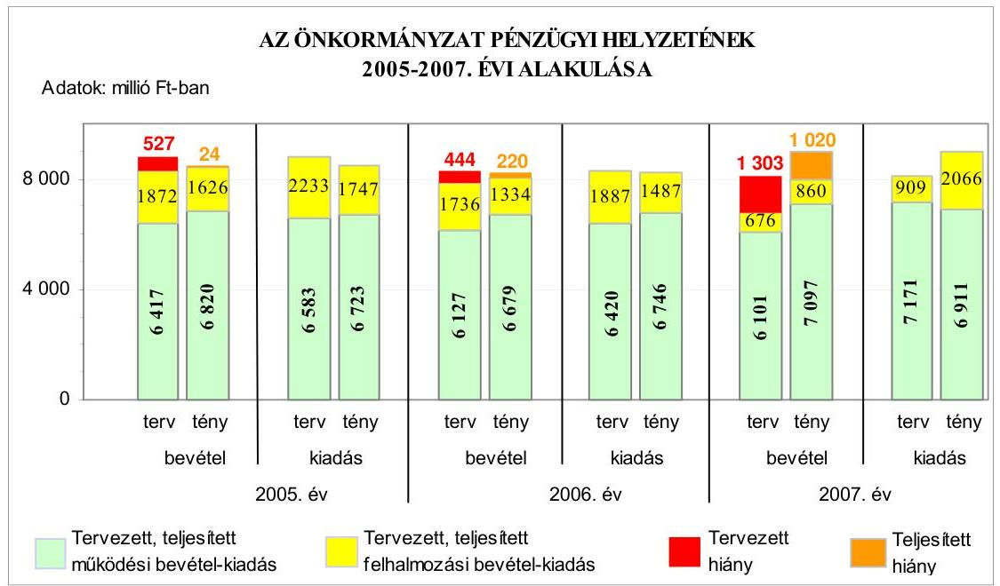
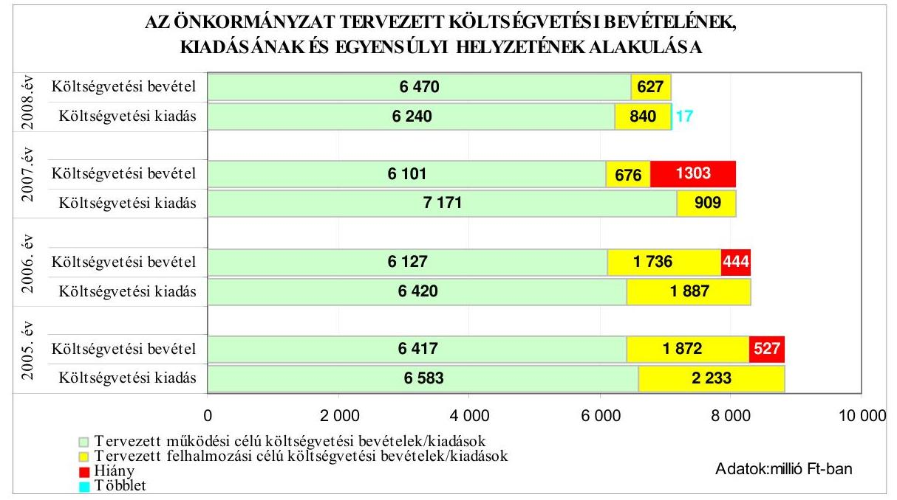
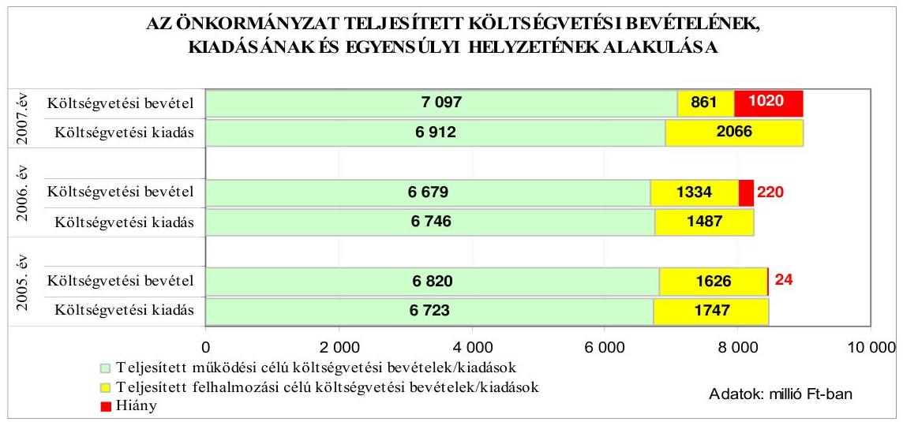
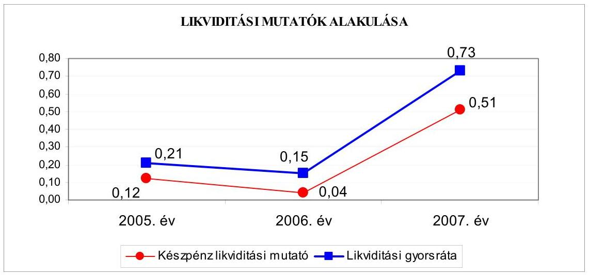
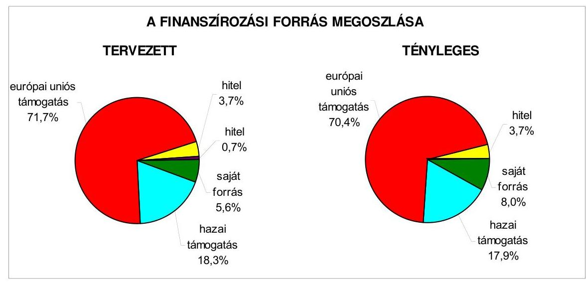
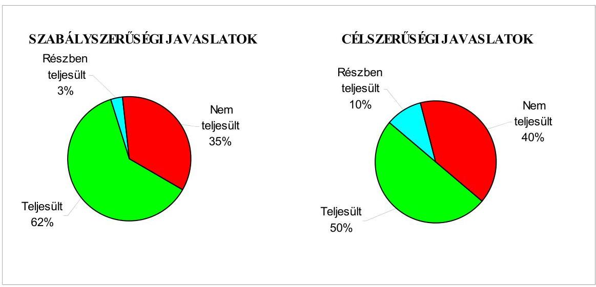
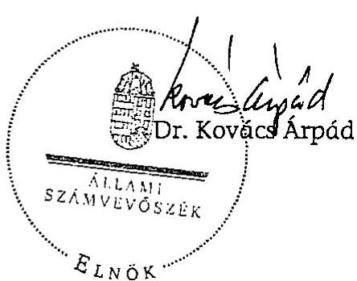
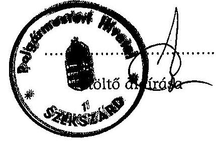
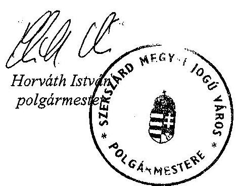

# JELENTÉS 

Szekszárd Megyei Jogú Város Önkormányzata gazdálkodási rendszerének 2008. évi ellenőrzéséről

---

3. Önkormányzati és Területi Ellenőrzési Igazgatóság
3.3. Átfogó Ellenőrzések Főcsoport
Iktatószám: V-3003-6/28/23/2008.
Témaszám: 898
Vizsgálat-azonosító szám: V0383
Az ellenőrzést felügyelte:
Dr. Lóránt Zoltán
főigazgató
Az ellenőrzés végrehajtásáért felelős:
Dr. Sepsey Tamás
főigazgató-helyettes
Az ellenőrzést vezette:
Péntek László
főtanácsadó, irodavezető
Az ellenőrzést végezték:
Péntek László Eigner György Kopaczné Horváth Zsuzsanna főtanácsadó számvevő számvevő tanácsos
A témához kapcsolódó eddig készített számvevőszéki jelentések:
címe
sorszáma
Jelentés Szekszárd megyei jogú város Önkormányzata gazdálkodásának átfogó ellenőrzéséről 0422
Jelentés a Magyar Köztársaság 2004. évi költségvetése végrehajtásának ellenőrzéséről 0540
Függelék:

- a helyi önkormányzatokat a 2004. évben megillető normatív állami hozzájárulás elszámolásának ellenőrzése
- normatív kötött felhasználású támogatások 2004. évi felhasználásának ellenőrzése
Jelentés a helyi és a helyi kisebbségi önkormányzatok gazdálkodásának átfogó ellenőrzéséről 0544
Jelentés a hajléktalanokat ellátó intézményrendszer ellenőrzéséről ..... 0613
Jelentés a Magyar Köztársaság 2005. évi költségvetése végrehajtásának ellenőrzéséről 0628
Függelék:
a helyi önkormányzatok beruházásainak és rekonstrukcióihoz nyújtott 2005. évi felhalmozási célú támogatások ellenőrzése
Jelentés a Magyar Köztársaság 2006. évi költségvetése végrehajtásának ellenőrzéséről 0724
Függelék:
a helyi önkormányzatok beruházásainak és rekonstrukcióihoz nyújtott 2006. évi felhalmozási célú támogatások ellenőrzése

---

# TARTALOMJEGYZÉK 

BEVEZETÉS ..... 9
I. ÖSSZEGZŐ MEGÁLLAPÍTÁSOK, KÖVETKEZTETÉSEK, JAVASLATOK ..... 14
II. RÉSZLETES MEGÁLLAPÍTÁSOK ..... 25

1. Az Önkormányzat költségvetési és pénzügyi helyzete ..... 25
1.1. A tervezett és teljesített költségvetési bevételek és kiadások alapján a költségvetési és a pénzügyi egyensúly alakulása, valamint a költségvetési hiány megállapításának szabályszerűsége ..... 25
1.2. A költségvetési és a pénzügyi egyensúlyi helyzet kialakításához tervezett és teljesített finanszírozási célú pénzügyi műveletek módja és azok hatása a tárgyévet követő évek költségvetéseire ..... 27
1.3. A költségvetés tervezésének megalapozottsága ..... 34
2. Az Önkormányzat felkészültsége az európai uniós források igénylésére és felhasználására, valamint az elektronikus közigazgatási feladatok ellátására ..... 35
2.1. Az európai uniós források igénybevételére és a várható támogatás felhasználására történt felkészülés szabályozottsága, szervezettsége ..... 35
2.1.1. Az európai uniós forrásokra történő pályázatok benyújtására vonatkozó döntések összhangja a fejlesztési célkitűzésekkel ..... 35
2.1.2. Az európai uniós forrásokhoz kapcsolódóan a pályázatfigyelés, a pályázatkészítés, valamint az európai uniós támogatással megvalósuló fejlesztés lebonyolításának belső rendjének szabályozottsága, a végrehajtás személyi, szervezeti feltételei ..... 40
2.1.3. A fejlesztési feladat lebonyolításánál a feladatellátás rendjére, az ellenőrzési feladatok teljesítésére, valamint a felelősségi szabályokra vonatkozó előírások betartása ..... 41
2.2. Az elektronikus közigazgatási feladatok ellátása, a közérdekű adatok elektronikus közzététele ..... 45
3. A költségvetési gazdálkodás belső kontrolljai ..... 47
3.1. A szabályozottság kockázata a költségvetés tervezési, gazdálkodási, beszámolási és a folyamatba épített, előzetes és utólagos vezetői ellenőrzési feladatoknál ..... 47
3.2. A belső kontrollok érvényesülése az önkormányzati források szabályszerű felhasználásában, a költségvetési tervezés, gazdálkodás, beszámolás folyamataiban ..... 50
3.3. A belső ellenőrzési kötelezettség teljesítése, javaslatainak hasznosulása ..... 53

---

4. Az ÁSZ korábbi ellenőrzési javaslatai alapján készített intézkedési terv végrehajtása, eredményessége ..... 57
4.1. Az Önkormányzat gazdálkodási rendszerének átfogó ellenőrzése során tett javaslatok végrehajtására tervezett intézkedések megvalósulása ..... 57
4.2. A zárszámadáshoz kapcsolódó (állami hozzájárulások, támogatások igénylésének és felhasználásának ellenőrzése), valamint a további vizsgálatok esetében a megállapítások, javaslatok alapján tett intézkedések ..... 63
MELLÉKLETEK
5. számú Az Önkormányzat gazdálkodását meghatározó adatok, mutatószámok (1 oldal)
6. számú Az önkormányzati vagyon alakulása (1 oldal)
7. számú Az Önkormányzat 2005-2007. évi költségvetési előirányzatainak és azok pénzügyi teljesítéseinek alakulása (1 oldal)
8. számú Tanúsítvány az európai uniós forrásokkal támogatott programok, célok tervezett és tényleges 2005-2008. évi adatairól (2 oldal)
9. számú Adatlap az Önkormányzat európai uniós forrással támogatott fejlesztéséről (3 oldal)
10. számú Horváth István úr, a Szekszárd Megyei Jogú Város Önkormányzat polgármesterének észrevétele (1 oldal)

---

# RÖVIDÍTÉSEK JEGYZÉKE 

## Törvények

Áht.
ÁSZ tv.
Eisztv.
Htv.

Kbt.
Ötv.
Számv. tv.
Szoc. tv.

## Rendeletek

2005. évi költségvetési rendelet
2005. évi zárszámadási rendelet
2006. évi költségvetési rendelet
2006. évi zárszámadási rendelet
2007. évi költségvetési rendelet
2008. évi költségvetési rendelet
adórendelet

Ámr.
Ber.
SzMSz
vagyongazdálkodási rendelet
az államháztartásról szóló 1992. évi XXXVIII. törvény az Állami Számvevőszékről szóló 1989. évi XXXVIII. törvény
az elektronikus információszabadságról szóló 2005. évi XC. törvény
a helyi önkormányzatok és szerveik, a köztársasági megbízottak, valamint egyes centrális alárendeltségű szervek feladat- és hatásköreiről szóló 1991. évi XX. törvény
a közbeszerzésekről szóló 2003. évi CXXIX. törvény
a helyi önkormányzatokról szóló 1990. évi LXV. törvény
a számvitelről szóló 2000. évi C. törvény
a szociális igazgatásról és a szociális ellátásokról szóló 1993. évi III. törvény

Szekszárd Megyei Jogú Város Önkormányzatának 5/2005. (III. 1.) számú rendelete a 2005. évi költségvetésről

Szekszárd Megyei Jogú Város Önkormányzatának 9/2006. (V. 30.) számú rendelete a 2005. évi költségvetés végrehajtásáról
Szekszárd Megyei Jogú Város Önkormányzatának 8/2006. (III. 1.) számú rendelete a 2006. évi költségvetésről
Szekszárd Megyei Jogú Város Önkormányzatának 14/2007. (IV. 27.) számú rendelete 2006. évi költségvetés végrehajtásáról
Szekszárd Megyei Jogú Város Önkormányzatának 6/2007. (III. 1.) számú rendelete a 2007. évi költségvetésről
Szekszárd Megyei Jogú Város Önkormányzatának 12/2008. (II. 28.) számú rendelete a 2008. évi költségvetésről
Szekszárd Megyei Jogú Város Önkormányzatának 29/1991. (XII. 23) számú rendelete a helyi adókról és az adózás rendjéről
az államháztartás működési rendjéről szóló 217/1998. (XII. 30.) Korm. rendelet
a költségvetési szervek belső ellenőrzéséről szóló 193/2003. (XI. 26.) Korm. rendelet
Szekszárd Megyei Jogú Város Önkormányzatának 10/2000. (IV. 17.) számú rendelete a Szervezeti és Működési Szabályzatról
Szekszárd Megyei Jogú Város Önkormányzatának 31/2004. (XII. 1.) számú rendelete az Önkormányzat vagyonáról és a vagyongazdálkodás szabályairól

---

Vhr.

## Szórövidítések

Alisca-Terra Kft.
aljegyző

ÁSZ
AVOP
DDOP operatív program
e-közigazgatás
FEUVE
GVOP
GVOP információs rendszer fejlesztése
jegyző
Jogi iroda

KEHI
KEOP
Keleti Városkapu beruházás
KESZ

Kistérségi társulás
KKV
Korszerú utasforgalom kialakítása

Közgazdasági iroda
Közgyűlés
Közigazgatási hivatal
MÁK
Műszaki iroda
az államháztartás szervezetei beszámolási és könyvvezetési kötelezettségének sajátosságairól szóló 249/2000.
(XII. 24.) Korm. rendelet

Alisca-Terra Hulladékgazdálkodási Kft.
Szekszárd Megyei Jogú Város Önkormányzatának aljegyzője
Állami Számvevőszék
NFT Agrár- és Vidékfejlesztési Operatív Program
Dél-dunántúli Operatív program
elektronikus közigazgatás
folyamatba épített, előzetes és utólagos vezetői ellenőrzés
NFT Gazdasági Versenyképesség Operatív Program
GVOP-4.3.1 intézkedése keretében „Elektronikus ügyintézés bevezetése Szekszárd MJV-ban és kistérségben"című projekt
Szekszárd Megyei Jogú Város Önkormányzatának jegyzője
Szekszárd Megyei Jogú Város Önkormányzata Polgármesteri Hivatalának Jogi és Önkormányzati Irodája
Kormányzati Ellenőrzési Hivatal
ÚMFT Környezet és Energia Operatív Program
ROP-2.2.1 intézkedése „Szekszárd Keleti Városkapu rehabilitáció I. ütem" című projekt
Szekszárd Megyei Jogú Város Önkormányzatának Költségvetési Elszámoló Szervezete
Szekszárd és Térsége Többcélú Kistérségi Társulás
kis- és középvállalkozások
ROP-2.1.3 intézkedése „Korszerű utasforgalmi szolgáltatások feltételeinek megteremtése széleskörű együttműködésben Szekszárd és térségben" című projekt
Szekszárd Megyei Jogú Város Önkormányzata Polgármesteri Hivatalának Közgazdasági Irodája
Szekszárd Megyei Jogú Város Önkormányzatának Közgyűlése
Dél-dunántúli Regionális Közigazgatási Hivatal Tolna Megyei Kirendeltsége
Magyar Államkincstár
Szekszárd Megyei Jogú Város Önkormányzatának Polgármesteri Hivatalának Műszaki Irodája

---

| Művelődési osztály | Szekszárd Megyei Jogú Város Önkormányzata Polgármesteri Hivatalának Művelődési és Sport Osztálya |
| :--: | :--: |
| MVH | Magyar Vidékfejlesztési Hivatal |
| NFT | Nemzeti Fejlesztési Terv |
| Okmányiroda | Szekszárd Megyei Jogú Város Önkormányzata Polgármesteri Hivatalának Okmányirodája |
| PEJ | projekt előrehaladási jelentés |
| Pénzügyi bizottság | Szekszárd Megyei Jogú Város Önkormányzata Pénzügyi Bizottsága |
| PM | Pénzügyminisztérium |
| Polgármesteri hivatal | Szekszárd Megyei Jogú Város Önkormányzatának Polgármesteri Hivatala |
| Polgármesteri hivatal ügyrendje | SzMSz 3. számú melléklete a Polgármesteri Hivatal Ügyrendje |
| Stratégiai osztály | Szekszárd Megyei Jogú Város Önkormányzatának Polgármesteri Hivatalának Stratégiai Tervezési Osztálya |
| Szervezési osztály | Szekszárd Megyei Jogú Város Önkormányzatának Polgármesteri Hivatalának Szervezési, Marketing és Kommunikációs Osztálya |
| Szociális iroda | Szekszárd Megyei Jogú Város Önkormányzatának Polgármesteri Hivatalának Szociális Irodája |
| ÚMFT | Új Magyarország Fejlesztési Terv |
| Vagyonkezelő Kft. | Szekszárdi Vagyonkezelő Kft. |
| Vízmű Kft. | Szekszárdi Víz- és Csatornamű Kft. |

---

.

---

# ÉRTELMEZŐ SZÓTÁR 

1. elektronikus szolgáltatási szint
2. elektronikus szolgáltatási szint
3. elektronikus szolgáltatási szint
4. elektronikus szolgáltatási szint
európai uniós források
fejlesztési feladat (projekt)
fejlesztési célkitűzés
irányító hatóság

Az 1044/2005. (V. 11.) Korm. határozat alapján olyan információs, tájékoztató szolgáltatás, amely csak általános információkat közöl az adott üggyel kapcsolatos teendőkről és a szükséges dokumentumokról.
Az 1044/2005. (V. 11.) Korm. határozat alapján olyan egyirányú kapcsolatot biztosító szolgáltatás, amely az 1. szinten túl biztosítja az adott ügy intézéséhez szükséges dokumentumok, nyomtatványok letöltését, és azok ellenőrzéssel, vagy ellenőrzés nélküli elektronikus kitöltését, amely esetben a dokumentumok benyújtása hagyományos úton történik.
Az 1044/2005. (V. 11.) Korm. határozat alapján olyan kétirányú kapcsolatot biztosító szolgáltatás, amely közvetlen, vagy ellenőrzött kitöltésű dokumentum segítségével biztosítja az elektronikus adatbevitelt és a bevitt adatok ellenőrzését. Az ügy indításához, intézéséhez személyes megjelenés nem szükséges, de az ügyhöz kapcsolódó közigazgatási döntés (határozat, egyéb aktus) közlése, valamint a kapcsolódó illeték-, vagy díjfizetés hagyományos úton történik.
Az 1044/2005. (V. 11.) Korm. határozat alapján olyan teljes közvetlen kétirányú ügyintézési folyamatot biztosító szolgáltatás, amikor az ügyhöz kapcsolódó közigazgatási döntés is elektronikus úton kerül közlésre, illetve a kapcsolódó illeték-, vagy díjfizetés elektronikus úton is intézhető.
Az elnyert európai uniós források lehívása a támogatott projekt megvalósítása érdekében, a fejlesztés lebonyolítása során felmerült kiadások finanszírozására.
A fejlesztési feladat (projekt) tartalmilag és formailag részletesen kidolgozott, megfelelő pénzügyi háttérrel és végrehajtási ütemezéssel rendelkező fejlesztési terv, amely illeszkedik az Európai Unió, illetve a Nemzeti Fejlesztési Terv által támogatott programokhoz.
Az önkormányzat által ellátott kötelező, vagy önként vállalt feladatok ellátásának mennyiségi, vagy minőségi fejlesztésére vonatkozó terv. A mennyiségi fejlesztés megvalósulhat beszerzéssel, létesítéssel, bővítéssel, átalakítással.
A strukturális alapok és a Kohéziós alap forrásainak szabályszerű, hatékony és eredményes felhasználásához szükséges intézményrendszer felső eleme. Az irányító hatóság általános és átfogó felelősséget visel a programok, projektek hatékony és szabályszerű végrehajtásáért. Felelősségi köréből eredően ellenőrzi a közösségi, valamint a hazai jogszabályok betartását, koordinálja az európai uniós források szétosztásának folyamatát, irányítja az intézményrendszer, a statisztikai és a pénzügyi nyilvántartási rendszer működését.

---

kedvezményezett
közreműködő szervezet
lebonyolítás
operatív program
támogatási szerződés

Az a helyi önkormányzat, amely a támogatási szerződést kedvezményezettként aláíja, a projektet, illetve a központi programhoz kapcsolódó támogatott önkormányzati programot végrehajtja.
A közreműködő szervezet az európai uniós támogatást elnyert kedvezményezettekkel kapcsolatot tartó szerv. Az operatív programok közreműködő szervezetei befogadják, nyilvántartják, döntésre előkészítik a pályázatokat, rögzítik a támogatással kapcsolatos adatokat az egységes monitoring informatikai rendszerben, elvégzik a támogatások előzetes (szerződéskötést megelőző), közbenső (a pénzügyi elszámolás, finanszírozás folyamatában végzett) és utólagos (a támogatott projekt pénzügyi lezárását megelőző) ellenőrzését. Az európai uniós források felhasználásával megvalósuló fejlesztésre irányuló műszaki, gazdasági (pénzügyi) tevékenységet magában foglaló szervezési, irányítási szolgáltatás. A szervezési szolgáltatás kiterjedhet a pályázatkészítésre, a közbeszerzési eljárás lebonyolításán keresztül a folyamatos műszaki ellenőrzésre, a pénzügyi elszámolásra, a műszaki átadás-átvételre, az üzembe helyezésre, illetve a fejlesztési folyamat egyes elemeire.
Az Európai Bizottság által jóváhagyott, a Közösségi Támogatási Keret végrehajtására vonatkozó 2004-2006 közötti, több évre szóló intézkedésekhez kapcsolódó prioritások egységes rendszerét tartalmazó dokumentum. A strukturális alapok operatív programjai: Agrár és Vidékfejlesztési Operatív Program (AVOP); Gazdasági Versenyképesség Operatív Program (GVOP); Humánerőforrás-fejlesztési Operatív Program (HEFOP); Környezetvédelmi és Infrastruktúra-fejlesztési Operatív Program (KIOP); Regionális Fejlesztési Operatív Program (ROP). Az ÚMFT-hez kapcsolódó operatív programok: Gazdaságfejlesztési Operatív Program (GOP); Közlekedés Operatív Program (KÖZOP); Társadalmi Megújulás Operatív Program (TÁMOP); Társadalmi Infrastruktúra Operatív Program (TIOP); Környezet és Energia Operatív Program (KEOP); Államreform Operatív Program (ÁROP); Elektronikus Közigazgatás Operatív Program (EKOP); Nyugat-dunántúli Operatív Program (NYDOP); Dél-alföldi Operatív Program (DAOP); Észak-alföldi Operatív Program (ÉAOP); Közép-magyarországi Operatív Program (KMOP); Észak-magyarországi Operatív Program (ÉMOP); Közép-dunántúli Operatív Program (KDOP); Dél-dunántúli

 Operatív Program (DDOP);
A strukturális alapok esetében az irányító hatóságnak, illetve a Kohéziós alap esetében a közreműködő szervezeteknek a kedvezményezett önkormányzattal kötött szerződése, amely a támogatás felhasználásának részletes feltételeit tartalmazza.

---

# JELENTÉS 

## Szekszárd Megyei Jogú Város Önkormányzata gazdálkodási rendszerének 2008. évi ellenőrzéséről

## BEVEZETÉS

Az Ötv. 92. § (1) bekezdése, az Állami Számvevőszékről szóló 1989. évi XXXVIII. törvény 2. § (3) bekezdése, valamint az Áht. 120/A. § (1) bekezdése alapján az önkormányzatok gazdálkodását az Állami Számvevőszék ellenőrzi. Az ellenőrzésre az Országgyűlés illetékes bizottságai részére is átadott, országosan egységes ellenőrzési program szerint került sor.

Az Állami Számvevőszék a stratégiájában foglalt célkitűzéseknek megfelelően a helyi önkormányzatok költségvetési gazdálkodási rendszere átfogó ellenőrzésének programját a 2007. évtől megújította, azt kiegészítette további - teljesítmény-ellenőrzési - elemekkel.

## Az ellenőrzés célja annak értékelése volt, hogy az Önkormányzat:

- milyen módon biztosította a költségvetési és a pénzügyi egyensúlyt a költségvetésében és annak teljesítése során, valamint változott-e a finanszírozási célú pénzügyi műveletek jelentősége a hiányzó bevételi források pótlásában;
- eredményesen készült-e fel a szabályozottság és a szervezettség terén az európai uniós források igénylésére és felhasználására, továbbá biztosította-e az e-közigazgatás feltételeit, az adatok közzétételével a gazdálkodás nyilvánosságát;
- kialakította-e a külső és a belső feltételeknek megfelelően a költségvetés tervezési, gazdálkodási és zárszámadási feladatai belső kontrollrendszerét ${ }^{1}$, ezen tevékenységek szabályszerű ellátásához hozzájárult-e a folyamatba épített, előzetes és utólagos vezetői ellenőrzés, valamint a belső ellenőrzés;

[^0]
[^0]:    ${ }^{1}$ A gazdálkodás szabályszerűségét biztosító kontrollrendszer alatt értjük a kiépített és működő belső irányítási és szabályozási rendszert, valamint a belső ellenőrzési funkciók ellátásának rendszerét.

---

- megfelelően hasznosította-e a korábbi számvevőszéki ellenőrzések megállapításait, szabályszerűségi ${ }^{2}$ és célszerűségi javaslatait.

Az ellenőrzés típusa: átfogó ellenőrzés, amely egyidejűleg - egy ellenőrzés keretében - meghatározott területekre összpontosítva érvényesíti a szabályszerűségi, valamint a teljesítmény-ellenőrzés jellemzőit.

Az ellenőrzött időszak: az 1., 2. és 4. programpontok tekintetében a 2005-2007. évek, a 3. ellenőrzési programpontnál a 2007. év.

Szekszárd megyei jogú város lakosainak száma 2008. január 1-jén 34955 fő volt. A 2006. évi önkormányzati választást követően az Önkormányzat 23 tagú Közgyűlésének munkáját hat állandó bizottság segítette. A helyi önkormányzat mellett a 2006. évi önkormányzati választásokat követően egy ${ }^{3}$ kisebbségi önkormányzat működött. A polgármester a 2006. évi önkormányzati képviselő és polgármester választás óta tölti be tisztségét, a jegyző személye 1998. év óta nem változott, de feladatait 2003. január 6-2006. október 1. között - tartós távolléte (fegyelmi eljárás, illetve GYES) miatt - az aljegyző látta el. Az aljegyző közszolgálati jogviszonya 2006. december 15-én megszűnt, azóta az álláshely betöltetlen.

Az Önkormányzat feladatainak végrehajtása érdekében a 2007. évben 22 költségvetési intézményt működtetett, amelyekből egy önállóan gazdálkodott. A feladatok ellátásában részt vett öt gazdasági társasága. Az Önkormányzat a 2007. évi költségvetési beszámolója szerint 7958 millió Ft költségvetési bevételt ért el és 8978 millió Ft költségvetési kiadást teljesített, 2007. december 31-én a könyvviteli mérleg szerint 36873 millió Ft értékű vagyonnal rendelkezett. Az Önkormányzat vagyona a 2005. év végi állományhoz viszonyítva 5,4%-kal növekedett, ezen belül a befektetett pénzügyi eszközök állománya 79,4%-kal emelkedett kettő gazdasági társaság visszavásárlása miatt, a kötelezettségek állománya a 2007. évben kibocsátott 2000 millió Ft összegű kötvény hatására közel két és félszeresére (142,1%-kal, 3179 millió Ft-ra) nőtt. A 2008. évi költségvetési rendeletben 7097 millió Ft költségvetési bevételt és 7080 millió Ft költségvetési kiadást irányoztak elő. Az összes költségvetési bevétel 40,8%-át a saját bevétel, illetve 19,7%-át a helyi adó bevétel biztosította a 2007. évben. Az összes költségvetési kiadásból a felhalmozási célú kiadás részaránya a 2007. évben 23% volt. A Polgármesteri hivatalban dolgozó köztisztviselők száma 2007. december 31-én 134 fő, a költségvetési intézményekben foglalkoztatott közalkalmazottak száma 925 fő volt. Az Önkormányzat gazdálkodását meghatározó adatokat, mutatószámokat az 1-3. számú mellékletek tartalmazzák.

Az Önkormányzat költségvetési és pénzügyi helyzetét az elemző eljárás módszerével vizsgáltuk. E körben elemeztük a költségvetés egyensúlyi helyzetének alakulását, a tervezett és tényleges költségvetési hiány okait, a mérséklésére tett

[^0]
[^0]:    ${ }^{2}$ A törvényi előírások betartásának elmulasztásakor a részletes megállapítások fejezetben a törvénysértés megjelölést alkalmazzuk, mivel az ÁSZ nem tehet különbséget a törvényi előírások között.
    ${ }^{3}$ Német kisebbségi önkormányzat

---

intézkedéseket, finanszírozásának módját, az Önkormányzat adósságállományának alakulását, összetevőit.

A teljesítmény-ellenőrzés módszerével vizsgáltuk, a belső szabályozottság, szervezettség terén az Önkormányzat felkészültségét az európai uniós források figyelésére, igénylésére és felhasználására, továbbá értékeltük, hogy az igényelt európai uniós támogatások az Önkormányzat által meghatározott fejlesztési célkitűzésekhez kapcsolódtak-e. Az eredményesség szempontjából a minősítést a lényegességi szinthez való viszonyítással végeztük el. Az ellenőrzés során felmértük, hogy az e-közigazgatási feladat ellátása, illetve bevezetése, működtetése érdekében milyen intézkedéseket tettek, valamint biztosították-e a közérdekű adatok közzétételét.

A költségvetési gazdálkodás belső kontrolljainak ellenőrzése során értékeltük, hogy a Polgármesteri hivatalnál a költségvetés tervezési, gazdálkodási, zárszámadás készítési feladatok belső kontrolljainak kiépítettsége és működése megfelelő biztosítékot ad-e a gazdálkodási feladatok megfelelő, szabályszerű ellátására. Felmértük és minősítettük a költségvetés tervezési, a gazdálkodási, a zárszámadás készítési feladatokkal, továbbá a pénzügyi-számviteli területen az informatikával kapcsolatosan kialakított kontrollok megfelelőségét, valamint azok működésének eredményességét, megbízhatóságát. Értékeltük a belső ellenőrzés szervezeti és szabályozási keretét, továbbá működését.

A Polgármesteri hivatalnál értékeltük a gazdálkodás folyamatában a kontrollok működésének megbízhatóságát, ennek keretében ellenőriztük a szakmai teljesítés igazolására és az utalvány ellenjegyzésére kialakított kontrollok végrehajtását. Az ellenőrzést a következő, kiemelt kockázatuk alapján kiválasztott ${ }^{4}$ az általánostól jellemzően eltérő, egyedi eljárást igénylő gazdasági eseményekkel kapcsolatos kifizetésekre folytattuk le ${ }^{5}$ :

- a külső szolgáltató által végzett karbantartási, kisjavítási szolgáltatások,
- a gépek, berendezések, felszerelések beszerzése, továbbá
- a működési célú pénzeszköz átadásokból az államháztartáson kívülre teljesített kifizetésekre.

[^0]
[^0]:    ${ }^{4}$ Az önkormányzatok kiemelt előirányzataira vonatkozóan, a vertikális folyamatokra elvégeztük a kockázatok becslését, amelynek eredményeként a külső szolgáltató által végzett karbantartási, kisjavítási szolgáltatások, a gépek, berendezések, felszerelések beszerzése valamint a működési célú pénzeszköz átadások államháztartáson kívülre teljesített kifizetései kiemelkedően kockázatos területeknek bizonyultak.
    ${ }^{5}$ A korábbi ellenőrzési tapasztalataink szerint ezeken a területeken a jegyzők nem, vagy hiányosan szabályozták a megbízás, megrendelés, illetve beszerzés indokoltságának, szükségességének elbírálására, igazolására, valamint a teljesítések dokumentálására, a kifizetések jogosságának megítélésére szolgáló kontrollokat. További kockázatot jelentett a külső szolgáltató által végzett karbantartási, kisjavítási munkák esetében, hogy az 50 ezer Ft alatti megrendelésekre vonatkozóan az ellenőrzési tapasztalataink szerint a jegyzők nem alakították ki a kötelezettségvállalások rendjét és nyilvántartási formáját, valamint a szabályozás elmulasztása esetén nem történt meg az írásbeli kötelezettségvállalás és annak az ellenjegyzése sem.

---

Az ellenőrzés hatékony elvégzése céljából a vizsgálandó területek kiválasztása során a kockázatokon alapuló megközelítés érvényesült, ezáltal az ellenőrzési erőforrásokat azokra a területekre fókuszáltuk, amelyeken legnagyobb a hibák előfordulási valószínűsége. Az ellenőrzési erőforrások ilyen típusú összpontosításával minimálisra csökkenthető a kívánt ellenőrzési bizonyosság eléréséhez szükséges időráfordítás.

A pénzügyi-számviteli folyamatokban alkalmazott belső kontrollok létezésének és működésének ellenőrzésére a vizsgált három terület 2007. évi könyvviteli tételeiből területenként egyszerű véletlen mintát vettünk. A kijelölt gazdasági eseményre elvégzett megfelelőségi tesztek alapján értékeltük a kontrollok működésének eredményességét, megbízhatóságát a vizsgált három területre külön-külön, majd összefoglalóan ${ }^{6}$ a Polgármesteri hivatal egyedi eljárást igénylő gazdasági eseményeire. A helyszíni ellenőrzés megállapításainak részletes dokumentálását három megfelelőségi tesztlapon, öt elővizsgálati és kilenc helyszíni ellenőrzési munkalapon biztosítottuk. Ezeken a teszt- és munkalapokon a minősítés alapjául szolgáló kérdések és a vonatkozó konkrét jogszabályhelyek megjelölése mellett értékeltük a kialakított belső kontrollokban rejlő kockázatokat ${ }^{7}$ és a kialakított kontrollok működésének megbízhatóságát ${ }^{8}$.

Az ÁSZ korábbi ellenőrzési javaslatai alapján tett intézkedéseket, illetve azok megvalósítását utóellenőrzés keretében vizsgáltuk. A gazdálkodási rendszer átfogó ellenőrzése során megfogalmazott javaslatok végrehajtására tett intézkedések megvalósítását ellenőriztük, az egyéb számvevőszéki ellenőrzések során tett javaslatok esetében pedig a kiadott intézkedéseket tekintettük át.

A helyszíni ellenőrzés során kitöltött - az ellenőrzést végző számvevő és a Polgármesteri hivatal felelős köztisztviselője által aláírt - elővizsgálati és helyszíni ellenőrzési munkalapokat, azok kitöltési útmutatóit, továbbá a megfelelőségi tesztek dokumentumait a polgármester részére a számvevői jelentéssel egyidejűleg átadtuk.
${ }^{6}$ A vizsgált három terület egyedi értékelési pontszámait a területek relatív költségvetési súlyával arányosan összegeztük.
${ }^{7}$ A kialakított belső kontrollokban rejlő kockázatot alacsonynak minősítettük, ha a kontrollok - végrehajtásuk esetén - megfelelő védelmet nyújtanak a hibák bekövetkezése ellen. Közepesnek minősítettük a belső kontrollokban rejlő kockázatot, amennyiben a kontrollok - végrehajtásuk esetén - a lehetséges hibák többsége ellen védelmet nyújtanak. Magasnak értékeltük a kockázatot, ha a kontrollok - kialakításuk hiányában, vagy hiányos kialakításuk miatt - nem nyújtanak elegendő védelmet a lehetséges hibákkal szemben.
${ }^{8}$ A kontrollok működésének eredményességét, megbízhatóságát kiválónak értékeltük abban az esetben, ha azok működése - esetleges apróbb hiányosságoktól eltekintve - megfelelt a hibák megelőzésére és kijavítására meghatározott szabályozásnak és a legmagasabb szintű elvárásoknak. Jónak minősítettük a kontrollok működését, ha a hiányosságok száma ugyan jelentős volt, de nem veszélyeztette az ellenőrzött terület hibáinak megelőzését és kijavítását. Amennyiben a hiányosságok mértéke nem biztosította a hibák megelőzését, feltárását, kijavítását és ezáltal veszélyeztette az eredményes, megbízható működést, a kontroll működésének megbízhatósága gyenge minősítést kapott.

---

A jelentést az ÁSZ-ról szóló 1989. évi XXXVIII. tv. 25. § (1) bekezdése alapján észrevétel közlése céljából megküldtük a Szekszárd Megyei Jogú Város Önkormányzata polgármesterének. A kapott észrevételt a jelentés 6. számú melléklete tartalmazza.

---

# I. ÖSSZEGZŐ MEGÁLLAPÍTÁSOK, KÖVETKEZTETÉSEK, JAVASLATOK 

Az Önkormányzatnál 2005-2007 között a tervezett költségvetési bevételek és kiadások évente folyamatosan csökkentek, a 2008. évben a tervezett költségvetési bevételek emelkedtek, a költségvetési kiadások csökkentek. A tervezett költségvetési bevételek nem nyújtottak fedezetet a tervezett költségvetési kiadásokra, a költségvetési egyensúly nem volt biztosított. A tervezett költségvetési hiány aránya az éves költségvetési kiadásokhoz viszonyítva a 2006. évi csökkenést követően a 2007. évben emelkedett. A költségvetés tervezett hiányának emelkedését a működési célú költségvetési bevételek folyamatosan növekvő hiánya és a felhalmozási célú költségvetési bevételeket meghaladó összegben tervezett felhalmozási célú költségvetési kiadások együttesen okozták. A költségvetési hiány fedezetére rövid- és hosszú lejáratú hitelfelvételt, illetve kötvénykibocsátást hagyott jóvá a Közgyűlés. A 2008. évi költségvetést a Közgyűlés többlettel hagyta jóvá, a működési célú költségvetési forrásból tervezték fedezni a felhalmozási célú költségvetési bevételt meghaladó kiadást.

A teljesített költségvetési bevételek a 2005-2007. évek között folyamatosan csökkentek, a költségvetési kiadások a 2006. évi csökkenést követően a 2007. évben emelkedtek. A pénzügyi egyensúly 2005-2007 között nem volt biztosított. A költségvetési bevételek hiányának az éves költségvetési kiadásokhoz viszonyított aránya emelkedését a felhalmozási célú költségvetési bevételeket meghaladó összegben teljesített
 felhalmozási célú költségvetési kiadások növekedése okozta, a felhalmozási célú költségvetési kiadások fedezettsége romlott. Az Önkormányzat a költségvetési hiány megállapításánál a 2005-2007. években - az Áht. előírásával ellentétesen - a költségvetési bevételek és kiadások összegében finanszírozási célú pénzügyi műveleteket is figyelembe vett költségvetési hiányt módosító költségvetési bevételként és kiadásként. A 2008. évi költségvetés összeállításánál a költségvetési bevételek és kiadások összegében nem vettek figyelembe finanszírozási célú pénzügyi műveleteket.

Az Önkormányzat a 2005-2007. években a költségvetés végrehajtása során folyamatosan fennálló pénzügyi hiányának fedezetére folyószámla- és bérhitel igénybevétele mellett rövid lejáratú hitelt, fejlesztési célkitűzései megvalósításához hosszú lejáratú hitelt vett fel. A folyószámlahitel igénybevétele a kötvény kibocsátásáig folyamatos volt. 2007. június hónapban 2000 millió Ft összegű, svájci frank alapú, 20 éves futamidejű kötvénykibocsátásra került sor, melynek visszavásárlása a 2012. évben kezdődik, évente 125 millió Ft értékben. A kötvény fedezete - az Ötv. előírásával ellentétesen - az Önkormányzat bankszámláinak állománya. Az Önkormányzat a kötvénykibocsátásból származó bevételt a korábbi években értékesített üzletrészei visszavásárlására, hitelek, kölcsönök törlesztésére és számlatartozásai kiegyenlítésére a 2007. évben felhasználta.

Az Önkormányzat pénzügyi helyzete - a 2005-2007. évek között - eladósodási szempontból rosszabbodott, a kötelezettségek állománya 142%-kal, az összes forrás 5%-kal emelkedett a 2005. évről a 2007. évre. Az Önkormányzat fizetőképessége kedvezőtlenül alakult, a likviditási mutatók - a kötvénykibocsátást követő javulás ellenére - alapján a rövid lejáratú kötelezettségeket nem fedezte a pénz- és a követelésállomány.

Az Önkormányzatnál a 2005-2007. évek között a költségvetési bevételek eredeti előirányzata túlteljesült, a költségvetési kiadások a 2005-2006. években az eredeti előirányzat alatt teljesültek, a 2007. évben túlteljesültek. A költségvetési bevételek eredeti előirányzatának a túlteljesítése és a költségvetési kiadások alulteljesítése, illetve a 2007. évben a kiadásoknak a bevétel növekménytől elmaradó teljesülése miatt az Önkormányzat év végi pénzügyi hiánya a tervezettnél alacsonyabb összegű volt. Az Önkormányzat 2005-2007. évi felhalmozási célú költségvetési bevételi és kiadási előirányzatainak alul-, illetve túlteljesítése tervezési hiányossággal függött össze.

Az Önkormányzat a 2005-2008. évekre vonatkozó fejlesztési célkitűzéseit ágazati programokban, cselekvési ütemtervben, koncepciókban és gazdasági programban rögzítette, a célok kétharmada a kötelező feladatokhoz kapcsolódott. A fejlesztési célkitűzések megalapozottságát helyzetfelméréssel alátámasztották, megvalósításuk lehetséges pénzügyi forrásai között európai uniós támogatásokkal is számoltak. Az Önkormányzat eredményesen pályázott nyolc fejlesztési feladathoz európai uniós támogatásra, a feladatok saját forrás szükségletére a 2005-2008. évi költségvetési rendeletekben a céltartalék között biztosítottak fedezetet. Az Áht-ban előírtak ellenére a 2005. évi költségvetési rendelet eredeti előirányzatai a GVOP információs rendszer fejlesztése feladat bevételei és kiadásai vonatkozásában eltértek a támogatási szerződésekben rögzített éves támogatási és felhasználási ütemektől. Az Ámr. előírása ellenére a 2006-2007. évi költségvetési rendeletekben elkülönítetten nem mutatták be az intézményeknél az európai uniós támogatással megvalósuló programokat.

Az Önkormányzat a GVOP információs rendszer fejlesztésére benyújtott pályázatával a 2005-2006. évekre vonatkozóan összesen 263 millió Ft támogatást nyert el. A támogatási szerződést kettő alkalommal módosították. Az Önkormányzat a támogatási szerződés módosításában jóváhagyott 250 millió Ft támogatást teljes összegben, a támogatási szerződésben rögzített beruházás megvalósításához igénybe vette. Az európai uniós forrással támogatott fejlesztési feladat megvalósítása a támogatási szerződésben rögzített időbeli és kiadási ütemnek megfelelően történt. A támogatás igénybevétele a támogatási szerződés módosításában meghatározott ütemezéstől eltérően haladt, mert a kifizetési kérelmek benyújtása és a támogatás folyósítása 104-166 nap közötti időtartamot vett igénybe. A Polgármesteri hivatalban a GVOP információs rendszer fejlesztése feladattal kapcsolatos bevételek beszedésénél és a kiadások teljesítésénél nem működött a folyamatba épített, előzetes és utólagos vezetői ellenőrzés, a belső ellenőrzés a beruházás folyamatát és az ezzel kapcsolatos kötelezettségek teljesítését nem vizsgálta. A GVOP információs rendszer fejlesztése feladat megvalósítása folyamatában külső szervezetek nyolc alkalommal végeztek helyszíni ellenőrzést, ezek alapján kétszer a kifizetési kérelem kiegészítését, egyszer a megítélt támogatás összegének csökkentését írták elő.

Az Önkormányzat európai uniós pályázatai az ágazati programokban, a költségvetési koncepciókban és a gazdasági programban megfogalmazott fejlesztési célkitűzésekhez kapcsolódtak, azonban a szabályozottság és a szervezettség terén az Önkormányzat 2005-2007 között összességében nem készült fel eredményesen az európai uniós források igénybevételére és felhasználására. Nem határozták meg az európai uniós forrásokkal összefüggésben az önkormányzati szintű feladatokat, nem írták elő a pályázatfigyelést végzők és a döntési, illetve döntés-előterjesztési joggal rendelkezők közötti információk szolgáltatásának kötelezettségét, a polgármester és a fejlesztési feladat lebonyolítója közötti kapcsolattartás rendjét, valamint az európai uniós forrással támogatott fejlesztés lebonyolításának ellenőrzési kötelezettségét, feladatait és felelősét. A pályázatkészítési feladatok ellátására, valamint a pályázatok lebonyolításába bevont külső szervezetek megbízási szerződéseiben a felelősségi szabályokat, a feladatellátás rendjét, továbbá az ellenőrzési feladatokat hiányosan szabályozták. Az európai uniós források igénybevételére és felhasználására vonatkozóan a pályázatfigyelés személyi feltételeit a Polgármesteri hivatalon belül biztosították, a feladatot munkaköri leírásokban rögzítették. A pályázatkészítési és lebonyolítási feladatok ellátásához külső szervezeteket is igénybe vettek.

Az informatikai stratégiát a Közgyűlés elfogadta, amelyben rövid távú célként a 2. elektronikus szolgáltatási szint elérését és az ehhez szükséges feladatokat és fejlesztéseket meghatározta. Az e-közigazgatási feladatok ellátásának szervezeti-személyi feltételeit a Polgármesteri hivatalban kialakították. Az e-közigazgatási feladatokat ellátó közigazgatási szolgáltatások rendszerét meghatározott ügykörökben a 2. elektronikus szolgáltatási szinten biztosította a Polgármesteri hivatal. Az Önkormányzat nem volt kötelezett az Eisztv-ben előírt közérdekű adatok elektronikus közzétételére. Az Önkormányzat az Áht-ban foglalt előírások ellenére nem tette közzé a vagyongazdálkodással összefüggő, a nettó öt millió forintot elérő, vagy azt meghaladó értékű szerződések adatait, valamint az Ámr. előírásait figyelmen kívül hagyva a 2005-2006. évi beszámolók szöveges indoklását. Az Önkormányzat a nem normatív, céljellegű, működési és fejlesztési támogatások adatait - az Áht-ban foglaltaknak eleget téve - közzétette.

A Polgármesteri hivatalban a 2007. évben a költségvetés tervezési és a zárszámadás készítési folyamatok szabályozottságának hiányosságai magas kockázatot jelentettek a feladatok szabályszerű végrehajtásában, mivel a jegyző nem határozta meg írásban az intézmények részére a költségvetési javaslat összeállításával kapcsolatos követelményeket. Nem írta elő a költségvetési tervezéshez készített intézményi mutatószám felmérés adatai megalapozottságának, az intézmények és a Polgármesteri hivatal szervezeti egységei által benyújtott költségvetési igények indokoltságának, teljesíthetőségének, továbbá a tervezett saját bevételek előirányzatainak és az azok megalapozását szolgáló önkormányzati rendeletek összhangjának ellenőrzését. Az Ámr-ben foglaltak ellenére nem készített előterjesztést a Közgyűlés részére a költségvetési szervek elemi beszámolója felülvizsgálatának rendje, tartalma meghatározása érdekében, nem írta elő az intézmények által az állami támogatásokkal, hozzájárulásokkal történő elszámolásokhoz közölt mutatószámok megbízhatóságának ellenőrzését, valamint az intézményi pénzmaradványok kimunkálásának felülvizsgálati kötelezettségét.

A Polgármesteri hivatalban a költségvetés tervezési és zárszámadás készítési folyamatban a kontrollok működésének megbízhatósága gyenge volt, mivel a helyi szabályozás hiánya miatt nem vizsgálták az intézmények 2007. évi költségvetési javaslatának összeállításával kapcsolatos követelmények érvényesítését. A jegyző nem ellenőriztette az intézményi mutatószám felmérés adatainak megalapozottságát, az intézmények, hivatali szervezeti egységek által benyújtott költségvetési igények indokoltságát, teljesíthetőségét, továbbá a tervezett saját bevételek előirányzatai és az azok megalapozását szolgáló rendeletek összhangját. A 2006. évi zárszámadás készítés folyamatában a jegyző nem vizsgáltatta az intézmények által közölt mutatószámok adatainak megbízhatóságát, az Ámr-ben előírtak ellenére nem ellenőriztette az intézményi pénzmaradványok megállapításának szabályszerűségét, az eredeti és a módosított előirányzatok, valamint a teljesítések eltérésének indokoltságát, és az intézményi számszaki beszámolót.

A Polgármesteri hivatalban a 2007. évben a gazdálkodási, a pénzügyi-számviteli és a folyamatba épített ellenőrzési feladatok szabályozottságának hiányosságai magas kockázatot jelentettek a feladatok szabályszerű végrehajtásában, mivel a jegyző az Ámr. előírása ellenére nem rögzítette a Polgármesteri hivatal ügyrendjében a gazdasági szervezetre vonatkozóan a vezetők és más dolgozók feladat-, hatás- és jogkörét. Nem rendelkezett belső szabályzatban a szakmai teljesítés igazolásának módjáról, nem jelölte ki a szakmai teljesítés igazolást végző személyeket az Önkormányzat költségvetéséből biztosított támogatásokra, pénzeszközátadásokra vonatkozóan. Nem rögzítette a közgazdasági irodavezető munkaköri leírásában a felesleges vagyontárgyak hasznosításának és selejtezésének szabályzatában részére meghatározott ellenőrzési feladatot, az érvényesítéssel megbízott három fő közül kettő fő munkaköri leírásában nem nevesítette e feladat ellátását. A Vhr-ben foglaltakkal ellentétesen írta elő a leltározási és leltárkészítési szabályzatban az üzemeltetésre átadott eszközök egyeztetéssel történő leltározását, nem szerepeltette munkaköri leírásban, illetve külön írásbeli megbízásban a leltárellenőrzési feladatokat, nem határozta meg az értékelések ellenőrzéséért felelős munkaköröket. Nem készítette el a Vhr-ben előírtak ellenére az önköltségszámítás rendjére vonatkozó belső szabályzatot. Nem rögzítette a pénzkezelési szabályzatban az Ámr. előírása ellenére az utólagos vezetői ellenőrzés gyakoriságát és dokumentálásának módját. Nem határozta meg a felesleges vagyontárgyak hasznosításának és selejtezésének szabályzatában a döntéshozatalra jogosultak körét az üzemeltetésre átadott eszközökre vonatkozóan, a Vhr. előírása ellenére nem rendelkezett a számlarendben a főkönyv és az analitikus nyilvántartások egyeztetéséhez kapcsolódóan a dokumentálás módjáról. A Polgármesteri hivatal a 2007. évben nem rendelkezett az Ámr-ben meghatározott, a FEUVE rendszerével kapcsolatos szabályzatokkal, ezért az Ötv. előírása alapján a jegyző a felelős.

A Polgármesteri hivatalnál a 2007. évben a karbantartási, kisjavítási szolgáltatásokkal, a gépek, berendezések, felszerelések beszerzésével kapcsolatos kifizetések, továbbá a működési célú pénzeszközátadások államháztartáson kívülre teljesített kifizetései során a működésbeli hibák megelőzésére, feltárására, kijavítására kialakított kontrollok működésének megbízhatósága gyenge volt. A karbantartási, kisjavítási szolgáltatásokkal, a gépek, berendezések, felszerelések beszerzésével kapcsolatos kifizetések alapbizonylatait a szakmai teljesítés igazolására kijelölt személyek aláírásukkal ugyan ellátták, azonban a szerződés, megállapodás szakmai teljesítésigazolásának módját az Ámr-ben előírtak ellenére a jegyző belső szabályzatban nem határozta meg, ezért ezen aláírások önmagukban nem jelentik a kiadás teljesítésének elrendelése előtti ellenőrzés elvégzésének, illetve a jogosultság, összegszerűség, a szerződés, megállapodás teljesítésének igazolását. Az 50 ezer Ft-ot el nem érő karbantartási, kisjavítási kiadásoknál a szakmai teljesítés igazolása írásbeli kötelezettségvállalások hiányában történt. A működési célú pénzeszközátadások államháztartáson kívülre teljesített kifizetései során a szakmai teljesítés igazolása elmaradt, mivel a jegyző az Ámr. előírása ellenére nem jelölte ki a szakmai teljesítés igazolást végző személyeket. Az utalvány ellenjegyzője nem kifogásolta, hogy az Ámrben előírtak ellenére az 50 ezer Ft-ot el nem érő kiadásoknál a szakmai teljesítés igazolása és az érvényesítés írásbeli kötelezettségvállalás hiányában történt, továbbá azt, hogy a jegykiadó pénztárgépek beszerzésénél, valamint a működési célú pénzeszközátadásoknál elmaradt az írásbeli kötelezettségvállalások ellenjegyzése. Nem észrevételezte, hogy a szakmai teljesítés igazolását nem belső szabályzatban előírt módon végezték, illetve a feladatra történő kijelölés elmaradása miatt nem végezték el. A működési célú pénzeszközátadások során nem kifogásolta, hogy az érvényesítésre a szakmai teljesítés igazolásának hiányában került sor. A belső kontrollok - megfelelő szabályozás hiányában kialakult - gyenge megbízhatóságú működéséért az Ötv-ben és az Áht-ban foglaltak alapján a jegyző a felelős.

A Polgármesteri hivatalban az informatikai rendszer szabályozottsága összeségében alacsony kockázatot jelentett az informatikai feladatok biztonságos végrehajtásában, mivel rendelkeztek informatikai stratégiával, informatikai biztonsági szabályzattal, üzemeltetési, mentési kézikönyvvel, és szabályozták a hozzáférési jogosultságokat.
 Annak ellenére összességében alacsony volt a kockázat, hogy nem gondoskodtak az informatikával kapcsolatos szabályzatok megismertetéséről a pénzügyi-számviteli dolgozók körében. Az informatikai rendszer működtetésénél a működésbeli hibák megelőzésére, feltárására, kijavítására kialakított kontrollok működésének megbízhatósága kiváló volt.

A belső ellenőrzés szervezeti keretei kialakításának és szabályozásának hiányosságai a belső ellenőrzési feladatok végrehajtásában közepes kockázatot jelentettek, mivel a Kistérségi társulással kötött megállapodásban a Ber. előírása ellenére nem rögzítették azt, hogy a belső ellenőrzési vezetői feladatokat a Kistérségi társulás látja el. A Ber. 2007. április hónapban történt módosítását figyelmen kívül hagyva a megállapodásban nem rendelkeztek arról, hogy a belső ellenőrzési vezető számára meghatározott tevékenységeket ezen időponttól milyen módon látják el. A Ber-ben előírtak ellenére az SzMSz-ben, illetve a Polgármesteri hivatal ügyrendjében nem rögzítették a belső ellenőrzési kötelezettséget, valamint az ellenőrzést végző szervezet jogállását, feladatait. Két fő belső ellenőr nem rendelkezett a Ber-ben előírt iskolai végzettséggel, rendszeres továbbképzésükhöz a Kistérségi társulás képzési tervet nem készített. A belső ellenőrzés nem rendelkezett kockázatelemzéssel alátámasztott stratégiai tervvel. A Közgyűlés az Ötv-ben előírt határidőt követő időpontban fogadta el a 2007. és a 2008. évi ellenőrzési tervet, melyek a kockázatelemzés hiánya miatt nem feleltek meg a Ber. előírásainak. A Kistérségi társulás által készített belső ellenőrzési kézikönyv nem tartalmazta a módszertani útmutatókat, az egyes ellenőrzések főbb lépéseit, szakaszait, a belső ellenőrzési tevékenység minőségét biztosító eljárásokat.

A belső ellenőrzés működtetésénél a kialakított kontrollok megbízhatósága összességében gyenge volt, mivel a jegyző nem gondoskodott a 2007. évi ellenőrzési tervben szereplő két ellenőrzés közül az egyik ellenőrzés elvégzéséről. A belső ellenőrzés nem ellenőrizte a Ber-ben előírtak ellenére a Polgármesteri hivatalnál és az intézményeknél a FEUVE rendszer kiépítését és működését, a pénzügyi irányítási és ellenőrzési rendszerek működését, a rendelkezésre álló erőforrásokkal való gazdálkodást, a vagyon megóvását és gyarapítását, valamint az elszámolások, beszámolók megbízhatóságát. A belső ellenőrzés rendszerében nem vizsgálták a közbeszerzési eljárások végrehajtását, az Önkormányzat többségi irányítást biztosító befolyása alatt működő gazdasági társaságoknál a rendelkezésre álló erőforrásokkal való gazdálkodást, valamint az Önkormányzat költségvetéséből céljelleggel nyújtott támogatások rendeltetés szerinti felhasználását. A Ber-ben előírtak ellenére az ellenőrzött szervezetek vezetői intézkedési tervet nem készítettek, a Kistérségi társulás belső ellenőrzési csoportja nem gondoskodott az ellenőrzési jelentések alapján megtett intézkedések nyomon követéséről, és nem győződött meg a feltárt hiányosságok megszüntetéséről az ellenőrzött szervezeteknél. A belső ellenőrzési vezető a Ber. előírása ellenére a 2007. évi ellenőrzési jelentés elkészítésekor nem értékelte önértékelés keretében a belső ellenőrzés minőségét, tárgyi és személyi feltételeit. A jegyző a 2006. és a 2007. évi költségvetési beszámoló keretében - az Áht. előírása ellenére - nem számolt be a Polgármesteri hivatal folyamatba épített, előzetes és utólagos vezetői ellenőrzésének, valamint belső ellenőrzésének működtetéséről. A polgármester - az Ötv. előírása ellenére - nem terjesztette a 2006. évi zárszámadási rendelettervezettel egyidejűleg a Közgyűlés elé az Önkormányzat felügyelete alá tartozó költségvetési szervek éves ellenőrzési jelentései alapján készített éves összefoglaló jelentést. A belső ellenőrzés gyenge megbízhatóságú működéséért - az Ötv-ben és az Áht-ban foglaltak alapján - a jegyző a felelős.

Az Önkormányzat gazdálkodási rendszerének 2004. évi átfogó ellenőrzése során az ÁSZ által tett javaslatok végrehajtására intézkedési tervet készítettek, amelyet a Közgyűlés határozatban jóváhagyott. Az ÁSZ a részére - az ÁSZ tv-ben meghatározott határidőn túl - megküldött intézkedési terv kiegészítését kezdeményezte a polgármesternél, a további intézkedésekről az aljegyző rendelkezett. Az összesen 51 szabályszerűségi és célszerűségi javaslat 53%-át megvalósították, 6%-a részben hasznosult, 41%-a nem teljesült. A megtett intézkedések eredményeként előrelépés történt a költségvetés tervezésének, az előirányzat-módosításnak, a zárszámadásnak a törvényességében, lefolytatták a Kbt-ben meghatározott értékhatárt elérő beszerzésekre a közbeszerzési eljárásokat, biztosították a belső ellenőrzés funkcionális függetlenségét. A polgármester - a Htv. előírása ellenére - nem intézkedett annak érdekében, hogy az Önkormányzat megalkossa a gazdasági programot. Az Önkormányzat nem érvényesítette az Áht-nak a versenytárgyalás megtartásával kapcsolatos előírását, az önkormányzati vagyon értékesítésénél nem tartotta be az alapítványok támogatására vonatkozó döntéshozatalnál az Ötv. előírását. A jegyző az Ámr. előírásai ellenére nem intézkedett a Polgármesteri hivatal ügyrendjének kiegészítéséről, nem határozta meg a szakmai teljesítés igazolás módját, nem jelölte ki a szakmai teljesítés igazolást végző személyeket az Önkormányzat költségvetéséből biztosított támogatásokra, pénzeszközátadásokra vonatkozóan, nem szabályozta az 50 ezer Ft-ot el nem érő kifizetések esetében a kötelezettségvállalások rendjét, nyilvántartási formáját. A polgármester és a jegyző nem intézkedett annak biztosítása érdekében, hogy a kötelezettségvállalásra és az utalványozásra minden esetben az Ámr. előírásainak megfelelően végzett ellenjegyzés után kerüljön sor. A jegyző a Vhr. előírásával ellentétesen az üzemeltetésre átadott eszközök egyeztetéssel történő leltározását írta elő. Az ingatlanok és az üzemeltetésre átadott eszközök mennyiségi felvétellel történő leltározása a Vhr. előírása ellenére nem történt meg.

Az ÁSZ az Önkormányzatnál a 2005-2007. évek között a zárszámadáshoz kapcsolódóan és egyéb témavizsgálat keretében öt ellenőrzést végzett, a számvevői jelentésekben összesen 20 szabályszerűségi és négy célszerűségi javaslatot tett. A javaslatok 75%-ára történt intézkedés, 25%-a megvalósulása érdekében nem intézkedtek. A polgármester a 2005-2006. évben végzett ÁSZ ellenőrzésekről nem tájékoztatta a Közgyűlést, a jelentésekben foglalt javaslatok hasznosulása érdekében nem készítettek intézkedési terveket. A Közgyűlés a 2007. évi ellenőrzésről kapott tájékoztatást, a jelentésben megtett javaslatok hasznosulására készítettek intézkedési tervet.

A helyszíni ellenőrzés megállapításainak hasznosítása mellett javasoljuk:

# a polgármesternek 

a jogszabályi előírások maradéktalan betartása érdekében

1. gyakorolja az utalványozói jogkörét az Ámr. 136. § (1)-(2) bekezdéseiben előírtaknak megfelelően az európai uniós támogatással megvalósuló fejlesztésekhez kapcsolódó bevételek elszámolása során;
2. terjessze a zárszámadási rendelettervezettel egyidejűleg a Közgyűlés elé - az Ötv. 92. § (10) bekezdésének előírása alapján - az Önkormányzat felügyelete alá tartozó költségvetési szervek éves ellenőrzési jelentései alapján készített éves összefoglaló jelentést;
3. gondoskodjon az Önkormányzat gazdálkodásának 2004. évi átfogó ellenőrzése, valamint a zárszámadáshoz kapcsolódó és egyéb vizsgálatok során az ÁSZ által tett és nem teljesült szabályszerűségi és célszerűségi javaslatok végrehajtásáról;
a munka színvonalának javítása érdekében
4. kezdeményezze, hogy a számvevőszéki jelentésben foglaltakat a Közgyűlés tárgyalja meg és a feltárt hiányosságok megszüntetése érdekében készíttessen intézkedési tervet a határidők és a felelősök megjelölésével.

## a jegyzőnek

a jogszabályi előírások maradéktalan betartása érdekében

1. intézkedjen annak érdekében, hogy az Ötv. 88. § (1) bekezdés b) pontja előírása alapján kötvény fedezetéül önkormányzati törzsvagyon és a normatív állami hozzájárulás, az állami támogatás, a személyi jövedelemadó, valamint az államháztartáson belülről működési célra átvett bevételek ne legyenek felhasználhatóak;
2. gondoskodjon arról, hogy a költségvetési rendeletek az Áht. 69. § (1) bekezdésében foglalt előírás alapján az európai uniós források igénybevételével megvalósuló fejlesztések támogatási szerződéseiben foglalt éves támogatási és felhasználási ütemnek megfelelően tartalmazzák a felhalmozási célú kiadások előirányzatait;
3. intézkedjen, hogy az Önkormányzat költségvetési rendelete tartalmazza az Ámr. 29. § (1) bekezdés g) pontja előírása alapján a többéves kihatással járó európai uniós feladatok előirányzatait éves bontásban, valamint az Ámr. 29. § (1) bekezdés k) pontja alapján elkülönítetten az európai uniós támogatással megvalósuló célok, programok bevételeit és kiadásait;
4. gondoskodjon - az Áht. 15/B. § (1) bekezdése alapján - a pénzeszközök felhasználásával, a vagyonnal történő gazdálkodással összefüggő, a nettó öt millió forintot elérő, vagy azt meghaladó értékű szerződések adatai (a szerződés megnevezése, tárgya, értéke, időtartama, és a szerződő felek neve), valamint az Ámr. 157/D. § (1) bekezdésében szabályozott 22. számú mellékletében meghatározottak alapján az éves költségvetési beszámoló szöveges indoklása közzétételéről;
5. a Polgármesteri hivatal tervezési, beszámolási folyamataira és sajátosságaira tekintettel - az Áht. 121. § (1) és (3) bekezdéseiben, valamint az Ámr. 145/A. § (1)-(2) és a 145/B. § (1) bekezdésében foglalt előírások alapján - a FEUVE rendszerének kialakítása, valamint a pénzügyi irányítási és ellenőrzési rendszer létrehozása keretében:
a) határozza meg írásban az intézmények részére a költségvetési javaslat összeállításával kapcsolatos követelményeket, írja elő a költségvetési tervezéshez készített intézményi mutatószám felmérés adatai megalapozottságának, az intézmények és a Polgármesteri hivatal szervezeti egységei által benyújtott költségvetési igények indokoltságának, teljesíthetőségének, továbbá a tervezett saját bevételek előirányzatainak és az azok megalapozását szolgáló önkormányzati rendeletek összhangjának ellenőrzését, és gondoskodjon a költségvetés tervezés folyamatában ezen belső kontrollok működtetéséről;
b) készítsen előterjesztést a Közgyűlés részére az Ámr. 149. § (2) bekezdés a)-c) pontjaiban foglaltak alapján a költségvetési szervek elemi beszámolója felülvizsgálatának rendje, tartalma meghatározása érdekében;
c) írja elő az intézmények által az állami támogatásokkal, hozzájárulásokkal történő elszámolásokhoz közölt mutatószámok megbízhatóságának ellenőrzését;
6. rendelkezzen belső szabályzatban az Ámr. 135. § (2) bekezdésében előírtak alapján a szakmai teljesítésigazolás módjáról, és jelölje ki az Önkormányzat költségvetéséből biztosított támogatásokra, pénzeszközátadásokra vonatkozóan a szakmai teljesítés igazolását végző személyeket;
7. a pénzügyi-számviteli és a folyamatba épített ellenőrzési feladatok szabályszerű végrehajtásához szükséges feltételek kialakítása érdekében:
a) módosítsa a Vhr. 37. § (3) és (5) bekezdéseiben előírtak alapján a leltározási és leltárkészítési szabályzatot, és írja elő az üzemeltetésre átadott eszközök mennyiségi felvétellel történő leltározását;
b) gondoskodjon a Vhr. 8. § (4) bekezdés c) pontjában, illetve (16) bekezdésében foglaltak alapján az önköltségszámítás rendjének szabályozásáról;
c) rögzítse az Ámr. 145/A. § (1)-(2) bekezdéseiben foglaltak alapján a pénzkezelési szabályzatban az utólagos vezetői ellenőrzés gyakoriságát és dokumentálásának módját;
d) egészítse ki a számlarendet a Vhr. 49. § (2) bekezdésének előírása alapján a főkönyv és az analitikus nyilvántartások egyeztetése vonatkozásában a dokumentálás módjának meghatározásával;
8. gondoskodjon a költségvetési beszámolás folyamataiban az Ámr. 66. § (4) bekezdésének előírása alapján az intézményi pénzmaradványok megállapítása szabályszerűségének, a 149. § (3) bekezdés c) pontja alapján az eredeti és a módosított előirányzatok, valamint a teljesítések eltérései indokoltságának, a 149. § (3) bekezdés d) pontja alapján az intézményi számszaki beszámolók belső összhangjának felülvizsgálatáról;
9. az operatív gazdálkodás során a működésbeli hibák megelőzése, feltárása, illetve kijavítása érdekében:
a) gondoskodjon az Ámr. 135. § (1)-(2) bekezdéseiben előírtak betartásáról, hogy a kiadások teljesítésének elrendelése előtt a jegyző által kijelölt személyek okmányok alapján, belső szabályzatban előírt módon ellenőrizzék, szakmailag igazolják azok jogosultságát, összegszerűségét, a szerződés, megrendelés, megállapodás teljesítését;
b) biztosítsa a folyamatba épített ellenőrzési feladatok elvégzésével, hogy az utalvány ellenjegyzői az Ámr. 137. § (3) bekezdésének előírásai alapján győződjenek meg arról, hogy az utalványozás nem sérti-e a gazdálkodásra vonatkozó szabályokat, továbbá, hogy a szakmai teljesítés igazolása az Ámr. 135. § (2) bekezdésében előírtak alapján és az érvényesítés az Ámr. 135. § (3)-(5) bekezdéseiben foglaltak szerint az arra jogosultak által megtörtént-e;
c) gondoskodjon a kötelezettségvállalások ellenjegyzéséről, valamint az 50 ezer Ft-ot el nem érő kötelezettségvállalások írásba foglalásáról az Ámr. 134. § (8) bekezdésében foglalt előírások betartása érdekében;
10. a belső ellenőrzés szabályszerű kereteinek kialakítása érdekében:
a) kezdeményezze a Kistérségi társulással kötött
 megállapodás belső ellenőrzésre vonatkozó előírásainak módosítását, hogy a Ber. 4/A. § (2) bekezdésében előírtak alapján rendelkezzenek arról, hogy a belső ellenőrzési vezető számára meghatározott tevékenységeket milyen módon látják el, továbbá biztosítsák, hogy a foglalkoztatott belső ellenőrök a Ber. 11. § (1) bekezdésében előírt feltételeknek megfeleljenek;
b) intézkedjen, hogy az SzMSz-ben, illetve a Polgármesteri hivatal ügyrendjében rögzítsék a belső ellenőrzési kötelezettséget, figyelemmel a Ber. 4. § (2) bekezdésében foglaltakra;
c) kezdeményezze a belső ellenőrzési vezetőnél a Ber. 12. § k) pontjában foglalt éves képzési terv elkészítését, a Ber. 19. §-ában foglaltak alapján a kockázatelemzéssel alátámasztott stratégiai terv összeállítását, valamint a Ber. 21. § (1)-(3) bekezdéseiben előírtaknak megfelelő éves ellenőrzési terv elkészítését, figyelemmel az Ötv. 92. § (6) bekezdése szerinti határidőre, továbbá a belső ellenőrzési kézikönyv kiegészítését a Ber. 5. § (2) bekezdés d) pontja alapján a módszertani útmutatókkal, az egyes ellenőrzési módszerek főbb lépéseinek, szakaszainak rögzítésével és a 12. § i) pontja alapján a belső ellenőrzési tevékenység minőségét biztosító eljárásokkal;
d) gondoskodjon arról, hogy a belső ellenőrzés rendszerében vizsgálják a Polgármesteri hivatalnál és a költségvetési intézményeknél a Ber. 8. § a) pontja alapján a FEUVE rendszer kiépítettségét és működését, a 8. § b) pontja alapján a pénzügyi irányítási és ellenőrzési rendszerek működésének gazdaságosságát, hatékonyságát és eredményességét, a 8. § c) pontja alapján a rendelkezésre álló erőforrásokkal való gazdálkodást, a vagyon megóvását és gyarapítását, valamint az elszámolások, beszámolók megbízhatóságát, ennek keretében az európai uniós forrásokkal megvalósuló beruházások folyamatát és az azokkal kapcsolatos kötelezettségek teljesítését is;
11. a belső ellenőrzés megfelelő működése érdekében:
a) gondoskodjon az éves ellenőrzési tervben szereplő ellenőrzések elvégzéséről az Ötv. 92. § (5) bekezdésében előírtak teljesítése érdekében;
b) intézkedjen, hogy az ellenőrzött szervek, illetve szervezeti egységek vezetői az ellenőrzési jelentés átvételét követő 15 munkanapon belül a Ber. 29. § (1) bekezdésében előírtaknak megfelelően intézkedési tervet készítsenek, továbbá kezdeményezze, hogy a Kistérségi társulás belső ellenőrzési csoportja a Ber. 8. § f) pontja alapján gondoskodjon az ellenőrzési jelentések alapján megtett intézkedések nyomon követéséről, és győződjön meg a feltárt hiányosságok megszüntetéséről az ellenőrzött szervezeteknél;
c) hívja fel a belső ellenőrzési vezető figyelmét a Ber. 12. § l) pontjában foglalt feladat teljesítésére, mely szerint az éves ellenőrzési jelentés elkészítésekor önértékelés keretében értékelnie kell a belső ellenőrzés minőségét, tárgyi, személyi feltételeit, és javaslatot kell tennie a költségvetési szerv vezetőjének a feltételeknek az éves tervvel történő összehangolására;
d) készítsen beszámolót a költségvetési beszámoló keretében az Áht. 97. § (2) bekezdésében foglalt kötelezettsége teljesítése érdekében a Polgármesteri hivatal folyamatba épített, előzetes és utólagos vezetői ellenőrzésének, valamint belső ellenőrzésének működtetéséről;
12. gondoskodjon az Önkormányzat gazdálkodásának 2004. évi átfogó ellenőrzése, valamint a zárszámadáshoz kapcsolódó vizsgálatok során az ÁSZ által tett és nem teljesült szabályszerűségi és célszerűségi javaslatok végrehajtásáról;
a munka színvonalának javítása érdekében
13. gondoskodjon a költségvetés készítése során a felhalmozási célú bevételek és kiadások körültekintő tervezéséről;
14. gondoskodjon arról, hogy szabályzatban határozzák meg az európai uniós pályázatok figyelésének, készítésének és lebonyolításának feladatait, rendjét, döntési hatásköreit. Ennek keretében rögzítsék az önkormányzati szintű pályázatfigyelést végzők és a döntési, illetve döntés-előterjesztési jogkörrel rendelkezők közötti információk szolgáltatásának kötelezettségét, a polgármester és a fejlesztési feladat lebonyolítója közötti kapcsolattartás rendjét, valamint ezen feladatokkal kapcsolatos folyamatba épített és belső ellenőrzési követelményeket;
15. intézkedjen, hogy az európai uniós forrásokkal megvalósuló fejlesztési feladatok lebonyolítására kötött szerződések tartalmazzák a feladatellátás rendjét, az ellenőrzési feladatok megosztását, valamint névre szólóan a felelősségi szabályokat;
16. intézkedjen, hogy az e-közigazgatási feladatokat ellátó informatikai rendszer ügyfelek általi igénybevételét kísérjék figyelemmel, és értékeljék annak tapasztalatait;
17. a folyamatba épített ellenőrzési feladatok szabályozottságához kapcsolódóan:
a) egészítse ki a közgazdasági irodavezető munkaköri leírását a felesleges vagyontárgyak hasznosításának és selejtezésének szabályzatában foglalt ellenőrzési feladattal, írja elő az érvényesítéssel megbízott ügyintézők munkaköri leírásában e feladat ellátását, rögzítse a leltározási és leltárkészítési szabályzatban meghatározott leltárellenőrzési feladatokat munkaköri leírásban, illetve külön írásbeli megbízásban;
b) határozza meg az értékelési szabályzatban az értékelések ellenőrzéséért felelős munkaköröket, és írja elő e feladatok ellátását az érintett dolgozók munkaköri leírásában, rögzítse a felesleges vagyontárgyak hasznosításának és selejtezésének szabályzatában a döntéshozatalra jogosultak körét az üzemeltetésre átadott eszközökre vonatkozóan;
18. gondoskodjon az informatikával kapcsolatos szabályzatok megismertetéséről a pénzügyi-számviteli dolgozók körében;
19. biztosítsa, hogy a belső ellenőrzés kockázatelemzés alapján vizsgálja a közbeszerzési eljárások végrehajtását, az Önkormányzat többségi irányítást biztosító befolyása alatt működő gazdasági társaságoknál a rendelkezésre álló erőforrásokkal való gazdálkodást, a vagyon megóvását, gyarapítását, az elszámolások, beszámolók megbízhatóságát, valamint az Önkormányzat költségvetéséből céljelleggel nyújtott támogatások rendeltetés szerinti felhasználását.

# II. RÉSZLETES MEGÁLLAPÍTÁSOK 

## 1. Az ÖNKORMÁNYZAT KÖLTSÉGVETÉSI ÉS PÉNZÜGYI HELYZETE

### 1.1. A tervezett és teljesített költségvetési bevételek és kiadások alapján a költségvetési és a pénzügyi egyensúly alakulása, valamint a költségvetési hiány megállapításának szabályszerűsége

Az Önkormányzatnál a 2005-2007. évek között a tervezett költségvetési bevételek és kiadások az előző évhez viszonyítva folyamatosan csökkentek, a 2008. évben a tervezett költségvetési bevételek emelkedtek, a költségvetési kiadások csökkentek. A teljesített költségvetési bevételek 2005-2007 között folyamatosan csökkentek, a költségvetési kiadások a 2006. évi csökkenést követően a 2007. évben emelkedtek.

Az Önkormányzatnál a 2005-2007. években a tervezett költségvetési bevételek nem nyújtottak fedezetet a tervezett költségvetési kiadásokra, az Önkormányzat költségvetésének egyensúlya nem volt biztosított. A tervezett költségvetési hiány a 2006. évben csökkent az előző évihez viszonyítva, a 2007. évben jelentősen - 194%-kal - meghaladta a 2006. évre tervezett költségvetési hiányt, összege 1303 millió Ft volt. Az Önkormányzat a költségvetési hiányt a 2005-2006. években hitelfelvétellel, a 2007. évben kötvénykibocsátással tervezte pótolni. A 2008. évben a tervezett költségvetési bevételek meghaladták a költségvetési kiadásokat. A teljesítési adatok alapján az Önkormányzat pénzügyi egyensúlya a 2005-2007. évek között nem volt biztosított, a pénzügyi hiány összege folyamatosan - 24 millió Ft-ról 1020 millió Ft-ra - emelkedett.

A 2005-2008. években a tervezett költségvetési és a tényleges pénzügyi hiány részarányát a működési és felhalmozási célú, valamint az összes költségvetési kiadáshoz viszonyítottan szemlélteti a következő táblázat:

| Megnevezés | Részarány %-ban |  |  |  |  |  |  |
| :--: | :--: | :--: | :--: | :--: | :--: | :--: | :--: |
|  | 2005.   évben |  | 2006.   évben |  | 2007.   évben |  | 2008.   évben |
|  | Terv | Tény | Terv | Tény | Terv | Tény | Terv |
| Működési célú költségvetési bevételek hiányának aránya a működési célú költségvetési kiadásokhoz viszonyítva | 2,5 | 0 | 4,6 | 1,0 | 14,9 | 0 | 0 |
| Felhalmozási célú költségvetési bevételek hiányának aránya a felhalmozási célú költségvetési kiadásokhoz viszonyítva | 16,2 | 6,9 | 8,0 | 10,3 | 25,6 | 58,4 | 25,3 |
| A költségvetési hiány részaránya a költségvetési kiadásokhoz viszonyítva | 6,0 | 0,3 | 5,3 | 2,7 | 16,1 | 11,4 | 0 |

A tervezett költségvetési hiány aránya az éves költségvetési kiadásokhoz viszonyítva a 2006. évben csökkent, a 2007. évben emelkedett az előző évihez képest. A költségvetés hiányának emelkedését a működési célú költségvetési bevételek hiánya és a felhalmozási célú költségvetési bevételeket meghaladó összegben tervezett felhalmozási célú költségvetési kiadások együttesen okozták. A 2008. évi költségvetésben 17 millió Ft költségvetési többletet hagyott jóvá a Közgyűlés. A 2005-2007. években a tervezett működési célú költségvetési bevételek hiányának aránya a működési célú költségvetési kiadásokhoz viszonyítva folyamatosan emelkedett. A 2008. évi költségvetésben a működési célú költségvetési bevételek 230 millió Ft-tal haladták meg a működési célú költségvetési kiadásokat. A tervezett felhalmozási célú költségvetési bevételek hiányának aránya a felhalmozási célú költségvetési kiadásokhoz viszonyítva a 2006. és a 2008. évben csökkent, a 2007. évben emelkedett. A 2006. évben az előző évhez viszonyítva a felhalmozási célú költségvetési bevételek kisebb mértékben csökkentek, mint a felhalmozási célú kiadások. A 2007. évben a felhalmozási célú költségvetési bevételek csökkenése meghaladta a felhalmozási célú költségvetési kiadások csökkenését. Az Önkormányzat a 2008. évi költségvetésben a felhalmozási célú költségvetési bevételeket 213 millió Ft-tal meghaladó összegben tervezte meg a kiadásokat, a felhalmozási célú költségvetési bevételek hiányának aránya 25,3% volt.

A teljesített költségvetési bevételek hiányának aránya az éves költségvetési kiadásokhoz viszonyítva folyamatosan - 0,3%-ról 11,4%-ra - emelkedett. A költségvetési bevételek hiányának költségvetési kiadásokhoz viszonyított aránya emelkedését a működési célú költségvetési kiadások csökkenésénél nagyobb mértékű bevétel csökkenés és a felhalmozási célú költségvetési bevételeket meghaladó összegben teljesített felhalmozási célú költségvetési kiadások növekedése okozta. A teljesített működési célú költségvetési bevételek - a 2006. év kivételével - fedezték a működési célú költségvetési kiadásokat. A teljesített felhalmozási célú költségvetési bevételek hiányának aránya a felhalmozási célú költségvetési kiadásokhoz viszonyítva folyamatosan és jelentős mértékben 51 százalékponttal emelkedett, mivel a teljesített felhal-

mozási célú költségvetési kiadások meghaladták a realizált felhalmozási célú költségvetési bevételeket.

Az Önkormányzat a költségvetési hiány megállapításánál megsértette az Áht. 8/A. § (7) bekezdés előírását, mivel a 2005-2007. évi költségvetési és a 2005-2006. évi zárszámadási rendeleteiben a költségvetési bevételek és kiadások összegében finanszírozási célú pénzügyi műveleteket is figyelembe vett költségvetési hiányt módosító költségvetési bevételként és kiadásként. A 2008. évi költségvetés összeállításánál⁹ az Áht. 8/A. § (7) bekezdés előírását betartották, a költségvetési bevételek és kiadások összegében nem vettek figyelembe finanszírozási célú pénzügyi műveleteket.

# 1.2. A költségvetési és a pénzügyi egyensúlyi helyzet kialakításához tervezett és teljesített finanszírozási célú pénzügyi műveletek módja és azok hatása a tárgyévet követő évek költségvetéseire 

Az Önkormányzat a 2005-2007. évi költségvetések tervezésekor a költségvetési bevételeket meghaladó összegben határozta meg a költségvetési kiadásokat, a 2008. évben a tervezett költségvetési bevételek meghaladták a költségvetési kiadások eredeti előirányzatát.

Az Önkormányzatnál a 2005-2008. években tervezett és a 2005-2007. években teljesített működési és felhalmozási célú költségvetési kiadásokra a következő arányban biztosítottak fedezetet a költségvetési bevételek:

Adatok: %-ban

| Megnevezés | 2005.   év |  | 2006.   év |  | 2007.   év |  | 2008.   év |
| :--: | :--: | :--: | :--: | :--: | :--: | :--: | :--: |
|  | Terv | Tény | Terv | Tény | Terv | Tény | Terv |
| Működési célú költségvetési kiadások fedezettsége működési célú költségvetési bevételekből | 97,5 | 101,4 | 95,4 | 99,0 | 85,1 | 102,7 | 103,7 |
| Felhalmozási célú költségvetési kiadások fedezettsége felhalmozási célú költségvetési bevételekből | 83,8 | 93,1 | 92,0 | 89,7 | 74,4 | 41,6 | 74,7 |

 74,4 | 41,6 | 74,7 |
| Költségvetési kiadások fedezettsége költségvetési bevételekből | 94,0 | 99,7 | 94,7 | 97,3 | 83,9 | 88,6 | 100,2 |

A tervezett költségvetési bevételek nem nyújtottak fedezetet a tervezett költségvetési kiadásokra, a 2005-2007. évek között a költségvetési kiadások költségvetési bevételekből történő fedezettsége 10 százalékponttal rom-

[^0]
[^0]:    ${ }^{9}$ A költségvetési rendelet összeállítása az ÁSZ-szal folytatott közbenső egyeztetések alapján történt.

---

lott. A működési célú költségvetési kiadásoknál forráshiányt tervezett az Önkormányzat, a kiadások fedezettsége 2005-2007 között 12 százalékponttal romlott. A tervezett felhalmozási célú költségvetési kiadások meghaladták a felhalmozási célú költségvetési bevételeket, a 2005-2007. évek között a kiadások fedezettsége 10 százalékponttal romlott. A 2008. évi költségvetésben a működési célú költségvetési bevételek fedezték a kiadásokat, a felhalmozási célú költségvetési bevételek a kiadások 74,7\%-ára nyújtottak fedezetet. Az Önkormányzat a 2005-2007. években a teljesített költségvetési kiadásoknál alacsonyabb összegű költségvetési bevételt realizált, ezáltal a költségvetési kiadások fedezettsége 11 százalékponttal csökkent. A működési célú költségvetési bevételek a 2005. és a 2007. években fedezetet nyújtottak a működési kiadásokra, a 2006. évben nem fedezték azokat. A felhalmozási célú költségvetési bevételek nem fedezték a kiadásokat, a fedezettség 2005-2007 között 51 százalékponttal romlott.

A tervezett működési célú költségvetési hiány a 2005-2007. évek között folyamatosan emelkedett. A működési célú költségvetési bevételek a 2005-2007 közötti időszakban csökkentek az előző évi előirányzathoz viszonyítva, a 2008. évi költségvetésben bevételnövekedést tervezett az Önkormányzat. A tervezett működési célú költségvetési kiadások a 2006. és a 2008. évben csökkentek, a 2007. évben emelkedtek az előző évi előirányzathoz viszonyítva. A tervezett felhalmozási célú költségvetési bevételek és kiadások egyenlege a 2005-2008. évek között negatív volt, a hiány az előző évihez viszonyítva a 2006. és a 2008. évben csökkent, a 2007. évben emelkedett. A tervezett felhalmozási célú költségvetési bevételek és kiadások az előző évi előirányzatokhoz viszonyítva - a pályázati pénzeszközökkel megvalósuló fejlesztések időbeli elhúzódása miatt - csökkentek.

---

A működési célú költségvetési kiadások teljesítésénél az Önkormányzatnak a 2005. és a 2007. évben nem volt forráshiánya, a 2006. évben a hiány 67 millió Ft volt. A működési célú költségvetési bevételek a 2006. évben 141 millió Ft-tal csökkentek az előző évi teljesítéshez viszonyítva, mivel a központi költségvetési támogatás és az előző évi központi költségvetési kiegészülések, visszatérülések, valamint az előző évi pénzmaradvány igénybevétele csökkenését nem ellensúlyozta a helyi és az átengedett adóbevétel emelkedése. A működési célú költségvetési bevételek a 2007. évben 418 millió Ft-tal emelkedtek, a növekedés 60\%-át a helyi adó- és az illetékbevétel, 40\%-át az átengedett adók és a költségvetési támogatás emelkedése okozta. A teljesített működési célú költségvetési kiadások folyamatosan emelkedtek, a 2006. évben a személyi juttatások és járulékai emelkedtek, a dologi kiadások és a pénzmaradvány átadás csökkent, a 2007. évben a személyi juttatások és járulékai csökkentek, a dologi kiadások, az ellátottak pénzbeli juttatásai, a pénzeszközátadás emelkedtek. A teljesített felhalmozási célú költségvetési bevételek és kiadások egyenlege 2005-2007 között negatív volt. A teljesített felhalmozási célú bevételek folyamatosan - 765 millió Ft-tal - csökkentek, mivel a Közgyűlés módosította az ingatlanértékesítési stratégiáját, csökkentette az értékesítésre kijelölt ingatlanok számát, továbbá csökkent a költségvetési támogatás és a támogatásértékű bevétel. A felhalmozási célú költségvetési kiadások 2006. évi csökkenése beruházások befejezéséhez, a 2007. évi emelkedése a korábban eladott gazdasági társaságok visszavásárlásához kapcsolódott.

A Közgyűlés a költségvetési rendeletekben a költségvetési egyensúly biztosításához rövid- és hosszú lejáratú hitelfelvételt, illetve kötvénykibocsátást hagyott jóvá. A 2005. évben 600 millió Ft rövid lejáratú és 250 millió Ft hosszú lejáratú hitel felvételét, 200 millió Ft faktorálási bevételt terveztek, a folyószámla-hitelkeret összegét 600 millió Ft-ban határozták meg. A 2006. évben 660 millió Ft rövid lejáratú, 267 millió Ft hosszú lejáratú hitelfelvételt 300 millió Ft faktorálásból származó bevételt terveztek a 600 millió Ft folyószámlahitel és bérhitel igénybevétele mellett. A 2007. évben 2000 millió Ft kötvénykibocsátásról döntöttek a 600 millió Ft folyószámlahitel-keret és bérhitel igénybevételén túl. A költségvetési rendeletben nem határozták meg a kötvénykibocsátás célját, azt, mint külső forrást szerepeltették. A 2008. évi költségvetési rendeletben hitel felvételével nem számoltak.

---

A Közgyűlés a 2008. évi költségvetési rendelet elfogadása napján az 56/2008. (II. 28.) számú határozatával 1000 millió Ft, 20 éves lejáratú svájci frank alapú, öt éves türelmi idejű kötvénykibocsátásról ${ }^{10}$, az 57/2008. (II. 28.) számú határozatával a Vízmű Kft. 850 millió Ft, 15 éves futamidejű svájci frank alapú kötvény kibocsátásáról döntött ${ }^{11}$.

Az Önkormányzat 3 millió Ft hosszú lejáratú hitelviszonyt megtestesítő értékpapírral rendelkezett, melynek értékesítését a 2005. évi költségvetésében megtervezte. Az értékesítést a számlavezetéssel kapcsolatos költségek megszüntetése motiválta. A költségvetési hiány csökkentése érdekében a 2005-2007. évi költségvetési rendeletek általános jellegű megtakarítási intézkedéseket tartalmaztak: a költségvetési intézmény vezetője a feladatváltozás miatt megüresedett álláshelyeket nem tölthette be, az ebből eredő megtakarításokat átmenetileg sem használhatta fel, a rendeletben foglaltakon túl bért érintő kötelezettséget nem vállalhatott.

# Az Önkormányzat a 2006-2007. években a tervezettel szemben rövid lejáratú hitelt vett fel és kötvényt bocsátott ki. 

A 2005. évi költségvetésben tervezett rövid lejáratú hitel felvételére és faktorálásra nem került sor. A 2006. évben a költségvetésben tervezett összegű rövid lejáratú hitel felvétele, a faktorálás nem történt meg. Az Önkormányzat 2006. július 10-én az évközi hiány finanszírozására 200 millió Ft hitelt vett fel, a hitel lejárata 2006. szeptember 30-a volt, a visszafizetés megtörtént. A 2007. évi költségvetésben nem tervezett rövid lejáratú hitelek felvételére került sor. Az Önkormányzat 2007. január 3-án 120 millió Ft összegre hitelszerződést kötött. A hitel felvételét „A Dél-Balaton és Sióvölgye regionális önkormányzati szilárd hulladékgazdálkodási rendszere" projekt megvalósításához szükséges - az Önkormányzatra eső - 10\% önerő biztosításához tervezték. A hitelkeretből 67 millió Ft hitel felvétele és a kötvénykibocsátás után a visszafizetése történt meg. A kötvénykibocsátást megelőzően, annak technikai elhúzódása miatt - a Közgyűlés 102/2007. (V. 8.) számú határozata alapján - az átmeneti időszakra 1000 millió Ft likviditási hitelt vettek fel, egy hónapra. A 2000 millió Ft, 20 éves futamidejű, svájci frank alapú kötvény forgalomba hozatalának napja 2007. június 11. volt, a visszavásárlás 2012. október 15-én kezdődik, évente 125 millió Ft értékben, a kamatfizetés féléves gyakorisággal 2007. október 15-én megkezdődött.

[^0]
[^0]:    ${ }^{10}$ A közgyűlési jegyzőkönyv szerint a kötvénykibocsátás az Önkormányzat gazdasági programjában szereplő fürdő fejlesztés megkezdéséhez szükséges. A 2008. évi költségvetési rendelet 16/2008. (IV. 2.) számú módosításakor a finanszírozási bevételt 1000 millió Ft-ban a fejlesztési célú tartalékot 1377 millió Ft-ban állapították meg.
    ${ }^{11}$ A Közgyűlés a 297/2007. (XII. 13.) határozatában döntött arról, hogy a Vízmű Kft. az üzletrészek visszavásárlására fordított összeg erejéig átvállalja az Önkormányzatnak a kötvénykibocsátásból származó visszafizetési kötelezettségét.

---

A kötvény fedezete az Önkormányzat bankszámláinak állománya, melyre a kötvény tulajdonosa azonnali beszedési megbízást érvényesíthet. A kibocsátó vállalta továbbá, hogy vagyontárgyainak összességét nem terheli jelzáloggal, nem ruházza át, ezzel az Önkormányzat megsértette az Ötv. 88. § (1) bekezdés b) pontja előírását, mely szerint a kötvény fedezetéül az önkormányzati törzsvagyon és a normatív állami hozzájárulás, az állami támogatás, a személyi jövedelemadó, valamint az államháztartáson belülről működési célra átvett bevételei nem használhatók fel. A Közigazgatási hivatal a 2007. november 23-i levelében felhívta a jegyző figyelmét erre, a törvényes állapot helyreállítására intézkedés nem történt.

A 2005. évben a költségvetésben tervezett értékpapír értékesítésből 3 millió Ft bevétel származott. A 2005. évben a költségvetési egyensúly javítását célzó intézmény átszervezésekre nem került sor, a gyermeklétszám csökkenéshez kapcsolódóan a Közgyűlés 119/2005. (VI. 23.) számú határozata alapján 17 pedagógus álláshely került megszüntetésre. A 2006. évben takarékossági intézkedések megtételére nem került sor. A 2007. évben további kiadási megtakarítást eredményező intézkedések történtek, mely eredményeként 185 álláshely (ebből a pedagógus álláshelyek száma 52) - a kötelező óraszámemelés és a takarékossági intézkedések megtétele miatt - szűnt meg. A Közgyűlés a 124/2007. (V. 24.) számú határozatában döntött az intézmények nem szakmai feladatainak - karbantartás, udvarosi és kertészi, mosodai tevékenység, takarítás, portaszolgálat ellátása, kézbesítés, étkeztetés - „kiszervezéséről" önkormányzati gazdasági társaságba, illetve külső vállalkozásba. A közgyűlési előterjesztés tartalmazta a központosítás révén hatékonyabb feladatellátáshoz szükséges intézkedéseket.

Az Önkormányzat a költségvetésben tervezett fejlesztési feladatok finanszírozásához a 2005. évben kölcsönszerződést kötött kedvezményes kamatozású forinthitelre az Önkormányzati Fejlesztési Hitelprogram keretében. A szerződés szerint a hitel lejárata 2025. június 30. napja, a törlesztése 2007. március 31-én kezdődött. A 250 millió Ft hitelkeret igénybevételére a 2006-2007. években a közutak építésére és az önkormányzati létesítmények felújítására 167 millió Ft, illetve 83 millió Ft hitel felvételére került sor. Az Önkormányzat fejlesztési hitelállománya 2007. december 31-én 223 millió Ft volt. Az Önkormányzat a 2005-2007. években a költségvetés végrehajtása során folyamatosan fennálló pénzügyi hiányának pótlására folyószámlahitelt és bérhitelt vett igénybe.

---

A 2005-2008. években a folyószámlahitellel kapcsolatos jellemzőket mutatja be a következő táblázat:

| Megnevezés | 2005.   évben | 2006.   évben | 2007.   évben | 2008.   évben |
| :-- | :--: | :--: | :--: | --: |
| A folyószámlahitel keretösszege (millió Ft-ban) | 600 | 600 | 600 | 600 |
| Év végén fennálló folyószámlahitel (millió Ft-ban) | 483 | 584 | 0 | 0 |
| Folyószámlahitellel zárt napok száma | 255 | 251 | 143 | 2 |
| A ténylegesen felvett folyószámlahitel éves átlagos állománya (millió Ft-ban) | 501 | 562 | 423 | 39 |
| A felvett folyószámlahitel minimum összege (millió Ft-ban) | 135 | 115 | 1 | 37 |
| A felvett folyószámlahitel maximum összege (millió Ft-ban) | 599 | 600 | 599 | 41 |

A 2005-2006. években a napi gazdálkodási feladatok végrehajtásához folyamatosan a hitelkeret 84\%-át, illetve 94\%-át vették igénybe, a havi bérfizetést bérhitelből finanszírozták. A 2007. évben a folyószámlahitel-keretet a kötvénykibocsátásig folyamatosan vették igénybe, a napi átlagos hitelösszeg a hitelkeret 71\%-át tette ki. A bérfizetésekhez a kötvénykibocsátásig folyamatosan bérhitel felvétele volt szükséges. A 2008. évben - január hónapban - kettő napon került sor folyószámlahitel igénybevételére, bérhitel felvételére nem volt szükség.

# Az Önkormányzat a felvett rövid- és hosszú lejáratú hiteleket, a kötvénykibocsátásból származó bevételt a 2007. év végéig felhasználta: 

- a kötvénykibocsátás bevételéből működési célra 850 millió Ft-ot, felhalmozási célra 1150 millió Ft-ot fordítottak. A működési célú bevételből a folyószámlahitel, a bérhitel és számlatartozások kerültek kiegyenlítésre. A felhalmozási célú bevételből -
 a Közgyűlés 49/2007. (III. 29.) számú határozata alapján - összesen 850 millió Ft összegért visszavásárolták az Alisca-Terra Kft-ben és a Vízmű Kft-ben lévő üzletrészeket ${ }^{13}$, visszafizették a tömblakás-szigeteléshez kapcsolódó 100 millió Ft kölcsönt, a hulladékgazdálkodási projekthez felvett 67 millió Ft rövid lejáratú hitelt, illetve a felhalmozási célú számlatartozások kerültek kiegyenlítésre;
- a közutak építéséhez és önkormányzati létesítmények felújításához a 2006-2007. években a műszaki teljesítéshez igazodóan 250 millió Ft hosszú lejáratú hitel került felvételre.

[^0]
[^0]:    ${ }^{12}$ A folyószámla-hitelkeret szerződés lejárata 2008. február 22-e volt, új szerződés megkötésére nem került sor.
    ${ }^{13} \mathrm{Az}$ üzletrészek visszavásárlása eredményeként az Önkormányzat a gazdasági társaságokban egyszemélyi tulajdonossá vált.

---

Az Önkormányzat eladósodását kifejező mutató ${ }^{14}$ 2005-2007 között folyamatosan emelkedett, a hosszú- és a rövid lejáratú kötelezettségek állományának növekedése meghaladta az Önkormányzat összes forrás állományának növekedését. A kötelezettségek állománya a 2005. évről a 2007. évre 142%-kal emelkedett, ugyanezen időszakban az összes forrás 5%-kal nőtt. A 2005. évben az összes fizetési kötelezettségen belül a rövid lejáratú kötelezettség 99,7% volt, mely a kötvénykibocsátás után 24,8%-ra csökkent. A rövid lejáratú kötelezettségek összes kötelezettségen belüli részaránya és állománya csökkent, ami azt jelzi, hogy a rövidtávon teljesítendő kötelezettségek fizetőképességre gyakorolt hatása mérséklődött. Az Önkormányzat pénzügyi helyzete - a 2005-2007. évek között - eladósodási szempontból kedvezőtlenül alakult. A kötelezettségek állományának növekedése jelentősen - 137 százalékponttal - meghaladta a források növekedését.

Az Önkormányzat készpénzállománya a 2005. évben a fizetési kötelezettségek 12%-ára, a 2006. évben 4%-ára biztosított fedezetet. A fizetési kötelezettségek teljesítéséhez a 2005-2006. években folyamatosan, jelentős összegű folyószámlahitelt vettek igénybe, a 2007. évben - a kötvénykibocsátás eredményeként - a készpénz likviditási mutató ${ }^{15}$ értéke 39 százalékponttal nőtt, az Önkormányzat pénzeszközei a rövid lejáratú kötelezettségek 51%-ára fedezetet nyújtottak. Az Önkormányzat fizetőképességét kifejező likviditási gyorsráta ${ }^{16}$ javította a pénzeszközök mellett a követelések rövid lejáratú kötelezettségek kiegyenlítésébe történő bevonása, melyet figyelembe véve az Önkormányzatnak a 2005. évi fizetési kötelezettségek 21%-ára, 2006. évben 15%-ára, a 2007. évben 73%-ára volt fedezete. Az Önkormányzat fizetőképessége kedvezőtlenül alakult, a likviditási mutatók - a kötvénykibocsátást követő javulás ellenére - egy alatti értéke azt mutatja, hogy az Önkormányzat rövid lejáratú kötelezettségeit nem fedezte a pénzállománya és a követelésállománya. Az Önkormányzatnál a pénzügyi helyzet rosszabbodását jelzi az eladósodottsági mutató folyamatos emelkedése és a likviditási ráták egy alatti értéke.

# 1.3. A költségvetés tervezésének megalapozottsága 

Az Önkormányzatnál a 2005-2007. évek között a költségvetési bevételek eredeti előirányzata túlteljesült, a költségvetési kiadások a 2005-2006. években az eredeti előirányzat alatt teljesültek, a 2007. évben túlteljesültek. A költségvetési bevételek eredeti előirányzatának a túlteljesítése és a költségvetési kiadások alulteljesítése, illetve a 2007. évben a bevételnövekménytől elmaradó teljesülése miatt az Önkormányzat év végi pénzügyi hiánya a tervezettnél alacsonyabb összegű volt. A 2005-2006. években a költségvetési bevételek túlteljesítését a működési célú költségvetési bevételek túlteljesítése okozta, azonban a bevételnövekményt a felhalmozási célú költségvetési bevételek alulteljesítése csökkentette. A 2007. évben a működési és a felhalmozási célú költségvetési bevételek is túlteljesültek. A költségvetési kiadások eredeti előirányzata a 2005-2006. években alulteljesült, mivel a működési célú költségvetési kiadások túlteljesítését meghaladta a felhalmozási célú költségvetési kiadások alulteljesülése. A 2007. évben a költségvetési kiadások eredeti előirányzatának túlteljesítését a felhalmozási célú költségvetési kiadások előirányzatának a túllépése okozta, a működési célú költségvetési kiadások az eredeti előirányzat alatt teljesültek.

Az Önkormányzat 2005-2007. évi költségvetési bevételi és kiadási előirányzatainak alul-, illetve túlteljesítése a felhalmozási célú költségvetési bevételi és kiadási előirányzatoknál tervezési hiányossággal függött össze. A költségvetési tervezés hiányosságai miatti előirányzat túl-, illetve alulteljesítések hozzájárultak a tervezett működési és felhalmozási célú hiány összegének csökkenéséhez.

Az Önkormányzat a 2005-2007. évi költségvetésekben eredeti előirányzatként 0,3 millió Ft pénzmaradvány igénybevételt tervezett, mely társulási ${ }^{17}$ pénzmaradvány volt. A Polgármesteri hivatal 2005-2007 között negatív pénzmaradvánnyal zárta a költségvetési évet, melynek összege az évek sorrendjében -142 millió Ft, -174 millió Ft, -113 millió Ft. A tárgyévet terhelő szállítói kötelezettségei 197-221-45 millió Ft összeget tettek ki, melynek pénzügyi teljesítéséhez szükséges forrást a folyó évi költségvetési bevételből tervezték finanszírozni. Az intézmények a pénzmaradvány igénybevételét a közgyűlési jóváhagyást követően tervezték meg. Az önkormányzati szintű teljesítési adatok alapján a pénzmaradvány igénybevétel 305-152-120 millió Ft-tal a működési célú, 2-5 millió Ft-tal a felhalmozási célú költségvetési bevételek összegét emelte.

A működési célú költségvetési bevételek közül a helyi adóbevétel előirányzata a 2005. évben 92%-ra teljesült, a 2006-2007. években az eredeti előirány-

[^0]
[^0]:    ${ }^{17}$ Az Önkormányzat költségvetésében szereplő „Regionális Területfejlesztési Társulás az M6-os és M56-os gyorsforgalmi út kiépítésére" költségvetési szerv.

---

zatok 102%-ra, illetve 109%-ra teljesültek. A 2005. évi előirányzat alulteljesítését az iparűzési adót fizető vállalkozások gazdasági teljesítménye függvényében csökkent adóelőleg-feltöltés okozta, az alulteljesítés 100 millió Ft bevételkiesést jelentett. A 2007. évben a helyi adóbevétel előirányzatának túlteljesítése, 124 millió Ft többletbevételt jelentett, az emelkedést kettő gazdasági társaság árbevételének emelkedése, valamint az új adóalanyok iparűzési adóelőleg feltöltésének jelentős emelkedése okozta.

A felhalmozási célú költségvetési kiadások eredeti előirányzatának a 2005-2006. évi alulteljesítését, illetve a 2007. évi túlteljesítését - nem körültekintő tervezéssel összefüggésben - a beruházási és a felújítási feladatok megvalósításának a tervezett ütemtől való eltérése, valamint az eredeti előirányzatként nem tervezett pénzügyi befektetések okozták.

A 2005. évben az Önkormányzat beruházásokra és felújításokra 2164 millió Ft kiadást tervezett, az évközi többletigények, valamint az elmaradt bevételek pótlására 48 millió Ft fejlesztési tartalékot képzett. A teljesítés 1577 millió Ft volt. A 2006. évi költségvetési rendeletben beruházási és felújítási feladatokra 1816 millió Ft kiadási előirányzatot és 21 millió Ft fejlesztési tartalékot terveztek, a teljesítés 1350 millió Ft volt. Az alulteljesítést a beruházások tervezett ütemtől elmaradó pénzügyi teljesítése okozta, melyet nem ellensúlyozott az eredeti előirányzatként - feladatként, illetve a céltartalékok között - nem tervezett beruházások, felújítások kiadása. A 2007. évben a beruházások és a felújítások költségvetési kiadási előirányzatát 805 millió Ft-ban határozták meg, 5 millió Ft felújítási tartalékot képeztek, a teljesítés 1014 millió Ft volt. A túlteljesítést az európai uniós és központi támogatással megvalósuló beruházások, felújítások eredeti kiadási előirányzatot meghaladó teljesítése, továbbá az eredeti előirányzatok és fejlesztési céltartalékok között nem tervezett 139 millió Ft összegű fejlesztések okozták. Az Önkormányzat a 2007. évi költségvetési rendeletében nem tervezett pénzügyi befektetésekre eredeti előirányzatot, év közben 879 millió Ft kiadást teljesített ezen a címen, a gazdasági társaságok visszavásárlásán túl, az intézményi étkeztetési feladatra 20 millió Ft törzstőkével Diákétkeztetési Kft-t és 6 millió Ft alaptőkével Szekszárdi Turisztikai Kft-t alapított.

# 2. AZ ÖNKORMÁNYZAT FELKÉSZÜLTSÉGE AZ EURÓPAI UNIÓS FORRÁSOK IGÉNYLÉSÉRE ÉS FELHASZNÁLÁSÁRA, VALAMINT AZ ELEKTRONIKUS KÖZIGAZGATÁSI FELADATOK ELLÁTÁSÁRA 

### 2.1. Az európai uniós források igénybevételére és a várható támogatás felhasználására történt felkészülés szabályozottsága, szervezettsége

### 2.1.1. Az európai uniós forrásokra történő pályázatok benyújtására vonatkozó döntések összhangja a fejlesztési célkitűzésekkel

Az Önkormányzat a 2005-2008. évekre vonatkozó fejlesztési célkitűzéseit a szolgáltatástervezési koncepcióban, a közoktatási feladatok ellátására szóló minőségirányítási programban, a városfejlesztési koncepcióban, az informatikai stratégiában, a cselekvési ütemtervben, valamint az évente elkészített és jóváhagyott ${ }^{18}$, három éves időtartamra kidolgozott költségvetési koncepciókban meghatározta. Az Önkormányzat gazdálkodási rendszerének 2004. évi átfogó ellenőrzése keretében tett ÁSZ javaslat ellenére a 2005-2006. évekre vonatkozóan gazdasági programot nem készítettek.

A Közgyűlés a gazdasági programot 2008. január 31-én, az önkormányzati választás utáni alakuló ülést követő 16. hónapban fogadta el ${ }^{19}$, megsértve ezzel az Ötv. 91. § (7) bekezdése előírását, mely szerint a gazdasági programot a képviselő-testület az alakuló ülést követő hat hónapon belül fogadja el. A 2007-2010. évekre vonatkozó gazdasági programban prioritásként a gazdaság versenyképességének javítását, a foglalkoztatás- és humánerőforrás fejlesztését, a helyi iparűzési adó beszedés hatékonyságának növelését, valamint az Önkormányzat vállalkozási tevékenységének erősítését fogalmazták meg, az egyes prioritásokhoz kapcsolódó intézkedéscsoportokban rögzítették a fejlesztési célkitűzéseket.

Az ágazati programokban, a költségvetési koncepciókban és a gazdasági programban meghatározott fejlesztési célkitűzések kétharmada az Önkormányzat kötelező feladatai ellátásához, egyharmada önként vállalt feladataihoz kapcsolódott, amelyek turisztikai és városfejlesztési tevékenységekre vonatkoztak. A fejlesztési célkitűzések megalapozottságát helyzetelemzéssel - ágazati tanulmányokkal, statisztikai felmérésekkel és számításokkal - alátámasztották. A fejlesztési célkitűzések megvalósításának lehetséges pénzügyi forrásai keretében a költségvetési koncepciókban és a gazdasági programban általános célként határozták meg az európai uniós források hatékony felhasználását. Az egyes kiemelt, jelentős volumenű fejlesztés megvalósításához (információtechnológiai fejlesztés, turizmusfejlesztés, város rehabilitáció, új vízbázis létesítése, akadálymentesítés) az ÚMFT keretében pályázható európai uniós forrás elnyerését szabták feltételként. A gazdasági programban megfogalmazott fejlesztési célkitűzések meghatározásánál figyelembe vették az ÚMFT keretében megjelenő pályázati lehetőségeket.

A Közgyűlés 2005-2008. évekre vonatkozóan az ágazati programokban, a költségvetési koncepcióban és a gazdasági programban meghatározott fejlesztési célkitűzésekhez kapcsolódóan 12 európai uniós forrással összefüggő fejlesztési feladat önálló, illetve partnerként történő megvalósításának kezdeményezéséről döntött, melyből hét fejlesztési feladat az NFT, négy fejlesztési feladat az ÚMFT intézkedéseihez, egy fejlesztési feladat a Strukturális Alap nemzetközi INTERREG pályázatához kapcsolódott:

- A Közgyűlés a 72/2004. (III. 30.) számú határozatával döntött a GVOP-4.3.1 intézkedése keretében kiírt „Elektronikus ügyintézés bevezetése Szekszárd MJV-ben és kistérségben" című pályázat benyújtásáról, melynek megvalósításához 262,5 millió Ft támogatást nyertek el. A projekt a 2006. évben befejeződött.

[^0]
[^0]:    ${ }^{18}$ A Közgyűlés a 2005-2007. évi költségvetési koncepciót a 228/2004. (XI. 25.) számú, a 2006-2008. évi költségvetési koncepciót a 205/2005. (XII. 8.) számú, a 2007-2009. évi költségvetési koncepciót a 175/2006. (XII. 14.) számú határozatában hagyta jóvá.
    ${ }^{19}$ A Közgyűlés 2/2008. (I. 31.) számú határozata a gazdasági program elfogadásáról.

---

- A ROP-2.1.3 intézkedése keretében kiírt „Korszerú utasforgalmi szolgáltatások feltételeinek megteremtése széleskörű együttműködésben Szekszárd és térségében" című pályázat benyújtásáról a Közgyűlés a 218/2004. (X. 28.) számú határozatával döntött. A 2007. évben befejeződött projekt megvalósításához 292,5 millió Ft támogatást nyertek el.
- A Közgyűlés a 148/2004. (VI. 14.) számú határozatával döntött a ROP-2.2.1 intézkedése keretében kiírt „Szekszárd Keleti Városkapu rehabilitáció I. ütem" című pályázat benyújtásáról. A pályázatban a főkedvezményezett Önkormányzat mellett
 - mint támogatásban részesülő partner - részt vett a Tolna Megyei Önkormányzat is. A fejlesztés megvalósításához 405 millió Ft támogatást nyertek el, a projekt a 2007. évben befejeződött.
- Az Önkormányzat, mint támogatásban részesülő partner csatlakozott a Városi Mentálhigiénés Műhely által a HEFOP-2.3.2 intézkedése keretében az „Újra dolgozni Tolnában" címmel 2004. évben készített pályázathoz. A 49 millió forint támogatásból a 2006. évben befejeződött projekt megvalósításához a főkedvezményezett 43,2 millió Ft, a Tolna Megyei Munkaügyi Központ 1,4 millió Ft, az Önkormányzat 4,4 millió Ft támogatást nyert el.
- A Közgyűlés a 182/2005. (X. 27.) számú határozatában döntött az INTERREG IIIB CADSES projekt keretében meghirdetett CITYREGIO II. elnevezésű nemzetközi együttműködési pályázathoz történő partneri csatlakozásról, a projekt megvalósításához az Önkormányzatot megillető támogatás összege 11,5 millió Ft volt, a fejlesztési feladat megvalósítása folyamatban van.
- A Közgyűlés a 113/2004. (IV. 29.) számú határozatában hozzájárult három közoktatási intézménye HEFOP-3.1.2 intézkedése keretében kiírt „Kompetencia alapú oktatás, nevelés és képzés komplex bevezetése a Dél-dunántúli Régióban" című pályázaton konzorciumi partnerekként történő részvételéhez. A 150 millió Ft összköltségű projekthez elnyert támogatás összege összesen 53,7 millió Ft volt.
- Az Önkormányzat közoktatási intézménye a 2005. évben a HEFOP-3.1.3 intézkedése keretében kiírt „Felkészülés a kompetencia alapú oktatásra a Dienes Valéria Általános Iskolában" címmel nyújtotta be a pályázatát, melyhez 17,9 millió Ft támogatást nyert. A HEFOP forrással támogatott intézményi fejlesztési feladatok megvalósítása folyamatban van.
- Az ÚMFT keretében meghirdetett DDOP-5.1.1 intézkedése keretében kiírt „Kétkeréken munkába-kerékpárút létesítése Szekszárdon" című pályázat benyújtásáról a Közgyűlés a 176/2007. (VIII. 21.) számú határozatában döntött. Az Önkormányzatot 2007. december 3-án értesítették, hogy a 2008. évben 69,2 millió Ft összköltséggel tervezett beruházáshoz 51,9 millió Ft támogatást nyert el, a támogatási szerződés előkészítéséhez az Önkormányzat benyújtotta a közreműködő szervezet által kért dokumentációt.
- A Közgyűlés a 245/2007. (XI. 9.) számú határozatában döntött a DDOP3.1.1 intézkedése keretében kiírt „Az 5. számú Általános Iskola akadálymentesítése" című pályázat, a 248/2007. (XI. 9.) számú határozatában a DDOP3.1.1 intézkedése keretében kiírt "A Szent István téri orvosi rendelő komplex akadálymentesítése" című pályázat benyújtásáról, melyek elbírálása folyamatban van.

---

dálymentesítése" című pályázat benyújtásáról, melyek elbírálása folyamatban van.

- A Közgyűlés a 215/2005. (XII. 8.) számú határozatában döntött az AVOP3.2.12 intézkedése keretében kiírt „Magura záportározó kialakítása" című pályázat benyújtásáról. A tervezett beruházás 107,1 millió Ft összköltségéhez 27,1 millió Ft saját forrás biztosítása mellett 80 millió Ft támogatást igényeltek. Az Önkormányzat az MVH Somogy Megyei Kirendeltsége által előírt hiánypótlásnak a megszabott határidőn belül maradéktalanul nem tett eleget, emiatt a pályázatot 2006. március 3-án elutasították ${ }^{20}$.

A Közgyűlés határozatai alapján benyújtott 11 pályázatból nyolc volt eredményes, melyek közül hét fejlesztési feladatra megkötötték a támogatási szerződést, egy pályázatot elutasítottak, kettő pályázat elbírálása folyamatban van. Az NFT és az ÚMFT keretében benyújtott és eredményesen zárult projektek 2005-2007 között tervezett és ténylegesen teljesített adatainak részletezését a jelentés 4. számú melléklete tartalmazza.

Az Önkormányzat 2005-2007 között európai uniós forrásokkal támogatott fejlesztési feladatainál a finanszírozási források tervezett és a teljesített előirányzatai megoszlását a következő ábra szemlélteti:

A tényleges kiadásokat finanszírozó források között a saját forrás részarányának a tervezetthez képest 2,4 százalékponttal való növekedését befolyásolta az a körülmény, hogy a GVOP információs rendszer fejlesztése feladat tényleges kiadásaiban a saját forrás összege a tervezettnél 76,7\%-kal magasabb volt. Az Önkormányzat a feladatot az eredetileg tervezett kiadás 99,5\%-ának megfelelő összegben valósította meg, azonban a külső ellenőrző szervezetek - a támogatás szempontjából el nem ismerhető költségekre vonatkozó - megállapításai

[^0]
[^0]:    ${ }^{20}$ A Közgyűlés a 18/2008. (I. 31.) számú határozatában - a Magura záportározó kialakítására vonatkozóan - az ÚMFT KEOP pályázati kiírásához illeszkedő pályázat elkészítéséről döntött.

---

miatt az irányító hatóság az igénybe vehető támogatás összegét a beruházás megvalósítása folyamatában csökkentette.

Az Önkormányzat által elnyert európai uniós támogatásokra vonatkozóan a GVOP információs rendszer fejlesztésére szóló támogatási szerződést a 2004. év végén, a korszerű utasforgalom feltételeinek kialakítása feladatra a 2005. év végén, a Keleti Városkapu beruházásra vonatkozóan a 2005. év elején kötötték meg a közreműködő szervezetekkel. A HEFOP forrással támogatott intézményi fejlesztések közül négy feladatra a 2005. évben, egy feladat esetében a 2006. évben kötötték meg a támogatási szerződéseket. Az Önkormányzat 2005. évi költségvetési rendelete - az Áht. 69. § (1) bekezdés előírását megsértve - a GVOP információs rendszer fejlesztése feladat eredeti bevételi és kiadási előirányzatait nem a hatályos támogatási szerződésekben foglalt éves támogatási és felhasználási ütemeknek megfelelően tartalmazta.

#### Abstract

A 2005. évben a GVOP információs rendszer fejlesztése feladatra 160 millió Ft dologi és 140 millió Ft felhalmozási célú, összesen 300 millió Ft összegű kiadást terveztek, melynek forrásául 141 millió Ft működés célú és 124 millió Ft fejlesztési célú, összesen 265 millió Ft európai uniós támogatást eredeti előirányzatként, valamint a költségvetési rendelet módosítása során 22,5 millió Ft BM EU Önerő Alap támogatás előirányzatot terveztek. Ettől eltérően a GVOP projekt hatályos támogatási szerződése szerint a fejlesztési feladat 2005. évi kiadási üteme 294,7 millió Ft (132,2 millió Ft eszközbeszerzés és 162,5 millió Ft az igénybe vett szolgáltatások értéke), a támogatás adott évi üteme 257,9 millió Ft volt. A BM EU Önerő Alap támogatási szerződése szerint a 2005. évi támogatás üteme 22,1 millió Ft volt.

Az Áht. 118. §-ában előírtakat megsértve, a 2006. évi költségvetési rendeletben nem mutatták be az Áht. 116. § 9. pontjában ${ }^{21}$ foglaltaknak megfelelően a többéves kihatással járó európai uniós forrásokból megvalósuló fejlesztési feladatokat számszerűsítve, éves bontásban ${ }^{22}$. A 2006. évi költségvetés az Ámr. 29. § (1) bekezdés g) pontja előírása ellenére nem tartalmazta az intézmények több éves kihatással járó európai uniós feladatainak előirányzatait éves bontásban, továbbá az Ámr. 29. § (1) bekezdés k) pontjában foglalt előírás ellenére az Önkormányzat 2005-2007. évi költségvetési rendeleteiben nem, illetve nem a megfelelő összeggel szerepeltették az európai uniós forrással megvalósuló fejlesztések kiadási és bevételi előirányzatait:

- a GVOP feladattal kapcsolatosan a 2005. évi költségvetési rendelet elkülönített kimutatásában szereplő bevételi előirányzatok között a hatályos támogatási szerződésekben meghatározott támogatási összegekkel és ütemezéssel szerepeltették az európai uniós forrást és a BM EU Önerő Alap támogatást, azonban a fejlesztési feladat 2005-2006. évi kiadási előirányzataként 322,5 millió Ft-ot szerepeltettek, a GVOP támogatási szerződésben meghatározott 300 millió Ft fejlesztési összköltséggel szemben;

[^0]
[^0]:    ${ }^{21}$ 2007. január 1-jétől Áht. 118. § (2) bekezdés d) pontja.
    ${ }^{22}$ Az Önkormányzat 2008. évi költségvetési rendeletében a többéves kihatással járó feladatok között bemutatták az európai uniós forrásokból megvalósuló fejlesztési feladatokat számszerűsítve, éves bontásban.

---

- a 2006-2007. évi költségvetési rendeletekben elkülönítetten nem szerepeltették az intézményeknél európai uniós forrásokkal megvalósuló projektek, programok bevételi és kiadási előirányzatait.

A fejlesztésekhez kapcsolódóan a projektek utófinanszírozása miatti többletforrás igénybevételével nem számoltak. Az Önkormányzat az európai uniós forrással támogatott fejlesztési feladat saját forrásának kiegészítésére a 2005. évben a GVOP információs rendszer fejlesztése feladatra 22,5 millió Ft, a ROP városi területek rehabilitációja feladatra 9 millió Ft központosított támogatást nyert el a BM EU Önerő Alapból. A Keleti Városkapu beruházás saját forrás kiváltására hitel igénybevételével számoltak, a hitelhez kapcsolódóan garanciavállalás igénybevételét nem tervezték. A pénzintézeti hitel felvételére a beruházás megvalósítása folyamatában nem került sor.

# 2.1.2. Az európai uniós forrásokhoz kapcsolódóan a pályázatfigyelés, a pályázatkészítés, valamint az európai uniós támogatással megvalósuló fejlesztés lebonyolításának belső rendjének szabályozottsága, a végrehajtás személyi, szervezeti feltételei 

Az európai uniós forrásokhoz kapcsolódóan a pályázatfigyelés, a pályázatkészítés, valamint az európai uniós támogatással megvalósuló fejlesztés lebonyolításának feladatait részlegesen a munkaköri leírásokban rögzítették. A Jogi irodán belül működő Szervezési osztályon 2007. október hónapig kettő fő köztisztviselőt „pályázati referens" munkakörben alkalmaztak. A munkaköri leírások az európai uniós, nemzeti, regionális és területi pályázatok figyelemmel kísérését, a pályázatkészítést, a pályázatok nyilvántartását és az önkormányzati szintű pályázatok koordinálását tartalmazták. A Jogi irodán belül 2007. október 1-jével a kettő köztisztviselő áthelyezésével létrehozták a Stratégiai osztályt. Az osztályvezető munkaköri leírásában rögzítették a hazai és európai uniós pályázatfigyelés, a pályázatkészítés és a lebonyolítás, valamint a pályázatkoordinálás feladatokat, előírták továbbá a pályázatfigyelést végző, valamint a döntés-előterjesztési joggal rendelkezők közötti információ-szolgáltatási kötelezettséget, azonban ennek módjáról, gyakoriságáról nem rendelkeztek. A Jogi irodán belül működő Művelődési osztály oktatási és pályázati referensének munkaköri leírásában az oktatási intézményekre vonatkozó európai uniós pályázatok figyelését, pályázatok készítését határozták meg. A Polgármesteri hivatal ügyrendjében csak a pályázatok koordinációjával kapcsolatos feladat ellátását fogalmazták meg.

Az európai uniós források igénybevételének és felhasználásának önkormányzati szintű feladatait belső szabályzatban nem határozták meg, a pályázatfigyelés, a pályázatkészítés, valamint az európai uniós támogatással megvalósuló fejlesztés lebonyolítása feladatait a munkaköri leírásokban hiányosan határozták meg, mivel nem jelölték ki az önkormányzati szintű pályázat nyilvántartás vezetésének felelősét, nem határozták meg a pályázatfigyelési, pályázatkészítés feladattal megbízottak és a döntési jogkörrel rendelkezők közötti információ-szolgáltatási kötelezettséggel kapcsolatos feladatokat, nem rendelkeztek a polgármester és a fejlesztési feladat lebonyolítója közötti kapcsolattartásra vonatkozóan a feladatokról, az információáramlás szabályairól.

---

Az európai uniós forrással támogatott fejlesztési feladatok lebonyolításával kapcsolatos folyamatba épített, előzetes és utólagos vezetői ellenőrzés feladatait nem határozták meg. A belső ellenőrzés az uniós forrásokkal támogatott fejlesztésekre vonatkozóan kockázatelemzést nem végzett, nem készített stratégiai tervet, továbbá nem tervezett 2005-2007 között az éves ellenőrzési tervekben uniós forrással támogatott fejlesztés megvalósításával kapcsolatos belső ellenőrzést.

Az európai uniós források pályázatfigyelésével összefüggő feladatok ellátásának személyi, szervezeti feltételeit a Polgármesteri hivatalon belül (Stratégiai osztály, Művelődési osztály) kialakították. A pályázatfigyelésre kijelöltek a feladat ellátásához megfelelő képzettséggel, számítástechnikai- és nyelvismerettel rendelkeztek. A pályázatfigyelés tárgyi feltételeit a Polgármesteri hivatal korlátlan internet-hozzáféréssel, valamint szakfolyóirat előfizetésével biztosította. Az európai uniós támogatások igénybevételével összefüggő pályázatkészítési és lebonyolítási feladatok ellátásához a 2004-2007. években négy esetben külső szervezeteket vontak be. A GVOP információs rendszer pályázati dokumentáció elkészítésére, valamint a nyertes projekt pályázatban rögzítettek szerinti megvalósulására külső szervezettel kötött szerződésekben névre szólóan a felelősség szabályairól nem rendelkeztek. Az Önkormányzat a Keleti Városkapu beruházás megvalósítására Tolna Megye Önkormányzata támogatásban részesülő partnereként kötött külső szervezettel háromoldalú megállapodást a projektmenedzsmenti szakértői tevékenységre, a támogatás jogszerű igénybevételéhez kapcsolódó kötelezettségek teljesítésére és a közbeszerzések szabályszerű lebonyolítására vonatkozóan. A szerződésben nem írták elő a feladatellátás rendjét, nem rögzítették a feladat ellátásához kapcsolódóan a megbízottra vonatkozó felelősségi szabályokat, nem rendelkeztek az ellenőrzési feladatok megosztásáról. A ROP korszerű utasforgalmi szolgáltatások feltételeinek megteremtése célú pályázat lebonyolításába - az önkormányzati projektmenedzser munkájának elősegítése céljából - bevont közreműködő szervezettel kötött megbízási szerződésben nem jelölték ki az együttműködésben részt vevőket, nem
 határoztak a személyre szóló felelősségi szabályokról, nem rendelkeztek az ellenőrzési feladatok megosztásáról.

# 2.1.3. A fejlesztési feladat lebonyolításánál a feladatellátás rendjére, az ellenőrzési feladatok teljesítésére, valamint a felelősségi szabályokra vonatkozó előírások betartása 

Az Önkormányzat a GVOP információs rendszer fejlesztése feladat lebonyolításában közreműködő szervezettel kötött vállalkozási szerződésben a feladatellátás rendjére vonatkozó előírásokat betartotta. Az európai uniós forrással támogatott fejlesztési feladat lebonyolításakor a folyamatba épített, előzetes és utólagos vezetői ellenőrzési feladatokat - a helyi szabályozás hiánya miatt - nem látták el.

A GVOP információs rendszer fejlesztése feladat megvalósítása a támogatási szerződésben, illetve a módosításában tervezett időbeli és kiadási ütemezésnek megfelelően haladt, a támogatás igénybevétele a meghatározott ütemezéstől eltérően alakult. Az Önkormányzat a 2005-2006. évre a GVOP Irányító Hatósága által kezelt Információs Társadalom előirányzatból az

---

e-közigazgatási rendszer fejlesztésére 262,5 millió Ft vissza nem térítendő támogatást - melyből 196,9 millió Ft európai uniós, 65,6 millió Ft hazai társfinanszírozás - nyert el a 300 millió Ft összköltséggel tervezett projekt megvalósításához. A fejlesztési feladat saját forrás összegének kiegészítésére a BM EU Önerő Alapból 22,5 millió Ft központosított támogatást nyertek el. A projekt megvalósítása a támogatási szerződésben rögzített határidőknek megfelelt, a beruházást 2004. november hónapban megkezdték és 2006. május hónapban - az üzembehelyezéssel - befejezték.

A 2004. december 10-én aláírt támogatási szerződésben a projekt megvalósításának kezdő napjaként 2004. július 15-ét, befejezéseként 2006. július 15-ét határozták meg. A támogatási szerződésben a megvalósítás időtartama alatt három havonta PEJ benyújtását, a projekt befejezésekor zárójelentési kötelezettséget, annak elfogadását követően öt év üzemeltetési kötelezettséget írtak elő, valamint 2013. december 31-ig tartó ellenőrzési és monitoring időszakot rögzítettek. A pénzügyi záró-beszámoló benyújtásának határidejét a projekt üzembehelyezését követő 120. napban írták elő, melynek az Önkormányzat határidőn belül eleget tett.

# A támogatási szerződést két alkalommal módosították: 

A pályázat célja az elektronikus ügyintézés bevezetése Szekszárd városban és kistérségben volt, a támogatási szerződésben azonban a megvalósítás helyszíneként csak a Polgármesteri hivatal címe került rögzítésre. Az Önkormányzat kezdeményezésére 2005. július 20-án akként módosították a projekt megvalósításának helyszíneit, hogy a Polgármesteri hivatal címe mellett a kistérség további 25 - a közös infrastruktúra működtetésében részt vevő - települését is felsorolták az 1. számú szerződésmódosításban. A módosítás a megvalósítás időbeli-pénzügyi ütemezését nem érintette.

A KEHI a 2005. szeptemberben elvégzett ellenőrzése során megállapította, hogy a projekt megvalósításának IV. mérföldköve (projekt befejezési fázis) keretében tervezett üzemeltetési költségek a támogatás szempontjából el nem ismerhető költségek, emiatt a közreműködő szervezet 2006. február 20-án a projekt összköltségét 285,5 millió Ft-ra, az igénybe vehető támogatást 249,8 millió Ft-ra csökkentette.

A fejlesztési feladat megvalósításakor a kiadások teljesítése a támogatási szerződésben, illetve módosításában tervezett ütemezés szerint, az európai uniós támogatás igénybevétele a tervezett ütemezéstől eltérően alakult, mivel a 2005. évben tervezett 241,9 millió Ft támogatói kifizetéssel szemben ténylegesen 190,2 millió Ft támogatást folyósítottak az Önkormányzat részére. A támogatás kifizetésének igénylésénél a tervezett ütemezés tartását hátráltatta, hogy a kifizetés igénylését alátámasztó számlák, bizonylatok közreműködő szervezet általi ellenőrzése elhúzódott. A támogatási szerződésben évi - legfeljebb - 12 kifizetési kérelem benyújtását írták elő. Az Önkormányzat a 2005. évben a benyújtott és többszöri hiánypótlást követően elfogadott öt kifizetési kérelem alapján a módosított támogatási szerződésben adott évre meghatározott 276,5 millió Ft kiadással szemben ténylegesen 298,4 millió Ft kiadást teljesített, melyhez a 2005. évben igénybe vehető 241,9 millió Ft-tal szemben 190,2 millió Ft GVOP támogatást használt fel.

---

A PEJ-ek leadása az Önkormányzat részéről határidőben megtörtént, melyekkel kapcsolatban hiánypótlást a közreműködő szervezet nem kért, az öt kifizetési kérelem benyújtása és a támogatás folyósítása között 104-166 nap közötti időtartam telt el, melyet elsősorban az a körülmény befolyásolt, hogy a benyújtás és a helyszíni ellenőrzés lefolytatása között 70-143 nap telt el.

A GVOP támogatással megvalósuló fejlesztési feladat lebonyolításakor a külső szervezetekkel kötött vállalkozási szerződésekben rögzített feladatellátás rendjére vonatkozó előírások érvényesültek, névre szóló felelősségi szabályokat nem írtak elő.

Az Önkormányzat a GVOP információs rendszer fejlesztése feladatot a támogatási szerződés módosításában jóváhagyott 249,8 millió Ft európai uniós támogatással, a BM EU Önerő Alapból biztosított - a csökkentett összköltség miatt arányosan csökkentett - 22,1 millió Ft központosított támogatással és a tervezettnél nagyobb összegű saját forrással valósította meg. A fejlesztési feladat 12,9 millió Ft többletkiadását az eredményezte, hogy az üzemszerszerű működést biztosító befejezés utáni kiadásokat az Önkormányzat saját forrásból finanszírozta. Az Önkormányzat a támogatási szerződésben foglaltak szerint a megelőlegezett fizetés követelményének eleget tett, az utófinanszírozás rendszere nem okozott pénzügyi zavart.

A GVOP információs rendszer fejlesztése feladat a támogatási szerződésben rögzített célokkal összhangban, a meghatározott határidő előtt, 2006. május hónapra megvalósult. A támogatási szerződésben az európai uniós forrással megvalósuló fejlesztési feladat célját a pályázati dokumentációban meghatározottakkal összhangban, a pályázat - támogatásban részesített rövid távú - célkitűzései elérését objektíven meghatározó mutatókat (indikátorokat) azonban attól eltérően rögzítették.

A pályázatban a projekt megvalósításának rövid távú célkitűzése az elektronikus ügyfélszolgálat bevezetése, a kisvállalkozások és a lakosság tájékoztatása az ügyintézéssel kapcsolatos információkról, az ügyintézéshez szükséges űrlapok letölthetőségének biztosítása, az e-közbeszerzés kialakítása, valamint a várost és a kistérséget bemutató portál előállítása volt. A pályázatban a projekt megvalósulásának számszerűsíthető eredményeit kilenc indikátorban (foglalkoztatási mutatók, on-line szolgáltatások száma, KKV-k részére nyújtott szolgáltatások) foglalták össze, a támogatási szerződésben azonban hat indikátort rögzítettek.

A támogatási szerződésben a projekt megvalósításának eredményeit bemutató, számszerűsíthető indikátorok teljesítése teljes körűen nem vizsgálható, mert a pályázatban bemutatott mutatók eltérnek a támogatási szerződésben - adat nélkül feltüntetett - mutatóktól. A támogatási szerződésben előírt, az e-közigazgatás 2. elektronikus szolgáltatási szintjét az Önkormányzat biztosítja.

Az Önkormányzat a 2007. évben benyújtott projekt fenntartási jelentésében adatot szolgáltatott a 2006. évre vonatkozóan a létrehozott munkahelyek számáról, a foglalkoztatottak éves átlagos statisztikai létszámáról, az e-közigazgatási szolgáltatásokat elérő vállalkozások számáról, az 1. és 2. elektronikus szolgáltatási szintű ügyintézések számáról, a KKV-k részére nyújtott elektronikus ügyintézések számáról, valamint az e-szolgáltatásokat igénybe vevő KKV-k számáról.

---

A Polgármesteri hivatalban a FEUVE nem működött 2005-2006-ban a GVOP információs rendszer fejlesztése feladattal kapcsolatos bevételek beszedésénél és kiadások teljesítésénél. A kötelezettségvállaló az Ámr. 134. § (8) bekezdése előírását figyelmen kívül hagyva - az európai uniós támogatás felhasználásával megvalósított feladathoz kapcsolódó vállalkozási és megbízási szerződések esetében - ellenjegyzés nélkül vállalt kötelezettséget, a kötelezettségvállalás ellenjegyzésére jogosult nem tett eleget az Ámr. 134. § (9) bekezdésében előírt ellenőrzési feladatának, mivel aláírásával nem igazolta a fedezet rendelkezésre állását és annak vizsgálatát, hogy a kötelezettségvállalás nem sérti-e a gazdálkodásra vonatkozó szabályokat. Az Ámr. 135. § (1) bekezdése előírása ellenére a szakmai teljesítés igazolására kijelölt személyek nem látták el feladatukat, mivel nem igazolták a bevételek (támogatások) teljesítéséhez kapcsolódó bizonylatokon a teljesítés és a bevétel jogosultságának, összegszerűségének ellenőrzését. A kiadásoknál a szakmai teljesítés igazolás módjára vonatkozó szabályozás hiánya miatt a szakmai teljesítés igazolását végző az ellenőrzési feladatát nem látta el. A bevételek beszedéséhez (támogatás megérkezése) kapcsolódó utalványrendeletek az Ámr. 136. § (2) bekezdése előírása ellenére nem tartalmazták az utalványozó aláírását, az utalvány ellenjegyzésére kijelölt személyek az Ámr. 137. § (3) bekezdésében előírtakat figyelmen kívül hagyva aláírásukkal nem igazolták ellenőrzési feladataik elvégzését, elmaradt annak ellenőrzése, hogy az érvényesítés és a szakmai teljesítés igazolása megtörtént-e. Az érvényesítéssel megbízottak az Ámr. 135. § (3) bekezdésében előírt ellenőrzési feladataikat nem végezték el, a fejlesztési feladattal kapcsolatos bevételi és kiadási bizonylatokon aláírásukat megelőzően a szakmai teljesítésigazolás alapján nem ellenőrizték az összegszerűséget, a fedezet meglétét és azt, hogy az előírt követelményeket betartották-e.

# A belső ellenőrzés a GVOP információs rendszer fejlesztése feladat megvalósítását nem ellenőrizte. 

Külső ellenőrzést a GVOP projekt megvalósítása időtartama alatt a helyszínen a közreműködő szervezet hat alkalommal, a KEHI egy alkalommal, továbbá az Európai Bizottság - jegyzőkönyv felvétele nélkül - egy alkalommal végzett. Szabálytalanságot, mulasztást a külső ellenőrzés az Önkormányzatra vonatkozóan nem tárt fel, azonban a közreműködő szervezet két alkalommal a kifizetési kérelmekhez benyújtott elszámolások tartalmi és formai kiegészítését, a KEHI a közreműködő szervezet és az irányító hatóság által a támogatás szempontjából el nem ismerhető költségelemekre szabálytalanul elszámolhatónak minősített költségek miatt a megítélt támogatás összegének csökkentését állapította meg, támogatás visszafizetési kötelezettséget nem határozott meg. A külső ellenőrzés által tett megállapításokra a polgármester észrevételeket nem tett, a kifizetési kérelmekhez kapcsolódóan hiánypótlásként előírt dokumentumokat az Önkormányzat határidőben pótolta.

A közreműködő szervezet a második helyszíni ellenőrzést 2005. április 14-én végezte el, mely az I. mérföldkő elszámolására benyújtott kifizetési kérelem felülvizsgálatára irányult. Ennek során előírták egy számla műszaki tartalmának részletezését, valamint rögzítették, hogy a IV. ütemben szereplő üzemeltetési költségek a projekt keretében el nem számolható költségnek minősülnek, azonban a szerződésmódosításra nem tettek javaslatot. A 2005. augusztus 4-én tartott negyedik helyszíni ellenőrzés során a közreműködő szervezet hiánypótlásként szám-

---

larészletező és teljesítésigazolás becsatolását írta elő, melynek az Önkormányzat határidőben és maradéktalanul eleget tett.

A KEHI 2005. szeptember hónapban - az 5%-os ellenőrzés keretében ${ }^{23}$ - vizsgálta a GVOP projekt jogszabályoknak, belső eljárási rendnek és a támogatási szerződésben előírtaknak megfelelő végrehajtását, illetve rögzítette, hogy a vizsgálat időpontjáig benyújtott kifizetési kérelmek alapján igénybevett támogatást az Önkormányzat szabályszerűen használta fel. A KEHI a 2005. december 9-én tartott egyeztető tárgyalást követően előírta a támogatási összeg csökkentését, melyet a 2. számú szerződésmódosításban rögzítettek.

Az Önkormányzat felkészülése az európai uniós források igénybevételére és felhasználására a 2005-2007. években a belső szabályozottság és szervezettség terén összességében nem volt eredményes. Az európai uniós forrásokra történő pályázatok az ágazati programokban, költségvetési koncepciókban és a gazdasági programban megfogalmazott fejlesztési célkitűzésekhez kapcsolódtak. Az európai uniós forrásokhoz kapcsolódóan a pályázatfigyelés, a pályázatkészítés és a lebonyolítás önkormányzati szintű feladatait belső szabályzatban nem határozták meg, a munkaköri leírásokban nem írták elő a pályázatfigyelést végzők és a döntési, illetve döntés-előterjesztési jogkörrel rendelkezők közötti információszolgáltatás kötelezettségének feladatait, továbbá a polgármester és a fejlesztési feladat lebonyolítója közötti kapcsolattartás rendjét. Nem szabályozták a folyamatba épített, előzetes és utólagos vezetői ellenőrzési feladatokat. A belső ellenőrzés az európai uniós forrásokkal támogatott fejlesztési feladatok megvalósítására vonatkozóan kockázatelemzésen alapuló stratégiai tervet nem készített, feladatait az európai uniós forrásokkal támogatott fejlesztési feladatok vonatkozásában nem szabályozták. A pályázatfigyelés és pályázatkészítés személyi feltételeit a Polgármesteri hivatal kettő osztálya köztisztviselőnek kijelölésével biztosították, nem határozták meg a pályázatfigyeléssel kapcsolatos információ-szolgáltatási és továbbadási kötelezettséget és felelősséget, a pályázatkészítést végző személyek és a pályázat benyújtásáért felelős személyek közötti kapcsolattartás és felelősség szabályait. A pályázatkészítéssel és a pályázatok lebonyolításával megbízott külső szervezetekkel kötött szerződésekben a felelősségi szabályokat, a
 feladatellátás rendjét, továbbá az ellenőrzési feladatokat hiányosan határozták meg.

# 2.2. Az elektronikus közigazgatási feladatok ellátása, a közérdekű adatok elektronikus közzététele 

A Közgyűlés - a 72/2004. (III. 30.) számú határozatával - elfogadta az informatikai stratégiát, melyben bemutatták az Önkormányzatra és a kistérségre vonatkozó helyzetelemzést, a működési környezetet, valamint a jövőbeni fejlesztési irányokat.

A stratégiában rövid, közép és hosszú távú időtartamra vonatkozóan meghatározták a jövőkép megvalósításához szükséges feladatokat, ütemezésüket, becsült

[^0]
[^0]:    ${ }^{23}$ A Nemzeti Fejlesztési Terv operatív programjai, az EQUAL Közösségi Kezdeményezés program és a Kohéziós Alap projektek támogatásainak fogadásához kapcsolódó pénzügyi lebonyolítási, számviteli és ellenőrzési rendszerek kialakításáról szóló 360/2004. (XII. 26.) Korm. rendelet 58. § (1) bekezdése előírása alapján.

---

megvalósítási költségeiket. Az informatikai stratégiában rövid távú célkitűzésként az e-közigazgatás 2. elektronikus szolgáltatási szintjének megvalósítását és az ebből következő feladatokat, fejlesztéseket rögzítették, középtávú célként az e-közigazgatás 3. elektronikus szolgáltatási szintjének, hosszú távú célkitűzésként az e-közigazgatás 4. elektronikus szolgáltatási szintjének elérését határozták meg.

Az Önkormányzat a 2004. évben a GVOP információs rendszer fejlesztése európai uniós támogatásra eredményesen pályázott, amelynek célja a kistérségi gyűjtőportál kialakítása és tartalomfejlesztése mellett az elektronikus ügyintézés 2. elektronikus szolgáltatási szintjének elérése volt. A fejlesztés a támogatási szerződésben előírt határidőn belül, 2006. május 22-én befejeződött.

Az e-közigazgatási feladatok informatikai hátterét a Polgármesteri hivatalban működő, a GVOP pályázat keretében megvalósult számítógépes informatikai rendszeren keresztül, támogatásból megvásárolt szoftverrel, a feladatok ellátásának személyi feltételeit a Polgármesteri hivatal kijelölt köztisztviselői biztosították. Az aljegyző a 2/2005. (IX. 8.) számú utasításban és az I.1094/2005 számú, 2005. december 12-én kelt vezetői utasításban rendelkezett a honlap működtetéséről, szerkezeti felépítéséről, a szakrendszerek felhasználóiról, kijelölte az egyes szerkezeti modulok adatszolgáltatásáért felelős személyeket, a működési hibák jelzési kötelezettségét. Az e-közigazgatási feladatok ellátására, az elektronikusan nyújtott közszolgáltatások interneten keresztül történő igénybevételére honlapot működtettek ${ }^{24}$, melyen a digitális ügyfélszolgálat keretében a 2. elektronikus szolgáltatási szinten biztosították a közérdekű információk, tájékoztató anyagok közzétételét, az ügyintézéshez szükséges nyomtatványok letöltését a hatósági engedélyekkel, az anyakönyvi nyilatkozatokkal, a helyi adózással, a gyámhivatali ügyekkel, a szociális támogatásokkal és az okmányirodai feladatokkal kapcsolatosan. Az okmányirodai feladatok ellátása a Belügyminisztérium által biztosított szoftverrel - az állampolgárok részére a személyi okmányokkal, a járműigazgatási ügyekkel, valamint az egyéni vállalkozói engedélyezésekkel kapcsolatos ügyek intézése - a 2. elektronikus szolgáltatási szinten történt. Az e-közigazgatás 3. elektronikus szolgáltatási szintnek megfelelő ügyintézés biztosítását a pénzügyi források hiánya akadályozza, az okmányirodai feladatok körében a kialakítás a szoftver központi biztosításának függvénye.

Az Önkormányzat a 2005. évben rendeletében ${ }^{25}$ - az egyéni vállalkozói igazolvánnyal, a lakcímváltozással, a mozgáskorlátozottak parkolási igazolványával kapcsolatos és egyéb jogszabály rendelkezései alapján kötelezően biztosítandó ügykörök kivételével - kizárták az elektronikus ügyintézés lehetőségét.

Az Önkormányzat az Eisztv. 21. § (3) bekezdése alapján 2008. július 1-ig nem kötelezett a közérdekű adatok közzétételére, mivel lakosainak száma nem érte el az 50 ezer főt. Az Önkormányzat a nem normatív, céljellegű, működési és fejlesztési támogatások adatait - az Áht. 15/A. § (1) bekezdésében foglaltaknak megfelelően - a 2007. évben a Polgármesteri hivatal hirdetőtábláján közzétet-

[^0]
[^0]:    ${ }^{24}$ Az Önkormányzat honlapjának elérhetősége: www.szekszard.hu
    ${ }^{25}$ Az Önkormányzat 24/2005. (X. 28.) számú rendelete a közigazgatási hatósági eljárásban az elektronikus ügyintézésről.

---

te. Az Önkormányzat megsértette az Áht. 15/B. § (1) bekezdésében foglaltakat, mivel a 2007. évben a pénzeszközei felhasználásával, a vagyonnal történő gazdálkodással összefüggő, a nettó öt millió forintot elérő, vagy azt meghaladó értékű szerződések adatait (a szerződés megnevezését, tárgyát, értékét, időtartamát, és a szerződő felek nevét) sem a helyben szokásos módon, sem a honlapon nem tette közzé. A 2005-2006. évi költségvetési beszámolók szöveges indoklását sem tette közzé az Ámr. 157/D. § (1) bekezdésében előírt 22. számú mellékletben meghatározottak ellenére.

Az Önkormányzatnál az e-közigazgatási feladatokat ellátó informatikai rendszer ügyfelek általi igénybevételét nem vizsgálták, a megfigyelés csak a belépések számára terjedt ki.

# 3. A KÖLTSÉGVETÉSI GAZDÁLKODÁS BELSŐ KONTROLLJAI 

### 3.1. A szabályozottság kockázata a költségvetés tervezési, gazdálkodási, beszámolási és a folyamatba épített, előzetes és utólagos vezetői ellenőrzési feladatoknál

A 2007. évben a Polgármesteri hivatalban a költségvetés tervezési és a zárszámadás készítési folyamatok szabályozottságának hiányosságai magas kockázatot jelentettek a feladatok szabályszerű végrehajtásában, mivel a jegyző nem alakította ki a költségvetés tervezés és a zárszámadás készítés ellenőrzési feladatait:

- nem határozta meg írásban az intézmények részére a költségvetési javaslat összeállításával kapcsolatos követelményeket, nem írta elő a költségvetési tervezéshez készített intézményi mutatószám felmérés adatai megalapozottságának, az intézmények és a Polgármesteri hivatal szervezeti egységei által benyújtott költségvetési igények indokoltságának, teljesíthetőségének, továbbá a tervezett saját bevételek előirányzatainak és az azok megalapozását szolgáló önkormányzati rendeletek összhangjának ellenőrzését;
- nem készített előterjesztést a Közgyűlés részére a költségvetési szervek elemi beszámolója felülvizsgálatának rendje, tartalma meghatározása érdekében, nem írta elő az intézmények által az állami támogatásokkal, hozzájárulásokkal történő elszámolásokhoz közölt mutatószámok megbízhatóságának ellenőrzését, valamint az intézményi pénzmaradványok kimunkálásának felülvizsgálati kötelezettségét.

A Polgármesteri hivatalban a gazdálkodási, a pénzügyi-számviteli és a folyamatba épített ellenőrzési feladatok szabályozottságának hiányosságai a 2007. évben magas kockázatot jelentettek a feladatok szabályszerű végrehajtásában, mivel a jegyző:

---

- nem rögzítette a Polgármesteri hivatal ügyrendjében a gazdasági szervezetre vonatkozóan a vezetők és más dolgozók feladat-, hatás- és jogkörét ${ }^{26}$;
- nem rendelkezett belső szabályzatban a szakmai teljesítés igazolásának módjáról, nem jelölte ki a szakmai teljesítés igazolást végző személyeket az Önkormányzat költségvetéséből biztosított támogatásokra, pénzeszközátadásokra vonatkozóan;
- nem rögzítette a közgazdasági irodavezető munkaköri leírásában a felesleges vagyontárgyak hasznosításának és selejtezésének szabályzatában részére meghatározott ellenőrzési feladatot. Az érvényesítéssel megbízott három fő közül kettő fő munkaköri leírásában nem nevesítette e feladat ellátását;
- a jogszabályi előírással ellentétesen írta elő a leltározási és leltárkészítési szabályzatban az üzemeltetésre átadott eszközök egyeztetéssel történő leltározását, a leltárellenőrzési feladatokat munkaköri leírásban, illetve külön írásbeli megbízásban nem szerepeltette. Nem határozta meg az értékelési szabályzatban az értékelések ellenőrzéséért felelős munkaköröket. Nem készítette el az önköltségszámítás rendjére vonatkozó belső szabályzatot a közérdekű adat szolgáltatása önköltségének meghatározásához. Nem rögzítette a pénzkezelési szabályzatban az utólagos vezetői ellenőrzés gyakoriságát és dokumentálásának módját. Nem határozta meg a felesleges vagyontárgyak hasznosításának és selejtezésének szabályzatában a döntéshozatalra jogosultak körét az üzemeltetésre átadott eszközökre vonatkozóan. A számlarendben a főkönyv és az analitikus nyilvántartások egyeztetéséhez kapcsolódóan a dokumentálás módjáról nem rendelkezett;
- nem készítette el a FEUVE rendszerével kapcsolatos szabályzatokat, így a Polgármesteri hivatalban a 2007. évben nem állt rendelkezésre az ellenőrzési nyomvonal, valamint a kockázatkezelés és a szabálytalanságok kezelésének eljárásrendje ${ }^{27}$.

Az Önkormányzat rendelkezésére álló források előírásoknak megfelelő, gazdaságos, hatékony és eredményes felhasználását biztosító pénzügyi irányítási és ellenőrzési rendszer működtetését az Ötv. 92. § (4) bekezdésének előírása alapján a jegyző kötelessége, ezért a jegyző felelős, mert a Polgármesteri hivatal a 2007. évben nem rendelkezett az Ámr. 145/A-C. §-aiban meghatározott, a FEUVE rendszerével kapcsolatos szabályozásokkal.

A gazdálkodási, a pénzügyi-számviteli és a folyamatba épített ellenőrzési feladatok szabályozottsága az ÁSZ által - az Önkormányzat gazdálkodásá-

[^0]
[^0]:    ${ }^{26}$ Az Önkormányzat az SzMSz-t módosító 17/2008. (IV. 2.) számú rendelet 1. számú mellékleteként elfogadta a Polgármesteri hivatal új ügyrendjét, mely tartalmazza a gazdasági szervezet vezetőinek és más dolgozóinak feladat-, hatás- és jogkörét is.
    ${ }^{27}$ A FEUVE rendszerével kapcsolatos szabályzatok közül a jegyző 2008. január hónapban elkészítette a szabálytalanságok kezelésének eljárásrendjét, valamint a kockázatkezelési szabályzatot, melyek az Önkormányzat 10/2008. (II. 6.) számú rendelete alapján az SzMSz 4. és 5. számú mellékletét képezik. Az Önkormányzat a 17/2008. (IV. 2.) számú rendeletével kiegészítette az SzMSz-t az ellenőrzési nyomvonalat tartalmazó 6. számú melléklettel.

---

nak 2004. évi átfogó ellenőrzése keretében - tett szabályszerűségi javaslatok ellenére nem javult. A jegyző nem intézkedett a Polgármesteri hivatal ügyrendjének kiegészítésére, nem határozta meg a szakmai teljesítésigazolás módját, nem jelölte ki a Polgármesteri hivatal minden feladatára kiterjedően a szakmai teljesítés igazolását végző személyeket, nem szabályozta az 50 ezer Ft érték alatti, írásbeliséghez nem kötött kötelezettségvállalások nyilvántartási formáját és rendjét. Nem módosította a leltározási és leltárkészítési szabályzatot az üzemeltetésre átadott eszközök egyeztetéssel történő leltározása vonatkozásában, nem rögzítette a felesleges vagyontárgyak hasznosításának és selejtezésének szabályzatában az üzemeltetésre átadott eszközök selejtezési eljárására vonatkozó feladatokat. ${ }^{28}$

A jegyző által a számvevői jelentés megállapításaira adott írásbeli magyarázat, illetve észrevétel szerint: „Annak ellenére, hogy különbséget tesznek a jegyző és aljegyző között, a felelősség megállapítása terén már nem ennyire következetesek, sőt olyan esetekben jelölik meg felelősként a JEGYZŐT, ahol ez egyébként az ALJEGYZŐt terhelné. Pl.: 47. o. a FEUVE-val kapcsolatos szabályozások előírt határidőre történő kialakításának elmulasztásáért a jegyző a felelős. A határidő 2005. január 20-tól számított 90 nap, tehát ekkor a hivatalt az aljegyző vezette. 47. o. a gazdálkodási, pénzügyi-számviteli és a folyamatba épített ellenőrzési feladatok szabályozottsága az ÁSZ által - az Önkormányzat gazdálkodásának 2004. évi átfogó ellenőrzése keretében tett - szabályszerűségi javaslatok ellenére nem javult. A jegyző nem intézkedett...
54. o. a 2004. évi ÁSZ ellenőrzés keretében megfogalmazott javaslatok ellenére a jegyző nem végeztetett belső ellenőrzést a költségvetési bevételek és kiadások tervezésére, felhasználására...
58. o. a gazdálkodás és a pénzügyi-számviteli feladatellátás szabályozottságával kapcsolatos öt javaslat hasznosítására a jegyző nem fordított figyelmet...
59. o. jegyző nem intézkedett arra vonatkozóan, hogy a támogatások odaítélésénél...
60. o. a 2004. évi normatív állami hozzájárulások elszámolásának ellenőrzése (...) A jegyző nem gondoskodott a normatív állami hozzájárulások...
A 2004. évi átfogó ÁSZ ellenőrzés idején és még azt követően közel 2 évig a hivatalt az aljegyző vezette, az intézkedési tervben a feladatok végrehajtásának felelőseként szintén az aljegyző szerepelt, nem pedig a jegyző."

A jegyző írásbeli magyarázatára adott válaszunkban rögzítettük, hogy a FEUVE-val kapcsolatos szabályozások kialakításának elmulasztása miatti felelőssége megállapítását - annak a jelentés 48. oldal 1. bekezdése szerinti módosítással továbbra is fenntartjuk, mivel az Ámr-ben meghatározott határidő lejártakor ugyan az aljegyző vezette a Polgármesteri hivatalt, azonban a 2007. évben már a jegyző látta el a jegyzői feladatokat, és a helyi szabályozások elkészítésének kötelezettsége ezen időszakban is fennállt. Az aljegyző felelősségének megállapítására a közszolgálati jogviszonya megszűnése miatt nem került sor. A számvevői jelentés 47., 54., 58-60. oldalain részletezett - a gazdálkodási, a pénzügyi-számviteli feladatok szabályozottságával, valamint a belső ellenőrzési kötelezettség teljesítésével kapcsolatos - hiányosságok, mulasztások megszüntetése a 2004. évi ÁSZ vizsgálatot követően (az intézkedési terv alapján) az aljegyző feladata volt,

[^0]
[^0]:    ${ }^{28}$ Az ÁSZ javasolta a polgármesternek, hogy a Közgyűlés vizsgálja meg a jegyző felelősségét a

 vizsgálat során feltárt jogszabálysértések miatt. A polgármester észrevételében közölte, hogy a Közgyűlés megindította a fegyelmi eljárást a jegyző ellen, ezért az erre vonatkozó javaslatot elhagytuk.

---

azonban a 2007. évben a jogszabályi előírások alapján a jegyzőnek kellett volna megtenni azokat az intézkedéseket, amelyeket az aljegyző elmulasztott.

A Polgármesteri hivatalban az informatikai rendszer szabályozottsága összességében alacsony kockázatot jelentett az informatikai feladatok biztonságos végrehajtásában, mivel rendelkeztek informatikai stratégiával, informatikai biztonsági szabályzattal, üzemeltetési, mentési kézikönyvvel, és szabályozták a hozzáférési jogosultságokat. Annak ellenére összességében alacsony volt a kockázat, hogy nem gondoskodtak az informatikával kapcsolatos szabályzatok megismertetéséről a pénzügyi-számviteli dolgozók körében.

# 3.2. A belső kontrollok érvényesülése az önkormányzati források szabályszerű felhasználásában, a költségvetési tervezés, gazdálkodás, beszámolás folyamataiban 

A Polgármesteri hivatalban a költségvetés tervezési és zárszámadás készítési folyamatban a kontrollok működésének megbízhatósága gyenge volt, ami az alábbi hiányosságokra vezethető vissza:

- a 2007. évi költségvetési tervezés folyamatában - a vonatkozó helyi szabályozás hiánya miatt - nem vizsgálták az intézmények költségvetési javaslatának összeállításával kapcsolatos követelmények érvényesítését. A jegyző dokumentáltan nem ellenőriztette a költségvetési tervezéshez készített intézményi mutatószám felmérés adatainak megalapozottságát, az intézmények, a hivatali szervezeti egységek által benyújtott költségvetési igények indokoltságát, teljesíthetőségét, továbbá a tervezett saját bevételek előirányzatai és az azok megalapozását szolgáló rendeletek összhangját;
- a 2006. évi zárszámadás készítés folyamatában a jegyző dokumentáltan nem ellenőriztette az intézmények által az állami támogatásokkal, hozzájárulásokkal történő elszámoláshoz közölt mutatószámok adatainak megbízhatóságát, az intézményi pénzmaradványok megállapításának szabályszerűségét, az eredeti és a módosított előirányzatok, valamint a teljesítések eltérésének indokoltságát, továbbá dokumentáltan nem vizsgálták felül az intézményi számszaki beszámolót.

A Polgármesteri hivatal a külső szolgáltatók által végzett karbantartási, kisjavítási szolgáltatásokkal kapcsolatos kiadások fedezetére a 2007. évi elemi költségvetésben 15,4 millió Ft eredeti előirányzatot tervezett, amely összeg az év közbeni módosítás következtében 28,3 millió Ft-ra nőtt. Az eredeti előirányzat 1,7%-os, a módosított 2,5%-os részarányt képviselt a tervezett dologi kiadásokból. A karbantartási, kisjavítási munkák ${ }^{29}$ a Polgármesteri hivatal által ellátott feladatokhoz kapcsolódtak. A Polgármesteri hivatalnál a külső szolgáltató által végzett karbantartási, kisjavítási feladatokkal kapcsolatos kifizetések során a szakmai teljesítés igazolás és az utalvány ellenjegyzés működésének megbízhatósága gyenge volt, mivel

[^0]
[^0]:    ${ }^{29}$ A megfelelőségi teszt elvégzése során tételesen ellenőrzött külső szolgáltató által végzett karbantartások, kisjavítások gépjárművek, vízvezeték-hálózat és telefon mellékállomás karbantartására, javítására irányultak.

---

- a szakmai teljesítés igazolására kijelölt személyek a kifizetések alapbizonylatait aláírásukkal ellátták, azonban nem végezték el a kifizetések jogosultságának, összegszerűségének és a szakmai teljesítésnek az ellenőrzését, melynek oka egyrészt a szakmai teljesítés igazolás módját meghatározó belső szabályozás hiánya, másrészt az 50 ezer Ft-ot el nem érő karbantartási, kisjavítási kiadásokra vonatkozó írásbeli kötelezettségvállalások elmaradása ${ }^{30}$ volt;
- az utalvány ellenjegyzője elmulasztotta a folyamatba épített ellenőrzési feladatai teljesítését, mivel nem győződött meg a gazdálkodásra vonatkozó szabályok betartásáról, valamint arról, hogy a szakmai teljesítés igazolását és az érvényesítést az előírásoknak megfelelően végezték-e. Nem kifogásolta, hogy az 50 ezer Ft-ot el nem érő karbantartási, kisjavítási kiadásokra vonatkozóan a szakmai teljesítés igazolás és az érvényesítés - az Ámr. 134. § (8) bekezdésének előírása ellenére - kötelezettségvállalás hiányában történt. Nem észrevételezte, hogy a szakmai teljesítés igazolását nem belső szabályzatban előírt módon végezték, és az érvényesítés nem szabályszerűen végzett szakmai teljesítés igazoláson alapult.

A Polgármesteri hivatal gépek, berendezések és felszerelések beszerzésére a 2007. évi költségvetésben 3,3 millió Ft eredeti előirányzatot tervezett, ami az év közbeni módosítások következtében 193,6 millió Ft-ra nőtt. Az eredeti előirányzat 0,4%-ot, a módosított 19,4%-ot képviselt a tervezett felhalmozási célú kiadásokból. A beszerzések ${ }^{31}$ közül a korszerű utasforgalmi rendszer kialakítását szolgáló - európai uniós támogatásból finanszírozott - beszerzések (jegykiadó pénztárgépek) nem kapcsolódtak a Polgármesteri hivatal által ellátott feladatokhoz. A Polgármesteri hivatalnál a gépek, berendezések és felszerelések vásárlásával, létesítésével kapcsolatos kifizetések során a szakmai teljesítés igazolás és az utalvány ellenjegyzés működésének megbízhatósága gyenge volt, mivel

- a szakmai teljesítés igazolására kijelölt személyek a kifizetések alapbizonylatait aláírásukkal ugyan ellátták, azonban a szerződés, megállapodás szakmai teljesítésigazolásának módját az Ámr. 135. § (2) bekezdésében előírtak ellenére a jegyző belső szabályzatban nem határozta meg, ezért ezen aláírások önmagukban nem jelentik a kiadás teljesítésének elrendelése előtti ellenőrzés elvégzésének, illetve a jogosultság, összegszerűség, a szerződés, megállapodás teljesítésének igazolását;
- az utalvány ellenjegyzője az utalvány aláírását megelőzően nem ellenőrizte a gazdálkodásra vonatkozó szabályok betartását, valamint a szakmai teljesítés igazolás és az érvényesítés előírásoknak megfelelő elvégzését. Nem kifogásolta, hogy az Ámr. 134. § (8) bekezdésének előírása ellenére elmaradt az

[^0]
[^0]:    ${ }^{30}$ A Polgármesteri hivatalban a 2007. évben nem éltek az Ámr. 134. § (3) bekezdésében biztosított lehetőséggel, amely szerint nem szükséges írásbeli kötelezettségvállalás a gazdasági eseményenként 50 ezer Ft-ot el nem érő kifizetések esetében, amennyiben annak rendjét és nyilvántartási formáját belső szabályzatban rögzítették.
    ${ }^{31}$ A Fadd-Dombori Gyermektábor visszavásárlásához kapcsolódóan berendezési, felszerelési tárgyak beszerzésére, az akadálymentesítés részeként személyfelvonó telepítésével kapcsolatos kiadások teljesítésére, valamint a korszerű utasforgalmi rendszer kialakítását szolgáló eszközbeszerzésekre került sor.

---

írásbeli kötelezettségvállalás ellenjegyzése a jegykiadó pénztárgépek vásárlásánál. Nem észrevételezte, hogy az eszközbeszerzések szakmai teljesítésének igazolása nem belső szabályzatban előírt módon történt, és az érvényesítés nem szabályszerűen végzett szakmai teljesítés igazoláson alapult.

A Polgármesteri hivatal a működési célú pénzeszközátadások államháztartáson kívülre történő kifizetéseire a 2007. évi költségvetésben 19,6 millió Ft eredeti előirányzatot tervezett, amely előirányzatot év közben 140,9 millió Ft-ra módosult. Az eredeti előirányzat 25,2%-ot, a módosított 54,3%-ot képviselt az államháztartáson kívüli pénzeszköz átadások kiadási előirányzatából. A támogatási szerződésekben, megállapodásokban meghatározott célok ${ }^{32}$ összhangban voltak az Ötv. 8. § (1) bekezdésében foglalt önkormányzati feladatokkal. A működési célú pénzeszközátadások államháztartáson kívülre teljesített kifizetései során a szakmai teljesítés igazolás és az utalvány ellenjegyzés működésének megbízhatósága gyenge volt, mivel

- a jegyző nem jelölte ki a szakmai teljesítés igazolását végző személyeket, így elmaradt a kifizetések jogosultságának, összegszerűségének az ellenőrzése;
- az utalvány ellenjegyzője nem győződött meg a gazdálkodásra vonatkozó szabályok betartásáról, a szakmai teljesítés igazolás megtörténtéről, és nem észrevételezte, hogy az érvényesítésre a szakmai teljesítés igazolásának hiányában került sor. Nem kifogásolta, hogy az Ámr. 134. § (8) bekezdésének előírása ellenére nem történt meg az írásbeli kötelezettségvállalások ellenjegyzése.

Annak ellenére, hogy a szakmai teljesítés igazolás és az utalvány ellenjegyzés kontrolljai nem megfelelően működtek, a 2007. évben előirányzat túllépés nem történt.

A Polgármesteri hivatalnál a 2007. évben a karbantartási, kisjavítási szolgáltatásokkal, a gépek, berendezések, felszerelések beszerzésével kapcsolatos kifizetések, továbbá a működési célú pénzeszközátadások államháztartáson kívülre teljesített kifizetései során a működésbeli hibák megelőzésére, feltárására, kijavítására kialakított kontrollok működésének megbízhatósága gyenge volt, a szakmai teljesítés igazolás és az utalvány ellenjegyzés - az előzőekben részletezett hiányosságok miatt - nem adott megfelelő biztosítékot a gazdálkodási feladatok szabályszerű ellátására. A belső kontrollok gyenge megbízhatóságú működéséért a jegyző a felelős, mivel a pénzügyi irányítási és ellenőrzési rendszer működtetése az Ötv. 92. § (4) bekezdésének előírása alapján, a folyamatba épített, előzetes és utólagos vezetői ellenőrzés az Áht. 97. § (1) bekezdésében foglaltak alapján, a pénzügyi irányítási és ellenőrzési rendszer létrehozása, működtetése és fejlesztése az Áht. 121. § (1) és (3) bekezdéseiben foglaltak alapján a jegyző kötelessége. A belső kontrollok gyenge megbízhatóságú működésére vonatkozóan a jegyző - az ÁSZ tv. 23. §-a előírását megsértve - írásbeli magyarázatot nem adott.

[^0]
[^0]:    ${ }^{32}$ A megfelelőségi teszt elvégzése során tételesen ellenőrzött - államháztartáson kívülre teljesített - működési célú pénzeszközátadások közművelődési és művészeti tevékenység, valamint ifjúsági és sport feladatok támogatását szolgálták.

---

Az informatikai rendszer 2007. évi működtetésénél a működésbeli hibák megelőzésére, feltárására, kijavítására kialakított kontrollok működésének megbízhatósága kiváló volt, mivel biztosították a pénzügy-számvitel által használt programok adatainak elérhetőségét az informatikai hálózaton keresztül, az informatikai eszközök támogatták a költségvetési beszámoló elkészítését, szoftver biztosította a főkönyv és a költségvetési beszámoló adatainak egyezőségét a szükséges adatok egyszeri bevitele alapján, megoldott volt a pénzügyiszámviteli területen használt programoknál a kimenetek folyamatos kontrollja.

# 3.3. A belső ellenőrzési kötelezettség teljesítése, javaslatainak hasznosulása 

Az Önkormányzat a jogszabályok által feladatkörébe utalt belső ellenőrzési feladatok végrehajtásával - a Közgyűlés 209/2005. (XII. 8.) számú határozata alapján - a Kistérségi társulást bízta meg. A belső ellenőrzési feladatok ellátásának formája megfelelt a jogszabályi előírásoknak. A Kistérségi társulás munkaszervezetének önálló szervezeti egységeként 2006. április 1-jétől működő belső ellenőrzési csoport a 2007. évben három fővel (egy fő belső ellenőrzési csoportvezető és kettő fő belső ellenőr) látta el a feladatait ${ }^{33}$. A belső ellenőrök funkcionális függetlenségét a szabályozás során biztosították.

A belső ellenőrzés szervezeti keretei kialakításának és szabályozásának hiányosságai a belső ellenőrzési feladatok végrehajtásában közepes kockázatot jelentettek, mivel

- a Kistérségi társulással kötött megállapodásban nem rögzítették azt, hogy a belső ellenőrzési vezetői feladatokat a társulás látja el. A Ber. 2007. április 19-étől hatályos módosítását figyelmen kívül hagyva a megállapodásban nem rendelkeztek arról, hogy a belső ellenőrzési vezető számára meghatározott tevékenységeket ezen időponttól milyen módon látják el, így azok továbbra is a Kistérségi társulásnál alkalmazott belső ellenőrzési csoportvezető feladatait képezték;
- az SzMSz-ben, illetve a Polgármesteri hivatal ügyrendjében nem rögzítették a belső ellenőrzési kötelezettséget, valamint az ellenőrzést végző szervezet jogállását, feladatait;
- a három fős belső ellenőrzési csoport létszámából a kettő fő belső ellenőri munkakörben foglalkoztatott dolgozó nem rendelkezett a jogszabályban előírt iskolai végzettséggel ${ }^{34}$;
- a belső ellenőrök rendszeres továbbképzéséhez a Kistérségi társulás képzési tervet nem készített;

[^0]
[^0]:    ${ }^{33}$ A Kistérségi társulás munkaszervezetének belső ellenőrzési csoportja 26 önkormányzat összesen 60 költségvetési szervénél látta el a belső ellenőrzési feladatokat.
    ${ }^{34}$ A belső ellenőrök középiskolai végzettséggel és felsőfokú költségvetési oklevéllel, illetve mérlegképes könyvelői szakképesítéssel rendelkeztek, a felsőfokú iskolai végzettség megszerzésére halasztást nem kaptak.

---

- a belső ellenőrzés nem rendelkezett kockázatelemzéssel alátámasztott stratégiai tervvel;
- a Közgyűlés által jóváhagyott 2007. és 2008. évi ellenőrzési terv ${ }^{35}$ - a kockázatelemzés hiánya miatt - nem felelt meg a jogszabályi előírásoknak. A 2007. évi ellenőrzési tervben nem szerepelt előző évről áthúzódó feladatként a Polgármesteri hivatalnál 2006. november hónapban elkezdett - a bizonylati rend betartására irányuló - soron kívüli vizsgálat;
- a Kistérségi társulás által készített - 2007. május 31-étől hatályos - belső ellenőrzési kézikönyv nem tartalmazta a módszertani útmutatókat, az egyes ellenőrzések főbb lépéseit, szakaszait, valamint a belső ellenőrzési tevékenység minőségét biztosító eljárások leírását.

A Kistérségi társulás munkaszervezetének belső ellenőrzési csoportja a vizsgálatait a jogszabályi követelményeknek megfelelően elkészített ellenőrzési
 programok alapján végezte. Az ellenőrzési programokat a belső ellenőrzési vezető jóváhagyta.

# A belső ellenőrzés működtetésénél a kialakított kontrollok megbízhatósága összességében gyenge volt, mivel 

- a jegyző a 2007. évi ellenőrzési tervben szereplő ellenőrzések végrehajtásáról nem gondoskodott, a tervezett kettő ellenőrzés közül egyet nem végeztek el;
- a belső ellenőrzés rendszerében nem ellenőrizték a Polgármesteri hivatalnál és a költségvetési intézményeknél a FEUVE rendszer kiépítésének és működésének megfelelőségét, a pénzügyi irányítási és ellenőrzési rendszerek működésének gazdaságosságát, hatékonyságát, eredményességét, a rendelkezésre álló erőforrásokkal való gazdálkodást, a vagyon megóvását és gyarapítását, valamint az elszámolások, beszámolók megbízhatóságát;
- nem végezték el a közbeszerzések, illetve a közbeszerzési eljárások végrehajtásának ellenőrzését, nem került sor az Önkormányzat többségi irányítást biztosító befolyása alatt működő gazdasági társaságoknál a rendelkezésre álló erőforrásokkal való gazdálkodás, a vagyon megóvásának, gyarapításának, az elszámolások, beszámolók megbízhatóságának vizsgálatára, nem ellenőrizték a belső ellenőrzés rendszerében az Önkormányzat költségvetéséből céljelleggel nyújtott támogatások rendeltetés szerinti felhasználását;
- az ellenőrzött szervek, illetve szervezeti egységek vezetői az ellenőrzési jelentés átvételét követően intézkedési tervet nem készítettek, a Kistérségi társulás belső ellenőrzési csoportja nem gondoskodott az ellenőrzési jelentések alapján megtett intézkedések nyomon követéséről, és nem győződött meg a feltárt hiányosságok megszüntetéséről az ellenőrzött szervezeteknél;

[^0]
[^0]:    ${ }^{35}$ A Közgyűlés az éves ellenőrzési tervet - az Ötv. 92. § (6) bekezdésének előírását megsértve - a november 15-i határidőt követő időpontban, a 2007. évit 2006. december 14-én a 185/2006. (XII. 14.) számú határozattal, a 2008. évit 2007. november 29-én a 258/2007. (XI. 29.) számú határozattal fogadta el.

---

- a belső ellenőrzési vezető a 2007. évi ellenőrzési jelentés elkészítésekor nem értékelte önértékelés keretében a belső ellenőrzés minőségét, tárgyi, személyi feltételeit, és nem tett javaslatot a Kistérségi társulás munkaszervezet vezetőjének a feltételek éves tervvel történő összehangolására;
- a jegyző a 2006. és a 2007. évi költségvetési beszámoló keretében - az Áht. 97. § (2) bekezdésének előírását megsértve - nem számolt be a Polgármesteri hivatal folyamatba épített, előzetes és utólagos vezetői ellenőrzésének, valamint belső ellenőrzésének működtetéséről;
- a polgármester - az Ötv. 92. § (10) bekezdésének előírását megsértve - nem terjesztette a 2006. évi zárszámadási rendelettervezettel egyidejűleg a Közgyűlés elé az Önkormányzat felügyelete alá tartozó költségvetési szervek éves ellenőrzési jelentései alapján készített éves összefoglaló jelentést ${ }^{36}$.

# A belső ellenőrzés gyenge megbízhatóságú működéséért a jegyző a 

felelős, mivel az Ötv. 92. § (4) bekezdésének előírása alapján a jegyző köteles működtetni a pénzügyi irányítási és ellenőrzési rendszert, továbbá az Áht. 97. § (1) bekezdésében foglaltak alapján a belső ellenőrzés megszervezése és hatékony működtetése a jegyző kötelessége.

A jegyző által a számvevői jelentés megállapításaira adott írásbeli magyarázat, illetve észrevétel szerint: „Itt hívom fel figyelmét az Ötv. 92. § (7) bekezdésére, mely szerint (...) megyei jogú városnál kötelező a belső ellenőrzési egység létrehozása, kivéve, ha társulás keretében látja el a belső ellenőrzést. Szekszárd Megyei Jogú Város Közgyűlése a belső ellenőrzési feladatok ellátásával 2005. decemberében a Szekszárd és Térsége Kistérségi Többcélú Társulást bízta meg. Szintén az Ön rendelkezésére bocsátottam a Társulás elnöke által jóváhagyott Belső Ellenőrzési Kézikönyvet. A kézikönyv 4. oldalán szerepel: A belső ellenőrzés kialakításáról és megfelelő működtetéséről a Társulás vezetője köteles gondoskodni.(...) A belső ellenőrzés kizárólag a Társulás vezetőjének, illetve a működési feltételek meglétéről a Társulás Tanácsának tartozik beszámolási kötelezettséggel és felelősséggel.
7. o. A belső ellenőrök munkáltatói jogát a munkaszervezet vezetője látja el.

Ezen tények ismeretében értelmezhetetlenek azok a megállapítások pl. a jegyző az ellenőrzések végrehajtásáról nem gondoskodott (52. o.)"

A jegyző írásbeli magyarázatára adott válaszunkban rögzítettük, hogy a belső ellenőrzési feladatok ellátásának formája a számvevői jelentésben foglaltak szerint is megfelel az Ötv. 92. § (7) bekezdésében előírtaknak, ugyanakkor a belső ellenőrzés társulás keretében történő működtetése nem mentesíti a jegyzőt a belső ellenőrzéssel kapcsolatos - jogszabályokban meghatározott - kötelezettségei alól. Az Ötv. 92. § (4) bekezdésében, valamint az Áht. 97.§ (1) bekezdésében előírtak egyértelműen meghatározzák a jegyzőnek a belső ellenőrzés megszervezésével és működtetésével kapcsolatos feladatait, melyekre a számvevői jelentésben hivatkoztunk. A Ber. 2005. szeptember 15. - 2007. április 18. között hatályos 4. § (5) bekezdésében foglaltak ellenére a Kistérségi társulással kötött megállapodásban sem a belső ellenőrzési feladatok átadásakor, sem azt követően nem rendelkeztek arról, hogy a belső ellenőrzési vezetői feladatokat a Kistérségi társulás látja el. A megállapodásban - vagy annak megkötésekor, vagy később a tapasztalatok

[^0]
[^0]:    ${ }^{36}$ A Közgyűlés a polgármester előterjesztése alapján a 2007. május 24-i ülésén a 2006. évi intézményi ellenőrzések tapasztalatairól szóló - a KESZ vezetője által készített - tájékoztatót tárgyalta meg.

---

alapján történő módosítás kezdeményezésével - lehetett volna a belső ellenőrzés megszervezése, működtetése tekintetében a már hivatkozott törvényi előírások szerinti felelősség érvényesítése érdekében szükséges feltételek rögzítését kezdeményeznie, mivel a belső ellenőrzési feladatok társulás részére történő átadása nem jelentette az Ötv. 92. § (4) bekezdésében és az Áht. 97. § (1) bekezdésében a jegyző, illetve a költségvetési szerv vezetőjére vonatkozó felelősség megszüntetését. A Kistérségi társulással kötött megállapodás befolyásolhatta volna a Társulási tanács jóváhagyásával 2007. május 31-én hatályba lépett belső ellenőrzési kézikönyvben foglalt szabályokat. Az előzőek alapján a jegyzőnek a belső ellenőrzés gyenge megbízhatóságú működése miatti felelősségét továbbra is fenntartjuk.

A 2007. évben az Önkormányzat fenntartásában 23 költségvetési szerv (a Polgármesteri hivatal és 22 intézmény) működött. A 2007. évi ellenőrzési terv összeállításához a jegyző nem határozta meg, és nem küldte el a Kistérségi társulásnak az Önkormányzat ellenőrzési igényét. A belső ellenőrzési vezető által készített és a Közgyűlés által jóváhagyott 2007. évi ellenőrzési tervben az Önkormányzat felügyelete alatt működő költségvetési szerveknél mindössze kettő ellenőrzést irányoztak elő, 70 revizori nap ráfordítással. A Polgármesteri hivatalnál az egyes szociális ellátások megállapításának és folyósításának szabályszerűségére irányult a vizsgálat. Az intézményi körben a Garay János Általános Iskolánál terveztek ellenőrzést, melynek tárgya az intézmény által készített - az Önkormányzat és Sióagárd Község Önkormányzata között létrejött intézményi társulással kapcsolatos - pénzügyi elszámolás vizsgálata volt. A 2007. évi ellenőrzési tervben szereplő kettő ellenőrzés közül egy vizsgálat valósult meg. A Polgármesteri hivatalnál lefolytatták az ellenőrzést, az intézménynél előirányzott vizsgálat elmaradt, melynek okaként a belső ellenőrzési vezető azt jelölte meg, hogy a pénzügyi elszámolás a vizsgálat tervezett kezdési időpontjáig nem készült el.

A 2007. évi ellenőrzési tervben előző évről áthúzódó feladatként nem szereplő - 2006. november hónapban indított és 2007. január hónapban befejezett - ellenőrzés keretében a Polgármesteri hivatalnál a bizonylati rend betartását vizsgálták kettő hónap bizonylatai alapján.

A jegyző javaslatára a Közgyűlés a 150/2007. (VI. 21.) számú határozatában hozzájárult ahhoz, hogy a Liszt Ferenc Művészeti Iskolában - a tanügyigazgatási vizsgálatot követően - soron kívüli feladatként pénzügyi, szabályszerűségi vizsgálatra kerüljön sor. A 2007. augusztus-szeptember hónapban lefolytatott ellenőrzés keretében a banki és a házipénztári pénzforgalom bonyolításának, valamint a munkavégzéshez kapcsolódó juttatások megállapításának és elszámolásának szabályszerűségét vizsgálták.

A Polgármesteri hivatalnak és az Önkormányzat fenntartásában működő intézményeknek az ellenőrzésére a Kistérségi társulás munkaszervezetének belső ellenőrzési csoportja a 2007. évben összesen 90 revizori napot fordított. A belső ellenőrzési feladatok végrehajtása során a belső ellenőrök funkcionális függetlenségét biztosították. Ellenőrzés megszakítására, felfüggesztésére nem került sor. Az ellenőrzési programok alapján elvégzett ellenőrzésekről a jogszabályi előírásoknak megfelelő jelentéseket készítettek, melyek értékelték a rendelkezésre álló információkat, tartalmaztak összegző megállapításokat, következtetéseket és javaslatokat. A belső ellenőrök javaslatai 29%-ban a szabályozottságra, 71%-ban a szabályszerű működésre irányultak. Büntető, kártérítési vagy fegyelmi eljárás megindítására okot adó cselekményt az ellenőrzések során nem tártak fel. A jelentésekben rögzített megállapításokra az ellenőrzött szervezetek a jogszabályban előírt határidőn belül észrevételt nem tettek.

A 2008. évi belső ellenőrzési tervre vonatkozó előterjesztésben a belső ellenőrzési vezető az Önkormányzat fenntartásában működő költségvetési szervek közül kettő nevelési-oktatási intézménynél átfogó ellenőrzést tervezett, a Szociális Központnál pedig kettő intézményegység működési feltételeinek és a normatív állami hozzájárulások elszámolásához szükséges nyilvántartásainak vizsgálatát irányozta elő, összesen 209 revizori nap ráfordítással. A jegyző javaslatára a Közgyűlés a 258/2007. (XI. 29.) számú határozattal jóváhagyott 2008. évi ellenőrzési tervben négy nevelési-oktatási intézmény átfogó ellenőrzését szerepeltette, a Szociális Központnál pedig a fogyatékosok nappali intézménye, az idősek otthona, valamint az idősek klubja működésének vizsgálatát tervezte. A 2008. évi ellenőrzési tervben a Polgármesteri hivatalnál belső ellenőrzést nem irányoztak elő ${ }^{37}$.

A 2004. évi ÁSZ ellenőrzés keretében megfogalmazott javaslatok ellenére a jegyző nem végeztetett belső ellenőrzést a költségvetési bevételek és kiadások tervezésére, felhasználására és elszámolására, valamint az eszközökkel és forrásokkal való gazdálkodásra vonatkozóan. Elmaradt a normatív állami hozzájárulások és egyéb központi támogatások rendszeres ellenőriztetése is.

# 4. Az ÁSZ KORÁBBI ELLENŐRZÉSI JAVASLATAI ALAPJÁN KÉSZÍTETT INTÉZKEDÉSI TERV VÉGREHAJTÁSA, EREDMÉNYESSÉGE 

### 4.1. Az Önkormányzat gazdálkodási rendszerének átfogó ellenőrzése során tett javaslatok végrehajtására tervezett intézkedések megvalósulása

Az Önkormányzat gazdálkodási rendszerének átfogó ellenőrzésére a 2004. évben került sor, melynek során az ÁSZ 45 szabályszerűségi és hat célszerűségi javaslatot tett. Az ÁSZ ellenőrzés javaslatai alapján a polgármester és az aljegyző 2004. június 11-én intézkedési tervet készített, mely 15 javaslatra (az összes javaslat 29%-ára) tartalmazott intézkedést, 2004. október 30-i végrehajtási határidővel.

[^0]
[^0]:    ${ }^{37}$ A jegyző kezdeményezésére a Közgyűlés a 70/2008. (III. 27.) számú határozatával kiegészítette az Önkormányzat 2008. évi belső ellenőrzési tervét az önkormányzati beruházások ellenőrzésével.

---

A Közgyűlés a 2004. június 17-i ülésén megtárgyalta az ÁSZ jelentéséről készített tájékoztatót, és a jelentésben foglalt javaslatok megvalósítására készített intézkedési tervet a 169/2004. (VI. 17.) számú határozatával jóváhagyta. Az ÁSZ a részére - az ÁSZ tv. 25. § (1) bekezdésének előírását megsértve, az intézkedések elrendelésétől számított 30 napon túl - 2004. szeptember 7-én megküldött intézkedési terv kiegészítését kezdeményezte a polgármesternél. Az intézkedési terv alapján megtett intézkedésekről, valamint az ÁSZ felhívását követően elrendelt intézkedéseiről 2005. január 25-én az aljegyző tájékoztatta az ÁSZ-t. Az aljegyző által a közgazdasági irodavezető részére 2004. szeptember 30-án meghatározott feladatok végrehajtásának határideje 2005. február 15-e volt.

Az ÁSZ jelentésében szereplő 45 szabályszerűségi javaslat közül 25 valósult meg, kettő részben hasznosult, és 18 nem teljesült. A hat célszerűségi javaslat közül kettő teljesült, egyet részben hasznosítottak, és három nem valósult meg.

# A következő szabályszerűségi javaslatok valósultak meg: 

- a költségvetési koncepció és a költségvetési rendelet összeállítására, jóváhagyásának rendjére, tartalmára, szerkezetére, mellékleteire tett kilenc javaslat közül a 2005. évi költségvetés tervezése során hatot valósítottak meg. A költségvetési koncepció tervezetéhez csatolták a bizottságok és a kisebbségi önkormányzatok véleményét, a költségvetési rendelet tervezetéhez
 mellékelték a Pénzügyi bizottság véleményét. A Polgármesteri hivatal költségvetése az előírásoknak megfelelően tartalmazta a kiemelt előirányzatokat, megszüntették a költségvetésben az egyéni képviselői kereteket, a bizottságok rendelkezésére bocsátott összegek elnevezését „alap"-ról bizottsági tartalékra változtatták. A költségvetési rendelettervezet előterjesztésekor a Közgyűlésnek bemutatták az Áht. 118. §-ában meghatározott mérlegeket és kimutatásokat;
- a költségvetési rendelet-módosítás határidejének betartására, az előirányzatnyilvántartási kötelezettségre, illetve a jóváhagyott előirányzatokon belüli gazdálkodás érvényesülésére vonatkozó négy javaslat közül három teljesült. A 2005. évben a polgármester az évközben biztosított pótelőirányzatokról, valamint az intézmények saját hatáskörben végrehajtott előirányzat-változtatásairól szóló rendelettervezeteket negyedévenként, az előírt határidőre a Közgyűlés elé terjesztette. Az aljegyző intézkedésére a Közgazdasági iroda gondoskodott a jóváhagyott előirányzatok folyamatos és teljes körű nyilvántartásáról. Az aljegyző a 2005. évben elkészítette, és évközben aktualizálta a likviditási tervet;
- az önkormányzati vagyon-nyilvántartással kapcsolatos három javaslat megvalósult. A 2004. évben elkészítették a csatornahálózat és a szennyvíztisztító telep ingatlanvagyon kataszteri nyilvántartását, a 2005. évben megteremtették a számviteli és az ingatlanvagyon kataszteri nyilvántartás adatainak egyezőségét. Az üzemeltetésre átadott eszközöket a 2004. évtől az előírásoknak megfelelően tartják nyilván a számvitelben;
- a vagyongazdálkodási feladatokkal kapcsolatos három javaslat közül kettő teljesült. A vagyongazdálkodási rendeletben meghatározták az Önkormányzat forgalomképtelen és korlátozottan forgalomképes törzsvagyonát, továbbá szabályozták a követelésekről való lemondás eseteit. A 2005-2007. években önkormányzati vagyon ingyenes átruházására nem került sor;

---

- a közbeszerzési eljárásoknál a becsült érték kiszámítására és az eljárások lefolytatására vonatkozó kettő javaslatot hasznosították. Az Önkormányzat és a KESZ a 2007. évben a becsült érték kiszámítása során az egybeszámításra vonatkozó előírásokat érvényesítette, a közbeszerzési értékhatárt elérő beszerzések esetében a közbeszerzési eljárást a Kbt-ben előírtak alapján lefolytatta. Az Önkormányzat és a KESZ a 2007. évben hat-hat közbeszerzési eljárást folytatott le. A Polgármesteri hivatal a 2007. évi beszerzései értéke alapján közbeszerzési eljárás lefolytatására nem volt kötelezett.
- a zárszámadási rendelet szerkezetére, tartalmára, a Közgyűlés tájékoztatását szolgáló mellékletekre tett négy ÁSZ javaslat realizálása a 2004. évi zárszámadás keretében megtörtént. A zárszámadási rendeletet ${ }^{38}$ a költségvetési rendelettel összehasonlítható módon készítették el, az tartalmazta összesítve a Polgármesteri hivatal, mint költségvetési szerv személyi jellegű kiadásait, munkaadót terhelő járulékait, dologi kiadásait, továbbá költségvetési szervenként a tényleges létszámokat. A zárszámadás előterjesztésekor tájékoztatásul bemutatták a Közgyűlésnek az Áht. 118. §-ában előírt mérlegeket, kimutatásokat;
- a pénzmaradvány elszámolás és felülvizsgálat rendjével kapcsolatos kettő javaslat közül egy hasznosult, a költségvetési szervek 2004. évi pénzmaradványának jóváhagyásáról a Közgyűlés a zárszámadási rendelet jóváhagyásával egyidejűleg döntött;
- a kisebbségi önkormányzatok zárszámadásának szabályszerűségével kapcsolatos javaslat hasznosult, a 2004. évi zárszámadás során a kisebbségi önkormányzatok zárszámadását és pénzmaradványát a kisebbségi önkormányzatok határozatai alapján építették be az Önkormányzat zárszámadási rendeletébe;
- a belső ellenőrzési rendszer kialakítására, a belső ellenőrzések lefolytatására, az éves ellenőrzésekről a Közgyűlés tájékoztatására vonatkozó három javaslat közül kettőt realizáltak. Az Önkormányzat a belső ellenőrzési feladatai ellátásával a 2005. évben a Kistérségi társulást bízta meg, a belső ellenőrzés funkcionális függetlenségét biztosították. A Közgyűlés a 2005. május 26-i ülésén áttekintette a 2004. évi belső ellenőrzések tapasztalatairól és a belső ellenőrzés szervezeti feltételeinek alakulásáról szóló írásos tájékoztatást;
- az önkormányzati gazdálkodás egyéb területeinek törvényes, szabályszerű ellátását érintően megfogalmazott három javaslat közül egy teljesült, a polgármester a Közgyűlés elé terjesztette az Önkormányzat kötelező és önként vállalt feladatairól, azok szervezeti kereteiről szóló tájékoztatót, melyet a Közgyűlés tudomásul vett.

# A következő szabályszerűségi javaslatok részben hasznosultak: 

- a gazdasági eseményeket magukba foglaló bizonylatok alaki és tartalmi követelményeknek való megfelelését célzó javaslat részben hasznosult. A banki pénzforgalom bonyolításához használt utalványrendelet megfelelt az Ámr.

[^0]
[^0]:    ${ }^{38}$ Az Önkormányzat 12/2005. (V. 3.) számú rendelete.

---

136. § (4) bekezdésében foglalt előírásoknak, és az érvényesítés tartalmazta az Ámr. 135. § (5) bekezdésében előírtakat. A készpénzforgalomnál rövidített utalványt alkalmaztak, azonban az Ámr. 135. § (5) bekezdésének előírása ellenére az okmányon nem tüntették fel az „érvényesítve" megjelölést;

- a céljelleggel nyújtott támogatások szabályszerűsége érdekében tett három javaslat közül egy részben hasznosult, mivel a támogatások folyósítására a számadási kötelezettséget is előíró megállapodás, illetve szerződés alapján került sor, azonban a számadás ellenőrzését az Áht. 13/A. § (2) bekezdése előírását megsértve - az Ifjúsági és Sport Bizottság támogatásai kivételével - nem végezték el;

# A következő szabályszerűségi javaslatok nem teljesültek: 

- a költségvetési rendelet összeállítására, tartalmára, mellékleteire vonatkozó javaslatok közül hármat nem valósítottak meg. A Közgyűlés a polgármester előterjesztése hiányában - az Áht. 118. §-ának előírásaát megsértve - nem határozta meg rendeletben a költségvetés és a zárszámadás előterjesztésekor a Közgyűlés részére tájékoztatásul bemutatandó mérlegek és kimutatások tartalmi követelményeit. A 2005. évi költségvetési hiány meghatározásakor a költségvetési bevételek és kiadások összegében - az Áht. 8/A. § (7) bekezdésében előírtakat megsértve - finanszírozási célú pénzügyi műveleteket is számításba vettek. Az aljegyző intézkedésének hiányában a Polgármesteri hivatal igazgatási feladataival kapcsolatos dologi kiadások 2005. évi eredeti előirányzatának megállapításánál az Ámr. 26. § (2) bekezdésének - a szintrehozásra vonatkozó - előírását nem tartották be;
- a jóváhagyott előirányzatokon belüli gazdálkodás érvényesítését célzó javaslatot az aljegyző a 2005. évi költségvetés végrehajtása során nem hasznosította, a Polgármesteri hivatalnál jelentkezett előirányzat-túllépések okait - a Htv. 140. § (1) bekezdés e) pontjában biztosított jogköre ellenére - nem vizsgálta meg;
- a gazdálkodás és a pénzügyi-számviteli feladatellátás szabályozottságával kapcsolatos öt javaslat hasznosítására a jegyző nem fordított figyelmet. Nem intézkedett a Polgármesteri hivatal ügyrendjének az Ámr. 17. § (5) bekezdésében előírtaknak megfelelő kiegészítésére, az Ámr. 135. § (2) bekezdésének előírásai ellenére nem határozta meg a szakmai teljesítés igazolás módját, nem jelölte ki a szakmai teljesítés igazolást végző személyeket az Önkormányzat által biztosított támogatásokra, pénzeszközátadásokra vonatkozóan, az Ámr. 134. § (3) bekezdésében foglaltak ellenére nem szabályozta az 50 ezer Ft-ot el nem érő kifizetések esetében a kötelezettségvállalások rendjét, nyilvántartási formáját. A leltározási és leltárkészítési szabályzatban - a Vhr. 37. § (3) bekezdésében előírtakkal ellentétesen - az üzemeltetésre átadott eszközök egyeztetéssel történő leltározását írta elő, a felesleges vagyontárgyak hasznosításának és selejtezésének szabályzatában nem határozta meg - a Vhr. 37. § (5) bekezdésében foglaltak ellenére - az üzemeltetésre átadott eszközök selejtezési eljárására vonatkozó feladatokat;

---

- a költségvetési gazdálkodási és ellenőrzési jogkörök gyakorlásának szabályszerűségére irányuló javaslat nem hasznosult, mivel a polgármester és a jegyző nem intézkedett annak biztosítása érdekében, hogy a kötelezettségvállalásra és az utalványozásra minden esetben - az Ámr. 134. § (8)-(9) bekezdéseiben, illetve 137. § (3) bekezdésében előírtaknak megfelelően végrehajtott - ellenjegyzés után kerüljön sor;
- a leltározási kötelezettség teljesítésére vonatkozó javaslat nem hasznosult, a Polgármesteri hivatal a Vhr. 37. § (3) bekezdése előírása ellenére a 2004. évben nem hajtotta végre az ingatlanok és az üzemeltetésre átadott eszközök mennyiségi leltárfelvételét. A 2005. évben nem volt leltárfelvétel, mivel a 2005. január 1-jétől hatályos leltározási szabályzat szerint „...a Vhr. 37. § (7) bekezdése előírására tekintettel a mérlegben szereplő eszközöket és forrásokat kétévente kell leltározni, a következő a 2006. évben lesz esedékes", a kétévenkénti leltározáshoz a Közgyűlés a 2006. évi költségvetési rendeletben járult hozzá. Az ingatlanok és az üzemeltetésre átadott eszközök mennyiségi leltárfelvétele a 2006. évben sem történt meg;
- a vagyongazdálkodási feladatok végrehajtásának szabályszerűségére irányuló javaslatot nem hasznosították, mivel a 2004. évi ÁSZ ellenőrzést követően elfogadott vagyongazdálkodási rendeletnek az Áht. 108. § (1) bekezdése előírását sértő szabályozása ${ }^{39}$ alapján a 2005. évben versenytárgyalás mellőzésével értékesítettek 15 millió Ft forgalmi érték feletti ingatlant;

A Kolping Katolikus Szakképző Iskola igazgatója 2005. május 24-én írásban bejelentette az intézmény vételi szándékát a korlátozottan forgalomképes önkormányzati vagyon részét képező Rákóczi utcai volt óvoda ingatlanra. A Közgyűlés a 102/2005. (V. 26.) számú, minősített többséggel hozott határozatában hozzájárult ahhoz, hogy a Vagyonkezelő Kft. az ingatlant - a 2005. május 5-én készített független értékbecslésben megállapított értéken ( 26 millió Ft +áfa ) - értékesítse a Kolping Katolikus Szakképző Iskola fenntartója számára. Az Önkormányzat megbízása alapján a Vagyonkezelő Kft. 2005. június 27-én megkötötte a vevővel az adásvételi szerződést, az ingatlan vételára 26 millió Ft (+áfa) volt.

- a céljellegű támogatások szabályszerűségére irányuló kettő javaslat nem teljesült. A polgármester által kezdeményezett adórendelet-módosítás nem szüntette meg az Ötv. 10. § (1) bekezdés d) pontjában a helyi adó megállapítására vonatkozó előírást sértő szabályozását ${ }^{40}$. A jegyző nem intézkedett arra vonatkozóan, hogy a támogatások odaítélésénél a döntést hozó ne sértse meg az Ötv. 10. § (1) bekezdés d) pontjában foglalt - a közgyűlési hatáskörre vonatkozó - előírást, alapítványok támogatása bizottsági döntések alapján történt;

[^0]
[^0]:    ${ }^{39}$ A vagyongazdálkodási rendelet 28. § (5) bekezdésében foglalt szabályozás alapján a Közgyűlés különösen indokolt esetben, minősített többséggel hozott határozatával pályáztatás mellőzésével is értékesíthette az általa meghatározott forgalmi érték ( 15 millió Ft) feletti önkormányzati vagyont. Az Áht. 108. § (1) bekezdésének előírását sértő helyi szabályozást a 2008. évben az Önkormányzat 18/2008. (IV. 2.) számú rendeletével megszüntették.
    ${ }^{40}$ Az Önkormányzat a jogsértő szabályozást - az adórendelet 19/B. §-át a 13/2007. (IV. 11.) számú rendeletével történt módosításakor - 2007. december 31-től hatályon kívül helyezte.

---

- a pénzmaradvány elszámolás és felülvizsgálat rendjével kapcsolatosan egy javaslat nem hasznosult. Az Önkormányzat a 2005. évben rendeletben nem határozta meg - az Ámr. 66. § (6) bekezdés g) pontja alapján - azt, hogy a költségvetési szerveket a szabad rendelkezésű pénzmaradványból az Ámr. 66. § (6) bekezdés a)-c) és e)-f) pontjaiban foglaltakon túlmenően milyen előírások szerint számított összeg nem illeti meg;
- a belső ellenőrzések tervezésével, lefolytatásával kapcsolatos javaslatok közül egy nem hasznosult. A jegyző nem intézkedett arra vonatkozóan, hogy a belső ellenőrzési szervezet az Áht. 120/A. § (3) bekezdésében előírt témákban (a költségvetési bevételek és kiadások tervezése, felhasználása és elszámolása, valamint az eszközökkel és forrásokkal való gazdálkodás) végezzen vizsgálatot a Polgármesteri hivatalban;
- az önkormányzati gazdálkodás egyéb területeinek törvényes, szabályszerű ellátására vonatkozó javaslatok közül kettő nem teljesült. A polgármester nem intézkedett annak érdekében, hogy az Önkormányzat megalkossa a Htv. 138. § (1) bekezdés a) pontja alapján az Ötv. 91. § (1) bekezdésében előírt gazdasági programot. Az aljegyző nem értesítette írásban a KESZ vezetőjét - az Ámr. 149. § (5) bekezdésének előírása ellenére - a költségvetési szerv 2004. évi számszaki beszámolójának és működésének elbírálásáról, jóváhagyásáról a pénzmaradvány jóváhagyásának megfelelő időpontig.

Az Önkormányzat a 2004. évi ÁSZ ellenőrzés szabályszerűségi javaslatainak csupán 56\%-át hasznosította. A megtett intézkedések eredményeként előrelépés történt a költségvetés
 tervezésének, az előirányzat-módosításnak, a zárszámadásnak a törvényességében, megszűntek a vagyonnyilvántartás hiányosságai, a törvényben meghatározott értékhatárt elérő beszerzésekre közbeszerzési eljárások keretében került sor. Az Önkormányzat az ÁSZ javaslatai ellenére nem fordított kellő figyelmet a gazdálkodás és a pénzügyi-számviteli feladatellátás szabályozottságának javítására, a folyamatba épített ellenőrzési feladatok végrehajtására, a vagyongazdálkodás, a céljelleggel nyújtott támogatások szabályszerűségére, valamint a belső ellenőrzési feladatok meghatározására.

# A hat célszerűségi javaslat közül kettő hasznosult: 

- az ÁSZ jelentést a polgármester a Közgyűlés elé terjesztette;
- a fogyatékos személyek biztonságos közlekedését segítő városi stratégiai terv alapján a 2005. évben a Művészetek háza akadálymentesítését végezték el, és Polgármesteri hivatal akadálymentesítési tervét készítették el.

Egy célszerűségi javaslat részben valósult meg, a közgazdasági irodavezető munkaköri leírásába beépítették az ellenjegyzési feladat ellátását, a főkönyvi könyvelő munkaköri leírásában rögzítették a számlarendben foglalt ellenőrzési, egyeztetési feladatokat, az érvényesítéssel megbízott három pénzügyi ügyintéző közül azonban csak egy ügyintéző munkaköri leírását egészítették ki e feladat ellátásával.

---

# A következő célszerűségi javaslatok nem teljesültek: 

- a jegyző nem alakította ki a céljellegű támogatások olyan nyilvántartási rendszerét, amelyből naprakészen megállapítható, hogy a támogatottak mikor, milyen forrásból részesültek támogatásban;
- az önkormányzati gazdálkodás egyéb területeinek célszerűbb, gazdaságosabb ellátását célzó javaslatok közül kettő nem hasznosult. Nem került sor a Vízmű Kft-vel az üzemeltetési szerződés megkötésére. A jegyző intézkedésének hiányában a normatív állami hozzájárulások és egyéb központi támogatások igénylése, felhasználása és elszámolása nem került rendszeresen ellenőrzésre.

### 4.2. A zárszámadáshoz kapcsolódó (állami hozzájárulások, támogatások igénylésének és felhasználásának ellenőrzése), valamint a további vizsgálatok esetében a megállapítások, javaslatok alapján tett intézkedések

Az ÁSZ az Önkormányzatnál a 2005-2007. évek között öt vizsgálatot végzett, a számvevői jelentésekben összesen 20 szabályszerűségi és négy célszerűségi javaslatot tett. A javaslatok 75%-ára történt intézkedés, 25%-a megvalósulása érdekében nem intézkedtek.

A polgármester a 2005-2006. években végzett ÁSZ ellenőrzésekről nem tájékoztatta a Közgyűlést, a jelentésekben foglalt javaslatok hasznosulása érdekében nem készítettek intézkedési terveket. A Közgyűlés a 2007. évi ellenőrzésről kapott tájékoztatást, a jelentésben megtett javaslatok hasznosulására készítettek intézkedési tervet.

A Magyar Köztársaság 2004. évi költségvetése végrehajtásának ellenőrzése keretében a helyi önkormányzatokat megillető 2004. évi normatív állami hozzájárulások elszámolásának ellenőrzése történt meg, mely során az ÁSZ öt szabályszerűségi javaslatot fogalmazott meg. A szabályszerűségre vonatkozó javaslatok hasznosulása érdekében kettőre intézkedtek. Az aljegyző kezdeményezte a Városi Bölcsőde működési engedélyének férőhelyszám miatti módosítását, a KESZ vezetője felhívta az intézményvezetők figyelmét, hogy a normatív állami hozzájárulás igényléshez és elszámolásához, a mutatószámok képzéséhez szükséges alapadatokról pontos nyilvántartást vezessenek. Három szabályszerűségi javaslatra nem történt intézkedés. A Kék Madár Alapítvány által fenntartott családi napközi működési engedélyét a férőhelyszám vonatkozásában nem módosították. A Polgármesteri hivatal nem készített részletes szakmai útmutatót az intézmények részére az adatszolgáltatások teljesítéséhez. A jegyző nem gondoskodott a normatív állami hozzájárulások igénylésének, felhasználásának, elszámolásának rendszeres ellenőrzéséről ${ }^{41}$.

[^0]
[^0]:    ${ }^{41}$ A jegyző 2008. február 7-én a normatíva mutatószámainak ellenőrzése tárgyában vezetői értekezletet tartott, melyen felelősök és határidők rögzítésével intézkedési terv készült az intézményi adatszolgáltatások ellenőrzésére.

---

A Magyar Köztársaság 2004. évi költségvetése végrehajtásának ellenőrzése keretében a 2004. évi kötött felhasználású támogatások elszámolásának ellenőrzése történt meg, mely során az ÁSZ hét szabályszerűségi és egy célszerűségi javaslatot fogalmazott meg. A szabályszerűségre vonatkozó javaslatok hasznosulása érdekében intézkedtek. A Görög Kisebbségi Önkormányzat állami támogatásából keletkezett maradványt a 2004. évi zárszámadási rendeletben pénzmaradványként jóváírták. A 2005. január hónaptól a szociális feladatokhoz kapott támogatások igénylésének és a könyvelés adatainak rendszeres egyeztetését biztosították. A 2006. január hónaptól a Szociális iroda vezetői feladataira jogi végzettséggel rendelkező köztisztviselőt neveztek ki. A közcélú foglalkoztatás támogatási igényléséhez nyilvántartást elkészítették. A jegyző a 2006. november 7-i irodavezetői értekezleten felhívta az irodavezetők figyelmét arra, hogy a pályázati anyagokhoz előírt okmányokat, kimutatásokat hiánytalanul kell csatolni, másolatban meg kell őrizni és a kötött felhasználású támogatásokat csak a pályázati kiírásokban rögzített célokra lehet felhasználni. Előírta, hogy a normatívák mutatószámait a jogszabályi előírások szerint kell kiszámítani. Rendelkezett arról, hogy a közcélú foglalkoztatás keretében csak a jogszabályi előírásoknak megfelelő személyek foglalkoztathatóak. A közcélú foglalkoztatás helyi szabályainak kidolgozására vonatkozó célszerűségi javaslat hasznosult, a szabályzat tervezete 2006-ban elkészült, jóváhagyása még nem történt meg.

A Magyar Köztársaság 2005. évi költségvetése végrehajtásának ellenőrzése keretében a helyi önkormányzatok beruházásaihoz és rekonstrukcióihoz nyújtott 2005. évi felhalmozási célú támogatások ellenőrzésére került sor, mely során egy szabályszerűségi és egy célszerűségi javaslat került megfogalmazásra. A szabályszerűségi javaslat hasznosulására a jegyző a 2006. október 24-i irodavezetői értekezleten intézkedett, valamennyi érintett irodavezető figyelmét felhívta arra, hogy a közbeszerzési eljárások lefolytatását követő szerződés módosítások során a vonatkozó jogszabályi előírásoknak megfelelően járjanak el és az eljárások szakszerűségének javítása érdekében 2006. január 1-jétől önálló közbeszerzési referens került kinevezésre a Polgármesteri hivatalban. A Közgyűlés tájékoztatására tett célszerűségi javaslat nem teljesült.

A 2007. évben a Magyar Köztársaság 2006. évi költségvetése végrehajtásának ellenőrzése keretében a helyi önkormányzatok beruházásaihoz és rekonstrukcióihoz nyújtott 2006. évi felhalmozási célú támogatások ellenőrzésére került sor, mely során három szabályszerűségi és kettő célszerűségi javaslat került megfogalmazásra. A szabályszerűségre vonatkozó javaslatok hasznosulása érdekében a Közgyűlés 172/2007.(VI. 21.) számú határozatával elfogadott, a határidők és felelősök megjelölésével készült intézkedési terv alapján kettőre intézkedtek. A jegyző a 2007. június 26-i irodavezetői értekezleten felhívta a közgazdasági irodavezető figyelmét arra, hogy a fel nem használt központi támogatásokról a lemondó nyilatkozat, valamint az elszámolások a jogszabályi előírásnak megfelelően, határidőben kerüljenek megküldésre. Utasította a közgazdasági irodavezetőt a Vhr. 49. § (5) bekezdésében előírtak alapján a számlarend aktualizálására. A szabályszerűségi javaslatok közül egy nem teljesült, a jegyző nem intézkedett a beruházások - Ber. 21. §-ának megfelelő - belső ellenőrzésének elvégzésére, annak a 2008. évi belső ellenőrzési tervben való szerepeltetésére. A célszerűségi javaslatok hasznosultak,

---

mivel a polgármester tájékoztatta az ÁSZ ellenőrzés megállapításairól a Közgyűlést, a jegyző 2007. június 26-án megbízta a műszaki irodavezetőt az elkészült szennyvízközmű beruházások értékelésének elkészítésével.

A jegyző által a számvevői jelentés megállapításaira tett észrevétel szerint: „62. o. a szabályszerűségi javaslatok közül egy nem teljesült, a jegyző nem intézkedett a beruházások belső ellenőrzésének elvégzésére, annak a 2008. évi ellenőrzési tervben való szerepeltetésére. Az 54. oldal lábjegyzetében ezzel szemben rögzítik, hogy a jegyző kezdeményezésére a Közgyűlés 70/2008. (III. 27.) számú határozatával kiegészítette az Önkormányzat 2008. évi belső ellenőrzési tervét az önkormányzati beruházások ellenőrzésével."

Az észrevétel nem megalapozott, mivel a beruházások belső ellenőrzését a 2008. évre nem irányozták elő. E feladattal az ÁSZ ellenőrzés időtartama alatt egészítették ki a 2008. évi belső ellenőrzési tervet.

A 2005. évben az ÁSZ a hajléktalanokat ellátó intézményrendszer ellenőrzését végezte el. A vizsgálatról készült számvevői jelentésben négy szabályszerűségi javaslat került megfogalmazásra. Három szabályszerűségi javaslat hasznosulására intézkedtek. A jegyző a szociális irodavezető feladatává tette a szolgáltatásfejlesztési koncepció felülvizsgálatára vonatkozó, az eszközrendszer és a személyi feltételek biztosítására is kitérő előterjesztés elkészítését. A Hajléktalan Gondozási Központ működési feltételei biztosításáról 2006. decemberében önálló előterjesztés készült, megtörtént az intézmény szakmai munkájának értékelése. Egy szabályszerűségi javaslat nem teljesült, a jegyző nem intézkedett az átmeneti elhelyezést biztosító intézményekben alkalmazott térítési díjak szabályozásának felülvizsgálatára ${ }^{42}$.

Az ÁSZ a 2004-2007. években végzett ellenőrzései során tett javaslatok összességében 60%-ban hasznosultak, 36%-ban nem, 4%-ban részben teljesültek, ezen belül a szabályszerűségi javaslatok 62%-ban teljesültek, 35%-ban nem, 3%-ban részben hasznosultak, a célszerűségi javaslatokat 50%-ban hasznosították, 40%-ban nem, 10%-ban részben hasznosították. Az átfogó és a zárszámadásokhoz kapcsolódó ellenőrzések és témavizsgálatok javaslatai ellenére nem történt érdemi előrelépés a gazdálkodási és pénzügyi-számviteli feladatok ellátásának szabályozottságában, a belső kontrollrendszer működésében.

[^0]
[^0]:    ${ }^{42}$ Az Önkormányzat a személyes gondoskodást nyújtó ellátások térítési díjáról szóló 36/2001. (XII. 21.) számú rendeletét a 13/2008. (II. 29.) számú rendeletével módosította, melyben az ÁSZ javaslatot végrehajtotta.

---

Az Önkormányzatnál végzett ÁSZ ellenőrzési javaslatok hasznosulásának megoszlását a következő ábra szemlélteti:

Budapest, 2008. szeptember" 11 "

Melléklet: $\quad 6 \mathrm{db} \quad 9$ lap

---

1. számú melléklet

a V-3003-6/28/2008. számú jelentéshez

# Szekszárd Megyei Jogú Város Önkormányzata 

## Az Önkormányzat gazdálkodását meghatározó adatok, mutatószámok

| Megnevezés |  |
| :--: | :--: |
| A település állandó lakosainak száma (fő) 2008. január 1-jén | 34955 |
| A Közgyűlés tagjainak a száma (fő) (2007. december 31-én) | 23 |
| A Közgyűlés munkáját segítő állandó bizottságok száma (2007. december 31-én) | 6 |
| A Polgármesteri hivatalban foglalkoztatott köztisztviselők száma (fő) (2007. december 31-én) | 134 |
| Az összes vagyon értéke a 2007. december 31-i könyvviteli mérleg szerint (millió Ft) | 36873 |
| Az adósságállomány (hosszú és rövid lejáratú kötelezettség) 2007. december 31-én (millió Ft) | 3179 |
| Az egy lakosra jutó adósságállomány (Ft) (2007. december 31-én) | 90945,5 |
| Az összes költségvetési bevétel (millió Ft) (2007. évben) | 7958 |
| Ebből: saját bevétel (millió Ft), melyből | 3248 |
| helyi adóbevétel (millió Ft) | 1570 |
| Az egy lakosra jutó összes költségvetési bevétel (Ft) (2007. évben) | 227 664,1 |
| Az egy lakosra jutó saját bevétel (Ft) (2007. évben) | 92919,5 |
| Az egy lakosra jutó helyi adóbevétel (Ft) (2007. évben) | 44914,9 |
| Saját bevétel/Összes költségvetési bevétel (%) (2007. évben) | 40,8 |
| Helyi adó bevétel/Összes költségvetési bevétel (%) (2007. évben) | 19,7 |
| Az összes teljesített költségvetési kiadás (millió Ft) (2007. évben) | 8978 |
| Ebből: felhalmozási célú kiadás (millió Ft) | 2066 |
| Az összes költségvetési kiadásból a felhalmozási kiadás részaránya (%) (2007. évben) | 23,0 |
| Az egy lakosra jutó költségvetési kiadás (Ft) (2007. évben) | 256 844,5 |
| Az egy lakosra jutó felhalmozási kiadás (Ft) (2007. évben) | 59 104,6 |
| A költségvetési intézmények száma (db) (2007. december 31-én) | 22 |
| Ebből: részben önállóan gazdálkodó (db) | 21 |
| A költségvetési intézményekben foglalkoztatott közalkalmazottak száma (fő) (2007. december 31-én) | 925 |

---

# Az önkormányzati vagyon alakulása

|  Mérlegsor
megnevezése | 2005.év
(millió Ft) | 2006. év
(millió Ft) | 2007. év
(millió Ft) | Változás %-a |  |   |
| --- | --- | --- | --- | --- | --- | --- |
|   |  |  |  | 2006/2005. | 2007/2006. | 2007/2005.  |
|  Immateriális javak | 145 | 95 | 60 | 65,5 | 63,2 | 41,4  |
|  Tárgyi eszközök | 31868 | 32241 | 32621 | 101,2 | 101,2 | 102,4  |
|  ebből: ingatlanok | 30829
 | 31208 | 31268 | 101,2 | 100,2 | 101,4  |
|  beruházások | 567 | 630 | 727 | 111,1 | 115,4 | 128,2  |
|  Befektetett pénzügyi eszközök | 1098 | 1097 | 1970 | 99,9 | 179,6 | 179,4  |
|  Üzemeltetésre átadott eszközök | 1572 | 1718 | 1621 | 109,3 | 94,4 | 103,1  |
|  Befektetett eszközök összesen | 34684 | 35151 | 36272 | 101,3 | 103,2 | 104,6  |
|  Forgóeszközök összesen | 299 | 252 | 601 | 84,3 | 238,5 | 201,0  |
|  ebből: követelések | 106 | 153 | 158 | 144,3 | 103,3 | 149,1  |
|  pénzeszközök | 133 | 56 | 378 | 42,1 | 675,0 | 284,2  |
|  Eszközök összesen | 34983 | 35403 | 36873 | 101,2 | 104,2 | 105,4  |
|  Saját tőke összesen | 33676 | 33738 | 33470 | 100,2 | 99,2 | 99,4  |
|  Tartalék összesen | - | 115 | 224 | 1916,7 | 194,8 | 3733,3  |
|  Kötelezettségek összesen | 1313 | 1780 | 3179 | 135,6 | 178,6 | 242,1  |
|  ebből: rövid lejáratú kötelezettségek | 1124 | 1417 | 738 | 126,1 | 52,1 | 65,7  |
|  hosszú lejáratú kötelezettségek | 4 | 162 | 2233 | 4050,0 | 1378,4 | 55825,0  |
|  Források összesen: | 34983 | 35403 | 36873 | 101,2 | 104,2 | 105,4  |

Forrás: Magyar Államkincstár éves költségvetési beszámoló "01" számú űrlap adatai.

---

# Az Önkormányzat 2005-2007. évi költségvetési előirányzatainak és azok pénzügyi teljesítéseinek alakulása

|  Adatok: millió Ft-ban |  |  |  |  |  |  |  |  |  |   |
| --- | --- | --- | --- | --- | --- | --- | --- | --- | --- | --- |
|  Megnevezés | 2005. év |  |  | 2006. év |  |  | 2007. év |  |  | 2008.  |
|   | Eredeti előirányzat | Módosított Teljesítés |  | Eredeti előirányzat | Módosított Teljesítés |  | Eredeti előirányzat | Módosított Teljesítés |  | Terv  |
|  Működési célú költségvetési kiadások összesen | 6583 | 7041 | 6723 | 6420 | 6887 | 6746 | 7171 | 7319 | 6912 | 6240  |
|  Felhalmozási célú költségvetési kiadások összesen | 2233 | 2114 | 1747 | 1887 | 2030 | 1487 | 909 | 2107 | 2066 | 840  |
|  Költségvetési kiadások összesen | 8816 | 9155 | 8470 | 8307 | 8917 | 8233 | 8080 | 9426 | 8978 | 7080  |
|  Működési célú költségvetési bevételek összesen | 6417 | 6925 | 6820 | 6127 | 6643 | 6679 | 6101 | 6992 | 7097 | 6470  |
|  Felhalmozási célú költségvetési bevételek összesen | 1872 | 2003 | 1626 | 1736 | 1798 | 1334 | 676 | 949 | 861 | 627  |
|  Költségvetési bevételek összesen | 8289 | 8928 | 8446 | 7863 | 8441 | 8013 | 6777 | 7941 | 7958 | 7097  |
|  Költségvetési bevételek és kiadások egyenlege: hiány-, többlet+ | -527 | -227 | -24 | -444 | -476 | -220 | -1303 | -1485 | -1020 | 17  |
|  Finanszírozási célú pénzügyi kiadások | 530 | 330 | 2981 | 783 | 550 | 67 | 697 | 664 | 661 | 17  |
|  Finanszírozási célú pénzügyi bevételek | 1057 | 557 | 3138 | 1227 | 1026 | 335 | 2000 | 2149 | 2150 | 0  |
|  Finanszírozási célú pénzügyi műveletek egyenlege | 527 | 227 | 157 | 444 | 476 | 268 | 1303 | 1485 | 1489 | -17  |

Forrás: - Magyar Államkincstár éves költségvetési beszámoló "80" számú űrlap adatai;

- a 2008. évi adatok esetében az Önkormányzat 2008. évi költségvetése;
- a költségvetési bevétel-kiadás működési-felhalmozási célra történt megosztásánál az analitikus nyilvántartás.

---

# TÁNGOSZTÁNY

az európai online forrásokkal támogatott projektek és programok tervezeti és tényleges adatairól 2008/2009. évadban

|  Sorszám | Az európai online forrásokkal támogatott fejlesztés megnevezése | Nevezett számlatulajdonos | Számlatulajdonos | Támogatók bízási támogatók | Számlatulajdonos | Támogatók bízási támogatók | Hát | Egyéb forrás | Támogatók bízási támogatók | Számlatulajdonos | Támogatók bízási támogatók | Hát | Egyéb forrás  |
| --- | --- | --- | --- | --- | --- | --- | --- | --- | --- | --- | --- | --- | --- |
|  1. |  |  |  |  |  |  |  |  |  |  |  |  |   |
|   |  |  |  |  |  |  |  |  |  |  |  |  |   |
|  1. |  |  |  |  |  |  |  |  |  |  |  |  |   |
|   |  |  |  |  |  |  |  |  |  |  |  |  |   |
|   |  |  |  |  |  |  |  |  |  |  |  |  |   |
|   |  |  |  |  |  |  |  |  |  |  |  |  |   |
|  2. |  |  |  |  |  |  |  |  |  |  |  |  |   |
|   |  |  |  |  |  |  |  |  |  |  |  |  |   |
|   |  |  |  |  |  |  |  |  |  |  |  |  |   |
|   |  |  |  |  |  |  |  |  |  |  |  |  |   |
|  3. |  |  |  |  |  |  |  |  |  |  |  |  |   |
|   |  |  |  |  |  |  |  |  |  |  |  |  |   |
|   |  |  |  |  |  |  |  |  |  |  |  |  |   |
|  4. |  |  |  |  |  |  |  |  |  |  |  |  |   |
|   |  |  |  |  |  |  |  |  |  |  |  |  |   |
|   |  |  |  |  |  |  |  |  |  |  |  |  |   |
|  5. |  |  |  |  |  |  |  |  |  |  |  |  |   |
|   |  |  |  |  |  |  |  |  |  |  |  |  |   |
|   |  |  |  |  |  |  |  |  |  |  |  |  |   |
|  6. |  |  |  |  |  |  |  |  |  |  |  |  |   |
|   |  |  |  |  |  |  |  |  |  |  |  |  |   |
|   |  |  |  |  |  |  |  |  |  |  |  |  |   |
|  7. |  |  |  |  |  |  |  |  |  |  |  |  |   |
|   |  |  |  |  |  |  |  |  |  |  |  |  |   |
|   |  |  |  |  |  |  |  |  |  |  |  |  |   |
|  8. |  |  |  |  |  |  |  |  |  |  |  |  |   |
|   |  |  |  |  |  |  |  |  |  |  |  |  |   |
|   |  |  |  |  |  |  |  |  |  |  |  |  |

   |
|  9. |  |  |  |  |  |  |  |  |  |  |  |  |   |
|   |  |  |  |  |  |  |  |  |  |  |  |  |   |
|  10. |  |  |  |  |  |  |  |  |  |  |  |  |   |
|   |  |  |  |  |  |  |  |  |  |  |  |  |   |
|  11. |  |  |  |  |  |  |  |  |  |  |  |  |   |
|   |  |  |  |  |  |  |  |  |  |  |  |  |   |
|  12. |  |  |  |  |  |  |  |  |  |  |  |  |   |
|   |  |  |  |  |  |  |  |  |  |  |  |  |   |
|  13. |  |  |  |  |  |  |  |  |  |  |  |  |   |
|   |  |  |  |  |  |  |  |  |  |  |  |  |   |
|  14. |  |  |  |  |  |  |  |  |  |  |  |  |   |
|   |  |  |  |  |  |  |  |  |  |  |  |  |   |
|  15. |  |  |  |  |  |  |  |  |  |  |  |  |   |
|   |  |  |  |  |  |  |  |  |  |  |  |  |   |
|  16. |  |  |  |  |  |  |  |  |  |  |  |  |   |
|   |  |  |  |  |  |  |  |  |  |  |  |  |   |
|  17. |  |  |  |  |  |  |  |  |  |  |  |  |   |
|   |  |  |  |  |  |  |  |  |  |  |  |  |   |
|  18. |  |  |  |  |  |  |  |  |  |  |  |  |   |
|   |  |  |  |  |  |  |  |  |  |  |  |  |   |
|  19. |  |  |  |  |  |  |  |  |  |  |  |  |   |
|   |  |  |  |  |  |  |  |  |  |  |  |  |   |
|  20. |  |  |  |  |  |  |  |  |  |  |  |  |   |
|   |  |  |  |  |  |  |  |  |  |  |  |  |   |
|  21. |  |  |  |  |  |  |  |  |  |  |  |  |   |
|   |  |  |  |  |  |  |  |  |  |  |  |  |   |
|  22. |  |  |  |  |  |  |  |  |  |  |  |  |   |
|   |  |  |  |  |  |  |  |  |  |  |  |  |   |
|  23. |  |  |  |  |  |  |  |  |  |  |  |  |   |
|   |  |  |  |  |  |  |  |  |  |  |  |  |   |
|  24. |  |  |  |  |  |  |  |  |  |  |  |  |   |
|   |  |  |  |  |  |  |  |  |  |  |  |  |   |
|  25. |  |  |  |  |  |  |  |  |  |  |  |  |   |
|   |  |  |  |  |  |  |  |  |  |  |  |  |   |
|  26. |  |  |  |  |  |  |  |  |  |  |  |  |   |
|   |  |  |  |  |  |  |  |  |  |  |  |  |   |
|  27. |  |  |  |  |  |  |  |  |  |  |  |  |   |
|   |  |  |  |  |  |  |  |  |  |  |  |  |   |
|  28. |  |  |  |  |  |  |  |  |  |  |  |  |   |
|   |  |  |  |  |  |  |  |  |  |  |  |  |   |
|  29. |  |  |  |  |  |  |  |  |  |  |  |  |   |
|   |  |  |  |  |  |  |  |  |  |  |  |  |   |
|  30. |  |  |  |  |  |  |  |  |  |  |  |  |   |
|   |  |  |  |  |  |  |  |  |  |  |  |  |   |
|  31. |  |  |  |  |  |  |  |  |  |  |  |  |   |
|   |  |  |  |  |  |  |  |  |  |  |  |  |   |
|  32. |  |  |  |  |  |  |  |  |  |  |  |  |   |
|   |  |  |  |  |  |  |  |  |  |  |  |  |   |
|  33. |  |  |  |  |  |  |  |  |  |  |  |  |   |
|   |  |  |  |  |  |  |  |  |  |  |  |  |   |
|  34. |  |  |  |  |  |  |  |  |  |  |  |  |   |
|   |  |  |  |  |  |  |  |  |  |  |  |  |   |
|  35. |  |  |  |  |  |  |  |  |  |  |  |  |   |
|   |  |  |

  |  |  |  |  |  |  |  |  |  |   |
|  36. |  |  |  |  |  |  |  |  |  |  |  |  |   |
|   |  |  |  |  |  |  |  |  |  |  |  |  |   |
|  37. |  |  |  |  |  |  |  |  |  |  |  |  |   |
|   |  |  |  |  |  |  |  |  |  |  |  |  |   |
|  38. |  |  |  |  |  |  |  |  |  |  |  |  |   |
|   |  |  |  |  |  |  |  |  |  |  |  |  |   |
|  39. |  |  |  |  |  |  |  |  |  |  |  |  |   |
|   |  |  |  |  |  |  |  |  |  |  |  |  |   |
|  40. |  |  |  |  |  |  |  |  |  |  |  |  |   |
|   |  |  |  |  |  |  |  |  |  |  |  |  |   |
|  41. |  |  |  |  |  |  |  |  |  |  |  |  |   |
|   |  |  |  |  |  |  |  |  |  |  |  |  |   |
|  42. |  |  |  |  |  |  |  |  |  |  |  |  |   |
|   |  |  |  |  |  |  |  |  |  |  |  |  |   |
|  43. |  |  |  |  |  |  |  |  |  |  |  |  |   |
|   |  |  |  |  |  |  |  |  |  |  |  |  |   |
|  44. |  |  |  |  |  |  |  |  |  |  |  |  |   |
|   |  |  |  |  |  |  |  |  |  |  |  |  |   |
|  45. |  |  |  |  |  |  |  |  |  |  |  |  |   |
|   |  |  |  |  |  |  |  |  |  |  |  |  |   |
|  46. |  |  |  |  |  |  |  |  |  |  |  |  |   |
|   |  |  |  |  |  |  |  |  |  |  |  |  |   |
|  47. |  |  |  |  |  |  |  |  |  |  |  |  |   |
|   |  |  |  |  |  |  |  |  |  |  |  |  |   |
|  48. |  |  |  |  |  |  |  |  |  |  |  |  |   |
|   |  |  |  |  |  |  |  |  |  |  |  |  |   |
|  49. |  |  |  |  |  |  |  |  |  |  |  |  |   |
|   |  |  |  |  |  |  |  |  |  |  |  |  |   |
|  50. |  |  |  |  |  |  |  |  |  |  |  |  |   |
|   |  |  |  |  |  |  |  |  |  |  |  |  |   |
|  51. |  |  |  |  |  |  |  |  |  |  |  |  |   |
|   |  |  |  |  |  |  |  |  |  |  |  |  |   |
|  52. |  |  |  |  |  |  |  |  |  |  |  |  |   |
|   |  |  |  |  |  |  |  |  |  |  |  |  |   |
|  53. |  |  |  |  |  |  |  |  |  |  |  |  |   |
|   |  |  |  |  |  |  |  |  |  |  |  |  |   |
|  54. |  |  |  |  |  |  |  |  |  |  |  |  |   |
|   |  |  |  |  |  |  |  |  |  |  |  |  |   |
|  55. |  |  |  |  |  |  |  |  |  |  |  |  |   |
|   |  |  |  |  |  |  |  |  |  |  |  |  |   |
|  56. |  |  |  |  |  |  |  |  |  |  |  |  |   |
|   |  |  |  |  |  |  |  |  |  |  |  |  |   |
|  57. |  |  |  |  |  |  |  |  |  |  |  |  |   |
|   |  |  |  |  |  |  |  |  |  |  |  |  |   |
|  58. |  |  |  |  |  |  |  |  |  |  |  |  |   |
|   |  |  |  |  |  |  |  |  |  |  |  |  |   |
|  59. |  |  |  |  |  |  |  |  |  |  |  |  |   |
|   |  |  |  |  |  |  |  |  |  |  |  |  |   |
|  60. |  |  |  |  |  |  |  |  |  |  |  |  |   |
|   |  |  |  |  |  |  |  |  |  |  |  |  |   |
|  61. |  |  |  |  |  |  |  |  |  |  |  |  |   |
|   |  |  |  |  |  |  |  |  |  |  |  |  |   |
|  62. |  |  |  |  |  |  |  |

  |  |  |  |  |   |
|   |  |  |  |  |  |  |  |  |  |  |  |  |   |
|  63. |  |  |  |  |  |  |  |  |  |  |  |  |   |
|   |  |  |  |  |  |  |  |  |  |  |  |  |   |
|  64. |  |  |  |  |  |  |  |  |  |  |  |  |   |
|   |  |  |  |  |  |  |  |  |  |  |  |  |   |
|  65. |  |  |  |  |  |  |  |  |  |  |  |  |   |
|   |  |  |  |  |  |  |  |  |  |  |  |  |   |
|  66. |  |  |  |  |  |  |  |  |  |  |  |  |   |
|   |  |  |  |  |  |  |  |  |  |  |  |  |   |
|  67. |  |  |  |  |  |  |  |  |  |  |  |  |   |
|   |  |  |  |  |  |  |  |  |  |  |  |  |   |
|  68. |  |  |  |  |  |  |  |  |  |  |  |  |   |
|   |  |  |  |  |  |  |  |  |  |  |  |  |   |
|  69. |  |  |  |  |  |  |  |  |  |  |  |  |   |
|   |  |  |  |  |  |  |  |  |  |  |  |  |   |
|  70. |  |  |  |  |  |  |  |  |  |  |  |  |   |
|   |  |  |  |  |  |  |  |  |  |  |  |  |   |
|  71. |  |  |  |  |  |  |  |  |  |  |  |  |   |
|   |  |  |  |  |  |  |  |  |  |  |  |  |   |
|  72. |  |  |  |  |  |  |  |  |  |  |  |  |   |
|   |  |  |  |  |  |  |  |  |  |  |  |  |   |
|  73. |  |  |  |  |  |  |  |  |  |  |  |  |   |
|   |  |  |  |  |  |  |  |  |  |  |  |  |   |
|  74. |  |  |  |  |  |  |  |  |  |  |  |  |   |
|   |  |  |  |  |  |  |  |  |  |  |  |  |   |
|  75. |  |  |  |  |  |  |  |  |  |  |  |  |   |
|   |  |  |  |  |  |  |  |  |  |  |  |  |   |
|  76. |  |  |  |  |  |  |  |  |  |  |  |  |   |
|   |  |  |  |  |  |  |  |  |  |  |  |  |   |
|  77. |  |  |  |  |  |  |  |  |  |  |  |  |   |
|   |  |  |  |  |  |  |  |  |  |  |  |  |   |
|  78. |  |  |  |  |  |  |  |  |  |  |  |  |   |
|   |  |  |  |  |  |  |  |  |  |  |  |  |   |
|  79. |  |  |  |  |  |  |  |  |  |  |  |  |   |
|   |  |  |  |  |  |  |  |  |  |  |  |  |   |
|  80. |  |  |  |  |  |  |  |  |  |  |  |  |   |
|   |  |  |  |  |  |  |  |  |  |  |  |  |   |
|  81. |  |  |  |  |  |  |  |  |  |  |  |  |   |
|   |  |  |  |  |  |  |  |  |  |  |  |  |   |
|  82. |  |  |  |  |  |  |  |  |  |  |  |  |   |
|  83. |  |  |  |  |  |  |  |  |  |  |  |  |   |
|  84. |  |  |  |  |  |  |  |  |  |  |  |  |   |
|  85. |  |  |  |  |  |  |  |  |  |  |  |  |   |
|  86. |  |  |  |  |  |  |  |  |  |  |  |  |   |
|  87. |  |  |  |  |  |  |  |  |  |  |  |  |   |
|  88. |  |  |  |  |  |  |  |  |  |  |  |  |   |
|  89. |  |  |  |  |  |  |  |  |  |  |  |  |   |
|  90. |  |  |  |  |  |  |  |  |  |  |  |  |   |
|  91. |  |  |  |  |  |  |  |  |  |  |  |  |   |
|  92. |  |  |  |  |  |  |  |  |  |  |  |  |   |
|  93. |  |  |  |  |  |  |  |  |  |  |  |  |   |
|  94. |  |  |  |  |  |  |  |  |  |  |  |  |   |
|  95. |  |  |  |  |  |  |  |  |  |  |  |  |

   |
|  96. |  |  |  |  |  |  |  |  |  |  |  |  |   |
|  97. |  |  |  |  |  |  |  |  |  |  |  |  |   |
|  98. |  |  |  |  |  |  |  |  |  |  |  |  |   |
|  99. |  |  |  |  |  |  |  |  |  |  |  |  |   |
|  100. |  |  |  |  |  |  |  |  |  |  |  |  |   |
|  101. |  |  |  |  |  |  |  |  |  |  |  |  |   |
|  102. |  |  |  |  |  |  |  |  |  |  |  |  |   |
|  103. |  |  |  |  |  |  |  |  |  |  |  |  |   |
|  104. |  |  |  |  |  |  |  |  |  |  |  |  |   |
|  105. |  |  |  |  |  |  |  |  |  |  |  |  |   |
|  106. |  |  |  |  |  |  |  |  |  |  |  |  |   |
|  107. |  |  |  |  |  |  |  |  |  |  |  |  |   |
|  108. |  |  |  |  |  |  |  |  |  |  |  |  |   |
|  109. |  |  |  |  |  |  |  |  |  |  |  |  |   |
|  110. |  |  |  |  |  |  |  |  |  |  |  |  |   |
|  111. |  |  |  |  |  |  |  |  |  |  |  |  |   |
|  112. |  |  |  |  |  |  |  |  |  |  |  |  |   |
|  113. |  |  |  |  |  |  |  |  |  |  |  |  |   |
|  114. |  |  |  |  |  |  |  |  |  |  |  |  |   |
|  115. |  |  |  |  |  |  |  |  |  |  |  |  |   |
|  116. |  |  |  |  |  |  |  |  |  |  |  |  |   |
|  117. |  |  |  |  |  |  |  |  |  |  |  |  |   |
|  118. |  |  |  |  |  |  |  |  |  |  |  |  |   |
|  119. |  |  |  |  |  |  |  |  |  |  |  |  |   |
|  120. |  |  |  |  |  |  |  |  |  |  |  |  |   |
|  121. |  |  |  |  |  |  |  |  |  |  |  |  |   |
|  122. |  |  |  |  |  |  |  |  |  |  |  |  |   |
|  123. |  |  |  |  |  |  |  |  |  |  |  |  |   |
|  124. |  |  |  |  |  |  |  |  |  |  |  |  |   |
|  125. |  |  |  |  |  |  |  |  |  |  |  |  |   |
|  126. |  |  |  |  |  |  |  |  |  |  |  |  |   |
|  127. |  |  |  |  |  |  |  |  |  |  |  |  |   |
|  128. |  |  |  |  |  |  |  |  |  |  |  |  |   |
|  129. |  |  |  |  |  |  |  |  |  |  |  |  |   |
|  130. |  |  |  |  |  |  |  |  |  |  |  |  |   |
|  131. |  |  |  |  |  |  |  |  |  |  |  |  |   |
|  132. |  |  |  |  |  |  |  |  |  |  |  |  |   |
|  133. |  |  |  |  |  |  |  |  |  |  |  |  |   |
|  134. |  |  |  |  |  |  |  |  |  |  |  |  |   |
|  135. |  |  |  |  |  |  |  |  |  |  |  |  |   |
|  136. |  |  |  |  |  |  |  |  |  |  |  |  |   |
|  137. |  |  |  |  |  |  |  |  |  |  |  |  |   |
|  138. |  |  |  |  |  |  |  |  |  |  |  |  |   |
|  139. |  |  |  |  |  |  |  |  |  |  |  |  |   |
|  140. |  |  |  |  |  |  |  |  |  |  |  |  |   |
|  141. |  |  |  |  |  |  |  |  |  |  |  |  |   |
|  142. |  |  |  |  |  |  |  |  |  |  |  |  |   |
|  143. |  |  |  |  |  |  |  |  |  |  |  |  |   |
|  144. |  |  |  |  |  |  |  |  |  |  |  |  |   |
|  145. |  |  |  |  |  |  |  |  |  |  |  |  |   |
|  146. |  |  |  |  |  |  |  |  |  |  |  |  |   |
|  147. |  |  |  |  |  |  |  |  |  |  |  |  |   |
|  148. |  |  |  |  |  |  |  |  |  |  |  |  |   |
|  149. |  |  |

  |  |  |  |  |  |  |  |  |  |   |
|  150. |  |  |  |  |  |  |  |  |  |  |  |  |   |
|  151. |  |  |  |  |  |  |  |  |  |  |  |  |   |
|  152. |  |  |  |  |  |  |  |  |  |  |  |  |   |
|  153. |  |  |  |  |  |  |  |  |  |  |  |  |   |
|  154. |  |  |  |  |  |  |  |  |  |  |  |  |   |
|  155. |  |  |  |  |  |  |  |  |  |  |  |  |   |
|  156. |  |  |  |  |  |  |  |  |  |  |  |  |   |
|  157. |  |  |  |  |  |  |  |  |  |  |  |  |   |
|  158. |  |  |  |  |  |  |  |  |  |  |  |  |   |
|  159. |  |  |  |  |  |  |  |  |  |  |  |  |   |
|  160. |  |  |  |  |  |  |  |  |  |  |  |  |   |
|  161. |  |  |  |  |  |  |  |  |  |  |  |  |   |
|  162. |  |  |  |  |  |  |  |  |  |  |  |  |   |
|  163. |  |  |  |  |  |  |  |  |  |  |  |  |   |
|  164. |  |  |  |  |  |  |  |  |  |  |  |  |   |
|  165. |  |  |  |  |  |  |  |  |  |  |  |  |   |
|  166. |  |  |  |  |  |  |  |  |  |  |  |  |   |
|  167. |  |  |  |  |  |  |  |  |  |  |  |  |   |
|  168. |  |  |  |  |  |  |  |  |  |  |  |  |   |
|  169. |  |  |  |  |  |  |  |  |  |  |  |  |   |
|  170. |  |  |  |  |  |  |  |  |  |  |  |  |   |
|  171. |  |  |  |  |  |  |  |  |  |  |  |  |   |
|  172. |  |  |  |  |  |  |  |  |  |  |  |  |   |
|  173. |  |  |  |  |  |  |  |  |  |  |  |  |   |
|  174. |  |  |  |  |  |  |  |  |  |  |  |  |   |
|  175. |  |  |  |  |  |  |  |  |  |  |  |  |   |
|  176. |  |  |  |  |  |  |  |  |  |  |  |  |   |
|  177. |  |  |  |  |  |  |  |  |  |  |  |  |   |
|  178. |  |  |  |  |  |  |  |  |  |  |  |  |   |
|  179. |  |  |  |  |  |  |  |  |  |  |  |  |   |
|  180. |  |  |  |  |  |  |  |  |  |  |  |  |   |
|  181. |  |  |  |  |  |  |  |  |  |  |  |  |   |
|  182. |  |  |  |  |  |  |  |  |  |  |  |  |   |
|  183. |  |  |  |  |  |  |  |  |  |  |  |   |
|  184. |  |  |  |  |  |  |  |  |  |  |  |   |
|  185. |  |  |  |  |  |  |  |  |  |  |  |   |
|  186. |  |  |  |  |  |  |  |  |  |  |  |   |
|  187. |  |  |  |  |  |  |  |  |  |  |  |   |
|  188. |  |  |  |  |  |  |  |  |  |  |  |   |
|  189. |  |  |  |  |  |  |  |  |  |  |  |   |
|  190. |  |  |  |  |  |  |  |  |  |  |  |   |
|  191. |  |  |  |  |  |  |  |  |  |  |  |   |
|  192. |  |  |  |  |  |  |  |  |  |  |  |   |
|  193. |  |  |  |  |  |  |  |  |  |  |  |   |
|  194. |  |  |  |  |  |  |  |  |  |  |  |   |
|  195. |  |  |  |  |  |  |  |  |  |  |  |   |
|  196. |  |  |  |  |  |  |  |  |  |  |  |   |
|  197. |  |  |  |  |  |  |  |  |  |  |  |   |
|  198. |  |  |  |  |  |  |  |  |  |  |   |
|  199. |  |  |  |  |  |  |  |  |  |  |  |   |
|  199. |  |  |  |  |  |  |  |  |  |  |  |   |
|  200. |  |  |  |  |  |  |  |  |  |  |   |
|  201. |  |  |  |  |  |  |  |  |  |  |   |
|  202. |  |  |  |  |  |  |  |  |  |  |   |
|  203. |  |  |

  |  |  |  |  |  |  |  |   |
|  204. |  |  |  |  |  |  |  |  |  |  |   |
|  205. |  |  |  |  |  |  |  |  |  |  |   |
|  206. |  |  |  |  |  |  |  |  |  |  |   |
|  207. |  |  |  |  |  |  |  |  |  |  |   |
|  208. |  |  |  |  |  |  |  |  |  |   |
|  209. |  |  |  |  |  |  |  |  |  |  |   |
|  210. |  |  |  |  |  |  |  |  |  |   |
|  211. |  |  |  |  |  |  |  |  |  |  |   |
|  212. |  |  |  |  |  |  |  |  |  |   |
|  212. |  |  |  |  |  |  |  |  |  |   |
|  213. |  |  |  |  |  |  |  |  |   |
|  213. |  |  |  |  |  |  |  |  |   |
|  214. |  |  |  |  |  |  |  |  |   |
|  214. |  |  |  |  |  |  |  |  |   |
|  215. |  |  |  |  |  |  |  |  |   |
|  215. |  |  |  |  |  |  |  |   |
|  215. |  |  |  |  |  |  |  |   |
|  216. |  |  |  |  |  |  |  |   |
|  216. |  |  |  |  |  |  |  |   |
|  217. |  |  |  |  |  |  |  |   |
|  217. |  |  |  |  |  |  |  |   |
|  218. |  |  |  |  |  |  |  |   |
|  218. |  |  |  |  |  |  |   |
|  218. |  |  |  |  |  |  |  |   |
|  219. |  |  |  |  |  |  |  |   |
|  219. |  |  |  |  |  |  |  |   |
|  220. |  |  |  |  |  |  |  |   |
|  220. |  |  |  |  |  |  |  |   |
|  219. |  |  |  |  |  |  |   |
|  219. |  |  |  |  |  |  |  |   |
|  219. |  |  |  |  |  |  |   |
|  221. |  |  |  |  |  |  |   |
|  222. |  |  |  |  |  |  |   |
|  222. |  |  |  |  |  |  |  |   |
|  2110. |  |  |  |  |  |  |   |
|  2111. |  |  |  |  |  |  |   |
|  2112. |  |  |  |  |  |  |   |
|  2112. |  |  |  |  |  |  |   |
|  2113. |  |  |  |  |  |  |   |
|  2113. |  |  |  |  |  |  |   |
|  2114. |  |  |  |  |  |  |   |
|  2115. |  |  |  |  |  |  |   |
|  2116. |  |  |  |  |  |  |   |
|  2116. |  |  |  |  |  |  |   |
|  2117. |  |  |  |  |  |  |   |
|  2118. |  |  |  |  |  |  |   |
|  2119. |  |  |  |  |  |  |   |
|  2120. |  |  |  |  |  |  |   |
|  2122. |  |  |  |  |  |  |   |
|  2122. |  |  |  |  |  |  |   |
|  2123. |  |  |  |  |  |  |   |
|  2123. |  |  |  |  |  |  |   |
|  2124. |  |  |  |  |  |  |   |
|  2125. |  |  |  |  |  |  |   |
|  2126. |  |  |  |  |  |  |   |
|  2127. |  |  |  |  |  |  |   |
|  2128. |  |  |  |  |  |  |   |
|  213. |  |  |  |  |  |  |   |
|  213. |  |  |  |  |  |  |   |
|  213. |  |  |  |  |  |  |   |
|  213. |  |  |  |  |  |  |   |
|  213. |  |  |  |  |  |  |   |
|  213. |  |  |  |  |  |  |   |
|  214. |  |  |  |  |  |  |   |
|  214. |  |  |  |  |  |  |   |
|  214. |  |  |  |  |  |  |   |
|  215. |  |  |  |  |  |  |   |
|  215. |  |  |  |  |  |  |   |
|  215. |  |  |  |  |  |  |   |
|  216. |  |  |  |  |  |  |   |
|  216. |  |  |  |  |  |  |   |
|  216. |  |  |  |  |  |  |   |
|  217. |  |  |  |  |  |  |   |
|  217. |  |  |  |  |  |  |   |
|  218. |  |  |  |  |  |  |   |
|  218. |  |  |  |  |  |  |   |
|  219. |  |  |  |  |  |  |   |
|  219. |  |  |  |  |  |  |   |
|  219. |  |  |  |  |  |  |   |
|  2110. |  |  |  |  |  |  |   |
|  2112. |  |  |  |  |  |  |   |
|  2112. |

  |  |  |  |  |  |   |
|  213. |  |  |  |  |  |  |   |
|  213. |  |  |  |  |  |  |   |
|  213. |  |  |  |  |  |  |   |
|  213. |  |  |  |  |  |  |   |
|  214. |  |  |  |  |  |  |   |
|  214. |  |  |  |  |  |  |   |
|  215. |  |  |  |  |  |  |   |
|  215. |  |  |  |  |  |  |   |
|  215. |  |  |  |  |  |   |
|  216. |  |  |  |  |  |  |   |
|  216. |  |  |  |  |  |   |
| 217. |  |  |  |  |  |   |
| 217. |  |  |  |  |  |   |
| 218. |  |  |  |  |  |   |
| 219. |  |  |  |  |  |   |
|  219. |  |  |  |  |  |  |   |
| 219. |  |  |  |  |  |   |
| 219. |  |  |  |  |  |   |
| 2111. |  |  |  |  |  |   |
| 2112. |  |  |  |  |  |   |
| 2122. |  |  |  |  |  |   |
| 213. |  |  |  |  |  |  |   |
| 213. |  |  |  |  |  |   |
| 213. |  |  |  |  |  |  |   |
| 213. |  |  |  |  |  |  |   |
| 214. |  |  |  |  |  |   |
| 214. |  |  |  |  |   |
| 215. |  |  |  |  |   |
| 215. |  |  |  |  |  |   |
| 216. |  |  |  |  |   |
| 216. |  |  |  |  |  |   |
| 217. |  |  |  |  |   |
| 217. |  |  |  |  |   |
| 218. |  |  |  |  |   |
| 218. |  |  |  |  |   |
| 219. |  |  |  |  |   |
| 219. |  |  |  |  |   |
| 219. |  |  |  |  |   |
| 2111. |  |  |  |   |
| 219. |  |  |  |  |   |
| 2112. |  |  |  |  |   |
| 2122. |  |  |  |  |   |
| 213. |  |  |  |   |
| 213. |  |  |  |   |
| 213. |  |  |  |  |  |   |
| 213. |  |  |  |  |   |
| 214. |  |  |  |  |   |
| 214. |  |  |  |  |   |
| 214. |  |  |  |  |   |
| 215. |  |  |  |  |   |
| 215. |  |  |  |  |   |
| 215. |  |  |  |  |  |   |
| 216. |  |  |  |  |   |
| 216. |  |  |  |  |  |  |  |  |  |  |  |  |  |  |  |   |  |    |    |    |    |      |    |     |      |      |      |       |      |      |       |       |      |       |      |      |      |       |       |     |      |       |      |      |      |      |      |       |      |      |       |      |      |      |      |       |      |       |        |      |       |      |       |       |        |       |         |       |          |      |         |         |     |        |       |          |  |          |      |          |      |        |  |         |        |       |         |       |         |     |        |     |           |      |         |      |            |  |         |      |          |      |         |     |            |  |          |     |            |  |          |        |         |          |       |             |      |     

---

# ADATLAP 

## az Önkormányzat európai uniós forrással támogatott fejlesztéséről

Az adatlap az Önkormányzat európai uniós támogatásának adatait 2004. január 1-jétől a helyszíni ellenőrzés időszakáig tartalmazza.

1. A pályázó Önkormányzat (intézmény) neve: Szekszárd Megyei Jogú Város Önkormányzata
2. A pályázó Önkormányzat (intézmény) címe: 7100 Szekszárd, Béla tér 8.
3. A strukturális alap pályázott operatív programjának megnevezése:

GVOP-4.3.1
4. A pályázott operatív programon belül a projekt megnevezése:

Elektronikus ügyintézés bevezetése Szekszárd MJV-ban és kistérségben
5. A pályázatot készítő megnevezése:

4Sales Systems Kft.
6. A pályázott

 európai uniós támogatás összege: 262500000 Ft
7. A pályázott projekt

- teljes kiadás összege:

300000000 Ft

- a megvalósítás tervezett időtartama:

2004. 07. 15 - 2006. 07. 15
8. A pályázat elbírálásának eredménye:

Támogatott pályázat
9. Az elutasított pályázatnál az elutasítás okai: -
10. A pályázat tartalék státuszba helyezett-e: -
11. A támogatási szerződés adatai:

- megkötés időpontja:

2004. 12. 10

- a támogatás tárgya:
e-közigazgatás 2. elektronikus szolgáltatási szintjének kiépítése
- időbeli ütemezése:

2005. év: 294750000 Ft
2006. év: 5250000 Ft

---

- előírt támogatási határidők:
befejezési határidő: 2006. július 15.
- előírt fizetési kötelezettségek:

12-13.. A kifizetési kérelem adatai:

| Kifizetési kérelem (PEJ) benyújtásának időpontja | Számla   bruttó ösz-   szege (Ft) | Kért támogatási öszszeg (Ft) | Folyósított összeg (Ft) | Támogatás folyósításának időpontja | Benyújtás-folyósítás között eltelt időtartam napokban |
| :--: | :--: | :--: | :--: | :--: | :--: |
| 1. 2005.02.03 | 114948750 | 100580156 | 100580156 | 2005.05.18 | 104 |
| 2. 2005.03.21 | 35578430 | 31131127 | 31131127 | 2005.08.30 | 162 |
| 3. 2005.05.11 | 66901250 | 58538594 | 58538594 | 2005.10.24 | 166 |
| 4. 2005.09.30 | 59401625 | 51976422 | 51717641 | 2006.03.06 | 157 |
| 5. 2005.12.20 | 21571546 | 18875103 | 7817857 | 2006.05.23 | 154 |
| Összesen: | 298401601 | 261101402 | 249785375 |  |  |

14. A külső ellenőrzésre vonatkozó adatok:

- az ellenőrzések száma: 7 darab
- az ellenőrzést végző szervek megnevezése:

IT Információs Társadalom Kht. (5 alkalommal)

# KEHI 

## Európai Bizottság (jegyzőkönyv nem készült)

- az ellenőrzések megállapításai:
- IT Kht. 2005.04.14: Környezettanulmány és Követelményspecifikáció benyújtása, a IV. ütemben szereplő üzemeltetési költségek nem számolhatók el.
- IT Kht. 2005.08.24: teljesítésigazolás, átadás-átvételi jegyzőkönyv pótlása.
- IT Kht. 2006.02.20: a klímabeszerelés 295750 Ft költsége nem támogatható.
- IT Kht. 2006.02.12: 3 db számla elszámolásától az Önkormányzat eltekintett.

---

- KEHI 2005.11.15: a IV. ütemben tervezett support költségei nem támogathatók, a projekt összköltségét 12714625 Ft-tal és az arányos támogatási összeggel csökkenteni kell.

15. Szabálytalanságokra vonatkozó adatok:

- mely előírást nem tartotta be az Önkormányzat/intézmény:
- KEHI 2005.11.15: A közreműködő szervezetnek az el nem számolható költségekkel csökkentett összköltséggel kellett volna megkötnie a támogatási szerződést.
- az előírás nem teljesítésének okai:

A közreműködő szervezet és az irányító hatóság a pályázat elbírálása során nem a pályázati kiírásnak megfelelően járt el.

- a rendezésre előírt kötelezettségek:
csökkentett összegű támogatás jóváhagyása szerződésmódosítással
- a rendezésre előírt kötelezettséget mikor teljesítették:

2006. február 20.

- milyen időbeli csúszást eredményezett ez a projekt megvalósításában:
a szerződésmódosítás nem okozott időbeli csúszást a projekt megvalósításában

# A Kohéziós Alappal összefüggő adatok 

1. Melyik országos fejlesztéshez csatlakozott az Önkormányzat:
2. Az Önkormányzat csatlakozási kérelmének státusza (pl. tartalék státusz)
3. A támogatási szerződés adatai: (A 11. ponttól egyezőek az információk a strukturális alapoknál feltüntetettekkel)

Kiállítás időpontja: 2008. február 07.

Számvevő aláírása

---

# Szekszárd Megyei Jogú Város POLGÁRMESTERE 

Szám: IV. 433-2/2008.

Állami Számvevőszék
Dr. Kovács Árpád
elnök részére

## Szekszárd

Szent István tér 11-13.
7100

## Tisztelt Elnök Úr!

Kézhez vettem a Tisztelt Állami Számvevőszék által véglegesített jelentést.
Szíves tájékoztatásul közlöm, hogy azokra külön észrevételt tenni nem kívánok. A megállapításokban foglaltak szerint szükséges intézkedéseket a jegyző útján elrendelem.

Az intézkedési tervet a jogszabályban foglalt határidő szerint Közgyűlés elé terjesztjük és annak döntéséről az illetékes szerveket értesítjük.

Tájékoztatom tisztelt Elnök Urat, hogy a különösen súlyos mulasztások miatt a jelentésben foglalt szerint a fegyelmi vizsgálatot a jegyző ellen a Közgyűlés már megindította.

Szekszárd, 2008. augusztus 12.
Tisztelettel:

