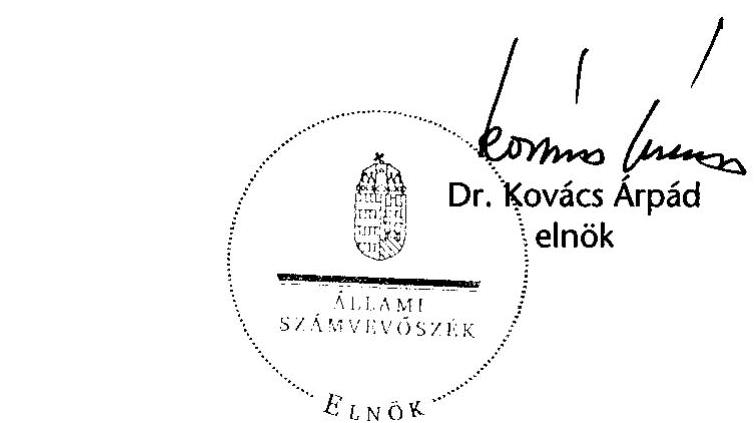
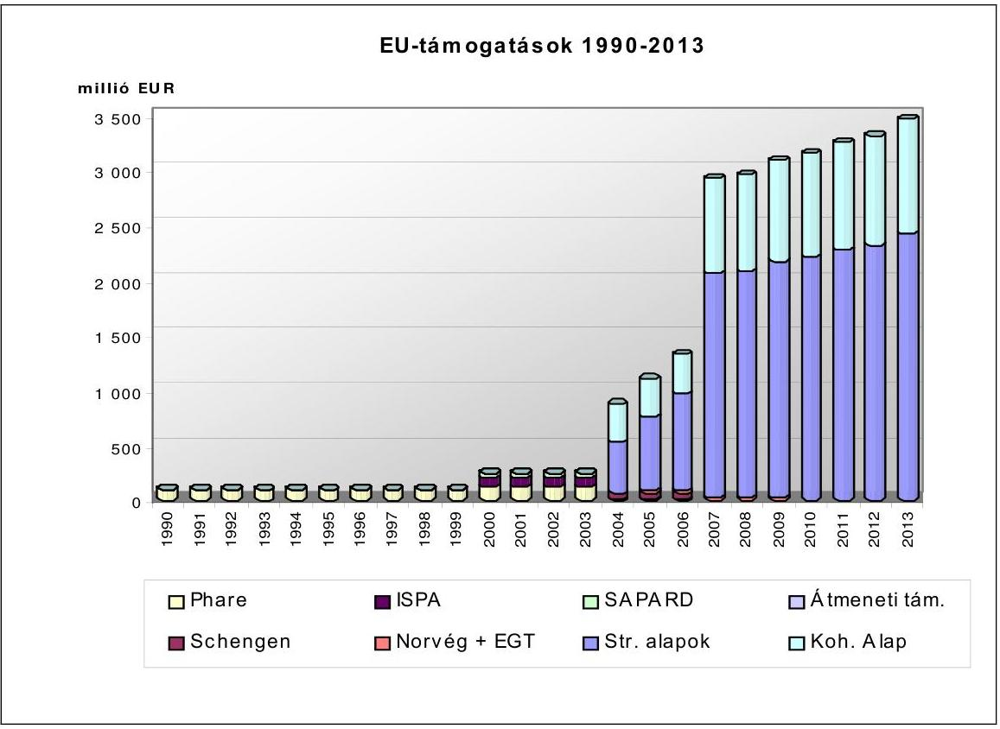
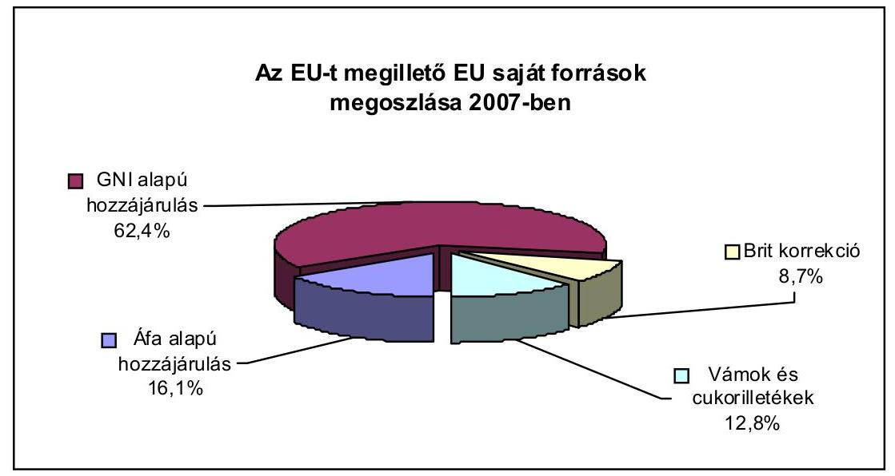
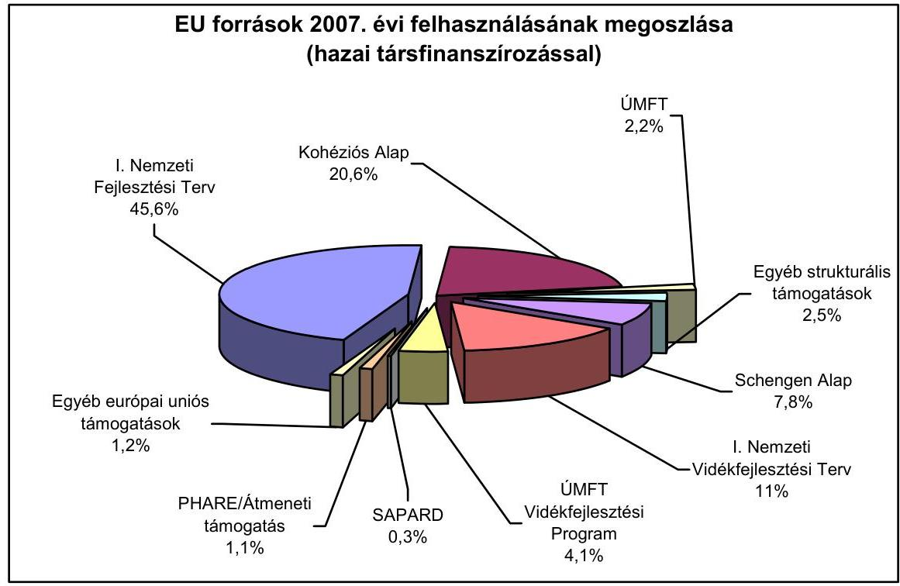
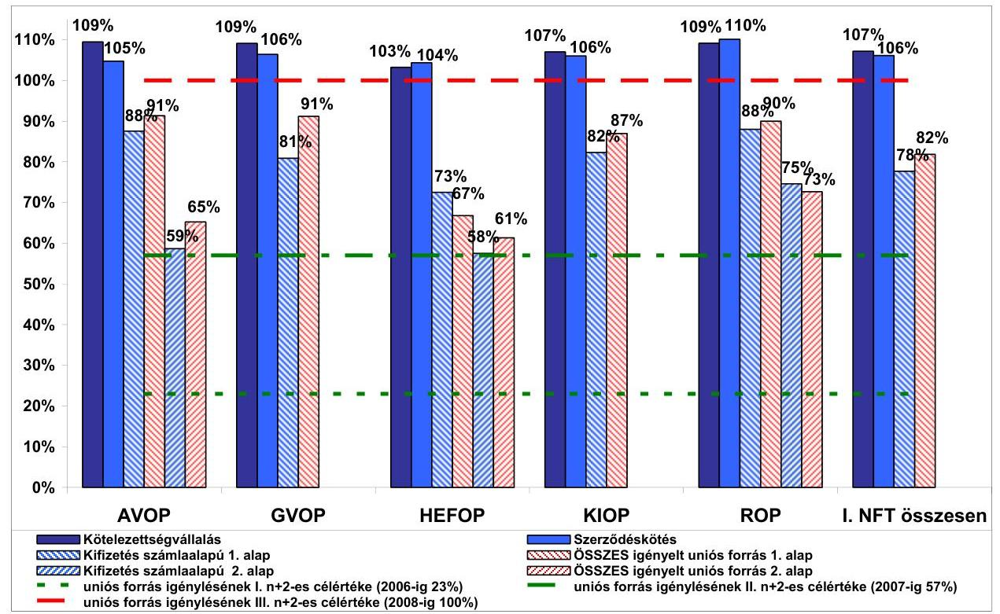
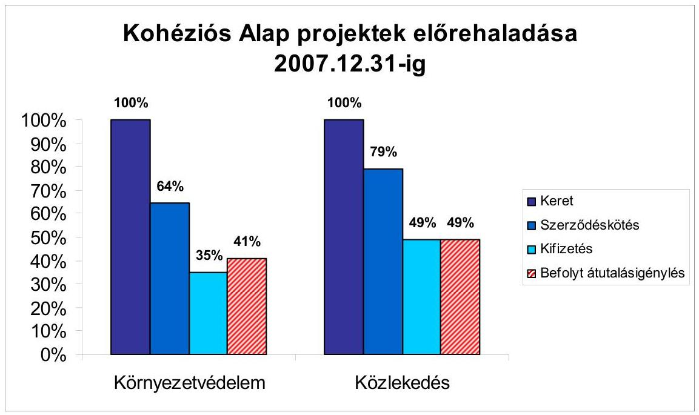
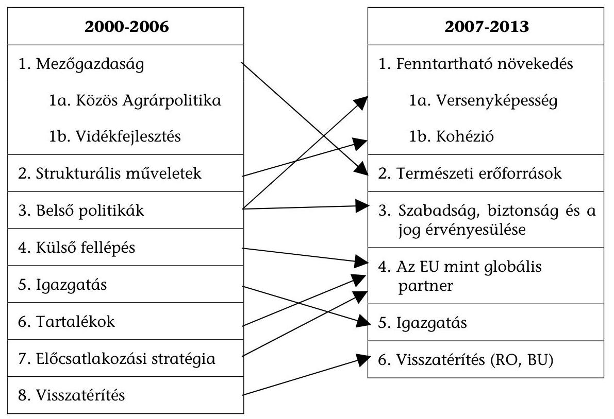

# TÁJÉKOZTATÓ 

az európai uniós támogatások 2007. évi felhasználásának ellenőrzéséről

---

# 2. Államháztartás Központi Szintjét Ellenőrző Igazgatóság 2.4 Koordinációs Főcsoport 

Iktatószám: VE-06-066/2008.

## A tájékoztató elkészítését felügyelte:

Bihary Zsigmond
föigazgató

A tájékoztató összeállításáért felelős:
Dr. Becker Pál
általános főigazgató-helyettes

A tájékoztató összeállításában részt vettek:
Szarka Péterné
osztályvezető
Bartolák Márta
számvevő tanácsos
Laczkovich Rita
számvevő

---

# TARTALOMJEGYZÉK 

BEVEZETÉS ..... 7
VEZETŐI ÖSSZEFOGLALÓ ..... 9
I. ÖSSZEGZŐ ÉRTÉKELÉS, KÖVETKEZTETÉSEK ..... 11
Magyarország és az EU pénzügyi kapcsolatai ..... 11
Hazánk nemzetközi összehasonlításban ..... 13
Magyarország és az EU pénzügyi kapcsolatai 2007-ben ..... 17
Az uniós támogatások intézményrendszere és jogszabályi környezete ..... 22
Az uniós támogatások ellenőrzési és monitoring rendszere ..... 24
Az uniós támogatások hazai nyilvántartási rendszerei ..... 26
Számviteli rendszerek ..... 29
Szabálytalanságkezelés és követeléskezelés ..... 31
Nemzeti Fejlesztési Terv I. ..... 33
A Közösségi Kezdeményezések támogatásai ..... 39
Kohéziós Alap ..... 42
Schengen Alap ..... 45
Előcsatlakozási alapok és Átmeneti Támogatás ..... 46
Az Európai Gazdasági Térség és a Norvég Finanszírozási Mechanizmus ..... 49
Új Magyarország Fejlesztési Terv ..... 51
Nemzetközi együttmúködési támogatások ..... 56
Agrártámogatások ..... 57
Svájci felzárkóztatási hozzájárulás ..... 60
II. RÉSZLETES ÉRTÉKELÉS ..... 61

1. Magyarország és az EU pénzügyi kapcsolatai 2007-ben ..... 61
1.1. Az EU tagsággal összefüggő hazai befizetések ..... 61
1.2. Hazánk uniós támogatásai ..... 64
1.2.1. Az Európai Bizottság által közvetlenül kezelt programok ..... 66
1.2.2. Közfeladatot ellátó intézmények és szervezetek feladatellátásának EU általi finanszírozása ..... 69
1.3. Az uniós támogatások intézményrendszere és jogszabályi környezete ..... 71
1.4. Az Európai Unióból érkező támogatások hazai ellenőrzési és monitoring rendszere ..... 76
1.4.1. Ellenőrzési rendszer ..... 76
1.4.2. A monitoring rendszer múködése ..... 81
1.5. Az uniós támogatások hazai nyilvántartási rendszerei ..... 82
1.5.1. Az Egységes Monitoring Információs Rendszer ..... 82

---

1.5.2. Az Országos Támogatási Monitoring Rendszer ..... 85
1.5.3. Integrált Igazgatási és Ellenőrzési Rendszer ..... 86
1.5.4. Számviteli nyilvántartási rendszer ..... 88
1.6. Szabálytalanságkezelés és követeléskezelés ..... 93
2. Az Európai Uniós források felhasználásával kapcsolatos, a 2007-es évre vonatkozó ellenőrzések legfontosabb megállapításai, következtetései ..... 97
2.1. A 2000-2006-os programozási periódus támogatásai ..... 97
2.1.1. Nemzeti Fejlesztési Terv I. ..... 97
2.1.1.1. Az NFT I. megvalósulásának értékelése ..... 100
2.1.1.2. A Strukturális Alapokat érintő 2007. évre vonatkozó ellenőrzések megállapításai, következtetések ..... 102
2.1.1.3. A Közösségi Kezdeményezések támogatásai ..... 111
2.1.2. Kohéziós Alap ..... 116
2.1.2.1. A Kohéziós Alap célkitűzései, felhasználásának uniós és hazai szabályozása, intézményrendszere ..... 116
2.1.2.2. A Kohéziós Alapot érintő 2007. évre vonatkozó ellenőrzések megállapításai, következtetések ..... 118
2.1.3. Schengen Alap ..... 123
2.1.4. Előcsatlakozási alapok és Átmeneti Támogatás ..... 126
2.1.4.1. PHARE programok ..... 126
2.1.4.2. SAPARD ..... 127
2.1.4.3. Átmeneti Támogatás ..... 130
2.1.5. Az Európai Gazdasági Térség és a Norvég Finanszírozási Mechanizmus ..... 133
2.2. A 2007-2013-as programozási periódus támogatásai ..... 137
2.2.1. Új Magyarország Fejlesztési Terv ..... 137
2.2.2. Nemzetközi együttmúködési támogatások ..... 146
2.2.3. Agrártámogatások ..... 148
2.2.4. Svájci Hozzájárulás ..... 160

# MELLÉKLETEK 

1. sz. A Magyar Köztársaság költségvetése teljesítése során elszámolt és a költségvetésen kívüli EU transzferek
2. sz. A 2007. évi költségvetés végrehajtásáról szóló törvényben megjelenő EUtámogatások összege
3. sz. Közfeladatot ellátó intézmények és szervezetek feladatellátásának EU általi finanszírozása
4. sz. Az EU-költségvetés szerkezeti változásai a 2000-2006-os és a 2007-2013-as költségvetési periódus között
5. sz. A Tájékoztató alapjául szolgáló, 2007. évre vonatkozó ellenőrzések és öszszefoglalók

---

# RÖVIDÍTÉSEK JEGYZÉKE 

| ÁBPE | Államháztartási Belső Pénzügyi Ellenőrzési (Tárcaközi Bizottság) |
| :--: | :--: |
| Ámr. | 217/1998. (XII. 30.) Korm. rendelet az államháztartás működési rendjéről |
| APEH | Adó- és Pénzügyi Ellenőrzési Hivatal |
| ÁROP | Államreform Operatív Program |
| ÁSZ | Állami Számvevőszék |
| ÁT | Átmeneti Támogatás |
| AVOP | Agrár- és Vidékfejlesztési Operatív Program |
| BÉSZ | Beszerző-értékesítő Szövetkezet |
| EDIS | Extended Decentralisation Implementation System (Kiterjesztett Decentralizációs Végrehajtási Rendszer) |
| EFK | előirányzat-felhasználási keretszámla |
| EGT (FM) | Európai Gazdasági Térség (Finanszírozási Mechanizmus) |
| EHA | Európai Halászati Alap |
| EKKE | Európai uniós Közbeszerzési és Koordinációs Szabályossági Egység |
| EKOP | Elektronikus Közigazgatás Operatív Program |
| EMIR | Egységes Monitoring Információs Rendszer |
| EMOGA | Európai Mezőgazdasági Orientációs és Garancia Alap |
| EMGA | Európai Mezőgazdasági Garancia Alap |
| EMK | Egységes Múködési Kézikönyv |
| EMVA | Európai Mezőgazdasági Vidékfejlesztési Alap |
| ENPI | European Neighbourhood Partnership Instrument Európai Szomszédsági és Partnerségi Eszköz |
| ERFA | Európai Regionális Fejlesztési Alap |
| ESZA | Európai Szociális Alap |
| ETE | Európai Területi Együttmúködés |
| EU | Európai Unió |
| FEUVE | folyamatba épített előzetes és utólagos vezetői ellenőrzés |
| FVM | Földművelésügyi és Vidékfejlesztési Minisztérium |
| GDP | Gross Domestic Product (Bruttó Hazai Termék) |
| GNI | Gross National Income (Bruttó Nemzeti Jövedelem) |
| GOP | Gazdaságfejlesztés Operatív Program |
| GVOP | Gazdasági Versenyképesség Operatív Program |
| HEFOP | Humánerőforrás-fejlesztési Operatív Program |
| HOPE | Halászati Orientációs Pénzügyi Eszköz |
| IH | Irányító Hatóság |
| IIER | Integrált Igazgatási és Ellenőrzési Rendszer |
| IMK | Interaktív Múködési Kézikönyv |
| INTERACT | INTERREG Animation Cooperation and Transfer INTERREG ösztönzés, együttmúködés. és átadás |

---

| IPA | Instrument for Pre-Accession Assistance - Előcsatlakozási Támogatási Eszköz |
| :--: | :--: |
| IRM | Igazságügyi és Rendészeti Minisztérium |
| ISPA | Instrument for Structural Policies for Pre-Accession (Strukturális Politikák Csatlakozás Előtti Eszköze) |
| KA | Kohéziós Alap |
| KAP | Közös Agrárpolitika |
| KDB | Közbeszerzési Döntőbizottság |
| KEHI | Kormányzati Ellenőrzési Hivatal |
| KEOP | Környezet és Energia Operatív Program |
| KESZ | Kincstári Egységes Számla |
| KH | Kifizető Hatóság |
| KHR | Közösségi Hozzájárulás Rendezés |
| KIOP | Környezetvédelmi és Infrastruktúra Operatív Program |
| KÖZOP | Közlekedés Operatív Program |
| KPSZE | Központi Pénzügyi és Szerződéskötési Egység |
| KSz | Közremúködő Szervezet |
| KTK | Közösségi Támogatási Keret |
| KTK IH | Közösségi Támogatási Keret Irányító Hatóság |
| KÜ | Kifizető Ügynökség |
| KvVM FI | Környezetvédelmi és Vízügyi Minisztérium Fejlesztési Igazgatósága |
| LT | Lebonyolító Testület |
| MÁK | Magyar Államkincstár (Kincstár) |
| MePAR | Mezőgazdasági Parcella Azonosító Rendszer |
| MK | Múködési Kézikönyv |
| MOISZ | Mobilitás Országos Ifjúsági Szolgálat |
| MVH | Mezőgazdasági és Vidékfejlesztési Hivatal |
| MVH BEF | Mezőgazdasági és Vidékfejlesztési Hivatal Belső Ellenőrzési Főosztály |
| NAO Iroda | National Authorising Office   Nemzeti Programengedélyező Iroda |
| NFT | Nemzeti Fejlesztési Terv |
| NFÜ | Nemzeti Fejlesztési Ügynökség |
| NFÜ BEO | Nemzeti Fejlesztési Ügynökség Belső Ellenőrzési Osztálya |
| NVT | Nemzeti Vidékfejlesztési Terv |
| OLAF | Office Européen de Lutte Anti-Fraude (Európai Csalásellenes Hivatal) |
| OLAF KI | OLAF Koordinációs Iroda |
| OP | Operatív Program |
| OTMR | Országos Támogatási Monitoring Rendszer |
| PM | Pénzügyminisztérium |
| ROP | Regionális Fejlesztés Operatív Program |
| SA | Strukturális Alapok |

---

| SAPARD | Special Accession Programme for Agriculture and Rural   Development (Különleges Előcsatlakozási Program a Me-   zőgazdaság és Vidékfejlesztés támogatására) |
| :-- | :-- |
| SAPS | Single Area Payment Scheme   (Egyszerűsített Területalapú Támogatás) |
| SATB | Schengen Alap Tárcaközi Bizottság |
| SLA | Service Level Agreement   (Szolgáltatási Szint Megállapodás) |
| SPS | Single Payment Scheme |
| SzMSz | Szervezeti és Múködési Szabályzat |
| SZMM | Szociális és Munkaügyi Minisztérium |
| TÁMOP | Társadalmi Megújulás Operatív Program |
| TÉSZ | Termelő-értékesítő Szövetkezet |
| TIOP | Társadalmi Infrastruktúra Operatív Program |
| TKA | Tempus Közalapítvány |
| TS | Technikai Segítségnyújtás |
| ÚMFT | Új Magyarország Fejlesztési Terv |
| ÚMVP | Új Magyarország Vidékfejlesztési Program |
| VOP | Végrehajtás Operatív Program |
| VPOP | Vám- és Pénzügyőrség Országos Parancsnoksága |

---

.

---

# BEVEZETÉS 

A 2007. év Magyarország számára a második EU költségvetési periódus megkezdésének, a 2000-2006-os EU költségvetési periódus pénzügyi lezárása első évének és az előcsatlakozási alapok pénzügyi zárási eljárásainak időszakát jelentette. Ebből eredően Magyarország és az EU támogatás-felhasználással öszszefüggő kapcsolatát a 2007-2013-as EU költségvetési periódus szempontjából az agrárterületet kivéve - az EU források minimális lehívása mellett a megfelelőségi ellenőrzések, a 2000-2006-os EU költségvetési periódus vonatkozásában a folyamatos forráslehívás mellett az egyre fokozódó pénzügyi és megfelelőségi ellenőrzések és az előcsatlakozási alapok vonatkozásában a pénzügyi zárási egyeztetések és ellenőrzések jellemezték.

Az Európai Unió részéről már 2003-ban felmerült az igény, hogy az Európai Számvevőszék és a nemzeti számvevőszékek évenként készítsenek áttekintő értékelést az európai uniós pénzeszközök hasznosításának ellenőrzési tapasztalatairól. Az Európai Uniós országok számvevőszékeinek elnökeiből álló Kapcsolattartó Bizottság a 2005. évi stockholmi ülésén megerősítette, hogy az EU tagállamok parlamentjeinek saját, illetve a tagállamok közös érdekében áll az EU Alapok ellenőrzésének fejlesztése. Ennek egyik lényeges eleme, hogy a független nemzeti számvevőszékek készítsenek jelentést az EU pénzeszközök tárgyévi tagállami felhasználásáról és a gazdálkodás fejlesztéséről. Ez közvetve és közvetlenül is hozzájárulhat az EU költségvetés hatékonyabb, átláthatóbb felhasználásához. Egyetértve a Kapcsolattartó Bizottság szándékával fokozatosan bővülő körben 2007-re már kilenc ország készített összefoglalót az uniós források tagállami felhasználásának tapasztalatairól.

A Tájékoztató - összhangban a Kapcsolattartó Bizottság törekvéseivel, valamint az Állami Számvevőszék (ÁSZ) 2004. évi tevékenységéről szóló jelentés elfogadásáról szóló 43/2005. (V. 26.) OGY határozat 4. pontjában előírtakkal ${ }^{1}$ az előzőekben vázolt körülmények között kívánja bemutatni Magyarország európai uniós pénzügyi kapcsolatait és a támogatásokkal kapcsolatos ellenőrzések 2007-es tapasztalatait. A tavalyi Tájékoztatónkhoz hasonlóan kitér azon 2007-ben érvényben lévő hazai és nemzetközi jogszabályokra, amelyek meghatározták az EU-támogatások felhasználásában közremúködő intézményrendszer múködését és ellenőrzési tevékenységét. Átfogó képet ad a különböző szervezetek feladat- és hatásköréről, az ellenőrzések során betöltött szerepükről. Az átláthatóság érdekében bemutatja Magyarország EU költségvetésbe történő befizetéseit, továbbá a Magyar Köztársaság központi költségvetésében megjelenő és a költségvetésen kívüli tételként szereplő támogatások és az Uniótól közvetlenül igényelhető (oktatási és kutatás-fejlesztési célú) támogatások felhasználá-

[^0]
[^0]:    ${ }^{1}$ „...az Állami Számvevőszék a teljes uniós pénzfelhasználás gyakorlatáról átfogó képet adjon, ennek keretében az uniós forrásokkal összefüggő pénzmozgások ellenőrzését végző hazai szervezetek munkáját szakmai szempontból áttekintse és mutassa be az ellenőrzések tapasztalatait."

---

sát, az uniós források önkormányzatoknak, mint kedvezményezetteknek nyújtott támogatások felhasználásának értékelését.

A jelen Tájékoztató a lefedni kívánt valamennyi uniós támogatási kör szempontjából előrelépést jelent abban az értelemben, hogy a fent említett támogatások mellett két, az Európai Bizottság által közvetlenül kezelt program felhasználását is bemutatja. Kérdőíves felmérésünkre alapozva átfogó képet kívánunk adni arról, hogy a Magyar Köztársaság 2007. évi költségvetéséből finanszírozott intézmények, illetve szervezetek közül melyek azok, amelyek a Magyarországra beérkező európai uniós források felhasználásában közremúködnek, illetve részt vesznek (pl. a támogatások irányítására, kezelésére, ellenőrzésére felállított intézményrendszer keretében), illetve az EU költségvetéséből maguk is részesülnek.

A Tájékoztató elemzi Magyarország támogatás felhasználását - abszorpciós képességét - és elfoglalt helyét elsősorban a 2004-ben csatlakozott új tagországok között.

A Tájékoztató kiemelten kezeli a szabálytalanság kérdéskörét, a korrupció jelenségét azonban nem tudjuk mélységében feltárni, mivel a Tájékoztató a tárgyév során lezárult ellenőrzések eredményeire támaszkodik, elkészítése során nem került sor külön ellenőrzés elvégzésére. Az ÁSZ azonban tevékenysége során országgyűlési felhatalmazás alapján ${ }^{2}$ aktívan közreműködik a korrupció tipikus kiváltó okainak bemutatásában, területeinek beazonosításában és a kapcsolatos jogalkalmazási hiányosságok feltárásában.

A Tájékoztató összeállításához mind a belső, mind a külső, hazai és uniós ellenőrzési intézményrendszer tapasztalatait felhasználtuk. Bár ezek közül néhány ellenőrzés (pl. ÁSZ) eredményei nyilvánosak és ezáltal közzétettek, de az átfogó kép kialakítása érdekében szükségesnek tartottuk ezek ismertetését is. Az EU Bizottság, a Kormányzati Ellenőrzési Hivatal és a belső ellenőrzési egységek ellenőrzési eredményei szintetizáltan jelennek meg a Tájékoztatóban, mivel jelentéseik nem nyilvánosak ${ }^{3}$.

Együttműködésükért, segítőkészségükért ezúton mondunk köszönetet a Pénzügyminisztérium, a Kormányzati Ellenőrzési Hivatal, a Nemzeti Fejlesztési Ügynökség, a Földművelésügyi és Vidékfejlesztési Minisztérium, a Mezőgazdasági és Vidékfejlesztési Hivatal, valamint a Vám- és Pénzügyőrség Országos Parancsnoksága vezetőinek és munkatársainak.

[^0]
[^0]:    ${ }^{2}$ Az Állami Számvevőszék 2007. évi tevékenységéről szóló jelentés elfogadásáról szóló 72/2008. (VI. 10.) OGY határozat 2./c) pontja
    ${ }^{3}$ A Tájékoztató alapjául szolgáló ellenőrzések listáját az 5. sz. melléklet tartalmazza.

---

# VEZETŐI ÖSSZEFOGLALÓ 

Az immáron három éve készülő, az egyes évekre koncentráló Tájékoztatókban megfogalmazott trendek, tendenciák és átfogó tapasztalatok szintetizálása kiváló alkalmat jelent, hogy a lezáródó költségvetési periódusról rendelkezésre álló tapasztalatokat és tanulságokat értékeljük és összevessük az újonnan induló időszak tevékenységéről megfogalmazott ellenőrzési megállapításokkal. Ez az összehasonlítás megfelelő alapul szolgálhat előremutató - a hatékonyságot és eredményességet szolgáló - érdemi intézkedések meghozatalára a feltételrendszer és felhasználás terén.

A következtetések levonását segíti, hogy az előcsatlakozási alapok vonatkozásában a programok pénzügyi lezárása hamarosan befejeződik. Az már azonban most is látható, hogy az előcsatlakozási alapok és a Schengen Alap forrásait sikeresen felhasználtuk. A SAPARD esetében a pénzügyi zárás és a pénzügyi rendezés (2008. évben) megtörtént. A PHARE esetében a 2007. évet az EU Bizottság záró auditjaira való felkészülés jellemezte.

Az előcsatlakozási alapok felhasználásának záró időszaki kedvező felfutásához hasonlóan a 2004-2006-os programozási időszakot is a kezdeti elhúzódó felkészülési szakaszt követő dinamikusabb forrásfelhasználás jellemezte, mely jó alapot adhat arra, hogy sikeresen zárjuk a csatlakozás első pénzügyi periódusát. Ehhez azonban az szükséges, hogy azon a néhány területen, ahol jelentős lemaradás tapasztalható, 2008 végére biztosítsuk a lehető legnagyobb mértékű forráslekötést és kifizetést. A 2007-2013-as időszak végi kedvező pozíción megtartásához elengedhetetlen, hogy a 2007. évet jellemző elhúzódó folyamatokat felgyorsítsuk, előtérbe helyezve a pályázóbarát megközelítést.

A 2004-2006-os programozási időszakra az Unióból érkező források fogadásához, illetve lebonyolításához szükséges intézményi, szabályozási és ellenőrzési feltételrendszert az uniós és hazai előírásokat figyelembe véve alakították ki.

A források felhasználásának értékelése szempontjából kedvező, hogy a Nemzeti Fejlesztési Terv megvalósítására rendelkezésre álló keret több mint $100 \%$-át kötelezettségvállalással lefedtük, amelynek értéke 2007 végére közel 2820 M eurót tett ki. A lekötések realizálásában, azaz a kifizetésekben rejlő kockázatok elkerülése érdekében a szerződéskötések és kifizetések felgyorsítására kell koncentrálni.

A költségvetési periódus támogatásai forrásfelhasználását nagymértékben nehezítette, hogy a támogatásközvetítő intézményrendszer és a jogszabályi környezet kialakítása a támogatási rendszer indításával párhuzamosan történt, és folyamatosan átalakult annak ellenére, hogy Magyarország számára az előcsatlakozási alapok többek között a megfelelő intézményi hálózat és jogszabályi környezet kialakítása céljából már 2000-től rendelkezésre álltak. Az intézményrendszer múködését a kezdeti lassú pályázat-feldolgozási periódus után a benyújtott számlákra történt kifizetések jogszabály által előírt határidőn túli teljesítése mellett a nagy létszám-fluktuáció is gátolta.

---

Az EU források ellenőrzési rendszere betöltötte a szerepét, ugyanakkor nem mentes az átfedésektől és az esetenkénti egyidejű ellenőrzésektől.

A programozási periódus végére sem működött teljes körűen, megbízhatóan és eredményesen a támogatás-felhasználást támogató informatikai rendszer (EMIR).

A Kohéziós Alap tekintetében a feltételrendszer kialakításában tapasztalható fentiekben bemutatott hiányosságok mellett az időszakot a projektek megvalósításának időbeli elhúzódásán túl a jelentős költségtúllépés és műszaki tartalomváltozás jellemezte.

A kifizetések növekedésével természetszerűen az EU és hazai ellenőrzési szervek által végzett ellenőrzések száma is nőtt. A vizsgálatok által feltárt szabálytalanságok (legtipikusabb a közbeszerzési törvény megsértése, téves elszámolás, jogosultatlan, nem elszámolható tételek igénylése, kifizetése, a projekt nem, vagy nem megfelelő mértékű megvalósítása, eltérés a Támogatási Szerződéstől, késedelmes teljesítések) pénzügyi következményekkel járhatnak.

A pénzügyi periódus zárása tekintetében kiemelt figyelmet kell fordítani a szabálytalanságok lehető legnagyobb mértékű feltárására, nyomon követésére és az adósságmenedzsment hatékony működtetésére, valamint az uniós támogatásokból megvalósult projektek kötelező működési monitoringjára. Ezek nem megfelelő működtetése jelentősen meghosszabbíthatja az EU-val való pénzügyi elszámolási és zárási folyamatot, ami kedvezőtlenül hathat a magyar állami költségvetés helyzetének alakulására.

A pénzügyi célok teljesítése mellett az NFT I.-ben meghatározott célok elérése és a források hatékony hasznosulása érdekében a hatékonysági és eredményességi célokra is kiemelt figyelmet kell fordítani.

Az EU 2007-2013-as költségvetési periódus első éve gyakorlatilag a felkészülés jegyében telt el. Az agrár- és vidékfejlesztési támogatások intézményrendszerének akkreditálása már megtörtént. Az ÚMFT Operatív Programjait az EU Bizottság az elsők között fogadta el, és az intézményrendszer akkreditációját az uniós előírásoknak megfelelően befejezték. Az ÚMFT újdonságaként bevezetett, a kormány egyedi döntésén alapuló stratégiai fontosságú fejlesztési elképzelések megvalósítása nagy kockázatot hordoz magában a centralizált döntéshozatal, a korábbi tapasztalatok hiánya és a hazánk rendelkezésére álló támogatás összegéhez viszonyított magas aránya miatt.

A támogatásközvetítő intézményrendszer és a jogszabályi környezet változásai következtében az Operatív Programok végrehajtása lassan és nem minden program vonatkozásában indult be. A korábbiakban kiépített monitoring és ellenőrzési rendszert valamennyi szervezetben és szinten erősíteni szükséges. Az ÚMFT támogatás-felhasználást támogató informatikai rendszerének kiépítettsége a 2007. év végén még nem volt teljes körű. Az EU költségvetéséből forráslehívás - az agrártámogatások kiegyensúlyozott lehívásaitól és egy csekély, operatív programokra kifizetett összegtől eltekintve - gyakorlatilag nem volt.

---

# I. ÖSSZEGZŐ ÉRTÉKELÉS, KÖVETKEZTETÉSEK 

## Magyarország és az EU pénzügyi kapcsolatai

Az Európai Uniótól érkező források az egyes időszakokban folyamatosan növekvő mértékűek. A PHARE előcsatlakozási támogatást 1990 óta biztosítja hazánk részére az Európai Unió, a további előcsatlakozási alapokból (ISPA, SAPARD) a 2000. évtől részesülünk. Ezek a csatlakozás évétől a Strukturális Alapokból és a Kohéziós Alapból, valamint egyéb forrásokból érkező támogatásokkal (Schengen Alap, Norvég Alap + EGT) egészültek ki. A 2007-2013 közötti programozási időszakban a korábbi támogatási szint várhatóan jelentősen növekedni fog. A pénzügyi források trendjének 1990-2013 közötti alakulását - az agrártámogatások nélkül - az 1. ábra tartalmazza.

## 1. ábra

2004-től ezen támogatások részben vagy egészben megjelennek a Magyar Köztársaság költségvetésében (1. sz. melléklet).

A Magyar Köztársaság költségvetése végrehajtása során elszámolt és a költségvetésen kívül EU transzferek 2004 és 2007 közötti idöszakát vizsgálva megállapítható, hogy a 2004. évi 133 Mrd Ft összeget követően a 2005. és 2006. évben közel azonos szinten (215, illetve 213 Mrd Ft), majd 2007-ben - a

---

tradicionális források csökkenése következtében - alacsonyabb (közel 200 Mrd Ft) összegben alakult az EU költségvetéséhez való hozzájárulásunk. A nemzeti hozzájárulás belső szerkezete és a befizetési jogcímek arányai megközelítőleg azonosak voltak. A 2004. évi összeg nagyságát befolyásolta, hogy a csatlakozás évében csak arányos befizetési kötelezettség állt fenn, illetve a tradicionális saját források között megjelenő cukorilletéket a követő évben kellett teljesíteni, ennek megfelelően ilyen jogcímen 2004. évben nem keletkezett befizetési kötelezettségünk.

A költségvetésben megjelenő EU források fokozatos növekedést mutattak a 2004-2006 közötti programozási időszakban, majd 2007-ben enyhe csökkenés volt tapasztalható. A költségvetésben megjelenő EU források 2004. évi 171 Mrd Ft-ja 2006-ra meghaladta a 478 Mrd Ft-ot és 2007-re 459 Mrd Ft-ra csökkent. A támogatások trendje - a PHARE, a SAPARD és a Schengen Alap kivételével - igazodott a költségvetési források alakulásához. A Kohéziós Alap vonatkozásában a támogatás két év alatt tízszeresére nőtt, majd 2007-ben enyhe csökkenés állt be. A Strukturális Alapokra kifizetett összegek évente megduplázódtak, majd 2007-ben kis mértékben csökkentek. A két meghatározó alap vonatkozásában a nagymértékű növekedést a 2005. évben a felhasználás gyorsítására hozott intézkedések és a projektek megvalósításának beindulása okozta. A Nemzeti Vidékfejlesztési Terv növekedési üteme ettől elmaradt, de így is több mint négyszeresére nőtt, ami a kezdeti viszonylagos késedelmes beindulás után növekvő felhasználást mutatott. A PHARE esetében közel egyenletes kifizetési nagyságrend tapasztalható, ami a programzárást megelőző egyenletes felhasználás következménye. A SAPARD program esetében a 2005. évi jelentős növekedés utáni 2006-os visszaesés oka, hogy 2006-ban a kifizetések nagy hányadát az EMOGA Garancia Részleg terhére finanszírozták. A PHARE és SAPARD esetében 2007. évi alacsony összeg indoka, hogy már csak a záráshoz kapcsolódó kifizetések valósultak meg. A Schengen Alapból teljesítések a 2005. évtől történtek. A 2004. évben elszámolt összeg a felkészüléshez kapcsolódó költségeket tartalmazza. A 2007. évi kiugróan magas elszámolt összeget a teljes forrásfelhasználás érdekében hozott intézkedések indokolták.

A költségvetésen kívüli (EMOGA Garancia Részlegből finanszírozott) agrárpiaci támogatások évenként változó képet mutattak. A támogatások összegét az intervenció finanszírozási szükséglete nagymértékben befolyásolta, ennek alapján 2006-ban az intervenciós értékesítés felgyorsulásának eredményeképpen a finanszírozási szükséglet közel felére csökkent, 2007-ben pedig pozitív mérleggel zárt. A közvetlen támogatások esetében az elszámolási szabályok a kifizetések tárgyévi és követő évi elszámolását is lehetővé teszi. Nagyrészt erre vezethető vissza az évek közötti eltérő felhasználás.

A Magyar Köztársaság költségvetésének végrehajtása során elszámolt és a Magyar Államkincstáron keresztül előfinanszírozott (költségvetésen kívüli tételek) EU támogatások (hazai társfinanszírozással) GDP-hez viszonyított aránya 2004-2006-os időszakban növekvő tendenciát mutatott, de 2006-ban sem érte el a 3\%-ot (2,87\%). A 2007-2008-as időszakban - a PM által prognosztizált átlag adatokkal számolva - ez az arány 4,5\% fölé emelkedik oly módon, hogy az előző programozási időszak legnagyobb mértékű kifizetései ekkorra várhatóak, ugyanakkor a jelen időszak programjai kezdeti szakaszukban lesznek.

---

# Hazánk nemzetközi összehasonlításban 

A hazai forrásfelhasználási adatok értékelése érdekében megvizsgáltuk, hogy hazánk milyen pozíciót foglal el az uniós tagországok sorrendjében a pénzügyi eredményesség, az abszorpció tekintetében.

Egy költségvetési periódusban minden ország számára meg van határozva, hogy évenként mekkora támogatást vehet igénybe, vagyis mekkora előirányzat áll rendelkezésére. A tagállam az uniós szabályoknak megfelelő projektekkel leköti, optimális esetben az előirányzat teljes összegét. Az EU-val történő végleges pénzügyi elszámolásra a projektek szabályszerű lezárása után kerülhet sor.

Az abszorpciós képesség megállapítása érdekében tehát azt vizsgáljuk, hogy Magyarország a többi tagországhoz viszonyítva a támogatási előirányzatokból mennyit kötött le, illetve mennyi volt a tényleges kifizetés 2006 vonatkozásában.

Módszertani problémaként azonban meg kell jegyezni, hogy nehezíti az összehasonlítást egyrészről, hogy a régi tagországok esetén a 2005. évi adatokban nagyobb arányban szerepelnek a korábbi évek lekötéséhez kapcsolódó kifizetések, míg ez az új tagországoknál értelemszerúen majdnem nulla. Másrészről, a régi tagországokban az alapok kezdeti igénybevételének felhasználási arányaival kapcsolatban figyelembe kell venni azt, hogy azok egészen más gazdasági és jogi feltételek mellett, és eltérő környezetben valósultak meg. Emiatt véleményünk szerint érdemi következtetéseket az összehasonlításból csak néhány év múlva lehet levonni.

## Strukturális Alapok

Az Unió az egyik legfontosabb céljának, a versenyképesség érdemi javításának elérése érdekében a Strukturális Alapokból és a Kohéziós Alapból származó támogatások EU-s költségvetésen belüli arányának növelésére törekszik. A Strukturális Alapokból minden tagország részesedik. A négy alapból (ESZA, ERFA, EMOGA, HOPE) származó összeg az uniós költségvetésben a teljes kötelezettségvállalási előirányzatok több mint 30\%-át teszi ki.

A Bizottság a strukturális alapok végrehajtásáról készített éves jelentésében a 2006. évet mind az ERFA, mind az ESZA vonatkozásában kedvezőnek ítélte meg, a kifizetési források több mint 99\%-át felhasználták (hazánk 100\%-ot).

A teljes programozási időszakra vonatkozó adatokból megállapítható, hogy valamennyi tagország a programozási időszakra rendelkezésére álló keretet teljes mértékben lekötötte, a kifizetések - kerethez viszonyított - aránya (1. táblázat) azonban - 31,62\%-tól 82,08\%-ig - nagy szórást mutatott. Különösen éles különbség tapasztalható a régi és új tagországok között. Míg az EU 15-ben a kifizetések a keret 53 és $82 \%$-a között szóródtak, addig az új tagországoknál ez az arány a 32 és $52 \%$ közé esett.

Magyarország az újonnan csatlakozók mezőnyének első felében (3. helyen) van, de az EU 25 között a 19. helyen áll a kifizetés tekintetében.

A régi és új tagországok közötti különbség mind abszolút, mind relatív értelemben nagy. Az újonnan csatlakozott országok a felkészülési folyamat ellenére jó-

---

val kisebb arányban tudták felhasználni a forrásokat, mint a korábban csatlakozott tagországok.

Az egyes évek vonatkozásában vizsgálva Magyarország az újonnan csatlakozó országok között kiemelkedően jó helyen szerepelt. Míg 2005-ben a 4. legkedvezőbb felhasználási adatokkal rendelkeztünk az EU 10 között, addig 2006-ban a legjobban teljesítettünk, megelőzve a régi tagállamok közül Dániát és Spanyolországot is.

# 1. táblázat 

A Strukturális Alapok végrehajtása 2000-2006 közötti időszakban nemzetközi összehasonlításban (millió euró)

| Tagország | Keret 2005 | Kifizetés a keret $\%$ ában 2005 | Keret 2006 | Kifizetés a keret $\%$ ában 2006 | Keret 2000-2006 | Kifizetés a keret $\%$ ában 20002006 |
| :--: | :--: | :--: | :--: | :--: | :--: | :--: |
| Belgium | 314,31 | 106,59 | 250,54 | 99,58\% | 1935,62 | 62,76 |
| Cseh Köztársaság | 540,67 | 24,28 | 674,05 | $35,77 \%$ | 1584,36 | 33,35 |
| Dánia | 128,35 | 60,81 | 84,90 | $55,41 \%$ | 591,80 | 57,19 |
| Németország | 4660,86 | 92,34 | 4457,13 | 90,58\% | 30291,31 | 75,00 |
| Esztország | 123,42 | 55,21 | 158,86 | $54,29 \%$ | 371,36 | 51,51 |
| Görögország | 4 192,58 | 52,09 | 4049,80 | 73,78\% | 22698,04 | 53,31 |
| Spanyolország | 7 169,87 | 88,49 | 7052,92 | $59,81 \%$ | 46 432,21 | 75,11 |
| Franciaország | 2361,46 | 90,95 | 2248,70 | 86,48\% | 15541,44 | 65,75 |
| Irország | 381,60 | 107,92 | 278,00 | 134,70\% | 3 184,24 | 82,08 |
| Olaszország | 4828,19 | 85,51 | 4704,06 | 89,91\% | 30697,51 | 61,92 |
| Ciprus | 17,23 | 18,52 | 15,97 | 48,33\% | 49,97 | 31,62 |
| Lettország | 228,94 | 37,91 | 238,24 | 26,78\% | 625,57 | 34,24 |
| Litvánia | 308,33 | 33,52 | 377,57 | $36,38 \%$ | 895,17 | 36,77 |
| Luxemburg | 14,72 | 61,11 | 13,44 | 66,47\% | 82,94 | 58,64 |
| Magyarország | 676,26 | 37,28 | 863,01 | 63,43\% | 1995,72 | 50,00 |
| Málta | 21,51 | 25,03 | 27,34 | 49,30\% | 63,19 | 39,71 |
| Hollandia | 492,58 | 79,07 | 407,99 | 97,55\% | 2523,08 | 54,40 |
| Ausztria | 259,58 | 106,67 | 225,15 | 92,77\% | 1588,40 | 79,99 |
| Lengyelország | 2807,52 | 27,29 | 3579,53 | 44,47\% | 8275,81 | 38,37 |
| Portugália | 2871,65 | 83,77 | 2736,29 | 78,78\% | 20504,18 | 75,54 |
| Szlovénia | 81,41 | 51,19 | 102,69 | 57,68\% | 237,51 | 52,32 |
| Szlovákia | 992,30 | 22,29 | 478,08 | 39,63\% | 1123,15 | 36,68 |
| Finnország | 316,80 | 84,61 | 291,13 | 92,60\% | 1955,56 | 72,76 |
| Svédország | 325,13 | 107,64 | 294,15 | 88,61\% | 1998,05 | 77,32 |
| Egyesült Királyság | 2437,70 | 130,52 | 2222,60 | 128,73\% | 16322,72 | 67,62 |
| Osszesen | 36552,96 | 77,95 | 35860,14 | 76,06\% | 212 177,92 | 66,80 |

Forrás: EU Bizottság 2006. Éves Jelentése a Strukturális Alapok végrehajtásáról
A Bizottság jelentésében értékelte az ellenőrzési tevékenységet. A 2000-2006-os időszakra vonatkozóan 2006-ban elvégzett ERFA ellenőrzések keretében 85 helyszíni ellenőrzést végeztek, amelyek mind a rendszerellenőrzéseket, mind pedig 332 intézkedés lényegi vizsgálatát magában foglalta. Az elvégzett ellenőrzések jelentős mértékben növelték a tagállamok rendszerei múködésének bizonyosságát és bizonyos esetekben fontos előrelépésekhez vezettek az intézkedési tervek végrehajtása terén.

Az EU-10-ben 2006 végéig 9 programot, illetve a főbb programok 45\%-át és az odaítélt ERFA-hozzájárulás 65,5\%-át érintő 28 ellenőrző látogatásra került sor.

---

(Hazánkban 2006-ban a Bizottság ellenőrzése három OP - GVOP, ROP, HEFOP rendszervizsgálatára terjedt ki.) Az ESZÁ-t érintően 2006-ban 53 rendszerellenőrzést végzett. Magyarországon a HEFOP-ot és ROP-ot érintette a rendszerellenőrzés.

# Kohéziós Alap 

A legelmaradottabb területek fejlesztése, felzárkóztatása érdekében 1993-tól létrehozták az ún. Kohéziós Alapot. Az akkori feltételek szerint négy régi tagország volt jogosult e támogatásra: Spanyolország, Írország, Portugália és Görögország. Írország elért fejlettségi foka miatt 2004. január 1-je óta kikerült a kedvezményezetti körből. Jelenleg 13 ország részesül a Kohéziós Alapból.

A Kohéziós Alap végrehajtásáról készített 2006. évi EU Bizottsági Éves jelentés a költségvetés végrehajtásának értékelésekor rámutatott, hogy a 2006. éves kötelezettségvállalási előirányzatokat teljes mértékben felhasználták, a teljes öszszegből semmit sem csoportosítottak át 2007-re.

A kifizetések végrehajtási szintje az év első kilenc hónapjában kedvezően alakult, ezt követően azonban összesen 500 M euró kifizetési előirányzatot kellett az EU költségvetésen belül a Kohéziós Alapból az ERFA-ba átcsoportosítani (a más strukturális alapokkal folytatott általános átcsoportosítási eljárás részeként). Ez az átcsoportosítás azt eredményezte, hogy 2006-ban a kifizetési előirányzatok kb. 99,8\%-át végrehajtották. Hazánk vonatkozásában e kötelezettségvállalás összege 426,6 M eurót tett ki, míg a kifizetési előirányzat $115,9 \mathrm{M}$ euró volt).

A 2000-2006 közötti időszakot értékelve az Éves jelentés megállapítja, hogy viszonylag nagy összegű a még fennálló kötelezettségvállalások összege (a teljes nettó 24696,26 M euró kötelezettségvállalásból 15682 M euró). Ennek oka többek között a gyakran összetett és nagy infrastrukturális projektek megvalósításához szükséges hosszú idő, illetve kisebb mértékben az is, hogy a strukturális alapokra alkalmazott ún. „n+2 szabályt" ${ }^{4}$ a Kohéziós Alapra nem alkalmazzák.

A kifizetések aránya (2. táblázat) különösen az új tagországok vonatkozásában nagyon alacsony, a 8\%-tól (Lengyelország) a 23\%-os (Szlovénia) arányig terjednek. Hazánk a 22,82\%-os kifizetési aránnyal az új tagországok között a 2. helyet foglalja el. A kifizetési arány a régi kohéziós országok esetében a 43\%-os aránytól a közel $90 \%$-os arányig szóródott.

A kifizetések alakulását az egyes évek vonatkozásában vizsgálva látható, hogy 2005-ről 2006-ra az új tagország kifizetési mutatói jellemzően javultak, néhány esetben kiemelkedő mértékben (pl. Málta, Cseh Köztársaság, Észtország). Magyarország egyenletes teljesítményt mutatva 2005-ben a 25,17\%-os, 2006-ban

[^0]
[^0]:    ${ }^{4}$ Az uniós források felhasználhatósági szabálya értelmében („n+2-es szabály") a rendelkezésre álló teljes uniós keretet akkor tudja Magyarország felhasználni, ha teljesíteni tudja az 1260/1999 EK rendelet 31. cikk 2. bekezdésében foglalt határidőt, figyelemmel a 1083/2006/EK rendelet 105. cikkében foglaltakra.

---

27,17\%-os felhasználási aránnyal 2005-ben a 4. 2006-ban a 7. helyen szerepelt.

A viszonylag kedvező pénzügyi felhasználási mutatók mellett azonban az Éves jelentés több ponton kedvezőtlenül értékeli hazánkat.

# 2. táblázat 

A Kohéziós Alap végrehajtása 2000-2006-ban (millió euró)

| Tagország | Kötelezettségvállalás 2005 | Kifizetés a köt.vállalás \% ában 2005 | Köt.vállalás 2006 | Kifizetés a köt.vállalás \% ában 2006 | Köt.vállalás 2000-2006 | Kifizetés a köt.vállalás \%-ában 2000-2006 |
| :--: | :--: | :--: | :--: | :--: | :--: | :--: |
| Görögország | 430,49 | 72,90 | 494,20 | 97,77\% | 2815,81 | 43,90 |
| Irország |  |  |  |  | 575,41 | 89,99 |
| Portugália | 489,70 | 56,12 | 494,20 | 41,18\% | 3128,86 | 46,91 |
| Spanyolország | 1808,56 | 76,67 | 1814,72 | 70,70\% | 11773,16 | 62,71 |
| Ciprus | 15,10 | 33,51 | 20,66 | 29,05\% | 54,02 | 20,48 |
| Cseh Köztársaság | 256,81 | 5,97 | 363,50 | 34,61\% | 748,98 | 18,84 |
| Esztország | 87,75 | 4,33 | 114,08 | 34,86\% | 242,45 | 16,40 |
| Magyarország | 310,54 | 25,17 | 426,63 | 27,17\% | 812,92 | 22,82 |
| Lettország | 154,40 | 13,24 | 168,23 | 35,70\% | 376,86 | 21,19 |
| Litvánia | 171,56 | 28,48 | 266,10 | 18,35\% | 517,64 | 18,87 |
| Málta | 5,34 | 0,00 | 8,45 | 30,69\% | 21,97 | 11,80 |
| Lengyelország | 1165,53 | 1,49 | 1602,21 | 15,97\% | 3191,27 | 8,01 |
| Szlovákia | 155,98 | 27,86 | 218,79 | 14,64\% | 264,26 | 12,12 |
| Szlovénia | 51,84 | 16,48 | 72,36 | 43,05\% | 172,66 | 22,97 |
| Technikai segítségnyújtás | 29,86 | 10,61 |  |  |  |  |
| Összesen | 5133,46 | 63,14 | 6064,14 |  |  | 24696,26 |

Forrás: EU Bizottság 2006. Éves Jelentése a Kohéziós Alap végrehajtásáról
A Kohéziós Alap támogatásában részesülő tagállamok közül négy (Ciprus, Lengyelország, Magyarország és Portugália) ellen a túlzott államháztartási hiány miatt további intézkedéseket fogadtak el. Ezen országok egyikének esetében sem volt szükség az Alapból történő támogatás felfüggesztésének mérlegelésére.

Magyarország esetében az eljárás 2004-es megindítása óta már kétszer - 2005 januárjában, majd 2005 novemberében - megállapították, hogy az ország nem tett hatékony intézkedéseket a Tanács ajánlásaira válaszul. A Bizottság azonban egyik alkalommal sem javasolta a Tanácsnak a Kohéziós Alap kötelezettségvállalásainak felfüggesztését. Mivel Magyarország nem tagja az euró-övezetnek, a 2006-os felülvizsgált konvergencia-program frissítésének 2006. szeptemberi benyújtása után ezért a Tanács további ajánlásokat csak a 104. cikk (7) bekezdésén ${ }^{5}$ alapuló új határozat szerint címezhetett Magyarországnak. Amennyiben Magyarország nem tesz eleget az ajánlásnak, a 104. cikk (8) bekezdésének előírá-

[^0]
[^0]:    ${ }^{5}$ Az Európai Közösséget létrehozó szerződés a túlzott államháztartási hiányról szóló 104. cikke.

---

sai lesznek alkalmazandók, beleértve a Kohéziós Alap kötelezettségvállalásai felfüggesztésének lehetőségét.

A Bizottság által lefolytatott vizsgálatok kapcsán a jelentés rámutatott, hogy a 2004-ben csatlakozott tagállamok esetében a 2006-ban elvégzett ellenőrzések elsősorban a nyomon követésre összpontosultak, hogy ellenőrizzék a 2005-ös rendszerellenőrzések ajánlásainak hatékony végrehajtását, továbbá ellenőrizték a projektre fordítandó kiadásokat.

Különös hangsúlyt helyeztek a nemzeti ellenőrző szervek munkájának felülvizsgálatára, beleértve a rendszerellenőrzések minőségét, a mintavételes ellenőrzéseket és a zárónyilatkozat előkészítésével kapcsolatos más munkákat. Összesen 13 ellenőrző látogatásra került sor, beleértve az ERFA ellenőrzésére is kiterjedő látogatásokat.

A Bizottság Regionális Politikai Főigazgatóság 2006. évi tevékenységéről szóló jelentésben az irányítási és ellenőrzési rendszerek múködéséről 9 tagország (Cseh Köztársaság, Írország, Lengyelország, Lettország, Litvánia, Magyarország, Portugália, Spanyolország és Szlovákia) esetében minősített véleményt adtak a rendszer lényegét érintő jelentős hiányosságok miatt.

A jelentés megállapította, hogy nyolc kedvezményezett tagállam tett jelentést 228 szabálytalanságról, melyek 186604797 euró összegű közösségi hozzájárulást érintettek. Az új tagállamok közül csak Lengyelország, a Cseh Köztársaság, Magyarország, Lettország és Litvánia jelentett ügyeket (10, 6, 6, 2, illetve 1 ügyről készítettek jelentést), ezek az ügyek kisebb összegű hozzájárulást érintettek, mint a fent említettek. Az érintett összegek egy részét a kifizetési kérelmek Bizottsághoz történő benyújtása előtt levonják.

Az esetek többségében a szabálytalanságok a közbeszerzési szabályozás alkalmazásával, a fennmaradó esetekben pedig a nem támogatható kiadásokra vonatkozó elszámolással voltak kapcsolatosak.

A szabálytalanságok számát tekintve célszerű rámutatni, hogy a szabálytalanságok feltárása, megfelelő kezelése a hatékony ellenőrzési rendszer működésére utalnak, melynek feladata, hogy a munkafolyamatba építve kiszűrje, feltárja és korrigálja a hiányosságokat.

# Magyarország és az EU pénzügyi kapcsolatai 2007-ben 

A közösségi és hazai jogszabályokkal összhangban az Uniót 2007-ben összesen 189 520,0 M Ft illette meg Magyarországról, amely 34905,2 M Ft áfa alapú hozzájárulást, 135668,5 M Ft GNI alapú hozzájárulást és 18 946,3 M Ft brit korrekciót tartalmazott. 2007-ben tradicionális saját forrás jogcímen 27 921,5 M Ft-ot fizettünk be a közösségi költségvetésbe (2. ábra, 1. sz. melléklet).

Magyarország fizetési kötelezettségét a közösségi jogszabályoknak megfelelően a Magyar Nemzeti Banknál vezetett „Saját források" elnevezésű forintszámláról, havonta történő átutalásokkal teljesíti forintban, az előző év december 31ei középárfolyamon.

---

A 2007. évi befizetési kötelezettségek hazai kiszámításában, illetve lebonyolításában a kiemelt szerepet játszó Pénzügyminisztérium mellett a Vám- és Pénzügyőrség Országos Parancsnoksága (vám), a Mezőgazdasági és Vidékfejlesztési Hivatal (cukorilleték), Adó- és Pénzügyi Ellenőrzési Hivatal (áfa alapú hozzájárulás), a Magyar Államkincstár (áfa alapú hozzájárulás), valamint a Központi Statisztikai Hivatal (áfa, illetve GNI alapú hozzájárulás) vettek részt.

# 2. ábra 

Az Európai Számvevőszék hagyományos saját forrásokra vonatkozó ellenőrzése hiányosságokat állapított meg a vámtarifák kiszabásában jelentkező határidők betartása, az adatok útjának követhetősége és a fellebbezési eljárások során elkövetett eljárási hibák vonatkozásában, illetve a belső ellenőrzés függetlenségét érintően. A kötelező érvényű tarifális felvilágosítás (KTF) ellenőrzése során a KTF-kiadási kérelmek és a kiadott KTF-ek továbbításának késedelmére, nyomon követési eljárás kidolgozásának hiányára és eltérő KTF-ekkel kapcsolatos késedelmes Bizottságot történő értesítésre mutatott rá.

A GNI számítás témakörében az EUROSTAT információs látogatás keretében tekintette át a KSH által kidolgozott GNI Számítás Módszertani Leírását (GNI Inventory), és a további teendők és a módszertan továbbfejlesztése érdekében akciótervet dolgoztak ki.

Az Európai Uniótól származó támogatásokat, illetve az EU-s integrációval kapcsolatos kiadásokat az Országgyűlés a 2007. évi központi költségvetés 14 fejezetében, 153 előirányzaton állapította meg. A Magyar Köztársaság 2007. évi költségvetésében az EU támogatások (NFT I., Kohéziós Alap, ÚMFT, Egyéb strukturális támogatások, Schengen Alap, I. Nemzeti Vidékfejlesztési Terv, SAPARD, PHARE/Átmeneti támogatás, egyéb európai uniós támogatások) és a hozzájuk kapcsolódó hazai társfinanszírozás 459 011,5 M Ft összegben jelent meg. A zárszámadásban megjelenő uniós forrás $287396,2 \mathrm{M}$ Ft-ot, a hazai társfinanszírozás 171 615,3 M Ft-ot tett ki (3. ábra, 2 sz. melléklet). 2007-ben az EU költségvetéshez való hozzájárulás összesen 189 520,0 M Ft volt.

---

A költségvetésben megjelenő uniós források felhasználása 38,4\%-kal elmaradt a tervezettől ( 466 692,3 M Ft), ugyanakkor a központi költségvetési eszközök felhasználása 3,6\%-kal haladta meg az előirányzottat ( 165 629,6 M Ft). Így az uniós forrásokat is tartalmazó előirányzatok teljesülése összesen 27,2\%-kal marad el a tervezett összegtől ( $630165,7 \mathrm{M} \mathrm{Ft}$ ). A legkiegyenlítettebb megvalósulás a Schengen Alapnál volt tapasztalható, ami a program lezárulásának tudható be. Ehhez hasonlóan arányos növekedés volt tapasztalható az NFT L-hez tartozó operatív programok végrehajtásában. A Kohéziós Alap esetében jelentős elmaradás tapasztalható a tervezetthez képest, amelynek indokaként a kivitelezések különböző okokra visszavezethető lassúsága nevezhető meg. A legnagyobb elmaradás - a tervezetthez képest mintegy 112 Mrd Ft - az ÚMFT programjaival kapcsolatban figyelhető meg. Ennek oka, hogy a tervezés során a folyósítások korábbi megkezdésével számoltak. Az egyéb strukturális támogatások, valamint az egyéb uniós támogatások esetében az elmaradás az egyes programok megvalósulásának elhúzódásával magyarázhatóak. Mind a SAPARD, mind a PHARE program esetében megállapítható, hogy azok már 2006-ban lezárásra kerültek, és kifizetésekre már csak a hazai forrás terhére került sor.
3. ábra

Ez az uniós források felhasználásának tervezettől történő - korábbi évekhez képest jelentős - elmaradása összhangban van az ellenőrzése során tett megállapításokkal és rámutat arra, hogy amennyiben a feltárt hiányosságok kiküszöbölése nem valósul meg, hazánk forrásokat veszíthet a 2007-2013-as időszakban biztosított jelentős mennyiségú uniós támogatásból.

A költségvetésen kívüli támogatási formák (agrárpiaci támogatások, közvetlen termelői támogatások) összege 2007. évre vonatkozóan meghaladta a 139 255,4 Mrd Ft-ot (agrárpiaci támogatás: -19 263,3 M Ft, közvetlen termelői

---

támogatás: 119 992,1 M Ft), amelyet a Kifizető Ügynökség a KESZ-ről megelőlegezett, és az Unió utólag téríti meg az államháztartás számára.

A zárszámadásról szóló ÁSZ jelentés megállapította, hogy Top-up címén 2007ben kifizetett tisztán hazai forrásként megjelölt 59 156,2 M Ft a közvetlen területalapú támogatásokkal együtt szerepelt, amelyet viszont a Kincstári Egységes Számla (KESZ) finanszíroz. Nem tüntették fel továbbá az intervencióhoz kapcsolódó finanszírozási költségtérítésként kifizetett 5440,9 M Ft, valamint a csatlakozás óta felmerült, de az EU által nem térített raktározási, szállítási, bevizsgálási költségekre kifizetett $22125,0 \mathrm{M}$ Ft sem, holott azok közvetlenül a költségvetésben realizálódtak.

A 2007. évi zárszámadásról szóló ÁSZ jelentés rámutatott, hogy az intervenciós felvásárlás megelőlegezésére fordított összeg az előző évekhez képest kedvező képet mutatott (184 846,9 M Ft pozitív egyenleg), az Uniónak a 2007. évben sikerült értékesíteni a korábbi években intervencióra felvásárolt termékeket. Ez az összeg csökkentette az államháztartás forrásszükségletét.

# Az Európai Bizottság által közvetlenül kezelt programok 

A Magyar Köztársaság érdekében történő beazonosított kifizetésként az EU Bizottság 2007. évben 2655,55 M eurót tartott nyilván. Ez az összeg tartalmazta a mezőgazdaságra, a strukturális műveletekre, a belső politikákra, az adminisztrációra, a külső műveletekre, az előcsatlakozási stratégiára fordított és kompenzációként kifizetett kiadásokat, tehát mindazokat, aminek a felhasználása magyar közintézmények közreműködésével, az EU Bizottsághoz közvetlenül benyújtott pályázatok útján, vagy Magyarország támogatás felhasználásával kapcsolatban merült fel. Ennek döntő többségét a Magyar Köztársaság költségvetési beszámolójában szereplő (költségvetésében megtervezett és a költségvetésen kívüli Kincstári Egységes Számláról finanszírozott) tételek alkották. A költségvetési beszámolóban nem szereplő tételek közül a két legjelentősebb a kutatás és technológia-fejlesztési és az oktatás, nevelési, szakmai továbbképzési és ifjúsági célokra fordított támogatások voltak.

A 2007-ben indultak „Egész életen át tartó tanulás" és a „Fiatalok Lendületben" Programok. Az „Egész életen át tartó tanulás" Program keretei között összevontan, megújult formában folytatódik az Európai Unió oktatást támogató Socrates és a szakképzést támogató Leonardo da Vinci programja. A „Fiatalok Lendületben" Program célja a nem-formális nevelési programok támogatása a fiatalok számára.

Magyarországon a nemzeti hatóság szerepét az „Egész életen át tartó tanulás" Program esetében az Oktatási és Kulturális Minisztérium, a „Fiatalok Lendületben" Program esetében a Szociális és Munkaügyi Minisztérium tölti be. Az „Egész életen át tartó tanulás"Program lebonyolítója, a Nemzeti Iroda pedig a Minisztérium felügyelete alatt álló Tempus Közalapítvány (TKA), csakúgy, mint az elmúlt években. A „Fiatalok Lendületben" Program végrehajtására kijelölt Nemzeti Ügynökség pedig a hazai ifjúsági szolgáltatások, illetve ifjúságpolitika szerves részét képző Foglalkoztatási és Szociális Hivatalon belül múködő Mobilitás Országos Ifjúsági Szolgálat (MOISZ).

---

A 2007-2013-as programozási periódustól a Nemzeti Irodát és a Nemzeti Ügynökséget múködése megkezdéséhez akkreditálni kell, mely mindkettő esetében megtörtént.

A TKA sikeresen elindította Magyarországon az Egész életen át tartó tanulás program 2007-2013 közötti szakaszát. A 41 nemzeti iroda közül az EU Bizottság legelsőként a TKA-val kötött szerződést.

A 2007. évben az „Egész életen át tartó tanulás" Program keretein belül 5 alprogramra 2008 pályázat érkezett be, amiből 1094-et (54,54\%) támogattak 15,4 M euró összegben, ami a teljes keret 99\%-a. 2007. évben a „Fiatalok Lendületben" Program keretein belül 8 alprogramra 405 pályázat érkezett be, amiből 188-at (46,4\%) támogattak 1,9 M euró összegben, ami a teljes felhasználható $2,4 \mathrm{M}$ eurós keret $79 \%$-a.

# Közfeladatot ellátó intézmények és szervezetek feladatellátásának EU általi finanszírozása 

Az ÁSZ átfogó képet kívánt arról kapni, hogy a Magyar Köztársaság 2007. évi költségvetéséből bármilyen módon és mértékben finanszírozott intézmények, illetve szervezetek közül melyek azok, amelyek a Magyarországra beérkező európai uniós források felhasználásában közremúködnek, illetve részt vesznek (pl. a támogatások irányítására, kezelésére, ellenőrzésére felállított intézményrendszer keretében), illetve az EU költségvetéséből maguk is részesülnek. Ennek érdekében 2008. I. félévében kérdőíves felmérést végeztünk a fenti intézmények körében. A kérdőíveket a költségvetési fejezeteinek vezetésének küldtük meg kérve, hogy azt a fejezet alá tartozó minden olyan intézmény/szervezet töltse ki, amely az adott költségvetési fejezetből bármilyen módon a múködéséhez költségvetési forrást kap. Az EU költségvetéséből származó forrásokat három kategóriába soroltuk attól függően, hogy az milyen módon érkezik az adott intézményhez.

A kérdőív segített abban, hogy feltérképezzük az uniós források felhasználását, beleértve azokat a forrásokat is, amelyek az Európai Bizottságnál közvetlenül pályázhatók, vagy a központi költségvetésében nem szerepelnek ugyan, de onnan finanszírozott szervezeteken keresztül nyerhetők el. E két utóbbi támogatástípusról - mivel nem a költségvetésen mennek keresztül és így nincsenek bekapcsolva a tagállami belső kontrollmechanizmusba - a legnehezebb pontos információt gyűjteni. A kérdőívből származó adatok, összegek egyelőre nem teljes körűek ${ }^{6}$, így csak hozzávetőleges képet tudunk felvázolni a megküldött válaszok alapján.

A Magyar Köztársaság 2007. évi költségvetésében szereplő fejezetek közül 17 nyilatkozta, hogy részesült európai uniós támogatásban. Ezen fejezetek intézményei közül összesen 196 kezelt vagy kapott uniós támogatást, 125 intézmény töltötte ki nemlegesen a kérdőívet. Az intézmények döntő többsége kedvezményezettként vett részt a források felhasználásában, a válaszolók kis hányada

[^0]
[^0]:    ${ }^{6}$ A kérdőív kitöltésére az Állami Számvevőszék nem kötelezheti az intézményeket, illetve az ÁSZ nem folytatott ellenőrzést, hogy meggyőződjön az adatok pontosságáról

---

tartozott az uniós támogatásokat kezelő-közvetítő intézményrendszerbe. A támogatások forrását tekintve fejezetenként eltérő képet kapunk, de jellemzően a költségvetésen keresztülmenő támogatási formákban részesültek az intézmények. Az EU-nál közvetetten, illetve közvetlenül megpályázható forrásokban főként a GKM, KvVM, OKM, KSH, valamint MTA fejezetek intézményei részesültek.

# Az uniós támogatások intézményrendszere és jogszabályi környezete 

Az EU-ból érkező források fogadásához, illetve lebonyolításához szükséges intézményrendszert Magyarország az EU előírásainak megfelelően, a hazai jogszabályokat figyelembe véve alakította ki.

Az EU-ból növekvő mértékű források fogadásához, illetve lebonyolításához szükséges hatékony intézményrendszer kialakítása érdekében a Kormány 2006. július 1-jével a Nemzeti Fejlesztési Hivatal általános jogutódjaként, a Miniszterelnöki Hivatalt vezető miniszter irányítása alatt a fejlesztéspolitikai kormánybiztos szakmai irányításával létrehozta a Nemzeti Fejlesztési Ügynökséget (NFÜ). Az NFÜ munkájának irányítása 2007. június 30-ig sajátos kétcsatornás felügyeleti rendszerben valósult meg. 2007. július 1-jétől az NFÜ felügyeleti szerve az Önkormányzati és Területfejlesztési Minisztérium. A folyamatos nyomon követhetőséget és az átláthatóságot tovább nehezíti, hogy az NFÜ 2008. május 1-jétől a fejlesztéspolitikáért felelős miniszter irányítása alá került.

Ugyanakkor a Magyar Köztársaság 2007. évi költségvetéséről szóló 2006. évi CXXVII. törvény 53. § (7) bekezdése tartalmazza, hogy a XIX. EU Integráció fejezet és a fejezetek költségvetésében EU integráció fejezeti kezelésű előirányzat címen, illetve alcímen jóváhagyott előirányzatok tekintetében a fejezet felügyeletét ellátó szerv vezetőjének szabályozási jogait és kötelezettségeit, a Miniszterelnöki Hivatalt vezető miniszter gyakorolja.

A gazdálkodási, a belső szabályozási és a jogalkotási hatáskörök fentiek szerinti szétválasztása megnehezítheti az uniós támogatások költségvetésben történő felhasználása során a felelősségi szabályok egyértelmű érvényesülését és a nemzeti fejlesztési terv végrehajtásának nyomon követését.

A NFÜ volt felelős a hosszú és középtávú fejlesztési és tervezési feladatok ellátásáért, az EU pénzügyi támogatásainak igénybevételéhez szükséges intézményrendszer kialakításáért. Az NFÜ keretében látták el feladataikat az (új és korábbi programozási időszakok) Operatív Programjainak Irányító Hatóságai ${ }^{7}$, az Ügynökség felelőssége továbbá kiterjedt a PHARE programokkal és a Schengen Alappal, az Átmeneti Támogatással, a Norvég Finanszírozási Mechanizmussal, illetve az EGT Finanszírozási Mechanizmussal kapcsolatos előkészítési, szervezési és koordinációs feladatokra is.

[^0]
[^0]:    ${ }^{7}$ Az AVOP irányító hatóság és az új programozási időszak agrár- és vidékfejlesztési illetve halászati támogatásai irányító hatóságainak kivételével.

---

A 2006 júliusától megindult intézményrendszer-átalakítás az intézmények 57\%-át érintette, a Strukturális Alapok és a Kohéziós Alap forrásait közvetítő intézményrendszer vonatkozásában ez az arány elérte a 73\%-ot. (Az IH-k centralizálásával párhuzamosan a KSz köre, a munkamegosztásuk, illetve a finanszírozásuk rendszere is jelentős átalakításon ment keresztül.) 2007 folyamán megalakultak az ÚMFT előzetes, illetve végleges monitoring bizottságai. A 2006-ban megkezdett intézmény átalakítás nem zárult le az új programozási időszak kezdetére, jelentősen áthúzódott 2007 évre.

Az ÁSZ 2007-ben lefolytatott, az NFÜ-t érintő átfogó ellenőrzése számos, az intézményrendszer átalakítását és múködését érintő, illetve humánerőforrás hátterében mutatkozó kedvezőtlen jelenségre hívta fel a figyelmet.

Összességében megállapította, hogy a hazánkba érkező uniós támogatások hazai szervezeti, szabályozási, végrehajtási háttere kiépített. A szervezeti struktúrát, a jogi és eljárásrendi környezet egységesítését és a hatékony múködést megcélozva átalakították, melynek során hasznosították a korábbi múködési tapasztalatokat. A változásokat erőteljes centralizálás jellemezte, a Kormány saját hatáskörébe vonta a 2007-től rendelkezésre álló EU források mintegy negyede feletti döntést.

Az átfogó értékeléssel összhangban a támogatási rendszer múködését érintő vizsgálatok is rávilágítottak, hogy az intézményrendszert érintő jelentős átszervezések kedvezőtlen hatással volt a lebonyolításban résztvevő szervezetek munkájára, bizonytalanságot okozott a szervezetekben, hiányosságok léptek fel a változások dokumentálása terén is. Ezek a kedvezőtlen folyamatok, hatással voltak a feladatellátás minőségére.

A szervezeti kérdéseket is érintő ellenőrzések rámutattak, hogy az NFÜ vonatkozásában továbbra is fennállnak a korábban megállapított - humánerőforrást érintő - hiányosságok, mint a magas fluktuáció, a kapacitáshiány, nagymértékű vezetőcserék, a felkészültség gyengeségei, a nem megfelelő feladatelosztás. Ezek következtében az intézményrendszerre háruló feladatok ellátása késedelmet vagy hiányosságot szenved.

Az KSz-eket érintő intézkedések hatékonyságát kérdőjelezi meg és a fenti megállapítást támasztja alá a Kincstárral kötött szerződés szükségessége. A 2007. évtől a jogszabályban kijelölt KSz-ek kapacitása, humánháttere nem tudta biztosítani a két programozási időszakhoz kötődő előírt ellenőrzési kötelezettség teljesítését, így a záró, a helyszíni ellenőrzések lebonyolítására 2008-ban a korábban a KSz funkciókat ellátó és a hazai támogatási rendszerben is komoly gyakorlatot felmutató Magyar Államkincstárral kötöttek szerződést.

A PM Nemzeti Programengedélyező iroda (a továbbiakban Kifizető/Igazoló Hatóság) ellátja az Európai Unió strukturális és kohéziós alapjaiból származó támogatásokkal kapcsolatosan a kifizető és az igazoló hatósági feladatköröket, az EGT és Norvég Finanszírozási Mechanizmussal, valamint más támogatási eszközökkel összefüggésben ellátja a számviteli nyilvántartással, költségigazolási és ellenőrzési tevékenységgel összefüggő feladatokat. Ellátja az Európai Unió által támasztott követelményeknek megfelelő és a Pénzügyminisztérium feladatkörébe rendelt pénzügyi lebonyolítási, számviteli és intéz-

---

ményfejlesztési feladatokat az előcsatlakozási eszközök és az Átmeneti Támogatás tekintetében.

A Schengen Alapból érkező támogatásoknak az egyes fejezetekhez történő eljuttatásáért a KPSZE volt a felelős, amely szervezet a Nemzeti Fejlesztési Ügynökség felügyelete alatt múködött.

Az uniós agrár-, vidékfejlesztési- és halászati támogatások lebonyolítását a Földművelésügyi és Vidékfejlesztési Minisztérium mint Irányító Hatóság, és a Mezőgazdasági és Vidékfejlesztési Hivatal mint Kifizető Ügynökség, illetve Közreműködő Szervezet látta el.

# Az uniós támogatások ellenőrzési és monitoring rendszere 

A támogatások pénzügyi ellenőrzéséért az Európai Bizottság az Európai Közösségek főköltségvetése végrehajtásáért való felelőssége sérelme nélkül, elsődlegesen a tagállamok vállalnak felelősséget. Minden tagállamnak kötelessége gondoskodni a rá vonatkozó ellenőrzési feladatok olyan ellátásáról, amellyel megvalósítja az alapelvek és ellenőrzési célok érvényesítését.

## A belső ellenőrzési rendszer szabályozásáért, fejlesztéséért, koordinációjáért és harmonizációjáért az államháztartásért felelős miniszter felel.

#### Abstract

Az államháztartásért felelős miniszter a koordinációs és harmonizációs feladatai keretében hozta létre és működteti az Államháztartási Belső Pénzügyi Ellenőrzési (ÁBPE) Tárcaközi Bizottságot. Az ÁBPE Tárcaközi Bizottság egy konzultatív testület, amelynek feladata a belső ellenőrzési rendszert is magában foglaló államháztartási belső pénzügyi ellenőrzési rendszer múködésének áttekintése, a pénzügyminiszter támogatása a koordináció, harmonizáció, a továbbfejlesztésre vonatkozó javaslatok előkészítése, valamint az európai uniós támogatásokhoz kapcsolódó ellenőrzési feladatok koordinációja terén. Az európai uniós támogatásokhoz kapcsolódó ellenőrzési feladatok koordinációja az EU Támogatások Albizottságon keresztül valósul meg.

A KEHI 2004-2006 közötti programozási időszakra vonatkozóan ellátja az uniós pénzügyi rendeletekben ${ }^{8}$ előírt (rendszer,- mintavételes és záró) ellenőrzéseket a strukturális és Kohéziós Alapok mellett a Közösségi Kezdeményezések, előcsatlakozási eszközök, Átmeneti Támogatás, és a Schengen Alap támogatásai vonatkozóan, illetve a Hivatalt jelölték ki az Európai Regionális Fejlesztési Alapból, az Európai Szociális Alapból és a Kohéziós Alapból, továbbá a szolidaritási és migrációs alapokból finanszírozott támogatások tekintetében az ellenőrzési hatósági feladatok ellátására a 2007-2013 közötti programozási időszakra. Az EGT és a Norvég Alap Finanszírozási Mechanizmusokból támogatott projektek folyamatos, valamint helyszíni ellenőrzését látja el, illetve biztosítja a projektek megfelelő mértékű ellenőrzöttségét. A KEHI látja el a pénzügyi ellenőrzési feladatokat a Svájci Hozzájárulás tekintetében is.

[^0]
[^0]:    ${ }^{8} 438 / 2001 /$ EK és 1386/2002/EK rendeletek

---

A végrehajtást szabályozó hazai jogszabályban ${ }^{9}$ előírt belső ellenőrzési funkciót az érintett szerveztek funkcionálisan független belső ellenőrzési részlege látja el.

Az OP-k, a Kohéziós Alap, az Equal és az INTERREG közösségi kezdeményezések, a PHARE, a Schengen Alap, az Átmeneti Támogatás, az EGT és Norvég Finanszirozási Mechanizmus vonatkozásában ezt a funkciót 2007-től az NFÜ Belső Ellenőrzési Főosztálya látta el. A közremúködő és lebonyolító szervezetek esetében azok belső ellenőrzési egységei végezték el.

A Kifizető Hatóság a kiadások megfelelő igazolása érdekében a pénzügyi lebonyolítás tekintetében a teljes rendszer ellenőrzésére jogosult.

Az Állami Számvevőszék 2006. évi vizsgálata megállapította, hogy a hazai ellenőrzési rendszerek kialakítása és múködtetése teljesítette az uniós feltételrendszert, de múködésük eredményessége és hatékonysága támogatásonként eltérő képet mutatott. Az ellenőrzési rendszerekben tapasztalt eltérések a módszertan gyakorlati alkalmazásának hiányosságaiból, a lebonyolító intézményrendszer ellenőrzési szerveinek instabilitásából és az intézményfejlesztés során az ellenőrzési tevékenység eredményességi és hatékonysági szempontjainak háttérbe szorulásából származtak.

Az ellenőrzési funkciók hiányos múködésére vonatkozó megállapítások több 2007. évben lefolytatott ellenőrzés során is megfogalmazódtak, mely arra utal, hogy az ellenőrzési rendszer további erősítése szükséges szinte valamennyi szervezetben és szinten.

Az ellenőrzési megállapítások egyrészről az első szintű ellenőrzések hiányosságaira hívták fel a figyelmet (fel nem tárt eljárási hiba, illetve el nem számolható költségek felfedése, illetve módszertani hiányosságok).

Az ÁSZ korábbi jelentéseiben tett megállapításokkal összhangban továbbra sem kielégítő IH-nak a delegált feladatok megfelelő és hatékony ellátására, illetve a KSz által jóváhagyott kifizetési kérelmek megalapozottságára vonatkozó ellenőrzése. Pozitív előrelépésnek tekinthető a KEOP IH-nak az EK (Energia Központ) Kht.-ra, illetve a Közigazgatási Reform Programok Irányító Hatósága a VÁTI Kht.-ra vonatkozó minőségvizsgálata.

A HEFOP ellenőrzési rendszerének minősítése ismét elhívta a figyelmet, hogy a teljes körű dokumentum alapú ellenőrzés - bár nagy megbízhatóságúvá teszi a rendszert - jelentős adminisztratív terhet jelent és a program abszorpciós teljesítményét is negatívan befolyásolhatja.

Tekintettel arra, hogy a szervezeti átalakulásokat követően az NFÜ Belső ellenőrzési egysége felelős volt az Ügynökség szervezeti egységeinek belső ellenőrzése mellett az uniós támogatások teljes intézményrendszerére

[^0]
[^0]:    ${ }^{9}$ A Nemzeti Fejlesztési Terv operatív programjai, az Equal Közösségi Kezdeményezés program és a Kohéziós Alap projektek támogatásainak fogadásához kapcsolódó pénzügyi lebonyolítási, számviteli és ellenőrzési rendszerek kialakításáról szóló 360/2004 (XII. 26.) Korm. Rendelet.

---

vonatkozó rendszerellenőrzések elvégzéséért, kockázatosnak minősíthető a 2007-ben is tapasztalható kapacitáshiány és magas fluktuáció.

Az ellenőrzési beszámolók tanúsága szerint 2007-ben javult az ellenőrzések összehangolása, az ellenőrzési intézmények együttmúködése.

Az ellenőrzési rendszer erősítése érdekében, az uniós költségvetési jogszabályokban ${ }^{10}$ előírtaknak megfelelően a KEHI február 15-éig elkészítette az éves összegző Jelentést (Annual Summary).

Az éves összegző jelentés szerint „az ellenőrzési összefoglalók eredményei arra utalnak, hogy a 2007. december 31-én lezárult évben a strukturális intézkedések irányitási és ellenőrzési rendszereinek müködése alapvetően megfelelte a vonatkozó szabályozási követelményeknek. Az elvégzett ellenőrzési tevékenység eredményei arra utalnak, hogy az igazolt költségnyilatkozatok helyesek és tekintettel, hogy az irányitási és ellenőrzési rendszereik müködése 2007. évben nem mutatott jelentős hiányosságokat, az ellenőrzések során, így az azok alapjául szolgáló ügyletek jogszerünek és szabályosnak tünnek". A Regionális Fejlesztési Operatív Program végrehajtására kiterjedő, 2007. évben végzett rendszerellenőrzés eredményeként a Technikai Segítségnyújtás források felhasználása tekintetében szabálytalanságok gyanúját állapította meg a Hivatal.

A monitoring rendszer múködtetése során az abszorpciós előrehaladás, a források felhasználási képességének, valamint tervezett és tényleges alakulásának a követését biztosította. Ez elsősorban a pályázatok életútjának, a kötelezettségvállalások, a szerződéskötések és a kifizetések alakulásának nyomon követése révén valósult meg.

Az Állami Számvevőszék 2006. évi ellenőrzése rámutatott, hogy az európai uniós források felhasználásának hazai monitoring rendszereinek kialakítása és múködtetése teljesítette az uniós feltételrendszert. Az ÁSZ 2006. évi monitoring és ellenőrzési rendszert értékelő jelentésével összhangban a 2007. évi, az NFÜ múködését értékelő jelentés ismét rámutatott, hogy a monitoring tevékenység szabályozott, de nehezíti a teljesítések nyomon követését, hogy az NFT I. programjai esetében sem a teljesítmény méréséhez szükséges indikátorokat, sem a mutatók előállításának módszerét nem alakították ki. Ennek hiányában a program, illetve a projekt indikátorok nem teljeskörűen épültek egymásra, ilyen esetekben új indikátorokat kellett bevezetni, illetve az indikátorok értelmezésére útmutatót készítettek.

# Az uniós támogatások hazai nyilvántartási rendszerei 

Tekintettel arra, hogy az Európai Unióval történő elszámolások megbízhatósága és a források hatékony felhasználása érdekében a gazdálkodásról naprakész, pontos adatokat szolgáltató nyilvántartási és monitoring rendszerek fenn-

[^0]
[^0]:    ${ }^{10}$ A Tanács 2002. június 25-i 1605/2002/EK, Euratom rendelete az Európai Közösségek általános költségvetésére alkalmazandó költségvetési rendeletről, a Bizottság 2002. december 23-i 2342/2002/EK, Euratom rendelete az Európai Közösségek általános költségvetésére alkalmazandó költségvetési rendeletről szóló 1605/2002/EK, Euratom tanácsi rendelet végrehajtására vonatkozó részletes szabályok megállapításáról.

---

tartása elengedhetetlen, a 2007-ben lefolytatott ellenőrzések (ÁSZ, Ellenőrzési Hatóság, Kifizető Hatóság) kiemelt területként kezelték a monitoring rendszer működésének és különös tekintettel az EU-s alapok elszámolásait támogató informatikai rendszerek (Egységes Monitoring és Információs Rendszer - EMIR és az Integrált Igazgatási és Ellenőrzési Rendszer - IIER) múködésének vizsgálatát.

# Egységes Monitoring Információs Rendszer 

Az uniós rendelet előírásai szerint a tagállamnak megfelelően kiépített informatikai rendszerrel kell rendelkezni, amely a közösségi források felhasználásáról megbízható adatokat és információkat szolgáltat a Kormány, az intézményrendszer és az Európai Unió számára.

A nyilvántartási rendszer célja a Strukturális Alapok és a Kohéziós Alap támogatásával megvalósuló projektek részben hazai információs célú adminisztrációja, részben az Unióval történő elszámolások biztosítása. A moduláris felépítésű nyilvántartási rendszer alapszoftverből és eredetileg a Strukturális Alapok, illetve a Kohéziós Alap alrendszerből állt. A fejlesztő céggel 2005 áprilisában megkötött fejlesztési szerződés többek között az Equal, az EGT, a Schengen Alap, valamint a PHARE és Átmeneti Támogatás alrendszer kifejlesztésére, a web-es tájékoztató felület kialakítására, valamint a Strukturális Alapok és a Kohéziós Alap, illetve a Pályázati Előkésztési Alap alrendszerek továbbfejlesztésére adott megbízást.

Az új programozási időszak informatikai hátterét jelentő ÚMFT EMIR alrendszer egyes moduljainak fokozatos bevezetése - a feladatok előrehaladásának ütemében - történt 2007-ben. A záráshoz, illetve a követeléskezeléshez kapcsolódó funkciók megvalósítása azonban 2008-ra húzódott át.

A számviteli modulhoz kapcsolódó teljes funkcionalitás átadása 2008-ban történik. Pozitívan értékelhető, hogy a korábbi programozási időszak tapasztalatai alapján kialakításra kerül egy indikátor tervező modul, amely támogatja az indikátorok koherens rendszerben történő rögzítését, valamint segíti azok pontos nyomon követését.

Ahogyan arra az NFÜ értékelés is felhívta a figyelmet, az ÚMFT alrendszer moduljainak bevezetése során - akárcsak a 2004-2006-os időszakban - problémát jelentett az elvileg lefektetett üzleti/működési szabályok kidolgozottságának informatikai alkalmazásához nem megfelelő szintje, az intézményrendszer és az informatikai rendszer párhuzamos kiépítése, az informatikai terület alulreprezentáltsága és belső erőforrás hiánya.

A fokozatos és az intézményi, valamint a szabályozási környezet kialakításával párhuzamosan zajló fejlesztés és bevezetés - a korábbi programozási időszak tapasztalatai alapján - magában hordozza annak kockázatát, hogy az adatok utólagos feltöltése nem valósul meg teljes körüen, a bevezetési lépések gyorsított ütemben, nyomás alatt valósulnak meg, a dokumentáltság és specifikációk kidolgozása hátrányt szenved.

Rendkívül nagy erőfeszítések árán sikerült a költségnyilatkozatot összeállítani és a Bizottság részére 2007 végén benyújtani.

---

Az ÁSZ jelentés pozitívan értékelte, hogy az EMIR folyamatos üzemeltetésének több szabályzata 2007-ben hatályba lépett, ennek ellenére még nem teljes körú.

Az ÁSZ ellenőrzés rámutatott annak kockázatára, hogy nem biztosított az NFÜ önállósága a több ezer milliárd Ft felhasználását nyilvántartó rendszer felett, mert a múködtetést és a fejlesztést külső szolgáltató végzi.

# Az Országos Támogatási Monitoring Rendszer 

A Magyar Államkincstár által működtetett Országos Támogatási Monitoring Rendszer (OTMR) végzi a költségvetési és uniós támogatással megvalósuló pályázatok adatainak nyilvántartását. Feladata többek között a döntés-előkészítő funkció működtetésével a köztartozással rendelkező gazdálkodók azonosítása és a projektenkénti támogatáshalmozódás kiszűrése.

Az uniós csatlakozást követően az adatbevitel más nyilvántartási rendszerekből történő elektronikus adatátvitellel is történik. Ennek megfelelően az OTMR adattartalmának naprakészsége, pontossága, megbízhatósága nagymértékben függ az adatokat szolgáltató többi nyilvántartási rendszer működésének színvonalától is.

Az államháztartás múködési rendjéről szóló 217/1998. (XII. 30.) Korm. rendelet meghatározta a pályázatokat elbíráló döntéshozók, valamint az APEH és a VPOP OTMR részére történő adatszolgáltatási kötelezettségeket. A kormányrendelet szerint az adatok a strukturális alapok vonatkozásában az EMIR közbeiktatásával jutnak el az OTMR-be. Az OTMR-ből érkező adatokat egy, az erre szolgáló funkció segítségével lehet beolvasni az EMIR-be. Az EMIR adatminősége és feltöltöttsége miatt azonban a teljes körű adatküldések nem valósultak meg.

## Integrált Igazgatási és Ellenőrzési Rendszer

Az Integrált Igazgatási és Ellenőrzési Rendszer (IIER) létrehozása és működtetése kötelező az EMOGA Garancia Részlegből finanszírozott területalapú támogatások vonatkozásában. Ezen felül Magyarország vállalta az egyéb - a közvetlen kifizetéseken túlmenő intézkedéstípusokba tartozó - jogcímekhez kapcsolódó feldolgozás folyamatainak egységes rendszer keretein belüli megvalósítását.

A támogatási kérelmek nyilvántartási rendszere elektronikusan tartalmazza a gazdálkodók által benyújtott támogatási kérelmek adatait, az ügyfélnyilvántartási rendszer elvégzi az ügyfelek egyértelmú azonosítását. A földterületek azonosítását a földterület-alapegysége teszi lehetővé, melyet a mezőgazdasági parcella testesít meg. 2005-től a parcellaazonosítást térinformatikai, a Mezőgazdasági Parcella Azonosító Rendszerben oldják meg (MePAR).

Az EMVA EMGA Igazoló Szerv vizsgálatokat folytatott a COBIT elvei szerint az Információs Rendszerek Biztonságára vonatkozó EU Bizottsági Iránymutatások és a 885/2006/EK előírásai alapján. 2007. évről készített igazoló szervi jelentés az IIER adatok és a papíralapú dokumentumok adattartalma eltéréseire, pontatlanságaira, az Információ Biztonsági Szabályzat (IBSZ) hiányosságaira és az IBSZ előírások és a tesztelési tervek nem teljes körű betartására vonatkozóan tartalmazott megállapításokat. Ezek azonban nem befolyásolták az „A" Fenn-

---

tartás nélküli vélemény kiadását. Az MVH a megállapított hiányosságok egy részét még az ISZ ellenőrzés alatt kijavította, illetve a tájékoztatása szerint folyamatosan javítja.

# Számviteli rendszerek 

A hazai és uniós jogszabályok szerint elkülönítetten vezetett, eredményszemléletű kettős könyvviteli nyilvántartások alapján kell az Európai Bizottság és a pénzügyminiszter felé teljesíteni a beszámolási és adatszolgáltatási kötelezettséget.

A számviteli nyilvántartás részletes szabályait a Kifizető Hatóság külön tájékoztatóban adta ki a KA és a SA vonatkozásában. Az ÜMFT-hez kapcsolódó elkülönített számviteli nyilvántartás részletes szabályait az Igazoló Hatóság határozza meg a Magyar Államkincstárral történt egyeztetést követően, majd azt megküldi a Nemzeti Fejlesztési Ügynökség elnökének is. Az így kidolgozott részletes szabály alapján az érintett szervezeteknek a maguk számviteli eljárásrendjeit és az azok részét képező számlarendet, számlatükröt és bizonylati albumot kellett elkészítenie.

Az eredményszemléletű számviteli nyilvántartási rendszert az érintett szervezeteknek az EMIR keretében kell alkalmazniuk. Az ÜMFT számviteli elszámolása az EMIR ÜMFT számviteli modul elkészülte után kezdhető meg.

Az ÁSZ ellenőrzés hiányosságokat állapított meg a Finanszírozási és Számviteli modul közötti adatátadás tekintetében.

A KA tekintetében a 2004. és a 2005. és a 2006. évekre vonatkozóan a könyveket lezárták. Ugyanakkor a strukturális alapok esetében még egyetlen pénzügyi év számviteli lezárására és ennek alapján a beszámoló elkészítésére nem került sor. A strukturális alapok könyveinek zárása a Tájékoztató lezárásakor folyamatban volt, de késedelmet szenvedett a 360/2004 (XII. 26) Korm. rendelet 3. sz. melléklete szerinti nyilatkozatok Kifizető Hatósághoz történő késedelmes beküldése miatt. Az ellenőrzés rámutatott továbbá, hogy az IH-k és KSz-ek részéről az éves zárás megalapozottságát alátámasztó munkafolyamatok végrehajtásáról szóló kiadandó nyilatkozatok - a február 28-i határidő ellenére - a PM-NAO Irodához nem érkeztek be.

A 2004. évre vonatkozó nyilatkozat a HEFOP IH-tól és a KIOP IH-tól a 2005. és 2006. évre vonatkozó nyilatkozat a KIOP IH, Energiaközpont Kht., GVOP, HEFOP, ROP IH esetében nem érkezett meg.

Az ellenőrzések hiányosságként emelték ki, hogy a KIOP Irányító Hatóság 2007-ban sem alkalmazta az EMIR számviteli modulját, nem végzett könyvvezetést az EU támogatásokról a jogszabályi kötelezettség ellenére.

A fenti hiányosságok az államháztartási beszámoló teljességét és megbízhatóságát nem érintik, megnehezíthetik azonban az EU Bizottsággal történő pénzügyi zárást, végső elszámolást és hátráltathatják a pénzügyi rendezést, ami jelentős hatást gyakorolhat a Magyar Köztársaság aktuális költségvetésére, hitelfelvételeire.

---

2008. január 1-jétől az ÚMFT-re vonatkozóan az irányító hatóságok és közreműködő szervezetek európai uniós támogatások lebonyolításával kapcsolatos feladataihoz kötődő számviteli nyilvántartási kötelezettséget a Nemzeti Fejlesztési Ügynökség által átruházott feladatként a Magyar Államkincstár teljesíti (végső felelősség továbbra is az NFÜ-é). Az együttműködési megállapodás a Tájékoztató lezárásakor még egyeztetés alatt állt.

A Magyarország számára átutalt és felhasznált - illetve a fel nem használt agrár vonatkozású támogatási összegekről az Európai Bizottsággal való elszámolását az MVH-nak a számvitelről szóló 2000. évi C. törvényben foglalt alapelvek figyelembevételével vezetett, elkülönített eredményszemléletű kettős könyvviteli nyilvántartásokkal kell biztosítani. A számviteli nyilvántartás részletes szabályait a 883/2006/EK rendelet és a 885/2006/EK rendelet tartalmazzák.

A 82/2007. (IV. 25.) Korm. rendelet szabályozza az Európai Mezőgazdasági Vidékfejlesztési Alapból (EMVA), Az Európai Halászati Alapból (EHA), valamint az Európai Mezőgazdasági Garancia Alapból (EMGA) támogatott programok és intézkedések pénzügyi, számviteli és ellenőrzési rendszerek kialakításának és lebonyolításának a rendjét.

A kormányrendelet megjelenését követően az FVM, az MVH és a MÁK együttműködési megállapodást írt alá az EMVA, EHA és az EMGA által finanszírozott intézkedésekkel kapcsolatos pénzügyi, számlavezetési, átutalási és könyvvezetési feladatok lebonyolítására.

A likviditáskezelés célja, hogy a támogatások folyósításához mindig a szükséges és csak a szükséges mennyiségű előirányzat, illetve forrás álljon rendelkezésre a megfelelő törvényi soron (kiemelt előirányzatokon), illetve előirányzatfelhasználási keretszámlákon. A rendszer megfelelő működtetése esetén likviditási problémák nem késleltetik a kifizetéseket, ugyanakkor a rendszer adatszolgáltatásával hozzájárul a Kincstári Egységes Számla hatékonyabb likviditásmenedzseléséhez.

A NFÜ által kezelt OP-k, az Equal Közösségi Kezdeményezés program, valamint a KA kezelésével összefüggésben az Igazoló Hatóság, az Iránytó Hatóságok és a KSz-ek részére Likviditáskezelési útmutatót bocsátott ki. Az NFÜ a forgalmi előrejelzések alapján intézkedik a támogatás lehívásról, illetve az előirányzatátcsoportosításról. Az Igazoló Hatóság az EMIR finanszírozási modul adatai alapján utólagosan elszámolja a közösségi hozzájárulásnak a központi költségvetés által előfinanszírozott összegét, és - amennyiben a rendelkezésre álló uniós források lehetővé teszik - ezen elszámolás jóváhagyását követően átutalja a vonatkozó operatív program forint bankszámlájáról a vonatkozó fejezeti kezelésű előirányzat-felhasználási keretszámlára.

A Nemzeti Fejlesztési Terv esetében a nagyobb volumenű kifizetések eredményeként generálódó likviditás-hiány mérséklése érdekében a NAO már 2006-tól a korábbi évenkénti négy alkalom helyett hat alkalommal nyújtott be átutalási igényléseket az Európai Bizottság részére.

A NAO beszámolója szerint 2007-ben KTK szinten a benyújtott igénylések értéke közel 620 M euró volt. A benyújtott igénylések alapján az Európai Bizottság közel

---

160 Mrd Ft értékben utalt támogatást a Kincstárban lévő operatív számlákra, és 132 Mrd Ft értékben kezdeményezett átutalást a vonatkozó EFK-kra.

Az Európai Bizottság felé benyújtott kifizetési előrejelzések KTK szinten pontosak voltak, a teljesülés mértéke 96,6\%-os. Az OP szintjén viszont jelentős eltérések tapasztalhatóak.

Kohéziós Alap esetén az átutalás igénylések projektenként különböző időpontokban történtek, mivel az elszámolások folyamatosan érkeztek. Az elszámolások, illetve azok mellékleteinek hibái, - hasonlóan az elmúlt évekhez akadályozták az átutalási igénylések időben történő kiküldését. 2007-ben is jellemző volt, hogy a költségnyilatkozat összeállításának fordulónapját követően több hónappal később lehetett csak elszámolni az Európai Bizottsággal.

Az igényelt összeg összesen 208,8 M euró (kb. 53 Mrd Ft) volt, ami a 2006-os évi 210 M euróhoz képest csekély mértékű csökkenést jelent. A kifizetési előrejelzés a két szektort (környezetvédelem, közlekedés) összesítve 76,9\%-osan teljesült, ami jobb, mint az előző évi.

Az ÚMFT kezelésére vonatkozóan az EMIR pénzügyi moduljában az év utolsó hónapjában a legszükségesebb fejlesztések elkészültek, ami már lehetővé tette az EMIR-ben számlák, elszámolások rögzítését, a forráslehívások megvalósítását. A NAO 3 db KHR dokumentumot állított össze, a VOP, illetve a GOP esetén pedig egy-egy költségnyilatkozat és átutalási igénylés minimális összegben történő összeállítását és az Európai Bizottság részére történő leadását valósította meg.

Az INTERREG átutalási igénylések száma az elmúlt időszakhoz képest 8 db-ra emelkedett. A KHR-ek száma 18 -ról 28 db -ra növekedett, míg az átutalt összegek több mint duplájára, közel 3,5 Mrd Ft-ra emelkedtek.

Átmeneti Támogatásból finanszírozott programokra a NAO összesen 5 db átutalási igénylést állított össze, PHARE programra pedig már nem küldtek ki igénylést.

Az EGT/Norvég FM esetében összesen 5 db támogatási igénylést dolgoztak fel, és 3 db átutalási igénylést küldtek ki Brüsszelbe.

# Szabálytalanságkezelés és követeléskezelés 

A 2007. év folyamán több olyan jelentős intézkedés történt, amely a közösségi pénzügyi érdekeket sértő csalás és egyéb törvénytelen tevékenység leküzdésére irányult a saját források, a mezőgazdasági kiadások és a strukturális intézkedések területén. Ilyenek voltak az OLAF Koordinációs Iroda feladat- és hatáskörének pontosítása, kiegészítése, valamint több jogszabályi módosítás.

A jogszabályváltozások következtében az új rendeletek a jelentési kötelezettségre vonatkozó szabályokat több részletükben is módosították. Erre figyelemmel elkészült az Európai Közösség pénzügyi érdekeit sértő szabálytalanságokkal kapcsolatos, a Bizottság által előírt jelentéstételi kötelezettség teljesítéséhez fel-

---

használandó formanyomtatvány, az uniós forrásokkal kapcsolatos szabálytalanságok kezelésének eljárásrendjére vonatkozó módszertani útmutató.

Az EMIR a vizsgált időszakban még nem tudta automatikusan biztosítani annak kiszűrését, hogy szabálytalan összegek kerüljenek az időközi átutalási igénylésekbe, mivel a finanszírozási és szabálytalansági modulok összekapcsolása még nem történt meg. A jogszabályi előírások alapján a Kifizető/Igazoló Hatóság a közösségi hozzájárulás rendezésekor szűri a szabálytalansági eljárással érintett tételeket.

Az OLAF Koordinációs Iroda jelentéstételi kötelezettsége alá eső szabálytalanságok száma 2007. évben 58 db volt. Ez jelentős - több mint felére történő - csökkenést mutat a 2006. évi 121 db-hoz képest. Az előcsatlakozási alapok esetében 2007-ben 6 db PHARE és 4 db szabálytalanságot jelentettünk az OLAF-nak. A Strukturális Alapok 36 db (AVOP 9 db; GVOP 1 db; HEFOP 15 db; KIOP 4 db; ROP 7 db .) lejelentett szabálytalanságából a legtöbbet a HEFOP megvalósítása során észlelték, ami az összes lejelentett eset $42 \%$-a. Az agrártámogatások tekintetében az OLAF-nak 1 EMGA/EMOGA és 5 EMVA esetet jelentettünk.

A kedvezményezettek által elkövetett legtipikusabb szabálytalanságok a közbeszerzésekről szóló törvény megsértése, a projektek a pályázat benyújtása előtti megkezdése, Btk. szerinti csalás elkövetése, téves elszámolások, jogosultatlan tételek, a projekt szintű elkülönített pénzügyi nyilvántartás hiánya, nem megfelelően megvalósított projekt, a Támogatási Szerződéstől való eltérés a KSz értesítése nélkül, nem elszámolható költségek elszámolása a projektben.

Jelentős fejlesztés az ANTI-LOP nevezetű internetes korrupcióellenes közérdekű honlap megjelenése. 2007 novemberétől elektronikus úton is lehet közérdekű bejelentéseket tenni. A weboldalon bárki bejelentést tehet, ha szabálytalanság, visszaélés jut a tudomására az uniós támogatásokkal kapcsolatban. Ezen bejelentések minden esetben kivizsgálják.

A 2007. évi bejelentések 60\%-os arányban bizonyultak megalapozatlannak, és mintegy 20\%-os arányban került sor a bejelentés illetékes szervnek történő megküldésére. A bejelentések a projektek széles körét érintik (1 M Ft-tól 1 Mrd Ft-ig).

Az OLAF KI éves beszámoló jelentése szerint a szabálytalanságkezelés területén a legfontosabb megoldandó problémák a szabálytalansági ügyek nyomon követésével és nyilvántartásával kapcsolatosak.

Az NFÜ belső ellenőrzése vizsgálta az NFÜ közbeszerzési kötelezettségek kedvezményezettek általi teljesítésével kapcsolatos ellenőrzési gyakorlatát. Hiányosságokat tárt fel a szabályozásban és az alkalmazott gyakorlatban.

Megállapította, hogy az irányító hatóságok számára készített KSz beszámolók és a nyomon követést szolgáló EMIR statisztikák nem tartalmaznak a közbeszerzésekre vonatkozó részeket, az irányító hatóságok közbeszerzésekkel kapcsolatos ellenőrzéseket nem végeztek a közreműködő szervezeteknél. Az IH-k a közbeszerzési szabálytalanságok gyanúja kapcsán iránymutatást több esetben is adott a KSz-ek számára, teljes körű információkkal azonban nem rendelkeztek az ellenőrzések mibenléte és a feltárt problémák vonatkozásában.

---

Az ellenőrzés rámutatott, hogy a szabálytalansági ügyek kezelése és a KDB-nál jogorvoslati eljárásra biztosított határidők közötti összhang nem biztosítható.

A közbeszerzési törvényben a jogorvoslati eljárás megindítására rendelkezésre álló 15 napos határidő igen rövid, amit a szabálytalansági vizsgálat során az intézményrendszer nem minden esetben tud tartani, továbbá az utólagos ellenőrzések során feltárt szabálytalanságok esetében legtöbb esetben nincs lehetőség a KDB jogorvoslati eljárás megindítására

Az OLAF részére küldött jelentések pontatlansága következtében az OLAF felszólította Magyarországot a jelentések hiányosságainak pótlására.

Nagy kockázatot jelentenek a szabálytalanságok nyilvántartásának, nyomon követhetőségének és jelentésének hiányosságai, ugyanis a 2000-2006-os EU-s költségvetési periódus támogatásai felhasználása nem zárható le a követelésállomány pontos ismerete nélkül és nem történhet meg a pénzügyi rendezés sem.

# Nemzeti Fejlesztési Terv I. 

Hazánk az Európai Unió Strukturális Alapjainak az ún. 1. célkitűzéséből részesült támogatásból, amelynek feladata a fejlődésben elmaradt régiók fejlődésének és strukturális átalakulásának elősegítése.

A támogatások felhasználásának stratégiai terve, a Nemzeti Fejlesztési Terv (NFT) és annak pénzügyi kerete, a Közösségi Támogatási Keret (KTK) hosszú távon az életminőség javítását és az Unióhoz viszonyított, illetve az országon belüli területi fejlettségi különbségek csökkentését tűzte ki célul. E célok megvalósítására az NFT négy ágazati és egy regionális operatív programot alakított ki: Agrár- és Vidékfejlesztési Operatív Program, Gazdasági Versenyképesség Operatív program, Humánerőforrás-fejlesztési Operatív Program, Környezetvédelem és Infrastruktúra Operatív Program és a Regionális Fejlesztés Operatív Program.

Az Agrár- és Vidékfejlesztési Operatív Program (AVOP) célja a mezőgazdasági termelés és élelmiszer-feldolgozás versenyképességének javítása és a vidék felzárkóztatásának elősegítése. A Gazdasági Versenyképesség Operatív Program (GVOP) célja a gazdasági versenyképesség növelése az Európai Unió forrásainak felhasználásával. A program a gazdasági szférát, elsősorban a kutatás-fejlesztést, innovációt, illetve az információs gazdaság, társadalom területét támogatja. A Humánerőforrás-fejlesztési Operatív Program (HEFOP) a foglalkoztatás, az oktatás és képzés, a szociális szolgáltatások, valamint az egészségügyi ellátórendszer területén megvalósítandó fejlesztéseket támogatja az Európai Foglalkoztatási Stratégia és a Közös Foglalkoztatáspolitikai Értékelés által meghatározott szakmapolitikai keretekbe illeszkedve. A Környezetvédelem és Infrastruktúra Operatív Program (KIOP) specifikus céljai a környezet állapotának javítása a fenntartható fejlődés elősegítésével a környezet- és természetvédelmi fejlesztések által, valamint a környezetkímélő közlekedési infrastruktúra fejlesztése és az elérhetőségi mutatók javítása. A Regionális Fejlesztés Operatív Program (ROP) célja a kiegyensúlyozott területi fejlődés elősegítése.

---

Az öt operatív programra a 2004-2006 közötti időszakra összesen 2696,2 M euró ( 687,5 Mrd Ft) ${ }^{11}$ keret állt rendelkezésre. Az uniós hozzájárulás 1995,7 M eurót (508,9 Mrd Ft-ot) tett ki.

Az NFT-ből a források felével a HEFOP (27\%) és a GVOP (23\%) részesedett. A további három operatív program (AVOP, KIOP, ROP) közel egyenlő arányban (16, illetve 17\%) részesültek a forrásokból. A Nemzeti Fejlesztési Terv vonatkozásában a Strukturális Alapok támogatás 66,6\%-a nyilvános pályázat keretében kiválasztott projekteket finanszírozta, 29,4\%-a pályázat nélkül kiválasztott, közvetlenül az állami szervek által végrehajtott központi intézkedések (programok vagy projektek) megvalósítását szolgálta, 4\%-a a programok hatékony megvalósítását elősegítő szakmai támogatási (Technikai Segítségnyújtási) projektekre került elkülönítésre.

A Nemzeti Fejlesztési Terv pályázati kiírásaira, azok 2004. januári megjelenésétől összesen 41306 db pályázat érkezett be. A kötelezettségvállalások (IH támogatások) értéke az év végére közel 2820 M eurót ( 720 Mrd Ft-ot) tett ki, a három éves keret több mint $107 \%$-át ${ }^{12} 19949$ pályázat támogatásával. A hatályba lépett támogatási szerződések értéke megközelítette a 2792 M eurót ( 712 Mrd Ft), ez a hároméves keret 106\%-a. A kifizetett támogatás 563,8 Mrd Ft-ot tett ki, a keret $78 \%$-át, ennek több mint $80 \%$-át tényleges teljesítésen alapuló, számlaalapú kifizetés (4. ábra). Az Európai Bizottságtól a 20042007 közötti időszakban összesen 1314 M euró összeg közösségi hozzájárulás lehívása történt.

Bár a kifizetések arányai összességében kedvezőnek tüntek, az AVOPHOPE, HEFOP-ERFA és HEFOP-ESZA kritikus értékeket mutattak. Az NFÜ intézkedéseket foganatosított a forrásvesztés elkerülése érdekében.

Az összesen több mint 19000 támogatott projekt között több mint 7000 már be is fejeződött, 6000 feletti azonban azon projektek száma, ahol még egyáltalán nem történt számlaalapú kifizetés. Ezek jelentős részét az AVOP LEADER projektjei adják, amelyek a 2007-es évben indultak, de a GVOP-n és a HEFOP-on belül is számottevő a számuk.

[^0]
[^0]:    ${ }^{11}$ A támogatási összegeket 255-ös forint/euró árfolyamon számítottuk át, kivéve az Európai Bizottságtól igényelt és az Európai Bizottság által átutalt összegeket. A támogatási összegek - ahol nem szerepel külön megbontás - tartalmazzák a közösségi, a nemzeti központi és a nemzeti helyi forrásokat is.
    ${ }^{12}$ A támogatói döntések (kötelezettségvállalások), szerződéskötések értéke meghaladhatja az operatív programban feltüntetett pénzügyi tervet. Ennek az a magyarázata, hogy a három éves keret biztonságos felhasználása érdekében a Magyar Köztársaság 2006. évi költségvetéséről szóló 2005. évi CLIII. törvény minden operatív program esetében lehetővé teszi, hogy az irányító hatóság az operatív programban feltüntetett pénzügyi tervet $10 \%$-kal meghaladó mértékű kötelezettséget vállaljon. A pótlólagos projektek befogadása lehetővé teszi a később kudarccal záruló projektek kiváltását, a tervezettnél alacsonyabb költséggel megvalósuló fejlesztések megtakarításainak a felhasználását. A túlvállalási lehetőségre azért is szükség van, mert az euró árfolyamának esetleges erősödése a rendelkezésre álló közösségi hozzájárulás, így az operatív program támogatási keretének „növekedésével" is járhat.

---

Az ún. n+2-es célt hazánknak 2006-ban és 2007-ben (57\%) is sikerült teljesítenie. 2008. évben - az előrejelzések alapján - továbbra is magas a kockázat, mivel a forrásvesztés elkerülése érdekében a 2007. évi 57\%-os kifizetési szintet jóval meghaladó $100 \%$-os szintet valamennyi OP vonatkozásában teljesíteni kell.

# 4. ábra 

Az NFT I. kötelezettségvállalások, szerződéskötések, kifizetések és uniós lehívások aránya a hároméves kerethez viszonyítva (\%)

Az ÁSZ NFÜ átfogó vizsgálata az NFT I. megvalósulásának értékelése során rámutatott, hogy a pénzügyi adatok elemzése alapján az NFT I. megvalósulása késik. Az NFT I. forrásainak hasznosulását közbenső értékelésekkel nyomon követik, de a társadalomra, gazdaságra gyakorolt hatása teljes körűen még nem ismert.

Az ÁSZ ellenőrzése rámutatott, hogy az EU források felhasználásakor nem kellően érvényesült a pályázók esélyegyenlősége, a tőkeerősebb vállalkozások, a fejlettebb régiók és a nagyobb települések pályáztak sikeresebben, ami tovább növelte már meglevő pénzügyi, gazdasági előnyüket. Ugyanakkor a nem tőkeerős pályázóknál likviditási nehézségeket okozott az EU támogatások utólagos finanszírozása, amit gazdálkodásuk átmeneti visszafogásával kényszerültek ellensúlyozni.

A vizsgálat kiemelte, hogy az egyik legfontosabb célként megjelölt, az egyenlőtlenségek mérséklése csak részlegesen teljesült. A kedvezményezettek összetételét tekintve a versenyszférán belül a nagyobb szervezetek vol-

---

tak eredményesebbek, a megcélzott csoportok elérése részlegesen sikerült. Az ellenőrzés kifogásolta, hogy mindvégig alulbecsülték a pályázók számát. Az ellenőrzés rámutatott, hogy a pályázók ismereteik, tőkeerejük tekintetében nem egyenlő esélyekkel indultak.

A költségek hatékonysági, gazdaságossági szempontú folyamatos figyelemmel kísérése - az eseti felméréseken túl - nem teljes körűen épült be a döntési folyamatba.

Az ÁSZ jelentés pozitívan értékelte, hogy a mechanizmus folyamatát és eszköztárát 2007-től racionalizálták, ezek egyértelműen a működés hatékonyságának növelése irányába mutattak.

A strukturális alapokra vonatkozóan az ÁSZ a zárszámadás keretében vizsgálta az európai uniós pénzeszközök elszámolásait, a KEHI elvégezte a jogszabályokban előírt, az irányítási és ellenőrzési rendszerek működésére vonatkozó rend-szer- és mintavételes ellenőrzéseit, valamint a Kifizető Hatóság az igazolási tevékenységének alátámasztása érdekében tényfeltáró vizsgálatokat folytatott le és tényfeltáró látogatásokat tett. Az NFÜ belső ellenőrzése rendszervizsgálatokat végzett a teljes intézményrendszerre vonatkozóan.

Az ellenőrzést végző szervezetek által lefolytatott ellenőrzések során a megállapítások és a hiányosságok a bennük rejlő kockázatból fakadóan néhány témakörre - közbeszerzések, elszámolható költségek, a támoga-tás-felhasználás folyamatában (különösen a kifizetések terén) jelentkező csúszások - koncentrálódtak. Ezen hiányosságokat az intézmény és ellenőrzési rendszer, valamint az informatikai monitoring rendszer vizsgálata kapcsán feltárt gyengeségekkel komplexen kell értékelni.

A közbeszerzések vizsgálata kapcsán az ellenőrzés rámutatott a szabályozás hiányosságaira (a közbeszerzések ellenőrzésének módszertani, illetve az EKKE feladatkörének részletes végrehajtási előírásainak hiánya, a kiadott útmutató nem megfelelő kommunikációja). Ezen hiányosságokból fakadóan az intézményrendszer feladat ellátása nem volt egységes.

A közbeszerzési eljárás lefolytatásáért a kedvezményezett felel. A KSz a dokumentum alapú, illetve helyszíni ellenőrzések keretében utólagosan ellenőrzi a közbeszerzési eljárások dokumentumait. A KSz és bizonyos értékhatár felett az EKKE (Európai uniós Közbeszerzési és Koordinációs Szabályossági Egység), illetve az IH megfigyelőként vesz részt az eljárásban (szabályossági felügyelet).

Az ellenőrzés kiemelte az intézményrendszerben a közbeszerzések ellenőrzésében résztvevő humánerőforrást érintő hiányosságokat (végzettség és tapasztalat hiány, az ismeretek folyamatos frissítésének elmaradása, elégtelen koordináció és kommunikáció). A minőségbiztosítási folyamat hatékonysága kapcsán az ellenőrzés rámutatott a dokumentáltságbeli hiányosságokra, illetve a beavatkozások időbeli megtételéhez szükséges információ áramlás akadozására. A közbeszerzési kötelezettség ellenőrzési gyakorlatával kapcsolatos, a következő programozási időszakra vonatkozó szabályozást az ellenőrzés kedvezően értékelte, a részletezettséget érintően azonban további előrelépést látott szükségesnek.

---

Az ellenőrzés feltárta, hogy az IH-k - a közbeszerzések vonatkozásában - a KSz-re delegált feladatok munkafolyamatba épített ellenőrzése nem múködött megfelelően.

Az ellenőrzés felhívta továbbá a figyelmet, hogy a közbeszerzési szabályok bonyolultsága, a folyamatba épített ellenőrzés hiányosságai miatt a feltárt szabálytalanságokon belül igen jelentős a közbeszerzési szabálytalanságok aránya, valamint megvan annak a kockázata, hogy a szabálytalanságok egy része nem került feltárásra. Meghatározták a közbeszerzési szabálytalansági gyanúk esetében a legfőbb problémákat.

Az ellenőrzés keretében kiválasztott projektek kapcsán az ellenőrzés feltárta, hogy az elbírálási szempontrendszerrel kapcsolatos feltételezhető jogi aggályok mellett (ez a vizsgált projektek felénél volt tapasztalható) a másik legjelentősebb probléma ( $30 \%$-ban) hogy az ajánlatkérő jogilag aggályos módon módosította a nyertessel megkötött szerződését. A szerződés végrehajtása során történt tartalmi változtatása a gazdasági szereplők közötti egyenlő bánásmód követelményeit is sérthetik.

A témakörben rejlő kockázatot növeli, hogy a meglévő és ismert problémák ellenére semmiféle átfogó, szabályozási és intézményrendszeri lépés nem történt a funkció javítására vonatkozóan, sőt, a szabályozás 2008. során a közbeszerzési ellenőrzési kötelezettség további enyhítése irányába módosult.

Az ellenőrzések több esetben az el nem számolható költségekre vonatkozó megállapításokat tettek. A HEFOP és a ROP esetében az EU Bizottság a Szociális Alap terhére beszerzett eszközöket érintő megállapításokat tett. A KIOP-ot érintően EU Bizottság ellenőrzése az ellenőrzési nyomvonalban tapasztalható hiányosságokra és az elszámolható költségek nem kielégítő ellenőrzésére mutatott rá.

A ROP esetében 2007 decemberében megtörtént a pénzügyi korrekció mintegy 170 M Ft értékben, a HEFOP-ot érintően jogértelmezési egyeztetés folyt. A KIOP közlekedési projekteknél az ellenőrzés során javaslatot tettek az elszámolt költségek visszatérítésére.

A ROP vonatkozásában lefolytatott vizsgálat a közreműködő szervezet kiadásainak támogathatósága tárgyában tett megállapításokat.

A TS keretében biztosított források felhasználása hibás és hiányos belső eljárásrendi, irányítási és ellenőrzési kereteken belül múködött. Az IH nem megfelelő elszámolási eljárásrendje a KSz-ek múködésére és az elszámolt kiadásokra egyaránt kedvezőtlenül hatott. A kialakított eljárásrendek, illetve a 4. cikk szerinti ellenőrzések gyakoriságának, elveinek és végrehajtásának szabályozási hiányosságai, továbbá a ROP IH-nál az ellenőrzési feladatok megfelelő ellátását biztosító feltételek hiányosságai (felkészültség, kapacitás) magas kockázatot jelentettek. Ennek következtében szükségessé vált a TS terhére történő elszámolhatóság teljes felülvizsgálata és a szabálytalansági eljárás lefolytatása, melynek eredményeként közel 21 M Ft el nem számolható kiadást tárt fel a vizsgálat a KSz elszámolásaiban.

A támogatható költségek témakörében feltárt hiányosságok kiemelt jelentőségét az adja, hogy ezen elszámolt kiadások több esetben - ha a kedvezményezettek a pályázati kiírás, illetve a szerződés szerint jártak el, illetve a

---

kedvezményezettől való behajtás nem jár eredménnyel - a közösségi társfinanszírozásból visszavonásra kerülnek, azok a hazai költségvetést terhelik.

Valamennyi ellenőrzés kiemelt kockázatúnak minősítette a támogatás közvetítő rendszer folyamataiban - a 2007-ben lezajlott jelentős intézkedéssorozat ellenére - fennálló szerződéskötési és kifizetési késedelmeket, időbeli csúszásokat, melyek a projektek zárását hátráltatják és a források felhasználását veszélyeztethetik.

Az ún. nagytakarítás akcióprogram keretében sikerült a kifizetetlen számlák arányát jelentősen csökkenteni, ám a nagytakarítás azonban csak részben jelentett megoldást, egyrészt mert több szervezet a késedelmek egy részét kedvezményezettnek felróható késéssé sorolta át, másrészt a nagytakarítást követő időszakban több területen a késedelmes kifizetések újratermelődtek.

A lefolytatott ellenőrzések összességében a szabályozási környezetet elfogadható színvonalúnak minősítették, az egyes ellenőrzések azonban továbbra is tártak fel a szabályzatok aktualizálása és teljes körúvé tétele tekintetében hiányosságokat.

A vizsgálatok pozitívumként emelték ki a közösségi politikák és a horizontális célok megvalósulását, illetve annak ellenőrzését.

A 2007. évben lefolytatott vizsgálatok megállapították, hogy a kedvezményezettek többnyire megfeleltek a közösségi szabályoknak és politikáknak a közzététel, a tájékoztatás, az esélyegyenlőség és a környezetvédelem területén. Ezt a pozitív előrelépést az EU Bizottsági ellenőrzések is alátámasztják.

A lefolytatott ellenőrzések tapasztalataira kiemelt figyelmet kell fordítani mivel azok eredménye megfelelő alapot nyújt annak a megítélésében, hogy a sikeresen lekötött, felhasznált és kifizetett összegek terhére várhatóan milyen arányban válik szükségessé a visszatérítés. Az elkövetkezendő években a kifizetések (és a korábban feltárt problémákból levezetett) kockázati tényező növekedésével az ellenőrzések számának növekedése prognosztizálható. Az ellenőrzések által feltárt korrekciók alapján „felszabaduló" összegek lekötésének lehetősége azonban - a programozási időszak lezárásának közeledésével arányosan - csökken. Ezen tényező tükrében szemlélve a 2008. évben tervezett magas kifizetési arány még kedvezőtlenebb megítélést jelent.

Az önkormányzatoknak az európai uniós források igénylésére és felhasználására való felkészültsége kapcsán számos kedvezőtlen megállapítást tettek.

A 2003-2006. évre vonatkozó fejlesztési célkitűzések megvalósításának lehetséges pénzügyi forrásait a Területfejlesztési és a Közoktatási koncepció több önkormányzat esetében nem tartalmazta, az ellenőrzött önkormányzatok szinte egyike sem készült fel a belső szabályozottság tekintetében eredményesen az európai uniós források igénybevételére és felhasználására. Az Önkormányzati hivatalokban nem határozták meg az európai uniós források igénybevételével és felhasználásával kapcsolatos önkormányzati szintű feladatokat, döntési jogköröket, valamint a Közgyűlés elnöke és a fejlesztési feladat lebonyolítója közötti kapcsolat-

---

tartás rendjét. Az európai uniós forrásokkal kapcsolatosan az önkormányzati szintű pályázat koordinálás feladatait és felelőseit, az önkormányzati szintű pá-lyázat-nyilvántartás vezetésének felelősét, az információk áramlásának rendjét, a pályázatfigyelést végzők és a döntési jogkörrel rendelkezők közötti információ áramlásának rendjét nem szabályozták. A fejlesztési feladat lebonyolítására külső szervezettel kötött szerződés nem tartalmazta a feladatellátás rendjét, a felelősség személyre szóló meghatározását, az ellenőrzési feladatok megosztását, a megbízott munkájának követhetőségét, a kifizetések átláthatóságához szükséges feltételeket, a lebonyolítás ellenőrizhetőségét. Az európai uniós forrásokkal támogatott fejlesztési feladatok lebonyolításával kapcsolatos folyamatba épített előzetes és utólagos, valamint a belső ellenőrzés rendjének szabályait nem alakították ki, nem jelölték ki az ellenőrzési pontokat.

Az ellenőrzött önkormányzatok nem támogatott pályázatainak leggyakoribb elutasítási okai szakmai indokok, tartalmi hiányosságok és a forráshiány volt.

Az ÁSZ megállapította, hogy az Ámr. előírása ellenére néhánynál nem működött a folyamatba épített ellenőrzés, az éves költségvetések eredeti előirányzatai nem tartalmazták a többéves kihatással járó európai uniós feladatok előirányzatainak éves kiadási és támogatási összegei ütemezését költségvetési kiadásonként és forrásonként, nem mutatta be elkülönítetten az európai uniós támogatással megvalósuló programok, projektek bevételeit, kiadásait.

A költségvetési előirányzatok tervezésének elmaradása, valamint a folyamatba épített ellenőrzési feladatok elvégzésének hiányosságai miatt a Képviselőtestület által jóváhagyott kiadási előirányzatot néhány esetben túllépték. Jellemző volt a fejlesztési feladatok egy részénél a támogatási szerződés kiadási és támogatási ütemezésének időbeni átdolgozása és a műszaki tartalomváltozás miatti módosítása. Az információszolgáltatás fejlesztési feladatoknál a kiadások teljesítése eltért a támogatási szerződésben meghatározott ütemtől, mert a pályázat benyújtását követően megjelent a központi elektronikus ügyfélkapu koncepciója, ami a rendszer továbbfejlesztését igényelte.

# A Közösségi Kezdeményezések támogatásai 

Az Európai Unió Közösségi Kezdeményezések címen elindított programjaiból a 2004-2006 években hazánkban az Equal és az INTERREG program indult el önállóan, a LEADER+ program pedig beépült az AVOP intézkedései közé. A Közösségi Kezdeményezések, a Strukturális Alapokhoz hasonlóan a gazdasági és társadalmi kohéziós célok érdekében működnek.

Az INTERREG Közösségi Kezdeményezés programok az ERFA által finanszírozott határon átnyúló, nemzetek közötti és inter-regionális együttmúködési programok, amelynek célja az egész közösségi terület harmonikus, kiegyensúlyozott és fenntartható fejlesztése. Az INTERREG III Közösségi Kezdeményezés nyújt lehetőséget a határ menti régiók gazdasági és társadalmi kohéziójának erősítésére.

A program 2004-2006. évi költségvetése 74,8 M euró volt. 2007. év folyamán a négy határ menti programban (Magyarország-Szlovákia-Ukrajna, Szlovénia-Magyarország-Horvátország, Ausztria-Magyarország és Magyarország-Románia-Szerbia és Montenegró) 229,6 M Ft előlegként, míg 7 853,9 M Ft utó-

---

lagos finanszírozásként, vagyis összesen 8 083,5 M Ft került kifizetésre. A programok keretében megvalósuló 384 pályázat közül 2007. évben 120 került lezárásra.

2007 végére valamennyi INTERREG IIIA programunkban sikerült a 2005. évre allokált közösségi támogatásnak megfelelő összeget - 125-150\%-on teljesítve elszámolni a Bizottság felé.

Az INTERREG IIIB (transznacionális együttmúködés) programban közösen meghatározott területfejlesztési prioritásokhoz kötődően az utolsó (negyedik) pályázati körben jóváhagyott 41 pályázat közül 26-ban vesz részt magyar partner, egy esetben projektvezetőként. A programban társfinanszírozásként összesen 61,6 M Ft került kifizetésre.

Az INTERREG IIIC Interregionális Együttmúködési Programban a négy pályázati körben jóváhagyott projektek közül 69-ben vesz részt magyar partner - ezek közül három esetben magyar a projektvezető. A 69 projektben összesen 96 magyar partner vesz részt. A programban társfinanszírozásként összesen 61,5 M Ft került kifizetésre.

A rendszerellenőrzések megállapították, hogy az ellenőrzött szervezetek a feltárt hiányosságokat megszüntették, illetve intézkedtek a megszüntetésükről. Az ellenőrzések nem tártak fel lényeges hiányosságokat az irányítási és ellenőrzési rendszer tényleges múködésében. A lefolytatott vizsgálatok pénzügyi konzekvenciákat nem állapítottak meg.

Az Equal az ESZA-ból finanszírozott Közösségi Kezdeményezés program. Célja a munkaerőpiacon az egyenlő esélyek megteremtése és a hátrányos megkülönböztetés különböző formáinak megszüntetésére irányuló kísérleti, innovatív projektek nemzetközi együttmúködésben történő megvalósításának támogatása. A 2004-2006-os időszakra 40,4 M euró keret állt Magyarország számára rendelkezésre, amelyből 30,3 M eurót az ESZA, 10,1 M eurót pedig a központi költségvetés biztosít.

A 2007. évben a program végrehajtásának irányítását a NFÜ keretében múködő Humán Erőforrás Programok Irányító Hatóság látta el, a Kifizető Hatósági feladatokat a PM Nemzeti Programengedélyező Iroda végezte és Magyar Államkincstár valamint az országos Foglalkoztatási Közalapítvány Equal Nemzeti Programiroda KSz-ként múködött közre.

Az átalakult intézményrendszer új állapotnak megfelelő, aktualizált irányítási és ellenőrzési rendszerleírása határidőre elkészült. Az Equal számvitel IH/KSz szintű szabályozása 2007. januárban befejeződött, a HEFOP-Equal IH jó útemben haladt az év folyamán a könyveléssel, a záráshoz szükséges nyilatkozatokat azonban még egyetlen évre vonatkozóan sem küldte meg a Kifizető Hatóságnak az év végéig. A KH-nál az Equal program könyvelésének naprakészségét az év során tapasztalható megtorpanás jellemezte.

Az EU Bizottsághoz 2007. évben költségnyilatkozatban benyújtott összeg 8181510 euró volt, ami azt jelenti, hogy a kumulált forráslehívás a felhasználható összeg felét sem tette ki. A program kifizetési sebessége 2007-ben jelen-

---

tősen felgyorsult, de így is elmaradt a tervezettől. Ebből látható, hogy a 2007. évre, de különösen a 2008. évre vonatkozóan az „n+2"-es szabály teljesülésének kockázata magas. A 2008-as forrásvesztés elkerülése a projektek gyorsabb megvalósítását igényli a számlaalapú kifizetések növelésével.

Az Equal Közösségi Kezdeményezés Intézkedései EU integráció fejezeti kezelésű előirányzatokról készült beszámolókat az ÁSZ 2007-ben korlátozott véleménynyel látta el, tőke és kamatkövetelésre vonatkozó számviteli hiányosságok miatt.

A rendszerellenőrzések megállapították, hogy az alapvető jogszabályi követelmények érvényesülnek, a folyamatok szabályozottak, a hibákra, hiányosságokra és szabálytalansági gyanúkra az ellenőrzött szervek megtették, ill. folyamatosan megteszik a szükséges intézkedéseket. Rámutattak, hogy a folyamatba épített ellenőrzési elemek további fejlesztése szükséges az első szintű ellenőrzés során jelentkező feladatok szabályszerű és határidőre történő ellátása, a nagyszámú dokumentum hatékony kezelése és a költségek elismerhetősége megalapozott ellenőrzése érdekében.

A mintavételes ellenőrzések főbb megállapításai az előleg-elszámolások hiányára, nem támogatható költségek kifizetésére a számviteli nyilvántartások vezetésére és az ellenőrzés tűrési kötelezettség megszegésére vonatkoztak.

Az EU Bizottság 2006-ban kérte a KEHI-t, mint nemzeti ellenőrző szervet részletes ellenőrzés elvégzésére, aminek eredményeként a felkérés tárgyában szabálytalanságokat nem állapítottak meg.

2007 folyamán az OLAF felé egy szabálytalansági esetet jelentettünk, amely 2008-ban megtérült.

A LEADER+ támogatási program (2000-2006) Magyarországon az Agrárés Vidékfejlesztési Operatív Program (AVOP) keretén belül, a harmadik prioritás (A vidéki térségek fejlesztése) egyik intézkedéseként került meghirdetésre.

A LEADER+ Programra 2004-2006 között rendelkezésre álló keretösszeg 4,57 Mrd Ft volt, amelyet a nagy érdeklődésre való tekintettel hazai forrásból kiegészítettek. A 2007. december 31-én az IH támogató döntéssel rendelkező LEADER+ pályázatok támogatási igénye 6,88 Mrd Ft volt, amelyből az eredeti keretösszegen felüli támogatásokat tehát hazai forrásból finanszíroztak.

Az intézkedés megvalósítása csak 2005-ben kezdődött el. 2007 végéig csaknem az összes helyi pályázat esetében megtörtént az IH kötelezettségvállalás, 2008. elején lett teljes a lista.

A 2007. évben az AVOP LEADER+ intézkedés keretein belül 1,44 Mrd Ft-ot fizettek ki. A gesztorok által igényelt támogatás ( 0,96 Mrd Ft) közel kétharmada került kifizetésre az év végéig, az elszámolások benyújtása folyamatos. A helyi pályázók által igényelt támogatásnak kis része került kifizetésre 2007 végéig. Ennek oka, hogy az első kötelezettségvállalások az első döntéselőkészítőbizottság üléseket követően, 2007 májusában történtek meg. A kötelezettségvállalásokat késleltette az EMIR-ben történő adatrögzítések lassúsága és pontat-

---

lansága is. A szerződéskötések csak ezután kezdődhettek meg, és az év végén még folyamatban voltak.

A 2007. évben az MVH Belső Ellenőrzési Főosztálya vizsgálta az MVH regionális illetékességű kirendeltségein és a helyi akciócsoportok szintjén végzett pályáztatási és bírálati tevékenységét és több megállapítást tett, de a hibák kijavítására intézkedési terv nem készült, tekintettel arra, hogy a program már a megvalósulás olyan szakaszában volt, ahol a pályázatkezelési eljárásrendek további módosítására nem volt lehetőség, egyébként is célszerűtlen lett volna.

# Kohéziós Alap 

Az 1993-ban létrehozott Kohéziós Alap a támogatott országokban a gazdasági és társadalmi kohézió erősítését, valamint a különböző régiók fejlettségi szintjében észlelhető különbségek csökkentését tűzte ki a közlekedési és a környezetvédelmi szektorokban.

A 2007-2013-as programozási periódus kezdetével számos változás történt az Irányító Hatóság, illetve a közlekedési szektor Közreműködő Szervezetek belső felépítésében és az elnevezésekben. A Kohéziós Alap Irányító Hatóság teendőit a Nemzeti Fejlesztési Ügynökségen belül működő Környezetvédelmi Programok Irányító Hatósága látta el. A Kohéziós Alap Irányító Hatóság feladata kibővült a 2007-2013 Környezet és Energia Operatív Program (KEOP) irányító hatósági feladataival is és 2007. január 1-jével felvette a Környezetvédelmi Programok Irányító Hatósága nevet.

A környezetvédelmi programok esetében a KvVM Fejlesztési Igazgatósága maradt a Közreműködő Szervezet. A közlekedési szektorban viszont a Gazdasági és Közlekedési Minisztérium Segélykoordinációs és Finanszírozási Főosztály utódjaként új Közreműködő Szervezet, a Közlekedésfejlesztési Koordinációs Központ igazgatóságaként működő Közlekedésfejlesztési Integrált Közreműködő Szervezet került kijelölésre. A közúti projektekhez kötődő feladatokat 2007. január 1-i hatállyal a Nemzeti Autópálya Zrt. vette át az UKIG-tól; a MÁV vasúti projektjeinek lebonyolítása fél évvel később szintén átkerült a Nemzeti Autópálya Zrt.hez, amelynek neve időközben Nemzeti Infrastruktúra Fejlesztő Zrt.-re változott.

A Kohéziós Alapból 1112 M eurós közösségi támogatás áll rendelkezésünkre a 2000-2006-os időszakban, melynek felhasználására 2010. december 31-ig van lehetőség.

A Kohéziós Alap projektjeinek 2007. évi kiadási előirányzata 166 928,7 M Ft volt, amely 94 682,6 M Ft értékben teljesült. A kiadást 56034,0 M Ft EU-s és 38 648,6 M Ft hazai forrás finanszírozta.

A kiviteli szerződéssel való lekötés közlekedési projekteknél a várható összköltség EU támogatási részének 79\%-át, környezetvédelmi projekteknél pedig a $64 \%$-át érte el. A közlekedési szektorban a KA támogatási keret $49 \%$-át, a környezetvédelmi szektorban pedig közel $35 \%$-át fizették ki az elvégzett teljesítményekkel arányosan a kivitelezők részére (5. ábra).

---

Mindkét szektor a 2006. év eredményeihez képest hasonlóan teljesített mind a szerződéskötés, mind a kifizetés tekintetében. A kifizetések azonban elmaradtak a költségvetésben megtervezett eredeti kiadási előirányzatoktól. Az elmaradás a közlekedési szektorban volt jelentősebb, ahol az eredeti kiadási előirányzat $57 \%$-ra teljesült, a környezetvédelmi projekteknél ez az arány $70 \%$-volt. A két szektorban együttesen 57,6 Mrd Ft-tal kevesebb összegű kifizetés teljesült a tervezettnél. Az elmaradás okaként az intézményi változásokat, a közbeszerzési eljárások eredménytelen zárulását, területszerzések elhúzódását, valamint minőségi problémák felmerülését nevezték meg az érintett szervek. A környezetvédelmi szektorban egyes projekteknél még egyáltalán nem sikerült kivitelezői szerződést kötni, továbbá némely kedvezményezett még nem töltötte meg többlet múszaki tartalommal a projektekben keletkezett megtakarításokat.
5. ábra

A Kohéziós Alap keretfelhasználás tekintetében magas kockázatúnak tekinthető, hogy 2007. év végén a Kohéziós Alap környezetvédelmi projektekre szánt forrásainak 1/3-a nem lekötött, közel 2/3-a még nem került kifizetésre, s összesen négy zárónyilatkozat kiadására került sor, ezért elengedhetetlen a program felgyorsítása. A közlekedési szektor teljesítménye valamivel jobb képet mutat, ám itt is figyelni kell a hatékony és időbeni forrásfelhasználásra.

Az Európai Bizottság két helyszíni ellenőrzése kiválasztott projekteken vizsgálta a KA magyarországi irányítási és ellenőrzési rendszereinek múködését. Az ellenőrzés során a Bizottság a bejelentett költségeket jogszerűnek és szabályosnak találta, azonban számos kockázatra, hiányosságra hívta fel a figyelmet.

Az Európai Számvevőszék vizsgálata elsősorban az adminisztratív és számviteli irányítást szabályozó nemzeti irányító- és kontrollrendszerre, ezen belül a belső ellenőrzésre, a kapcsolódó dokumentumokra, valamint az ellenőrzendő bevételeket és kiadásokat alátámasztó és a kapcsolódó dokumentumokra irányult.

---

Mivel csak egy projekt vizsgálatára került sor, az irányítási és kontrollrendszerek átfogó múködésére és a vonatkozó bizottsági rendelet alkalmazására vonatkozóan az Európai Számvevőszék nem tudott következtetést levonni. A vizsgálatról készült jelentéstervezet többek között súlyos hiányosságként állapította meg, hogy a végső kedvezményezett nem megfelelő közbeszerzési formát választott.

A 2006. évben végzett 4. cikk szerinti ellenőrzések által feltárt rendszerhibák, illetve hiányosságok figyelembevételével a 2007. évi rendszerellenőrzés során a költségek elszámolhatósági ellenőrzése és a szabálytalanságkezelés került előtérbe. A rendszerellenőrzés megállapította, hogy a költségek elszámolhatóságának ellenőrzése terén alkalmazott gyakorlat még kockázatot jelent a projektek megvalósítása során; a feltárt hiányosságok miatt a 4. cikk szerinti eljárások további fejlesztése szükséges. A vizsgálatok nem eredményeztek olyan szabálytalanságot, amely a rendszer megfelelő működésében kezelhetetlen fennakadást okozott volna.

Zárónyilatkozat kiadására két környezetvédelmi projekt esetében került sor. Mindkét esetben szükség volt kiegészítő ellenőrzések elvégzésére, az egyik projekt esetében pedig a költségnyilatkozatban szereplő kifizetések teljes állományának tételes ellenőrzésére. Az ellenőrzések során megállapított kisebb hiányosságok nem jelentettek magas kockázati szintet a források felhasználása szempontjából. A zárónyilatkozatot mindkét projekt esetében kiadta az ellenőrzést végző szerv.

A Kifizető Hatóság által az OLAF Koordinációs Irodára eljuttatott szabálytalansági jelentések alapján a közlekedési szektorra vonatkozóan nyolc, a környezetvédelmi szektorra vonatkozóan négy projektet érintően állapítottak meg szabálytalanságot. Az érintett összeg nagysága 1790 233, illetve 462378,52 euró volt.

Az ellenőrzött szervezetek a vizsgálatok alapján, illetve a korábbi év rendszerellenőrzése során javasolt intézkedéseket zömében végrehajtották, a múködési kézikönyveket kiegészítették, a múködési környezet ezáltal lényegében szabályozottá vált. Az időközben történt jogszabályi változások, illetve új információs rendszerek bevezetése a belső eljárásrendek további módosítását, aktualizálását tette szükségessé.

Az ellenőrzési jelentésekben megfogalmazottak, valamint a megállapítások és a javaslatok alapján megtett, illetve tervezett intézkedések arra engednek következtetni, hogy a Kohéziós Alap irányítási rendszere a támogatások céljának megfelelően múködött, az ellenőrzések azonban számos adminisztratív és eljárási hibát tártak fel. Az ellenőrzési tevékenység eredményei nem mutattak lényeges hiányosságot az irányítási és ellenőrzési rendszer tényleges múködésében. A projektek megvalósítása terén azonban továbbra is fennállnak a költségtúllépési és elhúzódó megvalósítási tendenciák, valamint rendszeresen előforduló műszaki tartalomváltozások.

---

# Schengen Alap 

Magyarország a schengeni tagságra való felkészülését 2001-ben kezdte meg azzal, hogy benyújtotta az Európai Bizottság számára a felkészülésre vonatkozó akciótervét: a Schengeni Akciótervet. A dokumentum a jogharmonizációs feladatokon túl a részvételhez szükséges intézményfejlesztési feladatokat is tartalmazta. Mivel az akcióterv első változatában meghatározott feladatok jó részét menet közben megvalósítottuk, illetve a joganyag, az intézményrendszer fejlődése folyamatos, az akcióterv az idővel együtt fejlődött.

A schengeni térséghez történő csatlakozás elősegítése - különösen a külső határok védelme - érdekében az Európai Unió jelentős pénzügyi támogatásban részesítette a csatlakozó országokat, köztük Magyarországot. A Schengen Alap három éves időtartamra (2004-2006) folyó áron - a keletkező kamatokkal együtt - 169,8 M euró pénzügyi támogatást jelentett Magyarország számára, amelyet a Bizottság évente, három közel egyenlő részletben biztosított.

A Schengen Alap 2007. szeptember 30-i teljesítési határideje lejárt, a fejlesztések 99,8\%-a megvalósult (kifizetett Schengen Alap összeg 167634209 euró hazai társfinanszírozásból 38566243 euró).

A Schengen Alap keretében teljesített 35580,3 M Ft kiadást 32 058,8 M Ft EU-s és 3521,5 M Ft hazai forrás finanszírozta. A Schengen Alap projektjeinek időbeli határait az Európai Unió által kijelölt 2006. december 31-i szerződéskötési, 2007. szeptember végi megvalósítási és a 2007. december végi kifizetési határidők képezik. A 2007. december 31-i kifizetési határidőt sikeresen teljesítettük, a kamatokkal felhalmozódott összeg 98,69\%-a kifizetésre került. A 2007. év tehát a Schengen Alap zárásának is tekinthető, amelyet a kifizetések az előző évekhez képesti volumenének jelentős növekedése is jellemez.

Az Európai Unió Bizottságához 2007. június 30-i határidővel a Nemzeti Fejlesztési Ügynökség megküldte a 2006. évi pénzügyi teljesítésről és lebonyolításról szóló 2006. évi Időközi Jelentést.

A Kormány 2007 novemberében elfogadta az NFÜ kezdeményezésére elindított jogszabály-módosítást, a Schengen Alap felhasználásának pénzügyi tervezési, lebonyolítási és ellenőrzési rendjének kialakításáról szóló 179/2004. (V. 26.) Korm. rendelet módosításáról szóló 306/2007. (XI. 14.) Korm. rendeletet. A módosítás fő célja az volt, hogy a költségigazolási tevékenység lebonyolításával kapcsolatos szabályozás kerüljön további pontosításra, az éves költségigazolási tevékenység részletesebb szabályainak tisztázásával, a pénzügyi nyilvántartáshoz kapcsolódó szabályok pontosítása is megtörtént, illetőleg átvezetésre kerültek az intézményrendszerhez kapcsolódó változások.

Az Európai Bizottság 2007. december 3-5-e között előzetes ellenőrzést folytatott le Magyarországon az érintett intézményeknél, amely a Bizottság felkészülését szolgálta a 2008 őszén esedékes auditra.

Az NFÜ mint felelős hatóság felkérésére - majd jogszabályi kötelezettségnek eleget téve - a KEHI évente elvégezte a Schengen Alap kiadásairól kibocsátott költségnyilatkozatok igazolását és a végső költségigazolást. A 2004-2007 évi

---

Összesített Ellenőrzési Jelentésében megállapította, hogy az intézményrendszer kiépült, az ellenőrzések nem tártak fel súlyos, lényegességi szintet meghaladó hibát, a kisebb súlyú hibák pedig korrekcióra kerültek.

# Előcsatlakozási alapok és Átmeneti Támogatás 

Az Európai Unióba belépni kívánó országok számára három előcsatlakozási program állt rendelkezésre, az ISPA, SAPARD és a PHARE. Az ISPA a csatlakozás előtti strukturális politika eszköze volt, ami a környezetvédelmi és közlekedési projektek támogatását biztosította. A SAPARD az a speciális csatlakozási program volt, ami a fenntartható mezőgazdaság- és vidékfejlesztés számára adott segítséget.

A csatlakozást megelőzően elindított PHARE és SAPARD támogatások zárása a 2007. évben gyakorlatilag befejeződött. Mivel az ISPA projektek befejezését a Kohéziós Alap finanszírozta a belépést követően, azok zárása a Kohéziós Alaphoz kapcsolódik. Átmeneti Támogatás néven a PHARE-hoz hasonló támogatás is indult a 2004-2006-os időszakra. A 2007. évtől új, a 2007-2013-as időszakra kiterjedő programozási ciklus kezdődött el, miközben az előző programozási időszakhoz kapcsolódó fejlesztések nagy részének befejezésére és elszámolására 2008. év végéig van lehetőség.

## PHARE programok

Magyarország 1990-2003 között a teljes PHARE támogatásra vonatkozóan 1,49 Mrd euró ( 369,26 Mrd Ft) értékben írt alá pénzügyi megállapodást, amely összeget 2005. november 30-ig lehetett felhasználni.

Az Európai Unióhoz történő csatlakozásunkat követően megszűnt a jogosultságunk további PHARE források pályázására, azonban a még futó projekteket be lehetett fejezni és a már rendelkezésre álló források felhasználhatóak maradtak.

Az EU-tól lehívható teljes összeg több mint 95\%-ára, 1,42 Mrd euróra ( 352,2 Mrd Ft) kötött szerződést és az utolsó kifizetéseket határidőre lebonyolították. Az egyes projektek teljesítettsége nagy szórást mutat, 99,89\% és 19,97\% között mozog.

A rendelkezésre álló keret teljes egészében történő felhasználásának elmaradása arra vezethető vissza, hogy a csatlakozást követően a PHARE keretében történő beszerzésekre - az addigi speciális szabályok helyett - a magyar közbeszerzési törvény rendelkezéseit kellett alkalmazni. Mindez szükségessé tette a vonatkozó dokumentumok átalakítását, valamint többlet feladatokat jelentett a nemzeti hatóságok számára. Ezen okok miatt több esetben meg kellett hoszszabbítani a szerződéskötési határidőt, amely magával vonta a kifizetési határidők meghosszabbítását, és a tényleges kifizetések eltolódását. Továbbá bizonyos projektek esetében nem sikerült teljes egészében leszerződni az előirányzott összeget, és az így megmaradt összegre újabb pályázatot kellett kiírni, valamint egyes esetekben szükségessé vált a tervezési dokumentum módosítása is.

---

A Nemzeti Alap 2007-ben összesen 7 db Végső Pénzügyi Nyilatkozatot nyújtott be az EU Bizottságnak, azaz ennyi PHARE programot zárt le és 6 esetben 13,0 M euró összegben teljesített visszafizetést a Bizottság felé. Emellett 15 db reallokációs kérelmet/fiche módosítást ellenőrzött, az esetek többségében szinte azonnali határidővel.

PHARE programok könyvelése naprakész, és bár a kifizetések lezárultak, a program zárása még elhúzódhat, mivel nagyszámú kintlévőségek vannak, amelyek behajtásáig a könyvelés folyik, a végleges lezárás még éveket vehet igénybe. Természetesen mindeddig lesznek éves zárások, és évenkénti számviteli beszámolók készülnek. A 2007. évi beszámoló összeállítása a kézikönyvben szereplő határidőre elkészült.

Egy EU által támogatott program hivatalosan akkor tekinthető lezártnak, ha az EU Bizottság lefolytatta a záró auditot. A PHARE projektek EU Bizottság általi hivatalos záró auditjai folyamatban vannak.

A KEHI az EU Bizottság záró auditjaira való felkészülés érdekében 2006-tól megkezdte a lezárt PHARE projektek ellenőrzését.

# SAPARD 

A 2006. évi Tájékoztatóban utaltunk arra, hogy 2006. december 31-én 2644 db megkötött támogatási szerződéssel rendelkeztünk. 2006. december végére 2576 db projekt megvalósítását fejezték be, ami az összes hatályos szerződés kb. 97\%-át jelentette. 2007-ben 56 db kifizetés történt 1,4 Mrd Ft értékben a 2212/2004 (VIII. 27.) Korm. Határozatban foglalt nemzeti $+10 \%$ túlvállalási kötelezettség terhére.

Az EU Bizottság a 2006-os pénzügyi év tekintetében 2007. augusztus 10-én elfogadta az MVH - SAPARD számláinak és SAPARD eurószámlának az egyenlegét -elszámolásait, tehát a SAPARD Igazoló Szerv Jelentését, illetve Igazolását, ezáltal Magyarország 2006. évi SAPARD pénzügyi elszámolását. Ugyanakkor egyértelműen deklarálta, hogy a SAPARD Program zárása után elvégzendő - a megvalósítást követő 5 évig tartó - monitoringozási kötelezettség és az ezen időszak alatt zajló pénzforgalmi folyamatokra (követeléskezelés), valamint az előző évi ajánlások nyomon követésre vonatkozó ellenőrzési kötelezettség áll fenn. Ezen feladatok ellátását a 2007. évtől a 404/2007. (XII. 27.) Korm. rendelet előírásai értelmében az EMGA igazoló szerv feladatait ellátó könyvvizsgáló cég látja el.

Míg a 2006. évi nyitó követelés állomány 5,3 M Ft volt, addig a 2006. évi záró 2007. évi nyitó - már 443,4 M Ft-ra nőtt és a 2007. évi záró-állomány pedig 1152,2 M Ft-ot mutatott. Egy év alatt gyakorlatilag a háromszorosára nőtt. Ezek a számok is igazolják az EU Bizottság előző bekezdésben említett ellenőrzési kötelezettség előírásának szükségességét.

A SAPARD Igazoló Szerv a 2007-ről szóló jelentésében megállapította, hogy az emberi erőforrás problémák, a regionális irodák SAPARD monitoringgal foglalkozó munkatársainak egyéb (AVOP, EMVA) feladatokkal való leterheltsége a dokumentumalapú monitoring elemzések és az adatok SAPARD Monitoring In-

---

formációs Rendszerbe töltésének időbeli eltolódását eredményezte. Az eljárásrendi utasítások nem feleltek meg az SzMSz-ben vázolt valós szervezeti felépítésnek, az aktuális munkaköri leírásoknak. Továbbá annak ellenére, hogy a 2006. évi SAPARD igazoló szervi ellenőrzés megállapítására tett intézkedésként az MVH szabályozta a terv és tényadatok eltérésének kezelését, nem biztosított, hogy minden regionális iroda egységesen értelmezze a kérdéskört.

Az EU Bizottság 2007. december 10-i C/2006/6047 számú határozatával elfogadta Magyarország 2000-2006. SAPARD Terve teljesítésére vonatkozó végső végrehajtási Jelentését és pénzügyi elszámolását, amelynek alapján került sor 2008-ban a Program végső pénzforgalmi elszámolására, a végső átutalásra.

# Átmeneti Támogatás 

A csatlakozás időpontja és 2006 vége közötti időszakban az Európai Unió ideiglenes pénzügyi támogatást (a továbbiakban: Átmeneti Támogatás) nyújt az új tagállamoknak a közösségi jogszabályok végrehajtása és érvényesítése terén igazgatási kapacitásaik fejlesztésére és megerősítésére, valamint a bevált gyakorlatok kölcsönös cseréjének előmozdítása érdekében.

Az Átmeneti Támogatás mind célkitűzései, mind eljárásrendje tekintetében a PHARE program intézményfejlesztési fejezete továbbélésének tekinthető.

Magyarország számára a 3 éves Átmeneti Támogatás program (2004-2006) keretében megítélt teljes támogatás értéke $35,8 \mathrm{M}$ euró, amelyhez a nemzeti társfinanszírozás összege közel 10,6 M euró. (Ez az összeg nem tartalmazza az áfa összegét, amit a projektek teljes költségvetésére a kedvezményezettek kötelesek állni.)
2006. júliusában a PHARE Irányító Bizottság döntése értelmében 5,66 M euró értékben 9 ún. nagyprojekt és a program keretében elkülönített Intézményfejlesztési Alapon belül (összesen 1 M euró értékben) további 5 ún. kisprojekt végrehajtása kezdődhetett meg. Az Átmeneti Támogatás 3 éves programból így összesen 58 projekt valósulhat meg. (Egy projektet visszamondtak 2007 folyamán és két új projekt került kiválasztásra.)

A 2004-es Nemzeti Program szerződéskötési határideje 2006. november 30-a volt. A teljes EU-s allokáció ( $18,4 \mathrm{M}$ euró, kb. 4,6 Mrd Ft) $76 \%$-át sikerült lekötni, azaz közel 14 M eurót.

A szerződéseket legkésőbb 2007. november 30-ig kellett teljesíteni. A kifizetésre további 6+2 hónap állt rendelkezésre. 2007-ben a teljes EU-s forrás közel 60\%át fizették ki ( $10,8 \mathrm{M}$ euró), ami a leszerződött EU forrás közel $78 \%$-a. (A nemzeti társfinanszírozás $4,1 \mathrm{M}$ euró, kb. 1 Mrd Ft ). Számos képzés, tagállami tapasztalatcsere, szoftverfejlesztés és eszközbeszerzés valósult meg.

2004-ben a fentieken kívül egy ún. horizontális program költségvetése is lekötésre került. Ennek 1,2 M euró az EU-s támogatása, melynek 49\%-át szerződték le, kifizetés 2007-ben nem történt. A program hazai társfinanszírozási kerete 0,4 M euró, amelynek $49 \%$-át szerződték le, kifizetés 2007-ben társfinanszírozásból nem történt.

---

A 2005. évi Program keretében rendelkezésre álló 10,77 M euró EU-s támogatás közel 89\%-át szerződték le 2007. év végéig és a leszerződött összeg több mint $40 \%$-át fizették ki. A nemzeti társfinanszírozási összegnek ( 4,6 M euró) pedig több mint $92 \%$-át szerződték le és a leszerződött összeg $83 \%$-át fizették ki 2007ben. Ezen program esetében a szerződéskötési határidő 2007. december 15., míg a szerződések teljesítésének határideje 2008. december 15.

A 2005-ös program keretében 2008 végéig olyan projektek valósulnak meg, mint a Magyarországi élelmiszerbiztonság intézményi kapacitásának erősítése, az Államháztartási Belső Pénzügyi Ellenőrzési rendszer fejlesztése, illetve a Civil társadalom szervezetei és a hátrányos megkülönböztetés tiltásáról szóló törvény végrehajtása.

A 2006. évi projektek összköltségvetése 6,66 M euró, a hozzá tartozó nemzeti társfinanszírozás 1,9 M euró. 2007-ben az EU-s támogatás több mint 19\%-át szerződték le (a szerződéskötés határideje 2008. december 15.) és a leszerződött összeg közel $25 \%$-át fizették ki. A nemzeti társfinanszírozási keret több mint $14 \%$-át kötötték le szerződéssel, ezen belül a kifizetések aránya több mint 9,5\%. Ezeknél a projekteknél a teljesítési határidő 2009. december 15. Több projekt esetében a közbeszerzést már idén lebonyolították, a szerződéseket aláírták, a tevékenységek elkezdődtek még 2007 folyamán.

A PM NAO Iroda 2007-ben Átmeneti Támogatásból finanszírozott programokra összesen 5 db átutalási igénylést állított össze és nyújtott be az EU Bizottsághoz több mint 9,7 M euró értékben. A végrehajtó ügynökségek előlegigényléseinek száma a múlt évi adatokhoz képest csekély mértékben 90 db-ra növekedett. 2007. évben szabálytalansági bejelentésre nem került sor.

# Az Európai Gazdasági Térség és a Norvég Finanszírozási Mechanizmus 

Az Európai Gazdasági Térség Finanszírozási Mechanizmus (EGT FM) keretében Magyarország évente mintegy 12 M euróhoz juthat, a Norvég Finanszírozási Mechanizmus (Norvég FM) esetében ez az összeg évi 15 M euró. A kormányzat a projektekhez nem járul hozzá ún. „hazai forrás" biztosításával, az önerőt a pályázónak kell előteremtenie.

Az EGT FM prioritásai a környezetvédelem, fenntartható fejlődés, az európai örökség megőrzése, humánerőforrás fejlesztés és oktatás, egészségügy, gyermek és ifjúság, tudományos kutatás. A Norvég FM ezek mellett további két prioritási területtel egészül ki: regionális fejlesztés és határon átnyúló együttmúködés, valamint bel- és igazságügyi együttmúködés. A két támogatási alapra egységes szabály,- illetve intézményrendszer vonatkozik.

A pályáztatás első körében 292 pályázatot regisztrált az NFÜ, amelyek közül 17-et javasolt támogatásra. Kettőt a brüsszeli Financial Mechanism Office (FMO) véglegesen, kettőt átdolgozásra visszautasított. 11 pályázatról született már pozitív döntés, 2 projektről pedig egyelőre még nem született döntés a brüsszeli iroda által.

---

A második körben 570 pályázatot fogadott be az NFÜ, közülük 41-et javasolt támogatásra a magyar fél. Eddig 1 pályázatról született pozitív döntés a támogatást nyújtó államok képviseletét ellátó szervezet által.

A forrásokra kiírt pályázati lehetőségek harmadik (utolsó) pályázati felhívása 2007 júniusában jelent meg. A Nemzeti Fejlesztési Ügynökség ezen utolsó körben a pályázók adminisztratív és anyagi terheinek csökkentése érdekében egy új, kétkörös pályáztatási rendszert vezetett be.

Az új rendszer bevezetésével egy, a korábbinál rugalmasabb, hatékonyabb, pá-lyázó-barátabb eljárás alkalmazása volt a cél. Az új, kétkörös rendszer lényege, hogy az első körben csak egy rövid, a pályázat lényegét összefoglaló ún. pro-jekt-koncepciót/ötletet kell benyújtani. A teljes pályázati dokumentációt csak a támogatásra javasolhatónak talált projektötletek tulajdonosainak kell elkészíteniük. A végső soron finanszírozásra javasolandó projekteket a második körben benyújtott kidolgozott pályázatok közül választják ki a korábbi körök gyakorlatának és eljárásrendjeinek figyelembevételével.

Az átalakított pályáztatási rendszer első fordulója 2007. szeptember 24-én zárult, amelyre több mint 1500 db projekt-koncepció érkezett be az NFÜ-höz. A projekt-koncepciók formai és tartalmi értékelését követően a Projekt Döntő Bizottság 2008. február végéig kiválasztotta azt a hozzávetőleg 150 db pályázatot, amelyek benyújtói lehetőséget kapnak arra, hogy egy későbbi második körben, immáron részletesen kidolgozott, háttéranyagokkal és alátámasztó dokumentációkkal ellátott projektként tovább pályázzanak a programban még rendelkezésre álló mintegy 45 M euró forrás elnyerésére. A program által támogatásban részesülő projektekre vonatkozóan a szerződéseket Magyarországnak 2009. április 30-ig kell megkötnie a donor államokkal, a projektek kifizetési határideje pedig 2011. április 30.

A program egyik jellemzője, hogy az előleg a projektvégrehajtás időszaka alatt folyamatosan a Projektgazdák rendelkezésére áll, függetlenül a Támogatási Megállapodás rendelkezéseitől, ezért az előlegek összege átmenetileg a költségvetést terheli. A további kifizetések egy-egy beszámolási periódust követő jelentéshez kapcsolódnak, ezért a kiadások időbeli alakulására döntő hatással van a projektek előrehaladása. Az első kifizetésekre jellemző, hogy a tervezettnél kisebb összegű lehívások történtek a projektkezdések elhúzódása miatt.

A kiadások és bevételek alakulásának másik fontos jellemzője, hogy a program keretében utófinanszírozás történik, azaz a költségvetés megelőlegezi a Projektgazdák részére a támogatási összeget, amely utólag kerül lehívásra a finanszírozási mechanizmusból, ezért a támogatás összege átmenetileg szintén a költségvetést terheli. A támogatás és a társfinanszírozás egymáshoz viszonyított aránya szerződésenként változó, a társfinanszírozást egyes esetekben a költségvetés, a szerződések döntő többségénél azonban a projektgazda biztosítja.

A kötelezettség-állomány időbeli alakulására jellemző, hogy a 2007. évben kötött támogatási megállapodások májust követően kerültek megkötésre, így az első kifizetések az év második felére koncentrálódtak.

---

Az EGT/Norvég alap pénzügyi lebonyolítása a tervezettnél sokkal később és lassabban indult be. Mindössze 11 projekt lépett a pénzügyi megvalósítás szakaszába, összesen 5 db támogatási igénylést dolgozott fel a Nemzeti Alap és 3db átutalási igénylést küldött ki Brüsszelbe.

Monitoring Bizottsági ülést 2007. november 28-án tartottak, ezen a Bizottság áttekintette a projektvégrehajtás kezdetét és javaslatokat tett a továbbiakra nézve.

Az EGT és Norvég Finanszírozási Mechanizmus vonatkozásában lefolytatott ellenőrzések főbb megállapításai az egyes együttműködési megállapodások, a vonatkozó MK, az ellenőrzési nyomvonal, a KPSZE kockázatkezelési szabályzata, egyes összeférhetetlenségi és titoktartási nyilatkozatok hiányára vonatkoztak. Megállapították azt is, hogy nem múködik az EMIR vonatkozó alrendszere, nem teljes körű az NFÜ honlapján megjelenő tájékoztatás, a könyvvizsgálói igazolás nem tesz teljes mértékben eleget az Általános Szerződési Feltételekben előírtaknak, a projektmenedzseri létszámnál meglévő kapacitáskorlát akadályozza az előírt határidő betartását és egy projekt esetében jogosulatlan kifizetés került elszámolásra.

# Új Magyarország Fejlesztési Terv 

2007. január 1-jével megkezdődött Magyarország számára a második programozási időszak, amely 2013-ig közel 8000 Mrd Ft-nyi fejlesztési forrás szétosztását jelentheti az Új Magyarország Fejlesztési Terv (ÚMFT) keretében. Az EU költségvetés szerkezeti változásait a 2000-2006-os és a 2007-2013-as költségvetési periódus között a 4. sz. melléklet mutatja be.

Az új programozási időszakra való hazai felkészülés a vonatkozó kormányhatározatban ${ }^{13}$ foglaltak szerint zajlott az európai ügyekért felelős tárca nélküli miniszter (később a fejlesztéspolitikai kormánybiztos), intézményi szinten elsődlegesen a Nemzeti Fejlesztési Hivatal és jogutódja, a Nemzeti Fejlesztési Ügynökség felelősségi körében, az egyes szakterületekért felelős minisztériumok közremúködésével.

Az új programozási időszakban megnövekedett források hatékony és eredményes felhasználása érdekében létrehozott intézményrendszer 2007-ben kialakult, az uniós rendeletekben ${ }^{14}$ előírt (intézményi, pénzügyi, és eljárásrendi szabályokat tartalmazó) jogszabályokat a Kormány a költségvetési periódus megkezdésére - 2007. január 1-jéig - elfogadta.

[^0]
[^0]:    ${ }^{13}$ Az Európa Terv (2007 és 2013 közötti időszakra vonatkozó fejlesztési terv) kidolgozásának tartalmi és szervezeti kereteiről szóló 1076/2004. (VII. 22.) Korm. határozat.
    ${ }^{14}$ A Bizottság 1828/2006/EK rendelete az Európai Regionális Fejlesztési Alapra, az Európai Szociális Alapra és a Kohéziós Alapra vonatkozó általános rendelkezések megállapításáról szóló 1083/2006/EK tanácsi rendelet, valamint az Európai Regionális Fejlesztési Alapról szóló 1080/2006/EK európai parlamenti és a tanácsi rendelet végrehajtására vonatkozó szabályok meghatározásáról.

---

A fejezeti kezelésú előirányzatok tárgyévi felhasználási rendjének szabályozása azonban - jellemzően 6-8 hónapos - késedelemmel történt meg. A késés kockázatot jelentett az érintett előirányzatból teljesítendő kifizetések folyamatosságának biztosítása terén, illetve a belső szabályzatok kiadását akadályozta.

A 2007-2013 közötti programozási időszakra vonatkozóan az Európai Bizottság a költség elszámolhatósággal kapcsolatban nem adott ki külön jogszabályt, az általános uniós rendeletben az el nem számolható költségeket tartalmazó negatív lista kivételével a tagállam döntésétől függően számolhatóak el a költségek. A 2007. évben teljesített kifizetések, illetve kötelezettségvállalások időpontjában magyar jogi szabályozás nem rendelkezett az elszámolható költségek nemzeti szabályainak rögzítéséről.

A korábbi időszakban tapasztaltakhoz hasonlóan a jogszabályváltozások szinte valamennyi támogatási forma tekintetében jelentős módosításokat tartalmaztak.

Az új programozási időszakra vonatkozó a Kormány által kiadott (2007. január 1-jétől érvényes) szabályozás azonban már a 2007. évben több, meghatározó ponton módosult, a jogszabály módosítások érintették továbbá szinte valamenynyi egyéb uniós támogatási forma alaprendeletét is. 2007-ben több új, a részletszabályokat (KSz kijelölése, illetve az egyes előirányzatok 2007. évi felhasználásának szabályozása) tartalmazó jogszabály lépett életbe.

Az NFÜ a 2007-2013-as programozási időszakra vonatkozóan, a rendelkezésre álló támogatási források szabályos, hatékony és eredményes felhasználásának elősegítése céljából Egységes Müködési Kézikönyvet (EMK) hagyott jóvá (a korábbi 35 különböző eljárási rend egységesítése érdekében). Az EMK jellemzője, hogy minden, az ÜMFT keretében finanszírozott program vonatkozásában egységes eljárási szabályrendszert rögzít.

Az EMK az intézményrendszer egyetlen kézikönyve; a közreműködő szervezetek belső eljárásrendjei a kézikönyvben szereplő lépéseket alábonthatják, azokat azonban nem írhatják felül. Az EMK használata során hátrányt jelentett, hogy automatikusan nem volt biztosított az adott időszakban hatályos verziók nyomon követhetősége. Megnehezítette az EMK használatát az egyes fejezetek nem megfelelő számozása. A szabályozás egyik kiemelt célja a gyakorlati alkalmazhatóság volt, azaz, a programvégrehajtás egyes fázisaihoz kapcsolódó eljárásrendi szabályozás röviden, áttekinthető formában álljon rendelkezésre, az abban részt vevő munkatársak számára. Az EMK-t jellemzően elektronikus megjelenítés formájában használják.

Az intézményi felkészülést és ezen belül a monitoring és ellenőrzési rendszerek kialakításának megfelelőségét a Strukturális Alapoknál és a Kohéziós Alapnál az Ellenőrzési Hatóság értékelési (akkreditációs) jelentésének kell igazolnia. Az Ellenőrzési Hatóság öt ÜMFT OP-t érintően 2007. évben elkészítette és a Bizottság részére megküldte az Európai Regionális Fejlesztési Alap-

---

ra, az Európai Szociális Alapra és a Kohéziós Alapra vonatkozó rendelet ${ }^{15}$ szerinti irányítási és ellenőrzési rendszerekkel szemben felállított követelményeknek való megfelelésről szóló véleményt ismertető jelentést.

A megfelelőségi vizsgálatot az Ellenőrzési hatóság lefolytatta a GOP 5., a KEOP 8. prioritására, valamint - közös jelentés formájában - az ÁROP és EKOP 5-5 prioritására, illetve a VOP-ra. Az Igazoló Hatóság, az Irányító Hatóság és a Közremúködő Szervezetek vonatkozásában jellemzően kisebb hiányosságokat tártak fel. A jogszabályi háttér, illetve a végrehajtás folyamatainak kialakítása, a lebonyolításban résztvevő szervezetek tevékenységének szabályozása terén tapasztalható elmaradások miatt a GOP 4. pénzügyi eszközök prioritás megfelelőségi vizsgálatára a Hatóság 2007 decemberében még kedvezőtlen minősítést adott. Ezen prioritásra a megfelelőségi vizsgálat korlátozásokat nem tartalmazó véleménye csak 2008 júliusában volt kiadható.

A ROP-ok, és a TÁMOP-TIOP megfelelőségi vizsgálatok 2008. július 29-ével, a KÖZOP megfelelőségi vizsgálat 2008. július 28-ával, valamint a KMOP megfelelőségi vizsgálat 2008. július 31-én záródott le.

A Bizottság részére 2006. november 28-án benyújtott és 2007. május 7-én jóváhagyott ÚMFT foglalta a 2007-2013-as időszak fejlesztési célkitűzéseit. A teljes lehívható keret a 7 év vonatkozásban mintegy 7000 Mrd Ft. (További, körülbelül 1300 Mrd forintos támogatási keret áll majd rendelkezésre a következő hét évben a FVM gondozásában készült ÚMVT-n keresztül.)

Az ÚMFT legfontosabb célja a foglalkoztatás bővítése és a tartós növekedés feltételeinek megteremtése. Ennek érdekében hat kiemelt területen indít el összehangolt állami és uniós fejlesztéseket: a gazdaságban, a közlekedésben, a társadalom megújulása érdekében, a környezet és az energetika területén, a területfejlesztésben és az államreform feladataival összefüggésben.

Az ÚMFT előkészítésének értékelésekor az ÁSZ rámutatott, hogy az új programozási időszakra vonatkozó stratégia tervezésének alapja az Országgyúlés által 2005-ben elfogadott Országos Fejlesztéspolitikai Koncepcióval és az Országos Területfejlesztési Koncepcióval biztosított volt. A stratégia előkészítése az EU Bizottsággal történő folyamatos egyeztetés mellett zajlott, többször átdolgozták. A teljes átdolgozás és az ekkor végrehajtott kormányzati struktúraváltozás a Kormány által kijelölt határidő csúszásához vezetett.

Az ÚMFT megvalósítását biztosító 15 operatív programot a magyar hatóságok 2006. december 20-án nyújtották be a Bizottság részére (ennek alapján hazánk jogosulttá vált az operatív programok támogatási keretének felhasználására). 2007. augusztus elsejével a Regionális Politikáért felelős Főigazgatósághoz tartozó 13 programra már rákerült az EU Bizottság elfogadó pecsétje. A Foglalkoztatási Főigazgatósághoz tartozó Államreform Operatív Program és a Társa-

[^0]
[^0]:    ${ }^{15}$ A Tanács 2006. július 11-i 1083/2006/EK rendelete az Európai Regionális Fejlesztési Alapra, az Európai Szociális Alapra és a Kohéziós Alapra vonatkozó általános rendelkezések megállapításáról és az 1260/1999/EK rendelet hatályon kívül helyezéséről.

---

dalmi Megújulás Operatív Program kapcsán 2007. augusztus 21-én, illetve szeptember 13-án megszületett a Bizottság formális elfogadó határozata.

A 2006. évben az NFT I. végrehajtásának ellenőrzési és monitoring tevékenységét értékelő ÁSZ jelentésben leírtak ellenére az ÚMFT kialakításához kapcsolódóan is fennáll az a hiányosság, hogy a programok előrehaladásának mérését, a támogatások hasznosulásának ellenőrzését, és a beszámolás teljesítését szolgáló indikátor-, és monitoring rendszer továbbra sem teljes körúen kiépített. A Bizottság által elfogadott, és megvalósítás alatt álló OP-kban a kiinduló és a célértékeket később alakítják ki, illetve a jövőbeni felméréseken fognak alapulni ${ }^{16}$, az indikátorok értelmezésére, felelősségi, adatgyűjtési, ellenőrzési rendszerére vonatkozó szabályozás, eljárásrend nem készült ${ }^{17}$.

Az ÁSZ kritikát fogalmazott meg az ÚMFT és az OP-k kialakítása során alkalmazott partnerségi egyeztetések szabályozottsága, időkerete kapcsán.

#### Abstract

A partnerség kiemelt szerepet kapott a támogatási mechanizmus valamennyi ütemében, gyakorlata, szabályozása - kezdetben - nem volt teljes körű. A nemzeti szabályozás elmaradt. Az ÚMFT tervezésének társadalmi egyeztetése széles körben zajlott, de a szűkre szabott időkeret miatt eredményessége, megalapozottsága nem tekinthető teljes körűnek, ugyanis az ország fejlődését meghatározó és közel hétezer milliárd forint forrás felhasználását megalapozó ÚMFT egyeztetésére 5 hetet, az OP-k egyeztetésére 3 hetet adtak. Ezért a partnerek az egyeztetés legfőbb kritikájaként annak szűk időkeretét fogalmazták meg. A partnerség megjelent a pályázati mechanizmusban is, alapelveit a 2007-ben kiadott eljárásrend rögzítette.

Az ÚMFT-t érintő kommunikációs tevékenység kapcsán az ÁSZ a kommunikációs ráfordítások (az ÚMFT-ben 16 Mrd Ft-ot terveztek, az NFT I.-ben e tevékenységre 4,3 Mrd Ft-ot fordítottak), valamint a tájékoztatás és kommunikáció iránya (imázs), a kommunikációs stratégia, és a nyilvánosság elérését célzó módszerek felülvizsgálatára hívta fel a figyelmet. A pályázói túljelentkezések a potenciális érintettek általi ismertségre utalnak, ugyanakkor a pályázói panaszok, a visszaadott pályázatok aránya, és ezek okai a pályázati tanácsadás, a pályázatok előzetes ellenőrzése erősítésének szükségességét vetik fel. Az elemzések alapján hazánkban az EU ismertsége elmarad az európai átlagtól.

Az ÁSZ kritikát fogalmazott meg az intézményrendszer pályázókat segítő tanácsadói tevékenységével kapcsolatban is. Az NFT időszakában a négy elemből álló tanácsadói hálózat ${ }^{18}$ nem volt kellően koordinált, ezért az ÚMFT-

[^0]
[^0]:    ${ }^{16}$ Ezen indikátorok számossága 10\% alatt van. A késedelem oka a programtartalom kései tisztázása, illetve az ehhez kapcsolódó módszertan időigénye.
    ${ }^{17}$ Az NFT I, közbenső értékelése rámutatott, hogy problémás a nem kellő szabályozottság, és a pályázói adatszolgáltatás megalapozottságához elengedhetetlen a széles körű tájékoztatás.
    ${ }^{18}$ Kistérségi megbízotti, falugazdász hálózat, a vidékfejlesztési menedzserek és az NFT házhoz jön.

---

re új, immár három szervezetre támaszkodó hálózatot ${ }^{19}$ hoztak létre. Ezek öszszehangolt múködését célzó megállapodást az ÁSZ ellenőrzés lezárásáig még nem kötötték meg. A tanácsadás hiányosságára utal - pl. a jogosulatlanság, vagy formai okok miatt - elutasított, visszavont, illetve hiánypótlásra utasított pályázatok magas aránya. ${ }^{20}$

Az ÚMFT eljárásrendi újdonsága, az átláthatóság fontos garanciája a panasz lehetőségének bevezetése. A panaszt első körben az IH, második körben az NFÜ Jogi Főosztály vizsgálja ki (ez utóbbi az ún. felülvizsgálat). A NFÜ adatai szerint az elutasított pályázatok $10 \%$-a részesült jogorvoslatban, ami egyúttal azt is jelenti, hogy minden tizedik elutasítás nem bizonyult megalapozottnak. Mivel a panasz elsősorban a formai ok miatti elutasítást tudja korrigálni, a formai ok miatti elutasítások tizede nem volt megalapozott. A tartalmi ok miatti elutasításoknál, ahol több mérlegelésnek van helye, magasabb lehet ez az arány. A pályázói panaszok dokumentumai 2006 végéig nem álltak rendelkezésre, mert ezek ügyintézését nem központosítottan végezték.

Az ÚMFT végrehajtása - a korábbi programozási időszakhoz hasonlóan a feltételrendszer párhuzamos kialakításával - 2007. évben megindult. A megvalósítás első évében a hangsúly a pályázati kiírások meghirdetésén és a kiemelt projektek Kormány általi elfogadtatásán volt.

Az ÚMFT végrehajtásának módja az NFT I.-hez képest alapvetően megváltozott, a pályázati megvalósítás mellett előtérbe került a pályáztatás nélkül, ún. kiemelt projektként történő felhasználás. A stratégiai fontosságú fejlesztési, beruházási elképzelésekről a Kormány nem pályázatok útján, hanem az adott fejlesztés fontosságát, az ÚMFT céljaihoz való illeszkedését mérlegelve egyedileg dönt.

Az ÁSZ vizsgálatában hangsúlyozta, hogy a kiemelt projektek bevezetése nem mond ellent az uniós jogszabályoknak, fogalma az uniós rendeletekben nem szerepel, viszont hazai jogi alapja hiányos, annyiban, hogy a jogszabályok csak tágan, regionális vagy országos érdekként definiálják.

Mivel a kiemelt projektek jellemzően állami nagyberuházások, nem pályázat útján kapnak jelentős uniós támogatást, az átláthatóság érdekében szabályozták a kiválasztási eljárást a javaslattételtől a döntésig.

A kormánydöntéssel támogatott kiemelt programok tervezett összege 2008. év elejére elérte az 1400 Mrd Ft-ot, ami az ÚMFT hét éves keretének a negyede. A kiemelt projektek vonatkozásában az ÁROP és EKOP esetében volt leginkább előrehaladás, míg a többi OP esetében a jóváhagyás vagy a felhívás kibocsátásának fázisában voltak. Támogatási szerződéssel összesen 6 projekt rendelkezett (ÁROP-4, TÁMOP-2). Kifizetésre az ÁROP esetében került sor.

[^0]
[^0]:    ${ }^{19}$ Az Önkormányzati és Térségi Koordinátori Hálózat, a Helyi Vidékfejlesztési Iroda Hálózat és az Új Magyarország Fejlesztési Terv Tanácsadó Hálózat.
    ${ }^{20}$ Ezek aránya az NFT támogatásoknál, a beadott pályázatok 38\%-át tette ki. Az ÚMFT esetében a mutató javult, 12\%-ra csökkent, de a végrehajtás csak 2007-ben kezdődött.

---

Az ÁSZ rámutatott, hogy a különböző fejlesztések kiemelt projektként történő kiválasztása nem célszerű, mivel közöttük a nagy projektek mellett néhány millió forintos útfelújítások is szerepelnek. Az ÁSZ kritikát fogalmazott meg az új programozási időszak másik „újdonsága" az ún. „Zászlóshajó" projektek kapcsán is, mivel nem került meghatározásra a kormányzati felelősük, költségvetésük, ütemezésük.

Az ÚMFT indításától 2008. január elejéig összesen 185 pályázati kiírás jelent meg, ezen belül 122 kiírásra már be is lehetett nyújtani pályázatot. A pályázási lehetőséggel valamennyi esetben éltek az érintettek, összesen több mint 7200 pályázat érkezett be, ugyanakkor támogató döntés 14 kiírásnál, kb. 2800 projekt esetében született. A leszerződött pályázatok száma meghaladta az 1100 darabot.

A korábbi programozási időszakban tapasztaltakhoz hasonlóan az ÚMFT esetében is tapasztalható elmaradás a döntések meghozatalában. A kifizetések folyósítása a tervezetthez képest csak később indult meg. Ennek hatásaként a teljesítési adatok jelentősen elmaradtak a költségvetésben megtervezett kiadási és bevételi előirányzatoktól. A 122,7 Mrd Ft-os eredeti kiadási előirányzattal szemben a tényleges kifizetés összege mindössze 10 Mrd Ft volt 2007. december 31-ig. A kifizetések fele azonban az intézményrendszer kapacitásépítését és a kapcsolódó horizontális projekteket (pl. monitoring rendszer továbbfejlesztése) fedezte a Végrehajtás Operatív Programon keresztül. Emellett megindultak a pályázati kifizetések is, elsősorban a GOP kiírások esetében. Az EU Bizottságtól időközi kifizetési kérelem lehívás is történt, méghozzá a GOP (ERFA) és a VOP (KA) pályázatai esetében.

Pozitívumként értékelhető a súlyosan elmaradott térségek esélyének erősítésére 2007-ben indított Új Magyarország Felzárkóztatási Program, valamint a 20072013. fejlesztési időszak pályázatainak elsőként történt meghirdetése.

# Nemzetközi együttmúködési támogatások 

Magyarország részvételével hét határmenti (ETE, IPA, ENPI) program, 2 transznacionális program, egy interregionális, és egy INTERACT program valósul meg.

A hét határmenti programból a négy belső EU határ menti program (román, szlovák, osztrák és szlovén) finanszírozási forrása az Európai Regionális Fejlesztési Alap. A két csatlakozásra váró országgal (Horvátország és Szerbia) megvalósítandó program esetében a szomszédos országoknál az úgynevezett IPA (Instrument for Pre-Accession Assistance - Előcsatlakozási Támogatási Eszköz), az egyetlen külső határ menti program esetében (Ukrajna) pedig az ENPI (European Neighbourhood Partnership Instrument - Európai Szomszédsági és Partnerségi Eszköz) jelenti az uniós támogatási forrást.

Az Európai Bizottság 2007 végéig jóváhagyta a román, a szlovák, az osztrák és a szlovén határ menti programokat, a horvát és szerb programok jóváhagyása 2008 márciusában megtörtént, míg az ukrán négyoldalú program elfogadására - ahol a részletes szabályokat meghatározó bizottsági rendelet csak 2007

---

augusztusában került elfogadásra - ennél valamivel később, előreláthatóan 2008 harmadik negyedévében kerülhet sor.

A transznacionális együttműködés INTERREG IIIB CADSES Programot és az IPA OP-kat az Európai Bizottság 2007 végéig szintén elfogadta.

Az INTERREG IIIC interregionális Program folytatásaként 2007 és 2013 között az INTERREG IVC program került kidolgozásra, melynek Operatív Programját az EU Bizottság 2007 szeptemberében elfogadta. A programban részt vehet az EU valamennyi tagállama, valamint Norvégia és Svájc. Jelen programozási időszakban ez volt az első program Magyarország részvételével, amelyben meghirdetésre került (2007. szeptember 21-én) a pályázati kiírás, amelynek első fordulója 2008. január 15-i beadási határidővel lezárult.

Azon OP-k esetében (6 db), ahol a közös irányító hatósági, közös igazoló hatósági, közös ellenőrzési hatósági feladatokat Magyarország látja el a KSz-t kijelölő rendelet hatályba lépett, az együttmúködési szerződést előkészítették, a titkárságok vezetőnek kiválasztása és az informatika rendszer specifikációjának előkészítése megtörtént, a közbeszerzés előkészítését az NFÜ a feladatátvétellel együtt megkezdte. Az eljárási kézikönyv elkészítésére a külső szakértő kijelölése megtörtént.

A programok indítása az ÚMFT operatív programjaihoz képest 2007 végén késésben volt: miközben az ÚMFT esetében már kifizetések is történtek, az együttmúködési programok még az előkészítés-indítás fázisában voltak.

# Agrártámogatások 

A Tanács reformokat lefektető, a közös agrárpolitika finanszírozásáról szóló 1290/2005/EK rendelete értelmében az EMOGA helyébe 2007-től két új alap lép. Az Európai Mezőgazdasági Garancia Alap (EMGA) célja az agrárpiaci támogatások/egyéb beavatkozások és a jövedelemtámogatások finanszírozása, az Európai Mezőgazdasági Vidékfejlesztési Alap (EMVA) minden vidékfejlesztési kiadás társfinanszírozására szolgál, függetlenül annak típusától és földrajzi elhelyezkedésétől. Ezzel megvalósul a Közös Agrárpolitika (KAP) két pillérének világos elkülönítése.

Az EMGA végrehajtására vonatkozó szabályok nem változtak lényegesen az EMOGA Garancia Részleg szabályaihoz képest. Újdonság, hogy a KÜ erre kijelölt tisztségviselőjének évente be kell nyújtania egy igazoló nyilatkozatot a számlák elszámolásához. A rendelet szerint a közösségi támogatások kifizetésén kívül bármely kifizető ügynökségi feladat delegálható. Változások történtek a szabálytalanságok behajtásának elmaradásából eredő költségek viselése terén is.

Az EMVA tekintetében az új végrehajtási rend részben a Strukturális Alapok, részben pedig az EMOGA Garancia Részleg eljárásain alapul. Az EMVA tulajdonképpen az EMOGA Garancia Részleg vidékfejlesztési részéből, és az Orientációs Részlegből tevődik össze. Ez a gyakorlatban annyit jelent, hogy a volt Garancia Részleg kifizetéseket is differenciált előirányzatokkal teljesítik (igaz, a kötelezettségvállalási előirányzatokat éves részletekben kötik le), valamint

---

minden vidékfejlesztési intézkedés lebonyolítása egységes tervezési, végrehajtási és ellenőrzési rendben történik, viszont a kifizetéseket az EMOGA Garancia Részlegnél működő intézményi keretek között fizetik ki.

További változást jelent, hogy a vidékfejlesztési intézkedések finanszírozását is az EMOGA Garancia Részleg (EMGA) pénzügyi évhez ${ }^{21}$ igazítja a rendelet. Az EMGA-előlegek felfüggesztéséhez hasonlóan lehetséges a közbenső kifizetések felfüggesztése is. Változás, hogy az EMVÁ-ra is kiterjed az EMOGA Garancia Részlegnél is alkalmazott számla-elszámolási eljárás.

Végrehajtási szempontból a legfontosabb változást az akkreditált kifizető ügynökség és igazoló szerv kijelölés jelenti az EMVA tekintetében is.

Törvény szabályozza az EMVA, EMGA és EHA irányítási és végrehajtási feladatokat ellátó intézményrendszer egyes szervezeteinek feladatait, felelősségét, hatáskörét. A törvény rendelkezései megkülönböztetik az irányítás és a végrehajtás intézményeit. Az irányítás intézményei között meghatározza az illetékes hatósági, valamint irányító hatósági feladatokat. A végrehajtás intézményei az alábbiak: a kifizető ügynökség („a mezőgazdasági és vidékfejlesztési támogatási szerv"), az átruházott feladatokat ellátó szerv, az együttmúködő szervezet, valamint a hatáskörrel rendelkező hatóság, a nemzeti vidéki hálózat és helyi akciócsoport.

Az FVM miniszter, mint illetékes hatóság 2007. április 26-i hatállyal az MVH EMOGA akkreditációját kiterjesztette az EMGA és az EMVA intézkedéseire.

Az EMGA-ból finanszírozott támogatások a közvetlen támogatások, ezen belül területalapú támogatás (Single Area Payment Scheme, SAPS), belpiaci támogatás, külpiaci intézkedések és az intervenciós intézkedések EU által meghatározott költségei.

A SAPS összegekből keret túllépés miatt az EU nem ismert el 346,8 M Ft-ot, a cukortámogatáshoz kapcsolódóan 65,7 M Ft-ot, összesen 412,5 M Ft-ot.

A teljes intervenciós időszak alatt (2004-től - a jelentéstervezet egyeztetésének időpontjáig - 2008. június 3 -áig) a szerződés szerint tárolt gabonaféléknél jelentkező összes veszteség 306 ezer tonna. Ez az összes mennyiséghez viszonyítva 3,7\%-nak felel meg. A hiány átlagosan 1103,8 tonna mennyiségű, amely 0,6 és a 11051,8 tonna között szóródik a 229 raktározónál. A hiányból 253 ezer tonna jellegétől függően polgárjogi vagy büntetőeljárást indított az MVH.

A tárolási veszteség vagy áruhiány következtében - visszaélés gyanúja miatt 45 ügyben tett feljelentést az MVH a rendőrséghez, amelynek döntő többsége folyamatban van. A nem leltárhiányként, de a tárolás ideje alatt feltárt veszteség (minőségromlás, fel nem lelhető áru), mint kint lévő követelés nyilvántartási értéke 2008. június 3 -án 5,5 Mrd Ft volt.

[^0]
[^0]:    ${ }^{21}$ Október 16-tól a következő év október 15-ig.

---

Az EMOGA-ból is finanszírozott Nemzeti Vidékfejlesztési Terv 3 jogcímére még 2007-ben is történtek kötelezettség-vállalások, így a kötelezettség-állomány 2007. év végi állapot szerint: 351491,4 M Ft volt, amelyből 146 822,3 M Ft az ÚMVP kereteit terheli. A 2007-ben kifizetett összeg 66 835,7 M Ft volt. Az NVT terhére 2007-ben 14953,1 M Ft kifizetése történt EU forrásból a kiegészítő nemzeti támogatásra, amelyhez az EU Bizottsága hozzájárult.

Az ÚMVP megvalósításának pénzügyi alapja az EMVA. Az EU forrás 2007-2013 évi keret összege 3,8 Mrd euró (1 035,2 M Ft).

Az ÚMVP programra vállalt kötelezettség 64792,2 M Ft, az NVT kötelezettségvállalás áthúzódó összege: 160723,6 M Ft, így együttesen 2007. december 31éig 225 515,8 M Ft kötelezettség terheli az ÚMVP keretét, amely 20,0\%-os lekötöttségnek felel meg.

2007-ben 18 704,12 M Ft-ot fizettek ki. Az alacsony teljesítés a kezdeti nehézségekkel (a jog- és eljárási szabályok, szoftverek késői kidolgozásával, megjelenésével) magyarázható.

Az MVH BEF ellenőrzései azt bizonyították, hogy a Hivatal előírások szerint, magas kockázatú rendszerhibák nélkül képes megoldani a kifizető ügynökségi funkciókat. Az MVH tevékenységében jelentkező hibák, hiányosságok alacsony, vagy közepes kockázatba sorolhatók, s azok kezelése a kialakult szakmai tapasztalattal és menedzsmentkultúrával megoldható.

A Vám- és Pénzügyőrség szervezeti keretein belül működő Különleges Szolgálat (VP KSz által a 4045/89/EGK rendelet szerint elvégzett utólagos ellenőrzések eredménye alapvetően pozitív volt, megállapították, hogy a vizsgálatokat megfelelően folytatták le az MVH ellenőrök. A megállapítások bizonyítékokkal való fokozottabb alátámasztására megtették a szükséges intézkedések.

A 4045/89/EGK rendelet végrehajtásával kapcsolatban az EU Bizottság ellenőrzést végzett Magyarországon, amelynek elsődleges célja a Különleges Szolgálat tevékenységének, valamint az ellenőrzési osztályok által 2006/2007. ellenőrzési időszakban lefolytatott utólagos ellenőrzések szabályszerűségének átfogó ellenőrzése volt. Az audit megállapította, hogy 4045/89/EGK rendelet szerinti vizsgálati rendszer jól működik, a nyomon követhetőség biztosított, a belső információk kezelésével kapcsolatban fogalmaztak meg javaslatot.

Visszatérő problémaként jelenik meg, mind az EU Bizottság, mind pedig az Európai Számvevőszék ellenőrzései során a területcsökkentési együttható helytelen meghatározása ${ }^{22}$, egyes esetekben határidő túllépések, a kifizetéseket alátámasztó dokumentáltság hiányosságai, a támogatott földterületek méretének és helyének nem egyértelmú beazonosíthatósága, ezáltal nem támogatható te-

[^0]
[^0]:    ${ }^{22}$ Az FVM hivatkozott az Európai Számvevőszék 2008. júliusi auditjára, hogy az auditor a záró értekezleten elhangzott értékelésében jelezte, hogy tapasztalata alapján az együttható meghatározása - adódóan a pontatlan Bizottsági szabályozásból - több tagországban is értelmezési nehézségeket, problémát okozott.

---

rületek utáni kifizetés és a helyes mezőgazdasági környezet fenntartásának jog-szabály-betartási és ellenőrzési hiánya.

Az Igazoló Szerv Magyarország 2007. évi EMGA-ból és EMVA-ból finanszírozott vidékfejlesztési és agrártámogatások felhasználására vonatkozó pénzügyi elszámolására „A" Fenntartás nélküli véleményt adott ki. Igazolta, hogy, az EU Bizottságnak megküldött 2007. pénzügyi évre vonatkozó elszámolások hitelesek, hiánytalanok, pontosak. Az Igazoló Szerv Jelentésében az IIER rendszerre, az EMVA esetében végrehajtási kézikönyvek hiányosságaira és eljárási hibákra tett nagy jelentőségű megállapítást.

Az EU Bizottság Magyarország 2007. évi EMGA és EMVA pénzügyi elszámolását elfogadta.

# Svájci felzárkóztatási hozzájárulás 

Az Európai Unió és Svájc 2006. február 27-én kétoldalú megállapodás kötött, amelynek értelmében Svájc a tíz 2004-ben csatlakozott ország részére 5 éven át összesen 1 milliárd svájci frank értékben fejlesztési hozzájárulást biztosít. Ebből Magyarország részesedése bruttó 130738000 svájci frank - vagyis folyó áron 21,7 Mrd Ft. Az együttmúködési program célja kettős. Egyrészt az Európai Unió tagállamai közötti, másrészt az érintett országok belső viszonyaiban tapasztalható egyenlőtlenségeket kívánja csökkenteni.

A kétoldalú megállapodás előkészítéséért magyar részről a Nemzeti Fejlesztési Ügynökség felelt. Az érintett szaktárcák és a civil szféra képviselőinek bevonásával zajló tárgyalássorozat, amely a program Magyarországon követendő prioritásait és a rendelkezésre álló források felhasználásának kereteit határozta meg, 2007 szeptemberében ért véget. A tárgyalások eredményeképpen született megállapodás végleges szövegét a Svájci Államtanács és a Magyar Kormány is jóváhagyta.

A 2007. december 20-án Svájc és Magyarország között ünnepélyes keretek között megkötött Keretmegállapodás alapján a program lebonyolítása 2008-ban indulhat meg, az első pályázati kiírások 2008 nyarán várhatók.

---

# II. RÉSZLETES ÉRTÉKELÉS 

## 1. MAGYARORSZÁG ÉS AZ EU PÉNZÜGYI KAPCSOLATAI 2007-BEN

### 1.1. Az EU tagsággal összefüggő hazai befizetések

Az Európai Közösségek saját forrásainak rendszeréről szóló 2000/597/EK, Euratom tanácsi határozat szerint az Európai Unió saját forrásainak minősül az Európai Közösség által a tagsággal nem rendelkező országokkal folytatott kereskedelemre megállapított vámok, mezőgazdasági vámok, valamint a cukorilleték (tradicionális saját források), továbbá az áfa alapú hozzájárulás és a GNI (bruttó nemzeti jövedelem - Gross National Income) alapú hozzájárulás. A brit korrekció finanszírozásában való részvételi kötelezettség összege a költségvetési egyensúlytalanságok elkerülését célzó korrekciós mechanizmus részét képezi a saját források rendszerének. A vonatkozó hazai jogszabály ${ }^{23}$ értelmében az EU saját forrásokkal összefüggő koordinációs feladatok teljesítéséért a Pénzügyminisztérium a felelős.

A 2007. évi költségvetési előirányzat 214 903,8 M Ft-ban határozta meg a hozzájárulás összegét. A 2007-ben teljesített nemzeti hozzájárulás összege 189 520,0 M Ft volt. Az előirányzat és a teljesítés közötti eltérés egyik oka, hogy az Európai Uniónak a 2006. évben keletkezett költségvetési többletét a 2007. évben elosztották a tagállamok között, s így csökkent az ország befizetési kötelezettsége. A másik oka a közösségi költségvetés megállapításánál figyelembe vett alapadatok (pl. a tagállami bruttó nemzeti jövedelem szintje) év közbeni felülvizsgálata volt.

A befizetett összeg a 34905,2 M Ft áfa alapú hozzájárulás, a 135 668,5 M Ft GNI alapú hozzájárulás és a 18946,3 M Ft brit korrekció összegéből tevődik össze (2. ábra, 1. sz. melléklet). Ez az összeg nem tartalmazza a tradicionális saját forrásoknak minősülő EU-t megillető összegeket.

Magyarország fizetési kötelezettségét a közösségi jogszabályoknak megfelelően a Magyar Nemzeti Banknál vezetett „Saját források" elnevezésű forintszámláról, havonta történő átutalásokkal teljesíti forintban, az előző év december 31ei középárfolyamon.

A befizetések összege azonban nem minden hónapban azonos. Ennek oka, hogy az EU költségvetési kiadásai sem lineárisan jelentkeznek, továbbá az évközi változások - pl. a többlet elosztása a tagállamok között - is módosíthatják az egyes hónapok fizetési tételeit.

[^0]
[^0]:    ${ }^{23}$ Az Európai Unió saját forrásaival kapcsolatos kötelezettségek teljesítésében részt vevő intézmények feladat- és hatásköréről, valamint a kapcsolódó eljárásrendről szóló 84/2004. (IV. 19.) Korm. Rendelet.

---

A nemzeti hozzájárulás - az Európai Unió által meghatározott pontos - összegét hazánk az előírásoknak megfelelően a hónap első munkanapján utalja át.

Az áfa alapú hozzájárulás kiszámításának szabályozását tanácsi rendelet tartalmazza, amelyet a tagállamoknak tanácsi irányelv előírásaival együtt kell alkalmazni. Az áfa alapú hozzájárulás meghatározása minden tagállamra azonosan vonatkozó egységes kulcs alkalmazásával történt, amelyet az uniós szabályozásnak megfelelően kiszámított, harmonizált tagországi áfa alapra kellett vetíteni.

Az uniós jogszabályok szerint a befolyt áfa bevételeket korrigálni kell. Annak érdekében, hogy a közösségi befizetés alapját ne befolyásolják az áfa szabályozásra vonatkozó hatos direktíva alapján az egyes tagországokban az adóztatás, illetve az adómentesség tekintetében lehetséges különbségek, a végső adóalap meghatározásához a köztes áfa alapot tovább kell korrigálni. Amennyiben a végső (harmonizált) áfa alap meghaladja a GNI 50 százalékát, akkor a befizetés alapjának ez utóbbit kell tekinteni. A fenti számítási metódusnak megfelelően a - 2007. évi befizetés alapját képező - áfa alap a következőképpen alakult: köztes áfa alap összege 10219 903,1 M Ft, a kompenzációkkal korrigált végső egységes áfa alap összege 10255 953,4 M Ft. 2008. július 31-én a PM továbbította a Bizottság felé a 2007. évi előzetes adatokat (köztes áfa alap: 10579 666,4 M Ft; végső egységes áfa-alap: 10591 564,0 M Ft), a végleges adatokat szeptember 15-ig küldi meg.

Mivel a tényleges GNI adatot a KSH még nem publikálta, ezért a PM előzetes becslést alkalmazott, miszerint a 2006. évi GNI becsült összege 22220000 M Ft. A végső harmonizált áfa alap a GNI százalékában 46,16\%. Mivel az arány az $50 \%$-ot nem haladja meg, így a fenti összeg képezte az uniós költségvetésbe befizetendő áfa saját forrás alapját.

A Tájékoztató lezárásakor már ismert volt a GNI 2007. évre vonatkozó előzetes becsült összege, amely 23140000 M Ft , a végső harmonizált áfa alap a GNI százalékában $45,8 \%$ volt.

A 2007. évben Magyarország 34 905,2 M Ft-ot fizetett be áfa alapú hozzájárulás címén az Európai Unió költségvetésébe. A befizetések havi bontásban történtek.

Az áfa alapú hozzájárulás meghatározásának alapjául szolgáló harmonizált áfa alap kiszámításával összefüggő feladatok ellátásáért a Pénzügyminisztérium, az Adó- és Pénzügyi Ellenőrzési Hivatal, a VPOP, a Magyar Államkincstár, és a Központi Statisztikai Hivatal a felelős.

A GNI alapú hozzájárulás az összes tagállam nemzeti jövedelmének összegére vonatkoztatott egységes kulcs alkalmazásával számolják ki. A hozzájárulás meghatározásához szükséges GNI alap számításával kapcsolatos feladatok ellátásáért a Pénzügyminisztérium és a KSH felelős. A GNI alap vonatkozásában az előrejelzésért a Pénzügyminisztérium, a tényleges GNI alap kiszámításáért a KSH felelős.

A KSH 2007-ben elkészítette a GNI Számítás Módszertani Leírását (GNI Inventory), melyet az EUROSTAT véleményezett. A 2008. januári információs látogatás keretében akciótervet dolgoztak ki, amelynek mentén (legkésőbb 2008. szeptemberig) a dokumentumhoz szükséges kiegészítések és módosítások, illetve hiányosságok pótlása megtörténik. Az akcióterv a módszertan javítása (kiemel-

---

ten az ellenőrzési és irányítási rendszer kialakítása), a módszertan új információkkal történő kiegészítése, illetve a módszertan finomítása terén dolgozott ki javaslatokat.

A 2007. évben Magyarország GNI alapú befizetése 135 668,5 M Ft-ot tett ki. Ez befizetési kötelezettségünk közel 62,4\%-a. GNI tartalék aktiválására a 2007. évben nem került sor.

A GNI tartalék felhasználására akkor kerül sor, ha a kiadások azt indokolják. A kiadások havonkénti változásának okai között szerepelhet a Strukturális Alapokból történő kifizetések volumenének hirtelen megnövekedése, a mezőgazdasági támogatások szezonális jellegű kifizetései.

A brit korrekció a költségvetési egyensúlytalanságok elkerülését célzó korrekciós mechanizmus részét képezi. Finanszírozásában való részvételi kötelezettség összegének kiszámításával, nyomon követésével összefüggő feladatok ellátásáért a Pénzügyminisztérium a felelős.

A 2007. évben brit korrekció jogcímen 18 946,3 M Ft került befizetésre. Ez a befizetéseink $8,7 \%$-át teszi ki.

A 2007. évben a magyar központi költségvetésbe az Európai Unió költségvetésétől 9 172,8 M Ft bevétel folyt be ténylegesen. Ezen bevétel a korábbi évekkel ellentétben csupán egyetlen forrásból, a vámbeszedési költségtérítésből származott.

Tradicionális saját forrásnak - az Európai Unió saját bevételének - minősülnek az Unióba történt belépésünket követően a 2000/597/EK, Euratom határozat 2. cikke szerint az Európai Közösség által a tagsággal nem rendelkező országokkal folytatott kereskedelemre megállapított vámok, mezőgazdasági vámok, valamint a cukorgyárak által fizetendő cukor-, izoglükóz- és inulinilletékek. A beszedett vámok és illetékek 75\%-a kerül átutalásra az Európai Unió részére, míg a fennmaradó 25\% Magyarországon marad a beszedési költségek megtérítésére.

Cukorilleték címen a 2007. évben nem volt bevétel a Magyar Köztársaság költségvetésében, annak ellenére, hogy a Költségvetési Törvény 237,2 M Ft bevétellel számolt. Ennek oka a cukorágazat piacának közös szervezésére vonatkozó uniós szabályok megváltozása. A szabályok változásának hatására 2007ben olyan helyzet állt elő, amely miatt a cukorgyárakat a cukorilleték tekintetében visszatérítés illette meg. Az elszámolás rendezése eredményeként a költségvetésből 19,8 M Ft visszafizetésre került a cukorgyárak részére. Ezt az összeget levonták a tagsággal nem rendelkező országokkal folytatott kereskedelem után beszedett vámokhoz kapcsolódó „vámbeszedési költség megtérítése" alcímen 9192,6 M Ft központi költségvetésbe befolyt bevételi összegből.

A vámokkal összefüggő feladatok ellátásáért a Pénzügyminisztérium és a Vámés Pénzügyőrség Országos parancsnoksága a felelős. A cukorilletékekkel összefüggő feladatok ellátásáért a Pénzügyminisztérium és a Mezőgazdasági és Vidékfejlesztési Hivatal a felelős. Az MVH feladata a cukorilletékek megállapítása, kivetése és beszedése a vonatkozó közösségi és hazai jogszabályokkal összhangban, az A- és B-számlakimutatások összeállítása, valamint az A-számlán feltüntetett cukorilleték pénzügyi teljesítésével összefüggő feladatok ellátása.

---

Az Európai Számvevőszék hagyományos saját forrásokra vonatkozó ellenőrzése hiányosságokat állapított meg a vámtarifák kiszabásában jelentkező határidő késések, az adatok útjának követhetősége és a fellebbezési eljárások során elkövetett eljárási hibák vonatkozásában, illetve a belső ellenőrzés függetlenségét érintően. A kötelező érvényű tarifális felvilágosítás (KTF) ellenőrzése során a KTF-kiadási kérelmek és a kiadott KTF-ek továbbításnak késedelmére, nyomon követési eljárás kidolgozásának hiányára és eltérő KTF-ekkel kapcsolatos késedelmes Bizottságot történő értesítésre mutatott rá.

# 1.2. Hazánk uniós támogatásai 

Az Európai Uniótól származó támogatásokat, illetve az EU-s integrációval kapcsolatos kiadásokat az Országgyúlés a 2007. évi központi költségvetés 14 fejezetében, 153 előirányzaton állapította meg. A Magyar Köztársaság 2007. évi költségvetésében az EU támogatások (NFT I., Kohéziós Alap, ÚMFT, Egyéb strukturális támogatások, Schengen Alap, I. Nemzeti Vidékfejlesztési Terv, SAPARD, PHARE/Átmeneti Támogatás, egyéb európai uniós támogatások) és a hozzájuk kapcsolódó hazai társfinanszírozás 459 011,5 M Ft összegben jelent meg. A költségvetésben megjelenő uniós forrás 287 396,2 M Ft-ot, a hazai társfinanszírozás 171 615,3 M Ft-ot tett ki (3. ábra, 2 sz. melléklet). 2007-ben az EU költségvetéshez való hozzájárulás összesen189 520,0 M Ft volt.

A költségvetésben megjelenő uniós források 38,4\%-kal elmaradtak a tervezettől (466 692,3 M Ft), ugyanakkor a központi költségvetési eszközök felhasználása 3,6\%-kal haladta meg az előirányzottat ( $165629,6 \mathrm{M} F \mathrm{Ft}$ ). Így az uniós forrásokat is tartalmazó előirányzatok teljesülése összesen 27,2\%-kal marad el a tervezett összegtől ( $630165,7 \mathrm{M} F \mathrm{Ft})$.

Az uniós források és a hazai társfinanszírozás tényleges felhasználásának a ter-
vezettel szembeni, egymástól eltérő tendenciáját az egyes támogatási csoportok-
nál eltérő indokok magyarázzák. A legkiegyenlítettebb megvalósulás a Schengen
Alapnál volt tapasztalható, ami a program lezárulásának tudható be. Ehhez ha-
sonlóan arányos növekedés volt tapasztalható az NFT I.-hez tartozó operatív
programok végrehajtásában.
Ennek magyarázata, hogy jelentősen felgyorsultak a kifizetések ezen programok végrehajtása során. A Kohéziós Alap esetében jelentős elmaradás tapasztalható a tervezetthez képest, melynek indokaként a kivitelezések különböző okokra visszavezethető lassúsága nevezhető meg. A legnagyobb elmaradás - a tervezetthez képest mintegy 112 Mrd Ft - az ÚMFT programjaival kapcsolatban figyelhető meg. Ennek oka, hogy a tervezés során a folyósítások korábbi megkezdésével számoltak. Az egyéb strukturális támogatások, valamint az egyéb uniós támogatások esetében az elmaradás az egyes programok megvalósulásának elhúzódásával magyarázhatóak. Mind a SAPARD, mind a PHARE program esetében megállapítható, hogy azok már 2006-ban lezárásra kerültek és kifizetésekre már csak a hazai forrás terhére került sor.

Ez az uniós források felhasználásának tervezettől történő - korábbi évekhez képest jelentős - elmaradása összhangban van az ellenőrzése során tett megállapításokkal és rámutat arra, hogy amennyiben a feltárt hiányosságok kikü-

---

szöbölése nem valósul meg, hazánk forrásokat veszíthet a 2007-2013-as időszakban biztosított jelentős mennyiségű uniós támogatásból.

A 2007. évi Költségvetési Törvényben uniós támogatások megelőlegezésének megtérülése címén 2156,2 M Ft -ot terveztek be bevételként. Az Unió ugyanis egy-egy program esetében csupán a megállapított uniós keret $95 \%$-át biztosítja, a fennmaradó $5 \%$-ot a tagországnak kell megelőlegezni és azt csak a program lezárását követően kapja meg a tagország. A 2007. évre a SAPARD programra vonatkozóan tervezték be a megelőlegezés megtérülését, az azonban átcsúszott a 2008. évre, így 2007-ben ilyen forrásból nem volt bevétel a költségvetés számára.

A SAPARD támogatások kifizetési határideje 2006. évben lejárt. Év közben a kedvezményezettek részére a kifizetések - a Magyar Köztársaság költségvetése által megelőlegezett összegből - megtörténtek. A megelőlegezett összegek költségvetés részére való visszapótlására azt követően kerülhet sor, hogy befolytak az EU-tól a SAPARD keretből az elszámolás lezárásáig visszatartott 5\%, illetve az MVH-val szemben fennálló túlfizetésből, szabálytalanságból, elállásból eredő követelések.

A 2007. évi európai uniós költségvetési kapcsolatokról szóló elszámolások tekintetében szólni kell a Top-up címén 2007-ben kifizetett tisztán hazai forrásként megjelölt - a központi költségvetés részét képező - 59 156,2 M Ft-ról. Az összeg a közvetlen területalapú támogatásokkal együtt szerepelt, amelyet viszont a Kincstári Egységes Számla (KESZ) finanszíroz. Nem tüntették fel továbbá az intervencióhoz kapcsolódó finanszírozási költségtérítésként kifizetett 5440,9 M Ft, valamint a csatlakozás óta felmerült, de az EU által nem térített raktározási, szállítási, bevizsgálási költségekre kifizetett $22125,0 \mathrm{M}$ Ft sem, holott azok közvetlenül a költségvetésben realizálódtak.

A költségvetésen kívüli kiadások finanszírozása a KESZ-ről történik. Ilyen típusú támogatási formának minősül a közvetlen területalapú támogatások, az agrárpiaci támogatások körébe tartozó exporttámogatások, belpiaci támogatások, és az intervenciós felvásárlások, amelyeket a Kifizető Ügynökség a KESZ-ről megelőlegez, és az Unió utólag téríti meg az államháztartás számára.

A közvetlen területalapú támogatások címén feltüntetett 119 992,1 M Ft tartalmazza a 2004. évi jogalap után a 2007. évben kifizetett 44,7 M Ft-ot, a 2005. évi jogalap után 2007-ben kifizetett 88,8 M Ft-ot, a 2006. évi jogalap után 2007-ben kifizetett 40584,9 M Ft-ot, valamint a 2007. évi jogalap után 2007-ben kifizetett 79 722,6 M Ft-ot. Az agrárpiaci támogatások tartalmazzák az exporttámogatásokra kifizetett 3444,9 M Ft-ot, a belpiaci támogatások címén folyósított 7780,6 M Ft-ot, és az egyéb agrárpiaci támogatásokra kifizetett 8213,5 M Ft-ot. Ezek a KESZ által megelőlegezett összegek az EU-val történő elszámolást követően 2 hónap után térülnek vissza.

Az intervenciós felvásárlás esetében, a Kifizető Ügynökség a KESZ útján megelőlegezi és kifizeti a termelők számára a felvásárolt termék értékét. Ezt az összeget az Európai Unió a költségek vonatkozásában utólag megtéríti, míg az értékesített termékek ellenértéke a vevőtől térül meg a KESZ javára. Ennek következményeként a 2007. évben 1023,8 M Ft-ot fordítottak a felvásárlás megelőlegezésére. Ezzel szemben a gabona, cukor és alkohol értékesítéséből befolyt összeg 185 870,6 M Ft. Az egyenleg ennek megfelelően 184 846,9 M Ft. Eszerint az Uniónak a 2007. évben sikerült értékesíteni a korábbi években intervencióra

---

felvásárolt termékeket. Ez az összeg csökkentette az államháztartás forrásszükségletét. (A tavalyi évben az intervenciók nettó KESZ finanszírozási szükséglete 61 966,3 M Ft-ot mutatott.) Összességében megállapítható, hogy az intervenciós felvásárlás megelőlegezésére fordított összeg mértéke az előző évekhez képest jelentősen csökkent. Ez nagyban betudható a kevesebb gabonatermésnek az elmúlt évben, valamint az élelmiszerek iránti megnövekedett keresletnek a világpiacon, amelynek következtében a termelők - a magasabb áron történő eladás reményében - a szabad piacokon való értékesítést választják az intervencióval szemben.

# 1.2.1. Az Európai Bizottság által közvetlenül kezelt programok 

A Magyar Köztársaság érdekében történő beazonosított kifizetésként az EU Bizottság 2007. évben 2655,55 M eurót tartott nyilván. Ez az összeg tartalmazta a mezőgazdaságra, a strukturális műveletekre, a belső politikákra, az adminisztrációra, a külső műveletekre, az előcsatlakozási stratégiára fordított és kompenzációként kifizetett kiadásokat, tehát mindazokat, aminek a felhasználása magyar közintézmények közreműködésével, az EU Bizottsághoz közvetlenül benyújtott pályázatok útján, vagy Magyarország támogatás felhasználásával kapcsolatban merült fel. Ennek döntő többségét a Magyar Köztársaság költségvetési beszámolójában szereplő (költségvetésében megtervezett és a költségvetésen kívüli Kincstári Egységes Számláról finanszírozott) tételek alkották. A költségvetési beszámolóban nem szereplő tételek közül a két legjelentősebb a kutatás és technológia-fejlesztési és az oktatás, nevelési, szakmai továbbképzési és ifjúsági célokra fordított támogatások voltak.

A 2007-ben induló „Egész életen át tartó tanulás" Program keretei között összevontan, megújult formában folytatódik az Európai Unió oktatást támogató Socrates és a szakképzést támogató Leonardo da Vinci programja.

Az „Egész életen át tartó tanulás" Programja gyerekkortól időskorig teljes mértékben lefedi az élethosszig való tanulást. A négy szektoriális alprogram közül a Comenius a közoktatást, az Erasmus a felsőoktatást, a Leonardo a szakmai képzést (a felsőoktatási szint kivételével), a Grundtvig pedig a felnőttoktatást támogatja. Ezeket a szektoriális programcsomagokat egészítik ki azok a transzverzális programok, amelyek több területhez is kötődnek.

Magyarországon a nemzeti hatóság szerepét az Oktatási és Kulturális Minisztérium tölti be, a program lebonyolítója, a Nemzeti Iroda pedig a Minisztérium felügyelete alatt álló Tempus Közalapítvány (TKA), csakúgy, mint az elmúlt években. Az előző programozási periódustól eltérően a 2007-2013-as periódusban előírás a Nemzeti Iroda akkreditálása, amelyet a Minisztérium 2008 első felében folytatott le. Az OKM illetékes szakállamtitkára által aláírt megbízhatósági nyilatkozat többek között kimondja, hogy a TKA pénzügyi rendszereinek és eljárásainak megbízhatóságáról ésszerű bizonyosságot szerzett, a TKA éves jelentése híven tükrözi az elvégzett tevékenységeket és a pénzügyi beszámoló valós képet nyújt a Közalapítványról, a tranzakciók jogszerűek, valamint a Bizottság által korábban javasolt intézkedéseket megfelelően végrehajtották. A megbízhatósági nyilatkozat kiadásához a nemzeti hatóság számos szempont vizsgálatával, illetve figyelembevételével adta ki, beleértve a TKA éves tevékenységéről szóló jelentést, az éves pénzügyi beszámoló könyvvizsgálatát, a

---

kedvezményezetteknél tett monitoring látogatásokat, a Minisztérium belső ellenőrzése által végzett rendszerellenőrzést, illetve a Nemzeti Iroda pénzügyi tervezési gyakorlatára vonatkozó ellenőrzést, a nemzeti iroda ISO minősítését, valamint a Fővárosi Főügyészség közalapítványokra vonatkozó ellenőrzését.

A TKA sikeresen elindította Magyarországon az Egész életen át tartó tanulás program 2007-2013 közötti szakaszát. A 41 nemzeti iroda közül az EU Bizottság legelsőként a TKA-val kötött szerződést. A Program májusi nyitókonferenciáján több mint 500 résztvevő értékelte a két elődprogram (Socrates, Leonardo da Vinci) eredményeit, és vitatta meg az új programszakaszban kínált lehetőségeket.

A 2007. évben az „Egész életen át tartó tanulás" Program keretein belül 5 alprogramra 2008 pályázat érkezett be, amiből 1094-et (54,54\%) támogattak 15,4 M euró összegben, ami a teljes keret $99 \%$-a.

Az Állami Számvevőszék a TKA-nak juttatott költségvetési támogatás felhasználása keretében vizsgálta a TKA gazdálkodását. Megállapította, hogy a TKA gazdálkodása a vonatkozó jogszabályoknak és belső szabályozási előírásoknak megfelelt. A TKA az ellenőrzött évekre elkészítette a kettős könyvvitel szerinti könyvvezetéssel alátámasztott egyszerűsített éves beszámolóit és az éves közhasznúsági jelentéseket. A beszámolókat főkönyvi kivonattal, a mérleget a számviteli törvény és a leltározási szabályzat előírásának megfelelő leltárral támasztották alá. A közalapítvány az éves közhasznúsági jelentéseket a törvényi előírásnak megfelelően honlapján közzétette. A közalapítvány belső kontroll rendszere a folyamatba épített előzetes és utólagos vezetői ellenőrzéssel, valamint függetlenített belső ellenőr foglalkoztatásával valósult meg. A TKA belső szabályzataiban a pénzkezelésnek, a szállítói számlák ellenőrzésének, utalványozásának zárt rendszerét kialakították, azt a gyakorlatban betartották. A kuratórium gazdálkodásának törvényességét és szabályosságát az alapító által kinevezett felügyelő bizottság ellenőrizte.

Az ellenőrök az alapító okirat tartalmára és a kuratórium múködésére vonatkozó javaslatot fogalmaztak meg. A javaslatban megfogalmazott kuratóriumi határozatok megerősítése a Tájékoztató készítésének idejére már megtörtént.

A TKA által 2005-2007. években megvalósított szakmai programok összes kimutatott ráfordítása 14,8 Mrd Ft volt, ebből pályázatokra 13,0 Mrd, programok megvalósítására 1,8 Mrd Ft-ot számoltak el. A kuratórium a pályázati támogatások $78,5 \%$-át az uniós programokra, $21,5 \%$-át a hazai finanszírozású programokra fordította.

Az Európai Parlament és a Tanács az 1719/2006/EK határozattal hozta létre a „Fiatalok Lendületben Program"-ot a 2007-2013 közötti időszakra, amelynek célja a nemformális nevelési programok támogatása a fiatalok számára. A program jelentősen hozzájárul a készségek és képességek fejlesztéséhez, és kulcsfontosságú eszközt jelent a fiatalok nemformális és informális tanulási lehetőségeinek biztosítására. Magyarországon a nemzeti hatóság szerepét a Szociális és Munkaügyi Minisztérium (SZMM) tölti be, a Program végrehajtására kijelölt nemzeti ügynökség pedig a hazai ifjúsági szolgáltatások, illetve ifjúságpolitika szerves részét képző Foglalkoztatási és Szociális Hivatalon

---

belül múködő Mobilitás Országos Ifjúsági Szolgálat (MOISZ). Az SZMM mint nemzeti hatóság a nemzeti ügynökség akkreditációja során arra a következtetésre jutott, hogy a nemzeti ügynökségnél adottak a feltételek a Fiatalok Lendületben Program sikeres végrehajtásához. Az akkreditáció során többek között megvizsgálták a monitoring bizottság felállítását/múködését, az ügynökség 2005-ös vizsgálatakor tett javaslatok figyelembevételét, a pályáztatási eljárást, az ügynökség humánerőforrás-ellátottságát, a vezető információs rendszer fejlesztését, az értékelő bizottság összetételét, s ezek alapján adták ki a (pozitív) megbízhatósági nyilatkozatot.

A MOISZ kialakította a Program múködésének feltételeit, felállította a Program hazai Bíráló Bizottságát az SZMM Ifjúsági Osztályával történő egyeztetés mellett.

A 2007. év elején a nyilvánosan meghirdetett pályázatértékelő felhívásukra érkezett pályázatok közül a legígéretesebb, legtöbb szakmai tapasztalattal rendelkezőket kiválasztották és számukra egy háromnapos felkészítő képzést szerveztek. Az így kiképzett szakértőkkel folyamatos a kapcsolattartás.

A MOISZ látta el a korábbi - szintén EU Bizottsági közvetlen forrásból származó - Ifjúság 2000-20006 Programmal összefüggő beszámolási, értékelési munkát, valamint a 2008-as évi munkatervvel kapcsolatos tervezési és előkészítési munkákat is. A 2003. év decentralizált keretének felhasználásáról szóló beszámolót 2008 év elején megküldték a Bizottság részére. A 2004, 2005, és a 2006 évekről is folyamatosan készítették a beszámolókat, ami sok erőforrást kötött le. Ezt a munkát külső könyvvizsgáló segítségével végezték, azonban így is elmaradás volt tapasztalható. A MOISZ 2008 végére minden beszámolási kötelezettségének eleget kíván tenni.

2007-ben indult el az új Program on-line pályázatkezelő rendszerének a kifejlesztése, megtervezése is. A rendszer kialakításán dolgoznak, azonban számos akadály nehezíti az Internet alapú rendszer „élesre állítását", bevezetését.

A 2007. évben az új Program keretein belül 8 alprogramra 405 pályázat érkezett be, amiből 188-at (46,4\%) támogattak 1,9 M euró összegben, ami a teljes felhasználható $2,4 \mathrm{M}$ eurós keret $79 \%$-a.

A Fiatalok Lendületben Program képzési és együttmúködési kerete lehetőséget teremt a Programirodának a programmal kapcsolatos fejlesztések végrehajtására. Egy átláthatóbb, egyszerúbb pályázati rendszer jött létre, amely segítségével a Programiroda a képzések minőségére és annak fejlesztésére tud koncentrálni.

A Fiatalok Lendületben Programhoz kapcsolódó, 2007. évi Magyarországon és külföldön megvalósult 54 db képzési programon 1149 fő vett részt. A képzésekre felhasznált összeg 208975 euró volt.

---

# 1.2.2. Közfeladatot ellátó intézmények és szervezetek feladatellátásának EU általi finanszírozása 

Az ÁSZ átfogó képet kívánt arról kapni, hogy a Magyar Köztársaság 2007. évi költségvetéséből bármilyen módon és mértékben finanszírozott intézmények, illetve szervezetek közül melyek azok, amelyek a Magyarországra beérkező európai uniós források felhasználásában bármilyen módon közremúködnek, illetve részt vesznek (pl. a támogatások irányítására, kezelésére, ellenőrzésére felállított intézményrendszer keretében), illetve az EU költségvetéséből maguk is részesülnek. Ennek érdekében kérdőíves felmérést végeztünk a fenti intézmények körében.

Mint ismeretes a közfeladatokat ellátó intézmények és szervezetek feladatellátásának finanszírozása több forrásra támaszkodik. 2008. év elején levélben kerestük meg a Magyar Köztársaság költségvetési fejezeteinek vezetését és kértük, hogy a levélhez csatolt kérdőívet a fejezet alá tartozó minden olyan intézmény/szervezet töltse ki, amely az adott költségvetési fejezetből bármilyen módon a múködéséhez költségvetési finanszírozást kap. Az EU költségvetéséből származó forrásokat három kategóriába soroltuk attól függően, hogy az milyen módon érkezik az adott intézményhez. Az első kategóriába olyan forrásokról adtak számot az intézmények, amelyek a Magyar Köztársaság mindenkori éves központi költségvetésében szerepelnek, támogatási formától függően különböző mértékben társfinanszírozottak, vagy nem szerepelnek, de különböző mértékben társfinanszírozottak (agrár- és vidékfejlesztési támogatások egy része), valamint Magyar Köztársaság központi költségvetésének teljesítéséről szóló beszámolóban ún. „sor alatti" tételként vannak feltüntetve. A második kategóriába azon források tartoznak, amelyeket olyan szervezetek útján lehet megpályázni, amelyek a Magyar Köztársaság központi költségvetésében nem szerepelnek ugyan, de onnan múködésük valamilyen mértékben finanszírozott. A harmadik kategóriát pedig az Európai Uniónál (Európai Bizottság, Európai Parlament) közvetlenül pályázható források jelentik, beleértve más tagország kedvezményezett intézményén keresztül érkezőket.

A kérdőív segített abban, hogy feltérképezzük a Magyarországra beérkező európai uniós források felhasználását, beleértve azokat a forrásokat is, amelyek az Európai Bizottságnál közvetlenül pályázhatók vagy a Magyar Köztársaság mindenkori éves központi költségvetésében nem szerepelnek ugyan, de onnan finanszírozott szervezeteken keresztül nyerhetők el. E két utóbbi támogatástípusról - mivel nem részei a magyar állami költségvetésnek és így nincsenek bekapcsolva a tagállami belső kontrollmechanizmusba - a legnehezebb pontos információt gyűjteni. A kérdőívből származó adatok, összegek egyelőre nem teljes körűek (a kérdőív kitöltésére az Állami Számvevőszék nem kötelezheti az intézményeket, illetve az ÁSZ nem folytatott ellenőrzést, hogy meggyőződjön az adatok pontosságáról), így csak hozzávetőleges képet tudunk felvázolni a kérdőívekben rendelkezésre álló információk alapján.

A kérdőívet 22 fejezetnek küldtük meg, ebből 17 nyilatkozta, hogy részesül európai uniós támogatásban, a maradék öt fejezet nemleges választ küldött. A 17 pozitívan válaszoló fejezet intézményei közül összesen 196 kezelt vagy kapott uniós támogatást, 125 intézmény töltötte ki nemlegesen a kérdőívet. Az intézmények döntő többsége kedvezményezettként vesz részt a források felhasználá-

---

sában, a válaszolók kis hányada tartozik az uniós támogatásokat kezelőközvetítő intézményrendszerbe, amelyek közül a legtöbb technikai segítségnyújtás keretében részesül uniós forrásban.

A támogatások forrását tekintve fejezetenként eltérő képet kapunk (3. sz. melléklet). A Földművelésügyi és Vidékfejlesztési Minisztérium intézményei jellemzően agrártámogatások, valamint GVOP, HEFOP pályázatok kedvezményezettjei voltak, valamint a Minisztérium felügyelete alatt múködött az agrártámogatások kezelése irányító hatósági, illetve kifizető ügynökségi szinten. Az Igazságügyi és Rendészeti Minisztérium a Schengen Alap tekintetében töltötte be a szakmai közremúködő szervezet szerepét, a fejezet intézményei jellemzően a Schengen Alap, illetve Átmeneti Támogatás forrásaiból részesültek. A Gazdasági és Közlekedési Minisztérium egyes szervezetei a gazdasági és közlekedési szektor támogatását célzó operatív programok esetében lát el közremúködő szervezeti szerepet, a kedvezményezett szervezetek zöme GVOP-ból, a KIOP-ból, a HEFOP-ból és a Kohéziós Alapból kap a Magyar Köztársaság költségvetésén keresztülmenő támogatást, valamint számos, az Európai Bizottság által kiírt pályázati forrásból részesül. A Környezetvédelmi és Vízügyi Minisztérium egyes intézményei közremúködő szervezet feladatait látták el, a fejezet alá tartozó kedvezményezettek döntően a ROP, KIOP és INTERREG támogatásait vették igénybe az első kategóriából, részt vettek az Európai Bizottság környezetvédelmet, ill. természetvédelmet támogató LIFE projektekben és a kutatás-fejlesztést ösztönző keretprogramjaiban (FP 5, FP 6).

A Nemzeti Fejlesztési Ügynökség a Magyar Köztársaság költségvetésén átmenő források nagy részének irányító hatósági, felelős hatósági feladatainak ellátása mellett technikai segítségnyújtás keretében kap maga is támogatást. Az Oktatási és Kulturális Minisztérium fejezet intézményei az NFT I.-ből jellemzően a HEFOP, GVOP, ROP, valamint az Equal forrásaiból részesültek, a Tempus Közalapítványon keresztül szinte mindegyik oktatási intézmény kapott támogatást. Az Európai Bizottságnál közvetlenül pályázható projektek túlnyomó többsége a K+F keretprogramból származott. A Szociális és Munkaügyi Minisztérium fejezet kedvezményezett intézményei zömében a HEFOP-ból, kisebb mértékben az Equal-ból, ROP-ból, INTERREG-ből jutottak uniós forráshoz. A Magyar Tudományos Akadémia által felügyelt intézmények jellemzően GVOP-s, valamint a Bizottságtól közvetlenül érkező támogatásban részesültek, ez utóbbi döntő része a kutatás-fejlesztési keretprogramba tartozott.

A fejezetek által felügyelt oktatási intézmények nagy számban részesültek támogatásban a Tempus Közalapítványon és az Európai Bizottságon keresztül.

A felmérés első lépcsőjeként átfogó képet kaptunk arról, hogy a fejezetek támogatásából részesülő intézmények milyen módon juthatnak támogatáshoz, valamint milyen típusú támogatásban részesülnek. A felmérés ezen szakasza nem adott választ a támogatások pontos összegére. A felmérés jelenlegi eredményei ráirányítják a figyelmet, hogy hazánk a költségvetésen túl milyen mértékű és forrású támogatáshoz jut. A teljes kép kialakítása érdekében a felmérést a jövőben ki kell terjeszteni az államháztartás további alrendszereire.

---

# 1.3. Az uniós támogatások intézményrendszere és jogszabályi környezete 

Az EU-ból érkező források fogadásához, illetve lebonyolításához szükséges intézményrendszert Magyarország az EU előírásainak megfelelően, a hazai jogszabályokat figyelembe véve alakította ki.

A korábbiakat meghaladó nagyságrendű, mintegy 22,4 Mrd euró ${ }^{24}$ (2004-es áron 5936 Mrd Ft, 2007-es áron 5655 Mrd Ft) uniós fejlesztési támogatás minél teljesebb körű igénybevételéhez és hatékony felhasználásához a feladatokat gazdaságosan, hatékonyan, eredményesen ellátó intézményrendszer (a stabil szervezeti háttér, a szükséges kapacitás, valamint az egységes eljárásrend) megléte és múködése szükséges.

Az EU-ból növekvő mértékű források fogadásához, illetve lebonyolításához szükséges hatékony intézményrendszer kialakítása érdekében a Kormány 2006. július 1-jével a Nemzeti Fejlesztési Hivatal általános jogutódjaként, a Miniszterelnöki Hivatalt vezető miniszter irányítása alatt a fejlesztéspolitikai kormánybiztos szakmai irányításával létrehozta a Nemzeti Fejlesztési Ügynökséget. Az NFÜ munkájának irányítása 2007. június 30-ig sajátos kétcsatornás felügyeleti rendszerben valósult meg.

Az NFÜ-t létrehozó 130/2006. (VI. 15.) Korm. rendelet az NFÜ-t, a Miniszterelnöki Hivatalt vezető miniszter irányítása alatt múködő központi hivatalként határozta meg, azzal, hogy az elnök tevékenységét a fejlesztéspolitikáért felelős kormánybiztos irányítja.
2007. július 1-től a kettős irányítás rendezése megtörtént oly módon, hogy az NFÜ Alapító Okiratának módosítása tartalmazza, hogy az NFÜ felügyeleti szerve az Önkormányzati és Területfejlesztési Minisztérium, tevékenységét pedig az önkormányzati és területfejlesztési miniszter irányítja. Az önkormányzati és területfejlesztési miniszter az önkormányzati és területfejlesztési miniszter hatásköréről szóló 168/2006. (VII. 28.) Korm. rendelet 1. §-ának (a fenti jogszabály alapján beiktatott) m) pontja szerint ugyanezen időponttól felelős a fejlesztéspolitikáért is.

Ugyanakkor a Magyar Köztársaság 2007. évi költségvetéséről szóló 2006. évi CXXVII. törvény 53. § (7) bekezdése tartalmazza, hogy a XIX. EU Integráció fejezet és a fejezetek költségvetésében EU integráció fejezeti kezelésű előirányzat címen, illetve alcímen jóváhagyott előirányzatok tekintetében a fejezet felügyeletét ellátó szerv vezetőjének szabályozási jogait és kötelezettségeit, a Miniszterelnöki Hivatalt vezető miniszter gyakorolja.

A szabályozási tevékenység, az operatív múködés feletti irányítás (az előirányzatokkal való gazdálkodás felelőssége), és a jogalkotási tevékenység jogszabályi szinten is szétválasztásra került, a MeH-et vezető miniszter, az NFÜ elnöke és az önkormányzati és területfejlesztési miniszter között.

A változásokat az NFÜ SzMSz-e csak 2008. január 1-jétől tartalmazza.

[^0]
[^0]:    ${ }^{24}$ 2004. évi bázisáron 24,9 Mrd euró

---

A gazdálkodási, a belső szabályozási és a jogalkotási hatáskörök fentiek szerinti szétválasztása megnehezítheti az uniós támogatások költségvetésben történő felhasználása során a felelősségi szabályok egyértelmű érvényesülését és a nemzeti fejlesztési terv végrehajtásának nyomon követését.

A folyamatos nyomon követhetőséget és az átláthatóságot tovább nehezíti, hogy az NFÜ 2008. május 1-jétől a fejlesztéspolitikáért felelős miniszter irányítása alá került. A NFÜ volt felelős ugyanis a hosszú és középtávú fejlesztési és tervezési feladatok ellátásáért, az EU pénzügyi támogatásainak igénybevételéhez szükséges intézményrendszer kialakításáért. Az NFÜ keretében látták el feladataikat az (új és korábbi programozási időszakok) Operatív Programjainak Irányító Hatóságai ${ }^{25}$, az Ügynökség felelőssége továbbá kiterjedt a PHARE programokkal és a Schengen Alappal, az Átmeneti Támogatással, a Norvég Finanszírozási Mechanizmussal, illetve az EGT Finanszírozási Mechanizmussal kapcsolatos előkészítési, szervezési és koordinációs feladatokra is.

A fejlesztési feladatok ellátásában az Ügynökség mellett, a fejlesztéspolitika felügyelete, értékelése érdekében a Kormány tanácsadó testületeként létrehozott Nemzeti Fejlesztési Tanács, és a fejlesztéspolitikáért felelős döntés-előkészítő, javaslattevő, koordináló szerveként létrehozott Fejlesztéspolitikai Irányító Testület is részt vesz. Mindkét testület elnöke a miniszterelnök. Az Ügynökségnek kulcsszerepe van az Európai Unióból származó forrásokra támaszkodó - a 2004-2006. közötti időszakra szóló, öt operatív programot tartalmazó - Nemzeti Fejlesztési Terv megvalósításában, valamint a 2007-től életbe lépett, hat prioritást - ezen belül 15 operatív programot - magában foglaló Új Magyarország Fejlesztési Terv végrehajtásában. Ennek végrehajtását az országgyűlés eseti bizottsága felügyelte.

Az ÁSZ 2007-ben a monitoring és ellenőrzési rendszer múködésére vonatkozóan lefolytatott vizsgálata rámutatott, hogy a 2006 júliusától megindult intéz-ményrendszer-átalakítás az intézmények 57\%-át érintette, a Strukturális Alapok és a Kohéziós Alap forrásait közvetítő intézményrendszer vonatkozásában ez az arány elérte a 73\%-ot. Az intézményrendszer átalakításának koncepcióját megalapozó (2006. januári) félidei értékelése javaslatot fogalmazott meg az intézményrendszerben résztvevő szervezetek közötti hatékony munkamegosztás, a teljesítmény és kontrolling rendszer megteremtését, a pályázati konstrukciók differenciálását és a kifizetések rendjének újraszervezését, a pályáztatási határidők újragondolását, valamint a mérlegelési jogkörök kialakítását érintően. Az IH-k centralizálásával párhuzamosan a KSz köre, a munkamegosztásuk, illetve a finanszírozásuk rendszere is jelentős átalakításon ment keresztül.

A hatékonyabb feladatellátás, az átláthatóság érdekében KSz-ek vonatkozásában általánossá vált az egy intézkedés - egy KSz alapelv. A finanszírozás a teljesítményelven alapul (átalánydíj mellett a teljesítménytől függő egységáras finanszírozás valósul meg).

A 2006-ban megkezdett intézmény átalakítás nem zárult le az új programozási időszak kezdetére, jelentősen áthúzódott 2007 évre.

[^0]
[^0]:    ${ }^{25}$ Az AVOP irányító hatóság és az új programozási időszak agrár- és vidékfejlesztési illetve halászati támogatásai irányító hatóságainak kivételével.

---

Az NFÜ keretében (egy-egy főosztályként) megalakultak az IH-k (az agrár- és vidékfejlesztési, illetve halászati támogatások IH-i továbbra is az FVM-ben múködtek), a KSz-ek miniszteri rendeletekkel történő kijelölése 2007. évben megtörtént. (A végrehajtó szervezet megbízása egyetlen esetben nyúlt át 2008-ra). A 15 OP KSz-ére megkötendő 31 szolgáltatási szerződésből (SLA) 2008. januárig 27 SLA került megkötésre. 2007 folyamán a 27 megkötött SLA közül 20 átalányát (fix összeg) 4 esetén már alapdíjat (egységárak) is átutaltak. Már az SLA-k megkötésekor megállapodás született a KSz-ekkel, hogy a szerződéseket az első tapasztalatok alapján 2007 végén felülvizsgálják. Tekintettel arra, hogy az egységárak megfelelőségéről egyelőre nem áll rendelkezésre elegendő tapasztalat, a felülvizsgálat nem terjedt ki az egységárakra. A felülvizsgálat 2008. évben folyamatosan megtörténik.

Az év folyamán megalakultak az előzetes, illetve a végleges monitoring bizottságok. Az ÜMFT operatív programjainak monitoring bizottságait (ÁROP-EKOP, KEOP, TIOP-TÁMOP, KÖZOP, GOP) előzetes jelleggel hozták létre az OP-k EU Bizottság általi jóváhagyását (2007. augusztus-szeptember) megelőzően. Az előzetes monitoring bizottságok többségében az ügyrendet, az OP-k akcióterveit, a projektek kiválasztási kritériumait, értékelési szempontjait tárgyalták meg. Az EU Bizottság a Regionális Fejlesztési Programok (Előzetes) Monitoring Bizottság kettéválasztását tartotta indokoltnak a konvergencia régiók, valamint a versenyképességi régió tekintetében. A régiókban albizottságok létrehozásáról döntöttek, amelyek fontos szerepet töltenek be a régiós szereplők széles körű bevonásának biztosításával.

Az ÁSZ 2007-ben elvégezte az NFÜ átfogó ellenőrzését és jelentésében számos, az intézményrendszer átalakítását és múködését érintő, illetve humánerőforrás hátterében mutatkozó kedvezőtlen jelenségre hívta fel a figyelmet.

Összességében megállapította, hogy a hazánkba érkező uniós támogatások hazai szervezeti, szabályozási, végrehajtási háttere kiépített. A szervezeti struktúrát, a jogi és eljárásrendi környezet egységesítését és a hatékony múködést megcélozva átalakították, melynek során hasznosították a korábbi múködési tapasztalatokat. A változásokat erőteljes centralizálás jellemezte, a Kormány saját hatáskörébe vonta a 2007-től rendelkezésre álló EU források mintegy negyede feletti döntést.

Az átalakítások értékelését ugyanakkor nehezíti, hogy nem volt teljes körű a célok és a kiemelt - például a hatékonysági, eredményességi - szempontok kijelölése és nem készült előzetes hatáselemzés sem. Az átalakítások hatása az eltelt idő rövidsége miatt sem ítélhető meg teljes körűen. Az NFÜ szervezetét 2008 februárjában ismét alapvetően átalakították. Ennek keretében - a hazai állami szervezeti rendtől eltérő módon, előtanulmánnyal alá nem támasztva - centralizáltan és közvetlenül az elnök alá rendeltek valamennyi szervezeti egységet. Az elnökhelyettesek száma csökkent, irányítási, felelősségi, felügyeleti hatáskörük megszűnt ${ }^{26}$.

[^0]
[^0]:    ${ }^{26}$ Az NFÜ ezt vitatja arra való hivatkozással, hogy az elnökhelyettes közvetlen irányítás hatásköre kollektív irányítási hatáskörben (elnöki értekezlet) valósul meg, és hogy felelősségi, felügyeleti hatáskörüket az SzMSz pontosan szabályozza. Ilyen hatáskört azonban az SzMSz nem rögzít.

---

A strukturális szervezeti átalakulások következtében a fejlesztésekkel kapcsolatos intézményi feltételrendszerben jogi, szabályozási és értelmezési bizonytalanság mutatkozott az átfogó gazdaságfejlesztési stratégiák előkészítésének, kialakításának és felügyeletének intézményi felelőssége területén.

A Nemzeti Fejlesztési Ügynökség feladata az ország átfogó fejlesztési tervének és a nemzeti fejlesztési tervek elkészítése, de ezt a feladatot csak az uniós forrásokra vonatkozóan látta el. Megosztott az EU előirányzatok feletti jogosultság, mert az előirányzatok tervezési, beszámolási kötelezettsége az NFÜ elnök, a szabályozási jogkör a miniszter hatáskörébe került. Ez megnehezítheti az uniós támogatások költségvetésben történő felhasználása során a felelősségi szabályok érvényesülését és a nemzeti fejlesztési tervek végrehajtásának nyomon követését.

Az átfogó értékeléssel összhangban a támogatási rendszer múködését érintő vizsgálatok is rávilágítottak, hogy az intézményrendszert érintő jelentős átszervezések kedvezőtlen hatással voltak a lebonyolításban résztvevő szervezetek munkájára, bizonytalanságot okoztak a szervezetekben, hiányosságok léptek fel a változások dokumentálása terén is. Ezek a kedvezőtlen folyamatok hatással voltak a feladatellátás minőségére.

A PM NAO Iroda szakmai tevékenységéről szóló beszámoló szerint az NFÜ-t érintő kisebb-nagyobb átszervezések kedvezőtlen hatással voltak a lebonyolításban résztvevő további szervezetek munkájára, mivel ebben az esetben ki kellett várniuk, míg tisztázódtak a kompetenciák, és érdemben folytatódhatott a munka.

A KIOP rendszerellenőrzés a KSz vizsgálata során rávilágított, hogy az új programozási időszakhoz kapcsolódó jelentős szervezeti átalakítás (új KSz-ek kijelölése, a közremúködői feladatok átstrukturálása) a megvalósítás során történt ellentmondásos intézkedések jelentős bizonytalanságot okoztak a szervezetekben, ami hatással volt a mindennapi múködésére. Ennek egyik következményeként a KSz ellenőrzési kötelezettsége nem teljesítésnek kockázatát jelölték meg, mivel a KSz nem mert - feladatellátásra külső felekkel - hosszú távú szerződéseket kötni.

A HEFOP rendszerellenőrzése az intézményrendszer átalakításával összefüggésben - miszerint egy intézkedést csak egy közreműködő szervezet kezelhet ${ }^{27}$ - rámutatott, hogy a változásokat rendszerellenőrzés időpontjáig nem vezették át a KSz kijelölő jogszabályokban, illetve az ESZA Kht. esetében az együttmúködési megállapodásban sem. A kormányzati struktúraváltásból eredő feladatátcsoportosítások az érintett KSz-ek feladatrendszerében nem jelentek meg teljes körűen. A hiányosság megszüntetése érdekében az IH intézkedett.

A rendszerellenőrzést végző hatóság a HEFOP rendszer ellenőrzése következtetéseként fogalmazta meg, hogy a szabályozási környezet, a szervezetrendszer és az eljárásrendek egyidejú módosítása kockázatot jelentett, és szükségessé teszi annak vizsgálatát a jövőben, hogy a megváltozott feltételek mellett biztosított-e a múveletek folytonossága, a folyamatok megbízhatósága.

Az NFÜ múködésén belül - elsősorban finanszírozási okok miatt - az államigazgatási szervektől eltérő - sajátos létszámstruktúrát épített ki. Az alaplétszámon felül, annak mintegy 70\%-át köztisztviselőként, határozott idejű szerződéssel foglalkoztatták, díjazásukat EU forrásból (VOP) biztosítva.

[^0]
[^0]:    ${ }^{27}$ Ezen koncepció a HEFOP KSz-ek rendszerét érintette a legnagyobb mértékben.

---

A szervezeti kérdéseket is érintő ellenőrzések rámutattak, hogy az NFÜ vonatkozásában továbbra is fennállnak a korábban megállapított - humánerőforrást érintő - hiányosságok, mint a magas fluktuáció, kapacitáshiány, nagymértékű vezetőcserék, felkészültség gyengeségei, nem megfelelő feladatelosztás. Ezek következtében az intézményrendszerre háruló feladatok ellátása késedelmet vagy hiányosságot szenved.

Az EU Bizottság ellenőrzése során felfedett súlyos hiányosságok következtében lefolytatott rendszerellenőrzés rámutatott a ROP IH-nál az ellenőrzési feladatok megfelelő ellátását biztosító feltételek hiányosságaira (felkészültség, kapacitás). A kialakult helyzetre jellemző, hogy az ellenőrzés megállapításaira készített intézkedési terv végrehajtása a ROP IH-nál a kapacitáshiány következtében szenvedett késedelmet.

A GVOP rendszerellenőrzése által feltárt, a KSz tevékenységének ellenőrzésében tapasztalható hiányosságok fő okaként az IH a kapacitáshiányt jelölte meg.

A korábbi években lefolytatott vizsgálatok (ROP) nyomon követése kapcsán is megállapításra került, hogy a létszámhiány, a fluktuáció szintje és a betanulási folyamat időigényessége a korábbi évekhez képest hasonlóan még továbbra is kockázati tényező.

A KIOP rendszerellenőrzése a 2006. júliusi átszervezést követően több, a szervezetet érintő hiányosságot (létszámhiány, magas fluktuáció, nem megfelelő feladatelosztás) tárt fel és megállapította, hogy az IH szervezeti rendszerét tökéletesíteni kell, valamint a munkaerőhiányt és az új munkaerő betanítását, a közlekedési prioritás tekintetében a korábban IH által ellátott KSz feladatok ellátását meg kell oldani.

Az egyes ellenőrzött szervezeteknél tapasztalható volt, hogy a megfelelő és hatékony feladatellátáshoz szükséges humánerőforrás kapacitás nem állt rendelkezésre, magas volt a fluktuáció. A szervezeti átalakulásokból adódó feladat- és hatáskörbeli változásokat nem követte a tapasztalattal rendelkező személyi állomány átcsoportositása, amely jelentős tudásvesztést eredményezett.

Az intézkedések hatékonyságát kérdőjelezi meg és a fenti megállapítást támasztja alá a Kincstárral kötött szerződés szükségessége. A MÁK alaptevékenységi körében ellátja a Strukturális és Kohéziós Alapokkal, illetve általában az Európai Uniós pénzeszközökkel kapcsolatosan jogszabályban és nemzetközi megállapodásban meghatározott végrehajtási, pénzforgalmi (forint és deviza), valamint a 2007-2013. programozási időszakban az Európai Regionális Fejlesztési Alapból, az Európai Szociális Alapból és a Kohéziós Alapból származó támogatások fogadásához kapcsolódó pénzügyi lebonyolítási és ellenőrzési rendszerek kialakításáról szóló 281/2006. (XII. 23.) Korm. rendelet 7/A.§-a szerinti ellenőrzési feladatokat. A 2007. évtől a jogszabályban kijelölt KSz-ek kapacitása, humánerőforrás-háttere nem tudta biztosítani a két programozási időszakhoz kötődő előírt ellenőrzési kötelezettség teljesítését, így a záró, a helyszíni ellenőrzések lebonyolítására 2008-ban a korábban a KSz funkciókat ellátó és a hazai támogatási rendszerben is komoly gyakorlatot felmutató Magyar Államkincstárral kötöttek szerződést.

A PM Nemzeti Programengedélyező iroda (a továbbiakban Kifizető/Igazoló Hatóság) a Kormány által meghatározott feladatkörben megtervezi az Európai Unió kohéziós politikájának megfelelő hazai pénzügyi lebonyolítá-

---

si, költségigazolási és számviteli rendszereket. Ellátja az Európai Unió strukturális és kohéziós alapjaiból származó támogatásokkal kapcsolatosan a kifizető és az igazoló hatósági feladatköröket. Eleget tesz az ebből eredő szabályozási, valamint intézményfejlesztési feladatoknak. Az EGT és Norvég Finanszírozási Mechanizmussal, valamint más támogatási eszközökkel összefüggésben ellátja a vonatkozó nemzetközi szerződésekből a Pénzügyminisztérium feladatkörébe rendelt pénzügyi lebonyolítással, számviteli nyilvántartással, költségigazolási és ellenőrzési tevékenységgel összefüggő feladatokat. Továbbá ellátja az Európai Unió által támasztott követelményeknek megfelelő és a Pénzügyminisztérium feladatkörébe rendelt pénzügyi lebonyolítási, számviteli és intézményfejlesztési feladatokat az előcsatlakozási eszközök és az Átmeneti Támogatás tekintetében.

A Schengen Alapból érkező támogatásoknak az egyes fejezetekhez történő eljuttatásáért a KPSZE volt a felelős, amely szervezet a Nemzeti Fejlesztési Ügynökség felügyelete alatt működött.

Az uniós agrár-, vidékfejlesztési- és halászati támogatások lebonyolítását a Földművelésügyi és Vidékfejlesztési Minisztérium mint Irányító Hatóság, és a Mezőgazdasági és Vidékfejlesztési Hivatal mint Kifizető Ügynökség, illetve Közreműködő Szervezet látta el.

# 1.4. Az Európai Unióból érkező támogatások hazai ellenőrzési és monitoring rendszere 

### 1.4.1. Ellenőrzési rendszer

Az uniós források éves felhasználási kereteinek folyamatos bővülése, valamint a szabad felhasználású hazai fejlesztési források szűkülése 2006-ban is megkövetelte, hogy a rendelkezésre álló források célszerűen és hatékonyan épüljenek be a hazai gazdaság rendszerébe. A hatékony megvalósítás eszközrendszeréhez tartozik az egyik legfontosabb tevékenységként az ellenőrzés is.

Minden tagállamnak kötelessége gondoskodni a rá vonatkozó ellenőrzési feladatok olyan ellátásáról, amellyel megvalósítja az alapelvek és ellenőrzési célok érvényesítését.

A belső ellenőrzési rendszer szabályozásáért, fejlesztéséért, koordinációjáért és harmonizációjáért az államháztartásért felelős miniszter felel, ennek keretében a folyamatba épített, előzetes és utólagos vezetői ellenőrzési rendszerek, valamint a belső ellenőrzési rendszerek szabályozásáért, fejlesztéséért, koordinációjáért és harmonizációjáért.

A fentiek keretében a miniszter koordinálja és összehangolja a költségvetési, illetve a nemzetközi források államháztartási belső pénzügyi ellenőrzési rendszerét, valamint javaslatokat tesz az ezekhez kapcsolódó jogszabályok kialakítására, illetve megalkotja, közzéteszi és rendszeresen felülvizsgálja az államháztartási belső pénzügyi ellenőrzés teljes rendszerében alkalmazandó irányelveket, módszertani útmutatókat. Figyelemmel kíséri és vizsgálja a vonatkozó jogszabályok, módszertani útmutatók, nemzetközi belső ellenőrzési standardok alkalmazását.

---

Az államháztartásért felelős miniszter a fenti koordinációs és harmonizációs feladatai keretében hozta létre és múködteti az Államháztartási Belső Pénzügyi Ellenőrzési (ÁBPE) Tárcaközi Bizottságot Az ÁBPE Tárcaközi Bizottság egy konzultatív testület, amelynek feladata a belső ellenőrzési rendszert is magában foglaló államháztartási belső pénzügyi ellenőrzési rendszer múködésének áttekintése, a pénzügyminiszter támogatása a koordináció, harmonizáció, a továbbfejlesztésre vonatkozó javaslatok előkészítése, valamint az európai uniós támogatásokhoz kapcsolódó ellenőrzési feladatok koordinációja terén. Az európai uniós támogatásokhoz kapcsolódó ellenőrzési feladatok koordinációja az EU Támogatások Albizottságon keresztül valósul meg, melynek feladata az ellenőrzési tervek egyeztetése, a KEHI 2008. évi nemzeti ellenőrzési tervének és 2007-2009-es ellenőrzési stratégiájának megtárgyalása, a mintavételes (5-15\%os) ellenőrzésekről készített éves jelentéseknek és a rendszerellenőrzésről készített jelentéseknek a megtárgyalása. A 2007. évben 4 munkaterv szerinti Albizottság ülésen kívül 2 szűk körű munkacsoport ülésre került sor.

A hazai jogszabályok a Kormányzati Ellenőrzési Hivatalt jelölték ki az Európai Regionális Fejlesztési Alapból, az Európai Szociális Alapból és a Kohéziós Alapból, továbbá a szolidaritási és migrációs alapokból finanszírozott támogatások tekintetében az ellenőrzési hatósági feladatok ellátására a 2007-2013 közötti programozási időszakra.

A KEHI ellátja továbbá a 2004-2006 közötti programozási időszak tekintetében a strukturális alapokkal, a Kohéziós Alappal, az Equal és az INTERREG Közösségi Kezdeményezés programokkal kapcsolatos - az uniós pénzügyi rendeletekben ${ }^{28}$ előírt - ellenőrzéseket, az európai uniós előcsatlakozási eszközök, az Átmeneti Támogatás és a Schengen Alap támogatásai felhasználásának ellenőrzését. Az EGT és a Norvég Alap Finanszírozási Mechanizmusokból támogatott projektek folyamatos, valamint helyszíni ellenőrzését látja el, illetve biztosítja a projektek megfelelő mértékű ellenőrzöttségét. A KEHI látja el a pénzügyi ellenőrzési feladatokat a Svájci Hozzájárulás tekintetében is.

A végrehajtást szabályozó hazai jogszabályban ${ }^{29}$ előírt belső ellenőrzési funkciót az érintett szerveztek funkcionálisan független belső ellenőrzési részlege látja el. Az OP-k, a Kohéziós Alap, az Equal és az INTERREG közösségi kezdeményezések, a PHARE, a Schengen Alap, az Átmeneti Támogatás, az EGT és Norvég Finanszírozási Mechanizmus vonatkozásában ezt a funkciót 2007-től az NFÜ Belső Ellenőrzési Főosztálya látta el. A közreműködő és lebonyolító szervezetek esetében azok belső ellenőrzési egységei végezték el ezen feladatokat. A Kifizető Hatóság a kiadások megfelelő igazolása érdekében a pénzügyi lebonyolítás tekintetében a teljes rendszer ellenőrzésére jogosult.

Az Állami Számvevőszék 2006-ban lefolytatott, az ellenőrzési rendszer értékelésre is kiterjedő vizsgálata megállapította, hogy a hazai ellenőrzési rendszerek

[^0]
[^0]:    ${ }^{28} 438 / 2001 /$ EK és 1386/2002/EK rendeletek
    ${ }^{29}$ A Nemzeti Fejlesztési Terv operatív programjai, az Equal Közösségi Kezdeményezés program és a Kohéziós Alap projektek támogatásainak fogadásához kapcsolódó pénzügyi lebonyolítási, számviteli és ellenőrzési rendszerek kialakításáról szóló 360/2004 (XII. 26.) Korm. Rendelet.

---

kialakítása és működtetése teljesítette az uniós feltételrendszert, de működésük eredményessége és hatékonysága támogatásonként eltérő képet mutatott. Az ellenőrzési rendszerekben tapasztalt eltérések a módszertan gyakorlati alkalmazásának hiányosságaiból, a lebonyolító intézményrendszer ellenőrzési szerveinek instabilitásából és az intézményfejlesztés során az ellenőrzési tevékenység eredményességi és hatékonysági szempontjainak háttérbe szorulásából származtak.

Az ellenőrzési funkciók hiányos múködésére vonatkozó megállapítások több, 2007. évben lefolytatott ellenőrzés során is megfogalmazódtak, mely arra utal, hogy az ellenőrzési rendszer további erősítése szükséges szinte valamennyi szervezetben és szinten.

A ROP-ot érintő rendszerellenőrzés a hiányosságokat részben az ellenőrzési rendszer nem megfelelő voltára vezette vissza (lásd később is).

A ROP-ot érintő mintavételes ellenőrzés egy projekt esetében a támogatási szerződéstől eltérő és be nem jelentett megvalósítás kapcsán lefolytatott szabálytalansági eljárás a kedvezményezettnél feltárta az eljárási hibát, melyet sem a projekt előrehaladási jelentés, sem a helyszíni monitoring látogatás során nem állapított meg az intézményrendszer, ami az ellenőrzési rendszer hiányos múködésére utal.

A ROP mintavételes ellenőrzése egy projektnél olyan kifizetéseket tárt fel, amit a költségvetés nem tartalmazott. Ez a hiányosság a munkafolyamatba épített ellenőrzés nem megfelelő múködésére utal.

A GVOP IH TS-re vonatkozó helyszíni ellenőrzései az adott héten kifizetésre benyújtott számlák alapján végzett projekt-kockázat elemzések összehasonlításán alapuló kiválasztással történtek, így mindig csak az adott héten érintett projektek közül a legkockázatosabb került kiválasztásra (a kockázatosság így relatív), ami összességében torz képet eredményezett. Az ún. „utólagos helyszíni ellenőrzések" során sem történt meg a projekt teljes addigi tevékenységére vonatkozó helyszíni ellenőrzés. Soron kívüli ellenőrzésekre vonatkozó kapacitás nem szerepelt a tervben. A GOP IH tájékoztatása szerint az NFÜ belső ellenőrzése által tett megállapításokra a megfelelő intézkedéseket meghozta.

A GVOP TA projekteknél a vizsgált helyszíni ellenőrzések során nem kerültek ellenőrzésre a Bizottság 438/2001/EK rendeletében, a 360/2004. (XII.26.) Korm. rendeletben és az IH Múködési Kézikönyvében megjelölt alábbi területek:

- versenyszabályoknak való megfelelés
- a vállalkozói szerződés megfelelősége,
- az értékcsökkenési leírás módja,
- közösségi politikáknak való megfelelés - horizontális célok,
- a projekt ütemtervnek megfelelő előrehaladása

Az ellenőrzési rendszerben kiemelt szerepe van - a hitelesítési feladatainak felelősségteljes ellátása érdekében - a végső felelősséget viselő IH-nak a delegált feladatok megfelelő és hatékony ellátására, illetve a KSz által jóváhagyott kifizetési kérelmek megalapozottságára vonatkozó ellenőrzéseknek. Ezen hiányosság azonban a korábbi években és az ÁSZ jelentésben tett megállapítások ellenére továbbra is fennállt.

---

A HEFOP rendszerellenőrzése megállapította, hogy az ellenőrzések erre vonatkozó javaslatai ellenére az IH nem intézkedett a KSz-ek mintavételen alapuló, forráslehívást megelőző ellenőrzési gyakorlatának bevezetéséről.

A GVOP rendszerellenőrzése és az NFÜ belső ellenőrzési jelentése is hiányosságként értékelte, hogy nem valósult meg rendszeresen a KSz által végzett első szintű ellenőrzések megbízhatóságának, minőségének és a KSz tevékenységének vizsgálata, melynek legfőbb okaként az IH a felmerült jelentős kapacitáshiányra hivatkozott. Az IH tájékoztatása szerint a vizsgálatok megállapításait figyelembe véve, 2007 során megtette a szükséges intézkedéseket.

Az INTERREG kifizetések ellenőrzése során megállapítást nyert, hogy bár a gyakorlatban a közremúködő szervezetre delegált feladatok IH általi ellenőrzése megvalósult, az az érintett időszakban nem volt még megfelelően szabályozva.

Pozitív előrelépésnek tekinthető a KEOP IH-nak az EK (Energia Központ) Kht.ra, illetve a Közigazgatási Reform Programok Irányító Hatóságának a VÁTI Kht.-ra vonatkozó minőségvizsgálata.

A minőségvizsgálatok alapja a 281/2006. (XII. 23.) Korm. rendelet és az NFÜ, illetve a KSz közötti Megállapodás. A KEOP minőségvizsgálata kiterjedt a projektkiválasztás folyamatára, kibővítve azon pénzügyi ellenőrzéssel, melynek célja azt megállapítani, hogy a KSz eleget tett-e a megállapodásban rögzített elkülönített számviteli nyilvántartási kötelezettség teljesítésének. A VÁTI minőségvizsgálata keretében az IH vizsgálta a hitelesítési jelentés ellenjegyzésének alátámasztását, az SLA szerződésekben meghatározott KSz kötelezettségeknek való megfelelést, illetve vizsgálta a KSz-re átruházott feladatokat az EMIR feltöltöttségének, a rögzített adatok pontosságának vizsgálatán keresztül.

A minőségvizsgálat megállapítása szerint az EK Kht. a vizsgálat időpontjában nem teljesíti teljes körűen az elkülönített számviteli nyilvántartás kötelezettségét annak ellenére, hogy a megfelelő elkülönítés gyakorlati alkalmazása múködik, viszont az ezt alátámasztó szabályozás hiányos. A pályázat beadási gyakorlatot az IH megfelelőnek minősítette, azonban a tapasztalatok alapján több új EMIR továbbfejlesztési igényt is felvetett. Az értékelési feladatok megfelelő ellátására intézkedési tervet dolgoztak ki. A VÁTI Kht. vonatkozásában a vizsgálat hiányosságokat tárt fel a hitelesítési jelentéssel és a projektek kockázatértékelésével kapcsolatban, melyek az ellenőrzést követően javításra kerültek..

A HEFOP rendszerellenőrzéshez kapcsolódóan a dokumentumalapú és a helyszíni ellenőrzések gyakorlati múködésének tesztelése alapján megállapították, hogy az első szintű ellenőrzések során alkalmazott szempontrendszer kielégítő, mely megfelelő alapot jelent a hitelesítési jelentések összeállításához. Kockázatként fogalmazta meg azonban az ellenőrzés, hogy a támogatáshalmozódás ellenőrzését a szervezetrendszer nem biztosítja.

A HEFOP rendszerellenőrzése - az EU Bizottság megállapításaival összhangban - is felhívta a figyelmet, hogy a KSz-ek a projekt előrehaladási jelentésekre vonatkozó teljes körű dokumentum alapú ellenőrzése - bár nagy megbízhatóságúvá teszi a rendszert - jelentős adminisztratív terhet jelent, s az ellenőrzött időszakban jellemző szervezeti, eljárásrendi összetettség jelentős határidőcsú-

---

szásokat, hosszú átfutási időt eredményezett, amely a program abszorpciós teljesítményét is negatívan befolyásolhatja.

Tekintettel arra, hogy a szervezeti átalakulásokat követően az NFÜ belső ellenőrzési egysége felelős volt az Ügynökség szervezeti egységeinek belső ellenőrzése mellett az uniós támogatások teljes intézményrendszerére vonatkozó rendszerellenőrzések elvégzéséért, kockázatosnak minősíthető a 2007-ben is tapasztalható kapacitáshiány és magas fluktuáció.

A Belső Ellenőrzési Főosztály beszámolója szerint a többletfeladatok, a kapacitáshiány és a magas fluktuáció akadályozta az ellenőrzési terv maradéktalan végrehajtását. A kapacitások szűkössége is indokolta külső szakértő bevonását az ellenőrzésekbe. A fluktuáció mértékét jól mutatja, hogy az átlagosan 6 fős létszámmal dolgozó belső ellenőrzési egységnél év közben 4 fő belső ellenőr felvételére került sor és év közben 4 fő távozott.

Az ellenőrzési beszámolók tanúsága szerint 2007-ben javult az ellenőrzések öszszehangolása, az ellenőrzési intézmények együttműködése.

A Kohéziós Alap rendszerellenőrzést - figyelembe véve az ellenőrzéssel való leterheltséget - az NFÜ Belső ellenőrzési főosztálya nem indította el, mert az Európai Bizottság október és november hónapban összesen 5 db projektet ellenőrzött.

Az ÜMFT OP-ok sikeres akkreditációja érdekében az NFÜ belső ellenőrzése segítette a KEHI megfelelőségi vizsgálatára való felkészülést, illetve az ellenőrzés ideje alatt koordinálta a dokumentumok megküldését, továbbá nyomon követte az intézkedések teljesülését.

Két új - a KEHI által végzett ellenőrzések során feltárt, a Schengen Alapot érintő problémák kivizsgálását célzó - ellenőrzés került be az NFÜ BEF 2007-es ellenőrzési tervébe.

Az ellenőrzési intézményrendszer keretében a KEHI-t a működéséről és feladatairól szóló kormányrendelet ${ }^{30}$ kijelöli, hogy az uniós költségvetési rendelet ${ }^{31}$ és a végrehajtására kiadott részletes szabályokat tartalmazó EU Bizottsági rendeletben ${ }^{32}$ foglalt előírások teljesítése érdekében összegezze a rendelkezésre álló ellenőrzési jelentéseket, véleményeket, igazolásokat és nyilatkozatokat, azaz minden év február 15-éig állítsa össze az éves összegző jelentést (Annual Summary).

Ebben az éves összegző jelentésben a Kormányzati Ellenőrzési Hivatal bemutatta a 2007-2013-as programozási időszak kiadásait, melyekről az Igazoló Hatóság úgy nyilatkozott, hogy azok megfelelnek a kiadások elszámolhatósági feltételeinek, illetve a kiadásokat a kedvezményeztettek részére az operatív

[^0]
[^0]:    ${ }^{30}$ 312/2006 (XII. 23.) Korm. rendelet a Kormányzati Ellenőrzési Hivatalról.
    ${ }^{31}$ A Tanács 2002. június 25-i 1605/2002/EK, Euratom rendelete az Európai Közösségek általános költségvetésére alkalmazandó költségvetési rendeletről.
    ${ }^{32}$ A Bizottság 2002. december 23-i 2342/2002/EK, Euratom rendelete az Európai Közösségek általános költségvetésére alkalmazandó költségvetési rendeletről szóló 1605/2002/EK, Euratom tanácsi rendelet végrehajtására vonatkozó részletes szabályok megállapításáról.

---

program keretében kiválasztott műveletek végrehajtása során a közpénzből való hozzájárulásnak az általános uniós rendelet vonatkozó feltételeivel összhangban fizették ki. A 2004-2006-os programozási időszak vonatkozásában bemutatta az igazolt kiadásokat, melyekről a Kifizető Hatóság a - költségigazolási tevékenysége keretében 2007-ben - úgy nyilatkozott, hogy azok megfelelnek az érintett programot vagy projektet jóváhagyó bizottsági határozatokban megállapított célkitűzéseknek és a strukturális alapokra vonatkozó általános rendelet, illetve a kohéziós alapra vonatkozó általános uniós rendelet rendelkezéseinek.

Az éves összegző jelentésben a KEHI összefoglalta az egyes programozási időszakra vonatkozó ellenőrzési tevékenységet. (Ezek megállapításait jelen Tájékoztató részletesen tartalmazza).

Az éves összegző jelentés szerint „az ellenőrzési összefoglalók eredményei arra utalnak, hogy a 2007. december 31-én lezárult évben a strukturális intézkedések irányitási és ellenőrzési rendszereinek múködése alapvetően megfelelt a vonatkozó szabályozási követelményeknek. Az elvégzett ellenőrzési tevékenység eredményei arra utalnak, hogy az igazolt költségnyilatkozatok helyesek és tekintettel, hogy az irányitási és ellenőrzési rendszereik múködése 2007. évben nem mutatott jelentős hiányosságokat, az ellenőrzések során, így az azok alapjául szolgáló ügyletek jogszerúnek és szabályosnak tünnek". A Regionális Fejlesztési Operatív Program végrehajtására kiterjedő, 2007. évben végzett rendszerellenőrzés eredményeként a Technikai Segítségnyújtás források felhasználása tekintetében szabálytalanságok gyanúját állapította meg a KEHI.

# 1.4.2. A monitoring rendszer múködése 

A folyamatosan bővülő uniós források célszerű és hatékony felhasználásának eszközrendszeréhez tartoznak a monitoring és ellenőrzési tevékenységek, ezért működésük visszahat a támogatásoknak a hazai gazdasági rendszerbe történő hatékony beépülésébe.

Az uniós előírások a támogatások hatékony felhasználása érdekében szabályozzák a végrehajtás nyomon követését, monitoringját és értékelését, valamint az alkalmazandó ellenőrzések rendszerét is. A Tanács és a Bizottság rendeleteiben foglaltak szerint az ellenőrizhetőség érdekében az EU költségvetésben foglalt minden tevékenységi ágra egyedi, mérhető, elérhető, szakszerű és időszerű kritériumokat, célkitűzéseket kell megadni, és felhasználásukat a gazdaságosság, a hatékonyság és az eredményesség elveivel összhangban teljesítménymutatókkal kell ellenőrizni.

A monitoring rendszer működtetése során az abszorpciós előrehaladás, a források felhasználási képességének, valamint tervezett és tényleges alakulásának a követését biztosította. Ez elsősorban a pályázatok életútjának, a kötelezettségvállalások, a szerződéskötések és a kifizetések alakulásának nyomon követése révén valósult meg.

Az Állami Számvevőszék 2006. évi ellenőrzése rámutatott, hogy a hazai monitoring rendszereinek kialakítása és múködtetése teljesítette az uniós feltételrendszert, de múködésük eredményessége és hatékonysága támogatásonként

---

eltérő képet mutatott, mely az egységes működési standardok hiányából, a különböző támogatások lebonyolításához kapcsolódó problémákból és a tervtől való eltérések feltárási időszükségletének különbözőségeiből, valamint a beavatkozási döntések eltérő következményeiből származtak.

Az elfogadott tervekben nem alakították ki a pénzügyi és naturális tervezés egyensúlyát és a monitoring indikátorok projekt és program szintű mutatóinak egymásra épülését. A monitoring indikátorok kialakítási problémáit mutatta, hogy több esetben azok utólagos áttervezése vált szükségessé (HEFOP, AVOP). A projekt és program indikátorok egymásra épülésének hiányosságai a program szintű összteljesítmények értékelését tette nehézkessé, mert a program indikátorok teljesítésének mérése nem a projektindikátorok eredményeinek összesítésére, hanem különböző modellek szerinti értékelésre épült.

Az ÁSZ 2006. évi monitoring és ellenőrzési rendszert értékelő jelentésével összhangban a 2007. évi, az NFÜ múködését értékelő jelentés ismét rámutatott, hogy a monitoring tevékenység szabályozott, de nehezíti a teljesítések nyomon követését, hogy az NFT I. programjai esetében sem a teljesítmény méréséhez szükséges indikátorokat, sem a mutatók előállításának módszerét nem alakították ki. Ennek hiányában a program, illetve a projekt indikátorok nem teljes körűen épültek egymásra, ilyen esetekben új indikátorokat kellett bevezetni, illetve az indikátorok értelmezésére útmutatót készítettek.

# 1.5. Az uniós támogatások hazai nyilvántartási rendszerei 

Tekintettel arra, hogy az Európai Unióval történő elszámolások megbízhatósága és a források hatékony felhasználása érdekében a gazdálkodásról naprakész, pontos adatokat szolgáltató nyilvántartási és monitoring rendszerek fenntartása elengedhetetlen, a 2007-ben lefolytatott ellenőrzések kiemelt területként kezelték a monitoring rendszer múködésének és különös tekintettel az EU-s alapok elszámolásait támogató informatikai rendszerek (Egységes Monitoring és Információs Rendszer - EMIR és az Integrált Igazgatási és Ellenőrzési Rendszer IIER) múködésének vizsgálatát. Az Állami Számvevőszék a zárszámadás keretében lefolytatott vizsgálat mellett az NFÜ átfogó ellenőrzése kapcsán is értékelte az EMIR rendszer múködését. A kérdéskört mind a KEHI rendszerellenőrzései, mind a Kifizető Hatóság kiemelten kezelték.

### 1.5.1. Az Egységes Monitoring Információs Rendszer

A 438/2001/EK bizottsági rendelet előírásai szerint a tagállamnak megfelelően kiépített informatikai rendszerrel kell rendelkezni, amely a közösségi források felhasználásáról megbízható adatokat és információkat szolgáltat a Kormány, az intézményrendszer és az Európai Unió számára.

A nyilvántartási rendszer célja a Strukturális Alapok és a Kohéziós Alap támogatásával megvalósuló projektek részben hazai információs célú adminisztrációja, részben az Unióval történő elszámolások biztosítása.

A moduláris felépítésű nyilvántartási rendszer alapszoftverből és eredetileg a Strukturális Alapok, illetve a Kohéziós Alap alrendszerből állt. Ezeket egészítik ki az egyes intézkedésekhez és munkafázisokhoz tartozó modulok, amelyeket az

---

egyes irányító hatóságok és közremúködő szervezetek igényei szerint alakítottak ki, és amelyek nélkül a teljes rendszer rendeltetésszerűen nem működtethető.

A fejlesztő céggel 2005 áprilisában megkötött fejlesztési szerződés többek között az Equal, az EGT, a Schengen Alap, valamint a PHARE és Átmeneti Támogatás alrendszer kifejlesztésére, a web-es tájékoztató felület kialakítására, valamint a Strukturális Alapok és a Kohéziós Alap, illetve a Pályázati Előkésztési Alap alrendszerek továbbfejlesztésére adott megbízást.

Az EMIR vonatkozásában a 2007. év kiemelkedő jelentőségű volt, az NFT I. támogatását biztosító nyilvántartási rendszer mellett megkezdődött az EMIR ÚMFT kidolgozása, illetve a jelentős szervezeti és eljárásrendi átalakulások szükségessé tették az informatikai rendszer ha nem is alapvető, de jelentős átalakítását.

A 2007 márciusában a korábbi fejlesztővel kötött újabb szerződéssel az NFÜ három irányba kívánta orientálni a meglévő informatikai támogatás új alapokon történő továbbfejlesztését. A gyorsítás keretében elsősorban az elektronikus pályáztatás kínálta lehetőségek kiaknázásával a támogatási források ütemesebb, de legalább a megelőző ciklusban megszokott biztonságos módon történő felhasználása a cél. Az átláthatóság érdekében olyan alkalmazások kerülnek kifejlesztésre, amelyek nem csak a pályázók és kedvezményezettek, de a teljes nyilvánosság számra transzparenssé teszik a támogatási rendszert. Az egyszerűsítés eredményeként minél több olyan funkció kerül kifejlesztésre, amely egyrészről a pályázók, másrészről a pályázatok feldolgozásában résztvevők munkáját könnyíti meg, élve az informatikai lehetőségek széles tárházával, megkímélve őket a nem szükségszerű adminisztratív terhektől.

Az új programozási időszak informatikai hátterét jelentő ÚMFT EMIR alrendszer egyes moduljainak fokozatos bevezetése - a feladatok előrehaladásának ütemében - történt 2007-ben. A záráshoz, illetve a követeléskezeléshez kapcsolódó funkcionalitások megvalósítása 2008-ra húzódott át. Pozitívan értékelhető, hogy a korábbi programozási időszak tapasztalatai alapján kialakításra kerül egy indikátor tervező modul, mely támogatja az indikátorok koherens rendszerben történő rögzítését valamint segíti azok pontos nyomon követését.

Az EMIR ÚMFT alrendszerben átadták az iktatás, a pályázatkezelés, a szerződéskötés, a finanszírozási, illetve nyomon-követési modult, valamint kifejlesztették az indikátor tervező funkciót, a számviteli-, szabálytalansági- és helyszíni szemle modult, melyek tesztelése és bevezetése 2007. végén részben befejeződött, részben még folyamatban volt.

A számviteli modul kifejlesztése a sajátos feladatmegosztásnak (PM-MÁK) megfelelően történik. A modul kifejlesztését követően van lehetőség a számviteli és a finanszírozási modul összekapcsolására. Az NFÜ tájékoztatása szerint az EMIR ÚMFT alrendszerének számviteli modulja (F79) 2007. november 30-án elkészült 2008. január 31-én pedig átvételre került. Ettől az időponttól a rendszer éles üzemmódban használható, manuális adatrögzítéssel. A manuális adatrögzítés elkészülte még nem jelenti a számviteli modul elkészültét, tekintve, hogy az 5A, KA, ÚMFT számviteli modul a finanszírozási modulból történő feladásokat köteles használni az egyes gazdasági események rögzítésekor. Manuális rögzítés kizárólag az év végi zárlati tételeknél, valamint bizonyos, a múködési kézikönyvben megjelölt tételeknél megengedett. Ennek értelmében a számviteli modul az adat-

---

átvétel fejlesztése előtt nem tekinthető véglegesnek. A számviteli feladatokat támogató ún. adatátemelés funkció (F249) 2008. március 19-én elkészült, a tesztelést követően átvételére 2008. április 18-án került sor. Ettől az időponttól a funkció éles üzemmódban is elérhetővé vált.

Az adatátvétel a követeléskezelés modul számviteli feladása nélkül nem tekinthető késznek. A 2008. március 18. és április 19. közötti időszakban az adatátvétel nem működött a leadott fejlesztési igényeknek megfelelően, ennek tesztelése és folyamatos javítása zajlott a meghatározott időszakban. A 2008. április 18-i átvétele az adatátvétel funkciónak nem teljes körű, a követeléskezelés modul fejlesztése és a követeléskezelés által érintett adatok számviteli modulba történő feladása nélkül. A számviteli modul az egyes részek, mint alapfunkciók, adatátvétel, a leadott igényeknek megfelelő listák, zárás funkció, valamint mérleg és eredménykimutatás megfelelő paraméterezése után a mérleg és eredménykimutatás összeállítása nélkül nem tekinthető elkészültnek, a leadott igények szerint használhatónak.

Ahogy arra az NFÜ értékelés is felhívta a figyelmet, az ÚMFT alrendszer moduljainak bevezetése során - akárcsak a 2004-2006-os időszakban problémát jelentett az elvileg lefektetett üzleti/múködési szabályok kidolgozottságának informatikai alkalmazásához nem megfelelő szintje, az intézményrendszer és az informatikai rendszer párhuzamos kiépítése, az informatikai terület alulreprezentáltsága és belső erőforrás hiánya.

A feladatok hatékonyabb és a határidőket figyelembe vevő végrehajtása a fejlesztő részéről hatékonyabb belső menedzsment struktúrát és irányítottabb információáramlást, az NFÜ részéről a fejlesztés koordinációjára fordítható kapacitások növelését, az egységes és a jelenleginél szigorúbb kommunikációs szabályokat követő projektvezetési gyakorlat kialakítását követel meg. Az oktatások színvonalának emelése és a vizsgarendszer bevezetése ellenére továbbra is rendkívül magas a felhasználói igény a szakmai és informatikai tanácsadói segítségre a napi munka során.

A fokozatos és az intézmény, valamint szabályozási környezet kialakításával párhuzamosan zajló fejlesztés és bevezetés - a korábbi programozási időszak tapasztalatai alapján - magában hordozza annak kockázatát, hogy az adatok utólagos feltöltése nem valósul meg teljes körú̃en, a bevezetési lépések gyorsított ütemben, nyomás alatt valósulnak meg, a dokumentáltság és specifikációk kidolgozása hátrányt szenved.

A 2007-es projektek esetében több esetben problémát és csúszást okozott a fejlesztő oldalán a párhuzamos feladatellátás miatt a határidők torlódása, illetve a specifikációk eltérő értelmezése, vagy utólagos specifikációs hiányosságok felvetése a fejlesztés és tesztelés során. Az elkészült és a fejlesztő által tesztelt fejlesztésekben a felhasználói tesztelés során a legtöbb esetben nagy számú és sok esetben lényeges hiba volt található, amelyek javítása késleltette az adott fejlesztés bevezetését.

Rendkívül nagy erőfeszítések árán sikerült az EMIR pénzügyi modulját olyan szintre fejlesztetni, hogy az év végén az ÚMFT keretében is sikerült KHR-t és költségnyilatkozatot összeállítani és a Bizottság részére benyújtani. A fejlesztési munkát hátráltatta az ÚMFT EMIR fejlesztésével megbízott Welt 2000 Kft. teljesítménye, ami az NFÜ és a Welt 2000 Kft. között létrejött szerződés késedelmes

---

aláírása miatt 2007-ben is elmaradt a remélt szinttől. Ennek ellenére az év utolsó negyedévében a legszükségesebb fejlesztések elkészültek, és ez lehetővé tette az EMIR-ben számlák, elszámolások rögzítését, forráslehívások, KHR-ek (összesen 3 db ) és a VOP, illetve a GOP esetén egy-egy költségnyilatkozat és átutalási igénylés minimális összegben történő összeállítását és a Bizottság részére történő leadását. Az EMIR UMFT alrendszer pénzügyi modulját érintően 2008-ban még sok feladat vár az intézményrendszerre.

Az ÁSZ jelentés pozitívan értékelte, hogy az EMIR folyamatos üzemeltetésének több szabályzata 2007-ben hatályba lépett, ennek ellenére a szabályozási környezet még nem teljes körű.

Elkészült az egységes informatikai stratégia és az EMIR rendszer stratégia tervezete is. Kockázati tényező, hogy hiányzik a szakmai ajánlásnak megfelelő formában dokumentált informatikai biztonságpolitika.

Az ÁSZ ellenőrzés rámutatott annak kockázatára, hogy nem biztosított az NFÜ önállósága a több ezer milliárd Ft felhasználását nyilvántartó rendszer felett, mert a működtetést és a fejlesztést külső szolgáltató végzi. Kockázati tényező az adatkezelés biztonsága, mert az adatmódosítások, a lekérdezések közvetlen adatbázis szintű elvégzése a külső fejlesztő, és az üzemeltető cég számára is engedélyezett. Ennek oka, hogy az NFÜ-nél a rendszert, illetve az EMIR adattábláit ismerő informatikai szakember nem áll rendelkezésre, másrészt a fejlesztő cég a jogosultságot, illetve a lekérdezéshez szükséges információkat az NFÜ számára nem adta át. A KSz-ek sem rögzítették részletesen a munkaköri leírásokban az EMIR-ben végezhető feladatokat.

A rendszerellenőrzések a korábbi években lefolytatott vizsgálatok nyomon követése kapcsán is megerősítették, hogy az EMIR üzemeltetését akadályozó komolyabb tényezőket megszüntették, de a rendszerellenőrzések még mindig tártak fel az információs rendszer alkalmazásával és használatával kapcsolatban kisebb hibákat és hiányosságokat.

A HEFOP rendszerellenőrzése rámutatott, hogy a 2006. évi rendszerellenőrzés az EMIR alkalmazásával kapcsolatban feltárt hiányosságok az informatikai rendszer továbbfejlesztését tették volna szükségessé, azonban továbbra sem történt meg a számlák és a kifizetési kérelmek ellenőrzése során ténylegesen alkalmazott ellenőrzési listák EMIR-be történő feltöltésének megfelelő megigénylése. ${ }^{33}$

# 1.5.2. Az Országos Támogatási Monitoring Rendszer 

Az OTMR 1998 óta végzi a költségvetési támogatással megvalósuló programok adatainak nyilvántartását. Az Európai Unióhoz történt csatlakozást követően a rendszerben megjelentek az uniós támogatást is megpályázó programok, ezzel együtt megfogalmazódott a pályázati nyilvántartási rendszerek (elsősorban az OTMR és az EMIR) közötti adatkapcsolat igénye. Az OTMR feladata többek között, például a döntés előkészítő funkció működtetésével az volt, hogy a köztar-

[^0]
[^0]:    ${ }^{33}$ Az NFÜ HEP IH tájékoztatása alapján a 27/2007 (11. 14.) elnöki utasítással kiadott EMIR Elektronikus HelpDesk működési szabályzatáról szerint a felhasználók a szakértői feladat elvégzésére irányuló igényüket a HelpDesken keresztül jelenthetik be.

---

tozással rendelkező gazdálkodókat azonosíthatóvá tegye a pályázatok elbírálása során.

Az OTMR-re vonatkozó szabályokat 2007-ben az államháztartás működési rendjéről szóló 217/1998. (XII. 30.) Korm. rendelet akkor hatályos előírásai tartalmazták. A szabályok magukban foglalták a pályázatokat elbíráló döntéshozók, valamint az APEH és a VPOP OTMR részére történő adatszolgáltatási kötelezettségeit. A kormányrendelet szerint az adatok a strukturális alapok vonatkozásában az EMIR közbeiktatásával jutnak el az OTMR-be.

Az uniós csatlakozást követően az adatbevitel már nemcsak a Kincstár saját apparátusa útján, hanem más nyilvántartási rendszerekből történő elektronikus adatátvitellel is történik. Ennek megfelelően az OTMR adattartalmának naprakészsége, pontossága, megbízhatósága nagymértékben függ az adatokat szolgáltató többi nyilvántartási rendszer múködésének színvonalától is. Ennek az OTMR információit felhasználók (adóhatóságok, pályázati döntéshozók) szempontjából van jelentősége.

Az NFÜ-től kapott információ szerint az EMIR és az OTMR közötti elektronikus adatcsere 2007 folyamán technikailag nem ütközött jelentősebb akadályba.

Az interface-nek megfelelő informatikai megoldást a rendszer tartalmazza. Az OTMR-ből érkező adatokat egy, az erre szolgáló funkció segítségével lehet beolvasni az EMIR-be. Az EMIR adatminősége és feltöltöttsége miatt azonban a teljes körű adatküldések nem valósultak meg. Ennek javításán és tesztelésén folyamatosan dolgozott, illetve dolgozik az NFÜ.

Az adatkapcsolat fenntartásáért felelős munkatársakat - két fő - az NFÜ munkaköri leírás szintjén jelölte ki.

# 1.5.3. Integrált Igazgatási és Ellenőrzési Rendszer 

Az adatszempontú megközelítés szerint az integrált rendszer magába foglalja mindazokat a nyilvántartási rendszereket, amelyek az eljárások végrehajtásához szükségesek. Folyamatszempontú megközelítés szerint az integrált rendszer magába foglalja mindazokat az eljárásokat, amelyek a közösségi intézkedések keretében benyújtott támogatási kérelmek elbírálását és ellenőrzését szolgálják.

A támogatási kérelmek nyilvántartási rendszere elektronikusan tartalmazza a gazdálkodók által benyújtott támogatási kérelmek adatait olyan formában, hogy az integrált rendszer egyéb nyilvántartásaival az adatcsere problémamentesen megvalósítható legyen.

A rendszer zárt, teljes körű működését biztosítja az ügyfél-nyilvántartási rendszer, mely elvégzi az ügyfelek egyértelmú azonosítását. A földterületek azonosítását a földterület-alapegysége teszi lehetővé, melyet a mezőgazdasági parcella testesít meg. 2005-től a parcellaazonosítást térinformatikai, a Mezögazdasági Parcella Azonosító Rendszerben oldják meg (MePAR).

A támogatás alapját képező földterület és a gazdálkodók kapcsolata az IIERben támogatási kérelmek kitöltésével alakul ki, ez tartalmazza a konkrét

---

földterületet és a gazdálkodó adatait, amelyekkel az integrált rendszer további műveleteket végez.

Az állategyedek, csoportok jellemzői képezik a támogatások alapját, ezért szükség van azok azonosítására és nyilvántartására. Az állatokra vonatkozó rögzítendő adatok: születési dátum, ivar, fajta, anyja azonosító száma, tenyészet azonosító száma, vágás, vagy elhullás dátuma. A helyszíni ellenőrzés során a támogatások kifizetésének a megbízhatóságát a fülszám alapján lehet ellenőrizni.

Az IIER informatikai rendszere biztosítja:

- a különféle intézkedéstípusokhoz tartozó jogcímek alapján igényelt támogatások iránti kérelmek számítógépes befogadását, nyilvántartását, feldolgozását;
- a kérelmek feldolgozását megvalósító ügyviteli folyamatok szoftveres támogatását;
- a kérelmek feldolgozása során szükséges adminisztratív ellenőrzések manuális és automatizált számítógépes támogatását annak érdekében, hogy az agrártámogatások a jogszabályok szerinti jogosultak számára, pontosan a szabályok szerint kerüljenek odaítélésre és kifizetésre, kiszűrve a különböző okokból adódó hibákat, tévedéseket és visszaéléseket;
- a kérelmek elbírálása során a jogszabályok által előírt mértékben és módon történő helyszíni ellenőrzésekhez szükséges háttértámogatást: az ellenőrzésre történő kiválasztás alapjául szolgáló elemzéseket, az ellenőrzések elvégzésének előkészítéséhez szükséges információkat, az ellenőrzések eredményeinek visszacsatolását a számítógépes feldolgozási folyamatba;
- az érintett jogcímek alapján jogosult támogatások kérelmezőnkénti meghatározását;
- a kifizetések technikai lebonyolításához szükséges információkat a kifizetési megbízásokat kezelő rendszer számára;
- az ügyviteli folyamat monitorozásának számítógépes támogatását;
- a különböző uniós és hazai testületek és szervezetek irányába történő adatszolgáltatási, illetve jelentéskészítési kötelezettségek számítógépes támogatását.

Az EMVA EMGA Igazoló Szerv vizsgálatokat folytatott a COBIT elvei szerint az Információs Rendszerek Biztonságára vonatkozó EU Bizottsági Iránymutatások és a 885/2006/EK előírásai alapján. 2007. évről készített igazoló szervi jelentés az IIER adatok és a papíralapú dokumentumok adattartalma eltéréseire, pontatlanságaira, az Információ Biztonsági Szabályzat (IBSZ) hiányosságaira és az IBSZ előírások és a tesztelési tervek nem teljes körű betartására vonatkozóan tartalmazott megállapításokat. Ezek azonban nem befolyásolták az „A" Fenntartás nélküli vélemény kiadását. Az MVH a megállapított hiányosságok egy részét még az ISZ ellenőrzés alatt kijavította, illetve tájékoztatása szerint folyamatosan javítja.

---

# 1.5.4. Számviteli nyilvántartási rendszer 

## A számviteli nyilvántartási rendszer 2007. év folyamán

A 2007. évben hatályos 360/2004. (XII. 26.) Korm. rendelet, és a 2007-2013. programozási időszakban az Európai Regionális Fejlesztési Alapból, az Európai Szociális Alapból és a Kohéziós Alapból származó támogatások fogadásához kapcsolódó pénzügyi lebonyolítási és ellenőrzési rendszerek kialakításáról szóló 281/2006. (XII. 23.) Korm. rendelet, valamint azok módosításai tartalmaztak szabályokat a számviteli nyilvántartás és az adatszolgáltatás rendjére vonatkozóan.

A hivatkozott szabályok szerint elkülönítetten vezetett, eredményszemléletű kettős könyvviteli nyilvántartások alapján kell az Európai Bizottság és a pénzügyminiszter felé teljesíteni a beszámolási és adatszolgáltatási kötelezettséget.

Az előírás indokoltságát az az igény tette megalapozottá, hogy az Európai Uniótól igényelt és lehívott támogatások, valamint az ezekből a hazai kedvezményezettek számára kifizetett, illetve járó összegek egy adott naptári év vonatkozásában is megállapíthatóak legyenek, függetlenül attól, hogy azok a költségvetési szervezetek pénzfogalmi szemléletű nyilvántartásaiban melyik évben jelennek meg.

A 360/2004. (XII. 26.) Korm. rendelet 36. § (3) bekezdése előírta, hogy a számviteli nyilvántartás részletes szabályait a kifizető hatóság a pénzügyminiszter külön tájékoztatójában jelenteti meg, amelynek alapján a kifizető hatóságnak, az irányító hatóságoknak és a közremúködő szervezeteknek a maguk számviteli eljárásrendjeit és az azok részét képező számlarendet, számlatükröt és bizonylati albumot kellett elkészíteni.

A KA számviteli nyilvántartása a 8018/2005. PM Tájékoztató és a módosításáról kiadott 8009/2007. PM Tájékoztató, míg a Strukturális Alapok számviteli nyilvántartása a 8017/2005. PM Tájékoztató és a módosításáról kiadott 8008/2007. PM Tájékoztató alapján történik. A módosítások megjelenésének időpontja 2007. december 19. volt.

A PM tájékoztató és a módosított tájékoztató megjelenés között eltelt időszakban felmerült új gazdasági eseményekkel kapcsolatban az érintettek a Kifizető Hatóságtól elektronikus formában megkapták az azokra vonatkozó számviteli elszámolási szabályokat. Az új főkönyvi számlaszámok szerepelnek az EMIRben és a gazdasági események könyvelése ennek megfelelően történik.

A 281/2006. (XII. 23.) Korm. rendelet 23. § (3) bekezdése szerint az ÚMFT-hez kapcsolódó elkülönített számviteli nyilvántartás részletes szabályait az Igazoló Hatóság az NFÜ-vel való egyeztetést követően az államháztartásért felelős miniszter külön tájékoztatójában jelenteti meg. Az NFÜ, valamint a számviteli feladat átruházása esetén a közremúködő szervezetek a számviteli eljárásrendjüket e tájékoztató alapján készítik el. A PM honlapján a tájékoztató 2007. évben nem jelent meg. Az Igazoló Hatóság már nem látta szükségesnek a tájékoztató megjelentetését, amelyet 2008. január 1-jén vissza kellett volna vonnia.

---

Az ÚMFT számviteli elszámolása az ÚMFT EMIR számviteli modul elkészülte után kezdhető, amelynek véglegesítése a felmerült szakmai kérdések tisztázását követően történhet meg. Az ÚMFT Múködési kézikönyv 3. verzióját 2008. január 2-án hagyta jóvá az Igazoló Hatóság igazgatója.

A KH saját tevékenységét (elszámolás az EU-val, elszámolás az IH-kkal) eljárásrendek támogatják.

Az eredményszemléletű számviteli nyilvántartási rendszert az érintett szervezeteknek az EMIR keretében kell alkalmazniuk.

A Számviteli modulban rögzített adatokról megállapítható, hogy egy már lerögzített adat törlése csak úgy történhet meg, hogy annak nyoma van a rendszerben. Ugyanakkor a Finanszírozási modulból a számviteli feladásba került adatok esetében előfordulhat, hogy törlésre kerül egy bizonylathoz tartozó adathalmaz feladása a rendszerből, ugyanakkor az eredeti bizonylat adatai sem maradnak meg a rendszerben.

A PM tájékoztatása szerint további problémát generál, hogy a Finanszírozási és Számviteli modul közötti egyeztethetőség teljes körűen nem valósítható meg.

Az irányító hatóságoknak és a közremúködő szervezeteknek a tárgyévet követő év február 28-ig nyilatkozniuk kell az Igazoló Hatóság számára az éves zárás megalapozottságát alátámasztó munkafolyamatok végrehajtásáról, mind a KA, mind a strukturális alapok tekintetében. A KA vonatkozásában a Nyilatkozatot projektenként, míg a strukturális alapok szempontjából intézkedésenként kell megtenni.

A KA tekintetében a 2004. és a 2005. és a 2006. évekre vonatkozóan a könyveket lezárták. Ugyanakkor a strukturális alapok esetében még egyetlen pénzügyi év számviteli lezárására és ennek alapján a beszámoló elkészítésére nem került sor. A strukturális alapok könyveinek zárása a Tájékoztató lezárásakor folyamatban volt, de késedelmet szenvedett a 360/2004 (XII. 26) Korm. rendelet 3. sz. melléklete szerinti nyilatkozatok Kifizető Hatósághoz történő késedelmes beküldése miatt.

Mivel az egyes éveket csak egymást követően lehet lezárni, elsőként a 2004. évről kell nyilatkozatot kiállítani. Ez a nyilatkozat 2004. évre vonatkozóan a HEFOP IH-tól és a KIOP IH-tól az ÁSZ zárszámadási vizsgálat helyszíni szakaszának lezárásáig nem érkezett be.
2005. és 2006. évre vonatkozóan ez a nyilatkozat nem érkezett meg a KIOP IH, Energiaközpont Kht., GVOP, HEFOP, ROP IH esetében. Az NFÜ elnöke 2008 májusában elnöki utasítást adott ki a nyilatkozatok kiadásának rendjéről.

Az ellenőrzések hiányosságként emelték ki, hogy a KIOP Irányító Hatóság 2007-ban sem alkalmazta az EMIR számviteli modulját, nem végzett könyvvezetést az EU támogatásokról a jogszabályi kötelezettség ellenére.

Az uniós támogatásokra vonatkozó, elkülönített, eredményszemléletű könyvvezetés leírt hiányosságai az uniós támogatásokhoz és azok hazai társfinanszírozásához kapcsolódó államháztartási, pénzforgalmi szemléletű számviteli

---

nyilvántartás vezetését és az erről szóló zárszámadás végrehajtását nem befolyásolják, az államháztartási beszámoló teljességét és megbízhatóságát nem érintik. Ugyanakkor megnehezíthetik az EU Bizottsággal történő pénzügyi zárást, végső elszámolást és hátráltathatják a pénzügyi rendezést, ami jelentős hatást gyakorolhat a Magyar Köztársaság aktuális költségvetésére, hitelfelvételeire. A zárt, integrált számviteli rendszer átláthatóbbá és megbízhatóbbá teszi az EMIR-ben tárolt pénzügyi adatokat, a rendszerben eszközölt módosítások nyomon követhetőségét és megnehezíti az adatok „kozmetikázását".

A 2007-2013. programozási időszakban az Európai Regionális Fejlesztési Alapból, az Európai Szociális Alapból és a Kohéziós Alapból származó támogatások fogadásához kapcsolódó pénzügyi lebonyolítási és ellenőrzési rendszerek kialakításáról szóló 281/2006. (XII. 23.) Korm. rendelet módosítása (23. §) nyomán 2008. január 1-jétől az ÚMFT-re vonatkozóan az irányító hatóságok és közremúködő szervezetek európai uniós támogatások lebonyolításával kapcsolatos feladataihoz kötődő számviteli nyilvántartási kötelezettséget a Nemzeti Fejlesztési Ügynökség által átruházott feladatként a Magyar Államkincstár teljesíti.

A számviteli nyilvántartásnak az a része került a Magyar Államkincstárba erre a célra létrehozott főosztály feladataként meghatározásra, amelyet az NFT esetében, az SA és a KA tekintetében az egyes IH-k felelősségének megtartása mellett az egyes közreműködő szervezetek végeztek.

Az Igazoló Hatóság és az IH számviteli feladatait szabályozó számviteli eljárásrendet mindkét szervezet elkészítette. Az együttműködési megállapodás, mely tartalmazza mindkét szervezet számlarendjét, számlatükrét, valamint a beszámolásra vonatkozó rendet, a Tájékoztató lezárásakor még egyeztetés alatt állt.

Az IH és a Kincstár a hazai szervezetek felé fennálló adatszolgáltatási kötelezettségét a saját hatás- és felelősségi körébe tartozó adatokra vonatkozóan teljesíti. Az Európai Bizottság részére küldendő adatszolgáltatásokat az Igazoló Hatóság teljesíti.

Az irányító hatóságok, és közreműködő szervezetek európai uniós támogatások lebonyolításával kapcsolatos feladataihoz kötődő számviteli nyilvántartási kötelezettséget a NFÜ által átruházott feladatként teljesíti a MÁK. A végső felelősség továbbra is az NFÜ-é.

# Az államháztartási szemléletű könyvelés 

Az EU integráció előirányzatok államháztartási szemléletű könyvelését az NFÜ Fejezeti Főosztály végzi, a főkönyvi könyvelés folyamatait az APEH SZÁMADÓ programjával rögzíti, a folyamat zárt, a könyvvezetés a bankszámlakivonatokból történik. Az eredményszemléletű analitikus nyilvántartások vezetése az EMIR-ben a KSz-ek feladata. Az analitikus nyilvántartások és a főkönyvi számlák között nincs automatikus kapcsolat, a beszámoló-készítéshez a KSz szolgáltat adatokat az NFÜ-nek, a szolgáltatott adatok megbízhatóságáért, szabályszerűségéért a költségvetési beszámolókat készítő NFÜ felel.

---

Az NFÜ kezelésében lévő, a XIX. fejezethez tartozó intézményi és a fejezeti kezelésű előirányzatokra vonatkozóan az előirányzat-felhasználással és gazdálkodással kapcsolatos feladatokat és az ezzel összefüggő eljárási, jog- és hatásköri általános szabályokat a Kötelezettségvállalás és gazdálkodás rendjéről szóló 2/2007. (II. 9.) NFÜ elnöki utasítás és az NFÜ Fejezeti Főosztály "Útmutató az európai uniós támogatásokhoz kapcsolódó likviditás-menedzsmenthez és a pénzügyi számviteli folyamatokhoz" c. eljárásrendje tartalmazza.

Az NFÜ Fejezeti Főosztály azonos szabályok alapján készíti az EU integrációs előirányzatok költségvetési beszámolóit, végzi a számviteli, nyilvántartási és előirányzat-kezelési tevékenységet. Az NFÜ Számviteli Politikát, Számlarendet, Pénzkezelési, Leltározási és Értékelési szabályzatokat készített a KA, illetve az SA forrásokból megvalósuló előirányzatok, valamint a kezelésében lévő többi előirányzat kezelésének és felhasználásának rendjéről, szabályairól (NFÜ elnökének 11/2006 (XII. 21.) utasítása, illetve az azt módosító 16/2007. (08. 03.) utasítás). Az SA és KA forrásokból megvalósuló előirányzatok szabályzatai kiegészítéssel megfelelnek a számvitelről szóló 2000. évi C. törvény, valamint a 249/2000. (XII. 24.) Korm. rendelet előírásainak.

# Az uniós agrártámogatásokkal kapcsolatos számlavezetési rendszer 

A 82/2007. (IV. 25.) Korm. rendelet szabályozza az Európai Mezőgazdasági Vidékfejlesztési Alapból (EMVA), Az Európai Halászati Alapból (EHA), valamint az Európai Mezőgazdasági Garancia Alapból (EMGA) támogatott programok és intézkedések pénzügyi, számviteli és ellenőrzési rendszerek kialakításának és lebonyolításának a rendjét.

A Magyarország számára átutalt és felhasznált - illetve a fel nem használt támogatási összegekről az Európai Bizottsággal való elszámolását az MVH-nak a számvitelről szóló 2000. évi C. törvényben foglalt alapelvek figyelembevételével vezetett, elkülönített eredményszemléletű kettős könyvviteli nyilvántartásokkal kell biztosítani. A számviteli nyilvántartás részletes szabályait a 883/2006/EK rendelet és a 885/2006/EK rendelet tartalmazzák.

A kormányrendelet megjelenését követően az FVM, az MVH és a MÁK együttműködési megállapodást írt alá az EMVA, EHA és az EMGA által finanszírozott intézkedésekkel kapcsolatos pénzügyi, számlavezetési, átutalási és könyvvezetési feladatok lebonyolítására.

A rendelet és az Együttmúködési megállapodás szellemében az MVH havonta tájékoztatja az FVM-et az általa átutalt nemzeti és a közösségi forrás felhasználásáról, valamint negyedévente feladást készít a követelések és a kötelezettségek állományáról és erről ugyancsak tájékoztatja a forrásgazda FVM-et.

## Likviditáskezelés

A NFÜ által kezelt OP-k, az Equal Közösségi Kezdeményezés program, valamint a KA kezelésével összefüggésben az Igazoló Hatóság, az Iránytó Hatóságok és a KSz-ek részére Likviditáskezelési útmutatót bocsátott ki. A likviditáskezelés célja, hogy a támogatások folyósításához mindig a szükséges és csak a szükséges mennyiségú előirányzat, illetve forrás álljon rendelkezésre a megfelelő törvényi

---

soron (kiemelt előirányzatokon), illetve előirányzat-felhasználási keretszámlákon. A rendszer megfelelő működtetése esetén likviditási problémák nem késleltetik a kifizetéseket, ugyanakkor a rendszer adatszolgáltatásával hozzájárul a Kincstári Egységes Számla hatékonyabb likviditásmenedzseléséhez.

A cél érdekében az NFÜ Fejezeti Főosztálya forgalmi előrejelzéseket kap a fent említett szervezetektől. A forgalmi előrejelzések alapján az NFÜ Fejezeti Főosztály 5 munkanapon belül intézkedik a támogatás lehívásról, illetve az elői-rányzat-átcsoportosításról.

Az Igazoló Hatóság az EMIR finanszírozási modul adatai alapján utólagosan elszámolja a közösségi hozzájárulásnak a központi költségvetés által előfinanszírozott összegét, és -amennyiben a rendelkezésre álló uniós források lehetővé teszik -ezen elszámolás jóváhagyását követő 3 munkanapon belül átutalja a vonatkozó operatív program forint bankszámlájáról a vonatkozó fejezeti kezelésű előirányzat-felhasználási keretszámlára. A Nemzeti Fejlesztési Terv esetében a nagyobb volumenű kifizetések eredményeként generálódó likviditáshiány mérséklése érdekében a NAO már 2006-tól a 2005 és korábbi időszakra jellemző évenkénti négy alkalom helyett hat alkalommal nyújtott be átutalási igényléseket az Európai Bizottság részére.

2007-től kezdődően jogszabályi változás miatt a KHR és a költségnyilatkozat készítése az irányító hatóságoktól átkerült a NAO Irodához, így az ellenőrzésen kívül annak elkészítése formálisan is feladatává vált. A NAO beszámolója szerint KTK szinten a benyújtott igénylések értéke közel 620 M euró volt. A benyújtott igénylések alapján az Európai Bizottság közel 160 Mrd Ft értékben utalt támogatást a Kincstárban lévő operatív számlákra.

A legtöbb támogatást a NAO a GVOP esetében hívta le 156 M euró értékben, míg a legkevesebbet ( 67 M eurót) az AVOP esetében (a teljes programozási időszakot tekintve arányaiban így is a legjobban teljesített).

A NAO beszámolója szerint 2007. évben 323 db KHR-t állított össze és ellenőrzött, amelyek alapján 132 Mrd Ft értékben kezdeményezett átutalást a vonatkozó EFK-kra. Ez a volumen mind darabszámban, mind összegben mintegy 10\%-os csökkenést jelent a 2006. évi adatokhoz képest. Ennek oka a HEFOP-nál az egyszerűsített projekt előrehaladási jelentés bevezetése, a KIOP-os azbesztes projektek leállítása volt.

Az Európai Bizottság felé benyújtott kifizetési előrejelzések KTK szinten pontosak voltak, a teljesülés mértéke 96,6\%-os. Az OP szintjén viszont jelentős eltérések tapasztalhatóak. A GVOP esetében volt a legpontosabb az előrejelzés, mindössze $+6,5 \%$ volt az eltérés, a legpontatlanabb a KIOP (146,4\%-os teljesülés), valamint az Equal ( $60,4 \%$-os teljesülés) esetében volt.

Kohéziós Alap esetén az átutalás igénylések projektenként különböző időpontokban történtek, mivel az elszámolások folyamatosan érkeztek. Az elszámolások, illetve azok mellékleteinek hibái, - hasonlóan az elmúlt évekhez akadályozták az átutalási igénylések időben történő kiküldését. 2007-ben is jellemző volt, hogy a költségnyilatkozat összeállításának fordulónapját követően több hónappal később lehetett csak elszámolni az Európai Bizottsággal.

---

Az igényelt összeg összesen 208,8 M euró (kb. 53 Mrd Ft ) volt, ami a 2006-os évi 210 M euróhoz képest csekély mértékű csökkenést jelent. A kifizetési előrejelzés a két szektort (környezetvédelem, közlekedés) összesítve 76,9\%-osan teljesült, ami jobb, mint az előző évi.

Az ÚMFT kezelésére vonatkozóan az EMIR pénzügyi moduljában az év utolsó hónapjában a legszükségesebb fejlesztések elkészültek, ami már lehetővé tette az EMIR-ben számlák, elszámolások rögzítését, a forráslehívások megvalósítását. A NAO 3 db KHR dokumentumot állított össze, a VOP, illetve a GOP esetén pedig egy-egy költségnyilatkozat és átutalási igénylés minimális összegben történő összeállítását és az Európai Bizottság részére történő leadását valósította meg.

Az INTERREG átutalási igénylések száma az elmúlt időszakhoz képest 8 db-ra emelkedett. A KHR-ek száma 18 -ról 28 db -ra növekedett, míg az átutalt összegek több mint duplájára, közel 3,5 Mrd Ft-ra emelkedtek.

Átmeneti támogatásból finanszírozott programokra a NAO összesen 5 db átutalási igénylést állított össze, PHARE programra pedig már nem küldtek ki igénylést.

Az EGT/Norvég FM esetében összesen 5 db támogatási igénylést dolgoztak fel, és 3db átutalási igénylést küldtek ki Brüsszelbe.

# 1.6. Szabálytalanságkezelés és követeléskezelés 

A 2007. év folyamán több olyan jelentős intézkedés történt, amely a közösségi pénzügyi érdekeket sértő csalás és egyéb törvénytelen tevékenység leküzdésére irányult a saját források, a mezőgazdasági kiadások és a strukturális intézkedések területén. Ilyenek voltak az OLAF Koordinációs Iroda feladat- és hatáskörének pontosítása, kiegészítése, valamint több jogszabályi módosítás.

Például:

- A 402/2007. (XII. 27.) Korm. rendelettel módosított, a 2007-2013. programozási időszakban az Európai Regionális Fejlesztési Alapból, az Európai Szociális Alapból és a Kohéziós Alapból származó támogatások fogadásához kapcsolódó pénzügyi lebonyolítási és ellenőrzési rendszerek kialakításáról szóló 281/2006. (XII. 23.) Korm. rendelet szerint az NFÜ a honlapján közzéteszi - a személyes adatok kivételével -a szabálytalansági eljárásban a Nemzeti Fejlesztési Ügynökség és a közremúködő szervezet által hozott, szabálytalanság megtörténtét megállapító döntéseket, a döntést követő 30 napon belül a kedvezményezett nevének, a projekt címének, a szabálytalanság elkövetése módjának, a szabálytalanság következményének, és a szabálytalansággal érintett összegnek a feltüntetésével.
- 2007. évben a feketegazdaság (például bejelentés nélküli foglalkoztatás, áfaés egyéb csalások, más pénzügyi érdeket sértő jelenségek) visszaszorítása érdekében az adóhatóság szempontjából lényeges több jogszabály módosítás, illetve ezek alapján APEH Elnöki utasítás született, amelyek a minél gyorsabb, és hatékonyabb fellépést szorgalmazták.
- A 1028/B/2007. számú APEH Utasítás rendelkezik az Adózás rendjéről szóló 2003. évi XCII törvény 88/A. §-a alapján bevezetésre került központosított el-

---

lenőrzések lefolytatásának rendjéről. Az utasítás hozta létre az állami adóhatóság Kiemelt Adózók Igazgatásán belül a Központosított Ellenőrzési Szakterületet. A meglévő rendszer fejlesztését szolgálta továbbá 2007 évben a közvetlen nemzetközi kapcsolattartás lehetősége, valamint az OLAF-fal történő szorosabb együttmúködés kiépítése.

A jogszabályváltozások következtében az új rendeletek a jelentési kötelezettségre vonatkozó szabályokat több részletükben is módosították. Erre figyelemmel az OLAF KI elkészítette a vonatkozó jogszabályokban meghatározott, az Európai Közösség pénzügyi érdekeit sértő szabálytalanságokkal kapcsolatos, a Bizottság által előírt jelentéstételi kötelezettség teljesítéséhez felhasználandó formanyomtatványt.

Az uniós forrásokkal kapcsolatos szabálytalanságok kezelésének eljárásrendjére vonatkozó módszertani útmutatót a Pénzügyminisztérium Központi Harmonizációs Egység készítette el az OLAF Koordinációs Iroda, a Kifizető Hatóság, valamint az irányító hatóságok és közremúködő szervezetek résztvevőiből kialakított munkacsoport közreműködésével. Az útmutató a PM honlapján megtalálható. Az EMIR a vizsgált időszakban még nem tudta automatikusan biztosítani annak kiszűrését, hogy szabálytalan összegek kerüljenek az időközi átutalási igénylésekbe, mivel a finanszírozási és szabálytalansági modulok összekapcsolása még nem történt meg. A jogszabályi előírások alapján a Kifizető/Igazoló Hatóság a közösségi hozzájárulás rendezésekor szűri a szabálytalansági eljárással érintett tételeket.

Az OLAF Koordinációs Iroda jelentéstételi kötelezettsége alá eső szabálytalanságok száma 2007. évben 58 db volt. Ez jelentős - több, mint felére történő csökkenést mutat a 2006. évi 121 db-hoz képest.

A hatályos szabályozás szerint nem kell OLAF jelentést kitölteni, ha a szabálytalansággal érintett összeg 10000 euró alatti, vagy nem került még bele költségnyilatkozatba. Az OLAF részére küldött jelentés tartalmazza a korábban lejelentett esetekben bekövetkezett változásokat.

Az előcsatlakozási alapok esetében 2007-ben 6 db PHARE és 4 db szabálytalanságot jelentettünk az OLAF-nak. Az OLAF nyilvántartása szerint az előcsatlakozási alapok esetében 2007 végére Magyarország által jelentett szabálytalansági esetek száma 95 -re nőtt, ami összességében 6 M euró szabálytalanul kifizetett összeget jelent.

Az NFÜ az általa kezelt strukturális és kohéziós programok keretében végrehajtott vagy végrehajtás alatt álló projektekben elkövetett szabálytalanságokról 2007-ben 59 jelentés készített, a szabálytalansággal érintett támogatások öszszege 2007-ben meghaladta az 1,8 Mrd Ft-ot. A szabálytalansági vizsgálatok során megállapított, visszakövetelendő támogatások összege 1,33 Mrd Ft. A követeléskezelés folyamatos, 2007 végéig összesen 305 M Ft-ot sikerült behajtani. A Strukturális Alapok 36 db (AVOP 9 db; GVOP 1 db; HEFOP 15 db; KIOP 4 db; ROP 7 db .) lejelentett szabálytalanságából a legtöbbet a HEFOP megvalósítása során észlelték, ami az összes lejelentett eset $42 \%$-a. Az AVOP estében 9 db szabálytalanság lejelentése történt, az FVM (AVOP Irányító Hatóság) 18 db 2007. évi esetet tart nyilván.

---

EMOGA esetében az MVH 13 esetet és EMGA esetében 4 szabálytalanul kifizetett összeget tart nyilván ( $0,2 \mathrm{M}$, ill. $0,3 \mathrm{M}$ euró). Az OLAF-nak egy EMGA/EMOGA és 5 EMVA eset lejelentése történt.

A kedvezményezettek által elkövetett legtipikusabb szabálytalanságok:

- a kedvezményezettek megsértették a közbeszerzésekről szóló törvényt;
- a kedvezményezettek a pályázatok benyújtása előtt megkezdték a projekteket;
- Btk. szerint csalásnak minősülő cselekmény történt, és emiatt az illetékes szerv büntetőfeljelentést tett;
- téves elszámolás, jogosultatlan tételek kerültek kifizetésre;
- nem valósult meg a projekt szintű elkülönített pénzügyi nyilvántartás;
- a kedvezményezett nem, vagy nem megfelelő mértékben valósította meg a projektet;
- a kedvezményezett eltért a Támogatási Szerződéstől, anélkül, hogy KSz-t erről előzetesen értesítette volna;
- nem elszámolható költségek voltak a projektben.

Jelentős fejlesztés az ANTI-LOP nevezetű internetes korrupcióellenes közérdekű honlap megjelenése. 2007 novemberétől elektronikus úton is lehet közérdekű bejelentéseket tenni. A weboldalon bárki bejelentést tehet, ha szabálytalanság, visszaélés jut a tudomására az uniós támogatásokkal kapcsolatban. Ezen bejelentések minden esetben kivizsgálásra kerülnek.

A 2007. évi bejelentések feldolgozása után a honlapon mintegy 60\%-os arányban jelent meg a vizsgálat eredményeként a „megalapozatlanság miatt elutasítva" jelzés. Mintegy 20\%-os arányban került sor - a bejelentő egyidejű tájékoztatásával - a bejelentés illetékes szervnek történő megküldésére. A bejelentések közül mintegy 10 ügyben értesítették az IH által lefolytatott vizsgálat eredményéről a bejelentőt, ezeknél az ügyeknél - a vizsgálat eredményére figyelemmel - a „kivizsgálás után elutasítva" eredmény került megjelenítésre. 2007. december 31. napján több, mint 10 ügyben az IH-nál vizsgálat volt folyamatban. A bejelentések alapján egy esetben került sor szabálytalansági vizsgálat elrendelésére és egyben büntetőeljárás kezdeményezésére. Egy másik ügyben csalás bűntette miatt kezdeményezték büntetőeljárás lefolytatását. Ezeknél az ügyeknél a honlapon az „intézkedés megtéve NFÜ hatáskörében" eredmény került megjelenítésre.

A bejelentések tartalmának elemzése során megállapítható, hogy a bejelentések a projektek széles körét érintik, így az 1 M Ft-tól 1 Mrd Ft-ig terjedő támogatásból megvalósuló beruházásokat. Számos, kivizsgálás alatt lévő bejelentés több projektet vagy kedvezményezettek egész körét érintheti.

Az év folyamán az Irányító Hatóságok és Közremúködő Szervezetek 20 esetben észlelték a közbeszerzési szabályok megsértését. Az OLAF részéről a jövőben fokozott érdeklődés várható a szabálytalanságokkal kapcsolatban.

---

Az OLAF KI éves beszámoló jelentése szerint a szabálytalanságkezelés területén a legfontosabb megoldandó problémák a szabálytalansági ügyek nyomon követésével és nyilvántartásával kapcsolatosak ${ }^{34}$. Az OLAF KI problémásnak tartotta, hogy nem lehet az EMIR-ből lekérdezni szabálytalansági ügyekre vonatkozó összesítéseket, bizonyos NFÜ kezelésében lévő nemzetközi programokat nem követ az EMIR (INTERREG, PHARE, Schengen), viszont a szabálytalanságok kezelésének kötelezettsége ezen programok tekintetében is ugyanúgy fennáll. Azok, akiknek a jogszabály alapján feltölteni kellene az EMIR-be a szabálytalansággal érintett adatokat, nem megfelelően (nem időben, és nem pontosan) teszik ezt. Bizonyos speciális ügyek rögzítésére az EMIR szabálytalansági modulja nem alkalmas (rendszerhibák, sok projektet érintő problémák, IH-t érintő szabálytalanságok) ${ }^{35}$.

Az NFÜ belső ellenőrzése vizsgálta az NFÜ közbeszerzési kötelezettségek kedvezményezettek általi teljesítésével kapcsolatos ellenőrzési gyakorlatát. Hiányosságokat tárt fel a szabályozásban és az alkalmazott gyakorlatban.

Megállapította, hogy az irányító hatóságok számára készített KSz beszámolók és a nyomon követést szolgáló EMIR statisztikák nem tartalmaznak a közbeszerzésekre vonatkozó részeket, az irányító hatóságok közbeszerzésekkel kapcsolatos ellenőrzéseket nem végeztek a közreműködő szervezeteknél. Az IH-k a közbeszerzési szabálytalanságok gyanúja kapcsán iránymutatást több esetben is adott a KSz-ek számára, teljes körű információkkal azonban nem rendelkeztek az ellenőrzések mibenléte és a feltárt problémák vonatkozásában. Az 55 mintaprojekt közbeszerzési eljárásának jogi felülvizsgálata során 16 esetben merült fel szabálytalanság gyanúja. Az intézményrendszerben a vizsgálat lefolytatásakor nem volt egységes álláspont arra vonatkozóan, hogy a közbeszerzési döntőbizottság (KDB) elmarasztaló határozata nélkül a szabálytalanság ténye megállapítható-e.

Az IMK a közbeszerzési jogsértés esetén előírja a KDB-nál jogorvoslati eljárás megindítását és felhívja a figyelmet a jogvesztő határidőkre. Nem tér ki azonban arra, hogy mit kell tenni abban az esetben, ha az IH/KSz elmulasztja a határidőt. A közbeszerzési törvényben a jogorvoslati eljárás megindítására rendelkezésre álló 15 napos határidő igen rövid, amit a szabálytalansági vizsgálat során az intézményrendszer nem minden esetben tud tartani. Továbbá az utólagos ellenőrzések során feltárt szabálytalanságok esetében az objektív határidők lejárta esetén sincs lehetőség a KDB jogorvoslati eljárás megindítására. A kedvezményezett köteles a közbeszerzési dokumentációval együtt a jogorvoslati eljárás dokumentációit megküldeni a KSz részére, ennek ellenőrzése azonban a KSz-ek részéről nem megoldott.

A le nem zárt szabálytalansági bejelentések aránya magas. Nem megfelelő a Szabálytalansági modul feltöltése. A közbeszerzési eljárások ellenőrzését a KSzeknél eltérő szakmai felkészültséggel rendelkezők végzik, nem megoldott a folyamatos képzés, valamint az információáramlás és a tapasztalatcsere. Az is

[^0]
[^0]:    ${ }^{34}$ A GOP IH tájékoztatása szerint a megfelelő lekérdezés bevezetése megtörtént.
    ${ }^{35}$ Az NFÜ véleménye szerint ezek az esetek, mivel ellenőrzés állapíthatja meg ezeket, mint ellenőrzések során tett megállapítások kezelhetők a rendszerben.

---

előfordult, hogy a jogorvoslati határidő letelte miatt, a KDB határozat hiányában a szabálytalansági vizsgálat döntés nélkül, vagy a szabálytalanság megállapítása nélkül került lezárásra, annak ellenére, hogy jogsértés történt. Ezen elvet a ROP IH érvényesítette minden esetben, ezért az ellenőrzés indokoltnak tartja ezen döntések felülvizsgálatát, valamint a szabálytalansági eljárások lefolytatását. A közbeszerzési szabálytalanságok esetében a szabálytalansággal érintett összeg és a pénzügyi szankció mértékének megállapítása esetében alkalmazott gyakorlat nagyon eltérő.

Az ellenőrző szervek által feltártak következménye is, hogy Magyarország OLAF felé küldött jelentései pontatlanok, hiányosak. Az OLAF felszólította Magyarországot a jelentések hiányosságainak pótlására, de sajnos ennek az előírt határidőig nem tudtunk eleget tenni. Nagy kockázatot jelentenek a szabálytalanságok nyilvántartásának, nyomon követhetőségének és jelentésének hiányosságai, ugyanis a 2000-2006-os EU-s költségvetési periódus támogatásai felhasználása nem zárható le a követelésállomány pontos ismerete nélkül és nem történhet meg a pénzügyi rendezés sem.

# 2. Az Európai Uniós forRÁsOK FELHASZNÁLÁsÁVAL KAPCSOLATOS, A 2007-ES ÉVRE VONATKOZÓ ELLENŐRZÉSEK LEGFONTOSABB MEGÁLLAPÍTÁSAI, KÖVETKEZTETÉSEI 

### 2.1. A 2000-2006-os programozási periódus támogatásai

### 2.1.1. Nemzeti Fejlesztési Terv I.

Hazánk az Európai Unió Strukturális Alapjainak az ún. 1. célkitűzéséből részesült támogatásból, amelynek feladata a fejlődésben elmaradt régiók fejlődésének és strukturális átalakulásának elősegítése.

Az Európai Unió az elmaradott régiók felzárkóztatására pénzügyi alapokat állított fel, amelyek ezen régiók infrastruktúráját, a helyi gazdaság diverzifikálását, a munkaerő képzettségét, valamint a különböző gazdasági ágazatok termelékenységének fejlesztését tűzték ki célul. Az Európai Regionális Fejlesztési Alap (ERFA), az Európai Szociális Alap (ESZA), az Európai Mezőgazdasági Orientációs és Garancia Alap Orientációs Része (EMOGA) és a Halászati Orientáció Pénzügyi Eszközei (HOPE) 1988-tól együttesen alkották a Strukturális Alapokat. 2007-től az EMOGA az EMGA és EMVA alapokra vált szét.

A támogatások felhasználásának stratégiai terve, a Nemzeti Fejlesztési Terv (NFT) és annak pénzügyi kerete, a Közösségi Támogatási Keret (KTK) hosszú távon az életminőség javítását és az Unióhoz viszonyított, illetve az országon belüli területi fejlettségi különbségek csökkentését tűzte ki célul. E célok megvalósítására az NFT négy ágazati és egy regionális operatív programot alakított ki: Agrár- és Vidékfejlesztési Operatív Program, Gazdasági Versenyképesség Operatív program, Humánerőforrás-fejlesztési Operatív Program, Környezetvédelem és Infrastruktúra Operatív Program és a Regionális Fejlesztés Operatív Program.

Az Agrár- és Vidékfejlesztési Operatív Program (AVOP) célja a mezőgazdasági termelés és élelmiszer-feldolgozás versenyképességének javítása és a vidék felzár-

---

kóztatásának elősegítése. A Gazdasági Versenyképesség Operatív Program (GVOP) célja a gazdasági versenyképesség növelése az Európai Unió forrásainak felhasználásával. A program a gazdasági szférát, elsősorban a kutatás-fejlesztést, innovációt, illetve az információs gazdaság, társadalom területét támogatja. A Humánerőforrás-fejlesztési Operatív Program (HEFOP) a foglalkoztatás, az oktatás és képzés, a szociális szolgáltatások, valamint az egészségügyi ellátórendszer területén megvalósítandó fejlesztéseket támogatja az Európai Foglalkoztatási Stratégia és a Közös Foglalkoztatáspolitikai Értékelés által meghatározott szakmapolitikai keretekbe illeszkedve. A Környezetvédelem és Infrastruktúra Operatív Program (KIOP) specifikus céljai a környezet állapotának javítása a fenntartható fejlődés elősegítésével a környezet- és természetvédelmi fejlesztések által, valamint a környezetkímélő közlekedési infrastruktúra fejlesztése és az elérhetőségi mutatók javítása. A Regionális Fejlesztés Operatív Program (ROP) célja a kiegyensúlyozott területi fejlődés elősegítése.

Az öt operatív programra a 2004-2006 közötti időszakra összesen 2696,2 M euró ( 687,5 Mrd Ft) ${ }^{36}$ keret állt rendelkezésre. Az uniós hozzájárulás 1995,7 M eurót (508,9 Mrd Ft-ot) tett ki.

Az NFT-ből a források felével a HEFOP (27\%) és a GVOP (23\%) részesedett. A további három operatív program (AVOP, KIOP, ROP) közel egyenlő arányban (16, illetve 17\%) részesültek a forrásokból. A Nemzeti Fejlesztési Terv vonatkozásában a Strukturális Alapok támogatás 66,6\%-a nyilvános pályázat keretében kiválasztott projekteket finanszírozta, 29,4\%-a pályázat nélkül kiválasztott, közvetlenül az állami szervek által végrehajtott központi intézkedések (programok vagy projektek) megvalósítását szolgálta, 4\%-a a programok hatékony megvalósítását elősegítő szakmai támogatási (Technikai Segítségnyújtási) projektekre került elkülönítésre.

A Nemzeti Fejlesztési Terv pályázati kiírásaira, azok 2004. januári megjelenésétől összesen 41306 db pályázat érkezett be. A kötelezettségvállalások (IH támogatások) értéke az év végére közel 2820 M eurót ( 720 Mrd Ft-ot) tett ki, a három éves keret több mint 107\%-át 19949 pályázat támogatásával. A hatályba lépett támogatási szerződések értéke megközelítette a 2792 M eurót ( 712 Mrd Ft), ez a hároméves keret 106\%-a.

A kifizetett támogatás 563,8 Mrd Ft-ot tett ki, a keret 78\%-át, ennek több mint $80 \%$-át tényleges teljesítésen alapuló, számlaalapú kifizetés. (4. ábra)

A számla alapú kifizetések aránya mutatja, hogy 2007-ben a projektek javarészt a megvalósítás fázisában voltak, tényleges előrehaladások történtek. Ezek arányát azért is szükséges növelni, mivel a számlákkal alátámasztott kedvezményezetti kifizetések vonatkozásában (a Kifizető Hatóság által leigazolt költségnyilatkozat útján) lehet a közösségi forrást az Európai Bizottságtól igényelni, így az „n+2-es" célok elérése szempontjából is fontos, hogy minél nagyobb mértékű számlaalapú kifizetés történjen.

[^0]
[^0]:    ${ }^{36}$ A támogatási összegeket 255-ös forint/euró árfolyamon számítottuk át, kivéve az Európai Bizottságtól igényelt és az Európai Bizottság által átutalt összegeket. A támogatási összegek - ahol nem szerepel külön megbontás - tartalmazzák a közösségi, a nemzeti központi és a nemzeti helyi forrásokat is.

---

Bár a kifizetések aránya összességében kedvező képet mutat, az egyes OP-k és alapok tekintetében nagyon eltérően alakultak. Az AVOP-HOPE, HEFOP-ERFA és HEFOP-ESZA kritikus értékeket mutattak, itt jelentős javulás kell a 2008 végi forrásvesztés elkerüléséhez ${ }^{37}$.

Az NFÜ 2007-ben megvizsgálta a legkisebb arányú kifizetéssel rendelkező intézkedéseknél az elmaradás okát és felmérte, hogy milyen eséllyel várható forrásvesztés. Az értékelés megállapította, hogy ezen intézkedéseknél továbbra sem olyan ütemű az előrehaladás, ami a 2008. év végi 100\%-os abszorpcióhoz elegendő. A forrásvesztés elkerülése érdekében várhatóan a prioritásokon belüli átcsoportosításra kell sort keríteni. Forrásvesztés azonban csak a HEFOP 3.4. „A munkahelyteremtést és a vállalkozói készségek fejlesztését elősegítő képzések" intézkedésnél várható. Az intézkedés abból a szempontból is kritikusnak tekinthető, hogy a projektek zárásához kötődően rendkívül nagyszámú hibát, illetve szabálytalansági gyanút tártak fel (a helyszíni ellenőrzések 42\%-ánál volt valamilyen szabálytalansági gyanú), ami korrekciókat tett szükségessé.

A zárás közeledtével az NFÜ lépéseket tett afelé, hogy az intézkedés szint mellett a projekt szintre is nagyobb figyelmet fordít, különös tekintettel a nagyobb (pl. 1 Mrd Ft feletti támogatású) projektekre (kritikus projektek a KIOP, HEFOPban és a ROP-ban). A nagyobb projektek előrehaladását a heti kontrolling jelentések keretében is nyomon követik.

A leszerződött összeg és a számlaalapon - vagyis a tényleges projekt megvalósítást igazoló elszámolások alapján - kifizetett érték arányát vizsgálva az NFÜ megállapította, hogy az összesen több mint 19000 támogatott projekt között több mint 7000 már be is fejeződött, 6000 feletti azonban azon projektek száma, ahol még egyáltalán nem történt számlaalapú kifizetés. Ezek jelentős részét az AVOP LEADER projektjei adják, amelyek a 2007-es évben indultak, de a GVOP-n és a HEFOP-on belül is számottevő a számuk.

A kifizetések alakulásának vizsgálatakor kiemelt figyelmet kell fordítani az ún. $\mathrm{n}+2-\mathrm{es}^{38}$ cél teljesítésére. Ezt a kritikus célértéket hazánknak mind 2006-ban, mind 2007-ben (57\%) sikerült teljesítenie. Továbbra is fennáll azonban az ÁSZ 2006-ban lefolytatott, a monitoring és ellenőrzési rendszerre vonatkozó vizsgálatának megállapítása, miszerint a Strukturális Alapokat tekintve az „n+2"-es határ 2008. évben válik igazán élessé. A nem megfelelő teljesítés kockázatai 2008. évben az előrejelzések alapján továbbra is magasak, mivel a forrásvesztés elkerülése érdekében a 2007. évi 57\%-os kifizetési szintet jóval meghaladó $\mathbf{1 0 0 \%}$-os szintet valamennyi OP vonatkozásában teljesíteni kell.

[^0]
[^0]:    ${ }^{37}$ A hatékony forráslekötés érdekében az AVOP IH 2008. szeptember 30-ig tervezi meghosszabbítani az AVOP-HOPE pályázatok beadási határidejét.
    ${ }^{38}$ Az uniós források felhasználhatósági szabálya értelmében („n+2-es szabály") a rendelkezésre álló teljes uniós keretet akkor tudja Magyarország felhasználni, ha teljesíteni tudja az 1260/1999 EK rendelet 31. cikk 2. bekezdésében foglalt határidőt, figyelemmel a 1083/2006/EK rendelet 105. cikkében foglaltakra.

---

Az Európai Bizottságtól a 2004-2007 közötti időszakban összesen 1314 M euró összeg közösségi hozzájárulás lehívása történt. Az NFÜ adatszolgáltatása szerint 2008 elejéig összesen több mint 416 Mrd Ft érkezett Magyarországra.

A Nemzeti Fejlesztési Terv végrehajtásához az Európai Unió előlegként Magyarországnak átutalta a programhoz nyújtandó Strukturális Alapok támogatás 16\%át, összesen 319,3 M eurót ( 78,8 Mrd Ft). Időközi átutalás az Európai Bizottság részéről a három év alatt összesen több mint 337 Mrd Ft értékben történt, mely az uniós keret $66 \%$-a.

A Magyar Köztársaság Kormánya megelőlegezi a hazai költségvetés terhére a kedvezményezetti kifizetések értékének közösségi társfinanszírozási részét, a költségnyilatkozatok (bizottsági lehívások) benyújtására azt követően került sor, hogy a hazai költségvetésből már kifizettük a támogatási összeget a kedvezményezett számára.

# 2.1.1.1. Az NFT I. megvalósulásának értékelése 

Az ÁSZ NFÜ átfogó vizsgálata az NFT I. megvalósulásának értékelése során rámutatott, hogy a pénzügyi adatok elemzése alapján az NFT I. megvalósulása az egyes alapok tekintetében eltérő. Míg egyes alapok tekintetében hazánk alatta marad a tagállami abszorpciós átlagnak, addig az NFT egésze tekintetében az abszorpciós adatunk megfelel a tagállamok átlagos teljesítményének. Az NFT I. forrásainak hasznosulását közbenső értékelésekkel nyomon követik, de a társadalomra, gazdaságra gyakorolt hatása teljes körűen még nem ismert.

Az ÁSZ ellenőrzése rámutatott, hogy az EU források felhasználásakor nem kellően érvényesült a pályázók esélyegyenlősége, a tőkeerősebb vállalkozások, a fejlettebb régiók és a nagyobb települések pályáztak sikeresebben, ami tovább növelte a már meglevő pénzügyi, gazdasági előnyüket. Ugyanakkor a nem tőkeerős pályázóknál likviditási nehézségeket okozott az EU támogatások utólagos finanszírozása, amit gazdálkodásuk átmeneti visszafogásával kényszerültek ellensúlyozni.

A vizsgálat kiemelte, hogy az egyik legfontosabb célként megjelölt, az egyenlőtlenségek mérséklése csak részlegesen teljesült. Bár az egy főre jutó támogatás a 4 legfejletlenebb régióban volt a legmagasabb a pályázatok száma és a pályázati összegek tekintetében a legtámogatottabb régió a legfejlettebb közép-magyarországi volt ${ }^{39}$. A területi egyenlőtlenségeket mutatja az elnyert támogatások kistérségi megoszlásának aránytalansága is. A Strukturális Alapok közbenső értékelése szerint is a fejlettebb települések voltak sikeresebbek a források elnyerésében.

A kedvezményezettek összetételét tekintve a versenyszférán belül a nagyobb szervezetek voltak eredményesebbek, a megcélzott csoportok elérése részlegesen sikerült. A legtöbb támogatásban (az összes támogatás 58\%ában) az államháztartási szervezetek (költségvetési szervezetek, önkormányzatok, önkormányzati intézmények) részesültek.

[^0]
[^0]:    ${ }^{39}$ 2006. évi adatok

---

A GVOP-ból a kis- és közepes vállalkozások csak 14\%-a jutott támogatáshoz, a mikrovállalkozások támogatottsága a lehetséges támogatás töredékét ( $1,2 \%$-át) nyerte el. A humán erőforrás fejlesztésére fordított támogatások hatékonyságát rontották a már támogatott intézményeket érintő megszorító (bezárás, összevonás célú) intézkedések.

Elmaradt a különböző forrásokból származó támogatások felhasználása eredményességének nemzetgazdasági szintű értékelése.

Az ellenőrzés kifogásolta, hogy mindvégig alulbecsülték a pályázók számát.
A támogatási összeg igénye mindig és jelentősen meghaladta a rendelkezésre álló forrásokat, annak ellenére, hogy a pályázók lehetséges számát széles intervallumban becsülték. Ez a források gyors kimerüléséhez, illetve egyes pályázatok idő előtti felfüggesztéséhez vezetett. A hiányzó források kiegészítésére más pályázatok keretéből nem csoportosítottak át, de - a következő év terhére - előrehozás előfordult.

A pályázók - ismereteik, tőkeerejük - tekintetében nem egyenlő esélyekkel indultak.

A pályázók a pályázat benyújtásakor megkezdhették a beruházást, tőkeerejük révén kivárhatták - gyakran a teljesítést követően - hónapokkal később meghozott támogatói döntést, illetve kifizetést. A projektet a kedvezményezettek sok esetben támogatás nélkül is megvalósították volna, vagyis önmagukban is fejlődni képes vállalkozások kaptak támogatást. A nem tőkeerős pályázók viszont (például iskolák) a gyakran elhúzódó döntés kivárására kényszerültek. A humán erőforrás támogatások hatékonyságát rontotta és az iskolareformok, valamint a fejlesztések összehangolásának hiányára utal a támogatott intézményeket is érintő megszorító intézkedések (bezárás, átalakítás) bevezetése.

A költségek hatékonysági, gazdaságossági szempontú folyamatos figyelemmel kísérése - az eseti felméréseken túl - nem teljes körűen épült be a döntési folyamatba.

Az ellenőrzés tapasztalatai alapján - az eddigi eredményeken túlmenően - a pályázati rendszer kiadásai, gazdaságossági, célszerűségi szempontok alapján racionalizálhatók. Ennek szükségességére utal, hogy a 2004-2008. közötti időszakban az NFT 1. 670 Mrd Ft-os keretén belül az intézményrendszer múködési költsége annak mintegy 7\%-a volt. Ennek forrása az EU által 4\%-ban limitált „technikai segítségnyújtás" kerete, a különbözetet a hazai költségvetési forrásból fedezik. Elsősorban az irányítási feladatokhoz kapcsolódó az NFÜ és a KSz-ek által igénybevett tanácsadói, jogi, pénzügyi szakértői szolgáltatás összege 2007-ben elérte a két milliárd forintot. A KSz-ek részére teljesített kifizetések 2007-ben - több mint duplájára - nőttek. A KSz-eknek fizetendő sikerdíjat úgy állapították meg, hogy már alapvető feltételek (például jogszabályi rendelkezések, vagy a határidők) teljesítése esetén is fizetik, csak bizonyos mértékű elmaradás esetén csökkentik öszszegét. A szerződéseket 2007 végén módosították, de nem egységesen, mert egyes KSz-ek vezetői sikerdíjait függetlenítették a szervezet teljesítményétől. Így a kívánt cél elérése nem biztosított, a vezetők nem kellően motiváltak, mivel a szervezet lemaradásai esetén is jár a sikerdíj.

Az ÁSZ jelentés pozitívan értékelte, hogy a mechanizmus folyamatát és eszköztárát 2007-től racionalizálták, ezek egyértelműen a múködés hatékonyságának növelése irányába mutattak. Egyszerűsítették a projekt előrehaladási jelentések

---

rendjét és a szerződéskötések eljárásrendjét. Nőtt a projektjavaslatokat részletesen ismerő és személyes felelősséget viselő értékelők szerepe. Az elmaradt, illetve megkésett állami kötelezettség teljesítése miatti késedelmes kifizetések felgyorsítására 2007-ben elindították a „nagytakarítás" programot, ennek eredményeként 2007 őszére 1\%-ra csökkent a 90 napon túli kifizetetlen számlák aránya. A nagytakarítás azonban csak részben jelentett megoldást, egyrészt mert több szervezet a késedelmek egy részét kedvezményezettnek felróható késéssé sorolta át, másrészt a nagytakarítást követő időszakban több területen a késedelmes kifizetések újratermelődtek.

# 2.1.1.2. A Strukturális Alapokat érintő 2007. évre vonatkozó ellenőrzések megállapításai, következtetések 

A strukturális alapokra vonatkozóan az ÁSZ a zárszámadás keretében vizsgálta az európai uniós pénzeszközök elszámolásait, a KEHI elvégezte a jogszabályokban előírt, az irányítási és ellenőrzési rendszerek múködésére vonatkozó rend-szer-, és mintavételes ellenőrzéseit, valamint a Kifizető Hatóság az igazolási tevékenységének alátámasztása érdekében tényfeltáró vizsgálatokat és tényfeltáró látogatásokat folytatott le. Az NFÜ belső ellenőrzése rendszervizsgálatokat végzett a teljes intézményrendszerre vonatkozóan.

Az ellenőrzést végző szervezetek által lefolytatott ellenőrzések során a megállapítások és a hiányosságok a bennük rejlő kockázatból fakadóan néhány témakörre - közbeszerzések, elszámolható költségek, a támogatás-felhasználás folyamatában (különösen a kifizetések terén) jelentkező csúszások koncentrálódtak. Ezen hiányosságokat az intézmény és ellenőrzési rendszer, valamint az informatikai monitoring rendszer vizsgálata kapcsán feltárt gyengeségekkel komplexen kell értékelni.

A közbeszerzési eljárások kérdése valamennyi ellenőrzés során kiemelt hangsúlyt kapott. A közbeszerzési eljárás lefolytatásáért a kedvezményezett felel. Az intézményrendszer tanácsadással és útmutatók kiadásával tudja támogatni a kedvezményezetteket. A KSz a dokumentum alapú, illetve helyszíni ellenőrzések keretében utólagosan ellenőrzi a közbeszerzési eljárások dokumentumait. A KSz és bizonyos értékhatár felett az EKKE (Európai uniós Közbeszerzési és Koordinációs Szabályossági Egység), illetve az IH megfigyelőként vesz részt az eljárásban (szabályossági felügyelet).

Az NFÜ-nek a közbeszerzési kötelezettségek kedvezményezettek általi teljesítésével kapcsolatos ellenőrzési gyakorlat tárgyú rendszervizsgálata kiterjedt a kedvezményezettek közbeszerzési kötelezettségei teljesítésével kapcsoltban a Nemzeti Fejlesztési Terv és az Equal végrehajtásában részt vevő intézményrendszer folyamatba épített ellenőrzési és szabálytalanságkezelési gyakorlatának vizsgálatára.

A rendszerellenőrzés célul tűzte ki, hogy feltárja ezen folyamatok során felmerült kockázatokat, vizsgálja a folyamatba épített ellenőrzési gyakorlat hatékonyságát, a közbeszerzési szabálytalansági gyanúk és vizsgálatok során felmerült problémákat és a legjobb gyakorlatok kiemelésével javaslatokat tegyen ezen tevékenységek eredményességének és hatékonyságának javítása érdekében. Az ellenőrzés minden irányító hatóságra, valamint minden olyan alintézkedésre és az azokat kezelő közreműködő szervezetre kiterjedt, ahol az ellenőrzött időszakban a

---

kedvezményezettek közbeszerzési kötelezettségének lehetősége fennállt. A rendszer vizsgálata mellett az ellenőrzés megállapításait 55 mintaprojekt vizsgálatával is alátámasztották.

A közbeszerzések folyamatba épített ellenőrzésével kapcsolatos hazai szabályozás a 2004-2006-os programozási időszakra vonatkozóan - a közbeszerzések ellenőrzési kötelezettségének, illetve az EKKE feladatkörének részletes végrehajtási előírásainak hiánya miatt - nem volt teljeskörü.

A szabályozás csak azt rögzíti, hogy a pályáztatás és a pénzügyi lebonyolítás során a közbeszerzési előírásoknak való megfelelést ellenőrizni kell, de nem ad iránymutatást az ellenőrzések mélységére, a dokumentum alapú ellenőrzési gyakorlat részleteire és a helyszíni ellenőrzések során a közbeszerzésekkel kapcsolatos ellenőrzési feladatokra vonatkozóan. A közbeszerzési folyamatok minőségbiztosításával kapcsolatos feladatokat pedig az EKKE feladataként - opcionális jelleggel -rögzítették, de az ezzel kapcsolatos határidőket, és hogy mely esetben szükséges a minőségbiztosítás, azonban nem.

A részletes végrehajtási szabályozás hiányából fakadóan az irányító hatóságok a közbeszerzési kötelezettségek ellenőrzésével kapcsolatos feladataikat igen eltérően értelmezték.

Volt, ahol csak nyilatkoztatták a kedvezményezettet, hogy közbeszerzés kötelezett-e és a közbeszerzési kötelezettségeinek megfelelően eleget tett-e, és a közbeszerzési anyagok ellenőrzésére nem került sor, volt ahol a teljes közbeszerzési dokumentációt bekérte vizsgálatra a közremúködő szervezet, és volt példa a közreműködő szervezetek minőségbiztosítási tevékenységre is. A gyakorlat azonban nem minden esetben egyezett meg a Múködési Kézikönyvben rögzítettekkel.

A vizsgált időszakban a Múködési Kézikönyvek (MK) közbeszerzések ellenőrzéséről szóló részletes eljárásrendet/szempontokat nem tartalmaztak néhány kivételtől eltekintve (pl. AVOP, VÁTI Kht.). A lebonyolítással kapcsolatos jogszabályok 2006. során a közbeszerzések ellenőrzésével és a bekérendő dokumentumok meghatározásával kapcsolatban módosításra kerültek, ezen változások azonban az IH-KSz megállapodásokban és az MK-ban nem minden esetben jelentek meg.

A közbeszerzések ellenőrzésével kapcsolatban készültek iránymutatások az Unió, valamint Közösségi Támogatási Keret Irányító Hatóság részéről, ezek kommunikálása az irányító hatóságok és a közreműködő szervezetek felé azonban nem volt elég hatékony, így előírásaikat ezen szervezetek nem minden esetben ismerik, és így nem is alkalmazzák.

Az ellenőrzés kiemelte az intézményrendszerben a közbeszerzések ellenőrzésében résztvevő humánerőforrást érintő hiányosságokat (végzettség és tapasztalat hiány, az ismeretek folyamatos frissítésének elmaradása, elégtelen koordináció és kommunikáció).

Az intézményrendszer által a közbeszerzésekkel kapcsolatban végzett folyamatba épített ellenőrzések eredményességét rontotta, hogy azokat egyes KSz-eknél megfelelő végzettséggel és tapasztalattal nem rendelkező munkatársak végezték, valamint az ellenőrzést végzők folyamatos képzése a jogszabályi változások, a korábban felmerült problémák és azok egységes kezelése, precedens értékű ügyek

---

tapasztalatainak megosztása tekintetében nem volt megoldott. Ugyanakkor a rendelkezésre álló erőforrások - munkatársak, külső szakértők, EKKE - optimális felhasználása nem biztosított, mivel az információáramlás és az egyes szervezetek (KSz, IH, EKKE) által végzett ellenőrzési tevékenységek összehangolása nem megoldott (KIOP).

A minőségbiztosítási folyamat hatékonysága kapcsán az ellenőrzés rámutatott a dokumentáltságbeli hiányosságokra, illetve a beavatkozások időbeli megtételéhez szükséges információ áramlás akadozására.

A minőségbiztosítási folyamat kapcsán több szervezet esetében is előfordult, hogy szabályozás hiányában a közbeszerzési eljárásban részt vevő munkatársak nem készítenek jelentést a tapasztalatokról, a külső szakértő (amikor az IH szakértője van jelen a KSz projektje esetében) jelentése nem jutott el időben a közremúködő szervezethez, így a folyamat korrekciójára nem volt lehetőség, vagy a jelentések észrevételeire a kedvezményezett által adott válaszok nyomon követése nem volt megoldott. Mindez a minőségbiztosítási folyamat hatékonyságát és eredményességét csökkentette.

A közbeszerzési kötelezettség ellenőrzési gyakorlatával kapcsolatos, a következő programozási időszakra vonatkozó szabályozást az ellenőrzés kedvezően értékelte, a részletezettséget érintően azonban további előrelépést látott szükségesnek.

Az egységes Interaktív Működési Kézikönyv részletesen kitér ezen ellenőrzési feladatokra, ezáltal a kockázat csökkent. A szabályozás és az IMK eljárásrend azonban nem rögzít teljes körűen minden feladatot, ezért közbeszerzések folyamatba épített ellenőrzése megfelelő hatékonyságának és eredményességének biztosítása érdekében szükséges mielőbbi módosítása.

A vizsgálat feltárta, hogy az IH-k - a közbeszerzések vonatkozásában - a KSz-re delegált feladatok munkafolyamatba épített ellenőrzése nem működött megfelelően.

Az IH annak érdekében, hogy meggyőződhessen a delegált feladatok megfelelő végrehajtásáról, ellenőrzi a folyamatokkal kapcsolatos eljárásrendeket, jóváhagyja azokat, beszámoltatja a közremúködő szervezeteket a program előrehaladásáról, az elvégzett tevékenységekről, a felmerült problémákról, szükség esetén iránymutatást, állásfoglalást ad, valamint mintavételezés alapján dokumentum alapú és helyszíni ellenőrzéseket végez.

Az irányító hatóságok számára készített beszámolók és a nyomon követést szolgáló EMIR statisztikák nem tartalmaznak a közbeszerzésekre vonatkozó információkat, az irányító hatóságok a közbeszerzésekkel kapcsolatos ellenőrzéseket nem végeztek a közreműködő szervezeteknél. Az irányító hatóságok a közbeszerzési szabálytalanságok gyanúja kapcsán iránymutatást több esetben is adtak a közreműködő szervezetek számára, teljes körű információkkal azonban nem rendelkeznek az ellenőrzések mibenléte és a feltárt problémák vonatkozásában. A vizsgálat javasolta a KSz-ek beszámolási rendszerének kiegészítését és az irányító hatóságok által a KSz-eknél végzett ellenőrzések gyakorlatának eljárásrendben történő rögzítését.

Az ellenőrzés felhívta továbbá a figyelmet, hogy a közbeszerzési szabályok bonyolultsága, a folyamatba épített ellenőrzés hiányosságai miatt a feltárt sza-

---

bálytalanságokon belül igen jelentős a közbeszerzési szabálytalanságok aránya, valamint megvan annak a kockázata, hogy a szabálytalanságok egy része nem került feltárásra. Meghatározták a közbeszerzési szabálytalansági gyanúk esetében a legfőbb problémákat.

A közbeszerzési szakértő közremúködésével vizsgált kiválasztott projektek kapcsán az ellenőrzés - közbeszerzést érintő más ellenőrzésekhez hasonlóan (KIOP rendszerellenőrzés) - megállapította, hogy a vizsgált közbeszerzések közel felében került sor jogilag aggályos módon az értékelési szabályok meghatározására (Azonban önmagában az értékelési szabályok jogsértő alkalmazása általában a szabálytalanság gyanúját nem feltétlenül alapozza meg.)

A KIOP rendszerellenőrzés kifogásolta az eljárás során a nem objektív, tárgyilagos és átlátható szempontrendszer alkalmazását. A mintaprojektek esetében a leggyakoribb probléma a fentieken túl, hogy az ajánlatkérők jogilag aggályos módon korlátok közé szorították az ajánlattevők által vállalható ajánlati elemek mértékét, esetleg a kért ellenszolgáltatást nem teljes körűen értékelték, illetve az azonos ajánlati elemek többszöri értékelésének tilalmát sértették.

A mintaprojektek ellenőrzésekor a vizsgálat megállapította, hogy a közbeszerzési eljárás lefolytatása során inkább a szabálytalanság szempontjából csekélyebb súlyú jogi problémák domináltak.

Az eredményhirdetés szabályainak (eredményhirdetés elhalasztása, az írásbeli összegezés nem megfelelő kitöltése) feltételezhető megsértésére a jogi felülvizsgálattal érintett közbeszerzések mintegy 20\%-ában került sor, az ajánlatok/jelentkezések felbontásával kapcsolatos törvényi rendelkezések vélhető sérelme pedig az eljárások több, mint 10\%-ában volt megállapítható.

Az ajánlatkérő és a nyertes között megkötött szerződés vizsgálata alapján az ellenőrzés kiemelte, hogy az elbírálási szempontrendszerrel kapcsolatos feltételezhető jogi aggályok mellett a másik legjelentősebb probléma (30\%-ban) hogy az ajánlatkérő jogilag aggályos módon módosította a nyertessel megkötött szerződését. A szerződés végrehajtása során történt tartalmi változástatása a gazdasági szereplők közötti egyenlő bánásmód követelményeit is sérthetik.

Tipikusan pótmunka elrendelése esetén a felek az eredeti ellenszolgáltatás összegét növelték, vagy a vállalkozó által végzendő feladatok körét az ellenszolgáltatás összegének csökkentése nélkül szűkítették.

A rendszerellenőrzés keretében elvégzett 55 mintaprojekt közbeszerzési eljárásának jogi felülvizsgálata és a közreműködő szervezeteknek/irányító hatóságoknak ezen közbeszerzésekkel kapcsolatban végzett ellenőrzésének vizsgálata alapján összességében megállapítható, hogy az 55 közbeszerzésből 16 esetében merült fel a szabálytalanság gyanúja, ami - eltérő arányban - de valamennyi operatív programot érintette. Az ellenőrzés és a minőségbiztosítás folyamata sok esetben eltért a kézikönyvekben, illetve a támogatási szerződésben rögzítettektől. Több esetben nem történt meg a közbeszerzési kötelezettségek folyamatba épített ellenőrzése, illetve az ellenőrzés és a minőségbiztosítás ténye nem került minden esetben ellenőrző listák/jelentések készítésével megfelelően dokumentálásra, a megállapításokkal kapcsolatos intézkedések nyomon követése gyakran nem biztosított, illetve az ellenőrzés az eljárási cselekmények ha-

---

táridőre való megtörténtére és nem a közbeszerzési alapelvek (átláthatóság, verseny tisztasága, esélyegyenlőség, egyenlő bánásmód) betartására koncentrált.

A KIOP bizottsági rendszerellenőrzése kifogást fogalmazott meg a közbeszerzési eljárások az IH, illetve a KSz részéről történő ellenőrzésével kapcsolatban. Ennek oka, hogy a közbeszerzésekre vonatkozó intézmény és eljárási rend kései kialakulása következtében a projektek korai szakaszában - mikor a legtöbb projekt közbeszerzése lezajlott - nem valósult meg az ellenőrzés. A lefolytatott eljárások utólagos ellenőrzése is esetlegesen valósult meg. Másik OP vonatkozásában (ROP TS) a vizsgált projekteknél a közbeszerzési dokumentációk hiányára mutattak rá az ellenőrzések.

Az ÁSZ jelentés felhívta a figyelmet, hogy a közbeszerzési eljárások megkövetelése a jogszabályi rendelkezésekhez igazodott. Ugyanakkor gyakorlata gazdaságossági, célszerűségi kérdéseket vet fel.

Az ellenőrzés által vizsgált mintában projekt esetében a pályázók - egy kivételével - nem folytattak le közbeszerzési eljárást (esetenként árajánlatot sem kértek be), mert összegük ugyan meghaladta a nemzeti értékhatárt, de döntően nem támogatásból valósultak meg. Más projektnél a támogatás mértéke és aránya miatt kötelező közbeszerzés a közbeszerzésben nem jártas pályázók (oktatási intézmények) számára terhet jelentett, a kezelő, illetve a képzést lefolytató szervezetek pedig nem segítették a pályázókat.

Kockázatosnak tartjuk, hogy a meglévő és ismert problémák ellenére semmiféle átfogó, szabályozási és intézményrendszeri lépés nem történt a funkció javítására vonatkozóan, sőt, a szabályozás 2008 során a közbeszerzési ellenőrzési kötelezettség további enyhítése irányába módosult.

Az ellenőrzések több esetben az el nem számolható költségekre vonatkozó megállapításokat tettek. Ebből a szempontból kiemelkedő jelentőségűek a HEFOP és a ROP esetében az EU Bizottságnak a Szociális Alap terhére beszerzett eszközöket érintő megállapításai, miszerint meghatározott eszköz körben nem a beszerzés egésze, csak a projekt keretében beszerzett eszköz időarányos amortizációja az elszámolható költség ${ }^{40}$. A Bizottság az érintett összeg önkorrekcióját írta elő. Az egyeztetések lezárását követően állapítható meg a visszafizetendő összeg pontos nagyságrendje.

A ROP esetében 2007 decemberében megtörtént a pénzügyi korrekció mintegy 170 MFt értékben. A feltárt rendszerbeli probléma kapcsán a pénzügyi korrekcióval érintett intézkedések hatókörének megállapítása, illetve a korrekció alapját képező eljárásrend meghatározása érdekében az EU Bizottság 2008 áprilisában utóellenőrzést hajtott végre a két érintett OP IH-nál és KSz-eiknél. Az egyeztető látogatásról készült jelentés a Tájékoztató lezárásáig nem állt rendelkezésre.

[^0]
[^0]:    ${ }^{40}$ A magyar hatóságok az EU Bizottság megállapításait vitatják. A HEP IH a KEHI és a Kifizető Hatóság együttműködésével elkészített állásfoglalás kérést 2008. június 27-én EU Jogi Szakszolgálat részére megküldték, válasz a Tájékoztató lezárásig nem érkezett.

---

A KIOP EU Bizottság által lefolytatott rendszer és projekt ellenőrzése jellemzően rendszerbeli hiányosságokat tárt fel - az ellenőrzési nyomvonalban tapasztalható hiányosságok és az elszámolható költségek nem kielégítő ellenőrzése -, melyek növelik annak kockázatát, hogy el nem számolható költségek kerülnek elszámolásra. A közlekedési projekteknél az ellenőrzés során javaslatot tettek az elszámolt költségek visszatérítésére.

A KIOP egyik projektje esetében megállapították, hogy a többlettámogatásra jutó átcsoportosítás során nem vizsgálta a kiadások elszámolhatóságát. A KIOP közremúködő szervezeteinél lefolytatott ellenőrzések rámutattak, hogy a KSz nem megfelelő alapossággal vizsgálta a költségek elszámolhatóságát, illetve egyes projekteknél az ellenőrzés nem kapott meggyőző bizonyítékot a költségek elszámolhatóságára. A vonatkozó szerződések áttekintésre kerültek.

Az EU Bizottság 2006-ban lefolytatott ROP rendszer és mintavételes ellenőrzésének megállapításai alapján - a közremúködő szervezet kiadásainak támogathatósága tárgyában - lefolytatott ellenőrzés megállapította, hogy a TS keretében biztosított források felhasználása hibás és hiányos belső eljárásrendi, irányítási és ellenőrzési kereteken belül múködött. Az IH nem megfelelő elszámolási eljárásrendje a KSz-ek múködésére és az elszámolt kiadásokra egyaránt kedvezőtlenül hatott. A kialakított eljárásrendek, illetve a 4. cikk szerinti ellenőrzések gyakoriságának, elveinek és végrehajtásának szabályozási hiányosságai, továbbá a ROP IH-nál az ellenőrzési feladatok megfelelő ellátását biztosító feltételek hiányosságai (felkészültség, kapacitás) magas kockázatot jelentettek.

Az EU Bizottság 2006-ban lefolytatott rendszer és mintavételes ellenőrzésének megállapításai (TS-ből finanszírozott projekteknél a 4. cikk szerinti ellenőrzése elégtelen) alapján az EU Regionális Főigazgatóság ellenőreinek javaslatára a KEHI rendszerellenőrzést folytatott le a közremúködő szervezetek által bejelentett és IH által megtérített kiadások támogathatóságának megállapítására.

Az ellenőrzésre kiválasztott projektek alátámasztották a rendszerellenőrzés során feltárt hiányosságokat. Megállapították tovább, hogy a projektek elszámolásai nem voltak teljeskörűek, a hiányosságok nem tették lehetővé a kiadások valódiságának, elszámolhatóságának megítélését, mindezek az elégtelen első szintű ellenőrzésre utalnak. Az IH téves jogszabály-értelmezésből fakadó - és a rendszeren végiggyűrűző - intézkedéseiből fakadó magas kockázat következtében szükségessé vált a TS terhére történő elszámolhatóság teljes felülvizsgálata és a szabálytalansági eljárás lefolytatása, melynek eredményeként közel 21 M Ft el nem számolható kiadást tárt fel a vizsgálat a KSz elszámolásaiban.

A rendszerellenőrzést végző hatóság -a támogatható költségeket érintően további rendszerbeli hiányosságot nem tárt fel, a mintavételes ellenőrzések keretében az adott projekt vonatkozásában állapította meg el nem számolható költségeket, ezek visszavonására javaslatot tett.

A feltárt hiányosságok kiemelt jelentőségét az adja, hogy ezen elszámolt kiadások - ha a kedvezményezettek a pályázati kiírás, illetve a szerződés szerint jártak el, illetve a kedvezményezettől való behajtás nem jár eredménnyel - a közösségi társfinanszírozásból visszavonásra kerülnek, azok a hazai költségvetést terhelik.

---

Valamennyi ellenőrzés kiemelt kockázatúnak minősítette a támogatás közvetítő rendszer folyamataiban fennálló késedelmeket, időbeli csúszásokat. Ezen késedelmekre már a 2005., illetve 2006. évi ellenőrzések is felhívták a figyelmet. Pozitívan értékelhető az NFÜ 2007 márciusában meghirdetett - a kifizetési folyamat felgyorsítására tett - kezdeményezése, miszerint szeptemberre éven túl ki nem fizetett számla nem lehet a rendszerben, illetve a 90 napnál hosszabb ideje kifizetetlen számlák arányát $1 \%$ alá kell csökkenteni. Az akció keretében sikerült a kifizetetlen számlák arányát jelentősen csökkenteni, ám a 90 napon túl ki nem fizetett számlák száma továbbra is rendkívül magas és száma alig változott. Az elmaradások a projektek zárását hátráltatják és a források felhasználását veszélyeztethetik.

A HEFOP rendszer ellenőrzése a korábbi években tett megállapítások áttekintése kapcsán rámutatott, hogy a korábbi évek megállapításaival összhangban továbbra is tapasztalható volt a szerződéskötési folyamat elhúzódása (több esetben a pályázat benyújtását, illetve a támogatási döntés meghozatalát követő egy éven belül nem került aláírásra a szerződés, ami kockázatossá tette a meghatározott ütemezés szerinti megvalósítást. Ennek okát a vizsgálat a jogszabályi hiányosságokra és folyamatos módosulására vezette vissza. Az ellenőrzés kiemelte továbbá, hogy a támogatással kapcsolatos kifizetések többségére határidőn túl került sor a kifizetéseket megelőző eljárásrendi és pénzügyi szempontú ellenőrzések elhúzódása következtében. A kifizetési késedelem további intézkedést tesz szükségessé a program céljaira rendelkezésre álló támogatások teljes körű lehívása érdekében. Az ellenőrzést követően az IH a kifizetések felgyorsítása érdekében intézkedéseket tett.

Az AVOP mintavételes ellenőrzése általános hiányosságként állapította meg a késedelmet a támogatási döntéshozatalban és szerződéskötésben, a pályázati anyag hiánypótlásában és a pályázók értesítésénél. A késedelem előidézéséhez hozzájárult az MVH krónikus munkaerőhiánya.

A PM NAO Iroda belső ellenőrzésért felelős egysége feltárta, hogy a 2007. január 1-jét követően rendezésre kerülő közösségi hozzájárulások minden esetben késedelemmel történtek, melynek oka szabályozási hiba, amely az eljárási jogszabályban ${ }^{41}$ a határidő hibás meghatározásának következménye.

A lefolytatott ellenőrzések összességében a szabályozási környezetet elfogadható színvonalúnak minősítették, az egyes ellenőrzések tártak fel a szabályzatok aktualizálása és teljes körúvé tétele tekintetében hiányosságokat.

A ROP IH elavult belső szabályzatokkal rendelkezett. Kisebb hiányosságok merültek fel a Kifizető Hatóság Múködési Kézikönyvével kapcsolatosan. A HEFOP rendszerellenőrzése rámutatott, hogy a 4. cikk szerinti ellenőrzési feladatok szabályozása nem egységes és átlátható, ugyanis a jogszabályi környezet változásaiból adódó módosítások nem kerültek átvezetésre a szervezetek MK-eiben. A HEFOP rendszerellenőrzéshez kapcsolódóan az ellenőrzés hiányolta a jogszabályban előírt és a KH által kiadandó a hitelesítési jelentési rendszerhez kidolgozandó útmutatót, melyet az ellenőrzés megállapításainak hatására pótoltak.

[^0]
[^0]:    ${ }^{41}$ 360/2004 (XII. 26) Korm. Rendelet.

---

Az ellenőrzések tapasztalatai szerint voltak hiányosságok a nyilvántartások tekintetében.

A ROP TA kötelezettség-nyilvántartásából nem lehetett megállapítani a kötelezettségvállalás összegét, időtartamát, az éves kötelezettségvállalások nagyságrendjét.

A vizsgálatok pozitívumként emelték ki a közösségi politikák és a horizontális célok megvalósulását, illetve annak ellenőrzését.

A korábbi vizsgálatok hiányosságként fogalmazták meg, hogy a közösségi politikák és a horizontális célok megvalósulásának ellenőrzése a helyszíni ellenőrzések keretében, illetve a hitelesítési jelentések összeállítása során nem kapott kellő hangsúlyt. A későbbi vizsgálatok ugyanakkor már azt a megállapítást tették, hogy a kedvezményezettek többnyire megfeleltek a közösségi szabályoknak és politikáknak a közzététel, a tájékoztatás, az esélyegyenlőség és a környezetvédelem területén. Ezt a pozitív előrelépést az EU Bizottsági ellenőrzések is alátámasztják. A ROP mintavételes ellenőrzések alapján megállapítható volt, hogy a projektek a ROP célkitűzéseivel összhangban szabályosan valósultak meg, a kedvezményezettek a projektek végrehajtásakor az esélyegyenlőségi, környezeti fenntarthatósági szempontoknak eleget tettek. A GVOP rendszer ellenőrzése azonban rámutatott, hogy a horizontális elvek betartása első szintű ellenőrzésének szempontrendszere/módszertana nem megfelelően kidolgozott.

A lefolytatott ellenőrzések tapasztalataira kiemelt figyelmet kell fordítani mivel azok eredménye megfelelő alapot nyújt annak a megítélésében, hogy a sikeresen lekötött, felhasznált és kifizetett összegek terhére várhatóan milyen arányban válik szükségessé a visszatérítés. Az elkövetkezendő években a kifizetések (és a korábban feltárt problémákból levezetett) kockázati tényező növekedésével az ellenőrzések számának növekedése prognosztizálható. Az ellenőrzések által feltárt korrekciók alapján „felszabaduló" összegek lekötésének lehetősége azonban - a programozási időszak lezárásának közeledésével arányosan csökken. Ezen tényező tükrében szemlélve a 2008. évben tervezett magas kifizetési arány még kedvezőtlenebb megítélést jelent.

# Önkormányzatok, mint az uniós támogatások kedvezményezettjei 

Az Állami Számvevőszék folytatta a 2006-ban megkezdett, az önkormányzatok költségvetési gazdálkodási rendszere átfogó ellenőrzését. Ennek keretében vizsgálta, hogy megfelelően felkészült-e a szabályozottság és a szervezettség terén az önkormányzat az európai uniós források igénylésére és felhasználására. Az ellenőrzés a 2007-ben vizsgált önkormányzatok esetében megállapította, hogy a 2003-2006. évre vonatkozó fejlesztési célkitűzések megvalósításának lehetséges pénzügyi forrásait a Területfejlesztési és a Közoktatási koncepció több önkormányzat esetében nem tartalmazta, az ellenőrzött önkormányzatok szinte egyike sem készült fel a belső szabályozottság tekintetében eredményesen az európai uniós források igénybevételére és felhasználására. Az önkormányzati hivatalokban nem határozták meg az európai uniós források igénybevételével és felhasználásával kapcsolatos önkormányzati szintű feladatokat, döntési jogköröket, valamint a Közgyűlés elnöke és a fejlesztési feladat lebonyolítója közötti kapcsolattartás rendjét. Az európai uniós forrásokkal kapcsolatosan az önkormányzati szintű pályázat koordinálás feladatait és felelőseit, az önkor-

---

mányzati szintű pályázat-nyilvántartás vezetésének felelősét, az információk áramlásának rendjét, a pályázatfigyelést végzők és a döntési jogkörrel rendelkezők közötti információ áramlásának rendjét nem szabályozták. A fejlesztési feladat lebonyolítására külső szervezettel kötött szerződés nem tartalmazta a feladatellátás rendjét, a felelősség személyre szóló meghatározását, az ellenőrzési feladatok megosztását, a megbízott munkájának követhetőségét, a kifizetések átláthatóságához szükséges feltételeket, a lebonyolítás ellenőrizhetőségét. Az európai uniós forrásokkal támogatott fejlesztési feladatok lebonyolításával kapcsolatos folyamatba épített és belső ellenőrzés rendjének szabályait nem alakították ki, nem jelölték ki az ellenőrzési pontokat.

Az ellenőrzött önkormányzatok nem támogatott pályázatainak leggyakoribb elutasítási okai szakmai indokok, tartalmi hiányosságok és a forráshiány volt.

Az ÁSZ megállapította, hogy az Ámr. előírása ellenére néhánynál nem működött a folyamatba épített ellenőrzés, az éves költségvetések eredeti előirányzatai nem tartalmazták a többéves kihatással járó európai uniós feladatok előirányzatainak éves kiadási és támogatási összegei ütemezését költségvetési kiadásonként és forrásonként, nem mutatta be elkülönítetten az európai uniós támogatással megvalósuló programok, projektek bevételeit, kiadásait.

A költségvetési előirányzatok tervezésének elmaradása, valamint a folyamatba épített ellenőrzési feladatok elvégzésének hiányosságai miatt a Képviselőtestület által jóváhagyott kiadási előirányzatot néhány esetben túllépték. Jellemző volt a fejlesztési feladatok egy részénél a támogatási szerződés kiadási és támogatási ütemezésének időbeni átdolgozása és a műszaki tartalomváltozás miatti módosítása. Az információszolgáltatás fejlesztési feladatoknál a kiadások teljesítése eltért a támogatási szerződésben meghatározott ütemtől, mert a pályázat benyújtását követően megjelent a központi elektronikus ügyfélkapu koncepciója, ami a rendszer továbbfejlesztését igényelte.

Több önkormányzat esetében az ÁSZ ellenőrei azt állapították meg, hogy az európai uniós forrásból támogatott fejlesztési feladat végrehajtása a támogatási szerződésben foglalt időbeli és pénzügyi ütemezéstől eltérően haladt. A kifizetési kérelmek benyújtása és a teljesítése egy-kilenc hónap közötti időtartamot vett igénybe az igénylést alátámasztó dokumentumok alaki, tartalmi hiányosságai miatt.

Egy önkormányzat egyik fejlesztési feladatnál az IH szabálytalanságra vonatkozó megállapítás miatt a kifizetést nem engedélyezte.

Ahol az önkormányzat hivatalának belső ellenőrzése vizsgálta az EU-s forrásfelhasználást, mindenhol tett megállapításokat, melyek az elszámolásra benyújtott bizonylatok alaki követelményeinek betartására hívta fel a figyelmet, valamint rögzítette, hogy a projektek ütemezett megvalósítását hátráltatják, fenntarthatóságát akadályozzák a partnerek közötti együttmúködési hiányosságok. Kifogásolta az operatív gazdálkodás szabályozását és gyakorlatát, megállapította, hogy a folyamatba épített, előzetes és utólagos vezetői ellenőrzés nem minden projekt esetében múködött hatékonyan. A belső ellenőrök észrevételezték a fizetési kérelmek, a projekt előrehaladási jelentések késedelmes benyújtását és a végrehajtás ütemezéséhez viszonyított jelentős lemaradásán túlmenően az iratanyagok hiányos irattárazását állapították meg.

---

# 2.1.1.3. A Közösségi Kezdeményezések támogatásai 

Az Európai Unió Közösségi Kezdeményezések címen elindított programjaiból a 2004-2006. években hazánkban az Equal és az INTERREG program indult el önállóan, a LEADER+ program pedig beépült az AVOP intézkedései közé. A Közösségi Kezdeményezések, a Strukturális Alapokhoz hasonlóan a gazdasági és társadalmi kohéziós célok érdekében múködnek.

A Magyar Köztársaság 2007. évi költségvetése közösségi kezdeményezések kiadási előirányzatának teljesülése 8255 M Ft , a teljesített pénzforgalmi bevételi előirányzat $6214,7 \mathrm{M}$ Ft, a támogatás teljesülése pedig $2735,6 \mathrm{M}$ Ft volt.

## INTERREG

Az INTERREG Közösségi Kezdeményezés programok az Európai Regionális Fejlesztési Alap által finanszírozott határon átnyúló, nemzetek közötti és interregionális együttműködési programok, amelynek célja az egész közösségi terület harmonikus, kiegyensúlyozott és fenntartható fejlesztése. Az INTERREG III Közösségi Kezdeményezés nyújt lehetőséget a határ menti régiók gazdasági és társadalmi kohéziójának erősítésére.

A programnak három pillére van. Az INTERREG IIIA (85\%) kifejezetten határ menti együttmúködés. A résztvevő területek két, illetve három ország határ menti megyéi. Általános cél a határon átnyúló gazdasági és szociális együttmúködés, amelyben a támogatás fő területei, pl. határ-menti kis- és középvállalkozások hálózatainak kialakítása, gazdaságfejlesztés, város- és vidékfejlesztés, a közszállítás akadályainak megszüntetése, határon átnyúló természeti értékek védelme, emberek közötti kapcsolatépítés, turisztikai projektek, információs és vízügyi projektek (beruházások, kis részben tanulmányok).

Az INTERREG IIIB (9\%) transznacionális együttmúködés az ún. CADSES országok ${ }^{42}$ között. Az EU tagállamokat magában foglaló 13 makro-térség közül Magyarország teljes területével a CADSES programban vesz rész, amelyben 18 tagállam szerepel. Átfogó cél az országok feletti, transznacionális együttmúködés az európai térség területi integrációjának erősítésére. Támogatási területek: fenntartható európai közlekedési hálózat, információs társadalom, környezetvédelem, kulturális és természeti erőforrások védelme (főleg tanulmányok, tervek, kis részben beruházás).

Az INTERREG IIIC régiók közötti együttmúködés (6\%), amelyben Magyarország egész területéről részt vehetnek szervezetek, partnereik pedig az Unió teljes területéről származhatnak. A program átfogó célja a regionális fejlesztés és kohézió stratégiájának és eszközeinek fejlesztése Európa teljes területét felölelő együttmúködésen keresztül, a Strukturális Alapok felhasználásával kapcsolatos tapasztalatcsere támogatása, amely növeli a Strukturális Alapok hatékonyságát.

A program 2004-2006. évi költségvetése 74,8 M euró volt. 2007. év folyamán négy határ menti programban 229,6 M Ft előlegként, míg 7853,9 M Ft utólagos

[^0]
[^0]:    ${ }^{42}$ CASDES országok: a 2004. május 1-jén csatlakozott országok a Balti államok és Málta kivételével, valamint Németország keleti és Olaszország észak-keleti része és Görögország (Central Adriatic Danubian South-Eastern European Space - Közép-Európai-Adriai-Dunai-Délkelet-Európai Térség).

---

finanszírozásként, vagyis összesen 8083,5 M Ft-ot fizettek ki. A programok keretében megvalósuló 384 pályázat közül 2007. évben 120-at zártak le.

2007 végére valamennyi INTERREG IIIA programunkban sikerült a 2005. évre allokált közösségi támogatásnak megfelelő összeget - 125-150\%-on teljesítve elszámolni a Bizottság felé.

Az INTERREG IIIB (transznacionális együttmúködés) programban közösen meghatározott területfejlesztési prioritásokhoz kötődően az utolsó (negyedik) pályázati körben jóváhagyott 41 pályázat közül 26-ban vesz részt magyar partner, egy esetben projektvezetőként. A programban társfinanszírozásként összesen 61,6 M Ft került kifizetésre.

Az INTERREG IIIC interregionális Együttmúködési Programban a négy pályázati körben jóváhagyott projektek közül 69-ben vesz részt magyar partner - ezek közül három esetben magyar a projektvezető. A 69 projektben összesen 96 magyar partner vesz részt. A programban társfinanszírozásként összesen 61,5 M Ft került kifizetésre.

Magyarország összesen 9 INTERREG programban vett részt 2004-2006 között, amelyből négy INTERREG IIIA típusú, határ menti együttműködést célzó kezdeményezés. A Magyarország-Szlovákia-Ukrajna Szomszédsági Programban és a Magyarország-Románia és Magyarország-Szerbia Montenegró Határ menti Együttmúködési Programban hazánkat bízták meg Irányító Hatósági feladatokkal, az Ausztria-Magyarország Program és a Szlovénia-MagyarországHorvátország Program esetében pedig Ausztria, illetve Szlovénia az Irányító Hatóság.

Az INTERREG IIIA Közösségi Kezdeményezés programok szabályszerű és hatékony végrehajtásáért a Nemzeti Fejlesztési Ügynökség Irányító Hatóságként, illetve Nemzeti Hatóságként felel, a közös technikai titkársági és közremúködő szervezeti feladatokat a VÁTI Kht. látja el. A Kifizető Hatóság, illetve al-kifizető Hatóság feladatait a Pénzügyminisztériumon belül működő Nemzeti Programengedélyező Iroda, illetve a VÁTI Kht. látta el.

Az NFŰ Nemzeti Hatóságként az olyan programokért felelős, amelyekben nem Magyarország látja el az Irányító Hatósági feladatokat. Az Irányító Hatóságnak szoros együttmúködésben kell dolgoznia a felelős Nemzeti Hatósággal, illetve a Közreműködő Szervezetekkel. A Közreműködő Szervezet az Irányító Hatóság, illetve a Nemzeti Hatóság nevében jár el, feladatait másra nem ruházhatja át.

A kiadási előirányzat - az INTERREG programokra vonatkozó speciális a pályáztatás, és ennek következtében a szerződéskötések elhúzódása miatt - a tervezettől jelentősen elmaradva teljesült.

Az INTERREG előirányzatai a központi költségvetés XIX. EU Integráció fejezeti kezelésű előirányzataiként szerepelnek. A végrehajtás részletes szabályait a 359/2004. (XII. 26.) Korm. rendeletben rögzítették.

Az INTERREG vonatkozásában a programok rendszerellenőrzése, mintavételes (5\%-os) ellenőrzése, valamint a zárónyilatkozat kiadása a Kormányzati Ellenőrzési Hivatal feladata.

---

A rendszerellenőrzések megállapították, hogy az ellenőrzött szervezetek a feltárt hiányosságokat megszüntették, illetve intézkedtek a megszüntetésükről. Az ellenőrzések nem tártak fel lényeges hiányosságokat az irányítási és ellenőrzési rendszer tényleges múködésében. A lefolytatott vizsgálatok pénzügyi konzekvenciákat nem állapítottak meg.

A 2007. év során INTERREG vonatkozású helyszíni ellenőrzést sem az EU Bizottság, sem az Európai Számvevőszék, sem pedig az OLAF nem végzett Magyarországon.

# Equal 

Az Equal Közösségi Kezdeményezés az ESZA-ból finanszírozott program, amelynek célja a munkaerőpiacon az egyenlő esélyek megteremtése és a hátrányos megkülönböztetés különböző formáinak megszüntetésére irányuló kísérleti, innovatív projektek nemzetközi együttmúködésben történő megvalósításának támogatása. Magyarországon az Equal Közösségi Kezdeményezés azokat a kísérleti kezdeményezéseket támogatja, amelyek a hátrányos helyzetú emberek - többek között az etnikai vagy nemi hovatartozással, a fogyatékossággal, az életkorral kapcsolatos diszkrimináció, az alacsony iskolai végzettség, a szakképzettség hiánya, a befogadó munkahelyi gyakorlatok hiánya miatt munkát vállalni nem tudók - képzését, munkához jutását, foglalkoztatását segítik elő.

Az Equal rendelkezésre álló teljes összege a 2004-2006-os időszakra 40,4 M euró, amelyből 30,3 M eurót az ESZA, 10,1 M eurót pedig a központi költségvetés biztosít.

Az Equal program felhasználásához az uniós és hazai jogi szabályozásban előírt irányítási és ellenőrzési rendszerek 2006-ban megváltoztak az intézményfejlesztés eredményeként.

A 2007. évben a program végrehajtásának irányítását a NFÜ keretében múködő Humán Erőforrás Programok Irányító Hatóság látta el, a Kifizető Hatósági feladatokat a PM Nemzeti Programengedélyező Iroda végezte és Magyar Államkincstár, valamint az Országos Foglalkoztatási Közalapítvány Equal Nemzeti Programiroda KSz-ként múködött közre.

Az átalakulás alatt álló intézményrendszer az új állapotnak megfelelő, aktualizált irányítási és ellenőrzési rendszerleírása határidőre elkészült. Az Equal számvitel IH/KSz- szintű szabályozása 2007. januárban elkészült, a HEFOPEqual IH jó ütemben haladt az év folyamán a könyveléssel, a záráshoz szükséges nyilatkozatokat azonban még egy évre vonatkozóan sem küldte meg a Kifizető Hatóságnak az év végéig. A KH-nál az Equal program könyvelése a felelős munkatárs távozása miatt megtorpant, de az új - házon belülről érkezett munkatárs rövid idő alatti sikeres betanulása biztosította a naprakészség rövid idő alatti elérését.

Az Equal program pénzügyi megvalósítása a 2006. év elején még jelentős késedelmet szenvedett. Azonban az intézményrendszer kapacitásproblémáinak megoldása és a humán erőforrás kicserélődésének eredményeképpen az Equal

---

Program pénzügyi teljesítése az év első felének végére felgyorsult és stabilizálódott.

A Magyar Köztársaság 2007. évi költségvetése kiadási előirányzatának teljesülése 3411,8 M Ft volt, a bevételi előirányzat teljesülése 2722,5 M Ft volt, a támogatás teljesülése pedig 1227,9 M Ft-ot képviselt.

Az összesen kifizetett támogatási igény 2006. december 31-ig kumuláltan 9,8 M euró volt, amit az Irányító Hatóság átutalt a kedvezményezetteknek (beleértve a TS-ben érintett szervezeteket). A 2006. december 31-ig az EU Bizottsághoz benyújtott átutalás igénylések összege 5,5 M euró volt, így az n+2 szabály teljesült.

Az EU Bizottsághoz 2007. évben benyújtott átutalás igénylések összege 8181510 euró volt, ami azt jelenti, hogy a kumulált átutalás igénylések a program-kiegészítő dokumentumban meghatározott uniós keretösszeg felét sem teszi ki.

Az Equal programokban a 2007. évben, de különösen a 2008. évre vonatkozóan az abszorpció terén a kockázatok magasak. A 10,3 Mrd Ft támogatási kerettel rendelkező Equal programban a kifizetések felét az előlegek jelentették. A 2008-as forrásvesztés elkerülése a projektek gyorsabb megvalósítását igényli a számlaalapú kifizetések növelésével.

A rendszerellenőrzések megállapították, hogy az alapvető jogszabályi követelmények érvényesülnek, a folyamatok szabályozottak, a hibákra, hiányosságokra és szabálytalansági gyanúkra az ellenőrzött szervek megtették, ill. folyamatosan megteszik a szükséges intézkedéseket. Rámutattak, hogy a folyamatba épített ellenőrzési elemek további fejlesztése szükséges az első szintű ellenőrzés során jelentkező feladatok szabályszerű és határidőre történő ellátása, a nagyszámú dokumentum hatékony kezelése és a költségek elismerhetősége megalapozott ellenőrzése érdekében.

A mintavételes ellenőrzések az előleg-elszámolások hiányára, nem támogatható költségek kifizetésére (pl. áfa, számviteli nyilvántartásban nem szereplő, projekt költségvetésében be nem tervezett vagy a projekthez közvetlenül nem kapcsolódó, adminisztrációs hibából eredő, nem teljesített feladatra történő kifizetés, egy bizonyos projektelem kettős finanszírozása), a számviteli nyilvántartások vezetésére és az ellenőrzés tűrési kötelezettség megszegésére vonatkoztak.

Az EU Bizottság 2006-ban kérte a KEHI-t, mint nemzeti ellenőrző szervet részletes ellenőrzés elvégzésére, aminek eredményeként a felkérés tárgyában szabálytalanságokat nem állapítottak meg.

2007 folyamán az OLAF felé egy szabálytalansági esetet jelentett az ellenőrzést végző szerv. Olyan tanulmányt számolt el a kedvezményezett a projekt terhére, amelyet túlnyomó részben a Nemzeti Fejlesztési Ügynökség honlapjáról másolt. A kedvezményezettnek történő további kifizetések felfüggesztésre kerültek és felszólítást kapott a visszafizetésre, de a visszakövetelt összeget határidőre nem fizette meg. 2008 januárjában sikeres inkasszó eredményeként 37164 euró öszszeg behajtásra került, ezt követően kifizetéseket átutalták a kedvezményezettnek, illetve a szállítónak.

---

# LEADER+ Program 

A LEADER+ támogatási program (2000-2006) Magyarországon az Agrár- és Vidékfejlesztési Operatív Program (AVOP) keretén belül, a harmadik prioritás (vidéki térségek fejlesztése) egyik intézkedéseként került meghirdetésre.

A LEADER+ program azonban olyan sajátosságokat mutat, amelyek más AVOP intézkedésekre nem jellemzőek. Ezek közül a legfontosabb az alulról jövő kezdeményezés, valamint a helyi, vidéki közösségek összefogása és együttmúködése az egész pályázati folyamat során. További eltérés, hogy az AVOP többi intézkedése projektfinanszírozású, a LEADER+ viszont programfinanszírozású, vagyis egy program több projektet ölel fel.

A helyi közösségek összefogva, ún. akciócsoportot alkotva elkészítették a helyi vidékfejlesztési tervüket, amelynek megvalósítására a nyertes térségek legfeljebb 90-100 M Ft támogatáshoz jutottak. Az akciócsoportokban képviseltették magukat az adott települések önkormányzatai, civil szervezetei és a vállalkozói szféra is.

A LEADER+ Programra 2004-2006 között rendelkezésre álló keretösszeg 4,57 Mrd Ft volt, amelyet a nagy érdeklődésre való tekintettel hazai forrásból kiegészítettek. A 2007. december 31-én IH támogató döntéssel rendelkező pályázatok támogatási igénye $6,88 \mathrm{Mrd}$ Ft volt, amelyből az eredeti keretösszegen felüli támogatások tehát hazai forrásból kerülnek finanszírozásra.

A rendszerbeli sajátosságok miatt a helyi akciócsoportok által elnyert, a helyi pályáztatásra rendelkezésre álló keretösszeg (akciócsoportonként 90-100 M Ft, levonva belőle a gesztor szervezet múködési költségét, amely a keretösszeg maximum $15 \%$-a lehet) felhasználására csak a szerződéskötések után kerülhet sor. Az akciócsoportok nagy része nem tudta teljes mértékben lekötni a rendelkezésre álló keretösszeget.

A 2007. évben az AVOP 3.5. LEADER+ intézkedés keretein belül 1,445 Mrd Ft-ot fizettek ki. Az utolsó elszámolásokat 2008. szeptember 1-jéig kell benyújtani, hogy a kifizetések 2008 végéig lezajlódhassanak.

2007 végéig csaknem az összes helyi pályázat esetében megtörtént az IH kötelezettségvállalás, 2008 elején lett teljes a lista. A gesztorok által igényelt támogatás közel kétharmada került kifizetésre az év végéig, az elszámolások benyújtása folyamatos. Amint az a fenti adatokból látszik, a helyi pályázók által igényelt támogatásnak kis része került kifizetésre 2007 végéig. Ennek oka, hogy az első kötelezettségvállalások az első döntéselőkészítő-bizottság üléseket követően, 2007 májusában történtek meg. Továbbá a kötelezettségvállalásokat késleltette az EMIR-ben történő adatrögzítések lassúsága és pontatlansága. A szerződéskötések csak ezután kezdődhettek meg, és az év végén még folyamatban voltak.

A 2007. évben az MVH belső ellenőrzése vizsgálta három megyei kirendeltségen és a kiválasztásra került helyi akciócsoportoknál a pályáztatási és bírálati tevékenységet. Az ellenőrzés megállapításai a keretösszegek teljes mértékű lekötésének hiányára, a döntési folyamat elhúzódására, a túlbürokratizált folya-

---

matokra, eljárásrendi, adminisztratív és számszaki hiányosságokra, határidő túllépésekre hívták fel a figyelmet.

A megállapítások alapján a hibák kijavítására intézkedési terv nem készült, tekintettel arra, hogy a program már a megvalósulás olyan szakaszában volt, ahol a pályázatkezelési eljárásrendek további módosítására nem volt lehetőség, továbbá célszerűtlen lett volna. A 2007-2013 között az EMVA keretében folyó, új LEADER Program eljárásrendjeinek kidolgozása során azonban az eddigi tapasztalatokat az MVH nyilatkozata szerint hatványozottan figyelembe veszik, az eddig tapasztalt hibák kiküszöbölése érdekében.

A LEADER program múködésének három generációja során bebizonyította, hogy tartalmában és módszerében alkalmas a vidékfejlesztés alapvető céljainak megvalósítására, ezért a Bizottság kiszélesítette a helyi szintű programkészítés és döntéshozás rendszerét az úgynevezett „fősodorba" tartozó további intézkedésekre is. Ez azt jelenti, hogy a korábbi vidékfejlesztési intézkedéseket (pl. diverzifikáció, falumegújítás, alapvető vidéki szolgáltatások fejlesztése) lehetőség szerint a helyi vidékfejlesztési tervek keretén belül kell alkalmazni. Egy-egy térség forrásteremtő képességét jelentősen befolyásolja majd, hogy rendelkezike a programírás és megvalósítás gyakorlati tapasztalataival, illetve a végrehajtáshoz szükséges humán kapacitással. Az EU Bizottság megtartotta a LEADER program kísérleti jellegét is. A vidékfejlesztési források minimum 7\%-ának garantálásával biztosítja a rendszer további múködését a 2007-2013-as időszakban.

# 2.1.2. Kohéziós Alap 

### 2.1.2.1. A Kohéziós Alap célkitúzései, felhasználásának uniós és hazai szabályozása, intézményrendszere

A Kohéziós Alap létrehozásáról az 1993-ban hatályba lépett Maastrichti Szerződés rendelkezett. Célja szerint a Közösség legszegényebb tagállamai reálszféráinak konvergenciáját támogatja a monetáris unióra való felkészülés időszakában. A támogatott országokban a gazdasági és társadalmi kohézió erősítését, valamint a különböző régiók fejlettségi szintjében észlelhető különbségek csökkentését tűzte ki a közlekedési és a környezetvédelmi szektorokban. A projektek a közlekedési szektorban a transzeurópai közlekedési hálózattal összefüggő infrastrukturális beruházásokra, a TEN-en kívüli közlekedési szektorban a vasúti, folyami és tengeri közlekedésre, közlekedés-irányításra; tiszta városi közlekedésre és tömegközlekedésre, intermodális közlekedési rendszerekre irányulnak. A környezetvédelemmel kapcsolatos projektek célja infrastrukturális beruházás (szennyvízkezelés, hulladékgazdálkodás); energiahatékonyság, illetve megújuló energiák.

A Kohéziós Alap felhasználása hazai szabályozó rendszerének elemei - az uniós források felhasználásának egységes szerkezeti rendben történő szabályozási elvéből való kiindulásból fakadóan - a Strukturális Alapok felhasználását szabályozó közös rendeletekben jelentek meg.

---

A 2007-2013-as programozási periódus kezdetével számos változás történt az Irányító Hatóság, illetve a közlekedési szektor Közremúködő Szervezetek belső felépítésében és az elnevezésekben.

A Kohéziós Alapból származó támogatások felhasználásának irányítására kijelölt szervezet a Kohéziós Alap Irányító Hatóság. A 2004-2006 közötti tervidőszakhoz kapcsolódó Kohéziós Alap beruházások felügyeletét, a Kohéziós Alap Irányító Hatóság teendőit a Nemzeti Fejlesztési Ügynökségen belül múködő Környezetvédelmi Programok Irányító Hatósága látja el. A korábbi években bekövetkezett módosítások során az addigi Kohéziós Alap Irányító Hatóság feladata kibővült a 2007-2013 Környezet és Energia Operatív Program (KEOP) irányító hatósági feladataival is és 2007. január 1-jével felvette a Környezetvédelmi Programok Irányító Hatósága nevet. A feladatkör bővülésével az IH létszáma is növekedett.

A KEOP Irányító Hatóság a Kohéziós Alap keretstratégia megvalósításába a közlekedési és a környezetvédelmi projektek tekintetében egy-egy Közremúködő Szervezetet vont be. A Közreműködő Szervezetek feladata, hogy a Kohéziós Alapból megvalósuló projektek előkészítését, pályáztatását és lebonyolítását a projekt teljes életciklusára kiterjedően menedzseljék. A környezetvédelmi programok esetében a Környezetvédelmi és Vízügyi Minisztérium Fejlesztési Igazgatósága maradt a KSz. A közlekedési szektorban viszont a Gazdasági és Közlekedési Minisztérium Segélykoordinációs és Finanszírozási Főosztály utódjaként 2007. január 1-jei hatállyal - új KSz, a Közlekedésfejlesztési Koordinációs Központ (KKK) igazgatóságaként múködő (korábbi Útgazdálkodási és Koordinációs Igazgatóság - UKIG) Közlekedésfejlesztési Integrált Közreműködő Szervezet (KIKSZ) került kijelölésre. A közlekedési projektek esetében - mivel a KKK nem tölthet be egyszerre lebonyolító és KSz szerepet - a közúti projektekhez kötődő feladatokat 2007. január 1-jei hatállyal a Nemzeti Autópálya Zrt. vette át az UKIG-tól; a MÁV vasúti projektjeinek lebonyolítása 2007. június 30 -ával szintén átkerült a Nemzeti Autópálya Zrt.-hez, melynek neve időközben Nemzeti Infrastruktúra Fejlesztő Zrt.-re változott.

A Kohéziós Alap esetén jelentős, pénzügyi folyamatokban is mérhető károkat okoz az irányító hatóságok munkatársainak magas fluktuációja és a közreműködő szervezetek, továbbá közlekedési szektor kedvezményezettek folyamatos átszervezése.

Az EU-ból érkező források fogadását, az átutalási igények összeállítását, a költségnyilatkozatok igazolását és azoknak az EU részére történő benyújtását végző intézmény a Kifizető Hatóság, amely feladatokat az Európai Unió Strukturális Alapjai és a Kohéziós Alap fogadása tekintetében a Pénzügyminisztérium szervezetén belül alakították ki (Nemzeti Programengedélyező Iroda).

A vonatkozó jogszabály ${ }^{43}$ a Kohéziós Alap rendszerellenőrzését, 15\%-os (mintavételes) ellenőrzését, továbbá a Kohéziós Alap forrásaiból megvalósított projektek zárónyilatkozatának kiadását a Kormányzati Ellenőrzési Hivatal felada-

[^0]
[^0]:    ${ }^{43}$ 360/2004. (XII. 26.) Korm. rendelet

---

taként határozta meg. A KEHI-ről szóló módosított hazai jogszabály értelmében a KEHI feladatai 2007. január 1-jétől kibővültek az új programozási periódusra vonatkozóan az Ellenőrzési Hatóság feladatkörével.

# 2.1.2.2. A Kohéziós Alapot érintő 2007. évre vonatkozó ellenőrzések megállapításai, következtetések 

A Kohéziós Alapból 1112 M eurós közösségi támogatás áll rendelkezésünkre a 2000-2006-os időszakban, melynek felhasználására 2010. december 31-ig van lehetőség.

A Kohéziós Alap projektjeinek 2007. évi kiadási előirányzata 94 682,6 M Ft értékben valósult meg. A kiadást 56 034,0 M Ft EU-s és 38 648,6 M Ft hazai forrás finanszírozta.

A korábbi évek növekedését folytatva az alábbi eredményeket érte el a Kohéziós Alapból támogatott 34 projekt 2007 végére:

- a kiviteli szerződéssel való lekötés közlekedési projekteknél a várható összköltség EU támogatási részének 83\%-át, környezetvédelmi projekteknél pedig a $65 \%$-át érte el;
- a közlekedési szektorban a KA támogatási keret 49,08\%-át, a környezetvédelmi szektorban pedig $34,66 \%$-át fizették ki az elvégzett teljesítményekkel arányosan a kivitelezők részére.
- A kifizetett támogatásoknak az Európai Bizottság felé való elszámolása eredményeképpen 2007-ben összesen 249 M euró támogatás átutalására került sor. Ezzel a támogatási keret 50\%-ára nőtt a Brüsszel felé leigazolt és onnan átutalt támogatási összeg. A 2010-ig fennálló 3 évben így a támogatás $30 \%$-át kell még lehívni, mivel az utolsó $20 \%$ átutalására a projektek zárása után kerül sor.

Mindkét szektor a 2006. év eredményeihez képest hasonlóan teljesített mind a szerződéskötés, mind a kifizetés tekintetében. A kifizetések azonban elmaradtak a költségvetésben megtervezett eredeti kiadási előirányzatoktól. Az elmaradás a közlekedési szektorban volt jelentősebb, ahol az eredeti kiadási előirányzat 57\%-ra teljesült; a környezetvédelmi projekteknél ez az arány 70\%-volt. A két szektorban együttesen 57,6 Mrd Ft-tal kevesebb összegű kifizetés teljesült a tervezettnél. Az elmaradás okaként az intézményi változásokat, a közbeszerzési eljárások eredménytelen zárulását, területszerzések elhúzódását, valamint minőségi problémák felmerülését - és annak jogi úton történő rendezése miatti elhúzódását - nevezték meg az érintett szervek.

A környezetvédelmi szektorban egyes projekteknél még egyáltalán nem sikerült kivitelezői szerződést kötni, továbbá némely kedvezményezett még nem töltötte meg többlet műszaki tartalommal a projektekben keletkezett megtakarításokat.

A fentiek alapján elengedhetetlen a program felgyorsítása. A keretfelhasználás tekintetében magas Jelenleg magas kockázatúnak tekinthető, hogy 2007. év végén a környezetvédelmi projektekre szánt források 1/3-a még nem lekötött, közel 2/3-a még nem került kifizetésre, s összesen négy zárónyilatkozat kiadá-

---

sára került sor. A közlekedési szektor teljesítménye valamivel jobb képet mutat, ám itt is figyelni kell az időbeni és hatékony forrásfelhasználásra.

Az Európai Bizottság vizsgálta az irányítási és ellenőrzési rendszerek felépítését és múködését kiválasztott projekteken keresztül. A KEHI a Kohéziós Alappal kapcsolatos ellenőrzéseit ( $15 \%$-os, illetve rendszerellenőrzés) a nemzeti ellenőrzési stratégia alapján, azzal összhangban elvégezte. A Kifizető Hatóság Belső Ellenőrzési Egysége rendszerellenőrzéseket végzett, az igazolási tevékenységének alátámasztása érdekében a közlekedési szektorban tervezett tényfeltáró látogatások az intézményrendszeri változás, valamint a projektek pénzügyi folyamatainak lelassulása miatt nem valósultak meg. Az ÁSZ szabályszerűségi ellenőrzést folytatott a Kohéziós Alapra vonatkozóan.

Az Európai Bizottság két helyszíni ellenőrzése kiválasztott projekteken kívánt bizonyosságot szerezni a KA magyarországi irányítási és ellenőrzési rendszereinek hatékony múködéséről.

Az ellenőrzések a közbeszerzésen kívül (mivel azt már korábban vizsgálták) a projektvégrehajtás minden szakaszára kiterjedtek. Az ellenőrzés különös hangsúlyt helyezett az ellenőrzéssel kapcsolatos megállapításokra, a vezetői ellenőrzésekre, a költségek elszámolhatóságára, a kifizetések és a monitoring időben történő ellenőrzésére. Vizsgálták, hogy a kiválasztott műveletek megfelelnek-e a törvényességi, szabályossági és elszámolhatósági kritériumoknak, a Bizottsághoz benyújtott költségelszámolások helytállóak-e, illetve a projektek összhangban vannak-e a közösségi politikákkal.

A két közlekedési projekt vizsgálata során az egyik esetében felhívták a figyelmet a tervezettel megegyező támogatás felhasználása mellett alacsonyabb technikai színvonalon megvalósuló projektekre, amelyek pénzügyi kockázatot jelentenek és a fizikai indikátorok kimutatásában is gondot okoznak. Az egyik projekt esetében jelentős költségtúllépés jelentkezett, emiatt a végső kedvezményezettnek nem állt rendelkezésre elegendő forrás a projekt hátralévő szakaszának finanszírozásához, és a pótlólagos forrás sem volt biztosított. Ez annak kockázatát hordozta magában, hogy a Bizottsági döntésben meghatározott munkákat nem teljesítik.

A két környezetvédelmi projekt vizsgálatakor a Bizottság a bejelentett költségeket jogszerűnek és szabályosnak találta. Az egyik projekt esetében megállapították, hogy a közbeszerzési szabályokat több esetben megsértették (tenderezésnél alkalmazott eljárásoknál, előminősítésnél, szolgáltatási szerződésnél). Az érintett szerződéseknél a Bizottság pénzügyi korrekciót vetett fel. Ugyanezen projekt vizsgálatánál irányítási és ellenőrzési rendszerekkel kapcsolatos hiányosságok merültek fel: a Bizottság rámutatott, hogy a KSz folyamatba épített ellenőrzései nem megfelelőek, az értékelő bizottság összetétele nem biztosítja az utólagos folyamatba épített ellenőrzések függetlenségét, valamint a KEHI ellenőrzései nem hatásosak a közbeszerzési eljárások ellenőrzésével kapcsolatban. Az ellenőrzést a Tájékoztató elkészítésének idején még nem zárták le, az ellenőrzésben érintett hazai szervezetek részletes észrevételeiket megküldték az EU Bizottság részére, amelyre válasz még nem érkezett meg.

Az Európai Számvevőszék 2008 januárjában a 2007-es megbízhatósági nyilatkozat keretében végzett helyszíni ellenőrzést a Kohéziós Alap vonatkozósá-

---

ban, a kiválasztott projekt az Európai Bizottság által is vizsgált egyik környezetvédelmi projekt volt. A vizsgálat elsősorban az adminisztratív és számviteli irányítást szabályozó nemzeti irányító- és kontrollrendszerre, ezen belül a belső ellenőrzésre, a kapcsolódó dokumentumokra, valamint az ellenőrzendő bevételeket és kiadásokat alátámasztó és a kapcsolódó dokumentumokra irányult. Mivel csak egy projekt vizsgálatára került sor, az irányítási és kontrollrendszerek átfogó működésére és a vonatkozó bizottsági rendelet alkalmazására vonatkozóan az Európai Számvevőszék nem tudott következtetést levonni. A vizsgálatról készült jelentéstervezet súlyos hiányosságként állapította meg, hogy a végső kedvezményezett nem megfelelő közbeszerzési formát választott, ez az ellenőrök véleménye szerint nem volt indokolt. További megállapítás volt a hibás finanszírozási arány, a szerződés összértékét adó munkák költségének nem részletes ismertetése, valamint egyéb hiányosság a közbeszerzési eljárással kapcsolatosan. A magyar hatóságok vitatták a megállapításokat, az egyeztetés a Tájékoztató lezárásakor is folyamatban volt.

A 2006. évben végzett 4. cikk szerinti ellenőrzések által feltárt rendszerhibák, illetve hiányosságok rámutattak az elszámolhatósági ellenőrzések, valamint a szabálytalanság-kezelés folyamatában lévő problémákra. Az ellenőrzést végző szerv kockázatelemzése az említett tevékenységeket továbbra is magas kockázatúnak ítélte (az időközi átutalási igénylésekben el nem ismerhető, illetve szabálytalansággal érintett költségek is lehívásra kerülhetnek). Ennek megfelelően a 2007. évi rendszerellenőrzés során a költségek elszámolhatósági ellenőrzése és a szabálytalanságkezelés került előtérbe.

Az első szintű ellenőrzésekben, a hitelesítési folyamatban és a szabálytalanságok kezelésében résztvevő szervezeteknél lefolytatott rendszerellenőrzés rámutatott, hogy a szervezeteknél a FEUVE még nem múködött megfelelő hatékonysággal, az elszámolhatóság kérdéskörében felmerült szabálytalansági gyanú az előfordulási gyakoriság alapján a rendszerben leggyakrabban előforduló szabálytalanságtípus volt. Az IH az ellenőrzés időpontjáig nem dolgozta ki a 4. cikk szerinti ellenőrzések elvégzését támogató Útmutatót, valamint a támogatási szerződések nem részletezték az elszámolható és nem elszámolható költségek körét a projekt sajátosságainak megfelelően.

A vizsgált szabálytalansági eljárásrendek csak általános eljárási szabályokat tartalmaztak, amely bizonytalanságot okozott. Az ellenőrzés kockázatosnak ítélte, hogy a közlekedési szektorban nem rögzítettek szabálytalansági gyanút, illetve szabálytalanságot az EMIR-ben, s a KSz papíralapú nyilvántartásaiból sem volt nyerhető információ a szabálytalanságok aktuális helyzetéről, nyomon követéséről. A szabálytalanság jelentés rendszerben a visszacsatolás módja nem volt szabályozott, továbbá a lebonyolító testületek nem egységes jelentésformát használtak. Az IH által használt hitelesítési jelentés kérdéslista elszámolhatósággal és szabálytalansággal kapcsolatos részeire sem volt adható egyértelmű válasz minden esetben. A szabálytalanságok kezelésre minden vizsgált szervezetnél rendelkezésre álló eljárásrendek aktualizálása esetenként elmaradt, a szabálytalanság fogalmának bizonytalan értelmezését a vizsgálat kockázatosnak ítélte.

A rendszerellenőrzés megállapította, hogy a költségek elszámolhatóságának ellenőrzése terén alkalmazott gyakorlat még kockázatot jelent a projektek meg-

---

valósítása során; a feltárt hiányosságok miatt a 4. cikk szerinti eljárások további fejlesztése szükséges. A vizsgálatok nem eredményeztek olyan szabálytalanságot, amely a rendszer megfelelő múködésében kezelhetetlen fennakadást okozott volna.

A Nemzeti Fejlesztési Ügynökség Belső Ellenőrzési Osztálya 2007 folyamán a Kohéziós Alapból származó támogatások lebonyolításával kapcsolatosan tervezett rendszerellenőrzést, a vizsgálat azonban az Európai Bizottság időben koncentrált ellenőrzései miatt ( 2 hónapon belül 5 ellenőrzés) elmaradt.

A KvVM belső ellenőrzése szabályszerűségi ellenőrzés keretében vizsgálta a kedvezményezettek felkészültségét a delegált feladatok ellátásához az ISPA/Kohéziós Alap projekteket megvalósító önkormányzatoknál. A vizsgálat főként projektmenedzsmenttel kapcsolatos hiányosságokat tárt fel. A KvVM FInél a tendereztetési eljárásokat ellenőrizte. A KvVM FI Belső Ellenőrzési Önálló Osztály az egyik környezetvédelmi beruházás projekt megvalósító egységét vizsgálta.

A Kifizető Hatóság Belső Ellenőrzési Egysége a Kohéziós Alapra vonatkozóan két rendszerellenőrzést végzett, amelyek pénzügyi, illetve a számviteli folyamatokra irányultak. A vizsgálatok a múködési kézikönyv kisebb hiányosságaira, számlanyitással, betétlekötéssel, dokumentáció megküldésével kapcsolatos késedelemre, iktatás hiányára, illetve a 2006. éves zárási feladatok lezárásának és a számviteli beszámolók elkészítésének hiányára hívták fel a figyelmet.

A projektek szabályszerűségi (15\%-os) ellenőrzése keretében hét, specifikált mintavételi eljárással kiválasztott projekt vizsgálatára került sor. A közlekedési szektor egyetlen kiválasztott - technikai segítségnyújtási - projekt előrehaladását az ellenőrzés jónak ítélte, azonban hiányosságokat is feltárt.

Többek között egy alprojekt esetében a Kedvezményezett és a KSz között nem jött létre támogatási szerződés, a közúti támogatási szerződések szükséges aktualizálása nem történt meg. A pénzügyi teljesítésre vonatkozóan a vizsgálat feltárt az előleg- és végszámlákkal, illetve azok kifizetésével kapcsolatos hiányosságokat, továbbá a négy szem elvének nem kielégítő működését állapította meg.

A hat környezetvédelmi projekt ellenőrzése során az ellenőrzést végző szerv rámutatott az elszámolható költségek nem kellő meghatározására. A tájékoztatási követelményeket sem tartották be minden esetben. Több projekt fizikai megvalósítása lassan haladt, ezen kívül egyéb szempontok is a Bizottsági Határozatok módosítását tették szükségessé. A késedelmeket elsősorban a tervezés, az előkészítés és a munkavégzés időigényének nem megfelelő felmérése, a pályázati folyamatok elhúzódása és a közbeszerzési szabályok gyakori változásai okozták. Az elhúzódó kivitelezések, valamint a rekultivációs munkálatok késedelmes megkezdése veszélyeztetik a projektek határidőre történő megvalósítását és visszafizetéshez is vezethetnek. A Kedvezményezettek számviteli nyilvántartásukat nem megfelelő módon vezették.

A vizsgálatok az EMIR számviteli és a szabálytalansági modul fejlesztését indítványozták, a vagyonbiztosítások ellenőrzésére, a megfelelő könyvelés és számviteli politika kialakítására tettek javaslatot. Egy projekt esetében szabálytalansági

---

gyanú merült fel a rekultivációs tervezési szerződéshez kapcsolódó szerződésmódosítás következében megnövekedett vállalkozói díj miatt.

Az év során az áfával kapcsolatban két komoly problémára is fény derült. Egyrészt a környezetvédelmi projekteknél a KSz folyamatosan a költségvetési forrás terhére, támogatásként utalta az egyes számlákra eső áfát a kedvezményezettek helyett. Másrészről egy közlekedési projektben helytelenül, a „0 kulcsos" áfaszabályozást alkalmaztak. Mindkét esetnek a jogszabályoknak megfelelő rendezése 2008 egyik legfontosabb feladata közé tartozik.

Zárónyilatkozat kiadására két környezetvédelmi projekt esetében került sor. Mindkét esetben szükség volt kiegészítő ellenőrzések elvégzésére, az egyik projekt esetében pedig a költségnyilatkozatban szereplő kifizetések teljes állományának tételes ellenőrzésére. Az ellenőrzések során megállapított kisebb hiányosságok nem jelentettek magas kockázati szintet a források felhasználása szempontjából. A zárónyilatkozatot mindkét projekt esetében kiadta az ellenőrzést végző szerv.

A vizsgálatok az alvállalkozói szerződések és számlák ellenőrzésével, a hazai költségvetésből megelőlegezett összegek visszapótlásával és az első szintű ellenőrzéssel, valamint a projekt során létrejött szellemi termékek nyilvántartásával és a végső elszámolás során figyelembe vett kamat összegével kapcsolatosan tettek megállapításokat.

Az ellenőrzési jelentésekben megfogalmazottak, valamint a megállapítások és a javaslatok alapján megtett, illetve tervezett intézkedések arra engednek következtetni, hogy a Kohéziós Alap irányítási rendszere a támogatások céljának megfelelően múködött, az ellenőrzések azonban számos adminisztratív és eljárási hibát tártak fel. Az ellenőrzési tevékenység eredményei nem mutattak lényeges hiányosságot az irányítási és ellenőrzési rendszer tényleges múködésében.

A Kifizető Hatóság által az OLAF Koordinációs Irodára eljuttatott szabálytalansági jelentések alapján a közlekedési szektorra vonatkozóan nyolc, a környezetvédelmi szektorra vonatkozóan négy projektet érintően állapítottak meg szabálytalanságot. Az érintett összeg nagysága 1790 233, illetve 462378 euró volt.

Egy közlekedési projekt esetében a szállítónak a szolgáltatási szerződés teljes öszszegét kifizették, azonban csak 92\%-os teljesítés történt. A különbözet visszautalása a Kedvezményezett részére folyamatban van. Egy másik esetben az önkormányzatok részére területszerzés kapcsán kifizetett összegek szabálytalanul, EU forrás felhasználásával történt. Két projektnél nem elszámolható költségek kerültek kifizetésre.

Egy környezetvédelmi projekt esetében a Kedvezményezett nyilatkozatával ellentétes módon a közbeszerzés értékének 10\%-át meghaladó mértékben vett igénybe alvállalkozót. Egy másik esetben nem elszámolható költség merült fel, valamint a hulladéklerakóba nagy számú település jogtalanul szállított hulladékot. Egy harmadik projektnél a vállalkozó a szerződés alapján $80 \%$ előlegben részesült, viszont a feladatok egy részét nem teljesítette. A negyedik esetben a közbeszerzési eljárás mellőzésével történt a beszerzés.

---

Az ellenőrzött szervezetek a vizsgálatok alapján készült intézkedési tervben foglaltakat többségében végrehajtották, illetve az intézkedések végrehajtása folyamatban volt. A korábbi év rendszerellenőrzése során javasolt intézkedéseket is zömében végrehajtották, a múködési kézikönyveket kiegészítették, a múködési környezet ezáltal lényegében szabályozottá vált. Az időközben történt jogszabályi változások, illetve új információs rendszerek bevezetése a belső eljárásrendek további módosítását, aktualizálását tette szükségessé.

A Kohéziós Alapra vonatkozó ellenőrzések eredményei, valamint a szabálytalansági nyilvántartások adatai alapján a szabálytalanságok kezelésének rendszere, a szabálytalansági vizsgálatok lefolytatása, a jelentéstételi és nyilvántartási rendszer szabályszerű múködtetése, az elszámolható költségek ellenőrzése kockázatot jelent a program zárások esetében.

# 2.1.3. Schengen Alap 

Az 1985-ben a Benelux államok, Franciaország és Németország által aláírt Schengeni Megállapodás célja a közös határaikon fennálló vám- és határőrizeti ellenőrzés fokozatos megszüntetése volt. A Megállapodás végrehajtására 1990-ben kötött Schengeni Egyezményhez az Európai Unió tagállamainak nagy része, illetve Norvégia és Izland is csatlakozott.

A Schengeni térséghez való csatlakozás érdekében az Európai Unió a Csatlakozási Szerződés 35. cikkével létrehozta a Schengen Alapot. Az Alapból jelentős pénzügyi támogatás jut az újonnan csatlakozott országok, így Magyarország számára is. E forrás tette lehetővé a schengeni vívmányok mielőbbi alkalmazását, különös tekintettel a külső határok ellenőrzésére.

A Schengen Alap összesen 165,8 M euró pénzügyi támogatással járul hozzá Magyarország teljes körű schengeni tagságához. A források lekötésére a 2004. május 1. és 2006. december 31. közötti időszak állt rendelkezésre.

A Schengen Alap felhasználásához kapcsolódó - 179/2004. (V.26.) Korm. rendelet alapján kialakított - intézményrendszer, alapvetően a PHARE program, illetve az Átmeneti Támogatás mintájára épül fel. A Schengen Alap hazai intézményrendszerét azonban a Bizottság által erre a célra meghatározott struktúrába kellett ágyazni.

Ennek megfelelően a Nemzeti Fejlesztési Ügynökség tölti be a Felelős Hatóság szerepét, amely felelős a Schengen Alap forrásaiból finanszírozott fejlesztések teljes körű megvalósításáért. A Felelős Hatóság fő feladatai közé tartozik, hogy kapcsolattartóként múködjön együtt az Európai Bizottsággal, felügyelje az Alap felhasználására vonatkozó szabályok betartását, és múködtesse a monitoring rendszert.

A közbeszerzési eljárások lefolytatása és a szerződéskötés a fejlesztési feladatok vonatkozásában a Központi Pénzügyi és Szerződéskötő Egység (KPSZE) feladata. A KPSZE felelt továbbá az Alap forrásainak fogadásáért, továbbításáért és a kifizetések szabályszerűségének biztosításáért.

---

A Schengen Alap felhasználása a Szakmai Közremúködő Szervezetek segítségével történt, melyek az Igazságügyi és Rendészeti Minisztérium (IRM), a Vám- és Pénzügyőrség Országos Parancsnoksága, valamint a Gazdasági és Közlekedési Minisztérium voltak.

A Schengen Alap felhasználásával kapcsolatos egyeztetések és a folyamatos információáramlás biztosítása érdekében jött létre a Schengen Alap Tárcaközi Bizottság (SATB). Az SATB az IRM vezetésével múködött, tagjai a Schengen Alap felhasználásban érintett tárcák és szervezetek. Feladata a tervezés és megvalósítás folyamán felmerülő szakmai döntések egyeztetése és jóváhagyása.

2004-re a Felelős Hatóság elkészítette az úgynevezett Indikatív Programot, amely rögzítette a Schengen Alap hazai intézményrendszerét, illetve a Schengen Alapból a három év alatt megvalósítani tervezett magyar fejlesztési célkitűzéseket, feladatokat és azok várható költségeit. A végleges dokumentációt Magyarország 2004 májusában nyújtotta be az Európai Bizottság részére. A három éves ütemterv elkészítésén túlmenően további kötelezettség volt minden egyes évben megküldeni a Bizottság részére az adott évre vonatkozó, aktualizált Indikatív Programot. A Bizottság a benyújtott dokumentumok alapján minden egyes évre finanszírozási határozatot fogadott el, amely alapján a támogatási keret adott évi részlete Magyarország számára felhasználhatóvá vált.

A Schengen Alap forrásaiból megvalósuló fejlesztéseket összefoglaló Indikatív Program négy célkitűzést határoz meg, amelyek számos intézkedésen keresztül valósulnak meg. Az EU ezeken keresztül, illetve ezek keretében támogatja a magyar határok, az információáramlás, a határokon belüli ellenőrzések, valamint a nemzetközi bűnügyi ellenőrzések fejlesztését.

A Schengen Alap három éves időtartamra (2004-2006) folyó áron - a keletkező kamatokkal együtt - 169,8 M euró pénzügyi támogatást jelentett Magyarország számára, amelyet a Bizottság évente, három közel egyenlő részletben biztosított. Ehhez a magyar Kormány 36 M euró (közel 10 Mrd Ft) önrészt biztosít.

Az egyes célkitűzésekre lebontva a Schengen Alap 90 Mrd eurót a külső határ őrizetének fejlesztésére, 31 M eurót a határellenőrzéshez szükséges informatikára, 32 M eurót az ország területén belül végrehajtandó mélységi ellenőrzésekhez szükséges járművekre, mobil kommunikációs és informatikai eszközökre, 4 M eurót a határon átnyúló bűnözés elleni védelem erősítésére, míg 8 M eurót a program lebonyolításának költségeire fordít.

A Schengen Alap 2007. szeptember 30-i teljesítési határideje lejárt, a fejlesztések 99,8\%-a megvalósult (kifizetett Schengen Alap összeg 167689 366,73 euró, amelyből 57 154,59 euró függő tétel közbeszerzési szabálytalansági gyanú miatt). A 2007. december 31-i kifizetési határidőt sikeresen teljesítettük, a kamatokkal felhalmozódott összeg 98,69\%-a kifizetésre került.

A Magyar Köztársaság 2007. évi költségvetése szerint a teljesített kiadás 35 580,3 M Ft, amit 32 058,8 M Ft EU-s és 3521,5 M Ft hazai forrás finanszírozott.

Az Európai Unió által biztosított pénzügyi forrás döntő mértékben járult hozzá hazánk sikeres schengeni csatlakozásra való felkészüléséhez.

---

Az Alap megvalósításával kapcsolatosan a következő szakmai feladatok teljesültek 2007-ben:

- az Európai Bizottsághoz 2007. június 30-i határidővel a Nemzeti Fejlesztési Ügynökség megküldte a 2006. évi pénzügyi teljesítésről és lebonyolításról szóló 2006. évi időközi jelentést.
- A Kormány 2007 novemberében elfogadta az NFÜ kezdeményezésére elindított jogszabály-módosítást, a Schengen Alap felhasználásának pénzügyi tervezési, lebonyolítási és ellenőrzési rendjének kialakításáról szóló 179/2004. (V. 26.) Korm. rendelet módosításáról szóló 306/2007. (XI. 14.) Korm. rendeletet. A módosítás fő célja a költségigazolási tevékenység lebonyolításával kapcsolatos szabályozás további pontosítása az éves költségigazolási tevékenység részletesebb szabályainak tisztázásával. A pénzügyi nyilvántartáshoz kapcsolódó szabályok pontosítása is megtörtént, illetőleg átvezették az intézményrendszerhez kapcsolódó változásokat.

Az NFÜ belső ellenőrzése vizsgálta az EMIR Schengen Alap alrendszer fejlesztésének teljes programját. Megállapította, hogy a fejlesztés jelentős késedelmet szenvedett, mivel a fejlesztővel kötött keretszerződés nem tartalmazta a feladatelvégzés ütemtervét. A rendszer érdemben nem tudta támogatni a programot, mivel több ponton módosításra szorult és adattartalommal való feltöltöttsége gyakorlatilag nulla volt. A munka felgyorsításával is csak az EU Bizottságnak benyújtandó Végső Beszámoló összeállításához nyújthat segítséget. Vizsgálták az intézményi keretből megelőlegezett a Schengen PMC (Project Management Cost) keret terhére visszatérített számlák vonatkozásában történt visszatérítésre rendelkezésre álló hat hónapos határidő elmulasztása körülményeit is. Megállapították, hogy a visszatöltés határidőre egy esetben nem történt meg, de a határidő betartása érdekében tett intézkedések megfelelőek, azonban a határidő betartását, a szabályszerű lebonyolítást biztosító eljárásrend még nem került rögzítésre, 2007-ben pedig még nem került sor visszatöltésre. Ez alapján a határidő elmulasztásának kockázata még fennáll. A határidő túllépése, a hibás visszatöltések, és az esetleges likviditási problémák elkerülhetővé válnak, amennyiben a havi visszatöltési gyakorlat ténylegesen bevezetésre kerül, és megvalósul az eljárásrend írásban való rögzítése.

Az Európai Bizottság 2007. december 3-5-e között előzetes ellenőrzést folytatott le Magyarországon az érintett intézményeknél, amely a Bizottság felkészülését szolgálta a 2008 őszén esedékes auditra. A Bizottság ezen előzetes audit alkalmával megállapította, hogy a Schengen Alap megvalósítására Magyarországon létrehozott intézményi és ellenőrzési rendszer összhangban van a bizottsági szabályozással.

Az NFÜ mint felelős hatóság felkérésére - majd jogszabályi kötelezettségnek eleget téve - a KEHI évente elvégezte a Schengen Alap kiadásairól kibocsátott költségnyilatkozatok igazolását és a végső költségigazolást. A 2004-2007. évi Összesített Ellenőrzési Jelentésében megállapította, hogy az intézményrendszer kiépült, az ellenőrzések nem tártak fel súlyos, lényegességi szintet meghaladó szabálytalanság gyanúját, a kisebb súlyú hibák pedig korrigálták. Egy szerződés esetében a Közbeszerzési Döntőbizottsági eljárás folyamatban van, aminek eredménye befolyásolhatja a végső költségigazolásban szereplő összegeket és így esetlegesen pénzügyi korrekcióra kerülhet sor.

---

# 2.1.4. Előcsatlakozási alapok és Átmeneti Támogatás 

Az Európai Unióba belépni kívánó országok számára három előcsatlakozási program állt rendelkezésre, az ISPA, SAPARD és a PHARE. Az ISPA a csatlakozás előtti strukturális politika eszköze volt, ami a környezetvédelmi és közlekedési projektek támogatását biztosította. A SAPARD a fenntartható mezőgazda-ság- és vidékfejlesztés számára adott segítséget.

A csatlakozást megelőzően elindított PHARE és SAPARD támogatások zárása a 2007. évben gyakorlatilag befejeződött. Mivel az ISPA projektek befejezését a Kohéziós Alap finanszírozta a belépést követően, azok zárása a Kohéziós Alaphoz kapcsolódik. Átmeneti Támogatás néven a PHARE-hoz hasonló támogatás indult a 2004-2006-os időszakra. A 2007. évtől új, a 2007-2013-as időszakra kiterjedő programozási ciklus kezdődött el, miközben az előző programozási időszakhoz kapcsolódó fejlesztések nagy részének befejezésére és elszámolására 2008. év végéig van lehetőség.

### 2.1.4.1. PHARE programok

A PHARE (Pologne, Hongrie Aide a la Reconstruction économique) programot az Európai Közösség 1989-ben indította útjára eredetileg azzal a céllal, hogy támogatást nyújtson a politikai demokrácia megszilárdításához és a piaci átalakulásokhoz szükséges szakemberek képzéséhez, új intézmények kiépítéséhez.

A PHARE programokon belül 1995-től nagyobb hangsúlyt kaptak a pénzügyi és beruházási támogatások, a környezetvédelem és a privatizáció. 1998-tól kezdve a program célja, hogy a támogatásban részesülő országokban segítse a teljes jogú EU tagság elnyeréséhez szükséges feltételek kialakítását.

2000-től kezdődően a PHARE főként a gazdasági és szociális kohézióra összpontosított, súlyt helyezve az intézményépítésre, különös tekintettel a kapcsolódó támogató befektetésre, illetve a "twinning" programokra, amelyek lehetővé tették, hogy a magyar szakemberek európai uniós kollegáikkal együtt dolgozva növeljék intézményeink hatékonyságát.

A program hozzásegítette Magyarországot ahhoz, hogy gazdasági és társadalmi berendezkedését tekintve az Európai Unióhoz szervesen illeszkedő ország jöhessen létre, és felkészítette az országot arra, hogy nagyságrendekkel nagyobb forrásokat legyen képes elnyerni.

Magyarország csatlakozásával megszűnt a jogosultsága további PHARE források pályázására. Az Európai Bizottság által jóváhagyott projektek kifutására csak 2006. év végén került sor.

A Pénzügyi Megállapodás értelmében a 2002-es PHARE Nemzeti Program kifizetési határideje 2005. november 30. volt. A hosszabbított projektek esetén ez a határidő 2006. május 31-re módosult, illetve egy projekt esetében 2006. november 30-ra.

Magyarország 1990-2003 között a teljes PHARE támogatásra vonatkozóan 1,49 Mrd euró ( $369,26 \mathrm{Mrd}$ Ft) értékben írt alá pénzügyi megállapodást. Az

---

utolsó, 2003. évi allokációból támogatott projektek szerződéseit 2005. november 30-ig megkötötték, az utolsó kifizetéseket 2006. év végéig lebonyolították.

2006-ban befejeződtek a PHARE előcsatlakozási alapból finanszírozott programok. A 2007. évben kifizetés nem volt, a Nemzeti Alap nem nyújtott be átutalási igénylést az EU Bizottsághoz.

A Nemzeti Alap összesen 7db Végső Pénzügyi Nyilatkozatot nyújtott be az EU Bizottságnak, azaz ennyi PHARE programot zárt le és 6 esetben 13,0 M euró összegben teljesített visszafizetést a Bizottság felé. Emellett 15 db reallokációs kérelmet ellenőrzött, az esetek többségében szinte azonnali határidővel. Egy EU által támogatott program hivatalosan akkor tekinthető lezártnak, ha az EU Bizottság lefolytatta a záró auditot. A PHARE projektek Európai Bizottság általi hivatalos záró auditjai jelenleg is folyamatban vannak.

A PHARE programok könyvelése naprakész, és bár a kifizetések lezárultak, a program zárása még elhúzódhat, mivel nagyszámú kintlévőségek vannak, amelyek behajtásáig a könyvelés folyik, a végleges lezárás még éveket vehet igénybe. Természetesen mindaddig lesznek éves zárások, és évenkénti számviteli beszámolók készülnek. A 2007. évi beszámoló összeállítása a kézikönyvben szereplő határidőre elkészült.

2007-ben az OLAF 3 szabálytalanságról kapott jelentést közel 2 M euró értékben. Az OLAF PHARE vonatkozásban Magyarország tekintetében 45 esetet tart nyilván 4,1 M euró értékben, amelyből mindössze 0,7 M euró (17\%) térült meg.

Az EU Bizottság záró auditjaira való felkészülés érdekében 2006-tól megkezdődött a lezárt PHARE projektek ellenőrzése.

A 2007. évben a KPSZE megbízásából végzett rendszerellenőrzés a 2006. évi rendszerellenőrzés utóellenőrzését végezte és megállapította, hogy a hiányosságokat többségében kiküszöbölték, de megállapította, hogy továbbra sem történnek meg határidőben a számlabefogadások és a kifizetés rögzítése a Perseus rendszerben, továbbá felhívta a figyelmet a „fenntartó és változás követő" képzések rendszerének kialakítására.

A 2007. évi projekt ellenőrzések rámutattak a nyilvántartások átláthatóságának bonyolultságára, együttmúködési megállapodás hiányára, jogosulatlan pályázati cél támogatására, ill. ebből következő nem támogatható költség kifizetésére, a támogatási szerződések tartalmi hiányosságaira esetenként szabályozástól eltérő tartalmára, a kedvezményezett elszámolási hiányosságaira és helytelen előlegkezelési gyakorlatára.

# 2.1.4.2. SAPARD 

A SAPARD Programot az EU Tanácsának 1999. június 21-én kelt 1268/1999/EK rendelete hozta létre a tagjelölt közép- és kelet-európai országokban a mezőgazdaság és a vidékfejlesztés támogatására. A SAPARD Program keretében Magyarország 2000-2006. között összesen közel 160 M euró összegű támogatáshoz juthatott.

---

A SAPARD program keretében a program teljes időszakát vizsgálva mindösszesen 414,02 Mrd Ft projekt értékű, 8828 darab pályázat érkezett be a pályázat benyújtásának végsőhatáridejéig 2004. április 30-ig, amelynek támogatási igénye 216,95 Mrd Ft volt. A beérkezett pályázatokra vonatkozóan, a szerződéskötési határidő, 2004. szeptember 30-ig, 2774 db pályázat esetében, 138,04 Mrd Ft projekt étékben kerül sor támogatási döntés meghozatalára és szerződéskötésre, 65,25 Mrd Ft támogatási összegben. A szerződések támogatási forrásait a SAPARD Többéves Pénzügyi Megállapodásokban és 2000., 2001-2002., és 2003. évi Éves Pénzügyi Megállapodásokban rögzített eredeti SAPARD keretek, illetve a SAPARD számlákon felhalmozódott kamatok biztosították, kiegészítve a Nemzeti Vidékfejlesztési Terv (NVT) kereteiből átcsoportosított forrásokkal, valamint a SAPARD források maradéktalan lehívását elősegíteni hivatott nemzeti többlet-kötelezettségvállalási forrással. Az időközben meghiúsult pályázatokat is számba véve, 2006. december 31-én szerződéssel rendelkezett 2640 pályázó. A hatályos szerződések projekt értéke 131,96 Mrd Ft, támogatási összege pedig 62,51 Mrd Ft volt. A szerződéssel rendelkező projektek esetében - az eredeti SAPARD kerete, valamint a SAPARD számlák kamatai terhére - 3693 esetben került sor kifizetésre 53,73 Mrd Ft támogatási összegben. Az NVT terhére átcsoportosított források terhére 312 esetben került sor kifizetésre 5,16 Mrd Ft értékben. Összességében tehát 2006. december 31-éig, 4005 esetben és 58,89 Mrd Ft támogatási összegben került sor EU forrásból történő kifizetések teljesítésére.

A 2006 évi Tájékoztatóban utaltunk arra, hogy 2006. december 31-én 2644 db megkötött támogatási szerződéssel rendelkezetünk. 2006. december végére 2576 db projekt megvalósítását fejezték be, ami az összes hatályos szerződés kb. $97 \%$-át jelentette, 68 db projekt az év végén folyamatban volt. 2007-ben 56 db kifizetés történt 1,4 Mrd Ft értékben a 2212/2004 (VIII. 27.) Korm. határozatát tartalmazta nemzeti $+10 \%$ túlvállalási kötelezettség terhére.

Az ÁSZ a 2006. évi SAPARD igazoló szervi ellenőrzés eredményeként 2007. április 15-i határidőre elkészítette a 2006. évi SAPARD folyamatok ellenőrzéséről a Jelentését, és „A" fenntartás nélküli Igazolást adott ki. Megállapította, hogy a Mezőgazdasági és Vidékfejlesztési Hivatal a SAPARD támogatások kifizetéséről készített és a Bizottságnak megküldött 2006. pénzügyi évre vonatkozó elszámolásai hitelesek, hiánytalanok és pontosak voltak.

Az EU Bizottság a 2006-os pénzügyi év tekintetében 2007. augusztus 10-én elfogadta az MVH - SAPARD számláinak és a SAPARD eurószámlának az egyenlegét és elszámolásait, tehát a SAPARD Igazoló Szerv Jelentését, ill. Igazolását, ezáltal Magyarország 2006. évi SAPARD pénzügyi elszámolását. Ugyanakkor egyértelműen deklarálta, hogy a SAPARD Program zárása után elvégzendő - a megvalósítást követő 5 évig tartó - monitoringozási kötelezettség és az ezen időszak alatt zajló pénzforgalmi folyamatokra (követeléskezelés), valamint az előző évi ajánlások nyomon követésre vonatkozó ellenőrzési kötelezettség áll fenn. Ezen feladatok ellátását a 2007. évtől a 404/2007. (XII. 27.) Korm. rendelet előírásai értelmében az EMGA igazoló szerv feladatait ellátó könyvvizsgáló cég látja el.

Míg a 2006. évi nyitó követelés állomány 5,3 M Ft volt, addig a 2006. évi záró 2007. évi nyitó - már 443,4 M Ft-ra nőtt, a 2007. évi záró-állomány pedig 1152,2 M Ft-ot mutatott. Egy év alatt gyakorlatilag a háromszorosára nőtt.

---

Ezek a számok is igazolják az EU Bizottság előző bekezdésben említett ellenőrzési kötelezettség előírásának szükségességét.

Az EU Bizottság 2007. december 10-i C/2007/6047 számú határozatával elfogadta Magyarország 2000-2006. SAPARD Terve teljesítésére vonatkozó végső végrehajtási Jelentését és pénzügyi elszámolását, melynek alapján került sor 2008-ban a Program végső pénzforgalmi elszámolására, a végső átutalásra.

A 2007. év során SAPARD vonatkozású helyszíni ellenőrzést az Európai Számvevőszéke nem végzett Magyarországon.

A 2007. év folyamán az EU Bizottság egy a SAPARD Programot is érintő ellenőrzést végzett Magyarországon. Az RD0/2007/10 számú, 2007. június 11-15. között lefolytatott vizsgálat az AVOP igazgatási és ellenőrzési rendszerének vizsgálata mellett az MVH, mint SAPARD ügynökségszámláinak elszámolását illető megfelelőségi ellenőrzést foglalta magában. A SAPARD megfelelőségi ellenőrzése során a Bizottság az utólagos ellenőrzéseket és a kaposvári regionális irodában dokumentum alapú ellenőrzéseket hajtott végre. A vizsgálatok során különösebb észrevételt nem tett. Ezen felül ellenőrizte az Igazoló szerv 2005-ös jelentésében foglalt főbb megállapításainak nyomon követését, melyről megállapította, hogy az MVH megfelelően hajtotta azt végre.

Az OLAF 2007-ben nem végzett SAPARD ellenőrzést Magyarországon, de a 2006-ban végzett ellenőrzése megállapításait tartalmazó dokumentum és az MVH szabálytalansági eljárása alapján az MVH az ellenőrzöttel szemben feljelentést tett, az ügy a Tájékoztató készítésének lezárásakor is folyamatban volt.

A SAPARD Igazoló Szerv a 2007-ről szóló jelentésében megállapította, hogy az emberi erőforrás problémák, a regionális irodák SAPARD monitoringgal foglalkozó munkatársainak egyéb (AVOP, EMVA) feladatokkal való leterheltsége a dokumentumalapú monitoring elemzések és az adatok SAPARD Monitoring Információs Rendszerbe töltésének időbeli eltolódását eredményezi, az eljárásrendi utasítások nem felelnek meg az SzMSz-ben vázolt valós szervezeti felépítésnek és az aktuális munkaköri leírásoknak. Annak ellenére, hogy a 2006. évi SAPARD igazoló szervi ellenőrzés megállapítására tett intézkedésként az MVH szabályozta a terv és tényadatok eltérésének kezelését, nem biztosított, hogy minden regionális iroda egységesen értelmezi a kérdéskört.

Összefoglalva: a SAPARD elsődleges célja - ahogyan azt a vonatkozó rendelkezések is egyértelműen megállapítják - a csatlakozásra való felkészülés, azaz egy olyan, a gyakorlatban is működőképes és az EU elvárásainak megfelelő rendszer kialakítása, amely alkalmas a közösségi források hatékony allokációjára. Ennek a célnak a program maradéktalanul megfelelt, a megvalósítás tapasztalatai mind az AVOP, mind az EMVA működési feltételeinek kialakításába beépültek. Összességében a Program megvalósítása azoknál a célkitűzéseknél volt sikeres, amelyek a termelés technikai, illetve eszköz (gép, berendezés, épület) feltételeinek javítását tartalmazták és összhangban voltak a nagyobb termelőegységek ( 1000 hektárnál nagyobb földterületen gazdálkodó mezőgazdasági üzemek, 2,0 Mrd Ft-nál nagyobb árbevételű feldolgozó vállalatok) fejlesztési törekvéseivel. A fokozott szektorközi (vállalkozások, önkormányzatok non profit szervezetek) kooperációt igénylő, az egyenként kisebb egységeket ké-

---

pező, de nagy létszámú gazdálkodói és vállalkozói réteget megcélzó programrészek iránt az érdeklődés számottevően elmaradt a várakozásoktól.

A SAPARD-dal ellentétben, tanulva a végrehajtás megkezdését késleltető hibákból, a 2004-2006 közötti AVOP és NVT nem indultak akkora késéssel a források megnyílása után, mint az előcsatlakozási programnál történt. Magyarország 2004. május 1-jei uniós csatlakozását követően mindkét új támogatási program intézkedései még a csatlakozás évében pályázhatóak voltak és eredményeket is fel tudtunk mutatni. Köszönhető volt ez egyrészt a SAPARD-dal megkezdődött szemléletváltásnak és az intézményi és szakmai háttér megerősödésének és természetesen a kedvezményezetti kör bizalomindexe növekedésének is. A programok időben való elindításának hatása volt például, hogy az AVOP esetén a forrásokat már 2006 második negyedévében lényegében szerződésekkel lekötöttnek tekinthettük, jóllehet azok jócskán meghaladták a SAPARD anyagi lehetőségeit. Az NVT időarányos teljesülése is megfelelt a várakozásoknak.

A SAPARD esetében a jórészt papíralapú ügyintézés és adatnyilvántartás sok fennakadást és késlekedést okozott, amely helyzet tarthatatlanságára a SAPARD félidei ill. az AVOP ex-ante értékelői is felhívták a figyelmet. A késlekedést elsősorban az MVH krónikus munkaerőhiánya okozta. Ezen probléma jövőbeni elkerülésére került kifejlesztésre az AVOP-ra is - a többi operatív program irányító hatóságaival együttmúködésben - az Egységes Monitoring és Információs Rendszer, amely időközben nagyban hozzájárult a sikeres, hatékony, transzparens és közösségi, illetve nemzeti szabályoknak megfelelő nyilvántartás vezetéséhez. Az EMIR online kapcsolatban áll az OTMR-rel, így pl. mindig aktuális információkat tartalmaz a köztartozás adatokról (APEH és VPOP adatbázisból), ami a Közösség pénzügyi érdekeinek védelmét is szolgálja.

Felismerve és belátva a tájékoztatási tevékenység fontosságát és a nyilvánosság szerepét a közösségi támogatások menedzselésében, a SAPARD utáni programok esetén ezen csatornák a lehető legjobban kihasználásra kerültek. Pozitív példát mutatott a SAPARD utolsó, a lezárást megelőző 3 hónapban megnyitott pályázati ablak kommunikációs kampánya, amelyet az FVM társtárcákkal és egyéb szervezetekkel közösen bonyolított le. A kampány eredményeként az öszszes pályázat felét kitevő vidékfejlesztési típusú projekt érkezett be ( 1305 esetén 2345 db , összesen 57,8 Mrd Ft támogatásigénnyel). Az AVOP és az NVT estén mind az Irányító Hatóság, mind az MVH tudatosan és következetesen használta ki pl. az Internet lehetőségeit, míg ezt továbbfejlesztve az ÜMVP esetén a program már saját honlapot is kapott, ahol nem csak a koncepció megismerésére, de véleményezésére is lehetőség nyílt.

# 2.1.4.3. Átmeneti Támogatás 

Az Átmeneti Támogatás (ÁT) a PHARE programozás befejezése után nyújt támogatást az új tagállamok számára a már meglévő adminisztratív és intézményes kapacitások megerősítésére, a hiányosságok felszámolására a közösségi joganyag teljes körű átvétele érdekében.

Az Átmeneti Támogatás mind célkitűzései, mind eljárásrendje tekintetében a PHARE program intézményfejlesztési fejezete továbbélésének tekinthető.

---

A támogatás - elvben - a Csatlakozási Okmányban meghatározott területek mindegyikén felhasználható, de mindenekelőtt azon hiányosságok gyors és célzott fölszámolásához kíván segítséget nyújtani, amelyeket a 2003 novemberében az EU Bizottság által elkészített Átfogó Monitoring Jelentés tárt fel.

Ez különösen a következő területeket érinti:

- bel- és igazságügy (az igazságszolgáltatási rendszer megerősítése, külső határok ellenőrzése, korrupcióellenes stratégia, a bűnüldözési kapacitásaik erősítése);
- pénzügyi ellenőrzés;
- a Közösség pénzügyi érdekeinek védelme és a csalás elleni küzdelem;
- belső piac, a vámuniót is beleértve;
- környezet;
- élelmiszerbiztonsághoz kapcsolódó állat-egészségügyi és igazgatási kapacitások fejlesztése;
- mezőgazdasági és vidékfejlesztési igazgatási és ellenőrzési rendszerek, beleértve az integrált igazgatási és ellenőrzési rendszert (IIER);
- nukleáris biztonság (a nukleáris biztonságért felelős hatóságok eredményességének és szakmai képességeinek, valamint az ezeket támogató műszaki intézményeknek az erősítése, a radioaktívhulladék-gazdálkodásért felelős hatóságok támogatása);
- statisztika;
- a közigazgatás erősítése a Bizottság átfogó jellegű ellenőrző jelentésében megjelölt azokon a szükséges területeken, amelyekre a strukturális alapok támogatásai nem terjednek ki.
Az Átmeneti Támogatásból finanszírozott projektek nem részesülhetnek támogatásban sem az előcsatlakozási, sem a Strukturális és Kohéziós Alapokból, továbbá a Schengen Alapból sem.

Magyarország számára a 3 éves Átmeneti Támogatás program (2004-2006) keretében megítélt teljes támogatás értéke $35,83 \mathrm{M}$ euró, amelyhez a nemzeti társfinanszírozás összege közel 10,7 M euró. (Ez az összeg nem tartalmazza az áfa összegét, amit a projekt teljes költségvetésére a kedvezményezett köteles állni.)

A PHARE szabályokhoz hasonlóan a beruházási projektek esetében kötelező a nemzeti társfinanszírozás; és a közösségi hozzájárulás a program egészében nem haladhatja meg a $75 \%$-ot.

Az ÁT programozásának, döntéshozatalának és végrehajtásának intézményrendszere a PHARE program intézményi keretein és eljárásrendjén (EDIS Kézikönyv) alapul.

A Nemzeti Segélykoordinátor látja el a programok tervezésével, felügyeletével és értékelésével kapcsolatos feladatokat, ezeken belül a szerződéskötési és kifizetési határidők meghosszabbítási kérelmének elbírálását, valamint a szükséges forrásátcsoportosítások kezdeményezését. Felel a közösségi támogatások és az ÁT összhangjának biztosításáért is.

A 2004. júniusi Együttmúködési Megállapodásban foglaltak szerint a lebonyolításban a programozásért, a program tervezéséért, felügyeletéért és értékeléséért a Nemzeti Segélykoordinátor (az NFÜ-t felügyelő miniszter), a közbeszerzés, szerződéskötés és kifizetések lebonyolításáért a Központi Pénzügyi és Szerződés-

---

kötő Egység, mint végrehajtó ügynökség, a projektek műszaki kivitelezéséért, a projektek igazgatási és pénzügyi végrehajtásáért a szakmai programfelelős tisztviselők a felelősek. Ezen kívül átfogó hatáskörrel és felelősséggel bír az Átmeneti Támogatás pénzeszközök végrehajtását illetően a Nemzeti Programengedélyező, akinek tisztjét a Pénzügyminisztérium szakállamtitkára tölti be.

A Pénzügyi Javaslatok évenként születnek, és az egyes évek elején lehetőség van a korábbi indikatív tervezés módosítására. Az adott évi allokációból finanszírozni kívánt projektek végrehajtása az éves programozás jóváhagyása, és a Bizottsági Határozat aláírása után indulhat.

A 2004-es Nemzeti Program szerződéskötési határideje 2006. november 30-a volt. A teljes EU-s allokáció ( $18,4 \mathrm{M}$ euró, kb. 4,6 Mrd Ft) 76\%-át sikerült lekötni, azaz közel 14 M eurót, amit a Felelős Hatóság a bizonyos területeken mutatkozó érdektelenséggel, illetve a közbeszerzési eljárások elhúzódásával és ennek következtében a határidőkből történő kicsúszással magyarázott.

A szerződéseket legkésőbb 2007. november 30-ig kellett teljesíteni. A kifizetésre további hat hónap állt rendelkezésre. 2007. december 31-ig a teljes EU forrás közel $60 \%$-át fizették ki ( $10,8 \mathrm{M}$ euró), ami a leszerződött EU forrás közel 78\%-a. (A nemzeti társfinanszírozás közel 4,1 M euró, kb. 1 Mrd Ft.)

2004-ben a fentieken kívül egy ún. horizontális program költségvetése is lekötésre került. Ennek 1,24 M euró az EU-s támogatása, melynek 49\%-át szerződték le, kifizetés 2007-ben nem történt. A program hazai társfinanszírozási kerete $0,41 \mathrm{M}$ euró, amelynek $49 \%$-át szerződték le, kifizetés 2007-ben társfinanszírozásból nem történt.

A 2004. évi allokációból finanszírozott projektek keretében megvalósuló tevékenységek 2007. november 30 -ig befejeződtek, számos képzés, tagállami tapasztalatcsere, szoftverfejlesztés és eszközbeszerzés valósult meg.

A 2005. évi Program keretében rendelkezésre álló 10,786 M euró EU-s támogatás közel 89\%-át szerződték le 2007. év végéig és a leszerződött összeg több mint $40 \%$-át fizették ki. A nemzeti társfinanszírozási összegnek ( $4,7 \mathrm{M}$ euró) pedig több mint $92 \%$-át szerződték le és a leszerződött összeg $83 \%$-át fizették ki 2007ben. Ezen program esetében a szerződéskötési határidő 2007. december 15., míg a szerződések teljesítésének határideje 2008. december 15. A kifizetési határidőt a 2004-es program mintájára határozták meg, azaz a szerződések teljesítésének határidejét követő hat hónap.

A 2005. évi Program keretében 2008 végéig olyan projektek valósulnak meg, mint a Bíróképző Iskola megalakítása, a magyarországi élelmiszerbiztonság intézményi kapacitásának erősítése, Az Államháztartási Belső Pénzügyi Ellenőrzési rendszer fejlesztése, illetve a Civil szervezetek és az anti-diszkriminációs törvény végrehajtása.

A 2006. évi projektek összköltségvetése 6,66 M euró, a hozzá tartozó nemzeti társfinanszírozás $1,9 \mathrm{M}$ euró. 2007-ben az EU-s támogatás közel 19\%-át szerződték le (a szerződéskötés határideje 2008. december 15.), a leszerződött összeg közel $25 \%$-át fizették ki. A nemzeti társfinanszírozási keret több, mint $14 \%$-át

---

kötötték le szerződéssel, ezen belül a kifizetések aránya több, mint 9,5\%. Ezeknél a projekteknél a teljesítési határidő 2009. december 15.

A 2006-os Program szerződéskötési határideje 2008. év vége, de több projekt esetében a közbeszerzést (Twinning esetén a tagállamok közti köröztetést) már 2007-ben lebonyolították, a szerződéseket aláírták, a tevékenységek elkezdődtek.

A közösségi vívmányok minél hatékonyabb alkalmazása érdekében Magyarország adminisztratív kapacitásának további növelésére van szükség. Ezt segíti elő az Átmeneti Támogatás keretein belül elkülönített Intézményfejlesztési Alap, amelyben a rendelkezésre álló forrás összesen 4,66 M euró. (2004-ben 2 M euró, 2005-ben reallokáció után 1,66 M euró, 2006-ban 1 M euró) Az Átmeneti Támogatás úgynevezett „nagyprojektjeitől" függetlenül megpályáztatott Intézményfejlesztési Alap programja keretében összesen 29 „kisprojekt" megvalósítására van lehetőség.

2006 júliusában a PHARE Irányító Bizottság döntése értelmében 5,66 M euró értékben 9 ún. nagyprojekt, a program keretében elkülönített Intézményfejlesztési Alapon belül pedig (összesen 1 M euró értékben) további 5 ún. kisprojekt végrehajtása kezdődhetett meg. Így az Átmeneti Támogatás 3 éves programból összesen 58 projekt valósulhat meg. (Egy projektet visszamondtak 2007 folyamán és két új projekt került kiválasztásra.)

A Magyar Köztársaság 2007. évi költségvetése kiadási előirányzatának teljesülése $4029,0 \mathrm{M}$ Ft, a bevételi előirányzat teljesülése $3463,7 \mathrm{M}$ Ft volt, a támogatás teljesülése pedig $1624,3 \mathrm{M}$ Ft-ot képviselt. A teljesített kiadást 2055,9 M Ft EU-s és 1973,1 M Ft hazai forrás finanszírozta.

A PM NAO Iroda 2007-ben Átmeneti Támogatásból finanszírozott programokra összesen 5 db átutalási igénylést állított össze és nyújtott be az EU Bizottsághoz több mint 9,7 M euró értékben. A végrehajtó ügynökség előlegigényléseinek száma a múlt évi adatokhoz képest csekély mértékben 90 db-ra növekedett. 2007. évben szabálytalansági bejelentésre nem került sor.

A hazai ellenőrzési szervek 2007. évre vonatkozó ellenőrzési tervében szereplő ellenőrzések közül kettő nem valósult meg: egy a humánerőforrás hiánya miatt, egy másik esetében a projekt ellenőrzését az EU Bizottság végezte el. A PM NAO Iroda belső ellenőrzési egysége által végzett rendszerellenőrzés a Nemzeti Alap negyedéves jelentés tételi kötelezettségének kézikönyvben történő előírásának és végrehajtásának elmaradást állapította meg. A hiányosság megszüntetésére intézkedés történt.

# 2.1.5. Az Európai Gazdasági Térség és a Norvég Finanszírozási Mechanizmus 

A 2004. május 1-jén hatályba lépett EU-EGT szerződés értelmében az Európai Gazdasági Térség nem EU-tag országai (Norvégia, Liechtenstein és Izland) díjat fizetnek a belső piaci részvételért. Ez a hozzájárulás képezi a három említett ország részéről az EGT Finanszírozási Mechanizmus elnevezésű támogatási forma alapját. E fejlesztési forrás mellett a tíz csatlakozott ország részére Norvégia kü-

---

lön is létrehozta a Norvég Finanszírozási Mechanizmust. Magyarország a fenti két program keretében 2005-2009 között összesen bruttó 135 M euró támogatásban részesül.

A Norvég FM végrehajtásáról szóló együttmúködési megállapodás aláírására 2005. június 10-én, Budapesten, az EGT FM végrehajtásáról szóló együttműködési megállapodás aláírására pedig 2005. július 7-én, Brüsszelben került sor. Az együttműködési megállapodásokat a 201/2005. (IX. 27.) Korm. rendelet hirdette ki.

Az EGT támogatás teljes összege 5 éven keresztül - a tíz 2004-ben csatlakozott országra (továbbá Spanyolországra, Portugáliára, Görögországra) - évi 120 M euró, ebből Magyarország részesedése 10\%, tehát évente mintegy 12 M euró.

Az EGT Finanszírozási Mechanizmus mellett a tíz csatlakozott ország részére Norvégia kétoldalú szerződésekkel létre hozta a Norvég Finanszírozási Mechanizmust (Norvég Alap), melynek teljes összege 5 éven keresztül évi 113 M euró, amelyből Magyarország részesedése 13\%, azaz évi 15 M euró.

A fentiek értelmében Magyarország 5 éven keresztül évi 27 M euró (kb. 6 Mrd Ft) támogatást kap ezekből a forrásokból. Az EGT FM és Norvég FM keretein belül Magyarország együttesen összesen bruttó 135,1 M euró támogatásban részesülhet a 2004. május 1-jétől 2009. április 30-ig terjedő időszakban, EGT FM-ből 60,8 M euró, Norvég FM-ből 74,3 M euró támogatási összegig.

Bár két támogatási alapról van szó, eljárásrendjükben egységesnek tekinthetők, egységes szabály-rendszer vonatkozik rájuk, és egységes intézményrendszer kezeli őket.

Az EGT FM prioritásai a környezetvédelem, fenntartható fejlődés, az európai örökség megőrzése, humánerőforrás fejlesztés és oktatás, egészségügy, gyermek és ifjúság, tudományos kutatás. A Norvég FM ezek mellett további két prioritási területtel egészül ki: regionális fejlesztés és határon átnyúló együttmúködés, valamint bel- és igazságügyi együttmúködés.

Az együttműködési megállapodások alapján a finanszírozási mechanizmusok magyarországi végrehajtásáért a Nemzeti Fejlesztési Ügynökség, mint Nemzeti Kapcsolattartó felelős, míg a program nemzetközi koordinációját a brüsszeli székhelyű Finanszírozási Mechanizmus Iroda végzi.

Az NFÜ felelős az EGT és Norvég finanszírozási mechanizmusok tevékenységeinek menedzsmentjéért (amely magában foglalja a pénzügyi ellenőrzést és auditálást, valamint a kapcsolattartással járó feladatokat), a projektek azonosításáért, azok tervezéséért, végrehajtásáért és monitoringjáért, az EGT és Norvég finanszírozási mechanizmusok támogatásainak felhasználásáért, illetve a szabálytalanságok kezelésének biztosításáért. Az EGT és Norvég finanszírozási mechanizmusok hatékony végrehajtása érdekében az NFÜ évente beszámolót készít, amelyben bemutatja a finanszírozási mechanizmusok általános célkitúzésének elérése érdekében tett lépéseket, a projektazonosítás előrehaladását, a végrehajtás alatt álló projekteket a felállított kritériumok tükrében, a szerződéskötésekre és lehívásokra vonatkozó pénzügyi előrehaladási jelentést.

---

A Kormányzati Ellenőrzési Hivatal mindkét pénzügyi forrás tekintetében független ellenőrzési tevékenység végzésére kijelölt szervezet. A Kifizető Hatóság feladatait a Pénzügyminisztérium Nemzeti Programengedélyező Iroda látta el.

A Norvég FM vonatkozásában a Norvég Külügyminisztérium és a Norvég Számvevőszék és képviselői, az EGT FM tekintetében a EGT Finanszírozási Mechanizmus Bizottság, az EFTA ${ }^{44}$ Könyvvizsgáló Bizottság és képviselői rendelkeznek azzal a joggal, hogy az általuk szükségesnek vélt esetekben szakmai vagy pénzügyi küldetést, vagy vizsgálatot hajtsanak végre a projektek tervezését, végrehajtását, ellenőrzését, valamint az alapok felhasználását illetően.

Az együttműködési megállapodások a KPSZE-re vonatkozóan a közbeszerzési eljárásokkal, a szabálytalanságok nyilvántartásával, valamint pénzügyi elszámolási folyamatokkal kapcsolatos tevékenységeket határoztak meg, amelyek a projektek végrehajtása során merülnek fel.

A finanszírozási mechanizmusok magyarországi végrehajtásának szabályait az EGT Finanszírozási Mechanizmus és a Norvég Finanszírozási Mechanizmus végrehajtási rendjéről szóló 242/2006 (XII. 5.) Korm. rendelet (a továbbiakban: végrehajtási rendelet) határozza meg. Szabályozza a pályáztatás rendjét, a támogatási megállapodások és végrehajtási szerződések megkötési, módosítási és megszüntetési kérdéseit, a végrehajtással kapcsolatos feladatokat, a költségvetési és pénzügyi lebonyolítást, a belső kontrollokat és az adatszolgáltatást, illetve a szabálytalanságok kezelését.

A végrehajtási kormányrendelet meglehetősen későn - az együttműködési megállapodások aláírását követő másfél év múlva - született meg, amelynek okaként az NFÚ az előkészítés elhúzódását, ezen belül a szabályozás tárgyának összetettségét, az ebből következő sokrétű szaktudás igényt, a szövegezés során történő több intézmény együttműködésének szükségességét és a mechanizmusokra vonatkozó folyamatos nemzetközi szabályozás-módosulást jelölte meg.

A finanszírozási mechanizmusok keretében önálló projektek és támogatási alapok finanszírozhatók.

Az önálló projektek olyan támogatási konstrukció, amely pontos műszaki feladat és pontosan meghatározott célok elérése érdekében támogat egyértelműen meghatározott tevékenység-sorozatot, általában min. 250000 euró támogatási összeg mellett. A támogatási alapok olyan támogatási konstrukció, amelynek keretében kis költségvetésű projektek támogathatóak, a meghatározott célra rendelt támogatási összeget egy előzetesen nyílt pályáztatással kiválasztott közremúködő szervezet osztja szét további pályáztatással. Közremúködő szervezetek lehetnek például nem kormányzati szervezetek, kutatóintézetek, vagy más célcsoportok, illetve szektorok.

A kormányzat a projektekhez nem járul hozzá ún. „hazai forrás" biztosításával, az önerőt a pályázónak kell előteremtenie.

[^0]
[^0]:    ${ }^{44}$ Európai Szabadkereskedelmi Társulás

---

A pályázásra jogosultak körét a végrehajtási rendelet meglehetősen tágan határozza meg, ugyanakkor a finanszírozási mechanizmusok keretében csak elsősorban közcélt szolgáló, alapvetően nem profit szerzésére irányuló tevékenység finanszírozható.

A pályáztatás első körében 292 pályázatot regisztrált az NFÜ, melyek közül 17et javasolt támogatásra. Kettőt a Financial Mechanism Office (FMO) véglegesen, kettőt átdolgozásra visszautasított. 11 pályázatról született már pozitív döntés, 2 projektről pedig egyelőre még nem született döntés a brüsszeli iroda részéről.

A második körben 570 pályázatot fogadott be az NFÜ, közülük 41-et javasolt támogatásra a magyar fél. Eddig 1 pályázatról született pozitív döntés a támogatást nyújtó államok képviseletét ellátó szervezet részéről.

A forrásokra kiírt pályázati lehetőségek harmadik (utolsó) pályázati felhívása 2007 júniusában jelent meg. A Nemzeti Fejlesztési Ügynökség ezen utolsó körben a pályázók adminisztratív és anyagi terheinek csökkentése érdekében egy új, kétkörös pályáztatási rendszert vezetett be.

Az új rendszer bevezetésével egy, a korábbinál rugalmasabb, hatékonyabb, pá-lyázó-barátabb eljárás alkalmazása volt a cél. Az új, kétkörös rendszer lényege, hogy az első körben csak egy rövid, a pályázat lényegét összefoglaló ún. pro-jekt-koncepciót/ötletet kell benyújtani. A teljes pályázati dokumentációt csak a támogatásra javasolhatónak talált projektötletek tulajdonosainak kell elkészíteniük. A végső soron finanszírozásra javasolandó projekteket a második körben benyújtott kidolgozott pályázatok közül választják ki a korábbi körök gyakorlatának és eljárásrendjeinek figyelembevételével.

Az átalakított pályáztatási rendszer első fordulója 2007. szeptember 24-én zárult, amelyre több mint 1500 db projekt-koncepció érkezett az NFÜ-höz. A pro-jekt-koncepciók formai és tartalmi értékelését követően a Projekt Döntő Bizottság 2008. február végéig választotta ki azt a hozzávetőleg 150 pályázatot, amelyek benyújtói lehetőséget kaptak arra, hogy egy későbbi második körben, immáron részletesen kidolgozott, háttéranyagokkal és alátámasztó dokumentációkkal ellátott projektként tovább pályázzanak a programban még rendelkezésre álló mintegy 45 M euró forrás elnyerésére.

A program által támogatásban részesülő projektekre vonatkozóan a végső döntést a donor államoknak 2009. április 30-ig kell meghozniuk, a projektek kifizetési határideje pedig 2011. április 30.

A program egyik jellemzője, hogy az előleg a projektvégrehajtás időszaka alatt folyamatosan a Projektgazdák rendelkezésére áll, függetlenül a Támogatási Megállapodás rendelkezéseitől, ezért az előlegek összege átmenetileg a költségvetést terheli. A további kifizetések egy-egy beszámolási periódust követő jelentéshez kapcsolódnak, ezért a kiadások időbeli alakulására döntő hatással van a projektek előrehaladása. Az első kifizetésekre jellemző, hogy a tervezettnél kisebb összegű lehívások történtek a projektkezdések elhúzódása miatt.

A kiadások és bevételek alakulásának másik fontos jellemzője, hogy a program keretében utófinanszírozás történik, azaz a támogatás folyósítása a már kifize-

---

tett költségekre vonatkozó számlák alapján, egy előre meghatározott kifizetési ütemterv alapján történik. Az elszámolás során benyújtott dokumentumok megfelelősége esetén a költségvetés megelőlegezi a Projektgazdák részére a támogatási összeget, mely utólag kerül lehívásra a finanszírozási mechanizmusból, ezért a támogatás összege átmenetileg szintén a költségvetést terheli. A támogatás és az önrész egymáshoz viszonyított aránya szerződésenként változó, az önrészt egyes esetekben - pl. központi költségvetési szerv pályázók esetén - a költségvetés, a szerződések döntő többségénél azonban a projektgazda, illetve partnerei biztosítják.

A kötelezettség-állomány időbeli alakulására jellemző, hogy a 2007. évben kötött támogatási megállapodások májust követően kerültek megkötésre, így az első kifizetések az év második felére koncentrálódtak.

Az EGT/Norvég alap pénzügyi lebonyolítása a tervezettnél sokkal később és lassabban indult be. Mindössze 11 projekt lépett a pénzügyi megvalósítás szakaszába, összesen 5 db támogatási igénylést dolgozott fel a Nemzeti Alap és 3 db átutalási igénylést küldött ki Brüsszelbe 371731 euró összegben, amelyet az EU 2007. év végéig átutalt.

A szabályozás és bizonylatok véglegesítése sokáig húzódott, év végéig elkészült a számviteli kézikönyv, amely alapján 2008. első negyedévében kezdődött meg a könyvelés.

A 2007. évi kötelezettségvállalási keret-előirányzat és a ténylegesen felhasznált összeg közötti különbség oka egyrészt a beérkezett pályázatok formai értékelésének elhúzódása. Másrészt a támogatásra javasolt pályázatokat a program nemzetközi koordinációját ellátó brüsszeli székhelyű Finanszírozási Mechanizmus Iroda is teljes értékelési eljárásnak veti alá; ez az eljárás a tervezett 4-6 hónap helyett 7-8 hónapig, néhány esetben több mint egy teljes évig tartott.

Az EGT és Norvég Finanszírozási Mechanizmus vonatkozásában lefolytatott ellenőrzések főbb megállapításai az egyes együttműködési megállapodások, a vonatkozó MK, az ellenőrzési nyomvonal, a KPSZE kockázatkezelési szabályzata, egyes összeférhetetlenségi és titoktartási nyilatkozatok hiányára vonatkoztak. Megállapították azt is, hogy nem múködik az EMIR vonatkozó alrendszere, nem teljes körű az NFÜ honlapján megjelenő tájékoztatás, a könyvvizsgálói igazolás nem tesz teljes mértékben eleget az Általános Szerződési Feltételekben előírtaknak, a projektmenedzseri létszámnál meglévő kapacitáskorlát akadályozza az előírt határidő betartását és egy projekt esetében jogosulatlan kifizetés került elszámolásra.

# 2.2. A 2007-2013-as programozási periódus támogatásai 

### 2.2.1. Új Magyarország Fejlesztési Terv

2007. január 1-jével megkezdődött Magyarország számára a második programozási időszak, amely 2013-ig közel 8000 Mrd Ft-nyi fejlesztési forrás szétosztását jelentheti az Új Magyarország Fejlesztési Terv (ÚMFT) keretében. Az EU költségvetés szerkezeti változásait a 2000-2006-os és a 2007-2013-as költségvetési periódus között a 4. sz. melléklet mutatja be.

---

Az új programozási időszakra való hazai felkészülés a vonatkozó kormányhatározatban ${ }^{45}$ foglaltak szerint zajlott az európai ügyekért felelős tárca nélküli miniszter (később a fejlesztéspolitikai kormánybiztos), intézményi szinten elsődlegesen a Nemzeti Fejlesztési Hivatal és jogutódja, a Nemzeti Fejlesztési Ügynökség felelősségi körében, az egyes szakterületekért felelős minisztériumok közremúködésével.

Az új programozási időszakban megnövekedett források hatékony és eredményes felhasználása érdekében létrehozott intézményrendszer 2007-ben kialakult, az uniós rendeletekben ${ }^{46}$ előírt (intézményi, pénzügyi, és eljárásrendi szabályokat tartalmazó) jogszabályokat a Kormány a költségvetési periódus megkezdésére -2007. január 1-jéig -elfogadta.

A Tanács rendelete, mint alapvető jogforrás és a végrehajtására kiadott Bizottsági rendelet, amelyek a részletes szabályokat állapítják meg a végrehajtás, a szervezeti, hatósági kérdések és hatáskörök, az ellenőrzési rendszerek és eljárások, a szabálytalanságok kezelése stb. terén biztosítják a felhatalmazást a nemzeti szabályok kialakítására.

A 2007-2013-as időszak végrehajtási kereteinek meghatározása során az NFÜ figyelembe vette a hazai végrehajtás tapasztalatait és továbbvitte az NFT I. kapcsán megkezdett folyamatokat, amelyek a támogatási feltételek javítására, az ügyintézés és a kifizetések felgyorsítására irányultak. 2006 végén ennek megfelelő tartalommal fogadták el a 2007-2013-as időszak EU támogatásainak felhasználását szabályozó hazai jogszabályokat.

A fejezeti kezelésű előirányzatok tárgyévi felhasználási rendjének szabályozása azonban - jellemzően 6-8 hónapos - késedelemmel történt meg. A késés kockázatot jelentett az érintett előirányzatból teljesítendő kifizetések folyamatosságának biztosítása terén, illetve a belső szabályzatok kiadását akadályozta.

A 10/2006. (XI. 3.) MeHVM-SZMM-FVM-GKM-KvVM-PM együttes rendelettel módosított, az Európai Unió strukturális alapjaiból, valamint a Kohéziós Alapjából származó támogatásokhoz kapcsolódó költségvetési előirányzatok felhasználásának részletes szabályairól szóló 6/2005. (III. 23.) TNM-FMM-FVM-GKM-KvVM-PM-TNM együttes rendelet a 2006. évi előirányzatok felhasználására vonatkozott, így az érintett EU integráció fejezeti kezelésű előirányzatok 2007. évi felhasználásáról 2007. januártól augusztusig szabályozás nem volt érvényben. A 21/2007. (VIII. 23.) MeHVM-FVM rendelet késedelmes megjelenése a Strukturális Alapok felhasználásában nem okozott fennakadást, mivel az új szabályozás nem tartalmazott jelentős eltéréseket a 6/2005. (III. 23.) együttes rendeletben foglalt előírásokhoz képest, azonban veszélyeztette a Kohéziós Alap feladatfinanszírozási körbe vont előirányzatból teljesítendő kifizetések folyamatosságának biztosítását.

[^0]
[^0]:    ${ }^{45}$ Az Európa Terv (2007 és 2013 közötti időszakra vonatkozó fejlesztési terv) kidolgozásának tartalmi és szervezeti kereteiről szóló 1076/2004. (VII. 22.) Korm. Határozat.
    ${ }^{46}$ A Bizottság 1828/2006/EK rendelete az Európai Regionális Fejlesztési Alapra, az Európai Szociális Alapra és a Kohéziós Alapra vonatkozó általános rendelkezések megállapításáról szóló 1083/2006/EK tanácsi rendelet, valamint az Európai Regionális Fejlesztési Alapról szóló 1080/2006/EK európai parlamenti és a tanácsi rendelet végrehajtására vonatkozó szabályok meghatározásáról.

---

A fejezeti kezelésű előirányzatok felhasználásával kapcsolatos egyéb, a 281/2006. (XII. 23.) Korm. rendeletben előírt belső szabályzatok kidolgozása 2007 második felére tolódott. Az NFÜ elnöke 7/2007. (IV.18.) sz. utasításában rendelkezett a szabálytalanság-kezeléssel kapcsolatos eljárásrendről. A fejezeti kezelésű előirányzatokra vonatkozó kockázatkezelési eljárásrend csak 2007. év végén, 2007. november 20-án lépett hatályba a 33/2007. sz. NFÜ elnöki utasítás kiadásával.

A 2007-2013 közötti programozási időszakra vonatkozóan az Európai Bizottság a költség elszámolhatósággal kapcsolatban nem adott ki külön jogszabályt, az általános uniós rendeletben az el nem számolható költségeket tartalmazó negatív lista kivételével a tagállam döntésétől függően számolhatóak el a költségek. A 2007. évben teljesített kifizetések, illetve kötelezettségvállalások időpontjában magyar jogi szabályozás nem rendelkezett az elszámolható költségek nemzeti szabályainak rögzítéséről.

A 2007-2013. közötti időszakban az Európai Regionális Fejlesztési Alapból, az Európai Szociális Alapból és a Kohéziós Alapból származó támogatások felhasználásának általános eljárási szabályairól szóló 16/2006. (XII. 28.) MeHVM-PM együttes rendelet 4. § (7) bekezdése szerint az NFÜ a pénzügyminiszterrel egyetértésben dolgozza ki az elszámolható költségek nemzeti szabályait. A jogszabályi hely azonban csak a 2/2008. (I. 11.) ÖTM-PM. együttes rendelet 4. § (2) bekezdése alapján került a 16/2006. (XII. 28.) MeHVM-PM rendeletbe. A hivatkozott jogszabály módosítás 2008. január 26-ától hatályos, de a folyamatban lévő ügyekben is alkalmazni kell.

A fenti jogszabály alapján a „Nemzeti szabályozás az elszámolható költségekről 2007-2013. programozási időszak" című dokumentumhoz a pénzügyminiszter egyetértése 2008. február 26-ai keltezéssel áll rendelkezésre.

# A korábbi időszakban tapasztaltakhoz hasonlóan a jogszabályváltozások szinte valamennyi támogatási forma tekintetében jelentős módosításokat tartalmaztak. 

Az új programozási időszakra vonatkozó a Kormány által kiadott (2007. január 1-jétől érvényes) szabályozás azonban már a 2007. évben több, meghatározó ponton módosult.
2007. XII. 30-tól a Kifizető Hatóság állítja össze - az Equal program, illetve az operatív programok irányító hatóságaival egyeztetve - az EMIR rendszerben a végső egyenleg átutalási igénylés dokumentációját. A végső egyenleg átutalási igénylés dokumentációjának elkészítése a módosítás hatályba lépése előtt az Irányító Hatóság kötelmét képezte.
2007. január 1-jétől megváltozott a Közösségi hozzájárulás rendezésének (KHR) mechanizmusa a strukturális alapok vonatkozásában. A tevékenységet teljes körűen az Igazoló Hatóság végzi. A 2007. esztendőt megelőzően az IH nyújtotta be igényét a KH számára, a korábban már kifizetett támogatás közösségi hozzájárulási részének utólagos rendezése céljából. A folyamat ezt a mozzanatot már nem tartalmazza.
2007. január 1-jétől az elkülönített, eredmény-szemléletű kettős könyvviteli nyilvántartásokon alapuló beszámolási és adatszolgáltatási kötelezettségek teljesítését az Európai Bizottság mellett a pénzügyminiszter felé is teljesíteni kell. A beszámolót a tárgyév május 30 -ig kell elkészíteni. Az éves zárások végrehajtása előtt az egyes operatív programok számviteli feladatait végző szervezeteknek Nyi-

---

latkozatot kell kiállítaniuk és a tárgyévet követő év február 28-ig megküldeniük az Igazoló Hatóság részére. Az éves zárást az Igazoló Hatóság csak akkor hajthatja végre, ha valamennyi szervezet nyilatkozata beérkezett. ${ }^{47}$

A strukturális alapok és kohéziós alap intézményrendszerét meghatározó 2004. évi jogszabály ${ }^{48}$ melléklete meghatározta az egyes intézmények (irányító hatóságok, közremúködő szervezetek) múködtetéséért felelős személyeket.

Jogszabály módosítások érintették továbbá szinte valamennyi egyéb uniós támogatási forma alaprendeletét is.

INTERREG Közösségi Kezdeményezés Irányító Hatóság vezetője a Nemzeti Fejlesztési Ügynökség nemzetközi együttmúködési programokért felelős szervezeti egységének vezetője lett (e feladatot korábban ROP IH vezetője látta el).

Módosult a Schengen Alap költségigazolási tevékenységre vonatkozó jogszabályi része.

Az EGT finanszírozási mechanizmus és a Norvég finanszírozási mechanizmus végrehajtási rendeletének módosítása érintette a pályáztatás, a szerződéskötés mechanizmusát, az intézmények feladataira vonatkozó előírásokat, a jelentéstétel és monitoring tevékenységet, a pénzügyi lebonyolítás és a költségigazolási tevékenység rendjét, valamint a számviteli nyilvántartás és adatszolgáltatás rendjét, illetve a beruházás támogatására vonatkozó szabályokat.

2007-ben több új, a részletszabályokat (KSz kijelölése, illetve az egyes előirányzatok 2007. évi felhasználásának szabályozása) tartalmazó jogszabály lépett életbe.

Az NFÜ az ÚMFT-re vonatkozóan, a rendelkezésre álló támogatási források szabályos, hatékony és eredményes felhasználásának elősegítése céljából a korábbi 35 különböző működési kézikönyvet Egységes Múködési Kézikönyvben (EMK) szintetizálta. Az EMK jellemzője, hogy minden, az ÚMFT keretében finanszírozott program vonatkozásában egységes eljárási szabályrendszert rögzít. Az EMK az intézményrendszer egyetlen kézikönyve; a közreműködő szervezetek belső eljárásrendjei a kézikönyvben szereplő lépéseket alábonthatják, azokat azonban nem írhatják felül. Az EMK használata során hátrányt jelentett, hogy automatikusan nem volt biztosított az adott időszakban hatályos verziók nyomon követhetősége. Megnehezítette az EMK használatát az egyes fejezetek nem megfelelő számozása.

A szabályozás egyik kiemelt célja a gyakorlati alkalmazhatóság volt, azaz, a programvégrehajtás egyes fázisaihoz kapcsolódó eljárásrendi szabályozás röviden, áttekinthető formában álljon rendelkezésre, az abban részt vevő munkatársak számára. Az EMK-t jellemzően elektronikus megjelenítés formájában hasz-

[^0]
[^0]:    ${ }^{47}$ A 2007-2013. programozási időszakban az Európai Regionális Fejlesztési Alapból, az Európai Szociális Alapból és a Kohéziós Alapból származó támogatások fogadásához kapcsolódó pénzügyi lebonyolítási és ellenőrzési rendszerek kialakításáról szóló 281/2006. (XII. 23.) Korm. rendelet és a 403/2007. (XII. 27.) Korm. Rendelet.
    ${ }^{48}$ Az Európai Unió strukturális alapjaiból és Kohéziós Alapjából származó támogatások hazai felhasználásáért felelős intézményekről szóló 1/2004. (I. 5.) Korm. Rendelet.

---

nálják. A Kézikönyv teljes körűen tartalmazza a folyamatok és a tevékenységek leírását. Felöleli az intézményrendszer fő folyamatait a programozástól, a projektek pénzügyi lebonyolításán és monitoringján keresztül, a végső értékelésig és a projektek lezárásáig. A fő folyamatok mellett a horizontális elveket (közbeszerzéssel kapcsolatos irányelvek, tájékoztatás, nyilvánosság, partnerség, ügyfélszolgálat, valamint az ellenőrzés, illetve a szabálytalanság és csalás kezelése) is tartalmazza.

# Az intézményi felkészülést és ezen belül a monitoring és ellenőrzési 

rendszerek kialakításának megfelelőségét a Strukturális Alapoknál és a Kohéziós Alapnál az Ellenőrzési Hatóság értékelési (akkreditációs) jelentésének kell igazolnia.

Az Ellenőrzési Hatóság öt ÚMFT OP-t érintően 2007. évben elkészítette és a Bizottság részére megküldte az Európai Regionális Fejlesztési Alapra, az Európai Szociális Alapra és a Kohéziós Alapra vonatkozó rendelet ${ }^{49}$ szerinti irányítási és ellenőrzési rendszerekkel szemben felállított követelményeknek való megfelelésről szóló véleményt ismertető jelentést.

A megfelelőségi vizsgálat célja annak felmérése, hogy az Európai Unióból a 2007-2013-as programozási periódusban hazánkba érkező támogatások fogadására és felhasználásuk irányítására felállított hazai intézményrendszer esetében fennállnak-e a feladatok ellátásához szükséges intézményi és szabályozási feltételek, továbbá a kialakított rendszer megfelel-e a vonatkozó uniós és hazai jogszabályoknak, illetve az operatív program rendszerleírásában foglaltak helytállóake. A megfelelőségi jelentést az időközi kifizetési kérelem benyújtása előtt vagy az egyes operatív programok jóváhagyását követő legkésőbb tizenkét hónapon belül kell az EU Bizottság részére benyújtani.

A megfelelőségi vizsgálatot az Ellenőrzési Hatóság lefolytatta a GOP 5, a KEOP 8 prioritására, valamint - közös jelentés formájában - az ÁROP és EKOP 5-5 prioritására, illetve a VOP-ra. Az Igazoló Hatóság, az Irányító Hatóság és a Közreműködő Szervezetek vonatkozásában jellemzően kisebb hiányosságokat tártak fel. A jogszabályi háttér, illetve a végrehajtás folyamatainak kialakítása, a lebonyolításban résztvevő szervezetek tevékenységének szabályozása terén tapasztalható elmaradások miatt a GOP 4. pénzügyi eszközök prioritás megfelelőségi vizsgálatára a Hatóság 2007 decemberében még kedvezőtlen minősítést adott. Ezen prioritásra a megfelelőségi vizsgálat korlátozásokat nem tartalmazó véleménye csak 2008 júliusában volt kiadható.

Az Ellenőrzési hatóság javaslatokat fogalmazott meg az informatikai rendszer hiányosságainak megszüntetésére, illetve a közreműködő szervezeteknél a helyszíni ellenőrzések kockázatelemzésen alapuló mintavételezési módszertan tekintetében. A Hatóság jelentős hiányosságoknak minősítette, hogy a delegált és kiszervezett feladatoknál a biztonsági előírások betartásának kötelezettségét a vonatkozó szerződések nem teljes körűen tartalmazták.

További kisebb hiányosságokat tártak fel a feladatok és hatáskörök IH szervezeten belüli megosztásának átláthatósága kérdésében. A közreműködő szervezettel

[^0]
[^0]:    ${ }^{49}$ A Tanács 2006. július 11-i 1083/2006/EK rendelete az Európai Regionális Fejlesztési Alapra, az Európai Szociális Alapra és a Kohéziós Alapra vonatkozó általános rendelkezések megállapításáról és az 1260/1999/EK rendelet hatályon kívül helyezéséről.

---

kötött megállapodást érintően az intézményrendszer finanszírozására jóváhagyott támogatások gazdaságos és átlátható felhasználásának biztosítása érdekében az ellenőrzés indokoltnak tartotta az közremúködői feladatellátás tényleges költségeinek évenkénti felülvizsgálatát.

A jelentés megállapította továbbá, hogy az NFÜ SzMSz-ét a felügyelet vonatkozásában nem aktualizálták, nem alakítottak ki belső eljárásrendet a szervezet vezetője által működtetett irányítási és ellenőrzési rendszerek megfelelő és megbízható működésére irányuló éves nyilatkozattételi kötelezettség teljesítésével kapcsolatban. ${ }^{50}$

A GOP 4. prioritás pozitív minősítése tekintetében a GOP IH vezetőjének gondoskodnia kellett a lebonyolítás szabályozási és intézményi hátterének kialakításáról, illetve a szükséges megállapodások megkötéséről, a vonatkozó rendszerleírások aktualizálásáról.

A ROP-ok, és a TÁMOP-TIOP megfelelőségi vizsgálatok 2008. július 29-ével, a KÖZOP megfelelőségi vizsgálat 2008. július 28-ával, valamint a KMOP megfelelőségi vizsgálat 2008. július 31-én záródott le.

A Bizottság részére 2006. november 28-án benyújtott és 2007. május 7-én jóváhagyott ÚMFT foglalta a 2007-2013-as időszak fejlesztési célkitűzéseit. Itt nevesítik a 2007-2013-as időszakra elfogadott Operatív Programokat, azok fő prioritásait, valamint az OP-k közötti forrásmegosztási terveket. A teljes lehívható keret a 7 év vonatkozásban mintegy 7000 Mrd Ft. (További, körülbelül 1300 Mrd forintos támogatási keret áll majd rendelkezésre a következő hét évben a FVM gondozásában készült ÚMVT-n keresztül.)

Az ÚMFT legfontosabb célja a foglalkoztatás bővítése és a tartós növekedés feltételeinek megteremtése. Ennek érdekében hat kiemelt területen indít el összehangolt állami és uniós fejlesztéseket: a gazdaságban, a közlekedésben, a társadalom megújulása érdekében, a környezet és az energetika területén, a területfejlesztésben és az államreform feladataival összefüggésben.

Az ÚMFT előkészítésének értékelésekor az ÁSZ rámutatott, hogy az új programozási időszakra vonatkozó stratégiát a kutatóhelyek bevonása és széles körű műhelymunka mellett készítették elő. Tervezésének alapja az Országgyűlés által 2005-ben elfogadott Országos Fejlesztéspolitikai Koncepcióval és az Országos Területfejlesztési Koncepcióval biztosított volt, ezen koncepciók azonban nem átfogó fejlesztési tervet takarnak, mert kizárólag - igaz hazai társfinaszírozás mellett - EU forrásokra támaszkodnak. A stratégia előkészítése az EU Bizottsággal történő folyamatos egyeztetés mellett zajlott, többször átdolgozták. A változások érintették a stratégiai megközelítést, a célrendszert, sőt a stratégia nevét is, az operatív programok elnevezését és struktúráját is. A teljes átdolgozás és az ekkor végrehajtott kormányzati struktúraváltozás a Kormány által kijelölt határidő csúszásához vezetett.

[^0]
[^0]:    ${ }^{50}$ Az NFÜ SzMSz-e 2008. január 31-vel hatályba lépett a 3/2008-as számú elnöki utasítással, továbbá a 12/2008 (05.16.) Elnöki utasítás rendelkezik az éves nyilatkozattételi kötelezettség teljesítéséről.

---

Az ÚMFT megvalósítását biztosító 15 operatív programot a magyar hatóságok 2006. december 20-án nyújtották be a Bizottság részére (ennek alapján hazánk jogosulttá vált az operatív programok támogatási keretének felhasználására). 2007. augusztus elsejével a Regionális Politikáért felelős Főigazgatósághoz tartozó 13 programra már rákerült az EU Bizottság elfogadó pecsétje. A Foglalkoztatási Főigazgatósághoz tartozó Államreform Operatív Program kapcsán 2007. augusztus 21-én, a Társadalmi Megújulás Operatív Program esetében 2007. szeptember 13-ig született meg a Bizottság formális elfogadó határozata.

A 2006. évben az NFT I. végrehajtásának ellenőrzési és monitoring tevékenységét értékelő ÁSZ jelentésben leírtak ellenére az ÚMFT kialakításának értékelésekor a 2007-ben lezajlott ÁSZ ellenőrzés feltárta, hogy a programok előrehaladásának mérését, a támogatások hasznosulásának ellenőrzését, és a beszámolás teljesítését szolgáló indikátor-, és monitoring rendszer továbbra sem teljes körűen kiépített. A Bizottság által elfogadott, és megvalósítás alatt álló OP-kban a kiinduló és a célértékeket később alakítják ki, illetve a jövőbeni felméréseken fognak alapulni ${ }^{51}$, az indikátorok értelmezésére, felelősségi, adatgyűjtési, ellenőrzési rendszerére vonatkozó szabályozás, eljárásrend nem készült ${ }^{52}$.

Az ÁSZ kritikát fogalmazott meg az ÚMFT és az OP-k kialakítása során alkalmazott partnerségi egyeztetések szabályozottsága, időkerete kapcsán.

#### Abstract

A partnerség kiemelt szerepet kapott a támogatási mechanizmus valamennyi ütemében, gyakorlata, szabályozása - kezdetben - nem volt teljes körű. A nemzeti szabályozás elmaradt. Az ÚMFT tervezésének társadalmi egyeztetése széles körben zajlott, de a szűkre szabott időkeret miatt eredményessége, megalapozottsága nem tekinthető teljes körűnek, ugyanis az ország fejlődését meghatározó és közel hét ezer milliárd forint forrás felhasználását megalapozó ÚMFT egyeztetésére 5 hetet, az OP-k egyeztetésére 3 hetet adtak. Ezért a partnerek az egyeztetés legfőbb kritikájaként annak szűk időkeretét fogalmazták meg. A partnerség megjelent a pályázati mechanizmusban is, alapelveit a 2007-ben kiadott eljárásrend rögzítette.

Az ÚMFT-t érintő kommunikációs tevékenység kapcsán az ÁSZ a kommunikációs ráfordítások (az ÚMFT-ben 16 Mrd Ft-ot terveztek, az NFT I.-ben e tevékenységre 4,3 Mrd Ft-ot fordítottak), valamint a tájékoztatás és kommunikáció iránya (imázs), a kommunikációs stratégia és a nyilvánosság elérését célzó módszerek felülvizsgálatára hívta fel a figyelmet. A pályázói túljelentkezések a az EU-s támogatási programok potenciális érintettek általi ismertségét mutatják, ugyanakkor a pályázói panaszok, a visszaadott pályázatok aránya, és ezek okai a pályázati tanácsadás, a pályázatok előzetes ellenőrzése erősítésének szükségességét vetik fel.

[^0]
[^0]:    ${ }^{51}$ Ezen indikátorok számossága 10\% alatt van. A késedelem oka a programtartalom kései tisztázása, illetve az ehhez kapcsolódó módszertan kidolgozásának időigénye.
    ${ }^{52}$ Az NFT I. közbenső értékelése rámutatott, hogy problémás a nem kellő szabályozottság, és a pályázói adatszolgáltatás megalapozottságához elengedhetetlen a széles körű tájékoztatás.

---

Az ÁSZ kritikát fogalmazott meg az intézményrendszer pályázókat segitő tanácsadói tevékenységével kapcsolatban is. Az NFT időszakában a négy elemből álló tanácsadói hálózat ${ }^{53}$ nem volt kellően koordinált, ezért az ÚMFTre új, immár három szervezetre támaszkodó hálózatot ${ }^{54}$ hoztak létre. Ezek öszszehangolt múködését célzó megállapodást még nem kötötték meg. A tanácsadás hiányosságára utal - pl. a jogosulatlanság, vagy formai okok miatt - elutasított, visszavont, illetve hiánypótlásra utasított pályázatok magas aránya. ${ }^{55}$

Az ÚMFT eljárásrendi újdonsága, az átláthatóság fontos garanciája a panasz lehetőségének bevezetése. A panaszt első körben az IH, második körben az NFÚ Jogi Főosztály vizsgálja ki (ez utóbbi az ún. felülvizsgálat). A NFÚ adatai szerint az elutasított pályázatok $10 \%$-a részesült jogorvoslatban, ami egyúttal azt is jelenti, hogy minden tízedik elutasítás nem bizonyult megalapozottnak. Mivel a panasz elsősorban a formai ok miatti elutasítást tudja korrigálni, a formai ok miatti elutasítások tizede nem volt megalapozott. A tartalmi ok miatti elutasításoknál, ahol több mérlegelésnek van helye, magasabb ez az arány. A pályázói panaszok dokumentumai 2006 végéig nem álltak rendelkezésre, mert ezek ügyintézését nem központosítottan végezték, mivel ezt hatályos jogszabály ezt nem írta elő.

Az ÚMFT végrehajtása - a korábbi programozási időszakhoz hasonlóan a feltételrendszer párhuzamos kialakításával - 2007. évben megindult. A megvalósítás első évében a hangsúly a pályázati kiírások meghirdetésén és a kiemelt projektek Kormány általi elfogadtatásán volt.

Az ÚMFT végrehajtásának módja az NFT I.-hez képest alapvetően megváltozott, a pályázati megvalósítás mellett előtérbe került a pályáztatás nélkül, ún. kiemelt projektként történő felhasználás. A stratégiai fontosságú fejlesztési, beruházási elképzelésekről a Kormány nem pályázatok útján, hanem az adott fejlesztés fontosságát, az ÚMFT céljaihoz való illeszkedését mérlegelve egyedileg dönt.

A nagyprojektek ( 13 Mrd Ft feletti, környezetvédelmi beruházások esetén 6,5 Mrd Ft-os támogatási összeget meghaladó fejlesztések) esetében a Kormány első körös javaslatára a végleges döntést az EU Bizottság hozza meg.

Az ÁSZ vizsgálatában hangsúlyozta, hogy a kiemelt projektek bevezetése nem mond ellent az uniós jogszabályoknak, fogalma az uniós rendeletekben nem szerepel, viszont hazai jogi alapja hiányos, annyiban, hogy a jogszabályok csak tágan, regionális vagy országos érdekként definiálják.

[^0]
[^0]:    ${ }^{53}$ Kistérségi megbízotti, falugazdász hálózat, a vidékfejlesztési menedzserek és az NFT házhoz jön.
    ${ }^{54}$ Az Önkormányzati és Térségi Koordinátori Hálózat, a Helyi Vidékfejlesztési Iroda Hálózat és az Új Magyarország Fejlesztési Terv Tanácsadó Hálózat.
    ${ }^{55}$ Ezek aránya az NFT támogatásoknál, a beadott pályázatok 38\%-át tette ki. Az ÚMFT esetében a mutató javult, 12\%-ra csökkent, de a végrehajtás csak 2007-ben kezdődött.

---

Mivel a kiemelt projektek jellemzően állami nagyberuházások, nem pályázat útján kapnak jelentős uniós támogatást, az átláthatóság érdekében szabályozták a kiválasztási eljárást a javaslattételtől a döntésig.

A hatékonyságot és az átláthatóságot szolgálja az ún. „projektcsatorna" eljárásrend. A kiválasztás módja egységes, és független a beruházás ágazati jellegétől. Az átlátható rendszer biztosítja, hogy valamennyi projekt esetében egyedileg is követhető legyen, hogy a folyamat melyik fázisában tart. A projekt jellegétől és tartalmától függetlenül valamennyi kezdeményezést ugyanolyan formában, és az NFÜ ugyanazon szervezeti egységénél kell elindítani. A projektcsatornán valamennyi egyedi projektnek át kell haladnia, függetlenül a projektjavaslat eredetétől. Az egyes lépéseket kihagyni nem lehet. Ilyen kiemelt beruházások támogatására kizárólag regionális fejlesztési tanácsi döntéssel, a regionális fejlesztési tanácsok, miniszteri jóváhagyással a szaktárcák, valamint az NFÜ tehetnek javaslatot.

A Kormánydöntéssel támogatott kiemelt programok tervezett összege 2008 elejére elérte az 1400 Mrd Ft-ot, ami az ÚMFT hét éves keretének a negyede. A kiemelt projektek vonatkozásában az ÁROP és EKOP esetében volt leginkább előrehaladás, míg a többi OP esetében a jóváhagyás vagy a felhívás kibocsátásának fázisában voltak. Támogatási szerződéssel összesen 6 projekt rendelkezett (ÁROP-4, TÁMOP-2). Kifizetésre az ÁROP esetében került sor.

Az ÁSZ rámutatott, hogy a különböző fejlesztések kiemelt projektként történő kiválasztása nem célszerű, mivel közöttük a nagy projektek mellett néhány millió forintos útfelújítások is szerepelnek. Az ÁSZ kritikát fogalmazott meg az új programozási időszak másik „újdonsága" az ún. „Zászlóshajó" projektek kapcsán is, mivel nem került meghatározásra a kormányzati felelősük, költségvetésük, ütemezésük.

Az ÚMFT indításától 2008. január elejéig összesen 185 pályázati kiírás jelent meg, ezen belül 122 kiírásra már be is lehetett nyújtani pályázatot. A pályázási lehetőséggel valamennyi esetben éltek az érintettek, összesen több mint 7200 pályázat érkezett be, ugyanakkor támogató döntés 14 kiírásnál, kb. 2800 projekt esetében született. A leszerződött pályázatok száma meghaladta az 1100 darabot.

A korábbi programozási időszakban tapasztaltakhoz hasonlóan az ÚMFT esetében is tapasztalható elmaradás a döntések meghozatalában.

A 2008. januári adatok szerint a regionális OP-k között szerepelnek olyan kiírások, amelyek beadási határideje 2007. szeptember 30-ig lejárt, ugyanakkor még nem született NFÜ döntés (jogszabály szerint 110 nap áll rendelkezésre), sőt sok esetben még a megelőző lépésre, a bíráló bizottsági ülések megtartására sem került sor.

A kifizetések folyósítása a tervezetthez képest csak később indult meg. Ennek hatásaként a teljesítési adatok jelentősen elmaradtak a költségvetésben megtervezett kiadási és bevételi előirányzatoktól. A 122,7 Mrd Ft-os eredeti kiadási előirányzattal szemben a tényleges kifizetés összege mindössze 10 Mrd Ft volt 2007. december 31-ig. A kifizetések fele azonban az intézményrendszer kapacitásépítését és a kapcsolódó horizontális projekteket (pl.: monitoring rendszer továbbfejlesztése) fedezte a Végrehajtás Operatív Programon keresztül. Emellett

---

megindultak a pályázati kifizetések is, elsősorban a GOP kiírások esetében. Az EU Bizottságtól időközi kifizetési kérelem lehívás is történt, méghozzá a GOP (ERFA) és a VOP (KA) pályázatai esetében.

Pozitívumként értékelhető a súlyosan elmaradott térségek esélyének erősítésére 2007-ben indított Új Magyarország Felzárkóztatási Program, valamint a 20072013. fejlesztési időszak pályázatainak elsőként történt meghirdetése.

# 2.2.2. Nemzetközi együttmúködési támogatások 

Magyarország számos, az Európai Unió által kezdeményezett és finanszírozott határon átnyúló, transznacionális vagy egyéb együttmúködési programban vesz részt a 2007-2013-as időszakban.

Magyarország részvételével hét határmenti (ETE, IPA, ENPI) program, 2 transznacionális program, egy interregionális, és egy INTERACT program valósul meg, ezek közül 6 program esetében Magyarország tölti be az Irányító Hatóság szerepét. Bizonyos programok esetében igazoló hatósági feladatokat is Magyarország lát el.

Az ETE keretében az EU belső határai mentén - tehát a tagországok között - valósulnak meg két- és többoldalú fejlesztési programok. Az ETE Programok az INTERREG programokat váltják fel a 2007-2013-as időszakban. Fő céljuk a határok elválasztó jellegének csökkentése, a határon átnyúló infrastruktúrák és együttműködések fejlesztése, illetve a határ menti közösségek kapcsolatainak erősítése. Magyarország ETE határon átnyúló együttmúködés operatív programban vesz részt Romániával, Szlovákiával, Ausztriával, valamint Szlovéniával.

Ezeken kívül Magyarország részt vesz a következő ETE célkitúzésbe tartozó programokban: Dél-kelet Európai, illetve Közép-európai Transznacionális Együttmúködési Program, INTERREG IVC interregionális Együttmúködés OP, INTERACT 2 OP, ESPON 2013 OP, valamint URBACT 2007-2013 OP.

Egy következő csoportot képeznek az EU külső határai mentén található azon országok, amelyek csatlakozási tárgyalásokat folytatnak Brüsszellel (pl. Horvátország), illetve amelyek taggá válásával középtávon számolni lehet (pl. Szerbia). A kapcsolatok szorosabbra fúzését ezen országok esetében az ún. Előcsatlakozási Segítségnyújtási Eszközből (IPA - Instrument for Pre-Accession Assistance -Előcsatlakozási Támogatási Eszköz) támogatja az Unió.

A területi együttműködések harmadik csoportja azon országok felé irányul, amelyek várhatóan tartósan az EU-n kívül maradnak (pl. Ukrajna). Elkerülendő, hogy az új külső határok mély politikai-gazdasági választóvonalként húzódjanak végig a kontinensen, az EU az Európai Szomszédsági és Partnerségi Eszközből (ENPI - European Neighbourhood and Partnership Instrument - Európai Szomszédsági és Partnerségi Eszköz) támogat a külső határokon átnyúló együttműködési programokat.

A négy belső EU határ menti program finanszírozási forrása az Európai Regionális Fejlesztési Alap, a két csatlakozásra váró országgal (Horvátország és Szerbia) megvalósítandó program esetében a szomszédos országoknál az IPA, az

---

egyetlen külső határ menti program esetében (Ukrajna) pedig az ENPI jelenti az uniós támogatási forrást.

A hét határ menti program a Magyarország-Szlovákia, MagyarországRománia, Magyarország-Szerbia, Magyarország-Horvátország, MagyarországSzlovákia-Románia-Ukrajna, valamint a Szlovénia-Magyarország és az Auszt-ria-Magyarország programok. A 2007-es év ezen programok Operatív Programjainak teljes kidolgozása és a pályázati kiírásokra való felkészülés jegyében telt. A szomszédos országokkal és a határ menti megyék bevonásával bilaterális programozói munkacsoport ülések keretében véglegesítésre került valamennyi program programdokumentuma. 2007 decemberében az Európai Bizottság jóváhagyta a román, a szlovák, az osztrák és a szlovén határ menti programokat.

A horvát és szerb programok jóváhagyása 2008 márciusában megtörtént, míg az ukrán négyoldalú program elfogadására - ahol a bizottsági rendelet csak 2007 augusztusában került elfogadásra - ennél valamivel később, előreláthatóan 2008 harmadik negyedévében kerülhet sor.

A Magyarország által irányított programok esetében a román és a szlovák programoknál 2008 első, a szerb és a horvát programnál a második negyedévben megrendezték a programban résztvevő országok központi és megyei szintű képviselőiből álló döntéshozó szervek, a monitoring bizottságok első üléseit. Az első pályázati kiírások az Ausztria-Magyarország programban 2008 elején, a többi programban (a négyoldalú ukrán program kivételével) előreláthatóan 2008 II-III. negyedévében jelenhetnek meg.

A transznacionális együttműködés esetében az INTERREG IIIB CADSES Program 2007-2013 között 2 részre oszlik, a Délkelet-Európai Transznacionális Együttmúködési Program 16 ország és a Közép-Európai Transznacionális Együttmúködési Program 8 ország részvételével. Magyarország mindkét programnak teljes területével tagja, a Délkelet-Európai Program esetében pedig Irányító Hatósági feladatokat is ellát. Mindkét transznacionális program Operatív Programja a résztvevő tagországok közös munkája nyomán a 2007. évben elkészült, az Operatív Programokat az Európai Bizottság 2007 végéig szintén elfogadta.

Az INTERREG IIIC interregionális Program folytatásaként 2007 és 2013 között az INTERREG IVC program került kidolgozásra, melynek Operatív Programját az EU Bizottság 2007 szeptemberében elfogadta. Az INTERREG IVC Program a regionális fejlesztési politika hatékonyságának növelését tűzte ki célul a regionális és a helyi hatóságok közötti együttműködés és tapasztalatcsere ösztönzésén keresztül. A programban részt vehet az EU valamennyi tagállama, valamint Norvégia és Svájc. Jelen programozási időszakban ez volt az első program Magyarország részvételével, melyben meghirdetésre került (2007. szeptember 21-én) a pályázati kiírás, melynek első fordulója 2008. január 15-i beadási határidővel lezárult.

A NFÜ a magyarországi koordináció elősegítésére felállította az Európai Területi Együttmüködés Operatív Programok Tervezési Koordinációs Bizottságot. A Kormány a 2007-2013-as időszakra szóló európai területi együttműködés határ menti programjaival és a szomszédsági programokkal kapcsolatos magyar

---

kormányzati feladatok elősegítésére, a hazai érdekek érvényesülésének biztosítására, valamint a kormányzati munka összehangolására a határ menti ügyek vonatkozásában Európai Területi Együttmúködés Tárcaközi Bizottságot hozott létre.

A programok indítása az ÚMFT operatív programjaihoz képest 2007 végén késésben volt: miközben az ÚMFT esetében már kifizetések is történtek, az együttmúködési programok még az előkészítés-indítás fázisában voltak. A nemzetközi jellegből adódóan minden egyes feladat sokkal több egyeztetést igényelt, fel kellett állítani és múködtetni kellett az érintettek (elsősorban IH, KSz, Közös technikai titkárságok, speciális kérdésekben az NFÜ más szervezeti egységei) együttmúködésének intézményesített kereteit.

Az ETE és az IPA OP-k 2007 júliusában benyújtották az EU Bizottsághoz és az IH előkészítette az azok részletes pénzügyi lebonyolítási szabályait tartalmazó rendeletet. Az ETE OP-kat decemberben az EU Bizottság jóváhagyta. Azon OP-k esetében ( 6 db ), ahol a közös irányító hatósági, közös igazoló hatósági, közös ellenőrzési hatósági feladatokat Magyarország látja el, a KSz-t kijelölő rendelet hatályba lépett, az együttmúködési szerződést előkészítették, a titkárságok vezetőnek kiválasztása megkezdődött, négy vezető munkatárs kiválasztásra került. Az ellenőrzési csoportok is megkezdték határidőben a múködésüket, magyarországi irányítású programok esetén sor került az ellenőri csoport első üléseire. Az informatika rendszer specifikációjának előkészítése megtörtént, a közbeszerzés előkészítését az NFÜ a feladatátvétellel együtt megkezdte. Az eljárási kézikönyv elkészítésére a külső szakértő kijelölése megtörtént.

A Magyarország-Horvátország IPA Határon Átnyúló Együttmúködési Program és a Magyarország-Szerbia IPA Határon Átnyúló Együttmúködési Program Európai Bizottság általi elfogadása 2008. márciusában megtörtént. Az első pályázati felhívások megjelenése áthúzódott 2008-ra, párhuzamosan a programnyitó konferenciák és partnerkereső rendezvények megszervezésével.

# 2.2.3. Agrártámogatások 

A Tanács reformokat lefektető, a közös agrárpolitika finanszírozásáról szóló 1290/2005/EK rendelete értelmében az EMOGA helyébe 2007-től két új alap lép. Az Európai Mezőgazdasági Garancia Alap (EMGA) célja az agrárpiaci támogatások/egyéb beavatkozások és a jövedelemtámogatások finanszírozása, az Európai Mezőgazdasági Vidékfejlesztési Alap (EMVA) minden vidékfejlesztési kiadás társfinanszírozására szolgál, függetlenül annak típusától és földrajzi elhelyezkedésétől. Ezzel megvalósul a Közös Agrárpolitika (KAP) két pillérének világos elkülönítése.

Az EU Bizottság kezdeményezésére mind az EMGA-ból, mind az EMVA-ból központosított módon finanszírozhatók a KAP megvalósításához szükséges előkészítési, igazgatási és technikai segítségnyújtási, értékelési, audit és ellenőrzési tevékenységek.

Az EMGA végrehajtására vonatkozó szabályok nem változtak lényegesen az EMOGA Garancia Részleg szabályaihoz képest. Újdonság, hogy a KÜ erre kijelölt tisztségviselőjének évente be kell nyújtania egy igazoló nyilatkozatot a

---

számlák elszámolásához. A rendelet szerint a közösségi támogatások kifizetésén kívül bármely kifizető ügynökségi feladat delegálható. Változások történtek a szabálytalanságok behajtásának elmaradásából eredő költségek viselése terén is.

Az EMVA tekintetében az új végrehajtási rend részben a Strukturális Alapok, részben pedig az EMOGA Garancia Részleg eljárásain alapul. Az EMVA tulajdonképpen az EMOGA Garancia Részleg vidékfejlesztési részéből, és az Orientációs Részlegből tevődik össze. Ez a gyakorlatban annyit jelent, hogy a volt Garancia Részleg kifizetéseket is differenciált előirányzatokkal teljesítik (igaz, a kötelezettségvállalási előirányzatokat éves részletekben kötik le), valamint minden vidékfejlesztési intézkedés lebonyolítása egységes tervezési, végrehajtási és ellenőrzési rendben történik, viszont a kifizetéseket az EMOGA Garancia Részlegnél működő intézményi keretek között fizetik ki.

A rendelet alapján a legtöbb vidékfejlesztési intézkedés pénzügyi lebonyolítására vonatkozó általános séma a következőképpen fog kinézni:

- a tagállam vidékfejlesztési programjának elfogadását követően a Bizottság 7\%-os előleget fizet az EMVA-ból a program végrehajtásához;
- kifizetésekről negyedévente jelentést kell küldeni a Bizottságnak;
- a Bizottság az akkreditált KÜ részére időközi kifizetéseket teljesít az erre irányuló kifizetési kérelem alapján;
- a zárójelentés alapján a Bizottság kifizeti a még fennmaradt összeget;
- a teljes összeget akkor számolják el, amikor a vidékfejlesztési programot lezárják.

További változást jelent, hogy a vidékfejlesztési intézkedések finanszírozását is az EMOGA Garancia Részleg (EMGA) pénzügyi évhez ${ }^{56}$ igazítja a rendelet. Az EMGA-előlegek felfüggesztéséhez hasonlóan lehetséges a közbenső kifizetések felfüggesztése is. Változás, hogy az EMVÁ-ra is kiterjed az EMOGA Garancia Részlegnél is alkalmazott számla-elszámolási eljárás.

Végrehajtási szempontból a legfontosabb változást az akkreditált kifizető ügynökségi rendszer alkalmazása jelenti az EMVA tekintetében is.

Ennek megfelelően:

- a tagállamnak akkreditálnia kell egy Kifizető Ügynökséget nem csak az EMGA, hanem az EMVA vidékfejlesztési intézkedések tekintetében is;
- több kifizető ügynökség (EMGA is számít!) esetén ki kell jelölni, és akkreditálni kell a Koordinációs Testületet;
- ki kell jelölni egy igazoló szervet az EMVA vonatkozásában is.

A Közös Agrárpolitika, így 2007-től az EMGA, EMVA és EHA végrehajtásában résztvevő szervek feladatait, eljárásuk rendjét a mezőgazdasági, agrárvidékfejlesztési, valamint halászati támogatásokhoz és egyéb intézkedésekhez kapcsolódó eljárás egyes kérdéseiről szóló 2007. évi XVII. törvény (továbbiak-

[^0]
[^0]:    ${ }^{56}$ Október 16-tól a következő év október 15-ig.

---

ban: Törvény) tartalmazza, melyet az EU vonatkozó jogi aktusaival együtt kell alkalmazni és értelmezni. Hatályát tekintve a Törvény kiterjed az EMVA, EMGA és EHA, valamint nemzeti hatáskörben hozott intézkedésekben való részvétellel kapcsolatos, az irányítási, valamint végrehajtási feladatokat ellátó szervezetek hatáskörébe tartozó eljárásokra.

A Törvény rendelkezései megkülönböztetik az irányítás és a végrehajtás intézményeit. Az irányítás intézményei között meghatározza az illetékes hatósági, valamint irányító hatósági feladatokat. A végrehajtás intézményei az alábbiak: a kifizető ügynökség („a mezőgazdasági és vidékfejlesztési támogatási szerv"), az átruházott feladatokat ellátó szerv, az együttmúködő szervezet, valamint a hatáskörrel rendelkező hatóság, a nemzeti vidéki hálózat és helyi akciócsoport.

Az illetékes hatóság szerepe megegyezik az EU által illetékes hatósági feladatkörbe sorolt kötelezettségekkel, illetve kiegészül nemzeti szabályokkal. Az illetékes hatóság az FVM miniszter, a kiadmányozási jogot írásban államtitkárra, illetve szakállamtitkára ruházhatja át.

Az irányító hatósági jogköröket szintén az FVM miniszter gyakorolja, a kiadmányozási jogot írásban államtitkárra, illetve szakállamtitkárra ruházhatja át. A közösségi jogszabályokban (EMVA rendeletek) meghatározott feladatokat meghaladó jelentős felelősségeket is az irányító hatósághoz rendelt a Törvény.

Például:

- dönt a technikai segítségnyújtás céljaira rendelkezésre álló közösségi források felhasználásáról
- a vidékfejlesztési program eredményes és hatékony végrehajtásának biztosítása érdekében, az általa meghatározott körben, jóváhagyja az MVH által alkalmazott eljárásrendeket, valamint a Törvény alapján kötött megállapodásokat.

A kifizető ügynökségi feladatok meghatározása egybevág a közösségi jogszabályokkal. Az MVH látja el az EMVA EMGA és EHA-val kapcsolatos, kifizető ügynökségi feladatokat.

Ellátja továbbá:

- az AVOP keretében kötött támogatási szerződésekkel összefüggő közreműködői szervezetre háruló feladatokat,
- a SAPARD támogatási rendszer lezárásával összefüggő kifizető ügynökségi feladatokat,
- a nemzeti hatáskörben végzett, valamint az FVM minisztere által rendeletben meghatározott körben és módon az egyes nemzeti támogatások igénybevételével és végrehajtásával összefüggő feladatokat,
- közvetlen támogatásokhoz szükséges Integrált Igazgatási és Ellenőrzési Rendszer múködtetése és fejlesztését,
- a külön jogszabályban meghatározott gazda-és ügyfél regiszter gondozását,
- Mezőgazdasági Parcella Azonosító Rendszer múködtetését,

---

- azon szoftverek kidolgozását, továbbfejlesztését és múködtetését, amelyek biztosítják a támogatások kifizetésének adminisztratív, pénzügyi lebonyolítását, ellenőrzését az IIER keretében.

Az átruházott feladatokat ellátó szervek múködésének tekintetében a Törvény részletes követelményeket tartalmaz.

Az átruházott feladatot ellátó szerv az MVH nevében jár el, az átruházott feladat elvégzéséért harmadik fél felé az MVH felel. Ezek az előírások teljesítik a 885/2006/EK rendelet mellékletében szereplő C/ii. akkreditációs kritériumot. A Törvény részletesen szabályozza, hogy milyen kötelező tartalmi elemei vannak az átruházott feladatok ellátásról szóló - kötelezően megkötendő - megállapodásnak. A rendelkezés céljai összhangban vannak a 885/2006/EK rendelet mellékletében szereplő C/i.-iv. akkreditációs kritérium céljaival, tehát megfelelő alapot nyújt a kritérium teljesüléséhez, azaz a vonatkozó megállapodás megfelelő tartalmú megkötéséhez és elrendeli, hogy a feladatok teljesítését az MVH ellenőrizni köteles.

Az MVH a Mezőgazdasági Szakigazgatási Hivatalra ruházott át feladatokat:
Ezek az alábbiak:

- a szőlőtermésből való végleges kivonás támogatásával kapcsolatos helyszíni ellenőrzés,
- a szőlőterület szerkezetátalakításának és átállításának támogatásával kapcsolatos helyszíni ellenőrzés,
- a borászati termékek alkoholtartalmának növelésére felhasznált must után járó támogatással kapcsolatos helyszíni ellenőrzés, valamint a helyszíni ellenőrzés során vett minták laboratóriumi vizsgálata,
- a bor magántárolásának támogatásával kapcsolatos helyszíni ellenőrzés, valamint a helyszíni ellenőrzés során vett minták laboratóriumi vizsgálata,
- a mezőgazdasági területek erdősítését szolgáló intézkedés végrehajtása tekintetében a támogatási kérelmek feldolgozása, illetve a kérelem feldolgozáshoz szükséges adminisztratív és helyszíni ellenőrzést, valamint a kifizetési kérelemhez kapcsolódó helyszíni ellenőrzést,
- a rövid vágásfordulójú fás és lágy szárú ültetvények telepítésével kapcsolatos intézkedés végrehajtása tekintetében a támogatási kérelmek feldolgozása, ideértve a kérelem feldolgozáshoz szükséges adminisztratív és helyszíni ellenőrzést.

Amennyiben az MVH hatáskörébe tartozó feladatok ellátásába egy szervezet szakértőként, illetve egyes technikai jellegű feladatok ellátására bekapcsolódik, - a Törvény alapján -együttműködő szervezetnek minősül. A feladat elvégzésének törvényi alapjai hasonlóak az átruházott feladatokkal kapcsolatos szabályozásokhoz.

A hatáskörrel rendelkező hatóság a kölcsönös megfeleltetés körébe tartozó ellenőrzéseket (külön jogszabály alapján) folytatja le, a fentiekkel alapvetően megegyező feltételekkel.

A Törvény rendelkezik továbbá arról, hogy az MVH-val szemben fennálló tartozás (jogosulatlanul igénybe vett támogatás, egyéb fizetési kötelezettség) adók

---

módjára behajtandó köztartozásnak minősül, és azt az állami adóhatóság hajtja be.

A Magyar Köztársaság 2007. évi költségvetése XII. Földművelésügyi és Vidékfejlesztési Minisztérium fejezete a Nemzeti Vidékfejlesztési Tervre, ÚJ Magyarország Vidékfejlesztési Programra, a SAPARD intézkedéseire, az „Igyál tejet" programra, a Méhészeti Nemzeti Programra, az Egyes speciális szövetkezésekre (Termelő-értékesítő Szövetkezet - TÉSZ, Beszerző-értékesítő Szövetkezet - BÉSZ) állapított meg előirányzatot, amelyeknek fedezete uniós és nemzeti forrás együttesen.

A közvetlen területalapú támogatás (Single Area Payment Scheme, SAPS) keretébe az EU által finanszírozott és a nemzeti kiegészítő támogatás (top-up) tartozik. A SAPS nagyságrendje a 2006/2007. támogatási évre az „EU-15-ök" farmereit megillető ilyen célú támogatás szintje 35, illetve $40 \%$-nak megfelelő összeg. A területalapú támogatásnak kiemelkedő szerepe van az agrártámogatási rendszerben, könnyen kezelhető, átlátható, ellenőrizhető. E támogatásnak jövedelemkiegészítő funkciója van.
2007. évben a SAPS támogatásra 192894 db kérelem érkezett az MVH-hoz és ebből 192809 db -ot fogadott el a Hivatal. A SAPS kérelmek feldolgozása után a támogatás alapját képező terület nagysága: 5048 933,73 ha. A támogatásra jogosító bázisterület 4829000 ha. A vonatkozó szabályok alapján az átváltási árfolyam a 2007-ben igényelt SAPS támogatások kifizetése esetén az Európai Központi Bank 2007. szeptember 28-ai árfolyama (250,69 Ft/euró). Ez alapján a SAPS támogatás hektáronkénti maximális mértéke $26452,8 \mathrm{Ft}$, mely a pénzügyi borítékhoz történő visszaosztási mechanizmus alkalmazása miatt $25582,51 \mathrm{Ft} /$ ha-ra módosult.

2007-ben a ténylegesen kifizetett összeg: 119 992,1 M Ft volt, amelyből a 2007. évi jogalapra kifizetett összeg: 79722,6 M Ft, a 2006. évi jogalapra kifizetett összeg 40584,9 M Ft, a 2005. évi jogalapra kifizetett összeg 88,8 M Ft és a 2004. évi jogalapra kifizetett összeg $44,7 \mathrm{M}$ Ft volt.

Megjegyezzük, hogy a kifizetett SAPS összegekből keret túllépés miatt az EU nem ismert el 346,8 M Ft-ot, a cukortámogatáshoz kapcsolódóan 65,7 M Ft-ot, összesen 412,5 M Ft-ot.

Kiegészítő nemzeti támogatást (Top-up) igényelhetnek azon gazdálkodók, akik olyan növénykultúrákat termesztenek, amelyek az „EU-15-ök" esetében is támogatásban részesülnek.

2007-ben a szántóföldi növények jogcímre 153273 db támogatási kérelem érkezett, amelyből 153221 db -ot elfogadott az MVH.

A 2007. évi központi költségvetésben a Földművelésügyi és Vidékfejlesztési Minisztérium fejezet Folyó kiadások és jövedelemtámogatás törvényi soron 98 672,7 M Ft eredeti előirányzatot tervezett, amely az előirányzat módosítások után 97 689,1 M Ft-ra csökkent és 97 471,1 M Ft-ra teljesült. Az előirányzaton rendelkezésre álló forrásból a Top-up mellett még számos agrártámogatást finanszíroz a fejezet.

---

A Top-up előirányzatot külön törvényi soron nem tervezte meg a tárca, annak ellenére, hogy a PM Tervezési Körirata előírja és az Állami Számvevőszék az előző évek ellenőrzéseiben azt javasolta.

A Top-up-ra 2007-ben kifizetett összeg a 2006. évi Top-up jogalapra történt. A 2007. évi jogalapra a kifizetés nem történt.

Az SPS (Single Payment Scheme, egységes (összevont) támogatási) rendszerre történő átállás előkészítése 2007-ben felgyorsult. Az SPS rendszer lényege, hogy a termelői közvetlen támogatások már nem (csak) bizonyos javak folyamatos előállításának függvénye, hanem e helyett egy korlátozottan, de forgalomképes, a termelési kötöttségektől elszakadó támogatási jogosultságot állapítanak meg a termelőknek. Az egyénileg megállapított támogatási jogosultságok lehívása nem az adott termék előállításától függ, hanem a termelőnek a tulajdonában lévő jogosultságok számával megegyező hektárszámú mezőgazdasági területtel kell rendelkeznie, továbbá az üzem egész területén be kell tartani a Tanács 1782/2003/EK rendeletének III. mellékletében lefektetett környezetvédelmi, állatjóléti és higiéniai előirások összességét (keresztmegfelelés). A támogatási jogosultság vagyonértékű jognak minősül, értékesíthető, bérbe adható, örökölhető.

Az agrártárca a SAPS rendszerről a SPS támogatási rendszerre történő 2009. évi átállásának bevezetése érdekében 2008. május 30-án törvénytervezetet nyújtott be az Országgyúléshez, ezzel párhuzamosan történik a kapcsolódó jogszabályok megalkotása, a meglévők módosítása és az MVH-nál a rendszer múködtetési feltételrendszerének a kialakítása.

A Nemzeti Vidékfejlesztési Terv a következő intézkedéseket tartalmazza: agrár-környezetgazdálkodás támogatása, az EU környezetvédelmi, állatjóléti és állathigiéniai előírásainak való megfeleléshez nyújtott támogatás, félig önellátó mezőgazdasági üzemek szerkezetének átalakításához nyújtott támogatás, termelői csoportok létrehozásához és múködéséhez nyújtott támogatás, mezőgazdasági területek erdősítése.

Az NVT közül 3 jogcímen még 2007-ben is történtek kötelezettség-vállalások, így a kötelezettség-állomány 2007. december 31-ei állapot szerint: 351 491,4 M Ft volt, amelyből 146 822,3 M Ft az Új Magyarország Vidékfejlesztési Program kereteit terheli.

Az NVT intézkedésekhez kapcsolódó támogatások forrása 80\%-ban az Európai Uniótól igényelhető közösségi forrás és $20 \%$-a pedig hazai társfinanszírozás. A 2007. évi eredeti kiadási előirányzat $85210,0 \mathrm{M}$ Ft, amelyből $68168,0 \mathrm{M}$ Ft uniós támogatás és $17042,0 \mathrm{M}$ Ft nemzeti társfinanszírozás.

Az évközi változások következtében a módosított előirányzat $85499,8 \mathrm{M}$ Ft-ra növekedett és $66835,7 \mathrm{M}$ Ft-ra teljesült.

Az agrár-környezetgazdálkodási támogatásra 2004. év őszén adhattak be kérelmet a gazdálkodók, mely keretében 32000 kérelem érkezett a Hivatalhoz, 2005. év nyarán a Hivatal elbírálta a kérelmeket. A valamivel több, mint 24 ezer támogatási határozattal rendelkező ügyfél 2006/2007-es gazdálkodási évre

---

vonatkozóan az egységes területalapú támogatási kérelmen nyújthatta be, 2007. május 15 -éig a kifizetési kérelmét. A kifizetési kérelmek $100 \%$-ára kiterjedő adminisztratív (formai és tartalmi) ellenőrzés 2007. év nyarán kezdődött, a helyszíni ellenőrzésekre a nyár folyamán került sor.

Az év során összesen e jogcímen 34077,4 M Ft kifizetés történt, melynek 80\%-a közösségi és $20 \%$-a hazai forrás.

Mezőgazdasági területek erdősítése jogcímen támogatás adható a mezőgazdasági területek erdősítése esetén ültetésre, ápolásra a telepítést követő 5 évig, valamint a kieső jövedelem pótlására fafajtától függően legfeljebb 20 évig.
2007. április 1-május 31. között a korábban támogatást nyert ügyfelek nyújthatták be a kifizetési kérelmüket a határozat szerinti támogatások kifizetésére. Ebben az időszakban több mint 4350 kérelem érkezett az erdészeti igazgatóságokhoz. A kérelmek adminisztratív ellenőrzése szeptemberben kezdődött meg, a 2007. év végéig 3700 kérelemre történt kifizetés, 9143,0 M Ft összegben.

2007-ben e jogcímre már nem lehetett újabb támogatási kérelmet benyújtani, helyette az EMVA keret terhére történik a kérelmek befogadása.

Az EU környezetvédelmi, állatjóléti és állathigiéniai előírásainak való megfelelés elősegítésének támogatása jogcímre a 2006. évben benyújtott támogatási kérelem bírálata áthúzódott a 2007. évre. A beérkezett 1033 db támogatási kérelemből 740-et jóváhagyott az MVH.

A 2005. és 2006. évi támogatási kérelmekhez kapcsolódó kifizetési kérelmeket 2006. november 1 és 2007. június 30. között lehetett benyújtani, amelynek során 1099 db kifizetési kérelem érkezett a Hivatalhoz.
2007. december 31-éig 649 db fizetési kérelmet hagytak jóvá, ebből kifizetés történt 520 kérelemre1409,3 M Ft összegben.
2007. július 16 és október 1-je között 1901 db támogatási kérelem érkezett az MVH-hoz, ezen kérelmek adminisztratív ellenőrzése - tekintettel a jogcím bonyolultságára - december 31-éig nem zárult le.

Félig önellátó gazdaságok támogatása jogcím esetében a 2006. évi támogatási és kifizetési kérelmek kiegyenlítésére 2007-ben került sor, 213,9 M Ft összegben.

A 2004-2006. évi támogatási kérelmekhez kapcsolódó kifizetési kérelmeket 2007. július 1. és 31. között lehetett benyújtani, mely során 889 db kérelem érkezett a Hivatalhoz. A kérelmek bírálata 2007. december 31-éig nem zárult le.

Termelői csoportok létrehozásához és múködéséhez nyújtott támogatás 2006. évi támogatási kérelmeinek ügyintézése a 2007. évben lezárult. A 2006. évről áthúzódott 30 db támogatási kérelem kifizetése, amely a 2007. év első felében a tárgyévben 2411,0 M Ft kifizetés történt meg, 488 M Ft összegben.

---

A 2007. évi fizetési kérelmek benyújtására 2007. május 31. és június 30. között nyílt lehetőség.

Top-up átcsoportosítás miatt az NVT intézkedései 2007-ben 14 953,1 M Ft kifizetése történt EU forrásból a kiegészítő nemzeti támogatásra, amelyhez az EU Bizottsága hozzájárult.

A kedvezőtlen adottságú területek támogatása jogcímen 1674,9 M Ft, technikai segítségnyújtás jogcímen pedig 2953,0 M Ft kifizetés történt.

Új Magyarország Vidékfejlesztési Program (ÚMVP) megvalósításának pénzügyi alapja az Európai Mezőgazdasági és Vidékfejlesztési Alap.

Az EU forrás 2007-2013. évi keret összege 3805843392 euró (1 035 189,4 M Ft).

Az ÚMVP programra vállat kötelezettség 64 792,2 M Ft, az NVT kötelezettségvállalás áthúzódó összege: 160 723,6 M Ft, így együttesen 2007. december 31éig 225 515,8 M Ft kötelezettség terheli az ÚMVP keretét, mely 20,0\%-os lekötöttségnek felel meg.

A legerőteljesebb kötelezettség-vállalás az I. és II. tengely intézkedéseinél tapasztalható (jellemzően a mezőgazdasági üzemek korszerűsítése és az agrár-környezet-gazdálkodás terület).

A program intézkedéseire a fejezet 2007. évi költségvetése 35 756,5 M Ft eredeti előirányzattal rendelkezett, mely év közben 41 473,23 M Ft-ra módosult és 18 704,12 M Ft-ra teljesült. Az alacsony teljesítés a kezdeti nehézségekkel, (a jog- és eljárási szabályok, szoftverek késői kidolgozásával, megjelenésével) magyarázható.

Legjelentősebb intézkedések az alábbiak voltak: Gépek, technológiai berendezések beszerzése, mely a kifizetés $77,2 \%$-át képviseli, további intézkedések: termelői csoportok támogatása, készségek elsajátítása, kedvezőtlen adottságú területek támogatása, és a környezetvédelmi megszorítások hatálya alatti területek támogatása, valamint a technikai segítségnyújtás.

Belpiaci intézkedések címén az Európai Uniótól érkező, a 2007. évre tervezett 8061,0 M Ft összegű támogatás 7780,6 M Ft összegben teljesült. Ezt az öszszeget a hazai költségvetés a következő támogatási jogcímeken a következő öszszegekkel egészítette ki.

Az „Igyál tejet,, program célja a tanulók tejjel és tejtermékkel történő ellátásának a támogatása. Az eddigi tapasztalatok szerint az egyes szállítási periódusokat tekintve az ellátottak száma folyamatosan csökkent, 2007-ben átlagosan a 180 000-200 000 fős tartományba esett.

A jogcímcsoport eredeti előirányzata 870,7 M Ft volt, mely 381,6 M Ft-ra módosult és 342,5 M Ft-ra teljesült. A jogcímhez közösségi hozzájárulás is párosul, mely a fejezet költségvetésében nem szerepel. Az EU 246,0 M Ft-tal járult az iskolai tejfogyasztás finanszírozásához.

---

Belpiaci intézkedések, Méhészeti Nemzeti program célja az információs szaktanácsadás, a méh-kártevő varroa atka elleni védekezés, a vándoroltatás korszerűsítése, a mézminőség-elemzése és a méhcsaládok számának a szinten tartása. A program legsikeresebb intézkedése a szaktanácsadó hálózat kiépítése és múködtetése volt, mivel az a korábbi, NP előtti időszakban nem működött.

A program eredeti előirányzata 477,4 M Ft, mely 470,0 M Ft-ra módosult és 469,9 M Ft-ra teljesült. A program finanszírozásához 50\% közösségi hozzájárulás is társult, mely a fejezet költségvetésében nem szerepel. Az EU 469,9 M Ft-tal hozzájárult a méztermelők támogatásához.

Belpiaci intézkedések, Egyes speciális szövetkezések támogatás (TÉSZ, BÉSZ) célja a TÉSZ-eken keresztül forgalmazott áru értékének a növelése. A TÉSZ-ek többsége végrehajtja az elismerési tervét, illetve megerősödik és további beruházásokat hajt végre, mely a hatékonyság feltételét jelenti.

A program eredeti előirányzata $450,0 \mathrm{MFt}$, a módosított előirányzat 412,7 M Ft, mely 372,0 M Ft-ra teljesült. A programhoz közösségi hozzájárulás is társult, mely a fejezet költségvetésében nem szerepel. Az EU 2163,6 M Ft-tal járult hozzá a TÉSZ-ek támogatásához.

Külpiaci intézkedések, Exportengedélyezés során az MVH állítja ki a mezőgazdasági termékek Európai Unión kívüli országokba történő kivitelhez szükséges engedélyeket, majd a felhasznált engedélyek és a vámhivataloktól beérkező okmányok alapján ellenőrzi az exportbizonyítvány által előírt kötelezettség teljesítését és ennek megfelelően részben, vagy egészben felszabadítja a lekötött biztosítékot. 2007-ben az MVH 2979 db exportengedélyt adott ki, melyből a gabonafélékre, szarvasmarha- és a baromfi termékekre kiállított engedélyek aránya ( $72 \%, 8,5 \%$, illetve $5,5 \%$ ) volt a legjelentősebb.

Külpiaci intézkedések, Export-visszatérítés során 2007-ben közel 7000 db export-visszatérítési kérelem elbírálása történt meg, 3444,9 M Ft támogatási összeget fizettek ki, mely az előző évi összeg kétharmada. A visszaesés oka, az, hogy a Bizottság folyamatosan csökkenti az export-visszatérítések mértékét, illetve szűkíti a támogatható termékek körét. Legjelentősebb támogatási összeget, 1,8 Mrd Ft-ot a cukor-termékek exportjának támogatása tette ki, de a tejtermékek export támogatása is ( 656 M Ft ) jelentős volt.

Intervenciós intézkedések keretében az elmúlt években összesen, mintegy 8,1 M tonna gabonaféleséget vásárolt fel és tárolt az MVH, az ország területén.

Az intervenciós gabonafelvásárlás korábbi évekre jellemző lendülete azonban visszaesett, a 2007. évi aszályos időjárás miatti gyenge termés következtében a felvásárolt gabona mennyiség minimális volt. A magas piaci árak miatt érdemesebb volt a fölös termékeket szabadon értékesíteni.

A 2007. naptári év a gabona intervenciós felvásárlás tekintetében két időszakot érintett: A 2006/2007. évben a kukorica felvásárlás minőségi paramétereit szigorították. A 2007/2008. évben az EU Bizottság a kukorica intervenció vonatkozásában felvásárlási felső határt vezetett be (összeurópai szinten 1,5 M tonna) és biztosíték előzetes letételét követelte meg.

---

A 2006/2007-es felvásárlási időszak 2006. november 1-jétől 2007. július 31-éig tartott. Ennek során az MVH-hoz összesen 75949 tonna felajánlás érkezett, melyből a felajánlók 61950 tonnát visszavontak. A fennmaradó tételből 2007 januárjában 1541 tonna kukorica felvásárlása valósult meg. A 2007/2008-as felvásárlási időszak 2007. november l-jétől kezdődött, azonban felajánlás nem érkezett a Hivatalhoz. A felajánlás elmaradása a magas piaci árakkal magyarázható.

Intervenciós felvásárlásra 2007-ben 1023,8 M Ft-ot, ezen belül gabonaintervencióra fordítottak.

2007-ben folytatódott a felvásárolt intervenciós gabonakészletek értékesítése. Az év során mintegy 15 ezer tonna árpát, 326 ezer tonna étkezési búzát és 3,7 M tonna kukoricát értékesítettek. 2007-ben az intervenciós értékesítés bevétele 185,9 Mrd Ft-ot tett ki.

A nagyobb mértékű gabonaértékesítés következtében a 2007. évi intervenciós készlet értéke 18,7 Mrd Ft volt, a korábbi év 127,8 Mrd Ft-tal szemben, mely $85,5 \%$-os csökkenést jelent.

A tárolásért és az áru mozgatásáért az EU díjat fizet (ki-be tárolás) a tevékenységet végzőknek. Az áru áttárolásának, szállításának díját az EU nem téríti. Ez a plusz költség a hazai költségvetést terheli. Az EU által nem térített ún. technikai költségek jelentős terhet jelentettek/jelentenek a központi költségvetésnek.

A raktározási, áttárolási és rendelkezésre tartási díj, valamint hazai kálótöbblet címen a 2005-2007 közötti időszakban összesen 78 918,3 M Ft költség merült fel. Ezen összegből az EU megtérített 56 793,3 M Ft-ot, így a központi költségvetést 22 125,0 M Ft terhelte, melynek 45,7\%-a raktározási és 27,5\%-a az áttárolási, és $24,1 \%$-a rendelkezésre tartási költség címén merült fel.

A tárolás során veszteségek keletkeznek, az MVH 4/2007. (I. 11.) számú Közleménye szerint a megengedhető maximális káló mennyisége százalékban, búza, durumbúza és árpa esetében az 1 . évben 0,2 , a 2 . évben 0,4 és a 2 . éven túl $0,6 \%$. Kukorica és cirok esetében a káló mennyisége az 1 . évben 0,4 , a 2 . évben 0,8 és a 2 . évet követően $1,2 \%$-os mértékű.

A teljes intervenciós időszak alatt (2004-től - a jelentéstervezet egyeztetésének időpontjáig - 2008. június 3 -áig) a szerződés szerint tárolt gabonaféléknél jelentkező összes veszteség 306 ezer tonna. Ez az összes mennyiséghez viszonyítva 3,7\%-nak felel meg. A hiány átlagosan 1103,8 tonna mennyiségű, mely 0,6 és 11051,8 tonna között szóródik a 229 raktározónál. Az összes veszteségből 253 ezer tonna esetében polgárjogi vagy büntető eljárást indított az MVH.

A tárolási veszteség vagy áruhiány következtében - visszaélés gyanúja miatt 45 ügyben tett feljelentést az MVH a rendőrséghez, melynek döntő többsége folyamatban van. A nem leltárhiányként, de a tárolás ideje alatt feltárt veszteség (minőségromlás, fel nem lelhető áru), mint kint lévő követelés nyilvántartási értéke 2008. június 3-án 5,5 Mrd Ft volt.

Az MVH BEF a 2007. évben a tervezett 53 ellenőrzéssel szemben 51 tervezett vizsgálatot folytatott, 2 tervezett ellenőrzés (az EHA-ra vonatkozóan) támoga-

---

tási jogcím hiányában nem valósult meg, helyette 2 soron kívüli ellenőrzés történt az MVH elnökének kérésére ( 1 informatikai és 1 rendszerellenőrzés). A tervezett ellenőrzések közül 5 esetében az elkezdett vizsgálatok befejezése áthúzódott 2008. évre.

A BEF ellenőrzései azt bizonyították, hogy a Hivatal előírások szerint, magas kockázatú rendszerhibák nélkül képes megoldani a kifizető ügynökségi funkciókat. Az MVH szervezete és alkalmazottai megfelelő szakmai tudással és gyakorlati tapasztalatokkal rendelkeznek ahhoz, hogy a támogatások elosztásával és kifizetésével kapcsolatos feladatokat határidőre, pontosan elvégezzék, az IIER informatikai rendszer és az ahhoz kapcsolódó adtabázisok rendelkezésre álltak a támogatás kifizetések lebonyolításához, az elszámolásokhoz és az ellenőrzések elvégzéséhez. Jelentős munkát igényelt viszont az eljárásrendek változásának és a szoftverfejlesztések stabilabb összhangjának biztosítása, az informatikai modulok folyamatos fejlesztése, amely időnként nehezen tartott lépést az elvárt határidőkkel és tartalmi követelményekkel. Az ellenőrzések alapján megállapították, hogy az MVH tevékenységében jelentkező hibák, hiányosságok alacsony, vagy közepes kockázatba sorolhatók, s azok kezelése a kialakult szakmai tapasztalattal és menedzsmentkultúrával megoldható.

A Vám- és Pénzügyőrség szervezeti keretein belül múködő Különleges Szolgálat (VP KSZ), valamint - 2007-től - a Regionális Parancsnokságok alárendeltségébe tartozó Regionális Ellenőrzési Központok - az MVH-val együttmúködő szervezetként - a közösségi és a nemzeti jogszabályok alapján végzik az EMOGA Garancia Részlegéből finanszírozott kifizetésekhez kapcsolódó 4045/89/EGK rendelet szerinti utólagos ellenőrzések végrehajtását. A 4045/89/EGK rendelet szerinti vizsgálatok végrehajtásával kapcsolatban 2007-ben nem volt uniós jogszabályi változás, ugyanakkor a hazai jogszabályi környezet jelentősen megváltozott, az utólagos ellenőrzését végző szervezetet átalakította. Az átszervezés következtében 2007-ben egyes régiókban nagymérvű volt a fluktuáció az utólagos ellenőrzést végző ellenőrök között.

A VP KSZ az EU Bizottság által jóváhagyott ellenőrzési terve alapján végzi munkáját. A 2006/2007 ellenőrzési tervben szereplő 52 vizsgálatból kettő EU bizottsági állásfoglalás miatt törölve lett. A fennmaradó 50 db utólagos ellenőrzésből 48 db 2007. június 30 -ig lezárult. Két vizsgálat esetében külföldi megkeresésre került sor, melyek közül az egy esetében a külföldi válasz megérkezett és a vizsgálat időközben lezárásra került. A másik vizsgálatban a megkeresett (külföldi) Különleges Szolgálat válasza szintén megérkezett, az ellenőrzés a megérkezett adatok értékelésével folytatódott és az eljárás a Tájékoztató lezárásakor folyamatban volt.

Az utólagos ellenőrzésekről készült jegyzőkönyvek az MVH részére megküldésre kerültek.

A 4045/89/EGK rendelet végrehajtásával kapcsolatban 2007 decemberében a Bizottság Mezőgazdasági Főigazgatósága (DG AGRI) ellenőrzést végzett Magyarországon, amelynek elsődleges célja a Különleges Szolgálat tevékenységének, valamint az ellenőrzési osztályok által 2006/2007. ellenőrzési időszakban lefolytatott utólagos ellenőrzések szabályszerűségének átfogó ellenőrzése volt. Az audit megállapította, hogy 4045/89/EGK rendelet szerinti vizsgálati rendszer

---

jól múködik, a nyomon követhetőség biztosított, de estenként hiányosak a vizsgálathoz kapcsolódó fontos kiegészítő dokumentációk és elégtelenek a következtetések magyarázata és tényadatokkal való alátámasztottsága. Javaslatként fogalmazták meg a belső - kockázatelemzés, ellenőrzési módszerek - információk kedvezményezettekhez való kijutásának megakadályozását.

Az audit eredménye alapvetően pozitív volt, megállapították, hogy a vizsgálatokat megfelelően folytatták le az ellenőrök. A megállapítások bizonyítékokkal való fokozottabb alátámasztására megtették a szükséges intézkedések. A fenti időszakra vonatkozó éves jelentést határidőre, 2007. december 29-én megküldték a DG AGRI részére.

Az Európai Bizottság 7 alkalommal végzett ellenőrzést az MVH-nál 2007. év folyamán. Öt vizsgálat esetében megérkeztek a jelentéstervezetek, melyekre a magyar hatóságok észrevételt tettek. Az EU Bizottság megállapításai az előző évi ellenőrzések megállapításai nyomon követése kapcsán a helyszíni ellenőrzések lebonyolítására, eredményei különböző intézkedések közötti összekapcsolására vonatkoztak. A cukor intervenciós tárolása vonatkozásában a cukor zsákonkénti súlyának ellenőrzésére és minőségének vizsgálatára vonatkozóan tettek megállapítást. Az exportvisszatérítések esetében az alkalmazott ellenőrzési eljárásokra, az alkalmazott ellenőrzési arány nem megfelelő voltára, a termékösszetétel laboratóriumi ellenőrzésének elmaradására, a feltárt hibák nem megfelelő kivizsgálására tettek észrevételt.
2007. év során az Európai Számvevőszék egy teljesítményellenőrzést végzett a gabonafélék intervenciós raktározásának témakörében, de jelentős mértékű elmarasztaló megállapítást nem tett.

Visszatérő problémaként jelenik meg, mind az EU Bizottság, mind pedig az Európai Számvevőszék ellenőrzései során a területcsökkentési együttható meghatározása ${ }^{57}$, egyes esetekben határidő túllépések, a kifizetéseket alátámasztó dokumentáltság hiányosságai, a támogatott földterületek méretének és helyének nem egyértelmú beazonosíthatósága, ezáltal nem támogatható területek utáni kifizetés és a helyes mezőgazdasági környezet fenntartásának jogszabályi és ellenőrzési hiánya.

Az Igazoló Szerv Magyarország 2007. évi EMGA-ból és EMVA-ból finanszírozott vidékfejlesztési és agrártámogatások felhasználására vonatkozó pénzügyi elszámolására „A" Fenntartás nélküli véleményt adott ki. Igazolta, hogy, az EU Bizottságnak megküldött 2007. pénzügyi évre vonatkozó elszámolások hitelesek, hiánytalanok, pontosak. Az Igazoló Szerv Jelentésében az IIER rendszerre, az EMVA esetében végrehajtási kézikönyvek hiányosságaira és eljárási hibákra tett nagy jelentőségű megállapítást.

Az EU Bizottság az Magyarország 2007. évi EMGA és EMVA pénzügyi elszámolását elfogadta.

[^0]
[^0]:    ${ }^{57}$ Az FVM hivatkozott az Európai Számvevőszék 2008. júliusi auditjára, amely során az auditor a záró értekezleten elhangzott értékelésében jelezte, hogy tapasztalata alapján az együttható meghatározása - adódóan a pontatlan Bizottsági szabályozásból - több tagországban is értelmezési nehézségeket, problémát okozott.

---

# 2.2.4. Svájci Hozzájárulás 

Az Európai Bizottság és Svájc 2006. február 27-én kétoldalú megállapodást írt alá a svájci kormány által létrehozott Svájci Hozzájárulásról. A megállapodás értelmében Svájc a 10 újonnan csatlakozott ország részére egyszeri, vissza nem térítendő támogatásként 5 éven keresztül összesen 1 Mrd svájci frank hozzájárulást biztosít. Ebből Magyarország részesedése 130738000 svájci frank (folyó áron 21,7 Mrd Ft). A támogatás felhasználásnak feltételeiről az egyeztetések Svájc és Magyarország között lezárultak.

A kétoldalú megállapodás határozza meg a Svájc és a támogatásból részesülő tagállamok közötti együttmúködés kereteit, amelynek mentén a kétoldalú tárgyalások az egyes tagállamokkal - ennek keretében 2007 januárjában Svájc és Magyarország között is - megindulhattak a források fogadásának keretei, a támogatásterületek, valamint a pályázati rendszer meghatározása érdekében. A kétoldalú megállapodás a Svájci Hozzájárulásból támogatható négy fő prioritásterületet rögzít: biztonság, stabilitás, reformok; környezetvédelem és infrastruktúra; a magánszektor támogatása, valamint humánerőforrás- és társadalomfejlesztés. A prioritásterületeken belüli konkrét támogatásterületeket a Keret-megállapodás rögzíti.

A hazai szabályozás kialakítása érdekében megszületett a „Svájci Hozzájárulás" elnevezésű program területeiről és tárgyalási irányelveiről szóló 2032/2007. (III. 7.) Korm. határozat, amely kijelöli a Nemzeti Fejlesztési Ügynökséget a Svájci Hozzájárulás program tekintetében a lebonyolítás koordinációjával kapcsolatos feladatok ellátására. Az NFÜ felhatalmazást kapott továbbá arra, hogy 2007 folyamán kialakítsa a Svájci Hozzájárulás lebonyolításának kereteit. Az NFÜ és Svájc képviselői között 2007. január 15-én megindult egyeztetések alkalmával a hazai - az érintett minisztériumok képviselői, valamint a civil szféra képviselői bevonásával - egyeztetések előrehaladásával összhangban került véglegesítésre a Keret-megállapodás és annak mellékletei.

A donor ország a többi országban is felmérte és kialakította azt a szerkezeti struktúrát, amely közel azonos módon kezeli majd a program lebonyolítását az egyes kedvezményezett tagállamokban. A tárgyalások lezárulásával a Kormány felhatalmazását követően 2007. december 20-án, Bernben került sor a Keret-megállapodás aláírására Svájc és Magyarország között. A hazai szabályozási rendszer kialakítása jelenleg folyamatban van, az első pályázati kiírások legkorábban 2008 nyarán jelenhetnek meg, a projektjavaslatok benyújtása ettől az időponttól lehetséges.

Melléklet: $\quad 5 \mathrm{db} \quad$ lap

---

# MELLÉKLETEK 

1. sz. A Magyar Köztársaság költségvetése teljesítése során elszámolt és a költségvetésen kívüli EU transzferek
2. sz. A 2007. évi költségvetés végrehajtásáról szóló törvényben megjelenő EUtámogatások összege
3. sz. Közfeladatot ellátó intézmények és szervezetek feladatellátásának EU általi finanszírozása
4. sz. Az EU-költségvetés szerkezeti változásai a 2000-2006-os és a 2007-2013-as költségvetési periódus között
5. sz. A Tájékoztató alapjául szolgáló, 2007. évre vonatkozó ellenőrzések és öszszefoglalók

---

.

---

# A Magyar Köztársaság költségvetése teljesítése során elszámolt és a költségvetésen kívüli EU transzferek* 

|  |  |  |  | millió Ft |
| :--: | :--: | :--: | :--: | :--: |
| Az uniós költségvetésbe   történt befizetések | 2004 | 2005 | 2006 | 2007 |
| Tradicionális saját   források összesen | 13461,0 | 28118,5 | 27513,8 | 27921,5 |
| vámok | 13461,0 | 26571,9 | 26913,8 | 27980,9 |
| cukorilletékek* | - | 1546,6 | 600,0 | $-59,4$ |
| Nemzeti hozzájárulás ösz-   szesen | 119721,4 | 186270,1 | 185611,9 | 189520,0 |
| Áfa alapú hozzájárulás | 19111,5 | 26820,8 | 30456,5 | 34905,2 |
| GNI alapú hozzájárulás | 88320,3 | 141970,7 | 139025,9 | 135668,5 |
| Brit korrekció | 12289,6 | 17478,6 | 16129,5 | 18946,3 |
| egyéb |  | 374,4 | - | - |

| A Költségvetésben megjelenő támogatási jogcímek | 2004 | 2005 | 2006 | 2007 |
| :--: | :--: | :--: | :--: | :--: |
| Támogatások összesen | 128453,1 | 284685,0 | 470492,0 | 459011,5 |
| Strukturális alapok | 50481,1 | 122 802,9 | 241 069,0 |  |
| I. Nemzeti Fejlesztési Terv |  |  |  | 209521,4 |
| ÚMFT |  |  |  | 10003,1 |
| Egyéb strukturális támogatások |  |  |  | 11642,3 |
| Kohéziós Alap/ISPA | 9 148,0 | 44 410,6 | 100 188,0 | 94682,6 |
| Schengen Alap | 13 892,7 | 3248,9 | 9678,6 | 35580,3 |
| I. Nemzeti Vidékfejlesztési Terv | 15328,6 | 49681,8 | 65 938,4 | 66 835,7 |
| ÚMVP |  |  |  | 18704,2 |
| SAPARD | 6665,3 | 29712,0 | 9 196,3 | 1398,3 |
| PHARE/Átmeneti támogatás | 32 937,4 | 32 801,5 | 39 937,6 | 5203,5 |
| Egyéb európai uniós támogatások | - | 2027,3 | 4484,1 | 5440,1 |
| Visszatérítés | 42813,4 | 8457,7 | 7773,9 | - |
| Költségvetésben megjelenő EU források | 171266,6 | 293 142,7 | 478 265,9 | 459011,5 |

---

| KESZ által finanszírozott   költségvetésen kívüli té-   telek | $\mathbf{2 0 0 4}$ | $\mathbf{2 0 0 5}$ | $\mathbf{2 0 0 6}$ | $\mathbf{2 0 0 7}$ |
| :-- | --: | --: | --: | --: |
| Agrárpiaci támogatások ** | 126,0 | 159133,3 | 81792,8 | -193973,4 |
| Közvetlen területalapú támó-   gatások | 0,0 | 148022,9 | 93405,7 | 119992,1 |
| Összesen | $\mathbf{1 1 9 2 9 , 5 ,}$ | $\mathbf{3 0 7 1 5 6 , 2}$ | $\mathbf{1 7 5 1 9 8 , 5}$ | $\mathbf{- 7 3 9 8 1 , 3 * * *}$ |

* lásd az 1.1 fejezetet
** az intervenciók nettó KESZ finanszírozási szükségletével együtt
*** lásd az 1.2 fejezetet
Forrás: ÁSZ adott évi Költségvetés végrehajtásáról szóló jelentései

---

# 2. SZ. MELLÉKLET 

## A 2007. évi költségvetés végrehajtásáról szóló törvényben megjelenő EU-támogatások összege

|  |  |  | millió Ft |
| :--: | :--: | :--: | :--: |
| A központi költségvetésben megjelenő, az EU forrásból kifizetett és az EUnak átutalt összegek, illetve az ezekhez kapcsolódó hazai források | $\begin{gathered} \text { EU } \\ \text { forrás } \end{gathered}$ | Központi költségvetési forrás | Összesen |
| I. Nemzeti Fejlesztési Terv | 130474,5 | 79046,9 | 209521,4 |
| Kohéziós Alap | 56034,0 | 38648,6 | 94682,6 |
| Új Magyarország Fejlesztési Tterv | 0,0 | 10003,1 | 10003,1 |
| Egyéb strukturális támogatások | 6964,2 | 4678,1 | 11642,3 |
| Schengen Alap | 32058,8 | 3521,5 | 35580,3 |
| I. Nemzeti Vidékfejlesztési Terv | 53444,2 | 13391,5 | 66835,7 |
| Új Magyarország Vidékfejlesztési Program | 4156,1 | 14548,1 | 18704,2 |
| SAPARD | 0,0 | 1398,3 | 1398,3 |
| PHARE/Átmeneti Támogatás | 2324,4 | 2879,1 | 5203,5 |
| Egyéb európai uniós támogatások | 1940,0 | 3500,1 | 5440,1 |
| Támogatások összesen | 287 396,2 | 171615,3 | 459011,5 |
| Kiegészítő nemzeti támogatás (Top-up) NVT forrás nélkül |  | 59 156,2 | 59 156,2 |
| EU-támogatások és kiegészítő nemzeti támogatás összesen | 287 396,2 | 230771,5 | 518 167,7 |
| Hozzájárulás az EU költségvetéséhez |  | 189 520,0 |  |

---

# A költségvetésen kívüli finanszírozással lebonyolított EUtámogatások 

millió Ft

| KESZ által finanszírozott költségvetésen kívüli tételek | Összes KESZ   finanszírozás |
| :--: | :--: |
| Közvetlen területalapú támogatások | 119992,1 |
| 2004. évi jogalap után 2007-ben kifizetett támogatások | 44,7 |
| 2005. évi jogalap után 2007-ben kifizetett támogatások | 88,8 |
| Ebből EU által nem finanszírozott | $-64,3$ |
| 2006. évi jogalap után 2007-ben kifizetett támogatások | 40584,9 |
| Ebből EU által nem finanszírozott | $-282,6$ |
| 2007. évi jogalap után 2007-ben kifizetett támogatások | 79722,6 |
| 2007. évben megtérült követelések | $-102,0$ |
| Agrárpiaci támogatások | 19263,3 |
| Exporttámogatások | 3444,9 |
| Belpiaci támogatások | 7780,6 |
| Egyéb agrárpiaci támogatások | 8213,5 |
| Egyéb behajtott tételek | $-175,7$ |
| Összes megelőlegezett uniós támogatás | 139255,4 |
| Intervenciók |  |
| Intervenciós felvásárlás kiadásai (intervenciós vételár) | 1023,8 |
| Intervenciós értékesítés bevételei (értékesítés vételára) | $-185870,6$ |
| Intervencióhoz kapcsolódó EU-térítés | $-28389,9$ |

---

# Közfeladatot ellátó intézmények és szervezetek feladatellátásának EU általi finanszírozása

|  feje-
zet
száma | Fejezet megnevezése | Érintett
intézmé-
nyek szá-
ma* | Szerep a
támogatá-
sok kezelé-
sében | Költségvetésen keresz-
tülmenő és a KESZ-ről
finanszírozott támoga-
tások forrásai** | Közvetetten érke-
ző támogatások
forrásai** | Közvetlen támog
atások forrá-
sai**  |
| --- | --- | --- | --- | --- | --- | --- |
|  1. | Országgyűlés Hivatala | 1 |  |  |  | Európai Parla-
ment, Napier
University  |
|  2. | Köztársasági Elnöki Hivatal | 0 |  |  |  |   |
|  3. | Alkotmánybíróság | 0 |  |  |  |   |
|  4. | Országgyűlési Biztosok Hivatala | 1 |  | HEFOP |  |   |
|  6. | Országos Igazságszolgáltatási Tanács
Hivatala | 1 |  | PHARE, ÁT |  |   |
|  8. | Magyar Köztársaság Ügyészsége | 0 |  |  |  |   |
|  10. | Miniszterelnökség | 3 |  | ÁROP, ROP, Schengen |  |   |
|  10/a | Miniszterelnöki Hivatal Nemzetbiztonsági Iroda | 1 |  | ÁT, KIOP |  | OLAF  |
|  12. | Földművelésügyi és Vidékfejlesztési Minisztérium | 29 | IH, KÜ, KSZ | SAPARD, AVOP, GVOP,
HEFOP, INTERREG,
ÜMVP, EMVA, EMGA,
EMOGA GR | LLP | EU FP6  |
|  13. | Honvédelmi minisztérium | 0 |  |  |  |   |

---

|  feje-
zet
száma | Fejezet megnevezése | Érintett intézmények száma* | Szerep a támogatások kezelésében | Költségvetésen keresztülmenő és a KESZ-ről finanszírozott támogatások forrásai* | Közvetetten érkező támogatások forrásai** | Közvetlen támogatások forrásai**  |
| --- | --- | --- | --- | --- | --- | --- |
|  14. | Igazságügyi és Rendészeti Minisztérium | 9 | Felelős Hatóság | Schengen, ÁT, Equal, INTERREG, Európai Menekültügyi Alap | LLP |   |
|  15. | Gazdasági és Közlekedési Minisztérium | 23 | KSZ, Illetékes Hatóság | Schengen, ÁT, AVOP, GVOP, HEFOP, KIOP, KÖZOP, KMOP, ROP, INTERREG, KA, |  | EU FP6, EU FP7, egyebek  |
|  16. | Környezetvédelmi és Vízügyi Minisztérium | 28 | KSZ | GVOP, KIOP, KEOP, ROP, INTERREG, PHARE, ÁT, Norvég/EGT FM, KA, EMOGA, EMGA |  | LIFE, EU FP6, EU FP7, egyebek  |
|  18. | Külügyminisztérium | 1 |  | Schengen, ÁT |  |   |
|  19. | Nemzeti Fejlesztési Ügynökség | 1 | IH, Végrehajtó Ügynökség, Felelős Hatóság | GVOP, HEFOP, KIOP, KTK, ROP, Equal, Schengen, Norvég FM |  |   |
|  20. | Oktatási és Kulturális Minisztérium | 33 | KSZ | AVOP, GVOP, HEFOP, ROP, Equal, INTERREG, LEADER, PHARE, | LLP | Jean Monnet, Marie Curie,  |
|  21. | Egészségügyi Minisztérium | 2 | KSZ | ÁT |  |   |
|  22. | Pénzügyminisztérium | 3 |  | Schengen, ÁT, HEFOP, VOP, ROP, Equal, |  | Customs 2007  |
|  26. | Szociális és Munkaügyi Minisztérium | 28 |  | AVOP, HEFOP, ROP, TÁMOP, TIOP, Equal, INTERREG, |  |   |

---

|  feje-
zet
száma | Fejezet megnevezése | Érintett
intézmé-
nyek szá-
ma* | Szerep a
támogatá-
sok kezelé-
sében | Költségvetésen keresz-
tülmenő és a KESZ-ről
finanszírozott támoga-
tások forrásai | Közvetetten érke-
ző támogatások
forrásai** | Közvetlen támog
atások forrá-
sai**  |
| --- | --- | --- | --- | --- | --- | --- |
|  30. | Gazdasági Versenyhivatal | 0 |  |  |  |   |
|  31. | Központi Statisztikai Hivatal | 3 |  | ÁT, PHARE |  | Eurostat, ADETEF,
FERTINT,
FEMAGE  |
|  33. | Magyar Tudományos Akadémia | 30 |  | GVOP, ROP INTERREG |  | EU FP5, EU FP6,
EU FP7  |
|   | Összesen | $\mathbf{1 9 6}$ |  |  |  |   |

- beleértve a minisztérium szervezeti egységeit is ** a táblázat kezelhetősége érdekében a legfontosabb források szerepelnek LLP - Life Long Learning Program (Egész életen át tartó tanulás programja); EU FP(5, 6, 7) - Az Európai Unió kutatást, technológiafejlesztést és demonstrációs tevékenységet támogató keretprogramjai; LIFE - környezetvédelmi célú pénzügyi eszköz; FERTINT, FEMAGE: EU keretprogramból támogatott projektek Forrás: az ÁSZ által 2008. végzett felmérés a Magyar Köztársaság központi költségvetésében szereplő fejezetek és intézményeik körében

---

.

---

# Az EU-költségvetés szerkezeti változásai a 2000-2006-os és a 2007-2013-as költségvetési periódus között 

---

.

---

# A Tájékoztató alapjául szolgáló, 2007. évre vonatkozó ellenőrzések és összefoglalók 

## Az ÁSZ által lefolytatott ellenőrzések

Ellenőrzés címe ..... Hivatkozásiszám
Jelentés az uniós támogatások hazai monitoring és ellenőrzési rend- szere működésnek ellenőrzéséről ..... 0723
Jelentés a gazdaságfejlesztés állami eszközrendszere múködésének ..... 0802
ellenőrzéséről
Jelentés a Tempus Közalapítványnak juttatott költségvetési támoga- ..... 0811 tás felhasználásának ellenőrzéséről
Jelentés a Nemzeti Fejlesztési Ügynökség múködésének ellenőrzéséről ..... 0812
A KEHI által lefolytatott ellenőrzések
2007. évi összefoglaló jelentés a 438/2001/EK Rendelet 13. cikke ..... $13-158 / 26 / 2008$. alapján az Agrár- és Vidékfejlesztési Operatív Programról
2007. évi összefoglaló jelentés a 438/2001/EK Rendelet 13. cikke ..... $13-158 / 26 / 2008$. alapján a Gazdasági Versenyképesség Operatív Programról
2007. évi összefoglaló jelentés a 438/2001/EK Rendelet 13. cikke ..... $13-158 / 26 / 2008$. alapján a Humánerőforrás-fejlesztési Operatív Programról
2007. évi összefoglaló jelentés a 438/2001/EK Rendelet 13. cikke ..... $13-158 / 26 / 2008$. alapján a Környezetvédelem és Infrastruktúra Operatív Programról
2007. évi összefoglaló jelentés a 438/2001/EK Rendelet 13. cikke ..... $13-158 / 26 / 2008$. alapján a Regionális Fejlesztés Operatív Programról
2007. évi összefoglaló jelentés az 1386/2002/EK Rendelet 12. cikke ..... $13-158 / 26 / 2008$. alapján a Kohéziós Alapról
2007. évi összefoglaló jelentés a 438/2001/EK Rendelet 13. cikke ..... $13-158 / 26 / 2008$. alapján az Equal Közösségi Kezdeményezésről
Magyarország - Szlovákia - Ukrajna INTERREG IIIA Program 2007. ..... $13-158 / 26 / 2008$. évi összefoglaló jelentés magyar része a 438/2001/EK Rendelet 13. cikke alapján
Magyarország - Románia - Szerbia és Montenegró INTERREG IIIA ..... $13-158 / 26 / 2008$. Program 2007. évi összefoglaló jelentés magyar része a 438/2001/EK Rendelet 13. cikke alapján
Ausztria - Magyarország INTERREG IIIA Program 2007. évi össze- ..... $13-158 / 25 / 2008$. foglaló jelentés magyar része a 438/2001/EK Rendelet 13. cikke alapján

---

Szlovénia - Magyarország - Horvátország INTERREG IIIA Program 13-158/25/2008. 2007. évi összefoglaló jelentés magyar része a 438/2001/EK Rendelet 13. cikke alapján

PHARE és Átmeneti Támogatás 2007. évi összefoglaló jelentés 13-19/28/2008.
2007. évi összefoglaló ellenőrzési jelentés - EGT és Norvég Finanszí- 13-18/10/2008. rozási Mechanizmusok

# A Kifizető/Igazoló Hatóság vizsgálatai 

## Ellenőrzés címe

Hivatkozási szám

Pénzügyminisztérium Nemzeti Programengedélyező Iroda beszámoló az Iroda 2007. évi szakmai tevékenységéről

## A Nemzeti Fejlesztési Ügynökség jelentései, belső ellenőrzési vizsgálatai

Ellenőrzés címe
GVOP TA projekt lebonyolítás vizsgálata
INTERREG kifizetések ellenőrzése
Az EMIR Schengen Alap alrendszer kifejlesztése teljes projektjének vizsgálata

A Schengen PMC keret terhére történt visszatérítésre rendelkezésre álló hat hónapos határidő elmulasztása körülményeinek vizsgálata

A közbeszerzési kötelezettségek kedvezményezettek általi teljesítésével kapcsolatos ellenőrzési gyakorlat vizsgálata

Belső Ellenőrzési és EKKE Főosztály éves ellenőrzési jelentése a 2007. évben végzett tevékenységekről

Jelentés a Regionális Fejlesztés Operatív Program 2007. évi megvalósításáról

Jelentés a Gazdasági Versenyképesség Operatív Program 2007. évi megvalósításáról

Jelentés a Humánerőforrás-fejlesztési Operatív Program 2007. évi megvalósításáról

Jelentés a Környezetvédelem és Infrastruktúra Operatív Program 2007. évi megvalósításáról

---

# Az Európai Bizottság vizsgálatai 

## Ellenőrzés címe

2005/ERDF/ EU 10 2004-2006/14 -
KIOP - rendszerek felülvizsgálata és projektellenőrzések
GNI alapú tagállami befizetések kalkulációját megalapozó módszerek ellenőrzése (Eurostat)

2006-os rendszerellenőrzésekhez kapcsolódó projektellenőrzések (ERFA, ESZA, KA)

Exportvisszatérítések Cukor: rendeletek alkalmazása
Az EMOGA Orientációs Alapból társfinanszírozott Agrár- és Vidékfejlesztési Operatív Program (AVOP) gazdálkodási és ellenőrzési rendszerének vizsgálata A SAPARD Hivatal (MVH) számlaelszámolása

Kölcsönös megfeleltetés
Cukor közraktározás
EMOGA Garanciarészleg számláinak elszámolása vidékfejlesztés
2004-2006-ig terjedő időszakra vonatkozó vidékfejlesztési terv (AKG, KAT)

4045/89/EK rendelet alkalmazásának ellenőrzése

## Hivatkozási szám

2007/HU/REGIO/I2
/516/1

007848
032822

029202
004494

009539
011827
005697

## Az Európai Számvevőszék vizsgálatai

## Ellenőrzés címe

A 2006-os pénzügyi évre vonatkozó megbízhatósági nyilatkozat tekintetében hagyományos saját források ellenőrzése

Ellenőrzés 2007-es pénzügyi évre vonatkozó megbízhatósági nyilatkozat (DAS 2007) keretében:

Gabonafélék intervenciós raktározásának ellenőrzése Projektellenőrzés a Kohéziós Alapra vonatkozóan

A kötelező érvényű tarifális felvilágosítás ellenőrzése

## Hivatkozási szám

PF 2301

PF 2548
PF 2734
PF 2405

## Egyéb szervek ellenőrzései

EMGA és EMVA Igazoló Szerv 2007. évről szóló jelentése