# ÁLLAMI   SZÁMVEVŐSZÉK 

## JELENTÉS

a közbeszerzési rendszer működésének ellenőrzéséről

---

# 2. Államháztartás Központi Szintjét Ellenőrző Igazgatóság 

### 2.3.2. Átfogó Ellenőrzési Főcsoport

Iktatószám: V-19-148/2007-2008.
Témaszám: 888
Vizsgálat-azonosító szám: V-0375

## Az ellenőrzést felügyelte:

Bihary Zsigmond
főigazgató
Az ellenőrzés végrehajtásáért felelős:
Hegedűsné dr. Müllern Veronika
főcsoportfőnök

## Az ellenőrzést vezette:

## Hudik Zoltán

főcsoportfőnök-helyettes

## Holman Magdolna

osztályvezető

## Az ellenőrzést végezték:

| Balkay Attila számvevő tanácsos, tanácsadó | Bencsik Árpád számvevő | Bialkó Zsolt Gyula számvevő tanácsos |
| :--: | :--: | :--: |
| Bíró Zsolt   számvevő | Dr. Boda Sándor számvevő tanácsos | Csényi István számvevő |
| Csiszárné dr. Kosik Mária számvevő tanácsos, mb. irodavezető | Dér Géza számvevő | Dr. Dicső Ildikó számvevő gyakornok |
| $\begin{aligned} & \text { Domonkosné Kurilla } \\ & \text { Edit } \\ & \text { számvevő tanácsos } \end{aligned}$ | Dr. Endrédy Györgyina számvevő | Ébner Vilmosné irodavezető főtanácsadó |
| Fekete Gábor számvevő tanácsos | Feketéné Hajkó   Andrea   számvevő | Fórián Erika számvevő tanácsos |
| Dr. Hegedűs György irodavezető főtanácsadó | Hegyes Mária számvevő tanácsos | Dr. Horváth Klára számvevő |
| Dr. Jártas Ágnes számvevő tanácsos | Kisapáti Angéla számvevő | Dr. Kiss Károly számvevő tanácsos |
| Dr. Király László számvevő tanácsos, tanácsadó | Komlósiné Bogár Éva számvevő tanácsos | Mohl Anna számvevő tanácsos |

---

| Mokánszkiné Mengyi | Molnár Istvánné | Dr. Pataki Magdolna |
| :-- | :-- | :-- |
| Andrea | számvevő | számvevő tanácsos, |
| számvevő |  | főtanácsadó |
| Pálfiné Pusztai | Puskás Balázs | Szabó Zoltán |
| Magdolna | számvevő | számvevő tanácsos |
| számvevő |  |  |
| Szalontai Miklós | Szepes Béla | Tóth Bálint |
| számvevő tanácsos | számvevő | számvevő tanácsos, |
|  |  | főtanácsadó |
| Tóth Péter | Trenovszki István | Vásárhelyi Zoltán |
| számvevő | számvevő tanácsos, | számvevő tanácsos, |
|  | főtanácsadó | tanácsadó |
| Veres Jánosné | Zagyi Judit |  |
| számvevő | számvevő |  |

# A témához kapcsolódó eddig készített számvevőszéki jelentések: 

címe
sorszáma
Jelentés a közbeszerzésekről szóló törvény 1995-96. évi végrehajtásának ellenőrzéséről a központi költségvetési szerveknél és az elkülönített állami pénzalapoknál 1997.
394
Jelentés a közbeszerzésről szóló 1995. évi XL. törvény végrehajtásának ellenőrzéséről a helyi önkormányzatoknál 1998.
39816
Jelentés a közbeszerzésekről szóló törvény végrehajtásának ellenőrzéséről 2001.
0109
Jelentés a Miniszterelnökség fejezet működésének ellenőrzéséről 0216
Jelentés a 2002. évi országgyűlési, valamint a helyi és kisebbségi önkormányzati képviselő választásra felhasznált pénzeszközök ellenőrzéséről 2003.
0325
Jelentés a 2003. április 12-én megtartott országos népszavazás lebonyolításához felhasznált pénzeszközök elszámolásának ellenőrzéséről 2004.
0423
Jelentés a Magyar Honvédség közbeszerzési rendszerének működéséről 2004.
0522
Jelentés a helyi és a helyi kisebbségi önkormányzatok gazdálkodási rendszerének átfogó és egyéb szabályszerűségi ellenőrzéséről 2006.
0634
Jelentés a 2006-ban befejeződő autópálya beruházások ellenőrzéséről 2007.
0712
Jelentés az uniós támogatások hazai monitoring és ellenőrzési rendszer működésének ellenőrzéséről 2007.
0723
Jelentés az Állami Privatizációs és Vagyonkezelő Rt. 2006. évi működésének és a központi költségvetés végrehajtásához kapcsolódó tevékenységének ellenőrzéséről 2007.
0737
Tájékoztató az európai uniós támogatások 2006. évi felhasználásának ellenőrzéseiről 2007.
0748
Éves jelentések központi költségvetés előirányzatai megalapozottságáról (évente)
0338, 0449, 0550, 0641, 0736
Éves jelentések a központi költségvetés zárszámadásainak ellenőrzéséről (évente)
0443, 0540, 0628, 0724

---

# TARTALOMJEGYZÉK 

BEVEZETÉS ..... 6
I. ÖSSZEGZŐ MEGÁLLAPÍTÁSOK, KÖVETKEZTETÉSEK, JAVASLATOK ..... 11
II. RÉSZLETES MEGÁLLAPÍTÁSOK ..... 26

1. A közösségi és a nemzeti célok érvényesülése ..... 26
1.1. A nemzeti szabályozás célszerűsége, sajátosságai ..... 26
1.1.1. A közbeszerzési eljárások általános szabályozottsága ..... 26
1.1.2. A reformfolyamat mozzanatai és tartalma ..... 27
1.1.3. Az uniós támogatások védelmét szolgáló intézkedések ..... 31
1.1.4. A PPP konstrukciók közbeszerzési sajátosságai ..... 34
1.2. A közbeszerzési rendszer működtetésének intézményei ..... 38
1.2.1. A Közbeszerzések Tanácsának szerepe, funkciói ..... 38
1.2.2. A jogorvoslati fórumrendszer működése ..... 42
1.2.3. A központosított közbeszerzés rendszere, szervezete ..... 44
1.3. A közbeszerzések informatikai támogatottsága ..... 49
1.3.1. Az elektronikus közbeszerzés modelljei ..... 49
1.3.2. E-közbeszerzési jellemzők a központi szervezeteknél ..... 54
1.3.3. E-közbeszerzés az önkormányzatoknál ..... 59
1.3.4. A központosított közbeszerzés elektronizáltsága ..... 60
1.4. Az ellenőrzési és monitoring információs rendszer ..... 62
1.4.1. A közbeszerzések monitoring feladatainak ellátása ..... 62
1.4.1.1. A központi intézményrendszer monitoring információi ..... 62
1.4.1.2. A fejezeti közbeszerzési monitoring működése ..... 66
1.4.1.3. Az EU támogatású közbeszerzések monitoringja - EMIR ..... 67
1.4.2. A belső ellenőrzés és az Európai Csalásellenes Hivatal ..... 69
1.5. A közbeszerzési eljárás ismereteinek terjesztése ..... 70
2. A közbeszerzési magatartást befolyásoló kontrollok ..... 73
2.1. A fejezeti felügyeleti szervek kontroll rendszere ..... 73
2.1.1. Az intézményi közbeszerzés szabályozottsága ..... 73
2.1.2. A közbeszerzések nyilvánossága, átláthatósága ..... 74
2.1.3. A monitoring- és a kontroll rendszer működése ..... 75
2.2. A helyi önkormányzatok kontroll rendszere ..... 78
2.2.1. A közbeszerzési eljárások helyi szabályozottsága ..... 78
2.2.2. A közbeszerzések nyilvánossága, átláthatósága ..... 79
2.2.3. A közbeszerzések ellenőrzöttsége ..... 79
2.3. Kontrollmechanizmus állami tulajdon esetén ..... 80

---

2.3.1. A tulajdonosi érdekek érvényesítésének jogi szabályozása ..... 80
2.3.2. A tulajdonosi érdekek érvényesítése egyes minisztériumoknál ..... 82
2.3.3. A kontrollok érvényesülése a közszolgáltatóknál ..... 85
3. A korábbi számvevőszéki ellenőrzések hasznosulása ..... 88
MELLÉKLETEK

1. sz. Észrevételek
2. sz. Az ajánlatkérők megoszlása a 2005-2007. években
3. sz. A közbeszerzési eljárások megoszlása a 2005-2007. években
4. sz. Helyszíni ellenőrzésre kijelölt települési önkormányzatok jegyzéke
5. sz. A 100 legnagyobb értékben közbeszerzést végző központi költségvetési intézmény kimutatásából kiválasztott ajánlatkérők a 2005-2006. években
6. sz. A 100 legnagyobb értékben közbeszerzést végző közjogi szervezetek kimutatásából kiválasztott ajánlatkérők a 2005-2006. években
7. sz. A 100 legnagyobb értékben közbeszerzést végző közszolgáltató szervezetek kimutatásából kiválasztott ajánlatkérők a 2005-2006. években
8. sz. A KDB ügyintézési időtartamai 2007-ben
9. sz. A KDB határozatai és bírósági felülvizsgálatuk a 2004-2007. években
10. sz. A nemzeti eljárásrend szerinti értéksávok 2008. január 1-jétől a klasszikus ajánlatkérők és a közszolgáltatók körében
11. sz. A KT költségvetésének alakulása a 2003-2008. években
12. sz. A közbeszerzési eljárások és a jogorvoslati eljárások számának alakulása a 2004-2007. években
13. sz. A döntőbizottsági eljárások kezdeményezők szerinti megoszlása
14. sz. Közbeszerzési hirdetményminták típusai 2006. január 15-étől
15. sz. A közbeszerzési referensképzés eredményessége a 2005-2007. években
16. sz. Az EKKE megvalósult és tervezett oktatási programja 2004-2009.

# FÜGGELÉK 

A közbeszerzési rendszer működése a helyi önkormányzatoknál

---

# RÖVIDÍTÉSEK JEGYZÉKE 

| Áht. | 1992. évi XXXVIII. törvény az államháztartásról |
| :--: | :--: |
| Ámr. | 217/1998. (XII. 30.) Korm. rendelet az államháztartás működési rendjéről |
| ÁSZ tv. | az Állami Számvevőszékről szóló 1989. évi XXXVIII. törvény |
| B2B, B2C, B2G | Elektronikus piacterek. Business to Business - vállalat és vállalat között, Business to Consumer - vállalat és fogyasztó között, Business to Government - vállalat és kormány között. |
| BM | Belügyminisztérium |
| BRFK | Budapesti Rendőrfőkapitányság |
| Eár. | 257/2007. (X. 4.) Korm. rendelet a közbeszerzési eljárásokban elektronikusan gyakorolható eljárási cselekmények szabályairól, valamint az elektronikus árlejtés alkalmazásáról. |
| Eitv. | 2005. évi XC. törvény az elektronikus információ szabadságról |
| EKG | elektronikus kormányzati gerinchálózat |
| EKKE | Európai Uniós Közbeszerzési Koordinációs és Szabályossági Egység |
| EKOB | Elektronikus Kormányzat Operatív Bizottság |
| EKR | Elektronikus Közbeszerzési Rendszer |
| Ekrr. | 167/2004. (V. 25.) Korm. rendelet a közbeszerzési eljárásokban elektronikusan gyakorolható eljárási cselekmények szabályairól és az Elektronikus Közbeszerzési Rendszerről |
| EKSZ | Elektronikus Közbeszerzési Szolgáltató |
| ELKA | Információs Társadalom Koordinációs Tárcaközi Bizottság Elektronikus Közigazgatási Albizottsága |
| EMIR | Egységes Monitoring és Információs Rendszer |
| Er. | 193/2003. (XI. 26.) Korm. rendelet a költségvetési szervek belső ellenőrzéséről |
| GKM | Gazdasági és Közlekedési Minisztérium |
| HTFR | Hosszú Távú Fejlesztések Rangsora |
| IH | Irányító Hatóság |
| IM | Igazságügyi Minisztérium |
| IPOSZ | Ipartestületek Országos Szövetsége |
| IRM | Igazságügyi és Rendészeti Minisztérium |
| KDB | Közbeszerzési Döntőbizottság |
| KEKKH | Közigazgatási és Elektronikus Közszolgáltatások Központi Hivatala |
| Ket. | 2004. évi CXL. törvény a közigazgatási hatósági eljárás és szolgáltatás általános szabályairól |
| KHEM | Közlekedési, Hírközlési és Energiaügyi Minisztérium |
| KIB | Közigazgatási Informatikai Bizottság |
| KIETB | Kormányzati Informatikai Egyeztető Tárcaközi Bizottság |
| KMRB | Közbeszerzési Monitoring és Reformbizottság |
| KÖSZ | Hivatalos Közbeszerzési Tanácsadók Országos Szövetsége |
| KPSZE | Központi Pénzügyi és Szerződéskötő Egység |

---

| KSZF | MeH Központi Szolgáltatási Főigazgatóság |
| :--: | :--: |
| KSZR | Központi Elektronikus Szolgáltató Rendszer |
| KT | Közbeszerzések Tanácsa |
| KVI | Kincstári Vagyoni Igazgatóság |
| MÁK | Magyar Államkincstár |
| MÁV Zrt. | Magyar Állami Vasutak Zártkörűen működő Részvénytársaság |
| MeH | Miniszterelnöki Hivatal |
| MeHVM | Miniszterelnöki Hivatalt Vezető Miniszter |
| MITS | Magyar Információs Társadalom Stratégia |
| MNV Zrt. | Magyar Nemzeti Vagyonkezelő Zártkörűen működő Részvénytársaság |
| NFGM | Nemzeti Fejlesztési és Gazdasági Minisztérium |
| NFH | Nemzeti Fejlesztési Hivatal |
| NFT | Nemzeti Fejlesztési Terv |
| NFÜ | Nemzeti Fejlesztési Ügynökség |
| OECD | Organization for Economic Cooperation and Development (Gazdasági Együttműködési és Fejlesztési Szervezet) |
| OLAF | Európai Csalásellenes Hivatal - Office Européen de Lutte AntiFraude |
| OLAF Iroda | Vám- és Pénzügyőrség OLAF Koordinációs Iroda |
| OPOCE | Office For Official Publications Of The European Communities (Az Európai Közösségek Hivatalos Kiadványainak Hivatala) |
| ÖM | Önkormányzati Minisztérium |
| ÖTEI | Állami Számvevőszék Önkormányzati és Területi Ellenőrzési Igazgatóság |
| ÖTM | Önkormányzati és Területfejlesztési Minisztérium |
| PEJ | Pénzügyi Előrehaladási Jelentés |
| PM | Pénzügyminisztérium |
| PPP | Public Private Partnership - köz- és magánszféra együttműködése |
| PPP TB | GKM (jogutódja NFGM) illetékes szakállamtitkára elnökletével funkcionáló PPP Tárcaközi Bizottság |
| PSC számítás | az állami konstrukcióhoz kapcsolódó nettó jelenérték (Public Sector Comparator) számítása |
| Régi Kbt. | 1995. évi XL. törvény a közbeszerzésekről |
| SIGMA | Support for Improvement in Governence and Management (az OECD Kormányzati és Menedzsment-fejlesztés Támogatási Szervezete) |
| SzMSz | Szervezeti és Működési Szabályzat |
| Tvj. | T/5656 sz. törvényjavaslat a közbeszerzésekről szóló 2003. évi CXXIX. törvény módosításáról |
| Új Kbt. | 2003. évi CXXIX. törvény a közbeszerzésekről |
| ÚMFT | Új Magyarország Fejlesztési Terv |
| VPOP | Vám- és Pénzügyőrség Országos Parancsnokság |

---

# ÉRTELMEZŐ SZÓTÁR 

BEDSZ: a központi elektronikus szolgáltató rendszer azon szolgáltatása, amely lehetővé teszi a csatlakozott szervezet és az ügyfél egymás közötti kétirányú hiteles és az átvétel tényét tanúsító, dokumentumalapú, biztonságos kommunikációját.
E-árlejtés: a közbeszerzési eljárás részét képező olyan ismétlődő folyamat, amely az ajánlatoknak a Kbt. 81. § (4) bekezdése szerinti értékelését követően új, az ellenszolgáltatás mértékére, illetőleg az ajánlatnak a bírálati részszempontok szerinti egyes tartalmi elemeire vonatkozó kedvezőbb ajánlat megtételét, és az ajánlatok rangsorolását elektronikus eszköz segítségével, automatizáltan teszi lehetővé.
E-közbeszerzés: alapvető elemei általában a közbeszerzési folyamathoz tartozó információk

Elektronikus közbeszerzési szolgáltatások:
Közérdekű adat:

Közjogi szervezet:

 és dokumentációk - lehetőleg szabványok szerinti - elektronikus kommunikációs csatornákon történő cseréje (hirdetményfeladás, ajánlatok, igazolások benyújtása, fogadása, igazolása, ellenőrzése, eredményhirdetés, szerződések közzététele stb.), továbbá az ezekre épülő közbeszerzéseket támogató elektronikus technikák - elektronikus árlejtés (fordított aukció) és a dinamikus beszerzés.

- a közbeszerzési eljárásokhoz kapcsolódó eljárási cselekmények valamelyikének, vagy valamennyi eljárási cselekmény lebonyolításának informatikai támogatása, ideértve az elektronikus árlejtési szolgáltatást; szállítók áruszállítására és szolgáltatásnyújtására, valamint építési beruházására vonatkozó adatokat és feltételeket tartalmazó elektronikus katalógusok kezeléséhez kapcsolódó szolgáltatás.
az állami vagy helyi önkormányzati feladatot, valamint jogszabályban meghatározott egyéb közfeladatot ellátó szerv vagy személy kezelésében lévő, valamint a tevékenységére vonatkozó, a személyes adat fogalma alá nem eső, bármilyen módon vagy formában rögzített információ vagy ismeret, függetlenül kezelésének módjától, önálló vagy gyűjteményes jellegétől.
három feltétel együttes érvényesülésével jellemezhető szervezet: a) olyan célra hozták létre, amely közérdekű/közcélú, de nem ipari vagy kereskedelmi jellegű, és b) jogi személyiséggel rendelkezik, és c) az állam, a regionális, a helyi hatóságok, illetve más közjogi szervezetek többségi részben finanszírozzák, vagy jogosultak a vezető tisztségviselők vagy a felügyelő bizottság tagjainak többségét megválasztani. (Lásd: Kbt. indoklás).
a források felhasználásának (pénzügyi monitoring), az eredményeknek és a teljesítményeknek (szakmai monitoring) mindenre kiterjedő (többek között pl. szabályossági, hatékonysági és célszerűségi) vizsgálata rendszeres jelleggel projekt, illetve program szinten.
„Public Private Partnership", a köz- és magánszféra partnerségét, az állam és a magánszféra együttműködését jelenti, amelyben az állam nem csak a közszolgáltatások létrehozását, hanem azok ellátását bízza a magánszférára, azaz komplex szolgáltatást vásárol. A projektmegvalósítási konstrukcióban a magánszféra viseli az építési és üzemeltetési kockázatok többségét.
Reparáció: kijavítás, helyrehozás

---

# JELENTÉS   a közbeszerzési rendszer működésének ellenőrzéséről 

## BEVEZETÉS

A közbeszerzések hatékony végrehajtását az Európai Parlament állásfoglalása ${ }^{1}$ megkülönböztetett célként kezelte, azzal együtt, hogy az Európai Közösség alapszerződései nem nevesítik önállóan a közbeszerzéseket, de rögzítenek olyan alapelveket, ${ }^{2}$ amelyeknek a közbeszerzések területén is érvényesülniük kell. Ezektől a tagállamok nem térhetnek el, ugyanis az állam a megrendelései révén jelentős piaci szereplő, beszerzéseivel hatékonyan képes befolyásolni a külföldi vállalkozások belépését a nemzeti piacra, illetve esetlegesen a piacot fenntartani a saját vállalkozói számára.

A közbeszerzések kiemelt szerepet töltenek be a közpénzek és a köztulajdon törvényes és ésszerű módon történő felhasználásának, működésének és ellenőrzésének garanciarendszerében. A közpénzekkel való gazdálkodás átláthatóbbá tételére irányuló intézkedések körébe tartozik ennek törvényi szabályozása is. A magyar közbeszerzési rendszer szabályozása - az Európai Unióhoz történt 2004. évi csatlakozással - a teljes jogharmonizáció jegyében követte a közösségi követelményeket (a közpénzfelhasználás átláthatóságának, nyilvánosságának erősítése, és annak kifejezésre juttatása, hogy az állam elkötelezett az állami pénzekkel való visszaélés megelőzése, a korrupt magatartások visszaszorítása mellett). A 2003. évi CXXIX. törvényt (új Kbt.) az Országgyűlés 2003 decemberében fogadta el és főszabályként 2004 májusától lépett hatályba.

A nemzeti és uniós tapasztalatok a közbeszerzési rendszerrel szembeni követelmények további módosítását generálták, melyek egyrészt az eljárások egyszerűsítése, elsősorban a kis- és középvállalkozások részvételi lehetőségeit bővítő megoldások, továbbá az uniós támogatások gyors és szabályos felhasználása irányába mutattak, másrészt a közigazgatás és a gazdaság általános elektronizálási folyamatát illetően az e-közbeszerzés térnyerését szorgalmazták. Az EU i2010 eGovernment akcióterve 2010-re tűzte ki a közbeszerzési eljárások teljes körének elektronikus elérhetőségét, ${ }^{3}$ valamint a közösségi beszerzések legalább 50\%-ában a magasabb szintű elektronikus szolgáltatást. A közbeszerzési rend-

[^0]
[^0]:    ${ }^{1}$ „A közbeszerzési eljárások hatékony végrehajtásának szerepelnie kell a lisszaboni célok között." A Lisszaboni Stratégia félidős felülvizsgálata. Az Európai Parlament állásfoglalása a Lisszaboni Stratégia félidős felülvizsgálatáról. P6 TA(2005)0069
    ${ }^{2}$ Versenytisztaság, nyilvánosság, átláthatóság, esélyegyenlőség, egyenlő bánásmód.
    ${ }^{3}$ Az EU Bizottság értékelése szerint az online beszerzések általános körű bevezetésével a kormányok megtakaríthatják a kiadásoknak akár 5\%-át, a beszerzői és a beszállítói oldal pedig a tranzakciós költségeknek akár 50-80\%-át.

---

szer reformfolyamata Magyarországon még nem zárult le, a Kormány 2008 májusában terjesztette az Országgyűlés elé az új Kbt. módosító javaslatát. ${ }^{4}$

A módosító törvényjavaslattal a jelenlegi közbeszerzési rendszernél egyszerűbb, gyorsabb, egyben az ajánlatkérők, az ajánlattevők és mindenki más által is átlátható eljárási rend kialakítását, az eljárásban való részvétellel összefüggő adminisztratív terhek csökkentését, valamint bizonyos, a jogalkalmazás során problémát jelentő jogintézmények kiigazítását kívánják elérni. Emellett a törvényjavaslat olyan változtatások bevezetésére is törekszik, amelyek eredményeként a közbeszerzési jogérvényesítés gyorsan és hatékonyan működő jogorvoslati rendszerben valósulhatna meg, egyúttal átültetné az európai közösségi közbeszerzési jogorvoslati irányelvek legutóbbi módosítását is.

A közbeszerzési rendszer fennállása óta a törvényi célkitűzések érvényre jutását a Közbeszerzések Tanácsa (KT) - az Országgyűlésnek alárendelten, általános és országos hatáskörrel - hivatott biztosítani. Hatásköre többek között kiterjed a hatályos előírások érvényesülésének, a megkötött szerződések módosításának és teljesítésének figyelemmel kísérésére, nyilvántartások (az ajánlatkérők, a minősített ajánlattevők hivatalos jegyzéke, a hivatalos közbeszerzési tanácsadók és a békéltetők névjegyzéke, akkreditált tanúsítók listája) vezetésére, a hirdetmények ellenőrzésére, közzétételére, a közbeszerzésekkel kapcsolatos jogszabály módosítás és alkotás kezdeményezésére, a közbeszerzési eljárásban résztvevők oktatásának és továbbképzésének felügyeletére, koordinálására és elősegítésére.

A közbeszerzésekkel kapcsolatos jogorvoslati tevékenység ellátását - a hatályos szabályozás szerint - általános és országos hatáskörrel a Közbeszerzési Döntőbizottság (KDB) végzi. A KDB autonóm testület, nem része a közigazgatási szervezetrendszernek, de eljárásait a Kbt. és a közigazgatási hatósági eljárás szabályai szerint folytatja le. A határozata ellen nincs helye fellebbezésnek, de lehet kérni annak bírósági felülvizsgálatát. Első fokon a Fővárosi Bírósághoz, másodfokon a Fővárosi Ítélőtáblához ${ }^{5}$ lehet fordulni, rendkívüli jogorvoslat a Legfelsőbb Bíróságnál kezdeményezhető.

A közbeszerzési eljárások száma és értékbeli volumene - különösen azt követően, hogy az EU források értéke és számossága bővült - évről-évre folyamatosan növekvő tendenciát mutat. Magyarország kötelezettségvállalás alapján - a költségvetési törvényekben meghatározott hazai társfinanszírozás biztosításával - jelentős összegű uniós támogatást használhat fel. Jól érzékelhető, hogy az Európai Unió a támogatásai felhasználásának szabályszerűségére megkülönböztetett figyelmet fordít. Az ellenőrzései egyfelől rendszerszemléletben a kialakított intézményrendszer belső kontroll elemeire, másfelől konkrétan az egyes projektekre irányulnak, ezek keretében érintik a közbeszerzési folyamatokat.

[^0]
[^0]:    ${ }^{4}$ T/5656. számú törvényjavaslat a közbeszerzésekről szóló 2003. évi CXXIX. törvény módosításáról. 2008. május 5.
    ${ }^{5}$ A bírósági reform eredményeként, az ítélőtáblák felállításával, az I. fokú Fővárosi Bíróság döntése elleni fellebbezés elbírálása, a Legfelsőbb Bíróságtól a Fővárosi Ítélőtáblához került.

---

Az Európai Unió pénzügyi támogatásainak felhasználásához szükséges feladatok ellátására, valamint a pénzügyi támogatások felhasználásával kapcsolatban kialakított intézményrendszer működésének koordinálására a Kormány a Nemzeti Fejlesztési Ügynökséget (NFÜ) hozta létre. A források szabályszerű felhasználásához szükséges feltételek egyik kulcseleme a közbeszerzési jogszabályok előírásainak betartása, amiben az uniós támogatások esetében közreműködő szervezet az NFÜ felügyelete alatt működő Európai Uniós Közbeszerzési Koordinációs és Szabályossági Egység (EKKE).

Az állami, önkormányzati megrendelések megszerzése különösen nagy vonzerővel bír a piaci szereplők számára, ezért e téren is növekszik a jelentősége a közbeszerzések ellenőrzésének, a korrupciós kockázatok feltárásának. A korrupció azon túl, hogy nem kívánatos hatásokat, torzulásokat okozhat a gazdaságban, veszélyeztetve az államháztartási kiadások ésszerűségét, a közbeszerzések hatékonyságát, racionalitását is, jelentősen ronthatják Magyarország Európai Unión belüli megítélését is. Az EU felmérései alapján is a közbeszerzések területe az, ahol a legmagasabb a korrupciós kockázattal való veszélyeztetettség.

A korrupció a hagyományos ellenőrzési módszerekkel igen nehezen érhető tetten, ezért a Holland Számvevőszék és a magyar Állami Számvevőszék - összhangban az OECD véleményével ${ }^{6}$ - a magyar közszférában jelenlevő korrupciós kockázatok értékelésére és feltérképezésére alkalmas módszertan elkészítésére vállalkozott, ami egyben támpontot adhat a korrupció-ellenes kormánystratégiához és a jövőbeli intézkedések kijelöléséhez. ${ }^{7}$

A közbeszerzésekkel, közberuházásokkal kapcsolatos szerződések megkötéséig vezető folyamat minden momentumában a jogkövető magatartás betartása, átláthatóvá, ellenőrizhetővé tétele és számonkérése elsősorban az állami tulajdonért felelős szervezetektől és vezetőiktől követelhető meg. Az állami tulajdonosi joggyakorlás lényegét tekintve azt jelenti, hogy a tulajdonosi információs, kontroll és monitoring rendszereknek biztosítaniuk kell az állami vagyonnal való gazdálkodás folyamatos figyelemmel kísérését, a vagyonelemek állapotának, jogi helyzetének naprakész ismeretét, továbbá a nem jogszerű, illetve a központi költségvetést károsan érintő eljárások folyamatos feltárását, a kockázatok kezelését.

A Közbeszerzések Tanácsa kimutatása szerint 2007-ben az ajánlatkérők 37,2\%-a helyi önkormányzatok és intézményeik voltak, a közbeszerzések értékét tekintve részarányuk 20,5\% volt. A központi költségvetési szervek közbeszerzéseinek értéke az összesített 2007. évi közbeszerzési érték 41,6\%-át jelentette, ez az arány az állami tulajdonú közjogi, valamint közszolgáltató szervezetekre vonatkozóan 36,8\%-ot ért el. A 2005-2007. évi közbeszerzések ajánlatkérők szerinti megoszlását a 2. sz. melléklet szemlélteti, a 3. sz. melléklet tartalmazza az eljárás és beszerzés típusokra vonatkozó adatokkal kiegészített kimutatást. A

[^0]
[^0]:    ${ }^{6}$ „A belső és a külső ellenőrzést egy inkább kockázat-alapú megközelítésre kellene alapozni a közbeszerzések területén megjelenő korrupció megakadályozása és feltárása érdekében." A közbeszerzés tisztasága: a jó gyakorlat ABC-je. OECD 2007. 12. o.
    ${ }^{7}$ Korrupciós kockázatok feltérképezése Magyarországon. (Tanulmány. A Twinning Light projekt záró jelentése.) 2008. április 25.

---

központosított közbeszerzések forgalma folyamatosan nőtt, a 2000. évi 29,2 Mrd Ft-ról 2007. évre 59,3 Mrd Ft-ra emelkedett. A 100 legnagyobb értékű közbeszerzést végző központi költségvetési intézmény közül a kiválasztott fejezetekhez tartozó költségvetési szervek, mint ajánlatkérők 2005-ben 207 eljárást 130,1 Mrd Ft értékben, 2006-ban 288 eljárást 138,2 Mrd Ft értékben folytattak le a különböző tárgyú szerződéseik megkötését megelőzően a közbeszerzési törvény szabályai szerint.

Az Állami Számvevőszék a közbeszerzésekről szóló 1995. évi XL. törvény (régi Kbt.) hatályba lépését követően többször vizsgálta konkrétan a központi költségvetési szervek, illetve a helyi önkormányzatok és azok intézményei közbeszerzéseit. Továbbá más irányú ellenőrzései is érintették a hazai közbeszerzéseket (így a Magyar Köztársaság költségvetése végrehajtásának éves ellenőrzései, az évente kiadott tájékoztatók az európai uniós támogatások éves felhasználásának ellenőrzéséről, az autópálya beruházások ellenőrzései, a helyi és kisebbségi önkormányzatok gazdálkodási rendszerének átfogó és egyéb szabályszerűségi ellenőrzése, az uniós támogatások hazai monitoring és ellenőrzési rendszere működésének ellenőrzése).

A jelen ellenőrzés célja annak értékelése volt, hogy

- a közbeszerzési eljárások szabályozottsága, a központi intézményrendszerének és jogorvoslati rendszerének működése, az elektronizálásának fejlesztési színvonala, a közbeszerzések ellenőrzöttsége és monitoringjának kialakított rendje megfelelően szolgálják-e az európai közösségi és nemzeti közbeszerzési célkitűzések érvényesülését, hozzájárulnak-e korrupció elleni küzdelem hatékonyabbá tételéhez;
- a törvényi szabályozás alanyi hatálya alá tartozó központi költségvetési szervek, helyi önkormányzatok és intézményeik, közjogi szervezetek és közszolgáltatók felügyeleti, belső, illetve tulajdonosi kontrollja mennyiben hatékony eszköze a közbeszerzési előírások betartatásának, a szabálytalanságok megelőzésének, jelzésének, a célszerű és gazdaságos közpénzfelhasználás biztosításának;
- a szervezetek belső kontrollrendszerük fejlesztésében hasznosították-e a közbeszerzéseket érintő korábbi számvevőszéki ellenőrzések megállapításait, ajánlásait.

A jelen ellenőrzés - mint
 teljesítmény-ellenőrzés - alapvetően rendszerszemléletben egyfelől azt vizsgálta, hogy a közbeszerzésekhez kapcsolódó állami feladatok ellátása terén létrejöttek-e az EU irányelvekhez igazodás feltételei. Másfelől az ellenőrzés választ kívánt adni arra, hogy a központi és helyi önkormányzati költségvetési szervek, valamint a közjogi szervezetek és közszolgáltatók közbeszerzési gyakorlatában működő kontroll rendszerek megfelelő biztosítékot adtak-e a közösségi és a nemzeti célkitűzések érvényesüléséhez, nem utolsó sorban a korrupciós kockázatok csökkentéséhez. Ennek megítéléséhez az ellenőrzés az érintett területeken áttekintette az új Kbt. 2004. évi hatályba lépését követő időszakban érvényesülő irányítási, ellenőrzési funkciókat és hangsúlyozottan napjaink - törvénymódosító javaslat előkészítésében testet öltő - reformtörekvéseit.

---

A helyszíni ellenőrzés a közbeszerzési rendszer központi intézményeinek (KT, KDB) működésére, a szabályozási (jogalkotási) és korszerűsítési folyamatokban közreműködő tárcák (Miniszterelnöki Hivatal - MeH - és ezen belül a Központi Szolgáltatási Főigazgatóság, Igazságügyi és Rendészeti Minisztérium - IRM, Gazdasági és Közlekedési Minisztérium - GKM, Önkormányzati és Területfejlesztési Minisztérium - ÖTM) irányító, koordinációs és monitoring tevékenységére, az ellenőrzés előkészítő szakaszában kiválasztott állami tulajdonú közjogi, közszolgáltató szervek (pl. GKM alapítású közhasznú társaságok, Magyar Államvasutak - MÁV Zrt., Budapesti Közlekedési Vállalat - BKV Zrt., Magyar Posta Zrt.) közbeszerzési kontroll környezetére, valamint a 4. sz. mellékletben kijelölt 14 megyében, 39 helyi önkormányzatra terjedt ki.

A központi költségvetési intézmények, közjogi szervezetek, illetve közszolgáltatók közbeszerzései felügyeleti, illetve tulajdonosi kontrolljának értékelése - a 2005-2006. években 100 legnagyobb értékben közbeszerzést végzők kimutatása ${ }^{8}$ alapján - kiválasztott kör (5., 6. és 7. sz. melléklet) helyszíni ellenőrzésének tapasztalataira épült.

Az ellenőrzés a megállapításaival elsősorban a közbeszerzések napirenden levő szabályozása korszerűsítéséhez kívánt hozzájárulni, ezért az ellenőrzési helyszínek kiválasztása is alapvetően ezt a célt szolgálta. Ugyanakkor figyelembe kell venni, hogy a közbeszerzésekkel kapcsolatos belső kontrollok érvényesülésére tett megállapítások csak a vizsgált körre vonatkoztathatók, nem terjeszthetők ki sem a központi költségvetési, sem a helyi önkormányzati költségvetési intézmények egészére.

Az ellenőrzés megállapításait, következtetéseit, javaslatait a jelentésben foglaltuk össze. A közbeszerzési rendszer működésének helyi önkormányzatoknál szerzett tapasztalatait a jelentés függeléke tartalmazza.

Az ellenőrzés végrehajtására az Állami Számvevőszékről szóló 1989. évi XXXVIII. törvény (ÁSZ tv.) 2. § (3), (5) és (6) bekezdésben foglaltak adtak jogszabályi alapot.

A jelentést az ÁSZ tv. III. fejezet 25. § (1) bekezdésének megfelelően észrevételezésre megküldtük a Közbeszerzések Tanácsa elnökének, a közbeszerzési rendszer működésében érintett tárcák (MeH, IRM, NFGM, PM, KHEM, ÖM) minisztereinek és a Fővárosi Bíróság elnökének. Leveleiket a jelentés 1. sz. melléklete tartalmazza.

[^0]
[^0]:    ${ }^{8}$ Forrás: Közbeszerzések Tanácsa adatbázisa

---

# I. ÖSSZEGZŐ MEGÁLLAPÍTÁSOK, KÖVETKEZTETÉSEK, JAVASLATOK 

Magyarország uniós tagállammá válása a közbeszerzések terén is a jogharmonizációs kötelezettséggel járt együtt. Ez motiválta a közbeszerzésekről szóló 2003. évi CXXIX. törvény (új Kbt.) megalkotását, ami megfelelően közvetíti az Európai Unió piacgazdasági alapelveit, közbeszerzési direktíváit és egyéb szabályozóit. Ugyanakkor az alkalmazásának hatékonyságát visszavetette az esetenkénti túlszabályozás és a hiányzó előírások együttes jelenléte. Az új Kbt. hatályba lépését követő többszöri módosítás a jogalkalmazók szempontjából nehezen átlátható és bürokratikus rendszert eredményezett. A közbeszerzési eljárások egyszerűsítésének, gyorsításának és átláthatóságának növelésének, s utóbb az új uniós jogorvoslati irányelv átvételének szándékával bontakozott ki 2006-tól a közbeszerzési reformfolyamat, mely 2008-ban törvénymódosító javaslat ${ }^{9}$ parlamenti benyújtásához vezetett.

A törvényjavaslat tervezete a közbeszerzési szakma valamennyi résztvevőjével lefolytatott egyeztetések során - az érveket és ellenérveket számos vitában ütköztetve - alakult ki, az egyeztetések a parlamenti tárgyalás során is folytatódtak. A tervezet évek óta vitatott kérdésben (jogszerűtlen szerződések megelőzése, alvállalkozókra vonatkozó szabályok, az erőforrást biztosító szervezet jogállása stb.) megoldást javasol.

A törvénymódosító javaslat előkészítése - alapvetően kiforrott közbeszerzési politika, a közbeszerzésre vonatkozó fejlesztési irányok és elképzelések hatáselemzésekkel ${ }^{10}$ alátámasztott meghatározásának hiányában - azonban nem zárult kellő konszenzussal, amit a már benyújtott (esetenként egymásnak is ellentmondó) módosító indítványok is tükröznek. Az egyeztetés alatt szinte mindvégig neuralgikus pont maradt például a közbeszerzések központi intézményrendszerének feladatköre, működési feltételeinek biztosítása, aminél a probléma kezelése a későbbi hatálybaléptetéssel csak kitolódik, megoldást nem nyer.

A közbeszerzési eljárásokban az elektronikus kommunikáció - a törvénymódosító javaslat előterjesztőjének (IRM) álláspontja szerint - már rövidtávon is

[^0]
[^0]:    ${ }^{9}$ T/5656. számú törvényjavaslat a közbeszerzésekről szóló 2003. évi CXXIX. törvény módosításáról. 2008. május 5.
    ${ }^{10}$ „A jogszabály megalkotása előtt - a tudomány eredményeire támaszkodva - elemezni kell a szabályozni kívánt társadalmi viszonyokat, az állampolgári jogok és kötelességek érvényesülését, az érdek-összeütközések feloldásának lehetőségét, meg kell vizsgálni a szabályozás várható hatásait és a végrehajtás feltételeit. Erről a jogalkotót tájékoztatni kell." (1987. évi XI. tv. a jogalkotásról 18. § (1) bek.) „A miniszter a jogalkotás minőségének fejlesztése körében" többek között - „meghatározza, és a kormányzati döntés-előkészítés során érvényesíti a jogszabályszerkesztés követelményeit, . összehangolja a jogi szabályozás előzetes és utólagos hatásvizsgálatát és a deregulációt." (30/2008. (II. 19.) Korm. rendelet az igazságügyi és rendészeti miniszter feladat- és hatásköréről szóló 164/2006. (VII. 28.) Korm. rendelet módosításáról 6. § (2) bek.).

---

megvalósítandó és megvalósítható, attól az átláthatóság javulása és az eljárások időigényének csökkentése várható. Az IRM a törvényi határidők tervezett meghatározásával, a hatálybalépés fokozatos szabályozásával tartja biztosíthatónak a felkészülést a közbeszerzési eljárás elektronizálásához. Ennek érdekében a múltban is és a parlamenti szakaszban is intenzív egyeztetésre került és kerül sor. Az elvárások teljesíthetőségét illetően ugyanakkor kockázatos lehet az érintettek (különös tekintettel a központi szervezetek) felkészültségének tényleges számbavétele nélkül kijelölni a közbeszerzési eljárások elektronizálásának területeit.

A közbeszerzési politika kialakítása, formálása, a közbeszerzések állami intézményrendszerének és feladatának meghatározása, a közbeszerzések érvényesülését, ellenőrzését és számonkérhetőségét biztosító részletszabályok megalkotása - a kötelezően alkalmazandó közösségi előírások keretei között - tagállami kompetencia. Magyar viszonylatban a közbeszerzések központi intézménye, a Közbeszerzések Tanácsa (KT) törvényi felhatalmazása alapján élhet a közbeszerzésekkel kapcsolatos jogszabály módosítás és alkotás kezdeményezésével, de nem feladata a közbeszerzési politika alakítása. (A KT szervezeti függetlenségének lényege, hogy a Kormányhoz, illetve gazdaságpolitikájához nem kötődve kíséri figyelemmel és segíti a mindenkor hatályos Kbt. betartását.)

A közbeszerzési rendszerrel kapcsolatos kormányzati felelősségi rendszer, hatáskör és feladatmegosztás oly módon letisztult, hogy az igazságügyi és rendészeti miniszter felel a közbeszerzés jogi szabályozásért, az informatikáért is felelős Miniszterelnöki Hivatal vezetéséért felelős miniszter felügyeli a központosított közbeszerzést végző Központi Szolgáltatási Főigazgatóságot (KSZF), továbbá e két miniszter felel együttesen az elektronikus közbeszerzéshez kapcsolódó feladatokért. Ugyanakkor a közbeszerzési politika alakításában nem volt érzékelhető központi kormányzati irányítás. (Az előkészítés időszakában a szabályozás jobbítási szándékával, de kiforrott központi koncepció hiányában és hosszabb ideig párhuzamosan végezte munkáját az IRM Közbeszerzési Monitoring és Reformbizottsága és a MeH - Államreform Bizottság keretei között működő Közbeszerzési Munkacsoportja.) Nem szolgálta a feladat következetes ellátását az sem, hogy a jogszabályalkotáshoz kapcsolódó előzetes hatásvizsgálatok koordinálási, ellenőrzési feladata a kormányzati munkamegosztásban egy éven belül kétszer is változott.

A széleskörű szakmai-társadalmi egyeztetés folyamatában az érvek és ellenérvek érdemi döntésre vezető találkozását éppen a megalapozott helyzetértékelések, illetve hatáselemzések hiánya korlátozta, elsősorban a normaszöveg formálása kapott prioritást. Megjegyezhető, hogy a közbeszerzés jelenlegi monitoring és információs eszközei nem alkalmasak arra, hogy érdemben támogassák a közbeszerzési rendszer működésének és a törvényi célok megvalósulásának, illetve megvalósíthatóságának értékelését, erre vonatkozóan kormányzati oldalról igény sem merült fel a viták során.

A különböző jogszabályok (pl. a Kbt. és végrehajtási rendeletei, a költségvetési gazdálkodási szabályok, illetve az uniós támogatások felhasználásra vonatkozó előírások) alapján létrehozott nyilvántartások, adatbázisok léteznek, illetve a felügyeleti és beszámolási feladatokhoz kapcsolódnak, azonban ezek elszigeteltsége, átfogó elemzésük hiánya következtében a közbeszerzési rendszer cél-

---

irányosan meghatározható összefüggéseinek feltárását nem segítik elő. A közbeszerzési politika formálásához hasznosítható, a fejlesztési irányok megalapozására és egyben a közbeszerzési rendszer eredményességének, hatékonyságának visszaigazolására alkalmas, releváns monitoring-információk előállításának igénye - az uniós támogatások pénzügyi teljesítésének követésén (EMIR) túlmenően - kormányzati oldalról mindeddig nem jelent meg. (A KT kezelésében levő adatbázisok a közbeszerzési folyamatok teljes körűnek nem tekinthető - egyes szempontok szerinti elemzésén alapuló - bemutatását szolgálták.)

Mindezek figyelembevételével a közbeszerzések szabályozásának jelenlegi szakaszában magas a kockázata a jogbiztonság érdekében megfogalmazott, és az Országgyűlés Gazdasági és Informatikai Bizottság Közbeszerzési Albizottsága, valamint az IRM által is deklarált jogalkotói célkitűzés teljesíthetőségének, miszerint a törvénymódosító javaslat elfogadásával hosszabb távon ne váljon szükségessé a Kbt. újabb módosítása és a közbeszerzési piac szereplői kiszámítható, stabil jogi környezetben működhessenek. A Kbt. módosításán túl rendezésre várnak még a közbeszerzés rendszerét érintő egyéb szabályozási kérdések, így a kapcsolódó törvények, valamint végrehajtási szabályok módosítása, illetve megalkotása. Továbbá ide sorolható a környezetvédelmi szempontok fokozott figyelembevétele, a szociálisan támogatandó műhelyek helyzetének javítása, a kis- és középvállalkozások részvételének elősegítése is.

A Kbt. nem tett lényegi különbséget a közbeszerzések kontrollját illetően annak - uniós vagy hazai - forrása szerint. Ugyanakkor egyes kormányzati intézkedések az európai uniós támogatások szabályos és hatékony felhasználása érdekében egyrészt az uniós elvek fokozott érvényesítését, ${ }^{11}$ másrészt - a támogatások határidőben történő felhasználásához - az eljárások gyorsítását szorgalmazták. Az EU forrásokból megvalósuló közbeszerzési folyamat egészébe preventív, kockázatcsökkentést szolgáló elemként épült be a szabálytalanságok megelőzésére hivatott - az NFÜ keretében működő - EU Közbeszerzési Koordinációs és Szabályossági Egység (EKKE) tevékenysége (eljárások véleményezése, iránymutatás, képzés), melyet az EU egy bizottsága 2006-ban „jó gyakorlatnak" minősített és célszerűnek tartotta a 2007-2013-as időszakban való folytatását is. Az NFÜ másik hangsúlyos tevékenysége a szabálytalanságok utólagos kivizsgálása és az eljárások jogszerű mederbe terelése, a szükséges pénzügyi korrekciók megtétele. Az NFÜ antikorrupciós célzattal többoldalúan biztosítja az EU források felhasználásának nyilvánosságát (Anti-lop oldal, projekt javaslatok értékelőinek megjelenítése a honlapján).

Mindezekből eredően az uniós támogatások felhasználásánál a közbeszerzéseknek több rögzített garanciája van, mint a hazai támogatásoknak. Éppen az uniós források kezelésében szerzett tapasztalatokat hasznosítva kínálkozik a megoldás, az egységes elvű monitoring, ellenőrzési, értékelési és szankcionálási rendszer kialakítása, amire vonatkozóan már javaslattal élt egy korábbi szám-

[^0]
[^0]:    ${ }^{11}$ Az uniós támogatásoknál az Európai Bizottság ellenőrzése a formailag szabályos eljárás esetén is megállapíthatja a szabálytalanságot a verseny tisztasága, a nyilvánosság, az átláthatóság, az esélyegyenlőség és az egyenlő bánásmód megsértésére hivatkozva és emiatt visszafizettetheti a támogatás egy részét.

---

vevőszéki ellenőrzés. ${ }^{12}$ Ezzel is összefüggésben középtávú kormányzati terv olyan kontrolling és monitoring rendszer létrehozása, amely a központi intézményrendszer teljes kiadási ciklusát átfogó tranzakciókról - benne a közbeszerzésekről is - megfelelő adatokat nyújt.

Ez ideig az állami és a magánszektor közötti fejlesztési, illetve szolgáltatási együttműködésre (PPP) vonatkozó külön jogi keret létrehozását az Európai Parlament nem támogatta, ugyanakkor az intézményesített köz- és magánszféra közötti partnerségek terén szükségesnek tartotta az egyértelművé
 válás irányába ható jogalkotási kezdeményezéseket. A PPP konstrukciók hazai elterjedésének és ezek közbeszerzési eljárásainak növekvő száma és értéke ellenére a PPP sajátosságainak (pl. a szerződések alanya és a tulajdonviszonyok kiemelt jelentősége) kifejeződése a szabályozásban nem jelenik meg.

Az elmúlt években a PPP-re épülő beruházási konstrukciók költségvetési súlyának növekedésével összefüggésben a kapcsolódó szabályozási és szervezeti környezet fejlődése volt érzékelhető a kormányzati intézkedésekben ${ }^{13}$ (eljárásrend kialakítása, tárcaközi bizottság működése stb.). Előremutató volt a PPP-t - mint hosszú távú fejlesztést - a nemzeti fejlesztési stratégiával összhangba hozó törekvés. Ugyanakkor még nem dolgoztak ki olyan egységes módszertant, amely kiterjedne a közép- és hosszú távú hatásokra, az alkalmazás társadalmi-gazdasági korlátaira, valamint nem tisztázott az uniós társfinanszírozás és a PPP forma együttes alkalmazásának lehetősége sem. A szabályozások nem tértek ki a koordinációs, monitoring, ellenőrzési és értékelési feladatokra, ezek felelőseinek kijelölésére (aminek igényére korábbi számvevőszéki ellenőrzés ${ }^{14}$ már igyekezett ráirányítani a figyelmet).

A közbeszerzések törvényi szabályozása kezdetektől fogva lehetőséget biztosított a kormányzat számára az irányítása alá tartozó szervezetek beszerzéseinek központosított ellátására. A hazai központosított közbeszerzések mintegy évtizedes működése alatt érzékelhető volt a központi beszerző szervezet törekvése, hogy a központosított közbeszerzési rendszerben mindig legyen élő szerződés, aminek előnyei (kormányzati maximált ár, akciós ár, magas minőség és szolgáltatástartalom, a beruházás értékállósága) a legkisebb intézmények számára is elérhetőek voltak. A központosított közbeszerzések szabályozása - az EU direktíváknak megfelelve - 2004 júniusától lehetővé tette a keretmegállapodások kötését a közösségi értékhatárokat elérő, vagy meghaladó értékű beszerzések esetében. A keretmegállapodásos eljárás részletes szabályainak későbbi, 2005. év elején történt meghatározása tette kötelezővé a legkedvezőbb feltételeket ajánló szállítótól való beszerzést.

[^0]
[^0]:    ${ }^{12}$ A gazdaságfejlesztés állami eszközrendszere működésének ellenőrzéséről szóló jelentés (0802) Kormány figyelmébe ajánlott javaslata. (2008. március)
    ${ }^{13}$ Az állami és a magánszektor közötti fejlesztési, illetve szolgáltatási együttműködés (PPP) újszerű formáinak alkalmazásáról szóló 2028/2007. (II. 28.) Korm. határozat, a hosszú távú kötelezettségek vállalásának egyes szabályairól szóló 24/2007. (II. 28.) Korm. rendelet
    ${ }^{14} 0567$ sz. Jelentés az Igazságügyi Minisztérium fejezet működésének ellenőrzéséről. 2005. december

---

Ez év elejétől a MeH Központi Szolgáltató Főigazgatóságot (KSZF) kormányrendelet ${ }^{15}$ kötelezi az uniós irányelvekben szorgalmazott elektronikus árlejtés alkalmazására. A jogszabályalkotásnál nem vették figyelembe a központi beszerző szervezet célszerűtlenségre figyelmeztető jelzését. A központosított közbeszerzési eljárások döntő többségét kitevő, keret-megállapodásos technika első fázisában az elektronikus árlejtés alkalmazása nem vezet árelőnyökre, ellenben növeli a ráfordítást és az eljárás lebonyolításának időtartamát.

Az eljárások központosításának célja az állami ráfordítások csökkentése. A nagyobb árkedvezmény a tényleges, nagyobb értékű beszerzésre a keretmegállapodást kötött szállítók közötti verseny újraindítása útján érhető el. A verseny újraindítását azonban szűk körben (8%) alkalmazták, ami kisebb előnyök realizálhatóságát tette lehetővé. Hasonlóan kedvezőtlenül hatott a gépjármű kategóriában a központosítás céljának érvényesülésére az, hogy a KSZF - a felügyeleti beavatkozások következtében - nem gondoskodott/nem tudott gondoskodni a lejárt szerződések megújításáról. (Ennek eredményeként az intézmények egyedi beszerzései az elvesztett árelőnyök miatt évente 1,1 Mrd Ft-tal kerültek többe a KSZF becslése szerint.)

A központi beszerző szervezetet a megvalósított közbeszerzések lebonyolításával kapcsolatban - a Kbt. rendelkezése alapján - a ténylegesen felmerült költségek mértékéig az igénybe vevő szervezetektől közbeszerzési díj illeti meg (ami nem haladhatja meg a megvalósított közbeszerzések ÁFA nélkül számított értékének 2%-át). A pénzforgalmi szemléletű költségvetési tervezés, a költségfelosztással a tevékenységre terhelhető költségek utólagos elszámolása és a közbeszerzési eljárásokra nehezen felosztható költségek együttesen járultak hozzá ahhoz, hogy a díjak mértékét - néhány kivételtől eltekintve - az indokolhatónál magasabb mértékben határozta meg a KSZF. Ez a gyakorlat sem a közbeszerzési, sem az államháztartási előírásokra tekintettel természetesen nem folytatható, de maga a rendezőelv is megfontolás tárgya lehet, amikor úgy a szolgáltató, mint a szolgáltatást igénybevevő (kötelezett) működéséhez szükséges forrásokat a központi költségvetés biztosítja. Az sem tekinthető célszerű megoldásnak, hogy a közbeszerzési díj legyen a központosított közbeszerzés forgalmi adatainak egyedüli információforrása.

Az alapvető biztonsági, nemzetbiztonsági érdeket érintő vagy különleges biztonsági intézkedést igénylő beszerzések sajátos eljárásai törvényi felhatalmazás alapján, kormányrendelet szintjén szabályozottak. A szabályozással teljesült az EU Bizottságának - 2004. és 2006. években kiadott - ú.n. Zöld könyvében, illetve értelmező közleményében kinyilvánított elvárása, hogy a katonai eszközök beszerzése ne általánosságban legyen kivéve a közbeszerzési szabályok alól, érvényesülhessenek a deklarált alapelvek (verseny tisztasága, nyilvánosság, az ajánlattevők esélyegyenlősége, az egyenlő bánásmód).

Az eltérést engedő szabályozás a Kbt. előírásainak mellőzését az OGY illetékes bizottságának előzetes döntéséhez kötötte anélkül, hogy az illetékesség vonat-

[^0]
[^0]:    ${ }^{15}$ 257/2007. (X. 4.) Korm. rendelet a közbeszerzési eljárásokban elektronikusan gyakorolható eljárási cselekmények szabályairól, valamint az elektronikus árlejtés alkalmazásáról

---

kozásában egyértelmű eligazítást adott volna. A szabályozás további pontosítást igényel a tekintetben is, hogy milyen indoklással lehet felmentésért folyamodni. Ezek hiányában a felmentési kezdeményezések áttekintése arra mutatott rá, hogy lényegében a kezdeményező döntésén múlt, melyik bizottsághoz terjesztette be a kérelmét. Előfordult olyan beszerzés is, melyre a kezdeményező megkapta a bizottság felmentését, mégis nyilvános közbeszerzési eljárást folytatott le. ${ }^{16}$

A közbeszerzések központi intézményrendszere az Országgyűlésnek alárendelten, lényegében a közbeszerzések legelső, 1995. évi törvényi szabályozásával meghatározott funkciókat lát el. A 2003. évi új Kbt. a Közbeszerzések Tanácsa (KT) feladatkörét alapvetően nem változtatta meg, viszont bővítette feladatait (pl. névjegyzékek vezetése, adatszolgáltatási kötelezettség az EU felé). A KT feladatait nemzetközi elismertség ${ }^{17}$ mellett látta el, ezzel együtt felmerült szerepkörének - főként a szolgáltató jellegű funkcióinak (hirdetményellenőrzés, közzététel) - újragondolása a törvénymódosítás előkészítése folyamatában. Ezeket illetően az álláspontok a KT működtetésének finanszírozása körül ütköztek, mielőtt azokat helyzetértékelésekkel, hatáselemzésekkel alátámasztották volna (költségvetése mintegy 90%-ának forrása a különféle szolgáltatási díjakból, bírságokból származó saját bevétel).

A KT véleményezési jogosultsága a törvénymódosítás folyamatában mindvégig érvényesülhetett, bár ez jórészt észrevételei megtételére szűkült, amit a törvényjavaslatra beadott módosító indítványuk sokasága szemléltet. Ezzel szemben több más - nem az IRM által előkészített - jogszabály módosítása alkalmával nem kapta meg véleményezésre a tervezeteket (adótörvények módosítása, az EU-ból származó támogatások felhasználásának szabályai, egészségügyi ellátórendszer fejlesztése), ami az egységes joggyakorlatra és a koherens szabályozási környezetre jelenthet veszélyt.

A Közbeszerzési Döntőbizottság (KDB) a jogorvoslatok első fóruma, feladata a közbeszerzésekkel és a tervpályázati eljárásokkal kapcsolatos jogsértő vagy vitás ügyek intézése. Magyarországon a jogorvoslatok száma - nemzetközi összehasonlításban is - magas (az eljárások kb. 20%-ában indult jogorvoslati eljárás), ami a bonyolult és nehezen alkalmazható, gyakran változó törvényi szabályozással is összefüggésbe hozható. A jogorvoslatok KDB előtt zajló szakaszát a rövid eljárási határidők (15, illetve 30 nap) betartása jellemezte és az ügyek 80%-a itt be is fejeződött (8-9. sz. melléklet). A bírósági felülvizsgálati szakaszban az eljárási idők jóval hosszabbak, a törvény soronkívüliséget előíró rendelkezése ellenére bírósági fórumonként átlagosan fél év, melynek fő oka a magyar bíróságok leterheltsége. A közigazgatási szakasz után a polgári kártérítések nem jellemzőek, mivel ennek jogerős lezárulta időbeli elhúzódása érdekmúlást okoz. Az uniós csatlakozás előtt a magyar jogorvoslati rendszer felépítését,

[^0]
[^0]:    ${ }^{16}$ Jelentés a polgári nemzetbiztonsági szolgálatok működésének ellenőrzéséről. Minősített Függelék. 2007. október
    ${ }^{17}$ SIGMA tanulmány az EU 2004. május 1-jén csatlakozott tagállamainak központi közbeszerzési szervezetrendszereiről és annak kapacitásáról. Sigma Paper No. 42.; Tisztesség a közbeszerzésben. Jó gyakorlat A-tól Z-ig. OECD 2007., A közbeszerzés áttekintése és a jogorvoslati rendszer az Európai Unióban. Sigma Paper No. 41.

---

majd ezt követően szabályozását, működését vizsgálta nemzetközi szervezet, mely több szempontból is (hatékonyság, gyorsaság, szakszerűség) pozitív értékelést adott. ${ }^{18}$ Az új uniós irányelv a jogorvoslati eljárás megindításához olyan jogkövetkezményeket fűz, mint az eljárás automatikus felfüggesztése és a szerződéskötési moratórium. Erre ez ideig is volt mérlegelési lehetőség, de alkalmazása nem vált jellemzővé.

A törvénymódosítás előkészítése menetében pozitív törekvés volt a közbeszerzések központi intézményrendszere korszerűsítésének is napirendre tűzése, de ennek jegyében kellő megalapozottság hiányában több felvetés (mint a KT kormányzati szektorhoz tartozása, jogorvoslatok csak bírósági útra terelése stb.) már az egyeztetési szakaszban lekerült a napirendről. Ugyanakkor nem készültek a közbeszerzési rendszer alakítását funkcionálisan közelítő - a közbeszerzési politika fejlesztése, a jogi szabályozás, a felügyelet és ellenőrzés, a nemzetközi koordináció, a közzététel és információáramlás, a tanácsadás és támogatás, a képzés és tudásfejlesztés területeire vonatkozó - elemzések, melyek mentén a feladatmegosztás célirányosan behatárolható és konszenzusra vihető a kormány-független központi intézmények és a kormányzati szektor között.

Az új jogorvoslati irányelv hazai jogrendbe történő átültetését az IRM célszerűnek látta a napirenden lévő módosítás részeként kezelni annak érdekében, hogy emiatt 2009 végéig ne kerüljön sor a Kbt. újabb, nagymértékű módosítására. A tárca pozitív törekvése a hosszabb távon is stabil, kiszámítható jogi háttér megteremtésére még hangsúlyosabbá tette a megalapozott előkészítés szükségességét. Ez vonatkoztatható például a polgári anyagi és eljárásjogi rendszerünkhöz jól illeszkedő implementáció érdekében a jogellenes szerződéskötés (amit az EU Bíróság a közbeszerzésre vonatkozó közösségi jognak az ajánlatkérő általi legsúlyosabb megsértéseként minősített) visszaszorításának újszerű hazai megoldására (ú.n. kombinált per).

A közbeszerzési eljárások elektronizálását sürgető pozitív szándék ellenére még a halasztott hatályba léptetés sem a megfelelő megoldás, amikor sem a közbeszerzési piac szereplői (különös tekintettel a központi szervezetekre, illetve az ajánlatkérőkre), sem a jogorvoslati szervek nincsenek felkészülve az egy éven belüli bevezetésre és a működéshez nélkülözhetetlen szabályozás sem teljes körű. (Az IRM megítélése szerint a felkészülés biztosítható, a gyors ütemű felkészülés előnyei pedig nagyságrendekkel meghaladják az ezzel együtt járó esetleges munkaszervezési nehézségeket. A hivatalos iratok elektronikus kézbesítéséről szóló törvény megalkotása is ezzel összhangban történik.)

Az elektronikus közbeszerzés (elektronikus eljárási cselekmények, beszerzési technikák, nyilvántartási rendszerek és elektronikus szolgáltatások) kialakítása Magyarországon már évek óta húzódik, melynek hátterében az e-közbeszerzés fogalomrendszere meghatározásának, valamint a megvalósítható e-közbeszerzési koncepció és stratégia hiányosságai állnak. Az e-közbeszerzés

[^0]
[^0]:    ${ }^{18}$ Public Procurement Review Acceding Countries (8) Central & Eastern Europe. Hungary: June 2003. SIGMA; Public Procurement Review And Remedies Systems In The European Union. Sigma Paper No. 41. 06. Apr. 2007. (A közbeszerzés áttekintése és a jogorvoslati rendszer az Európai Unióban.)

---

átfogó koordinációjának nem volt felelőse, ami a már kitűzött feladatok végrehajtásában érintett szervezetek, illetve bizottságok feladatkörének gyakori változtatása miatt hátráltatta a megvalósítást. A kormányzati döntések elmaradása, vagy késedelme következtében hiányos szabályozási és technikai feltételek, illetve az érintett szervezetek együttműködési nehézségei a közbeszerzési rendszerben csak egyes területeken (elektronikus hirdetményfeladás, központosított közbeszerzés) tették lehetővé elektronikus szolgáltatások kialakítását. (A KT e téren megtett intézkedései, fejlesztései döntően saját kezdeményezésre
 történtek: 2004-től kiemelten kezelte a hirdetményi rendszer elektronikussá történő alakítását, melynek érdekében 2006-ban megszerezte az EU Hivatalos Kiadványhivatal OJS eSender státuszát, 2008. július 1-jétől üzembe helyezte az online Közbeszerzési Értesítőt.

Az elektronikus közbeszerzési rendszer 2000-ben indított projektje eredménytelen lezárását követően 2004-ben a Kormány rendelkezett a közbeszerzési eljárásokban elektronikusan gyakorolható eljárási cselekmények, ${ }^{19}$ valamint a központosított közbeszerzési rendszer működésének ${ }^{20}$ szabályairól. Az eljárási cselekmények elektronizálása az Elektronikus Közbeszerzési Rendszer kialakításának és az Elektronikus Közbeszerzési Szolgáltató kijelölésének hiánya miatt azonban nem valósult meg. Az EU i2010 eGovernment cselekvési tervében 2010-ig vállalt elektronizálási kötelezettség határidejére tekintettel a Kormány újraszabályozta a közbeszerzési eljárásokban elektronikusan gyakorolható eljárási cselekményeket és 2008. január 1-jétől a korábbi központosított koncepciótól teljesen eltérő, elektronikus közbeszerzési szolgáltatásra épülő modellt vezetett be ${ }^{21}$ (az ajánlatkérők vagy saját informatikai rendszerükön, vagy elektronikus közbeszerzési szolgáltatón keresztül folytathatják le elektronikus eljárásaikat). A modell működését azonban gátolja, hogy elektronikus közbeszerzési szolgáltatást az erre vonatkozó központosított közbeszerzési eljárás elhúzódása miatt még nem lehet igénybe venni. Emellett nem működik az elektronikus közbeszerzési eljárásokban az ajánlatkérők által használt informatikai rendszerek tekintetében a Kbt. alapelveinek és az informatikai biztonság érvényesülésének értékelési és tanúsítási rendszere, annak ellenére, hogy a bizalom megalapozása céljából az EU Bizottsága „hangsúlyozottan" ajánlotta lehetővé tenni a megfelelőség akkreditált ellenőrzését. ${ }^{22}$

A közbeszerzési reform keretében a Kbt. módosításával - a tapasztaltak ellenére - az elektronikus kommunikáció rövid határidő mellett kötelezővé válna az ajánlatkérők, ajánlattevők, valamint a felek, a hatóság, illetve a bíróság között. Ennek feltételei azonban úgy a jogszabályi környezet, mint az érintett központi szervezetek informatikai rendszereinek funkcionális és technikai hiányosságai miatt még nem válhattak teljes körűvé. Az információs technológia közbeszerzési területen történő alkalmazása jelen körülmények között csak az elvárás szintjén növelhetné a közbeszerzések hatékonyságát, átláthatóságát és minőségét, valamint eredményezhetne előnyöket az ajánlatkérők, az ajánlattevők, valamint a társadalom számára (pl. átláthatóan dokumentált eljárások). Az IRM megítélése szerint a javasolt változtatás rövid időn belül érdemi előrelépést hozhat.

A közbeszerzések monitoring-rendszere akkor tölti be eredményesen a szerepét, ha jelzéseivel segíteni tudja egyfelől a KT hatáskörébe utalt figyelemmel kísérési, felügyelési, véleményezési feladatokat, másfelől a kormányzati oldal hatáselemzéseit, kiemelten a közbeszerzési politika formálásához és a korrupció elleni küzdelemhez. Ebben a felfogásban a központi intézményrendszer monitoring-információs rendszere működéséről - a mögöttes jogszabályi rendelkezések hatékony érvényesülésének átfogó kialakításáról - jogszabály nem rendelkezett. A közbeszerzések területéről az érintett szervek, szervezetek korlátozott körben állítottak elő információkat, attól függően, ahogy azok követelménye közvetlenül a Kbt.-ből és végrehajtási rendeleteiből, továbbá az uniós források és hazai támogatások felhasználásával összefüggésben, illetve közvetetten, a költségvetési gazdálkodáshoz fűződő jogszabályokból kiolvasható volt. Ilyen körülmények között korlátozottá vált a közbeszerzési rendszer eredményességének, hatékonyságának visszaigazolására, a fejlesztési irányok megalapozására alkalmas releváns monitoring-információk bemutatása is.

Az információk hasznosulása nagymértékben az azok gyűjtésében, előállításában érintett hatáskörétől és kezdeményezőkészségétől, illetve a rendszer kialakítását, működtetését irányító jogalkotók információigényétől függött. A jogszabályi előírás hiányában az intézményi közbeszerzésekről sincs a felügyeleti szervek számára hasznosítható adatbázis, információ, így a közbeszerzések reformfolyamatát sem tudták megfelelő indikátorok támogatni. A korrupció visszaszorításának 2007-től megfogalmazott új stratégiai megközelítésében ugyan már helyet kapott a közbeszerzésekhez kapcsolódó kockázatok megelőzésének programja is, azonban ennek kibontakozását segítő mutatószámok kialakítására és számbavételére még nem került sor.

A közbeszerzési szabálytalanságok és a közbeszerzési előírások megkerülése feltárásának legfőbb eszköze a felügyeleti és belső ellenőrzés. A közbeszerzési eljárások törvényi szabályozása ennek részletesebb kifejtését - visszamenőlegesen is megállapíthatóan - nem tartotta súlyponti kérdésnek. A közbeszerzések ellenőrzését a korszerűsítésben közreműködő munkacsoport még kiemelten kezelte, de ennek eredménye a módosító törvényjavaslatban már nem jelent meg.

A közbeszerzések ellenőrzési kötelezettségét és a szükséges intézkedések kezdeményezését a hatályos Kbt. már előírta, de ezek szabályozási háttereként „külön jogszabályokra" utalt. Az ellenőrzési feladatokat előíró jogszabályok (Áht., Ámr., Er.) azonban a belső ellenőrzéssel kapcsolatban általános követelményeket határoztak meg, a közbeszerzések ellenőrzésével kapcsolatos rendszeres vagy eseti ellenőrzési kötelezettség csak 2003 végéig volt előírás. Ezt követően az ellenőrző szervezet kockázatelemzési eredményének függvénye, hogy szerepeltet-e közbeszerzés tárgyú ellenőrzést az éves tervében. Ezek végrehajthatóságánál további kockázati tényezőt jelentettek a 2006. évi kormányzati struktúraváltást

követő szervezeti és feladatátrendezések nyomán szűkebbé vált személyi és tárgyi feltételek. Kedvezőbb a helyzet az uniós források felhasználásával kapcsolatos közbeszerzések területén, mivel azok ellenőrzéséről - az uniós elvárások egyértelmű közvetítése céljából - kormányrendelet rendelkezett.

Az EU források és a hozzá kapcsolódó hazai társfinanszírozás nyilvántartását szolgáló, külön jogszabály alapján ${ }^{23}$ létrehozott Egységes Monitoring Információs Rendszer (EMIR) lehetővé teheti a közbeszerzések szabályossági, hatékonysági és célszerűségi (pénzügyi monitoring), valamint az eredményeknek és teljesítményeknek mindenre kiterjedő (szakmai monitoring) vizsgálatát. Az NFÜ felügyelete alatt működő információtechnológiai rendszer a közbeszerzésekre vonatkozó adatok elkülönült nyilvántartását az ÚMFT-hez kapcsolódóan már megoldotta, azonban pontossága - az NFÜ tájékoztatása szerint a végrehajtó egységek adatrögzítési hiányosságai miatt - még nem teljes körű. (Az NFÜ belső ellenőrzése szerint sem lehet reális képet kapni az NFT I. időszakában a kedvezményezettek által lefolytatott közbeszerzésekről, mivel nem egységes az adatbevitel, hiányoznak adatkapcsolatok, a szabálytalansági nyilvántartás nem teljes körű.)

Az EMIR monitoring jellegű, megbízható adatszolgáltatásának megteremtése elsősorban azért bír jelentőséggel, mert a releváns információkkal időben kiszűrhetőek a szabálytalanságok, ezáltal csökkenthetőek az EU források felhasználásához kapcsolódó kockázatok (részleges vagy teljes visszafizetés, beruházások meghiúsulása). Emellett mintául szolgálhat a hazai forrás felhasználásával megvalósuló közbeszerzések kontrolljához, aminek gondolata a közbeszerzés reform folyamatának műhelymunkáinál már felmerült. ${ }^{24}$

Az államháztartás külső és belső ellenőrző szerveinek együttműködését az Európai Unió Csalásellenes Hivatallal (OLAF) törvényi szinten szabályozták, ${ }^{25}$ amiben az együttműködési és az adatszolgáltatási kötelezettséget - az uniós jogszabályokkal harmonizálva - a támogatások programozási időszakaihoz illeszkedve meghatározták. A szabályozás a felügyeleti és belső ellenőrző szervezetek feladatait azonban nem tette egyértelművé, aminek következtében a belső ellenőrző szervek - az uniós támogatást is érintő ellenőrzéseik során a tapasztalt hiányosságokról - nem készítettek és nem küldtek jelentést.

A közbeszerzés képzési rendszerében a közbeszerzési referens-képzés az OKJ-ben szereplő szakképesítés, mely tekintetében a KT elnöke a szakképzésért és felnőttképzésért felelős miniszter mellett második helyi felelősökként került megjelölésre. A két érintett között a közbeszerzési referens-képzéssel összefüggő követelmény- és vizsgáztatási rendszerre vonatkozó együttműködési megállapodás a helyszíni ellenőrzés befejezéséig nem született meg. 2005-ben megtörtént a szakmai és a vizsgakövetelmények felülvizsgálata, melyet elsősorban az új Kbt. által bevezetett változtatásoknak a követelmény-rendszeren szükséges átvezetése tett indokolttá. A nagyszámú vizsga tapasztalatai igazolják, hogy a képzési rendszer biztosítja a képzésben résztvevők általános szakmai ismereteinek megszerzését, ugyanakkor a vonatkozó jogszabályok megalkotásának elhúzódása miatt nincs az elektronikus közbeszerzésnek oktatható tananyaga.

A KT képzési koordinációja keretében szoros szakmai együttműködést alakított ki a képzéseket folytató mintegy 150 intézménnyel, melynek eredményeként honlapján a képzésekre vonatkozóan begyűjtött adatok elérhetőek. Az uniós támogatású közbeszerzések esetenként speciális ismereteit az NFÜ tematikus képzési rendszere és útmutatója közvetíti, az utóbbi honlapján is elérhető.

A központi és önkormányzati költségvetési szervek közbeszerzéseinek kontrollmechanizmusa a szabályozottság és az ellenőrzöttség tekintetében változó képet mutatott. A közbeszerzéseket érintő felügyeleti, illetve önkormányzati belső ellenőrzések rámutattak a FEUVE működtetésének hiányosságaira, amelyek következtében csak mérsékelten, vagy nem tudott érvényesülni az eljárások nyomon követésének szabálytalanságot megelőző funkciója. A közbeszerzések ellenőrzésére az eljárással párhuzamosan, vagy szúrópróbaszerűen nem került sor, holott a közbeszerzés folyamatai közül - a befolyásolási lehetőségekre figyelemmel - az ajánlatkérés és az ajánlatok elbírálása kockázatos.

A közpénzek elköltésének átláthatósága, nyilvánossága, számonkérhetősége, az esélyegyenlőség és a tiszta verseny elveinek meghatározása - Kbt.-ben deklarált célokat tükrözve - jogszabályi szinten biztosított. A közérdekű adatok közzététele - az elektronikus információ szabadságról szóló törvény által megfogalmazott elektronikus közzététellel kapcsolatos feladatokat részletező kormányrendelet, valamint a közzétételi mintákról szóló informatikai és hírközlési miniszteri rendelet kiadását követően - tárca szinten vált szabályozottá.

Az ellenőrzött központi költségvetési körben a hirdetmények közzététele alapvetően rendezett volt, teljesítésére a belső ellenőrzések kitértek, hiányosságot nem állapítottak meg. A közbeszerzési eljárás alapján kötött szerződések közzététele már nem mutatott egységességet a felügyeleti szervek eltérő közzétételi módszerei miatt, ami esetenként tartalmi hiányosságot (szerződéses adatok) is eredményezett. A jogszabályban ${ }^{26}$ előírt közzétételi folyamatba épített ellenőrzést, illetve az erről való beszámolási kötelezettséget nem teljesítették, évenkénti rendszerességgel ellenőrzést nem végeztek (eseti ellenőrzésre csak egyes tárcáknál - az ÖTM jogelődjénél a BM-nél és a GKM-nél - került sor). Megjegyzendő, hogy a jogszabályban nevesített feladatot a belső ellenőrzési szervezetek a meglévő kapacitásukkal - alapvetően a létszámleépítésekkel összefüggésben - nem is képesek éves rendszerességgel végrehajtani. A közzétételi kötelezettségek teljesítése kedvezőtlenebb képet mutatott az önkormányzati körben, különösen a

szerződések módosítása, teljesítése, illetve részteljesítése terén, mivel ennek maradéktalanul az ellenőrzött önkormányzatok mintegy fele tett eleget.

Az ellenőrzött közjogi szervek és közszolgáltatók tulajdonosi kontrollja - közbeszerzéseik tekintetében is - elsősorban a társaságok igazgatóságán és a felügyelő bizottságon (FB) keresztül (üzleti tervek, beszámolók kontrolljával) valósult meg, jellemzően a Gt. rendelkezéseinek ${ }^{27}$ érvényesítésével. A tulajdonosi érdekek fokozottabb érvényesítése, a közbeszerzésekkel együtt járó kockázatok csökkentése érdekében az Áht., és az Ötv. - központi költségvetési szerv, illetve az önkormányzat tulajdonában lévő gazdasági társaságok felügyeleti ellenőrzésére vonatkozó - előírásai ${ }^{28}$ lényegében figyelmen kívül maradtak.

Az állami vagyonról szóló törvény és végrehajtási rendelete az állami vagyonnal történő gazdálkodást új alapokra helyezve a
 gazdasági társaságok kontrollrendszerének kiépítésére már megfelelő lehetőséget ad, biztosítva ennek szervezeti hátterét is (MNV Zrt., Nemzeti Vagyongazdálkodási Tanács és Ellenőrző Bizottság létrehozása). (Az MNV Zrt.-hez került gazdasági társaságok alapítói okiratainak felülvizsgálatát megkezdték annak érdekében, hogy a tulajdonosi jogokat érvényesíteni tudják.)

Az egyes minisztériumok gazdasági társaságaik feletti tulajdonosi jogának érvényesítése az alapítói okiratok előírásain (pl. kizárólag tulajdonosi hatáskörbe tartozó döntések), az FB-ken, illetőleg az üzleti tervek és beszámolók jóváhagyásán keresztül történtek, hatékonyságot növelő további kontrollok szervezésére általában nem törekedtek. Ebből a helyzetből az ellenőrzött központi költségvetési körben, egy minisztériumnál (GKM-nél), az ún. Tulajdonosi és Intézmény-felügyeleti Bizottság felállítása és Tulajdonosi Információs Rendszer kidolgozásának megkezdése jelentett elmozdulást.

Az államháztartás korszerűsítését célzó kormányzati döntések következtében nagymértékben lecsökkent minisztériumi ellenőrzési kapacitás a felügyeleti kontrollok működtetésének is korlátozó tényezőjévé vált, fokozva a források szabálytalan felhasználásának, illetve a korrupciónak a kockázatát. Általánosságban megállapítható volt, hogy a gazdasági társaságok vezetőinek teljesítményértékelési és javadalmazási rendszerében a felelősségi körükben lebonyolított közbeszerzési eljárások szabályossága (tisztasága) nem jelentett értékelési tényezőt.

Az egyes közszolgáltatók az előírásoknak megfelelő beszerzési szabályzatokkal rendelkeztek. A Magyar Posta Zrt. esetében (a kerékpár beszerzés alkalmával) a törvényi előírásoknál szigorúbb, pontosabb belső szabályozás ellenére - mégsem volt kellően körültekintő az ajánlatkérő eljárása. Az ebből eredő hiányosságok a szerződéskötést követően kerültek felszínre, ugyanúgy, mint az ajánlatkérő és a nyertes ajánlattevő összejátszásának gyanúja.

[^0]
[^0]:    ${ }^{27}$ A gazdasági társaságokról szóló 2006. évi IV. tv. 19-20. § és 33-39.§
    ${ }^{28}$ Az államháztartásról szóló 1992. évi XXXVIII. tv. 121/A. § (3) bek. és a helyi önkormányzatokról szóló 1990. évi LXV. tv. 92. § (11) bek. b) pont

---

A Fővárosi Önkormányzat a BKV Zrt. közbeszerzéseinek tulajdonosi kontrollját alapvetően közvetett módon, az éves üzleti terv, illetve az éves beszámolók FB általi értékelésével, elfogadásával, továbbá az ezekről készített előterjesztések Gazdasági (Tulajdonosi) Bizottság általi megtárgyalása, jóváhagyása útján gyakorolta. A törvényi felhatalmazás alapján ${ }^{29}$ közvetlen ellenőrzési lehetőséggel nem éltek.

A korábbi számvevőszéki ellenőrzések hasznosulásának utóellenőrzése általánosíthatóan azt mutatta, hogy az érintett intézmények az intézkedési terveket elkészítették, szükség szerint új szabályozásokat (MeH, BM KANYVH, GKM), a közbeszerzést támogató útmutatót (NFÜ) adtak ki, illetve indokolt esetben személyi felelősségre vonást (BM KANYVH) foganatosítottak, melyek alkalmasak a közbeszerzések szabályossági követelményeinek fokozottabb érvényesítésére. Egy esetben a szervezeti átalakítás miatt (a BM Felügyeleti és Ellenőrzési Hivatal kettéválása és egy részének az IRM Rendészeti Szakállamtitkárságához kerülése) egy felelősség megállapítására vonatkozó jelentést követő intézkedési terv nem volt fellelhető. Az ÁPV Zrt. jogutódjaként az MNV Zrt. keresi azokat a szabályozási és ellenőrzési pontokat, amelyek a közbeszerzések szabályos végrehajtását megalapozzák. Az önkormányzatok sem maradéktalanul tettek eleget az ellenőrzési előírások betartásának, ez jellemző volt a számvevőszéki ellenőrzési javaslatok hasznosulásánál is. A közbeszerzések belső ellenőrzése még mindig elhanyagolt terület, hiánya így továbbra is kockázati tényezőt jelent az önkormányzatok szabályszerű beszerzései tekintetében.

Az ellenőrzési tapasztalatok összegzéseként megállapítható volt, hogy a magyar közbeszerzési rendszer harmonizált az európai uniós irányelvekkel. Ezzel együtt, figyelemmel az átláthatóság érvényesülésének, illetve az ellenőrzési tevékenységek jellemző hiányosságaira, a korrupciós jelenségek feltárásában a kontrollrendszerek eredendő korlátozottságára - hasonlóan más országok rendszereihez - még korrupcióra érzékeny terület maradt. A korrupciós kockázatok csökkentése a megfelelő átláthatóságot és hozzáférhetőséget biztosító adatbázisok létrehozásával, a kormányzati antikorrupciós stratégia érvényre juttatásával, valamint az ellenőrzések kockázat-alapú megközelítésével (pl. a korrupciós kockázatok feltérképezési módszerének alkalmazásával) érhető el.

A helyszíni ellenőrzés megállapításainak hasznosítása mellett javasoljuk:

# a Kormánynak: 

1. határozza meg a nemzeti közbeszerzési politika, a közbeszerzési rendszer fejlesztésének és ezen belül hangsúlyozottan az elektronikus közbeszerzéshez kapcsolódó állami feladatok kormányzati felelősét, hatáskörét, feladatait;
2. gondoskodjon a Közbeszerzések Tanácsával együttműködve és tapasztalatainak, véleményének hasznosításával
[^0]
[^0]:    ${ }^{29}$ Ötv. 92. § (11) bek. b) pontja

---

a) a közbeszerzési rendszer eredményességének, hatékonyságának mérésére alkalmas monitoring rendszer szervezéséről, a közbeszerzési szabálytalanságok és korrupciós kockázatok feltárását biztosító ellenőrző - jelző rendszer feltételeinek kialakításáról, az ezekhez kapcsolódó szabályozások pontosításáról és összhangjáról;
b) az elektronikus közbeszerzés további fejlesztéseinek koordinált, helyzetértékelésen alapuló meghatározásáról, a közbeszerzési alapelvekkel együtt az informatikai biztonság követelményeinek érvényesülése érdekében az elektronikus úton gyakorolható eljárási cselekmények jogszabályi környezetének felülvizsgálatáról, az elektronikus közbeszerzés működőképes akkreditációs rendszere feltételeinek teljes körű kialakításáról;
c) a közbeszerzések központi intézményei (KT, KDB) szerepkörének - az adminisztratív terhek csökkentése irányába ható törvénymódosítási javaslat elfogadásával járó - változása függvényében az esetlegesen elmaradó saját bevételi források pótlásáról a költségvetésben;
d) a központosított közbeszerzéseket érintően a szabályozások célszerűségi felülvizsgálatáról (egyfelől a keretmegállapodásos eljárások és az elektronikus árlejtés alkalmazásának tapasztalataira, másfelől a közbeszerzések lebonyolításával kapcsolatos szolgáltatási díjak költségvetési szervek közötti elszámolására figyelemmel), egyben a központosítás céljai érvényesülését gátló tényezők megszüntetéséről, továbbá a központosított közbeszerzés forgalmi adataival kapcsolatos információgyűjtés új - a közbeszerzések monitoring rendszeréhez illeszkedő - alapokra helyezéséről;
e) a biztonsági, nemzetbiztonsági érdeket érintő vagy különleges biztonsági intézkedést igénylő beszerzések Kbt.-től eltérést engedő szabályozásának pontosításáról, hogy egyértelmű eligazítást adjon a mentesítések indoklásához és a kérelem elbírálásánál az illetékesség megállapításához;
f) az állami és a magánszektor közötti fejlesztési, szolgáltatási együttműködés szabályainak kiegészítéséről, alapvetően a módszertani kérdésekben, a koordinációs, monitoring, ellenőrzési értékelési feladatokra és ezek felelőseinek kijelölésére vonatkozóan, továbbá a közbeszerzési szabályok PPP konstrukciók sajátosságait kifejező korrekciójáról, figyelemmel az EU-nak az egyértelműsítés irányába ható jogalkotási kezdeményezések támogatására vonatkozó állásfoglalására;

# a Közbeszerzések Tanácsa elnökének: 

gondoskodjon a közbeszerzések központi intézményei számára elrendelt feladatok ellátására kiterjedően a működés erősségei, illetve gyenge pontjai helyzetértékelésre alapozott bemutatásáról, annak érdekében, hogy ezzel aktívan hozzájáruljon a nemzeti közbeszerzési politika kormányzati racionalizálásához, a közbeszerzési rendszer fejlesztési irányának kijelöléséhez;

## a központi költségvetési fejezetek gazdálkodását irányító, felügyelő szervezetek vezetőinek:

---

1. gondoskodjanak a felügyeleti és belső ellenőrzések hatékonyabbá tételéről a közbeszerzések terén az előírások megkerülésének és a szabálytalanságok feltárása, valamint a korrupciós veszélyeztetések visszaszorítása érdekében, továbbá a feltárt hiányosságok megszüntetéséről, a szabálytalanságok esetében a felelősségre vonás érvényesítéséről;
2. követeljék meg a költségvetési intézményektől
a) az intézményi közbeszerzések előírásszerű tervezését és végrehajtását, az ezt segítő belső kontrollok kialakítását és működtetését;
b) a belső szabályozásokban a közbeszerzéssel kapcsolatos hatáskörök és felelősségi körök egyértelmű meghatározását, a közbeszerzések eljárási rendjének betartását;
c) a nyilvánosságot kevésbé biztosító eljárástípusok - ténylegesen indokolt esetekre - korlátozott alkalmazását;
d) az uniós támogatásoknál az együttműködési és adatszolgáltatási kötelezettségek maradéktalan betartását;

# az állami vagyon felett tulajdonosi jogokat gyakorló szervek vezetőinek és a helyi önkormányzatok vagyona felett tulajdonosi jogokat gyakorló testületeknek: 

1. intézkedjenek a közbeszerzési szabálytalanságok visszaszorítása érdekében az állami/helyi önkormányzati tulajdonú gazdasági társaságoknál a belső kontrollmechanizmusok felülvizsgálatára a jogszabálysértő magatartás szankcionálási lehetőségének számbavételével (a felelős vezető tisztségviselők érdekeltté tételével, pl. a teljesítményértékelés, javadalmazás eszközével élve);
2. gondoskodjanak az állami/helyi önkormányzati tulajdonú gazdasági társaságok, különösen a közszolgáltatók közbeszerzéseinél a tulajdonosi ellenőrzések - 254/2007. (X. 4.) Korm. rendelet előírásait is figyelembe vevő - kiterjesztéséről.

---

# II. RÉSZLETES MEGÁLLAPÍTÁSOK 

## 1. A KÖZÖSSÉGI ÉS A NEMZETI CÉLOK ÉRVÉNYESÜLÉSE

### 1.1. A nemzeti szabályozás célszerűsége, sajátosságai

### 1.1.1. A közbeszerzési eljárások általános szabályozottsága

Magyarországon a közbeszerzést első ízben a közbeszerzésről szóló 1995. évi XL. törvény szabályozta, amely ugyan kiemelt figyelmet fordított az EU irányelveire, de még nem teljesen felelt meg az európai közösségi jog követelményeinek. A közbeszerzésekről szóló új Kbt. megalkotását elsősorban az uniós tagság miatti jogharmonizációs kötelezettség indokolta, továbbá a régi Kbt. hatályba lépése óta eltelt időszak jogalkalmazási tapasztalatainak hasznosítása.

A Kbt. kódex jelleggel, átfogóan szabályozza a közbeszerzés rendszerét, kiterjed a közbeszerzési eljárás lefolytatásának rendjére, a jogorvoslati eljárásra, és a közbeszerzési intézményrendszerére, de bizonyos kérdéseket végrehajtási rendeletek szabályoznak (404. § (1)-(3) bek.).

Kormányrendeleti szinten kerülnek szabályozásra pl. a hirdetmények megküldésének és közzétételének részletes szabályai, a tervpályázati eljárásra vonatkozó részletes szabályok, a központosított közbeszerzés rendszere, az építési beruházás részletes szabályai, bizonyos területeken pedig szakminiszteri rendelet ad részletes szabályozást (pl. a hirdetmények, bírálati összegezések és az éves statisztikai összegezés mintája).

A közbeszerzési törvény sajátos esetekre eltérést enged az általános szabályoktól, melyek egyike a katonai, rendvédelmi és rendészeti beszerzések. Összhangban az Európai Unióról szóló szerződés 296. cikkében lefektetett, ezen árukra vonatkozó, közbeszerzések alóli mentesítési lehetőséggel, a Kormány 2004-ben rendeletben ${ }^{30}$ (R.) szabályozta e beszerzéseket. A szabályozással teljesült a Bizottság ún. Zöld könyvében (2004.), illetve értelmező közleményében (2006.) kinyilvánított azon elvárás, hogy a katonai eszközök beszerzése ne általánosságban legyen kivéve a közbeszerzési szabályok alól, hanem csak az indokolható esetekben. Ugyanakkor előírta a Kbt.-ben, illetve a vonatkozó uniós irányelvekben megfogalmazott alapelvek biztosítását.

Kormány hatáskörbe utalta a Kbt. az államtitkot vagy a szolgálati titkot, illetőleg alapvető biztonsági, nemzetbiztonsági érdeket érintő vagy különleges biztonsági intézkedést igénylő beszerzések sajátos szabályainak megalkotását is, amellett, hogy az ilyen beszerzésekre a Kbt. előírásainak mellőzését

[^0]
[^0]:    ${ }^{30}$ 228/2004. (VII. 30.) Korm. rendelet a védelem terén alapvető biztonsági érdeket érintő, kifejezetten katonai, rendvédelmi, rendészeti célokra szánt áruk beszerzésére, illetőleg szolgáltatások megrendelésére vonatkozó sajátos szabályokról.

---

az OGY illetékes bizottságának előzetes döntéséhez köti. A Kbt.-vel egyidejűleg hatálybalépett kormányrendeletben ${ }^{31}$ a Kbt. alapelvei és az eljárásokban a speciális, biztonságot garantáló szigorítások is érvényesíthetők (pl. az ajánlattevők előzetes nemzetbiztonsági ellenőrzése, a minősített adatok védelme, stb.). A szabályozás azonban pontosításra szorul a felmentés tárgya és a bizottság illetékességének összehangolása tekintetében, továbbá, hogy milyen indoklással lehet felmentésért folyamodni. A pontosítás szükségességét nem érinti az a tény, hogy az EU illetékes szerveinél már folyamatban van a védelmi és a biztonsági beszerzések irányelvi szintű szabályozása.

Az új Kbt. első átfogó módosítása a 2005. évi CLXXII. törvénnyel történt meg, mely az új közösségi közbeszerzési irányelveknek a magyar nemzeti jogba történő átültetését, az új intézmények (pl. versenypárbeszéd, elektronikus árlejtés, dinamikus beszerzés) meghonosítását célozta meg. Az új Kbt.-t hatályba lépése óta 2008-ig 16 alkalommal módosították, ami a jogalkalmazók szempontjából bonyolult, nehezen átlátható és bürokratikus rendszert eredményezett. Az uniós előírásokhoz képest szigorúbb magyar szabályozási rendszer a jogalkalmazók részéről folyamatosan kritika tárgya.

A Budapesti Kereskedelmi és Iparkamara támogatásával a Budapesti Corvinus Egyetem kérdőíves felméréséből ${ }^{32}$ az derült ki, hogy a közbeszerzési piac szereplői a közbeszerzési hatékonyság növelése egyik eszközének a törvényi szabályozás könnyítését tartják, mivel a piaci szabályozás túlzott mértéke, az adminisztratív terhek növekedése a kreatív eljárásokat nem teszi lehetővé, gátolja az innovációt és nem piacbarát. Nehezítő tényező a jogorvoslatok nagy száma is.

# 1.1.2. A reformfolyamat mozzanatai és tartalma 

A hatályos Kbt. alkalmazási nehézségei, továbbá a közbeszerzéseknek az uniós forrásokkal összefüggésben várható ugrásszerű növekedése miatt a közbeszerzési rendszer újabb átfogó reformja és a jogi szabályozás felülvizsgálata került a Kormány napirendjére 2006-2007-ben, melynek előkészítésében a
 2006 júliusában létrehozott Közbeszerzési Monitoring és Reformbizottság (KMRB), a reformot kezdeményező Államreform Bizottság (ÁRB) és a 2007 júliusában megalakított MeH Közpolitikai Titkárságán belül működő Közbeszerzési Munkacsoport működött közre. Az előterjesztést a kodifikációs feladatok ellátásért felelős IRM Közbeszerzési és Versenyjogi Osztálya készítette el.

A KMRB működésének alapvető célja volt, hogy a jogi szabályozás és a közbeszerzési gyakorlat megfelelő kereteket adjon a hatékony és átlátható közpénzfelhasználáshoz, az EU források hasznosításához és egyben a kis- és középvállalkozások közbeszerzési eljárásokban való sikeres részvételéhez. A KMRB elnöke az IRM szakállamtitkára, tagjai a KT, a KDB, a GKM, a PM, az ÖTM, a MeH KSZF, az NFÜ, az EKKE, az OGY Gazdasági és Informatikai Bizottsága Közbeszerzési Albizottság, a KÖSZ, az IPOSZ képviselői, a Fővárosi Bíróság Közigazgatási Kollégium, a Magyar Kereskedelmi és Iparkamara, a Települési Önkormányzatok Szövetsége, a Gazdasági Versenyhivatal képviselője, továbbá meghívott ügyvédek.

[^0]
[^0]:    ${ }^{31}$ 143/2004. (IV. 29.) Korm. rendelet az államtitkot vagy szolgálati titkot, illetőleg alapvető biztonsági, nemzetbiztonsági érdeket érintő vagy különleges biztonsági intézkedést igénylő beszerzések sajátos szabályairól
    ${ }^{32}$ Közbeszerzés és versenyképesség 2006., 2007. Összefoglaló a Közbeszerzés és versenyképesség c. kérdőív eredményéről, www.bkik.hu

---

A kormányzati fórumok mellett az OGY Gazdasági és Informatikai bizottsága is figyelemmel kísérte a törvénymódosítás előkészítését, e célból Közbeszerzési Albizottságot hozott létre.

A Kbt. módosítás tervezetét ${ }^{33}$ (Tvj.) 2008. május 5-én nyújtották be az OGY-nak. Ugyanakkor a már benyújtott tervezetre a korábbi egyeztetésben résztvevők még további észrevételeket tettek, melyekből az derült ki, hogy a korábbi észrevételek egy része nem hasznosult, illetve a különböző változatok között az előzőekhez képest lényeges és új elemek jelentek meg, melyeknek nem történt meg a széles körű egyeztetése (pl. a közbeszerzési eljárások kötelező elektronizálása, átláthatósági megállapodás).

A KÖSZ Elnöke „rendkívül kockázatosnak" - korrupciós kockázatot hordozónak tartotta a Kbt. alapelvi rendelkezései között szabályozni az átláthatósági megállapodást, amely a magyar jogban előzmény nélküli és kiforratlan jogintézmény. Hiányosságként értékelte, hogy a törvényjavaslat nem nevezi meg, hogy ki lehet a közbeszerzési eljárás független szakértője. Felhívta a figyelmet arra, hogy az ügyvédi szolgáltatások közbeszerzési eljárások lefolytatásának kötelezettsége alóli mentessége ellentétes az EU joggal, ezért ezt törölni javasolta. ${ }^{34}$

A KDB Elnöke jelezte, ${ }^{35}$ hogy a Tvj. a jogorvoslatra vonatkozóan is tartalmaz néhány új elemet, amelyekre korábban nem állt módjukban kifejteni álláspontjukat, és a törvénytervezet 12 pontjához tett észrevételt. (Pl. az elektronikus ügyintézésre történő áttérés 2009. július 1. napját túl korainak tartotta, ennek legkorábbi időpontját 2010. július 1. napjában javasolta meghatározni. Több új szabályt aggályosnak vélt, pl. azt az elképzelést, hogy a Döntőbizottság a jogkövetkezményi rendszer alkalmazása során köteles legyen a jogsértés súlyát „kis súlyú" vagy „súlyos" jogsértések szerint kategorizálni.)

A KT Főtitkára a tervezet 32 előírásához tett érdemi módosító javaslatot, 9 pontjához technikai jellegű észrevételt. ${ }^{36}$

A 2008. évi tervezett törvénymódosítás szempontjai között meghatározó a 2007 decemberében elfogadott új jogorvoslati irányelv ${ }^{37}$ átültetése, melyet 2009. december 20-ig kell végrehajtani.

Az irányelv a jogorvoslati rendszer hatékonyabbá tétele érdekében többek között a jogsértő közbeszerzési eljárások reparálhatósága és a jogszerű eljárással kiválasztott ajánlattevővel kötendő szerződés érdekében bevezeti a szerződéskötési

[^0]
[^0]:    ${ }^{33}$ T/5656. számú törvényjavaslat a közbeszerzésekről szóló 2003. évi CXXIX. törvény módosításáról. 2008. május 5.
    ${ }^{34}$ 2008. május 7. KÖSZ Elnökének levele az OGY Gazdasági és Informatikai Bizottsága Közbeszerzési Albizottságának Elnökéhez.
    ${ }^{35}$ 2008. május 19. KDB Elnökének levele az OGY Gazdasági és Informatikai Bizottsága Közbeszerzési Albizottságának Elnökéhez. Ikt. Sz.: D.ált. 1-7/7/2008.
    ${ }^{36}$ 2008. május 19. KT Főtitkárának levele az OGY Gazdasági és Informatikai Bizottsága Közbeszerzési Albizottságának Elnökéhez.
    ${ }^{37}$ Az Európai Parlament és a Tanács 2007/66/EK irányelve (2007. december 11.)

---

moratóriumot, a jogorvoslati eljárás megindításához hozzákapcsolja az eljárás automatikus felfüggesztését, illetve szabályozza a közbeszerzési jog megsértésével megkötött szerződések esetében a jogorvoslati eljárásokat.

A jogellenesen megkötött szerződésekre vonatkozó irányelvi rendelkezések hazai jogba történő átültetésére tett javaslat (kombinált per) kidolgozásánál figyelembe vették a Legfelsőbb Bíróság közigazgatási egyeztetése során kifejtett álláspontját. Az újszerű megoldás alkalmasságát, igazodását az anyagi és eljárásjogi rendszerünkhöz a gyakorlat igazolhatja.

A jogorvoslati rendszer hatékonyságot növelő átalakítása a jelenlegi törvénymódosítás kapcsán kiemelt helyen szerepelt, elsősorban olyan - nem igazolódott - feltevések alapján, hogy a magyar gazdaság működését vagy az egyre növekvő uniós támogatások sikeres felhasználását a jogorvoslati intézményrendszer működése akadályozná. A hosszadalmas, 4-5 éves eljárásokra 2004-től elvétve találtunk példát. A KDB a jogorvoslati eljárások közel 80%-át jogerősen, rövid eljárási határidőkkel lezárta (8.-9. sz. melléklet). A közbeszerzések jogorvoslatába érintett Fővárosi Ítélőtábla a közbeszerzési jogorvoslatokban való hatékony és gyorsabb határozathozatal kulcsát az ajánlatkérők és az ajánlattevők számára is egyértelmű, kereszthivatkozások halmozásától mentes törvényi rendelkezésekben látja.

A hatékonyság növelés koncepciójának része a közbeszerzések, illetve a jogorvoslat egyes mozzanatainak kötelező jellegű elektronikus eljárássá alakítása, ${ }^{38}$ amelytől gyorsabb ügyintézést vár el a jogszabály előterjesztője (az eljárásokban, valamint a jogorvoslatok során).

Az IRM álláspontja szerint a törvényi határidők tervezett meghatározásával, a hatályba lépés fokozatos szabályozásával biztosítható a felkészülés a közbeszerzési eljárás elektronizálásához. Ennek érdekében a múltban is és a parlamenti szakaszban is intenzív egyeztetésre került és kerül sor. Az IRM megítélése szerint a javasolt változtatás rövid időn belül érdemi előrelépést hozhat, mivel a felkészülés biztosítható, a gyors ütemű felkészülés előnyei pedig nagyságrendekkel meghaladják az ezzel együtt járó esetleges munkaszervezési nehézségeket. A hivatalos iratok elektronikus kézbesítéséről szóló törvény megalkotása is ezzel összhangban történik.

A hivatali kezdeményezések szabálya változna a Tvj. alapján oly módon, hogy a kezdeményezők köre bővülne a Gazdasági Versenyhivatallal, ugyanakkor a KT tagjai nem, csak az elnöke lenne jogosult eljárást kezdeményezni. A tervezet a jogvesztő határidőket is csökkentené, ami a közbeszerzések tisztaságának ellenőrzésében illetékes szervezetek kezdeményezését lehetetlenítené el. (A tudomásra jutás időpontjától számított határidő 30 napra nőtt az uniós támogatás kezeléséért felelős intézmény esetén, de a többi hivatalból eljárás megindításra jogosult szervezetnél a 30 nap az eredményhirdetést követő naptól, illetve a vitatott ajánlatkérői döntés közzétételétől számít.)

A reformtörekvések másik központi indítéka az uniós támogatások hatékony felhasználásának elősegítése, mivel a támogatások jelentős része közbeszerzési eljárásokban realizálódik.

[^0]
[^0]:    ${ }^{38}$ Tvj. 9.§, 49.§, 57. §, 79. §, 80. §, 94.§ (2).

---

Az uniós támogatások felhasználásának az eljárási szabályokban több rögzített garanciája van, mint a hazai támogatásoknak, a jogsértésből fakadó pénzügyi következmények is szigorúbbak. Az ÁSZ korábbi jelentésében ${ }^{39}$ javasolta a Kormánynak, hogy az uniós források kezelésében szerzett tapasztalatokat hasznosítva alakíttassa ki a hazai és uniós támogatások egységes elvű monitoring, ellenőrzési és értékelési rendszerét. A szabályozással megszűnne a különböző források megkülönböztetéséből fakadó eltérő kezelési és szankcionálási rendszer.

A Tvj. a jelenlegi nemzeti eljárásrend és egyszerű eljárás megszüntetésére és helyettük a közösségi értékhatárt el nem érő közbeszerzésekre egy „új egyszerű eljárásrend" bevezetésére tett javaslatot, az értékhatárok konkrét meghatározása az éves költségvetési törvényekben fog megtörténni. Az értékhatár (10. sz. melléklet) módosítása miatt a beszerzések jelentős köre a Kbt. hatályán kívülre kerülhet. (Jelenlegi, 39 önkormányzatra kiterjedő ellenőrzésünk szerint a 2005-2007. évek során 911 egyszerű eljárásra került sor.) Mindezekre figyelemmel a Kbt. hatályán kívül eső beszerzések a nyilvánosság és az átláthatóság elvének érvényesülését illetően jelentős kockázatot hordoznak magukban.

A Tvj. célul tűzte ki a közbeszerzési eljárások költségeinek (igazolások beszerzése, kötelező hirdetményellenőrzés stb.) csökkentését, de a részletszabályok kidolgozása nem történt meg. (Pl. a kötelező hirdetményellenőrzés kérdésköre összefügg a KT finanszírozásával, a hatósági nyilvántartások adatainak ingyenessége az azokat szolgáltatók finanszírozásánál vet fel kérdéseket.)

A törvénymódosítás pozitívuma, hogy rendezni kívánt olyan gyakorlati problémákat, amelyek az új Kbt. hatályba lépése óta napirenden vannak (pl. alvállalkozókra vonatkozó szabályok kiigazítása, az erőforrást biztosító szervezet jogintézményének felülvizsgálata, a projekttársaság szabályozása). Ugyanakkor új, de nem definiált jogi fogalmakat vezetett be, mint pl. a közbeszerzési érvénytelenség, kisebb és nagyobb súlyú jogsértés.

A Tvj. - a korrupció elleni fellépés jegyében - előírta a közbeszerzési eljárással kapcsolatos valamennyi információ közzétételét az interneten. Bevezette továbbá az ún. átláthatósági megállapodást, amelytől a közszféra és a piaci szereplők között kötött szerződések iránti bizalom erősítését várja a jogszabály előterjesztője.

Egy 2005-ös OECD felmérés alapján a közbeszerzés területén sokkal elterjedtebb a megvesztegetés vagy a lepengezés, mint a közszolgáltatások más területein, vagy az adózásban, illetve az igazságszolgáltatásban. Az OECD az átláthatóság és az elszámoltathatóság hiányosságait azonosította a korrupció legfőbb tényezőiként. Az átláthatóságot növelheti a közbeszerzési szabályozás és az egyéb törvények közötti összhang megteremtése, a fedezet nélküli pályázatkiírások megakadályozása, a körbetartozási kérdéskör megoldása. A közpénzek felhasználásának tisztasága ellen hatnak az ajánlatkérők kiszivárogtatott információi, a testre szabott felhívások, vagy túlzott formai előírások.

2007-ben a korrupció elleni küzdelem hosszú távú stratégiájának és az ehhez kapcsolódó rövid távú cselekvési programnak a megalkotásáról született dön-

[^0]
[^0]:    ${ }^{39} 0802$ Jelentés a gazdaságfejlesztés állami eszközrendszere működésének ellenőrzéséről. 2008. március

---

tés ${ }^{40}$. A Korrupció Elleni Stratégia tervezetében helyet kapott a közbeszerzéshez kapcsolódó korrupció megelőzésének programja is.

A Kbt. módosítás előkészítése során a törvényi előírás ellenére ${ }^{41}$ nem került sor olyan hatásvizsgálat elkészítésére, amely a módosítások egyes vonatkozásait alátámasztotta, illetve összességük hatásait elemezte volna.

Az előzetes hatásvizsgálatok elkészítésének koordinálása és ellenőrzése 2007. VI. 30-ig az igazságügyi és rendészeti miniszter, majd VII. 1-jétől a kormányzati igazgatás összehangolásáért felelős tárca nélküli miniszter feladatát képezte ${ }^{42}$. A 178/2007. (VII. 1.) Korm. rendelet hatálytalanította és - némi módosítással - a kormányzati igazgatás összehangolásáért felelős tárca nélküli miniszterhez rendelte az igazságügyi és rendészeti miniszter feladat- és hatásköréről szóló 164/2006. (VII. 28.) Korm. rendelet 5. § (5) bekezdése szerinti feladatokat, melyek többek között a következők voltak: „A miniszter koordinálja a jogi szabályozás előzetes és utólagos hatásvizsgálatát, összehangolja a jogszabályok hatályosulásának folyamatos felülvizsgálatát és a deregulációt, ennek érdekében módszertani útmutatókat ad ki, ellenőrzi az előzetes hatásvizsgálat elvégzését, és erről tájékoztatja a Kormányt."

2008 februárjától a jogszabályokhoz kapcsolódó előzetes hatásvizsgálatok elvégzésének felelőssége ismét az igazságügyi és rendészeti miniszterhez került ${ }^{43}$, akinek személye 2008. II. 19-étől a korábbi kormányzati igazgatás összehangolásáért felelős tárca nélküli miniszter lett. ${ }^{44}$ „A miniszter a jogalkotás minőségének fejlesztése körében a) meghatározza, és a kormányzati döntés-előkészítés során érvényesíti a jogszabályszerkesztés követelményeit, b) összehangolja a jogi szabályozás előzetes és utólagos hatásvizsgálatát és a deregulációt." 30/2008. (II. 19.) Korm. rendelet 6. § (2)

# 1.1.3. Az uniós támogatások védelmét szolgáló intézkedések 

Az európai uniós támogatások felhasználása érdekében a
 közbeszerzési rendszert érintő kormányzati intézkedések az eljárások szabályosságát és gyorsítását biztosító szabályozási és intézményi keretek kialakítására irányultak.

A központi költségvetés adatai alapján 2004 januárjától 2007 decemberéig csak a Fejezeti kezelésű előirányzatok és Központi beruházások EU támogatása összesen 816433 M Ft költségvetési bevételt jelentett. (2004-ben 48072 M, 2005-ben 190494 M Ft, 2006-ban 296075 M, 2007-ben 281792 M Ft.) 2007. január 1-jével megkezdődött Magyarország számára a 2. programozási időszak, amely 2013-ig közel 8000 Mrd Ft-nyi fejlesztési forrás szétosztását jelentheti az Új Magyarország Fejlesztési Terv (ÚMFT) keretében.

A hatályos Kbt. az EU-ból származó forrásból támogatott közbeszerzésekre külön szabályrendszert nem tartalmaz, de azokra kiemelt figyelemmel rendelkezik. (Kbt. 9. § (1), 10. § (6) b, 22. § (2) b, 53. § (1), (2). 80. § (2). 83. § (1). 112. § (1). 95. §., 241. § b), 305. § (3), (4)., 327 § (1) g), 343. § (1)).

A Kormány Konvergencia Programjában, továbbá fejlesztési terveiben (NFT I., ÚMFT) az uniós források felhasználásának irányait határozta meg, a felhasználás alapvető szabályait, felelős intézményeit, a pénzügyi lebonyolítási és ellenőrzési rendszerek követelményeit, a pénzügyi teljesülés és eredményesség figyelemmel kísérését biztosító monitoring rendszer követelményeit kormányzati szintű jogszabályokban fektette le. ${ }^{45}$ A támogatások felhasználásának általános eljárási szabályai a források, a támogatási időszakok figyelembevételével, széles körű tárcaegyeztetésen alapuló, az EU irányelveit mindenben követő, aktualizált együttes rendeletekben fogalmazódtak meg. ${ }^{46}$

Az EDIS ${ }^{47}$ rendszerében az előzetes minőségbiztosítási és engedélyezési szerep a magyar lebonyolító szervek felelőssége lett, ezért volt indokolt egy minőségbiztosító rendszer megteremtése. E feladat ellátáshoz járul hozzá az EKKE, mely az EU forrásból támogatott közbeszerzési eljárásokban az 1386/2002/EK és a 438/2001/EK bizottsági rendeletek 4. cikke értelmében folyamatba épített ellenőrzést végez.

Az Európai Bizottság regionális Politikai Főigazgatóságának Ellenőrzési Igazgatósága 2006 júniusában a Kohéziós Alapnál végzett rendszerellenőrzés és közbeszerzési ellenőrzés során (00691/Brüsszel 2007. január) megállapította, hogy a magyar közbeszerzési eljárások bonyolultsága miatt ajánlott, hogy megmaradjon a közbeszerzések szakértői csoport általi ellenőrzése és értékelése a 2007-2013-as időszakban is. Az EKKE által biztosított véleményezést, iránymutatást és képzést „jó gyakorlatnak" minősítette.

A közbeszerzések szabályossága ellenőrzési rendszerét és ebben az EKKE szerepét és részletes feladatait a 281/2006. (XII. 23.) Korm. rendelet, valamint a 16/2006. (XII. 28.) MeHVM-PM együttes rendelet szabályozza.

[^0]
[^0]:    ${ }^{45}$ 255/2006. (XII. 8.) Korm. rendelet a 2007-2013 programozási időszakban az Európai Regionális Fejlesztési Alapból, az Európai Szociális Alapból és a Kohéziós Alapból származó támogatások felhasználásának alapvető szabályairól és felelős intézményeiről; 281/2006. (XII. 23.) Korm. rendelet a 2007-2013. programozási időszakban az Európai Regionális Fejlesztési Alapból, az Európai Szociális Alapból és a Kohéziós Alapból származó támogatások fogadásához kapcsolódó pénzügyi lebonyolítási és ellenőrzési rendszerek kialakításáról; 102/2006. (IV. 28.) Korm. rendelet az Európai Unió által nyújtott egyes pénzügyi támogatások felhasználásával megvalósuló, és egyes nemzetközi megállapodások alapján finanszírozott programok monitoring rendszerének kialakításáról és működéséről.
    ${ }^{46}$ 14/2004 (VIII.13.) TNM-GKM-FMM-FVM-PM együttes rendelet a Strukturális Alapok és a Kohéziós Alap felhasználásának általános eljárási szabályairól; 16/2006. (XII. 28.) MeHVM-PM együttes rendelet a 2007-2013 időszakban az Európai Regionális Fejlesztési Alapból, az Európai Szociális Alapból és a Kohéziós Alapból származó támogatások felhasználásának általános eljárási szabályairól.
    ${ }^{47}$ EDIS: Extended Decentralised Implementation System - Kiterjesztett Decentralizált Végrehajtási Rendszer

---

Az uniós támogatású projektek megvalósítása érdekében lefolytatott közbeszerzési eljárásokat az EKKE teljes körű folyamatba épített dokumentum alapú ellenőrzés alá vetheti, illetve a közbeszerzési eljárás során bármikor megfigyelőt delegálhat. Az 1 milliárd forintot meghaladó támogatással megvalósuló projektek keretében lefolytatott közösségi értékhatárt elérő vagy meghaladó értékű közbeszerzések esetén az EKKE köteles ellenőrizni és megfigyelőt delegálni. Ezekben az esetekben az EKKE közbeszerzési szakértői jelentést készít, amelyet a minőségellenőrzési szakértői jelentés esetében a közreműködő szervezet részére, szabályossági szakértői jelentés esetén a közbeszerzési bírálóbizottság elnöke és a közreműködő szervezet részére küld meg.

Fentiekkel összefüggésben az EKKE tevékenysége elsősorban prevenciós jellegű, célja, hogy a későbbi magyar, illetve európai uniós ellenőrző szervek lehetőség szerint ne találjanak az eljárás folyamán elkövetett olyan szabálytalanságokat, amelyek a támogatások visszafizetését eredményezhetik. Ezen felül feladata biztosítani az EU forrásból megvalósuló eljárások összhangját a közösségi szabályozással, egyúttal szerepe van a Kbt.-hez és alkalmazásához kapcsolódó gyakorlat kialakításában és a képzésben.

Az EU forrású közbeszerzésben részt vevők számára az EKKE segítséget nyújt az új Kbt. alapján elkészült Mintadokumentációk rendelkezésre bocsátásban, illetve felhasználásukban. Az EKKE részvételével elkészült egy szakértői lista, a „Pool of Experts", amely szakterületenként biztosít megfelelő tapasztalattal rendelkező közbeszerzésben jártas szakembereket a központi projektek vonatkozásában.

A közbeszerzési eljárással felhasznált támogatások esetén a szabálytalanság kockázati tényező, ami ha a közbeszerzési eljárást lezáró szerződés megkötése előtt derül ki, reális lehetőség nyílik az eljárás szabályos mederbe terelésére és a reparációra. Azonban a hazai és az uniós támogatások szabálytalan felhasználása eltérő következményeket von maga után.

Például a csak hazai forrás felhasználása mellett a Kbt. megsértésével kötött szerződés esetén a KDB bírságot szab ki, az uniós támogatásból megvalósított beszerzés esetén ezen túlmenően szabálytalansági eljárás indul, amely súlyosabb anyagi következményekkel (a támogatás csökkentésével vagy visszafizetésével) is járhat, ami az adott beruházás meghiúsulásához vezethet.

A Kbt. megsértése és a szabálytalanság ${ }^{48}$ egymáshoz kapcsolódó, de eltérő tartalmú fogalom. A KDB, illetve határozatának bírósági felülvizsgálata során a bíróság mondhatja ki a közbeszerzési eljárással kapcsolatos jogsértés megtörténtét, vagy meg nem történtét. A Kbt. megsértése szabálytalansági eljárás megindítását vonja maga után.

Az uniós támogatásoknál az Európai Bizottság ellenőrzése a formailag szabályos eljárás esetén is megállapíthatja a szabálytalanságot a közbeszerzési alapelvek

[^0]
[^0]:    ${ }^{48}$ Szabálytalanság: az Európai Regionális Fejlesztési Alapra, az Európai Szociális Alapra és a Kohéziós Alapra vonatkozó általános rendelkezések megállapításáról és az 1260/1999/EK rendelet hatályon kívül helyezéséről szóló 1083/2006/EK rendelet 2. cikk 7. pontjában foglaltak, továbbá a nemzeti jogszabályok előírásainak, illetve a támogatási szerződésben a felek által vállalt kötelezettségeknek a megsértése, amelyek eredményeképpen a Magyar Köztársaság pénzügyi érdekei sérülnek, illetve sérülhetnek.

---

(versenytisztaság, nyilvánosság, átláthatóság, esélyegyenlőség, egyenlő bánásmód) megsértésére hivatkozva, és emiatt visszafizettetheti a támogatás egy részét.

Az eljárások gyorsítására a Kormány - a nemzetgazdasági szempontból kiemelt jelentőségű beruházások gyorsításának és egyszerűsítéséről szóló 2006. évi LIII. törvény alapján - „gyorsító csomag" elfogadását határozta el, mellyel egyszerűsíteni kívánja a beruházások előkészítésének menetét, valamint az engedélyezési eljárásokat, ezen túlmenően módosítaná a közbeszerzési törvényt: csökkenteni kívánja a lehetséges eljárások számát és átfutási idejét.

Az eljárások gyorsításának további eszköze lehet az elektronikus hirdetményfeladás eljárásgyorsító hatásának minél szélesebb körű alkalmazásának a szorgalmazása (a KT Hirdetményellenőrzési Osztálya számára nyitva álló ellenőrzési határidő ötről kettő munkanapra csökkenthető és a hirdetmények 12 helyett öt napon belül kerülnek a hivatalos lapokban közzétételre).

A korrupció elleni általános küzdelem keretében - mivel a projekt javaslatok értékelésének, bírálatának folyamatában résztvevők köre utólagosan közérdekű információnak minősíthető - az NFÜ honlapján nyilvánosságra hozza az értékelésben, bírálatban résztvevők körét. Ugyancsak honlapján közzétette az ú.n. Anti-lop oldalt, amelynek az a célja, hogy hozzájáruljon az EU-ból származó források szabályos és átlátható felhasználásához.

A 2007-ben megnyitott portálon bárkinek lehetősége nyílik arra, hogy a támogatásokkal kapcsolatban tudomására jutott visszaéléseket vagy törvénytelenségeket bejelenthesse és a bejelentése nyomán tett intézkedésekről tájékozódjon. 2008. július végéig 383 bejelentés érkezett, amelyik mindegyike már kivizsgálásra került, vagy kivizsgálása folyamatban van.

Az EU források közbeszerzésekben betöltött szerepének kiemelt figyelmét jelzi a Tvj. azon javaslata, hogy az NFÜ helyet kapjon a KT-ban is.

# 1.1.4. A PPP konstrukciók közbeszerzési sajátosságai 

A PPP különböző formáival kapcsolatban még nem született európai szinten alkalmazandó fogalom-meghatározás, valamint a hatályos közösségi jog sem tartalmaz külön jogszabályokat, amelyek a PPP minden formájára kiterjednének ${ }^{49}$.

Az Európai Parlament még „elhamarkodottnak tartja a közbeszerzési irányelvek hatásainak értékelését, ellenzi a PPP-re vonatkozó külön jogi keret létrehozását, ugyanakkor szükségesnek tartja a koncessziók terén a belső piaci elveket és a küszöbértékeket tiszteletben tartó, a pályázati eljárásra vonatkozóan egyszerű szabályokat létrehozó és az intézményesített magán- és közszféra közötti partnerségek (IPPP) terén egyértelműsítésre törekvő jogalkotási kezdeményezéseket."

A PPP konstrukciókra külön eljárásrend nem létezett, a projektek kezelését 2007 februárjáig a Kormány által egyedileg jóváhagyott fejlesztési programok köte-

[^0]
[^0]:    ${ }^{49}$ Az Európai Parlament állásfoglalása a magán- és közszféra közötti partnerségekről, valamint a közbeszerzésről és a koncessziókról szóló közösségi jogról P6_TA(2006)0462

---

lezettségvállalásának általános szabályait rögzítő Ámr. szabályozta.
2007. január 1-jétől az Áht. felső korlátot - a bevételi főösszeg 3\%-a - határozott meg a PPP beruházásokkal és az elnyújtott fizetéssel rendelkező kötelezettségvállalásokkal kapcsolatos költségvetési kiadások esetére. A PM hosszú távú kötelezettségek nyilvántartása alapján az államnak 2008-ra 158 Mrd Ft hosszú távú kötelezettségvállalása van, amelynek 46\%-a - 72,8 Mrd Ft - PPP jellegű. A PPP konstrukciók költségvetési súlya növekedésének eredményeként megszületett a PM által kezdeményezett és PPP Tárcaközi Bizottság (TB) támogatásával kidolgozott, eljárásrendnek tekintett jogszabály. ${ }^{50}$ (Htkr.).

A Htkr. szabályozta a Hosszú Távú Fejlesztések Rangsorát (HTFR), az előterjesztés tartalmi elemeit (pl. költség-haszon elemzést, finanszírozási alternatívát, ezek nettó jelenértéken történő összehasonlítását), a hosszú távú kötelezettségvállalás lényegi elemeit. A rangsor biztosítja, hogy elsősorban a nemzeti fejlesztési stratégiával összhangban lévő projektek kerüljenek támogatásra. A kormányrendeletben elrendelt feladatokat a PM és a PPP TB látta el.

A Htkr. az országos szintű fejlesztésért, fejlesztési tervezésért és programozásért felelős miniszter számára a HTFR felállítását 2007. július 15-ig írta elő, de a helyszíni vizsgálat lezárásakor a rangsor még nem készült el.

A Htkr. hatására a PPP TB 2008 januárjára „Útmutató" tervezetet készített, ami, a GKM által 2004-ben publikált „PPP Kézikönyv" aktualizálása volt. Az Útmutató a közbeszerzési eljárásokhoz kapcsolódó módszertani kiadványnak tekinthető, amely a Kbt. és a koncessziós törvény PPP-re vonatkozó jogi szabályozása gyűjteményeként is funkcionál. A PPP hazai módszertana azonban még nem egységes, mivel a PM által kidolgozandó PSC számítás részletes módszertana nem készült el. Ugyanakkor az állami beruházások kockázatának számszerűsítése nagy nehézségekkel (pl. állami üzemeltetés nagyságrendje), illetve csak kis körben
 mutatható ki.

A Htkr. a PPP típusú projektekkel kapcsolatos monitoring és ellenőrzési szabályozásokat nem tartalmazott. A PPP projektek hazai rendszerében nem került meghatározásra, hogy kinek a feladata az adatgyűjtés, azaz a rendszer számszaki fejlesztéséért ki felel.

A 2028/2007. (II. 28.) Korm. határozat a PPP TB feladataként a projektek figyelemmel kísérését, valamint a fejlesztések megvalósításának értékelését nevesíti. A PPP TB - az Áht. 12/C. §-ban előírt - nyilvántartási tevékenységet látott el, monitoring feladata kapcsán az építési szakasz lezárásával (monitoring II. szakasz) a 2008. márciusi ülésén beszámoltatta a tiszalöki és a szombathelyi börtön projektgazdáit.

A Kbt. eljárási rendszerei szerint a hazai PPP projektek jellemzően klasszikus ajánlatkérők által, a közösségi értékhatárt elérő vagy meghaladó értékű eljárásrendben kerültek megvalósításra.

[^0]
[^0]:    ${ }^{50}$ 24/2007. (II. 28.) Korm. rendelet a hosszú távú kötelezettségek vállalásának egyes szabályairól

---

PPP konstrukció a 2005. évi költségvetési tervjavaslatban jelent meg először. Akkor a PPP formában megvalósuló fejlesztések becsült nettó jelenértéke meghaladta a 460 milliárd forintot, amelynek túlnyomó részét az M5-ös autópálya folytatása és az M6-os autópálya első szakasza tette ki, míg börtönépítésre 71, diákotthonok építésére mintegy 50 Mrd Ft-os beruházás volt tervezett. A projektek megvalósítására az alkalmazandó jogszabály tárgyi hatályától függően a Kbt.-t, vagy a koncesszióról szóló 1991. évi XVI. törvényt alkalmazták. A PPP projektek összetettsége miatt a szerződést általában tárgyalásos közbeszerzési eljárás keretében ítélték oda, ami lehetővé tette, hogy a felek alkudjanak a szolgáltatás paramétereivel összefüggő kockázat-megosztási és árkérdésekben.

A legtöbb PPP-projekt komplex beszerzést takart, a szerződés általában árubeszerzés, építési beruházás és szolgáltatás megrendelésének kombinációja, ezért a PPP keretében megvalósuló beszerzések adott beszerzési tárgyba való besorolása minden esetben egyedi vizsgálatot igényelt a konstrukció valamennyi jellemzőjének figyelembevételével.

A Kbt. 28. § (1) bek. szerint egy közbeszerzési eljárásban csak az egymással szükségszerűen összefüggő beszerzési tárgyakat lehet beszerezni. A PPP projektek esetében ugyanakkor - a beruházás megtérülése miatt is - nehéz volt különválasztani egymástól az egyes beszerzési tárgyakat. A PPP-projektek esetében alapvetően tisztázandó kérdés volt, hogy a beszerzésre mely közbeszerzési tárgy szerinti szabályokat kell alkalmazni: árubeszerzésről, építési beruházásról vagy szolgáltatás megrendeléséről van-e szó.

Közbeszerzési eljárást a Kbt.-ben ajánlatkérőként meghatározott szervezeteknek, a törvényben meghatározott tárgyú és értékű beszerzéseik megvalósítása érdekében kell lefolytatniuk (Kbt. 2. § (1) bekezdés), koncessziós eljárás lefolytatására pedig a koncessziós törvény 1. §-ában meghatározottaknak megfelelő projektek esetében került sor.

Ha építési koncesszió a projekt tárgya, amely a Kbt. és egyben a koncessziós törvény hatálya alá is tartozik, akkor koncessziós pályázat kiírása helyett a Kbt. szerinti közbeszerzési eljárást kell lefolytatni, azzal, hogy az eljárásban a koncessziós törvény bizonyos rendelkezéseit is megfelelően alkalmazni kell (Kbt. 142. § és a koncessziós törvény 3/A. §-ának (1) bekezdése; az eljárást a Kbt. 8., illetve 29. Címe szabályozza). Ha a projekt a Kbt. szerint olyan szolgáltatási koncessziónak minősül, amely egyben a koncessziós törvény hatálya alá is tartozik, az eljárást a koncessziós törvény szabályai szerint kell lefolytatni, és erről a KT-t is tájékoztatni kell (Kbt. 267. §-ának (4) bekezdése és a koncessziós törvény 3/A. §-ának (2) bekezdése; az eljárást a koncessziós törvény, illetve a Kbt. 30. Címe szabályozza).

A PPP TB és a bizottság tagjaként az IRM képviselője figyelmet fordított a beszerzési tárgy és az alkalmazandó jogszabály pontos meghatározására. A KT véleményét eseti, egyedi ügyekben kérték ki.

A PPP lényegi szempontja, hogy a választott konstrukció valóban költségvetést kímélő - állami beruházást kiváltó - legyen, aminek feltétele, hogy a megvalósult projektet a magánberuházások fogalmi körébe lehessen sorolni.

A PPP projektek költségvetési elszámolásához az EU Statisztikai Hivatala (EUROSTAT) 2004-ben határozatot adott ki, amely szerint, ha az EUROSTAT rejtett állami hitelfelvételnek minősíti a projektet, akkor a beruházás teljes összege megjelenik az állami kiadások között Az EUROSTAT akkor nem minősíti a PPP

---

projektet finanszírozó forrást kormányzati eszköznek (vagyis már a beruházáskor költségvetési kiadásként elszámolandónak), ha bizonyítható, hogy a magánpartner viselte a kockázatok többségét ${ }^{51}$.

A PPP konstrukciókban a tulajdonviszonyok szerződésben történő rögzítése kiemelten fontos. A Htkr. 5. § alapján a kötelezettségvállalási felhatalmazásnak az Áht. 12/B. § (6) bek. szerinti lényeges elemei között szerepelnek a telkek és felépítményeik, valamint az 500 M Ft-ot meghaladó könyv szerinti értékű ingó dolgok tulajdonjogi viszonyai a szerződés megkötése előtt, valamint annak alakulása a futamidő alatt és után.

A PPP TB Útmutatója lényeges kérdésként kezeli, hogy milyen esetekben veszi át a tárca az eszközöket, milyen esetekben vállalja át a másik fél adósságát, térítéses átruházás esetén hogy határozzák meg az eszközök árát, milyen biztosítékai vannak az eszközök állami tulajdonba kerülésének stb.

A PPP szerződések megkötése után e konstrukció finanszírozásának nagyságrendje és összetettsége több esetben igényelte egyéb szerződéses partner teljesítésbe vonását, illetve a szerződés módosítását. A Kbt. csak szűk körben és pontosan meghatározott feltételek fennállása esetén tette lehetővé a közbeszerzési szerződés módosítását - amely egyébként sem terjedt ki a szerződés alanyainak (megrendelő, vállalkozó) változására - e szigorú megközelítés problémát jelentett a PPP típusú szerződéskötések esetében.

Hazánkban jellemzően a PPP projekteket projekttársaság létrehozásával valósították meg, ugyanakkor általában nem a projekttársaság az ajánlattevő, hanem az őt létrehozó gazdasági társaság. Ez ellentétes a Kbt. 304. § (1) bekezdésével, amely szerint a közbeszerzési eljárás alapján nyertes ajánlattevőként szerződő fél köteles teljesíteni. A Tvj. részletes javaslatot tartalmaz az ellentmondás feloldására (58-60.§).

A Kbt. kógens rendelkezései miatt nem volt lehetőség arra, hogy a nyertes közös ajánlattevők által létrehozott projekttársaság a nyertes közös ajánlattevők helyett - akár az eredetileg nyertes közös ajánlattevők mögöttes felelősségével - félként lépjen be a szerződésbe, és így a nyertes közös ajánlattevők a szerződésből, illetve szerződéses kötelezettségüktől szabaduljanak.

A Kbt. rendelkezési alapján a közbeszerzési eljárásokban az eljárás befejezését követően kizárólag nyertes közös ajánlattevők hozhatnak létre projekttársaságot. Az ajánlatkérőnek azonban a szerződést ebben az esetben is a nyertes közös ajánlattevőkkel kell megkötnie, melyet ugyancsak a nyertes közös ajánlattevőknek kell teljesíteniük - a projekttársaság útján.

A KDB 365/2007. sz. határozatában rámutatott arra, hogy a szerződés alanyainak változtatása is a szerződés módosításának minősül. A Kbt. 303. §-a szerint a közbeszerzési eljárást lezáró szerződés módosítása csak korlátok között, mégpedig a szerződő felek jogaira és kötelezettségeire, azaz a szerződés tartalmára nézve lehetséges. A Kbt. e kógens rendelkezése tehát kizárja a szerződés

[^0]
[^0]:    ${ }^{51}$ New decision of Eurostat on deficit and debt Treatment of public-private partnerships, In: Eurostat News release, 18/2004, 2004. február 11.

---

alanyainak a változtatását, így nem volt lehetséges a szerződést kötő felek tekintetében bárminemű változtatás.

A PPP projekteket jellemzően alvállalkozók bevonásával valósították meg. A Kbt. 4. § (2) bekezdése alapján a finanszírozó pénzintézet, illetőleg az építő- és üzemeltető társaság a Kbt-ben meghatározott alvállalkozónak minősül. Amennyiben a pénzintézet 10\%-nál alacsonyabb mértékben jelenik meg a projektben, úgy a szerződés tartalmába nincs beleszólási joga, érdekeit nem tudja közvetlenül érvényesíteni a szerződéses feltételek kialakítása során. Az építő- és üzemeltető társaság esetében a beszerzés mennyiségéből adódóan valószínű, hogy mindkét tevékenység mértéke meghaladja a 10\%-ot, ezért az ajánlattevőnek ezeket a szervezeteket már a részvételi szakaszban meg kell jelölnie (Kbt. 100. § (2) bek., 111. § (2) bek.), az ajánlati szakaszban, illetve a teljesítés során már nem vonhatók be.

# 1.2. A közbeszerzési rendszer működtetésének intézményei 

### 1.2.1. A Közbeszerzések Tanácsának szerepe, funkciói

Magyarországon a közbeszerzés központi feladatait ellátó intézmény a Közbeszerzések Tanácsa (KT), melyet a régi Kbt. ${ }^{52}$ hozott létre, a szervezet a reá vonatkozó rendelkezés nyomán 1995. október 4-én alakult meg.

Jogállása, hatásköre, működése, szervezete, továbbá a közbeszerzési biztosok közszolgálati jogviszonya a hatályos Kbt. Nyolcadik Részében (374. § - 400. §) szabályozott, a KT feladatait a Kbt. 379. § (1) bekezdése határozza meg, melyeket a szervezet Alapító Okirata visszatükröz.

A KT a kormányzati struktúrán kívül elhelyezkedő, autonóm jogállású államigazgatási szerv, amely kizárólag az Országgyűlésnek (OGY) van alárendelve.

A KT delegálási elv alapján, három érdekcsoport azonos létszámú csoportjából a közérdekű célok, az ajánlatkérők és ajánlattevők érdekeit képviselőkből - tevődik össze. Kollektív irányítási struktúrával rendelkezik, elnökét kétharmados többséggel maga választja és gyakorolja felette a munkáltatói jogokat. Az elnök megbízatása 5 évre szól, amely egyszer ismételhető. Az elnök köztisztviselőnek minősül és az államtitkárra vonatkozó rendelkezéseket kell alkalmazni rá.

Működésének központi feladata a közbeszerzések törvényességének biztosítása, melyet egyrészt a formai és tartalmi szabálytalanságok megelőzése céljával folytatott hirdetményellenőrzéssel, másrészt a KT elnöke és tagjai által a Közbeszerzési Döntőbizottság előtti (KDB) a szabálytalanságok korrekcióját szolgáló jogorvoslati eljárás kezdeményezésével lát el. Ezek révén egyaránt gyakorol előzetes, menet közbeni és utólagos törvényességi felügyeletet a közbeszerzési eljárások felett.

A KT Titkársága keretében működő Hirdetményellenőrzési Osztály formai és tartalmi szempontból ellenőrzi valamennyi, az EU Hivatalos Lapjában, továbbá a

[^0]
[^0]:    ${ }^{52}$ 1995. évi XL. törvény a közbeszerzésekről

---

Közbeszerzési Értesítőben (KÉ) közzétételre kerülő, valamint a közzétételre nem kerülő, azonban a KT részére megküldött hirdetményt a közzététel részletes szabályait tartalmazó 34/2004. (III. 12.) Korm. rendelet ${ }^{53}$ szerint. Az ellenőrzés célja, hogy a hirdetmények a jogszabályoknak megfelelő tartalommal, az előírt határidőkre kerüljenek a közösségi, illetőleg a KÉ-ben közzétételre. A KT elnöke és tagjai úgy az eljárás megindítását, mint a szerződésmódosítást vagy teljesítést tartalmazó hirdetmények alapján a jogsértés gyanúja esetén jogorvoslati eljárást kezdeményezhetnek a KDB-nél.

A KT-nak törvényi jogosítványai vannak a közbeszerzésekkel kapcsolatos jogszabályok alkotása, illetve módosítása kezdeményezésében, de jogszabályvéleményezési jogköre több esetben is csorbult azon esetekben, melyekben a jogszabály előterjesztője nem az IRM volt.

Például az egyes adótörvények módosításáról szóló 2007. évi CXXVI. törvény, valamint az Európai Szociális Alapból és a Kohéziós Alapból származó támogatások felhasználásának általános eljárási szabályairól szóló 16/2006. (XII. 28.) MeHVM-PM együttes rendelet módosításakor, amikor a tervezeteket a közigazgatási egyeztetés során nem küldték meg számára.

A KT véleménye kikérésének hiánya szabályozási hibát eredményezett az egészségügyi ellátórendszer fejlesztéséről szóló 2006. évi CXXXII. törvény 2007. évi CXIX. törvénnyel történő módosítása, mivel a Kbt. hatálya alóli kivételeket más törvény állapított meg. Ez a gyakorlat nem szolgálja a koherens közbeszerzési szabályozási környezet fenntartását. A Kbt. ugyanis a közpénzfelhasználás kógens szabályrendszere, az alkalmazása alóli kivételeket maga a törvény állapítja meg.

A KT az egészségügyi szolgáltatások fejlesztéséről szóló törvény módosításáról csak a Magyar Közlönyben történt kihirdetésekor értesült. E törvénymódosítás alapján a helyi önkormányzatoknak nem kell közbeszerzési eljárást lefolytatniuk a vagyonkezelői jog átadásához kapcsolódó, közfeladatnak minősülő egészségügyi ellátási szerződés megkötése előtt, ahelyett pályázati eljárást kell lefolytatni. A törvény ezzel a rendelkezéssel kivette a Kbt. hatálya alól az egészségügyi közszolgáltatások megrendelésének egy
 részét a vagyonkezelői jog átadására való hivatkozással. A KDB kezdeményezte az Alkotmánybíróságnál a fent hivatkozott törvény egyes részei alkotmányellenességének utólagos megállapítását és megsemmisítését.

A kis- és középvállalkozások - kkv-k - részvételi esélyeinek előmozdítása, piaci lehetőségeik feltérképezése érdekében a KT cselekvési tervet készített, továbbá kiadta a kis- és középvállalkozások közbeszerzési eljárásokban való részvételének elősegítéséről szóló 3/2006. számú ajánlását.

Az EU Parlament egy jelentésében az üzleti környezetet érintően arra szólít fel, hogy az európai kisvállalkozói kör törvényen keresztül integrált politikai megközelítése jöjjön létre a több millió kkv fejlődésének és növekedésének segítése érde-

[^0]
[^0]:    ${ }^{53}$ 34/2004. (III. 12.) Korm. rendelet a közbeszerzési és tervpályázati hirdetmények megküldésének és közzétételének részletes szabályairól, a hirdetmények ellenőrzésének rendjéről és díjáról, valamint a Közbeszerzési Értesítőben történő közzététel rendjéről és díjáról

---

kében, mivel tíz munkahelyből kilencet a kkv-k hoznak létre. ${ }^{54}$ A KT ilyen törvényi kötelezések hiányában is törekszik a kkv-k piaci helyzetének erősítésére.

A jogalkalmazást támogató funkciókat is ellát ajánlások és tájékoztatók kiadásával, jogsegély-jellegű tevékenységekkel.

A szervezet keretein belül kvázi ügyfélszolgálat működik, amennyiben az érdeklődők tanácsadásért folyamodhatnak. Ennek oka elsősorban a bonyolult, sokszor változó szabályozási háttér. A KT adatai szerint 2004-ben 500, 2005-ben közel 1000 esetben fordultak hozzá írásban állásfoglalás kéréssel.

A zöld közbeszerzések előmozdítása érdekében a KT folyamatosan bővíti honlapját azok megvalósítását segítő tájékoztató anyagokkal.

A közbeszerzési intézményrendszernek a KT mellett a KDB a másik fontos eleme, amely a KT elkülönült egysége. Feladata a közbeszerzésekkel és a tervpályázati eljárásokkal kapcsolatos jogsértő vagy vitás ügyekben a jogorvoslat intézése. Funkciója - az uniós irányelv szerint is - megköveteli a végrehajtó hatalomtól való függetlenséget, amely szakmai tekintetben a KT-val szemben is fennáll, bár határozatait formailag a KT nevében hozza, eljárásait a Kbt. és a Ket. ${ }^{55}$ szerint folytatja le. Határozatai elleni jogorvoslatként kizárólag a bírói út biztosított. A KDB költségvetési szempontból is a KT része. A működéséhez szükséges feltételeket - létszám, elhelyezés, informatikai háttér - a KT költségvetéséből kell biztosítani.

A KT függetlenségének költségvetési kifejeződése, hogy az Országgyűlés felügyelete alatt álló, önállóan gazdálkodó, fejezeti jogosítványú központi költségvetési szerv (I. Országgyűlés fejezet 5. cím).

A költségvetési függetlenséget biztosítja bevételeinek szabályozása is.
A KT a törvény által meghatározott igazgatási szolgáltatási díjat, rendbírságot és bírságot jogosult beszedni, továbbá bevétele keletkezik a hirdetmények közzétételéért. A bírságok és a rendbírságok összegének fele a központi költségvetés központosított bevételét képezi, a KT-nál maradó 50%-ot és az igazgatási szolgáltatási díjat a törvényi feladatok ellátásának kiadásaira kell fordítani. Üzletszerű gazdasági tevékenységet nem folytathat, vagyoni hozzájárulást semmilyen szervezettől vagy személytől nem fogadhat el, illetve azt részükre nem nyújthat.

A KT költségvetési helyzetének az alakulását 2003-tól az eleinte dinamikusan növekvő, majd stagnáló kiadások, a csökkenő támogatási és a növekvő saját bevételi arány jellemezte (11. sz. melléklet).

A KT kiadásai 2004-ben és 2005-ben jelentősen, évente több mint 500 M Ft-tal emelkedtek. A költségvetés megszorítási elvárásai vele kapcsolatban is megfogalmazódtak, 2007-ben és 2008-ban a kiadások mérséklődtek. 2003-ban a támogatás aránya még 22 %, 2006-ban már csak 11 % volt. A támogatási arány visszaesését a saját bevételek aránya nagyarányú növekedésének és a költségve-

[^0]
[^0]:    ${ }^{54}$ IP/07/1892 Brüsszel, 2007. december 11.
    ${ }^{55}$ 2004. évi CXL. törvény a közigazgatási hatósági eljárás és szolgáltatás általános szabályairól

---

tési támogatás kismértékű emelkedésének együttes hatása okozta. 2004-től a támogatás összege 220-250 M Ft körül alakult. A KT döntően saját bevételéből gazdálkodik, ami a 2008-ban már a kiadási főösszeg közel 88%-ának felelt meg (1590 M Ft).

Tekintve, hogy a közzétételi díjak a saját bevételek mintegy 2/3-át teszik ki, a KT működését túlnyomó részben az ajánlatkérők finanszírozzák. A KT által beszedett díjak - mint a közbeszerzésekre rakódó adminisztratív költségek - a törvénymódosítások kapcsán - így a 2007-2008-as reformfolyamat során is - szakmai és politikai viták részét képezték.

A hirdetményellenőrzés, különösen annak kötelező volta is állandó kritika tárgya, amelyben a KT szakmai érveivel szemben - úgymint az ellenőrzés folyamatba épített kontroll funkciója, a jogalkalmazás elősegítése, a korrupciós jelenségek visszaszorítása, a közösségi hirdetmények hibátlan feladása - az eljárás időbeli elhúzódását és a jelentős költségvonzatot, továbbá a KT polgári jogi felelősségének hiányát jelölik meg.

A hirdetményellenőrzés többoldalú kontroll funkciója alapján aggályosnak tekinthető a Tvj. 14. § szerinti rendelkezés, mely az eddig kötelező hirdetményellenőrzést opcionálissá tenné.

A közbeszerzési hirdetmények túlnyomó többségét hiánypótlásra kell visszaküldeni a megfelelő tartalmú megjelenés érdekében, mert jellemzően az ajánlatkérők nem követik figyelemmel minden esetben a jogszabályi változásokat. Amennyiben a közösségi szintű közzétételnél a hirdetmények hiányosan kerülnek kitöltésre, azokat az EU Kiadványhivatal fogja visszaküldeni, ami lényegesen nagyobb időveszteséget fog okozni az ajánlatkérőknek, mintha azt a KT kezelné a számára biztosított rövid határidőkön belül. Ugyanakkor a Kiadványhivatal tervei szerint azon szervezeteknél, amelyek formai és tartalmi szempontból egyaránt megfelelő hirdetményeket továbbítanak, rövidített közösségi szintű közzétételi határidő kerülne bevezetésre. A kötelező hirdetményellenőrzés eltörlése ennek az előnynek a kihasználatlanságát eredményezheti. ${ }^{56}$ Az OECD/SIGMA jelentése kifejezetten a korrupció megakadályozására alkalmas jó gyakorlatként említi a magyarországi kötelező hirdetményellenőrzést, mivel képes megakadályozni a kiírások testre szabását, a résztvevői kör túlzott csökkentését.

Az előzetes hirdetményellenőrzés az előbbiekben részletezett költségvetési szerkezet miatt költségvetési támogatást is kivált.

A kötelező hirdetményellenőrzés opcionálissá tételére vonatkozó javaslatok kapcsán az egyeztetések szakaszában nem készült koncepció, illetve hatástanulmány sem a KT más finanszírozási rendben történő működtetésére, illetve a többlet költségvetési támogatás forrásának megjelölésére.

A KT-n keresztül történő központi hirdetmény-továbbítás az új Kbt. hatálybalépése óta zavartalanul biztosítja a hirdetményeknek az EU Hivatalos Lapja részére való továbbítását, amelynek tapasztalatai szerint ${ }^{57}$ a központi kiküldés

[^0]
[^0]:    ${ }^{56}$ A KT által továbbított hirdetményeket még egyetlen esetben sem küldte vissza javításra vagy hiánypótlásra az EU Hivatalos Lapja.
    ${ }^{57}$ OPOCE - A/TED(2008)D/4381 Luxemburg, 2008. április 2. António Raúl VAZ PINTO DA CUNHA REIS csoportvezető levele a KT főtitkárához.

---

nélkül a hirdetmények kezelése sokkal nehézkesebb, ezért támogatja a magyar gyakorlat fenntartását.

# 1.2.2. A jogorvoslati fórumrendszer működése

A magyar jogorvoslati rendszer szabályozása, felépítése és működése megfelel az Unió irányelveiben támasztott követelményeknek.

A közbeszerzésekkel kapcsolatos jogviták eldöntésére a KDB általános és országos hatáskörrel rendelkezik, a jogorvoslati eljárások közel 80%-a elintéződik az ő fórumán, és a szerződés megkötése előtt képes a jogsértések megelőzésére, illetve az eljárás reparációjára. Egy-egy ügyben háromfős tanács hoz döntést, mely érdemi határozatának bírósági felülvizsgálatát a közigazgatási perek szabályai szerint lehet kérni.

A közigazgatási bíróság polgári jogi kérdésekben (pl. a szerződés semmissége, érvénytelensége, kártérítés igény) nem dönt. E kérdésekben külön polgári per indítható. A hatóságként eljáró KDB szerződést nem hozhat létre, meglévő szerződést nem módosíthat, vagy szüntethet meg, de hatáskörébe tartozik a szerződés törvénybe ütköző módosítása vagy teljesítése miatt indult eljárás lefolytatása, amely esetekben megállapíthatja a jogsértést és bírságot szabhat ki.

A KDB a közbeszerzésekkel kapcsolatos jogvita eldöntésén túl perbeli képviseletet is ellát határozatának bírósági felülvizsgálata során. A KDB elnökéhez telepített további feladat a hirdetmény közzététele nélküli tárgyalásos eljárásokkal kapcsolatos kontroll biztosítása. Ezen eljárások száma 2004-ben 533, 2005-ben 1215, 2006-ban 1263, 2007-ben 1114 volt.

2004-ben az új Kbt. hatályba lépése miatt a beszerzők arra törekedtek, hogy eljárásaikat a régi törvény alapján bonyolítsák le, új beszerzéseiket pedig időben elhalasztották, ezért a jogorvoslati eljárások (866 db) 2/3-át a régi Kbt. szerint lefolytatott eljárások tették ki. 2005-ben az eljárások számának kismértékű emelkedésével párhuzamosan a jogorvoslatok száma jelentősen megemelkedett (1091 db), ami az új Kbt. alkalmazási nehézségeiből következett (12. sz. melléklet). 2006-ban a jogorvoslatok száma a 2004-es szintre esett vissza (858 db), 2007-ben tovább csökkent (751 db-ra).

Magyarország jogorvoslati eljárásainak száma a térség országainak adataival összehasonlítva is magasnak tekinthető, amely visszavezethető a közbeszerzési piac növekedésére, a szabályozás bonyolultságára. További okok a jogorvoslat indításakor megnyíló iratbetekintési jog (ami lehetőséget nyújt a konkurens ajánlat megismerésére), továbbá a beszerzések előkészítetlensége és a gyengén működő ellenőrzés is.

A statisztikai adatok alapján (9. sz. melléklet) látható, hogy a döntőbizottsági határozatok bírósági felülvizsgálatát évről évre csökkenő százalékban kezdeményezik. (A bírósági mutatók vizsgálatánál figyelembe kell venni, hogy a tárgyévi határozatok felülvizsgálata az azt követő év(ek)ben jelentkezik.)

A Fővárosi Bíróságon évente átlagosan 200 keresetet nyújtanak be a KDB határozatának felülvizsgálatát kérve, amelynek kb. felét (évente 80-90 ügyet) a Fővárosi Ítélőtáblán megfellebbezik. Rendkívüli jogorvoslat keretében a Legfelsőbb Bíróság

---

2003. június 1-től 2007. december 31-ig 36 ügyet vizsgált felül, amelyek közül 31-ben a Fővárosi Ítélőtábla ítéletét hatályában fenntartotta, 4 ügyben azokat hatályon kívül helyezte és az FB ítéletét hagyta helyben, 1 ügyben az Ítélőtábla ítéletének hatályon kívül helyezésével az FB ítéletét megváltoztatta. Az elmúlt két évben mindössze 4 ügy került a Legfelsőbb Bíróság elé (mind a négyben fenntartotta hatályában az Ítélőtábla ítéletét).

A Fővárosi Bíróság és a Fővárosi Ítélőtábla közigazgatási kollégiumvezetője egyaránt úgy nyilatkozott, hogy a KDB a közbeszerzési jogorvoslatokban speciális eszközrendszere miatt alapvető és jelentős peres szerepet játszik. Eljárása során a tényállás tisztázódik, a szakkérdéseket az eljárásban résztvevők segítségével a közbeszerzési biztosok megválaszolják.

A közbeszerzési szerződésekből származó jogviták intézésére jelenleg választott bíróság előtt is lehetőség van. 2004-2008 között mindössze 22 ilyen tárgyú választott bírósági ügy indult, amelynek tárgya kártérítés, pénzkövetelés vagy vállalkozói díjkövetelés megfizetése volt.

A KDB a jogvitát tárgyalás tartása nélkül 15, tárgyalás tartásával 30 napon belül bírálja el (indokolt esetben mindkét határidő egyszer 10 nappal meghosszabbítható). Ezek az eljárási határidők nemzetközi összehasonlításban is rövidnek tekinthetők (8. sz. melléklet), melyek betartása az ügyek túlnyomó többségében (kb. 90%-ban) megvalósul. A Kbt. a határozat elleni kereset elintézésére első és másodfokon soronkívüliséget ír elő. A Fővárosi Bíróságon az évek óta emelkedő ügyérkezés és az ettől - költségvetési erőforrás hiányában elmaradó mértékű bírói létszámfejlesztés, továbbá a soron kívüli ügyek nagy száma miatt a közbeszerzési ügyek fele 6 hónapon, további egyharmada 12 hónapon belül intéződik el. A Fővárosi Ítélőtábla átlagos pertartamai 2004 óta 6 hónap alatt vannak.

A jogorvoslati eljárás kérelemre vagy hivatalból indul (13. sz. melléklet), melyek között alapvető különbség, hogy az arra feljogosított szervezetek általában a működésük során feltárt feltételezett jogszabálysértés miatt indítják az eljárást és erre jogszabály kötelezi őket. A hivatalból kezdeményezett eljárások száma 2004-től emelkedő tendenciát mutat, 2007-re majdnem megduplázódott az ilyen eljárások száma, aminek egyik oka az uniós támogatásokból finanszírozott beszerzések számának emelkedése.

Az ellenőrzést végző szervezetek közösnek tekinthető problémája a jogorvoslati eljárás megindítására nyitva álló szűk, 15 napos szubjektív
 határidő. A tényállás megállapítása és a releváns dokumentumok beszerzésére, az eljárás megindításáról szóló szervezeti döntés meghozatala általában hosszabb időt vesz igénybe, ezért esetükben a határidők meghosszabbítása lenne célszerű.

Jelenleg a KDB-ben 24 közbeszerzési biztos, valamint 2 közbeszerzési titkár működik, munkájukat 5 adminisztratív munkatárs segíti.

A KDB elnökének álláspontja szerint a meglévő személyi állomány évi 800 jogvita törvény által előírt határidőben történő elintézését teszi lehetővé feszített munkatempó mellett. Ez a tanácsban történő eljárást is figyelembe véve 80-100 ügyet jelent biztosonként. Emellett a perképviseletet is a döntőbiztosok maguk látják el. Az uniós forrásból megvalósított beszerzések számának emelkedése miatt, illetve a KT kötelező hirdetményellenőrzésének megszűnésével várhatóan nagymértékben fog emelkedni a jogorvoslati eljárások száma. Ezzel a KDB személyi állományának bővítése indokolttá válhat.

A KDB határozatai nyilvánosak és megjelennek a KT honlapján a kapcsolódó bírósági határozatokkal együtt, azonban az informatikai felület nem alkalmas az egyes jogszabályi helyekre vonatkozó döntőbizottsági vagy bírósági döntések nyomon követésére, keresésére, ezáltal nem támogatja a joggyakorlat egységesülését és nem segíti az eljárást lefolytatók tevékenységét.

A KT tájékoztatása szerint a Titkárság keretében megkezdődött a döntőbizottsági határozatok feldolgozására irányuló munka, ennek eredményeképpen 2008 júliusától olyan adatbázis lesz elérhető a felhasználók számára, amely több mint 20 szempont szerinti kereshetőséget tesz majd lehetővé.

Az informatikai fejlesztések sürgető feladata a jogorvoslati szervek alkalmassá tétele a Kbt. napirenden lévő módosítása által bevezetni tervezett elektronikus ügyintézésre, aminek költségvetési vonzatára is figyelemmel kell lenni. A Fővárosi Bíróság a közbeszerzésekkel kapcsolatos ügyérkezéseket, az ítélkezés időszerűségét, továbbá létszám- és informatikai helyzetét alapul véve hangsúlyozta a bírósági jogorvoslati fórum működési feltételeinek javítására vonatkozó igényét.

A KDB számára az elektronikus úton gyakorolható cselekmények megvalósítására jelenleg egy piaci szolgáltatón keresztül történő e-mailes kommunikáció áll rendelkezésre, amely semmilyen tekintetben nem felel meg azoknak a követelményeknek, amelyeket a hatósági ügyintézés feltételéül meghatároznak a jogszabályok. A KDB jelenlegi informatikai ellátottsága is a feladatok papír alapú ellátásához igazodik, ahhoz elegendő, így még nem állnak készen az elektronikus ügyintézésre.

A közbeszerzési ügyekben első fokon eljáró bírói fórum a kizárólagos illetékességű Fővárosi Bíróság, ahol - a bírósági szervezet integrált informatikai rendszerének keretében - megtörténtek az alapvető informatikai fejlesztések. Ugyanakkor az elektronikus ügyintézés bevezetését nem tartják realizálhatónak további hardver és szoftverfejlesztés, valamint a bírósági dolgozók jelenleginél mélyrehatóbb és szélesebb körű informatikai képzése nélkül. ${ }^{58}$

A Fővárosi Bíróság az elektronikus ügyintézés további bővítése előtt szükségesnek ítélte az elektronikus aláírás és az archiválás problémakörének átgondolását, figyelemmel ezek jelentősnek tartott költségvetési és szervezési vonzatára.

# 1.2.3. A központosított közbeszerzés rendszere, szervezete 

A 2004. január 1-jével a Miniszterelnökség Közbeszerzési és Gazdasági Igazgatóságának (MKGI) jogutódjaként megalakított MeH Központi Szolgáltatási Főigazgatóság (KSZF) az új Kbt. végrehajtási szabályai szerint - a Kbt. felhatalmazása alapján, attól a szükséges mértékben eltérve, ugyanakkor a direktíváknak egyidejűleg megfelelve - már 2004. júniustól keretmegállapodásokat kötött a központosított közbeszerzések vonatkozásában a közösségi értékhatárokat elérő, vagy azt meghaladó értékű beszerzések esetében. A vonatkozó kormányrendelet (Kkbr.) ${ }^{59}$ egy hónapos késedelme a központi költségvetési szervek kiemelt termék és szolgáltatás beszerzéseit nem veszélyeztette.

A Kkbr. hiányossága volt, hogy az első fél évben nem tette kötelezővé a keretmegállapodásban szereplő legkedvezőbb feltételeket ajánló szállítótól való beszerzést, a keretmegállapodásos eljárás részletes szabályait pedig csak a 2005 elején történt módosítás állapította meg. A jelenlegi szabályozás a közbeszerzések uniós és hazai célkitűzéseivel összhangban áll.

A központosított közbeszerzések terén a keretmegállapodásos eljárás létjogosultsága bebizonyosodott, de az állami ráfordítások csökkentését nem volt képes teljes körűen biztosítani.

Ennek elsősorban az az oka, hogy az eljárás második része (verseny újraindítása) a több ajánlattevővel kötött keretmegállapodások esetén - szűk körben kerül alkalmazásra (8%), mivel az intézményeknek e tekintetben a Kbt. 136/B. §-ban foglaltak figyelembe vételével döntési szabadsága van, tekintettel arra, hogy a keretmegállapodás alapján kötendő egyedi szerződés meghatározott tartalmi elemeit az intézmények szabadon alakítják.

Az elektronikus árlejtés részletes szabályait a 2008. január 1-jétől hatályos kormányrendelet állapítja meg, ${ }^{60}$ melynek kidolgozásakor a KSZF javaslatait nem vették figyelembe, miszerint a központosított közbeszerzési eljárások döntő többségét kitevő első részében az elektronikus árlejtés alkalmazásának jogszabályi kötelezettsége felesleges (növeli a ráfordítást és az eljárás lebonyolításának időtartamát).

A keretmegállapodásos eljárás első részében az ajánlattevőknek csak az az érdekük, hogy a beszerzővel keretmegállapodást kössenek (keretszámon belülre kerüljenek), mivel ekkor még nem történik konkrét megrendelés. Így nincs is árverseny az ajánlat benyújtásakor, ezért jelentős megtakarítások nem is érhetők el. Az első rész ugyanis általában egy egyszeri, mintakosáron, mintakonfigurációkon végrehajtott versenyeztetés, melyben az elektronikus versenyeztetés lassítaná a folyamatokat, kb. 2-3 nappal hosszabbítaná (és drágítaná) az ajánlattételi szakaszt, amelynél sokszor a 30+30 napos eljárási időtartam is nehezen tartható. Adott eljárási helyzetben még magasabbak is lehetnek a szerződéses árak, mivel az ajánlattevők ajánlati áraikba előre tartalékot képeznek az árlejtés miatt, és ha az eljárásban csak egy érvényes ajánlattevő marad, akkor ez a magasabb ajánlati ár realizálódik a megkötendő szerződésben, mivel a 257/2007. (X. 4.) Korm. rendelet egy ajánlattevő esetén nem engedi meg az árlejtés alkalmazását.

A Korm. rendelet kiegészítette a Kkbr. 1. számú mellékletében szereplő, országosan kiemelt termékek jegyzékét az „elektronikus közbeszerzési szolgáltatások elektronikus árlejtés szolgáltatás" megnevezésű kiemelt termékkörrel. A megfogalmazás nem egyértelmű.

[^0]
[^0]:    ${ }^{59}$ 168/2004. (V. 25.) Korm. rendelet a központosított közbeszerzési rendszerről, valamint a központi beszerző szervezet feladat- és hatásköréről
    ${ }^{60}$ 257/2007. (X. 4.) Korm. rendelet a közbeszerzési eljárásokban elektronikusan gyakorolható eljárási cselekmények szabályairól, valamint az elektronikus árlejtés alkalmazásáról

Az augusztusi tervezetben még az e-közbeszerzési szolgáltatások teljes körét fel kívánták venni a kiemelt termékek közé, a szeptemberi előterjesztés tartalmi összefoglalójában már csak az e-árlejtést. A rendelet melléklete azonban az „e-közbeszerzési szolgáltatások" megfogalmazást is tartalmazza. 2008. január 1. után a Kkr. hatálya alá tartozó szervezetek, amennyiben e-árlejtést kívánnak alkalmazni, a központilag - a KSZF által - kiválasztott szolgáltatót vehetik igénybe.

A GKM az elektronikus árlejtés jogszabályi előírásainak végrehajtását elősegítő tájékoztató anyagokat készített, viszont a rendelet korrekcióját nem tervezte.

A központosított közbeszerzés hatékonysági tényezője a piaci változások és a szerződések teljesítésének követése a kiemelt termékek körében és a lejárt szerződések helyett új eljárások indítása.

Ez által a legkisebb intézmények számára is elérhetőek a központi szerződések által biztosítható előnyök (kormányzati maximált ár, akciós ár, magas minőség és szolgáltatástartalom, gyors eseti intézményi beszerzések).

Az elmúlt három évben a KSZF a személygépjármű termékcsoportban a korábbi szerződések lejárta után nem indított új eljárásokat, ami a kötelezett intézmények egyedi beszerzései miatt évente akár 1-1,1 Mrd Ft többletkiadást is eredményezhetett a költségvetés számára ${ }^{61}$. Az eljárások újraindításának elmulasztásához részben hozzájárult a MeH és a miniszterelnök döntése, a KSZF beszerzési tevékenységének jogszabályokban nem rendezett módon történő irányítása, valamint a kezdeti, felsőbb kategóriájú személyautókra vonatkozó miniszterelnöki tiltás feloldásának elmulasztása.

Nem vizsgálta a MeH, hogy milyen körben és milyen célra szükséges a Kormány irányítása alá tartozó szervezeteknek személygépjárműveket használni. A KSZF főigazgatója 2005 márciusa óta szorgalmazta eljárások indítását, amivel egy 2007. XII. 22-i keltezésű széljegyzet szerint a MeH egyet is értett. Az eljárást a KSZF ennek ismeretében sem indította meg, mivel a MeH a kommunikációs terv elkészültéig eljárás indítási moratóriumot rendelt el, melyet megerősített egy 2008. május 13-ai MeH szakállamtitkári értekezlet is.

Egyes uniós támogatások felhasználására vonatkozó jogszabályok nem voltak összhangban a Kkbr.-rel, ami az elmúlt években megnehezítette a kormányzati szervek együttműködését.

Az NFÜ Központi Pénzügyi és Szerződéskötő Egysége (KPSZE) álláspontja szerint az Európai Bizottság és a Magyar Köztársaság Kormánya között 2004. június 22én létrejött, az Átmeneti Támogatás (Transition Facility) végrehajtásáról szóló Együttműködési Megállapodás kihirdetéséről szóló 112/2005. (VI. 25.) Korm. rendelet a támogatás forrásának meghatározásával közbeszerzési eljárások lefolytatására teremt számára hatáskört. A KSZF és a KPSZE megállapodott arról, hogy az Átmeneti Támogatás alapból nem kerül sor központosított beszerzési eljárások lefolytatására, azok kizárólag a KPSZE kompetenciájába tartoznak, ezért a KSZF

[^0]
[^0]:    ${ }^{61}$ A KSZF számításai szerint 6 éves átlagéletkorral számított csereciklus alapján beszerzendő gépkocsiknál intézményi beszerzés esetén évente $0,4 \mathrm{Mrd} \mathrm{Ft}$, míg a központosított közbeszerzés keretében 1,5 Mrd Ft megtakarítással lehet számolni.

nem járult hozzá ahhoz, hogy a KPSZE az általa ilyen forrásból finanszírozott beszerzéseket megvalósítsa.

A KPSZE az új Kbt. hatálybalépését követően indított eljárások eredményeként megkötött keretmegállapodások alapján beszerezhető termékeket is saját hatáskörben indított új eljárások útján kívánta beszerezni, annak ellenére, hogy a Kkbr.-t módosító 258/2005. (XII. 7.) Korm. rendelet az EU-tól származó forrásokból támogatott beszerzések lefolytatására vonatkozóan is egyértelműen a KSZF illetékességére utalt.

A KSZF előírt feladatait stabil szervezettel, a munkavégzéshez szükséges kielégítő feltételekkel látja el, azonban nem rendelkeznek a központosított közbeszerzések lebonyolításának folyamatát szabályzó belső szabályzattal, melynek tervezete hosszabb ideje kidolgozás alatt áll.

A KSZF központosított közbeszerzési szakmai munkáját minősíti, hogy az általa 2005-2007 években lefolytatott, összesen 164 Mrd Ft összegű 60 eljárásból 21-gyel összefüggésben indult 26 jogorvoslati eljárás a KDB-nél, melyek közül csupán 8 esetben, összesen 10,8 M Ft bírságot szabott ki a KDB, a többit elutasította.

A KSZF az elmúlt két évben a központosított közbeszerzést igénybevevő szervezetektől jelentősen több bevételt szedett be a Kbt. által megengedettnél. Ez a gyakorlat sem a közbeszerzési, sem az államháztartási előírásokra tekintettel nem folytatható, de maga a rendezőelv is megfontolás tárgya lehet, amikor úgy a szolgáltató, mint a szolgáltatást igénybe vevő (kötelezett) működéséhez szükséges forrásokat a központi költségvetés biztosítja. A díjak mértékének pontos megállapítását nehezítik a beszerzések sajátos körülményei, pl. a költségek és a bevételek nem azonos időszakban merülnek fel, valamint a tényleges beszerzések az előzetesen jelzett igényektől lényegesen eltérnek. Ugyanakkor a központi költségvetési szervek által fizetendő közbeszerzési díj esetleges megszüntetésével megszűnne a KSZF-nek - az egyes szerződések teljesülésére vonatkozó - általuk legteljesebbnek tartott információforrása. Az intézmények ugyanis adatszolgáltatási kötelezettségeiket - megfelelő szankcionálási lehetőség hiányában - hiányosan teljesítik, így a jelenlegi közbeszerzési díj elszámolással egybekötött módszer teszi csak lehetővé azt, hogy a pénzügyi teljesítési kötelezettség teljesítésével együtt a központi beszerző szervezet részletes forgalmi adatokkal rendelkezzen.

A feladatok ellátásának fedezetét közbeszerzési díj formájában garantálja a Kbt., azzal a kikötéssel, hogy az a központosított közbeszerzési rendszer működtetésével kapcsolatos ténylegesen felmerült költségek mértékéig terjedhet, de nem haladhatja meg a megvalósított közbeszerzések ÁFA nélkül számított értékének 2%-át. A közbeszerzési díjakból beszedett bevételek 2006-ban 86%-kal (420,7 M Ft-tal), 2007-ben 21%-kal (159,8 M Ft-tal) haladták meg a központosított közbeszerzési rendszer működtetésével, illetve a megvalósított beszerzések lebonyolításával összefüggésben
 hozható, ténylegesen felmerült költségeket. A KSZF 2006-ban 911,1, 2007-ben 917,7 M Ft közbeszerzési díjbevételt számolt el, költségei 490,4, illetve 757,9 M Ft-ot tettek ki. A 2006. évi bevételi többletből 161,2 M Ft, a 2007. évi többletből 30,2 M Ft összeget fordított közvetlenül központosított közbeszerzési tevékenységhez kapcsolódó beruházások finanszírozására. A fennmaradó összeg fedezte továbbá a központosított közbeszerzési tevékenységhez nem közvetlenül kapcsolható, de az üzemeltetéshez nélkülözhetetlen beruházásokat is (pl. tárterület kapacitás bővítése, HelpDesk rendszer kialakítása).

---

A közfeladatok felülvizsgálatával kapcsolatos további feladatokról szóló 2233/2007. (XII. 12.) Korm. határozat alapján folyamatban van annak vizsgálata, hogy hogyan lehetne a központosított és egyéb közbeszerzési feladatok finanszírozását az elért megtakarításokhoz kötni.

A helyi önkormányzatok a központosított közbeszerzéshez önkéntesen csatlakozhattak a központosított közbeszerzési rendszerbe való bejelentkezéssel.

A központosított közbeszerzési körbe az ú.n. kiemelt termékek (kommunikációs eszközök/szolgáltatások, információtechnológiai rendszerek/szolgáltatások, irodatechnikai berendezések/szolgáltatások, irodabútorok, irodaszerek, gépjárművek, gépjármű-üzemanyagok, utazásszervezések, egészségügyi termékek, étkezési hozzájárulás juttatását támogató szolgáltatások) tartoznak.

A 2005-2007. években a vizsgált önkormányzatok egyharmada élt a központosított közbeszerzés lehetőségével (28 központosított eljárásban). A központosított beszerzések tárgyát 75%-ban a kommunikációs eszközök és azzal összefüggő szolgáltatások, információtechnológiai, illetve irodatechnikai rendszerek és kapcsolódó szolgáltatások, valamint gépjármű-üzemanyag képezte. A központosított közbeszerzést alkalmazó önkormányzatok alig több mint harmada mutatott ki - jellemzően a „kommunikációs eszközök és szolgáltatások" területén - e beszerzési mód alkalmazása révén megtakarítást.

Pilisvörösvár Város Önkormányzatánál 2006-ban éltek a „Mobil kommunikációs eszközök és szolgáltatások" központosított beszerzésével, mellyel egy éves szolgáltatási időtartamra 6,2 M Ft megtakarítást értek el. Balatonfüred Város Önkormányzatánál a 2005-2007. években vették igénybe a központosított közbeszerzést a „kommunikációs eszközök és szolgáltatások" és az „információtechnológiai rendszerek és szolgáltatások" vonatkozásában. Kimutatásuk alapján az éves szintű költségmegtakarítás mintegy 20%-os volt. A Veszprém Megyei Önkormányzatnál a 2007-ben az üzemanyag beszerzésénél éves szinten mintegy 255 E Ft, a mobiltelefon szolgáltatásnál közel 2 M Ft megtakarítást értek el ezzel a beszerzési móddal.

A Kbt. 2007. január 11-étől hatályos módosítása (17/B. § (1) bekezdés) jogosította fel az önkormányzatokat beszerzéseik összevont, helyben központosított módon történő lefolytatására. A Kbt. rendelkezése lehetőséget teremtett ugyan arra, hogy az önkormányzatok kötelező feladatait ellátó intézmények, gazdasági társaságok, egyéb szervezetek összevontan bonyolíthassák le közbeszerzéseiket, azonban az ellenőrzött önkormányzatok - kettő kivételtől eltekintve - nem vizsgálták a helyben központosított közbeszerzés alkalmazásának lehetőségét, a helyben központosított közbeszerzést a gyakorlatban nem alkalmazták. Az önkormányzatok - polgármesteri, jegyzői interjúk alapján - nem tartották indokoltnak e rendszer bevezetését, amelyet a helyi sajátosságokkal, a humán erőforrás hiányával, az intézményi struktúra sajátosságaival, ${ }^{62}$ célszerűségi megfontolásokkal indokoltak.

Kazincbarcika Város Önkormányzatánál a Műszaki Osztály 2007. december 21-én elkészítette a helyben központosított közbeszerzésekről szóló rendelettervezetét, azonban a helyszíni ellenőrzés lezárásáig azt nem véglegesítette.

[^0]
[^0]:    ${ }^{62}$ A helyi önkormányzatoknál az elmúlt években az intézményi struktúra jelentősen átalakult, az önálló gazdálkodási jogkörű költségvetési szervek száma csökkent.

---

Nagykanizsa Megyei Jogú Város Önkormányzatánál 2007-ben a helyben központosított közbeszerzés lehetőségét megvizsgálták és annak szabályairól rendeletet alkottak, azonban a gyakorlatban nem alkalmazták.

Hajdúhadház Város Önkormányzata esetében a helyben központosított közbeszerzés bevezetését, működtetése lehetőségeit nem vizsgálták. A polgármester ezt azzal indokolta, hogy e rendszer működtetése aránytalanul nagy terhet róna a Polgármesteri hivatal dolgozóira. Berettyóújfalu Város Önkormányzatnál a helyben központosított közbeszerzés mellőzését azzal indokolták, hogy három nagy önállóan gazdálkodó intézményük saját beszerzéseit önálló közbeszerzés keretében célszerű lebonyolítani, mivel könnyebben, gyorsabban tudnak közbeszerzéseik során döntést hozni. Bicske Város Önkormányzatának a vizsgált években nem volt önállóan gazdálkodó intézménye, ezért a helyben központosított közbeszerzés lehetőségét nem vizsgálták. Az intézmények gazdálkodásához szükséges beszerzéseket az Önkormányzat mint ajánlatkérő bonyolította le.

# 1.3. A közbeszerzések informatikai támogatottsága 

### 1.3.1. Az elektronikus közbeszerzés modelljei

Az EU cselekvési terve szerint az e-közbeszerzés bevezetése, illetve terjesztése körültekintést és óvatosságot kíván. ${ }^{63}$

Az e-közbeszerzés megvalósításának terve már 2001-től megjelent az információs társadalmat felvázoló stratégiákban, ${ }^{64}$ része a Konvergencia Programnak ${ }^{65}$ továbbá az ÜMFT ${ }^{66}$ 6. (Államreform) prioritás szerinti Elektronikus Közigazgatás Operatív Program a közigazgatás hatékony működése egyik tényezőjeként határozta meg azt. Közös jellemzője e terveknek, hogy az e-közbeszerzést az általános célkitűzések szintjén határozták meg, nem definiálták mélységében. Az e-közbeszerzés hazai terjedését ezen túl nem támogatta a viszonylag alacsony szintű e-beszerzési kultúra, melynek hátterében az e-gazdaság általános elmaradottsága, az alacsony szintű digitális íráskészség játszik döntő szerepet. ${ }^{67}$ Hátráltató tényező a kiforrott koncepció hiánya ${ }^{68}$ mellett a szervezeti keretek, illetve felelősök gyakori változtatása.

[^0]
[^0]:    ${ }^{63}$ Az elektronikus közbeszerzés jogi keretének végrehajtására vonatkozó cselekvési terv. EU Bizottsági Közlemény. COM (2004) 841 final. Brüsszel, 2004. 12. 29.
    ${ }^{64}$ Nemzeti Információs Társadalom Stratégia, 2001. május, 1126/2003. (XII. 12.) Korm. hat. a Magyar Információs Társadalom Stratégiáról és annak végrehajtásáról.
    ${ }^{65}$ Magyarország Konvergencia Programja 2005-2009. 2006. szeptember.
    ${ }^{66}$ 1103/2006. (X. 30.) Korm. hat. az Új Magyarország Fejlesztési Terv elfogadásáról
    ${ }^{67}$ ICEG European Center: Helyzetjelentés az e-gazdaság fejlettségéről: Magyarország európai összevetésben. Kutatási jelentés. 2007. november 23.
    ${ }^{68}$ „A tagállamok kötelezettséget vállaltak arra, hogy Európa-szerte megteremtik annak lehetőségét, hogy valamennyi közbeszerzés elektronikusan legyen megvalósitható, továbbá biztosítják, hogy 2010-re az EK-küszöb feletti közbeszerzések legalább 50%-a elektronikus úton valósuljon meg." (i2010 eGovernment cselekvési terv: az elektronikus kormányzat létrehozásának felgyorsítása a társadalom egészének javára COM(2006) 173 végleges.) Erre nézve Magyarország nem rendelkezik koncepcióval.

---

2000 közepétől a kormányzati informatikát a MeHVM-et támogató informatikai kormánybiztos segítette. Két év múlva a MeH Informatikai Kormánybiztosságának jogutódjaként létrehozott IHM az általános informatikai feladatokat átvette, a kormányzati informatikai feladatok pedig a MeH-nél maradtak, melyeket 2002-2006 között kormánymegbízott látott el. ${ }^{69}$ 2006-ban megszűnt az IHM, feladatai megoszlottak a MeH és a GKM között, a MeH keretében működő EKK irányítását a közigazgatási informatikáért felelős kormánybiztos ${ }^{70}$ látta el, először 2006. december 31-éig, majd 2008. június 30-áig szóló megbízással. A kormánybiztos személye 2008 februárjában megváltozott. ${ }^{71}$ Ugyanakkor a Kormány 2007 áprilisában - a korábban működő KIETB, az EKOB és az ELKA megszüntetése mellett - létrehozta a KIB-et ${ }^{72}$: mely kibővülve az önkormányzati képviselettel az előző bizottságok feladatait átvette.

Az e-közigazgatáshoz kapcsolódó feladatok - beleértve az e-közbeszerzést - 2006 és 2008 között különböző hangsúlyeltolódásokkal több miniszter együttműködését igényelve kerültek meghatározásra. ${ }^{73}$

Az e-közbeszerzés kialakításának előkészítése már 2000-től megkezdődött, bevezetésének tervezett időpontja 2002. január 31. volt. 2002-ben a Kormány a központi szolgáltatásra épülő modell kialakítására szabott feladatot.

2000-ben a Kormány felkérte a Magyar Posta Rt.-t, hogy kezdje meg az előkészületeket az elektronikus közbeszerzési rendszer kialakításával kapcsolatos tevékenységek ellátásához. ${ }^{74}$ 2001. XI. 24. és 2004. XI. 7. között a koncesszióról szóló 1991. évi XVI. törvény 1. § (1) n) pontja állapította meg az elektronikus közbeszerzési rendszer kialakítása és működtetése koncessziós szerződés alapvető szabályait, melyekre hivatkozva az elektronikus közbeszerzési rendszer működtetőjéről szóló 2068/2002. (III. 21.) Korm. határozatban felkérte a Magyar Posta Rt-t az elektronikus közbeszerzési rendszer kialakítására és működtetésére, a MeHVM-et pedig együttműködési megállapodás megkötésére hatalmazta fel. (A határozatok jelenleg is hatályosak, de végrehajtásuk elmaradt, a koncesszióról szóló törvény 1. § (1) n) pontja 2004. november 7-étől hatálytalan.) A Magyar Posta elektronikus közbeszerzési fejlesztései azonban nem váltották be a hozzá fűzött reményeket, ezt követően a Kopint-Datorg Rt. szolgáltatóvá történő kijelölése terv maradt.

A Kormány 2004-ben a korábbi centralizált szolgáltatási koncepcióba illeszkedő Elektronikus Közbeszerzési Rendszer (EKR) kialakítását és annak üzemeltetését, fenntartását, igénybevételének biztosítását ellátó gazdálkodó szervezet - az Elektronikus Közbeszerzési Szolgáltató (EKSZ) kijelölését rendelte el (Ekrr.) ${ }^{75}$. Az Ekrr. előírásainak alkalmazását akadályozta, hogy a Kormány - az Ekrr. többszöri módosítása ellenére ${ }^{76}$ - nem alkotott további jogszabályt az EKSZ kijelölésére, aminek következtében a rendszer nem vált működőképessé.

A tényen az sem változtat, hogy a Kkbr. a központosított közbeszerzések területén a KSZF feladatává tette az elektronikus közbeszerzési szolgáltatások ellátását.

A központi szolgáltatón alapuló koncepció eredménytelensége miatt a Kormány a közigazgatás korszerűsítését szolgáló aktuális e-kormányzati feladatokról szóló 1044/2005. (V. 11.) Korm. határozatában csak az 5. Prioritáscsoportba ${ }^{77}$ sorolta az e-közbeszerzést. 2005 végére az e-közbeszerzés - a MeH KSZF központosított közbeszerzési szolgáltatása kivételével - nem volt működőképes, a további években is csak szigetszerűen működő e-közbeszerzési elemek (pl. elektronikus hirdetményfogadás és továbbítás) alakultak ki.

A KSZF központosított közbeszerzések tekintetében 2005 végére elérte a kormányhatározatban előírt 2. szolgáltatási szintet, 2006. július 1-jére pedig a 3-ikat. ${ }^{78}$

2005-ben a Kormány újabb jogalkotási feladatokat szabott az e-közbeszerzések jogszabályi hátterét érintően. ${ }^{79}$

A kormányhatározat elrendelte az Ekrr. és a Kkbr. módosítását 2005. december 15-ig; 2006. május 31-ig az elektronikus árlejtésről szóló, továbbá 2006. október 31-ig a dinamikus beszerzési rendszerről szóló kormányrendelet megalkotását.

Az Ekrr. módosítása elhúzódott, így 2007. június 30-án hatályba lépett 10. §-ának (2), illetve (3) bekezdése, miszerint a Kormány irányítása alá tartozó szervek e-közbeszerzéseiket az EKR-ben kötelesek lebonyolítani. A rendelkezéseket az EKSZ említett hiánya miatt értelemszerűen nem lehetett végrehajtani, ugyanakkor az EU-ban a 2010-ig vállalt elektronizálási kötelezettség megoldást követelt.

Az Ekrr.-t 2008. január 1-jétől az Eár. ${ }^{80}$ hatályon kívül helyezte. Az Eár. az e-közbeszerzést az előzőektől teljesen eltérő megközelítésben értelmezve piaci

[^0]
[^0]:    ${ }^{75}$ 167/2004. (V. 25.) Korm. rendelet a közbeszerzési eljárásokban elektronikusan gyakorolható eljárási cselekmények szabályairól és az Elektronikus Közbeszerzési Rendszerről
    ${ }^{76}$ 44/2005. (III.11.), 258/2005.(XII.7.), 196/2006. (IX.27.) Korm. rendeletek
    ${ }^{77}$ Azon elektronikus közszolgáltatások, amelyek 2005. december 31-ig történő megvalósítása kérdéses,

 illetve részlegesen megoldható, tekintettel e közszolgáltatás speciális jellegére.
    ${ }^{78}$ Adatszolgáltatás ÁSZ ellenőrzéshez. 2006. 11. 08.
    ${ }^{79}$ 2240/2005. (X. 28.) Korm. határozat a közbeszerzésekről szóló 2003. évi CXXIX. törvény módosításáról szóló törvényjavaslattal összefüggő további feladatokról
    ${ }^{80}$ 257/2007. (X. 4.) Korm. rendelet a közbeszerzési eljárásokban elektronikusan gyakorolható eljárási cselekmények szabályairól, valamint az elektronikus árlejtés alkalmazásáról.

---

szolgáltatásként bevezette az elektronikus közbeszerzési szolgáltatás és szolgáltató fogalmait. Az új elektronikus közbeszerzési modell szerint a Kbt. hatálya alá tartozó szervezetek elektronikus eljárási cselekményeiket szolgáltató igénybevételével annak informatikai rendszerén, vagy szolgáltató igénybevétele nélkül a saját informatikai rendszerükön folytathatják le. Az elektronikus közbeszerzési szolgáltatás igénybevételénél a modell szerint a Kbt. alapelvei, illetve a vonatkozó jogszabályi követelmények érvényesülését a központosított közbeszerzési eljárást követően megkötött szerződésnek és a mindenkori ajánlatkérőnek együttesen kell biztosítani. A központosított közbeszerzési eljárás még folyamatban van, így keretszerződés hiányában nem lehet elektronikus közbeszerzési szolgáltatást igénybe venni.

Az Eár. kiegészítette a Kkr. 1. számú mellékletében szereplő, országosan kiemelt termékek jegyzékét az „elektronikus közbeszerzési szolgáltatások - elektronikus árlejtés szolgáltatás" megnevezésű kiemelt termékkörrel. Eszerint a Kkr. hatálya alá tartozó szervezetek, a központilag - a KSZF által kiválasztott - szolgáltatót alkalmazhatják. A KSZF a helyszíni ellenőrzés lezárásáig nem indított közbeszerzési eljárást, ezen kiemelt termékkörre még nincs hatályos keretszerződés, keretmegállapodás, mivel az országosan kiemelt termékekre vonatkozó állami normatívákról szóló 8002/2007. (XI. 21.) MeHVM tájékoztató módosítása (8001/2008. (III. 6.) MeHVM tájékoztató) csak március 15-én lépett hatályba. Ezt követően, április 2-án jelent meg a TED-en a KSZF felhívása az első ilyen eljárás lefolytatására vonatkozóan.

A modell megbízható működése, a Kbt. alapelveinek érvényesülése érdekében az elektronikus közbeszerzési eljárásokban az ajánlatkérők által használt informatikai rendszerek megbízhatóságának értékelési és tanúsítási rendszere még nem működőképes. Az akkreditációs rendszer jogi alapja biztosított ${ }^{81}$, azonban még nincs olyan szervezet Magyarországon, amely elektronikus közbeszerzési rendszert tudna műszakilag bevizsgálni ${ }^{82}$. A modell ezen a téren még nincs összhangban az EU cselekvési tervében megfogalmazottakkal: „Az elektronikus beszerzéssel szembeni bizalom megalapozása céljából elő kell mozdítani a megfelelőséget ellenőrző rendszerek fejlesztését. A Bizottság hangsúlyozottan azt ajánlja, hogy a tagállamok az irányelvekkel összhangban vezessenek be, vagy tartsanak fenn továbbra is önkéntes akkreditációs rendszereket, hogy meg lehessen győződni az elektronikus beszerzési rendszereknek az irányelvek követelményeinek való megfelelőségéről."

Az Eár. a közbeszerzési eljárások egyes eljárási cselekményeinek elektronikus lebonyolításra vonatkozóan csak alapvető, garanciális szabályokat határoz meg (pl. működő minőségirányítási és információbiztonsági irányítási rendszer, ügyfélszolgálat, hivatalos közbeszerzési tanácsadó, vagy közbeszerzési referens igénybe vétele), a technológiasemlegesség elvárása mellett mellőzi a műszaki részletszabályok meghatározását és csak általános, keretjellegű biztonsági követelményeket támaszt a szolgáltatókkal szemben.

[^0]
[^0]:    ${ }^{81}$ 2005. évi LXXVIII. törvény a Nemzeti Akkreditáló Testület szervezetéről, feladat- és hatásköréről, valamint eljárásáról, 182/1997. (X. 17.) Korm. rendelet a műszaki termékek megfelelőségét vizsgáló, ellenőrző és tanúsító szervezetek kijelöléséről
    ${ }^{82}$ MeH Jogi és Közigazgatási államtitkár. Ikt.sz.:VIII/1462/2/2008

---

A MeH a kormányzati kijelölésen alapuló független szakmai szervezetek által végzett auditálás lehetőségének vizsgálata során megállapította, hogy nincs olyan szervezet, amely elektronikus közbeszerzési rendszert auditálni tudna. A MeH álláspontja szerint „egy ilyen szervezet létrehozása a piac részéről középtávon nem megtérülő költségekkel járna, összességében az audit rendszer kialakításának költségei nem állnának arányban annak várható előnyeivel, az audit kialakítása jelen stádiumban az elektronikus közbeszerzés bevezetésének újabb késedelméhez vezetne."${ }^{83}$

2008 júniusában a Közigazgatási Informatikai Bizottság kiadta az informatikai rendszerek biztonságának és rendelkezésre állásának értékelésére a Magyar Informatikai Biztonsági Értékelési és Tanúsítási Séma (MIBÉTS) című ajánlását. A MIBÉTS, valamint útmutatói és módszertanai segítséget nyújtanak az informatikai termékekre és rendszerekre irányuló, független, nemzetközi módszertanon alapuló értékelési és tanúsítási rendszerek kialakításához.

Az utólagos ellenőrizhetőséget megnehezíti, hogy az új modellben a biztonsági követelmények alapelvi szintű megfogalmazása mellett a közbeszerzési eljárásban résztvevők elektronikus kapcsolattartásában az egyes eljárási cselekmények lefolytatása során az ajánlatkérők egyedi és eltérő informatikaitechnikai fejlesztéseinek kell biztosítani a Kbt. alapelveinek érvényesülését. Csak egyedi vizsgálatok elvégzésével lehet eldönteni, hogy az elektronikus eljárások megvalósításában az egyes ajánlatkérők, vagy szolgáltatók esetében érvényesülnek-e a Kbt. alapelvei.

Az Eár. elektronikus dokumentum érkezésének visszaigazolására, illetve az ajánlatok tárolására vonatkozó rendelkezései nem teljes körűek, az utólagos számonkérésre és bizonyításra alkalmatlanul rendezik az ajánlatkérő és az ajánlattevők kapcsolattartásának lényeges elemeit, a technikai követelmények hiánya pedig nem támogatja a megvalósítást.

Az Eár. 6. § (1) bekezdésének többek között a közbeszerzési eljárás lényegi elemének tekinthető ajánlatküldés igazolására, illetve a 12. § ajánlattételi dokumentumokra vonatkozó szabályai nem alkalmasak az érkeztetés és visszaigazolás hiteles alkalmazására. Az elektronikusan megküldött dokumentum beérkezésének tényéről, továbbá annak nevére és méretéről az ajánlatkérő haladéktalanul automatikus elektronikus visszaigazolást küld a feladónak (a visszaigazolás így nem a dokumentum beérkezésének tényét és időpontját rögzíti), így az elektronikus dokumentum kézbesítésének ideje az automatikus visszaigazolásban szereplő időpont lesz, ami jogorvoslat esetén jogvitákra ad lehetőséget. A rendelet 13. §-ának az elektronikus úton benyújtott ajánlatok felbontásig történő megőrzésére vonatkozó rendelkezései csak az alapelvek szintjén határozzák meg az elégséges biztonság alapvető követelményeit.

A kormányrendelet-tervezet előkészítését megelőző hatásvizsgálat - az előterjesztés szerint - nem terjedt ki az elektronikus közbeszerzés teljes vertikumára, csupán az elektronikus árlejtéssel, mint az elektronikus közbeszerzés jól elkülöníthető részével kapcsolatos hatásokat vizsgálta. Az előterjesztés átfogó hatásvizsgálat és költségelemzés (pl. ajánlatkérők informatikai fejlesztési üzemeltetési költségei, közbeszerzési szolgáltatók díjai) nélkül nem támasztotta alá a közbeszerzési eljárási cselekmények elektronikus lebonyo-

[^0]
[^0]:    ${ }^{83}$ Informatikáért felelős kormánybiztos. MeH. Ikt. sz.: XIX-747/2/2008

---

lításától várt pozitív gazdasági hatásokat. 

A kormányrendelet-tervezet előterjesztése szerint a modell kiválasztásában lényeges szempont volt a szolgáltatás bevezetésének rövid időszükséglete, az alacsony költségvetési beruházási igény, a piacon működő szolgáltatások megfelelő felhasználása. Az információk gyorsabb és teljesebb körű továbbításával kapcsolatos előnyök, valamint a papír alapú iratok kezelésével, közlekedtetésével (postai költségek) kapcsolatos vélt megtakarítások nem alapultak számításokon. Ezen túl az előterjesztés úgy ítélte meg, hogy közvetett gazdasági hatásként a B2G típusú tranzakciók serkentőleg hathatnak a B2B és a B2C üzleti tranzakciókra.

A MeH az érdeklődés ellenére is fennálló komoly információhiány miatt az elektronikus árlejtés széleskörű elterjedése érdekében az Eár. szakmai kommentárját, az elektronikus árlejtéssel összefüggő „Gyakran feltett kérdések és válaszok" gyűjteményét, valamint az árlejtést népszerűsítő és egyszerűen leíró brosúrákat magába foglaló tájékoztató anyagokat készít, melyek véglegesítés alatt állnak, kiadásuk után a MeH honlapján ingyenesen elérhetők lesznek.

A vállalkozói „körbetartozások" mérséklése érdekében szükséges további feladatokról szóló 2073/2007. (V. 3.) Korm. határozat 2007. október 31-i határidővel szükségesnek tartotta egy központi közbeszerzési adatbázis megvalósításának vizsgálatát annak érdekében, hogy a közbeszerzési ügyek nyilvánossága az egységes információs felület és adatbázis létrejöttével erősödjön. Az adatbázis technikai okok és költségvetési források hiánya miatt nem jött létre. ${ }^{84}$ Ugyanakkor ezen túl - az EU igényei szerint is - szükséges lenne készíteni, elsősorban megelőző céllal (ú.n. korai előrejelző rendszer) olyan adatbázisokat, amelyek a beszerzések biztonságát, tisztaságát képesek elősegíteni. Az EU korai előrejelzésre vonatkozó követelményét elégíti ki bizonyos mértékben az adóigazolások elektronikus úton való megkérésének lehetősége.
„A korai előrejelző rendszerek és a kizárási rendszerek (feketelisták) legutóbbi fejleményeivel kapcsolatban felkérték a tagállamokat, hogy jelentsék be a kockázatot jelentő kedvezményezetteket tartalmazó adatbázisaikat (amennyiben van ilyen), és ezek közül egyet mutassanak be részletesen. Ki kell emelni, hogy az ilyen adatbázisok hiánya a tagállamok felénél ${ }^{85}$ nem jelenti azt, hogy nincsenek hatályos intézkedéseik vagy szabályaik a kockázatot jelentő kedvezményezettek azonosítására."${ }^{86}$

### 1.3.2. E-közbeszerzési jellemzők a központi szervezeteknél

Az elektronikus közbeszerzés elemei közül a KT tevékenységében a hirdetmények elektronikus feladását és közzétételét, a jogorvoslati eljárásban a KDB-t érintő, a Kbt. 317. § (3) bekezdésben felsorolt eljárási cselekményeket kell lehe-

[^0]
[^0]:    ${ }^{84}$ Emlékeztető az IRM-ben 2007. október 20-án, a 2073/2007. (V. 3.) Korm. határozattal kapcsolatban tartott egyeztetésről.
    ${ }^{85}$ Belgium, Cseh Köztársaság, Észtország, Görögország, Spanyolország, Franciaország, Írország, Magyarország, Ciprus, Luxemburg, Hollandia, Portugália, Finnország és Egyesült Királyság.
    ${ }^{86}$ A Bizottság Jelentése az Európai Parlamentnek és a Tanácsnak. A Közösségek Pénzügyi Érdekeinek Védelme - Csalás Elleni Küzdelem - 2006. Évi Éves Jelentés. COM (2007) 390 [Sec(2007)930] [Sec(2007)938]. Brüsszel, 2007.7.6.

---

tővé tenni. A KT és a KDB részére az előírt elektronizálási feladatok 2008 közepéig nem teljes körűen, illetve nem megfelelő színvonalon teljesültek.

A KT által 2004-ben létrehozott, az elektronikus hirdetményfeladást lehetővé tevő Elektronikus Hirdetménykezelő Rendszer (EHR) - melyen keresztül 2007-ben a hirdetmények 40%-át adták fel - az Eár. 7. § (2) előírásának ellenére az ajánlatkérők számára a Központi Elektronikus Szolgáltató Rendszer (KSZR) által működtetett ügyfélkapun keresztül nem érhető el. Az EHR igénybe vétele csak a KT ügyfél-azonosításával lehetséges. A hirdetményfeladás gyakorlatában a tanúsítvány intézményt azonosít, a személy azonosításához szükséges személyi adatok kezelésére a KT nem rendelkezik törvényi felhatalmazással, ennek elérése érdekében jogszabály módosítás kezdeményezését tervezi.

Az EHR használatához szükséges személyes tanúsítvány korábban a KT Szerkesztőbizottságán személyesen volt átvehető, 2007 júliusától személyes megjelenés nélkül, e-mailben is kérhető tanúsítvány. Kizárólag a KT honlapján a felhasználónév és jelszó megadásával adható fel a hirdetmény. A tanúsítvány kezelésére, használatára vonatkozóan felelősségi kérdések az ajánlatkérők részére nem szabályozottak. A tanúsítvány kiadásának jelenlegi egyszerű e-mail kommunikáción alapuló kiadási gyakorlata nem nyújt megfelelő biztosítékot arra, hogy a tanúsítványt a megfelelő és a felhasználó intézmény által feljogosított személy részére adják ki.

Az EHR és a KSZR ügyfélkapu közötti kapcsolat megteremtésére sikertelen egyeztetések folytak a KT és a MeH EKK között.

A közbeszerzési és tervpályázati hirdetmények elektronikus megküldésével kapcsolatos feladatokról szóló 2096/2007. (V. 31.) Korm. határozat, mely a közbeszerzési hirdetmények elektronikus megküldését kívánta elősegíteni a KSZR segítségével, előírta, hogy a MeHVM az elektronikus hirdetményfeladás ügyfélkapun keresztül történő megvalósításáról kezdjen tárgyalásokat a KT-val. A KT szerint nem érkezett hozzá megkeresés a probléma megoldása érdekében, ugyanakkor az EKK szerint „ez a kísérlet is eredménytelen maradt a KT elzárkózása miatt"${ }^{87}$.

A Kormány az e-közigazgatás fejlesztési folyamatában 2007 áprilisában rendelkezett a MeH által működtetett KSZR és a kapcsolódó rendszerek biztonsági követelményeiről ${ }^{88}$, amit hamarosan követett a KSZR jogszerű és biztonságos működése jogi feltételeinek meghatározása. ${ }^{89}$ A KT főtitkára ez utóbbi rendelet előterjesztéséhez kapcsolódóan autonómiájára hivatkozva nem értett egyet azzal, hogy feladatai ellátása során köteles legyen csatlakozni a KSZR-hez. ${ }^{90}$ (Indoka az is, hogy saját informatikai fejlesztése hamarabb indult, mint ahogy a kormányzati elektronikus infrastruktúra létrejött.)

A KSZR alapszolgáltatása az EKG, amely biztosítja a központi rendszer közös hálózati alapinfrastruktúráját; a kormányzati

 portált; az ügyfélkaput; a BEDSZ-t; a hivatali kaput; a kormányzati ügyfél-tájékoztató központot. A KSZR a közvetített

[^0]
[^0]:    ${ }^{87}$ MeH, EKSK. Ikt. szám: XIX-505/2/2008
    ${ }^{88}$ 84/2007. (IV. 25.) Korm. rendelet a Központi Elektronikus Szolgáltató Rendszer és a kapcsolódó rendszerek biztonsági követelményeiről.
    ${ }^{89}$ 182/2007. (VII. 10.) Korm. rendelet a központi elektronikus szolgáltató rendszerről.
    ${ }^{90}$ KT Főtitkár T/1-13/1261-2/07 sz. levél, 2007. május 23.

---

elektronikus szolgáltatások támogatásához az alapszolgáltatásokon túl számos egyéb szolgáltatást is nyújt.

A Kbt. 317. § előírja, hogy a KDB eljárására a Ket. rendelkezéseit kell alkalmazni, ugyanakkor a Ket. elektronikus ügyintézésre vonatkozó szabályainak (160-162. §) alkalmazását meghatározott eljárási cselekményekre korlátozza.

A 2005. november 1-jét követően kérelmezett, kezdeményezett vagy hivatalból indított jogorvoslati eljárásokra kellene alkalmazni elektronikus úton a KDB eljárásában a következő eljárási cselekményeket: a kérelem, a kezdeményezés és mellékleteik benyújtása; a hiánypótlási felhívás és a hiánypótlás; az igazolási kérelem előterjesztése; idézés; az ügyfél tájékoztatására, értesítésére és felhívására vonatkozó egyéb hatósági közléseknek az ügyfél tudomására hozása.

Szabályozási hiányosságokra visszavezethetően az elektronikus úton gyakorolt jogorvoslati eljárásokban nem megoldott a képviseleti jogosultság elektronikus igazolása. A KDB előtti eljárásokban az ügyfelek jellemzően szervezetek, melyek képviseletét az eljáró természetes személyeknek elektronikus eljárásban is igazolni kell, ennek részletes és technikai szabályai hiányoznak a jogszabályi környezetből.

Az ügyfélkapus ügyintézési lehetőség hiánya miatt a KDB előtti elektronikus úton gyakorolható hatósági eljárásra vonatkozó törvényi rendelkezések nem teljesülnek. A Kbt. 317. §-a egyértelműen kimondja, hogy külön rendelkezés hiányában a Ket. eljárási szabályai érvényesek, így a KT, illetve a KDB is kötelezett arra, hogy az elektronikus aláírással nem rendelkező ügyfelek elektronikus üzeneteit az ügyfélkapun keresztül fogadni tudja (Ket. 160. § (3)).

A Ket. elektronikus eljárásokra vonatkozó szabályai az ügyfélkapun történő kommunikációs csatorna mellett, fokozott biztonságú elektronikus aláírás használatával lehetőséget biztosítanak az ügyfél és a KDB közvetlen kapcsolattartására. Az ügyfél és a KDB elektronikus kommunikációjában a kommunikáció egyes elemeinek tisztázatlan jogszabályi háttere, illetve a KDB informatikai rendszerének korlátozott szolgáltatásai miatt nem megoldott minden eljárási cselekmény azonosíthatósága és bizonyíthatósága.

A hatóságtól az ügyfél irányába zajló elektronikus kommunikációra (a KDB esetében pl. idézés, hiánypótlási felhívás, tájékoztatás) vonatkozó jogszabályi környezet nem határozza meg, hogy milyen visszaigazolási eljárással tekinthető az ügyfél értesítettnek, így nem lehetséges az értesítettség tényéhez, vagy vélelméhez fűződő joghatások érvényesítése. Az e tárgykörben irányadó, a bírósági iratok elektronikus úton történő kézbesítéséről és az elektronikus tértivevényről szóló törvény jelenleg még kidolgozás alatt van.

A KT (KDB) informatikai rendszere nem biztosítja a hatóságok egymás közötti, valamint az ügyfelekkel való biztonságos kapcsolatot, az adatvédelmi szabályoknak megfelelő adatkezelést és a hiteles dokumentumcserét, továbbá az elektronikus iratoknak a jogszabályokban meghatározott formában és levéltári szabályokban meghatározott ideig történő archiválását. A KT több ízben is jelezte, hogy a reformfolyamatban felvázolt, az informatikai rendszerét érintő fejlesztési elképzelésekkel (pl. közös közbeszerzési adatbázis létrehozása) alapvetően egyetért, de ahhoz nem áll rendelkezésére költségvetési forrás. (A visszatérően hangoztatott forrásszűkében sem vetődött fel, hogy az ÚMFT pályázati forrásait vegyék igénybe.)
A KT adatszolgáltatása szerint informatikai fejlesztésekre 2005-ben 5,5 M Ft-ot, 2006-ban 8,8 M Ft-ot, 2007-ben pedig 12 M Ft-ot használtak fel, ezek különböző programok, alkalmazások fejlesztését, továbbfejlesztését tartalmazzák bruttó összegben, nem beszámítva a hardverek beszerzésével, karbantartásával, szerverek üzemeltetésével kapcsolatos költségeket.

A Tvj. szerint a jogorvoslatok kizárólag elektronikus úton történő bevezetésére az elektronikus tértivevényre vonatkozó rendelkezések hatálybalépésével összhangban - 2009. július 1-jétől kerülne sor. A jogorvoslat kizárólag elektronikus útjának használatára ilyen rövid idő alatt - a felvázolt informatikai hiányosságok mellett - a jogorvoslati szervek nem tudnak felkészülni.

Az informatikáért felelős kormánybiztos véleménye szerint az elektronikus ügyintézés bevezetésében ennél lényegesen szorosabb határidőket is sikerült már megvalósítani jelentősebb problémák nélkül. (A jellemzően az ajánlattevői oldalon megjelenő magyar vállalkozások lényegében teljes köre képes az elektronikus adatszolgáltatásra a MeH EKK tájékoztatása szerint az elektronikus adó- és járulékbevallás teljes körűvé vált, az elvégzett tranzakciók száma meghaladja a 30 milliót.) (Ikt. sz. XIX-747/2/2008)

A hirdetmények - közösségi joggal összhangban álló - mintáját külön jogszabály határozta meg ${ }^{91}$ (Mr.), a minták elektronikus úton is letölthetők voltak. A hirdetmények elektronikus úton való feladásához eljárási kedvezmény is kapcsolódott. Az elektronikus hirdetményfeladás aránya 2006-ban mintegy 30\%, a 2007-ben közel 40\%-os volt.

A hirdetmények elektronikus úton való feladása esetén a hirdetményeket legkésőbb a feladásuktól számított 5 napon belül közzé kell tenni, a hagyományos úton való feladási határidő 12 nap. Továbbá a Kbt. előírta, hogy az eljárást megindító hirdetmények elektronikus úton való feladása esetén a minimum ajánlattételi vagy részvételi határidők 7 nappal rövidíthetőek. További kedvezményt enged a törvény, ha az ajánlatkérő a dokumentációt térítésmentesen és teljes terjedelmében közvetlenül elektronikus úton teszi hozzáférhetővé az ajánlattevők számára, mivel ebben az esetben a minimum ajánlattételi határidők további 5 nappal rövidíthetőek. A kétszakaszos eljárás részvételi szakaszában ez a határidő-kedvezmény nem vehető igénybe.

2008 márciusában a nyilvános honlapon a Közbeszerzési Értesítők 2004. 08. 02-ától - a honlapon keresztül elérhető archívumában pedig 1997 végétől visszamenőleg megjeleníthetőek voltak. Adott KÉ-n belül a pdf fájlformátum szókeresést és szöveg-exportálást tett lehetővé.

Az EHR-t jelentős késedelemmel tették alkalmassá az EU Kiadványhivatala részére a hirdetmények elektronikus továbbítására.

Erre csupán az EU 2005. évi, a 650 szavas korlátozást kötelezővé tevő váratlan bejelentése szorította rá a KT-t. A közösségi értékhatárt elérő közbeszerzési hir-

[^0]
[^0]:    ${ }^{91}$ 2/2006. (I. 13.) IM rendelet a közbeszerzési és tervpályázati hirdetmények, a bírálati összegezések és az éves statisztikai összegezések mintáiról

---

detmények TED-en ${ }^{92}$ való megjelentetését néhány héttel meghosszabbította ennek - átmeneti - hiánya. Az EU Kiadványhivatalának a KT hirdetményellenőrzési és EHR rendszerének elismerését jelentette, hogy 2006-ban a KT megszerezte az OJS e-Sender státuszt, ami kifejezetten a hirdetmények központi elektronikus kiküldését hivatott megkönnyíteni az EU Hivatalos Lapkiadója számára, de a feladó számára is tartalmaz a kitöltésnél némi önellenőrzési automatizmust.

Az EHR mind elterjedtebb használata reálissá tette azt az elvárást, hogy az elektronikus hirdetményfeladás általánossá váljon, a KÉ csak elektronikusan jelenjen meg és az EU TED honlapján elérhető keresési lehetőségek a KT adatbázisán is megvalósuljanak.

A KT honlapjáról is behívható TED-en magyar nyelven elérhető módon a hirdetmények szűrhetőek üzleti szektor (CPV kódok) szerint, időintervallumra, országra, cégnévre, a még nyitott beadási határidejű tenderekre, kereshetőek az EU Bírósági határozatok. A Hivatalos Lap csak elektronikusan jelenik meg.

Az ennek érdekében a KT által hirdetett egyszerű közbeszerzési eljárás hibái több vonatkozásban késleltették a KÉ elektronikus megjelenését.

A KT a KÉ elektronikus megjelentetése, a hirdetmények, EU Bírósági, a KDB és kapcsolódó bírósági határozatok, előírt nyilvántartások sokoldalúan meghatározott keresési lehetőséggel rendelkező informatikai fejlesztését célozta meg („KTportál"). (Maga a „közbeszerzési dokumentáció" is bemutatta a KT-nél alkalmazott heterogén, egymással közvetlen kapcsolatban nem álló rendszereket.)

Nem volt tárgya az informatikai beszerzésnek az önellenőrző űrlapkitöltő modul, (ezt a KT az EHR továbbfejlesztése során kívánja megvalósítani), pedig az ajánlatkérőknek - két jogszabályban előírt módon - harmincnégy hirdetménymintát kell alkalmazniuk. A beérkezett és ellenőrzésre került hirdetmények száma a 2004. évi közel tizenháromezerről a 2007. évben közel huszonhétezerre emelkedett, jóllehet a közbeszerzési eljárások száma a 2004. évi 3658 db-ról, 2006-ban 4957 darabra nőtt, 2007-ben 3446 darabra csökkent.

A nyertes ajánlattevő 2007. I. félévére vállalta, hogy a fejlesztés befejeződik, ezt azonban még szerződésmódosítás után sem tudta teljesíteni, ezért a II. félévben is nyomtatott formában jelent meg a KÉ. Az így felmerült többletköltség nem térült meg a KÉ értékesítéséből, 2007-ben 126,1 M FT volt az ebből adódó veszteség. A KT a költségvetését is ennek megfelelően tervezte, de a KÉ nyomdai megjelenésének kényszerűsége miatt 2008-ra összesen további 275 M Ft determinációt állítottak be a 2007. évi maradvány terhére a várható további veszteség miatt. A KT vezetése a szerződést nem bontotta fel annak ellenére, hogy a tesztelésre a 180 napot meghaladóan sem volt kész a program. A szerződés első felének teljesítését 2007. 12. 22-én igazolta a KT elnöke. Ugyanakkor 2008. július 1-jével a KÉ már on-line formátumban jelenhetett meg, így a fejlesztés csúszásából adódó veszteség a determinációhoz képest mérséklődhet. A KT véleménye szerint egy új eljárás lefolytatása és a megvalósítás elölről kezdése nagyobb idő- és pénzveszteséget okozott volna a Tanácsnak.

A KTportál keresési, szűrési funkciói lehetővé teszik majd az élesüzemi működése során a potenciális ajánlattevő számára, hogy az éppen nyitott aján-

[^0]
[^0]:    ${ }^{92}$ A TED az európai közbeszerzési szerződések hivatalos internetes forrásoldala, a Hivatalos Lap Kiegészítésében teszik közzé. (Tenders Electronic Daily)

---

latkérői hirdetmények közül melyek tartalmazzák a szakmai területét érintő CPV kódokat, a KDB elmarasztaló határozatai érintettek-e valamely konkrét EU-s projektet, referenciákkal kapcsolatos kérdésekre választ találhatunk, naprakész statisztikák, elemzési célú szűrések gyorsan végrehajthatóak, az átláthatóság minőségi szintje megnő.

A KTplusz az elektronikus hirdetményfeladás általánossá válásakor már rendelkezni fog azzal az információval, amely a hirdetményeknek, vagy a KDB-n keresztül bekapcsolt hirdetmény nélküli tárgyalásos, ill. egyszerűsített eljárásoknak az adatai alapján a szerződéskötésig hátralévő jogorvoslati időt kiszámíthatja és eszerint növekvő sorba rendezheti. A KTplusz adatainak a kapcsolódási pontjai révén a rendszer automatikusan képessé tehető olyan jogszerűtlenségek kiszűrésére, amelyeket a bevitel során a már előzetesen rendelkezésre álló adatokkal összevetve azonnal jelez. Ilyen helyzetet az alábbi eset halmozottan reprezentál.

A KÉ-5308/2004 ikt. számú (KÉ 2004/77.) részvételi felhívását, valamint a KÉ-9756/2004 ikt. számú (KÉ 2004/136.) tájékoztatóját az eljárás eredményéről összevetettük. A tájékoztatóban szerződött érték lényegesen meghaladta a becsült értéket; a részvételi felhívásban az ajánlatkérő kizárta a részekre történő ajánlattételt, mégis két nyertest hirdetett, megosztva a szerződést; a szerződés meghatározása érdemben eltért a részvételi meghívásban írt szerződés-meghatározástól.

A KT informatikai készségeinek javítására számos fejlesztési elképzeléssel rendelkezik a közeljövőre nézve (pl. az EHR továbbfejlesztése keretében ellenőrző automatizmusok beépítése, a hirdetményi rendszer biztonsági auditjának elvégzése, tanúsíttatása).

# 1.3.3. E-közbeszerzés az önkormányzatoknál 

Az e-közbeszerzés, illetve annak egyes elemei a hazai gyakorlatban, az önkormányzatok közbeszerzési eljárásaiban - az eddig szerzett ellenőrzési tapasztalatok alapján - rendkívül szűkkörűen jelentek meg. A 2005-2007. évek között a vizsgált önkormányzatok mindössze 20\%-ánál alkalmazták az e-közbeszerzés valamely elemét, többnyire eseti jelleggel. Az önkormányzatok a hirdetmények feladását, illetve egyes dokumentációs anyagok (ajánlati dokumentáció, jegyzőkönyvek, stb.) hozzáférésének elektronikus úton történő biztosítását alkalmazták.

Hajdúböszörmény Város Önkormányzata a 2006-tól folyamatosan alkalmazta eljárásaiban az e-közbeszerzés elemeit a hirdetmények feladása, az ajánlati, ajánlattételi felhívások megjelentetése, az eljárások eredményének, a szerződések módosításának és teljesítésének közzététele vonatkozásában. A közbeszerzési dokumentációkat ajánlattevői kérésre elektronikusan is rendelkezésre bocsátották. Eger Megyei
 Jogú Város Önkormányzatánál az e-közbeszerzés elemeinek alkalmazására eseti jelleggel, a hirdetmények elektronikus úton történő feladása és az eljárási eseményeket rögzítő jegyzőkönyvek ajánlattevőknek elektronikus úton történő megküldése tekintetében került sor. Érd Város Önkormányzata és Nagykanizsa Megyei Jogú Város Önkormányzata a vizsgált években az e-közbeszerzés három elemét alkalmazta: a hirdetmények elektronikus úton történő feladása, a dokumentáció elektronikus úton történő hozzáférésének biztosítása és az eljárási eseményeket rögzítő jegyzőkönyvek elektronikus úton történő megküldése.

---

# 1.3.4. A központosított közbeszerzés elektronizáltsága 

A KSZF-t a Kkbr.-t módosító 10/2005. (I. 19.) Korm. rendelet feljogosította arra, hogy a központosított közbeszerzési eljárások vonatkozásában ellássa az EKSZ feladatait. Ezzel létrejött a jelenleg is működő közbeszerzési portál és adatbázis önálló, más kormányzati szervektől független kialakításának jogi alapja. Bár a KSZF közbeszerzési portálja jelentős fejlődésen ment keresztül, a fejlesztésre vonatkozó, projekt szemléletű tervet nem készítettek, a fejlesztési döntések, az elért eredmények dokumentálása nem történt meg.

A KSZF 2002-ben alakította ki az intranetes „KÖZTÁR" adatbázisát, mely alkalmas volt a szerződések pillanatnyi állapotának kezelésére, de a szállítói adatok ciklikus (havi) kezelése (és a kapcsolódó számlázási ciklusok) következtében az adatbázis csak havonta frissült.

2004-ben a KSZF megkezdte a tájékoztatási adatok dinamikus adatbázisból történő megjelenítésének érdekében a „dinamikus portál" kialakítását. Ennek egyik alapvető - a kormányzati hálózat biztonságát szolgáló - feltétele volt a KSZF tulajdonában álló adatbázis szerverek kormányzati hálózaton kívülre kihelyezése, amit megoldott. Az adatközlésekhez kapcsolódó ellenőrző és támogató elektronikus elemekkel megoldhatóvá vált a formailag hibás adatok betöltésének kizárása.

A 2004 folyamán bevezetett keretmegállapodásos beszerzéstechnika megkívánta a katalógus-jellegű termék-adatkezelést, így került sor a „katalógusgyár" projekt indítására, melynek eredményeként a KSZF működő modellt készíttetett a szállítói termékadat-kezelés korszerűsítésére.

A közbeszerzési portálon a használathoz és a KSZF szervezetéhez fűződő tájékoztatáson túl információk vannak az érvényes keretmegállapodásokról, keretszerződésekről, a beszerezhető termékek árairól, szállítókről, az egyedi beszerzés (megrendelés) támogatásáról, de alkalmazható a portál megrendelésre, visszaigazolásra, pénzügyi teljesítés folyamatának nyomon követésére, továbbá a KSZF munkatársai részére történő segítségnyújtásra.

A közbeszerzési portál működésével a korrupció elleni küzdelem megvalósulásaként biztosított a szerződések nyilvánossága bármely portálra belépő számára. Valamennyi szerződés, azok mellékletei, az árlisták, teljes olvashatóak, letölthetőek, illetve menthetőek.

2007-ben szolgáltató váltás történt, melynek keretében a korábbi portál üzemeltető a szolgáltató alvállalkozójaként tovább folytatja a korábbi munkáját. Az üzemeltetés mellett 2007-ben a portállal kapcsolatban további 97,9 M Ft kifizetésre került sor, adatfeltöltés, migráció, tesztmenedzsment, új verziók regressziós tesztelése, éles indulás utáni támogatási feladatok fedezetére. (2006-ban 29,3, 2007-ben 23,3 M Ft volt a portál működtetési költsége.)

A portál működési problémáinak egyike, hogy a központosított közbeszerzési portál és adatbázis elérési útvonala, illetve címe a Kkbr.-ben tévesen van megjelölve. Az ügyfélkapun keresztül a közbeszerzési portál a helyszíni el-

---

lenőrzés befejezéséig nem volt elérhető és ott erre utaló tájékoztatás sem volt található.

A megadott internetes címről a belépés átirányítja a felhasználót egy nem kormányzati oldalra - http://kszfweb.econet.hu/portal/ -, melyet szerződés alapján külső szolgáltató működtet. A másik címen - www.magyarorszag.hu - nincs semmiféle utalás, eligazítás a központosított közbeszerzésekre. A MeH EKK a helyszíni ellenőrzést követően a hiányosságot korrigálta.

A Kkbr. 2006. év végi ez irányú módosításakor az adatvédelmi szempontokat nem vették figyelembe, a KSZF az ügyfélkapuval való kapcsolat kiépítésének elmaradását erre vezeti vissza. Ezzel is összefüggésben 2005. második felében a közbeszerzési portál - első ízben történt - auditálása több hiányosságot fedett fel.

Az audit megállapította, hogy a fejlesztés során a projektvezetés nem mindig kapott kellő hangsúlyt, ezért az elkészült rendszernek számos hiányossága van. Minőségbiztosítás nem került kialakításra, a projekt dokumentálása, nyomon követése, monitorozása nem valósult meg. A szerepkörök - projektvezető, tervező, programozó, tesztelő, minőségbiztosító - tudatos szétválasztása, külön személyekhez rendelése nem történt meg. A KSZF-en belül katasztrófaterv nem készült, adatvédelmi szabályzat sincs.

Az audit lezárása után a KSZF-nél intézkedési terv nem készült. Egyes hiányosságokat felszámoltak, pl. a rendszer működését leíró szoftver rendelkezésre áll. Az audit megállapításainak és javaslatainak hasznosítására három pályázati anyagot dolgozott ki és nyújtott be a KSZF. (Katalógusgyár pályázat, EKOP 2007. június, EKOP 2007. szeptember). A pályázatokat nem fogadták el, a katalógusgyár fejlesztését a költségvetési bevételek terhére kezdte meg a KSZF. (A katalógusgyár az ajánlattétel könnyítését szolgálja az állami normatívák egységes rendszerben történő kezelésével, termékkatalógusok kialakításával.)

A portál jelenlegi verziója (2004) a keretszerződéses közbeszerzési eljárások támogatására készült és a keretmegállapodásos eljárásoknál csak korlátozott mértékben támogatja a beszerzési folyamat egyes lépéseit, az intézményi beszerző döntéseinek dokumentálása nem történik meg automatikusan. Emellett a portál technikai adottságai miatt adott esetben az intézmény olyan helyzetbe kerülhet, hogy nem a legkedvezőbb feltételekkel szállító ajánlattevőtől rendel.

A beszerző intézmény ki tudja nyomtatni azt a listát, melyen a kiválasztott termék a legkedvezőbb ajánlat, de a portál nem rögzíti azt, hogy mely ajánlatok mérlegelését követően született a vásárló intézmény döntése, tehát a rendszerbe nincs beépítve a szabály alkalmazásának figyelése. A KSZF megpróbálta feltérképezni a megrendelés lehetséges folyamatát egy költségvetési szervre vonatkoztatva, de a próbálkozás nem vezetett eredményre.

Problémát okoz a beszerző intézményeknek, hogy a portál nem tud segítséget nyújtani egymással egyenértékű termékek összehasonlításában.

A termék adatsor a fejlesztés során egyeztetett megfontolások szerint nem tartalmazza az összes bekért termék adatot, mert túl hosszú lenne az adatsor, hanem csak szűkített listát lehet letölteni. Ez az adatmélység megfelel a csak ár

---

alapján történő döntéshez, de az összességében legelőnyösebb ajánlat bekérésére nem elégséges.

A központosított közbeszerzési rendszerbe bejelentkezett szervezetek adatainak nyilvántartása nem teljes körűen aktualizált és hibás adatokat is tartalmaz.

A Kkbr. hatálya alá tartozó költségvetési szervek jelentős része nem tartja be a regisztrációra és a változások bejelentésére vonatkozó előírásokat, a fejezetek felügyeletét ellátó szervektől sem kap a KSZF ez irányú segítséget. A Kkbr. a minisztériumok számára ezzel kapcsolatos konkrét feladatot nem tartalmaz, a KSZF részére ellenőrzési, szankcionálási lehetőséget nem biztosít.

A közbeszerzési portál nem biztosítja a kötelezett intézmények részére, hogy teljes körűen eleget tegyenek a kiemelt termékek beszerzésére vonatkozó igényük negyedévenkénti bejelentési kötelezettségének, erre a KSZF-nek nincs is indokolhatóan szüksége.

Az intézmények csak meglévő szerződéshez vagy keretmegállapodáshoz (konkrét szállítóhoz) kötve tudják az ú.n. igénykosarat összeállítani a portál használatával. Ennek következtében a szerződéssel le nem fedett kiemelt termékekre vonatkozó beszerzési igényekről a KSZF csak az éves közbeszerzési tervekből szerezhet tudomást, egy következő időszak beszerzési eljárásához viszont a negyedéves igények nem adnak elegendő információt.

A kötelezett intézmények regisztrációja hiányosan kitöltött adatlap mellett is megtörténik, ennek következtében az intézmények különböző szervezeti egységei is intézményként jelennek meg, így nem egyértelmű, hogy a nyilvántartottak közül melyek az igénybejelentésre kötelezettek.

A szabályozás egyértelmű megfogalmazása hiányában a KSZF nem alakított ki következetes gyakorlatot az intézmények és azok szervezeti egységeinek kezelésére, melynek következményeként az intézmények felé nem tud kellő hatásfokkal fellépni a jogszabályok betartása érdekében. Az intézmény státuszának a szerződések teljesítése szempontjából is jelentősége van, mivel az önként csatlakozók beszerzéseit csak a kötelezettek biztonságos ellátása felett engedélyezheti a KSZF.

# 1.4. Az ellenőrzési és monitoring információs rendszer 

### 1.4.1. A közbeszerzések monitoring feladatainak ellátása

A közbeszerzési rendszer átfogó monitoringjáról jogszabály nem rendelkezik, a monitoring és információs rendszer működő elemeiről egyrészt közvetlenül a Kbt. rendelkezései, másrészt közvetetten az államháztartás gazdálkodásával összefüggő egyéb jogszabályok (korlátozottan és csak intézményi szinten), illetve az uniós források és hazai támogatások felhasználásával összefüggő jogszabályok írnak elő feladatokat.

### 1.4.1.1. A központi intézményrendszer monitoring információi

A közbeszerzési rendszer centralizáltságából fakadóan a KT rendelkezett a legszélesebb körű adatokkal és információkkal a közbeszerzési rendszer működéséről. Részére a Kbt. egyes nyilvántartási és statisztikai kö-

---

telezettségeket határoz meg (a közbeszerzésekről éves statisztikai jelentést készít, melyet megküld az Európai Bizottságnak), emellett a Kbt.-ben meghatározott egyéb feladatok ellátása során nyer adatokat (pl. közzététel, ajánlatkérők statisztikai összegezései).

A KT Titkársága a statisztikai adatbázist elsősorban az Országgyűlési Beszámoló és az évenként két alkalommal tartott sajtótájékoztató anyagának összeállításához, illetve az EU felé történő adatszolgáltatási kötelezettség teljesítéséhez használja fel. Ennek segítségével kerülnek megválaszolásra a különböző, elsősorban államigazgatási szervek által történő egyedi megkeresések is. A KT éves beszámolóit minden esetben elfogadta az OGY, azok információtartalma megfelelt a beszámoltatónak. A KT az EU felé történő statisztikai adatszolgáltatást minden esetben határidőre végrehajtotta.

A KT által vezetett nyilvántartásokon, a statisztikai és monitoring feladatok ellátásán alapuló központi információvagyon hasznosíthatóságát korlátozza az adatminőség és a relevancia. (A KT információs és monitoring feladatait és lehetőségeit a Kbt. és a vonatkozó egyéb jogszabályok együttesen határozzák meg, a KT nyilvántartásainak adatminőségére és információinak relevanciájára csak közvetetten tud hatást gyakorolni.) A KT ajánlatkérői nyilvántartása ismétlődéseket és értelmezhetetlen adatokat tartalmazott, emellett felépítésével és elhanyagolt karbantartottságával nem volt alkalmas további felhasználásra, statisztikára, kontrollra.

A nyilvános honlapon 2008. 03. 18.-án 8445 szervezetet tartalmazott (az utolsó frissítése 2007. 12. 07.). A KT statisztikáiból - az ellenőrzés részére átadott - a közbeszerzéseik alapján a 100 legnagyobb beszerzési értéket lebonyolító központi költségvetési, közjogi és közszolgáltató szervek, szervezetek 2005. és 2006. évekre vonatkozó leválogatásaiban az ajánlatkérők nem voltak egyértelműen azonosíthatók, egyes ajánlatkérők több névváltozatban is szerepeltek (pl. MÁV Rt.; MÁV Zrt.; MÁV; BKV Rt.; Budapesti Közlekedési Rt.; Budapesti Közlekedési Rt. (ez utóbbi a kézi adatbevitel miatt 2 szóközt tartalmaz stb.).

A helyszíni ellenőrzés során a fentebb kifogásolt hibákat a KT kijavította, az ajánlatkérők listájában az ismétlődéseket, valamint az értelmezhetetlen adatokat törölte. A bejelentkezett ajánlatkérők listájának javított, 7920 elemet tartalmazó változata szerepel a KT honlapján.

Általános szabályként az ajánlatkérők kötelesek a Kbt. hatálya alá tartozásáról a KT-t értesíteni a törvény hatálya alá kerülésüktől számított harminc napon belül. Bárki jogosult bejelenteni a KT-hoz valamely - a listán nem szereplő - szervezet törvény hatálya alá tartozását. A lista tartalmához egyébként joghatás nem fűződik. Lényegesen teljesebb, pontos és naprakész nyilvántartás állhatna a KT rendelkezésére, ha valamilyen azonosítót (pl. adószám, KSH törzsszám) és az ajánlatkérők hivatalos elnevezését használná.

Az adattár jelenlegi szerkezete, az adatbázisok adatminőségi problémái, a rendezésre, lekérdezésre alkalmas azonosító hiánya együttesen az ajánlatkérő típusa szerinti statisztikáknak csak a részleges megbízhatóságát eredményezi, mivel a hirdetmények adatainak tisztítására a KT-nak nincs lehetősége, így ez is alátámasztja a hirdetményminták (14. sz. melléklet) módosításának szükségességét (pl. azonosító bevezetése).

---

Más rendezésre alkalmas azonosító hiányában a KT csak az intézmény neve, illetve az önbevalláson alapuló - fent már kifogásolt adattartalmú - nyilvántartott ajánlatkérők listájában az ajánlatkérő Kbt. 22. § (1) bekezdés, illetve a Kbt. egyéb paragrafusai szerinti - sok esetben nem megfelelő - besorolása alapján tud csak az ajánlatkérő típusa alapján különböző statisztikákat készíteni. Az anomália nem kizárólag a KT statisztikai rendszerének hibája, hiszen ugyanazon szervezet, vagy
 annak szervezeti egysége ajánlatkérőként bármilyen névvel közzétehet hirdetményeket, így az adatbázisban is különböző névvel fog szerepelni.

A KT az általa vezetett nyilvántartások mellett egyrészt az eljárásokat lefolytató ajánlatkérők által megküldött közbeszerzési hirdetményekből, másrészt az éves statisztikai összegezésekből jut statisztikai információkhoz, melyeket az ajánlatkérők a Kbt. 16. §-a értelmében kötelesek megküldeni a KT-nak.

Az ajánlatkérő az éves beszerzéseiről az Mr. szerint statisztikai összegezést köteles készíteni, amelyet legkésőbb a tárgyévet követő év május 31-ig kell megküldenie a KT-nak, aki az összesített statisztikai jelentést a tárgyévet követő év október 31-ig köteles megküldeni az Európai Bizottságnak.

Az egyes összegezések nem minden esetben megbízhatóak, tartalmazhatnak hibákat, és a beküldők köre sem teljes annak ellenére, hogy a Kbt. 16. § (3) bek. a KDB hivatalból való eljárását helyezi kilátásba a határidő elmulasztásáért. Az összegezések legfontosabb szerepe statisztikai szempontból az, hogy ezek alapján lehet megbecsülni az egyszerű eljárások értékét, mivel a KÉből csak korlátozott mértékben lehet ezen eljárástípussal kapcsolatos információkhoz hozzájutni, így éves jelentésében az egyszerű eljárások adatait csak becslés alapján tudja a KT megadni. Egy részletesebb adatszolgáltatás (pl. eljárások tárgyának és értékének egyenkénti felsorolása) módot teremtene a részekre bontás általánosan jelentkező problémájának eseti szűrésére is.

Az egyszerű eljárások eredményéről az ajánlatkérők nem kötelesek tájékoztatót (sem ajánlattételi felhívást) megjelentetni, csak abban az esetben, ha a közbeszerzés értéke eléri, vagy meghaladja a mindenkori nemzeti értékhatárok felét, ami jelentősen szűkítette a közbeszerzésekre vonatkozó adatok teljességét darabszámban és értékben is. A nemzeti értékhatár alatti közbeszerzések darabszáma 2007-ben mintegy évi 27000, értékük 300 Mrd Ft körül alakult.

A KT az OGY részére készülő éves beszámolóiban jelentős részt szentel a mikro-, kis- és középvállalkozások (kkv) közbeszerzésekben való szereplésének, ehhez kapcsolódva az OGY illetékes bizottsága is rendszeresen figyelmet fordít erre a témára. A jelenlegi szabályozásban meghatározott adatközlés korlátozottsága miatt a KT OGY beszámolóját megalapozó statisztikai rendszere a döntéshozók részére nem szolgáltathatott olyan lényeges és a valós helyzet értékeléséhez szükséges információt, mint a kkv-k részesedése alvállalkozóként a közbeszerzésekben. A szektor közbeszerzési információi relevanciájának növelése további szabályozási feladatokat vet fel.

A kkv-k 2006-ban az alkalmazásban állók 72,5%-át foglalkoztatták az előző két évhez hasonlóan és a bruttó hazai termék 52%-át állították elő. A társasági adó befizetések több mint felét a kkv-k teljesítették 2006-ban, befizetéseik részaránya évről évre nőtt. Ugyanakkor a magyar gazdaságban nemzetközi összehasonlítás-

---

ban egyedülállóan jelentős a kis- és középvállalati szektor hatékonyságának elmaradása a nagyvállalatitól. ${ }^{93}$ A 2005. és a 2006. évi OGY beszámolókban a KT bemutatta, hogy az egy eljárásra jutó átlagos érték 340 millió Ft-ot tett ki, ami nem kedvezett a tőke- és forráshiánnyal küzdő hazai kkv-knak. Ez a körülmény konzerválhatja a hazai kkv-k alacsony hatékonyságát, versenyképességét.

A közbeszerzések terén a kkv-k pozitív diszkriminációjával kapcsolatban az Európai Bizottság elutasító állásponton van, elvi és jogi indokokra hivatkozva. A nemzeti érdekek érvényesítése csak ennek megfelelően alkalmazható megoldásokat eredményezhet.

Az IRM megkeresésére a KT álláspontja szerint a statisztikai adatgyűjtés tartalmának bővítése céljából - elsősorban a zöld beszerzések és a szociális szempontok érvényesülésének felmérhetősége, továbbá a nyertes kkv-k, illetve az EU alapokból finanszírozott projektek, programok beszerzései részletesebb ismeretének szükséglete miatt - szükséges a hirdetménymintákat módosítani. Az IRM véleménye szerint erre a Kbt. 2008. évi módosítása keretében, leghamarabb 2009. január 1-jétől kerülhet sor. ${ }^{94}$

A KDB határozatai nyilvánosak és megjelennek a KT honlapján a kapcsolódó bírósági határozatokkal együtt, de csak korlátozott keretek közötti keresést tesz lehetővé. A döntőbizottsági határozatok kezelhető, felhasználóbarát feldolgozása valós igény, ezt igazolja az is, hogy a piacon kínálnak már ilyen szolgáltatásokat (pl. KÖSZ, illetve egy ügyvédi iroda).

A KDB elnöke szerint a döntőbizottsági határozatok tárgyszavas feldolgozása (a bírósági határozatok mintájára) nem okozna jelentős nehézséget, ilyen jellegű indítvánnyal élt is a KT felé, akinek a tájékoztatása szerint a Titkárság keretében megkezdődött az erre irányuló munka.

Ennek eredményeképpen olyan adatbázis lesz elérhető a felhasználók számára, amely több mint 20 szempont szerinti kereshetőséget tesz lehetővé, továbbá az ügy azonosításához szükséges valamennyi adatra is lehet keresni. A tervek szerint 2008 júliusától, a KÉ on-line megjelenésétől a 2007-től megjelent határozatokat dolgozzák fel, de folyamatosan a 2006. évieket is.

A KT nem tette elérhetővé honlapján a közbeszerzési eljárásban való részvételtől eltiltott ajánlattevők listáját.

A vonatkozó jogszabályi rendelkezések - a Kbt. 340. §-a (3) bek. a) pontja, illetve a 348. § (5) bek., valamint a jogi személlyel szemben alkalmazható büntetőjogi intézkedésekről szóló 2001. évi CIV. törvény 5. §-a (2) bek. b) pontja - értelmében az ajánlattevőt a KDB, a KDB határozatának felülvizsgálata esetén a bíróság, illetve - a KDB által lefolytatott jogorvoslati eljárás, mint alapeljárás hiányában is - a bíróság önálló büntetőjogi intézkedésként tilthatja el meghatározott időre a közbeszerzési eljárásokban történő részvételtől.

Az első két esetkört illetően a KT a KDB, illetve felülvizsgálat esetén a bíróság

[^0]
[^0]:    ${ }^{93}$ Versenyképességi évkönyv 2007 Magyarország (GKI)
    94 Levelek: (IRM) IRM/CGKFO/2007/2419; (KT) T/1-13/2768-2/2007; (IRM) IRM/CKFO/44/2008; (KT) T/1-13/194-2/2008

---

ilyen tárgyban hozott határozatainak a KDB-től történő megkérésével eleget tud tenni a KT a jogszabályi előírásoknak. A bíróság által alkalmazható büntetőjogi intézkedéssel kapcsolatban azonban nincs olyan nyilvántartás, amely a KT rendelkezésére állhatna.

Hiányzott az adatbázisból a legsúlyosabb szabálytalanságot elkövető közbeszerzési kötelezettségű esetek, a közbeszerzési eljárást elkerülők köre.

Mind a MÁK rendszerei, mind az EMIR-hez hasonló elektronikus rendszerek megfelelő fejlesztése során automatikusan kinyerhetőek lennének olyan adatok, melyek felhívják a figyelmet a vélhetően közbeszerzés-köteles esetekre. Tekintve, hogy a szerződéskötés előtti jogorvoslatot csak a KT (benne a KDB) hatásköre teszi lehetővé a szerződés reparálását, a KT célszerűen azon esetek adatgazdája, melyek a fenti külső rendszerek közbeszerzési szempontú összehangolása eredményeként kerülnek felszínre. Ez a KT naprakész hirdetmény-adatállományával, a naprakész „nyilvántartott ajánlatkérők listája" adataival összefuttatva hatékony előszűrő lehet a közbeszerzést elkerülők körének szűkítéséhez.

# 1.4.1.2. A fejezeti közbeszerzési monitoring működése

A felügyeletet ellátó minisztériumok a fejezetek és költségvetési intézményeik rendelkezésére álló tisztán költségvetési forrásból megvalósuló beszerzések, beruházások, felújítások és fejlesztési programok közbeszerzéseit és a közbeszerzési eljárások végrehajtását rendszeresen figyelemmel kísérő, koordináló, értékelő tevékenységét ellátó monitoring rendszerét nem alakították ki. Jogszabályi kényszerítő hatás hiányában és az erőforrások szűkössége miatt ennek szabályozási, személyi és tárgyi feltételei egyaránt hiányoztak, ezért nem is jelentett érdekeltséget, hogy a költségvetési előirányzatokkal kapcsolatos kötelező információs rendszeren túlmenően más vezetői információs, monitoring rendszert építsenek ki és működtessenek.

A közbeszerzések vonatkozásában a monitoringhoz szükséges információkat elsősorban az államháztartás információs rendszeréből nyert, alapvetően pénzügyi szemléletű adatok biztosítják.

A fejezeti felügyeleti szervek a közbeszerzésekkel kapcsolatos információs igényüket a költségvetési tervezési és beszámolási adatokból elégítik ki, a gazdasági döntések meghozatalához a vezető információs rendszer számára szükséges információkat eseti adat-, jelentéskéréssel, a belső kontrollok (a pénzügyi irányítási és ellenőrzési tevékenység), valamint a belső ellenőrzés működtetésével szerzik.

A feladatfinanszírozás körébe tartozó közbeszerzéseknél erőteljesebben érvényesül a fejezeti és intézményi kontroll. Emellett az uniós források és a hozzá kapcsolódó hazai társfinanszírozás forrásai tervezése és végrehajtása a szakmai megvalósító tárcák költségvetésében fejezeti kezelésű előirányzatként jelenik meg, melyre kiterjed a Kincstár pénzügyi monitoring tevékenysége.

Az éves költségvetési kötelezettségvállalások (és hosszú távú kötelezettségvállalások) Kincstárhoz való bejelentési körének szélesedésével erősödött a költségvetési szervek beszerzéseinek, közbeszerzéseinek pénzügyi felügyeleti monitoringja és kontrollja. 2005-ben, majd 2007-ben tovább szigorodtak a kötelezettségvállalás feltételei, bővült a kincstári bejelentési kötelezettség alá tartozó kiadási

---

előirányzatok köre. A fejezeti kezelésű előirányzatok felhasználásával kapcsolatban 2007. január 1-jétől az előzetes kötelezettségvállalást is be kell jelenteni, mely a közbeszerzéseket is érinti.

A közbeszerzés centrális megvalósításának lehetőségét, a fejezet szinten kialakítható központosított beszerzési rendszer működését, azok költségvetésre gyakorolt hatását a fejezetek többségénél nem vizsgálták, melynek oka a minisztériumi igazgatás területén az egyes szakmai, gazdasági és ellátó funkciók, valamint a vagyongazdálkodási jogkörök és feladatok jelenleg is folyamatban lévő kormányzati központosítása, illetve átszervezésük.

# 1.4.1.3. Az EU támogatású közbeszerzések monitoringja - EMIR

A közbeszerzések szabályossági, hatékonysági és célszerűségi vizsgálatát (pénzügyi monitoring), valamint az eredményeknek és teljesítményeknek mindenre kiterjedő vizsgálatát (szakmai monitoring) az EU források és a hozzá kapcsolódó hazai társfinanszírozás nyilvántartását szolgáló, külön jogszabály alapján, ${ }^{95}$ meghatározott céllal ${ }^{96}$ létrehozott Egységes Monitoring Információs Rendszer (EMIR) támogathatja.

#### Abstract

A monitoring rendelet szerint az EMIR szakmai felügyeletéről, folyamatos és biztonságos üzemeltetéséről, valamint - amennyiben szükséges - továbbfejlesztéséről az NFÜ gondoskodik. Az adatgazda feladatait az NFÜ látja el, az adatgazda jogait az NFÜ elnöke gyakorolja, illetve kötelezettségei őt terhelik. A számítógépes rendszerben kezelt adatok a rendeletben szabályozott adatszolgáltatásokból, hatósági intézkedésekből, valamint más jogszabályok előírásainak megfelelően a központi költségvetési fejezetektől, illetve más szervektől, továbbá az országos, regionális vagy önkormányzati szervektől átvett közérdekű adatokból, információkból származnak. Az adatrögzítésben részt vevő szervezetek felelősek az EMIRbe történő hibátlan adatrögzítés feltételeinek megteremtéséért, illetve ezen szervezetek tevékenysége során keletkezett, illetve rögzített adatok valódiságáért.

A hazai társfinanszírozású EU támogatások szigorúan szabályozott monitoringja a kapcsolódó hazai források védelmét is szolgálja, mivel szabálytalanság esetén a visszafizetési kötelezettség miatt a költségvetés kockázata nagy. A tagállami visszafizetések az EU korábbi tapasztalatai alapján leginkább a közbeszerzések szabálytalanságai miatt történtek, ami a közbeszerzések működési rendszere ellenőrzésének, hatékonyság-növelésének fontosságára hívja fel a figyelmet. Ugyanakkor - az NFÜ tájékoztatása szerint vezetői döntések, illetve konkrét jogszabályi előírások hiányában - az EMIR-ben rögzített NFT 1.-hez kapcsolódóan lefolytatott közbeszerzésekre vonatkozó adatok elkülönült nyilvántartása nem megoldott, a közbeszerzéseket nem lehet pontosan nyomon követni. Az UMFT-re vonatkozóan az EMIR több helyen is lehetőséget nyújt a közbeszerzések nyilvántartására (pl. tervezett közbeszerzések, közbeszerzéssel megvalósuló szállítói szerződések, elindított/megvalósult közbeszerzések nyilvántartása). Az EMIR szabálytalansági nyilvántartásában

[^0]
[^0]:    ${ }^{95}$ 102/2006. (IV. 28.) Korm. rendelet az Európai Unió által nyújtott egyes pénzügyi támogatások felhasználásával megvalósuló, és egyes nemzetközi megállapodások alapján finanszírozott programok monitoring rendszerének kialakításáról és működéséről ${ }^{96}$ 102/2006. (IV. 28.) Korm. rendelet 2. § (1) a) pont.

---

adatrögzítési elmaradás volt tapasztalható, ezért nem lehet megbízható információkat kapni a kedvezményezettek által lefolytatott közbeszerzésekről. (Hasonló megállapításokra jutott az NFÜ Belső Ellenőrzési Főosztály átfogó ellenőrzése ${ }^{97}$ is.)

A projektek adatlapján a közbeszerzésekkel kapcsolatos részinformáció az volt, hogy a projekt közbeszerzésre kötelezett-e, vagy nem. A helyszíni ellenőrzés tapasztalata szerint gyakran a vonatkozó adatmező sem volt helyesen kitöltve. A közbeszerzésre kötelezettek elektronikus kigyűjtésére az NFÜ tájékoztatása szerint felhasználói igény nem merült fel, a rögzítés módja egyébként alkalmas lenne a lekérdezésre.

Az NFÜ Belső Ellenőrzési Főosztálya az EMIR NFT I.-re vonatkozó nyilvántartásainak vizsgálata keretében a nyilvántartásban a kedvezményezettek által a közbeszerzésre kötelezettként megjelölt projektek leválogatása során megállapította, „hogy az
 adatmező töltése nem egységes, így annak alapján nem lehet reális képet kapni az alintézkedésekben a kedvezményezettek által lefolytatott közbeszerzésekről."98

Az EMIR nyilvántartásainak adatminőségi problémája volt, hogy az ún. aggregátumok adatai és a lehívott projektenkénti összegzett adatok ismételten és lényegesen eltérő számot mutattak a helyszíni ellenőrzéskor. Az NFÜ a helyszíni ellenőrzést követően aktuális adatokkal megismételte a lekérdezést, ami - tájékoztatásuk szerint - hibát nem tartalmazott.
2008. 02. 05.-én exportált lekérdezések a HEFOP 2.1., 3.1., 3.3. és 4.1. alintézkedéseinek a "3. IH megítélt tám (Ft)" aggregátuma 48374864149 forint, az ennek megfelelő jelentésű „megítélt támogatás" projektenkénti adatainak összege 70653776149 forint volt. A „11. kifizetett összeg (Ft)" aggregátuma 33395478801 forint, a projektenkénti adatok fejrészében az ennek megfelelő „38. kifizetett összeg" projektenkénti adatainak összege 23336244473 forint volt.

Az NFÜ 2007. II. negyedévétől nem küldte meg a Kincstár részére az Ámr.-ben meghatározott ún. OTMR ${ }^{99}$ adatlapot ${ }^{100}$, amelyből a közbeszerzésekkel kapcsolatban monitoring információk, kontrolladatok is kinyerhetőek lennének. Az NFÜ-nek a pályázókra vonatkozó OTMR adatküldésének hiánya a pályázatok esedékes kifizetéseinek tömeges csúszását is eredményezheti az NFT I. pénzügyi zárásának közeli időszakában az Ámr. vonatkozó rendelkezése ${ }^{101}$ miatt. Az NFÜ 2007-2013 időszakra vonatkozó Interaktív Működési Kézikönyve az OTMR adatellenőrzés fontosságát taglalta, de a MÁK az OTMR adatlapok hiányában nem tudott megfelelő adatot szolgáltatni az NFÜ részére.

[^0]
[^0]:    ${ }^{97}$ A közbeszerzési kötelezettségek kedvezményezettek általi teljesítésével kapcsolatos ellenőrzési gyakorlat vizsgálata (5/2007. sz. jelentés. 2008. február)
    ${ }^{98}$ A közbeszerzési kötelezettségek kedvezményezettek általi teljesítésével kapcsolatos ellenőrzési gyakorlat vizsgálata (NFÜ Belső Ellenőrzési Főosztálya 5/2007. sz. jelentés)
    ${ }^{99}$ Országos Támogatás Monitoring Rendszer
    ${ }^{100}$ 217/1998. (XII. 30.) Korm. rendelet az államháztartás működési rendjéről, 85. §, 8/b. sz. melléklet.
    ${ }^{101}$ Ámr. 90. § (3) bek.

---

Az NFÜ tájékoztatása szerint az ÚMFT végrehajtása kapcsán az OTMR rendszer az EMIR-rel szemben nem várt technikai és fejlesztési követelményeket támasztott, melyek nélkül az OTMR nem tudott EMIR-ÚMFT adatokat fogadni. A fejlesztő munkát követően 2008 júniusában az első éles adatküldés megtörtént.

Kormányzati szándék, hogy az európai uniós társfinanszírozással (EKOP) megvalósuló Központi Gazdálkodási Rendszer (KGR) címet viselő projekt keretében egy olyan kontrolling és monitoring rendszer jöjjön létre, amely nem csak támogatási programokhoz (OTMR, EMIR) kapcsolódó beszerzésekről, hanem a központi intézményrendszer teljes kiadási ciklusát átfogó tranzakciókról (így a közbeszerzésekről is) nyújt megfelelő adatokat.

# 1.4.2. A belső ellenőrzés és az Európai Csalásellenes Hivatal 

Az államháztartás külső és belső ellenőrző szerveinek az Európai Unió Csalásellenes Hivatallal (OLAF) való együttműködése a 2004. évi XXIX. törvénnyel szabályozott, ${ }^{102}$ amely meghatározta ennek szabályait, az OLAF Koordinációs Iroda (OLAF Iroda) szervezeti elhelyezkedését ${ }^{103}$, feladatait. Hatálybalépésével egyidőben módosult az Áht., ${ }^{104}$ mely szerint a támogatások ellenőrzése kapcsán az államháztartás külső és belső pénzügyi ellenőrzését ellátó szervek kötelesek az OLAF-fal együttműködni. A részletes szabályozás elmaradásából is adódott, hogy a felügyeleti szervek nem alakítottak ki a kapcsolatot az OLAF-fal, illetve a nemzeti OLAF Irodával.

A vonatkozó kormányrendeletek az Áht. általános előírását konkretizálva az EU támogatások programozási időszakaihoz, a támogatásokhoz illeszkedve rendszeresen meghatározták az OLAF-fal való együttműködési és adatszolgáltatási, jelentési kötelezettséget a felhasználásban érintett intézményrendszer szervezetei részére, ${ }^{105}$ ugyanakkor a jogszabály nem rögzítette a felügyeleti és intézményi belső ellenőrzési szervezetek ez irányú feladatait.

A támogatás felhasználásában érintett szervezetek részére az OLAF Iroda részére történő jelentésmegküldés határideje szabályozott, ugyanakkor nem egységes elv mentén rögzítik OLAF Iroda részére történő jelentés megküldésének felelősét, határidejét. A konkrét uniós támogatásra vonatkozó, egymást követő rendeletek a határidőt 1-3 hét eltéréssel határozták meg. A felhasználásban érintett szervezetek teljes körére vonatkozóan a határidő meghatározása 2006 vége előtt nem történt meg. E hiányosságot igyekezett pótolni a PM által 2006. decemberben közzétett „Az uniós forrásokkal kapcsolatos szabálytalanságok kezelésének eljárásrendjére vonatkozó módszertani útmutató", amely eligazítást ad a ne-

[^0]
[^0]:    ${ }^{102}$ 2004. évi XXIX. törvény az európai uniós csatlakozással összefüggő egyes törvénymódosításokról, törvényi rendelkezések hatályon kívül helyezéséről, valamint egyes törvényi rendelkezések megállapításáról
    ${ }^{103}$ Az OLAF Koordinációs Iroda a Vám-és Pénzügyőrség szervezetén belül, az országos parancsnok közvetlen alárendeltségében, feladatkörében függetlenül működik.
    ${ }^{104}$ 1992. évi XXXVIII. törvény 122. § (2) bekezdés
    ${ }^{105}$ Az uniós forrás felhasználásával összefüggésben a tagállam negyedévente köteles részletes jelentést küldeni az OLAF-nak a támogatással kapcsolatban feltárt szabálytalanságok adatairól.

---

gyedéves jelentések küldése kapcsán az egyes szervezetekre (pl. közreműködőkre) vonatkozó határidőről. Előrelépés a 281/2006. (XII. 23.) Korm. rendelet hatálybalépésével valósult meg, amely a támogatás felhasználásban érintett intézményi rendszer több elemére (közreműködő szervezet, NFÜ, IH) határozza meg a jelentésküldés határidejét.

Pl. a II. negyedévet követően, az IH-nak a Kifizető Hatóság részére augusztus 11-ig kell megküldeni a jelentést, amelyet a Kifizető Hatóság az OLAF Irodának augusztus 18-ig továbbít. Az összesített jelentést az OLAF Iroda augusztus 31-ig köteles megküldeni az OLAF részére.

A 359/2004. (XII. 26.) Korm. rendelet a kifizető hatóság, a 360/2004. (XII. 26.) Korm. rendelet a támogatásokra figyelemmel már több szervezet (operatív programirányító hatóság, az EQUAL programirányító hatóság, Kohéziós Alap irányító hatóság) részére határozza meg a jelentésküldési kötelezettséget, de a teljes intézményrendszerre vonatkozó határidő előírása elmaradt (közreműködő szervezet). A 150/2005. (VII. 29.) Korm. rendelet a szabálytalansággal kapcsolatos jelentési kötelezettséget a végrehajtó hatóság részére határozza meg.

A Regionális Fejlesztés Operatív Program végrehajtásában közreműködő szervezetek kijelöléséről szóló 10/2004. (VI. 12.) TNM rendelet az EU strukturális alapjaiból és Kohéziós Alapjából származó támogatásoknál a közreműködő szervezet számára határozott meg jelentéskészítési és küldési kötelezettséget. A jelentés módjának és gyakoriságának meghatározása nem történt meg.

Az Európai Számvevőszék ellenőrzéséhez végzett ÁSZ ellenőrzés ${ }^{106}$ megállapította, hogy 2005. december 31-ét megelőzően az IH-k több esetben az előírtnál (922 nappal) később küldték el jelentéseiket, ezért az országos összesítő jelentés késve jutott el az OLAF-hoz. Az OLAF, illetve a Bizottság a jelentésekkel kapcsolatosan sem formai, sem tartalmi okból intézkedést nem tett. A megtett nemzeti intézkedések hatására előrelépés történt, a támogatás felhasználásában közreműködő szervezetek alapvetően határidőre megküldik jelentéseiket az OLAF Iroda részére. Kisebb késés esetileg továbbra is előfordult, az NFÜ a 2007. második negyedéves jelentést, amely több programozási időszakra vonatkozó támogatással kapcsolatos szabálytalansági jelentést tartalmaz, az IH-k késedelmével összefüggésben határidőt követően továbbította.

Az OLAF Iroda a jelentési és ellenőrzési rendszer további fontos résztvevőjeként a csalásokról és szabálytalanságokról szóló jelentéseket kezeli, tartja a kapcsolatot az OLAF-fal. A jelentések tartalmi felülvizsgálatára nincs lehetősége, a szabálytalansági jelentések tekintetében szerepe alapvetően azok formai ellenőrzésére szorítkozik.

# 1.5. A közbeszerzési eljárás ismereteinek terjesztése 

Az új Kbt. hatálybalépésével a KT feladatköre kiegészült a közbeszerzési eljárásban résztvevők oktatása és továbbképzése tekintetében a felügyelet és a ko-

[^0]
[^0]:    ${ }^{106}$ Jelentés az Európai Unió strukturális alapjaiból nyújtott támogatásokkal kapcsolatos csalások és szabálytalanságok kezelése rendszerének és gyakorlatának ellenőrzéséről Magyarországon (V-19-82/2004-05)

---

ordinálás feladatkörrel, melyet Oktatási Munkabizottsága és a KT Titkárságának Nemzetközi és Oktatási Osztálya közreműködésével lát el.

Lényeges eredmény volt a KT Elnökének a KÉ 2005. évi 81. számban megjelent tájékoztatója az „állam által elismert közbeszerzési tárgyú szakképesítés" meghatározás értelmezéséről. Ezek szerint a korábbi „akkreditált közbeszerzési tanácsadói szakképesítés" helyébe az „állam által elismert közbeszerzési tárgyú szakképesítés" fogalom lépett 2004 novemberétől. Ennek a szakképzésről szóló 1993. évi LXXVI. törvény 3. § (1) bekezdése szerint kizárólag az Országos Képzési Jegyzékben (OKJ) szereplő „közbeszerzési referens" szakképesítés felel meg. Ennek megfelelően módosult a hivatalos közbeszerzési tanácsadói tevékenység feltételét képező közbeszerzési gyakorlatra és annak igazolására vonatkozó szabályokról szóló 29/2004. (IX. 8.) IM rendelet is.

A KT megváltozott feladatkörének teljesítését a szakképzési törvény kapcsolódó módosítása is elősegítette azáltal, hogy a KT elnökét is megjelölte az OKJ-ba felvett szakképesítések tekintetében a szakmai és vizsgáztatási követelményrendszer meghatározására jogosult személyek közé. Ez azonban egy 2004 óta húzódó és a mai napig sem befejezett folyamatot indított el.

A KT akkor kezdeményezte az OM-nél és az annak felügyelete alá tartozó Nemzeti Szakképzési Intézetnél a közbeszerzési referens-képzés OKJ követelmény és vizsgáztatási rendszerében történő együttműködést. Az együttműködést jelentősen hátráltatta a kormányzati szerkezet átalakítás, amely a szakképzés és felnőttképzés feladatrendszerét az SzMM és a felügyelete alá tartozó Nemzeti Szakképzési és Felnőttképzési Intézet (NSzFI) hatás- és feladatkörébe sorolta. A többszöri kezdeményezés és levélváltás ellenére a közigazgatás szervezeti rendszerében más-más helyet elfoglaló KT és SzMM (NSzFI) együttműködés részletkérdéseit is szabályozó megállapodás a helyszíni ellenőrzés befejezéséig nem született meg.

Másik eredmény, hogy a KT 2007-ben bekerült a Nemzeti Szakképzési és Felnőttképzési Tanács tagjai közé (NSZFT), mely véleményezési, javaslattételi és döntési felhatalmazással bír a képzés stratégiai kérdéseiben, a szakképesítések körére és a felkészítés intézményrendszerére vonatkozóan. Ennek keretében elvileg a KT rendelkezésére áll minden a közbeszerzési tárgyú szakképesítést érintő információ is. Az NSZFT méretéből (43 tagú) és széles körű feladatrendszeréből adódó lehetőségek nem teszik feleslegessé azonban az igazgatási szervezetek között megkötendő együttműködési megállapodást.

Nem választható el az oktatási feladatoktól a „hivatalos közbeszerzési tanácsadók" névjegyzékének vezetése. A KT ezen feladatát a törvény (Kbt.) 380-385. §-a, valamint a 29/2004. (IX. 8.) IM rendelet (a hivatalos közbeszerzési tanácsadói tevékenység feltételét képező közbeszerzési gyakorlatra és annak igazolására vonatkozó szabályokról) és a 30/2004. (IX. 8.) IM-PM együttes rendelet (a hivatalos közbeszerzési tanácsadói tevékenység feltételeit képező felelősségbiztosítására vonatkozó szabályokról) részletekbe menően szabályozza. Ez tartalmazza az „állam által elismert közbeszerzési tárgyú szakképesítés"-nek meghatározott közbeszerzési gyakorlatként történő elismerését. Ez nem oldja fel azt az ellentmondást, hogy a taxatíve felsőfokú végzettséget előíró feltételrendszer egy olyan szakképesítést (OKJ) ismer el gyakorlatként, amely önmagában nem feltételezi a közbeszerzési eljárásban való részvételt, azonban a rendszerező oktatás jelentős előnyt ad ennek a személyi körnek (alapesetben a kötele-

---

zően igazolandó közbeszerzési eljárások számát csökkenti 20-ról 14-re).
A hivatalos közbeszerzési tanácsadói névjegyzékben történő szerepeltetés háromévenként megújítási kötelezettsége (Kbt. 383. § (6) bekezdés) csak bizonyos közbeszerzési gyakorlat igazolását írja elő, de a megújítást képzési, továbbképzési feltételhez nem köti.

2005-ben megtörtént a közbeszerzési referens-képzés szakmai- és vizsgakövetelményeinek felülvizsgálata, melyet elsősorban az új Kbt. által bevezetett változtatásoknak a követelmény-rendszeren szükséges átvezetése tett indokolttá. A szakmai és vizsgakövetelményeket átalakították, a kiadására jogosult minisztérium számára előkészítették. A módosított vizsgakövetelmények alapján lebonyolított nagyszámú vizsga (15. sz. melléklet) tapasztalatai igazolják, hogy a képzési rendszer biztosítja a képzésben résztvevők megfelelő szakmai ismereteinek megszerzését. Ugyanakkor az uniós követelményekkel való lépéstartás igénye megköveteli az elektronikus közbeszerzés tananyagának elkészítését és jövőbeni oktatását,
 melyet a vonatkozó jogszabályok megalkotásának elhúzódása hátráltatott.

A szakképzés általános szerkezeti átalakításából adódó követelmények érvényesítése érdekében megtörtént a közbeszerzési referens szakképesítés szakmai és vizsgakövetelményeinek újabb átalakítása. Ezzel összefüggésben a referensképzés szakmai vizsgáihoz kidolgozásra kerültek a közbeszerzési ismeretekhez és a jogi ismeretekhez kapcsolódó szóbeli tételek, továbbá a vizsgadolgozat bírálatának és védésének értékelési szempontjai, melyek a helyszíni vizsgálat befejezését követően közzétételre kerültek az NSZFI honlapján. A 2007. október 1-jét követően megindult képzések tekintetében e feltételek az irányadóak.

A KT a képzések felett a vizsgaelnöki névjegyzékbe történő felvétel feltételeinek kialakításával, a vizsgaelnöki jelentkezések elbírálásával, valamint a közbeszerzési referens-képzések vizsgaelnökei kijelölésében való részvétellel és a vizsgaelnökökkel megvalósult szoros együttműködés révén közvetlen kontrollt gyakorol a képzés felett. Képzési koordinációjának teljesítése érdekében már 2005-től kezdődően szoros szakmai együttműködést alakított ki a képzéseket folytató mintegy 150 intézménnyel, melynek eredményeként honlapján a képzésekre vonatkozóan begyűjtött adatok - a képzésekhez kapcsolódó fontos információk között - elérhetőek. A közbeszerzési képzések felügyeletével kapcsolatos feladat- és hatásköre keretében kezeli a képzésekkel, vizsgaszervezéssel kapcsolatos, tudomására jutott panaszokat, azonban szankcionálási lehetőség hiányában a kifogásolt hiányosság megszüntetésére tett felszólítás mellett a KT honlapján történő közzétételt tekintik a minőség egyik legfontosabb biztosítékának.

A KT-nak a helyszíni vizsgálat időszakában működő, valóban sok információt tartalmazó honlapjának értékéből sokat levon a kereshetőség hiánya. Ezen a hiányosságon segít a fejlesztés/próbaüzem alatt lévő új informatikai rendszer, amely különböző szűrési feltételek beállításával biztosítja az oktatási intézmények, a folyamatban lévő és a már lezárult képzések körében a kereshetőséget.

A központosított közbeszerzés rendszerét a KSZF ismerteti a közbeszerzési portálon, a szállítók és a beszerző intézmények felkérésére rendszeresen

---

tart tájékoztatást a központosított közbeszerzést érintő kérdésekről.
Az NFÜ közbeszerzéssel kapcsolatos tájékoztatási tevékenysége keretében közbeszerzési útmutatót adott ki a pályázók/kedvezményezettek részére, a működési kézikönyve a honlapján elérhető, valamint a folyamatba épített minőségbiztosítás és szabályossági ellenőrzés igényeinek megfelelően közreműködik a „legjobb gyakorlat" terjesztésében, folyamatos szakmai útmutatást nyújt az EU támogatások Kbt.-nek megfelelő módon történő felhasználásához.

A Kbt. 379. § (1) bek. m) pontja és az „állam által elismert közbeszerzési tárgyú szakképesítés" tárgyában kiadott állásfoglalás szerint megvalósuló „közbeszerzési referens" OKJ-s képzések nem tartalmazzák/nem tartalmazhatják azokat a speciális eljárási ismereteket, amelyek az EU forrásokból származó támogatások kedvezményezettjei és a támogatás felhasználásában szerepet játszó intézményrendszer tagjaira vonatkoznak. Ezért indokolt, hogy az NFÜ célkitűzésének, valamint a folyamatba épített minőségbiztosítás és szabályossági ellenőrzés igényeinek megfelelően működjön közre a „legjobb gyakorlat" terjesztésében, nyújtson folyamatos szakmai útmutatást az EU támogatások Kbt-nek megfelelő módon történő felhasználásához. Az EKKE oktatási programját a 16. sz. melléklet mutatja be.

# 2. A KÖZBESZERZÉSI MAGATARTÁST BEFOLYÁSOLÓ KONTROLLOK 

### 2.1. A fejezeti felügyeleti szervek kontroll rendszere

### 2.1.1. Az intézményi közbeszerzés szabályozottsága

A fejezetek felügyeletét ellátó szervek irányítási és felügyeleti tevékenysége nem irányult közvetlenül az alárendelt központi költségvetési szervek közbeszerzési tevékenységének szabályozására, szakmai vélemény, egyedi ajánlás nyújtásán kívül dokumentált irányelveket - a GKM kivételével - a fejezetek nem fogalmaztak meg. A közbeszerzésekkel kapcsolatos szabályozási feladatokat, valamint a személyi- és tárgyi feltételek kialakítását a középirányító szervezetek, illetve az önálló gazdálkodási jogkörrel rendelkező költségvetési szervek felelősségi körére bízták. Az adott fejezetre egységes beszerzési, közbeszerzési szabályozást, eljárásrendet a felügyeleti szervek nem alakítottak ki. A közbeszerzési feladatok ellátásához szükséges kapacitások felméréséhez, a közbeszerzési eljárások lebonyolításához külön útmutatás sehol sem készült.

A felügyeleti szerv - miniszteri rendeletben vagy utasításban - határozta meg a fejezeti kezelésű előirányzatok felhasználásával kapcsolatos feladatokat és eljárásrendet, utalva a közbeszerzési szabályok betartására. Az irányítási és felügyeleti tevékenység közvetetten a költségvetési szervek gazdálkodási tevékenységének kontrollrendszerén keresztül valósult meg.

A felügyeleti jogosítványokkal felruházott középirányító szervek az irányításuk alá tartozó költségvetési szervek tekintetében határoztak meg az eszközbeszerzéssel, beruházással, felújítással, közbeszerzésekkel kapcsolatos egységes szabályokat és eljárásrendet, melyek ellenőrzését a kialakított felügyeleti és belső ellenőrzési rendszer keretében biztosították.

---

# 2.1.2. A közbeszerzések nyilvánossága, átláthatósága 

A közbeszerzéseknél főszabály szerint a nyilvánosság alapelve érvényesül, a kivételeket a törvények tételesen meghatározzák. A Kbt. 2007. július 7-étől hatályos rendelkezése alapján a szerződést (az üzleti titoknak minősített adatok kivételével) a honlapon közzé kell tenni, amelyre az ajánlatkérő kötelezett. A közérdekű adatok közzétételének felelősét és koordinációt végző kormányzati szervezetet jogszabály nem határozott meg.

Az elektronikus információ szabadságról szóló 2005. évi XC. törvény (Eitv.) 2006. január 1-jén lépett hatályba, időt biztosítva a felkészülésre, de a részletszabályok megalkotásának időpontját nem határozta meg. A törvényi feladatokat részletező kormányrendelet ${ }^{107}$ több mint öt hónappal a törvény hatálybalépését követő kiadása késleltette a törvényben megfogalmazott célkitűzések megvalósítását. Az év végén megjelent jogszabályokkal is összefüggésben az ellenőrzésben érintett tárcáknál egy kivételtől eltekintve mintegy egy éves késéssel vált szabályozottá a közérdekű adatok közzététele.

A vizsgált minisztériumok közül legkorábban, 2006 elején a gazdasági és közlekedési miniszter szabályozta az általa kezelt közérdekű adatoknak a GKM (NFGM) internetes honlapján történő közzétételi eljárásrendjét. Az IM (IRM) közzétételi szabályzata már közel egy évvel követve a törvény kiadását, 2006. május 8-án lépett hatályba. A MeH a közzététellel kapcsolatos szabályokat több mint egy évvel a törvény hatálybalépését követően, december 6-án kiadott miniszteri utasításban rendezte. Az ÖTM Közzétételi Szabályzata jelentős késedelemmel 2007 novemberére készült el.

A tárcáknál (ÖTM, GKM, IRM, KSZF, KT) a hirdetmények közzététele alapvetően rendezett volt, a belső ellenőrzések hiányosságot nem állapítottak meg.

A közbeszerzési eljárás alapján kötött szerződések közzététele nem mutat egységességet, a felügyeleti szervek nem azonos módszer szerint tették közzé a szerződéseket, illetve azok módosítását.

A MeH honlapján a közbeszerzési eljárásokat követően kötött szerződések eredeti dokumentumának szkennelt formájú változatával biztosította a közérdekű adatok közzétételeit. A többi tárca, illetve az irányításuk alatt működő szervezetek a Kbt. 99. § (4) bekezdés szerinti köztelezettségét a szerződésről készített adatlap közzétételével teljesítette, amely azonban nem teljes körűen tartalmazta a szerződés adatait. Az IRM honlapján külön nem jelenítette meg a közbeszerzési adatokat (a helyszíni ellenőrzés észrevételi nyomán már a teljes szerződést közzéteszi). A GKM honlapja a legfontosabb adatokat jeleníti meg (szerződés teljesítés időpontja, az ellenszolgáltatás kifizetésének időpontja).

A 305/2005. (XII. 25.) Korm. rendeletben meghatározott közzététel folyamatba épített ellenőrzési, illetve az erről való beszámolási kötelezettségüknek a tárcák nem tettek eleget.

Nem vizsgálták felül az Eitv. végrehajtásával összefüggő kötelezettségek teljesítését, a feladatról a minisztériumok közzétételi szabályzata sem rendelkezik. Eseti

[^0]
[^0]:    107 305/2005. (XII. 25.) Korm. rendelet

---

ellenőrzést a BM (az ÖTM jogelődje) és a GKM belső ellenőrzése végzett. Az évenkénti rendszeresség nem volt jellemző, arra a belső ellenőrzési szervezetek - a minisztériumi létszámleépítések miatt előállt kapacitás csökkenés/hiány miatt - a jelenlegi feltételek mellett nem is lennének képesek. A BM 2005-ben ellenőrizte az „Üvegzseb" törvény végrehajtását, melyben jelezte, hogy a felügyelt szervek az adatszolgáltatást az elrendelt létszámcsökkentéssel összeegyeztethetetlen többletmunkának tartják.

Az Eitv., valamint a 305/2005. (XII. 25.) Korm. rendelet előírta közbeszerzési közérdekű adatok elérhetőségnek biztosítását, az egységes közadatkereső rendszer feltöltését és használatát. Annak ellenére, hogy a központi államigazgatási szerveknek 2006. január 1-jétől, a megyei önkormányzatoknak és az 50 ezer főnél nagyobb népességű városoknak 2007. január 1-jétől kellett teljesítenie a törvényben foglalt kötelezettségeket (többi önkormányzatnak és egyéb közfeladatot ellátó szervnek 2008. július 1-jétől.), a kormányzati portálon a központi elektronikus jegyzékre, valamint az egységes közadatkereső rendszerre mutató hivatkozást 2008 elején csak az ÖTM honlapja tartalmazott.

A GKM által működtetett www.kozadat.hu honlapon a közadatkeresőben a vizsgálat idején bár a törvény hatálya alá kb. 16000 intézmény tartozik, mindössze 71 intézmény adataiban lehetett keresni, pedig induláskor, 2006. január 1-jén mintegy 130 intézmény elektronikusan közzétett közérdekű adata „katalóguscédulájának" kellett volna megjelennie a közadatkeresőben.

A közzétételt megjelenítő honlapok közül csak a GKM-é biztosítja a vakok és gyengénlátók általi használatot, annak ellenére, hogy a KIETB 19. számú ajánlás erre vonatkozó megoldást és javaslatot már 2003-ban megfogalmazott.

# 2.1.3. A monitoring- és a kontroll rendszer működése 

A közbeszerzések ellenőrzése azt szolgálja, hogy a közbeszerzés megfeleljen mind a hazai, mind a közösségi jogszabályoknak és az eljárás, a közpénz felhasználása során maradéktalanul érvényesüljön az egyenlő elbánás, az átláthatóság és a verseny tisztaságának az elve. A támogatásai felhasználásánál a közbeszerzési eljárások szabályszerűségére, az előzőekben felsorolt elvek érvényesülésére az Európai Unió is megkülönböztetett figyelmet fordít.

Az ellenőrzés kapcsán a Kbt. - 308. § - általános elvként rögzíti a közbeszerzések ellenőrzésének szükségességét, részletes szabályokat, ezen belül pénzügyi, gazdasági szempontú ellenőrzést azonban nem határoz meg. Az ellenőrzéssel kapcsolatban külön jogszabályra utal és az abban meghatározott ellenőrző szervek feladat- és hatáskörére, amelyben eljárva a szervezetek rendszeresen ellenőrzik a közbeszerzési tevékenységet és jogsértés esetén eljárást, intézkedést kezdeményeznek. Az államháztartási ellenőrzési rendszer az Európai Uniós csatlakozásra való felkészülés időszakában formálódott, mely során a Kormány 2003-ban fogadta el az államháztartási belső pénzügyi ellenőrzési rendszer EU konform átalakításának stratégiáját. ${ }^{108}$

[^0]
[^0]:    ${ }^{108}$ Az államháztartási belső pénzügyi ellenőrzési rendszer EU konform átalakításával összefüggő egyes feladatokról szóló 2179/2003. (VII. 29.) Korm. határozat.

---

A Magyar Köztársaság 2003. évi költségvetéséről szóló 2002. évi LXII. törvény rendelkezett az Áht. módosításáról, amely során az ellenőrzés új fogalmakkal bővült, illetve módosult egyes fogalmak tartalma. Megkülönböztette a vezetési feladatok részét képező (folyamatba épített, előzetes és utólagos vezetői - FEUVE) ellenőrzési feladatokat, amelyek elkülönülnek a függetlenített belső ellenőrzés (utólagos) ellenőrzési feladataitól. A törvényi szabályozás megerősítette a belső ellenőrzés funkcionális függetlenségét, miszerint a belső ellenőr csak a saját szervezet vezetőjének van alárendelve és az előzetes és a folyamatba épített ellenőrzési feladatok ellátásával nem bízható meg. Utólagos ellenőrzés során a vezetési és kontroll-rendszerek minőségét értékeli.

A költségvetés végrehajtásáról szóló 2003. évi XCV. törvény tovább pontosította az Áht. vonatkozó előírásait és meghatározta az államháztartási belső pénzügyi ellenőrzési rendszer három „pillérét" (folyamatba épített, előzetes és utólagos vezetői ellenőrzés, belső ellenőrzés, központi koordináció). A módosítás új, fontos elemként emelte be a vezetői elszámoltathatóságot. A fejezet, a költségvetési szervek vezetői a pénzügyi ellenőrzéssel kapcsolatos beszámolót kötelesek készíteni, amelyet az éves költségvetési beszámoló keretében kell benyújtaniuk. A vezető felelős az ellenőrzési feladatok ellátásáért, a FEUVE kézikönyv kidolgozásáért és alkalmazásáért, a gazdasági eseményekre vonatkozó döntésekért, valamint a FEUVE rendszerről történő beszámolásért.

A KT monitoring tevékenysége, illetve magának a közbeszerzési folyamatnak az ellenőrzése vonatkozásában nem teljes körű megoldást nyújt a Kbt. 307. § (4) bekezdés, továbbá a 308. § szerinti előírás, amennyiben az érintett illetékes ellenőrző szervek (pl. ÁSZ) a KT konkrét eljárás ellenőrzést javasló megkeresése tárgyában kénytelenek többször is elutasító választ adni ellenőrzési tervük, illetve kapacitásaik korlátaira hivatkozva ${ }^{109}$. A helyzettel szembesülve a KT elnöke több esetben maga kezdeményezett hivatalból eljárást
 a KDB-nél. A Kbt. módosításánál célszerű rendezni az ellenőrzési szervek - jogosultságok és kapacitások összhangját biztosító - teljesíthető munkamegosztását.

A felügyeleti hatáskörben végrehajtott közbeszerzések ellenőrzési kötelezettségének szabályozása és a közbeszerzések ellenőrzése különbözőképpen jelent meg. A helyszíni ellenőrzésbe bevont tárcák felügyeleti ellenőrzési rendszere általában tartalmazta a közbeszerzési eljárások olyan irányú ellenőrzését, amely a közbeszerzési eljárások szabályszerű lebonyolítására vonatkozott. Az előzetes, vagy a megkötött szerződések teljesítésének ellenőrzése nem jellemző, de annak konkrét ellenőrzését a Kbt. sem szabályozza.

Az ÖTM-nél magas kockázati kategóriába és így az ellenőrzési fókuszba azon tevékenységek kerültek, amely területen (szervezeti és/vagy személyi) változás történt. A közbeszerzés 2006. évi magas és a többi évben mért közepes kockázata miatt ennek ellenőrzése évente szerepelt az ellenőrzési tervben. A kockázat meghatározását a közbeszerzések ellenőrzése megerősítette, amely rendre megállapított jogszabályi előírástól való eltérést. A közbeszerzés közepes és magas kockázatúvá történő minősítését „támasztotta" alá és mutatott rá a FEUVE hiányosságaira a hirdetmény közzététele nélkül indított közbeszerzéseknél a KBD, amely a vizsgálata során állapított meg törvénysértést, szabott ki büntetést.

[^0]
[^0]:    ${ }^{109}$ Pl. ÁSZ AE-53-3/2005., AE-54-4/2005., A-111-057 053/2006. számú levelek

---

A BM Ellenőrzési Főosztály 2006 félévéig tett megállapításai kiemelték, hogy a tárca szinten közbeszerzéseket végző BM tulajdonosi köréhez tartozó Zrt. közbeszerzéseit túlsúlyban a hirdetmény közzététele nélküli tárgyalásos eljárások jellemezték. A közbeszerzés során több mint 17 Mrd Ft felhasználásánál nem érvényesülhettek a versenyből eredő előnyök. Az ellenőrzés során a BM közbeszerzések területén több esetben tapasztaltak közbeszerzési szabálysértést, vagy a közbeszerzési szabályok megkerülését, a verseny tisztaságát sértő esetet, építési beruházásnál az el nem végzett munkák teljesítésének igazolását.

A GKM a közbeszerzéseket 2006-ban nem, 2005-ben, és 2007-ben közepes kockázatúnak minősítette. Közbeszerzés ellenőrzést az igazgatás és a fejezet intézményei vonatkozásában végeztek. Rendszerellenőrzésként vizsgálták 2005-ben a beszerzés szabályosságát, a közbeszerzési kötelezettség betartását.

A 2006. évi közbeszerzési eljárások rendszerellenőrzésének megállapítása szerint az Ámr. 145/B. §-a szerinti folyamatba épített, előzetes és utólagos vezetői ellenőrzés a fejezeti kezelésű előirányzatból nyújtott közbeszerzési értékhatárt meghaladó összegű támogatások nyomon követése nem volt szabályozva, de általában - két intézmény kivételével - rendelkeztek közbeszerzési szabályzattal, és készítettek közbeszerzési tervet. (A 2008-ban induló vizsgálatuk a fejezet által felügyelt intézmények beszámolóinak megbízhatósági ellenőrzéseinél a közbeszerzések rendszerét is vizsgálja).

A MeH Ellenőrzési Főosztály az éves ellenőrzései tervhez igazodva a kockázatok alapján évente végzett közbeszerzési ellenőrzést. 2005-2008-ig kizárólag a közbeszerzés rendszerének működésével kapcsolatos ellenőrzést nem végzett.

A vizsgált időszakban összesen 11 közbeszerzési eljárást ellenőriztek. A vizsgálatok az egyes közbeszerzések tekintetében a teljes közbeszerzési folyamatra kitértek, így - felügyeleti hatáskörű ellenőrzés alapján - a közbeszerzés témakörében a közbeszerzést végző KSzF-nél is sor került. A megosztott közbeszerzési feladatokkal összefüggésben ellenőrizték a pl. a kiemelt ünnepek (március 15., augusztus 20., október 23.) és a „Múzeumjégpálya és óévbúcsúztató a Parlament előtt" rendezvények lebonyolításához kapcsolódó közbeszerzési eljárásokat.

Az IRM szervezeti struktúra szerint - a jogszabállyal ${ }^{110}$ ellentétesen - a Kabinetfőnök az egyszemélyi vezetője többek között a Belső Ellenőrzési Osztálynak, ahol a helyszíni ellenőrzés időszakában mindössze 2 fő látja el a felügyeleti belső ellenőrzési feladatokat.

A kormányzati struktúramódosítást követően, a szűk kapacitás ellenére a BM-től az IRM-hez sorolt fejezeti kezelésű előirányzatokból megvalósított közbeszerzési eljárások közül több eljárást ellenőriztek (pl. a tűzvédelmi beruházások, a társadalmi önszerveződéseknek nyújtott támogatások kezelése, az ingatlan értékesítések előkészítése, lebonyolítása, a Schengen Alap felhasználásával megvalósuló egyes intézkedések. Bár az IRM belső ellenőrzési kézikönyve a közbeszerzések ellenőrzését külön nem tartalmazta, évente felmérték a közbeszerzések kockázatát.

A KT Hivatalánál a belső ellenőr a tevékenységét - polgári jogi szerződés alapján, 4 órában - a főtitkárnak közvetlenül alárendelve végzi. Az alkalmazott megoldás - csakúgy, mint az IRM esetében - nincs szinkronban

[^0]
[^0]:    ${ }^{110}$ 193/2003. (XI. 26.) Korm. rendelet a költségvetési szervek belső ellenőrzéséről

---

az ellenőrzési kormányrendelet előírásával, mely szerint belső ellenőrzést végző személy a költségvetési szerv vezetőjének van közvetlenül alárendelve, továbbá a költségvetési szerv vezetője felelős a belső ellenőrzés funkcionális (feladatköri és szervezeti) függetlenségének biztosításáért, melyet a KT elnöke lát el. (A KT álláspontja szerint „a belső ellenőr tevékenysége a KT közbeszerzési eljárásainak ellenőrzési folyamatába nehezen illeszthető, mert alapvetően jogi aktus-sorozatról van szó, amelynek tekintetében az eljárás teljes folyamatán keresztül biztosított az ellenőrzés.")

# 2.2. A helyi önkormányzatok kontroll rendszere 

### 2.2.1. A közbeszerzési eljárások helyi szabályozottsága

Az ellenőrzött önkormányzatok jelentős hányada (97\%-a) közbeszerzési tevékenységük eljárásrendjének általános érvényű szabályait helyi szabályzatban rögzítette, 89,7\%-a keretszabályzatában határozta meg a közbeszerzések személyi és tárgyi hatályát, illetve feltételeit, valamint az eljárások lefolytatásával kapcsolatos feladatokat. Egyes önkormányzatok esetében azonban a helyi szabályzatok - azok hiányosságai (pl. a becsült érték meghatározása, az egybeszámítás értelmezése, pótmunkák megrendelésére vonatkozó szabályok, szerződésmódosítás, szerződéskötést követő egyes feladatok szabályozása, stb.) miatt - nem voltak alkalmasak arra, hogy a bonyolultabb eljárásokhoz is megfelelő eljárásrendi hátteret biztosítsanak. Ezen eljárásokra eseti szabályozást nem készítettek. Kisebb hányaduk (66,7\%) rendelkezett a közbeszerzési eljárások lezárását követő időszakban történő feladatellátásról.

Az önkormányzatok kisebb hangsúlyt fektettek az uniós alapelvek rögzítésére, az egyes eljárási cselekményekhez kapcsolódó határidők meghatározására, valamint a szerződéskötést követő feladatok szabályozására. A szabályzatok kevesebb mint fele tartalmazott szabályokat az eljárásba vont külső személyek (szervezetek) felelősségével kapcsolatban, szerződésben pedig ezt alig több mint harmaduknál határozták meg. A Kbt. előírásával ellentétesen szabályozták egy önkormányzatnál a döntéshozatali jogkör egy részét, egy önkormányzatnál pedig nem határozták meg egyértelműen az eljárás során hozott döntésekért felelősöket.

Az önkormányzatok mintegy háromnegyedénél érvényesültek a szakmai szempontok a szervezeti és személyi feltételek kialakításánál. Jellemző volt az összetettebb, bonyolultabb (pl. építési rekonstrukcióra, orvosi gép-műszer beszerzésére irányuló) közbeszerzési eljárásoknál külső - közbeszerzési tanácsadói képesítéssel rendelkező - személyek, szervezetek megbízása.

A Kbt.-ben a közbeszerzési eljárások jogtalan mellőzésének esetében biztosított - három évre visszamenőleges - jogorvoslati kezdeményezés lehetősége az önkormányzatok közbeszerzési tevékenysége tekintetében lényeges kontroll, a jogsértések miatti szankcionálás mellett a jogkövető magatartás prevenciós eszköze is volt. Ezzel együtt előfordult a közbeszerzési eljárások nem szabályszerű lebonyolítása, illetve jogtalan mellőzése (a 2005-2007. években az ellenőrzött 39 önkormányzat 58,9\%-ánál került sor emiatt jogorvoslati eljárásra).

Alapvetően az építési beruházások kivitelezésére lefolytatott közbeszerzési eljárásoknál okozott bizonytalanságot a kivitelezőktől pótlólagos megrendelések

---

alapján elvégzett munka (a Kbt., illetve a Ptk. szerinti) értelmezése, illetve az ennek elvégeztetésére is vonatkoztatott eljárási kötelezettség. A közbeszerzési eljárásban megkötött kivitelezői szerződésekben meghatározottakon túl gyakran fizettek ki további összegeket a kivitelezők részére pótmunka jogcímen. A Kbt.-ben a kiegészítő építési beruházás fogalmát nem határozták meg, ez bizonytalanságot okozott, félreértésekhez vezetett a gyakorlatban, a beruházások megvalósítása során a szerződésmódosítások és az alapszerződéshez kapcsolódó kiegészítő szerződések megkötésekor a közbeszerzési eljárás lefolytatásának megítélésében.

# 2.2.2. A közbeszerzések nyilvánossága, átláthatósága 

Az ellenőrzött közbeszerzési eljárások eredményének közzétételére az önkormányzatok 85\%-a a Kbt-ben előírt határidőben és formában intézkedett. Hat önkormányzat a Kbt. 93. § és 307. § (1) bekezdésében előírtakat megsértve a lefolytatott közbeszerzési eljárások eredményét nem teljes körben, vagy az előírt öt napon túl tette közzé.

A 2005-2007. évek között a beszerzésre kötött szerződés módosítása, a szerződés teljesítése, illetve részteljesítése esetére a Kbt-ben előírt közzétételi kötelezettségének maradéktalanul az ellenőrzött önkormányzatok 54, illetve 46\%-a, részben további 15 , illetve 31\%-a tett eleget. Nyilvánosságra hozatali kötelezettségét ebben az időszakban nem teljesítette a szerződésmódosítás vonatkozásában a vizsgált önkormányzatok egytizede, a szerződés teljesítése, illetve részteljesítése tekintetében egyötöde.

Az áttekintett három év alatt az adott évben megvalósuló közbeszerzési eljárásairól az önkormányzatok 91, 94 és 88\%-a elkészítette és a tárgyévet követő év május 31-ig előírt határidőre a KT-nak megküldte az éves statisztikai összegzést a Kbt. 16. §-ban előírt tartalommal és formában.

A közbeszerzési eljárás eredményeként megkötött szerződések nyilvánosnak minősülő részét 2005-2007. években az ellenőrzött önkormányzatok 61\%-a amennyiben honlappal rendelkezett a honlapon, honlap hiányában a helyben szokásos módon közzétette, 11 önkormányzat az Áht. 15/B. § (1) bekezdés és a Kbt. előírásai ${ }^{111}$ ellenére az adatok nyilvánossá tételére nem intézkedett, további öt önkormányzat részben tett eleget ez irányú kötelezettségének.

### 2.2.3. A közbeszerzések ellenőrzöttsége

Az önkormányzatok költségvetési szervei kontrollrendszerének kialakításában a költségvetési gazdálkodás szabályai az irányadók. Az előírások az Áht. 2003. évi módosításában, az EU követelményeivel összhangban kerültek rögzítésre. Ennek keretében rendelkeztek a belső ellenőrzés, valamint a folyamatba épített, előzetes és utólagos vezetői ellenőrzés rendjéről.

A kontrollrendszerek ellenőrzési tapasztalatai alapján a közbeszerzési eljárá-

[^0]
[^0]:    ${ }^{111}$ A Kbt. 99. § (4) bekezdésében előírt, honlapon történő közzététel szabálya 2007. július 7-től hatályos.

---

sokra vonatkozó FEUVE-rendszer kialakítására az önkormányzatok nem fordítottak funkciójának megfelelő súlyú figyelmet. Míg a belső ellenőrzéshez - ennél fogva a közbeszerzések belső ellenőrzésére - valamennyi vizsgált önkormányzatnál rendelkezésre álltak a személyi, szervezeti feltételek (saját foglalkoztatású belső ellenőr, illetve külső szervezet), addig a FEUVE keretében a közbeszerzésekkel kapcsolatos ellenőrzési feladatok végrehajtásáért felelős személyek mindössze az önkormányzatok felénél kerültek kijelölésre.

Az önkormányzatok többsége a FEUVE-t a közbeszerzések vonatkozásában hiányosan, illetve általánosságban, formálisan határozta meg, csupán az önkormányzatok negyedénél állt rendelkezésre olyan szabályozás, mely tartalmazta mind a közbeszerzések ellenőrzési nyomvonalát, a konkrét kontrollfeladatok meghatározását, az ellenőrzések végrehajtásáért felelős személyek megnevezését, mind a szabálytalanságok feltárása esetén követendő szabályok meghatározását. A FEUVE-rendszer - működési feltételeinek hiányosságai, illetve a szabályozás formalitása miatt - a közbeszerzési tevékenység folyamatában felmerülő kockázatok csökkentéséhez (a hibák feltárásához, jelzéséhez, a korrigálható hiányosságok felszámolásához) nem biztosított megfelelő alapot.

A közbeszerzések, közbeszerzési eljárások belső ellenőrzése - a 2005-2007. évek gyakorlatáról szerzett tapasztalatok alapján - az önkormányzati feladatok elhanyagolt területe, annak ellenére, hogy a Kbt. kifejezetten előírta.

A felmérés alapján a vizsgált önkormányzatok alig több mint felénél (54\%) végzett a belső ellenőrzés az önkormányzat és költségvetési szervei közbeszerzéseire irányuló, vagy azt érintő - vizsgálatot a 2005-2007. években.

Ahol végeztek a közbeszerzési eljárásokkal kapcsolatosan belső ellenőrzést, jellemzően jogszabályi mulasztást, jogsértő gyakorlatot, valamint egyes esetekben a célszerű feladatellátást akadályozó hiányosságokat állapítottak meg. A belső ellenőrzések azonban általában nem értékelték a közbeszerzési eljárásokban a FEUVE működésének megfelelőségét.

A belső ellenőrzéssel érintett önkormányzatok mindössze 40\%-ánál készítettek a javaslatok alapján intézkedési tervet, illetve hajtották végre az intézkedéseket, illetve győződtek meg az intézkedések végrehajtásáról utóellenőrzés során. Az önkormányzatok többségét érintően a szabálytalan gyakorlat felszámolását célzó intézkedések és végrehajtásukért felelős személyek kijelölésének hiánya miatt a belső ellenőrzési tapasztalatok nem hasznosultak megfelelően.

# 2.3. Kontrollmechanizmus állami tulajdon esetén 

### 2.3.1. A tulajdonosi érdekek érvényesítésének jogi szabályozása

Az állami tulajdonban, illetve érdekeltségben lévő gazdasági társaságok (állami tulajdonú gazdasági társaságok - ágt-k) tulajdonosi érdekeinek érvényesítésére a társasági törvény ${ }^{112}$ (Gt.) ad útmutatást. Ugyanakkor a köztulajdon törvényes, gazdaságos, célszerű felhaszná-

[^0]
[^0]:    ${
 }^{112}$ A gazdasági társaságokról szóló, 2006. június 30-ig mértékadó 1997. évi CXLIV. törvény, illetve a jelenleg hatályos 2006. évi IV. törvény.

---

nálása megköveteli az átláthatóságot, amely a Gt.-ben biztosítottnál szigorúbb ellenőrzést indokol.

Ennek a kontrollnak a gyakorlására a tulajdonosi jogokat gyakorló szervek részére az Áht. adott lehetőséget, amikor is 2003. november 27-i hatállyal előírta, hogy a fejezeti jogosítványokkal rendelkező szerv belső ellenőrzési egysége ellenőrzést végezhet a fejezet többségi tulajdonában lévő szervezeteknél is (121/A. § (3) bek.). Az ÁPV Rt. hatáskörébe tartozó gazdasági társaságok tevékenységének kontrolljára az 1102/2000. (XI. 29.) Korm. hat. 1. cím 3. pontja rendelkezett.

Az új helyzetet teremtő Vt. ${ }^{113}$ 2007. szeptember 25-i, illetve a végrehajtására kiadott 254/2007. (X. 4.) Korm. rendelet (Vtr.) hatálybalépése után megalakult a Nemzeti Vagyongazdálkodási Tanács (NVT) és az Ellenőrző Bizottság, valamint az MNV Zrt., amely átvette az ÁPV Zrt.-től, a Kincstári Vagyoni Igazgatóságtól (KVI), valamint a Nemzeti Földalaptól (NFA) a korábbi, e szervezeteket a Magyar Állam nevében megillető tulajdonosi jogokat, valamint a központi államigazgatási szervek által alapított gazdasági társaságokat. Az MNV Zrt. ú.n. portfoliókezelő igazgatóságokon keresztül gyakorolja az államot megillető tulajdonosi jogokat. Az NVT a fejezetek feladat- és hatásköréhez kapcsolódó gazdasági társaságok esetében a tulajdonosi jogokat szabályozott, stratégiai együttműködés keretében kívánja érvényesíteni, az erre vonatkozó, egyedi tartalommal kitöltött együttműködési megállapodás alapján.

A Vtr. 20. § alapján az átgt-k vagyongazdálkodásának - ezen belül a közbeszerzéseknek - kötelező az MNV Zrt. által, vagy nevében történő ellenőrzése. Az átgt-k tulajdonában levő gazdasági társaságok esetében a közvetlen ellenőrzés lehetősége a jogszabályból nem következik, ott a FB-ken keresztül, illetve az alapítói határozatokban történő külön rendelkezés útján van mód a kontroll gyakorlására.

A gazdasági társaságok beszerzéseiket a gazdálkodásra vonatkozó általános szabályok szerint bonyolítják, ugyanakkor ezen belül az állami tulajdonú, illetve érdekeltségű szervezetek jelentős része a Kbt. hatálya alá is tartozik (22. § (1) bek. i) és k) pont, ill. 162-163. §). Ennek megfelelően, mint ajánlatkérők közbeszerzési szabályzatban kötelesek meghatározni a közbeszerzési eljárások előkészítésének, lefolytatásának és belső ellenőrzésének felelősségi rendjét, a dokumentálás módját, a döntésekért felelős személyek illetve testületek körét (6. § (1) bek.). A Kbt. - jogharmonizációs kötelezettségünkre is tekintettel - új jogintézményként bevezette a tanúsítást.

Magyarország uniós csatlakozását követően az EU forrásból is finanszírozott és a tisztán hazai forrásból finanszírozott fejlesztési támogatások felhasználásának jogi szabályozása és ebből következően a kialakított kontrollrendszerek, a beszámoltatás és értékelés, valamint a monitoring rendszer - összefoglalóan az eljárásrend - különböző.

[^0]
[^0]:    ${ }^{113}$ Az állami vagyonról szóló 2007. évi CVI. törvény

---

A 2007-2013. programozási időszakban induló ÚMFT EU támogatásai pénzügyi lebonyolítási és ellenőrzési rendszereinek kialakítását a 281/2006. (XII. 23.) Korm. rendelet szabályozta. Vagyonkezelési szerződés esetén a tisztán hazai finanszírozású támogatások, illetve az ezekhez kapcsolódó közbeszerzések esetében a gazdasági társaságok tulajdonosi kontroll-rendszerének kiépítésére az Áht. 120122. §-aiban az államháztartás pénzügyi ellenőrzésére vonatkozó szabályok és a Gt. 19-20. §-aiban a gazdasági társaság legfőbb szervére (a közgyűlés, vagy taggyűlés), valamint a 33-39. §-okban az FB-re vonatkozó szabályok az irányadók.

Az MNV Zrt. esetében a tisztán hazai finanszírozású támogatások, illetve az ezekhez kapcsolódó közbeszerzések esetében a gazdasági társaságok kontrollrendszerének kiépítésére az államháztartás pénzügyi ellenőrzési szabályait nem lehet alkalmazni, mert azok a költségvetési szervek többségi tulajdonában lévő szervezeteinek viszonyát szabályozzák. Ennek helyébe lépett a Vt. 17. § d) pontja, valamint a Vtr. 20-23. §-ai, amelyek a tulajdonosi ellenőrzést szabályozzák. Ezen felül a továbbiakban is fennmaradtak a Gt. korábbi vonatkozó szabályai (közgyűlés, vagy taggyűlés, FB). Az MNV Zrt-hez került gazdasági társaságok alapítói okiratainak felülvizsgálata folyamatban van a tulajdonosi jogérvényesítés érdekében.

A Vtr. 13-14. §-ai előírják egy egységes nyilvántartás elkészítését, amely kialakítása folyamatban volt. A meglévő nyilvántartás nem teljes körű és kifejezetten közbeszerzésekre vonatkozó része sincs.

A nyilvántartási rendszer alapja a - korábbi - ÁPV Rt. által használt Kontrolling Információs rendszer (KIR), amely elsősorban az érintett társaságok számviteli adatait és néhány naturális adatot tartalmaz. A korábbi, ÁPV Rt. által felügyelt társaságok (kb. 140 db) adatait a nyilvántartás a 2000. évtől, vagy a megalakulástól tartalmazza, míg a Vt. által az MNV Zrt.-hez került társaságokét a 2008. év elején két évre visszamenően kérik be. Így például a MÁV Zrt. adatait is csak ez utóbbi szempont figyelembevételével tartalmazza a rendszer, és egyáltalán nem tartalmaz a MÁV Zrt. leányvállalataira vonatkozó adatokat.

Az MNV Zrt. Belső Ellenőrzési Irodája a szervezeti egység vezetőjével együtt 4 főt foglalkoztat, amely figyelembe véve az ÁPV Rt-től, a KVI-től, a NFA-tól és a minisztériumoktól átvett gazdasági társaságokkal kapcsolatos feladatok volumenét, kapacitás szempontjából alultervezett, ami a tulajdonosi érdekek érvényesítésére nézve kockázatokat hordoz magában. A Belső Ellenőrzési Iroda 2008. évi belső ellenőrzési tervét a helyszíni vizsgálat végéig nem véglegesítette. A Kbt. hatálya alá tartozó, többségi állami tulajdonú társaságok esetében az MNV Zrt. - szóbeli tájékoztatás szerint - rendelkezni kíván arról, hogy a társaságok felügyelő bizottságai éves munkatervében külön is szerepeljen a társaságok közbeszerzési eljárásai szabályozottságának, illetve az egyes közbeszerzések vizsgálata.

# 2.3.2. A tulajdonosi érdekek érvényesítése egyes minisztériumoknál 

Az IRM a korábbi Igazságügyi Minisztériumból és a megszűnt Belügyminisztérium nem önkormányzati funkcióinak átvételével jött létre 2006-ban. ${ }^{114}$ Ekkor

[^0]
[^0]:    ${ }^{114}$ A Magyar Köztársaság minisztériumainak felsorolásáról szóló 2006. évi LV. törvény.

---

az átadás-átvétellel, illetve az együttműködéssel összefüggésben a két illetékes miniszter keretmegállapodást írt alá, amelyben többek között rögzítették, hogy a BM Beruházási és Közbeszerzési Zrt. (BMBK) nem kerül át az IRM-hez (a cégjegyzékben 2006. május 11-étől 2007. december 31-éig az ÖTM szerepelt egyedüli részvényesként), de annak igazgatóságába az IRM 1 főt, FB-be 2 főt delegálhat. A rendőrség, határőrség speciális beszerzéseivel kapcsolatos érdekeinek érvényesítését a fejezet részben saját lebonyolítású, részben a BMBK jogutódjával eseti megállapodások keretében történő közbeszerzésekkel valósítja meg.

A fejezet tulajdonosi érdekekeit egyes esetekben a tulajdonosi jogköröknek a Büntetésvégrehajtás országos parancsnokának történő részleges átadásával részben az alapítói okiratok előírásain (pl. kizárólag tulajdonosi hatáskörbe tartozó döntések), részben az FB-ken, illetőleg az üzleti tervek és beszámolók jóváhagyásán keresztül érvényesítette. Ezen túlmenően intézkedésekre nem került sor, külön kontroll rendszert - beleértve az esetleges jogorvoslati eljárások figyelését is - nem építettek ki.

A BM-IRM-ÖTM átszervezésekor nagy tapasztalattal és hosszú idejű múlttal rendelkező szervezetek (rendőrség, határőrség) fejezeti és belső ellenőrzési feladatai kerültek át az új IRM-be, miközben az ellenőrzés létszámát 9 főről 3 főre csökkentették - a korábban említett - a belső ellenőrzés önállósága megszüntetése mellett. A belső ellenőrzés a fejezet felügyelete alá tartozó gazdasági társaságokat illetően semmiféle, így közbeszerzéseket érintő ellenőrzést nem végzett a vizsgált időszakban.

Az ÖTM a tulajdonosi érdekek érvényre juttatásához elsősorban az alapítói okiratokban rejlő lehetőségeket - pl. a kizárólag tulajdonosi hatáskörbe tartozó döntések meghatározása -, illetve az FB-ket, valamint az üzleti tervek és beszámolók jóváhagyásának gyakorlatát használta fel. Ezen túlmenően az Áht. 121/A. § (3) bek. alapján fejezeti ellenőrzéseket végeztek az érdekeltségi körbe tartozó gazdasági társaságoknál, azonban a 2007. év második felére tervezett ellenőrzésekre már - a Vt. életbelépése miatt - nem került sor. Közbeszerzési szabályzatának hatálya csak a minisztérium hivatalára terjed ki, így sem az intézményekre, sem a gazdasági társaságokra nézve nem kötelező, iránymutatásként való ajánlására nem került sor.

Az átszervezés kapcsán új - a támogatásokkal összefüggő - feladatok jelentek meg az ÖTM-nél, miközben a belső ellenőrzés létszámát 21 főről 8 főre csökkentették, önállósága megszűnt azáltal, hogy Ellenőrzési Titkárságként az egyik szakállamtitkársághoz tartozott. Az Er. 4. § (3) bekezdésével ellenkező gyakorlat korrekciója folyamatban volt. A gazdasági társaságok közbeszerzéseit érintő esetleges jogorvoslati eljárások nyomon követését a KÉ figyelésével a belső ellenőrzés saját belátása szerinti végezte, arról szabályozott módon nem értesült.

A GKM-nél (2008. május 15-étől a KHEM ${ }^{115}$ ) Tulajdonosi és Intézményfelügyeleti Bizottságot (TIB) állítottak fel, valamint a minisztérium közvetlenül

[^0]
[^0]:    ${ }^{115}$ 2008. évi XX. törvény a Magyar Köztársaság minisztériumainak felsorolásáról szóló 2006. évi LV. törvény módosításáról

---

képviselteti magát a GKM tulajdonosi körébe tartozó társaságok felügyelő bizottságaiban. A TIB cégenként az éves üzleti terv mellékletét képező közbeszerzési terveket megtárgyalta és azt alapítói jóváhagyásra terjesztette elő, továbbá az egyedileg meghatározott összeghatár felett a beszerzésekről alapítói hatáskörben döntöttek. A TIB-en és az FB-ken kívül további folyamatba épített ellenőrzés, amelyen keresztül a tulajdonosi jogokat gyakorló a tulajdonolt társaságok tevékenységét, ezen belül a közbeszerzéseket ellenőrizné, nincs.

A GKM elkészítette a közbeszerzésekre vonatkozó szabályzatát, de a tulajdonolt társaságoknak minta szabályzatként való kezelését nem javasolta. Ugyanakkor közreműködésével 2007 novemberében a fejezethez tartozó 4 nagy közútfejlesztő társaság (Közlekedésfejlesztési Koordinációs Központ, Állami Autópálya Kezelő Zrt., Nemzeti Infrastruktúra Fejlesztő Zrt. - NIF - és Magyar Közút Kht.) közös közbeszerzési szabályzatról állapodott meg.

A belső ellenőrzési funkció a tulajdonolt társaságok vonatkozásában kimerült abban, hogy a GKM Ellenőrzési Főosztálya szakértői (nem vizsgálati) anyagokat készíttetett a MÁV Zrt.-ről. Az átlátható kontroll-rendszer kialakítását hátráltatták a szüntelen szervezeti átalakítások, melyek az ellenőri létszám csökkentését is eredményezték.

A 2007-ben a MÁV Zrt.-től a NIF Zrt.-hez szervezték át a kiemelt vasúti fejlesztéseket, tovább folytatódott a MÁV Zrt. feladatainak leányvállalatokba történő kiszervezése, illetve 2007 végén a Vt.-vel a gazdasági társaságok az MNV Zrt.-hez kerültek, majd vagyonkezelésre néhány társaság visszakerült a GKM-hez.

A GKM által tulajdonolt (vagy vagyonkezelt) gazdasági társaságok esetében az EU forrásból is finanszírozott beszerzéseknek kiemelt jelentősége van. Van olyan társaság (pl. a NIF Zrt.), ahol EU forrásból és tisztán hazai forrásból finanszírozott fejlesztések egyaránt vannak. Például az M0-as keleti szektor építése, vagy a Budapest-Lökösháza vasútvonal fejlesztési projektek EU támogatásúak, míg a többi autópálya fejlesztés tisztán hazai finanszírozású. A hazai finanszírozású beszerzéseknek nincs átfogó monitoring rendszere.

A GKM-ben egy Tulajdonosi Információs Rendszer (TIR) kidolgozását kezdték el 2007 áprilisában, amelynek adatfeltöltése 2000-ig visszamenőleges adatokkal 2007 végéig megtörtént, 2007. II. félévétől a társaságok a negyedéves adatszolgáltatásokat folyamatosan megküldik a GKM részére.

A tárcához tartozó gazdasági társaságok közül az egyik legnagyobb közbeszerző a közszolgáltatónak minősülő MÁV Zrt. (2005-ben 151,2, míg 2006-ban 233,5 Mrd Ft értékű közbeszerzés). A MÁV Zrt. közbeszerzési szabályzata szerint a társaság és megbízás esetén a leányvállalatok közbeszerzéseit a MÁV Zrt. négy szervezeti egysége bonyolítja le. A hatáskörök, felelősségi és döntési jogkörök egyértelműen meghatározottak. A belső kontrollmechanizmusok egyik elemeként kialakították a belső ellenőrzés rendszerét, amely keretében esetenként közbeszerzések ellenőrzését is elvégezték.

---

# 2.3.3. A kontrollok érvényesülése a közszolgáltatóknál 

Az MNV Zrt. által közvetlenül felügyelt egyik legnagyobb közszolgáltató gazdasági társaság a Magyar Posta Zrt. (MP
 Zrt.), ahol a kontrollmechanizmusok elemeként kialakították a belső ellenőrzés rendszerét, amely rendszeresen végzett közbeszerzési tárgyú vagy közbeszerzést is érintő vizsgálatokat. Az MP Zrt. előírásoknak megfelelő Beszerzési Szabályzatában (BSz) a hatáskörök, felelősségi és döntési jogkörök egyértelműen meghatározottak. A Kbt-nél esetenként szigorúbb előírásokat tartalmazó BSz-t folyamatosan aktualizálták.

Az MP Zrt. az eszközbeszerzéseit, ezek között a kerékpárbeszerzéseit a társaság mindenkori eszközgazdálkodási stratégiájában megfogalmazott elvárások szerint végezte, aminek újragondolása 2006-ban szükségessé vált a kerékpárállománnyal kapcsolatos, egyre súlyosbodó minőségi problémák miatt. A 2007. évi eszközgazdálkodási stratégiát alapul véve határozták el, hogy az ún. üzemi, kevés típusból álló, magas műszaki követelményeket kielégítő, egyben magasabb beszerzési értékű kerékpárok beszerzése a cél, annak kikötésével, hogy biztosítani kell a megfelelő szervizhálózatot is. Ennek szellemében 2007 elején a Beszerzési és Ellátási Szolgáltató Központ (BEK) nemzetközi piackutatást végzett.

#### Abstract

Az eszközök teherbírására és minőségi paramétereire vonatkozó követelmények a korábbi években beszerzett eszközökhöz képest szigorításra kerültek, emiatt az új beszerzésű kerékpárok életciklusa - a korábbi 3 év helyett - 5 évre nőhet. Az MP Hálózati Igazgatóság által 2007. április 13-án előterjesztett Műszaki Gazdasági Tanulmányterv opcionálisan tartalmazta a műszaki specifikációban meghatározott paraméterekkel rendelkező kerékpár utánfutó beszerzését. A táskákkal felszerelt 6907 db kerékpár nettó bekerülési költségét 699,1 M Ft-ban, a 30 db utánfutóét 0,9 M Ft-ban, míg az 5 éves rendszeres karbantartásokét 100,7 M Ft-ban, illetve az azonos időtartamra vonatkozó eseti javításokét 150,0 M Ft-ban prognosztizálták. A karbantartások összegének meghatározása nagyvonalú becsléssel történt.

A Beruházási Projekt Iroda megkeresésére a BEK - a Versenyfelügyeleti Osztály egyetértésével - közösségi nyílt közbeszerzési eljárást folytatott le. Az ajánlatkérési dokumentációt öt vállalkozás vásárolta meg. Az ajánlati felhívásra a beadási határidőig két pályázat érkezett.

Az egyik pályázó (Kht.) a megajánlott termékekre (kerékpárok és utánfutók) 427102400 Ft-os, az 5 évig kötelező, félévenként esedékes karbantartásra nettó 59039200 Ft-os, míg az eseti javítás rezsióradíjára 7300 Ft-os ajánlatot tett. Ugyanerre a másik (Kft.) 839986000 Ft, 107344000 Ft és 11000 Ft értékű, a kötelező 24 hónapos teljes körű jótállási időn felül további 36 hónapos garanciát vállaló ajánlatot tett.

Az ajánlatok nem voltak teljes körűek, ezért a BEK a Kbt. 83. § (2) bekezdése értelmében hiánypótlásra szólította fel mindkét ajánlattevőt. A hiánypótlások időben beérkeztek. A BSz-szel ellentétben $^{116}$ az eszközgazda a kirívó-

[^0]
[^0]:    $^{116}$ E szerint az ajánlattevő a kirívóan alacsony ellenszolgáltatás, lehetetlen ajánlat vagy túlzott kötelezettségvállalás felmerülése esetén írásban véleményt ad, amelyet köteles alátámasztani és a Bizottság rendelkezésére bocsátani, valamint írásban nyilatkozni az erre vonatkozó ajánlatkérői kérdésre beérkezett válasz helytállóságáról.

---

an alacsonynak ítélt ellenszolgáltatásokkal kapcsolatos nyilatkozatokat a részletes indoklás, alátámasztás nélkül fogadta el. Az értékelő bizottság - a nyilatkozati elv alapján - az ajánlatok, nyilatkozatok valóságtartalmát nem vizsgálta. (Az MP Zrt. Belső Ellenőrzése ezzel a kérdéssel nem foglalkozott, jelentésük szerint „a közösségi nyílt közbeszerzési eljárásban a közbeszerzési eljárások lefolytatására vonatkozó szabályok maradéktalanul betartásra kerültek.")

A Kht. a kerékpárokra vonatkozó ellenszolgáltatás összegét a társaságnál alkalmazott bérek és járulékok, valamint az általános költségek, alkatrész árak és nyereségtartalom alacsony szintjével indokolta. A Kft. a szervizháttér ismertetésére megyénkénti bontásban, 38 szervizpontot megjelölő listát mellékelt. (Megjegyzendő, hogy a listán budapesti szerviz nem szerepelt.) A karbantartásra megadott ellenszolgáltatás összegét egyrészt a rendkívül magas minőséget képviselő megajánlott kerékpárokkal, illetve a hatékony, sok szervizpont bevonásával megvalósított szervizhálózattal indokolták.

Az eredményhirdetés 2007. november 16-án megtörtént. Az ajánlattevők képviselői az ajánlatok elbírálásáról szóló összegzést átvették, az eljárással kapcsolatban észrevételt nem tettek. Az MP Zrt. és a Kft. közötti atipikus (szállítást és szolgáltatást is tartalmazó) nettó 1097330000 Ft értékű vállalkozási szerződés megkötésére 2007. november 26-án került sor. A váltó nélküli postás kerékpár a közbeszerzés műszaki leírásában előírt követelményeknek, illetve a hivatkozott szabványoknak megfelelt.

A szerződésben foglalt első szállítási határidőnek a Szállító maradéktalanul eleget tett. A már leszállított termékek közül szúrópróba-szerűen kiemelt két db kerékpár minőségvizsgálatát független akkreditált minőségvizsgáló laboratóriumban végezték.

A szerződés nyilvánosságra kerülését követően egy - ajánlatkérési dokumentációt megvásárló (így érdekelt), azonban ajánlatot nem tevő - vállalkozás a média nyilvánosságán keresztül kifogásolta a szerződés egyes tartalmi elemeit (bár korábban jogorvoslati eljárást nem kezdeményezett). A sajtó visszhang hatására az MP Zrt. FB kezdeményezésére az MP Zrt. belső ellenőrzésének vizsgálata alátámasztotta, hogy a nyertes ajánlattevő Kft. a közbeszerzési eljárás során és a szerződéskötéskor a szervizháttér tekintetében nem a valóságnak megfelelő adatokat közölt. A belső ellenőrzés jelentését az FB elfogadta, de intézkedést nem tartott indokoltnak. Ez rámutatott arra is, hogy a közbeszerzési eljárásban az ajánlatkérő MP Zrt. képviseletében nem jártak el kellő gondossággal. Az MNV Zrt. tulajdonosi kontrollja sem tartalmazott olyan elemeket, melyek az ilyen helyzeteket operatívan kezelte volna. Ez az eset világított arra, hogy nem elégséges a tulajdonosi kontrollok szokásos gyakorlatát folytatni, a közbeszerzések kockázatos elemeinek csökkentése hatékonyabb befolyásolási pontok keresését indukálja.

A helyzet kezelése csak később, az MP vezérigazgatója belső utasításával vette kezdetét, a szerződéses kötelezettségek teljesítése, illetve az eredeti cél megvalósulása érdekében intézkedési tervet készíttetett. Ezzel a kerékpár beszerzés még nem jutott nyugvópontra, mivel időközben az új vezérigazgató - a tudomására jutott információk (a Kft. a kerékpárgyártást Magyarországra kívánja áthelyezni, a tendernyertes cég az MP Zrt. munkatársától származó bennfentes

---

információk ismeretében indulhatott a közbeszerzési eljárásban) birtokában egyrészt belső vizsgálatot rendelt el, másrészt a KDB-hez fordult.

Május 14-én az MP Zrt. jogorvoslati kérelmet nyújtott be a KDB-hez arra való hivatkozással, hogy a kerékpárok összeszerelésének Magyarországra történő áthelyezése és a gyártó személyének megváltozása megalapozza a szerződésmódosítás tényének megállapítását és egyben veszélyezteti a MP-nek a szerződés teljesítéséhez fűződő jogos érdekét. Indítványozta azt is, hogy a KDB hivatalból járjon el az ügyben amiatt, hogy - álláspontja szerint - a Cronopont Kft. megsértette a verseny tisztaságára és nyilvánosságára vonatkozó közbeszerzési alapelveket.

A KDB 230/23/2008. számú, 2008. június 30-i határozatával a jogorvoslati eljárást megszüntette, mivel az ügy tényállásának megállapításakor tisztázódott, hogy az MP-nek korábban a tudomására jutottak azok a jogsértő magatartások, amelyeket kérelmében megjelölt, ezért - a jogorvoslati kérelem benyújtására nyitva álló jogvesztő határidő elteltére tekintettel - a kérelem elkésett. Kifejtette azt is, hogy az alapelvek sérelme tekintetében az adott esetben a Döntőbizottságnak nem volt jogosultsága hivatalbóli eljárásra.

A döntőbizottsági eljárással párhuzamosan az MP Zrt. Felügyelő Bizottsága 2008. május 29-én felkérte a belső ellenőrzést a kerékpárbeszerzés soron kívüli vizsgálatára, a közbeszerzési eljárás folyamatának, tisztaságának, valamint a szerződés megkötését követő események feltárása érdekében. A titkos minősítésű jelentés alapján a MP vezérigazgatójának tájékoztatása szerint intézkedési terv készült, melynek végrehajtása folyamatban van.

A döntőbizottsági eljárás során a szerződés teljesítését a felek felfüggesztették (a szerződés szerint 2008. június végéig 295 váltós és 2481 váltó nélküli kerékpárt kellett volna leszállítani), majd 2008 júniusában tárgyalásokat kezdtek arról, hogy a Cronopont Kft. teljesítse a szerződésben vállaltakat. A közbeszerzési eljárás, majd a jogorvoslati eljárás jogerős lezárultával a MP Zrt. és a Cronopont Kft. közötti jogviszonyra a polgári jog szabályai az irányadóak, azzal, hogy az esetleges szerződésmódosítás során továbbra is a Kbt. 303-303. §-ait kell alkalmazni.

A Magyar Posta vezérigazgatójának tájékoztatása szerint (Ikt. sz.: 430937/2008) a Cronopont Kft-vel közbeszerzési eljárás eredményeként megkötött vállalkozási szerződéstől az MP Zrt. 2008. július 25-én elállt.

A Fővárosi Önkormányzat (FÖK) az Ötv.-ben előírt kötelező feladatának ellátását a 100%-os tulajdonában lévő Budapesti Közlekedési Vállalat Zrt.-vel (BKV) mint közszolgáltatóval kötött szolgáltatási szerződése alapján végzi. A FÖK SzMSz-e rendelkezett arról, hogy egyes tulajdonosi jogokat a Gazdasági bizottság (2004. október 1-jétől 2006. december 18-ig a Tulajdonosi bizottság) átruházott hatáskörben gyakorol.

A BKV - mint a Kbt. önálló jogalanya - gazdálkodásával szorosan összefüggő közbeszerzései lebonyolításának keretszabályait (a közbeszerzések lebonyolítására létrehozott szervezeti struktúra, a kapcsolódó feladatok, hatás- és jogkörök) a Kbt. előírásaival összhangban - önálló szabályzatban rögzítette. Ennek mellékleteként a metró beruházással összefüggő beszerzésekre külön közbeszerzési szabályzat készült, tekintettel a beruházás kiemelt jelentőségére. A szabályozás szerint e beruházással összefüggő közbeszerzések során egyes esetekben a FÖK rendelkezett döntéshozatali jogosultsággal. A metróberuházással kapcsolatos közbeszerzési eljárások során hozott egyes javaslatok,

---

döntések jóváhagyása a Tender Bizottságok hatáskörébe tartozott, melynek tagjait a FÖK és a BKV Zrt. jelölte ki.

A FÖK a BKV Zrt. közbeszerzései vonatkozásában tulajdonosi kontrollját alapvetően közvetett módon a BKV Zrt. éves üzleti tervének, illetve az éves beszámolók FB általi értékelésével, elfogadásával gyakorolta, továbbá az ezekről készített előterjesztések Gazdasági (Tulajdonosi) bizottság általi megtárgyalása, jóváhagyása útján működtette.

A közbeszerzési tevékenység eredményességét a BKV Igazgatóság és az FB részére készített éves beszámolók keretében értékelték, ezek azonban az egyes közbeszerzések hátrányos következményeivel kapcsolatos szervezeti, személyi felelősségi kérdésekről, intézkedésekről információt nem tartalmaztak. Az FB e beszámolókat megtárgyalta és elfogadta. A BKV Zrt. közbeszerzésekről szóló éves beszámolói nem tartalmazták azoknak a FÖK által juttatott támogatásoknak az elszámolását sem, melyek a közbeszerzéssel megvalósítandó beruházások forrásnövelését szolgálták. A támogatások felhasználásáról a BKV Zrt. elszámoltatása az átadott források pénzügyi ellenőrzésére korlátozódott. A FÖK az Ötv. 92. § (11) bekezdés b) pontjában rögzített felhatalmazás alapján közvetlen ellenőrzési lehetőséggel nem élt a BKV Zrt. közbeszerzéseivel kapcsolatban, illetve nem vizsgálta a közvetlen ellenőrzés megvalósíthatóságát (módját, feltételeit).

A BKV Zrt. szervezeti struktúráján belül megszervezte a belső ellenőrzést, mely a vezérigazgató és az FB közös feladat meghatározása (éves munkaterv) és irányítása alapján működött. (A rendelkezésre bocsátott információk alapján kockázatfelmérést a közbeszerzések kapcsán a belső ellenőrzés nem végzett.) Az FB a belső ellenőrzést negyedévente beszámoltatta. A 2005-2006. éveket is érintően az FB értékelte a belső ellenőrzés eseti beszerzésekre, versenyeztetésekre irányuló ellenőrző tevékenységét. A közbeszerzések belső ellenőrzései során nyert tapasztalatokkal kapcsolatban az FB a Tulajdonos felé nem tett észrevételt, illetve nem nyújtott részletes információt a közbeszerzési kötelezettség végrehajtásáról, annak szabályosságáról. A Tulajdonosnak ilyen tartalmú információk iránti igénye a helyszíni tapasztalatok alapján nem merült fel.

A jogorvoslatokkal, kiszabott bírságokkal kapcsolatos személyi, anyagi felelősség kérdését a közbeszerzési tevékenység ellenőrzéseiről készült jelentések, beszámolók nem érintették. A Tulajdonos ezzel kapcsolatos követelményt, elvárást a közvetetten gyakorolt kontroll rendszerében nem fogalmazott meg. (A helyszíni ellenőrzés a tapasztaltak alapján szorgalmazta a BKV Zrt. közbeszerzéseivel, közbeszerzési eljárásaival kapcsolatos közvetlen tulajdonosi kontroll hatékonyabbá tételét, hangsúlyozottan a törvényi felhatalmazással adott közvetlen ellenőrzési lehetőség kihasználásával, amit a FÖK részéről elfogadtak.)

# 3. A KORÁBBI SZÁMVEVŐSZÉKI ELLENŐRZÉSEK HASZNOSULÁSA 

A Miniszterelnökség fejezet 2002. évi átfogó ellenőrzése szabályozási és működési hiányosságokat tárt fel az MKGI közbeszerzéseinél a beérkezett ajánlatokat értékelő bizottsági munka szabályozásában, valamint az árajánlatok és az aláírt szerződések dokumentálásában, továbbá kifogásolta, hogy szerződéskötés nélkül végeztettek el bizonyos munkákat (0216 sz. Jelentés).
 A költségvetési

---

fejezet vezetője Intézkedési tervet készített a jelentés javaslatainak megvalósítására, amelyben rendelkezett a fejezethez tartozó intézmények belső kontrollmechanizmusainak áttekintéséről és a meglévő hiányosságok megszüntetéséről. Az új szabályozás kiadására a közbeszerzésekről szóló 2003. évi CXXIX. törvény hatályba lépése után, 2005-ben került sor.

A 2002. évi országgyűlési, valamint a helyi és kisebbségi önkormányzati képviselő-választásra felhasznált pénzeszközök ellenőrzéséről készített 2003. júliusi számvevőszéki jelentés felhívta a belügyminisztert, hogy intézkedjen a BM Központi Adatfeldolgozó, Nyilvántartó és Választási Hivatalon (KANYVH) belül olyan belső szabályozási és eljárási rend kialakítására, amely szavatolja a közbeszerzési törvény előírásainak maradéktalan betartását, valamint tegyen intézkedést a közbeszerzési előírások megsértése miatti felelősség megállapítása érdekében. Az intézkedési dokumentumok a BM 2006. évi megszűnése következtében a jogutód (MeH Közigazgatási és Elektronikus Közszolgáltatások Központi Hivatala) közlése szerint nem voltak fellelhetőek.

A 2003. áprilisában megtartott országos népszavazás lebonyolításához felhasznált pénzeszközök elszámolásának számvevőszéki ellenőrzése a közbeszerzési előírások megsértésére tekintettel felelősségre vonást tartott indokoltnak. A KANYVH hivatalvezetője 2004. november 4-én írásbeli figyelmeztetésben részesítette a feladat előkészítésében felelős vezetőt a fordítással összefüggő közbeszerzési eljárások megsértése miatt. A szabadkézi vétel körébe tartozó beszerzések esetében észlelt hiányosságok rendezésére a 9/2003. szám alatt kiadott KANYVH hivatalvezetői intézkedés az érintett szervezeti egység feladataként írta elő a referenciák bekérését. Az intézkedést folyamatosan aktualizálták (9/2005. és 6/2006. számú hivatalvezetői intézkedések).

Az autópálya-beruházások számvevőszéki ellenőrzéséről szóló 2007. júniusi (0712. sz.) jelentés javaslatot fogalmazott meg a gazdasági és közlekedési miniszternek, hogy alapítói határozattal rendelkezzen egyes feladatok (beruházást akadályozó területátadási problémákat minimalizáló előkészítése és kiviteli tervkészítés) közbeszerzési eljárást megelőző végrehajtásáról. A javaslat a Projekt Szervezeti és Működési Kézikönyv (PSZMK) GKM intézkedési terve alapján történt módosításával - amit az FB a 45/2007. (XI. 30.) részvényesi határozatával elfogadott - hasznosult. (a PSZMK 1. sz. melléklete tartalmazza a beruházás folyamatleírását, ezen belül a 8. pont az egyes megvalósítási szakaszok feltételrendszerét.)

A nagyprojekt-profil sajátosságait figyelembe vevő ellenőrzési eljárások és azok alkalmazási gyakorlatának kidolgozására - 0723. számú számvevőszéki jelentésében - Miniszterelnöki Hivatalt vezető miniszternek megfogalmazott javaslat figyelembevételével az NFÜ elkészítette a 2007-2013-ig terjedő ÜMFT időszakának eljárásrendjeit, amelynek részletes bemutatására megalkotta az Interaktív Működési Kézikönyvét.

Az Állami Privatizációs és Vagyonkezelő Rt.-nél a 2007. augusztusi, 0725 sz. számvevőszéki jelentés - a közbeszerzési szabályoktól eltérően alkalmazott gyakorlat miatt - a MALÉV Zrt. privatizációjának lebonyolításában közreműködő jogi tanácsadóval kötött megbízási szerződés felülvizsgálatát javasolta a pénzügyminiszternek. Az ÁPV Zrt. FB által elrendelt vizsgálat a körülményeket

---

figyelembe véve - a sürgősen megoldandó problémára tekintettel - a kifogásolt megoldásnál hatékonyabb megoldási módot nem talált. Ugyanakkor a jogutód MNV Zrt.-nek az Ellenőrző Bizottsága jelezte, hogy a 2008. I. félévi Munkatervének megfelelően átfogó vizsgálatot folytat az MNV Zrt. szabályozottságát illetően, melyben - a számvevőszéki megállapításokra figyelemmel - külön hangsúlyt helyeznek a közbeszerzési folyamatok előírásoknak megfelelő szabályozottságára.

A helyi önkormányzatok 69%-át érintették az olyan számvevőszéki ellenőrzések, melyek a közbeszerzési eljárásaikra is kiterjedt. Az ellenőrzések az önkormányzatok 44%-ánál a helyi kontrollok működésének hiányát, 34%-ánál a közbeszerzési eljárások helyi szabályozásának hiányosságait, míg 30%-ánál a közbeszerzési eljárás jogtalan mellőzését állapították meg. Az önkormányzatok általában készítettek intézkedési tervet, azonban azok végrehajtására a 19%-ban nem, míg 38%-ban csak részben került sor. A belső kontrollok erősítését szorgalmazó számvevőszéki javaslatok hasznosultak a legkevésbé.

Budapest, 2008. szeptember 11.

Melléklet:  16 db 16 lap
Függelék:  1 db 11 lap
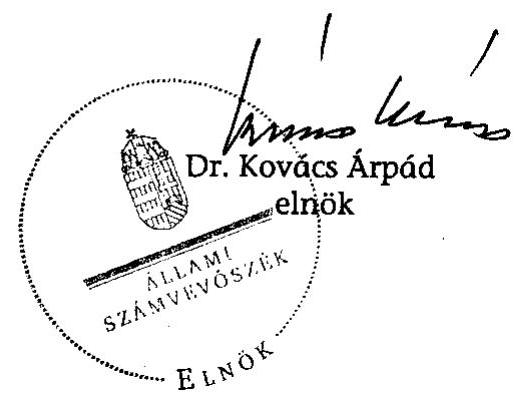

---

# MELLÉKLETEK 

A V-19-148/2007-2008. SZ. JELENTÉSHEZ

---

1. sz. melléklet
2. sz. melléklet
3. sz. melléklet
4. sz. melléklet
5. sz. melléklet
6. sz. melléklet
7. sz. melléklet
8. sz. melléklet
9. sz. melléklet
10. sz. melléklet
11. sz. melléklet
12. sz. melléklet
13. sz. melléklet
14. sz. melléklet
15. sz. melléklet

Észrevételek
Az ajánlatkérők megoszlása a 2005-2007. években
A közbeszerzési eljárások megoszlása a 2005-2007. években

Helyszíni ellenőrzésre kijelölt települési önkormányzatok jegyzéke
A 100 legnagyobb értékben közbeszerzést végző központi költségvetési intézmény kimutatásából kiválasztott ajánlatkérők a 2005-2006. években

A 100 legnagyobb értékben közbeszerzést végző közjogi szervezetek kimutatásából kiválasztott ajánlatkérők a 2005-2006. években

A 100 legnagyobb értékben közbeszerzést végző közszolgáltató szervezetek kimutatásából kiválasztott ajánlatkérők a 2005-2006. években

A KDB ügyintézési időtartamai 2007-ben
A KDB határozatai és bírósági felülvizsgálatuk a 2004-2007. években

A nemzeti eljárásrend szerinti értéksávok 2008. január 1-jétől a klasszikus ajánlatkérők és a közszolgáltatók körében

A KT költségvetésének alakulása a 2003-2008. években

A közbeszerzési eljárások és a jogorvoslati eljárások számának alakulása a 2004-2007. években

A döntőbizottsági eljárások kezdeményezők szerinti megoszlása

Közbeszerzési hirdetményminták típusai 2006. január 15-étől

A közbeszerzési referensképzés eredményessége a 2005-2007. években

Az EKKE megvalósult és tervezett oktatási programja 2004-2009.

---

# A közbeszerzési rendszer működésének ellenőrzéséről 

## készített jelentés véleményeztetése

| $1 /$ A. | KT | Berényi Lajos úr   Közbeszerzések Tanácsa elnöke | észrevételt nem tett |
| :--: | :--: | :--: | :--: |
| $1 / B$. | MeH | Kiss Péter úr   Miniszterelnöki Hivatalt vezető miniszter | észrevételt nem tett   intézkedési tervet készít |
| $1 /$ C. | IRM | Dr. Draskovics Tibor úr   miniszter   Igazságügyi és Rendészeti Minisztérium | észrevételt nem tett, mivel a   jelentés a tárca észrevételeit   megfelelő módon tartalmazza |
| $1 /$ D. | NFGM | Bajnai Gordon úr   miniszter   Nemzeti Fejlesztési és Gazdasági Minisztérium | észrevételt nem tett   intézkedési tervet készít |
| $1 /$ E. | PM | Dr. Veres János úr   miniszter   Pénzügyminisztérium | észrevételt nem tett |
| $1 /$ F. | KHEM | Dr. Szabó Pál úr   miniszter   Közlekedési, Hírközlési és Energiaügyi Minisztérium | észrevételt nem tett |
| $1 /$ G. | ÖM | Dr. Gyenesei István úr   miniszter   Önkormányzati Minisztérium | észrevételt nem tett   intézkedési tervet készített |
| $1 /$ H. | Főv.   Bír. | Dr. Gatter László úr   Fővárosi Bíróság elnöke | jelentés tartalmával   egyetértett |

---

# 1198612008 

## 1634108   AEF GES/08

## KÖZBESZERZÉSEK TANÁCSA ELNÖK

$711-11 / 1990-2 / 08$.

## Dr. Kovács Árpád úr

elnök

Állami Számvevőszék

Budapest

## 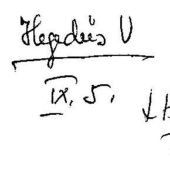

## ÁLLAMI SZÁMVEVŐSZÉK

Érkezett: 2008.03.03
Iktatószám: 119-140/201708.
Melléklet:

## Tisztelt Elnök Úr!

Az Állami Számvevőszék által a „közbeszerzési rendszer működésének ellenőrzéséről" készített, és általunk 2008. szeptember 1. napján kézhez vett jelentést köszönöm.

A jelentésnek a Közbeszerzések Tanácsát érintő megállapításaival egyetértek, észrevételt nem kívánok tenni.

Budapest, 2008. szeptember 1.
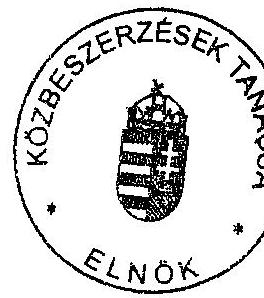

Tisztelettel
Berényi Lajos

---

# 1/B. SZ. MELLÉKLET A V-19-148/2007-2008. SZ. JELENTÉSHEZ 

Miniszterelnöki Hivatalt vezető Miniszter

## Dr. Kovács Árpád úr elnök   Állami Számvevőszék

Budapest

Tisztelt Elnök Úr!

ÁLLAMI SZÁMVEVŐSZÉK
Érkezett: 2008.09.11
Iktatószám: V-19-148/200725
Melléklet:

A közbeszerzési rendszer működésének ellenőrzéséről készített ÁSZ jelentést köszönettel megkaptam.

Az ellenőrzés megállapításaival kapcsolatban észrevételt tenni nem kívánok.
Az elrendelt intézkedésekről az Állami Számvevőszékről szóló 1989. évi XXXVIII. törvény 25. § (1) bekezdésnek megfelelően 30 napon belül tájékoztatni fogom Elnök urat.

Budapest, 2008. szeptember 11.

Tisztelettel:
Kiss Péter

---

IGAZSÁGÜGYI ÉS RENDÉSZETI MINISZTÉRIUM
Miniszter

Ugyiratszám: 228

Iktatószám: 1RM/KGFG/228-33/2008

Ügyintéző(k):
telefon: +36 (1) 441-1605
telefax: +36 (1) 999-4388
e-mail: PoczeT@irm.gov.hu
hív. szám: V-19-139/2006-2008.
ügyintézőjük:

Dr. Kovács Árpád Úr részére
elnök
Állami Számvevőszék
Budapest
Apáczai Csere János u. 10.
1052

melléklet: -
tárgy: A közbeszerzési rendszer működéséről szóló jelentés

Tisztelt Elnök Úr!

Ugyiratszám: 228

Az Állami Számvevőszék által a közbeszerzési rendszer működése ellenőrzésének tapasztalatairól készített jelentést köszönettel megkaptam.

Tekintettel arra, hogy a jelentés a tárca észrevételeit megfelelő módon tartalmazza, a jelentésre további észrevételt nem kívánok tenni.

Kérem Elnök Urat, hogy tájékoztatásomat szíveskedjék elfogadni.

Budapest, 2008. szeptember 11.

Tisztelettel:

ÁLLAMI SZÁMVEVŐSZÉK

Érkezett: 2008.10.20. 10:15:45 AM

Iktatószám: 1RM/KGFG/228-33/2008

Dr. Draskovics Tibor

Melléklet:

Levelezési cím: 1055 Budapest, Kossuth Lajos tér 4., Postafiók: 1363 Budapest, Pf.: 54.
Telefon: +36 (1) 441-3003, Fax: +36 (1) 441-3711, E-mail: ugyfelugy@irm.gov.hu, Honlap: http://www.irm.gov.hu

---

# 1/D. SZ. MELLÉKLET A V-19-148/2007-2008. SZ. JELENTÉSHEZ 

## ArXiv

## ArXiv

## ArXiv

## ArXiv

## ArXiv

## ArXiv

## ArXiv

## ArXiv

## ArXiv

## ArXiv

## ArXiv

## ArXiv

## ArXiv

## ArXiv

## ArXiv

## ArXiv

## ArXiv

## ArXiv

## ArXiv

## ArXiv

## ArXiv

## ArXiv

## ArXiv

## ArXiv

## ArXiv

## ArXiv

## ArXiv

## ArXiv

## ArXiv

## ArXiv

## ArXiv

## ArXiv

## ArXiv

## ArXiv

## ArXiv

## ArXiv

## ArXiv

## ArXiv

## ArXiv

## ArXiv

## ArXiv

---

H-1051 BUDAPEST V., JÓZSEF NÁDOR TÉR 2-4. POSTACÍM: 1369 BUDAPEST, POSTAFIÓK 481
TELEFON: (36-1) 327-2159, (36-1) 327-2141
E-MAIL: janos.veres@pm.gov.hu
FAX: (36-1) 318-0738

PÉNZÜGYMINISZTÉRIUM

Dr. Kovács Árpád úr
elnök

Állami Számvevőszék
Budapest

Ikt. szám: 12236/7/2008.

ÁLLAMI SZÁMVEVŐSZÉK
2008.09.11.

Érkezett: 2008.09.09.
Iktatószám: V-19-149/2007/2008.
Melléklet:

Tisztelt Elnök Úr!
Köszönettel megkaptam a közbeszerzési rendszer működésének ellenőrzéséről készített jelentést.

A jelentéssel összefüggésben észrevételt nem teszek.

Budapest, 2008. szeptember 11.
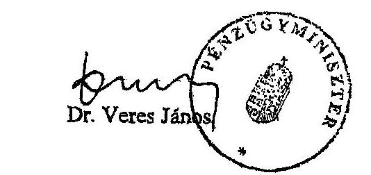

---

# Kovács Árpád 

elnök úr
részére
Állami Számvevőszék

Budapest

## Tisztelt Elnök Úr!

Köszönettel megkaptam a „közbeszerzési rendszer működésének" ellenőrzéséről készített jelentés-tervezetet.

A megküldött jelentés-tervezetre észrevételt nem kívánok tenni.
A jelentés-tervezet mind megállapításában, mind javaslataiban segíti a fejezetet a hatékonyabb közbeszerzési rendszer működtetéséhez.

Tájékoztatom, hogy a részemre is megfogalmazott javaslatokra a jogszabályban előírt határidőben megküldöm az intézkedési tervet.

Budapest, 2008. szeptember 11.
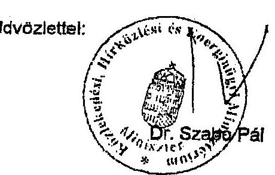

## ÁLLAMI SZÁMVEVŐSZÉK

Érkezett: 2008.09.11
Iktatószám: V-19-145/2007-08
Melléklet:

---

# ÁLLAMI SZÁMVEVŐSZÉK 

## Érkezett: 2008.09.05.   Iktatószám: V-19-148/2008

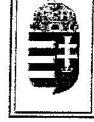

ÖNKORMÁNYZATI MINISZTÉRIUM

Iktatószám: 11086/5/2008

Hivatkozási szám:
V-19-138/2007-2008
V-0375
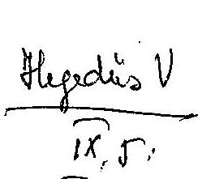
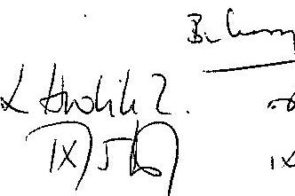

Budapest

## Tisztelt Elnök Úr!

A közbeszerzési rendszer működésének vizsgálatáról készített ellenőrzési jelentést köszönettel megkaptam; az abban foglaltakkal egyetértek, észrevételt nem kívánok tenni.

Tájékoztatom Elnök Urat, hogy a vizsgálat megállapításainak hasznosítása érdekében - a javaslatok alapján - Intézkedési Terv készítését rendeltem el, amit csatoltan megküldök Önnek.

Kérem Elnök Urat, hogy tolmácsolja köszönetemet munkatársai felé az ellenőrzés során tapasztalt korrekt és szakszerű munkavégzésért.

Budapest, 2008. szeptember 05.
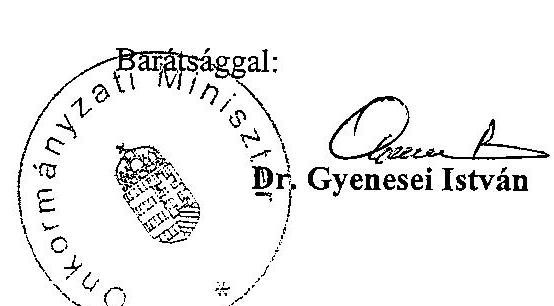

Melléklet: intézkedési terv

---

A FŐVÁROSI BÍRÓSÁG
ELNÖKE
2008. évi D. 5/10. szám

Dr. Kovács Árpád úrnak, az Állami Számvevőszék elnökének

Budapest
Apáczai Cs. János u. 10.
1052

Tisztelt Elnök Úr!

A közbeszerzési rendszer működésének ellenőrzéséről szóló jelentésüket köszönettel kézhez kaptam. A Fővárosi Bíróság a jelentés jelenlegi tartalmával egyetért.

Budapest, 2008. szeptember 4.

Tisztelettel
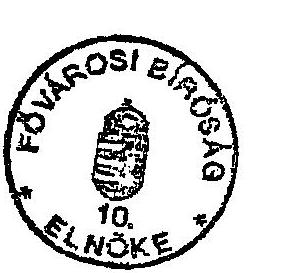
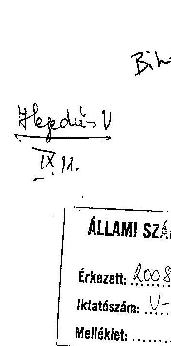

ÁLLAMI SZÁMVEVŐSZÉK
Érkezett: 2008.09.04
Iktatószám: V-19-144/2007/2008.
Melléklet: 

---

# Az ajánlatkérők megoszlása a 2005-2007. években 

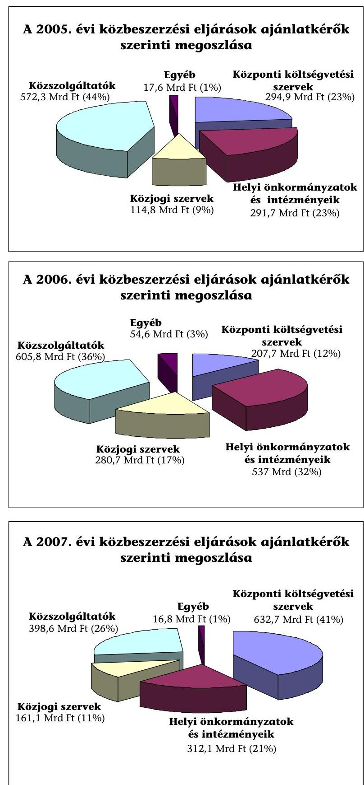

---

# A közbeszerzési eljárások megoszlása a 2005-2007. években 

|  | 2005. |  |  |  | 2006. |  |  |  | 2007. |  |  |  |
| :--: | :--: | :--: | :--: | :--: | :--: | :--: | :--: | :--: | :--: | :--: | :--: | :--: |
| Eljárás típusa | db | \% | Mrd Ft | \% | db | \% | Mrd Ft | \% | db | \% | Mrd Ft | \% |
| Nyílt | 2470 | 65,3 | 598,4 | 46,3 | 3013 | 60,8 | 758 | 45 | 1825 | 53 | 458 | 30,1 |
| Meghívásos | 68 | 1,8 | 25,2 | 2 | 126 | 2,5 | 74,5 | 4,4 | 154 | 4,5 | 99,3 | 6,5 |
| Tárgyalásos   ebből hirdetmény nélküli | $\begin{gathered} 926 \\ 647 \end{gathered}$ | $\begin{gathered} 24,5 \\ 17 \end{gathered}$ | $\begin{gathered} 638,1 \\ 191,9 \end{gathered}$ | $\begin{gathered} 49,4 \\ 14 \end{gathered}$ | $\begin{gathered} 1474 \\ 1007 \end{gathered}$ | $\begin{gathered} 29,7 \\ 20 \end{gathered}$ | $\begin{gathered} 812 \\ 246,2 \end{gathered}$ | $\begin{gathered} 48,1 \\ 14 \end{gathered}$ | $\begin{gathered} 1236 \\ 809 \end{gathered}$ | $\begin{gathered} 35,9 \\ 23,5 \end{gathered}$ | $\begin{gathered} 931 \\ 249,9 \end{gathered}$ | $\begin{gathered} 61,2 \\ 16,4 \end{gathered}$ |
| Egyszerűsített

 | 318 | 8,4 | 29,6 | 2,3 | 343 | 6,9 | 41,5 | 2,5 | 230 | 6,7 | 33,2 | 2,2 |
| Versenypárbeszéd | 0 | 0 | 0 | 0 | 1 | 0,1 | 0,02 | 0 | 1 | 0 | 0,05 | 0 |
| Összesen | 3782 | $103^{*}$ | 1291 | $114^{*}$ | 4957 | $131^{*}$ | 1686 | $130^{*}$ | 3446 | $69^{*}$ | 1521 | $90^{*}$ |

|  | 2005. |  |  |  | 2006. |  |  |  | 2007. |  |  |  |
| :--: | :--: | :--: | :--: | :--: | :--: | :--: | :--: | :--: | :--: | :--: | :--: | :--: |
| Ajánlatkérő típusa | db | \% | Mrd Ft | \% | db | \% | Mrd Ft | \% | db | \% | Mrd Ft | \% |
| Központi költségvetési szervek | 905 | 23,9 | 294,9 | 22,8 | 1034 | 20,9 | 208 | 12,3 | 1051 | 30,5 | 633 | 41,6 |
| Helyi önkormányzatok és intézményeik | 1691 | 44,7 | 291,7 | 22,6 | 2240 | 45,2 | 537 | 31,9 | 1281 | 37,2 | 312 | 20,5 |
| Közjogi szervek | 510 | 13,5 | 114,8 | 8,9 | 642 | 12,9 | 281 | 16,7 | 407 | 11,8 | 161 | 10,6 |
| Közszolgáltatók | 541 | 14,3 | 572,3 | 44,3 | 753 | 15,2 | 606 | 35,9 | 602 | 17,5 | 399 | 26,2 |
| Egyéb | 135 | 3,6 | 17,6 | 1,4 | 288 | 5,8 | 54,6 | 3,2 | 105 | 3 | 16,8 | 1,1 |

|  | 2005. |  |  |  | 2006. |  |  |  | 2007. |  |  |  |
| :--: | :--: | :--: | :--: | :--: | :--: | :--: | :--: | :--: | :--: | :--: | :--: | :--: |
| Beszerzés típusa | db | \% | Mrd   Ft | \% | db | \% | Mrd   Ft | \% | db | \% | Mrd   Ft | \% |
| Árubeszerzés | 1129 | 29,9 | 325,3 | 25,2 | 1346 | 27,2 | 405 | 24 | 1084 | 31,5 | 290 | 19,1 |
| Építési beruházás | 1304 | 34,4 | 522,3 | 40,4 | 1846 | 37,2 | 800 | 47,4 | 1063 | 30,8 | 783 | 51,5 |
| Szolgáltatás | 1342 | 35,5 | 443,2 | 34,36 | 1759 | 35,5 | 480 | 28,5 | 1296 | 37,6 | 448 | 29,4 |
| Építési koncesszió | 3 | 0,08 | 0,42 | 0,03 | 2 | 0,04 | 1,5 | 0,09 | 0 | 0 | 0 | 0 |
| Szolgáltatási konceszszió | 4 | 0,12 | 0,08 | 0,01 | 4 | 0,08 | 0,4 | 0,03 | 3 | 0,1 | 0,1 | 0 |

* Az Összesen mező aránya a megelőző évhez viszonyítva (megelőző év = 100)

---

# Helyszíni ellenőrzésre kijelölt helyi önkormányzatok jegyzéke 

## Főváros és Pest megye

Érd Megyei Jogú Város Önkormányzata
Pilisvörösvár Város Önkormányzata

## Bács-Kiskun megye

Baja Város Önkormányzata
Lakitelek Nagyközség Önkormányzata

## Baranya megye

Harkány Város Önkormányzata
Komló Város Önkormányzata

## Borsod-Abaúj-Zemplén megye

Bogács Község Önkormányzata
Kazincbarcika Város Önkormányzata

## Csongrád megye

Kistelek Város Önkormányzata
Makó Város Önkormányzata
Mórahalom Város Önkormányzata
Szentes Város Önkormányzata

## Fejér megye

Bicske Város Önkormányzata
Dunaújváros Megyei Jogú Város Önkormányzata
Ercsi Város Önkormányzata
Sárbogárd Város Önkormányzata

## Hajdú-Bihar megye

Berettyóújfalu Város Önkormányzata
Hajdúböszörmény Város Önkormányzata
Hajdúhadház Város Önkormányzata
Hajdúsámsom Város Önkormányzata
Polgár Város Önkormányzata

## Heves megye

Eger Megyei Jogú Város Önkormányzata

## Somogy megye

Balatonboglár Város Önkormányzata
Látrány Község Önkormányzata

---

# Szabolcs-Szatmár-Bereg megye 

Demecser Város Önkormányzata
Nagyvarsány Község Önkormányzata
Nyírbátor Város Önkormányzata
Nyíregyháza Megyei Jogú Város Önkormányzata

## Tolna megye

Bonyhád Város Önkormányzata
Tolna Város Önkormányzata
Tolna Megyei Önkormányzat

## Vas megye

Szombathely Megyei Jogú Város Önkormányzata

## Veszprém megye

Balatonfüred Város Önkormányzata
Veszprém Megyei Önkormányzat
Zirc Város Önkormányzata

## Zala megye

Keszthely Város Önkormányzata
Nagykanizsa Megyei Jogú Város Önkormányzata
Zalakaros Város Önkormányzata
Zalalövő Város Önkormányzata

---

# A 100 legnagyobb értékben közbeszerzést végző központi költségvetési intézmény kimutatásából ${ }^{1}$ kiválasztott ajánlatkérők a 2005-2006. években 

| A kiválasztott központi költségvetési ajánlatkérők 2005. |  |  |  |
| :--: | :--: | :--: | :--: |
| Ajánlatkérő neve | Eljárás-   szám | Beszerzés összege (Ft) | Felügyeleti szerv |
| Állami Autópálya Kezelő Rt.* | 56 | 10836513318 | GKM |
| Belügyminisztérium* | 10 | 3446020019 | - |
| BM Országos Katasztrófavédelmi Főigazgatóság | 12 | 2743167250 | ÖTM |
| Belügyminisztérium Központi Adatfeldolgozó, Nyilvántartó és Választási Hivatal* | 13 | 17519558942 | MEH |
| Büntetés-végrehajtás Országos Parancsnokság | 5 | 13733364703 | IRM |
| Gazdasági és Közlekedési Minisztérium* | 13 | 1478080273 | GKM |
| Közlekedési Főfelügyelet | 4 | 4442425911 | GKM |
| Közlekedéstudományi Intézet Kht. | 1 | 477982148 | GKM |
| Miniszterelnöki Hivatal* | 50 | 30709379549 | MEH |
| Nemzeti Hírközlési Hatóság | 11 | 469369422 | GKM |
| Nemzeti Kutatási és Technológiai Hivatal és Kutatásfejlesztési Pályázati és Kutatáshasznosítási Iroda | 1 | 620852778 | GKM |
| Nógrád Megyei Állami Közútkezelő Kht. | 4 | 331339000 | GKM |
| Nógrád Megyei Rendőr-főkapitányság | 2 | 168833473 | IRM |
| Országos Rendőr-Főkapitányság* | 2 | 2859691680 | IRM |
| Radioaktiv Hulladékokat Kezelő Kht. | 11 | 5922660091 | IRM |
| Útgazdálkodási és Koordinációs Igazgatóság | 83 | 51418808405 | GKM |

* Az adatszolgáltatásból összesítve

| Központi költségvetési ajánlatkérő szervek 2005. |  |  |  |
| :--: | :--: | :--: | :--: |
| TOP 100 összesen | Kiválasztottak |  |  |
| db | érték (Ft) | db | érték (Ft) |
| 842 | 288013536419 | 278 | 147178046962 |
|  |  | $33,0 \%$ | $51,1 \%$ |

[^0]
[^0]:    ${ }^{1}$ Forrás: Közbeszerzések Tanácsa adatszolgáltatása

---

| A kiválasztott központi költségvetési ajánlatkérők 2006. |  |  |  |
| :--: | :--: | :--: | :--: |
| Ajánlatkérő neve | Eljárás-   szám | Beszerzés összege (Ft) | Felügyeleti szerv |
| Állami Autópálya Kezelő Rt.* | 52 | 55873907169 | GKM |
| Belügyminisztérium Műszaki Főosztály | 2 | 375316845 | - |
| BM Központi Adatfeldolgozó, Nyilvántartó és Választási Hivatal* | 10 | 4246473158 | MEH |
| BM Központi Gazdasági Főigazgatóság | 1 | 426150000 | - |
| BM Országos Katasztrófavédelmi Főigazgatóság | 7 | 1072676141 | ÖTM |
| Gazdasági és Közlekedési Minisztérium* | 28 | 8065485923 | GKM |
| Határőrség Országos Parancsnokság   Ellátási és Fenntartási Főosztály | 1 | 349693572 | IRM |
| Igazságügyi és Rendészeti Minisztérium* | 10 | 1459089632 | IRM |
| Informatikai és Hírközlési Minisztérium | 6 | 286712817 | - |
| Közlekedési Főfelügyelet | 5 | 586348417 | GKM |
| Központi Pénzügyi és Szerződéskötő Egység | 100 | 17368042679 | NFÜ |
| Központi Statisztikai Hivatal | 5 | 518680292 | KSH |
| Központi Szolgáltatási Főigazgatóság | 24 | 64608596481 | MEH |
| Magyar Közút Kht.* | 52 | 11605582063 | GKM |
| Miniszterelnöki Hivatal | 12 | 2039152893 | MEH |
| Nemzeti Hírközlési Hatóság | 7 | 381746254 | GKM |
| Országos Területfejlesztési Hivatal | 3 | 251890300 | ÖTM |
| Radioaktív Hulladékokat Kezelő Kht. | 19 | 10065234934 | IRM |
| Útgazdálkodási és Koordinációs Igazgatóság | 68 | 36148192024 | GKM |

* Az adatszolgáltatásból összesítve

| Központi költségvetési ajánlatkérő szervek 2006. |  |  |  |
| :--: | :--: | :--: | :--: |
| TOP 100 összesen |  | Kiválasztottak |  |
| db | érték (Ft) | db | érték (Ft) |
| 1034 | 326348957512 | 412 | 215728971594 |
|  |  | $39,8 \%$ | $66,1 \%$ |

---

# A 100 legnagyobb értékben közbeszerzést végző közjogi szervezetek kimutatásából ${ }^{1}$ kiválasztott ajánlatkérők a 2005-2006. években 

| Kiválasztott közjogi ajánlatkérők 2005. |  |  |  |
| :--: | :--: | :--: | :--: |
| Ajánlatkérő neve | Eljárás-   szám | Beszerzés összege (Ft) | Tulajdonos, alapító |
| Állami Közúti Műszaki és Információs Kht. | 6 | 236629462 | GKM |
| Baranya Megyei Állami Közútkezelő KHT | 6 | 432211903 | GKM |
| Békés Megyei Állami Közútkezelő Kht. | 7 | 705156561 | GKM |
| Belügyi Általános Beruházó és Fejlesztő Kht. | 1 | 466773016 | ÖTM |
| Borsod-Abaúj-Zemplén Megyei Állami Közútkezelő Kht. | 5 | 572655794 | GKM |
| Csongrád Megyei Állami Közútkezelő Kht. | 7 | 413903922 | GKM |
| Fejér Megyei Állami Közútkezelő Kht. | 5 | 366222114 | GKM |
| Győr-Moson-Sopron Megyei Állami Közútkezelő Kht. | 9 | 492670855 | GKM |
| Hajdú-Bihar Megyei Állami Közútkezelő Kht. | 10 | 607399197 | GKM |
| Heves Megyei Állami Közútkezelő Közhasznú Társaság | 6 | 264854540 | GKM |
| HungaroControl Magyar Légiforgalmi Szolgálat | 15 | 5481426132 | GKM |
| Jász-Nagykun-Szolnok Megyei Állami Közútkezelő Kht. | 2 | 375462153 | GKM |
| KHVT Közlekedési, Hírközlési és Vízügyi   Tartalékgazdálkodási Kht. | 4 | 426417500 | KVVM, majd GKM |
| Komárom-Esztergom Megyei Állami Közútkezelő Kht. | 1 | 151024999 | GKM |
| Magyar Posta Rt Beszerzési és Ellátási Igazgatóság | 2 | 331753800 | ÁPV Rt. |
| Magyar Turizmus Rt. | 13 | 251090520 | GKM, majd ÖTM |
| Nemzeti Autópálya Zrt. | 26 | 82650583139 | GKM |
| Pest Megyei Állami Közútkezelő Kht. | 7 | 684994898 | GKM |
| Rendészeti Biztonsági Szolgálat | 2 | 102000000 | IRM |
| Somogy Megyei Állami Közútkezelő Kht. | 7 | 421159754 | GKM |
| Szabolcs-Szatmár-Bereg Megyei Állami Közútkezelő Kht. | 6 | 634914247 | GKM |
| Tolna megyei Állami Közútkezelő Kht. | 13 | 394127385 | GKM |
| Vas Megyei Állami Közútkezelő Kht. | 6 | 313963574 | GKM |
| VÁTI Magyar Regionális és Urbanisztika Kht. | 4 | 135163700 | ÖTM |
| Veszprém Megyei
 Állami Közútkezelő Kht. | 4 | 316729222 | GKM |
| Zala Megyei Állami Közútkezelő Kht. | 5 | 629604868 | GKM |

| Közjogi ajánlatkérők 2005. |  |  |
| :--: | :--: | :--: |
| TOP 100 összesen | Kiválasztottak |  |
| db | érték (Ft) | db érték (Ft) |
| 392 | 133109362421 | 179 |
|  |  | 45,7 % |

[^0]
[^0]:    ${ }^{1}$ Forrás: Közbeszerzések Tanácsa adatszolgáltatása

---

| Kiválasztott közjogi ajánlatkérők 2006. |  |  |  |
| :--: | :--: | :--: | :--: |
| Ajánlatkérő neve | Eljárásszám | Beszerzés összege | Tulajdonos, alapító |
| HungaroControl Magyar Légiforgalmi Szolgálat | 16 | 6252876264 | GKM |
| KHVT Közlekedési, Hírközlési és Vízügyi Tartalékgazdálkodási Kht. | 3 | 338993450 | KVVM, majd GKM |
| Magyar Posta Rt. | 4 | 884303669 | ÁPV Zrt. |
| Magyar Turizmus Rt. | 9 | 989775483 | GKM, majd ÖTM |
| Nemzeti Autópálya Zrt. | 64 | 102059968438 | GKM |
| Rendészeti Biztonsági Szolgálat | 4 | 284147849 | IRM |
| VÁTI Magyar Regionális és Urbanisztikai Kht. | 6 | 294929002 | ÖTM |

| Közjogi ajánlatkérők 2006. |  |  |  |
| :--: | :--: | :--: | :--: |
| TOP 100 összesen |  | Kiválasztottak |  |
| db | érték (Ft) | db | érték (Ft) |
| 430 | 182265170880 | 106 | 111104994155 |
|  |  | 24,7 % | 61,0 % |

---

# A 100 legnagyobb értékben közbeszerzést végző közszolgáltató szervezetek kimutatásából ${ }^{1}$ kiválasztott ajánlatkérők a 2005-2006. években 

| A kiválasztott ajánlatkérő közszolgáltatók 2005. |  |  |  |
| :--: | :--: | :--: | :--: |
| Ajánlatkérő neve | Eljárásszám | Beszerzés   összege (Ft) | Tulajdonos |
| Budapesti Közlekedési Rt.* | 63 | 50496441302 | Főv. Önk. |
| MÁV Rt.* | 129 | 243976815196 | GKM |

| Ajánlatkérő közszolgáltatók 2005. |  |  |  |
| :--: | :--: | :--: | :--: |
| TOP 100 összesen |  | Kiválasztottak |  |
| db | érték (Ft) | db | érték (Ft) |
| 485 | 558183651289 | 192 | 294473256498 |
|  |  | 39,6 % | 52,8 % |

| A kiválasztott ajánlatkérő közszolgáltatók 2006. |  |  |  |
| :--: | :--: | :--: | :--: |
| Ajánlatkérő neve | Eljárásszám | Beszerzés összege | Tulajdonos |
| Budapesti Közlekedési Rt.* | 78 | 282578177448 | Főv. Önk. |
| Magyar Posta Rt. Beszerzési és Ellátási Szolgáltató központ | 31 | 5766105714 | ÁPV Zrt. |
| MÁV Rt.* | 148 | 147643787271 | GKM |

| Ajánlatkérő közszolgáltatók 2006. |  |  |
| :--: | :--: | :--: |
| TOP 100 összesen | Kiválasztottak |  |
| db | érték (Ft) | db | érték (Ft) |
| 655 | 574500262290 | 257 | 435988070433 |
|  |  | 39,2 % | 75,9 % |

[^0]
[^0]:    ${ }^{1}$ Forrás: Közbeszerzések Tanácsa adatszolgáltatása
    * Az adatszolgáltatásból összesítve

---

# A KDB ügyintézési időtartamai 2007-ben 

| Elintézési idő | Ügyek száma   db | Ügyek aránya   % |
| :--: | :--: | :--: |
| 1-15 nap | 211 | 28,10 |
| 16-30 nap | 290 | 38,62 |
| 31-40 nap | 174 | 23,17 |
| 41-60 nap | 71 | 9,45 |
| 61-90 nap | 4 | 0,53 |
| 90 napon túl | 1 | 0,13 |
| Összesen: | 751 |  |

Határidő hosszabbítás 236 ügyben történt (31,5 %)

---

# A KDB határozatai és bírósági felülvizsgálatuk a 2004-2007. években

|  Jogkövetkezmény | 2004. |  | 2005. |  | 2006. |  | 2007. |   |
| --- | --- | --- | --- | --- | --- | --- | --- | --- |
|   | db | % | db | % | db | % | db | %  |
|  Jogsértés megállapítása | 343 | 40 | 452 | 41 | 323 | 38 | 260 | 35  |
|  Elutasítás | 335 | 39 | 434 | 40 | 312 | 36 | 333 | 44  |
|  Megszüntetés | 184 | 21 | 201 | 18 | 222 | 26 | 158 | 21  |
|  Felfüggesztés | 1 |  | 3 | 1 |  |  | 0 |   |
|  Hatáskör hiánya | 3 |  | 1 |  | 0 |  | 0 |   |
|  Áttétel |  |  |  |  | 1 |  |  |   |
|  Összesen | 866 |  | 1091 |  | 858 |  | 751 |   |
|  Ebből bírósági felülvizsgálat I. és II. fokon | 210 | 24 | 248 | 23 | 198 | 23 | 153 | 20  |
|  Felülvizsgálat eredménye: |  |  |  |  |  |  |  |   |
|  Elutasítás | 138 | 66 | 166 | 67 | 125 | 63 | 45 | 30  |
|  Megszüntetés | 31 | 15 | 34 | 14 | 12 | 6 | 3 | 2  |
|  Új eljárás | 9 | 4 | 12 | 5 | 8 | 4 | 2 | 1  |
|  Megváltoztatás | 31 | 15 | 22 | 9 | 15 | 8 | 5 | 3  |
|  Hatáskör hiánya | 0 |  | 0 |  | 1 |  | 0 |   |
|  Folyamatban | 1 |  | 14 | 5 | 37 | 19 | 98 | 64  |

---

# A nemzeti eljárásrend szerinti értéksávok 2008. január 1-jétől a klasszikus ajánlatkérők és a közszolgáltatók körében

|  A klasszikus ajánlatkérők (Kbt.VI.fejezet) nemzeti eljárásrend szerinti közbeszerzéseinek alsó értékhatárai: |  |  |   |
| --- | --- | --- | --- |
|  Kbt. VI. fejezete 244.§ (1) és 22.§(1) és (2) alapján a (3) bek figyelembevételével: árubeszerzés esetében | 30 millió forint | A klasszikus ajánlatkérők (Kbt.VI.fejezet) nemzeti eljárásrend szerinti közbeszerzéseinek felső értékhatárai: (=Kbt. IV. fejezete: közösségi eljárásrendi közbeszerzéseinek alsó értékhatára.) |   |
|  Kbt.242.§(2) Az árubeszerzésre a 24. §-t azzal az eltéréssel kell alkalmazni, hogy árubeszerzésnek minősül az ingatlan tulajdonjogának vagy használatára, illetőleg hasznosítására vonatkozó jognak - véten joggal vagy anélkül történő - megszerzése is az ajánlatkérő részéről. | 30 millió forint | Kbt.IV.fejezet 30.§ (a) és Kbt.22.§(1) a): Árubeszerzés (a Kbt. 2. sz. mellékletben a védelem árui is) esetén a minisztérium, a Miniszterelnöki Hivatal, a központosított közbeszerzés során ajánlatkérésre feljogosított szervezet körében: | 133000 euró  |
|  Kbt. VI. fejezete 244.§ (1) és 22.§(1) és (2) alapján, a (4) bekezdés figyelembevételével: szolgáltatás megrendelése esetében | 25 millió forint | A Kbt.30.§ (b) és Kbt.22.§(1)b)-k) és 22.§(2)b): Árubeszerzés (a Kbt. 2. sz. mellékletben nem szereplő védelem árui is) esetén a következő szervezetek körében: a 22.§(1)a)-ba nem tartozó összes egyéb klasszikus ajánlatkérő szervezetek továbbá minden más szervezet, amelynek közbeszerzéséhez többségi részben EU támogatást vett igénybe klasszikus ajánlatkérő költségvetési forrásból származó támogatása mellett, vagy anélkül. | 206000 euró  |
|  Kbt.244.§ (2) alapján Tervpályázati eljárás esetén a szolgáltatás megrendelésére meghatározott értékhatárt kell alkalmazni | 25 millió forint | Kbt.24.§ : Az árubeszerzés tárgya csak ingó dolog, vagy azzal kapcsolatos egyes jogok lehetnek közösségi közbeszerzés során, ingatlan, vagy azzal kapcsolatos jog csak a nemzeti rezsimben lehet tárgya a közbeszerzésnek. Felső értékhatára nincs. |   |
|  Kbt.244.§ (2) alapján Tervpályázati eljárás esetén a szolgáltatás megrendelésére meghatározott értékhatárt kell alkalmazni | 25 millió forint | Kbt.32.§(a) és Kbt.22.§(1) a): szolgáltatás megrendelése, ha a 3. mellékletben szerepel, kivéve a 8. csop (kut.-fejl.), és az 5. csop.(távközlés)-ből a 7524-7526 CPC kódú szolg. esetén a minisztérium, a Miniszterelnöki Hivatal, a központosított közbeszerzés során ajánlatkérésre feljogosított szervezetek körében. | 133000 euró  |
|  Kbt.244.§(1): szolgáltatási koncesszió nemzeti értékhatára (Kbt. 242.§(4) A szolgáltatási koncesszió olyan szolgáltatás-megrendelés, amely alapján az ajánlatkérő ellenszolgáltatása a szolgáltatás nyújtásával összefüggő hasznosítási jog meghatározott időre történő átengedése vagy e Kbt. VI. fejezete 244.§ (1) és 22.§(1) és (2) alapján a (3) bek figyelembevételével: építési beruházás esetében | 25 millió forint | 32. §-ának b)-d) pontjai szerint a 22.§(1)a)-ba nem tartozó összes egyéb klasszikus ajánlatkérő körében a 3. és a 4. sz. mellékletben szereplő szolgáltatás megrendelése esetében | 206000 euró  |
|  Kbt. VI. fejezete 244.§ (1) és 22.§(1) és (2) alapján a (3) bek figyelembevételével: építési koncesszió esetében | 90 millió forint | Kbt.33.§ a Kbt.32.§(a) és Kbt.22.§(1) a) szerinti (a minisztérium, a Miniszterelnöki Hivatal, a központosított közbeszerzés során ajánlatkérésre feljogosított szervezet körében, kivéve a 8. csop (kut.-fejl.), és az 5. csop.(távközlés)-ből a 7524-7526 CPC kódú szolg. esetén) tervpályázati eljárásnál | 133000 euró  |
|  Kbt. VI. fejezete 244.§ (1) és 22.§(1) és (2) alapján a (3) bek figyelembevételével: építési koncesszió esetében | 100 millió forint | Kbt.33.§ a Kbt.32.§(b-c) szerint: a 22.§(1)a)-ba nem tartozó összes egyéb klasszikus ajánlatkérő körében; továbbá a 3. melléklet a 8. csop (kut.-fejl.), és az 5. csop.(távközlés)-ből a 7524-7526 CPC kódú szolg. kapcsán a tervpályázati eljárás során | 206000 euró  |
|  A közszolgáltatók (Kbt.VII. fejezet) nemzeti eljárásrend szerinti közbeszerzéseinek alsó értékhatárai: |  |  |   |
|  Kbt. IV.fejezet 273.§ (1): árubeszerzés esetében | 50 millió forint | Kbt.31.§(1) és (2): építési beruházás (= építési koncesszió) | 5150000 euró  |
|  Kbt. IV.fejezet 273.§ (1) szolgáltatás megrendelése esetében | 50 millió forint | Kbt.31.§(1) és (2): építési beruházás (= építési koncesszió) | 5150000 euró  |
|

  Kbt. 273.§ (2) alapján a tervpályázati eljárás esetén a szolgáltatás megrendelésére meghatározott értékhatárt kell alkalmazni | 50 millió forint | A közszolgáltatók (Kbt. VII. fejezet) nemzeti eljárásrend szerinti közbeszerzéseinek felső értékhatárai: (= Kbt. V. fejezete: közösségi eljárásrendi közbeszerzéseinek alsó értékhatára.) |   |
|  Kbt. IV. fejezet 273.§ (1): építési beruházás esetében | 100 millió forint | Kbt. 176.§ (1) árubeszerzés (= szolgáltatás megrendelés) | 412000 euró  |
|   |  | Kbt. 177. § tervpályázati eljárás | 412000 euró  |
|   |  | Kbt. 176.§ (2) építési beruházás | 5150000 euró  |

---

# A KT költségvetésének alakulása 

a 2003-2008. években

| Évek | Kiadások összesen   M Ft | Bevétel   M Ft | Támogatás   M Ft | Támogatás aránya a kiadásokon belül \% |
| :--: | :--: | :--: | :--: | :--: |
| 2003. | 736,3 | 753,5 | 160 | 21,7 |
| 2004. | 1311 | 1103,2 | 208,8 | 15,9 |
| 2005. | 1852,1 | 1783,3 | 223,6 | 12,1 |
| 2006. | 1912,3 | 1797,3 | 216,3 | 11,3 |
| 2007.* | 1755,2 | 2320,2 | 245,8 | 14 |
| 2008. ** | 1809,2 | 1590 | 219,2 | 12,1 |

2003-2006: a zárszámadási törvény adatai alapján

* Előzetes adatok
** 2008. évi költségvetési törvény szerinti előirányzat

---

# A közbeszerzési eljárások és a jogorvoslati eljárások számának alakulása a 2004-2007. években

|   | 2004. | 2005. | Változás* | 2006. | Változás* | 2007. | Változás*  |
| --- | --- | --- | --- | --- | --- | --- | --- |
|  Közbeszerzési eljárások
száma (db) | 3658 | 3782 | 103,4% | 4957 | 131,1% | 3446 | 69,5%  |
|  Közbeszerzési eljárások
értéke (Mrd Ft) | 1129,7 | 1291,3 | 114,4% | 1686 | 130,6% | 1521 | 90,2%  |
|  Jogorvoslatok száma (db) | 866 | 1091 | 126% | 858 | 78,6% | 751 | 87,5%  |
|  Jogorvoslatok aránya az
eljárások számában | 23,8% | 28,8% |  | 17,3% |  | 21,7% |   |

- Megelőző év = 100%

---

# A döntőbizottsági eljárások kezdeményezők szerinti megoszlása

|  Kezdeményező | 2004. db | Arány % | 2005. db | Arány % | 2006. db | Arány % | 2007. db | Arány %  |
| --- | --- | --- | --- | --- | --- | --- | --- | --- |
|  Jogorvoslati kérelem | 599 | 69 | 822 | 75 | 627 | 73 | 515 | 69  |
|  Hivatalból kezdeményezett | 67 | 8 | 69 | 6 | 99 | 12 | 121 | 16  |
|  DB elnöke által kezdeményezett | 180 | 21 | 189 | 18 | 120 | 14 | 109 | 15  |
|  Bíróság által új eljárásra kötelezés | régi Kbt. szerint 20 | 2 | 11 | 1 | 12 | 1 | régi Kbt. szerint 2 | 0  |
|  Összes eljárás | 866 |  | 1091 |  | 858 |  | 751 |   |
|  Egyesített ügyek | 88 |  | 1 (régi Kbt. szerint 85) |  | 0 (régi Kbt. szerint 64) |  | 0 |   |

---

# Közbeszerzési hirdetményminták típusai 2006. január 15-től 

## A nemzeti és az egyszerű eljárásrendben alkalmazandó hirdetményminták

2/2006. (I. 13.) IM rendelet

A minták kitöltési útmutatója
21. az éves statisztikai összegzés
20. összegzés az egyszerű közbeszerzési eljárásban az ajánlatok elbírálásáról
19. összegzés a részvételi jelentkezések elbírálásáról
18. összegzés az ajánlatok elbírálásáról
17. tájékoztató a szerződés teljesítéséről
16. tájékoztató a szerződés módosításáról
15. tájékoztató a hirdetmény visszavonásáról vagy módosításáról
14. az egyszerű eljárás ajánlattételi felhívása
13. tájékoztató a tervpályázati eljárás eredményéről
12. tervpályázati kiírás
11. előminősítési rendszer - egyes ágazatokban
10. ajánlati/részvételi felhívás - egyes ágazatokban
9. időszakos előzetes tájékoztató - egyes ágazatokban
8. tájékoztató az eljárás eredményéről
7. tájékoztató a részvételi szakasz eredményéről
6. dinamikus beszerzési rendszerben használt egyszerűsített ajánlati felhívás
5. ajánlati/részvételi felhívás
4. hirdetmény a felhasználói oldalon
3. előzetes összesített tájékoztató
2. tájékoztató az eljárás eredményéről

1. az egyszerűsített eljárás ajánlati felhívása

A közösségi eljárásrendben alkalmazandó hirdetményminták 2001/78/EC
13. tájékoztató a tervpályázati eljárás eredményéről
12. tervpályázati kiírás
11. ajánlati/részvételi felhívás - ajánlatkérőnek nem minősülő koncessziós jogosult eljárása
10. építési koncesszió
9. dinamikus beszerzési rendszerben használt egyszerűsített hirdetmény
8. hirdetmény a felhasználói oldalon
7. előminősítési rendszer - egyes ágazatokban
6. tájékoztató az eljárás eredményéről - egyes ágazatokban
5. ajánlati/részvételi felhívás - egyes ágazatokban
4. időszakos tájékoztató - egyes ágazatokban
3. tájékoztató az eljárás eredményéről
2. ajánlati/részvételi felhívás

1. előzetes tájékoztató hirdetmény

---

# A közbeszerzési referensképzés eredményessége a 2005-2007. években 

| Összesítés 2005 - 2007. |  |  |  |  |  |
| :--: | :--: | :--: | :--: | :--: | :--: |
|  | Vizsgák   száma | A vizsgát   megkezdők   száma (fő) | Sikeresen   vizsgázók   száma (fő) | Szakmai elmélet   átlaga | Szakmai   gyakorlat   átlaga |
| 2005. | 95 | 1705 | 1336 | 3,7 | 4,1 |
| 2006. | 128 | 2092 | 1799 | 3,6 | 4,2 |
| 2007. | 66 | 1021 | 836 | 3,6 | 4,1 |
| Összesen | 289 | 4818 | 3971 | 3,6 | 4,1 |

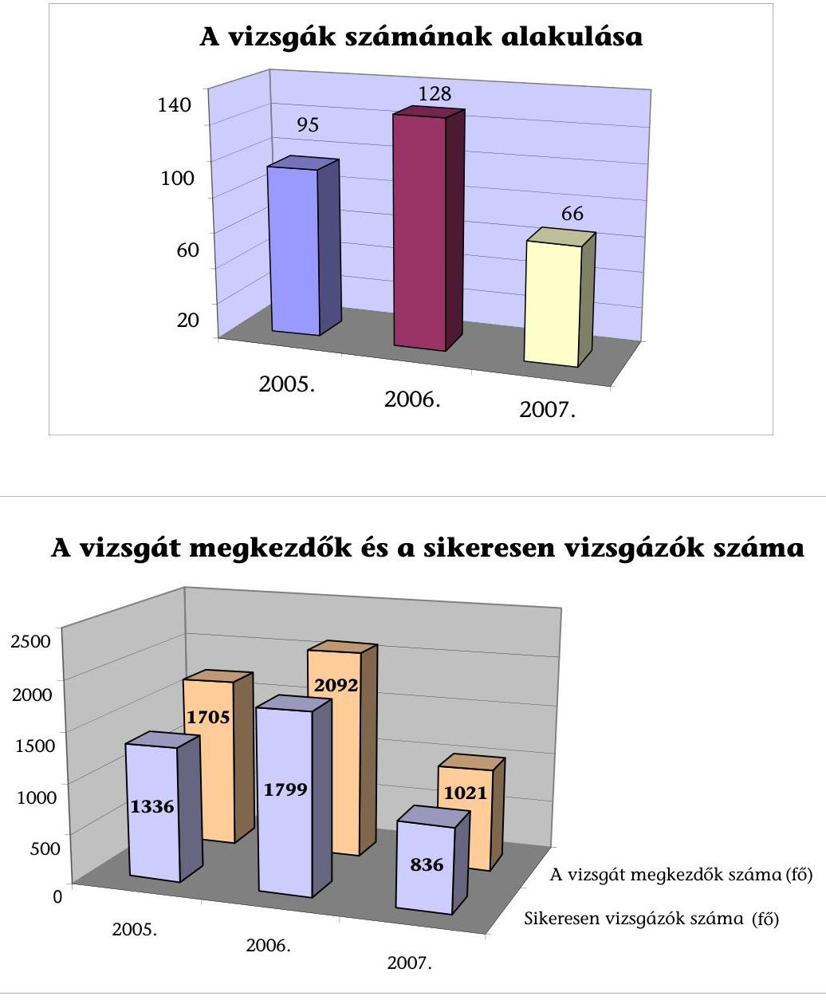

---

# Az EKKE megvalósult és tervezett oktatási programja 

2004-2009.

- 2004. november 15.-2005. február 28. - Útmutató kidolgozása a Kbt. végrehajtási rendeleteiről az intézményrendszer szereplői részére
- 2004. január 27., 28., 29. - Bevezetés a közbeszerzésekbe c. képzés (résztvevők: irányító hatóságok, közreműködő szervezetek, kedvezményezettek)
- 2004. március 1-2., 3-4. és 16-17. - A közbeszerzési törvény alkalmazásával kapcsolatos legfontosabb alapvető ismeretek áttekintése c. képzés (résztvevők: NFH Phare és ISPA projektekkel foglalkozó munkatársai, NAO Iroda Phare és ISPA projektekkel foglalkozó munkatársai, Phare végrehajtó ügynökségek, ISPA végrehajtó ügynökség, végső kedvezményezettek)
- 2004. április 5-6., 26-27. - A közbeszerzési törvény gyakorlati alkalmazásának megismertetése; az alkalmazással kapcsolatos legfontosabb, alapvető ismeretek áttekintése (résztvevők: NFH Phare és ISPA projektekkel foglalkozó munkatársai, NAO Iroda Phare és ISPA projektekkel foglalkozó munkatársai, Phare végrehajtó ügynökségek, ISPA végrehajtó ügynökség, végső kedvezményezettek)
- 2006. június 30. - Workshop I. a közbeszerzési törvény alkalmazásával és az alkalmazás ellenőrzésével kapcsolatos feladatokról, problémákról, megoldási technikákról.
- 2006. december 20. - Workshop II. a Strukturális Alapok intézményrendszer (Irányító Hatóságok és Közreműködő Szervezetek) számára a közbeszerzési törvény alkalmazásával és az alkalmazás ellenőrzésével kapcsolatos feladatokról, problémákról, megoldási technikákról.
- 2007. január 17-18. - A közbeszerzési szerződések gyakorlati problémái (résztvevők: IH, KSZ közbeszerzési szakértői, szakemberei - max. 40 fő). Az EKKE jogi szakértői kapacitásának bevonásával, külső helyszínen.
- 2007. február 14-15. - A nyílt eljárás (résztvevők: IH, KSZ közbeszerzési szakértői, szakemberei - max. 40 fő). Az EKKE jogi szakértői kapacitásának bevonásával, külső helyszínen.
- 2007. március 7-8. - A nyílt eljárástól eltérő speciális szabályok (résztvevők: IH, KSZ közbeszerzési szakértői, szakemberei - max. 40 fő). Az EKKE jogi szakértői kapacitásának bevonásával, külső helyszínen.
- 2007. április 10-11. - A jogorvoslati eljárás, a közbeszerzés tágabb értelembe vett szervezetrendszere, a jogalkotás jövőbeni irányai, EU követelmények, a közbeszerzés alapelvei (résztvevők: IH, KSZ közbeszerzési szakértői, szakemberei - max. 40 fő). Az EKKE jogi szakértői kapacitásának bevonásával, külső helyszínen.
- 2008. május 15-16. - A közbeszerzési törvény 2008. év eleji módosításának aktuális, az EU forrásokat érintő kérdései, gyakorlati tanácsok (résztvevők: IH, KSZ közbe-

---

szerzési szakértői, szakemberei - max. 80 fő). Az EKKE jogi szakértői kapacitásának bevonásával, külső helyszínen.

- 2008. június 19-20. - Szerződésmódosítások, tartalékkeret, pótmunka, többletmunka kérdéseinek vizsgálata gyakorlati példákon keresztül, gyakorlati tanácsok (résztvevők: IH, KSZ közbeszerzési szakértői, szakemberei - max. 80 fő). Az EKKE jogi és műszaki szakértői kapacitásának bevonásával, külső helyszínen.
- 2008. szeptember 28-29. - Az új jogorvoslati irányelvek változásainak hatása a jelenlegi jogorvoslati rendszerre - változások várható hatásai az EU-források területén. (résztvevők: IH, KSZ közbeszerzési szakértői, szakemberei - max. 80 fő). Az EKKE jogi szakértői kapacitásának bevonásával, külső helyszínen
- 2008. október 22-23. - A nyílt eljárás specialitásai (résztvevők: IH, KSZ közbeszerzési szakértői, szakemberei - max. 80 fő). Az EKKE jogi szakértői kapacitásának bevonásával, külső helyszínen.
- 2008. november 13-14. - A meghívásos eljárás specialitásai (résztvevők: IH, KSZ közbeszerzési szakértői, szakemberei - max. 80 fő). Az EKKE jogi szakértői kapacitásának bevonásával, külső helyszínen.
- 2008. december 11-12. - A tárgyalásos eljárás specialitásai (résztvevők: IH, KSZ közbeszerzési szakértői, szakemberei - max. 80 fő). Az EKKE jogi szakértői kapacitásának bevonásával, külső helyszínen.
- 2009. február 26-27. - A közbeszerzési törvény 2009. év eleji módosításának aktuális, az EU forrásokat érintő kérdései, gyakorlati tanácsok (résztvevők: IH, KSZ közbeszerzési szakértői, szakemberei - max. 80 fő). Az EKKE jogi szakértői kapacitásának bevonásával, külső helyszínen.
- 2009. március 26-27. - Szerződésmódosítások, tartalékkeret, pótmunka, többletmunka kérdéseinek vizsgálata gyakorlati példákon keresztül, gyakorlati tanácsok (résztvevők: IH, KSZ közbeszerzési szakértői, szakemberei - max. 80 fő). Az EKKE jogi és műszaki szakértői kapacitásának bevonásával, külső helyszínen.
- 2009. május 21-22. - Minőségbiztosítási és szabályossági tevékenységek tapasztalatai az EU források felhasználása során (résztvevők: IH, KSZ közbeszerzési szakértői, szakemberei - max. 80 fő). Az EKKE jogi szakértői kapacitásának bevonásával, külső helyszínen.
- 2009. október 15-16. - A nyílt eljárás specialitásai (résztvevők: IH, KSZ közbeszerzési szakértői, szakemberei - max. 80 fő). Az EKKE jogi szakértői kapacitásának bevonásával, külső helyszínen.
- 2009. november 12-13. - A meghívásos eljárás specialitásai (résztvevők: IH, KSZ közbeszerzési szakértői, szakemberei - max. 80 fő). Az EKKE jogi szakértői kapacitásának bevonásával, külső helyszínen.
- 2009. december 10-11. - A tárgyalásos eljárás specialitásai (résztvevők: IH, KSZ közbeszerzési szakértői, szakemberei - max. 80 fő). Az EKKE jogi szakértői kapacitásának bevonásával, külső helyszínen.

Budapest, 2008. szeptember

---

# F Ü G G E L É K 

a közbeszerzési rendszer működésének ellenőrzéséről készített V-19-148/2007-2008. sz. Jelentéshez
2008. szeptember

---

# A közbeszerzési rendszer működése a helyi

 önkormányzatoknál

1. A közbeszerzési eljárások helyi szabályozása
2. A közbeszerzési eljárások szabályossága
3. A közbeszerzési eljárások lebonyolítása
4. A közbeszerzési eljárásokkal kapcsolatban kezdeményezett jogorvoslati eljárások értékelése
5. A monitoring- és kontroll rendszer működése

---

# A közbeszerzési rendszer működése a helyi önkormányzatoknál

## 1. A KÖZBESZERZÉSI ELJÁRÁSOK HELYI SZABÁLYOZÁSA

Az önkormányzatok a Kbt. hatálybalépését követően megalkották közbeszerzési szabályzatukat, de előfordult, hogy csak a 2005. évben (Harkány, Baja) vagy a 2007. évben (Hajdúhadház) készítették el, illetve hagyták jóvá. Az ellenőrzött önkormányzatok 97%-a általános érvényű szabályzattal rendelkezett, egy önkormányzatnál (Bicske) a közbeszerzések indítása előtt, esetenként döntöttek az eljárások felelősségi, dokumentálási és eljárási rendjéről. A közbeszerzési szabályzatok általánosan, célként rögzítették a közpénzek felhasználásának átláthatóságát, a nyilvánosság érvényesülését. Az önkormányzatok 56,4 %-a helyi szabályzatában a Kbt-ben meghatározottak mellett EU és egyéb helyi, az ajánlatkérői érdekeket védő alapelveket nem nevesített. Azok az önkormányzatok, amelyek a Kbt-ben előírtakon túl helyi, a közbeszerzési eljárások során érvényesítendő alapelveket is meghatároztak, elsősorban a költségvetési kiadások csökkentését, az alkalmazott bírálati szempontrendszer elveit rögzítették.

Eger Megyei Jogú Város Önkormányzatnál ajánlatkérői érdekeket szolgáló egyéb alapelvként határozták meg az eljárásban résztvevők felelősségét, az ajánlattevőkkel szemben alkalmazott bírálati szempontrendszert.

Pilisvörösvár Város Önkormányzata a közbeszerzési szabályzatában a közösségi alapelvek mellett az önkormányzat költségvetési kiadásának csökkentésére vonatkozó elvet határozta meg.

A szabályzatok konkrét önkormányzati elvárásokat nem tartalmaztak, azokban a Kbt. 6. § (1) bekezdésében előírtakat határozták meg, illetve rögzítették a személyi és tárgyi feltételeket. Nem fordítottak kellő figyelmet az egyes feladatok és azok ellátásáért felelősök, a határidők meghatározására. A szabályzat személyi hatálya kiterjedt a közbeszerzés előkészítésében közreműködőkre (közbeszerzési munkacsoportokra), az eljárás lefolytatásában résztvevőkre (bíráló bizottságokra), valamint a döntéshozó személyekre, szervekre. Az önkormányzatok a helyi szabályozás keretében kijelölték az eljárás során hozott döntésekért felelős személyt, személyeket, illetőleg testületeket, akik megyénél, megyei jogú városnál, a nagyobb városi önkormányzatoknál a közgyűlés elnökei, a polgármesterek voltak. Ezzel a joggal a kisebb városi, községi önkormányzatoknál általában a képviselő-testületek, vagy erre a célra létrehozott bizottságok rendelkeztek. A Kbt. 8. § (3) bekezdésében előírtakkal ellentétesen szabályozták egy önkormányzatnál a döntéshozatali jogkör egy részét, egy önkormányzatnál pedig nem határozták meg egyértelműen az eljárás során hozott döntésekért felelősöket.

Tolna Város Önkormányzatánál a bíráló bizottság döntési jogosultsággal való felruházása ellentétes a Kbt-ben előírtakkal. A bíráló bizottságnak javaslattevő szerepe volt a közbeszerzési eljárás folyamatában.

Kistelek Város Önkormányzatánál nem határozták meg egyértelműen a szabályzatban, hogy ki a közbeszerzési eljárást lezáró döntés címzettje. A szabályzat sze-

---

rint a döntőbizottság feladatkörében határozták meg a nyertes személyéről való döntést, azonban a bizottsági tagok összetételéről nem rendelkeztek.

A közbeszerzési szabályzatok tárgyi hatálya az önkormányzatoknál tervezett árubeszerzésekre, építési beruházásokra, építési koncessziókra, szolgáltatásokra és szolgáltatási koncessziók megrendelésére vonatkozott, nem terjedt ki azonban az éven belüli beszerzések egybeszámításának kötelezettségére. A becsült érték meghatározásának módját a szabályzatok nem tartalmazták.

Az előkészítési feladatokról az önkormányzatok 82,1%-a teljes körűen, 17,9%-a pedig részben rendelkezett. A közbeszerzési szabályzatban az előkészítéssel kapcsolatos határidőket az önkormányzatok 59%-a, az előkészítésért felelősöket 82,1%-a határozta meg. Az éves beszerzésekről a közbeszerzési terveket az önkormányzatok elkészítették, azokat az év során - a költségvetésben rendelkezésre álló előirányzatok változásához kapcsolódóan (Nagyvarsány kivételével) - folyamatosan aktualizálták.

Az eljárások lefolytatását a részvételi, ajánlati, ajánlattételi felhívástól a szerződéskötésig elvégezendő feladatokat az önkormányzatok 89,7%-a szabályozta közbeszerzési szabályzatában, a határidők tekintetében csak a szabályzatok 56,4%-a tartalmazott előírásokat. A Kbt. előírásai nem tartalmazzák ugyan a közbeszerzési eljárások lezárásával kapcsolatos teendők szabályozási kötelezettségét, azonban a szerződéskötéssel még nem zárulnak le a közbeszerzési eljárással kapcsolatos ajánlatkérői feladatok. Ezt figyelembe véve az önkormányzatok 66,7%-a rendelkezett a közbeszerzési eljárások lezárását követő időszakban történő feladatellátásról, melynek során többek között a szerződés-módosítások közzétételét, a tájékoztató készítési és közzétételi kötelezettséget szabályozták.

Az ajánlatok bírálatát, értékelését végző bizottságok hatáskörét az önkormányzatok 92,3%-a szabályozta. A polgármesteri hivatalokban alkalmazott - közbeszerzési, pénzügyi és közbeszerzés tárgya szerinti szakértelemmel rendelkező ügyintézők ellenére az önkormányzatok - még a megyei jogú, megyei, nagyobb városi önkormányzatok is - az összetettebb, bonyolultabb (pl. építési rekonstrukcióra, orvosi gép-műszer beszerzésére irányuló) közbeszerzési eljárásoknál külső - közbeszerzési tanácsadói képesítéssel rendelkező - személyeket, szervezeteket bíztak meg a lebonyolítással. Előfordult, hogy a külső megbízott több évre szóló, folyamatos megbízást kapott az önkormányzattól a közbeszerzések lebonyolítására. Ennek következtében az önkormányzatok 48,7%-a kialakította a külső szervezetek, személyek eljárásba való bevonásának rendjét is.

Ercsi Város Önkormányzata a 2006. évben hivatalos közbeszerzési szakértővel három évre szóló átalánydíjas szerződést kötött.

Makó Város Önkormányzata a 2005-2007. években állandó közbeszerzési jogi szakértőt alkalmazott és az egyes közbeszerzési eljárásoknál az adott közbeszerzés tárgyának megfelelő szakértőt is igénybe vett.

---

A vizsgált szabályzatoknak azonban csak 43,6%-a tartalmazott előírásokat a külső megbízottak felelősségével kapcsolatban, általában a megkötött szerződésekben rögzítették a konkrét felelősségvállalásokat.

Tolna Város Önkormányzatára szennyvízcsatorna építéssel kapcsolatosan a KDB bírságot szabott ki. A külső szakértővel kötött szerződésben rögzítették anyagi felelősségének mértékét, így a bírság megfizetésében 1/3 arányban részt vett.

A külső lebonyolító felelősségét a vizsgált önkormányzatok 35,9%-ánál a szerződésekben sem határozták meg, ennek következtében az általuk okozott kár (bírság) megtérítésében sem működtek közre.

Pilisvörösvár Város Önkormányzata a közbeszerzési tanácsadóval a lebonyolításra kötött szerződést felbontotta. Két közbeszerzési eljárás esetében jogorvoslat keretében bírságot szabott ki a KDB, melyeket a külső megbízott bonyolított.

A szervezeti és személyi feltételek kialakítása során a szakmai szempontok az önkormányzatok 74%-ánál érvényesültek. A létrehozott bíráló bizottságok egy részénél nem rendelkeztek a beszerzés tárgyának megfelelő, vagy közbeszerzési és pénzügyi szakterületet ismerő taggal, mellyel nem tartották be a Kbt. 8. §-ának előírásait.

Dunaújváros Megyei Jogú Város Önkormányzatnál a bíráló bizottságban nem volt a beszerzés tárgyának szakterületén jártas szakember, továbbá pénzügyi szakértelemmel rendelkező tagja sem volt.

Mórahalom Város Önkormányzatánál a bírálóbizottságban a közbeszerzési és a pénzügyi szakértelmet megfelelő képzettséggel rendelkező tagok képviselték, viszont a közbeszerzés tárgya szerinti szakértelmet képviselő tag az eljárások 75%-ában hiányzott.

# 2. A KÖZBESZERZÉSI ELJÁRÁSOK SZABÁLYOSSÁGA

A Kbt.-ben és a helyi szabályozásokban előírtakat az önkormányzatok 77%-a tartotta be, ¹23%-ánál az ÁSZ összesen 13 esetben kezdeményezett jogorvoslati eljárást a Kbt. 327. § (1) bekezdés b) pontja alapján. A jogorvoslati eljárások 67%-át a beszerzésekhez kapcsolódó egybeszámításra vonatkozó előírások betartásának elmulasztása következtében a közbeszerzési eljárás mellőzése, 33%-át a Kbt. 2/A. §-ában előírtak ² be nem tartása miatt indította.

Az önkormányzatoknál a közbeszerzés tárgyainak kategóriába sorolásánál betartották a Kbt. előírásait, a közbeszerzési eljárás kiválasztásánál figyelemmel voltak a közbeszerzés tárgyára és annak értékére. Egy esetben

[^0]
[^0]: ¹ Az önkormányzatok a 2007. évi beszerzéseinek ellenőrzése mintavétel alapján, a 2007. évi kötelezettségvállalások nyilvántartására, valamint a főkönyvi számlák forgalmára irányultan történt.
² Az önkormányzatok nem tartották be a 100%-os tulajdonukban lévő gazdasági társaságok megbízásaira vonatkozó, a Kbt. 2/A. §-ában előírtakat.

---

előfordult, hogy egyes beszerzésekre a Kbt-ben előírthoz képest szigorúbb, egyszerű közbeszerzés helyett nemzeti eljárást folytattak le.

Kazincbarcika Város Önkormányzatnál a 2007. évi helyi közutak karbantartásának és felújításának becsült értékét 85 M Ft-ban határozták meg, a kivitelező kiválasztására a hirdetménnyel induló egyszerű eljárás helyett nyílt eljárást folytattak le.

Az önkormányzatok a beszerzési tárgyak becsült értékének meghatározásához módszereket, eljárásokat nem alakítottak ki, az egybeszámítás követelményeinek érvényesítésére vonatkozó előírásokat a közbeszerzési szabályzatok nem tartalmaztak. Nem határozták meg, hogy kinek, vagy milyen szervezetnek van feladata a becsült érték megállapításában, szükség esetén módosításában, nem alakították ki a becsült érték meghatározásának dokumentálását. A gyakorlatban az egybeszámítás feltételei együttes fennállása általában vizsgálat tárgyát képezte a becsült érték meghatározásakor. Ennek során vizsgálták, hogy a beszerzés megvalósítható-e egy (költségvetési) évben, a beszerzésre egy ajánlattevővel köthetnek-e szerződést, valamint a felhasználás összefügg-e más beszerzési tárgyakkal, a rendeltetésük azonos, vagy hasonló-e. A becsült értéket az éves közbeszerzési tervekben a készítésének időpontjában fennálló érték alapján határozták meg. A becsült érték kialakításában a közbeszerzés tárgyával érintett szervezeti egységek vezetői, a speciális, bonyolultabb beszerzéseknél külső szakértők működtek közre. Az önkormányzatok között voltak olyanok, amelyek az egybeszámított értékű beszerzésekre vonatkozó eljárást több eljárásra bontották, mivel azok külön is lebonyolíthatóak voltak.

A Veszprém Megyei Önkormányzatnál a 2005. évben rulírozó hitel felvételére hirdetmény nélküli egyszerű eljárást folytattak le. Évközben további likvid hitel felvételével számoltak és az egybeszámított értékre tekintettel, a pénzügyi szolgáltató kiválasztásához hirdetményes egyszerű eljárást kezdeményeztek. A 2006. évben áru (orvosi gép-műszer, valamint mosodai gépek) beszerzések külön eljárásban történő közbeszereztetésére az egybeszámított értéket figyelembe véve a közösségi eljárásrendet alkalmazták. A 2007. évben öt építési munka becsült értékét egybeszámítva, a kivitelező kiválasztására külön-külön hirdetmény nélküli egyszerű eljárást folytattak le.

Nagykanizsa Megyei Jogú Város Önkormányzatnál egybeszámítást alkalmaztak a 2007. évben hét oktatási intézmény felújításánál, a becsült érték nem érte el nemzeti értékhatár felét. Az intézményi felújításokra a közbeszerzési eljárást hirdetmény közzététele nélküli egyszerű eljárást alkalmazva folytatták le. A becsült érték meghatározása megfelelt a Kbt-ben előírtaknak, az egybeszámítás együttes feltételei fennálltak, egy költségvetési éven belül valósultak meg, egy ajánlattevővel lehetett szerződést kötni, rendeltetésük azonos vagy hasonló volt. A részekre történő ajánlattétel lehetőségét engedélyezték, valamennyi részre vonatkozóan. Az alkalmazott eljárás a Kbt. előírásainak megfelelt.

Nyírbátor Város Önkormányzatnál több útépítési projekt tervezett költségeit összevonták, melynek következtében kialakított becsült érték alapján kötelező volt közbeszerzés lefolytatása. Az Önkormányzatnál tervenként és pályázatonként külön-külön eljárást indítottak a kivitelezésre. A 2007-ben tervezett három-három utca beruházási értékét összevonták, a kivitelező kiválasztása nyílt közbeszerzési eljárás keretében történt.

---

Az építési beruházásoknál a teljes beruházási értéket vették számításba. Az EU és egyéb állami forrásból támogatással tervezett építési beruházások becsült értékét műszaki dokumentációk, tételes tervezői költségvetések alapozták meg. A kisebb építési beruházásoknál a mennyiségi adatok alapján készített költségbecslések, hatósági engedélyhez nem kötött karbantartási, felújítási munkáknál a kiadási előirányzatok képezték a becsült érték alapját.

Az árubeszerzések becsült értékének meghatározásához az előző évi tapasztalati adatok mellett felhasználták az internet nyújtotta információkat, egyes beszerzések (orvosi eszközök) sajátossága miatt külső szakértőket bíztak meg a becsült érték kalkulációjához. Az árubeszerzések esetében, valamint a szolgáltatásoknál a szerződés időtartamának figyelembevételével határozták meg a becsült értéket.

Hajdúsámson Város Önkormányzatánál az élelmiszer beszerzések becsült értékéhez a kalkulációt az előző költségvetési év hasonló tárgyú beszerezések várható mennyiségi és értékbeni változását figyelembe véve készítették el. A kalkulációban az élelmezés becsült értékét a demográfiai adatok alapján számított létszám és az élelmezési napok számának figyelembevételével határozták meg. A számítások elkészítésében pénzügyi és szakmai szakértelemmel rendelkezők, valamint közbeszerzési tanácsadó működtek közre.

A banki-pénzügyi, valamint tervezést is magába foglaló szolgáltatások megrendelésénél, a díjakat, egyéb szolgáltatások költségeit vették alapul.

A Veszprém Megyei Önkormányzatnál (2005-ben 20 éves időtartamra) 200 M Ft fejlesztési, valamint a (2006.
 évben egy évre szóló) 140 M Ft rúlirozó hitel közbeszerzési eljárásának előkészítésére - a közbeszerzés tárgya szerinti közbeszerzési és pénzügyi szakértelemmel rendelkezőkből álló - közbeszerzési munkacsoportot hoztak létre. A szerződés időtartamának figyelembevételével a becsült értéket 48000 E Ft, illetve 12068 E Ft-ban határozták meg. A kamatszámításnál figyelembe vették a futamidőt és az aktuális kamatlábat, valamint kalkuláltak az egyéb fizetendő (rendelkezésre tartási és folyósítási) díjakkal.

Az egybeszámítás feltételei fennállásának gyakorlatban történő vizsgálata ellenére az önkormányzatok 21\%-a nem tartotta be a Kbt. előírását. A Kbt. előírásainak mellőzésére elsősorban a több intézményt érintő felújítás, árubeszerzések és szolgáltatások esetében, banki szolgáltatások igénybevételénél és élelmezési anyagok beszerzésénél került sor az egybeszámítási követelmények figyelmen kívül hagyásával.

Szombathely Megyei Jogú Város Önkormányzatnál a 2007-ben 15 oktatási, valamint egy közművelődési intézmény részére 28 M Ft összegben kötöttek különböző vállalkozókkal szerződést karbantartási feladatok elvégzésére. A 2007. évi szerződések, karbantartási kifizetések mintavételes vizsgálata során állapította meg az ellenőrzés, hogy a több részből álló építési munka becsült értékét nem számították egybe, közbeszerzési eljárásokat nem folytattak le.

Nagykanizsa Megyei Jogú Város Önkormányzata a 2006. évi költségvetési rendeletében 60 M Ft előirányzatot hagyott jóvá hat oktatási intézmény felújítására. Az építési munkáknál figyelmen kívül hagyták a Kbt. egybeszámításra vonatkozó előírását és a felújításra vonatkozó vállalkozási szerződéseket 43 M Ft összeg-

---

ben, a közbeszerzési eljárást mellőzve kötötték meg. A KDB megállapította a jogsértést, bírság kiszabását mellőzte.

Kazincbarcika Város Önkormányzatánál nem érvényesítették az egybeszámítás feltételeinek követelményét, a 2007. évi helyi közutak felújításának építési beruházására kötött szerződés módosításakor, olyan egyéb felújításként megjelölt munkát, körforgalmú csomópont létesítését rendelték meg, amelyre nem folytattak le közbeszerzési eljárást.

Zalakaros Város Önkormányzatnál a 2006-ban 100 M Ft hosszú lejáratú fejlesztési hitel felvételéhez 22 M Ft-ban állapították meg a becsült értéket. A banki szolgáltatás igénybevételéhez nem indítottak közbeszerzési eljárást, mellyel megsértették a Kbt. előírását. A KDB D.93/5/2008. sz. határozatában az Önkormányzatot 1 M Ft pénzbírság megfizetésére kötelezte.

Nagykanizsa Megyei Jogú Város Önkormányzatnál 2007-ben az irodaszer beszerzésnél nem folytattak le közbeszerzési eljárást annak ellenére, hogy az Önkormányzat a 2007. évi költségvetési rendeletében erre a célra 20400 E Ft-ot irányzott elő. A tételes főkönyvi számlaforgalom szerint 13031 E Ft-ot fizettek ki az év folyamán. A beszerzéseknél megsértették a Kbt. 40. § (2) bekezdésének az egybeszámításra vonatkozó előírását és a megrendeléseket a közbeszerzési eljárást mellőzve bonyolították. A becsült érték a nemzeti értékhatár 50\%-át meghaladta, így az Önkormányzatnak ajánlattételi felhívás megjelentetésével induló egyszerű közbeszerzési eljárást kellett volna alkalmazni, a Kbt. 299. § a) pontja szerint.

Bogács Község Önkormányzata az alapító okiratban foglaltak szerint a Polgármesteri hivatal tevékenységi körében határozta meg az óvodai, iskolai intézményi, illetve a szociális étkeztetést, melyet az általa működtetett Központi konyhán biztosított. A 2007. évi pénzforgalmi adatok alapján a Polgármesteri hivatalban 16,6 M Ft kiadás teljesült élelmiszer beszerzés címén. Az ajánlatkérő Polgármesteri hivatal az élelmiszer beszerzésre a Kbt. előírásait megsértve nem indított közbeszerzési eljárást. A KDB nem jogerős D.76/6/2008. sz. határozatában a közbeszerzés jogtalan mellőzése miatt 500 E Ft összegű bírságot szabott ki.

A Kbt-ben foglaltak alapján az egyszerű közbeszerzési eljárásban az ajánlatkérő az ajánlattételi felhívást hirdetmény útján köteles közzétenni, ha a közbeszerzés értéke a közbeszerzés megkezdésekor eléri, vagy meghaladja a VI. fejezet szerinti mindenkori nemzeti értékhatárok felét.

Harkány Város Önkormányzatánál a 2006-ban általános iskolai multimédia (nyelvi labor) rendszer és általános iskolai számítástechnikai eszközök beszerzésére írtak ki közbeszerzési eljárást. A becsült értéket mindkét esetben a 14900 E Ft alatti összegben állapították meg. Az eljárásokat hirdetmény közzététele nélküli egyszerű eljárásként folytatták le. A VÁTI kezdeményezésére indított jogorvoslati eljárásban a KDB 2006. augusztus 2-án kelt határozatában megállapította, hogy a két eljárás vonatkozásában egybeszámítást kellett volna alkalmazni.

Négy önkormányzat nem folytatta le a Kbt. 2. § (1) bekezdése szerinte közbeszerzési eljárást a gazdasági társaságokkal kötött visszterhes szerződések esetében, amikor a szerződések értéke meghaladta a közbeszerzési értékhatárt. Ezekben az esetekben nem teljesült a Kbt. 2/A. § (1) bekezdésében előírt feltétel, mivel az önkormányzatok 100\%-os tulajdonában lévő gazdálkodó szervezetek szerződéskötés követő éves nettó árbevételének legalább 90\%-a nem az ön-

---

kormányzattal kötött szerződésből és a teljesített közszolgáltatás ellenértékéből származott.

Nagykanizsa Megyei Jogú Város Önkormányzatnál a 100\%-os tulajdonban lévő Kft-vel 21 M nettó összegben kötöttek 2007-ben ingatlankezelési tevékenység elvégzésére vállalkozási szerződést. A szerződést az év folyamán módosították és a vállalási díjat nettó 25813 E Ft-ban határozták meg. A Kft 2007. évi nettó árbevételének mindössze 49\%-a származott az Önkormányzattól és a közszolgáltatásból. Egy másik, szintén önkormányzati tulajdonban lévő Kft-vel is kötöttek vállalkozási szerződést 2007-ben, nettó 27600 E Ft összegben. A Kft 2007. évi nettó árbevételének 80\%-a származott az Önkormányzattól és egyéb közszolgáltatásból.

Tolna Város Önkormányzata a 2005-2007. években a 100\%-os tulajdonában levő Kft-vel évenként kötött szerződést a települési hulladékkezelésre, a köztisztasági tevékenységekre, a parkfenntartásra és a piactér üzemeltetésére. Az Önkormányzat a 2007-ben járdajavítás, víz- és padkarendezés, útsüllyedések és utak javítása tárgyában is kötött megállapodást a Kft-vel, mely a Kbt. 25. § (1) bekezdése értelmében építési beruházás és emiatt a Kbt. 29. § (2) bekezdés h) pontjában meghatározott kivételként nem vehető figyelembe. A Kft. 2007. évi árbevételének 68\%-a származott közfeladat ellátásból, ezért az Önkormányzattal kötött önkormányzati tulajdonban lévő utak kezelésének, útfenntartási munkák elvégzésének biztosítására vonatkozó megállapodás nem felelt meg a Kbt. 2/A. § (1) bekezdés b) pontjában előírtaknak. Az Önkormányzat a Kbt. 292. § (1) bekezdés a) pontjában foglaltakat megsértve a beszerzésre egyszerű közbeszerzési eljárást nem folytatott le. A KDB nem jogerős, D.155/8/2008. sz. határozatában a közbeszerzés jogtalan mellőzése miatt 1 M Ft összegű bírságot szabott ki.

Kazincbarcika Város önkormányzata teljes körű irányítási és ellenőrzési jogkörébe tartozó gazdasági társaságával kötött beszerzésre közbeszerzési eljárás nélkül megállapodást nettó 105616 E Ft összegben. A gazdasági társaság nettó árbevételének 90\%-a nem közfeladat, illetve közszolgáltatás ellátásából származott, ezért a kötött megállapodás nem felelt meg a Kbt. 2/A. § (1) bekezdés b) pontjában előírtaknak. A KDB nem jogerős, D.142/11/2008. sz. határozatában a közbeszerzés jogtalan mellőzése miatt 2 M Ft összegű bírságot szabott ki.

Dunaújváros Megyei Jogú Város Önkormányzata a 100\%-os tulajdonát képező Zrt.-vel 2007. október 1-jén vállalkozási szerződést kötött sportlétesítmények üzemeltetése tárgyában 2007. december 31-ig. A szerződés értéke havi nettó 10 M Ft volt. A szerződést 2007. december 18-án módosították, mely szerint a Zrt. a feladatot 2008. március 8-ig látja el. A gazdasági társaság 2007. évi nettó árbevétele 91,8\%-ban az Önkormányzat részére végzett tevékenységből származott a Zrt. által kiadott nyilatkozat alapján. A bevételek között azonban szerepelt 302 M Ft bérleti díjbevétel, amely más gazdasági társaságtól származott. Az ellenőrzés megállapította, hogy a társaság nettó árbevételének 69,1\%-a keletkezett ténylegesen az Önkormányzattól. A szerződés megkötését közbeszerzési eljárás nem előzte meg, mellyel az Önkormányzat a Kbt. 2/A. § (1) bekezdésére tekintettel megsértette a Kbt. 240. § (1) bekezdés a) pontját. A KDB nem jogerős, D.161/12/2008. sz. határozatában a közbeszerzés jogtalan mellőzése miatt 1 M Ft összegű bírságot szabott ki.

Az ellenőrzött önkormányzatok a Kbt-ben foglalt előírásoknak megfelelően, a közbeszerzési eljárások előkészítésére a 2005-2007. években közbeszerzési tervet készítettek, melyben a beszerzési igények pontos azonosítása megtörtént. A

---

vizsgált időszakban az építési beruházásokhoz kapcsolódó közbeszerzési eljárások megindítása előtt a dokumentációk összeállításához a megfelelően kidolgozott műszaki tervek és dokumentációk, az előírt szakhatósági engedélyek időben rendelkezésre álltak, az áru és szolgáltatás beszerzési igényeket a helyi szabályozás szerinti eljárásrend alapján állították össze.

A beszerzési igények megvalósításához az ellenőrzött önkormányzatok 92\%-a a beszerzések pénzügyi fedezetét - Nagyvarsány, Harkány Önkormányzatok kivételével - az éves költségvetési rendeletekben, eredeti előirányzatként (jellemzően a saját forrást és a már elnyert támogatás szerződés szerint ütemezett összegét), a beszerzésről év közben hozott döntés fedezetét a költségvetési rendelet módosított előirányzataként megtervezték. A beszerzések megvalósításához az ellenőrzött önkormányzatok 92\%-a a saját forrásokon túl külső forrásokkal (központi támogatás, fejlesztési hitel, uniós és egyéb források) is számolt. A közbeszerzési eljárást indított önkormányzatok több mint háromnegyede (84\%) a beszerzések megvalósításához központi támogatás (pl. célcímzett támogatás, BM önerő alap) igénybevételével, ezzel együtt azonos arányban (az önkormányzatok kétharmada) fejlesztési hitel felvételével és uniós források bevonásával számolt. Egyéb forrást (pl. különböző minisztériumi támogatások, más önkormányzattól átvett pénzeszközök) az önkormányzatok egyharmada vont be. A források összetételének változása a beszerzések megvalósítását nem befolyásolta.

Az önkormányzatok a közbeszerzési eljárások során az ajánlattételi felhívásokban az ajánlatok bírálati szempontjait a Kbt. 57. §-ban foglaltak figyelembe vételével, a legalacsonyabb összegű ellenszolgáltatás, vagy az összességében legelőnyösebb ajánlat kiválasztásával határozták meg. Az önkormányzatok a Kbt. 57. § (2) bekezdés a) pontban biztosított legalacsonyabb összegű ellenszolgáltatás bírálati szempontot célszerűen és indokoltan az egyértelműen leírható árubeszerzések és szolgáltatások beszerzésénél alkalmazták, mert az a beszerzések költségtakarékos megvalósítása mellett elősegítette azok időbeni gyorsabb megvalósítását.

Az önkormányzatok által véletlenszerűen kiválasztott közbeszerzési eljárások adatai szerint a 2005-2007. években lefolytatott 267 közösségi és a nemzeti eljárásrendbe tartozó és 911 egyszerű eredményes közbeszerzési eljárás több mint kétharmadában (70\%) szerepelt az összességében legalacsonyabb összegű ellenszolgáltatás bírálati szempont. A figyelembe vett közbeszerzési eljárások 70\%-a áru-, illetve szolgáltatás beszerzésére irányult.

Az összességében legelőnyösebb ajánlat bírálati szempont alkalmazására jellemzően a közösségi, illetve a nemzeti eljárásrendbe tartozó építési beruházás, illetve szolgáltatás tárgyú közbeszerzési eljárásokban került sor, ahol az önkormányzatnak külön műszaki, szakmai, egyéb elvárásokat is megfogalmaztak, mert a feladatok megvalósítása kiemelt jelentőséggel bírt számukra, megvalósításukra több évet érintő kötelezettségvállalással, és/vagy külső erőforrások bevonásával került sor.

- 2005.: Tolna, szennyvíz beruházás IV-V. ütem (501 M Ft), Szentes, Somogyi Béla út és környéke szennyvízcsatorna hálózatának tervezése és építése (755 M Ft), Komló, Komló és környéke csatornázási munkák (1734 M Ft);

---

- 2006.: Hajdúsámson 500 férőhelyes óvoda bővítése (696 M Ft), Lakitelek szennyvízelvezetés és tisztítás (948 M Ft), Eger, Eger-Egerszalóki összekötő út építése (827 M Ft);
- 2007.: Eger Megyei Jogú Város fejlesztési hitelfelvétel (827 M Ft), Nagykanizsa 2007. évi hitelfelvétel (872 M Ft), Bonyhád iskolai közétkeztetés (422 M Ft).

Az összességében legelőnyösebb ajánlat bírálati szempontot választó önkormányzatok az ajánlati, ajánlattételi felhívásban meghatározták az ajánlat megítélésére szolgáló részszempontokat, az azok súlyát meghatározó szorzószámokat (súlyszámokat), az ajánlatok részszempontok szerinti tartalmi elemeinek értékelése során adható pontszám alsó és felső határát. Ha a részszemponton belül alszempontokat határoztak meg, azok tényleges jelentőségével arányban álló súlyszámát is megadták. Az ajánlatkérő önkormányzatok az ajánlattételi felhívásokban minden esetben rögzítették azt a módszert, amellyel a megadott ponthatárok közötti értékelést
 elvégezték. A pontkiosztás értékelésére választott módszerben (abszolút vagy relatív) az önkormányzatok érvényesítették a KT 2/2004. (K.É. 84.) ajánlásában foglaltakat. A választott módszer lehetővé tette az ajánlatok közötti sorrend egyértelmű meghatározását.

Nyíregyháza Megyei Jogú Város 10487/2005. KÉ. nyilvántartási számú, Nyíregyháza, Hímes út és térsége területén szilárd burkolatú úthálózat burkolat felújítása tárgyú nyílt közbeszerzési eljárásban az adható pontszámokat az ajánlati felhívásban valamennyi részszempont esetében 1-10-ig határozta meg. A részszempontokon belül, a számszerűsíthető adatok tekintetében az értékelési pontszámot lineáris arányosítással számították ki, a projekt terv értékelése a KT ajánlása alapján hasznossági függvény szerint, abszolút értékelési módszerrel történt.

Demecser Város Önkormányzata 5632/2006. KÉ nyilvántartási számú, Demecser oktatási központ rekonstrukciójára, bővítésére étteremmel, aulával, tantermekkel és tornateremmel, valamint kiviteli tervek készítésére tárgyú nyílt közbeszerzési eljárásban az ajánlati felhívásban az ajánlatok részszempontok szerinti tartalmi elemeinek értékelése során adható pontszámok alsó és felső határát 1-10 pont között határozta meg. A ponthatárok közötti értékelésre a KT ajánlásában szereplő relatív értékelési módszerek közül az értékarányosítás módszerét választotta úgy, hogy a legkedvezőbb ajánlat kapta a maximális pontszámot, a többi ajánlatra adandó pontszámok a legkedvezőbb ajánlathoz történő fordított arányosítással kerültek meghatározásra.

Kazincbarcika Város Önkormányzata 19014/2007. KÉ. nyilvántartási számú, Megbízási szerződés, Kazincbarcika város integrált városfejlesztési stratégiája és a megvalósulását biztosító három alprojekt kidolgozására és megvalósításának támogatására tárgyú, gyorsított eljárású, tárgyalásos közbeszerzési eljárás részvételi felhívásában az ajánlatok részszempontok szerinti tartalmi elemeinek értékelése során adható pontszám alsó és felső határát 1-100-ig határozta meg. Az egyes részszempontok esetében a legelőnyösebb ajánlat 100 pontot kapott, a többi ajánlat a legelőnyösebbhez viszonyítva, arányosítás módszerével kevesebbet. A részszempontok értékelése arányosítás módszerével történt, ennek keretében rögzítették, ha több ajánlatnak azonos a számított pontszáma, az az ajánlat minősül összességében legelőnyösebbnek, amely alacsonyabb ellenszolgáltatást tartalmaz, azonos ellenszolgáltatás esetében pedig az az ajánlat, amely a nem egyenlő értékelési pontszámot kapott részszempontok közül a legmagasabb súlyszámú részszempontra nagyobb értékelési pontszámot kapott.

---

A részszempontok meghatározásakor - figyelemmel a Kbt. 57. § (4) bekezdésében foglalt követelményekre - az ajánlattevő szerződés teljesítéséhez szükséges pénzügyi, gazdasági, valamint műszaki, illetőleg szakmai alkalmassága megítélését szolgáló feltételeket nem írtak elő. A bírálati szempontok tartalmi elemei között szerepeltették az ellenszolgáltatás mértékét, a minőségi követelményeket, a teljesítési határidő, jótállás, kötbér, a fizetési határidő és egyéb (pl. műszaki, szakmai előírások, jó teljesítési garancia, részszámlák száma stb.) feltételeket, és az ezekhez kapcsolódóan kialakított, az önkormányzat elvárásait kifejező súlyszámokat. Az önkormányzatoknál mintavétel alapján ellenőrzött, az összességében legelőnyösebb bírálati szempontot alkalmazó közbeszerzési eljárásokban, a részszempontok között ugyanazon ajánlati tartalmi elem többszöri értékelése nem fordult elő.

A becsült értékhez képest a beszerzés megvalósításának szerződéses vállalási ára a 2005-2007. években lefolytatott 1382 eredményes közbeszerzési eljárás 60-70-70%-a esetében alacsonyabb volt vagy megegyezett az eljárások 21-10-13%-ánál. A beszerzés megvalósításának szerződéses ára a becsült értékhez képest csökkenő arányban volt magasabb, a 2005. évi 21%-ról 2007-ben átlagosan 13%-ra esett vissza, mely 2005-ben 111, 2007-ben 29 közbeszerzési eljárásban fordult elő.

A vizsgált önkormányzatok által lefolytatott közbeszerzési eljárások vonatkozásában az eljárás eredményeképpen kötött szerződések értéke minden évben a becsült érték alatt volt, ami egy megkötött szerződésre vetítve a három év átlagában 41 M Ft megtakarítást jelentett, ugyanez az adat az önkormányzatok költségvetési intézményeinek eljárásai esetében 15 M Ft volt.

Az ellenőrzött önkormányzatok között a becsült értéket meghaladó szerződéses ár legnagyobb részarányban a 2005-2006. évben négy önkormányzatnál fordult elő (Eger, Balatonfüred, Érd és a Tolna Megyei önkormányzatoknál), ami az általuk lebonyolított eredményes közbeszerzési eljárás felét, 2007-ben, Balatonfüred, Baja és Kistelek önkormányzatoknál az eljárások 37%-át érintette.

Eger Megyei Jogú Város Önkormányzatánál a 2005-évben lefolytatott 97 eredményes közbeszerzési eljárás egyharmadát, a 2006. évi 86 eljárás egyötödét, a 2007. évi 27 eljárás 4%-át érintette a becsült értéket meghaladó szerződéses vállalási ár. A különbözet kialakulására a pályázaton elnyert összegek tervezettől eltérő realizálása, a közbeszerzési terv ennek megfelelő módosításának elmulasztása, az EU-s pályázatok esetében a pályázat és a tényleges kivitelezés közötti időeltolódás, az időközben bekövetkezett árváltozások (áfa mértékek változása), továbbá a közbeszerzési eljárásban elért kedvező ellenérték voltak hatással. A becsült érték és a ténylegesen megkötött szerződések értéke közötti eltérés Eger Megyei Jogú Város Önkormányzatánál - a pályázati összegek tervezetthez képest bekövetkezett változása miatt - minden évben jellemző volt az útfelújítási munkák közbeszerzési eljárásnál, melyek esetében a tárgyévi módosított költségvetési előirányzatok a ténylegesen megkötött szerződések összegével összhangban voltak, azonban a közbeszerzési terv módosítása nem történt meg. A 2005. évi közbeszerzési tervben a feladat becsült értéke ³61 M Ft, a megkötött szerződés összege 185 M Ft volt. A 2006. évi útfelújítási munkák becsült értéke 288 M Ft, a szerződés

[^0]
[^0]:    ³ Az adatok áfa nélküli nettó értékek.

---

összege 209,5 M Ft volt, a 2007. évben a 113,6 M Ft becsült értékkel szemben a tényleges szerződéskötés összege 46,5 M Ft-ot tett ki. A becsült érték eltérését a nem megfelelően megalapozott becsült érték meghatározás volt.

Az önkormányzatok és a felügyeletük alá tartozó intézmények a közbeszerzési eljárások költségmegtakarításra gyakorolt hatását nem vizsgálták. Mindössze néhány esetben volt erre példa, melynek során megállapították, hogy feladatelmaradás nélkül a becsült értékhez és a költségvetésben tervezett fedezethez képest megtakarítást értek el. A vizsgálat a becsült érték számítására, annak megalapozottságára nem terjedt ki.

A közbeszerzési terv alapján tervezett közbeszerzési eljárások értéke a vizsgált polgármesteri hivataloknál és intézményeknél együttesen számítva a 2005. évhez képest - az értékhatárok emelkedése következtében - folyamatosan csökkent, a 2005. évben 51719 M Ft, a 2008. évben 22356 M Ft volt.

Az önkormányzatok és a felügyeletük alá tartozó intézmények a 2005-2007. években összesen 95 Mrd Ft értékben folytattak le 1905 eredményes közbeszerzési eljárást, melyek kétharmadánál ajánlatkérő a polgármesteri hivatal volt. A három év átlagában a közbeszerzési eljárások 7%-a (133 db) a Kbt. IV. fejezet hatálya alá tartozó közösségi, 23%-a (430 db) a Kbt. VI. fejezete szerinti nemzeti, és 70%-a (1342 db) egyszerű eljárásrendben bonyolódott.
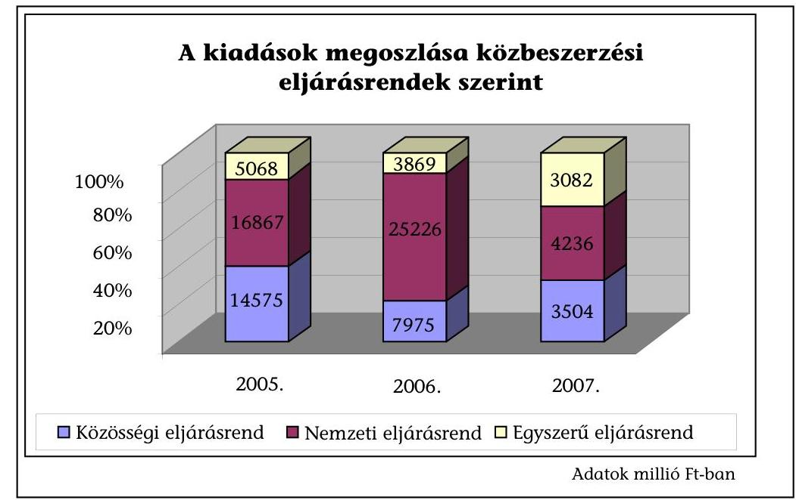

Az ellenőrzött önkormányzatoknál az eredményes közbeszerzési eljárások fele építési beruházás kivitelezőjének kiválasztására, egyharmada szolgáltatás, egyötöde áru beszerzésére irányult a vizsgált időszak átlagában, ugyanezek az arányok az intézmények esetében az árubeszerzés felé tolódtak el, az eredményes közbeszerzési eljárások háromnegyede volt áru, egyötödét pedig szolgáltatás és építési beruházás tárgyban folytatták le.

---

A közbeszerzési eljárás keretében történő beszerzések kiadása a 2005. évhez képest 2006-ban nőtt, 2007-ben az előző évhez képest csökkent - amelyben az értékhatárok változása is szerepet játszott - de mértéke a 2005. évit ekkor is meghaladta. A költségvetési intézmények a 2005-2007. évek átlagában költségvetési kiadásaik átlagosan mindössze 4%-át, 14567 M Ft-ot költöttek el közbeszerzési eljárás keretében, annak ellenére, hogy teljesített kiadásaik ebben az időszakban az önkormányzati kiadások felét is meghaladták. (389458 M Ft volt). Ugyanez az arány a polgármesteri hivataloknál átlagosan 13% volt, közbeszerzési eljárás keretében történő kiadásuk a három év alatt 80343 M Ft volt.

A polgármesteri hivatalok közbeszerzés keretében tervezett 84197 M Ft-os kiadási előirányzataikat a vizsgált három év alatt összességében 95,4%-ra teljesítették, ezen belül a dologi kiadások 101%-ra, a közbeszerzési eljárás keretében tervezett kiadások 90,6%-át jelentő felhalmozási kiadások 94,8%-ra teljesültek.

A költségvetésben az egyes feladatokra tervezett eredeti előirányzat az év közben jelentkező új feladatok, illetve a források rendelkezésre állásának üteméhez igazodva folyamatosan változott. A közbeszerzési kiadások a költségvetésben rendelkezésre álló előirányzatokhoz képest mindhárom évben a tervezettől alacsonyabb összegben realizálódtak, illetve a tervezettel megegyezőek voltak a közbeszerzési eljárást lebonyolító önkormányzatok háromnegyede esetében és attól magasabb volt az önkormányzatok egynegyedénél. Az arányok a vizsgált időszakban azonos mértékben alakultak.

A költségvetési intézmények a 2005-2007. években közbeszerzésre előirányzott eredeti előirányzataikat - a dologi és felhalmozási kiadásoknál egyaránt rendszeresen túllépve teljesítették, a három év átlagában összességében 31,4%-kal, azon belül a dologi kiadásoknál 33,3%-kal, a felhalmozási kiadásoknál 25,8%-kal.

A közbeszerzési eljárások járulékos kiadásai a vizsgált három év átlagában a közbeszerzési eljárás keretében történő beszerzések kiadásainak 1%-a, összesen 981 M Ft volt, ezen belül az arány átlagosan a polgármesteri hivataloknál 1,1% (889 M Ft), az intézményeknél 0,6% (92 M Ft) volt. A járulékos kiadások több mint felét (58%) a közbeszerzéssel megbízott külső szervezeteknek, személyeknek fizetették ki, a fennmaradó összeg a polgármesteri hivatalokban és az intézményekben közbeszerzéssel foglalkozó alkalmazottak személyi juttatásait és járulékait fedezte.

Az eredményes közbeszerzési eljárásokat lezáró szerződéseket - négy önkormányzatot kivéve - az önkormányzatok a Kbt. 99. § (1) és (4) bekezdésben foglaltakat betartva, az ajánlattételi felhívásban meghatározott időpontban, a jogorvoslati határidő, a szerződéskötési moratórium figyelembevételével kötötték meg.

Az ajánlattételi felhívásban meghatározott időponthoz képest kettő önkormányzatnál - Szombathely Megyei Jogú Város, Tolna Város - három, illetve egy szerződés megkötése egy-három hónap késedelemmel került sor, kettő önkormányzat - Eger Megyei Jogú Város, Bogács község - egy-egy beszerzésnél az eredményhirdetést követő napon már megkötötte a szerződést.

---

Az eredményhirdetést követően bekövetkezett előre nem látható és elháríthatatlan okra hivatkozással, a Kbt. 99. § (3) bekezdése alapján az önkormányzatok 7,7%-a - mindössze három önkormányzat - mentesült a szerződéskötési kötelezettség alól.

Veszprém Megyei Jogú Város EU-s forrás igénybevételével kívánt megvalósítani orvos-technológiai eszköz beszerzést, azonban az EU-s forrásra pályázati kiírás nem történt. Kistelek Város a tervezett beszerzési tárgy mennyiségi változása miatt állt el a szerződéskötéstől. Demecser önkormányzata útépítési beruházáshoz pályázati forrást is tervezett, azonban azt nem kapta meg.

A szerződések megkötésekor az Önkormányzatok 87%-a Kbt. 99. § (1) bekezdésében foglaltaknak megfelelően járt el, és a közbeszerzési eljárások lezárásaként a szerződéseket az ajánlattételi felhívás, a dokumentáció és az ajánlat tartalmának megfelelően kötötték meg.

Nagykanizsa Megyei Jogú Város, valamint Zalakaros Város egy-egy esetben a szerződésben magasabb vállalkozási árat kötött ki, a tartalékkeret pótlólagos megállapítása miatt. Kistelek Város az ajánlati dokumentáció hiányosságai miatt négy esetben eltérő tartalmú szerződéseket kötött, azokban többek között a késedelmi kötbér, jótállási idő mértéke nem került rögzítésre. Mórahalom Város esetében a bírósági illetékesség kikötése, illetve a végszámla %-os nagysága tért el az ajánlati felhívásban és a dokumentációkban meghatározottaktól.

# Az Önkormányzat érdekének védelmét biztosító garanciális elemek

közül a késedelmes, illetve nem teljesítésre vonatkozó kötbér⁴ kikötések, valamint a jótállásra irányuló előírások a megkötött szerződések több mint 90%-ában szerepeltek. A szavatosságra, jólteljesítésre vonatkozóan az Önkormányzatok szerződéskötéseik során ugyancsak hangsúlyt helyeztek, a megkötött szerződések több mint 80%-ában rögzítették ezen garanciális elemekre vonatkozó előírásokat.

Az Önkormányzatok érdekeinek védelme a garanciális elemek meghatározásával biztosított volt, amellett, hogy egyes önkormányzatok esetenként a szerződésben - különösen
 a kötbér kikötés tekintetében - elmulasztották a szükséges garanciális elvek rögzítését.

Kistelek, valamint Mórahalom önkormányzatai számítástechnikai eszköz beszerzési szerződésben nem kötöttek ki a késedelmes, illetve nem megfelelő teljesítésre szankciókat.

A vizsgált önkormányzatoknál, az ellenőrzésbe bevont beszerzések tekintetében - három önkormányzat kivételével - nem fordult elő a szerződés teljesítéséhez kapcsolódó kötbér alkalmazása. Ennek egyik oka, hogy a megfelelő és határidőre történő teljesítés miatt nem volt indokolt szankciót alkalmazni, másrészről a szerződő felek a beszerzésekre vonatkozó szerződéseket módosították - elsősorban a teljesítési határidő tekintetében - így a kötbér érvényesítés jogalapja nem állt fenn.

[^0]
[^0]:    ${ }^{4}$ A hibás teljesítésre vonatkozó kötbérkikötés szerződésekben történő előírásának aránya $79 \%$ volt.

---

Pilisvörösvár önkormányzata a Művészetek Háza építési beruházásakor a késedelmes teljesítés miatt kötbér igényét a benyújtott résszámlákból történő levonással érvényesítette. Bicske Város önkormányzata a buszöböl és várakozásávok építési beruházásánál érvényesített késedelmi kötbért. Nagykanizsa Megyei Jogú Város Önkormányzata a szelektív hulladékgyűjtő jármű beszerzésénél a szállítási határidő túllépése miatt alkalmazta a késedelmi kötbért.

Az Önkormányzatok az ajánlattételi felhívásokban lehetővé tették alvállalkozó igénybevételét, 10\%-ot meghaladó mértékű alvállalkozói igénybevétel esetére előírták az alkalmassági feltételeket. Az Önkormányzati érdek védelmére a szerződésekben rögzítették a fővállalkozó felelősségét az alvállalkozók tevékenységére. A vizsgált Önkormányzatok közel 60\%-ánál a beszerzéseknél volt alvállalkozói bevonás, amely az ajánlatban megjelölt alvállalkozóval, és az ott rögzített mértékű közreműködéssel történt. Az ellenőrzött beszerzéseknél az alvállalkozói közreműködés beszerzést hátrányosan befolyásoló hatására nem volt példa.

A közbeszerzési eljárások lezárásaként megkötött szerződések módosítására a Kbt. kógens szabályozást ír elő, a szerződő felek szerződési autonómiája a módosítás tekintetében korlátozottan érvényesül; kizárólag a Kbt. 303. §-ában megfogalmazott feltételek fennállása esetén módosítható a szerződés. A vizsgálatba bevont önkormányzatok 82,7\%-a a beszerzésekre kötött szerződéseknél élt a szerződésmódosítással.

A szerződésmódosításoknál betartották a Kbt. 303. §-ának előírását, mindössze egy önkormányzatnál ${ }^{5}$ volt megállapítható a Kbt. szerződésmódosításra vonatkozó szabályainak figyelmen kívül hagyása. A Közbeszerzési Döntőbizottság szerződésmódosításhoz kapcsolódóan nem indított jogorvoslati eljárást. A szerződésmódosításokat - azonos arányban - mind az Önkormányzat, mind a beszerzés megvalósítójának lényeges, jogos érdekének sérelmére alapozták.

A szerződésmódosítások okai között a kivitelezés folyamán felmerülő problémák, előre nem látható műszaki-szakmai körülmények voltak a meghatározóak, a módosítások $95 \%$-a volt ezekre visszavezethető.

Az önkormányzatok építési beruházásokat érintő szerződésmódosításainál jellemző hiba volt, hogy a pótmunkák miatt - amelyek a Kbt. alapján kiegészítő beruházásnak minősülnek -, nemzeti eljárásrendbe tartozó beszerzésekhez kapcsolódva nem folytattak le közbeszerzési eljárást. A szerződésmódosítást végrehajtó önkormányzatok közel egynegyede a pótmunkák szerződésmódosításai során nem alkalmazta a Kbt. 39. és 40. §-aiban foglaltakat, amely szerint, ha az építési beruházás több részből áll, mindegyik rész becsült értékét egybe kell számítani és az egybeszámítás szerinti becsült értéknek megfelelő eljárásrendbe tartozó közbeszerzési eljárást kell lefolytatni. A pótmunkákhoz kapcsolódó szerződésmódosítások során a Kbt. 125. § (3) bekezdés a) pontja alapján hirdetmény nélküli tárgyalásos eljárás lefolytatása lett volna indokolt.

[^0]
[^0]:    ${ }^{5}$ Mórahalom önkormányzatánál az épület felújítására kötött szerződést a teljesítési határidő tekintetében módosították, azonban a módosítás indoka - a felújítás csak a fütési idényt követően kezdhető meg - a szerződéskötéskor már ismert volt.

---

Komló önkormányzata kettő építési beruházásához kapcsolódóan - útépítés, illetve multifunkcionális épület - a pótmunkákra nem folytatott le eljárást. Dunaújváros megyei jogú város intézmény átalakítási munkához kapcsolódó pótmunkára közbeszerzési eljárás mellőzésével kötött szerződést. Szentes város önkormányzata szennyvíz beruházásoknál felmerült pótmunkáknál mellőzte a közbeszerzési eljárás lefolytatását.

A szerződésmódosítások legnagyobb arányban - az önkormányzatok 76,9\%-ánál - a részteljesítési, illetve a befejezési határidők módosítására irányultak. A határidő módosítások indokai az időjárási tényezők, az előre nem látható kivitelezési problémák voltak. A módosított kivitelezési határidők nem eredményezték a beszerzések befejezési határidejének indokolatlan elhúzódását. Az ajánlati ár módosulása - elsősorban a pótmunkák hatására - 18 önkormányzatnál eredményezett szerződésmódosítást. A vállalási árat növelő szerződésmódosítások esetében az árkülönbözet fedezetét döntően - az önkormányzatok $71,4 \%$-a - saját forrásból biztosította, éves költségvetésén belüli előirányzat átcsoportosítással. A szerződésekbe beépített tartalékkeret az önkormányzatok 19,1\%-ánál szolgált forrásul az árkülönbözetre, hitel igénybevételével, valamint pótlólagos pályázati forrás bevonásával az önkormányzatok 9,5\%-a biztosította a szükséges pénzügyi fedezetet.

A szerződésmódosítások a beszerzés költségeinek megváltoztatását jellemzően a szerződésmódosítással érintett beszerzések 58\%-ánál - nem eredményezte. A pótmunkák elrendelésének a beszerzések 36,4\%-ánál költségnövelő hatása volt. A beszerzések mindössze 5,6\%-ánál eredményezett a szerződésmódosítás költségmegtakarítást, az ÁFA adókulcs csökkenése, illetve pályázati források bevonása révén.

A szabályozatlanságra is visszavezethető, hogy közbeszerzési eljárás nélkül történtek műszaki tartalmat és vállalási árat érintő szerződésmódosítások, illetőleg mulasztottak a szerződésteljesítések és módosítások közzétételénél.

Komló Város Önkormányzata két építési beruházásnál a felmerült pótmunkákkal közbeszerzési eljárás lefolytatása nélkül módosította a közbeszerzés eredményeként kötött szerződéseket.

Nagykanizsa Megyei Jogú Város Önkormányzata a 2005. évben a nemzeti értékhatárt elérő beruházásnál a szerződésmódosításokat és két építési beruházás esetében a teljesítést nem tették közzé. A 2006. évben a nemzeti értékhatár 50\%-át meghaladó építési beruházásánál a szerződésmódosítások és a teljesítés közzététele maradt el. A Kbt-ben előírtak ellenére nem tájékoztatták a Döntőbizottságot egy (útépítésre vonatkozó) hirdetmény nélküli, tárgyalásos eljárás indításáról.

Pilisvörösvár Város Önkormányzata a szerződések teljesítéséről, a szükséges módosításokról nem tett közzé hirdetményt.

# 3. A KÖZBESZERZÉSI ELJÁRÁSOK LEBONYOLÍTÁSA 

Az ellenőrzött közbeszerzési eljárások eredményének közzétételére az önkormányzatok $85 \%$-a a Kbt-ben előírt határidőben és formában intézkedett. Hat önkormányzat (15\%) - Hajdúhadház, Kistelek, Makó, Nagykanizsa, Zalakaros, Zalalövő - a Kbt. 93. § és 307. § (1) bekezdésében előírtakat megsértve a lefoly-

---

tatott közbeszerzési eljárások eredményét nem teljes körben, vagy az előírt öt napon túl tette közzé.

Hajdúhadház Önkormányzata a 2005. évi Dorogiás utca, valamint a 2006. évi Virág utca építése tárgyú közbeszerzési eljárások eredményéről az előírt tájékoztatót nem tette közzé.

Kistelek Önkormányzat a kilenc vizsgált nyílt eljárásból egy esetben, a hitelfelvétel szociális bérlakásépítésre kiírt közbeszerzési eljárásra vonatkozásában a Kbt. 98. § (2) bekezdésében foglaltakat megsértve, az eljárás eredményét az eredményhirdetést követő öt munkanapon belül nem tette közzé. Az eredményhirdetés 2007. június 1., a hirdetmény feladásának időpontja 2008. április 3. volt.

Makó Önkormányzat nem tett eleget a Kbt. 93. § és a 307. §-okban foglaltaknak, mivel a 2005. évi IKT eszközbeszerzés, valamint az Erdei Ferenc Szakközépiskola első beszerzési tételek tárgyú közbeszerzési eljárások eredményéről nem tett közzé tájékoztatót.

Nagykanizsa Önkormányzat a 2005. évben kettő, a 2006-2007. években egy-egy közbeszerzési eljáráshoz kapcsolódóan (két esetben a nemzeti értékhatárt meghaladó, egy esetben a Kbt. 299. § (1) bekezdés a) pont alapján lefolytatott) nem tett eleget közzétételi kötelezettségének.

Zalakaros Önkormányzatnál az ellenőrzött eljárások közül a 2005. évben három, a 2006. évben két eljárás esetében, a közbeszerzési eljárást követően nem tettek eleget közzétételi kötelezettségüknek, mely eljárások közül egy a nemzeti értékhatárt meghaladó, négy a Kbt. 299. § (1) bekezdés a) pont hatálya alá tartozó, hirdetménnyel indított eljárások voltak.

Zalalövő Önkormányzat a 075. és a 079. számú utak és az Egerági útépítés tárgyú közbeszerzési eljárások eredményét a KÉ-ben nem tette közzé.

2005-2007 évek között a Kbt-ben előírt közzétételi kötelezettségének beszerzésre kötött szerződés módosítása esetében az önkormányzatok 19\%-a, ${ }^{6}$ a szerződés teljesítése, illetve részteljesítése esetében $32 \%-a^{7}$ nem tett eleget.

A szerződésmódosítások nyilvánosságra hozatali kötelezettségét Berettyóújfalu, Zalakaros, Dunaújváros, Pilisvörösvár önkormányzata, a szerződés teljesítése, illetve részteljesítése tekintetében Berettyóújfalu, Bicske, Dunaújváros, Hajdúhadház, Harkány, Nagyvarsány, Zalakaros önkormányzata nem teljesítette.

Berettyóújfalu Önkormányzata nem vette figyelembe a Kbt. 307. § (1) bekezdésében foglaltakat, mivel a szerződések módosításáról és a szerződések teljesítéséről az előírt tájékoztatót nem tette közzé.

Dunaújváros Önkormányzatnál a nemzeti eljárásrendben bonyolított, ellenőrzött három eljárásokhoz kapcsolódó szerződésmódosítások (folyószámlahitel szerződéshez kapcsolódóan két alkalommal, a munkabérhitel, valamint a 200 M Ft összegű hitelszerződés esetében egy-egy alkalommal), továbbá a részteljesítések

[^0]
[^0]:    ${ }^{6}$ A szerződésmódosítás közzétételi kötelezettsége 32 önkormányzatnak volt.
    ${ }^{7}$ Szerződés teljesítésére, részteljesítésére vonatkozó közzétételi kötelezettsége 37 önkormányzatnak volt.

---

(előzőekben felsorolt hitelszerződések, és a volt József Attila Általános Iskola átalakítása tárgyú közbeszerzési eljárásban) közzétételéről nem gondoskodtak.

Zalakaros Önkormányzata a 2005. évben három, a 2006. évben két közbeszerzési eljáráshoz kapcsolódó szerződésmódosítást és a teljesítést nem tette közzé.

Az adott évben megvalósuló közbeszerzési eljárásokról a 2005-2007 évek között közbeszerzési eljárást lebonyolító önkormányzatok 91-94-88\%-a a Kbt. 16. §ban előírt tartalommal és formában az éves statisztikai összegzést elkészítette, és a tárgyévet követő év május 31-ig előírt határidőre a KT-nak megküldte.

2005-ben három önkormányzat (Bogács, Hajdúhadház, Nagyvarsány), 2006-ban kettő (Nagyvarsány, Hajdúhadház) a 2007. évben kettő (Nagyvarsány, Kazincbarcika) önkormányzat nem küldte meg az éves statisztikai összegzést a KT-nak. Bogács Önkormányzata a 2005. évben lefolytatott közbeszerzési eljárásról nem készített statisztikai összegzést, a 2006-2007. években közbeszerzési eljárást nem indított. Nagyvarsány Önkormányzata 2005-2007 között nem készített éves összegzést, Hajdúhadház Önkormányzata a 2005-2006. években elkészítette, de a KT-nak nem küldte meg.

A közbeszerzési eljárás eredményeként megkötött szerződések nyilvánosnak minősülő részét 2005-2007. években az ellenőrzött önkormányzatok $61 \%$-a amennyiben honlappal rendelkezett a honlapon, honlap hiányában a helyben szokásos módon közzétette, 11 önkormányzat ${ }^{8}$ az Áht. 15/B. § (1) bekezdésében, és a Kbt. 99. § (4) bekezdésében foglalt előírások ${ }^{9}$ ellenére az adatok nyilvánossá tételére nem intézkedett, további öt önkormányzat ${ }^{10}$ részben tett eleget ez irányú kötelezettségének.

# 4. A KÖZBESZERZÉSI ELJÁRÁSOKKAL KAPCSOLATBAN KEZDEMÉNYEZETT JOGORVOSLATI ELJÁRÁSOK ÉRTÉKELÉSE 

A közbeszerzési törvény végrehajtásának ellenőrzéséről készült, 2001. évi számvevőszéki jelentésben a 1996-2000. évek viszonylatában a vizsgált Önkormányzatok 11 15\%-nál - 54 esetben - indult jogorvoslati eljárás. A 2005-2007. években a vizsgált 39 önkormányzat közül 23-nál - a vizsgálatba bevont önkormányzatok 58,9\%-nál - került sor jogorvoslati eljárásra.

A vizsgált önkormányzatok közül 16-nál nem volt jogorvoslati eljárás, 6 önkormányzat esetében egy eljárást, négy önkormányzat esetében kettő eljárás, míg 13 önkormányzatnál három vagy több eljárásra került sor a vizsgált három évben.

[^0]
[^0]:    ${ }^{8}$ Berettyóújfalu,- Érd,- Harkány,- Hajdúhadház,- Kistelek,- Komló,- Mórahalom,- Polgár,- Sárbogárd,- Tolna,- Zalalövő Önkormányzatok.
    ${ }^{9}$ A Kbt. 99. § (4) bekezdésében előírt, honlapon történő közzététel szabálya 2007. július 7-től hatályos.
    ${ }^{10}$ Bicske,- Dunaújváros,- Szentes,- Szombathely,- Zirc Önkormányzatok.
    ${ }^{11}$ A vizsgálatba összesen 93 önkormányzat került bevonásra.

---

Összesen 70 eljárást kezdeményeztek, az egyes években csökkenő tendenciát mutatott a kezdeményezések száma: 2005-ben 30, 2006-ban 23, 2007-ben 17 esetben. Az egyes években lefolytatott, eredményes közbeszerzési eljárás számához viszonyítva a jogorvoslati eljárások aránya a 2006. évre a 2005. évihez képest $15,2 \%$-ról $12,5 \%$-ra csökkent, majd a 2007. évben $18,9 \%$-ra emelkedett. A jogorvoslatok aránya alátámasztja azt, hogy az önkormányzatoknál nem megfelelő a közbeszerzési eljárások szabályszerű bonyolítása, illetve a
 közbeszerzési eljárások jogtalan mellőzése továbbra is előfordul.

Az előző ÁSZ vizsgálat által megállapított kezdeményezői megoszláshoz képest ${ }^{12}$ jelentős arányeltolódást mutat a jelenlegi vizsgálati időszakban a jogorvoslati kezdeményezések összetétele, a jogorvoslati eljárás kezdeményezések 61,4\% az ajánlattevői oldalról, 35,7\%-a hivatalból történt, az egyéb érintett, illetve az ajánlatkérő általi jogorvoslat indítás mindössze 2,9\%-ban jelentkezett.

Az Állami Számvevőszék Kbt. alkalmazásának jogszerűségét előmozdító tevékenységét mutatja, hogy a vizsgált időszakban a közbeszerzési eljárás jogtalan mellőzése miatt, a hivatalból indult jogorvoslati eljárások 60\%-át az ÁSZ kezdeményezte, a Kbt. 327.§ (1) bekezdésében kapott felhatalmazás alapján. A jelenlegi ellenőrzés során - a 2007. évi beszerzések mintavétellel történő vizsgálata alapján - 10 önkormányzatnál, összesen 14 beszerzésnél a közbeszerzési eljárás jogtalan mellőzése miatt jogorvoslati eljárást kezdeményeztünk. Az önkormányzatok szűk körénél is jelentős jogszabálysértések fordulnak elő. A Kbt-ben a közbeszerzési eljárások jogtalan mellőzésének esetében biztosított - három évre visszamenőleges - jogorvoslati kezdeményezés lehetősége az önkormányzatok közbeszerzési tevékenysége tekintetében fontos kontroll, a jogsértések miatti szankcionálás mellett, az önkormányzatok jogkövető magatartásának prevenciós eszköze.

A hivatalból indított jogorvoslati eljárás nyolc esetben a Közbeszerzési Döntőbizottság Elnökének, kettő esetben a közbeszerzéshez támogatást nyújtó szervezet (VÁTI) kezdeményezése alapján indult.

A KDB Elnöke által kezdeményezett jogorvoslati eljárások minden esetben a hirdetmény nélküli tárgyalásos eljárások Kbt-ben előírt feltételének hiányosságai miatt indultak. Pilisvörösvár Önkormányzata esetében a 2005-2006. években három közbeszerzési eljárásnál is megállapította a KDB a hirdetmény nélküli tárgyalásos eljárás Kbt.-be ütköző alkalmazását.

A jogorvoslati eljárások 43,8\%-ában a KDB a jogorvoslati kezdeményezést elutasította. A jogsértés megállapításán túl 28 esetben bírság ${ }^{13}$ kiszabását is indokoltnak találta a Közbeszerzési Döntőbizottság.

A jogorvoslati eljárás a közbeszerzések megvalósítására gyakorolt hatása egyrészről a tervezett beszerzés elmaradásában - kettő önkormányzatnál - illetve a

[^0]
[^0]:    ${ }^{12}$ Az 54 jogorvoslati eljárás 88,9\%-át az ajánlattevők indítottak, míg hivatalból jogorvoslati kezdeményezésére mindössze hat esetben (11,1\%-ban) került sor.
    ${ }^{13}$ A KDB által kiszabott bírságok 500E Ft és 10 M Ft között voltak.

---

beszerzés megvalósítási idejének növekedésében - három önkormányzatnál jelentkezett.

A KDB elmarasztaló döntését követően Bicske, illetve Érd önkormányzatai a tervezett beszerzéstől elálltak. Három önkormányzat esetében - Lakitelek, Pilisvörösvár, Érd - az új eljárásra kötelezés miatt a beszerzés megvalósulási határideje későbbre tolódott.

A jogorvoslati eljárás alapján szankcionált önkormányzatok 87,5\%-ánál a jogorvoslati eljárás a beszerzésekre nem volt hatással, tekintve, hogy ezen esetekben már szerződéskötéssel lezárt, megvalósult beszerzésekről volt szó, utólagos reparációt nem alkalmazhatott a KDB.

A vizsgálatba bevont és a KDB által bírsággal sújtott önkormányzatok közül mindössze három tett intézkedést a terhére megállapított bírság továbbhárítására.

Érd Megyei Jogú Város egy esetben a bírság összegét a közbeszerzés bonyolító szervezet részére áthárította. Tolna város önkormányzata a közbeszerzési eljárás bonyolítására kötött megbízási szerződésben foglaltak alapján a bírság összegének 1/3-át térítette meg. Lakitelek önkormányzata a bírság teljes összegét áthárította a közbeszerzési bonyolítóra.

# 5. A MONITORING- ÉS KONTROLL RENDSZER MŰKÖDÉSE 

Az önkormányzatok kontrollrendszerének ellenőrzési tapasztalatai alapján a közbeszerzési eljárásokra vonatkozó FEUVE-rendszer kialakítására a vizsgált önkormányzatok nem fordítottak funkciójának megfelelő súlyú figyelmet. Míg a belső ellenőrzésre - és ennél fogva a közbeszerzések belső ellenőrzésére - valamennyi vizsgált önkormányzatnál rendelkezésre álltak a személyi, szervezeti feltételek (saját foglalkoztatású belső ellenőr, illetve külső szervezet), addig a FEUVE keretében a közbeszerzésekkel kapcsolatos ellenőrzési feladatok végrehajtásáért felelős személyek az önkormányzatok felénél kerültek kijelölésre. Az önkormányzatok többsége a FEUVE-t a közbeszerzések vonatkozásában hiányosan, illetve általánosságban, formálisan határozta meg, csupán negyedüknél állt rendelkezésre olyan szabályozás, mely tartalmazta a közbeszerzések ellenőrzési nyomvonalát, a konkrét kontrollfeladatok meghatározását, az ellenőrzések végrehajtásáért felelős személyek megnevezését, a szabálytalanságok feltárása esetén követendő szabályokat. A vizsgált önkormányzatoknál a FEUVE-rendszer - működése feltételeinek hiányosságai, illetve a szabályozás formalitása miatt - a közbeszerzési tevékenység folyamatában jelentkező kockázatok csökkentéséhez (a hibák feltárásához, jelzéséhez, a korrigálható hiányosságok felszámolásához) nem biztosított megfelelő alapot.

A közbeszerzési eljárások belső ellenőrzése a 2005-2007. évek gyakorlatáról szerzett tapasztalatok alapján az önkormányzati feladatok elhanyagolt területe, jóllehet a Kbt. annak belső ellenőrzését - a közbeszerzési tevékenység kockázataira tekintettel - kifejezetten előírja. A felmérés alapján a vizsgált önkormányzatok alig több mint felénél (54\%) végzett a belső ellenőrzés - az önkormányzat és költségvetési szervei közbeszerzéseire, közbeszerzési eljárásaira irányuló, vagy azt érintő - vizsgálatot.

---

A vizsgált önkormányzati körben a belső ellenőrzések a közbeszerzési eljárásokkal kapcsolatos, jellemzően jogszabályi mulasztást, jogsértő gyakorlatot, valamint egyes esetekben a célszerű feladatellátást akadályozó hiányosságokat állapítottak meg. Több önkormányzatnál kifogásolták a helyi szabályozás tartalmi hiányosságait. A vizsgált eljárások egyes szakaszaiban feltárt jogszabályi mulasztás vagy jogsértő gyakorlat jellegét tekintve változatos képet mutatott.

Eger Megyei Jogú Város Önkormányzatánál a 2005. évi belső ellenőrzés a 2004-ben lefolytatott közbeszerzési eljárásokból vett mintát értékelve megállapította, hogy az eljárások megtervezése nem kellően átgondolt, az egybeszámítás követelménye nem minden esetben érvényesült, a becsült érték alátámasztása az építési beruházások kivételével nem volt előzetes kalkulációval alátámasztva. 2006-ban a belső ellenőr megállapította a becsült érték dokumentációval történő alátámasztásának hiányát, kifogásolta a legalacsonyabb összegű ellenszolgáltatás bírálati szempont gyakori alkalmazását (mivel az nem követi az ár-érték arányt, mely megítélése szerint a minőség rovására mehet) és az eljárások dokumentációinak nehéz áttekinthetőségét.

Szombathely Megyei Jogú Város Önkormányzatánál mindhárom évben vizsgálta a belső ellenőrzés a közbeszerzés gyakorlatát. Az egyes eljárásokhoz kapcsolódó visszatérő hiányosságként állapították meg a közbeszerzési eljárásban végrehajtott feladatok dokumentálásának hiányosságait.

Berettyóújfalu Város Önkormányzatánál a 2007. évi belső ellenőrzés kifogásolta, hogy a szabályzat nem rögzítette a közbeszerzési értékhatárokat, az egybeszámítási kötelezettség szabályait, az eljárásban résztvevők felelősségi körét, valamint a szabályzatból nem derült ki, hogy ki köteles elkészíteni az éves közbeszerzési tervet és a statisztikai összegzést. Az óvodai eszközök közbeszerzésének ellenőrzése során megállapították, hogy az ajánlattételi felhívásban, illetve dokumentációban szereplő ajánlattételi határidő egymástól eltérő volt.

A belső ellenőrzések jellemzően nem értékelték a közbeszerzések FEUVE szerinti gyakorlatát, melynek rendeltetése az utólag feltárt hibáknak, hiányosságoknak már a közbeszerzési munkafolyamatban történő, lehetőség szerinti felszámolása, helyreigazítása lett volna.

A Tolna Megyei Önkormányzatnál - kivételként - a 2007-ben lefolytatott belső ellenőrzés megállapította, hogy a FEUVE szabályozáson belül kijelölték a közbeszerzési eljárás nyomvonalát, meghatározták a felelősségi és információs szinteket és kapcsolatokat, az irányítási és ellenőrzési folyamatokat, továbbá a belső kontrollok működését a belső ellenőrzés megfelelőnek értékelte.

A belső ellenőrzés által a közbeszerzési eljárások vizsgálati megállapításai, az általuk feltárt hiányosságokra mindössze önkormányzatok 40\%-a készített a javaslatok alapján intézkedési tervet, hajtotta végre az intézkedéseket, illetve győződött meg az intézkedések végrehajtásáról utóellenőrzés során. Az önkormányzatok többségét érintően a szabálytalan gyakorlat felszámolását célzó intézkedések és végrehajtásukért felelős személyek kijelölésének hiánya miatt a belső ellenőrzési tapasztalatok nem hasznosultak megfelelően.

Budapest, 2008. szeptember
