# ÁLLAMI   SZÁMVEVŐSZÉK 

## JELENTÉS

a költségvetést megillető játékadó beszedési rendszerének ellenőrzéséről

---

2. Államháztartás Központi Szintjét Ellenőrző Igazgatóság
2.1. Teljesítmény Ellenőrzési FőcsoportIktatószám: V-20-53/2007-2008.Témaszám: 889 .Vizsgálat-azonosító szám: V0356
Az ellenőrzést felügyelte:
Bihary Zsigmond
főigazgató
Az ellenőrzés végrehajtásáért felelős:
Kemény Emil
főigazgató-helyettes
Az ellenőrzést vezette:
Vörös Mária
osztályvezető főtanácsos
Az ellenőrzést végezték:

| Borsos Ferenc számvevő tanácsos, tanácsadó | Dr. Földvári Gábor számvevő tanácsos | Józsa Ferencné számvevő |
| :--: | :--: | :--: |
| Kapronczai Gabriella számvevő tanácsos, tanácsadó | Temesváry Miklós számvevő tanácsos | Uram Ferenc számvevő tanácsos |

A témához kapcsolódó eddig készített számvevőszéki jelentések:

# Címe 

sorszáma
A Pénzügyminisztérium fejezet működésének ellenőrzéséről (2008) ..... 0801
A Pénzügyminisztérium fejezet működésének ellenőrzéséről (2004) ..... 0431
A Magyar Köztársaság 2003. évi költségvetése végrehajtásának ..... 0443
ellenőrzése (2004)
A Magyar Köztársaság 2004. évi költségvetése végrehajtásának ..... 0540
ellenőrzése (2005)
A Magyar Köztársaság 2005. évi költségvetése végrehajtásának ..... 0628
ellenőrzése (2006)
A Magyar Köztársaság 2006. évi költségvetése végrehajtásának ..... 0724
ellenőrzése (2007)
Vélemény a Magyar Köztársaság 2005. évi költségvetéséről (2004) ..... 0449
Vélemény a Magyar Köztársaság 2006. évi költségvetéséről (2005) ..... 0550
Vélemény a Magyar Köztársaság 2007. évi költségvetéséről (2006) ..... 0641
Vélemény a Magyar Köztársaság 2008. évi költségvetéséről (2007) ..... 0736
Az Állami Privatizációs és Vagyonkezelő Rt. 2005. évi működésé- ..... 0629
nek és a központi költségvetés végrehajtásához kapcsolódó tevékenységének ellenőrzéséről (2006)
A tartósan veszteségesen működő állami tulajdonú gazdasági tár- ..... 0611
saságok gazdálkodásának ellenőrzéséről (2006)

---

.

---

# TARTALOMJEGYZÉK 

BEVEZETÉS ..... 9
I. ÖSSZEGZŐ MEGÁLLAPÍTÁSOK, KÖVETKEZTETÉSEK, JAVASLATOK ..... 12
II. RÉSZLETES MEGÁLLAPÍTÁSOK ..... 17

1. A pénzügyminiszter szerencsejáték ágazatot érintő feladatellátásának értékelése ..... 17
1.1. Jogszabályalkotási tevékenység ..... 18
1.1.1. A PM jogalkotási tevékenységének értékelése az EU-s követelmények figyelembevételével ..... 18
1.1.2. Jogszabály-módosítások megalapozottsága ..... 18
1.1.3. Tiltott szerencsejátékok elleni fellépés jogszabályi korlátai ..... 21
1.2. Felügyeleti jogkör gyakorlásának értékelése ..... 23
2. Az integráció célkitűzései megvalósulásának értékelése ..... 24
3. Az adóhatóságok játékadóval kapcsolatos feladat-végrehajtásának értékelése ..... 26
3.1. A szerencsejátékok engedélyezése ..... 26
3.2. A játékadó ellenőrzések értékelése ..... 27
3.2.1. A játékadót érintő adóellenőrzések eredményessége ..... 27
3.2.2. Az SZF játékadó ellenőrzéseinek eredményessége ..... 28
3.2.3. Az SZF hatósági felügyeleti ellenőrzéseinek eredményessége ..... 29
3.2.4. VP által végzett ellenőrzések eredményessége ..... 33
3.2.5. Ellenőrző hatóságok együttműködése a szabálytalanságok, valamint az illegális szerencsejáték feltárásában ..... 35
3.3. Az SZF hatósági intézkedései ..... 35
4. Feladatellátás informatikai támogatásának értékelése ..... 37
4.1. A szerencsejáték felügyeletével összefüggő folyamatok informatikai támogatása ..... 37
4.2. Az informatikai támogatás technikai és biztonsági feltételei ..... 39
5. A pénzügyminiszter koncessziós szerződésekkel kapcsolatos feladatellátásának értékelése ..... 40
5.1. Lóversenyfogadás ..... 40
5.2. Játékkaszinók ..... 43
MELLÉKLET
6. sz. Észrevételek
7. sz. Tanúsítványok

---

.

---

# RÖVIDÍTÉSEK JEGYZÉKE 

| Áfa tv. | az általános forgalmi adóról szóló 2007. évi CXXVII. törvény |
| :--: | :--: |
| ÁJF | a pénznyerő automata üzemeltetésére vonatkozó általános játékfeltételekről szóló felügyeleti tájékoztató |
| APEH | Adó- és Pénzügyi Ellenőrzési Hivatal |
| APEH SZEF | APEH Szerencsejáték Felügyeleti Főosztály |
| ÁPV Zrt. | Állami Privatizációs és Vagyonkezelő Zrt. |
| Art. | az adózás rendjéről szóló 2003. évi XCII. törvény |
| ÁSZ | Állami Számvevőszék |
| Btk. | a bűntető törvénykönyvről szóló 1978. évi IV. törvény |
| EU | Európai Unió |
| IA rendszer | integrált alkalmazói rendszer |
| IÖO | Informatikai Önálló Osztály |
| Ket. | a közigazgatási hatósági eljárás és szolgáltatás általános szabályairól szóló 2004. évi CXL. törvény |
| Konc. tv. | a koncesszióról szóló 1991. évi XVI. törvény |
| Ktv. | a köztisztviselők jogállásáról szóló 1992. évi XXIII. törvény |
| MNV Zrt. | Magyar Nemzeti Vagyonkezelő Zrt. |
| OMH | Országos Mérésügyi Hivatal |
| PM | Pénzügyminisztérium |
| SZF | a jelentésben az SZF megnevezés alatt az Szerencsejáték Felügyeletet, illetve az integrációt követően az APEH Központi Hivatalának Szerencsejáték Felügyeleti Főosztályát egyaránt értjük. |
| Szjtv. | a szerencsejáték szervezéséről szóló 1991. évi XXXIV. törvény |
| SZMSZ | Szervezeti és Működési Szabályzat |
| SzZrt. | Szerencsejáték Zrt. |
| Vhr. | az egyes szerencsejátékok engedélyezésével, lebonyolításával és ellenőrzésével kapcsolatos feladatok végrehajtásáról szóló 32/2005 (X.21.) PM rendelet |
| VP | Vám- és Pénzügyőrség |

---

.

---

# ÉRTELMEZŐ SZÓTÁR 

Bukmékeri rendszerű fogadás

Fogadás

Hírközlő eszköz és rendszer

Játékautomata

Játékterem

Kaszinójáték

Kötelezettségszegési eljárás

Olyan fogadási forma, amelyben a fogadásszervező a fogadási ajánlatában meghatározott fogadási esemény bekövetkezésére, kimenetelére a fogadó játékos részére - nyereményszorzó alapján - pénzösszeget ajánl fel, és azt nyerés esetén a megállapodásban rögzítettek szerint fizeti ki. (Forrás: 1991. évi XXXIV. tv. 37. §)

A tét fizetése fejében történő, egy jövőbeli esemény véletlen bekövetkezésének eltalálására, vagy egy jövőbeli esemény kimenetelének eltalálására vonatkozó játék. (Forrás: 1991. évi XXXIV. tv. 28. A §)

Bármely olyan eszköz és rendszer, amelynek alkalmazásával a játékos a törvény hatálya alá tartozó játékokban részvételi jogosultságot keletkeztető nyilatkozatot vagy cselekményt tehet. Ilyen különösen a címzett vagy címzés nélküli nyomtatvány, a szabványlevél, a sajtótermékben közzétett hirdetés megrendelőlapja, a katalógus, a telefon, az automata hívókészülék, a rádió, a videotelefon, a videotex (mikroszámítógépképernyővel) billentyűzettel vagy érintőképernyővel, az Internet, az elektronikus levél (e-mail), a távmásoló (telefax) és televízió. (Forrás: 1991. évi XXXIV. tv. 37. §)

Az az elektronikusan vagy mechanikusan vezérelt játék folytatására alkalmas, szórakoztató szolgáltatást nyújtó berendezés, amely nem biztosít pénznyerési lehetőséget. (Forrás: 1991. évi XXXIV. tv. 29. A §)

Pénznyerő automaták működtetésére engedélyezett, kizárólag e célra alapított gazdasági társaság által használt helyiség. A játéktermet az állami adóhatóság törvényben meghatározott kritériumok alapján I. vagy II. kategóriába sorolja be. A kategóriába sorolás határozza meg az ott működtethető pénznyerő automaták számát és az elérhető nyeremény összegének nagyságát. (Forrás: 1991. évi XXXIV. tv. 26. §)

A játékkaszinó játéktervében jóváhagyott bármely olyan szerencsejáték, amelyet kizárólag a játékkaszinóban, az ott jelenlévők részvételével, azonnali tét- és nyereményfizetés mellett szerveznek. (Forrás: 1991. évi XXXIV. tv. 37. §)
Ha a Bizottság megítélése szerint egy tagállam az e szerződésből eredő valamely kötelezettségét nem teljesítette, az ügyről indokolással ellátott véleményt ad, miután az érintett államnak lehetőséget biztosított észrevételei megtételére. Ha az érintett állam a Bizottság által meghatározott határidőn belül nem tesz eleget a véleményben foglaltaknak, a Bizottság a Bírósághoz fordulhat.
(Forrás: Az Európai Unióról szóló szerződés és az Európai Közösséget létrehozó szerződés 226. cikke)

---

Lottójáték

Lóversenyfogadás

Pénznyerő automata

Sorsjáték

Sorsolásos játék

Számsorsjáték

Szerencsejáték

Az állami adóhatóság által ilyen elnevezéssel engedélyezett, azonos időszakonként szervezett számsorsjáték, amelyben adott számhalmazból előre meghatározott számú elem eltalálása jogosít nyereményre. (Forrás: 1991. évi XXXIV. tv. 37. §)

Agár- és lóversenyre történő totalizatóri és bukmékeri rendszerű fogadás. (Forrás: 1991. évi XXXIV. tv. 37. §)
A tétfizetés fejében játék céljára alkalmas mechanikusan vagy elektronikusan vezérelt berendezés, ha nyerés esetén a játékos bármely formában vagyoni értékű nyereményre válhat jogosulttá. Az állami adóhatóság dönt abban a kérdésben, hogy valamely berendezés pénznyerő automatának minősül-e. (Forrás: 1991. évi XXXIV. tv. 26. §)
Az a rendezvény, amelynek keretében a sorsjáték szervezője ellenérték fejében folyamatos számozással megjelölt vagy az esetleges nyeremény összegét megjelölő sorsjegyet bocsát ki, és kötelezettséget vállal arra, hogy az előre meghatározott helyen és időben nyilvánosan megtartott sorsoláson, vagy a sorsjegy megvásárlásával egy időben a véletlenszerűen kihúzott számot vagy nyereményösszeget megjelölő sorsjegy birtokosát meghatározott vagyoni értéket képviselő nyereményhez juttatja. Sorsjáték hírközlő eszköz és rendszer útján nem szervezhető. (Forrás: 1991. évi XXXIV. tv. 21. §)
Olyan szerencsejáték, amelyben a szerencsejáték szervező a játékosnak pénzfizetés fejében vagyoni ellenszolgáltatást helyez kilátásba meghatározott szám, számsor, jel, ábra stb. (a továbbiakban: szám) eltalálása vagy nyerésre jogosító érvényes befizetési bizonylat, szelvény, jegy, tanúsítvány kihúzása esetén. A nyerés vagy vesztés kizárólag a szám nyilvános húzásának, vagy a sorsjegy azonosítására alkalmas más módszernek az eredményétől függ. (Forrás: 1991. évi XXXIV. tv. 15. §)

Az a rendezvény, amelynek keretében a szerencsejáték szervező köteles a meghatározott pénzösszegért megvásárolt sorsjegy birtokosának előre meghatározott nyereményt adni, ha a sorsjegy számsorában megjelölt egy vagy több szám azonos a nyilvános sorsoláson kihúzott számmal. (Forrás: 1991. évi XXXIV. tv. 22. §)
Minden olyan játék, amelyben a játékos pénz fizetése, vagy vagyoni érték nyújtása fejében, meghatározott feltételek fennállása vagy bekövetkezése esetén pénznyereményre, vagy más vagyoni értékű nyereményre válik jogosulttá. A nyerés vagy a vesztés kizárólag, vagy túlnyomórészt a véletlentől függ. (Forrás: 1991. évi XXXIV. tv. 1. §)

---

Szerencsejátékszervező

Tiltott szerencsejáték

Tiltott szerencsejáték

Tiszta játékbevétel

Totalizatóri rendszerű fogadás

Totófogadás

A sorsolásos játék szervezését, a pénznyerő automaták üzemeltetését, a játékkaszinók alapítását és működtetését, lóversenyfogadást, valamint a szerencsejáték szervezéséről szóló törvény hatálya alá tartozó egyéb szerencsejáték szervezését folytató koncessziós társaság, az állami játékszervező, a 100%-ban az állami játékszervező tulajdonában lévő gazdasági társaság és az állam többségi részesedésével működő gazdálkodó szervezet, a liberalizált tevékenység gyakorlására létrehozott gazdasági társaság, valamint az ajándéksorsolást folytató szervezet vagy személy. (Forrás: 1991. évi XXXIV. tv. 37. §)

Az engedély nélkül vagy az engedélyben foglaltaktól eltérően, illetve a jelen törvény szabályainak kijátszásával vagy az abban foglalt kötelezettség, vagy tilalom megszegésével szervezett szerencsejáték. (Forrás: 1991. évi XXXIV. tv. 37. §)
A tárgyhónapban befizetett tétek és a kifizetett nyeremények különbözete. (Forrás: 1991. évi XXXIV. tv. 37. §)
Olyan fogadási forma, amelyben a tétek összeadódnak és ezen összegnek a játéktervben meghatározott hányada az ugyanott meghatározottak szerint kerül nyereményként szétosztásra. (Forrás: 1991. évi XXXIV. tv. 37. §)
Olyan totalizatóri rendszerben szervezett fogadás, amelyben a fogadónak a labdarúgó-csapatok mérkőzéseinek eredményét kell eltalálnia. (Forrás: 1991. évi XXXIV. tv. 37. §)

---

.

---

# JELENTÉS 

## a költségvetést megillető játékadó beszedési rendszerének ellenőrzéséről

## BEVEZETÉS

Az Állami Számvevőszék (továbbiakban: ÁSZ) a stratégiájában célul tűzte ki az állami költségvetés bevételeit realizáló szervezetek, valamint a bevételek beszedésére kialakított rendszerek működtetésének ellenőrzését. A stratégia végrehajtása során a teljesítmény-ellenőrzés módszerével 2002 és 2007 között elvégeztük ${ }^{1}$ a legjelentősebb költségvetési bevételeket képező adónemek ellenőrzését. Ennek keretében került sor a költségvetést megillető játékadó beszedési rendszerének értékelésére.

A szerencsejáték-szervezés feltételeit és a játékadó mértékét a szerencsejáték szervezéséről szóló 1991. évi XXXIV. törvény (a továbbiakban: Szjtv.), a játékadó megfizetésének módját részben az Szjtv., részben az adózás rendjéről szóló 2003. évi XCII. törvény szabályozza. A vizsgált időszakban a szerencsejátékok felügyeletének intézményrendszere megváltozott. A szerencsejáték-szervezés hatósági felügyeletét 2006. december 31-ig a Szerencsejáték Felügyelet (továbbiakban: SZF) látta el. A fenti időponttal a Felügyelet integrálódott az Adó- és Pénzügyi Ellenőrzési Hivatalba (továbbiakban: APEH) és annak Szerencsejáték Felügyeleti Főosztályaként működik tovább ${ }^{2}$. A szerencsejáték szervezés, valamint az SZF és az APEH tevékenységének szakmai irányítása a vizsgált időszak egészében a pénzügyminiszter feladata volt.

A törvény szerencsejátéknak minősít minden olyan játékot, amelyben a játékos pénz fizetése, vagy vagyoni érték nyújtása fejében pénznyereményre, vagy más vagyoni értékű nyereményre válik jogosulttá, ha a nyerés vagy a vesztés kizárólag, vagy túlnyomórészt a véletlentől függ. A törvény játéktípusonként eltérően határozza meg a játékadó alapját és mértékét. A játékadó-fizetési kötelezettség kiterjed a sorsolásos
 játékokra, a fogadásokra, a kaszinójátékokra, valamint a pénznyerő- és játékautomatákra. A tombola jellegű sorsolásos játék, a lóversenyfogadás és az ajándéksorsolás játékadó fizetési kötelezettség alól mentes, ugyanakkor az ajándéksorsolások szervezőjének az át nem vett nyeremények értékét játékadó címén kell bevallania és megfizetnie.

[^0]
[^0]:    ${ }^{1}$ 2002-ben az áfa visszaigénylési rendszert, 2003-ban a jövedéki adóbevételek realizálását, 2004-ben a személyi jövedelemadó bevallási és visszaigénylési rendszert, 2005-ben a társasági adó, 2006-ban az áfa beszedésére kialakított rendszereket értékeltük.
    ${ }^{2}$ A jelentésben az SZF megnevezés alatt az Szerencsejáték Felügyeletet, illetve az integrációt követően az APEH Központi Hivatalának Szerencsejáték Felügyeleti Főosztályát egyaránt értjük.

---

A játékadóból származó költségvetési bevételek alakulását és megoszlását az 1. sz. táblázat tartalmazza.

1. sz. táblázat

Játékadó összegének megoszlása játéktípus szerint (2004-2007)

| Játéktípusok | $\mathbf{2 0 0 4}$ | $\mathbf{2 0 0 5}$ | $\mathbf{2 0 0 6}$ | $\mathbf{2 0 0 7}$ |
| :-- | --: | --: | --: | --: |
| Pénznyerő automaták | 33587660 | 36551853 | 41139022 | 40300573 |
| Sorsolásos játékok | 22145228 | 26144387 | 25842907 | 26589851 |
| Kaszinók | 3247394 | 2918932 | 2893715 | 3060759 |
| Fogadások | 1796902 | 1889157 | 1527184 | 1524255 |
| Ajándéksorsolás, tombola | 32790 | 16493 | 12753 | 5815 |
| Játékadó összesen | $\mathbf{6 0 8 0 9 9 7 4}$ | $\mathbf{6 7 5 2 0 8 2 2}$ | $\mathbf{7 1 4 1 5 5 8 1}$ | $\mathbf{7 1 4 8 1 2 5 3}$ |

A vizsgált időszakban az egyes játéktípusok után fizetett játékadó 54-58%-a a pénznyerő automaták utáni befizetésekből származott, amelyeket mintegy 1200 játékszervező teljesített. A pénznyerő automaták játékhelyeinek száma folyamatosan csökkent, a 2004. évi 37596 db-ról a 2007. évi 33471 db-ra, ugyanakkor működtetésük után fizetett játékadó összege növekedett. Ennek oka, hogy 2005. szeptember 1-jétől a pénznyerő automaták után havonta fizetendő játékadó összege 75 E Ft-ról 100 E Ft-ra nőtt.

A költségvetés játékadó bevételeinek mintegy 36-39%-a a sorsolásos játékok utáni befizetésekből származott, amelyet a Szerencsejáték Zrt. (a továbbiakban: SzZrt.), mint állami játékszervező ${ }^{3}$ teljesített. A vizsgált időszakban a sorsolásos játékok játékadója a sorsjátékok kivételével nem változott, A sorsjátékok játékadója 2004. december 31-ig a havi nyereményalap 16%-a, majd 2005. január 1-jétől a tiszta játékbevétel 30%-a lett. A sorsolásos játékoknál a törvény az adó mértékét a nyereményalap arányában határozza meg, kivétel ez alól a sorsjáték és a kenó, melyeknél az adó alapja a tiszta játékbevétel.

Az ellenőrzés célja annak értékelése volt, hogy

- a pénzügyminiszter eleget tett-e irányítási, felügyeleti és jogalkotási kötelezettségének; intézkedéseivel és iránymutatásaival hozzájárult-e az adóbeszedési feladatok eredményes végrehajtásához;
- az SZF, az APEH, valamint a VP által kialakított ellenőrzési rendszerek eredményesen biztosították-e a játékadó minél teljesebb körű beszedését és elősegítették-e az adóalanyok jogkövető magatartásra késztetését;
- az alkalmazott informatikai rendszerek támogatták-e a felügyeleti tevékenységet és érvényesültek-e az adatbiztonság követelményei.

Az ellenőrzés szempontrendszerét előtanulmánnyal alapoztuk meg. Az ellenőrzéshez a teljesítmény-ellenőrzés módszerét alkalmaztuk. A jelentés elkészítése során hasznosítottuk a Magyar Köztársaság költségvetése végrehajtásának el-

[^0]
[^0]:    ${ }^{3}$ Két állami játékszervező működik: a SzZrt. és a Magyar Lóversenyfogadást Szervező Kft.

---

lenőrzéséről, valamint a Pénzügyminisztérium fejezet működéséről készült ÁSZ jelentésekben foglaltakat.

Az ellenőrzés a 2004. január 1. - 2007. december 31. közötti időszakot foglalta magában, figyelemmel kísérve a helyszíni ellenőrzés lezárásáig bekövetkezett változásokat. Ugyanakkor nem terjedt ki a költségvetési játékadó bevételek 2008. I. negyedévi és a korábbi évek adatainak összehasonlítására, tekintettel arra, hogy az I. negyedévi adatok nem tükröznek éves tendenciákat.

Az ellenőrzésre az Állami Számvevőszékről szóló 1989. évi XXXVIII. törvény 2. §-ának (4) bekezdése alapján került sor.

A jelentéstervezetet megküldtük az APEH elnökének, a VP országos parancsnokának, a MEH államtitkárának és a Pénzügyminisztérium szakállamtitkárának. Válaszlevelüket az 1/a-d. számú mellékletek tartalmazzák.

---

# I. ÖSSZEGZŐ MEGÁLLAPÍTÁSOK, KÖVETKEZTETÉSEK, JAVASLATOK 

A pénzügyminiszter felügyeleti jogkörében eljárva rendszeresen beszámoltatta az SZF-et a költségvetés játékadó-bevételeinek időarányos teljesüléséről, valamint az ellenőrzések eredményeiről, a szerencsejáték ágazatot érintő folyamatokról. Ezeket az adatokat és információkat a PM a jogszabály-módosítások előkészítéséhez részben hasznosította, a pénzügyminiszter azonban egyes intézkedései során nem érvényesítette a költségvetési érdekeket.

A szerencsejátékokra vonatkozóan az EU nem alakított ki külön egységes szabályozást. Az Unió alapszerződése (Római Szerződés) alapján a tagállamoknak biztosítaniuk kell a szolgáltatások szabad áramlását, amely nem tesz kivételt a szerencsejáték-szervezés tekintetében, ugyanakkor lehetőséget ad arra, hogy az egyes tagállamok közrendi, közbiztonsági vagy közegészségügyi okokra hivatkozva korlátozzák a szolgáltatások szabad áramlását. A magyar szabályozás több tagállamhoz hasonlóan nem biztosítja azt a jogot, hogy más tagállamban törvényesen működő szerencsejáték-vállalkozások Magyarország területén is folytathassanak határon átnyúló szervezői tevékenységet. Az Európai Bizottság emiatt 2006. április 10-én több tagországgal, közöttük Magyarországgal szemben is kötelezettségszegési eljárást indított a szerencsejáték szolgáltatásokra és a sportfogadásra vonatkozó nemzeti szabályok miatt. A PM, a KüM és az IRM az eljárás lezárása érdekében alternatív megoldásokat dolgozott ki.

A PM 2004-ben szerencsejáték-stratégia tervezetet készített, amelyben indokoltnak tartotta egy új törvény kidolgozását, de azt a vizsgált időszakban nem készítette elő, ugyanakkor kezdeményezésére 2005-ben az Szjtv.-t több területre kiterjedően módosították. A vonatkozó jogszabályok a PM kezdeményezésére 5, az IRM kezdeményezésére pedig 3 alkalommal módosultak, azonban az egyes új rendelkezéseket számítások, elemzések nem alapozták meg, ezáltal sérült a jogalkotásról szóló törvény, amely általános jelleggel előírja, hogy a jogszabály megalkotása előtt meg kell vizsgálni annak várható hatását. A változtatások esetenként figyelmen kívül hagyták a költségvetési érdekeket. A PM két esetben a megfelelő előkészítés és a szakmai érdekképviseleti szervezetekkel való egyeztetés nélkül kezdeményezett olyan törvénymódosításokat, amelyek - a játékkaszinók működésének sajátosságai miatt - nem voltak a gyakorlatban végrehajthatók. Ennek következtében a rendelkezések visszavonása vagy ismételt módosítása vált szükségessé.

A szerencsejátékokat érintő jogszabályok alapvetően biztosítják a költségvetés játékadó bevételeinek realizálását. Az Szjtv. 2005. évi átfogó, több területre kiterjedő módosítása egyértelműbbé tette az SZF működése jogi feltételeit, valamint megteremtette az összhangot az eljárási jogszabályokkal. A szabályozás azonban nem követi a szerencsejáték piac változásait, így nem segíti az illegális on-line szerencsejátékok elleni eredményes fellépést.

Az illegális szerencsejátékok elleni eredményes fellépés egyik alapvető korlátja az, hogy a külföldön folytatott szerencsejátékok magyarországi szervezése, reklámozása miatt kiszabható bírságösszegek nem jelentenek tényleges visszatartó erőt. A másik gátló tényező, hogy a tiltott szerencsejáték szervezés vétsége törvényi tényállásában nem szerepel olyan alakzat, amely büntethetővé teszi azt, aki technikai eszközök rendelkezésre bocsátásával segíti az illegális on-line szerencsejáték szervezését. Ennek következtében a pénzügyi szervezetek és a hírközlési szolgáltatók jogkövetkezmények nélkül segíthetik az illegális szerencsejátékok terjedését. A PM nem dolgozta ki a törvényi rendelkezés betartásához a pénzintézetek és a hírközlési szolgáltatók által követendő eljárásrendet, a szükséges adatszolgáltatások módját, valamint az ellenőrzések rendszerét. Álláspontja szerint azt csak a kötelezettségszegési eljárás lezárását követően célszerű kialakítani.

A lóversenyfogadásra és a játékkaszinók működtetésére vonatkozó koncessziós pályázatok kiírását a PM nem alapozta meg számításokkal, elemzésekkel. A lóversenyágazat eredményessé tétele érdekében megtett intézkedések (koncessziós pályázatok kiírása, 2007-ben a MLSZ Kft. alaptőkéjének 900 M Ft-os emelése, a MLSZ Kft. és a NL Kft. privatizációjára pályázat kiírása) nem jártak eredménnyel. 2004-2006 között a lóverseny ágazat fenntartása a költségvetés számára összesen mintegy 1,2 Mrd Ft kiadást jelentett.

A Konc. tv. alapján, a pénzügyminiszter hozzájárulásával a Szerencsejáték Zrt. leányvállalata 2001-ben kapott játékkaszinó (Győr, Kecskemét) üzemeltetésére jogot. E jog gyakorlásához a Szerencsejáték Zrt. leányvállalata - szindikátusi szerződésben - egy nem állami többségi tulajdonú gazdasági társaság szolgáltatásait is igénybe veszi, amelynek ebben az üzleti konstrukcióban nem kell a jogszabály szerinti koncessziós díjat fizetnie. A PM nem vizsgálta, hogy a két játékkaszinó esetében az üzleti konstrukció mennyiben előnyös a költségvetés szempontjából, azaz a koncessziós díj fizetés elmaradását ellentételezik-e költségvetési kapcsolatokból (állami tulajdonú játékszervezők különböző befizetései) származó más bevételek.

A játékkaszinók esetében az I. kategóriájú játékkaszinó 2006. évi pályázati kiírásáról a pénzügyminiszter a befektető üzleti terve és szándéknyilatkozata alapján döntött. A koncessziós szerződés megkötésekor azonban nem kellő gondossággal járt el, mivel a játékkaszinó működtetésének megkezdésére nem határozott meg végső határidőt. A szerződést e tekintetben kétszer módosították, lemondott továbbá a Konc. tv.-ben foglalt felmondási jogáról, valamint nem kötött ki biztosítékot (pl. kötbér) a beruházás elmaradásának vagy időbeli elhúzódásának esetére.

Az Szjtv. lehetővé teszi, hogy koncessziós díj megfizetése nélkül - a törvényben meghatározott feltételek mellett - I. kategóriájú játéktermek is használhassák a kaszinó nevet e-casino formájában. A PM a törvénymódosítás előterjesztésében az e-kaszinók működtetéséből mintegy 1 Mrd Ft költségvetési többletbevételt prognosztizált, ezzel szemben a 2007-ben kimutatott többletbevétel mindössze 45,8 M Ft volt. Ez megkérdőjelezi az e-casino megnevezés használatának célszerűségét.

A szerencsejátékok állami törvényességi felügyeletének az APEH-ba integrálása megteremtette az állami adóhatósági funkciók egységesítésének feltételét, az Szjtv. 2008. január 1-től hatályos módosítása lehetővé tette az adóellenőrök

---

bevonását a szerencsejáték-szervezés ellenőrzésébe. A PM a jogszabályi módosítás indokolásában megfogalmazta az integráció átfogó céljait, de azt nem alapozta meg előzetes elemzéssel, nem határozott meg a célok teljesítéséhez részletes és mérhető elvárásokat, és nem értékelte, hogy azok megvalósultak-e.

Az SZF a vizsgált időszakban a szerencsejátékok engedélyezésére a jogszabályi előírásoknak megfelelő eljárásrendet alakított ki, az integrációt követően igazította azt az APEH követelményeihez. A hatósági engedélyek kiadása során betartotta a jogszabályban meghatározott határidőket, de a személyi megfelelőség elbírálására előírt 30 napos időtartamot 2006-ban az esetek több mint egyharmadánál, 2007-ben több mint felénél nem.

A vizsgált időszakban a szerencsejáték tevékenységet végző vállalkozásoknak évente mintegy 15-20%-a adóellenőrzés, illetve adatgyűjtés címén az APEH látókörébe került. Az SZF ellenőrzései a sorsolásos, fogadásos játékok teljes körét lefedik, a kaszinóké is folyamatosan biztosított. A pénznyerő automatát üzemeltető szervezők közel 90%-át valamely játékterem vizsgálata során az SZF évente ellenőrzi. A hatósági felügyeleti ellenőrzések száma a vizsgált időszakban folyamatosan, a megállapítással zárult ellenőrzések száma 2006-ig csökkent. Az SZF vizsgálta a visszaesés okait és intézkedéseket tett a nyilvántartásában szereplő játékszervezők ellenőrzései terén, aminek következményeként 2007-ben az ellenőrzések eredményessége javult.

A költségvetési bevételek növelésének korlátját jelentette, hogy az adóellenőrzési terület nem hasznosította az SZF hatósági felügyeleti ellenőrzési adatait kontroll-adatként az adóellenőrzéseihez, továbbá nem tájékoztatta az SZF-et az ellenőrzéseinek a szakterületet érintő megállapításairól. Az APEH az integrációt követően nem alakította át az ellenőrzések eljárásrendjét annak érdekében, hogy az adóellenőrzési területen, illetve az SZF-nél rendelkezésre álló adatokat és információkat az ellenőrzéseikhez rendszer jellegűen kölcsönösen felhasználják.

Az SZF belső intézkedései nem terjedtek ki az illegális szervezői tevékenységek rendszer jellegű feltárására. Létszámhiányra hivatkozással az
 SZF nem alakított ki külön szervezeti egységet, illetve nem tervezett humánerőforrás kapacitást a különböző médiák, illetve az internet figyelemmel kísérésére, így bejelentések, vagy egyéb információ (pl. reklám, újságcikk) alapján csak eseti ellenőrzéseket végzett.

Az SZF nyilvántartása - jogszabályi előírás hiányában - nem követi teljes körűen a pénznyerő automaták életútját az előállítástól (behozataltól) a megsemmisítésükig. Amennyiben a játékszervező nem hosszabbíttatja meg valamely gép engedélyét, az SZF nem kíséri figyelemmel annak további sorsát.

Az Szjtv. nem teszi lehetővé differenciált bírságolás alkalmazását abban az esetben, ha a szervező ugyanazon mulasztást már nem először követi el. A törvény tételesen rendelkezik arról, hogy milyen szabálytalanságok esetén mekkora bírságösszeg (-tól -ig határ) szabható ki, de nem nevesíti az említett tényállást. Az SZF 2004-2005. években ilyen esetekben magasabb összegű bírságot szabott ki, a Fővárosi Bíróság - az ügyfél keresetére - azonban ezt az esetek 60-70%-ában az első elkövetéskor kiszabott bírság összegére mérsékelte.

---

Az SZF és a Vám- és Pénzügyőrség (továbbiakban: VP) között 2002-ben kötött együttműködési megállapodás szabályozza a VP ellenőrzések tartalmát, az ellenőrizendő területeket. A pénznyerő automaták ellenőrzéseit a VP az alapfeladatainak végrehajtása közben, illetve mellett végzi, azaz az ellenőrzésre történő kiválasztás során elsődlegesen a jövedéki szakmai szempontokat érvényesíti, és amennyiben a vendéglátóhelyen játék- vagy pénznyerő automata is üzemel, akkor kiterjeszti ellenőrzéseit azokra is. Az ellenőrzések - tekintettel azok számosságára - az érintett alanyi körre elsősorban preventív hatásúak. A feltárt jogsértésekről készített jegyzőkönyvek hiányosak és a megállapítások szakszerűtlenül megfogalmazottak. A VP-től átvett ügyekben az SZF a hatósági ügyintézés előtt minden esetben ismételt ellenőrzést folytatott le. Arról, hogy a jegyzőkönyvekben leírt jogsértéseket az SZF mennyiben ítélte megalapozottnak, a VP rendszerjellegűen visszajelzést nem kapott.

Az SZF által kialakított informatikai irányítási rendszer vizsgált időszakban eredményesen megoldotta a felhasználói oldalról jelentkező követelmények és igények kiszolgálását. A szerencsejáték felügyeleti feladatok támogatására 1999-ben bevezetett integrált alkalmazói rendszer a szerencsejáték felügyeleti tevékenység valamennyi területét (iktatás, szerencsejáték nyilvántartás, ügy-irat-kezelés és pénzügy) lefedte, azonban az ellenőrzések végrehajtásának nem minden szakaszát (kiválasztás, kockázatelemzés, az ellenőrzési feladatok belső kommunikációja) támogatja. Az SZF és az APEH összevonása során az informatikai rendszerek integrációját az érintett területek szakmailag megfelelően előkészítették és végrehajtották. Az informatikai rendszer működtetése több kockázati elemet foglal magában. A rendszerfejlesztést végző vállalkozóval megkötött szerződés alapján az SZF nem kötötte ki a szoftver vagyoni jogának átruházását, ami a jövőbeni fejlesztések tekintetében kockázatot jelent. A működtetést hosszabb távon veszélyezteti a géppark elöregedése, ami főként a hordozható számítógépek és a szerverek esetében jelentős. Az informatikai rendszer logikai védelme több, alapvető biztonsági igényt nem elégít ki, így utólag nem tárhatók fel az esetleges illetéktelen adathozzáférések.

A helyszíni ellenőrzés megállapításainak hasznosítása mellett javasoljuk:

# a kormánynak 

1. Intézkedjen a szerencsejáték ágazatra kidolgozott stratégia aktualizálása és az azzal, valamint az EU kötelezettségszegési eljárás befejezését követő döntéssel összhangban lévő új törvényi szabályozás előkészítése iránt.
2. Követelje meg a jogalkotásról szóló törvény előírásának betartását, így különösen azt, hogy a jogszabályok megalkotása előtt meg kell vizsgálni azok várható hatását.
3. Kezdeményezze az Szjtv. módosítását annak érdekében, hogy lehetővé váljon a jelenleginél magasabb bírság összeg kiszabása, különösen az ugyanazon mulasztás többszöri elkövetése esetén.
4. Kezdeményezze a Btk. 267. §-ának kiegészítését a hírközlő eszközökre és -szerverekre utalással, az illegális szerencsejátékok elleni eredményesebb fellépés érdekében.

---

# a pénzügyminiszternek 

1. Intézkedjen az ÁSZ-nak az Állami Privatizációs és Vagyonkezelő Rt. 2005. évi működésének és a központi költségvetés végrehajtásához kapcsolódó tevékenységének ellenőrzéséről készített jelentésben a pénzügyminiszter részére megfogalmazott, 3. számú javaslatának végrehajtásáról: kezdeményezze a lóversenyágazat gazdaságos működési feltételeinek megteremtését a versenyszervezési és versenyrendezési tevékenység veszteségének megszüntetésével.
2. Vizsgáltassa meg a költségvetési összefüggésekre figyelemmel
a) az e-kaszinó névhasználatának, valamint
b) a játékkaszinók Szerencsejáték Zrt. leányvállalatai által, alanyi jogon (nem koncessziós szerződés útján), nem állami tulajdonú társaság bevonásával történő üzemeltetésének
célszerűségét és tegye meg a szükséges intézkedéseket.
3. Írja elő az Adó- és Pénzügyi Ellenőrzési Hivatal elnöke számára, hogy
c) alakítsa át az adatszolgáltatások és ellenőrzések eljárásrendjét annak érdekében, hogy az adóellenőrzési, valamint a szerencsejáték felügyeleti ellenőrzési szakterületek a rendelkezésükre álló adatokat, információkat kölcsönösen és rendszerjellegűen fel tudják használni ellenőrzéseikhez;
d) alakítsa át a pénznyerő automaták nyilvántartási rendszerét annak érdekében, hogy az alkalmas legyen a gépek életútjának nyomon követésére, és kezdeményezze az Szjtv. módosítását, amennyiben ehhez az adatok bekérése szükséges.

---

# II. RÉSZLETES MEGÁLLAPÍTÁSOK 

## 1. A PÉNZÜGYMINISZTER SZERENCSEJÁTÉK ÁGAZATOT ÉRINTŐ FELADATELLÁTÁSÁNAK ÉRTÉKELÉSE

A PM a szerencsejáték ágazatra kidolgozott egy stratégia tervezetet, amelynek hivatalos államigazgatási egyeztetését 2004. évben elvégezte, a pénzügyminiszter azonban nem terjesztette be a kormány elé jóváhagyásra.

A PM nem tudott magyarázatot adni arra, hogy a stratégiát az akkori pénzügyminiszter milyen indokkal nem terjesztette a kormány elé, illetve arra, hogy az EU Bizottság általi kötelezettségszegési eljárás ${ }^{4}$ 2006. évi megindításáig miért nem tett intézkedést a stratégia elfogadására. A stratégia véglegesítését és elfogadtatását nem tartják célszerűnek a mindaddig, amíg a kötelezettségszegési eljárás le nem zárul.

A pénzügyminiszter feladat- és hatásköréről szóló, - 2006. augusztus 1-ig hatályos - 140/2002. (VI. 28.) Korm. rendelet 8. § (3) bekezdése még előírta, hogy „a pénzügyminiszter előkészíti a Kormány szerencsejáték szervezéssel kapcsolatos stratégiáját és annak jogi szabályozását, ellátja a szerencsejátékok szervezésének szakmai irányítását", de a stratégia elkészítésére nem határozott meg határidőt.

A 169/2006. (VII. 28.) Korm. rendelet, amely újra szabályozta a pénzügyminiszter feladat- és hatáskörét, már csak általánosságban határozza meg a szerencsejáték szabályozásával kapcsolatos feladatokat, és nem nevesíti a stratégia elkészítését.

A pénzügyminiszter feladat- és hatásköréről szóló 169/2006. (VII. 28.) Korm. rendelet 4. § (2) bekezdése értelmében a pénzügyminiszter felelős az adópolitikáért, amelynek keretében előkészíti a szerencsejátékról szóló jogszabályokat, továbbá e tárgykörökben törvény vagy kormányrendelet felhatalmazása alapján miniszteri rendeleteket ad ki.

A PM Szervezeti és Működési Szabályzata (továbbiakban: SzMSz) viszont a vizsgált időszak egészében feladatként határozta meg a pénzügyminiszter számára a stratégia-készítést, ugyancsak határidő előírása nélkül

[^0]
[^0]:    ${ }^{4}$ A szerencsejátékokra vonatkozóan az EU nem alakított ki külön egységes szabályozást, ugyanakkor az Unió alapszerződése (Római Szerződés) 49. cikke alapján a tagállamoknak biztosítaniuk kell többek közt a szolgáltatások szabad áramlását, amely nem tesz kivételt a szerencsejáték-szervezés tekintetében, de lehetőséget ad arra, hogy az egyes tagállamok közrendi, közbiztonsági vagy közegészségügyi okokra hivatkozva korlátozzák a szolgáltatások szabad áramlását. A magyar szabályozás - több tagállamhoz hasonlóan - nem biztosítja azt a jogot, hogy más tagállamban törvényesen működő szerencsejáték-vállalkozások Magyarország területén is folytathassanak határon átnyúló szervezői tevékenységet.

---

# 1.1. Jogszabályalkotási tevékenység 

### 1.1.1. A PM jogalkotási tevékenységének értékelése az EU-s követelmények figyelembevételével

A szerencsejáték szolgáltatásokra és a sportfogadásra vonatkozó nemzeti szabályok miatt az Európai Bizottság 2006. április 10-én több tagországgal, közöttük Magyarországgal szemben is hivatalos felszólítás küldésével kötelezettségszegési eljárást indított.

A PM a kötelezettségszegési eljárással érintett problémákat értékelte és elemezte. Ennek során megállapította, hogy az eljárás a teljes szerencsejáték ágazaton belül a Szerencsejáték Zrt. totalizatóri (Góltotó, Totó) és bukmékeri rendszerű (Tippmix) fogadásainak, valamint a Magyar Lóversenyfogadást Szervező Kft. totalizatóri rendszerű lóversenyfogadásainak a területeit érinti. Számításai szerint az eljárásban érintett sportfogadások az összes szerencsejátékszolgáltatásnak 7,3%-át, a szerencsejáték ágazat játékadó- és szja-bevételeinek 1,9%-át, illetve 14,4%-át teszik ki. Az eljárásnak, illetve az eljárás lezárását eredményező döntésnek abból a szempontból van kiemelt fontossága, hogy elmarasztalás esetén a későbbiekben hasonló eljárás indulhat a sportfogadási tevékenységen túlmenően bármely más szerencsejáték-típusra is. A szerencsejáték piacot korlátozó jogszabályi rendelkezések megszüntetése e területeken jóval jelentősebb költségvetési bevétel-elmaradást okozhat, mivel a játékszervező adófizetési kötelezettsége a székhelye szerinti országban keletkezik.

Az eljárásban a magyar álláspont kialakítása érdekében a PM és az érintett minisztériumok (Külügyminisztérium, Igazságügyi és Rendészeti Minisztérium) részvételével előterjesztés ${ }^{5}$ készült a kormány részére. Az alternatív megoldási javaslatokat elemzésekkel, értékelésekkel és számításokkal alátámasztották.

### 1.1.2. Jogszabály-módosítások megalapozottsága

A PM a 2004-ben elkészített szerencsejáték-stratégia tervezetében megfogalmazta a szerencsejátékokat szabályozó új törvény szükségességét, de ezt a vizsgált időszakban nem dolgozta ki, ugyanakkor kezdeményezésére 2005-ben az Szjtv.-t több területre kiterjedően módosították. A hatályos törvény és végrehajtási rendelet mind a vizsgálat, mind a szerencsejáték-stratégia tervezet szerint nem alkalmas az újonnan megjelenő játéktípusok szabályozására, az illegális on-line szerencsejátékok elleni hatékony fellépés elősegítésére. A PM álláspontja szerint továbbra is indokolt új törvény megalkotása, de az EU kötelezettségszegési eljárás lezárásáig nem tartja időszerűnek új törvény elkészítését.

A vizsgált időszakban a PM 5, az IRM 3 (kormányszerkezet-változtatással, pontosító és deregulációs célzattal) alkalommal kezdeményezte az Szjtv. módosítá-

[^0]
[^0]:    ${ }^{5}$ 1435/NNY/KüM/2007. számú Előterjesztés a Kormány részére az Európai Bizottság által a szerencsejáték szervezéséről szóló 1991. évi XXXIV. törvény egyes rendelkezései miatt Magyarország ellen indított kötelezettségszegési eljárásról

---

sát. Ezen belül az Szjtv. módosításáról szóló 2005. évi LXXXIV. tv. rendelkezései öt különböző időpontban léptek hatályba. A PM álláspontja szerint a törvény több időpontban történő hatálybalépését a szervezők érdekei indokolták, akik jogkövető magatartását a jogalkotó átmeneti idő biztosításával kívánta elősegíteni.

# Az Szjtv. 2005. évi átfogó, több területre kiterjedő módosítása ${ }^{6}$ egyértelműbbé tette az SZF működése jogi feltételeit, valamint megteremtette az összhangot az eljárási jogszabályokkal. 

A törvénymódosítást részben a közigazgatási hatósági eljárás és szolgáltatás általános szabályairól szóló 2004. évi CXL. törvény (a továbbiakban: Ket.) 2005. november 1-jei hatályba lépése indokolta. Az SZF eljárásaira fő szabályként a Ket. előírásait kell alkalmazni, az ettől eltérő szabályokat pedig törvényi szinten kell meghatározni.

A törvénymódosítás más felügyeleti hatósági szervek jogállásával összhangban rendezte az SZF jogállását. 2005. november 1-jét megelőzően a Kormány által kijelölt miniszter felügyelete alatt működött, vezetőjét a miniszter javaslatára a Kormány nevezte ki. Ezt követően az SZF a pénzügyminiszter felügyelete alatt működő országos hatáskörű közigazgatási szerv lett, amelynek elnökét és két elnök-helyettesét a pénzügyminiszter nevezte ki.

Az Alkotmánybíróság a 12/2005. (IV. 6.) AB határozatában alkotmányellenesnek minősítette és 2005. szeptember 30-i hatállyal megsemmisítette az Szjtv. 7. § (5) bekezdését és az ennek alapján az SZF által kiadott, a pénznyerő automata üzemeltetésére vonatkozó általános játékfeltételekről (továbbiakban: ÁJF) szóló felügyeleti tájékoztatót. Döntését azzal indokolta, hogy az ÁJF állampolgárokra vonatkozóan jogokat és kötelezettségeket írt elő, ugyanakkor nem jogszabály, csak állami irányítás egyéb jogi eszköze. A törvénymódosítást követően megalkotásra került az új Vhr ${ }^{7}$., mely jogszabályi szintre helyezte a pénznyerő automatákra és a játékkaszinókra vonatkozó ÁJF-ek szabályait, megszüntetve az alkotmányellenes állapotot.

## E törvénymódosítás egyes rendelkezéseit ugyanakkor a PM nem alapozta meg számításokkal, elemzésekkel, ezáltal nem tett eleget a jogalkotásról szóló törvényben ${ }^{8}$ foglaltaknak, amely általános jelleggel előírja, hogy a jogszabályok megalkotása előtt meg kell vizsgálni azok várható
 hatását. A PM magyarázata szerint a módosításokat külső és belső szóbeli egyeztetésekkel alapozták meg.

A törvénymódosítás bevezette az I. típusú játékkaszinó kategóriáját. E kategóriába sorolta a legalább 100 db játék- és/vagy kártyaasztalt, valamint legalább 1000 db pénznyerő automatát működtető játékkaszinót. A helyszíni vizsgálat befejezéséig ilyen kategóriájú játékkaszinó nem működött. A PM az új kategória bevezetését egy befektető megkeresésére kezdeményezte. A törvénymódosítási ja-

[^0]
[^0]:    ${ }^{6}$ A szerencsejáték törvény módosításáról szóló 2005. évi LXXXIV. tv.
    ${ }^{7}$ Az egyes szerencsejátékok engedélyezésével, lebonyolításával és ellenőrzésével kapcsolatos feladatok végrehajtásáról szóló 32/2005. (X. 21.) PM rendelet (továbbiakban: Vhr.)
    ${ }^{8}$ A jogalkotásról szóló 1987. évi XI. tv. 18. §

---

vaslatot megküldte véleményezésre az SZF-nek. Az SZF véleménye szerint ${ }^{9}$ a rendelkezésre álló információk hiányosak és nem megalapozottak, a szükséges játékleírások hiányoztak.

A PM számításokkal nem alapozta meg, hogy a korábbi 90 nappal szemben miért 60 napban határozta meg az engedélyezési eljárások lefolytatásának határidejét, ezzel szemben a Ket. az általános ügyintézési határidőt 30 napban állapítja meg. Ugyanakkor az Szjtv. 2007. december 31-ig lehetővé tette soron kívüli eljárás lefolytatását, amelynek során az SZF 5 munkanapon belül elbírálta a pénznyerő automaták és játéktermek esetében az engedélyezési kérelmeket. A PM a törvényekben meghatározott ügyintézési határidők közötti eltérést az engedélyezési eljárás összetettségével indokolta. A határidő módosításáról szóló döntés a PM tájékoztatása szerint - szóbeli egyeztetés eredményeként született, erről írásos dokumentum nem készült. Az előkészítéshez a minisztérium nem kért adatokat az SZF-től.

Az egyes pénzügyi tárgyú törvények módosításáról szóló 2006. évi LXI. törvény új kategóriaként vezette be az elektronikus kaszinó (e-casino) fogalmát. A törvényi megfogalmazás lehetőséget biztosít arra, hogy olyan játéktermek is használhassák a kaszinó megnevezést, amelyek 20%-kal magasabb mértékű játékadót fizetnek, de koncessziós díjat nem. A költségvetés számára bevétel-elmaradást jelent, hogy a magasabb összegű játékadó nem ellentételezi a koncessziós díj alóli mentesülés miatti bevételkiesést. A PM a Magyar Szerencsejáték Szövetség javaslata alapján terjesztette be az elektronikus kaszinókra vonatkozó törvénymódosítási javaslatot és nem elemezte annak a költségvetésre gyakorolt hatását. Az előterjesztésben a költségvetés számára mintegy 1 Mrd Ft többletbevételt prognosztizált, de ezt számításokkal nem támasztotta alá. Az e-kaszinókból befolyt játékadó összege 2007-ben 228,5 M Ft volt, amelyben a magasabb adómérték miatti költségvetési bevétel-növekedés mindössze 45,8 M Ft-ot tett ki. Ez megkérdőjelezi az e-casino megnevezés használatának célszerűségét.

A törvénymódosítás indokolásában a jogalkotó célul tűzte ki, hogy „a játékkaszinókhoz hasonló méretű és hasonló színvonalú szolgáltatást nyújtó játéktermek elnevezése utaljon a minőségi játéklehetőségre, mégis összetéveszthetetlen legyen a koncesszió, illetve miniszteri engedélyező nyilatkozat alapján működő, szigorú feltételeknek megfelelő és jelentős játékadó fizetési terhet viselő játékkaszinókkal"10.

A PM álláspontja szerint az elektronikus kaszinó elnevezés nem megtévesztő. A cél a névhasználattal kapcsolatos kompromisszum megteremtése volt, és fel sem merült a liberalizáció megszüntetése a játéktermek ezen kategóriájánál, azaz koncessziós díj fizetésére vonatkozó igény sem került megfogalmazásra. A PM a tervezett 1 Mrd Ft-os többletbevételtől való elmaradást hibás tervezéssel magyarázta.

[^0]
[^0]:    ${ }^{9}$ SZF 75545/2004. sz. levél PM számára a törvénymódosítási javaslat megküldése tárgyában
    ${ }^{10}$ Előterjesztés a Kormány részére a szerencsejáték szervezéséről szóló 1991. évi XXXIV. tv. módosításáról (2006. június)

---

Az Szjtv.-t módosító 2005. évi LXXXIV. törvény korlátozta a kaszinónév használati jogát, amely értelmében csak a koncessziós szerződés, illetve miniszteri engedélyező nyilatkozat alapján üzemeltetett kaszinók használhatták a „kaszinó" nevet. A Magyar Szerencsejáték Szövetség kezdeményezte egy „elektronikus kaszinó" elnevezésű kategória létrehozását azzal az indokkal, hogy az I. kategóriába sorolt játéktermek a játékkaszinókhoz hasonló kínálatot nyújtanak, ezért indokoltnak tartotta az erre való utalást a cégnévben illetve a terem nevében.

A Szjtv. előírása alapján Budapesten egy II. kategóriájú játékkaszinó évente minimum 350 M Ft koncessziós díjat fizet. A Budapesten működő 2 e-casino többlet játékadó befizetése összesen 45,8 M Ft volt 2007-ben.

# A PM két esetben megfelelő előkészítés és a szakmai érdekképviseleti szervezetekkel történő egyeztetés nélkül kezdeményezett olyan törvénymódosításokat, amelyek - a játékkaszinók működésének sajátosságai miatt - nem voltak a gyakorlatban végrehajthatók, ennek következtében a rendelkezések visszavonása vagy újabb módosítása vált szükségessé. A PM álláspontja szerint a törvénymódosítások megfelelő előkészítését akadályozta, hogy arra nem állt rendelkezésükre elegendő idő. 

Az általános forgalmi adóról szóló 1992. évi LXXIV törvény nem írt elő nyugtaadási kötelezettséget a szerencsejáték szervezők számára. Az új Áfa tv ${ }^{11}$. 2008. január 1-jei hatállyal életbe lépett módosítása - a sorsolásos játékok kivételével - kiterjesztette a nyugta-kibocsátási kötelezettséget az Szjtv. hatálya alá tartozó játékokra. A kötelezettségnek a szolgáltatás jellege miatt a játékkaszinók nem tudtak eleget tenni, mivel a tét az egyes szerencsejátékokban való részvétel díja és nem a szervező szolgáltatásának ellenértéke, amelyre a nyugtaadási kötelezettség vonatkozik. A bevezetést követő tapasztalatok, valamint az APEH és az érdekképviseleti szervezetek észrevételei alapján a 2008. március 18-tól hatályos új szabályozás erre a tevékenységre nyugta-kibocsátási kötelezettség alóli mentesülést biztosít.

Az egyes adótörvények módosításáról szóló 2007. évi CXXVI. tv. előírja, hogy a szerencsejáték-szervező a 200 E Ft-ot meghaladó nyereményről igazolást állítson ki. A játékkaszinóknak már korábban is ki kellett állítaniuk nyereményigazolást a játékosok kérésére, mely kötelezettség 2008. január 1-jétől csak az értékhatárra vonatkozóan változott. A bevezetést követő tapasztalatok, valamint az érdekképviseleti szervezetek észrevételei alapján a PM tájékoztatása szerint tervezi a törvény vonatkozó részének ismételt módosítását ${ }^{12}$

### 1.1.3. Tiltott szerencsejátékok elleni fellépés jogszabályi korlátai

Az illegális szerencsejátékok elleni eredményes fellépés egyik korlátját jelentette, hogy 2005. december 31-ig az Szjtv. nem tette lehetővé a szerencsejáték szervezőnek nem minősülő, de a törvény előírásait megsértő társaságok/személyek bírságolását. A PM kezdeményezésére 2006. január 1-i hatállyal a bírságolási szankció alanyi körét

[^0]
[^0]:    ${ }^{11}$ Az általános forgalmi adóról szóló 2007. évi CXXVII. törvény
    ${ }^{12}$ A jogszabály-módosítás részleteit a helyszíni vizsgálat lezártáig a PM még nem dolgozta ki.

---

# kiterjesztették mindazokra, akik az Szjtv. hatálya alá tartozó tevékenységet folytatnak. 

A külföldi internetes szerencsejáték szolgáltatást a hazai jogi szabályozás ugyan illegális szervezői tevékenységnek minősíti, azonban az ezekkel szembeni fellépés egységes EU szabályozás hiányában nem lehetséges.

Az on-line szerencsejátékok elsősorban az Interneten elérhető bukmékeri fogadások, pókerjátékok, kaszinójátékok, amelyekben bankszámlaszám megadásával lehet fogadni, illetve részt venni. Ezeket a honlapokat jellemzően külföldi szervezők működtetik külföldi telepítésű szervereken keresztül. A honlapok Magyarországról is akadálytalanul elérhetők, a sportfogadási lehetőségeket a magyarországi sugárzású televíziós csatornákon is rendszeresen reklámozzák.

Az illegális on-line szerencsejátékok több szempontból sértik a költségvetés érdekeit. A szervezők nem fizetnek sem koncessziós díjat, sem játékadót, a nyereményekből nem vonnak le személyi jövedelemadót, a társaságok Magyarországon nem fizetnek egyéb, vállalkozásokat terhelő adókat. A szerencsejátékból származó káros hatások következményei azonban Magyarországon jelentkeznek (szenvedélybetegség gyógyítása, negatív társadalmi hatások). A játékfeltételek nem ellenőrizhetők, így fogyasztóvédelmi szempontok sem érvényesíthetők.

## Az illegális szerencsejátékok elleni eredményes fellépés másik korlátja, hogy a tiltott szerencsejáték szervezés vétsége törvényi tényállás ${ }^{13}$ nem teszi büntethetővé azt, aki technikai eszköz rendelkezésre bocsátásával segíti az illegális on-line szerencsejáték szervezését.

A Btk. 267. §-a értelmében az büntethető, aki szerencsejáték szervezéséhez helyiséget bocsát a szervező rendelkezésére. Ezt a rendelkezést a jogalkotó nem terjesztette ki a korszerű technikai eszközök alkalmazására, ezért nem alkalmas az Interneten keresztüli illegális szerencsejátékok megakadályozására.

Az Szjtv. tiltja, hogy pénzügyi szervezetek és hírközlési szolgáltatók közreműködjenek engedély nélküli szerencsejátékokra vonatkozó ajánlatok közzétételében és elfogadásában, továbbá hogy ehhez technikai támogatást nyújtsanak. A PM nem alakította ki a rendelkezés betartásához a pénzintézetek és hírközlési szolgáltatók által követendő eljárásrendet, a szükséges adatszolgáltatások módját, valamint az ellenőrzések rendszerét. Ennek következtében a pénzügyi szervezetek és a hírközlési szolgáltatók - a jogszabályi tilalmat figyelmen kívül hagyva - jogkövetkezmények nélkül segíthetik az illegális szerencsejátékok terjedését. A PM, az IRM és a KüM egyeztetett álláspontja szerint csak a kötelezettségszegési eljárás lezárását követően célszerű a szabályozási rendet kialakítani.

Az Szjtv. szerint az SZF felelős az illegális szerencsejátékok feltárásáért, valamint ezt követően a szükséges intézkedések megtételéért. A Nemzeti Fogyasztóvédelmi Hatóság és a Nemzeti Hírközlési Hatóság feladata pedig a gazdasági reklámtevékenységre vonatkozó rendelkezések betartatása. Büntető feljelentés esetén a rendőrség, az ügyészség és a bíróság vesz részt az eljárásban.

[^0]
[^0]:    ${ }^{13}$ A bűntető törvénykönyvről szóló 1978. évi IV. tv. (továbbiakban: Btk.)

---

Az SZF a vizsgált időszakban 4 feljelentést, illetve 1 bejelentést tett illegális online szerencsejáték tárgyában, amelyek - az SZF erőfeszítései ellenére - az eljárások megszüntetésével zárultak. Helyszíni vizsgálatunk során valamennyi esetet áttekintettük.

Az egyik mobil telekommunikációs cég arra hivatkozással tagadta meg az adatszolgáltatást az SZF-nek, miszerint ő csak infrastruktúrát biztosít az előfizetőknek és nem tartozik felelősséggel azért, hogy azt ki milyen célra veszi igénybe.

# 1.2. Felügyeleti jogkör gyakorlásának értékelése 

A játékadó előirányzatának tervezését és annak teljesülését az ÁSZ évente rendszeresen ellenőrzi ${ }^{14}$. Erre vonatkozóan elmarasztaló megállapítást a vizsgált időszakra nem tett, az előirányzatok teljesíthetőségét alacsony kockázatúnak ítélte. A tervezett játékadó bevétel 2005. és 2006. években egyaránt teljesült (2. sz. táblázat).
2. sz. táblázat

A játékadó előirányzatának teljesülése 2004-2007

| Év | Előirányzat | Teljesítés | Teljesítés aránya |
| :--: | :--: | :--: | :--: |
|  | Mrd Ft | Mrd Ft | $\%$ |
| 2004 | 64,0 | 61,2 | $95,63 \%$ |
| 2005 | 64,2 | 67,5 | $105,14 \%$ |
| 2006 | 70,7 | 71,4 | $100,99 \%$ |
| 2007 | 73,4 | 71,5 | $97,41 \%$ |

A PM a vizsgált időszakban nem alakított ki teljesítménymutatókon alapuló ösztönzési rendszert az SZF számára, 2007-ig csak általános elvárásokat határozott meg, amelyek teljesítése nem volt mérhető. Az integrációt követően az APEH általános ösztönzési-értékelési rendszerének részeként 2008-ra fogalmazott meg teljesítményelvárást e szakterületre.

Általános elvárás volt pl. a szerencsejáték ágazat ellenőrzési rendjének a piaci igényekhez való alakítása a felügyelet hatékonyságának fokozása érdekében, az ágazat ellenőrzési tevékenységéről félévenként beszámoló, valamint az ágazat egyes szegmenseinek forgalmi és adó-befizetési adatairól, a szerencsejáték piac elemzéséről negyedévente beszámoló készítése a PM részére.

Az ösztönzési rendszer hiányát a PM azzal indokolta, hogy az önállóan működő SZF 2007-ig nem volt adóhatóság, ezért a költségvetési törvény nem írta elő ilyen rendszer kialakítását.

A pénzügyminiszter a szerencsejáték felügyeleti tevékenységre 2008-ra legalább 80%-os ellenőrzöttségi szintet írt elő az elvégzett ellenőrzések és a vizsgálandó egységek száma arányában.

[^0]
[^0]:    ${ }^{14}$ Ellenőrzések a Magyar Köztársaság éves költségvetésének végrehajtásáról, valamint Vélemények a Magyar Köztársaság éves költségvetéséről.

---

A pénzügyminiszter felügyeleti jogkörében eljárva figyelemmel
 kísérte a költségvetés játékadó bevételeinek alakulását, és 2006. év végéig negyedévente beszámoltatatta az SZF-et a tevékenységéről. Az integrációt követően a szakterületet érintő adatokat az APEH összesített havi és negyedéves beszámolói tartalmazzák.

# 2. AZ INTEGRÁCIÓ CÉLKITŰZÉSEI MEGVALÓSULÁSÁNAK ÉRTÉKELÉSE 

A PM nem készítette elő a szerencsejátékok állami törvényességi felügyeletének integrálását az APEH-ba ${ }^{15}$. A jogszabályi módosítás indokolásában megfogalmazta az integrálás átfogó céljait (az indokolatlan párhuzamosságok megszüntetése, az állam hatósági funkcióinak egységesítése, valamint a kiadások csökkentése), de nem határozott meg a teljesítéshez részletes és mérhető elvárásokat. Nem alapozta meg előzetes számításokkal, elemzésekkel, illetve hatástanulmánnyal, hogy az integrációt milyen területeken és milyen mélységben célszerű, illetve szükséges megvalósítani, ezáltal nem tett eleget a jogalkotásról szóló törvényben foglaltaknak. Nem értékelte, hogy az integrációs célok megvalósultak-e. Elvárások hiányában az APEH a napi feladatellátás biztosításához igazította az integrációs feladatok végrehajtását.

A jogalkotásról szóló 1987. évi XI. tv. 18. § általános jelleggel előírja, hogy a jogszabályok megalkotása előtt meg kell vizsgálni azok várható hatását.

## A helyszíni ellenőrzés megállapítása szerint az integráció csak részben érte el a kitűzött célokat.

Az integráció hatására a szakfeladatok ellátása egyszerűbbé és megbízhatóbbá vált azáltal, hogy egyes dokumentumok és adatok egy szervezeten belül állnak rendelkezésre (pl. adó- és illetékigazolások). A szakfeladatokon kívüli tevékenységeket (pl. humánpolitika, gazdasági tevékenység) összevonták az APEH hasonló feladatokat ellátó szervezeti egységeivel.

Az engedélyezési eljárás megindításakor az ügyfeleknek a kérelmeikhez kevesebb igazolást kell csatolniuk, mivel az adatok egy része az APEH adatbázisából lekérhető. Ugyanakkor a tulajdoni lap másolatát továbbra is nekik kell beszerezniük annak ellenére, hogy az ingatlan-nyilvántartás az APEH számára a TAKARNET rendszeren keresztül elérhető.

Az integrációnak „az állami hatósági funkció egységesítése" célkitűzése, amely több területet érintett, alapjaiban megvalósult. Az ellenőrzés területén ez csak az Szjtv. 2008. január 1-jétől hatályos módosításával vált lehetővé, amely szerint a regionális igazgatóságok adóellenőrei is bevonhatók a szerencsejátékszervezés ellenőrzésébe.

[^0]
[^0]:    ${ }^{15}$ Az ÁSZ az integráció előkészítését már korábban értékelte, az ezzel kapcsolatos részletes megállapításokat a Pénzügyminisztérium fejezet működésének ellenőrzéséről készített (2008. március) ÁSZ jelentés (0801) tartalmazza.

---

A helyszíni ellenőrzés számára átadott adatok alapján mintegy 51 M Ft költségmegtakarítás mutatható ki az SZF-nél szervezeti szinten 2007. évben. Ezt a béren kívüli juttatások csökkenése eredményezte (3. sz. táblázat), mivel az APEH a dolgozói számára ilyen juttatásokat nem, vagy alacsonyabb összegben biztosít.
3. sz. táblázat

Bérenkívüli juttatások alakulása

| Megnevezés | 2006 | 2007 | 2007/2006   aránya |
| :-- | --: | --: | --: |
|  | E Ft | E Ft | $\%$ |
| Helyi utazási kedvezmény | 8492 | 0 | $0,0 \%$ |
| Albérleti hozzájárulás | 375 | 38 | $10,1 \%$ |
| Üdülési hozzájárulás | 5182 | 71 | $1,4 \%$ |
| Iskolakedzési támogatás | 3025 | 170 | $5,6 \%$ |
| Továbbtanulók támogatása | 1008 | 544 | $54,0 \%$ |
| Nyelvi képzés | 7812 | 5869 | $75,1 \%$ |
| Étkezési utalvány | 12720 | 5418 | $42,6 \%$ |
| Magánnyugdíjpénztári befizetés | 7717 | 311 | $4,0 \%$ |
| Egészségpénztári befizetés | 20163 | 2629 | $13,0 \%$ |
| Összesen: | $\mathbf{6 6 4 9 4}$ | $\mathbf{1 5 0 5 0}$ | $\mathbf{2 2 , 6 \%}$ |

2006-ban az SZF 22 fős létszámleépítést hajtott végre, amely 2007-ben eredményezett költségmegtakarítást, de a létszámcsökkentésre nem az integráció, hanem kormányhatározat ${ }^{16}$ előírásai alapján került sor.

Az illetmények összegszerűen nem változtak, az SZF az integrációt megelőzően és azt követően is a köztisztviselők jogállásáról szóló 1992. évi XXIII. tv. (továbbiakban: Ktv.) hatálya alá tartozott, illetve tartozik. Az átszervezés következtében ugyan 17 fővel csökkent a vezetők száma (2006. évi 24 főről 2007-ben 7 főre), ez azonban nem eredményezett bérmegtakarítást. Ennek oka, hogy a Ktv. alapján a korábbi vezetők 6 hónapig továbbra is megkapták vezetői illetményüket, majd ezt követően címadományozással biztosították számukra, hogy a korábbi vezetői illetményükkel azonos összegű illetményben részesüljenek.

[^0]
[^0]:    ${ }^{16}$ A Miniszterelnöki Hivatalban, a minisztériumokban, az igazgatási és az igazgatás jellegű tevékenységet ellátó központi költségvetési szerveknél foglalkoztatottak létszámáról szóló 2117/2006. (VI. 30.) Korm. határozat

---

# 3. Az adóHATÓSÁGOK JÁTÉKADÓVAL KAPCSOLATOS FELADATVÉGREHAJTÁSÁNAK ÉRTÉKELÉSE 

### 3.1. A szerencsejátékok engedélyezése

Az SZF a vizsgált időszakban az engedélyek kiadásánál a jogszabályi előírásoknak megfelelő eljárásrendet alakított ki, az integrációt követően azt az APEH követelményeihez igazította. A hatósági engedélyek kiadása során betartotta a jogszabályban meghatározott határidőket, a személyi megfelelőség elbírálására előírt 30 napos időtartamot azonban 2006-ban az esetek több mint egyharmadánál, 2007-ben több mint felénél nem. Ez utóbbi átlagos ügyintézési ideje 2004-ben 24, 2005-ben 19, 2006-ban 29, 2007-ben 35 nap volt. Az integrációt követően a 30 napon túl kiadott megfelelőségi okiratok aránya a 2006. évi 38,9%-ról 2007-ben 53,7%-ra nőtt.

Az engedélyt kérőnek kétféle kérelmet kell benyújtania: az egyik a személyi megfelelőség megállapítása iránti, a másik a tárgyi és gazdasági feltételek megléte iránti kérelem. A személyi megfelelőség elbírálására a 32/2005. (X. 21.) PM rendelet 4. § (1) bek. a vizsgált időszak minden évében 30 napot, a hatósági engedélyek kiadására az Szjtv. 7/A § (4) bek. 2005. okt. 31-ig 90 napot, ettől az időponttól kezdve pedig 60 napot biztosít az SZF részére.
2007. január 1-jétől az APEH-ba történt integrálódás után az engedélykérelmek mellé már nem az ügyfélnek kell csatolnia az adó és illetékigazolásra vonatkozó dokumentumokat, hanem azt a hivatalon belül a társaságoktól kell bekérnie az SZF Engedélyezési és Hatósági Osztályának. 2007. januártól az APEH-ba integrálódott illetékhivatalok által alkalmazott informatikai rendszer nem alkalmas a belső szervezeti egységek közötti információcserére. Az APEH megkezdte a rendszer továbbfejlesztését.

A helyszíni vizsgálat során véletlenszerűen kiválasztott 10 eset bizonylatai közül egy esetben a személyi megfelelőségi kérelem érkeztetésének dátuma 2007. július 27., továbbítás a Közép-magyarországi Regionális Igazgatóságra illetéktartozásra vonatkozó adatkérésre 2007. augusztus 16., igazolás visszaérkezésének időpontja 2007. október 18. A közben eltelt idő 78 nap. Egy másik kérelem beérkezésének dátuma 2007. szeptember 14., továbbítás Közép-magyarországi Regionális Igazgatóságra illetéktartozásra vonatkozó adatkérésre 2007. szeptember 26, igazolás visszaérkezésének dátuma 2007. november 5. A közben eltelt idő 50 nap. Egy harmadik esetben a kérelem beérkezésének dátuma 2007. április 4., továbbítás az Észak-alföldi Regionális Igazgatóságra illetéktartozásra vonatkozó adatkérésre 2007. április 18., igazolás visszaérkezésének dátuma 2007. május 23. A közben eltelt idő 53 nap. Egy további esetben a kérelem beérkezésének dátuma 2007. július 16., továbbítás Nyugat-dunántúli Regionális Igazgatóságra illetéktartozásra vonatkozó adatkérésre 2007. július 25., az igazolás visszaérkezésének időpontja 2007. szeptember 7. A közben eltelt idő 51 nap.

A beérkezett engedélykérelmek száma a vizsgált időszakban folyamatosan csökkent: 2004-ben 49944 db ; 2005-ben 44460 db ; 2006-ban 40815 db , 2007-ben 34933 db volt, az SZF 2004-ben 44053 db , 2005-ben 41892 db , 2006-ban 38878 db , 2007-ben pedig 32972 db engedélyt adott ki. A csökkenéshez hozzájárult, hogy a játékszervezők a pénznyerő automaták üzemeltetésére 2005. november 1-től két éves időtartamra is kérhetik az engedélyek kiadását.

---

# 3.2. A játékadó ellenőrzések értékelése 

### 3.2.1. A játékadót érintő adóellenőrzések eredményessége

A szerencsejáték szervezői tevékenységet végző vállalkozások esetében az adóellenőrzéseket - hasonlóan a többi társas vállalkozáshoz - a vizsgált időszakban az APEH adóellenőrzési szakterülete folytatta le egyrészt az Art. előírásai szerint kötelezően, másrészt kockázatelemzésen alapuló kiválasztással.

Az Art. kötelezően lefolytatandó adóellenőrzést csak a következő esetekben ír elő: a vállalkozások felszámolása illetve végelszámolása, a törvényben tételesen felsorolt személyek és hatóságok megkeresésére, valamint legalább háromévente a legnagyobb adóteljesítménnyel (költségvetési kapcsolatokkal) rendelkező 3000 adózót valamennyi adónem és költségvetési támogatás vonatkozásában.

A szerencsejáték szervezők ellenőrzésre történő kiválasztása az általános eljárási rend szerint a többi társas vállalkozáshoz hasonlóan történik, kiválasztáskor a szerencsejáték-szervezői tevékenység folytatása beállítható paraméterként szerepel.

## A szerencsejáték tevékenységet végző vállalkozásoknak évente mintegy 15-20%-a adóellenőrzés, illetve adatgyűjtés címén az APEH látókörébe került.

Az APEH átfogó és adónem ellenőrzései 2004. és 2007. között a szerencsejáték szervezőknek mintegy 4,3-6%-át (évi 55-74 db), ezen felül az egyes adókötelezettségek teljesítésének ellenőrzésével és adatgyűjtésekkel 10,8-14,1%-át (évi 140-174 db) érintették (6. sz. tanúsítvány).

Az adóellenőrzéseknek 2004. és 2007. között mindössze 7-13%-a zárult játékadónemre vonatkozóan megállapítással, ami évi 2-3 M Ft adókülönbözet feltárását jelentette. A pénznyerő automatát üzemeltető megszűnt vállalkozásoknak 2004-ben és 2005-ben mindössze 21-21 M Ft, 2006-ban 25 M Ft, 2007-ben 29 M Ft játékadó hátralékuk volt (2/a-2/d. sz. tanúsítványok). A feltárt adókülönbözet és a hátralék alacsony összege annak az eredménye, hogy az SZF jogszabályi előírás alapján - negyedévente tételesen elszámoltatja a szerencsejáték szervezőket.

A költségvetési bevételek növelésének korlátját jelentette a vizsgált időszakban, hogy az adóellenőrzési terület nem hasznosította az SZF hatósági felügyeleti ellenőrzési adatait kontroll-adatként az adóellenőrzéseihez, továbbá nem tájékoztatta az SZF-et az ellenőrzéseinek a szakterületet érintő megállapításairól. Az APEH az integrációt követően nem alakította át az ellenőrzések eljárásrendjét annak érdekében, hogy az adóellenőrzési területen, illetve az SZF-nél rendelkezésre álló adatokat és információkat az ellenőrzéseikhez rendszer jellegűen, kölcsönösen felhasználják.

Az ÁSZ a helyszíni ellenőrzése során az éves beszámolók és a rendelkezésre álló kontrolladatok összevetésével megállapította, hogy a vizsgált időszakban működő 6 kaszinó közül kettőnél az éves játékbevétel - beleértve a borravaló 50%-át is - több alkalommal (egyik kaszinó 2004-ben és 2006-ban, egy másik kaszinó 2006-ban) meghaladta az éves nettó árbevételt.

---

Az SZF a játékhelyek száma mellett információval rendelkezik a pénznyerő automaták számlálóállásairól, az árbevétel alapjául szolgáló játékbevételekről, továbbá kaszinók esetében a borravaló összegéről (jogszabály alapján ennek 50%-át be kell építeni az árbevételbe).

Az APEH a kaszinókról egyetlen esetben sem, a pénznyerő automaták üzemeltetésével kapcsolatban 2004-ben 5, 2005-ben 4, 2006-ban 8, 2007-ben 11 esetben különböző megkereséssel élt az SZF felé. A megkeresések főként az engedélyezett játékhelyek számára vonatkoztak, vagyis a játékadó megállapításához voltak szükségesek. Ez időszak alatt 246 átfogó ellenőrzést, és 603 téma, cél és egyéb ellenőrzést folytatott a szerencsejáték szervezők körében, ide értve több kaszinót is (6. sz. tanúsítvány).

Az APEH az általa kidolgozott Ellenőrzés Korszerűsítési Projekt keretében célul tűzte ki annak felmérését, hogy miként tudja a jövőben hasznosítani a hatósági felügyeleti ellenőrzések keretében rendelkezésre álló adatokat.

# 3.2.2. Az SZF játékadó ellenőrzéseinek eredményessége 

Az SZF felügyeleti ellenőrzései nem tartoznak az Art. hatálya alá, így azok nem minősülnek adóellenőrzésnek, ezért adóhiányt sem állapíthatnak meg. Amennyiben az SZF az adategyeztetés során különbséget tár fel az üzemeltetett játékhely után fizetendő, valamint a bevallott és megfizetett adó összege között, csak az üzemeltetés felfüggesztésének lehetőségével tud élni, és
 kezdeményezi az adóellenőrzés lefolytatását az APEH adóellenőrzési szakterületénél. Ezeket azonban a jogszabály nem minősíti kötelezően elvégzendő adóellenőrzésnek. Az SZF nem rendelkezik adattal arra vonatkozóan, hogy hány esetben kereste meg az adóellenőrzési szakterületet az időszaki elszámolásokkal kapcsolatos eltérések miatt, továbbá nem kap visszajelzést az általa kezdeményezett vizsgálatok lefolytatásának eredményéről.

Az SZF 2004-ben 114, 2005-ben 9, 2006-ban 67, 2007-ben 116 esetben függesztett fel szerencsejáték szervezői tevékenységet. A végleges eltiltások száma 2004-ben 16 db, 2005-ben 18 db, 2006-ban 9 db, 2007-ben 14 db volt. (5/a-5/d. sz. tanúsítvány)

Az SZF valamennyi szerencsejáték szervező esetében időszakonként tételesen ellenőrzi a játékadó fizetési kötelezettség teljesítését. Ennek keretében a nyilvántartásai alapján ellenőrzi a bevallott adó összegét és annak megfizetését. Az SZF a tételes ellenőrzéssel kívánja biztosítani, hogy - önellenőrzés vagy átvezetés-kérés esetének kivételével - a játékszervező folyószámláján adóhiány ne keletkezhessen.

A negyedévi elszámolások ellenőrzése során az SZF egyre növekvő összegű játékadó eltérést állapított meg (2004-ben 0,9 M Ft, 2005-ben 11,2 M Ft, 2006-ban 39,9 M Ft, 2007-ben 80,4 M Ft ${ }^{17}$ ) elsősorban pénznyerő automatákat üzemeltetők, másodsorban ajándéksorsolást szervezők terhére (4/a-4/b. sz. tanúsítvány). Az SZF nyilvántartása alapján számított játékadó összegét 99,9%-ban önbevallás útján fizetik meg a játékszervezők.

[^0]
[^0]:    ${ }^{17}$ A 2007. évi eltéréseket az SZF folyamatosan egyezteti, így ez az összeg csökken.

---

# 3.2.3. Az SZF hatósági felügyeleti ellenőrzéseinek eredményessége 

Az SZF a vizsgált években a hatósági felügyeleti (piac-felügyeleti) ellenőrzéseit havi bontású éves terv alapján hajtotta végre. A tervezés menete zárt rendszerben történik.

Kijelölte az adott időszakban vizsgálandó szervezeteket, meghatározta a vizsgálati feladatokat és az ellenőrzési formáját. Ez a gyakorlatban kiegészült soron kívüli ellenőrzésekkel, amelyek általában bejelentésre, illetve vezetői elrendelésre indultak. A terv végrehajtására játéktípusonként eltérően heti, illetve napi ütemterv készült, amelynek összeállítása során az ellenőri kapacitást és az ellenőrzendő egységek számát vették figyelembe. A munkatervhez kizárólag a munkaterv készítésére, illetve megtekintésére jogosultsággal rendelkező személyek férhetnek hozzá.

## Az SZF ellenőrzései a sorsolásos, fogadásos játékok teljes körét lefedik, a kaszinóké is folyamatosan biztosított. A pénznyerő automatát üzemeltető szervezők legalább 90%-át valamely játékterem vizsgálata során az SZF évente ellenőrzi.

A pénznyerős területek ellenőrzöttsége a vizsgált időszakban közel azonos szinten alakult, 2006-ról 2007-re azonban mind a játékszervezők, mind a játéktermek ellenőrzöttségi szintje csökkent (1. sz. ábra). A csökkenés oka részben az SZF létszámának, ezen belül is az ellenőrök számának csökkenése, továbbá a feladatszervezés, a humánerőforrás elosztás hiányosságai. A pénznyerő piacon így több olyan terület is kialakult, ahol az ellenőrzési megállapítások magas aránya mellett az ellenőrzöttségi szint alacsony.

1. sz. ábra
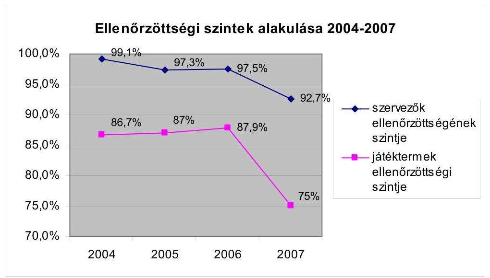

---

A vizsgált időszakban az SZF teljes létszáma 140 főről 113 főre ${ }^{18}$, az ellenőröké 64 főről 58 főre csökkent. 2007-ben a pénznyerő piacot 43 ellenőr felügyelte régiónként 3-8 fős létszámmal, a 6 működő kaszinót 6 ellenőr, a sorsolásos, fogadásos játékok ellenőrzését országos szinten 2-3 fő ellenőrizte, az ellenőrzési eljárási szabályok alapján változó ellenőrpárokba szerveződve. A létszámhiányra hivatkozással az SZF nem biztosított külön létszámot az on-line, valamint médiákban szervezett illegális szerencsejáték-szervezés folyamatos monitorozására, feltárására, az ajándéksorsolások ellenőrzését is csak a pénznyerő piac ellenőrzésének rovására tudta az ellenőrök átcsoportosításával ellátni.

A megállapítással zárult ellenőrzések aránya 2007-ben Baranya megyében az országos átlag (14%) fele (7%), az ellenőrzési lefedettség 127%. (Az országos átlag 90,9%) Ugyanakkor a Fővárosban illetve Pest megyében - ahol a játéktermek mintegy 20%-a működik - az ellenőrzések 28%-a illetve 20%-a zárult megállapítással 56%, illetve 60%-os ellenőrzöttségi szint mellett. (Ez az ellenőrzöttségi szint a Baranya megyeinek kevesebb mint a fele). Ugyancsak hasonlóan magas az ellenőrzési megállapítások aránya Szabolcs-Szatmár-Bereg megyében (27%), ahol az ellenőrzöttségi lefedettség 50,5% volt. (A fenti statisztikai sor tartalmazza azokat az ellenőrzéseket, amikor másik kirendeltség illetékességi körébe tartozó területen végeznek az ellenőrök ellenőrzést. Ezek számáról az SZF nem rendelkezik külön számadatokkal, mivel azok az adott kirendeltség statisztikájában jelennek meg, függetlenül attól, hogy másik kirendeltség illetékességi területén végezték az ellenőrzést.)

Az egy ellenőrre jutó játéktermek száma 287 db (Békés-Csongrád megyei kirendeltség) és 614 db (Bács-Kiskun - Jász-Nagykun-Szolnok megyei kirendeltség) között alakult 2007-ben. A fajlagos mutató értékelése során figyelembe kell venni az eltérő megközelíthetőséget és a játéktermek eltérő nagyságrendjét is, azonban a két kiemelt terület közel hasonló településszerkezetű, és az I. kategóriájú játéktermek arányában sem térnek el számottevően egymástól.

Az SZF az ellenőrzésre kiválasztás kockázati tényezőit un. ellenőrzési metodikában (szabályzatban) határozta meg, A vizsgált időszakban nem alakított ki zárt informatikai alapú rendszert a kiválasztás támogatására, azonban azt különböző szempontú informatikai lekérdezési lehetőségek segítik.

Az SZF a vizsgálat időszakában már megkezdte az informatikai alapú kiválasztási rendszer megvalósításának előkészítését, amelyet a Kormányzati Ellenőrzési Hivatal a 2002. évi ellenőrzése során is javasolt.

Az SZF ellenőrzésre játéktermeket jelöl ki, de a nyilvántartásából nem tudja megállapítani, hogy az érintett játéktermekben a szervezők hány játékhelyet működtetnek. Ennek következtében az SZF ellenőrzései a helyszínen éppen megtalálható gépek szabályos működési feltételeire irányulnak.

Az SZF az engedélyezett játéktermek helyéről és az engedélyezett pénznyerő automatákról rendelkezik hatósági nyilvántartással, arról azonban nem, hogy az

[^0]
[^0]:    ${ }^{18}$ Az igazgatási és igazgatás jellegű tevékenységet ellátó központi költségvetési szerveknél foglalkoztatottak létszámáról szóló 2131/2006. (VII. 26.) Korm. határozat alapján az engedélyezett létszáma 2006-ról 2007-re 135-ről 113 főre csökkent.

---

adott pénznyerő automatát a szervező melyik játékteremben üzemelteti, vagy esetleg raktáron tárolja, vagy szervizeli, vagy hitelesíti.

A hatósági felügyeleti ellenőrzések száma a vizsgált időszakban folyamatosan, a megállapítással zárult ellenőrzések száma 2006-ig csökkent. Az SZF vizsgálta a visszaesés okait és intézkedéseket tett a nyilvántartásában szereplő játékszervezők ellenőrzései terén, aminek következményeként 2007-ben az ellenőrzések eredményessége javult (4. sz. táblázat).
4. sz. táblázat

A hatósági felügyeleti ellenőrzések eredményességének alakulása

|  | 2004 | 2005 | 2006 | 2007 |
| :-- | --: | --: | --: | --: |
| Ellenőrzések száma összesen | 18642 | 18135 | 17405 | 14750 |
| Megállapítással zárult ellenőrzések   száma összesen | 2419 | 1926 | 1930 | 2333 |
| Megállapítással zárult ellenőrzések   aránya | $13,0 \%$ | $10,6 \%$ | $11,1 \%$ | $15,8 \%$ |
| Pénznyerőpiacon végzett ellenőrzések   száma | 17301 | 16812 | 16135 | 13462 |
| Pénznyerőpiacon megállapítással   zárult ellenőrzések száma | 1935 | 1546 | 1556 | 2109 |
| Pénznyerőpiacon megállapítással   zárult ellenőrzések aránya | $11,2 \%$ | $9,2 \%$ | $9,6 \%$ | $15,7 \%$ |

Az eredményesség növelése érdekében tett intézkedések: az ellenőrzési metodikának a jogszabályváltozásoknak megfelelő és a gyakorlati tapasztalatok szerinti módosítása, a területek által lefolytatott ellenőrzésekről készült jegyzőkönyvek központ általi átvizsgálása, ennek eredményéről visszacsatolás, technikai eszközök bővítése (navigáció, kiolvasó eszközök, mobiltelefonok, fényképezőgépek beszerzése), ellenőrzési terület tájékoztatása a hatósági döntésről, az ellenőrzési tevékenység negyedévenkénti elemzése és értékelése, rendszeres szakmai továbbképzések megtartása, az ellenőrzést érintő állásfoglalások leegyeztetése a szakmai területtel.

A vizsgált időszakban a játéktermekben feltárt és jegyzőkönyvben rögzített hiányosságok mintegy 50%-a okmányokkal, 25-25%-a a játéktermekre vonatkozó előírások megsértésével illetve a pénznyerő automatákkal kapcsolatban merültek fel. Engedély nélküli egységet a SZF ellenőrzései 2004-ben nem, 2005-ben 2, 2006-ban 3, 2007-ben 3 esetben tártak fel (3. sz. tanúsítvány).

Az okmányokkal kapcsolatos hiányosságok mintegy 75%-át azok hiányos, vagy nem megfelelő vezetése adta. Ugyanezen hiányosság-típuson belül a látogatási szabályzat hiánya, illetve hiányossága mintegy 10%-ot, egyéb okmányok hiánya hasonlóan mintegy 10%-ot tett ki. A játéktermekre vonatkozó megállapítások között jelentős arányt képviselt (kb. 50%) a játékterem nyitva tartási idejére vonatkozó jegyzőkönyvi bejegyzések száma. A megállapítások egyharmadában fordult elő, hogy az ellenőrzés időpontjában a játékteremnek helyt adó egység zárva volt, vagy a játékterem nem üzemelt, mintegy 10%-os arányt képviselt a nem megfelelő terem, illetve a más tevékenység folytatása minősítés (I. kategóriába sorolt játékterem esetén). A pénznyerő automatákra vonatkozó megállapítások között a játéktervtől való eltérést rögzítő megállapítások a feltárt hiányosságok valamivel több mint felét tették ki. A hitelesítéssel kapcsolatos megállapítások aránya a kategórián belül mintegy 30%, a számlálókkal kapcsolatos megállapítások 5%-ot jelentettek. A gépek kezeléséhez és megbontásához szükséges kulcsok hiánya mintegy 10%-os arányt képviselt.

Az illegális szerencsejáték szervezői tevékenység elleni fellépés eredményességének javítása érdekében az SZF több területen kezdeményezte az Szjtv. módosítását. Az Szjtv.-be beépítették az on-line (külföldi) szervezőkre vonatkozó szabályokat, tilalmakat, továbbá kibővítették a szerencsejáték-szervező fogalmát, valamint a szankciókra vonatkozó szabályokat, ugyanakkor egyes játékokra ${ }^{19}$ vonatkozó szabályozásokat a jogalkotó a helyszíni ellenőrzés lezárásáig nem építette be a törvény szövegébe. Az SZF belső intézkedései sem terjedtek ki az illegális szervezői tevékenységek rendszer jellegű feltárására. Az SZF - létszámhiányra hivatkozással - nem alakított ki külön szervezeti egységet, illetve nem tervezett humánerőforrás kapacitást a különböző médiák illetve az Internet figyelemmel kísérésére, kockázatelemzésére, nem egészítette ki eljárásrendjét az ellenőrzési feladatok rendszer jellegű végrehajtására. Bejelentések, vagy egyéb információ (pl. reklám, újságcikk) alapján csak eseti ellenőrzéseket végzett.

Amennyiben a tiltott szerencsejáték szervezés gyanúja fennállt, büntető feljelentést tett az SZF az eljárásra illetékes rendőrkapitányságon. Ezen eljárások bűncselekmény hiányában a nyomozás megszüntetésével zárultak, mivel sportversenyek, illetve egyesületi keretek közötti pókerjáték szervezését állapították meg, ami nem felelt meg a szerencsejáték törvényi definíciójának.

# A külföldön folytatott szerencsejátékok magyarországi szervezése, reklámozása miatt kiszabható bírságösszegek nem jelentenek tényleges visszatartó erőt. 

Az SZF feltárása alapján a Fogyasztóvédelmi Felügyelőség több esetben reklámfelügyeleti eljárást folytatott le, melyek eredményeiként egy internetes tartalomszolgáltatót két ízben 200, illetve 300 E Ft bírsággal sújtotta és a második alkalommal eltiltotta a jogsértő magatartás további folytatásától. Egy más tartalomszolgáltatót pedig jogellenes reklámtevékenységért 100 E Ft pénzbírsággal szankcionált. A vizsgálat időpontjában mintegy 20 eljárást folytattak a fogyasztóvédelmi hatóságok különböző weboldal üzemeltetőkkel és médiákkal szemben.

Az SZF nyilvántartása - jogszabályi előírás hiányában - nem követi teljes körűen a pénznyerő automaták életútját az előállítástól (behozataltól) a megsemmisítésükig. Amennyiben a játékszervező nem hosszabbíttatja meg valamely gép engedélyét, az SZF nem kíséri figyelemmel annak további sorsát. Az Szjtv. nem írja elő a pénznyerő automaták előállításának, behozatalának, valamint adás-vételének bejelentési kötelezettségét. A gépek megsemmisítéséről is csak akkor van információja az SZF-nek, ha az a megsemmisítésre előírt határidőben szerencsejáték szervező birtokában van.

[^0]
[^0]:    ${ }^{19}$ Ilyenek pl. pókerverseny, tudáselemmel vegyes sorsolásos játékok, on-line szerencsejáték.

---

Egy gazdasági társaság felszámolásával összefüggésben elrendelt adóellenőrzés megállapította, hogy egy nem szerencsejáték szervező adóalany I. kategóriájú pénznyerő-automatát (roulette gépet) szerzett be (5,5 M Ft összegben) egy szerencsejáték szervezőtől és azt később értékesítette. Az APEH adóellenőrzése nem tudta megállapítani, hogy a beszerzés és értékesítés közötti egy
 évben az adóalany hol működtette a gépet.

A Várkert kaszinó Kft. koncessziós szerződésének és üzemeltetési engedélyének lejártát követően, a kaszinóban a bezáráskor működött 23 db (Integrált Ellenőrző Készülék nélküli) ${ }^{20}$ pénznyerő automata értékesítését az SZF nem ellenőrizte, így azok sorsa ismeretlen.

Az SZF nem tartja szükségesnek a nyilvántartás kiegészítését és ennek érdekében az Szjtv módosítását. Az SZF álláspontja szerint a nyilvántartások bővítése számottevően nem növelné az illegális gépek felderítését, ugyanakkor mind a szervezők, mind a hatóság számára aránytalan többletfeladatot és ezáltal többletkiadást eredményez.

Az SZF a játékteremnek be nem jelentett helyek ellenőrzésének fokozásával, illetve a VP ellenőrzések során nyert információkkal igyekszik korlátozni az illegális pénznyerő automaták üzemeltetését. 2004-ben $29 \mathrm{db}, 2005$-ben $18 \mathrm{db}, 2006$-ban $19 \mathrm{db}, 2007$-ben 15 db esetben történt felderítés, az elkobzott gépek száma 2004-ben $39 \mathrm{db}, 2005$-ben $27 \mathrm{db}, 2006$-ban $21 \mathrm{db}, 2007$-ben 28 db volt (1. sz. tanúsítvány).

Az SZF az ellenőrzései során nem hasznosítja időben, illetve teljes körűen a rendelkezésére álló adatokat, ezért a helyszíni ellenőrzések során is találnak akár több hónapja lejárt engedélyű, de üzemelő gépeket. Ez annak a következménye, hogy az SZF a határozatait az engedély lejáratát követően esetenként több hónappal hozza meg. A késedelmes intézkedést az SZF automatikus határozathozatali informatikai rendszer hiányával indokolja.

A VP egy 2007. március 23-án végzett ellenőrzése során megállapította, hogy egy vizsgált és üzemelő pénznyerő automata engedélye 2007. január 19-én lejárt. Az SZF egy vizsgálatával megállapította, hogy egy játékszervező 2006. november 29. és 2007. április 26. között lejárt engedéllyel üzemeltetett egy pénznyerő automatát.

# 3.2.4. VP által végzett ellenőrzések eredményessége 

A vizsgálatok körét és mélységét a Szjtv. az ellenőrző hatóságok részére általánosan határozza meg, a 2002-ben az SZF és a VP által megkötött megállapodás rögzíti a VP ellenőrzéseinek tartalmát és az ellenőrzendő területeket.

A VP a SZF-fel kötött Együttműködési Megállapodás alapján 2002-től a jövedéki ellenőrzései során a vendéglátóhelyeken kizárólag a II. kategóriába sorolt játéktermekben a játékterem engedélyre, látogatási szabályzatra, pénznyerő automata üzemeltetési engedélyére, az SZF által rendszeresített nyomtatványok meglété-

[^0]
[^0]:    ${ }^{20}$ IEK nélküli gépek üzemeltetése csak kaszinókban megengedett, mivel ezek a készülékek nem rögzítik az üzemeltetőt, és a forgalmat időszaki bontásban

---

re irányulnak ${ }^{21}$. Így az ellenőrzések a nem vendéglátó egységekre egyáltalán nem terjednek ki. Ennek következtében a vizsgált időszakban semmilyen hatóság nem folytatott vizsgálatot dunai luxushajókon, üdülőkben, kollégiumokban és egyéb szálláshelyeken, sportmérkőzéseken stb.

# A VP ellenőrzései - tekintettel azok számosságára - az érintett alanyi körre elsősorban preventív hatásúak, a megállapítással zárult ellenőrzéseinek száma alacsony. 

A VP a pénznyerő automaták ellenőrzéseit az alapfeladatainak végrehajtása közben illetve mellett végzi, azaz az ellenőrzésre történő kiválasztás során a jövedéki szakmai szempontokat érvényesíti elsődlegesen és amennyiben az ellenőrzött vendéglátóhelyen játék vagy pénznyerő automata is üzemel, akkor azokat is ellenőrzi. A vizsgált időszakban a VP engedéllyel nem rendelkező egységet nem derített fel. A VP által feltárt jogsértések aránya a vizsgált évek mindegyikében mind az ellenőrzött vendéglátóipari egységek számához, mind a pénznyerő- és játékautomaták számához viszonyítva nem haladta meg a 6 ezreléket (5. sz. táblázat).
5. sz. táblázat

Ellenőrzések számának és eredményességének alakulása

| Év | Ellenőrzött   vendéglátó-   ipari egységek   száma (db) | Ellenőrzött   pénznyerő- és   játékautomaták   száma (db) | Feltárt   jogsértések   száma (db) | Feltárt jogsértések aránya |  |
| :--: | :--: | :--: | :--: | :--: | :--: |
|  |  |  |  | a vendéglátó-   ipari   egységekhez | a pénznyerő-   és játék-   automa-   tákhoz |
|  |  |  |  | viszonyítva |  |
| 2004 | 6454 | 5820 | 10 | 0,15\% | 0,17\% |
| 2005 | 7085 | 7996 | 18 | 0,25\% | 0,23\% |
| 2006 | 6366 | 6706 | 16 | 0,25\% | 0,24\% |
| 2007 | 5783 | 7158 | 34 | 0,59\% | 0,47\% |

Az egyes fővámhivatalok ellenőrzéseinek eredményességi mutatói nem tükrözik azokat a területi különbségeket, amelyeket az SZF ellenőrzései, vagyis a VP az ellenőrzéseivel nem tárt fel nagyobb arányban szabálytalanságot az un. „legfertőzöttebb" területeken (Főváros, Pest megye, Szabolcs-Szatmár-Bereg megye). Az SZF ellenőrzési megállapításai mintegy 75\%-ban a VP által ellenőrizhető területekre (okmányvezetés, játékterem üzemeltetésére vonatkozó szabályok betartása stb.) vonatkoznak.

## A VP ellenőrzéseivel feltárt jogsértésekről készített jegyzőkönyvek az SZF értékelése alapján - hiányosak és a megállapítások szakszerűtlenül megfogalmazottak. Ennek oka egyrészt, hogy a pénzügyőrök szak-

mai ismeretei ezen a területen hiányosak, másrészt a VP ellenőrzései e tekintetben esetlegesek, nem rendelkeznek előzetesen adatokkal, információkkal a játéktermekről és az üzemeltetett pénznyerő automatákról (pl. játékterem szüneteltetéséről, nyitvatartási idő módosításáról). A VP-től átvett ügyekben az SZF a

[^0]
[^0]:    ${ }^{21}$ A Megállapodás alapján a VP a megállapított hiányosságokról jegyzőkönyvet vesz fel a kapcsolódó hatósági munkát az SZF/APEH SZEF látja el.

---

hatósági ügyintézés előtt minden esetben ismételt ellenőrzést folytatott le. Arról, hogy a jegyzőkönyvekben leírt jogsértéseket az SZF mennyiben ítélte megalapozottnak, a VP rendszeresen visszajelzést nem kapott. ${ }^{22}$

A VP az ellenőrzések lefolytatásához szükséges szakmai ismeretek megszerzéséhez az SZF segítségét nem igényelte. A VP úgy ítélte meg - tekintettel a végrehajtandó feladat viszonylagos egyszerűségére -, hogy az ellenőrzések hatékony elvégzéséhez szükséges ismeretek megszerzéséhez iskola, illetve tanfolyamrendszerű oktatásra nincs szükség.

# 3.2.5. Ellenőrző hatóságok együttműködése a szabálytalanságok, valamint az illegális szerencsejáték feltárásában 

## Az integrációt megelőzően az ellenőrzésben érintett hatóságok nem végeztek közös ellenőrzést annak ellenére, hogy annak jogszabályi, eljárásrendi, technikai, illetve humánerőforrás korlátja nem volt.

A PM utasítására 2007-ben egy alkalommal a VP, az APEH, valamint az SZF egyhetes időtartamú, az egész ország területére kiterjedő közös ellenőrzést végzett az SZF irányításával. A hatóságoknak a pénznyerő-piacon folytatott e közös ellenőrzése azok számossága miatt preventív hatást gyakorolt, és az átlagosnál alacsonyabb eredményességgel zárult. Ennek oka, hogy ez a közös ellenőrzés is - hasonlóan az SZF ellenőrzéseihez - elsősorban az engedéllyel rendelkező játéktermekre irányult, és kevésbé az illegális játékhelyek és játékok (pl. póker-versenyek, egyéb fogadások) felderítésére.

A közös ellenőrzés során 4238 vizsgálatot folytattak le az SZF által kijelölt játéktermekben, amelyből 2077 db-ot a VP-APEH operatív ellenőrei és 2161 db-ot az SZF-APEH Rapid csoportokból álló ellenőrpárok bonyolítottak le. Az ellenőrzések száma az SZF és a VP által egy évben végzett összes ellenőrzés mintegy ötödét tették ki (3. sz. tanúsítvány).

A hatóságok a végrehajtott ellenőrzések során 307 esetben, az elvégzett ellenőrzések 7,2\%-ában állapítottak meg hiányosságot. Ez az arány mintegy fele annak, amit az SZF hasonló ellenőrzései során feltár. A megállapítások 80\%-a a látogatási szabályzat pontatlanságával, a teremfelügyelő személyének nem pontos megjelölésével, a nyitvatartási idő helytelen feltüntetésével függtek össze. Továbbá 7 esetben találtak lejárt engedéllyel, illetve engedély nélkül üzemelő játékteremet, illetve pénznyerő automatát.

### 3.3. Az SZF hatósági intézkedései

Az SZF a hatósági feladatai ellátására a belső eljárásrendjét a jogszabályi előírásokat figyelembe véve alakította ki, és minden esetben az abban foglaltak szerint járt el.

[^0]
[^0]:    ${ }^{22}$ A VP országos parancsnoka tájékoztatása szerint a helyszíni ellenőrzést lezárását követően a VPOP Jövedéki Igazgatósága írásban kérte az SZF-et, hogy a feltárt hiányosságokról és hibákról rendszeresen küldjenek visszajelzést.

---

Az elsőfokú hatósági feladatokat az APEH-ba történt integráció előtt és után is az SZF erre illetékes osztályai végezték/végzik. Az integrációt megelőzően az I. fokú határozatokkal szemben a II. fokú eljárás lefolytatása és a határozat meghozatala a pénzügyminiszter feladata volt. Az integrációt követően a jogorvoslati rend megváltozott, 2007. január 1-óta az APEH elnöke hozza meg a II. fokú határozatokat.

A vizsgált időszak minden évére az összes határozat 5-10\%-át választottuk ki mintaként.

# A vizsgált időszakban az SZF hatósági intézkedései megalapozottak 

voltak. A fellebbezhető határozatok kevesebb mint 10\%-a ellen nyújtattak be a szervezők fellebbezést. A megfellebbezett I. fokú határozatok mindegy 75-94\%-ában a II. fokú hatóság a fellebbezést elutasította (6. sz. táblázat).
6. sz. táblázat

Kimutatás az I. fokú határozatok megalapozottságáról

| Év | Összes   határozat   száma | Fellebbezhető   határozatok   száma | Fellebbezések |  | Fellebezésekből a II. fokú döntés   az I. fokon hozott határozatot |  |  |  |
| :--: | :--: | :--: | :--: | :--: | :--: | :--: | :--: | :--: |
|  |  |  |  |  | helybenhagyta |  | megsemmisítette /   megváltoztatta / új   eljárásra kötelezte |  |
|  | (db) | (db) | (db) | $(\%)$ | db | \% | db | \% |
| 2004 | 2419 | 1956 | 191 | 9,76 | 128 | 85,91 | 28 | 18,8 |
| 2005 | 1926 | 1617 | 86 | 5,32 | 58 | 75,32 | 20 | 25,97 |
| 2006 | 1930 | 1358 | 114 | 8,39 | 69 | 81,18 | 16 | 18,82 |
| 2007 | 2334 | 1808 | 135 | 7,47 | 103 | 93,64 | 7 | 6,36 |

Az év végén folyamatban lévő ügyeket a táblázat adatai nem tartalmazzák

Az Szjtv. nem teszi lehetővé az SZF számára a differenciált bírságolás alkalmazását abban az esetben, ha a szervező ugyanazon mulasztást már nem először követi el. Az Szjtv. 12. § rendelkezik arról, hogy milyen szabálytalanságok esetén mekkora bírságösszeg (-tól -ig határ) szabható ki, de nem nevesíti azt az esetet, ha a szervező ugyanazon mulasztást már nem először követi el. Az SZF 2004-2005. években ilyen esetekben magasabb összegű bírságot szabott ki, a Fővárosi Bíróság - az ügyfél keresetére - azonban ezt az esetek 60-70\%-ában az első elkövetéskor kiszabott bírság összegére mérsékelte. Ennek következtében, a bírósági ítéleteket figyelembe véve az SZF módosította bírságolási gyakorlatát.

A Fővárosi Bíróság ítéletei szerint a bírság összegét a mulasztás vagy kötelességszegés súlyának figyelembevételével kell megállapítani. A helyszíni ellenőrzésre kiválasztott 10 eset közül 4-ben a Fővárosi Bíróság a fenti szövegű indokolással új eljárás lefolytatására kötelezte az SZF-t, mint elsőfokú hatóságot.

A vizsgált időszakban az SZF évente 255-417 M Ft bírságot szabott ki, amelynek 83-96\%-át a szervezők befizették (7. sz. táblázat). Ennek oka, hogy az SZF a játékszervező tevékenységre vonatkozó felfüggesztő határozatát a bírság megfizetéséig érvényben tartja.

---

7. sz. táblázat

A kiszabott és a befolyt bírság alakulása

2004-2007

| Év | Kiszabott | Befolyt | Befolyt bírság %-a |
| :--: | :--: | :--:

 | :--: |
|  | Összes bírság E Ft |  |  |
| 2004 | 380305 | 365113 | 95,95 |
| 2005 | 262715 | 266007 | 101,26 |
| 2006 | 254600 | 214686 | 84,32 |
| 2007 | 417375 | 345956 | 82,89 |

*A bírságkiszabás és befizetés egyik évről a másik évre történő áthúzódása miatt

# 4. Feladatellátás informatikai támogatásának értékelése 

### 4.1. A szerencsejáték felügyeletével összefüggő folyamatok informatikai támogatása

Az SZF által kialakított informatikai irányítási rendszer a vizsgált időszakban eredményesen megoldotta a felhasználói oldalról jelentkező követelmények és igények kiszolgálását.

Az informatikai irányítási rendszer egyik fontos elemének tekinthető, hogy az Informatikai Önálló Osztály (IÖO) az SZF elnökének közvetlen irányítása alatt működött, és az informatikával összefüggő fontosabb kérdésekben elnöki jóváhagyás, illetve döntés érvényesült. Ez az elnök által irányított központi koordináció a vizsgált időszakban folyamatosan megteremtette a szakmai igények és informatikai megoldások szoros összhangját. Ezt az összhangot biztosította továbbá az SZF 2006-ban kialakított informatikai stratégiája, illetve középtávú és éves informatikai fejlesztési terve is.

A szerencsejáték felügyeleti feladatok támogatására az SZF 1999-ben integrált alkalmazói rendszert (továbbiakban: IA rendszer) vezetett be. Az IA rendszer a szerencsejáték felügyeleti tevékenység valamennyi területét (iktatás, szerencsejáték nyilvántartás, ügyirat-kezelés és pénzügy) lefedte, azonban az ellenőrzések végrehajtásának nem minden szakaszát (kiválasztás, kockázatelemzés, az ellenőrzési feladatok belső kommunikációja) támogatja.

A rendszerfejlesztést végző vállalkozóval megkötött szerződés alapján az SZF nem kötötte ki a szoftver vagyoni jogának átruházását, holott a szoftver egyedileg az SZF igényeire, a szervezet számára lett kifejlesztve. E feltételek mellett az IA rendszeren felmerült bármely fejlesztési igényt csak a vállalkozó elégítheti ki, ami a jövőbeni fejlesztéseket tekintve kockázati tényező.

Az IA rendszer bevezetése óta az implementált folyamatokat alapjaiban érintő változások nem történtek, az időközben felmerült fejlesztési igények (pl. űrlapok kiegészítése új adatmezővel) főként adminisztratív jellegű jogszabályi változásokból fakadtak. A későbbiekben az IA rendszer jelentősebb fejlesztését igényelheti, ha azt az APEH informatikai rendszerében már működő platformra kell áthelyezni.

---

Az IA rendszer a szerencsejáték felügyeleti tevékenységet funkcionálisan megfelelően támogatta. A tervezés folyamatába a felhasználói területek bevonása teljes körűen megtörtént, az informatikai rendszer fejlesztése során jól kialakított folyamatokat implementáltak. Az SZF vezetése a rendszer bevezetését követően is folyamatosan gondoskodott a továbbfejlesztésére vonatkozó felhasználói igények gyűjtéséről, feldolgozásáról. A változtatási igények dokumentáltak, az illetékes szakmai területek vezetői által jóváhagyottak. A megfelelő funkcionalitás másik kulcstényezőjének tekinthető, hogy a rendszerben megvalósított, illetve a mellette manuálisan működő kontrollok a szükséges mértékben kiegészítik és támogatják egymást.

Az IA Rendszer a vizsgált időszakban több - jellemzően kisebb - változáson ment keresztül. A verzióváltások nyilvántartása megoldott, ugyanakkor a változások tesztelése és elfogadása nem dokumentált. Ez a gyakorlat biztonsági és funkcionalitási kockázatokat is jelent, mivel az esetleges rossz szakmai döntések utólag nem követhetőek, felelősei nem azonosíthatóak.

# Az SZF és APEH összevonása során az SZF informatikai területének integrációja részben valósult meg. Az alapinfrastruktúra (levelező rendszer, intranet, hálózati rendszer) üzemeltetését és felügyeletét az APEH SZTADI vette át, az alkalmazási réteg (pl. IA rendszer) működtetése és adminisztrációja viszont az SZF-nél, illetve a főosztályon dolgozó informatikusoknál maradt. Az APEH SzMSz-e ugyanakkor nem állt összhangban ezzel a megoldással, mert az SZF feladatai között informatikai (így pl. üzemeltetési és fejlesztési) feladatokat nem sorolt fel, azt kizárólag a SZTADI feladat- és felelősségi körébe utalta. Ebben a formában az IA Rendszer üzemeltetésével kapcsolatos felelősségi rendszer nem tekinthető egyértelműnek és számonkérhetőnek. 

Egyaránt indokolható az IA rendszert felügyelő informatikusok akár az SZF-hez, akár a SZTADI-hoz történő hozzárendelése, ugyanakkor az aktuális helyzet pontos szabályozása mind az SzMSz-ben, mind a kapcsolódó informatikai eljárások (alkalmazásfejlesztés, felhasználói adminisztráció stb.) esetében elengedhetetlen.

Az APEH és SZF összevonása a két szervezet vezetése által kialakított integrációs projekt keretében ment végbe, amelynek részét képezte az informatikai rendszerek összekapcsolása is. Az informatikai rendszerek integrációja problémamentesen zajlott, azt az érintett területek szakmailag előkészítették és végrehajtották.

Az integrációs projekt lezárását követően került sor olyan fejlesztések végrehajtására (pl. a 0-ás igazolások lekérdezhetősége), amely az APEH releváns nyilvántartásához történő hozzáférés kialakításával az SZF engedélyezéshez kapcsolódó munkáját gyorsította.

Az integrációt követően az SZF informatikai stratégiájában szereplő fejlesztések folytatásáról nem született döntés, azokat sem az APEH 2008. februárjában kiadott, a 2008-2010-es időszakra szóló Informatikai Stratégiája, sem a SZTADI 2008. évi feladat- és munkaterve nem tartalmazta. Az SZF hivatkozott fejlesztési elképzelései elsősorban a szerencsejáték felügyeleti tevékenység hatékonysága javítását célozták. A helyszíni ellenőrzés időszakában működő IA rendszer nem tett lehetővé adatkapcsolatot az Országos Mérésügyi Hivatallal (OMH) annak érdekében, hogy megbízható és pontos információk álljanak rendelkezésre a pénznyerő automaták helyszíni ellenőrzéseihez, továbbá gátját jelenti az időszaki elszámolások teljesen elektronikus útra történő terelésének.

---

Ez utóbbi fejlesztés megvalósítását indokolja a kormány elektronikus közigazgatás fejlesztésével összefüggő koncepciója.

A fenti fejlesztéseken túl fontos feladatot jelent az IA Rendszer integrációja az APEH alkalmazás-felügyeleti rendszerébe annak érdekében, hogy a rendszer az APEH üzemeltetés-biztonsági és logikai védelmi előírásai szerint működjön. Ennek koncepcionális megoldását az APEH aktuális Informatikai Stratégiája nem tartalmazza annak ellenére, hogy a fejlesztés feladat- és költségvonzata ezt indokolja.

# 4.2. Az informatikai támogatás technikai és biztonsági feltételei 

Az SZF-nél működő informatikai infrastruktúra (központi gép és munkaállomások) a vizsgált időszakban a felhasználói igényeket kielégítette, hosszabb távon ugyanakkor működési kockázatot jelent a géppark hirtelen, nagyarányú elöregedése, ami főként a hordozható számítógépek és a szerverek esetében jelentős (8. sz. táblázat).
8. sz. táblázat

A szerencsejáték felügyeleti tevékenységet támogató számítógép állomány alakulása

|  |  | Darab, dec .31-i állomány |  |  |  |
| :--: | :--: | :--: | :--: | :--: | :--: |
|  |  | 2004 | 2005 | 2006 | 2007 |
| Személyi számítógépek | Összesen | 206 | 141 | 138 | 138 |
|  | 3 évnél öregebb | 86 | 25 | 20 | 121 |
|  | % | 41,7 % | 17,7 % | 14,5 % | 87,7 % |
| Laptopok | Összesen | 12 | 12 | 12 | 12 |
|  | 3 évnél öregebb |  | 0 | 12 | 12 |
|  | % | 0,0 % | 0,0 % | 100,0 % | 100,0 % |
| Szerverek | Összesen | 3 | 3 | 3 | 3 |
|  | 3 évnél öregebb | 0 | 0 | 1 | 2 |
|  | % | 0,0 % | 0,0 % | 33,3 % | 66,7 % |

Az APEH informatikai rendszeréhez történő csatlakozással az SZF informatikai alapinfrastruktúrájának biztonsági szintje magasabb lett, mivel összhangba került az APEH szigorúbb biztonsági előírásaival. Alkalmazási szinten azonban változások nem történtek, alapvető hiányossága, hogy az IA rendszerre vonatkozó biztonsági követelmények nem meghatározottak. Nem történt meg az SZF területén az információ vagyon osztályozása, illetve az adatgazdák formális kijelölése.

Az IA rendszer logikai védelme több, alapvető biztonsági igényt nem elégít ki, így fennáll a kockázata az utólag nem számonkérhető, illetéktelen adathozzáféréseknek.

---

Az IA rendszer folyamatos működtetésének biztosítására az SZF informatikai területe a legalapvetőbb intézkedéseket megtette. A rendszer rendelkezésre állása tekintetében azonban az SZF vezetője nem határozott meg követelményeket.

Ezek közül a legfontosabb annak ismerete lenne, hogy a szerencsejáték felügyeleti tevékenység mennyi ideig képes elviselni az informatikai rendszer kiesését. Katasztrófa-elhárítási tervet az SZF 2004-ben ugyan kialakított, de az az informatikai rendszerek helyreállításával nem foglalkozott, illetve kifejezetten a katasztrófa helyzetekre (árvíz, földrengés stb.) koncentrált. Olyan dokumentum azonban nem állt rendelkezésre, amely a klasszikus értelemben katasztrófának nem minősülő, de az SZF tevékenységét esetlegesen érzékenyen érintő helyzeteket értékelné és kezelné, mint pl. hosszabb áramszünet, központi hardver elemek váratlan meghibásodása, belső dolgozó által végrehajtott szabotázs. Az APEH a helyszíni ellenőrzés során még tervezeti formában rendelkezésre álló Informatikai Katasztrófa-elhárítási Szabályzata az IA rendszert nem kezeli.

# 5. A Pénzügyminiszter koncessziós szerződésekkel kapcsolatos feladatellátásának értékelése 

A szerencsejáték ágazatból a költségvetésnek az adóbefizetéseken túlmenően koncessziós díj-bevétele is keletkezik. Az Szjtv. 3. § (1) b) értelmében a nem liberalizált szerencsejátékok szervezését az állam koncessziós szerződésben időlegesen másnak átengedheti. Ilyen terület a lóversenyfogadás, a játékkaszinók üzemeltetése, a bukmékeri rendszerű fogadás, valamint a számsorsjátékon kívüli sorsolásos játékok. A szerencsejátékokkal összefüggő koncessziós pályázatok kiírására és a szerződések megkötésére a pénzügyminiszter jogosult. A vizsgált időszakban három koncessziós pályázatot írt ki, egyet a lóversenyfogadásra és kettőt I. típusú játékkaszinók működtetésére. A lóversenyfogadásra kiírt pályázatot eredménytelennek minősítette, a két játékkaszinó működtetésére kiírt egyik pályázat alapján megkötötte a koncessziós szerződést, a másik pályázat esetében 2008. májusában hirdetett győztest.

### 5.1. Lóversenyfogadás

A lóversenyfogadás a költségvetés számára 2004-2006 között összesen mintegy 1,2 Mrd Ft veszteséget jelentett a versenyrendezéssel és fogadásszervezéssel foglalkozó két, 100% állami tulajdonban lévő gazdasági társaság veszteségei miatt.

A versenyrendezés és a fogadásszervezés két különböző, 100%-os állami tulajdonban lévő gazdasági társaság feladata: a versenyrendezést a Nemzeti Lóverseny Kft., a fogadásszervezést pedig a Magyar Lóversenyfogadást Szervező Kft. végzi.

A két gazdasági társaság felett a tulajdonosi jogokat az Állami Privatizációs és Vagyonkezelő Zrt. (továbbiakban: ÁPV Zrt.), illetve jogutódja, a Magyar Nemzeti Vagyonkezelő Zrt. (továbbiakban: MNV Zrt.) gyakorolja. Az ÁSZ a korábbi vizsgálatai ${ }^{23}$ eredményeként javasolta a pénzügyminiszternek, hogy kezdeményezze a lóversenyágazat gazdaságos működési feltételeinek megteremtését a versenyszervezési és versenyrendezési tevékenység veszteségének megszüntetésével.

A vagyonkezelő szervezet esetében a részvényesi jogokat jogszabályi előírás alapján a pénzügyminiszter gyakorolja.

Az állami tulajdonban lévő vállalkozói vagyon értékesítéséről szóló 1995. évi XXXIX. tv. 11. §-a, valamint a Magyar Nemzeti Vagyonkezelő Zártkörűen működő Részvénytársaság Alapító Okiratának elfogadásáról szóló 1083/2007. (X. 17). Korm. határozat 8. pontja alapján a részvényesi jogokat a pénzügyminiszter gyakorolja.

2004 és 2006 között a Nemzeti Lóverseny Kft. (továbbiakban: NL Kft.) összesen 1,2 Mrd Ft veszteséget, a Magyar Lóversenyfogadást Szervező Kft. (továbbiakban: MLSZ Kft.) összesen 1,6 M Ft nyereséget mutatott ki. A vizsgált időszakban egyik gazdálkodó szervezet sem fizetett társasági adót, illetve játékadót (9. sz. táblázat).

Társasági adót a kft.-k azért nem fizettek, mert az éves adóalapjuk minden évben negatív volt, játékadó fizetési kötelezettséget pedig az Szjtv. a lóversenyfogadásokra nem ír elő.
9. sz. táblázat

Lóverseny játéktípus eredményességének alakulása

| Megnevezés | Év | Játékadóbefizetés | Mérleg szerinti eredmény | Adóalap | Társasági adó fizetési kötelezettség | Költségvetési befizetési kötelezettség összesen |
| :--: | :--: |

 :--: | :--: | :--: | :--: | :--: |
| 1 | 2 | 3 | 4 | 5 | 6 | $=(3+6)$ |
| Nemzeti   Lóverseny   Kft. | 2004 | - | -546 311 | -512 246 | 0 | - |
|  | 2005 | - | 95 643 | 0 | 0 | - |
|  | 2006 | - | -770 620 | -706 005 | 0 | - |
|  | 2007* |  |  |  |  | - |
| Magyar   Lóverseny-   fogadást   Szervező Kft. | 2004 | - | -11 603 | -69 306 | 0 | - |
|  | 2005 | - | 18 243 | -36 826 | 0 | - |
|  | 2006 | - | -5069 | -57 924 | 0 | - |
|  | 2007* |  |  |  |  |  |

* A 2007. évi adatok a társasági adóbevallások feldolgozását követően, várhatóan 2008. augusztus végén állnak rendelkezésre.
ködésének és a központi költségvetés végrehajtásához kapcsolódó tevékenységének ellenőrzéséről" (0629), valamint „A tartósan veszteségesen működő állami tulajdonú gazdasági társaságok gazdálkodásának ellenőrzéséről" (0611) készített jelentések tartalmazzák.

---

Az ÁPV Rt. 2004-ben - a PM bevonásával - tanulmányt készíttetett „a magyarországi lóversenyzés hosszú távú finanszírozási és szerkezeti reorganizációja" címmel. A tanulmány megállapította, hogy a rendszer átalakítása szükséges a nagy összegű veszteség állami finanszírozásának megszüntetése érdekében, továbbá megoldási javaslatokat vázolt fel. A PM-nek a vizsgált időszakban a lóversenyágazat eredményessé tétele érdekében tett intézkedései nem jártak eredménnyel. 2007-ben elrendelte az MLSZ Kft. alaptőkéjének 900 M Ft-os emelését és az MLSZ Kft. és NL Kft. privatizációjára pályázat kiírását, továbbá koncessziós pályázatot írt ki a lóversenyfogadás szervezésére. A pályázatok eredménytelenül zárultak.

A pénzügyminiszter a lóversenyfogadás szervezésének koncessziós pályázata előkészítése során nem végzett számításokat a koncessziós díj mértékének meghatározására, azt a törvényi minimumban állapította meg ${ }^{24}$. A pályázat eredménytelenné nyilvánítását követően a pénzügyminiszter 2008. februárjában a koncessziós pályázat rövid időn belüli, jelentős változtatás nélküli ismételt kiírása mellett döntött.

2006-ban Kormányhatározat ${ }^{25}$ előírta a pénzügyminiszternek a lóversenyfogadás és a bukmékeri rendszerű fogadás szervezésének koncesszióba adására, valamint a Nemzeti Lóverseny Kft. és a Magyar Lóversenyfogadást Szervező Kft. együttes értékesítésére nyílt pályázatok kiírását. A PM munkacsoportot hozott létre a koncessziós pályázat előkészítésére, amelybe bevonta az SZF és az ÁPV Zrt. szakértőit is. Fő feladatuk a jogi és a koncessziós eljárással kapcsolatban felmerülő problémák megoldása volt. A koncessziós díj mértékét lóversenyfogadás esetén a törvényi minimumban, évi 100 M Ft-ban, bukmékeri rendszerű fogadás esetén pedig a törvényi előírás kétszeresében, évi 400 M Ft-ban határozta meg. A pénzügyminiszter a koncessziós pályázatot azzal a feltétellel írta ki 2007-ben, hogy a pályázatnak és az ÁPV Zrt. által kiírt privatizációs pályázatnak egyetlen - azaz együttes - nyertese lehet. Vagyis a nyertes az, aki mindkét pályázati kiírás feltételeinek megfelel, és egyben az állam számára összességében a legkedvezőbb ajánlatot teszi.

A pályázat eredménytelenné nyilvánítását a pénzügyminiszter azzal indokolta, hogy az ajánlatban foglaltak nem voltak meggyőzőek a fogadásszervezés biztonságos lebonyolítása tekintetében, az üzleti terv alapján nem látta biztosítottnak a koncessziós díj 20+10 évre történő megfizetését, valamint a pályázó elképzelései nem biztosították a lóversenyágazat megfelelő fejlesztését, finanszírozását, jövőjét.

A helyszíni ellenőrzés lezárását követően átadott dokumentumok szerint a pénzügyminiszter 2008. február végén azt a javaslatot fogadta el, hogy a pályázat jelentős változtatás nélkül 2-4 héten belül ismételten kiírható. Erre azonban 2008. júliusáig nem került sor.

[^0]
[^0]:    ${ }^{24}$ A PM a számítások elvégzését - a pályázat jellegéből adódó versenyre tekintettel - nem tartotta szükségesnek.
    ${ }^{25}$ A lóverseny helyzetének rendezéséről szóló 1115/2006. (XI. 30.) Korm. határozat

---

# 5.2. Játékkaszinók 

A Konc. tv. alapján, a pénzügyminiszter hozzájárulásával a Szerencsejáték Zrt. leányvállalata 2001-ben kapott játékkaszinó (Győr, Kecskemét) üzemeltetésére jogot. A törvény alapján a leányvállalatnak, mint állami többségi tulajdonban lévő gazdálkodó szervezetnek nem kell koncessziós díjat fizetnie. A Szerencsejáték Zrt. leányvállalata - szindikátusi szerződés alapján - az üzemeltetés során igénybe veszi egy nem állami többségi tulajdonú gazdasági társaság szolgáltatásait is. Ebben az üzleti konstrukcióban így az üzemeltetési jogot gyakorló társaság sem fizet koncessziós díjat. A PM nem vizsgálta, hogy a két játékkaszinó esetében az üzleti konstrukció mennyiben előnyös a költségvetés szempontjából, azaz a koncessziós díj fizetés elmaradását ellentételezik-e költségvetési kapcsolatokból (állami tulajdonú játékszervezők különböző befizetései) származó más bevételek.

A vizsgált időszakban - 2007. évet kivéve - a játékkaszinók által fizetett koncessziós díj összességében növekedett, a játékadó, valamint a társasági adó befizetéseik azonban csökkentek (2. sz. ábra).

A 2007. évi 2%-os csökkenés oka, hogy év közben lejárt egy játékkaszinó koncessziós szerződése, amely meghosszabbítását a koncesszióról szóló 1991. évi XVI. tv. (továbbiakban: Konc. tv.) előírásai nem tették lehetővé. A játékadó befizetések 14%-os, a társasági adó befizetések 19%-os csökkenése 2004-ről 2005-re - az SZF által a vizsgálat részére átadott kimutatások alapján - elsősorban a külföldi vendégek számának visszaesésével magyarázható.
2. sz. ábra
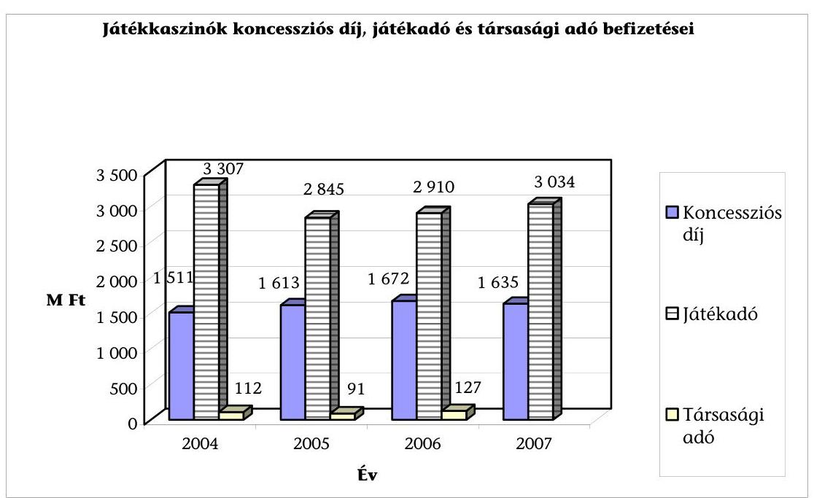

A 2007. évi társasági adóbevallások benyújtási határideje 2008. május 31., az összesített adatok 2008. augusztus végére állnak rendelkezésre.
A koncessziós díjak összegét a koncessziós szerződések alapján évente valorizálják a KSH által közzétett fogyasztói árindexszel.

---

A pénzügyminiszter a befektető üzleti terve és szándéknyilatkozata alapján döntött az I. kategóriájú játékkaszinó 2006. évi pályázati kiírásáról. A koncessziós szerződés megkötésekor azonban nem kellő gondossággal járt el, mivel a játékkaszinó működtetésének megkezdésére nem határozott meg végső határidőt. A szerződést a felek e tekintetében kétszer módosították, utolsó alkalommal 2007. októberében, amelyben a végső határidőt 2011. január 1-én állapították meg. Lemondott továbbá a Konc. tv.-ben foglalt felmondási jogáról arra az esetre, ha a tevékenységének gyakorlását a koncessziós társaság a szerződés aláirásától számított 6 hónapon belül nem kezdi meg, valamint nem kötött ki biztosítékot (pl. kötbér) a beruházás elmaradására vagy időbeli elhúzódására.

A Konc. tv. 21. § (3) kimondja, hogy „ha a koncessziós társaság a koncessziós szerződés megkötésétől, illetőleg a hatósági engedély visszavonásáról rendelkező, valamint a tevékenység gyakorlását megtiltó határozat közlésétől számított hat hónapon belül nem válik a tevékenység gyakorlására jogosulttá, az állam, illetőleg az önkormányzat nevében eljáró személy, illetve szerv a koncessziós szerződést felmondhatja."

A pályázatra a szándéknyilatkozatot adó befektetőn kívül más pályázó nem jelentkezett, a koncessziós szerződést 2006. augusztusában megkötötték.

A költségvetésnek mindaddig nem keletkezik koncessziós díjból és játékadóból bevétele, amíg a játékkaszinó nem kezdi meg működését, ugyanakkor a földrajzi területre játékkaszinó üzemeltetésére kizárólagossági joggal rendelkezik. A beruházás elhúzódása több éven keresztül költségvetési bevétel-elmaradást okoz. A PM álláspontja szerint viszont a beruházás elhúzódása nem okoz költségvetési bevétel-elmaradást, mivel a régióból nem jeleztek igényt más kaszinó működtetésére.

Budapest, 2008. szeptember 18.

Melléklet: $\quad 2 \mathrm{db} \quad 12$ lap
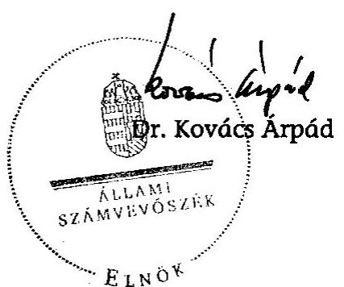

---

# ÉSZREVÉTELEK

---

# $V-20-5112007$ 

a V-20-53/2007-2008. sz. jelentéshez

## H-1051 BUDAPEST V., JÓZSEF NÁDOR TÉR 2-4. POSTACÍM: 1369 BUDAPEST, PUSZTAFIÓK 481.

TELEFON: (36-1) 327-2159, (36-1) 327-2141
FAX: (36-1) 318-0738

## PÉNZÜGYMINISZTER

## Dr. Kovács Árpád úr

elnök

Állami Számvevőszék
Budapest
Apáczai Csere János utca 10.
1052

E-MAIL: janos.veres@pm.gov.hu
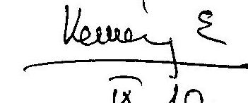

Iktatószám: 4103/24/2008.

## 09.10

## 09.10

## Tisztelt Elnök Úr!

A költségvetést megillető játékadó beszedési rendszerének ellenőrzéséről szóló - V-20-050/2007-2008. iktatószámú levele mellékleteként megküldött számvevői jelentést köszönettel megkaptam. Az abban foglaltakkal kapcsolatban a következő észrevételeket teszem.

1. A jelentés 20. oldalának 2. bekezdése szerint a szerencsejáték szervezéséről szóló 1991. évi XXXIV. törvény (Szjtv.) lehetőséget biztosít arra, hogy olyan játéktermek is használhassák a kaszinó megnevezést, amelyek 20%-kal magasabb mértékű játékadót fizetnek, de koncessziós díjat nem. A költségvetés számára bevétel-elmaradást jelent, hogy a magasabb összegű játékadó nem ellentételezi a koncessziós díj alóli mentesülés miatti bevételkiesést. Az e-kaszinókból befolyt játékadó összege 2007-ben 228,5 M Ft volt, amelyben a magasabb adómérték miatti költségvetési bevétel-növekedés mindössze 45,8 M Ft. Ez megkérdőjelezi az e-kaszinó megnevezés használatának célszerűségét.
Az elektronikus kaszinó megjelölés használatával kapcsolatban fontos hangsúlyozni, hogy nem játékkaszinók üzemeltetését teszi lehetővé az Szjtv. elektronikus kaszinóként, így nem beszélhetünk a koncessziós díjhoz kapcsolódó költségvetési bevétel-elmaradásról sem. A szabályozás célja nem többletbevételek realizálása volt, hanem a kaszinó elnevezés használatával kapcsolatos vita kompromisszumos kezelése. Egyébiránt, azzal, hogy egy új "játéktípus" lehetőségét teremtette meg a jogalkotó, a költségvetés számára többletbevételek keletkeztek. Jelenleg valóban csak 2 engedély van kiadva elektronikus kaszinó működtetésére, de több kérelem elbírálás alatt áll, így látszik igény a törvény által biztosított lehetőségek kihasználására. Fentiek alapján kérem a megállapítás törlését.
A jelentés 16. oldala továbbá ajánlja a pénzügyminiszternek, hogy vizsgáltassa meg a költségvetési összefüggésekre figyelemmel az e-kaszinó névhasználat célszerűségét, és tegye meg a szükséges intézkedéseket. Indokaim alapján véleményem szerint ezen ajánlás szükségtelen, így kérem törlését.
2. A jelentés 24. oldalának utolsó bekezdése szerint a Szerencsejáték Felügyelet állami adóhatóságba történő integrációjának „az állami hatósági funkció egységesítése" célkitűzése az ellenőrzés területén csak az Szjtv. 2008. január 1-jétől hatályos módosításával vált lehetővé, amely szerint a regionális igazgatóságok adóellenőrei is bevonhatók a szerencsejáték-szervezés ellenőrzésébe.

---

Véleményem szerint a hatósági funkció egységesítése megtörtént, mivel az állami adóhatóság, az illetékhivatalok és a Szerencsejáték Felügyelet feladatait 2007. január 1-jétől egy szerv látja el. 2008. január 1-jétől csak az ellenőrzés hatékonyabbá tételére került sor azzal, hogy az állami adóhatóság központi hivatalának ellenőrein túl a regionális igazgatóságok ellenőrei is jogosultak a szerencsejáték szervezésére vonatkozó jogszabályok betartásának ellenőrzésére. Fentiek alapján kérem a megállapítás törlését.
3. A jelentés 13. oldalának 1. bekezdése szerint a lóversenyfogadásra és a játékkaszinók működtetésére vonatkozó koncessziós pályázatok kiírását a Pénzügyminisztérium nem alapozta meg számításokkal, elemzésekkel.
Álláspontom szerint ezen megállapítást a jelentés részletes megállapításai nem támasztják alá, így kérem törlését.
A jelentés 42. oldalának 2. bekezdése szerint a Pénzügyminisztérium a lóversenyzés helyzetének rendezésére irányuló intézkedései eredményességének elmaradását azzal indokolta, hogy tájékoztatást nyújtott az 1999 óta tett intézkedésekről. A tájékoztatás a jelentés korábbi tervezetében szereplő azon megállapítást volt hivatott cáfolni, hogy a pénzügyminiszter 2006-ig nem tett semmit a lóverseny ágazat rendbetétele érdekében. Ez a megállapítás a jelentésben már nem szerepel. Másrészről pedig a Pénzügyminisztérium intézkedései azért voltak eredménytelenek, mivel a lóversenyfogadás és bukmékeri rendszerű fogadás koncesszióba adására, illetve a Nemzeti Lóverseny Kft. és a Magyar Lóversenyfogadást Szervező Kft. privatizálására irányuló pályázatokat eredménytelennek kellett minősíteni. Fentiek alapján kérem a bekezdés törlését.
4. A jelentés 43. oldalának „Játékkaszinók" címet követő 1. bekezdése szerint a Szerencsejáték Zrt. (SzZrt.) - szindikátusi szerződésben - az üzemeltetési jog gyakorlását - a leányvállalat keretein belül - egy nem állami többségi tulajdonú gazdasági társaság számára biztosítja.
Fontosnak tartom jelezni,
 hogy törvényesen kizárólag az SzZrt. leányvállalata működtetheti a játékkaszinót, tehát az üzemeltetési jogot is csak ezen társaság gyakorolhatja. A szöveg pontosítása érdekében javaslom a megállapítás következő tartalmú módosítását: „Az SzZrt. leányvállalata - szindikátusi szerződés alapján - az üzemeltetés során igénybe veszi egy nem állami többségi tulajdonú gazdasági társaság szolgáltatásait is."
Fentiek alapján kérem a jelentés 16. oldalán a pénzügyminiszter számára tett ajánlás módosítását is az alábbiak szerint: „Vizsgáltassa meg a költségvetési összefüggésekre figyelemmel a játékkaszinók Szerencsejáték Zrt. leányvállalatai által, alanyi jogon (nem koncessziós szerződés útján) történő üzemeltetésének célszerűségét és tegye meg a szükséges intézkedéseket."

Fentiek alapján kérem javaslataim szíves figyelembe vételét!

Budapest, 2008. szeptember 5.

Üdvözlettel:
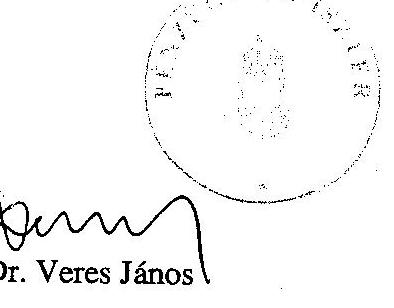

---

# Dr. Veres János úr 

miniszter
Pénzügyminisztérium

## Budapest

## Tisztelt Miniszter Úr!

Köszönettel megkaptam a költségvetést megillető játékadó beszedési rendszerének ellenőrzéséről készült jelentésünkre adott észrevételeit és azokkal kapcsolatban - levele sorrendjében - a következőkről tájékoztatom.

Az „e-casino" névhasználat bevezetésekor a jogalkotó célul tűzte ki, hogy „a játékkaszinókhoz hasonló méretű és hasonló színvonalú szolgáltatást nyújtó játéktermek elnevezése utaljon a minőségi játéklehetőségre, mégis összetéveszthetetlen legyen a koncesszió, illetve miniszteri engedélyező nyilatkozat alapján működő, szigorú feltételeknek megfelelő és jelentős játékadó fizetési terhet viselő játékkaszinókkal". Megítélésünk szerint az e-casino névhasználat nem elégíti ki ezeket a feltételeket. Ezt támasztja alá, hogy az APEH Szerencsejáték Ellenőrzési Főosztályának jelentése is megállapítja, hogy a koncessziós díjat fizető kaszinóknak egyre nagyobb konkurenciát jelentenek az e-casino-k. A költségvetés számára ugyanakkor bevételelmaradást jelent, hogy a magasabb összegű játékadó nem ellentételezi a koncessziós díj alóli mentesülés miatti bevételkiesést. A PM a névhasználat bevezetésekor a költségvetés számára mintegy 1 Mrd Ft többletbevételt prognosztizált, ami azonban 2007-ben mindössze 45,8 MFt-ot jelentett. Ennek következtében továbbra is úgy ítélem meg, hogy célszerű lenne - éppen költségvetési összefüggésekre figyelemmel - az e-casino név használatának felülvizsgálata. Megjegyzem, hogy a Miniszter úrnak észrevételezésre megküldött jelentés tartalmazza a PM névhasználatra vonatkozó álláspontját.

A jelentés 24. oldalának utolsó bekezdésében rögzítjük, hogy az „állami hatósági funkció egységesítése" célkitűzés alapjaiban megvalósult. Ugyanakkor kétségtelen tény, hogy a regionális igazgatóságok adóellenőreinek bevonása a szerencsejáték ellenőrzésébe csak az Szjtv. 2008. január 1-jétől hatályos módosításával vált lehetővé, vagyis az adóellenőrök helyszíni adóellenőrzés során csak 2008-tól jogosultak a játéktermek működésének

---

szabályosságát is ellenőrizni. Ezt megelőzően csak a Szerencsejáték Felügyelet, valamint a Vám- és Pénzügyőrség végezhetett ellenőrzést a területen.

A jelentés összefoglaló részében (13. oldal 1. bekezdés) szereplő „A lóversenyfogadásra és a játékkaszinók működtetésére vonatkozó koncessziós pályázatok kiírását a PM nem alapozta meg számításokkal, elemzésekkel." mondatot a részletes megállapítások 5.1 és 5.2 bekezdésében írottak alapozzák meg: a PM az ellenőrzés számára nem tudott átadni olyan dokumentumokat, amelyből megállapítható lenne, hogy milyen számításokkal, elemzésekkel támasztották alá a lóversenyfogadás szervezésének koncesszióba adására kiírt pályázatban meghatározott koncessziós díj összegét, és ezek hiányában a törvényi minimumon való kiírás megalapozottsága, illetve indokoltsága nem állapítható meg; a PM az I. kategóriájú játékkaszinó működtetésére 2006-ban kiírt pályázatát számításokkal nem alapozta meg, a kiírást a befektető igénye szerint, annak üzleti terve és szándéknyilatkozata alapján készítette el.

Miniszter úr észrevételei alapján a lóversenyezés helyzetének rendezésére tett 2.b. javaslatot, valamint a jelentés 43. oldalán a „Játékkaszinók" címet követő 1. bekezdést módosítottam, a 42. oldal 2. bekezdését pedig töröltem.

Végezetül tájékoztatom Miniszter urat, hogy az ellenőrzésről készült jelentést - kialakult gyakorlatunk szerint - észrevételével és az arra adott válaszommal együtt küldöm meg az Országgyűlés elnökének, az illetékes bizottságai elnökeinek és a miniszterelnöknek.

Budapest, 2008. szeptember 11.
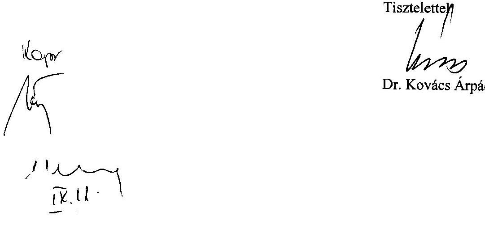

---

# Miniszterelnöki Hivatal   Államtitkár 

I-1/6304/2(2008)
Ügyintéző: Galambos Éva
Hiv.sz.: V-20-040/2008.

## Bihary Zsigmond úrnak, főigazgató

Állami Számvevőszék

## Budapest

Apáczai Csere János u. 10.

## Tisztelt Főigazgató Úr!

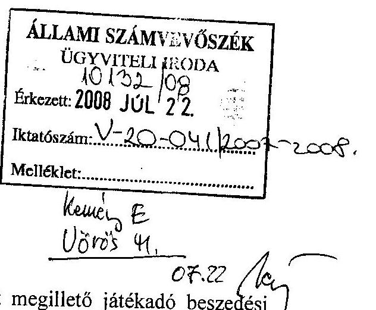

A jelentésben foglalt megállapítások, javaslatok közül néhány különösen figyelemfelkeltő volt:

- Az illegális szerencsejátékok fogalomkörének tisztázatlansága indokolja megvizsgálni a technikai eszköz rendelkezésre bocsátásával foglalkozók büntethetőségét, amennyiben az illegális on-line szerencsejáték szervezését segítik. Továbbgondolva a javaslatot annak lehetőségét is célszerű megvizsgálni, hogy milyen előírások segítenék a saját technikai eszközüket rendelkezésre bocsátók részére az illegális on-line szerencsejáték szervezésének megakadályozását.
- A szerencsejáték tevékenységet végző vállalkozásoknak évente mintegy 15-20%-a került az APEH látókörébe ellenőrzés, illetve adatgyűjtés címén. Ez rendkívül alacsony szám, amely megváltoztatása sürgős intézkedést igényel.
- Indokolt módosítani az Szjtv. bírságolási előírásait, még pedig oly módon, hogy amennyiben több alkalommal ugyanazon ok miatt büntetnek meg egy játékszervezőt, lehetőség legyen differenciált büntetés kiszabására.
- „A pénzügyminiszter a koncessziós pályázatok kiírásakor, illetve a szerződések megkötésénél nem érvényesítette teljes körűen a költségvetési érdekeket." Ez a véleményem szerint túlzó megfogalmazás, hiszen a pénzügyminiszternek a koncessziós szerződésekkel kapcsolatos megközelítési módja magyarázható részben a Szerencsejáték Zrt.-vel már megkötött és 2012-ig érvényes szerződésekkel, de a piac és a befektetők igényének alakulásával is.

---

Segítő észrevételeit köszönöm. A 2008. évi jogalkotási munka során törekszünk a lehető legteljesebb mértékben figyelembe venni a hivatkozott jelentésükben foglalt megállapításokat és javaslatokat.

Budapest, 2008. június 17.
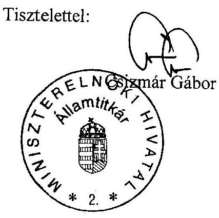

---

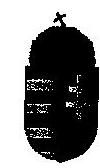
a V-20-53/2007-2008. sz. jelentéshez
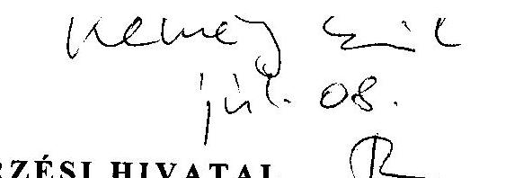

ADÓ- ÉS PÉNZÜGYI ELLENŐRZÉSI HIVATAL
Elnök

Iktatószám: 4006860509/2008

Bihary Zsigmond úrnak
főigazgató
Állami Számvevőszék

Budapest

Tisztelt Főigazgató Úr!

ÁLLAMI SZÁMVEVŐSZÉK
CCTY 2008
Érkezett 2008. júl. 08.
Iktatószám: V-20-035/2008-2008
Melléklet: 0205. 147

A költségvetést megillető játékadó beszedési rendszerének ellenőrzéséről készített számvevőszéki jelentéshez észrevételt nem kívánok tenni.

Budapest, 2008. július 2.

Tisztelettel:

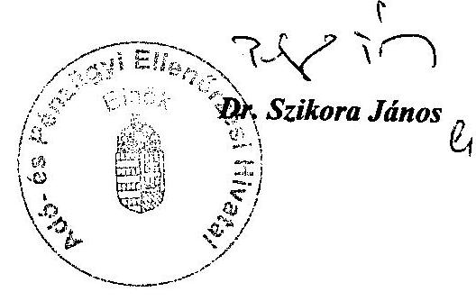

---

# VÁM- ÉS PÉNZÜGYŐRSÉG ORSZÁGOS PARANCSNOKA 

Szám: 32.050-8/2008. VPOP XI. Hiv. szám: V-20-039/2008.

Bihary Zsigmond főigazgató úr részére

Állami Számvevőszék Budapest

Tisztelt Főigazgató Úr!

Tárgy: A költségvetést megillető játékadó beszedési rendszerének ellenőrzése észrevétel megküldése

ÁLLAM: $\qquad$
$\qquad$
$\qquad$
$\qquad$
Érkeze: 2008 JUL 22
Iktató: $\qquad$ V-20-04-1/2008-2008
Melléklet: $\qquad$
$\qquad$
$\qquad$ Kevély &
$\qquad$ 07-12/12
Hivatkozott számon megküldött, a költségvetést megillető játékadó beszedési rendszerének ellenőrzéséről szóló jelentéstervezet 3.2.4 pont 6. bekezdésének lábjegyzettel történő kiegészítésére vonatkozó tájékoztatását köszönettel megkaptam. A kiegészítésre tekintettel tájékoztatom, hogy a V-20-033/2008. számú számvevői jelentéstervezettel kapcsolatban további észrevételt nem teszek.

Budapest, 2008. július 22.
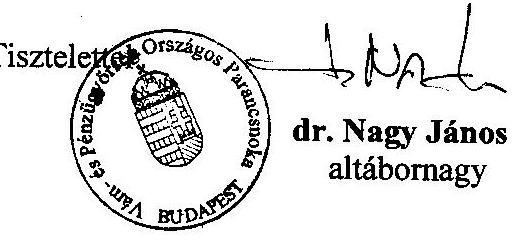

---

# TANÚSÍTVÁNYOK   (1-6.ig)

---

# Tanúsítványok jegyzéke 

| Sorsz.: | Megnevezés |
| :--: | :-- |
| 1. sz. | az elkobzott készülékekről (2004-2007) |
| 2/a-2/d. sz. | a szerencsejáték szervezőkről (2004, 2005, 2006, 2007) |
| 3. sz. | a játéktermek és pénznyerő automaták üzemeltetésére vonatkozó adatokról (2004-2007) |
| 4/a-4/b. sz. | a szerencsejátékok játékadó fizetési kötelezettségeiről és azok teljesítéséről (2004-2005, 2006-2007) |
| 5/a-5/d. sz. | a játéktípusonkénti hatósági tevékenységről (2004, 2005, 2006, 2007) |
| 6. sz. | az APEH játékadót érintő adóellenőrzéseinek eredményességéről (2004-2007) |

---

# Tanúsítvány

## az elkobzott készülékekről

### 2004-2007

|  Időszak | Elkobzó határozatok száma | Elkobzó határozatokban szereplő gépek száma | Elkobzott gépek száma | Az elkobzott gépekből |  |  |   |
| --- | --- | --- | --- | --- | --- | --- | --- |
|   |  |  |  | értékesített | megsemmisített | eltűnt | dec. 31-én még tárolt (helyszín megnevezése)  |
|  2004 | 29 | 39 | 35 | - | 29 | - | 6 illetékes polgármesteri hivatal  |
|  2005 | 18 | 27 | 24 | - | 17 | - | 7 illetékes polgármesteri hivatal  |
|  2006 | 19 | 23 | 21 | 1 | 12 | - | 8 illetékes polgármesteri hivatal  |
|  2007 | 15 | 28 | 28 | - | 20 | - | 8 illetékes polgármesteri hivatal  |

Fenti adatok hitelességét igazolom.

2008. március 3.

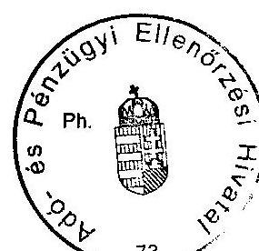

---

# Tanúsítvány a szerencsejáték szervezőkről 2004

|  Játéktípus | Szervezéssel foglalkozó vállalkozások száma jan. 1-én db | Megszünt cégek száma |  |  | Megszünt vállalkozások hátraléka | A hátralékból játékadó | Szervezéssel foglalkozó vállalkozások száma dec. 31-én db  |
| --- | --- | --- | --- | --- | --- | --- | --- |
|   |  | hatósági jogkörrel megszüntetett db | végelszámolással megszüntetett db | felszámolással megszüntetett db | E Ft | E Ft | E Ft  |
|  Sorsolásos | 1 |  |  |  |  |  | 1  |
|  Fogadás | 2 |  |  |  |  |  | 2  |
|  Kaszinó | 5 |  |  |  |  |  | 5  |
|  Pénznyerő automatik | 1 097 | 19 | 4 | 17 | 43 714 | 21 062 | 1 194  |
|  Játékterem |  |  |  |  |  |  |   |
|  Ajándék sorsolás* |  |  |  |  |  |  | 448  |
|  Összesen | 1 105 | 19 | 4 | 17 | 43 714 | 21 062 | 1 650  |

- Az ajándéksorsolás szervezőinek száma nem köthető az év első napjához. Az év végi adat: az év során bejelentést tevő ügyfelek száma

Fenti adatok hitelességét igazolom.

2008. március 21.

---

2/b. sz. tanúsítvány a V-20-53/2007-2008. sz. jelentéshez

# Tanúsítvány a szerencsejáték szervezőiről 2005

|  Játéktípus | Szervezéssel foglalkozó cégek száma jan. 1-én db | Megszünt cégek száma |  |  | Megszünt cégek hátraléka | A hátralékból játékadó | Szervezéssel foglalkozó cégek száma dec. 31-én db  |
| --- | --- | --- | --- | --- | --- | --- | --- |
|   |  | hatósági jogkörrel megszüntetett db | végelszámolással megszüntetett db | felszámolással megszüntetett db | E Ft | E Ft | E Ft  |
|  Sorsolásos | 1 |  |  |  |  |  | 1  |
|  Fogadás | 2 |  |  |  |  |  | 2  |
|  Kaszinó | 5 |  |  |  |  |  | 5  |
|  Pénznyerő automatik | 1 194 | 11 | 6 | 22 | 78 396 | 21 202 | 1 217  |
|  Játékterem |  |  |  |  |  |  |   |
|  Ajándék sorsolás* |  |  |  |  |  |  | 414  |
|  Összesen | 1 202 | 11 | 6 | 22 | 78 396 | 21 202 | 1 639  |

- Az ajándéksorsolás szervezőinek száma nem köthető az év első napjához. Az év végi adat: az év során bejelentést tevő ügyfelek száma
 száma

Fenti adatok hitelességét igazolom.

2008. március 21.

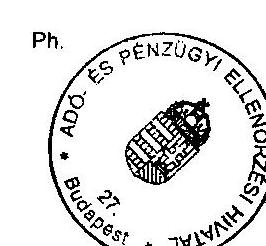

---

# Tanúsítvány a szerencsejáték szervezőiről 2006

|  Játéktípus | Szervezéssel foglalkozó cégek száma jan. 1-én db | Megszünt cégek száma |  |  | Megszünt cégek hátraléka | A hátralékból játékadó | Szervezéssel foglalkozó cégek száma dec. 31-én db  |
| --- | --- | --- | --- | --- | --- | --- | --- |
|   |  | hatósági jogkörrel megszüntetett db | végelszámolással megszüntetett db | felszámolással megszüntetett db | E Ft | E Ft | E Ft  |
|  Sorsolásos | 1 |  |  |  |  |  | 1  |
|  Fogadás | 2 |  |  |  |  |  | 2  |
|  Kaszinó | 5 |  |  |  |  |  | 5  |
|  Pénznyerő automatik | 1 217 | 21 | 8 | 21 | 103 406 | 25 259 | 1 208  |
|  Játékterem |  |  |  |  |  |  |   |
|  Ajándék sorsolás* |  |  |  |  |  |  | 407  |
|  Összesen | 1 225 | 21 | 8 | 21 | 103 406 | 25 259 | 1 623  |

- Az ajándéksorsolás szervezőinek száma nem köthető az év első napjához. Az év végi adat: az év során bejelentést tevő ügyfelek száma

Fenti adatok hitelességét igazolom.

2008. március 21.

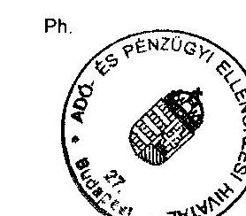

---

# Tanúsítvány a szerencsejáték szervezőiről 2007

|  Játéktípus | Szervezéssel foglalkozó cégek száma jan. 1-én db | Megszünt cégek száma |  |  | Megszünt cégek (Jogutód nélkül) hátraléka EFt | A hátralékból játékadó EFt | Szervezéssel foglalkozó cégek száma dec. 31-én db  |
| --- | --- | --- | --- | --- | --- | --- | --- |
|   |  | hatósági jogkörrel megszüntetett db | végelszámolással megszüntetett db | felszámolással megszüntetett db |  |  |   |
|  Sorsolásos | 1 |  |  |  |  |  | 1  |
|  Fogadás | 2 |  |  |  |  |  | 2  |
|  Kaszinó | 5 |  | 1 |  |  |  | 4  |
|  Pénznyerő automatik | 1 208 | 12 | 13 | 19 | 681 975 | 29 370 | 1 198  |
|  Játékterem |  |  |  |  |  |  |   |
|  Ajándék sorsolás* |  |  |  |  |  |  | 363  |
|  Összesen | 1 216 | 12 | 14 | 19 | 681 975 | 29 370 | 1 568  |

- Az ajándéksorsolás szervezőinek száma nem köthető az év első napjához. Az év végi adat: az év során bejelentést tevő ügyfelek száma

Fenti adatok hitelességét igazolom.

2008. március 21.

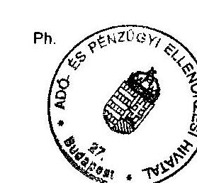

---

# Tanúsítvány

a játéktermek és pénznyerő automaták üzemeltetésére vonatkozó adatokról 2004-2007

|  Megnevezés | 2004 | 2005 | 2006 | 2007  |
| --- | --- | --- | --- | --- |
|  Az APEH nyilvántartása szerint a működő
játéktermek száma db | 19941 | 19305 | 18360 | 17941  |
|  APEH által végzett ellenőrzések száma db
ebből megállapítással zárult ellenőrzés | 17301
3977 | 16812
2361 | 16135
2326 | 13462
1938  |
|  Engedéllyel nem rendelkező egység | - | 2 | 3 | 3  |
|  VP által végrehajtott ellenőrzések száma db
ebből megállapítással zárult ellenőrzés | 6454
10 | 7085
18 | 6366
16 | 5783
34  |
|  Engedéllyel nem rendelkező egység | - | - | - | -  |
|  APEH és VP közös ellenőrzéseinek száma db
ebből megállapítással zárult ellenőrzés | - | - | - | 4238
307  |
|  Engedéllyel nem rendelkező egység | - | - | - | 7  |
|  Bírságoló határozatok száma db | 1633 | 1342 | 1127 | 1826  |
|  Bírságösszeg összesen eFI | 360410 | 243550 | 216680 | 382315  |
|  Büntető eljárás összesen db | 14 | 7 | 7 | 19  |
|  Tevékenységtől végleges eltiltás összesen | 16 | 18 | 9 | 14  |

Fenti adatok hitelességét igazolom. 2008. március 03.

---

4/a. sz. tanúsítvány a V-20-53/2007-2008. sz. jelentéshez

# Tanúsítvány a szerencsejátékok játékadó fizetési kötelezettségeiről és azok teljesítéséről 2004 - 2005 (eFt-ban)

|  Megnevezés | 2004 |  |  |  | 2005 |  |  |   |
| --- | --- | --- | --- | --- | --- | --- | --- | --- |
|   | Számított | Feltárt eltérés | Be nem fizetett | Játékadó befizetés %-ban | Számított | Feltárt eltérés | Be nem fizetett | Játékadó befizetés %-ban  |
|  Sorsolás | 22 145 228 | 0 | 0 | 100,00 | 26 144 387 | 0 | 0 | 100,00  |
|  Fogadás | 1 796 902 | 0 | 0 | 100,00 | 1 889 157 | 0 | 0 | 100,00  |
|  Kaszinó | 3 247 394 | 0 | 0 | 100,00 | 2 918 932 | 0 | 0 | 100,00  |
|  Ajándéksorsolás | 32 790 | 920 | 920 | 97,20 | 16 493 | 8 100 | 8 100 | 50,90  |
|  Pénznyerő automatik | 33 839 100 | 0 | 0 | 100,00 | 36 213 075 | 3 100 | 3 100 | 99,99  |
|  Összesen | 61 061 414 | 920 | 920 | 100,00 | 67 182 044 | 11 200 | 11 200 | 99,98  |

Az ajándéksorsolás esetében az át nem vett nyereményeket kell játékadóként megfizetni. Ez nem tervezhető értékű illetve mértékű összeg. Ellenőrzések és végelszámolások alapján kerül az érték megállapításra.

Fenti adatok hitelességét igazolom.

2008. március 03.

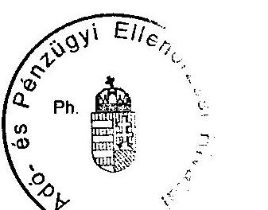

---

# Tanúsítvány a szerencsejátékok játékadó fizetési kötelezettségeiről és azok teljesítéséről 2006-2007 (eFt-ban)

|  Megnevezés | 2006 |  |  |  | 2007 |  |  |   |
| --- | --- | --- | --- | --- | --- | --- | --- | --- |
|   | Számított | Feltárt eltérés | Be nem fizetett | Játékadó befizetés %-ban | Számított | Feltárt eltérés | Be nem fizetett | Játékadó befizetés %-ban  |
|  Sorsolás | 25842907 | 0 | 0 | 100,00 | 26589851 | 0 | 0 | 100,00  |
|  Fogadás | 1527184 | 0 | 0 | 100,00 | 1524255 | 0 | 0 | 100,00  |
|  Kaszinó | 2893715 | 0 | 0 | 100,00 | 3060759 | 0 | 0 | 100,00  |
|  Ajándéksorsolás | 12753 | 2357 | 2357 | 81,52 | 5815 | 0 | 0 | 100,00  |
|  Pénznyerő
automaták | 40970600 | 37500 | 37500 | 99,91 | 40165600 | 80461 | 80461 | 98,00  |
|  Összesen | 31247159 | 39857 | 39857 | 99,94 | 71346280 | 80461 | 80461 | 99,89  |

Az ajándéksorsolás esetében az át nem vett nyereményeket kell játékadóként megfizetni. Ez nem tervezhető értékű illetve mértékű összeg. Ellenőrzések és végelszámolások alapján kerül az érték megállapításra.

Fenti adatok hitelességét igazolom. 2008. március 03.

---

# Tanúsítvány a játéktípusonkénti hatósági tevékenységről 2004

|  Játéktípus | Összesen
szankciós
határozat
száma (db)** | b-ből
végleges
eltöltés | b-ből
engedély
visszavonás | b-ből
engészervezői
tevékenység
felüggesztés | b-ből
pénznyerő
automata
újvahitelseitás | b-ből
szervezői
tevékenység
megszüntetése | b-ből
végelsz. al
kapcsolatos
határozat | b-ből
bírságot
kiszabó
határozat* | Kiszabott
bírság
E Ft | Befolyt
bírság
E Ft | b-ből
büntető
eljárás
kezd. | b-ből
szabálysért.
elj. kezd.
kaját | b-ből
szabálysért.
elj. kezd.
külső | b-ből
figyelmeztetés  |
| --- | --- | --- | --- | --- | --- | --- | --- | --- | --- | --- | --- | --- | --- | --- |
|  a | b | c | d | e | f | g | h | i | j | ja | k | l | m | n  |
|  Sorsolásos | 22 | - | - | - | - | - | 2 | 20 | 7 160 | - | - | - | - | -  |
|  Fogadás | 2 | - | - | - | - | - | - | 2 | 700 | - | - | - | - | -  |
|  Kaszinó | 2 | - | - | - | - | - | - | 2 | 1 600 | - | - | - | - | -  |
|  Pénznyerő
automaták*** | - | - | - | - | - | - | - | - | - | - | - | - | - | -  |
|  Játékterem | 1 935 | 16 | 36 | 114 | 113 | 58 | - | 1 633 | 360 410 | - | 14 | 41 | 13 | 243  |
|  Ajándék
sorsolás | 458 | - | - | - | - | - | 159 | 299 | 10 435 | - | - | - | - | -  |
|  Összesen | 2 419 | 16 | 36 | 114 | 113 | 58 | 161 | 1 956 | 380 305 | 365 113 | 14 | 41 | 13 | 243  |

*A bírsághatározatok és a bírságösszegek az Szjiv. és a Ket. szerinti bírságok adatait is tartalmazzák.

**Egy szankciós határozatban két intézkedés is történik.

***Nem ellenőrizzük és nem szankcionáljuk külön, ezért a pénznyerő automatákra vonatkozó darabszámot is a játéktermek nél feltüntetett adat tartalmazza.

Fenti adatok hitelességét igazolom.

2008. március 03.

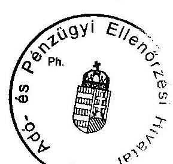

---

5/b.
 sz. tanúsítvány a V-20-53/2007-2008. sz. jelentéshez

### Tanúsítvány a játéktípusonkénti hatósági tevékenységről 2005

|  Játéktípus | Összesen szankciós határozat száma (db)** | b-ből végleges eltiltás | b-ből engedély visszavonás | b-ből eng/szervező tevékenység felfüggesztés | b-ből pénznyerő automata újrahítelesítés | b-ből szervező tevékenység megszüntetése | b-ből végelsz. al kapcsolatos határozat | b-ből bírságot kiszabó határozat* | Kiszabott bírság E Ft | Befolyt bírság E Ft | b-ből büntető eljárás kezd. | b-ből szabálysért. elj. kezd. saját | b-ből szabálysért. elj. kezd. külső | b-ből figyelmeztetés  |
| --- | --- | --- | --- | --- | --- | --- | --- | --- | --- | --- | --- | --- | --- | --- |
|  a | b | c | d | e | f | g | h | i | j | jg | k | l | m | n  |
|  Sorsolásos | 30 | - | - | - | - | - | 17 | 13 | 6 000 | - | - | - | - | -  |
|  Fogadás | 22 | - | - | - | - | - | 6 | 16 | 1 320 | - | - | - | - | -  |
|  Kaszinó | 4 | - | - | - | - | - | - | 3 | 800 | - | 1 | - | - | -  |
|  Pénznyerő automaták*** | - | - | - | - | - | - | - | - | - | - | - | - | - | -  |
|  Játékterem | 1 546 | 18 | 65 | 9 | 64 | 56 | - | 1 342 | 243 550 | - | 6 | 50 | 11 | 115  |
|  Ajándék sorsolás | 324 | - | - | - | - | - | 81 | 243 | 11 045 | - | - | - | - | -  |
|  Összesen | 1 926 | 18 | 65 | 9 | 64 | 56 | 104 | 1 617 | 262 715 | 266 007 | 7 | 50 | 11 | 115  |

*A bírsághatározatok és a bírságösszegek az Szjiv. és a Ket. szerinti bírságok adatait is tartalmazzák.

**Egy szankciós határozatban két intézkedés is történik.

***Nem ellenőrizzük és nem szankcionáljuk külön, ezért a pénznyerő automatákra vonatkozó darabszámot is a játéktermek nél feltüntetett adat tartalmazza.

Fenti adatok hitelességét igazolom.

2008. március 03.

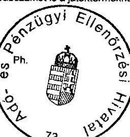

---

5/c. sz. tanúsítvány a V-20-53/2007-2008. sz. jelentéshez

# Tanúsítvány a játéktípusonkénti hatósági tevékenységről

2006

|  Játéktípus | Összes szankciós határozat száma (db)** | b-ből végleges eltiltás | b-ből engedély visszavonás | b-ből eng/szervezői tevékenység felfüggesztés | b-ből pénznyerő automata újrahitelesítés | b-ből szervezői tevékenység megszüntetése | b-ből végelsz. al kapcsolatos határozat* | b-ből bírságot kiszabó határozat* | Kiszabott bírság E Ft | Befolyt bírság E Ft | b-ből büntető eljárás kezd. | b-ből szabálysért. elj. kezd. saját | b-ből szabálysért. elj. kezd. külső | b-ből figyelmeztetés  |
| --- | --- | --- | --- | --- | --- | --- | --- | --- | --- | --- | --- | --- | --- | --- |
|  a | b | c | d | e | f | g | h | i | j | ja | k | l | m | n  |
|  Sorsolásos | 25 | - | - | - | - | - | 10 | 14 | 7 750 | - | - | - | - | -  |
|  Fogadás | 29 | - | - | - | - | - | - | 28 | 6 700 | - | 1 | - | - | -  |
|  Kaszinó | 1 | - | - | - | - | - | - | 1 | 600 | - | - | - | - | -  |
|  Pénznyerő automatik*** | - | - | - | - | - | - | - | - | - | - | - | - | - | -  |
|  Játékterem | 1 556 | 9 | 56 | 67 | 145 | 114 | 1 | 1 127 | 216 680 | - | 6 | 31 | - | 86  |
|  Ajándék-sorsolás | 319 | - | - | - | - | - | 83 | 188 | 22 870 | - | - | - | - | -  |
|  Összesen | 1 930 | 9 | 56 | 67 | 145 | 114 | 94 | 1 358 | 254 600 | 214 686 | 7 | 31 | 0 | 86  |

*A bírsághatározatok és a bírságösszegek az Szjiv. és a Ket. szerinti bírságok adatait is tartalmazzák.

**Egy szankciós határozatban két intézkedés is történik.

***Nem ellenőrizzük és nem szankcionáljuk külön, ezért a pénznyerő automatákra vonatkozó darabszámot is a játéktípusonkénti feltüntetett adat tartalmazza.

Fenti adatok hitelességét igazolom.

2008. március 03.

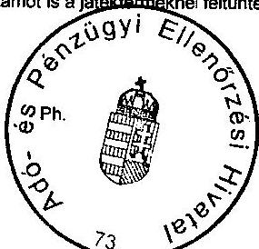

---

# Tanúsítvány a játéktipusonkénti hatósági tevékenységről 2007

|  Játéktípus | Összes szankciós határozat száma (db)** | b-ből végleges eltiltás | b-ből engedély visszavonás | b-ből eng/szervezői tevékenység felüggesztés | b-ből pénznyerő automata újrahitelesítés | b-ből szervezői tevékenység megszüntetése | b-ből végelsz. al kapcsolatos határozat* | b-ből bírságot kiszabó határozat* | Kiszabott bírság E Ft | Befolyt bírság E Ft | b-ből büntető eljárás kezd. | b-ből szabálysért. elj. kezd. saját | b-ből szabálysért. elj. kezd. külső | b-ből figyelmeztetés  |
| --- | --- | --- | --- | --- | --- | --- | --- | --- | --- | --- | --- | --- | --- | --- |
|  a | b | c | d | e | f | g | h | i | j | ja | k | l | m | n  |
|  Sorsolásos | 5 | - | - | - | - | - | - | 5 | 4 000 | - | - | - | - | -  |
|  Fogadás | 7 | - | - | - | - | - | - | 7 | 1 600 | - | - | - | - | -  |
|  Kaszinó | 6 | - | - | - | - | - | - | 5 | 3 100 | - | 1 | - | - | -  |
|  Pénznyerő automaták*** | - | - | - | - | - | - | - | - | - | - | - | - | - | -  |
|  Játékterem | 2 109 | 14 | 57 | 116 | 132 | 48 | - | 1 826 | 382 315 | - | 19 | 27 | 0 | 20  |
|  Ajándék sorsolás | 206 | - | - | - | - | - | 64 | 104 | 26 360 | - | - | - | - | -  |
|  Összesen | 2 333 | 14 | 57 | 116 | 132 | 48 | 64 | 1 947 | 417 375 | 345 956 | 20 | 27 | 0 | 20  |

*A bírsághatározatok és a bírságösszegek az Szjiv. és a Ket. szerinti bírságok adatait is tartalmazzák.

**Egy szankciós határozatban két intézkedés is történik.

***Nem ellenőrizzük és nem szankcionáljuk külön, ezért a pénznyerő automatákra vonatkozó darabszámot is a játéktermeknél feltüntetett adat tartalmazza.

Fenti adatok hitelességét igazolom.

2008. március 03.

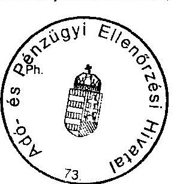

---

### Tanúsítvány az APEH játékadót érintő adóellenőrzéseinek eredményességéről 2004-2007

### 6. sz. tanúsítvány a V-20-53/2007-2008. sz. jelentéshez

|  Év | Játékadó bevallást benyújtó adóalanyok száma | Játékadót érintő átfogó és adónem ellenőrzések* | Játékadót érintő téma, cél, egyéb ellenőrzések* | Megállapítással zárult ellenőrzések száma** | Játékadóban megállapított nettó adókülönbözet | Megállapítással összefüggésben kiszabott bírság*** | Megállapítással zárult ellenőrzésből jogerőssé vált****  |
| --- | --- | --- | --- | --- | --- | --- | --- |
|   |  | száma | aránya | száma | aránya |  | száma  |
|   | db | db | % | db | % | db | e Ft  |
|  1 | 2 | 3 | 4 | 5 | 6 | 7 | 8  |
|  2004 | 1 232 | 74 | 6,0 | 174 | 14,1 | 19 | 3 055  |
|  2005 | 1 295 | 50 | 3,9 | 110 | 8,5 | 18 | 1 689  |
|  2006 | 1 296 | 67 | 5,2 | 179 | 13,8 | 32 | 9 339  |
|  2007 | 1 292 | 55 | 4,3 | 140 | 10,8 | 17 | 2 005  |

* játékadó kötelezetti körben végzett adatgyűjtések és egyes adókötelezettségek ellenőrzéseinek száma ** adóellenőrzésekből a játékadónemben tett megállapítások száma, egyéb ellenőrzésekből minden megállapítással zárult ellenőrzés *** a bírság összege az érintett ellenőrzések során kiszabott összes bírságot tartalmazza, nem különíthető el a játékadó kapcsán kiszabott szankció **** a jogerős adatok az adott évben jogerőssé vált megállapításokra vonatkoznak, függetlenül az ellenőrzés befejezésének időpontjától

Fenti adatok hitelességét igazolom.

Budapest, 2008.

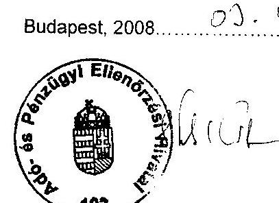

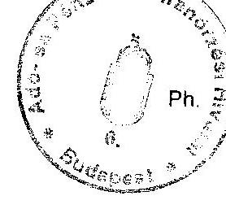

aláírás
