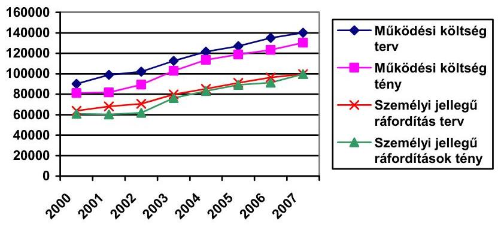
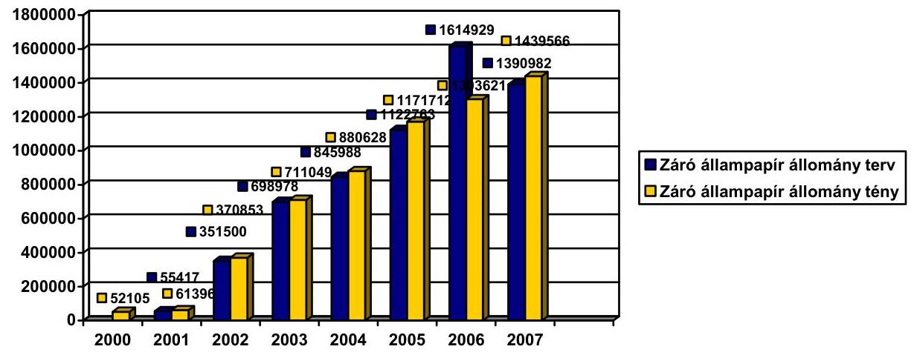
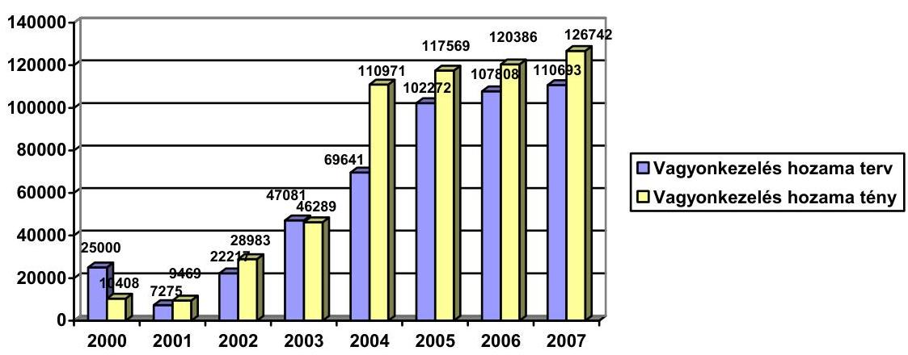
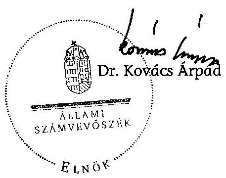
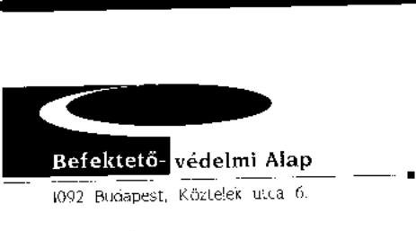
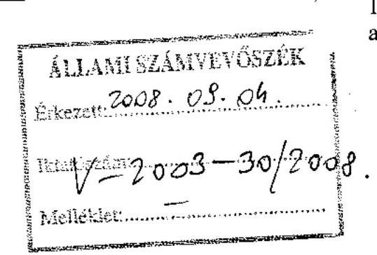
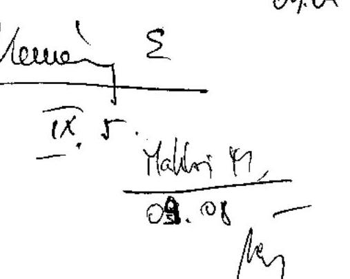

# ÁLLAMI   SZÁMVEVŐSZÉK 

## JELENTÉS

a Befektető-védelmi Alap működésének ellenőrzéséről

---

2. Államháztartás Központi Szintjét Ellenőrző Igazgatóság
2.1. Teljesítmény Ellenőrzési Főcsoport
Iktatószám: V-2003-31/2008.
Témaszám: 900
Vizsgálat-azonosító szám: V0410
Az ellenőrzést felügyelte:
Bihary Zsigmond
főigazgató
Az ellenőrzés végrehajtásáért felelős:
Kemény Emil
főigazgató-helyettes
Az ellenőrzést vezette:
Makkai Mária
főcsoportfőnök-helyettes
Az ellenőrzést végezték:
Osztoics Danica Nagy Ákos
számvevő
számvevő

# A témához kapcsolódó eddig készített számvevőszéki jelentések: 

címe
sorszáma
Jelentés az Országos Betétbiztosítási Alap, a Befektető-védelmi 0105
Alap, és a Pénzügyi Garancia Alap múködésének ellenőrzéséről

---

# TARTALOMJEGYZÉK 

BEVEZETÉS ..... 5
I. ÖSSZEGZŐ MEGÁLLAPÍTÁSOK, KÖVETKEZTETÉSEK, JAVASLATOK ..... 7
II. RÉSZLETES MEGÁLLAPÍTÁSOK ..... 9

1. A Beva működésének szabályozottsága ..... 9
2. A Beva tevékenysége ..... 11
2.1. A Beva kártalanítási tevékenysége ..... 11
2.2. A Pénzügyi Szervezetek Állami Felügyeletével kötött megállapodásban foglaltak betartása ..... 13
2.3. A peres ügyek alakulása ..... 13
3. A Beva gazdálkodása ..... 14
3.1. A gazdálkodás szabályozottsága ..... 14
3.2. A mérlegfőösszeg, a saját tőke változása és a felvett hitel alakulása ..... 15
3.3. A tagintézetekkel szembeni követelések alakulása ..... 17
3.4. A befektetővédelmi bevételek és ráfordítások alakulása ..... 18
3.5. A tagintézetekkel szemben indított felszámolási eljárásokból származó megtérülés ..... 19
3.6. A múködési költségek alakulása ..... 20
3.7. A vagyonkezelési tevékenység szabályszerűsége és a vagyonkezelésből származó eredmény alakulása ..... 21
3.8. A likvid vagyon és a kártalanítási kötelezettség aránya ..... 23
MELLÉKLETEK
4. sz. A BEVA észrevétele
5. sz. A Beva által kifizetett kártalanítási összegek megtérülési aránya
6. sz. A múködési költségek alakulása
7. sz. A vagyonkezelő által kezelt állampapír állomány, valamint azok hoza- mának alakulása
8. sz. A fedezettségi mutató 2000-2007. évek közötti alakulása

---

.

---

# RÖVIDÍTÉSEK JEGYZÉKE 

| ÁSZ | Állami Számvevőszék |
| :-- | :-- |
| ÁPTF | Állami Pénz- és Tőkepiaci Felügyelet |
| Beva | Befektető-védelmi Alap |
| Épt. | Az értékpapírok forgalomba hozataláról, a befektetési |
|  | szolgáltatásokról és az értékpapír-tőzsdéről szóló 1996. évi |
|  | CXI. törvény |
| Felügyelet | Pénzügyi Szervezetek Állami Felügyelete |
| K\&H Bank Rt. | Kereskedelmi és Hitelbank Rt. |
| MKB Bank Rt. | Magyar Külkereskedelmi Bank Rt. |
| Szt. | A számvitelről szóló 2000. évi C. törvény |
| Tpt. | A tőkepiacról szóló 2001. évi CXX. törvény |

---

.

---

# JELENTÉS 

## a Befektető-védelmi Alap múködésének ellenőrzésről

## BEVEZETÉS

A Befektető-védelmi Alap (továbbiakban: Beva) az értékpapírok forgalomba hozataláról, a befektetési szolgáltatásokról és az értékpapír tőzsdéről szóló 1996. évi CXL törvény (továbbiakban: Épt.) rendelkezéseinek megfelelően a befektetők védelmére, a pénzügyi rendszer stabilitásának egyik meghatározó garanciális elemeként, a törvény erejénél fogva 1997-ben jött létre.

A Beva múködésére vonatkozó alapvető jogszabályi előírásokat 2002. január 1-jétől a tőkepiacról szóló 2001. évi CXX. törvény (továbbiakban: Tpt.) tartalmazza. Az Épt. és a Tpt. is az Állami Számvevőszéket (továbbiakban: ÁSZ) jelölte meg a Beva gazdálkodásának ellenőrzésére.

A Beva jogi személy, székhelye Budapest, irányító szerve a héttagú igazgatóság, a munkaszervezetet az ügyvezető igazgató vezeti.

A Beva feladata a biztosított tevékenységhez kapcsolódóan a kártalanítási öszszeg megállapítása és kifizetése a befektetők részére. A biztosított befektetési és kiegészítő befektetési szolgáltatások a bizományosi tevékenység, a sajátszámlás kereskedés, a portfoliókezelés, a pénzügyi eszközök letéti őrzése, nyilvántartása (kapcsolódó ügyfélszámla vezetés), és a letétkezelés (nyilvántartás, kapcsolódó értékpapír- és ügyfélszámla vezetés).

A kártalanítás felső összeghatára 2004. december 31-ig 1 M Ft volt, ami 2005. január 1-jétől 2 M Ft-ra, 2008. január 1-jétől pedig 6 M Ft-ra emelkedett. 2004. év végéig a kártalanítás a felső összeghatárig 100\%-os mértékű volt, 2005-től az 1 M Ft feletti összegre a kártalanítás 90\%-os arányú ( 1 M Ft-ig 100\%).

A Beva forrásai a tagintézetek csatlakozási díjaiból, éves díjaiból, rendkívüli befizetéseiből, a vagyonkezelés hozamából, a felvett kölcsönből, a felügyeleti bírság törvényben meghatározott részéből, valamint egyéb bevételekből származnak.

Az ÁSZ a Beva múködését 2000-ben átfogó ellenőrzés keretében vizsgálta.
A jelenlegi ellenőrzés célja annak értékelése volt, hogy

- a Beva múködése - tevékenysége és gazdálkodása - megfelelt-e a jogszabályokban és a belső szabályzatokban előírtaknak;

---

- hogyan hasznosultak a korábbi számvevőszéki ellenőrzés megállapításai, javaslatai.

Az ellenőrzés a Beva 2000. és 2007. évek közötti múködésére és gazdálkodására irányult.

Az ellenőrzés végrehajtására a Tpt. 227. § (3) bekezdésében foglaltak adtak jogszabályi alapot.

A jelentést észrevételezésre megküldtük a BEVA igazgatótanács elnökének. Levele másolatát az 1. számú melléklet tartalmazza.

---

# I. ÖSSZEGZŐ MEGÁLLAPÍTÁSOK, KÖVETKEZTETÉSEK, JAVASLATOK 

A Beva múködése megfelelt a törvényi (Épt., Tpt.) rendelkezéseknek, betartotta a források gyűjtésére, a kifizetések és szabad pénzeszközökkel való gazdálkodásra vonatkozó előírásokat. A Beva múködésének 2000-ben végzett ellenőrzéséről szóló ÁSZ jelentésben a Kormánynak és a Beva igazgatóságának megfogalmazott javaslatok teljesültek.

A Beva igazgatóságának összetétele megfelel a Tpt. előírásainak. Az igazgatóság munkáját az ügyrendjében rögzítettek szerint végezte, a határozatokat betartatta. A Beva-nál a függetlenített belső ellenőrzést megbízási jogviszony alapján eljáró külső szakember, éves ellenőrzési terv alapján végezte.

A Beva rendelkezik a múködést és tevékenységét meghatározó szabályzatokkal, azok megfelelnek a jogszabályi előírásoknak.

A Beva múködése óta (1997), 13 társasághoz kötődő kártalanítási ügyből kilenc - az előző ÁSZ vizsgálat által érintett időszakban - 2000 előtt indult, 2002-től új kártalanítási eljárás nem volt. A Beva 2000-2007 közötti gazdálkodását, vagyoni és pénzügyi helyzetét befolyásolta a 2000 előtti években indult kártalanítási kifizetések áthúzódó hatása. A kifizetett kártalanítások következtében a Beva 2000-ben és 2001-ben veszteséges volt. 2002-től - a magasabb díjtételek és a csökkenő kártalanítási igények miatt - nyereségesen múködött. A Beva saját tőkéje a 2000. évi - 2138 M Ft-ról 2007. év végére 1466 M Ft-ra növekedett.

A 13 tagintézet befektetőinek a Beva 2000-2007 között 2,9 Mrd Ft kártalanítást fizetett ki, amelynek 76\%-a a London Bróker Értékpapír Rt.-hez kapcsolódott. (A kifizetett kártalanítás a Beva fennállása alatt kifizetett 4,3 Mrd Ft összes kártalanításnak 67\%-a volt.) Az ügyfelek kártalanítására a Beva vagyona csak részben nyújtott fedezetet, 2001. június-július hónapokban a kifizetések szüneteltek. Ezt a helyzetet a Beva az Épt. és Tpt. által lehetővé tett maximális mértékű éves és rendkívüli díjfizetés előírásával, valamint 2,8 Mrd Ft - a Kormány készfizető kezesség vállalása mellett - felvett hitellel rendezte. A Beva a hiteltartozását és annak kamatát ( 1,2 Mrd Ft) - a 2011. évi lejáratot megelőzően -2007-ben teljes mértékben visszafizette. A fedezethiány miatti késedelmes kártalanítási kifizetések következtében a Beva-nak a befektetők részére 299 M Ft késedelmi kamatfizetést kellett teljesíteni.

A kártalanításra kifizetett összegek 3\%-a ( 116 M Ft ) térült meg. Hat tagintézet felszámolása folyamatban van, a velük szemben fennálló követelések után a Beva 5\% alatti megtérüléssel ( 142 M Ft ) számol. A Beva 1,4 Mrd Ft kártalanítás miatti behajthatatlan követelést írt le.

A Beva szabad pénzeszközeit az Épt. és a Tpt. előírásainak megfelelően állampapírban tartotta. A Beva vagyona 2002-től folyamatosan és egyenletesen emelkedett, 2007. év végén az állampapírok záró állománya 1,4 Mrd Ft volt. A

---

vagyonkezelésből származó hozam 2000-ben 10 M Ft, 2007-ben 127 M Ft volt, 2004. évtől a hozam fedezte a múködési költségek 98-99\%-át.

A Beva vagyonkezeléssel - az alapkezelési szabályzatának megfelelően - pályázaton kiválasztott vagyonkezelőt bízott meg. Az alapkezelési szabályzat nem írja elő, hogy a letétkezelést - a vagyonkezeléshez hasonlóan - meghatározott időnként pályázat útján válasszák ki vagy bizonyos időszakonként mérjék fel más letétkezelők ajánlatait, ennek következtében a letétkezelő 1997. óta változatlan. Más letétkezelői ajánlatok nélkül az érvényben lévő letétkezelői díj (ami évi 0,05\%) nem minősíthető.

A Beva bevételeinek - likvid vagyonának - 96-99\%-át a tagok rendes éves díj befizetései tették ki. A bevételeket növelte a Felügyelet által a tagintézetek felé kiszabott bírság, ami éves szinten 17-85 M Ft között változott.

A Beva likvid vagyonának és a védett sávban lévő letéteknek fedezeti hányadosa 2007-ben $0,09 \%$ volt, ami az előző három évhez viszonyítva közel 50\%-os csökkenést jelent. Ez azzal függ össze, hogy a Tpt. szerint 6 M Ft-ra emelkedett a biztosított összeg, és azzal együtt a védett letéti állomány is, és 2007-ben a Beva a hiteltartozását visszafizette. A mutató csökkenése arra világít rá, hogy a Beva alapvető céljának - olyan vagyon felhalmozása, amely a kártalanítási kifizetésekhez szükséges - teljesítése a 6 M Ft-ra emelt biztosított összeg függvényében, változatlan díjtételek mellett kockázatot hordoz magában. A Beva tájékoztatása szerint a fedezeti hányados elfogadható átlagos szintjére nemzetközi gyakorlat nem alakult ki.

A Beva gazdálkodását a költségtakarékosság jellemezte. A működési költségek (2007-ben 130 M Ft ) jelentős részét (69-77\%) a személyi jellegű ráfordítások tették ki. A bérnövekedés az igazgatóság által meghatározott mértéken belüli volt. A Beva átlagos állományi létszáma 6 fő.

A helyszíni ellenőrzés megállapításainak hasznosítása mellett javasoljuk:

# az igazgatóságnak 

1. Módosítsa az alapkezelési szabályzatot és ennek keretében írja elő a letétkezelő három évenkénti pályáztatását a Felügyelet - vagyonkezelők pályáztatási eljárásáról szóló - ajánlását is figyelembe véve.
2. Határozza meg a Beva likvid vagyonának, illetve a fedezeti hányadosnak elvárt mértékét, tekintettel a háromszorosára emelkedett ( 6 M Ft ) védett sávhatárra.

---

# II. RÉSZLETES MEGÁLLAPÍTÁSOK 

## 1. A BeVA MÜKÖDÉSÉNEK SZABÁLYOZOTTSÁGA

A vizsgált időszak elején az Épt., 2002. január 1-jétől a Tpt. volt hatályos. Ez utóbbi kidolgozásakor fontos szempont volt, hogy az új törvény feleljen meg az Európai Unió direktívájának, vagyis az Európai Parlament és a Tanács 97/9/EK számú irányelvének.

Az ÁSZ 2000-ben végzett ellenőrzést a Beva-nál. A 2001 márciusában megjelent 0105. számú jelentésben a Kormánynak címzett javaslat az volt, hogy kezdeményezze az értékpapírok forgalomba hozataláról, a befektetési szolgáltatásokról és az értékpapír-tőzsdéről szóló törvény módosítását és annak keretében

- nevesítse az éves bevételek felhasználási jogcímei között a Beva múködésének költségeit;
- határozza meg a díjfizetés alapját úgy, hogy az egyrészt biztosítsa a kártalanítások és a hiteltörlesztés forrását, másrészt tükrözze a Beva biztosítása alá eső szolgáltatók tevékenységét és kockázatát, továbbá szüntesse meg az éves díj felső határát;
- pontosítsa a törvénynek a befagyott befektetői követelésekkel foglalkozó rendelkezéseit úgy, hogy a befagyás a befektetési szolgáltató egészére vonatkozzon.

A Tpt. hatálybalépésével a Kormánynak címzett javaslat teljesült.
A befektető-védelem területére vonatkozóan a Tpt.-ben szereplő fontosabb változások:

- a kártalanítási eljárás pontosabb leírása;
- a díjrendszer teljes átalakításának leglényegesebb elvi változása, hogy az éves díj a Beva által védett befektetők tulajdonában lévő, és a tagszervezet birtokába került vagyon arányában fizetendő, a forgalmi adatok nem befolyásolják a díj mértékét. A törvény eltörölte az egy tag által fizetendő éves díj 2 M Ft összegű felső határát, helyébe a $0,3 \%$-os relatív felső korlát lépett. Az abszolút értékben kifejezett alsó korlát érvényben maradt, az összege 100 E Ft-ról 500 E Ft-ra emelkedett;
- a kártalanítási összeghatár változtatása egyrészt a tőkepiaci helyzet változása (a befektetési összegek növekedése) miatt, másrészt pedig az Európai Uniós követelményeknek való megfelelés céljából történt. Az egy befektető részére fizetendő kártalanítás maximális mértéke 2004. december 31-ig 1 M Ft volt, 2005. január 1-jétől 2 M Ft lett. 2008. január 1-jétől a kártalanítás maximális mértéke 6 M Ft-ig terjed. Ha a védett összeg 1 M Ft fölötti, akkor a kártalanítás 1 M Ft-ig 100\%-os, azon fölül 90\%-os;

---

- a Tpt. pontosította a Beva és a tagjainak az összekapcsolását jelentő tagsági viszony tartalmát és keletkezésének, valamint a megszűnésének az eseteit. A Tpt. hatálybalépésével a tagsági viszony a biztosított tevékenység végzésére vonatkozó engedélyt visszavonó felügyeleti határozat hatálybalépésével szűnik meg, illetve önkéntes csatlakozó esetén a BEVÁ-hoz intézett nyilatkozattal a tagság megszüntethető. (Önkéntes csatlakozó eddig még nem volt.);
- a Beva-nak a tagok fölötti ellenőrzési jogai és annak korlátai is egyértelműen meghatározottak;
- a korábban egységesen kötelező Beva-tagság intézményének kizárólagossága megszűnt. Az árutőzsdei szolgáltatót és a külföldi székhellyel rendelkező fióktelepet az önkéntes csatlakozás joga illeti meg. A fióktelep számára a csatlakozás meghatározott követelmények teljesülése esetén önkéntes, azok hiányában kötelező.

A Beva az Épt., illetve a Tpt. előírásainak eleget téve megalkotta és alkalmazza a díffizetési, az alapkezelési, a kifizetési/kártalanítási szabályzatot és az igazgatóság ügyrendjét.

Ezeken túl a Beva rendelkezik Szervezeti és Működési szabályzattal (továbbiakban: SZMSZ) értékelési szabályzattal, belső ellenőrzési szabályzattal és a számvitelről szóló 2000. évi C. törvényben (továbbiakban: Szt.) előírt szabályzatokkal.

A szabályzatok igazgatóság részéről történő elfogadása, módosítása és hatályon kívül helyezése a jogszabályokkal való összhang folyamatos biztosítása érdekében történt.

A munkaszervezet múködésére vonatkozó belső szabályzatok egy részét az ügyvezető igazgató adta ki saját hatáskörében (pl. iratkezelési, munkaügyi, tűzvédelmi szabályzat stb.).

A Tpt. 223. §-a szerint a Beva-t héttagú igazgatóság irányítja. Az igazgatóság tagjai a tőzsde, a központi értéktár és az MNB által kijelölt egy-egy személy, a Beva tagjainak - szakmai érdek-képviseleti szervezetei által kijelölt - két képviselője, a Felügyelet által kinevezett személy és a Beva ügyvezető igazgatója.

Az igazgatóság az előírt feladatait a törvényben meghatározott, legalább negyedévente tartott ülésein elfogadott határozatai útján teljesítette.

A belső ellenőrzési tevékenységet éves tervben határozták meg. Az éves ellenőrzési munkaterv a vizsgálatok negyedéves ütemezése mellett évente - rendszeresen visszatérő - meglepetésszerű ellenőrzéseket is előirányzott.

A belső ellenőrzési terv végrehajtásáról a belső ellenőr az igazgatóságnak rendszeresen beszámolt. Minden évben készült éves összefoglaló beszámoló az előző időszak ellenőrzési tevékenységéről és annak tapasztalatairól.

---

# 2. A BeVA TEVÉKENYSÉGE 

### 2.1. A Beva kártalanítási tevékenysége

A kártalanítási eljárások a Tpt. rendelkezéseinek és a Beva belső szabályzataiban rögzített előírásoknak megfelelően történtek.

A kártalanítási szabályzat és a megtérítési szabályzat (ez utóbbit 2001. december 31-ével hatályon kívül helyezték) tartalmazta a kártalanítással kapcsolatban követendő eljárásokat és a végrehajtandó feladatokat.

A Beva-nak 1998-tól 13 tagintézet ügyfelei felé keletkezett kártalanítási kötelezettsége, ebből négy befagyás 2000-2001. évben keletkezett. A befagyások 1998-2001 közötti időszakban keletkeztek, azonban a kártalanítási kifizetések a további években is felmerültek, így a Beva eredményére hatást gyakoroltak.

A Beva-nak a következő tagintézetek ügyfelei felé keletkezett kártalanítási kötelezettsége 2000-2007 közötti időszakban:

|  | Tag megnevezése | Befagyás időpontja | Kifizetett kártalanítás összege (2000. január 1-je után, E Ft) |
| :--: | :--: | :--: | :--: |
| 1. | Allied Investment Értékpapírkereskedelmi és Tanácsadó Rt. | 1998. 05. 04. | 2717 |
| 2. | Enigma Rt. | 1998. 09. 24. ${ }^{1}$ | 62587 |
| 3. | CB-Bróker Értékpapírforgalmazó Rt. | 1998. 11. 04. | 26910 |
| 4. | Globex Értékpapír Forgalmazási Rt. | 1998. 12. 17. | 2687 |
| 5. | ÉGSZI Börze Rt. | 1998. 12. 17. | 733 |
| 6. | Pest-Buda Értékház   Értékpapírkereskedelmi és Befektetési Tanácsadó Rt. | 1999. 07. 20. | 6816 |
| 7. | LaSalle Kereskedelmi és Szolgáltató Rt. | 1999. 04. 15. | 3086 |
| 8. | Pannonbróker Rt. | 1999. 05. 12. | 16763 |
| 9. | DD-Nex Értékpapír Rt. | 1999. 05. 25. | 300 |
| 10. | Diana Investment Értékpapírforgalmazó Rt. | 2000. 02. 01. | 256480 |
| 11. | Wellington Bróker Értékpapírforgalmazó Rt. | 2000. 02. 11. | 217188 |
| 12. | London Bróker Értékpapír Forgalmazási Rt. | 2000. 04. 11. | 2243619 |
| 13. | Amethyst Befektetési Szolgáltató Rt. | 2001. 02. 07. | 65352 |
| Összesen: |  |  | 2905238 |

[^0]
[^0]:    ${ }^{1}$ Az ÁPTF ettől az időponttól kezdve felfüggesztette a tevékenységet, de a befagyást nem mondta ki. A társaság felszámolás alá került.

---

A kártalanítások során jóváhagyott kérelmek száma 2000-2007. közötti időszakban 4591 db volt, a kifizetések összege 2905238 E Ft-ot ${ }^{2}$ tett ki (az 1998-tól kifizetett összes kártalanítás 67\%-a).

A kifizetett kártalanítás összege évenként a következők szerint alakult:

| Adatok: E Ft-ban |  |  |  |  |  |  |  |  |
| :--: | :--: | :--: | :--: | :--: | :--: | :--: | :--: | :--: |
| $\mathbf{2 0 0 0 .}$ | $\mathbf{2 0 0 1 .}$ | $\mathbf{2 0 0 2 .}$ | $\mathbf{2 0 0 3 .}$ | $\mathbf{2 0 0 4 .}$ | $\mathbf{2 0 0 5 .}$ | $\mathbf{2 0 0 6 .}$ | $\mathbf{2 0 0 7 .}$ | Összesen |
| 644994 | 2176551 | 56353 | 23043 | 2692 | 1035 | 0 | 570 | 2905238 |

A összegében és számában is legnagyobb volumenú kártalanítás a London Bróker Értékpapír Rt-hez kapcsolódott. A 3391 db jóváhagyott igényre 2243619 E Ft-ot fizetett ki a Beva. A London Bróker Rt. ügyfeleinek kártalanítását a Beva a tagok rendkívüli befizetéséből csak megkezdeni tudta, vagyona nem nyújtott elegendő fedezetet a további kifizetéshez, 2000. júniusától 2000. július 31-ig szüneteltetni kényszerült a kifizetéseket.

A Beva fizetőképességének és likviditásának helyreállítása érdekében az igazgatóság a tagok számára elrendelte a rendkívüli befizetést (452 404 E Ft), illetve döntött 2,8 Mrd Ft összegű hitel felvételéről.

A késedelmes kártalanítási kifizetések miatt a Beva a 2000-2003. években -2110328 E Ft kártalanításra - összesen 321414 E Ft késedelmi kamatot fizetett ki, amely két okra vezethető vissza:

1. A likviditási gondok, fedezethiány miatti késedelmi kamatfizetési kötelezettség, 298964 E Ft összegben.
2. Az Épt. téves értelmezése miatti késedelmi kamatfizetés, 22450 E Ft összegben.

Az igazgatóság - két alkalommal - amellett foglalt állást, hogy a befektetők biztosítása nem 1997. július 1-jén veszi kezdetét, hanem a tagintézet csatlakozásának időpontjával kezdődik. A Beva a kártalanítások során elutasította azon befektetők igényét, amelyek 1997. július 1. - és a későbbi csatlakozás időpontja közötti szerződéskötésből eredtek. A London Bróker Rt. egyik befektetője által indított perben a - bíróság határozata értelmében a Beva köteles volt kártalanítást fizetni azon tagintézetek befektetőinek, amelyek esetében a tagintézet a Beva létrejöttekor működő tag volt, és a tagintézet a befektetővel 1997. július 1. után kötött szerződést. A Beva kilenc befagyott tagintézet kártalanítási ügyeit vizsgálta felül, és utólag kifizette a 22450 E Ft késedelmi kamatot.

# A késedelmi kamat kifizetése az eredményt 68916 E Ft-al rontotta. 

[^0]
[^0]:    ${ }^{2}$ Mind a db számok, mind az összegek magukban foglalják a 2000. január 1. előtt befagyott* tagintézetek befektetőinek 2000. január 1. után beadott/elbírált kérelmeit, és a részükre történő kifizetéseket is, amely 60 M Ft nagyságrendet képviselt.
    *Az Épt. 161 § alapján: „Befagyott követelésnek minősül, ha az Alap tagja a ...követelést az esedékességet követő öt napon belül nem tudja a befektető rendelkezésére bocsátani."

---

# 2.2. A Pénzügyi Szervezetek Állami Felügyeletével kötött megállapodásban foglaltak betartása 

A Beva 2005. április 11-én együttműködési megállapodást kötött a Felügyelettel. Ennek célja, hogy a szerződő felek a Tpt.-ben meghatározott feladataik minél hatékonyabb ellátása érdekében tevékenységüket összehangolják, és kölcsönösen kötelezettséget vállaljanak arra, hogy a Beva múködésével kapcsolatos teendőket egyeztetve végzik. A megállapodás az alábbi területekre terjed ki:

- Együttmúködés a jogszabályok előkészítésében.
- Együttműködés a Beva tagjaival kapcsolatos tevékenység körében.
- Együttműködés a bírságbevételekkel kapcsolatban.
- Együttműködés a kártalanítási eljárással kapcsolatban.

Az együttműködési megállapodás tartalmazza azt, hogy az abban rögzítetteknek a végrehajtását évenként áttekintik és az éves értékelés alapján határoznak a megállapodás szükséges módosításáról, illetve kiegészítéséről. 2008. március 19-én módosították az együttmúködési megállapodást.

A módosítás formai elemeit az Együttmúködési megállapodásban szereplő törvényi hivatkozások megváltozása jelenti. Tartalmi szempontból lényeges elemként került bele a módosításba, hogy „A Beva tudomásul veszi, hogy amennyiben a Felügyeletet bíróság jogerősen a kiszabott bírság visszatérítésére kötelezi, a Beva az értesítés kézhezvételét követő 15 napon belül visszatéríti a Felügyelet számára a bírság kapcsán átutalt összeget."

### 2.3. A peres ügyek alakulása

A Beva-nak eddigi múködése során 14 aktív (a Beva által indított) peres ügye keletkezett, amelyeknél a követelés teljes összege 47161177 Ft volt. Az aktív peres ügyek közül 13 lezárult. Ebből 10 esethez kapcsolódóan 29791659 Ft követelés (az összes követelés 63\%-a) megtérült. 3 esetben a követelés teljes összegét (összesen 6106633 Ft + járulékai) a felszámolási eljárás befejezése, illetve a cégnek a cégbíróság által hivatalból történt törlése miatt leírták.

A Generalbroker Rt. ellen indított per az egyetlen folyamatban lévó ügy. A keresetnek helyt adó jogerős ítélet a Pesti Központi Kerületi Bíróságon megszületett. A követelés összege: 1892473 Ft + járulékai. A felszámolási eljárás folyamatban van.

A Beva eddigi múködésének folyamán 31 passzív (a Beva ellen indított) peres ügye keletkezett, amelyek mind lezárt (jogerősen befejezett vagy megszüntetett) ügyek. Közülük kettő esetben a késedelem megállapítása, vagy esetben késedelmi kamat megfizetése, egy esetben a felperes által fizetett éves díj helyességének a megállapítása iránt nyújtott be keresetet a felperes. Ezek közül két eset megszüntetéssel végződött. (Az egyikben a felperes keresetétől elállt, a másikban pedig a szünetelés 6 hónapja letelt.) A további két esetben a kereset elutasítását tartalmazó jogerős ítélet született.

---

A passzív ügyek közül 27 esetben a per tárgya kártalanítás volt (összesen 27893571 Ft értékben). A felperes keresetét 11 esetben elutasították, a perérték 15268538 Ft volt. A felperes négy esetben állt el keresetétől, ezen ügyek összértéke 2029720 Ft volt. A per 4 esetben megszűnt, mert a szünetelésének 6 hónapja letelt, s előtte a felperes nem kérte a folytatást. (Ez a 4 ügy összesen 3000000 Ft perértéket képvisel.) A keresetlevélnek az idézés kibocsátása nélkül történt elutasításával 3 ügy ért végét. (Összértékük 2594491 Ft.) A pert 3 esetben megszüntették. (Ennek okai: a felperes az eljárási illetéket nem rótta le; a felek közös megegyezésére jött létre a megszüntetés. Az összes perérték 2451572 Ft volt.)

Két esetben a jogerős ítélet a felperes keresetének helyt adott. (A kártalanítás összege 1098200 Ft volt.)

# 3. A BEVA GAZDÁlKODÁSA 

### 3.1. A gazdálkodás szabályozottsága

Az Szt. írja elő a gazdálkodás elszámolásának keretszabályait, a könyvvezetésre és beszámoló készítésre vonatkozó sajátos előirásokat a betétbiztosítási alapok és intézményvédelmi alapok, valamint a befektető-védelmi alap éves beszámoló készítési és könyvvezetési kötelezettségének sajátosságairól szóló 214/2000. (XII. 11.) Korm. rendelet határozza meg.

A Beva rendelkezik az Szt.-ben nevesített szabályzatokkal és szabályozással: számviteli politikával, számlarenddel, számlatükörrel, értékelési, leltárkészítési, pénzkezelési szabályzattal.

A szabályzatok tartalmukat tekintve - egy kivétellel - megfelelően tükrözik a jogszabályi előírásokat, valamint a tevékenységből adódó sajátosságokat. A szabályzatok aktualizálása - a jogszabályi változásokat követve - megtörtént.

A Beva - 2003. október 15-től hatályos - leltározási belső szabályzata a leltárdokumentáció megőrzésére vonatkozó szabályok tekintetében eltér a számviteli törvény bizonylat megőrzési kötelezettségétől. Az Szt. 169. § (1) bekezdése alapján legalább 10 évig kötelező megőrizni a beszámolót alátámasztó leltár dokumentumait, ezzel szemben a leltározási belső szabályzat szerint 5 évig kell megőrizni.

Az ÁSZ ellenőrzés hatására a Beva módosította leltározási szabályzatát. A 2008. május 9 -től hatályos módosított leltározási szabályzat a leltárdokumentáció megőrzésére vonatkozó szabályok tekintetében megfelel az Szt. 169. § (1) bekezdésben előírtaknak.

Az ÁSZ 0105. számú jelentésében javasolta a Beva igazgatóságának egyrészt, hogy módosítsa a számlarendet annak érdekében, hogy a kártalanítási eljárások költségeit befektető-védelmi ráfordításként is elszámolják. Másrészt szerepeltesse az éves beszámolóban a következő év pénzügyi szemléletű költségvetési tervét és követelje meg a beszámolást annak végrehajtásáról.

---

A Beva igazgatósága a számlatükör és a számlarend megfelelő módosításával és az éves beszámolóhoz kapcsolódó költségvetési terv elfogadásával, valamint annak végrehajtásáról történő beszámoltatás megfelelő szabályozásával az ÁSZ ajánlásának eleget tett.

# 3.2. A mérlegfőösszeg, a saját tőke változása és a felvett hitel alakulása 

A Beva kettős könyvvitelen alapuló beszámolót készít, amelynek tagolása megegyezik a 214/2000. (XII. 11.) Korm. rendeletben foglaltakkal, az üzleti terv részét képezi az éves költségvetés is.

A könyvvizsgáló a 2000-2006. évek beszámolóit hitelesítő záradékkal látta el. A 2007. évtől készült beszámoló könyvvizsgálata a helyszíni ellenőrzés befejezésekor még nem zárult le (ennek következtében a jelen vizsgálathoz figyelembe vett 2007. évi adatok minden esetben előzetes adatok).

A Beva mérlegfőösszege 2000. évben 2188898 E Ft volt, 2001. évre - 5\%-ára - 113394 E Ft-ra csökkent. 2002. évtől a Beva vagyona folyamatosan, egyenletesen növekedett, a mérlegfőösszeg 2007. év végére 1484156 E Ft-ra emelkedett.

A Beva eszközein belül a forgóeszközök részét képező értékpapírok részaránya volt meghatározó. Az értékpapír portfolió 2003. évtől folyamatosan növekedett, 2007. év végére 1439566 E Ft összeggel az eszközökön belüli aránya meghaladta a $97 \%$-ot.

A források között kiemelt mérlegtételek voltak a kötelezettségek, valamint a saját tőke.

A kötelezettségek összege 2001-2005 közötti években - a 2,48 Mrd Ft összegű hitelfelvétel miatt - képviselt nagy, a mérlegfőösszeg 144-2190\%-át kitevő részarányt. Legmagasabb összege 2002-ben, 2489903 E Ft volt.

A saját tőke 2000-2005. évekbeli negatív összege után 2007. év végére 1466379 E Ft-ra emelkedett.

A kifizetett kártalanítások következtében a Beva 2000. és 2001. években veszteséges volt, 2000-ben a mérleg szerinti vesztesége 2212518 E Ft, 2001-ben pedig 396133 E Ft volt. A Beva 2002-től nyereségesen múködött, a 2002. évi 384614 E Ft mérleg szerinti eredmény 2007. év végére több mint háromszorosára, 1166306 E Ft-ra nőtt.

A Beva jegyzett tőkéjét a tagok által befizetett egyszeri csatlakozási díjak teszik ki. A csatlakozási díj mértékét az Épt. illetve a Tpt. határozták meg. A Beva jegyzett tőkéje 2000-ben 168181 E Ft-ot tett ki, 2007-re 17\%-kal - 196392 E Ft-ra nőtt. Az évenkénti kis mértékű emelkedés visszavezethető a tagok számának csökkenésére, a piaci szereplők között végbement fúziókra.

---

A Beva gazdálkodásának főbb adatait a következő táblázat tartalmazza:

| Megne-   vezés | 2000. | 2001. | 2002. | 2003. | 2004. | 2005. | 2006. | 2007. |
| :-- | --: | --: | --: | --: | --: | --: | --: | --: |
| Mérlegfőó   sszeg | 2188898 | 113394 | 445946 | 766239 | 940630 | 1235957 | 1372815 | 1484156 |
| Saját tőke | -2138970 | -2535103 | -2139489 | -1809267 | -1282413 | -592373 | 298073 | 1466379 |
| Jegyzett   tőke | 168181 | 168181 | 179182 | 190642 | 190642 | 194392 | 194392 | 196392 |
| Mérleg   szerinti   eredmény | -2212518 | -396133 | 384614 | 388178 | 526354 | 686290 | 890446 | 1166306 |
| Kötele-   zettségek   hitelből | 0 | 2480000 | 2480000 | 2480000 | 2130000 | 1780000 | 1030000 | 0 |

Az éves költségvetési tervekben előirányzott mérleg szerinti eredmény (veszteség) 2000., 2001. és 2003. években elmaradt a tervtől.

Az eredmény tervezett szint alatti alakulását a váratlan, megemelkedett kártalanítási kifizetések összege, a céltartalék elszámolási módjának változása, a behajthatatlan követelések leírása miatt felmerült többletráfordítások és (a le nem zárult felszámolási eljárások miatti) értékvesztés visszaírás elmaradása idézték elő.

A 2002., és a 2004-2007. években a mérleg szerinti nyereség terven felül alakult. A működési költségek tervezett szinten belül tartása az eredményt javította.

Likviditási gondok miatt a Beva forrásait hitelfelvétellel egészítette ki. A Kormány az 1108/2000. (XII. 11.) határozatával 2800 M Ft erejéig készfizető kezességet vállalt a Beva hitelfelvételéhez.

A Beva igazgatósága a hitelpályázat nyerteseként a MKB Bank Rt.-t fogadta el.

A hitelpályázatok a Beva-nál nem álltak rendelkezésre teljes körüen. Az öt pályázat közül hiányzik a Raiffeisen Bank Rt. és az OTP Bank Rt. által benyújtott pályázati anyag, az iktatásból azonban megállapítható, hogy ezektől a társaságoktól is érkeztek ajánlatok. Az igazgatóság részére készített előterjesztés tartalmazta az ajánlatok részletes feltételeit és azok összehasonlítását, amelyben a legkedvezőbb feltételű ajánlatot benyújtóként az MKB Bank Rt. szerepelt.

A Beva 2001. március 8-án kötött - tartós forgóeszközigény finanszírozására - hitelszerződést a MKB Bank Rt.-vel. A hitelkeret összege 2800 M Ft. A hitel futamideje 10 év (lejárata 2011. február 28.), kamatozása hat havi BUBOR $^{3}+0,2 \%$.

[^0]
[^0]:    ${ }^{3}$ BUBOR=budapesti bankközi hitelkamatláb

---

A 2800 M Ft-os hitelkeretből a Beva 2400 M Ft-ot használt fel a befagyott társaságok ügyfeleinek kártalanítására, 80 M Ft-ot hitelkamat fizetésére fordított, 320 M Ft-ot pedig nem használt fel.

A törlesztések összege 2004. és 2005. években ütemterv szerint alakult. A Beva a 2006. és 2007. években - ütemterven felüli törlesztésekkel, a tervezett 2011. időpontot megelőzően - visszafizette a teljes hitelállományát (2006. augusztusától a kamatfizetési időpontokban a 350 M Ft ütemterv szerinti törlesztésen felül 400-400 és 280 M Ft-ot előtörlesztett).

A hitelre fizetett kamatok és a rendelkezésre tartási jutalék alakulását mutatja a következő táblázat ${ }^{4}$ :

Adatok: E Ft-ban

| Év | Fizetett kamat | Fizetett rendelke-   zésre tartási juta-   lék |
| :-- | --: | --: |
| 2001. | 199199 | 415 |
| 2002. | 237347 | 406 |
| 2003. | 205768 | 406 |
| 2004. | 284668 | 469 |
| 2005. | 162942 | 487 |
| 2006. | 105394 | 692 |
| 2007. | 40767 | 1744 |
| Összesen | $\mathbf{1 2 3 6 0 8 5}$ | $\mathbf{4 6 1 9}$ |

A 2001-2007. években hitelre kifizetett összes kamat 1236085 E Ft volt. A rendelkezésre tartási jutalék 2000-2007. években összesen 4619 E Ft-ot tett ki.

# 3.3. A tagintézetekkel szembeni követelések alakulása 

A tagintézetekkel szembeni követelések között a Beva a 214/2000. (XII. 11.) Korm. rendelet előírásának megfelelően elkülönítve tartotta nyilván a csatlakozási díj, az éves díj, a rendkívüli éves befizetés miatti követeléseket, valamint a befektetők részére kifizetett kártalanítások miatt a Beva-ra átszállt követeléseket, és a tagra áthárított - kifizetés miatti - költségeket.

Az éves és a rendkívüli díjfizetés miatti követelések jellemzően a befagyott tagintézetekhez kapcsolódtak, összegük 2000-ben 133475 E Ft, 2007. év végén 40179 E Ft volt.

[^0]
[^0]:    ${ }^{4}$ Adatok forrása: éves beszámolók kiegészítő melléklete

---

A kártalanítási kifizetések és kapcsolódó költségek miatt követelésként nyilvántartott összeg 2000-ről 2007. év végére 1965727 E Ft-ról 3438297 E Ft-ra emelkedett. 2001-2005 közötti időszakban a követelésállomány - a London Bróker Rt. ügyfeleinek kifizetett nagy összegű kártalanítás miatt 2,2 Mrd. Ft 4,4 Mrd Ft közötti sávban mozgott.

Az éves és rendkívüli díjak, kártalanítási kifizetések és költségeik miatti követelések után - a Beva a számviteli politikájában előírtaknak megfelelően - 2000. évben 100\% céltartalékot képzett, 2001. évtől kezdődően pedig 100\% értékvesztést számolt el. A behajthatatlan követelések értékvesztésének visszaírása megtörtént.

# 3.4. A befektetővédelmi bevételek és ráfordítások alakulása 

A befeketetővédelmi bevételek a tagok rendszeres éves és rendkívüli befizetéseiből, valamint a Felügyelet által - tagokra - kirótt bírságból származtak.

A befektetővédelmi bevételek 2007. év végi záró értéke 1212039 E Ft-ot tett ki, amelynek $99 \%$-a - 1194999 E Ft - az éves tagdíjfizetésekből származott.

Az éves díjakból származó bevételek a befektetővédelmi bevételeken belül növekvő, 96-99\%-os részt képviseltek. Az éves díj mértékének alsó és felső határait az Épt. illetve a Tpt. írta elő, a sávon belül az igazgatóság döntési hatáskörébe utalta a díj meghatározását.

Az éves tagdíj mértékét az igazgatóság az előirányzott bevételi szint függvényében határozta meg. 2000-2001 között a díj mértéke tőzsdén kívüli ügyletekre $0,15 \%$, egyéb biztosított állományra $0,1 \%$ volt (a törvényi alsó és felső határ figyelembe vételével). 2002. évtől a tagok által fizetendő éves díjat a Beva a díjalapsávok ${ }^{5}$ és a hozzá tartozó díjfizetési kulcsok szorzataként határozta meg. Az I. sáv díjkulcsa $0,9 \%$, II. sáv díjkulcsa $0,16 \%$, III. sáv díjkulcsa $0 \%$ volt, sávok a biztosított összeg függvényében változtak.

A Tpt. 222. § (8) bekezdése szerint, ha a Felügyelet minden biztosított tevékenységre kiterjedően felfüggesztette a tag tevékenységét, és a felfüggesztés hatálya a felügyeleti engedély visszavonásáig fennáll, a tagot nem terheli a felfüggesztés hatálya alatt keletkezett díjfizetési kötelezettség. Amennyiben a tag tevékenységi engedélyét nem vonják vissza, a felfüggesztés ideje alatt keletkezett díjfizetési kötelezettséget a felfüggesztés feloldását követően teljesítenie kell.

[^0]
[^0]:    ${ }^{5}$ A díjalapsáv alakulása időrendben (minden esetben a biztosított befektetők letéti állományából a meghatározott összeg szerinti részek összesített értékét kell figyelembe venni): I. sáv: 2002. január 1-jétől: 1 M Ft-ot meg nem haladó, 2005. január 1-jétől: 2 M Ft-ot meg nem haladó letétállomány. II. sáv: 2002. január 1-jétől: 1 M Ft feletti letétállomány, 2005. január 1-jétől 2 MFt-2 Mrd közötti letétállomány. III. sáv: 2005. január 1-jétől, 2 Mrd Ft feletti letétállományt tartalmazta. 2008. január 1-jétől mind a sáv, mind a díjkulcs változott (biztosítva ezzel az elérni kívánt bevételi szintet). I. sáv határ 6 M Ft-ot meg nem haladó letétállomány, díjkulcsa 0,57\%, II. sáv: 6 M Ft-ot meghaladó letétállomány, $0,018 \%$ dijkulcs.

---

Az Épt. a díjfizetési kötelezettségre vonatkozó fenti szabályt nem tartalmazta, a díjjal kapcsolatos jogvitás ügyek abból származtak, hogy a tényleges tevékenységet már nem végző volt tagok kifogásolták az erre az időszakra is érvényesített díjkövetelést. A hatályos törvényi szabályozás alapján a bíróságok a Beva díjkövetelésének helyt adtak, de a szabályozás a Beva kezdeményezésére 2002-től megváltozott és a felfüggesztett, tényleges tevékenységet már nem folytató tagokat nem terheli újabb díffizetési kötelezettség abban az esetben, ha a felfüggesztést követően a tagságuk is megszűnik.

A vizsgált időszakban rendkívüli díj befizetésére egy alkalommal került sor, amit az igazgatóság 2000 februárjában rendelt el, a befizetés a Beva-nak 452404 E Ft bevételt jelentett. A rendkívüli befizetést az átmeneti likviditási problémák indokolták.

A Felügyelet által kiszabott bírság 80\%-kal növelte a Beva egyéb befektetővédelmi bevételi forrásait. Kivétel volt ez alól a 2002. január 1. - 2003. június 30. közötti időszak, amikor a bírság 40\%-át kapta meg a Beva.

A Tpt. a hatályba lépésétől (2002. január 1.) 2003. június 30-ig nem tartalmazott előírást a továbbutalandó felügyeleti bírság \%-os mértékére, csupán „az Alapba történő befizetés" lehetőséget hagyta meg. A Felügyelet - belső utasítása alapján a bírság $40 \%$-át utalta át a Beva részére.

A felügyeleti bírságokból átutalt összeg éves szinten 17 - 85 M Ft között változott, legalacsonyabb 2006. évben (13 857 E Ft), a legmagasabb 2001. évben volt (84 840 E Ft). 2001-2002. évek között a Felügyelet által átutalt összeg 80\%al (16 885 E Ft-ra) csökkent.

A befektetővédelmi bevételek és ráfordítások tényadatai - minimális eltéréssel - a terv szerint alakultak. Bevételi oldalon (2002. és 2005. évben) a felügyeleti bírságokból származó összegek miatt volt 1\% alatti eltérés. Ráfordításoknál a 2000-2002 közötti években jelentkezett 4-6 M Ft-os eltérés a tervtől, amelynek oka a váratlan kártalanítások miatt felmerült többletköltség. Mind a felügyeleti bírságokból származó bevétel, mind a kártalanítási kifizetések költségvonzata előre nem ismert.

# 3.5. A tagintézetekkel szemben indított felszámolási eljárásokból származó megtérülés 

A felszámolási eljárás alá került tagintézetekkel szembeni igényét a Beva a felszámolónak bejelentette.

A Beva 13 tagintézete ügyfelei részére fizetett kártalanítást, összesen 4,3 Mrd Ft összegben, amelyből a 2000. január 1. utáni kifizetés 2,9 Mrd Ft volt.

A Beva által kártalanításra kifizetett összegek ${ }^{6}$ 3\%-ban térültek meg (116 M Ft, amely négy társaságtól folyt be). Egy - a LaSalle Rt. - taggal szembeni követelésnél volt 100\% megtérülés ( 95371 E Ft), a DD-Next Rt. felé fennál-

[^0]
[^0]:    ${ }^{6}$ A Beva múködése alatt kifizetett teljes kártalanítás állományt figyelembe véve.

---

ló 4200 E Ft követelés 67\%-a, a Pannonbróker Rt. követelés 7\%-a, és a CB Bróker Rt. követelés $1 \%$-a térült meg.

A Pannonbróker Rt. vonatkozásában - a felszámolási közbenső vagyonmérleg alapján - a felszámoló a cég vagyonából 13160 E Ft-ot fizetett a Beva-nak. A felszámolást lezáró (2007. október 27-én kelt) bírósági végzés további 1433 E Ft kifizetését rendelte el. A pénzösszeg átutalása még nem történt meg, tekintettel arra, hogy a végzés még nem emelkedett jogerőre.
2008. április 15-én hat tagintézet (Globex Rt., Diana Rt., Wellington Rt., London Bróker Rt., Amethyst Rt., Enigma Rt.) felszámolása folyamatban volt, a velük szemben fennálló követelések után a Beva minimális, 5\% alatti - akár 0\%-os - megtérülésre számít.

A behajthatatlannak minősített ${ }^{7}$ kártalanítás miatti követelések leírása - 1345922 E Ft - az Szt.-nek megfelelően, az egyéb ráfordítások között megtörtént. A folyamatban levő felszámolások kártalanítási kifizetései miatti követelésekre - 3119814 E Ft - értékvesztést a számviteli szabályozás szerint elszámolták.

A Beva által kifizetett kártalanítási összegek megtérülési arányát a 2. sz. melléklet tartalmazza.

# 3.6. A múködési költségek alakulása 

A múködési költségek összege a 2000-2007. években a tervezett szint alatt maradt. A múködési költségekre 2004. évtől - közel teljes mértékben - fedezetet nyújtott a vagyonkezelésből származó hozam.

A működési költségek alakulását a 3. sz. melléklet mutatja be.
A működési költségek 69-77\%-át a személyi jellegú ráfordítások tették ki.
A működési költségek, valamint a személyi jellegű ráfordítások terv-tény adatainak alakulását a következő grafikon szemlélteti:

[^0]
[^0]:    ${ }^{7}$ Az Szt. 3. § (4) szerint behajthatatlan követelés: „az a követelés ...amelyre a felszámoló által adott írásbeli igazolás (nyilatkozat) szerint nincs fedezet..."

---

A személyi jellegű ráfordításokon belül a munkabér és a munkavállalók részére kifizetett jutalom együttes összege 2000-2001-2002. években 68-69\%-át, 2003-2007. években 57-58\%-át tette ki a személyi jellegű ráfordításoknak, öszszege 2007. évben 58072 E Ft volt.

A Beva átlagos (munkajogi) állományi létszáma 6 fő. Az egy főre eső átlagos havi munkabér 2000-ben 327 E Ft, 2007-ben 505 E Ft volt. A munkabér évenkénti emelkedése jellemzően 10\% alatt mozgott. 2004. évtől az igazgatóság a munkabér emelésének mértékét évi 6-8\% közötti mértékben határozta meg, amelyet a béremelések során betartottak.

A Beva alkalmazottai évente - általában - hat havi jutalomban részesültek. Az ügyvezető igazgató éves jutalmát az igazgatóság határozta meg, évente két alkalommal. A többi dolgozó részére a jutalom mértékét az ügyvezető igazgató határozta meg a munkaügyi szabályzatban megjelölt „Jutalmazási feltételek és szempontok" alapján. A szempontok figyelembe vétele munkakörhöz igazítva eltérő súllyal és aránnyal történik, az ügyvezető igazgató mérlegelése alapján.

# 3.7. A vagyonkezelési tevékenység szabályszerűsége és a vagyonkezelésből származó eredmény alakulása 

A Beva vagyonának kezelésére vonatkozó előírásokat részletesen az alapkezelési szabályzat tartalmazza, amely alapján a Beva felhalmozott eszközeit kizárólag állampapírba fektetheti.
2007. évben jelent meg a Felügyelet Tanácsának 4/2007. (VII. 19.) számú ajánlása a vagyonkezelők pályáztatási eljárásáról. Az ajánlás részletesen tartalmazza a vagyonkezelői pályáztatás szempontjait. A Beva alapkezelési szabályzata (amely 2006. évtől hatályos) az ajánlásokat részben tartalmazza.

A Beva a befektetései kezeléséhez letétkezelőt és vagyonkezelő(ke)t bíz meg.
Letétkezelő 1997. november 13-tól a Raiffeisen Unicbank Rt. A letétkezelői szerződést az igazgatóság 58/1998. (XII. 16.) számú határozatával határozatlan határidejüre módosította.

---

Az alapkezelési szabályzat nem írja elő, hogy a letétkezelést - a vagyonkezeléshez hasonlóan - meghatározott időnként meg kell pályáztatni, vagy bizonyos időszakonként fel kell mérni más letétkezelők ajánlatait, és erről az igazgatóságot tájékoztatni kell.

Vagyonkezelési pályáztatásra a vizsgált időintervallumban három alkalommal került sor, 2001., 2004., 2007. években.

A 2001. évi zártkörű pályázatot követően az igazgatóság az Erste Bank Befektetési Rt.-t, a 2004. és a 2007. évi vagyonkezelői nyílt pályázatban pedig az OTP Alapkezelő Rt.-t választotta meg.

Kényszerlikvidációra (kezelt vagyon 10\%-át meghaladó rendkívüli kifizetés) a vagyonkezelés során nem került sor.

A múködési költségek alakulása által kezelt állampapír állományt, valamint azok hozamának alakulását a 3. sz. melléklet tartalmazza. 2007. év végére a befektetett állampapír állomány 2000. évhez viszonyítva közel 28-szorosára (1 439566 E Ft-ra) emelkedett, a vagyonkezelés nettó hozama 2007. év végére (123 387 E Ft-ra) tizenkétszeresére nőtt.

A vagyonkezelt éves átlagos állampapír állomány terv és tényszámai a 2000-2007. években a következők szerint alakultak:

Adatok: E Ft-ban

Az állampapírok év végi záró állománya a 2000. és 2001. évi kártalanítási kifizetések után egyenletes növekedést mutatott. Mindazok mellett, hogy a Beva 2006. évtől három alkalommal előtörlesztette hitelét, a vagyonát tovább gyarapította. Az állampapír állomány záró értéke - a 2006. év kivételével - minden évben felülmúlta a tervadatokat. A 2006. évi tervtől való elmaradást a hitel előtörlesztése idézte elő.

---

A állampapírok nettó hozamának terv és tényszámai a 2000-2007. években a következők szerint alakultak:

Adatok: E Ft-ban

Az állampapírokból származó hozamok - a 2000. és 2003. évet kivéve - folyamatosan meghaladták az előirányzott mértéket. A vagyonkezelésből származó hozam a 2004-2007. években ( $98-99 \%$-ban) megközelítette a múködési költségek mértékét.

# 3.8. A likvid vagyon és a kártalanítási kötelezettség aránya 

A Beva likvid vagyona a 2000-2001. években nem volt elegendő a kártalanítási kötelezettségek kifizetésére. A fedezettségi mutató ${ }^{8}$ a 2000. és a 2001. évben alacsony mértékű volt ( $10 \%$, illetve 3\%). 2002. évtől - a kártalanítási kifizetések összegének csökkenésével - a fedezettségi mutató folyamatosan emelkedett, meghaladta a kártalanítási kifizetési igényeket (2007. év végére a fedezettségi mutató elérte a $252696 \%$-ot).

A fedezettségi mutató 2000-2007. évek közötti alakulását a 5. sz. melléklet tartalmazza.

A Beva nem rendelkezik becsléssel arra vonatkozóan, hogy egy tag esetleges újabb felszámolása/befagyása esetén milyen kártalanítási kifizetési igény merülhetne fel, illetve ehhez mérten milyen vagyoni szint biztosítása lenne optimális. Nemzetközi gyakorlat sem alakult ki erre vonatkozóan. Az ellenőrzés megvizsgálta, hogy a Beva vagyona az elmúlt években milyen mértékben fedezte a Tpt. által meghatározott védett letéti állományt.

[^0]
[^0]:    ${ }^{8}$ Likvid vagyon / kifizetett kártalanítás hányadosa. Likvid vagyon: értékpapírok és pénzeszközök állománya.

---

A Beva likvid vagyona és a védett sávban levő vagyon hányadosa alapján számított fedezettség évenkénti alakulását a következő táblázat mutat$\left.j a^{9}\right.$ :

| Megnevezés | $\mathbf{2 0 0 2 .}$ | $\mathbf{2 0 0 3 .}$ | $\mathbf{2 0 0 4 .}$ | $\mathbf{2 0 0 5 .}$ | $\mathbf{2 0 0 6 .}$ | $\mathbf{2 0 0 7 .}$ |
| :-- | :--: | :--: | :--: | :--: | :--: | :--: |
| Fedezettségi   szint (\%) | 0,1 | 0,2 | 0,16 | 0,17 | 0,16 | 0,09 |

A likvid vagyon és a védett sávban levő letétek fedezeti hányadosa 2007. évre jelentős mértékben (az előző három évhez viszonyítva kb. $50 \%$-al) csökkent, miközben a biztosított összeg háromszorosára ( 6 M Ft -ra) megemelkedett és ezzel együtt a védett letéti állomány is nőtt. A mutató csökkenésében - az értékhatár növekedésén túl - szerepet játszott az, hogy 2007-ben a Beva a hiteltartozását visszafizette.

Az igazgatóság 28/2002 (XII. 6.) határozatában úgy foglalt állást, hogy a Beva múködésében fő cél az „alapszerü müködés", azaz „a szervezet képes legyen olyan vagyont felhalmozni, amely a törvényi célok folyamatos biztosításához mindenkor szükséges". A Beva alapvető céljának teljesítése a 2008. évtől 6 M Ft-ra emelt biztosított összeg függvényében változatlan díjtételek mellett kockázatot hordoz magában.

Budapest, 2008. szeptember 24.

Melléklet: $\quad 5 \mathrm{db} \quad 5$ lap

[^0]
[^0]:    ${ }^{9}$ Az adatok a tagintézetek adatszolgáltatásából származtak, 2002. évtől álltak a Beva rendelkezésére. A védett sávhatár 2002-2003. években 1 M Ft,2005-2007. években 2 M Ft volt 2008-tól 6 M Ft-ra emelkedett. A tagintézetek már a sávhatár emelkedését megelőző évben szolgáltattak adatot a megemelt sávhatárhoz tartozó védett letéti állományról. Ennek következtében a 2007. évi számításnál már a 6 M Ft védett sávban levő betétek értéke volt figyelembe vehető.

---

dr. Kovács Árpád úr
elnök
Állami Számvevőszék
Budapest

Iktatószám: 964/2008.

Az Állami Számvevőszéknek a Befektető-védelmi Alap gazdálkodásáról és müködéséről készített jelentését köszönettel megkaptam, azt áttanulmányoztam, az abban írottakkal maradéktalanul egyetértek, ezért arra vonatkozóan észrevételt nem kívánok tenni.
Tájékoztatom, hogy a jelentésben megfogalmazott számvevőszéki javaslatokat a Befektetővédelmi Alap igazgatósága a soron következő ülésén (2008. szeptember 18.) tárgyalja meg, és haladéktalanul meghozza a szükséges döntéseket. A testület által meghatározott intézkedésekről az Állami Számvevőszéket ezt követően írásban tájékoztatni fogjuk.
Budapest, 2008. szeptember 2.

Szívélyes üdvözlettel

# BEFEKTETÓ-VÉDELMI ALAP 

1092 Budapest, Köztelek u. f. 1922
dr. Hardy Ilona
az igazgatóság elnöke

---

A kifizetett kártalanítási összegek megtérülési aránya 2000. és 2007. évek között

1. sz. melléklet a V-2003-319/2008. sz. jelentéshez

|  Kártalanított tag megnevezése | Kártalanítások teljes összege (1) | 1999. december 31-ig kifizetett kártalanítások összege | 2000. január 1. után kifizetett kártalanítások összege | Kártalanításra befolyt összeg (2) | Megtérülési réta (2/1, %) | Leírás összege | Behajthatatlan követelésként leírás időpontja  |
| --- | --- | --- | --- | --- | --- | --- | --- |
|  Allied Rt* | 106 331 | 103 814 | 2 717 | 0 | 0% | 106 331 | 2002.12.31  |
|  CB Brőker Rt. | 537 469 | 510 579 | 26 910 | 4 523 | 1% | 532 968 | 2006.12.31  |
|  ČGSZI-Börze Rt.* | 225 562 | 224 829 | 733 |  | 0% | 225 562 | 2003.12.31  |
|  Globex Rt. | 274 588 | 271 901 | 2 697 |  | 0% | 274 588 |   |
|  LaSalle Rt.* | 95 371 | 92 285 | 3 088 | 95 371 | 100% | 0 |   |
|  Pannonbrőker Rt. | 187 371 | 170 608 | 16 763 | 13 160 | 7% | 174 211 | 2005.12.31  |
|  DD-Nex Rt.* | 4 200 | 3 900 | 300 | 2 800 | 67% | 1 400 | 2001.12.30  |
|  Pest-Buda Rt. | 30 864 | 24 048 | 6 816 |  | 0% | 30 864 | 2006.12.31  |
|  Diana Rt. | 256 480 | 0 | 256 480 |  | 0% | 256 480 |   |
|  Wellington Rt. | 217 188 | 0 | 217 188 |  | 0% | 217 188 |   |
|  London Brőker Rt. | 2 243 619 | 0 | 2 243 619 |  | 0% | 2 243 619 |   |
|  Amethyst Rt. | 65 352 | 0 | 65 352 |  | 0% | 65 352 |   |
|  Enigma Rt. | 62 587 | 0 | 62 587 |  | 0% | 62 587 |   |
|  **Összesen** | **4 397 002** | **1 401 754** | **2 805 238** | **115 694** | **3%** | **4 191 148** |   |

|  Kártalanított tag megnevezése | Kártalanításokra befolyt összeg |  |  |  |  |  |  |   |
| --- | --- | --- | --- | --- | --- | --- | --- | --- |
|   | 2000 | 2001 | 2002 | 2003 | 2004 | 2005 | 2006 | 2007  |
|  La Salle Rt. | 95 371 |  |  |  |  |  |  |   |
|  DD-Nex Értékpapír Rt. |  | 2 800 |  |  |  |  |  |   |
|  CB Brőker Értékpapír-forgalmazó Rt. |  |  |  |  |  |  |  | 4 523  |
|  Pannonbrőker Rt. |  |  |  |  |  | 13 160 |  |   |
|  **Összesen** | **95 371** | **2 800** | **0** | **0** | **0** | **13 160** | **0** | **4 523**  |

Tanúsítom, hogy az adatok a szervezet nyilvántartásában foglaltakkal megegyeznek.

Budapest, 2008. március 31.

P.H. REFEKTETŐ-VÉDELMI ALAP 1092 Budapest, Köztelek u. 6. aláírás

---

A müködési költségek alakulása 2000. és 2007. évek között

Adatok: E Ft-ban

|  Megnevezés | 2000 |  | 2001 |  | 2002 |  | 2003 |   |
| --- | --- | --- | --- | --- | --- | --- | --- | --- |
|   | terv | tény | terv | tény | terv | tény | terv | tény  |
|  Anyagjellegú ráfordítások | 22727 | 16895 | 28154 | 19291 | 29069 | 25831 | 30566 | 23960  |
|  Személyi jellegú ráfordítások | 63790 | 60825 | 68028 | 60220 | 70689 | 61916 | 79886 | 76382  |
|  Értékcsökkenési leírás | 3650 | 3500 | 2700 | 2188 | 2300 | 1613 | 2250 | 2596  |
|  Müködési költségek összesen | 90167 | 81220 | 98882 | 81697 | 102058 | 89360 | 112682 | 102909  |
|  Megnevezés | 2004 |  | 2005 |  | 2006 |  | 2007 |   |
|   | terv | tény | terv | tény | terv | tény | terv | tény  |
|  Anyagjellegú ráfordítások | 32826 | 27251 | 32119 | 27024 | 35507 | 29507 | 37021 | 27864  |
|  Személyi jellegú ráfordítások | 85195 | 83119 | 91111 | 89132 | 96323 | 91361 | 99777 | 99773  |
|  Értékcsökkenési leírás | 3479 | 3246 | 3852 | 2588 | 3168 | 2451 | 3282 | 2611  |
|  Müködési költségek összesen | 121500 | 113616 | 127082 | 118744 | 134998 | 123319 | 140081 | 130248  |

Tanúsítom, hogy az adatok a szervezet számviteli nyilvántartásában foglaltakkal megegyeznek.

Budapest, 2008. március 31.

---

# A vagyonkezelés költségének és hozamának alakulása 2000. és 2007. évek között

1. sz. melléklet a V-2003-31/2008. sz. jelentéshez

|  Megnevezés | 2000 |  | 2001 |  | 2002 |  | Adatok: E Ft-ban |   |
| --- | --- | --- | --- | --- | --- | --- | --- | --- |
|   | terv | tény | terv | tény | terv | tény | terv | tény  |
|  Állampapírok év végi záró állománya |  | 52 105 | 55 417 | 61 396 | 351 500 | 370 853 | 598 978 | 711 049  |
|  Éves átlagos állampapír állomány |  | 52 559 | 69 965 | 61 222 | 408 500 | 288 280 | 752 518 | 651 084  |
|  Hozam | 25 000 | 10 408 | 7 275 | 9 469 | 22 217 | 28 983 | 47 081 | 46 289  |
|  Vagyonkezelés ráfordításai | 0 | 271 | 300 | 268 | 1 000 | 977 | 2 050 | 1 966  |
|  Vagyonkezelés nettó hozama | 25 000 | 10 137 | 6 975 | 9 201 | 21 217 | 28 006 | 45 031 | 44 323  |
|  Kényszerlikvidáció miatti kifizetés |  |  |  |  |  |  |  |   |

|  Megnevezés | 2004 |  | 2005 |  | 2006 |  | 2007 |   |
| --- | --- | --- | --- | --- | --- | --- | --- | --- |
|   | terv | tény | terv | tény | terv | tény | terv | tény  |
|  Állampapírok év végi záró állománya | 845 988 | 880 628 | 1 122 763 | 1 171 712 | 1 614 929 | 1 303 621 | 1 390 982 | 1 439 566  |
|  Éves átlagos állampapír állomány | 1 035 988 | 1 004 216 | 1 264 439 | 1 256 477 | 1 580 761 | 1 554 703 | 1 506 554 | 1 572 028  |
|  Hozam | 69 641 | 110 971 | 102 272 | 117 569 | 107 808 | 120 386 | 110 693 | 126 742  |
|  Vagyonkezelés ráfordításai | 2 050 | 1 966 | 2 420 | 2 815 | 3 160 | 3 356 | 3 708 | 3 355  |
|  Vagyonkezelés nettó hozama | 67 591 | 109 006 | 99 852 | 114 754 | 104 648 | 117 030 | 105 985 | 123 387  |
|  Kényszerlikvidáció miatti kifizetés |  |  |  |  |  |  |  |   |

Tanúsítom, hogy az adatok a szervezet számviteli nyilvántartásában foglaltakkal megegyeznek.

Budapest, 2008. március 31.

EDELMI ALAP

1002 Budapest, Köztelek u. 6.

---

# A fedezettségi mutató

## alakulása 2000. és 2007. évek között

### 5. sz. melléklet

#### a V-2003-31/2008. sz. jelentéshez

|  Megnevezés | 2000 | 2001 | 2002 | 2003 | 2004 | 2005 | 2006 | 2007  |
| --- | --- | --- | --- | --- | --- | --- | --- | --- |
|  BEVA által kifizetett kártalanítás összege | 644 994 | 2 176 551 | 56 353 | 23 043 | 2 692 | 1 035 | 0 | 570  |
|  BEVA likvid vagyona | 63 145 | 85 829 | 373 566 | 717 846 | 881 812 | 1 172 397 | 1 304 450 | 1 440 369  |
|  fedezettségi mutató (%) | 10% | 3% | 663% | 3115% | 32749% | 113275% | - | 252696%  |

Tanúsítom, hogy az adatok a szervezet számviteli nyilvántartásában foglaltakkal megegyeznek.

Budapest, 2008. március 31.

P.H.

ÉDELMI ALAP 1092 Budapest, Köztelek u. 6.