# JELENTÉS 

Salgótarján Megyei Jogú Város Önkormányzata gazdálkodási rendszerének 2008. évi ellenőrzéséről

---

# 3. Önkormányzati és Területi Ellenőrzési Igazgatóság 

3.3. Átfogó Ellenőrzési Főcsoport

Iktatószám: V-3003-6/26/19/2008.
Témaszám: 898
Vizsgálat-azonosító szám: V0384

## Az ellenőrzést felügyelte:

Dr. Lóránt Zoltán
főigazgató
Az ellenőrzés végrehajtásáért felelős:
Dr. Sepsey Tamás
főigazgató-helyettes
Az ellenőrzést vezette:
Puchy Márta
irodavezető, főtanácsadó

## Az ellenőrzést végezték:

| Fercsik Gyula | Huszár Sándorné | Lakatos József |
| :-- | :-- | :-- |
| főtanácsadó | számvevő tanácsos | számvevő |

## A témához kapcsolódó, eddig elkészített számvevőszéki jelentések:

## címe

Jelentés Salgótarján Megyei Jogú Város Önkormányzata gazdálkodásának átfogó ellenőrzéséről
Jelentés a helyi és a helyi kisebbségi önkormányzatok gazdálkodásának átfogó ellenőrzéséről
Jelentés a Magyar Köztársaság 2004. évi költségvetése végrehajtásának ellenőrzéséről
Függelék:

- a helyi önkormányzatokat a 2004. évben megillető normatív állami hozzájárulás elszámolása
- a kötött felhasználású támogatások 2004. évi felhasználásának vizsgálata
Jelentés a helyi és a helyi kisebbségi önkormányzatok gazdálkodásának átfogó ellenőrzéséről
Jelentés a hajléktalanokat ellátó intézményrendszer ellenőrzéséről 

---

Jelentés a Magyar Köztársaság 2005. évi költségvetése végrehajtásának ellenőrzéséről
Függelék:

- a helyi önkormányzatokat a 2005. évben megillető normatív hozzájárulás igénylésének és elszámolásának ellenőrzése
- a kötött felhasználású támogatások 2005. évi felhasználásának ellenőrzése
Jelentés az önkormányzati út- és szennyvízcsatorna beruházásokhoz 2002-2005. években igénybe vett közműfejlesztési támogatások igénylésének és felhasználásának ellenőrzéséről
Jelentés a közmunkaprogramok támogatására fordított pénzeszközök hasznosulásának ellenőrzéséről

---

# TARTALOMJEGYZÉK 

BEVEZETÉS ..... 11
I. ÖSSZEGZŐ MEGÁLLAPÍTÁSOK, KÖVETKEZTETÉSEK, JAVASLATOK ..... 16
II. RÉSZLETES MEGÁLLAPÍTÁSOK ..... 27

1. Az Önkormányzat költségvetési és pénzügyi helyzete ..... 27
1.1. A tervezett és teljesített költségvetési bevételek és kiadások alapján a költségvetési és a pénzügyi egyensúly alakulása, valamint a költségvetési hiány megállapításának szabályszerűsége ..... 27
1.2. A költségvetési és a pénzügyi egyensúlyi helyzet kialakításához tervezett és teljesített finanszírozási célú pénzügyi műveletek módja és azok hatása a tárgyévet követő évek költségvetéseire ..... 30
1.3. A költségvetés tervezésének megalapozottsága ..... 37
2. Az Önkormányzat felkészültsége az európai uniós források igénylésére és felhasználására, valamint az elektronikus közigazgatási feladatok ellátására ..... 38
2.1. Az európai uniós források igénybevételére és a várható támogatás felhasználására történt felkészülés szabályozottsága, szervezettsége ..... 38
2.1.1. Az európai uniós forrásokra történő pályázatok benyújtására vonatkozó döntések összhangja a fejlesztési célkitűzésekkel ..... 38
2.1.2. Az európai uniós forrásokhoz kapcsolódóan a pályázatfigyelés, a pályázatkészítés, valamint az európai uniós támogatással megvalósuló fejlesztés lebonyolításának belső rendjének szabályozottsága, a végrehajtás személyi, szervezeti feltételei ..... 43
2.1.3. A fejlesztési feladat lebonyolításánál a feladatellátás rendjére, az ellenőrzési feladatok teljesítésére, valamint a felelősségi szabályokra vonatkozó előírások betartása ..... 44
2.2. Az elektronikus közigazgatási feladatok ellátása, a közérdekű adatok elektronikus közzététele ..... 48
3. A költségvetési gazdálkodás belső kontrolljai ..... 49
3.1. A szabályozottság kockázata a költségvetés tervezési, gazdálkodási, beszámolási és a folyamatba épített, előzetes és utólagos vezetői ellenőrzési feladatoknál ..... 49
3.2. A belső kontrollok érvényesülése az önkormányzati források szabályszerű felhasználásában, a költségvetési tervezés, gazdálkodás, beszámolás folyamataiban ..... 51
3.3. A belső ellenőrzési kötelezettség teljesítése, javaslatainak hasznosulása ..... 56

---

4. Az ÁSZ korábbi ellenőrzési javaslatai alapján készített intézkedési terv végrehajtása, eredményessége ..... 61
4.1. Az Önkormányzat gazdálkodási rendszerének átfogó ellenőrzése során tett javaslatok végrehajtására tervezett intézkedések megvalósulása ..... 61
4.2. A zárszámadáshoz kapcsolódó (állami hozzájárulások, támogatások igénylésének és felhasználásának ellenőrzése), valamint a további vizsgálatok esetében a megállapítások, javaslatok alapján tett intézkedések ..... 66
MELLÉKLETEK
5. számú Az Önkormányzat gazdálkodását meghatározó adatok, mutatószámok (1 oldal)
6. számú Az önkormányzati vagyon alakulása (1 oldal)
7. számú Az Önkormányzat 2005-2007. évi költségvetési előirányzatainak és azok pénzügyi teljesítéseinek alakulása, valamint a 2008. évi költségvetési előirányzat (1 oldal)
8. számú Tanúsítvány az európai uniós forrásokkal támogatott célok és programok tervezett és tényleges adatairól 2005-2008. évekre (2 oldal)
9. számú Adatlap az Önkormányzat európai uniós forrással támogatott fejlesztéséről (3 oldal)
10. számú Székyné Dr. Sztrémi Melinda úrhölgy, Salgótarján Megyei Jogú Város Önkormányzata polgármesterének észrevétele ( 9 oldal)
11. számú Székyné Dr. Sztrémi Melinda úrhölgy, Salgótarján Megyei Jogú Város Önkormányzata polgármesterének észrevételére válasz (1 oldal)

---

# RÖVIDÍTÉSEK JEGYZÉKE 

## Törvények

Áht.
ÁSZ. tv.

Eisztv.

Hatv.
Kbt.
Ket.

Ötv.
Számv. tv.

## Rendeletek

2005. évi költségvetési rendelet

2005. évi zárszámadási rendelet

2006. évi költségvetési rendelet

2006. évi zárszámadási rendelet

2007. évi költségvetési rendelet

2008. évi költségvetési rendelet

Ámr.
Ber.
18/2005. (XII. 27.) IHM rendelet
vagyongazdálkodási rendelet

Vhr.
az államháztartásról szóló 1992. évi XXXVIII. törvény
Az Állami számvevőszékről szóló 1989. évi XXXVIII. törvény
az elektronikus információszabadságról szóló 2005. évi XC. törvény
a helyi adókról szóló 1990. évi C. törvény
a közbeszerzésekről szóló 2003. évi CXXIX. törvény
a közigazgatási hatósági eljárás és szolgáltatás általános szabályairól szóló 2004. évi CXL. törvény
a helyi önkormányzatokról szóló 1990. évi LXV. törvény
a számvitelről szóló 2000. évi C. törvény

Salgótarján Megyei Jogú Város Önkormányzatának 4/2005. (II. 15.) számú rendelete a 2005. év költségvetéséről
Salgótarján Megyei Jogú Város Önkormányzatának 9/2006. (IV. 27.) számú rendelete a 2005. évi költségvetésének zárszámadásáról
Salgótarján Megyei Jogú Város Önkormányzatának 3/2006. (II. 14.) számú rendelete a 2006. év költségvetéséről
Salgótarján Megyei Jogú Város Önkormányzatának 9/2007. (IV. 24.) számú rendelete a 2006. évi költségvetésének zárszámadásáról
Salgótarján Megyei Jogú Város Önkormányzatának 2/2007. (II. 13.) számú rendelete a 2007. év költségvetéséről
Salgótarján Megyei Jogú Város Önkormányzatának 5/2008. (II. 12.) számú rendelete a 2008. év költségvetéséről
az államháztartás működési rendjéről szóló 217/1998. (XII. 30.) Korm. rendelet
a költségvetési szervek belső ellenőrzéséről szóló 193/2003. (XI. 26.) Korm. rendelet
a közzétételi listákon szereplő adatok közzétételéhez szükséges közzétételi mintákról szóló 18/2005. (XII. 27.) IHM rendelet
Salgótarján Megyei Jogú Város Önkormányzatának 17/1996. (IV. 29.) számú rendelete az Önkormányzat vagyonáról és a vagyongazdálkodás rendjéről
az államháztartás szervezetei beszámolási és könyvvezetési kötelezettségének sajátosságairól szóló 249/2000. (XII. 24.) Korm. rendelet

---

| Szórövidítések |  |
| :--: | :--: |
| ÁROP | ÚMFT Államreform Operatív Program |
| ÁSZ | Állami Számvevőszék |
| CKÖ | Cigány Kisebbségi Önkormányzata |
| Csatornamú Kft. | Salgótarjáni Csatornamú Kft. |
| EKOP | ÚMFT Elektronikus Közigazgatási Operatív Program |
| e-közigazgatás | elektronikus közigazgatás |
| ÉMOP | ÚMFT Észak-Magyarországi Operatív Program |
| ESZK | Egészségügyi és Szociális Központ |
| EU Önerő Alap | Önkormányzatok európai uniós, valamint hazai fejlesztési pályázati saját forrás kiegészítésének támogatása |
| FEUVE | folyamatba épített, előzetes és utólagos vezetői ellenőrzés |
| Foglalkoztatási Kht. | Salgótarjáni Foglalkoztatási Közhasznú Társaság |
| GVOP | NFT Gazdasági Versenyképesség Operatív Program |
| JAM(K)K | József Attila Múvelődési (és Konferencia) Központ |
| jegyző | Salgótarján Megyei Jogú Város Önkormányzatának címzetes főjegyzője (2007. szeptember 30-ig), illetve jegyzője (2007. október 1-től) |
| kht. | Közhasznú Társaság |
| KIGSZ | Közoktatási Intézmények Gazdasági Szolgálata (2007. július 1-től) |
| KIOP | NFT Környezetvédelmi és Infrastruktúra Fejlesztés Operatív Program |
| KIOP állati hulladékle-   rakó | KIOP 1.2.0 Állati hulladék kezelése intézkedés keretében elnyert „Térségi állati hulladék begyűjtése és kezelése" fejlesztési feladat |
| Közgazdasági iroda | Salgótarján Megyei Jogú Város Polgármesteri Hivatalának Közgazdasági Irodája |
| Közgazdasági iroda ügyrendje | Salgótarján Megyei Jogú Város polgármesterének és jegyzőjének 2/2005. (V. 30.) számú együttes utasítása a Polgármesteri Hivatal Közgazdasági Irodájának ügyrendjéről |
| Közgyűlés | Salgótarján Megyei Jogú Város Önkormányzatának Közgyűlése |
| NFT | Nemzeti Fejlesztési Terv |
| OIGSZ | Oktatási Intézmények Gazdasági Szolgálata (2007. június 30-ig) |
| Önkormányzat | Salgótarján Megyei Jogú Város Önkormányzata |
| PEJ | Projekt Előrehaladási Jelentés |
| Pénzügyi bizottság | Salgótarján Megyei Jogú Város Önkormányzatának Pénzügyi Bizottsága |
| PHARE | PHARE (Pologne, Hongrie Aide a la Reconstruction Économique) program |
| PHARE főtér rekonstrukció | PHARE Integrált helyi akciók ösztönzése program keretében „Tér a városban, város a térben" fejlesztési feladat |
| Polgármesteri hivatal | Salgótarján Megyei Jogú Város Önkormányzatának Polgármesteri Hivatala |

---

| Polgármesteri hivatal SzMSz-e | Salgótarján Megyei Jogú Város Közgyűlésének 252/2005. (X. 27.) számú határozata a Polgármesteri Hivatal Szervezeti és Működési Szabályzatáról |
| :--: | :--: |
| ROP | NFT Regionális Fejlesztés Operatív Program |
| ROP Gagarin Általános Iskola felújítása | ROP 2.3.1 Óvodák és alapfokú nevelési, oktatási intézmények infrastrukturális fejlesztése intézkedés keretében elnyert „Gagarin Általános Iskola infrastrukturális fejlesztése" fejlesztési feladat |
| ROP távolsági autóbuszpályaudvar rekonstrukció | ROP 2.1.3 Hátrányos helyzetű régiók és kistérségek megközelíthetőségének javítása intézkedés keretében elnyert „Salgótarjáni távolsági autóbusz-pályaudvar rekonstrukciója" fejlesztési feladat |
| SZKÖ | Szlovák Kisebbségi Önkormányzat |
| TIOP | ÚMFT Társadalmi Infrastruktúra Operatív Program |
| többcélú társulás | Salgótarján Megyei Jogú Város Közgyűlésének 145/2004. (VI. 24.) számú határozata a Kistérségi Többcélú Társulásról |
| ÚMFT | Új Magyarország Fejlesztési Terv |
| Ügyrend $_{1}$ | Salgótarján Megyei Jogú Város Polgármesterének és Jegyzőjének 1/2004. (V. 1.) számú együttes utasítása a Polgármesteri Hivatal Ügyrendjéről |
| Ügyrend $_{2}$ | Salgótarján Megyei Jogú Város Polgármesterének és Jegyzőjének 5/2006. (XI. 30.) számú együttes utasítása a Polgármesteri Hivatal Ügyrendjéről |
| Ügyrend $_{3}$ | Salgótarján Megyei Jogú Város Polgármesterének és Jegyzőjének 4/2007. (IX. 15.) számú együttes utasítása a Polgármesteri Hivatal Ügyrendjéről |
| Vagyonhasznosító kft. | Salgó Vagyon Salgótarjáni Vagyonhasznosító és Ipari Park Üzemeltető Kft. |
| VÁTI Kht. | VÁTI Magyar Regionális Fejlesztési és Urbanisztikai Közhasznú Társaság |
| Városfejlesztési és informatikai iroda | Salgótarján Megyei Jogú Város Polgármesteri Hivatalának Városfejlesztési és Informatikai Irodája |

---

.

---

# ÉRTELMEZŐ SZÓTÁR 

1. elektronikus szolgáltatási szint
2. elektronikus szolgáltatási szint
3. elektronikus szolgáltatási szint
4. elektronikus szolgáltatási szint
európai uniós források
fejlesztési feladat (projekt)
fejlesztési célkitűzés
kedvezményezett

Az 1044/2005. (V. 11.) Korm. határozat alapján olyan információs, tájékoztató szolgáltatás, amely csak általános információkat közöl az adott üggyel kapcsolatos teendőkről és a szükséges dokumentumokról.
Az 1044/2005. (V. 11.) Korm. határozat alapján olyan egyirányú kapcsolatot biztosító szolgáltatás, amely az 1. szinten túl biztosítja az adott ügy intézéséhez szükséges dokumentumok, nyomtatványok letöltését, és azok ellenőrzéssel, vagy ellenőrzés nélküli elektronikus kitöltését, amely esetben a dokumentumok benyújtása hagyományos úton történik.
Az 1044/2005. (V. 11.) Korm. határozat alapján olyan kétirányú kapcsolatot biztosító szolgáltatás, amely közvetlen, vagy ellenőrzött kitöltésű dokumentum segítségével biztosítja az elektronikus adatbevitelt és a bevitt adatok ellenőrzését. Az ügy indításához, intézéséhez személyes megjelenés nem szükséges, de az ügyhöz kapcsolódó közigazgatási döntés (határozat, egyéb aktus) közlése, valamint a kapcsolódó illeték-, vagy díjfizetés hagyományos úton történik.
Az 1044/2005. (V. 11.) Korm. határozat alapján olyan teljes közvetlen kétirányú ügyintézési folyamatot biztosító szolgáltatás, amikor az ügyhöz kapcsolódó közigazgatási döntés is elektronikus úton kerül közlésre, illetve a kapcsolódó illeték-, vagy díjfizetés elektronikus úton is intézhető.
Az elnyert európai uniós források lehívása a támogatott projekt megvalósítása érdekében, a fejlesztés lebonyolítása során felmerült kiadások finanszírozására.
A fejlesztési feladat (projekt) tartalmilag és formailag részletesen kidolgozott, megfelelő pénzügyi háttérrel és végrehajtási ütemezéssel rendelkező fejlesztési terv, amely illeszkedik az Európai Unió, illetve a Nemzeti Fejlesztési Terv által támogatott programokhoz.
Az önkormányzat által ellátott kötelező, vagy önként vállalt feladatok ellátásának mennyiségi, vagy minőségi fejlesztésére vonatkozó terv. A mennyiségi fejlesztés megvalósulhat beszerzéssel, létesítéssel, bővítéssel, átalakítással.
Az a helyi önkormányzat, amely a támogatási szerződést kedvezményezettként aláírja, a
 projektet, illetve a központi programhoz kapcsolódó támogatott önkormányzati programot végrehajtja.

---

közreműködő szervezet
lebonyolítás
operatív program

A közreműködő szervezet az európai uniós támogatást elnyert kedvezményezettekkel kapcsolatot tartó szerv. Az operatív programok közreműködő szervezetei befogadják, nyilvántartják, döntésre előkészítik a pályázatokat, rögzítik a támogatással kapcsolatos adatokat az egységes monitoring informatikai rendszerben, elvégzik a támogatások előzetes (szerződéskötést megelőző), közbenső (a pénzügyi elszámolás, finanszírozás folyamatában végzett) és utólagos (a támogatott projekt pénzügyi lezárását megelőző) ellenőrzését. Az önkormányzatoknál a leggyakrabban előforduló operatív program a Regionális Fejlesztési Operatív Program végrehajtásában közreműködő szervezetek a VÁTI Kht. és a regionális fejlesztési ügynökségek.
Az európai uniós források felhasználásával megvalósuló fejlesztésre irányuló műszaki, gazdasági (pénzügyi) tevékenységet magában foglaló szervezési, irányítási szolgáltatás. A szervezési szolgáltatás kiterjedhet a pályázatkészítésre, a közbeszerzési eljárás lebonyolításán keresztül a folyamatos műszaki ellenőrzésre, a pénzügyi elszámolásra, a műszaki átadás-átvételre, az üzembe helyezésre, illetve a fejlesztési folyamat egyes elemeire.
Az Európai Bizottság által jóváhagyott, a Közösségi Támogatási Keret végrehajtására vonatkozó 2004-2006 közötti, több évre szóló intézkedésekhez kapcsolódó prioritások egységes rendszerét tartalmazó dokumentum. A strukturális alapok operatív programjai: Agrár és Vidékfejlesztési Operatív Program (AVOP); Gazdasági Versenyképesség Operatív Program (GVOP); Humánerőforrás-fejlesztési Operatív Program (HEFOP); Környezetvédelmi és Infrastruktúra-fejlesztési Operatív Program (KIOP); Regionális Fejlesztési Operatív Program (ROP). Az ÚMFT-hez kapcsolódó operatív programok: Gazdaságfejlesztési Operatív Program (GOP); Közlekedés Operatív Program (KÖZOP); Társadalmi Megújulás Operatív Program (TÁMOP); Társadalmi Infrastruktúra Operatív Program (TIOP); Környezet és Energia Operatív Program (KEOP); Államreform Operatív Program (ÁROP); Elektronikus Közigazgatás Operatív Program (EKOP); Nyugat-dunántúli Operatív Program (NYDOP); Dél-alföldi Operatív Program (DAOP); Észak-alföldi Operatív Program (ÉAOP); Középmagyarországi Operatív Program (KMOP); Északmagyarországi Operatív Program (ÉMOP); Középdunántúli Operatív Program (KDOP); Dél-dunántúli Operatív Program (DDOP).

---

PEJ
támogatási szerződés

A projekt megvalósításáról a támogatási szerződésben előírt időpontokban és tartalommal a kedvezményezett részéről a közreműködő szervezet részére megküldendő beszámoló jelentés.
A strukturális alapok esetében az irányító hatóságnak, illetve a Kohéziós alap esetében a közreműködő szervezeteknek a kedvezményezett önkormányzattal kötött szerződése, amely a támogatás felhasználásának részletes feltételeit tartalmazza.

---

.

---

# JELENTÉS 

## Salgótarján Megyei Jogú Város Önkormányzata gazdálkodási rendszerének 2008. évi ellenőrzéséről

## BEVEZETÉS

Az Ötv. 92. § (1) bekezdése, az Állami Számvevőszékről szóló 1989. évi XXXVIII. törvény 2. § (3) bekezdése, valamint az Áht. 120/A. § (1) bekezdése alapján az önkormányzatok gazdálkodását az Állami Számvevőszék ellenőrzi. Az ellenőrzésre az Országgyülés illetékes bizottságai részére is átadott, országosan egységes ellenőrzési program szerint került sor.

Az Állami Számvevőszék a stratégiájában foglalt célkitűzéseknek megfelelően a helyi önkormányzatok költségvetési gazdálkodási rendszere átfogó ellenőrzésének programját a 2007. évtől megújította, azt kiegészítette további - teljesítmény-ellenőrzési - elemekkel.

## Az ellenőrzés célja annak értékelése volt, hogy az Önkormányzat:

- milyen módon biztosította a költségvetési és a pénzügyi egyensúlyt a költségvetésében és annak teljesítése során, valamint változott-e a finanszírozási célú pénzügyi műveletek jelentősége a hiányzó bevételi források pótlásában;
- eredményesen készült-e fel a szabályozottság és a szervezettség terén az európai uniós források igénylésére és felhasználására, továbbá biztosította-e az e-közigazgatás feltételeit, az adatok közzétételével a gazdálkodás nyilvánosságát;
- kialakította-e a külső és a belső feltételeknek megfelelően a költségvetés tervezési, gazdálkodási és zárszámadási feladatai belső kontrollrendszerét ${ }^{1}$, ezen tevékenységek szabályszerű ellátásához hozzájárult-e a folyamatba épített, előzetes és utólagos vezetői ellenőrzés, valamint a belső ellenőrzés;

[^0]
[^0]:    ${ }^{1}$ A gazdálkodás szabályszerűségét biztosító kontrollrendszer alatt értjük a kiépített és működő belső irányítási és szabályozási rendszert, valamint a belső ellenőrzési funkciók ellátásának rendszerét.

---

- megfelelően hasznosították-e a korábbi számvevőszéki ellenőrzések megállapításait, szabályszerűségi ${ }^{2}$ és célszerűségi javaslatait.

Az ellenőrzés típusa: átfogó ellenőrzés, amely egyidejűleg - egy ellenőrzés keretében - meghatározott területekre összpontosítva érvényesíti a szabályszerűségi, valamint a teljesítmény-ellenőrzés jellemzőit.

Az ellenőrzött időszak: az 1., 2. és 4. programpontok tekintetében a 2005-2007. évek, a 3. ellenőrzési programpontnál a 2007. év.

Salgótarján megyei jogú város lakosainak száma 2008. január 1-jén 40831 fő volt. A 2006. évi önkormányzati képviselő és polgármester választást követően az Önkormányzat 23 tagú Közgyűlésének munkáját hat állandó bizottság segítette. A helyi önkormányzat mellett a 2006. évi önkormányzati választásokat követően cigány és szlovák kisebbségi önkormányzat működött. A 2006. évtől Salgótarján közigazgatási területéhez tartozó 2422 lakosú Somoskőújfalu község kivált és önálló önkormányzatot alakított. A polgármester a 2006. évi önkormányzati képviselő és polgármester választás óta tölti be tisztségét, a jegyző személye 2007. októberében változott.

Az Önkormányzat feladatainak végrehajtása érdekében a 2007. évben 23 költségvetési intézményt működtetett, amelyekből hat önállóan gazdálkodott. A feladatok ellátásában részt vett hat gazdasági társasága és öt kht-ja. Az Önkormányzat a 2007. évi költségvetési beszámolója szerint 10788 millió Ft költségvetési bevételt ért el és 10339 millió Ft költségvetési kiadást teljesített. Az összes költségvetési bevétel 33%-át saját bevétel, illetve 14%-át a helyi adó bevétel biztosította a 2007. évben. Az összes költségvetési kiadásból a felhalmozási célú kiadás részaránya a 2007. évben 13% volt. A 2008. évi költségvetési rendeletben 9523 millió Ft költségvetési bevételt és 9714 millió Ft költségvetési kiadást irányoztak elő. Az Önkormányzat 2007. december 31-én a könyvviteli mérleg szerint 21044 millió Ft értékű vagyonnal rendelkezett, amely a 2005. év végi állományhoz viszonyítva 3%-kal emelkedett, ezen belül 48%-kal, 285 millió Fttal nőtt a beruházások állománya. A kötelezettségek állománya 1%-kal volt alacsonyabb a 2007. évben a 2005. évihez képest. Ezen belül a rövid lejáratú kötelezettségek 165 millió Ft-tal, 23% mértékben növekedést, a hosszú lejáratú kötelezettségek állománya 170 millió Ft-tal, 7% mértékben csökkenést mutatott. A Polgármesteri hivatalban dolgozó köztisztviselők száma 2007. december 31-én 141 fő, a költségvetési intézményekben foglalkoztatott közalkalmazottak száma 1188 fő volt. Az Önkormányzat gazdálkodását meghatározó adatokat, mutatószámokat az 1-3. számú mellékletek tartalmazzák.

Az Önkormányzat költségvetési és pénzügyi helyzetét az elemző eljárás módszerével vizsgáltuk. E körben elemeztük a költségvetés egyensúlyi helyzetének alakulását, a tervezett és tényleges költségvetési hiány okait, a mérséklésére tett intézkedéseket, finanszírozásának módját, az Önkormányzat adósságállományának alakulását, összetevőit.

[^0]
[^0]:    ${ }^{2}$ A törvényi előírások betartásának elmulasztásakor a részletes megállapítások fejezetben egységesen a törvénysértés megjelölést alkalmazzuk, mivel az ÁSZ nem tehet különbséget a törvényi előírások között.

---

A teljesítmény-ellenőrzés módszerével vizsgáltuk, a belső szabályozottság, szervezettség terén az Önkormányzat felkészültségét az európai uniós források figyelésére, igénylésére és felhasználására, továbbá értékeltük, hogy az igényelt európai uniós támogatások az Önkormányzat által meghatározott fejlesztési célkitűzésekhez kapcsolódtak-e. Az eredményesség szempontjából a minősítést a lényegességi szinthez való viszonyítással végeztük el. Az ellenőrzés során felmértük, hogy az e-közigazgatási feladat ellátása, illetve bevezetése, működtetése érdekében milyen intézkedéseket tettek, valamint biztosították-e a közérdekű adatok közzétételét.

A költségvetési gazdálkodás belső kontrolljainak ellenőrzése során értékeltük, hogy a Polgármesteri hivatalnál a költségvetés tervezési, gazdálkodási, zárszámadás készítési feladatok belső kontrolljainak kiépítettsége és működése megfelelő biztosítékot ad-e a gazdálkodási feladatok megfelelő, szabályszerű ellátására. Felmértük és minősítettük a költségvetés tervezési, a gazdálkodási, a zárszámadás készítési feladatokkal, továbbá a pénzügyi-számviteli területen az informatikával kapcsolatosan kialakított kontrollok megfelelőségét, valamint azok működésének eredményességét, megbízhatóságát. Értékeltük a belső ellenőrzés szervezeti és szabályozási keretét, továbbá működését.

A Polgármesteri hivatalnál értékeltük a gazdálkodás folyamatában a kontrollok működésének megbízhatóságát, ennek keretében ellenőriztük a szakmai teljesítés igazolására és az utalvány ellenjegyzésére kialakított kontrollok végrehajtását. Az ellenőrzést a következő, kiemelt kockázatuk alapján kiválasztott ${ }^{3}$ az általánostól jellemzően eltérő, egyedi eljárást igénylő gazdasági eseményekkel kapcsolatos kifizetésekre folytattuk le ${ }^{4}$ :

- a külső szolgáltató által végzett karbantartási, kisjavítási szolgáltatások,
- a gépek, berendezések, felszerelések beszerzése, továbbá
- a működési célú pénzeszköz átadásokból az államháztartáson kívülre teljesített kifizetésekre.

Az ellenőrzés hatékony elvégzése céljából a vizsgálandó területek kiválasztása során a kockázatokon alapuló megközelítés érvényesült, ezáltal az ellenőrzési

[^0]
[^0]:    ${ }^{3}$ Az önkormányzatok kiemelt előirányzataira vonatkozóan, a vertikális folyamatokra elvégeztük a kockázatok becslését, amelynek eredményeként a külső szolgáltató által végzett karbantartási, kisjavítási szolgáltatások, a gépek, berendezések, felszerelések beszerzése valamint a működési célú pénzeszköz átadások államháztartáson kívülre teljesített kifizetései kiemelkedően kockázatos területeknek bizonyultak.
    ${ }^{4}$ A korábbi ellenőrzési tapasztalataink szerint ezeken a területeken a jegyzők nem, vagy hiányosan szabályozták a megbízás, megrendelés, illetve beszerzés indokoltságának, szükségességének elbírálására, igazolására, valamint a teljesítések dokumentálására, a kifizetések jogosságának megítélésére szolgáló kontrollokat. További kockázatot jelentett a külső szolgáltató által végzett karbantartási, kisjavítási munkák esetében, hogy az 50 ezer Ft alatti megrendelésekre vonatkozóan az ellenőrzési tapasztalataink szerint a jegyzők nem alakították ki a kötelezettségvállalások rendjét és nyilvántartási formáját, valamint a szabályozás elmulasztása esetén nem történt meg az írásbeli kötelezettségvállalás és annak az ellenjegyzése sem.

---

erőforrásokat azokra a területekre fókuszáltuk, amelyeken legnagyobb a hibák előfordulási valószínűsége. Az ellenőrzési erőforrások ilyen típusú összpontosításával minimálisra csökkenthető a kívánt ellenőrzési bizonyosság eléréséhez szükséges időráfordítás.

A pénzügyi-számviteli folyamatokban alkalmazott belső kontrollok létezésének és működésének ellenőrzésére a vizsgált három terület 2007. évi könyvviteli tételeiből területenként egyszerű véletlen mintát vettünk. A kijelölt gazdasági eseményre elvégzett megfelelőségi tesztek alapján értékeltük a kontrollok működésének eredményességét, megbízhatóságát a vizsgált három területre külön-külön, majd összefoglalóan ${ }^{5}$ a Polgármesteri hivatal egyedi eljárást igénylő gazdasági eseményeire. A helyszíni ellenőrzés megállapításainak részletes dokumentálását három megfelelőségi tesztlapon, öt elővizsgálati és 12 helyszíni ellenőrzési munkalapon biztosítottuk. Ezeken a teszt- és munkalapokon a minősítés alapjául szolgáló kérdések és a vonatkozó konkrét jogszabályhelyek megjelölése mellett értékeltük a kialakított belső kontrollokban rejlő kockázatokat ${ }^{6}$ és a kialakított kontrollok működésének megbízhatóságát ${ }^{7}$.

Az ÁSZ korábbi ellenőrzési javaslatai alapján tett intézkedéseket, illetve azok megvalósítását utóellenőrzés keretében vizsgáltuk. A gazdálkodási rendszer átfogó ellenőrzése során megfogalmazott javaslatok végrehajtására tett intézkedések megvalósítását ellenőriztük, az egyéb számvevőszéki ellenőrzések során tett javaslatok esetében pedig a kiadott intézkedéseket tekintettük át.

A helyszíni ellenőrzés során kitöltött - az ellenőrzést végző számvevő és a Polgármesteri hivatal felelős köztisztviselője által aláírt - elővizsgálati és helyszíni ellenőrzési munkalapokat, azok kitöltési útmutatóit, továbbá a megfelelőségi tesztek dokumentumait a polgármester részére a számvevői jelentéssel egyidejűleg átadtuk.

[^0]
[^0]:    ${ }^{5}$ A vizsgált három terület egyedi értékelési pontszámait a területek relatív költségvetési súlyával arányosan összegeztük.
    ${ }^{6}$ A kialakított belső kontrollokban rejlő kockázatot alacsonynak minősítettük, ha a kontrollok - végrehajtásuk esetén - megfelelő védelmet nyújtanak a hibák bekövetkezése ellen. Közepesnek minősítettük a belső kontrollokban rejlő kockázatot, amennyiben a kontrollok - végrehajtásuk esetén - a lehetséges hibák többsége ellen védelmet nyújtanak. Magasnak értékeltük a kockázatot, ha a kontrollok - kialakításuk hiányában, vagy hiányos kialakításuk miatt - nem nyújtanak elegendő védelmet a lehetséges hibákkal szemben.
    ${ }^{7}$ A kontrollok működésének eredményességét, megbízhatóságát kiválónak értékeltük abban az esetben, ha azok működése - esetleges apróbb hiányosságoktól eltekintve - megfelelt

 a hibák megelőzésére és kijavítására meghatározott szabályozásnak és a legmagasabb szintű elvárásoknak. Jónak minősítettük a kontrollok működését, ha a hiányosságok száma ugyan jelentős volt, de nem veszélyeztette az ellenőrzött terület hibáinak megelőzését és kijavítását. Amennyiben a hiányosságok mértéke nem biztosította a hibák megelőzését, feltárását, kijavítását és ezáltal veszélyeztette az eredményes, megbízható működést, a kontroll működésének megbízhatósága gyenge minősítést kapott.

---

A jelentés megállapításainak, javaslatainak egyeztetése során a polgármester és a jegyző arról adott tájékoztatást, hogy az időközben megtett intézkedésekkel a javaslatok egy részét megvalósították. Ezekben az esetekben a jelentés II. Részletes megállapítások fejezetében az adott témához kapcsolt lábjegyzetben a megtett intézkedést feltüntettük és a kapcsolódó javaslatot elhagytuk.

A jelentést az ÁSZ-ról szóló 1989. évi XXXVIII. tv. 25. § (1) bekezdése alapján észrevétel közlése céljából megküldtük Salgótarján Megyei Jogú Város Önkormányzata polgármesterének. A kapott észrevételt és az arra adott válaszlevelet a jelentés 6. és 7. számú melléklete tartalmazza.

---

# I. ÖSSZEGZŐ MEGÁLLAPÍTÁSOK, KÖVETKEZTETÉSEK, JAVASLATOK 

Az Önkormányzat tervezett, illetve teljesített költségvetési bevételei és kiadásai - az előző évhez viszonyítva - a 2006. évben növekedtek, a 2007-2008. években pedig csökkentek. A költségvetés egyensúlya a 2005-2008. években nem volt biztosítva, a tervezett költségvetési bevételek nem nyújtottak fedezetet a tervezett költségvetési kiadásokra. Az Önkormányzat a 2005-2008. évi költségvetési rendeleteiben a költségvetés bevételi és kiadási főösszegeinek megállapításakor - az Áht. előírása ellenére - finanszírozási célú pénzügyi műveleteket is figyelembe vett költségvetési hiányt módosító bevételként, illetve kiadásként. A 2005-2007. évi költségvetések végrehajtása során a teljesített költségvetési bevételek meghaladták a teljesített költségvetési kiadásokat, a pénzügyi egyensúly biztosított volt. A teljesített működési célú költségvetési bevételek a 2005-2007. években fedezték a működési célú költségvetési kiadásokat, a felhalmozási célú költségvetési bevételek fedezetet nyújtottak a felhalmozási célú költségvetési kiadások finanszírozásához.

Az Önkormányzat a 2005-2007. évi költségvetési rendeleteiben a költségvetési egyensúly biztosításához rövid- és hosszú lejáratú hitelek felvételét, értékpapírok értékesítését tervezte, valamint helyi adót emelt, továbbá a 2007-2008. években kiadást csökkentő intézkedésekről és szervezet-racionalizálásról döntött. A költségvetés végrehajtása során a 2005-2007. években a teljesített költségvetési bevételek fedezetet nyújtottak a költségvetési kiadásokra. A pénzügyi egyensúlyt az Önkormányzat a tervezettet meghaladó költségvetési bevételekből, a költségvetési intézmények szervezeti átalakításról szóló döntések végrehajtása eredményeként jelentkező kiadási megtakarításból, kamatkiadás csökkentéséből biztosította. A 2005-2007. években rövid- és hosszú lejáratú hitelt vett fel az Önkormányzat, valamint folyószámlahitel-keretszerződést és munkabérhitel-szerződést kötött, amely hiteleket nem vett igénybe. Az Önkormányzat 2005-2007 között folyószámlahitelt nem vett fel, helyette alacsonyabb kamatozású rövid lejáratú hitelt vett igénybe, azonban gazdaságossági számításokat nem végzett a hitelek éves szintű kamatkiadásainak összehasonlítására.

Az Önkormányzat pénzügyi helyzete az előző évhez képest a 2006. évben romlott, a 2007. évben javult. Az összes forráson belül a 2006. év végére a rövid- és a hosszú lejáratú kötelezettségek aránya emelkedett, a 2007. év végére pedig csökkent. Az Önkormányzat fizetőképessége az előző év végéhez viszonyítva a 2006. év végére romlott, mivel a pénzeszközök csökkenő mértékben nyújtottak fedezetet az emelkedő rövid lejáratú kötelezettségek kiegyenlítéséhez, azonban a 2007. év végére javult a pénzeszközök állományának növekedése és a rövid lejáratú kötelezettségek állományának csökkenése hatására.

Önkormányzati szinten az eredeti előirányzatokhoz képest a működési célú költségvetési bevételeket a 2005-2007. években növekvő mértékben túlteljesítették, mivel az előző évi működési célú pénzmaradvány igénybevételét a költségvetési intézményeknél nem vették figyelembe a költségvetési rendelet eredeti

---

előirányzatainak meghatározásakor, másrészt az intézményi működési bevételeket, valamint a 2007. évben az iparűzési adó- és illetékbevételeket alultervezték. A felhalmozási célú költségvetési bevételek és kiadások az eredeti előirányzatokhoz képest a 2005-2007. években alulteljesültek, melyet a beruházási és felújítási feladatok tervezett ütemének időbeli eltolódása befolyásolt.

Az Önkormányzat a 2005-2007. évekre vonatkozó fejlesztési célkitűzéseit településfejlesztési, ágazati, szakmai fejlesztési tervekben és koncepciókban meghatározta, amelyek helyzetelemzéseken alapultak. Az Önkormányzat a 2002-2006. évekre vonatkozóan gazdasági programmal nem rendelkezett. A Közgyűlés a 2007-2018. évek gazdasági programját meghatározta. Az Önkormányzat fejlesztési célkitűzéseivel összhangban 2005-2007 között öt európai uniós támogatásra pályázat benyújtásáról döntött a Közgyűlés, melyek közül három eredményes volt. Az európai uniós források felhasználásával megvalósult befejezett fejlesztési feladatok teljesített összes költségvetési kiadása a tervezett kiadásokat - a kivitelezés során felmerült többletköltségek miatt - közel 10%-kal meghaladta. Az Önkormányzat 2005-2008. évi költségvetési rendeletei tartalmazták az európai uniós forrásokkal megvalósult fejlesztési feladatok költségvetési bevételi és kiadási előirányzatait. A Közgyűlés tájékoztatása céljából bemutatták az európai uniós forrásból megvalósuló fejlesztési feladatok bevételeit és kiadásait, a többéves kihatással járó döntéseket számszerűsítve, évenkénti bontásban szöveges indoklással, valamint önkormányzati szinten elkülönítetten.

A Polgármesteri hivatalban az európai uniós források igénybevételével és felhasználásával kapcsolatos pályázatkoordinálás, valamint a folyamatba épített, előzetes és utólagos vezetői ellenőrzési feladatokat meghatározták. A szabályozás nem terjedt ki az önkormányzati szintű pályázatnyilvántartás felelősének, a pályázatfigyelést végző és a döntés-előterjesztési jogkörrel rendelkező közötti információszolgáltatási kötelezettségre, a polgármester és a fejlesztési feladat lebonyolítója közötti kapcsolattartás rendjének és a pályázatfigyelés, a pályázatkészítés, valamint a fejlesztési feladat lebonyolításával összefüggő kapcsolattartás, információáramlás és ellenőrzési rendjének meghatározására. A belső ellenőrzés kockázatelemzése nem terjedt ki az európai uniós forrásokkal támogatott fejlesztési feladatokra. A pályázatfigyelés és pályázatkészítés szervezeti, személyi és tárgyi feltételeit a Polgármesteri hivatalon belül a Városfejlesztési és informatikai iroda köztisztviselőivel biztosították, továbbá egy pályázatot a PEA II. támogatásával dolgoztak ki. Külső személyekkel a polgármester kettő fejlesztési feladat lebonyolítására megbízási szerződéseket kötött, amelyek nem tartalmazták az információk átadásának formáját, tartalmát és módját, továbbá nem határozták meg személyre szólóan a felelősségi szabályokat.

A ROP távolsági autóbusz-pályaudvar rekonstrukció fejlesztési feladat támogatási szerződés módosítását az Önkormányzat három, a közreműködő szervezet egy alkalommal kezdeményezte. Az európai uniós forrásból támogatott fejlesztési feladat a hatályos támogatási szerződésben foglalt időbeli ütemezésben megvalósult, azonban a támogatási és kiadási ütemezéstől eltérően haladt. A kifizetési kérelmek benyújtása és teljesítése közel kettő és négy hónap közötti időtartamot vett igénybe, az igénylést alátámasztó dokumentumok alaki és tartalmi hiányosságai miatt. Az Önkormányzat az elnyert európai uniós támogatásból több mint egymillió Ft-ot nem vett igénybe. Az Önkormányzat a

---

fejlesztési feladathoz a saját forrást, valamint a többletkiadások fedezetét biztosította, továbbá eleget tett a strukturális alapok megelőlegezési követelményének, amely a gazdálkodásban pénzügyi nehézségeket nem okozott. A tervezett fejlesztési célok és az indikátorok teljesültek. A folyamatba épített ellenőrzési feladatok végrehajtása a Polgármesteri hivatalban nyomon követhető volt, a fejlesztési feladat dokumentálását és elszámolását a belső ellenőrzés nem vizsgálta. A fejlesztési feladatot a közreműködő szervezet három alkalommal ellenőrizte, hiányosságot, szabálytalanságot nem állapított meg.

Az európai uniós forrásokra történt pályázatok az ágazati, szakmai fejlesztési koncepciókban és tervekben megfogalmazott fejlesztési célkitűzésekhez kapcsolódtak, azonban a szabályozottság és szervezettség terén az Önkormányzat a 2005-2007. években nem készült fel eredményesen az európai uniós források igénybevételére és felhasználására. A szabályozás tartalmazta a folyamatba épített, előzetes és utólagos vezetői ellenőrzés feladatait, a Polgármesteri hivatalon belül a pályázatfigyelés és a pályázatkészítés személyi feltételeit biztosították, azonban nem szabályozták a pályázatfigyelést végzők és a döntési, illetve döntés-előkészítési jogkörrel rendelkezők közötti információk szolgáltatásának kötelezettségét, a polgármester és a fejlesztési feladat lebonyolítója közötti kapcsolattartás rendjét, kockázatelemzés hiányában nem írták elő a belső ellenőrzés részére európai uniós pályázatok ellenőrzésével kapcsolatos feladatokat. Nem határozták meg a pályázatkészítést végző személyek és a pályázat benyújtásáért felelős személy közötti kapcsolattartás és felelősség szabályait, továbbá nem szabályozták a fejlesztési feladat lebonyolítását végző személyre szóló felelősségét.

A Közgyűlés elfogadta a helyzetelemzésen alapuló e-önkormányzati stratégiát, amelyben hosszú távú célként a 4. elektronikus szolgáltatási szint elérését határozták meg. Az e-önkormányzati stratégiában előírták annak évenkénti felülvizsgálatát, amely azonban 2005-2007 között elmaradt. Az e-közigazgatási feladatokat támogató informatikai rendszert a 2006. évtől az Önkormányzat honlapján egyes ügykörökben a magánszemélyek és a vállalkozások részére a 2., a magánszemélyek részére a személyi okmányok és lakcímváltozás bejelentése ügykörökben az 1. elektronikus szolgáltatási szinten működtették. Az e-közigazgatási feladatokat ellátó informatikai rendszer ügyfelek általi igénybevételét nem vizsgálták.

Az Önkormányzat a közérdekű adatok elektronikus közzétételére nem volt kötelezett, azonban adatait a honlapján közzétette, ennek szerkezete nem felelt meg a vonatkozó rendeletben előírt közzétételi egységeknek. Az Önkormányzat honlapján az Áht-ban foglaltaknak eleget tett, a céljelleggel nyújtott működési és fejlesztési célú támogatások kedvezményezettjeinek nevét, a támogatás célját, összegét, a támogatási program megvalósítási helyét, továbbá a vagyonnal történő gazdálkodással összefüggő nettó ötmillió Ft-ot elérő, vagy azt meghaladó értékű szerződések megnevezését, tárgyát, a szerződést kötő felek nevét, a szerződés értékét, határozott időre kötött szerződés esetén annak időtartamát közzétette. A 2005. és 2006. évi költségvetési beszámolók szöveges indoklását a jegyző közzétette.

A Polgármesteri hivatalban a költségvetés tervezési és a zárszámadás készítési folyamatok szabályozottsága alacsony kockázatot jelentett a feladatok

---

megfelelő, szabályszerű végrehajtásában, mivel a jegyző a pénzügyi irányítási és ellenőrzési rendszer keretében a jogszabályi előírásoknak és a helyi sajátosságoknak megfelelően szabályozta az ellenőrzési feladatokat. A 2007. évi költségvetés tervezés és a 2006. évi zárszámadás készítés folyamatában kialakított belső kontrollok működésének megbízhatósága kiváló volt, a kontrollok teljesítették a hibák megelőzésével, kijavításával kapcsolatos funkciójukat, mivel a belső szabályozásban foglalt előírásoknak megfelelően ellenőrizték, hogy a költségvetési intézmények teljesítették-e a költségvetési javaslat összeállításával kapcsolatban részükre meghatározott szakmai és pénzügyi követelményeket. A 2006. évi zárszámadás előkészítése során felülvizsgálták az intézményi pénzmaradványok megállapításának szabályszerűségét, valamint ellenőrizték az intézményi eredeti és a módosított előirányzatok, valamint a teljesítési adatok eltérésének indokoltságát.

A Polgármesteri hivatalnál a pénzügyi-számviteli tevékenységek és a folyamatba épített ellenőrzési feladatok szabályozottságának hiányosságai a 2007. évben közepes kockázatot jelentettek a feladatok szabályszerű végrehajtásában, mivel bár hiányosan szabályozták az ellenőrzési feladatokat, azonban a kialakított belső kontrollok végrehajtásuk esetén a lehetséges hibák többsége ellen védelmet nyújtottak. A Közgyűlés a Polgármesteri hivatal SzMSzében nem határozta meg a gazdasági szervezet felépítését. A gazdasági szervezet ügyrendje részletesen nem tartalmazta a vezetők és más dolgozók feladat-, hatás- és jogkörét. A jegyző a Polgármesteri hivatal számviteli politikájában nem szabályozta a vagyoni értékű jogok és szellemi termékek minősítésénél figyelembe veendő szempontokat, a pénz- és értékkezelési szabályzatban az utólagos vezetői ellenőrzés gyakoriságát és dokumentálásának módját, a selejtezési szabályzatban a döntéshozatalra jogosultak körét, valamint nem határozta meg az eljárás szabályszerű végrehajtásának folyamatába épített ellenőrzéséért felelős személyt. A pénzügyi-számviteli területen dolgozók munkaköri leírásaiban nem rögzítették a gazdálkodási és ellenőrzési feladatokhoz kapcsolódó hatásköröket, a kötelezettségeket és felelősségi jogköröket, továbbá elmaradt a leltározási, az értékelési és az ellenőrzési, valamint a főkönyv és analitikus nyilvántartás egyeztetési feladatainak és dokumentálási módjának előírása. A kockázatkezelés eljárási rendje nem tartalmazta a kockázat azonosítását, a kockázatok folyamatgazdáit, a kockázatok értékelését és kategóriába sorolását, az elfogadható
 kockázati keret meghatározását, a kockázatokra adható válaszok megvalósíthatóságának mérlegelését, és a kockázatnyilvántartást, valamint a válaszintézkedés beépítését a folyamatba és a kockázati környezet rendszeres felülvizsgálatát.

A Polgármesteri hivatalnál a külső szolgáltatók által végzett karbantartási, kisjavítási szolgáltatásokkal, a gépek, berendezések és felszerelések beszerzéseivel, valamint az államháztartáson kívülre történő működési célú pénzeszközátadásokkal kapcsolatos kifizetések során a működésbeli hibák megelőzésére, feltárására, kijavítására kialakított belső kontrollok működésének megbízhatósága gyenge volt, mivel a szakmai teljesítésigazolás, illetve az utalvány ellenjegyzés működése nem adott megfelelő biztosítékot a gazdálkodási feladatok megfelelő, szabályszerű ellátására. A gazdasági eseményekről kiállított utalványok ellenjegyzése formai volt, mivel az ellenőrzési feladat elvégzésére felhatalmazott személyek aláírásuk ellenére nem győződtek meg arról, hogy az utalványozás nem sérti-e a gazdálkodásra - a kötelezettségvállalásra és a kötelezettségvállalás ellenjegyzésére - vonatkozó szabályokat, továbbá mert nem ellenőrizték a szakmai teljesítésigazolás és az érvényesítés megtörténtét. A pénzügyi gazdálkodás folyamatában a működési célú pénzeszközátadások államháztartáson kívülre teljesített kifizetései során a szakmai teljesítés igazolására - jegyző által - kijelölt személyek nem végezték el a belső szabályzatban előírt ellenőrzési feladataikat, mivel a kiadások teljesítésének elrendelése előtt nem ellenőrizték, és nem igazolták a szerződésben, illetve a megállapodásban foglaltak jogosultságát, összegszerűségét. Az utalványt ellenjegyző személyek nem kifogásolták, hogy a külső szolgáltató által végzett karbantartási szolgáltatások megrendelésére, valamint a gépek, berendezések beszerzésére a jegyző a védelmi feladatok körében a polgármester felhatalmazása nélkül vállalt kötelezettséget, továbbá hogy ezen kötelezettségvállalások ellenjegyzését nem a jegyző által felhatalmazottak végezték. Az utalványt ellenjegyző személyek nem észrevételezték, hogy a külső szolgáltató által végzett karbantartásokra vonatkozó kötelezettségvállalásokat nem előzte meg annak ellenjegyzése, ezáltal nem végezték el a kiadási előirányzat által biztosított fedezet meglétének, a kötelezettségvállalás jogszerűségének munkafolyamatba épített ellenőrzését. A külső szolgáltató által végzett karbantartási, kisjavítási munkákra teljesített kiadások érvényesítése során a könyvviteli elszámolásra utaló főkönyvi számlaszámot - az Ámr. előírása ellenére - nem a gazdasági esemény tartalmának megfelelően jelölték ki, ezáltal - a Vhr-ben foglaltak ellenére - a karbantartási kiadások között számoltak el kis értékű tárgyi eszköz beszerzést, szakvélemény készítést és anyagbeszerzést.

A Polgármesteri hivatalban az informatikai rendszer szabályozottsága összességében alacsony kockázatot jelentett az informatikai feladatok biztonságos végrehajtásában. Az informatikai rendszer szabályozottságának kockázata annak ellenére összességében alacsony volt, hogy a jegyző nem szabályozta az adat-karbantartás folyamatát, valamint pénzügyi és számviteli területen dolgozó két köztisztviselő munkaköri leírása nem tartalmazta az informatikai feladatokat. Az informatikai rendszer 2007. évi működtetésénél kialakított kontrollok megbízhatósága összességében kiváló volt, megfelelt a hibák megelőzésére és kijavítására meghatározott szabályozásnak, mivel a munkafolyamatba épített ellenőrzést az informatikai rendszer segítette, a használt informatikai programok követték a jogszabályi változásokat, informatikai eszközök támogatásával valósult meg a költségvetési beszámoló összeállítása, azonban a szabályozásban az adatrögzítés és a tranzakciók engedélyezésének feladatait nem választották szét, valamint az nem tartalmazta a hibás, törölt bizonylatok kezelésének rendjét.

A belső ellenőrzés szervezeti kereteinek kialakítása és szabályozása a belső ellenőrzési feladatok végrehajtásában összességében alacsony kockázatot jelentett, mivel meghatározták a belső ellenőrzési kötelezettséget és feladatokat, a belső ellenőrök a tevékenységüket a jegyzőnek közvetlenül alárendelve végezték. Annak ellenére összességében alacsony volt a kockázat, hogy az Önkormányzat az Ötv-ben foglaltak ellenére a belső ellenőrzési egységet nem hozta létre, ezért a belső ellenőrzési vezetőt sem nevezték ki, az ellenőrzési programot a belső ellenőrzési vezető nem hagyta jóvá, valamint a belső ellenőrzési kézikönyv módszertani útmutatókat nem tartalmazott. A Polgármesteri hivatal SzMSz-ében nem rögzítették az Önkormányzati Tűzoltóság belső ellenőrzési feladatainak átadását a többcélú társulás részére. A költségvetési intézményeknél és a Polgármesteri hivatalban a 2007. évben kockázatelemzés alapján a magas kockázatúnak minősített területek ellenőrzését tervezték. A belső ellenőrzés működésénél kialakított kontrollok megbízhatósága összességében jó volt, mivel a jegyző az éves ellenőrzési tervben foglaltaknak megfelelően gondoskodott a költségvetési szervek ellenőrzéseinek végrehajtásáról. Annak ellenére összességében jó volt a megbízhatóság, hogy a Polgármesteri hivatalnál nem ellenőrizték a FEUVE rendszer kiépítésének és működésének központi és helyi szabályoknak való megfelelését, a pénzügyi irányítási és ellenőrzési rendszerek működésének gazdaságosságát, hatékonyságát és eredményességét, a rendelkezésre álló erőforrásokkal való gazdálkodást, a vagyon megóvását és gyarapítását. Nem hajtották végre a közbeszerzések, illetőleg a közbeszerzési eljárások lefolytatásának ellenőrzését. A 2008. évben tervezték a kedvezményezett szervezeteknél az önkormányzat költségvetéséből céljelleggel nyújtott támogatások rendeltetés szerinti felhasználásának vizsgálatát. A 2007. évben az ellenőrzési tervben tervezett ellenőrzések 79%-át az ellenőrzési program alapján a belső ellenőrök végrehajtották, és további 10 ellenőrzést végeztek, a megállapítások alapján közel száz javaslatot tettek, amelyek közel 80%-a megvalósult. A 2008. évi ellenőrzési tervben foglalt ellenőrzéseket az első negyedévben a tervezett ütemezésnek megfelelően végrehajtották, valamint a Polgármesteri hivatalban egy soron kívüli ellenőrzést végeztek. A jegyző az Áht. előírása ellenére a 2006. és a 2007. évi költségvetési beszámoló keretében a FEUVE rendszer és a belső ellenőrzés működéséről nem számolt be. A polgármester a Közgyűlés elé terjesztette a költségvetési szervek 2006. és 2007. évi jelentései alapján készített éves összefoglaló jelentést.

Az ÁSZ az Önkormányzat gazdálkodási rendszerének átfogó ellenőrzését a 2003. évben végezte, melynek során szabályszerűségi és célszerűségi javaslatokat tett. A javaslatok realizálása érdekében a jegyző - határidőket és a felelősöket tartalmazó - intézkedési tervet készített, amelyet a Közgyűlés tudomásul vett. Az ÁSZ ellenőrzés által tett javaslatok 76%-a hasznosult, 6%-a részben és 18%-a nem teljesült. Javaslatunkra a polgármester a költségvetési koncepciót és a költségvetési rendelettervezetet a Pénzügyi bizottság véleményével együtt terjesztette a Közgyűlés elé. Módosították a költségvetési rendelet címrendjét, betartották a tartalmára, szerkezetére tett javaslatunkat, továbbá a kisebbségi önkormányzatok költségvetési előirányzatait határozataik alapján építették be. A Közgyűlés jóváhagyta a Polgármesteri hivatal alapító okiratát, azonban nem határozták meg a 2004-2006. évre szóló gazdasági programot, továbbá az intézkedési tervben foglalt határidő után fogadták el a Polgármesteri hivatal SzMSz-ét, valamint a gazdasági szervezet ügyrendjét.

A gazdálkodási és a pénzügyi feladatellátás szabályozottsága javult. A jegyző gondoskodott az egységes számviteli rend kialakításáról, azonban az intézkedési tervben foglalt határidő után alakította ki a kötelezettségvállalások nyilvántartási rendjét. Az érvényesítők nem látták el az Ámr-ben foglalt feladatukat, mivel nem a tényleges gazdasági esemény tartalmának megfelelően jelölték ki a főkönyvi számlaszámot, ezzel nem tettek eleget a Vhr-ben foglaltaknak. A jegyző hasznosította az éves likviditási terv felülvizsgálatára és aktualizálására tett javaslatunkat. A vagyongazdálkodáshoz kapcsolódó javaslatok hatására az átruházott hatáskörben hozott döntésekről rendszeresen tájékoztatták a Közgyűlést, továbbá biztosították, hogy a törzsvagyon részét képezzék az önkormányzati pénzeszközből megvalósuló víziközmű beruházások. Meghatározták a forgalomképes vagyon nyilvános versenytárgyalás útján történő értékesítésének értékhatárát, a vagyon ingyenes átruházásának eseteit és módját, a követelésről való lemondás eseteit és módját a gazdasági szervezetek vonatkozásában, azonban - az Áht-ban foglaltak ellenére - a magánszemélyek esetében ennek nem tettek eleget. A céljellegű támogatások felhasználásának szabályszerűsége érdekében hasznosult a közösségi célú alapítványi források átadása közgyűlési hatáskörbe tartozására vonatkozó javaslat, meghatározták a közhasznú társaságokkal kötött szerződésekben a támogatással való elszámolás feltételeit és módját, a támogatott szervezetek részére a számadást előírták, azonban a számadási kötelezettséget nem teljesítőket a jegyző nem szólította fel a számadásra, valamint nem függesztette fel a támogatás folyósítását, továbbá nem teljesítették a céljellegű támogatások felhasználásának ellenőrzésére tett javaslatot.

A zárszámadási rendelet tartalmára vonatkozó javaslatok hasznosultak. A kisebbségi önkormányzatok szabályszerű gazdálkodása érdekében tett javaslatok hasznosítására a jegyző előkészítette a kisebbségi önkormányzatok költségvetési és zárszámadási határozatai tervezetét, azt határidőre továbbították a polgármester részére, a költségvetési koncepciót az SZKÖ véleményezte, azonban nem határozták meg - az Ámr-ben foglaltak ellenére - az operatív gazdálkodásban az összeférhetetlenségi szabályokat. A belső ellenőrzési rendszer működésének javítására tett javaslatot hasznosították, elkészítették a belső ellenőrzési kézikönyvet, a belső ellenőrzés éves ellenőrzési terve szabályszerűségi, pénzügyi, rendszer, informatikai és megbízhatósági ellenőrzéseket tartalmazott, továbbá a Közgyűlés áttekintette a költségvetési szervek ellenőrzéséről készített jelentést. Nem hasznosult az önként vállalt feladatok meghatározására szóló javaslat.

A célszerűségi javaslatok közül hasznosult az operatív gazdálkodási és ellenőrzési jogosultsággal rendelkezők aláírás mintájának az ügyrendhez csatolására vonatkozó javaslat, meghatározták a pénz- és értékkezelési szabályzatban a pénztárellenőrzés módját és gyakoriságát, az 50 ezer Ft alatti értékű, csak mennyiségi nyilvántartásban szereplő tárgyi eszközök egyedi azonosításának lehetőségét megvizsgálták. Elkészítették az informatikai stratégiát, biztosították a számítástechnikai nyilvántartások és az analitikus nyilvántartás adatainak egyezőségét. Kiegészítették az üzemeltetési szerződéseket, valamint intézkedtek a középületek akadálymentesítésére. A Közgazdasági iroda köztisztviselőinek munkaköri leírásait kiegészítették az ellenjegyzési feladatokkal, illetve az informatikai rendszereket használó köztisztviselőknél az ahhoz kapcsolódó feladatokkal, azonban nem határozták meg az egyes munkafolyamatba épített ellenőrzési feladatok végrehajtási határidejét és a feladatok elvégzéséhez szükséges dokumentálást. A polgármester az elvégzett kötelezettségvállalásról a felhatalmazottakat nem számoltatta be, valamint a jegyző nem intézkedett a belső ellenőri kapacitás bővítésére.

Az ÁSZ a 2005-2007. évek között az Önkormányzatnál hét vizsgálatot végzett: a 2004-2005. évi a helyi önkormányzatokat megillető normatív hozzájárulás elszámolását, a kötött felhasználású támogatás felhasználását, a hajléktalanokat ellátó intézményrendszert, az önkormányzati út- és szennyvízcsatorna beruházásokhoz a 2002-2005. években igénybe vett közműfejlesztési támogatások igénylését és felhasználását, valamint a közmunkaprogramok támogatására fordított pénzeszközök hasznosulását ellenőrizte. Az ÁSZ 27 javaslatot tett, 21 javaslata hasznosítására intézkedtek, hat javaslatot nem hasznosítottak.

A helyszíni ellenőrzés megállapításainak hasznosítása mellett javasoljuk:

# a polgármesternek 

a jogszabályi előírások maradéktalan betartása érdekében

1. gondoskodjon az Önkormányzat gazdálkodásának 2004. évi átfogó ellenőrzése során az ÁSZ által tett és nem teljesült szabályszerűségi és célszerűségi javaslatok végrehajtásáról;
a munka színvonalának javítása érdekében
2. kezdeményezze, hogy a jelentésben foglaltakat a Közgyűlés tárgyalja meg és a feltárt hiányosságok megszüntetése érdekében készíttessen intézkedési tervet a határidők és a felelősök megjelölésével;

## a jegyzőnek

a jogszabályi előírások maradéktalan betartása érdekében

1. gondoskodjon arról, hogy a költségvetési rendelettervezetben a költségvetés bevételi és kiadási főösszegének megállapítása az Áht. 8/A. § (7) bekezdés alapján a finanszírozási célú pénzügyi műveletek bevételei-kiadásai nélkül történjen;
2. gondoskodjon a szabályzat előírásának megfelelően az e-önkormányzati stratégia évenkénti felülvizsgálatáról;
3. biztosítsa, hogy az Önkormányzat honlapján a 18/2005. (XII. 27.) IHM rendelet 2. számú mellékletében meghatározott közzétételi egységek szerint - a helyi adottságok figyelembevételével - helyezzék el a közzétételi listákon előírt adatokat;
4. a Polgármesteri hivatal pénzügyi-számviteli tevékenységének szabályozottsága érdekében:
a) kezdeményezze az Ámr. 17. § (4) bekezdésben előírtaknak megfelelően a Polgármesteri hivatal SzMSz-ében a gazdasági szervezet felépítésének meghatározását;
b) biztosítsa az Ámr. 17. § (5) bekezdésében foglaltak alapján, hogy a gazdasági szervezet ügyrendje részletesen tartalmazza a vezetők és más dolgozók feladat-, hatás- és jogkörét;
c) határozza meg a Vhr. 8. § (5) bekezdés b) pontja alapján a számviteli politikában a vagyoni értékű jogok, szellemi termékek minősítésénél figyelembe veendő szempontokat.

5. gondoskodjon a Polgármesteri hivatal
 FEUVE rendszerének kiegészítése érdekében az Ámr. 145/C. § (4) bekezdésében foglaltak és az Ámr. 145/A. § (3) bekezdésében hivatkozott Pénzügyminisztérium „Útmutató a kockázatkezelés kialakításához" módszertani útmutatója alapján arról, hogy a Polgármesteri hivatal kockázatkezelés eljárási rendje tartalmazza a kockázat azonosítást, a kockázatok folyamatgazdáit, a kockázatok értékelését és kategóriákba sorolását, az elfogadható kockázati keretet, a kockázatokra adható válaszok megvalósíthatóságának mérlegelését, a kockázatok nyilvántartását, a válaszintézkedések beépítését a folyamatba, valamint a kockázati környezet rendszeres felülvizsgálatát;
6. gondoskodjon az operatív gazdálkodás során a működésbeli hibák megelőzésére, feltárására, illetve kijavítására kialakított kontrollok megbízható működése, kockázatainak csökkentése érdekében:
a) az Ámr. 135. § (1) és (2) bekezdéseiben foglaltaknak megfelelően a működési célú pénzeszközátadások államháztartáson kívüli kiadások teljesítésének elrendelése előtt a kijelölt személyek okmányok alapján, a belső szabályzatban előírt módon végezzék el ellenőrzési feladataikat, szakmailag igazolják a kifizetések jogosultságát, összegszerűségét;
b) az utalvány ellenjegyzője az Ámr. 137. § (3) bekezdésének előírásai alapján valamennyi kiadás teljesítését megelőzően győződjön meg arról, hogy az utalványozás nem sérti-e a gazdálkodásra - a kötelezettségvállalásra és annak ellenjegyzésére - vonatkozó, az Ámr. 134. § (8) bekezdésében és (9) bekezdés c) pontjában foglalt szabályokat, továbbá, hogy a szakmai teljesítés igazolása az Ámr. 135. § (1) bekezdésében előírtak alapján és az érvényesítés az Ámr. 135. § (3) bekezdésében foglaltak szerint megtörtént-e;
c) az érvényesítő az Ámr. 135. § (5) bekezdésében előírtak alapján a könyvviteli elszámolásra utaló főkönyvi számlaszámot a Vhr. 9. számú melléklet 9. c) pontjában foglaltak szerint a gazdasági esemény tartalmának megfelelően jelölte ki;
7. a belső ellenőrzés megfelelő működése érdekében:
a) hozza létre az Ötv. 92. § (7) bekezdésében foglaltak alapján a belső ellenőrzési egységet, és gondoskodjon a Ber. 2. § n) pontjában foglaltak alapján a belső ellenőrzési vezető kinevezéséről;
b) rögzítse a Ber. 4. § (2) bekezdésében foglaltak alapján a Polgármesteri hivatal SzMSz-ében az Önkormányzati Tűzoltóság belső ellenőrzési feladatai átadását a többcélú társulás részére;
c) intézkedjen a Ber. 23. § (3) bekezdése alapján arról, hogy az ellenőrzési programokat a belső ellenőrzési vezető hagyja jóvá;
d) egészítse ki a Ber. 5. § (2) bekezdés d) pontja alapján a belső ellenőrzési kézikönyvet, a belső ellenőrzési tevékenységre vonatkozó módszertani útmutatókkal;

---

e) gondoskodjon arról, hogy a Ber. 8. § a)-b)-c) pontoknak megfelelően a Polgármesteri hivatalnál a belső ellenőrzés keretében vizsgálják a FEUVE rendszer kiépítésének és működésének központi és helyi szabályoknak való megfelelését, a pénzügyi irányítási és ellenőrzési rendszerek működésének gazdaságosságát, hatékonyságát és eredményességét, a rendelkezésre álló erőforrásokkal való gazdálkodást, a vagyon megóvását és gyarapítását, az elszámolások, beszámolók megbízhatóságát;
f) számoljon be - az Áht. 97. § (2) bekezdésében előírtaknak megfelelően - az éves költségvetési beszámoló keretében a FEUVE, valamint a belső ellenőrzés működtetéséről;
a munka színvonalának javítása érdekében
8. végeztessen gazdaságossági számításokat a rövid lejáratú működési-, illetve folyószámlahitel igénybevétele előtt a hitelek éves szintű kamatkiadásainak összehasonlítására az Önkormányzat pénzügyi egyensúlyi helyzetének javítása és a célszerű döntés megalapozása érdekében;
9. az európai uniós támogatások igénybevételére és felhasználására vonatkozóan:
a) egészítse ki a szabályozást a pályázatfigyelést végző és a döntés-előterjesztési jogkörrel rendelkező közötti információszolgáltatási kötelezettség, a polgármester és a fejlesztési feladat lebonyolítója közötti kapcsolattartás rendje, a pályázatfigyelés és a pályázatkészítés, valamint a fejlesztési feladat lebonyolításával összefüggő kapcsolattartás, az információszolgáltatási és az ellenőrzési rend meghatározásával, továbbá jelölje ki az önkormányzati szintű pályázat-nyilvántartás vezetéséért felelős személyt;
b) intézkedjen, hogy a belső ellenőrzés kockázatelemzése terjedjen ki az európai uniós forrásokkal támogatott fejlesztési feladatokra;
c) gondoskodjon arról, hogy az európai uniós forrással támogatott fejlesztési feladat lebonyolítására a külső személlyel kötött megbízási szerződés tartalmazza az információk átadásának formáját, tartalmát és módját, továbbá határozza meg személyre szólóan a felelősségi szabályokat;
10. vizsgálja meg az e-közigazgatási informatikai rendszer ügyfelek általi igénybevételét;
11. egészítse ki a pénzügyi-számviteli területen dolgozó köztisztviselők munkaköri leírásait az operatív gazdálkodási hatáskörök, kötelezettségek és felelősségi jogkörök feltüntetésével, valamint a leltározási, az értékelési és az ellenőrzési feladataival, továbbá határozza meg a főkönyvi és analitikus nyilvántartások egyeztetési feladatait és a dokumentálásának módját;
12. gondoskodjon arról, hogy a pénzügyi és számviteli területen dolgozó köztisztviselők munkaköri leírásai tartalmazzák az informatikai feladatok elvégzésének kötelezettségét;

---

13. egészítse ki a pénzügyi-számviteli informatikai rendszer szabályozását az adatkarbantartási folyamat, az adatrögzítési és tranzakció-engedélyezési feladatok szétválasztására, valamint a rögzített, de hibás és törölt tételek javítása eljárási rendjével;
14. intézkedjen arról, hogy a belső ellenőrzés kockázatelemzés alapján a Polgármesteri hivatalnál és az intézményeknél ellenőrizze a közbeszerzéseket és a közbeszerzési eljárásokat.

---

# II. RÉSZLETES MEGÁLLAPÍTÁSOK 

## 1. Az ÖNKORMÁNYZAT KÖLTSÉGVETÉSI ÉS PÉNZÜGYI HELYZETE

### 1.1. A tervezett és teljesített költségvetési bevételek és kiadások alapján a költségvetési és a pénzügyi egyensúly alakulása, valamint a költségvetési hiány megállapításának szabályszerűsége

Az Önkormányzatnál 2005-2008 között tervezett költségvetési bevételek és kiadások főösszege - az előző évhez viszonyítva - a 2006. évben növekedett, míg a 2007-2008. években csökkent.

A 2007-2008. évi tervezett költségvetési bevételek és kiadások főösszege a tervezett felhalmozási célú költségvetési bevételek és kiadások az előző évhez képest alacsonyabb előirányzatai, valamint Somoskőújfalu városrész kiválása, továbbá az egyes szociális és gyermekjóléti feladatok ${ }^{8}$ többcélú társulásnak a 2007. év közbeni átadása miatt csökkentek.

A 2005-2008. évek költségvetési rendeleteiben a költségvetési bevételi és kiadási előirányzatok alapján tervezési szinten a költségvetések egyensúlya az Önkormányzatnál nem volt biztosított, a tervezett költségvetési bevételek nem nyújtottak fedezetet a költségvetési kiadásokra. A tervezett költségvetési hiány költségvetési kiadásokhoz viszonyított részaránya a 2005-2008. években 1,8-3,4% között alakult.

A közbenső egyeztetés során a polgármester és a jegyző által adott észrevétel szerint: „A jelentés szerint a 2005-2008. évek között tervezési szinten a költségvetések egyensúlya az Önkormányzatnál nem volt biztosított. A megfogalmazás nem egyértelmű, hiszen az Önkormányzat éves költségvetései minden esetben egyensúlyban voltak, másképpen az államháztartás információs rendszere nem is tudná befogadni."

Az Önkormányzat költségvetési és pénzügyi helyzetéhez kapcsolódó megállapításunkat továbbra is fenntartjuk, amely szerint 2005-2008 között az Önkormányzatnál a költségvetési bevételek nem nyújtottak fedezetet a költségvetési kiadásokra. A 2005-2008. évi költségvetési rendeletekben a költségvetési bevételek és kiadások főösszegének megállapításakor megsértették az Áht. 8/A. § (7) bekezdésében foglaltakat, mivel finanszírozási célú pénzügyi műveleteket is figyelembe vettek költségvetési hiányt módosító költségvetési bevételként és kiadásként.

[^0]
[^0]:    ${ }^{8}$ Házi segítségnyújtás, családsegítés, gyermekjóléti szolgáltatás, pszichiátriai és szenvedélybetegek közösségi ellátása, időskorúak nappali ellátása, valamint a támogató szolgálat.

---

Az ÁSZ. tv. 25. § (1) bekezdése alapján a számvevőszéki jelentésre a polgármester további észrevételt tett, mely szerint: "Az ellenőrzési jelentés is a finanszírozási célú műveletek esetében is bevételeket és kiadásokat említ, tehát ezen általánosan értelmezett bevételek és kiadások, illetve a tervezett hitelek figyelembevételével, a költségvetési tervek egyensúlyban voltak."

A kiegészített észrevétel sem alkalmas arra, hogy az ÁSZ megváltoztassa az álláspontját. A jelentés 29. oldalán megállapította, hogy a 2005-2008. évi költségvetési rendeletekben a költségvetési bevételek és kiadások főösszegének egyensúlyát az Önkormányzat hitel felvétel tervezésével biztosította. Ez nem mond ellent annak, hogy a tervezett költségvetési bevételek nem nyújtottak fedezetet a költségvetési kiadásokra.

A teljesített költségvetési bevételek és kiadások főösszege - az előző évhez viszonyítva - a 2006. évben emelkedett, a 2007. évben csökkent. A 2005-2007. években a költségvetés végrehajtása során a pénzügyi egyensúly biztosított volt, a tervezett költségvetési hiánnyal szemben 4,3-8,2% közötti költségvetési többletet értek el. Az Önkormányzatnál a 2005-2008. évi tervezett és a 2005-2007. évi teljesített költségvetési - azon belül a működési és felhalmozási célú - bevételeket és kiadásokat, azok egyenlegeként kialakult hiány, illetve többlet összegét, valamint a finanszírozási célú pénzügyi műveletek bevételeit és kiadásait a jelentés 3. számú melléklete részletezi.
A 2005-2007. évi tervezett és teljesített összes költségvetési bevétel és kiadás, ezen belül a működési és felhalmozási célú bevételek és kiadások alakulását a következő ábra szemlélteti:
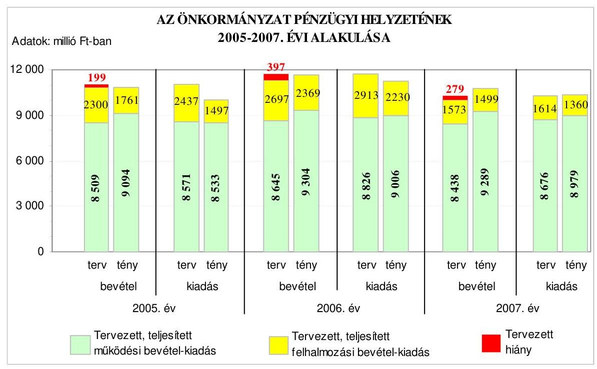

---

A 2005-2008. években a tervezett költségvetési hiány részarányát a működési és felhalmozási célú, valamint az összes költségvetési kiadáshoz viszonyítva a következő táblázat mutatja be:

| Megnevezés | A hiány részaránya %-ban |  |  |  |  |  |  |
| :--: | :--: | :--: | :--: | :--: | :--: | :--: | :--: |
|  | $\begin{gathered} 2005. \\ \text{évben} \end{gathered}$ |  | $\begin{gathered} 2006. \\ \text{évben} \end{gathered}$ |  | $\begin{gathered} 2007. \\ \text{évben} \end{gathered}$ |  | $\begin{gathered} 2008. \\ \text{évben} \end{gathered}$ |
|  | Terv | Tény | Terv | Tény | Terv | Tény | Terv |
| Működési célú költségvetési bevételek hiányának aránya a működési célú költségvetési kiadásokhoz viszonyítva | 0,7 | - | 2,1 | - | 2,7 | - | 1,3 |
| Felhalmozási célú költségvetési bevételek hiányának aránya a felhalmozási célú költségvetési kiadásokhoz viszonyítva | 5,6 | - | 7,4 | - | 2,6 | - | 8,4 |
| A költségvetési hiány részaránya a költségvetési kiadásokhoz viszonyítva | 1,8 | - | 3,4 | - | 2,7 | - | 2,0 |

Az Önkormányzatnál a 2005-2008. években mind a működési célú, mind a felhalmozási célú költségvetési bevételeket meghaladó összegben terveztek működési célú és felhalmozási célú költségvetési kiadást. A működési célú és a felhalmozási célú költségvetési bevételek tervezett hiányának aránya - a működési célú és a felhalmozási célú tervezett költségvetési kiadásokhoz viszonyítva - a 2005-2008. években változó volt. A működési célú tervezett költségvetési bevételek hiányának aránya az előző évhez viszonyítva a 2006-2007. években emelkedett, a 2008. évben csökkent, de a 2005. évinek így is a kétszerese volt. A tervezett felhalmozási célú költségvetési kiadásokra a tervezett felhalmozási célú költségvetési bevételek a 2006. évben növekvő, majd a 2007. évben csökkenő, a 2008. évben pedig emelkedő mértékben nem nyújtottak fedezetet.

Az Önkormányzatnál a 2005-2007. években a pénzügyi egyensúlyt a költségvetés végrehajtása során 68-69%-ban a működési célú költségvetési bevételeknél elért többletbevételekből biztosították. A teljesített felhalmozási célú kiadások összege sem érte el a teljesített felhalmozási célú költségvetési bevételeket.

A 2005-2008. évi költségvetési rendeletekben a költségvetési bevételek és kiadások főösszegének megállapításakor - az Áht. 8/A. § (7) bekezdésében előírtakat megsértve - finanszírozási célú pénzügyi műveleteket is figyelembe vettek költségvetési hiányt módosító költségvetési bevételként és kiadásként.

A 2005. évi költségvetésben hiányt módosító kiadásként vettek figyelembe 376 millió Ft hitel visszafizetést. A 2006. évi költségvetésben költségvetési bevételként mutattak ki 47 millió Ft értékpapír értékesítésből származó bevételt, és költségvetési kiadásként 1280 millió Ft hitel visszafizetést. A 2007. évi költségvetésben hiányt módosító bevételként vettek számba 150 millió Ft
 értékpapír értékesítésből származó bevételt és kiadásként 435 millió Ft hitel visszafizetést. A 2008. évi költségvetésben költségvetési bevételként mutattak ki 47 millió Ft értékpapír értékesíté-

---

sésből származó bevételt és költségvetési kiadásként 646 millió Ft hitel visszafizetést.

# 1.2. A költségvetési és a pénzügyi egyensúlyi helyzet kialakításához tervezett és teljesített finanszírozási célú pénzügyi műveletek módja és azok hatása a tárgyévet követő évek költségvetéseire 

Az Önkormányzatnál a 2005-2007. években a költségvetési kiadásokra - ezen belül sem a működési, sem a felhalmozási célú tervezett költségvetési kiadásokra - a költségvetési bevételek az eredeti költségvetésben nem nyújtottak fedezetet. A költségvetés végrehajtása során azonban a teljesített költségvetési bevételek összességében meghaladták a teljesített költségvetési kiadásokat, bevételi többlet keletkezett. A teljesített működési célú költségvetési bevételek a 2005-2007. években fedezték a működési célú költségvetési kiadásokat, valamint a felhalmozási célú költségvetési bevételek fedezetet nyújtottak a felhalmozási célú költségvetési kiadások finanszírozására.

Az Önkormányzatnál a 2005-2008. években tervezett és a 2005-2007. években teljesített működési és felhalmozási célú, valamint összes költségvetési kiadásra a következő arányban nyújtottak fedezetet a költségvetési bevételek:

Adatok: %-ban

| Megnevezés | 2005. év |  | 2006. év |  | 2007. év |  | 2008.   év |
| :--: | :--: | :--: | :--: | :--: | :--: | :--: | :--: |
|  | Terv | Tény | Terv | Tény | Terv | Tény | Terv |
| Működési célú költségvetési kiadások fedezettsége működési célú költségvetési bevételekből | 99,3 | 106,6 | 97,9 | 103,3 | 97,3 | 103,5 | 98,7 |
| Felhalmozási célú költségvetési kiadások fedezettsége felhalmozási célú költségvetési bevételekből | 94,4 | 117,6 | 92,6 | 106,2 | 97,4 | 110,2 | 91,6 |
| Költségvetési kiadások fedezettsége költségvetési bevételekből | 98,2 | 108,2 | 96,6 | 103,9 | 97,3 | 104,3 | 98,0 |

A 2005-2008. években a tervezett költségvetési, azon belül a működési célú költségvetési bevételek, valamint a felhalmozási célú költségvetési bevételek egyik évben sem biztosítottak fedezetet az azonos célú költségvetési kiadásokra. A tervezett működési célú költségvetési bevételek a 2005-2007. években az előző évhez képest csökkenő, a 2008. évben pedig növekvő arányban, a felhalmozási célú költségvetési bevételek a 2005-2006. években csökkenő arányban nyújtottak fedezetet az azonos célú költségvetési kiadásokra. A teljesített költségvetési, azon belül a működési és a felhalmozási célú költségvetési bevételek 2005-2007 között meghaladták az azonos célú kiadásokat, azonban a 2006. év végére a bevételi többlet mérséklődött.

---

Az Önkormányzat pénzügyi egyensúlyi helyzetét 2005-2008 között a következő ábra szemlélteti:
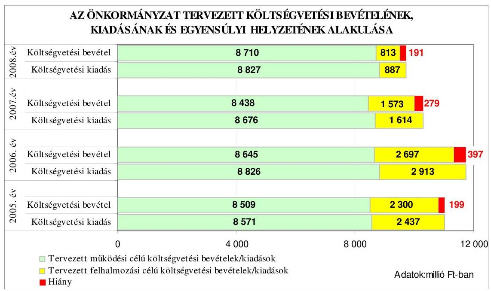

Az Önkormányzat 2005-2008 között a költségvetési rendeleteiben a költségvetési egyensúly biztosításához rövid-, és hosszú lejáratú hitelek felvételét, államkötvények értékesítését, valamint helyi adó emelést tervezett, továbbá a 2007-2008. években kiadás csökkentő intézkedésekről, és szervezeti racionalizálásról döntött.

A 2005. évi költségvetési rendeletben 200 millió Ft működési és 375 millió Ft felhalmozási célú hitel felvételét, a 2006. évi költségvetési rendeletben 200 millió Ft működési és 100 millió Ft folyószámla, valamint 415 millió Ft felhalmozási célú hitel felvételét, 46,7 millió Ft értékpapír értékesítését ${ }^{9}$, továbbá a meglévő 915,8 millió Ft felhalmozási célú hitel állomány kiváltását ${ }^{10}$ határozták meg. Az Önkormányzat 2005. január 1-jétől az építményadó övezetenkénti mértékét egységesen 30%-kal felemelte, emiatt a 2005. évben 80 millió Ft többlet helyi adóbevételt terveztek. A 2007. évi költségvetési rendeletben 400 millió Ft működési és 265 millió Ft felhalmozási célú hitel felvételét és 149,6 millió Ft értékpapír értékesítését tervezték, továbbá az intézményeknél 0,5%-os személyi juttatás és járulék, valamint 3,5%-os dologi kiadáscsökkentést, összesen 69 millió Ft, továbbá kettő kht. összevonásából ${ }^{11} 25$ millió Ft megtakarítást terveztek. A 2008. évi költségvetési rendeletben 500 millió Ft működési és 250 millió Ft felhalmozási célú hitel felvételét, továbbá hitelből alapítvány 40 millió Ft összegű támogatását ${ }^{12}$, valamint 46,7 millió Ft értékpapír értékesítését, illetve a 2007. évben összevont kht. támogatását további 10,6 millió Ft-tal csökkentett összegben határozták meg. A 2008.

[^0]
[^0]:    ${ }^{9}$ Az Önkormányzat 2006-2008 között a gázközmű vagyon privatizáció során kapott lejárt államkötvényt értékesítette, illetve tervezi értékesíteni.
    ${ }^{10}$ A hitel felvétel célja a 1998-2004. években igénybevett hitel alacsonyabb kamatozású hitelből történő visszafizetése volt.
    ${ }^{11}$ A Létesítmény és Sport Kht-ba beolvadt a Tarjáni Gyermektábor Kht.
    ${ }^{12}$ Egészséges Környezetért Alapítvány támogatása.

---

évi költségvetési rendeletben döntöttek 350 millió Ft felhalmozási célú hitel 2009. évi felvételéről ${ }^{13}$.

A költségvetés végrehajtása során a teljesített költségvetési, ezen belül működési és felhalmozási célú költségvetési kiadásokra, a teljesített azonos célú költségvetési bevételek fedezetet nyújtottak. A költségvetés végrehajtása során a 2005-2007. években nem volt pénzügyi hiány.
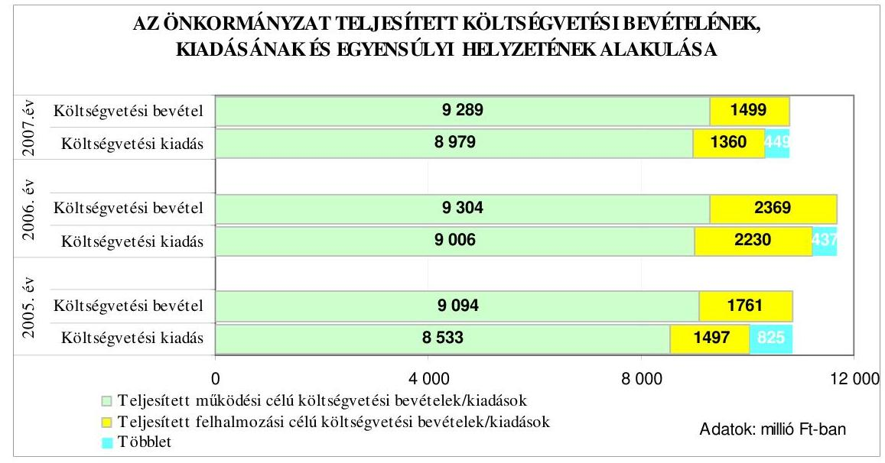

A 2005-2007. években a teljesített költségvetési bevételek - a felvett hitelek nélkül - fedezetet nyújtottak a költségvetési kiadásokra. Ennek ellenére az Önkormányzat a 2005-2007. években rövid- és hosszú lejáratú hitelt vett fel és a 2006-2007. években értékesítette lejárt államkötvényeit. A finanszírozási célú pénzügyi műveletek bevételei (deviza alapú CHF hitelfelvétel, értékpapír értékesítés) növelték az Önkormányzat bevételeit. Ennek hatására a Polgármesteri hivatal és intézményei bevételei a 2005. évben 999 millió Ft-tal ${ }^{14}$, a 2006. évben 552 millió Ft-tal ${ }^{15}$, a 2007. évben 725 millió Ft-tal ${ }^{16}$ haladták meg a kiadásokat.

A költségvetési bevételi többleteket - a finanszírozási célú pénzügyi műveletek nélkül számított - a 2005-2007. években az intézményi működési bevételek, az előző évi pénzmaradvány igénybevétele, a kamatbevételek, a helyi adók és illetékek, a költségvetési kiegészítések és visszatérülések, a költségvetési támogatások, a működési célú pénzeszköz átvételek és a támogatásértékű működési bevé-

[^0]
[^0]:    ${ }^{13}$ Kodály Zoltán Tagiskola rekonstrukciójához a 290 millió Ft saját forrás biztosítására, valamint az Egészséges Környezetért Alapítvány támogatására.
    ${ }^{14}$ A 2005. évi költségvetési többlet 825 millió Ft, a rövid lejáratú hitelfelvétel 192 millió Ft, a hosszú lejáratú hitelfelvétel 375 millió Ft volt.
    ${ }^{15}$ A 2006. évi költségvetési többlet 437 millió Ft, a rövid lejáratú hitelfelvétel 190 millió Ft, a hosszú lejáratú hitelfelvétel 1166 millió Ft, az államkötvény értékesítés bevétele 46,7 millió Ft volt.
    ${ }^{16}$ A 2007. évi költségvetési többlet 449 millió Ft, a rövid lejáratú hitelfelvétel 400 millió Ft, a hosszú lejáratú hitelfelvétel 165 millió Ft, az államkötvény értékesítés bevétele 150 millió Ft volt.

---

telek túlteljesítése eredményezte. A költségvetési többlet kialakulásához az egyes felhalmozási célú költségvetési bevételek túlteljesítése, valamint a felhalmozási célú kiadások tervezettől alacsonyabb összegű kiadásai is hozzájárultak.

Az Önkormányzat a 2005-2007. években esedékes rövid lejáratú működési és hosszú lejáratú felhalmozási célú hiteleket visszafizette. Az Önkormányzat 2005-2007 között folyószámlahitelt nem vett fel, hanem az alacsonyabb kamatozású ${ }^{17}$ rövid lejáratú hitelt vette igénybe, azonban gazdaságossági számításokat nem végzett a folyószámlahitel és a rövid lejáratú hitel éves szintű kamatkiadásainak összehasonlítására.

A közbenső egyeztetés során a polgármester és a jegyző által adott észrevétel szerint: „A kamatszámítást csupán erőltetett módon lehet elvégezni, hiszen az Önkormányzat rövidhitel és folyószámlahitel igénybevételi stratégiája nem a hitelfajták közötti választásra épül. Év közben igénybevételre tervezett folyószámlahitel technikai hitelfelvétel, amelyet a számlavezető bank BUBOR alapon folyósít a szükségletnek megfelelően. Ez esetben nem kell közbeszerzési eljárást lefolytatni. Az éven belül lejáró rövidlejáratú hitel a költségvetési év végén az esetlegesen megjelenő folyószámlahitel kiváltása, és azon pénzmaradványok valóságos pénzzel való alátámasztása érdekében történik, amely nélkül nem lehet pénzmaradványról beszélni. Amennyiben év végén folyószámlahitel igénybevételéről szólna a döntés, a bank a finanszírozási kötelezettsége miatt annyi pénzt bocsátana rendelkezésre, amennyi a számlák kifizetéséhez szükséges, miközben olyan, pályázati, felhasználási kötöttségű források is felhasználásra kerülnének, amelyeket nem szabadna bevonni az operatív finanszírozásba. Ezekből adódóan a rövidlejáratú hitel igénybevétele többletforrások biztosítására, és a pénzmaradvány pénzzel történő alátámasztására irányul, és emiatt az ezzel kapcsolatos döntés nem a pillanatnyi forráshiány megszüntetésére irányul. Mivel a rövidlejáratú hitel közbeszerzés köteles, nem lehet év közben folyószámlahitel helyett rövidlejáratú hitelben dönteni, hiszen a közbeszerzés időszükséglete hosszú, és az árfolyamok állandóan változnak az év során egymással ellentétesen is akár. Nem lehet korrekt számítást és kalkulációt végezni év közben annak eldöntésére, hogy rövidlejáratú, vagy folyószámlahitel a kedvezőbb, mivel a legegyszerűbb számítást is az dönti el, hogy a folyószámlahitel igénybevételénél milyen összegnagysággal, és mennyi igénybevételi idővel lehet kalkulálni. Ezt pedig az befolyásolja, hogy mennyi a napi forrásszükséglet, figyelemmel a napi kifizetési kötelezettségre és a számlán lévő pénzeszközökre."

A megállapításunkat továbbra is fenntartjuk, tekintettel arra, hogy gazdaságossági számítás alapján valószínűsíthető, hogy a folyószámlahitel igénybevétele helyett egy éves időtartamra, s előre az előző év végén felvett, éven belül lejáró rövid lejáratú és fix összegű működési hitel nem alkalmazkodik a reálfolyamatok pénzigényeihez, így a rövid lejáratú hitel viszonylagos pénzbőséget és indokolatlan kamatkiadást eredményez a gazdálkodásban, ezért célszerűnek tartjuk a hitelek éves szintű kamatkiadásainak elemzését.

Az ÁSZ. tv. 25. § (1) bekezdése alapján a számvevőszéki jelentésre a polgármester további észrevételt tett, mely szerint: „a kamatkiadások nagyságának megítélésére az ellenőrzési jelentés adatai szerint az igénybe vett rövidlejáratú hitel kamatának mértéke CHF alapon a 2005. évben 0,2133%, 2006. évben 2,72%, a 2007. évben 2,855%. Ezzel szemben, ha az önkormányzat folyószámlahiteleket vett volna igénybe, a fizetendő

[^0]
[^0]:    ${ }^{17}$ A folyószámla, illetve rövid lejáratú hitelek változó kamatai 2005. január 2-án 11,29% és 10,13%, 2005. december 27-én 5,2% és 0,21333%, 2006. december 22-én 7,39% és 2,72%, valamint 2007. december 21-én 8,50% és 2,8555% volt.

---

kamatmérték BUBOR alapon 8%-ot meghaladóan jelentkezett volna. Ez azt igazolja, hogy hitel-igénybevétel esetén a rövidlejáratú hitelkondíciók a kedvezőbbek."

Az észrevétel ellenére továbbra is javasoljuk a hitelek éves szintű kamatkiadásainak és az árfolyamváltozás hatásának elemzését, mivel gazdaságossági számítással elemezhető, hogy az egész évre igénybevett rövid lejáratú, fix összegű működési hitel kamatai éves szinten meghaladják-e a folyószámlahitel igénybevett napjai után járó kamatkiadásokat, vagy sem.

Az Önkormányzat a költségvetés végrehajtása során a pénzügyi egyensúlyt a tervezettet meghaladó költségvetési bevételekből, a költségvetési intézmények szervezeti átalakításáról szóló döntések végrehajtása eredményeként jelentkező kiadási megtakarításból, a kamatkiadás csökkentéséből biztosította.

A Közgyűlés a közoktatásban a 2007. évben 89 fő létszámcsökkentésről döntött ${ }^{18}$, melynek éves szintű személyi juttatás és járulék megtakarítása 230 millió Ft volt. A 2007. évben egyes szociális és gyermekjóléti feladatok többcélú társulásnak történő átadásával 25 millió Ft, valamint a számlavezető pénzintézetváltással a 2006. évben 84 millió Ft költségvetési kiadás csökkenést értek
 el.

Az Önkormányzatnál a hosszú lejáratú - felhalmozási célú - hitelek állománya a 2005. év végén 1291 millió Ft, a 2006. év végén 1368 millió Ft, a 2007. év végén 1288 millió Ft volt, a következők miatt:

- a 2005. évben mozi kialakítására, utak felújítására, a 21-es tehermentesítő útépítés munkáira 275 millió Ft hitelt vett fel az Önkormányzat tíz éves futamidőre, egy év türelmi idővel (0,305% évi kamatozású), valamint a közoktatási intézmények épület, hőközpontok, utak, hidak és strandfürdő felújítására további 100 millió Ft összegű, ötéves futamidejű (1,17% kamatozású) hitelt vettek igénybe;
- a 2005. november 8-án megkötött hitelszerződés terhére az Önkormányzat a 2006. évben a közoktatás intézményi épületek, utak, járdák, csapadékcsatorna felújítására 100 millió Ft ötéves futamidejű hitelt, egyéves türelmi idővel (1,17% kamatozású), további 150 millió Ft-ot, 10 éves futamidőre, egy év türelmi idővel (1,1733% kamatozású) pedig a városi tanuszoda rekonstrukciójára, utak és lépcsők felújítására, parkolók kialakítására, játszóterek létesítésére vett igénybe;
- a 2006. év végén megkötött hitelszerződés terhére 2007. november hónapban a Városi Sportcsarnok rekonstrukciója pályázatához szükséges saját forrás biztosítása érdekében 65 millió Ft hitelt vett fel az Önkormányzat, 10 éves futamidővel, három év türelmi idő mellett (2,05333% kamatozású). Az Önkormányzat 2007. szeptember hónapban 200 millió Ft hitel keretszerződést kötött egy pénzintézettel, amely terhére a 2007. évben 100 millió Ft-ot 10 éves futamidőre, egy év türelmi idővel (2,9555% kamatozású) utak, lépcsők, szennyvízcsatorna, ravatalozó, Polgármesteri hivatal felújítási munkáira vett igénybe.

[^0]
[^0]:    ${ }^{18}$ A költségvetési intézmények szervezeti átalakításával 2007. július 1-jétől a KIGSZ-en belül az oktatási intézmények részben önállóan gazdálkodnak, valamint központosították a kisegítő-technikai feladatokat.

---

Az Önkormányzat 2004. októberében a Csatornamú Kft-től ${ }^{19} 250$ millió Ft tagi kölcsönt vett igénybe, legfeljebb 20 évi törlesztés és a szerződéskötéskor 11,6%-os kamatláb mellett, amelyből utak, járdák, szennyvíz- és csapadékcsatorna hálózat felújítást, közterületek korszerűsítését, építési terület kialakítását, informatikai fejlesztéseket terveztek. A kölcsön visszafizetésének forrása az Önkormányzatot megillető osztalék évi összege volt, amelyből a kölcsönadó részére előbb a kölcsönkamatot, ezt követően a kölcsönt törlesztették. A kölcsön állománya a 2005. év végén 233 millió Ft, a 2006. év végén 223 millió Ft, a 2007. év végén 223 millió Ft volt.

Az Önkormányzat a 2005-2007. évi költségvetési rendeletekben felhatalmazta a polgármestert folyószámla hitel-keretszerződés - a 2005. évben 200 millió Ft, a 2006. évben 300 millió Ft, a 2007. évben 200 millió Ft - és munkabérhitel szerződés megkötésére, mely hiteleket 2005-2007 között nem vettek igénybe.

Az Önkormányzatnál a rövid lejáratú - működési célú - hitelek állománya a 2005. év végén 192 millió Ft, a 2006. év végén 190 millió Ft, a 2007. év végén 395 millió Ft volt. A működési célú hitelek felvételének rendeltetése a pénzügyi források bővítése volt, folyósításkor kamatainak éves mértéke a 2005. évben 0,2133%, a 2006. évben 2,72%, és a 2007. évben 2,855%.

Az Önkormányzat eladósodását az eladósodási mutató ${ }^{20}$ és az esedékességi aránymutató ${ }^{21}$ változása mutatja:

- az eladósodási mutató az előző évhez képest a 2006. év végére a rövid- és hosszú lejáratú kötelezettségek év végi állományának növekedése miatt emelkedett (14,8%-ról 14,9%-ra), ami az eladósodottság növekedését jelzi, viszont a 2007. év végén kismértékben - 14,3%-ra - csökkent;

A 2005. év végéhez viszonyítva a 2006. év végére a rövid és hosszú lejáratú kötelezettségek állománya 123 millió Ft-tal (4,1%-kal), az összes forrás állománya pedig 597 millió Ft-tal (2,9%-kal) nőtt. A 2007. év végére a rövid és hosszú lejáratú kötelezettségek állománya 128 millió Ft-tal (4,1%-kal) csökkent, az összes forrás állománya pedig 35 millió Ft-tal (0,2%-kal) emelkedett. A rövid és hosszú lejáratú kötelezettségek év végi állománya a 2006. évben - az előző évhez viszonyítva - a hosszú lejáratú hitelek és a szállítók állománya miatt emelkedett, a 2007. évben pedig a szállítók és az egyéb rövid lejáratú kötelezettségek, valamint a hosszú lejáratú hitelek, illetve egyéb hosszú lejáratú kötelezettségek állományának mérséklődése (332 millió Ft-tal) és a rövid lejáratú hitelek állományának (205 millió Ft-tal) emelkedése következtében csökkent.

- az esedékességi aránymutató a 2006. év végén az előző év végéhez viszonyítva romlott, mivel a rövid lejáratú kötelezettségek állománya gyorsabban növekedett, mint az összes kötelezettség állománya ${ }^{22}$, erősödött a rövidtávon teljesítendő kötelezettségek fizetőképességre gyakorolt hatása. A 2007. év végén az esedékességi aránymutató az előző év végéhez viszonyítva tovább romlott, mivel az összes kötelezettségen belül a hosszú lejáratú kötelezettségek év végi állománya jobban csökkent, mint a rövid lejáratú kötelezettségek év végi állománya, ezért a rövid lejáratú kötelezettségek aránya az összes fizetési kötelezettségen belül nőtt ${ }^{23}$. A rövidtávon teljesítendő fizetési kötelezettségek fizetőképességre gyakorolt hatása szintén erősödött.

Az Önkormányzat pénzügyi helyzete eladósodási szempontból összességében a 2005-2007. években kedvezőtlenül változott, mivel a 2006. és 2007. év végére a rövid lejáratú kötelezettségek aránya - ezen belül a rövid lejáratú működési hitel aránya 17,8 százalékponttal - emelkedett.

Az Önkormányzat fizetőképességének, likviditásának 2005-2007 közötti alakulását a készpénz-likviditási mutató és a likviditási gyorsráta mutatja:
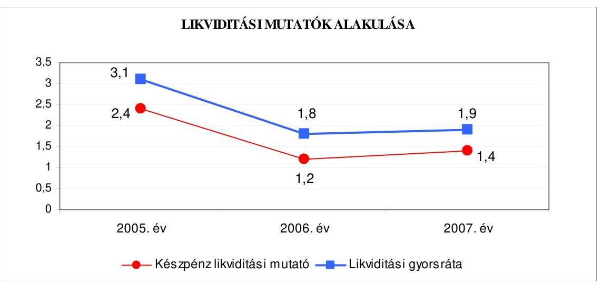

A készpénz likviditási mutató ${ }^{24}$ 2005-2007 között változóan alakult. Az előző év végéhez képest 2006. év végén romlott, jelezve, hogy a pénzeszközök csökkenő mértékben nyújtottak fedezetet az emelkedő rövid lejáratú kötelezettségek kiegyenlítéséhez ${ }^{25}$. A 2007. év végén az előző év végéhez képest a fizetőképesség javult, mivel a pénzeszközök év végi állománya nőtt, míg a rövid lejáratú kötelezettségek állománya ${ }^{26}$ csökkent.

A likviditási gyorsráta ${ }^{27}$ is változóan alakult 2005-2007 között, 2006. év végén az előző év végéhez viszonyítva romlott, mivel a követelések és a pénzeszközök együttes összege csökkent ${ }^{28}$, emiatt ezek csökkenő arányban nyújtottak fedezetet a rövid lejáratú kötelezettségekre. A 2007. év végén az előző év végéhez képest a rövid lejáratú kötelezettségek állománya csökkent, a követelések és a pénzeszközök állománya - a növekvő működési hitel felvétel miatt - emelkedett ${ }^{29}$.

Az Önkormányzat fizetőképessége a likviditási mutatók alapján 2005-2007 között változóan alakult, az előző év végéhez viszonyítva a 2006. évben romlott, a 2007. évben pedig - a pénzeszközök növekedése következtében - javult.

# 1.3. A költségvetés tervezésének megalapozottsága 

Az Önkormányzat 2005-2007 között a költségvetési bevételek főösszegének eredeti előirányzatait 0,4-2,9-7,8%-kal teljesítette túl, költségvetési kiadásait a 2005-2006. évben 8,9-4,3%-kal alulteljesítette, a 2007. évben pedig 0,5%-kal túlteljesítette.

Önkormányzati szinten az eredeti előirányzatokhoz képest a működési célú költségvetési bevételeket a 2005-2007. években növekvő mértékben teljesítették túl ${ }^{30}$, mivel az előző évi működési célú pénzmaradvány igénybevételét a költségvetési intézményeknél nem vették figyelembe a költségvetési rendelet eredeti előirányzatainak meghatározásakor ${ }^{31}$, másrészt az intézményi működési bevételeket, valamint a 2007. évben az iparűzési adó- és illetékbevételeket alultervezték ${ }^{32}$.

A működési célú költségvetési kiadások eredeti előirányzatát a 2005. évben 0,4%-kal alulteljesítették, amelyet a személyi juttatások és járulékai, valamint a kamatkiadások megtakarítása, a 2006-2007. években 2,0-3,5%-kal teljesítették túl, amit az eredeti előirányzathoz képest a dologi kiadások 8,7%-os, valamint a személyi juttatás és járulékai kiadások 7,6%-os túlteljesítése okozott.

A felhalmozási célú költségvetési bevételek az eredeti előirányzathoz képest a 2005-2007. években 23-12-5%-kal ${ }^{33}$, illetve a felhalmozási célú költségvetési kiadások 39-23-16%-kal alulteljesültek. A felhalmozási célú költségvetési kiadások alulteljesítését befolyásolta, hogy a beruházási és felújítási feladatok megvalósítása a benyújtott pályázatok elbírálásának, azt követően a kivitelezők kiválasztására lefolytatott közbeszerzési eljárások elhúzódása miatt a tervezett ütemezéstől elmaradtak, amelyek kihatottak a pályázati támogatások igénybevételére, a felhalmozási célú bevételek teljesítésére is.

# 2. AZ ÖNKORMÁNYZAT FELKÉSZÜLTSÉGE AZ EURÓPAI UNIÓS FORRÁSOK IGÉNYLÉSÉRE ÉS FELHASZNÁLÁSÁRA, VALAMINT AZ ELEKTRONIKUS KÖZIGAZGATÁSI FELADATOK ELLÁTÁSÁRA 

### 2.1. Az európai uniós források igénybevételére és a várható támogatás felhasználására történt felkészülés szabályozottsága, szervezettsége

### 2.1.1. Az európai uniós forrásokra történő pályázatok benyújtására vonatkozó döntések összhangja a fejlesztési célkitűzésekkel

Az Önkormányzat a 2005-2007. évekre vonatkozó fejlesztési célkitűzéseit településfejlesztési, ágazati, szakmai fejlesztési tervekben és koncepciókban rögzítette.

Salgótarjáni Kistérség Komplex Területfejlesztési Program stratégiai célkitűzése a helyi ipar fejlesztésének támogatása, a szolgáltatások és a humán erőforrások fejlesztése, a város közlekedési elérhetősége, a közúti közlekedés és az infrastruktúrájának fejlesztése volt. „Salgótarján
 középtávú vagyongazdálkodási koncepció" ${ }^{34}$ fejlesztési célkitűzéseiben a Közgyűlés az úthálózat és közlekedés, valamint a hulladékgazdálkodás fejlesztését, továbbá a városközpont rekonstrukcióját határozta

[^0]
[^0]:    ${ }^{32}$ Az eredeti előirányzathoz viszonyítva az intézményi működési bevételek a 2005. évben $11,0 \%$-kal, a 2006. évben $22,0 \%$-kal, a 2007. évben $25,0 \%$-kal, az iparűzési adó és az illetékbevételek a 2007. évben $12,0 \%$-kal és $33,0 \%$-kal túlteljesültek.
    ${ }^{33}$ A felhalmozási célú költségvetési bevételek alulteljesítése a tárgyi eszközök értékesítésénél a 2006-2007. évben $44 \%-22 \%$, a lakások, helyiségek eladásánál a 2005. évben $72 \%$, és a felhalmozási célú támogatási kölcsön visszatérülésénél a 2005-2007. években $52-30-6 \%$ volt.
    ${ }^{34}$ A Közgyűlés „Salgótarján középtávú vagyongazdálkodási koncepció"-ról a 28/2004. (III. 26.) számú határozatban döntött.

---

meg. Salgótarján környezetvédelmi program ${ }^{35}$ fejlesztési céljai között a hulladékkezelés, hulladékgazdálkodás területén az állati hulladékok ártalmatlanítására szolgáló telep kialakítását, valamint a közlekedés okozta környezeti ártalmak csökkentésére a távolsági autóbusz-pályaudvar korszerűsítését tervezték

Az Ötv. 91. § (1) bekezdésében foglaltakat megsértve 2002-2006 között az Önkormányzat nem határozta meg gazdasági programját, annak ellenére, hogy az ÁSZ - az Önkormányzat gazdálkodásának átfogó ellenőrzése keretében - a 2003. évben azt már javasolta.

A közbenső egyeztetés során a polgármester és a jegyző által adott észrevétel szerint: „Az Ötv. 91. § (1) bekezdése csupán gazdasági programról és költségvetésről rendelkezett 2005. VIII. 31-ig, arról nem, hogy ezeknek milyen tartalommal és milyen időtávra kell szólniuk. Mivel a törvény egyazon rendelkezés keretén belül fogalmazta meg a gazdasági programot és költségvetést, semmi nem mondott ellent annak, hogy ez a két feladat a beterjesztett költségvetésben öltsön testet. Az Önkormányzat így értelmezte a jogszabály rendelkezését. Ezt támasztja alá az Ötv-t módosító 2005. évi XCII. törvény 3. §-ával kapcsolatos indokolás. Az Ötv. jelenlegi 91. §-ának (6) és (7) bekezdése meghatározza ugyan a gazdasági programmal kapcsolatos elvárásokat, azonban a későbbi évek állami forrásait nem rendeli hozzá. Javasoljuk, hogy az ÁSZ közvetítse a parlament felé, ha a törvényalkotó gazdasági programot vár el, jogszabályban garantálja, legalább a választási ciklus időszaka alatt az önkormányzatok részére rendelkezésre bocsátandó állami források nagyságát. Ez azért elengedhetetlenül fontos, mivel a központi költségvetési kapcsolatokból származó források az önkormányzati bevételek közel 50\%-át teszik ki. Ha ezen bevételeknek későbbi években várható alakulását nem határozzák meg, nem sok értelme van konkrét, számonkérhető, reális gazdasági programokat elvárni."

A megállapításunkhoz kapcsolódó véleménye nem megalapozott, mivel a gazdasági program tartalmára vonatkozó követelmények - határidő, formai és tartalmi elemek, elfogadás formája stb. - az Ötv. 91. § (1) bekezdésében való meghatározás hiánya nem mentesítette a jegyzőt, hogy a Htv. 140. § (1) bekezdés a) pontjában foglalt gazdasági programkészítési kötelezettségének ne tegyen eleget. Az önkormányzati gazdasági program alapadatokat szolgáltat az Amr. 24. § (1) bekezdés d) pontjában meghatározott költségvetési tervezés fő kereteit meghatározó költségvetési irányelvek összeállításához.

Az ÁSZ. tv. 25. § (1) bekezdése alapján a számvevőszéki jelentésre a polgármester további észrevételt tett, mely szerint: „A Htv. feladatként meghatározza ugyan a feladatot a jegyző részére, de a tartalmi elemeket ez a jogszabály sem írja elő. Ezt az Ötv. módosítása pótolta 2005-ben. A jegyző jogszabályi iránymutatás hiányában az éves költségvetéseket, éves gazdasági programként is értelmezte."

A kiegészített észrevétel sem megalapozott, mivel a Htv-ben előírtak szerint a jegyző feladata az Önkormányzat gazdasági program tervezetének és a költségvetési törvény elfogadása után a költségvetési rendeletének elkészítése. A gazdasági program célkitűzései alapján az Önkormányzat az Ámr. 29. § (1) bekezdésében foglaltaknak meghatározott szerkezetben költségvetését rendeletben állapítja meg. Az éves költségvetések gazdasági programként való értelmezése nem fogadható el, mivel az Ötv. 91. § (1) bekezdése az önkormányzatok részére a gazdasági program és a költségvetés meghatározását írja elő. A gazdasági program

[^0]
[^0]:    ${ }^{35}$ A Közgyűlés a környezetvédelmi programot a 2005. évi és a 2007. évi felülvizsgálatokkal egységes szerkezetben a 286/2005. (XII. 15.) és a 242/2007. (XII. 18.) számú határozataival elfogadta.

---

elkészítési kötelezettsége alól az önkormányzatokat nem mentesítette annak ténye, hogy a gazdasági program tartalmára és formájára 2005-ig jogszabályi előírás valóban nem volt. A gazdasági program készítés kötelezettségére az ÁSZ már 2003-ban felhívta az Önkormányzat figyelmét.

# Az Önkormányzat 2007-2018-ra szóló gazdasági programját a Közgyűlés 35/2007. (III. 27.) számú határozatával elfogadta. 

A gazdasági program a város demográfiai és a foglalkoztatási folyamatai, az intézményhálózat működtetési lehetőségei és a városüzemeltetés feladatai átfogó értékelésén alapult, célkitűzéseiben a város- és iparfejlesztés, az oktatás, a kultúra, a környezetvédelem, az idegenforgalom, és a közlekedés fejlesztése szerepelt, amelyek megvalósításához részprogramokat, valamint önkormányzati intézkedéseket dolgoztak ki.

A településfejlesztési, az ágazati, szakmai fejlesztési tervekben és koncepciókban, valamint a gazdasági programban meghatározott fejlesztési célkitűzések megalapozottságát helyzetelemzéssel alátámasztották. A fejlesztési feladatok megvalósításának lehetséges pénzügyi forrásait felmérték. A településfejlesztési, az ágazati, szakmai koncepciókban és tervekben megfogalmazott fejlesztési célkitűzéseket az NFT, illetve az ÜMFT keretében megjelenő pályázati lehetőségekhez 2005-2006 között nem módosították.

A Közgyűlés 2005-2007 között európai uniós forrásokkal összefüggő öt fejlesztési feladat megvalósításáról döntött, amelyek a településfejlesztési, az ágazati, szakmai koncepciókban és tervekben, valamint a gazdasági programban megfogalmazott célkitűzésekhez kapcsolódtak.

A ROP 2.3.1. Óvodák és alapfokú nevelési-oktatási intézmények infrastrukturális fejlesztése intézkedésre a „Gagarin Általános Iskola infrastrukturális fejlesztése" pályázatot a 2005. évben nyújtotta be az Önkormányzat, amely eredményesen zárult. A projekt tervezett összköltsége 130 millió Ft volt, a kiadás finanszírozását 95\%-ban támogatás ($84,2 \%$-a európai uniós és $15,8 \%$-a hazai támogatás), 5\%-ban saját forrás biztosította.

A PHARE program keretében a „Neogradiensis Eurorégió - vállalkozói együttműködések lehetőségei a Salgótarján - Losonc tengely mentén" pályázatot 2005-ben nyújtotta be az Önkormányzat, amely eredményes volt. A projekt 39,6 millió Ft összköltségét 67,2\% PHARE, 22,8\% kormányzati támogatás, 10\% saját forrás finanszírozta.

A ROP 2.2. Városi területek rehabilitációja intézkedésre „Teret a jövőnek" fejlesztési feladat megvalósításához az Önkormányzat a 2006. évben pályázatot nyújtott be, amely a pályázati források hiánya miatt támogatásban nem részesült.

A KIOP 1.2.0. Állati hulladékkezelése intézkedésre az állati hulladékok kezelését célzó beruházások megvalósításához „Térségi állati hulladék begyűjtése és kezelése" pályázat a 2007. évben támogatásban részesült. A beruházás összköltsége 98,4 millió Ft volt, finanszírozására 79\%-ban támogatás és 21\%-ban saját forrás állt rendelkezésre.

Az Európai Gazdasági Térség Finanszírozási Mechanizmus és a Norvég Finanszírozási Mechanizmus keretében meghirdetett, a helyi önkormányzatok adminisztratív kapacitásának információs technológiai eszközök használatának bővítése céljából „Hatékony Salgótarján" címmel az Önkormányzat az elektronikus közigazgatás kiépítése céljából 2007-ben pályázatot nyújtott be. A pályázat a támogatási forrás hiánya miatt eredménytelen volt.

Az Önkormányzat a 2007. évben további négy intézményi pályázat benyújtásáról döntött.

Az ÉMOP operatív programjaiban meghirdetett az önkormányzati intézmények utólagos akadálymentesítése 2. számú intézkedésre kettő, továbbá a közoktatás térségi sajátosságokhoz igazodó szervezésének és infrastruktúrájának fejlesztése 3. intézkedéséhez kapcsolódóan egy pályázatot nyújtott be az Önkormányzat, amelyek befogadásra kerültek, de a támogatásukra vonatkozóan még nem volt döntés. A TIOP program keretében meghirdetett az általános és középiskolák informatikai eszközállományának fejlesztési támogatás 1. számú intézkedésére benyújtott pályázat elbírálása az ellenőrzés idején folyamatban volt.

Az Önkormányzat 2004-2007 között európai uniós forrásokkal támogatott befejezett fejlesztési feladatainál a tervezett és teljesített kiadások finanszírozási forrásainak megoszlását az alábbi ábra szemlélteti:
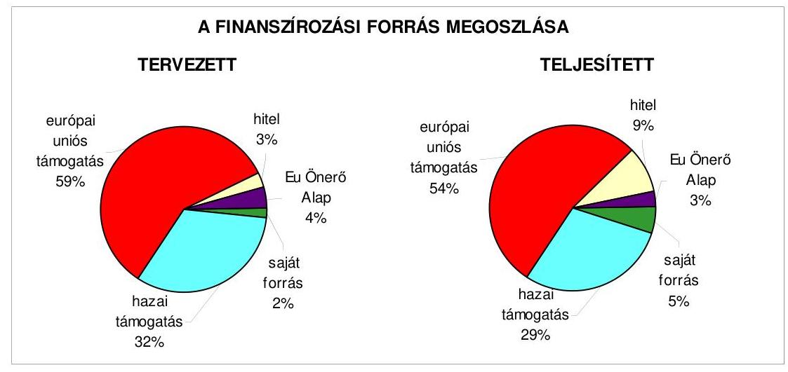

Az európai uniós forrásokkal támogatott befejezett fejlesztési feladat tervezett költségvetési kiadásai 8,4\%-kal meghaladó összegben teljesültek. A kiadásokat finanszírozó forrásokon belül az európai uniós támogatás - kettő fejlesztési feladatnál ${ }^{36}$ az euróban meghatározott támogatás összegének árfolyamváltozása miatt - a tervezettől öt százalékponttal alacsonyabb részarányban teljesült. A tervezett önkormányzati saját forrás részaránya kettő százalékponttal magasabb mértékben teljesült, kettő fejlesztési feladatnál ${ }^{37}$ a kivitelezési költségek emelkedésével összefüggésben. A PHARE főtér rekonstrukcióhoz a tervezett hitel részarányát a teljesítés nyolc százalékponttal - a fejlesztési feladat megvalósításának többletköltségei miatt - haladta meg. A tervezett és teljesített költségve-

[^0]
[^0]:    ${ }^{36}$ PHARE program „Neogradiensis Eurorégió - vállalkozói együttműködések lehetőségei a Salgótarján - Losonc tengely mentén", valamint Bóna Kovács Károly Általános Iskola felújítása fejlesztési feladatoknál.
    ${ }^{37}$ ROP Gagarin Általános Iskola felújítása és a ROP távolsági autóbusz-pályaudvar rekonstrukció.

---

tési kiadásokat és finanszírozási forrásait a jelentés 4. számú melléklete tartalmazza.

Az Önkormányzat 2005-2008. évi költségvetési rendeletei tartalmazták az európai uniós forrásokkal támogatott fejlesztési feladatok bevételi és kiadási előirányzatait. Az Önkormányzat gondoskodott az európai uniós támogatással megvalósuló fejlesztési feladatok saját forrásának biztosításáról.

Az Ámr. 29. § (1) bekezdés k) pontjában foglaltaknak megfelelően a 2005-2008. évek költségvetési rendeletei mellékletében önkormányzati szinten elkülönítetten tartalmazták az európai uniós támogatással megvalósuló programok bevételeit és kiadásait. Az Áht. 118. §-ában előírtaknak eleget téve 2005-2008 között a Közgyűlés tájékoztatása céljából bemutatták az Áht. 116. § 9. pontjában ${ }^{38}$ foglaltaknak megfelelően a többéves kihatással járó európai uniós forrásból megvalósuló fejlesztési feladatokat számszerűsítve éves bontásban, szöveges indokolással. Az Önkormányzat a projektek utófinanszírozására céltartalék képzéssel nem készült fel.

A közbenső egyeztetés során a polgármester és a jegyző által adott észrevétel szerint: „A céltartalék képzésre vonatkozóan jogszabályi rendelkezés nincs, ezért kérjük a mondat törlését."

Továbbra is indokoltnak tartjuk a projektek utófinanszírozására a céltartalék képzésére vonatkozó megállapításunkat, annak ellenére, hogy a céltartalék kötelező képzésére valóban nincs jogszabályi előírás. Az európai uniós források támogatásával megvalósuló fejlesztések utófinanszírozásai jelentős összegben és átlagosan 50-120 nap közötti időtartamra az Önkormányzat pénzügyi forrásai igénybevételét követeli meg, amely a gazdálkodás pénzügyi egyensúlyát kedvezőtlenül befolyásolhatja, a tervezett bevételek teljesítésének bizonytalansága miatt az előrelátható kockázat céltartalék képzésével csökkenthető, ezért célszerű az előfinanszírozásra a szükséges forrás tervezése.

Az ÁSZ. tv. 25. § (1) bekezdése alapján a számvevőszéki jelentésre a polgármester további észrevételt tett, mely szerint: „Az európai uniós források utófinanszírozása nem befolyásolta kedvezőtlenül az Önkormányzat pénzügyi egyensúlyát, nem okozott finanszírozási zavarokat az elmúlt időszakban, hiszen, a tervezés körültekintő volt. A céltartalék-képzés éppen ellenkező hatást váltott volna ki, hiszen az előző évi tapasztalatok szerint, indokolatlanul kötött volna le forrásokat, ezzel csökkentve az éves költségvetés mozgásterét."

A megállapításunk nem arra vonatkozott, hogy az európai uniós források utófinanszírozása kedvezőtlenül befolyásolta az Önkormányzat pénzügyi egyensúlyát, hanem arra kívántuk az Önkormányzat figyelmét felhívni, hogy az európai uniós források támogatásával megvalósuló fejlesztések jelentős összegben és átlagosan 50-120 nap közötti időtartamra az Önkormányzat pénzügyi forrásait terhelik. A tervezett bevételek teljesítésének bizonytalansága miatt az előrelátható kockázat céltartalék képzéssel csökkenthető.

[^0]
[^0]:    ${ }^{38}$ 2007. január 1-től Áht. 118. § (1) bekezdés 2. b) pontja.

---

A projektek megvalósításához kapcsolódó saját forrás biztosítására pénzintézeti hitelfelvételt ${ }^{39}$ az Önkormányzat tervezett és igénybe
 vett.

# 2.1.2. Az európai uniós forrásokhoz kapcsolódóan a pályázatfigyelés, a pályázatkészítés, valamint az európai uniós támogatással megvalósuló fejlesztés lebonyolításának belső rendjének szabályozottsága, a végrehajtás személyi, szervezeti feltételei 

Az európai uniós források igénybevételének és felhasználásának feladatait polgármesteri rendelkezésben ${ }^{40}$ a Polgármesteri hivatal és a Közgazdasági iroda ügyrendjében, valamint négy fő köztisztviselő munkaköri leírásában határozták meg, így:

- az önkormányzati szintű pályázatkoordinálás a Polgármesteri hivatalon belül az alpolgármesterek feladata volt, a polgármester felé a tájékoztatási kötelezettséget - vezetői értekezletek keretében - előírták;
- az európai uniós forrásokra irányuló pályázatfigyelés, pályázatkészítés, valamint az európai uniós forrással támogatott fejlesztés lebonyolítása a Városfejlesztési és informatikai iroda ${ }^{41}$ feladatát képezte, meghatározták a pályázatfigyelés és pályázatkészítés feladatait;
- az európai uniós forrásokkal támogatott fejlesztési feladatok lebonyolításával kapcsolatos folyamatba épített, előzetes és utólagos vezetői ellenőrzési feladatokat a Közgazdasági iroda ügyrendjében rögzítették.

Az európai uniós források igénybevételére és felhasználására vonatkozó szabályozás nem terjedt ki a pályázatfigyelést végző és a döntés-előterjesztési jogkörrel rendelkező közötti információszolgáltatási kötelezettségre, az önkormányzati szintű pályázatnyilvántartás vezetésének felelősére, a polgármester és a fejlesztési feladat lebonyolítója (projektmenedzsere) közötti kapcsolattartás rendjének és a pályázatfigyelés, pályázatkészítés és a fejlesztési feladat lebonyolításával összefüggő eljárásrendnek - a kapcsolattartás, az információáramlás és az ellenőrzés - meghatározására. A 2005-2007. évi belső ellenőrzési tervek kockázatelemzése nem terjedt ki az európai uniós forrásokkal támogatott fejlesztési feladatokra.

Az európai uniós forrásokkal kapcsolatos pályázatfigyelési és pályázatkészítési feladatok ellátásának, továbbá a fejlesztési feladatok lebonyolításának személyi, szervezeti feltételeit a Polgármesteri hivatalon belül, a Városfejlesztési és informatikai iroda köztisztviselőinek kijelölésével kialakították.

[^0]
[^0]:    ${ }^{39}$ A PHARE főtér rekonstrukcióhoz kapcsolódóan.
    ${ }^{40}$ A 3/2006. számú polgármesteri rendelkezés az alpolgármesterek feladatköréről, amely 2006. november 1-jével lépett hatályba.
    ${ }^{41}$ 2006. november 30-ig Salgótarján Megyei Jogú Város Polgármesteri Hivatalának Városfejlesztési és üzemeltetési irodája.

---

A pályázatfigyelési feladatokat ellátó köztisztviselők rendelkeztek felsőfokú végzettséggel, szakmai felkészültséggel és nyelvismerettel. Az európai uniós forrásokra irányuló pályázatfigyelés tárgyi (Internet) feltételeit a Polgármesteri hivatalban biztosították. Pályázatfigyelési feladatok ellátására külső személy, szervezet részére a polgármester nem adott megbízást. A pályázatkészítés feladatait a Városfejlesztési és informatikai iroda köztisztviselői látták el, a ROP 2.2. „Teret a jövőnek" fejlesztési feladat pályázatát a PEA II. támogatásával ${ }^{42}$ dolgozták ki. Az európai uniós forrással megvalósuló fejlesztési feladatok lebonyolításának szervezeti, személyi feltételeit egyrészt a Polgármesteri hivatal szervezeti rendszerében, másrészt külső személy igénybevételével biztosították.

A KIOP állati hulladéklerakó fejlesztési feladat megvalósításánál a projektmenedzser feladatait a Városfejlesztési és informatikai iroda köztisztviselője látta el. A ROP Gagarin Általános Iskola felújítása, és a ROP távolsági autóbusz-pályaudvar rekonstrukció fejlesztési feladatok lebonyolítására külső személlyel a polgármester megbízást kötött.

A fejlesztési feladatok lebonyolítására kötött két projektmenedzseri megbízási szerződésekben meghatározták a megbízottak feladatellátásának kötelezettségeit, valamint a projektmenedzser és a Polgármesteri hivatal részéről a lebonyolításban közreműködő köztisztviselők közötti kapcsolattartás szabályait. A megbízási szerződések nem tartalmazták az információk átadásának formáját, tartalmát és módját, továbbá nem határozták meg személyre szólóan a felelősségi szabályokat.

# 2.1.3. A fejlesztési feladat lebonyolításánál a feladatellátás rendjére, az ellenőrzési feladatok teljesítésére, valamint a felelősségi szabályokra vonatkozó előírások betartása 

A ROP 2.1.3 Hátrányos helyzetű régiók és kistérségek megközelíthetőségének javítása intézkedésre a „Salgótarjáni távolsági autóbusz-pályaudvar rekonstrukciója" pályázatot az Önkormányzat - a Nógrád Volán Rt. partnerségével - a 2004. évben nyújtotta be, amely a 2005. évben eredményesen zárult. A beruházás összköltsége 320 millió Ft volt, amely pénzügyi forrása 90\%-ban támogatás ${ }^{43}$, 10\%-ban saját forrás volt. A támogatási szerződést 2005. július 13-án a főkedvezményezett Önkormányzat a szerződő hatósággal ${ }^{44}$ megkötötte. Az Önkormányzat a 2005. évben az EU Önerő Alap támogatásra pályázat benyújtásáról döntött, amely eredményes volt. A fejlesztési feladat megvalósításához a saját forrás 70\%-os mértékéig, 22,4 millió Ft támogatásban részesült az Önkormányzat.

[^0]
[^0]:    ${ }^{42}$ Észak-magyarországi Regionális Fejlesztési Tanács Pályázat Előkészítő Alap támogatása.
    ${ }^{43}$ A támogatás összegéből 83,33\% európai uniós, és 16,67\% hazai kormányzati finanszírozás volt.
    ${ }^{44}$ A szerződő hatóság a Magyar Terület- és Regionális Fejlesztési Hivatal szervezeti keretei között működő Regionális Fejlesztés Operatív Program Irányító Hatóság, a nevében eljáró közreműködő szervezet a VÁTI Kht. volt.

---

A projekt megvalósításának kezdő napja a támogatási szerződés aláírását követő nap, a befejezésének tervezett időpontja 2006. augusztus 30-a volt. Az utókövetési időszak 2010. március 31-ig, az ellenőrzési és monitoring időszak 2013. december 31-ig tart. A projekt megvalósításával kapcsolatos adatokat a jelentés 5. számú melléklete tartalmazza.

A támogatási szerződés módosítását az Önkormányzat három, a közreműködő szervezet egy alkalommal kezdeményezte.

Az Önkormányzat szerződésmódosítást kezdeményezett a projektben résztvevő műszaki szakértő helyett monitoring szakértő alkalmazása miatt ${ }^{45}$. További két alkalommal ${ }^{46}$ a projekt befejezésének tervezett napja 2007. március 31-re, ezt követően május 31-re módosult, valamint a cselekvési ütemterv változott. A kivitelezéskor felmerült műszaki-statikai - az új épületet a korábbi egyszintes építmény alapozására tervezték, azonban az épület visszabontása után az alapra nem lehetett a kétszintes épület nagyobb terhelését beépíteni - problémák miatt, amelyek szükségessé tették a tervdokumentációk és a kivitelezés módosítását. A negyedik szerződésmódosítást a közreműködő szervezet a támogatási eljárásrend változása miatt kezdeményezte ${ }^{47}$.

A ROP távolsági autóbusz-pályaudvar rekonstrukció kivitelezése a támogatási szerződésben rögzített időpontban megkezdődött és a hatályos támogatási szerződésben meghatározott időbeli ütemezésben megvalósult. A támogatási szerződésben biztosított lehetőséggel élve, a támogatási összeg 25\%-ának megfelelő összegű - 72 millió Ft - támogatási előleget az Önkormányzat leigényelte, azonban - a hatályos támogatási szerződésben rögzítettől eltérő, késedelmes kivitelezés miatt - az előírt határidőig ${ }^{48}$ nem használta fel. A közreműködő szervezet felszólította az Önkormányzatot az előleg visszafizetésére, amely kötelezettségének 2006. május 9-én eleget tett.

A támogatások igénybevétele nem felelt meg a hatályos támogatási szerződés ütemezésének, a 2005-2006. évre tervezett 11,3 millió Ft, illetve 219,1 millió Ft folyósítása elmaradt, a 2007. évben 57,6 millió Ft támogatást terveztek, amely 286,7 millió Ft összegben teljesült. Az európai uniós támogatás igénylésénél a PEJ-ek, illetve a kifizetési kérelmeket alátámasztó számlák és dokumentumok ellenőrzése 50-119 nap közötti időtartamot vett igénybe, azonban nem hátráltatta a ROP távolsági autóbusz-pályaudvar rekonstrukció fejlesztési feladat kivitelezését. A ROP távolsági autóbuszpályaudvar rekonstrukció projekt megvalósításához hat alkalommal nyújtott be az Önkormányzat kifizetési kérelmet, amelyre a közreműködő szervezet négy alkalommal folyósított támogatást. A projekt zárójelentése 2007. május 30-ával készült el.

[^0]
[^0]:    ${ }^{45}$ 2005. december 6-ai 1. számú szerződésmódosítás.
    ${ }^{46}$ A 2. és 3. számú szerződésmódosítás 2006. szeptember 25-én és 2007. február 1-jén volt.
    ${ }^{47}$ A 14/2004. (VIII. 13.) TNM-GKM-FMM-FVM-PM együttes rendelet 30. § (2) (4) (33) bekezdésében foglaltakat 2006. november 9-én módosította a 8/2006. (X. 20.) MeHVMPM-FVM együttes rendelet 12. § (1) (2) bekezdése és a 14. §-a.
    ${ }^{48}$ 2006. március 19.

---

A közreműködő szervezet az 1/2006. jelű kifizetési kérelem felülvizsgálatakor megállapította, hogy nem felelt meg a csatolt számlaösszesítő az eljárásrendnek, nem az elkülönített számláról teljesítették a kifizetéseket, hiányzott a projektmenedzser beszámolója az ellátott tevékenységről, a kivitelezői számla nem eredeti példányát csatolták, hiányos volt a tervdokumentáció, elmaradt az építési biztosítás megkötése, valamint hét vállalkozói számlánál alaki, tartalmi hiányosság volt ${ }^{49}$. Az 1/2007. jelű kifizetési kérelmet a közreműködő szervezet elutasította, mivel nem felelt meg a kifizetés igénylések rendjére meghatározott minimum követelményeknek.

A fejlesztési feladat kiadásainak teljesítése nem felelt meg a hatályos támogatási szerződésben foglalt tervezett ütemezésnek. Az Önkormányzat nem kezdeményezte a cselekvési ütemterv változásával egyidejűleg a pénzügyi ütemezés évek közötti módosítását.

A hatályos támogatási szerződésben a tervezett kiadás a 2005. évben 12,5 millió Ft volt, amely nem teljesült, a 2006. évben 243,5 millió Ft 63\%-át (152,9 millió Ft), a 2007. évben 64 millió Ft-tal szemben 201,5 millió Ft-ot teljesítettek.

A lebonyolításra kötött megbízási szerződésben foglalt feladatokat a megbízott ellátta, és eleget tett a kapcsolattartás rendjére vonatkozó kötelezettségének.

A ROP távolsági autóbusz-pályaudvar rekonstrukció megvalósítására a támogatási szerződésben meghatározott 288 millió Ft támogatás 99,5\%-át az Önkormányzat felhasználta. A támogatás 1,3 millió Ft-os megtakarítását a projektmenedzsment személyi jellegű költségei és a szolgáltatások igénybevételének kiadásai tervezettnél alacsonyabb összegű teljesítése eredményezte ${ }^{50}$. A fejlesztési feladat megvalósításához a saját forrást az Önkormányzat biztosította, továbbá eleget tett a strukturális alapokból támogatott fejlesztés megelőlegezési követelményének. A gazdálkodásban nem okozott pénzügyi nehézségeket az európai uniós forrásból megvalósuló fejlesztési feladatnál a támogatás utólagos finanszírozási rendszere.

A ROP távolsági autóbusz-pályaudvar rekonstrukció fejlesztési feladat kivitelezésének 354,4 millió Ft-os összköltsége a pályázatban és a támogatási szerződésben tervezett kiadást 34,4 millió Ft-tal meghaladta. A többletköltségeket a kivitelezés során felmerült műszaki feladatok többletkiadásai - a statikai terv módosítása és azzal együtt járó alapozási munkák kiadása - okozták. A többletkiadás fedezetét saját forrásból az Önkormányzat biztosította ${ }^{51}$, külső pénzügyi forrást a fejlesztési feladat megvalósításához nem vett

[^0]
[^0]:    ${ }^{49}$ Az árajánlat számlázási ütemtervében foglaltaknak a számla összege nem felelt meg, a számla dátuma a kifizetési számlaösszesítőben hiányos volt, két részszámla összege eltért a megbízási szerződésben meghatározott összegtől, a számlához tartozó teljesítés igazolás nem a bejelentett személyek cégszerű aláírását tartalmazta, nem csatolták a tervezői számlához az átadás-átvételi jegyzőkönyvet és hiányos volt a tervdokumentáció (csak CD-n tartalmazta), valamint nem tartalmazta a számla a lefolytatott közbeszerzési eljárásra való hivatkozást.
    ${ }^{50}$ A tervezett személyi jellegű kiadás 2,4 millió Ft-ról 2,2 millió Ft-ra, a szolgáltatások igénybevételi költsége 23,3 millió Ft-ról 22,2 millió Ft-ra teljesült.
    ${ }^{51}$ Az Önkormányzat 16/2007. (VI. 26.) számú rendelete.

---

igénybe. A többletkiadások felmerülését nem az önkormányzati szabályozottság hiányossága, hanem a pályázatban nem szereplő többletmunkák kiadásai okozták.

A támogatási szerződésben foglalt fejlesztési cél teljesült, a távolsági autóbusz-pályaudvar rekonstrukció megvalósult a forgalmi igényeknek megfelelő befogadó és áteresztő technikai felszereltséggel bíró közlekedési infrastruktúrával, amely illeszkedett a Salgótarján környezetvédelmi programjához, valamint megfelelt az európai uniós környezetvédelmi előírásoknak, továbbá biztosította a fogyatékos személyek - mozgáskorlátozottak akadálymentes közlekedését segítő útvonalak kiépítésével - esélyegyenlőségét. A tervezett indikátorok ${ }^{52}$ 2498 m$^{2}$ beépített bruttó terület, $5000 \mathrm{~m}^{2}$ kapcsolódó útfelület, 17 indító fogadó állomás kiegészítő berendezésekkel és szerelvényekkel - teljesültek.

A Polgármesteri hivatalban a folyamatba épített ellenőrzési feladatokat 2005-2007 között az európai uniós forrással megvalósult ROP távolsági autóbusz-pályaudvar rekonstrukció fejlesztési feladattal kapcsolatos kiadások teljesítésénél és a bevételek beszedésénél végrehajtották. A kötelezettségvállalások és az utalványok ellenjegyzését az arra jogosultak látták el.
 A teljesítés szakmai igazolását a belső szabályozásban előírt módon a kijelölt személyek, az érvényesítést megfelelő végzettséggel és képzettséggel rendelkező köztisztviselők végezték. A belső ellenőrzés a ROP távolsági autóbusz-pályaudvar rekonstrukció megvalósítását a 2005-2007. években nem vizsgálta.

Külső ellenőrzést a közreműködő szervezet a 2006-2007. évben három alkalommal - helyszíni monitoring látogatásai keretében - végzett, áttekintette a pályázati és pénzügyi dokumentációt, a megvalósítás készültségi fokát, szabálytalanságot nem állapított meg, és megállapításaihoz visszafizetési kötelezettség nem kapcsolódott.

A támogatási szerződésben előírtaknak megfelelően a projekt megvalósításának könyvvizsgálói ellenőrzése megtörtént. Az ellenőrzési jelentésben rögzítette a könyvvizsgáló, hogy a támogatási szerződésben foglalt kötelezettségeit az Önkormányzat teljesítette, ezáltal a támogatási szerződés szerinti 288 millió Ft támogatási összegből 286,7 millió Ft lehívására volt jogosult, valamint 67,7 millió Ft saját forrást biztosított a fejlesztési feladat megvalósításához. Megállapította továbbá, hogy a projekt végrehajtásához kapcsolódó elszámolás és a főkönyvi könyvelés hiteles, megbízható és dokumentumokkal alátámasztott.

Az európai uniós forrásokra történt pályázatok az ágazati, szakmai fejlesztési koncepciókban és tervekben megfogalmazott fejlesztési célkitűzésekhez kapcsolódtak, azonban a szabályozottság és szervezettség terén az Önkormányzat a 2005-2007. években nem készült fel eredményesen az európai uniós források igénybevételére és felhasználására. A szabályozás tartalmazta a folyamatba épített, előzetes és utólagos vezetői ellenőrzés feladatait. A Polgármesteri hivatalon belül a pályázatfigyelés és a pályázatkészítés személyi feltételeit biztosították. Nem szabályozták a pályázatfigyelést végzők és a döntési, illetve döntés-előkészítési jogkörrel rendelkezők közötti információk szolgáltatá-

[^0]
[^0]:    ${ }^{52}$ Számszerúsíthető célkitűzések.

---

sának kötelezettségét, a polgármester és a fejlesztési feladat lebonyolítója közötti kapcsolattartás rendjét, nem írtak elő a belső ellenőrzés részére európai uniós pályázatok ellenőrzésével kapcsolatos feladatokat. Nem határozták meg a pályázatkészítést végző személyek és a pályázat benyújtásáért felelős személy közötti kapcsolattartás és felelősség szabályait, továbbá a fejlesztési feladat lebonyolítását végző személyre szóló felelősségét.

# 2.2. Az elektronikus közigazgatási feladatok ellátása, a közérdekű adatok elektronikus közzététele 

A Polgármesteri hivatal 2004-ben helyzetelemzés alapján elkészítette az e-önkormányzati stratégiát ${ }^{53}$, amelyben az e-közigazgatási feladatok megvalósításának rövid-, közép- és hosszú távú célkitűzéseit meghatározták.

Az e-önkormányzati stratégia kidolgozásakor támaszkodtak a MITS ${ }^{54}$, illetve a kapcsolódó európai uniós ajánlásokra, az "eEurope-2005" cselekvési tervben foglalt célokra, továbbá felmérték az NFT-ben meghirdetett pályázati lehetőségeket. A rövid távú stratégiai célként 2004-2006 között az önkormányzati alap infrastruktúra kiépítését és a város honlapjának kialakítását határozták meg, amely alapul szolgált az e-közigazgatás ügyfelek általi igénybevételéhez. A hosszú távú stratégia célkitűzése - 2012-ig - az e-közigazgatás 4. elektronikus szolgáltatási szintű igénybevételi lehetőségének kiépítése volt. Az informatikai stratégiában előírták annak évenkénti felülvizsgálatát, azonban ezt 2005-2007 között nem végezték el.

Az Önkormányzat a 2005-2007. években nem pályázott a GVOP, ÁROP és EKOP keretében kiírt e-közigazgatási fejlesztési támogatásokra. Az e-közigazgatási feladatok ellátásának személyi feltételeit a Polgármesteri hivatalon belül, a Városfejlesztési és informatikai iroda informatikai munkacsoportjának köztisztviselőivel biztosították. A feladatokat 1. és 2. elektronikus szolgáltatási szinten saját számítógépes információs rendszeren, vásárolt szoftverrel valósították meg.

Az e-közigazgatási feladatokat támogató informatikai rendszert a 2006. évtől az Önkormányzat a honlapján ${ }^{55}$ keresztül működteti, amelyet a magánszemélyek és a vállalkozások részére a 2. elektronikus szolgáltatási szinten kiépítette, az Okmányirodai ${ }^{56}$ ügykörökben az 1. elektronikus szolgáltatási szinten biztosította.

Az e-közigazgatási feladatok közül a hatósági igazolással, gépjármű regisztrációval, gépjárműadó fizetéssel, az építési engedélyezési ügyekkel, a szociális juttatások, támogatások kifizetéseivel, valamint a helyi adózással kapcsolatos informá-

[^0]
[^0]:    ${ }^{53}$ Az e-önkormányzati stratégiát Közgyűlés 220/2004. (X. 28.) számú határozatával elfogadta.
    ${ }^{54}$ Magyar Információs Társadalom Stratégiáról szóló, 1126/2003. (XII. 12.) Korm. határozat.
    ${ }^{55}$ Az Önkormányzat hivatalos honlapja a www.salgotarjan.hu címen érhető el.
    ${ }^{56}$ Salgótarján Megyei Jogú Város Polgármesteri hivatalának Okmány, Igazgatási és Közterület-felügyeleti Irodája.

---

ciók, dokumentumok és nyomtatványok letöltését a magánszemélyek és vállalkozások számára a 2. elektronikus szolgáltatási szinten nyújtotta az Önkormányzat. Az Okmányirodai szolgáltatásokat - személyi okmányok, lakcímváltozás bejelentése - az 1. elektronikus szolgáltatási szinten biztosították.

A Polgármesteri hivatalban a 4. elektronikus szolgáltatási szintnek megfelelő ügyintézés elérését a szoftver és a rendelkezésre álló pénzügyi feltételek hiánya akadályozta, a személyi feltételek rendelkezésre álltak. Az elektronikus ügyintézés kizárásáról ${ }^{57}$ az Önkormányzat rendeletének ${ }^{58}$ záradékában rendelkezett. Az Önkormányzatnál az e-közigazgatási feladatokat ellátó informatikai rendszer ügyfelek általi igénybevételét nem vizsgálták és annak tapasztalatait nem értékelték.

Az Önkormányzat az Eisztv. 21. § (3) bekezdése alapján a 2007. évben nem volt kötelezett a közérdekű adatok elektronikus közzétételére, mivel a lakosság száma nem érte el az 50 ezer főt. A jegyző az Áht. 15/A. § (1) bekezdésben előírtak alapján a 2007. évben nyújtott céljellegű működési és fejlesztési célú támogatások kedvezményezettjeinek nevét, célját, összegét, továbbá a támogatási program megvalósítási helyét az Önkormányzat honlapján közzétette. Az Áht. 15/B. § (1) bekezdésben foglaltaknak megfelelően az Önkormányzat pénzeszközei felhasználásával, a vagyonnal történő gazdálkodással összefüggő - a nettó ötmillió Ft-ot elérő vagy azt meghaladó értékű - szerződések megnevezését, tárgyát, a szerződéskötő felek nevét, a szerződés értékét, határozott időre kötött szerződés esetén annak időtartamát honlapján nyilvánosságra hozta. A közzétett információk honlapon belüli elérhetősége, elrendezése és tartalmi szerkezete nem felelt meg a 18/2005. (XII. 27.) IHM rendeletben előírt közzétételi egységeknek. A 2005. és 2006. évi költségvetési beszámolók szöveges indoklásait a jegyző közzétette.

# 3. A KÖLTSÉGVETÉSI GAZDÁLKODÁS BELSŐ KONTROLLJAI 

### 3.1. A szabályozottság kockázata a költségvetés tervezési, gazdálkodási, beszámolási és a folyamatba épített, előzetes és utólagos vezetői ellenőrzési feladatoknál

A költségvetés tervezési és a zárszámadás készítési folyamatok szabályozottsága alacsony kockázatot ${ }^{59}$ jelentett a feladatok megfelelő, szabályszerű végrehajtásában, mivel a jegyző a pénzügyi irányítási és ellenőrzési rendszer keretében a jogszabályi előírásoknak és a helyi sajátosságoknak

[^0]
[^0]:    ${ }^{57}$ Elektronikus úton - azon ügyek kivételével, amelyek esetében magasabb szintű jogszabály rendelkezései alapján biztosítani kell az elektronikus út ügyfél által történő igénybevételének lehetőségét - nem intézhetők.
    ${ }^{58}$ Az Önkormányzat 42/2005. (X. 27.) számú rendelete a közigazgatási hatósági eljárás és szolgáltatás általános szabályairól szóló 2004. évi CXL. törvény hatályba lépésével összefüggő egyes önkormányzati rendeletek módosításáról.
    ${ }^{59}$ A kialakított belső kontrollokban rejlő kockázatot alacsonynak minősítjük, ha a kontrollok - végrehajtásuk esetén - megfelelő védelmet nyújtanak a hibák bekövetkezése ellen.

---

megfelelően szabályozta a 2007. évi költségvetési tervezés és a 2006. évi zárszámadás elkészítésének rendjét.

A gazdálkodási, a pénzügyi-számviteli és a folyamatba épített ellenőrzési feladatok szabályozottságának hiányosságai közepes kockázatot jelentettek a feladatok szabályszerű végrehajtásában, mivel az ellenőrzési feladatokat hiányosan szabályozták, azonban a kialakított belső kontrollok - végrehajtásuk esetén - a lehetséges hibák többsége ellen védelmet nyújtottak. A közepes kockázatot a következő szabályozási hiányosságok okozták:

- a Közgyűlés a Polgármesteri hivatal SzMSz-ében a gazdasági szervezet felépítését nem határozta meg. A gazdasági szervezet ügyrendje részletesen nem tartalmazta a vezetők és a más dolgozók feladat-, hatás- és jogkörét. A pénzügyi-gazdasági területen foglalkoztatott köztisztviselők munkaköri leírásaiban a vezetők és munkatársak gazdálkodási és ellenőrzési feladataihoz kapcsolódóan nem rögzítették a kötelezettségeket, a hatásköröket és a felelősségi jogköröket;
- a jegyző a Polgármesteri hivatal számviteli politikájában nem szabályozta a vagyoni értékű jogok és a szellemi termékek minősítésénél a figyelembe veendő szempontokat, a pénz- és értékkezelési szabályzatban az utólagos vezetői ellenőrzés gyakoriságát és módját ${ }^{60}$, továbbá a selejtezési szabályzatban a döntéshozatalra jogosultak körét és az eljárás szabályszerű végrehajtásában a folyamatba épített ellenőrzésért felelős személyt ${ }^{61}$. A pénzügyi-számviteli terület érintett köztisztviselőinek munkaköri leírásai nem tartalmazták a leltározási, az értékelési és az ellenőrzési, továbbá a főkönyv és az analitikus nyilvántartások egyeztetési, dokumentálási feladatait ${ }^{62}$;
- a kockázatkezelés eljárási rend nem tartalmazta a kockázatok azonosítását, valamint folyamatgazdáit, a kockázatok értékelését és kategóriákba sorolását, az elfogadható kockázati keret meghatározását, a válaszintézkedések megvalósíthatóságának mérlegelését, a kockázat nyilvántartását, a válaszintézkedés beépítését a folyamatba és a kockázati környezet rendszeres felülvizsgálatát ${ }^{63}$.

A gazdálkodási, pénzügyi-számviteli feladatellátás szabályozottságára az ÁSZ által - az Önkormányzat gazdálkodásának 2003. évi átfogó ellenőrzése kereté-

[^0]
[^0]:    ${ }^{60}$ A közbenső egyeztetés során a polgármester és a jegyző által adott tájékoztatás szerint a jegyző 2008. július 1-jétől a pénz- és értékkezelési szabályzatban rögzítette az utólagos vezetői ellenőrzés gyakoriságát és módját.
    ${ }^{61}$ A közbenső egyeztetés során a polgármester és a jegyző által adott tájékoztatás szerint a jegyző 2008. július 1-jétől a selejtezési szabályzat módosításában meghatározta a döntéshozatalra jogosultak körét és az eljárás szabályszerű végrehajtásában a folyamatba épített ellenőrzésért felelős személyt.
    ${ }^{62}$ A Polgármesteri hivatal számviteli politikája, a leltározási szabályzata, az értékelési szabályzata, és a selejtezési szabályzata 2004. január 1-jével, a pénz- és értékkezelési szabályzata 2006. január 1-jével, a számlarend 2007. január 1-jével lépett hatályba.
    ${ }^{63}$ A Polgármesteri hivatal kockázatkezelési szabályzata a kockázatkezeléssel szemben támasztott általános követelményeket tartalmazta (20834-1/2006. számú ellenőrzési szabályzat III. fejezet).

---

ben - tett szabályszerűségi javaslatokat hasznosították. A Közgyűlés jóváhagyta a Polgármesteri hivatal alapító okiratát, SzMSz-ét, elkészítették a gazdasági szervezet ügyrendjét, továbbá a számviteli politika és keretében előírt szabályzatokat és a számlarendet kiegészítették.

A Polgármesteri hivatalban az informatikai rendszer szabályozottsága összességében alacsony kockázatot jelentett az informatikai feladatok biztonságos végrehajtásában, mivel a Közgyűlés elfogadta az e-önkormányzati stratégiát, az adatvédelemmel kapcsolatos feladatokat és az informatikai eszközökhöz történő hozzáférés rendjét pedig a jegyző utasításban ${ }^{64}$ szabályozta. Annak ellenére összességében alacsony volt a kockázat, hogy pénzügyi és számviteli területen dolgozó kettő köztisztviselő munkaköri leírásában az informatikai feladatokat a jegyző nem rögzítette, továbbá nem szabályozta a pénzügyi-számviteli számítógépes programrendszerben az adat-karbantartási folyamat feladatait.

# 3.2. A belső kontrollok érvényesülése az önkormányzati források szabályszerű felhasználásában, a költségvetési tervezés, gazdálkodás, beszámolás folyamataiban 

A költségvetés tervezési és zárszámadás készítési folyamatban a működési hibák megelőzésére, feltárására, kijavítására kialakított belső kontrollok működésének megbízhatósága kiváló ${ }^{65}$ volt, mivel a belső szabályozásban előírt ellenőrzési és egyeztetési feladatokat elvégezték, a kontrollok működése megfelelt a hibák megelőzésére és kijavítására meghatározott szabályozásnak és a legmagasabb szintű elvárásoknak. A Polgármesteri hivatalban az előírásoknak megfelelően ellenőrizték a 2007. évi költségvetési tervezés folyamatában a költségvetési javaslat összeállításával kapcsolatban a költségvetési intézmények részére meghatározott szakmai és pénzügyi követelmények teljesítését, az intézményi mutatószám felmérés adatai megbízhatóságát, az intézmények és a Polgármesteri hivatal szervezeti egységei által benyújtott költségvetési igények indokoltságát és teljesíthetőségét. A 2006. évi zárszámadás készítése folyamatában felülvizsgálták az intézmények pénzmaradvány megállapításának szabályszerűségét, valamint ellenőrizték az intézményi eredeti és a módosított előirányzatok, valamint a teljesítési
 adatok eltérésének indokoltságát.

A Polgármesteri hivatal a külső szolgáltatók által végzett karbantartási, kisjavítási szolgáltatásokkal kapcsolatos kiadások fedezetére a 2007. évi elemi költségvetésében 254,2 millió Ft, a 2008. évi költségvetésében 326,8 millió Ft eredeti előirányzatot tervezett. Az eredeti előirányzat a 2007. évben 23,2%-os, a 2008. évben 28,4%-os részarányt képviselt a tervezett dologi kiadásokból.

[^0]
[^0]:    ${ }^{64}$ Jegyző 6/2003. (V. 31.) számú utasítása az adatvédelmi kötelezettségek teljesítéséről.
    ${ }^{65}$ A kontrollok működésének eredményességét, megbízhatóságát kiválónak értékeljük abban az esetben, ha azok működése - esetleg apróbb hiányosságoktól eltekintve - megfelelt a hibák megelőzésére és kijavítására meghatározott szabályozásnak és a legmagasabb szintű elvárásoknak. Jónak minősítjük a kontrollok működését, ha a hiányosságok száma ugyan jelentős volt, de nem veszélyeztette az ellenőrzött terület hibáinak megelőzését és kijavítását. Amennyiben a hiányosságok mértéke nem biztosította a hibák megelőzését, feltárását, kijavítását és ezáltal veszélyeztette az eredményes, megbízható működést, a kontroll működésének megbízhatósága gyenge minősítést kap.

---

előirányzat a 2007. évben 23,2%-os, a 2008. évben 28,4%-os részarányt képviselt a tervezett dologi kiadásokból.

Az előirányzatok felhasználására vonatkozó kötelezettségvállalások tárgya ${ }^{66}$ összhangban volt a Polgármesteri hivatal által ellátott feladatokkal. A Polgármesteri hivatalnál a külső szolgáltató által végzett karbantartási, kisjavítási munkák kifizetései során a szerződésekben, illetve megrendelésekben meghatározott feladatok teljesítésének, a kiadások jogosultságának és összegszerűségének ellenőrzését a szakmai teljesítés igazolására kijelölt személyek a kifizetés alapját képező bizonylatokon - belső szabályzatban előírt módon - elvégezték, a belső kontrollok működésének megbízhatósága azonban gyenge volt, mivel az utalvány ellenjegyzője a vészvilágítási, és az irodatechnikai berendezések karbantartásairól, valamint a gépkocsi gumijavítás és kerékcentírozásról ${ }^{67}$ szóló számlák kifizetését megelőzően nem győződött meg a gazdálkodásra vonatkozó szabályok betartásáról:

- nem kifogásolta, hogy az irodatechnikai berendezés karbantartási és gépkocsi gumijavítás, kerékcentírozás megrendelésekor a jegyző a védelmi feladatok kiadásaira a polgármester felhatalmazása nélkül vállalt kötelezettséget, továbbá nem észrevételezte, hogy ezen karbantartásokra irányuló kötelezettségvállalások ellenjegyzési feladataira a jegyző felhatalmazása nem terjedt ki;
- a vészvilágítás karbantartására vonatkozó kötelezettségvállalásokat nem előzte meg annak ellenjegyzése, ezáltal nem végezték el a kiadási előirányzat által biztosított fedezet meglétének, a kötelezettségvállalás jogszerűségének munkafolyamatba épített ellenőrzését.

A közbenső egyeztetés során a polgármester és a jegyző által adott észrevétel szerint: „A hiányosságot megítélésünk szerint rendszerében kell vizsgálni. A kötelezettségvállalás egy korábbi időszakban kötött szerződés módosításáról, azon belül is a díj módosításáról szól. A korábbi időszakban kötött szerződés alapján az aktuális év költségvetési terv összeállításánál a vészvilágítás karbantartására vonatkozó költségelem figyelembe lett véve, tehát a fedezet e tekintetben biztosított volt. A vállalkozói számla kifizetésénél a szabályozásnak megfelelően az előirányzat-kezelő teljesítésigazolása alapján az érvényesítő és az ellenjegyző lefolytatta a jogosultság, az összegszerűség, a szerződés teljesítésére irányuló ellenőrzést."

Az ellenőrzési megállapítást továbbra is fenntartjuk, mivel a vészvilágítás karbantartására vonatkozó szerződésben a polgármester ellenjegyzés nélkül vállalt kötelezettséget, ezzel nem tartotta be az Ámr. 134. § (2) bekezdésében foglaltakat, ezt a mulasztást az utalvány ellenjegyzője sem jelezte. A vészvilágítás karbantartására vonatkozó díjmódosítás miatti fedezet növekménye az éves költségvetési tervben nem volt biztosított tekintettel arra, hogy a korábbi időszakban kötött

[^0]
[^0]:    ${ }^{66}$ A megfelelőségi teszt elvégzése során ellenőrzött külső szolgáltató által végzett karbantartási, kisjavítási munkák épület-, fénymásológép, klímaberendezés-, jármű karbantartására, közterület, útjavítási-, tisztasági, park és temető fenntartási feladatok elvégzésére irányultak.
    ${ }^{67}$ Az irodatechnikai berendezés és a gépkocsi karbantartás kiadásai a védelmi feladatokhoz kapcsolódtak.

---

szerződés alapján tervezték a költségvetésben ennek a kiadási előirányzatát. Az utalvány ellenjegyzője az Ámr. 134. § (9) bekezdésének a) pontjában foglaltak ellenére nem győződött meg a kötelezettségvállalás tárgyával összefüggő kiadási előirányzat rendelkezésre állásáról.

Az ÁSZ. tv. 25. § (1) bekezdése alapján a számvevőszéki jelentésre a polgármester további észrevételt tett, mely szerint: „A díjnövekmény fedezete a dologi előirányzaton belül biztosított volt. Az nem jelenthető ki, hogy nem végezték el a kiadási előirányzat által biztosított fedezet meglétének vizsgálatát a komplex módon meghatározott dologi előirányzat keretén belül, hiszen a szakemberek szignói az ellenkezőjét igazolják."

A megállapításunkat továbbra is fenntartjuk. Az Áht. 98. § (2) bekezdése értelmében a kötelezettségvállalás - a törvényben meghatározott kivétellel - ellenjegyzés után és írásban történhet. A vészvilágítás karbantartására vonatkozó utalvány esetében az utalvány ellenjegyzés azért volt formai, mert az utalvány ellenjegyzője az Ámr. 137. § (3) bekezdésében foglalt előírás ellenére aláírását megelőzően nem győződött meg a gazdálkodásra vonatkozó szabályok érvényesüléséről, és nem észrevételezte, hogy a kötelezettségvállalást nem előzte meg annak ellenjegyzése.

A Polgármesteri hivatal gépek, berendezések, felszerelések beszerzésével és létesítésével kapcsolatos kiadások fedezetére a 2007. évi elemi költségvetésében 23,8 millió Ft, a 2008. évben 19 millió Ft eredeti előirányzatot tervezett. Az eredeti előirányzat a 2007. évben 2,3%-os, a 2008. évben 3,1%-os részarányt képviselt a tervezett felhalmozási kiadásokból. Az előirányzatok felhasználására vonatkozó kötelezettségvállalások tárgya ${ }^{68}$ összhangban volt a Polgármesteri hivatal által ellátott feladatokkal. A Polgármesteri hivatalnál a gépek, berendezések és felszerelések beszerzése kifizetései során a szerződésekben, a megrendelésekben meghatározott feladatok teljesítésének, a kiadások jogosultságának, összegszerűségének ellenőrzését a szakmai teljesítés igazolására kijelölt személyek a kifizetés alapját képező bizonylatokon - belső szabályzatban előírt módon - elvégezték. A belső kontrollok működésének megbízhatósága azonban gyenge volt, mivel az utalvány ellenjegyzője a védelmi feladatokra beszerzett eszközök ${ }^{69}$ számláinak kifizetései előtt nem győződött meg a gazdálkodásra vonatkozó szabályok betartásáról, mivel nem kifogásolta, hogy a gumicsónak, memóriakártya, videokamera beszerzésére a polgármesteri felhatalmazás nem terjedt ki, ezért a rendelkező személyek jogosulatlanul vállaltak kötelezettséget. Továbbá nem észrevételezte, hogy a kötelezettségvállalások ellenjegyzését végzőt a jegyző nem hatalmazta fel a védelmi feladatokhoz kapcsolódó eszközbeszerzés kiadásaira, valamint a „Életre való pályázat" eszközbeszerzés számláinak kifizetése előtt nem győződött meg a szakmai teljesítésigazolás és érvényesítés megtörténtéről.

[^0]
[^0]:    ${ }^{68}$ A megfelelőségi teszt elvégzése során ellenőrzött gép, berendezés, felszerelés beszerzése számítástechnikai eszközök és azok tartozékai, fénymásoló gép, karácsonyi fénydekoráció, televízió, DVD lejátszó, rádiós mikrofon, mobil Internet vásárlására irányultak.
    ${ }^{69}$ Gumicsónak, memóriakártya, videokamera.

---

A közbenső egyeztetés során a polgármester és a jegyző által adott észrevétel szerint: „Az „Életre való pályázat" eszközbeszerzés számlái esetében az érvényesítési munka szakmailag helyesen elvégzésre került, és ezt nem lehet megkérdőjelezni. A szakmai teljesítésigazolást az a személy végezte, aki a pályázatot szakmailag összeállította, felügyelte a megvalósulását, akinek a személyét a pályázat elszámolásakor a pályázat kiírója sem kérdőjelezte meg. E tekintetben tehát biztosított volt az a szakmai hozzáértés, amely a pénzeszközök felhasználásának helyességét a pályázatkiíró felé is biztosította. Megítélésünk szerint a tevékenységeket a tartalmuk szerint kell minősíteni jónak vagy hibásnak. Az ÁSZ is ezen az állásponton van, amikor azt a hiányosságot fogalmazza meg, hogy a könyvelés néhány esetben nem a számla tartalmának megfelelően történt."

Megállapításunkat továbbra is fenntartjuk, mivel az „Életre való pályázat" eszközbeszerzés számláinak kifizetése előtt az ellenjegyző nem győződött meg a szakmai teljesítésigazolás és az érvényesítés megtörténtéről, ezzel az utalvány ellenjegyzője nem látta el az Ámr. 134. § (9) bekezdés c) pontjában előírt feladatát, az utalvány ellenjegyzése formai volt, mivel nem észrevételezte, hogy az Ámr. 135. § (1) bekezdésében foglaltak ellenére a kiadások teljesítésének elrendelése előtt okmányok alapján szakmailag nem igazolták azok jogosultságát és összegszerűségét. Az érvényesítést az érvényesítő annak ellenére elvégezte, hogy az nem a szakmai teljesítésigazoláson alapult, ezzel nem látta el az Ámr. 135. § (3) bekezdésében meghatározott ellenőrzési feladatát.

Az ÁSZ. tv. 25. § (1) bekezdése alapján a számvevőszéki jelentésre a polgármester további észrevételt tett, mely szerint: „Attól még, hogy az ellenjegyző bizonyos hiányosságra nem hívta fel a figyelmet, attól még nem jelenthető ki hogy az egész finanszirozási folyamat nem került elvégzésre, és nem fogadható el, hogy az ellenjegyzés csupán formai volt, miközben a kiadások jogosultságát, összegszerűségét szakemberek igazolták, hiszen e nélkül a kifizetésre sem kerülhetett volna sor."

A megállapításunkat továbbra is fenntartjuk, mivel az Ámr. 137. § (3) bekezdése, valamint 134. § (9) bekezdésének c) pontja egyértelműen meghatározza a kötelezettségvállalások, illetve az utalványok ellenjegyzésére jogosultaknak az ellenjegyzést megelőző ellenőrzési feladatait, amely előírásoknak az utalvány ellenjegyzője nem tett eleget.

A Polgármesteri hivatalnál a működési célú pénzeszközátadások államháztartáson kívülre teljesített kifizetéseire a 2007. évi költségvetésben 397,9 millió Ft, a 2008. évi költségvetésben 395,7 millió Ft eredeti előirányzatot tervezett. Az eredeti előirányzat a 2007. évben 96,4%-os, a 2008. évben 95,3%-os részarányt képviselt a tervezett működési célú pénzeszközátadások államháztartáson kívüli kiadásainál. Az államháztartáson kívülre nyújtott működési célú pénzeszközátadások a támogatási szerződésekben, illetve a megállapodásokban meghatározott célok összhangban voltak az Ötv. 8. § (1) bekezdésében foglalt önkormányzati feladatokkal. A Polgármesteri hivatalnál a működési célú pénzeszközátadások államháztartáson kívülre teljesített kifizetései során a szakmai teljesítés igazolás és az utalvány ellenjegyzés működésének megbízhatósága gyenge volt, mivel

- a szakmai teljesítés igazolására - jegyző által - kijelölt személyek nem végezték el a folyamatba épített ellenőrzési feladataikat a nyugdíjasklub, rendezvény, szabadidős programok támogatására, a gyermektábor működésre vonatkozó támogatások kiutalásakor, mivel a szakmai teljesítés igazolását végzők nem végezték el a támogatási szerződésekben, illetve megállapodásokban foglaltak jogosultságának és összegszerűségének ellenőrzését;

---

- az utalvány ellenjegyzője ezen támogatások kifizetéseinek teljesítését megelőzően nem győződött meg a gazdálkodásra vonatkozó szabályok betartásáról, nem ellenőrizte a szakmai teljesítésigazolás megtörténtét és az érvényesítés elvégzését, mivel az nem a szakmai teljesítés igazoláson alapult.

A közbenső egyeztetés során a polgármester és a jegyző által adott észrevétel szerint: „Az érvényesítés elvégzésének vitatása nem fogadható el, hiszen az érvényesítést dokumentum bizonyítja, illetve az a szakember végezte, akit az ügyrend ezzel a feladattal megbízott. Ez olyan szakmai munka, amely alapján ellenőrzik az összegszerűséget, a fedezet meglétét és azt, hogy az előírt követelményeket betartották-e. E tekintetben a szakmai teljesítésigazoló, az ügyrendben meghatározott előirányzat kezelő, aki a megállapodások előkészítésével, szakmai tartalmának meghatározásával meg van bízva. Tartalmi szempontból a teljesítésigazoló személy a teljesítésigazolást a támogatási megállapodáson, mint alapdokumentumon végezte el, az igaz, hogy nem abban a formában ahogy a szabályzat rendelkezik. Az ellenőrzés azt várja el, hogy a teljesítésigazolás a támogatási összegek folyósításának rögzítése után, a folyósítást megelőzően ellenőrizve a jogosultságot, összegszerűséget, a megállapodás teljesítését történjen."

A működési célú pénzeszközátadások államháztartáson kívülre teljesített kifizetésére vonatkozó megállapításunk megalapozott, mivel az utalvány ellenjegyzője nem látta el az Ámr. 134. § (9) bekezdés c) pontjában előírt feladatát, az utalvány ellenjegyzése formai volt, mert nem észrevételezte, hogy a kiadások teljesítésének elrendelése előtt a jegyző által kijelölt személyek az Ámr. 135. § (1) bekezdésében foglaltak ellenére szakmailag nem igazolták azok jogosultságát és összegszerűségét. Az érvényesítő az érvényesítést - az Ámr. 135. § (3) bekezdésében
 foglaltak ellenére – nem szakmai teljesítés igazolás alapján végezte.

Az ÁSZ. tv. 25. § (1) bekezdése alapján a számvevőszéki jelentésre a polgármester további észrevételt tett, mely szerint: „Attól még, hogy az ellenjegyző bizonyos hiányosságra nem hívta fel a figyelmet, attól még nem jelenthető ki, hogy az egész finanszirozási folyamat nem került elvégzésre, és nem fogadható el, hogy az ellenjegyzés csupán formai volt, miközben a kiadások jogosultságát, összegszerűségét szakemberek igazolták, hiszen e nélkül a kifizetésre sem kerülhetett volna sor. Az ellenőrzés azt várja el, hogy a teljesítésigazolás a támogatási összegek folyósításának rögzítése után a tényleges folyósítást megelőzően történjen a jogosultság, az összegszerűség, a megállapodás teljesítésének ellenőrzése. Ez indokolatlan, hiszen a kötelezettségvállalás kialakítása során a megállapodási feltételek meghatározásakor ezek ellenőrzésre kerülnek. A támogatás folyósítása csupán technikai feladat, a megállapodás megvalósulásának ellenőrzése pedig a megállapodásban rögzített határidőig történő utólagos feladat. Az előzőekben megfogalmazott indokaink alapján továbbra is javasoljuk, hogy a pénzeszköz átadások államháztartáson kívülre teljesített kifizetései esetében a teljesítésigazolás vonatkozásában az a megállapítás szülessen, hogy a teljesítésigazolás nem az ügyrend szabályozásának megfelelő formában történt.”

Az észrevétel nem megalapozott, mivel a kötelezettségvállalás ellenjegyzése során (a megállapodás megkötésekor) elvégzett ellenőrzési feladatok és a kiadás teljesítését (támogatás folyósítását) megelőző utalvány ellenjegyzői feladatok nem azonosak. Az előbbi a kötelezettségvállalás (szerződés, megrendelés, megállapodás) jogszerűségének, fedezetének vizsgálatára, míg az utóbbi az utalványozás során – már az utalvány, valamint az utalvány dokumentumára is kiterjedően – a gazdálkodási szabályok érvényesülésének ellenőrzésére irányul. A támogatás folyósítása, illetve annak előkészítése nem csupán technikai feladat, mivel az Ámr. 135. § (1) bekezdése előírja, hogy a kiadások teljesítését megelőzően a szakmai teljesítés igazolására jegyző által kijelölt személynek okmányok alapján ellenőriznie kell a kiadás összegszerűségét és jogosultságát, ennek megtörténtéről

---

pedig az Ámr. 137. § (3) bekezdésében előírtak szerint az utalvány ellenjegyzője köteles meggyőződni, ezért a tényleges folyósítás kizárólag ezen – a kötelezettségvállalás előkészítése fázisában még el nem végezhető – munkafolyamatba épített ellenőrzési feladatok végrehajtását követően történhet. A megállapodás megvalósulásának ellenőrzésére vonatkozó megállapítást nem tettünk.

A Polgármesteri hivatalnál összességében a belső kontrollok a gazdálkodás folyamatában – a külső szolgáltatók által végzett karbantartási, kisjavítási szolgáltatásokkal, a gépek, berendezések és felszerelések beszerzéseivel, valamint az államháztartáson kívülre történő működési célú pénzeszközátadásokkal kapcsolatos kifizetések során – nem működtek megbízhatóan. A működési célú pénzeszközátadások államháztartáson kívülre teljesített kiadásait megelőzően a szakmai teljesítés igazolására kijelölt személyek a belső szabályzatban előírtak ellenére nem igazolták a támogatási szerződésekben, illetve megállapodásokban foglalt kiadások jogosultságának és összegszerűségének ellenőrzését. Az utalványt ellenjegyző személyek a gazdasági események során nem győződtek meg a gazdálkodásra vonatkozó szabályok betartásáról, valamint az „Életre való pályázat” eszközbeszerzés, továbbá a működési célú pénzeszközátadások államháztartáson kívülre teljesített kiadásainál a szakmai teljesítés igazolás elvégzéséről és az érvényesítés megtörténtéről.

A külső szolgáltató által végzett karbantartási, kisjavítási munkákra teljesített kiadások érvényesítésekor a könyvviteli elszámolásra utaló főkönyvi számlaszámot az Ámr. 135. § (5) bekezdésében foglalt előírás ellenére nem a gazdasági esemény tartalmának megfelelően jelölték ki, ezáltal a Vhr. 9. számú melléklet 9. c) pontjában foglaltak ellenére a karbantartási kiadások között számoltak el 0,3 millió Ft összegben kis értékű tárgyi eszköz beszerzést, szakvélemény készítést és anyagbeszerzést.

Az informatikai rendszer 2007. évi működtetésénél a működésbeli hibák megelőzésére, feltárására, kijavítására kialakított kontrollok működésének megbízhatósága összességében kiváló volt, mivel informatikai eszközök támogatásával valósult meg a költségvetési beszámoló összeállítása, amelyhez az alkalmazott szoftver követte a jogszabályi változásokat és biztosította a könyvviteli mérleg és a főkönyv, illetve a főkönyv és a költségvetési beszámoló adatainak egyezőségét. A Polgármesteri hivatalban informatikai hálózat működött, ezen belül a pénzügyi és számviteli adatokhoz csak a Közgazdasági iroda dolgozói fértek hozzá. A kontrollok megbízhatósága annak ellenére összességében kiváló volt, hogy az adatrögzítés és a tranzakciók engedélyezésének feladatait nem választották szét, valamint a rögzített, de hibás és törölt bizonylatok kezelésére a szabályozás nem tért ki.

# 3.3. A belső ellenőrzési kötelezettség teljesítése, javaslatainak hasznosulása 

A belső ellenőrzés szervezeti keretei kialakításának és szabályozásának hiányosságai a belső ellenőrzési feladatok végrehajtásában összességében alacsony kockázatot jelentettek, mivel a Polgármesteri hivatal SzMSz-ében meghatározták a belső ellenőrzési kötelezettséget, a szabályozásban biztosították a belső ellenőrök függetlenségét, a belső ellenőrzéshez rendelkeztek a Közgyűlés által jóváhagyott tervvel, amelyben a magas kockázatúnak értékelt területek ellenőrzését tervezték. Annak ellenére összességében alacsony volt a kockázat, hogy az Önkormányzat megsértette az Ötv. 92. § (7) bekezdésében foglaltakat ${ }^{70}$, mivel a belső ellenőrzési egységet nem hozták létre, az ellenőrzési programot a belső ellenőrzési vezető nem hagyta jóvá, valamint a belső ellenőrzési kézikönyv a belső ellenőrzési tevékenységre módszertani útmutatókat nem tartalmazott.

A Polgármesteri hivatal SzMSz-ében meghatározták a belső ellenőrzési kötelezettséget, az ellenőrzést végzők jogállását, feladatait. A belső ellenőri feladatok elvégzésére a Polgármesteri hivatalban kettő fő ellenőrzési referenst foglalkoztattak, akik iskolai végzettsége, szakmai képesítése megfelelt a követelményeknek, feladatukat közvetlenül a jegyző irányítása alatt látták el. Az ellenőrzési referensek feladata volt az éves ellenőrzési tervben foglalt ütemezésben az Önkormányzat által alapított költségvetési szervek ellenőrzése, az ellenőrzési jelentések alapján a megtett intézkedések figyelemmel kísérése, a FEUVE rendszer kiépítésének, működésének jogszabályoknak, szabályzatoknak való megfelelésének értékelése, valamint az ellenőrizendő egységek nyilvántartása. A Közgyűlés döntése alapján ${ }^{71}$, 2006. január 1-jétől az Önkormányzati Tűzoltóság belső ellenőrzési feladatait átadták a többcélú társulásnak, amelyet a Polgármesteri hivatal SzMSz-ében nem rögzítettek.

A belső ellenőrzés a 2007-2011. évekre rendelkezett stratégiai tervvel, amelyet a 2007. évben aktualizáltak ${ }^{72}$. A stratégia tervvel összhangban a Közgyűlés elfogadta a 2007. és a 2008. évre vonatkozó kockázatelemzésen alapuló éves ellenőrzési tervet ${ }^{73}$.

A 2007. évi belső ellenőrzési tervet megalapozó kockázatelemzésben az intézmények tekintetében magas kockázatúnak értékelték a legutóbbi ellenőrzés óta eltelt időt, az informatikai rendszer működésének szabályozottságát. Az Önkormányzat 22 költségvetési intézményéből ${ }^{74}$ hat intézmény értékelése magas kockázatú volt, ebből háromnál rendszerellenőrzést, háromnál pénzügyi ellenőrzést terveztek. A Polgármesteri hivatalban magas kockázatúnak értékelték az állami támogatás alapjául szolgáló normatívák teljesítési adatainak elszámolását, melyet a 2007. évben az oktatási intézmények vonatkozásában tervezték.

A 2008. évi belső ellenőrzési tervet megalapozó kockázatelemzésben az intézmények vonatkozásában magas kockázatúnak minősítették a legutóbbi ellenőrzés óta eltelt időt, az intézményi szerkezet átalakítását. Az Önkormányzat költségvetési intézményéből öt intézmény értékelése magas kockázatú volt, amelyeknél kettő rendszerellenőrzést, kettő szabályszerűségi, kettő pénzügyi és négy megbízhatósági ellenőrzést terveztek. A Polgármesteri hivatalnál magas kockázatúnak értékelték a kiadási előirányzatok teljesítését, azonban a kiadási előirány-

[^0]
[^0]:    ${ }^{70}$ 2007. január 1-jétől a fővárosi és főváros kerületi, megyei, megyei jogú városi önkormányzatoknál kötelező a belső ellenőrzési egység létrehozása.
    ${ }^{71}$ Közgyűlés 293/2005. (XII. 15.) számú határozata.
    ${ }^{72}$ A jegyző 50087/2006. szám alatt 2007. január 3-án, 42999/2007. szám alatt 2007. október 15-én jóváhagyta.
    ${ }^{73}$ A Közgyűlés a 2007. évi belső ellenőrzési tervet 268/2006. (XI. 28.) számú, a 2008. évi belső ellenőrzési tervet 208/2007. (X. 30.) számú határozatával fogadta el.
    ${ }^{74}$ Hat önálló és 16 részben önálló gazdálkodási jogkörű intézmény.

---

zatok teljesítése főfolyamat magas kockázatú értékelése ellenére ellenőrzést nem terveztek.

A 2007. és a 2008. évi ellenőrzési tervekben 20, illetve 25 nap soron kívüli ellenőrzési feladatok végrehajtását szolgálta, amely az éves kapacitás 5%-a, illetve 7%-a volt, ami nem felelt meg a belső ellenőrzési kézikönyvben általános elvárásként megfogalmazott 20-30%-os mértéknek.

A 2007. évi ellenőrzések lefolytatásához az ellenőrzési programot a Ber-ben foglaltak ellenére a belső ellenőrzési vezető nem hagyta jóvá, tartalma megfelelt az előírásoknak. A belső ellenőrzési kézikönyv ${ }^{75}$ a Ber-ben foglaltak ellenére a tevékenységre vonatkozó módszertani útmutatókat nem tartalmazott.

A belső ellenőrzés működésénél a kialakított kontrollok megbízhatósága összességében jó volt, mivel a jegyző az éves ellenőrzési tervben foglaltaknak megfelelően gondoskodott a költségvetési szervek ellenőrzéseinek végrehajtásáról, továbbá a 2007. évi tervezett ellenőrzéseket végrehajtották. Annak ellenére összességében jó volt a megbízhatóság, hogy a Polgármesteri hivatalnál nem ellenőrizték:

- a FEUVE rendszer kiépítésének és működésének központi és helyi szabályoknak való megfelelését, a pénzügyi irányítási és ellenőrzési rendszerek működésének gazdaságosságát, hatékonyságát és eredményességét, a rendelkezésre álló erőforrásokkal való gazdálkodást, a vagyon megóvását és gyarapítását;
- a közbeszerzések, illetőleg a közbeszerzési eljárások végrehajtásának, valamint a kedvezményezett szervezeteknél az Önkormányzat költségvetéséből céljelleggel nyújtott támogatások rendeltetés szerinti felhasználásának vizsgálatát nem végezték el $^{76}$;
- a jegyző a 2006. és a 2007. évi költségvetési beszámoló keretében nem számolt be a folyamatba épített, előzetes és utólagos vezetői ellenőrzés, valamint a belső ellenőrzés működtetéséről.

A jegyző gondoskodott a 2007. évi ellenőrzési tervben foglaltak végrehajtásáról. A 2007. évben a Polgármesteri hivatalnál három, a költségvetési intézményeknél 16 ellenőrzést terveztek, amelyeket a Polgármesteri hivatalban végrehajtottak, a költségvetési intézményekben 63%-át (12 ellenőrzést) folytatták le, ezen felül a Polgármesteri hivatalban egy, a költségvetési intézményekben kilenc terven felüli ellenőrzést végeztek.

A költségvetési intézményeknél az ellenőrzési tervnek megfelelően három rendszer ellenőrzést negyedéven belüli átütemezéssel, a kettő informatikai ellenőrzést a tervezett ütemezésnek megfelelően végeztek. A tervezett 11 pénzügyi ellenőrzésből hét ellenőrzést a II. negyedévi ütemezés helyett a III. negyedévben végrehajtották. Az intézményi vezetőváltáshoz kapcsolódóan terven felül kilenc pénzügyi ellenőrzés volt. A rendszer és pénzügyi ellenőrzések keretében vizsgálták az intézményműködés szabályozottságát, értékelték a gazdálkodást, valamint az intézményi vagyonnal történő gazdálkodást, „a számviteli rendszer, az elszámolási tevékenység érvényesülését”. Az informatikai rendszerek ellenőrzésekor „az intézményeknél működő az informatikai rendszerek működtetésének szabályosságát, és az elektronikus levelezés szabályszerűségét” ellenőrizték. Egy intézményvezetői bejelentés alapján, és további kettő intézménynél ${ }^{77}$ a jegyző soron kívüli ellenőrzést rendelt el.

A Polgármesteri hivatalban kettő önkormányzati tulajdonú közhasznú társaság tervezett pénzügyi ellenőrzését egyidejűleg ${ }^{78}$ végezték, a tervezett megbízhatósági ellenőrzést végrehajtották, amelynek keretében az oktatási és szociális intézményeknél a normatív állami hozzájárulás elszámolásának alátámasztásához az intézmények adatszolgáltatásának dokumentumait és nyilvántartását ellenőrizték. Soron kívül egy ellenőrzés volt, a kisebbségi önkormányzati választások lebonyolításához kapcsolódó elszámolások megbízhatóságát ellenőrizték.

A 2007. évi ellenőrzéseket az ellenőrzési program alapján a belső ellenőrök végrehajtották, az ellenőrzés megszakítására, felfüggesztésére nem került sor. A belső ellenőri feladatok ellátásakor a belső ellenőrzést végzők függetlensége érvényesült. A belső ellenőrzés keretében a Polgármesteri hivatalnál nem, a költségvetési intézményeknél vizsgálták a FEUVE rendszer kiépítésének és működésének központi és helyi szabályoknak

[^0]
[^0]:    ${ }^{75}$ A belső ellenőrzési kézikönyv 2005. május 1-jétől lépett hatályba, amelyet 2007. október 1-jén módosítottak.
    ${ }^{76}$ A 2008. évi ellenőrzési tervben a kedvezményezett szervezeteknél az Önkormányzat költségvetéséből céljelleggel nyújtott támogatások felhasználásának ellenőrzését tervezték.

---
 való megfelelését, rendszerellenőrzések és a pénzügyi ellenőrzések keretében a rendelkezésre álló erőforrásokkal való gazdálkodást, a vagyon megóvását és gyarapítását, az elszámolások, a beszámolók megbízhatóságát, azonban nem ellenőrizték a pénzügyi irányítási és ellenőrzési rendszerek működésének gazdaságosságát, hatékonyságát és eredményességét.

Kockázatelemzés alapján a közbeszerzések, illetve közbeszerzési eljárások, valamint a kedvezményezett szervezeteknél az önkormányzat költségvetéséből céljelleggel nyújtott támogatások rendeltetés szerinti felhasználása területén a 2007. évben nem terveztek és nem végeztek ellenőrzést. Az önkormányzat többségi irányítást biztosító gazdasági társaságok, közhasznú társaságok, vagyonkezelők közül a 2007. évi ellenőrzési tervben kettő közhasznú társaság ellenőrzéséhez nem állt rendelkezésre kockázatelemzés.

A belső ellenőrzések megállapításairól készült jelentések megfeleltek a Berben foglaltaknak, értékelték a rendelkezésre álló információkat és tartalmaztak következtetéseket, javaslatokat. Három intézménynél bejelentés alapján jegyzői utasításra a belső ellenőrök soron kívül ellenőrzést végeztek, amelyből egy intézmény ellenőrzésekor a belső ellenőrök felelősség megállapítását kezdeményezték, azonban a felelősség kivizsgálása elmaradt. A további kettő intézményben büntető eljárás indult, amelyre az okot adó cselekményt

[^0]
[^0]:    ${ }^{77}$ Névtelen bejelentés, illetve az intézményvezető FEUVE keretében észlelt hiányosság miatt.
    ${ }^{78}$ A Közgyűlés 17/2007. (II. 13.) számú határozata alapján a Sport és Létesítmény Khtba beolvadt a Tarjáni Gyermektábor Kht.

---

nem a belső ellenőrök tárták fel. A 2007. évben a költségvetési intézményeknél elvégzett ellenőrzéseknél összesen 98 javaslatot tettek, amelyek 38%-a a szabályozottságra, 55%-a a szabályszerű működésre és 7%-a a rendelkezésre álló források gazdaságos, hatékony és eredményes felhasználására irányult. Minőségértékelést, tanácsadói tevékenységet a belső ellenőrök nem végeztek. Az ellenőrzöttek elfogadták az ellenőrzés megállapításait, észrevételt nem tettek. A jelentésekben a megállapított hiányosságokhoz kapcsolódóan a javaslatokat a belső ellenőrök megtették, amelyekre az ellenőrzött intézmények intézkedési tervet készítettek, és megvalósításukról 2008. január elején számot adtak, arról a belső ellenőrök nyilvántartást vezettek. A 2007. évi belső ellenőrzés végrehajtása során tett 98 javaslatból 77 megvalósult, 21 javaslatnak az intézkedési tervben foglalt határideje a 2008. év volt.

A 2008. évi ellenőrzési tervben a költségvetési intézményekben 13, a Polgármesteri hivatalban három ellenőrzést terveztek. A 2008. I. negyedévében tervezett négy ellenőrzést az ütemezésnek megfelelően a költségvetési intézményeknél végrehajtották, a Polgármesteri hivatalban egy soron kívüli ellenőrzést végeztek.

A költségvetési intézményeknél a 2008. évben kettő rendszerellenőrzést, egy megbízhatósági, hat pénzügyi és négy szabályszerűségi, a Polgármesteri hivatalnál az informatikai rendszer, valamint a civil szervezetek részére nyújtott támogatások felhasználását, valamint az Önkormányzat 100%-os tulajdonú gazdasági társasága és 100%-os közhasznú társasága ellenőrzését tervezték.

A 2006. évi ellenőrzési jelentésben értékelték a belső ellenőrzés tárgyi és személyi feltételeit, a 2007. évben bemutatták a személyi feltételeket, azonban a jegyző részére nem tettek javaslatot a kockázatelemzésen alapuló belső ellenőrzési feladatok és a rendelkezésre álló személyi feltételek összhangjának biztosítására.

A jegyző a 2006. és a 2007. évi költségvetési beszámoló keretében az Áht. 97. § (2) bekezdésében foglaltakat megsértve nem számolt be a FEUVE rendszer és a belső ellenőrzés működtetéséről. A polgármester Közgyűlés elé terjesztette a költségvetési szervek 2006. és a 2007. évi ellenőrzési jelentések alapján készített éves összefoglaló jelentést, amelyről a 2006. évi zárszámadási rendelettervezettel egyidejűleg a Közgyűlés döntött, és 71/2007. (IV. 24) számú határozatával elfogadott. A Közgyűlés követelményként és elvárásként határozta meg a jogszabályi változások figyelemmel kísérését, a változások átvezetését a szabályzatokon és a dolgozókkal való megismertetését a gyakorlati munkájukban történő érvényesítést.

A közbenső egyeztetés során a polgármester és a jegyző által adott észrevétel szerint: „Az Ámr. iránymutatása alapján a jegyző, a 2007. évi beszámolóval kapcsolatban is eleget tett ennek a feladatnak a jogszabály szellemében."

A jegyző a 2007. évi költségvetési beszámolóhoz kapcsolódó Ámr. 149. § (2) bekezdésének c) pontjában előírt 23. számú mellékletben adott nyilatkozata azért nem fogadható el, mivel tartalma nem elégíti ki az Áht. 97. § (2) bekezdésében foglaltakat, tekintettel arra, hogy nem tartalmaz beszámolót a Polgármesteri hivatal folyamatba épített, előzetes és utólagos vezetői és a belső ellenőrzés működésének ellenőrzési megállapításairól, javaslatairól, továbbá a megállapítások és javaslatok hasznosítására tett intézkedésekről. Ezért az Ámr. 149. § (2) bekezdé-

---

sének c) pontjában előírt 23. melléklet szerinti nyilatkozat nem helyettesíti a beszámolási kötelezettséget, így a megállapításunkat továbbra is fenntartjuk.

Az ÁSZ. tv. 25. § (1) bekezdése alapján a számvevőszéki jelentésre a polgármester további észrevételt tett, mely szerint: „A feladat arról rendelkezik, hogy a jegyző számoljon be az Áht. 97. § (2) bekezdésében előírtaknak megfelelően - az éves költségvetési beszámoló keretében a FEUVE, valamint a belső ellenőrzés működtetéséről. Az Ámr. 149. § (2) bekezdés c. pontja előírja, hogy az Áht. 97. § (2) bekezdésében meghatározott kötelezettségnek megfelelően hivatkozott rendelet 23. sz. melléklete szerint értékelje a belső kontrolok működését és az éves költségvetési beszámolóval együttesen küldje meg a felügyeleti szervnek. A végrehajtási rendelet iránymutatása alapján a jegyző a 2007. évi beszámolóval kapcsolatban is eleget tett ennek a feladatnak a jogszabály szellemében. Az előzőek alapján továbbra sem tartjuk célszerűnek ezen feladatot előírni."

A megállapításunkat továbbra is fenntartjuk. A jegyző a 2007. évi költségvetési beszámolóhoz kapcsolódó Ámr. 149. § (2) bekezdésének c) pontjában előírt 23. számú mellékletben adott nyilatkozata azért nem fogadható el, mivel tartalma nem elégíti ki az Áht. 97. § (2) bekezdésében foglaltakat, tekintettel arra, hogy nem tartalmaz beszámolót a Polgármesteri hivatal folyamatba épített, előzetes és utólagos vezetői és a belső ellenőrzés működésének ellenőrzési megállapításairól, javaslatairól, továbbá a megállapítások és javaslatok hasznosítására tett intézkedésekről. Az Ámr. 149. § (2) bekezdésének c) pontjában előírt 23. melléklet szerinti nyilatkozat nem helyettesíti a beszámolási kötelezettséget.

# 4. Az ÁSZ KORÁBBI ELLENŐRZÉSI JAVASLATAI ALAPJÁN KÉSZÍTETT INTÉZKEDÉSI TERV VÉGREHAJTÁSA, EREDMÉNYESSÉGE 

### 4.1. Az Önkormányzat gazdálkodási rendszerének átfogó ellenőrzése során tett javaslatok végrehajtására tervezett intézkedések megvalósulása

Az ÁSZ az Önkormányzat gazdálkodási rendszerének átfogó ellenőrzését a 2003. évben végezte, melynek során szabályszerűségi és célszerűségi javaslatokat tett. Az ÁSZ ellenőrzés megállapításairól a Közgyűlést a polgármester tájékoztatta, ismertette a jelentésre adott észrevételeket, a hiányosságok megszüntetésére tett intézkedéseket, továbbá beterjesztette a javaslatok realizálása érdekében a jegyző által előkészített - határidőket és a felelősöket tartalmazó - intézkedési tervet, amelyet a Közgyűlés tudomásul vett. Az ÁSZ ellenőrzés 62 javaslatot tett, melynek 76%-a hasznosult, 6%-a részben és 18%-a nem teljesült. Az 52 szabályszerűségi javaslat 77%-a realizálódott, 6%-a részben és 17%-a nem valósult meg. A 10 célszerűségi javaslat 70%-a megvalósult, 10%-a részben és 20%-a nem valósult meg.

## A következő szabályszerűségi javaslatok valósultak meg:

- a polgármester a 2005. évi költségvetési koncepciót és a 2004. évi költségvetési rendelettervezetet a Pénzügyi bizottság véleményével együtt terjesztette a Közgyűlés elé. A 2004. évi költségvetési rendelet címrendjét módosították, az OIGSZ és az ESZK önállóan gazdálkodó költségvetési szervek önálló címet alkottak, amelyek bevételeit forrásonként, a működési, fenntartási kiadások előirányzatait kiemelt előirányzatonként részletezve, továbbá az éves létszámkeretet a költségvetési rendelet tartalmazta. Az Önkormányzat 2005.

---

évi költségvetési rendeletébe a kisebbségi önkormányzatok költségvetési előirányzatai határozataik alapján épültek be;

- a jegyző a Közgyűlés jóváhagyására elkészítette a Polgármesteri hivatal alapító okirat tervezetét, amelyet 136/2004. (VI. 24.) számú határozatával elfogadott. A gazdálkodási és a pénzügyi feladatellátás szabályozottsága érdekében a jegyző 2004. január 1-jétől kialakította a Polgármesteri hivatal és az intézmények számviteli rendjét. A számviteli politikában rögzítette a megbízható, valós összkép kialakítását befolyásoló lényeges információk minősítési szempontjait, a leltározási szabályzatot kiegészítette az üzemeltetésre átadott eszközök leltározási feladataival, az eszközök és források értékelési szabályzatában rögzítette az eszközök bekerülési értékének meghatározási módját, az értékvesztés és az értékvesztés visszaírása, valamint a terven felüli értékcsökkenés elszámolásának a feltételeit. A számlarendben és a pénz- és értékkezelési szabályzatban a számítógépes program alkalmazásával összefüggő bizonylatolási, könyvelési, nyilvántartási és kapcsolati sajátosságokat szabályozta és kialakította az ennek megfelelő bizonylati rendet. A számlarendben az alkalmazott főkönyvi számlákat a jegyző kijelölte, továbbá meghatározta az előirányzatok és a „0"-ra leírt immateriális javak, tárgyi eszközök számláinak számjelét és megnevezését, illetve a számlák értéke növekedésének, csökkenésének jogcímeit, a számlát érintő gazdasági eseményeket, azok más számlákkal való kapcsolatát, valamint az analitikus nyilvántartásokból készítendő összesítő kimutatások elkészítésének határidejét, biztosította a főkönyvi számlák alábontásával a törzsvagyon elkülönített nyilvántartását. A jegyző az önkormányzat pénzállományának alakulásáról készített éves likviditási tervet felülvizsgálta és szükség szerint aktualizálta;
- az önkormányzati vagyon nyilvántartása, a vagyonnal való gazdálkodás szabályszerűsége érdekében kiegészítették az ingatlanvagyon kataszteri nyilvántartását, az abban szereplő ingatlanok és a számvitelben nyilvántartott bruttó értékek egyeztetési feladatait és azok módját a jegyző meghatározta ${ }^{79}$. A Vagyonhasznosító kft-vel kötött megbízási szerződést módosították ${ }^{80}$, előírták a teljes körű egyedi nyilvántartási kötelezettséget, a teljesen „0" leírt lakások esetében a beruházások és a felújítások bruttó érték növekedésként való elszámolását, az ingatlanokhoz kapcsolódó vagyoni értékű jogok értékcsökkenését már a 2003. évben a Vhr-ben előírt leírási kulcsokkal végezték. A 2003. évi beszámolóban a részletfizetéssel értékesített lakásokkal kapcsolatos követeléseket a következő évben esedékes rész kivételével a befektetett eszközök között mutatták ki, a könyvviteli mérlegben tartós részesedésként csak azok a tulajdonosi részesedést jelentő befektetések szerepeltek, amelyek tartós jövedelmet biztosítottak az Önkormányzat számára, továbbá a könyvviteli mérlegben kimutatott beruházások, a függő, átfutó, kiegyenlítő

[^0]
[^0]:    ${ }^{79}$ A jegyző 2004. december 7-én kelt levele a Vagyonhasznosító kft. felé.
    ${ }^{80}$ A Vagyonhasznosító kft-vel kötött megbízási szerződést - 2004. december 29-én - a polgármester és a jegyző kiegészítette, amelyben előírták a teljes körű egyedi számviteli nyilvántartási kötelezettséget, a változások folyamatos átvezetését, az analitikus nyilvántartás vezetésével szemben támasztott követelményeket, a Polgármesteri hivatal főkönyvi könyvelés adataival az analitikus nyilvántartások negyedévenkénti gyakoriságú egyeztetését.

---

bevételek és kiadások állományi értékét leltárral alátámasztották. A 2004. évi költségvetési beszámoló összeállítását megelőzően az eszközök értékelésekor a követelések minősítését elvégezték, a nem 100%-os önkormányzati tulajdonban lévő társaságoknál az értékvesztés elszámolásának felülvizsgálatakor 1,7 millió Ft értékvesztést számoltak el. A vagyongazdálkodásban az átruházott hatáskörben hozott döntésekről a polgármester - a Vagyonhasznosító kft. bevonásával - rendszeresen tájékoztatta a Közgyűlést, továbbá biztosították, hogy a törzsvagyon részét képezték az önkormányzati pénzeszközből megvalósuló vízi-közmű beruházások. A vagyongazdálkodási rendeletben az időközi törvényi módosítás alapján ${ }^{81}$ az Önkormányzat megállapította a forgalomképes vagyon nyilvános versenytárgyalás útján történő értékesítésének értékhatárát;

- a céljelleggel nyújtott támogatások rendeltetésszerű felhasználására a 2005. évtől a közhasznú társaságokkal kötött szerződésekben meghatározták a támogatással való elszámolás feltételeit és módját, továbbá az alapítványok, közalapítványok céljellegű működési támogatásáról minden esetben a Közgyűlés döntött;
- a zárszámadási kötelezettség teljesítése, a jogszabályi előírások betartása érdekében a jegyző bemutatta a 2003. évre
 vonatkozó zárszámadási rendelettervezetben az önálló gazdálkodási jogkörrel rendelkező OIGSZ és az ESZK intézmény bevételeit főbb jogcím-csoportonként, a működési, fenntartási kiadásokat kiemelt előirányzatonként részletezve, továbbá az éves létszámkeret teljesítését. A 2004. évi zárszámadási rendelettervezethez a jegyző elkészítette és csatolta az Önkormányzat vagyonkimutatását, valamint a kisebbségi önkormányzatokra vonatkozó adatok kisebbségi önkormányzatok határozatai alapján épültek be, továbbá tartalmazta az OIGSZ mint önállóan gazdálkodó intézmény pénzmaradvány elszámolását;
- a kisebbségi önkormányzatok kérésére a jegyző előkészítette a kisebbségi önkormányzatok 2005. évi költségvetési és a 2004. évi zárszámadási határozatai tervezetét, amelyet a kisebbségi önkormányzatokkal kötött megállapodásban foglalt határidőre és az előírt szerkezetben a polgármester részére továbbítottak;
- az ellenőrzési rendszer kialakítása és működése érdekében a belső ellenőr elkészítette a belső ellenőrzési kézikönyvet, amelyet a jegyző jóváhagyott. A belső ellenőrzés éves ellenőrzési terve 2005. évtől szabályszerűségi, pénzügyi, rendszer, informatikai és megbízhatósági ellenőrzéseket tartalmazott, továbbá a polgármester a zárszámadási rendelettervezettel egyidejűleg a költségvetési szervek éves ellenőrzési jelentései alapján készített éves összefoglaló jelentést a Közgyűlés elé terjesztette.

[^0]
[^0]:    ${ }^{81}$ 2005. január 1-jétől.

---

# A következő szabályszerűségi javaslatok részben hasznosultak: 

- a jegyző írásbeli felkérésére a 2004. évi költségvetési koncepciót az SZKÖ véleményezte, a CKÖ azonban nem véleményezte, ezzel nem tett eleget az Ámr. 28. § (3) bekezdésében foglalt kötelezettségének;
- a polgármester előterjesztése alapján - az intézkedési tervben foglalt 2004. december 31-i határidőnél később - a Közgyűlés módosította a vagyongazdálkodási rendeletet ${ }^{82}$, amelyben meghatározták a vagyon ingyenes átruházásának eseteit és módját, továbbá a követelésről való lemondás eseteit és módját a gazdasági szervezetek vonatkozásában, azonban az Áht. 108. § (2) bekezdésében foglaltakat megsértve a magánszemélyek esetében ennek nem tett eleget;
- az Önkormányzat által céljelleggel - nem szociális ellátásként - nyújtott támogatások esetében a támogatott szervezetek számára a számadási kötelezettséget minden esetben előírták, azonban a 2004. évben 33 támogatott nem teljesítette a számadási kötelezettségét, amelyre a támogatott szervezeteket a jegyző nem szólította fel, valamint 11 szervezet részére nem függesztette fel a támogatás folyósítását.

## A következő szabályszerűségi javaslatok nem teljesültek:

- a jegyző nem készítette elő, a polgármester nem kezdeményezte a Közgyűlésnél, hogy alkossa meg az Önkormányzat a 2004-2006. évre vonatkozó gazdasági programját, ezzel megsértette az Ötv. 91. § (1) bekezdésében foglaltakat;
- a Polgármesteri hivatal SzMSz-ét, a Közgazdasági iroda ügyrendjét - az intézkedési tervben meghatározott 2004. december 31-i határidőig - nem készítették el ${ }^{83}$. A jegyző nem alakította ki a pénzügyi nyilvántartás olyan rendszerét, amely tartalmaz minden kiadási előirányzatot terhelő kötelezettségvállalást és a bevételi előirányzat teljesítését előrejelző bevételi előírást, ezáltal nem volt megállapítható a kötelezettségvállalás éves összege ${ }^{84}$. A külső szolgáltató által végzett karbantartásra és kisjavításra fordított kiadásokat az érvényesítők nem a tényleges gazdasági esemény tartalmának megfelelően jelölték ki a főkönyvi számlaszámot, ezért nem látták el az Ámr. 135. § (5) bekezdésében foglalt feladatukat, amely hatására a Vhr. 9. melléklet 9. c) pontjában foglaltak ellenére a karbantartási kiadások között számoltak el kis értékű tárgyi eszköz beszerzést, szakvélemény készítést és anyagbeszerzést;

[^0]
[^0]:    ${ }^{82}$ Az Önkormányzat 8/2005. (II. 15.) számú rendelete.
    ${ }^{83}$ A Közgyűlés a Polgármesteri hivatal SzMSz-ét 8/2005. (II. 15.) számú határozattal, polgármesteri és jegyzői együttes utasításban a Közgazdasági iroda ügyrendjét 2/2005. (V. 30.) jóváhagyta.
    ${ }^{84}$ A jegyző 2007. január 1-jétől biztosította.

---

- a céljelleggel nyújtott támogatások felhasználásának ellenőrzéséről a jegyző nem gondoskodott ${ }^{85}$, ezzel megsértette az Áht. 13/A. § (2) bekezdésében foglaltakat;
- a jegyző a kisebbségi önkormányzatok kötelezettségvállalásának, utalványozásának, ellenjegyzésének szabályozásakor az Ámr. 138. § (3) bekezdésében foglaltak ellenére az összeférhetetlenségre vonatkozó előírást nem vette figyelembe;
- a polgármester a Közgyűlés felé nem kezdeményezte az önként vállalt feladatok meghatározásával az Önkormányzat Szervezeti Működési Szabályzatának kiegészítését, ezzel megsértette az Ötv. 8. § (2) bekezdésében foglaltakat.

# A következő célszerűségi javaslatok hasznosultak: 

- a kötelezettségvállalás, utalványozás, ellenjegyzés, teljesítés szakmai igazolása és az érvényesítés jogosultságával rendelkezők aláírás mintáját az ügyrendhez csatolták, a jegyző a pénz- és értékkezelési szabályzatban meghatározta a pénztárellenőrzés módját és gyakoriságát, valamint megvizsgálta az 50 ezer Ft alatti értékű, csak mennyiségi nyilvántartásban szereplő tárgyi eszközök egyedi azonosításának lehetőségét;
- a Közgyűlés elfogadta az informatikai stratégiát, a jegyző biztosította az informatikusok által vezetett számítástechnikai nyilvántartások és a Közgazdasági iroda analitikus nyilvántartása adatainak egyezőségét;
- a polgármester kezdeményezésére az üzemeltetési szerződéseket kiegészítették, amelyben az üzemeltetésre átadott eszközök leltározásával kapcsolatos feladatok és azok elvégzésének határidejét meghatározták;
- a fogyatékos személyek jogairól és esélyegyenlőségük biztosításáról szóló 1998. évi XXVI. törvényben ${ }^{86}$ foglalt akadálymentesítési feladatokat az Önkormányzat teljesítette.

A Közgazdasági iroda köztisztviselőinek munkaköri leírásait kiegészítették ${ }^{87}$ az ellenjegyzési feladatokkal, illetve az informatikai rendszereket használó köztisztviselőknél az ahhoz kapcsolódó feladatokkal, azonban nem határozták meg az egyes munkafolyamatba épített ellenőrzési feladatok végrehajtási határidejét és a feladatok elvégzéséhez szükséges dokumentálást, ezért a vonatkozó célszerűségi javaslatok részben valósultak meg.

[^0]
[^0]:    ${ }^{85}$ A 2008. évi ellenőrzési tervben a „civil szervezeteknek nyújtott támogatás" ellenőrzését tervezték.
    ${ }^{86}$ A fogyatékosok jogairól és esélyegyenlőségük biztosításáról szóló 1998. évi XXVI. törvényt a 2007. évi XXIII. törvény módosította, melynek 3. §-ában foglaltak szerint az egyenlő esélyű hozzáférés megvalósításának határideje közszolgáltatások vonatkozásában 2010. december 31., illetve a közszolgáltatást nyújtó épület nyilvánosság számára nyitva álló részei tekintetében 2013. december 31. lett.
    ${ }^{87}$ A munkaköri leírásokat 2004. szeptember 30-ával módosították.

---

A polgármester az elvégzett kötelezettségvállalásról a felhatalmazottakat nem számoltatta be, a jegyző nem intézkedett a belső ellenőri kapacitás bővítésére, ezért a vonatkozó célszerűségi javaslat nem teljesült.

# 4.2. A zárszámadáshoz kapcsolódó (állami hozzájárulások, támogatások igénylésének és felhasználásának ellenőrzése), valamint a további vizsgálatok esetében a megállapítások, javaslatok alapján tett intézkedések 

A Magyar Köztársaság 2004. évi költségvetése végrehajtásának ellenőrzése keretében:

- a helyi önkormányzatokat a 2004. évben megillető normatív állami hozzájárulás igénylésének és elszámolásának vizsgálatáról készült számvevői jelentésben az ÁSZ a jegyző részére egy szabályszerűségi javaslatot tett, amelynek végrehajtására az intézményi elszámolások tételes felülvizsgálatával intézkedett. Kettő célszerűségi javaslat nem hasznosult, mert a jegyző nem intézkedett a belső ellenőri kapacitás bővítése, valamint az ágazati irányítási és pénzügyi feladatellátás összhangjának erősítése érdekében;
- a 2004. évi kötött felhasználású támogatások ellenőrzéséről készített számvevői jelentésben az ÁSZ a jegyző részére három szabályszerűségi és kettő célszerűségi javaslatot tett. A jegyző intézkedett a közoktatási támogatás jogcím mutatószámainak pontosítására, továbbá a központosított támogatások jogszabályi előírásoknak megfelelő felhasználására, valamint visszafizették a központi költségvetésbe a jogosulatlanul igényelt támogatást. A jegyző intézkedett a Foglalkoztatási Kht. felé, és szabályozták a közcélú foglalkoztatás munkaszervezési költségei elszámolását és az analitikus nyilvántartás formáját ${ }^{88}$. Az ellenőrzés megállapításairól a polgármester 2005. június hónapban tájékoztatta a Közgyűlést, valamint az Óvodai Igazgatóságnál a pedagógiai szakszolgálati feladatok kijelölt szakfeladaton történő elszámolását biztosították.

A hajléktalanokat ellátó intézményrendszer 2005. évi ellenőrzésekor a számvevői jelentésben az ÁSZ négy célszerűségi javaslatot tett, amelyből három megvalósult. Biztosították a város szolgáltatástervezési koncepciójának időarányos végrehajtását, továbbá az Önkormányzat hozzájárult Salgótarjáni Kistérség a 2005-2007. évekre vonatkozó szociális fejlesztési programjának teljesítéséhez. A Közgyűlés döntött a támogató szolgálat és a közösségi ellátás bevezetéséről, továbbá 10/2008. (II. 12.) számú határozatában vállalta, Salgótarjáni Kistérség tagönkormányzatai közigazgatási területének ellátására a fogyatékosok lakóotthona, a hajléktalanok nappali melegedője, valamint a hajléktalanok éjjeli menedékhelye működtetését tíz éven keresztül. Az Önkormányzat a szociális ellátások rendjéről szóló rendeletben módosította a térítési díjakra vonatkozó szabályokat, azonban a szociális ellátás területén végzett szakmai ellenőrzéseket írásban továbbra sem dokumentálták.

[^0]
[^0]:    ${ }^{88}$ 2005. július 20-i hatállyal.

---

A Magyar Köztársaság 2005. évi költségvetése végrehajtásának ellenőrzése keretében:

- a helyi önkormányzat 2005. évi normatív állami hozzájárulás igénylésének és elszámolásának ellenőrzéséről készült számvevői jelentésben az ÁSZ három szabályszerűségi és három célszerűségi javaslatot tett. A polgármester tájékoztatta a Közgyűlést az ellenőrzés megállapításairól és a javaslatok hasznosítására előterjesztette az intézkedési tervet. A jegyző intézkedett az éves költségvetési törvény előírásainak betartása érdekében az intézményi elszámolások tételes felülvizsgálatára, a jogszabályi előírások figyelembevételére, az osztálylétszámok meghatározásánál a közoktatási törvényben meghatározott létszámtól való eltéréshez a szükséges engedélyek megkérésére, azonban a belső ellenőri kapacitás bővítésére tett célszerűségi javaslatra nem történt intézkedés;
- a kötött felhasználású támogatások 2005. évi felhasználásának ellenőrzéséről készült számvevői jelentésben az ÁSZ a jegyző részére három szabályszerűségi és kettő célszerűségi javaslatot tett. A jegyző gondoskodott a közoktatási támogatás jogcím mutatószámainak felülvizsgálatáról, előírta a Foglalkoztatási Kht. részére a közcélú foglalkoztatás időtartamára vonatkozó központi szabályok betartását, továbbá visszafizették a jogosulatlanul felvett adósságcsökkentési támogatást. Az ellenőrzés megállapításairól a polgármester tájékoztatta a Közgyűlést, valamint a Közgazdasági irodavezető feladataként a jegyző meghatározta pályázati úton elnyert támogatások felhasználásánál a támogatott és nem támogatott műszaki tartalom elkülönítését.

A közműfejlesztési támogatások igénylésének és felhasználásának 2006. évi ellenőrzéséhez kapcsolódó egy célszerűségi javaslatra intézkedtek, a polgármester tájékoztatta a Közgyűlést az ÁSZ vizsgálat által megállapított visszafizetési kötelezettségről.

A 2006. évben közmunkaprogramok támogatására fordított pénzeszközök hasznosulásáról az ÁSZ ellenőrzés a számvevői jelentésben három célszerűségi javaslatot tett, amelyből egy megvalósult. A polgármester tájékoztatta a Közgyűlést az ellenőrzés megállapításairól. A jegyző nem intézkedett a pályázati feltételek figyelemmel kísérésére, valamint a közmunkaprogramok végrehajtásának értékelésére.

---

Az ÁSZ által a 2004-2007. években végzett ellenőrzések során tett javaslatok összességében 79%-ban hasznosultak, 5%-ban részben és 16% nem teljesültek. A gazdálkodás 2004. évi átfogó ellenőrzése és a zárszámadásokhoz kapcsolódó ellenőrzések javaslatai végrehajtásának eredményeként javult a költségvetés és a zárszámadás készítési folyamatok, valamint a gazdálkodási és a pénzügyi-számviteli feladatok ellátása, valamint a belső ellenőrzés szabályozottsága.
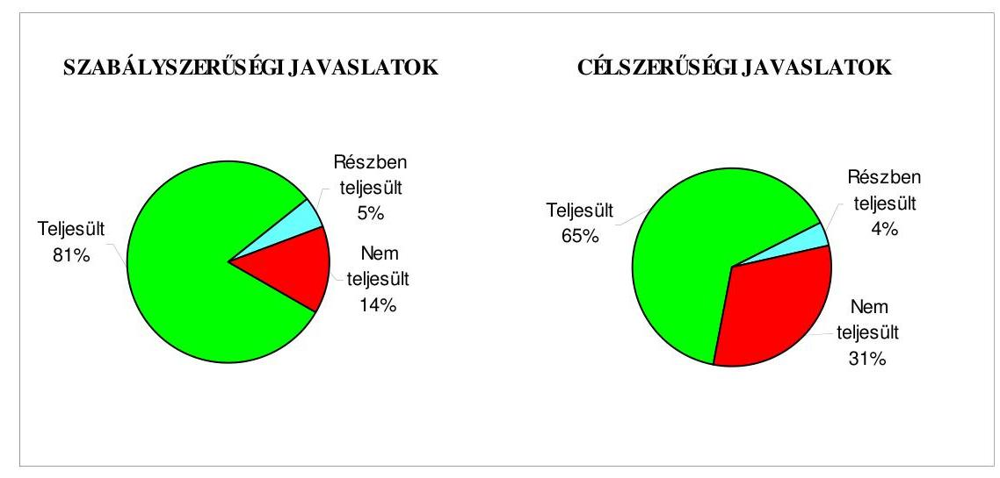

Budapest, 2008. október " 3 "

Melléklet: $\quad 7 \mathrm{db} \quad 18$ lap
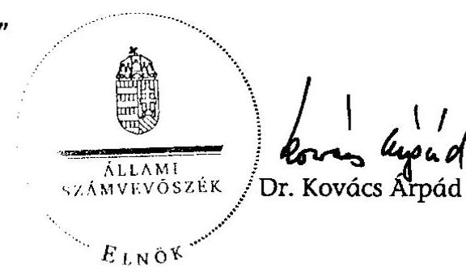

---

# Salgótarján Megyei Jogú Város Önkormányzata 

## Az Önkormányzat gazdálkodását meghatározó adatok, mutatószámok

| Megnevezés |  |
| :--: | :--: |
| A város állandó lakosainak száma (fő) 2008. január 1-jén | 40831 |
| A Közgyűlés tagjainak a száma (fő) (2007. december 31-én) | 23 |
| A Közgyűlés munkáját segítő állandó bizottságok száma (2007. december 31-én) | 6 |
| A Polgármesteri hivatalban foglalkoztatott köztisztviselők száma (fő) (2007. december 31-én) | 141 |
| Az összes vagyon értéke a 2007. december 31-i könyvviteli mérleg szerint (millió Ft) | 21044 |
| Az adósságállomány (hosszú és rövid lejáratú kötelezettség) 2007. december 31-én (millió Ft) | 3298 |
| Az egy lakosra jutó adósságállomány (Ft) (2007. december 31-én) | 80772,0 |
| Az összes költségvetési bevétel (millió Ft) (2007. évben) | 10788 |
| Ebből: saját bevétel (millió Ft), melyből | 3561

 |
| helyi adóbevétel (millió Ft) | 1517 |
| Az egy lakosra jutó összes költségvetési bevétel (Ft) (2007. évben) | 264211,0 |
| Az egy lakosra jutó saját bevétel (Ft) (2007. évben) | 87213,1 |
| Az egy lakosra jutó helyi adóbevétel (Ft) (2007. évben) | 37145,8 |
| Saját bevétel/Összes költségvetési bevétel (\%) (2007. évben) | 33,0 |
| Helyi adó bevétel/Összes költségvetési bevétel (\%) (2007. évben) | 14,1 |
| Az összes teljesített költségvetési kiadás (millió Ft) (2007. évben) | 10339 |
| Ebből: felhalmozási célú kiadás (millió Ft) | 1360 |
| Az összes költségvetési kiadásból a felhalmozási kiadás részaránya (\%) (2007. évben) | 13,2 |
| Az egy lakosra jutó költségvetési kiadás (Ft) (2007. évben) | 253214,5 |
| Az egy lakosra jutó felhalmozási kiadás (Ft) (2007. évben) | 33308,0 |
| A költségvetési intézmények száma (db) (2007. december 31-én) | 23 |
| Ebből: részben önállóan gazdálkodó (db) | 17 |
| A költségvetési intézményekben foglalkoztatott közalkalmazottak száma (fő) (2007. december 31-én) | 1188 |

---

# Salgótarján Megyei Jogú Város Önkormányzata

## Az önkormányzati vagyon alakulása

|  Mérlegsor
megnevezése | 2005.év
(millió Ft) | 2006. év
(millió Ft) | 2007. év
(millió Ft) | Változás %-a |  |   |
| --- | --- | --- | --- | --- | --- | --- |
|   |  |  |  | 2006/2005. | 2007/2006. | 2007/2005.  |
|  Immateriális javak | 32 | 40 | 36 | 125,2 | 91,5 | 114,5  |
|  Tárgyi eszközök | 9505 | 11122 | 11587 | 117,0 | 104,2 | 121,9  |
|  ebből: ingatlanok | 8425 | 9454 | 10249 | 112,2 | 108,4 | 121,6  |
|  beruházások | 591 | 1144 | 876 | 193,5 | 76,5 | 148,1  |
|  Befektetett pénzügyi eszközök | 1017 | 938 | 779 | 92,3 | 83,0 | 76,6  |
|  Üzemeltetésre átadott eszközök | 7521 | 7199 | 6839 | 95,7 | 95,0 | 90,9  |
|  Befektetett eszközök összesen | 18074 | 19299 | 19242 | 106,8 | 99,7 | 106,5  |
|  Forgóeszközök összesen | 2338 | 1710 | 1803 | 73,1 | 105,4 | 77,1  |
|  ebből: követelések | 518 | 536 | 497 | 103,6 | 92,6 | 95,9  |
|  pénzeszközök | 1741 | 1113 | 1244 | 64,0 | 111,7 | 71,5  |
|  Eszközök összesen | 20412 | 21009 | 21044 | 102,9 | 100,2 | 103,1  |
|  Saját tőke összesen | 15591 | 16709 | 16740 | 107,2 | 100,2 | 107,4  |
|  Tartalék összesen | 1497 | 873 | 1007 | 58,3 | 115,3 | 67,2  |
|  Kötelezettségek összesen | 3324 | 3427 | 3298 | 103,1 | 96,2 | 99,2  |
|  ebből: rövid lejáratú kötelezettségek | 733 | 900 | 898 | 122,7 | 99,8 | 122,5  |
|  hosszú lejáratú kötelezettségek | 2278 | 2234 | 2108 | 98,1 | 94,4 | 92,6  |
|  Források összesen: | 20412 | 21009 | 21044 | 102,9 | 100,2 | 103,1  |

Forrás: Magyar Államkincstár éves költségvetési beszámoló "01" számú űrlap adatai.

---

# Az Önkormányzat 2005-2007. évi költségvetési előirányzatainak és azok pénzügyi teljesítéseinek alakulása, valamint a 2008. évi költségvetési előirányzat

|  Adatok: millió Ft-ban |  |  |  |  |  |  |  |  |  |   |
| --- | --- | --- | --- | --- | --- | --- | --- | --- | --- | --- |
|  Megnevezés | 2005. év |  |  | 2006. év |  |  | 2007. év |  |  | 2008.  |
|   | Eredeti előirányzat | Módosított
Teljesítés | Eredeti előirányzat | Módosított
Teljesítés | Teljesítés | Eredeti előirányzat | Módosított
Teljesítés | Teljesítés | Terv |   |
|  Működési célú költségvetési kiadások összesen | 8571 | 8963 | 8533 | 8826 | 9328 | 9006 | 8676 | 9478 | 8979 | 8827  |
|  Felhalmozási célú költségvetési kiadások összesen | 2437 | 2701 | 1497 | 2913 | 3578 | 2230 | 1614 | 1916 | 1360 | 887  |
|  Költségvetési kiadások összesen | 11008 | 11664 | 10030 | 11739 | 12906 | 11236 | 10290 | 11394 | 10339 | 9714  |
|  Működési célú költségvetési bevételek összesen | 8509 | 9043 | 9094 | 8644 | 9217 | 9304 | 8438 | 9287 | 9289 | 8710  |
|  Felhalmozási célú költségvetési bevételek összesen | 2300 | 2447 | 1761 | 2697 | 3311 | 2369 | 1573 | 1732 | 1499 | 812  |
|  Költségvetési bevételek összesen | 10809 | 11490 | 10855 | 11341 | 12528 | 11673 | 10011 | 11019 | 10788 | 9522  |
|  Költségvetési bevételek és kiadások egyenlege: hiány-, többlet+ | $-199$ | $-174$ | 825 | $-398$ | $-378$ | 437 | $-279$ | $-375$ | 449 | $-192$  |
|  Finanszírozási célú pénzügyi kiadások | 376 | 401 | 393 | 1280 | 1290 | 1287 | 435 | 440 | 439 | 645  |
|  Finanszírozási célú pénzügyi bevételek | 575 | 575 | 567 | 1678 | 1668 | 1402 | 714 | 815 | 715 | 837  |
|  Finanszírozási célú pénzügyi műveletek egyenlege | 199 | 174 | 174 | 398 | 378 | 115 | 279 | 375 | 276 | 192  |

Forrás: - Magyar Államkincstár éves költségvetési beszámoló "80" számú űrlap adatai;

- a 2008. évi adatok esetében az Önkormányzat 2008. évi költségvetése;
- a költségvetési bevétel-kiadás működési-felhalmozási célra történt megosztásánál az analitikus nyilvántartás.

---

tölemüszött önkormányzat neve: Salgótarján Megyei Jogú Város Önkormányzata Ellenőrzött önkormányzat címe: 3100 Salgótarján, Múzeum tér 1.

TANÚSÍTVÁNY az európai uniós forrásokkal támogatott célok és programok tervezett és tényleges adatairól 2005-2008. éviekre

|  Sorszám | Az európai uniós
forrásokkal
támogatott fejlesztés
megnevezése* |  |  |  |  |  |  |  |  |  |  |  |  |  |  |  |  |  |  |  |  |  |  |  |  |  |  |  |  |  |  |  |  |  |  |  |  |  |  |  |  |  |  |  |  |  |  |  |  |  |  |  |  |  |  |  |  |  |  |  |  |  |  |  |  |  |  |  |  |  |  |  |  |  |  |  |  |  |  |  |  |  |  |  |  |  |  |  |  |  |  |  |  |  |  |  |  |  |  |  |  |  |

---

|  |   |   |   |   |   |   |   |   |   |   |   |   |   |   |   |   |   |   |   |   |   |   |   |   |   |   |   |   |   |   |   |   |   |   |   |   |   |   |   |   |   |   |   |   |   |   |   |   |   |   |   |   |   |   |   |   |   |   |   |   |   |   |   |   |   |   |   |   |   |   |   |   |   |   |   |   |   |   |   |   |   |   |   |   |   |   |   |   |   |   |   |   |   |   |   |   |   |   |   |   |   |  

---

# ADATLAP 

## az önkormányzat európai uniós forrással támogatott fejlesztéséről

1. A pályázó önkormányzat neve:

## Salgótarján Megyei Jogú Város Önkormányzata

2. A pályázó önkormányzat címe: 3100 Salgótarján, Múzeum tér 1.
3. A strukturális alap pályázott operatív programjának megnevezése: Regionális fejlesztés Operatív Program (ROP): ROP-2.1.3, a hátrányos helyzetű régiók és kistérségek megközelíthetőségének javítása
4. A pályázott operatív programon belül a projekt megnevezése: Salgótarjáni távolsági autóbusz-pályaudvar rekonstrukció
5. A pályázatot készítő megnevezése:

Salgótarján Megyei Jogú Város Önkormányzat Polgármesteri Hivatal Városfejlesztési és Üzemeltetési Iroda
6. A pályázott európai uniós támogatás összege: 239965481 Ft
7. A pályázott projekt: ROP-2.1.3.-2004-08-0012/31 Salgótarjáni távolsági autóbusz-pályaudvar rekonstrukció

- teljes kiadás összege: 319966774 Ft
- tervezett időtartama:
- eredeti : 2005. július 14 - 2006. augusztus 30.
- módosított: 2005. július
 14 - 2007. május 31.

8. A pályázat elbírálásának eredménye: a pályázat eredményes volt.
9. Az elutasított pályázatnál az elutasítás okai: -
10. A pályázat tartalék státuszba helyezett: nem
11. A támogatási szerződés adatai:

- megkötés időpontja: 2005. július 13.
- a támogatás tárgya:

---

Salgótarjáni távolsági autóbusz-pályaudvar rekonstrukció

- időbeli ütemezése:
- A projekt megvalósításának kezdő napja: a támogatási szerződés aláírását követő nap: 2005. július 14.
- A projekt befejezésének tervezett napja: 2007. május 31.
- előírt támogatási határidők:
- előírt kötelezettségek:
- jelentéstételi kötelezettség 3 havonta, illetve zárójelentés benyújtása a projekt záró napjáig;
- utánkövetési jelentés készítése évente;
- könyvvizsgáló megbízása a projekt ellenőrzésére;
- vagyonbiztosítás kötése a támogatással megvalósuló vagyontárgyakra;
- a nyilvánosság tájékoztatása a támogatással megvalósuló fejlesztésről.

12. A kifizetési kérelmek adatai:

| Kifizetési kérelem (PEJ) benyújtásának időpontja |  | Számla   bruttó   összege   (Ft) | Kért   támogatási   összeg   (Ft) | Folyósított   összeg   (Ft) | Támogatás folyósításának időpontja | Benyújtás folyósítás között eltelt időtartam napokban |
| :--: | :--: | :--: | :--: | :--: | :--: | :--: |
| 1 | 2006. XI. 10. | 149585067 | 135166560 | 135166560 | 2007. II. 22. | 103 |
| 2 | 2007. I. 11 | 117974502 | 106177052 | - | Elutasítva, javítás után benyújtva | - |
| 3 | 2007. II. 5 | 117974502 | 95209516 | 95209516 | 2007. VI. 05. | 119 |
| 4 | 2007. II. 5. | 2812800 | 2531520 | - | Javítás után ismét benyújtva | - |
| 5 | 2007. V. 30. | 59792218 | 53812997 | 53812997 | 2007. VII. 20. | 50 |
| 6 | 2007. V. 30. | 2812800 | 2531520 | 2531520 | 2007. VII. 20. | 50 |

13. A külső ellenőrzésre vonatkozó adatok:

- az ellenőrzések száma: három alkalommal történt helyszíni monitoring ellenőrzés
- az ellenőrzést végző szerv: a VÁTI Kht., mint közreműködő szervezet

---

- az ellenőrzés megállapításai: figyelemfelhívó észrevételek (a formai, eljárásrendi követelmények betartására)

14. Szabálytalanságokra vonatkozó adatok:
nem volt szabálytalanságra vonatkozó megállapítás.

- mely előírást nem tartotta be az önkormányzat: -
- az előírás nem teljesítésének oka:
- a rendezésre előírt kötelezettségek:
- mikor rendezte az önkormányzat:
- milyen időbeli csúszást eredményezett ez a projekt megvalósításában: nem volt.

Kiállítás időpontja: Salgótarján, 2008. június 23.
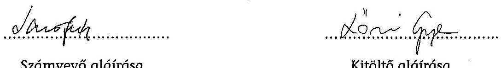

Számvevő aláírása
Kitöltő aláírása

---

# Salgótarján Megyei Jogú Város   Polgármester - Jegyzö   23100 Salgótarján, Múzeum tér 1., 32/312-250, Fax: 32/422-386   polgarmester@salgotarian.hu 

Ikt.szám: 2925-4/2008.

Tárgy: Ellenőrzési jelentés
észrevételezése

## Állami Számvevőszék

Dr. Kovács Árpád Elnök Úr részére
1052 Budapest Apáczai Csere János utca 10.

Tisztelt Elnök Úr!

Megismertük Salgótarján Megyei Jogú Város Önkormányzata gazdálkodási rendszerének 2008. évi ellenőrzéséről készült jelentést, és köszönettel vettük korrigálását a tett megjegyzéseink alapján. A lefolytatott ellenőrzés hasznos volt, azokra a hiányosságokra mutatott rá, ahol a későbbi munkavégzés során indokolt változtatni, pontosítani a szabályszerű feladatellátás megvalósulása érdekében.
Az ellenőrzési jelentésben foglaltak megtárgyalását a Közgyűlés, a végleges tartalommal kihirdetett jelentést követően ütemezett képviselőtestületi ülésen megtárgyalja. A megállapítások hasznosítására tett javaslataik alapján intézkedési terv készül, amelyről tájékoztatjuk Önöket.

Tisztelt Elnök Úr!

Figyelemmel arra, hogy az előzetes jelentéshez korábban kialakított észrevételeket részben továbbra is fenntartjuk, kérjük, hogy a végleges ellenőrzési jelentésben az általunk továbbra is kifogásolt, de az ÁSZ által el nem fogadott észrevételeket továbbra is tüntessék fel a mellékelt dokumentumban foglaltak alapján.

---

Az ellenőrzés során a vizsgálati munka ütemezése figyelembe vette a Polgármesteri Hivatalban folyó operatív munkálatok ütemességét. Az ellenőrzési munka jelentősen nem zavarta a hivatal működési folyamatait, amelyért köszönet illeti mindazokat a munkatársakat, akik a munkálatokban részt vettek.

Salgótarján, 2008. augusztus 13.

Tisztelettel:
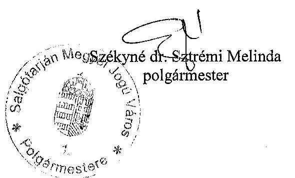
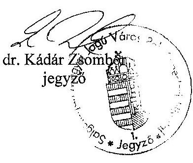

---

# SALGÓTARJÁN MEGYEI JOGÚ VÁROS   Polgármester- Jegyzö 

回 3100 Salgótarján, Múzeum tér 1., 32/417-255, Fax: 32/310-838

## MEGJEGYZÉSEK

az Állami Számvevőszéknek Salgótarján Megyei Jogú Város Önkormányzata gazdálkodási rendszerének 2008. évi korrigált ellenőrzési jelentéséhez

Az ellenőrzés megállapításainak hasznosítására irányuló javaslatok
a jegyzőnek
a jogszabályi előírások maradéktalan betartása érdekében
a 7. f. pontban meghatározott feladathoz
A feladat arról rendelkezik, hogy a jegyző számoljon be az Áht. 97.§ (2) bekezdésben előírtaknak megfelelően - az éves költségvetési beszámoló keretében a FEUVE, valamint a belső ellenőrzés működéséről.

Az Ámr. 149.§ (2) bekezdés c. pontja előírja, hogy az Áht. 97.§ (2) bekezdésében meghatározott kötelezettségnek megfelelően hivatkozott rendelet 23. sz. melléklete szerint értékelje a belső kontrolok működését és az éves költségvetési beszámolóval együttesen küldje meg a felügyeleti szervnek.
A végrehajtási rendelet iránymutatása alapján a jegyző a 2007. évi beszámolóval kapcsolatban is eleget tett ennek a feladatnak a jogszabály szellemében.
Az előzőek alapján továbbra sem tartjuk célszerűnek ezen feladatot előírni.

## a jegyzőnek

a munka színvonalának javítása érdekében
a 8. pontban meghatározott feladathoz
A feladat arról rendelkezik, hogy gazdaságossági számításokat kell végezni a rövid lejáratú működési-, illetve a folyószámlahitel igénybevétele előtt a hitelek éves szintű kamatkiadásainak összehasonlítására.

A kamatszámítást csupán erőltetett módon lehet elvégezni, hiszen az Önkormányzat rövidhitel és folyószámlahitel igénybevételi stratégiája nem a hitelfajták közötti választásra épül.

---

Év közben igénybevételre tervezett folyószámlahitel technikai hitelfelvétel, amelyet a számlavezető bank BUBOR alapon folyósít a szükségletnek megfelelően. Ez esetben nem kell közbeszerzési eljárást lefolytatni.
Az éven belül lejáró rövidlejáratú hitel a költségvetési év végén az esetlegesen megjelenő folyószámlahitel kiváltása, és azon pénzmaradványok valóságos pénzzel való alátámasztása érdekében történik, amely nélkül nem lehet pénzmaradványról beszélni. Amennyiben év végén folyószámlahitel igénybevételéről szólna a döntés, a bank a finanszírozási kötelezettsége miatt annyi pénzt bocsátana rendelkezésre, amennyi a számlák kifizetéséhez szükséges, miközben olyan, pályázati, felhasználási kötöttségű források is felhasználásra kerülnének, amelyeket nem szabadna bevonni az operatív finanszírozásba.
Ezekből adódóan a rövidlejáratú hitel igénybevétele többletforrások biztosítására, és a pénzmaradvány pénzzel történő alátámasztására irányul, és emiatt az ezzel kapcsolatos döntés nem a pillanatnyi forráshiány megszüntetésére irányul.
Mivel a rövidlejáratú hitel közbeszerzés köteles, nem lehet év közben folyószámlahitel helyett rövidlejáratú hitelben dönteni, hiszen a közbeszerzés időszükséglete hosszú, és az árfolyamok állandóan változnak az év során egymással ellentétesen is akár.
Nem lehet korrekt számítást és kalkulációt végezni év közben annak eldöntésére, hogy rövidlejáratú, vagy folyószámlahitel a kedvezőbb, mivel a legegyszerűbb számítást is az dönti el, hogy a folyószámlahitel igénybevételénél milyen összegnagysággal, és mennyi igénybevételi idővel lehet kalkulálni. Ezt pedig az befolyásolja, hogy mennyi a napi forrásszükséglet, figyelemmel a napi kifizetési kötelezettségre és a számlán lévő pénzeszközökre.

# Kiegészítés: 

Az előzőeken túl a kamatkiadások nagyságának megítélésére az ellenőrzési jelentés adatai szerint az igénybe vett rövidlejáratú hitel kamatának mértéke CHF alapon a 2005. évben 0,2133%, 2006. évben 2,72%, a 2007. évben 2,855%. Ezzel szemben, ha az önkormányzat folyószámlahiteleket vett volna igénybe, a fizetendő kamatmérték BUBOR alapon 8%-ot meghaladóan jelentkezett volna. Ez azt igazolja, hogy hiteligénybevétel esetén a rövidlejáratú hitelkondíciók a kedvezőbbek.

Az előzőek alapján továbbra sem tartjuk célszerűnek ezen feladatot előírni.

---

# Részletes megállapítások fejezethez 

1.1. A tervezett és teljesített költségvetési bevételek és kiadások alapján a költségvetési és a pénzügyi egyensúly alakulása, valamint a költségvetési hiány megállapításának szabályszerűsége
A jelentés szerint a 2005-2008. évek között tervezési szinten a költségvetések egyensúlya az Önkormányzatnál nem volt biztosított.(24. oldal)

A megfogalmazás nem egyértelmű, hiszen az Önkormányzat éves költségvetései minden esetben egyensúlyban voltak, másképpen az államháztartás információs rendszere nem is tudná befogadni.

## Kiegészítés:

Ezt igazolja, hogy az ellenőrzési jelentés is a finanszírozási célú műveletek esetében is bevételeket és kiadásokat említ, tehát ezen általánosan értelmezett bevételek és kiadások, illetve a tervezett hitelek figyelembe vételével, a költségvetési tervek egyensúlyban voltak.

Az egyértelműbb megfogalmazás érdekében továbbra is javasoljuk az alábbi pontosított szöveget:
„A költségvetések egyensúlyát hitelek tervezésével biztosították."

### 2.1.1. Az európai uniós forrásokkal történő pályázatok benyújtására vonatkozó döntések összhangja a fejlesztési célkitűzésekkel

A jelentés azt írja, hogy az Ötv. 91.§ (1) bekezdésében foglaltakat megsértve 2002-2006 között az Önkormányzat nem határozta meg gazdasági programját.(35. oldal)

Az Ötv. 91. § (1) bekezdése csupán gazdasági programról és költségvetésről rendelkezett 2005. VIII. 31-ig, arról nem, hogy ezeknek milyen tartalommal és milyen időtávra kell szólniuk. Mivel a törvény egyazon rendelkezés keretén belül fogalmazta meg a gazdasági programot és költségvetést, semmi nem mondott ellent annak, hogy ez a két feladat a beterjesztett költségvetésben öltsön testet. Az Önkormányzat így értelmezte a jogszabály rendelkezését.
Ezt támasztja alá az Ötv-t módosító 2005. évi XCII. törvény 3.§-ával kapcsolatos indokolás, amely szerint „az önkormányzatok részére a törvény már 1990-ben előírta a gazdasági program készítését, azonban ezen előírásnak az önkormányzatok legtöbbje nem tett eleget, leginkább azért, mert nem volt számukra világos, hogy gazdasági program alatt mit kell érteni. A törvény ehhez nyújt segítséget az önkormányzatok

---

számára, mert meghatározza a gazdasági program célját, szakmai szempontjait és időtartamát."

# Kiegészítés: 

A Htv. feladatként meghatározza ugyan a feladatot a jegyző részére, de a tartalmi elemeket ez a jogszabály sem írja elő. Ezt az Ötv. módosítása pótolta 2005-ben.
A jegyző jogszabályi iránymutatás hiányában az éves költségvetéseket, éves gazdasági programként is értelmezte.

Az előzőek alapján továbbra is azt javasoljuk, hogy az ellenőrzési megállapítás egészüljön ki az alábbiakkal:
"Az Ötv. 91.§ (1) bekezdésében foglaltakat megsértve, mivel a jogszabály rendelkezései nem voltak egyértelműek, 2002-2006 között az Önkormányzat nem ..."

Az Ötv. jelenlegi 91.§-ának (6). és (7). bekezdése meghatározza ugyan a gazdasági programmal kapcsolatos elvárásokat, azonban a későbbi évek állami forrásait nem rendeli hozzá.

Javasoljuk, hogy az ÁSZ közvetítse a parlament felé, ha a törvényalkotó gazdasági programot vár el, jogszabályban garantálja, legalább a választási ciklus időszaka alatt az önkormányzatok részére rendelkezésre bocsátandó állami források nagyságát. Ez azért elengedhetetlenül fontos, mivel a központi költségvetési kapcsolatokból származó források az önkormányzati bevételek közel 50%-át teszik ki. Ha ezen bevételeknek későbbi években várható alakulását nem határozzák meg, nem sok értelme van konkrét, számonkérhető, reális gazdasági programokat elvárni.

Az uniós források segítségével megvalósult fejlesztések esetében jelentés rögzíti, hogy az Önkormányzat a projektek utófinanszirozására céltartalék képzéssel nem készült fel.(36. oldal)

## Kiegészítés:

Az európai uniós források utófinanszírozása nem befolyásolta kedvezőtlenül az Önkormányzat pénzügyi egyensúlyát, nem okozott finanszírozási zavarokat az elmúlt időszakban, hiszen a tervezés körültekintő volt. A céltartalék-képzés éppen ellenkező hatást váltott volna ki, hiszen, az előző évi tapasztalatok szerint, indokolatlanul kötött volna le forrásokat, ezzel csökkentve az éves költségvetés mozgásterét.

---

A céltartalék képzésre vonatkozóan jogszabályi rendelkezés nincs, ezért továbbra is kérjük a mondat törlését.
3.2. A belső kontrolok érvényesülése az önkormányzati források szabályszerű felhasználásában, a költségvetési tervezés, gazdálkodás, beszámolás folyamataiban

Az ellenőrzés megállapítja, hogy a vészvilágításra vonatkozó kötelezettségvállalásokat nem előzte meg annak ellenjegyzése, ezáltal nem végezték el a kiadási előirányzat által biztosított fedezet meglétének, a kötelezettségvállalás jogszerűségének munkafolyamatba épített ellenőrzését. (48. oldal)

A hiányosságot megítélésünk szerint rendszerében kell vizsgálni. A kötelezettségvállalás egy korábbi időszakban kötött szerződés módosításáról, azon belül is a díj módosításáról szól.
 A korábbi időszakban kötött szerződés alapján az aktuális év költségvetési terv összeállításánál a vészvilágítás karbantartására vonatkozó költségelem figyelembe lett véve, tehát a fedezet e tekintetben biztosított volt.
A vállalkozói számla kifizetésénél a szabályozásnak megfelelően az előirányzat-kezelő teljesítésigazolása alapján az érvényesítő és az ellenjegyző lefolytatta a jogosultság, az összegszerűség, a szerződés teljesítésére irányuló ellenőrzést.

# Kiegészítés: 

A dőnövény fedezete a dologi előirányzaton belül biztosított volt. Az nem jelenthető ki, hogy nem végezték el a kiadási előirányzat által biztosított fedezet meglétének vizsgálatát a komplex módon meghatározott dologi előirányzat keretén belül, hiszen a szakemberek szignói az ellenkezőjét igazolják.

Az előzőek alapján továbbra is kérjük az ellenőrzési megállapítás ezen részének elhagyását.

A jelentés megállapítja, hogy az „Életre való pályázat" eszközbeszerzés számláinak kifizetése előtt nem győződött meg az ellenjegyző a szakmai teljesítésigazolás és érvényesítés megtörténtéről. (49. oldal)

A megállapítás azért nem fogadható el, mert az érvényesítési munka szakmailag helyesen elvégzésre került, és ezt nem lehet megkérdőjelezni.
A szakmai teljesítésigazolást az a személy végezte, aki a pályázatot szakmailag összeállította, felügyelte a megvalósulását, akinek a személyét a pályázat

---

elszámolásakor a pályázat kiírója sem kérdőjelezte meg. E tekintetben tehát biztosított volt az a szakmai hozzáértés, amely a pénzeszközök felhasználásának helyességét a pályázatkiíró felé is biztosította.

Megítélésünk szerint a tevékenységeket a tartalmuk szerint kell minősíteni jónak vagy hibásnak. Az ÁSZ is ezen az állásponton van, amikor azt a hiányosságot fogalmazza meg, hogy a könyvelés néhány esetben nem a számla tartalmának megfelelően történt. Kiegészítés:

Attól még, hogy az ellenjegyző bizonyos hiányosságra nem hívta fel a figyelmet, attól még nem jelenthető ki hogy az egész finanszírozási folyamat nem került elvégzésre, és nem fogadható el, hogy az ellenjegyzés csupán formai volt, miközben a kiadások jogosultságát, összegszerűségét szakemberek igazolták, hiszen e nélkül a kifizetésre sem kerülhetett volna sor.

# Ezen alapelv mentén kellene az ellenőrzés megállapítását átalakítani. 

Az ellenőrzés azt a megállapítást tette, hogy a Polgármesteri Hivatalnál a működési célú pénzeszközátadások államháztartáson kívülre teljesített kifizetései során a szakmai teljesítés igazolás és az utalvány ellenjegyzés működésének megbízhatósága gyenge volt.
Ehhez kapcsolódva azt állapítja meg a jelentés, hogy az utalvány ellenjegyzője nem ellenőrizte a szakmai teljesítésigazolás megtörténtét és az érvényesítés elvégzését. (50. oldal)

Az érvényesítés elvégzésének vitatása nem fogadható el, hiszen az érvényesítést dokumentum bizonyítja, illetve az a szakember végezte, akit az ügyrend ezzel a feladattal megbízott. Ez olyan szakmai munka, amely alapján ellenőrzik az összegszerűséget, a fedezet meglétét és azt, hogy az előírt követelményeket betartották. E tekintetben a szakmai teljesítésigazoló, az az ügyrendben meghatározott előirányzat kezelő, aki a megállapodások előkészítésével, szakmai tartalmának meghatározásával meg van bízva. Tartalmi szempontból a teljesítésigazoló személy a teljesítésigazolást a támogatási megállapodáson, mint alapdokumentumon végezte el, az igaz, hogy nem abban a formában ahogy a szabályzat rendelkezik.

## Kiegészítés:

Attól még, hogy az ellenjegyző bizonyos hiányosságra nem hívta fel a figyelmet, attól még nem jelenthető ki hogy az egész finanszírozási folyamat nem került elvégzésre, és nem fogadható el, hogy az ellenjegyzés csupán formai volt, miközben a kiadások

---

jogosultságát, összegszerűségét szakemberek igazolták, hiszen e nélkül a kifizetésre sem kerülhetett volna sor.
Az ellenőrzés azt várja el, hogy a teljesítésigazolás a támogatási összegek folyósításának rögzítése után a tényleges folyósítást megelőzően történjen a jogosultság, az összegszerűség, a megállapodás teljesítésének ellenőrzése.
Ez indokolatlan, hiszen a kötelezettségvállalás kialakítása során a megállapodási feltételek meghatározásakor ezek ellenőrzésre kerülnek. A támogatás folyósítása csupán technikai feladat, a megállapodás megvalósulásának ellenőrzése pedig a megállapodásban rögzített határidőig történő utólagos feladat.

Az előzőekben megfogalmazott indokaink alapján továbbra is javasoljuk, hogy a pénzeszközátadások államháztartáson kívülre teljesített kifizetései esetében a teljesítésigazolás vonatkozásában az a megállapítás szülessen, hogy a teljesítésigazolás nem az ügyrend szabályozásának megfelelő formában történt.

Salgótarján, 2008. augusztus 13.
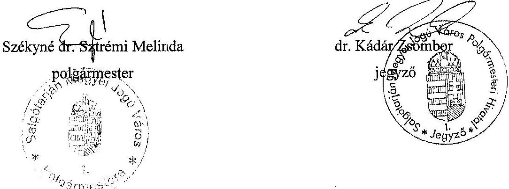

---

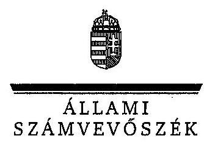

Tisztelettel:
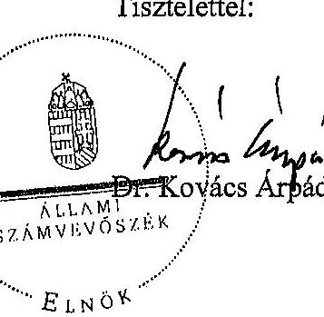
