# JELENTÉS 

a közoktatási intézményeket fenntartó non-profit szervezetek normatív hozzájárulásának és támogatásának ellenőrzéséről

---

# 3. Önkormányzati és Területi Ellenőrzési Igazgatóság 

3.1. Szabályszerűségi Ellenőrzési Főcsoport

Iktatószám: V-1024-145/2007-2008.
Témaszám: 882
Vizsgálat-azonosító szám: V-0373

## Az ellenőrzést felügyelte:

Dr. Lóránt Zoltán
főigazgató
Az ellenőrzés végrehajtásáért felelős:
Dr. Elek János
általános főigazgató-helyettes
Az ellenőrzést vezette:
Horváth Balázs
főcsoportfőnök-helyettes
Solymár Ágnes
osztályvezető főtanácsos
Az összefoglaló jelentést készítették:
Brebán Andrea
Sas Imréné
számvevő
tanácsadó
Szakmányné Bilik Mária
Dr. Veress Tiborné
számvevő
Az ellenőrzést végezték:

| Brebán Andrea | Dr. Faragóné Tóth Mária | Dr. Méri Sándorné |
| :-- | :-- | :-- |
| számvevő | számvevő tanácsos | számvevő |
| Pásztor Katalin | Sas Imréné | Szakmányné Bilik Mária |
| számvevő tanácsos | számvevő tanácsos, | számvevő tanácsos |
|  | tanácsadó |  |
| Szendrey Lajos | Tóth István | Dr. Veress Tiborné |
| számvevő | számvevő tanácsos, | számvevő |
|  | tanácsadó |  |
| Bán Tamásné | Győrik Józsefné | Kecskés Ágnes |
| külső szakértő | külső szakértő | külső szakértő |

A témához kapcsolódó eddig készített számvevőszéki jelentés:
címe
sorszáma
Jelentés az Oktatási és Kulturális Minisztérium fejezetnél a közoktatási feladatok finanszírozására fordított pénzeszközök hasznosulásának ellenőrzéséről

---

## Eierlikör (1)

Menge: 1 Drink

2 Zentiliter Zitronensaft
2 Zentiliter Zuckersirup
1 Zentiliter Zuckersirup
1 Zentiliter Zuckersirup
etwas Zuckersirup
etwas Zuckersirup
etwas Zuckersirup
etwas Zuckersirup
etwas Zuckersirup
etwas Zuckersirup
etwas Zuckersirup
etwas Zuckersirup
etwas Zuckersirup
etwas Zuckersirup
etwas Zuckersirup
etwas Zuckersirup
etwas Zuckersirup
etwas Zuckersirup
etwas Zuckersirup
etwas Zuckersirup
etwas Zuckersirup
etwas Zuckersirup
etwas Zuckersirup
etwas Zuckersirup
etwas Zuckersirup
etwas Zuckersirup
etwas Zuckersirup
etwas Zuckersirup
etwas Zuckersirup
etwas Zuckersirup
etwas Zuckersirup
etwas Zuckersirup
etwas Zuckersirup
etwas Zuckersirup
etwas Zuckersirup
et

---

# TARTALOMJEGYZÉK 

BEVEZETÉS ..... 7
I. ÖSSZEGZŐ MEGÁLLAPÍTÁSOK, KÖVETKEZTETÉSEK, JAVASLATOK ..... 10
II. RÉSZLETES MEGÁLLAPÍTÁSOK ..... 16

1. A közoktatási célú non-profit szervezetek jellemzői ..... 16
1.1. A fenntartó szervezetek és intézményeik értékelése ..... 16
1.2. A közoktatási feladatellátás pénzügyi forrásai ..... 17
1.2.1. A normatív hozzájárulás és támogatás ..... 18
1.2.2. Az egyéb közoktatási célú bevételek ..... 20
2. A fenntartói feladatok teljesítése ..... 21
2.1. A fenntartói irányítás szabályszerűsége ..... 21
2.2. A közoktatási megállapodások szabályossága ..... 22
2.3. A sajátos rendelkezések betartása ..... 23
3. A normatív hozzájárulás és támogatás igénylése és elszámolása ..... 25
3.1. Az igényjogosultság ellenőrzésének tapasztalatai ..... 25
3.2. Az elszámolások szabályszerűsége, megbízhatósága ..... 26
3.2.1. Óvodai nevelés ..... 28
3.2.2. Alapfokú iskolai oktatás ..... 29
3.2.3. Középfokú iskolai oktatás ..... 30
3.2.4. Szakképzés ..... 30
3.2.5. Alapfokú művészetoktatás ..... 33
3.2.6. Sajátos nevelési igényű gyermekek, tanulók nevelése, oktatása ..... 34
3.2.7. Nemzetiségi nyelvű, két tanítási nyelvű oktatás, nyelvi előkészítő oktatás ..... 35
3.2.8. Központosított előirányzatok ..... 35
4. Az intézményi feladatellátásra meghatározott követelmények betartása ..... 36
5. Hatósági és pénzügyi ellenőrzés ..... 38

---

# MELLÉKLETEK 

1. számú A fenntartók szervezeti formája és közhasznúsági jogállása
2. számú A közoktatási intézmények gazdálkodási jellemzői
3. számú A normatív hozzájárulások és támogatások alakulása
4. számú A közoktatási bevételek alakulása
5. számú A fenntartói feladatok teljesítésének szabályszerűsége
6. számú A 2007. évi normatív hozzájárulás és támogatás eltérései
7. számú Az intézményi feladatok teljesítésének szabályszerűsége
8. számú MeH miniszterének észrevétele és az arra adott válasz
9. számú OKM szakállamtitkárának észrevétele és az arra adott válasz
10. számú MÁK elnökének észrevétele és az arra adott válasz

## FÜGGELÉK

Az eltérések részletezése

---

# RÖVIDÍTÉSEK JEGYZÉKE 

## Törvények, rendeletek

Áht.
Ámr.

Kh. tv.

Ket.

Közokt. tv.
Kvtv.
Ptk.
Vhr.

## Rövidített nevek

ÁSZ
KIR
Kincstár
OH
OKÉV
OKM
OM
Aranybika Alapítvány
Britannica Alapítvány
Carl Rogers Alapítvány
Danubius Hotels Alapítvány

Dávid király Alapítvány
Educationis Alapítvány
Ego sum via Kht.
Fagler Ede Alapítvány
Hétszínvirág Alapítvány
Hibó Tamás Alapítvány
Humán Intézet Kht.
Inárcsi Hátszínvirág Kht.
Innovációs Szakképző Kht.
Jászladányi Nevelési Oktatási Alapítvány
Kelta Iskola Kht.
az államháztartásról szóló 1992. évi XXXVIII. törvény az államháztartás működési rendjéről szóló 217/1998. (XII. 30.) Korm. rendelet
a közhasznú szervezetekről szóló 1997. évi CLVI. törvény
a közigazgatási hatósági eljárás és szolgáltatás általános szabályairól szóló 2004. évi CXL. törvény
a közoktatásról szóló 1993. évi LXXIX. törvény
a Magyar Köztársaság 2007. évi költségvetéséről szóló 2006. évi CXXVII. törvény
a Polgári Törvénykönyvről szóló 1959. évi IV. törvény
a közoktatásról szóló 1993. évi LXXIX. törvény végrehajtásáról szóló 20/1997. (II. 13.) Korm. rendelet

Állami Számvevőszék
Közoktatási Információs Rendszer
Magyar Államkincstár
Oktatási Hivatal
Országos Közoktatási Értékelési és Vizsgaközpont
Oktatási és Kulturális Minisztérium
Oktatási Minisztérium
Aranybika Iskola Alapítvány
Britannica Iskoláért Alapítvány
Carl Rogers Személyközpontú Iskola Alapítvány
Danubius Hotels Szakképző Iskola és Kollégium Alapítvány
Dávid király Keresztény Kulturális és Oktatási Alapítvány
EDUCATIONIS Oktatási Alapítvány
Ego sum via Oktatási Közhasznú Társaság
Fagler Ede Alapítvány a Művészet és Művészetoktatás Támogatásáért
Hétszínvirág Gyermekkert 2003. Alapítvány
Hibó Tamás Művészeti Alapítvány
Humán Intézet Gimnázium, Művészeti Iskola és Kollégium KHT.
Inárcsi Hátszínvirág Oktatási Kht.
Innovációs Szakképző és Továbbképző Iskola Központ Kht.
Jászladányi Zana Sándor Imre Nevelési Oktatási Közhasznú Alapítvány
Kelta Iskola Oktatási Szolgáltató Kht.

---

Kész-ség Kht.
Kinder Ovi Kht.
Korszerú Fogtechnika Alapítvány
Lajtha László Művészeti Kht.
Magic Alapítvány
Micimackó Alapítvány
MNOÖ
Napra-Forgó Alapítvány
Nebuló XXI. Alapítvány
Nyíregyházi Waldorf Egyesület
Pesti Waldorf Egyesület
Reménység Alapítvány
Szent Kinga Alapítvány
Török Sándor Waldorf Alapítvány
Uniós Protokollért Kht.
Varázsceruza Alapítvány
Vállai Nemzetiségi Óvoda Kht.

KÉSZ-SÉG Közoktatási és Közművelődési Közhasznú Társaság
Kinder Ovi Magánóvoda Közhasznú Társaság
Korszerű Fogtechnika Oktatásért Alapítvány
Lajtha László Művészeti Szolgáltató Kht.
Magic Táncsport Közhasznú Alapítvány
Micimackó Óvodáért Alapítvány
Magyarországi Németek Országos Önkormányzata
NAPRA-FORGÓ Kiemelten Közhasznú Alapítvány
Nebuló XXI. Alapítvány az Örömteli Tanulásért
Nyíregyházi Waldorf Pedagógiai Egyesület
Pesti Waldorf Pedagógiai Egyesület
Reménység Két Tanítási Nyelvű Keresztény Általános Iskola Alapítvány
Szent Kinga Caritas Alapítvány
Török Sándor Waldorf Pedagógiai Alapítvány
Az Uniós Protokollért Oktatási Kht.
Varázsceruza Gyermeknevelő, Képesség- és Személyiségfejlesztő Alapítvány
Vállai Német Nemzetiségi Óvoda Kht.

---

# ÉRTELMEZŐ SZÓTÁR 

Közhasznú tevékenység

Közoktatás

Közoktatási intézmény

Közoktatási intézményalapító és fenntartó

Közoktatási megállapodás

Közoktatási normatív támogatás

Közoktatási teljesítménymutató

A társadalom és az egyén közös érdekeinek kielégítésére irányuló, a szervezet létesítő okiratában szereplő cél szerinti tevékenység, a közhasznú szervezetekről szóló 1997. évi CLVI. törvényben meghatározott körben \{Kh. tv. 26. § c) pont $\}$.

A közoktatás rendszerét a közoktatásról szóló 1993. évi LXXIX. törvény szabályozza, amely magában foglalja az óvodai nevelést, az iskolai nevelést és oktatást, valamint a kollégiumi nevelést \{Közokt. tv. 2. § (1) bekezdés\}.
A közoktatás szakmailag önálló nevelési intézményei az óvodák nevelési-oktatási intézményei, az iskolai végzettséget, szakképesítést igazoló bizonyítvány kiadására jogosult iskolák, továbbá az alapfokú művészetoktatási intézmények és a kollégiumok \{Közokt. tv. 3. § (1) bekezdés\}. Közoktatási intézményt az állam, a helyi önkormányzat, a települési, területi kisebbségi önkormányzat, az országos kisebbségi önkormányzat, a Magyar Köztársaságban nyilvántartásba vett egyházi jogi személy, továbbá a Magyar Köztársaság területén alapított és itt székhellyel rendelkező, jogi személyiséggel rendelkező gazdálkodó szervezet, alapítvány, egyesület és más jogi személy, továbbá természetes személy alapíthat és tarthat fenn, ha a tevékenység folytatásának jogát - jogszabályban foglaltak szerint - megszerezte. A természetes személy egyéni vállalkozóként alapíthat és tarthat fenn közoktatási intézményt \{Közokt. tv. 3. § (2) bekezdés\}.
A helyi önkormányzat vagy az állam a költségvetési támogatáshoz kiegészítő anyagi támogatást adhat, ha a nem állami, illetve nem önkormányzati közoktatási intézmény - az e törvényben szabályozott megállapodás alapján - állami, illetve helyi önkormányzati feladatot lát el. A közoktatási megállapodás keretében a nevelés és oktatás a gyermekek, tanulók számára ingyenessé válik \{Közokt. tv. 4. § (6) bekezdés és 81. § (1) bekezdés e) pont\}.
A központi költségvetés az állami szervek és a helyi önkormányzatok, valamint a nem állami, nem helyi önkormányzati intézményfenntartók részére az általuk fenntartott nevelési-oktatási intézmények működéséhez - a gyermek-, tanulói létszámot, valamint az ellátott feladatokat figyelembe véve - normatív költségvetési hozzájárulást biztosít \{Közokt. tv. 118. § (3) bekezdés \}.
Oktatás-szervezési paraméterek szerint számított mutató, amely figyelembe veszi a Közokt. tv. osztály és csoport alakításáról szóló elveit, előírásait (átlaglétszám, foglalkoztatási időkeret), a pedagógusok kötelező heti óraszámát, az egyes intézménytípusok költségigényességét kifejező intézménytípus együtthatót. A költségvetés 2007.

---

Minőségirányítási program

Nevelési program

Non-profit szervezet

Pedagógiai program

Tankötelezettség

Többcélú intézmény
szeptember 1-jétől ez alapján finanszírozza a közoktatási tevékenységet [Forrás: Közokt. tv. és Kv. tv.].
Az intézményi minőségirányítási program határozza meg az intézmény működésének hosszú távra szóló elveit és a megvalósítását szolgáló elképzeléseket. Az intézményi minőségirányítási programban meg kell határozni az intézmény működésének folyamatát, ennek keretei között a vezetési, tervezési, ellenőrzési, mérési, értékelési feladatok végrehajtását. Az intézményi minőségirányítási programnak tartalmaznia kell az intézményben vezetői feladatokat ellátók, továbbá a pedagógus munkakörben foglalkoztatottak teljesítményértékelésének szempontjait és az értékelés rendjét. A minőségirányítási programban rögzíteni kell a teljes körű intézményi önértékelés periódusát, módszereit és a fenntartói minőségirányítási rendszerrel való kapcsolatát [Közokt. tv. 40. § (11) bekezdés].
Az óvodai nevelő munka az Óvodai nevelés országos alapprogramjára épülő óvodai nevelési program alapján folyik. Az Óvodai nevelés országos alapprogramját a Kormány adja ki [Közokt. tv. 8. § (8) bekezdés].
A non-profit szektorba tartoznak a magán- és közalapítványok, az egyesületek, az egyesülések, az érdekképviseletek és szakszervezetek, a köztestületek, a közhasznú társaságok, valamint a non-profit szervezetek által alapított intézmények [Non-profit szervezetek Magyarországon 2006. címú KSH kiadvány].

Az iskolában a nevelő-oktató munka a pedagógiai program alapján folyik. A pedagógiai program magában foglalja a nevelési programot és a helyi tantervet, továbbá a szakképzésben részt vevő iskolákban a szakmai programot [Közokt. tv. 8/A. § (2) bekezdés].
A Magyar Köztársaságban - az e törvényben meghatározottak szerint - minden gyermek tanköteles. A gyermek, ha eléri az iskolába lépéshez szükséges fejlettséget, legkorábban abban a naptári évben, amelyben a hatodik, legkésőbb amelyben a nyolcadik életévét betölti, tankötelessé válik. A tankötelezettség annak a tanévnek a végéig tart, amelyben a tanuló tizennyolcadik életévét betölti. A sajátos nevelési igényű tanuló tankötelezettsége meghosszabbítható legfeljebb annak a tanévnek a végéig, amelyben a huszadik életévét betölti [Közokt. tv. 6. § (1)-(3) bekezdés].
A többcélú intézmény több, különböző típusú közoktatási intézmény feladatait látja el [Közokt. tv. 22. § (3) bekezdés].

---

# JELENTÉS 

## a közoktatási intézményeket fenntartó nonprofit szervezetek normatív hozzájárulásának és támogatásának ellenőrzéséről

## BEVEZETÉS

A közoktatási törvény ${ }^{1}$ alapelvei teremtenek lehetőséget a nem állami, illetve nem önkormányzati óvodák, iskolák és kollégiumok létrehozásához, működtetéséhez. A közoktatási feladatmegosztás rendszerében kiemelkedő jelentőségű fejlődés jellemzi az államháztartáson kívüli non-profit szervezetek aktív szerepvállalását, amelyre ösztönzőleg hat a tevékenység közhasznú besorolása, a közhasznú minősítéssel rendelkezők forrásszerzési és adózási kedvezményezettsége. A Kincstár 2007. évi adatszolgáltatása szerint a non-profit fenntartók 58\%-a (köz)alapítványi, 33\%-a közhasznú társasági, 8\%-a társadalmi szervezeti és 1\%-a országos kisebbségi önkormányzati körbe tartozott, számuk összességében 737 volt.

A központi költségvetés normatív költségvetési hozzájárulást biztosít az állami szervek és a helyi önkormányzatok mellett a nem állami, nem helyi önkormányzati intézményfenntartók részére az általuk fenntartott nevelési-oktatási intézmények működéséhez. Ennek jogcímenkénti összegét az éves költségvetési törvények - fajlagos mértékkel szabályozott módon - határozzák meg. A helyi önkormányzat vagy az állam a költségvetési támogatáshoz kiegészítő anyagi támogatást adhat, ha nem állami, illetve nem önkormányzati közoktatási intézmény a törvényben szabályozott megállapodás alapján állami, illetve helyi önkormányzati feladatot lát el.

A 2007. évi költségvetési törvényben ${ }^{2}$ a nem állami, nem helyi önkormányzati közoktatási intézményfenntartók finanszírozására az OKM fejezeti kezelésű előirányzataként a „Humánszolgáltatások normatív támogatása" soron 70590 millió Ft összeget irányoztak elő, amely 74901 millió Ft-ra módosult, illetve 74637 millió Ft-ra teljesült. A kiegészítő támogatások körében az ellenőrzésbe vont országos kisebbségi önkormányzatok kiegészítő támogatása jogcímen tervezett 367 millió Ft előirányzat, 480 millió Ft-ra módosult, és ezzel azonos összegben teljesült. A költségvetési törvény alapján együttesen folyósított 75117 millió Ft normatív hozzájárulásból és

 támogatásból a non-profit körbe tartozó (köz)alapítványok, közhasznú társaságok, társadalmi szervezetek és országos kisebbségi önkormányzatok 37 685 millió Ft-tal részesedtek.

[^0]
[^0]:    ${ }^{1}$ A közoktatásról szóló 1993. évi LXXIX. törvény
    ${ }^{2}$ Magyar Köztársaság 2007. évi költségvetéséről szóló 2006. évi CXXVII. törvény

---

A normatív hozzájárulás és támogatás szervezetenkénti megoszlását - OKM, Kincstár adatszolgáltatása alapján - a következő ábra szemlélteti:
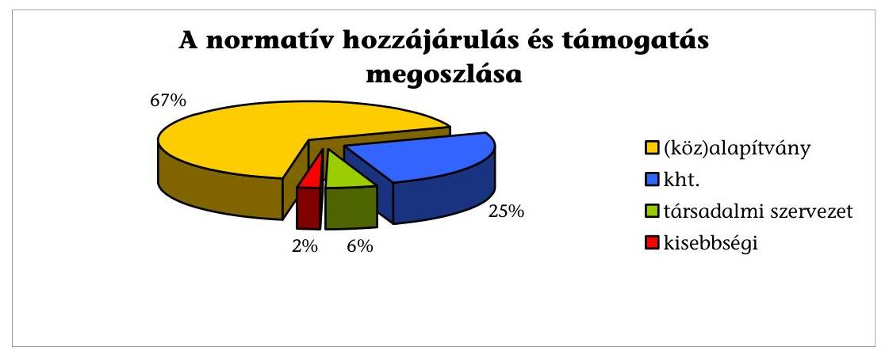

A közoktatási intézményeket fenntartó non-profit szervezetek normatív hozzájárulásának és támogatásának ellenőrzését az Állami Számvevőszékről szóló 1989. évi XXXVIII. törvény 2. § (5) bekezdése alapján végeztük. Az ellenőrzéshez további jogalapot adott a közhasznú szervezetekről szóló 1997. évi CLVI. törvény 21. §-a is.

Az ellenőrzés célja annak megállapítása volt, hogy:

- a közoktatási intézményeket fenntartó non-profit szervezetek fenntartói feladataikat a jogszabályi előírásoknak megfelelően látták-e el;
- a normatív hozzájárulások és támogatások igénylése, elszámolása szabályszerűen történt-e;
- az intézmények a normatív hozzájárulást és támogatást a feladatellátásra meghatározott feltételek betartásával használták-e fel.

Az ellenőrzési eljárások körében alkalmaztuk a tanúsítványi adatszolgáltatást, a helyszíni információszerzést és intézményi jegyzőkönyvezést, az összehasonlító adategyeztetéseket és elemző értékeléseket. Az ellenőrzési feladatok szempontrendszerét jóváhagyott előtanulmánnyal alapoztuk meg, amelyben kockázati tényezőként vettük figyelembe, hogy a normatív hozzájárulás és támogatás finanszírozási rendszere 2007. szeptember 1-jén változott, valamint a közoktatási intézményeket fenntartó non-profit szervezeteknél a normatív hozzájárulások és támogatások ellenőrzésére még nem került sor. Az ellenőrzést pénzügyi-szabályszerűségi ellenőrzésként végeztük el.

Az ellenőrzés a közoktatási intézményeket fenntartó non-profit szervezetek 2007. évi költségvetési normatív hozzájárulása és támogatása igénylésének, elszámolásának vizsgálatára terjedt ki. Az ellenőrzés tervszerűen kapcsolódott az Oktatási és Kulturális Minisztérium fejezetnél a közelmúltban végzett ellenőrzéshez ${ }^{3}$, amelynek részét képezte az egyházak által fenntartott intézményekben a közoktatási célú humánszolgáltatás normatív támogatása és a kiegészítő

[^0]
[^0]:    ${ }^{3}$ Az Oktatási és Kulturális Minisztérium fejezetnél a közoktatási feladatok finanszírozására fordított pénzeszközök hasznosulásának ellenőrzéséről szóló 0807. számú jelentés.

---

támogatás hasznosulásának vizsgálata. Ennek megfelelően az ellenőrzés az egyházi intézményfenntartók nélkül fedte le a non-profit szektorba tartozó közoktatási intézményfenntartókat.

A pénzügyi szabályszerűségi ellenőrzés a 2007. költségvetési évre, az előkészítés során feltárt kockázati tényezők figyelembevételével a Kvtv. 3. számú melléklet 15. jogcím közoktatási alap-hozzájárulásokra, a 16. jogcím közoktatási kiegészítő hozzájárulások közül a 16.1. iskolai gyakorlati oktatás, szakképzés (szakmai gyakorlati képzés), a 16.2. alapfokú művészetoktatás, a 16.4. sajátos nevelési igényű gyermekek, tanulók nevelése, oktatása jogcímre, valamint kizárólag az országos kisebbségi önkormányzat által fenntartott közoktatási intézmény esetén a 16.8. nemzetiségi nyelvű, két tanítási nyelvű oktatás, nyelvi előkészítő oktatás normatív hozzájárulásokra terjedt ki. Vizsgáltuk továbbá a Kvtv. 5. számú melléklet központosított támogatások közül a 6. kiegészítő támogatás nemzetiségi nevelési, oktatási feladatokhoz, a 15. szakmai vizsgák lebonyolításának támogatása, a 16. esélyegyenlőséget, felzárkóztatást segítő támogatások, a 18. közoktatás-fejlesztési célok támogatása és a 23. alapfokú művészetoktatás támogatása jogcímek szabályszerű igénylését és elszámolását.

A 2007. évi költségvetési időszak alapján a vizsgálat a 2006/2007. illetve a 2007/2008. tanévet érintette. Az ellenőrzés a 2007. évi költségvetési évre, 2007. január 1-től 2007. december 31-éig tartó költségvetési időszakra terjedt ki.

A közoktatási intézményt fenntartó non-profit szervezetek kiválasztásánál az ellenőrzéshez rétegzett véletlen szám alapú mintavételi eljárást alkalmaztunk. Az alapsokaságot szervezeti típusa, valamint az igénybe vett normatív hozzájárulás és támogatás nagysága szerint rétegeztük, majd az ellenőrzés magas kockázatára figyelemmel a fenntartók közel 20%-ának kiválasztását minden egyes rétegben véletlen szám generálásával végeztük el. Az így kiválasztott, adatszolgáltatásba vont fenntartók (133) a szervezeti típusokat, a normatív hozzájárulások és támogatások nagyságát illetően megfelelően reprezentálták az alapsokaságot. A helyszínen 59 non-profit fenntartót és annak 62 intézményét ellenőriztük, szintén rétegzett véletlen szám alapú mintavételi eljárással kiválasztva, így biztosítva a minta reprezentativitását.

A kérdőívvel felmért közoktatási intézményt fenntartó 133 non-profit szervezet között a (köz)alapítványok aránya meghaladta a fenntartók kétharmadát, az egyesületek, a közhasznú társaságok és a kisebbségi önkormányzatok együttes aránya az egyharmad részt sem érte el. A fenntartók 87%-a közhasznú, kiemelkedően közhasznú jogállású volt. A fenntartók jellemzően egy közoktatási intézményt működtettek. Az intézmények között a különböző közoktatási intézménytípus feladatait megvalósító ún. többcélú intézmény aránya volt a legmagasabb (30%), az óvodák és az alapfokú művészetoktatási intézmények az összes intézménynek egyaránt 1/4-1/4 részét tették ki. Tekintettel a kiválasztott minta jelentős arányára az ellenőrzés tapasztalatai messzemenően jellemzőnek tekinthetők.

---

# I. ÖSSZEGZŐ MEGÁLLAPÍTÁSOK, KÖVETKEZTETÉSEK, JAVASLATOK 

A közoktatási normatív hozzájárulások és támogatások igénybevétele alapján a non-profit fenntartói elszámolások 83%-a nem volt megbízható, az elszámolt támogatáshoz viszonyítva összességében 13,1% abszolút eltérést ${ }^{4}$ állapítottunk meg. A jogszabályoktól eltérő elszámolás miatt a non-profit szervezetek jogalap nélkül vettek igénybe 197 millió Ft-ot, illetve 79 millió Ft további támogatásra voltak jogosultak. Egyenlegében 118 millió Ft indokolatlanul teljesült, amelynek 88%-a a szakképzési hozzájárulás és támogatás jogcímeihez kapcsolódott.

A vizsgált közoktatási feladatok közül az alapfokú művészetoktatási, a központosított költségvetési támogatások elszámolása minősült megbízhatónak, az összes többi eltérése túllépte a 2%-os lényegességi mértéket. A feltárt hibák az iskolai elméleti és gyakorlati szakképzés területén kritikusan magas mértéket értek el az alábbi ábra szerint:

## Eltérések mértéke jogcímenként

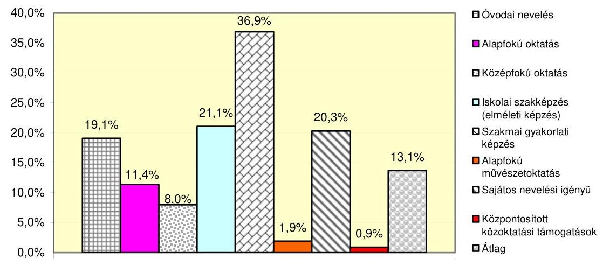

A fenntartók összes közoktatási célú bevételének 2006-ban háromnegyed, 2007-ben kétharmad részét a központi költségvetésből kapott normatív hozzájárulás és támogatás, a fennmaradó részét az egyéb közoktatási célú bevételek tették ki. A normatív hozzájárulás és támogatás növekedése 2007-ben 2% volt az előző évhez képest. Az egy főre jutó normatív hozzájárulás és támogatás az alapfokú művészetoktatásban és a középfokú oktatásban csökkent, a többcélú és a gyógypedagógiai intézményeknél nem változott, az óvodáknál, az általános iskoláknál és a szakiskoláknál emelkedett.

[^0]
[^0]:    ${ }^{4}$ A pozitív és negatív irányú eltérések előjel nélküli összegének hányada.

---

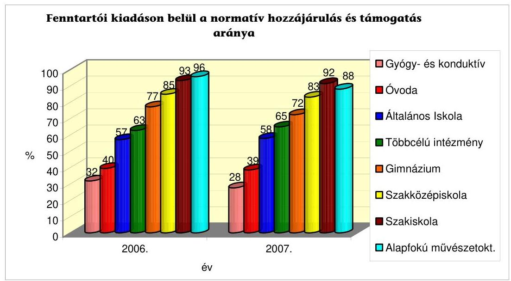

A normatív hozzájárulás és támogatás a fenntartók közoktatási intézményekre fordított összes kiadásának intézmény típusonként eltérő mértékű, átlagosan kétharmad részét fedezte. A normatív hozzájáruláson és támogatáson kívüli egyéb közoktatási célú bevétel az összes bevételnek 2006-ban átlagosan a 26%-át, 2007-ben a 33%-át tette ki. A non-profit fenntartók jelentős támogatást kaptak az oktatási miniszterrel és a helyi önkormányzatokkal megkötött közoktatási megállapodások alapján (8-10%), a szülők és gazdasági társaságok befizetéseiből (17-22%). A közoktatási feladatok finanszírozásában jelentéktelen részarányt képviselt az SZJA 1%-a felajánlásából, valamint az uniós forrásból származó bevétel.

A közoktatási fenntartói feladatokra vonatkozó törvényi előírások a nonprofit fenntartók felénél teljes körűen teljesültek. A fenntartók 5%-a nem készített éves intézményi költségvetést, egyhatoda nem határozta meg a térítési- és tandíjfizetési kötelezettség szabályait, közel egytizede az indítható csoportok és osztályok számát, mintegy negyede nem rendelkezett engedéllyel a maximális osztály- és csoportlétszám túllépéshez. Továbbá minden ötödik fenntartó nem tett eleget a négyévenkénti ellenőrzési kötelezettségének, minden huszadik nem hagyta jóvá az intézmény működési rendjét szabályozó dokumentumokat, 24%-a nem értékelte a nevelési, pedagógiai programjában meghatározott feladatok végrehajtását. A hiányosságok részben az ellenőrzésünk által feltárt elszámolási hibákhoz vezettek, részben hatósági ellenőrzés hiányában nem szankcionált mulasztások voltak.

A gazdálkodással összefüggő jogosítványokat közoktatási törvényi rendelkezés alapján a közoktatási intézmények alapító okiratának tartalmazni kell, azonban az országos kisebbségi önkormányzatok intézményeit kivéve jogszabály nem határozza meg a jogosítványok körét. A további non-profit fenntartói körre az államháztartási törvény és végrehajtási rendelete nem vonatkozik, a fenntartók e jogosítványokat egymástól eltérően, ellentmondásos módon szabályozták. A fenntartók egyharmada a költségvetési szervek gazdálkodási jogosítványainak mintájára sorolta be intézményeit részben önálló és önállóan gazdálkodó jogkörbe. A státushoz tartozó gazdálkodási jogosítványok meghatározását elmulasztották: normatív támogatás és hozzájárulás feletti rendelkezést; a fenntartó és az intézmény közötti gazdálkodási, finanszírozási kapcsolatot; önálló számviteli nyilvántartás vezetését és számviteli beszámoló készítését; intézményi bankszámla vezetését.

Szabályozási hiányosságokból fakadóan a költségvetési törvényben előírt normatív hozzájárulás és támogatás átadásának módja, határideje nem meghatározott, elmulasztása nem szankcionált. A fenntartók kétharmada részben, vagy teljes egészében banki úton átadta a normatív hozzájárulást és támogatást. Az átadásához az intézmények 29%-a önálló bankszámlával nem rendelkezett, a fenntartók közvetlenül fizették az intézményi kiadásokat. A közpénzek felhasználásának nyilvánossága és ellenőrizhetősége érdekében előírt elkülönített nyilvántartási kötelezettségnek a fenntartók 87%-a tett eleget.

A költségvetési törvényi előírások szerint a nem állami, nem helyi önkormányzati intézményfenntartók részére megállapított normatív költségvetési hozzájárulások, és egyéb támogatások összege nem lehet kevesebb, mint a helyi önkormányzat részére ugyanazon jogcímen megállapított normatív hozzájárulás. Az előírásnak eleget tesz, hogy a jogcímsoronként járó éves normatíva fajlagos összege minden fenntartónál azonos. Indokolatlannak tartjuk azonban, hogy az önkormányzati és a nem állami fenntartóknál a létszámmérések időpontja és gyakorisága eltérő, emiatt fennáll az esélye annak, hogy ugyanazon gyermek/tanuló után ugyanarra az időszakra két fenntartó is jogszerűen veheti igénybe a normatív támogatás időarányos részét.

A fenntartói igényléseket, elszámolásokat - egy kivétellel - a jogszabályokban előírt határidőben, módon és a kötelezően becsatolandó dokumentumok alapján készítették el. A fenntartók, illetve intézményeik 10%-ának volt a normatív hozzájárulás és támogatás igénylésekor vagy folyósításakor lejárt köztartozása, amelyeknél a Kincstár a vonatkozó jogszabály rendelkezésével összhangban járt el. A fenntartói elszámolásokban általános, tipikus hibaként fordult elő: az előírt csoportok és osztályok szervezésére vonatkozó szabályoktól való eltérés, a tanügyi dokumentumoktól eltérő létszám meghatározás, a mutatószám és támogatási összeg számítási hibái. Hiányosan álltak rendelkezésre a gyógypedagógiai ellátáshoz szükséges szakértői bizottságok érvényes szakvéleményei, a nem magyar állampolgár tanulók tartózkodási okmányainak másolatai. Nem tartották be az életkori határokat, a hiányzások dokumentálására és a tanulói jogviszony megszüntetésére vonatkozó szabályokat.

Az intézményi igényjogosultságot és annak változását megalapozó egyedi dokumentumok a fenntartók 81%-ánál álltak hiánytalanul rendelkezésre. Az intézmények azonban az előírt tanügyi okmányokat hiányosan vezették, a fenntartók az elszámolásban közölt adatokat nem a tanügyi dokumentumokkal és nyilvántartásokkal összhangban határozták meg, mindezen hiányosságok az elszámolásokban létszámeltéréseket okoztak.

A közoktatási teljesítménymutatón alapuló - 2007. szeptembertől bevezetett - finanszírozás szabályai nem határozták meg az óvodai nevelésnél az 1. és 2-3. nevelési év fogalmát, a teljesítménymutató számítás szabályait az összevont általános iskolai osztályok esetében, amely a fenntartói elszámolásoknál létszámeltéréseket eredményezett. A teljesítménymutató bevezetését követően a

---

mutatószámok kerekítésének szabályairól a vonatkozó jogszabályok eltérően rendelkeztek, amely szintén hozzájárult a feltárt eltérésekhez.

A közoktatási normatív jogcímek közül az óvodai nevelésnél a 2007. szeptember 1-jétől megváltozott szabályokat figyelmen kívül hagyták, nem vették számba a sajátos nevelési igényű gyermeket, valamint nem a házirendben meghatározott nyitvatartási időnek megfelelően történt a létszám megállapítása. A szakképzés területén az ellenőrzött intézményekben oktatott szakmák mindössze 2%-a szerepelt a hiány-szakképesítések jegyzékében. A fenntartók ellenőrzése során megállapított nagymértékű eltérések sajátos okai voltak, hogy nem tartották be a magántanulókra, a második szakképzésre vonatkozó előírásokat, az oktatást nem az OKJ képzésre előírt óraszámban és tantárgyi struktúra szerint szervezték meg.

A közoktatási feladatellátás törvényben szabályozott feltételei az intézmények 55%-ánál
 teljes körűen érvényesültek. A normatív finanszírozás jogszerű igénybevételéhez valamennyi intézmény rendelkezett egységes szerkezetbe foglalt működési engedéllyel, OM azonosítóval, valamint egy kivétellel, tanulóazonosítóval is. Az alapító-felügyeleti hatáskörben teljesítendő kötelezettségként az intézmények 95%-a rendelkezett a működés rendjét szabályozó hatályos dokumentumokkal. Az intézmények mindegyikénél jóváhagyták az alapító okiratot. Egy szakképző intézménynél teljes körűen hiányzott a szabályszerű működéshez előírt SZMSZ, pedagógiai és minőségirányítási program, valamint házirend. Két intézmény nyilvántartásba vétele határozattal nem volt igazolt, három jóváhagyott költségvetés nélkül működött. Intézményi jogkörben 63%-nál teljesült az állandó, saját alkalmazotti létszámra vonatkozó szabály betartása. Az intézmények 89%-ánál a pedagógus munkakörben foglalkoztatottak rendelkeztek az előírt felsőfokú iskolai végzettséggel és szakképzettséggel. Az állandó, saját székhelyre vonatkozó törvényi feltételt az intézmények 97%-a betartotta.

A költségvetési törvényben előírt könyvvizsgálói nyilatkozatot a 40 millió Ft-ot meghaladó normatív hozzájárulásban és támogatásban részesült fenntartók az elszámolásaikhoz beszerezték. A könyvvizsgálók által hitelesített elszámolásoknak csupán a 22%-a felelt meg az elszámolások megbízhatósági kritériumának. A feltárt eltérések jellemzően az elszámolást alátámasztó tanügyi dokumentumok hiányosságaihoz kapcsolódtak.

Összehangolt hatósági és pénzügyi ellenőrzés történt 2006-ban a nem állami, nem helyi önkormányzati fenntartók által működtetett alapfokú művészetoktatási feladatot ellátó intézmények teljes körében. A vizsgálatot az OKÉV és a Kincstár együttesen végezte. Ezt követően a fenntartók kezdeményezésére miniszteri rendelet alapján az intézményekben folyó nevelő és oktató tevékenységet szakmai minősítő testület minősítette. Az összehangolt ellenőrzés és a minősítési eljárás eredményezte, hogy ezen a területen vizsgálatunk nem tapasztalt lényeges eltérést. Az Oktatási Hivatal az általunk ellenőrzött fenntartók 5%-ánál a 2007. évi normatív hozzájárulás és támogatás igénylésének alapjául szolgáló nyilvántartások meglétét, vezetését, a tanügyi-igazgatási dokumentumokat és ennek alapján az igénylés megalapozottságát hatósági jogkörében eljárva ellenőrizte. A Kincstár a hozzájárulások és támogatások igénylésénél előzetes jogszerűségi ellenőrzést, az elszámolások elfogadásánál szabályszerűségi ellenőrzést végzett a támogatott szervezetek által benyújtott dokumentumok alapján. A vonatkozó jogszabályok a kincstári helyszíni ellenőrzések körét 2007. december 29-ei hatállyal határozták meg, addig csak indokolt esetben a kapacitás függvényében ellenőrizte helyszínen a nem állami fenntartókat és intézményeiket. A jogszabályi módosítás azonban továbbra sem írja elő a helyszíni ellenőrzés kötelező mértékét és gyakoriságát.

A közoktatási nem állami, nem helyi önkormányzati normatív hozzájárulások és támogatások igénybevételének, felhasználásának jogszerűsége, az elszámolások megalapozottsága a helyszínen rendelkezésre álló tanügyi dokumentumok ellenőrzése nélkül, a beküldött dokumentumok alapján korlátozottan állapítható meg. Különösen igazolta ezt a szakképzés területén feltárt hibák lényeges mértéke. Az Oktatási Hivatal és a Kincstár hatáskörébe tartozó hatósági és pénzügyi helyszíni ellenőrzések fokozásának szükségességére, a könyvvizsgálatok nem megfelelő működésére utalt, hogy átlagosan öt elszámolásból négy nem minősült megbízhatónak.

A helyszínen ellenőrzött non-profit szervezeteknél megállapított hibákra figyelemmel a számvevői jelentésekben tettünk javaslatokat a fenntartói irányításban és az intézményi feladatellátásban feltárt hiányosságok megszüntetése érdekében.

A helyszíni ellenőrzés megállapításainak hasznosítása mellett javasoljuk:

# a Kormánynak 

1. Módosítsa a közoktatásról szóló 1993. évi LXXIX. törvény végrehajtásáról szóló 20/1997. (II. 13.) Korm. rendeletet annak érdekében, hogy:
a) a nem állami, nem helyi önkormányzati intézményfenntartókra és a helyi önkormányzatokra előírt létszámmérési időpontok egységesek legyenek;
b) a közoktatásról szóló 1993. évi LXXIX. törvény 37. § (5) bekezdés c) pontjában meghatározott gazdálkodással összefüggő jogosítványok szabályozottá váljanak;
c) a Magyar Államkincstár számára előírja a nem állami, nem helyi önkormányzati intézményfenntartóknál a normatív hozzájárulás és támogatás igénylése és elszámolása helyszíni ellenőrzési kötelezettségének körét, mértékét és gyakoriságát;
d) a kormányrendelet 16. § (1) bekezdésében a mutatószámokra meghatározott kerekítési szabályok összhangba kerüljenek a költségvetési törvény 3. számú mellékletében foglalt kerekítési előírással.
2. Kezdeményezze, hogy a következő évek költségvetési törvényei rendeljenek el összehangolt hatósági és pénzügyi ellenőrzést az Oktatási Hivatal és a Magyar Államkincstár által a 40 millió Ft-ot meghaladó normatív hozzájárulásban és támogatásban részesülő nem állami, nem helyi önkormányzati, valamint a szakképzést folytató intézményfenntartók körében.

---

3. Határozza meg a költségvetési törvényjavaslatban a közoktatási teljesítménymutatón alapuló finanszírozás szabályai között az 1. és a 2-3. óvodai nevelési év fogalmát, valamint az összevont általános iskolai osztályokra vonatkozó teljesítménymutató számítás szabályait.

# az oktatási és kulturális miniszternek 

Kezdeményezze a Magyar Államkincstár elnökénél - a jelentés 6. számú mellékletében megállapított eltérések alapján - az érintett fenntartók 2007. évi normatív hozzájárulásának és támogatásának felülvizsgálatát.

---

# II. RÉSZLETES MEGÁLLAPÍTÁSOK 

## 1. A KÖZOKTATÁSI CÉLÚ NON-PROFIT SZERVEZETEK JELLEMZŐI

### 1.1. A fenntartó szervezetek és intézményeik értékelése

A közoktatási intézményeket fenntartó, tanúsítványt adó 133 non-profit szervezet 87%-a közhasznú, kiemelkedően közhasznú jogállású volt (1. számú melléklet). A fenntartók közhasznúsági nyilvántartásba vételüket a közhasznú szervezetekről szóló 1997. évi CLVI. számú törvény 26. § c) pontja alapján kérték, amely a nevelést, oktatást közhasznú tevékenységként határozza meg. Azok a fenntartók, akik a közhasznú jogállás megszerzését nem kezdeményezték, nem részesedhettek a közhasznú jogálláshoz kapcsolódó kedvezményből, a közhasznúság révén megszerezhető többlettámogatásból, a személyi jövedelemadó 1%-ának felajánlásából származó bevételből.

A közhasznú fenntartók zöme (29%) többcélú intézményt, egynegyed része óvodát, 22%-a alapfokú művészetoktatási intézményt működtetett. A nem közhasznú fenntartók egyaránt 35-35%-a óvodát, illetve alapfokú művészetoktatási intézményt, egyenlő arányban szak- és szakközépiskolát, illetve többcélú intézményt (12-12%), továbbá 6%-a általános iskolát működtetett.

A fenntartók jellemzően egy intézményt működtettek, bár a 2006/2007. nevelési-oktatási évben az előző évhez képest csekély (10%-os) emelkedés volt tapasztalható az intézmények számát tekintve, de így is csak minden tizedik fenntartó rendelkezett egynél több intézménnyel. A fenntartók a 2005/2006. nevelési-oktatási évben 135, a 2006/2007. tanévben 148 intézményt működtettek. Az intézményekhez átlagosan két-három, összesen 376 telephely tartozott, így a nevelési oktatási tevékenység a 2006/2007. tanévben együttesen 524 oktatási helyen folyt.
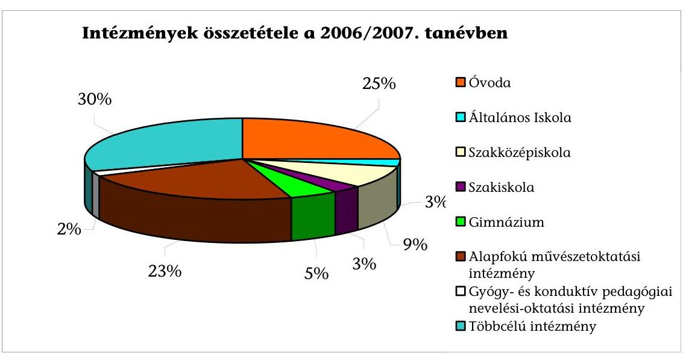

---

A fenntartott intézmények összetétele a két nevelési-oktatási évben alapvetően nem változott, mindkét évben az ún. többcélú intézmény aránya volt a legmagasabb (30%), az óvodák és az alapfokú művészetoktatási intézmények mintegy egynegyed-egynegyed részét alkották az összes intézménynek. A többcélú intézmények 34%-a gimnáziumi, szak- és szakközépiskolai feladatot látott el, fennmaradó részük az óvodai nevelés, az alap-, középfokú és szakmai oktatás, továbbá alapfokú művészetoktatási tevékenységek közül látott el egynél több (2-5) közoktatási feladatot.

A többcélú intézmények további 28%-a alap-, vagy alap- és középfokú oktatási, továbbá alapfokú művészetoktatási, 20%-a óvodai nevelési, alap-, vagy alapés középfokú oktatási és művészetoktatási, 9%-a óvodai nevelési és iskolai oktatási, 6%-a alap- és középfokú oktatási feladatot látott el, további 3%-a egységes gyógypedagógiai, konduktív-pedagógiai módszertani intézmény volt.

A fenntartók az általuk működtetett intézmények feladatait, székhelyét és telephelyeit, gazdálkodási jogkörét az intézményi alapító okiratban határozzák meg. A Közokt. tv. 37. § (5) bekezdés c) pontja szerint a közoktatási intézmények alapító okiratának tartalmazni kell a gazdálkodási jogosítványokat. A vizsgált országos kisebbségi önkormányzat az Áht. 87. § (2) bekezdés d) pontja alapján költségvetési szervnek minősülnek, amelyekre vonatkozóan az Ámr. 14. § szabályozza a gazdálkodás megszervezésének lehetséges módjait, a gazdálkodási jogosítványokat. Erre figyelemmel az MNOÖ intézményei alapító okiratai teljes körű szabályozást tartalmaztak. Ugyanakkor a non-profit fenntartók további körére az Áht. és az Ámr. előírásai nem vonatkoznak, erre a fenntartói körre a gazdálkodási jogosítványokat jogszabály nem határozza meg. Ebből adódóan a fenntartók e jogosítványokat ellentmondásosan szabályozták. A fenntartók egyharmada a költségvetési szervek gazdálkodási jogosítványainak mintájára sorolta be intézményeit részben önálló és önállóan gazdálkodó jogkörbe, azonban a státushoz tartozó gazdálkodási jogosítványok meghatározását elmulasztották (normatív támogatás és hozzájárulás feletti rendelkezést; a fenntartó és az intézmény közötti gazdálkodási, finanszírozási kapcsolatot; önálló számviteli nyilvántartás vezetését és számviteli beszámoló készítését; intézményi bankszámla vezetését). Az önálló pénzügyi, gazdasági szervezettel rendelkezők aránya az intézményeknél átlagosan 39% volt (2. számú melléklet).

# 1.2. A közoktatási feladatellátás pénzügyi forrásai 

A közoktatás rendszerének működtetéséhez szükséges fedezetet az állami költségvetés és a fenntartó hozzájárulása biztosítja, amelyet a gyermekek, illetve tanulók által igénybevett szolgáltatás díja, valamint a közoktatási intézmény egyéb saját bevétele kiegészíthet. A Közokt. tv. 81. § (1) bekezdés d) pontja alapján a nem állami, nem helyi önkormányzati fenntartásban működő közoktatási intézmények az általuk nyújtott szolgáltatásért ellenszolgáltatást kérhetnek, írásbeli megállapodásban fizetési kötelezettséget állapíthatnak meg.

A közoktatási intézmények szakmai feladatai ellátásának forrásszerkezetében a normatív hozzájárulás és támogatás aránya csökkenő, az egyéb oktatási célú bevételek aránya pedig növekvő tendenciát mutatott. A fenntartó non-profit szervezetek összes közoktatási célú bevételének a 2006. évben háromnegyed, a

---

2007. évben kétharmad részét a központi költségvetésből kapott normatív hozzájárulás és támogatás, a fennmaradó egynegyed, illetve egyharmad részét pedig a fenntartók egyéb közoktatási célú bevételei tették ki.

# 1.2.1. A normatív hozzájárulás és támogatás 

A vizsgált non-profit szervezetek bevételi szerkezetében a normatív hozzájárulás és támogatás részaránya az összes közoktatási célú bevételhez képest a felmért években csökkent, 2006-ban átlagosan 74%, 2007-ben 67% volt.

A 2007. évben a normatív támogatásnak az összes bevételhez számított aránya az átlagosnál magasabb mértékű a szak- és szakközépiskoláknál valamint az alapfokú művészetoktatási intézményeknél volt (85-88% között). Az átlagos érték körül alakult a normatíva aránya az általános iskolák, a gimnáziumok és a többcélú intézményeket fenntartók bevételi szerkezetében (62-66%). A legalacsonyabb arányt (28-38%) a gyógy- és konduktív pedagógiai nevelési-oktatási intézmények és az óvodák összes bevételéből képviselte a normatíva.

A fenntartók közoktatási célra 2006-ban 6521831 ezer Ft, 2007-ben 6651648 ezer Ft normatív hozzájárulást és támogatást kaptak, az évek közötti növekedés 2% volt (3. számú melléklet). Az intézményekben a 2006. évről a 2007. évre a közoktatásban résztvevő gyermekek/tanulók létszáma az alapfokú művészetoktatás kivételével átlagosan 17%-kal emelkedett, az alapfokú művészetoktatásban a létszámcsökkenés meghaladta a 30%-ot.
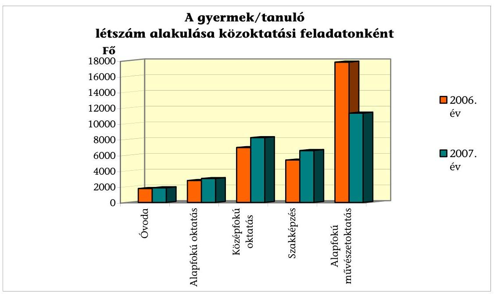

A nem állami, nem helyi önkormányzati intézményfenntartók részére megállapított normatív költségvetési hozzájárulások és egyéb támogatások összege a Közokt. tv. 118. § (4) bekezdése alapján nem lehet kevesebb, mint a helyi önkormányzat részére ugyanazon jogcímen megállapított normatív hozzájárulás. E törvényi előírásnak eleget tesz, hogy a jogcímsoronként járó éves normatíva fajlagos összege minden fenntartónál azonos, a létszámmérések időpontja és gyakorisága azonban eltér az önkormányzati és a nem állami fenntartóknál.

---

Az állami és helyi önkormányzati fenntartóknál a Kvtv. Kiegészítő szabályok 10. f) pontja alapján a létszámmérés időpontja tanévenként október 1-je, míg a nem állami és nem helyi önkormányzati fenntartók esetében a Vhr. 13. § (5) bekezdése alapján szeptember 15-e és február 1-je.

Az eltérő mérési időpontok miatt ugyanazon gyermek/tanuló után ugyanarra az időszakra két fenntartó is jogszerűen veheti igénybe a normatív támogatás időarányos részét (pl. ha az igényjogosult szeptember 16. és október 1. között nem állami fenntartású intézményből önkormányzati fenntartású intézménybe átiratkozik).

Az egy főre jutó normatív hozzájárulás és támogatás összege az alapfokú művészetoktatásban és a középfokú oktatásban csökkent, a többcélú és a gyógypedagógiai intézményeknél nem változott, az óvodák, az általános iskolák
 és a szakiskolák esetében emelkedett az alábbiak szerint:

| Intézmény típusa | Egy főre eső normatív   hozzájárulás, támogatás   eFt/fő |  | 2007/2006   $\%$ |
| :-- | :--: | :--: | :--: |
|  | $\mathbf{2 0 0 6}$ | $\mathbf{2 0 0 7}$ |  |
| Óvoda | 219 | 238 | 109 |
| Általános Iskola | 316 | 329 | 104 |
| Szakközépiskola | 279 | 276 | 99 |
| Szakiskola | 272 | 284 | 104 |
| Gimnázium | 273 | 249 | 91 |
| Alapfokú művészetoktatási intézmény | 64 | 51 | 80 |
| Gyógypedagógiai, konduktív pedagógiai nevelési-oktatási intézmény | 284 | 285 | 100 |
| Többcélú intézmény | 258 | 258 | 100 |

Az alapfokú művészetoktatáshoz kapcsolódó normatíva mértékének csökkenése és igénybevételi feltételének szigorodása 2007 szeptemberére az egy főre jutó normatív hozzájárulás és támogatás 20%-os, és a tanuló létszám 30%-ot meghaladó csökkenését okozta.

A normatíva fajlagos összege a 2007. év második félévétől a csoportos képzésben 50 ezer Ft/fő/évről 40 ezer Ft/fő/évre csökkent, továbbá mind az egyéni-, mind a csoportos oktatásban 2007. szeptember 1-jétől a normatíva 50%-a járt az intézménynek, amennyiben a fenntartó nem kezdeményezte, illetve nem felelt meg a közoktatás minőségbiztosításáról és minőségfejlesztéséről szóló 3/2002. (II. 15.) OM rendeletben előírt minősítési eljárásnak.

A közoktatási feladatellátáshoz igénybe vett normatív hozzájárulás és támogatás a fenntartók közoktatási intézményekre fordított tényleges kiadásának 2006-ban átlagosan a 67%-át, 2007-ben a 66%-át fedezte. A fenntartóknak az általuk fenntartott közoktatási intézményekre fordított összes kiadása 2007-ben (10 056 604 ezer Ft) 3%-kal emelkedett az előző évhez (9 781 436 ezer Ft) képest.

---

# 1.2.2. Az egyéb közoktatási célú bevételek 

A normatív hozzájáruláson és támogatáson kívül a fenntartók támogatást kaphattak a költségvetési fejezetektől (minisztériumoktól), az önkormányzatoktól, a közalapítványoktól és európai uniós forrásból pályázat, egyedi kérelem, megállapodás alapján. A fenntartók továbbá bevételhez juthattak az SZJA 1%-ának felajánlásából, egyéb támogatásokból (pl. szülők, gazdasági társaságok befizetései) valamint vállalkozási tevékenységük eredményéből. A fenntartók a normatív támogatáson kívül a 2006. évben 2 309 694 ezer Ft, a 2007. évben 3 343 827 ezer Ft egyéb közoktatási célú bevételhez jutottak, amely az összes közoktatási célú bevételeknek 2006-ban átlagosan a 26%-át, 2007-ben a 33%-át tette ki (4. számú melléklet).

- A fenntartók normatív hozzájáruláson és támogatáson felüli oktatási célú bevételei között legjelentősebb tétel az egyéb támogatás (szülői, társasági befizetések) volt, részesedése 2006-ban 17% (1 493 233 ezer Ft), 2007-ben 22% (2 212 006 ezer Ft) volt az összes közoktatási célú bevételekből.

Legnagyobb mértékben mindkét évben az óvodák, valamint a gyógy- és konduktív pedagógiai nevelési-oktatási intézmények részesültek egyéb támogatásban, átlagos mértékben a gimnáziumok és a többcélú intézmények, átlag alatt az általános, a szak- és szakközépiskolák, valamint az alapfokú művészetoktatási intézmények.

- Az állami nem normatív támogatások a közoktatási célú összes bevételeknek 2006-ban átlagosan a 6%-át, 2007-ben a 8%-át képezték. Az állami nem normatív támogatások zöme az oktatási miniszterrel megkötött közoktatási megállapodások alapján, az OM fejezeti kezelésű előirányzatából nyújtott kiegészítő támogatás volt.
- Az önkormányzatoktól kapott kiegészítő támogatások mindkét évben átlagosan 2-2%-át tettek ki a fenntartók közoktatatási célú bevételeinek. Az önkormányzatokkal megkötött közoktatási megállapodások alapján nyújtott kiegészítő támogatások célja az önkormányzatok feladat-ellátási kötelezettségébe tartozó gyerekek nevelésével, oktatatásával kapcsolatos tevékenység segítése volt.

Az összbevételhez viszonyított legnagyobb arányú önkormányzati támogatást a gyógy- és konduktív pedagógiai nevelési-oktatási intézmények és az általános iskolák, a legalacsonyabb arányú támogatást a szak- és szakközépiskolák, a gimnáziumok, és az alapfokú művészetoktatási intézmények kapták.

- A közalapítványok által nyújtott, az európai uniós forrásból kapott támogatások, valamint a személyi jövedelemadó 1%-ának felajánlásából származó bevétel együttesen a közoktatatási célú bevételeknek mindkét évben mindössze 1-1%-át alkották.

A közalapítványi támogatások 90%-át két alapfokú művészetoktatási intézmény és egy gimnázium nyerte el. Európai uniós támogatáshoz a fenntartók 4%-a, összesen öt fenntartó (két gimnázium, egy szakiskola, egy szakközépiskola és egy többcélú intézmény) jutott. Szja 1%-ának felajánlásából legnagyobb arányú bevétel a gyógypedagógiai nevelési-oktatási intézményt fenntartóknál volt.

---

# 2. A fenntartói feladatok teljesítése 

### 2.1. A fenntartói irányítás szabályszerűsége

A fenntartói irányításhoz kapcsolódó feladatok ellátását a Közokt. tv. 102. § (2) bekezdésének a) - g) pontjaiban foglalt rendelkezések betartásán keresztül ellenőriztük. A fenntartói feladatok teljesítésének szabályszerűségét a 5. számú mellékletben foglaltuk össze.
a) Az óvodai nevelési tevékenységet ellátó intézmények fenntartói teljes körűen meghatározták az óvoda heti és éves nyitvatartási idejét. Az óvodák 88%-a nyolc órát meghaladó heti nyitva tartás szerint látta el a nevelési feladatot, ezáltal az óvodai nevelésre meghatározott normatív hozzájárulás közül a magasabbra voltak jogosultak.
b) A fenntartók 95%-a határozta meg az általa fenntartott intézmény költségvetését. A jogszabály nem határozta meg, hogy a költségvetést a fenntartónak milyen időszakra kell elkészítenie, emiatt a fenntartók gyakorlata egymástól eltérő volt, ugyanis részben tanévre, részben naptári évre készítették el. A fenntartók 5%-a nem készített költségvetést, 2%-ánál a kuratórium helyett a kuratórium elnöke egy személyben hagyta jóvá.

A fenntartók 16%-ánál állapítottunk meg hiányosságot a térítési- és tandíjfizetési kötelezettség szabályainak meghatározása tekintetében. Egy esetben a kuratórium nem hagyta jóvá a térítési- és tandíjfizetési kötelezettség szabályait tartalmazó házirendet, egy esetben a fenntartó helyett az intézmény vezetője állapította meg a térítési díjat, két fenntartó nem határozta meg a fizetési kötelezettség szabályait.
c) Az óvodai intézmények fenntartóinak 96%-a meghatározta az indítható óvodai csoportok számát. A 2006/2007. és a 2007/2008. tanítási években az iskolák fenntartóinak 88%-a határozta meg az iskolában indítható osztályok számát. A fenntartók 23%-a a törvényi rendelkezésektől eltérően nem rendelkezett engedéllyel a maximális osztály, csoportlétszám túllépéshez. Az osztály, csoport átlaglétszámtól, illetve a maximális létszámtól való eltérés engedélyeztetésére vonatkozó, több törvényi helyen (Közokt. tv. 95/A § (11) bekezdés, 3. számú melléklet II. rész 7. és 8. pontjai) rögzített, és együtt értelmezendő rendelkezéseket a fenntartók 3%-a tévesen alkalmazta (egy fenntartó az adott évfolyamon indított két csoporttal szemben négy csoportnál, egy fenntartó a hatáskörét meghaladó mértékben - 20%-kal szemben 30% - engedélyezett túllépést).
d) Az ellenőrzési kötelezettséget a fenntartók 80%-a teljesítette. A törvényi rendelkezés értelmében a fenntartónak négyévenként legalább egy alkalommal ellenőrizni kell a közoktatási intézmény gazdálkodását, működésének törvényességét. A fenntartók egyötöde nem tett eleget a négyévenkénti ellenőrzési kötelezettségnek.

---

e) A fenntartók 98%-a szabályszerűen megbízta az általa működtetett intézmény vezetőjét és gyakorolta felette a munkáltatói jogokat. Egy fenntartó esetében az intézmény vezetőjének megbízásáról az alapítvány kuratóriuma nem hozott határozatot, arról a kuratórium elnöke döntött. Az alapítvány képviselője (kuratórium elnöke), illetve az iskola vezetője az ellenőrzött időszakban azonos személy volt, erre a Közokt. tv. 55. § (3) bekezdése lehetőséget adott, azonban az alapítvány alapító okirata nem rendelkezett a munkáltatói jog gyakorlására vonatkozóan arra az esetre, ha a kuratórium elnöke és az intézmény vezetője azonos személy.
f) Az intézmények működési rendjét szabályozó dokumentumokat (SZMSZ, minőségirányítási program, nevelési és pedagógiai program, házirend) a fenntartók 95%-a szabályszerűen jóváhagyta, három fenntartó nem teljes körűen teljesítette a jóváhagyási kötelezettséget.
g) A fenntartók háromnegyede értékelte az általa működtetett nevelési-oktatási intézmény foglalkozási, pedagógiai programjában meghatározott feladatok végrehajtását, a fenntartók egynegyede vagy nem teljesítette e kötelezettséget, vagy az értékelés elfogadásáról nem hozott határozatot.

A Közokt. tv. 102. § (9) bekezdése rendelkezéseinek megfelelően valamennyi fenntartó biztosította az általa fenntartott közoktatási intézmény(ek) folyamatos működtetését: óvodát, iskolát nem indítottak, nem szüntettek meg, és nem szerveztek át; az intézmények fenntartói jogát nem adták át; óvodai csoportot, iskolai osztályt nem szerveztek át, nem szüntettek meg; az intézmények feladatait nem változtatták meg.

# 2.2. A közoktatási megállapodások szabályossága 

A fenntartók 19%-a kötött közoktatási megállapodást az oktatási és kulturális miniszterrel. A megkötött megállapodások megfeleltek a Közokt. tv. 81. § (3) bekezdésében foglaltaknak.

A közoktatási megállapodások alapján a miniszter kiegészítő támogatást biztosított a közoktatási feladatot ellátó intézmények működéséhez. A támogatások célja volt - többek között - a sajátos nevelési igényű, hátrányos helyzetű, magatartási, tanulási, beilleszkedési nehézségekkel küzdő gyermekek, tanulók egyénre szabott fejlesztésével, integrációjával kapcsolatos tevékenység segítése, ezáltal a rászoruló gyerekek, tanulók esélykülönbségeinek csökkentése, továbbá a Waldorf kerettanterv alapján történő neveléshez szükséges többletforrás biztosítása.

A fenntartók 12%-a által működtetett intézmények a Közokt. tv. 81. § (1) bekezdés e) pontjában meghatározott közoktatási megállapodás alapján vettek részt önkormányzati feladat megvalósításában. A fenntartók és a feladat ellátásáért felelős helyi önkormányzatok között létrejött közoktatási megállapodásokat a felek minden esetben a Közokt. tv. 81. § (3) bekezdésében előírt tartalommal kötötték meg.

Négy fenntartó közoktatási megállapodás alapján vállalta, hogy a felvételnél előnyt biztosítanak a helyi állandó lakosú tanköteles korú tanulók részére, az

---

önkormányzatok ezen tanulók után kiegészítő támogatást biztosítottak. Három fenntartó közoktatási megállapodás alapján vett át a helyi önkormányzatoktól általános iskolai és óvodai fenntartói feladatot, amelyhez az önkormányzatok kiegészítő támogatásra vállaltak kötelezettséget. Az MNOÓ közoktatási megállapodással, a nemzeti és etnikai kisebbségek jogairól szóló 1993. évi LXXVII. törvény 47. § (3)-(5) bekezdéseiben foglaltak alapján vette át a helyi önkormányzatoktól két intézmény fenntartói jogát az ingatlanok ellenérték nélküli használatba vételével.

# 2.3. A sajátos rendelkezések betartása 

A Kvtv. 31. § (1) bekezdés j) pont rendelkezése alapján a fenntartónak a normatív hozzájárulás és támogatás teljes összegét át kell adnia annak az intézménynek, amelyre tekintettel a támogatás megállapítására sor került. A hivatkozott törvényi rendelkezés azonban nem határozza meg konkrétan, hogy mit tekint átadásnak, nevezetesen a normatív hozzájárulás és támogatás banki úton való átutalását, vagy teljes összegének az intézmény működésére történő felhasználását, nem rendelkezik továbbá az átadás határidejéről, valamint elmulasztásának jogkövetkezményéről sem. Ez, valamint a gazdálkodási jogosítványok körének tartalmának szabályozatlansága is hozzájárult ahhoz, hogy a fenntartóknál a normatív hozzájárulás és támogatás átadása az intézményeik részére egymástól eltérő módon valósult meg. Mivel a fenntartók által működtetett intézmények 29%-a nem rendelkezett önálló bankszámlával, az átadásra vonatkozó törvényi előirás teljesítésének ellenőrzése ezen intézmények fenntartóinál nehézséget jelentett. A normatív hozzájárulás és támogatás átadását ebben a körben az intézmény éves költségvetésének bevételi előirányzata, a felhasználást pedig a fenntartók elkülönített számviteli nyilvántartása alapján állapítottuk meg.

- A fenntartók 51%-a a normatív hozzájárulás és támogatás teljes összegét átutalta az általa működtetett intézmények bankszámlájára.
- A fenntartók 29%-a a saját bankszámláikra utalt normatív támogatásból finanszírozta az intézmények működési költségeit, mivel önálló bankszámlával az intézmények nem rendelkeztek. A fenntartók az intézményi költségvetések és a saját számviteli nyilvántartásaik alapján a normatív hozzájárulás és támogatás teljes összegét közoktatási feladatok teljesítésére fordították.
- A fenntartók 12%-a a normatív hozzájárulást és támogatást nem teljes összegben utalta át az intézményeknek, de az
 át nem utalt támogatás teljes összegét intézményeikre fordították (pl.: bérleti-, közüzemi- és biztosítási díj, felújítási költség, személyi jellegű kifizetések).
- A szabályozás hiányossága is hozzájárult ahhoz, hogy a fenntartók 3%-a a Kincstár havi finanszírozásától eltérő ütemezésben adta át a támogatást, egy fenntartó a 2007. évi normatív hozzájárulás és támogatás 7%-át az ÁSZ helyszíni ellenőrzését követően, 2008. áprilisban utalta át az intézményének.
- Egy fenntartó (Hétszínvirág Alapítvány) a Kvtv. 31. § (1) bekezdés j) pont rendelkezésével ellentétben az intézmény részére megállapított és folyósított támogatást nem az intézmény részére, hanem az intézményt eredetileg alapító kft. részére utalta át, a kft. számviteli nyilvántartásából megállapítható volt, hogy a normatív hozzájárulást és támogatást az intézmény működésé-

---

re fordította. Az intézmény dolgozói a kft. alkalmazásában álltak, bérüket és annak járulékait a kft. fizette, a közszolgáltatókkal a kft. kötött szerződést, az intézmény épületét a kft. bérelte. Az ÁSZ helyszíni ellenőrzését követően a munkaszerződéseket módosították.

- Egy fenntartó (Paulay Alapítvány) a normatív hozzájárulás és támogatás összegét nem adta át az intézményének annak ellenére, hogy az intézmény önálló bankszámlával rendelkezett.

A fenntartók maradéktalanul betartották a Kvtv. 31. § (13) bekezdésének rendelkezését. A 40 millió Ft-ot meghaladó normatív hozzájárulásban és támogatásban, kiegészítő támogatásban részesült fenntartók az elszámolások jogszerűségét független könyvvizsgálóval ellenőriztették. A könyvvizsgálói nyilatkozatok szerint az elszámolások valósak és megbízhatóak voltak, jogszerűtlen igénybevételre vonatkozó megállapítást nem tartalmaztak. A megbízhatósági kritériumnak azonban a könyvvizsgálók által hitelesített elszámolásoknak csupán a 22%-a felelt meg, így a könyvvizsgálói nyilatkozatok nem nyújtanak kellő garanciát a normatív hozzájárulások és támogatások jogszerű igénybevételéhez.

A fenntartói elszámolás akkor minősült megbízhatónak, ha az ellenőrzés által feltárt eltérés mértéke nem érte el összességében a 2%-os lényegességi küszöböt, vagy egy jogcím esetében az 5%-ot.

A Kvtv. 31. § (15) bekezdése értelmében a nem állami intézmény fenntartója egyetemlegesen felelős az általa fenntartott intézmény köztartozásaiért, a köztartozások összege a fenntartónak járó normatív támogatásból - az intézmény tevékenységének fenntarthatóságára tekintettel - közvetlenül érvényesíthető. A hatósági igazolások tanúsága szerint a fenntartók, illetve intézményeik 10%-ának a normatív hozzájárulás és támogatás igénylésekor vagy folyósításakor lejárt köztartozása volt. A Kincstár a lejárt köztartozással rendelkező fenntartóknál a vonatkozó jogszabály rendelkezésével összhangban járt el, mivel azoknál a szervezeteknél, amelyek a köztartozás megfizetésére részletfizetést kértek és kaptak, az adóhatóság határozatában megjelölt összeget a normatív hozzájárulás és támogatás összegéből levonta és az adóhatóság számlájára utalta. Azon szervezetek esetében, amelyek részletfizetési engedéllyel nem rendelkeztek, csak a köztartozás rendezését követően folyósította a normatív hozzájárulást és támogatást.

A közpénzek felhasználásának nyilvánossága és ellenőrizhetősége érdekében a számviteli törvény szerinti egyes egyéb szervezetek beszámolókészítési és könyvvezetési kötelezettségének sajátosságairól szóló 224/2000. (XII. 19.) Korm. rendelet 17. § (8) bekezdésben meghatározott elkülönített nyilvántartási kötelezettségnek a fenntartók 86%-a tett eleget. Az igénybevett normatív hozzájárulás és támogatás összegét és annak felhasználását könyvvezetésükben (főkönyvi vagy analitikus nyilvántartásukban) elkülönítetten mutatták ki.

A fenntartóknál megállapított hiányosságok az alábbiakban részletezhetők:

- 8%-nál a normatív hozzájárulás és támogatás nyilvántartása részben felelt meg a hivatkozott jogszabályi előírásnak, mivel a bevételek között elkülönítették, de a felhasználásról nem vezettek külön nyilvántartást;

---

- 3-3%-nál a normatív hozzájárulás és támogatás nyilvántartására alkalmazott főkönyvi számla vezetése nem volt következetes, téves és beazonosíthatatlan tételeket is tartalmazott, továbbá a jogszabályi előírástól eltérően a támogatások felhasználását nem különítették el, illetve jogszabályi előírástól eltérően a normatív hozzájárulást és támogatást nem mutatta ki elkülönítetten a könyvvezetésében.

# 3. A normatív hozzájárulás és támogatás igénylése és elszámolása 

### 3.1. Az igényjogosultság ellenőrzésének tapasztalatai

A fenntartók 98%-a a Vhr. és a központosított támogatások igénybevételi szabályait rögzítő OKM rendeletekben meghatározott határidőben, módon és a kötelezően becsatolandó dokumentumok alapján készítette el igényléseit. Egy fenntartó, a Humán Intézet Kht a Vhr. 13. § (3) bekezdés előírásától eltérően a Szolnok városban működtetett telephelyen és a székhelyen ellátott alapfokú művészeti oktatásról részletező igénylő lapot nem, csak az összesített igénylő lapot küldött a Kincstárnak, amely azt elfogadta.

Az igényjogosultságot és annak változását megalapozó egyedi dokumentumok a fenntartók 81%-ánál hiánytalanul rendelkezésre álltak. Az ellenőrzés során feltárt hiányosságok:

- a szakképzés nappali rendszerű iskolai oktatásban résztvevőkre a Közokt. tv. 52. § (1) bekezdés c) pontjában előírt korhatár jogszerű meghosszabbítását igazoló dokumentumok nem álltak rendelkezésre négy fenntartónál (Európai Nyelvoktatás Alapítvány, Paulay Alapítvány, Periféria Alapítvány, Szakképzett Ifjúságért Alapítvány);
- a sajátos nevelési igényű tanulókra igénybevett normatív hozzájárulás elszámolását hat fenntartó hiányosan támasztotta alá érvényes szakértői és rehabilitációs bizottsági szakvéleménnyel (Dávid király Alapítvány, Győri Waldorf Egyesület, Hétfő Alapítvány, Innovációs Szakképző Kht., Maci Alapítvány, Nebuló XXI. Alapítvány). A tanulókat részben a nevelési tanácsadó szakvéleménye, részben az adott időszakra érvénytelen szakvélemény alapján részesítették ellátásban;
- a nem magyar állampolgár tanulók - a közoktatásban a magyar állampolgárokkal, azonos feltételekkel való részvételt igazoló - igényjogosultságát megalapozó egyedi dokumentumok két fenntartónál hiányoztak (Korszerű Fogtechnika Alapítvány, Paulay Alapítvány);
- az Európai Nyelvoktatás Alapítvány nem rendelkezett két tanuló gyakorlati foglalkozásának megszervezését igazoló tanuló szerződéssel.

A Kvtv. 3. számú melléklet Kiegészítő szabályok 10. c) pontja szerint a normatív hozzájárulások igénybevételének és elszámolásának a közoktatási statisztikai adatokra, az azt megalapozó előírt tanügyi okmányokra kellett épülnie. A nevelési-oktatási intézmények működéséről szóló 11/1994. (VI. 8.) MKM rende-

---

let 4. számú mellékletben előírt tanügyi okmányok⁵ vezetésében hiányosságokat, eltéréseket állapítottunk meg.

- A törzslapon a hivatkozott MKM rendelet 4. számú melléklet 6.a) pont előírásától eltérően nem tüntették fel a tanulók azonosító számát, az egyes évfolyamokon elért tantárgyi eredményeket.
- Az osztály/csoport naplókban a személyi/értékelő részben nem vezették az óvodai, illetve tanulói jogviszony létesítésére és megszüntetésére vonatkozó adatokat, a záradékokat, illetve a tanulók jelenlétét évközi tantárgyi osztályzatok nem igazolták. A napló haladási részében az óratervi órák tananyagainak beírása hiányos volt, a szaktanárok nem dokumentálták az órák megtartását, hiányoztak a tanulók igazolt és igazolatlan hiányzásainak óraszámai.
- A tanügyi dokumentumok között eltérések voltak, így az osztály/gyakorlati naplók haladási része, az órarend, valamint a tantárgyfelosztás szerinti tanórák nem voltak összhangban azok száma, rendje és az oktatást végző tanárok vonatkozásában. A törzslapon a tantárgyanként feltüntetett évi összes óraszám nem egyezett meg a napló haladási részében dokumentált éves teljesített tantárgyi órák számával.
- A Kvtv. 3. számú melléklet Kiegészítő szabályok 10. c) pontjától eltérően a fenntartók az elszámolásban közölt adatokat nem az előírt tanügyi, valamint a hozzájárulást megalapozó okmányokkal és analitikus nyilvántartásokkal összhangban határozták meg. Az eltérések okai voltak, hogy a gyermekek/tanulók jogviszonya a létszámmérési időpont után keletkezett vagy addig megszűnt, illetve a tanügyi dokumentumok adatait a fenntartók pontatlanul összesítették.

Az ellenőrzött időszakban a Vhr. 14. § (4) és (5) bekezdése szerinti változásjelentési kötelezettséget egy fenntartó nem teljesítette.

Az MNOÖ által fenntartott Friedrich Schiller Középiskola esti oktatás munkarendje szerinti középfokú oktatásban 9-13. évfolyamon résztvevő tanulóinak száma az igazolatlan mulasztások miatt az Iskolai oktatás a 9-13. évfolyamon jogcímen 10%-ot meghaladó mértékben csökkent, a fenntartó változásjelentési kötelezettségének nem tett eleget.

# 3.2. Az elszámolások szabályszerűsége, megbízhatósága 

A fenntartók 98%-a a Vhr. 16. § (1) bekezdésében előírt dokumentumoknak a Kincstár felé határidőre történt benyújtásával eleget tett az elszámolási kötelezettségének. A fenntartók 2%-a (Humán Intézet Kht.) az

[^0]
[^0]:    ⁵ A normatív hozzájárulás és támogatás igénybevétele és elszámolása során közölt gyermek, illetve tanuló létszám dokumentálására kötelezően alkalmazandó tanügyi dokumentumokat és vezetésükre vonatkozó szabályokat a nevelési-oktatási intézmények működéséről szóló 11/1994. (VI. 8.) MKM rendelet szabályozta.

---

elszámolását határidőre benyújtotta, azonban nem minden részletező lapot küldött meg, a hiányzókat a helyszíni ellenőrzés során pótolta.

A Kvtv. 5. számú mellékletében meghatározott központosított előirányzatokhoz kapcsolódó, további elszámolási kötelezettségnek a fenntartók 5%-a nem tett eleget.

A szakmai vizsgák lebonyolítására nyújtott támogatás igénylésének, folyósításának és elszámolásának rendjéről szóló 13/2007. (III. 14.) OKM rendelet 3. § (8) bekezdésben foglalt adatszolgáltatási kötelezettséget egy fenntartó nem határidőben teljesítette. A szakmai és informatikai fejlesztési feladatok támogatása igénylésének, döntési rendszerének, folyósításának, elszámolásának és ellenőrzésének részletes szabályairól szóló 16/2007. (III. 14.) OKM rendelet 8. § (8) bekezdésben foglalt adatszolgáltatási kötelezettségnek két fenntartó nem tett eleget az OKM Támogatáskezelő Igazgatósága felé.

A fenntartói elszámolások 83%-a nem volt megbízható. Az elszámolások 2%-a volt hibátlan (Gyermekeinkért 2000 Alapítvány), 15%-ánál a hiba mértéke nem érte el a lényegességi szintet.

A fenntartó elszámolása megbízhatónak minősült, ha az ellenőrzés által feltárt eltérés aránya összességében nem érte el a 2%-ot, illetve egy jogcím esetében az 5%-ot. Az eltéréseket a fenntartók által a Kincstár felé benyújtott elszámolásokhoz képest határoztuk meg.

A fenntartók az ellenőrzött jogcímeken összesen 2109194 ezer Ft normatív hozzájárulást és támogatást számoltak el. Ellenőrzésünk az elszámoláshoz képest összesen 275768 ezer Ft (13,1%) abszolút eltérést állapított meg. A Kvtv. 3. számú melléklet Kiegészítő szabályok 10. c) pontjában megjelölt, az elszámolásra vonatkozó Közokt. tv. és a szakképzésről szóló 1993. évi LXXVI. törvény, valamint ezek végrehajtási rendeleteiben foglalt szakmai előírások és az egyes normatívák igénylését megalapozó feltételektől (továbbiakban elszámolásra vonatkozó jogszabályok) eltérő elszámolás miatti különbözet 196998 ezer Ft és +78769 ezer Ft. Az eltérések egyenlege 118229 ezer Ft volt, amelyből 88% a szakképzés elméleti és gyakorlati hozzájárulás jogcímein keletkezett (6. számú melléklet).

A normatív hozzájárulások és támogatások jogcímenkénti eltéréseinek aránya:

| Közoktatási hozzájárulások, támogatások | Eltérés (%) |
| :-- | :--: |
| Óvodai nevelés | 19,1 |
| Alapfokú oktatás | 11,4 |
| Középfokú oktatás | 8,0 |
| Iskolai szakképzés (elméleti képzés) | 21,1 |
| Szakmai gyakorlati képzés | 36,9 |
| Alapfokú művészetoktatás | 1,9 |
| Sajátos nevelési igényű gyermekek, tanulók nevelése, oktatása | 20,3 |
| Központosított közoktatási támogatások | 0,9 |
| Ellenőrzött normatív hozzájárulás és támogatások együttesen | 13,1 |

---

A közoktatás alap hozzájárulásának finanszírozási rendszerében 2007. év szeptemberétől változás következett be, ugyanis a létszámalapú finanszírozást a közoktatási teljesítménymutatón alapuló finanszírozás váltotta fel. A teljesítmény mutatón alapuló finanszírozás szabályai között a Kvtv. 3. számú melléklet 15.2. pontjában nem határozta meg a teljesítménymutató részletes számítási szabályait a vegyes óvodai csoportok és az összevont általános iskolai osztályok esetében.

- Az óvodai nevelés területen a teljesítménymutató bevezette az óvodai évfolyamok (1. és 2-3. nevelési év) és az óvodai nyitva tartás hossza szerint (maximum napi 8, illetve 8 órán túl) differenciált finanszírozást. A vegyes korcsoportú óvodai csoportokra vonatkozóan az alkalmazandó jogszabályok nem rendelkeztek a vegyes óvodai csoportban nevelt gyermekek nevelési év szerinti besorolásának szabályairól. A szabályozás hiányossága hozzájárult, hogy a fenntartók nem egységesen értelmezték az 1., valamint a 2-3. óvodai nevelési évet, ezért vagy az óvodai nevelésben töltött évek, vagy az életkortól függően
 sorolták be a gyermekeket az 1. illetve a 2–3. nevelési évbe.
- Az összevont általános iskolai osztályokra vonatkozóan az alkalmazandó jogszabályok nem rendelkeztek a tanulók évfolyam szerinti besorolásának szabályairól.

A fenntartók elszámolásában az összes jogcímnél előforduló általános eltérési okok: a mutatószám számítási és kerekítési hibái; támogatási összeg téves meghatározása; a Közokt. tv. 3. számú melléklet II. részében az osztályok, csoportok szervezésére a 7. és 8. pontjaiban előírt szabályoktól való eltérés; a gyermekek/tanulók számának a tanügyi dokumentumoktól eltérő meghatározása (részletezés a függelékben).

A mutatószám, illetve a normatív hozzájárulás összegének számítási hibáiból, a kerekítésből adódott eltéréseket a Kincstár a fenntartói elszámolás benyújtását követően, a 2007. évi normatív hozzájárulás elszámolás egyenlegéről szóló határozatában korrigálta. Az ellenőrzött jogcímeknél a kerekítési és mutatószám, támogatási összeg számítási hiba miatt megállapított eltérések egyenlege +2532 ezer Ft.

A teljesítménymutató bevezetését követően a Vhr.-ben a mutatószám kerekítési szabályok nem módosultak, így a mutatószámok kerekítésére különböző szabályok vannak hatályban.

A Vhr. 16. § (1) bekezdése két tizedest, az újonnan bevezetett teljesítménymutatóra a Kvtv. 3. számú melléklet 15.2. pontja egy tizedes kerekítést írt elő.

# 3.2.1. Óvodai nevelés 

Az óvodai nevelés feladatra a fenntartók 42%-a (25 fenntartó) számolt el normatív hozzájárulást, az elszámolások 88%-a hibás volt. A fenntartók 44%-ánál +3722 ezer Ft, 40%-ánál –5554 ezer Ft, egyenlegében –1832 ezer Ft eltérést eredményezett. A fenntartók 4%-ánál az eltérések kiegyenlítették egymást.

A fenntartók által óvodai nevelésnél elszámolt átlaglétszám 979 gyermek, az ÁSZ által megállapított átlaglétszám 947 gyermek volt.

---

| Létszámmérési időpontok | Megállapított létszámeltérések (fő) |  |
| :-- | :--: | :--: |
| 2006. szeptember 15. | +7 | -19 |
| 2007. február 1. | +1 | -38 |
| 2007. szeptember 15. | +11 | -38 |

A fenntartók normatív hozzájárulás elszámolásának ellenőrzése során megállapított létszámeltérések jellemző okai voltak, hogy nem tartották be az előírt életkori határokra vonatkozó szabályokat, a gyógypedagógiai ellátásban hiányoztak a jogosító szakértői bizottságok szakvéleményei. A 2007. szeptember 1-jétől hatályban lévő teljesítménymutatóhoz kapcsolódó hibák: az óvodai jogcímnél nem vették számba a sajátos nevelési igényű gyermeket, az 1. illetve a 2–3. óvodai nevelési év hiányos szabályozása miatt eltérő sorokon szerepeltették a gyermekeket, nem a házirendben meghatározott nyitvatartási időnek megfelelő soron történt a számbavétel.

# 3.2.2. Alapfokú iskolai oktatás 

Az alapfokú oktatásban egyenlegében +2949 ezer Ft eltérést állapítottunk meg.

Az alapfokú, 1–8. évfolyamokon történő oktatásban a fenntartók 29%-a (17 fenntartó) számolt el normatív hozzájárulást. E tevékenységet folytató összes fenntartó elszámolása tartalmazott hibát, +3089 ezer Ft összegben.

A fenntartók által elszámolt átlaglétszám 2246 tanuló, az ÁSZ által megállapított átlaglétszám 2254 tanuló volt.

| Létszámmérési időpontok | Megállapított létszámeltérések (fő) |  |
| :-- | :--: | :--: |
| 2006. szeptember 15. | +13 | -9 |
| 2007. február 1. | +24 | -9 |
| 2007. szeptember 15. | +12 | -15 |

A normatív hozzájárulást elszámoló 13 fenntartónál +4301 ezer Ft, 4 fenntartó esetében –1212 ezer Ft jogszabályoktól eltérően elszámolt normatív hozzájárulást állapítottunk meg.

A fenntartók normatív hozzájárulás elszámolásának ellenőrzése során megállapított eltérések jellemző okai voltak, hogy nem tartották be a nem magyar állampolgár tanulókra vonatkozó szabályokat, a gyógypedagógiai ellátásban hiányoztak a jogosító szakértői bizottságok szakvéleményei.

Párhuzamos művészeti képzést az 5–8. évfolyamokon a fenntartók 2%-a (1 fenntartó) végzett. A Kincstárnak benyújtott elszámolásában a 2006/2007. tanévben 17 főre elszámolt 4804 ezer Ft normatív támogatást, létszámeltérés nem volt, mutatószám számítási hibából –140 ezer Ft eltérés keletkezett.

---

# 3.2.3. Középfokú iskolai oktatás 

A középfokú oktatásban egyenlegében +542 ezer Ft eltérést állapítottunk meg.

Középfokú, 9–13. évfolyamon történő oktatásnál a fenntartók 34%-a (20 fenntartó) számolt el normatív hozzájárulást. Az e területen oktatást folytató fenntartók 5%-ának (Aranybika Alapítvány) volt hibátlan az elszámolása.

A fenntartók által elszámolt átlaglétszám 2603 tanuló, az ÁSZ által megállapított átlaglétszám 2601 tanuló volt.

| Létszámmérési időpontok | Megállapított létszámeltérések (fő) |  |
| :-- | :--: | :--: |
| 2006. szeptember 15. | +295 | -190 |
| 2007. február 1. | +154 | -143 |
| 2007. szeptember 15. | +164 | -217 |

A normatív hozzájárulást elszámoló fenntartók közül 12 fenntartónál +7932 ezer Ft, hét fenntartó esetében –7084 ezer Ft az elszámolásra vonatkozó jogszabályoktól eltérően elszámolt normatív hozzájárulást állapítottunk meg, összességében +848 ezer Ft volt a különbözet.

A fenntartók normatív hozzájárulás elszámolásának ellenőrzése során megállapított eltérések legfőbb okai, hogy a tanulókat a nappali rendszerű oktatás helyett a nappali oktatás munkarendje szerinti oktatás keretében számolták el, nem tartották be a szakképzés finanszírozására, a nem magyar állampolgár tanulókra és a tanulói jogviszony megszüntetésére vonatkozó szabályokat. További eltérést eredményezett az, hogy a gyógypedagógiai ellátásban hiányoztak a szakértői bizottságok szakvéleményei.

Párhuzamos művészeti képzést a 9–13. évfolyamokon a fenntartók 2%-a végzett. A Kincstárnak benyújtott elszámolásában a fenntartó 17 fő átlaglétszámra 8908 ezer Ft normatív támogatással pontosan és szabályosan számolt el.

Felzárkóztató, a 9–10. évfolyamokon végzett oktatás területre a fenntartók 4%-a (2 fenntartó) számolt el normatív hozzájárulást. A fenntartók 2%-a (Kelta Iskola Kht.) a Kincstár felé benyújtott elszámolásában a 2006/2007. tanévben 15 főre 5240 ezer Ft normatív támogatással szabályosan számolt el. A további 2%-a nem a Közokt. tv. 27. § (8) bekezdésében foglaltak alapján szervezte meg a felzárkóztató oktatást, továbbá az intézmény szakiskolai tevékenységet alapító okirata és működési engedélye alapján sem végezhetett, ezért a 2006. szeptember 15-ei létszámában 7 főre, az elszámolásra vonatkozó jogszabályoktól eltérően –306 ezer Ft hozzájárulást számolt el.

### 3.2.4. Szakképzés

A szakképzésben egyenlegében –103 592 ezer Ft jogszabályoktól eltérően elszámolt normatív hozzájárulást és támogatást állapítottunk meg.

---

A fenntartók 47 féle OKJ-s szakmát oktattak, a leggyakoribb volt a pincér (4 intézményben), a szakács, idegenvezető és számítástechnikai szoftverüzemeltető képzés (3 intézményben). Az Országos Képzési Jegyzékről és az Országos Képzési Jegyzékbe történő felvétel és törlés eljárási rendjéről szóló 1/2006. (II. 17.) OM rendelet 3. számú mellékletében régiónként felsorolt hiány-szakképesítések jegyzékéből mindössze egy régióban és egy szakma esetében volt képzés (Danubius Hotels Alapítvány).

Iskolai szakképzés (szakmai elméleti képzés) területen a fenntartók 31%-a (18 fenntartó) vett igénybe normatív hozzájárulást. E jogcím vonatkozásában a fenntartók 89%-ának hibás volt az elszámolása.

A fenntartók által a szakképzés, elméleti képzésben elszámolt átlaglétszám 1372 tanuló, az ÁSZ által megállapított átlaglétszám 1197 tanuló volt.

| Létszámmérési időpontok | Megállapított létszámeltérések (fő) |  |
| :-- | :--: | :--: |
| 2006. szeptember 15. | +18 | -314 |
| 2007. február 1. | +3 | -284 |
| 2007. szeptember 15. | +116 | -75 |

Az eltérésekből adódóan összesen –51 304 ezer Ft és +1892 ezer Ft volt az elszámolásra vonatkozó jogszabályoktól eltérően elszámolt hozzájárulás, amelyből a Paulay Alapítvány hibás elszámolása –33 998 ezer Ft volt.

A fenntartók normatív hozzájárulás elszámolásának ellenőrzése során megállapított eltérések legfőbb okai, hogy nem tartották be a magántanulókra, a nem magyar állampolgárságú tanulókra, a korhatárra, a második szakképzésre vonatkozó előírásokat. Nem vezették a tanulók távolmaradására vonatkozó adatokat, illetve nem szüntették meg igazolatlan mulasztás miatt a tanulói jogviszonyt. Az oktatást nem az OKJ képzésre előírt óraszámok, valamint nem a pedagógiai program óratervében meghatározott tantárgyi struktúra szerint szervezték meg.

Szakképzés–szakmai gyakorlati képzést a fenntartók 25%-a (15 fenntartó) biztosított. Szakmai gyakorlati képzést a szakképzési évfolyamokon kívül az e területen oktató fenntartók 53%-a a szakiskola és a szakközépiskola 9–10. évfolyamán is szervezett iskolai ún. szakmai (pálya)orientációs gyakorlatot. E feladaton igénybe vehető normatív hozzájárulás igénybevételi feltételei, valamint számítási módszere egész évre vonatkozóan változatlan volt. A fenntartók 20%-ának elszámolása volt szabályos.

Iskolai gyakorlati oktatás a szakiskola és a szakközépiskola 9–10. évfolyamon feladatot ellátó fenntartók 87%-ának hibás volt az elszámolása.

A fenntartók által a szakképzés gyakorlati képzés 9–10. évfolyamon feladatnál elszámolt átlaglétszám 382, az ÁSZ által megállapított átlaglétszám 271 tanuló volt.

---

| Létszámmérési időpontok | Megállapított létszámeltérések (fő) |  |
| :-- | :--: | :--: |
| 2006. szeptember 15. | +14 | -49 |
| 2007. február 1. | +12 | -117 |
| 2007. szeptember 15. | – | -138 |

A megállapított hibákból adódóan –4699 ezer Ft és +280 ezer Ft volt az elszámolásra vonatkozó jogszabályoktól eltérően elszámolt normatív hozzájárulás.

Az eltérések jellemző okai voltak, hogy a vonatkozó jogszabály előírásától kevesebb órában folytatták az oktatást, nem tartották be a csoportképzés szabályait, a jogosultság fennállásakor nem igényelték a hozzájárulást.

Szakmai gyakorlati képzés a szakképzési évfolyamokon jogcímen a fenntartók 78%-ának hibás volt az elszámolása, ezért összesen +1492 ezer Ft és –51 253 ezer Ft volt az elszámolásra vonatkozó jogszabályoktól eltérően elszámolt normatív hozzájárulás.

A fenntartók által a szakképzés gyakorlati képzés szakképzési évfolyamon feladatnál elszámolt átlaglétszám 1392, az ÁSZ által megállapított átlaglétszám 962 tanuló volt.

Az elszámolt létszámadatok eltérését részben az iskolai szakképzés (szakmai elméleti képzés) jogcímen feltárt eltérési okok, részben a szakmai gyakorlati oktatásra jellemző hibák idézték elő.

A gyakorlati oktatás elszámolására jellemző hibák voltak, hogy a fenntartók nem a gyakorlat megszervezésének helye, az évfolyamok száma, a képzési idő hossza, az oktatás munkarendje szerint határozták meg az elszámolás során a létszámokat.

| Jogcímsor | Létszámeltérés egyenlege létszámmérési időpontonként (fő) |  |  |
| :-- | :--: | :--: | :--: |
|  | 2006.   szept. 15. | 2007.   febr. 1. | 2007.   szept. 15. |
| Egy évfolyamos képzés és több évfolyamos   képzés közbenső évfolyamain folyó oktatás | -175 | -229 | -226 |
| Első évfolyamos képzéshez, ha a képzési idő   meghaladja az egy évet | -229 | -179 | -62 |
| Záró évfolyamos képzéshez, ha a képzési   idő meghaladja az egy évet | -116 | -47 | -107 |
| Tanulószerződéssel nem a fenntartó iskolai   tanműhelyében folyó gyakorlati oktatás | +26 | +23 | +15 |

---

# 3.2.5. Alapfokú művészetoktatás 

Az alapfokú művészetoktatásban a fenntartók elszámolásaihoz képest egyenlegében –2714 ezer Ft eltérés volt, ebből kilenc fenntartónál +528 ezer Ft, hat fenntartó esetében –3242 ezer Ft volt az elszámolásra vonatkozó jogszabályoktól eltérően elszámolt normatív hozzájárulás.

A fenntartók az alapfokú művészetoktatásban 3028 fő átlaglétszámra vettek igénybe támogatást, az ellenőrzés 2961 fő átlaglétszámot állapított meg.

A fenntartók 25%-a (15 fenntartó) számolt el alapfokú művészetoktatási feladatra normatív hozzájárulást. A fenntartók közül egy folytatott zeneművészeti oktatást, hat folytatott zenei és egyéb művészeti ágakban is képzést, nyolc fenntartó pedig képző-, ipar-, tánc-, szín-, és bábművészeti (egyéb művészeti ágak) ágakban végzett oktatást.

A fenntartók 2007. március 31-éig kezdeményezhették a közoktatás minőségbiztosításáról és minőségfejlesztéséről szóló 3/2002. (II. 15.) OM rendelet 1014/F.
 §-ban meghatározott minősítő eljárást. Az eljárást nem kezdeményezte két fenntartó.

Az eljárást kezdeményező fenntartók közül két fenntartó nem felelt meg az előminősítési eljárás során, így ezen fenntartók 2007. szeptember 1-jétől csak a hozzájárulás 50%-ára voltak jogosultak. 11 fenntartó az előminősítést (később a minősítést) eredményesen lefolytatta.

Az alapfokú művészetoktatásnál a nem kezdeményezett, illetve sikertelen minősítés és a csoportos oktatás támogatásának csökkenése miatt kieső költségvetési forrást a fenntartók az intézményeknél beszedett térítési díjakból, illetve annak emeléséből, és a térítési díjat fizetők körének szélesítésével biztosíthatták. Azon fenntartók esetében azonban, amelyek intézményében a tanulók nagy hányada volt hátrányos helyzetű vagy fogyatékos, ez nem jelentett bevonható többletforrást, mert e tanulók a Közokt. tv. 117. § (2) és 114. § (2) bekezdései alapján ingyenesen vehették igénybe a szolgáltatást. Így a fenntartók a csökkenő források miatt szűkítették a működési helyek számát.

A térítési díjfizetési kötelezettséget a 2005/2006. tanévben első előképző és első alapfokon tanulmányaikat megkezdők és később belépő évfolyamokra, felmenő rendszerben írta elő a közoktatásról szóló 1993. évi LXXIX. törvény módosításáról szóló 2005. évi CXLVII. törvény 29. § (3) bekezdés a) pontja.

Az alapfokú művészetoktatásban az intézmények által alkalmazott tanulói, szülői nyilatkozat egyedi formájú és tartalmú volt, mivel egységes tanulói, szülői nyilatkozatforma nem állt rendelkezésre. Két fenntartó esetében a szülői nyilatkozatok nem tartalmazták, hogy az intézményben több tanszakra jelentkező tanuló melyik tanszakon, illetve a több intézményben is oktatott tanuló melyik intézményben veszi térítési díjfizetési kötelezettség mellett igénybe az alapfokú művészetoktatást (Muzsikáló Egészség Alapítvány, Lajtha László Művészeti Kht.), így azok nem feleltek meg a nevelési-oktatási intézmények működéséről szóló 11/1994. (VI. 8.) MKM rendelet 9. § (5) bekezdésében foglalt követelménynek.

---

| Oktatás jellege | Mérési időpontok | Megállapított létszámeltérés (fő) |  |
| :--: | :--: | :--: | :--: |
| Zeneművészeti | 2006. szeptember 15. | $+2$ | $-8$ |
|  | 2007. február 1. | - | $-13$ |
|  | 2007. szeptember 15. | $+4$ | - |
| Képző-, ipar-, tánc-, szín-, bábművészeti | 2006. szeptember 15. | $+27$ | $-85$ |
|  | 2007. február 1. | $+16$ | $-94$ |
|  | 2007. szeptember 15. | $+1$ | $-30$ |

A fenntartók ellenőrzése során megállapított eltérések legfőbb okai, hogy nem tartották be a működési engedélyben megjelölt maximális létszámokra vonatkozó szabályokat. A Közokt. tv. 1. számú melléklet II. rész 1/c. pontjában foglaltaktól eltérően a tanulót akkor is figyelembe vették, ha az adott tanítási év első napjáig a hatodik életévét nem érte el vagy huszonkettedik életévét már betöltötte, továbbá az előképző évfolyamra járó tanulók létszámából többet vettek figyelembe az első alapfokú évfolyamra járó tanulók létszámának 120%-ánál. A nevelési-oktatási intézmények működéséről szóló 11/1994. (VI. 8.) MKM rendelet 9. § (5) bekezdésének előírásától eltérően a tanulót akkor is figyelembe vették, ha a tanuló az egységes iskola keretében részesült művészetoktatásban, ha több alapfokú művészetoktatási intézményben tanult és nem a fenntartó intézményében vette térítési díj ellenében igénybe az oktatást.

# 3.2.6. Sajátos nevelési igényű gyermekek, tanulók nevelése, oktatása 

A sajátos nevelési igényű gyermekek/tanulók nevelése, oktatása területen egyenlegében -12 767 ezer Ft volt az elszámolásra vonatkozó jogszabályoktól eltérően igénybevett támogatás.

Gyógypedagógiai nevelés, oktatás az óvodában és az iskolában területen a fenntartók 23,7%-a (14 fenntartó) számolt el óvodában, iskolában gyógypedagógiai feladatra normatív hozzájárulást. Az e területen tevékenységet végző fenntartók 7%-ának (Kecel Pöttömeiért Alapítvány) volt hibátlan az elszámolása.

A fenntartók által a gyógypedagógiai nevelésben-oktatásban részesülő gyermekek, tanulók elszámolt átlaglétszáma 224 fő, az ellenőrzés során megállapított átlaglétszám 189 fő volt.

| Létszámmérési időpontok | Megállapított létszámeltérések (fő) |
| :-- | :--: |
| 2006. szeptember 15. | +6 |
| 2007. február 1. | +3 |
| 2007. szeptember 15. | +24 |

---

A fenntartók normatív hozzájárulás elszámolásának ellenőrzése során megállapított eltérések legfőbb okai, hogy a gyógypedagógiai ellátásban hiányoztak a jogosultságot alátámasztó szakértői bizottságok szakvéleményei, helytelenül a nevelési tanácsadók szakvéleménye alapján is figyelembe vettek tanulókat. Növelte a hibák mértékét, hogy a fenntartók nem a fogyatékosság fajtája, mértéke és a képzés típusa szerint sorolták be a gyermekeket és a tanulókat az egyes hozzájárulásoknál.

Korai fejlesztési és gondozási tevékenységet a fenntartók 2%-a (1 fenntartó) látott el, a Kincstárnak benyújtott elszámolásában 7 főre 1680 ezer Ft normatív támogatást pontosan és szabályosan számolt el.

# 3.2.7. Nemzetiségi nyelvű, két tanítási nyelvű oktatás, nyelvi előkészítő oktatás 

Egy fenntartónál (MNOÖ) vizsgáltuk a nemzetiségi két tanítási nyelven szervezett oktatási feladatra igénybevett normatív hozzájárulás szabályszerűségét.

A fenntartó 1162 fő átlaglétszámra 83047 ezer Ft támogatást vett igénybe.
A fenntartó a Közokt. tv. 3. számú melléklet I-II. részében szabályozott maximális létszámot 2006. szeptember 15-i létszámméréskor 5 fővel, a 2007. február 1-jei létszámméréskor 3 fővel, a 2007. szeptember 15-i méréskor 3 fővel lépte túl, így az elszámolásra vonatkozó jogszabályoktól eltérően számolt el 250 ezer Ft-ot.

### 3.2.8. Központosított előirányzatok

A Kvtv. 5. számú melléklet 6., 15., 18. és 23. pontjai alapján igénybevett, a közoktatáshoz kapcsolódó központosított előirányzatoknál egyenlegében -565 ezer Ft volt az elszámolásra vonatkozó jogszabályoktól eltérően elszámolt támogatás. A fenntartók a központosított előirányzatok közül támogatást nemzetiségi nevelési és oktatási feladatokhoz, a szakmai vizsgák lebonyolításához, a közoktatás fejlesztési célokhoz és az alapfokú művészetoktatáshoz vettek igénybe.

Kiegészítő támogatást nemzetiségi nevelési, oktatási feladatokhoz a fenntartók 2%-a (MNOÖ) vett igénybe, a Kincstár felé a támogatással pontosan és szabályosan számolt el.

Szakmai vizsgák lebonyolításához támogatást a fenntartók 12%-a (7 fenntartó) számolt el.

A fenntartók által a szakmai vizsgáknál elszámolt átlaglétszám 265 tanuló, a támogatás összege 2862 ezer Ft volt, az ellenőrzés által megállapított átlaglétszám 219 tanuló és a támogatási összeg 2365 ezer Ft.

A támogatást igénybevevő fenntartók 57%-ának az elszámolása hibátlan volt. A hibás elszámolást készítő fenntartók a Kvtv. 3. számú melléklet kiegészítő szabályok 10. c) pontjától eltérően az elszámolásban közölt adatokat nem az előírt tanügyi okmányokkal összhangban határozták meg. Így a fenntartók

---

29%-ánál 16 tanulóra +173 ezer Ft, a fenntartók 14%-ánál 62 tanulóra 670 ezer Ft jogszabályoktól eltérően elszámolt támogatást állapítottunk meg.

A szakmai vizsgák lebonyolítására nyújtott támogatás igénylésének, folyósításának és elszámolásának rendjéről szóló 13/2007. (III. 14.) OKM rendelet 3. § (8) bekezdésben foglalt adatszolgáltatási kötelezettségének e támogatást igénybevevő fenntartók 14%-a (Európai Nyelvoktatási Alapítvány) 2007. november 30-i határidőt követően, az OKM Támogatáskezelő felhívására 2008. február 18-án tett eleget.

Közoktatás fejlesztési célok támogatását a fenntartók 44%-a (26 fenntartó) számolt el. Mindegyikük elszámolt szakmai és informatikai fejlesztési feladatokhoz igénybevett támogatást, továbbá 4%-a a fenntartóknak minőségbiztosítás mérés, értékelés, ellenőrzés címen is elszámolt támogatást.

A Szakmai és informatikai fejlesztési feladatokhoz igénybevett támogatást elszámoló fenntartók 37%-ának az elszámolása hibátlan volt.

A fenntartók által a szakmai és informatikai fejlesztési feladatokhoz elszámolt létszám 5957 tanuló, a támogatás összege 12443 ezer Ft volt, az ellenőrzés által megállapított átlaglétszám 5929 tanuló és a támogatási összeg 12376 ezer Ft.

A többi fenntartónál az eltérések a 2007. február 1-jei - más jogcímeknél már leírt - létszámeltérésekből fakadtak. A 2007. február 1-jei létszámmérés időpontjára 42 tanulónál +110 ezer Ft és 70 tanulónál -177 ezer Ft jogszabályoktól eltérően elszámolt támogatást állapítottunk meg.

A fenntartók 8%-a a szakmai és informatikai fejlesztési feladatok támogatása igénylésének, döntési rendszerének, folyósításának, elszámolásának és ellenőrzésének részletes szabályairól szóló 16/2007. (III. 14.) OKM rendelet 8. § (8) bekezdésben foglaltaktól eltérően az adatlapot és az eszközök rendeltetésszerű használatbavételéről szóló nyilatkozatot nem küldte meg az OKM Támogatáskezelő részére.

A Minőségbiztosítás mérés, értékelés, ellenőrzés címen támogatást egy fenntartó vett igénybe, a támogatás teljes összegét helyesen kötelezettségvállalással terhelt maradványként számolta el.

Az alapfokú művészetoktatáshoz igénybevett támogatást a fenntartók 7%-a (4 fenntartó) számolt el, amely elszámolások hibátlanok voltak.

# 4. AZ INTÉZMÉNYI FELADATELLÁTÁSA MEGHATÁROZOTT KÖVETELMÉNYEK BETARTÁSA 

Az intézményi feladatellátás szabályszerűségét a törvényi előírások betartásán keresztül vizsgáltuk, amelynek összegzése alapján megállapítottuk, hogy a jogszabályokban meghatározottakat a vizsgált 62 intézmény közül 34 teljes mértékben betartotta (7. számú melléklet).

A Közokt. tv. 37. § (2) bekezdésének megfelelően az intézmények mindegyike rendelkezett hatályos alapító okirattal, amely tartalmazta az igényjogosultságot megalapozó feladatokat. Ugyanezen törvényi hely előírásának megfelelően az intézmények 94%-át (58) a székhely szerint illetékes főjegyző/jegyző, az intézmények 3%-át (2) a Kincstár, mint a törzskönyvi nyilvántartást vezető szerv vett nyilvántartásba. Az intézmények 3%-a (2) a helyszíni ellenőrzés során nem tudta bemutatni a nyilvántartásba vételi határozatot (egy szakképző, egy óvoda).

Az intézmények 97%-a (60) rendelkezett a vizsgált időszakban állandó saját székhellyel. A vizsgált intézmények 50%-a határozatlan, és 42%-a határozott idejű bérleti szerződéssel rendelkeztek, a helyiség tulajdonosa a fenntartó, illetve az intézmény volt 3%-nál. A bérleti szerződés hatálya az intézmények 3%-ánál a jogszabályban előírt 5 évnél rövidebb időre szólt.

Az intézmények 90%-a (56) rendelkezett a Közokt. tv. 38. § (1) bekezdése szerinti az intézmény működési és fenntartási költségeit magába foglaló 2007. évi költségvetéssel. Az intézmények 5-5%-ánál a fenntartó a tanévre hagyta jóvá a költségvetést, illetve 2007. évre a fenntartó által megállapított költségvetéssel az intézmények nem rendelkeztek.

A közoktatási intézmények 63%-a (39) foglalkoztatott az alaptevékenységének ellátásához szükséges Közokt. tv. 38. § (1) bekezdésében előírt legalább 70% arányú alkalmazotti létszámot határozatlan időre szóló munkaviszonyban. ${ }^{6}$

Az intézmények 13%-ánál (8) a fenntartó megsértette a hivatkozott jogszabály azon előírását, hogy a foglalkoztatást az intézménynek kell ellátnia és a munkáltatói jogokat a közoktatási intézmény vezetője gyakorolja, ugyanis az alkalmazottak a fenntartóval, illetve egyéb szervvel álltak munkaviszonyban.

Az intézmények 24%-a (15) foglalkoztatási kötelezettségnek nem a Közokt. tv. 38. § (1) bekezdésében előírt arányban tett eleget, ebből hét szakképzési, öt többcélú, egy óvodai, egy iskolai és egy alapfokú művészeti oktatási tevékenységet látott el.

Az intézmények elsősorban a szakmai elméleti/gyakorlati képzést végzőkkel kötnek óraadásra határozott idejű szerződéseket, ugyanis a sok fajta, de kevés óraszámú tantárgyak oktatására csak így tudják biztosítani a szakirányú képzettséggel rendelkező pedagógust és a pedagógusoknak a teljes, de még a részfoglalkoztatást sem tudnák biztosítani.

Azon intézményeknél, ahol az iskolai oktatás mellé speciális szakképzettségű pedagógusok bevonása szükséges (pl. gyógypedagógusok, konduktorok, művészeti oktató), a gyakorlat ugyancsak az előzővel azonos. Az intézmények 47%-a szakképzést, 20-20%-a alapfokú művészetoktatást, továbbá sajátos nevelési igényű gyermekek/tanulók nevelését, oktatását, 6,5-6,5%-a óvodai nevelést, illetve óvodai nevelést/iskolai oktatást folytatott.

[^0]
[^0]:    ${ }^{6}$ A Közokt. tv. 38. § (1) bekezdése szerint állandó saját alkalmazotti létszámmal akkor rendelkezik a közoktatási intézmény, ha az alaptevékenységének ellátásához szükséges előírt alkalmazotti létszám legalább hetven százalékát határozatlan időre szóló munkaviszonyban, illetve közalkalmazotti jogviszonyban foglalkoztatja.

---

A pedagógusi munkakörben alkalmazásban állók a vizsgált 62 intézmény 89%-ánál (55) rendelkeztek a Közokt.
 tv. 17. §-ban meghatározott felsőfokú iskolai végzettséggel és szakképzettséggel. Az ellenőrzés hét intézménynél állapított meg jogszabálysértést az alkalmazási feltételek betartására vonatkozóan, amelyből három szakképző, kettő többcélú intézmény, illetve kettő óvoda volt.

A Közokt. tv. 40. §-ában előírt, a működés rendjét szabályozó dokumentumokkal az intézmények - kisebb hiányosságokkal - rendelkeztek. Egy intézménynél a fenntartó által jóváhagyott szervezeti és működési szabályzat (SZMSZ), pedagógiai program, házirend és a minőségirányítási program, egy intézménynél a házirend és a minőségirányítási program nem felelt meg teljes mértékben a jogszabályi előírásoknak, egy intézmény pedig nem rendelkezett minőségirányítási programmal.

A fenntartók összhangban a Kvtv. 31. § (12) bekezdésével, kizárólag olyan intézményekben ellátottak, oktatottak után vették igénybe a normatív hozzájárulást és támogatást, amelyek működési engedélyében az igényjogosultságot megalapozó tevékenységeket egységes szerkezetbe foglalták, és a legmagasabb gyermek- és tanulólétszámot az oktatás munkarendje (nappali, esti, levelező) szerint szerepeltették. Az iskolák 77%-a (36) kizárólag nappali, 15%-a (7) nappali/esti, 4-4%-a nappali/levelező, illetve nappali/esti/levelező munkarendben folytatta az oktatási tevékenységét.

A Kvtv. 3. számú melléklet Kiegészítő szabályok 10. b) pontjában előírtaknak megfelelően valamennyi intézmény rendelkezett OM azonosítóval. A fenntartók a normatív hozzájárulást és támogatást egy fő kivételével, olyan tanulók után igényelték, akik tanulói azonosítóval rendelkeztek.

# 5. HATÓSÁGI ÉS PÉNZÜGYI ELLENŐRZÉS 

Az OH (2006. december 31-ig OKÉV) ellenőrzéseit a Közokt. tv. 95/A. § (4) bekezdése, a hatályos Kvtv. 31. § (18) bekezdése, valamint a Vhr 17/B. § alapján a Ket.-ben rögzített hatósági ellenőrzés szabályai szerint végzi.

A Magyar Köztársaság 2006. évi költségvetéséről szóló 2005. évi CLIII. törvény 120. § (1) bekezdése alapján az oktatási miniszter által elrendelt összehangolt hatósági és pénzügyi ellenőrzés történt 2006-ban a nem állami, nem helyi önkormányzati fenntartók által működtetett alapfokú művészetoktatási feladatot ellátó intézmények teljes körében ${ }^{7}$.

A vizsgálatot az OKÉV és a Kincstár együttesen végezte. Ezt követően a fenntartók kezdeményezésére miniszteri rendelet alapján az intézményekben folyó nevelő és oktató tevékenységet szakmai minősítő testület minősítette. Az intézmények

[^0]
[^0]:    ${ }^{7}$ Az oktatási célú humánszolgáltatást nyújtó nem állami, nem helyi önkormányzati intézményfenntartókat megillető normatív állami hozzájárulás és támogatás, illetve kiegészítő támogatás feltételeinek megállapítására, folyósítására és a felhasználás ellenőrzésére fordítható összeg meghatározásáról szóló 2118/2005. (VI. 23.) Korm. határozat.

---

eredményként, ezen területen a normatív hozzájárulás és támogatás elszámolását ellenőrzésünk megbízhatónak minősítette, mivel az eltérés kevesebb, mint 2% volt. A 2007. év tavaszán az OH a nem állami, nem helyi önkormányzati fenntartású óvodáknál, 2007 őszén a nem állami, nem helyi önkormányzati fenntartású gimnáziumoknál végzett hatósági ellenőrzést.

Az OH az általunk ellenőrzött fenntartók 5%-ánál a 2007. évi normatív hozzájárulás és támogatás igénylésének alapjául szolgáló nyilvántartások meglétét, vezetését, a tanügyi-igazgatási dokumentumokat és ennek alapján az igénylés megalapozottságát hatósági jogkörében eljárva ellenőrizte. Egyik esetben sem kezdeményezte a Kincstárnál a normatív hozzájárulás és támogatás összegének felülvizsgálatát. Egy intézmény a hiányosságok kijavítására intézkedési tervet készített, és pótolta a kifogásolt nyilvántartási hibákat.

A Kincstár a nem állami humán szolgáltatások normatív hozzájárulásának és támogatásának ellenőrzését az Áht. 18/B. § (1) bekezdés g) pontja, a hatályos Kvtv. 31. § (18) bekezdése, valamint a Vhr 17. § (1) bekezdése alapján a Ket.-ben rögzített hatósági ellenőrzés szabályai szerint végezte.

A közoktatási normatív finanszírozás feladatait tartalmazó Vhr. a Kincstár által végzendő helyszíni ellenőrzések gyakoriságát, kötelező mértékét csak 2007. december 29-étől hatályos módosításában határozta meg, ezért a vizsgált időszakban csak indokolt esetben, és a kapacitás függvényében saját ellenőrzési terv és program alapján került sor a nem állami fenntartó, illetve annak intézményei helyszíni ellenőrzésére.

A jogszabályi módosítás azonban továbbra sem írja elő a helyszíni ellenőrzés kötelező mértékét és gyakoriságát. A normatív hozzájárulások és támogatások igénybevétele és felhasználása jogszerűségének helyszínen történő ellenőrzési kötelezettségének mértékét indokolt jogszabályban előírni, mivel a tanügyi dokumentumok ellenőrzése nélkül, a beküldött dokumentumok alapján a létszámeltérések korlátozottan állapíthatók meg.

A hatályos jogszabályi rendelkezés szerint a Kincstár akkor köteles helyszínen ellenőrzést végezni, ha elszámoláskor a fenntartó által közölt létszámok az igénylési létszámokhoz képest tíz százalékot meghaladó mértékben lecsökkentek vagy a fenntartó befizetési kötelezettsége tíz százalékkal meghaladja az őt ténylegesen megillető támogatás összegét. . ${ }^{8}$

A Kincstár a támogatott szervezetek által beküldött dokumentumok alapján a normatív hozzájárulások és támogatások igénylésénél a fenntartók teljes körére vonatkozóan előzetes jogszerűségi ellenőrzést, valamint az elszámolások elfogadásánál szabályszerűségi ellenőrzést végez. Az ellenőrzés során megállapított visszafizetési kötelezettségről, kamatról, a pótlólagosan járó többlettámogatásról a Kincstár határozatot hoz.

[^0]
[^0]:    ${ }^{8}$ A fekete gazdaság elleni küzdelemmel kapcsolatos feladatokról, a végrehajtásban érintett intézmények erőforrásigényéről szóló 2146/2007. (VII. 27.) Korm. határozat értelmében a Kincstárnak 335 fő létszámbővítést kellett végrehajtania 2007. év végéig, melynek fedezetéről a 2054/2007. (III. 28.) Korm. határozat rendelkezett.

---

A 2007. évi normatív hozzájárulás és támogatás igénylésének és elszámolásának jogszerűségét a Kincstár az összes fenntartó 3%-ánál ellenőrizte a helyszínen. A helyszíni ellenőrzésbe vont 2007. évi normatív hozzájárulás összegének aránya a közoktatási feladatot ellátó non-profit fenntartók részére kiutalt támogatások 2%-át tette ki. A Kincstár a 188/1999. (XII. 16.) Korm. rendelet 22/B. §-ában a nem állami szociális intézmény fenntartók körére előírt ellenőrzési kötelezettsége miatt, 2008. első félévében a jelen ellenőrzés tárgyát képező közoktatási intézményeknél és fenntartóknál helyszínen még nem végzett ellenőrzést. ${ }^{9}$

Budapest, 2008. október " 15 "

| Melléklet: | 10 db | 25 lap |
| :-- | :--: | :--: |
| Függelék: | 1 db | 11 lap |

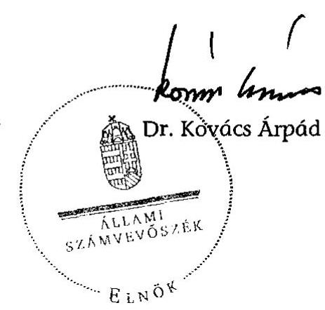

[^0]
[^0]:    ${ }^{9}$ Kincstár adatszolgáltatása szerint.

---

1. számú melléklet V-1024-145/2007-2008. sz. jelentéshez

A fenntartók szervezeti formája és közhasznúsági jogállása a 2007. évben

|  Intézmény típusa | Szervezeti forma |  |  |  |  | Összesen |   |
| --- | --- | --- | --- | --- | --- | --- | --- |
|   | közalapítvány | alapítvány | egyesület | közhasznú társaság | országos kisebbségi önkormányzat | szervezet | megoszlás, %  |
|  Óvoda | 1 | 27 | 3 | 4 | 0 | 35 | 26  |
|  Általános Iskola | 0 | 4 | 0 | 0 | 0 | 4 | 3  |
|  Szakközépiskola | 0 | 10 | 1 | 2 | 0 | 13 | 10  |
|  Szakiskola | 0 | 4 | 0 | 0 | 0 | 4 | 3  |
|  Gimnázium | 0 | 7 | 0 | 0 | 0 | 7 | 6  |
|  Alapfokú művészetoktatási intézmény | 1 | 18 | 2 | 10 | 0 | 31 | 23  |
|  Gyógypedagógiai, konduktív pedagógiai nevelési-oktatási intézmény | 0 | 2 | 1 | 0 | 0 | 3 | 2  |
|  Többcélú intézmény | 1 | 22 | 4 | 8 | 1 | 36 | 27  |
|  Összesen | 3 | 94 | 11 | 24 | 1 | 133 | 100  |

|  Intézmény típusa | Közhasznúsági jogállás |  |  | Összesen  |
| --- | --- | --- | --- | --- |
|   | kiemelkedően közhasznú | közhasznú | nem közhasznú |   |
|  Óvoda | 10 | 19 | 6 | 35  |
|  Általános Iskola | 2 | 1 | 1 | 4  |
|  Szakközépiskola | 7 | 4 | 2 | 13  |
|  Szakiskola | 3 | 1 | 0 | 4  |
|  Gimnázium | 3 | 4 | 0 | 7  |
|  Alapfokú művészetoktatási intézmény | 9 | 16 | 6 | 31  |
|  Gyógypedagógiai, konduktív pedagógiai nevelési-oktatási intézmény | 3 | 0 | 0 | 3  |
|  Többcélú intézmény | 17 | 17 | 2 | 36  |
|  Összesen | 54 | 62 | 17 | 133  |
|  Megoszlás % | 40 | 47 | 13 | 100  |

---

# 2. számú melléklet a V-1024-145/2007-2008. sz. jelentéshez

A közoktatási intézmények gazdálkodási jellemzői

|  Intézmény típusa | Az intézmények rendelkeznek |  |  |  |   |
| --- | --- | --- | --- | --- | --- |
|   | adószámmal | önálló bankszámlával | önálló pénzügyi, gazdasági szervezettel | önálló számviteli nyilvántartással | önálló számviteli beszámolóval  |
|  Óvoda | 17 | 17 | 7 | 15 | 15  |
|  Általános Iskola | 3 | 3 | 2 | 3 | 3  |
|  Szakközépiskola | 12 | 12 | 6 | 12 | 11  |
|  Szakiskola | 3 | 4 | 2 | 3 | 3  |
|  Gimnázium | 7 | 7 | 4 | 7 | 7  |
|  Alapfokú művészetoktatási intézmény | 23 | 22 | 14 | 21 | 19  |
|  Gyógypedagógiai, konduktív pedagógiai nevelési-oktatási intézmény | 1 | 2 | 0 | 2 | 1  |
|  Többcélú intézmény | 38 | 44 | 22 | 37 | 36  |
|  Összesen | 104 | 111 | 57 | 100 | 95  |
|  Összes intézmény (148) %-ában | 70 | 75 | 39 | 68 | 64  |

---

# A normatív hozzájárulások és támogatások alakulása 

Normatív hozzájárulás és támogatás alakulása a 2006. évben

| Intézmény típusa | Normatív   hozzájárulás és   támogatás |  | A normatíva   és az   intézményi   költségvetés   aránya | Intézményre   fordított   összes   kiadás | A   normatíva   és az összes   kiadás   aránya |
| :-- | :--: | :--: | :--: | :--: | :--: |
|  | ezer Ft | % | % | ezer Ft | % |
| Óvoda | 303745 | 5 | 48 | 768198 | 40 |
| Általános Iskola | 136697 | 2 | 56 | 239457 | 57 |
| Szakközépiskola | 499226 | 8 | 80 | 587748 | 85 |
| Szakiskola | 220989 | 3 | 77 | 236851 | 93 |
| Gimnázium | 354778 | 5 | 71 | 459673 | 77 |
| Alapfokú művészetoktatási intézmény | 1004515 | 15 | 93 | 1049102 | 96 |
| Gyógypedagógiai, konduktív

   pedagógiai nevelési-oktatási   intézmény | 45290 | 1 | 63 | 142235 | 32 |
| Többcélú intézmény | 3956591 | 61 | 71 | 6298172 | 63 |
| Összesen | $\mathbf{6} \mathbf{5 2 1 8 3 1}$ | $\mathbf{1 0 0}$ | $\mathbf{6 9}$ | $\mathbf{9 7 8 1 4 3 6}$ | $\mathbf{6 7}$ |

Normatív hozzájárulás és támogatás alakulása a 2007. évben

| Intézmény típusa | Normatív   hozzájárulás és   támogatás |  | A normatíva   és az   intézményi   költségvetés   aránya | Intézményre   fordított   összes   kiadás | A   normatíva   és az összes   kiadás   aránya |
| :-- | :--: | :--: | :--: | :--: | :--: |
|  | $\mathbf{ezer ~ Ft}$ | $\mathbf{\%}$ | $\mathbf{\%}$ | $\mathbf{ezer ~ Ft}$ | $\mathbf{\%}$ |
| Óvoda | 341105 | 5 | 50 | 887126 | 38 |
| Általános Iskola | 142911 | 2 | 58 | 246718 | 58 |
| Szakközépiskola | 631266 | 9 | 83 | 758712 | 83 |
| Szakiskola | 198515 | 3 | 78 | 217011 | 91 |
| Gimnázium | 380056 | 6 | 67 | 525194 | 72 |
| Alapfokú művészetoktatási intézmény | 765074 | 12 | 90 | 868175 | 88 |
| Gyógypedagógiai, konduktív   pedagógiai nevelési-oktatási   intézmény | 45957 | 1 | 57 | 166506 | 28 |
| Többcélú intézmény | 4146764 | 62 | 69 | 6387162 | 65 |
| Összesen | $\mathbf{6 6 5 1 6 4 8}$ | $\mathbf{1 0 0}$ | $\mathbf{6 8}$ | $\mathbf{1 0 0 5 6 6 0 4}$ | $\mathbf{6 6}$ |

---

# A közoktatási bevételek alakulása 

(előző évi pénzmaradvány igénybevétele nélkül)
Adatok: ezer Ft-ban

| Intézmény típusa | Támogatások és bevételek |  |  |  |  |  |  |  |
| :--: | :--: | :--: | :--: | :--: | :--: | :--: | :--: | :--: |
|  | 2006. évben |  |  |  |  |  |  |  |
|  | normatív   hozzájárulás és   támogatás | állami   nem   normatív | önkormányzati | közalapítványi | európai   uniós | $\begin{gathered} \text { szja } \\ 1 \% \end{gathered}$ | egyéb, nem állami | összesen |
| Óvoda | 303745 | 3568 | 16630 | 300 | 0 | 6029 | 303742 | 634014 |
| Általános Iskola | 136697 | 4694 | 53788 | 0 | 0 | 826 | 23810 | 219815 |
| Szakközépiskola | 499226 | 5745 | 2235 | 0 | 0 | 716 | 63960 | 571882 |
| Szakiskola | 220989 | 6720 | 12 | 0 | 4495 | 799 | 26774 | 259789 |
| Gimnázium | 354778 | 33473 | 3024 | 0 | 4486 | 948 | 95400 | 492109 |
| Alapfokú   művészetoktatási   intézmény | 1004515 | 2861 | 5638 | 6775 | 0 | 1476 | 26979 | 1048244 |
| Gyógypedagógiai, konduktív pedagógiai nevelési-oktatási intézmény | 45290 | 25944 | 17638 | 0 | 0 | 3348 | 50150 | 142370 |
| Többcélú intézmény | 3956591 | 507386 | 64926 | 790 | 21127 | 10064 | 902418 | 5463302 |
| Összesen | 6521831 | 590391 | 163891 | 7865 | 30108 | 24206 | 1493233 | 8831525 |

2007. évben

| Intézmény típusa | normatív hozzájárulás és támogatás | állami nem normatív | önkormányzati | közalapítványi | európai uniós | szja 1\% | egyéb, nem állami | összesen |
| :--: | :--: | :--: | :--: | :--: | :--: | :--: | :--: | :--: |
| Óvoda | 341105 | 4042 | 17304 | 150 | 0 | 5022 | 522635 | 890258 |
| Általános Iskola | 142911 | 9820 | 55034 | 385 | 0 | 1320 | 22018 | 231488 |
| Szakközépiskola | 631266 | 42263 | 4156 | 170 | 3654 | 466 | 57173 | 739148 |
| Szakiskola | 198515 | 9851 | 0 | 0 | 7207 | 1050 | 10945 | 227568 |
| Gimnázium | 380056 | 51808 | 952 | 9872 | 11371 | 1341 | 122233 | 577633 |
| Alapfokú művészetoktatási intézmény | 765074 | 51854 | 9995 | 7442 | 0 | 1111 | 32417 | 867893 |
| Gyógypedagógiai, konduktív pedagógiai nevelési-oktatási intézmény | 45957 | 26541 | 17300 | 0 | 0 | 5383 | 71354 | 166535 |
| Többcélú intézmény | 4146764 | 665402 | 64533 | 680 | 28134 | 16208 | 1373231 | 6294952 |
| Összesen | 6651648 | 861581 | 169274 | 18699 | 50366 | 31901 | 2212006 | 9995475 |

---

5. számú melléklet V-1024-145/2007-2008. sz. jelentéshez 1. oldal

# A fenntartói feladatok teljesítésének szabályszerűsége

|  Fenntartó neve |  |  |  |  |  |  |  |  |  |  |  |  |  |  |  | 224/2000. Korm. rend. 17. § (f)  |
| --- | --- | --- | --- | --- | --- | --- | --- | --- | --- | --- | --- | --- | --- | --- | --- | --- |
|   |  |  |  |  |  |  |  |  |  |  |  |  |  |  |  |   |
|   |  | Intézményi költségvetés meghatározása |  |  |  |  |  |  |  |  |  |  |  |  |  |   |
|   |  |  |  |  |  |  |  |  |  |  |  |  |  |  |  |   |
|   |  |  |  |  |  |  |  |  |  |  |  |  |  |  |  |   |
|   |  |  |  |  |  |  |  |  |  |  |  |  |  |  |  |   |
|   |  |  |  |  |  |  |  |  |  |  |  |  |  |  |  |   |
|   |  |  |  |  |  |  |  |  |  |  |  |  |  |  |  |   |
|   |  | Igen | Nem | Igen | Nem | Igen | Nem | Igen | Nem | Igen | Nem | Igen | Nem | Igen | Nem | Igen  |
|  Mátyásföldi Katica Óvodáért Alapítvány |  | X |  |  |  | X |  |  |  | X |  | X |  | X |  |   |
|  Britannica Alapítvány |  | X |  |  | X | X |  |  |  | X |  | X |  | X |  | X  |
|  Carl Rogers Alapítvány |  | X |  | X |  | X |  |  |  |  | X | X |  | X |  | X  |
|  Dávid király Alapítvány |  | X |  |  |  | X |  |  |  | X |  | X |  |  | X |   |
|  Egészségesebb Óvodás Gyermekekért Alapítvány |  | X |  | X |  | X |  |  |  | X |  | X |  | X |  | X  |
|  Hátránnyal Indulókért Alapítvány |  | X |  |  |  |  | X |  |  |  |  | X |  |  | X | X  |
|  Integrált Játékpedagógiai Alapítvány |  | X |  |  |  | X |  |  | X |  |  | X |  |  | X |   |
|  Képzett Polgárságért Alapítvány |  | X |  |  |  |  | X |  |  | X |  | X |  | X |  | X  |
|  Nebuló XXI. Alapítvány |  | X |  | X |  | X |  |  |  | X |  | X |  | X |  | X  |
|  Óvodától Iskoláig Alapítvány |  | X |  |  |  | X |  |  |  | X |  | X |  | X |  | X  |
|  Periféria Alapítvány |  |  | X |  |  | X |  |  |  |  | X |  | X |  | X | X  |
|  Szakképzett Ifjúságért Alapítvány |  | X |  |  |  | X |  |  |

 |  | X |  | X |  | X |  | X  |
|  Tudásfa Tanoda Alapítvány |  | X |  |  |  | X |  |  |  | X |  | X |  | X |  | X  |
|  Varázscena Alapítvány |  |  | X |  |  | X |  |  |  | X |  | X |  | X |  | X  |
|  Hétfő Alapítvány |  | X |  |  |  | X |  |  |  | X |  | X |  | X |  | X  |
|  Micimackó Alapítvány |  | X |  |  |  | X |  |  |  |  |  | X |  | X |  | X  |

---

1. számú melléklet V-1024/2007-2008. sz. jelentéshez 2. oldal

|  Fenntartó neve |  |  |  |  |  |  |  |  |  |  |  |  |  |  |  | 224/2000. Korm. rend. 17. § (8)  |
| --- | --- | --- | --- | --- | --- | --- | --- | --- | --- | --- | --- | --- | --- | --- | --- | --- |
|   |  | Intézményi költségvetés meghatározása |  |  |  |  |  |  |  |  |  |  |  |  |  |   |
|   |  |  |  |  |  |  | Indítható óvodai, iskolai csoportok, osztályok számának meghatározása |  |  |  |  |  |  |  |  |   |
|   |  |  |  |  |  |  |  |  |  |  |  |  |  |  |  |   |
|   | Igen | Nem | Igen | Nem | Igen | Nem | Igen | Nem | Igen | Nem | Igen | Nem | Igen | Nem | Igen | Nem  |
|  Napra-Forgó Alapítvány | X |  |  |  | X |  |  |  |  | X |  | X |  | X | X |   |
|  Kecel Pöttömért Alapítvány | X |  | X |  | X |  | X |  | X |  | X |  |  | X |  | X  |
|  Szent Kinga Alapítvány | X |  |  |  | X |  |  |  |  | X | X |  |  | X | X |   |
|  Körösmenti Táncegyüttes Alapítvány | X |  | X |  | X |  | X |  | X |  | X |  | X |  | X |   |
|  Fajljer Ede Alapítvány | X |  | X |  | X |  | X |  |  |  | X |  |  | X | X |   |
|  Fényben, Szeretetben Alapítvány | X |  |  |  | X |  |  |  | X |  | X |  | X |  |  | X  |
|  Korszerű Fogtechnika Alapítvány | X |  |  |  | X |  |  |  |  |  | X |  |  | X | X |   |
|  Magic Alapítvány | X |  | X |  | X |  | X |  |  |  | X |  |  | X | X |   |
|  Danubius Hotels Alapítvány | X |  |  |  | X |  |  |  |  | X | X |  |  | X | X |   |
|  Gyermekeinkért-Jövőnként Alapítvány | X |  | X |  | X |  | X |  | X |  | X |  | X |  | X |   |
|  Muzsikáló Egészség Alapítvány | X |  | X |  | X |  |  |  | X |  | X |  | X |  | X |   |
|  Maci Alapítvány | X |  |  |  | X |  |  | X | X |  | X |  | X |  | X |   |
|  Hétszínvirág Alapítvány | X |  |  |  |  | X |  |  |  | X | X |  |  | X | X |   |
|  Gyermekeinkért 2000 Alapítvány | X |  |  |  | X |  | X |  | X |  | X |  | X |  | X |   |
|  Francia Liceum Alapítvány | X |  |  |  | X |  |  |  | X |  |  |  | X |  | X |   |
|  Paulay Alapítvány |  | X |  | X |  | X |  |  |  | X |  | X |  | X |  | X  |
|  Reménység Alapítvány | X |  |  |  | X |  |  |  | X |  | X |  | X |  | X |   |
|  Török Sándor Waldorf Alapítvány | X |  |  |  | X |  | X |  | X |  | X |  | X |  | X |   |
|  Európai Nyelvoktatási Alapítvány | X |  | X |  |  | X |  |  | X |  | X |  |  | X | X |   |
|  Oktatásért Alapítvány | X |  |  |  | X |  |  |  | X |  | X |  | X |  | X |   |
|  Aranybika Alapítvány | X |  |  |  | X |  | X |  |  | X | X |  | X |  | X |   |

---

1. számú melléklet V-1024/2007-2008. sz. jelentéshez 3. oldal

|  Fenntartó neve |  |  |  |  |  |  |  |  |  |  |  |  |  |  |  | 224/2000. Korm. rend. 17. § (8)  |
| --- | --- | --- | --- | --- | --- | --- | --- | --- | --- | --- | --- | --- | --- | --- | --- | --- |
|   |  | Intézményi költségvetés meghatározása |  |  |  |  |  |  |  |  |  |  |  |  |  |   |
|   |  |  |  |  |  |  | Indítható óvodai, iskolai csoportok, osztályok számának meghatározása |  |  |  |  |  |  |  |  |   |
|   |  |  |  |  |  |  |  |  |  |  |  |  |  |  |  |   |
|   | Igen | Nem | Igen | Nem | Igen | Nem | Igen | Nem | Igen | Nem | Igen | Nem | Igen | Nem | Igen | Nem  |
|  Jászlado | Igen | Nem | Igen | Nem | Igen | Nem | Igen | Nem | Igen | Nem | Igen | Nem | Igen | Nem | Igen | Nem  |
|  Jászlado | Igen | Nem | Igen | Nem | Igen | Nem | Igen | Nem | Igen | Nem | Igen | Nem | Igen | Nem | Igen | Nem  |
|  Hábó | Isonás | Alapítvány | X |  | X |  | X |  | X |  | X |  | X |  | X |   |
|  Educat | Alapítvány | X |  |  |  |  | X |  | X |  | X |  | X |  | X |   |
|  Színkép | Alapítvány | X |  | X |  | X |  | X |  | X |  | X |  |

 X |  | X  |
|  E- | Színképzésért | Alapítvány | X |  |  |  | X |  |  |  |  | X |  | X |  | X  |
|  Uniós | Protokollért | Kht. | X |  | X |  |  |  | X | X |  | X |  | X |  | X  |
|  Inácsi | Hétszínvírág | Kht. | X |  |  |  | X |  |  |  | X |  | X |  | X |   |
|  Válliai | Nemzetiségi | Óvoda | Kht. | X |  |  |  |  |  | X |  | X |  | X |  | X  |
|  Kinder | Ovi | Kht. | X |  |  |  | X |  |  |  | X |  | X |  | X |   |
|  Alba | Tánc | Kht. | X |  | X |  | X |  | X |  | X |  | X |  | X |   |
|  Humán | Intézet | Kht. | X |  | X |  |  |  |  |  | X | X |  | X |  | X  |
|  Báb-Táncoltató | Kht. | X |  | X |  | X |  | X |  |  |  | X |  | X |  | X  |
|  Innovációs | Szakképző | Kht. | X |  | X |  | X |  | X |  | X |  | X |  | X |   |
|  Kelta | Iskola | Kht. | X |  |  |  | X |  |  |  | X |  | X |  | X |   |
|  Lajtha | László Múvészeti | Kht. | X |  | X |  |  |  | X | X |  | X |  | X |  | X  |
|  Égo | sum via | Kht. | X |  | X |  | X |  | X |  | X |  | X |  | X |   |
|  Készség | Kht. | X |  |  | X | X |  | X |  |  |  | X |  | X |  | X  |
|  Német | Óvoda | Egyesület | X |  | X |  | X |  |  |  | X |  | X |  | X |   |

---

5. számú melléklet V-1024/2007-2008. sz. jelentéshez 4. oldal

|  Fenntartó neve |  |  |  |  |  |  |  |  |  |  |  |  |  |  |  | 224/2000. Korm. rend. 17. § (8)  |
| --- | --- | --- | --- | --- | --- | --- | --- | --- | --- | --- | --- | --- | --- | --- | --- | --- |
|   |  | Intézményi költségvetés meghatározása |  |  |  |  |  |  |  |  |  |  |  |  |  |   |
|   |  |  |  |  |  |  |  | Indítható óvodai, iskolai csoportok, osztályok számának meghatározása |  |  |  |  |  |  |  |   |
|   |  |  |  |  |  |  |  |  |  |  |  |  |  |  |  |   |
|   |  | Igen | Nem | Igen | Nem | Igen | Nem | Igen | Nem | Igen | Nem | Igen | Nem | Igen | Nem | Igen  |
|  Sirius Oktatási Egyesület |  | X |  | X |  | X |  | X |  |  |  | X |  | X |  | X  |
|  Győri Waldorf Egyesület |  | X |  |  |  | X |  |  |  | X |  | X |  | X |  | X  |
|  Nyíregyházi Waldorf Egyesület |  | X |  |  |  | X |  |  |  |  | X | X |  | X |  | X  |
|  Pesti Waldorf Egyesület |  | X |  |  |  | X |  |  |  | X |  | X |  | X |  | X  |
|  MNOÖ |  | X |  |  |  | X |  |  | X |  |  | X |  | X |  |   |
|  Törvényességi előírásokat betartó fenntartók |  |  |  |  |  |  |  |  |  |  |  |  |  |  |  |   |
|  száma |  | 56 | 3 | 21 | 4 | 54 | 5 | 17 | 5 | 39 | 10 | 55 | 3 | 45 | 14 | 51  |
|  aránya |  | 95% | 5% | 84% | 16% | 92% | 8% | 77% | 23% | 80% | 20% | 95% | 5% | 76% | 24% | 86%  |

Ábban az esetben, ha sem az igen, sem a nem mezőben jelzés nem szerepel, az adott fenntartónál a kérdés nem volt értelmezhető.

X* Kuratórium helyett a kuratórium elnöke hagyta jóvá a költségvetést.

X** Az intézményben az oktatás tudásszint alapján szervezett csoportokban folyt.

X*** A Közokt.tv. 3. számú melléklet alapján az engedélyezésre nem volt a fenntartónak hatásköre

X**** Nem teljeskörűen hagyta jóvá a fenntartó

X***** Az értékelés elfogadásáról a kuratórium határozatot nem hozott.

---

1. számú melléklet a V-1024-145/2007-2008. sz. jelentéshez 1. oldal

A 2007. évi normatív hozzájárulás és támogatás eltérései (Ft)

|  Fenntartó | Óvoda | Alapfokú oktatás | Középfokú oktatás | Szakképzés | Alapfokú művészeti oktatás | Sajátos nevelési igényű | Nemzetiségi, két tanítási nyelvű | Központosított támogatások | Összesen  |
| --- | --- | --- | --- | --- | --- | --- | --- | --- | --- |
|  Alba Tánc Kht. | 0 | 0 | 0 | 0 | $-288400$ | 0 | 0 | 0 | $-288400$  |
|  Aranybika Alapítvány | 0 | 0 | 0 | $-80296$ | 0 | 0 | 0 | 0 | $-80296$  |
|  Báb-Táncoltató Kht. | 0 | 0 | 0 | 0 | 291800 | 0 | 0 | 8000 | 299800  |
|  Britannica Alapítvány | 0 | $-283167$ | $-9333$ | 0 | 0 | 0 | 0 | $-7000$ | $-299500$  |
|  Carl Rogers Alapítvány | 50173 | 69163 | 228579 | 0 | 13499 | 0 | 0 | 87500 | 448914  |
|  Danubias Hotels Alapítvány | 0 | 0 | 86460 | $-3155384$ | 0 | 0 | 0 | 21600 | $-3047324$  |
|  Dávid király Alapítvány | $-134750$ | 233360 | 0 | 0 | 0 | $-1063744$ | 0 | 700 | $-964434$  |
|  Educationis Alapítvány | 0 | 0 | 75980 | $-777200$ | 0 | 126720 | 0 | 0 | $-574500$  |
|  Egészségesebb Gyermekeként Alapítvány | 1216270 | 10000 | 0 | 0 | 0 | 0 | 0 | 0 | 1226270  |
|  Ego sum via Kht. | 0 | $-122920$ | $-2592500$ | 1348744 | 60900 | 0 | 0 | 0 | $-1305776$  |
|  Európai Nyelvoktatási Alapítvány | 0 | 0 | 0 | $-15092548$ | 0 | 0 | 0 | 0 | $-15092548$  |
|  Ingler Ede Alapítvány | 0 | 0 | 0 | 0 | $-217750$ | 0 | 0 | $-7200$ | $-224950$  |
|  Tényben, Szeretetben Alapítvány | 19330 | 0 | 0 | 0 | 0 | 0 | 0 | 0 | 19330  |
|  Francia Liceum Alapítvány | 787000 | 1001500 | 1962500 | 0 | 0 | 0 | 0 | 0 | 3751000  |
|  Gyermekeinkért 2000 Alapítvány | 0 | 0 | 0 | 0 | 0 | 0 | 0 | 0 | 0  |
|  Gyermekeinkért-Jövőnként Alapítvány | 0 | 0 | 0 | 0 | $-2356600$ | 0 | 0 | 0 | $-2356600$  |
|  Győri Waldorf Egyesület | 0 | 354040 | 65500 | 0 | 0 | $-367584$ | 0 | 0 | 51956  |
|  Hátránnyal Indulókért Alapítvány | 0 | 0 | 112960 | 0 | 0 |

 $-1980592$ | 0 | $-143500$ | $-2011152$  |
|  Hétfő Alapítvány | 0 | 450640 | 0 | 0 | 7675 | $-1050192$ | 0 |  | $-591877$  |
|  Hétszínvirág Alapítvány | $-1321500$ | 0 | 0 | 0 | 0 | 0 | 0 |  | $-1321500$  |
|  Hibó Tamás Alapítvány | 0 | 0 | 0 | 0 | 66325 | 0 | 0 | 800 | 67125  |
|  Humán Intézet Kht. | 0 | 0 | $-2408467$ | 0 | $-69200$ | 0 | 0 |  | $-2477667$  |
|  Ináncsi Hétszínvirág Kht. | $-9000$ | 0 | 0 | 0 | 0 | 0 | 0 |  | $-9000$  |
|  Innovációs Szakképző Kht. | 0 | 0 | 2061940 | $-4689300$ | 0 | $-3775104$ | 0 |  | $-6402464$  |
|  Integrált Játékpedagógiai Alapítvány | $-738000$ | 0 | 0 | 0 | 0 | 142096 | 0 |  | $-595904$  |
|  Jászladányoni Nevelési Oktatási Alapítvány | 0 | 84320 | 0 | 0 | 0 | $-141984$ | 0 |  | $-57664$  |
|  Kecel Pöttömeiért Alapítvány | 425000 | 0 | 0 | 0 | 0 | 0 | 0 |  | 425000  |
|  Kelta Iskola Kht. | 0 | 0 | 510040 | $-13278016$ | 0 | 0 | 0 |  | $-12767976$  |
|  Képzett Polgárságért Alapítvány | 0 | 0 | 2073504 | $-5142148$ | 0 | 0 | 0 |  | $-3068644$  |
|  Kész-Ség Kht. | 0 | 823860 | 0 | 0 | $-301900$ | $-1917072$ | 0 | $-2400$ | $-1397512$  |

---

|  6. számú melléklet a V-1024-145/2007-2008. sz. jelentéshez 2. oldal |  |  |  |  |  |  |  |  |   |
| --- | --- | --- | --- | --- | --- | --- | --- | --- | --- |
|  Fenntartó | Óvoda | Alapfokú
oktatás | Középfokú
oktatás | Szakképzés | Alapfokú
művészeti
oktatás | Sajátos
nevelési
igényű | Nemzetiségi,
két tanítási
nyelvű | Központosított
támogatások | Összesen  |
|  Kinder Ovi Kht. | 235 670 |  |  |  |  |  | 0 |  | 235 670  |
|  Korszerű Fegtechnika Alapítvány | 0 |  |  | -974 300 |  |  | 0 |  | -974 300  |
|  Körösmenti Táncegyüttes Alapítvány | 0 |  |  |  | -7 800 |  | 0 | -800 | -8 600  |
|  Lajtha László Művészeti Kht. | 0 |  |  |  | 1 250 |  | 0 | -1 600 | -350  |
|  Maci Alapítvány | -2 167 624 | -26 000 |  |  |  | -175 159 | 0 |  | -2 368 783  |
|  Magic Alapítvány | 0 |  |  |  | 17 895 |  | 0 |  | 17 895  |
|  MNOÓ | -924 683 | -716 641 | -1 046 478 | -258 792 |  |  | -178 750 | -9 800 | -3 135 144  |
|  Mátyásföldi Katica Óvodáért Alapítvány | 65 670 |  |  |  |  |  | 0 |  | 65 670  |
|  Micimackó Alapítvány | -104 500 |  |  |  |  |  | 0 |  | -104 500  |
|  Muzsikáló Egészség Alapítvány | 0 |  |  |  | 58 050 |  | 0 | -1 600 | 56 450  |
|  Napra-Forgó Alapítvány | 127 500 |  |  |  |  |  | 0 |  | 127 500  |
|  Nebuló XXI. Alapítvány | 0 |  | 433 460 | 379 192 |  | -1 219 200 | 0 | -3 500 | -410 048  |
|  Német Óvoda Egyesület | 0 |  |  |  |  |  | 0 |  | 0  |
|  Nyíregyházi Waldorf Egyesület | 25 500 | 915 680 | 261 420 |  |  | -1 483 168 | 0 | 10 500 | -270 068  |
|  Oktatásért Alapítvány | 0 |  | 59 500 | 44 600 |  |  | 0 |  | 104 100  |
|  Óvodától Iskoláig Alapítvány | -135 300 |  |  |  |  |  | 0 |  | -135 300  |
|  Paulay Alapítvány | 0 |  |  | -59 820 696 |  |  | 0 | -669 600 | -60 490 296  |
|  Periféria Alapítvány | 0 |  | -621 500 | -265 700 |  |  | 0 |  | -887 200  |
|  Pesti Waldorf Egyesület | 0 | 219 640 | -666 960 |  |  |  | 0 | 1 400 | -445 920  |
|  Reménység Alapítvány | 0 | -186 508 |  |  |  |  | -71 500 |  | -258 008  |
|  Sirius Oktatási Egyesület | 0 |  |  | 17 472 |  |  | 0 |  | 17 472  |
|  Szakképzett Ifjúságért Alapítvány | 0 |  |  | -1 954 660 |  |  | 0 | 151 200 | -1 803 460  |
|  Szent Kinga Alapítvány | -19 330 |  |  |  |  |  | 0 |  | -19 330  |
|  Szinkép Alapítvány | 0 | 67 320 |  |  | 10 600 | 137 808 | 0 | 800 | 216 528  |
|  Tórik Sándor Waldorf Alapítvány | 65 670 | 54 360 | -44 540 |  |  |  | 0 |  | 75 490  |
|  Tudásfa Tanoda Alapítvány | 643 000 |  |  |  |  |  | 0 |  | 643 000  |
|  Unióz Protokollért Kht. | 0 |  |  | 107 000 |  |  | 0 |  | 107 000  |
|  Vállai Nemzetiségi Óvoda Kht. | 36 330 |  |  |  |  |  | 0 |  | 36 330  |
|  Varázsceruza Alapítvány | 25 385 |  |  |  |  |  | 0 |  | 25 385  |
|  Összesen: | -1 832 189 | 2 948 647 | 542 065 | -103 592 032 | -2 713 656 | -12 767 175 | -250 250 | -564 500 | -118 229 090  |

---

1. számú melléklet V-1024-145/2007-2008. sz. jelentéshez 1. oldal

# Az intézményi feladatok teljesítésének szabályszerűsége

|  Fenntartó neve | Közokt. tv. 17. § |  | Közokt. tv. 37. § (2) |  |  |  | Közokt. tv. 38. § (1) |  |  |  |  |  |  |  |  |  |   |
| --- | --- | --- | --- | --- | --- | --- | --- | --- | --- | --- | --- | --- | --- | --- | --- | --- | --- |
|   | Előírt iskolai végzettséggel rendelkeztek-e a pedagógusok |  | Rendelkezett-e a jogszabálynak megfelelő alapító okirattal |  | Az intézményt nyilvántartásba vette-e a székhely szerint illetékes jegyző/főjegyző |  | Rendelkezett-e állandó saját székhellyel |  | Rendelkezett-e az alaptevékenység ellátásához szükséges alkalmazotti létszámmal |  | Rendelkezett-e 2007. évi költségvetéssel |  | Rendelkezett-e az intézmény a működés rendjét szabályozó dokumentumokkal |  |  |  |   |
|   | Igen | Nem | Igen | Nem | Igen | Nem | Igen | Nem | Igen | Nem | Igen | Nem | Igen | Nem | Igen | Nem |   |
|  Mátyásföldi Katica
Óvodáért Alapítvány | X |  | X |  | X |  | X |  | X |  | X |  | X |  | X |  |   |
|  Britannica Alapítvány | X |  | X |  | X |  | X |  | X |  | X |  | X |  | X |  |   |
|  Carl Rogers Alapítvány | X |  | X |  | X |  | X |  | X |  | X |  | X |  | X |  |   |
|  Dávid király Alapítvány | X |  | X |  | X |  | X |  | X |  | X |  | X |  | X |  |   |
|  Egészségesebb Óvodás
Gyermekekért Alapítvány* | X |  | X |  | X |  | X |  | X |  | X |  | X |  | X |  |   |
|   |  |

  |  |  |  |  |  |  |  | X |  |  |  |  |  |  | X  |
|  Hátránnyal Indulókért Alapítvány | X |  | X |  | X |  |  | X |  | X | X |  | X |  |  |  | X  |
|  Integrált Játékpedagógiai Alapítvány | X |  | X |  | X |  | X |  |  | X | X |  | X |  |  |  | X  |
|  Képzett Polgárságért Alapítvány | X |  | X |  | X |  | X |  | X |  | X |  | X |  | X |  |   |
|  Nebuló XXI. Alapítvány | X |  | X |  | X |  | X |  |  | X | X |  | X |  |  |  | X  |
|  Óvodától Iskoláig Alapítvány | X |  | X |  | X |  | X |  |  | X | X |  | X |  |  |  | X  |
|  Periféria Alapítvány |  | X | X |  | X |  | X |  | X |  |  | X |  | X |  | X |   |
|  Szakképzett Ifjúságért Alapítvány |  | X | X |  | X |  | X |  |  | X | X |  | X |  |  |  | X  |
|  Tudásfa Tanoda Alapítvány | X |  | X |  | X |  | X |  | X |  | X |  | X |  | X |  |   |
|  Varázsceruza Alapítvány | X |  | X |  | X |  | X |  |  | X |  | X | X |  |  |  | X  |
|  Hétfő Alapítvány | X |  | X |  | X |  | X |  | X |  | X |  | X |  | X |  |   |
|  Micimackó Alapítvány | X |  | X |  | X |  | X |  |  | X | X |  | X |  |  |  | X  |
|  Napra-Forgó Alapítvány | X |  | X |  | X |  |  | X | X |  | X |  |  |  | X |  | X  |

---

|  Fenntartó neve | Közokt. tv. 17. § |  | Közokt. tv. 37. § (2) |  |  |  | Közokt. tv. 38. § (1) |  |  |  |  |  | Közokt. tv. 40. § |  | Jogszabályok betartása  |
| --- | --- | --- | --- | --- | --- | --- | --- | --- | --- | --- | --- | --- | --- | --- | --- |
|   | Előírt iskolai végzettséggel rendelkeztek-e a pedagógusok |  | Rendelkezett-e a jogszabálynak megfelelő alapító okirattal |  | Az intézményt nyilvántartásba vette-e a székhely szerint illetékes jegyző/főjegyző |  | Rendelkezett-e állandó saját székhellyel |  | Rendelkezett-e az alaptevékenység ellátásához szükséges alkalmazotti létszámmal |  | Rendelkezett-e 2007. évi költségvetéssel |  | Rendelkezett-e az intézmény a működés rendjét szabályozó dokumentumokkal |  | Jogszabályok betartása  |
|   | Igen | Nem | Igen | Nem | Igen | Nem | Igen | Nem | Igen | Nem | Igen | Nem | Igen | Nem | Igen  |
|  Kecel Pöttömeiért Alapítvány | X |  | X |  | X |  | X |  | X |  | X |  | X |  | X  |
|  Szent Kinga Alapítvány | X |  | X |  | X |  | X |  |  | X | X |  | X |  |   |
|  Körösmenti Táncegyüttes Alapítvány | X |  | X |  | X |  | X |  | X |  | X |  | X |  | X  |
|  Fagler Ede Alapítvány | X |  | X |  | X |  | X |  |  | X | X |  | X |  |   |
|  Fényben, Szeretetben Alapítvány | X |  | X |  | X |  | X |  | X |  | X |  | X |  | X  |
|  Korszerű Fogtechnika Alapítvány | X |  | X |  | X |  | X |  |  | X | X |  | X |  |   |
|  Magic Alapítvány | X |  | X |  | X |  | X |  | X |  | X |  | X |  | X  |
|  Danubius Hotels Alapítvány | X |  | X |  | X |  | X |  | X |  | X |  | X |  | X  |
|  Gyermekeinkért-Jövőnikért Alapítvány | X |  | X |  | X |  | X |  | X |  | X |  | X |  | X  |
|  Muzsikáló Egészség Alapítvány | X |  | X |  | X |  | X |  | X |  | X |  | X |  | X  |
|  Maci Alapítvány | X |  | X |  | X |  | X |  | X |  | X |  | X |  | X  |
|  Hétszínvirág Alapítvány | X |  | X |  | X |  | X |  |  | X | X |  | X |  |   |
|  Gyermekeinkért 2000 Alapítvány | X |  | X |  | X |  | X |  | X |  | X |  | X |  | X  |
|  Francia Liceum Alapítvány | X |  | X |  | X |  | X |  |  | X | X |  | X |  |   |
|  Paulay Alapítvány | X |  | X |  | X |  | X |  |  | X |  | X |  | X |   |
|  Reménység Alapítvány | X |  | X |  | X |  | X |  | X |  | X |  | X |  | X  |
|  Török Sándor Waldorf Alapítvány | X |  | X |  | X |  | X |  | X |  | X |  | X |  | X  |
|  Európai Nyelvoktatási Alapítvány | X |  | X |  |  | X | X |  |  | X | X |  | X |  |   |

---

|  Fenntartó neve | Közokt. tv. 17. § |  | Közokt. tv. 37. § (2) |  |  |  | Közokt. tv. 38. § (1) |  |  |  |  |  | Közokt. tv. 40. § |  | Jogszabályok betartása  |
| --- | --- | --- | --- | --- | --- | --- | --- | --- | --- | --- | --- | --- | --- | --- | --- |
|   | Előírt iskolai végzettséggel rendelkeztek-e a pedagógusok |  | Rendelkezett-e a jogszabálynak megfelelő alapító okirattal |  | Az intézményt nyilvántartásba vette-e a székhely szerint illetékes jegyző/főjegyző |  | Rendelkezett-e állandó saját székhellyel |  | Rendelkezett-e az alaptevékenység ellátásához szükséges alkalmazotti létszámmal |  | Rendelkezett-e 2007. évi költségvetéssel |  | Rendelkezett-e az intézmény a működés rendjét szabályozó dokumentumokkal |  | Jogszabályok betartása  |
|   | Igen | Nem | Igen | Nem | Igen | Nem | Igen | Nem | Igen | Nem | Igen | Nem | Igen | Nem | Igen  |
|  Oktatásért Alapítvány | X |  | X |  | X |  | X |  | X |  | X |  | X |  | X  |
|  Aranybika Alapítvány |  | X | X |  | X |  | X |  |  | X | X |  | X |  |   |
|  Jászladányi Nevelési Oktatási
 Alapítvány | X |  | X |  | X |  | X |  | X |  | X |  | X |  | X  |
|  Hibó Tamás Alapítvány | X |  | X |  | X |  | X |  | X |  | X |  | X |  | X  |
|  Educationis Alapítvány |  | X | X |  | X |  | X |  |  | X | X |  | X |  |   |
|  Színkép Alapítvány | X |  | X |  | X |  | X |  | X |  | X |  | X |  | X  |
|  E-Szakképzésért Alapítvány |  |  |  |  |  |  |  |  |  |  |  |  |  |  |   |
|  Uniós Protokollért Kht. | X |  | X |  | X |  | X |  | X |  | X |  | X |  | X  |
|  Inácssi Hétszínvirág Kht. | X |  | X |  |  | X | X |  | X |  | X |  | X |  |   |
|  Vállai Nemzetiségi Óvoda Kht. |  | X | X |  | X |  | X |  | X |  | X |  | X |  |   |
|  Kinder Ovi Kht. | X |  | X |  | X |  | X |  | X |  | X |  | X |  | X  |
|  Alba Tánc Kht. | X |  | X |  | X |  | X |  | X |  | X |  | X |  | X  |
|  Humán Intézet Kht. | X |  | X |  | X |  | X |  |  | X | X |  | X |  |   |
|  Bab-Táncoltató Kht. | X |  | X |  | X |  | X |  |  | X | X |  | X |  |   |
|  Innovációs Szakképző Kht. | X |  | X |  | X |  | X |  | X |  | X |  | X |  | X  |
|  Kelta Iskola Kht. | X |  | X |  | X |  | X |  | X |  | X |  | X |  | X  |
|  Lajtha László Művészeti Kht. | X |  | X |  | X |  | X |  | X |  | X |  | X |  | X  |
|  Ego sum via Kht. | X |  | X |  | X |  | X |  | X |  | X |  | X |  | X  |
|  Kész-ség Kht. | X |  | X |  | X |  | X |  |  | X | X |  | X |  |   |
|  Német Óvoda Egyesület |  | X | X |  | X |  | X |  | X |  | X |  | X |  |   |
|  Sirius Oktatási Egyesület | X |  | X |  | X |  | X |  |  | X | X |  | X |  |   |
|  Győri Waldorf Egyesület |  | X | X |  | X |  | X |  |  | X | X |  | X |  |   |

---

|  Fenntartó neve | Közokt. tv. 17. § |  | Közokt. tv. 37. § (2) |  |  |  | Közokt. tv. 38. § (1) |  |  |  |  |  | Közokt. tv. 40. § |  |  |  | Jogszabályok betartása  |
| --- | --- | --- | --- | --- | --- | --- | --- | --- | --- | --- | --- | --- | --- | --- | --- | --- | --- |
|   | Előírt iskolai végzettséggel rendelkeztek-e a pedagógusok |  | Rendelkezett-e a jogszabálynak megfelelő alapító okirattal |  | Az intézményt nyilvántartásba vette-e a székhely szerint illetékes jegyző/főjegyző |  | Rendelkezett-e állandó saját székhellyel |  | Rendelkezett-e az alaptevékenység ellátásához szükséges alkalmazotti létszámmal |  | Rendelkezett-e 2007. évi költségvetéssel |  | Rendelkezett-e az intézmény a működés rendjét szabályozó dokumentumokkal |  |  |  |   |
|   | Igen | Nem | Igen | Nem | Igen | Nem | Igen | Nem | Igen | Nem | Igen | Nem | Igen | Nem | Igen | Nem |   |
|  Nyíregyházi Waldorf Egyesület | X |  | X |  | X |  | X |  |  | X | X |  | X |  |  |  | X  |
|  Pesti Waldorf Egyesület | X |  | X |  | X |  | X |  | X |  | X |  | X |  | X |  |   |
|  MNOÖ* | X |  | X |  | X |  | X |  | X |  | X |  | X |  | X |  |   |
|  Törvényességi előírásokat betartó intézmények: |  |  |  |  |  |  |  |  |  |  |  |  |  |  |  |  |   |
|  száma | 55 | 7 | 62 | 0 | 60 | 2 | 60 | 2 | 39 | 23 | 59 | 3 | 59 | 3 | 34 | 28 |   |
|  aránya | 89% | 11% | 100% | 0% | 97% | 3% | 97% | 3% | 63% | 37% | 95% | 5% | 95% | 5% | 55% | 45% |   |

---

# ÁLLAMI SZÁMVEVŐSZÉK 

Erőzőtt:2008.10.92
Iktatószám: 1-1024-151/01-02
Melléklet: 11.1024-151/2007-2008.

Dr. Kovács Árpád elnök úr részére

## Állami Számvevőszék

## Budapest

## Tisztelt Elnök Úr!

A „Jelentés a közoktatási intézményeket fenntartó non-profit szervezetek normatív hozzájárulásának és támogatásának ellenőrzéséről" című jelentést megkaptam. A jelentésben foglalt elemzéseket, azok következtetéseit a kormányzati munka koordinációja keretében hasznosíthatónak ítélem.

A jelentésben foglalt, a kormánynak címzett javaslatokkal kapcsolatos álláspontunkról az alábbiakban tájékoztatom.

A Kormánynak megfogalmazott javaslat 1. pontjának a) és d) bekezdésével kapcsolatban tájékoztatom arról, hogy a közoktatásról szóló 1993. évi LXXIX. törvény végrehajtásáról rendelkező 20/1997. (II. 13.) Korm. rendelet felülvizsgálata megtörtént. Kiemelt célja volt az önkormányzati és a nem állami közoktatási feladatokat ellátó fenntartók létszámfelmérésének azonos időben történő biztosítása, a mutatószámokra meghatározott kerekítési előírások összhangjának megteremtése. E tekintetben az Oktatási és Kulturális Minisztérium hasznosította a jelentés megállapításait. A rendelet kihirdetésére rövidesen sor kerülhet.

Az 1. pont b) bekezdésében megfogalmazottakkal azonban az Oktatási és Kulturális Minisztérium álláspontját osztva, nem értek egyet. A hivatkozott jogszabályi hely rögzíti, hogy a közoktatási intézmény alapító okiratának tartalmaznia kell a gazdálkodással összefüggő jogosítványokat. A gazdálkodással összefüggő jogkörök meghatározása a fenntartó kötelezettsége és felelőssége, ezért nem indokolt ennek központi állami eszközökkel történő korlátozása, illetve további szabályozása.

---

Az 1. pont c) bekezdésével kapcsolatban tájékoztatom arról, hogy a kormányrendelet felülvizsgálata érinti a helyszíni ellenőrzésekre vonatkozó előírásokat is. A tervezett módosítás a Magyar Államkincstárnak kötelezettségeként írja elő, hogy kétévenként, valamennyi fenntartót és intézményét helyszínen kell ellenőriznie. E körbe beleértendő a 2. pontban meghatározott mértékű normatív támogatást kapó intézményfenntartók ellenőrzése is. Tájékoztatom arról, hogy az Oktatási és Kulturális Minisztérium a 2007/2008. évi gazdálkodás és finanszírozás eredményéről beérkező adatok ismeretében felkéri a MÁK-ot, hogy az Oktatási Hivatallal együtt különös figyelemmel vizsgálja meg az Állami Számvevőszék által a vizsgálatba bevont fenntartókat és azok intézményeit is.

A 3. pontban foglalt javaslat megvalósításával - egyeztetve az Oktatási és Kulturális Minisztériummal - nem értek egyet, tekintettel arra, hogy a „nevelési év" fogalmának definíciója megtalálható a Közoktatási törvény 121. § (1) bekezdés 24. pontjában, ezért a törvény módosítása nem indokolt, ugyancsak nem indokolt annak az évenkénti költségvetési törvényjavaslatokban történő közelebbi definíciója. Az első és további nevelési év fogalmának meghatározása értelmezhetetlen és szükségtelen szabályozási igény.

Budapest, 2008. szeptember „ ",

Tisztelettel:
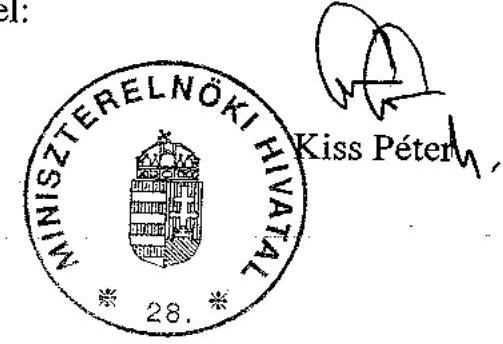

---

# Kiss Péter úr 

miniszter
Miniszterelnöki Hivatal

## Budapest

## Tisztelt Miniszter Úr!

A közoktatási intézményeket fenntartó non-profit szervezetek normatív hozzájárulásának és támogatásának ellenőrzéséről készített - előzetesen munkatársaim útján már egyeztetett jelentésünkre adott észrevételét köszönettel megkaptam.

A jelentésünkben a Kormánynak megfogalmazott 1. a) és d) pontok szerinti javaslatokhoz kapcsolódó megállapítások hasznosításáról szóló tájékoztatását köszönöm.

A Magyar Államkincstár nem állami, nem helyi önkormányzati fenntartókra és intézményeikre vonatkozó helyszíni ellenőrzési kötelezettségét szabályozó 20/1997. (II. 13.) Korm. rendelet tervezett módosítására, valamint az általunk ellenőrzött fenntartók és intézményeik összehangolt pénzügyi-hatósági felülvizsgálatára vonatkozó intézkedést tudomásul veszem.

Az Oktatási és Kulturális Minisztériummal egyeztetett eltérő véleményre szíves tájékoztatásul megküldöm az oktatási és kulturális miniszternek írt válaszomat, amelyben a
 gazdálkodási jogkör, illetve a nevelési év szabályozására vonatkozó javaslatunk fenntartását indokoltam.

Tájékoztatom Miniszter urat, hogy az ellenőrzésről készült jelentést - a kialakult gyakorlatunk szerint - az Ön észrevételével és az arra adott válaszommal együtt küldöm meg az Országgyűlés elnökének, a Miniszterelnöknek, valamint az OGY illetékes bizottságok elnökeinek.

Budapest, 2008. október " $\mathcal{F}$ ".

Tiszteletel:
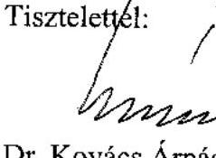

Dr. Kovács Árpád

---

# ÁLLAMI SZÁMVEVŐSZÉK 

## Érkezett: 20080922

Iktatószám: V-1024-153/09-0
Melléklet:
Iktatási és Kulturális Minisztérium
Közoktatási Szakállamtitkár

Iktatószám: 20896-4/2008.

Dr. Kovács Árpád elnök

Állami Számvevőszék

## Budapest

Apáczai Csere János u. 10.
1052

## Tisztelt Elnök Úr!

A V-1024-151/2007-2008. számú levelével megküldött „Jelentés a közoktatási intézményeket fenntartó nonprofit szervezetek normatív hozzájárulásának és támogatásának ellenőrzéséről" című jelentésre az alábbi észrevételt teszem.

A 20896-1/2008. számú levelémben rögzített észrevételeket továbbra is fenntartom.
A Kormánynak megfogalmazott javaslat 1. pontjának a) bekezdésével kapcsolatban tájékoztatom, hogy a közoktatásról szóló 1993. évi LXXIX. törvény végrehajtásáról rendelkező 20/1997. (II. 13.) Korm. rendelet (továbbiakban: Rendelet) felülvizsgálata megtörtént. Kiemelt célja volt az önkormányzati és a nem állami közoktatási feladatokat ellátó fenntartók létszámfelmérésének azonos időben történő biztosítása.

Az 1. pont b) bekezdésében megfogalmazottakkal nem értek egyet, a hivatkozott jogszabályi hely rögzíti, hogy a közoktatási intézmény alapító okiratának tartalmaznia kell a gazdálkodással összefüggő jogosítványokat. A gazdálkodással összefüggő jogkörök meghatározása a fenntartó kötelezettsége és felelőssége, ezért nem indokolt ennek korlátozása illetve további szabályozása. A gazdálkodással kapcsolatos jogkörök meghatározása, a költségvetési szervek esetében az államháztartásról szóló 1992. évi XXXVIII. törvény, valamint annak végrehajtási rendelete, az államháztartás működési rendjéről szóló 217/1998. (XII. 30.) Korm. rendelet tartalmazza, míg a nem állami fenntartók esetében elsősorban számviteli törvény előírásai az irányadók.

Az 1. pont c) bekezdésével kapcsolatban tájékoztatom, hogy a Rendelet felülvizsgálata érinti a helyszíni ellenőrzésekre vonatkozó előírásokat. A tervezett módosítás a Magyar Államkincstárnak kötelezettségként írja elő, hogy két évenként, valamennyi fenntartót és intézményét helyszínen kell ellenőriznie.

A 2. pontban az ellenőrzéssel kapcsolatban megfogalmazott kérdést rendezi a fenti pontban rögzített eljárás.

---

Az 3. pont előírásaival nem értek egyet, tekintettel arra, hogy a „nevelési év" fogalom megtalálható a Közoktatási törvény 121. § (1) bekezdés 24. pontjában, ezért a törvény módosítása nem indokolt. Az első és további nevelési év fogalmának meghatározása értelmezhetetlen és szükségtelen szabályozási igény.

Budapest, 2008. szeptember 17.
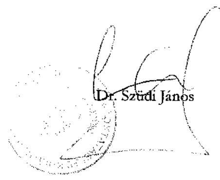

---

# Dr. Hiller István úr 

miniszter
Oktatási és Kulturális Minisztérium

Budapest
Szalay utca 10-14.
1055

## Tisztelt Miniszter Úr!

A közoktatási intézményeket fenntartó non-profit szervezetek normatív hozzájárulásának és támogatásának ellenőrzéséről készített - előzetesen munkatársaim útján már egyeztetett jelentésünkre Dr. Szüdi János közoktatási szakállamtitkár úr észrevételét köszönettel megkaptam.

A jelentéstervezet egyeztetési folyamatát követően elkészített jelentésünkben megfogalmazott megállapításaink és az azokra épülő javaslataink kialakításánál figyelembe vettük és hasznosítottuk a közoktatási szakállamtitkár úr észrevételeit. Sajnálattal tapasztaltam, hogy mindezek ellenére a jelentéstervezet korábbi egyeztetései során felvetett észrevételek egy részére a vezető munkatársaim által írásban adott, tényszerű indokolások nem késztették álláspontja felülvizsgálatára; az észrevételek egy részét továbbra is érvényesnek tekinti.

A Kormánynak az 1. a) pontban megfogalmazott, a nem állami, nem helyi önkormányzati intézményfenntartókra és a helyi önkormányzatokra előírt létszámmérési időpontok egységessé tétele érdekében tett javaslatunkat továbbra is fenntartjuk a közoktatásról szóló 1993. évi LXXIX. törvény végrehajtásáról szóló 20/1997. (II. 13.) Korm. rendelet (továbbiakban: végrehajtási rendelet) módosításának elfogadásáig.

A Kormánynak címzett 1. b) pontban a közoktatási intézmények gazdálkodásával összefüggő jogkörök végrehajtási rendeletben történő szabályozására tett javaslatunk fenntartását azzal a pontosítással indokoltuk, hogy tapasztalataink szerint szabályozási hiányosságokból fakadóan a fenntartók e jogosítványokat ellentmondásos módon határozták meg.

A Magyar Államkincstár nem állami, nem helyi önkormányzati fenntartókra és intézményeikre vonatkozó helyszíni ellenőrzési kötelezettségét szabályozó végrehajtási rendelet tervezett módosításával kapcsolatos tájékoztatását köszönöm.

---

Továbbra is indokoltnak látjuk az óvodai nevelés területén a nevelési év fogalmának a költségvetési törvényben való tartalmi meghatározását, mivel a 2007 szeptemberétől bevezetett teljesítménymutatón alapuló finanszírozás az óvodai nevelés területén finanszírozási szempontból megkülönbözteti az 1. és a 2-3. nevelési évet, ugyanakkor a jelenlegi szabályozás nem ad eligazítást arra vonatkozóan, hogy az óvodai nevelésnél az óvodai nevelésben töltött évek, vagy az életkor alapján kell a gyermekeket a nevelési évekbe besorolni. A szabályozási hiányosság a normatív hozzájárulás és támogatás szabályszerű igénylésében és elszámolásában hibát okozott, ezért tartjuk indokoltnak a nevelési év egyértelmű meghatározását.

Tájékoztatom Miniszter urat, hogy az ellenőrzésről készült jelentést - a kialakult gyakorlatunk szerint - az észrevételeikkel és az arra adott válaszommal együtt küldöm meg az Országgyűlés elnökének, a Miniszterelnöknek, valamint az OGY illetékes bizottságok elnökeinek.

Budapest, 2008. október " $y$ ".

Tisztelettel:
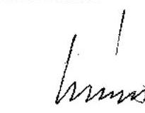

Dr. Kovács Árpád

---

# 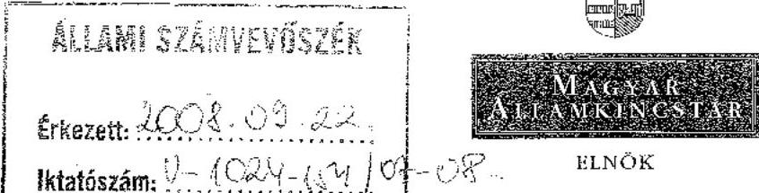 

Iktatószám: ELN-6-130/1/2008.
Hivatkozási szám: V-1024-151/2007-2008.
Tárgy: A közoktatási intézményeket fenntartó nonprofit szervezetek normatív hozzájárulásának és támogatásának ellenőrzéséről készült jelentés

Dr. Kovács Árpád úr
elnök

Állami Számvevőszék
Budapest

## Tisztelt Elnök Úr!

Az Állami Számvevőszék tárgyban megjelölt jelentésével kapcsolatban az alábbi észrevételeket tesszük.

A jelentés-tervezetre ELN-6-32/3/2008. szám alatt tett észrevételeink során jeleztük, hogy 2007. december 29-ei hatállyal a Magyar Államkincstár igazgatóságai számára a közoktatásról szóló 1993. évi LXXIX. törvény végrehajtására kiadott 20/1997. (II. 13.) kormányrendeletbe meghatározásra került a nem állami, nem helyi önkormányzati közoktatási intézményfenntartók helyszíni ellenőrzési kötelezettségének mértéke és gyakorisága.
A jelentés V. rész 6. bekezdésébe észrevételünk beépítésre került, azonban a beépítést követően ellentmondást látunk eközött és az V. rész 7. bekezdésében valamint az I. rész (a Kormány számára tett javaslatok) 1./c) pontjában megfogalmazottak között. Az V. pont 6. bekezdése megállapítja, hogy a Kincstár által végzendő helyszíni ellenőrzések gyakorisága, kötelező mértéke 2007. december 29-ei hatállyal meghatározásra került, míg az ezt követő 7. bekezdés szerint a jogszabályi módosítás ezt továbbra sem írja elő; így e kötelezettség előírására a jelentés I. pontja a Kormány számára javaslatot tesz.

A jelentés I. része tehát változatlanul javaslatot tesz a Kormány számára a 40 millió Ft-ot meghaladó normatív állami hozzájárulásban és támogatásban részesülő nem állami, nem helyi önkormányzati, valamint a szakképzést folytató intézményfenntartók hatósági és pénzügyi ellenőrzésének a következő évek költségvetési törvényeiben történő elrendelésére.

Megjegyezzük, hogy az V. részhez füzött 8. számú lábjegyzet ezzel összefüggésben utal a Kincstár 2146/2007. (VII. 27.) számú Korm. határozat szerinti 335 fős létszámbővítésére. A javaslat megfogalmazásánál kérjük figyelembe venni, hogy a fenti létszámbővítést követően a Kincstár ellenőrzési feladatai is bővültek.

---

A Kincstár ilyen típusú ellenőrzéseire a jelenleg hatályos jogszabályok is már számos előírást tartalmaznak.

Az Ált. 2008. január 1-jétől hatályos 64/F. §-a alapján az önkormányzatok körében kötelező helyszíni ellenőrzést tartani
> amennyiben igényléskor, illetve elszámoláskor az önkormányzat adatszolgáltatása szerinti, valamint a Kincstár álláspontja szerinti összeg közötti eltérés meghaladja a 2%-ot, de legalább az 1 millió forintot, továbbá
> 4 évenként ezen időszak egészére valamennyi önkormányzatra kiterjedően, illetve
> évente azon önkormányzatok vonatkozásában, ahol a személyi jövedelemadó, normatív állami hozzájárulások és támogatások teljesítésének összege a felülvizsgálandó évet megelőző mindkét évben meghaladta a 400 millió forintot, az állami támogatások és hozzájárulások jogcímei legalább 50%-ára kiterjedően.
További helyszíni ellenőrzési kötelezettséget ír elő a közoktatásról szóló 1993. évi LXXIX. törvény végrehajtására kiadott 20/1997. (II. 13.) kormányrendelet 16. § (9) bekezdésének 2007. december 29-től hatályos rendelkezése. Eszerint a Magyar Államkincstár igazgatóságai a nem állami közoktatási intézményfenntartók körében kötelesek helyszíni ellenőrzést végezni, amennyiben elszámoláskor a fenntartó által közölt létszámok az igénylési létszámokhoz képest tíz százalékot meghaladó mértékben lecsökkentek, vagy a fenntartó befizetési kötelezettsége tíz százalékkal meghaladja az őt ténylegesen megillető támogatás összegét.
Szociális területen a személyes gondoskodást nyújtó, szociális intézmény és a falugondnoki szolgálat működésének engedélyezéséről, továbbá a szociális vállalkozás engedélyezéséről szóló 188/1999. (XII. 16.) kormányrendelet (Szmr.) 22/B. §-a valamennyi intézmény/szolgálat tekintetében évenkénti helyszíni ellenőrzési kötelezettséget ír elő az igazgatóságok számára.
Az igazgatóságok a jelenlegi adatok szerint 723 nem állami fenntartó 2275 szociális intézményének és 814 nem állami közoktatási intézményfenntartó 3824 intézményének (melyből 249 nem állami fenntartó összesen 490 szakképző intézménnyel rendelkezik) finanszírozását látják el.
Az éves szinten 40 millió Ft feletti támogatást igénybe vevő nem állami közoktatási intézményfenntartók száma - az év első 8 hónapjában folyósított támogatás összegét figyelembe véve - 306 lesz, amelyek összesen 2137 intézménnyel rendelkeznek. A szakképzést folytató, 40 millió Ft alatti támogatást igénybevevő 92 fenntartó 113 intézményben látja el feladatát.

A jelentés javaslata alapján az igazgatóságoknak a már meglévő helyszíni ellenőrzési kötelezettségeken felül a jelenlegi adatok alapján további 2250 intézményt (a 40 millió Ft támogatási összeget meghaladó fenntartók 2137 intézménye, valamint a 40 millió Ft támogatási összeget el nem érő fenntartók 113 szakképző intézménye) kellene a helyszínen ellenőrizniük.

Álláspontunk szerint nem célszerű az ellenőrzési kötelezettséget formai előírásokhoz, mechanikusan meghatározott időpontokhoz, értékhatárhoz kötni. A rendelkezésünkre álló ellenőrzési kapacitás optimális kihasználása érdekében az ellenőrzendő fenntartók körének kiválasztása és az ellenőrzések gyakoriságának meghatározása az adatok folyamatos értékelésével, kockázatelemzésen és a korábban megszerzett tapasztalaton kell, hogy alapuljon.

Az értékhatár és az ellenőrzések gyakoriságának jogszabályban történő meghatározása az ellenőrzési kapacitásokat nem a leghatékonyabban köti le, így pl. az értékhatárt el nem érő, de kockázatosnak minősülő fenntartók ellenőrzése háttérbe szorulhat.

---

Fontosnak tartom Tisztelt Elnök urat tájékoztatni arról, hogy a javaslattal érintett ellenőrzendő intézmények számát, illetve a korábbi közös ellenőrzések tapasztalatait figyelembe véve problémát jelenthet a javaslatban megfogalmazott helyszíni ellenőrzések Oktatási Hivatallal történő összehangolása is.

A közoktatásról szóló 1993. évi LXXIX. törvény végrehajtására kiadott 20/1997. (II. 13.) kormányrendelet 17. § (1) bekezdése felhatalmazást ad a Kincstár igazgatóságai és az Oktatási Hivatal részére is a normatív állami hozzájárulás- és támogatás-igénylések megalapozottságának és az elszámoláskor közölt adatok valódiságának helyszíni ellenőrzés keretében történő vizsgálatára.

Jelenleg jogszabály nem rendezi a két szervezet normatív állami hozzájárulások és támogatások igénybevétele ellenőrzésére irányuló feladatainak elhatárolását, a közös ellenőrzések során mindkét szervezet vizsgálata azonos dokumentumokra, adatokra irányul.

A támogatás igénybevételének alapjául szolgáló létszámadatok meghatározása során többször okozott konfliktust az a tény, hogy az Oktatási Hivatal a tanulók érdekeire hivatkozva olyan tanulót is számításba vett, aki után a Kincstár igazgatóságainak megalapozott álláspontja szerint a fenntartó a támogatás igénylésére nem lett volna jogosult.

A támogatásra való jogosultság pénzügyi, illetve oktatás-szakmai szempontból történő megítélése további problémát okoz a jogorvoslati eljárások során is. A jelenlegi szabályozás szerint a Kincstár igazgatóságainak elsőfokú határozatait másodfokon az Oktatási és Kulturális Minisztérium bírálja el. Több esetben is előfordult, hogy a minisztérium - szintén a tanulók és az intézmények érdekeire hivatkozva - a pénzügyi szempontokat és jogszabályi előírásokat figyelmen kívül hagyva hozta meg döntését.

A fenti problémák kiküszöbölése érdekében javasoljuk jogszabályban rendezni - és ehhez kérjük az Állami Számvevőszék támogatását -, hogy

- a normatív állami hozzájárulások és támogatások igénybevételének ellenőrzése során az Oktatási Hivatal vizsgálata az oktatás-szakmai kérdésekre, az ellátott tevékenység közoktatási törvényben meghatározottak szerinti megfelelőségére, míg a Kincstár igazgatóságainak vizsgálata az igénybevétel jogszerűségére, megalapozottságára, a közölt adatok valódiságára terjedjen ki;
- a Kincstár igazgatóságainak a normatív hozzájárulás és támogatás megállapításával kapcsolatos
 eljárásában a Magyar Államkincstár központja legyen a felettes szerve.

Kérjük, a jelentés lezárásakor a megfogalmazott észrevételeinket figyelembe venni szíveskedjék.
Budapest, 2008. szeptember 19.

Tisztelettel:
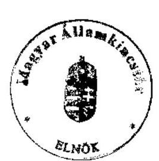

Dr. Katona Tamás

---

# V-1024-145/2007-2008. 10. számú melléklet 

## Dr. Katona Tamás úr   elnök

Magyar Államkincstár

## Budapest

## Tisztelt Elnök Úr!

A közoktatási intézményeket fenntartó non-profit szervezetek normatív hozzájárulásának és támogatásának ellenőrzéséről készített - előzetesen munkatársaink útján már egyeztetett jelentésünkre adott észrevételét köszönettel megkaptam.

Észrevételéhez kapcsolódóan jelzem, hogy a Kormánynak megfogalmazott, 1. c) pontban foglalt javaslatunkkal egyetértve a Miniszterelnöki Hivatal minisztere nevében arról tájékoztattak, hogy a 20/1997. (II. 13.) Korm. rendelet tervezett módosításával a Magyar Államkincstárnak kötelezettségként írja elő, hogy kétévenként, valamennyi fenntartót és intézményét helyszínen kell ellenőrizni. Továbbá az Oktatási és Kulturális Minisztérium a 2007/2008. évi gazdálkodás és finanszírozás eredményéről beérkező adatok ismeretében felkéri a MÁK-ot, hogy az Oktatási Hivatallal együtt különös figyelemmel vizsgálja meg a számvevőszéki ellenőrzésbe bevont fenntartókat, intézményeiket.

Tájékoztatom Elnök urat, hogy az ellenőrzésről készült jelentést - a kialakult gyakorlatunk szerint - az Ön észrevételével és az arra adott válaszommal együtt küldöm meg az Országgyűlés elnökének, a Miniszterelnöknek, valamint az OGY illetékes bizottságok elnökeinek.

Budapest, 2008. október 3.
Tisztelettel:
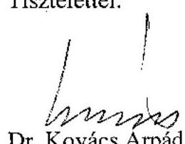

---

# AZ ELTÉRÉSEK RÉSZLETEZÉSE 

## 1. MUTATÓSZÁM SZÁMÍTÁSI ÉS KEREKÍTÉSI HIBÁK

A fenntartók 22%-a a teljesítménymutató bevezetését követően is a Vhr. szerinti kerekítési szabályt alkalmazta, emiatt +3048 ezer Ft-ot és -488 ezer Ft-ot az elszámolásra vonatkozó jogszabályoktól eltérően számoltak el.

A mutatószám és a támogatási összeg számítási hibáiból +37869 ezer Ft és -37 897 ezer Ft volt az elszámolásra vonatkozó jogszabályoktól eltérően elszámolt normatív hozzájárulás és támogatás.

A mutatószám és a támogatási összeg számítási hibáinak a Francia Líceum Alapítvány elszámolásához kapcsolódóan megállapított hiba 86%-át tette ki. Az alapítvány ugyanis a MÁK-hoz benyújtott elszámolásban a létszámadatokat a tanügyi dokumentumokkal egyezően közölte, a mutatószámokat és a támogatási összeget az év első nyolc hónapjára nem, az év utolsó négy hónapjára pedig nem időarányosan határozta meg.

A mutatószám, illetve a normatív hozzájárulás összegének számítási hibáiból, a kerekítésből adódott eltéréseket a MÁK a fenntartói elszámolás benyújtását követően, a 2007. évi normatív hozzájárulás elszámolás egyenlegéről szóló határozatában korrigálta.

## 2. AZ ÓVODAI NEVELÉS JOGCÍMNÉL MEGÁLLAPÍTOTT LÉTSZÁMELTÉRÉSEK

- Három fenntartó az elszámolás során nem tartotta be a Közokt. tv. 3. számú melléklet I-II. rész óvodai csoportok szervezésére vonatkozó előírásait, így két fenntartó jogszabályoktól eltérően szerepeltetett - a maximális csoport létszám túllépése miatt - a 2006. szeptember 15-i létszámban -6 főt, három fenntartó a 2007. február 1-jei elszámolásban -26 főt, két fenntartó a 2007. szeptember 15-i létszámban -20 óvodás gyermeket (Integrált Játékpedagógiai Alapítvány, MNOÖ, Maci Alapítvány).
- A Közokt. tv. 24. § (1) bekezdés előírása ellenére négy fenntartó a 3. életév betöltése előtt óvodai nevelésben részesített gyermekeket, mivel a Kvtv. e jogcímre vonatkozó igénybevételi feltételeinek nem felelt meg így, a 2006. szeptember 15-i elszámolt létszámnál -1 fő, a 2007. február 1-jei elszámolt létszámnál -1 fő, a 2007. szeptember 15-i időpontban -3 fő volt az eltérés. (Fényben, Szeretetben Alapítvány, Hétszínvirág Alapítvány, Carl Rogers Alapítvány, Szent Kinga Alapítvány).
- A gyógypedagógiai (konduktív pedagógiai) nevelés jogcímen a normatív hozzájárulás igénybevételi és elszámolási feltételeinek hiánya miatt, a 2006. szeptember 15-i létszámban egy fenntartónál (Maci Alapítvány) történt a Kvtv. 3. számú melléklet 16.4.1. pontjától eltérő igénybevétel. 4 gyermeket a

---

jogcímre előírt szabályozástól eltérően szakértői és rehabilitációs bizottság szakvéleménye helyett nevelési tanácsadó szakvéleménye alapján részesített a fenntartó gyógypedagógiai nevelésben és szerepeltetett a létszámban, így a gyermekeket nem ott, hanem az óvodai nevelés jogcímnél kellett figyelembe venni.

- A Kvtv. 3. számú melléklet kiegészítő szabályok 10. c) pontjától eltérően tíz fenntartó az elszámolásban közölt adatokat nem az előírt tanügyi okmányokkal, a hozzájárulást megalapozó okmányokkal és analitikus nyilvántartásokkal összhangban határozta meg.

Az Óvodától Iskoláig Alapítvány a 2006. szeptember 15-ei létszámban két, a 2007. szeptember 15-ei létszámban négy olyan gyermeket is szerepeltetett, akik a létszámmérés időpontját követően kapcsolódtak be az óvodai nevelésbe. Ebből adódóan 2, illetve 4 fővel csökkent a jogszerűen elszámolható létszám.

Két fenntartó a 2007. február 1-jei, valamint a 2007. szeptember 15-i létszámban 2-2 olyan gyermeket is elszámolt, akiknek óvodai elhelyezése a létszámmérés időpontjáig megszűnt (Dávid király Alapítvány, MNOÖ), ezért csökkent a jogszerűen figyelembe vehető létszám.

A tanügyi dokumentumok adatainak pontatlan összesítése alapján az elszámoláshoz képest a 2006. szeptember 15-ei létszámban együttesen 9 fő, a 2007. február 1-jei létszámban együttesen 8 fő, a 2007. szeptember 15-i létszámban 5 fő az elszámolásra vonatkozó jogszabályoktól eltérő igénybevétel keletkezett. Csökkent az elszámolható létszám az Integrált Játékpedagógiai Alapítványnál, Hétszínvirág Alapítványnál, MNOÖ-nél, Német Óvoda Egyesületnél; nőtt a Varázsceruza Alapítványnál, a Maci Alapítványnál, a Carl Rogers Alapítványnál, Egészségesebb Óvodás Gyermekekért Alapítványnál).

A 2007. szeptember 1-jétől hatályban lévő teljesítménymutató alapján igénybevett hozzájáruláshoz kapcsolódó hibák:

- Két fenntartó a 2007. szeptember 15-i létszámban 5 fő sajátos nevelési igényű gyermeket nem vett figyelembe (Kecel Pöttömeiért Alapítvány, Integrált Játékpedagógiai Alapítvány).
- Az ellenőrzött fenntartók 13 óvodájában az 1. illetve a 2-3. óvodai nevelési év hiányos szabályozása, valamint a házirendben meghatározott nyitvatartási időnek nem megfelelő soron történt számbavétel miatt 108 óvodás gyermeket csoportosítottunk át a megfelelő jogcímsorra. (Integrált Játékpedagógiai Alapítvány, Óvodától Iskoláig Alapítvány, Varázsceruza Alapítvány, Micimackó Alapítvány, Fényben, Szeretetben Alapítvány, Maci Alapítvány, Hétszínvirág Alapítvány, Egészségesebb Óvodás Gyermekekért Alapítvány, Nyíregyházi Waldorf Egyesület, Vállai Német Nemzetiségi Óvoda Kht., Kinder Ovi Magánóvoda Kht., Német Óvoda Egyesület, Kecel Pöttömeiért Alapítvány).

# 3. ALAPFOKÚ ISKOLAI OKTATÁS ELLENŐRZÉSE SORÁN MEGÁLLAPÍTOTT LÉTSZÁMELTÉRÉSEK 

- A Közokt. tv. 3. számú melléklet I-II. rész iskolai osztályok szervezésére, a maximális csoport létszámra vonatkozó előírásokat nem tartotta be egy

---

fenntartó (MNOÖ), így jogszabályoktól eltérően szerepeltetett a 2006. szeptember 15-i és 2007. február 1-jei létszámban 3-3 főt, a 2007. szeptember 15-i létszámban 2 főt.

- A Kvtv. 3. számú melléklet 16.4.1. gyógypedagógiai (konduktív pedagógiai) nevelés, oktatás az óvodában és az iskolában hozzájárulásnál előírt szakértői és rehabilitációs bizottság szakvéleményének hiányában részesített gyógypedagógiai nevelésben és szerepeltetett létszámában három fenntartó (Hétfő Alapítvány, Győri Waldorf Egyesület, Dávid király Alapítvány), így a 2006. szeptember 15-ei és 2007. február 1-jei létszámban együttesen 6-6 főt az iskolai oktatás hozzájáruláshoz csoportosítottunk át.
- A Közokt. tv. 1. számú melléklet, második rész 1. f) pontjában a nem magyar állampolgár tanulókra, a Közokt. tv. 110. §-ában előírt okmányokat a Brittannica Alapítvány 2006. szeptember 15-ei elszámolt létszámban 1, a 2007. szeptember 15-ei létszámban 3 tanuló esetében nem tudta bemutatni, így őket jogszabálytól eltérően szerepeltette létszámában.
- A Kvtv. 3. számú mellékletének 15.2. pont szerinti alap-hozzájárulás az iskolai oktatáshoz hozzájárulás mellett 2007. szeptember 1-jétől a 16.4.1. pont szerinti gyógypedagógiai (konduktív pedagógiai) nevelés, oktatás hozzájárulás mellett is elszámolható, így egy fenntartónál (Hétfő Alapítvány) a 2007. szeptember 15-i elszámolt létszámban +2 fő eltérést állapítottunk meg.
- A Kvtv. 3. számú melléklet kiegészítő szabályok 10. c) pontjától eltérően nyolc fenntartó az elszámolásban közölt adatokat nem az előírt tanügyi okmányokkal összhangban határozta meg. Emiatt a 2006. szeptember 15-ei létszámban +7 fő és -4 fő, a 2007. február 1-jei létszámmérésnél +18 fő és -6 fő, a 2007. szeptember 15-ei létszámban +10 fő és -9 fő volt a jogszabálytól eltérő elszámolás (Carl Rogers Alapítvány, Dávid király Alapítvány, MNOÖ, Maci Alapítvány, Reménység Alapítvány, Készség Alapítvány, Nyíregyházi Waldorf Egyesület, Pesti Waldorf Egyesület).

# 4. KÖZÉPFOKÚ ISKOLAI OKTATÁS ELLENŐRZÉSE SORÁN MEGÁLLAPÍTOTT LÉTSZÁMELTÉRÉSEK 

- A nappali rendszerű oktatás helyett a nappali oktatás munkarendje szerinti oktatás keretében számolt el két fenntartó (Educationis Alapítvány, Periféria Alapítvány) 2006. szeptember 15-i létszámméréskor 156, a 2007. február 1-jei létszámméréskor 127, 2007. szeptember 15-i létszámmérési időpontban 142 tanulót.
- Az iskolai oktatás és a szakképzés normatív hozzájárulások elszámolására vonatkozó jogszabályoktól eltérően, két fenntartó (Kelta Iskola Kht., Képzett Polgárságért Alapítvány) az iskolai oktatás helyett a 2006. szeptember 15-ei létszámban 104 tanulót, a 2007. február 1-jei létszámban 6 tanulót a szakképzés elméleti képzésnél számolt el. Az Ego sum via Kht. a szakképzés elméleti képzés helyett a 2007. szeptember 15-ei létszámban 29 tanulót az iskolai oktatásnál számolt el.

---

- A gyógypedagógiai (konduktív pedagógiai) nevelés, oktatás az óvodában és az iskolában hozzájárulásnál előírt szakértői és rehabilitációs bizottság szakvéleményének hiányában részesített gyógypedagógiai nevelésben és szerepeltetett létszámában három fenntartó (Hátránnyal Indulókért Alapítvány, Innovációs Szakképző Kht., Nebuló XXI. Alapítvány), így a 2006. szeptember 15-ei létszámban 22 tanulót, a 2007. február 1-jei létszámban 18 tanulót, az iskolai oktatás hozzájáruláshoz csoportosítottunk át.
- A tanulói jogviszonyt nem szüntette meg a 11/1994. (VI. 8.) MKM rendelet 28. § (2) bekezdésben foglaltaknak megfelelően két fenntartó (Hátránnyal Indulókért Alapítvány, MNOÖ), így a 2006. szeptember 15-ei létszámban -26 tanuló, a 2007. február 1-jei létszámban -5 tanuló volt a létszámeltérés.
- A Közokt. tv. 1. számú melléklet, második rész 1. f) pontjában a nem magyar állampolgár tanulókra, a Közokt. tv. 110. §-ában előírt okmányokat a Brittannica Alapítvány 2006. szeptember 15-ei elszámolt létszámban 3, a 2007. február 1-jei létszámban 2 tanuló esetében nem tudta igazolni.
- A Kvtv. 3. számú melléklet kiegészítő szabályok 10. b) pontjában foglaltaktól eltérően a 2006. szeptember 15-ei létszámmérés időpontjában 1 fő, tanulói azonosítóval nem rendelkező tanulót, valamint a Közokt. tv. 1 számú melléklet második rész második fejezet 1.b) pontjában foglaltaktól eltérően 1 fő magántanulót 2007. február 1-jei létszámban elszámolt egy fenntartó (Nebuló XXI. Alapítvány).
- Az alapító okirat és a működési engedély felhatalmazása nélkül egy fenntartó (Humán Intézet Kht.) a 2006. szeptember 15-ei létszámban 7 főt az iskolai oktatás jogcím helyett a felzárkóztató oktatás normatív hozzájárulásnál elszámolásánál számolta el, továbbá a Közokt. tv. 1. számú melléklet második rész 1.b) pontjától eltérően 1 fő vendégtanulót, valamint 2 olyan tanulót is elszámolt létszámában, akiknek Közokt. tv. értelmező rendelkezések 26. pontjában a nappali tagozaton minimálisan biztosítandó órák mértékét nem biztosította.
- A Kvtv. 3. számú melléklet kiegészítő szabályok 10. c) pontjától eltérően 11 fenntartó az elszámolásban közölt adatokat nem az előírt tanügyi okmányokkal összhangban határozta meg. Így a 2006. szeptember 15-ei létszámban +5 fő és -1 fő, a 2007. február 1-jei létszámmérésnél +3 fő és -8 fő, a 2007. szeptember 15-ei létszámban +22 fő és -10 fő eltérést állapítottunk meg (Britannica Alapítvány, Carl Rogers Alapítvány, Nebuló XXI. Alapítvány, Periféria Alapítvány, Oktatásért Alapítvány, Humán Intézet Kht., Innovációs Szakképző Kht., Kelta Iskola Kht., Győri Waldorf Egyesület, Nyíregyházi Waldorf Egyesület, MNOÖ).
- A Humán Intézet Kht. intézménye a felzárkóztató oktatást nem a Közokt. tv. 27. § (8) bekezdésében foglaltak alapján szervezte meg, továbbá az intézmény szakiskolai tevékenységet
 alapító okirata és működési engedélye alapján nem végezhetett, ezért a 2006. szeptember 15-ei létszámában -7 fő eltérést állapítottunk meg.

---

# 5. SZAKKÉPZÉS ELLENŐRZÉSE SORÁN MEGÁLLAPÍTOTT LÉTSZÁM ELTÉRÉSEK 

### 5.1. Iskolai szakképzés (szakmai elméleti képzés)

- Hét fenntartó figyelmen kívül hagyta a Közokt. tv. 52. § (1) bekezdés - a nappali rendszerű iskolai oktatásban résztvevő tanulókra vonatkozó - korhatári előírást, azokat a tanulókat is elszámolták, akik a tanév megkezdése előtt a 22. életévüket betöltötték, így nem vehettek részt jogszerűen e munkarend szerinti oktatásban. Ebből adódott a 2006. szeptember 15-i elszámolt létszámhoz viszonyítva 11 fő, a 2007. február 1-jei időpontnál 12 fő, a 2007. szeptember 15-i állapothoz képest 7 fő létszámcsökkentés (Educationis Alapítvány, Európai Nyelvoktatás Alapítvány, Képzett Polgárságért Alapítvány, Paulay Alapítvány, Periféria Alapítvány, Szakképzett Ifjúságért Alapítvány, Uniós Protokollért Kht.).
- Az Uniós Protokollért Kht. tévesen a Közokt. tv. 52. § (1) bekezdés szerinti nappali rendszerű iskolai oktatás korhatári korlátait vette figyelembe az esti oktatásban részesült tanulóknál a normatív létszám megállapításakor, ez 2006. szeptember 15-ei létszámra vonatkozóan 5 fő, a 2007. szeptember 15-ei létszámnál 4 fő létszámnövekedést eredményezett.
- Hét fenntartó nem tartotta be, a Kvtv. 3. számú melléklet 15.1.2.4. pontjának a szakmai elméleti képzés jogcím második szakképzésre vonatkozó előírását. A szabályozás szerint utoljára a hároméves képzési idejű szakképzésben részt vevő tanulók 2006/2007. tanévi létszámának $1 / 12$ és $7 / 12$ része alapján vehető igénybe támogatás. A szabálytalan elszámolást készített fenntartók a 2006/2007. tanévben legfeljebb kétéves képzési idejű szakképzést folytattak. A jogszabályoktól eltérő elszámolás miatt a 2006. szeptember 15-ei létszámmérésnél -45 fő, a 2007. február 1-jei létszámmérésnél -50 fő, a 2007. szeptember 15-ei létszámnál -39 fő volt az eltérés (Ego sum via Kht., Európai Nyelvoktatás Alapítvány, Képzett Polgárságért Alapítvány, Korszerű Fogtechnika Alapítvány, Kelta Iskola Kht., Paulay Alapítvány, Uniós Protokollért Kht.).
- Két fenntartó a 2007. szeptember 15-i létszám meghatározása során megszegte a közoktatási törvény végrehajtásáról szóló 20/1997. (II. 13.) Korm. rendelet 13. § (2) bekezdés előírását, mivel a tanulók jelenlétére, illetve távolmaradására vonatkozóan az osztálynaplóban bejegyzés nem történt, így az ellenőrzés 17 főre a normatív hozzájárulás és támogatás jogszabályoktól eltérő igénybevételét állapította meg. (Szakképzett Ifjúságért Alapítvány, Danubius Hotels Alapítvány)
- A Paulay Alapítvány nem tartotta be az oktatás szervezésénél a Közokt tv. 3. számú melléklet I-II. rész az osztályok, csoportok szervezése rész maximális 35 fős osztálylétszámra vonatkozó törvényi előírást. Az órarend és az osztálynaplók haladási részének tanúsága szerint naponta azonos órarend szerint, azonos tanárok, az azonos szakmát tanuló osztályokat összevontan oktatták, így a létszámkorlátot 2006. szeptember 15-én 11 fővel, 2007. február 1-jén 55 fővel lépte túl.

---

- A Paulay Alapítvány a normatív támogatás igénybevétele és elszámolása során megsértette a Kvtv. 3. számú melléklet kiegészítő szabályok 10. c) pont előírását, mivel az oktatást nem az OKJ képzésre előírt óraszámok, valamint nem a pedagógiai program óratervében meghatározott tantárgyi struktúra szerint szervezte. Egy tantárgyat az óratervben előírt éves óraszám 20%-ában - 119 óra helyett az osztálynapló haladási része szerint összesen 24 órában - oktattak, továbbá egy előírt tantárgy nem szerepelt az oktatott tantárgyak között, így 2006. szeptember 15-i és a 2007. február 1-jei elszámolt létszámból -98 fő eltérést állapítottunk meg.
- Két fenntartónál (Kelta Iskola Kht., Paulay Alapítvány) a 2006. szeptember 15-i, valamint a 2007. február 1-jei létszámot 3 illetve 21 fővel csökkentettük, mivel a Közokt tv. 1. számú melléklet második részének előírása szerint a normatív hozzájárulás meghatározásakor nem vehetők figyelembe azok a tanulók, akik saját döntésük alapján magántanulók, akiknek a jogviszonya megszűnt. Továbbá egy tanulóként lehet figyelembe venni azt a tanulót, aki az iskolával tanulói jogviszonyban állt, a Paulay Alapítvány elszámolásában két fő kettő tanulócsoport létszámában is szerepelt.
- Három fenntartó (Európai Nyelvoktatás Alapítvány, Paulay Alapítvány, Szakképzett Ifjúságért Alapítvány) 9 fő olyan tanuló után is igénybe vette a normatív hozzájárulást, akiknek tanulói jogviszonyát a 2007. február 1-jei létszámmérés előtti időpontban - igazolatlan mulasztás miatt - a 11/1994. (VI. 8.) MKM rendelet 20. § (3) és a 28. § (2) bekezdése ellenére nem szüntette meg.
- Két fenntartó (Nebuló XXI. Alapítvány, Innovációs Szakképző Kht.) a gyógypedagógiai ellátás szakmai oktatás jogcímen a 2006. szeptember 15-i létszámban 12 fő, a 2007. február 1-jei létszámban 2 olyan tanulót is elszámolt, akik nem rendelkeztek az illetékes szakértői és rehabilitációs bizottság szakvéleményével a sajátos nevelési igény megállapítására, részükre a nevelési tanácsadó javasolta a felzárkóztató foglalkozásokon való részvételt. Így az elszámolt létszám 12, illetve 2 fővel növekedett a fenntartók elszámolásához képest.
- Három fenntartó jogszabálytól eltérően számolt el normatív hozzájárulást a nem magyar állampolgár tanulók után, mivel a Közokt. tv. 110. § előírása szerinti érvényes tartózkodási engedéllyel nem rendelkeztek, illetve a tanulmányaikat nem a tankötelezettség ideje alatt kezdték meg Magyarországon, így nem feleltek meg a Közokt. tv. 110. § (3) bekezdés előírásának. ${ }^{1}$ Ebből adódott a létszámmérési időpontok sorrendjében összesen 13, 11, illetve 2 fővel csökkentettük az elszámolt létszámot (Európai Nyelvoktatás Alapítvány, Korszerű Fogtechnika Alapítvány, Paulay Alapítvány).
- A Kvtv. 3. számú melléklet kiegészítő szabályok 10. c) pontjától eltérően az elszámolásban közölt adatokat hat fenntartó nem az előírt tanügyi okmányokkal összhangban határozta meg, így az eltérések egyenlegeként a 2006. szeptember 15-i jogszerűen elszámolható létszám 14 fővel, a 2007. február 1-jei 2 fővel csökkent, a 2007. szeptember 15-i létszámadat 81 fővel nőtt (Ego

[^0]
[^0]:    ${ }^{1}$ A 2007. július 2-ától hatályos Közokt tv. szerint (4) bekezdés.

---

sum via Kht., Kelta Iskola Kht., Korszerű Fogtechnika Alapítvány, Paulay Alapítvány, Periféria Alapítvány, Sirius Oktatási Egyesület).

- A jogszerűen elszámolható tanuló létszám két fenntartó esetében a nem megfelelő jogcímen történt számbavétel miatt változott. A Képzett Polgárságért Alapítványnál a 2006. szeptember 15-i időpontra vonatkozóan 98 fővel csökkent a létszám, mivel a 9-12. szakközépiskolai évfolyamon oktatott tanulókat az iskolai oktatás 9-13. évfolyamon jogcím helyett, szabálytalanul az iskolai szakképzés jogcímen vette figyelembe. Az Ego sum via Kht. a 13. évfolyamos kétéves szakmai képzésben részesült tanulókat tévesen a középfokú oktatás 11-13. évfolyam jogcímnél szerepeltette, ebből adódóan a 2007. szeptember 15-i létszámmérés időpontjában +29 fő eltérést állapítottunk meg.
- Az Európai Nyelvoktatás Alapítványnál a létszámmérési időpontokban nem állt fenn a nappali oktatás munkarendje (térítési díjat fizet) normatív hozzájárulás és támogatás igénybevételi jogosultság, mivel az intézmény működését alátámasztó dokumentumok szerint az intézményben nem végeztek nappali oktatás munkarendje szerinti oktatást. Ezen kívül az intézmény a második szakképesítés megszerzésében részt vett tanulók részére a Közokt. tv. 116. § (1) bekezdés b) pont előírásával összhangban tandíjfizetési kötelezettséget írt elő. A Közokt tv. 1. számú mellékletének a normatív hozzájárulás meghatározásakor figyelembe vehető gyermek-, tanulói létszám megállapításáról szóló második rész 1. g) pontja alapján azt a tanulót, aki tandíjat fizet, a normatív hozzájárulás és támogatás igénybevétele során a létszám meghatározásánál figyelmen kívül kell hagyni. A jogszabályi előírások alapján a létszámmérési időpontok sorrendjében 20, 19 és 7 fővel csökkent a jogszerűen elszámolható létszám.

# 5.2. Iskolai gyakorlati oktatás a szakiskola és a szakközépiskola 9-10. évfolyamon 

- Az Ego sum via Kht. művészeti szakmai vizsgára felkészítő szakközépiskola, a Kvtv. 3. számú melléklet 16. 10. egyes pedagógiai programok támogatása jogcímen vett igénybe hozzájárulást, amely mellett a pályaorientációs gyakorlatot támogatása nem vehető igénybe, így a létszámmérés időpontjainak sorrendjében 29, 25 és 75 fővel csökkentettük az elszámolt létszámot.
- A Danubius Hotels Alapítvány a jogcímre előírt minimum heti négy óra gyakorlati foglalkozás megszervezése helyett, heti három gyakorlati órát biztosított csoportonként, így a létszámmérés időpontjainak sorrendjében 20, 40 és 45 fővel csökkentettük az elszámolt létszámot.
- Két fenntartó nem tartotta be a gyakorlati képzés jogcímre előírt maximális létszámhatárát (MNOÖ, Nebuló XXI. Alapítvány), így 2007. szeptember 15-i létszámméréskor 9 fővel csökkentettük az elszámolt létszámot.
- A Kelta Iskola Kht. esetében a tanügyi dokumentumoktól eltérő elszámolás miatt 2006. szeptember 15-i időpontra +2 fő, a 2007. február 1-jei létszámnál -52 fő és a 2007. szeptember 15-i időpontra -9 fő eltérést állapítottunk meg.

---

- A Nebuló XXI. Alapítvány az igényjogosultság feltételeinek teljesítése ellenére nem vett igénybe támogatást, így a fenntartónál a 2006. szeptember 15-i és a 2007. február 1-jei időpontra vonatkozóan egyaránt +12 fő eltérést állapítottunk meg.

# 5.3. Szakmai gyakorlati képzés a szakképzési évfolyamokon 

- Négy fenntartó a Kvtv. 3. számú melléklet jogcímre vonatkozó előírása ellenére nem vette figyelembe a gyakorlat megszervezésének helye, a képzési idő hossza, valamint az évfolyamonkénti differenciálásnak megfelelő normatíva igénybevételének szabályait (Danubius Hotels Alapítvány, Európai Nyelvoktatás Alapítvány, Képzett Polgárságért Alapítvány, Kelta Iskola Kht.), ezért:
- a 16.1.2. a) jogcímnél, az egy évfolyamos képzéshez és több évfolyamos képzés közbenső évfolyamain folyó oktatásnál (iskolai tanműhelyben) elszámolt 2006. szeptember 15-i létszámot 70 fővel, a 2007. február 1-jei 74 fővel, a 2007. szeptember 15-i létszámot 53 fővel csökkentettük;
- a 16.1.2. b) jogcímnél, az első évfolyamos képzéshez, ha a képzési idő meghaladja az egy évet (iskolai tanműhelyben) folyó gyakorlati oktatáshoz elszámolt 2006. szeptember 15-i létszámot 137 fővel, a 2007. február 1-jei 95 fővel, a 2007. szeptember 15-i létszámot 64 fővel csökkentettük;
- a 16.1.2. c) jogcímnél, a záró évfolyamos képzéshez, ha a képzési idő meghaladja az egy évet (iskolai tanműhelyben) folyó gyakorlati oktatáshoz elszámolt 2006. szeptember 15-i létszámot 41 fővel, a 2007. február 1-jei 41 fővel, a 2007. szeptember 15-ei 54 fővel csökkentettük.
- Két fenntartó nem a szakképzési évfolyamok számának megfelelően határozta meg az igénybevétel során a létszámot (Képzett Polgárságért Alapítvány, Kelta Iskola Kht.), ezért a 16.1.2. c) jogcímnél, a záró évfolyamos képzéshez, ha a képzési idő meghaladja az egy évet (iskolai tanműhelyben) folyó gyakorlati oktatáshoz elszámolt 2006. szeptember 15-i létszámnál -58 fő, a 2007. február 1-jei +6 fő eltérést állapítottunk meg.
- Az Európai Nyelvoktatás Alapítványnál a nappali oktatás munkarendje (térítési díjat fizet) soron igényjogosultsági feltétele nem állt fenn, mivel nappali rendszerű iskolai oktatást folytattak, valamint a második szakképzésben részt vett tanulók részére tandíjfizetési kötelezettséget írtak elő, ezért a gyakorlati oktatás szakképzési évfolyamokon a)-d) jogcímeknél a 2006. szeptember 15-i létszámot 20 fővel, a 2007. február 1-jei 19 fővel, a 2007. szeptember 15-ei 12 fővel csökkentettük.
- Az Ego sum via Kht. az iskolai oktatás a 9-13. évfolyamon szerepeltetett létszám után nem igényelhető szakmai gyakorlati képzés a szakképzési évfolyamokon hozzájárulást is igénybe vette, ezért a 16.1.2. b) jogcímnél, az első évfolyamos képzéshez, ha a képzési idő meghaladja az egy
 évet (iskolai tanműhelyben) folyó gyakorlati oktatáshoz elszámolt 2007. szeptember 15-i létszámot 29 fővel csökkentettük.
- A Közokt. tv. 52. § (1) bekezdés meghatározott életkori szabályoktól eltérően járt el három fenntartó, ezért a gyakorlati oktatás szakképzési évfolyamokon a) és c) jogcímeknél a 2006. szeptember 15-i létszám 2 fővel, a 2007.

---

február 1-jei 7 fővel, a 2007. szeptember 15-ei 3 fővel csökkent (Szakképzett Ifjúságért Alapítvány, Educationis Alapítvány, Uniós Protokollért Kht., Képzett Polgárságért Alapítvány);

- Három fenntartó nem tartotta be, a Kvtv. 3. számú melléklet 15.1.2.4. szakmai elméleti képzés jogcím második szakképzésre vonatkozó előírását, ezért a gyakorlati oktatás szakképzési évfolyamokon a)-c) jogcímeknél a 2006. szeptember 15-i létszám 4 fővel, a 2007. február 1-jei 4 fővel, a 2007. szeptember 15-ei 10 fővel csökkent (Ego sum via Kht., Uniós Protokollért Kht., Képzett Polgárságért Alapítvány);
- Három fenntartó nem tartotta be a gyakorlati képzés jogcímre előírt maximális létszámhatárát (MNOÖ, Paulay Alapítvány, Szakképzett Ifjúságért Alapítvány), így a gyakorlati oktatás szakképzési évfolyamokon a)-c) jogcímeknél a 2006. szeptember 15-i létszám 182 fővel, a 2007. február 1-jei 223 fővel, a 2007. szeptember 15-ei 214 fővel csökkent.
- Két fenntartó az együttműködési megállapodás alapján szervezett gyakorlati képzésen résztvevő tanulókra Kvtv. 3. számú melléklet 16.1.2. jogcímre előírt szabályoktól eltérően normatív hozzájárulást vett igénybe (Danubius Hotels Alapítvány, Európai Nyelvoktatás Alapítvány), ezért a 16.1.2. d) jogcímnél 2006. szeptember 15-i időpontra +26 fő, a 2007. február 1-jei időpontra +24 fő, a 2007. szeptember 15-i időpontra vonatkozóan +17 fő eltérést állapítottunk meg.
- A Kvtv. 3. számú melléklet kiegészítő szabályok 10. c) pontjától eltérően az elszámolásban közölt adatokat három fenntartó nem az előírt tanügyi okmányokkal összhangban határozta meg az elszámolt létszámokat, így a gyakorlati oktatás szakképzési évfolyamokon a)-c) jogcímeknél a 2006. szeptember 15-i és a 2007. február 1-jei létszámnál egyaránt +1 fő, a 2007. szeptember 15-ei létszámnál -16 fő eltérés volt (Szakképzett Ifjúságért Alapítvány, Ego sum via Kht., Sirius Oktatási Egyesület).

# 6. AZ ALAPFOKÚ MŰVÉSZETOKTATÁS ELLENŐRZÉSE SORÁN MEGÁLLAPÍTOTT LÉTSZÁMELTÉRÉSEK 

- A működési engedélyben és az alapító okiratban az egyes tanszakokra meghatározott maximális létszámot két fenntartó (GyermekeinkértJövőnkért Alapítvány, Muzsikáló Egészség Alapítvány) túllépte, így a Közokt. tv. 3. számú melléklet I. fejezetében meghatározott létszámhatároktól eltérően számolt el a 2006. szeptember 15-i létszámméréskor -63 főt, a 2007. február 1-jei létszámméréskor -85 főt, a 2007. szeptember 15-ei létszámban -3 főt.
- A Közokt. tv. 1. számú melléklet második rész 1. c) pontban előírtaktól eltérően az előképző évfolyamra járók létszámából az első alapfokú évfolyamra járók 120%-ánál többet vett figyelembe az Alba Tánc Kht. a 2006. szeptember 15-ei létszámméréskor 4 tanulóval, a 2007. február 1-jei létszámmérésnél 1 tanulóval, a 2007. szeptember 15-ei létszámméréskor 12 tanulóval.
- A Közokt tv. 3. számú melléklet I-II. részben szabályozott maximális csoportlétszámot a Fagler Ede Alapítvány túllépte, emiatt megállapított eltérés

---

2006. szeptember 15-i létszámméréskor -6 tanuló, a 2007. február 1-jei létszámban -7 tanuló.

- A Közokt. tv. 1. számú melléklet második részében előírt létszám megállapítási szabályokat három fenntartó nem vette figyelembe (Körösmenti Táncegyüttes Alapítvány, Alba Tánc Kht., Lajtha László Művészeti Kht.) elszámolásában a 2006. szeptember 15-ei létszámban 4 tanuló, a 2007. február 1-jei létszámban 2 tanuló az adott tanítási év első napjáig a hatodik életévét nem töltötte be. Továbbá az Ego sum via Kht. elszámolásában a 2007. szeptember 15-ei létszámban 2 tanuló az adott tanítási év első napjáig a huszonkettedik életévét betöltötte.
- Az egységes iskola keretében művészetoktatásban részesülő tanulók közül a Kvtv. 3. számú melléklet 16.2. jogcímnél előírtaktól eltérően az Ego sum via Kht. 2007. szeptember 15-ei létszámában jogszabálytól eltérően számolt el 3 tanulót.
- Két fenntartó nem tartotta be a térítési díj fizetésre vonatkozó szabályokat. A Közokt. tv. 1. számú melléklet 4. pontjában előírtaktól eltérően a Készség Alapítvány nem szedte be a térítési díjat és így jogszabálytól eltérően számolt el a 2006. szeptember 15-i létszámmérési időpontra 1, a 2007. február 1-jei létszámban 4 tanulót. A Fagler Ede Alapítvány pedig a Közokt. tv. 117. § (2) bekezdésben foglaltaktól eltérően kevesebb térítési díjat szedett be és így jogszabálytól eltérően számolt el a 2006. szeptember 15-i létszámmérési időpontra 5, a 2007. február 1-jei létszámban 1 tanulót.
- A Magic Alapítvány a Kvtv. 3. számú melléklet 16.2. pontjában előírtaktól eltérően olyan tanulót is figyelembe vett a létszám meghatározásakor, akik más alapfokú művészetoktatási intézményben vették igénybe térítési díj ellenében igénybe a szolgáltatást, így jogszabálytól eltérően számolt el a 2006. szeptember 15-i és 2007. február 1-jei létszámában 1-1 tanulót.
- A Kvtv. 3. számú melléklet kiegészítő szabályok 10. c) pontjától eltérően 11 fenntartó az elszámolásban közölt adatokat nem az előírt tanügyi okmányokkal összhangban határozta meg, ezért a 2006. szeptember 15-ei létszámban +30 fő és -9 fő, a 2007. február 1-jei létszámmérésnél +15 fő és -6 fő, a 2007. szeptember 15-ei létszámban +4 fő és -10 fő eltérést állapítottunk meg (Carl Rogers Alapítvány, Fagler Ede Alapítvány, Muzsikáló Egészség Alapítvány, Hibó Tamás Alapítvány, Színkép Alapítvány, Alba Tánc Kht., Humán Intézet Kht., Báb-Táncoltató Kht., Lajtha László Művészeti Kht., Ego sum via Kht., Készség Kht.).

7. 

SAJÁTOS NEVELÉSI IGÉNYŰ GYERMEKEK, TANULÓK NEVELÉSE, OKTATÁSA TERÜLET ELLENŐRZÉSE SORÁN MEGÁLLAPÍTOTT LÉTSZÁMELTÉRÉSEK

- Az igényjogosultságot megalapozó érvényes szakértői és rehabilitációs bizottság szakvéleményének hiánya miatt hat fenntartónál (Dávid király Alapítvány, Hátránnyal Indulókért Alapítvány, Hétfő Alapítvány, Készség Alapítvány, Győri Waldorf Egyesület, Nyíregyházi Waldorf Egyesület) a

---

2006. szeptember 15-i létszámmérési időpontban -13, 2007. február 1-jei méréskor -17 és a 2007. szeptember 15-i méréskor -10 fő létszámeltérés volt.

A Kvtv. 3. számú melléklet 16.4.1. a gyógypedagógiai (konduktív pedagógiai) nevelés, oktatás az óvodában és az iskolában hozzájárulást az illetékes szakértői és rehabilitációs bizottság szakvéleménye alapján gyógypedagógiai (konduktív pedagógiai) nevelésben, oktatásban részt vevő gyermek, tanuló után lehetett igénybe venni.

- Nem rendelkezett az igényjogosultságot megalapozó érvényes szakértői és rehabilitációs bizottság szakvéleményével, csak a nevelési tanácsadó által kibocsátott szakvéleménnyel öt fenntartónál a 2006. szeptember 15-i létszámmérési időpontban 40 fő, 2007. február 1-jei méréskor 19 fő és a 2007. szeptember 15-i méréskor 9 fő (Hátránnyal Indulókért Alapítvány, Nebuló XXI. Alapítvány, Maci Alapítvány, Innovációs Szakképző Kht., Készség Alapítvány).
- Nem a fogyatékosság fajtája, mértéke és a képzés típusa szerint sorolta be a gyermekeket és a tanulókat három fenntartó, így az egyes a hozzájárulás sorok közti létszám-átcsoportosítást állapítottunk meg a 2006. szeptember 15-i létszámmérési időpontban 6 fő, 2007. február 1-jei és a 2007. szeptember 15-i méréskor 3-3 fő esetében (Dávid király Alapítvány, Hátránnyal Indulókért Alapítvány, Integrált Játékpedagógiai Alapítvány).
- A nappali rendszerű iskolai oktatás helyett a nappali oktatás munkarendje szerinti oktatás keretében számolta el az Educationis Alapítvány 2007. szeptember 15-i létszámmérési időpontban 19 tanulóját.
- A Kvtv. 3. számú melléklet kiegészítő szabályok 10. c) pontjától eltérően három fenntartó az elszámolásban közölt adatokat nem az előírt tanügyi okmányokkal összhangban határozta meg. Így a 2007. február 1-jei létszámmérésnél -1 fő, a 2007. szeptember 15-ei létszámban +2 fő és -5 fő eltérést állapítottunk meg (Hátránnyal Indulókért Alapítvány, Integrált Játékpedagógiai Alapítvány, Nyíregyházi Waldorf Egyesület).
