# ÁLLAMI   SZÁMVEVŐSZÉK 

## VÉLEMÉNY

a Magyar Köztársaság 2009. évi költségvetési javaslatáról

0836
T/6571/1
2008. október
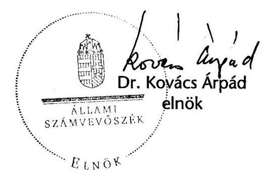

---

# 1. Szervezetirányítási és Müködtetési Igazgatóság 

Vizsgálat-azonosító szám: V0380

## Az ellenőrzést felügyelte:

Dr. Csapodi Pál
fötitkár

## Az ellenőrzés végrehajtásáért felelős:

Dr. Kékesi László
főtitkárhelyettes

## Az ellenőrzést vezette:

Horváthné Menyhárt Erika
főcsoportfőnök-helyettes

## Az ellenőrzést végezték:

Bojtos Rozália
tanácsadó
Dr. Somorjai Zsoltné számvevő tanácsos

Göller Géza
főtanácsadó
Vicze Klára
számvevő tanácsos

Nagyné Lakhézi Éva
számvevő tanácsos
Bálint Józsefné
címzetes főmunkatárs

## 2. Államháztartás Központi Szintjét Ellenőrző Igazgatóság

## Az ellenőrzést felügyelte:

Bihary Zsigmond
főigazgató

## Az ellenőrzés végrehajtásáért felelős:

Horváth Sándor
főcsoportfőnök

## Az ellenőrzést vezették:

Dr. Csépán Mária Magdolna igazgatóhelyettes
Norczen Győzőné osztályvezető főtanácsos

Tolnai Lászlóné osztályvezető főtanácsos

## Az összefoglaló jelentést készítették:

Balázs Melinda számvevő tanácsos

Deli Gáborné számvevő tanácsos
Farkas László számvevő tanácsos

Holé Sándorné Dr. igazgatóhelyettes

Pongrácz Éva osztályvezető főtanácsos

Bamberger Mária számvevő tanácsos
Dormán István Zoltán számvevő
Görgényi Gábor számvevő

Morvay András osztályvezető főtanácsos

Szabóné Farkas Katalin osztályvezető főtanácsos

Dancsóné Kuron Ildikó számvevő
Éva Katalin számvevő tanácsos
Gyarmati István számvevő tanácsos

---

Hajdu Károlyné
számvevő tanácsos
Fehérné Jagasich Mariann
számvevő tanácsos
Horváth József
számvevő tanácsos
Jagicza Istvánné
számvevő tanácsos
Dr. Lengyel Attila
számvevő tanácsos
Molnár Imre
számvevő tanácsos
Polyák Ferenc
számvevő tanácsos
Séra Andrásné
számvevő tanácsos
Szabóné Simai Mária
számvevő tanácsos
Dr. Szima Mária
számvevő tanácsos
Zaroba Szilvia
számvevő tanácsos

Hajdúné Sipos Erika
számvevő tanácsos
Ferencz Katalin
számvevő tanácsos
Huszár József
számvevő tanácsos
Jeszenkovits Tamás
számvevő tanácsos
Mátyási József
számvevő
Niklai Heléna
számvevő tanácsos
Dr. Pósch Gábor
számvevő tanácsos
Dr. Sipos Dóra
számvevő tanácsos
Szilágyi Gyöngyi
számvevő tanácsos
Vacsora Erika
számvevő tanácsos

Holló András
számvevő
Horcsin Attila
számvevő
Huszárné Borbás Melinda
számvevő
Karsai Lászlóné
számvevő tanácsos
Molnár Bálint
számvevő
Pető Krisztina
számvevő tanácsos
Dr. Remport Katalin
számvevő tanácsos
Szabó Erzsébet
számvevő tanácsos
Szilágyi Zsuzsanna
számvevő tanácsos
Vas Lajos
számvevő tanácsos

# Az ellenőrzést végezték: 

Baki István számvevő

Bamberger Mária
számvevő tanácsos
Dr. Beregi Anna
számvevő tanácsos
Csóry Györgyné
számvevő tanácsos
Dancsóné Kuron Ildikó
számvevő tanácsos
Dombóvári Nóra
számvevő
Éva Katalin
számvevő tanácsos
Fekete Győr László
számvevő
Fülöppné Nagy Marianna
számvevő
Görgényi Gábor
számvevő
Hajdu Károlyné
számvevő tanácsos

Balázs Melinda
számvevő tanácsos
Beck Miklós
számvevő tanácsos
Bíró Endre
számvevő tanácsos
Czmarkó Frigyes
számvevő
Dede Katalin
számvevő tanácsos
Dormán István Zoltán
számvevő
Farkas László
számvevő tanácsos
Ferencz Katalin
számvevő tanácsos
Gergely Tilda
számvevő gyakornok
Gyarmati István
számvevő tanácsos
Hajdúné Sipos Erika
számvevő tanácsos

Dr. Baloghné Sebestyén Éva számvevő
Bedécs Erzsébet
számvevő
Burenzsargal Narantuja számvevő
Dalmayné Szerző Ildikó számvevő
Deli Gáborné
számvevő tanácsos
Dr. Endrédy Györgyina számvevő
Fehérné Jagasich Mariann számvevő tanácsos
Dr. Fónyad Erzsébet számvevő tanácsos
Gombás István számvevő
Gyeraj Péter számvevő
Horcsin Attila számvevő

---

| Holló András   számvevő | Horváth József   számvevő tanácsos | Huszárné Borbás Melinda   számvevő |
| :--: | :--: | :--: |
| Huszár József   számvevő tanácsos | Jagicza Istvánné   számvevő tanácsos | Dr. Jakab Kornél   számvevő tanácsos |
| Jeszenkovits Tamás   számvevő tanácsos | Karsai Lászlóné   számvevő tanácsos | Kincses Erzsébet Eszter   számvevő |
| Kiss Ferenc Károlyné   számvevő | Knoppné Szabó Ildikó   számvevő tanácsos | Kocsis Ferencné   számvevő |
| Kovácsy Tamás   számvevő | Krémó Márkné   számvevő tanácsos | Krüzselyi Attila   számvevő |
| Dr. Lengyel Attila   számvevő tanácsos | Lődiné Cser Zsuzsanna   számvevő tanácsos | Maklári Ferencné   számvevő tanácsos |
| Mátyási József   számvevő | Dr. Mészáros Leila   számvevő | Molnár Bálint   számvevő |
| Molnár Imre   számvevő tanácsos | Némethné Nagy Mária   számvevő | Niklai Heléna   számvevő tanácsos |
| Patthy Júlia   számvevő gyakornok | Pető Krisztina   számvevő tanácsos | Polyák Ferenc   számvevő tanácsos |
| Dr. Pósch Gábor   számvevő tanácsos | Radics-Ludvig Györgyi   számvevő gyakornok | Dr. Remport Katalin   számvevő tanácsos |
| Salamin Viktor   számvevő | Sápi Henrietta   számvevő gyakornok | Séra Andrásné   számvevő tanácsos |
| Sinka Zoltán   számvevő | Dr. Sipos Dóra   számvevő tanácsos | Szabó Erzsébet   számvevő tanácsos |
| Szabóné Simai Mária   számvevő tanácsos | Szilágyi Gyöngyi   számvevő tanácsos | Szilágyi Zsuzsanna   számvevő tanácsos |
| Dr. Szima Mária   számvevő tanácsos | Szólya Ildikó   számvevő tanácsos | Szöllősiné Hrabóczki Etelka   számvevő tanácsos |
| Vacsora Erika   számvevő tanácsos | Varsányiné Dudás Eleonóra   számvevő gyakornok | Vas Lajos   számvevő tanácsos |
| Dr. Vass Gábor   számvevő tanácsos | Vértényi Gábor   számvevő | Villányi Antal   számvevő tanácsos |
| Vitányi István   számvevő tanácsos | Zagyi Judit   számvevő tanácsos | Zakar László   számvevő |
| Zaroba Szilvia   számvevő tanácsos |  |  |

---

# 3. Önkormányzati és Területi Ellenőrzési Igazgatóság 

## Az ellenőrzést felügyelte:

Dr. Lóránt Zoltán
főigazgató
Az ellenőrzés végrehajtásáért felelős:
Németh Péterné
főcsoportfőnök

## Az ellenőrzést vezette:

Dr. Dankó Géza
főtanácsadó

A helyszíni vizsgálati jelentések feldolgozásában és az összefoglaló elkészítésében közremúködött:

Kozák György
főtanácsadó

Az ellenőrzést végezték:
Ambrus Lajos
főtanácsadó
Dr. Mezei Imréné
főtanácsadó

Dankó Géza
főtanácsadó
Szabó Tamás
számvevő tanácsos

Kozák György
főtanácsadó

---

# TARTALOMJEGYZÉK 

BEVEZETÉS ..... 7
VÉLEMÉNY A T/6571. SZÁMÚ KÖLTSÉGVETÉSI TÖRVÉNYJAVASLATRÓL ..... 10

1. A tervezőmunka feltételrendszere ..... 12
2. A költségvetési dokumentum ..... 15
3. Az állami költségvetés előirányzatai ..... 17
3.1. A központi költségvetés bevételi előirányzatai ..... 26
3.2. A központi költségvetés kiadási előirányzatai ..... 30
3.3. A társadalombiztosítási alrendszer előirányzatai ..... 31
3.4. Az elkülönített állami pénzalapok előirányzatai ..... 33
4. A helyi önkormányzatok ..... 35
MELLÉKLET ..... 1
A HELYSZÍNI ELLENŐRZÉSEK TAPASZTALATAI ..... 3
A) AZ ÁLLAMHÁZTARTÁS KÖZPONTI SZINTJE ..... 5
A)1. KÖZPONTI KÖLTSÉGVETÉS ..... 5
5. A fejezetek költségvetési előirányzatai ..... 6
1.1. A fejezetek tervezési, szervezési és intézmény-felülvizsgálati feladatainak teljesítése ..... 6
1.2. Bevételi előirányzatok ..... 10
1.3. Kiadási előirányzatok ..... 12
1.3.1. Létszám ..... 13
1.3.2. Személyi juttatások és munkaadókat terhelő járulékok ..... 18
1.3.3. Dologi kiadások ..... 22
1.3.4. Intézményi felhalmozási kiadások ..... 24
1.3.5. Kölcsönök ..... 26
1.4. A fejezeti kezelésű előirányzatok ..... 26
1.4.1. A fejezeti kezelésű előirányzatok tervezése ..... 26
1.4.2. Speciális fejezeti kezelésű előirányzatok ..... 29
1.4.2.1. A PPP programok ..... 29
1.4.2.2. A személyi jövedelemadó 1\%-ának felhasználásával megvalósuló előirányzatok ..... 29

---

1.4.2.3. „Felülről nyitott" fejezeti kezelésű előirányzatok ..... 30
1.4.3. Nemzetközi tagságok és hozzájárulások kiadása ..... 31
1.4.4. Peres eljárásokkal kapcsolatosan tervezett előirányzatok ..... 33
1.4.5. A fejezeti tartalék alakulása ..... 33
1.4.6. Központi beruházások alakulása ..... 34
1.5. Az európai uniós tagsággal összefüggő előirányzatok ..... 35
1.6. Alapítványok, közhasznú társaságok értékelése ..... 47
1.7. A költségvetés központosított bevételei ..... 48
1.8. A 2010-2012. évek várható előirányzatai ..... 49
A)2. ELKÜLÖNÍTETT ÁLLAMI PÉNZALAPOK ..... 51

1. Munkaerőpiaci Alap ..... 51
1.1. Az MPA 2008. évi várható bevételei, kiadásai ..... 51
1.1.1. Az MPA 2008. évi bevételei ..... 52
1.1.2. Az MPA 2008. évi kiadásai ..... 53
1.2. Az MPA bevételeinek és kiadásainak 2009. évi előirányzatai ..... 53
1.2.1. Az Alap 2009. évi bevételei ..... 53
1.2.2. Az Alap 2009. évi kiadásai ..... 55
2. Szülőföld Alap ..... 59
3. Központi Nukleáris Pénzügyi Alap ..... 60
4. Nemzeti Kulturális Alap ..... 61
5. Wesselényi Miklós Ár- és Belvízvédelmi Kártalanítási Alap (wma) ..... 62
6. Kutatási és Technológiai Innovációs Alap ..... 63
A)3. TÁRSADALOMBIZTOSÍTÁS PÉNZÜGYI ALAPJAI ..... 65
7. Nyugdíjbiztosítási Alap ..... 65
1.1. Az Nyugdíjbiztosítási Alap pénzügyi helyzete a 2009. évi költségvetés alapján ..... 66
1.2. A Nyugdíjbiztosítási Alap bevételeinek tervezése ..... 66
1.2.1. A bevételek 2008. évi várható összegének meghatározása ..... 67
1.2.2. A Nyugdíjbiztosítási Alap 2009. évi bevételi előirányzatai ..... 68
1.3. A Nyugdíjbiztosítási Alap kiadásai ..... 71
1.3.1. Az ellátási kiadások tervezése ..... 71
1.3.1.1. A 2008. évi várható ellátási kiadások meghatározása ..... 71
1.3.1.2. A 2009. évre tervezett ellátási kiadások ..... 72
1.3.2. A múködési kiadások tervezése ..... 73
8. Egészségbiztosítási Alap ..... 74
2.1. A tervezés feltételei ..... 74
2.2. Az E. Alap bevételei ..... 77
2.2.1. Az E. Alap 2008. évi bevételeinek várható teljesülése ..... 77
2.2.2. A 2009. évi költségvetés bevételi előirányzata ..... 78

---

2.3. Az E. Alap 2009. évi kiadásainak tervezése ..... 79
2.3.1. Pénzbeli ellátások ..... 80
2.3.2. Természetbeni ellátások ..... 81
2.3.2.1. Gyógyító-megelőző egészségügyi ellátások ..... 81
2.3.2.2. Gyógyszertámogatási előirányzat ..... 86
2.3.2.3. Gyógyászati segédeszközök támogatása ..... 88
2.3.2.4. Egyéb természetbeni ellátások ..... 89
2.4. Az OEP 2009. évi múködési kiadásai ..... 90
B) A HELYI ÖNKORMÁNYZATOK ..... 92

1. A költségvetési törvényjavaslat és a helyi önkormányzati forrásszabályozás megalapozottsága ..... 92
2. A forrásszabályozás módosításának főbb jellemzői ..... 95
3. Fejlesztési támogatások ..... 97
3.1. Címzett és céltámogatások ..... 98
3.2. A decentralizált helyi önkormányzati fejlesztési támogatási programok támogatása ..... 99
3.2.1. A helyi önkormányzatok fejlesztési feladatainak támogatása (2008-ban HÖF TEKI és a HÖF CÉDE jogcímú támogatás) ..... 103
3.2.2. Helyi önkormányzatok vis maior támogatása ..... 104
3.2.3. A vis maior tartalék ..... 104
3.2.4. A leghátrányosabb helyzetű kistérségek felzárkóztatásának támogatása ..... 104
3.3. Budapest 4-es metróvonal építésének támogatása ..... 105
3.4. Egyéb fejlesztési célú, központosított előirányzatként tervezett támogatási előirányzatok ..... 106
3.4.1. A helyi önkormányzatok és jogi személyiségű társulásaik európai uniós fejlesztési pályázataihoz szükséges saját forrás kiegészítése ..... 106
3.4.2. A települési önkormányzatok szilárd burkolatú belterületi útjainak felújítása ..... 107
3.4.3. Fővárosi kerületek belterületi útjainak szilárd burkolattal való ellátása ..... 108
3.4.4. Egyes közszolgáltatások infrastrukturális fejlesztései és eszközbeszerzései ..... 109
3.4.5. Belterületi belvízrendezési célok támogatása ..... 110
4. Az önkormányzati bevételek tervezése ..... 110
4.1. Normatív állami hozzájárulás és normatív részesedésű átengedett személyi jövedelemadó ..... 110
4.2. Normatív, kötött felhasználású támogatások ..... 119
4.3. Központosított előirányzatok ..... 122
4.4. A helyi önkormányzatok működőképességének megőrzését szolgáló kiegészítő támogatások ..... 124

---

4.5. Átengedett bevételek ..... 125
4.6. Saját források ..... 126
TÁBLÁZATOK

1. számú Kimutatás az átengedett személyi jövedelemadó és önkormányzati ..... 131 támogatások rendelkezési jogosultság szerinti megoszlásáról
2. számú A normatív hozzájárulások jogcímenkénti és ágazatonkénti előirányzatainak változása ..... 132
2/a. számú A közoktatás normatív hozzájárulásainak és a IX. fejezetben előirányzott többi támogatásának alakulása ..... 133
3. számú A normatív, kötött felhasználású támogatások jogcímenkénti és ágazatonkénti előirányzatainak változása ..... 135
4. számú A központosított előirányzatok jogcímeinek és összegének változása ..... 136
5. számú Az önkormányzatok 2009. évi fejlesztési célú támogatásainak ..... 139 alakulása

## FÜGGELÉK

I. ORSZÁGGYŰLÉS ..... 143
KÖZBESZERZÉSEK TANÁCSA ..... 145
II. KÖZTÁRSASÁGI ELNÖKSÉG ..... 146
III. ALKOTMÁNYBÍRÓSÁG ..... 147
IV. ORSZÁGGYŰLÉSI BIZTOSOK HIVATALA ..... 149
V. ÁLLAMI SZÁMVEVŐSZÉK ..... 150
VI. BÍRÓSÁGOK ..... 152
VIII. MAGYAR KÖZTÁRSASÁG ÜGYÉSZSÉGE ..... 155
X. MINISZTERELNÖKSÉG ..... 157
POLGÁRI NEMZETBIZTONSÁGI SZOLGÁLATOK ..... 162
XI. ÖNKORMÁNYZATI MINISZTÉRIUM ..... 164
XII. FÖLDMŰVELÉSÜGYI ÉS VIDÉKFEJLESZTÉSI MINISZTÉRIUM ..... 168
XIII. HONVÉDELMI MINISZTÉRIUM ..... 173
XIV. IGAZSÁGÜGYI ÉS RENDÉSZETI MINISZTÉRIUM ..... 176
XV. NEMZETI FEJLESZTÉSI ÉS GAZDASÁGI MINISZTÉRIUM ..... 180
XVI. KÖRNYEZETVÉDELMI ÉS VÍZÜGYI MINISZTÉRIUM ..... 185
XVII. KÖZLEKEDÉSI, HÍRKÖZLÉSI ÉS ENERGIAÜGYI MINISZTÉRIUM ..... 189
NEMZETI HÍRKÖZLÉSI HATÓSÁG ..... 196
ORSZÁGOS ATOMENERGIA HIVATAL ..... 199
MAGYAR ENERGIA HIVATAL ..... 201
XVIII. KÜLÜGYMINISZTÉRIUM ..... 203
XIX. UNIÓS FEJLESZTÉSEK ..... 206
XX. OKTATÁSI ÉS KULTURÁLIS MINISZTÉRIUM ..... 208

---

XXI. EGÉSZSÉGÜGYI MINISZTÉRIUM ..... 214
XXII. PÉNZÜGYMINISZTÉRIUM ..... 217
PÉNZÜGYI SZERVEZETEK ÁLLAMI FELÜGYELETE ..... 223
KORMÁNYZATI ELLENŐRZÉSI HIVATAL ..... 225
XXVI. SZOCIÁLIS ÉS MUNKAÜGYI MINISZTÉRIUM ..... 227
XXX. GAZDASÁGI VERSENYHIVATAL ..... 232
XXXI. KÖZPONTI STATISZTIKAI HIVATAL ..... 233
XXXIII. MAGYAR TUDOMÁNYOS AKADÉMIA ..... 235
XXXIV. KUTATÁS ÉS TECHNOLÓGIA ..... 238
MAGYAR SZABADALMI HIVATAL ..... 241

---

.

---

# BEVEZETÉS 

Az Állami Számvevőszék (ÁSZ) az Alkotmány 32/C. §-ának (1) bekezdése és a számvevőszéki törvény 2. §-ának (1) bekezdése alapján véleményezi az állami költségvetési javaslat megalapozottságát, a bevételi előirányzatok teljesíthetőségét. A jelen számvevőszéki Vélemény hasonlóan, mint a korábbiak a törvény felhatalmazásával összhangban - közvetlenül nem foglalhat állást olyan kormányzati társadalom- és gazdaságpolitikai elhatározásokkal, elgondolásokkal kapcsolatban, mint a költségvetés gazdaságélénkítő vagy restrikciós jellege, illetve azok arányai (adóemelés vagy adócsökkentés, nyugdíjemelés ütemezése stb.). Markánsan foglalkozik azonban e döntések kockázataival.

Az államháztartási törvény (Áht.) 29. §-ának (1) bekezdése szerint az Országgyűlés a költségvetési törvényjavaslatot a számvevőszéki véleménnyel együtt tárgyalja.

Véleményünket a 2008. szeptember 5-ig tartó, a költségvetési előirányzatok tervezését végző szerveknél lefolytatott helyszíni ellenőrzés során szerzett tapasztalatok, valamint a 2008. szeptember 29-én rendelkezésünkre bocsátott költségvetési törvényjavaslat alapján alakítottuk ki. A Kormány a T/6380. számon már benyújtott törvényjavaslat visszavonása és az új körülményekhez igazodó új költségvetési javaslat kidolgozása mellett döntött.A makrogazdasági változások alapján átdolgozott törvényjavaslatot T/6571. számon október 18-án terjesztette a Kormány az Országgyűlés elé, és küldte meg az ÁSZ-nak.

A 2009. évi költségvetési törvényjavaslat előterjesztési folyamatának törvényi előírásoktól való eltéréséből következően sajátos helyzet állt elő. A jelen számvevőszéki véleményt ezért kényszerű kettősség jellemzi.

Az új törvényjavaslat vonatkozásában - a rendelkezésre álló rövid, néhány napos idő miatt - technikailag sem állt módunkban a jelentős kapacitással lefolytatott helyszíni ellenőrzés megismétlése, ezáltal a Kormány által benyújtott új költségvetési törvényjavaslat előirányzatai megalapozottságának helyszíni ellenőrzési tapasztalatokon nyugvó véleményezése. Az ÁSZ a rá vonatkozó törvényi előírások teljesítése és az Országgyűlés törvényalkotó munkájának elősegítése érdekében kényszerült arra, hogy a visszavont törvényjavaslat összeállítása alapján ítélje meg a 2009. évre irányuló tervezőmunkát. A tervezési folyamat, az előirányzatok kialakításának, megalapozottságának megismerése céljából azonban Véleményünk mellékleteként szerepeltetjük a helyszíni ellenőrzés egyes tervező szerveknél szerzett tapasztalatait, mert az átdolgozott és újra benyújtott törvényjavaslat fő számainak válto-

---

zása és szerkezeti átalakítása végül is csak korlátozottan tükrözi azokat a makrogazdasági feltételeket, amelyekkel a visszavonást indokolták.

Az ÁSZ mindig arra törekedett és a jövőben is arra törekszik, hogy kötelezettségeit az előírt törvényi határidőre teljesítse, amennyiben a törvény ilyen határidőt nem jelöl meg - mint a költségvetési törvényjavaslat véleményezése esetében sem -, akkor pedig olyan határidőre, amivel segítheti az Országgyúlés munkáját. Ezért a megváltoztatott költségvetési dokumentum alapján áttekintettük Véleményünk azon részét, amely összefoglalja megállapításainkat és javaslatainkat, s a lehetőségekhez képest aktualizáltuk azokat. Ahol a változás nem jelentős ott nem részleteiben, hanem összevontan mondunk véleményt. Jelen helyzetben Véleményünk csak az adott korlátozó feltételek között képes támogatni az Országgyúlés törvényalkotó tevékenységét.

Véleményünket megelőzően október 14-én az Országgyúlés rendelkezésére bocsátottuk a 2009. évi költségvetés makrogazdasági kockázatainak elemzéséről készített tanulmányt, amelyet - a tavalyi évhez hasonlóan az ÁSZ Fejlesztési és Módszertani Intézete készített. Ebben az összeállításban már szerepel a legfrissebb információkra épülő szcenárió, és bemutatja a költségvetés szempontjából legfontosabb makrogazdasági hatásokat, változásokat is, amelyek jóval nagyobb kockázatokra utalnak, mint az a költségvetési javaslat számaiban tükröződik.

A jogszabályi előírásokból adódóan az ellenőrzés célja annak megállapítása volt, hogy

- a 2009. évi költségvetési törvényjavaslat összeállítása és a 2010-2012. évekre szóló irányszámok kimunkálása során érvényesültek-e az államháztartási törvény, valamint a végrehajtására kiadott kormányrendeletek előírásai, az előirányzatok kialakítására kiadott irányelvek, illetve a tervezési köriratban foglaltak;
- a törvényjavaslat és az irányszámok megfelelően harmonizálnak-e az EU által elfogadott konvergencia programmal;
- a törvényjavaslatot és az irányszámokat megfelelően alapozzák-e meg
a makrogazdasági prognózisok,
a tervezésnél alkalmazott módszerek, valamint,
az állami feladatrendszer és a szabályozók javasolt módosításai;
- a törvényjavaslat és az irányszámok kiemelten vették-e számításba Magyarország EU-tagságának pénzügyi-gazdasági hatásait, részletesen és megalapozottan számszerúsítették-e az EU-tól származó forrásokat és a társfinanszírozási követelményeket, valamint az EU költségvetésébe történő befizetési kötelezettséget.

A helyszíni ellenőrzés során a 2009. évi állami költségvetésről szóló, T/6380. számon benyújtott törvényjavaslat megalapozottságát, az előirányzatok kialakítása érdekében végzett szervező, összefogó tevékenységet, az intézményfelülvizsgálatot és a fejezeti kezelésű előirányzatok kimunkáltságát a költségvetési fejezetek felügyeletét ellátó szervezeteknél, a fejezeti jogosítvánnyal rendel-

---

kező költségvetési szerveknél, az alapkezelőknél vizsgáltuk. Az intézményi előirányzatok megalapozottságát a fejezetek igazgatási címeinél/alcímeinél, az alapkezelőknél, a társadalombiztosítás alapjainál és az elkülönített állami pénzalapoknál értékeltük.

Véleményünk kialakítását nehezítette, hogy az előirányzatok megalapozását jelentő jogszabályok (például: egyes adó- és járulék törvények módosításáról szóló törvényjavaslat, a szociális igazgatásról és szociális ellátásokról, a foglalkoztatás elősegítéséről és a munkanélküliek ellátásáról szóló törvények) még nem kerültek jóváhagyásra, azok tervezetei álltak az ellenőrzés rendelkezésére, illetve részben visszavonásra kerültek. A 2010-2012. évek irányszámainak értékelésére az ellenőrzésnek nem volt lehetősége. A visszavont törvényjavaslat előirányzatai megalapozottságának, teljesíthetőségének minősítésénél az ellenőrzés a magas, közepes, illetve alacsony kockázat fogalmát használta ${ }^{1}$. Az október 18-án rendelkezésünkre bocsátott új törvényjavaslat előirányzatai esetében azonban már nem volt lehetőségünk helyszíni ellenőrzés keretében meggyőződni az előirányzatok változtatásának dokumentáltságáról, ezért az új előirányzatokat a korábbiakhoz való viszonyuk alapján minősítettük. A kockázatok fennállását jelezzük azoknál az előirányzatoknál, amelyeknél a bekövetkezett változás mértéke azt indokolta.

Az előbbieknek megfelelően a Magyar Köztársaság 2009. évi - a Kormány által benyújtott új - költségvetési törvényjavaslatáról készített Véleményünk az öszszegző megállapításokat, következtetéseket és a javaslatokat tartalmazza. A „Melléklet"-ben a visszavont törvényjavaslatnak az államháztartás egyes alrendszereire vonatkozó - a Pénzügyminisztériummal, illetve a központi költségvetés valamennyi fejezeténél szakértői, majd államtitkári szinten egyeztetett - ellenőrzési megállapításait, valamint az egyes költségvetési fejezetek tervező munkájáról, előirányzataik megalapozottságáról kialakított véleményünket foglaljuk össze. (A visszavont törvényjavaslatról készített Véleményünket átadtuk a Pénzügyminisztériumnak annak érdekében, hogy további munkájukat segítsük.)

[^0]
[^0]:    ${ }^{1}$ Alacsony kockázat: az előirányzat teljesülése valószínűsíthető, a teljesülés elmaradása az előirányzattól nem jelentős összegű, illetve arányú. Közepes kockázat: az előirányzat várhatóan nem teljesül, az elmaradás 2\% körüli. Magas kockázat: az előirányzat várhatóan nem teljesül, az elmaradás 5\% körüli, vagy azt meghaladó.

---

# VÉLEMÉNY A T/6571. SZÁMÚ KÖLTSÉGVETÉSI TÖRVÉNYJAVASLATRÓL 

A Magyar Köztársaság 2009. évi költségvetéséről szóló törvényjavaslat megalapozása, kimunkálása során a Kormány, a Pénzügyminisztérium és ebből következően a különböző tervező szervek - a korábbi évekhez hasonlóan - eltértek a jogszabályi előírásoktól. A szabályos tervezési folyamattól való eltérést tovább fokozta, hogy az államháztartási törvényben meghatározott határidőre benyújtott törvényjavaslatot visszavonta az előterjesztő, majd ezt követően újabb költségvetési javaslat került az Országgyűlés elé.

Évek óta napirenden van a szabályalapú költségvetés, a költségvetési tervezés intézményes garanciái megalkotásának, a nemzetgazdaság tervezési rendszere kiépítésének indokoltsága, illetve szükségessége. Valószínűsíthető, hogy e szabályok megléte és alkalmazása elkerülhetővé tehette volna a jelenlegi tervezési zavarokat, különösen, hogy az új költségvetési javaslat a visszavonthoz képest nem mutat markáns elmozdulást a főbb keretszámok, a tartalékok, a kiadási/bevételi szerkezet tekintetében.

## A változtatások nem tükrözik azokat a problémákat, illetve kezelésük lehetőségeit, amelyek a törvényjavaslat visszavonását és átdolgozásának indokát jelentették².

Ezt megerősíti az államháztartás funkcionális kiadásainak változatlansága. Áttekintettük a költségvetési kiadások funkcionális szerkezetében az évek során, illetve a visszavont és az új törvényjavaslattal bekövetkezett változásokat. Az államháztartási kiadások alakulásának egyes elemeit a következő ábrák szemléltetik.

A felső ábra 2009. évi oszlopai a visszavont, míg az alsó ábra az új költségvetési törvényjavaslat előirányzatait jeleníti meg.

[^0]
[^0]:    ${ }^{2}$ A visszavont és a benyújtott törvényjavaslat közötti változást az 1. sz. táblázatban mutatjuk be.

---

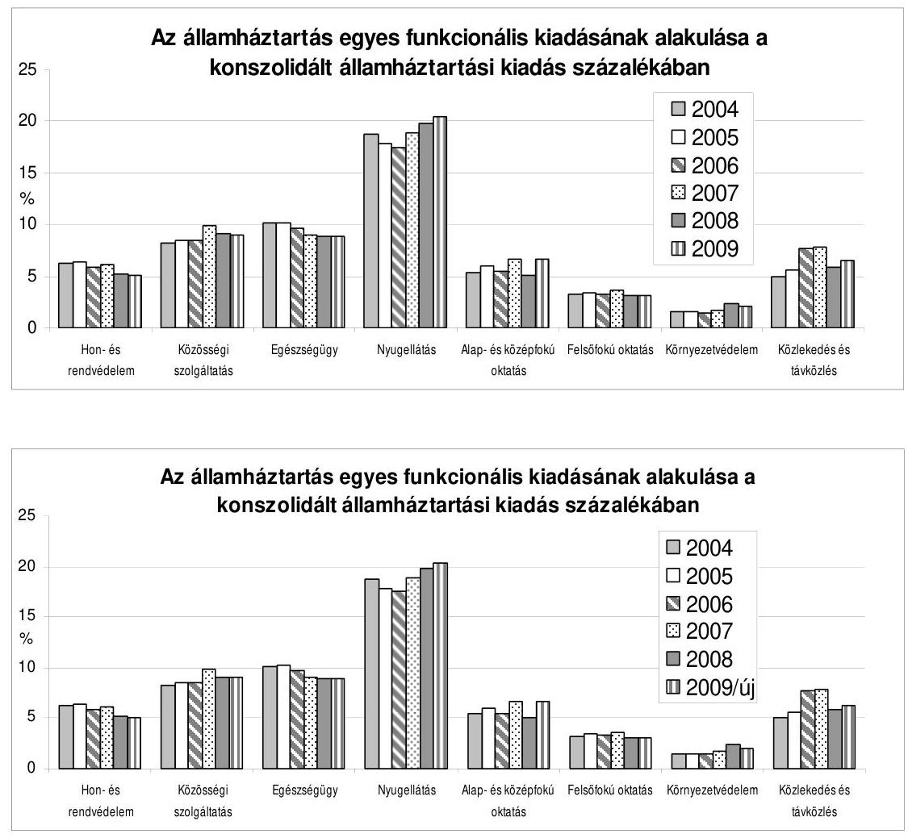

A teljesen egybeesőnek tűnő ábrák egyértelműen azt mutatják, hogy funkcionális szerkezetben lényegi aránybeli eltérések nincsenek (grafikonban szinte nem ábrázolhatók az eltérések) a visszavont és az újra benyújtott törvényjavaslat között (pl. közlekedés $0,2 \%$-os, az egészségügyi és a nyugdíjváltozás 0,1 $0,1 \%$-os változást okoz a kiadási szerkezetben).

A többéves funkcionális kiadási szerkezet áttekintése alapvető aránybeli változatlanságot mutat, abban hosszú távú kormányzati szándékot jelző tartós tendenciák nem érvényesülnek. Érdemi szerkezeti átrendezésre nem került sor, évek közti hullámzások jelentkeznek anélkül, hogy ezek rövidebb és hosszabb távú komplex társadalmi-gazdasági hatásait ismernénk. Utóbbi a nemzetgazdasági tervezőmunka hiányának következménye, vagyis annak, hogy a reálfejlesztés és a pénzügyi tervezés intézményes összhangja nem biztosított. (A államháztartási kiadások hosszú távú, teljes körű funkcionális megoszlási arányát, illetve azok GDP-arányos értékeit a 2. és 3. számú táblázatokban mutatjuk be.)

---

# 1. A TERVEZŐMUNKA FELTÉTELRENDSZERE 

A költségvetési tervezés eljárási szabályait, a tervezési folyamat munkaszakaszait, feladatait az államháztartási törvény és az államháztartás múködési rendjéről szóló Korm. rendelet szabályozzák. Véleményünket alapvetően meghatározta, hogy ezen szabályok mennyiben érvényesültek a tervező munka folyamatában.

A tervezőmunka feltételrendszere a 2009. évi költségvetés tervezésénél sem tette lehetővé a minden szempontból megalapozott költségvetési előirányzatok kialakítását. A tervezőmunka folyamata - eltekintve a világgazdasági problémák okozta (atipikusnak nevezhető) utolsó szakaszától, ahol mindez indokoltnak mondható - nem mindenben felelt meg a vonatkozó előírásoknak és a körültekintő, megalapozott tervezés követelményeinek.

A tervezési munka az alulról építkező, a szakmai feladatok teljesítésére épülő, megalapozott tervezés helyett az alkufolyamatok során kialakult keretszámok visszatervezésének folyamatává vált. A kapcsolódó pozitív és negatív szinergiák bemutatását nem ismerjük, az állami feladatok ellátásának színvonalára gyakorolt hatásáról nem bocsátottak az ellenőrzés rendelkezésére dokumentumokat. A tervezésnek ezt a metódusát azért is kifogásoljuk, mert a konvergencia programban foglaltak harmonikus teljesítése, valamint a szűk mozgástér miatt, különösen fontos lett volna az átlátható, nyomon követhető, számításokkal teljes körűen alátámasztott tervezőmunka.

A Kormány - az Áht.-ban foglalt kötelezettségének megfelelően - határozatban állapította meg a 2009. évi és a következő két év költségvetési keretszámait. Az államháztartásért felelős miniszter a törvényi határidőre elkészítette a költségvetési irányelveket, de azokat a Kormány határozattal nem erősítette meg, s azok nem váltak ismertté a tervezést végző szervek számára. A PM 2008 júliusában jelentette meg honlapján a 2009. évi költségvetési tervezés szempontjait, paramétereit meghatározó tervezési köriratot.

## A tárcák támogatási keretszámai a törvényjavaslat Országgyúlésnek történő benyújtásáig folyamatosan módosultak a tárcák többletigényeinek a PM által történt részbeni elfogadása, a kormányzati struktúraváltozás következtében az érintett fejezetek közötti, az előirányzatok megosztására vonatkozó megállapodások előkészítése, valamint a tervezett munkaadói járulék csökkenés hatása és a fejezeti egyensúlyi tartalék zárolása miatt.

A fejezetek felügyeleti szerveinek többsége 2008-ban is körlevelet adott ki intézményei részére, amelyben meghatározták a tervezés során követendő szempontokat, tervezési követelményeket és tájékoztatást adtak a keretszámokról.

Az intézményektől bekért adatszolgáltatás és az igények felülvizsgálata alapján a fejezetek felügyeleti szervei összeállították a fejezet összesített költségvetési javaslatát, figyelembe véve a - PM által meghatározott, egyensúlyi tartalékot nem tartalmazó - támogatási keretszámot. Ezzel egyidejűleg elkészítették az előirányzatok teljesíthetőségét megalapozó jogszabály-módosító javaslatokat.

---

A költségvetési törvényjavaslat részletes kidolgozásakor a személyi juttatások, a munkaadókat terhelő járulékok, a dologi és felhalmozási kiadások, valamint a fejezeti kezelésű előirányzatok tervezése során a fejezetek felügyeletét ellátó szervek jellemzően 2008-ban is a tervezési körirat előírásai szerint jártak el, de nem vizsgálták, nem elemezték, hogy az alkumechanizmus folytán kialakított előirányzatok biztosítják-e a jogszabályokban előírt kötelezettségeik teljesítését, feladatellátásuk színvonalát, illetve az előálló problémákat mivel oldják fel, illetve mérséklik.

A bevételek tervezéséhez központi irányszám nem került kiadásra, a tervezési körirat fogalmazott meg általános jellegű - a bevételek reális, teljesíthető szintű tervezésére vonatkozó - iránymutatást. A fejezetek felügyeleti szervei a tervezés során törekedtek a bevételek reális tervezésére, a költségen alapuló bevételek elérésére. A 2009. évre a tárcák döntő többsége a 2008. évi eredeti előirányzattal azonos, vagy alacsonyabb összegű bevétellel számolt, figyelembe vették a 2008. évi várható teljesítések elmaradását, valamint a bevételek jogszabályon alapuló változását (csökkenését).

A dologi és felhalmozási kiadások tervezése a tervezési körirat előírásai szerint történt, azonban a tervezett kiadások - a 2008. évi várható teljesítések figyelembevételével - előreláthatóan nem nyújtanak fedezetet minden indokolt kiadásra. A fejezetek egy része az előírt általános báziscsökkentés és a fejezeti egyensúlyi tartalékképzés egy részét - egyéb fedezet hiányában - a dologi vagy a felhalmozási kiadások terhére hajtotta végre, illetve képezte meg.

A tárcák a fejezeti kezelésű előirányzatok tervezésénél az Áht. és a tervezési köriratban foglaltaknak megfelelően jártak el, a fejezeti kezelésű előirányzatok rangsorolását elvégezték, előirányzatok összevonására, új előirányzatok létesítésére, előirányzatok törlésére tettek javaslatot. A 2008. évi szervezeti változások miatt fejezeti kezelésű előirányzatok fejezetek közötti megosztására is sor került.

A törvényjavaslat az Európai Uniótól érkező strukturális támogatásokat és az ehhez kapcsolódó hazai költségvetési társfinanszírozás összegét programonként kú-lön-külön törvényi soron - összhangban a tervezési körirat előírásaival - az Uniós fejlesztések fejezetben szerepelteti. A vidékfejlesztési programok uniós és hazai támogatásai a Fölmúvelési és Vidékfejlesztési Minisztérium fejezetben, az egyéb uniós támogatások és az Átmenetei támogatás programjai, amelyek részben vagy teljesen hazai finanszírozással valósulnak meg a 2009. évben, az előbbieken kívül - a tervezési köriratban foglaltaknak megfelelően - további hat fejezet előirányzatai között szerepelnek. Az FVM fejezetben a folyó kiadások és jövede-lem-támogatások jogcímcsoport egy összegben tartalmazza a 78,0 Mrd Ft összegű kiegészítő nemzeti támogatást (top-up), több más hazai agrártámogatással. Az átláthatóságot és az elszámoltathatóságot jobban szolgálná, ha a top-up külön soron szerepelne.

Egyes fejezetek igazgatás és igazgatás jellegű tevékenységet ellátó szervezeteinél a hatályos kormányhatározatban foglalt létszámnál magasabb létszámot terveztek, mert a kormányhatározat módosításai nem vették figyelembe az időközben elrendelt, illetve a 2008. évben jóváhagyott létszámváltozásokat.

---

A belső ellenőrzési kapacitásszint felmérését a fejezetek felügyeletét ellátó szervek elvégezték, hét ${ }^{3}$ - jelentős kiadási főösszeggel és felügyelt intézményi körrel rendelkező - tárca jelezte, hogy a meglévő létszám nem biztosítja teljes körűen a felügyelt intézmények megbízhatósági ellenőrzésének elvégzését.

Több fejezet normatív jutalomra a hatályos jogszabály előírásánál magasabb összeget tervezett, mivel részükre a központi költségvetés általános tartaléka terhére kormányhatározatban biztosítottak fedezetet a bázisba épülő teljesítményalapú és teljesítményösztönző bérrendszer kialakításának elősegítésére.

Az Áht. 36. § (1) bekezdésének c) pontjában foglaltaktól eltérően a fejezetek részére a 2010-2012. évi keretszámok kiadása nem történt meg, azok felülvizsgálatára és újbóli kialakítására a 2009. évi részletes tervezést követően kerül sor. Így a tárcák a helyszíni ellenőrzés időszakában nem dolgozhatták ki az aktualizált középtávú (3 év) költségvetési keretszámokat.

A tervezőmunka előbbiekben kifogásolt hiányosságai még hangsúlyosabbá válnak annak következtében, hogy a Kormány a költségvetési törvényjavaslatot visszavonta, és a tervező szervezetek által a törvényjavaslatban szereplő előirányzatokat visszaterveztette, miközben a fejezeti indokolásokat változatlanul hagyta.

A Pénzügyminisztérium 2008. október 13-án kelt levelében értesítette a fejezetek felügyeleti szerveit, illetve a tervező munkában részt vevő szervezeteket, hogy a költségvetési törvényjavaslat benyújtásához képest megváltozott makrogazdasági feltételrendszer miatt a költségvetésben további kiadás-támogatás mérséklés vált szükségessé.

A Pénzügyminisztérium az új követelményeknek megfelelő számításokat elvégezte és ez alapján - általunk nem ismert - „meghatározott szempontok szerint differenciált hatású" támogatáscsökkentés és növelés, valamint a befizetési kötelezettségek növelésének tételes összegeit közölte a fejezetek felügyeleti szerveivel, a tervezőmunkát végző szervezetekkel.

A tervező szerveknek az ún. mentesített előirányzatok kivételével - figyelemmel a tervezési köriratban is megfogalmazott, a kötelezettségek teljesítésének, a működőképesség biztosításának, az év közbeni és a következő évi többletigény elkerülésének követelményére - átcsoportosítási lehetőségük volt.

Mindez azt jelenti, hogy a visszaterveztetett elöirányzatok megalapozottsága nem ítélhető meg és a költségvetés tervezési rendszerének ÁSZ által évek óta szorgalmazott megújítása tovább nem halasztható.

[^0]
[^0]:    ${ }^{3}$ Miniszterelnökség, Önkormányzati Minisztérium, Földművelésügyi és Vidékfejlesztési Minisztérium, Külügyminisztérium, Oktatási és Kulturális Minisztérium, Egészségügyi Minisztérium, Szociális és Munkaügyi Minisztérium.

---

# 2. A KÖLTSÉGVETÉSI DOKUMENTUM 

Mind a költségvetési törvényjavaslat véleményezése, mind a zárszámadási törvényjavaslat ellenőrzése során évek óta visszatérően jelezzük, hogy szükséges e dokumentumok tartalmi és formai követelményeinek teljes körü rendezése és rögzítése, egyben annak áttekintése, hogy mi az az információtartalom, amely ezen törvényjavaslatok országgyúlési vitájához szükséges és elégséges.

Az Áht. több paragrafusában, a teljesség igénye nélkül meghatározott, a költségvetési törvényjavaslat prezentációjával kapcsolatos előírásait a törvényjavaslat többségében teljesíti, de néhány hiányosság - folyamatos jelzésünk ellenére - évek óta fennáll. Különösen hátrányos az előírt, a tájékozódást, a döntéshozatalt segíteni hivatott összegző kimutatások hiánya. Így például a dokumentumban nem szerepel összegző tájékoztatás sem a hosszú távú kötelezettségvállalásokról, sem a többéves elkötelezettséggel járó kiadási tételekről.

Az Áht. 2007-től hatályos módosításának indokolása szerint a hosszú távú kötelezettségek összesített nyilvántartásának hiányában nem hozható felelős döntés a további kötelezettségek vállalásáról. Az összesített adatokról a költségvetést érintő döntéseket megelőzően indokolt tájékoztatni az Országgyűlést. Ezért az Áht. 12/C. §-ának (7) bekezdése előírja, hogy a költségvetési törvényjavaslat benyújtásakor a Kormány tájékoztatni köteles az Országgyűlést a hosszú távú kötelezettségvállalások állományáról a fejezetek és a várható kifizetések éve szerinti bontásban.

Ezen túlmenően az Áht. 36. § (1) bekezdésének b) pontja - a törvény megalkotása óta - előírja, hogy a Kormány a költségvetési törvényjavaslat benyújtásakor tájékoztatást ad a többéves elkötelezettséggel járó kiadási tételek későbbi évekre vonatkozó hatásairól.

A törvényjavaslatban évek óta nem szerepel összegző tájékoztatás sem a hosszú távú kötelezettségvállalások állományáról, sem a többéves elkötelezettséggel járó kiadási tételekről.

Hasonlóan hiányzik a közvetett támogatásokat összefoglaló kimutatás, illetve a középtávú tervezés szempontjából fontos, 3 évre kitekintő főbb előirányzatok összefoglaló bemutatása.

Az Áht. 116. § (1) bekezdésének 3. pontjában előírt - az Országgyűlés részére az állami költségvetés tárgyalásakor tájékoztatásul bemutatandó - a központi költségvetés adóbevételeiben érvényesülő közvetett támogatásokat (pl. adóelengedéseket, adókedvezményeket) tartalmazó összefoglaló kimutatás továbbra sem jelenik meg a költségvetési törvényjavaslat fő kötetében (az adókedvezményeket a fejezeti kötet tartalmazza).

Az Áht. 36. § (1) bekezdés c) pontja szerint a költségvetési törvényjavaslatban teljes körűen be kell mutatni a költségvetési évet követő 3 év várható előirányzatait. A törvényjavaslat fő kötetében a költségvetési évet követő 3 év várható előirányzatai nem szerepelnek, azt a gyakorlat szerint a fejezeti kötetek tartalmazzák. A folyamatok áttekintését azonban jobban segítené egy, a várható előirányzatok alakulását összesítő kimutatás fő kötetben való szerepeltetése.

---

Törvényi előírás szerint a Kormánynak szeptember 30-ig olyan költségvetési törvényjavaslatot kell benyújtania az Országgyűlésnek, amely tájékoztatásul tartalmazza az államháztartás helyzetét bemutató valamennyi összefoglaló táblázatot, mérleget. A törvényjavaslat fő kötete ezen előírásokat rendre csak részlegesen teljesíti, és az elmúlt években gyakorlattá vált, hogy bizonyos idősorok, kimutatások csak a fejezeti részletező kötetekben, illetve kiegészítésekben jelennek meg.

Az Áht. 36. § (1) bekezdésének d) és e) pontjai szerint a törvényjavaslatnak be kell bemutatnia a költségvetési törvény legfontosabb társadalmi és gazdasági hatásait és értékelni a költségvetési évet megelőző időszak gazdasági, költségvetési folyamatait. A 2009. évi törvényjavaslat általános indokolása az előző évinél is szűkebb információ tartalommal ismerteti a Kormány gazdaságpolitikájának fő vonásait, valamint az államháztartás középtávú céljait és kereteit. Az államháztartási egyensúly fenntarthatóságát biztosító, a gazdasági növekedést élénkítő, az adóterheket mérséklő, valamint a foglalkoztatást ösztönző intézkedések, változások 2009. évre, illetve a középtávú költségvetési tervezés időszakára érvényes gazdasági hatásainak számszerú, összefoglaló bemutatása a törvényjavaslatban nem szerepel.

Az Áht. 115. §-a szerint az államháztartás mérlegeinek a költségvetés előterjesztésekor a vonatkozó év és az előző év várható, valamint az azt megelőző év tényadatait kell tartalmaznia. A törvényjavaslat fő kötetében a 2008. évi várható előirányzatok nem szerepelnek, az előző évekhez hasonlóan csak a 2008-ra elfogadott előirányzatokat tartalmazza, amelyből azonban nem állapítható meg a tervezés alapját képező várható érték.

Az Áht. 124. § (2) bekezdésének b) pontjában foglalt felhatalmazás ellenére mindez ideig nem szabályozta a Kormány a költségvetéskor bemutatandó mellékletek, kimutatások részletes adattartalmát. Így a költségvetési dokumentum szerkezete, tartalma továbbra sem meghatározott, a prezentáció az évek során kialakított gyakorlat alapján került összeállításra. A törvényjavaslat normaszövege így - az előző évekhez hasonlóan - tartalmaz végrehajtási szintű, technikai lebonyolítási szabályokat is (pl. a 4. § (4) bekezdésében meghatározott adatkezelési előírást, a 30. §-ban a normatív, illetve egyéb támogatások igénylését az államháztartáson kívüli szervek esetében, a 80. §-ban az üzemben tartási díjhoz kapcsolódó rendelkezéseket). Hasonló súlyú szabályok a törvényi mellékletekben, illetve külön törvényekben, rendeletekben jelennek meg, így ez a gyakorlat a normaszöveg átláthatóságát rontja.

Az Áht. 35. §-ának (2) bekezdése a maastrichti elsődleges egyenleg többletéhez köti az éves költségvetési törvényjavaslat Országgyúlés elé való terjesztését. Ezen túl az Áht. 116. §-ának (1) bekezdése szerint az Országgyűlés részére az állami költségvetés tárgyalásakor tájékoztatásul be kell mutatni az államháztartás alrendszerei költségvetési egyenlegének összefüggését és kapcsolatát a kormányzati szektor hiányával (maastrichti deficitmutató), illetve az elsődleges egyenlegmutatóval (maastrichti elsődleges egyenlegmutató). A törvényjavaslat összefoglalóan bemutatja a kormányzati szektor és az ál-

---

lamháztartási alrendszerek tervezett hiányát, valamint a kormányzati szektor elsődleges egyenlegét ( $+1,4 \%$ ), illetve a kamatkiadásokat a GDP $\%$-ában.

A stabilitási tartalék, illetve a zárolt fejezeti egyensúlyi tartalék felhasználásának törvényjavaslatban szereplő szabályozása nehezen értelmezhető, a felhasználási feltételek nem eléggé konkrétak. E mellett véleményünk szerint a zárolt fejezeti egyensúlyi tartalék nem minősíthető tartaléknak, mivel ennek támogatási fedezetét a törvényjavaslat nem biztosítja. A zárolt fejezeti egyensúlyi tartalék fejezeteknél való szerepeltetése - mivel az nem jelenik meg a kiadási főösszegben - rontja az áttekinthetőséget.

A törvényjavaslat 50. §-ának (3) bekezdésében a stabilitási tartalék felhasználásáról rendelkezik, felhatalmazza a Kormányt, hogy a költségvetési és gazdasági folyamatok függvényében döntsön a stabilitási tartalék felhasználásáról. A döntéshozatalt a törvényjavaslat nem köti semmiféle konkrét mérőszámhoz, mutatóhoz vagy egyéb objektív feltételhez, azaz szándékot, irányultságot nem fejez ki, így ezzel a felhatalmazással a Kormány tág keretek között dönthet a felhasználásról.

A törvényjavaslat ugyanezen paragrafusának (4) bekezdés b) pontjában a „főbb adó- és járulék-bevételi előirányzatok" megfogalmazás szerepel, ezen meghatározás azonban nem jelöli ki egyértelmúen a számításba veendő adatok körét. Hasonló nehézség adódik a paragrafus (5) bekezdésében szereplő „különösen a gazdaság fehéredési folyamata miatti" feltétel számszerúsítésével, illetve „az államháztartás egyensúlyi helyzetének javulása" kritérium viszonyítási pontjának meghatározatlanságával kapcsolatban is.

A törvényjavaslat szerint a zárolt fejezeti egyensúlyi tartalék összegét (75,6 Mrd Ft) fejezetenként a 18. sz. melléklet tartalmazza. Az itt bemutatott összegek a törvényjavaslat 1. sz. mellékletében, az érintett fejezetek mindösszesen kiadás és támogatás oszlopaiban is fel vannak tüntetve, ugyanakkor az Országgyúlés számára jóváhagyásra javasolt 1. és 2. sz. törvényi melléklet kiadási fóösszegei ezeket a kiadási tételeket nem tartalmazzák. A zárolt fejezeti egyensúlyi tartalék ebben a formában történő megjelenítése zavaró, nehezíti az átláthatóságot.

Jelen szabályozási formájában a zárolt fejezeti egyensúlyi tartalék csak egyfajta kiadási ígérvény, amely bizonyos - a javasolt szabályok alapján nehezen számszerúsíthető - feltételek teljesülése esetén realizálódhat.

# 3. AZ ÁLLAMI KÖLTSÉGVEtÉS ELŐIRÁNYZATAI 

A középtávú gazdaságpolitikai célkitűzéseket, a megvalósulásukat szolgáló intézkedéseket és ezek kereteit meghatározó makropályát először a 2006. decemberi konvergencia program tartalmazta, amelynek aktualizált változata 2007 novemberében készült el. A pénzügyi válság következtében előtérbe került az állami költségvetés hiányát és lejáró adósságait finanszírozó források pénzpiaci érzékenysége. Így a 2009. évi átdolgozott költségvetési törvényjavaslatban fokozottabban jelentkezik - a konvergencia programnak megfelelően - az államháztartás tartós egyensúlyának megteremtésére irányuló gazdaságpolitikai törekvés.

---

A 2009-2012-es tervezési időszak költségvetési politikáját alapvetően - a visszavont költségvetési javaslat esetében is - az államháztartás hiányának csökkentésére irányuló szándék határozta meg. Ezzel összefüggésben került sor egyes előirányzatoknál a kiadások csökkentésére, míg más előirányzatok esetében azok növelésére, melyben szerepet játszottak a 2009. évi költségvetés tervezését befolyásoló összetett és ellentétes irányba ható tényezők determinációi is.

A determinációk elsősorban az adósságszolgálattal kapcsolatos 1173,8 Mrd Ft-os kiadások - továbbra is növekvő - tendenciájából (2008-ról 2009-re az előirányzat növekedés 63 Mrd Ft ), a garancia és hozzájárulás a társadalombiztosítási ellátásokhoz 917,9 Mrd Ft-os, a hozzájárulás az EU költségvetéséhez 226 Mrd Ft-os, az EU-források társfinanszírozása 183 Mrd Ft-os előirányzat-tervezetek alakulásából adódnak.

A költségvetési törvényjavaslatban a 2009. évi költségvetés tervezett elsődleges egyenlege szufficitet mutat, mind a központi költségvetés, mind az államháztartás szintjén. A szufficit összege a visszavont költségvetési javaslathoz képest a központi költségvetésben $31 \%$-kal, az államháztartásban $55,8 \%$-kal magasabb.
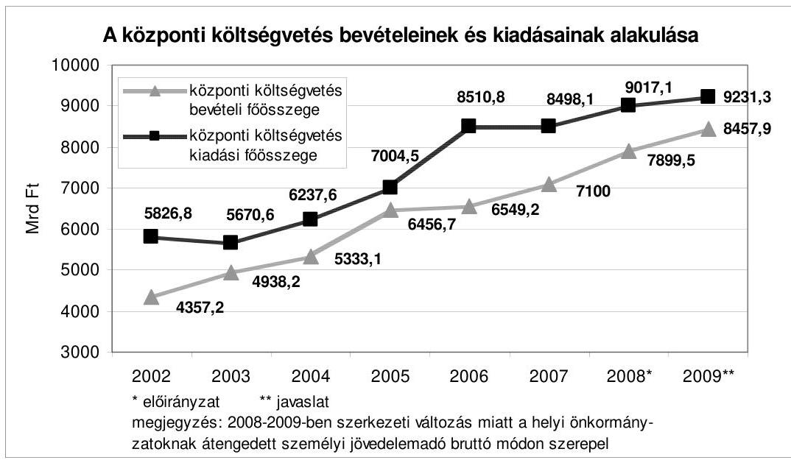

A világgazdaságban a 2007. évben kezdődött globális pénzpiaci problémák és inflációt gerjesztő folyamatok a 2008. év során egyre erőteljesebbé váltak és a 2009. évi költségvetési tervezés időszakában globális pénzügyi válsággá szélesedtek. A válság elhúzódása és a reálgazdaságra gyakorolt negatív hatása meghatározza az EU és a magyar gazdasági fejlődés lehetőségeit, valamint a 2007. novemberi konvergencia programban szereplő makrogazdasági célok teljesülését, továbbá jelentős - a benyújtott törvényjavaslatnál az ÁSZ FEMI makrogazdasági tanulmányában foglaltakra is utalva markánsabb - kockázati tényezőként lehet jelen a 2009. év és a további évek gazdasági növekedésének alakulásában.

---

A PM a konvergencia program végrehajtásáról szóló 2008. évi első (áprilisi) uniós jelentésében a 2008-2009. évekre vonatkozóan már figyelembe vette az akkor még nem válság méretű pénzpiaci problémák hatását.

A pénzügyi válság európai térséget érintő elmélyülése és a hazai pénzügyi szektorra is kiterjedő közvetlen hatása - a forint árfolyam gyengülése, a devizahitelezés és az állampapírpiacon jelentkező nehézségek - következtében a 2008. szeptember 29-én benyújtott 2009. évi költségvetési törvényjavaslat visszavonásra került. Ezzel egyidejűleg a költségvetési törvényjavaslatot átdolgozták és az annak kereteit jelentő makrogazdasági mutatókat aktualizálták. A mutatók értékei eltérnek a 2007. novemberi konvergencia programba foglalt makrogazdasági adatoktól és lényegesen lassúbb növekedést jelentő makropályát írnak le.

# Makrogazdasági mutatók 2008-2009. évekre 

| Megnevezés | 2009. évi   átdolgozott költ-   ségvetési törvény-   javaslat szerint |  | 2009. évi   eredeti költségve-   tési törvényjavaslat   szerint |  | 2008. évi elsö   jelentés az EKSZ   104(?) alapján |  | Konvergencia   program   (2007. november) |  |
| :--: | :--: | :--: | :--: | :--: | :--: | :--: | :--: | :--: |
|  | 2008. évi   várható | 2009. évi   prognó-   zis | 2008. évi   várható | 2009. évi   prognó-   zis | 2008. évi   várható | 2009. évi   prognó-   zis | 2008. évi   prognó-   zisa | 2009. évi   prognó-   zisa |
| GDP | 1,8 | 1,2 | 2,4 | 3,0 | 2,4 | 3,4 | 2,8 | 4,0 |
| Infláció | 6,4 | 3,9 | 6,5 | 4,3 | 5,9 | 3,6 | 4,8 | 3,0 |
| Háztartások   fogyasztási kiadása | 1,1 | 0,2 | 1,2 | 2,2 | 1,3 | 1,6 | 1,2 | 1,9 |
| Közösségi   fogyasztási kiadás | $-0,9$ | 0,6 | $-2,6$ | 0,8 | $-3,2$ | 0,4 | $-2,8$ | 0,4 |
| Bruttó állóeszköz-   felhalmozás | 1,0 | 4,0 | 2,0 | 6,0 | 4,0 | 7,2 | 4,2 | 7,4 |
| Export | 7,6 | 4,1 | 9,5 | 8,0 | 11,5 | 10,8 | 12,9 | 11,8 |
| Import | 8,1 | 4,1 | 8,9 | 7,6 | 10,0 | 10,2 | 11,1 | 11,0 |
| Államháztartás   ESA '95 szerinti   hiánya a   GDP \%-ában | $-3,4$ | $-2,9$ | $-3,8$ | $-3,2$ | $-4,0$ | $-3,2$ | $-4,0$ | $-3,2$ |

A törvényjavaslati makropálya megvalósulását számos kockázati tényező befolyásolhatja. Ezek közül elsőként a tervezés kockázatát szükséges kiemelni, mivel az általános indokolás szerint a pénzügyi válságnak „a pénzpiacokra, a nemzetközi kereskedelmi folyamatokra vonatkozó rövid- és középtávú következményei jelenleg pontosan még nem mérhetőek fel". Ennek alapján a törvényjavaslatban már a mérsékelt ütemü kivitelbővülés jelenik meg, azonban a kedvezőtlen exportpiaci hatások következtében a makropálya szerinti exportnövekedési ütem továbbra is kockázatot hordoz, ami kihatással lehet az importigény és a gazdasági növekedés alakulására is.

Az export alakulásával összefüggésben kockázati tényezőt jelent az ipari termelés növekedési ütemének további csökkenése (2008. I-VIII. havi átlag 3,6\%).

---

A 2008. évben várható 1\%-os bruttó állóeszköz-felhalmozás növekedés és a reálgazdasági folyamatok tendenciája alapján e mutató 2009. évi $4 \%$-os növekedését kockázat terheli, tekintettel arra, hogy a hitelválság kiterjedése miatt visszaesnek a vállalati hitelek és a vállalati beruházások.

A lakossági fogyasztás 2009. évre prognosztizált növekedése az energia árak, a pénzpiaci válság által kiváltott lakossági hitelezési terhek emelkedése következtében, valamint a foglalkoztatottság csökkenésével és a reálbérek stagnálásával összefüggésben szerény mértékű ( $0,3 \%$-os).

A 2009. évre prognosztizált infláció a korábbi 4,3\%-ról 3,9\%-ra mérséklődő növekedése a törvényjavaslat általános indokolása szerint az általános recesszió deflációs hatásának és a hazai folyamatok - gyengén bővülő kereslet, egyes árucsoportok drágulásának mérséklődése, illetve csökkenése - feltételezésén alapul. A piaci tényezők önmagukban nem jelentenek kellő alapot a 2009. évi inflációs prognózis bekövetkezésére nézve. Az inflációs cél teljesülését elősegítő esetleges monetáris és fiskális intézkedésekre azonban nem tér ki az általános indokolás. A 2009. évi infláció alakulását a 2008. évi fogyasztói áremelkedések áthúzódó hatásai is - mint például a novemberi 1-jei gázáremelkedés - befolyásolhatják. Mindezen tényezőket figyelembe véve a 2009. évre tervezett infláció betartása kockázatot hordoz.

A kockázati tényezőkre figyelemmel, kiemelt jelentőségű és ennek ellenére továbbra is késik a költségvetési biztonságot garantáló közpénzügyi fegyelem teljes körú szabályrendszerének megalkotása, és az ezt garantáló intézmények kiépítése.

A költségvetési politika egyik törekvése a konvergencia programban vállalt maastrichti kritériumok teljesítése. Az államháztartás GDP \%-ában kifejezett ESA'95 szerinti hiánymutatójának paramétereit - a 2009. évet és azt követő éveket érintően - a konvergencia program eddigi aktualizálásai során nem módosították. Az eddigi teljesítések a programban rögzített értékek alatt valósultak meg. Az államháztartás eredményszemléletű, a GDP \%-ában kifejezett hiánymutatójának 2008. évi várható értéke a 2007. novemberi konvergencia programban szereplő $4 \%$-hoz viszonyítva 2008 júliusában 3,8\%-ra módosult. Az újabb, 0,4\%-pontos csökkenés az átdolgozott költségvetést megalapozó makropálya aktualizálásához kapcsolódik, amely szerint a hiánymutató 2008. évi várható értéke 3,4\%. Az államháztartás GDP \%-ában kifejezett eredményszemléletű hiánymutatójának 2009. évre prognosztizált értéke 2,9\%, ami 0,3\%ponttal kisebb a 2007. novemberi konvergencia program szerinti 3,2\%-tól. A mutató teljesülésének kockázatai a GDP növekedésének kockázati tényezőivel függenek össze.

A 2009. évi költségvetési törvényjavaslat szerint a központi költségvetés bruttó adósságának tervezett összege a 2009. évre ( 17 497,8 Mrd Ft) 1,4\%-kal alacsonyabb a visszavont javaslatban szereplő összegnél. A GDP-hez viszonyított aránya $61,4 \%$, ami a korábbi állapothoz képest $0,4 \%$-os növekedést jelent.

---

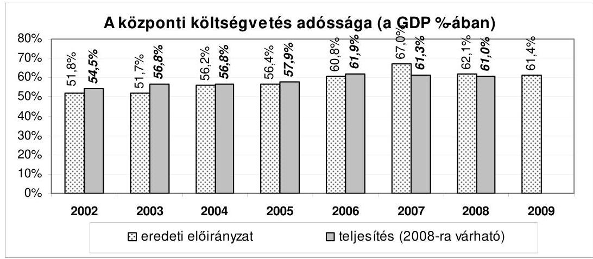

A bruttó államadósság és az államháztartás eredményszemléletű hiányának GDP-hez viszonyított tervezett aránya megvalósulásának kockázati tényezőit az államháztartás elsődleges hiánya, a kincstári körön kívüli szervezetek adósságának a tervezettől eltérő alakulása, továbbá az egyre szélesedő globális pénzpiaci válságnak a kamatkiadásokra gyakorolt hatása jelentik.
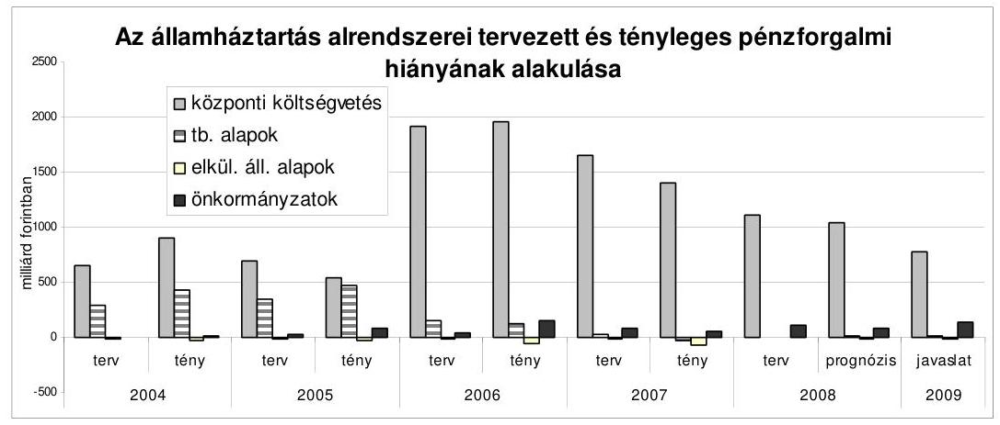

A 2009. évi költségvetési törvényjavaslatban a központi költségvetés hiánya 773,3 Mrd Ft, amely lényegesen ( 344,3 illetve 266,7 Mrd Ft-tal) alacsonyabb mind a 2008. évi költségvetési törvényben rögzített, mind a várható (a PM 2008. szeptember 16-i prognózisa szerinti) hiánynál. A központi költségvetés tervezett (pénzforgalmi) elsődleges egyenlege nemcsak pozitív, hanem egyúttal jelentős összegű ( 389,9 Mrd Ft) is. Az elmúlt 10 év során pozitív GFS egyenleg három évben - jelentősebb összegben azonban csak 2000-2001-ben ( 329,7 Mrd Ft, illetve 212,7 Mrd Ft) - fordult elő.

Az egyes bevételi előirányzatok kockázatának és az ún. felülről nyitott kiadási előirányzatok hiánynövelő hatásának a fedezetéül a költségvetési törvényjavaslatokban tartalékok szolgálnak. Az új törvényjavaslat 2. sz. (mérleg) mellékletében tartalékok cím alatt 274,4 Mrd Ft szerepel. E mellet a 18. sz. mellékletében zárolt fejezeti egyensúlyi tartalékként 75,6 Mrd Ft jelenik meg. A törvényjavaslat mérleg mellékletében szereplő összeg tartalmazza a céltalékok 139,9 Mrd Ft-os összegét is, azonban ez nem számítható a tartalékok közé, mi-

---

vel nem az előre nem látható hatások kockázatainak kezelésére, hanem meghatározott feladat fedezetére szolgál. A zárolt fejezeti tartalékok összegére pedig (75,6 Mrd Ft) a benyújtott törvényjavaslatban nincs fedezet.

A prognosztizált makrogazdasági folyamatok kockázatából származó költségvetési hatások mérséklése megkívánta volna a 2008. évinél is magasabb tartalék képzését (2008-ban 155,5 Mrd Ft volt a tartalékok összege).

# E mellett kiemelt figyelmet kell fordítani a tartalékokkal való felelős gazdálkodásra is. 

Az ellenőrzés a 2007. évi zárszámadás során felhívta a figyelmet, hogy az egyensúlyi tartalékok képzését, célját, felhasználásának feltételeit és módját törvényi szinten szabályozni kell. Ennek hiánya - a költségvetési törvényben adott általános jellegű felhatalmazás alapján - a mindenkori kormányzatnak parttalan felhasználási lehetőséget biztosít. A törvényjavaslat biztosítja ezen előirányzat - meghatározott feltételek teljesülése esetén - túllépésének lehetőségét.

A tartalékkal való felelős gazdálkodás érdekében az ellenőrzés rendszeresen felhívja a figyelmet arra is, hogy az általános tartalék sem az Áht. szerint meghatározott célra kerül felhasználásra.

A közszféra létszámának csökkentését a konvergencia program teljesítése egyik alapvető feltételének jelölte meg a kormányzat. Ennek megvalósítására született meg az államháztartás hatékony működését elősegítő szervezeti átalakításokról és az azokat megalapozó intézkedésekről szóló kormányhatározat. A több száz intézményt érintő szervezeti átalakulások a 2006-2007. években döntően megvalósultak, de egyes területeken a feladatok teljesítése áthúzódott még a 2008. évre ${ }^{4}$. A szervezeti átalakítások létszámcsökkentést és egyszeri többletkiadást, illetve tartós megtakarítást eredményeztek. A Kormány a 2009. évre a költségvetési törvényjavaslatban - az esetlegesen áthúzódó feladatokon túlmenően - további lényeges központi intézkedés hatásaként szervezeti átalakításokkal és létszámváltozásokkal nem számol. (A 2009. évre a költségvetési törvényjavaslat az előző évivel azonos - 261 ezer fő - létszámot irányoz elő.)

A konvergencia program megvalósulásáról a PM által 2008 áprilisában készített jelentés a 2006-ban megkezdett reformintézkedések (átszervezések, kisebb létszám stb.) eredményeként arról ad számot, hogy a 2006-2008. években a központi költségvetési szervek létszámában mintegy 20 ezer fős csökkenés történt, amelynek a éves költségvetési hatása közel 50 Mrd Ft.

[^0]
[^0]:    ${ }^{4}$ A központi költségvetés intézményrendszerének átalakításával bővebben a 0808. sz. 2008 májusában közzétett, a központi költségvetés intézményrendszerének ellenőrzéséről szóló ÁSZ Jelentés, továbbá a 0824. sz. a Magyar Köztársaság 2007. évi költségvetése végrehajtásának ellenőrzéséről szóló ÁSZ Jelentés is foglalkozik.

---

# Az intézményrendszer az elmúlt években megvalósult átalakítását követően a 2009. évi költségvetés tervezése a 2008. év közben végrehajtott - nem alapvető - szerkezeti változások figyelembevételével történt. 

A Magyar Köztársaság minisztériumainak felsorolásáról szóló 2006. évi LV. törvényt módosította a 2008. évi XX. törvény, amelynek alapján a volt Gazdasági és Közlekedési Minisztérium feladatait az újonnan létrehozott Nemzeti Fejlesztési és Gazdasági Minisztérium, a Közlekedési Hírközlési és Energiaügyi Minisztérium, valamint a kutatás- fejlesztésért felelős tárca nélküli miniszter felügyelete alá tartozó Kutatás és Technológia fejezet között osztották meg.

A Közlekedési, Hírközlési és Energiaügyi Minisztérium felelősségi körébe került a közlekedés, az energiapolitika, a bányászati ügyek, az elektronikus hírközlés és a postaügy. A Nemzeti Fejlesztési és Gazdasági Minisztérium - amely a GKM bázisán alakult meg - felelősségi körébe került a gazdaságpolitika, az iparügy, a kereskedelem, valamint a külgazdaság.

Ezzel egy időben az Önkormányzati és Területfejlesztési Minisztérium feladatai közül a területfejlesztést és területrendezést, a településfejlesztést és településrendezést, az építésügyért és a fejlesztéspolitikáért való felelősséget a Nemzeti Fejlesztési és Gazdasági Minisztérium hatáskörébe sorolták. (A minisztérium elnevezése Önkormányzati Minisztériumra változott.)

A Kutatás és Fejlesztés új fejezethez csoportosították át a Nemzeti Kutatási és Technológiai Hivatalt (NKTH), valamint a Kutatás-fejlesztési Pályázati és Kutatáshasznosítási Irodát (amely feladatai beépítésre kerültek az NKTH-ba).

A konvergencia programban foglaltak megvalósítására a Kormány az államháztartási hiány mérséklésére és az egyensúlyi növekedés érdekében - a közigazgatás, az oktatás stb. mellett - az egészségügyben és a nyugdíjrendszer területén is változásokat indított.

A megtett intézkedések eredményeként az E. Alap egyenlegében jelentős változás következett be 2007-ben, szufficit képződött (2008-ban várhatóan 22,2 Mrd Ft). A 2009. évben ez az eredmény már nem várható, miután az új költségvetéseri törvényjavaslat szerint a GYED kiadásai, valamint annak nyugdíjjáruléka az E. Alapot terheli. A hiány az Alap kiadási főösszegéhez viszonyítva nem jelentős, mindössze 6,7 Mrd Ft. Megállapítható tendencia, hogy a kormányzat törekszik az E. Alap nullszaldós egyenlegének kialakítására.

A 2008. év márciusában megtartott ügydöntő népszavazás következtében a vizitdíj és a kórházi napidíj megszűnt, az egészségbiztosítási pénztárakról szóló törvényt hatályon kívül helyezték. A Kormány a „Biztonság és Partnerség" előterjesztésben vázolta az egészségügy átalakításához kapcsolódóan 2010-ig megvalósítandó feladatokat, amelyek a 2009. évi tervezéshez is kiindulópontként szolgáltak.

Az E. Alap a korábbi években állandósult deficittel szemben - a kormányzati intézkedések eredményeként - 2007-ben először zárt többlettel. Az intézkedések áthúzódó hatására tekintettel a 2008. évre - minimális többlet mellett - lényegében egyensúlyi helyzetet terveztek. A kiadások - ezen belül is a gyógyszer-

---

támogatási kiadások - az eredeti előirányzathoz képest kedvezőbb teljesülése várható. A 2009. évben a bevételi oldalon a GYED központi költségvetési térítése megszűnik és új kiadási tételt jelent a GYED nyugdíjárulékának megtérítési kötelezettsége. Az egyenleg negatívba fordul (6,7 Mrd Ft-tal), de az egyensúly közeli pozíció megmarad.
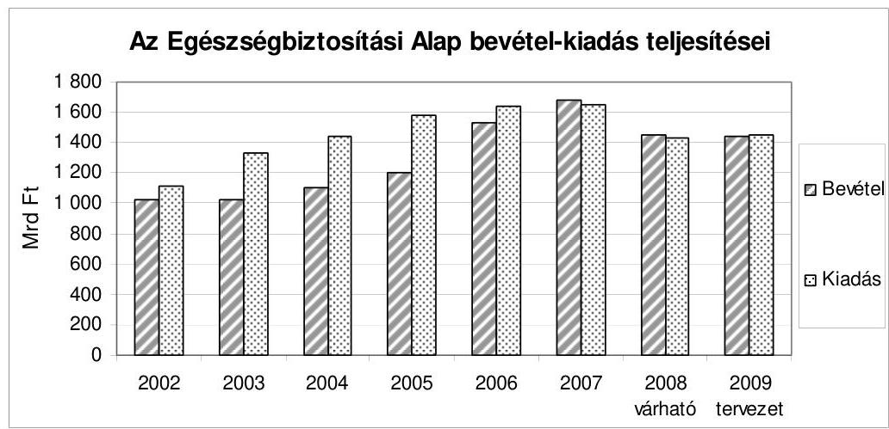

A konvergencia program mind a gyógyító-megelőző, mind a gyógyszerkiadásokra vonatkozóan azt a feltételt írta elő, hogy 2007-ben 0,2-0,2\%-os GDParányos csökkenést kell elérni a 2006-os kiadásokhoz viszonyítva. Ez a követelmény már 2007-ben teljesült, a 2008. évben ennél a két jogcímcsoportnál további 0,1-0,1\%-os GDP-arányos csökkenés valószínűsíthető.

A gyógyító-megelőző ellátások kiadása várhatóan a 2008. évi költségvetési törvényben jóváhagyott előirányzaton belül teljesül, amit a szigorú teljesít-mény-finanszírozási rendszer fenntartása biztosít. A 2007. évi struktúra átalakítást követően 2008-ban a kialakított rendszerben nem következett be további jelentős változás, csak finomhangolásra került sor. A megváltoztatott struktúra és a jelenlegi teljesítmény-finanszírozás összhangja nem áll fenn, ami a finanszírozási rendszer átgondolását igényli. A 2009. évre a gyógyító-megelőző kaszsza az előző évben stabilizált kiadási szintet követi.
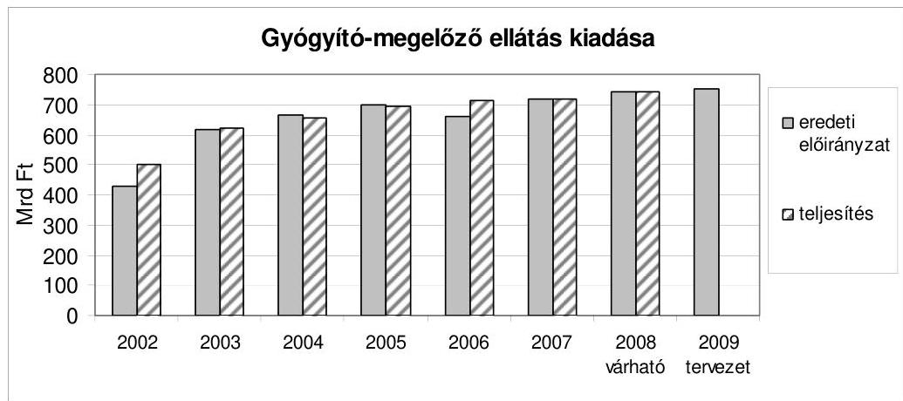

---

A gyógyszer-támogatási kiadások tekintetében a 2006. év végi intézkedések 2007-re meghozták a hatásukat, és a kiadásokat a 2008. év folyamán is stabilizálták.

Az intézkedések hatására a korábbi évekhez viszonyítva a térítési díjak - a támogatási kulcsok csökkenése miatt - jelentős mértékben emelkedtek, de 2008 I. félévében, valószínűsíthetően az árcsökkenés és az olcsóbb gyógyszerek irányába eltolódott fogyasztás következtében, már csökkenés következett be.

A 2009. évi tervezett kiadást a 2008. évi törvényi előirányzattal közel azonos értékben állapították meg.
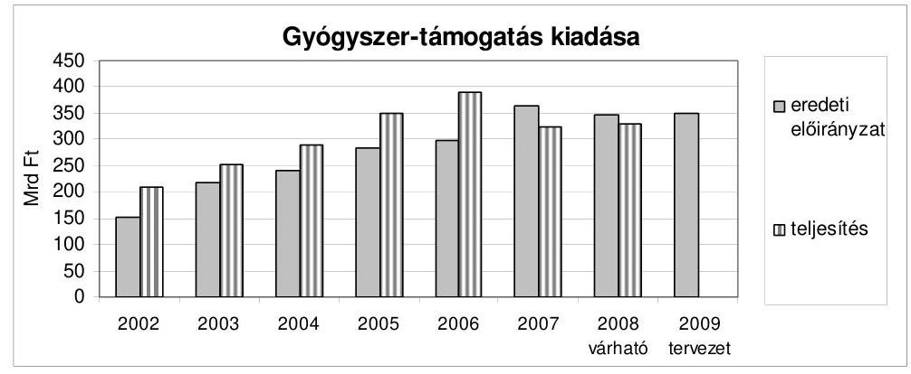

A nyugdíjrendszer fenntartásának érdekében megváltoztatott nyugdíj megállapítási szabályok hatása a nyugdíj kiadások növekedési ütemében a 2009. évben már megmutatkozik. A nyugdíjas létszám csökken, a nyugdíjak összetétel változásának és cserélődésének hatása mérsékeltebb emelkedést mutat. Az új költségvetési törvényjavaslat a kiadások 2009. évi mérséklése érdekében a nyugdíjkorrekciós intézkedések hatályba léptetését 2009. január 1-jéről szeptember 1-jére változtatta.
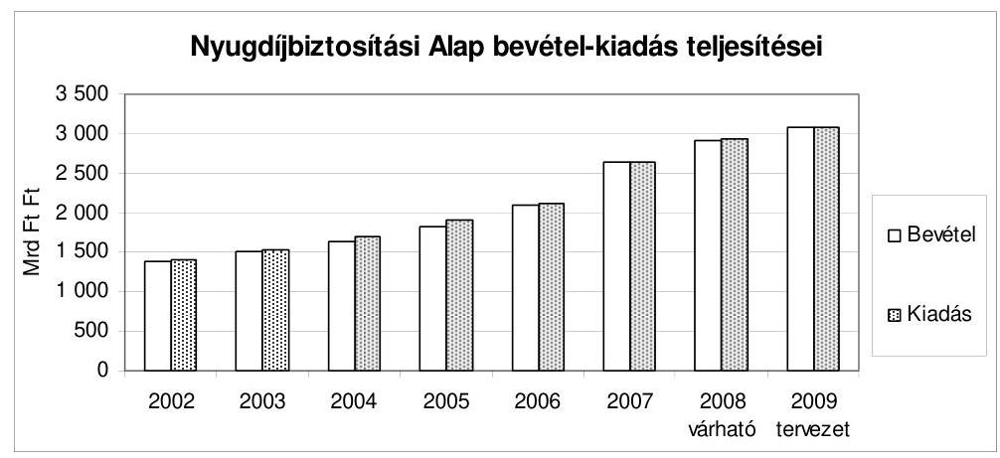

A konvergencia program alapján az oktatás területén is tervezett a kormányzat reform jellegű intézkedéseket (a tandíj bevezetése, a hallgatói létszám csökkentése, a közoktatásban új teljesítmény alapú finanszírozás bevezetése stb.). A 2008. évi költségvetési törvényjavaslat nem mutatta be ezeknek az intézkedé-

---

seknek a számszerűsített hatásait. A 2008. márciusi ügydöntő népszavazást követően a felsőoktatási törvényben az államilag támogatott hallgatók képzési hozzájárulásáról szóló rendelkezéseket hatályon kívül helyezték.

A 2009. évi költségvetési törvényjavaslat csak az egyes jelentősebb programok pénzügyi kihatásaira tartalmazza összesítetten az Oktatási és Kulturális Minisztérium fejezet kiadásainak alakulását. Továbbra is elmarad azonban az oktatási reform keretében meghozott intézkedések számszerú hatásainak bemutatása.

# 3.1. A központi költségvetés bevételi előirányzatai 

A központi költségvetés közvetlen adó- és illetékbevételeinek összege (a gazdálkodó szervezetek befizetései, a fogyasztáshoz kapcsolt adók és a lakosság befizetései) a törvényjavaslat szerint 6569,3 Mrd Ft, amely a bevételi főösszeg 77,7\%át jelenti. Ez az összeg a 2008. évi előirányzatokat 360,3 Mrd Ft-tal, a várható teljesítést 283,0 Mrd Ft-tal haladja meg, míg a visszavont törvényjavaslatban foglaltaknál 102,6 Mrd Ft-tal kevesebb.

A tervezett adóbevételek közül a hitelintézeti járadék, a bányajáradék, a játékadó, az energiaadó, a környezetterhelési díj, az egyéb (adóhatósági szankcióból származó) bevételek, a regisztrációs adó, az egyéb lakossági adók, a magánszemélyek különadója és a lakossági illetékek előirányzatai megegyeznek (illetve minimális összeggel, 0,7 Mrd Ft-tal különböznek) a visszavont költségvetési törvényjavaslatban foglaltakkal. Ezen bevételek összege 277,2 Mrd Ft, amely az adó- és illetékbevételek 4,2\%-át jelenti.

A visszavont törvényjavaslat adóbevételi előirányzataihoz viszonyítottan jelentősen (288,3 Mrd Ft-tal) csökkent a társasági adó (mindenekelőtt a különadó változatlan fizetési kötelezettsége következtében 176,7 Mrd Ft-tal), az általános forgalmi adó (68,9 Mrd Ft-tal), a jövedéki adó (39,8 Mrd Ft-tal) és az Eva (2,9 Mrd Ft-tal) előirányzata. Ezeknek az adónemeknek a tervezett bevételei 3781,9 Mrd Ft-ot (az adóbevételek 57,6\%-a) jelentenek.

A társas vállalkozások különadójából és a személyi jövedelemadóból származó tervezett bevételek (200,1 Mrd Ft, illetve 2143,4 Mrd Ft) a visszavont törvényjavaslathoz képest 254,1 Mrd Ft-tal emelkedtek. A személyi jövedelemadó 39,0 Mrd Ft összegű többletében szerepet játszik - más tényezők mellett - a bevezetni tervezett ún. cégautóadó elmaradása miatti személyi jövedelemadó fizetési kötelezettség. (Ez a többlet 1,5 Mrd Ft-tal magasabb a korábban ezen a bevételi jogcímen tervezett összegnél.)

Az adótörvények módosítását célzó törvényjavaslat visszavonása következtében az energetikai vállalkozások különadóját sem tartalmazza a törvényjavaslat.

A 2009. évi költségvetési törvényjavaslatban szereplő adóbevételi előirányzatok megalapozottságának és teljesülésének megítélése a korábbi évek ellenőrzési megállapításain, valamint a visszavont költségvetési törvényjavaslat véleményezése során nyert tapasztalatokon alapul. A visszavont költségvetési törvényjavaslattal kapcsolatban indokolt kiemelni,

---

hogy teljes körüen már akkor sem álltak rendelkezésre - a korábbi évekhez hasonlóan, de kisebb mértékben - részletes számítási anyagok. Véleményünk kialakításához támpontul szolgáltak továbbá a 2009ben változatlanul hatályban lévő adótörvények, valamint a költségvetési törvényjavaslat mellékletét képező makro-paraméterek.

A kialakult helyzet következménye, hogy míg „konzervatív" kockázatelemzéssel (számításokkal, dokumentumokkal, hatástanulmányokkal való alátámasztottság, az előző évi tényleges, illetve a tárgyévi előirányzatok várható teljesítéséhez való viszony, jogszabályi háttér stb.) egyes adónemeknél a teljesítés kis és közepes kockázatú lehet, a reálgazdaság állapotának alakulása - a pénzügyi válság reálgazdasági termelőkapacitásokra, fogyasztásra, beruházásokra stb. való hatásai ismeretének hiánya - az összes adónemnél indokolja a teljesítés magas kockázatúnak minősítését, és a bevételek óvatosabb tervezésére, illetve tartalékképzésre int.

A visszavont törvényjavaslattal egyező összegű adóbevételi előirányzatok közül a bányajáradék, a játékadó, az energiaadó, a környezetterhelési díj, az egyéb befizetések, az egyéb lakossági adók, a magánszemélyek különadója és a lakossági illetékek számításokkal megalapozottak és alacsony kockázatúak voltak a teljesíthetőségüket illetően. Ezen bevételek tervezett összege 352,4 Mrd Ft, a tervezett adóbevételek mindössze 5,4\%-a.

A regisztrációs adó 91,5 Mrd Ft összegű tervezett előirányzatának várható teljesülésével és az ezzel megegyező 2008. évi várható bevétellel kapcsolatban az ellenőrzés véleménye szerint az előirányzat kialakítása során készített számításoknál nem vették eléggé figyelembe azt a tényt, hogy az elmúlt három évben az új gépjármúvek értékesítése évente átlagosan 8-10 ezer darabbal csökkent, továbbá az elmúlt évhez viszonyítottan a 2008. év I-III. negyedévben a csökkenés 6\%-körüli. (A PM stagnálással és változatlan összetétellel számolt.)

A hitelintézeti járadék 15,0 Mrd Ft összegű, a 2008. évi előirányzattal és várható teljesüléssel egyező előirányzatát már a visszavont költségvetési törvényjavaslat véleményezése során sem tudta az ellenőrzés - megfelelő számítások hiányában - megítélni. Véleményünk változatlanul az, hogy az előirányzat-tervezet nincs összhangban az adó alapját döntően meghatározó, a XI. Önkormányzati Minisztérium fejezetnél a 14. Lakástámogatások cím lakásvásárláshoz és építéshez kapcsolódó támogatási jogcímeken (lakásépítési kedvezmény, fiatalok otthonteremtési támogatás, adó-visszatérítési támogatás, kiegészítő kamattámogatás, jelzáloglevél kamattámogatás, lakástakarékpénztári megtakarítások támogatása) tervezett, 2008. évi várható teljesüléshez viszonyított $8,8 \%$-os, és a 2008. évi előirányzathoz viszonyított 5,8\% csökkenéssel. A várhatóan jelentősen emelkedő kamatterhek, valamint a stagnáló reálbérek a lakásvásárlási hajlandóságot a prognózisok szerint mérséklik.

Az előző törvényjavaslathoz képest a csökkentett összegű előirányzatok közül a jövedéki adó tervezett bevételének (849,7 Mrd Ft) teljesülése várható, miután az üzemanyagokon kívüli jövedéki adótermékek 10\%-os mértékű adóemelésének elmaradása bevételkiesést (a PM számításai szerint 20,0 Mrd Ft-ot)

---

jelent, továbbá az alacsony gazdasági növekedési ütem miatti szállítási teljesítménycsökkenés mérséklése valószínűsíthető.

Az Eva bevételi előirányzata ugyan minimálisan (2,9 Mrd Ft-tal) csökkent a visszavont törvényjavaslathoz viszonyítva, azonban ennek véleményezése során a háttérszámítások hiányában az ellenőrzésnek az előirányzat megalapozottságát és teljesíthetőségét nem volt módjában megítélni. A 2009. évi tervezett bevétellel kapcsolatban az ellenőrzés felhívja a figyelmet arra, hogy a 2007. évi alacsony - a KSH 2008. szeptember 30-ai adata szerint $1,1 \%$ - gazdasági növekedés hatásaként, valamint az Eva adókulcsának 10\%-pontos emelése következtében a 2007. évben az előirányzattól 15,4 Mrd Ft-tal, 9,2\%-kal kevesebb bevétel realizálódott. A 2008. évben ugyan az előirányzathoz (168,7 Mrd Ft) közeli bevétel várható (az APEH adóalany nyilvántartásának 2008 I. félévi adata szerint) 99600 adóalany befizetéséből, azonban a PM által a tervezéskor figyelembe vett 95000 adóalany számának a 2008. évhez viszonyított 4600 fős (kb. 4,6\%-os) csökkenése, valamint a kisvállalkozásokat legerőteljesebben érintő gazdasági visszaesés miatt a tervezett előirányzat (177,8 Mrd Ft) realizálásának valószínűsége alacsony.

A visszavont törvényjavaslat áfa bevételi előirányzata 2270,0 Mrd Ft volt, ami a benyújtott törvényjavaslatban minimális összeggel (68,9 Mrd Ft-tal) csökkent, annak ellenére, hogy az áfa bevételeket meghatározó makrogazdasági paraméterek alapvetően megváltoztak. Ezek közül kiemelkedő a háztartások fogyasztási kiadásai $2,3 \%$-os növekedési ütemének $1,1 \%$-ra, a vásárolt fogyasztás (folyóáron számított) 6,7\%-os növekedésének 4,1\%-ra, továbbá a prognosztizált infláció $4,3 \%$-ról $3,9 \%$-ra történt csökkentése, valamint az egy keresőre jutó reálbér stagnálása. Mindezeken túl a tervezett jogszabályi módosítások (jövedéki adóemelés áfa bevételi növekménye 5,0 Mrd Ft, az ingyenes étkeztetés térítési dí alapját képező kiadás adókötelessé tételéből származó 4,0 Mrd Ft), további - bár összegében és arányában is csekély - bevételkiesést jelentenek. Annak figyelembevételével, hogy az „új" előirányzat számításai nem álltak az ellenőrzés rendelkezésére, vélelmezhető, hogy az előirányzat összege túlzott.

Az adótörvények visszavonása következtében a társasági adó 2009. évi előirányzata 553,3 Mrd Ft, a társas vállalkozások különadója 200,1 Mrd Ft, így a vállalkozások jövedelmét terhelő adók együttesen 753,4 Mrd Ft-ot jelentenek. (Ezen összeg a 2008. évi előirányzatokat 52,2 Mrd Ft-tal, a várható teljesítést 20,7 Mrd Ft-tal, a visszavont költségvetési törvényjavaslatban szereplő összeget 38,4 Mrd Ft-tal haladja meg.)

A tervezett bevételek megalapozottságával kapcsolatosan indokolt megjegyezni, hogy véleményünk kialakításakor nem ismeretes, hogy a különböző időpontban közzétett makrogazdasági mutatók (2008. szeptember 5., illetve 2008. október 14.) közül a GDP növekményének jelentős mérséklése (1920,0 Mrd Ftról 1270,0 Mrd Ft-ra), az export növekedési ütemének 10,1\%-ról 4,1\%-ra történt csökkentése olyan jövedelmezőséggel párosul-e, amely a 2008. évi várható nyereséget meghaladja és a 2008. évitől magasabb adóalap képzését is biztosítja; továbbá, hogy a 2008. évivel azonos társasági adó és különadó adóalap és vál-

---

tozatlan adókulcs valóban 38,4 Mrd Ft-tal magasabb adóbevételt eredményez-e 2009-ben.

A visszavont költségvetési törvényjavaslat ezen előirányzatai kialakítása során a tervezett törvényi változások bevételnövelő hatását (adóalap szélesítése, az adókulcs 2\%-pontos emelése) a PM 158,0 Mrd Ft-ra becsülte.

A személyi jövedelemadó bevételi előirányzata 2143,4 Mrd Ft, amely a viszszavont költségvetési törvényjavaslat tervezett előirányzatát 39,0 Mrd Ft-tal, a 2008. évi várható teljesítést (1980,0 Mrd Ft) 163,4 Mrd Ft-tal, a 2008. évi előirányzatot 205,1 Mrd Ft-tal haladja meg. Az Szja tv. változatlansága következtében a 2009. évi előirányzat teljesíthetősége közelítő számítással ítélhető meg, ami a 2008. évi várható bevétellel való összehasonlításon alapul, mivel a szükséges háttér számítások nem álltak rendelkezésre.

A közelítő számítás eredménye azt mutatja, hogy a mintegy 71,0-74,0 Mrd Ft bevételi többlet származhat a bruttó bér- és keresettömeg 2009. évi prognosztizált növekményéből.

A számítás alapját egyfelől az képezi, hogy a 2009. évi bruttó bér- és keresettömeg 435,0 Mrd Ft-tal haladja meg a 2008. évit, másfelől az összevont adóalap után fizetendő adó bérekhez, keresetekhez viszonyított aránya 2007-ben 16,3\%, 2008-ban várhatóan $17 \%$.

Az elkülönülten adózó jövedelmek után fizetendő adó legalább 150,0 Mrd Ft-ra tehető. (Ezen összeg 2007-ben 160,0 Mrd Ft volt, 2008-ban pedig 209,1 Mrd Ft várható, a PM az előirányzat kialakításánál 176,7 Mrd Ft-ot vett figyelembe.) Az előzőekben foglaltak alapján a 2009. évi előirányzat teljesülése valószínűsíthető.

A költségvetési törvényjavaslat az állami vagyonnal kapcsolatos bevételeket 97,8 Mrd Ft (a visszavont törvényjavaslattal azonos) összegben tartalmazza, amely a 2007. évi előirányzat és teljesítés kétszerese és a 2008. évi várhatóan nem teljesülő előirányzattal közel egyező összeg.

A visszavont törvényjavaslat véleményezése során rendelkezésre álló dokumentumok alapján a tervezett összeg 90,3\%-a számításokkal alátámasztott. Az ezeken a jogcímeken tervezett költségvetési bevételek várható realizálását azonban az ellenőrzés csak 53,1 Mrd Ft (54,3\%) vonatkozásában ítélte alacsony kockázatúnak, további 44,7 Mrd Ft-ot (döntően az egyéb ingatlanok, valamint a termőföld értékesítéséből származó 31,5 Mrd Ft, illetve 8,8 Mrd Ft összeget) kockázatosnak, illetve nem megítélhetőnek minősített.

Az állami vagyonról szóló 2007. évi CVI. törvény előírásaival ellentétben a költségvetési törvényjavaslat nem tartalmaz bevételi előirányzatot a költségvetési szervek által használt állami tulajdonú ingatlanok utáni bérleti díjakra. (A 2008. évi költségvetési törvény ezen a jogcímen 20,0 Mrd Ft-ot irányzott elő.) Az ellenőrzésnek nem állt olyan dokumentum a rendelkezésére, amely erre vonatkozó indokolást tartalmazott.

---

# 3.2. A központi költségvetés kiadási előirányzatai 

A központi költségvetés közvetlen kiadásai a törvényjavaslatban változatlanul a kiadási föösszeg több mint 40\%-át jelentik. Egy jelentős részüknél (pl. adósságszolgálattal kapcsolatos kiadások, család-, illetve lakástámogatások) a kiadások előirányzat módosítási kötelezettség nélkül (az uniós támogatásoknál korlátozásokkal) túlteljesíthetők. Az előirányzat módosítási kötelezettség nélkül túlteljesíthető kiadások köre a költségvetési törvényjavaslatban rögzített hiány betartásánál kockázati tényezőként jelentkezhet.

A visszavont törvényjavaslat közvetlen kiadási előirányzatainak 97,5\%-át az ellenőrzés betarthatónak értékelte a rendelkezésre álló dokumentációk, számítások alapján. Az új törvényjavaslatban szereplő előirányzatok kialakításának dokumentáltságáról idő hiányában nem tudtunk meggyőződni. Fel kell hívnunk ugyanakkor a figyelmet arra, hogy egyes előirányzatoknál (családi támogatások, vállalkozások folyó támogatása, egyéb költségvetési kiadások, fogyasztói árkiegészítés esetében összesen 103,3 Mrd Ft összegű csökkenés, az adósságszolgálattal kapcsolatos kiadásoknál, valamint a garancia és hozzájárulás a társadalombiztosítási ellátásokhoz előirányza-toknál 17,0 Mrd Ft összegű növekedés) jelentős, egyenlegében 86,3 Mrd Ft összegű csökkenés következett be.

A legjelentősebb ezek közül a kiadási főösszegen belül egyik legnagyobb arányt, $7,2 \%$-ot képviselő családi támogatások és szociális juttatások köre, ahol a csökkenés összege 62,8 Mrd Ft, amelyből 60,2 Mrd Ft a családi támogatásoknál jelentkezik. Az általános indokolásban foglaltak alapján a csökkenés többek között az infláció növekedési ütemének mérséklődésével függ össze, továbbá azzal, hogy a családi pótlék gyermekenkénti összegének - infláció mértékével megegyező növekedésére csak 2009. szeptember 1-jétől kerül sor. A törvényjavaslatban már csak az infláció alakulását vették figyelembe a nyugdíjminimumhoz kötött családi támogatások növekedési mértékénél, más növekedési tényezővel nem számoltak az indokolás szerint. Figyelembe kell venni, hogy a családi támogatások finanszírozási rendszerének átstrukturálódásából adódóan 45 Mrd Ft a visszavont javaslatban még a SZMM fejezetben „gyermekgondozási dí részleges megtérítése" címen szerepelt, míg a benyújtott törvényjavaslatban már az E Alapnál jelenik meg a GYED teljes körű fedezete.

A második legnagyobb mértékű csökkenés, 30,0 Mrd Ft, a vállalkozások folyó támogatásánál mutatkozik. Ezen előirányzatok körének megalapozottságát és betarthatóságát az ellenőrzés már a visszavont törvényjavaslat esetében sem tudta a rendelkezésre álló dokumentációk hiánya miatt minősíteni.

Az egyéb költségvetési kiadásoknál 5,5 Mrd Ft, a fogyasztói árkiegészítésnél 5,0 Mrd Ft, míg a kormányzati rendkívüli kiadásoknál 58,3 M Ft összegű csökkenés következett be, melynek okát és alapját az általános indokolás nem tartalmazza.

Az adósságszolgálattal kapcsolatos kiadásoknál 10,1 Mrd Ft-tal, míg a garancia és hozzájárulás a társadalombiztosítási ellátásokhoz előirányzatok esetében 6,9 Mrd Ft-tal magasabb összegben alakították ki az előirányzatokat a törvényjavaslatban a visszavonthoz viszonyítva.

---

A lakástámogatások, az állam által vállalt kezesség és viszontgarancia érvényesítése, továbbá a nemzetközi elszámolások kiadásainak előirányzatai nem változtak a visszavonthoz képest.

A központi költségvetés adósságával kapcsolatos bruttó pénzforgalmi kamatkiadás tervezett összege 2009-ben 1163,2 Mrd Ft, ami a tervek szerint a GDP $4,1 \%$-át jelenti és alig $(0,1 \%)$ tér el a korábbi aránytól. A visszavont törvényjavaslatban szereplő előirányzatokhoz képest bekövetkezett növekedés a deviza adósság kamatainak 1,8 Mrd Ft-os, illetve a forint adósság kamatának 8,2 Mrd Ft-os emelkedésével függ össze. A nettó pénzforgalmi kamatkiadások 2009-ben a tervezet szerint a GDP 3,8\%-át teszik ki, ami minimális ( $0,1 \%$ ) eltérést jelent a korábbi arányhoz képest.

Az adósságszolgálattal kapcsolatos bevételek összege a visszavont törvényjavaslatban szereplő összegekkel megegyezik.

A kincstári kör költségvetési törvényben megjelenő hiánya ( 761,1 Mrd Ft) 7,5 Mrd Ft-tal, a bruttó kamatkiadás összege (1163,2 Mrd Ft) 18,3 Mrd Ft-tal alacsonyabb az ÁKK Zrt. által 2008. október 16-án rendelkezésre bocsátott finanszírozási tervben foglaltaknál.

A 2008. évi finanszírozási tervben esetleg bekövetkező változások, a 2009. évi magasabb nettó finanszírozási igény, a változó befektetői megtakarítási szerkezet, a külföldiek forint és deviza vásárlási hajlandóságának kedvezőtlen alakulása, valamint az állampapír-piaci hozamszint prognózistól eltérő alakulása jelentős kockázati tényezőként jelentkezhet a 2009. évi finanszírozási terv teljesülésénél.

A kiadási oldalon bekövetkezett változások - mivel egyenlegükben jelentős csökkentést jelentenek a visszavont törvényjavaslathoz képest és nagy részük előirányzat módosítási kötelezettség nélkül túlteljesíthető - betarthatósága kockázatosnak tekinthető. A változtatások megalapozottságának megítélésére sem a csökkentett, sem a növelt előirányzatok esetében nem volt módunk, így minősíteni azokat nem tudjuk.

# 3.3. A társadalombiztosítási alrendszer előirányzatai 

A 2008. évi költségvetés várható alakulása
A társadalombiztosítási alrendszer átalakításának folyamata 2007ben indult meg. A megtett intézkedések a 2007. évet követően (a várakozásoknak megfelelően) kedvező pénzügyi hatást gyakoroltak az E. Alap 2008. évi költségvetésének alakulására. Az Alap a tervezettnél (közel 2,0 Mrd Ft) várhatóan magasabb, 20 Mrd Ft-ot meghaladó összegű bevételi többlettel zárja az évet úgy, hogy a 2008. évi költségvetési törvény 25. § (2) bekezdése alapján előreláthatóan 23 Mrd Ft összegű befizetést kell teljesítenie a központi költségvetés javára. Az Alap kedvező pénzügyi helyzetét a járulékbevételek többlete, illetve az egyes ellátási kiadások megtakarításai eredményezik.

---

A Nyugdíjbiztosítási Alap esetében az intézkedések hatásai a 2008. évben még nem jelentkeznek. A 2008. évi várható bevételek és kiadások (a makrogazdasági paraméterek tervezettől eltérő hatása következtében pl. nettó-bruttó kereset növekedési indexe) egyaránt túlteljesülnek. Az Alap pénzügyi egyensúlya helyett - tervezési hibahatáron belüli, 1\% alatti, 18-20 Mrd Ft közötti - hiány kialakulása várható.

A két Alap 2008. évi együttes kiadásai várhatóan 4356,6 Mrd Ft összegben teljesülnek. Az E. Alapnál várható többlet és az Ny. Alapnál várható hiány öszszességében kiegyenlítődik, költségvetési garancia igénybevétele nem várható.

# A 2009. évi költségvetés tervezése 

Az alapkezelők saját számításaik alapján - 2008 augusztusában - alakították ki a tervezés bázisadatait és a 2009. évi előirányzatokra vonatkozó javaslataikat. A PM által később - szeptember 5-én - megadott keretszámok alapján, a többszöri egyeztetést követően alakultak ki a 2008. szeptember 29-én benyújtott költségvetési törvényjavaslat előirányzatai.

A véleményalkotást nehezítette, hogy a költségvetési tervezés megalapozását szolgáló jogszabályok tervezett módosításai is folyamatosan változtak, az egészségügyet érintő törvénymódosításokról a helyszíni ellenőrzés nem rendelkezett érdemi információkkal. A Magyar Köztársaság 2009. évi költségvetését megalapozó egyes törvények módosításáról szóló törvényjavaslat az új költségvetési törvényjavaslattal egyidejűleg került benyújtásra és vált előttünk ismertté.

A bevételek 2009. évi tervezését alapvetően a járulék és hozzájárulás bevételek számításai alapozzák meg. A társadalombiztosítási alapok bevételi oldalának jogcímenkénti tervezését ellehetetleníti, hogy nem állnak rendelkezésre megbízható bázisadatok a munkáltatói és biztosítotti járulékok értékéről. Ezért a járulékbevételeket csak összességében értékeltük.

Az új törvényjavaslat kialakításánál figyelembe vett 2009. évi árindex 103,9\%, a bruttó bér- és keresettömeg növekedése 4-5\%, a nettó átlagkeresetek tervezett növekedésének indexe 103,9\%. A járulékmértékek tekintetében a társadalombiztosítási alapoknál nem terveznek változást. A 2009. évi járulékbevételek a 2008. évi várható értékhez képest a törvényjavaslatban prognosztizált (4-5\%-os) bruttó keresetnövekedés mértékén belül emelkednek. Az E. Alap bevételi oldalán változás, hogy a GYED kiadását már részben sem téríti a központi költségvetés ( $-45,0 \mathrm{Mrd} \mathrm{Ft})$.

A bevételi előirányzatok számításai (a 2008. évi járulékbevételek várható teljesítésénél jelzett kockázattól eltekintve) a makrogazdasági mutatók teljesülése esetén összességében reálisnak tekinthetőek.

A két Alap együttes bevételének 2009. évi tervezett összege 4525,6 Mrd Ft. A bevételek egyötöde - 923,4 Mrd Ft - a központi költségvetésből átadott pénzeszköz, amelynek túlnyomó része (törvényi előírásokon alapuló, a biztosítási elv érvényesülését célzó) különböző jogcímeken az alapokat megillető

---

támogatás, megtérítés. A nemzeti kockázatközösségen alapuló társadalombiztosítási alapok pénzügyi egyensúlya más módon nem lenne biztosítható.

A társadalombiztosítási kiadások 2009. évi tervezett összege 4532,3 Mrd Ft. Az 6,7 Mrd Ft-os hiány az E. Alapnál jelentkezik.

A társadalombiztosítási alapok 2009. évi előirányzatai közül a nyugdíjkiadások és az E. Alap pénzbeli ellátási kiadások meghatározása az előírt makro paraméterek alapján tervezettek, teljesíthetőségük alacsony kockázatú.

A 2009. évi nyugdíjkiadásoknál már érződik a kiadások növekedése mértékének csökkentése érdekében hozott jogszabályok hatása, a várható nyugdíjas létszám csökken és az összetétel változás és cserélődés hatása is 1\%-ponttal alacsonyabb a 2007. évi mértéknél.

Az E. Alap természetbeni ellátásai közül, összhangban a konvergencia programban foglaltakkal és az ellátási rendszer átalakításának célkitűzéseivel, a legérzékenyebbnek tekinthető gyógyító-megelőző egészségügyi ellátás, illetőleg a gyógyszertámogatás kiadási előirányzatait az ellenőrzés feszítettnek ítéli, de nem tartja teljesíthetetlennek. Az esetleges pénzügyi problémák kezelésére a költségvetési törvényjavaslat a Kormány számára beavatkozási lehetőséget biztosít (az előirányzaton belüli és azok közötti átcsoportosítások lehetőségein túlmenően az előirányzatok megemelésére is).

A visszavont költségvetési törvényjavaslathoz képest az E. Alap ellátási kiadásai között jelentős változás az egyéb ellátásoknál következett be, ahol egy új kiadási jogcím jelent meg. A GYED-ben részesülők utáni nyugdíjbiztosítási járulékot, ami eddig a központi költségvetés kiadása volt 2009-ben a törvényjavaslat szerint az E. Alap fizeti meg (21,6 Mrd Ft). A GYED megtérítésének megszüntetése és járulékvonzata az Alapra összességében 66,6 Mrd Ft terhet jelent. Ezzel ismételten megjelent a két Alap közötti keresztfinanszírozás (a rendszer logikusan nem zárt, a nyugdíjasok egészségbiztosítási járulékterhét a nemzeti kockázatközösségen belül továbbra is a központi költségvetés biztosítja).

Az E. Alap költségvetésében új elemként jelenik meg ún. vonal alatti tételként 27 Mrd Ft, ami a gyógyító-megelőző ellátás előirányzatból finanszírozott költségvetési szervként múködő egészségügyi intézmények személyi juttatására használható fel. Ez az összeg emeli a gyógyító-megelőző kassza kiadásaira 2009. évre tervezett értéket.

# 3.4. Az elkülönített állami pénzalapok előirányzatai 

Az államháztartás ezen alrendszerét a 2009. évben is hat elkülönített állami pénzalap alkotja: a Munkaerőpiaci Alap, a Központi Nukleáris Pénzügyi Alap, a Wesselényi Miklós Ár- és Belvízvédelmi Kártalanítási Alap, a Kutatási és Technológiai Innovációs Alap, a Szülőföld Alap, valamint a Nemzeti Kulturális Alap.

---

Az elkülönített állami pénzalapok 2009. évi kiadásaikat a tervezett bevételek összegéig alakíthatták ki. Kivételt képezett a Központi Nukleáris Pénzügyi Alap, ahol a hosszú távú feladatok finanszírozása céljából az Alap egyenlegét hagyományosan többlettel állapították meg.

Az új költségvetési törvényjavaslat előirányzatai jelentősebb változásokat - az adótörvény javaslat (T/6291) visszavonása, valamint a makrogazdasági folyamatok újraértékelése alapján, a várhatóan romló munkaerő piaci helyzet hatásainak figyelembe vétele miatt - a Munkaerőpiaci Alapnál tartalmaz.

Az MPA 2009. évre meghatározott új feladata az „Út a munkához program". Az ezzel összefüggő kiadási tételeket a Munkaerőpiaci Alap 2009. évi költségvetési törvényjavaslata tartalmazza. A program egyik pozitívuma, hogy jelentős szerepet szán a közfoglalkoztatásban résztvevők egyes csoportjainak képzésére, a támogatottak ezen körének tényleges lehetőséget biztosít a közfoglalkoztatássegélyezés köréből való kijutásra.

Az új költségvetési törvényjavaslat az Alap bevételi és kiadási főösszegét 430 958,4 M Ft-ban, a korábbinál magasabban határozta meg. Az elmaradt járulék csökkenés 49 619,2 M Ft-tal növelte a járulék bevételeket, míg a rehabilitációs hozzájárulásnál - a kötelezettség mértékének változatlanul hagyása 24 464,4 M Ft bevétel kiesést eredményezett. Az új törvényjavaslat 4-5\%-os mértékű bruttó kereset növekedéssel számol.

Az adótörvény visszavonásából adódó bevételi többlet (23 538,6 M Ft) a költségvetési befizetés összegét emeli. Az „Egyéb költségvetési befizetés" alcímen szereplő kötelezettség összesen 35 000,0 M Ft-tal nő, a különbözet a kiadási oldal egyes tételeinek további visszafogásával teremtődik meg. Az új költségvetési törvényjavaslat 65. §-ának (3) bekezdése tartalmazza a befizetés célját, mely a korábbihoz képest kibővült a rendelkezésre állási támogatásban részesülők ellátásával.

Az új költségvetési törvényjavaslat alapján több kiadási cím összege csökken a szeptemberben beterjesztett verzióhoz képest: az aktív támogatások közül a foglalkoztatási és képzési támogatásnál 50 086,6 M Ft-ra, a TÁMOP kiadásoknál 22 477,0 M Ft-ra, a szakképzési és felnőttképzési célú kifizetéseknél 34 533,8 M Ftra, a rehabilitációs célú munkahelyteremtő támogatásnál 5000,0 M Ft-ra. Ezek közül jelentősnek ítéljük a foglalkoztatási és képzési támogatásoknál, valamint a szakképzési és felnőttképzési kifizetéseknél bekövetkezett változást.

A passzív ellátásoknál a kiadások növekedésével számolnak, melynek nagyságrendjét nehéz megítélni a bekövetkezett pénzügyi válság miatt. A korábbi verzióhoz képest a kiadásnövekedés $866,5 \mathrm{M}$ Ft.

A többi öt elkülönített állami pénzalap előirányzatai a visszavont költségvetési törvényjavaslathoz képest az új törvényjavaslatban nem változtak.

A Szülőföld Alap 2009. évi költségvetési törvényjavaslat szerinti kiadási előirányzata 1000,1 M Ft, támogatási előirányzata 1000,0 M Ft, amelyet az Önkéntes befizetések, adományok címen 0,1 M Ft bevétel egészít ki. Kialakításánál az adomány-kiegészítési előírást (2005. évi II. törvény 4. § (5) bekezdés a) pont) figyelembe vették. A tervezés során részben alapoztak a 2008. év várható elöi-

---

rányzat teljesülésére, nem számoltak ugyanakkor az MPA képzési alaprészéből a határon túli magyarok szakképzésének, felsőoktatásának és felnőttképzésének támogatására szolgáló forrással (2003. évi LXXXVI. törvény 9. § (7) bekezdés, 355/2006. (XII. 27.) Korm. rendelet 30. § (5) bekezdés).

A Központi Nukleáris Pénzügyi Alap költségvetési törvényjavaslat szerinti 2009. évi kiadási előirányzata 13934,1 M Ft, bevételi előirányzata 32 915,1 M Ft (ebből 18 981,0 M Ft a betétállomány növekedés). A bevételi előirányzatok legnagyobb tételét (Paks 22 827,5 M Ft) a Magyar Energia Hivatal, a költségvetési támogatások összegét a Magyar Államkincstár egyetértésével tervezték. A felhalmozási kiadások előirányzatait nagyobb részben a folyamatban lévő, kisebb részben új bővítési feladatokra irányozták elő. Folyó kiadásokra 4517,3 M Ft-ot terveztek. A korábbinál nagyobb múködési költséget a Nemzeti Radioaktívhulladék-tároló növekvő üzemeltetési és őrzési feladatai indokolják.

A Nemzeti Kulturális Alap 2009. évi költségvetési törvényjavaslat szerinti kiadási és bevételi előirányzata 8815,0 M Ft. A bevételből a kulturális járulék előirányzata 8700,0 M Ft, egyéb bevételek előirányzata 115,0 M Ft. A bevételeket az előző négy év tapasztalati adatainak figyelembe vételével alakították ki. A javasolt kiadási előirányzatban a kulturális támogatások összege - várhatóan - 90-91\%-ot tesz ki.

A Wesselényi Miklós Ár- és Belvízvédelmi Kártalanítási Alap 2009. évi költségvetési törvényjavaslat szerinti kiadási és bevételi előirányzata 23,4 M Ft. A bevételek között 6,0 M Ft rendszeres befizetéssel és $17,4 \mathrm{M}$ Ft költségvetési támogatással számoltak. A költségvetés várható, illetve 2009-re tervezett kiadásainak prognosztizálásánál a 2008. évre még további 183 db , a 2009-2012. közötti évekre évenként 250-250 db új kártalanítási szerződés megkötését vették figyelembe.

A kiadási előirányzat összegét befolyásolta, hogy - az Alap múködési költségei csökkentése érdekében - az Alapot kezelő Magyar Államkincstár a központi szervezetben felmerülő múködési költségek jelentős részét átvállalja, a nem közvetlenül a szerződéskötéssel és kártalanítással összefüggő költséget pedig a lehetséges mértékben csökkenti.

A Kutatási és Technológiai Innovációs Alap 2009. évi költségvetési törvényjavaslat szerinti bevételi és kiadási előirányzata 55 909,6 M Ft. Az Alap bevételéből 28 695,1 M Ft a költségvetési támogatás. Az innovációs járulék bevételi terve az APEH bevallási adatokon alapul, ami korrigálásra került a GDP és árszínvonal-változás hatásaival. A költségvetési támogatás előirányzatát az Alapról szóló törvény előírásainak megfelelően határozták meg.

# 4. A HELYI ÖNKORMÁNYZATOK 

Az ismételten benyújtott 2009. évi költségvetési törvényjavaslat (továbbiakban 2009. évi költségvetési törvényjavaslat) a helyi önkormányzati alrendszer finanszírozása, pénzügyi helyzete szempontjából a visszavont költségvetési törvényjavaslathoz képest jelentősnek minősíthető módosításokat nem tartalmaz. Az adó- és járulékmódosító törvényjavaslat visszavo-

---

nása, a csökkenő növekedési prognózis és a várható inflációs előrejelzés alapján a változások az önkormányzatok forrásszabályozásában, az állami hozzájárulások, támogatások összegében egyrészt technikai jellegűek, másrészt a közoktatásban tervezett program egyes céljainak szűkítésével kapcsolatosak. A tervezett járulékcsökkentés elmaradása miatt 15,4 milliárd Ft visszaépült a bérhordozó normatívákba, az inflációs előrejelzés változásával összefüggésben a szociálpolitikai juttatások automatizmusa 3 milliárd Ft-tal, az „ÚJ TudásMúveltség Mindenkinek Program" megvalósítását szolgáló támogatás 7,2 milliárd Ft-tal csökkent. Ezek együttes hatására a helyi önkormányzatok központi költségvetésből származó (szabályozott) forrásai a visszavont törvényjavaslathoz képest 5,2 milliárd Ft-tal növekednek.

A 2009. évi költségvetési törvényjavaslat - állami hozzájárulások és támogatások, valamint átengedett személyi jövedelemadó címén 1427,5 milliárd Ft forrást biztosít a helyi önkormányzatoknak, amely a számítások szerint a 2008. évi korrigált előirányzathoz ${ }^{5}$ viszonyítva 7,9\%-os nominális, a 3,9\%-os fogyasztói áremelkedést figyelembe véve 3,8\%-os reálérték növekedést tartalmaz.

A helyi önkormányzatok a 2009. évben 3477 milliárd Ft költségvetési bevétellel gazdálkodhatnak, ezt egészíti ki a 2007. évi kötvénykibocsátásból és pénzeszközállomány növekedésből származó tartalékok felhasználási lehetősége. A tárgyévi bevételek és kiadások egyenlegeként (pénzforgalmi szemléletben) a 2008. évi nyitó pénzkészlet az előző évhez képest 143 milliárd Ft-tal (60\%-kal), 375,5 milliárd Ft-ra növekedett, amelynek a felhasználása a kiadások nem tervezett növekedéséhez vezethet. Az ÚMFT 2007-2008. évi ütemének késése miatt a bevételek tervezésében bizonytalansági tényező az önkormányzatok (és intézményeik) által pályázható 130 milliárd Ft-os keretösszeg, az Operatív Programok keretében az önkormányzati projektekre megítélt 246 milliárd Ft támogatás 2009. évi igénybevételének nagyságrendje.

A 2009. évi költségvetési törvényjavaslatban a helyi önkormányzati költségvetések hiánya (GFS rendszerú egyenleg ${ }^{6}$ ) a pénzügyi egyensúly romlását jelzi. A hiány a 2007. évben a tervezett 84 milliárd Ft helyett 53,9 milliárd Ft-ra csökkent az előző évi 156,5 milliárd Ft-tal szemben, de a 2008. évben várhatóan ismét 90 milliárd Ft-ra, 2009-ben 134 milliárd Ft-ra növekszik. A helyi költségvetésekben meghatározó központi források korábbi években jellemző kiszámíthatatlansága mellett tapasztalható finanszírozási feszültségekhez társult - az előző évi költségvetéssel kapcsolatos ÁSZ véleményben is jelzett $^{7}$ - az önkormányzatok eladósodása miatti kockázat ${ }^{8}$, amely ki-

[^0]
[^0]:    ${ }^{5}$ A PM a számításokban a 2009. évi bázis megállapítása során a 2008. évi országgyűlési előirányzatot korrigálta (növelte) a 2008. évi bérpolitikai intézkedések, az ingyenes étkezésekhez kapcsolódó áfa fizetési kötelezettség alóli mentesség 2009. évi megszűnésének kompenzációja miatt 24,6 milliárd Ft-tal, valamint csökkentette a kifutó címzett támogatások, a 4-es metró uniós forrásokból történő finanszírozásának összességében 49,7 milliárd Ft-os hatásával.
    ${ }^{6}$ bevételek és kiadások hitelmúveletek nélküli egyenlege
    ${ }^{7} 0736$ Vélemény a Magyar Köztársaság 2008. évi költségvetési javaslatáról

---

emelt kockázatot hordoz a megyei önkormányzatok esetében (az intézmény fenntartó szerepe miatt). A pénzügyi egyensúly fenntarthatósága jelentős mértékben attól függ, hogy a megszorító intézkedések valódi megtakarításokat eredményező szervezeti, szervezési intézkedésekkel páro-sulnak-e a helyi önkormányzatoknál, az általuk nyújtott közszolgáltatások területén.

A 2006. évben meghirdetett konvergencia program a bevételek növelését, az államháztartási egyensúly javítását, megőrzését szolgáló szerkezeti változások elindítását, az uniós forrásokból megvalósítható fejlesztések növekedését irányozta elő a 2006-2008 közötti évekre vonatkozóan. A helyi önkormányzatok támogatása - a feladatok változásával ${ }^{8}$ és a konvergencia célokkal összhangban - reálértéken csökkent. Az önkormányzatok a helyi adóbevételek növelése mellett a tartós egyensúly megteremtése érdekében - a törvényi előírások változása (a pedagógusok kötelező óraszámának növelése, a kórházi struktúraátalakítás) és a pénzügyi ösztönzők hatására - helyi szervezési intézkedéseket dolgoztak ki, fogadtak el a közszolgáltatások ésszerűsítésére, a foglalkoztatottak számának csökkentésére. Az ezzel összefüggő egyszeri költségeket a központi költségvetés támogatta.

A helyi önkormányzatok a közös feladatellátás, az ésszerűbb létszámgazdálkodás, a közszolgáltatások hatékonyabb megszervezését szolgáló helyi intézkedések mellett - élve a pénzpiaci és a döntési önállóság biztosította lehetőségekkel - növekvő mértékben eladósodtak. A külső forrásbevonás - 2007. évtől elsősorban kötvénykibocsátás útján - részben a fejlesztések finanszírozását, részben a korábban felvett hitelek kiváltását és a működési forráshiány pótlását is szolgálta. A 2007. évben ellenőrzött önkormányzatok ${ }^{10}$ a kötvénykibocsátásból származó bevételek 63\%-át felhalmozási célra, 15\%-át múködési célra, 22\%-át adósságrendezésre tervezték felhasználni.

A kötvénykibocsátás elsősorban a városi, megyei jogú városi, valamint a megyei és a fővárosi kerületi önkormányzatok hosszú lejáratú kötelezettségeinek állományát növelte, amely a helyi önkormányzatoknál 2004-2007 között 234 milliárd Ft-ról 620 milliárd Ft-ra, ezen belül a 2007. évben az előző évhez képest másfélszeresére, 200 milliárd Ft-tal növekedett. A kötvénykibocsátásból származó források e kötelezettséget vállaló önkormányzatok likviditását átmenetileg kedvezően változtatták meg, a betétállomány 136 milliárd Ft-tal növekedett. Ugyanakkor a községi önkormányzatoknál a 2008. évben adósságrendezési eljárások indultak, amely jelzi a települések differenciált pénzügyi helyzetét.

[^0]
[^0]:    ${ }^{8}$ A kötvénykibocsátás 2008. évben is folytatódott, a pénzeszközállomány 405,7 milliárd Ft volt a 2008. I. félév végén.
    ${ }^{9}$ A 4-es metró beruházás uniós támogatások közé kerülése, a címzett támogatások kifutó rendszere, a pedagógusok óraszámemelése miatti feladatcsökkenés.
    ${ }^{10} 0822$ Jelentés a helyi önkormányzatok gazdálkodási rendszerének 2007. évi átfogó és egyéb szabályszerűségi ellenőrzéséről

---

A költségvetési törvényjavaslat szerint a szabályozott források aránya a helyi önkormányzatok költségvetési bevételein belül a megszűnő feladatok (pl. kifutó címzett támogatások) miatt nem változik érdemben (a 2008. évi javaslatban szereplő $41 \%$-ról 2009. évben $41,1 \%$-ra módosul), az átengedett adók (szja, gépjárműadó) részaránya 1,4 százalékponttal emelkedik. A személyi jövedelemadó 84,1 milliárd Ft-os növekményéből a javaslat szerint 67,3 milliárd Ft normatívan kerül felosztásra, a lakóhelyen maradó személyi jövedelemadó 16,8 milliárd Ft-tal, a megyei önkormányzatok részesedése 0,5 milliárd Ft-tal emelkedik. Az európai uniós támogatások és a hazai társfinanszírozás, valamint az államháztartáson belülről átvett (támogatásértékű) felhalmozási bevételek összességében 48 milliárd Ft-os csökkenésével számolt a PM a költségvetési törvényjavaslat kidolgozása során.
Az önkormányzati források összetételének változását szemlélteti az alábbi táblázat:

Adatok milliárd Ft-ban

| Megnevezés | 2005.   évit lény | megosz-   lás \% | 2006.   évit lény | megosz-   lás \% | 2007.   évit lény | megosz-   lás \% | 2008.évit   elörány-   zat | megosz-   lás \% | 2008.   évit   várható | megosz-   lás \% | 2009.   évit   javaslat | megosz-   lás \% |
| :--: | :--: | :--: | :--: | :--: | :--: | :--: | :--: | :--: | :--: | :--: | :--: | :--: |
| Saját folyó bevételek | 794,9 | 27,5 | 854,2 | 28,0 | 913,7 | 29,7 | 981,0 | 29,8 | 1006,5 | 30,4 | 1063,4 | 30,6 |
| Szabályozott forrás (állami   támogatás és szja) | 1321,3 | 45,7 | 1327,9 | 43,5 | 1354,6 | 44,0 | 1348,6 | 41,0 | 1454,3 | 43,9 | 1427,5 | 41,1 |
| Allamháztartáson belül   átutalások | 425,6 | 14,7 | 448,8 | 14,7 | 426,6 | 13,8 | 412,5 | 12,6 | 424,0 | 12,8 | 466,6 | 13,4 |
| Felhalmozási és tőke jellegüi   bevételek | 272,0 | 9,4 | 340,3 | 11,1 | 291,3 | 9,5 | 460,0 | 14,0 | 334,8 | 10,1 | 424,0 | 12,2 |
| GFS rendszerü bevételek   összesen | 2891,0 | 100,0 | 3053,4 | 100,0 | 3080,8 | 100,0 | 3286,8 | 100,0 | 3313,9 | 100,0 | 3476,9 | 100 |
| GFS rendszerü hiány | 81,4 | 2,8 | 156,5 | 5,1 | 53,8 | 1,7 | 111,1 | 3,4 | 90,0 | 2,7 | 134,0 | 3,9 |

A költségvetési törvényjavaslat szerint a forrásszabályozás, illetve azon belül az önkormányzatokat a központi költségvetésből megillető források elosztásának módja 2009. évben alapvetően nem változik. A szabályozott források között azonban a személyi jövedelemadó súlya nő, egyidejűleg a 2008. évi országgyűlési előirányzathoz képest az állami támogatások részaránya, azon belül a támogatásból finanszírozott normatív hozzájárulásoké mérséklődik. A személyi jövedelemadóból finanszírozott normatív állami hozzájárulások növelési igénye miatt a jövedelemkülönbségek mérséklésére az előző évihez képest 12,8 milliárd Ft-tal kevesebb előirányzatot tartalmaz a törvényjavaslat, amely csökkenés az önkormányzatok adóerő-képességében meglévő nagyfokú különbségek mérséklésének lehetőségét korlátozza.

A szabályozott források funkciók szerinti összetételében csökken a szabad rendelkezésű és nő a konkrét feladatokhoz rendelt források aránya, amelyet a 2009. évre meghirdetett prioritások („Új Tudás - Müveltség Mindenkinek", „Út a Munkához" programok) és a közszolgálatban foglalkoztatottak keresetnövelésére javasolt összegnek a felhasználási kötöttséggel járó előirányzatok között történő megtervezése indokolt. A költségvetési törvényjavaslatban a feladattal terhelt források arányát mérsékli viszont, hogy tovább folytatódik a fejlesztési támogatások európai uniós forrással történő kiváltása.

---

Az önhibájukon kívül hátrányos helyzetú települési önkormányzatok száma és a részükre folyósított kiegészítő támogatások összege a 2006. évi jelentős felfutást követően két év alatt több mint $40 \%$-kal csökkent. Megbízható információ hiányában nem ismert a rendszerböl kikerült azon önkormányzatok száma (aránya), amelyek a szabályozás ösztönző elemeinek hatására sem tudták stabilizálni a gazdálkodásukat és a szigorodó feltételek teljesítésének hiányában maradtak ki a támogatásból.

Az önkormányzati feladatokra igényelhető normatív hozzájárulásokra 42,2 milliárd Ft-os ( $6,2 \%$-os) növekedés mellett 721,5 milliárd Ft-ot irányoz elő a benyújtott költségvetési törvényjavaslat. Ez magában foglalja a 2008. évi bérintézkedések normatívákba történt beépítését, az oktatási intézményekben az ingyenes étkeztetés általános forgalmi adó mentességének megszüntetése miatti kompenzáció hatását. Az eddig elért eredmények megerősítése érdekében az állami hozzájárulások és támogatások igénybevételi feltételeiben kisebb szigorításokat, kiegészítéseket tartalmaz a javaslat a 2007. és 2008. évi költségvetési törvényekben meghatározott szabályok továbbvitelével, a gazdaságos feladatellátás további ösztönzésével.

A közoktatás finanszírozása - a 2007. évben elfogadott módosításnak megfelelően - a költségvetési éviről tanévire változott, egyben az alapnormatívák számítása tanulólétszám helyett teljesítménymutatón alapul. Ennek következtében a közoktatás 2009. évi finanszírozásában az első nyolc hónapban az előző évi költségvetési törvény által meghatározott determináció érvényesül. A benyújtott törvényjavaslat a 2009/2010-es nevelési évre, illetve tanévre határozza meg a közoktatási alap-, a kiegészítő- és a szociális juttatások normatíváinak körét, feltételeit és a hozzájuk kapcsolódó fajlagos támogatási összegeket, valamint az előzőek figyelembevételével számított előirányzatokat. A 2008. évi központosított előirányzatból finanszírozott bérfejlesztés időarányos részét 2009. január 1-jétől augusztus 31-éig (a költségvetési év első nyolc hónapjára) kiegészítő normatívák alapján kapják meg az önkormányzatok.

A közoktatásban a finanszírozás keretében a teljesítménymutató, az átlagos és a maximális gyermek- és tanulólétszámok előirása, a pedagógusok kötelező óraszámának 2007/2008-as tanévtől történő felemelése, a tanulók óraszámának előírt keretek között tartása meghatározta a hatékonysági követelményeket, szembesítette az önkormányzatokat azok teljesítésével kapcsolatos finanszírozási következményekkel. A szabályozás változásával összhangban elmozdulások következtek be a társulásban múködtetett intézmények, feladatok számában, csökkent a foglalkoztatottak létszáma, azonban az intézményi szerkezetátalakítás szakmai színvonalra gyakorolt hatásának, a társulásban fenntartott intézményekben a feladatellátás minőségének és hatékonyságának mérését szolgáló mélyebb elemzések, hatásvizsgálatok nem készültek.

Az „Új tudás - Múveltséget Mindenkinek" programban szereplő helyi önkormányzatokat érintő oktatási, kulturális feladatokra, az esélyteremtés növelésére 15,7 milliárd Ft-ot tartalmaz a költségvetési törvényjavaslat az önkormányzatok támogatásai között. Ez magában foglalja a halmozottan hátrányos helyzetú

---

gyerekek oktatóinak és a sajátos nevelési igényű gyerekekkel foglalkozó gyógypedagógusoknak az ösztönzését, az osztályfőnökök jobb anyagi megbecsülését, valamint az előadó-művészeti intézmények működési feltételeinek javítását, a védőnői, a bölcsődei, az óvodai hálózat fejlesztését, a halmozottan hátrányos helyzetű gyermekek rendszeres óvodáztatásának ösztönzését is.

A „Legyen jó a gyerekeknek" programmal összhangban 1,2 milliárd Ft támogatás növekedés a rászorult gyerekek nyári étkeztetésének az eddigi 1 hónap helyett 2 hónapig történő megszervezését, további 0,7 milliárd Ft a rászoruló általános iskolai tanulók ingyenes étkeztetésének - felmenő rendszerben - a 6. osztályosokra történő kiterjesztését teszi lehetővé a 2009. évtől. Az esélyegyenlőség érvényesülésének közoktatásban történő előmozdítását szolgáló elfogadott törvénymódosítások az önkormányzati mozgástér növelése, a közoktatásszolgáltatás hatékony és szakszerú megszervezése érdekében lehetővé teszik a más (szociális) ágazathoz tartozó, a gyermekneveléshez szorosan kapcsolódó feladatok közös intézmény keretében történő megszervezését, az egységes óvoda és bölcsőde üzemeltetését.

A társadalom- és szociálpolitikai támogatások nyugdíjemeléshez igazított mértékű növelésére 6,9 milliárd Ft-ot tartalmaz a javaslat. Az „Út a munkához" programmal összhangban a szociális segélyezési rendszer megváltoztatásának, a Szoctv. tervezett módosításának célja, hogy a korábbiakhoz képest megnégyszereződjön - éves szinten a 60000 főt meghaladja - a segélyezés helyett közfoglalkoztatásban résztvevők száma. A javaslat pénzügyi ösztönzőket tartalmaz a segély munkával való kiváltásában az érintett állampolgárok és a települési önkormányzatok érdekeltté tételére. Ehhez kapcsolódóan a Munkaerőpiaci Alapból átvett támogatással a normatív kötött felhasználású támogatásokon belül az egyes jövedelempótló támogatások és az önkormányzatok által szervezett közfoglalkoztatás támogatásának 2008. évi összevont előirányzata 8,7 milliárd Ft-tal növekszik a 2009. évben.

A többcélú kistérségi társulási támogatás igénybevételéhez meghatározott szigorúbb kapacitás-kihasználási feltételek felmenő rendszerben érvényesülnek a 2008/2009. oktatási évtől kezdődően. A társulások közszolgáltatásokban betöltött szerepét vizsgáló ÁSZ ellenőrzés ${ }^{11}$ megállapítása szerint az ösztönző támogatások elősegítették a többcélú társulások megalakulását, szervezeti kereteinek stabilizálását, fokozták az önkormányzatok társulási hajlandóságát. Az önkormányzatok törekvése azonban elsősorban a többlettámogatások megszerzésére irányult, a támogatás feltételei lehetővé tették azok igénybevételét a szolgáltatások közös, hatékonyabb megszervezésének hiányában is.

A méretgazdaságos intézményi kapacitások kialakítását és működtetését a 2009. évi költségvetési törvényjavaslat és az ágazati jogzabályok továbbra is ösztönzik. A társulásos feladatellátások ösztönzésére a helyi önkormányzatok

[^0]
[^0]:    ${ }^{11} 0817$ Jelentés a települési önkormányzatok többcélú kistérségi társulásainak a közszolgáltatások és területfejlesztési feladatok ellátásában betöltött szerepének ellenőrzéséről

---

normatív, kötött felhasználású támogatásai között a többcélú kistérségi társulások támogatása a 2008. évi költségvetésben elfogadott előirányzattal szerepel a 2009. évi költségvetési törvényjavaslatban. A többcélú kistérségi társulások esetében nem mindenütt volt érdemi változás, a kistelepülések tagintézményeiben a szakos oktatás hiányosságai megszüntetése érdekében a 2009. évben ösztönző támogatással kívánják elérni, hogy a társulás új tagintézményében a foglalkozások, tanítási órák megtartására a Közokt. tv-ben meghatározott végzettséggel és szakképesítéssel rendelkező pedagógusokat alkalmazzanak. A fajlagos támogatás változása a többcélú kistérségi társulások közvetlen intézményfenntartását részesíti előnyben az intézményfenntartó társulásokkal szemben. A tagintézményi támogatás feltételei szigorodnak.

A keresetek változását a közszférában a 2008. évi bérpolitikai intézkedések beépítése és a központosított előirányzatok között „Bérpolitikai intézkedések támogatása" címen javasolt 73,1 milliárd Ft fedezi. A 2008. évi bérpolitikai intézkedések hatása a normatív támogatásokban, hozzájárulásokban 37,9 milliárd Ft. Az érdekegyeztetés keretein belül létrejövő végleges megállapodás alapján a 2009. évben is tételes felméréssel biztosítja a központi költségvetés a szükséges többletforrást a helyi önkormányzatok részére.

A helyi önkormányzatok állami költségvetésből származó (európai uniós és kapcsolódó hazai társfinanszírozás nélkül számított) fejlesztési jellegű támogatása - a Terület- és régiófejlesztési célelőirányzat és a Kutatási és Technológiai Innovációs Alap decentralizált hányadával együtt - az előző évi törvényi előirányzathoz képest 34,5\%-kal, 89,7 milliárd Ft-ra csökken. A központi költségvetés önkormányzati fejlesztési forrásainak csökkenése a hazai forrásokból támogatott címzett támogatási rendszer kifutásával, e támogatott célok valamint a fővárosi metróberuházás finanszírozásának uniós támogatások keretébe való átkerülésével függ össze. A IX. Helyi önkormányzatok támogatásai és átengedett személyi jövedelemadója fejezetben tervezett - előzőek nélkül számított - fejlesztési támogatások 2008. évhez képest 3,3\%-kal (2,6 milliárd Ft-tal) növekednek.

A fejlesztési források között címzett és céltámogatás címén mindössze 10 milliárd Ft áll rendelkezésre, az előző évi előirányzathoz képest a csökkenés 43 milliárd Ft, amely abból következik, hogy a hazai források terhére - figyelemmel a 2008. évi költségvetési törvényben foglaltakra, az uniós támogatásokkal való összhang megteremtésére - a 2009-2010. években címzett támogatási program nem indítható, illetve a korábbiak nagyobbrészt befejeződnek. A tervezett előirányzat az előző években vállalt fejlesztési támogatási kötelezettségek teljesítésének, a megkezdett programok folytatásának fedezetét 9,8 milliárd Ft összegben biztosítja. Az új induló céltámogatásokra, az előző évivel azonos célokra - egészségügyi gép-műszer beszerzésekre - mindöszsze 200 millió Ft előirányzatot tartalmaz a költségvetési javaslat.

A költségvetési törvényjavaslat - annak érdekében, hogy a korábban hazai forrásból támogatott fejlesztési programok minél szélesebb körben EU-s forrásokból legyenek támogathatók -, az önkormányzatok európai uniós fejlesztési pályázatainak saját forrás kiegészítésére szolgáló támogatást -

---

az uniós előírásoknak való megfelelés és a hozzájutás feltételeinek szigorítása mellett - 2,5 milliárd Ft-tal megemelve, 17,6 milliárd Ft összegben tartalmazza. Ugyancsak az EU-s forrásokhoz való hozzájutást támogatja az uniós fejlesztések fejezetben a KEOP derogációs projektek kamattámogatása címén rendelkezésre álló előirányzat 460 millió Ft-os keretösszege, amely az ivóvízminőség javítását szolgáló, valamint a szennyvíz és hulladéklerakó beruházások uniós és más hazai forrásból nem finanszírozott hányadának - hitelforrás terheit szándékozik könnyíteni.

A támogatási rendszer átalakításának eredményeként a javaslat az önkormányzati szféra egészét érintően a 2009. évre az Európai Unióból, valamint a hazai társfinanszírozásból és a központi fejezetektől származóan összesen 270 milliárd Ft bevétellel számol. A hazai forrásból származó fejlesztési támogatásokat többszörösen meghaladó uniós források előirányzata - a támogatások igénybevételének eddigi tapasztalataira figyelemmel - kockázatot hordoz.

A leghátrányosabb helyzetú kistérségek gazdasági felzárkóztatására a költségvetési javaslatban az előző évben tervezett előirányzat a reálérték megőrzése érdekében 4,3\%-kal ( 250 millió Ft-tal) 6,1 milliárd Ft-ra emelkedik a három kelet-magyarországi és egy dunántúli (Dél-Dunántúl) régió fejlesztési tanácsainak döntési jogkörébe utalva. A régiók szerepének konvergencia célokkal összehangolt elmozdulását jelzi, hogy a helyi önkormányzatok fejlesztései és vis maior támogatására szolgáló - összegében az előző évi kereteket 500 millió Ft-tal (4,6\%-kal) meghaladó - 11,4 milliárd Ft előirányzat teljes egészében a regionális fejlesztési tanácsok döntési jogkörébe tartozik. A hátrányos helyzetű térségek felzárkóztatása érdekében a térségi lehatárolás 2007. évben meghatározott ${ }^{12}$ szempontjai a támogatási keretek felosztása során érvényesültek, azonban a régiós előirányzatok önálló fejezetben való megjelenítésére, a régiókkal való tervszerződéses rendszer szabályainak megalkotására még nem került sor.

Az önkormányzatok saját folyó bevételei közül a helyi adóbevételek a gazdasági növekedést meghaladó mértékben, reálértéken 3,5\%-kal emelkednek a költségvetési törvényjavaslat alapján. A 2009. évi saját folyó bevételek előirányzata összesen az előző évi előirányzatot nominálisan 8,4\%-kal, a helyi önkormányzatok által 2008. évre tervezettet 17,2\%-kal haladja meg. (Az önkormányzatok által az éves költségvetésükben tervezett saját bevételek azonban az alultervezés miatt nem tekinthetőek megalapozottnak ${ }^{13}$.)

[^0]
[^0]:    ${ }^{12}$ 67/2007. (VI. 28.) OGY határozat a területfejlesztési támogatásokról és a decentralizáció elveiről, a kedvezményezett térségek besorolásának feltételrendszeréről
    ${ }^{13}$ Az Állami Számvevőszék 0822 Jelentése a helyi önkormányzatok gazdálkodási rendszerének átfogó és egyéb szabályszerűségi ellenőrzéséről megállapítja, hogy a bevételeket (elsősorban az intézményi térítési díjakat és a helyi adókat) az ellenőrzött önkormányzatok 91-99\%-a alultervezte.

---

Az egyes adó- és járulék törvények módosításáról szóló törvényjavaslatot viszszavonta, a 2009. évi költségvetést megalapozó egyes törvények módosítását tartalmazó törvényjavaslatot a költségvetési törvényjavaslat ismételt benyújtásával egyidejúleg nyújtotta be a Kormány az Országgyúlésnek. A költségvetési törvényjavaslatot megalapozó szakmai-ágazati törvények közül az Országgyúlés 2008. június 2-i ülésnapján fogadta el a közoktatásról szóló törvény módosítását, amelynek hatását figyelembe vették a javaslat kidolgozása során.

A költségvetési törvényjavaslatot megalapozó törvények közül a szociális igazgatásról és szociális ellátásokról szóló törvény módosítására vonatkozó törvényjavaslat az ÁSZ vélemény kialakításáig nem került benyújtásra az Országgyúlésnek, így a költségvetési törvényjavaslatban a szociális segélyezés és a közfoglalkoztatás átalakítására vonatkozó szabályozási elgondolások és elöirányzatok, valamint az ágazati-szakmai törvények közötti összhang teljes körüen nem volt véleményezhető.

---

# JAVASLATOK 

Változatlanul szükségesnek tartjuk az Állami Számvevőszék által 2007 tavaszán benyújtott és országgyűlési határozattal támogatott közpénzügyi tézisek hasznosítását és a közpénzügyi felelősséget erősítő szabályrendszer megalkotását.

Ezen túl, jelen véleményünk hasznosítása mellett, a benyújtott törvényjavaslatot alapul véve javasoljuk:

## az Országgyúlésnek

1. Kezdeményezze a költségvetési törvényjavaslatban szereplő valós tartalékok összegének növelését, legalább a GDP 1\%-ának megfelelő mértékig.
2. Kezdeményezze a költségvetési törvényjavaslat 50. §-ának módosítását annak érdekében, hogy a központi egyensúlyi tartalék felhasználásának feltételei objektív, a nemzetgazdaság teljesítményét kellően reprezentáló mutatószámhoz kötöttek legyenek.
3. Kérje fel a Kormányt, hogy a mindenkori költségvetést érintő ágazati (szakmai) törvényeket olyan időütemezésben terjessze az Országgyűlés elé, hogy azokat az Országgyűlés az adott tervév költségvetési irányelveinek kiadása előtt elfogadhassa, így azok hatása a tervezőmunkában érvényesülhessen.

## a Kormánynak

4. Gondoskodjon - az Áht. 36. § (1) bekezdés c) pontjában foglaltak megvalósítása érdekében - arról, hogy a tervezés időszakában a fejezetek rendelkezésére álljanak a költségvetési évet követő 3 év fejezeti keretszámai.
5. Intézkedjen a Miniszterelnöki Hivatalban, a minisztériumokban, az igazgatás és igazgatás jellegű tevékenységet ellátó központi költségvetési szerveknél foglalkoztatottak létszámáról szóló 2057/2008. (V. 14.) Korm. határozat módosításáról annak érdekében, hogy az abban foglalt létszámok folyamatosan összhangban legyenek a jogszabályok által meghatározott állami feladatváltozások létszámra gyakorolt hatásaival.
6. Intézkedjen, hogy a társadalombiztosítási alapok pénzügyi önállóságának és a bevételek átláthatóságának biztosítása érdekében a befolyó járulékokat önálló számlákon számolják el, ezzel biztosítva, hogy a zárszámadásban a számlák állományértéke alapján közvetlenül megállapítható legyen az adott címen befolyt járulékok valós összege.
7. Intézkedjen a fejezeti belső kontrollrendszer fejlesztéséről, ezen belül biztosítsa a tárcák belső ellenőrzési szervezetei fejlesztésének személyi és tárgyi feltételeit.
8. Gondoskodjon arról, hogy az Állami Számvevőszék részére - a költségvetési törvényjavaslat beadását 10 munkanappal megelőzően - a központi költségvetés fő bevételi előirányzatainak és az állami vagyonnal kapcsolatos előirányzatoknak a kialakítását alátámasztó számítások teljes körűen rendelkezésre álljanak.

---

9. Dolgozza ki a helyi önkormányzati rendszer pénzügyi egyensúlyát veszélyeztető okok átfogó elemzése, az önkormányzati feladatok és finanszírozás felülvizsgálata alapján a pénzügyi stabilitás megteremtését szolgáló intézkedéseket.
10. Kezdeményezze a különböző eladósodási formákból adódó hosszú távú kockázatok alapján a helyi önkormányzatok Ötv. szerinti adósságot keletkeztető kötelezettségvállalásai szigorítása érdekében szükséges jogszabály módosítást.
11. Intézkedjen a területfejlesztési támogatásokról és a decentralizáció elveiről, a kedvezményezett térségek besorolásának feltételrendszeréről szóló 67/2007. (VI. 28.) OGY határozatban meghatározott feladatok végrehajtásáról szóló Intézkedési Tervet tartalmazó 2011/2008. (II. 14.) Korm. határozatban foglaltaknak végrehajtása érdekében a régiókkal kötendő tervszerződéses rendszer szabályainak kidolgozására és a regionális költségvetési fejezet kialakítására.

---

.

---

AZ ÚJ ÉS A VISSZAVONT TÖRVÉNYJAVASLAT ELTÉRÉSEI

milliú forintban

|  BEVÉTELEK | Váloztatás | KIADÁSOK | Váloztatás  |
| --- | --- | --- | --- |
|  GAZDALKODÓ SZERVEZETEK BEFIZETÉSEI |  |  |   |
|  Társasági adó | -176 700 | EGYEDI ÉS NORMATÍV TÁMOGATÁSOK | -30 000  |
|  Társas vállalkozások különadója | 215 100 | KÖZSZOLGÁLATI MÚSORSZOLGÁLTATÁS TÁMOGATÁSA | -1 805  |
|  Hételintézeti járadék | 0 | FOGYASZTÓI ÁRKIEGÉSZÍTÉS | -5 000  |
|  Egyszerűsített vállalkozói adó | -2 900 | LAKÁSÉPÍTÉSI TÁMOGATÁSOK | 0  |
|  Bányajáradék | 0 |  |   |
|  Játékadó-bevétel | 0 |  |   |
|  Ökoadók | 0 | CSALÁDI TÁMOGATÁSOK, SZOCIÁLIS JUTTATÁSOK |   |
|  Egyéb befizetések | 0 | Család támogatások | -60 150  |
|  Egyéb központosított bevételek | 0 | Jövedelemptó és jövedelem kiegészítő szociális támogatások | -2 633  |
|  Cégsukladói | -37 500 | Különféle jogcímen adott térítések | 0  |
|  Energetikai vállalkozások különadója | -30 000 |  |   |
|  FOGYASZTÁSHOZ KAPCSOLT ADÓK |  | KÖLTSÉGVETÉSI SZERVEK ÉS FEJEZETI KEZELÉSŰ ELŐIRÁNYZATOK |   |
|  Általános forgalmi adó | -68 900 | Kültségvetési szervek kiadásai | -1 079  |
|  Jövedéki adó | -39 800 | Szakmai fejezeti kezelésű előirányzatok kiadásai | -32 643  |
|  Regisztrációs adó | 0 | Fejezeti egyensúlyi tartalék | -3 863  |
|  LAKOSSÁG BEFIZETÉSEI |  |  |   |
|  Személyi jövedelemadó | 39 000 | AZ ÁLLAMHÁZTARTÁS ALRENDSZEREINEK TÁMOGATÁSA |   |
|  Magánszemélyek különadója | -700 | Ekülönített állami pénzalapok támogatása | 0  |
|  Adóbefizetések | 0 | Garancia és hozzájárulás a társadalombiztosítási alapok kiadásaihoz | 6 918  |
|  Beték befizetések | -200 | Helyi önkormányzatok támogatása | 5 180  |
|  KÖLTSÉGVETÉSI SZERVEK ÉS FEJEZETI KEZELÉSŰ ELŐIRÁNYZATOK |  |  |   |
|  Kültségvetési szervek bevételei | 639 | TÁRSADALMI ÖNSZERVEZŐDÉSEK TÁMOGATÁSA | 4  |
|  Szakmai fejezeti kezelésű előirányzatok saját bevételei | -13 | NEMZETKÖZI PÉNZÜGYI KAPCSOLATOK KIADÁSAI | 0  |
|  Fejezeti kezelésű előirányzatok EU támogatása | 0 | ADÓSSÁGSZOLGÁLAT, KAMATTÉRÍTÉS | 10 100  |
|  BEFIZETÉS AZ ÁLLAMHÁZTARTÁS ALRENDSZEREIBŐL |  |  |   |
|  Központi költségvetési szervekből származó befizetések | 2 804 | TARTALÉKOK |   |
|  Ekkülönített állami pénzalapok befizetése | 35 000 | Általános tartalék | 0  |
|  Társadalombiztosítás pénzügyi alapjainak befizetése | 0 | Céltartalékok | -3 571  |
|  Helyi önkormányzatok befizetése | 0 | Központi egyensúlyi tartalék | -78 000  |
|  ÁLLAMI VAGYONNAL KAPCSOLATOS BEFIZETÉSEK |  | Stabilitási tartalék | 78 000  |
|  EGYÉB BEVÉTELEK | -530 |  |   |
|  ADÓSSÁGSZOLGÁLATTAL KAPCSOLATOS BEVÉTELEK | 2 500 | ÁLLAMI VAGYONNAL KAPCSOLATOS KIADÁSOK | -20 400  |
|  EGYÉB UNIÓS BEVÉTELEK | 0 | KORMÁNYZATI RENDKÍVÜLI ÉS EGYÉB KIADÁSOK | -5 559  |
|  Vám és cukorágazati hozzájárulás visszatérítés | 0 | ÁLLAMI ÁLTAL VÁLLALT KEZESSÉG ÉRVÉNYESÍTÉSE | 0  |
|  Uniós támogatások utólagos megtérülése | 0 | ADÓSSÁGÁTVÁLLALÁS | 0  |
|   |  | HÓZZÁJÁRULÁS AZ EU KÖLTSÉGVETÉSÉHEZ | 0  |
|  BEVÉTELI FŐGSSZEG. | -62 200 |  |   |
|  A KÖZPONTI KÖLTSÉGVETÉS HIANYÁNAK CSÖKKENTÉSE | 92 310 |  |   |
|  NYUGDÚBIZTOSÍTÁSI ALAP BEVÉTELE |  | NYUGDÚBIZTOSÍTÁSI ALAP KIADÁSA | -65 278  |
|  NYUGDÚBIZTOSÍTÁSI ALAP HIANYÁNAK VÁLTOZTATÁSA | 0 |  |   |
|  EGÉSZSÉGBIZTOSÍTÁSI ALAP BEVÉTELE | 23 532 | EGÉSZSÉGBIZTOSÍTÁSI ALAP KIADÁSA | 24 997  |
|  EGÉSZSÉGBIZTOSÍTÁSI ALAP HIANYÁNAK NÖVELÉSE | 1 464 |  |   |
|  ELKÜLÖNÍTETT ÁLLAMI PÉNZALAPOK BEVÉTELE | 23 539 | ELKÜLÖNÍTETT ÁLLAMI PÉNZALAPOK KIADÁSA | 23 539  |
|  ELKÜLÖNÍTETT ÁLLAMI PÉNZALAPOK TÖBBLETÉNEK VÁLTOZTATÁSA | 0 |  |   |
|  HELYI ÖNKORMÁNYZATOK BEVÉTELE | -17 947 | HELYI ÖNKORMÁNYZATOK KIADÁSA | -17 947  |
|  HELYI ÖNKORMÁNYZATOK HIANYÁNAK VÁLTOZTATÁSA | 0 |  |   |

1. számú táblázat

1. számú táblázat

---

# Az államháztartás funkcionális kiadásainak \%-os megoszlása az összes kiadás arányában

|   | 2000. teljesítés | 2001. teljesítés | 2002. teljesítés | 2003. teljesítés | 2004. teljesítés | 2005. teljesítés | 2006. teljesítés | 2007. teljesítés | 2008. előirányzat | 2009. visszavont előirányzat | 2009. új javaslat  |
| --- | --- | --- | --- | --- | --- | --- | --- | --- | --- | --- | --- |
|  Általános közösségi szolgáltatások | 9,9 | 9,9 | 10,0 | 8,4 | 8,3 | 8,5 | 8,5 | 9,9 | 9,1 | 9,0 | 9,0  |
|  Védelem, Rendvédelem és közbiztonság | 5,9 | 6,4 | 6,1 | 6,4 | 6,2 | 6,4 | 5,8 | 6,1 | 5,2 | 5,1 | 5,1  |
|  Oktatási tevékenységek és szolgáltatások | 10,4 | 10,9 | 10,5 | 12,3 | 11,5 | 12,5 | 11,7 | 12,0 | 11,1 | 11,3 | 11,5  |
|  Egészségügy | 9,1 | 9,2 | 9,0 | 10,4 | 10,1 | 10,2 | 9,7 | 9,0 | 8,9 | 8,8 | 8,9  |
|  Társadalombiztosítási és jóléti szolgáltatások | 31,3 | 32,2 | 30,3 | 32,7 | 32,7 | 31,4 | 31,9 | 33,0 | 34,0 | 34,6 | 34,4  |
|  ebből:. Nyugellátások | 17,4 | 17,9 | 17,4 | 18,4 | 18,8 | 17,8 | 17,5 | 18,9 | 19,8 | 20,5 | 20,4  |
|  Lakásügyek, Szórakoztató, kulturális, vallási szolgáltatások | 6,2 | 6,5 | 6,3 | 7,1 | 7,8 | 7,4 | 6,9 | 6,7 | 6,7 | 6,5 | 6,4  |
|  Gazdasági funkciók | 13,4 | 1,8 | 18,8 | 13,1 | 12,6 | 13,5 | 15,8 | 15,2 | 14,1 | 14,0 | 13,7  |
|  ebből: Környezetvédelem | 1,7 | 2,1 | 1,9 | 1,6 | 1,5 | 1,5 | 1,4 | 1,7 | 2,4 | 2,1 | 2,0  |
|  Államadósság-kezelés | 13,2 | 10,6 | 8,7 | 9,2 | 9,3 | 8,1 | 7,8 | 7,8 | 8,2 | 8,1 | 8,3  |
|  Funkcióba nem sorolható tételek | 0,4 | 0,5 | 0,4 | 0,5 | 1,6 | 2,0 | 1,8 | 0,4 | 2,7 | 2,7 | 2,7  |
|  Kiadások összesen: | 100,0 | 100,0 | 100,0 | 100,0 | 100,0 | 100,0 | 100,0 | 100,0 | 100,0 | 100,0 | 100,0  |

---

Az államháztartás funkcionális kiadásainak megoszlása a GDP \%-ában

|   | 2000.
teljesítés | 2001.
teljesítés | 2002.
teljesítés | 2003.
teljesítés | 2004.
teljesítés | 2005.
teljesítés | 2006.
teljesítés | 2007.
teljesítés | 2008.
előirányzat | 2009. visszavont előirányzat | 2009. új
javaslat  |
| --- | --- | --- | --- | --- | --- | --- | --- | --- | --- | --- | --- |
|  Általános közösségi szol-
gáltatások | 4,6 | 4,5 | 5,1 | 3,9 | 3,8 | 4,3 | 4,5 | 5,08 | 4,50 | 4,40 | 4,45  |
|  Védelem, Rendvédelem és
közbiztonság | 2,7 | 2,9 | 3,1 | 3,0 | 2,9 | 3,3 | 3,1 | 3,11 | 2,60 | 2,50 | 2,53  |
|  Oktatási tevékenységek és
szolgáltatások | 4,8 | 4,9 | 5,3 | 5,8 | 5,4 | 6,4 | 6,2 | 6,10 | 5,47 | 5,57 | 5,68  |
|  Egészségügy | 4,2 | 4,2 | 4,6 | 4,9 | 4,8 | 5,2 | 5,2 | 4,59 | 4,41 | 4,33 | 4,43  |
|  Társadalombiztosítási és
jóléti szolgáltatások | 14,4 | 14,6 | 15,4 | 15,3 | 15,3 | 16,0 | 17,0 | 16,83 | 16,79 | 16,98 | 17,04  |
|  ebből:. Nyugellátások | 8,0 | 8,2 | 8,8 | 8,6 | 8,8 | 9,1 | 9,3 | 9,68 | 9,76 | 10,09 | 10,10  |
|  Lakásügyek, Szórakoztató,
kulturális, vallási szolgáltatások | 2,9 | 2,9 | 3,2 | 3,3 | 3,7 | 3,8 | 3,7 | 3,41 | 3,33 | 3,17 | 3,18  |
|  Gazdasági funkciók | 6,2 | 6,3 | 9,5 | 6,1 | 5,9 | 6,9 | 8,5 | 7,75 | 6,95 | 6,88 | 6,77  |
|  ebből: Környezetvédelem | 0,8 | 1,0 | 1,0 | 0,7 | 0,7 | 0,8 | 0,8 | 0,85 | 1,18 | 1,02 | 0,99  |
|  Államadósság-kezelés | 6,1 | 4,8 | 4,4 | 4,3 | 4,3 | 4,1 | 4,1 | 3,96 | 4,05 | 4,00 | 4,12  |
|  Funkcióba nem sorolható
tételek | 0,2 | 0,3 | 0,2 | 0,2 | 0,7 | 1,0 | 1,0 | 0,22 | 1,32 | 1,32 | 1,33  |
|  Kiadások összesen: | 46 | 45,5 | 50,7 | 46,9 | 46,8 | 51,1 | 53,4 | 51,1 | 49,4 | 49,1 | 49,5  |

---

.

---

MELLÉKLET

---

.

---

# A HELYSZÍNI ELLENŐRZÉSEK TAPASZTALATAI

---

.

---

# A) AZ ÁLLAMHÁZTARTÁS KÖZPONTI SZINTJE 

Véleményünk „Bevezető"-jében említetteknek megfelelően - a tervezési folyamat, és az előirányzatok kialakításának megismerése céljából - jelen „Mellék-let"-ben tájékoztató jelleggel bemutatjuk a Kormány által visszavont költségvetési törvényjavaslat véleményezését megalapozó helyszíni ellenőrzések tapasztalatait. A helyszíni ellenőrzést követően már nem volt módunk figyelemmel kísérni a minisztériumok további tervező munkáját és az előirányzatok változtatását. Időközben benyújtásra kerültek a költségvetés fejezeti kötetei, amelyek előirányzatai annak ellenére sem változtak a korábbiakban megismertekhez képest, hogy az új költségvetési törvényjavaslat szerint a fejezetek kiadási főöszszegei módosultak (csökkentek).

## A)1. KÖZPONTI KÖLTSÉGVETÉS

A központi költségvetés előirányzatait a különböző tervező szervek jellemzően a tervezési körirat előírásai szerint alakították ki, illetve tettek eleget adatszolgáltatási kötelezettségüknek.

Az ÁKK Zrt., a NIF Zrt., az ÁAK Zrt., az MTV Zrt., a MÁV Zrt. és a MÁV Start Zrt. a tervezési köriratban előírt részletezettséggel és évenkénti kitekintéssel tett eleget adatszolgáltatási kötelezettségének. A Duna TV Zrt és Az MR Zrt késedelmesen szolgáltatott adatokat.

A helyszíni ellenőrzés lezárásáig sem érkezett tervezési dokumentáció hat szervezettől (MNV Zrt., HHI Kft.,NFI Kft.,DMI Kft., Magyar Turizmus Zrt. és a BMSK Zrt).

Az ÁAK Zrt. által rendelkezésre bocsátott adatokból nem derül ki az egyéb bevételek várható összege, valamint összevontan jelennek meg a pénzügyi bevételek és ráfordítások, továbbá a rendkívüli eredmény tételei is. A KHEM 2008. október 3-i észrevételében jelezte, hogy „Az ÁAK Zrt. a 2009-2012. évi tervezett kiadásokat és bevételeket az üzleti tervének megfelelő szerkezetben állította össze az augusztusi adatszolgáltatás időpontjában rendelkezésre álló információ figyelembevételével."

Az MTI Zrt. a 2009-2012-ig tartó tervezési periódusra vonatkozóan az előírtakat teljesítette és rendelkezésre bocsátotta.

Az MTV Zrt. üzleti tervében részletesen kidolgozta a létszámleépítés finanszírozását. A forráshiány miatt a csoportos létszám leépítés helyett a rugalmasabban foglalkoztatott, határozott idejű munkavállalók elbocsátására kényszerül.

A Magyar Rádió Zrt. tervezési dokumentációját 2008. szeptember 9-én kis korrekcióval véglegesítette. A 2009-2012-ig tartó tervezési periódusra vonatkozóan az előírtakat teljesítette.

---

A MÁV Start Zrt. a 2009-2012-ig tartó tervezési periódusra vonatkozóan az előírtakat teljesítette és rendelkezésre bocsátotta.

A tervezési munka szempontjából új feladatot jelentett az állami vagyonról szóló 2007. évi CVI. tv. (továbbiakban: Vtv.) 2007. szeptember 25-én hatályba lépett rendelkezéseinek a végrehajtása.

A törvény 2. § (2) bekezdése kimondja: „A központi költségvetési szerv - ha törvény eltérően nem rendelkezik - önálló tulajdonjoggal nem rendelkezik, bármely dolog tulajdonjogát, gazdálkodó szervezet részesedését, vagy valamely vagyoni értékü jogot a Magyar Állam javára szerez meg."

A törvény 3. § alapján: „Az állami vagyon feletti tulajdonosi jogok és kötelezettségek összességét - ha törvény eltérően nem rendelkezik - a Magyar Állam nevében a Nemzeti Vagyongazdálkodási Tanács (a továbbiakban: Tanács) gyakorolja. A Tanács a feladatait a Magyar Nemzeti Vagyonkezelő Zártkörüen müködő Részvénytársaság (a továbbiakban: MNV Zrt.) útján, annak ügyvezető szerveként látja el."

A törvény rendelkezéseinek figyelembevételével a tervezési körirat a következők szerint határozta meg az állami vagyongazdálkodással összefüggő kiadások és bevételek tervezését:
„Az MNV Zrt.-től bérbevett ingatlanok után a költségvetési szerveknek a bérleti szerződésben meghatározott összegü bérleti dijat kell fizetni. Az ebből adódó kiadások indokolt részének megfelelő kiadási előirányzatot a költségvetési szervek 2009. év közben átcsoportositással kapják meg. A végleges elszámolási rend kialakításáig a központi költségvetésből a bérleti dijak kifizetéséhez nyújtandó 2009. évi támogatás összeg céltartalékként jelenik meg a költségvetési kiadások között."

A fejezetek az állami vagyongazdálkodással összefüggő kiadásokra 2009. évben a tervezési köriratban foglaltaknak megfelelően nem terveztek kiadást. (A PM 2008. október 3-ai észrevételében jelezte, hogy „a bérleti konstrukció alkalmazására 2010. évtől kerül sor".)

# 1. A FEJEZETEK KÖLTSÉGVETÉSI ELŐIRÁNYZATAI 

### 1.1. A fejezetek tervezési, szervezési és intézményfelülvizsgálati feladatainak teljesítése

A Kormány a 2008. július 23-ai ülésén bocsátotta a fejezetek rendelkezésére a 2009. évi - a PM által kidolgozott - támogatások levezetését.

A 2009. évre javasolt támogatás levezetésében a 2008. évi eredeti előirányzatból (átszervezés után) kiindulva határozták meg az intézményi, a fejezeti kezelésű előirányzatok, a fejezeti egyensúlyi tartalék és ezek együttes összegét. A levezetés tartalmazta a PM által meghatározott szerkezeti változások és az esetleges többletek összegét. A 2009. évi javasolt támogatási előirányzat tartalmazta a megképzendő fejezeti egyensúlyi tartalék összegét is.

A Kormány irányítása vagy felügyelete alá nem tartozó fejezeteket, illetve központi költségvetési szerveket a PM levélben (2008. július végén) értesítette a 2009. évre vonatkozó támogatási irányszámról, amely tartalmazta a fejezeti egyensúlyi tartalék összegét is.

---

A PM a honlapján - 2008. július 24-én - megjelentetett tervezési köriratban határozta meg a 2009. évi költségvetési tervezés szempontjait és paramétereit.

A dokumentum a tárcák számára a költségvetési tervezéshez szükséges mellékletek kitöltésének és továbbításának határidejét 2008. augusztus 15-ében határozta meg. A normaszöveg javaslatot és annak részletes, paragrafusonkénti indoklását 2008. augusztus 15-ig, a kapcsolódó törvények módosítására vonatkozó javaslatokat - paragrafusonkénti indoklással együtt - a fejezeti szöveges indoklásokat 2008. szeptember 1-jéig kellett megküldeni a PM részére.

Az Áht. 47. §-ának (1) bekezdése alapján a Konvergencia Programmal való összhang megteremtése és annak teljesítése érdekében a Kormány a 2009-2011. évek költségvetési keretszámairól szóló 2032/2008. (III. 11.) Korm. határozatában rendelte el a fejezetek részére a 2009. és a további évek költségvetési keretszámait.

A fejezetek a tervezési munka során törekedtek a kormányhatározatban meghatározott keretszámok érvényesítésére, azonban a PM által közzétett támogatási keretszámok - a fejezeti egyensúlyi tartalék nélkül - alacsonyabbak voltak a kormányhatározatban meghatározott mértéknél az FVM, a HM, az IRM, a KvVM, az Uniós Fejlesztések, az EüM, a PM, az SZMM és a KSH fejezeteknél, valamint a PNSZ és a KEHI intézményeknél.

A tárcák jellemzően már a tervezési körirat kézhezvételét megelőzően megkezdték a tervezési munkát. A fejezetek felügyeleti szervei felmérték a 2008. évi várható teljesítéseket és előirányzat-maradványokat, adatszolgáltatást kértek a 2009. évi költségvetés tervezéséhez.

A fejezetek a PM által előírt határidőben - az NFGM a PM-mel egyeztetve, határidő halasztással - teljesítették adatszolgáltatási kötelezettségüket.

Az ALB, a BIR, az MKÜ, az ÖM, a HM, az IRM, az NFGM, a KvVM, a KHEM, az SZMM és a KSH fejezetek, valamint a PNSZ és a KEHI fejezeti jogosítványú költségvetési szervek a PM által megadott támogatási keretszámon felül többlettámogatási igényt jeleztek. A többszöri egyeztetés alapján alakult ki a tárcáknak az Országgyúlés részére benyújtott költségvetési javaslata.

A fejezetek a tervezési körirat forrásátcsoportosításra vonatkozó előírását (a keretszámok nullszaldós korrekciója, a korrekció alapját képező megállapodások dokumentálása) betartották.

A fejezetek végrehajtották a 2008. évi XX. törvényben, illetve a kormányhatározatokban előírt feladat-átrendezéseket.

Kormányhatározatok alapján szerkezeti átalakításokat hajtott végre az ME, az ÖM, az FVM, az IRM, az NFGM, a KHEM, a KüM, az OKM, az EüM, az SZMM, az NKTH fejezetek és a PNSZ. A fejezetek - az intézmények, illetve a fejezeti kezelésű előirányzatok átadás-átvételéről létrejött - megállapodásai a jogszabályi előírásoknak megfeleltek.

A KE fejezettől az Államfői Protokoll fejezeti kezelésű előirányzat a KüM fejezethez került.

---

A ME fejezetnél a MeHVM irányítása alatt működő szervezetek száma összességében csökkent, a SZBEKK a PNSZ-hez került.

A GKM fejezettől a NIIF felügyelete és kilenc fejezeti kezelésű előirányzat a ME fejezethez került.

A KHEM-től három informatikai feladattal összefüggő előirányzat átcsoportosítással a ME fejezethez került.

A Közgyűjteményi Ellátó Szervezet vagyonkezelésében lévő ingatlanok üzemeltetését ellátó 12 fő létszám és a kapcsolódó költségvetési előirányzatok az OKM és az ME megállapodása alapján 2008. augusztus 1-jei fordulónappal visszakerültek az OKM fejezethez.

Az ÖM fejezet hét Közigazgatási Hivatala részére - megállapodás alapján - az SZMM, az intézmények létszámbővítéséhez szükséges forrást adott át a Módszertani intézmények és szociális gyámhivatalok támogatása címú fejezeti kezelésű előirányzatból.

Az ÁNTSZ és az OÉTI meghatározott feladatait az MgSzH látja el. A FVM és az EüM fejezetek a feladat ellátásához szükséges létszám, költségvetési forrás és eszközállomány átadás-átvételéről megállapodást írtak alá.

Az FVM, az OKM és a felsőoktatási intézmények megállapodást kötöttek a szőlészeti és borászati kutatóintézetek felsőoktatási intézmények részére történő átadásáról.

Az IRM fejezet veszi át 2009. évtől a Külső Határok Alap fejezeti kezelésű előirányzat uniós forrásának kezelését a KüM fejezettől.

A KHEM és NFGM fejezetek megállapodtak a volt GKM fejezet feladatainak és előirányzatainak törvény szerinti felosztásáról. A végleges megosztás 2008. augusztus 18 -án megtörtént.

Az OKM fejezettől a kutatás-fejlesztéssel és technológiai innovációval kapcsolatos feladatok ellátása az NKTH-hoz került.

A tervezési körirat általános alapelvként fogalmazta meg a fejezetek felügyeletét ellátó szervek részére, hogy átgondolt, a feladatokat tudatosan, az aktuális prioritásoknak megfelelően rangsoroló, átrendező, a - szervezetek megkezdett felülvizsgálatára támaszkodó - kapacitásokkal, a forrásokkal való szigorúbb, racionálisabb és hatékonyabb gazdálkodást eredményező tervezőmunkával biztosítsák az alapfeladatok ellátását. A fejezetek a feladatoknak eleget tettek. Felesleges kapacitást nem mutattak ki.

A fejezeteknél a közfeladatok felülvizsgálatával kapcsolatos további feladatokról szóló 2233/2007. (XII. 12.) Korm. határozat végrehajtása a tervezés időszakában folyamatban volt.

A PNSZ és a HM fejezet kivételével egy tárca sem tudott megtakarítást elérni, illetve az intézkedések hatásait a 2009. évi tervezésnél figyelembe venni.

---

A PNSZ jelezte, hogy a kormányhatározat előírásainak eredményeként a szolgálatoknál hatékonyságot növelő és pénzügyi megtakarítást jelentő szervezeti korrekcióra került sor.

A HM fejezetnél kiüríthető és értékesíthető lesz nyolc - felesleges ingóságokat tároló - raktár. A raktárak működtetési és őrzési költségének csökkenése az elemi költségvetés tervezésénél lesz érvényesíthető.

Díjazás ellenében nyújtott szolgáltatásoknál, illetve a térítési díjaknál a költségeken alapuló bevételek elérését, a vállalkozási tevékenység keretében nyújtott szolgáltatások esetében nyereség elérését a KSH, az MTA fejezet, valamint a KT fejezeti jogosítványú költségvetési szerv kivételével nem tervezték.

Az OGY, a BIR, az ME, az ÖM, az IRM, a KvVM, a KHEM, a KüM, az OKM, az EüM, az SZMM és az MTA fejezetek (a fejezeti kezelésű előirányzatokra), a HM fejezet, valamint a PNSZ és a PSZÁF fejezeti jogosítványú költségvetési szerv felügyeleti szervi feladataik megvalósításával összhangban javaslatot tettek a költségvetési címrend változására.

A 2009. évi költségvetési javaslatban a Kutatás és Technológia új fejezet, melynek két intézménye az NKTH és az MSZH. A fejezet rendelkezik fejezeti kezelésű előirányzatokkal is.

Az ÖM, a HM, a KvVM, a KHEM és az OKM fejezetek, valamint a KEHI és a PSZÁF fejezeti jogosítványú szervek gondoskodtak az előirányzatok teljesíthetőségével összefüggő jogszabályi háttér megteremtéséről, illetve a hatályos jogszabályok módosításának kezdeményezéséről.

A HM fejezet javasolta a Vtv. kiegészítését annak érdekében, hogy a honvédelmi miniszter jogosult legyen a HM kezelésű ingatlanok bérbeadására, az ingó- és ingatlanvagyon önálló értékesítésére és az ebből származó bevételek fejlesztési célú felhasználására. Javasolták továbbá a költségvetési törvény normaszövegében megjeleníteni, hogy a NATO felé vállalt haderőfejlesztési célkitűzésekkel, illetve a nemzetközi kötelezettségvállalásokkal összefüggésben a honvédelmi miniszter előirányzat-módosításra vonatkozó jogosítványa 2009. évben is fennmaradjon.

A KvVM fejezet - az Éhvt. alapján létrehozott kiotói egységek átraházásából befolyó bevételre vonatkozó részét - az Üht. szerinti, 2008. január 1-jétől létrehozott kibocsátási egységek értékesítéséből származó bevétellel történő kiegészítését kérte, melyet a KvVM fejezet bevételeként kell elszámolni, és fejezeti kezelésű előirányzatként kezelni. Indítványt tett a Kbt. 29. § (1) bekezdésének g.) ponttal történő kiegészítésére is. A tárca a javaslatában kérte, hogy a törvény általános közbeszerzési eljárásokat szabályozó része egyértelműen sorolja az eljárások alkalmazása alól mentesített esetek közé a katasztrófa, állatok járványos megbetegedése, továbbá jelentős ipari vagy közlekedési baleset okozta kár, illetőleg védekezési készültség esetén a vízkár, illetve a vízminőségi kár közvetlen megelőzése, vagy az azt közvetlenül követő helyreállítás érdekében történő beszerzéseket.

A PSZÁF intézménynél a biztosításközvetítők felügyeleti díjfizetése miatti értelmezésbeli és gyakorlati problémák vetettek fel jogszabály módosítási igényt. A Felügyelet a bevételek számításánál ugyanakkor már kalkulált a jogszabálymódosítás elfogadásával várható bevételkieséssel.

---

# 1.2. Bevételi előirányzatok 

A PM nem adott ki keretszámot a fejezetek részére a saját bevételek tervezéséhez, arra saját hatáskörben tehettek javaslatot, a megalapozottság és a költség arányosság elvének érvényesítésével. A tervezési köriratban megfogalmazott elvárás volt, hogy a bevételeket a várható teljesítéshez közelebb álló, reális mértékben vegyék figyelembe az intézmények által díjazás ellenében nyújtott szolgáltatásoknál, továbbá a térítési díjaknál. Az előző évhez hasonlóan elvárás volt a költségeken alapuló bevételek elérése. A bevételek növelésének konkrét teendői is meghatározásra kerültek.

A körirat előírta a bevételeket szabályozó jogszabályok felülvizsgálatát a hatósági eljárási, engedélyezési, felügyeleti, ellenőrzési és egyéb szaktevékenységeknél, annak érdekében, hogy a szolgáltatásból származó bevételek összhangban álljanak a tevékenység tényleges költségével.

Meghatározták továbbá, hogy a nem kötelező állami feladat-ellátáshoz kapcsolódó tevékenységeknél a bevételek legalább a rezsi jellegű költséget fedezzék.

A bevételi tervszámok megalapozottsága érdekében haladéktalanul elő kellett készíteni a 2009. évi bevételek alakulását befolyásoló jogszabály-módosító javaslatokat.

Minden bevételt eredményező tevékenység esetében ki kellett alakítani az önkölt-ség-számításokhoz szükséges nyilvántartások rendszerét.

A költségvetési szervek az állami vagyon hasznosításából bevételt a Magyar Nemzeti Vagyonkezelő Zrt.-vel (MNV Zrt.) kötött vagyonkezelési és - amennyiben a továbbhasznosításra ezen jogviszony esetében is lehetőségük van - bérleti szerződésük szerint tervezhettek.

A tárcák a bevételi előirányzatok kialakításánál figyelembe vették a 2007. évi teljesítések adatát, a 2008. évi várható teljesítési prognózisokat és a bevételi források egyszeri és tartós jellegét.

A KE, az ALB, az OBH, és a GVH fejezetek feladataikból és gazdálkodási sajátosságaikból adódóan saját bevételt nem terveztek.

Az ÖM, az NFGM, az MTA fejezetek és a KEHI fejezeti jogosítványú költségvetési szerv változatlan, a 2008. évi eredeti előirányzattal megegyezően, illetve a 2008. évi várható teljesítési adatokat figyelembe véve tervezte a 2009. évi saját bevételét.

A BIR, az ME, az FVM, a HM, az IRM, a KvVM, a KüM, az Uniós Fejlesztések, a PM, a KSH és a Kutatás és Technológia fejezetek és a PNSZ fejezeti jogosítványú költségvetési szerv 2009. évre saját bevételének csökkenésével számolt. A fejezetek a bevételi terv csökkenését jellemzően a 2008. évi várható teljesítések elmaradásával, valamint az állami vagyon hasznosításából származó bevételek - jogszabályi változások miatti - csökkenésével indokolták.

Az IRM fejezet 2009. évre tervezett bevételi előirányzata a 2008. évi eredeti előirányzat mintegy 77\%-a. Az IRM igazgatásának bevételi előirányzata nem tartalmazza a cégnyilvántartással kapcsolatos bevételeket, amelyek 2009. január 1-

---

jétől a központi költségvetés bevételét képezik. A kieső bevételt az IRM igazgatása támogatásként kapja meg a központi költségvetésből.

Az Uniós Fejlesztések fejezet 2009. évi intézményi bevételi előirányzata 85,2 M Ft. Ez a bevétel pályázati programcsomagok értékesítéséből származik, amely a program fokozatos kifutásával jelentősen csökken.

Az OGY, az MKÜ, az EüM és az SZMM fejezetek - a 2008. évi várható saját bevételeket figyelembe véve - 2009. évre növekedéssel számoltak.

Az OGY fejezetnél a Hivatal a 2008. évi eredeti előirányzattal egyezően, az ÁSZTL 67\%-kal magasabb összegben tervezte saját bevételeit. Az OGY fejezet bevételei a kiadások mindössze 2,3\%-ának finanszírozására nyújtanak fedezetet.

Az SZMM fejezet saját bevételének 2009. évre tervezett összege megközelítőleg 3\%-kal növekedett a 2008. évi eredeti előirányzathoz viszonyítva. A fejezet bevételi tervében 3518,5 M Ft intézményi bevétellel, 32 972,1 M Ft MPA forrásból és 900,0 M Ft OEP-től származó bevétellel számolt.

A KT fejezeti jogosítványú költségvetési szerv saját bevételének tervezésekor a tervezési körirat előírásától eltérően forráshiányt számszerűsített, amelyet a Kbt. várható változásával indokolt.

A KT a saját bevételek tervezésénél figyelembe vette a közbeszerzésekről szóló 2003. évi CXXIX. tv. módosítására vonatkozó - a T 5656. számú törvényjavaslat elfogadásával várható - változásokat. A számítások alapján a KT a 2009. évre 703,1 M Ft összegű forráshiányt prognosztizált.

A PM a 2008. október 3-ai észrevételében jelezte, hogy: „ ... a Kbt. változása miatt bevételcsökkentést a törvény módosítását követően a Kormány kezelni fogja."

A kiadások forrásigényének bevételekkel való ellensúlyozására csak azoknál a fejezeteknél, fejezeti jogosítványú költségvetési szerveknél, illetve egy-egy intézménynél (pl. egyetemek, főiskolák) - a KHEM és az OKM fejezetek, az OAH, az NHH, a MEH, az MSzH és a PSZÁF intézmények - volt lehetőség, ahol jelentős a hatósági eljárási, engedélyezési, felügyeleti ellenőrzési, valamint egyéb szaktevékenységből, szolgáltatásból származó bevétel.

A KHEM fejezet intézményei kiadási előirányzatának - a KHEM igazgatása nélkül - mintegy $90 \%$-át a saját bevételek fedezik.

Az OKM fejezet 2009. évi tervezett intézményi bevételi előirányzata - az igazgatási cím kivételével - növekedett. Tapasztalati adatok alapján, az előző évek teljesítéseit is figyelembe véve kialakított irányszámok 99,9\%-a az egyetemek, főiskolák bevételeihez kapcsolódik.

A MEH kiadásainak összesített előirányzata a 2008. évi eredeti előirányzathoz viszonyítva $20,7 \%$-kal nőtt, amelyet teljes egészében a saját bevételek növelése fedez.

Az MSzH intézménynél a többletbevétel nyújt fedezetet a jogszabály szerinti kötelező előresorolásokra, a 2008. évi 5\%-os illetményemelés költségvetési támogatással nem fedezett különbözetére és azok vonzataira, valamint az inflációs hatások miatt megnövekvő dologi többletkiadásokra.

---

# 1.3. Kiadási előirányzatok 

A 2009. évi költségvetési törvényjavaslat szerint a fejezetek és a fejezeti jogosítványú költségvetési intézmények - vonal alatti tételek nélküli - kiadási előirányzata $3790,7 \mathrm{Mrd}$ Ft, amelynek fedezete $1348,7 \mathrm{Mrd}$ Ft bevételi előirányzat és 2442,0 Mrd Ft támogatási előirányzat.

A fejezetek, a PM által kidolgozott, a 2009. évre vonatkozó támogatási irányszámok figyelembevételével, és a tervezési köriratban foglaltak alapján alakították ki a 2009. évi költségvetési javaslataikat.

A tárcák kiadási előirányzatainak alakulását befolyásolta a PM 2008. szeptember 5-én kiadott levele, amely a miniszteri megállapodás alapján módosított keretszámot csökkentette a járulékcsökkenés hatásával, illetve a fejezeti egyensúlyi tartalék zárolásával.

A tervezési körirat alapján a fejezet felügyeletét ellátó szervek feladata nem egyszerűen a keretszámok visszatervezése volt az előírt szerkezetben, hanem egyrészt a rendelkezésre álló időszakban nem változtatható determinációknak, másrészt mindazoknak a követelményeknek, feltételeknek, szabályoknak, folyamatoknak - szükség szerint törvények, más jogszabályok, szabályozások módosításával is támogatva - a meghatározása olyan módon, hogy a kötelezettségek a keretszámoknak megfeleljenek és ennek alapján végrehajtható legyen a költségvetés.

A kiadási előirányzatok a 2008. évi eredeti kiadási előirányzathoz viszonyítva fejezetenként eltérően alakultak. A fejezetek - az OGY, az OBH, a BIR, az MKÜ, az ME, az FVM, a HM, a KüM, az Uniós Fejlesztések, az OKM, az EüM, a GVH és az MTA fejezetek kivételével - 2009. évre alacsonyabb összegű kiadási előirányzatot terveztek, mint a 2008. évi eredeti kiadási előirányzat.

Az OGY, az ME és a PM fejezetek költségvetésében megjelenő KT, PNSZ és PSZÁF fejezeti jogosítvánnyal rendelkező költségvetési szervek kiadási előirányzata változásának iránya a fejezettől eltérően alakult.

Az OGY fejezeten belül a KT, az ME fejezeten belül a PNSZ 2009. évre alacsonyabb összegű kiadási előirányzatot terveztek, mint a 2008. évi eredeti kiadási előirányzat.

A PM fejezeten belül a PSZÁF 2009. évi tervezett előirányzata meghaladja a 2008. évi eredeti kiadási előirányzatot.

A tervezett kiadási előirányzatok az előző évi adatokkal nem hasonlíthatók össze az ÖM, az NFGM, a KHEM és a Kutatás és Technológia fejezeteknél a jelentős mértékű szervezeti és feladat átcsoportosítások miatt.

Az Áht. 36. § (1) bekezdés c) pontjával és a 47. § (1) bekezdésében előírtak ellenére a PM a fejezetek részére nem adta ki a 2010-2012. évi keretszámokat és a hároméves kitekintéshez szükséges paramétereket. A 2009. évi tervezéssel párhuzamosan a fejezetek felügyeleti szervei és a fejezeti jogosítványú költségvetési szervek közül többen - a támogatási keretszámok hiányában is - kimunkálták a költségvetési évet követő három év várható előirányzatait, melynek során fi-

---

gyelembe vették a Konvergencia programban megfogalmazott középtávú költségvetés-politikai irányokat, a gazdasági előrejelzéseket, a költségvetési év folyamatainak áthúzódó hatását. A már kidolgozott irányszámok felülvizsgálatára, illetve újbóli kialakítására - a tervezési köriratban foglaltaknak megfelelően - a 2009. évi részletes tervezést követően kerül sor.

# 1.3.1. Létszám 

A PM tervezési körirata részletesen szabályozta a 2009. évi létszám tervezését.
A tervezési körirat szerint törölni kellett a szervezeti intézkedések következtében felszabadult létszámot, a személyi juttatás előirányzat nélküli létszámelőirányzatot, továbbá már nem kellett szerepeltetni a létszámban a 2008. évben elrendelt létszámcsökkentés következtében elbocsátott, de még munkajogi állományban lévőket.

Előírták, hogy a létszám a fejezetek, költségvetési szervek közötti átadás-átvételek miatt nullszaldósan módosítható. A létszám növelhető volt a 2008. évben - évközben - jóváhagyott (pl. feladatbővülés miatt), illetve a 2009. évre vonatkozó fejlesztésekkel.

A Miniszterelnöki Hivatalban, a minisztériumokban, az igazgatási és az igazgatás jellegű tevékenységet ellátó központi költségvetési szerveknél foglalkoztatottak létszámáról szóló 2057/2008. (V. 14.) Korm. határozatban meghatározott létszámon felül tervezhető volt az EU-s forrásokból finanszírozott, határozott idejű szerződéssel foglalkoztatott létszám, amennyiben a foglalkoztatás többletforrást (támogatást) nem igényelt.

A fejezetek a költségvetési létszámkeret megállapításánál - az IRM fejezet, a KT fejezeti jogosítványú költségvetési szerv és az FVM fejezetnél az MgSZH intézmény kivételével - betartották a tervezési köriratban megfogalmazott elvárásokat.

Az IRM fejezet saját hatáskörben 10 fővel emelte meg a Rendőrtiszti Főiskola létszámát, melynek forrását a Rendőrség állományából biztosítja, annak létszámcsökkentése nélkül.

A KT fejezeti jogosítványú költségvetési szervnél a létszám növekedés bevételi forrását saját bevétel növekményből nem tudja biztosítani, mivel a Kbt. folyamatban lévő módosítása várhatóan a saját bevétel csökkenését eredményezi.

Az MgSZH intézmény - a 03.1/147/2/2008. iktatószámú elnöki tájékoztatás alapján - költségvetése, ezen belül főként a személyi juttatási keret évek óta alulfinanszírozott. A tervezés során az engedélyezett létszámhoz a kötelező személyi juttatások előirányzatát nem tudták megtervezni, a hiány mértéke 5 Mrd Ft. A fejezet kezdeményezte a hiány fedezetének belső átcsoportosítással történő megteremtését az MgSZH dologi kiadásainak terhére.

Az OKM fejezet saját hatáskörben 2009. évben végrehajtandó létszámcsökkentést tervezett.

Saját hatáskörben végrehajtandó létszámleépítést 2009-ben négy intézménynél terveztek. A 73 főt érintő csökkentés várható hatásait kidolgozták, számszerúsítették az egyszeri költségeket és az elérhető éves szintű megtakarításokat. A Miskolci

---

Egyetem 50 fő, a Szolnoki Főiskola 17 fő, a Szépművészeti Múzeum 2 fő, az Országos Idegennyelvű Könyvtár 4 fő leépítését javasolta.

Feladatbővülés miatt létszámnövekedést tervezett az OGY, az OBH, a BIR, az MKÜ, az ME, az IRM, a KvVM, a KüM, a PM, az SZMM, a GVH és az MTA fejezet.

Az OGY fejezet létszám irányszáma - OGY határozat alapján - 2009. évre az előző évi 1349 fơről 1354 főre növekedett a Nemzeti Fenntartható Fejlődési Tanács feladatai miatt.

Az OBH fejezet a 2008. évi tervezett 186 fő létszámnál 37 fővel többet irányozott elő. A létszámnövelésből 35 fő a jövő nemzedékek országgyűlési biztosa, 2 fő pedig a kisebbségi jogok országgyűlési biztosa által kért többlet.

Az MKÜ fejezet minimálisan 60 fő létszámkeret bővítésre tett javaslatot. A létszámfejlesztési igényeket a Büntetőeljárásról szóló 1998. évi XIX. törvény átfogó módosításához kapcsolódó - korábban nem kompenzált - többletfeladatokkal, valamint a befejeződő beruházások működtetéséhez szükséges - számításokkal alátámasztott - többletlétszámmal indokolták.

A PM fejezet 2009. évi tervezett létszámkerete 27411 fő, ami a 2008. évi engedélyezett létszámhoz képest 163 fő növekedést jelent. A létszámirányszám a 2008. évi költségvetésben előirányzott Kormányzati Negyed előkészítése fejezeti kezelésű előirányzathoz kapcsolódó 15 fős létszám kivezetése (a projektszervezet engedélyezett létszáma) és a 2009. évi fejlesztések következtében változott. Többletfeladatok miatt létszámnövekedést terveztek a VP-nél (86 főt) és a Magyar Államkincstárnál ( 92 főt).

A GVH fejezet az új fogyasztóvédelmi rendszer miatti feladatbővüléssel összefüggően 5 fő létszámtöbbletet tervezett.

A KE, az ALB és az Uniós Fejlesztések fejezetek a 2008. évre jóváhagyott létszámmal azonos, az ÖM, az FVM, a HM, az OKM, az EüM és a KSH fejezetek annál alacsonyabb létszámot terveztek.

Az ÖM fejezet a 2009. évi feladatainak ellátásához 4311 fős létszámkeretet tervezett, ami a 2008. évi eredeti előirányzathoz viszonyítva 19 fős létszámcsökkenést jelent. A létszámadatok kialakulását befolyásolta az ÖM-NFGM megállapodása alapján bekövetkezett 101 fős létszámcsökkenés és a Közigazgatási hivatalok gyámhivatalainak 82 fős létszámbővítése.

A tervezési körirat szerint a létszám 2009. évi tervezésénél az igazgatási és igazgatásjellegű tevékenységet ellátó költségvetési szervek esetében a 2008. évi elemi költségvetésben szereplő engedélyezett létszámkeretet az évközi kormánydöntésekkel módosítva kellett tervezni. A tárcák létszámáról a Miniszterelnöki Hivatalban, a minisztériumokban, az igazgatási és igazgatás jellegű tevékenységet ellátó központi költségvetési szerveknél foglalkoztatottak létszámáról szóló 2057/2008. (V. 14.) Korm. határozat rendelkezett.

A kormányhatározat hatálya nem terjed ki az OGY, a KE, az ALB, az OBH, a BIR, az ÁSZ , az MKÜ, az Uniós Fejlesztések, a GVH, és az MTA fejezetek, illetve a KT és a PNSZ fejezeti jogosítványú költségvetési szervekre.

---

A hivatkozott kormányhatározat módosítása több fejezet, illetve intézmény esetében nem tartalmazza a jogszabályok alapján elrendelt, illetve a 2008. évben jóváhagyott létszámváltozásokat. A PM 2008. október 3-ai észrevételében jelezte: „A vonatkozó Kormányhatározat módosítása folyamatban van."

A 2009. évi létszám tervezésénél a vonatkozó kormányhatározatban engedélyezett létszámkerettel megegyező létszámot terveztek az ME, az FVM, a HM, az NFGM és az EüM fejezetek igazgatási címei.

Az OKM igazgatása és a KSH fejezet alacsonyabb létszámot tervezett a kormányhatározatban meghatározottnál.

Az OKM igazgatásának tervezett létszáma (519 fő) 2 fővel alacsonyabb a kormányhatározatban megállapított létszámnál, mivel az NKTH-nak átadott feladatokra 4 fő helyett 6 fő létszámot adtak át.

A KSH fejezetnél a 2\%-os báziscsökkentés fedezetét a személyi juttatás előirányzat terhére valósították meg, amely 46 fő létszámcsökkentést eredményezett. A 2009. évi fejezeti egyensúlyi tartalék képzése további forrás-, és ennek megfelelően 9 fős létszámcsökkentést eredményezett. Az így kialakult 55 fős létszámcsökkenést módosítja a fejezeten belüli felügyeleti szervi módosítás, amelynek következtében a KSH Népességtudományi Kutató Intézetnél 3 fővel megemelkedik a létszám. A változások következtében a fejezet tervezett létszáma 1468 fő volt.

Az SZMM, az IRM, a KüM és a PM fejezetek igazgatás címeinél - a kormányhatározathoz képest - évközi kormánydöntés következtében növekedett a létszám.

Az SZMM igazgatásának létszámirányszáma 6 fővel több a kormányhatározatban előírtnál, amelynek kiadásakor nem vették figyelembe az évközi jogszabályváltozások (53/2007. (III. 28.) Korm. rendelet, illetve az 1997. évi CLV. törvén) következtében történt feladatmódosítások miatti létszámváltozást.

Az IRM igazgatása a Miniszterelnök engedélye alapján év közben végrehajtott 20 fős létszámbővítéssel számolt.

A KüM központi igazgatása alcímnél a kormányhatározatban nem jelent meg, a PM és a Kormány által támogatott, 2008. január 1-jei létszámban már szereplő EU szakdiplomata hálózat bővítését szolgáló 4 fős engedélyezett létszámfejlesztés.

A PM igazgatása a 2008. évi engedélyezett létszámmal megegyező 504 föt tervezett, amely 6 fővel haladja meg a kormányhatározatban megállapított létszámot.

Feladatbővülés miatt a költségvetési létszám növekedését tervezték az ÖM, a KvVM, a KüM és az SZMM fejezetek igazgatásai.

Az ÖM igazgatása a költségvetési szervek belső ellenőrzéséről szóló 193/2003. (XI. 26.) Korm. rendeletnek való megfelelés érdekében az Ellenőrzési Főosztály 5 fős létszámfejlesztésére tett javaslatot.

A KvVM igazgatása 2009-re tervezett létszámkerete a VTT-vel kapcsolatos, tárcaközi bizottság titkársági feladatainak ellátása miatt 2 fővel több az engedélyezett létszámkeretnél.

---

A KüM központi igazgatása alcím 9 fős létszámfejlesztésből 6 főt a 2011. évi Magyar EU elnökségre való felkészülés, 3 főt a Nabucco Nemzeti Irodánál jelentkező feladat növekedésével indokolt.

Az SZMM igazgatásánál a fogyasztóvédelemről szóló 1997. évi CLV. törvény 41. §-a alapján meghatározott állami ügyfélszolgálat múködtetése miatt 5 fő többletlétszám foglalkoztatásával számoltak.

A KHEM igazgatása a tervezésnél nem vette figyelembe a 2057/2008. (V. 14.) Korm. határozat tárcát érintő módosítását, amely a 246 fős engedélyezett létszámot 242 főre csökkentette.

A Magyar Köztársaság minisztériumainak felsorolásáról szóló 2006. évi LV. törvényt módosító 2008. évi XX. törvény 2. §-ából eredő egyes feladatok végrehajtásáról szóló 2099/2008. (VII. 24.) Korm. határozatban foglaltak közül az informatikai, távközlés-fejlesztési és frekvenciagazdálkodási feladatok átadása megtörtént, a feladat ellátásához kapcsolódó 4 fő áthelyezésére a ME fejezethez - a két tárca közötti megállapodás aláírásának hiánya miatt - még nem került sor.

A tárcák igazgatási címei - kivéve az IRM igazgatását - betartották azt az előírást, hogy a létszám az év közben belépett fejlesztésekkel, azok szintre hozásával, és a 2009. évben belépő fejlesztésekkel növelhető.

Az IRM igazgatása létszám kimutatásában a 2009. évi engedélyezett létszámon felül további 17 fő foglalkoztatása jelent meg, amelynek költségei terhelik a cím gazdálkodását ( 3 fő attasé külföldön lát el szolgálatot, további 14 fő korábban a BM hatáskörébe tartozó feladatot lát el).

A fejezetekhez tartozó igazgatás jellegű tevékenységet ellátó intézmények - az ME fejezetnél a KEKKH, az IRM fejezetnél a Szakértői Intézetek és a Központi Gazdasági Főigazgatóság, a KHEM fejezetnél az NHH, a KüM fejezetnél a Külképviseletek igazgatása, a PM fejezetnél a KEHI és a PSZÁF, valamint a Kutatás és Technológia fejezetnél az NKTH és az MSZH kivételével - a jogszabályban meghatározott létszámot tervezték.

A ME fejezetnél a KEKKH intézmény tervezett létszámát feladatnövekedés miatt, többlet forrás fedezete mellett - a Miniszterelnöki Hivatalban, a minisztériumokban, az igazgatási és az igazgatási jellegű tevékenységet ellátó központi költségvetési szerveknél foglalkoztatottak létszámáról szóló 2229/2007. (XII. 5.) Korm. határozat módosításáról szóló 2044/2008. (IV. 4.) Korm. határozat alapján - 31 fővel megemelte.

Az IRM fejezetnél a Szakértői Intézetek 46 fővel, míg a Központi Gazdasági Főigazgatóság (KGF) 178 fővel magasabb létszámot tervezett. A KGF tényleges létszámtúllépése 34 fő, mivel a többletlétszám tartalmazza - a vonatkozó kormányhatározat hatálya alá nem tartozó - az IRM Bűnügyi Szakértői és Kutatóintézet (BSZKI) létszámát, valamint a KSZF-től megállapodás alapján átvett létszámot is.

Az KHEM fejezetnél az NHH a jogszabályban előírtnál 46 fővel magasabb létszámot tervezett, amelyet a műsorterjesztés és digitális átállás szabályairól szóló 2007. évi LXXIV. törvény (Dtv.) végrehajtása miatti többletfeladatok indokoltak. Az NHH a létszámtöbbletre vonatkozó, dokumentált igényét a GKM részére 2008 januárjában jelezte. A felterjesztés tartalmazta, hogy a többletlétszám személyi

---

juttatás előirányzatát saját bevételből kívánják fedezni. Az ÁSZ helyszíni vizsgálatának befejezéséig a KHEM a felterjesztésben foglaltakra választ nem adott.

A KHEM a 3470/2008. számú észrevételében jelezte: „A KHEM a létszámemeléssel kapcsolatos kormány-előterjesztést elkészítette, és azt a tárcaegyeztetés megkezdése érdekében megküldte a MeH-nek."

A KüM fejezet 2009. évre a Külképviseletek igazgatásán 1096 fővel számolt. A tárca a többletfeladatokhoz igazodva tervezte meg a személyi juttatásokat.

A PM fejezetnél a KEHI a 2009. évi tervezett létszámát 175 főben határozta meg, amely magában foglalja a Külső Határok Alap intézményi rendszerével kapcsolatos többletfeladatok - az IRM-mel 2008-ban kötött megállapodás alapján 8 főben meghatározott - emberi erőforrás igényét is. A Külső Határok Alap intézményi rendszeréről szóló 1085/2007. (XI. 9.) Korm. határozat 2013-ig tartó feladatellátást fogalmazott meg, amely alapján a létszámnövekedés indokolt.

A PM fejezetnél a PSZÁF az előző évi költségvetésben jóváhagyott 484 fős létszámot tervezett. A 2008. évi tervezés során a PM 5 fő többletlétszám tervezéséhez járult hozzá a Felügyelési Koordinációs és Módszertani Központ (FKMK) létrehozásával kapcsolatban, a 2057/2008. (V. 14.) Korm. határozat azonban az 5 fő létszámtöbbletet nem tartalmazza. A kormányhatározat és a Felügyelet által javasolt létszám közötti egyezőség megteremtését a PM-mel folytatott megbeszélés alapján a Miniszterelnöki Hivatalnál kezdeményezték.

A Kutatás és Technológia fejezetnél az NKTH 177 fő létszámot tervezett. A javasolt 20 fős emelkedésből 2 főt az OKM-től vettek át. A további 18 fő létszámnövelésről szóló kormányhatározat módosítási javaslat elkészítése a helyszíni ellenőrzés időszakában folyamatban volt. Az MSZH az előírt feladatok teljesítéséhez igazítva 232 fő létszámot tervezett. A 17 fős létszámfejlesztés engedélyezéséhez - normaszöveget érintő módosításként - a központi költségvetési befizetési kötelezettség csökkentését, valamint a kormányhatározat módosítását kezdeményezték.

A létszám tervezése során a fejezet felügyeletét ellátó szervek figyelembe vették a tervezési körirat belső ellenőri kapacitásra vonatkozó azon előírását, mely szerint a belső ellenőrzési kapacitásszint közeledjen legalább a 2004-es szinthez, amennyiben azt jelenleg nem éri el.

A fejezetek elvégezték a 193/2003. (XI. 26.) Korm. rendelet 4. § (6) bekezdésében előírt kapacitás felmérést, amelynek alapján az OGY, az ALB, az OBH, az MKÜ, a HM, az NFGM, a GVH és a KSH fejezeteknél, valamint a PNSZ, az OAH, az MSzH, a PSZÁF és a KEHI szervezeteknél a belső ellenőri kapacitás a 2004. évi szinthez, illetve a feladatok nagyságához igazodik.

Az ME, az ÖM, az FVM, a KüM, az OKM, az EüM és az SZMM fejezeteknél - a felmérés alapján - a jelenlegi létszám valamennyi felügyelt intézmény megbízhatósági ellenőrzésének elvégzését nem biztosítja.

A ME fejezet Ellenőrzési Főosztályának 2009. évre tervezett 8 fő létszáma megegyezik a 2008. évivel. A belső ellenőrzés vezetője a 2009. évi ellenőrzési munkatervében - előreláthatólag - a megbízhatósági ellenőrzésekhez külső erőforrások igénybe vételét tervezi.

---

Az ÖM fejezet Ellenőrzési Főosztálya létszámának tervezett 5 fős emeléséhez a költségvetési terv forrást nem biztosít. A Főosztály létszáma 5 fő, amely a jogszabályban előírt ellenőrzések végrehajtását nem biztosítja.

Az FVM fejezet a költségvetési javaslat összeállítása során többletkapacitás igénnyel nem számolt. Az Ellenőrzési osztály engedélyezett létszáma 10 fő, a korábbi években ellenőrzést végző 22 fő létszámmal szemben. A fejezet felügyelete alá tartózó intézmények megbízhatósági ellenőrzéseinek elvégzéséhez - a minisztérium 2007. évi felmérése alapján - 49 fő teljes munkaidőben foglalkoztatott felvételére lenne szükség.

A KüM fejezet belső ellenőri létszáma nem éri el a 2004. évi szintet. A 2006. évi létszámcsökkentés következtében a meglévő kapacitás nem biztosítja a jogszabályban foglalt belső ellenőri feladatok ellátását.

Az OKM fejezet a belső ellenőrzés előírt kapacitás felmérését már 2004-ben elvégezte (OM), a meglévő 21 fő létszámon felül további 22 fős létszámbővítés szükségességét állapították meg. A 2006. évi tárcaösszevonás (OM és NKÖM) kapcsán az Ellenőrzési Főosztály létszámát 25 főben határozták meg. Az Ellenőrzési Főosztály vezetőjének tájékoztatása szerint a felügyelt intézmények számára és nagyságára tekintettel, valamint a várható teljes körű megbízhatósági ellenőrzések ellátása szempontjából nem elégséges a jelenlegi létszám. A feladatok teljesítéséhez rendszeresen külső szakértők igénybe vétele szükséges.

Az EüM fejezetnél a belső ellenőrzési létszám nem éri el a 2004. évi szintet. A fejezetnél a 2009. évi költségvetési javaslat kidolgozása során a belső ellenőri kapacitás növelésére nem volt mód.

A SZMM fejezet a 2006. évi tárcaösszevonás (FMM és ICsSzEM) kapcsán az Ellenőrzési Osztály létszámát az FMM Ellenőrzési Iroda létszámában (8 fő) határozták meg. Az Ellenőrzési Osztály vezetőjének tájékoztatása szerint a felügyelt intézmények számára és nagyságára tekintettel a várható teljes körű megbízhatósági ellenőrzés végrehajtását nem biztosítja a jelenlegi létszám.

A KvVM a belső ellenőri kapacitás felmérését a 2008. évi létszám stabilizálódását követő időszakban, az üres álláshelyek feltöltése után tervezi elvégezni.

# 1.3.2. Személyi juttatások és munkaadókat terhelő járulékok 

A tervezési körirat szabályozta a személyi juttatások és a munkaadókat terhelő járulékok 2009. évi tervezését, szempontként írta elő a központi költségvetési szervek számára a jogszabályokban előírt kötelező személyi juttatások fedezetéhez szükséges előirányzat biztosítását, valamint azt, hogy a személyi juttatási előirányzat nem növekedhet a múködési költségvetés egyéb kiemelt előirányzatai, illetve a felhalmozási költségvetés előirányzata terhére. Ez alól kivételt képezett a törvényi kötelezettség teljesítésére irányuló átcsoportosítás (a beállási szint emelése nélkül). A törvényi kötelezettségen alapuló kifizetésre előirányzatot kellett képezni, azt nem lehetett a várható megtakarításokra alapozni. A személyi juttatások tervezése során fel kellett tárni azokat a belső forrásokat, amelyek megtakarításokat eredményezhetnek, pl. természetes létszámfogyás, üres álláshelyek felszámolása, egyéb szervezési, hatékonyság javító intézkedések. A központi költségvetés céltartaléka tervezésének megalapozásához ki kellett dolgozni a 2009. évi intézményi hatáskörű létszámcsökkentéseket (központi előírás 2009-ben nem várható), és azok hatását, mivel a céltartalékból várha-

---

tóan megtérítésre kerülnek a jelentős hatású, koncentrált létszámcsökkentések egyszeri többletkiadásai.

A személyi juttatási előirányzat növekedésének és csökkenésének jogcímei csak olyan szerkezeti változások, szintre hozás, előirányzati többletek lehettek, amelyek a 2008. évközi feladat átvételek/átadások, új feladatok, jogszabályi változások következményei voltak. Az általános tartalék terhére engedélyezett, 2008. évben végrehajtott 5\%-os illetményjavítás miatti személyi juttatás növekedés összegét a szerkezeti változások között kellett figyelembe venni.

A személyi juttatások tervezésekor az előirányzatot illetményfejlesztés címen nem lehetett növelni.

A tervezési köriratban megfogalmazásra került, hogy a 2009. évi bérfejlesztés mértéke és előirányzásának módja a szakszervezeti megállapodások alapján kerül meghatározásra.

Nem növekedhetett a nem rendszeres személyi juttatások előirányzata.
A külső személyi juttatásokat a lehető legminimálisabb mértékre kellett csökkenteni, ennek érdekében el kellett végezni a megbízási szerződések felülvizsgálatát, az előirányzatra a 2008. évben tervezett összeget kellett beállítani, kivéve a jogszabályi kötelezettségek miatti módosulásokat.

A fejezetek, valamint a fejezeti jogosítványú költségvetési szervek - kivéve az OBH fejezetet és a KT, a MEH, az NHH, valamint a KEHI intézményeket - a rendszeres személyi juttatások tervezésénél figyelembe vették a jogszabályi előírásokat és a tervezési köriratban foglaltakat.

Az OBH a személyi juttatások tervezése során figyelembe vette a 37 fő létszámtöbblet miatti előirányzati többletet.

A KT által tervezett személyi juttatási előirányzat növekményének mintegy 20\%a ellentételezett támogatással, a további növekmény pénzügyi fedezete - a bevételek pontos megállapításának hiányában - bizonytalan. A PM 14319/19/2008. iktatószámú észrevételében jelezte, hogy a bevételcsökkenés miatti forráshiányt a Kbt. módosítása kapcsán kezelni fogja.

A MEH intézménynél a személyi juttatások növekedésének oka a kötelező előresorolások és a besorolási osztályok közötti létszámváltozások mellett az, hogy éves átlagban 4,4 fő szakmai tanácsadói cím adományozásáról döntöttek.

A KEHI a személyi juttatások előirányzatát 8 fő többletlétszámot figyelembe véve tervezte meg, amelyet számításokkal alátámasztott.

Az IRM igazgatása az engedélyezett létszámon felül tervezett 17 fő személyi juttatás igényét a saját bevételi többlete terhére tervezte.

A fejezetek - az OGY, az OBH, a HM, az IRM, az OKM fejezetek, valamint a KT, a PSZÁF és az MSZH intézmények kivételével - betartották a tervezési köriratnak azt az előírását, amely szerint a nem rendszeres személyi juttatások előirányzata az előző évi eredeti előirányzathoz képest nem növekedhetett.

---

Az OGY fejezet nem rendszeres személyi juttatásai előirányzatának emelkedését a jubileumi jutalom, a képviselőcsoportok munkáját segitő köztisztviselők törvényben rögzített nem rendszeres személyi juttatásainak növekedése, a nemzetközi tevékenység többletkiadásai, a Nemzeti Fenntartható Fejlődési Tanács kiadásai és a Panasztestület titkársága létszámának növekedése indokolta.

Az OBH fejezetnél a 37 fő létszámtöbblet miatt emelkedett a nem rendszeres személyi juttatások előirányzata.

A KT intézmény a nem rendszeres juttatások tervezésénél a létszámbővítés hatásán kívül az üdülési hozzájárulás és közlekedési költségtérítés növekedésével is számolt.

A HM fejezetnél a nem rendszeres személyi juttatások növekedését - a 2008. évi bérfejlesztés hatása mellett - a nemzetközi kötelezettségvállalás devizajuttatásai és az eseti kereset kiegészítés emelkedése indokolta.

Az OKM fejezetnél a nem rendszeres személyi juttatások növekedésének oka, hogy a 2008. évi illetményemelés befolyásolta a kötelező juttatásokba tartozó ruházati költségtérítés és az esedékes jubileumi jutalmak összegét is.

A PSZÁF a nem rendszeres személyi juttatások tervezésénél eltért a tervezési körirat előírásától, mivel a TÉR 2009. évi jutalomkeretének visszapótlására, valamint a felső vezetők jutalmára tervezett előirányzatot, amelyeket szerkezeti változásként számszerúsítettek a PM illetékes főosztályával történt egyeztetést követően.

Az MSZH a nem rendszeres személyi juttatások előirányzatát a létszámfejlesztéssel összefüggő, személyhez kapcsolódó költségtérítések és juttatások, valamint a jutalom mértékének hatásaként növelte.

A tervezési körirat a jutalom tervezhető mértékéről nem rendelkezett. Az Ámr. 58. § (5) bekezdése szerint a költségvetési szervek jutalom előirányzatra a rendszeres személyi juttatások előirányzatának 8\%-át tervezhetik. Az FVM központi igazgatása, az NFGM Igazgatása, a KvVM igazgatása, a KHEM igazgatása, az EüM Központi Igazgatása és az SZMM igazgatása normatív jutalomra a rendszeres személyi juttatások előirányzatának mintegy 12\%-át tervezte. Az NFGM és a KHEM igazgatása kivételével a központi költségvetés általános tartaléka terhére kormányhatározatban biztosítottak fedezetet a bázisba épülő teljesítményalapú és teljesítményösztönző bérrendszer kialakításának elősegítésére.

A minisztériumok és a Miniszterelnöki Hivatal bérkeretének teljesítményelvet támogató módosításáról szóló 2135/2007. (VII. 17.) Korm. határozat, valamint a 2008. évi központi költségvetés általános tartalékának és céltartalékának felhasználásáról szóló 2004/2008. (I. 24.) Korm. határozat személyi juttatás és munkaadókat terhelő járulék előirányzatot biztosított bázisba épülően a teljesítményalapú és teljesítményösztönző bérrendszer kialakításának elősegítésére. A rendszer bevezetése és a hozzá kapcsolódó többlet költségvetési támogatás fedezetet nyújt a magasabb nem rendszeres személyi juttatás kifizetésére.

Az NFGM 2008. október 7-én megküldött észrevételében jelezte: „A 2009. évi tervezési körirat elöirása szerint a nem rendszeres személyi juttatások elöirányzata a 2008. évi eredeti elöirányzathoz képest nem növelhető, a 2008. eredeti elöirányzatot bázis előirányzatnak tekintettük."

---

A KHEM a 3470/2/2008. számú észrevételében jelezte: „Az NFGM és a KHEM a jogelőd GKM igazgatásnak a Magyar Köztársaság 2008. évi költségvetéséről szóló 2007. évi CLXIX. törvényben bázis jelleggel jóváhagyott személyi juttatás alapján tervezte a $12 \%$-ot."

A tervezési körirat szerint a fejezeteknek a külső személyi juttatásokat felül kellett vizsgálni és a lehető legminimálisabbra kellett csökkenteni a kifizetéseket. A felülvizsgálat eredménye alapján a kiadások csökkentésére kevés helyen volt lehetőség, több fejezet és intézmény - az OGY, az OBH, a BIR, az MKÜ, az IRM, az SZMM fejezetek, valamint a MEH és a Kutatás és Technológia fejezet NKTH intézmények - növekedést tervezett.

Az OGY fejezetnél a külső személyi juttatások növekedését nagyrészt a Nemzeti Fenntartható Fejlődési Tanács többletkiadásai okozzák.

Az OBH fejezet külső személyi juttatásai növekedésének oka a jövő nemzedékek országgyűlési biztosának megnövekedett feladataihoz kapcsolódó többletigény.

A BIR fejezetnél a külső személyi juttatások jelentős részét jogszabály írja elő (kirendelt védő, szakértő, pártfogó ügyvéd, ülnök, tolmács díjak). A jogszabályi változások miatt a külső személyi juttatások kiadásainak jelentős növekedése várható, mivel a költségtérítésen belül négyszeresére nő az ellátási költség mértéke, valamint elszámolható lesz a gépjármú igénybevétele is.

Az MKÜ fejezetnél a külső személyi juttatások előirányzatát - a BIR fejezethez hasonlóan - a jogszabályi változások szerint megállapított többletkiadások növelték. A fejezet költségvetési javaslata nem tartalmazza - a PM tárcaközi egyeztetése miatt - az igazságügyi szakértők díjazásáról szóló 65/2007. (XII. 23.) IRM rendeletben előírt, az MKÜ-t terhelő többletkiadások fedezetének támogatási igényét.

Az IRM a külső személyi juttatások összegét növelte a Büntetés-végrehajtás alcímen a fogvatartotti-munkadíj tervezett emelése miatt.

Az SZMM fejezetnél a külső személyi juttatások összege csak a többletfeladatok elvégzéséhez kapcsolódóan emelkedett.

A Kutatás és Technológia fejezet NKTH intézménye a külső személyi juttatásainak növekedését azzal indokolta, hogy az alap kezelésével (különösen a pályázati bírálati feladatokkal) összefüggésben meg kell emelni a megbízási díjakat, és a feladatok is megsokszorozódnak amiatt, hogy az alapból 2009-től több forrást lehet pályázati úton kiosztani.

Az OKM, a KSH fejezetek és az MSZH intézmény a külső személyi juttatások tervezése során csökkenést irányozott elő.

Az ALB, az ÖM, a KvVM, a PM, a GVH fejezeteknél, az NHH, a PSZÁF és a KEHI intézményeknél külső személyi juttatásokra a bázisidőszakkal azonos előirányzatot terveztek.

A külső személyi juttatások minimális szintre történő csökkentése érdekében előírt felülvizsgálatot a fejezetek - a HM és az OKM fejezetek kivételével - elvégezték, és annak hatását a tervezés során figyelembe vették.

---

A HM fejezetnél a megbízási szerződések felülvizsgálata szükséges, mivel az igazgatási területen 2008-ban is jellemzőek voltak az irányítási, ellenőrzési, felügyeleti hatáskör gyakorlásával közvetlenül összefüggő tevékenység, illetve ügyviteli feladatok ellátására vonatkozó folyamatos megbízási szerződések.

Az OKM fejezetnél a megbízási szerződések felülvizsgálata folyamatban van, a külső személyi juttatások csökkenését tervezik.

A tervezési körirat szerint a munkaadókat terhelő járulékokat - a hatályos jogszabályok alapján - a 2008. évivel azonos szinten kellett tervezni. Ezt az előírást a PM a tervezés folyamatában módosította, a változtatást elfogadott jogszabály még nem támasztotta alá.

A fejezetek, illetve intézményeik a munkaadókat terhelő járulékok tervezése során a tervezési köriratban foglaltak szerint, a hatályos jogszabályokban előírt mértékkel, illetve a PM által előírt változással terveztek.

A PM a járulékcsökkentést egységesen a következők szerint állapította meg: 7000,0 Ft*létszám* 8 hónap.

# 1.3.3. Dologi kiadások 

A tervezési körirat meghatározta, hogy a dologi kiadások a fejezeti támogatási keretszámban rögzített előirányzatból, a saját bevételek növekményéből, valamint az egyéb, kiemelt előirányzatok közötti átcsoportosításból finanszírozhatók. Dologi kiadásként kellett tervezni a költségvetési befizetéseket. A dologi kiadások között a szellemi tevékenység végzésére (számlás foglalkoztatás) előirányzat csak indokolt esetben volt tervezhető. Gondoskodni kellett a kiadások felülvizsgálatáról, a feladatok rangsorolásáról az ésszerű takarékosság követelményének érvényesülése érdekében.

A fejezetek a dologi kiadások tervezése során - az OGY, az OBH, az IRM, az SZMM fejezeteknél és a MEH intézménynél a szellemi tevékenység végzésére fordítandó előirányzat tervezésének kivételével - a tervezési körirat előírásai szerint jártak el.

Az OGY a szellemi tevékenység végzésére történő kifizetés előirányzatát növelte a tapasztalati adatok alapján.

Az OBH a szellemi tevékenység végzésére a jövő nemzedékek országgyűlési biztosa által kért előirányzati többlet miatt tervezett magasabb előirányzatot.

Az IRM fejezetnél a szellemi tevékenység végzésére történő kifizetések 2009. évi tervszámát jelentős növekedéssel tervezték. A fejezet által felügyelt intézmények közül a legnagyobb mértékű emelkedés a Rendőrségnél és az Oktatási Igazgatásnál mutatkozott.

A MEH intézménynél szellemi tevékenység végzésére a tételes szakmai igények az ügyvédi és szakértői kiadások - miatt terveztek magasabb összeget.

Az SZMM fejezeten belül az ORSZI-nál az új feladat ellátásához 48 fő határozott idejű jogviszony létesítését és 100 fő megbízott szakértő bevonását tervezték, mely feladat külső szervezet bevonásával is végrehajtható. Az RKK-nál a többletképzé-

---

sekhez kapcsolódóan nőtt meg a tervezett szellemi tevékenység kiadási előirányzata.

A PSZÁF intézmény a szellemi tevékenység végzésére az előző évi jóváhagyott előirányzatnál magasabb összeget tervezett. Számlás foglalkoztatásra a Felügyelet külső ellenőrzési tevékenységével kapcsolatban kerül sor, amelyre a felügyelt intézményekre vonatkozó hatályos szakmai jogszabályok biztosítanak lehetőséget. A 2009. évre javasolt előirányzat növelését a PSZÁF pénzügyi viszszaélésekkel szembeni felelősségével kapcsolatos tanácsadások igényének növekedése indokolja.

A PSZÁF intézmény a tervezési körirattól eltérően a dologi kiadások között tervezi a nemzetközi tagdíjak összegét. Ennek a PM által is elfogadott indoka az, hogy a nemzetközi szervezetekben betöltött tagság a Felügyelet esetében az alaptevékenységhez kapcsolódik.

A Felügyelet jelenleg a világ 58 országának 81 felügyeleti szervezetével kötött együttmúködési megállapodást. A nemzetközi tagsági díjak 2009. évre tervezett összege - a kapcsolatok bővítésével összefüggésben - az előző évi jóváhagyott előirányzatot $10 \%$-kal haladja meg.

A fejezetek felügyeletét ellátó szervek a dologi kiadások alakulásának felülvizsgálatát a tervezési körirat előírásainak megfelelően elvégezték és törekedtek az ésszerű takarékosság követelményének érvényesítésére. Néhány fejezet esetében a dologi kiadások mérséklésére nem volt lehetőség.

A KE továbbra is törekszik a kiadások ésszerű takarékossági követelményének érvényesítésére, de a feladatok rangsorolása az intézmény speciális feladatellátása miatt nem megoldható.

Az ALB múködésének sajátosságából következően a dologi kiadások azon része nem korlátozható, amely az alkotmánybíróknak a törvény által rendelt használati jogosultságához (hivatalos és személyes használatú gépjárművek használatából adódó üzemanyag felhasználás, karbantartás, telefonhasználat időbeli korlátozás nélkül, elnöki rezidencia fenntartása stb.) kapcsolódik, és térítése az intézmény részéről kötelező. Emellett a 2009 novemberében megrendezésre kerülő nemzetközi alkotmánybíró konferencia költségei is dologi előirányzatként merülnek fel.

A dologi előirányzatok tervezett összege előreláthatóan - a 2008. évi várható teljesítések figyelembevételével - nem nyújt fedezetet az indokolt kiadásokra a BIR, az ÖM, a HM, az IRM és az EüM fejezeteknél, valamint az FVM központi igazgatásánál és a KEHI intézménynél, amely a múködésben feszültséget okozhat.

A BIR fejezet a jogszabályok változásának következtében felmerülő többletkiadások, az ítélkezéssel szorosan összefüggő postaköltségek és az energiaárak várható emelkedése miatt - a 2008. évhez hasonlóan - 2009. évben is a kötelezően képzett fejezeti egyensúlyi tartalék igénybevételével számol.

Az ÖM a tervezés folyamatában olyan igényeket is előterjesztett a PM felé, amelyek vagy jogszabályi kötelezettségen alapulnak, vagy a tervezés időszakában is prognosztizálhatóan többlettámogatással járhatnak, ezekhez azonban többlet

---

költségvetési támogatást nem kaptak. A dologi kiadások várható növekményére nem tartalmaz a költségvetés elegendő forrást.

A HM fejezetnél a dologi kiadások a 2008. évi eredeti előirányzathoz képest 36,3\%-kal nőttek, de az igényekhez viszonyítva így is jelentős az elmaradás.

Az IRM fejezet dologi kiadásainak 2009. évi tervezett előirányzata kevesebb az előző időszaki összegnél. A dologi kiadások jelentős csökkenése az intézmények működőképességét veszélyezteti. A 2008. évben bekövetkezett energia-, élelmiszer áremelkedések következtében - különösen a Rendőrség és a Büntetés-végrehajtás területén - jelentős többletköltségek keletkeztek.

Az EüM fejezetnél a PM által intézményi szinten előírt 2\%-os báziscsökkentés a dologi kiadási előirányzatokat terhelte (pl. az EüM központi igazgatás 2009. évre a 2008. évi eredeti dologi kiadási előirányzat összegének mintegy 75\%-át tervezte).

Az FVM központi igazgatása intézménynél kockázatot jelent a dologi kiadások alultervezése. A bevételek esetleges elmaradása a kiadások teljesítésénél várhatóan feszültséget okoz.

A KEHI a zárolt fejezeti egyensúlyi tartalék összegét a dologi kiadások feszített tervszáma miatt a múködés biztosítására kívánja fordítani.

Az OBH, az ME és a PM fejezetek a fejezeti egyensúlyi tartalékot a dologi kiadások átcsoportosításával tervezték.

A KvVM fejezetnél az állami vagyongazdálkodással összefüggő kiadások tervezése során a gazdálkodás biztonságát befolyásoló tényezők merültek fel.

Az MNV Zrt. által a fejezet részére 2008 júliusában megküldött Vagyonkezelési szerződés tervezet szerint: a Vagyonkezelő 2009. január 1-jétől köteles az általa vagyonkezelt bármely vagyonelem feletti használat jogának bármely jogcímen történő átengedéséből származó bevétele 50\%-át az MNV Zrt. bankszámlájára átutalni. A Vtv. és a végrehajtására kiadott kormányrendelet a fenti befizetési kötelezettségére vonatkozó jogszabályi rendelkezést nem írt elő. Az MNV Zrt-vel a tárgyalások folyamatban vannak.

A hatályos jogi szabályozás szerint a fejezet felügyelete alá tartozó költségvetési intézmények - főleg a Nemzeti park igazgatóságok és KÖVIZIGEK - a területek haszonbérbe adásából származó bevételük 50\%-át kötelesek az MNV Zrt. részére befizetni. A haszonbérbe adásból származó bevételek teljes összegét az állami alapfeladat ellátásának biztosítására az érintett költségvetési intézmények betervezték, így a bevételekhez kapcsolódó befizetési kötelezettség a múködésüket és likviditásukat veszélyezteti.

# 1.3.4. Intézményi felhalmozási kiadások 

A tervezési körirat alapján az intézményi felhalmozási kiadások tervezésénél az ésszerű takarékosság követelményének érvényesítése céljából felül kellett vizsgálni a kiadások alakulását és rangsorolási szempontokat kellett figyelembe venni.

---

A fejezetek és a fejezeti jogosítványú költségvetési szervek által tervezett felhalmozási kiadások mind nagyságrendjükben, mind a felmért igényekhez képest jelentős különbségeket tükröznek, az egyes fejezetek fejlesztési lehetőségei lényegesen eltérnek egymástól.

A fejezetek többsége a tervezést az igények felmérésével alapozta meg, amelyhez az előirányzatot a „maradék elv" alapján tudta hozzárendelni.

A felújítások az eszközök amortizációjára, valamint az állag- és értékmegóvás kritériumának teljesülésére nem nyújtanak fedezetet.

Az előző évhez viszonyítva az OGY, a KT, az MKÜ, az OKM, az EüM, az SZMM és az MTA fejezetek, valamint a MEH és az MSZH intézmények terveztek magasabb összegű felhalmozási kiadást.

Az OGY fejezet tervezett felújítási előirányzata tartalmazza az Országház épületének rekonstrukciójára kifizetésre kerülő összegeket is.

Az OKM fejezet intézményi beruházásokra és felújításokra tervezett kiadásának döntő része az egyetemek és főiskolák előirányzataihoz kapcsolódik. A növekedést az intézmények saját bevételből fedezik.

Az MSZH intézmény az informatikai biztonság megerősítésére tervezett többletkiadást.

A KE, az OBH, az ÖM, az FVM és az Uniós Fejlesztések fejezetek, továbbá az OAH és az NHH intézmények a 2008. évi eredeti előirányzattal azonos, illetve közel azonos összegben terveztek felhalmozási kiadást.

Az ALB, a BIR, az ME, a HM, az IRM, a KvVM, a KüM, a PM és a KSH fejezetek, valamint a PSZÁF és a KEHI fejezeti jogosítványú költségvetési szervek fejlesztési igényüket az előző évi eredeti előirányzathoz viszonyítva alacsonyabb összegben tervezték.

A HM fejezet a halasztható fejlesztések finanszírozását a fejezeti egyensúlyi tartalék egy részének ilyen célra történő felhasználásával tervezi, amely a felhasználható előirányzatot nagymértékben növelheti.

A KSH fejezet a felhalmozási kiadásoknál érvényesítette az ésszerű takarékosság követelményeit. Azokat a beruházási és felújítási igényeket, amelyeket nem tudnak 2009-ben megvalósítani, a 2010-2012-es időszakra tervezik elhalasztani.

A KEHI felhalmozási kiadásokra az előző évi jóváhagyott előirányzat mindössze 2,8\%-át tervezte az egyszeri feladatokra biztosított előirányzat elvonásából adódóan. A tervezett előirányzat csak az elháríthatatlan felújítási munkálatokra biztosít minimális fedezetet. Beruházási kiadással 2009-ben egyáltalán nem számolnak.

A KüM fejezet a vagyonkezelésében lévő külföldi ingatlanok éves felújítási költsége - a Kormány által 2002-ben elfogadott külügyminisztériumi ágazati ingatlanfejlesztési koncepció szerint - 1,6 Mrd Ft, melyet a fejezet egyetlen évben sem kapott meg. Ennek következtében az ingatlanok általános műszaki és esztétikai állapota évről évre romlik. Kiemelten fontos feladat lenne a londoni,

---

a stockholmi nagykövetség teljes rekonstrukciója, a párizsi ingatlan felújításának folytatása, valamint Zágrábban új nagykövetségi hivatal építése a fejezet vagyonkezelésében lévő építési telken, amelyhez a kiviteli tervek elkészültek. (A nagykövetség jelenleg bérleményben múködik.)

A 2009. évben új beruházás indítását az NFGM fejezet és a MEH tervezett.
Az NFGM fejezetnél az új beruházások indítása összhangban van a fejezet fejlesztési koncepciójával.

A MEH figyelembe vette a folyamatban lévő felújítási, beruházási előirányzatok forrásigényét, és minden, a szakmai területek által igényelt beruházást betervezett. A 2009-ben indítandó beruházások nem terhelik a következő éveket.

A fejezetek felügyelete alá tartozó intézmények egy része nem tervezett felhalmozási kiadást.

Az ME fejezetnél a MeHIg, a NIIFI, az ECOSTAT és a Szülőföld Alap Iroda felhalmozási előirányzatot nem tervezett.

Az FVM központi igazgatásánál felhalmozási kiadásokra előirányzatot nem terveztek, a többi intézménynél az intézményi kiadások nem számottevőek.

Az OKM és a PM igazgatása felhalmozási kiadásokra nem terveztek előirányzatot, mivel ezen kiadások a KSZF-nél kerülnek megtervezésre.

# 1.3.5. Kölcsönök 

A KE, az MKÜ, az ME, a PNSZ, a HM, az IRM, az NFGM, a KvVM, a KHEM, a Kül, az Uniós Fejlesztések, az OKM, az EüM, a PM, az SZMM, és az MTA fejezetek, valamint a MEH és az NHH fejezeti jogosítványú költségvetési szervek - a tervezési körirat előírásainak megfelelően - a kiadások között tervezték a kölcsön nyújtását a munkavállalók lakásépítésének, vásárlásának vagy család alapításának támogatására.

A Küll fejezet a külföldre kirendelt munkavállalók részére - jogszabály szerint kötelezően használandó - gépkocsi beszerzéséhez tervezett kölcsönt.

Az OGY, az ALB, a BIR, az ÖM a KSH és a GVH fejezetek, valamint a KT, az MSZH és a PSZÁF fejezeti jogosítványú költségvetési szervek kölcsönök nyújtására - a korábbi évek kölcsöneinek törlesztéséből befolyt összegeken felül további költségvetési forrást nem terveztek.

### 1.4. A fejezeti kezelésú előirányzatok

### 1.4.1. A fejezeti kezelésú előirányzatok tervezése

A tervezési körirat előírta a fejezeti kezelésű előirányzatok, illetve azok szabályozásának felülvizsgálatát, a fejezeti kezelésű előirányzatok körének újra rangsorolását az új prioritások, kötelezettségek, illetve az intézményrendszer folyamatos finanszírozhatósága érdekében. A körirat rendelkezett, hogy a párhuzamos feladatellátás elkerülésére a fejezeti kezelésű előirányzatok között nem

---

szerepelhet olyan új, induló feladat és program tisztán hazai forrásból, amelyeket az EU is támogat. Ugyanakkor biztosítani kell a múködő és nem befolyásolható folyamatok, jogszabályok, egyéb normák/normatívák, szabályok alapján előírt feladatok ellátását.

A fejezetek a fejezeti kezelésű előirányzatok tervezésénél betartották az Áht. 24. §-ában, valamint a tervezési köriratban foglalt előírásokat.

Az ME fejezetnél a fejezeti kezelésű előirányzatok száma a 2008. évi tervhez viszonyítva 30 db-ról 41 db-ra növekedett, melynek okai a GKM-től, a KHEM-től és az NFGM-től átvett ágazati és célelőirányzatok, informatikai, távközlés-fejlesztési és frekvenciagazdálkodási feladatokhoz kapcsolódó előirányzatok. A három kiemelt szakmai terület: a nemzetpolitikai tevékenység, a kisebbségi koordinációs és intervenciós keret és a kormányzati igazgatással kapcsolatos feladatokat érintő támogatások.

Az ÖM fejezetnél a kormányzati szerkezetváltozást követően a 2067/2008. (V. 31.) Korm. határozat megosztotta az ÖTM 2008. évi fejezeti kezelésű előirányzatait az ÖM és az NFGM fejezetek között. A fejezet kezelésében maradt 44 fejezeti kezelésű előirányzat, a fejezeti tartalék, valamint a Lakástámogatások cím előirányzata. Az előirányzatok számát növelte a 2008. évben létrehozott két új fejezeti kezelésű előirányzat.

Az FVM fejezetnél a kiegészítő terület alapú támogatás (Top-up) a 2009. évi költségvetési javaslatban a Folyó kiadások és jövedelem-támogatások között szerepel, több támogatási formával összevontan. Ez nem felel meg a tervezési köriratban foglaltaknak, amely 2004. óta minden évben előírja, hogy a Top-up előirányzatát külön törvényi soron kell tervezni.

Az FVM 10883/1/2008. számú észrevételében jelezte, hogy „A Top-up-ot a tárca a PM tervezési köriratában foglaltak alapján eredetileg külön soron tervezte meg, de a szeptember 18-ai Államtitkári értekezlet ettől eltérő döntést hozott."

A HM egy új előirányzatot tervezett (Honvéd Kulturális Egyesületek Országos Szövetsége támogatása $4,0 \mathrm{M}$ Ft összegben) és korábbi öt előirányzat támogatását szüntette meg.

Az IRM eredeti kiadási előirányzattal rendelkező fejezeti kezelésű előirányzatainak 2008. évi 31 db száma 2009. évben 32 db-ra emelkedett. ( 3 db jogcímcsoporton nem terveznek kiemelt előirányzatot és a feladatok változása következtében 4 db új előirányzatra kértek címrend módosítást.)

Az NFGM a tervezési köriratban foglalt előírások alapján felülvizsgálta és rangsorolta a fejezeti kezelésű előirányzatokat. A fejezet szinte valamennyi előirányzatnál a támogatás csökkentésére kényszerült, még akkor is, ha az adott előirányzat esetében jogszabály, szerződés miatt indokolt lett volna az előirányzat növelése vagy változatlanul tartása. Három előirányzat céljainak megvalósításában a 2009. évre tervezett támogatási összeg nehézségeket okoz. A külgazda-ság-fejlesztési célelőirányzat ( $3250,0 \mathrm{M}$ Ft) döntő része az ITD Hungary Zrt. intézményfinanszírozását szolgálja, a fennmaradó összeg nem elegendő a tervezett külgazdasági célok megvalósításához; a hazai védelmi ipar támogatását célzó pályázat 100,0 M Ft-os összege nem teszi lehetővé a hazai ipar felzárkóztatását a nagy európai multinacionális cégekhez; az üzleti élet adminisztratív akadályainak érdemi csökkentése sem valósítható meg a tervezett 150,0 M Ft-os összegből).

---

A területfejlesztési és építésügyi feladatok fejezeti kezelésű előirányzatai a 2008. évi XX. törvény alapján az ÖM-től kerültek át az NFGM-hez. Az előirányzatátcsoportosítás az Ámr., valamint a 2067/2008. (V. 31.) Korm. határozat alapján történt, végrehajtásukra az ÖM és NFGM költségvetési megállapodást kötött. Az NFGM-nek 18 fejezeti kezelésű előirányzatból 14 előirányzat teljes összegben, míg 4 előirányzat feladat-arányosan került átadásra.

A KvVM fejezetnél a feladatrendszer alapvetően nem változott, ezért a fejezeti kezelésű előirányzatok újrarangsorolása nem volt indokolt.

A KHEM felülvizsgálta a fejezeti kezelésű előirányzatokat, elvégezte az újra rangsorolást, kiemelten kezelte a közúti közlekedéssel kapcsolatos feladatokat. Követelményként fogalmazódott meg az üzemeltetés, fenntartás fedezetének biztosítása a felújítás és fejlesztés mellett.

A KüM a 2009. évre a szakmai feladatok finanszírozására 26 törvényi soron tervezett fejezeti kezelésű előirányzat, amely hárommal meghaladja a 2008. évit.

Az OKM fejezetnél négy új előirányzat felvételére, a feladat végleges lezárása miatt négy előirányzat törlésére tettek javaslatot.

Az EüM fejezetnél a prioritások figyelembevételével elvégezték a fejezeti kezelésű előirányzatok újra rangsorolását és elkészítették az új címrendet. A minisztérium legfontosabb szakmai feladatait az Egészségügyi ágazati célelőirányzatok cím foglalja magában. Hosszú távú kötelezettségvállalás áll fenn a légimentés eszközpark bérleti díja, az altató-, lélegeztető gépek, monitorok bérleti díja és az oltóanyag beszerzése programok esetében.

A PM fejezetnél a fejezeti kezelésű előirányzatok felülvizsgálatát követően az előirányzatok száma eggyel csökken. Új előirányzatként jelenik meg a Könyvvizsgálói közfelügyeleti rendszer múködtetési hozzájárulása.

Az SZMM a PM determinációk, valamint a várható teljesítések figyelembe vételével határozta meg a 2009. évi tervszámokat. 2009. évben 66 fejezeti kezelésű előirányzatot terveztek és javaslatot tettek címrend változásra. Új, összevont előirányzatokat képeztek, öt új előirányzatra és hat megszüntetésére tettek javaslatot.

Az MTA fejezetnél a fejezeti kezelésű előirányzatok körét új jogcímekkel (6 új előirányzattal) bővítették. A 2008-ban meglévő előirányzatok mellett 2009. évre önálló jogcímen került megtervezésre a Kolozsvári Akadémiai Bizottság múködtetésének támogatása, a nemzetközi tagdíjak 2009-ben esedékes fizetési kötelezettségei és az MTA sajátos nemzetközi kapcsolatainak kiadásai, valamint a kutatóintézetek kutatási tematika átalakításának támogatása. A MeH kezdeményezésére 2009-től az MTA fejezet költségvetésében tervezik a - korábban a Miniszterelnökség fejezetben szereplő - Közel-Kelet kutatások támogatása, valamint a Bolyai Műhely Alapítvány támogatása fejezeti kezelésű előirányzatokat. Az előirányzatok átvezetésére a MeH intézkedett.

---

# 1.4.2. Speciális fejezeti kezelésű előirányzatok 

### 1.4.2.1. A PPP programok

A tervezési körirat szerint a PPP programokkal kapcsolatos kiadásokat a fejezeti kezelésű előirányzatok között programonként, nagyszámú azonos típusú projekt esetén programcsoportonként összevontan, nevesítve kellett megtervezni.

A köz- és a magánszféra együttműködésén alapuló programokra kiadásokat az ÖM, az IRM, a KHEM és az OKM fejezeteknél terveztek.

Az ÖM fejezetnél a Sportlétesítmények PPP konstrukcióban történő fejlesztése fejezeti kezelésű előirányzat tervezése szabályszerűen történt, előirányzata meghaladja a 2008. évi eredeti előirányzatot.

Az IRM fejezet költségvetésében szereplő PPP programok a Kormány hosszú távú börtönépítési és korszerűsítési programjához kapcsolódnak, a 2009. évre tervezett előirányzat összege magasabb a bázisidőszakinál. A 2126/2004. (V. 28.) Korm. határozat alapján indított hosszú távú állami kötelezettségvállalás tárgya 1500 fő szabadságvesztésre elítélt fogvatartott elhelyezése a Tiszalökön és Szombathelyen épített (Állam által bérelt) büntetés-végrehajtási intézményben. A szerződéskötés 2005-ben, illetve 2006-ban történt 15 éves futamidőre.

A KHEM fejezetnél a PPP programokkal kapcsolatos kiadást a Gyorsforgalmi úthálózat előirányzaton 9000,0 M Ft-ot (M44, M3) és az Autópálya rendelkezésre állási dí előirányzaton $54510,0 \mathrm{M}$ Ft-ot (M5, M6) terveztek.

Az OKM 2009. évre hosszú távú szerződéseken alapuló, részletes számításokkal és programcsoportonként alátámasztott dokumentációk alapján az előző évi eredeti előirányzatnál 19,5\%-kal magasabb összegben tervezte meg a PPP programokkal kapcsolatos - bérleti díjakhoz történő hozzájárulás - kiadását. A PM által a felsőoktatási PPP-re meghatározott többlet előirányzat (1418,1 M Ft) 279,9 M Ft-tal több, mint az OKM költségvetési javaslatában meghatározott öszszeg. A PM számítását dokumentációk nem támasztották alá. Az eltérést az okozta, hogy a Beruházási Főosztály folyamatosan figyelemmel kíséri a szolgáltatások (a bérlemények használatba vétele) belépésének időpontjait, s a tervezetthez viszonyított időbeli csúszások miatt alacsonyabb összeg is elegendő 2009 évre.

### 1.4.2.2. A személyi jövedelemadó 1\%-ának felhasználásával megvalósuló előirányzatok

A fejezetek egyes kiemelt költségvetési előirányzatainak forrását biztosíthatják az állampolgárok 1\%-os szja felajánlásai is. A 2009. költségvetési év előirányzataira a 2007. adóévre vonatkozóan 2008-ban felajánlott 1\% összegek biztosítanak forrást.

2008-ban „A gyermekszegénység elleni program támogatása feladatai" és a „A parlagfű mentesítés feladatainak támogatása" célokra lehetett felajánlásokat tenni, amelynek a 2009-es költségvetésben kell megjelennie.

A magánszemélyek személyi jövedelemadó bevallásában az adózók által a kiemelt költségvetési előirányzatokra felajánlott 1\%-kal azonos nagyságrendben tervezett fejezeti kezelésű előirányzatot önálló törvényi sorokon az FVM fejezet. A Parlagfű elleni közérdekű védekezés céljára előirányzott összeget az

---

FVM az APEH 2008. augusztus 31-ei kimutatása alapján, azzal egyezően állította be a törvényjavaslatába.

A fejezeti kezelésű előirányzatok között két soron szerepel a 2009. évi költségvetési javaslatban fedezet, a „Parlagfű elleni közérdekű védekezés" és a „Parlagfümentes Magyarországot" címeken összesen 953,5 M Ft értékben.

Az előirányzatoknál az szja-ból származó 1\% nem képez kiegészítő forrást, mert a költségvetés tervezésekor a PM-től kapott keretszám a felajánlások öszszegét nem vette külön számításba, ezért az FVM az említett ágazati célelőirányzatok támogatását a tárca részére biztosított támogatási keretszámból tervezte meg. Az szja-ból a kiemelt költségvetési előirányzatokra felajánlható 1\% támogatás jelenlegi formában múködtetett rendszere nem megfelelő, mivel a Kormánynak a tervezéskor a megadott mindenkori támogatási keretszámon felül kellene a felajánlott 1\%-nak megfelelő összeget a fejezet részére biztosítani, az APEH év végi végleges kimutatása alapján pedig a még hiányzó felajánlások összegét többletként biztosítani.

# 1.4.2.3. „Felülről nyitott" fejezeti kezelésű előirányzatok 

A tervezési körirat előírta, hogy az ún. „felülről nyitott" fejezeti kezelésű előirányzatok esetében legalább a 2008. évi törvényi kiadási szintet kell visszatervezni, kivéve azokat az előirányzatokat, ahol többlet biztosítására került sor (ebben az esetben a többlettel növelt 2008. évi összeget kellett szerepeltetni). E szabály alól kivételt képeztek az európai uniós forrást tartalmazó előirányzatok, valamint azok az előirányzatok, amelyeket egyéb szerkezeti változás érint.

Az ME, az FVM, a HM, az IRM, a KvVM és a PM fejezetek a 2008. évi eredeti előirányzattal azonos összegben, az OKM fejezet a bázisnál magasabban tervezte a „felülről nyitott" fejezeti kezelésű előirányzatokat.

Az SZMM nyolc ún. „felülről nyitott" előirányzatot tervezett a jogszabály által engedélyezett keretek között.

Öt előirányzat támogatását a 2008. évi bázisszinten tervezték. A megváltozott munkaképességűek foglalkoztatásával összefüggő támogatások (3 előirányzat) keretét az MPA-ból finanszírozzák. Két előirányzatnál a bázistól eltérő - 2008. évi várható szintű - előirányzatot terveztek. A szociális célú humánszolgáltatások normatív állami támogatása és az egyházi szociális intézményi normatíva kiegészítése előirányzatokat a támogató szolgáltatás és a közösségi ellátások finanszírozásához szükséges források tervezéséről szóló 2101/2008. (VII. 31.) Korm. határozat alapján tervezték a bázis szintnél alacsonyabb összegben.

Az NFGM fejezet a Beruházás ösztönzési célelőirányzat 2009. évi támogatási javaslatát - 2008. évi törvényi előirányzat figyelembe vételével - 35 000,0 M Ftban határozta meg, a PM az előirányzat költségvetésbe történő beállítását 17 000,0 M Ft összegben fogadta el. A PM előirányzat csökkentési törekvése nem felel meg a tervezési köriratban foglaltaknak.

A PM a 2008. október 3-án kelt észrevételében jelezte: „A Beruházás ösztönzési célelőirányzat (BÖC) tervezésének vizsgálata során az ÁSZ feltehetően nem vette figyelembe, hogy az ez év végi maradvány összege felhasználhatóvá válik a 17 milliárd Ft-on felül. Ma még nyilván nem tudjuk, hogy mennyi maradványa lesz

---

2008-ban a BÖC-nek, de várakozásaink szerint kb. annyi, amennyihez ha hozzávesszük a 2009-es előirányzatot ( 17 milliárd Ft), akkor kb. kijön az ÁSZ jelentésben is meghivatkozott, PM által várt 2009. évi tényleges felhasználás ( 35 mi liárd Ft)."

A KHEM fejezetnél a Gyorsfogalmi úthálózat fejlesztése, a TEN-T pályázatok és az Autópálya rendelkezésre állási díj „felülről nyitott" fejezeti kezelésű előirányzatok.

Az MKÜ fejezet normaszöveg javaslatában indítványozta a Jogerősen megállapított kártérítések célelőirányzatra vonatkozóan, hogy a 2009. évi költségvetési törvényben teremtsék meg a jogi hátteret a kártérítési követelések pénzügyi fedezete előirányzatának „felülről nyitottként" történő elismeréséhez.

A célelőirányzat terhére rendezhetők az ügyészségi jogkörben okozott kár miatt a bíróságok által - az ügyészséget elmarasztaló ítéletekben - megállapított kártérítési követelések. Az előirányzat összege nem prognosztizálható.

# 1.4.3. Nemzetközi tagságok és hozzájárulások kiadása 

A tervezési körirat meghatározta, hogy a fejezetek felügyeletét ellátó szerveknek teljes körűen felül kell vizsgálni a nemzetközi szervezetekben betöltött tagságok és hozzájárulások körét és szükségességét, figyelemmel a finanszírozás biztosíthatóságára. A fejezetek felmérték és aktualizálták a nemzetközi tagságból eredő befizetési kötelezettségeiket, és az előirányzatokat ezek figyelembevételével tervezték meg.

A felülvizsgálat eredménye alapján a jelenleg fennálló tagsági viszonyok fenntartását a tárcák továbbra is szükségesnek tartják.

Az ÖM, a KvVM, a KüM és az OKM fejezetek az eredeti előirányzatnál alacsonyabb összeget terveztek.

A KvVM fejezet a 2008. évi eredeti előirányzathoz viszonyítva 40\%-kal alacsonyabb összegben tervezte a Nemzetközi tagdíjak előirányzatot, a környezetvédelmi, természetvédelmi, illetve a vízügyi nemzetközi egyezményekben és szervezetekben történő részvételéből adódó tagdíjtzetési kötelezettségeinek a teljesítésére, továbbá a politikai és szakmai érdekeket is szolgáló önkéntes hozzájárulásainak a fedezetére.

A KüM fejezet felmérése alapján a determináció 6763,5 M Ft volt. A Nemzetközi tagdíjak és kötelező jellegű hozzájárulások fejezeti kezelésű előirányzatra 2009. évre a bázis előirányzat mintegy 60\%-át tervezték, az Európai Uniós befizetések jogcím csoporton a 2008. évi eredeti előirányzat megközelítőleg 20\%-át tervezte a tárca. A KüM a különbséget az előző években pótlólagosan az általános tartalék terhére megigényelte, így a determinációt jelentő kötelezettségeket Magyarország teljesíteni tudta.

A nemzetközi tagságokkal kapcsolatos előirányzatok körét az IRM, a KSH és az MTA fejezetek nem szűkítették, a 2009. évi előirányzataik megegyeznek a bázis előirányzattal.

---

Az MTA fejezetnél a nemzetközi szervezetekben betöltött tagságok és hozzájárulások körének és szükségességének felülvizsgálata, különös tekintettel a 2009. évben esedékes fizetési kötelezettségekre, a 2009. évi költségvetési javaslat összeállításáig - tekintettel a Nemzetközi Együttmúködési Iroda folyamatban lévő átszervezésére - nem fejeződött be, ezért ezen a jogcímen a 2008. évivel azonos nagyságrendű ( $110,0 \mathrm{M}$ Ft) keretet terveztek. A korábbi években az MTA Kutatásszervezési és nemzetközi kapcsolatai költségvetési cím előirányzatai nyújtottak fedezetet egyebek mellett kétoldalú nemzetközi tudományos együttműködési megállapodáson alapuló ülések lebonyolítására, nem kormányzati tudományos szervezetek tagdíjainak átutalására, az Akadémia tudományos rendezvényeinek szervezésére stb.

A tervezett kiadások nagyságát befolyásolta a tagsági díjtételek növekedése, illetve új nemzetközi szervezetben való részvétel az OGY, a ME, az FVM, az EüM és a Kutatás és Technológia fejezeteknél.

Az OGY fejezetnél két új nemzetközi szervezetben (Európai Uniós Parlamentközi Információcsere és az EU parlamentjei Közösségi és Európai Ügyekkel Foglalkozó Bizottságai Konferenciája) betöltött tagság díja miatt növekedett az előirányzat.

Az FVM fejezetnél a FAO tagdíjak emelkedése miatt a Nemzetközi tagdíj jogcímen a bázis előirányzatnál magasabb kiadási és támogatási előirányzatot terveztek, a PM 10707/20/2008. sz. ügyiratban foglalt felhatalmazása alapján.

A Kutatás és Technológia fejezetnél az NKTH elnöke a hatályos nemzetközi szerződésben vállalt tagdíjfizetési kötelezettségre hivatkozva nyújtotta be 1491,2 M Ft összegű előirányzati javaslatát, de a PM a támogatási keretszámban mindössze 36,4 M Ft-ot vett figyelembe. A „Nemzetközi tagdíjak" előirányzatot 2004-2006. években az NKTH kezelte, 2007-ben a GKM fejezeti kezelésű előirányzata lett, felhasználásáért a miniszter felelt. A miniszter az előirányzatot 2007. decemberben fejezeti hatáskörben 2003,0 M Ft-tal megemelte. A módosított előirányzat a 2007. évi elmaradás megszüntetése mellett a 2008. évi CERN tagdíj éves előirányzatának előre hozott teljesítését is biztosította, így 2008-ban az eredeti előirányzat és teljesítése mindössze 36,4 M Ft összegű volt.

Az NFGM fejezetnél a nemzetközi tagságok és az ebből eredő kiadások felülvizsgálata a tervezési köriratban foglaltak alapján megtörtént és az előirányzatot az érintett nemzetközi szervezetekkel való kapcsolattartás alapján megosztották a KHEM-mel.

Az NFGM „Nemzetközi tagdíjak, nemzetközi kapcsolattal összefüggő feladatok" 2008. évi törvényi támogatási előirányzata $288,8 \mathrm{M}$ Ft volt, a várható teljesítés 288,8 M Ft, a fejezet 2009. évi támogatási javaslata 150,5 M Ft.

A KHEM fejezetnél a 2008. évi kiadási előirányzat és a várható felhasználás 135,4 M Ft. A 2009. évi kiadási és támogatási előirányzat 202,5 M Ft, ebből a közlekedéssel kapcsolatos 13 tagdíjra 86,2 M Ft-ot terveztek.

A tervezési körirattól eltérően a PSZÁF a dologi kiadások között tervezte a nemzetközi tagdíjak összegét. Ennek a PM által is elfogadott indoka az, hogy a nemzetközi szervezetekben betöltött tagság az intézmény esetében az alaptevékenységhez kapcsolódik.

---

# 1.4.4. Peres eljárásokkal kapcsolatosan tervezett előirányzatok 

A tervezési körirat előírta, hogy a peres eljárással kapcsolatos kiadások tervezésekor a tárcáknak a tervezés időpontjában már ismert peres eljárásokkal kapcsolatban várhatóan felmerülő költségvetési kiadásokat a fejezeti kezelésű előirányzatok között „Magán és egyéb jogi személyek kártérítése" néven kellett megtervezniük, amely előírást - a HM fejezet kivételével, amely az intézményi kiadások között tervezett erre a célra kiadást - betartották.

A peres eljárások számszerűsíthető hatásaival nem számolt az IRM, az Uniós Fejlesztések, az SZMM, a KSH és az MTA fejezetek, mivel a tervezés időszakában nem volt tudomásuk olyan peres eljárásról, amelyhez fizetési kötelezettség kapcsolódna.

Az ÖM nem tervezett külön fejezeti kezelésű előirányzatot peres eljárásokra, pedig várhatóan 2009-ben két tárgyban lesz kártérítésből származó kiadása. A tárca a többlettámogatási igényét a PM felé beterjesztette, de - tekintettel arra, hogy konkrét kártérítési összegek és a kifizetések időpontjai még nem ismertek - támogatást nem kapott.

A hivatásos önkormányzati tűzoltók munkaidő-kedvezményével kapcsolatos Legfelsőbb Bírósági döntés következtében munkaügyi perek sorozata várható, ezek összegét 7000,0 M Ft-ban prognosztizáltak.

A Budapesti Műszaki Egyetem tűzoltásánál 2006. évben elhunyt három tűzoltó kártérítési pere várhatóan 2009-ben lezárul, melynek kártérítési összege mintegy 300,0 M Ft.

### 1.4.5. A fejezeti tartalék alakulása

A tervezési körirat rendelkezett arról, hogy a fejezeteknek fejezeti egyensúlyi tartalékot kell képezniük a támogatási keretszámon belül megadott összegben. Előírták továbbá, hogy a fejezeti egyensúlyi tartalék előirányzat terhére - funkciójából, jellegéből adódóan - csak olyan feladatok megvalósítása tervezhető, amelyek ellátása, végrehajtása nem okoz múködési zavarokat, nem veszélyezteti a jogszabályi és egyéb kötelezettségek teljesítését, ha ezen előirányzatok részbeni vagy teljes zárolásáról, elvonásáról dönt a Kormány. A fejezeti tartalékokat a fejezeti kezelésű előirányzatokon belül, a nevesített feladatok után kellett a fejezet címrendjébe besorolni. A tartalékképzési kötelezettséget és a fejezeti egyensúlyi tartalék felhasználás kormányhatáskörű szabályait a költségvetési törvényjavaslat normaszövege tartalmazza.

A PM a tervezési körirat kiadása után értesítette a fejezeteket arról, hogy „A Kormány felügyelete alá tartozó szervek esetében az egyensúlyi tartalék a költségvetési törvény külön mellékletében fog megjelenni, felhasználása a normaszövegben rögzítetten - a 2009. év II. félévében - a gazdaság fehéredésének, ezáltal a bevételek növekedésének függvényében történhet. Arról is rendelkezett, hogy „A fejezet szöveges indoklásában a keretszám után meg kell jeleníteni e zárolt tartalék összegét, és egy mindösszesen sorral bemutatni a 2009. évi várható felhasználási lehetőséget."

---

A PM a támogatási keretszámon belül összegszerűen meghatározta a fejezetek részére a tartalék összegét, de nem szabályozta, hogy azt intézményi vagy fejezeti kezelésű előirányzatok támogatásának terhére kell képezni.

A 2009-2011. évek költségvetési keretszámairól szóló 2032/2008. (III. 11.) Korm. határozat által meghatározott fejezeti egyensúlyi tartalék összegéhez képest a fejezetek egyensúlyi tartalék keretét az FVM, a HM és az EüM fejezetek esetében növelte, az ME, az ÖM, az IRM, az NFGM, a KvVM, a KHEM, a KüM, az Uniós Fejlesztések, az OKM, a PM, az SZMM, a KSH fejezeteknél csökkentette, majd - előző évek gyakorlatának megfelelően, már a tervezés időszakában zárolta. A Korm. határozat és a PM által megadott 2009. évi javasolt fejezeti egyensúlyi tartalék között az eltérés indoka nem volt dokumentált.

A PM a 2009. évi támogatási keretszám bázisának meghatározásakor a 2008. évre kötelezően megképzett fejezeti egyensúlyi tartalékkal - annak szerkezeti változásként, általános báziscsökkentés címén történt elvonása miatt - nem számolt, és 2009. évre újbóli fejezeti egyensúlyi tartalékképzési kötelezettséget írt elő.

A fejezetek a kötelező fejezeti egyensúlyi tartalékképzési kötelezettségüknek a központilag előírt összegben maradéktalanul eleget tettek. Az alkotmányos fejezetek is terveztek fejezeti egyensúlyi tartalékot, amely nem került zárolásra.

A fejezetek - a BIR, az MKÜ, az ME, a HM és a KüM fejezetek, valamint a KEHI intézmény kivételével - a tartalék összegére előzetes determinációkat nem adtak meg, és olyan feladatot, amelyet a fejezeti egyensúlyi tartalékból valósítanának meg konkrétan nem terveztek.

Az MKÜ fejezet nem tervezett fejezeti egyensúlyi tartalék előirányzat terhére konkrét megvalósítandó feladatot, azonban a tartalék igénybevétele szükséges lehet az intézmények évközi zavartalan múködésének és fizetőképességének fenntartásához.

A tervezési köriratban a PM megfogalmazta, hogy a fejezeti általános tartalék jogcím nem tartalmazhat konkrét feladatra szolgáló előirányzatot, az csak az év közben ismertté váló kiadások fedezetére szolgálhat. Az ME, az ÖM, az FVM, az NFGM, a KvVM, a KHEM, az OKM, az EüM, a PM, az SZMM és az MTA fejezetek képeztek fejezeti általános tartalékot betartva a tervezési körirat előírásait.

A saját bevételből gazdálkodó PSZÁF a 2009. évre fejezeti kezelésű előirányzatként képezte meg az illetményfejlesztésre elkülönített tartalékot.

A PSZÁF az elmúlt években nem részesült költségvetési támogatásban, és előre láthatólag a következő években sem fog. Mindazon kiadásokat a saját bevételéből kell kigazdálkodnia, amelyek forrását központi előírások alapján a céltartalék, illetve az általános tartalék biztosítja. Ezért a PM jóváhagyásával fejezeti kezelésű előirányzatként képezte meg a várható illetményfejlesztés összegét.

# 1.4.6. Központi beruházások alakulása 

A PM tervezési körirata alapján a fejezeti kezelésű előirányzatok között Beruházás alcímen kellett tervezni a központi beruházások előkészítésére és megva-

---

lósítására szolgáló előirányzatokat, amelyek kizárólag hazai forrásból finanszírozhatók, jogszabályban meghatározott állami feladat ellátáshoz kapcsolódnak, az ágazati fejlesztési koncepciókkal összhangban vannak és az aktiválást követően az állami (kincstári) vagyon részét képezik.

A beruházásokat bruttó módon (áfával növelt értéken) kellett tervezni, figyelembe véve a teljes bekerülési költséget, a támogatáson kívüli egyéb bevételeket és alkalmazni kellett az Áht. és a Szt. ide vonatkozó előírásait. Az 50,0 Mrd Ft-ot elérő vagy azt meghaladó összköltségű beruházások tervezéséhez az OGY felhatalmazását kellett kérni.
2009. évre központi beruházást a BIR, az ÖM, az FVM, a HM, az IRM, a KvVM, a KHEM, az OKM, az EüM és a PM fejezetek és a PNSZ fejezeti jogosítványú költségvetési szerv terveztek, a tervezési körirat előírásait betartották.

A BIR a folyamatban lévő épület beruházásokra tervezett központi beruházási előirányzatot.

A PNSZ központi beruházást lakástámogatás kiemelt előirányzaton tervezett.
Az ÖM Központi beruházási kiadást lakástámogatás címen tervezett.
Az FVM a legszükségesebb épület rekonstrukcióra, informatikai célú és egyéb eszközök beszerzésekre tervezett központi beruházást.

A HM a központi beruházások között tervezte meg a lakásépítési kölcsönök előirányzatát.

Az IRM a központi beruházások között közbiztonsági beruházásokat kíván megvalósítani, illetve a rendvédelmi szervek lakáscélú beruházásait fogja támogatni.

A KvVM fejezetnél a központi beruházások kiadásaira rendelkezésre álló keretből vízkár-elhárítási, vízközmű- és vízminőség-fejlesztési feladatokat, valamint a Vásárhelyi terv továbbfejlesztését kívánják megvalósítani.

Az OKM fejezetnél a központi beruházásokra tervezett kiadások nagyrészt a korábbi évekről elhalasztott, forráshiány miatt átütemezett beruházásokra - Kulturális beruházások, a Vári rekonstrukciók, Örökségvédelmi fejlesztések, valamint felsőoktatási intézmények rekonstrukciója - nyújtanak fedezetet.

Az EüM Központi beruházás alcímen az Országos Orvosi Rehabilitációs Intézetre, az Országos Sportegészségügyi Intézetre és az egyéb intézményi beruházásokra tervezett előirányzatot. A fejezet új központi beruházás indítását nem kezdeményezte.

A PM fejezetnél a VP intézmény tervezett Lakástámogatás előirányzatot.

# 1.5. Az európai uniós tagsággal összefüggő előirányzatok 

Az európai uniós tagsággal összefüggő előirányzatok tervezésének ellenőrzése a PM fejezet által megtervezett, az Európai Unió költségvetéséhez történő hozzájárulások, az uniós tagság alapján a központi költségvetést illető bevételek, a XIX. Uniós fejlesztések fejezetben megtervezett uniós támogatások és a XII. Földművelési és Vidékfejlesztési Minisztérium fejezetben megtervezett uniós ag-

---

rártámogatások 2009. évi központi költségvetési előirányzatainak vizsgálatára irányult.

A 2009. évre tervezett EU költségvetéséhez való hozzájárulások összesen 226 018,3 M Ft-ot tesznek ki, amely a 2008. évre tervezett 205 274,0 M Ft öszszeghez mérten 10,1\%-os növekedést jelent. Ez az összeg magában foglalja az áfa-alapú hozzájárulást, ami 34671,4 M Ft-ot tesz ki, a GNI-alapú hozzájárulást, amelynek összege 154793,8 M Ft, valamint a brit korrekció 20791,8 M Ft finanszírozási költségét, továbbá a 2009-től új befizetési tételként szereplő, Hollandia és Svédország számára teljesítendő bruttó GNI-csökkentés összegét, mely várhatóan 1644,9 M Ft-ot tesz ki. Az új saját forrás határozat hatálybalépésére tekintettel hazánknak a 2007. és 2008. évekre tekintettel visszamenőlegesen várhatóan további 14 116,3 M Ft egyösszegű befizetési kötelezettsége keletkezik.

A fentiekben részletezett szám, az Európai Közösségek saját forrásainak rendszeréről szóló, a Tanács 2007. június 7-ei 2007/436/EK, Euratom határozata alapján a következőképpen alakult. Az Európai Unió nagy nettó befizetőinek csökkentették a közösségi költségvetés hozzájárulási kötelezettségüket úgy, hogy mindeközben az Unió éves kifizetési előirányzat szintje megmaradt az összes tagállam GNI összegének 1,24\%-os szintjén. Ennek megfelelően minden tagállamnak (kivéve a kedvezményben részesülőket) nő a befizetési kötelezettsége, hiszen ugyanazt az összeget kevesebb tagállamnak kell teljesíteni. A fenti határozatot visszamenőlegesen 2007. január 1-jétől kell majd alkalmazni, azt követően, hogy az összes tagállam saját belső jogrendjébe történt beemelése révén a határozat közösségi szinten is hatályba lép.

Annak függvényében, hogy mikor történik meg valamennyi tagállamban a határozat belső jogrendbe történő beemelése, változik a befizetési kötelezettség mértéke is. A Pénzügyminisztérium arra való hivatkozással, hogy a 2009. év folyamán a fenti határozat hatályba lép - és így Magyarországnak 2007-re és 2008-ra is visszamenően eleget kell tennie a fizetési többlet kötelezettségének a költségvetési törvényjavaslatban az uniós költségvetéshez való hozzájárulás összegét 226,0 Mrd Ft-ban határozta meg a 2009. évre.

Az EU által finanszírozott program, projekt közösségi forrás-részének utolsó részletét a Bizottság csak a program zárását követően téríti meg. Az egyes támogatási programok zárását követő, az Európai Bizottság által teljesítendő ún. záró-kifizetés összegéről a szakmailag első helyen felelős tárcának/költségvetési fejezet felügyeletét ellátó szervnek a Pénzügyminisztérium részére adatot kell szolgáltatni, de ezen tételek nem az egyes szaktárcák költségvetési fejezeteiben, hanem a XLII. A központi költségvetés fő bevételei fejezetben kerülnek megjelenítésre.

2009-re ilyen címen az FVM a felügyelete alá tartozó NVT I. lezárásával tervez. Eszerint az NVT I. kifizetéseinek lezárása 2008. október 15-ig megtörténik. Az NVT 2004-2006. évi pénzügyi keretének 5\%-a, amely a közösségi forrásrészének utolsó részlete 30115000 euró, azaz 7393,2 M Ft. Ez az összeg a fentieknek megfelelően költségvetési bevételként kerül elszámolásra. Az összeget az FVM tanúsítványa támasztja alá.

---

Ezen a címen kerülnek elszámolásra a fentiekben leírtaknak megfelelően a korábbi években központi költségvetési forrásból megelőlegezett, majd az Unió költségvetéséből megtérített tételek. Ide tartozik az egyes tisztán hazai forrásból megkezdett beruházások központi költségvetésből teljesített kiadásaira jutó uniós bevételek megtérülése is. Ilyen címen a strukturális alapok keretében (HEFOP likviditási megtérítés, metróberuházás és a gyorsforgalmi úthálózat fejlesztése céljára) 45 403,8 M Ft-ot, míg a Kohéziós Alap keretében 3282,3 M Ft-ot terveztek. Ezek az összegek a PM és az NFÚ egyeztetése során rendelkezésre álló információk alapján, a PM által kerültek meghatározásra.

Az Unió költségvetését illetik a vámbevételek, illetve a cukorágazat piacának közös szervezése keretein belül nyújtott hozzájárulások, melyet a cukor-, az izoglükóz- és az inulin-gyártók teljesítenek. A vonatkozó uniós szabályok megváltozása miatt ez utóbbiak tekintetében ma már nem cukor, izoglükóz- és inulin-illetékekről, hanem termelési díjakról van szó. A tradicionális saját forrásoknak nevezett tételeket a tagállamoknak kell beszedni, azonban a beszedés költségeinek a fedezésére a bevételek $25 \%$-a a nemzeti költségvetést illeti meg. Az így befolyó összeg a költségvetés bevételei között kerül elszámolásra. Ezen a jogcímen a 2009. évben termelési díj címén 158,8 M Ft került tervezésre. Az előirányzat kialakítását részletes prognózisok és számítások támasztották alá, amelyet a tervezési körirat rendelkezésének megfelelően az FVM biztosított a Pénzügyminisztérium számára.

Az EU közösségi bevételekből a nemzeti költségvetésben vámbeszedési költségek finanszírozására visszatartható összeg 2009. évi előirányzat tervezete 8,1 Mrd Ft, ami a 2007. évi 9,2 Mrd Ft-nál 1,1 Mrd Ft-tal (17,4\%-kal), míg a 2008. évi 8,7 Mrd Ft-nál (6,9\%-kal) 0,6 Mrd Ft-tal kevesebb.

A PM általános indokolás tervezete szerint a nemzeti költségvetésben visszatartható költségtérítés alakulását a 2009. évben is az EU által alkalmazott közösségi vámtarifa, az EU vámkódex, az ezen alapuló közösségi és nemzeti végrehajtási szabályok és az EU saját forrásai elszámolására és utalására vonatkozó szabályok határozzák meg.

Az indokolás-tervezet alapján a 2009. évben a nemzeti költségvetésben visszatartható összeget befolyásolja a helyi vámkezelési lehetőségek bővülése. A Modernizált Vámkódexben megjelenő központi vámkezelés a jelenleg hatályos közösségi végrehajtási rendelet módosításával 2009-től a több tagállamra kiterjedő engedélyezés (ún. egységes engedély) a helyi vámeljárás alkalmazására is kiterjed majd. Ebben az esetben a gazdálkodó székhelye szerinti vámhivatal felügyeli a gazdálkodó helyi vámeljárási tevékenységét, így a vámbevétel a Vámkódex szerint a székhelye szerinti tagállamban realizálódik.

A központi vámkezeléshez való csatlakozás a 25\%-os nemzeti hányad fele-fele arányú megosztását írja elő a közreműködő tagállamok vámhatóságai között. A PM a 2009. évi bevételek tervezésénél ennek folyamatos bevezetését vette alapul, ugyanis az egyezmény érvényesítéséhez, ennek magyar jogrendbe történő illesztéséhez a törvényi felhatalmazás még nem történt meg.

Az EU közösségi vámtarifa alapján befizetett vámok 2008. évi várható összege 34,8 Mrd Ft. A 2009. évi előirányzat-tervezet - a forgalomátrendeződés következtében - 32,0 Mrd Ft-ra tervezhető. Az EU közös költségvetésébe az egységes szabályok alapján megállapított vámösszegek 75\%-át kell befizetni, a 25\%-uk

---

pedig a beszedési költségek finanszírozására a nemzeti költségvetésben visszatartható.

A vámköteles forgalom az összes import egyharmadát érinti. A harmadik országos forgalom 2009. évi változásaként az előrejelzések alapján a tervezet 15\%-os növekedéssel számol.

A PM fejezeti indokolás tervezete szerint a 2009. évi közösségi tradicionális saját forrásokat jelentő vámbeszedési költségekre visszatartható $25 \%$ bevételt alapvetően befolyásolja a sajátos import szerkezet, amelynek jellemzője, hogy a forgalom jelentős részben alacsony vámtételű, valamint vámkedvezményes relációból érkezik, így a közösségi átlagvámtételnél lényegesen alacsonyabb magyar átlagvámtétellel lehet számolni.

Az EU a 2009. évi közösségi vámbevétel prognosztizálásakor 1,6\%-os átlagvámmal számol, míg a magyar bevételek meghatározásánál a 2009. évi forgalom alapján lényegesen $1 \%$ alatti átlagvám vehető figyelembe.

A PM a 2009. évi előirányzat-tervezet készítésekor 0,6 Mrd Ft pénzforgalmi egyenleg áthúzódással számolt, amelynek mértéke a korábbi évek tapasztalatai alapján elfogadható.

A rendelkezésre álló dokumentáció, valamint a PM által elkészített számítási anyag alapján az előirányzat-tervezet megalapozott, várható teljesülése az ellenőrzés megítélése szerint alacsony kockázatú.

Az Országgyúléshez benyújtott törvényjavaslat szerint a kormányzat a 2009. évben is annak a gyakorlatnak a fennmaradását tervezi, amely a hatósági feladatok ellátása és a költségvetési gazdálkodás ellátása feletti felügyeleti jogkörök biztosítását elválasztja az ezekre vonatkozó jogalkotási feladatköröktől a XIX. Uniós fejlesztések fejezetben tervezett előirányzatok vonatkozásában, míg azok egységét biztosítja a XII. Földművelési és Vidékfejlesztési Minisztérium fejezetben tervezett agrár- és vidékfejlesztési előirányzatok esetében. Az ÁSZ által már a 2008. évi költségvetésről szóló véleményben is megfogalmazott megállapítás szerint ez megnehezítheti az uniós támogatások költségvetésben történő felhasználása során a felelősségi szabályok érvényesülését és az ÜMFT végrehajtásának nyomon követését.

A 2009-2011. évek költségvetési keretszámairól szóló 2032/2008. (III. 11.) Korm. határozat az Áht. 47. §-ának (1) bekezdése alapján a XIX. Uniós fejlesztések fejezet részére 2009. évre 156022,0 M Ft költségvetési támogatási keretet határozott meg azzal, hogy a keretszám fejezeten belüli felosztásáról, illetve azok betartásáról - figyelembe véve az Áht. 49. §-ának r) pontját - a fejezet felügyeletét ellátó szerv vezetője gondoskodik. A 156022,0 M Ft költségvetési támogatási keret 1788,3 M Ft fejezeti egyensúlyi tartalékot foglalt magában.

Az uniós támogatások és azok társfinanszírozásának fejezeti kezelésű költségvetési előirányzatainak kialakítását az NFÜ a programok Irányító Hatóságainak (IH), valamint részben a közremúködő szervezetek (KSz) bevonásával végezte el.

---

Az Európai Regionális Fejlesztési Alapból, az Európai Szociális Alapból és a Kohéziós Alapból származó támogatások 2007-2013. közötti programozási időszakra vonatkozó tervezésénél a 281/2006. (XII. 23.) Korm. rendelet III. Fejezet 4. § (1) és (3) bekezdése szerint figyelembe kellett venni a költségvetési tervezés ütemezésével összhangban a programidőszak kötelezettségvállalási keretelőirányzataira vonatkozó adatait és - az elmúlt év tényleges kifizetéseinek, a várható teljesítés, illetve az operatív program lezárulásáig várható kifizetési ütemére vonatkozó - kifizetési előrejelzését, az Európai Bizottság által elfogadott operatív programokat, illetve a Kormány által elfogadott Akcióterveket, az Európai Bizottságnak a nagyprojektek elfogadásáról hozott határozatait, és a végső egyenleg megelőlegezéséből fakadó kiadásokat.

Az IH-kal a 2009. évi tervezés során való együttműködés az NFÜ Fejezeti Főosztály szervezésében valósult meg. Az ennek eredményeként létrejött tervezésegyeztetés alkalmával a PM nem fogadta el a 182 664,8 M Ft összegű támogatási előirányzatot, ezért az NFÜ a tervszámokat átdolgozta.

2009-re a fejezet fejezeti kezelésű előirányzatainak finanszírozására összesen 151 762,0 M Ft költségvetési támogatást oszthatott el feladatai finanszírozására. Az alulról történő tervezési szakasz korábbi eredményeként az IH-ok által kialakított és a fejezet által felülvizsgált adatokat - amelyeket a felülről nyithatóság miatt korábban már 1,3-del korrigáltak - további általános, $80 \%$-os diszkontálásnak vetették alá. (Ez elsősorban az EU-s előirányzatokat érintette, de néhány hazai előirányzatra is kiterjedt (pl. CFCU kezelésében lévő előirányzatok.)

A PM 2008. szeptember 5-én kelt 14530/2008. hivatkozási számú levele módosította a fejezeti kezelésű előirányzatok (1091-es szektor) mérőszámát. A fejezeti egyensúlyi tartalék mértéke a korábban előirányzott 700,2 M Ft-tal szemben $0,0 \mathrm{M}$ Ft-ra módosult, így a 2009. évre előirányzott támogatás mértéke 151 061,8 M Ft-ra csökkent. Az NFÜ 2008. szeptember 17-i tájékoztatása szerint a Kistérségi Koordinációs Hálózat múködtetésének feladatátvétele mégsem jelenik meg az előirányzatok között, amelynek hatására a 2009. évre előirányzott támogatás mértéke 150 691,9 M Ft-ra csökkent.

A helyszíni vizsgálat lezárásakor a PM-nek küldött DATASEND tábla szerint a 2009. évi költségelőirányzat mértéke 755001,2 M Ft, a bevételi előirányzat 604 309,3 M Ft, míg a támogatás előirányzata 150 691,9 M Ft. Az adatok egyezőek a tervtáblák adataival. Az NFÜ - hasonlóan az elmúlt évekhez - a szakmai fejezeti kezelésű előirányzatokra létszámot nem tervezett.

Az NFT I. tervezése során, annak ellenére, hogy a prioritásokon belül intézkedésenként kimunkált induló tervszámoknál a bázis és a jövőbeni információkat is figyelembe vették, a PM által megadott támogatási keretszámok betartása érdekében százalékos csökkentéssel kialakult 2009. évi konkrét kiadási előirányzatok kötelezettségvállalásokkal, dokumentumokkal stb. való alátámasztottsága nem volt megállapítható.

Az operatív programok irányító hatóságai és a Fejezeti Főosztály által összeállított tervszámokat részben a saját hatáskörű felülvizsgálat, másrészt az NFÜ és a PM közötti egyeztetés alkalmával először 23\%-kal, majd további 15,4\%-kal

---

(GVOP esetében 20\%-kal) csökkentették. A várható kiadások fedezetéül szolgáló lehetőségként számba vették a várható maradványokat is. Mindezek után parlamenti jóváhagyásuk esetén az előirányzatok teljesítése mindkét irányba $(\pm)$ eltérhet, amihez megoldást az előirányzat „nyitottsága" jelenthet, az esetleges forrás túlbiztosítás elkerülése aktív előirányzat kezelést igényelhet.

A csökkentés technikailag a javasolt előirányzatok „diszkontálásával" (egységesen 1,3-mal való visszaosztással, majd az így kapott eredmény $80 \%$-ra csökkentésével állt elő. Az első csökkentésnél az előirányzat 30\%-ig terjedő felső nyitottságára, és a programok közötti átcsoportosíthatóságra alapoztak, második csökkentést a PM keretszámok elfogadása miatti visszatervezés indokolta.

A Regionális Operatív Program közösségi forrása az ERFA, irányító hatósága a Regionális Programok IH. A 2009. évi kiadásokat a Regionális Programok IH az EMIR szerződéslistáinak adatai alapján tervezte. A ROP előirányzatok esetében a kötelezettségvállalás állománya megegyezik a szerződésállománnyal, mert 2009. évben új kötelezettségvállalás nem lesz. Az operatív program kiadási előirányzata $923,1 \mathrm{M}$ Ft, bevételi előirányzata $0,0 \mathrm{MFt}$, míg támogatási előirányzata $923,1 \mathrm{M}$ Ft.

Az Agrár- és Vidékfejlesztési Operatív Program (AVOP) 2009. évi költségvetési előirányzatának javaslata 3587,9 M Ft kiadással, 0,0 M Ft bevétellel és 3587,9 M Ft támogatással számolt. Az AVOP zárás utáni, a XLII. A központi költségvetés fő bevételei fejezetben tervezendő uniós visszatérítést 2010-re prognosztizálták ( $3893,9 \mathrm{M} \mathrm{Ft}$ ).

A Humánerőforrás-fejlesztés Operatív Program (HEFOP) 2009. évi költségvetési előirányzatának javaslata 8305,4 M Ft kiadással, 0,0 M Ft bevétellel és 8305,4 M Ft támogatással számolt (tervezési körirat IV. B) 1. pont). A törvényjavaslat a XLII. A központi költségvetési főbevételei fejezetben szereplő uniós visszatérülések között 19 856,4 M Ft-ot tartalmaz a HEFOP-pal kapcsolatban.

A helyszíni ellenőrzés lezárásakor az NFÜ ugyanezen a címen 53 989,4 M Ft-tal számolt.

A HEP IH a 2009-2012. évi tervezési feladatok végrehajtás során felmérte a 2009. évi NFT I. közremúködői feladat végrehajtásának várható költségeit. A keret visszaigazoltatás érdekében a szaktárcákat is megkereste.

A Gazdasági Versenyképesség Operatív Program (GVOP) 2009. évre tervezett kiadási előirányzata 123,2 M Ft, bevételi előirányzat (EU forrás) 0,0 M Ft, a tervezett támogatási előirányzat (hazai társfinanszírozás) 123,2 M Ft. A GVOP 14. prioritásaira az IH egységesen minimális összegeket tervezett az esetlegesen előre nem látható ok miatt felmerülő kiadások finanszírozására, hiszen a GVOP előirányzaton a jelenlegi információk szerint kifizetésekre 2009-ben előreláthatólag nem kerül sor. A GVOP Technikai segítségnyújtás előirányzat esetében az IH 2009-re nem tervezett kifizetést. A tervezési folyamat során az Irányító Hatóság által kialakított tervszámokat részben a saját hatáskörú felülvizsgálat, másrészt az NFÜ és a PM közötti egyeztetés alkalmával először 23,0\%-kal, majd további 20\%-kal csökkentették.

---

A Környezetvédelem és Infrastruktúra Operatív Program (KIOP) 1-3. prioritások esetében a közremúködő szervezetek, továbbá a Technikai segítségnyújtás előirányzat esetében az IH 2009-re nem tervezett kifizetést, 2009-re valamennyi projekt lezárul.

Az INTERREG Közösségi Kezdeményezés szerepét a 2009. évben az ETE veszi át. Az EQUAL Közösségi Kezdeményezés intézkedések 2009. évi költségvetési előirányzatának összeállított javaslata 561,3 M Ft kiadással, $0,0 \mathrm{M}$ Ft bevétellel és 561,3 M Ft támogatással számolt (tervezési körirat IV. B) 1. pont). Kimunkálására mindaz igaz, ami az NFT I-be tartozó előirányzatoknál rögzítésre került.

A Kohéziós Alap tervezett kiadási előirányzata 59 508,3 M Ft, tervezett bevételi előirányzata 31 768,6 M Ft, tervezett támogatási előirányzata 27 739,7 M Ft.

A KSZ-ek és a Kohéziós Alap Irányító Hatóság a tervezés első szakaszában a projektenkénti tervszámok kialakításánál a kötelezettségvállalások alapján még 2009-ben várható tényleges kifizetéseket figyelembe véve nagyobb összegekkel számoltak az uniós forrás, illetve a hazai társfinanszírozás vonatkozásában, a végleges tervszámok a PM-mel történt egyeztetések során alakultak ki. Az IH által benyújtott KA közlekedés és környezetvédelem összesített tervszámokat a saját hatáskörű felülvizsgálat, illetve az NFÜ és a PM közötti egyeztetési folyamat során először 47\%-kal, majd további 18\%kal csökkentették.

Mind a közlekedési és a környezetvédelmi projekteknél költségtúllépések jelentkeztek, amelyek a 2009. évi tervszámok kialakítására is kihatással voltak. A költségtúllépések központi költségvetésre jutó része összesen 18 191,94 M Ft.

Az Új Magyarország Fejlesztési Terv Gazdaságfejlesztés Operatív Program (GOP) tervezett kiadási előirányzata $53460,1 \mathrm{M}$ Ft, tervezett bevételi előirányzata 45 474,9 M Ft, tervezett támogatási előirányzata 7 985,2 M Ft. Az előirányzatból a Technikai segítségnyújtás 182,2 M Ft-ot képvisel. Az előirányzat tervezése az IH-nál történt. A GOP Irányító Hatóság a tervezés első szakaszában nagyobb összegekkel számolt a támogatási előirányzat vonatkozásában, a végleges tervszámok a PM-mel történt egyeztetés során alakultak ki. Az IH által a tervezés első szakaszában a várható kifizetések figyelembevételével kialakított tervszámokat a saját hatáskörben végrehajtott felülvizsgálat, illetve az NFÜ és a PM közötti egyeztetési folyamat során először 23\%-kal, majd további 20\%kal csökkentették.

A Közlekedés Operatív Program (KÖZOP) tervezett kiadási előirányzata 262 240,4 M Ft, tervezett bevételi előirányzata 222 904,3 M Ft, tervezett támogatási előirányzata 39 336,1 M Ft. Az előirányzatból a Technikai segítségnyújtás 332,3 M Ft-ot képvisel. Az IH - a tervezés során beérkezett többletinformációk alapján - a KSZ-ek előrejelzéseit bizonyos esetekben módosításokkal küldte tovább a Fejezeti Főosztály részére, illetve beépítette a Technikai segítségnyújtásra tervezett összegeket is. Az IH által benyújtott tervszámokat a saját hatáskörben végrehajtott felülvizsgálat, illetve az NFÜ és a PM közötti egyeztetési folyamat során először 51\%-kal, majd további 20\%-kal csökkentették.

---

A TÁMOP 2009. évi tervezett kiadási előirányzata 70577,6 M Ft, amihez 62 150,7 M Ft bevételi előirányzat és 8 426,9 M Ft támogatási előirányzat javaslat tartozott.

A TÁMOP 1. és 2. prioritásai esetében az EU és a központi költségvetési forrás mellett, 1800,0 M Ft Munkaerőpiaci Alaptól (MPA) történő pénzeszközátvétellel számoltak 2009-ben. A PM-MPA-NFÜ (HEP IH) közötti egyeztetési folyamatban kialakult tervszámot mindkét fél elfogadta, aminek tényét dokumentálták.

A TIOP 2009. évi tervezett kiadási előirányzata 57831,1 M Ft, amihez 49 837,0 M Ft bevételi előirányzat és 7 994,1 M Ft támogatási előirányzat javaslat tartozott.

A Humán Erőforrás Programok Irányító Hatósága által részletesen kimunkált TÁMOP, TIOP esetében is igaz, hogy a tervegyeztetési folyamat lezárásának időpontjára kialakult, és a törvényjavaslatban levő előirányzatok dokumentumokkal való alátámasztottsága a kétszeri százalékos csökkentés miatt sem volt megállapítható. Az előirányzatok minősítésénél további bizonytalanságot okoz, hogy a projektek egy részét csak a jövőben indítják be. A projektindítás folyamatának elhúzódása, torlódása, „sokszereplős" volta stb. minden fázisban magában hordozza a bizonytalanság lehetőségét az előirányzatok teljesülését illetően.

A Környezet és Energia Operatív Program (KEOP) tervezett kiadási előirányzata 80 816,9 M Ft, tervezett bevételi előirányzata 68693,2 M Ft, tervezett támogatási előirányzata 12 123,7 M Ft. Az előirányzatból a Technikai segítségnyújtás 205,1 M Ft-ot képvisel. A tervezés első szakaszában a Közreműködő Szervezetek és a KEOP Irányító Hatóság a várható tényleges kifizetéseket figyelembe véve egyaránt nagyobb összegekkel számoltak a támogatási előirányzat vonatkozásában, a végleges tervszámok a PM-mel történt egyeztetés során alakultak ki. Az IH által benyújtott tervszámokat a saját hatáskörben végrehajtott felülvizsgálat, illetve az NFÜ és a PM közötti egyeztetési folyamat során először 65\%kal, majd további $15 \%$-kal csökkentették.

Az ÁROP operatív programhoz öt ÁHT sor kapcsolódik, amelyből az egyik a Technikai segítségnyújtás. Az operatív program közösségi forrása az ESZA, irányító hatósága a Közigazgatási Programok IH. A konstrukciónként meghatározott föösszegek (kiadás, bevétel, támogatás) közgazdasági szempontok szerinti felosztása során a Közigazgatási Programok IH a 2008. évi első félévi tényadatok mellett figyelembe vette a projektek során elszámolható költségeket is. A költségek lebontásánál tehát a projektszintű tervezés volt a második szempont. Az operatív program kiadási előirányzata 2516,4 M Ft, bevételi előirányzata 2139,0 M Ft, míg támogatási előirányzata 377,4 M Ft.

Az EKOP operatív programhoz öt ÁHT sor kapcsolódik, amelyből az egyik a Technikai segítségnyújtás. Az operatív program közösségi forrása az ERFA, irányító hatósága a Közigazgatási Programok IH, amely konstrukciónkénti bontásban és prioritásonként is megküldte a belső munkatáblákat az NFÜ Fejezeti Főosztálya részére. A Fejezeti Főosztály ennek alapján készítette el a 2009. évi költségvetést. Az operatív program kiadási előirányzata 8307,1 M Ft, bevételi előirányzata 7061,1 M Ft, míg támogatási előirányzata 1246,0 M Ft.

---

A Végrehajtás Operatív Program célja az ÚMFT, illetve az operatív programok végrehajtásához kötődő horizontális, stratégiai, rendszer szintű tevékenységek támogatása, beleértve az IH-k tevékenységének finanszírozását is. Az operatív program közösségi forrása a Kohéziós Alap, irányító hatósága a Koordinációs IH. A 2009. évi várható kiadások megállapítása során a Koordinációs IH figyelembe vette a Végrehajtás OP pénzügyi táblájának adatait, továbbá azt is, hogy VOP évenkénti teljesítése nagyságrendileg megegyezik (állandó, múködtetési jellegű feladatok ellátása). A kiindulási alap ezért a 2008. évi I. félév tényadatai és a II. féléves várható adatok voltak. Az operatív program kiadási előirányzata $5538,5 \mathrm{M}$ Ft, bevételi előirányzata $4353,0 \mathrm{M}$ Ft, míg támogatási előirányzata $1185,5 \mathrm{M}$ Ft. Az operatív program forrásmegoszlásában a hazai előirányzat $21,4 \%$-ot képvisel.

A Regionális Fejlesztés Operatív Programok közösségi forrása az ERFA, irányító hatósága a Regionális Fejlesztési Programok IH. A 2009. évi tervszámok megállapításánál a Regionális Fejlesztési Programok IH figyelembe vette konstrukciónként a már megkötött szerződéseket, a prioritások támogatás intenzitását, a kedvezményezettek típusát valamint az NFT I. során szerzett tapasztalatokat. A konstrukciónkénti fő összegeket a prioritások jellege alapján osztották fel közgazdasági szempontból. A Regionális Fejlesztés Operatív Programok kiadási előirányzata $113747,4 \mathrm{M}$ Ft, bevételi előirányzata $100813,7 \mathrm{M}$ Ft, míg támogatási előirányzata $12933,7 \mathrm{M}$ Ft.

A 2009. évi tervszámok megállapításánál a Regionális Fejlesztési Programok IH a konstrukciónként már megkötött szerződéseket, a prioritások támogatás intenzitását, és a kedvezményezettek típusát vette figyelembe. A konstrukciónkénti fő összegeket a prioritások jellege alapján osztották fel közgazdasági szempontból.

A 2009. évi költségvetési előirányzatokat az ÚMFT vonatkozásában az NFÜ Fejezeti Főosztály fő szabályként úgy állapította meg, hogy az IH-k által tervezett kiadás mértékét feltételezve - a 30\%-os felülről nyitási lehetőséget - 1,3-del elosztotta, majd további $20 \%$-os csökkentést hajtottak végre. A PM által megadott támogatási keretszámok betartása érdekében százalékos csökkentéssel kialakult 2009. évi konkrét kiadási előirányzatok kötelezettségvállalásokkal, dokumentumokkal stb. való alátámasztottsága nem volt megállapítható.

Az ETE előirányzat a 2004-2006-os periódus INTERREG IIIB transznacionális program utódprogramja. A 2009. évre a tervezett kiadás $4321,5 \mathrm{M}$ Ft, a bevétel 3758,8 M Ft, amihez a költségvetési törvényjavaslat 562,7 M Ft támogatást rendelt.

Az INTERACT programok 2009. évre a tervezett kiadása 5,7 M Ft, a bevétele 0 M Ft , amihez a költségvetési törvényjavaslat $5,7 \mathrm{M}$ Ft támogatást rendelt.

A Svájci Alap támogatás felhasználásának feltételeiről az egyeztetések Svájc és Magyarország között jelenleg folyamatban vannak. A program allokációjára vonatkozó szerződéskötési határidő 2012. június 14. a teljesítési határidő 2017. június 14. Ennek megfelelően a 2009. évre minimális kifizetést tervezett az NFÜ. A kiadási előirányzat 286,6 M Ft, a bevételi előirányzat $257,9 \mathrm{M}$ Ft, a támogatási előirányzat $28,7 \mathrm{M}$ Ft.

---

Az EGT Finanszírozási Mechanizmus és a Norvég Alap teljes magyarországi allokációjára vonatkozóan 2009. április 30-ig döntést kell hoznia a Finanszírozási Mechanizmus Irodának, a programban mindenképpen a projektek jóváhagyásának, illetve végrehajtásának felgyorsulása várható. A projektek befejezésére vonatkozó teljesítési határidő 2011. április 30. A 2009. évre a tervezett kiadás $5362,8 \mathrm{M} \mathrm{Ft}$, a bevétel $5031,3 \mathrm{M} \mathrm{Ft}$, amihez a költségvetési törvényjavaslat $331,5 \mathrm{M}$ Ft támogatást rendelt.

A XIX. Uniós fejlesztések fejezet hazai előirányzatai várható irányszámait, a fejezet a tervezési körirat rendelkezéseinek megfelelően dolgozta ki. Az ún. jöve-delem-termelő projektek esetén a megtérülő részre jutó központi költségvetési kiadásokat - a tervezési köriratnak megfelelően - önálló soron tervezték (5000,0 M Ft). A várható kiadást a Nemzeti Infrastruktúra Fejlesztő Zrt. számításokkal támasztott alá. Annak érdekében, hogy a felmerülő kiadások fedezetét biztonsággal szolgáltatni tudják, a fejezet normaszöveg javaslattal tervezi ennek az előirányzatnak a felülről nyitottságát és átcsoportosíthatóságát törvénybe iktatni.

Nemzetközi tagságból eredő befizetési kötelezettségek a fejezetnél nem merülnek fel. A személyi jövedelemadó 1\%-ának felhasználásával fedezett fejezeti kezelésű előirányzat a tervben nem szerepel.

PPP programokat nem végeznek, vonal alatti tételek és kölcsönök a tervekben nem szerepelnek. Peres eljárásokra költségvetési előirányzatot nem terveztek, ilyen jellegű kiadások nem várhatóak. Központi beruházás a fejezetnél nem történik.

Az Uniós agrártámogatások közül a Nemzeti Vidékfejlesztési Terv I. (NVT I.) soron a minisztérium előirányzatot nem tervezett. Az Új Magyarország Vidékfejlesztési Program (ÜMVP) 2009. évi tervezett kiadási előirányzata 148 439,3 M Ft, amihez 109 264,5 M Ft bevételi előirányzattal és 39 174,8 M Ft támogatási előirányzat javaslattal számolt a minisztérium.

Az ÜMVP 2008. évi előirányzat várható felhasználásának levezetésénél a minisztérium 61 318,5 M Ft NVT I. miatt 2009-e áthúzódó determinációval, illetve a 2008. év végén 42 338,1 M Ft várható maradvánnyal számolt.

Az FVM a 2009. évi költségvetés tervezési munkát 2008. július végén kezdte meg. A Költségvetési és Gazdálkodási Főosztály a minisztérium társfőosztályait a 2009. augusztus 5-ei adatszolgáltatási határidő megjelölésével írásban kereste meg. Az Agrár-vidékfejlesztési Főosztály (AVF) a feladattovábbítás után, egyeztető megbeszélést tartott, ahol a feladatok, és a felelős szervezetek megjelölésével emlékeztetőt készítettek.

Az AVF az MVH érintett igazgatóságainak bevonásával tekintette át az NVT és az ÜMVP 2008. évi előirányzatának időarányos teljesítését, az évvégéig várható adatait, a továbbiakban esedékes feladatait, és azok finanszírozási igényét, illetve a tervezési körirat módszertani előírását, aminek következtében $\pm 9351,3 \mathrm{M}$ Ft szerkezeti változással terveztek (NVT I. és NVT II., valamint az Egyéb uniós előirányzatok között). Az FVM javaslata az NVT soron 2009. évi előirányzatot, illetve 2010-2012 évi irányszámot sem tartalmazott. Meghatározták azonban a 2008. október 15-ig esedékes programzárások miatt 2009-re

---

az EU-tól elvárt bevételek összegét (7393,2 M Ft), amely adattal a XLII fejezetben kalkuláltak.

Figyelemmel voltak továbbá az EU forrás és a kapcsolódó központi költségvetési támogatás arányaira, a finanszírozás rendjére vonatkozó jogszabályi rendelkezésekre, illetve a tervezési körirat módszertani előírására. Az ÜMVP 2009. évi előirányzatának kialakításánál általános báziscsökkentés címen -425,2 M Ft-ot, szerkezeti változásként +8251,3 M Ft-ot a 2008. évi bázisnövelésként vettek figyelembe.

Az MVH Pénzügyi Igazgatósága által tengelyenként, és azon belül intézkedési részletezettséggel összeállított adattábla (EMVA és hazai) szerint, a 2008. I-VII. havi teljesítések összege mindössze 15,2\%-ot tett ki. Az év hátralévő részére készített prognózis $84,8 \%$ várható teljesítést úgy tartalmaz, hogy van olyan tengely (IV. Leader) és a többi tengelyben is vannak olyan intézkedések, amelyek meghirdetésre sem kerültek (a III. IV. tengely egymásra épülő, utóbbi a kiegészítő intézkedések finanszírozására szolgál). Ez önmagában hordozza, illetve egyéb tényezőkkel együtt fokozza a tervezett előirányzat bizonytalanságát. A tervezési kockázatban elvitathatatlan szerepe van a költségvetés tervezés rendszerének, az évek óta követett gyakorlatának is (támogatási keretszám meghatározás, visszatervezésének elvárása, tervalku folytatása).

A várható teljesítési prognózisok megalapozottságát alapvetően befolyásolja, hogy a beruházások támogatására meghozott határozatok a megvalósítás ideje tekintetében „nyitottak", nincsenek határidőzött „mérföldkövek". Ez növeli a javasolt előirányzat (43 043,9 M Ft kiadási, 30 892,6 M Ft bevételi, 12 151,3 M Ft támogatási előirányzat) teljesítési valószínűségének a bizonytalanságát. Annak ellenére, hogy a jogcímek meghirdetéséről szóló FVM rendeletek tartalmaznak ugyan a finanszírozott feladat jellegétől függő megvalósítási időintervallum adatokat, a kifizetés tényleges mértékét a jogcímek helyesen megválasztott fejlesztési célja mellett, a pályázók felkészültsége, tőkeereje, illetve hitelképessége (a kedvezményezettek indikatív feladat- és kifizetés ütemezése) szabja meg.

Szükséges megemlíteni, hogy a III. tengelybe tartozó intézkedések/alintézkedések között van olyan (pl.: turisztikai tevékenység ösztönzése, a kulturális örökség megőrzése, képzés és tájékoztatás), amelyik más operatív program intézkedéséhez is illeszthető lenne. Az előirányzatok kialakításának jogi keretei (EU és hazai) rendezettek, a végrehajtásnál azonban kiemelt figyelmet kell fordítani az erőforrás elaprózódás, az elszámolási párhuzamosság elkerülésére.

A Halászati Operatív Program (HOP) 2009. évi tervezett kiadási előirányzata 1200,0 M Ft, amihez 900,0 M Ft bevételi előirányzattal és 300,0 M Ft támogatási előirányzat javaslattal számolt a minisztérium.

Magyarország Nemzeti Halászati Stratégiai Terve 2007 novemberében elkészült. A Halászati Operatív Program EU Bizottsági befogadása azonban a tervezés kezdetének időpontjáig nem történt meg. Nem jelentek meg a vonatkozó ágazati rendeletek. Így a HOP tengelyenkénti intézkedéseinek későbbi meghirdetése, kötelezettségvállalása miatt, és a várható pénzügyi teljesítési összege,

---

időpontja tekintetében a kialakított előirányzatok (kiadási, bevételi, támogatási) a kötelezettségvállalást jelentő dokumentumokkal nem megalapozott, parlamenti jóváhagyás esetén teljesítésük bizonytalan.

Az Európai Bizottság 2008. szeptember 9-én a C (2008) 4684. számú határozatával hagyta jóvá a 2007-2013. évekre vonatkozó operatív programot az FVM-től és a PM-től származó információk szerint. A támogatás teljes összege 46840 816,0 euró, amiből az uniós forrás az Európai Halászati Alap (EHA) terhére 34850 860,0 euró az EU Bizottság Magyarországi képviselete honlapján közzétett adatok szerint. A jóváhagyás támogatási összegei alacsonyabbak a Magyarország Nemzeti Halászati Stratégiai Tervében szereplő adatoknál.

Az FVM adatszolgáltatási kötelezettségébe tartozó, költségvetésen kívüli, az EMGA-ból nyújtott közvetlen termelői és agrárpiaci támogatások 2009. évre tervezett összege - intervenciós vételár nélkül - 228 106,4 M Ft.

A közvetlen kifizetést fedezheti önálló uniós forrás, vagy kapcsolódhat hozzá kiegészítő nemzeti támogatás (top-up). Utóbbi az FVM fejezeti kezelésű költségvetési előirányzatai között kerültek megtervezésre (a 2009. évre javasolt előirányzat $78000,0 \mathrm{M}$ Ft).

A nemzeti támogatás legnagyobb tételét a Kiegészítő nemzeti támogatás (Topup) képezi, mely nem önálló törvényi soron, hanem a Folyó kiadások és jövedelem támogatások között szerepel, több támogatási jogcímmel összevontan. Ez nem felel meg a PM tervezési köriratban foglaltaknak, amely 2004 óta minden évben előírja, hogy a Top-up előirányzatát külön törvényi soron kell tervezni.

Az FVM 10883/1/2008. számú észrevételében jelezte, hogy „A Top-up-ot a tárca a PM tervezési köriratában foglaltak alapján eredetileg külön soron tervezte meg, de a szeptember 18-ai államtitkári értekezlet ettől eltérő döntést hozott."

A 2009. évi közvetlen kifizetésekre eredetileg tervezett 228 405,6 M Ft támogatási összeg meghatározásának munkaanyagában kiadást növelő tételként vették figyelembe az intervenciós készletértékesítés 300,0 M Ft-os bevételét. A számszaki eltérés helyesbítésére a megállapítás alapján intézkedtek. A 2009. évi közvetlen kiadásokból a termelői támogatások várhatóan 166 175,0 M Ft-ot tesznek ki. A KESZ-ről megelőlegezésre kerülő kifizetések 39,7\%-a a 2008. évi jogalap, $60,3 \%$-a pedig a 2009. évi jogalap alapján lesz esedékes a tervdokumentum szerint.

Az agrárpiaci (exporttámogatás, belpiaci és egyéb) támogatások 2009. évre tervezett összege 61651,4 M Ft, míg az intervencióhoz kapcsolódó raktározás, bevizsgálás, szállítási és finanszírozás miatti költségtérítési terv 280,0 M Ft volt.

A 2009. évi költségvetési törvényjavaslat összeállításához munkaanyag szintjén készültek 2010-2012. évi irányszámok - azonban ezekhez a PM még keretszámot nem adott - nagy valószínűséggel változni fognak. Megalapozottságuk a 2009. év előirányzataihoz hasonlóan bizonytalanságot hordoz. Parlamenti jóváhagyásuk esetén a teljesíthetőségüket nemcsak a 2008. évi, de az irányszámot megelőző év (évek) teljesülésének, az évek közötti áthúzódó hatásoknak a kockázata is fokozza.

---

# 1.6. Alapítványok, közhasznú társaságok értékelése 

A tárcák az Ámr. 149/A. § (1) bekezdése alapján értékelték az alapítványok, a közalapítványok, közhasznú társaságok és a gazdasági társaságok 2007. évi múködését. Az értékelések eredménye alapján felülvizsgálták a 2009. évi támogatás mértékének indokoltságát, illetve a támogatott szervezetek fenntartásának létjogosultságát, különös tekintettel azokra a szervezetekre, amelyek múködését alapvetően költségvetési forrás fedezi.

Az ME a kormányzati (köz)alapítványok felülvizsgálatáról szóló 1069/2006. (VII. 13.) Korm. határozatban előírt felülvizsgálati kötelezettség alapján több intézkedést tett, melynek hatására 2009. évben az MTA fejezetnek átadja a Bólyai Múhely Közhasznú Alapítványt, az SZMM fejezet részére a Baptista Szeretetszolgálat Alapítványt a tervezett támogatásokkal együtt. 2008-ban intézkedtek az Avicenna Közalapítvány megszüntetésére, a közalapítvány részére biztosított forrást az MTA fejezetnek adják át.

Az FVM nem végezte el az előírt határidőig a társaságok felülvizsgálatát, mert azt - a PM szóbeli tájékoztatása alapján - az MNV Zrt.-nek kell végrehajtani. A tulajdonosi joggyakorlás alá 2007-ben 11 tartós állami tulajdonú Zrt., Kft. és Kht., valamint 3 résztulajdonú társaság tartozott, amelyek átadására az MNV Zrt.-nek - a Vtv. alapján - 2008 júliusában került sor. Kivételt képez az Agrármarketing Centrum Kht., amely 2008 februárjától az FVM költségvetési szerveként múködik tovább. Három társaság esetében (ATEV Zrt., TIG Kht., Concordia Zrt.) az FVM ideiglenes vagyonkezelői szerződést kötött az MNV Zrt.-vel.

Az NFGM fejezetnél az átadott dokumentumokból nem állapítható meg, hogy a támogatás mértékének indokoltságát a felügyeleti szervnél vizsgálták-e, és a közfeladat jelenlegitől eltérő módon, illetve más szervezeti formában való ellátására tettek-e javaslatot.

A KvVM fejezetnél a gazdasági társaságok esetében - amelyek a tulajdonosi joggyakorlása miatt az MNV Zrt. részére átadásra kerültek - a PM a minősítést nem igényelte. A fejezet alapítói jogkörébe tartozó 7 alapítvány tevékenységét értékelte és megvizsgálta a nyújtott támogatás mértékének indokoltságát. Az értékelés alapján 2 alapítvány (Agrár Nemzetközi Kapcsolatok Alapítvány, Környezetgazdálkodási Oktatás Fejlesztéséért Alapítvány) tevékenységét eredménytelennek minősítette, ezek megszüntetéséről, illetve átadásáról intézkedett. Az alapítványok értékelése, a költségvetési támogatások hatékonyságának felülvizsgálata a 2009. évi fejezeti költségvetési előirányzatok kialakítására az alkalmazott tervezési módszer miatt (keretlebontás) érdemi hatással nem volt.

Az OKM a felügyelete alá tartozó társaságok múködését értékelte, ennek alapján megszüntetésre, illetve a közfeladat más formában történő ellátására nem tett javaslatot. Az MNV Zrt.-vel kötött megállapodás alapján az OKM 2008. december 31-ig tesz javaslatot a gazdasági társaságokról szóló törvény végrehajtásával kapcsolatban a közhasznú társaságok átalakítására.

Az SZMM értékelte a 15 közalapítvány és 2 közhasznú társaság múködését, ebből 2 közalapítvány (a Munkavédelmi Kutatási Közalapítvány és a Nemzeti Gyerek és Ifjúsági Közalapítvány) megszüntetése folyamatban van.

Az ME, az FVM, a HM, az IRM, az NFGM, a KvVM, a KHEM, a KüM, az OKM, az SZMM és az MTA fejezetek 2009. évi költségvetési javaslataikban az

---

alapítványok, a közhasznú szervezetek és gazdasági társaságok részére terveztek költségvetési támogatást.

Az IRM fejezet a hatáskörébe tartozó gazdasági társaságok részére a 2008. évi várható és a 2009. évi tervezett költségeinek felülvizsgálása után a támogatás egyharmados csökkentéséről döntött. Az alapítványok támogatását az 5,0\%-os általános báziscsökkentésnek megfelelően állították be a költségvetési javaslatba. A közfeladatok más módon, illetve szervezeti formában való ellátására az IRM vezetése nem készített előterjesztést.

Az OKM az alapítványok, közalapítványok támogatásánál 2009. évre 12,1\%-os, a közhasznú gazdasági társaságok támogatásánál 4,3\%-os növekedést tervezett. A többletből kívánják megoldani a finanszírozási problémákat.

Az SZMM a 2009. évi költségvetés tervezése során az ESZA Kht. pályázatkezelő szervezet és a Zánkai Gyermek és Ifjúsági Centrum Kht. részére tervezett támogatásnyújtást.

Az MTA a közfeladatot ellátó szervezetek támogatásaként a 2009. évi költségvetésben az előző évivel azonos összeget tervezett két alapítvány támogatására.

A közfeladatok felülvizsgálatával kapcsolatos további feladatokról szóló 2233/2007. (XII. 12.) Korm. határozatban foglalt feladatokat az érintett fejezetek elvégezték, az előírt adatszolgáltatást határidőre teljesítették.

# 1.7. A költségvetés központosított bevételei 

A költségvetés központosított bevételét képező bevételi előirányzatok a tervezési dokumentumokban az FVM, az IRM, az NFGM, a KvVM, a KHEM, a KüM és a PM fejezetnél a tervezési körirattal összhangban, ún. vonal alatti tételként jelennek meg.

A fejezetek a központosított bevételek meghatározása során - az előirányzat szabályozásáért, beszedéséért stb. való szakmai felelősséget szem előtt tartva figyelembe vették az előirányzatokra vonatkozó jogszabályokat és jogszabályváltozásokat, a bevételi előirányzatok 2007. évi tényleges és 2008. évi várható teljesülését.

Az FVM a központi költségvetés előirányzatai közé tartozó bevételként öt alcímen (Erdészeti bevételek, Termőföld védelmével, hasznosításával kapcsolatos bevételek, Állattenyésztési és tenyésztésszervezési bevételek, Halgazdasági bevételek, Vadgazdálkodási bevételek) 3980,0 M Ft előirányzatot tervezett, amely a 2008. évi eredeti bevételi előirányzat 59\%-a. A 2009. évi előirányzat csökkenését az Erdőfenntartási járulék megszűnése és a Földvédelmi járulék 4000,0 M Ft-ról 3000,0 M Ft-ra történő csökkenése okozta. A földvédelmi járulék továbbra is a legfontosabb bevételi forrás, de összege nehezen prognosztizálható. Az erdővédelmi és erdőgazdálkodási, földvédelmi és talajvédelmi bírságok, az állami ha-lász- és horgászjegyek, vadászjegyek bevételét, valamint a hatósági eljárásokért és szolgáltatásokért fizetendő díjakat a 2008. évi eredeti bevételi tervvel azonos mértékben tervezték.

Az IRM fejezetnél 2009. évtől a cégnyilvántartás bevételei a költségvetés központosított bevételét képezik. A tervezett előirányzat összege 1500,0 M Ft.

---

Az NFGM a Központosított bevételek között két előirányzaton tervezett bevételt, összesen 190,0 M Ft összegben. A Gazdaságfejlesztési támogatások visszatérülése bevételi előirányzat tervezett összege az előző évi előirányzattal és a 2008. évi várható teljesítéssel egyezően 40,0 M Ft. A Területfejlesztési kölcsönök visszatérülése bevételi előirányzat tervezett összege 150,0 M Ft. 2008-ban ezen a címen bevételt nem tervezetek, de a várható teljesítés 2008-ban 150,0 M Ft.

A KvVM fejezetnél a központi költségvetés 2009. évre tervezett közvetlen bevételek előirányzata a 2008. évi eredeti előirányzatot meghaladja. A bevételek emelkedése a Termékdíjak - ezen belül a csomagolóeszközök termékdíja előirányzat valamint a Vízkészletjárulék növekedéséből származik. A Környezetvédelmi támogatások visszatérülése és a Bírságok alcímeken tervezett bevételeket a 2008 évi várható teljesülés alapján a 2008. évi eredeti előirányzathoz képest csökkenő öszszegben tervezték. A megszűnő Hűtőberendezések környezetvédelmi termékdíj bevételt az újonnan létrehozott Hűtőközeg termékdíj központosított bevétel váltja fel.

A KHEM fejezetnél a Gépjármú túlsúlydíj alcímen magasabb bevételi előirányzatot terveztek 2009. évre, mint a 2008. évi várható, a költségvetési javaslat a jogszabályi módosítás következményeként az adójellegú bevételek évenkénti növekedésével számol. Az Energiaár-kompenzációs befizetés 2009. évi tervezett bevételi előirányzata $60000,0 \mathrm{M}$ Ft, amely $26,8 \%$-kal alacsonyabb a 2008. évi eredeti előirányzatnál, és $16,7 \%$-kal kevesebb a várható bevételnél.

A KüM fejezetnél tervezett Konzuli és vízumdíj bevétel 29,7\%-kal alacsonyabb, mint a 2008. évi eredeti előirányzat.

A PM két központosított bevételi előirányzatot - a Kárrendezési célelőirányzat befizetése és a Szerencsejáték szervezésével kapcsolatos díj- és bírságbevételek tervezett. A Kárrendezési célelőirányzatnál figyelembe vették a várható teljesítést, a Szerencsejáték szervezésével kapcsolatos díj- és bírságbevételeket az előző évek előirányzatával azonos összegben, mechanikusan tervezték.

# 1.8. A 2010-2012. évek várható előirányzatai 

Az Áht. 36. § (1) bekezdésének c) pontja a Kormány költségvetési törvényjavaslat benyújtásakor teljesítendő kötelezettségeként írja elő a költségvetési évet követő 3 év várható előirányzatainak teljes körű bemutatását, amelyeket a költségvetési év folyamatai és áthúzódó hatásai, a tervezett feladat-ellátási és szervezeti változások, valamint a gazdasági előrejelzések alapján kell megállapítani.

A PM honlapján 2008. július 24-én közzétett tervezési körirat csak a 2009. évi keretszámok kialakításához tartalmazott előírásokat azzal, hogy a 2009. évi részletes tervezést követően kerül sor a 2010-2012. évi keretszámok felülvizsgálatára és kimunkálására.

Az Áht. 36. § (1) bekezdés c) pontjában és a 47. § (1) bekezdésében előírtak ellenére a PM a fejezetek részére nem adta ki a 2010-2012. évi keretszámokat és a hároméves kitekintéshez szükséges paramétereket. A 2009. évi tervezéssel párhuzamosan a fejezetek felügyeleti szervei és a fejezeti jogosítványú költségvetési szervek közül többen - a támogatási keretszámok hiányában is - kimunkálták a költségvetési évet követően három év várható előirányzatait, melynek során figyelembe vették a Konvergencia programban megfogalmazott középtávú

---

költségvetésvetés-politikai irányokat, a gazdasági előrejelzéseket, a költségvetési év folyamatainak áthúzódó hatását. A már kidolgozott irányszámok felülvizsgálatára, illetve újbóli kialakítására - a tervezési köriratban foglaltaknak megfelelően - a 2009. évi részletes tervezést követően kerül sor.

A fejezetek részére - az ellenőrzés befejezéséig - a kitekintéshez szükséges adatokat csak a 2032/2008. (III. 11.) Korm. határozat tartalmazott.

Nem történt meg 2008. július 15-ig a 2008. évi szervezeti változásokkal kapcsolatban a 2067/2008. (V. 31.) Korm. határozat 12. pontja alapján a 2032/2008. (III. 11.) Korm. határozat módosítása.

---

# A)2. ELKÜLÖNÍTETT ÁLLAMI PÉNZALAPOK 

## 1. Munkaerőpiaci Alap

A Munkaerőpiaci Alap (MPA) létrehozását és alaprészei múködését, eszközrendszerét a foglalkoztatás elősegítéséről és a munkanélküliek ellátásáról szóló 1991. évi IV. törvény (továbbiakban Flt.) szabályozza. Döntési jogkörrel a MAT, a munkaügyi tanácsok és a szociális és munkaügyi miniszter rendelkezik. A minisztérium SzMSz-e értelmében a tervezés az Alapkezelési Főosztály feladata.

Az Alapkezelési Főosztály a 2009. évi költségvetés tervezetének összeállításához a bevételeknél a foglalkoztatási és a rehabilitációs alaprészből nyújtott kölcsönök visszatérülésére vonatkozóan, a kiadásoknál a szolidaritási alaprészre, a vállalkozói alaprészre, a foglalkoztatási alaprész decentralizált és képzési keretére, a TÁMOP 1.1 alprogramokra (Megváltozott munkaképességű emberek rehabilitációjának és foglalkoztatásának segítése, valamint Decentralizált programok a hátrányos helyzetűek foglalkoztatásáért) vonatkozóan írt elő területi tervkészítési kötelezettséget a regionális munkaügyi központok részére. A területi tervek elkészítésénél figyelembe vették a hazai és az EU-s forrásokat.

Az Alapkezelési Főosztály a bevételeket és a kiadásokat a tervezési köriratban foglaltak szerint a 2008. év első félévi adataival, a PM által megadott paraméterekkel tervezte. A kiadások tervezéséhez a szakfőosztályok háttéranyagait bekérte. A tervezési körirat az MPA esetében egyenlegtartási kötelezettséget írt elő; központi költségvetési befizetési kötelezettséget határozott meg; előírta a korengedményes nyugdíjak 2008. évi kifizetéséből adódó hiány megtérítését az Ny. alap részére; a TÁMOP hazai társfinanszírozására forrás biztosítását, valamint a munkaerőpiaci szervezet finanszírozását. Az Alapkezelési Főosztály az MPA költségvetésének első változatát a PM-nek az előírt határidőig megküldte.

### 1.1. Az MPA 2008. évi várható bevételei, kiadásai

A Magyar Köztársaság 2008. évi költségvetéséről szóló 2007. évi CLXIX. törvény az alapra vonatkozóan 394 064,0 M Ft-os bevételi és kiadási főösszeg mellett „0" GFS egyenleget írt elő.

Az alapkezelő által végzett számítások alapján a 2008. év végére mind a bevételek, mind a kiadások az előirányzottnál alacsonyabb szinten teljesülnek. Az éves költségvetési előirányzattól mintegy 3544,5 M Ft-tal elmaradó bevétel, valamint 12471,3 M Ft-tal elmaradó kiadás egyenlegeként az alapkezelő számításai szerint, a Munkaerőpiaci Alap 2008. évi egyenlege várhatóan 8926,8 M Ft. Az előző évek maradványával együtt az Alap pénzkészlete meghaladja a 70,0 Mrd Ft-ot. Az ellenőrzés prognózisa az éves egyenleg nagyságára vonatkozóan megegyezik az alapkezelő által számított összeggel.

Az MPA 2008. évi egyenlegét két jogszabályi előírás határozza meg. Egyrészt a Költségvetési törvény 68. §-a (3) bekezdése szerint az MPA egyenlege a 14. sz. melléklet LXIII. Munkaerőpiaci Alap fejezetben megjelölt előirányzatok túltel-

---

jesülése esetén eltérhet a megállapított „0" egyenlegtől. Másrészt az Flt. 39/D. §ának értelmében a Munkaerőpiaci Alap rendelkezésére álló pénzeszközök tárgyév végi záró állománya nem lehet kevesebb a tárgyévi kiadási főösszeg eredeti előirányzatának 25/365 részénél, azaz 26 990,7 M Ft-nál (likviditási tartalék). Amennyiben a tárgyévet megelőző év végén az MPA megállapított záró állománya a likviditási tartalék szintjét meghaladja, az e szint fölötti rész a Kormány előzetes jóváhagyását követően a tárgyévben felhasználható. A maradvány tárgyévi felhasználására 2008-ban kezdeményezés nem volt.

# 1.1.1. Az MPA 2008. évi bevételei 

Az MPA bevételeit érintő jogszabályi változás a 2008. évben nem volt. Az alapkezelő számítása szerint a munkaadói és a munkavállalói járulékból befolyó bevételek várható teljesítése $213900,0 \mathrm{M}$ Ft, illetve $97800,0 \mathrm{M}$ Ft, az eredeti előirányzatot minimális mértékben ( $0,9 \%$, illetve $1 \%$ ) haladja meg. Az ellenőrzés a munkaadói járulék várható összegét alacsonyabbra ( $213000,0 \mathrm{M} \mathrm{Ft}$ ) prognosztizálta, mint az alapkezelő.

A rehabilitációs hozzájárulás teljesítése az alapkezelő szerint az eredeti előirányzatnál ( $14278,0 \mathrm{M}$ Ft) 600,0 M Ft-tal lesz magasabb, az ellenőrzés számításai szerint az alapkezelő prognózisát meghaladó bevétel várható.

A szakképzési hozzájárulásnál a korábbi évekhez hasonlóan túlteljesülés várható, mert a 2008. I-VIII. havi teljesítés a 2008. évi előirányzat ( $37800,0 \mathrm{M}$ Ft) 96,7\%-a volt. Az alapkezelő által becsültnél 1000,02000,0 M Ft-tal magasabbra prognosztizálható a teljesítés.

A vállalkozói járulék várható teljesítése $13800,0 \mathrm{M}$ Ft, 1400,0 M Ft-tal ( $9,2 \%$-kal) marad el a 2008. évi eredeti előirányzattól.

A szakképzési és felnőttképzési egyéb bevétel a kamatbevételekből és különféle egyéb bevételekből képződő - nem adó jellegű - folyó bevételekből, valamint a képzési alaprészt illető kamatmentes kölcsönök visszafizetéséből tevődött össze. A várható teljesítést ( 380 M Ft) az I.-VIII. havi teljesítés tükrében ( 358 M Ft) alultervezettnek ítéli az ellenőrzés. A területi és a központi egyéb bevételek várható együttes összegét a vizsgálat reálisnak tartja. A 2008. évi központi és területi egyéb bevétel az előző évi folyamatokat figyelembe véve összesen 5000,0 M Ft-ra tehető.

Az Flt. 2007. január 1-jétől hatályos 43/C. §-ának értelmében a TÁMOP 1.1. (Munkaerőpiaci szolgáltatások és támogatások) és TÁMOP 1.2. (Foglalkoztatást ösztönző normatív támogatások) tekintetében a Munkaerőpiaci Alap a támogatásokat előfinanszírozza, amelyet az Európai Unió az intézkedések végrehajtásáról szóló elszámolás elfogadását követően megtérít. Ezen a jogcímen a bevétel eredeti előirányzata $12206,0 \mathrm{M}$ Ft, a várható bevétel 3000,0 M Ft, az elmaradás a programfinanszírozást megalapozó szerződéskötés elhúzódásának tudható be.

---

# 1.1.2. Az MPA 2008. évi kiadásai 

Az alapkezelő részletes, az év első hét hónapjának folyamatait figyelembe vevő számítások alapján határozta meg az egyes kiadási jogcímek 2008. évben várható nagyságrendjét. A Magyar Köztársaság 2008. évi költségvetéséről szóló törvény az MPA kiadási főösszegét 394 064,0 M Ft-ban határozta meg, az alapkezelő által végzett számítások alapján a 2008. évi kiadás ennél alacsonyabb szinten várható ( 381592,7 M Ft). Az ellenőrzés prognózisa nagyságrendjében ezzel megegyezik ( $382475,0 \mathrm{MFt}$ ).

A 2008. évben a kiadási főösszegnél prognosztizált „megtakarítás" az „Aktív támogatások"-nál (eredeti előirányzata összesen 89 099,4 M Ft), a „Passzív kiadások"-nál (eredeti előirányzata összesen 106 481,8 M Ft) és a „Bérgarancia kifizetések"-nél, a tervezettől elmaradó kifizetésekre vezethető vissza.

Az „Aktív támogatások" kiadásainál ez a TÁMOP szerződéskötések elhúzódására a „Passzív kiadások"-nál a támogatásban és járadékban részesülők átlagos napi létszámának tervezettnél lényegesen kedvezőbb alakulására vezethető vissza.

A költségvetési előirányzatot ( 35827,7 M Ft) meghaladó kiadás csak a „Szakképzési és felnőttképzési támogatások"-nál várható, ami a Szakképzési és felnőttképzési egyéb bevétel előirányzaton befolyt többletbevételen alapul. Az ellenőrzés becslése alapján, a 2008. évi többletbevételekkel együtt 39 800,040 000,0 M Ft kiadás várható éves szinten.

A „Múködtetési célú kifizetések"-nél (együttesen 30 445,6 M Ft), és a „Költségvetési befizetés"-nél (119 309,5 M Ft)) az előirányzattal megegyező kiadás prognosztizálható. A „Rehabilitációs célú munkahelyteremtő támogatás"-nál, az év első hét hónapjában történt kifizetések alapján, az alapkezelő által becsült - az éves előirányzattal megegyező - éves forrásfelhasználás bizonytalan.

### 1.2. Az MPA bevételeinek és kiadásainak 2009. évi előirányzatai

### 1.2.1. Az Alap 2009. évi bevételei

Az MPA 2009. évre vonatkozó bevételeit (augusztus 15-ei időpontban) óvatosan becsülték meg. Az alapkezelő a 2009. évi, munkaadói- és munkavállalói járulékból származó bevételeket a hatályos jogszabályoknak megfelelően, 3,1\%-os növekedéssel tervezte meg, a vállalkozói járulék, a rehabilitációs hozzájárulás és a szakképzési hozzájárulás esetében 5\%-os növekedést tervezett.

A PM új makrogazdasági paramétereket - az Alap bevételeinek 20082010. évi tervezéséhez - 2008. szeptember 4-én adott meg. Az új feltétel az Alap 2008. évi egyenlegének 8926,8 M Ft-os többletét jelenti, amit az ellenőrzés reálisnak ítél.

A munkaadói- és munkavállalói járuléknál, a szakképzési hozzájárulásnál a PM által megadott paraméterek alapján 2009. évre vonatkozóan 6,8\%-os brut-

---

tó bér és keresettömeg növekménnyel számolt az alapkezelő, a vállalkozói járulék esetében a minimálbér várható növekedésének százalékát valószínűsítette.

A Kormány 2009. évi adó és járulékkoncepciójában foglaltak szerint az MPA bevételeit érintő változás - a 2009. április 1-jétől tervezett változások - értelmében, a munkaadói járulék a minimálbér kétszeresét meg nem haladó bruttó keresetig 1,5\%, az ezt meghaladó rész munkaadói járulék terhe változatlanul 3\%. A vállalkozói járulék is - ugyanezen megadott jövedelemszint mellett -1,5\%-kal csökken. Az alapkezelő a számításokat a jövedelemhatárokat illetően a FSZH tarifa adatbázisára alapozta. Az alapkezelőnél nem állt rendelkezésre a számítások elvégzéséhez olyan nemzetgazdasági, pontos kimutatásokon alapuló adatbázis, amely a járulékfizetésekből származó bevételek prognosztizálásához közös kiinduló alapot jelentene.

# Az MPA költségvetésében az új, bevezetendő rendszer a munkaadói járulék esetében 50776,7 M Ft, a vállalkozói járulék esetében 3622,5 M Ft járulékkiesést eredményez. 

A munkaadói járulék (177 683,3 M Ft), a munkavállalói járulék (104 450,0 M Ft), és a vállalkozói járulék tervezett összege (10 867,5 M Ft) a tervezés során megadott paramétereknek megfelel, az alapkezelő számítását a vizsgálat megalapozottnak minősíti.

A 20 főnél többet foglalkoztató cégek esetében, az Flt.-ben meghatározott feltételek mellett, a rehabilitációs hozzájárulás - a jelenlegi rendszerben meghatározott $177600,0 \mathrm{Ft} /$ év/fő befizetendő összeg helyett - $532800 \mathrm{Ft} /$ év/főre növekszik 2009-től. Ennek hatása a jövő év II. negyedévétől kezdődően lesz érzékelhető. Bizonytalansági tényező, hogy nem becsülhető meg, hány vállalkozás választja a „büntetés" befizetését a megváltozott munkaképességű személyek foglalkoztatása helyett. Az alapkezelő a rehabilitációs járulékból befolyó bevételének többletét 24 508,8M Ft-ban várja, a hozzájárulásból befolyó tervezett bevétel 40544,4 M Ft-ot tesz ki.

A szakképzési hozzájárulás tekintetében a hozzájárulásra kötelezettek autonóm módon választhatják meg a hozzájárulási kötelezettségük teljesítésének formáját. A kötelezettség mértéke, alapja változatlan. Az alapkezelő a korábbi tendenciát figyelembe véve, szakképzési hozzájárulásból befolyó bevételként 43570,0 M Ft-ot tervezett.

A rehabilitációs célú kifizetésekhez kapcsolódóan a korábbi években visszterhesen nyújtott munkahelyteremtő támogatások törlesztését $1,4 \mathrm{M}$ Ft bevétellel tervezte az alapkezelő, amit a vizsgálat reálisnak ítél.

A bérgarancia támogatások keretében nyújtott kölcsönök visszafizetéséből befolyó bevétel a tervek szerint 2009-ben 1010,0 M Ft lesz.

Egyéb bevételeknél, a központi MPA-t illetően 4200,0 M Ft, a területi MPA tekintetében 896,2 M Ft, a szakképzést és felnőttképzést illetően 400,0 M Ft bevételt tervezett az alapkezelő.

---

A bérgarancia támogatások törlesztéséből befolyó és az egyéb bevételek jellegükből adódóan több tényezőtől függően, rendszertelenül folynak be.

Az Új Magyarország Fejlesztési Terv Társadalmi Megújulás Operatív Program (TÁMOP) ún. „egycsatornás finanszírozási" rendszerben, az MPA-ból lebonyolításra kerülő programjainak megvalósítása során, a projekt előrehaladási jelentésekben igényelt támogatási összegek az EU által megtérítésre kerülnek, melyre 23 797,0 M Ft bevételt terveztek. Ennek teljesülése kockázatot jelent, mert az alapkezelő évek óta nem kap elegendő információt az NFÜ-től, az Alap pénzeszközeinek nincs elszámolási határideje, s a programok késve indulnak, a szerződéskötés csúszik.

Az adótörvény tervezet a járulékalapok egyszerűsítésével összefüggően 2009. január 1-jétől megváltoztatná a munkaadói járulék számításának alapját. A tervek szerint a munkaadói járulék számításának alapja a társadalombiztosítási járulék alapját képező jövedelem, a munkavállalói járulék tekintetében a munkavállaló egészségbiztosítási járulék alapját képező jövedelem lesz. További elképzelésként szerepel az MPA-t megillető bevételek kötelezettségcsoportonként összevont számlákra kerülésének lehetősége, és ezzel egyidejúleg az E. Alap és NY. Alap bevételeivel való összeolvadása. Az ÁSZ a két TB alapnál már évek óta kifogásolja ezt a gyakorlatot. Az MPA elkülönített állami pénzalap, annak járulékbevételeit az adófizetők, jogszabályban meghatározott cél érdekében teljesítik. Az államháztartás elkülönült alrendszerének pénzeszközeit az elszámoltathatóság és átláthatóság érdekében fontosnak tartjuk elkülönítetten kezelni.

# 1.2.2. Az Alap 2009. évi kiadásai 

A munkaügyi kormányzat a hatáskörébe tartozó területeken több, a foglalkoztatást, a népesség aktivitását elősegítő, stimuláló hatású intézkedést tett, illetve tervez a 2009. évre, melyek a foglalkoztatás elősegítését szolgáló aktív eszközöket, illetve az inaktív, hátrányos helyzetű népesség egyes szegmenseit célozzák meg. A következő évben tervezett legjelentősebb lépés, az „Út a munkához program" részleteit a vizsgálat során az ellenőrzésnek nem volt módjában megismerni, az MPA 2009. évi költségvetését érintő kiadási tételeket azonban a költségvetési törvényjavaslat már tartalmazza.

Az MPA 2009. évi költségvetése 407 419,8 M Ft kiadási előirányzatot tartalmaz, ami az alapkezelő által számított 2008. évi várható kiadási főöszszeget $6,8 \%$-kal (25 827,1 M Ft-tal) haladja meg.

A költségvetési törvényjavaslat normaszöveg javaslata alapján az MPA előirányzat módosítási kötelezettség nélkül teljesülő kiadási címei a 2008. évivel megegyeznek.

A MPA 2009. évi költségvetésének kiadási oldalát - az előző évekhez hasonlóan - részben az alaptól független tényezők determinálják:

- az MPA által teljesítendő költségvetési befizetési kötelezettség, mely a megváltozott munkaképességűek foglalkoztatásának támogatását szolgálja, valamint „Egyéb költségvetési befizetés" címen történik;

---

- az MPA 2009. évi költségvetésének szeptember 15-ére elkészített tervezete új jogcímen - „Közcélú munkavégzés járuléktartaléka" - 3750,0 M Ft összegű tartalékképzési kötelezettséget ír elő;
- a Nyugdíjbiztosítási Alapnak történő pénzátadás, melynek célja a nyugdíjbiztosítási igazgatási szervek által megállapított és folyósított korengedményes nyugdíjak fedezetére befizetett összegek és a tényleges kiadások különbözetének finanszírozása, megtérítése.

Az MPA 2009. évre tervezett költségvetésében az átadott pénzeszközök (közmunka céljára, EU társfinanszírozásra, működési kiadásokra, pénzeszköz átadás a központi költségvetésnek és a Ny. Alapnak) aránya a kiadási főösszeghez mérten mérséklődik $(38,8 \%)$.

Az Alap kiadásai - alaprészenként - 2009. évben a következők szerint alakulnak.

Az Aktív támogatások 2009. évre tervezett összege (97 081,8 M Ft) több mint $22 \%$-kal emelkedik a 2008. évi várható kiadáshoz képest, a változás alapvetően a TÁMOP kiadások alakulására vezethető vissza.

Ezen belül a foglalkoztatási és képzési támogatások 2009. évi előirányzata $53528,6 \mathrm{M}$ Ft, amely az MPA foglalkoztatási alaprészének decentralizált, központi, valamint képzési keretének finanszírozására szolgál.

A központi és a decentralizált keret konkrét összegét, jogszabály alapján, a MAT határozza meg. Az Flt. alapján a képzési keretet az MPA-ért felelős miniszter, a foglalkoztatási alaprész pénzeszközeinek felhasználási célok szerinti felosztása előtt hozza létre.

A decentralizált keret az Flt.-ben szabályozott aktív eszközök múködtetésének finanszírozására szolgál. A költségvetés tervezésénél első lépésben a regionális munkaügyi központok, a régió munkaerőpiaci helyzetének elemzéséből kiindulva, határozták meg az MPA FA decentralizált keretéből 2009. évben támogatni tervezett létszámot, annak struktúráját, az alkalmazni kívánt támogatási formákat, a támogatások átlagos időtartamát és a fajlagos költséget. Terv szerint a képzés elősegítésére és a munkaerőpiaci programok támogatására kívánnak a 2008. évinél jelentősebb forrást fordítani. A regionális munkaügyi központok által készített tervek alapján az igényelt decentralizált keret $44609,6 \mathrm{M}$ Ft, melyből 70 ezer fő képzését, támogatott foglalkoztatását tervezték.

A tervezés szeptember 15-ei fázisában, a rendelkezésre álló forrást mérsékelték. Az MPA alapkezelője, az FA 2009. évi költségvetése készítésének utolsó fázisában, az „Út a munkához" program forrásának megteremtése érdekében módosította a decentralizált keret összegét.

A központi keret terhére végzendő feladatok költségvetésének tervezését az SZMM Foglalkoztatási és Képzési Szakállamtitkárság végezte, a központi keret 11 300,0 M Ft. A célok közül kiemeljük a munkahelyteremtő beruházások támogatására szánt összeget, amely a foglalkoztatási helyzethez mérten továbbra is igen mérsékelt ( $2500,0 \mathrm{M}$ Ft). Az „Út a munkához" program megvalósításához kapcsolódik a foglalkozásszervezők (3000 fő) alkalmazására betervezett összeg ( $3600,0 \mathrm{M} \mathrm{Ft})$.

---

A képzési keret a regionális képző központok által kötelezően ellátandó feladatok finanszírozására szolgál. Az alapkezelő által 2009. évre tervezett kiadás (8882,8 M Ft) az FSZH által végzett részletes számításokon alapul.

A közmunka céljára tervezett pénzeszköz átadás 2009. évi előirányzata 2000,0 M Ft, a 2008. évi várható kiadásnál 500,0 M Ft-tal alacsonyabb.

A TÁMOP 1.1. Munkaerőpiaci szolgáltatások és támogatások 2009. évi tervezett előirányzata 23477,0 M Ft. A TÁMOP 1.2. Foglalkoztatást ösztönző normatív támogatások előirányzaton 2009. évre tervezett kiadás 9610,1 M Ft. Az Flt. 2007. január 1-jétől hatályos 43/C. §-ának értelmében a TÁMOP 1.1. és 1.2. programok tekintetében a Munkaerőpiaci Alap a támogatásokat előfinanszírozza, amelyet az Európai Unió az intézkedések végrehajtásáról szóló elszámolás elfogadását követően megtérít. A változtatás elsődleges célja az MPA bázisán a támogatások „egyesatornás" finanszírozásának bevezetése volt. A TÁMOP 1.2 intézkedés célja a START Plusz és a START Extra programok támogatása. Az APEH adatszolgáltatása alapján a munkaadókat terhelő járulékbefizetés és a járulékkedvezmény különbözetét az MPA megtéríti az E. Alap, és az NY. Alap részére. A helyszíni ellenőrzés lezárásának idején a „START régió" járulék kedvezmény kidolgozása még folyt.

A „Társadalmi párbeszéd Programok" finanszírozása 2002. évtől folyik az Flt.-ben foglalt lehetőség alapján, a 2007. évtől különálló jogcímen tervezték, a 2009-re tervezett összeg 1999,4 M Ft. A tervezés alapja az OÉT-ról szóló törvénytervezet volt, amely szerint a Kormány az illetékes, a munkaügyekért felelős miniszteren keresztül biztosítja - az OÉT-ben kötött megállapodás alapján az OÉT múködésének feltételeit.

A törvényjavaslat aláírását a köztársasági elnök az Alkotmánybíróság állásfoglalásától tette függővé, állásfoglalás azóta sem született. A Társadalmi párbeszéd finanszírozásának jogi alapját 2009-ben is a költségvetési törvényben való elfogadása fogja jelenteni.

A Társadalmi Párbeszéd Központ (TPK) intézményét az FSZH költségvetésén belül az MPA finanszírozza. Ennek 2008. évi összege 290 M Ft, a 2009. évre létszáma (17 fő), költségvetése nem változik.

A foglalkoztatáshoz kapcsolódó járulékkedvezmények megtérítésére, a 2009. évre, az alapkezelő összesen 4666,7 M Ft-ot tervezett, amely a pályakezdő fiatalok START-kártyával történő foglalkoztatása után járó kedvezményt tartalmazza, ez várhatóan havonta 20-25 ezer fő foglalkoztatását segíti elő.

A Foglalkoztathatóság EU-s társfinanszírozásának tervezésénél az alapkezelő a már korábban elfogadott projekttervezési felhívások alapján becsülhető társfinanszírozási szükségletet és az operatív program keretében rendelkezésre álló források - forrásvesztés nélküli - felhasználásához szükséges társfinanszírozás minimális mértékét és ütemezését vette alapul. A következő évre tervezett kiadás 1800,0 M Ft.

Az Alkalmazkodóképesség prioritás meghirdetett projektjeinek összköltségvetése kötelezettségvállalási szinten 55610,0 M Ft, társfinanszírozási igé-

---

nyük 8341,5 M Ft, de ezek többsége csak 2010-ben zárul. 2009-re ilyen jogcímen nem tervezett az alapkezelő átadást.

# A zárszámadás során már kifogásoltuk, hogy az EU-s átadások kapcsán nem történik elszámolás a finanszírozó MPA felé. 

A „Szakképzési és felnőttképzési célú kifizetések" jogcímen az MPA 2009. évi költségvetési terve 41 289,1 M Ft-os előirányzatot tartalmaz, az összeg realitását a szakképzési hozzájárulásból származó 2009. évi bevételek összege, a kötelezettek befizetési hajlandósága határozza meg.

A rehabilitációs célú kifizetésekre az alapkezelő, rehabilitációs célú munkahelyteremtés jogcímen 6000,0 M Ft, az előző évivel közel azonos összegű kiadást állított be (5900,0 M Ft).

A Passzív ellátások 2009. évi kiadási előirányzatának kidolgozásánál az alapkezelő részletes számításokat végzett az egyes passzív ellátási formákra álláskeresési járadék, álláskeresési segély, vállalkozói járadék - vonatkozóan. A passzív ellátások 2009. évi kiadásait 103 385,2 M Ft-ban határozta meg. Az alapkezelő által végzett számítások a különböző passzív ellátási formákban részesülők átlagos napi létszámának, átlagos havi bruttó ellátásának és az adó és járulék rendszer módosítása jelenleg ismert változatának figyelembe vételével készültek. A Nyugdíjbiztosítási Alapnak átadás alcímen szereplő 2009. évi előirányzat 2560,0 M Ft, amit az ONYF számításai alapján terveztek. Az Flt. 39. § (3) bekezdés a) pontja alapján történő pénzátadás nem képezi az Ny. Alap végleges bevételét, az a korengedményes nyugdíjak megtérítésének és a kifizetett nyugdíjaknak a különbözetét kompenzálja.

Az MPA Bérgarancia alaprész terhére (1994. évi LXVI. törvény) a felszámolás alatt álló gazdálkodó szervezetek munkavállalóval szemben fennálló, kiegyenlítetlen bértartozása előlegezhető meg, ami felülről nyitott előirányzat. Az alapkezelő 2009. évre e jogcímen 5250,0 M Ft kifizetést tervezett.

Az MPA múködési alaprész terhére megvalósuló költségvetési kiadások előirányzatai az SZMM fejezetben kerülnek felhasználásra. A regionális munkaügyi központok, az FSZH múködési és fejlesztési célú kiadásait, valamint az alapkezelőnek és az OMMF-nek, NSZFI-nek, OFA-nak átadott pénzeszközöket fedezi. Az Alap által átadott összegek tervezése az SZMM fejezetnél történik. A múködtetési célú pénzeszközök 2009. évre tervezett összege 31913,7 M Ft. Az ÁFSz (6. cím 2, 3, 4, alcímek) részére a 2009. évben pénzeszközátadásként öszszesen 25340,1 M Ft-ot terveznek.

Az OFA finanszírozásához való hozzájárulásként a múködési alaprész terhére az alapkezelő 2009-re 954,3 M Ft-ot tervezett. Az OFA szervezeti egységén belül tevékenykedik az EQUAL NP Iroda. Az OFA 2009. évre - az MPA terhére tervezett - kiadása 2009. január 1.-2009. augusztus 31-éig tartó időszakra az EQUAL NP Iroda múködtetésének 84,7 M Ft összegű költségét is tartalmazza. Az MPA az EU-s támogatások hazai finanszírozásához már más jogcímeken hozzájárul.

Az MPA az OFA finanszírozásához a 2007. évi 563,0 M Ft-tal szemben, 2008-ban 670,9 M Ft-tal, 2009-ben 954,3 M Ft-tal járulna hozzá. A költségekhez való ilyen mértékű hozzájárulás a finanszírozási struktúra megváltozása miatt következik

---

be. A múködés finanszírozásának átláthatósága érdekében az MPA 2009. évtől az OFA múködési költségeihez teljes mértékben hozzájárul, tekintettel arra, hogy a programok megvalósítására átadott pénzeszközök felhasználása során keletkező kamatok - már 2008-ban is - kötött rendszerben, kizárólag új foglalkoztatási, képzési programok indítására szolgálnak.

A szociális és munkaügyi miniszter központi kutató, fejlesztő-szolgáltató és koordináló, valamint a szakképzési hozzájárulást és támogatásokat kezelő intézetként létrehozta az NSZFI-t, a szakképzési hozzájárulással, valamint a szakképzési és felnőttképzési támogatások kezelésével összefüggő külön jogszabályban meghatározott feladatok ellátására. Az NSZFI költségvetése tartalmazza a regionális képzési és fejlesztési bizottságok múködtetését, amely összeg a 2006. évi 90,0 M Ft-ról 2007-ben 150,0 M Ft-ra 2008-ban 350,0 M Ft-ra emelkedett. Az RFKB-k finanszírozásának 2009. évi tervezett összege 495,0 M Ft. A kiadás tervezését a szakfőosztály a teljesen új összetételű és feladatrendszert ellátó bizottságok múködési tapasztalataira alapozta.

Központi költségvetési befizetést, összesen 118 750,0 M Ft-ot a megváltozott munkaképességú személyek foglalkoztatásának támogatására (53 000,0 M Ft), egyéb költségvetési befizetés címen (62 000,0 M Ft), valamint a közcélú munkavégzés járulékára ( 3750,0 M Ft ) kell teljesíteni.

A 2009-re vonatkozó befizetési kötelezettséget az „Út a munkához" program koncepciójának kialakításával párhuzamosan az alapkezelő a 2008. évi szinten tervezte. A Pénzügyminiszter szeptember 10-én kelt levelében határozta meg a 2009. évi költségvetési befizetési kötelezettséget, valamint a tartalékképzési kötelezettséget. A kettő jogcímen befizetett összeg az Alap összkiadásának 30\%-át teszi ki.

# 2. Szülöföld Alap 

Az Alap 2009. évi költségvetési törvényjavaslat szerinti kiadási előirányzata 1000,1 M Ft, támogatási előirányzata 1000,0 M Ft, amelyet az Önkéntes befizetések, adományok címen $0,1 \mathrm{M}$ Ft bevétel egészít ki.

Az előirányzatok tervezésénél figyelembe vették a törvényi előírást (2005. évi II. törvény 4. § (5) bekezdés a) pont), amely szerint az SZA költségvetési támogatása nem lehet kevesebb, mint amennyi az önkéntes befizetések, adományok előző naptári évi összegével azonos rendszeres támogatás 1 milliárd forint összegre való kiegészítéséhez szükséges.

Az Alap előirányzatainak kialakításánál nem voltak teljes mértékben tekintettel a 2008. évi kiadási és bevételi előirányzatok időarányos és várható teljesülésére.

2008-ban új bevételi címet nyitottak (Egyéb bevételek), amelyen a Miniszterelnöki Hivatalból 1170,0 M Ft támogatási értékű bevételt (Magyar-magyar kapcsolattartás támogatása $720,0 \mathrm{M}$ Ft, Határon túli magyarság támogatása $450,0 \mathrm{M} \mathrm{Ft}$ ) realizáltak.

A tervezés során nem számoltak a Szülőföld Alapról szóló 2005. évi II. törvény végrehajtására kiadott 355/2006. (XII. 27.) Korm. rendelet 30. § (5) bekezdése

---

alapján a MPA képzési alaprészéből a határon túli magyarok szakképzése, felsőoktatásra és felnőttképzése támogatására szolgáló forrással.

A 760,0 M Ft 2008. évi átcsoportosítása (Egyéb támogatás 684,0 M Ft, az alapkezelő működési költsége 76,0 M Ft) októberben várható. A Szülőföld Alap Iroda a kapcsolódó szerződéskötést 2008. VII 31-én kezdeményezte.

A 2009. évi előirányzatok kimunkálásánál nem vették figyelembe az új bevételi jogcímen elszámolt teljesítés, illetve a jogszabályi előírás alapján (a szakképzési hozzájárulásról és a képzés fejlesztésének támogatásáról szóló 2003. évi LXXXVI. törvény 9. § (7) bekezdés) 2008-ban és azt követően is várható bevételeket, amelyet az ellenőrzés megkifogásolt.

Az SZA véleménye szerint a pénzeszköz átvételek előző évi, valamint tapasztalati adatok alapján történő előirányzatosítása a „valódiság" elvének betartása mellett nem lehetséges.

Az Ámr. 27. §-a előírja a szerződési, megállapodási kötelezettségeken alapuló, valamint a tapasztalatok alapján rendszeresen előforduló bevételek, illetve kiadások tervezését. A tervezési körirat is rendelkezett a támogatásértékű bevételek és az átvett pénzeszközök reális megtervezéséről.

Az Alap kiadásai pályázat útján igényelhető támogatásokból és az alapkezeléssel kapcsolatos múködési költségekből állnak.

Az Alap 2009. évi kiadási előirányzataként javasolt 1000,1 M Ft-ból Egyéb támogatásokra 900,1 M Ft-ot (Működési célú támogatásokra és pénzeszköz átadásra 630,1 M Ft-ot, felhalmozási célú pénzeszköz átadásra 270,0 M Ft-ot) terveztek. Az alapkezelő működési költségeire - a 355/2006. (XII. 27.) Korm. rendelet 26. § (2) bekezdés előírását betartva - 100,0 M Ft-ot irányoztak elő.

Az SZA 2010-2012. évek kiadási és bevételi irányszámait összegében és megoszlási szerkezetében is a 2009. évi előirányzatokkal megegyezően tervezték.

# 3. Központi NukleÁris Pénzügyi Alap 

A KNPA költségvetési törvényjavaslat szerinti 2009. évi kiadási előirányzata 13 934,1 M Ft, bevételi előirányzata 32 915,1 M Ft. A bevételi előirányzat 18 981,0 M Ft-tal haladja meg a kiadások javasolt összegét, amely a betétállomány növekedése.

A javasolt bevételi előirányzatot az Atv. 63. § (3) bekezdésében foglaltaknak megfelelően az OAH és a MEH egyetértésével határozták meg. A bevétel 69,4\%-a várhatóan a Paksi Atomerőmű Zrt. befizetéseiből fog származni (22 827,5 M Ft).

Az Alap felhalmozott pénzeszközének értékállóságára a költségvetési támogatásból - az Atv. 64. § (2) bekezdése alapján - tervezett bevétel 10 080,0 M Ft.

A támogatás mértékét a Kincstár egyetértésével az OAH állapította meg az előző évi átlagos pénzállomány és az átlagos jegybanki alapkamat (8,2\%) alapján.

A radioaktív hulladékok eseti elhelyezésének engedélyezése miatti befizetésekből 6,5 M Ft-ot, egyéb bevételből 1,1 M Ft-ot terveztek.

---

Az OAH a KNPA 2009. évi költségvetését - a Radioaktív Hulladékokat Kezelő Közhasznú Nonprofit Kft. adatszolgáltatása, valamint az alapból finanszírozandó tevékenységekről szóló nyolcadik közép- és hosszú távú terve alapján (a tervezési körirat előírásával összhangban) - határidőre készítette el.

Az Alap 2009. évi 13 934,1 M Ft-os kiadási előirányzatából felhalmozási kiadásokra 9416,8 M Ft-ot, folyó kiadásokra 4517,3 M Ft-ot tervezett.

A felhalmozási kiadások előirányzatának kimunkálásánál kiemelt feladatként kezelték a Bátaapáti Nemzeti Radioaktívhulladék-tároló beruházását. A prognózis szerint 2009. évben valósul meg a teljes felszíni kiépítés, valamint megkezdődik felszín alatti, a hulladékok végleges elhelyezésére alkalmas első négy kamrájának építése. A nagy aktivitású hulladékok elhelyezésére irányuló program - a költségvetési okokból bekövetkezett több éves elmaradás miatt és a Paksi Atomerőmú tervezett élettartam hosszabbítását figyelembe véve - gyakorlatilag leállt. A projekt koncepciótervét 2009. évben felül kell vizsgálni.

Múködési kiadásként a Hulladéktárolók és a Radioaktív Hulladékokat Kezelő Közhasznú Nonprofit Kft. üzemeltetési kiadására 3393,2 M Ft-ot, a társadalmi ellenőrzési és információs társulások támogatására 994,1 M Ft-ot, valamint az alapkezelő (OAH) kiadására 130,0 M Ft-ot terveztek. Ez utóbbi - az évek során kialakult gyakorlat szerint - az Alap 2008. évi várható záró egyenlegének 1\%oe.

A 2010-2012. évek költségvetése a tervezési körirat követelményének megfelel, mert a betétállomány változások az előző évek szintjét megtartják.

# 4. Nemzeti Kulturális Alap 

Az NKA 2009. évi költségvetési törvényjavaslat szerinti kiadási és bevételi előirányzata 8815,0 M Ft. A bevételből a kulturális járulék előirányzat 8700,0 M Ft, egyéb bevételek előirányzat $115,0 \mathrm{M} \mathrm{Ft}$.

A javasolt kiadási előirányzatból a kulturális támogatások tervezett összege 7939,0 M Ft, a múködési kiadások előirányzata a bázisadatokra alapozva az Igazgatóságnál 7 fő létszámfejlesztéssel számolva (a személyi juttatás 32,0 M Ft, járulékok 8,0 M Ft) 876,0 M Ft.

A 2009. évi előirányzatok kimunkálásánál érvényesültek a tervezési körirat alapelvei, valamint a vonatkozó jogszabályi előírások. A kulturális járulékok 2009. évi tervezett bevételét az előző évek teljesítési adatainak, valamint a tervezési köriratnak az inflációra, a fogyasztás növekedési hatásokra vonatkozó adatainak a figyelembe vételével alakították ki. (A kulturális járulék bevételi és kiadási terve 200,0 M Ft-tal magasabb az előző év eredeti előirányzatánál.)

Az NKA 2008. évi várható összes bevétel 8648,3 M Ft, 97,4\%-a, ezen belül a várható kulturális járulék bevétel: 8272,3 M Ft, 97,3\%-a a módosított előirányzatnak, a várható egyéb bevételek: 376,0 M Ft, a módosított előirányzat szintjén alakulnak. A 2008. évi összes várható kiadás 97,4\%-a a módosított előirányzatnak. A kulturális támogatások kiadásaiból az évvégéig az előirányzatainak várhatóan több mint $90 \%$-a kerül kifizetésre.

---

A bevételek tervezésével kapcsolatban szükséges megjegyezni, hogy a 2009. évi költségvetési javaslatot és a vonatkozó irányszámokat a jelenleg hatályos törvény szerint állították össze. Az Országgyűlés 2008. évi őszi ülésszakára vonatkozó törvényalkotási programján szerepel a T/5395. számú törvényjavaslat a Nemzeti Kulturális Alapról szóló 1993. évi XXIII. törvény módosításáról, melyet az oktatási és kulturális miniszter 2008. április 4-én nyújtott be. Parlamenti elfogadása esetén a tervezett bevételek összege módosulhat.

A NKA 2010-2012. évek kiadási és bevételi irányszámait összegében és megoszlási szerkezetében is a 2009. évi előirányzatokkal megegyezően tervezték.

# 5. Wesselényi Miklós Ár- és Belvízvédelmi KártalanítÁsi Alap (wma) 

Az Alap 2009. évi költségvetési törvényjavaslat szerinti kiadási és bevételi előirányzata $23,4 \mathrm{M}$ Ft. A bevételek között $6,0 \mathrm{M}$ Ft rendszeres befizetéssel és 17,4 M Ft költségvetési támogatással számoltak.

A közfeladatok felülvizsgálatával kapcsolatos további feladatokról szóló 2233/2007. (XII. 12.) Korm. határozat a WMA 2008. december 31-ei megszüntetéséről rendelkezett.

A PM és a Kincstár 2008. tavaszán egyeztetést tartott, amelyet követően a PM a WMA működésének - hatékonyabbá tétele melletti - fenntartását javasolta. A MÁK az Alap múködési kiadásainak egy részét átvállalta más költségeket pedig a lehetséges minimumra csökkentette. A PM ez után kezdeményezte a megszüntetést elrendelő kormányhatározat módosítását.

Az IRM kormányelőterjesztés-tervezetet készített a közfeladatok felülvizsgálatával kapcsolatos további feladatokról és ebben az Alap fenntartására tett javaslatot.

Az Alap múködésének első öt évében (2007. december 31-ig) 488,0 M Ft költségvetési támogatás mellett, mindösszesen 11,4 M Ft saját bevételt realizált öt év alatt. A múködési kiadások 198,5 M Ft-ot tettek ki, kártalanításra 45,8 M Ftot fordítottak. A WMA maradványa $255,1 \mathrm{M} \mathrm{Ft}$.

A WMA szerződéseinek száma 2008. június 31-én 987 volt. Az év során a szerződésekből származó összes befizetés várható összege 6,1 M Ft. 2008 I. félévében az Alap terhére káreseménnyel összefüggő kártalanítás nem volt.

Az Alap 2009. évi bevételi terve változatlan szerződésszámra épült, az előirányzat várható teljesítése bizonytalan. A szerződők jelentős hányada idős, rossz szociális helyzetű, ezért a szerződésszám nehezen becsülhető.

Az Alap kiadási előirányzata (23,4 M Ft) csak az alapkezelő múködésének fix költségére (kiadására) nyújt fedezetet. Kártalanítási kiadással 2009-ben nem számoltak. A múködési költségek finanszírozását a 2009. évi költségvetésben a Kincstár, mint az Alap kezelője saját forrásai terhére átvállalta.

A 2009. évi költségvetési törvényjavaslat általános indokolása szerint - a kiadási és támogatási előirányzat változatlanul hagyása mellett - a 2008. év hátralévő

---

részére 183 db , a 2009-2012. közötti évekre pedig további 250-250 db új szerződés megkötésével számol az alapkezelő.

A 2010-2012. évek irányszámainak kialakítását is érinti a költségvetési bevételek számottevő csökkentése.

# 6. Kutatási és TeChnológiai InNOVÁciós Alap 

A KTIA 2009. évi költségvetési törvényjavaslat szerinti bevételi és kiadási előirányzata 55 909,6 M Ft. Az Alap bevételéből 28 695,1 M Ft a költségvetési támogatás.

Az Alap 2009. évi tervezett bevételi előirányzata 19,6\%-kal haladja meg a 2008. évi eredeti előirányzatot, és 7,2\%-kal marad el a 2007. évi teljesítéstől.

A tervezett bevételi szerkezet 2009. évben az előző évekhez képest változik. Az Alap 2009. évi bevételein belül az innovációs járulék (47\%) és a költségvetési támogatás $(51,3 \%)$ közel azonos arányt képviselnek.

Az NKTH által benyújtott, az Alap 2009. évre vonatkozó költségvetési terve a tervezési köriratban szereplő szempontok figyelembevételével készült (a PM által a megadott sarokpont a „0" szaldós GFS egyenleg volt). Az NKTH a bevételi tervszámokat a makrogazdasági folyamatok figyelembevételével, óvatos becsléssel alakította ki, realizálásuk valószínűsíthető.

Az NKTH az innovációs járulék előirányzatát a makrogazdasági folyamatok, az APEH járulék bevallási adatai, illetve a bázis pénzforgalmi tendenciáira alapozva tervezte meg.
2009. évi innovációs járulék adatokat az NKTH a 2007. évi bázison tervezte, korrigálta azt a 2008. évi várható makrogazdasági adatokkal, és a K+F tevékenység várható bővüléséből eredő befizetést csökkentő tételekkel. A tervszám kialakítása során csak az Atv. 3. §-a alapján járulék fizetésre kötelezettek bevallási adatait vették figyelembe.

A 2009. évi költségvetési támogatást az Atv. 7. §-ában előírt garanciális szabálynak megfelelően, a 2007. évi innovációs járulék összegével megegyezően 28 695,1 M Ft összegben tervezték. A javasolt a költségvetési támogatás várhatóan $24,4 \%$-kal magasabb a 2008. évinél, ami az Alap forrásainak bővülését eredményezi.

A 2009. évi kiadási előirányzatot 55 909,6 M Ft-ban, a 2008. évi előirányzattal megegyező szerkezetben tervezték meg.

A 2009. évre tervezhető pályázati felhívások mértékét jelentősen befolyásolja az Alap 2009. évi kiadási előirányzatát a tervezés időpontjában már terhelő 12376,5 M Ft, valamint a 2008. év utolsó negyedévére tervezett $27845,3 \mathrm{M} \mathrm{Ft}$ kötelezettségállomány.

A 2009. évi pályázati keretet tovább szűkítik a jogszabályi kötelezettségek alapján tervezett kifizetések és az Európai Szén- és Acélipari Kutatási Alap magyar hozzájárulása is. Új pályázatokra 9675,5 M Ft (17,3\%) összegű forrás áll rendelkezésre.

---

A PM-mel a 2008. évi költségvetési tárgyalásokon egyeztetett álláspont szerint 2008-2009. években a maradvány terhére évenként 10,0-10,0 Mrd Ft felhasználását tervezte az alapkezelő. A kiadott tervezési útmutató szerint azonban 2009. évben a kiadásokat a bevételek erejéig tervezte a Hivatal, az előző évi maradvány igénybevételével nem számolt.

A 2010-2012. évi költségvetési kiadásokat - a PM előírása szerint - a bevételi előirányzatnak megfelelő összegben tervezték. A bevételi előirányzat évenkénti összege a 2009. évi előirányzathoz képest csökkenő tendenciájú.

Az innovációs járulék tervezésénél a járulékkulcs ( $0,3 \%$ ) változatlansága mellett a vállalkozások K+F aktivitása folyamatosan növekedésével, továbbá a GDP növekedés és az árszínvonal változás hatásával számoltak. Mindezen tényezők figyelembe vételével középtávon a járulékbevétel stagnálására lehet számítani. Az NKTH által felvázolt tendencia az eddigi tapasztalatok alapján reálisnak tűnik, azonban a járulékcsökkentő tételek várható mértéke bizonytalansági tényezőt jelent.

---

# A)3. TÁRSADALOMBIZTOSÍTÁS PÉNZÜGYI ALAPJAI 

## 1. NyUGDÍJbIZTOSÍTÁSI Alap

A költségvetés kidolgozásának törvényi előírásait az Áht. tartalmazza. Az Áht. 51. § (1) bekezdésében foglaltak szerint „a társadalombiztosítás pénzügyi alapjainak kezelői alaponként az egészségbiztosításért felelős miniszter, valamint a nyugdíjpolitikáért felelős miniszter közremúködésével elkészített társadalombiztosítás pénzügyi alapjai költségvetésének részletes tervezetét a költségvetési irányelvek szerint állítja össze". Az Ny. Alap tervezésével kapcsolatos további szabályokat a 86. § tartalmaz, ami előírja az Alap kiadási és bevételi előirányzatainak öt évre, a demográfiai folyamatoknak ötven évre vonatkozó előrejelzésének tájékoztató jellegű bemutatását. Ezen utóbbi feladatot a PM - minden évben - a helyszíni ellenőrzést követően végzi el, így annak minősítésére nincs lehetőségünk. Az Áht. 51. § (2) bekezdése szerint „Az államháztartásért felelős miniszter augusztus 31-ig az országgyúlési képviselők általános választásának évében legkésőbb október 15-ig terjeszti a Kormány elé a költségvetési törvényjavaslat tervezetét." Az Ámr. 30. §ának (4) bekezdése szerint „a pénzügyminiszter a költségvetési tervezetet felülvizsgálja, és a felügyelet ellátására kijelölt miniszterek közremúködésével, illetve az alapok kezelőinek bevonásával elkészíti a Kormány részére benyújtásra kerülő társadalombiztosítás pénzügyi alapjainak költségvetési javaslatát".

A 2009. évi tervezés előkészítés során költségvetési irányelvek készültek, de az nem állt az alapkezelő rendelkezésére. A költségvetés alapját a 2007. novemberi konvergencia programban rögzítettek, valamint 2008. július 24 -én a PM által kiadott tervezési körirat és mellékletei képezték. A körirat augusztus 15-i határidőt írt elő az alapkezelő részére a tervjavaslat elkészítésére. Ekkor a tervezéshez szükséges makrogazdasági paramétereket még nem közölték. A PM 2008. szeptember 4-én bocsátotta rendelkezésre az Ny. Alap 2009. évre vonatkozó keretszámait, a kiadási főösszeget, ebből a működési kiadásokat, abból a beruházásra, fejlesztésre fordítható összegeket, illetve a járulékmérték csökkentés hatását. Ezzel egyidejűleg közölték a 2009. évi tervezési paraméterek 2008., 2009. és 2010. évre várható mértékeit.

Az Ny. Alap kezelője a körirat megjelenése előtt már számításokat végzett az igazgatási rendszer 2009. évi múködési kiadásainak meghatározó tényezőiről, a biztonságos ügymenet múködési költségéről. A körirat megjelenését követően augusztus 15 -ei határidőre elkészítette a mellékletek szerinti táblázatokat, amelyek az Ny. Alap 2009-2010. évi bevételi és kiadási főösszegeinek részletezését (ezen belül a múködési kiadásokat összetevőnként) tartalmazták. Az alapkezelőnek a főösszegek megtervezéséhez - a járulékbevételek és a nyugdíjkiadások összegét alapvetően befolyásoló - egyes makrogazdasági paraméterek értékét is valószínűsítenie kellett, miután a korábbi évektől eltérően ezekre vonatkozó információkat a PM nem bocsátott rendelkezésre. A tervezés folyamatában az alapkezelő folyamatos egyeztetést végzett, mind a pénzügyminisztérium munkatársaival, mind a felügyeletet ellátó miniszterrel.

---

A pénzügyminiszter a helyszíni ellenőrzés lezárását követően terjesztette be a Kormány elé a költségvetési terv-javaslatot, tehát az Áht. 51. § (2) bekezdésében foglalt augusztus 31-ei határidő ez évben sem teljesült.

Az Ny. Alap kezelője - a jelentés többi pontjában részletezettek szerint - határidőre eleget tett az Áht. 51. § (1) bekezdésében foglalt előírásnak. A 2009. évi előirányzatok megalapozásához megtervezték a bázist képező, 2008. évi várható adatokat. Ennek során az I.-VII.-VIII. havi tényeket és folyamatokat elemezték, valamint az év végéig várható hatásokat is figyelembe vették. Az Áht. 86. §-ában foglaltaknak ugyanakkor - iránymutatás hiányában nem tudott eleget tenni az alapkezelő.

A jogszabály szerint a kiadási és bevételi előirányzatokat öt évre előre kellene tervezni. Ez évben a tervezéshez szükséges paramétereket a 2010. év utáni időszakra a helyszíni vizsgálat lezárásáig nem közölte a PM.

# 1.1. Az Nyugdíjbiztosítási Alap pénzügyi helyzete a 2009. évi költségvetés alapján 

Az Ny. Alap 2009. évi tervezett egyenlege a törvényi előírásoknak megfelelően „0" szaldós.

Az Alap költségvetési tervezetének kiadási főösszege 3149 581,9 M Ft, a nyugellátási kiadások tervezett értéke 3117 371,9 M Ft. Az Alap pénzügyi egyensúlyának megteremtéséhez 174 843,8 M Ft központi költségvetési pénzeszközátadás szükséges. A tervezett egyensúly megvalósulásának legnagyobb kockázati tényezője az ellátási oldalon a makrogazdasági folyamatok tényleges alakulása. A bevételi oldalon a bevétel-elszámolási rendszer tervezett átalakításának hatásai - alkalmazásuk esetén - a Ny. Alap bevételeinek kiszámíthatatlanságát eredményezi. Ennek megfelelően a 2008. évi várható hiány és a 2009. évi tervezett egyensúly becslési bizonytalanságaiból eredő kockázatát alacsonynak, a bevétel beszedési rendszer megvalósulása esetén maximálisnak ítéljük. Az ágazat tervezett működési kiadása a kiadási főösszeg arányában tovább csökken. Emellett a feladatbővülésnél kisebb 2008. évi létszámnövekedés beépítését tartalmazza és - a jogszabálykövetések és az informatikai rendszerek szükségszerú karbantartásán túl - minimális fedezetet sem tartalmaz az informatikai rendszerek korszerűsítésére, illetve továbbfejlesztésére. Ezért a korábbi években megfogalmazott véleményünkkel megegyezően ismételten felhívjuk a figyelmet: a fejlesztési lehetőségek gyakorlatilag kizárt volta hosszabb távon az ellátások megállapítása és folyósítása színvonalának csökkenését eredményezheti. Az Ny. Alap kezelőjének az ügyvitelt biztonságosan támogató és a nyugdíjrendszer korszerűsítése szempontjából is fontos kidolgozott fejlesztési stratégiájának a megvalósítását - mielőbbi előkészítését - elengedhetetlennek tartjuk, amihez humán- és anyagi erőforrások a jelenlegi múködési keretekből nem finanszírozhatók.

### 1.2. A Nyugdíjbiztosítási Alap bevételeinek tervezése

A helyszíni vizsgálat a szeptember 4-én jelzett paraméterek alapján minősítette a 2009. évi bevételek megalapozottságát. A 2009. évi bevételi főösszeg - PM ál-

---

tal meghatározott és az alapkezelővel a makro-paraméterekkel együtt közölt értéke 3149 581,9 M Ft, amit összességében az ellenőrzés reálisnak ítélt. Megvalósulásának kockázati tényezője - a paraméterek teljesülésén túl - a 2008. évi járulék-bevételi bázis teljesülése. A járulékbevételeket alapvetően és kedvezőtlenül befolyásolhatja az adótörvények tervezett változtatásával összefüggő, tervezett alternatív - összevont és nem összevont számlákra történő járulékbefizetés. Ez az Alap bevételeinek számbavételét is ellehetetleníti - a járulékmegosztás bizonytalanságán, a gyakorlati problémákon, az átláthatóság követelményének érvényesülésén túl - kiszámíthatatlanná, ellenőrizhetetlenné teszi.

# 1.2.1. A bevételek 2008. évi várható összegének meghatározása 

Az APEH-tól érkezett járulék-bevételi adatok 2008. évi bázisát csak összességében lehet meghatározni, miután az egy összegben befizetett járulékok megosztott tényadatai - a 2006., 2007. évi zárszámadási jelentésben leírtak szerint a járulékok járulék-nemenkénti megosztása irreális adatokat eredményez - nem ismertek. Ezért a várható munkáltatói nyugdíjbiztosítási járulék és egyéni biztosítotti járulék értékei csak összességében minősíthetőek.

A tervezés első fázisában az alapkezelő - jobb megoldás hiányában, a korábbi évhez hasonlóan - a 2007. évi költségvetésben szereplő 85-15\%-os megoszlási arányt alkalmazta a felosztásnál. A 2009. évre benyújtott törvényjavaslat értékei szerint az arány $85,2-14,8 \%$-ra módosult.

A járulék-nemenkénti tervezés, az APEH-tól érkező, az Ny. Alap számlára egy összegben befizetett járulék munkáltatói és egyéni járulék közötti megosztása mindaddig formális, amíg megbizható bevallási adatok ${ }^{14}$, vagy járulék-nemenkénti tényadatok nem állnak rendelkezésre. A probléma megoldása a járulék nemenkénti önálló számlára történő befizetés lehet csak. Az ellenőrzés erre vonatkozó javaslatot tett a pénzügyminiszternek a 2007. évi zárszámadási jelentésében. Az egyszerúsítés igényének a csoportos átutalási megbízás alkalmazása felelhetne meg, ami átláthatóvá tenné a befizetést.

Az Ny. Alap 2008. évi várható, APEH-tól érkező bevételeit az alapkezelő 2230 258,4 M Ft-ban határozta meg. Ez az érték az előirányzatot 0,8\%-kal, a 2007. évi tényt $23,8 \%$-kal haladja meg, amiben szerepet játszik az E. Alaptól történt járulékátcsoportosítás. Az ellenőrzés a 2008. évi várható, az APEH-tól érkező bevétel értékét - a közölt 2008. évi várható 7,8\%-os keresettömeg növekedés és a havi bevételek eltérő ütemezését figyelembe véve, a 2008. I.-VIII. havi, az APEH-tól érkezett járulék-bevételi tényszámok alapján megfelelőnek minősíti. Bizonytalanságot az év végéig várható bérkiáramlás becslése eredményezhet.

A 2008. évi folyamatok alapján reálisan - a pénztártagok magatartásának nehezen tervezhető volta miatt - két és félszeres bevételt várnak a magánnyugdíjpénztárak átutalásainál, és négy és félszerest is meghaladót a START kártya utáni MPA megtérítésnél. A megállapodások számának visszaesése miatt ezen az előirányzaton a tervezett bevétel nem várható. A korkedvezmény-biztosítási járulék is alacsonyabb az időarányosnál. A központi költségvetési hozzájárulá-

[^0]
[^0]:    ${ }^{14}$ Lásd az ÁSZ 2007. évi zárszámadásáról szóló 0824. számú jelentést.

---

soknál összességében előirányzati teljesüléssel számoltak. (Ugyanakkor az Ny. Alap 18-20 Mrd Ft-os hiánya nem tervezett államháztartási terhet jelent.)

A bevételi főösszeg várható 2008. évi értéke 2910 658,0 M Ft, teljesülésének kockázata alapvetően az APEH-től érkező járulékbevételek alakulásában van, az eltérés mértéke $1 \%$-on belüli.

# 1.2.2. A Nyugdíjbiztosítási Alap 2009. évi bevételi előirányzatai 

A 2009. évi bevételek tervezésének bázisát a 2008. évi várható adatok képezték az alapkezelőnél. Az Ny. Alap 2009. évi tervezett bevételi főösszege 3149 581,9 M Ft. Az Ny. Alap 2009. évi ellátások fedezetére szolgáló tervezett bevételi összeg 3147871,9 M Ft, a vagyongazdálkodásé $10,0 \mathrm{MFt}$, a múködési bevétel 1700,0 M Ft. A bevételi főösszeg megvalósulásának kockázata a makrogazdasági mutatók alakulásának kockázatában, a 2008. évi bázis várható értékének teljesülésében van. A kockázat értékét negatívan befolyásolhatja a bevétel beszedési technika változása.

Az egyes adótörvények változtatására benyújtott törvényjavaslat szerint választható lehetőséget kell teremteni arra, hogy a hónap azonos napján esedékes E. Alapot, az Ny. Alapot, egyes állami pénzalapokat, valamint a központi költségvetést megillető adót és járulékot a munkáltató egyetlen számlára (egy összegben) fizethesse be. A törvényjavaslat az adott paragrafusok hatálybaléptetését technikai feltételek megvalósításához és új törvény meghozatalához köti. A megosztás szabályai - sem az egyes alapok, sem az adó illetve járulék-nemek között - nem világosak. A munkáltatók adminisztrációs terheinek csökkentése érdekében ismételten megfogalmazott javaslat a munkáltatók adminisztrációs terheit nem csökkentik, az államháztartás elkülönült egységeiben (APEH, MÁK, alapkezelők) pedig jelentős többletadminisztráció sem tudja lehetővé tenni az alaponkénti és alcímenkénti/jogcímenkénti valós elszámolásokat. Szakmailag érthetetlen, hogy az elmúlt években már felvetett és ismételten bevezetni javasolt „egy számla" alkalmazása helyett, miért nem alkalmazható az állami bevételek beszedése esetében a munkabér átutalásoknál rendszeresen használt csoportos átutalási megbizás, mint fizetési forma. Ez lehetővé teszi, hogy az adózó, illetve járulékfizető egy átutalással az adó- és járuléknemenkénti számlára teljesítsen befizetést, ezzel biztosítva a számlatulajdonosok (elkülönített állami pénzalapok és központi költségvetés) közvetlen bevételét. Ebben az esetben nincs szükség megosztásra és utólagos elszámolásra, újabb - fentiek miatt feleslegesnek tartott - „technikai feltételek" megteremtésére.

A munkaadóknak a bevallások adatait továbbra is adónként, járulék-nemenként kell nyilvántartani, és elszámolni. Továbbra is adónként, járulék-nemenként, havonta és személyenként kell bevallást tenniük. Az új rendszerben a különkülön kiszámított adót és járulékokat össze kellene adniuk ahhoz, hogy egy utalással teljesítsék az APEH felé a befizetést. Így az adminisztráció csökkentése csak látszólagos és kevesebbe sem kerül ez a megoldás, mert az átutalás költsége többnyire az átutalt összeg nagyságától függ.

Az egyösszegű befizetésből nem állapítható meg folyamatosan (naponta), hogy abból mennyi illeti meg ténylegesen az elkülönített állami pénzalapokat, a központi költségvetést és a társadalombiztosítási alapokat. Ezért a javasolt befizetési rend mellett új megosztási technikát kell alkalmazni a naponta az APEH-hez be-

---

érkező összevont számláról annak érdekében, hogy a pénz folyamatosan rendelkezésre álljon az ellátások finanszírozásához. Egy ilyen rendszer szükségszerűen csak előleg-rendszerként múködhet, amihez utólagos elszámolás tartozik. Kérdés, hogy erre az utólagos elszámolásra mikor kerülhet sor és mi az utólagos elszámolás alapja. (Miként állapítható meg, hogy a befizetett összegből ki mennyit kap, mennyi a különböző járulék-nemekre és adóra befizetett összeg nagysága.)

Az egy összegben befizetett bevételek közötti megosztás százalékos arány szerint csak akkor lenne lehetséges, ha valamennyi bevétel befizetésének azonos lenne az alapja. Ez azonban még a társadalombiztosítási alrendszer vonatkozásában sem biztosítható. Jelenleg csak a munkáltatói nyugdíjbiztosítási és egészségbiztosítási (társadalombiztosítási) járuléknak azonos a vetítési alapja, e járulékon kívül több eltérő vetítési alapra megállapított, más és más járulékfizetői rétegre vonatkozó járulékfizetési kötelezettség is érvényben van. A biztosítottak egyéni járulékfizetési kötelezettségének megállapítása még több kérdést vet fel. Pl. egyegy személynél eltérő járulékalapot kell figyelembe venni, az egyéni nyugdíjjáruléknak van felső határa, az egészségbiztosítási járuléknak nincs; a magánnyug-díj-pénztári tagok eltérő mértékű nyugdíijárulékot fizetnek, viszont nem ismerjük a megosztáshoz használható módon a pénztártagok által fizetett járulék arányát, egyes nem rendszeres jövedelmek után egészségbiztosítási járulékot nem, csak nyugdíjjárulékot kell fizetni, nyugdíjas foglalkoztatottak után csak természetbeni egészségbiztosítási járulékot kell fizetni.

A 2006. és 2007. évi zárszámadás adatai azt bizonyították, hogy még az Ny. Alapon, és az E. Alapon belül sem lehetett az egy összegben befizetett járulékokat járulék-jogcímek szerint a valóságnak megfelelően megosztani az APEH által szolgáltatott bevallási adatok alapján. Az utólagos elszámolásra ezért jelenleg a járulékbevallás adatai sem szolgáltatnak kellő alapot. A megosztás már több alapot és a központi költségvetést is érintené, előállhat egy olyan helyzet, ami már az elkülönített állami pénzalapok bevételi főösszegének (és így a költségvetés egészének) valódiságát is megkérdőjelezheti. További kérdéseket vet fel az elszámolások pénzforgalmi rendezésének ideje, ami csak a tárgyévet követően történhet. Ez az egyes alapok egyenlegét érdemben befolyásolhatja. Nem világos, hogy ki és minek alapján állapítaná meg az előlegként átutalt és az egyes alapokat ténylegesen megillető járulékbevétel különbségét, ki és mikor intézkedne az eltérések rendezéséről (jelenleg nem látható, hogy a zárszámadás elkészítésének határidejéig ez biztosítható-e?). Az egyszámlára történő befizetés az átláthatóságot akadályozza és a jövőbeni elszámolások hitelességét kockáztatja.

A járulékbevételek és hozzájárulások összes 2009. évi tervezett értéke 2537 011,0 M Ft, ami a bevételi főösszeg 80,5\%-a. Megvalósulásának kockázata a 2008. évi várható adatok teljesülésén túl a makrogazdasági paraméterek alakulásában van és a bevétel-elosztási, illetve befizetési rendszer változása nem teszi lehetővé a tényadatok megismerését, így hitelesíthetőségét sem. A járulékbevételek és hozzájárulások várható értékének összege a „0" szaldós tervezési követelmény miatt a központi költségvetési hozzájárulások tervezett értékénél kiegyenlítődik.

Az APEH-tól érkező járulékbevétel a 106,8\%-os keresetnövekedési index és a korábbi évi járulékátcsoportosítást figyelembe véve összességében megalapo-

---

zottnak minősíthető. Elemeiből az előirányzat ugyanakkor nem építhető fel tekintettel arra, hogy a munkáltatói és a biztosítotti járulék megosztás a bázis évre - megfelelő tényadatok hiányában - továbbra sem volt előállítható, így nem minősíthető a járulék-nemenkénti előirányzatok megalapozottsága sem.

A 2009. évre benyújtott költségvetési törvényjavaslat korábbi évi költségvetési törvényben alkalmazott címrenddel azonos munkáltatói nyugdíjbiztosítási járulék és biztosítotti nyugdíjárulék alcímet alkalmaz. Tényadatok hiányában a munkáltatói nyugdíjbiztosítási járulék és biztosítotti nyugdíjárulék alcím alkalmazása csak formális, a jelenlegi befizetési rendszer mellett csak az „APEHtól érkező járulékbevétel" alcím értelmezhető. Az alapkezelő címrend változtatási javaslatára a PM nem válaszolt.

Egyéb járulékok és hozzájárulások tervezett értékei között a megállapodások alapján fizetők járulékadata magas, a növekmény nem indokolható. A fegyveres testületek kedvezményes nyugellátási kiadásához való hozzájárulás soron $4,3 \%$-os növekményt terveztek, ami $1,3 \%$ ponttal alacsonyabb, mint a tervezett nyugdíjemelési mérték. Az alacsonyabb mérték tervezésének oka nem vált ismertté. A többi bevétel-elemnél a bruttó keresettömeg 6,8\%-os növekedésével számoltak, amit az ellenőrzés megfelelőnek ítélt. A korkedvezménybiztosítási járulék fizetési kötelezettségnél figyelembe vették a költségvetési kiegészítés csökkenését, így 8843,9 M Ft-ot terveztek.

Késedelmi pótlék és bírság címén 10 252,8 M Ft-ot terveztek, ami 6,8\%-kal magasabb az ONYF 2008. évi I-VIII. havi tényadatok által alátámasztott 2008. évi várható teljesítés értékénél.

A központi költségvetési hozzájárulások előirányzata négy tételből tevődik össze. A GYES, GYED, GYET-ben és a rehabilitációs járadékban részesülők utáni térítést 41555,0 M Ft összegben tervezték, ami 8,8\%-kal magasabb a 2008. évi törvényi értéknél, amit az e körben bekövetkező létszámnövekedés indokol. A magánnyugdíj pénztárba átlépők miatti járulékkiesés pótlására szolgáló összeg $373068,9 \mathrm{M} \mathrm{Ft}, 9,9 \%$-os növekedést terveztek, aminek megalapozottságát béradatok hiányában az ellenőrzés nem tudta minősíteni. A korkedvezmény biztosítási járulék megtérítése címen 9566,0 M Ft pénzeszközt tervez átadni a központi költségvetés, ami az ilyen címen tervezett járulék-bevételi összegnél - a 2008 december után fizetett magasabb térítési arány miatt - magasabb. (Tényleges megtérítési kötelezettség a 2009. évben 50-50\%-os.)

A központi költségvetésben tervezett pénzeszköz átadás összegét meghatározza az Ny. Alap tervezése során az, hogy az Alap kiadásait „0" szaldóval kell tervezni. Ennek megfelelően a 2009. évi tervszám 174 843,8 M Ft, ami $22 \%$-kal magasabb a 2008. évi tervezett összegnél. Megvalósulásának kockázatát az Alap pénzügyi egyensúlyát értékelő részben minősítettük.

Nyugdíjbiztosítási tevékenységgel kapcsolatos egyéb bevételek címén a 2009. évre a kifizetések visszatérítését és egyéb bevételeket terveztek 11 827,2 M Ft összegben, ami 5,6\%-kal magasabb a 2008. évi várható összegnél.

---

Vagyongazdálkodási bevételre a 2009. évi tervezett 10,0 M Ft azonos a 2008. évi előirányzat értékével. A várható teljesítés magasabb lesz, de a tételnek nincs jelentősége az Alap gazdálkodásában, és annak alakulását sem tudja az alapkezelő befolyásolni.

Múködési bevételekre 1700,0 M Ft-ot terveztek, ami 2107,4 M Ft-tal alacsonyabb a 2008. évi várható bevételnél. A két szám nem összevethető, miután az ágazat saját múködési bevétele több év óta sem éri el a 100,0 M Ft-ot, a többi tétel (pénzeszköz átvétel államháztartáson kívülről és támogatás értékű bevétel) alakulására az alapkezelőnek nincs hatása. A múködési bevétel növelésének csak korlátozott lehetőségei vannak az ágazatban.

# 1.3. A Nyugdíjbiztosítási Alap kiadásai 

A 2009. évi költségvetési javaslat-tervezet az Alap nyugdíjellátási kiadásait 3 117 371,9 M Ft-ban, az egyéb kiadásait 6 520,0 M Ft-ban, a vagyongazdálkodási kiadásait 5,0 M Ft-ban, a múködésre fordítható kiadásait 25 685,0 M Ftban, összesen 3 149 581,9 M Ft-ban határozza meg.

### 1.3.1. Az ellátási kiadások tervezése

Az alapkezelő ellátási kiadásokra vonatkozó tervező munkája a korábbi években bevált módszerrel történt. A jó tervezés alapja a bázis (2008. évi várható ellátási kiadások) helyes meghatározása és az automatizmusok, várható változások megalapozott becslése. E feladatának az Alap kezelője az ellenőrzés megítélése szerint színvonalasan eleget tett.

### 1.3.1.1. A 2008. évi várható ellátási kiadások meghatározása

Az Ny. Alap kiadási főösszegét alapjaiban a nyugellátási kiadások összege határozza meg. Az ONYF a 2008. évi, Ny. Alapot terhelő várható nyugdíjkiadásokat a 2008. I.-VII. havi tényadatok és a VIII. havi előzetes adatok alapján prognosztizálta. Ennek során figyelembe vette, hogy a makrogazdasági folyamatok tervezettől eltérő alakulása miatt a 2008. november 1-jétől, 2008. január 1-jéig visszamenőleges hatállyal - későbbi kormányrendelettel meghatározva - további nyugdíjemelési kötelezettség keletkezik.

A várható nyugellátási kiadások összegét alapvetően meghatározza, hogy a tervezés időszakáig hogyan alakul a tényleges kifizetés, a tényleges létszám és cserélődés a tervezetthez képest, illetve milyen változások várhatóak a nyugdíjas létszámban, és milyen további nyugdíjemelésre kerül sor az év hátralévő részében.

A megismert 2008. I.-VII., majd I.-VIII. havi előzetes nyugdíj kifizetési adatok az időarányos előirányzottól - figyelembe véve a 13. havi nyugdíjkifizetés ütemezését is - csak minimálisan, 0,7\%-os mértékben térnek el. Az év végéig az eltérés elérheti az 53,6 Mrd Ft-ot, ami 4,9 Mrd Ft-tal kevesebb, mint a tervezettől eltérő bér- és fogyasztói árnövekedés által meghatározott nyugdíjemelés mértéke. Az eltérést 7,6 Mrd Ft-tal mérsékelte az, hogy a 2007. évi tényleges nyugdíjkiadás alacsonyabb lett annál, mint amit a 2008. év tervezésekor vártak. A január 1-jei korrekciós emelés 3,9 Mrd Ft-tal, a kiegészítő ellátások számának változása 4,1 Mrd Ft-tal, a rehabilitációs járadék belépése 0,7 Mrd Ft-tal ala-

---

csonyabb várható értéket mutat. Az I.-VIII. havi nyugdíjfolyósítási adatok azt mutatják, hogy a tervezettnél jobban - várhatóan 4,8 Mrd Ft-tal - növekszik a létszám, és 6,4 Mrd Ft-tal magasabb az összetétel-változás, cserélődés hatása is. A nettó keresetnövekedés (várható $7,2 \%$ ) és a nyugdíjas fogyasztói árindex (várható $7-8 \%$ ) adatai alapján a májusi $1,1 \%$-os kiegészítő emelés mellett további $+1 \%$-os nyugdíjintézkedést vett figyelembe a 2008. évi várható nyugdíjkiadás meghatározásakor. A májusi emelés összege 30,4 Mrd Ft volt, a novemberi várhatóan 28,1 Mrd Ft-ot jelent, így összességében a tervezettől eltérő nettó átlagbér és a nyugdíjas fogyasztói árnövekedés által meghatározott nyugdíjemelés összege 58,6 Mrd Ft-ot tesz ki.

A 2008. évi emelés mértékét a Kormány 1,1\%-ban határozta meg. Ennek összege várhatóan 3,0 Mrd Ft-tal magasabb, mint a várható érték kiszámításakor figyelembe vett összeg. A 2008. szeptemberi nyugdíjfolyósítási adatok alacsonyabb automatizmus változást mutatnak, így a törvényjavaslat alapját képező várható nyugdíjkiadás reális érték.

Az alapkezelő egyéb ellátással összefüggő 2008. évi várható kiadásai megegyeznek az előirányzott értékkel, ami a 2008. I.-VIII. havi tényadatok tükrében túlteljesülni látszik.

A 2008. évi vagyongazdálkodási kiadások várható értékét 30,0 M Ft-ról 5,0 M Ft-ra csökkentették, mivel az előirányzat az I.-VII. havi tényadatok alapján nem látszik teljesülni, de ennek nagyságrendje érdemi befolyással nincs az ellátási kiadások összegére.

# 1.3.1.2. A 2009. évre tervezett ellátási kiadások 

A nyugellátási kiadások tervezésekor az anyagi (ellátási) nyugdíj szabályok 2009. évi változásai törvényi szabályozás alapján ismertek. Ebben az évben nem terveznek további olyan anyagi szabályváltozást, ami a nyugdíjkiadások nagyságát érdemben befolyásolná. A benyújtani tervezett költségvetési törvényjavaslat azonban tartalmaz olyan intézkedést - a járulékfizetés felső határát a bruttó átlagkereset növekedését 2,4\%ponttal meghaladóan 8,7\%-kal 21200 Ft/nap összegre kívánja felemelni - ami a későbbi években az induló nyugdíjak magasabb színvonalát eredményezi, de a nyugdíjak közötti aránytalanságot fokozza. Az egyébként is magas (átlagbér háromszorosát meghaladó) plafon érdemi bevétel növekedést az alacsony létszám miatt nem jelent.

A nyugellátási kiadások 2009. évre tervezett összege 3117 371,9 M Ft. Az előirányzat a PM által meghatározott főösszeg és paraméterek alapján levezethető, bár az automatizmusok (létszám, összetétel-változás) hatása a tervezettnél - a korábbi évekhez hasonlóan - magasabb lehet.

A terveket 5,6\%-os január 1-jei nyugdíjemelési mértékkel számították ki, a nettó átlagkereset $(6,8 \%)$ és a fogyasztói árindex $(4,3 \%)$ értékei alapján. A tervezés során figyelembe vették az 1988-1990., az 1992-1995., az 1997-1998. között megállapított sajátjogú nyugdíjak korrekciós célú emelésének költségvetési kihatásait is.

---

A törvényjavaslat - a tavalyi összegekkel megegyezően - egyösszegű méltányossági kifizetésre $150,0 \mathrm{M}$ Ft-ot, méltányossági nyugdíjemelésre, illetve megállapításra 900,0 M Ft-ot ( $700+200 \mathrm{M}$ Ft-ot) tartalmaz.

Az egyéb ellátással összefüggő kiadásnövekedést a postaköltségek és egyéb költségek esetében prognosztizáltak, amelynél a bázishoz viszonyítva a tervezett fogyasztói árnövekedésnél alacsonyabb 3,5\%-os növekedéssel számoltak. Az előirányzat realitása a Magyar Posta Zrt.-vel folytatott áralku eredményességének, a bankszámlára történő utalások arány-növekedésének a kérdése.

A 2009. évi vagyongazdálkodási kiadások tervezett értékét 5,0 M Ft-ban határozták meg. A 2008. évi eddigi kiadási adatok még ezt az összeget sem valószínűsítik.

# 1.3.2. A múködési kiadások tervezése 

A PM által szeptember 4-én közölt 25 685,0 M Ft-os múködési kiadások értéke az egyeztetések során alakult ki. Az összeg a 2008. évi eredeti előirányzathoz képest $6,8 \%$-kal emelkedett. A növekedésben a 2008. évi eredeti előirányzatban nem tervezett tételek (a 2008. évi illetményalap-emelés és az ellenőri létszámnövelés működési fedezete) játszott döntő szerepet. Ezt igazolja, hogy a működési kiadások 2008. évi várható összegénél ( 27470 M Ft ) a tervezett előirányzati érték alacsonyabb. A 2009. évre tervezett múködési kiadások az Ny. Alap főösszegének mindössze $\mathbf{0 , 8 2 \%}$-át teszi ki, és minimális fedezetet sem tartalmaz az informatikai rendszerek korszerűsítésére, illetve továbbfejlesztésére.

A PM által szeptember 4-én közölt tervezett értéket a szabályok szerint a 2008. évi eredeti előirányzatból csak úgy tudta levezetni az alapkezelő, hogy a múködési kiadáson belül a beruházási, informatikai fejlesztési kiadásokat 1341,2 M Ft-ról 685,7 M Ft-ra csökkentette. Az elmúlt évben központi keretekből biztosított, a dolgozók bérébe törvényi előírások alapján beépült személyi juttatási előirányzatokhoz (pl. illetményalap emeléshez) szükséges fedezetet csak így tudták biztosítani (az előirányzatba beépíteni).

Az előirányzat levezetésében az ellenőrzés nem tárt fel hibát.
A szerkezeti változások összesen 322,6 M Ft-tal növelték az előirányzatot, ami az egyszeri kiadások (beruházások, világbanki kölcsön és kamat, lakáskölcsön) csökkenése mellett az elmúlt évben központi forrásból finanszírozott tételek (ellenőri létszámnövelés, illetményalap emelés) és a jogszabályi kötelezettségekből adódó átsorolások növekedésének a következménye. Szerkezeti változásként 198,4 M Ft egészségbiztosítási- és munkaadói járulékcsökkentést is terveztek ( $5 \%$-os csökkentési mértéket figyelembe véve). A benyújtott törvényjavaslatban a csökkentés mértéke $4 \%$, amit már nem vezettek át az előirányzaton. Így a bázis előirányzat 24371,0 M Ft lett.

Szintrehozásként a Ktv. szerinti kötelező átsorolás mellett a 2008. évben év közben engedélyezett létszámmal összefüggő személyi kiadás szerepel összesen 628,3 M Ft értékben. Így a 2009. évi alap-előirányzat összege 24 999,3 M Ft

---

lett. Az alap-előirányzat mellett kiemelt feladatként informatikai fejlesztésre 585,7 M Ft-ot, épület-beruházásra 100 M Ft-ot tervezhettek.

Az ágazat tervezett múködési kiadásainak 75,2\%-át a személyi juttatások és a munkáltatót terhelő járulékok teszik ki, amit az engedélyezett létszám nagysága határoz meg, 2009. évben változatlan 3987 fő.

Személyi juttatások 2009. évre tervezett összege 14 853,1 M Ft, ami a 2008. évi eredeti előirányzatot ugyan 10,2\%-kal meghaladja, de a túlteljesülés és a 2007. évre vonatkozó 13. havi illetménnyel korrigált 2008. évi várható kiadásokat csak 0,6\%-kal haladja meg. Ennek az az oka, hogy növekedésként jelentkezik a korábban céltartalékból finanszírozott tételek bázisba építése, valamint a 2008. évi illetményalap emelés és az évközi létszámfejlesztés hatása is.

A munkáltatókat terhelő járulék 2009. évi tervezett összege 4452,2 M Ft. A tervezés során a személyi juttatásoknál figyelembe vett tételek járulék vonzatával az előírások szerint számoltak.

A dologi kiadások 2009. évre tervezett előirányzata 6112,8 M Ft, amely a 2008. évi eredeti előirányzatnál, a létszámfejlesztés miatt 88,0 M Ft-tal és az informatikai fejlesztések kiváltása miatt - bérleti konstrukció alkalmazása 500,0 M Ft-tal magasabb. Ez évben sem tudták tervezni az infláció hatását.

Egyéb múködési célú támogatások, kiadások címen az eredeti előirányzat nagyságával megegyező összegben határozták meg a dolgozóknak adott üdülési, szociális hozzájárulást illetve szakmai programok támogatását összesen 50,0 M Ft összegben.

A kamatkiadásokra a 2009. évben nem terveztek kiadást, miután a világbanki kölcsönt 2008. évben az ágazat teljes egészében visszafizette.

Az intézményi beruházási, és felújítási kiadásra 185,7 M Ft-ot terveztek, ami 345,6 M Ft-tal kevesebb, mint a 2008. évi eredeti előirányzat.

Kölcsönök során már csak a dolgozók lakáskölcsönére terveztek 31,2 M Ft-ot.
Az igazgatási szervek múködési költségvetése az Alap múködési kiadásainak $76,9 \%$-át teszi ki, mivel az nem tartalmazza a teljes ágazat informatikai rendszerének múködtetési kiadásait és a fejlesztéseket sem (ez központilag történik, ami szakmai és pénzügyi szempontból is előnyös). E körben 2009. évre személyi juttatásra 13 122,6 M Ft-ot, a munkaadókat terhelő járulékokra 3938,3 M Ft-ot, a dologi kiadásokra 2702,6 M Ft-ot, összesen 19 763,5 M Ft-ot terveztek.

# 2. EgészsÉgBizTosítÁsi Alap 

### 2.1. A tervezés feltételei

A költségvetési tervezés alapját képező tervezési körirat 2008. július 24-én került nyilvánosságra, ami nem tartalmazott makrogazdasági pályát bemutató adatokat és az E. Alapra vonatkozóan keretszámot sem.

---

Az alapkezelő a tervezési munka első lépéseként a 2009. évi előirányzatok megalapozásához a reális 2008. évi bázist alakította ki. Az első nyolc havi adatok elemzését követően csak a járulék bevételeken belül végzett korrekciókat, más alcímeken és a főösszegen nem történt módosítás.

Az alapkezelő a köriratban meghatározott augusztus 15 -ei határnapra - a tervezés alapját jelentő gazdasági paraméterek hiányában - nem készítette el a javaslatát. A tervezetet munkaanyag formában, nem teljes körűen (csak 2009. évre) augusztus 18 -án kizárólag elektronikusan juttatta el a PM kapcsolattartói részére. A javaslat helyesen a kötelezettségek végrehajtásához szükséges források meghatározásával készült.

Az alapkezelő a 2009. évi költségvetési terv kereteit meghatározó tervezési paramétereket és keretszámokat 2008. szeptember 5-én kapta meg. A dokumentumban rögzítve volt a kiadási főösszeg, azon belül az ellátások kiadási összege, a gyógyító megelőző ellátás, a gyógyszertámogatás, a gyógyászati segédeszköz támogatás, a pénzbeli ellátások, valamint az alapkezelő működésének kiadási összege.

Szeptember 22 -én az egyes adó- és járulék törvények módosításáról készült T/6291. számú törvényjavaslat benyújtása után a munkáltatói egészségbiztosítási járulékmérték a minimálbér kétszerese jövedelemrészig 2,5\%-ra változott.

Szeptember 26-án újabb módosítás történt a javaslatban. A bevételi oldalon megjelent a GYED 50\%-os megtérítése, melynek összege 45010,5 M Ft. A kiadási oldalon a gyógyító-megelőző jogcímecsoport összegét megemelték, 745 061,1 M Ft lett.

A benyújtott törvényjavaslatban a bevételi oldalon a biztosítotti egészségbiztosítási járulék összege 10000,0 M Ft-tal megemelkedett. Az összeállított költségvetési törvényjavaslat szerint az E. Alap 2009. évi kiadási föösszege 1422 962,7 M Ft, bevételi főösszege 1417 726,6 M Ft. Új, vonal alatti tételként megjelent a bevételi- és a kiadási oldalon azonos összeggel ( $27000,0 \mathrm{MFt}$ ), ami a gyógyító-megelőző ellátás előirányzatból finanszírozott költségvetési szervként működő egészségügyi intézmények támogatására szolgál. Így az E. Alap főösszege kiadási oldalon ténylegesen 1449 962,7 M Ft, bevételi oldalon 1444 726,6 M Ft. A központi költségvetés előirányzatai között a 27000,0 M Ft kiadásként a központi költségvetés céltartalékában és a helyi önkormányzatok központosított előirányzataiban került megtervezésre.

A normaszöveg 74. §-a rendelkezik a vonal alatti tétel felhasználásáról: a gyógyí-tó-megelőző ellátásból finanszírozott költségvetési egészségügyi intézmények vonatkozásában a központi költségvetés megfelelő előirányzatai együttesen 27,0 Mrd Ft-ot tartalmaznak a Kormány bérpolitikai intézkedései végrehajtásának fedezetéül. Az általános indokolás alapján ezzel a gyógyító-megelőző ellátást végző egészségügyi intézmények, szolgáltatók finanszírozására 772,1 Mrd Ft fordítható.

A tervezet az Alap 2009. évi egyenlegét 5236,1 M Ft hiánnyal határozta meg.

---

A 2009. évi költségvetési javaslat jelentős tételei jóváhagyott jogszabályi változások hiányában, azok szándékolt változtatásán alapulnak (egyes adó- és járuléktörvényeket módosító törvénytervezet és kormánycélok). Így az egészségbiztosítás átalakításáról megszülető döntések érinthetnek egyes költségvetési előirányzatokat is.

Az alapot a 2008. évben pozitív egyenleggel tervezték, 1955,0 M Ft-ra alakították ki. Az első nyolc hónap teljesítése alapján a tervezett egyenleg alulbecsült volt, eddig az előirányzott eredménynél nagyságrenddel több realizálódott, 49 397,8 M Ft. Az alapkezelő az év végére felére lecsökkenő egyenleget vár, 22 225,3 M Ft-ot, melyet főként az E. Alaptól elvonandó 23 000,0 M Ft-os tétel okoz.

Központi költségvetésbe való befizetésre először a 2007. évben került sor a Költségvetési Törvényt módosító 2007. évi CXXXIV. törvény 2. §-a alapján. Ennek értelmében a 2007. évben 22,6 Mrd Ft-ot fizettek be. A megtérítés lehetőségét idén is tartalmazza a költségvetési törvény, az egészségügyi ágazatban dolgozók személyi kifizetéseivel összefüggésben.

A Magyar Köztársaság 2008. évi költségvetéséről szóló 2007. évi CLXIX. törvény 4. § (8) bekezdése szerint a központi céltartalék terhére támogatható a közszférában dolgozók részére 2008. évben járó többlet személyi juttatások és az azokhoz kapcsolódó munkáltatói járulékok kifizetése. Az 5. számú melléklet 26. pontja ezt a helyi önkormányzati fenntartású költségvetési szervek dolgozóinak illetménynövelésére pontosítja. E két jogszabályhely alapján a 49/2008. (III. 14.) Korm. rendelet vonatkozik a közszféra területén dolgozók illetményemelésének és egyéb személyi célú kifizetéseinek támogatására. Ennek hatására a jogszabályban meghatározott mértékű illetményemelésre nyújtott fedezetet a központi költségvetés, ha azt az állami vagy önkormányzati fenntartók megigényelték. Továbbá a 2007. év után járó 13. havi illetmény 2 heti kifizetésének forrása a költségvetési szerveknél foglalkoztatottak 2007. év után járó tizenharmadik havi illetménye 2008. évi részletének finanszírozásáról szóló 32/2008. (II. 21. ) Korm. rendelet szerint is a 2008. évi központi költségvetési céltartalék.

Ezeknek a kifizetéseknek a végső fedezete az E. Alapból várható a Kvtv. 25. §. (2) bekezdése alapján, mert a Kincstár a tárgyév utolsó napján utalást teljesít az egészségügyi intézmények részére történt központi költségvetési kifizetések összegével, de legfeljebb az E. Alap bevételi többlete mértékéig az E. Alap céltartaléka terhére a központi költségvetés javára. Ezzel összefüggésben 23,0 Mrd Ft idei befizetéssel számolnak, ez 15,0 Mrd Ft bérjellegű (a közszféra területén dolgozók illetményemelésének és egyéb személyi célú kifizetéseinek támogatása), 8,0 Mrd Ft a 13. havi illetmény célú kiadás megtérítését tartalmazza.

Mind a 2007. évben teljesített, mind a 2008. évre várható megtérítés bérjellegű kifizetési célú, aminek jelentős tételei a gyógyító-megelőző előirányzathoz tartoznak, ahol a kifizetések 65,5\%-a bért fedez. A mostani szabályok mellett nem látni a valójában a gyógyító-megelőző szektorban elköltött kiadást. Megállapítható, hogy a 2008. évi gyógyító-megelőző ellátásra kialakított várható 740,8 Mrd Ft-os teljesítésen felül a céltartalékból elvonandó 23,0 Mrd Ft is a gyógyító-megelőző feladatok finanszírozási szükséglete.

---

A 2007. évi teljesítéshez képest az Alap 2008. évi bevételi és kiadási főösszege is jelentősen csökken: a várható teljesítés alapján a bevételi oldal 226,4 Mrd Fttal, a kiadási oldal 221,2 Mrd Ft-tal. A két év nem hasonlítható össze olyan jelentős szerkezeti változások miatt, mint a bevételi oldalon a munkáltatói és biztosítotti járulékmérték csökkenés és a GYED kiadás megtérítésének 50\%-ra történő csökkentése, míg a kiadási oldalon a III. csoportos rokkantakkal kapcsolatos kiadás Ny. Alapba történő átkerülése.

A 2008. évi várható teljesítést befolyásolja a 2007. évi szufficitről, 27,4 Mrd Ftról szóló döntés, ugyanis az Áht. 8/A. § (1) bekezdése szerint a zárszámadáskor rendelkezni kell a többlet felhasználásáról. A 2007. évi zárszámadási törvényjavaslat 17. § (b) pontja ennek tartalékba helyezéséről rendelkezik, de felhasználásáról, céljáról, módjáról nem. Több olyan szakmai álláspont ismert, amely szerint a tartalék felhasználása az egészségügy területén indokolt.

# 2.2. Az E. Alap bevételei 

### 2.2.1. Az E. Alap 2008. évi bevételeinek várható teljesülése

Az APEH-tól érkezett munkáltatói és biztosítotti járulék bevételi adatok 2008. évi bázisát csak összességében lehet meghatározni, miután az egy összegben befizetett járulékok - a 2006. év óta a zárszámadási jelentésekben foglaltak szerint - járulék-nemenként reálisan nem oszthatók meg az APEH által szolgáltatott bevallási adatok alapján.

A 2006. évi zárszámadás ellenőrzése kapcsán - a könyvvizsgálattal egyetértésben - megállapítottuk, hogy az APEH adatszolgáltatás nem megfelelő minősége bizonytalanságot okoz a járulék-elemek és a szektorok közötti felosztás eredményét illetően. Ezt a megállapítást a 2007. évi zárszámadás kapcsán is fenntartottuk, továbbá megjegyeztük, hogy az APEH adatainak minősége a korábbi évhez viszonyítva, a feldolgozottsági szint mértékét, az ellenőrzési pontok beépítését tekintve jelentősen javult. Ez sem teremtette meg azonban annak alapját, hogy az Ámr. előirása alapján kiszámított járulékértékek a reálfolyamatokat visszatükrözzék. Ez azonban a folyamatok elemzéséhez a tervezés szempontjából nélkülözhetetlen. Véleményünk szerint ezt a helyzetet csak a járulék-nemenkénti (munkáltatói egészségbiztosítási járulék és egyéni egészségbiztosítási járulék) befizetés és az ennek megfelelő számlavezetés oldhatja meg.

Az összességében 885 251,2 M Ft összegű, az OEP által meghatározott 2008. évi APEH-tól érkező járulékbevétel 1\%-os növekedést mutat az előirányzathoz képest. A 2008. I-VIII. hónapban az APEH-tól érkező járulékbevételek az időarányos előirányzatnál 0,9 százalékponttal magasabb értékben teljesültek.

A központi költségvetés 2008. évi várható hozzájárulásait 354 400,3 M Ft öszszegben határozta meg az OEP. Az alcímen belül a GYED kiadásainak megtérítési összege tér el ( $+3,1 \%$-kal) az előirányzottól, így az alcím többlete minimális mértékű $+0,4 \%$-os.

Az egészségbiztosítási tevékenységgel kapcsolatos egyéb bevételek az időarányoshoz képest $4,8 \%$-kal magasabbak, melyet legfőképp a gyógyszer gyártók és forgalmazók 8,2\%-kal nagyobb összegű teljesítése okozott. Az alcím 2008. évi

---

várható összegét 54 716,2 M Ft-ban határozták meg. A várható bevételek öszszege az eredeti 60 556,1 M Ft előirányzathoz képest 9,6\%-os elmaradást mutat. Ezt legfőképpen a vizitdíj, kórházi napidíj bevételek - díjfizetési kötelezettség megszüntetése miatti - 6354,2 M Ft-os elmaradása okozza.

Összességében a bevételi főösszeg 2008. évi várható értéke 1449 610,0 M Ft, teljesülése alacsony kockázatú, mivel az APEH-tól érkező járulékbevételek várható együttes összegét az ellenőrzés megítélése szerint reálisan alakították ki. A többi előirányzat esetében is reális számbavétel történt, ezért azoknál is alacsony a kockázat.

# 2.2.2. A 2009. évi költségvetés bevételi előirányzata 

Az Alap 2009. évi bevételeit a következő tervezett változások figyelembevételével határozták meg. Az adó- és járulékszabályozás várhatóan 2009. április 1jétől életbe lépő szabálya alapján a munkáltatói egészségbiztosítási járulék mérték a minimálbér kétszerese jövedelemrész alatt 5\%-ról 2,5\%-ra csökken, módosulnak a cégautó adózás szabályai.

A bevételi főösszeg 1417 726,6 M Ft, ami szeptember 29-én a vonal alatti tétel beillesztésével 27,0 Mrd Ft-tal emelkedett meg. Ezzel a főösszeg 1444 726,6 M Ft lett.

A törvényjavaslatban meghatározott munkáltatói járulék 349 116,0 M Ft és a biztosítotti járulék 505876 M Ft. Az önállóan felépített 2009. évi előirányzatok megalapozottságát - az Ny. Alapnál leírtak miatt - az ellenőrzés nem tudta minősíteni.

Az egészségügyi hozzájárulás 2009. évi tervezett összege az egyeztetések folyamán jelentősen változott. A benyújtott egyes adó- és járulék törvények módosításáról szóló törvénytervezetben a cégautó adózási szabályainak a módosítása szerepel. A tervezetben a tételes előirányzatot 93 416,3 M Ft-ban, a százalékos mértékű egészségügyi hozzájárulást 20731,0 M Ft-ban határozták meg. Az alcím összes bevételi előirányzata 114 147,3 M Ft.

A központi költségvetés 2009. évi várható hozzájárulásainak összege 362 419,5 M Ft. A legjelentősebb tétel a központi költségvetési járulék címen átvett pénzeszköz a 311 909,0 M Ft összege, mely az ismert paraméterek ( 5750 E fő és havi 4500 Ft járulék) alapján reális.

Az egészségbiztosítási tevékenységgel kapcsolatos egyéb bevételekre 2009. évi javaslatként 43 698,4 M Ft-ot terveztek. Az alcím legjelentősebb tétele a gyógyszergyártók és forgalmazók befizetései, melynek összege 35 500,0 M Ft. A megállapított előirányzat azt a szándékot tükrözi, hogy újra bevezetik az orvoslátogatók után fizetendő díja, amit a 87/2008. (VI. 18.) AB határozat megsemmisített. Amennyiben újabb alkotmányossági vitára nem kerül sor, az előirányzat megalapozottnak tekinthető.

---

# 2.3. Az E. Alap 2009. évi kiadásainak tervezése 

Az alapkezelő a 2008. évi várható teljesítés kiadási oldalát 1427 384,6 M Ft-ra határozta meg, amelyet a tervezési időszak alatt nem módosított. Jogcímcsoportonként a következőkben részletezzük a 2008. évi várható és a 2009. évi előirányzatokat.

Az E. Alap 2009. évi költségvetését érintő keretszámokat és tervezési paramétereket meghatározó PM tájékoztatót (2008. szeptember 5-ét) követően az alapkezelőnek teljesen át kellett alakítania a 2009. évi javaslatát. A PM a kiadási oldalt érintően keretszámokat határozott meg. A kiadási előirányzatok egyeztetése szeptember hónap folyamán történt, a változtatások elsődlegesen a gyógyító megelőző előirányzatokat érintették, az alábbiak szerint.

Adatok M Ft-ban

|  |  | PM keretszám (szept. 5. és 12.) | Benyújtott tervjavaslat (szept. 29.) |
| :--: | :--: | :--: | :--: |
| Kiadási főösszeg |  | 1416 054,5 | 1449 962,7 |
| 1. Egészségbiztosítási ellátások kiadásai |  | 1392 125,5 | 1399 033,6 |
| 1.1. Természetbeni ellátások |  | $x^{15}$ | 1151 958,5 |
| ebből: Gyógyító-megelőző ellátás |  | 738 153,0 | 745 061,1 |
| Gyógyszertámogatás |  | 349 000,0 | 349 000,0 |
| ebből Tartalék |  | 35 500,0 | 35 500,0 |
| Gyógyászati segédeszköz |  | 42 450,1 | 42 450,1 |
| 1.2. Pénzbeli ellátások |  | 242 791,2 | 242 791,2 |
| 2. Múködési kiadások |  | 23 424,1 | 23 424,1 |

A kiadási főösszeg a módosítások következtében 1422 962,7 M Ft-ra változott, és szeptember 29-én az ún. vonal alatti tétel (27,0 Mrd Ft) beillesztésével 1449 962,7 M Ft-ra növekedett.

A konvergencia program mind a gyógyító-megelőző, mind a gyógyszerkiadásokra vonatkozóan azt a feltételt támasztotta, hogy 0,2-0,2\%-os GDP-arányos csökkenést kell elérni a 2006-os kiadásokhoz képest. Ez a követelmény már 2007-ben teljesült, sőt a gyógyszerkiadások esetében 0,1\%-kal túlteljesült. A 2008. évben várhatóan ennél a két jogcímcsoportnál további 0,1-0,1\%-os GDParányos csökkenésre van kilátás.

[^0]
[^0]:    ${ }^{15}$ Erre a kiadásra a PM részéről nem határoztak meg keretszámot.

---

Adatok: Mrd Ft-ban

| Évek | GDP értéke   folyó áron | Gyógyító-   megelőző   kiadás | Gyógyító-   megelő-   zö/GDP (\%) | Gyógy-   szer-   kiadás | Gyógyszer-   kiadás/GDP   (\%) |
| :-- | :--: | :--: | :--: | :--: | :--: |
| 2006. | 23795,3 | 714,0 | 3 | 388,7 | 1,6 |
| 2007. | 25405,8 | $718,7^{16}$ | 2,8 | 323,6 | 1,3 |
| 2008. várható | $27320,0^{17}$ | $740,8^{18}$ | 2,7 | 328,3 | 1,2 |
| 2009. terv | $29110,0^{19}$ | 745,1 | 2,6 | 349,0 | 1,2 |

A gyógyító megelőző kiadások a 2006. évi 3\%-os GDP-arányos kiadásról 2009re a megadott sarokszám alapján 2,6\%-ra csökkennének. Az arány 2008-ban 2,7\%-os szinten várható, amely a konvergencia programban kialakított tervvel egyező mértékű. A gyógyszerkiadások a 2006-os 1,6\%-os szintről 2009-re 1,2\% alá csökkennének, ami szintén jelentős csökkenést jelent.

Az E. Alap befizetési céltartalék képzés az előző évekhez hasonlóan a 2009. évre vonatkozóan is megjelent a PM által készített költségvetési tervezetben, melynek összege 500,0 M Ft. A 2009. évi terv alapján az alapban nem keletkezik többlet, így a központi költségvetés részére megtérítés nem várható. A költségvetési törvényjavaslatban azonban ez a rendelkezés továbbra is szerepel, a 24. § (2) bekezdése tartalmazza.

# 2.3.1. Pénzbeli ellátások 

A pénzbeli ellátások alcím 2008. évben megismétli a 2007. évi eredményét, így többletfinanszírozást nem igényel. Várhatóan a költségvetésben meghatározott összeg alatt teljesül a kiadás, 230 052,4 M Ft lesz. Az alcímhez tartozó ellátások várható összegét az eddig eltelt időszak teljesítése, a statisztikai adatlegyűjtések és az év második felében várható ellátási szám változás figyelembe vételével, reálisan határozta meg az alapkezelő. Várakozása szerint a költségvetésben előirányzott összegnél 1,9\%-kal, 4456,6 M Ft-tal lesz kevesebb a kiadás. A kedvező eredményen belül azonban évek óta tendencia, hogy a terhességi-gyermekágyi segély (továbbiakban: Thgys) és a gyermekgondozási díj (továbbiakban: GYED) előirányzata kevés lesz. A várható teljesítés Thgys esetén 712,1 M Ft-tal (2\%-kal), a GYED esetén 2535,5 M Ft-tal (3,1\%-kal) lépi túl az előirányzott összeget.

[^0]
[^0]:    ${ }^{16}$ Tartalmazza a vizitdíjat és a kórházi napidíjat
    ${ }^{17}$ A kormányzati szektor főbb mutatóinak alakulása a 2008. áprilisi Notifikáció alapján ennyivel számol. Forrás: PM honlap.
    ${ }^{18}$ Tartalmazza a vizitdíjat és a kórházi napidíjat
    ${ }^{19}$ A 2009. évi költségvetési törvény tervezetének általános indokolása 54. oldalán szereplő adat.

---

A pénzbeli ellátások 2009. évre javasolt kiadása 242 791,2 M Ft. 2008ban a kiadások teljesítésénél 5,8\%-os növekedés várható, a 2009. évre 5,5\%-os növekedéssel számoltak. A két évet összehasonlítva a párhuzamosan ható gazdasági változások csak kismértékben térnek el egymástól, mégsem várható azonos mértékű növekedés, hanem annál magasabb. A táppénz kiadás 2009. évi tervezete 102 843,2 M Ft, amely a várható 2008. évi teljesítésnél 3,8\%-kal több. A 2008. évi várható kiadás mindössze 1,7\%-kal nagyobb a 2007. évi teljesítésnél. A dinamikusabb növekedés oka, hogy a táp-pénz-kiadás esetében 2009-re nem ismert olyan intézkedés, ami a 2008. évhez hasonlóan a bruttó keresetnövekedés miatt bekövetkező kiadástöbbletet ellensúlyozná. Ezt 2008-ban a passzív táppénzes időszak 2007. április 1-jétől felére, azaz 45 napra való csökkenésének már egész évben érvényesülő hatása eredményezte. Az alapkezelő megalapozott háttérszámításában táppénzre 5,4\%-os növekedést határozott meg, az egy táppénzes napra jutó kiadás 6,6\%-os növekedésével és a táppénzes napok 1,2\%-os csökkenése mellett. A javasolt előirányzat ennél 1,4\%-kal kevesebb. A költségvetési javaslatban a Thgys kiadására 39 209,2 M Ft-ot, a GYED-re 90 021,0 M Ft-ot alakítottak ki. Ezek az előirányzatok - melyek a pénzbeli ellátások 53\%-át adják - így 7,3\%-kal, illetve 7\%-kal növekednének a bázishoz képest, ami az előző évek 10\% körüli növekedéséhez mérve, a bruttó keresetnövekedésre tekintettel alulbecsült.

Jelenlegi információnk a pénzbeli ellátások kiadásának csökkenését eredményező jogszabályi változásról nincs. Az alapkezelő a közfeladatok felülvizsgálatával kapcsolatos további feladatokról szóló 2233/2007. (XII. 12.) Korm. határozatban foglaltak alapján a pénzbeli ellátások jogosultsági szabályát, újraszabályozásának lehetőségét megvizsgálta. A módosítások a GYED és a táppénz megállapítás eseteit érintik, és a diszkrimináció megszüntetésére, az E. Alap védelmére irányulnak, és jobb átláthatóságot biztosítanának.

A tervezési körirat az előző évekhez hasonlóan a pénzbeli ellátások tervezése során továbbra is az ellenőrzési rendszer hatékonyságának javításából adódó hatások figyelembe vételét említi tervezési szempontként. Ennek megfelelően az alapkezelő a 2009. évi tervezetben is kiemelt feladatként megjeleníti a jogviszony ellenőrzést és az ellenőrzési rendszerek fejlesztését. Jelentős előrelépés azonban akkor lenne, ha az ellátás alapját jelentő egyéni járulék alapot képező jövedelmek és a pénzbeli ellátási adatok egyeztethetőek lennének.

# 2.3.2. Természetbeni ellátások 

### 2.3.2.1. Gyógyító-megelőző egészségügyi ellátások

A gyógyító kassza eredeti előirányzata a 2008. évben 741 431,1 M Ft-ot tett ki, amiből 724 118,7 M Ft lett volna céltartalék nélküli, „szabadon" felhasználható keret. A céltartalékból a vizitdíj és a kórházi napidíj beérkezésének függvényében 17 312,4 M Ft-ot lehetett volna kifizetni a háziorvosi, a fogászati ellátás, a laboratóriumi ellátás és az összevont szakellátás jogcímeken.

---

A 2008. évi I-VII. havi teljesítés 0,8\%-kal, az I-VIII. havi teljesítés 1,3\%-kal maradt alatta az időarányosnak. Az OEP szerint év végéig 740775,3 M Ft lesz a várható kiadás, ami az eredeti előirányzatot ugyan nem lépi túl, de teljesítése mégis többletforrás bevonását igényli a vizitdíj és kórházi napidíjak megszüntetése miatt. Vizitdíjakból és kórházi napidíjakból $10958,2 \mathrm{M}$ Ft-ot ${ }^{20}$ vettek figyelembe, amellyel megemelkedhet a gyógyító kassza. Ezzel 735 076,9 M Ftos kiadás lenne teljesíthető. A fennmaradó 5698,4 M Ft-ot az egészségbiztosítási ellátások kiadásai átcsoportosításáról szóló 2102/2008. (VII. 31.) Korm. határozattal pótolták: a gyógyszertámogatás kiadásairól és az egyéb gyógyászati segédeszköz támogatásról csoportosították át.

A 2008. évi módosított előirányzatok a kasszák közötti átcsoportosítások, a céltartalék átcsoportosítása és a fenti kormányhatározatban elrendelt átcsoportosítások eredményeképp jöttek létre és már a várható teljesítés figyelembevételével történtek. Ennek nyomán a módosított előirányzatok felhasználása szorosan követi az időarányosat.

A háziorvosi és a fogászati jogcímeken a finanszírozási szabályok változása miatt a június havi teljesítések magasabbak voltak, de az év hátralévő részében lebegtetett teljesítményértékekkel kiegyensúlyozott havi kifizetések mellett az előirányzatok felhasználására lehet számítani.

Az eredeti és a várható előirányzat közötti eltérés a betegszállítás, orvosi rendelvényú halottszállítás előirányzaton szembetűnő, de a módosított jogcímhez képest az I-VIII. havi felhasználás az időarányostól 2\%-kal elmaradó volt. Oka, hogy az OMSZ betegszállítási tevékenységének megszüntetésével megnőtt a betegszállításban megtett kilométerek száma, amit a finanszírozással is el kellett ismerni, különben az egy kilométer után fizetett költségtérítés elviselhetetlen szintre esett volna.

Az otthoni szakápolás teljesítése várhatóan kevesebb lesz, melynek oka, hogy a hospice ellátáshoz országosan kiegyenlítetlen a hozzáférés. Jogszabályváltozásra ezen a téren várhatóan októberstől kerül sor.

A célelőirányzatok az alapellátási vállalkozás-támogatási átalánydíjról finanszírozott hitelek kifutása (futamidejének lejárta) miatt a kifizetés havonta folyamatosan csökken.

Az összevont szakellátások közül a járóbeteg szakellátás kasszán várható az eredeti előirányzatot meghaladó teljesítés, amit részben a jogcímcsoport egyéb ellátásainak kasszamaradványa terhére finanszíroznak. A júliusi teljesítés jelentősen túllépte az időarányosat, ez az intézmények által kalkulált szezonalitás miatt következett be, mert sokévi tapasztalat alapján az éves TVK keretből március-április hóra magasabb felhasználást állítottak be. A felhasználáshoz igazodva június 1-jétől megváltozott az elszámolható teljesítmény is: az aktív fekvőbeteg jogcímen lecsökkentették az éves súlyszámot, miközben a járóbeteg ellátáson és a CT, MRI kasszán megnövelték az éves TVK kvótát.

[^0]
[^0]:    ${ }^{20}$ Augusztus végi adat. Szeptemberben ez 10 960,1 M Ft-ra módosult.

---

A 2008. év folyamán az E. Alap Természetbeni ellátások alcímén megtakarítás keletkezett, ami a gyógyszertámogatás és a gyógyászati segédeszköz jogcímcsoporton július végére meghaladta az 5\%-ot. Élve a jogcímcsoportok közötti átcsoportosítás lehetőségével (Kvtv. 73. § (1) bekezdés), a Kormány a gyógyítómegelőző előirányzat számára - a 2102/2008. (VII. 31.) Korm. határozatban 5698,4 M Ft-ot szabadított fel, amelynek az összege lehetővé teszi, hogy a gyó-gyító-megelőző ellátásokra közel az eredeti előirányzattal megegyező összeget fordítsanak.

Az E. Alap megtakarítása terhére elsősorban az összevont szakellátáson augusztus 1-jétől többletteljesítmények elszámolására adódik lehetőség. Ezeket a 193/2008. (VII. 31.) Korm. rendelet 4. melléklete rögzíti. Az egynapos ellátások éves szerződött TVK-jának 25\%-os megemelése eredményeként az egynapos beavatkozások fejlesztésére havi 460 súlyszám használható fel. A várólisták csökkentésének érdekében az E. Alap megtakarítása terhére egyszeri plusz forrást adnak 13700 súlyszám mértékben a külön jogszabály alapján az Egészségbiztosítási Felügyeletnek jelentett várólistákon szereplő beavatkozások elvégzésére. A súlyponti kórházak részére egyszeri kiegészítő TVK-t biztosítanak 3773 súlyszám mértékig. A Minisztérium Sajtóközleménye rögzíti, hogy az átcsoportosítás további eredménye, hogy a krónikus ellátások szakmai szorzóit módosítják. Továbbá hozzájárulást tartalmaz a járó- és fekvőbeteg ellátásban júniustól bevezetett, jogviszony-ellenőrzés elvégzéséhez kapcsolt díjazáshoz, melynek összege $50 \mathrm{Ft} /$ alkalom. Fenti célok teljesítéséhez az átcsoportosítás 5288,4 M Ft-tal járult hozzá.

Az átcsoportosításból 120,0 M Ft-tal, illetve 150,0 M Ft-tal kompenzálják a betegszállítást és a mentést a megnövekedett üzemanyagár miatt. 140,0 M Ft a háziorvosok ügyeleti díjazásának növelésére szolgál. Ezeket azzal a kitétellel használhatták fel, hogy nem képezhet bázist a 2009. évi kiadások tervezésénél.

Az időarányos adatok és a kiadásokra ható egyéb tényezők ismeretében a gyó-gyító-megelőző ellátásokra megállapított 740775,3 M Ft összegű várható teljesítés megalapozott. Mivel tartalmazza a vizitdíjakból és a fent említett kormányhatározatból származó többletforrásokat, ezért nem ez az összeg képezte a 2009. évi tervezés bázisát.

A 2007. évi struktúraátalakítást követően 2008-ban a kialakított struktúra nem ment keresztül jelentős változtatáson. Az ellátások finanszírozására vonatkozó jogszabályok tekintetében a korábbi szabályok finomhangolására került sor 2008 folyamán, generálisan nem volt változás. Ugyanakkor a 2007. évi zárszámadásról írt jelentésben megállapítottuk, hogy a megváltozott struktúra és a jelenlegi teljesítményfinanszírozás összhangja nem áll fenn, ami a helyzet teljes átgondolását igényli.

Fontosabb változás (díttételek növelése) a háziorvosi és a fogorvosi kasszát érintette, amelynek hatására itt 11\%-kal, illetve 3,5\%-kal emelkedik a kiadás. Jelentősebb, kb. 10,7\%-os növekedés várható a művese és az otthoni szakápolás jogcímeken. A mentési feladatokra 8\%-kal jutna több 2008-ban. Az összevont szakellátásra 2\%-kal költenénk többet.

A gyógyító- megelőző egészségügyi ellátás 2009. évi költségvetési előirányzatát az OEP 778 100,1 M Ft-ra becsülte, ami 5\%-kal több mint a 2008. évi várható

---

teljesítés (740 775,3 M Ft). Ez az összeg nem tartalmazta volna a 2009. évben megvalósuló fejlesztések forrásigényét.

Szerkezeti változásnál figyelembe vették, hogy a felülvizsgáló orvosok díja nem a gyógyító kasszán képez kiadást, létrejön az ún. patikaérdekeltségi rendszer, a CT, MRI előirányzat a járóbeteg kasszára kerül, de a vizitdíjak és kórházi napidíjak nem képezhették a bázis alapját, ezért a céltartalék levonásra került. Szintrehozás a háziorvosi, a fogorvosi és a betegszállítási jogcímeken történt. Béremelésre 41 496,4 M Ft-ot vettek figyelembe.

A szeptember 5-én közölt makrogazdasági paraméterek és sarokszámok alapján az előirányzat 738 153,3 M Ft-ra volt tervezhető, ami a felülvizsgáló orvosok díjának ( 523,3 M Ft) levonása után 2099,00 M Ft-tal kevesebb, mint a 2008 várható teljesítése (beleértve várható kiadásba a 2008-as vizitdíj és kórházi napidíj elszámolásokat is). Az előirányzat kasszánkénti lebontása után az OEP nem tudott ebből a pénzből fejlesztéseket tervezni.

A bázist képező összeg az OEP és a PM javaslatban is 729 817,1 M Ft volt, ami a felhasználható céltartalék nélküli (a céltartaléknak az a része, amelynek ellentételezéséül a bevételeken vizitdíj és kórházi napidíj jelent meg) előirányzat. Ezzel tehát a 2009-es kiadást 10 958,2 M Ft-tal alacsonyabban tervezték a 2008-ban várható teljesítésnél, mert a vizitdíjak és a kórházi napidíjak nem épültek be a bázisba.

Az E. Alap céltartalékából a központi költségvetés számára megtérítendő 23,0 Mrd Ft is a gyógyító-megelőző feladatok finanszírozási szükséglete, de ez nem épült a bázisba, mert 2009-ben is külső forrásból biztosítják.

A szerkezeti változások 539,9 M Ft-tal csökkentették a bázist, ami a felülvizsgáló orvosok díjának levonásával és az alapellátási vállalkozás támogatási átalánydíjának csökkentéséből adódott. A többi szerkezeti változás hatása kioltotta egymást: a háziorvosi kasszára bázisévben átcsoportosított kiadásokat visszarendezték azokra a forráskasszákra, ahol ennek hiánya érzékenyen érinthetné a jövő évi kiadásokat.

Szintrehozásként 4583,3 M Ft növekedést vettek figyelembe. A háziorvosi jogcímen a jogviszony-ellenőrzés, a szakképzettségi szorzó és a fix díjak növelését kellett szintre hozni ( 2700,0 M Ft). A fogászati ellátásban szintén a jogvi-szony-ellenőrzést és a korcsoportos pontszám növekedésének hatását ( 311,0 M Ft). A betegszállításban a feladatátvételből és a fekvőbeteg szakellátás struktúra átalakításából adódó szállítási igények és az ebből adódó teljesít-mény-növekedés miatti 2008. évi többletforrás-bevonás szintre hozása (270,0 M Ft). Utolsó tételként a speciális finanszírozású fekvőbeteg ellátás jogcímen történt szintrehozás (1302,0 M Ft).

A 2102/2008. (VII. 31.) Korm. határozattal átcsoportosított 5698,4 M Ft-ból csupán 1500,0 M Ft növelhette a bázist, ez a járóbeteg szakellátáson fellépő finanszírozási hiány pótlását szolgálta. Az átcsoportosítás más beépülő teljesítmények kifizetésére is fedezetet nyújtott: pl. háziorvosi ügyelet szorzójának emelése, járó és fekvőbeteg ellátáson jogviszony-ellenőrzések bevezetése, krónikus fekvőbeteg szakmai szorzók növelése. Ennek ellenére a kor-

---

mányhatározat előterjesztése szerint ezek a források egyszeri kiegészítést jelentettek, így 4198,4 M Ft-ot ki kellett venni a bázisból.

A 2008. évi bérintézkedések hatását 14 532,8 M Ft-ban tervezték meg. Ebből az összegből a gyógyító-megelőző ellátások kiadásain 65,6\%-os béraránnyal számolva 3,1\%-os béremelkedést tudott tervezni az alapkezelő. A béreket 2008-ban a központi költségvetésből emelték meg 5\%-kal a költségvetési intézmények külön igénylésének függvényében. Erről az alapkezelőnek nem volt adata. ${ }^{21}$ Bérfejlesztést a 2009. évre vonatkozóan az előirányzat nem tartalmaz, mert azt a központi költségvetés előirányzataiból finanszírozzák.

Az OEP felhívta a figyelmet, hogy 2008. évben a központi költségvetés céltartaléka terhére csak a költségvetési intézményi formában múködő egészségügyi szolgáltatók igényelhettek vissza nem térítendő támogatást a tárgyévi béremelés fedezetére. Ennél fogva csak a gyógyító-megelőző ellátások kiadási előirányzata terhére finanszírozott szolgáltatói körnek csak bizonyos hányada kapott támogatást. A nem költségvetési formában múködő intézmények szintén egészségügyi közfeladatokat látnak el, ezeknél azonban a béremelés fedezete nem került biztosításra, amit több gazdasági társasággá alakult egészségügyi intézmény, illetve az egyházi intézmények is kifogásoltak. A 2008. évi béremelés beépül a 2009. évi költségvetési előirányzatba, illetve a finanszírozás rendszerébe, így ebből már a nem költségvetési szervként múködő szolgáltatók is részesülnek. Mindez azt jelenti, hogy fajlagosan kisebb támogatásban részesül a teljes szolgáltatói kör.

# A 2009. évi előirányzat a járulékcsökkentés hatását 4833,3 M Ft-ban tartalmazza, de az előirányzat szeptember 26-ára 5700,0 M Ft-tal emelkedett. 

A gyógyító-megelőző ellátások 739 361,3 M Ft-ban, majd szeptember 26-ára 745 061,1 M Ft-ban meghatározott kiadása sem az alapkezelő által kimutatott 15719,0 M Ft fejlesztést, sem a patikaérdekeltségi rendszer 4000,0 M Ft-os tervezését, sem az áremelkedés ellentételezését nem tette lehetővé. A tervezési körirat alapján nem volt tervezhető a dologi növekmény és az infláció. A bérfedezet nem a gyógyító kasszán, hanem külön szerepel az E. Alapban.

Szeptember 29-én a költségvetési törvény tervezetében 27,0 Mrd Ft jelent meg vonal alatti tételként, amelynek rendeltetése a gyógyító-megelőző ellátáshoz kapcsolódó bérpolitikai intézkedés fedezete. Így a normaszöveg általános indokolása a gyógyító-megelőző ellátásra fordítható kiadásokat 772,1 Mrd Ft-ban jelöli meg. A 2007. és a 2008. évben bérfedezetre külön soron forrást az Alap nem kapott, átutalást kellett teljesíteni a bevételi többlete terhére az év utolsó napján a kifizetéseket teljesítő központi költségvetés felé. A 2009. évben a negatív egyenleg miatt erre saját forrás nem állna rendelkezésre, ennek biztosítása jelent meg a tervezetben vonal alatti tételként.

[^0]
[^0]:    ${ }^{21}$ A PM-től kapott összesítések alapján 11022,6 M Ft-ot igényeltek olyan béremelésre, amihez kapcsolódóan a béreket egyébként az E. Alapból finanszírozzák. Nincs arra vonatkozóan információnk, hogy az igénylők a teljes E. Alapból finanszírozott kört lefednék.

---

A 2009. évben - az idei évhez hasonlóan - a gyógyító-megelőző kiadás jogcímein kormányzati hatáskörben - törvényi módosítás nélkül - túllépés engedélyezhető (törvényjavaslat 70. § (2) bekezdés).

A vizitdíj eltörlése után a háziorvosi kasszán visszaállították azokat a finanszírozási szabályokat, melyek a bevezetés előtt voltak érvényben, a fogorvosi kasszán emelték a forintértéket, mely a vizitdíj hatálya alatt nem növekedett, ennek ellenére nem lehet a bázisba építeni a vizitdíjat. Ez 2009-ben feszült pénzügyi helyzetet vetít előre.

# 2.3.2.2. Gyógyszertámogatási előirányzat 

A gyógyszer-támogatási kiadások eredeti előirányzata 2008-ban 347 940,0 M Ft, ami 7,5\%-kal, 24 301,0 M Ft-tal több, mint a tavalyi teljesítés (323 639,0 M Ft). A 2006. év végén hozott reformintézkedések meghozták 2007re a hatásukat és a kiadásokat a 2008. év folyamán is stabilizálták. A várható teljesítés az egyes jogcímek felhasználása alapján 328 320,0 M Ft.

A jogcímcsoporton belül a „patika" kassza eredeti előirányzata 300 040,0 M Ft volt, ez lényegében a 2007. évi teljesítéssel (299 982,5 M Ft) azonos összeg. Július végén az évközi teljesítés időarányos volt, majd az előirányzat július 31-ei 4318,4 M Ft-os csökkentése (átcsoportosítás) után 1,6\%-os időarányos túlteljesítés mutatkozott. Az év végére jelzett várható 312 000,0 M Ft teljesítés megalapozott. A jogszabályi változások és a megtett intézkedések eredményesek voltak a kiadások 2007. évhez hasonló alacsony szinten való stabilizálásában. A zárt kassza betarthatósága kockázatot nem rejt.

Az eredeti előirányzatnál nagyobb mértékűre tervezett teljesítés oka - a júliusig időarányos kiadások ellenére - az, hogy az augusztus hónap teljesítése kb. 2 Mrd Ft-tal magasabb volt az addigi átlaghoz képest, és ezt tartósnak véljük. Egyrészt a vizitdíj eltörlése miatt, másrészt az új hatóanyagok és készítmények befogadása illetve a méltányosságról patikai finanszírozásba kerülése miatt indokolt az eredetinél valamivel magasabb teljesítésre készülni.

A speciális beszerzésú gyógyszerkiadás 2008. évi előirányzata 9000,0 M Ft, a 2007. évi előirányzatnak a fele. Ennek oka, hogy 2008. február 1-jétől a korábbi 12 indikációból kettő maradt meg a különkeretes finanszírozásban, a veleszületett vérzékenység és a HIV fertőzés / AIDS. Az előirányzat felhasználása időarányos.

Az eredeti előirányzat teljesítésén túl a hemofíliás betegek szükségletei miatt 620,0 M Ft-ot átcsoportosítottak a betegek zavartalan ellátása érdekében, így a 2008. évi várható teljesítés $9620,0 \mathrm{M}$ Ft lesz.

A gyógyszerkiadás tartaléka 34 500,0 M Ft-os jogcímét a 2008. évi költségvetési törvény a gyógyszertámogatás kiadásaira és a méltányossági gyógyszertámogatásra engedi felhasználni. A patikai előirányzat kedvező alakulása következtében várhatóan év végéig elég lesz a tartalék előirányzat felét ide átcsoportosítani. Ez teljes egészében finanszírozható lesz a bevételekre érkező gyártói befizetésekből.

---

A méltányossági gyógyszertámogatás 2008. évi előirányzata 4400,0 M Ftot tartalmazott, ami a tavalyi teljesítéshez képest 1207,2 M Ft-tal kevesebb. A felhasználás július végéig 3911,3 M Ft volt, ami 30,6\%-kal több mint az időarányos. A 2102/2008. (VII. 31.) Korm. határozatban 2300,0 M Ft-tal növelték a jogcím összegét, ezzel az előirányzat 6700,0 M Ft lett, ami várhatóan megegyezik majd az év végi teljesítéssel. A kiadások túlteljesülésében az alultervezettség mellett a megváltozott jogosultsági-felírási szabályok játszanak szerepet. Az emberi alkalmazásra kerülő gyógyszerekről és egyéb, a gyógyszerpiacot szabályozó törvények módosításáról szóló 2005. évi XCV. törvény 25. § (6)-(12) bekezdései megengedik az indikáción túl rendelt készítmények egyedi méltányosság alapján történő támogatását.

A 2009. évi előirányzat tervezésében az alapkezelő és a PM javaslata lényeges eltérést tartalmaz. A PM 5,9 Mrd Ft-tal alacsonyabban 349 000,0 M Ft-ban állapította meg az előirányzatot, mint ami az alapkezelő szerint szükséges és a kasszánkénti felosztásban is eltér a két javaslat. A benyújtott törvényjavaslatban a 2009. évi előirányzat 349 000,0 M Ft, ami a várható teljesítést 6,3\%-kal haladja meg. Ez a kiadási előirányzat 35 500,0 M Ft összegben tartalmazza a gyógyszer támogatási kiadások tartalék jogcímét is. A tervezett előirányzat csak a tartalék teljes mértékú felhasználása mellett lesz elég.

A 2009. évi „patikai" előirányzatot 300 000,0 M Ft-ban állapították meg, a 35 500,0 M Ft-os tartalék jogcím felhasználásának lehetőségével együtt 335 500,0 M Ft lehet a kiadás, ami 7,5\%-os növekedésre ad keretet a várható teljesítéshez képest. Az alapkezelő a tervezés során jelezte, hogy a kiadások biztosan meghaladják a 325000,0 M Ft-ot, de kicsi valószínűségét látta, hogy 335 000,0 M Ft ne lenne elégséges.

A normaszöveg indokolása szerint a gyógyszertámogatás kiadásait a gyógyszertámogatás céltartalékról a folyamatos gyógyszerellátást biztosító jogcímre beérkező bevételek mértékéig lehet megemelni. Ez a bevétel 100\%-os teljesítése esetén 31500,0 M Ft lenne. Ugyanilyen mértékig lehet átcsoportosítani a gyógyszertámogatás jogcímcsoport más jogcímeire is. Ennek alapján a gyógyszertámogatás céltartalékon rendelkezésre álló további 4000,0 M Ft felhasználása az alábbi bekezdésben tárgyalt kormányszintű beavatkozás esetén lehetséges. E nélkül csak a bevételi előirányzat 12,7\%-os túlteljesítése esetén van mód a gyógyszertámogatás céltartalék teljes felhasználására.

A zárt előirányzat formális, mert a PM normaszöveg 70. § (3) bekezdése lehetővé teszi a Kormány számára, hogy a gyógyszer támogatási céltartalékot megemelje és átcsoportosítsa a gyógyszertámogatás jogcímcsoport jogcímeire.

Jelentős eltérés található a méltányossági gyógyszertámogatás kiadása jogcím alapkezelő által jelzett forrásszükséglete és a PM által jóváhagyott előirányzat között. A 2009. évi előirányzatra az igényt az OEP 8400,0 M Ft összegben jelezte. Ennek indoka, hogy a már említett indikáción túli felírhatóság nyomán a kiadások emelkedése várható. A benyújtott javaslat ennél lényegesen alacsonyabb összeget, 4500,0 M Ft-ot tartalmazott, ami az

---

előző évek gyakorlatához hasonlóan alábecsüli a kiadást, nem számol a jogszabályváltozásból eredő hatással.

Javaslat született a finanszírozási előleg intézményének megszüntetésére vonatkozóan, mert az a 2001-2002. évek körülményeire épül, és nem felel meg a gyógyszer támogatási rendszer mai elvárásainak. Kockázatos és logikátlan volt a kamatmentes hitel folyósítása, továbbá magas adminisztrációs költséggel járt, ezért 2009-től nem kerül sor ennek folyósítására.

A Gyftv 44/A. §-a, amely a gyógyszerészi szolgáltató tevékenység ösztönzési rendszeréröl szól, nem kapott forrásokat. A 2009. évben az intézkedés forrásigényét 4000,0 M Ft-ra becsülték. A jelenlegi árrés alapú rendszerben a patikák ellenérdekeltek az olcsó készítmények kiszolgáltatásában, ezért az intézkedés végrehajtásának központi szerepe lenne az alacsony napi terápiás költségű készítmények fogyasztásában.

# 2.3.2.3. Gyógyászati segédeszközök támogatása 

A gyógyászati segédeszközök támogatás jogcímcsoport 2008. évi előirányzata 42 700,0 M Ft volt, ami 16,6\%-kal magasabb, mint a 2007. évi teljesítés adata ( 36626,1 M Ft). A 2008. I-VII. havi kiadásokra 22 684,4 M Ft-ot fordított az alap, ami 2223,9 M Ft-tal, 5,2\%-kal alatta marad az időarányos kiadásnak. Az előirányzat várttól jelentősen elmaradó összegének oka a visszaesett kereslet, ami a társadalombiztosítási ellátással rendelhető, illetve kölcsönözhető gyógyászati segédeszközökről, a támogatás összegéről és mértékéről, valamint a rendelés, forgalmazás, kölcsönzés és javítás szakmai követelményeiről szóló 19/2003 (IV. 29.) ESzCsM rendelt módosításáról szóló 41/2006. (XI. 13.) EüM rendelet hatása volt. A kereslet a későbbi enyhítő rendelkezések ellenére sem tért vissza a korábbi szintre.

A 2007. évben hatályba lépett a gyógyászati segédeszközök társadalombiztosítási befogadásáról, támogatással történő rendeléséről, forgalmazásáról javításáról és kölcsönzéséről szóló 14/2007. (III. 14.) EüM rendelet, amely lehetőséget adott arra, hogy új, korszerű eszközök kerüljenek a támogatási rendszerbe. Befogadásra 134 esetben került sor, ezek az eszközök a választékbővülést szolgálták.

Változatlan jogszabályi környezetben az év végéig 40 700,0 M Ft kiadást prognosztizáltak, aminek megtervezésénél a júliusi megemelkedett adatokat vették figyelembe. Ezt a gyógyászati segédeszközök társadalombiztosítási támogatásba történő befogadásáról, támogatással történő rendeléséről, forgalmazásáról, javításáról és kölcsönzéséről szóló 14/2007. (III. 14.) EüM rendelet és a gyógyászati segédeszközök forgalmazásának, javításának, kölcsönzésének szakmai követelményeiről szóló 7/2004. (XI. 23.) EüM rendelet módosításáról szóló 8/2008. (III. 4.) EüM rendelet hatása indokolta, amelynek enyhítő rendelkezései miatt mérsékelten megélénkült a fogyasztás. A várható kiadást reálisnak tartjuk. A 2102/2008. (VII. 31.) Korm. határozatban 2000,0 M Ft-ot a gyógyítómegelőző előirányzatra csoportosították, ezáltal a módosított előirányzat várhatóan felhasználásra kerül.

---

A PM által szeptember 5-én közölt előirányzat a kiadásokra 42 450,1 M Ft biztosított, ami a várható teljesítést 4,3\%-kal haladja meg. Az előirányzat a 8/2008. (III. 4.) EüM rendelet enyhítő rendelkezései hatásának szintrehozását tartalmazza. Ez vonatkozik az egyéb gyógyászati segédeszköz támogatás 2009. évi javasolt előirányzatára is, amely 37 005,7 M Ft. Ez a várható teljesítésnél 1500,1 M Ft-tal, 4,2\%-kal több.

Különös méltánylást igénylő esetekre a normaszöveg 1300,0 M Ft-os keretet határozott meg. Mind a kötszer ( 4794,4 M Ft), mind a kölcsönzési ( 650,0 M Ft) előirányzat a 2008. évi szinten maradna. A kölcsönzési rendszer bővítése elől az évek óta hangoztatott jogszabályi akadályok elgördültek, a fedezet rendelkezésre áll, a felhasználás értékelhető kérelmek beérkezésének függvénye.

# 2.3.2.4. Egyéb természetbeni ellátások 

A gyógyfürdő és egyéb gyógyászati ellátás támogatása jogcímcsoport 2009. évi javasolt előirányzata 6127,3 M Ft. Ez a várható teljesítésnél 34,7\%-kal, 1577,3 M Ft-tal több. Ennek indoka, hogy szükségessé vált a 2008-ban megtartandó ártárgyalások szintrehozása, amit 1177,3 M Ft értékben vettek figyelembe, és az egyéni víz alatti torna és a felnőtt gyógy úszás támogatási körbe való befogadásának szintrehozása 400,0 M Ft mértékben.

Az anyatej ellátás 2009. évi javasolt előirányzata a 2008. évivel megegyező, 300,0 M Ft. Az előirányzat ilyen összegben való megállapításának nincs realitása. A teljesítés a 200,0 M Ft-ot évek óta nem lépte túl, és további élénkítő intézkedések sem várhatóak ezen a területen. A szakágazat valóban tervezi az anyatej átvételi árának emelését, de ez évek óta nem valósul meg.

Az utazási költségtérítés alapkezelő által meghatározott 4400,0 M Ft-os előirányzata és a benyújtott törvényjavaslat 5500,0 M Ft-os összege lényeges eltérést tartalmaz. A kiadásban érvényesíteni kell a tömegközlekedési viteldíj és a kilométer költség ( $10 \%$-ot meghaladó) emelésének várható hatását. A sajátos nevelési igényű gyermekek nevelés-oktatási intézménybe történő, rendszeres utazásának támogatása nem az egészségügyi szolgáltatások igénybevételéhez kapcsolódik, hanem speciális oktatási formák igénybevételéhez, így az egészségbiztosítás finanszírozási körébe nem sorolható ellátás, mégis az E. Alap finanszírozza az utazási költségtérítés soron, mintegy 700 M Ft összegben.

A nemzetközi egyezményekből eredő és külföldön történő ellátások 2009. évi összege 3520,0 M Ft, amely 11\%-kal több, mint a várható 2008. évi teljesítés, legfőképpen a növekvő elszámolások miatt.

A 2009. évben az orvos specifikus vények új beszerzésére lesz szükség, továbbá szükséges a vények biztonsági elemeit (pl. vízjel) tovább bővíteni, vagy korszerűsíteni. Ezért 300,0 M Ft-ot terveztek.

Gyógyszergyártók ellentételezése, elszámolási különbözet előirányzaton 2009. évtől csak speciális esetben várható kifizetés, ezért 500,0 M Ft-ot irányoztak elő. Véleményünk szerint ezt az előirányzatot meg kellene szüntetni, ezzel kapcsolatban pedig megvizsgálni, hogy jogilag milyen más lehetőségek vannak az esetlegesen felmerülő követelések kezelésére.

---

# 2.4. Az OEP 2009. évi múködési kiadásai 

Az E. Alap 2008. évi múködési költségeire a törvény 22 336,0 M Ft kiadási keretszámot tartalmazott, amely fedezeteként $21399,9 \mathrm{M}$ Ft alaptól átvett pénzeszköz támogatást rendelt és $936,1 \mathrm{M}$ Ft saját bevételt. Az alapkezelő várakozása alapján a múködési kiadás az előirányzottnál több lesz, 24 399,9 M Ft, az E. Alaptól átvett támogatás összegen (21 399,9 M Ft-on) kívül elért 3000,0 M Ft-os saját bevétel eredményeképpen.

Az E. Alap vonatkozásában a tervezési körirat a múködési támogatásra és létszámra vonatkozóan nem határozott meg keretszámot, arra az alapkezelőnek kellett reális javaslatot elkészítenie. Az E. Alapra vonatkozó egyetlen keretszámot a 2009-2011. évek költségvetési keretszámairól szóló 2032/2008 (III. 11) Korm. határozat tartalmazta. Ebben az Alap költségvetésből származó támogatási összegét (saját bevétel feletti részt) határozták meg, 2009. évre 22 081,6 M Ft-ban, 2010. évre 22 856,0 M Ft-ban és 2011. évben $23733,8 \mathrm{M}$ Ftban.

A 2009. évi feladatokat meghatározó tervezési körirat III. pontja értelmében a költségvetési törvényjavaslat előkészítése, kidolgozása, megalapozott, reális tervezést követel. Évek óta tartalmazza a körirat, hogy az előirányzatokat oly módon kell kialakítani, hogy biztosítsák a feladatellátást, illetve az előírt alapkövetelmények teljesítését. Ez az elv az E. Alap múködésének biztosítása területén már a 2006. év óta nem teljesül, mert a biztosított és a támasztott feladatellátási követelmények (a feladat-forrás) egyensúlya nem áll fenn. Az előző évekhez hasonlóan 2008. évben sem épült be minden feladat forrásigénye az előirányzatba. A Kormánynak év közben az általános tartalékból kellett biztosítania az egészségügyi reform végrehajtásával kapcsolatos feladatok igényét.

Az alapkezelő tervezési munkájának kiindulópontját a vonatkozó hatályos jogszabályok, az alrendszer belső összefüggései, a konvergencia programban megfogalmazott célok és a 2008. július 9-én a Kormány által elfogadott „Biztonság és partnerség feladatok az egészségügyben 2010-ig" előterjesztés képezte.

Az augusztus 18-ára és azt követő egyeztetések eredményeképpen elkészített tervezetben a múködési költségvetés $29455,7 \mathrm{M}$ Ft-os igényt tartalmazott, 10 kiemelt feladattal. Az OEP által kialakított kiemelt feladat végrehajtásának szükségességét az ÁSZ is indokoltnak találja. Aktualitását a konvergencia program és a „Biztonság és Partnerség: feladatok az egészségügyben 2010-ig" projekt támasztja alá. A projekt célkitűzéseit az alapkezelő áttekintette és a gyakorlati végrehajtását átgondolta. Az ellenőrzés az áttekintett dokumentációk alapján az egyes feladatok között párhuzamosságot talált. A feladatokhoz rendelt forrás- és kapacitás igények helytállósága nem volt alátámasztva, így arról nem lehet véleményt alkotni.

A szeptember 5-én megadott 23 424,1 M Ft-os keretszám miatt a kiemelt feladatokra eredetileg tervezett 8194,0 M Ft költségigényt 2300,0 M Ft-ra kellett csökkenteni. A kiemelt feladatok közül a jogviszony ellenőrzés további fejlesztésével és kiterjesztésével kapcsolatos többlet 237,2 M Ft, az új típusú közgyógyellátással kapcsolatos feladat 299,1 M Ft, az

---

ellenőrzési rendszerek fejlesztése $361,6 \mathrm{M}$ Ft és az informatikai fejlesztés többlet 1402,1 M Ft.

A 2008. évben a 3120 fős létszámon kívül további 252 főt határozott idejű szerződéssel alkalmaz az alapkezelő. Ebből 44 fő az utazási költségtérítés feladataira a 2009. évi előirányzatba beépülhet. A 118 fős közgyógyellátással és a 90 fős jogviszony ellenőrzéssel kapcsolatban foglalkoztatott feladataira 2009. évben is szükség van, így az a 2009. évi javaslatban szerepel. Ezen felül az ellenőrzések erősítése érdekében 80 főt - 40 főt orvosszakmai ellenőrzésekhez, 40 főt pénzügyi ellenőrzésekhez - engedélyeztek.

A 2009. évi múködési költségvetés a 2008. évre előirányzott összeget (22 336,0 M Ft) 4,9\%-kal haladja meg. A 2008. évi várható teljesítésnél azonban $975,8 \mathrm{M} \mathrm{Ft}$ ( $4 \%$-kal) kevesebb. Ezt a saját bevétel 2008. évi túlteljesítése eredményezi, mert az előirányzott összegnél várhatóan 2063,9 M Ft-tal magasabb teljesítés lesz. A 2009. évi költségvetés tervezés során - az előző évek gyakorlatát követve - a múködési bevételeket változatlanul 936,1 M Ft összegben irányozták elő, ezen a tervezés során sem kellett változtatni.

# Az alapkezelő múködési költsége az Alap kiadási főösszegéhez viszonyítva alacsony, annak mindössze 1,6\%-a.

---

# B) A HELYI ÖNKORMÁNYZATOK 

## 1. A KÖLTSÉGVETÉSI TÖRVÉNYJAVASLAT ÉS A HELYI ÖNKORMÁNYZATI FORRÁSSZABÁLYOZÁS MEGALAPOZOTTSÁGA

A helyi önkormányzatok forrásszabályozásának - az éves költségvetési törvényben évente változó - részletes szabályaira az államháztartási törvény és a tervezési körirat továbbra sem tartalmaz elöírásokat. Az államháztartás egyes alrendszerei 2009. évi költségvetési tervezőmunkájának, a költségvetési javaslat kidolgozásának és a költségvetési törvényjavaslat összeállításának feladatairól szóló „Tervezési körirat" szerint - a korábbi évek gyakorlatának megfelelően - a helyi önkormányzati alrendszer tervezési, szabályozási munkálatait - az államháztartás egészére szóló feltételrendszer alapul vételével - a PM végzi az Önkormányzati Minisztérium és az érintett minisztériumok közvetlen bevonásával. A helyi önkormányzatok csak a november 30 -áig a testületnek benyújtandó költségvetési koncepció előkészítése során kapcsolódnak be a tervező munkába.

A költségvetési törvényjavaslat előkészítése a „Tervezési köriratban" meghatározott időkeretben, a korábbi években megszokott rövid időtartamban történt, amelyben a javaslatok kidolgozását és a költségvetési törvényjavaslat véleményezését továbbra sem segítették a közszolgáltatások múködését, a korábbi intézkedések, a szabályozás várható hatásait részletesen bemutató elemzések, hatástanulmányok. Véleményünk kialakításához a tárcák által a 2009. évi költségvetéshez készített javaslatok, számítási anyagok álltak rendelkezésre és hasznosítottuk a helyi önkormányzatok gazdálkodási rendszerének átfogó, továbbá az egyes közszolgáltatásokra fordított pénzeszközök felhasználásának ellenőrzéséről szóló ÁSZ jelentésekben összegzett tapasztalatokat is.

A Magyar Köztársaság 2009. évi költségvetéséről szóló törvényjavaslat fő kötete (a törvényjavaslat normaszövege és a helyi önkormányzatok forrásszabályozását érintő mellékletei) a korábbi évek gyakorlatának megfelelően az Országgyűlésnek történő benyújtását megelőzően, a helyszíni ellenőrzés időszakában tervezetek formájában megismerhető volt.

A fejezeti indokolás (ezen belül a IX. Helyi önkormányzatok támogatásai és átengedett személyi jövedelemadója fejezeté) - a korábbi évekhez hasonlóan csak a költségvetési törvényjavaslat benyújtását követően, az ÁSZ vélemény kialakításával párhuzamosan készült el, így az általános indokolásban szereplő makroszintű információk és a PM illetékes főosztályával kialakított munkakapcsolat keretében rendelkezésre bocsátott munkaanyagok, számítások alapján véleményeztük a költségvetési törvényjavaslatnak a helyi önkormányzatok forrásszabályozására vonatkozó rendelkezéseit.

A 2009. évi költségvetéséről szóló törvényjavaslat az önkormányzati forrásszabályozásban alapvető változásokat nem tartalmaz. A helyi önkor-

---

mányzatok feladatainak és azok forrásainak Magyar Köztársaság 2008. évi költségvetési javaslatáról készített ÁSZ véleményben ${ }^{22}$ javasolt felülvizsgálatára, a köztük lévő összhang javítása érdekében a forrásszabályozás szükséges módosításának kidolgozására nem került sor.

A helyi önkormányzatok finanszírozásában a feladatok változása (4-es metró beruházás uniós támogatások körébe kerülése, a címezett támogatások kifutó rendszere, a pedagógusok kötelező óraszámának növelése) mellett a gazdálkodási feltételeit, a rendelkezésre álló források reálértékét a Konvergencia Program államháztartási egyensúly javítását célzó intézkedései és az áremelkedések kedvezőtlenül befolyásolták az elmúlt években:
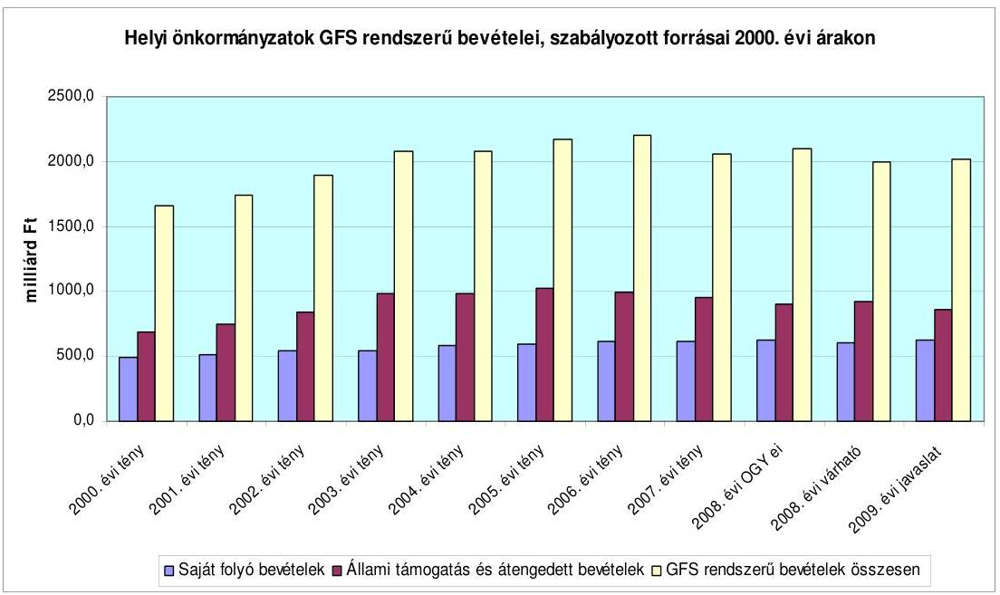

A helyi önkormányzati költségvetések egyensúlyát jellemző hiánymutató (GFS rendszerú egyenleg) az elmúlt években a pénzügyi egyensúly ciklikusságát és romlását jelezte. (A hiány a 2004. évi 16,5 milliárd Ft-ról 2005. évben 81,4 milliárd Ft-ra, 2006. évben 156,5 milliárd Ft-ra nőtt, 2007. évben 53,9 milliárd Ftra csökkent, a PM előrejelzése szerint a 2008. évi várható 90 milliárd Ft-tal szemben a 2009. évben 134 milliárd Ft-ra növekszik.) A kötelezettségállományon belül a hosszú lejáratú kötelezettségek aránya megnőtt, miközben az önkormányzatok hosszabb távon nem tervezhetik kellő biztonsággal bevételeiket. Ehhez társul a fejlesztésekből belépő új intézmények fenntarthatóságából fakadó kockázat is.

A költségvetési törvényjavaslat szerint a helyi önkormányzatok 2009. évben hitelfelvétel nélkül számítva - 3495 milliárd Ft-tal gazdálkodhatnak, amelyhez a központi költségvetés - állami támogatás és átengedett személyi jövedelemadó révén - 1422 milliárd Ft-ot biztosít. Ezt kiegészíti a várható nyitó pénzkészlet (tartalék), amely a 2007. évi kötvénykibocsátások eredményeként 2008. évben 143 milliárd Ft-tal ( $60 \%$-kal) növekedett, ezáltal 375 milliárd Ft-ra nőtt. A

[^0]
[^0]:    ${ }^{22} 0736$ Vélemény a Magyar Köztársaság 2008. évi költségvetési javaslatáról

---

folyamat a 2008. évi kötvénykibocsátások eredményeként folytatódott, és a 2008. II. félévi nyitó pénzkészlet 405,7 milliárd Ft-ra nőtt. A 2009. évi javasolt előirányzatokban az önkormányzatok adósságállományának, a GFS rendszerú hiány 20,7\%-os további növekedésével is számolt a PM.

A PM számításaiban szereplő, valamint az önkormányzati költségvetésekben elfogadott ${ }^{23}$ előirányzatok között 2008. évben is számottevő az eltérés, ami a tervezésben, valamint az államháztartási információs rendszer megbízhatóságában rejlő kockázatokra hívja fel a figyelmet.

A 2008. évi OGY előirányzat szerint a GFS rendszerú egyenleg 111 milliárd Ft, az önkormányzatok által visszatervezett 431 milliárd Ft volt.

A 2009. évi költségvetési törvényjavaslatban a hitelfelvétel nélkül számított bevételek 2009. évi 6,3\%-os emelkedése az előző évi Országgyúlési előirányzathoz viszonyítva 2\%-os globális reálérték növekedésnek felel meg az önkormányzatok és a gazdálkodás egyes területei (működtetés, fejlesztés) közötti jelentős differenciálódás mellett. A forrásszabályozás várható hatásairól, a bevételi forrásokban bekövetkezett elmozdulások miatt jelentkező pénzügyi egyensúlyi problémák feltárására a költségvetési törvényjavaslat benyújtásáig nem készültek modellszámítások, így azok jelenleg nem számszerúsíthetőek. A kiadások szerkezetében a folyó (működési) kiadások 0,5 százalékpontos csökkenésével, a felhalmozási és tőke jellegű kiadások kisebb ( 0,3 százalékpontos) növekedésével számol a helyi önkormányzatok költségvetésében a 2009. évre az Országgyúlésnek bemutatott mérleg.

A 2009. évi tervezett bevételi növekmény 46\%-a saját folyó bevételekből (elsősorban helyi adókból, kamatbevételből), 42\%-a az átengedett bevételekből (személyi jövedelemadó és gépjármú adó) realizálható a számításokban. Az ÚMFT keretében megnyílt forráslehetőségek figyelembevételével EU-s és ehhez kapcsolódó hazai társfinanszírozás bővülését tartalmazza, ugyanakkor a fejezetektől átvett felhalmozási célú pénzeszközök csökkenésével számol a 2009. évi javaslat.

Az egyes adó- és járulék törvények módosításáról szóló törvényjavaslat 2008. szeptember 19-én került benyújtásra. A 2009. évi költségvetést megalapozó egyes törvények (ezen belül az államháztartásról szóló 1992. évi XXXVIII. törvény) módosítását tartalmazó törvényjavaslatot külön, a helyszíni vizsgálat lezárását követően nyújtja be a Kormány az Országgyúlésnek, így annak véleményezése nem szerepel a jelentésben.

A 2009. évi költségvetési törvényjavaslatot megalapozó szakmai törvények közül az Országgyúlés 2008. június 2-i ülésnapján fogadta el a közoktatásról szóló 1993. évi LXXIX. törvény módosítását ${ }^{24}$, amelynek hatását figyelembe vették

[^0]
[^0]:    ${ }^{23}$ A költségvetési koncepciót november 30-ig, a költségvetési rendelettervezetet pedig a költségvetési törvény elfogadását követően február 15-ig terjeszti a polgármester a testület elé.
    ${ }^{24}$ a 2008. évi XXXI. törvény az esélyegyenlőség érvényesülésének közoktatásban történő előmozdítását szolgáló egyes törvények módosításáról

---

a javaslat kidolgozása során. Ez lehetőséget biztosít a jövőben az egységes óvoda és bölcsőde üzemeltetésére, az óvodáztatási támogatás bevezetésére a hátrányos helyzetű családok számára, a pedagóguspályán nyújtott átlagon felüli teljesítmények elismeréséhez szükséges törvényi keretek megteremtésére. A költségvetési törvényjavaslatot megalapozó egyes törvények (pl. Szoctv.) az ÁSZ vélemény kialakításáig nem kerültek benyújtásra az Országgyűlésnek, így a költségvetési törvényjavaslat szerinti szabályozási elgondolások és előirányzatok, valamint az ágazati (szakmai) törvény közötti összhang teljeskörűen nem volt véleményezhető.

A közszférában a keresetek növelését a központosított előirányzatok között megtervezett támogatás biztosítja, amelyből az érdekegyeztetés keretein belül létrejövő megállapodás alapján 2009. évben is tételes felméréssel kerül lebontásra a helyi önkormányzatok költségvetésébe a szükséges forrás.

# 2. A FORRÁSSZABÁLYOZÁs MÓDOSÍTÁSÁNAK FŐBB JELLEMZŐI 

A törvényjavaslat szerint az önkormányzatokat a központi költségvetésből megillető források köre, az átengedett bevételek százalékos mértéke, továbbá e források elosztásának módja nem változik, a szabályozott források között azonban a személyi jövedelemadó súlya tovább nő. Az önkormányzatokat a településeken 2007. évben beszedett személyi jövedelemadóból a 2008. évi előirányzathoz képest $\mathbf{1 4 , 7 \% - k a l}$ több bevétel illeti meg, miközben az állami hozzájárulások és szja részesedés együttes összege 5,5\%-kal nő. Ennek következtében az állami forrásból finanszírozott támogatások és hozzájárulások abszolút összegben $1,3 \%$-kal, a szabályozott források arányában 3,8 százalékponttal csökkennek.

A szabályozott források együttes növekedését meghaladó mértékben bővülő személyi jövedelemadóból a normatív hozzájárulások finanszírozásához javasolt összeg 79,7 milliárd Ft-tal, közel $24 \%$-kal haladja meg a 2008. évi országgyűlési előirányzatot. Az szja-ból finanszírozott normatív állami hozzájárulások növekedési igénye miatt a jövedelemkülönbségek mérséklésére az előző évihez képest 12,5 milliárd Ft-tal kevesebb előirányzatot tartalmaz a törvényjavaslat, amely a csökkentett összeg miatt az önkormányzatok adóerő-képességében meglévő nagyfokú különbségeknek a korábbi években megszokott mértékű mérsékléséhez a beszámítással érintett önkormányzatoktól származó - a feladatmutatók és az adóerő-képesség felmérését követően pontosítható - forrásokkal együtt sem lesz elegendő.

A szabályozott forrásokon belül a szabad rendelkezésű, konkrét feladatokhoz nem rendelt előirányzatok aránya a 2008. évi 16,5\%-ról 16,0\%-ra mérséklődik, míg a felhasználási kötöttséggel engedélyezett hozzájárulások, támogatások aránya 32,2\%-ról 33,4\%-ra emelkedik (1. számú táblázat). Az utóbbiak növekedését döntően a közszolgálatban foglalkoztatottak keresetnövelésére javasolt összegnek a központosított előirányzatok között történő szerepeltetése és a 2009. évre javasolt, illetve a közoktatási törvény módosításával már elfogadott programok kiadási szükséglete indokolja.

---

A 2008. évi költségvetési törvénnyel bevezetett gyakorlatnak megfelelően a törvényjavaslat a közszférát érintő bérpolitikai intézkedések végrehajtásához a központosított elöirányzatok között tartalmaz 95,5 milliárd Ft forrást. Az érdekegyeztető tárgyalások eredményeként megvalósuló bérintézkedések fedezete az önkormányzatonkénti tényleges szükséglet felmérése alapján évközben kerül lebontásra. Az önkormányzatoknak 2008. évben ilyen jogcímen lebontott 38,2 milliárd Ft a 2009. évi törvényjavaslatba beépült a normatív hozzájárulások és a normatív kötött felhasználású támogatások közé. Ezt a 2009. évre javasolt fajlagos összegek tartalmazzák, emellett a közoktatási feladatok után az ebből adódó 2009. január 1. és augusztus 31. közötti időtartamra járó többletet az önkormányzatok külön normatíva (a törvényjavaslat 3. számú melléklet 18. pontja) alapján kapják meg.

Az önkormányzatokat felhasználási kötöttséggel megillető források növekedését eredményező prioritások közül az „Új Tudás - Müveltséget Mindenkinek" program önkormányzati körben történő megvalósítását a törvényjavaslat 5. számú mellékletébe beépült új jogcímek előirányzatai, illetve a 7. számú mellékletben a színházak részére javasolt emelt összegű támogatás segíti. Az esélyegyenlőség érvényesülése érdekében a 2008. évi XXXI. törvénnyel módosított a közoktatásról, továbbá a gyermekek védelméről és a gyámügyi igazgatásról szóló törvények vonatkozó rendelkezései és a költségvetési törvényjavaslat közötti összhang ily módon biztosított.

Az „Út a Munkához" program az önkormányzatok segélyezési rendszerének átalakítását, az aktív korú nem foglalkoztatott, de munkaképes személyek számára a foglalkoztathatóság lehetőségének megteremtését és egyben az érintettek munkavállalásának ösztönzését tüzte ki célul. A törvényjavaslat szerint az önkormányzatok által szervezett közhasznú és közcélú munkavégzést egységes foglalkoztatási forma ${ }^{25}$, a közfoglalkoztatás váltja fel, amelyhez a támogatást az önkormányzatok a normatív, kötött felhasználású támogatások között szereplő egyes jövedelempótló ellátások (törvényjavaslat 8. számú melléklet II/1. pont) előirányzatából igényelhetik. A javasolt kötött felhasználású előirányzat a Munkaerőpiaci Alapból és a meglévő előirányzatokon belül történő átcsoportosítás révén a 2008. évit 11,2 milliárd Ft-tal haladja meg. A támogatás igénybevételi szabályai az önkormányzatokat a foglalkoztatás feltételeinek megteremtésére és a tényleges foglalkoztatásra ösztönzik azáltal, hogy 2009. évtől az aktív korúak részére kifizetett segélyek $80 \%$-át, míg a közfoglalkoztatás költségeinek $95 \%$-át igényelhetik a központi költségvetésből. A szociális igazgatásról és a szociális ellátásokról szóló 1993. évi III. törvény ezzel összefüggő módosítása nem történt meg.

Az állami hozzájárulások és támogatások igénybevételi feltételeiben kisebb szigorításokat, pontosításokat tartalmaz a törvényjavaslat. A 2007. és 2008. évi költségvetési törvényekben meghatározott és 2009. évre is javasolt szabályok továbbra is a méretgazdaságos feladatellátási egységek kialakítását, illetve ahol ennek feltételei helyileg nem adottak, a társu-

[^0]
[^0]:    ${ }^{25} 0732$ Jelentés a közmunkaprogramok támogatására fordított pénzeszközök hasznosulásának ellenőrzéséről javaslatai között szerepelt a közfoglalkoztatás egységes rendszerének kialakítása.

---

lásos feladatellátást ösztönzik. A közoktatási alap-hozzájárulások finanszírozása 2009. évben is a 2007. évben bevezetett teljesítménymutató alapján történik, a körjegyzőségi és többcélú kistérségi társulásos feladatellátási formák bővítését kiegészítő támogatások, hozzájárulások ösztönzik, az önhibájukon kívül hátrányos helyzetű települési önkormányzatok támogatásának 2007. és 2008. évben meghatározott igénybevételi feltételei érvényben maradnak. A szabályozás új elemeként a közoktatás területén az integráció további bővítését ösztönzi a törvényjavaslat, emellett a többcélú kistérségi társulások kiegészítő támogatásának igénybevételi feltételeibe beépülnek azok a kiegészítő szabályok, amelyek az együttmúködésben rejlő valós megtakarításokat eredményező előnyök kihasználására ösztönöznek:

- a komprehenzív ${ }^{26}$ iskolamodellek kialakítását, továbbá a kistelepülések közoktatási feladatainak társulásban történő ellátását a központosított előirányzatok között elkülönített támogatás ösztönzi;
- a közoktatási törvény módosításával lehetővé tett és a hozzájárulások, támogatások igénybevételi szabályaiba beépített egységes, az óvodai és bölcsődei feladatokat ellátó intézmény létrehozásával a bölcsődei ellátásban részesülők száma emelkedhet, és javíthatja az óvodai férőhelyek kapacitáskihasználtságát;
- a törvényjavaslat 8. számú melléklete IV. A többcélú kistérségi társulások támogatása, Kiegészítő szabályok 2.1.4. c) pont szerint nem vehető igénybe a közoktatási feladatra támogatás, amennyiben a fenntartó intézményi társulás ugyanazon közoktatási feladat ellátására több önálló OM azonosítóval rendelkező intézményt tart fenn.

# 3. Fejlesztési TÁmogatÁsok 

A IX. Helyi önkormányzatok támogatásai és átengedett személyi jövedelemadója fejezetben önálló jogcímeken és a központosított előirányzatok között tervezett fejlesztési célokat szolgáló költségvetési támogatások 2009. évi tervezett elöirányzata - az egyes jogcímek között átrendezést is figyelembe véve - 80,2 milliárd Ft, amely összegében 47 milliárd Ft-tal marad el az előző évi költségvetésben megállapított keretektől. A csökkenés oka, hogy a címzett támogatások döntő hányada pénzügyi ütemezés szerint befejeződik 2008-ban, valamint a fővárosi metróberuházás költségvetési támogatása is 6,7 milliárd Ft-tal csökkentett összegben, mindössze 9,5 milliárd Ft-tal szerepel a költségvetési javaslatban. E két tényező figyelembevétele nélkül számított IX. fejezetbeli fejlesztési célú előirányzatok összességében 2,6 milliárd Fttal emelkednek. E fejlesztési források kiegészülnek a XV. Nemzeti Fejlesztési és Gazdasági Minisztérium fejezetben tervezett terület- és régiófejlesztési célelőirányzat decentralizált hányadának 4,8 milliárd Ft-os, valamint a LXIX. Kutatási és Technológiai Innovációs Alapban tervezett 5 mil-

[^0]
[^0]:    ${ }^{26}$ A komprehenzív iskolarendszer minden gyermek számára egyenlő esélyeket kíván biztosítani egyéni adottságainak kifejlesztésére, átfogja egy adott lakókörzet valamenynyi iskoláskorú gyerekét a közoktatás illetve a tankötelezettség lehetőleg teljes időtartamában.

---

liárd Ft összegű támogatási előirányzattal. Az egyes fejlesztési támogatási jogcímek alakulását az ÁSZ véleményhez csatolt 5. számú táblázat részletezi.

# 3.1. Címzett és céltámogatások 

A fejlesztési támogatásokon belül a címzett és céltámogatásokra a 2009. évi költségvetési törvényjavaslat 10 milliárd Ft előirányzatot tartalmaz, amely 43 milliárd Ft-tal marad el a 2008. évi költségvetésben jóváhagyott támogatástól. Ennek oka, hogy az Országgyűlés korábbi döntése értelmében ${ }^{27}$ címzett támogatás már 2007. évtől kezdődően nem volt indítható, így a tervezett keretszám csak a folyamatban lévő címzett támogatásból megvalósuló beruházások áthúzódó kiadásaira, valamint új induló céltámogatásokra - 200 millió Ft-ot összegben - tartalmaz fedezetet. A javasolt, pénzforgalmi szemléletet érvényesítő keretszám 96,7\%-a 2006. évvel bezárólag odaítélt, de 2008. év végéig ténylegesen le nem hívott címzett támogatások pénzügyi fedezetét biztosítja. A folyamatban lévő céltámogatások tárgyévi üteme (134 millió Ft) az előirányzat javaslat 1,3\%-át köti le, míg a 2009-ben indítható céltámogatásokra az előirányzat mindössze 2\%-a fordítható.
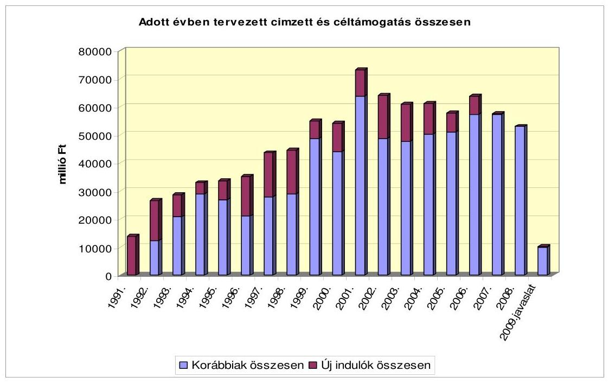

A Kormány a címzett támogatásokat, a hazai forrásokat felváltó uniós támogatások bevonásának szándékával már 2006-ban áttekintette. Az e tárgykörben hozott határozatában ${ }^{28}$ felkérte a fejlesztéspolitikáért felelős kormánybiztost és az érintett minisztereket, hogy a helyi önkormányzatok címzett tá-

[^0]
[^0]:    ${ }^{27}$ A Magyar Köztársaság 2007. évi költségvetését megalapozó egyes törvények módosításáról szóló 2006. évi CXXI. törvény 34. §. (1) bekezdése, valamint a Magyar Köztársaság 2008. évi költségvetéséről szóló 2007. évi CLXIX. törvény 92. §-a
    ${ }^{28}$ A helyi önkormányzatok 2007. évi új címzett támogatásáról szóló 1109/2006. (XI. 20.) Korm. határozat

---

mogatásainak törvényben foglalt ${ }^{29}$ célok lehetőség szerinti teljes körét az ÚMFT Operatív Programjaiban jelenítse meg. A ÚMFT elfogadása, az annak megvalósítását szolgáló országos és regionális operatív programok akcióterveinek, végleges célkitúzéseinek egyeztetése, összehangolása és a forrásokhoz való hozzájutás feltételeinek meghatározása döntően a 2007. év második félévében fejeződött be ${ }^{30}$.

Magyarország számára 2007-2013 között 22,4 milliárd euró uniós támogatás áll rendelkezésre az Új Magyarország Fejlesztési Tervben (ÚMFT). Az NFÚ által elvégzett összegzés szerint a hét régió és öt központi operatív programja terhére programozási időszak egészére - 2007-2013-ra - eddig 656 települést érintően, 1161 projekt kapcsán 246 milliárd Ft támogatást ítéltek oda, amelyből eddig mindössz sze 540 millió Ft kifizetésére került sor. A 2004-2006-os tervezési periódusra ténylegesen megítélt támogatások pénzügyi maradványa a 2008. szeptember 15-i állapot szerint összességében mintegy 20 milliárd Ft-ot tesz ki.

A céltámogatások 2008. évi indítására tervezett összeg 200 millió Ft, amelynek döntési jogköre már 2006-tól a regionális fejlesztési tanácsok hatáskörébe tartozik. A támogatási előirányzat 15\%-a a régiók lakónépességének arányában, $85 \%$-a pedig a területfejlesztés szempontjából leghátrányosabb helyzetű kormányrendeletben meghatározott ${ }^{31}$ - kistérségek lakónépessége alapján illeti meg a régiókat. A támogatási célokat a Kormány még a 2008. évi költségvetést megalapozó egyes törvények módosításáról szóló törvénycsomagban, a Cct. módosításával ${ }^{32}$ határozta meg.

Ennek során a Cct. új melléklettel egészült ki, amelyben a 2008-2009. évekre támogatható célok kijelölése történt meg. Eszerint támogatást igényelhetnek a helyi önkormányzatok 1 millió Ft egyedi értéken felüli és egy éven túl elhasználódó aneszteziológiai, intenzív terápiás sürgősségi eszközök beszerzéséhez, legfeljebb $75 \%$-os támogatási arány érvényesítésével. A regionális fejlesztési tanácsoknak a céltámogatási igényeket a törvény e mellékletében előírt szempontjai szerint kell rangsorolniuk, előnyben kell részesítniük a hátrányos helyzetú besorolással rendelkező településekről beérkező pályázatokat.

# 3.2. A decentralizált helyi önkormányzati fejlesztési támogatási programok támogatása 

A fejlesztési célú támogatások döntési jogkörének decentralizálása, a források koordinációjára való fokozott törekvés a 2005. évtől vált jellemzővé a költség-

[^0]
[^0]:    ${ }^{29}$ A helyi önkormányzatokról címzett és céltámogatási rendszeréről szóló 1992. évi LXXXIX. törvény 1. §-ának (1) bekezdése
    ${ }^{30}$ Az ÚMFT Magyarország Nemzeti Stratégia Referenciakerete 2007-2013. dokumentumot 2007. május 7 -én, a 15 Operatív Program közül 13-at július végéig fogadta el az Európai Bizottság. A Kormány az elfogadott programok akcióterveiről jellemzően az év második felében döntött.
    ${ }^{31}$ A jelenleg hatályos kistérségi besorolást - felváltva a 64/2004. (IV. 15.) Korm. rendeletet - a 311/2007. (XI. 17) Korm. rendelet határozza meg, amely a 67/2007. (VI. 28.) OGY határozatban foglalt lehatárolási elveknek megfelelő besorolást érvényesíti.
    ${ }^{32}$ A Magyar Köztársaság 2008. évi költségvetését megalapozó egyes törvények módosításáról szóló 2007. évi CXLVI. törvény 5. §-a

---

vetésben. A rendelkezésre álló decentralizált döntési körbe sorolt források köre nem változott számottevően, nagyságrendje azonban évről évre csökkent. A decentralizálásra került támogatási keretek felosztásáról a 2007. évtől kezdődően a regionális fejlesztési tanácsok döntenek, a 2008. évi 34,8 milliárd Ft-tal szemben a 2009. évi költségvetési javaslat 35,5 milliárd Ft felhasználását utalja régiók döntési jogkörébe. A decentralizált előirányzatok növekménye mindössze $2 \%$-os.
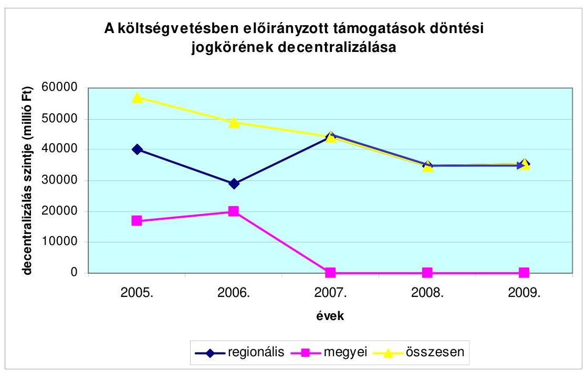

Fontos változás, hogy a hazai forrásokból biztosított decentralizált támogatások a 2007. évtől kezdődően már nem az Európai Unió támogatásainak kiegészítését, hanem attól elkülönített támogatási rendszert képeznek, ennek során komplementer jelleggel olyan fejlesztéseket támogatnak, amelyek európai uniós finanszírozásban - a programok célja, vagy a közösségi források korlátozott volta miatt - nem részesülhetnek. A decentralizált fejlesztési támogatásoknak így továbbra is fontos szerepük van a helyi önkormányzati fejlesztések megvalósításában, a legelmaradottabb kistérségek felzárkóztatásában, e térségek versenyképességének fokozásában, a társadalmi kohézió erősítésében.

A hazai forrásokból származó fejlesztési források szabályozásában előrelépésnek tekinthető, hogy a Kormány a 2007. évtől kezdődően - így 2008-ban is - a pályázati rendszerben felhasználható támogatások - HÖF TEKI, HÖF CÉDE, LEKI, TEUT - előirányzatainak felhasználására, valamint a vis maior támogatásokra vonatkozóan egységes szabályokat alkotott ${ }^{33}$.

Az EU-s pályázati konstrukciók kritériumrendszerének ismeretében meghatározhatóvá váltak azok a területek, amelyek uniós források terhére nem támogathatók, kijelölhetővé váltak azok a célok, amelyek támogatása hazai forrásokból to-

[^0]
[^0]:    ${ }^{33}$ 47/2008. (III. 5.) Korm. rendelet

---

vábbra is indokolt. A hazai fejlesztési támogatási lehetőségek célrendszere, ezáltal a támogathatóság szempontjából komplementer területek irányába fordult. A régióknak lehetőségük volt arra, hogy az adott régió fejlesztési igényeihez leginkább igazodó célokhoz igazítsák pályázati rendszereiket, a túlzott koncentráció elkerülése érdekében azonban a felhasználási szabályok előírták, hogy - a TEUT előirányzat kivételével - helyben minimálisan három cél, illetve ahol a cél alcélokra bomlik, ott alcél kiírása kötelező volt. A támogatás szempontjából kedvezményezett kör meghatározásakor figyelembe vették a területfejlesztés kedvezményezett térségeinek jegyzékéről szóló 64/2004. (IV. 15.) Korm. rendeletet felváltó 311/2007. (XI. 17.) Korm. rendelet előírásait, illetve gondoskodtak az átmenetileg kedvezményezett térségekben megvalósuló fejlesztések szabályozásáról is.

A 2009. évi decentralizált előirányzatok régiónkénti összegeit a törvényjavaslat 16. sz. melléklete foglalja össze, a felhasználásra vonatkozó részletes szabályok megalkotására a Kormány - 2009. január 31-i határidővel kapott felhatalmazást ${ }^{34}$

A decentralizált támogatási előirányzatok döntő hányada (25,6 milliárd Ft) a költségvetési javaslat IX. Önkormányzati támogatásai és átengedett személyi jövedelemadója fejezetben, az új induló céltámogatások, a helyi önkormányzatok fejlesztési és vis maior feladatainak támogatása, a leghátrányosabb helyzetű kistérségek felzárkóztatásának támogatása, valamint a települési önkormányzati szilárd burkolatú belterületi közutak burkolat felújításának támogatása címén - az előző évivel közel azonos összegben - áll rendelkezésre. Az önkormányzatok fejlesztési feladatainak támogatására szánt összeg 500 millió Ft-tal, a leghátrányosabb helyzetű kistérségek támogatására szánt előirányzat 250 millió Ft-tal emelkedett.

A terület- és régiófejlesztési céleIőirányzat két jogcímcsoportja - a XV. Nemzeti Fejlesztési és Gazdasági Minisztérium fejezetben - 2009-re 4,8 milliárd Ft összegben került a regionális fejlesztési tanácsok döntési körébe, ezen belül a decentralizált területfejlesztési programok előirányzatát a 2008. évi 3,9 milliárd Ft-tal azonosan tartalmazza a 2009. évi javaslat. A decentralizált területfejlesztési programok teljes keretösszege új induló fejlesztések támogatására szolgál. E jogcímcsoportok terhére, az Áht. 47. § (1) bekezdésére alapozva, a fejezeti költségvetési keretszámon belül maradva, a tárgyéven túl is kötelezettség vállalható ${ }^{35}$. A Vásárhelyi Terv továbbfejlesztésére szánt 2009. évi támogatás keretösszege az előző évi 1 milliárd Ft-tal szemben 931 millió Ft lesz, amelyből az Észak - Alföldi régióban - a tiszaroffi árvíztározó építéséhez kapcsolódó két település belterületi vízrendezése valósulhat meg. A hazai innováció elősegítését a LXIX. Kutatási és Technológiai Innovációs Alap 2009-ben is 5 milliárd Ft előirányzattal támogatja.

[^0]
[^0]:    ${ }^{34}$ a 2009. évi költségvetési törvényjavaslat 63. § (3). bekezdésében foglaltak szerint
    ${ }^{35}$ a 2009. évi költségvetési törvényjavaslat 49. § (22) bekezdésében foglaltak szerint

---

A decentralizált források régiók közötti felosztásának elveit Országgyűlési határozat ${ }^{36}$ tartalmazza.

Eszerint a gazdaságfejlesztési célkitűzéseket támogató források régiók közötti felosztásánál a régió fejlettségét mutató egy főre jutó hazai bruttó termék (GDP) mutatót a keret $40 \%$-a mértékéig, a régió területfejlesztési szempontból kedvezményezett kistérségeinek lakónépességét a keret $30 \%$-a mértékéig, a régió lakónépességét a keret $20 \%$-a mértékéig, a régió települési önkormányzatainak számát a keret $10 \%$-a mértékéig kell figyelembe venni. A 2009. évi költségvetési javaslat meghatározásánál az 1 főre jutó GDP esetében a 2006. évi adatokkal, míg az önkormányzatok száma és a lakónépességi adatok esetében a 2008. január 1-i adatokkal számoltak. A hazai innováció támogatására szánt keret $50 \%$-át a régiók népességszáma arányában, $50 \%$-át a területfejlesztési támogatások és a decentralizáció elveiről, a kedvezményezett térségek besorolásának feltételrendszeréről szóló 67/2007. (VI. 28.) OGY határozatban foglaltak szerint osztották meg.

Az OGY határozat fontos eleme, hogy területi lehatárolások elvei mellett a területfejlesztési támogatáspolitika megvalósítását szolgáló, tisztán hazai decentralizált fejlesztési források tervezésével és felosztásával kapcsolatban azt is rögzíti, hogy a költségvetési törvényjavaslatban önálló, regionális fejezetet kell létrehozni a feladat- és hatáskörök, valamint a felelősség meghatározása mellett. A regionális fejlesztési tanácsok működési és döntési hatáskörébe utalt, illetve a Kormány által kötött tervszerződések fejlesztési forrásait régiónként külön fejlesztési soron indokolt tervezni, a tisztán hazai forrásból megvalósított fejlesztések pénzellátási rendjét az EU finanszírozási elveihez kell igazítani, a projektfinanszírozást programfinanszírozásnak kell felváltania. Az OGY határozat célkitűzéseit a 2011/2008. (II. 14.) Korm. határozat megerősítette, az abban foglaltakra vonatkozóan Intézkedési Tervet határozott meg, amelyben feladatok végrehajtásáért felelős miniszterek meghatározása mellett a végrehajtásra előírt határidőket is rögzítette.

Az Országgyűlési határozatban foglaltak azonban még a 2009. évi költségvetési javaslatban is csak részlegesen érvényesülnek. A tisztán hazai forrásból származó támogatási előirányzatoknál (TEKI, CÉDE, LEKI) az újonnan meghatározott térségi lehatárolási elveket érvényesítették ugyan, azonban az e források egységes, összehangolt, programszerű megvalósítását, annak monitorizálását, informatikai támogatását biztosító adatbázis kialakítását a tervezés időszakára még nem biztosították. Megkezdődött ugyan a régiókkal kötendő tervszerződések megalapozása, a régiókkal e tárgyalások 2008 tavaszára le is zajlottak, és az egyeztetett célrendszerek alapján a régiók kidolgozták regionális területfejlesztési programjaik első változatát, azonban még zajlik azok társadalmi vitája. A dokumentumok véglegesítésére várhatóan csak 2008 utolsó hónapjaiban kerülhet sor. A régiós programokra alapozó tervszerződések megkötésére így a kormányhatározatban kitüzött határidő ${ }^{37}$ ellenére nem került

[^0]
[^0]:    ${ }^{36}$ A területfejlesztési támogatások és a decentralizáció elveiről, a kedvezményezett térségek besorolásának feltételrendszeréről szóló 67/2007. (VI. 28.) OGY határozat
    ${ }^{37}$ A területfejlesztési támogatásokról és a decentralizáció elveiről, a kedvezményezett térségek besorolásának feltételrendszeréről szóló 67/2007. (VI. 28.) OGY határozatban meghatározott feladatok végrehajtásáról szóló Intézkedési Tervről rendelkező

---

sor. Hasonlóképpen késedelmet szenved az önálló regionális fejezet kialakítása is annak ellenére, hogy azt már az OGY határozat 2007 nyarán előírta.

A régiós fejezet kialakításának előkészítésére irányulóan a PM tervezési körirata előírta, hogy az egyes fejezetek költségvetéseikben régiónként határozzák meg azon előirányzatok körét, melyek felhasználása a régiós fejlesztési tanácsok döntési hatáskörébe kerülhet.

# 3.2.1. A helyi önkormányzatok fejlesztési feladatainak támogatása (2008-ban HÖF TEKI és a HÖF CÉDE jogcímú támogatás) 

Területi kiegyenlítést szolgáló önkormányzati fejlesztések (HÖF TEKI) és az önkormányzati fejlesztéseket területi kötöttség nélküli (HÖF CÉDE) támogatásai 2008-ban még egymástól elkülönítetten, eltérő hozzáférési és célrendszerek mentén illették meg az önkormányzatokat.

A legfontosabb különbséget az jelentette, hogy a HÖF TEKI támogatások csak területi kötöttséggel, meghatározott kistérségeken, a területi kiegyenlítést szolgáló fejlesztések támogatását biztosították, míg a HÖF CÉDE előirányzatokból területi kötöttség nélkül igényelhettek támogatást az önkormányzatok.

A 2009. évi költségvetési javaslat - az előző évhez hasonlóan - ezt a jogcímet a IX. fejezet 10. címén egységes fejlesztési előirányzatként tartalmazza, illetve a vis maior feladatok támogatására szánt keretösszeget az előző évi 800 millió Fttal azonosan kiemelte, és azt önálló költségvetési címen szerepelteti. A helyi önkormányzatok fejlesztési feladatainak támogatására - az átrendezéseket is figyelembe véve - előző évit 500 millió Ft-tal meghaladó összegű, 10,6 milliárd Ft áll rendelkezésre, amelynek felhasználásáról továbbra is a regionális fejlesztési tanácsok döntenek.

Az előirányzat régiónkénti összegeinek meghatározásakor az előirányzat 50\%-a területfejlesztési támogatásokról és a decentralizáció elveiről és a kedvezményezett térségek besorolásának feltételrendszeréről szóló 67/2007. (VI. 28.) OGY. határozat III.2. pontja ba.) alpontja, a másik 50\%-a a fenti OGY. határozat III.2. pontja bb.) alpontja alapján - az előző évi megosztási elveket érvényesítve - kerül elosztásra. A felhasználás során érvényesítendő szabályozási elvek és jogcímrendszer a költségvetési javaslat benyújtásakor még nem ismert, azok megalkotására a kormány kapott felhatalmazást.

A 2008. szeptemberében elvégzett összegzések szerint a 2008. évre megállapított támogatási kereteket a régiók két kivétellel (a Közép - Magyarországi, és a DélDunántúli régiók) az első támogatási körben, július 15-ig lekötötték. Ugyanakkor a támogatási döntéseket követő támogatási szerződéskötések valamint a támogatott beruházások megvalósítását biztosító vállalkozói szerződések megkötésének időigénye következtében a tárgyévi előirányzat terhére tényleges pénzügyi kifizetésekre még nem került sor.

2011/2008. (II. 14. ) Korm. határozat II/4., III/1., IV/1.-2., V/3/a. pontjában foglalt határidők

---

Tekintettel arra, hogy a felhasználási szabályok csak 2006. év végéig adtak lehetőséget arra, hogy a területfejlesztési tanácsok három évre (a 2008. évig bezárólag) előre kötelezettséget vállaljanak a HÖF CÉDE terhére, így a 2009. évre tervezett támogatási keret teljes összege új programok támogatására fordítható.

# 3.2.2. Helyi önkormányzatok vis maior támogatása 

A települési önkormányzatok vis maior feladataira a régiók döntési hatáskörébe utalva, évek óta azonos összeget - terv szinten 800 millió Ft-ot - különít el a költségvetés. Az önálló költségvetési címre kiemelt előirányzat régiók közötti megosztásának aránya és alapja változott, 2009-ben az előirányzat 70\%-a a korábbi település számarány helyett egyenlő arányban, 30\%-a 2007. évben ár-, belvíz, rendkívüli időjárás illetve pince partfal omlás okozta károk enyhítésének arányában kerül felosztásra.

2008-ban a vis maior feladatok ellátására szolgáló 800 millió Ft 60\%-a a régióban található önkormányzatok 2007. október 1-jei száma alapján, 40\%-a pedig a 2005. és a 2006. években ár-, belvíz, rendkívüli időjárás, illetve pince-, partfal omlás okozta károk enyhítéséhez jóváhagyott támogatás arányában került felosztásra az érintett régiók között.

### 3.2.3. A vis maior tartalék

A vis maior tartalék 2009. évi előirányzata az előző évivel azonos szinten, 360 millió Ft összegben került megtervezésre, amely - a korábbi években kialakult gyakorlatnak megfelelően - az elkülönített megyei forrásokból már nem finanszírozható, váratlan és rendkívüli események okozta természeti károk kezelésére szolgál. A támogatási keret felhasználási szabályai biztosítják, hogy a természeti és környezeti katasztrófák következményei a szükséges mértékben kerüljenek enyhítésre és ellensúlyozásra.

### 3.2.4. A leghátrányosabb helyzetú kistérségek felzárkóztatásának támogatása

A leghátrányosabb helyzetú kistérségek felzárkóztatásának támogatására a IX. Helyi önkormányzatok támogatásai fejezet 14. címén 2009-ben az előző két évben tervezett 5,8 milliárd Ft-os előirányzatot 250 millió Ft-tal megemelve - 6,1 milliárd Ft előirányzat áll rendelkezésre, amelynek felhasználásáról az érintett négy régióban - Dél-Dunántúl, Észak-Magyarország, Észak-Alföld, Dél-Alföld - a regionális fejlesztési tanácsok dönthetnek.

A régiók területfejlesztésben betöltött szerepének, súlyának növelésével összhangban a támogatási keret felosztásának joga a 2007. évtől került a megyei területfejlesztési tanácsoktól a regionális fejlesztési tanácsokhoz. A támogatási előirányzat a kedvezményezett térségek besorolásáról szóló 311/2007. (XI. 17.) Korm. rendelet 2. sz. mellékletében meghatározott leghátrányosabb helyzetű kistérségek lakónépessége alapján, a törvényjavaslat 16. sz. melléklete szerinti bontásban illeti meg az érintett régiókat.

---

Az előirányzat felhasználásának általános és program specifikus szabályait - a decentralizálásra került többi támogatási keret felhasználásához hasonlóan - a Kormány a 2008. évben rendeletben ${ }^{38}$ szabályozta.

A támogatási keret terhére 2008-ban hat támogatási célt jelöltek ki, amelyek alapvetően két fő törekvés köré csoportosultak. Egyrészt támogathatók voltak a leghátrányosabb helyzetű kistérségekben a további leszakadás megakadályozása érdekében egyes legalapvetőbb közszolgáltatások biztosításának infrastrukturális feltételei, másrészt azok az önkormányzati gazdaságélénkítő jellegű kezdeményezések, amelyek a vállalkozások letelepedéséhez, illetve helyben maradásához kívántak hozzájárulni. A támogatási kereteket a régiók az első döntési körben 99,5\%-ban lekötötték ugyan, de a tárgyévi keretek terhére tényleges támogatás lehívások még nem történtek.

A szabályozás tárgyéven túli kötelezettségvállalásra nem biztosított lehetőséget, így a törvényjavaslatban szereplő 2009. évi támogatási keret teljes egészében tárgyévi programok támogatására fordítható. A regionális fejlesztési tanácsok a támogatást - az előző évhez hasonlóan - a régióhoz tartozó leghátrányosabb kistérségekből érkező pályázatok között az egyes kistérségek lakónépessége arányában osztják fel.

# 3.3. Budapest 4-es metróvonal építésének támogatása 

A fövárosi 4-es metróvonal építésének támogatására az előző évi 16,2 milliárd Ft-tal szemben 2009-ben 6,7 milliárd Ft-tal kevesebbet, azaz 9,5 milliárd Ft-ot biztosít a költségvetés. A tervezett előirányzat meghatározásakor figyelembe vették az Európai Unió metróberuházás támogatására vonatkozó álláspontját, a finanszírozásra vonatkozóan eddig tett önkormányzati és kormányzati kötelezettségvállalásokat.

Az Európai Unió álláspontja szerint a budapesti 4-es metróra a Közlekedési Operatív Program városi és elővárosi közösségi közlekedés fejlesztés prioritásának legfeljebb 60\%-a fordítható. Az uniós finanszírozásba bevonható projektméretet az EU által meghatározott keretek mellett a költség-haszon elemzés alapján számított végleges támogatási intenzitási arány is befolyásolja. A Kormány 2008. július 2-i döntését követően a 4-es metró projekt Európai Bizottságnak történő benyújtására 2008. augusztus 11-én került sor, a Bizottság döntése legkorábban 2008. év végére várható. A költségvetési javaslat e tényezők és az Állam és Főváros között fennálló finanszírozási szerződés ismeretében tartalmazza a 2009-ben esedékessé váló állami kötelezettségek fedezetét.

[^0]
[^0]:    ${ }^{38}$ A decentralizált helyi önkormányzati fejlesztési támogatási programok előirányzatai, valamint a vis maior tartalék felhasználásának részletes szabályairól szóló. 47/2008. (III. 5.) Korm. rendelet

---

# 3.4. Egyéb fejlesztési célú, központosított előirányzatként tervezett támogatási előirányzatok 

A IX. Helyi önkormányzatok fejezetben tervezett felhasználási kötöttséggel rendelkezésre álló fejlesztési célú támogatási előirányzatok összege - kismértékű tartalmi változásokat követően - a 2008. évi 41 milliárd Ft-tal szemben 2009-re 43 milliárd Ft összegben állnak rendelkezésre.

E tételek nyújtanak fedezetet a lakossági közműfejlesztések, a kompok, révek felújításának támogatására, az ózdi martinsalak felhasználása miatt kárt szenvedett lakóépületek tulajdonosainak kártalanítására, a jövedelemdifferenciálódás mérséklésénél beszámítással érintett önkormányzatok támogatására. Kiemelt tétel az előirányzat csoporton belül az önkormányzatok és jogi személyiségű társulásaik európai uniós fejlesztési pályázatainak saját forrás kiegészítésére, a belterületi közutak szilárd burkolattal való ellátásának és felújítási munkálatainak támogatására, illetve egyes kiemelt ellátási területek infrastrukturális és eszközjellegú fejlesztéseire tervezett előirányzat.

### 3.4.1. A helyi önkormányzatok és jogi személyiségú társulásaik európai uniós fejlesztési pályázataihoz szükséges saját forrás kiegészítése

Az önkormányzatok fejlesztési tevékenységének körülményeit 2009-ben is jelentős mértékben befolyásolják az európai uniós támogatásokhoz való hozzájutás feltételei. A Kormány ezt támogató erőteljes szándéka nyilvánul meg abban, hogy a saját forrás kiegészítésére szolgáló költségvetési előirányzatot az előző évihez képest 2,5 milliárd Ft-tal - 16,6\%-kal - megemelt szinten, 17,6 milliárd Ft összegben tervezi.

Ez az összeg kiegészülhet a XIX. fejezet Uniós fejlesztések fejezetben a KEOP derogációs projektek kamattámogatása címen, az előző évivel azonosan, 500 millió Ft összegben tervezett előirányzattal, amely az ivóvízminőség javítását, valamint szennyvíz és hulladéklerakó beruházások - EU-s és hazai támogatással nem finanszírozott - hitelforrás terheit könnyíti. A költségvetési törvényjavaslat 49. § (17) bekezdése ugyanis lehetőséget ad arra, hogy a kamattámogatás esetleges maradványa az EU Önerő Alapba visszacsoportosítható legyen.

Az EU Önerő Alap támogatási előirányzata az uniós alapok iránt a 2007-2013as programozási időszakot érintően benyújtott és nyertes önkormányzati fejlesztési célú pályázatokhoz szükséges saját források kiegészítésére szolgál. A tervezett összeg fedezetet biztosít a korábbi években már jóváhagyott támogatások tárgyévi ütemeire, illetve azon önkormányzati feladatok ${ }^{39}$ saját forrásai-

[^0]
[^0]:    ${ }^{39}$ Az EU Önerő Alapból kizárólag azok az önkormányzatok és jogi személyiségű társulásaik igényelhetik a megjelölt feladatok megvalósítására irányuló támogatást, amelyek a külön jogszabály szerint társadalmi gazdasági és infrastrukturális szempontból elmaradott települések, illetve a kedvezményezett térségek besorolásáról szóló kormányrendelet 2. sz. mellékletében szereplő kistérségek területén vannak, a többcélú kistérségi társulások az általuk fenntartott intézmények uniós támogatásból történő fejlesztése esetén, amellyel a társulás valamennyi tagja egyetért.

---

nak kiegészítésére, amelyeket egészségügyi fekvő és járóbeteg - szakellátási, kulturális, vízgazdálkodási, egyes környezetvédelmi, valamint óvodai nevelési, alapfokú oktatási, szociális és gyermekjóléti ellátást nyújtó intézménye, továbbá helyi közutak, kerékpárutak és közterületek fejlesztései terén valósítanak meg. A felhasználás részletes szabályait a költségvetési javaslat 5. sz. mellékletére alapozva a 2009. március 1-ig kiadásra kerülő ÖM rendelet fogja szabályozni.

Az ÖM által elvégzett elemzések szerint a 2008-ra tervezett 15,1 millió Ft-os előirányzat terhére 2008. év végéig a prognosztizált adatok szerint mintegy 8,9 milliárd Ft kötelezettség várható. Eközben a tárgyévi tényleges összes kifizetés a tervezés időszakában ${ }^{40} 2,5$ milliárd Ft volt, s várhatóan év végéig sem fogja meghaladni a 4 milliárd Ft-ot. A prognosztizált döntési determinációra vonatkozó számítás szerint a 2009-re tervezett keretszám a tervezési munka jelenlegi szakaszában 4,9 milliárd Ft erejéig (az előirányzat 27,8\%-áig) lekötött. Az uniós támogatások elhúzódó döntési eljárásának hatásai az önerő alap felhasználási jellemzőit alapvetően behatárolják, így a jövő évi költségvetésben tervezett előirányzat felhasználása - a hozzájutás feltételeinek esetleges év közbeni enyhítése esetén is - közepes kockázatúnak minősíthető bizonytalanságot hordoz.

A 2009. évi költségvetési javaslat az önkormányzati alrendszer vonatkozásában 240 milliárd Ft EU-tól átvett pénzeszközzel és hazai társfinanszírozással számol. Az uniós források a költségvetési törvényjavaslatban az önkormányzati alrendszerben az elmúlt években erőteljesen, a 2005. évi előirányzathoz képest a hazai társfinanszírozással együtt közel négy és félszeresére emelkedtek.

Az EU-s támogatások igénybevétele az elmúlt években rendre elmaradt a tervezettől.

Az önkormányzatok által ténylegesen visszatervezett EU-s támogatás 2007. évben az országgyűlési előirányzatok között szereplő 140,7 milliárd Ft-tal szemben 19,4 milliárd Ft, 2008. évben a 190 milliárd Ft-tal szemben 12,4 milliárd Ft volt. Az önkormányzatok által visszatervezett források nagyságrendje a pénzügyi információs rendszer évek óta kifogásolt, értékelést akadályozó múködési zavarait tükrözi.

A hazai forrásból származó fejlesztési támogatásokat több mint háromszoros nagyságrendben meghaladó uniós források tervezése ezért - az elmúlt évek tapasztalati adataira figyelemmel - kockázatot hordoz.

# 3.4.2. A települési önkormányzatok szilárd burkolatú belterületi útjainak felújítása 

A 2009. évi költségvetési javaslat - az előző évivel azonosan - 8 milliárd Ft támogatási keretet irányoz elő az útfelújítási program támogatására, amelynek a felhasználásáról 2009-ben is a regionális fejlesztési tanácsok dönthetnek. Változás abban van, hogy míg a 2008-ban, a Közép-Magyarországi Régiónál előirányzott keretből legalább 3,5 milliárd Ft a fővárosi és a kerületi

[^0]
[^0]:    ${ }^{40}$ az ÖM 2008. szeptember 12-i számbavétele szerint

---

önkormányzatokat illette meg, a 2009. évi költségvetési javaslat ezt már nem tartalmazza.

A költségvetési törvényjavaslat szerint - a korábbi évekhez hasonlóan - a települési önkormányzatok a törzsvagyonukba tartozó szilárd burkolatú belterületi közutjaik kapacitást nem növelő burkolat felújítására az e célra fordított forrásaikkal megegyező összegű támogatást igényelhetnek. A társadalmi, gazdasági és infrastrukturális szempontból elmaradott, illetve az országos átlagot jelentősen meghaladó munkanélküliséggel sújtott települések jegyzékében ${ }^{41}$ szereplő települések a burkolat felújításra fordított saját forrásaik $140 \%$-át igényelhetik támogatásként.

A támogatás feltételeit, a folyósítás és az elszámolás rendjét, a támogatás szempontjából elismerhető fajlagos felújítási kiadást is a Kormány a költségvetési törvényjavaslatban foglalt felhatalmazás alapján ${ }^{42}$ rendeletben fogja szabályozni.

A 2008 szeptemberében elvégzett összegzés szerint a hét régióban a 2008. évre összesen 6,7 milliárd Ft támogatást (a keret $83,8 \%$-át) ítéltek oda, ezekre azonban kifizetést még nem teljesítettek, a támogatási szerződések megkötése és a munkák vállalkozásba adásának folyamata zajlott. Az előirányzat felhasználás jelentős elmaradást jelez a Közép-Magyarországi régióban, ahol a 2008. évi előirányzatnak alig több mint kétharmadát kötötték le a július 15 -ig lezárult első döntési körben. Mindez megerősíti az előirányzat 2007. évi felhasználásával kapcsolatos kedvezőtlen ellenőrzési tapasztalatainkat. ${ }^{43}$ A decentralizált támogatások szabályozása a 2008. évi változásai ellenére nem támogatja megfelelően az önkormányzati beruházások - ezen belül kiemelten az útfelújítási munkák - ütemes, tervezhető megvalósítását. Több éves tapasztalatok igazolják, hogy a pályázati rendszer múködésében erősíteni indokolt a stabil, kiszámíthatóbb elemeket, valamint jogos igény, hogy a döntés előkészítés szakaszában a pályázói érdekeket jobban érvényesítő határidő ütemterv érvényesüljön.

# 3.4.3. Fővárosi kerületek belterületi útjainak szilárd burkolattal való ellátása 

E jogcímen az előző évi 2,5 milliárd Ft-tal szemben 2009-re 2 milliárd Ft előirányzatot tartalmaz a költségvetési javaslat. A változás e jogcím esetében abban van, hogy az elmúlt évben tervezett előirányzatból 500 millió Ft azokat a leghátrányosabb helyzetű kistérségekben lévő városi önkormányzatokat illette meg, amelyeknél az OSAP adatszolgáltatás szerint a kiépítetlen belterületi utak aránya 2005. december 31-i állapot szerint meghaladta a $60 \%$-ot. Ez évtől a városi önkormányzatok támogatási lehetősége megszűnt, - ezt fejezi ki a keretszám csökkenése - a fővárosi kerületeket érintő támogatási előirányzat azonban változatlan maradt. A rendelkezésre álló előirányzatból - miként 2008-

[^0]
[^0]:    ${ }^{41}$ A társadalmi, gazdasági és infrastrukturális szempontból elmaradott, illetve az országos átlagot jelentősen meghaladó munkanélküliséggel sújtott települések jegyzékéről szóló 240/2006. (XI. 30.) Korm. rendelet
    ${ }^{42}$ a 2009. évi költségvetési törvényjavaslat 63. § (3) bekezdése szerint
    ${ }^{43} 0824$ Jelentés a Magyar Köztársaság 2007. évi költségvetése végrehajtásának ellenőrzéséről

---

ban is - 500 millió Ft a fővárosi kerületek burkolatlan, egyesített rendszerú közcsatornával ellátott útállományának kerületi hosszúságai arányában jár a 2007. december 31-i állapotnak megfelelően. Nem változott a támogatáshoz való hozzájutás szabálya, a folyósítás a normatív hozzájárulásokkal azonos eljárás alapján, negyedévente, egyenlő részletekben történik.

# 3.4.4. Egyes közszolgáltatások infrastrukturális fejlesztései és eszközbeszerzései 

E jogcímen évente változó feladatokhoz kapcsolt támogatásokat a központi költségvetés, 2008-ban a kistelepülési iskolák és körjegyzöségek tárgyi feltételeinek javítását, valamint közösségi buszok beszerzését támogatta a 3,5 milliárd Ft-os támogatási előirányzat. ${ }^{44}$ A támogatási keretből az újonnan alakult körjegyzőségek, valamint 1500 fő alatti népességszámú településen általános iskolát társulási keretek közt fenntartó önkormányzatok eszközfejlesztési beruházásaihoz, többcélú kistérségi társulások közösségi busz beszerzéseihez lehetett támogatást igényelni, amennyiben azok iránt Európai Uniós pályázat nem volt benyújtható. A 2009. évi költségvetési javaslat az önkormányzati fejlesztési és az egyes közszolgáltatások iránt megnövekedett lakossági igényekre figyelemmel - a bölcsődék és közoktatási intézmények infrastrukturális fejlesztésére, valamint közösségi busz beszerzésére tartalmaz 4,35 milliárd Ft (24,3\%-kal növelt) támogatási lehetőséget.

A támogatási program 2008-ban fejezetbeli megtakarítások terhére már megkezdődött, részletszabályait a Kormány eredeti jogalkotói hatáskörére ${ }^{45}$ alapozva kiadott 206/2008. (VII. 26.) Korm. rendelet tartalmazza. A törvényjavaslat ${ }^{46}$ - a IX. Helyi önkormányzatok támogatásai és átengedett személyi jövedelemadója fejezeten belül átcsoportosításokkal és megtakarításokkal létrejövő új előirányzatok felhasználása esetére - a 2008. évi szabályoktól eltérően, de igazodva a központosított előirányzatok felhasználási szabályozásának rendjéhez - az önkormányzati miniszter részére ad szabályozási felhatalmazást.

Az előirányzatból a bölcsődék, óvodák és általános iskolák infrastrukturális fejlesztéseire az önkormányzatok, az intézményi társulások székhelyönkormányzatai és a többcélú kistérségi társulások (működési engedéllyel rendelkező bölcsődéik esetében) igényelhetnek támogatást, maximum 20 millió Ft összegben. A többcélú kistérségi társulások közösségi busz beszerzési programjai az elmúlt évhez képest szélesebb körben folytatódhatnak, a legalább 15 személy szállítására alkalmas jármúvek beszerzését legfeljebb 30 millió Ft erejéig támogatja a költségvetés. A pályázati feltételek - a támogatások összehangolásának igényére figyelemmel - komplementer jelleggel múködnek, nem nyújtható támogatás azoknak a szervezeteknek, amelyek a pályázatban megjelölt műszaki tartalomra uniós vagy egyéb hazai támogatásban részesülnek. Változás ugyanak-

[^0]
[^0]:    ${ }^{44}$ A kistelepülési iskolák és a körjegyzőségek tárgyi feltételeinek javításával, valamint a közösségi buszok beszerzésével kapcsolatos egyszeri költségvetési támogatás igénybevételének részletes feltételeiről szóló 18/2008. (III. 28.) ÖTM. rendelet
    ${ }^{45}$ az Alkotmány 35. § (2) bekezdésére alapozott hatáskör
    ${ }^{46}$ a költségvetési törvényjavaslat 49. § (1) és (9) bekezdései

---

kor, hogy a pályázati feltételek a 2008. évhez képest enyhülnek, az igénylés feltételei nem tesznek különbséget a települések népességszáma szerint, illetve nem lesz feltétel az sem, hogy az infrastrukturális fejlesztések kapacitásbővítéssel járjanak együtt. Az igénylés részletes feltételeit a költségvetési javaslat felhatalmazása alapján 2009. február 28-ig ÖM rendelet fogja szabályozni.

# 3.4.5. Belterületi belvízrendezési célok támogatása 

A jogcímen a 2008. évi törvényi előirányzattal azonos támogatási keretet - 500 millió Ft-ot - tartalmaz a 2009. évi költségvetési törvényjavaslat. A támogatást Békés, Csongrád és Jász-Nagykun-Szolnok megyék azon városai vehetik igénybe, amelyek a kedvezményezett térségek jegyzékéről szóló kormányrendelet 2-3. sz. mellékletében szereplő kistérségek területén találhatóak és a település tengerszint feletti átlagmagassága a 85 métert nem haladja meg. A támogatás igénylésének rendjét ÖM rendelet szabályozta ${ }^{47}$, eszerint a javaslatban szereplő előirányzat teljes egészében lekötött, a 2008-ban megkötött támogatási szerződések 2009. évi ütemére nyújt fedezetet.

## 4. AZ ÖNKORMÁNYZATI BEVÉTELEK TERVEZÉSE

### 4.1. Normatív állami hozzájárulás és normatív részesedésű átengedett személyi jövedelemadó

A helyi önkormányzatokat felhasználási kötöttség nélkül, a feladatellátással és népességszámmal arányosan megillető normatív hozzájárulások jogcímeit, fajlagos összegeit, az igénybevétel és az elszámolás feltételeit, szabályait a költségvetési törvényjavaslat 3. számú melléklete részletezi. Az egyes hozzájárulások előirányzatait a IX. Helyi önkormányzatok támogatásai és átengedett személyi jövedelemadója fejezet jogcímenként, míg ezek forrásaként az állami hozzájárulást és a normatív módon elosztott személyi jövedelemadót együtt tartalmazzák. A jogcímenként tervezett előirányzatok a feladatmutatók előzetes számításán és a javasolt fajlagos támogatási mértéken alapulnak.

A normatív hozzájárulások 2009. évre tervezett összes előirányzata 29,3 milliárd Ft-os, átlagosan 4,3\%-os növekedés eredményeként 708,6 milliárd Ft, amelynek ágazatonkénti és jogcímenkénti részletezését, annak változását a véleményhez csatolt 2. számú táblázat mutatja be. A közoktatási alap-, kiegészítő- és szociális jellegű hozzájárulások gyűjtőjogcímein belül a jogcímenkénti előirányzatok alakulását, valamint a közoktatási hozzájárulások és támogatások együttes alakulását a vélemény 2/a táblázata tartalmazza.

[^0]
[^0]:    ${ }^{47}$ A belterületi belvízrendezési célok támogatása igénylésének, döntési rendszerének, folyósításának elszámolásának és ellenőrzésének részletes szabályairól szóló 13/2008. (III. 26.) ÖTM rendelet

---

A költségvetési törvényjavaslat szerint a normatív hozzájárulások és támogatások rendszere közel azonos az előző évivel, csak kisebb változtatásokra kerül sor. Az új feladatok támogatása döntően a központosított előirányzatok között szerepel. A bővülő feladatokhoz, a már elindított programokhoz felmenő rendszerben többlettámogatás kapcsolódik.

A településüzemeltetési-, igazgatási- és sport feladatok közé tartozó nyolc hozzájárulási jogcímnél átlagosan 7,8\%-os (összesen 4,5 milliárd Ft) az előirányzat-növekedés, amely jogcímenként differenciáltan 3,4-12,1\%-kal változik.

Az egyes előirányzatok javasolt növekménye a települési önkormányzatok feladatainál 12,1\% (2,5 milliárd Ft), a megyei, fővárosi önkormányzatok feladatainál 9,8\% (279,2 millió Ft), a körzeti igazgatási feladatoknál 7,9\% (918,7 millió Ft), valamint a lakott külterülettel kapcsolatos feladatoknál 7\% (79,9 millió Ft). Az előirányzatok kialakításánál figyelembe vették a 2008. évi központi bérfejlesztést és a feladatok növekedését is. A társadalmi-gazdasági és infrastrukturális szempontból elmaradott, illetve súlyos foglalkoztatási gondokkal küzdő települési önkormányzatok feladataira - az e körbe tartozó lakosságszám csökkenése és a fajlagos támogatás emelése mellett -, valamint a lakossági folyékony hulladék ártalmatlanítása célokra a 2008. évivel megegyező előirányzat szerepel a javaslatban.

A fajlagos támogatások mértékei differenciáltan 1-40\%-kal emelkednek, illetve nem változnak az üdülőhelyi feladatoknál és a lakossági folyékony települési hulladék ártalmatlanítása jogcímnél.

Az átlagot meghaladó mértékben emelkedik a fajlagos támogatás a körzeti építésügyi, igazgatási feladatok térségi hozzájárulása jogcímnél ( 20 Ft/fővel), a lakosságszám arányos település-üzemeltetés, igazgatási és sportfeladatok (261 Ft/fővel), valamint a megyei, fővárosi önkormányzatok igazgatási és sportfeladatainál $27 \mathrm{Ft} /$ fővel. A társadalmi-gazdasági és infrastrukturális szempontból elmaradott vagy súlyos foglalkoztatási gondokkal küzdő települések támogatása 30 Ft/fővel, a mindkét problémával küzdő települések támogatása $25 \mathrm{Ft} /$ fővel emelkedik. Az okmányirodáknál 17 Ft/ügyirat, a gyámügyi igazgatási feladatoknál $30 \mathrm{Ft} /$ fővel emelkedik a támogatás.

A szociális és gyermekvédelmi ellátások 2009. évi feladataira 177,1 milliárd Ft normatív hozzájárulást irányoz elő a költségvetési törvényjavaslat, amely 3,1\%-kal több a 2008. évi törvényi előirányzatnál. A szociális normatívák a pénzbeli támogatások, valamint a támogató szolgálatok és a közösségi ellátások finanszírozásának átalakítása és a beépített többletek egyenlegeként összességében 5,3 milliárd Ft-tal növekednek. A szociális és gyermekjóléti feladatok hozzájárulásait az előző évvel megegyezően öt jogcímcsoportba sorolja a 2009. évi költségvetési törvényjavaslat, amelyeken belül 25 jogcímen vehető igénybe normatív hozzájárulás.

Az egyes jogcímeknél az ellátott létszámok - a bölcsődei férőhelyek 1,5\%-os emelkedésén kívül - a 2008. évihez képest nem változnak. A fajlagos összegek 2-6\%-os növekedése a 2008. évi bérpolitikai intézkedések és a 2009. évi járulékcsökkentés együttes hatását tükrözi.

---

A pénzbeli szociális juttatások normatív hozzájárulása a javaslat szerint 3,6\%-os ( 2,4 milliárd Ft-os) növekmény mellett 70 milliárd Ft-ra változik. A Szoctv. és a Gyvt. alapján fizetendő rendszeres pénzbeli ellátások önkormányzatok által finanszírozott hányada változatlanul e hozzájárulás összegében szerepel. A foglalkoztatás ösztönzése céljából a munkára kötelezhetők esetében módosul az önkormányzati hányad, 2009. évben a közfoglalkoztatásra kötelezhetők rendszeres szociális segélyének, illetve a közfoglalkoztatást pótló juttatás $20 \%$-a, míg a közcélú munka keretében kifizetett munkabér és közterheinek $5 \%$-a terheli az önkormányzatokat. A különbözet havi igénylésű normatív, kötött felhasználású támogatás. A hozzájárulás a települési önkormányzatokat a lakosság szám alapján, a települések szociális jellemzőiből képzett mutatószám szerint differenciáltan illeti meg.

A rendelkezésünkre bocsátott munkaanyagok szerint a rendszeres szociális segély megállapításának szabályai nem módosulnak, és továbbra is a család összetételének és jövedelmének figyelembevételével történik az ellátás összegének meghatározása. Az „Út a munkához" program fő célja a szociális segélyezés feltételrendszerének átalakítása, a rendszeres szociális segélyen lévő tartósan munkanélküliek munkára ösztönzése és foglalkoztathatóságának javítása.

Az új szabályok szerint a jelenleg szociális segélyben részesülők közül, akik életkorukból, egészségi állapotukból, sajátos egyéni élethelyzetükből következően nem tudnak munkát vállalni, továbbra is - a segély megállapításának változatlan szabályai mellett - rendszeres segélyre jogosultak. Az aktív korú nem foglalkoztatott, de munkaképes személyek kötelezően az Állami Foglalkoztatási Szolgálattal (ÁFSZ) tartják a kapcsolatot, amellyel továbbra is álláskeresési megállapodást kötnek. Ha a szolgálat foglalkoztatást vagy képzést nem tud nyújtani, és az önkormányzat sem biztosít közfoglalkoztatást, úgy számukra az önkormányzat a nyugdíjminimum összegével megegyező újonnan bevezetendő ellátást, ún. közfoglalkoztatást pótló támogatást folyósít. A munkára képes alacsony iskolai végzettségű személyek esetében a közfoglalkoztatásban, képzésben való részvétel a nyílt munkaerőpiac felé vezető út első lépcsőjét jelentheti. A közfoglalkoztatás bővítését államháztartási többletforrás nélkül, a jelenleg rendelkezésre álló kereten felül a segélykeret egy részének erre a célra történő átcsoportosításával kívánja a törvényjavaslat megteremteni.

A szociális helyzetük miatt pénzbeli ellátásra jogosult, a közfoglalkoztatásban résztvevő 35 éven aluli, alapfokú oktatás nyolc évfolyamát el nem végzettek képzésben való részvételre kötelezettek. A munkavégzés időtartama alatt munkabérben részesülnek, a munkában nem töltött időszak alatt közfoglalkoztatást pótló támogatásra jogosultak.

A program elindítása, a segélyezési rendszer átalakítása a jogi szabályozás változása mellett a finanszírozás megváltoztatását is szükségessé teszi, amely az önkormányzatokat a foglalkoztatás megszervezésére ösztönzi a központi és az önkormányzati források eltérő arányával.

---

A programtervezet 30 munkanapban határozza meg a közfoglalkoztatás legrövidebb időtartamát a munkaképesség fenntartása és fejlesztése érdekében, amely nagyságánál fogva alacsony és nem biztosítja a kívánt hatás elérését, mert a foglalkoztatottak egy része kizárólag a minimális foglalkoztatás teljesítésére törekszik majd. A tervezet nem határozza meg a közfoglalkoztatás maximális időtartamát ${ }^{48}$.

A munkaügyi ellenőrzések során alkalmazható szankciók köre kibővült, ha a rendszeres szociális segélyben vagy a közfoglalkoztatásban részvevőket feketemunkán tetten érik, a három lépcsős büntetési lehetőségek ${ }^{49}$ harmadik fázisaként az ellátásuk megszüntetésére kerül sor. Az együttmúködési kötelezettség nem teljesítése és a felajánlott munka el nem fogadása esetén először átmeneti időre, majd véglegesen törlik az álláskeresési nyilvántartásból.

A javaslatban az új rendszer pénzügyi feltételei nem biztosítanak forrást az önkormányzatok részére a foglalkoztatott létszám növekedéséből adódó járulékos költségekre (munkavédelmi oktatás, munkaruha és egyéb dologi kiadások), amely akadályozhatja a program helyi megvalósítását. Az önkormányzatokra háruló költségeknél ugyanakkor figyelembe kell venni, hogy a közhasznú munka beleolvad a közcélú foglalkoztatásba, miközben a közhasznú munkánál 30\%-os önrésszel kellett hozzájárulniuk. A közfoglalkoztatás szervezésével kapcsolatos humán erőforrás biztosítására az MPA nyújt támogatást a központi munkaerőpiaci program keretében.

A szociális és gyermekjóléti alapszolgáltatások általános feladatai jogcím igénybevételének feltételei nem változnak, a javaslat 319,3 millió Ft-tal növelt előirányzatot tartalmaz. Az alapszolgáltatások közül a 2009. évben változatlan a szociális étkeztetésben és házi segítségnyújtásban részesülők száma, amely több mint 131 ezer fő. A két jogcím által biztosított szolgáltatások színvonalának fenntartására 1,1 milliárd Ft többletforrás szolgál.

A szociális étkeztetés és házi segítségnyújtás jogcím fajlagos összegét továbbra is differenciáltan - a jövedelmi helyzettől függően - állapítja meg a törvényjavaslat. A 2009. évre létszámbővüléssel nem számol a javaslat, a 2008. évi ellátottak számát vették figyelembe a 2009. évi előirányzat tervezésekor.

A 2008. évtől szakosított ellátás csak abban az esetben vehető igénybe, ha az igénylő az alapellátásában nem gondozható megfelelően. A gondozási szükséglet vizsgálatát alapszolgáltatás esetén a városi jegyző, szakosított ellátás esetén az Országos Rehabilitációs és Szociális Szakértői Intézet végzi. Az SzMM a javaslat beterjesztéséig nem elemezte a gondozási szükségletek kapcsán végzett vizsgálatok eredményét, hogy az milyen hatással volt a bentlakásos intézményi férőhelyek kapacitáskihasználtságára, illetve a felvételre várók száma hogyan változott az intézkedés kapcsán. Az SzMM a törvényjavaslat benyújtását

[^0]
[^0]:    ${ }^{48}$ A maximális időtartamát indirekt módon szabályozza abban az esetben, ha álláskeresési támogatásra válik jogosulttá, már nem veheti igénybe a szociális támogatást.
    ${ }^{49}$ Első alkalommal figyelmeztetésre és szigorúbb együttműködésre kötelezik, második alkalommal három hónap felfüggesztésre kerül sor, harmadik alkalommal pedig az ellátást megszüntetik.

---

követően munkabizottság létrehozásával tervezi a gondozási szükségletek hatásainak vizsgálatát.

Az előző években kialakított támogató szolgáltatás és a közösségi ellátások jogcímeket a 2009. évi javaslat megszünteti, mivel ezeket a jogszabály nem sorolja az önkormányzatok kötelezően ellátandó feladatai közé. A pszichiátriai és szenvedélybeteg, valamint a fogyatékos személyek lakó környezetében történő alapellátása keretében eddig biztosított közszolgáltatások elérése, a működő speciális személyszállítási és egyéb feltételek továbbra is biztosítottak azáltal, hogy az SzMM éves költségvetésében fejezeti kezelésű előirányzatként ${ }^{50}$ 2009. évben mintegy 6,9 milliárd Ft-ot különítettek el erre a célra, amelyet a szolgáltatók pályázat útján vehetnek igénybe. A két jogcím finanszírozásának rendjét a 191/2008. (VII. 30.) Korm. rendelet szabályozza, amelyben a civil szféra és az önkormányzatok részére egységes igénybevételi feltételeket határoztak meg.

Az utcai szociális munka jogcím igénybevételénél változás, hogy a 2009. év folyamán újonnan induló szolgáltatások is a teljes összegű normatív állami hozzájárulást vehetik igénybe, szemben az előző évi szabályokkal, amikor az új szolgáltatások csak a fajlagos összeg 50\%-át vehették igénybe. Az intézkedés indokolt, mert a 2008. évben mindössze egy új induló szervezet vette azt igénybe.

Az idő́korúak nappali intézményi ellátása esetében a SzMM jelzése szerint létszámcsökkenés következett be a feladat alulfinanszírozottsága miatt. A normatív hozzájárulás elszámolása során az ellátásban részesülők látogatási és esemény naplója alapján naponta összesített létszámot veheti figyelembe az intézményfenntartó és nem vehetők figyelembe a kizárólag étkezésben részesülők. A fajlagos összeg ugyanakkor az így kiszámított létszám figyelembevételével nem nyújt fedezetet az étkeztetésre és az ellátottaknak biztosított egyéb ellátásokra, továbbá az állandó költségekre. A fogyatékos személyek nappali intézményében elhelyezett gyermekek kedvezményes étkeztetésének fajlagos összege 18,2\%-kal 65000 Ft/fő-re növekedett.

Az átlagos ápolást, gondozást igénylő ellátás és hajléktalanok átmeneti intézményei jogcímcsoportok keretében az ellátás igénybevételének feltételei nem változnak. Az előző évhez hasonlóan a törvényjavaslat az időskorúak ápoló, gondozó otthoni ellátásához kapcsolódó normatívát differenciált mértékben, az egy főre eső jövedelem figyelembevételével állapítja meg. A tervezet továbbra sem támogatja az emelt színvonalú bentlakásos ellátás férőhelyeinek bővítését.

A gyermekek napközbeni ellátása jogcímcsoportba tartozó bölcsődei, családi napközi ellátás, ingyenes étkeztetés 675,2 millió Ft-os előirányzatnövekménye a bölcsődei ellátottak számának és az ingyenes intézményi étkezés fajlagos összegének 30\%-os növekedésével függ össze.

[^0]
[^0]:    ${ }^{50}$ A 2101/2008. (VII. 31.) Korm. határozat rendelkezik a támogató szolgáltatás és a közösségi ellátások finanszírozásához szükséges források tervezéséről.

---

A Kormány 2009. évben indítja az „Új Tudás - Müveltséget Mindenkinek" programot ${ }^{51}$, melynek középpontjában az esélyteremtés áll. Ebben a közoktatást érintően a pedagógus pálya fontosságának anyagi elismerését ${ }^{52}$, a halmozottan hátrányos helyzetú gyermekek szüleinek érdekeltté tételét a rendszeres óvodába járatásban, a védőnői bölcsődei és az óvodai hálózat fejlesztését irányozták elő.

Folytatódik az óvodáskorúak teljes körú ellátását célzó három éves program. Ez alapján 2008. szeptember 1-jétől 3 éves kortól valamenynyi halmozottan hátrányos helyzetú gyermek számára biztosítani kell az óvodai ellátást, 2010. szeptember 1-től pedig valamennyi óvodai felvételi igényt ki kell elégíteni. Ennek deklarálása új létszámokat hoz be az óvodai ellátásba. (Jelenleg 36300 óvodáskorú gyermek nem jár óvodába, akik a nagyvárosi agglomerációkban, Budapesten és környékén, illetve kistelepüléseken élnek.)

A közoktatási feladatoknál a naptári évre szóló normatív hozzájárulás helyébe a 2007/2008. tanévtől a nevelési, illetve tanévre szóló került. A 2007/2008-as tanévtől az óvodai neveléshez, az iskolai oktatáshoz, a szakképzés elméleti oktatásához, a 2008/2009-es tanévtől már az alapfokú művészetoktatáshoz, kollégiumi neveléshez, ellátáshoz, a napközis vagy tanulószobai foglalkozáshoz, iskolaotthonos oktatáshoz és neveléshez is az alaphozzájárulást teljesítménymutató alapján, a hatféle kiegészítő és háromféle szociális állami hozzájárulást pedig továbbra is a tanulólétszám alapján biztosította a 2008. évi költségvetési törvény a 3. számú melléklete. A közoktatási feladatok tanévi finanszírozása miatt a normatív állami hozzájárulásainak jogcímköre és a kapcsolódó fajlagos támogatások mértékei a 2008/2009-es tanév utolsó nyolc hónapjában változatlanok maradnak ${ }^{53}$, azonosak lesznek az első négy hónapra alkalmazottal.

A 2007/2008-as tanévre kialakított és a 2008/2009. tanévre is változatlan fajlagos támogatás, a pedagógusok kötelező óraszámának növelésével kapcsolatos forráskivonás szigorú takarékosságra, társulásra ösztönözte az önkormányzatokat, a normatív hozzájárulás reálértékének csökkenése a közoktatási intézmények múködtetésében növelte a fennálló feszültségeket, mivel a dologi kiadásokat jelentősen megnövelő közüzemi díjak növekményének ellentételezésére az éves költségvetési törvények nem biztosítottak fedezetet.

A benyújtott törvényjavaslat a 2009/2010-es tanévre határozza meg a támogatási jogcímeket és az ezekhez kapcsolódó fajlagos támogatási összegeket, a 2008/2009-es tanév utolsó nyolc hónapjára járó kiegészítést, valamint a költségvetési évet érintő két tanév hozzájárulási előirányzatát.

[^0]
[^0]:    ${ }^{51}$ A program nagyobbik hányada a központosított előirányzatokban szerepel.
    ${ }^{52}$ Ez magába foglalja a pályakezdő pedagógusok kiegészítő illetményének bevezetését, a halmozottan hátrányos helyzetű és a sajátos nevelési igényű gyermekekkel foglalkozó pedagógusok ösztönző pótlékának bevezetését, valamint a közoktatási intézményvezetők vezetői pótlékának és az alacsony összegű osztályfőnöki pótlék felemelését.
    ${ }^{53}$ 2006. évi CXXVII. törvény a Magyar Köztársaság 2007. évi költségvetéséről a 2008. évi Kvtv. 3. számú mellékletének előírásai szerint

---

A 2008. évi központosított előirányzatból fedezett bérfejlesztés 2009. év első nyolc hónapjára jutó részét ( 13,5 milliárd Ft), valamint az áfa kompenzációt (3,3 milliárd Ft) az önkormányzatok „Egyes közoktatási hozzájárulások kiegészitése" jogcímen ${ }^{54}$ kapják meg. Az alap-hozzájáruláshoz 175 ezer Ft/teljesítménymutató, a gyógypedagógiai (konduktív pedagógiai) nevelés, oktatás az óvodában és az iskolában jogcímú hozzájáruláshoz 20 ezer Ft/fő, a kollégiumi, diákotthoni feltételek megteremtése jogcímú hozzájáruláshoz 24 ezer Ft/fő fajlagos összeg alapján jár a kiegészítés nyolc hónapra.

A vélemény 2. és 2/a. számú táblázatában a közoktatási előirányzatokat a 2008. és 2009. költségvetési évre a tanévi finanszírozások időarányos (8/12 és $4 / 12$ ) részének együttes összegével mutatjuk be támogatási jogcímenként.

Az alap-hozzájárulás 2550 ezer Ft/teljesítmény-mutató/év összege a 2009/2010-es tanévre 2725 ezer Ft/teljesítménymutató/év összegre változik a törvényjavaslatban. A 2008. évi bérpolitikai intézkedések és a 2009. évi járulékcsökkenés egyenlegének ( 10,9 milliárd Ft) beépülése 100 ezer Ft/fővel, a felmenő rendszerből eredő megtakarítás 75 ezer Ft/fővel növeli a fajlagos hozzájárulást. Az intézménytípus együttható változása 2,4 milliárd Ft előirányzatnövekményt eredményez.

A teljesítménymutató 2007. évi kialakításakor az ehhez tartozó 2550 ezer Ft/teljesítmény-mutató/év alap-hozzájárulás fajlagos hozzájárulás úgy került meghatározásra, hogy a pedagógusok óraszámának emeléséből eredő számított éves szintű megtakarítás teljes összegével ( 34,2 milliárd Ft-tal) csökkent a közoktatás központi költségvetési támogatása. Az áremelkedések miatt emelkedő dologi kiadások, a közoktatás központi forrásból finanszírozott hányadának csökkenése a feladatellátásra kötelezett helyi önkormányzatok gazdálkodási nehézségeit növelték.

A közoktatás finanszírozásának 2007. évben megváltozott rendszerében - összhangban a Közokt. tv. 3. számú mellékletében az óvodai csoportokra, az iskolai évfolyamcsoportokra meghatározott gyermek, tanuló átlaglétszámok, az óvodai nevelési, az iskolai tanítási és egyéb foglalkozási időkeretek, a pedagógusok heti óraszámai előírásával - felmenő rendszerben a közoktatás racionális átszervezésére ösztönözi, illetve kényszeríti az önkormányzatokat. A közoktatási törvényben előírt követelményeket a helyi szervezési intézkedések központi támogatásával, a többcélú kistérségi társulások feladatellátásának kiegészítő, valamint a kistelepüléseket érintően külön elnyerhető támogatással is ösztönzik. A teljesítménymutató fajlagos összegének emelkedése a tanulólétszám fogyásával és az ebből következően elismerhető pedagógus létszámcsökkentéssel függ össze. A 2008. évet érintő szerkezeti átrendezések következtében a közoktatási hozzájárulások jogcímenkénti előirányzatai nem hasonlíthatóak össze.

A közoktatási alap-hozzájárulás igénybevételi feltételei a 2008. évi szabályozáshoz viszonyítva csak kis mértékben változnak. A 2009. szeptember 1-jétől szervezhető óvoda-bölcsődék és a felmenő rendszerú szigorítás

[^0]
[^0]:    ${ }^{54}$ a költségvetési törvényjavaslat 3. számú mellékletének 18. pontja szerint a közoktatási alap-hozzájáruláshoz, gyógypedagógiai neveléshez, valamint a kollégiumi lakhatási feltételek megteremtése jogcímú állami hozzájárulásokhoz

---

miatt a $\mathrm{Tm} 1^{55}$ mutatóban kell figyelembe venni az egységes óvodai-bölcsődei, valamint a Tm2 mutatóból átkerülő 3. évfolyamos óvodai nevelési éveket, az iskolai 3., 7., és 11. évfolyamokat, az iskolaotthonos oktatás 3. évfolyamát is.

Az óvodai nevelés mindhárom évfolyamán azonossá válik az csoport átlaglétszám (20 fő) feltétel. Az általános iskola 4., 8. évfolyamai, a középiskolák 12-13. évfolyamai, valamint a szakképzésben a 3-at követő évfolyamok esetében könynyített paramétert tartalmaz a törvényjavaslat az átlaglétszám számításoknál. Az intézménytípus együttható az óvoda, napközi és az iskolaotthon esetében emelkedik, amely növeli a költségviselésben a központi költségvetési hozzájárulás részarányát.

Az egységes óvoda-bölcsőde esetében is az óvodapedagógusok kötelező heti óraszáma alapozza meg a számítást. A 2008. évi szabályozásból hiányzott az összevont osztályokra és a vegyes óvodai csoportokra vonatkozó előírás, amit a 2009. évi szabályozás a következőképp pótolt.

Ha a nevelést, oktatást összevont osztályban, vegyes életkorú csoportban szervezik meg, akkor a teljesítménymutató számításánál a gyermeket, tanulót a legmagasabb számú évfolyamhoz, illetve a legmagasabb életkornak megfelelő óvodai csoporthoz kell besorolni. A fejlesztő iskolai tanulókat - életkoruktól függetlenül 4. évfolyamos tanulóként kell számításba venni. A javaslat nem rendelkezik arról, hogy ezeket a kiegészítő szabályokat kell figyelembe venni 2008. évi támogatás elszámolásakor.

A javaslat szerint az első nevelési évet kezdő óvodások között két gyermekként itt kell figyelembe venni azokat a bölcsődés-korú, második életévüket betöltött gyermekeket is, akiknek a gondozását a Közokt. tv. 33. §-ának (14) bekezdése szerint - a 2009. szeptember 1-jétől indítható - egységes óvoda-bölcsőde intézmény keretei között, a külön jogszabályban meghatározott feltételek szerint biztosítják és a gyermek 2009. szeptember 1-je és december 31-e között igénybe veszi az ellátást.

A kiegészítő szabályok 10. d) pontja szerint nem korlátozzák az igénybevételt a közoktatási törvénynek a maximális csoport/osztály létszám betartására vonatkozó követelményei, ezt a jogsértő oktatás-szervezést az Oktatási Hivatal hatósági eljárásában vizsgálja és szankcionálja.

# A közoktatási kiegészítő hozzájárulások hat jogcímcsoportja közül 

csak egynél, a sajátos nevelési igényű gyermekek tanulók nevelése, oktatása jogcímnél növekszik a fajlagos támogatás a 2009/2010-es tanévben.

A tanulmányaikat magántanulóként folytató $\mathrm{SNI}^{56}$ tanulók után a rehabilitációs bizottság szakvéleménye alapján, valamint a nem SNI tanulók után orvosi igazolás alapján 240 ezer Ft/fő helyett 260 ezer Ft/fő hozzájárulás illeti meg az önkormányzatokat. A gyógypedagógiai nevelésből visszahelyezettek után 144 ezer Ft/fő helyett 156 ezer Ft/fő hozzájárulás jár. A testi, érzékszervi középsúlyos értelmi fogyatékos gyermek, tanuló után 384 ezer Ft/főről 416 ezer Ft/főre, a beszédfogyatékos, enyhe értelmi fogyatékos, viselkedés fejlődésének organikus

[^0]
[^0]:    ${ }^{55} \mathrm{Tm} 1, \mathrm{Tm} 2=$ adott nevelési évekre, évfolyam-csoportra, kollégiumi csoportra számított teljesítmény-mutató egy tizedesre kerekítve
    ${ }^{56}$ sajátos nevelési igényű

---

okokra visszavezethetően tartós és súlyos rendellenessége miatt SNI gyermekek, tanulók után 192 ezer Ft/főről 208 ezer Ft/főre emelkedik az állami hozzájárulás. A viselkedés fejlődésének organikus okokra vissza nem vezethető e tartós és súlyos rendellenessége miatt SNI gyermek tanuló után a korábbi 144 ezer Ft/fő helyett 156 ezer Ft/fő hozzájárulást tartalmaz a javaslat.

A javaslat szerint kiegészülnek 16.6.2. Intézményi társulás óvodájába, általános iskolájába járó gyermekek, tanulók támogatása jogcím és a 16.3 pontban szereplő „Nem magyar nyelven folyó nevelés és oktatás, valamint roma kisebbségi oktatás" igénybevételi feltételei a kiegészítő szabályok 10. j) pontjában.

A 16.6.2. pont kiegészítése alapján nem vehető igénybe hozzájárulás, ha az intézményi társulás ugyanazon közoktatási feladat ellátására (óvodai nevelés, általános iskolai nevelés-oktatás, középfokú oktatás) több önálló OM azonosítóval rendelkező intézményt tart fenn.

A kiegészítő szabályok 10. j) pontja alapján a kisebbségi nyelvek oktatására fordított heti kötelező tanórák évfolyamonkénti átcsoportosítása esetén is - a romani és beás kisebbségi nyelvoktatás kivételével - csak azok után a tanulók után vehetők igénybe a hozzájárulások, akik az adott tanévben legalább heti három órában tanulják a kisebbség nyelvét.

A közoktatási intézményekben a gyermekek, tanulók szociális juttatásainál a rászorultsági elv fokozott érvényesítésével a kedvezményes óvodai, iskolai, kollégiumi étkeztetéshez nyújtott normatív hozzájárulás az áfa módosítás hatásának beépítésével 55 ezer Ft/főről 65 ezer Ft/főre változik, amelyhez 3,9 milliárd Ft többletforrás kapcsolódik. A rendszeres gyermekvédelmi kedvezményben részesülők közül 5. évfolyamra járók mellett már a 6. évfolyamra járó általános iskolai tanulók is ingyenes étkezésben részesülhetnek. Az ingyenes étkeztetéséhez járó kiegészítő fajlagos hozzájárulás 16 ezer Ft/főről 20 ezer Ft/főre emelkedik, amelyhez 742,8 millió Ft előirányzatnövekményt tartalmaz a javaslat. A kollégiumi, diákotthoni lakhatási feltételek megteremtése jogcímen a javaslat a fajlagos hozzájárulás öszszegét 186 ezer Ft-ról 210 ezer Ft/főre emeli fel, amelyhez a hozzájárulás 2009. évi előirányzatát 6,8 milliárd Ft-tal növeli.

A tanulók tankönyvellátásának feltételei a kiegészítő szabályok 10. m) pontja szerint kiegészülnek, a kapcsolódó fajlagos állami hozzájárulások nem változnak, az ingyenes tankönyvellátáshoz 10 ezer Ft/fő, az általános támogatás 1 ezer Ft/fő marad. Az e célt szolgáló hozzájárulások előirányzata a tanulólétszámmal párhuzamosan 5,2 millió Ft-tal csökken.

A belépő új szabály szerint a tanulók tankönyvellátásának támogatását szolgáló 17.2. pont alatti hozzájárulásból, az iskolai tankönyvvásárláshoz nyújtott fenntartói támogatásból az iskolai könyvtár, könyvtárszoba részére a normatív ajánlott és kötelező olvasmány, digitális tananyag, oktatási program is beszerezhető tankönyv helyett, ha az iskolában a nevelő és oktató munkához, vagy annak egy részéhez nem alkalmaznak tankönyvet.

Közmüvelődési feladatokra a korábbi évek stagnáló támogatása után megközelítőleg 18 milliárd Ft állami hozzájárulás előirányzatot tartalmaz a javaslat, ami a helyi és a megyei/fővárosi feladatoknál egyaránt 4,6\%-os növekményt, együttesen 0,8 milliárd Ft többletet jelent. A fajlagos hozzájárulás a

---

helyi feladatoknál $51 \mathrm{Ft} /$ fő, a megyei/fővárosi feladatoknál $14 \mathrm{Ft} /$ fő összeggel emelkedik, a megyék és a főváros 5850 ezer Ft-tal több alap-hozzájárulást kapnak, mint a 2008. évben. A központi támogatás növekménye döntően a 2008. évi központosított előirányzatokból kapott bérfejlesztés normatívákba való beépüléséből és a tervezett járulékcsökkentés egyenlegéből ered. A feladatok ellátása az intézményektől fokozott takarékosságot, az önkormányzatoktól magasabb mértékű helyi forrás-kiegészítést igényel továbbra is, illetve a térítési díjak emelésére is sor kerülhet.

# 4.2. Normatív, kötött felhasználású támogatások 

A normatív kötött felhasználású támogatások igénybevételi és elszámolási szabályait, jogcímenkénti fajlagos mértékeit a költségvetési törvényjavaslat 8. számú melléklete, az állami támogatás részt a IX. Helyi önkormányzatok támogatásai és átengedett személyi jövedelemadója fejezet 5 . cím tartalmazza. Az e körbe tartozó támogatások 2009. évi előirányzata 187,6 milliárd Ft, amely összességében az előző évhez képest $8,1 \%$-os növekedést jelent.

A közoktatási feladatok támogatása átlagosan 3,5\%-kal csökken, 0,2 milliárd Ft-tal kevesebb központi pénzt kapnak az önkormányzatok az előző évivel megegyező három jogcímen. A fajlagos támogatás a pedagógiai szakszolgálatnál 3,9\%-kal (40 ezer Ft/fővel) növekszik, ugyanakkor a pedagóguslétszám csökkenése miatt a támogatás előirányzata 4,2\%-kal kevesebb lesz, mint a 2008. évben. A pedagógus szakvizsga, továbbképzés fajlagos támogatása továbbra is 11,7 ezer Ft marad, változatlan a javasolt előirányzat is, viszont a kétszintű érettségiztetéshez történő felkészülés kikerült a támogatási jogcímből. A dráguló tanfolyami és tandíjak mellett a hétévenkénti továbbképzési kötelezettség teljesítéséhez évente növekvő arányú helyi forrás biztosítására kényszerülnek az önkormányzatok. A fővárosi és megyei közalapítványok szakmai tevékenységére továbbra is 1 milliárd Ft áll rendelkezésre, feltételei változatlanok.

Az egyes szociális feladatok támogatására 114,4 milliárd Ft-ot tartalmaz a javaslat, ami átlagosan 10,9\%-os (11,2 milliárd Ft-os) növekedést jelent. Változást jelent, hogy az egyes jövedelempótló támogatások kiegészítése, valamint a közfoglalkoztatás támogatása jogcímek összevonásra kerülnek, az így rendelkezésre álló forrás eddiginél nagyobb hányadát lehet a közfoglalkoztatás bővítésére felhasználni. Az „Út a munkához" program elindítása a segélyezési rendszer átalakítása mellett maga után vonja a finanszírozási rendszer megváltozását is. Az önkormányzatoknak a közfoglalkoztatás megszervezésében való érdekeltségét a központi és a helyi források közötti, az egyes ellátásokhoz kapcsolódó finanszírozási arány megváltoztatása teremti meg. A közcélú munka keretében kifizetett munkabér és közterhei 95\%-ban igényelhetőek havonta, az eddigi fizetett naponként járó 3900 Ft helyett.

A szociális továbbképzés, szakvizsga fajlagos támogatása és a továbbképzésre kötelezettek száma nem változik, így az előirányzat is változatlan a javaslat szerint. A több éve azonos nagyságrendű ( 9400 Ft /fő) fajlagos és előirányzati összeg nem fedezi a továbbképzési költségeken túl a Szoctv. 92/D. § (2) bekezdésének előirása alapján a továbbképzést teljesítő dolgozók - egyhavi illetményének megfelelő - garantált jutalmazását, ezért az önkormányzatoknak az

---

ezzel kapcsolatos kiadásaik egyre nagyobb hányadát kell helyi rendelkezésű forrásból biztosítani.

A helyi önkormányzati hivatásos tűzoltóságok 2009. évi normatív kötött támogatása az előző évhez képest 8,6\%-kal (3,0 milliárd Ft-tal) növekszik. Új jogcímként jelenik meg a porral és habbal oltó járművek oltóanyagához a támogatás, amely 22 gépjárműre, 8 millió Ft/db fajlagos összeggel szerepel a javaslatban. A többi öt dologi normatíva nem változik, a jogcímek és fajlagos támogatási összegek megegyeznek az előző évivel. A személyi juttatások normatíváinál a 2008. évi központosított előirányzatból végrehajtott bérfejlesztés, valamint a heti munkaidő-csökkentés miatti létszámnövekmény hatására növekedett a támogatási előirányzat. Az előirányzat-növekményt a vélemény 3. számú táblázata egyenlegezve mutatja be ${ }^{57}$.

Korábbi javaslatainkat figyelembe véve a szabályozás kiterjed az alaptevékenységhez kapcsolódó térítéses munkák, tartósan bérleti díj ellenében átengedett területek bevételeinek, kiadásainak és a kilométerek elkülönített nyilvántartására. Továbbra is hiányzik a támogatás utólagos elszámolásának részletes szabályozása, valamint laktanyánként a feladatellátáshoz szükséges fütéssel és világítással ellátott területek műszaki normák alapján történő meghatározása.

A többcélú kistérségi társulások összesen nyolcféle (általános, közoktatási, szociális intézményi, szociális alapszolgáltatási, gyermekvédelmi szakellátási, gyermekjóléti alapszolgáltatási, mozgó-könyvtári, belső ellenőrzési) feladathoz igényelhetnek kötött felhasználású, döntően kiegészítő jellegű normatív hozzájárulást. A támogatás 2009. évi előirányzata - a 2008. évivel megegyezően - 28,1 milliárd Ft. A társulásos feladatellátás bővüléséhez szükséges többletfedezetet a felmérés alapján a javaslat megtárgyalásának parlamenti szakaszában biztosítja a Kormány. A szabályozás javasolt módosítása a többcélú kistérségi társulások közvetlen feladatellátásának és a valós együttműködés további ösztönzését szolgálja.

Az általános támogatás a többcélú kistérségi társulásokat a közszolgáltatási feladataik ellátásához és munkaszervezetük múködési és fejlesztési kiadásaihoz továbbra is a kistérséget alkotó települések száma és lakosságszáma szerint illeti meg a 200 Ft/fő fajlagos támogatás, de a résztvevő települések után a települések lakosságszáma szerint differenciált egyösszegű támogatás is jár a 2009. évben is. A támogatás legkisebb mértéke 20 millió Ft, legnagyobb mértéke 45 millió Ft lehet egy-egy társulás vonatkozásában.

A többcélú kistérségi társulások közoktatási feladatainak támogatása kisebb korrekciókkal a hatékonyabb feladatellátás irányába változik. A többcélú kistérségi társulás által fenntartott intézményekbe bejáró gyermekek, tanulók után járó támogatás 100 ezer Ft/fő/évről 105 ezer Ft/fő/évre emelkedik, ösztönözve a társulások közvetlen intézményfenntartását. A bejárók fogalmát a javaslat a korábbinál pontosabban határozza meg. A többcélú kistérségi társulás által fenntartott egységes iskola 9-13. évfolyamára bejáró tanulók után a

[^0]
[^0]:    ${ }^{57}$ A 2008. évi bérfejlesztés beépülésén túlmenő többletfeladatokra 555 millió Ft növekmény kapcsolódik, ugyanakkor az OKF javaslatára 400 millió Ft a köztestületi tűzoltóságok részére kerül átcsoportosításra.

---

40 ezer Ft/fő/év fajlagos támogatás 100 ezer Ft/fő/évre változik, ezáltal ösztönzést nyújt az egységes pedagógiai programmal múködő általános iskolai és középiskolai feladatot ellátó intézmények kialakítására és fenntartására. Ezzel biztosítható a tanulók továbbhaladása a középfokú oktatási intézményekbe.

Pontosításra kerül a tagintézményi támogatás igénybevételi lehetősége, szigorodik a kistelepülési tagintézményi támogatás igénybevételének feltétele.

A 2007. január 1-je után tagintézménnyé váló - intézményi társulás által fenntartott - iskola esetében további feltétel, hogy legfeljebb 1-6. évfolyammal múködjön. Ha az intézmény óvodai és általános iskolai feladatot is ellát, az óvodai tagintézménybe járó gyermekek után támogatás abban az esetben is igénybe vehető, ha az általános iskolai tagintézmény 1-8. évfolyammal múködik.

Az érintett általános iskolai tagintézményben e támogatás igénybevételének további feltétele, hogy a foglalkozásokat, tanítási órákat a Közokt. tv-ben meghatározott végzettséggel és szakképzettséggel rendelkező pedagógusok tartsák meg.

Emellett a törvényjavaslat a társulásos feladat ellátási formák esetében ez együttműködésben rejlő valós megtakarítást eredményező előnyök kihasználására ösztönöz. A törvényjavaslat 6 . számú mellékletének 1.2.2. pontja szerint a 2009/2010. nevelési-, illetve tanítási évben a közoktatási feladatellátáshoz nem igényelhető támogatás, ha

- általános iskolai feladatot is ellátó közoktatási intézmény a székhelye szerinti településen nyolc évfolyamnál kevesebb évfolyammal múködik, vagy
- a fenntartó intézményi társulás székhely települése nem egyezik meg a közoktatási intézmény székhelye szerinti településsel, vagy
- a fenntartó intézményi társulás ugyanazon közoktatási feladat ellátására (óvodai nevelés, általános iskolai nevelés-oktatás, középfokú oktatás) több önálló OM azonosítóval rendelkező intézményt tart fenn.

A közoktatási szakszolgálati feladaton belül a nevelési tanácsadás, gyógypedagógiai tanácsadás, korai fejlesztés, gondozás, fejlesztő felkészítés, logopédiai ellátás, gyógy-testnevelés feladatok fajlagos támogatása 11 ezer Ft/fő/évről 9,8 ezer Ft/fő/évre csökken, ha a gyermeknek utaznia kell az ellátás helyére. Ezzel szemben 14,7 ezer Ft/ellátott támogatás vehető igénybe, ha az ellátottak lakóhelyükön, vagy abban a közoktatási intézményben vehetik igénybe az ellátást, ahol tanulói jogviszonnyal rendelkeznek.

A közoktatási támogatás igénybevételi feltételeit pontosítja, illetve szigorítja a javaslat. A feladat évközi megszűnése, beiskolázás meghiúsulása esetén a kizáró feltételek lépnek be, az óvodai nevelésben figyelembe vehető gyermekek számbavételére kedvező változást tartalmaz.

Ha a kistérségben lakhellyel, illetve tartózkodási hellyel rendelkező gyermek, tanuló beiskolázása férőhely hiány miatt meghiúsul, a társulás elveszti a közoktatási támogatásokra való jogosultságát. Az intézményi társulások elvesztik a támogatásra való jogosultságot, ha az általános iskolai feladatot is ellátó közoktatási intézmény a székhelye szerinti településen nyolcnál kevesebb évfolyammal múködik, vagy az intézményi társulás székhely települése nem egyezik meg a közoktatási intézmény székhelye szerinti településsel, vagy az intézményi fenn-

---

tartó társulás ugyanazon feladat ellátására több önálló OM azonosítóval rendelkező intézményt tart fenn.

Az óvodai nevelésben részesülő azon gyermekek után is igénybe vehető támogatás, akik 2009. december 31-ig a 3. életévüket betöltik, és a 2009/2010. nevelési évben legkésőbb december 31-ig az óvodai nevelést igénybe veszik.

Az első nevelési évet kezdő óvodások között két gyermekként kell figyelembe venni azokat a bölcsődés korú, második életévüket betöltő gyermekeket is, akiknek nevelését a Közokt. tv. 33. §-ának (14) bekezdése szerint - a 2009. szeptember 1-jétől indítható - egységes óvoda-bölcsőde intézmény keretei között biztosítják.

A többcélú kistérségi társulások szociális és gyermekjóléti alapfeladat ellátás keretében végzett szolgáltatások igénylési feltételei között egy település vonatkozásában csak egy ellátás szervezési formát preferál a javaslat. Ez a törekvés a fajlagos összegekben is megmutatkozik, hiszen kiemelt szerep a többcélú kistérségi társulás által fenntartott intézményeknek jut, az intézményi társulás által fenntartott intézmények háttérbe szorulnak. A gyermekek átmeneti gondozási feladatai keretében már csak a többcélú kistérségi társulás által fenntartott intézményeket támogatja a javaslat, az intézményfenntartó társulások a támogatást nem vehetik igénybe.

A többcélú kistérségi társulásokat érintő szociális és gyermekjóléti normatíva jogcímkör, a kapcsolódó feltételrendszer, illetve szabályozás - az intézményi feltételrendszer szigorítása mellett - alapvetően megegyezik a 2008. évi szabályozással. A tervezett előirányzatok összegei megegyeznek az előző évivel. A többcélú kistérségi társulások szociális alapszolgáltatási feladatai közül kikerül a közösségi ellátások és a támogató szolgáltatás. Megszűnik az intézményi társulás által fenntartott intézményben a gyermekek átmeneti gondozási feladatainak támogatása. A többcélú kistérségi társulás által fenntartott intézményekben a fajlagos összeg a házi segítségnyújtásnál 5 ezer Ft/fővel, a jelzőrendszeres házi segítségnyújtásnál 4 ezer Ft/fővel emelkedik.

A többcélú kistérségi társulások mozgókönyvtári és egyes közművelődési feladatainak, valamint belső ellenőrzési feladatainak támogatása jogcímeknél a fajlagos összegek, a belső ellenőrzés esetében a feltételek sem változnak. A mozgókönyvtárak esetében a támogatás igénybevételének feltételéül szabja a javaslat, hogy heti négy napon át összesen legalább 20 órás nyitva tartást kell biztosítani.

# 4.3. Központosított előirányzatok 

A költségvetési törvényjavaslat 5. számú mellékletében meghatározott feladatokra igényelhető központosított előirányzatok javasolt együttes összege több mint 71 milliárd Ft-tal haladja meg az Országgyűlés által 2008. évre meghatározott keretet. A növekményből 55,5 milliárd Ft-ot képvisel a bérpolitikai intézkedésekre központilag tervezett forrás többlete, további 18,8 milliárd Ft-ot az „Új Tudás - Müveltséget Mindenkinek" program végrehajtásához a központosított előirányzatok között új jogcímeken javasolt támogatás.

---

A 2008. évi jogcímek közül a támogatott feladat megvalósulása, illetve az előirányzatoknak más támogatási formákba történő beépülése miatt megszünik a 2006. évi árvíz és belvízkárok enyhítésére, a villamosenergia áremelkedés hatásának ellentételezésére, a hivatásos önkormányzati túzoltóságok kiegészítő támogatására szolgáló előirányzat, továbbá az egyes szociális szolgáltatások kiegészítő támogatása. További két jogcím esetében a támogatotti kör változik. A törvényjavaslat szerint 2009. évben a belterületi utak szilárd burkolattal való ellátására szolgáló előirányzatból a fővárosi kerületek, az intézmények tárgyi feltételeinek javítására, a közösségi buszok beszerzése mellett a bölcsődék és a közoktatási intézmények részére igényelhető támogatás.

A 2008. évben is meglévő támogatási formák közül tíz jogcím előirányzata - részben belső átcsoportosítások révén - emelkedik, amelyet részben feladatbővülések, részben a 2009. évre javasolt prioritások indokolnak. Ezek közül a legfontosabbak:

- a szakmai vizsgákon túl, az érettségi vizsgák szervezésének támogatása is beépül a központosított előirányzatokba 1,1 milliárd Ft-tal;
- az esélyegyenlőséget, felzárkóztatást segítő támogatások összege 2,4 milliárd Ft-tal növekedve csaknem megduplázódik;
- a közoktatási fejlesztési célok között szereplő teljesítménymotivációs pályázati alap 1,8 milliárd Ft-tal, több mint két és félszeresére nő;
- kétszeresére, 1,2 milliárd Ft-tal emelkedik a nyári gyermekétkeztetés támogatási előirányzata, amelynek révén 2009. évben két hónapra szervezhető meg a rászorult gyermekek nyári étkeztetése.

A 2009. évben belépő új feladatok forrásainak kötött felhasználású támogatásként történő megtervezése az első évben a közoktatási törvényben meghatározott feladatok és a meghirdetett programok sikeres végrehajtásának, az összegek célszerinti felhasználása biztosításának igényével indokolható. A támogatások rendeltetését, a támogathatók körét a törvényjavaslat tartalmazza, az igénylések, folyósítások és elszámolások rendjének részletes meghatározására az illetékes miniszterek kapnak felhatalmazást.

A 2009. évi új jogcímek közül kettő a költséghatékonyabb, gazdaságosabb feladatellátási formák kialakítását ösztönzi:

- a törvényjavaslat 5. számú mellékletének 25. sorszámú jogcímén 747 millió Ft összegű támogatást az önkormányzatok a közoktatási törvény 33. § (3) bekezdésében meghatározott egységes, komprehenzív iskolák indításához, a feladatok megszervezéséhez, előkészítéséhez igényelhetnek;
- a törvényjavaslat az 5. számú melléklet 28. sorszámú jogcímen összesen 100 millió Ft-tal kívánja támogatni azokat a többcélú kistérségi társulásokat, illetve intézményfenntartó önkormányzatokat, amelyek az 1500 fő alatti települési önkormányzatok által korábban önállóan fenntartott közoktatási intézményt 2009. szeptember 1-jétől tagintézményként be-

---

fogadják. A törvényjavaslat azoknak az iskoláknak a társuláshoz történő csatlakozási lehetőségét teremti meg, amelyeknek a csatlakozási szándékát korábban elutasították.

# 4.4. A helyi önkormányzatok múködőképességének megőrzését szolgáló kiegészítő támogatások 

A törvényjavaslat az önkormányzatok működőképességének megőrzését szolgáló előirányzatok közül az önhibájukon kívül hátrányos helyzetú települési önkormányzatok támogatására 500 millió Ft-tal növekvő, a tartósan fizetésképtelen helyzetbe került helyi önkormányzatok, továbbá a müködésképtelen helyi önkormányzatok egyéb támogatására változatlan nagyságrendú előirányzatot tartalmaz. A tényleges szükségletnek megfelelő támogatások folyósíthatóságára továbbra is garanciát nyújtanak a törvényjavaslat 16. § (2) bekezdésében, a 49. § (5) bekezdésében meghatározott növelő tételek és átcsoportosítási lehetőségek, továbbá a 6. számú melléklet 1.10. pontja szerinti felhatalmazás.

Az önhibájukon kívül hátrányos helyzetű települések kiegészítő támogatásában részesült önkormányzatok száma a 2006. évi felfutást követően az utóbbi két évben jelentősen csökkent, amelyet az alábbi táblázat szemléltet.

| Év | 1. ütem |  | 2. ütem |  | Mindkét   ütemben   kapott | Nettó-   sitott | $1+2$.   ütem   (millió Ft) |
| :--: | :--: | :--: | :--: | :--: | :--: | :--: | :--: |
|  | Önkormányzat | támogatás (millió Ft) | Önkormányzat | támogatás (millió Ft) |  |  |  |
| 2004. | 1078 | 14998,2 | 138 | 806,5 | 131 | 1118 | 15804,7 |
| 2005. | 1095 | 16030,2 | 179 | 1519,5 | 145 | 1050 | 17549,7 |
| 2006. | 1275 | 27586,2 | 179 | 1371,6 | 151 | 1323 | 28957,8 |
| 2007. | 1050 | 16088,7 | 177 | 1139,6 | 151 | 1094 | 17228,3 |
| 2008. | 723 | 7791,9 |  |  |  | 723 | 7791,9 |

Megbízható információ hiányában nem ismert és egyben kockázatot jelent, hogy a rendszerből kikerült önkormányzatok között milyen arányt képviselnek a szigorodó feltételek teljesítésének hiányában kimaradók, illetve azok, amelyek a szabályozás ösztönző elemeinek hatására a költségvetésük egyensúlyát biztosítani tudták.

Az önhibájukon kívül hátrányos helyzetű települési önkormányzatok támogatásának igénybevételi feltételei között a 2007. és 2008. évi költségvetési törvényben meghatározott, a méretgazdaságos feladatellátási egységek kialakítására ösztönző elemek 2009. évben is érvényben maradnak. Az óvodai, általános iskolai kapacitás kihasználtságot érintő elvárások az előző években érvényesítettekkel megegyezőek, a 2009/2010 nevelési, oktatási évben felmenő rendszerben változnak.

---

A törvényjavaslat a 2009. évre pontosítja az önhibájukon kívül hátrányos helyzetú települési önkormányzatok támogatásával elismerhető múködési kiadások számítási módszerét:

- a villamosenergia áremelkedésének ellentételezése beépül az önhibájukon kívül hátrányos helyzetú települési önkormányzatok támogatásába oly módon, hogy a 2008. évben év közben bekövetkezett árváltozások hatása éves szintre korrigálható és az így kimunkált szükséglet 2009. évre 3,2\%-kal növelhető. Emellett az egyéb dologi kiadások előirányzata a 2008. évi 2,4\%-kal szemben 2009. évre 3,2\%-kal bővülhet és ugyanilyen mértékben növelhető az önkormányzat helyi rendelete alapján kifizetett rászorultságtól függő pénzbeli és természetbeli juttatások összege is (1.3.1.2. pont);
- a törvényjavaslat 6. számú mellékletének 1.3.1.3. pontjában meghatározásra kerül a szociális étkeztetésre, a házi segítségnyújtásra, továbbá az egyes jövedelempótló ellátások és közcélú munkavégzés saját forrásának a 2009. évre elismerhető növekménye. Ezen túl a Szoctv. és a Gyvt. alapján kötelező pénzbeli ellátások esetében az ellátotti létszámnövekedéshez kapcsolódó többletből az önkormányzat 2008-ban egy ellátottra fordított saját forrása csak a nyugdíjminimum 2009. évi növekményével ismerhető el.

Az önhibájukon kívül hátrányos helyzetű települési önkormányzatok kiadási szintje nem kívánatos mértékű emelkedésének megakadályozása érdekében módosul a pénzmaradvány számbavételének szabálya. Az érintett önkormányzatok kiegészítő támogatásának összegét csökkenti a 2007. évben kibocsátott kötvényből 2008. évben múködési célra felhasznált forrás. A kiegészítő támogatás összegét mérséklik továbbá a 2007. és 2008. évi költségvetési törvényben 2009. évre meghatározott csökkentő tételek.

A tartósan fizetésképtelen helyzetbe került helyi önkormányzatok támogatása (törvényjavaslat 6. számú melléklet 2. pont) és a múködésképtelen helyi önkormányzatok egyéb támogatása (törvényjavaslat 6. számú melléklet 3. pont) igénybevételi szabályai nem változnak.

# 4.5. Átengedett bevételek 

A költségvetési törvényjavaslat szerint az átengedett bevételek köre, a központi költségvetés és az önkormányzatok közötti megosztásának aránya nem változik. A településen beszedett személyi jövedelemadó $40 \%$-a, a gépjárműadó, a luxusadó és a termőföld bérbeadásából származó adó 100\%-a illeti meg az önkormányzatokat 2009. évben is. A minden települési önkormányzatot egységesen megillető (helyben maradó) személyi jövedelemadó hányad változatlanul $8 \%$.

Az önkormányzatokat a személyi jövedelemadóból megillető összeg nagyságrendjét és a tervezett felosztási arányokat az alábbi táblázat szemlélteti.

---

| Megnevezés | 2008. |  | 2009. |  | 2009/2008.   $\%$ |
| :--: | :--: | :--: | :--: | :--: | :--: |
|  | millió   Ft | megoszlás   $\%$ | millió   Ft | megoszlás   $\%$ |  |
| Helyben maradó | 114215,8 | 20,0 | 131040,0 | 20,0 | 114,7 |
| Normatív alapon felosztott |  |  |  |  |  |
| - megyei önkormányzatok részesedése | 12256,6 | 2,2 | 12256,6 | 1,9 | 100,0 |
| - állami hj. fedezete (3. sz. melléklet) | 336003,6 | 58,8 | 415777,4 | 63,5 | 123,7 |
| Jövedelemkülönbség mérséklése | 108602,8 | 19,0 | 96126,0 | 14,6 | 88,5 |
| Mindösszesen | 571078,8 | 100,0 | 655200,0 | 100,0 | 114,7 |

Az önkormányzatokat megillető személyi jövedelemadó összege 14,7\%kal növekszik az Országgyűlés által 2008. évre megállapított előirányzathoz képest. Az állami hozzájárulások fedezeti szükséglete ezt meghaladó mértékben, 23,7\%-kal emelkedik, ezért a jövedelemkülönbség mérséklésére felhasználható szja abszolút összegben, a megyei önkormányzatok részesedése reálértéken és arányaiban csökken.

A települési önkormányzatok jövedelemdifferenciálódásának mérséklésére szolgáló előirányzatnak a törvényjavaslat 4. számú mellékletében javasolt felosztási módja nem változik. A jövedelemkülönbségek mérséklésénél a településnagyság szerint figyelembe veendő lakosonkénti értékhatár az önkormányzatoknak a feladatmutatókra és az iparűzési adóerőképességre vonatkozó adatszolgáltatásán alapuló számításokkal munkálható ki. Az adatszolgáltatás alapján módosulhat a kiegészítési igény, azonban a jövedelemkülönbség mérséklésére abszolút összegben 12,5 milliárd Ft-tal csökkenő forrás az önkormányzatok személyi jövedelemadó bevételében és iparűzési adóerő-képességében meglévő nagyfokú különbségeknek a korábbi évekre jellemző mértékű mérséklését nem teszi lehetővé.

A törvényjavaslat 2009. évre az önkormányzatokat megillető gépjármúadóból 65500 millió Ft, luxusadóból 200 millió Ft és a termőföld bérbeadásával kapcsolatos adóból 150 millió Ft bevétellel számol, amelyek a 2008. első félévi teljesítési adatok alapján megalapozottak, teljesíthetőek.

# 4.6. Saját források 

A költségvetési törvényjavaslat indokolásának melléklete alapján a helyi önkormányzatok 2009. évi összes (hitel nélküli) bevételén belül a saját folyó bevételek aránya az előző évi előirányzathoz viszonyítva egy százalékponttal, 30,8\%-ra emelkedik. A saját bevételekből elvárt többletforrás a 2007. évi tény-

---

leges teljesítéshez viszonyítva 162,2 milliárd Ft, amely az inflációt meghaladó mértékű ( $17,8 \%$-os) növekedésnek felel meg, és a teljesítése az önkormányzatok, intézmények bevételi lehetőségeinek gondos kimunkálását és beszedését feltételezi.

Az önkormányzatok a 2008. évi költségvetésükben a saját folyó bevételeket az országgyűlési előirányzathoz viszonyítva 73 milliárd Ft-tal alacsonyabb összegben tervezték és a várható teljesítést alapul véve 99 milliárd Ft-tal alultervezték.

Az önkormányzatok saját folyó bevételei, ezen belül a helyi adóbevételek 20022007 közötti időszakban reálértéken növekedtek, ezt mutatja a következő diagram:
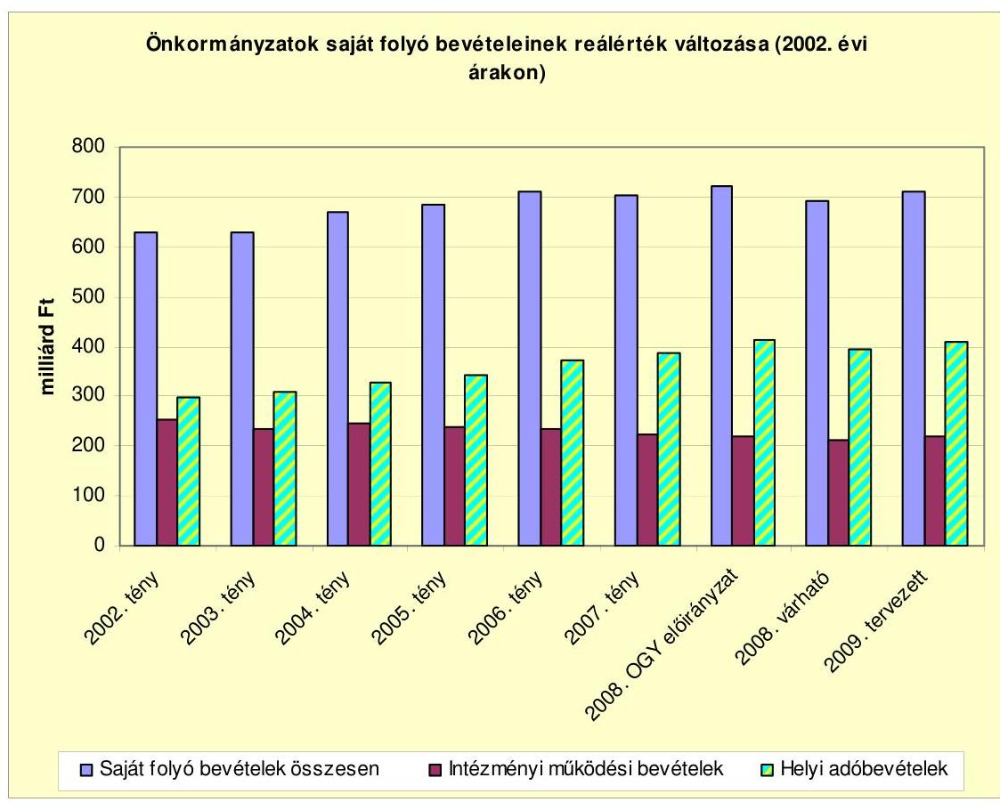

Az intézményi múködési bevételek a 2008. évi országgyűlési előirányzathoz viszonyított 33 milliárd Ft növekedésén belül meghatározó a kamatbevételekből várt 30 milliárd Ft-os többletbevétel. A kamatbevételeket az önkormányzatok szabad pénzeszközök hasznosításával kapcsolatos (finanszírozási műveletek körébe tartozó) döntései és a lekötött betétek fejlesztési és egyéb feladatokra történő bevonásának üteme egyaránt befolyásolják. A számított kamatbevétel előirányzata az önkormányzatok számláján lévő teljes pénzeszközállomány betéti számlán történő elhelyezését feltételezi a jelenlegi betéti kamatszint mellett.

Az intézményi térítési díj nagyobb része a szociális és közoktatási intézmények ellátottai, alkalmazottai térítési díj befizetéseiből származik, amelyek az igénybe vett szolgáltatások jellemzőitől, a térítési díjak önköltségalapú megállapításától függően eltérő sajátosságokkal bírnak (pl. bentlakásos szociális intézmé-

---

nyekben a személyi térítési díj megállapítás 2007. évben bevezetett szabályai növelték, a közoktatási intézményekben az ingyenes étkeztetés bővítése csökkentette az intézményi ellátásokért fizetett térítési díjat. Az áfa bevételekre az étkeztetés adózási szabályainak 2008. évi módosítása (I. negyedévben adómentes tevékenység körébe sorolása) a 2008. évi várható teljesítést befolyásolta.

A fővárosi, megyei és megyei jogú városi önkormányzatokat megillető illetékbevétel tervezett előirányzata a 2008. évi országgyúlési előirányzatnál 6,9\%-kal magasabb, amely teljesítésében az adóztatással kapcsolatos feladatok APEH szervezetébe integrálását követően az önkormányzatoknak csökkent a szerepe. Az illetékekkel kapcsolatos adóztatási feladatok APEH által történő átvételét követően a 2007. évben az önkormányzatok illetékbevételeiben átmenetileg visszaesés volt tapasztalható, a 2007. év végén 3 milliárd Ft maradt az illeték bevételi számlákon, amely csak 2008 januárjában folyt be az önkormányzatokhoz.

Az önkormányzatok bevételét a vagyonszerzési illeték 50\%-a illeti meg, amelynek közel kétharmada az ingatlanforgalom sajátosságait tükröző visszterhes ingatlan átruházási illeték. Az illetékbevétel nagyságában a hátralékok alakulása mellett a helyi ingatlanpiac (forgalom és ingatlanárak) alakulása is szerepet játszik. A területi sajátosságaiban meglévő különbségeket mérsékli, hogy az önkormányzatokat megillető - beszedési költségekkel csökkentett - vagyonszerzési illeték 65\%-ának kétharmad része egyenlő összegben (egyhuszad részenként), egyharmada a lakosságszám arányában illeti meg a fővárosi, megyei önkormányzatokat.

A 2009. évre tervezett helyi adó bevételek 9,6\%-kal magasabbak, mint a 2008. évi előirányzat, a számított 54,5 milliárd Ft-os többletbevétel 84,4\%-a iparúzési adóból várható, amelyet a gazdasági növekedés és az infláció hatására emelkedő adóalapok alapozhatnak meg. A helyi adókról szóló törvény tervezett változtatása a benyújtott törvényjavaslat alapján nem gyakorol érdemi hatást a helyi adóbevételekre, azonban a helyi iparúzési adó alapját érintő javaslat is szerepel a tervezetben. A módosítás szerint a 2009. évtől a helyi iparúzési adó alapjából le lehet vonni a K+F közvetlen költségét, a külföldi telephelyen képződött iparúzési adóalap rész 100\%-ban csökkenti az adóalapot a jelenlegi $90 \%$ helyett, ugyanokkor a nettó árbevétel csak a jogdíjak felével csökkenthető.

Az iparúzési adót bevezető önkormányzatok a 2\%-os felső adómértéket alkalmazzák, további adómérték emelésre nincs lehetőségük, a többi adónemnél az éves infláció utólagos figyelembe vételével emelkednek a törvényben meghatározott és a helyi adórendeletekben megállapítható adómértékek.

A teljesített saját bevételeken belül a helyi adóbevételek részaránya két százalékponttal, 16,6\%-ra emelkedett a 2007. évben. A helyi iparúzési adó mentességek, kedvezmények az EU jogharmonizáció követelményei miatt 2007. december 31ével megszűntek, így 2008. január 1-jétől már csak az a vállalkozás kaphat - az önkormányzati rendeletben megállapított feltételek szerint - adómentességet vagy adókedvezményt, amelynek adóalapja nem haladja meg a 2,5 millió Ft-ot. A megszűnő kedvezmények, mentességek a vállalkozások adóterhét jelentősen növelik, ennek hatására több önkormányzat az iparúzési adó mértékének foko-

---

zatos csökkentését határozta el, amellyel egy adóverseny kialakulása kezdődhet el a vállalkozások letelepedését szorgalmazó önkormányzatok között.

A felhalmozási és tőke jellegú bevételek 437,5 milliárd Ft-os előirányzatának növekvő hányada, a 2009. évi előirányzatokban 62\%-a az európai uniós támogatás és az ehhez kapcsolódó hazai társfinanszírozás, valamint egyéb támogatás értékű (államháztartáson belülről átvett) felhalmozási bevétel. A tárgyi eszközök (ingatlanok) és részvények, részesedések értékesítéséből (privatizációból) származó bevételek aránya csökkent, és az önkormányzatok viszonylag szűk körére korlátozódik forgalomképes vagyontárgy hiányában.

A 2009. évi mérlegben a felhalmozási és tőke jellegű bevételek és kiadások különbsége a 2006. évi kiugró 186 milliárd Ft-tal szemben a 2009. évben már 375 milliárd Ft-ra emelkedik, amely az önkormányzatok adottságától, pénzügyi helyzetétől függően részben a meglévő tartalékok (pénzeszköz állomány) felhasználásából, valamint újabb hitelfelvételből fedezhető.

A működési célú bevételek és kiadások pozitív különbözete (működési eredmény) a fejlesztések finanszírozásában a 2007. évben ténylegesen 62\%-os, a 2008. évi várható teljesítés alapján 47\%-os, a 2009. évi országgyűlési előirányzatokban már csak 36\%-os részarányt képvisel, azaz a múködési célú forrásokban lévő tartalékok csökkentek. A felhalmozási bevételek és kiadások teljesítését jelentős mértékben befolyásolja az ÚMFT keretében igénybe vehető uniós támogatások pénzügyi teljesítése (a tervezett felhalmozási bevételek 55\%-a az EU-tól átvett pénzeszköz illetve hazai társfinanszírozás).

Az államháztartáson belüli átutalások tervezett 463,7 milliárd Ft-os előirányzata a 2008. évi előirányzatnál 12,4\%-kal, a 2008. évi várhatónál 9,4\%kal magasabb. A támogatásértékű múködési célú bevételeken belül meghatározó (89\%) az Egészségbiztosítási Alapból átvett pénzeszközök aránya, amely egyrészt a gyógyító-megelőző ellátások későbbiek során kialakított teljesítményalapú finanszírozási szabályai módosításának, másrészt az önkormányzatok fenntartásában lévő intézmények (egészségügyi szolgáltatók) kapacitásváltozásának, az egyes tevékenységek, intézmények kiszervezésének (nem költségvetési formában történő múködtetésének) függvényében a tervezetthez képest jelentős eltéréssel realizálható.

---

# KIMUTATÁS

az átengedett személyi jövedelemadó és önkormányzati támogatások rendelkezési jogosultság szerinti megoszlásáról (adatok millió Ft-ban)

|  Forrás megnevezése | Konkrét feladathoz nem rendelt elöirányzat |  |  |  |  |  |  |  |  |  |  |  |  |  |  |  |  |  |  |  |  |  |  |  |  |  |  |  |  |  |  |  |  |  |  |  |  |  |  |  |  |  |  |  |  |   |
| --- | --- | --- | --- | --- | --- | --- | --- | --- | --- | --- | --- | --- | --- | --- | --- | --- | --- | --- | --- | --- | --- | --- | --- | --- | --- | --- | --- | --- | --- | --- | --- | --- | --- | --- | --- | --- | --- | --- | --- | --- | --- | --- | --- | --- | --- | --- | --- |
|   | 2003. | 2004. | 2005. | 2006. | 2007. | 2008. | 2009. | 2003. | 2004. | 2005. | 2006. | 2007. | 2008. | 2009. | 2003. | 2004. | 2005. | 2006. | 2007. | 2008. | 2009. | 2003. | 2004. | 2005. | 2006. | 2007. | 2008. | 2009. | 2003. | 2004. | 2005. | 2006. | 2007. | 2008. | 2009. |  |  |  |  |  |   |
|  SZJA |  |  |  |  |  |  |  |  |  |  |  |  |  |  |  |  |  |  |  |  |  |  |  |  |  |  |  |  |  |  |  |  |  |  |  |  |  |  |  |  |  |  |  |  |  |   |
|  helyben maradó | 101275 | 113932 | 116406 | 118413 | 102649 | 114216 | 131040 | 0 | 0 | 0 | 0 | 0 | 0 | 0 | 0 | 0 | 0 | 0 | 0 | 0 | 0 | 0 | 0 | 0 | 0 | 0 | 0 | 0 | 0 | 0 | 0 | 0 | 0 | 0 | 0 | 0 | 0 | 0 | 0 | 0 | 0 | 0 | 0 |   |
|  kiegészítés | 79500 | 89615 | 96732 | 100160 | 106485 | 108603 | 96126 | 0 | 0 | 0 | 0 | 0 | 0 | 0 | 0 | 0 | 0 | 0 | 0 | 0 | 0 | 0 | 0 | 0 | 0 | 0 | 0 | 0 | 0 | 0 | 0 | 0 | 0 | 0 | 0 | 0 | 0 | 0 | 0 | 0 | 0 | 0 | 0 |   |
|  norm. feladatokra | 0 | 0 | 0 | 0 | 0 | 0 | 0 | 0 | 197061 | 222457 | 221291 | 221514 | 236229 | 348260 | 428034 | 27263 | 29724 | 31196 | 33567 | 67883 | 0 | 0 | 0 | 0 | 0 | 0 | 0 | 0 | 0 | 0 | 0 | 0 | 0 | 0 | 0 | 0 | 0 | 0 | 0 | 0 | 0 | 0 | 0 | 0 |   |
|  Norm. hj. | 0 | 0 | 0 | 0 | 0 | 0 | 0 | 0 | 515499 | 522902 | 549060 | 520298 | 514466 | 343310 | 292761 | 0 | 0 | 0 | 0 | 0 | 0 | 0 | 0 | 0 | 0 | 0 | 0 | 0 | 0 | 0 | 0 | 0 | 0 | 0 | 0 | 0 | 0 | 0 | 0 | 0 | 0 | 0 | 0 |   |
|  színházl tám. | 0 | 0 | 0 | 0 | 0 | 0 | 0 | 0 | 0 | 0 | 0 | 0 | 0 | 0 | 0 | 0 | 0 | 0 | 0 | 0 | 0 | 0 | 0 | 0 | 0 | 0 | 0 | 0 | 0 | 0 | 0 | 0 | 0 | 0 | 0 | 0 | 0 | 0 | 0 | 0 | 0 | 0 | 0 |   |
|  önhiki | 0 | 0 | 0 | 0 | 0 | 0 | 0 | 0 | 0 | 0 | 0 | 0 | 0 | 0 | 0 | 0 | 0 | 0 | 0 | 0 | 0 | 0 | 0 | 0 | 0 | 0 | 0 | 0 | 0 | 0 | 0 | 0 | 0 | 0 | 0 | 0 | 0 | 0 | 0 | 0 | 0 | 0 | 0 |   |
|  kp. elöirányzat | 0 | 0 | 0 | 0 | 0 | 0 | 0 | 0 | 0 | 0 | 0 | 0 | 0 | 0 | 0 | 0 | 0 | 0 | 0 | 0 | 0 | 0 | 0 | 0 | 0 | 0 | 0 | 0 | 0 | 0 | 0 | 0 | 0 | 0 | 0 | 0 | 0 | 0 | 0 | 0 | 0 | 0 | 0 |   |
|  Norm.kötött fh. tám. | 0 | 0 | 0 | 0 | 0 | 0 | 0 | 0 | 0 | 0 | 0 | 0 | 0 | 0 | 0 | 0 | 0 | 0 | 0 | 0 | 0 | 0 | 0 | 0 | 0 | 0 | 0 | 0 | 0 | 0 | 0 | 0 | 0 | 0 | 0 | 0 | 0 | 0 | 0 | 0 | 0 | 0 | 0 |   |
|  Orcsolt- és céltám | 0 | 0 | 0 | 0 | 0 | 0 | 0 | 0 | 0 | 0 | 0 | 0 | 0 | 0 | 0 | 0 | 0 | 0 | 0 | 0 | 0 | 0 | 0 | 0 | 0 | 0 | 0 | 0 | 0 | 0 | 0 | 0 | 0 | 0 | 0 | 0 | 0 | 0 | 0 | 0 | 0 | 0 |   |
|  Pajl. év vis masol.1. | 0 | 0 | 0 | 0 | 0 | 0 | 0 | 0 | 0 | 0 | 0 | 0 | 0 | 0 | 0 | 0 | 0 | 0 | 0 | 0 | 0 | 0 | 0 | 0 | 0 | 0 | 0 | 0 | 0 | 0 | 0 | 0 | 0 | 0 | 0 | 0 | 0 | 0 | 0 | 0 | 0 | 0 |   |
|  Bo-i 4-es mehó | 0 | 0 | 0 | 0 | 0 | 0 | 0 | 0 | 0 | 0 | 0 | 0 | 0 | 0 | 0 | 0 | 0 | 0 | 0 | 0 | 0 | 0 | 0 | 0 | 0 | 0 | 0 | 0 | 0 | 0 | 0 | 0 | 0 | 0 | 0 | 0 | 0 | 0 | 0 | 0 | 0 | 0 |   |
|  Kistérségek tám. | 0 | 0 | 0 | 0 | 0 | 0 | 0 | 0 | 0 | 0 | 0 | 0 | 0 | 0 | 0 | 0 | 0 | 0 | 0 | 0 | 0 | 0 | 0 | 0 | 0 | 0 | 0 | 0 | 0 | 0 | 0 | 0 | 0 | 0 | 0 | 0 | 0 | 0 | 0 | 0 | 0 | 0 |   |
|  Összesen | 180775 | 203547 | 213138 | 218573 | 209134 | 222819 | 227166 | 712560 | 745359 | 770351 | 741812 | 750695 | 691570 | 720795 | 238130 | 301966 | 366283 | 328869 | 389126 | 434246 | 474391 | 1131465 | 1250872 | 1349772 | 1289254 | 1348955 | 1348635 | 1422352 |  |  |  |  |  |  |  |  |  |  |  |  |  |   |
|  Megoszlás | 16,0 | 16,3 | 15,8 | 17,0 | 15,5 | 16,5 | 16,0 | 63,0 | 59,6 | 57,1 | 57,5 | 55,7 | 51,3 | 50,7 | 21,0 | 24,1 | 27,1 | 25,5 | 28,8 | 32,2 | 33,4 | 100,0 | 100,0 | 100,0 | 100,0 | 100,0 | 100,0 | 100,0 |  |  |  |  |  |  |  |  |  |  |  |  |  |  |   |

Megjegyzés: * SZJA-ba átkerült

---

# A normatív hozzájárulások jogcímenkénti és ágazatonkénti előirányzatainak változása 

| Sorszám | Megnevezés | 2008. évi törvényi előirányzat | 2009.évi OGY előirányzat | változás |  |
| :--: | :--: | :--: | :--: | :--: | :--: |
|  |  |  |  | 2008. évi törvényi elöir-hoz |  |
|  |  |  |  | Összeg | \% |
| 1. | Települési önkormányzatok feladatai | 20842,6 | 23370,1 | 2527,5 | 112,1 |
| 2. | Körzeti igazgatás | 11687,2 | 12605,9 | 918,7 | 107,9 |
| 3. | Körjegyzöség müködése | 6182,3 | 6394,8 | 212,5 | 103,4 |
| 4. | Megyei, fővárosi önkormányzatok feladatai | 2861,6 | 3 140,8 | 279,2 | 109,8 |
| 5. | Lakott külterülettel kapcs. feladatok | 1149,5 | 1229,4 | 79,9 | 107,0 |
| 6. | Lakossági települési folyékony hulliladék ártalmatlanítása. | 162,8 | 162,8 | 0,0 | 100,0 |
| 7. | Társadalmi-gazdasági és infrastuktúrális szempontból elmaradott, illetve súlyos foglalkoztatási gondokkal küzdő települési önkormányzatok feladatai | 5510,0 | 5509,5 | $-0,5$ | 100,0 |
| 8. | Üdülőhelyi feladatok | 8957,8 | 9408,3 | 450,5 | 105,0 |
| Tel.üzemelt, igazg. sport. össz. (1-8) |  | 57353,8 | 61821,6 | 4467,8 | 107,8 |
| 10. | Pénzbeli szociális juttatások | 67610,2 | 70 036,4 | 2426,2 | 103,6 |
| 11. | Szociális és gyermekjóléti alapszolgáltatási feladatok | 33493,1 | 33271,3 | $-221,8$ | 99,3 |
| 12. | Szociális és gyermekvédelmi bentlakásos és átmeneti elhelyezés | 57681,8 | 60 023,1 | 2341,3 | 104,1 |
| 13. | Hajléktalanok átmeneti intézményei | 1942,0 | 1986,4 | 44,4 | 102,3 |
| 14. | Gyermekek napközbeni ellátása | 11 149,6 | 11824,8 | 675,2 | 106,1 |
| Szoc.és gyermj ell.össz. (10-14)** |  | 171 876,7 | 177 142,0 | 5265,3 | 103,1 |
| 15. | Közoktatási alap-hozzájárulások | 326 042,6 | 335 929,3 | 9886,7 | 103,0 |
| 16. | Közoktatási kiegészítő hozzájárulások | 74871,7 | 55557,3 | $-19314,4$ | 74,2 |
| 17. | Szociális juttatások, egyéb szolgáltatások | 31965,6 | 43390,0 | 11424,4 | 135,7 |
| 18. | Egyes közoktatási hozzájárulások kiegészítése 2009. január 1-jétől augusztus 31-éig (a költségvetési év első nyolc hónapjára) | 0,0 | 16785,6 | 16785,6 | 0,0 |
| Közoktatási hozzájárulások* |  | 432 879,9 | 451 662,2 | 18782,3 | 104,3 |
| 9.a | Helyi közművelődési és közgyűjteményi feladatok | 11534,0 | 12061,6 | 527,6 | 104,6 |
| 9.b | Megyei/fővárosi közművelődési és közgyűjteményi feladatok | 5669,3 | 5931,7 | 262,4 | 104,6 |
| Közművelődési és közgyűjteményi fel. össz. |  | 17 203,3 | 17993,3 | 790,0 | 104,6 |
| MINDÖSSZESEN |  | 679 313,7 | 708 619,1 | 29305,4 | 104,3 |

A közoktatási hozzájárulások célok szerinti részletezését, valamint a hozzájárulások és támogatások együttes alakulását a 2/a. számú melléklet mutatja be.

---

A közoktatás normatív hozzájárulásainak és a IX. Fejezetben előirányzott többi támogatásának alakulása

|  Sorszám | Megnevezés | 2008. évi törvényi előirányzat | 2009.évi OGY előirányzat | változás |   |
| --- | --- | --- | --- | --- | --- |
|   |  |  |  | 2008. évi törvényi előir-hoz |   |
|   |  |  |  | Összeg | \%  |
|   | Óvodai nevelés | 71025,9 | 70395,5 | $-630,4$ | 99,1  |
|   | Iskolai oktatás1-8 | 143167,8 | 138510,7 | $-4657,1$ | 96,7  |
|   | Iskolai oktatás 9-13 | 85300,6 | 86055,8 | 755,2 | 100,9  |
|   | Iskolai szakképzés | 19967,0 | 20056,8 | 89,8 | 100,4  |
|   | Alapfokú művészetoktatás | 1716,9 | 5197,7 | 3480,8 | 302,7  |
|   | Kollégiumi, externátusi nevelés, ell. | 2278,3 | 6951,2 | 4672,9 | 305,1  |
|   | Napközi,vagy tanulószobai foglalk., isk.-otthonos oktatás, nevelés | 2586,1 | 8761,6 | 6175,5 | 338,8  |
|  15. | Közokt. alaphozzájár. össz. | 326042,6 | 335929,3 | 9886,7 | 103,0  |
|   | Iskolai szakmai gyakorlati oktatás, szakképzés | 10175,1 | 10174,0 | $-1,1$ | 100,0  |
|   | Alapfokú művészetoktatás | 6265,9 | 0,0 | $-6265,9$ | 0,0  |
|   | Kollégiumok közoktatási feladatai | 13522,9 | 0,0 | $-13522,9$ | 0,0  |
|   | Sajátos nevelési igényű gyerm. tanulók nevelése, oktatása | 17253,3 | 16662,6 | $-590,7$ | 96,6  |
|   | Általános iskolai napközis foglalkozás | 5065,7 | 0,0 | $-5065,7$ | 0,0  |
|   | Nem magyar nyelven folyó nevelés és oktatás, valamint a roma kisebbségi oktatás | 4829,4 | 4842,0 | 12,6 | 100,3  |
|   | Nemzetiségi nyelvű, két tanítási nyelvűoktatás, nyelvi előkészítő oktatás | 2939,5 | 3055,4 | 115,9 | 103,9  |
|   | Egyes pedagógiai programok, módszerek támogatása | 3965,1 | 8295,3 | 4330,2 | 209,2  |
|   | Hozzájárulás egyes közoktatási intézményeket fenntartó önkorm. feladatellátásához | 10854,8 | 12528,0 | 1673,2 | 115,4  |
|  16. | Közoktatási kiegészítő hozzájárulások összesen | 74871,7 | 55557,3 | $-19314,4$ | 74,2  |
|   | Kedvezményes óvodai, iskolai, kollégiumi étkeztetés | 22434,5 | 27100,0 | 4665,5 | 120,8  |
|   | A tanulók tankönyvellátásának támogatása | 6334,9 | 6330,0 | $-4,9$ | 99,9  |
|   | Kollégiumi, diákotthoni lakhatási feltételek megteremtése szállásbiztosítás | 3196,2 | 9960,0 | 6763,8 | 311,6  |
|  17. | Szociális juttatások, egyéb szolgáltatások | 31965,6 | 43390,0 | 11424,4 | 135,7  |
|   | Kiegészítés a 15. pont alatti közoktatási alap-hozzájáruláshoz | 0,0 | 15129,6 | 15129,6 | 0,0  |
|   | Kiegészítés a 16.2. pont alatti Gyógypedagógiai (konduktív pedagógiai) nevelés, oktatás az óvodában és az iskolában jogcímű hozzájáruláshoz | 0,0 | 836,0 | 836,0 | 0,0  |
|   | Kiegészítés a 17.3 Kollégiumi, diákotthoni lakhatási feltételek megteremtése jogcímű hozzájáruláshoz | 0,0 | 820,0 | 820,0 | 0,0  |

---

| 18. | Egyes közoktatási hozzájárulások
kiegészítése 2009. január 1-jétől
augusztus 31-ig (a költségvetési év
első nyolc hónapjára) | 0,0 | 16 785,6 | 16 785,6 | 0,0 |
| :-- | :-- | --: | --: | --: | --: |
|  | Közoktatási normatív hozzájárulások
összesen: (15+16+17+18) | 432 879,9 | 451 662,2 | 18 782,3 | 104,3 |

| A közoktatási hozzájárulások és támogatások együttes alakulása |  |  |  |  |
| :--: | :--: | :--: | :--: | :--: |
|  | Normatív hozzájárulások | 432 879,9 | 451 662,2 | 18 782,3 |
|  | Normatív, kötött közokt. normatívák | 6 912,2 | 6 673,6 | $-238,6$ |
|  | Közoktatási normatívák együtt | 439 792,1 | 458 335,8 | 18 543,7 |
|  | Kistérségi közoktatás | 13 185,7 | 13 185,7 | 0,0 |
|  | Közoktatási célú normatívák együtt | 452 977,8 | 471 521,5 | 18 543,7 |
|  | Központosított előirányzatokból közoktatási célú támogatás | 11 930,0 | 30 685,0 | 18 755,0 |
|  | IX fejezeti közoktatás összesen | 464 907,8 | 502 206,5 | 37 298,7 |

---

# A normatív, kötött felhasználású támogatások jogcímenkénti és ágazatonkénti előirányzatainak változása

|  Sor-
szám | Megnevezés | 2008. évi törvényi előirányzat | 2009.évi OGY előirányzat | millió forintban |   |
| --- | --- | --- | --- | --- | --- |
|   |  |  |  | változás |   |
|   |  |  |  | 2008. évi törvényi előir-hoz |   |
|   |  |  |  | Összeg | \%  |
|  1. | Pedag. szakvizsga, továbbk.felk. | 1671,0 | 1695,1 | 24,1 | 101,4  |
|  2. | A főv. és megyei közalap. sz. tev. | 1000,0 | 1000,0 | 0,0 | 100,0  |
|  3. | Pedagógiai szakszolgálat | 4241,2 | 3978,5 | $-262,7$ | 93,8  |
|  I.Közoktatási feladatok összesen |  | 6912,2 | 6673,6 | $-238,6$ | 96,5  |
|  1. | Egyes jövedelempótló ellátások és az önkormányzat által szervezett kőcélú foglalkoztatás támogatása | 0,0 | 114056,5 | 114056,5 | 0,0  |
|   | Egyes jöv. pótló támogatások | 87759,0 | 0,0 | $-87759,0$ | 0,0  |
|   | Közfoglalkoztatás támogatása | 15073,7 | 0,0 | $-15073,7$ | 0,0  |
|  2. | Szoc. továbbképzés szakvizsga | 338,9 | 338,9 | 0,0 | 100,0  |
|  II. Egyes szoc feladatok tám. összesen |  | 103171,6 | 114395,4 | 11223,8 | 110,9  |
|  1. | A hivatásos önkormányzati tüzoltóság személyi juttatásaihoz | 33473,4 | 36314,1 | 2840,7 | 108,5  |
|  2. | A hivatásos önkormányzati tüzoltóság dologi kiadásainak támogatása | 1946,0 | 2134,5 | 188,5 | 109,7  |
|  III. Helyi önk. hív tüzoltóságok tám |  | 35419,4 | 38448,6 | 3029,2 | 108,6  |
|  1. | Többcélú kistérségi társulások általános és belső ellenőrzési feladatainak támogatása | 5404,7 | 5404,7 | 0,0 | 100,0  |
|  2. | Többcélú kistérségi társulások közoktatási feladatainak támogatása | 13185,7 | 13185,7 | 0,0 | 100,0  |
|  3. | Többcélú kistérségi társulások szociális intézményi, szociális alapszolgáltatási és gyermekjóléti alapellátási feladatainak támogatása | 7561,9 | 7561,9 | 0,0 | 100,0  |
|  4. | Többcélú kistérségi társulások mozgókönyvtári feladatainak támogatása | 1943,5 | 1943,5 | 0,0 | 100,0  |
|  IV. Többcélú kistérségi társulások tám. |  | 28095,8 | 28095,8 | 0,0 | 100,0  |
|  MINDÖSSZESEN |  | 173599,0 | 187613,4 | 14014,4 | 108,1  |

---

# A központosított előirányzatok támogatási jogcímeinek és összegeinek változása 

(millió Ft-ban)

| Sorszám | Megnevezés | 2008. évi törvényi előirányzat | 2009.évi OGY előirányzat | változás |  |
| :--: | :--: | :--: | :--: | :--: | :--: |
|  |  |  |  | 2008. évi törvényi előir-hoz |  |
|  |  |  |  | Összeg | \% |
| 1. | Lakossági közmútejesztés támogatása | 2350,0 | 1350,0 | $-1000,0$ | 57,4 |
| 2. | Lakossági víz- és csatornaszolgáltatás támogatása | 4800,0 | 4500,0 | $-300,0$ | 93,8 |
| 3. | Kompok, révek fenntartásának, felújításának támogatása | 150,0 | 150,0 | 0,0 | 100,0 |
| 4. | Határátkelőhelyek fenntartásának támogatása | 85,0 | 85,0 | 0,0 | 100,0 |
| 5. | Települési és területi kisebbségi önkormányzatok támogatása* | 1557,9 | 1560,0 | 2,1 | 100,1 |
| 6. | Kiegészítő támogatás nemzetiségi nevelési, oktatási feladatokhoz | 1100,0 | 1100,0 | 0,0 | 100,0 |
| 7. | Könyvtári és közművelődési érdekeltségnövelő támogatás, múzeumok szakmai támogatása | 710,0 | 710,0 | 0,0 | 100,0 |
| 8. | Helyi önkormányzatok hivatásos zenekari és énekkari támogatása | 1010,0 | 1710,0 | 700,0 | 169,3 |
| 9. | Helyi szervezési intézkedésekhez kapcsolódó többletkiadások támogatása | 9090,0 | 5090,0 | $-4000,0$ | 56,0 |
| 10. | Özdi martinsalak felhasználása miatt kárt szenvedett lakóépületek tulajdonosainak kártalanítása | 600,0 | 800,0 | 200,0 | 133,3 |
| 11. | A 2008. évi jövedelem-differenciálódás mérséklésénél beszámítással érintett önkormányzatok támogatása | 7200,0 | 8200,0 | 1000,0 | 113,9 |
| 12. | Önkormányzatok és jogi személyiségű társulásaik európai uniós fejlesztési pályázatai saját forrás kiegészítésének támogatása | 15 100,0 | 17600,0 | 2500,0 | 116,6 |
| 13. | A helyi közösségi közlekedés normatív támogatása | 35240,0 | 35240,0 | 0,0 | 100,0 |
| 14. | Települési önkormányzati szilárd burkolatú belterületi közutak burkolatfelújításának támogatása | 8000,0 | 8000,0 | 0,0 | 100,0 |
| 15. | Az érettségi és szakmai vizsgák lebonyolításának támogatása** | 470,0 | 1570,0 | 1100,0 | 334,0 |
| a) | Az érettségi vizsgák megszervezésének támogatása | 0,0 | 1000,0 | 1000,0 | 0,0 |
| b) | A szakmai vizsgák lebonyolításának támogatása | 470,0 | 570,0 | 100,0 | 121,3 |
| 16. | Esélyegyenlőséget, felzárkóztatást segítő támogatások | 2800,0 | 5203,0 | 2403,0 | 185,8 |

---

| Sorszám | Megnevezés | 2008. évi törvényi előirányzat | 2009.éví OGY előirányzat | változás |  |
| :--: | :--: | :--: | :--: | :--: | :--: |
|  |  |  |  | 2008. évi törvényi előir-hoz |  |
|  |  |  |  | Összeg | \% |
| a) | Esélyegyenlöséget szolgáló intézkedések támogatása | 0,0 | 4400,0 | 4400,0 |  |
| b) | Pedagógiai szakszolgálat és sajátos nevelési igényü tanulók támogatása | 0,0 | 803,0 | 803,0 |  |
| 17. | Közoktatás-fejlesztési célok támonatása | 6700,0 | 8500,0 | 1800,0 | 126,9 |
| a) | Szakmai és informatikai fejlesztési feladatok | 5000,0 | 5000,0 | 0,0 | 100,0 |
| b) | Minőségbiztosítás, mérés, értékelés, ellenőrzés támogatása | 600,0 | 600,0 | 0,0 | 100,0 |
| c) | Tejlesztménymotivációs pályázati alap | 1100,0 | 2900,0 | 1800,0 | 263,6 |
| 18. | Fővárosi kerületek belterületi útjainak szilárd burkolattal való ellátása | 2500,0 | 2000,0 | $-500,0$ | 80,0 |
| 19. | Az alapfokú művészetoktatás támogatása | 860,0 | 860,0 | 0,0 | 100,0 |
| 20. | A bölcsődék és közoktatási intézmények infrastruktúrális fejlesztése, valamint közösségi buszok beszerzése*** | 3500,0 | 4350,0 | 850,0 | 124,3 |
| 21. | Gyermekszegénység elleni programban nyári gyermekétkeztetés**** | 1200,0 | 2400,0 | 1200,0 | 200,0 |
| 22. | Belterületi vízrendezési célok támogatása | 500,0 | 500,0 | 0,0 | 100,0 |
| 23. | A 2008. évi bérpolitikai intézkedések tám | 40000,0 | 95540,0 | 55540,0 | 238,9 |
| 24. | Az Új Tudás-Műveltség Mindenkinek Program keretében a pedagógusok anyagi ösztönzését szolgáló támogatások | 0,0 | 11795,0 | 11795,0 | 0,0 |
| a) | Az integrációs rendszerben részt vevő intézményekben dolgozó pedagógusok anyagi támogatása | 0,0 | 3720,0 | 3720,0 |  |
| b) | A sajátos nevelési igényü gyermekkel foglalkozó pedagógus támogatása | 0,0 | 950,0 | 950,0 |  |
| c) | A közoktatási intézményvezetők kiegészítő illetménye | 0,0 | 2600,0 | 2600,0 |  |
| d) | Pályakezdő pedagógusok kiegészítő illetménye | 0,0 | 3670,0 | 3670,0 |  |
| e) | Az osztálytönöki feladatot ellátók támogatása | 0,0 | 855,0 | 855,0 |  |
| 25. | Komprehenzív iskola-modellek támogatása | 0,0 | 747,0 | 747,0 |  |
| 26. | Iskolai gyakorlati oktatás szakközépiskola tizenegy-tizenkettedik évfolyamán | 0,0 | 50,0 | 50,0 |  |
| 27. | Övodáztatási támogatás | 0,0 | 760,0 | 760,0 |  |
| 28. | Osztózó támogatás kistelepülések közoktatási feladatainak társulásban történő ellátásához | 0,0 | 100,0 | 100,0 |  |
|  | Helyi önkormányzati hivatásos tűzoltóságok kiegészítő támogatása | 2084,7 | 0,0 | $-2084,7$ | 0,0 |

---

| Sorszám | Megnevezés | 2008. évi törvényi elöirányzat | 2009.éví OGY elöirányzat | változás |  |
| :--: | :--: | :--: | :--: | :--: | :--: |
|  |  |  |  | 2008. évi törvényi elöir-hoz |  |
|  |  |  |  | Összeg | \% |
|  | Egyes szociális szolgáltatások kiegészítő támogatása | 100,0 | 0,0 | $-100,0$ | 0,0 |
|  | A vizitdíj visszatérítésének támogatása | 100,0 | 0,0 | $-100,0$ | 0,0 |
|  | 2006. év tavaszán kialakult árvíz és belvíz miatti károk enyhítése | 1 100,0 | 0,0 | $-1100,0$ | 0,0 |
|  | Villamosenergia áremelkedés hatásainak ellentételezése | 500,0 | 0,0 | $-500,0$ | 0,0 |
|  | Központosított elöirányzatok összesen: | 149 407,6 | 220 470,0 | 71 062,4 | 147,6 |

A 2008. évben az 5. jogcím elnevezése "Települési és területi kisebbségi önkormányzatok müködésének általános támogatása" volt

A 15. jogcímnél 2008. évben az érettségi vizsgák támogatása OKM fejezeti kezelésű.
A 20. jogcím elnevezése a 2008. évben "A kistelepülési iskolák és
körjegyzőségek tárgyi feltételeinek javítása, valamint közösségi buszok
beszerzése" volt.
A 2008. évben a 21.jogcím megnevezése "Nyári gyermekétkeztetés" volt.

---

Az önkormányzatok 2009. évi fejlesztési célú támogatásainak alakulása
(millió Ft-ban)

| $\underset{\text { szám }}{ }$ | Megnevezés | 2008.évi   törvényi   elöirányzat | 2009. évi   javaslat | Változás   (2009/2008) |  |
| :--: | :--: | :--: | :--: | :--: | :--: |
| I. | IX. Helyi önkormányzatok támogatása fejezetben tervezett elöirányzatok |  |  | összegben | \%-ban |
|  | 1.) | Címzett- és céltámogatás | 53000,0 | 10000,0 | $-43000,0$ | 18,9 |
|  |  | ebből az új induló céltámogatások | 200,0 | 200,0 | 0,0 | 100,0 |
|  | 2.) | Helyi önkormányzatok fejlesztési feladatainak támogatása | 10870,0 | 10570,0 | $-300,0$ | 97,2 |
|  | 3.) | Helyi önkormányzatok vis major támogatása | 0,0 | 800,0 | 800,0 |  |
|  | 4.) | Vis maior tartalék | 360,0 | 360,0 | 0,0 | 100,0 |
|  | 5.) | Budapest 4-es metróvonal építésének támogatása | 16200,0 | 9500,0 | $-6700,0$ | 58,6 |
|  | 6.) | Leghátrányosabb helyzetű kistérségek felzárkóztatásának támogatása | 5800,0 | 6050,0 | 250,0 | 104,3 |
|  | Fejlesztési támogatások összesen: |  | 86230,0 | 37280,0 | $-48950,0$ | 43,2 |
|  | Központosított elöirányzatként tervezett fejlesztési célú támogatások összesen |  | 41000,0 | 42950,0 | 1950,0 | 104,8 |
|  | 1.) | lakossági közmúfejlesztés támogatása | 2350,0 | 1350,0 | $-1000,0$ | 57,4 |
|  | 2.) | kompok, révek felújításának támogatása | 150,0 | 150,0 | 0,0 | 100,0 |
|  | 3.) | ózdi martinsalak felhasználása miatt kárt szenvedett lakóépületek tulajdonosainak kártalanítása | 600,0 | 800,0 | 200,0 | 133,3 |
|  | 4.) | a 2007. évi jövedelemdifferenciálódás mérséklésénél beszámítással érintett önkormányzatok támogatása | 7200,0 | 8200,0 | 1000,0 | 113,9 |
|  | 5.) | önkormányzatok és jogi személyiségű társulásaik európai uniós fejlesztési pályázatai saját forrás kiegészítésének támogatása | 15100,0 | 17600,0 | 2500,0 | 116,6 |
|  | 6.) | települési önkormányzatok szilárd burkolatú belterületi közutak burkolatfelújításának támogatása | 8000,0 | 8000,0 | 0,0 | 100,0 |
|  | 7.) | Fővárosi belterületi utak szilárd burkolattal való ellátásának támogatása | 2500,0 | 2000,0 | $-500,0$ | 80,0 |
|  | 8.) | A bölcsődék és közoktatási intézmények infrastrukturális fejlesztése, közösségi buszok | 3500,0 | 4350,0 | 850,0 | 124,3 |
|  | 9.) | 2006.tavaszán kialakult árvíz és belvíz miatt keletkezett károk enyhítésére | 1100,0 | 0,0 | $-1100,0$ | 0,0 |
|  | 10.) | belterületi belvízrendezési célok támogatása | 500,0 | 500,0 | 0,0 |  |
| I. Összesen: |  |  | 127230,0 | 80230,0 | $-47000$ | 63,1 |

---

| II. Decentralizált fejlesztési programok előirányzatai |  |  |  |  |  |
| :--: | :--: | :--: | :--: | :--: | :--: |
| XV. Nemzeti Területfejlesztési és Gazdasági Minisztérium fejezetben tervezett terület- és régiófejlesztési cálelóirányzat |  | 4900,0 | 4831,0 | $-69,0$ | 98,6 |
|  | ebböl:   -decentralizált területfejlesztési programok | 3900,0 | 3900,0 | 0,0 | 100,0 |
|  | -Vásárhelyi terv továbbfejlesztése | 1000 | 931 | $-69,0$ | 93,1 |
|  | LXIX. Kutatási ésTechnológiai Innovációs Alap, regionális innováció támogatása | 5000,0 | 5000,0 | 0,0 | 100,0 |
| II. Összesen: |  | 9900,0 | 9831,0 | $-69,0$ | 99,3 |
| FEJLESZTÉSI CÉLÚ TÁMOGATÁSOK ÖSSZESEN: |  | 137 130,0 | 90 061,0 | $-47$ 069,0 | 65,7 |
| Fejlesztési célú támogatás Főváros metró-beruházási programjának támogatása nélkül |  | 120 930,0 | 80 561,0 | $-40$ 369,0 | 66,6 |
| ebböl: | regionális fejlesztési tanácsok döntési hatáskörébe adott támogatási előirányzat: |  |  |  |  |
|  | összege | 34770,0 | 35451,0 | 681,0 | 102,0 |
|  | aránya (\%) | 28,8 | 44,0 |  |  |

---

FÜGGELÉK

---

.

---

# I. ORSZÁGGYŰLÉS 

Az OGY fejezet 1-4. címének 2009. évi költségvetési törvényjavaslat szerinti kiadási előirányzata $17697,9 \mathrm{M}$ Ft, bevételi előirányzata $415,0 \mathrm{M}$ Ft, támogatási előirányzata $17282,9 \mathrm{M}$ Ft. A kiadási és a támogatási előirányzat $287,1 \mathrm{M}$ Ft fejezeti egyensúlyi tartalékot tartalmaz.

A költségvetési javaslatot az Országgyúlés Hivatalának és az Állambiztonsági Szolgálatok Történeti Levéltárának, valamint a fejezeti kezelésű előirányzatoknak a költségvetése alkotja.

Az OGY fejezet 2009. évi költségvetési javaslatát a köriratban, továbbá a vonatkozó jogszabályokban foglaltak alapján az intézmények, a szakmai és pénzügyi szervezeti egységek együttmúködésével dolgozták ki.

A tervezés során a költségvetési címrend változtatására javaslatot tettek, a fejezeti kezelésű előirányzatok között új alcímként jelenik meg az Európai Unió magyarországi képviselői váltásával kapcsolatos kiadások. A címrend kialakításánál az Áht. 19-20. § előírásai szerint jártak el.

Az OGY létszám irányszáma 2009. évre az előző évi 1349 fơről 1354 főre növekedett a Magyar Köztársaság hosszú távú fenntartható fejlődésével kapcsolatos tervezési és egyeztetési folyamat feladatairól szóló 100/2007. (XI.14.) OGY határozat alapján létrehozott Nemzeti Fenntartható Fejlődési Tanács titkársági feladatainak létszám igénye miatt.

A belső ellenőrzési feladatokat 2009-ben is 2 fő látja el, ami megegyezik a 2004. évi szinttel.

A személyi juttatások 2009. évi 9742,6 M Ft javasolt előirányzata a fejezetnél összesen 549,7 M Ft összeggel haladja meg a 2008. évi eredeti előirányzatot.

A munkaadókat terhelő járulékra 2009. évre 2241,4 M Ft-ot terveztek, a 2008. évi előirányzatnál 14,9 M Ft-tal magasabb összegben.

A dologi kiadások előirányzat javaslata a két intézménynél összesen a 2008. évi 3236,5 M Ft-ról 3359,1 M Ft-ra változott.

Az OGY két intézménye felhalmozási kiadásokra 1780,5 M Ft előirányzatot, ebből felújításra 1313,3 M Ft-ot, beruházásra 467,2 M Ft-ot terveztek. Felhalmozási kiadásokra a Hivatal 1742,0 M Ft-ot, a 2008. évihez képest 148,1 M Fttal magasabb összeget tervezett.

Az OGY intézményei a dolgozók lakásépítésére és vásárlására kölcsönt nem terveztek 2009. évre. Az új igényekre a korábbi időszakban erre a célra folyósított összegekből befolyt törlesztő részletek nyújtanak fedezetet.

---

Az OGY intézményei a 2009. évre a tevékenység jellegéből adódóan összesen 415,0 M Ft saját bevételt terveztek, mely nagyságrendjét tekintve a kiadások mindössze 2,3\%-ának finanszírozására nyújt fedezetet.

Az OGY Hivatala 2009. évre a Fejezeti kezelésű előirányzatoknál öt alcímen összesen 623,6 M Ft kiadási előirányzatot és költségvetési támogatást tervezett. A 2009. évi költségvetési javaslat a 2004. évben elindított e-Parlament program feladatainak végrehajtására fejezeti kezelésű előirányzatként az előző évi báziselőirányzattal megegyező kiadásokat tartalmazta 40,0 M Ft összegben.

A tervezési körirat előírásainak megfelelően a nemzetközi szervezetekben betöltött tagságok és hozzájárulások körét, szükségességét áttekintették és a Nemzetközi tagdíjak alcímen 18,0 M Ft előirányzatot terveztek.

A Kárpát-medencei Magyar Képviselők Fóruma kiadásaira a 2008. évivel azonos összeget ( 65,0 M Ft) és az Európai Unió magyarországi képviselői váltásával kapcsolatos kiadásokra 213,5 M Ft előirányzatot terveztek.

A PM-mel történt egyeztetést követően a 2008. évivel azonos összegű, 287,1 M Ft fejezeti egyensúlyi tartalék előirányzatot képeztek a fejezetnél.

Az OGY-nál a PM köriratnak és a jogszabályi előírásoknak megfelelően kidolgozták a 2010-2012. évek előirányzatainak számszaki levezetését.

---

# KÖZBESZERZÉSEK TANÁCSA 

A KT fejezeti jogosítványú költségvetési szerv 2009. évi költségvetési törvényjavaslat szerinti kiadási előirányzata 1651,4 M Ft , bevételi előirányzata 1422,9 M Ft, támogatási előirányzata 228,5 M Ft. A kiadási és a támogatási előirányzat 6,6 M Ft fejezeti egyensúlyi tartalékot tartalmaz.

A KT költségvetési javaslatát a tervezési köriratban megfogalmazott követelmények, a Kbt. törvényjavaslata és a PM által kidolgozott támogatási irányszámok figyelembevételével állította össze.

A KT előterjesztett 2009. évi költségvetési javaslatát a Kbt. változásának várható hatását felmérő számításokkal támasztotta alá, amelyek alapján a költségvetési előirányzatok tartalmi és számszaki levezetésénél a tervezési körirat előírásait nem minden esetben érvényesítették: a saját bevételek tervezésénél - az Országgyúlés előtt lévő, a közbeszerzésekről szóló 2003. évi CXXIX. tv. módosításáról szóló T/5656. számú törvényjavaslatból eredően - az előírásoktól eltértek, a 2009. évre 703,1 M Ft összegű forráshiányt számszerúsítettek. A saját bevételek alapjául szolgáló díjak emelésére jogszabály-módosítást a szervezet nem kezdeményezett.

A PM észrevételében jelezte, hogy: „... a Kbt. változása miatt bevételcsökkentést a törvény módosítását követően a Kormány kezelni fogja."

A szervezet 2008. évi engedélyezett létszámkerete 85 fő volt, a 2009. évben jelentkező új feladatokat belső átcsoportosítással és a költségvetési javaslatban számszerúsített 2 fő többletlétszámmal tudják megoldani. A KT-nál betöltetlen státusz jelenleg nincs. A belső ellenőrzési feladatokat a korábbi időszakban és jelenleg is megbízási szerződéssel foglalkoztatott belső ellenőr látja el.

Az intézmény a személyi juttatások előirányzatát 663,1 M Ft-ban, az előző évinél 63,4 M Ft-tal magasabb összegben állapította meg. Ebből 14,2 M Ft a 2008. évi bérfejlesztés áthúzódó hatásaként támogatással ellentételezett, az e fölött tervezett előirányzat pénzügyi fedezete bizonytalan.

A KT a 2009. évi dologi kiadások előirányzatát a 2008. évi eredeti előirányzatnál ( 976,6 M Ft) kevesebbre, 732,1 M Ft-ra tervezte. Az előirányzat csökkenése több tényező eredőjeként alakult ki.

A szervezet a felhalmozási kiadások előirányzatát 2009. évre 38,4 M Ft-ra, a 2008. évi eredeti előirányzatnál 7,2 M Ft-tal magasabb mértékben tervezte.

A KT fejezeti kezelésű előirányzatként a pénzügyminiszter által előírt fejezeti egyensúlyi tartalékot képezte meg 6,6 M Ft összegben.

---

# II. KÖZTÁRSASÁGI ELNÖKSÉG 

A KE fejezet 2009. évi költségvetési törvényjavaslat szerinti kiadási és támogatási előirányzata 1320,7 M Ft. A kiadási és a támogatási előirányzat 69,9 M Ft fejezeti egyensúlyi tartalékot tartalmaz.

A 2008. évi eredeti előirányzathoz képest a 2009. évi kiadások tervezett előirányzata 263,4 M Ft-tal kevesebb, ami a köztisztviselői illetményalap 2008. évi változásának 2009. évre áthúzódó hatásával ( $17,5 \mathrm{M}$ Ft), és az államfői protokoll más fejezethez történő átrendezésével (277,9 M Ft), valamint a járulékcsökkentés ( 3 M Ft ) együttes hatásával függ össze.

A fejezet feladatrendszere a 2009-2012. években nem változik, ezért a címrend változtatására nem tettek javaslatot.

A fejezet felügyeleti szerve a PM által kidolgozott irányszámok alapján, a Konvergencia programban és a tervezési köriratban meghatározott irányelvek figyelembevételével a 2009. évi, valamint a 2010-2012. évek várható kiadásait reálisan tervezte. A fejezet a 2011. évi előirányzataiban megjelenítette az esedékes köztársasági elnöki ciklusváltással összefüggő előirányzati többletet is.

Személyi juttatásokra 440,0 M Ft-ot terveztek, amely a köztisztviselői illetményalap változásának áthúzódó hatásából adódóan 13,3 M Ft-tal több az előző évi eredeti előirányzatnál.

A KE 2008. évi engedélyezett létszáma 54 fő volt. A 2009-2012. évi tervezési időszakban is évente az 54 fős, a 2011. évben - az elnöki ciklusváltás következményeként - 55 fős létszámkerettel számolt. Betöltetlen státusz jelenleg nincs. A belső ellenőrzési feladatokat a korábbi évekhez hasonlóan jelenleg is megbízási szerződéssel foglalkoztatott belső ellenőr látja el.

A dologi kiadások előirányzatát a 2008. évi eredeti előirányzattal azonos öszszegben, 333,4 M Ft-ra tervezték. A dologi kiadások tervezésénél a fejezet csak a támogatási keretszámban rögzített előirányzatot vette figyelembe, mivel saját bevétellel nem számoltak.

A felhalmozási kiadások előirányzatát ugyancsak az előző évre jóváhagyott összegben, 52,1 M Ft-ban tervezték meg, ami a 2007. évi eredeti előirányzatnak 48,0\%-át adja. Az államháztartáson kívülre nyújtandó kölcsönök összegét - a dolgozók lakásépítésének munkáltatói támogatására - 2,0 M Ft-ban irányozták elő.

A KE fejezeti kezelésű előirányzatként tervezte meg az állami kitüntetések 282,1 M Ft és a fejezeti egyensúlyi tartalék 69,9 M Ft összegét.

---

# III. ALKOTMÁNYBÍRÓSÁG 

Az ALB fejezet 2009. évi költségvetési törvényjavaslat szerinti kiadási és támogatási előirányzata 1532,5 M Ft. A kiadási és a támogatási előirányzat $42,4 \mathrm{M}$ Ft fejezeti egyensúlyi tartalékot tartalmaz.

A fejezet feladat- és intézményrendszerének, illetve intézményi szervezeti rendszerének felülvizsgálatára a 2009. évi tervezés során nem került sor, így a tervek szerint az Alkotmánybíróság változatlan jogi környezetben és szervezeti felépítéssel (az Alkotmánybíróságról szóló 1989. évi XXXII. tv. 4. § (1) bekezdése alapján tizenegy taggal) végzi tevékenységét 2009. évben.

A költségvetési javaslatban prognosztizált pénzügyi források várhatóan biztosítják a jogszabályokban a fejezet részére meghatározott feladatok végrehajtását és nem terveztek olyan előirányzatot, amely a 2009. évi költségvetés teljesítését akadályozná.

A költségvetési címrend megváltoztatására a fejezet nem tett javaslatot.
Az intézmény 2009-re tervezett létszámkerete 111 fő, ami megegyezik a 2008. évi engedélyezett létszámmal. A létszám struktúráját a tervezés során áttekintették, de módosítását nem tartották indokoltnak.

A fejezet által a 2009. évre javasolt személyi juttatások kiadási előirányzata összesen 909,6 M Ft. A személyi juttatások és a munkaadókat terhelő járulékok kiadásának tervezésénél a jogszabályi előírásokkal összhangban, a tervezési köriratban meghatározottak szerint jártak el.

A dologi kiadások tervezésénél az intézmény a tervezési körirat szerint felülvizsgálta a kiadások alakulását, és a 2008. évi törvényi előirányzathoz (266,8 M Ft) viszonyítva 18,5 M Ft növekedéssel számoltak. A dologi kiadások fedezetére a fejezet által javasolt 285,3 M Ft összegű előirányzat indokolt, mivel a tervezettnél nagyobb mértékű megtakarítás - a szükséges növekmények mellett - az intézmény múködési színvonalát indokolatlanul csökkentené.

Pénzeszközátadást sem a központi költségvetés más alrendszerébe, sem államháztartáson kívülre nem terveztek.

A felhalmozási kiadások 2009. évi javasolt előirányzatát 6,5 M Ft összegben, a feladat ellátásának megfelelően tervezték a tervezési köriratban foglalt előírások betartásával. Központi beruházásokat 2009-re az ALB-nál nem terveztek.

Az intézmény a 2009. évre nem tervezi kölcsönök folyósítását.
Az ALB-nak nincs egyetlen számottevő saját bevételi forrása sem, így nem terveztek saját bevételt.

A fejezeti egyensúlyi tartalékot - a PM előírásai szerint fejezeti kezelésú előirányzatként tervezték - költségvetési támogatás terhére, 42,4 M Ft értékben. Er-

---

re az összegre előzetes determinációkat - az összeg tartalék jellegével összhangban -nem adtak meg.

Központosított bevételt képező előirányzatot nem terveztek.
A 2010-2012. évekre vonatkozó irányszámok kimunkálásánál a fejezetnél a tervezés időszakában rendelkezésre álló, illetve prognosztizálható adatokból és tényekből indultak ki és az irányszámok ennek alapján reálisnak tekinthetőek, érvényesítették a Konvergencia programban és a tervezési köriratban foglalt középtávú előrejelzéseket.

A 2010. évi várható kiadási előirányzat 1589,7 M Ft, a 2011. évi 1672,8 M Ft, míg a 2012. évi 1761,4 M Ft. 2010 és 2012 között tehát folyamatos kismértékű (összesen 14,9\%-os) növekedéssel számolnak 2009-hez képest. Saját bevétellel egyik évben sem számolnak, a kiadások fedezete tehát támogatás lehet csak. A létszám 2010 és 2012 között várhatóan változatlan (111 fő) lesz.

---

# IV. ORSZÁGGYŰLÉSI BIZTOSOK HIVATALA 

Az OBH fejezet 2009. évi költségvetési javaslat szerinti kiadási és támogatási előirányzata 1782,7 M Ft. A kiadási és a támogatási előirányzat 34,8 M Ft fejezeti egyensúlyi tartalékot tartalmaz.

Az OBH a költségvetési címrend megváltoztatására nem tett javaslatot.
Az Országgyűlés 2008. május 26-án megválasztotta a jövő nemzedékek országgyűlési biztosát. Ezzel összefüggésben a 2009. évi tervezésben 391,0 M Ft előirányzati többletet számszerűsítettek a biztosi feladatok ellátására.

Az OBH 2009. évre javasolt létszáma 186 fő, amely 37 fővel több a 2008. évi jóváhagyott létszámnál. A növekményből 35 fő a jövő nemzedékek országgyűlési biztosa, 2 fő pedig a kisebbségi jogok országgyűlési biztosa által kért létszámbővítés.

A közigazgatási szerv közhatalmi, irányítási, ellenőrzési és felügyeleti hatáskörének gyakorlásával közvetlenül összefüggő, valamint ügyviteli feladat ellátására kizárólag csak közszolgálati jogviszonyban történő foglalkoztatást terveztek. A belső ellenőrzési tevékenységet egy fő látja el, amely megegyezik a 2004. évi létszámmal.

A személyi juttatások 2009. évre javasolt kiadási előirányzata 1121,1 M Ft. Illetményfejlesztést a tervezési körirat értelmében nem terveztek.

A dologi kiadások 2009. évre tervezett előirányzata 248,7 M Ft. Pénzeszközátadást államháztartáson kívülre nem terveztek.

Az intézményi beruházási kiadások javasolt előirányzata 31,3 M Ft, amelyet az előző évekhez hasonlóan elsősorban a meglévő tárgyi eszközei műszaki állapotának szinten tartására és fejlesztésére tervezik felhasználni. Felújítást és új beruházást nem tervezett a fejezet.

Az OBH - a korábbi évek gyakorlatához hasonlóan - sem kölcsön előirányzatot, sem saját bevételt nem tervezett.

Fejezeti kezelésű előirányzatként a kötelezően képzendő egyensúlyi tartalékot számszerúsítették 34,8 M Ft összegben.

Az OBH a 2010. évre 1799,6 M Ft, a 2011. évre 1962,9 M Ft, a 2012. évre 1814,2 M Ft kiadási és ezekkel megegyező összegű támogatási előirányzatokat határozott meg. A fejezet a 2010-2012. évi terveinél figyelembe vette a törvény alapján kifizetendő jubileumi jutalom összegét, a szükségessé váló felújítási munkákat, illetve az informatikai rendszer korszerűsítésének esedékességét.

---

# V. ÁLLAMI SZÁMVEVŐSZÉK 

Az ÁSZ fejezet 2009. évi költségvetési törvényjavaslat szerinti kiadási előirányzata $8122,9 \mathrm{M} \mathrm{Ft}$, bevételi előirányzata $45,3 \mathrm{M}$ Ft. A költségvetési támogatás tervezett összege 8077,6 M Ft. A kiadási és a támogatási előirányzat 220,3 M Ft fejezeti egyensúlyi tartalékot tartalmaz.

A fejezeti és intézményi feladatokat ugyanazon szervezet látja el.
A tervezés során a Pénzügyminisztérium megküldött tervezési köriratában meghatározottakat vették figyelembe.

Az ÁSZ 2009. évre tervezett költségvetési előirányzata 248,1 M Ft-tal haladja meg a 2008. évi eredeti előirányzatot.

Az előirányzat változás összességéből 163,8 M Ft a 2008. évi illetményjavítás 60\%-ára, 27,0 M Ft az Apáczai Csere János utcai székház központi fütési rendszere 2008. évben megkezdett korszerűsítési munkáira, 30,0 M Ft a Lónyay utcai irodaház liftgép cseréjére és a kapcsolódó munkák végzésére, $75,7 \mathrm{M}$ Ft a külső szakértők foglalkoztatására nyújt fedezetet. Az Átmeneti Támogatás keretében benyújtott és jóváhagyott két pályázat EU támogatásának módosulása 14,9 M Ft, a járulékváltozás miatti elvonás $33,5 \mathrm{M}$ Ft csökkenést jelent.

Az engedélyezett intézményi létszám 598 fő, mely az előző évhez képest nem változott.

A személyi juttatások 2008. évi 4779,1 M Ft-os előirányzatát - a külső szakértők foglalkoztatása és a 2008. évi illetményjavítás miatt - 283,4 M Ft-tal emelték meg. Az illetményjavítás központi támogatásból nem biztosított részének (40\%) fedezetét belső átcsoportosítással, a dologi és a beruházási kiadások csökkentésével biztosították.

A munkaadókat terhelő járulékok kiadásának javasolt előirányzata 1524,7 M Ft, melyet a jogszabályokban előírtak szerint számoltak ki, illetve azt a PM által meghatározott összeggel csökkentették.

A dologi kiadások előirányzata 1056,8 M Ft, mely az eredeti előirányzathoz képest 52,4 M Ft-tal csökkent, a személyi juttatásokra és a munkaadókat terhelő járulékokra való átcsoportosítással és az EU-s pályázattal összefüggésben.

A felhalmozási kiadások 258,6 M Ft összegben kerültek megtervezésre, mely a 2008. évi előirányzathoz képest 15,2 M Ft csökkenést jelent. Az előirányzaton belül az intézményi beruházásokat 244,9 M Ft-ban, a felújításokat 13,7 M Ftban határozták meg.

A munkavállalói lakásépítési kölcsönök 2009. évi előirányzatára nem terveztek kiadást, az új igényekre a fedezetet a kiadott kölcsönök megtérüléséből befolyó pénzösszegekből tervezik biztosítani.

---

Tartós finanszírozásba bevonható bevételek növelésére az ÁSZ nem rendelkezik számottevő lehetőséggel, ezért pályázatokhoz kapcsolódó összegen felüli előirányzat a 2008. évinek megfelelő mértékű.

A nemzetközi szervezetekben betöltött tagságok után 1,7 M Ft tagdijfizetést terveztek.

Fejezeti államháztartási tartalékként - a fejezeti kezelésű előirányzatoknál 220,3 M Ft került megtervezésre.

Az összeg megtervezése a beszámolók és elszámolások megbízhatóságát minősítő zárszámadási ellenőrzések teljesebb körűvé tételével kapcsolatos vizsgálatokhoz időszakosan foglalkoztatandó külső szakértők és munkatársak alkalmazásához tervezett előirányzatok terhére volt megvalósítható.

A 2010-2012. évek költségvetési előirányzatainak meghatározására - a központi intézkedéseknek megfelelően - a tervezés vizsgált szakaszában még nem került sor.

---

# VI. BÍRÓSÁGOK 

A BIR fejezet 2009. évi költségvetési törvényjavaslat szerinti kiadási előirányzata 77 318,9 M Ft, támogatási előirányzata $71792,3 \mathrm{M}$ Ft, bevételi előirányzata 5526,6 M Ft. A kiadási és a támogatási előirányzat 1439,1 M Ft fejezeti egyensúlyi tartalékot tartalmaz.

A fejezet felügyeleti szerve elkészítette a már hatályos jogszabályokban rögzített feladatok megvalósításához szükséges tervét (támogatási előirányzat 103 952,9 M Ft, bevételi előirányzat 5526,6 M Ft), azonban nem élt azzal a jogával, amely szerint az OIT „összeállítja a bírósági fejezet költségvetésére és a költségvetés végrehajtására vonatkozó javaslatát, amelyet a Kormány a központi költségvetési, illetve a zárszámadási törvényjavaslat részeként előterjeszt az Országgyűlésnek." (1997. évi LXVI. törvény 39. § b) pontja). Az OIT 2008. szeptember 9-én elfogadta a PM által biztosított 71 792,3 M Ft támogatási előirányzatot.

A költségvetési előirányzatok meghatározásánál figyelembe vették a szakmai feladatok ellátásának és az intézményi múködés feltételeinek szükségleteit.

A BIR fejezetnek, tevékenységéből adódóan, nagyarányú többletbevétel realizálására nincs lehetősége. A jogszabályok és a jogi szabályozás egyéb eszközei által meghatározott feladatok ellátásához szükséges forrást a fejezet kigazdálkodni nem tudja, ezért azok teljesítése csak a hatékonyság színvonalának csökkenése mellett valószínűsíthető.

A költségvetési létszámkeret meghatározása fejezeti szinten történt. A Bíróságok fejezet 2009. évre javasolt létszámkerete 10948 fő, amely 100 fő növekedést jelent a 2008. évi költségvetésében előirányzott létszámhoz képest.

A már hatályos és a jövő évben hatályba lépő új jogszabályok által meghatározott többletfeladatok ellátására tervezett 780 fő fejlesztésből 931,0 M Ft előirányzat 100 fős létszámnövelés nyújt fedezetet. A létszámnöveléssel kapcsolatos pénzügyi forrás, a 2009. évre meghatározott célfeladat ellátására, a Fővárosi és a Pest Megyei Bíróság ügyhátralék feldolgozó munkájához szükséges.

A BIR 2009. évre tervezett belső ellenőri létszáma 33 fő, amely a 2004. évi szinthez viszonyítva 8 fő csökkenést mutat.

A Bíróságok cím személyi juttatásainak a 2009. évi tervezett előirányzata 49 645,9 M Ft, a 2008. évi eredeti előirányzata 45 912,6 M Ft összeg volt. A külső személyi juttatások jelentős részét jogszabály írja elő (kirendelt védő, szakértő, pártfogó ügyvéd, ülnök, tolmács díjak). A külső személyi juttatások kiadásainál jelentős növekedés várható a tanuk költségtérítéséről szóló 14/2008. (VI. 27.) IRM rendelet alapján. A költségtérítésen belül négyszeresére nő az ellátási költség mértéke, valamint a tömegközlekedés mellett a gépjármú igénybevételére is lehetőség lesz. A fejezet jutalmat a 2009. évre nem tervezett.

A munkaadókat terhelő járulékok javasolt előirányzata 13 909,2 M Ft. Mértékének meghatározásánál a tervezési köriratban foglaltaknak megfelelően jártak el.

---

A fejezet dologi kiadásainak a 2009. évi előirányzata 9891,9 M Ft, amely 15,0\%-kal alacsonyabb a 2008. évi várható kiadásoknál. A szakértői és kirendelt védői díjak nagyobb része - áfa fizetési kötelezettségük miatt - a dologi kiadások között, a vásárolt közszolgáltatások részeként jelenik meg. A 2008. évi várható előirányzathoz képest 10\%-os csökkenést mutatnak. A jogszabályok változásának következtében felmerülő többletkiadások, az ítélkezéssel szorosan összefüggő postaköltségek és az energiaárak várható emelkedése indokolja a 2009. évben képzett fejezeti egyensúlyi tartalék igénybevételét. Költségvetési befizetéseket nem terveztek.

Az intézményi beruházások a 2009. évi előirányzata 233,2 M Ft, amely az informatikai rendszerek múködésével kapcsolatos beruházásokat, valamint az intézmények irodatechnikai gépparkjának korszerűsítését biztosítja. A felújítás 2009. évi előirányzata 200,0 M Ft, amely a 2008. évi eredeti előirányzathoz képest 53,7 M Ft csökkenést mutat.

Az előirányzat 2 városi bíróság fűtéskorszerűsítésére, 4 városi bíróság elektromos hálózatának felújítására, 3 városi bíróság csatornáztatására és egy városi bíróság tetőfelújítására biztosít fedezetet.

Kölcsönök soron előirányzatot nem terveztek.
A saját bevételek előirányzata 5526,6 M Ft, amely 1,7\%-os csökkenést mutat a 2008. évi várható teljesítéshez viszonyítva. Az intézmények múködésében meghatározó szerepet játszó hatósági és eljárási bevételek változásának számbavétele megfelelő volt.

A BIR fejezeti kezelésű előirányzatokra 1056,0 M Ft kiadást tervezett, amely teljes összegben költségvetési támogatás.

Ebből a Nemzeti Fejlesztési Terv végrehajtására 116,0 M Ft, a Ptk. alapján történő kártérítésre 5,1 M Ft, valamint a kincstári számlavezetési díra $0,8 \mathrm{MFt}$ a kiadási előirányzat. Új elemként jelent meg a Fővárosi és Pest Megyei Bíróságon felhalmozódott ügyhátralék kezelését szolgáló 931,0 M Ft, valamint a nemzetközi tagdíjak és kötelező jellegű, önkéntes hozzájárulások 3,1 M Ft kiadási előirányzata. A támogatási keret nem biztosítja a részben EU társfinanszírozással megvalósuló programok, projektek végrehajtását $84,0 \mathrm{M}$ Ft összegben.

A fejezeti kezelésű előirányzatok tartalmi és számszaki levezetései megfelelnek a tervezési előírásoknak, a szükséges források hiánya következtében azonban a jogi szabályozás egyéb eszközeivel való teljes összhangjuk nem biztosított.

Alapítványt, közhasznú társaságot, gazdasági társaságot nem támogatnak.
A központi beruházás 2009. évi támogatási irányszáma 943,6 M Ft, amely a folyamatban lévő épület beruházásokat szolgálja. A 2008. évi eredeti előirányzat 1350,0 M Ft volt. A fejezet kidolgozta évekre bontva a szakmai programokkal összhangban álló központi beruházások három éves programját. A beruházásokat bruttó módon, a teljes bekerülési költséget figyelembe véve tervezték. A projektek régiók és megyék szerinti besorolása megtörtént. 50,0 Mrd Ft-ot elérő, vagy azt meghaladó összköltségű beruházást nem terveztek.

---

A BIR fejezetnél új, induló tisztán hazai forrásból finanszírozandó beruházásokat, amelyeket az EU is támogat, nem terveztek.

A fejlesztési együttmúködési támogatás keretében nemzetközi segélynyújtást, illetve nemzetközi szervezet felé fizetési kötelezettséget nem terveztek.

A fejezeti egyensúlyi tartalék a PM irányszáma szerint 1439,1 M Ft, amely a támogatási keretszám 2,0\%-ának felel meg. Az egyensúlyi tartalék igénybevételére szükség lesz az intézmények évközi zavartalan múködésének és fizetőképességének fenntartásához.

A PM a fejezet részére 2008. szeptember 29-én küldte meg a 2010-2012. évekre vonatkozó támogatási keretszámokat, amelyek alapján a fejezeti indokolást 2008. október 8-ig kell elkészíteni. A 2010-2012. évekre javasolt támogatási öszszegek évi 6,5\% bérfejlesztést tartalmaznak. A 2010. évben 2,0\%, a 2011. évben 5,7\% és a 2012. évben 4,6\% növekedés várható a kiadási előirányzatoknál. Szervezeti változásokat nem terveztek.

---

# VIII. MAGYAR KÖZTÁRSASÁG ÜGYÉSZSÉGE 

Az MKÜ fejezet 2009. évi költségvetési törvényjavaslat szerinti kiadási előirányzata $31574,3 \mathrm{M}$ Ft, támogatási előirányzata $31498,3 \mathrm{M}$ Ft, bevételi előirányzata $76,0 \mathrm{M}$ Ft. A kiadási és támogatási előirányzat $595,0 \mathrm{M}$ Ft fejezeti egyensúlyi tartalékot tartalmaz.

Az MKÜ kiadási előirányzatán belül az Ügyészségek cím kiadási előirányzata $30925,3 \mathrm{M}$ Ft, amely $6,3 \%$-kal magasabb a 2008. évi eredeti előirányzatnál. A fejezeti kezelésű előirányzatok az előző évi eredeti előirányzat 72,5\%-ában, 649,0 M Ft-ban kerültek meghatározásra, amelyből a megképzett fejezeti egyensúlyi tartalék összege 595,0 M Ft.

A 2009. évi költségvetési előirányzatok tervezését 2008. júniusában kezdték meg az MKÜ szervezetéről és múködéséről kiadott 25/2003. (ÜK. 12.) LÚ utasítás szerint. A költségvetési tervezési feladatokat - a főosztályok bevonásával - a Gazdasági Főigazgatóság végezte a határidők betartásával. A fejezet 2009. évi költségvetésének tervezett előirányzatait az önállóan gazdálkodó intézmény szintjén határozták meg, a részjogkörú egységek előirányzatainak kialakítására a fejezeti főösszeg jóváhagyását követően kerül sor.

Az MKÜ-t nem érintik az egyes fejezetek közötti intézmény- és feladatátrendezésekkel összefüggő előirányzat átcsoportosítások, fejezetek közötti feladat át-adás-átvételeket nem terveztek.

A költségvetési címrend változtatására nem tettek javaslatot. Normaszövegre vonatkozó módosítási javaslatot fogalmaztak meg a 3.6. Jogerősen megállapított kártérítések céleIőirányzatával kapcsolatban, amelynek során betartották a jogalkotásról szóló 1987. évi XI. törvényben foglalt előírásokat.

Az MKÜ 2009. évi költségvetési javaslat szerinti létszámkerete 4049 fő, ami a 2008. január 1-jei engedélyezett létszámhoz képest tartalmazza a többletfeladatokkal indokolt 60 fős létszámfejlesztést. Az egész évben folyamatosan ellátandó feladatokat változatlanul közszolgálati - ügyészségi alkalmazotti - státuszban történő foglalkoztatással tervezik.

A belső ellenőri kapacitást a korábbi ÁSZ ellenőrzések javaslatára kiépítették, amelynek eredményeként a belső ellenőrzési létszám már a 2007. évben is megfelelő volt.

A személyi juttatások tervezett előirányzata $20610,4 \mathrm{M}$ Ft, amely 7\%-kal több a bázis előirányzatnál. Az előirányzat fedezetet nyújt a jogszabály szerinti kifizetésekre és a 2009. évi tervezett létszámfejlesztés forrásigényére.

A külső személyi juttatások tervezett előirányzata 66,6 M Ft, 26,6\%-kal több, mint a 2008. évi eredeti előirányzat. A 14,0 M Ft-os előirányzat növekedés a tanuk költségtérítéséről szóló 14/2008. (VI.27.) IRM rendelet szerint megállapított többletkiadások fedezete.

---

A munkaadókat terhelő járulékok javasolt előirányzata 6246,0 M Ft, melyet a jogszabályi előírásoknak megfelelően, a PM által meghatározott járulékcsökkentés figyelembevételével számszerúsítettek.

A dologi kiadások tervezett előirányzata 3045,0 M Ft, amely 2,4\%-kal több a 2008. évi eredeti előirányzatnál. Az előirányzat növekedését a többletfeladatok ellátásához szükséges létszámfejlesztés dologi kiadás vonzata eredményezte. Szellemi tevékenység végzésére történő kifizetést nem terveztek.

Az egyéb múködési célú támogatások, kiadások előirányzatát a 2008. évi eredeti előirányzattal egyezően 5,0 M Ft összegben tervezték.

Az MKÜ költségvetési javaslatában a felhalmozási költségvetés 995,9 M Ft, amely 201,0 M Ft-tal több a 2008. évi eredeti előirányzatnál, azonban 66,4\%-kal elmarad a 2008. évi várható teljesítéstől. Az intézményi beruházási kiadások 2009. évi javasolt előirányzata 910,9 M Ft, amely a 2008. évi törvényi előirányzatnál 35,7\%-kal magasabb. A növekedés 55,3\%-a az ügyészségi épületek rekonstrukciójához, 37\%-a számítástechnikai és biztonságtechnikai fejlesztésekhez, 7,7\%-a gépjármú cserékhez kapcsolódik.

A munkavállalók lakásépítésének és vásárlásának támogatására tervezett kiadási előirányzat 35,0 M Ft, amely 9,3\%-kal haladja meg a 2008. évi eredeti előirányzatot. Az összeg megállapításánál a várható igényeket, a lakástámo-gatási-rendszert jellemző tendenciákat és a dolgozói visszafizetéseket vették figyelembe.

Az MKÜ 2009-re 76,0 M Ft saját bevételt tervezett, amelyből 34,5 M Ft múködési bevétel, 6,5 M Ft a felhalmozási és tőke jellegű bevétel és 35,0 M Ft a lakáskölcsönök visszatérülése. A fejezet saját bevételei a kiadások 1\%-ára biztosítanak fedezetet.

Az MKÜ 2009-re összesen 649,0 M Ft fejezeti kezelésű előirányzattal számolt, amelyben az EU tagságból eredő feladatok forrását a bázis időszakkal azonosan $24,0 \mathrm{MFt}$, a fejezeti egyensúlyi tartalékot a PM által megállapított 595,0 M Ft összegben, a jogerősen megállapított kártérítések célellöirányzatát szintén a bázis évvel azonosan, 30,0 M Ft összegben tervezték meg.

Az MKÜ a 2009. évi javasolt támogatási előirányzatánál számolt az előirányzati többletek között a fejezeti egyensúlyi tartalék és egyéb elvonás visszapótlásával, mivel megítélésük szerint az elvonás veszélyezteti a feladatellátást és komoly múködési zavarokat okozhat.

---

# X. MINISZTERELNÖKSÉG 

Az ME fejezet 1-9. címének 2009. évi költségvetési törvényjavaslat szerinti kiadási előirányzata 100427,5 M Ft, bevételi előirányzata 21439,6 M Ft, támogatási előirányzata 78 987,9 M Ft. A kiadási és támogatási előirányzatok nem tartalmazzák a fejezeti egyensúlyi tartalék összegét.

A 2032/2008. (III.11.) Korm. határozat 2009. évre 74 903,6 M Ft támogatási keretet (ebből 3259,2 M Ft egyensúlyi tartalék) határozott meg. A fejezet - 3504,8 M Ft egyensúlyi tartalékkal csökkentett - támogatási előirányzata 78 987,9 M Ft.

A PM eredeti keretszámban 1248,0 M Ft többlettámogatást hagyott jóvá, mely a PM-mel folytatott tárgyalások eredményeként 4715,0 M Ft-tal nőtt, a jóváhagyott többlet összesen 5963,0 M Ft.

A fejezet felügyeleti szerve intézményei, költségvetési szervei és szervezeti egységei részére a 2009-2012. évi költségvetési előirányzatok tervezési munkálataihoz körleveleket adott ki, melyek felhívták a figyelmet a tervezési körirat követelményeire. Az adatszolgáltatást az intézmények, a költségvetési szervek és szervezeti egységek határidőben teljesítették, a többlettámogatásra vonatkozó igényeik részletesek, a támogatás szükségességét megalapozó indoklással alátámasztottak voltak.

A Miniszterelnöki Hivatalról, valamint a MeH-et vezető miniszter feladat- és hatásköréről szóló 29/2008. (II. 19.) Korm. rendelet alapján a Hivatal és a MeH-et vezető miniszter feladatai 2007. évhez képest bővültek az informatikai és közigazgatási informatikai feladatokkal.

Az ME fejezeti kezelésű előirányzatainak száma és a MeH által ellátandó szakmai feladatok növekedtek, 2007. január 1-jei állapothoz képest a MeHVM irányítása alatt múködő szervezetek száma összességében csökkent, az intézményi kör szűkült. A fejezeti kezelésű előirányzatok száma 2008. évi tervezéshez viszonyítva 30-ról 41-re növekedett, melynek oka a GKM-től, a KHEM-től és az NFGM-től átvett ágazati és célelőirányzatok informatikai, távközlésfejlesztési és frekvencia gazdálkodási feladatokhoz kapcsolódó előirányzatok átvétele volt.

A határozatok és megállapodások alapján megvalósuló intézmény- és feladat átrendezésekkel összefüggő előirányzat átcsoportosítások rendezése, annak költségvetési javaslatban történő számszerűsítése megfelelő volt.

A 2009. évi fejezeti címrend PM által történő módosítására javaslatot tettek. A módosításokat a 2008. évben a GKM és a KHEM fejezettől átvett új fejezeti kezelésű előirányzatok, valamint az informatikai előirányzatok egy alcímen történő kimutatása indokolta.

Az ME fejezet intézményeinek 2009. évre javasolt kiadási előirányzata 62 249,7 M Ft, támogatási előirányzata 40810,1 M Ft , bevételi előirányzata

---

21 439,6 M Ft volt. A PM az eredeti keretszámban többletet az intézmények részére nem hagyott jóvá, a miniszteri tárgyalások alapján a PM által jóváhagyott többlet összege 654,0 M Ft.

Az intézmények előirányzataikat a vonatkozó jogszabályoknak, a tervezési körirat előírásainak, illetve a fejezet körlevelében foglaltaknak megfelelően alakították ki. Az intézmények a fejezet által előírt 2\%-os egyensúlyi tartalékképzési kötelezettségüknek eleget tettek, a képzett tartalék összege 818,7 M Ft. A fejezet a PM által meghatározott járulékcsökkentés 146,4 M Ft-os összegét az intézmények költségvetésének tervezésekor figyelembe vette. A 2009. évi költségvetési javaslat kidolgozása során az igazgatási és igazgatás jellegű kiadások csak a fejezetek közötti feladat átadás-átvételekhez kapcsolódó és fejezeten belüli „0" szaldós előirányzati átrendezések, illetve a többletfeladatokra PM által engedélyezett előirányzati többletek miatt növekedtek. A díjazás ellenében nyújtott szolgáltatások esetében az intézmények a költségek reális kalkulálására törekedtek.

A fejezet költségvetési szervei 2009. évi költségvetésükben 2622 fő létszámot terveztek.

A létszám tervezése a köriratnak megfelelően bázis szinten, illetve jogszabály módosítás alapján történt a KEKKH-nál, a NIFI-nél, az ECOSTAT-nál; a MeHIg és a KSZF létszáma a bázishoz viszonyítva csökkent; a KSzK tervezett létszáma 32 fővel, a Szülőföld Alapé 1 fővel nőtt, melynek indokai feladatnövekedések voltak.

Az Ellenőrzési Főosztály 2009. évre tervezett létszáma 8 fő, 2008. évhez képest nem változik. A fejezet belső ellenőrzési vezetője a 2009. évi ellenőrzési munkatervben előreláthatólag a megbízhatósági ellenőrzéseket külső erőforrások igénybe vételével tudja csak megtervezni, mivel a jelenlegi belső ellenőrzési kapacitás erre nem elegendő.

Az ME 2009. évi költségvetési javaslata alapján az intézmények tervezett személyi juttatás előirányzata 11 995,9 M Ft.

A MeHIg 2009. évi tervezett személyi juttatás kiadási előirányzata 5021,2 M Ft volt. A 2008. évi eredeti személyi juttatás kiadási előirányzatát ( 4839,5 M Ft) 159,8 M Ft szerkezeti változás és 21,9 M Ft szintre hozás növelte. A 2008. évi eredeti személyi juttatások kiadási előirányzatát megállapodások alapján az IRM fejezethez történő feladat átcsoportosítás miatt 93,9 M Ft-tal csökkentette, az NFGM fejezettől történő feladat átvétel miatt 60,8 M Ft-tal növelte, a 2008. évi intézkedések bázisba történő építése miatti egyéb korrekció miatt 67,0 M Ft-tal növelte és a PM tervezési köriratban meghatározott, 2008. évi $5 \%$-os illetményemelés 125,9 M Ft-tal megemelte.

A KSZF részére a 2009. évi költségvetési javaslat alapján 3131,5 M Ft személyi juttatást terveztek, amelyet a 2008. évi 2936,8 M Ft eredeti előirányzat 173,7 M Ft szerkezeti változással és 43,2 M Ft előirányzati többlettel növelt, valamint 22,2 M Ft szintre hozással csökkentett összege alapján számszerúsítettek.

Az intézmények a személyi juttatásokhoz kapcsolódó munkaadói járulékok előirányzatának meghatározásánál a jogszabályban foglaltaknak megfelelően

---

jártak el. A 2009. évre tervezett munkaadói járulékok előirányzata összesen 3560,6 M Ft. A fejezet az intézményeknél a munkaadókat terhelő járulékok tervezésénél a PM által az új keretszám kiadásakor meghatározott járulékcsökkentés hatását 146,4 M Ft-ot - az intézményenként létszám arányosan - figyelembe vette.

Az ME fejezet 2009. évi költségvetési javaslata alapján az intézmények tervezett dologi kiadásainak előirányzata $41603,8 \mathrm{M} \mathrm{Ft}$, ezen belül a MeHIg 346,1 M Ft, a KSZF 9279,5 M Ft előirányzatot tervezett. Az intézményi szinten 818,7 M Ft egyensúlyi tartalékképzés teljes összegében a dologi kiadási előirányzat terhére történt, melynek 2009. évi elvonása a kiadási területen feszültséget okozhat.

Az intézmények 2009. évre 1757,5 M Ft-ot javasolt egyéb múködési célú támogatások előirányzatán belül a MeHIg 3,5 M Ft, a KSZF 1751,0 M Ft pénzeszköz átadást bázis szinten tervezte meg.

Az intézmények tervezett felhalmozási előirányzata 3316,9 M Ft.
Az ME fejezet 2009. évi költségvetési javaslata alapján az intézmények által javasolt kölcsönök előirányzata 15,0 M Ft.

Az ME fejezet 2009. évi költségvetési javaslata alapján az intézmények saját bevételének előirányzata $21439,6 \mathrm{M} \mathrm{Ft}$, a 2008. évi eredeti előirányzat 99,0\%-a. Az intézmények saját bevételi előirányzatán belül a MeHIg 7,7 M Ft, a KSZF 1786,4 M Ft előirányzatot tervezett.

A fejezeti kezelésű előirányzatok tervezésénél betartották az Áht. 24. §-ának előírásait és a tervezési köriratban foglalt követelményeket.

A fejezeti kezelésű előirányzatok tervezését megelőzően a fejezet felülvizsgálta a fejezeti kezelésű előirányzatok körét, azokat újra rangsorolta, 2009. évre új prioritási sorrendet állított fel. Prioritás szempontjából a fejezet költségvetési javaslatának elkészítése során a fejezeti kezelésű előirányzatok között három kiemelt szakmai terület elsődlegessége érvényesült, melyek a nemzetpolitikai tevékenység, a kisebbségi koordinációs és intervenciós keret és a kormányzati igazgatással kapcsolatos feladatokat érintő támogatások voltak. A Kormány konvergencia programjában meghatározott prioritások és a tervezési körirat szempontjai továbbra is érvényesültek.

Az ME fejezet 2009. évre javasolt 9. cím fejezeti kezelésű kiadási előirányzatának összege $38177,8 \mathrm{M}$ Ft, melyet $32868,8 \mathrm{M}$ Ft alap előirányzat és 5309,0 M Ft előirányzati többlet alkot. Az alap előirányzat meghatározása a fejezet 2008. évi eredeti kiadási előirányzatából 38 105,5 M Ft-ból kiindulva, a szerkezeti változások miatti módosítások 5236,7 M Ft csökkentés figyelembe vételével történt.

A fejezeti kezelésű előirányzatoknál 2009. évre javasolt saját bevétel nem volt.
A fejezeti kezelésű előirányzatoknál összesen 8\%-os egyensúlyi tartalékot képeztek 3504,8 M Ft-os összeggel.

---

A PM az ME fejezet 2009. évi támogatási keretszámának kialakításakor eredetileg 1248,0 M Ft előirányzati többletet biztosított az alábbi jogcímeken: az EDR üzemeltetés $202,0 \mathrm{M}$ Ft, a 112-es segélyhívószám $1300,0 \mathrm{M}$ Ft, az EXPO 2010 Világkiállításra 150,0 M Ft. A MeH és a PM között folytatott tárgyalások eredményeként a fejezet az Informatikai feladatok támogatására 2816,0 M Ft, az EXPO világkiállításon való részvételre 530,0 M Ft, a Nemzeti és kiemelt ünnepekre, egyéb rendezvényekre, eseményekre 615,0 M Ft, a 2009. évben aktuális, kiemelt jelentőségű évfordulókkal kapcsolatos rendezvényekre, események lebonyolítására 100,0 M Ft többletet kapott.

Az ME PPP programmal kapcsolatos kiadást nem tervezett.
Az ME 2009. évre a fejezeti kezelésű előirányzatai között önálló jogcímcsoporton a Nemzetközi tagdíjak célelőirányzaton - a tervezési köriratnak megfelelően - 2,0 M Ft támogatást tervezett.

Az ME fejezetnél személyi jövedelemadó 1\%-ának felhasználásával megvalósuló fejezeti kezelésű előirányzat nem volt.

A Kedvezménytörvény alapján járó oktatás-nevelési támogatás, valamint szórványoktatás és csángó magyarok támogatása előirányzat un. „felülről nyitott" előirányzat összege a 2008. évi törvényi kiadási szintre - a körirat követelményének megfelelően - visszatervezésre került, a 2009. évre javasolt támogatás összege 3475,3 M Ft.

A fejezeti kezelésű előirányzatok között a fejezet nem tervezett „Magán és egyéb jogi személyek kártérítése" néven kiadást, Magyarország által nyújtott fejlesztési együttműködési támogatást, a határon túli támogatási előirányzatból segély jellegű pénzeszköz átadást.

A Fejezeti általános tartalékon 2009. évre az ME fejezet PM által javasolt 225,4 M Ft-os összegével szemben 490,0 M Ft-ot tervezett, mely az előre nem tervezhető feladatok forrásául az eseti kormánykötelezettségek teljesítésére szolgál.

Az egyensúlyi tartalékképzési kötelezettség összegét az intézményi költségvetéseknek a (2\%-a) 818,7 M Ft, a fejezeti kezelésű előirányzatok támogatási főöszszegének (8\%-a) 2686,1 M Ft képezte. A 2009. évre tervezett egyensúlyi tartalék teljes összege 3504,8 M Ft.

Az ME központi beruházást, az európai tagsággal és nemzetközi kapcsolatokkal összefüggő előirányzatot nem tervezett.

Az ME a kormányzati (köz)alapítványok felülvizsgálatáról szóló 1069/2006. (VII. 13.) Korm. határozatban előírt felülvizsgálati kötelezettségének eleget tett, ennek eredményeként javaslatokat tettek.

Az Avicenna Közalapítvány megszűntetése, a Közalapítvány nevének KözelKeleti kutatások támogatása elnevezésre módosítása, a 2009. évre tervezett forrás jövőre azonos célra az MTA-nak történő átadása. Szintén az MTA-nak adná át, a Bólyai Műhely Közhasznú Alapítványt és támogatását, az SZMM fejezethez kerülne a Babtista Szeretetszolgálat Alapítvány és tervezett támogatása.

---

A PM az átvevő fejezetek visszajelzése alapján 2009. évtől a „Babtista Szeretetszolgálat támogatása" előirányzatot ( $31,0 \mathrm{M}$ Ft) az SZMM, a „Közel-Keleti kutatások" támogatását ( $12,0 \mathrm{MFt}$ ), valamint a „Bólyai Műhely Közhasznú Alapítvány" támogatását ( $13,1 \mathrm{M}$ Ft) az MTA költségvetésében jelenítette meg.

A közfeladatok felülvizsgálatával kapcsolatos további feladatokról szóló 2233/2007. (XII. 12.) Korm. határozat alapján a Miniszterelnöki Hivatalt vezető miniszter fő felelősségébe tartozó területeken végzett vizsgálatok és azok eredményeiről, szükséges intézkedésekről, javaslatokról a MeH a Kormányt 2008. július 23 -án kelt beszámolójával tájékoztatatta.

Az ME fejezet által 2009. évben támogatásra javasolt államháztartáson kívüli szervezetek köre a 2008. évi tervezéséhez képest nem változott, a 2009. évre javasolt támogatás mértéke összességében a 2008. évi eredeti támogatáshoz (1401,1 M Ft) képest 206,9 M Ft-tal csökken. A bázis előirányzathoz viszonyítva a csökkenés összegét támogatott szervezetenként 5\%-os elvonás, 8\%-os egyensúlyi tartalékképzés, $25,9 \mathrm{M}$ Ft fejezeti visszapótlás és fejezeteknek átadás 56,1 M Ft alkották. A 2009. évi költségvetési javaslat alapján négy szervezet részesülne támogatásban, a támogatás teljes összege 1194,2 M Ft.

Az ME a központi költségvetés központosított bevételét képező előirányzatot nem tervezett.

A PM által az ME fejezet részére 2010-2012. időszak éveire az eredeti keretszámban javasolt támogatás irányszámait nem határozta meg, kiadására a 2009. évi részletes tervezést követően kerül sor.

---

# POLGÁRI NEMZETBIZTONSÁGI SZOLGÁLATOK 

A PNSZ fejezeti jogosítványú költségvetési cím 2009. évi költségvetési törvényjavaslat szerinti kiadási előirányzata 36277,3 M Ft , bevételi előirányzata 271,8 M Ft, támogatási előirányzata 36005,5 M Ft. A kiadási és támogatási előirányzatok nem tartalmazzák a fejezeti egyensúlyi tartalék összegét.

A 2032/2008. (III.11.) Korm. határozat 2009. évre 37 885,6 M Ft támogatási keretet (ebből 1019,2 M Ft egyensúlyi tartalék) határozott meg. A fejezet - 676,9 M Ft egyensúlyi tartalékkal csökkentett - támogatási előirányzata 36005,5 M Ft.

A szolgálatok a PM által megadott keretszámhoz képest 1016,1 M Ft többletet kaptak, amely a benyújtott többletigényeik alig több mint 20\%-ára biztosít fedezetet. A fedezethiány miatt meg nem valósítható, de a 2009. évre korábban betervezett igényeiket várhatóan a hároméves kitekintés keretszámai között tervezik meg.

A PNSZ egyéb kiemelt előirányzat terhére nem növelte a személyi juttatások kiemelt előirányzatot, kivéve ez alól az NBSZ, mivel a figyelőkapacitás bővítésére már felvett létszám illetményének áthúzódó hatása miatt szükséges az előirányzatok közötti átcsoportosítás.

A SZBKK esetében a korábban elvont támogatás 2009. évi visszarendezése miatt volt szükség a többlettámogatás igénybevételére.

A személyi juttatások (19 688,1 M Ft) fedezetet nyújtanak a törvény szerinti kifizetésekre. A fedezet nélküli üres álláshelyeket a szolgálatok főigazgatói zárolták addig, amíg további fedezet rendelkezésre nem áll. A munkaadókat terhelő járulékok (5940,2 M Ft) előirányzat fedezetet biztosít a szükséges járulékok kifizetésekhez.

A dologi kiadások és az egyéb múködési kiadások (együtt összesen 8597,4 M Ft) tervezése során a szolgálatok betartották a tervezési köriratban rögzített követelményt. A szolgálatok intézkedtek a kiadások felülvizsgálatáról, a feladatok rangsorolásáról (az ésszerű takarékosság követelményének érvényesülése érdekében), ezek hatását az előirányzatokban számszerűsítették.

A szolgálatok reálisan vették számításba a felújítási, beruházási igényeiket, azok azonban a jelenlegi keretszámok (1954,8 M Ft) miatt csak részben elégíthetők ki.

A kölcsönök (46,8 M Ft) előirányzaton tervezte meg a PNSZ a kölcsönök nyújtására, a lakásvásárlásra, az építésre, a családalapításra fordítható támogatást. A lakásépítési támogatást (50,0 M Ft) a központi beruházás előirányzaton tervezték.

---

A PNSZ saját bevételi előirányzata 271,8 M Ft. A szolgálatok bevételeit érintő jogszabályváltozás nem volt. Átvett pénzeszközöket a szolgálatok nem terveztek, vállalkozási tevékenységet nem folytatnak.

A fejezeti egyensúlyi tartalék tervezésénél a PNSZ a 676,9 M Ft PM keretszámot betartotta.

A fejezeti költségvetési tervezés egyeztetési folyamataiban a 2010-2012. évek előirányzatai a jelentés lezárásáig nem készültek el.

A Nemzetbiztonsági Hivatal 2009. évre tervezett kiadási előirányzata 9357,9 M Ft, saját bevétele 47,4 M Ft, költségvetési támogatása 9310,5 M Ft.

Az Információs Hivatal 2009. évre tervezett kiadási előirányzata 8036,2 M Ft, saját bevétele 53,8 M Ft, költségvetési támogatása 7982,4 M Ft.

A Nemzetbiztonsági Szakszolgálat a 2009. évre tervezett kiadási előirányzata 18 664,5 M Ft, saját bevétele 170,6 M Ft, költségvetési támogatása 18 493,9 M Ft.

A Szervezett Bűnözés Elleni Koordinációs Központ 2009. évre tervezett kiadási és támogatási előirányzata $218,7 \mathrm{M} \mathrm{Ft}$.

---

# XI. ÖNKORMÁNYZATI MINISZTÉRIUM 

Az ÖM fejezet 2009. évi költségvetési törvényjavaslat szerinti kiadási előirányzata 76378,0 M Ft, bevételi előirányzata 9775,9 M Ft, támogatási előirányzata 66 602,1 M Ft. A kiadási és támogatási előirányzatok nem tartalmazzák a fejezeti egyensúlyi tartalék összegét.

A 2032/2008. (III.11.) Korm. határozat 2009. évre 79 892,0 M Ft támogatási keretet (ebből 3695,5 M Ft egyensúlyi tartalék) határozott meg. A fejezet - 3197,2 M Ft egyensúlyi tartalékkal csökkentett - támogatási előirányzata $66602,1 \mathrm{M} \mathrm{Ft}$.

Az ÖM a 2009. évi költségvetés tervezési munkát 2008. július hónapban, a tervezési körirat kiadását megelőzően kezdte meg. A 2009. évi költségvetési javaslat elkészítéséhez fejezeti útmutató készült. Az ÖM a Pénzügyi Erőforrásgazdálkodási Főosztálya (PEF) által koordinált tervezési munkába az intézményeket és a szakmai szakállamtitkárságokat és a főosztályokat bevonta.

Az ÖM a más fejezetekkel való feladatátrendezés, az ágazati intézményrendszer átalakításának hatását a költségvetési törvényjavaslatban számszerúsítette.

A kormányzati szerkezetváltozást követően a 2067/2008. (V. 31.) Korm. határozat megosztotta az ÖTM 2008. évi fejezeti kezelésű előirányzatait az ÖM és az NFGM fejezet között. Az ÖM és az NFGM megállapodást kötött a feladatok és az előirányzatok megosztásáról.

Az ÖM-NFGM feladatmegosztás folytán a fejezet a keretszámokat az átadott feladatok arányában csökkentett mértékben vette figyelembe a tervezés során, így a vonatkozó kormányhatározat előírásai érvényesültek.

A minisztérium az előirányzatok teljesíthetősége érdekében jogszabály módosításokat kezdeményezett.

A jogszabály módosítási javaslatok a fejezeti kezelésű előirányzatok közül az önkéntes tűzoltóságok állami támogatásával; az ONER-3-2009 nemzeti nukleáris-baleset-elhárítási gyakorlattal; a rádió és televízió üzembentartási díjjal, az údülési hozzájárulás mértékével; a lakóépületek és környezetük felújításának támogatásával; a miniszter sportcélú előirányzat átcsoportosítási jogosítványaival; a NUSI befizetési kötelezettségei körével, valamint a kereskedelemről szóló 2005. évi CLXIV. törvény módosításával kapcsolatosak.

A 2009. évi címrendben az ÖM két fejezeti kezelésű előirányzat sort törölt, kettő újat vett fel, két fejezeti kezelésű előirányzat sort pedig 9 sorra bontott.

Az ÖM a 2009. évi költségvetési javaslatát első körben a PM által megadott támogatási keretszám ( 66633,8 M Ft) visszatervezésével végezte el, majd a költségvetési egyeztetés során az indokolt igények érvényesítésével alakította ki, így a támogatási keretszám 69 799,3 M Ft-ra növekedett, ezt csökkentették az

---

egyensúlyi tartalékkal ( $3197,2 \mathrm{M}$ Ft). A javaslathoz részletes számítási megalapozás, kiadási-bevételi, egyéb kalkuláció, önköltség-számítás nem készült.

Az ÖM a 2009. évi feladatainak ellátásához 4311 fős létszámkeretet tervezett, ami a 2008. évi eredeti előirányzat szerinti 4330 fős engedélyezett létszámkeretéhez viszonyítva 19 fős létszámcsökkenést jelent.

A fejezet felügyelete alá tartozó intézmények létszámadatai kialakulásában szerepet kapott az ÖM-NFGM megállapodása alapján 101 fős létszámcsökkenés és a közigazgatási hivatalok gyámhivatalainak 82 fős létszámbővítése.

Az ÖM igazgatás 2009-re tervezett létszámkerete 317 fő. Az Ellenőrzési Főosztály létszámának emeléséhez az ÖM igazgatás további igényt is előterjesztett a PM felé. A tervezési folyamatban jelezték, hogy az Ellenőrzési Főosztály a 193/2003. (XI. 26.) Korm. rendeletnek való megfelelés érdekében - a tervezési köriratnak megfelelően - felülvizsgálta a létszámigényt, azonban ehhez a költségvetési terv a létszámot és a forrást nem biztosítja.

A személyi juttatások 2009. évre tervezett 16 767,5 M Ft-os összegéből az ÖM igazgatás személyi juttatásának előirányzata 2117,8 M Ft , amelyből 1606,2 M Ft-ot a rendszeres, 365,7 M Ft-ot a nem rendszeres személyi juttatás. A külső személyi juttatások kifizetéséhez a 2008. évi bázis előirányzattal azonos mértékű keret állt rendelkezésre. A munkaadókat terhelő járulékok 2009-re előirányzott összege 4913,7 M Ft, amely a 2008. évi eredeti kiadási előirányzattól (5158,3 M Ft) 244,6 M Ft-tal elmaradt.

Az előirányzat tervezésénél érvényesítették a PM 14530/2008. szeptember 5-én kelt levelét, amely szerint 241,4 M Ft-tal csökkentették a tervezés legutolsó szakaszában a munkaadói járulék előirányzat összegét.

A fejezet felügyelete alá tartozó intézmények a dologi kiadásaik 2009-re tervezett összegét 6630,8 M Ft-ban határozták meg, a 2008. évi 6946,7 M Ft eredeti előirányzatot 315,9 M Ft-tal csökkentve. Az ÖM igazgatás a dologi kiadásainak 2009. évi keretét 651,8 M Ft összegben tervezte meg, ami 89,3 M Ft-tal kevesebb a 2008. évi 741,1 M Ft-os gazdálkodási keretnél.

A fejezet költségvetési szervei a 2008-ban megtervezett 3739,2 M Ft felhalmozási kiadásaikhoz képest 2009-re 3736,2 M Ft-tal számoltak, ami csak szinten tartásra elegendő. Ebből az ÖM igazgatás intézményi beruházásainak kerete 2009-re 110,7 M Ft, ami megegyezik a 2007. évi eredeti előirányzat összegével. Felújításra, a bázisévvel megegyezően, nem terveztek előirányzatot.

A fejezet 2009. évi bevételi terve 9775,9 M Ft, amiből 4759,9 M Ft-ot az intézményi, 5016,0 M Ft a fejezeti kezelésű előirányzatok bevétele. Az intézmények a 2009. évi saját bevételeikből az intézményi múködési bevételek és a felhalmozási célú bevételeik tervezett összegét nem bontották meg.

Az igazgatás 2008. évi bevételi terve 20,5 M Ft összesen, amely teljes egészében intézményi múködési bevétel.

Az ÖM a szolgáltatási jellegú bevételeinél nem igazolta, hogy a felmerülő kiadásai a tervezett bevételekben 100\%-osan megtérülnek.

---

A fejezeti kezelésű előirányzatok esetében nem teljes körűen számoltak a bevételekkel.

A Turisztikai Célelóirányzat tervezett 15,0 M Ft bevétele előre láthatóan alacsonyabb a 2008. évi várható bevételtől, azonban ehhez a tervezési körirat előirása szerint beszerezték a PM szóbeli egyetértését.

Az Örbottyán és térsége csatorna és szennyvízelvezetési rendszer kiépítése, valamint az Egyedi önkormányzati beruházások támogatását előlegként átadták lebonyolítói feladatokkal államháztartáson kívüli szervezetnek, a kamatokkal való rendelkezést elhalasztották, 2009-ben ezen a jogcímen bevételt nem terveztek.

A fejezeti kezelésű előirányzatok tervezése során a törvényi rendelkezéseket (Áht. 24. §), valamint a tervezési köriratban foglalt előirásokat betartották. A tervezés előkészítésekor a kiadott belső utasítás szerint a fejezeti kezelésű előirányzatokat felülvizsgálták.

Az ÖM megalakulását követően a fejezeti kezelésű előirányzatok eredeti előirányzatából ( $46046,7 \mathrm{M}$ Ft) az alap-előirányzat $33909,6 \mathrm{M}$ Ft volt, a 2009. évi törvényjavaslat ezekre a célokra $42496,0 \mathrm{M}$ Ft-ot tartalmaz.

A növekmény meghatározóan az Európai parlamenti választásokhoz, a 2010. évi Országgyúlési választások előkészítéséhez, valamint a 2009. évi MOTO GP verseny hazai megrendezésű futamához kapcsolódik.

Az európai uniós tagsággal, a nemzetközi tagdíjakkal kapcsolatos, továbbá a PPP konstrukcióban megvalósuló fejezeti kezelésű előirányzatok megtervezése szabályszerűen történt.

Az ÖM fejezetnél az szja 1\%-os felajánlásával nem terveztek fejezeti kezelésű előirányzatot.

Peres eljárásokra az ÖM nem tervezett külön fejezeti kezelésű előirányzatot, pedig várhatóan 2009-ben két tárgyban lesz kártérítésből származó kiadása. Az igényeket erre vonatkozóan a PM felé beterjesztette, de támogatást nem kapott.

A hivatásos önkormányzati tűzoltók munkaidő-kedvezményével kapcsolatos Legfelsőbb Bírósági döntés következtében munkaügyi perek sorozata várható, ezek költségtételét 7000,0 M Ft-ban prognosztizálta az ÖM.

A Budapesti Műszaki Egyetem tűzoltásánál 2006-ban elhunyt három tűzoltó kártérítési pere várhatóan 2009-ben lezárul, mintegy 300,0 M Ft kártérítési összeggel, amely az előirányzat további emelését is szükségessé teheti.

A központi beruházások előirányzata 60,0 M Ft volt. A helyszíni ellenőrzés lezárásáig a tervezés részletes kimunkálásának anyagai és a három éves eszközfejlesztési terv sem készült el.

A fejezetnél a központi költségvetés közvetlen bevételét képező előirányzat 2009. évben nem szerepel.

A tervezési köriratnak megfelelően az ÖM 3197,2 M Ft egyensúlyi tartalékot képezett, teljes mértékben a fejezeti kezelésű előirányzatok terhére.

---

Az ÖM a tervezés folyamatában olyan igényeket is előterjesztett a PM felé, amelyek vagy jogszabályi kötelezettségen alapulnak, vagy a tervezés időszakában is prognosztizálhatóan többlettámogatással járhatnak, azokhoz azonban költségvetési támogatást nem kaptak.

Az ÖM 6995,6 M Ft-ot igényelt az MNV Zrt.-vel kötendő bérleti szerződések 2009. évi fedezeteként. A PM-mel történt egyeztetést követően a többletigényt 2243,9 M Ft-ra mérsékelték.

A „tervtanácsok" működtetéséhez 2007-ben az Építésügyi célelőirányzatból biztosítottak fedezetet, az 1997. évi LXXVIII. tv. 50. § (1) bekezdés f) pontja alapján. Az előirányzat 2008-ban átkerült az NFGM fejezethez, a feladat viszont a Közigazgatási Hivataloknál maradt, de a költségvetési terv ennek fedezetére - a 2008. évi Kvtv.-hez hasonlóan - előirányzatot nem tartalmaz.

Az építésügyi és építés felügyeleti hatóságok kijelöléséről és múködési feltételeiről szóló 343/2006. (XII. 23.) Korm. rendelet tételesen felsorolja a múködéshez szükséges felszereléseket. Ezek fedezetére a 2009. évi terv kiadási előirányzatot nem tartalmaz.

Az Észak-Magyarországi Regionális Közigazgatási Hivatal a szabványossági vizsgálaton a villamos berendezések szabványosságára, tüzvédelmi védettségére vonatkozóan nem megfelelő minősítést kapott.

A Komjádi Uszoda teljes rekonstrukciójára készült terv, a bezárás elkerülése érdekében legszükségesebb beruházások elvégzését szeretné a NUSI 2009-ben megkezdeni.

A 2010-2012. év irányszámainak tervezése a tervezési köriratnak és az Áht. 36. § (1) bekezdés c) pontjának előírása szerint a helyszíni ellenőrzés lezárásának időpontjáig a PM által megadott keretszámok hiányában nem kezdődött meg.

---

# XII. FÖLDMŰVELÉSÜGYI ÉS VIDÉKFEJLESZTÉSI MINISZTÉRIUM 

Az FVM 2009. évi költségvetési törvényjavaslat szerinti kiadási előirányzata 337 116,3 M Ft, bevételi előirányzata 158 304,0 M Ft (ebből 3980,0 M Ft központosított bevétel), támogatási előirányzata 182 792,3 M Ft. A kiadási és támogatási előirányzatok nem tartalmazzák a fejezeti egyensúlyi tartalék összegét.

A 2032/2008. (III. 11.) Korm. határozat 2009. évre 201 124,3 M Ft támogatási keretet (ebből 9413,6 M Ft egyensúlyi tartalék) határozott meg. A fejezet - 9586,7 M Ft egyensúlyi tartalékkal csökkentett - támogatási előirányzata 182 792,3 M Ft.

A FVM-re vonatkozó, az egyes fejezetek között már ismert határozatok és megállapodások alapján megvalósuló intézmény- és feladatátrendezésekkel összefüggő előirányzat átcsoportosításokat rendezték. A fejezet további, fejezetek közötti feladat átadás-átvételeket nem tervez. A tervezési körirat forrásátcsoportosításra vonatkozó előírásait betartották.

Az egységes élelmiszerbiztonsági szervezet létrehozásáról szóló 2243/2006. (XII. 23.) Korm. határozat, illetve miniszteri szintű megállapodás alapján az EüM fejezettől a FVM fejezet részére 104 fő létszám és a kapcsolódó 454,1 M Ft kiadási előirányzat, ebből 251,0 M Ft költségvetési támogatás került átcsoportosításra.

A 2118/2006. (VI. 30.) Korm. határozat, továbbá a 2003/2008. (I. 24.) Korm. határozat alapján az FVM, az OKM és a felsőoktatási intézmények között aláírásra kerültek a kutatóintézetek megszüntetése utáni feladatellátásról szóló megállapodások. A szőlészeti és borászati kutatóintézetek felsőoktatási intézmények részére történő átadásához bázis jelleggel költségvetési támogatás előirányzat átadás nem kapcsolódott. Az FVM a feladat átadással egyidejűleg az átvevő felsőoktatási intézmények részére az átadás időpontjában aktuális 267,7 M Ft kiadási, 240,6 M Ft bevételi és 27,1 M Ft támogatási előirányzatot és 156 fő dolgozót adott át. Megállapodások alapján az FVM átadást követően a kutatóintézetek múködtetéséhez további támogatást bázis jelleggel nem nyújt.

A 2233/2007. (XII. 12.) Korm. határozat által előírt közfeladatok felülvizsgálatát elvégezték, de a felülvizsgálat alapján tett javaslatokat nem vették figyelembe a tervezés jelenlegi szakaszában.

Az FVM költségvetési szerveinek összes engedélyezett létszámkerete 13021 fő, ezen belül az FVM központi igazgatása engedélyezett létszámkerete 374 fő. A költségvetési létszámkeret meghatározásánál betartották a kormányhatározatokban és a tervezési köriratban előírtakat.

A belső ellenőri kapacitásra vonatkozó 193/2003. (XI. 26.) Korm. rendelet 4. § (6) bekezdésében előírt kapacitás igénnyel az engedélyezett létszámkeret nem számolt.

---

Az Ellenőrzési Osztályon a belső ellenőrzések elvégzéséhez engedélyezett és 2009. évre tervezett létszám 10 fő, a korábbi években ellenőrzést végző 22 fős létszámmal szemben. Ezen felül 1 főt alkalmazhatnak határozott időre az ÜMVP TS keret terhére.

Az FVM 2009. évi javasolt kiadási előirányzata $337116,3 \mathrm{M}$ Ft, melyből 81 525,2 M Ft a költségvetési intézmények, $255500,0 \mathrm{M}$ Ft a szakmai fejezeti kezelésű előirányzatok, 91,1 M Ft a központi beruházások előirányzata.

Az FVM központi igazgatása 2009. évre javasolt kiadási előirányzata 3330,8 M Ft, ebből a személyi juttatások irányszáma 2429,7 M Ft, a tervezett kiadás $72,9 \%-a$.

Az FVM központi igazgatása a jutalom tervezése során az Ámr. 58. § (5) bekezdésében előírt mértéknél magasabb összeget tervezett, a normatív jutalom előirányzat a rendszeres személyi juttatás $11,9 \%$-a.

Az FVM központi igazgatása munkaadókat terhelő járulék 756,6 M Ft-os mértékének meghatározásánál a tervezett járulékcsökkenés hatásával - amelyet még az ellenőrzés időpontjában elfogadott jogszabály nem támaszt alá - számoltak.

Az FVM központi igazgatása 2009. évi dologi kiadási előirányzata 144,5 M Ft, a 2008. évi várható kiadásoknál 691,4 M Ft-tal alacsonyabb. A minisztérium gazdálkodásában kockázatot jelent a dologi kiadási előirányzatok alultervezése.

Az FVM központi igazgatásánál intézményi felhalmozási kiadásokra előirányzatot nem terveztek.

Intézményi kölcsön előirányzatokat nem terveztek. Az intézményeknél a dolgozók lakásépítésének, vásárlásának támogatását a korábban kiadott kölcsönök törlesztő részleteinek visszaforgatásából fedezik.

Az FVM bevételi előirányzata 158 304,0 M Ft, ezen belül 42 155,9 M Ft a költségvetési intézményeknél, 112 168,1 M Ft a szakmai fejezeti kezelésű előirányzatoknál, 3980,0 M Ft a központi előirányzatoknál került megtervezésre.

Az FVM központi igazgatása 2009. évi bevételi terve a 2008. évi bevételi előirányzatnál 84,5 M Ft-tal kevesebb, amit az alaptevékenységgel összefüggő egyéb bevételek korábbi túltervezésével indokoltak. A 2008. évi várható bevételi teljesítéstől ( 464,8 M Ft) kevesebb összegű ( 132,0 M Ft) 2009. évi előirányzat tervezéséhez a PM egyetértését kikérő írásos dokumentummal nem rendelkeztek.

A Mezőgazdasági Szakigazgatási Hivatal (MgSZH) 2009. évi bevételi előirányzata 13 758,0 M Ft, a 2008. évi bevételi előirányzatnál 2558,4 M Ft-tal alacsonyabb bevétellel számolt. Ez a bevétel kiesés az ingatlan értékesítésekből származó bevételek elmaradásával van összefüggésben.

A Földhivatalok, Földmérési és Távérzékelési Intézet cím intézményeinek bevételeire 24 603,2 M Ft-ot terveztek, a 2008. évi eredeti előirányzatnál 1475,6 M Ft-tal magasabbat. A bevételi többletek a hatósági jogkörhöz köthető bevételekből és az ingatlanpiaci változásokkal összefüggő növekményből származnak, összhangban vannak a 2008. évi várható teljesítési adatokkal.

---

A fejezeti kezelésű előirányzatok céljaira a költségvetési javaslat 255 591,1 M Ft kiadási előirányzatot tartalmaz, melynek forrás megosztása 112 168,1 M Ft bevétel és 143 423,0 M Ft támogatás. A fejezeti egyensúlyi tartalék 9586,7 M Ft. A tervezett kiadás 3,5\%-kal magasabb a 2008. évi előirányzatnál.

A költségvetési javaslatban biztosított források minden törvényi sor esetében elegendőek, a fejezeti kezelésű előirányzatok költségvetési javaslata megalapozottnak tekinthető. A költségvetési javaslat kiemelten vette számításba az uniós támogatások igénybevételéhez szükséges nemzeti forrásokat.

Az FVM a 2008. évi 37 törvényi sorral szemben 2009. évre 39 fejezeti kezelésű törvényi soron tervezett eredeti előirányzatot.

A fejezeti kezelésű előirányzatok kiadásainak 59,9\%-át képezik azok az előirányzatok, amelyek mind uniós (költségvetésen kívüli vagy belüli), mind nemzeti forrást egyaránt tartalmaznak, ezek együttes összege 153 072,9 M Ft.

Egyéb uniós támogatást kiegészítő nemzeti támogatások körében 4 jogcímen 2930,0 M Ft támogatást tartalmaz a fejezet 2009. évi költségvetési javaslata.

A Nemzeti támogatások finanszírozására 89 351,2 M Ft-ot terveztek, amely a fejezeti kezelésű előirányzatok kiadásainak 34,9\%-a. Az uniós tagsággal 3 éves türelmi időt kapott Magyarország arra, hogy a korábbi nemzeti támogatásokat múködtesse, mely 2007. május l-én lejárt. Ettől az időponttól kezdve csak az unió által engedélyezett (notifikált), valamint a csekély összegű (de minimis) nemzeti támogatások múködtethetőek. A nemzeti támogatások legnagyobb tételét 78 000,0 M Ft összegben a Kiegészítő területalapú támogatás (Top-up) képezi, amely a 2009. évi költségvetési javaslatban a Folyó kiadások és jövedelemtámogatások között szerepel, több támogatási formával összevontan. Ez nem felel meg a PM tervezési köriratában foglaltaknak, amely 2004. óta minden évben előírja, hogy a Top-up előirányzatát külön törvényi soron kell megtervezni.

Az FVM 10883/1/2008. számú észrevételében jelezte: hogy „A Top-up-ot a tárca a PM tervezési köriratában foglaltak alapján eredetileg külön soron tervezte meg, de a szeptember 18-ai Államtitkári értekezlet ettől eltérő döntést hozott."

Az Állat- és növénykártalanítás „felülről nyitott" előirányzata esetében a 2008. évi 500,0 M Ft-tal megegyező összeg szerepel a 2009. évi tervezés adataiban.

Az uniós agrártámogatások jelentős hányadát a fejezet költségvetése nem tartalmazza, azokat a Kincstár megelőlegezi és az EU utólag megtéríti. Az Egységes Területalapú támogatásra (SAPS) 166 175,0 M Ft-tal számol az agrárágazat. Agrárpiaci támogatások céljaira 61 651,4 M Ft-ot, az Intervenciós felvásárláshoz kapcsolódóan pedig 280,0 M Ft-ot irányoztak elő.

Az Agrár- és Vidékfejlesztési Operatív Program (AVOP) nem az FVM költségvetésében, hanem az XIX. Uniós Fejlesztések fejezet költségvetésében szerepel. A 2009. évre 3587,9 M Ft-ot irányzott elő az Irányító Hatóság.

Az agrártámogatásokra fordítható források együttes összege 2009-ben 476 544,8 M Ft, mely 8,9\%-kal magasabb a 2008. évi szintnél. A növekedést

---

alapvetően az Új Magyarország Vidékfejlesztési Program kifizetéseinek emelkedése okozza.

Egyéb fejezeti kezelésű előirányzatokra rendelkezésre álló összeg 6625,9 M Ft, amely $3,7 \%$-kal marad el a 2008. évi 6876,7 M Ft előirányzattól, és 2,5\%-os részarányát teszi ki a 2009. évi fejezeti előirányzatoknak.

Az egyéb fejezeti kezelésű előirányzatok 16 jogcímcsoportot képeznek, melyek között az Ágazati szakmai szervezetek és képviseletek támogatásának előirányzatát 2009. évtől további három, az illetékes Kamarák szerinti jogcímekre osztották. Az erdőterület közjóléti célú védelmének és bővítésének feladata 2009. évben megszűnt.

A jogcímek között két előirányzaton szerepel parlagfű elleni védekezés fedezete ( 953,5 M Ft), a Parlagfű elleni közérdekű védekezés és a Parlagfű-mentes Magyarországért tárcaközi programon. A személyi jövedelemadó $1 \%$-a terhére tett felajánlásról az APEH kimutatása augusztus 31-e utáni állapot szerint elkészült, az előirányzatot azzal egyező összegben tervezték.

Az szja-ból felajánlott $1 \%$ nem képez az előirányzatoknak kiegészítő forrást, mert a költségvetés tervezésekor a PM-től kapott keretszám a felajánlások öszszegét nem veszi külön számításba. A fejezet a többi előirányzat terhére képezi meg az említett sorok támogatási előirányzatát. Az szja-ból a kiemelt költségvetési előirányzatokra felajánlható $1 \%$ támogatás jelenlegi formában múködtetett rendszere nem megfelelő. A Kormánynak a tervezéskor megadott mindenkori támogatási keretszámon felül kellene a felajánlott 1\%-nak megfelelő összeget a fejezet részére biztosítani, az APEH év végi végleges kimutatása alapján a még hiányzó felajánlások összegét többletként biztosítani.

Az ismert peres eljárások költségeinek fedezetét a Magán és egyéb jogi személyek kártérítése előirányzat biztosítja $9,2 \mathrm{M}$ Ft összegben. A nemzetközi szervezetek tagsági díjára 250,0 M Ft-ot terveztek. Ez 150,0 M Ft-tal több a 2008. évi előirányzatnál, melyet a FAO tagdíjak növekedése indokol.

A fejezeti kezelésű előirányzatok bevételeit hat előirányzaton összesen 112 168,1 M Ft-ra tervezték, amely $21,8 \%$-kal meghaladja a 2008. évi 92 089,9 M Ft bevételi előirányzatot.

Fejezeti általános tartalék címen 200,0 M Ft-ot terveztek. Az előirányzat konkrét feladatra szóló forrást nem tartalmaz.

A PM által előírt Fejezeti egyensúlyi tartalékképzési kötelezettség 9586,7 M Ft. A Fejezetnek a tartalékot meg kellett képeznie, azonban a PM-től ígéretet kaptak, hogy annak felhasználását időarányosan engedélyezni fogják.

Egyensúlyi tartalékot beruházás címen 7,9 M Ft-ot, az egyéb fejezeti kezelésű előirányzatokon 171,7 M Ft-ot, a nemzeti támogatásokon 9407,1 M Ft-ot képeztek. Az egyensúlyi tartalékképzés a parlagfű elleni védekezés és az Erdőterület közjóléti célú védelmének és bővítésének az előirányzatát is érintette $65,4 \mathrm{MFt}$, illetve 99,9 M Ft összegben, amely az APEH adatszolgáltatása által a felajánlott összegeken túli lehetőségeket biztosíthat a cél végrehajtása érdekében.

---

Intézményi beruházás céljaira 91,1 M Ft-os előirányzatot terveztek, amelyet a legszükségesebb épület rekonstrukcióra, informatikai célú és egyéb eszközök beszerzésére tervez a tárca fordítani.

A fejezetnél tervezett, a központi költségvetés előirányzatai közé tartozó bevételek öt alcímen, ezen belül 14 jogcímcsoporton jelennek meg, összesen 3980,0 M Ft értékben. Ez a 2008. évi 6780,0 M Ft bevételi előirányzatnak 59\%-a. A 2009. évi előirányzat csökkenését az Erdőfenntartási járulék megszủnése és a Földvédelmi járulék előirányzatának 4000 M Ft-ról 3000 M Ft-ra történő csökkentése okozta. Az előirányzatok tervezése a várható teljesítési adatok és a tapasztalatok alapján történt.

Az FVM tulajdonosi joggyakorlása alá tartozó társaságok Ámr. 149/A. § szerinti felülvizsgálatát a fejezet nem végezte el.

A 2010-2012. évekre számszerúsített előirányzatok a tervezés jelenlegi szakaszában még nem készültek el, a következő évekre a támogatási előirányzatokat megalapozó keretszámok egyeztetés alatt vannak.

---

# XIII. HONVÉDELMI MINISZTÉRIUM 

A HM 2009. évi költségvetési törvényjavaslat szerinti kiadási előirányzata 311 807,0 M Ft, bevételi előirányzata 14 598,2 M Ft, támogatási előirányzata 297 208,8 M Ft. A kiadási és támogatási előirányzatok nem tartalmazzák a fejezeti egyensúlyi tartalék összegét.

A 2032/2008. (III.11.) Korm. határozat 2009. évre 323 444,0 M Ft támogatási keretet (ebből 25000,0 M Ft egyensúlyi tartalék) határozott meg. A fejezet - 26 581,2 M Ft egyensúlyi tartalékkal csökkentett - támogatási előirányzata 297 208,8 M Ft.

A fejezetnél a tervező munka szabályozottsága jó, végrehajtása szervezetten és határidőre történt.

A HM a kiadásokat levezető összesítő táblákat, az előirányzat és törvényi normaszöveg javaslatait az előírt határidőre átadta a PM-nek. A PM által szeptember 5-én adott új keretszámok alapján készült fejezeti számszaki indoklást a szeptember 10-i határidőre, a szöveges indoklást a szeptember 15-i határidőre küldték meg a PM-nek. Az előirányzatok tartalmi és számszaki levezetései - a fejezet sajátosságai figyelembe vételével - megfelelnek a tervezési előírásoknak.

A tárcát érintő intézmény- és feladatátrendezések 2007. év folyamán lezárultak, előirányzatot nem kellett átcsoportosítani.

A tervezett feladatok végrehajtása a pénzügyi források szűkössége miatt több területen kockázatot hordoz.

Az infrastrukturális üzemeltetésre és az őrzés-védelemre tervezett előirányzat öszszege jelentős feszültséget rejt magában. A korábban felhalmozódott tartozások kezelése csak átütemezés útján lehetséges.

A HM Fejlesztési és Logisztikai Ügynökség ellátási körébe tartozó nemzetközi logisztikai kiadásoknál a rendelkezésre álló források elosztása tekintetében feszültség mutatkozik.

A HM ÁEK múködési költségeire összességében a 2008. évi eredeti előirányzatnál 22,3\%-kal többet terveztek, de az igényekhez képest jelentős az elmaradás. (A HM ÁEK vezetési, szervezeti és gazdasági tevékenységének tárcaszintű szakbizottsági vizsgálata a tervezés időszakában folyamatban volt.) A kiadási előirányzat a dologi kiadások esetében a 2008. évi eredeti előirányzathoz képest 36,3\%-kal nőtt, de az igényektől elmarad.

Az előirányzatok teljesítésével kapcsolatosan jogszabály módosítására tettek javaslatot. Javasolták, hogy az állami vagyonról szóló 2007. évi CVI. tv. (Vtv.) egészüljön ki a 33/A. §-sal az alábbi tartalommal:

- A védelmi képességek fenntartása és a nemzetközi szervezetekben vállalt katonai kötelezettségek teljesítése érdekében a honvédelmi miniszter legyen jogosult a HM kezelésű ingatlanok bérbeadására, az ingó- és ingat-

---

lanvagyon önálló értékesítésére és az ebből származó bevételek fejlesztési célú felhasználására.

A HM fejezet költségvetésének teljesíthetősége érdekében a 2008. évvel megegyezően javasolta a költségvetési törvény normaszövegében megjeleníteni, hogy a NATO felé vállalt haderő-fejlesztési célkitűzésekkel, illetve a nemzetközi kötelezettségvállalásokkal összefüggésben a honvédelmi miniszter előirányzatmódosításra vonatkozó jogosítványa 2009. évben is fennmaradjon.

A HM a tervezés során címrend módosításra tett javaslatot, amely mind az intézményeket, mind a fejezeti kezelésű előirányzatokat érintette.

Az 1. Honvédelmi Minisztérium címen belül változott az alcímek megnevezése és a hozzájuk tartozó szervezetek összetétele. A fejezeti kezelésű előirányzatok száma változott, jogcímet töröltek, illetve új jogcímeket iktattak be.

A fejezetnél a 2009. évi létszámot a 2008. évi várható 28521 főnél 285 fővel kevesebbre, 28236 főre tervezték.

A HM a személyi juttatások és járulékaik előirányzatait központilag tervezte meg. A 2009. évre tervezett személyi juttatások és járulékai előirányzata 136 239,6 M Ft, amely a devizában felmerülő kiadásokkal együtt, a tervezett kiadási előirányzat 43,7\%-a. A személyi juttatások és járulékok összege a 2008. évi eredeti előirányzatnál 3,1\%-kal több. A növekedés oka elsősorban a 2008. évi bérfejlesztés hatása és a nem rendszeres bér növekedése. A nem rendszeres bér a nemzetközi kötelezettségvállalás devizajuttatásai és az eseti keresetkiegészítés miatt nőtt.

A 2009. évi dologi kiadási előirányzat - a fejezeti kezelésű előirányzatok között tervezett dologi kiadások nélkül - 114 887,6 M Ft, ami a 2008. évi eredeti előirányzat $128,1 \%$-a, a fejezet összes kiadásának $36,8 \%$-a.

Intézményi felhalmozási (felújítási, beruházási) célra 20 960,2 M Ft kiadási előirányzatot terveztek, mely a 2008. évi eredeti előirányzat 53,7\%-a. A felhalmozási ráfordítások az összes fejezeti kiadás 6,7\%-át teszik ki.

A halasztható fejlesztések finanszírozásánál a fejezeti egyensúlyi tartalék (26,6 Mrd Ft) egy részének ilyen célra történő felszabadításával is számolnak.

A HM saját bevételeinek tervezett összege 14 598,2 M Ft. A 2008. évi eredeti előirányzathoz képest a 2009. évi tervezett bevételek nagysága 16,6\%-os, a várható teljesítéshez viszonyítva 33,0 \%-os csökkenést mutat. A fejezet tájékoztatása szerint a bevételcsökkenés oka az ingatlanok értékesítési bevételének jogszabályváltozás miatti kiesése és az inkurrens anyagok értékesítéséből származó eseti bevétel elmaradása.

A bevételcsökkenés, mint a 10 éves stratégiai terv része 2008. év nyarán egyeztetésre került a PM-mel, azonban sem a 10 éves stratégiai tervvel, sem a 2009. évi költségvetési terv számszaki és szöveges indoklásával kapcsolatban észrevétel nem érkezett.

A minisztérium a szakmai fejezeti kezelésű előirányzatokra (a központi beruházási előirányzatok nélkül) 37 199,6, M Ft-ot tervezett, amely a tárca 2009. évi

---

kiadási előirányzatának 11,9\%-a. A fejezeti kezelésű előirányzatok tervezett összege - a fejezeti egyensúlyi tartalék zárolása miatt - a 2008. évi előirányzathoz képest 33,6\%-kal csökkent.

PPP programra a személyi jövedelemadó 1\%-ának felhasználásával nem terveztek kiadást.

A tárca a nemzetközi tagságok és hozzájárulások körét folyamatosan felülvizsgálja.

A peres eljárásokkal kapcsolatos kiadásokra nem a fejezeti kezelésű, hanem a HM KPÜ intézményi előirányzatai között tervezték meg a fedezetet. A fejezeti egyensúlyi tartalék tervezett összege - amely zárolásra került - a PM előírásának megfelelően $26,6 \mathrm{Mrd}$ Ft.

A minisztérium egy jogcímen belül két feladatra szóló felülről nyitott előirányzattal rendelkezik a válságkezelő és békeműveletek keretében felajánlott alegységek tekintetében (NRF és Battle Group).

A fejezetnek a PM tervezési köriratában rögzítetteknek megfelelően a központi beruházások részeként - a korábbi években is alkalmazott módon - összevontan kellett megtervezni a fegyveres és rendvédelmi szervek lakásépítési és lakástámogatási előirányzatait. A minisztérium erre a célra 1223,0 M Ft-ot tervezett, amely az előző évi előirányzat ( 1777,4 M Ft) 68,8\%-a. A központi beruházásokra fordítható összeg a kiadási előirányzat $0,4 \%$-át jelenti.

Európai uniós tagságunkból adódóan a fejezet az unió költségvetéséhez, illetve egyéb befizetések jogcímén történő hozzájárulásként 613,8 M Ft-ot tervezett.

Nemzetközi katonai együttműködésünkkel összefüggően (NATO tagsággal kapcsolatos kötelezettségek, illetve beruházásokhoz való hozzájárulás), 7064,4 M Ft kiadást terveztek, amely a 2008. évi előirányzat 92,5\%-a. A tervezett kiadások nemzetközi szerződéseken és kötelezettségvállalási nyilatkozatokon alapulnak, valamint a válságkezelő és békemúveletek keretében részletes számításokkal alátámasztottak. Nemzetközi képzésekre, együttmúködésre és békefenntartó műveletekre az előző évhez hasonlóan mintegy 24,1 Mrd Ft-ot terveztek számításokkal alátámasztva.

A közfeladatot ellátó gazdálkodó szervezetek múködésének értékelése 2008. június 15 -éig megtörtént. A Kht.-k múködésének felülvizsgálata és a feladatellátás rendszerének áttekintése a Vtv. életbe lépésével újra szükségessé vált.

A központi költségvetés központosított bevételét képező előirányzata a fejezetnek nincs.

A PM a 2010-2012. közötti időszak tervezéséhez nem adott irányszámot, ebből adódóan a nevezett időszakot nem tervezték meg. A fejezet az adott időszakra vonatkozóan munkaanyag szinten erőforrás tervet készített.

---

# XIV. IGAZSÁGÜGYI ÉS RENDÉSZETI MINISZTÉRIUM 

Az IRM 2009. évi költségvetési törvényjavaslat szerinti kiadási előirányzata 328 868,7 M Ft, bevételi előirányzata 14 465,3 M Ft (ebből 1500,0 M Ft központosított bevétel), támogatási előirányzata $315903,4 \mathrm{M}$ Ft. A kiadási és támogatási előirányzatok nem tartalmazzák a fejezeti egyensúlyi tartalék összegét.

A 2032/2008. (III. 11.) Korm. határozat 2009. évre 332 013,9 M Ft támogatási keretet (ebből 8281,5 M Ft egyensúlyi tartalék) határozott meg. A fejezet - 5893,2 M Ft egyensúlyi tartalékkal csökkentett - támogatási előirányzata $315903,4 \mathrm{M} \mathrm{Ft}$.

Az IRM a tervező munkát a PM által meghatározott támogatási keretszám, valamint a tervezési körirat általános szempontjai figyelembevételével végezte el, adatszolgáltatási kötelezettségének eleget tett.

A fejezetek közötti nullszaldós átrendezések következtében - a ME és az IRM között 2008 júliusában létrejött megállapodás alapján - az intézményi előirányzatok 2008. évi eredeti előirányzata 179,5 M Ft-tal növekedett.

Az IRM a 2033/2007. (XII. 12.) Korm. határozatban meghatározott közfeladatok felülvizsgálatát elvégezte. A végrehajtott intézkedéseknek a 2009. évi költségvetési előirányzatokra közvetlen hatása nem volt.

Az IRM a 2009. évi költségvetéshez címrend változtatással 4 fejezeti kezelésű előirányzat felvételét és egy elnevezésének módosítását kérte.

Az IRM igazgatása, valamint az igazgatás jellegű intézmények 2009. évi 21 284,1 M Ft kiadási előirányzatai 114,9 M Ft-tal magasabbak a 2008. évi eredeti előirányzatnál.

Az IRM igazgatása 2009. évi kiadási előirányzata 6106,6 M Ft, mely a 2008. évi eredeti előirányzatnál 474,4 M Ft-tal több. Az igazgatási költségek növekedésének oka, hogy 2008. év során összesen 50 fővel bővítették a létszámot, melyből 30 főt a 2057/2008. (V. 14.) Korm. határozat is tartalmaz, 20 főre pedig a tervezés időpontjában miniszterelnöki engedéllyel rendelkeztek.

Az IRM 2009. évi feladatainak elvégzéséhez 57235 főt tervezett, amely 71 fős növekedést jelent a 2008. évi költségvetésében előirányzott létszámhoz képest.

Az IRM saját hatáskörben 10 fővel emelte meg a Rendőrtiszti Főiskola létszámát, melynek forrását a Rendőrség állományából biztosítja, annak létszámcsökkentése nélkül. Ez ellentétes a tervezési köriratban megfogalmazottakkal.

A 2057/2008. (V. 14.) Korm. határozat az IRM igazgatása részére 487 fő, az igazgatás jellegű szervezetek részére 2009 fő létszámot határozott meg. A 2009. évi létszámtervben az IRM igazgatása 507 fő foglalkoztatásával számolt, mely 20 fős létszámtöbbletet jelent. Ezen felül az IRM igazgatása 2009. évben további 17 fő foglalkoztatásával számolt.

---

A 2008. évi általános tartalékból az IRM igazgatása költségvetésébe a 20 fős miniszterelnöki engedéllyel történő létszámfejlesztés forrásának biztosítására 92,8 M Ft-ot csoportosítottak át.

Az IRM igazgatása létszámkimutatásában az engedélyezett létszámon felül további 17 fő jelenik meg. A 17 főből 3 fő attasé külföldön lát el szolgálatot, további 14 fő korábban a BM hatáskörébe tartozó feladatot lát el.

Az igazgatás jellegű intézmények 2009. évi létszámterve 2233 fő, amely 224 fővel több a kormányhatározatban engedélyezett létszámnál. A létszámkeretet a Központi Gazdasági Főigazgatóság és a Szakértői Intézetek lépte túl, a többi igazgatás jellegű intézmény az engedélyezett létszámkerettel kalkulált.
2009. évre létszámcsökkentést nem terveztek. A hatóság jellegű intézmények feladatainak bővülése a létszám emelkedését okozta.

Az IRM-nek - a 2006. évi összevonás miatt - 2004. évre vonatkozóan nincs belső ellenőrzési létszám adata. A fejezet által 2009. évre tervezett belső ellenőri létszám megegyezik a 2007. december 31-én foglalkoztatott 104 fővel.

Az IRM 2009. évre tervezett személyi juttatás előirányzata 184 448,9 M Ft, mely 2,5\%-kal magasabb az előző évi eredeti előirányzatnál. A fejezet a 2008. évi 5,0\%-os illetményfejlesztés összegét bázis előirányzatába beépítette, 2009. évi illetményfejlesztéssel nem számolt.

Az IRM igazgatása 2009. évre tervezett személyi juttatás előirányzata tartalmazza az 507 főn felül foglalkoztatott 17 fő költségeit, melynek összege 95,1 M Ft.

Az IRM igazgatása normatív jutalom címén 2009. évben 99,4 M Ft tervezett, mely 8,7 M Ft-tal magasabb a 2008. évi eredeti előirányzatnál.

A munkaadókat terhelő járulékok 52 528,3 M Ft összege 3,5\%-kal kevesebb az eredeti előirányzatnál. A PM a 2009. évi jogszabályokban tervezett járulékcsökkentés következményeként 3204,6 M Ft támogatást vont el a fejezettől, melyet az ellenőrzés időpontjában elfogadott jogszabály nem támasztott alá. A fejezet a járulékok összegének meghatározásánál a vonatkozó aktuális jogszabályokban szereplő mértékkel, illetve a PM által közölt változással számolt.

A dologi kiadásainak 2009. évi tervezett előirányzata 44054,3 M Ft, mely 4674,2 M Ft-tal kevesebb az előző évi összegnél.

A dologi kiadások tervezett előirányzata valószínűleg nem biztosítja minden intézmény - különösen a Rendőrség és a Büntetés-végrehajtás területén - folyamatos, zavartalan múködését.

Az intézmények szellemi tevékenység végzésére történő kifizetéseinek 2009. évi tervszáma 1549,7 M Ft, mely 933,3 M Ft növekedést jelent a bázis előirányzathoz képest. A fejezet által felügyelt intézmények közül a legnagyobb mértékű emelkedés a Rendőrség és az Oktatási Igazgatás intézményeknél mutatkozik.

Az IRM 2009. évre a beruházások soron 939,4 M Ft-ot tervezett, mely a 2008. évi 4328,3 M Ft eredeti előirányzatnak az egyharmada. Felújítási kiadásra 532,1 M Ft-ot, az előző évi előirányzattal egyezően terveztek. A források az intézmények működési feltételeinek minimális szinten tartását biztosítják.

---

A dolgozók lakásépítésére, lakásvásárlásának fedezetére 2009. évre 188,0 M Ft kölcsön előirányzatot tervezett, amely 30,0 M Ft-tal kevesebb a 2008. évi eredeti előirányzatnál.

Az IRM 2009. évre 12 965,3 M Ft saját bevételt tervezett, mely 2038,5 M Ft-tal kevesebb a 2008. évi eredeti előirányzatnál.

Az IRM igazgatása cégnyilvánossággal kapcsolatos bevétele 2009. január 1-jétől a központi költségvetés bevételét képezi. A hiányzó 2400,0 M Ft bevételt az IRM igazgatása támogatás formájában kapja meg a központi költségvetésből.

Az IRM fejezetnél Cégnyilvántartás bevételei címen 1500,0 M Ft központosított bevételt terveztek. A 2008. évben az IRM igazgatása ezen a jogcímen 2334,7 M Ft-tal többet tervezett. A csökkenést az okozza, hogy 2009. január elsejétől az Szt. hatálya alá tartozó beszámolókat a Cégbíróság felé elektronikus úton kell benyújtani, amelynek 2009. évi költségtérítése 3000,0 M Ft. Ez 4500,0 M Fttal alacsonyabb a bázis évi előirányzatnál.

A Bevándorlási és Állampolgársági Hivatal a 2009. évi költségvetésében az előző évi tervezési pontatlanságok miatt 150,0 M Ft-tal kevesebb bevételt tervezett.

Az IRM a fejezeti kezelésű előirányzatokra összesen 54 430,1 M Ft kiadást, 50 970,2 M Ft költségvetési támogatást és 3459,9 M Ft bevételt tervezett. A 2009. évre tervezett támogatás összege 2731,5 M Ft-tal kevesebb a fejezet 2008. évi fejezeti kezelésű előirányzatára tervezett előirányzatánál.

A fejezeti kezelésű előirányzatok szakmai kezelői a fejezeti kezelésű előirányzatok szabályozását felülvizsgálták, elvégezték az előirányzatok újra rangsorolását, áttekintették a korábban megkezdett, áthúzódó feladatok hatásait, a lehetőségeken belül prioritást biztosítottak a múködő és nem befolyásolható folyamatok programjainak.

Az IRM a fejezeti kezelésű előirányzatok tervezésénél betartotta az Áht. 24. §, valamint a tervezési köriratban foglalt előírásokat, végrehajtotta a PM által előírt báziscsökkentést.

Az IRM költségvetésében szereplő PPP programok a Kormány hosszú távú börtönépítési és korszerűsítési programjával kapcsolatosak. A központi költségvetést terhelő PPP kiadásokat a 2009-2012. évekre a szerződés szerinti értékben számszerúsítették. A 2009. évre tervezett összeg 669,3 M Ft-tal magasabb a bázisidőszakinál.

A nemzetközi tagságok és hozzájárulások körét, valamint szükségességét felülvizsgálták. 2009. évre a bázisévivel azonos összegű, 218,0 M Ft kiadási előirányzatot terveztek.

A 2008. évi eredeti előirányzathoz képest a „felülről nyitott" előirányzatok kiadásait bázis szinten 337,0 M Ft-ban tervezték.

A 2009. évben peres eljárások számszerúsíthető hatásaival nem számoltak.
A tervezési körirat 2009. évre fejezeti általános tartalék képzését nem írta elő, az IRM ezen a jogcímen előirányzatot nem tervezett.

---

A PM az IRM fejezet által 2008. évben képzett 8281,5 M Ft-os fejezeti egyensúlyi tartalékot általános báziscsökkentés címen elvonta. 2009. évre egyensúlyi tartalékképzés címen 5893,2 M Ft összeget írt elő, melyet zárolt.

Központi beruházás címén 2009. évben - a 2008. évi eredeti előirányzathoz képest 2,6 M Ft-tal kevesebb összeget - 407,6 M Ft-ot terveztek. A fejezetnél új, induló tisztán hazai forrásból finanszírozandó beruházásokat, amelyeket az EU is támogat, nem terveztek. A 2009-2012. években induló beruházásoknál az 1000,0 M Ft összköltség alatti beruházási projekteket tételenként, projektmegnevezéssel tervezték meg.

Az EU Biztonság- és Védelempolitikájából az IRM fejezetre háruló fizetési kötelezettségek teljesítésére az IRM 118,5 M Ft-ot, a 2008. évi előirányzat 31,2\%-át tervezte.

A fejezet felügyeleti szerve felülvizsgálta a hatáskörébe tartozó közalapítványok, gazdasági társaságok múködését, a támogatás mértékének indokoltságát. A Fogvatartottakat foglalkoztató gazdasági szervezetek 2009. évi támogatására az előző évi 150,0 M Ft-os bázisszintnél 50,0 M Ft-tal kevesebbet terveztek.

Az IRM a PM-mel egyeztetett számok alapján meghatározott 2009. évi tervezett 315 903,4 M Ft támogatási előirányzatából, a jelenleg számszerúsíthető kormányzati és fejezeti döntések költségvetésre gyakorolt hatását figyelembe véve vezette le 2010-2012. évi irányszámait.

---

# XV. NEMZETI FEJLESZTÉSI ÉS GAZDASÁGI MINISZTÉRIUM 

Az NFGM 2009. évi költségvetési törvényjavaslat szerinti kiadási előirányzata 45 832,3 M Ft, bevételi előirányzata 6088,1 M Ft (ebből 190,0 M Ft központosított bevétel), támogatási előirányzata 39 934,2 M Ft. A kiadási és támogatási előirányzatok nem tartalmazzák a fejezeti egyensúlyi tartalék összegét.

A fejezet - 1452,5 M Ft egyensúlyi tartalékkal csökkentett - támogatási előirányzata $39934,2 \mathrm{M} \mathrm{Ft}$.

Az NFGM a kormányzati munka átszervezésének eredményeképpen a Magyar Köztársaság minisztériumainak felsorolásáról szóló 2006. évi LV. törvény módosításáról szóló 2008. évi XX. törvény alapján 2008. május 15 -ével a korábbi GKM bázisán jött létre. A fejezethez az NFGM igazgatáson kívül egy költségvetési intézmény tartozik, a Magyar Kereskedelmi Engedélyezési Hivatal (MKEH).

A közigazgatási ügyekért felelős szakállamtitkár az NFGM 2009. évre vonatkozó, stratégiára épített, programalapú költségvetési javaslatának tervezése és a forrásigények felmérése érdekében körlevelet adott ki. A fejezet az intézménynél és fejezeti kezelésű előirányzatonként felmérte a 2008. évi várható teljesítéseket és előirányzat-maradványokat. A fejezeti kezelésű előirányzatok rangsorolását elvégezték, a determinációkat felmérték. A fejezet a 2009. évi költségvetési előirányzatok kialakításánál valamennyi érintett fejezettel megkötött megállapodás hatását figyelembe vette.

Az NFGM a szervezeti és feladatváltozások végrehajtására megállapodást kötött az ÖM és a KHEM fejezettel, a MeH-hel és a Nemzeti Kutatási és Technológiai Hivatallal.

A költségvetési javaslat elkészítését megelőzően a MKEH díjemelési javaslatot adott be az NFGM vezetésének, az évek óta változatlan hatósági díjak korrigálása és a költségvetési feszültségek mérséklése érdekében.

Az NFGM - a MEH-hel folytatott konzultáció alapján - a vállalkozók érdekeinek védelmében és további költségelemzések lefolytatására hivatkozva szakértői vizsgálatot kért, az egyeztetések az ellenőrzés időszakában is folytak.

Az NFGM négy új fejezeti kezelésű előirányzatot tervezett 2009-re, ebből a Nemzetközi szabványosítási és akkreditálási feladatok fejezeti kezelésű előirányzat két korábbi GKM-előirányzat összevonásával jött létre. Két előirányzatnál viszont 2009-re sem kiadást, sem költségvetési támogatást nem terveztek. A fejezet a címrend változtatási, illetve normaszöveg javaslatát a PM részére megküldte.

Az NFGM 2009. évi létszám előirányzata 894 fő, melyből 408 fő az NFGM igazgatásnál, 486 fő az MKEH-nél került megtervezésre. A költségvetési létszámkeret kiszámításánál betartották a 2057/2008. (V. 14.) Korm. határozatban és a tervezési köriratban megfogalmazott előírásokat.

---

A MKEH a vizsgálat időszakában nem rendelkezett a törvény által előírt feladatai ellátásához elegendő létszámmal. A létszámigény a Hivatal felmérése szerint 22 fő, melyhez 113,2 M Ft személyi juttatás és járulék többletigény kapcsolódik. Az NFGM a többletigényt a 2009. évi költségvetési javaslatában nem vette figyelembe, a PM-mel az egyeztetések folyamatban vannak.

Az NFGM feladatköre lényegesen megváltozott, az intézmények száma 18-ról 2-re csökkent, ezért a tervezési körirat belső ellenőri kapacitásra vonatkozó ajánlása - a belső ellenőri létszám 2004. évi szinthez közelítése - nem indokolt. A feladatcsökkenés miatt az előző évi létszám 50\%-a áll rendelkezésre.

Az intézmények 2009. évi kiadási előirányzata 10 514,2 M Ft, bevételi előirányzata 5295,1 M Ft, támogatása 5219,1 M Ft.

Az NFGM igazgatás kiadási előirányzata a 2008. évi eredeti kiadási előirányzathoz képest ( 6555,0 M Ft) a szerkezeti változások, a szintrehozás és az egyéb módosító tényezők eredményeként jelentősen (4509,5 M Ft-ra) csökkent.

Az intézmények személyi juttatásainak 2009. évi kiadási előirányzata 5018,9 M Ft. A fejezet az intézményei részére a személyi juttatások nagyságára vonatkozóan a Kormány által meghirdetett racionalizálási programmal összhangban határozott meg irányelveket.

Az NFGM igazgatás jutalom előirányzatra az Ámr. 58. § (5) bekezdésében előírt mértéknél magasabb összeget tervezett. A normatív jutalom előirányzat meghatározásánál a rendszeres személyi juttatások összegének 12\%-os mértékével számolt.

Az NFGM 2008. október 7-én megküldött észrevételében jelezte: „A 2009. évi tervezési körirat előírása szerint a nem rendszeres személyi juttatások előirányzata a 2008. évi eredeti előirányzathoz képest nem növelhető, a 2008. évi eredeti előirányzatot bázis előirányzatnak tekintettük."

Az intézmények munkaadói járulék előirányzata 1504,2 M Ft. A járulék mértékének meghatározásánál a tervezési köriratban foglaltaknak megfelelően jártak el, de számoltak a tervezett járulékcsökkenés hatásával, amelyet még az ellenőrzés időpontjában elfogadott jogszabály nem támasztott alá.

Az intézmények dologi és egyéb múködési célú támogatások kiadási előirányzata 3806,7 M Ft. A dologi kiadások tervezése a fejezetek közötti átadás-átvételi megállapodások által rögzített szerkezeti változások és szintre hozások figyelembe vételével történt. A javasolt előirányzat elmaradt az intézmények által bejelentett igényektől, amely a területen feszültséget okozhat.

Az NFGM igazgatásnál 2009. évre intézményi beruházást nem terveztek, a MKEH-nél a felhalmozási kiadások előirányzata 146,1 M Ft, ebből 130,7 M Ft intézményi beruházási kiadás. Az intézményi felhalmozási előirányzat megtervezésénél és megvalósításának előkészítésénél a vonatkozó rendelkezések szerint jártak el.

Az intézményi kölcsön előirányzatok a dolgozók lakásépítésének, vásárlásának támogatását tartalmazzák, erre a célra 2009. évre az NFGM igazgatásnál 38,3 M Ft kiadást terveztek.

---

Az intézmények 2009. évi bevételi előirányzata 5295,1 M Ft. A 2008. évhez képest a saját bevételek nagy része a KHEM-hez került át a hozzájuk tartozó feladatokkal együtt, így az NFGM igazgatásánál csak minimális rész, a lakáskölcsönök visszatérülése, a közbeszerzéshez kapcsolódó bevételek és az Áfavisszatérülések maradtak a saját bevételek között, összesen 45,1 M Ft értékben. A MKEH 2009-re előirányzott bevétele 5250,0 M Ft, az előző évi eredeti előirányzattal egyezően, ebből 4561,3 M Ft-ot tesznek ki az alaptevékenység bevételei.

A fejezeti kezelésű előirányzatok kiadási előirányzata $35318,1 \mathrm{M}$ Ft, bevételi előirányzata 603,0 M Ft, támogatási előirányzat $34715,1 \mathrm{M}$ Ft.

A támogatási javaslat - igazgatási kiadásokra történő átcsoportosítása miatt - a PM korrigált keretszámnál 51,1M Ft-tal alacsonyabb.

A PM tervezési köriratában foglalt előírások alapján a tárca felülvizsgálta a fejezeti kezelésű előirányzatok tartalmát, indokoltságát, illetve azok szabályozását, és elvégezték a fejezeti kezelésű előirányzatok újra rangsorolását. A fejezet részére az előírt csökkentések súlyos problémákat okoztak, szinte valamennyi előirányzatnál csökkentésre kényszerültek az előző évhez képest, még akkor is, ha az adott előirányzat esetében jogszabály alapján, vagy megkötött szerződések miatt az előirányzat növelése vagy változatlanul tartása lett volna indokolt.

Központi beruházást, PPP-programokat, a személyi jövedelemadó 1\%-ának felhasználásával megvalósuló fejezeti kezelésű előirányzatot nem terveztek.

A Nemzetközi tagdíjak, nemzetközi kapcsolattal összefüggő feladatok 2009. évi tervezett kiadási előirányzata 150,5 M Ft. A nemzetközi tagságok és az ebből eredő kiadások felülvizsgálata a tervezési köriratban foglaltak alapján megtörtént, az előirányzat az NFGM és KHEM fejezetek között megosztásra került.

A Magán és egyéb jogi személyek kártérítése 2009. évi tervezett kiadási előirányzata 1,0 M Ft. Az előirányzat az NFGM és KHEM fejezetek között megosztásra került, a 2008-ra tervezett 200,0 M Ft előirányzat döntő része - feladatarányosan - a KHEM fejezetnél kerül megtervezésre.

Három előirányzat céljainak megvalósításában a 2009. évre tervezett kiadási, illetve támogatási összeg nehézségeket okoz.

A Külgazdaság fejlesztési célelőirányzat támogatásának korlátozottsága nemcsak hazánk külgazdasági stratégiája keretében tervezett akciók és rendezvények számának a korlátozását eredményezi, de az e stratégia megvalósítását lebonyolító ITD Hungary dolgozói létszámának csökkentését is, ami a külföldi befektetők ösztönzését szolgáló tevékenység visszaesését okozhatja. A Védelmi és biztonsági ipar versenyképessége előirányzat 100,0 M Ft-os támogatása nem teszi lehetővé a hazai védelmi ipar kielégítő felkészítését a közös európai védelmi piac versenyében való helytállásra. Az Üzletre hangolva előirányzat támogatásának 2008. évhez viszonyított felére csökkentése az üzleti tevékenység adminisztrációját csökkentő deregulációs tevékenységet hátráltatja.

Az előirányzatok közül a Beruházás ösztönzési célelőirányzat és a Kötött segélyhitelezés előirányzat „felülről nyitottak". Előbbinél a PM a várható

---

35 000,0 M Ft-os kiadással szemben 17 000,0 M Ft-ra korlátozta a 2009-re tervezhető összeget, annak ellenére, hogy az előirányzat a Kormány korábbi döntései alapján megkötött szerződésekkel determinált.

A PM eddig olyan tájékoztatást adott, hogy a kötelezettségvállalásokat teljesíteni kívánja, de annak módjáról és tervezéséről nem nyilatkozott. A PM csökkentési törekvése nem felel meg a tervezési köriratban foglaltaknak, melynek 6. pontja szerint „a felülről nyitott előirányzatok esetében legalább a 2008. évi törvényi kiadási szintet kell visszatervezni".

A PM a 2008. október 3-án kelt észrevételében jelente: „A Beruházás ösztönzési célelőirányzat (BÖC) tervezésének vizsgálata során az ÁSZ feltehetően nem vette figyelembe, hogy az ez év végi maradvány összege felhasználhatóvá válik a 17 milliárd Ft-on felül. Ma még nyilván nem tudjuk, hogy mennyi maradványa lesz 2008-ban a BÖC-nek, de várakozásaink szerint kb. annyi, amennyihez ha hozzávesszük a 2009-es előirányzatot ( 17 milliárd Ft), akkor kb. kijön az ÁSZ jelentésben is meghivatkozott, PM által várt 2009. évi tényleges felhasználás ( 35 milliárd Ft)."

Az ellenőrzés szerint a Nemzeti beruházás ösztönzési célelőirányzat tervezése nem kellően megalapozott, mind a kiadások jogcíme, mind indokoltságuk felülvizsgálatra szorul. A Nemzeti beruházás ösztönzési célelőirányzat tervezése során nem jártak el körültekintően. Az előirányzatból olyan célra is terveznek kiadást, amelyeknek a forrását más előirányzatokból kellene biztosítani, más kiadások alapjául szolgáló jogszabályok pedig elavultak, felülvizsgálatuk már indokolt lett volna.

A területfejlesztési és építésügyi feladatok fejezeti kezelésű előirányzatai a fejezetnél új feladatok, a 2006. évi LV. törvény módosításáról szóló 2008. évi XX. törvény alapján kerültek az ÖM-től a NFGM fejezethez. Az ÖM és az NFGM fejezet között a fejezeti kezelésű előirányzatok megosztása, illetve átcsoportosítása az Ámr., a 2067/2008. (V. 31.) Korm. határozat, illetve a két fejezet között létrejött költségvetési megállapodás alapján történt.

Az NFGM fejezethez 18 fejezeti kezelésű előirányzatból 14 előirányzat 100\%osan, míg 3 előirányzat (nemzetközi kötelezettségek teljesítése, kincstári tranzakciós díj elszámolása, fejezeti általános tartalék előirányzatok) feladat-arányosan került át. A fejezeti egyensúlyi tartalékot az NFGM az ÖM-től 2008. évben nem vette át, a 2009. évi előirányzatot pedig a PM teljes egészében az ÖM fejezetéből vonja el, ezért átadására nem kerül sor.

Az NFGM a 2009. évi területfejlesztési költségvetési előirányzati sorokon a PM keretszámnak megfelelően tervezett.

Néhány esetben a jogszabályi előírások vagy nemzetközi kötelezettségvállalások miatt (pl. három védelmi jellegű előirányzat, kincstári díjak) a fejezet kénytelen volt növelni az előirányzatok előző évi összegét, amelynek következtében más előirányzatoknál még nagyobb csökkentésre kényszerült.

Külön problémát jelentett a fejezet számára, hogy részben a 2008. évi fejezeti egyensúlyi tartalék terhére tervezték egyes előirányzatok - már akkor is alacsonyra tervezett - kiadásait fedezni, amit azonban a fejezeti egyensúlyi tartalék korlátozott felhasználhatósága miatt csak részben tudnak megtenni. Ez tovább fokozza a feszültséget a kötelezettségek és a források között.

---

A fejezeti egyensúlyi tartalékot ( $1452,5 \mathrm{M} \mathrm{Ft}$ ) az előírások szerint képezték, melyet a PM zárolt. A fejezeti általános tartalék tervezett összege 500,0 M Ft.

Az NFGM 28. cím Központosított bevételek között két előirányzaton tervezett bevételeket. A Gazdaságfejlesztési támogatások visszatérülése bevételi előirányzat 2009. évi összege az előző évi előirányzattal egyezően $40,0 \mathrm{M} \mathrm{Ft}$. A Területfejlesztési kölcsönök visszatérülése bevételi előirányzat 2009. évi öszszege 150,0 M Ft. A 2008. évi költségvetésben e soron bevételi előirányzatot nem terveztek, de a 2008. évi várható teljesítés $150,0 \mathrm{M} \mathrm{Ft}$.

Az Ámr. 149/A. §-a alapján értékelték az alapítványok, közalapítványok, közhasznú társaságok, gazdasági társaságok 2007. évi múködését, és az adatszolgáltatást megküldték a PM részére.

Az értékeléséből nem állapítható meg, hogy a felügyeleti szerv milyen lépéseket, intézkedéseket kíván tenni az eredményesebb gazdálkodás érdekében a közepes és gyenge minősítést kapott gazdálkodó szervezeteknél. A minisztérium a Magyar Fejlesztési Bank Zrt. múködésének értékelését megalapozó dokumentumokat a vizsgálati időszak végéig az ellenőrzés többszöri kérésére sem biztosította, ezért ezen szervezet értékeléséről véleményt kialakítani nem tudtunk.

A fejezet felügyeleti szerve a 2010-2012. évek várható költségvetési előirányzatait, az eddig ismertté vált költségvetési folyamatokra és áthúzódó hatásokra figyelemmel, a tervezési köriratban megfogalmazott elvárások szerint tervezte meg.

---

# XVI. KÖRNYEZETVÉDELMI ÉS VÍZÜGYI MINISZTÉRIUM 

A KvVM 2009. évi költségvetési törvényjavaslat szerinti kiadási előirányzata 52 068,6 M Ft, bevételi előirányzata 42 433,9 M Ft, (ebből 34 519,1 M Ft a központosított bevétel), támogatási előirányzata 44 153,8 M Ft. A kiadási és támogatási előirányzatok nem tartalmazzák a fejezeti egyensúlyi tartalék összegét.

A 2032/2008. (III.11.) Korm. határozat 2009. évre 46 734,0 M Ft támogatási keretet (ebből 1777,1 M Ft egyensúlyi tartalék) határozott meg. A fejezet - 1402,8 M Ft egyensúlyi tartalékkal csökkentett - támogatási előirányzata $44153,8 \mathrm{M} \mathrm{Ft}$.

A minisztérium a 2009. évi költségvetés tervezési munkát 2008. július hónapban, a tervezési körirat kiadását megelőzően megkezdte. A 2009. évi költségvetési javaslat elkészítéséhez fejezeti útmutató készült. A Költségvetési főosztály a tervezési munkába az intézményeket és a szakmai főosztályokat is bevonta. A szakmai területek determinációkkal kapcsolatos előrejelzéseit általában figyelembe vették, az előirányzatok középtávú alakulásában a determinációk hatását szerepeltették.

A KvVM és más fejezetek közötti feladatátrendezésre a KvVM és a MeH (KSZF) közötti Költségvetési megállapodás alapján került sor, 2,2 M Ft összegben, melynek hatását a költségvetési törvényjavaslatban szerkezeti változásként számszerúsítették.

A KvVM feladatrendszerének változása miatt a fejezet költségvetési címrendje 2009-ben a Nemzeti Éghajlatváltozási Stratégia végrehajtása új fejezeti kezelésű előirányzattal egészült ki. Egy fejezeti kezelésű előirányzat (10/2/40 Természetvédelmi nemzetközi pályázatok támogatása) tartalmi változások miatt (10/2/36 Természetvédelmi pályázatok támogatása) új besorolást kapott.

A minisztérium jogszabály módosításra tett javaslatainak tárgyát a 2009. évi költségvetési törvény normaszövegének az üvegházhatású gázokra vonatkozó része és a 2009. évi költségvetést megalapozó egyes törvények közül a Kbt., illetve a környezetvédelmi termékdíjakkal kapcsolatos indítványok képezték.

A KvVM 2009. évre vonatkozó költségvetési javaslata a kiadási előirányzatok fejezeti szintű összegét 52 068,6 M Ft-ban határozta meg. Ebből 40 912,3 M Ft a fejezet felügyelete alátartozó költségvetési szervek, 7815,9 M Ft a szakmai fejezeti kezelésű előirányzatok és 3340,4 M Ft a központi beruházások kiadási terve.

A fejezet 2009. évi feladatainak ellátását 6913 fős létszámkerettel tervezték, ami 2 fővel több a 2008. évi eredeti költségvetés szerinti engedélyezett létszámnál. A 2 fős létszámbővítés a VTT tárcaközi bizottság titkársági feladatainak ellátása érdekében történt és a KvVM igazgatása költségvetési tervét érintette, melynek a 2009-re tervezett létszáma a 2008. évi 402 fős eredeti költségvetés létszámkerethez képest 404 főre emelkedett. A fejezet a költségvetési létszámke-

---

ret tervezésénél a 2057/2008. (V. 14.) Korm. határozatban foglaltak szerint járt el.

A fejezet felügyelete alá tartozó intézmények a 2009. évi alapfeladataik ellátásához 21776,9 M Ft személyi juttatást terveztek a 2008. évi 20759,6 M Ft-os bázisadathoz képest. A KvVM igazgatása a személyi juttatások előirányzat 2009. évre tervezett összegét 2506,1 M Ft-ban állapította meg, ami 97,9 M Ft növekményt jelent a bázisadathoz viszonyítva.

Az intézmények - a KvVM igazgatása kivételével - a személyi juttatások tervezésénél a tervezési köriratban előírtak szerint jártak el, a nem rendszeres személyi juttatások előirányzatát a 2008. évi előirányzathoz képest nem növelték.

A KvVM igazgatása a nem rendszeres személyi juttatásainak 2009. évi tervszámát a 2135/2007. (VII. 17.) Korm. határozat vonatkozó rendelkezéseinek figyelembevételével alakította ki.

Az intézmények a dologi kiadások előirányzatát 11277,2 M Ft-ban határozták meg, a 2008. évi bázisszámmal közel azonos szinten. Az igazgatás a dologi kiadásainak 2009. évi keretét 2240,8 M Ft-ban állapította meg, ami 407,6 M Fttal több a 2008. évi eredeti 1833,2 M Ft előirányzatnál.

A dologi kiadások esetében a hatályos jogszabályi rendelkezések (pl. Vtv. alapján előírt vagyonkezelői és bérleti díjak) költségvetés végrehajtása szempontjából bizonytalansági tényezőként hatnak.

A fejezet költségvetési szervei 2009-re a 2008. évi összegnél alacsonyabb öszszegben ( $919,1 \mathrm{M} \mathrm{Ft}$ ) tervezték meg a felhalmozási kiadás előirányzatát. A KvVM igazgatása az intézményi beruházásainak, felújításainak keretét 2009re a 2008. évi eredeti előirányzat összegével azonos értékben ( $86,4 \mathrm{M} \mathrm{Ft}$ ) állapította meg.

Kölcsönök esetében fejezeti szinten az előirányzatok megegyeznek a 2008. évi eredeti előirányzat 8,0 M Ft összegével. A KvVM igazgatása 2009-re 5,0 M Ft összegű felhalmozási célú támogatási kölcsön nyújtást tervezett a dolgozók lakáscélú támogatása érdekében.

A fejezet felügyelete alá tartozó intézmények saját bevételként 2009. évre - a 2008. évi eredeti előirányzatnál ( $8153,1 \mathrm{M} \mathrm{Ft}$ ) alacsonyabb összegben 7914,8 M Ft-ot terveztek. A saját bevételeikből 7864,9 M Ft a működési-, 41,9 M Ft a felhalmozási költségvetésük bevételét képezi. Kölcsönök törlesztéséből 8,0 M Ft bevétel teljesülést irányoztak elő.

Az intézményi szektor által jelzett bevételi előírás teljesítésének prognosztizált lemaradását a fejezet a tervszámok kialakításakor nem teljes mértékben vette figyelembe. A költségvetés végrehajtása során felmerülő bevételi lemaradást fejezeti kezelésű előirányzatok terhére végrehajtott átcsoportosítással tervezik megoldani.

A fejezet felügyelete alá tartozó költségvetési intézmények a saját bevételeik között a haszonbérbeadásból származó bevételeket betervezték, a bérleti dijbevételeik - az MNV Zrt.-vel kötött vagyonkezelési szerződés hiánya miatt - nem kerültek beépítésre. A bérleti dijbevételeik $50 \%$-át terhelő befizetési kötelezettséget képvi-

---

selő kiadási előirányzatot a költségvetési szervek 2009. évben átcsoportosítással kapják meg a ME fejezetben céltartalékként megtervezett összegből.

A bevételek 2009. évi realizálása - a Vtv. rendelkezései és azok gyakorlati végrehajtása során mutatkozó hiányosságok miatt - nehezen prognosztizálható.

Az MNV Zrt. által megküldött vagyonkezelői és bérleti szerződések tervezetét a KvVM tartalmilag kifogásolta, ezért a szerződés tervezetben MNV Zrt. javára, jogszabályi hivatkozás nélkül előírt befizetési kötelezettség forrását képező bevétel számszerúsített összegének fejezeti szinten történő megtervezése - az óvatosság elvének érvényesítése alapján - nem történt meg.

A KvVM igazgatása a 2009. évi múködési költségvetésének bevételét 25,9 M Ftban tervezte meg. A várható kölcsöntörlesztés összege 5,0 M Ft.

Az ágazati célelőirányzatok 7515,9 M Ft tervezett előirányzatához számítások és szöveges indoklás az érvényesített többlet igények esetében rendelkezésre állt. A javaslat alacsonyabb a 2008. évi eredeti előirányzatnál.

PPP programmal kapcsolatos kiadási előirányzatot a minisztérium nem tervezett.

A minisztérium aktualizálta és pontosította a nemzetközi kapcsolatokkal összefüggő befizetési kötelezettségeit és 2009. évre 200,0 M Ft nemzetközi tagdíjat tervezett a PM köriratban megadott előírások szerint.

Az illegális hulladéklerakók felszámolásának feladatai esetében a 2009. évi előirányzat a 2008. évi összegnél alacsonyabb (221,2 M Ft), mivel 2009. évre az szja $1 \%$-ának felajánlására már nem volt lehetőség.

A minisztérium egy olyan fejezeti kezelésű előirányzattal rendelkezik (10/2/38 Gazdálkodó szervezetek által befizetett termékdíj-visszaigénylés kifizetése), melynek teljesülése felülről nyitott. A PM tervezési körirat értelmében a „felülről nyitott" előirányzatot a 2008. évi törvényi kiadási szinten tervezték meg.

A peres eljárásokkal kapcsolatos kiadások kifizetésére 80,0 M Ft-ot terveztek.
A minisztérium a 2009. évi költségvetési javaslatában 300,0 M Ft fejezeti általános tartalékot szerepeltetett. A KvVM megtervezte a PM által meghatározott összegben ( $1402,8 \mathrm{M} \mathrm{Ft}$ ) a fejezeti egyensúlyi tartalék előirányzatát, mely zárolásra kerül.

A központi beruházások előirányzata 2009. évre - a 2008. évi 8697,5 M Ft-hoz viszonyítva - 3340,4 M Ft-ra csökkent, az egyszeri feladatok kivétele és az új beruházások KEOP-ból történő finanszírozása miatt. Az előirányzatok többségében a PM keretszámának visszatervezése alapján, az ismert determinációk hatásának érvényesítésével készültek, új előirányzatot nem tartalmaznak.

A KvVM az alapítványok múködését, a gazdálkodásukat, az adatszolgáltatást felülvizsgálta és értékelte, megvizsgálták a támogatás mértékének indokoltságát, minősítették a tevékenységüket.

---

Az alapítványok értékelése, a költségvetési támogatások hatékonyságának felülvizsgálata a 2009. évi fejezeti költségvetési előirányzatok kialakítására az alkalmazott tervezési módszer miatt (keretlebontás) érdemi hatással nem volt.

A központi költségvetés közvetlen bevételeinek előirányzata 2009. évre a 2008. évi tervezett 33098,6 M Ft értéket meghaladva 34519,1 M Ft. Az ún. vonal alatti tételeket - környezetvédelmi támogatások visszatérülése, bírságok, termékdíjak, vízkészlet járulék alcímen - tervezték meg. A tervezésük a szakfőosztályok és az illetékes költségvetési intézmények adatszolgáltatása alapján megalapozott volt.
2008. évi eredeti költségvetéshez viszonyítva a 2009. évi költségvetési javaslatban a termékdíjak esetében történt változás.

A termékdíj visszaigénylési lehetőség törvényi hatállyal történő megszűntetése miatt 2009. január 1-jétől a Hűtőberendezések környezetvédelmi termékdíj bevételt az újonnan létrehozott Hűtőközeg termékdíj váltotta fel, 200,0 M Ft 2009. évi tervezett bevétellel. A termékdíj törvény Csomagolóeszközök termékdíjaira vonatkozó rendelkezéseinek az italcsomagolásokhoz kapcsolódó szabályozásánál 2009-ben módosítás várható.

A 2010-2012. évekre (évenkénti bontásban) kidolgozott irányszámok hiánya miatt a számszerűsített előirányzatok megalapozottsága, dokumentáltsága nem volt ellenőrizhető.

---

# XVII. KÖZLEKEDÉSI, HÍRKÖZLÉSI ÉS ENERGIAÜGYI MINISZTÉRIUM 

A KHEM fejezet 2009. évi költségvetési törvényjavaslat szerinti kiadási előirányzata $509467,8 \mathrm{M}$ Ft (ebből központosított kiadás $235740,0 \mathrm{M} \mathrm{Ft}$ ), bevételi előirányzata $179723,6 \mathrm{M}$ Ft (ebből központosított bevétel $61400,0 \mathrm{M} \mathrm{Ft}$ ), támogatási előirányzata $155404,2 \mathrm{M}$ Ft. A kiadási és támogatási előirányzatok nem tartalmazzák a fejezeti egyensúlyi tartalék összegét.

A fejezet - 6486,4 M Ft egyensúlyi tartalékkal csökkentett - támogatási előirányzata $155404,2 \mathrm{M} \mathrm{Ft}$.

A tervezésért felelős főosztály a 2009. évi költségvetési tervezés munkálataihoz köriratot adott ki. A körirat részletesen meghatározta mind az intézmények, mind a fejezeti kezelésű előirányzatok tervezésénél alkalmazandó prioritásokat, a saját bevételek tervezésére vonatkozó elvárásokat, a létszám és a főbb kiadási előirányzatok tervezésével kapcsolatos feladatokat.

Az intézmények és a fejezeti kezelésű előirányzatokat kezelő szakmai főosztályok felmérték a 2008. évi várható teljesítéseket és előirányzatmaradványokat, a teljesítendő feladatokat, valamint az újonnan alakuló minisztérium múködésével, a Magyar Vasúti Hivatal Nemzeti Közlekedési Hatóságba olvadásával, és a Budai MÁV Kórház Felszámoló Szervezetének megszűnésével, illetve beolvadásával együtt járó változások forrásigényét.

A tárca a tervezési köriratnak megfelelően az NFGM és a KHEM között létrejött Költségvetési megállapodás, valamint a 2009-ben jelentkező, prioritást élvező feladatok figyelembevételével elkészítette, és határidőre továbbította a PM részére a 2009. évi költségvetés fejezeti indoklását és a csatolandó adatlapokat.

A KHEM felügyelete alá tartozó intézmények körében sem változtatást, sem szervezeti korszerűsítést nem terveztek.

Betartották a tervezési körirat azon előírását, hogy az igazgatási kiadások és a létszám nem növekedhet. A költségvetési javaslatban prognosztizált pénzügyi források - különös tekintettel a saját bevételekre - biztosítják a hatályos jogszabályokban meghatározott feladatok végrehajtását.

Az előirányzatok teljesíthetőségével összefüggő jogszabályi háttér megteremtésére elkészítették a szabályozási javaslatot. A tárca a költségvetési címrend változtatására - a fejezeti kezelésű előirányzatok vonatkozásában - tett javaslatot.

Az intézmények kiadási előirányzata $67849,0 \mathrm{M}$ Ft, bevétele $63479,9 \mathrm{M}$ Ft, támogatása $4369,1 \mathrm{M}$ Ft, a fejezeti kezelésű előirányzatok kiadási előirányzata $205878,8 \mathrm{M}$ Ft, bevételi előirányzata $54843,7 \mathrm{M}$ Ft és támogatása $151035,1 \mathrm{M}$ Ft.

A fejezet felügyelete alá tartozó intézmények 2009. évi tervezett létszáma 3711 fő, melyből a KHEM igazgatásának létszáma 246 fő.

---

A 246 fő létszám az NFGM és KHEM között létrejött Költségvetési megállapodás alapján az NFGM-től került átvételre. A feladatok tényleges átvétele során azonban a feladatokkal átvett dolgozók létszáma 259 före módosult. A Költségvetési megállapodásban rögzítettek értelmében az NFGM a 13 fő személyi juttatás és járulék kiadásainak forrását egyszeri jelleggel, a további évek költségvetésébe nem beépülő módon adta át a KHEM részére. (A tervezett és rendeletben engedélyezett létszám betartása belső intézkedéseket igényel.)

A 2057/2008. (V. 14.) Korm. határozat 2008. augusztus 1-én hatályba lépő módosítása a KHEM igazgatásának létszámát 242 főben határozta meg, 4 fő létszámcsökkentés a tervszámokban még nincs kimutatva.

A 2099/2008. (VII. 24.) Korm. határozatban foglaltak költségvetési hatásairól (informatikai, távközlés-fejlesztési és frekvenciagazdálkodási feladatok átadása, valamint a feladat ellátásához kapcsolódóan 4 fő áthelyezése a ME fejezethez) szóló, a két tárca közötti megállapodás aláírására a költségvetési tervjavaslat elkészítéséig nem került sor, de a három fejezeti kezelésű előirányzatot a KHEM már átadta a ME fejezetnek.

Létszám túllépést a terv nem prognosztizál, de a fejezet intézményeit (pl. a Nemzeti Hírközlési Hatóságot, a Magyar Bányászati és Földtani Hivatalt, a Nemzeti Közlekedési Hatóságot, a Magyar Energia Hivatalt, az Országos Atomenergia Hivatalt) érintően hatályos jogszabályokban megfogalmazott, a létszám problémák miatt meg nem kezdett feladatok maradéktalan ellátása szükségessé teszi az engedélyezett létszám növelésének Kormánynál történő kezdeményezését.

Az NHH a 46 fős létszámigényének figyelembevételével állította össze a 2009. évi költségvetési javaslatát. A létszám kiadásait többletbevétellel tervezik fedezni.

A KHEM a 3470/2/2008. számú észrevételében jelezte: „A KHEM a létszámemeléssel kapcsolatos kormány-előterjesztést elkészítette, és azt a tárcaegyeztetés megkezdése érdekében megküldte a MeH-nek."

A fejezet 2009. évben személyi juttatásokra 19 884,3 M Ft-ot tervezett, melyből a KHEM igazgatása 1733,2 M Ft.

A KHEM igazgatása jutalomra az Ámr. 58. § (5) bekezdésében előírt mértéknél magasabb összeget tervezett. A normatív jutalom előirányzat meghatározásánál a rendszeres személyi juttatások összegének $12 \%$-ával ( $121,7 \mathrm{M}$ Ft) számoltak.

A KHEM a 3470/2/2008. számú észrevételében jelezte: „Az NFGM és a KHEM a jogelőd GKM igazgatásnak a Magyar Köztársaság 2008. évi költségvetéséről szóló 2007. évi CLXIX. törvényben bázis jelleggel jóváhagyott személyi juttatás alapján tervezte a $12 \%$-ot."

A munkaadókat terhelő járulékok előírások szerint tervezett összegéből a PM a 2009. évi adójogszabályokban tervezett járulékcsökkentés címén 202,3 M Ft-ot vont el, így a munkaadókat terhelő járulékok javasolt előirányzata fejezeti szinten 5758,8 M Ft. A módosítást elfogadott jogszabály az ellenőrzés időszakában még nem támasztotta alá.

A tárca 2009. évre tervezett dologi kiadásainak előirányzata 35 664,2 M Ft. A javasolt felhalmozási előirányzat 5936,0 M Ft, melyből intézményi beruhá-

---

zásokra 5746,7 M Ft-ot, felújításokra 164,6 M Ft-ot, egyéb felhalmozási kiadásokra $24,7 \mathrm{M}$ Ft-ot terveztek. A tervezés során betartották a tervezési körirat azon követelményét, hogy a dologi és felhalmozási kiadás csak a fejezeti támogatási keretszámban rögzített előirányzatból, saját bevételek növekményéből, valamint az egyéb, kiemelt előirányzatok közötti évközi átcsoportosításból finanszírozható.

A KHEM felügyelete alá tartozó intézmények 2009. évi javasolt bevételi előirányzata - a központi előirányzatok nélkül - $63479,9 \mathrm{M}$ Ft, amely a bázishoz viszonyítva $2737,3 \mathrm{M} \mathrm{Ft}(4,5 \%)$ növekedést mutat. A saját bevételek szerepe a fejezet kiadásainak fedezetében számottevő, a kiadások több mint $90 \%$-ára nyújt forrást.

Az intézmények 2009. évre tervezett saját bevétele (egy kivétellel) azonos vagy meghaladja a bázis adatokat. A tervezés során bevétel kiesés miatti részbeni kompenzációra csak a Magyar Állami Földtani Intézetnél (29,5 M Ft) és a Magyar Állami Eötvös Lóránd Geofizikai Intézetnél (22,3 M Ft) került sor.

A KHEM felülvizsgálta a fejezeti kezelésű előirányzatokat, elvégezte azok újra rangsorolását, kiemelten kezelték a közúti közlekedéssel kapcsolatos feladatokat. Követelményként fogalmazták meg a felújítás és fejlesztés mellett az üzemeltetés, fenntartás fedezetének megőrzését.

A 2099/2008. (VII. 24.) Korm. határozat alapján 2008. július 31-i fordulónappal három fejezeti kezelésű előirányzatot adott át a KHEM a ME fejezetnek.

Az átadott előirányzatok a Millenáris programokkal összefüggő feladatok, a Közháló program, a Határon túli információs társadalom programok támogatása.

A 2067/2008. (V. 31.) Korm. határozat alapján a GKM feladatváltozásához kapcsolódó, megosztásra kerülő fejezeti kezelésű előirányzatok külön megállapodás alapján, évközi előirányzat-átadással rendezésre kerültek.

Az NFGM és a KHEM 2008. augusztus 18-án kötött költségvetési megállapodása alapján 11 fejezeti kezelésű előirányzatot osztott meg a feladat függvényében, illetve két, a 2008. évi költségvetésben eredeti előirányzattal nem - kizárólag maradvánnyal - rendelkező előirányzat került át a KHEM fejezethez.

Az Ágazati célelőirányzatok alcímen 8 előirányzatot terveztek, melyből a legjelentősebb az Energiafelhasználási hatékonyság javítása előirányzat kiadási és támogatási előirányzata (1663,8 M Ft). A Kormány a 2008. év elején elfogadott Energiahatékonysági Cselekvési Tervében évi 1\%-os energia-megtakarítás elérését tűzte ki célul.

A közúti közlekedésbiztonság egyes állami feladatai kiadási és bevételi előirányzata 1200,0 M Ft. A bevételi forrás a hatósági járműműszaki tevékenységből képződik, felhasználását a közlekedésért felelős miniszter, valamint az igazságügyi és rendészeti miniszter által jóváhagyott „Közlekedésbiztonsági Akcióprogram" részletezi.

---

Az Uránércbánya hosszú távú környezeti kárelhárítás előirányzat kiadási és támogatási előirányzata $708,6 \mathrm{M} \mathrm{Ft}$, a Belvízi hajózási alapprogramon 0,6 M Ft-ot, a Szakképzési feladatok előirányzaton 75,0 M Ft-ot terveztek.

Az Ágazati szabályozási feladatok alcímen két előirányzatot terveztek. Az Ágazati szabályozási feladatok kiadási és támogatási előirányzata $228,0 \mathrm{M} \mathrm{Ft}$, a Postapiaci liberalizáció kiadási és támogatási előirányzata 126,9 M Ft.

A közlekedéssel kapcsolatos és egyéb fejezeti kezelésű előirányzatok alcímen 16 előirányzatot terveztek.

A Gyorsforgalmi úthálózat fejlesztése „felülről nyitott" kiadási és támogatási előirányzata $18080,0 \mathrm{M}$ Ft, melyen belül a PPP programokkal kapcsolatos kiadások összege 9000,0 M Ft, a hazai fejlesztések előkészítését 9080,0 M Ft szolgálja (M6, M7).

A fejezeti kezelésű előirányzatok közül a legjelentősebb az Útpénztár, melynek kiadási előirányzata $114425,6 \mathrm{M}$ Ft, bevételi előirányzata $51100,0 \mathrm{M}$ Ft, a támogatás $63325,6 \mathrm{M} \mathrm{Ft}$.

Az előirányzat elsődleges szerepe, hogy forrást biztosítson az országos úthálózati elemek üzemeltetésére és fenntartására. Az előirányzat célja állami alapfeladatként a kizárólagos állami tulajdonban lévő országos úthálózat üzemeltetési, fenntartási és felújítási feladatainak ellátására, a gyorsforgalmi utakat nem tartalmazó, kizárólagos állami tulajdonban lévő országos úthálózat fejlesztési feladatainak ellátásához forrás biztosítása (EIB támogatású projektek, KIOP, ROP és INTERREG projektek önrésze, valamint tisztán költségvetési forrásból megvalósuló új út-hídépítések). Az Útpénztár előirányzat a fejlesztési program végrehajtásáért felelős Nemzeti Infrastruktúra Fejlesztő Zrt. múködéséhez szükséges forrást is biztosítja.

Az Útpénztárnak a gyorsforgalmi utakon és a nehéz-tehergépjármúvek számára kijelölt útszakaszokon fizetendő matricadíjak miatt az úthasználati díjból származik bevétele. A várható matrica-bevételekre az Állami Autópálya Kezelő Zrt. készít prognózist.

Az Autópálya rendelkezésre állási díj „felülről nyitott" kiadási és támogatási előirányzata $55510,0 \mathrm{M}$ Ft, amelyből a PPP programokkal kapcsolatos kiadás $54510,0 \mathrm{M}$ Ft, ezen kívül meglévő szerződések és előkészítés alatt álló projektek miatt tanácsadói díj merül fel.

Az EU támogatású projektek előkészítése és technikai támogatása kiadási és támogatási előirányzata $71,0 \mathrm{M}$ Ft, olyan beruházások előkészítésére tartalmaz forrást, amelyek megvalósítása európai uniós támogatás igénybevétele mellett történik.

Az EU-támogatásra számot tartó, 2007. évi kezdésre ütemezett nagyprojektek előkészítésének költségvetési támogatásáról szóló 1067/2005. (VI. 30.) Korm. határozat értelmében az NFÜ támogatja a Budapest elővárosi vasútfejlesztés előkészítése projektet. Az 571,0 M Ft önrész biztosítása a kedvezményezett Nemzeti Infrastruktúra Fejlesztő Zrt. feladata, amely erre saját forrással nem rendelkezik, ezért azt a KHEM biztosítja. A 2008. évi költségvetésben a KHEM 500,0 M Ft-ot különített el, 2009. évre pedig 71,0 M Ft-ot.

---

A TEN-T pályázatok „felülről nyitott" előirányzat, kiadási előirányzata 6543,7 M Ft, bevételi előirányzata 2543,7 M Ft, támogatása 4000,0 M Ft. Az előirányzat az EU TEN-T alapjából támogatott közlekedésfejlesztési projektek hazai önrészét és európai uniós támogatását tartalmazza.
2009. évben az előirányzatból vasúti megvalósíthatósági tanulmányok, kiviteli tervek és ajánlati dokumentációk elkészítése, gyorsforgalmi út tervezéséhez szükséges tanulmány készítése, közlekedési forgalmat és folyami közlekedést érintő projektek végrehajtása, valamint forgalomszabályozó és információs rendszerhez kapcsolódó projektek kivitelezése valósul meg.

A BKSZ múködtetésének támogatása fejezeti kezelésű előirányzat kiadási és támogatási előirányzata 1928,4 M Ft.

A forrásokat szerződés szerint meghatározott arányban - a BKSZ Kht. múködését 50-50\%-ban, az egységes Budapest bérlet bevezetéséből származó bevételkiesést 2/3-1/3 arányban - a KHEM és Budapest Főváros Önkormányzata biztosítja. A BKSZ további ütemeinek előkészítésére szolgáló forrás az EU által társfinanszírozott infrastruktúra projektek előkészítését, önrészét biztosítja.

A Kihelyezett szakértői támogatás fejezeti kezelésű előirányzat kiadási és támogatási előirányzata 9,2 M Ft, amely a Kohéziós Alapból történő finanszírozással, nagy infrastrukturális projektek megvalósulását segíti, külső szakértők bevonásával.

A közösségi közlekedés összehangolt fejlesztése kiadási és támogatási előirányzata $645,8 \mathrm{M} \mathrm{Ft}$, melynek célja a helyközi tömegközlekedési reform megvalósítása.

A helyközi tömegközlekedési rendszer átalakításával és a MÁV Zrt. tőkemegfelelése biztosításával összefüggő egyes feladatokról szóló 2130/2006. (VII. 24.) Korm. határozat, a közösségi közlekedés középtávú átalakításáról szóló 2230/2006. (XII. 20.) Korm. határozat alapján jött létre és 2007. április 1-jétől kezdte meg múködését a jogelőd GKM által kiépített regionális intézményrendszer, amelynek feladata a tömegközlekedés regionális szintű áttekintése és újjászervezése.

A RO-LA gördülő országút fejezeti kezelésű előirányzat kiadási és támogatási előirányzata 730,0 M Ft. Az Európai Bizottság 2008. július 2-i határozata a RO-LA fuvarozás támogatására fordítható állami támogatásként 2009. évre maximum 2,92 M eurót ( $730,0 \mathrm{M}$ Ft-ot) hagyott jóvá.

A Határkikötők múködtetése fejezeti kezelésű előirányzat kiadási és támogatási előirányzata 162,0 M Ft. Cél a Schengen Alapból finanszírozott intézmények befogadására alkalmas, a schengeni előírásoknak megfelelő mohácsi határkikötő múködtetése ( $160,0 \mathrm{M} \mathrm{Ft}$ ), de a költségvetési támogatás fedezetet nyújt a kis forgalmú drávaszabolcsi és szegedi határkikötő üzemeltetésére is.

Az Energia Központ Kht. közhasznú feladatainak kiadási és támogatási előirányzata 87,5 M Ft, felhasználása a KHEM és az Energia Központ Kht. közötti közhasznú támogatási szerződés alapján történik.

---

Az Autópálya EIB hitelből - új előirányzat - kiadási és támogatási előirányzata 1000,0 M Ft, amely az M10 Budapest-Kesztölc gyorsforgalmi út projektet finanszírozza, elkülönítve a Gyorsforgalmi úthálózat fejlesztése előirányzat sortól.

A PPP programokkal kapcsolatos kiadást $63510,0 \mathrm{M}$ Ft összegben tervezték, a Gyorsforgalmi úthálózat fejlesztése előirányzaton 9000,0 M Ft-ot (M44, M3), az Autópálya rendelkezésre állási dí előirányzaton 54 510,0 M Ft-ot (M5, M6).

Az AKA Zrt. részére teljesítendő rendelkezésre állási díj 2009. évi kiadási előirányzata bruttó $40270,7 \mathrm{M}$ Ft, az M6 Duna Autópálya Koncessziós Zrt. részére teljesítendő rendelkezésre állási díj 14239,3 M Ft, együtt 54 510,0 M Ft.

Nemzetközi tagdíjak, nemzetközi kapcsolattal összefüggő feladatok előirányzat 202,5 M Ft-os összegéből közlekedéssel kapcsolatos 13 tagdíjra 86,2 M Ft kiadási és támogatási előirányzatot terveztek.

A személyi jövedelemadó 1\%-nak felhasználásával megvalósuló fejezeti kezelésű előirányzatot nem terveztek.

Központi előirányzatként (amely „felülről nyitott" előirányzat) - vállalkozásoknak történő működési célú pénzeszköz átadásként - a helyközi személyszállítási közszolgáltatások és a vasúti pályahálózat múködtetésének költségtérítése előirányzaton 223 900,0 M Ft-ot terveztek.

A Magán és egyéb jogi személyek kártérítése előirányzaton - a peres eljárásokkal kapcsolatos kiadásokra - 402,0 M Ft-ot terveztek.

A Fejezeti általános tartalék előirányzat 1308,2 M Ft. A Fejezeti egyensúlyi tartalék előirányzat 6486,4 M Ft, mely zárolásra, elkülönítésre került.

A Beruházások alcímen csak a közlekedési szakterületet érintően tervezett induló, illetve folyamatban lévő központi beruházást 498,9 M Ft összegben.

A Kikötők fejlesztése új előirányzaton 345,0 M Ft-ot, az Akadálymentes közlekedés fejlesztése előirányzaton 153,9 M Ft-ot terveztek. A Kikötők fejlesztése előirányzat projektjeinek régiók és megyék szerinti besorolása megtörtént, az Akadálymentes közlekedés fejlesztése előirányzat projektjei természetüknél fogva nem sorolhatóak be.

Az Ámr. 149/A. §-a alapján értékelték az alapítványok, közalapítványok, közhasznú társaságok, gazdasági társaságok 2007. évi múködését. A társaságok gazdasági tevékenységét illetően jellemző volt az elvártnak megfelelő múködés, kivételes esetben fordult elő gyenge teljesítmény.

A MÁV START Zrt. 173 100,0 M Ft költségtérítésben részesül, ami biztosítja a nullszaldós múködését. Az ÁAK Zrt. és a Nemzeti Infrastruktúra Fejlesztő Zrt. múködési költségeire az Útpénztár előirányzaton tervezett támogatást a KHEM fejezet a 2009. évre.

Az ún. „vonal alatti" kiadás 235 740,0 M Ft, ebből a helyközi személyszállítási közszolgáltatások és a vasúti pályahálózat múködtetésének költségtérítése előirányzaton 223 900,0 M Ft kiadást terveztek. Az állami tulajdonban lévő vasúti

---

pályák múködtetése az állam feladata, e forrás ellentételezi - a pálya használatáért kapott díjak mellett - a vagyonkezelők indokolt költségét.

A költségtérítések közül az autóbusszal végzett, közszolgáltatásnak minősülő személyszállításhoz $24000,0 \mathrm{M}$ Ft, a vasúti személyszállítási közszolgáltatáshoz 179 285,0 M Ft (GYSEV Zrt. 5130,0 M Ft, a MÁV START Zrt. 173 100,0 M Ft, a MÁV Zrt. 1055,0 M Ft), a vasúti pályamúködtetéshez 20615,0 M Ft (MÁV Zrt. 19 925,0 M Ft, GYSEV Zrt. 690,0 M Ft), együttesen 223 900,0 M Ft kapcsolódik. A Bányabezárás előirányzat finanszírozási igénye 1760,0 M Ft.

A fejezet az ún. „vonal alatti" kiadásként 10 080,0 M Ft-ot tervezett a Központi Nukleáris Pénzügyi Alap támogatása „felülről nyitott" előirányzaton.

Az ún. „vonal alatti" központi bevételi előirányzatként 2009. évre a Gépjármú túlsúlydíj alcímen 1400,0 M Ft bevételi előirányzatot terveztek, a 2008. évi várható 1320,0 M Ft-tal szemben. Az Energiaár-kompenzációs befizetés előirányzatnál a befizetések csökkenésével számolnak. A 2009. évi előirányzat 60000,0 M Ft, az előző évi előirányzatnál 26,83\%-kal, a várhatónál $16,67 \%$-kal kevesebb bevételt terveznek.

A PM a KHEM 2009. évi költségvetési javaslatát érintő miniszteri szintű egyeztetéseket, illetve a Kormány döntését követően, annak függvényében a 20102012. évek keretszámait később adja meg, ezért ezekre az évekre a KHEM előirányzatot még nem tervezett.

---

# NEMZETI HÍRKÖZLÉSI HATÓSÁG 

Az NHH (kormányhivatal) fejezeti jogosítványú költségvetési szerv 2009. évi költségvetési törvényjavaslat szerinti kiadási és bevételi előirányzata 21 445,6 M Ft. Az NHH fejezeti egyensúlyi tartalék képzésére nem kötelezett, tekintettel arra, hogy költségvetési támogatásban nem részesül.

Az NHH a „központi államigazgatási szervekről, valamint a Kormány tagjai és az államtitkárok jogállásáról" szóló 2006. évi LVII. törvény 1. §-ában kormányhivatal minősitést kapott. A törvény 71-72. §-a szerint fejezeti jogosítványokkal felhatalmazott költségvetési szerv, a költségvetés tervezése a tervezési körirat I/A) és B) pontja alapján a KHEM fejezetben történik.

Az NHH 2008. évre engedélyezett létszámkerete - a 2057/2008. (V. 14.) Korm. határozat szerint - 401 fő. A 2009. évre tervezett létszám ennél 46 fővel magasabb, amelyet az NHH a GKM felé 2008. januárjában jelzett. A felterjesztés tartalmazta, hogy a többlet létszámból adódó személyi juttatás előirányzatát az NHH saját bevételből kívánja fedezni. Az ÁSZ helyszíni vizsgálatának befejezéséig a KHEM a felterjesztésben foglaltakra választ nem adott.

A KHEM a 3470/2/2008. számú észrevételében jelezte: „A KHEM a létszámemeléssel kapcsolatos kormány-előterjesztést elkészítette, és azt a tárcaegyeztetés megkezdése érdekében megküldte a MeH-nek."

A tárca költségvetési törvényjavaslatában az NHH cím 2009. évi kiadási előirányzata tartalmazza a többletlétszám fedezetét. Az NHH által tervezettel szemben a többletlétszám forrását a Személyi juttatások és a Munkaadókat terhelő járulékok helyett az Intézményi beruházási kiadások között biztosította a KHEM.

Az NHH a 2009. évre szóló személyi juttatásait és munkaadói járulékait a 447 főre emelt létszámra munkálta ki. A többlet létszámigényt az NHH a músorterjesztés és digitális átállás szabályairól szóló 2007. évi LXXIV. törvény (Dtv.) végrehajtása érdekében ellátandó többletfeladatokkal indokolta. A 2009. évre tervezett személyi juttatás összege 3240,7 M Ft, amely 341,7 M Ft-tal (11,8\%) meghaladja a 2008. évi eredeti előirányzatot.

A különbözet egyrészt a tervezett 46 fő többletlétszámból, másrészt abból az illetményemelés miatti báziskorrekcióból ( 94,5 M Ft) adódik, amelyre forrást a 49/2008. (III. 14.) Korm. rendelet előirányzati többletként biztosított.

A rendszeres személyi juttatás előirányzata $2372,1 \mathrm{M}$ Ft, a nem rendszeres személyi juttatás tervezett összege 733,3 M Ft. Az állományba nem tartozók személyi juttatásainak összege ( 135,3 M Ft) a 2008. évre tervezettel megegyezik.

A munkaadókat terhelő járulékot 2009. évre 1031,5 M Ft-ban határozták meg, amely $31,8 \%$-a a személyi juttatásoknak.

A dologi és egyéb folyó kiadás 2009. évi együttes előirányzata 14 610,9 M Ft.

---

A dologi kiadásokra 7844,0 M Ft-ot terveztek, amely 572,6 M Ft-tal magasabb a 2008. évi eredeti előirányzatnál. A növekedést az NHH indoklása szerint több tényező (így pl. az új eszközök üzemeletetése, új szerződések kapcsán bérleti díjak fizetése, garanciális idő lejárta miatti javítási költségek) együttes hatása befolyásolja. A tervezett dologi kiadás a szakterületek előzetes igénybejelentéséhez képest (8812,6 M Ft) lényegesen kisebb.

Az Egyéb folyó kiadásokra tervezett összegből 6463,4 M Ft a bevételek meghatározott köre utáni költségvetési befizetési kötelezettség.

Egyéb múködési célú támogatásra az NHH a 2008. évi előirányzattal megegyezően $160,0 \mathrm{M}$ Ft-ot tervez.

Az NHH 2009. évben felújításra 116,3 M Ft-ot, beruházásra 2237,6 M Ft-ot irányoz elő, amely elmarad a szakterületek által jelzett 2009. évi igényektől. A dolgozók lakásépítési kölcsön előirányzataként a 2008. évi eredeti előirányzattal azonos összeget, 13,0 M Ft-ot terveztek.

Az NHH a bevételi tervet a 2009. évi feltételek figyelembe vételével alakította ki, csak a szervezetet a jogszabályok alapján megillető bevételeket tervezte.

A 2009. évi bevételek tervezésénél érvényesültek a tervezési körirat előírásai, figyelembe vették a piaci előrejelzéseket és a jogszabályi változásokat, ahol erre nem volt mód, ott a 2008. évi előirányzattal kalkuláltak.

A tervezett bevételek legnagyobb részét, 63,4\%-át a frekvenciadíjak 13 610,0 M Ft összegű bevétele jelenti.

A frekvenciadíjak bevételének 61,7\%-át képviseli a koncessziós szerződésen alapuló frekvencia használati díjak 8400,0 M Ft összege, melyet a várható teljesítést figyelembe véve állapítottak meg.

Az UMTS frekvenciadíj bevételének tervezésénél figyelembe vették a jogszabályváltozás (díjkedvezmény) miatt bekövetkező várható bevétel csökkenést, és a piaci elemzés alapján várható állomásszám növekedés miatti emelkedést, a 2009. évi bevételi előirányzat $2720,0 \mathrm{M}$ Ft.

Az egyéb frekvencia díjakból származó várható bevételek 2490,0 M Ft-os összegét piaci elemzéseket figyelembe véve határozták meg.

Az NHH bevételeinek másik fontos eleme az elektronikus hírközlő hálózatok azonosítóival kapcsolatos díjbevétel, amit a 2008. évi tervszámmal megegyezően 2000,0 M Ft-ban állapítottak meg.

Az NHH finanszírozásának harmadik fő eleme a felügyeleti díj, melyet a 2008. évi bázisadatokhoz viszonyítva 14,3\%-kal magasabb összegben (2400,0 M Ft) terveztek. A tervezés során a 2008. évre vonatkozó piacfelügyeleti díjat vették figyelembe, mert még nem került meghatározásra a 2009. évi díjtétel.

Az igazgatásszolgáltatási díjak 2009. évre tervezett összege 193,4 M Ft, amit piaci elemzések alapján határoztak meg. Az áfa bevételekre 2009. évre 3126,0 M Ft összeget terveztek. Az NHH egyéb bevételeit (18,4 M Ft) a 2008. évi bevételekkel azonos mértékűre tervezték.

---

Az NHH 2009. évre felhalmozási és tőkejellegủ bevételekre 20,0 M Ft-ot, kölcsönből $5,7 \mathrm{M}$ Ft bevételt tervezett.

Az NHH múködési költségvetési támogatás címén a 2008. évi 5\%-os illetményrendezés hatásaként 94,5 M Ft-ot tervezett.
Az NHH a költségvetési évet követő 2010-2012. évek időszakára - irányelvek hiányában - irányszámokat nem dolgozott ki.

---

# ORSZÁGOS ATOMENERGIA HIVATAL 

Az OAH (kormányhivatal) fejezeti jogosítványú költségvetési szerv 2009. évi költségvetési törvényjavaslat szerinti kiadási előirányzata 2078,9 M Ft, bevételi előirányzata 1934,7 M Ft, támogatási előirányzata 144,2 M Ft. Az OAH fejezeti egyensúlyi tartalék képzésére nem volt kötelezett.

Az OAH 2008. május 14-ig az IRM költségvetési fejezetében önálló címként szerepelt. A kormányhivatalokat felügyelő miniszterek kijelöléséről szóló 8/2006. (XII. 23.) ME rendelet módosításáról rendelkező 6/2008. (V. 14.) ME rendelet 2008. május 15 -ei hatállyal a közlekedési, hírközlési és energiaügyi minisztert jelölte ki az OAH felügyeletére. Az OAH-át a 2006. évi LVII. tv. 1. § (4) bekezdése alapján a 2007. 01. 01-jétől kormányhivatallá minősítette.

A 2009. évre tervezett létszámkeret a Miniszterelnöki Hivatalban, a minisztériumokban, az igazgatási és az igazgatás jellegű tevékenységet ellátó központi költségvetési szerveknél foglalkoztatottak létszámáról szóló 2057/2008. (V. 14.) Korm. határozat előírásainak megfelelően 80 fő.

Az OAH 2009. évre saját hatáskörben végrehajtandó létszámcsökkentést nem tervez, amit azzal indokol, hogy feladatai nem csökkennek, az elvárások inkább növekednek.

A 2009. évi kiadások előirányzata és forrásigénye 2078,9 M Ft.
Személyi juttatásokra az OAH 2009. évre 745,4 M Ft-ot tervezett, melyből a rendszeres személyi juttatások előirányzata $528,8 \mathrm{MFt}$, a nem rendszeres személyi juttatásoké $202,0 \mathrm{M}$ Ft, külső személyi juttatásoké $14,6 \mathrm{M}$ Ft.

A munkaadókat terhelő járulékokra 225,2 M Ft összeget irányoztak elő.
Ebből társadalombiztosítási járulékra 199,9 M Ft-ot, munkaadói járulékra 19,7 M Ft-ot, egészségügyi hozzájárulásra 4,6 M Ft-ot, táppénz hozzájárulásra $1,0 \mathrm{M}$ Ft-ot.

Az OAH 2009. évre dologi és egyéb folyó kiadásként együtt 1029,4 M Ft-ot tervezett. Ez 31,0 M Ft-tal, 3,1\%-kal több mint a 2008. évi bázis előirányzat. A 2008. évi várható teljesítéshez képest viszont 181,5 M Ft-os (14,9\%) csökkenést jelent.

Az OAH 2009. évre felhalmozásra 78,9 M Ft-ot tervezett, ami teljes egészében immateriális javak, illetve tárgyi eszközök vásárlását foglalja magában. Felújítási kiadásokat nem terveztek.

A 2009. évre tervezett 2078,9 M Ft kiadás a bázis előirányzathoz képest 26,5 M Ft-tal (1,2\%) több. Ennek fedezésére az OAH bevételként 1934,7 M Ft-ot, támogatásként 144,2 M Ft-ot tervezett.

A bevételből 1804,7 M Ft a felügyeleti díj, melyet a Paksi Atomerőmú Zrt. fizet.

---

Az intézményi múködési bevétel 21,1 M Ft-tal (1,2\%-kal) növekedett a 2008. évi bázis előirányzathoz képest.

A támogatásértékű működési bevétel az elkülönített állami pénzalaptól 130,0 M Ft, mely 16,0 M Ft-tal magasabb, mint a 2008. évi előirányzat és várható teljesítés.

Az OAH 144,2 M Ft (a teljes forrásigény 6,9\%-át kitevő) költségvetési támogatás igénybevételét tervezi.

Az OAH a 2010-2012. évek időszakára vonatkozóan a 2009. évi tervszámokat változatlan formában állította be, mivel a PM tervezési körirata a kitekintéshez szükséges információkat nem tartalmazta.

---

# MAGYAR ENERGIA HIVATAL 

A MEH (kormányhivatal) fejezeti jogosítványú költségvetési szerv 2009. évi költségvetési törvényjavaslat szerinti kiadási és bevételi előirányzata 3400,0 M Ft. A MEH fejezeti egyensúlyi tartalék képzésére nem kötelezett, tekintettel arra, hogy költségvetési támogatásban nem részesül.

A kiadási előirányzat 20,7\%-kos növekedésével számoltak a 2008. évihez képest, a központi költségvetési befizetések változatlan értéke mellett.

A MEH a központi államigazgatási szervekről, valamint a kormány tagjai és az államtitkárok jogállásáról szóló 2006. évi LVII. törvény alapján kormányhivatal, amelynek irányítását a Kormány, felügyeletét - a kormányhivatalokat felügyelő miniszterek kijelöléséről szóló 8/2006. (XII. 23.) ME rendelet alapján 2008. május 15 -ei hatállyal - a közlekedési, hírközlési és energiaügyi miniszter látja el.

A MEH a 2009. évi költségvetési tervjavaslathoz az előirányzatok tartalmi- és számszaki levezetését, valamint a szöveges indoklást határidőben elkészítették és a fejezet részére megküldték.

A MEH a 2009. évi költségvetésének összeállítása során egy kivételével betartotta a tervezési köriratban foglaltakat.

A külső személyi juttatások értékét a 2008. évi eredeti előirányzathoz (2,7 M Ft) képest 3,1 M Ft-ra növelték, ami eltér a tervezési köriratban foglaltaktól. A növekedés oka, hogy a 2008-as terv még nem tartalmazta a kertrendezést.

A MEH által tervezett 94 fős létszám megegyezik a 2008. évivel és a 2057/2008. (V. 14.) Korm. határozatban előirttal. További létszám megtakarítást nem terveznek.

A személyi juttatások 2009. évi előirányzata 815,3 M Ft-ra, a 2008. évi eredeti előirányzathoz viszonyítva 3,8\%-kal nőtt.

A rendszeres személyi juttatások előirányzata a 2009. évi költségvetési tervben 518,7 M Ft-ra 6,2\%-kal nőtt. A MEH nem tervezte az illetményalap növelését.

A nem rendszeres személyi juttatások előirányzatát a 2008. évi 294,0 M Ft eredeti előirányzatról 293,5 M Ft-ra csökkentették.

A jutalom előirányzatra vonatkozó, külön jogszabályban meghatározott felső korlátokat a Hivatalnak nem kell alkalmaznia a Vet. 167. § (5) bekezdése alapján. A normatív jutalom értékét szabályszerűen állapították meg.

A munkaadókat terhelő járulékok értékét összhangban a személyi juttatások változásával 248,9 M Ft-ban határozták meg.

A dologi és egyéb folyó kiadások a 2008. évi eredeti előirányzathoz viszonyítva 31,6\%-kal, 1947,6 M Ft-ra nőttek.

---

A dologi kiadások 466,6 M Ft-os növekedésének oka alapvetően az irodaépület bérleti díja, az Energetikai Állandó Választottbíróság (EÁV) létrehozásának és múködtetésének költségei, valamint a 2007-2008-ban bevezetett informatikai rendszerek karbantartása. Az EÁV kiadásaira tervezett előirányzatot (228,1 M Ft) sem a tervezéskor, sem a helyszíni ellenőrzés idején nem lehetett megalapozottan becsülni, mert nem álltak rendelkezésre a szükséges dokumentumok. A dologi kiadásokat növelő tételek (az Energetikai Állandó Választottbíróság alapításának költségei kivételével) a későbbi években is felmerülnek.

A szellemi tevékenység végzésére a 2008. évi 270,3 M Ft-nál 13,6\%-kal többet, 361,8 M Ft-ot terveztek. A növelést a tételes szakmai igények (ügyvédi és szakértői kiadások) alapján megfelelően indokolták.

A MEH nemzetközi tagdíjat várhatóan összesen 12,7 M Ft értékben fizet két szervezetnek.

A költségvetési befizetés összegét a 2008. évben előirányzott 736,0 M Ft összegben, a fejezet körlevelének megfelelően tervezték meg.

A kölcsönök éréke a felmért igények és tapasztalati adatok alapján 2,4 M Ft.
A felhalmozási kiadások előirányzata a 2008. évi eredeti előirányzathoz képest $25,1 \%$-kal, 385,3 M Ft-ra nőtt, amely nem tartalmaz 2008-ról áthúzódó kötelezettségvállalást. A tervezéskor figyelembe vették a folyamatban lévő felújítások, beruházások forrásigényét, a szakmai területek által igényelt beruházást betervezték, amit a felügyeleti szerv jóváhagyott.

A MEH 2009. évi tervezett saját bevétele 3400,0 M Ft. A saját bevétel 87,9\%-át jelentő felügyeleti díjak értékét $23,9 \%$-kal magasabban, 2990,0 M Ft-on tervezték meg. Az igazgatási szolgáltatási díjak értékét változatlan értéken, 405,0 M Ft-ban határozták meg. Az előző évektől eltérően, azok tapasztalatai alapján bírságot is terveztek, $4,0 \mathrm{M}$ Ft értékben.

A MEH elkészítette a 2010-2012. évi előirányzatok irányszámait. A MEH kiadási és saját bevételi előirányzata 2010-ben 3457,7 M Ft, 2011-ben 3500,0 M Ft, 2012-ben 3543,2 M Ft. Támogatást egyik évben sem terveznek.

---

# XVIII. KÜLÜGYMINISZTÉRIUM 

A KüM fejezet 2009. évi költségvetési törvényjavaslat szerinti kiadási előirányzata 49 609,3 M Ft, bevételi előirányzata 6214,9 M Ft (ebből 2340,0 M Ft központosított bevétel), támogatási előirányzata 45734,4 M Ft. A kiadási és támogatási előirányzatok nem tartalmazzák a fejezeti egyensúlyi tartalék összegét.

A 2032/2008. (III.11.) Korm. határozat 2009. évre 46 644,7 M Ft támogatási keretet (ebből 1444,2 M Ft egyensúlyi tartalék) határozott meg. A fejezet - 1197,8 M Ft egyensúlyi tartalékkal csökkentett - támogatási előirányzata 45734,4 M Ft.

A minisztérium a tervezés előkészítése során felmérte a 2008. évi várható teljesítést, a többletfeladatait. Számításokat végeztek a többlet feladatok fedezet szükségletére, a személyi juttatások és járulékok, valamint a dologi kiadások előirányzatainak meghatározására. Számba vették az Uniós tagsággal, a nemzetközi szerepvállalással kapcsolatos deviza igényeket és az azt befolyásoló árfolyammozgásokat. A költségvetési javaslat a Konvergencia Programban foglaltakkal, valamint a korábbi évek gyakorlatával összhangban van, figyelembe vette Magyarország Uniós tagságával járó fizetési kötelezettségeit. A fejezetek közötti feladat átadás-átvétel jogszabályi háttérrel és megállapodásokkal összhangban biztosított.

A közfeladatok felülvizsgálatával kapcsolatos további feladatokról szóló 2233/2007. (XII. 12.) Korm. határozatban meghatározott feladatokat a Külügyminisztérium felülvizsgálta és azok teljesítésének további teendőit meghatározta.

A fejezet tervezett bevételei és a pénzügyi források jelenlegi állapota szerint szűkösen fedezik a tárca alapfeladat ellátását. A címrend változtatására javaslatot tettek.

A 2057/2008. (V. 14.) Korm. határozat a KüM részére a központi igazgatásnál 654 fő, a Külképviseletek igazgatásánál 1080 fő, a Magyar Külügyi Intézetnél (MKI) 20 fő létszámot, összesen 1754 főt állapított meg.

A 2009. évi létszám a többletfeladatok, szerkezeti változások és szintrehozások következtében 29 fővel bővült. A központi igazgatás létszáma összességében 13 fővel, a Külképviseletek igazgatása 16 fővel növekedett.

A 2009. évi költségvetés 1783 fős engedélyezett létszám személyi juttatás vonzata 22 971,1 M Ft. A 2008. évi eredeti előirányzat összegét 8,2\%-kal haladja meg.

A központi igazgatásnál 667 fős létszámra 4708,3 M Ft-ot, a Külképviseletek igazgatásánál 1096 fős állományra 18 064,1 M Ft-ot, az MKI-nál 20 fős létszámra 78,7 M Ft-ot tervezett a fejezet. A fejezeti kezelésú előirányzatokon a nem rendszeres és külső személyi juttatások összege 120,0 M Ft-tal növeli a tárca személyi kifizetését.

---

A Kormányfői Protokoll 30,0 M Ft, az Államfői Protokoll 30,0 M Ft, az Európai Uniós kiadványok - Európai Tükör 11,0 M Ft, a Magán és egyéb jogi személyek kártérítések fejezeti kezelésű előirányzat $38,0 \mathrm{M}$ Ft, valamint az Évfordulók, nemzetközi kötelezettségek, rendezvények $11,0 \mathrm{M}$ Ft fejezeti kezelésű előirányzatok tartalmaznak személyi juttatást. Ebből a nem rendszeres $41,4 \%$-ot $(49,7 \mathrm{MFt}$ ) és a külső személyi juttatás $58,6 \%$-ot $(70,3 \mathrm{M}$ Ft) tesz ki.

A munkaadókat terhelő járulékra a 2009. évi költségvetés 7,0\%-kal tartalmaz magasabb összeget, mint a 2008. évi előirányzat. A növekmény megfelel a létszámtöbblet járulék vonzatának. A központi igazgatáson tervezett munkaadókat terhelő járulék összege $1518,9 \mathrm{M}$ Ft, a Külképviseletek igazgatásán 3623,3 M Ft, az MKI-nál 25,0 M Ft és a Fejezeti kezelésű előirányzatokon 30,0 M Ft összesen 5197,2 M Ft-ot tesz ki.

A dologi kiadások tervezett intézményi előirányzata 18 910,6 M Ft (ebből a központi igazgatás $1541,0 \mathrm{M}$ Ft, a Külképviseletek igazgatása $13901,8 \mathrm{M}$ Ft, az MKI $81,3 \mathrm{MFt}$ ), a fejezeti kezelésű előirányzatokon 3386,5 M Ft, amely $0,4 \%$-kal magasabb a 2008. évinél.

A fejezet tervezett felhalmozási előirányzata 1079,4 M Ft, mely 43,0\%-kal kevesebb a 2008. évi eredeti előirányzatnál (1891,7 M Ft). A felhalmozási előirányzat teljes mértékben az intézményi beruházást tartalmazza, felújítási előirányzatot - fedezet hiány miatt - nem terveztek.

Kölcsönökre a költségvetési javaslat a központi igazgatásnál 24,0 M Ft, a külképviseletek igazgatásánál 112,6 M Ft előirányzatot tartalmaz.

A fejezet 2009. évi saját bevételi előirányzata 3874,9 Ft, melyből 242,0 M Ft központi igazgatás, 3231,1 M Ft a Külképviseletek igazgatása, 2,0 M Ft az MKI bevételi előirányzata és 399,8 M Ft bevételt a fejezeti kezelésű előirányzatokon terveztek.

A saját bevételek tervezésénél figyelembe vették a 2008. évi várható teljesítési adatokat. A 2009. évi saját bevételi előirányzat 430,5 M Ft-tal kevesebb a 2008. évi eredeti előirányzatnál. A csökkenés feladat átadás miatt következett be, aminek jogszabályi alapját a Külső Határok Alap intézményi rendszeréről szóló 1085/2007. (XI. 6.) Korm. határozat képezi. A Külső Határok Alap társfinanszírozású fejezeti kezelésű előirányzat EU támogatás teljes összegét 2009. évben az IRM kezeli és ezért az EU támogatást, mint bevételt, az IRM tervezi.

A KüM a 2009. évre 26 fejezeti kezelésű törvényi soron tervezett eredeti előirányzatot a szakmai feladatok finanszírozására, amely hárommal több, mint 2008-ban. A fejezeti kezelésű előirányzatok céljaira 2009-ben a tárca költségvetése 5096,2 M Ft kiadási előirányzatot tartalmaz, melynek forrása 399,8 M Ft bevétel és 4696,4 M Ft támogatás.

A minisztérium a címrend változás keretében 2009. évben négy új fejezeti kezelésű előirányzat létrehozását javasolta. A tárca szakmai munkájában egy közalapítvány játszik szerepet, 2009-ben a Demokrácia Központ Közalapítvány múködését támogatja.

---

A fejezeti kezelésű előirányzatokon fennálló determinációs kötelezettség a Nemzetközi tagdíjak és Európai Uniós befizetések alcímen jelentkezik. A KüM felmérése alapján a determináció 6763,5 M Ft volt. A Nemzetközi tagdíjak és kötelező jellegű hozzájárulások jogcím csoporton 1904,3 M Ft-ot, az Európai Uniós befizetések jogcím csoporton 10,0 M Ft-ot tervezett a tárca a megadott keretszámon belül a kötelezően képzendő egyensúlyi tartalék miatt.

A 2009. évre a tervezés adatai alapján 4849,2 M Ft forrásigény merül fel, melyet az árfolyammozgás és az évközben változó nemzetközi kötelezettségek is befolyásolhatnak. A KüM a különbséget az előző években pótlólagosan az általános tartalék terhére megigényelte, így a determinációt jelentő kötelezettségeket Magyarország teljesíteni tudta.

Az EU utazási költségtérítések fejezeti kezelésű előirányzat (397,8 M Ft) forrását az Uniótól történő működési célú pénzátvétel biztosítja.

A tervezési köriratban előírt peres eljárással kapcsolatos kiadásokra a tárca a "Magán és egyéb jogi személyek kártérítése" fejezeti kezelésű előirányzat soron 50,0 M Ft előirányzatot tervezett.

A fejezetnél tervezett a központi költségvetés előirányzata közé tartozó bevétel egy alcímen 2340,0 M Ft-os összegben jelenik meg, amely a Konzuli és vízumdíj bevételeit tartalmazza. A tervezett előirányzat 29,6\%-kal alacsonyabb, mint az elmúlt évben. Ennek oka a hosszabb érvényességű vízumok bevezetése és a nyugat-balkáni országokkal szemben tervezett vízumkönnyítések.

A 2010-2012. év irányszámainak tervezése a helyszíni ellenőrzés lezárásának időpontjáig a PM által megadott keretszámok hiányában nem kezdődött meg.

---

# XIX. UNIÓS FEJLESZTÉSEK 

Az Uniós Fejlesztések fejezet 2009. évi költségvetési törvényjavaslat szerinti kiadási előirányzata 757 631,9 M Ft, bevételi előirányzata 604 394,5 M Ft és támogatási előirányzata 153 237,4 M Ft. A kiadási és támogatási előirányzatok nem tartalmazzák a fejezeti egyensúlyi tartalékot.

A 2032/2008. (III.11.) Korm. határozat 2009. évre 156 022,0 M Ft támogatási keretet (ebből 1788,3 M Ft egyensúlyi tartalék) határozott meg. A fejezet - 700,2 M Ft egyensúlyi tartalékkal csökkentett - támogatási előirányzata 153 237,4 M Ft.

Az NFÜ igazgatási cím 2009. évi költségvetési javaslata 2630,7 M Ft kiadási előirányzat, amelyet 85,2 M Ft saját bevétel és 2545,5 M Ft költségvetési támogatás fedez.

A PM 2008. szeptember 5-én kelt 14530/2008. hivatkozási számú levele módosította a fejezeti támogatás összegét az adótörvények tervezett módosításából eredő járulékcsökkenés hatásával (13,5 M Ft), valamint a fejezeti egyensúlyi tartalék zárolásával.

A tervezési munkában érintett szervezeti egységek vezetőit az NFÜ gazdasági elnökhelyettese 2008. július 25 -én írásban kérte fel a tervezési munkafolyamatban való részvételre. Az intézményi költségvetés megtervezése az IGF feladatát képezte.

A tervezést a tervezési köriratban és a vonatkozó jogszabályokban foglaltak figyelembevételével, a gyakorlati tapasztalatok alapján, a bázisadatokból kiindulva végezték el.

A fejezet felügyeleti szerve felmérte a 2008. évi várható teljesítéseket és az elői-rányzat-maradványokat és a 2008. évi várható adatok birtokában végezte el a 2009. évi költségvetésének tervezését. Az NFÜ szervezete a 2008. évben nem változott és 2009-re sem terveztek feladat-átalakítást.

A költségvetési javaslat kidolgozása során érvényesült az a követelmény, hogy az igazgatási és az igazgatás jellegű kiadások ne növekedjenek. A 2009-re tervezett intézményi kiadási előirányzat 2,0\%-kal magasabb az előző évi eredeti előirányzatnál, de mindössze 48,5\%-a a 2008. évi várható teljesítésnek.

A 2009. évi tervezési adatok a 2008. évi várható adatoktól való jelentős eltérését az indokolja, hogy az intézményi kifizetések forrásaként nemcsak az intézményi, hanem a fejezeti kezelésű előirányzati források is szolgálnak.

Az igazgatás jellegű tevékenységet ellátó költségvetési szervnél nem tervezték az engedélyezett létszám további csökkentését. A 2009. évre az NFÜ az előző évivel megegyező, 241 fő létszámot tervezett.

---

A közigazgatási szerv közhatalmi, irányítási, ellenőrzési és felügyeleti hatáskörének gyakorlásával közvetlenül összefüggő munkaviszonyban kizárólag csak közszolgálati jogviszonyban történő munkatársakat foglalkoztatnak.

A 2009. évre tervezett létszám nem tartalmazza az uniós forrásból finanszírozandó köztisztviselők és munkavállalók számát. EU-s források terhére finanszírozott határozott idejű szerződéssel foglalkoztatott többletlétszám fedezete a fejezeti kezelésű előirányzatokon áll rendelkezésre.

Jutalmat (normatív) a tavalyi bázis szinten tervezték, amely a rendszeres személyi juttatásokhoz viszonyítva nem éri el a $8 \%$-os szintet. A tervezett jutalom mellett a szervezet az előző évhez hasonlóan teljesítményhez kötött jutalmazást alkalmaz a dolgozók ösztönzésére, amelynek forrása várhatóan az intézményi megtakarítás és fejezeti forrás lesz.

Az intézmény dologi kiadásainak tervezése bázis alapon történt, figyelembe véve a szerkezeti változások hatását. A 2009-re tervezett 632,8 M Ft dologi kiadás nem éri el a 2008. évi eredeti előirányzatot, annál 54,8 M Ft-tal kevesebb.

Az intézménynek nincsenek hatósági eljárási, engedélyezési, felügyeleti, ellenőrzési és egyéb szaktevékenységekből, szolgáltatásokból származó bevételei. Egyszeri, eseti bevételek a tervezéskor nem kerültek számbavételre, a saját bevételek tervezett összege a programcsomagok értékesítésének előre ki nem számítható kereslete miatt tartalmaz bizonytalansági tényezőt is.

Vállalkozási tevékenység nincs, így ilyen jellegű bevétellel nem számoltak. A bevételi előirányzat intézménynél nem tervezhető része a fejezeti kezelésű előirányzatokból támogatásértékű működési bevételként átveendő forrás.

A fejezeti kezelésű előirányzatokon 755001,2 M Ft kiadási előirányzatot, 604 309,3 M Ft bevételi előirányzatot és 150 691,9 M Ft támogatási előirányzatot terveztek.

A fejezeti kezelésű előirányzatok tervezésével kapcsolatos megállapításokat a Vélemény 5.5 fejezete tartalmazza.

A költségvetési évet követő előirányzatokat nem tervezték meg. A helyszíni ellenőrzés lezárásakor nem, vagy kizárólag munkaanyag szintjén álltak rendelkezésre 2010-2012. évi irányszámok, amelyek a megalapozottságukat alátámasztó számítások hiányában nem voltak minősíthetőek. A távolabbi kitekintés munkatábláinak elkészítését a PM is a 2009. évi tervszámokra vonatkozó tárgyalások lezárásához kötötte.

---

# XX. OKTATÁSI ÉS KULTURÁLIS MINISZTÉRIUM 

Az OKM fejezet 2009. évi költségvetési törvényjavaslat szerinti kiadási előirányzata 670 943,4 M Ft (ebből központosított kiadási előirányzat 9770,0 M Ft), bevételi előirányzata 228 296,3 M Ft, támogatási előirányzata 432 877,1 M Ft. A kiadási és támogatási előirányzatok nem tartalmazzák a fejezeti egyensúlyi tartalék összegét.

A 2032/2008. (III. 11.) Korm. határozat 2009. évre 426 818,6 M Ft támogatási keretet (ebből 8879,9 M Ft egyensúlyi tartalék) határozott meg. A fejezet - 8091,7 M Ft egyensúlyi tartalékkal csökkentett - támogatási előirányzata 432 877,1 M Ft.

A Költségvetési és Közgazdasági Főosztály vezetője az OKM felügyelete, illetve fenntartói irányítása alá tartozó központi költségvetési szervek vezetői részére körlevelet adott ki. Az intézmények, illetve a szakmai területek a körlevelekben kért adatszolgáltatást határidőre megküldték, melyet a felügyeleti szerv felülvizsgált.

Az előirányzatok teljesíthetőségével összefüggő jogszabályi háttér megteremtéséről gondoskodtak, a költségvetési törvényhez és annak mellékleteihez kapcsolódó normaszöveg javaslatot kidolgozták és megküldték a PM részére. A 2009. évre tervezett kiállítási garanciaigényekkel kapcsolatos előzetes bejelentéseket - a vonatkozó mellékletekkel együtt - elkészítették.

Az OKM a fejezeti címrend változásra a fejezeti kezelésű előirányzatokra vonatkozóan készített javaslatot, melyet a PM-nek benyújtott.

Négy új fejezeti kezelésű előirányzattal való kiegészítést kértek: Hallgatói létszám képzési többlete (állami felsőoktatás); Nemzetiségi oktatási feladatok; EU elnökség kulturális megjelenése; Nemzeti Tehetség Program.

A feladat végleges lezárása miatt négy előirányzat törlésére tettek javaslatot: Károly Róbert Főiskola könyvtárfejlesztés; Dunaújvárosi Főiskola Informatikai épület rekonstrukciója; Gödöllői Grassalkovich Kastély-Barokk Színház hitelfelvételéhez kapcsolódó kiadás; Reneszánsz Év programjai.

Az OKM a költségvetési javaslatát a tervezési körirattal összhangban, az Ámr. előírásainak megfelelően állította össze és azt határidőben megküldte a PM részére.

A 2009. évre tervezett költségvetési létszámkeretet (58 148 fő) az előírt feladatok teljesítéséhez igazították. A minisztériumban és az igazgatás jellegű tevékenységet ellátó költségvetési szerveknél a 2057/2008. (V. 14.) Korm. határozatban rögzített létszámelőírást betartották, attól csak az OKM igazgatása tér el, mivel az NKTH-nak 2 fővel többet adtak át a meghatározottnál.

Saját hatáskörben végrehajtandó létszámleépítést 2009-ben négy intézménynél terveztek. A 73 főt érintő csökkentés várható hatásait kidolgozták, számszerűsítették az egyszeri költségeket és az elérhető éves szintű megtakarításokat.

---

A belső ellenőrzési szervezet előírt kapacitás felmérését az Oktatási Minisztérium 2004-ben elvégezte a meglévő 21 fő létszámon felül további 22 fős létszámbővítés szükségességét állapították meg. A 2006. évi tárcaösszevonás kapcsán az Ellenőrzési Főosztály létszámát 25 főben határozták meg.

A fejezet javasolt személyi juttatás előirányzata 200 531,7 M Ft.
Az intézmények személyi juttatás előirányzata 195 504,9 M Ft, a fejezeti kezelésű előirányzatok személyi juttatás előirányzata 5026,8 M Ft.

A fejezet javasolt munkaadókat terhelő járulék előirányzata 61 462,2 M Ft, a tervezett járulékcsökkenés hatásával (2410,9 M Ft) számoltak.

A fejezet javasolt dologi kiadás előirányzata 163 096,4 M Ft. A kiadások mértékét és összetételét a tervezés jelenlegi munkaszakaszában nem vizsgálták felül. Az előirányzatot a személyi juttatások és a kapcsolódó járulékok, a jogszabályokban meghatározott normatívák és a determinációk megtervezése után, a PM sarokszám által meghatározott mozgástérben alakították ki.

Az intézmények dologi kiadásokra 146 715,6 M Ft-ot, a fejezeti kezelésű előirányzatok 16 380,8 M Ft-ot terveztek.

A fejezet javasolt felhalmozási előirányzata 28 783,3 M Ft. Az intézményi felhalmozási kiadások alakulásának felülvizsgálatáról, a feladatok rangsorolásáról intézkedtek, ezek hatását az előirányzatokban számszerűsítették.

Az intézményi szektor felhalmozási kiadásainak előirányzatát 2009. évre 24 256,6 M Ft-ban határozták meg, melyből 76,4\% beruházásokhoz, 23,0\% felújításokhoz kapcsolódik, a fennmaradó $0,6 \%$ támogatás értékű és egyéb intézményi felhalmozási kiadás.

Kölcsönökre 79,2 M Ft-ot terveztek, melynek 98,5\%-a az egyetemek és főiskolák, $1,5 \%$-a az egyéb kulturális intézmények előirányzata. A kiadásokat a korábban folyósított kölcsönök törlesztéséből befolyó összegekből tervezték.

A fejezet 2009. évi tervezett bevételi előirányzat összege 228 296,3 M Ft, amely az előző évi előirányzatnál 18 121,0 M Ft-tal magasabb, a változás az intézmények saját bevételeinek várható növekedéséből adódik.

A bevételt eredményező jogszabályokat áttekintették, azok módosítására az igazgatási szolgáltatási díjak emelésével kapcsolatosan tettek javaslatot. A bevételi előirányzatot a 2008. évi várható teljesítési adatokból - az egyszeri bevételek levonásával -, illetve tapasztalati adatok alapján határozták meg.

Az OKM a költségvetési javaslatában a fejezeti kezelésű előirányzatokra 200 041,0 M Ft kiadást tervezett, melyet 200,0 M Ft saját bevételből és 199 841,0 M Ft támogatásból terveznek finanszírozni.

A fejezet felügyeleti szerve a 2009. évi fejezeti kezelésű előirányzatokat - a szakmai főosztályok közremúködésével - felülvizsgálta, ennek alapján átrendezésre, korábbi feladatok megszüntetésére, illetve új feladatok felvételére tettek javaslatot. Négy új előirányzat felvételére, a feladat végleges lezárása

---

miatt négy előirányzat törlésére tettek javaslatot, tisztán hazai forrásból programot, amelyet az EU is támogat, nem terveztek.

Az évek között áthúzódó és a folyamatos feladatok hatásait áttekintették, azok előirányzatait a jogszabályi előírások és a szakmai felügyeletet gyakorló szervezeti egységek vezetőinek javaslata alapján tervezték meg, prioritást biztosítva a múködő és nem befolyásolható programoknak.

Az Egyházi és kisebbségi közoktatási intézmények kiegészítő támogatása előirányzatnál a 2008. évi eredeti előirányzat és a 2009. évi I. félévi teljesítési adatok alapján $20000,0 \mathrm{M}$ Ft-ot terveztek.

Az OKM költségvetésében 2 db ún. „felülről nyitott" előirányzat szerepel (Közoktatási célú humánszolgáltatás és kiegészítő támogatás, illetve Átadásra nem került ingatlanok utáni járadék előirányzatok).

A fejezeti kezelésű előirányzatokra tervezett költségvetési támogatás 56,1\%-a kapcsolódik a Normatív finanszírozás alcím előirányzataihoz. A feladatokra tervezett 112 107,0 M Ft kiadási és támogatási előirányzat - egy új előirányzat mellett - növekedett a 2008. évi előirányzathoz képest. A források tervezését az előirányzatra vonatkozó jogszabályok mellett a tényleges mutatószámok determinálják.

Az Egyházi és kisebbségi közoktatási intézmények kiegészítő támogatása előirányzatból négy részfeladatra bontva finanszírozzák az egyházi és kisebbségi közoktatási intézmények Költségvetési törvény szerinti kiegészítő támogatását, az országos kisebbségi önkormányzatok kiegészítő támogatását és az előző évi elszámolások alapján kiutalandó támogatások mellett a nyilvántartási és monitoring feladatok kiadásait.

A 2008. évi Költségvetési törvény 31. § (2) bekezdése szerint a közoktatási közfeladatot ellátó egyház a normatív hozzájáruláson és támogatáson felül kiegészítő támogatásra jogosult minden valós ellátott gyermek, illetve tanuló után. A 2009. évben alkalmazható normatíva módosítására tett javaslatot az OKM, azonban annak mértékét a 2009. évi Költségvetési törvény fogja meghatározni.

Az alcímen belül - a feladatok súlyának megfelelően - a legnagyobb összeget a Humánszolgáltatások normatív állami támogatására ( $77042,0 \mathrm{MFt}$ ) tervezték, amely $2042,0 \mathrm{M}$ Ft-tal haladja meg az előző évi eredeti előirányzatot.

Az Egyházi és kisebbségi közoktatási intézmények kiegészítő támogatására 20000,0 M Ft-ot terveztek, az előző évi eredeti előirányzatnál 5000,0 M Ft-tal többet. A 2007. évi teljesítési adatokat ( $25478,6 \mathrm{MFt}$ ) figyelembe véve, a tervezett támogatási előirányzat nem fogja biztosítani a feladatok finanszírozását, a felügyeleti szerv a címre nem tud több forrást biztosítani. A tervezett adatokkal részben teljesítették a tervezési körirat azon előírását, hogy a „felülről nyitott" előirányzatokat legalább a 2008. évi törvényi kiadási szinten kell tervezni.

A Közoktatási feladatok támogatása alcímre 3835,1 M Ft kiadást terveztek, amely $71,4 \%$-kal haladja meg az előző évi eredeti előirányzatot. A tervezett kiadás forrása 3635,1 M Ft költségvetés támogatás és $200,0 \mathrm{M}$ Ft bevétel. Az alcím új előirányzata a 11/4/34. Nemzeti Tehetség Program 500,0 M Ft javasolt előirányzattal.

---

A Felsőoktatási feladatok támogatása alcímre javasolt kiadási és támogatási előirányzat 1581,0 M Ft , az összeg 6,8\%-kal haladja meg az előző évi eredeti előirányzatot.

Az Egyéb feladatok támogatása alcím 2008. évi előirányzata 3170,0 M Ft volt, 2009. évre 4272,5 M Ft-ot terveztek.

Az alcímen belül a legnagyobb előirányzatot (2400,0 M Ft) az Útravaló ösztöndíj programra tervezték. A tervezett előirányzat megegyezik a 2008. évi összeggel, a program több éven át folytatódik, hosszú távú megállapodásokon alapul.

Az Alapítványok, közalapítványok támogatása alcím előirányzataira 9575,7 M Ft-ot, az előző évi eredeti előirányzatnál 11\%-kal többet terveztek, mely növekedést elsősorban a Magyar Mozgókép Közalapítvány támogatásának növekedése okozta.

A Nemzetközi kulturális és oktatási kapcsolatok programjai alcím előirányzatai között tervezett tagságok és hozzájárulások körét és szükségességét felülvizsgálták, a több évre vállalt kötelezettségek és a 2009. évi tervezett rendezvények alapján 71,7\%-os növekedést javasoltak, az előirányzaton felhasználva a PM által biztosított többlet egy részét.

A Felújítások központi támogatása alcímen az előző évi 806,0 M Ft helyett 500,0 M Ft-ot terveztek. Az Egyéb fejlesztési támogatás alcím előirányzatai közül az Egyházi felsőoktatási intézmények felújítási, fejlesztési programja előirányzatra az előző évivel azonos összeget, 90,0 M Ft-ot terveztek. A Nem állami intézmények felújítása, beruházása előirányzatra az előző évi 14,4 M Ft helyett 2730,9 M Ft-ot terveztek.

A hosszú távú szerződéseken alapuló PPP programokkal kapcsolatos kiadások alcím feladataira a részletes számításokkal és programcsoportonként alátámasztott dokumentációk alapján 7027,4 M Ft-ot terveztek, ami 19,5\%-kal haladja meg az előző évi eredeti előirányzatot.

A PM által a felsőoktatási PPP-re meghatározott többlet előirányzat (1418,1 M Ft) 279,9 M Ft-tal több, mint az OKM költségvetési javaslatában az alcím előirányzataira meghatározott összeg. Az eltérést az okozta, hogy a Beruházási Főosztály folyamatosan figyelemmel kíséri a szolgáltatások (a bérlemények használatba vétele) belépésének időpontjait, s a tervezetthez viszonyított időbeli csúszások miatt alacsonyabb összeg is elegendő. A rendelkezésre bocsátott kimutatás szerint a PPP konstrukcióban 2007. december 31-ig 3123,0 M Ft kifizetés teljesült, 2008ban 4899,0 M Ft, 2009-ben 6048,0 M Ft kifizetése várható, amennyiben a szerződésekben foglaltak megvalósulnak.

Az EU tagsággal kapcsolatos feladatok alcím előirányzatai között tervezték meg az EU tagságból eredő szakmai együttműködések (81,0 M Ft) és az EU oktatás és képzés munkaprogram (20,0 M Ft) előirányzatait.

A Kulturális feladatok és szervezetek támogatása alcím a Kulturális szaktörvényből adódó feladatok és kötelezettségek (190,0 M Ft), a Hozzájárulás a Művészetek Palotája működtetéséhez ( 7300,0 M Ft), valamint a Filmszakmai támogatások (10,0 M Ft) támogatási előirányzatait foglalja magába.

---

A Közkultúra, kulturális vidékfejlesztés alcímen a 2008. évi előirányzattal (702,1 M Ft) szemben 4100,0 M Ft-ot javasoltak. A növekedés oka, hogy ebből tervezik finanszírozni a „20 éves a Köztársaság" programjait, az évek óta futó és forráshiánnyal küzdő PANKKK, Tengertánc és Alfa programokat.

A Művészeti tevékenységek alcímen az előző évi 500,0 M Ft-tal szemben 2588,1 M Ft-ot terveztek.

Az Egyházi célú központi költségvetési hozzájárulások előirányzat-csoport feladataira az előző évi 26478,0 M Ft támogatási összeggel szemben 26 035,6 M Ft-ot terveztek.

Az Egyházi közgyűjtemények és közművelődési intézmények támogatására az előző évi 325,0 M Ft előirányzattal szemben 816,0 M Ft-ot, a 11/39/9. Egyházi kulturális örökség értékei rekonstrukciójának és egyéb beruházások támogatására az előző évi 325,0 M Ft előirányzattal szemben 1096,8 M Ft-ot terveztek.

A PM az Egyházi alapintézmény-működés, szja rendelkezése és kiegészítése előirányzat többletére 237,0 M Ft-ot határozott meg, az OKM 2009. évi költségvetési javaslata szerint tervezett előirányzat 9511,4 M Ft (a 2008. évi eredeti előirányzat 11 862,0 M Ft volt). A tervezett összeget a felügyeleti szerv az Egyházügyi Titkárság számításai szerint határozta meg.

Az egyházak hitéleti és közcélú tevékenységének anyagi feltételeiről szóló 1997. évi CXXIV. törvény 4. § (1) bekezdése szerint az egyes egyházak jogosultak a rendelkező nyilatkozatot tevő magánszemélyek által befizetett személyi jövedelemadó 1\%-ára. (Az APEH 2007. évben 143 egyház számára 748635 felajánló nevében 4305 045,2 M Ft-ot utalt át.)

A PM az Átadásra nem került ingatlanok utáni járadék előirányzat többletére 270,0 M Ft-ot határozott meg, az OKM 2009. évi költségvetési javaslata szerint tervezett előirányzat 9556,0 M Ft, 566,0 M Ft-tal több az előző évi 8990,0 M Ft előirányzatnál. A PM előirása teljesült, a felügyeleti szerv ennél az előirányzatnál is az Egyházügyi Titkárság számításait vette figyelembe.

Az egyházi támogatásokra tervezett előirányzatokról a helyszíni ellenőrzés végéig még nem zárultak le a PM-mel folytatott egyeztetések.

Az OKM fejezeti kezelésű előirányzatai között nincsenek olyan feladatok tisztán hazai forrásból, amelyeket az Európai Unió is támogat. A fejezet felügyeleti szerve peres eljárásokra előirányzatot nem tervezett.

Az OKM részére a 2009. évi támogatásból 8091,7 M Ft egyensúlyi tartalék képzését írták elő, melynek összegét zárolták. Fejezeti általános tartalékra - az előző évvel azonos összeget - 300,0 M Ft-ot terveztek.

A fejezet 2009. évre 3638,8 M Ft központi beruházást tervezett, amely 78,4\%-a az előző évi eredeti előirányzatnak. Az előirányzatot a szakmai programokkal összhangban tervezték.

A fejezet felügyelete alá tartozó alapítványok, közalapítványok, kht.-k és gazdasági társaságok múködését a felügyeleti szerv értékelte, azt a PM részére határidőben megküldte. A felügyeleti szerv a támogatás mértékének változtatására nem tett javaslatot. Az MNV Zrt.-vel kötött megállapodás alapján az OKM

---

2008. december 31-ig tesz javaslatot a gazdasági társaságokról szóló törvény végrehajtásával kapcsolatban a közhasznú társaságok átalakításáról.

A Közhasznú és gazdasági társaságok támogatása alcímen tervezték az oktatási kht.-k, kulturális kht.-k és gazdasági társaságok támogatását, az előző évhez viszonyítva 4,3\%-kal többet (11 047,8 M Ft).

A fejezet felügyeleti szerve a költségvetési évet követő 3 év várható irányszámait az ellenőrzés befejezéséig nem dolgozta ki, mert a PM részéről a 2010-2012. évi keretszámok nem kerültek kiadásra.

---

# XXI. EGÉSZSÉGÜGYI MINISZTÉRIUM 

Az EüM fejezet 2009. évi költségvetési törvényjavaslat szerinti kiadási előirányzata $122858,3 \mathrm{M}$ Ft, bevételi előirányzata $75753,1 \mathrm{M}$ Ft, támogatási előirányzata $47105,2 \mathrm{M}$ Ft. A kiadási és támogatási előirányzatok nem tartalmazzák a fejezeti egyensúlyi tartalék összegét.

A 2032/2008. (III. 11.) Korm. határozat 2009. évre $51408,4 \mathrm{M}$ Ft támogatási keretet (ebből 1569,0 M Ft egyensúlyi tartalék) határozott meg. A fejezet - 1696,9 M Ft egyensúlyi tartalékkal csökkentett - támogatási előirányzata $47105,2 \mathrm{M} \mathrm{Ft}$.

A tervezésért felelős Költségvetési Főosztály a 2009. évi költségvetési tervezéssel kapcsolatban körlevelet adott ki a fejezeti kezelésű előirányzatokat kezelő szakmai főosztályok és a fejezet intézményei részére, amelyben rögzítette az alkalmazandó szempontokat, a saját bevételek tervezésére vonatkozó elvárásokat, a bevételi tervszámok megalapozásához szükséges jogszabály módosító javaslatok kidolgozását, a feladatváltozással és az átszervezéssel járó előirányzat módosítások részletes bemutatását, a létszám és a főbb kiadási előirányzatok tervezésével kapcsolatos feladatokat.

A fejezeti kezelésű előirányzatokat kezelő szakmai főosztályok és a fejezet intézményei a költségvetés tervezésével kapcsolatos munkálatok részeként felmérték a 2008. évi várható teljesítéseket és előirányzat-maradványokat, a teljesítendő feladatok, a szervezeti változtatások forrásigényét, és javaslatot tettek a 2009. évi költségvetési előirányzatokra.

A fejezetek közötti feladat átadás-átvételekhez, illetve a fejezeten belüli átszervezésekhez kapcsolódó előirányzat átcsoportosításokat a tervezési köriratban előirtaknak (nullszaldós forrásátcsoportosítás), illetve a megállapodásokban és egyéb dokumentumokban foglaltaknak megfelelően vették figyelembe.

A bevételek költségvetési javaslatának kidolgozása során törekedtek a díjazás ellenében nyújtott szolgáltatások költségen alapuló térítési díjainak kialakítására, a vállalkozási tevékenység keretében nyújtott szolgáltatások esetében nyereség elérésére.

Az EüM az előirányzatok teljesíthetőségével összefüggő jogszabályi háttér megteremtésére elkészítette a szabályozási javaslatot. A költségvetési címrend változtatására a fejezeti kezelésű előirányzatoknál egy esetben, a köztestületeknek és társadalmi szervezeteknek nyújtott támogatások összevonására tett javaslatot.

Az EüM fejezet intézményeinek 2009. évi javasolt kiadási előirányzata 109 737,2 M Ft, melynek forrása 34 064,1 M Ft támogatás és 75 673,1 M Ft bevétel.

A minisztérium és a fejezet intézményeinek a 2009. évi tervezett létszáma 18592 fő, amely 377 fős létszámcsökkentést jelent a bázis előirányzathoz ké-

---

pest. A minisztérium, illetve az igazgatási és igazgatás jellegű tevékenységet ellátó központi költségvetési szervek 2009. évi tervezett létszáma megegyezett a 2057/2008. (V. 14.) Korm. határozatban engedélyezett létszámmal.

Az élelmiszerbiztonsági feladatok FVM fejezet részére történő átadása 104 fővel, a megszűnő intézmények, illetve intézményi átszervezések és feladat racionalizálások 273 fővel csökkentették a fejezet létszámát.

A minisztériumban a belső ellenőrzési létszám nem éri el a 2004. évi szintet. A fejezetnél a 2009. évi költségvetési javaslat kidolgozása során a belső ellenőri kapacitás növelésére nem volt mód, a PM tervezési körirat előírásait a fejezet nem tudta figyelembe venni.

A fejezet intézményei a 109 737,2 M Ft javasolt kiadási előirányzaton belül személyi juttatásokra 49380,0 M Ft, munkaadói járulékokra 14784,3 M Ft, dologi kiadásokra 31958,0 M Ft, egyéb múködési célú támogatásra 9010,1 M Ft, felhalmozási kiadásokra 4594,8 M Ft, kölcsönökre 10,0 M Ft előirányzatot terveztek.

Az intézmények előirányzataikat a vonatkozó jogszabályi, illetve a tervezési körirat előírásainak, valamint a fejezet körlevelében foglaltaknak megfelelően alakították ki, de az EüM központi igazgatás az Ámr. 58. § (5) bekezdése előírásának, illetve a PM tervezési köriratában foglaltaknak teljes körúen nem tudott eleget tenni.

Az EüM központi igazgatás - a 2008. évi bázis előirányzatnak megfelelően normatív jutalomra a rendszeres személyi juttatások előirányzatának 12\%-át tervezte, az Ámr. 58. § (5) bekezdésének előírása szerint jutalomra a rendszeres személyi juttatások előirányzatának 8\%-a tervezhető.

Az EüM központi igazgatás költségvetési javaslatában - a 2004/2008. (I. 24.) Korm. határozatban meghatározott 111,4 M Ft támogatás bázis előirányzatba építése miatt - az előző évhez képest növekedett a nem rendszeres, illetve külső személyi juttatások előirányzata.

Az intézményi szinten 673,0 M Ft PM által előírt bázis előirányzat csökkentés a dologi kiadási előirányzatokat terhelte, amely a kiadási területen feszültséget okozhat.

Az intézmények felhalmozási előirányzata 18,2\%-kal növekedett a 2008. évi eredeti előirányzathoz képest, melynek forrása az intézményi saját bevételi többlet.

Az EüM fejezet intézményeinél a saját bevételek jelentős forrást jelentenek, a javasolt kiadási előirányzat közel 70\%-át saját bevételi forrásból, illetve az Egészségbiztosítási alaptól származó támogatás értékű bevételből fedezik. A 2009. évi intézményi bevételek 4,1\%-kal, a támogatások 0,4\%-kal növekedtek a bázis előirányzathoz képest.

Az EüM 2009. évi fejezeti kezelésű előirányzatainak költségvetési kiadási főöszszege 13 121,1 M Ft, melynek forrása 13 041,1 M Ft támogatás és a Kisforgalmú gyógyszertárak múködtetési támogatása törvényi sorhoz kapcsolódó 80,0 M Ft bevétel.

---

A fejezeti kezelésű előirányzat terhére finanszírozott szakmai programokat felülvizsgálták. A prioritások figyelembe vételével elvégezték az újra rangsorolást és elkészítették az új címrendet.

A fejezeti kezelésű előirányzatok között nem szerepel az EU által is támogatott program, felülről nyitott előirányzat, PPP programokhoz kapcsolódó, illetve a személyi jövedelemadó 1\%-ának felhasználásával tervezett előirányzat.

A PM tervezési körirat előírásainak megfelelően „Magán és egyéb jogi személyek kártérítése" soron tervezték a peres ügyekkel kapcsolatos felmerülő költségeket.

Az Egészségügyi ágazati célelőirányzatok javasolt kiadási előirányzata 9218,9 M Ft. A tervezés során a determinációkat figyelembe vették.

A fejezeti kezelésű előirányzatok közül hosszú távú kötelezettségvállalás „A légimentés eszközpark bérleti díja", az „Altató-, lélegeztető gépek, monitorok bérleti díja", és az „Oltóanyag beszerzése" programok esetében áll fenn. A légimentés eszközpark 2009. évi bérleti díja 800,0 M Ft, az altató-, lélegeztető gépek, monitorok 2009. évi bérleti díja 1250,0 M Ft. Az oltóanyag beszerzésénél a keretszerződésen belül évenként a beszerzendő mennyiség figyelembe vételével határozzák meg az éves előirányzatot, amely 2009. évben 4026,0 M Ft. A kötelezettség éves összegét a PM köriratban megadott árfolyamon tervezték.

A fejezet intézményi felújításra 174,3 M Ft, a Nemzetközi szervezetek tagdíjai és egyéb támogatásai törvényi soron $240,0 \mathrm{M}$ Ft, a Köztestületek és egyéb társadalmi szervezetek támogatása törvényi soron 156,0 M Ft, a Magyar Vöröskereszt támogatására 243,0 M Ft kiadási előirányzatot tervezett.

A minisztérium Központi beruházás alcímen az állami feladathoz kapcsolódó, ágazati fejlesztési koncepció részét képező, már megkezdett beruházásokkal számolt. A 2009. évi támogatási előirányzat 3005,8 M Ft, melyből az Országos Orvosi Rehabilitációs Intézet rekonstrukciója 2975 M Ft, az Országos Sportegészségügyi Intézet rekonstrukciója $15,4 \mathrm{M} \mathrm{Ft}$, egyéb intézményi beruházások $15,4 \mathrm{M} F \mathrm{~F}$.

A fejezet az egyensúlyi tartalékot 1696,9 M Ft összegben a fejezeti kezelésű előirányzatok terhére tervezte, melyet a PM zárolt. Év közben felmerülő, előre nem tervezhető feladatokra a minisztérium $3,1 \mathrm{M}$ Ft fejezeti általános tartalékot képzett.

A 2009. évben közfeladatot ellátó állami alapítású, illetve részesedésű szervezetek támogatására fejezeti kezelésű soron előirányzatot nem terveztek.

A 2010-2012. évek költségvetési tervelőirányzatairól a PM az ellenőrzés befejezéséig keretszámot nem adott ki, mert a tervezési körirat szerint azok kiadására a 2009. évi részletes tervezést követően kerül sor. Az irányszámok kimunkálásához csak a 2032/2008. (III. 11.) Korm. határozatban meghatározott támogatási összegek, és a képzendő céltartalék összege ismert.

---

# XXII. PÉNZÜGYMINISZTÉRIUM 

A PM fejezet 1-12. címének 2009. évi költségvetési törvényjavaslat szerinti kiadási előirányzata $152395,9 \mathrm{M}$ Ft, bevételi előirányzata $10622,9 \mathrm{M}$ Ft, támogatási előirányzata $141773,0 \mathrm{M}$ Ft. A kiadási és támogatási előirányzatok nem tartalmazzák a fejezeti egyensúlyi tartalék összegét.

A 2032/2008. (III.11.) Korm. határozat 2009. évre 148 921,5 M Ft támogatási keretet (ebből 4794,0 M Ft egyensúlyi tartalék) határozott meg. A fejezet - 2779,3 M Ft egyensúlyi tartalékkal csökkentett - támogatási előirányzata $141773,0 \mathrm{M}$ Ft.

Az intézmények 36 801,5 M Ft többlettámogatási igényt javasoltak jóváhagyásra. A többletigényeket a felügyeleti szerv a PM szakmai főosztályai bevonásával felülvizsgálta, ennek alapján 2952,9 M Ft-ot terveztek be a 2009. évi költségvetési törvényjavaslatba fejlesztési többletként. (A betervezett fejlesztési többletek között - a helyszíni ellenőrzés lezárásáig - az APEH igényei nem szerepeltek, mivel az elképzelések szerint a 2009. évi új feladatok végrehajtásához szükséges többletforrásokat egy erről készülő kormány-előterjesztés alapján kívánják jóváhagyni.)

A VP a Hszt. 322. § (1) bekezdése szerinti pótlékok megemelésére 952,9 M Ft előirányzati többletben részesül, a keleti és déli határszakasz-zöldhatár ellenőrzésére $323,0 \mathrm{M} \mathrm{Ft}$, a vasúti teherforgalom záhonyi ellenőrzési feladatra 193,8 M Ft-többletet kap.

A Magyar Államkincstár a Call Center múködtetésére 100,0 M Ft többlettámogatásban, a lakástámogatással kapcsolatos többletkiadásokra, a lakossági ügyfélszolgálat korszerúsítésére és az EU tagságból következő családtámogatási többletfeladatokra összesen 515,3 M Ft többletben részesül.

A lakástámogatással kapcsolatos feladatok ellátására a 2008. évi eredeti előirányzat 25 fős létszámtöbblethez kapcsolódó előirányzatot tartalmazott. Az ombudsman állásfoglalása szerint a Kincstárnak a Ket. szabályai szerint kell eljárnia a jelzálogjoggal kapcsolatos valamennyi feladat esetében ez 25 fős többletlétszámot igényel, ehhez kapcsolódóan 177,6 M Ft többlet-előirányzatot hagytak jóvá.

A 2233/2007. (XII. 12.) Korm. határozat alapján a KIR számfejtési feladatokat első ütemben az IRM és a MeH bevonásával ezt követően valamennyi költségvetési szervre ki kell terjeszteni. A többletfeladat ellátásához többlet-előirányzatot nem tartalmaz a költségvetési javaslat, a szükséges forrást egyéb tárcáktól az e feladatkörben foglalkoztatottak létszám-átcsoportosításával (null-szaldósan) tervezik biztosítani. Ezek az átcsoportosítások a helyszíni ellenőrzés lezárásáig még nem történtek meg.

A KIR hosszabb távú fejlesztési feladataira és az egységes regionális múködés informatikai hátterének biztosítására nem tartalmaz fedezetet a Kincstár 2009. évi javasolt támogatási előirányzata. A tervek szerint a mintegy 2688,0 M Ft-ot a szakmai jóváhagyást követően a PM fejezetben tervezett Pénzügyigazgatás korszerűsítésére rendelkezésre álló előirányzat (vonal alatti tétel), vagy a jövő évi

---

előirányzatok terhére biztosítanák. A helyszíni ellenőrzés lezárásáig a szakmai jóváhagyás és a finanszírozásra vonatkozó döntés nem született meg.

A felügyeleti szerv az intézmények által kidolgozott költségvetési javaslatokat felülvizsgálta és szükség esetén korrigálta azokat.

Fejezetek közötti feladat átadás-átvételekkel az államháztartás hatékony működését elősegítő szervezeti átalakításokról és az azokat megalapozó intézkedésekről szóló 2118/2006. (VI. 30.) Korm. határozat alapján 2009. évre - helyesen - nem számoltak.

A PM igazgatása cím tervezett költségvetési előirányzataiban 2009. évben végrehajtandó szervezeti-korszerűsítésből adódó megtakarításokat nem mutattak ki.

A fejezet intézményeinél a 2008. évi eredeti támogatási előirányzatot az általános báziscsökkentés szerkezeti változásként csökkentette. Szintén szerkezeti változásként jelenítették meg helyesen a 2008. évi 5\%-os bérfejlesztés kihatását. Az intézmények előirányzatát csökkentette a tervezett járulékcsökkentés is.

Mértéke a tárgyévi támogatási előirányzat 2\%-a, ami a PM igazgatása címet, a PmISZK-t, a Kincstárat érintette, az APEH-et és a VP-t nem érintette).

A PM igazgatása cím esetében a minisztériumok és a Miniszterelnöki Hivatal bérkeretének teljesítményelvet támogató módosításáról szóló 2135/2007. (VII. 17.) Korm. határozat alapján végrehajtott bérszínvonal arányosítás, a Kincstárnál a 2006-2008. években elrendelt szervezeti és egyéb intézkedésekkel összefüggő tervezettől eltérő kifizetés módosította még a 2008. évi eredeti előirányzatot.

A fejezetre központilag megállapított, a felügyeleti szerv által támogatásarányosan felosztott, kötelezően képezendő fejezeti egyensúlyi tartalék (2779,3 M Ft) tervezése az előírások szerint történt. A fejezeti egyensúlyi tartalék előirányzatát a fejezet költségvetése nem tartalmazza.

Az előirányzatok tartalmi és számszaki levezetése megfelelt az előírásoknak.
A 2009. évi költségvetési javaslatban a fejezet tervezett létszámkerete 27411 fő, ami a 2008. január 1-jei fejezeti engedélyezett létszámhoz képest 163 fő növekedést jelent.

A létszámirányszám a 2008. évi költségvetésben előirányzott Kormányzati Negyed előkészítése fejezeti kezelésű előirányzathoz kapcsolódó 15 fős létszám csökkentése (a volt projektszervezet engedélyezett létszáma) és a 2009. évi fejlesztések következtében növekedett. A létszám tervezése során a tervezési körirat előírásait és a tervezés időszakában már hatályos döntéseket figyelembe vették, a tervezés szabályszerűen történt.

A 2008. január 1-jei engedélyezett létszámhoz képest az APEH létszáma a helyszíni ellenőrzés lezárásáig nem változott, a VP létszáma 86 fővel, a Magyar Államkincstáré 92 fővel nőtt többletfeladatok miatt.

---

Az igazgatás cím 2009. évre 504 fő létszámkeretet tervezett, ami megegyezik a 2008. évi engedélyezett létszámmal.

Az igazgatás cím helyesen a tervezett létszám-irányszámban EU-s forrásból finanszírozott létszámot nem vett figyelembe, a létszámot az EU negyedéves elszámolások alapján finanszírozza.

A 2009. évre szervezet-korszerűsítésből, egyéb létszám megtakarításból adódó létszámcsökkentést a fejezet egyetlen intézményénél sem terveztek.

A 2009. évi személyi juttatás és munkaadókat terhelő járulékok előirányzatát a köriratban meghatározottak szerint számszerúsítették. A tervezési köriratban meghatározottakat az intézmények betartották.

A rendszeres és a nem rendszeres személyi juttatásokat az előírásokkal összhangban határozták meg. Az igazgatás címnél a külső személyi juttatások 2009. évi javasolt kiadási előirányzata megegyezik a 2008. évi előirányzattal, a 2008. évi várható teljesítésnél 17,0 M Ft-tal alacsonyabb.

A megbízási szerződéseket felülvizsgálták, a tervezésnél a jelenleg hatályos megbízási szerződéseket és a 2009. évi feladatokat figyelembe véve számszerúsítették a szükséges forrást. A közhatalmi, ellenőrzési stb. feladatokat állományba tartozó köztisztviselőkkel tervezik ellátni.

A dologi kiadások tervezéséhez a felügyeleti szerv az intézmények részére differenciált előírásokat, a kiadások felülvizsgálatára, rangsorolására szempontokat nem határozott meg, a felülvizsgálatot és a rangsorolást azonban végrehajtották.

A tervezésnél betartották a körirat azon előírását, amely szerint a dologi kiadások a támogatási keretszámban rögzített előirányzatból, a kiemelt előirányzatok közötti átcsoportosításokból és a saját bevételek növekményéből finanszírozhatóak.

Az általános báziscsökkentést és az egyensúlyi tartalék képzését valamennyi intézmény a dologi kiadási előirányzat terhére tervezte meg. Az előirányzatot döntően a fejlesztési többletek növelték.

A PM igazgatása cím 2009. évi javasolt dologi kiadási előirányzata az egyéb folyó kiadások előirányzatával együtt mintegy 60\%-a a 2008. évi törvényi előirányzatnak, ami az általános báziscsökkentés és a fejezeti egyensúlyi tartalék ezen előirányzat terhére történő tervezésének a következménye.

A szellemi tevékenység végzése előirányzat tervezésénél betartották a körirat előírását.

Az igazgatás cím pénzeszközátadásként 2,3 M Ft múködési célú pénzeszközátadást tervezett államháztartáson kívülre. A támogatások tervezett összege megegyezik a 2008. évi előirányzattal.

A fejezet költségvetési javaslatában az intézményi beruházási kiadások 2009. évi javasolt előirányzata a 2008. évi törvényi előirányzatnál lényegesen

---

alacsonyabb. Ennek oka, hogy a 2009. évre a fejezeti kezelésű szektorban mindössze 33,0 M Ft felhalmozási kiadás jelentkezik a 2008. évi 7117,9 M Ft eredeti előirányzattal szemben. A helyszíni ellenőrzés lezárásakor az intézményeknél mindössze 221,5 M Ft intézményi beruházási kiadási többletelőirányzat szerepelt. Felújításra fejlesztési többletet egyetlen intézmény sem tervezett.

A 2009. évre tervezett felhalmozási kiadási előirányzatok alapján megállapítható volt, hogy az intézményeknek számos beruházási, felújítási igényüket halasztaniuk kell.

Az igazgatás cím a feladat KSZF-nek való átadása következtében - felhalmozási kiadási előirányzatot - nem tervezett.

A 2009. évi költségvetési javaslatba a fejezet összesen 10 622,9 M Ft saját bevételi előirányzatot állított be, ami a 2008. évi törvényi előirányzatnál alacsonyabb.

Az intézmények jellemzően nem tettek intézkedéseket a saját bevételek növelése érdekében, a múködési bevételek előirányzatát 2009. évre a 2008. évi eredeti előirányzathoz képest csak az APEH növelte.

Az igazgatás cím 2009. évi javasolt bevételi előirányzata 831,2 M Ft, ami megegyezik a 2008. évi törvényi előirányzattal. A bevételek tervezésénél figyelembe vették a 2008. évi várható teljesítést, önköltségszámítást azonban nem végeztek.

A minisztérium bevételeinek tervezése során számolt az adótanácsadói, az adószakértői és az okleveles adószakértői tevékenység végzésére jogosító engedélyek kiadásának és visszavonásának feltételeiről, továbbá a kapcsolódó nyilvántartás vezetésének és a nyilvántartásban szereplők továbbképzésének szabályairól szóló 26/2008. (VIII. 30.) PM rendelet alapján jelentkező bevételekkel. (Az új jogszabály rendelkezéseit 2009. január 1-jétől kell alkalmazni). Bevételi többletet a cím költségvetési javaslata ennek ellenére nem tartalmaz, mivel a 2007. évi és a 2008. I. félévi tényadatok figyelembe vételével prognosztizált feltételes adómegállapítás eljárási dijából a 2008. évi előirányzatnál alacsonyabb összegű bevételt számszerúsített 2009. évre.

A fejezet 2009. évi költségvetési javaslata - központi beruházás nélkül 3426,4 M Ft fejezeti kezelésű kiadási előirányzatot tartalmaz, ami a 2008. évi törvényi előirányzatnál alacsonyabb.

A fejezeti kezelésű előirányzatok felülvizsgálatát követően 2008. évhez képest a fejezeti kezelésű feladatok száma eggyel csökkent.

Új előirányzatként jelenik meg a Könyvvizsgálói közfelügyeleti rendszer múködtetési hozzájárulása.

A Magyar Könyvvizsgálói Kamaráról, a könyvvizsgálói tevékenységről, valamint a könyvvizsgálói közfelügyeletről szóló 2007. évi LXXV. törvény (Kkt.) 184. § (2) bekezdése alapján a rendszer célja, hogy a jogszabályi kötelezettségen alapuló könyvvizsgálói tevékenység gyakorlása átlátható, ellenőrizhető, számon kérhető keretek között történjen és ezen keresztül a közérdek megfelelően érvényesüljön.

---

A közfelügyeleti rendszert 2008. január 1-jétől a Magyar Könyvvizsgálói Kamara és a Könyvvizsgálói Közfelügyeleti Bizottság alkotja (Kkt. 184. § (1) bekezdés).

A Kkt. 185. § (3) bekezdése szerint az éves állami központi költségvetésben, a miniszter által vezetett minisztérium költségvetési fejezetén belül biztosítani kell a könyvvizsgálói közfelügyeleti rendszer megfelelő működéséhez költségvetési hozzájárulást. A 2009. évi javasolt előirányzatot a 2008. évi tapasztalatok alapján számításokkal alátámasztva 150,0 M Ft-ban állapították meg.

Kidolgozták a Magyar Könyvvizsgálói Kamara és a Könyvvizsgálói Közfelügyeleti Bizottság költségtervét.

A determinációként jelentkező Kárrendezési célelőirányzatot a 2008. évi eredeti előirányzattal egyezően, mechanikusan tervezték meg. Az előirányzat felülről nyitott, tehát előirányzat-módosítás nélkül túlléphető.

Az „Általános gyermek és ifjúsági balesetbiztosítás baleseti díja" az általános gyermek- és ifjúsági balesetbiztosításról szóló 1080/2003. (VIII. 8.) Korm. határozat és a 2006. december 27 -én aláírt szerződés alapján szintén determinált előirányzat.

A 2009. évi 90,7 M Ft összegű javasolt előirányzat tervezése a 2009. évre érvényes $53 \mathrm{Ft} /$ fő/év díj (az előző évhez képest a díj nem változott) és a KSH-nak az érintett korosztály 2008. január 1-jei adata (1 710663 fő, az előző évinél alacsonyabb létszám) alapján történt.

EU forrás igénybevételével megvalósítandó feladatra két fejezeti kezelésű előirányzatot terveztek („ÁBPE Módszertani és képzési központ", „A kockázatelemzésen alapuló ellenőrzésre történő kiválasztás hatékonyságának növelése")

Az ÁBPE Módszertani és képzési központ javasolt előirányzatát számítással alátámasztották. A tervezett társfinanszírozás $15,0 \mathrm{MFt}$, az uniós támogatás $30,0 \mathrm{M} F \mathrm{t}$.

A „Kincstári számlavezetési díj kiadásaira" tervezett előirányzat megegyezik a 2008. évi eredeti előirányzattal és a 2008. évi várható teljesítéssel.

A fejezeti kezelésű előirányzatokat az előírásoknak megfelelően megbontották kiemelt előirányzatokra.

Központi beruházás jogcímen a VP intézményi költségvetésében 134,4 M Ft „Lakástámogatás" előirányzatot terveztek, ami az előző évit 34,4 M Ft-tal haladja meg. A többlet forrása költségvetési támogatás.

A fejezeti tartalékon belül a „Fejezeti általános tartalék" az előírásoknak megfelelően nem tartalmaz konkrét célra szolgáló előirányzatot. A „Fejezeti egyensúlyi tartalék"-ot a fejezetre központilag megállapított összegben tervezték meg, az előirányzatot azonban - központi előírás alapján - nem a fejezet költségvetése tartalmazza.

A PM fejezetnek két bevételi előirányzatot kellett központosított bevételként megterveznie költségvetési javaslatában, a kárrendezési célelőirányzat befizetése előirányzatot és a szerencsejáték szervezésével kapcsolatos díj- és bírságbevé-

---

telek előirányzatát. Előbbinél figyelembe vették a várható teljesítést, utóbbi előirányzatot az előző évek előirányzatával azonos összegben, mechanikusan tervezték meg.

A helyszíni ellenőrzés lezárásáig a fejezet még nem kapta meg a 2010-2012. évek irányszámait, ezekre az évekre vonatkozóan tervezési munkát még nem végzett.

---

# PÉNZÜGYI SZERVEZETEK ÁLLAMI FELÜGYELETE 

A PSZÁF fejezeti jogosítványú költségvetési szerv 2009. évi költségvetési javaslat szerinti kiadási és bevételi előirányzata 11 326,2 M Ft. Fejezeti egyensúlyi tartalék képzésére a Felügyelet nem kötelezett, tekintettel arra, hogy költségvetési támogatásban nem részesül.

A 2009. évi tervezést a Felügyelet a korábbi évek gyakorlata szerint a Gazdasági Főosztály által készített útmutató alapján végezték, az előírt határidőket betartották.

Jogszabály-módosítást a függő és független biztosításközvetítők tevékenységével kapcsolatban, a korábbi jogszabály pontosítására vonatkozóan kezdeményeztek.

A Felügyelet a tervezési előírásoknak megfelelően készítette el a 2009. évi költségvetési javaslatát. A Felügyelet bevételeinek 95,5\%-át a terv szerint 2009-ben is az alaptevékenység fogja biztosítani. Költségvetési támogatással a 2012-ig terjedő időszakban sem számolnak.

A Miniszterelnöki Hivatalban, a minisztériumokban, az igazgatási és az igazgatás jellegű tevékenységet ellátó központi költségvetési szerveknél foglalkoztatottak létszámáról szóló 2057/2008. (V. 14.) Korm. határozat a Felügyelet jóváhagyott létszámát 479 főben határozta meg. A 2008. évi tervezés során a feladatnövekedéssel összefüggően 5 fő többletlétszám tervezéséhez járult hozzá a PM, ami a költségvetési törvénnyel jóváhagyásra került. A Felügyelet ezért indokoltan szerepeltet 484 főt a 2009. évi javasolt létszámadatában. A kormányhatározat módosítását a Miniszterelnöki Hivatalt vezető miniszternél kezdeményezték.

A Felügyelet jelenleg 4 fő belső ellenőrt alkalmaz, ami megfelel a 2004. évi kapacitásszintnek.

A rendszeres személyi juttatások javasolt előirányzata 3658,2 M Ft, amely $5,4 \%$-kal haladja meg a 2008. évi eredeti előirányzatot. A növekedés a 2008-ban végrehajtott 5\%-os illetményjavítás és a kötelező előresorolások előirányzatát tartalmazza. Illetményfejlesztést a tervezési körirat értelmében a 2009. évben nem terveztek.

A nem rendszeres személyi juttatások javasolt előirányzata 1380,8 M Ft, ami eltérően a tervezési körirat előírásától magasabb a 2008. évi eredeti előirányzatnál. Az eltérést a TÉR 2009. évi jutalomkeretének visszapótlására, valamint a jutalmazási rendszer változása miatt a felső vezetők jutalmára tervezett előirányzat összege okozza.

Az egész évben folyamatosan ellátandó feladatokat közszolgálati státuszban történő megvalósítással tervezték, státusz megszüntetését és helyette megbízási jogviszonyt, illetve részmunkaidős foglalkoztatást nem terveztek.

---

A tervezés során a munkaadókat terhelő járulék mértékét a hatályos jogszabályok szerint vették figyelembe.

A dologi kiadások 2009. évre tervezett előirányzata 2626,9 M Ft a 2008. évre jóváhagyott előirányzat (2576,7 M Ft) 101,9\%-ában került meghatározásra.

Szellemi tevékenység végzésére 33,0 M Ft-ot terveztek, amit a PSZÁF pénzügyi visszaélésekkel szembeni felelősségével kapcsolatos tanácsadások igénye indokol. Számlás foglalkoztatásra a hatályos szakmai jogszabályok biztosítanak lehetőséget.

Az Egyéb működési célú támogatásokra és kiadásokra 753,9 M Ft-ot terveztek, az intézményvédelmi alapoknak átadott bírságbevétel, a Hitelintézeti Felszámoló Kht. részére történő pénzeszközátadás, valamint a Felügyelet tartalékát képező támogatásértékű működési kiadás előirányzatára.

A felhalmozási kiadások tervezett előirányzata 691,5 M Ft, amelynek 96,4\%-át beruházási kiadásokra, 3,6\%-át felújításokra fordítják.

A dolgozók lakásépítésének, vásárlásának támogatására 125,4 M Ft-ot terveztek, amelynek forrását a szerződés szerinti visszatérülések biztosítják.

A 2009. évre tervezett 10870,7 M Ft bevétel 8,7\%-kal haladja meg a 2008-ra jóváhagyott költségvetési előirányzatot. A működésre felhasználható összes bevétel 10670,7 M Ft-ot tesz ki. A bírságokból befolyó bevétel összegét - amelyek felhasználására külön előírások vonatkoznak - 200,0 M Ft-ban prognosztizálták.

A Psztv. alapján a Felügyelet fejezeti kezelésű előirányzatként az illetményfejlesztés tartalékát tervezte meg 2009-re 455,5 M Ft összegben.

A PSZÁF az elmúlt években nem részesült költségvetési támogatásban, és előre láthatólag a következő években sem fog. Mindazon kiadásokat a saját bevételéből kell kigazdálkodnia, amelyek forrását központi előírások alapján a céltartalék, illetve az általános tartalék biztosítja. Ezért a PM jóváhagyásával fejezeti kezelésű előirányzatként képezte meg a várható illetményfejlesztés összegét.

A 2010-2012. évek irányszámait a tervezési körirat értelmében a 2009. évi részletes tervezést követően dolgozzák ki.

---

# KORMÁNYZATI ELLENŐRZÉSI HIVATAL 

A KEHI fejezeti jogosítványú költségvetési szerv 2009. évi költségvetési törvényjavaslat szerinti kiadási előirányzata 1546,1 M Ft , bevételi előirányzata $3,0 \mathrm{M} \mathrm{Ft}$, támogatási előirányzata $1543,1 \mathrm{M}$ Ft. A kiadási és támogatási előirányzatok nem tartalmazzák a fejezeti egyensúlyi tartalék összegét.

A 2032/2008. (III.11.) Korm. határozat 2009. évre 1603,9 M Ft támogatási keretet (ebből $35,1 \mathrm{M}$ Ft egyensúlyi tartalék) határozott meg. A fejezet - 30,3 M Ft egyensúlyi tartalékkal csökkentett - támogatási előirányzata $1543,1 \mathrm{M} \mathrm{Ft}$.

A KEHI a tervezési körirat alapján, a megadott határidőn belül készítette el 2009. évi költségvetési javaslatát.

A KEHI jóváhagyott létszámát a 2057/2008. (V. 14.) Korm. határozat 167 főben határozta meg. Az 1085/2007. (XI. 9.) Korm. határozatban előírt többletfeladathoz rendelten a KEHI 8 fős többletlétszám figyelembevételével, 175 főben számszerúsítette a 2009. évi létszámadatát. Az eltérés miatt szükséges a Miniszterelnöki Hivatalban, a minisztériumokban, az igazgatási és az igazgatás jellegű tevékenységet ellátó központi költségvetési szerveknél foglalkoztatottak létszámáról szóló 2057/2008. (V. 14.) Korm. határozat módosítása, amelyet a kormányhatározat értelmében a Miniszterelnöki Hivatalt vezető miniszter kezdeményezhet.

A KEHI belső ellenőrzési tevékenységét az elmúlt években és jelenleg is egy fő látja el, ami megfelel a tervezési körirat belső ellenőrzés kapacitásszintjére vonatkozó előírásának.

Illetményfejlesztést a tervezési körirat értelmében nem terveztek. A rendszeres személyi juttatások $769,1 \mathrm{M}$ Ft javasolt előirányzatában számszerúsítették a többletlétszámmal arányos előirányzat, valamint az előző évi 5\%-os illetményfejlesztés kihatását, így az 6,4\%-kal haladja meg a 2008. évi jóváhagyott előirányzatot. A 2008. évi várható teljesítéstől ugyanakkor 4,1\%-kal elmarad.

A nem rendszeres személyi juttatások 215,6 M Ft javasolt előirányzata az előző évi jóváhagyott előirányzat 103,0\%-ában, a többletlétszámmal arányosan került megtervezésre. A külső személyi juttatásokat a tervezési körirattal összhangban, a 2008. évre jóváhagyott előirányzattal megegyezően 5,0 M Ft-ban tervezték meg.

A munkaadót terhelő járulékokat a hatályos jogszabályi előírások és a PM által számított járulékcsökkenés figyelembevételével számszerúsítették.

A dologi kiadások 2009. évre tervezett 248,2 M Ft előirányzata a 2008. évi jóváhagyott előirányzat 91,5\%-ában került meghatározásra, a feladatbővüléssel összefüggésben számszerúsített $14,0 \mathrm{M}$ Ft többlet előirányzattal együtt. A többlet nélkül a javasolt előirányzat az előző évi jóváhagyott előirányzat 86,3\%-át,

---

a 2008. évi várható teljesítés $84,3 \%$-át teszi ki. Szellemi tevékenység végzésére előirányzatot nem terveztek.

Felhalmozási kiadásokra 1,4 M Ft-ot, az előző évi jóváhagyott előirányzat mindössze $2,8 \%$-át tervezték, az egyszeri feladatokra biztosított $48,0 \mathrm{M}$ Ft előirányzat elvonásából adódóan. A tervezett előirányzat csak az elháríthatatlan felújítási munkálatokra biztosít minimális fedezetet. Beruházási kiadással 2009-ben egyáltalán nem számoltak. A dolgozók lakásépítésének, vásárlásának támogatására szintén nem terveztek előirányzatot.

A KEHI alaptevékenységéből adódóan bevételszerző tevékenységet nem folytat. Saját bevételt a korábbi évek tényadatai alapján 3,0 M Ft-ban számszerúsítettek.

A tervezési körirat és a PM által megadott keretszám alapján a KEHI 30,3 M Ft fejezeti egyensúlyi tartalék képzésére kötelezett, amelynek forrását a várható bevétel figyelembevételével, a személyi juttatások előirányzatának 15,3 M Fttal, a járulékok előirányzatának 5,0 M Ft-tal, a dologi kiadások előirányzatának 7,0 M Ft-tal történő csökkentésével teremtették meg.

A PM szeptember 5-ei levele alapján az előirányzat a tervezéssel egyidejúleg zárolásra került. A fejezeti indoklás szöveges részében a KEHI a dologi kiadások feszített tervszáma miatt jelezte a tartalék felhasználására vonatkozó igényét.

A tervezési körirat értelmében a 2010-2012. évek tervszámainak kimunkálására a 2009. évi részletes tervezést követően kerül sor.

---

# XXVI. SZOCIÁLIS ÉS MUNKAÜGYI MINISZTÉRIUM 

Az SZMM fejezet 2009. évi költségvetési törvényjavaslat szerinti kiadási előirányzata 982 543,4 M Ft (ebből 724 010,5 M Ft a központosított kiadás), bevételi előirányzata $43335,6 \mathrm{M}$ Ft, támogatási előirányzata $215197,3 \mathrm{M}$ Ft. A kiadási és támogatási előirányzatok nem tartalmazzák a fejezeti egyensúlyi tartalék összegét.

A 2032/2008. (III. 11.) Korm. határozat 2009. évre 220 886,2 M Ft támogatási keretet (ebből 2286,0 M Ft egyensúlyi tartalék) határozott meg. A fejezet - 2122,5 M Ft egyensúlyi tartalékkal csökkentett - támogatási előirányzata 215 197,3 M Ft.

Az SZMM fejezet 1-16. cím 2009. évi költségvetési törvényjavaslat kiadási előirányzata $258532,9 \mathrm{M}$ Ft, bevételi előirányzata $43335,6 \mathrm{M}$ Ft, támogatási előirányzata $215197,3 \mathrm{M}$ Ft.

Az SZMM a tervező munkát a PM által meghatározott támogatási keretszám, valamint a kiadott tervezési körirat általános szempontjai figyelembevételével végezte. A fejezet felügyeleti szerve a költségvetési javaslatot a bekért adatszolgáltatás és a felmért 2008. évi várható teljesítések és előirányzati maradványok figyelembevételével állította össze. A fejezet felügyeleti szerve az adatszolgáltatási kötelezettségének eleget tett, a normaszöveg javaslatát, a fejezeti indoklás számait a PM részére megküldte.

A fejezetek közötti nullszaldós átrendezések következtében - a KSZF és az SZMM között létrejött megállapodás alapján - az intézményi támogatási előirányzatok 2008. évi eredeti előirányzata 24,4 M Ft-tal, a fejezeti kezelésű előirányzatok támogatása - az ÖM fejezet részére jogszabály alapján átadott előirányzatok miatt - 500,0 M Ft-tal csökkent. A 2009. évi költségvetési javaslat kialakítása során további fejezetek közötti előirányzat átrendezések jelentkeztek.

A PM által elfogadásra került a fejezeti kezelésű előirányzatok többletigényéből az ÖM fejezettől a támogató szolgáltatás és a közösségi ellátások finanszírozási rendjéről szóló 191/2008. (VII. 30.) Korm. rendeletben meghatározott feladatra a 2101/2008. (VII. 31.) Korm. határozat szerint 2066,3 M Ft átvétele. Ugyanekkor a PM kérésére az ÖM fejezetbe 800,0 M Ft átcsoportosításra került a Szociális szolgáltatások kiegészítő támogatása fejezeti kezelésű előirányzatról. A fejezeti kezelésű előirányzatok támogatása - a PM értesítése szerint - a MeH-től átveendő Baptista Szeretetszolgálat Alapítvány támogatására kapott 31,0 M Ft-tal növekedett.

A tervezési időszakban történt egyeztetések alapján, a fejezeten belüli nullszaldós átrendezések következtében az intézményi kör támogatási összege 1081,0 M Ft-tal nőtt a fejezeti kezelésű előirányzatok terhére.

Fejezeten belül az SZMI intézmény részére a 3/2008. (IV. 15.) miniszteri rendelet alapján a többletfeladat lebonyolításához kapcsolódó költségek fedezetére a Módszertani intézmények és szociális gyámhivatalok támogatása címú fejezeti kezelésű előirányzatból $88,0 \mathrm{MFt}$, valamint az ORSZI intézmény részére az

---

1993. III. törvény 2007. évi CXXI. törvénnyel történő módosításában meghatározott feladat ellátásának fedezetéül a Szociális alap és szakosított ellátások fejlesztése című fejezeti kezelésű előirányzatból $545,8 \mathrm{M}$ Ft került átadásra megállapodások alapján.

Miniszteri döntés alapján az igazgatás és 3 intézmény részére valamint likviditási probléma rendezésére 2 intézmény részére adtak át $408,7 \mathrm{M}$ Ft előirányzatot. Az egyensúlyi tartalékképzés fejezeti kezelésű előirányzat támogatása csökkent 38,5 M Ft-tal, mely az SZMM igazgatása költségvetésébe került beépítésre. A fejezet a fogyasztóvédelemről szóló 1997. évi CLV. törvény 41. § értelmében állami ügyfélszolgálatot köteles múködtetni.

Az SZMM a közfeladatok felülvizsgálatával kapcsolatos további feladatokról szóló 2233/2007. (XII. 12.) Korm. határozatban meghatározott feladatokat felmérte, adatot szolgáltatott a PM felé. A fejezet számára meghatározott feladatok végrehajtása a 2009. évi költségvetési előirányzatokra közvetlen hatással nem volt, szervezeti módosításokkal, azok felülvizsgálatából következő hatásokkal nem számoltak.

Az intézményi kör a 2009. évi költségvetési javaslat kidolgozása során nem tervezte a díjazás ellenében nyújtott szolgáltatásoknál, továbbá a térítési díjaknál a költségeken alapuló bevételek elérését. A költségvetési javaslatban prognosztizált pénzügyi források - takarékos felhasználás mellett - várhatóan biztosítják a fejezet részére meghatározott feladatok végrehajtását.

Az SZMM a 2009. évi költségvetésben a címrend változására a fejezeti kezelésű előirányzatoknál 24 esetben tett javaslatot.

Új, összevont előirányzatokat képeztek (9 régi előirányzatból 3 új előirányzatot), 5 új előirányzatot javasoltak létrehozni és 7 előirányzat megszűnt.

Az SZMM intézményei 2009. évre javasolt kiadási előirányzata $61954,6 \mathrm{M}$ Ft, melyre 37 390,6 M Ft bevétel és 24564,0 M Ft költségvetési támogatás nyújt fedezetet. A 2009. évi kiadások 3779,6 M Ft-tal magasabbak a 2008. évi eredeti kiadási előirányzat összegénél. A kiadási többletet 2351,3 M Ft költségvetési támogatás és 1428,3 M Ft MPA bevétel finanszírozza.

A 2009. évi feladatok elvégzéséhez 8727 főt terveztek, amely 65 fős növekedést jelent 2008. évi költségvetésében engedélyezett létszámhoz képest. A 2057/2008. (V. 14.) Korm. határozat az SZMM igazgatása részére 436 főt, az igazgatás jellegű szervezetek részére 5923 főt határozott meg. A 2009. évi létszámtervben a jogszabályban meghatározottak szerinti létszámmal számoltak az igazgatás jellegű intézmények esetében, az SZMM igazgatásánál a bázisként elfogadott 442 fővel és további 5 fő felvételével, összesen 447 fővel.

A 2057/2008. (V. 14.) Korm. határozat az SZMM igazgatása létszám meghatározásakor nem vette figyelembe az 53/2007. (III. 28.) Korm. rendeletben meghatározott 1 fő, illetve az 1033/2007. (V. 23.) Korm. határozatban engedélyezett 5 fő létszámnövekedést. A fejezet a két jogszabály figyelembe vételével - a 2008. évi bázis szinten - tervezte meg a 2009. évi létszámát.

A fejezet a fogyasztóvédelemről szóló 1997. évi CLV. törvény 41. § értelmében állami ügyfélszolgálatot köteles múködtetni. A feladatellátás érdekében az igazgatás bázis létszámát 5 fő státusszal emelték meg.

---

Az engedélyezett létszámkeret meghatározásánál figyelembe vették az évközi kormánydöntések hatásait, amely 30 fő (OMMF, EBH, ORSZI), a fejezeti hatáskörű, miniszteri engedély alapján figyelembe vett létszámnövekedés további 30 fő (OMFI, SZMI, Reménysugár Habilitációs Intézet) volt.

Az SZMM 2009. évre az igazgatás és igazgatás jellegű intézmények létszámának csökkentését nem tervezte. Egyes intézmények feladatainak bővülése a létszám emelkedését okozza.

A fejezet 2009. évre tervezett személyi juttatása $34633,9 \mathrm{M}$ Ft, a munkaadókat terhelő járulék 10617,2 M Ft. A tervezett előirányzat az előző évi eredeti előirányzatnál 7,7\%-kal, illetve 2,7\%-kal magasabb.

A fejezet irányítása alá tartozó intézmények 2009. évre tervezett személyi juttatása 33 824,2 M Ft, a munkaadókat terhelő járulék 10 355,5 M Ft. A többletfeladatok személyi juttatását és a kapcsolódó járulékokat költségvetési támogatásból finanszírozzák.

A rendszeres személyi juttatások 2009. évi tervezett előirányzata 27 707,7 M Ft, mely $8,1 \%$-kal magasabb az előző évi eredeti előirányzatnál. A növekedés két kiemelt tényezője a 65 fő létszámfejlesztés és a 2008. évi 5\%-os illetményfejlesztés. A 2009. évi személyi juttatások tervezésekor illetményfejlesztéssel nem számoltak.

A nem rendszeres személyi juttatások 2009. évi tervezett előirányzata 5325,8 M Ft, mely 51,2 M Ft-tal magasabb az előző évi eredeti előirányzatnál.

A külső személyi juttatások 2009. évi tervezett előirányzata 1600,4 M Ft, mely 345,7 M Ft-tal magasabb az előző évi eredeti előirányzatnál. A külső személyi juttatások mértéke csak a többlet feladatok elvégzéséhez kapcsolódóan haladja meg a 2008. évre tervezett összeget.

Az SZMM a munkaadókat terhelő járulékokat a tervezési köriratban és a jogszabályokban foglaltaknak megfelelő mértékben tervezte. A PM a munkaadókat terhelő járulékokat 488,4 M Ft-tal csökkentette, amit az ellenőrzés időszakában hatályos jogszabály még nem támasztott alá.

A fejezet 2009. évi dologi kiadásainak javasolt előirányzata 18073,2 M Ft, 770,5 M Ft-tal magasabb az előző időszaki összegnél.

Az intézményi kör dologi kiadásainak 2009. évi javasolt előirányzata 15 519,3 M Ft, mely 4,9\%-kal növekedett az eredeti előirányzathoz képest. A szellemi tevékenység végzésére történő kifizetések 2009. évi költségvetésben tervezett 1402,6 M Ft összege 4,1\%-os növekedést mutat.

Az intézményi beruházásra 2191,2 M Ft-ot, felújításra 101,5 M Ft-ot terveztek.
Intézményi szinten beruházásra 1313,6 M Ft-ot, felújításra 59,1 M Ft-ot terveztek. Az MPA 2009. évre a fejezeti kezelésű előirányzatok részére 907,6 M Ft, az intézmények részére 953,9 M Ft támogatás értékű felhalmozási forrást tervezett. Az intézmények részére biztosított felhalmozási forrás 387,7 M Ft-tal magasabb az előző évi eredeti előirányzatnál.

---

Fejezeti szinten 2009. évre az OMMF tervez múködési kölcsönt 29,5 M Ft öszszegben. A kölcsönre a bírságokból befolyt bevételek nyújtanak fedezetet. A forrásokat pályázati úton meghirdetett fejlesztési támogatásokra adják. Az intézmények a dolgozók lakásépítésére és vásárlására kölcsönt nem terveztek.

Az SZMM 2009. évben 43 335,6 M Ft bevételt tervezett, a növekedés a bázis előirányzathoz képest 1138,5 M Ft. Az MPA forrásból tervezett bevétel 38 799,1 M Ft, a növekedés 1500,0 M Ft. Az OEP forrásból tervezett bevétel $900,0 \mathrm{M}$ Ft, amely megegyezik a 2008. évi tervezett bevétellel.

A fejezet felügyelete alá tartozó intézmények bevételeiket a 2007. évi teljesítés, a 2008. év első féléves tény adatok és a várható szervezeti változások figyelembevételével alakították ki. A bevételek 2009. évi tervezésekor a 2008. évi egyszeri bevételek nem kerültek figyelembevételre. Intézményi szinten a 2009. évi tervezett bevétel 37 390,6 M Ft, a növekedés 1428,3 M Ft volt, amely MPA forrásból származott.

A fejezeti kezelésű előirányzatok 2008. évi eredeti támogatási előirányzata 213698,9 M Ft volt, amely a 2009. évi költségvetési javaslat szerint 190 633,3 M Ft-ra csökkent.

Az SZMM fejezet 2009. évre a fejezeti kezelésű előirányzatoknál összesen 196 578,3 M Ft kiadást, 190 633,3 M Ft költségvetési támogatást, 5945,0 M Ft bevételt (ebből 5827,0 M Ft MPA-tól származó bevétel) tervezett.

A fejezet költségvetésében szereplő fejezeti kezelésű előirányzatok 2009. évi kiadásai 10,6\%-kal (23 355,4 M Ft) alacsonyabbak a 2008. évi eredeti előirányzat összegénél.

Jelentős, 22,6\%-os csökkenést (18 306,2 M Ft) terveztek a Hozzájárulás a lakossági energiaköltségekhez fejezeti kezelésű előirányzat soron. A 2008. évi várható kiadás összegével tervezték az előirányzatot. A fejezeti kezelésű előirányzat támogatásának csökkentését a konvergencia programban foglaltakkal indokolták. Szintén csökkent a Szociális célú humánszolgáltatások normatív állami támogatása $12,0 \%$-kal ( 4335,7 M Ft). A Szociális szolgáltatások kiegészítő támogatása a fejezeti csökkentés és az ÖM-hez átadandó feladat miatt 63,1\%-kal (1542,4 M Ft) csökkent.

Az SZMM a fejezeti kezelésű előirányzatok tervezésénél áttekintette a korábban megkezdett, áthúzódó feladatok hatásait, a jogszabályi kötelezettségeket és determinációkat, és a várható teljesítések figyelembevételével határozta meg a 2009. évi tervszámokat. A lezárult feladatokhoz kapcsolódó előirányzatok figyelembevételével, és a nem determinált előirányzatok feladat ellátását mérlegelve csökkentett vagy szüntetett meg régi előirányzatokat. A fejezetnél a 2008. évi költségvetésben szereplő 64 fejezeti kezelésű előirányzathoz képest 2009. évben 66 előirányzatot terveztek.

Tisztán hazai forrásból programot, melyet az EU is támogat, PPP programot, a személyi jövedelemadó $1 \%$-ának felhasználásával fedezett előirányzatot nem terveztek.

Felmérték és aktualizálták a nemzetközi tagságból eredő befizetési kötelezettségeiket, azok önálló alcímen kerültek megtervezésre 190,7 M Ft összegben.

---

A tervezési körirat és a jogszabályi előírások figyelembe vételével 8 db „felülről nyitott" előirányzatot terveztek.

Az ÚMFT céljaival azonos előirányzatok tervezésére egy esetben 44,6 M Ft öszszegben került sor.

A tervezés időpontjában a fejezetnek peres eljárással kapcsolatban kötelezettségei nem voltak, ilyen kiadásokra előirányzatot nem terveztek.

Az SZMM a PM irányszámnak megfelelően 2122,5 M Ft egyensúlyi tartalékot képzett, melyet a PM zárolt. A fejezet általános tartalékként 42,2 M Ft-ot tervezett az év közben jelentkező, előre nem látható problémák finanszírozására.

Az SZMM 2009. évre nem tervezett központi beruházás fejezeti kezelésű előirányzatot.

A fejezet felügyeleti szerve értékelte a 15 közalapítvány és 2 közhasznú társaság múködését, ebből 2 közalapítvány megszüntetése folyamatban van. A felügyelet az értékelés alapján megvizsgálta a támogatás mértékének indokoltságát és azok alapján döntött a 2009. évi támogatásokról. A minisztérium nem tett javaslatot a közfeladat más módon, illetve más szervezeti formában való ellátására.

A 2010-2012 évekre még nem tervezték meg a támogatási előirányzatokat.

---

# XXX. GAZDASÁGI VERSENYHIVATAL 

A GVH 2009. évi költségvetési törvényjavaslat szerinti kiadási és támogatási előirányzata 1846,1 M Ft. A kiadási és támogatási előirányzat 45,1 M Ft fejezeti egyensúlyi tartalékot tartalmaz.

A GVH 2009. évi költségvetésének kidolgozása a törvényi előírásokkal és a tervezési köriratban megfogalmazott prioritásokkal összhangban történt.

A költségvetési címrend változtatására nem tettek javaslatot.
A 2009. évre javasolt 1801,0 M Ft kiadási előirányzatból 1110,8 M Ft a személyi juttatások, 328,1 M Ft a munkaadót terhelő járulékok, 278,1 M Ft a dologi kiadások, 40,0 M Ft az egyéb múködési célú kiadások (OECD Magyar Budapesti Regionális Oktatási Központ részére) összege, a felhalmozási kiadások összege 44,0 M Ft.

A GVH a 2009. évre tervezett létszáma 125 fő, amely a bázis előirányzathoz képest (új fogyasztóvédelmi rendszer miatt) 5 fővel nőtt.

A belső ellenőrzési feladatokat 2009-ben is 1 fő látja el, ami megegyezik a 2004. évi szinttel.

A személyi juttatások tervezésénél betartotta a tervezési köriratban foglaltakat. Változatlan mértékű illetményalappal számoltak.

A munkaadókat terhelő járulék mértékének meghatározásánál a PM által közölt változással számoltak.

A GVH betartotta a tervezési köriratban előírt követelményt, hogy a dologi kiadások a fejezeti támogatási keretszámban rögzített előirányzatból finanszírozhatóak. A 2009. évre javasolt előirányzata 278,1 M Ft.

Az intézményi beruházási kiadásokra a 2009. évre tervezett összeg 44,0 M Ft, ennek megvalósítása a felülvizsgált feladatellátást szolgálja.

A GVH a dolgozók lakásépítésének, vásárlásának támogatására a 2009. évi költségvetésen belül előirányzatot nem tervez.

A GVH költségeinek finanszírozásához saját bevételi előirányzatot nem tervez.
Felújítást és központi beruházást nem tervez.
A GVH fejezet tervezett fejezeti egyensúlyi tartalékának összege 45,1 M Ft, ennek tervezésénél az intézmény betartotta a tervezési körirat erre vonatkozó előírásait.

A GVH a 2010-2012. évek irányszámainak meghatározása során érvényesítette a tervezési köriratban foglalt előírásokat.

---

# XXXI. KÖZPONTI STATISZTIKAI HIVATAL 

A KSH fejezet 2009. évi költségvetési törvényjavaslat szerinti kiadási előirányzata 10539,4 M Ft, bevételi előirányzata 418,4 M Ft, támogatási előirányzata 10 121,0 M Ft. A kiadási és támogatási előirányzatok nem tartalmazzák a fejezeti egyensúlyi tartalék összegét.

A 2032/2008. (III. 11.) Korm. határozat 2009. évre 11 066,5 M Ft támogatási keretet (ebből 309,7 M Ft egyensúlyi tartalék) határozott meg. A fejezet - 223,3 M Ft egyensúlyi tartalékkal csökkentett - támogatási előirányzata 10 121,0 M Ft.

A költségvetési javaslatot a KSH intézményenként és fejezeti kezelésű előirányzatonként készítette el. A várható bevételek és kiadások megtervezése a felügyelt intézmények, szervezeti egységek vezetőinek tájékoztatása és a PM tervezési körirata alapján történt.

A KSH a felügyelete alá tartozó intézmények körében 2009-re nem tervezett változtatást, további szervezeti korszerűsítésre sem tett javaslatot, mivel az átalakítási folyamatot szervezeti oldalról befejezettnek ítélte.

A 2233/2007. (XII. 12.) Korm. határozat az önkormányzati és területfejlesztési miniszterre vonatkozóan előírta a közigazgatási hatósági adatgyűjtés átadását. A hivatkozott rendelet szerint az átadási határidő 2008. június 30-a volt. Az ÖTM nem adta át a feladatot a KSH-nak, mivel lényeges szakmai kérdésekben a felek nem tudtak megegyezni. Az átadás-átvétel végrehajtása további szakmai előkészítést igényel.

A KSH a költségvetési javaslatát a tervezési körirattal összhangban, az Ámr. előírásainak megfelelően, a PM tervezési irányszámait figyelembe véve állította össze, és azokat határidőben megküldte a PM részére.

A költségvetési javaslatban prognosztizált pénzügyi források - különös tekintettel a saját bevételekre - várhatóan biztosítják a fejezet, illetve az intézményei részére meghatározott feladatok végrehajtását.

A költségvetési létszámkeret kiszámításánál - különös tekintettel az igazgatási létszámra - betartották a 2057/2008. (V. 14.) Korm. határozatban és a tervezési köriratban megfogalmazott előírásokat, az engedélyezett 1468 fős létszámmal szemben az igazgatási jellegű tevékenységet ellátó KSH intézménynél 1395 főt terveztek.

A kötelezően előírt 2\%-os báziscsökkentés és a fejezeti egyensúlyi tartalék képzése miatti támogatáscsökkentés feszültséget okozott, amit a fejezet 55 üres álláshely törlésével oldott fel.

A korábbi években végrehajtott szervezeti és szakmai átalakítás során a KSH jelentős mértékű létszámot épített le, ezért további létszámleépítéssel saját hatáskörben nem számol.

---

Figyelembe vették a tervezési körirat belső ellenőri kapacitásra vonatkozó előírását. A kapacitást a 193/2003. (XI. 26.) Korm. rendelet 4. § (6) bekezdésében előírtak szerint tervezték, a belső ellenőri létszám 1 fővel haladja meg a 2004. évi szintet.

A fejezet költségvetési javaslatán belül a KSH intézményi kiadási előirányzata 10 222,2 M Ft, melyet 9825,6 M Ft támogatás, 396,6 M Ft saját bevétel fedez.

A KSH 6232,4 M Ft személyi juttatást tervezett. A személyi juttatások tervezésénél betartották a jogszabályokban és a tervezési köriratban foglaltakat.

A dologi kiadásokat csak a fejezeti támogatási keretszámban rögzített előirányzatból, a saját bevételek növekményéből, valamint az egyéb, kiemelt irányzatok közötti átcsoportosításokból tervezték. Mértékük a fejezet intézményeinél 2177,8 M Ft, a KSH intézménynél 2139,0 M Ft.

A felhalmozási kiadásokat felülvizsgálták, rangsorolták és mértéküket a feladatok költségigényéből kiindulva határozták meg. A felhalmozási kiadásokra 255,7 M Ft-ot terveztek, amelyből a KSH intézmény előirányzata 254,7 M Ft.

A fejezet által tervezett kölcsönök mértéke 28,7 M Ft.
A saját bevételek tervezésénél figyelembe vették az intézmények szakmai szervezeteitől begyűjtött információkat. A fejezet tervezett saját bevétele 418,4 M Ft - a 2008. évi egyszeri bevételek miatt - alacsonyabb mind a 2008. évi eredeti előirányzatnál ( 610,9 M Ft), mind a 2008. évi várható teljesítésnél (705,1 M Ft). Az alacsonyabb bevétel tervezéséhez a tárca a PM engedélyét megkapta.

A fejezeti kezelésű előirányzatok tervezése során betartották a tervezési köriratban foglalt előírásokat. Egyensúlyi tartalékra - a PM előírásának megfelelően 223,3 M Ft-ot terveztek, amely zárolásra és elkülönítésre került. A nemzetközi tagdijakat az előző év szintjén tervezték meg ( $0,3 \mathrm{M} \mathrm{Ft}$ ), hat nemzetközi statisztikai szervezetre vonatkozóan.

Áthúzódó feladatot, PPP programot, felülről nyitott, valamint a személyi jövedelemadó 1\%-ának felhasználásával fedezett fejezeti kezelésű előirányzatot, fejezeti általános tartalékot nem terveztek, 2009-ben központi beruházással nem számoltak, EU tagsággal és nemzetközi kapcsolatokkal összefüggő előirányzatokkal nem rendelkeznek.

A fejezet az Ámr. 149/A. §-ában foglaltaknak megfelelően értékelte a közfeladatot ellátó állami alapítású, illetve részesedésű szervezetek tevékenységét. Javaslatokat nem tettek a közfeladat más módon, más szervezeti formában történő ellátására. A KSH-nak egy gazdasági társaságban volt részesedése, amely az MNV Zrt. részére átadásra került.

A KSH 2010-2012-es időszakra irányszámokat a tervezési körirat előírásával összhangban nem dolgozott ki, az irányszámok kialakítására a 2009. évi részletes tervezést követően kerül majd sor.

---

# XXXIII. MAGYAR TUDOMÁNYOS AKADÉMIA 

Az MTA fejezet 2009. évi költségvetési törvényjavaslat szerinti kiadási előirányzata $51198,9 \mathrm{M}$ Ft, költségvetési támogatási előirányzata $39445,7 \mathrm{M}$ Ft, bevételi előirányzata $11753,2 \mathrm{M}$ Ft. A kiadási és támogatási előirányzat 1122,3 M Ft fejezeti egyensúlyi tartalékot tartalmaz.

Az MTA 2008. május 6-ai közgyűlése elfogadta az MTA 2009. évi költségvetési koncepcióját, és felhatalmazta az MTA vezetőit, hogy a kialakított irányvonalak mentén folytassák a költségvetési tárgyalásokat. Az Akadémia felügyelete alá tartozó intézmények a költségvetési javaslat megalapozása érdekében a kért adatszolgáltatást teljesítették, a költségvetési javaslat összeállításához szükséges vezetői döntések időben megszülettek.

A tervezett előirányzatok tartalma, számszaki levezetése megfelelt a törvényi előírásoknak és összhangban van a tervezési körirat rendelkezéseivel.

A költségvetési szervek létszámkeretéről rendelkező kormányhatározatok az MTA fejezetet nem nevesítették. A fejezet 2008. évi engedélyezett létszáma 5713 fő volt, 2009-re 5718 főre nőtt.

Az MTA fejezet 2009. évben a személyi juttatás előirányzatát a 2008. illetményfejlesztés miatt növelte, azok fedezetet nyújtanak a törvény szerinti kifizetésekre. A fejezet 2009. évi tervezett személyi juttatások kiadási előirányzata 29 700,3 M Ft, amelyhez 7721,6 M Ft munkaadókat terhelő járulék tartozik.

A fejezetnél rendelkezésre áll a szükséges előirányzat a jogszabályban előírt kötelező személyi juttatásokra, személyi juttatási előirányzatot egyéb kiemelt előirányzat terhére nem növelték.

A Titkárságnál évente felülvizsgálják a megbízási szerződéseket a feladatellátással összefüggésben.

Az MTA fejezet 2009. évre tervezett dologi kiadásainak összege 9511,3 M Ft, a 2008. évi eredeti előirányzat 115,6\%-a. Tervezésekor betartották azt a követelményt, hogy a dologi kiadások csak a fejezeti támogatási keretszámban rögzített előirányzatból, a saját bevételek növekményéből és egyéb kiemelt előirányzatok közötti átcsoportosításból finanszírozható.

A 2009. évre 1511,8 M Ft intézményi beruházást, 906,1 M Ft felújítást és 60,0 M Ft egyéb intézményi felhalmozási kiadást terveztek. Az MTA Titkárság igazgatása címre az előző évekhez hasonlóan 2009-re sem terveztek központi beruházást, felújítást, egyéb felhalmozási kiadást.

A dolgozók lakásépítésével és vásárlásával kapcsolatban az MTA fejezet 2009-re 24,8 M Ft-ot tervezett, amely megegyezik az előző évivel.

Az MTA fejezet bevételváltozással nem számolt, erre vonatkozó jogszabálymódosítást nem kezdeményezett. A saját bevételi előirányzat $11753,2 \mathrm{M} \mathrm{Ft}$,

---

amelyből 8753,2 M Ft-ot az intézményeknél, 3000,0 M Ft-ot a fejezeti kezelésű előirányzatok között (intézményekhez le nem bontott bevétel) terveztek, a kapcsolódó kiadási előirányzatokkal együtt, figyelemmel az MTA speciális múködésére.

Az MTA fejezet bevételi előirányzatainak kialakításakor az érvényes intézményi szerződéseket, a nyertes pályázatokat és a 2008. évi bevételek várható alakulását vette figyelembe.

Az MTA fejezet a tervezésekor betartotta az Áht. 24. §-ában, valamint a tervezési köriratban foglaltakat. A fejezeti kezelésű előirányzatokat áttekintették, a fejezeti kezelésű előirányzatok körét új jogcímekkel (6 új előirányzattal) bővítették.

A 2008-ban meglévő előirányzatok mellett önálló jogcímen került megtervezésre a 2009. évre a Kolozsvári Akadémiai Bizottság múködtetésének támogatása, a nemzetközi tagdíjak 2009-ben esedékes fizetési kötelezettségei és az MTA sajátos nemzetközi kapcsolatainak kiadásai, valamint a kutatóintézetek kutatási tematika átalakításának támogatása. A ME fejezet kezdeményezésére 2009-től az MTA fejezet költségvetésében tervezik a - korábban a Miniszterelnökség fejezetben szereplő - Közel-Kelet kutatások támogatása, valamint a Bolyai Műhely Alapítvány támogatása fejezeti kezelésű előirányzatokat. Az előirányzatok átvezetésére a MeH intézkedett a PM felé.

A 2009. évre a fejezeti kezelésű előirányzatok kiadási tervezett összege 12717,2 M Ft, amelynek 76,4\%-át ( $9717,2 \mathrm{M}$ Ft) költségvetési támogatás, $23,6 \%$-át bevétel fedezi.

A tervezett kiadásokból az előző évekhez hasonlóan a legnagyobb hányadot (41,3\%) az OTKA programokra különítették el. Egyes címekhez tartozó költségvetési támogatások között a fejezeten belül átrendezést hajtottak végre. Az átcsoportosítások számos, több éve húzódó múködési probléma végleges rendezését jelentik.

Az MTA fejezet 2009. évi költségvetésében központi beruházást, PPP programot, illetve az EU által is támogatott új, induló feladatot/programot - figyelemmel a párhuzamos feladatellátás elkerülésének követelményére is - nem terveztek. A fejezet az előző évekhez hasonlóan ún. „felülről nyitott" előirányzattal nem rendelkezik. Peres eljárással kapcsolatos kiadásokra előirányzatot nem terveztek.

Az Akadémia értékelte a gazdasági társaságokban való akadémiai részvételt és a gazdálkodó szervezetek múködését, mely szerint a társaságok 2007. évben eredményes évet zártak.

Az MTA Titkárságának nincs közalapítványa. Közfeladatot ellátó szervezetek támogatásaként a 2009. évi költségvetésben a Nagy Imre Emlékház múködtetésének alapítványi támogatására az előző évihez képest növelt összeget 50,0 M Ft-ot, az ME fejezettől átvett előirányzatként a Bolyai Műhely Alapítvány támogatására 13,1 M Ft-ot különítettek el.

A fejezeti tartalékok között a 2009. évi támogatásból kötelezően képzendő egyensúlyi tartalékot, a PM által meghatározott, az előző évivel azonos összeg-

---

ben (1122,3 M Ft) tervezték. Általános tartalékként az előre nem látható feladatok elvégzésére a 2008. évi 7,0 M Ft-tal szemben 178,9 M Ft-ot irányzott elő.

A PM által kiadott tervezési köriratnak megfelelően a fejezeti indokolások 2010-2012. évekre vonatkozó részletes adatait a kitekintő évekre vonatkozó keretszámok felülvizsgálata és kialakítása után kell megadni. Erre a helyszíni vizsgálat lezárásáig nem került sor.

---

# XXXIV. KUTATÁS ÉS TECHNOLÓGIA 

A Kutatás és Technológia fejezet 1-4. cím 2009. évi költségvetési törvényjavaslat szerinti kiadási előirányzata 8516,9 M Ft , a bevételi előirányzata 5957,9 M Ft, a támogatási előirányzata 2559,0 M Ft. A kiadási és támogatási előirányzatok nem tartalmazzák a fejezeti egyensúlyi tartalék összegét.

Az NKTH a 2008. évi XX. törvény 2. § (4) bekezdésének értelmében 2008. május 15 -ei hatállyal a 2008. évi Kvtv.-be új, XXXIV. fejezetként beiktatott, önálló fejezetet képező költségvetési szerv. A 2009. évi költségvetési javaslat szerint a fejezet új nevet kap „Kutatás és Technológia" fejezet, az intézményi szektor pedig kibővül a Magyar Szabadalmi Hivatal címmel, mivel a helyszíni ellenőrzés időszakában ez még nem volt ismert, ezért az MSZH címet külön ellenőriztük.

A költségvetési javaslat összeállítását megelőzően a fejezet felügyeletét ellátó szerv felmérte a nem változtatható determinációk hatásait a 2008. évi várható teljesítéseket és előirányzat-maradványokat az intézményre és a fejezeti kezelésű előirányzatokra vonatkozóan. A 2009. évi költségvetés tervezéséhez az adatszolgáltatás az ismert változások figyelembe vételével pénzügyi és szakmai tekintetben időben megtörtént. A fejezetek között és fejezeten belül megvalósuló feladat átrendezésekkel összefüggő előirányzat-átcsoportosításokat rendezték, melynek során az NKTH betartotta a tervezési körirat forrásátcsoportosításra vonatkozó előírásait.

A költségvetési javaslatban prognosztizált pénzügyi források várhatóan nem biztosítják a fejezet részére meghatározott feladatok teljes körű végrehajtását.

A jövő évi létszámkeret kiszámításánál a 2008. évi eredeti költségvetési engedélyezett létszámhoz ( 96 fő) képest 81 fős növekedést javasoltak. Az alapkezeléssel összefüggő feladatbővülés miatt javasolt 18 fős létszámnövelésről szóló döntési dokumentumot nem tudták az ellenőrzésünk rendelkezésére bocsátani, mivel a 2067/2008. (V. 31.) Korm. határozat módosítási javaslatának kidolgozása folyamatban van. A költségvetési javaslat kidolgozása során a Hivatal részéről betartották azt az előírást, hogy a fejezetek között a létszám átadás-átvétel csak nullszaldós módosítással történhet, valamint a létszám az év közben belépett fejlesztésekkel, azok szintre hozásával, és a 2009. évben belépő fejlesztésekkel növelhető.

A létszám tervezése során 1 fő belső ellenőri státusszal számoltak, véleményünk szerint a kapacitás nem elégséges a 193/2003. (XI. 26.) Korm. rendelet 4. § (3) bekezdésében rögzített fejezeti feladatok hatékony elvégzéséhez.

A fejezet betartotta a személyi juttatások és munkaadókat terhelő járulékok tervezésénél a jogszabályi előírásokat és a tervezési köriratban foglaltakat. Saját hatáskörben végrehajtandó létszámcsökkentést (tekintettel a 2007. évi nagyarányú kötelező intézményi létszámleépítésre) nem terveztek az elkövetkező évekre.

---

A dologi kiadások költségvetési javaslatának kimunkálása során betartották azt a követelményt, hogy az csak a fejezeti támogatási keretszámban rögzített előirányzatból és a saját bevételek növekményéből finanszírozható. A tervezés jelenlegi szakaszában még nem intézkedtek a feladatok rangsorolásáról.

A fejezet 2008. májusi megalakulására való tekintettel beruházási és felújítási terv készítésére még nem került sor. Az elnök által jóváhagyott 120 M Ft beruházási kiadást javasolták a költségvetési tervbe állítani.

Az NKTH a saját bevételeket nem a 2008. évi várható teljesítés figyelembe vételével alakította ki, mivel bevételei a Kutatási és Technológiai Innovációs Alapból jogszabályi előírások szerinti mértékben keletkeznek. Az Alap 2009. évre javasolt előirányzati terve 55 909,6 M Ft, melynek 4,5\%-a 2515,9 M Ft. Ezt az öszszeget állította be az NKTH a 2009. évi bevételi javaslatába. Nemzetközi utazásokra az Alapból átvett pénzeszközként 80,0 M Ft-ot terveztek.

A központi költségvetési támogatás 2009. évre tervezett összege 463,1 M Ft, amely az előző évi várható teljesítésnél 5\%-kal magasabb.

Az NKTH fejezeti kezelésű előirányzatainak tervezésénél betartották az Áht. 24. §-ában, valamint a tervezési köriratban foglalt előírásokat. A 2009. évre 4 ágazati célelőirányzat költségvetési javaslatát nyújtották be a PM-nek 2068,1 M Ft összegben. A nemzetközi tagságból eredő befizetési kötelezettségeiket önálló alcímen tervezték meg.

Magyarország nemzetközi szerződésekben vállalt tagdíjfizetési kötelezettsége 2009-ben 1491,2 M Ft. Az NKTH elnöke a hatályos szerződésben vállalt tagdijfizetési kötelezettségre hivatkozva nyújtotta be 1491,2 M Ft összegű előirányzati javaslatát, de a PM a támogatási keretszámban mindössze 36,4 M Ft-ot vett figyelembe. Emiatt a célfeladat költségvetési előirányzati törvényjavaslata nem megalapozott.

A „K+F+I intézmény és szabályozási rendszerének átalakítása" elnevezésű ágazati célelőirányzatot a 2067/2008. (V. 31.) Korm. határozat alapján vette át az NKTH az NFGM fejezettől. A 2009. évre javasolt 164,6 M Ft-os előirányzat felhasználására az NKTH szakmai vezetése prioritási sorrendet határozott meg.

Az NKTH vezetése a „Kutatóreaktor kiégett fútőelemeinek cseréje" címszó alatt 2009-től évente 1800,0 M Ft támogatási igényű új ágazati célelőirányzatot tervezett. A Kormánynak készült előterjesztés tárgyalása és jóváhagyása helyszíni ellenőrzésünk végéig nem fejeződött be.

Az „Európai Innovációs és Technológiai Intézet múködésének támogatása" ágazati célelőirányzat 2009. évi 67,1 M Ft-os támogatására vonatkozóan sem tudtak a Hivatal részéről döntési dokumentumot bemutatni. Az előterjesztés készítése most van folyamatban.

A fejezet felügyeleti szerve a költségvetési évet követő 3 év várható irányszámait a jelenleg ismert körülményeket figyelembe véve határozta meg. A kiadások költségvetési javaslatának kidolgozása az Alap 2010-2012. évekre tervezett bevételeinek figyelembe vételével történt, mivel az NKTH múködési kiadásainak forrását $85 \%$-ban az Alap bevételei biztosítják. A költségvetési támogatást az

---

intézményi szektorra vonatkozóan a 2009. évi szinten tervezték meg mindhárom évre. A fejezeti kezelésű előirányzatok megalapozottságát döntési dokumentumok hiányában (csak javaslati szintű dokumentációt mutattak be) a 2010-2012. évekre nem tudtuk értékelni. A kiadási és bevételi irányszámok a 2009. évi javaslatnak megfelelő részletezettségűek, kiemelt előirányzati mélységűek. A 2010-2012. évek költségvetési irányszámainak meghatározása során a tervezés jelenlegi fázisában nem érvényesítették a Konvergencia programban és a tervezési köriratban foglalt középtávú előrejelzéseket.

---

# MAGYAR SZABADALMI HIVATAL 

Az MSZH 2009. évi költségvetési törvényjavaslat szerinti kiadási előirányzata 3389,8 M Ft, bevételi előirányzata 3362,0 M Ft, támogatási előirányzata 27,8 M Ft. Az MSZH fejezeti egyensúlyi tartalék képzésére nem volt kötelezett.

Az MSZH feletti felügyeleti jogok gyakorlása, valamint a központi költségvetésen belüli címe a 2008. évi kormány átalakítás során változott. A Kormány nevében a felügyeleti jogokat a kormányhivatalokat felügyelő miniszterek kijelöléséről szóló 8/2006. (XII. 23.) ME rendelet módosításáról szóló 6/2008. (V. 14.) ME rendelet 1. §-a alapján 2008. május 15 -től a kutatás-fejlesztésért felelős tárca nélküli miniszter gyakorolja. A Hivatal 2008. július 1-től a GKM fejezetből átkerült a Miniszterelnökség X. költségvetési fejezetébe. A 2009. évi költségvetési javaslatban a XXXIV. Kutatás és Technológia fejezet 3. címén szerepel.

A Hivatal észrevételében jelezte, hogy a Magyar Köztársaság 2009. évi költségvetéséről szóló T/6380. számú törvényjavaslatnak az Országgyúlés honlapján megjelent, szeptember 29-ei szövegében az 51. § (3) és (7) bekezdése (előzetes egyeztetés nélkül) a kormányhivatalok közül egyedüliként az MSZH vezetőjétől elvonja és a felügyeletet ellátó miniszterhez telepíti a fejezeti - azaz tervezési, előirányzatmódosítási, felhalmozási, beszámolási, információszolgáltatási, ellenőrzési - jogok és kötelezettségek gyakorlását. Mivel a különbségtételnek nincs érdemi, alkotmányosan mérlegelhető indoka, haladéktalanul egyeztetést kezdeményeztek dr. Molnár Károly tárca nélkül miniszter úrral és dr. Kolber István államtitkár úrral.

A 2009. évre tervezett költségvetési létszámkeretet az előírt feladatok teljesítéséhez igazítva 232 főben határozták meg, a 17 fős létszámfejlesztés engedélyezéséhez - normaszöveget érintő módosításként - a központi költségvetési befizetési kötelezettség csökkentését, valamint az igazgatási és igazgatás jellegű tevékenységet ellátó központi költségvetési szerveknél foglalkoztatottak létszámáról szóló 2057/2008. (V. 14.) Korm. határozat módosítását kezdeményezték.

A belső ellenőri kapacitás meghaladja a 2004. évi szintet, amikor csak részidős belső ellenőrt foglalkoztattak.

Az MSZH az illetménytábla növekedésével a tervezési köriratnak megfelelően 2009. évre nem számolt. A tervezett személyi juttatás összege 1436,0 M Ft, ami a 2008. évi eredeti előirányzat 113,6\%-a, mértéke fedezetet nyújt a törvény szerinti kifizetésekre. A nem rendszeres személyi juttatások előirányzata a 2008. évi eredeti 226,3 M Ft előirányzata 248,8 M Ft-ra, 9,9\%-kal nőtt, mely a létszámfejlesztéssel összefüggő, személyhez kapcsolódó költségtérítések és juttatások, valamint a jutalom mértékének a hatása.

A költségvetési tervben szereplő jutalom mértéke a rendszeres személyi jellegű kiadások $12 \%$-a.

A Hivatal felülvizsgálta a megbízási szerződéseket, az ezek között szereplő szellemi tevékenységre fordított kiadások nem növekedtek. A külső személyi jutta-

---

tások mértéke $13,6 \mathrm{M} \mathrm{Ft}$, ez 24,9\%-kal alacsonyabb a 2008. évi eredeti előirányzatnál ( $18,1 \mathrm{M} \mathrm{Ft}$ ).

A munkaadókat terhelő járulékot a személyi juttatásokkal determináltan tervezték, mértékének meghatározásánál ( $425,7 \mathrm{M} \mathrm{Ft}$ ) a jogszabályi előírásoknak megfelelően jártak el, továbbá figyelembe vették a PM 2008. szeptember 5-ei levelében megadott járulékcsökkenés hatását ( $-13,0 \mathrm{M} \mathrm{Ft}$ ).

A dologi kiadásokra 1171,7 M Ft-ot terveztek, amelynek a 160,0 M Ft összegű befizetési kötelezettségen felüli része a 2008. évi eredeti előirányzatnál 6,7\%-kal magasabb. A többletkiadás fedezete a befizetési kötelezettség törlése, amelyet a közüzemi díjak várható, átlagot meghaladó emelkedésének fedezésére, valamint a hamisítás elleni küzdelemhez szükséges összehangolt intézkedések végrehajtásához a 2009. évre előirányzott kiadásokra terveztek.

Az egyéb múködési célú támogatásokra, kiadásokra a 2009. évi tervben 195,4 M Ft-ot terveztek, egyrészt az OKM-mel közösen indított oktatási és szakmai tájékoztatási projektek finanszírozására, másrészt a Design Terminal Kht.nek múködési támogatására (a Kht. társasági részesedését a hivatal az MNV Zrt.-vel kötött vagyonhasznosítási szerződés alapján múködteti).

A beruházási, felújítási kiadásokat az MSZH az elengedhetetlenül szükséges szinten tervezte, a 2009. évi javasolt előirányzat ( 161 M Ft ) 50 M Ft többletkiadást tartalmaz (fedezete a 2009. évi múködési bevétel többlete), melyből az informatikai biztonságot erősítő intézményi beruházást terveznek. A felújítási kiadások összege ( $6,0 \mathrm{M} \mathrm{Ft}$ ) megegyezik a 2008. évi eredeti előirányzattal.

Az MSZH 2009. évi tervezett saját bevételei 3362,0 M Ft, amely a 152,0 M Ft-tal magasabb a 2008. évi tervezett előirányzatnál és 60,0 M Ft-tal a 2008. évi várható tényleges bevételnél ( $3302,0 \mathrm{M} \mathrm{Ft}$ ).

A 2009. évi tervezett költségvetési befizetési kötelezettség 160,0 M Ft, a 2008. évi várható teljesítés $361,1 \mathrm{M}$ Ft. A különbözet $201,1 \mathrm{M}$ Ft, valamint a $152,0 \mathrm{M}$ Ft tervezett bevételi többlet egyrészt a 2009. évben jelentkező többletfeladatok fedezését ( $40,0 \mathrm{M}$ Ft a Hamisítás Elleni Nemzeti Testület múködési kiadásait és 60,0 M Ft a Design Terminál Kht. 2009. éves többletkiadásait), másrészt az azokhoz kapcsolódó saját bevételből finanszírozandó 17 fős létszámfejlesztés személyi juttatás többletigényét ( $110,0 \mathrm{M} \mathrm{Ft}$ ) informatikai kiadásokat ( $50,0 \mathrm{M} \mathrm{Ft}$ ), valamint a szolgáltatási díjak, ezek között is elsődlegesen a bérleti és a közüzemi díjak többlet kiadásait szolgálja.

A 2009. évi bevételek tervezésekor érvényesültek a tervezési körirat előírásai, figyelembe vették a 2008. évi várható teljesítési adatokat, a Hivatal szakmai területeitől kapott prognózisokat, valamint a nemzetközi szakmai szervezetek előrejelzéseit.

A prognózisok alapján a hatósági díjbevételeknél a nemzeti úton benyújtott szabadalmi oltalmak esetén csökkenő, míg az európai szabadalmaknál növekvő fenntartási díjbevételeket terveztek.

A PM a tervezési köriratában a 2010-2012. évekre csak a bevételekre vonatkozóan adott meg tervezési szempontokat, ezért az MSZH-nál csak a tervezhető saját bevételek irányszámainak megalapozottságáról, teljesíthetőségéről állnak

---

rendelkezésünkre információk. A költségvetési évet követő három év bevételi előirányzatainak kialakításánál az MSZH a szakmai területeitől kapott prognózisokra, valamint a díjbevételek emelésére alapozva a saját bevételek kismértékű - 2010-re 1,9\%, 2011-re 6,5\% és 2012-re 5\%-os - növekedéssel számolt. Költségvetési támogatást erre az időszakra nem terveztek, így a kiadások tervezett irányszáma megegyezik a bevételekével: évenként 3466,7 M Ft, 3692,1 M Ft, illetve 3876,7 M Ft.

---

.

---

# RÖVIDÍTÉSEK JEGYZÉKE 

AKA Zrt.
APEH
APEH KAIG
At.
Atv.
AVOP
AVHGA
ÁAK Zrt.
ÁBPE
ÁEK
áfa
ÁFSz
Áhsz.

ÁHT
Áht.
ÁKK Zrt.
Aktv.
ALB
ASZTL
ATEV Zrt.
Ámr.
ÁNTSZ
ÁRB
ÁROP
ÁSZ
ÁSZI
ÁT
ÁVF
BIR
BKSZ
BKV Zrt.
BM
BMBK Zrt.
BMGE
BSZKI

AKA Alföld Koncessziós Autópálya Zrt.
Adó- és Pénzügyi Ellenőrzési Hivatal
Adó- és Pénzügyi Ellenőrzési Hivatal Kiemelt Adózók Igazgatósága
Az atomenergiáról szóló 1996. évi CXVI. tv.
A Kutatási és Technológiai Innovációs Alapról szóló 2003. évi XC. tv.

Agrár- és Vidékfejlesztési Operatív Program
Agrár-Vállalkozási Hitelgarancia Alapítvány
Állami Autópálya Kezelő Zrt.
Államháztartási Belső Pénzügyi Ellenőrzés
Állami Egészségügyi Központ (Honvéd, Rendészeti, Vasútegészségügyi)
általános forgalmi adó
Állami Foglalkoztatási Szolgálat
Az államháztartás szervezetei beszámolási és könyvvezetési kötelezettségének sajátosságairól szóló 249/2000. (XII. 24.) Korm. rendelet

Államháztartási egyedi azonosító
Az államháztartásról szóló 1992. évi XXXVIII. tv.
Államadósság Kezelő Központ Zrt.
Magyar Tudományos Akadémiáról szóló 1994. évi XL. törvény
Alkotmánybíróság
Állambiztonsági Szolgálatok Történeti Levéltára
ATEV Fehérje Feldolgozó Zrt.
Az államháztartás múködési rendjéről szóló 217/1998. (XII. 30.) Korm. rendelet

Állami Népegészségügyi és Tisztiorvosi Szolgálat
Állami Reform Bizottság
Államreform Operatív Program
Állami Számvevőszék
Állami Szociális Intézetek
Átmeneti Támogatás programjai
FVM Agrár Vidékfejlesztési Főosztály
Bíróságok
Budapesti Közlekedési Szövetség
Budapesti Közlekedési Vállalat Zrt.
Belügyminisztérium
BM Beruházási és Közbeszerzési Zrt.
Budapesti Műszaki és Gazdaságtudományi Egyetem
Bűnügyi Szakértői Kutatóintézet

---

| Cct. | A helyi önkormányzatok címzett és céltámogatási rendszeréről szóló 1992. évi LXXXIX. tv. |
| :--: | :--: |
| CEB | Európa Tanács Fejlesztési Bank |
| CFCU (KPSZE) | Központi Pénzügyi és Szerződéskötő Egység |
| CT | computer tomográfia |
| DHK Zrt. | Diákhitel Központ Zrt. |
| Dtv. | A müsorterjesztés és digitális átállás szabályairól szóló 2007. évi LXXIV. tv. |
| DMI Kft. | Duna Múzeum Ingatlanfejlesztő Kft. |
| Duna TV Zrt. | Duna Televízió Zrt. |
| E. Alap | Egészségbiztosítási Alap |
| EBF | Egészségbiztosítási Felügyelet |
| ERFA | Európai Regionális Fejlesztési Alap |
| EBH | Egyenlő Bánásmód Hatóság |
| EBRD | Európai Újjáépítési és Fejlesztési Bank |
| Ebtv. | A kötelező egészségbiztosítás ellátásairól szóló 1997. évi LXXXIII. tv. |
| ECOSTAT | ECOSTAT Gazdaság és Társadalomstratégiai Kutató Intézet |
| EDR | Egységes digitális rádiótávközlő rendszer |
| EHO | Egészségügyi hozzájárulás |
| EIB | Európai Beruházási Bank |
| EKOP | Elektronikus Közigazgatás Operatív Program |
| EKSZ | Európai Közösséget létrehozó szerződés |
| EMGA | Európai Mezőgazdasági Garancia Alap |
| EMIR | Egységes Monitoring Információs Rendszer |
| EMOGA | Európai Mezőgazdasági Orientációs és Garancia Alap |
| EMVA | Európai Mezőgazdasági Vidékfejlesztési Alap |
| ESA '95 | Nemzeti Számlák Európai Rendszere (ESA 1995) |
| ESKI | Egészségügyi Stratégiai Kutató Intézet |
| ESZA | Európai Szociális Alap |
| ESZA Kht. | Európai Szociális Alap Nemzeti Programirányító Iroda, Társadalmi Szolgáltató Kht. |
| ESZK | Egészségügyi Szakdolgozói Kamara |
| ETE | Európai Területi Együttmúködés |
| ETT | Egészségügyi Tudományos Tanács |
| ETI | Egészségügyi Szak-, és Továbbképző Intézet |
| EU | Európai Unió |
| EU Integráció | EU Integráció (fejezet) |
| EUR | Euro |
| EüM | Egészségügyi Minisztérium |
| Eva | egyszerúsített vállalkozói adó |
| Eximbank Zrt. | Magyar Export-Import Bank Zrt. |

---

| Éhvt. | 2007. évi LX. tv. az ENSZ Éghajlatváltozási Keretegyezménye és annak Kiotói Jegyzőkönyve végrehajtási keretrendszeréről |
| :--: | :--: |
| FA | MPA Foglalkoztatási Alaprész |
| FAO | Food and Agriculture Organization (az ENSZ Élelmezésügyi és mezőgazdasági Szervezete |
| FÁK | Független Államok Közössége |
| FEUVE | folyamatba épített előzetes és utólagos vezetői ellenőrzés |
| Flt. | A foglalkoztatás elősegítéséről és a munkanélküliek ellátásáról szóló 1991. évi IV. tv. |
| FNFT | Frekvenciasávok Nemzeti Felosztási Táblázat |
| FSZH | Foglalkoztatási és Szociális Hivatal |
| FVM | Földművelésügyi és Vidékfejlesztési Minisztérium |
| GDP | Gross Domestic Product - Bruttó hazai termék |
| Get. | A földgázellátásról szóló 2003. évi XLII. tv. |
| GFS | Government Financial Statistics |
| GH Zrt. | Garantiqa Hitelgarancia Zrt. |
| GKI | Gazdaság Kutató Intézet |
| GNI | Egy főre jutó bruttó nemzeti jövedelem |
| GVH | Gazdasági Versenyhivatal |
| GVOP | Gazdasági Versenyképesség Operatív Program |
| GVOP-IH | Gazdasági Versenyképesség Operatív Program Irányító Hatóság |
| GYED | Gyermekgondozási díj |
| GYES | Gyermekgondozási segély |
| GYET | Gyermeknevelési támogatás |
| Gyftv. | A biztonságos és gazdaságos gyógyszer és gyógyászati segédeszköz ellátás, valamint a gyógyszerforgalmazás általános szabályairól szóló 2006. évi XCVIII. tv. |
| GYIVI | Gyermek- és ifjúságvédelem intézetei |
| GySEV Rt. | Győr-Sopron-Ebenfurthi Vasút Rt. |
| HACCP | Ételkészítéshez korszerű műszaki eszközök, berendezések és higiéniás eljárások rendszere |
| HEFOP | Humánerőforrás Fejlesztési Operatív Program |
| HEP IH | Humán Erőforrás Programok Irányító Hatósága |
| HHI Kft. | Hagyományok Háza Ingatlanfejlesztő Kft. |
| HM | Honvédelmi Minisztérium |
| HM FLÜ | HM Fejlesztési és Logisztikai Ügynökség |
| HOP | Halászati Operatív Program |
| HOPE | Halászati Orientációs Pénzügyi Eszköz |
| IBR | Irányított Betegellátás Rendszere |
| IDA | Nemzetközi Fejlesztési Társulás |
| IIER | Integrált Igazgatási és Ellenőrzési Rendszer |
| IRM | Igazságügyi és Rendészeti Minisztérium |

---

| ISPA | Instrument for Structural Policies for Pre-Accession (Strukturális Politikák Csatlakozás Előtti Eszköze) |
| :--: | :--: |
| Jöt. | A jövedéki adóról és a jövedéki termékek forgalmazásának különös szabályairól szóló 2003. évi CXXVII. tv. |
| KA | Kohéziós Alap |
| Kbt. | A közbeszerzésekről szóló 2003. évi CXXIX. tv. |
| KE | Köztársasági Elnökség |
| KEH | Köztársasági Elnöki Hivatal |
| KEHI | Kormányzati Ellenőrzési Hivatal |
| KEKKH | Közigazgatási és Elektronikus Közszolgáltatások Központi Hivatal |
| KELER Zrt. | Központi Elszámolóház és Értéktár (Budapest) Zrt. |
| KEOP | Környezet és Energia Operatív Program |
| KESZ | Kincstári Egységes Számla |
| KESZ (OKM) | Közgyűjteményi Ellátó Szervezet |
| Kft. | Korlátolt felelősségű társaság |
| KfW | Kreditanstalt für Wiederaufbau (Újjáépítési és Hitelbank) |
| KGF | Központi Gazdasági Főigazgatóság |
| KHEM | Közlekedési, Hírközlési és Energiaügyi Minisztérium |
| Kht. | Közhasznú társaság |
| Kincstár | Magyar Államkincstár |
| KIOP | Környezetvédelmi és Infrastruktúra Operatív Program |
| KIR | Központi Illetményszámfejtő Rendszer |
| Kjt. | A közalkalmazottak jogállásáról szóló 1992. évi XXXIII. tv. |
| KKK | Közlekedésfejlesztési Koordinációs Központ |
| KKK KIKSZ | KKK Közlekedésfejlesztési Integrált Közremúködő Szervezet |
| KKV | Kis- és Középvállalkozás |
| KNPA | Központi Nukleáris Pénzügyi Alap |
| Korm. | Kormány |
| Kopint-Tárki | Konjuktúrakutató Intézet Zrt. |
| Költségvetési törvény | A Magyar Köztársaság 2008. évi költségvetéséről szóló 2007. évi CLXIX. tv. |
| KÖSZ | Kulturális Örökségvédelmi Szakszolgálat |
| KÖZOP | Közlekedés Operatív Program |
| KPI | Kutatás-fejlesztési Pályázati és Kutatáshasznosítási Iroda |
| KPSZE (CFCU) | Központi Pénzügyi és Szerződéskötő Egység |
| KSH | Központi Statisztikai Hivatal |
| KSH NKI | KSH Népességtudományi Kutató Intézet |
| KSZF | Központi Szolgáltatási Főigazgatóság |
| KSZK | Kormányzati Személyügyi Szolgáltató és Közigazgatási Képzési Központ |

---

| KT | Közbeszerzések Tanácsa |
| :--: | :--: |
| KTIA | Kutatási és Technológiai Innovációs Alap |
| KüM | Külügyminisztérium |
| KVI | Kincstári Vagyoni Igazgatóság |
| KvVM | Környezetvédelmi és Vízügyi Minisztérium |
| MAG Zrt. | Magyar Gazdaságfejlesztési Központ Támogatásközvetítő Zrt. |
| MAT | Munkaerőpiaci Alap Irányító Testület |
| MBFH | Magyar Bányászati és Földtani Hivatal |
| MDRI | Multilaterális Adósságelengedési Kezdeményezés |
| ME | Miniszterelnökség |
| MeH | Miniszterelnöki Hivatal |
| MEH | Magyar Energia Hivatal |
| Mehib Zrt. | Magyar Exporthitel Biztosító Zrt. |
| MeHIg | Miniszterelnöki Hivatal Igazgatása |
| MeHVM | Miniszterelnöki Hivatalt Vezető Miniszter |
| MFB Zrt. | Magyar Fejlesztési Bank Zrt. |
| MgSzH | Mezőgazdasági Szakigazgatási Hivatal |
| MGYK | Magyar Gyógyszerész Kamara |
| MH | Magyar Honvédség |
| MKEH | Magyar Kereskedelmi Engedélyezési Hivatal |
| MKÜ | Magyar Köztársaság Ügyészsége |
| MMK | Magyar Mozgókép Közalapítvány |
| MNB | Magyar Nemzeti Bank Zrt. |
| MNV Zrt. | Magyar Nemzeti Vagyonkezelő Zrt. |
| MNYP | Magánnyugdíjpénztár |
| MPA | Munkaerőpiaci Alap |
| MR Zrt. | Magyar Rádió Zrt. |
| Mrd | Milliárd |
| MRI | mágneses rezonanciás képalkotás |
| MRP | Munkavállalói Résztulajdonosi Program |
| MSZH | Magyar Szabadalmi Hivatal |
| MTA | Magyar Tudományos Akadémia |
| MTI Zrt. | Magyar Távirati Iroda Zrt. |
| MT Zrt. | Magyar Turizmus Zrt. |
| MTV Zrt. | Magyar Televízió Zrt. |
| MüPa | Művészetek Palotája Kft. |
| MVH | Mezőgazdasági és Vidékfejlesztési Hivatal |
| MVM Zrt. | Magyar Villamos Múvek Zrt. |
| NA Zrt. | Nemzeti Autópálya Zrt. |
| NFA | Nemzeti Földalapkezelő Szervezet |
| NFGM | Nemzeti Fejlesztési és Gazdasági Minisztérium |
| NFI | Nemzetközi Fejlesztési Intézet |
| NFI Kft. | Nemzeti Filharmónia Ingatlanfejlesztő Kft. |

---

| NFT | Nemzeti Fejlesztési Terv |
| :--: | :--: |
| NFÜ | Nemzeti Fejlesztési Ügynökség   (a Nemzeti Fejlesztési Hivatal jogutódja) |
| NHH | Nemzeti Hírközlési Hatóság |
| NIF Zrt. | Nemzeti Infrastruktúra Fejlesztő Zrt. |
| NIIFI | Nemzeti Információs Infrastruktúra Fejlesztési Intézet |
| NKA | Nemzeti Kulturális Alap |
| NKH | Nemzeti Közlekedési Hatóság |
| NKÖV Kht. | Nemzeti Kulturális Örökségvédelmi Kht. |
| NKTH | Nemzeti Kutatási és Technológiai Hivatal |
| NSZFI | Nemzeti Szakképzési és Felnőttképzési Intézet |
| NVT I. | Nemzeti Vidékfejlesztési Terv I. |
| NVT II. | Nemzeti Vidékfejlesztési Terv II. |
| Ny. Alap | Nyugdíjbiztosítási Alap |
| NYUFIG | Nyugdíjfolyósító Igazgatóság |
| OAH | Országos Atomenergia Hivatal |
| OBH | Országgyúlési Biztosok Hivatala |
| OECD | Gazdasági Együttmúködési és Fejlesztési Szervezet   (Organisation for Economic Cooperation and   Development) |
| OECF | Japan's Overseas Economic Cooperation Fund |
| OEP | Országos Egészségbiztosítási Pénztár |
| OÉT | Országos Érdekegyeztető Tanács |
| OÉTI | Országos Élelmiszerbiztonsági és Táplálkozástudomá-   nyi Intézet |
| OFA | Országos Foglalkoztatási Közalapítvány |
| OFI | Oktatáskutató és Fejlesztő Intézet |
| OFIK | Országos Felsőoktatási Információs Központ |
| OGY | Országgyúlés |
| OGYH | Országgyúlés Hivatala |
| OGYI | Országos Gyógyszerészeti Intézet |
| OH | Oktatási Hivatal |
| OKM | Oktatási és Kulturális Minisztérium |
| OMMF | Országos Munkabiztonsági és Munkaügyi Főfelügyelő-   ség |
| OMSZ | Országos Mentőszolgálat |
| ONYF | Országos Nyugdíjbiztosítási Főigazgatóság |
| OORI | Országos Orvosi Rehabilitációs Intézet |
| OSAP | Országos Statisztikai Adatgyűjtési Program |
| ORSZI | Országos Rehabilitációs és Szociális Szakértői Intézet |
| OSEI | Országos Sportegészségügyi Intézet |
| OTKA | Országos Tudományos Kutatási Alapprogramok |
| OTMR | Országos Támogatási Monitoring Rendszer |
| OVSZ | Országos Vérellátó Szolgálat |
| ÖM | Önkormányzati Minisztérium |

---

| ÖTM | Önkormányzati és Területfejlesztési Minisztérium |
| :--: | :--: |
| PANKKK | Program a Nemzeti Kortárs Könnyúzenei Kultúráért |
| PHARE | Poland-Hungary Assistance for the Restructuring of the Economy |
| PM | Pénzügyminisztérium |
| PM NAO Iroda | Pénzügyminisztérium Nemzeti Programengedélyező Iroda |
| PmISZK | Pénzügyminisztérium Informatikai Szolgáltató Központ |
| Pmt. | A pénzmosás és a terrorizmus finanszírozása megelőzéséről és megakadályozásáról szóló 2007. évi CXXXVI. tv. |
| PNSZ | Polgári Nemzetbiztonsági Szolgálatok |
| PPP | Public Private Partnership |
| PSZÁF | Pénzügyi Szervezetek Állami Felügyelete |
| Psztv. | A Pénzügyi Szervezetek Állami Felügyeletéről szóló 2007. évi CXXXV. tv. |
| RA | MPA Rehabilitációs Alaprész |
| RET | Regionális Egészségügyi Tanács |
| RFT | Regionális Fejlesztési Tanács |
| RFKB | Regionális Fejlesztési és Képzési Bizottság |
| RFOP | Regionális Fejlesztés Operatív Program |
| RFÜ | Regionális Fejlesztési Ügynökség |
| RHK Kht. | Radioaktív Hulladékokat Kezelő Kht. |
| RKK | Regionális Képző Központok |
| RMK | Regionális Munkaügyi Központok |
| ROP | Regionális Operatív Program |
| SA | Strukturális Alapok |
| SAPS | Single Area Payment Scheme - Egységes Területalapú Támogatás |
| SZA | Szülőföld Alap |
| SZBKI | Szőlészeti és Borászati Kutatóintézet |
| szja | személyi jövedelemadó |
| SzMSz | Szervezeti és Múködési Szabályzat |
| SZMI | Szociálpolitikai és Munkaügyi Központ |
| SZMM | Szociális és Munkaügyi Minisztérium |
| Szoc. tv. | A szociális igazgatásról és szociális ellátásról szóló 1993. évi III. tv. |
| Szt. | A számvitelről szóló 2000. évi C. törvény |
| TÁMOP | Társadalmi Megújulás Operatív Program |
| TB alapok | Társadalombiztosítás pénzügyi alapjai |
| TB járulék | társadalombiztosítási járulék |
| TEN-T | Transzeurópai Közlekedési Hálózat |
| TÉR | Teljesítményértékelési Rendszer |
| TÉSZ | Termelő Értékesítő Szövetkezet |
| Thgys | Terhességi gyermekágyi segély |

---

| TIG Kht. | Tartalékgazdálkodási Kht. |
| :--: | :--: |
| TIOP | Társadalmi Infrastruktúra Operatív Program |
| Top-up | Kiegészítő Nemzeti Támogatás |
| Tny. | A társadalombiztosítási nyugellátásról szóló 1997. évi LXXXI. tv. |
| TS | Technikai Segítségnyújtás |
| Tszt. | A távhőszolgáltatásról szóló 2005. évi XVIII. tv. |
| TVK | Teljesítmény volumen korlát |
| UMTS | Univerzális Mobil Távközlési Rendszer |
| ÚMFT | Új Magyarország Fejlesztési Terv |
| ÚMVP | Új Magyarország Vidékfejlesztési Program (NVT II.) |
| Üht. | Az üvegházhatású gázok kibocsátási egységeinek kereskedelméről 2005. évi XV. tv. |
| Vet. | A villamos energiáról szóló 2007. évi LXXXVI. tv. |
| VOP | Végrehajtás Operatív Program |
| VP | Vám- és Pénzügyőrség |
| VPOP | Vám- és Pénzügyőrség Országos Parancsnoksága |
| WMA | Wesselényi Miklós Ár- és Belvízvédelmi Kártalanítási Alap |
| Zrt. | Zártkörűen Múködő Részvénytársaság |