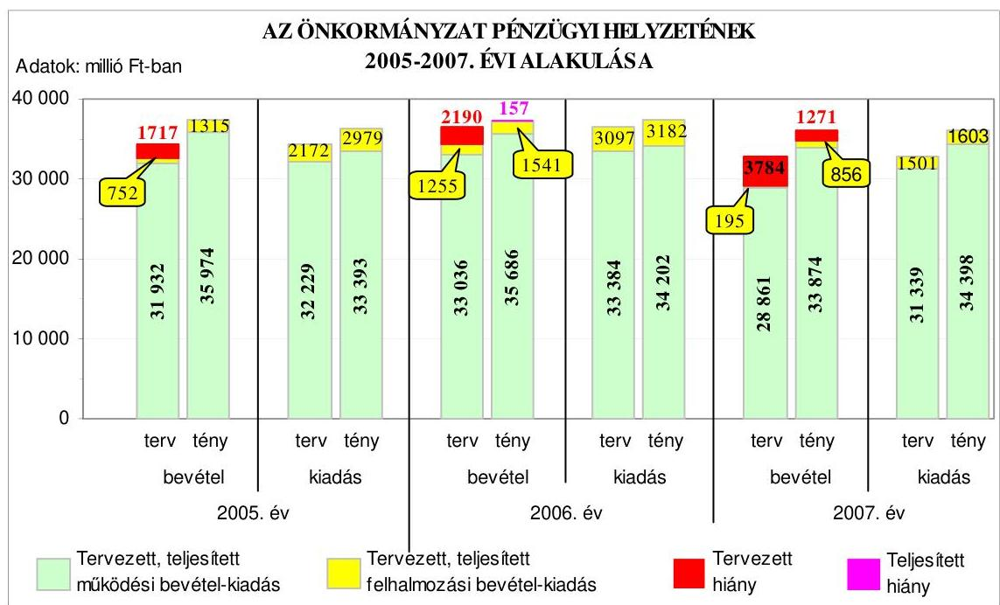
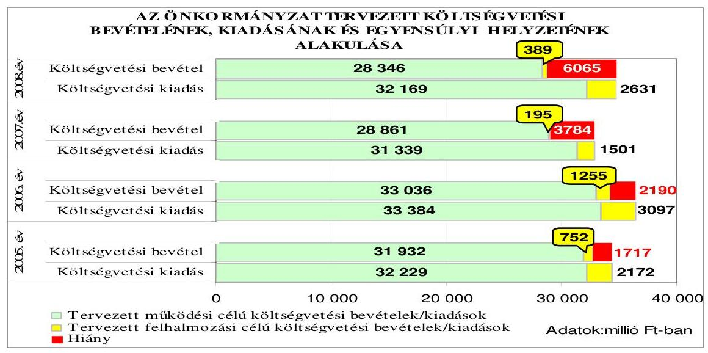
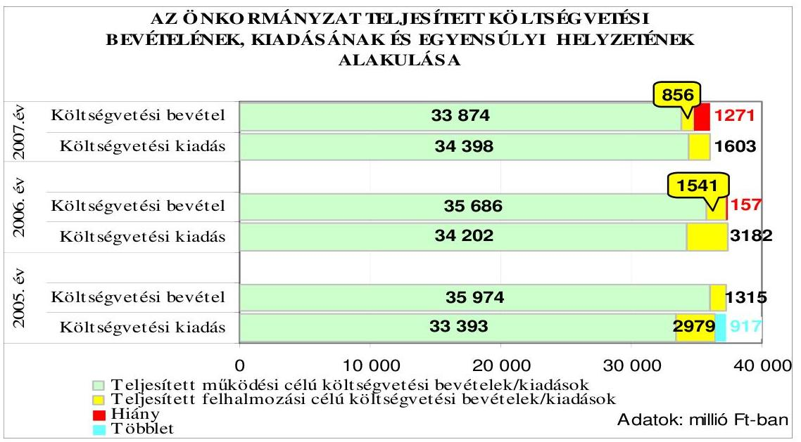
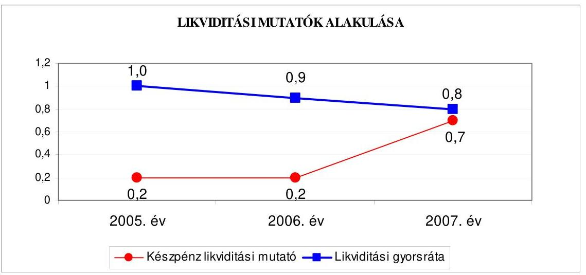
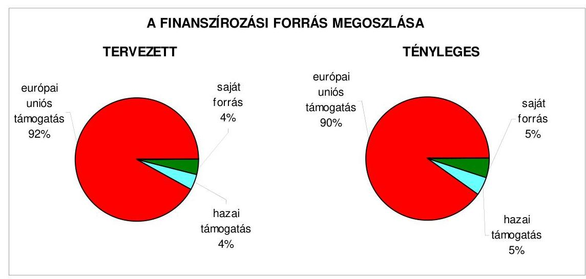
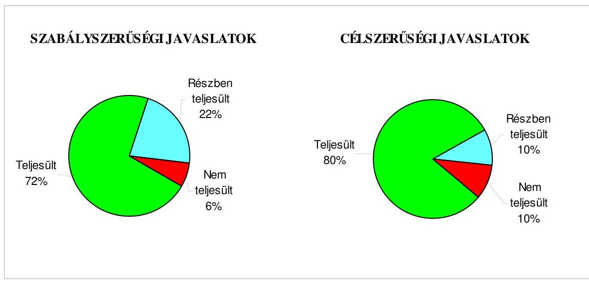
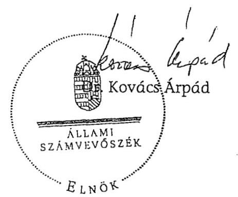
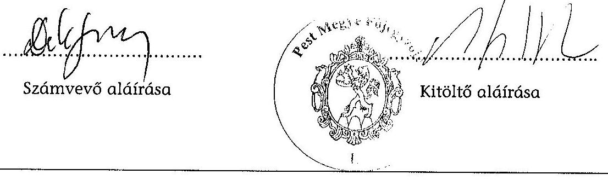
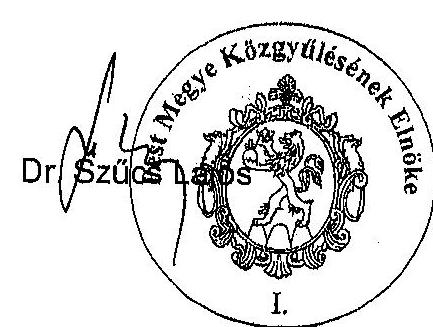

# JELENTÉS 

a Pest Megyei Önkormányzat gazdálkodási rendszerének 2008. évi ellenőrzéséről

---

3. Önkormányzati és Területi Ellenőrzési Igazgatóság
3.3. Átfogó Ellenőrzések Főcsoport
Iktatószám: V-3003-6/25/24/2008.
Témaszám: 898
Vizsgálat-azonosító szám: V0386
Az ellenőrzést felügyelte:
Dr. Lóránt Zoltán
főigazgató
Az ellenőrzés végrehajtásáért felelős:
Dr. Sepsey Tamás
főigazgató-helyettes
Az ellenőrzést vezette:
Gyüre Lajosné
számvevő tanácsos
Az ellenőrzést végezték:
Dér Géza Endrődy Péterné Schósz Attiláné
számvevő tanácsos
számvevő tanácsos
A témához kapcsolódó eddig készített számvevőszéki jelentések:
címe
sorszáma
Jelentés a Pest Megyei Önkormányzat gazdálkodásának átfogó 0502 ellenőrzéséről
Jelentés a Magyar Köztársaság 2004. évi költségvetése végrehajtásának ellenőrzéséről
Függelék:

- a helyi önkormányzatokat a 2004. évben megillető normatív állami hozzájárulás elszámolásának ellenőrzése
- a kötött felhasználású támogatások 2004. évi felhasználásának vizsgálata
- a helyi önkormányzatok beruházásaihoz és rekonstrukcióihoz nyújtott 2004. évi felhalmozási célú támogatások ellenőrzése
Jelentés a helyi és a helyi kisebbségi önkormányzatok gazdálkodá- 0544
sának átfogó ellenőrzéséről
Jelentés a középiskolai kollégiumok fenntartásának és fejlesztésé- 0616
nek ellenőrzéséről
Jelentés a Magyar Köztársaság 2005. évi költségvetése végrehajtá- 0628
sának ellenőrzéséről
Függelék:
- a helyi önkormányzatok beruházásaihoz és rekonstrukcióihoz nyújtott 2005. évi felhalmozási célú támogatások ellenőrzése - a helyi önkormányzatokat a 2005. évben megillető normatív állami hozzájárulás elszámolásának ellenőrzése

---

# TARTALOMJEGYZÉK 

BEVEZETÉS ..... 9
I. ÖSSZEGZŐ MEGÁLLAPÍTÁSOK, KÖVETKEZTETÉSEK, JAVASLATOK ..... 14
II. RÉSZLETES MEGÁLLAPÍTÁSOK ..... 22

1. Az Önkormányzat költségvetési és pénzügyi helyzete ..... 22
1.1. A tervezett és teljesített költségvetési bevételek és kiadások alapján a költségvetési és a pénzügyi egyensúly alakulása, valamint a költségvetési hiány megállapításának szabályszerűsége ..... 22
1.2. A költségvetési és a pénzügyi egyensúlyi helyzet kialakításához tervezett és teljesített finanszírozási célú pénzügyi műveletek módja és azok hatása a tárgyévet követő évek költségvetéseire ..... 24
1.3. A költségvetés tervezésének megalapozottsága ..... 31
2. Az Önkormányzat felkészültsége az európai uniós források igénylésére és felhasználására, valamint az elektronikus közigazgatási feladatok ellátására ..... 32
2.1. Az európai uniós források igénybevételére és a várható támogatás felhasználására történt felkészülés szabályozottsága, szervezettsége ..... 32
2.1.1. Az európai uniós forrásokra történő pályázatok benyújtására vonatkozó döntések összhangja a fejlesztési célkitűzésekkel ..... 32
2.1.2. Az európai uniós forrásokhoz kapcsolódóan a pályázatfigyelés, a pályázatkészítés, valamint az európai uniós támogatással megvalósuló fejlesztés lebonyolításának belső rendjének szabályozottsága, a végrehajtás személyi, szervezeti feltételei ..... 35
2.1.3. A fejlesztési feladat lebonyolításánál a feladatellátás rendjére, az ellenőrzési feladatok teljesítésére, valamint a felelősségi szabályokra vonatkozó előírások betartása ..... 36
2.2. Az elektronikus közigazgatási feladatok ellátása, a közérdekú adatok elektronikus közzététele ..... 38
3. A költségvetési gazdálkodás belső kontrolljai ..... 39
3.1. A szabályozottság kockázata a költségvetés tervezési, gazdálkodási, beszámolási és a folyamatba épített, előzetes és utólagos vezetői ellenőrzési feladatoknál ..... 39
3.2. A belső kontrollok érvényesülése az önkormányzati források szabályszerű felhasználásában, a költségvetési tervezés, gazdálkodás, beszámolás folyamataiban ..... 42
3.3. A belső ellenőrzési kötelezettség teljesítése, javaslatainak hasznosulása ..... 45

---

4. Az ÁSZ korábbi ellenőrzési javaslatai alapján készített intézkedési terv végrehajtása, eredményessége ..... 50
4.1. Az Önkormányzat gazdálkodási rendszerének átfogó ellenőrzése során tett javaslatok végrehajtására tervezett intézkedések megvalósulása ..... 50
4.2. A zárszámadáshoz kapcsolódó (állami hozzájárulások, támogatások igénylésének és felhasználásának ellenőrzése), valamint a további vizsgálatok esetében a megállapítások, javaslatok alapján tett intézkedések ..... 55
MELLÉKLETEK
5. számú Az Önkormányzat gazdálkodását meghatározó adatok, mutatószámok (1 oldal)
6. számú Az önkormányzati vagyon alakulása (1 oldal)
7. számú Az Önkormányzat 2005-2008. évi költségvetési előirányzatainak és a 2005-2007. évi pénzügyi teljesítéseinek alakulása (1 oldal)
8. számú Tanúsítvány az európai uniós forrásokkal támogatott célok és programok tervezett és tényleges adatairól 2005-2008. évekre (1 oldal)
9. számú Adatlap a Pest Megyei Önkormányzat európai uniós forrással támogatott fejlesztéséről (2 oldal)
10. számú Dr. Szűcs Lajos úr, a Pest Megyei Önkormányzat elnökének észrevétele (1 oldal)

---

# RÖVIDÍTÉSEK JEGYZÉKE 

## Törvények

Áht.
Eisztv.

Kbt.
Ket.

Ötv.
Számv. tv.

## Rendeletek

Ámr.
Ber.
18/2005. (XII. 27.) IHM rendelet

SzMSz
vagyongazdálkodási rendelet

Vhr.
2005. évi költségvetési rendelet
2006. évi költségvetési rendelet
2007. évi költségvetési rendelet
2008. évi költségvetési rendelet

## Szörövidítések

APEH
ÁROP
ÁSZ
EKOP
e-közigazgatás
Európai Integrációs bizottság
az államháztartásról szóló 1992. évi XXXVIII. törvény az elektronikus információszabadságról szóló 2005. évi XC. törvény
a közbeszerzésekről szóló 2003. évi CXXIX. törvény
a közigazgatási hatósági eljárás és szolgáltatás általános szabályairól szóló 2004. évi CXL. törvény
a helyi önkormányzatokról szóló 1990. évi LXV. törvény a számvitelről szóló 2000. évi C. törvény
az államháztartás múködési rendjéről szóló 217/1998. (XII. 30.) Korm. rendelet
a költségvetési szervek belső ellenőrzéséről szóló 193/2003. (XI. 26.) Korm. rendelet
a közzétételi listákon szereplő adatok közzétételéhez szükséges közzétételi mintákról szóló 18/2005. (XII. 27.) számú IHM rendelet

Pest Megye Önkormányzatának 14/2001. (VI. 15.) számú rendelete az Önkormányzat Szervezeti és Múködési Szabályzatáról
Pest Megye Önkormányzatának 11/2003. (VI. 20.) számú rendelete az önkormányzat vagyonáról, a vagyongazdálkodás szabályairól
az államháztartás szervezetei beszámolási és könyvvezetési kötelezettségének sajátosságairól szóló 249/2000. (XII. 24.) Korm. rendelet

Pest Megye Önkormányzatának 4/2005. (II. 25.) számú rendelete az Önkormányzat 2005. évi költségvetéséről
Pest Megye Önkormányzatának 1/2006. (II. 10.) számú rendelete az Önkormányzat 2006. évi költségvetéséről
Pest Megye Önkormányzatának 2/2007. (II. 9.) számú rendelete az Önkormányzat 2007. évi költségvetéséről
Pest Megye Önkormányzatának 3/2008. (II. 29.) számú rendelete az Önkormányzat 2008. évi költségvetéséről

Adó és Pénzügyi Ellenőrzési Hivatal
ÚMFT Államreform Operatív Program
Állami Számvevőszék
ÚMFT Elektronikus Közigazgatási Operatív Program
elektronikus közigazgatás
Pest Megyei Önkormányzat Európai Integrációs Bizottsága

---

FEUVE
főjegyzö
gazdálkodási jogkörök szabályzatai

Gazdasági bizottság
Gazdasági iroda
gazdasági program $_{1}$
gazdasági program $_{2}$
GVOP
HEFOP
hivatali SzMSz

Illetékhivatal
Interreg Nemzetközi
Duna-Projekt fejlesztési feladat

KMOP
KMOP római kori erődítmény fejlesztési feladat
KMOP intézményi beruházás fejlesztési feladat

KMOP akadálymentesítés fejlesztési feladat

Közgyűlés
Közgyűlés elnöke
Múzeumok igazgatósága
folyamatba épített, előzetes és utólagos vezetői ellenőrzés Pest Megyei Önkormányzat Főjegyzője
Pest Megyei Önkormányzat Közgyűlés Elnökének és Főjegyzőjének a 3/2006. számú, a 2/2007. számú, a 3/2007. számú és a 4/2007. számú együttes utasítása gazdálkodási jogkörök kijelöléséről
Pest Megyei Önkormányzat Gazdasági Bizottsága
Pest Megyei Önkormányzat Hivatalának Gazdasági Irodája
Pest Megye Közgyűlésének 2003-2006 közötti időszakra vonatkozó 100/2003. (IV. 25.) számú határozatban jóváhagyott „ciklus"gazdasági programja
Pest Megye Közgyűlésének 2007-2010 közötti időszakra vonatkozó 99/2007. (III. 30.) számú határozatban jóváhagyott „ciklus"gazdasági programja
NFT Gazdasági Versenyképesség Operatív Program
NFT Humánerőforrás-fejlesztési Operatív Program HEFOP/2005/3.2.2 TISZK létrehozás és HEFOP/2005/ 4.1.1 TISZK infrastrukturális feltételének kialakítása az SzMSz 5. számú melléklete a „Pest Megye Önkormányzatának Hivatala belső szervezeti tagozódása és müködési rendje, ügyrend"
Pest Megyei Illetékhivatal
Interreg III B CADSES-5D 166 projekt - Szomszédsági Program Közösségi Kezdeményezés alapján - Pest Megye Önkormányzat Dunával való meghatározó kapcsolata folytán a projekt eredményeinek hasznosítása a Pest Megyei területfejlesztés területén, a „Nemzetközi Duna-Projekt" fejlesztés feladata
Közép-magyarországi Operatív Program
a KMOP 2005. II. 1.1. PEA „a szentendrei Ulcisia Castra római kori erődítmény feltárása utáni részrekonstrukciója és bemutatása" pályázat előkészítése
KMOP 2007-4.6.1/2 közoktatási intézmények beruházásainak támogatása a Pest Megyei Önkormányzat négy oktatási intézmény beruházásának támogatásához
KMOP 2007. 4.5.3. az önkormányzatok, illetőleg önkormányzati feladatellátást biztosító egyes közszolgáltatások akadálymentesítése, a Pest Megyei Önkormányzat Hivatali épület akadálymentesítése
Pest Megyei Önkormányzat Közgyűlése
Pest Megyei Önkormányzat Közgyűlésének Elnöke
Pest Megyei Önkormányzat Múzeumok igazgatósága

---

| NFT | Nemzeti Fejlesztési Terv |
| :-- | :-- |
| Önkormányzat | Pest Megyei Önkormányzat |
| Önkormányzat hivatala | Pest Megyei Önkormányzat Hivatala |
| Pénzügyi bizottság | Pest Megyei Önkormányzat Pénzügyi Bizottsága |
| TISZK | Térségi Integrált Szakképző Központok |
| ÚMFT | Új Magyarország Fejlesztési Terv |
| ügyrend | Pest Megyei Önkormányzat Hivatala gazdasági szerve- |
|  | zetének ügyrendje (2005. június 1-től hatályos) |
| vezető partner | az Interreg Nemzetközi Duna-Projekt fejlesztés feladatá- |
|  | nak vezető partnere a Szlovák Köztársaság Építésügyi |
|  | és Regionális Fejlesztési Minisztériuma |

---

# ÉRTELMEZŐ SZÓTÁR 

1. elektronikus szolgáltatási szint
2. elektronikus szolgáltatási szint
3. elektronikus szolgáltatási szint
4. elektronikus szolgáltatási szint
európai uniós források
fejlesztési feladat (projekt)
fejlesztési célkitúzés
kedvezményezett

Az 1044/2005. (V. 11.) Korm. határozat alapján olyan információs, tájékoztató szolgáltatás, amely csak általános információkat közöl az adott üggyel kapcsolatos teendőkről és a szükséges dokumentumokról.
Az 1044/2005. (V. 11.) Korm. határozat alapján olyan egyirányú kapcsolatot biztosító szolgáltatás, amely az 1. szinten túl biztosítja az adott ügy intézéséhez szükséges dokumentumok, nyomtatványok letöltését, és azok ellenőrzéssel, vagy ellenőrzés nélküli elektronikus kitöltését, amely esetben a dokumentumok benyújtása hagyományos úton történik.
Az 1044/2005. (V. 11.) Korm. határozat alapján olyan kétirányú kapcsolatot biztosító szolgáltatás, amely közvetlen, vagy ellenőrzött kitöltésű dokumentum segítségével biztosítja az elektronikus adatbevitelt és a bevitt adatok ellenőrzését. Az ügy indításához, intézéséhez személyes megjelenés nem szükséges, de az ügyhöz kapcsolódó közigazgatási döntés (határozat, egyéb aktus) közlése, valamint a kapcsolódó illeték-, vagy díjfizetés hagyományos úton történik.
Az 1044/2005. (V. 11.) Korm. határozat alapján olyan teljes közvetlen kétirányú ügyintézési folyamatot biztosító szolgáltatás, amikor az ügyhöz kapcsolódó közigazgatási döntés is elektronikus úton kerül közlésre, illetve a kapcsolódó illeték-, vagy díjfizetés elektronikus úton is intézhető.
Az elnyert európai uniós források lehívása a támogatott projekt megvalósítása érdekében, a fejlesztés lebonyolítása során felmerült kiadások finanszírozására.
A fejlesztési feladat (projekt) tartalmilag és formailag részletesen kidolgozott, megfelelő pénzügyi háttérrel és végrehajtási ütemezéssel rendelkező fejlesztési terv, amely illeszkedik az Európai Unió, illetve a Nemzeti Fejlesztési Terv által támogatott programokhoz.
Az önkormányzat által ellátott kötelező, vagy önként vállalt feladatok ellátásának mennyiségi, vagy minőségi fejlesztésére vonatkozó terv. A mennyiségi fejlesztés megvalósulhat beszerzéssel, létesítéssel, bővítéssel, átalakítással.
Az a helyi önkormányzat, amely a támogatási szerződést kedvezményezettként aláírja, a projektet, illetve a központi programhoz kapcsolódó támogatott önkormányzati programot végrehajtja.

---

közreműködő szervezet
lebonyolítás
operatív program
támogatási szerződés

A közreműködő szervezet az európai uniós támogatást elnyert kedvezményezettekkel kapcsolatot tartó szerv. Az operatív programok közreműködő szervezetei befogadják, nyilvántartják, döntésre előkészítik a pályázatokat, rögzítik a támogatással kapcsolatos adatokat az egységes monitoring informatikai rendszerben, elvégzik a támogatások előzetes (szerződéskötést megelőző), közbenső (a pénzügyi elszámolás, finanszírozás folyamatában végzett) és utólagos (a támogatott projekt pénzügyi lezárását megelőző) ellenőrzését. Az önkormányzatoknál a leggyakrabban előforduló operatív program a Regionális Fejlesztési Operatív Program végrehajtásában közreműködő szervezetek a VÁTI Kht. és a regionális fejlesztési ügynökségek.
Az európai uniós források felhasználásával megvalósuló fejlesztésre irányuló műszaki, gazdasági (pénzügyi) tevékenységet magában foglaló szervezési, irányítási szolgáltatás. A szervezési szolgáltatás kiterjedhet a pályázatkészítésre, a közbeszerzési eljárás lebonyolításán keresztül a folyamatos műszaki ellenőrzésre, a pénzügyi elszámolásra, a műszaki átadás-átvételre, az üzembe helyezésre, illetve a fejlesztési folyamat egyes elemeire.
Az Európai Bizottság által jóváhagyott, a Közösségi Támogatási Keret végrehajtására vonatkozó 2004-2006 és a 2007-2013 közötti, több évre szóló intézkedésekhez kapcsolódó prioritások egységes rendszerét tartalmazó dokumentum. A strukturális alapok NFT-hez kapcsolódó operatív programjai: Agrár és Vidékfejlesztési Operatív Program (AVOP); Gazdasági Versenyképesség Operatív Program (GVOP); Humánerőforrás-fejlesztési Operatív Program (HEFOP); Környezetvédelmi és Infrastruktúrafejlesztési Operatív Program (KIOP); Regionális Fejlesztési Operatív Program (ROP). Az ÚMFT-hez kapcsolódó operatív programok: Gazdaságfejlesztési Operatív Program (GOP); Környezet és Energia Operatív Program (KEOP); Társadalmi Megújulás Operatív Program (TÁMOP); Társadalmi Infrastruktúra Operatív Program (TIOP); Délalföldi Operatív Program (DAOP); Dél-dunántúli Operatív Program (DDOP); Észak-alföldi Operatív Program (ÉAOP); Észak-magyarországi Operatív Program (ÉMOP); Középdunántúli Operatív Program (KDOP); Középmagyarországi Operatív Program (KMOP); Nyugatdunántúli Operatív Program (NYDOP); Balatoni kiemelt Üdülőkörzet; Államreform Operatív Program (ÁROP).
A strukturális alapok esetében az irányító hatóságnak, illetve a Kohéziós alap esetében a közreműködő szervezeteknek a kedvezményezett önkormányzattal kötött szerződése, amely a támogatás felhasználásának részletes feltételeit tartalmazza.

---

.

---

# JELENTÉS 

## a Pest Megyei Önkormányzat gazdálkodási rendszerének 2008. évi ellenőrzéséről

## BEVEZETÉS

Az Ötv. 92. § (1) bekezdése, az Állami Számvevőszékről szóló 1989. évi XXXVIII. törvény 2. § (3) bekezdése, valamint az Áht. 120/A. § (1) bekezdése alapján az önkormányzatok gazdálkodását az Állami Számvevőszék ellenőrzi. Az ellenőrzésre az Országgyúlés illetékes bizottságai részére is átadott, országosan egységes ellenőrzési program szerint került sor.

Az Állami Számvevőszék a stratégiájában foglalt célkitűzéseknek megfelelően a helyi önkormányzatok költségvetési gazdálkodási rendszere átfogó ellenőrzésének programját a 2007. évtől megújította, azt kiegészítette további - teljesít-mény-ellenőrzési - elemekkel.

## Az ellenőrzés célja annak értékelése volt, hogy az Önkormányzat:

- milyen módon biztosította a költségvetési és a pénzügyi egyensúlyt a költségvetésében és annak teljesítése során, valamint változott-e a finanszírozási célú pénzügyi műveletek jelentősége a hiányzó bevételi források pótlásában;
- eredményesen készült-e fel a szabályozottság és a szervezettség terén az európai uniós források igénylésére és felhasználására, továbbá biztosította-e az e-közigazgatás feltételeit, az adatok közzétételével a gazdálkodás nyilvánosságát;
- kialakította-e a külső és a belső feltételeknek megfelelően a költségvetés tervezési, gazdálkodási és zárszámadási feladatai belső kontrollrendszerét ${ }^{1}$, ezen tevékenységek szabályszerű ellátásához hozzájárult-e a folyamatba épített, előzetes és utólagos vezetői ellenőrzés, valamint a belső ellenőrzés;
- megfelelően hasznosították-e a korábbi számvevőszéki ellenőrzések megállapításait, szabályszerűségi ${ }^{2}$ és célszerűségi javaslatait.

[^0]
[^0]:    ${ }^{1}$ A gazdálkodás szabályszerűségét biztosító kontrollrendszer alatt értjük a kiépített és múködő belső irányítási és szabályozási rendszert, valamint a belső ellenőrzési funkciók ellátásának rendszerét.
    ${ }^{2}$ A törvényi előírások betartásának elmulasztásakor a részletes megállapítások fejezetben egységesen a törvénysértés megjelölést alkalmazzuk, mivel az ÁSZ nem tehet különbséget a törvényi előírások között.

---

Az ellenőrzés típusa: átfogó ellenőrzés, amely egyidejűleg - egy ellenőrzés keretében - meghatározott területekre összpontosítva érvényesíti a szabályszerűségi, valamint a teljesítmény-ellenőrzés jellemzőit.

Az ellenőrzött időszak: az 1., 2. és 4. programpontok tekintetében a 20052007. évek és a 3. ellenőrzési programpontnál a 2007. év.

Pest megye lakosainak száma 2008. január 1-jén 1190018 fő volt. A 2006. évi önkormányzati választást követően az Önkormányzat 80 tagú Közgyűlésének munkáját 11 állandó bizottság segítette. Az Önkormányzat mellett öt ${ }^{3}$ területi kisebbségi önkormányzat múködött. A Közgyűlés elnöke a 2006. évi választás óta tölti be tisztségét, a főjegyző személye az 1999. évben változott.

Az Önkormányzat feladatainak végrehajtása érdekében a 2007. évben 71 költségvetési intézményt múködtetett, amelyekből 60 önállóan gazdálkodott. A feladatok ellátásában részt vett három gazdasági társasága, továbbá nyolc alapítványa. Az Önkormányzat a 2007. évi költségvetési beszámolója szerint 34730 millió Ft költségvetési bevételt ért el és 36001 millió Ft költségvetési kiadást teljesített, 2007. december 31-én a könyvviteli mérleg szerint 27120 millió Ft értékű vagyonnal rendelkezett. Az Önkormányzat vagyona a 2005. év végi állományhoz viszonyítva $21 \%$-kal csökkent, mely a forgóeszközök $68 \%$-os csökkenésének, valamint a saját tőke $15 \%$-os és a kötelezettségek $34 \%$ os csökkenésének a következménye. A forgóeszközökön belül a követelések $96 \%$-kal csökkentek az illetékekhez ${ }^{4}$ kapcsolódó követelések nyilvántartásból való kivezetése miatt. A saját tőke csökkenését az Illetékhivatal megszűnése okozta. A kötelezettségek állományában bekövetkezett változás a rövid lejáratú kötelezettségállomány 67\%-os csökkenésének a következménye. Az összes költségvetési bevétel $27 \%$-át a saját bevétel biztosította a 2007. évben. Az összes költségvetési kiadásból a felhalmozási célú kiadások részaránya a 2007. évben 5\% volt. Az Önkormányzat hivatalában dolgozó köztisztviselők száma 2007. december 31-én 107 fő, a költségvetési intézményekben foglalkoztatott közalkalmazottak száma 5840 fő volt. A 2008. évi költségvetési rendeletben 28735 millió Ft költségvetési bevételt és 34800 millió Ft költségvetési kiadást irányoztak elő. Az Önkormányzat gazdálkodását meghatározó adatokat, mutatószámokat az 1-3. számú mellékletek tartalmazzák.

Az Önkormányzat költségvetési és pénzügyi helyzetét az elemző eljárás módszerével vizsgáltuk. E körben elemeztük a költségvetés egyensúlyi helyzetének alakulását, a tervezett és tényleges költségvetési hiány okait, a mérséklésére tett intézkedéseket, finanszírozásának módját, az Önkormányzat adósságállományának alakulását, összetevőit.

A teljesítmény-ellenőrzés módszerével vizsgáltuk, a belső szabályozottság, szervezettség terén az Önkormányzat felkészültségét az európai uniós források figyelésére, igénylésére és felhasználására, továbbá értékeltük, hogy az igényelt

[^0]
[^0]:    ${ }^{3}$ Bolgár, cigány, német, szerb, szlovák területi kisebbségi önkormányzatok.
    ${ }^{4}$ A 2006. évi LXI. törvény 249. § (1) bekezdése alapján a Fővárosi Illetékhivatal és a megyei illetékhivatalok megszűntek, ezzel egyidejűleg az illetékhivatalok feladatainak ellátását az APEH regionális igazgatóságai vették át és végzik.

---

európai uniós támogatások az Önkormányzat által meghatározott fejlesztési célkitűzésekhez kapcsolódtak-e. Az eredményesség szempontjából a minősítést a lényegességi szinthez való viszonyítással végeztük el. Az ellenőrzés során felmértük, hogy az e-közigazgatási feladat ellátása, illetve bevezetése, múködtetése érdekében milyen intézkedéseket tettek, valamint biztosították-e a közérdekú adatok közzétételét.

A költségvetési gazdálkodás belső kontrolljainak ellenőrzése során értékeltük, hogy az Önkormányzat hivatalánál a költségvetés tervezési, gazdálkodási, zárszámadás készítési feladatok belső kontrolljainak kiépítettsége és múködése megfelelő biztosítékot ad-e a gazdálkodási feladatok megfelelő, szabályszerű ellátására. Felmértük és minősítettük a költségvetés tervezési, a gazdálkodási, a zárszámadás készítési feladatokkal, továbbá a pénzügyi- számviteli területen az informatikával kapcsolatosan kialakított kontrollok megfelelőségét, valamint azok múködésének eredményességét, megbízhatóságát. Értékeltük a belső ellenőrzés szervezeti és szabályozási keretét, továbbá múködését.

Az Önkormányzat hivatalánál értékeltük a gazdálkodás folyamatában a kontrollok múködésének megbízhatóságát, ennek keretében ellenőriztük a szakmai teljesítés igazolására és az utalvány ellenjegyzésére kialakított kontrollok végrehajtását. Az ellenőrzést a következő, kiemelt kockázatuk alapján kiválasztott ${ }^{5}$ az általánostól jellemzően eltérő, egyedi eljárást igénylő gazdasági eseményekkel kapcsolatos kifizetésekre folytattuk le ${ }^{6}$ :

- a külső szolgáltató által végzett karbantartási, kisjavítási szolgáltatások,
- a gépek, berendezések, felszerelések beszerzése, továbbá
- a múködési célú pénzeszköz átadásokból az államháztartáson kívülre teljesített kifizetésekre.

Az ellenőrzés hatékony elvégzése céljából a vizsgálandó területek kiválasztása során a kockázatokon alapuló megközelítés érvényesült, ezáltal az ellenőrzési erőforrásokat azokra a területekre fókuszáltuk, amelyeken legnagyobb a hibák előfordulási valószínűsége. Az ellenőrzési erőforrások ilyen típusú összpontosí-

[^0]
[^0]:    ${ }^{5}$ Az önkormányzatok kiemelt előirányzataira vonatkozóan, a vertikális folyamatokra elvégeztük a kockázatok becslését, amelynek eredményeként a külső szolgáltató által végzett karbantartási, kisjavítási szolgáltatások, a gépek, berendezések, felszerelések beszerzése valamint a múködési célú pénzeszköz átadások államháztartáson kívülre teljesített kifizetései kiemelkedően kockázatos területeknek bizonyultak.
    ${ }^{6}$ A korábbi ellenőrzési tapasztalataink szerint ezeken a területeken a jegyzők nem, vagy hiányosan szabályozták a megbízás, megrendelés, illetve beszerzés indokoltságának, szükségességének elbírálására, igazolására, valamint a teljesítések dokumentálására, a kifizetések jogosságának megítélésére szolgáló kontrollokat. További kockázatot jelentett a külső szolgáltató által végzett karbantartási, kisjavítási munkák esetében, hogy az 50 ezer Ft alatti megrendelésekre vonatkozóan az ellenőrzési tapasztalataink szerint a jegyzők nem alakították ki a kötelezettségvállalások rendjét és nyilvántartási formáját, valamint a szabályozás elmulasztása esetén nem történt meg az írásbeli kötelezettségvállalás és annak az ellenjegyzése sem.

---

tásával minimálisra csökkenthető a kívánt ellenőrzési bizonyosság eléréséhez szükséges időráfordítás.

A pénzügyi-számviteli folyamatokban alkalmazott belső kontrollok létezésének és múködésének ellenőrzésére a vizsgált három terület 2007. évi könyvviteli tételeiből területenként egyszerű véletlen mintát vettünk. A kijelölt gazdasági eseményre elvégzett megfelelőségi tesztek alapján értékeltük a kontrollok múködésének eredményességét, megbízhatóságát a vizsgált három területre különkülön, majd összefoglalóan ${ }^{7}$ az Önkormányzat hivatalának egyedi eljárást igénylő gazdasági eseményeire. A helyszíni ellenőrzés megállapításainak részletes dokumentálását három megfelelőségi tesztlapon, öt elővizsgálati és 12 helyszíni ellenőrzési munkalapon biztosítottuk. Ezeken a teszt- és munkalapokon a minősítés alapjául szolgáló kérdések és a vonatkozó konkrét jogszabályhelyek megjelölése mellett értékeltük a kialakított belső kontrollokban rejlő kockázatokat ${ }^{8}$ és a kialakított kontrollok múködésének megbízhatóságát ${ }^{9}$.

Az ÁSZ korábbi ellenőrzési javaslatai alapján tett intézkedéseket, illetve azok megvalósítását utóellenőrzés keretében vizsgáltuk. A gazdálkodási rendszer átfogó ellenőrzése során megfogalmazott javaslatok végrehajtására tett intézkedések megvalósítását ellenőriztük, az egyéb számvevőszéki ellenőrzések során tett javaslatok esetében pedig a kiadott intézkedéseket tekintettük át.

A helyszíni ellenőrzés során kitöltött - az ellenőrzést végző számvevő és az Önkormányzat hivatalának felelős köztisztviselője által aláírt - elővizsgálati és helyszíni ellenőrzési munkalapokat, azok kitöltési útmutatóit, továbbá a megfelelőségi tesztek dokumentumait a Közgyűlés elnöke részére a számvevői jelentéssel egyidejúleg átadtuk.

A jelentés megállapításainak, javaslatainak egyeztetése során a Közgyűlés elnöke és a főjegyző arról adott részletes tájékoztatást - egyidejúleg csatolta azokat a dokumentumokat, amelyek igazolták - hogy az időközben megtett intéz-

[^0]
[^0]:    ${ }^{7}$ A vizsgált három terület egyedi értékelési pontszámait a területek relatív költségvetési súlyával arányosan összegeztük.
    ${ }^{8}$ A kialakított belső kontrollokban rejlő kockázatot alacsonynak minősítettük, ha a kontrollok - végrehajtásuk esetén - megfelelő védelmet nyújtanak a hibák bekövetkezése ellen. Közepesnek minősítettük a belső kontrollokban rejlő kockázatot, amennyiben a kontrollok - végrehajtásuk esetén - a lehetséges hibák többsége ellen védelmet nyújtanak. Magasnak értékeltük a kockázatot, ha a kontrollok - kialakításuk hiányában, vagy hiányos kialakításuk miatt - nem nyújtanak elegendő védelmet a lehetséges hibákkal szemben.
    ${ }^{9}$ A kontrollok múködésének eredményességét, megbízhatóságát kiválónak értékeltük abban az esetben, ha azok működése - esetleges apróbb hiányosságoktól eltekintve megfelelte a hibák megelőzésére és kijavítására meghatározott szabályozásnak és a legmagasabb szintű elvárásoknak. Jónak minősítettük a kontrollok múködését, ha a hiányosságok száma ugyan jelentős volt, de nem veszélyeztette az ellenőrzött terület hibáinak megelőzését és kijavítását. Amennyiben a hiányosságok mértéke nem biztosította a hibák megelőzését, feltárását, kijavítását és ezáltal veszélyeztette az eredményes, megbízható múködést, a kontroll múködésének megbízhatósága gyenge minősítést kapott.

---

kedésekkel a számvevői jelentésben a főjegyző részére tett javaslatokat ${ }^{10}$ megvalósították. A megtett intézkedéseket a jelentés II. Részletes megállapítások fejezetében az adott témához kapcsolt lábjegyzetben feltüntettük és a vonatkozó javaslatokat elhagytuk.

A jelentést az ÁSZ-ról szóló 1989. évi XXXVIII. tv. 25. § (1) bekezdése alapján észrevétel közlése céljából megküldtük a Pest Megyei Önkormányzat elnökének. A kapott észrevételt a jelentés 6 . számú melléklete tartalmazza.

[^0]
[^0]:    ${ }^{10}$ A számvevői jelentés a helyszíni ellenőrzés során feltárt hiányosságok megszüntetése, a jogszabályi előírások maradéktalan betartása érdekében 19, a munka színvonalának javítása érdekében öt javaslatot tartalmazott a főjegyző részére.

---

# I. ÖSSZEGZŐ MEGÁLLAPÍTÁSOK, KÖVETKEZTETÉSEK, JAVASLATOK 

Az Önkormányzatnál a tervezett költségvetési bevételek az előző évhez viszonyítva a 2006. évben növekedtek, míg a 2007. és a 2008. években csökkentek. A tervezett költségvetési kiadások a 2005-2007. évek között a bevételekkel azonos irányban változtak, a 2008. évre azonban a költségvetési bevételek tervezett csökkenése ellenére növekedtek. Az Önkormányzat a 2005-2008. évi költségvetési rendeleteiben a költségvetési bevételek és kiadások egyensúlyát nem biztosította, évről-évre növekvő összegű hiányt tervezett. Az Önkormányzat a 2005-2007. évi költségvetési rendeleteiben a költségvetési egyensúly biztosításához rövid és hosszú lejáratú hitelek felvételét, a 2008. évben kötvény kibocsátását tervezte, valamint a költségvetések végrehajtása során a pénzügyi hiány csökkentése érdekében bevételt növelő és kiadást csökkentő intézkedéseket hozott. A 2007. és a 2008. évi költségvetési rendeletben a költségvetési kiadási főösszeg megállapításakor az Önkormányzatnál nem tartották be az Áht-ban foglaltakat, mivel finanszírozási célú pénzügyi műveleteket vettek figyelembe költségvetési hiányt módosító költségvetési kiadásként. Az Önkormányzat 2008. augusztus végén módosította a 2008. évi költségvetési rendeletét melyben a költségvetési kiadási főösszeg nem tartalmazott finanszírozási célú pénzügyi műveleteket.

A 2005-2007. évi költségvetés végrehajtása során a költségvetési bevételek évente folyamatosan csökkentek, amiben a 2007. évben a személyi jövedelemadó helyben maradó részének 1799 millió Ft-tal történő mérséklődése, valamint - az Illetékhivatal APEH-hez történő átadása miatt - az illetékbevételek 2207 millió Ft-os csökkenése volt a meghatározó. A teljesített költségvetési kiadások az előző évhez viszonyítva a tervezettel azonos irányban változtak, a 2006. évben növekedtek, a 2007. évben csökkentek. A költségvetés teljesítése során a 2005. évben - a tervezett költségvetési hiány ellenére - költségvetési többletet értek el, míg a 2006-2007. években a tervezettől alacsonyabb összegű pénzügyi hiánnyal zárták az évet. A pénzügyi hiány finanszírozásához az Önkormányzat a 2006. évben 343 millió Ft rövid lejáratú és 500 millió Ft hosszú lejáratú felhalmozási célú hitelt vett fel, továbbá a 2007. évben 3000 millió Ft névértékű (svájci frank alapú) működési célú kötvényt bocsátott ki. A kötvénykibocsátás bevételeiből 524 millió Ft-ot a múködési, 747 millió Ft-ot a felhalmozási célú költségvetési bevételek hiányának pótlására, továbbá 476 millió Ft-ot rövid- és hosszú lejáratú hitelek törlesztésére fordítottak, a fel nem használt összeg a 2007. év végén pénzeszközként állt rendelkezésre, amelyből a kötelezettségvállalással terhelt pénzmaradvány 907 millió Ft volt. Az Önkormányzat az évközi likviditás biztosítása céljából a 2005-2007. években folyószámla és munkabér hitelt vett igénybe, a folyószámla hitelkeret összege, valamint a ténylegesen felvett folyószámla hitel éves átlagos állománya folyamatosan - a 2007. évre 3500 millió Ft-ra, illetve 2525 millió Ft-ra - emelkedett. Az Önkormányzat pénzügyi helyzete a 2005. és a 2007. évek között kedvezőtlenül alakult, nőtt az eladósodás. A hosszú és rövid lejáratú fizetési kötelezettségek önkormányzati összes forráson belüli aránya a 2006. évben az előző évhez képest növekedett, a 2007. évben csökkent, amely változást a 2006. évben a be-

---

ruházási célú hitelfelvétel, az év végén fennálló folyószámlahitel, valamint az egyéb rövid lejáratú kötelezettségek állományának növekedése okozta. A 2007. évben a kötelezettségek állománya - az Illetékhivatal megszűnése, valamint a kötvénykibocsátásból befolyó bevételekből teljesített kötelezettség állomány csökkenése következtében - nagyobb mértékben csökkent, mint a források állománya. Az Önkormányzatnál a pénzeszközök év végi állománya a 20052007. években nem biztosított fedezetet a rövid lejáratú kötelezettségek pénzügyi rendezésére. A rövid lejáratú kötelezettségek pénzügyi rendezésébe bevonható követelések és pénzeszközök csak a 2005. évben nyújtottak fedezetet a rövid lejáratú kötelezettségek teljesítésére.

Az Önkormányzat a 2005-2007. évi költségvetési rendeleteiben jóváhagyott eredeti költségvetési kiadási és bevételi előirányzatokat túlteljesítette. A beruházási és felújítási kiadások túlteljesüléséhez hozzájárultak az előző évről áthúzódó beruházási és felújítási kötelezettségek és azok pénzügyi forrásaként az előző évi pénzmaradvány igénybevétel eredeti előirányzatként történő tervezésének elmaradása.

Az Önkormányzat a 2005-2008. évekre vonatkozó fejlesztési célkitüzéseit gazdasági programban ${ }_{1,2}$, szolgáltatástervezési koncepcióban, valamint közok-tatási-feladat ellátási, intézményhálózat-múködtetési és fejlesztési tervben rögzítette. Az Önkormányzat fejlesztési célkitűzései az NFT-ben és az ÚMFT-ben megjelenő pályázati lehetőségekkel összhangban voltak. Az Önkormányzat a 2005-2007. években nyolc európai uniós pályázat benyújtásáról döntött, amelyeknek fele eredményes volt. Három projekt esetében az elutasítás oka a kidolgozottság hiánya volt, a negyedik pályázat esetében az Önkormányzat nem vállalta a megvalósítás költségeit. Az Önkormányzat nem teljesítette az Áht. előírását, mivel a 2005-2008. évek között elfogadott költségvetési rendeletek nem tartalmazták kettő fejlesztési feladat támogatási szerződésében rögzített bevételi és kiadási előirányzatokat, valamint az Ámr. előírása ellenére nem mutatták be a több éves kihatással járó európai uniós támogatással megvalósuló feladatok előirányzatait éves bontásban és elkülönítetten, a hiányosságok pótlásáról 2008. szeptemberéig intézkedtek.

Az Önkormányzat felkészültsége a 2005-2007. években a gazdasági programban ${ }_{1,2}$ megfogalmazott fejlesztési célkitűzéseihez kapcsolódó európai uniós források igénybevételére és felhasználására a belső szabályozottság és szervezettség terén összességében nem volt eredményes, mivel az önkormányzati szintű feladatokat hiányosan szabályozta, a pályázat nyilvántartás vezetésének felelősét az Önkormányzat hivatalán belül nem jelölték ki, a pályázatfigyelést végzők és a döntési jogkörrel rendelkezők közötti információszolgáltatási kötelezettséget nem írták elő. A Közgyűlés elnöke és a fejlesztés lebonyolítója közötti kapcsolattartás rendjét, valamint a pályázatfigyelés, pályázatkészítés és lebonyolítás eljárási rendjét nem határozták meg. A főjegyző az európai uniós forrásokkal kapcsolatos önkormányzati szintű pályázatfigyelés, készítés, lebonyolítás és ellenőrzés rendjét 2008. május végén szabályozta, amelyben az önkormányzati szintű nyilvántartás felelősét 2008. szeptemberében határozta meg.

Az Önkormányzat partnerként vett részt az Interreg Nemzetközi Duna-Projekt fejlesztési feladat végrehajtásában. A projekt lezárási határideje 2008. június 30., a támogatási szerződés az elszámolásra vonatkozóan időbeli üteme-

---

zést nem határozott meg, azonban lehetőséget biztosított negyedévenkénti elszámolásra. A projekt fő célja, hogy a Duna menti régión belül célorientált, nemzeti tervdokumentumok segítségével létrehozza a regionális rendezési tervet, ennek keretében kialakítsa a Duna menti országok aktualizált és kibővített területrendezési információs rendszerét, valamint értékelje a Duna térség szociális, gazdasági fejlődésének potenciális lehetőségeit. A vezető partner részére az előrehaladási jelentéseket és az elszámolásokat az Önkormányzat megküldte, amelyeket elfogadtak. Az európai uniós támogatással megvalósuló fejlesztési feladatnál a kötelezettségvállalás és az utalvány ellenjegyzője az ellenőrzési feladatát az Ámr. előírása ellenére nem végezte el, mivel nem győződtek meg arról, hogy a kötelezettségvállalás tárgyával összefüggő kiadási előirányzat rendelkezésre áll-e.

Az Önkormányzat hivatalának informatikai stratégiája tartalmazta a helyzetelemzést, de nem határozta meg, hogy a célkitűzéseket milyen időszak alatt kívánja elérni, ezért az informatikai stratégia elkészítésére 2008. július végén ajánlati felhívást tettek közzé Az Önkormányzat honlapján a közérdekú adatok elektronikus közzététele nem a vonatkozó jogszabályban előírtaknak megfelelően történt, mivel az elektronikus közzétételre szolgáló honlap megnyitásakor megjelenő oldalon nem helyezték el a közzétételi listák által előírt adatokat tartalmazó jegyzékre utaló hivatkozást. Az Önkormányzat az Áht. előírásával ellentétesen nem tette közzé az általa nyújtott - 0,3 millió Ft összeg feletti - nem normatív, céljellegű működési és fejlesztési támogatások kedvezményezettjeinek nevét, a támogatás célját, összegét, valamint a támogatási program megvalósítási helyét 2007. január 1-jétől a honlapon, amely hiányosságokat a jegyzékre utaló hivatkozással együtt 2008. júniusban pótoltak. Az Ámr-ben előírtak ellenére elmaradt az éves költségvetési beszámoló szöveges indoklásának közzététele, melyet 2008. augusztusában pótoltak.

Az Önkormányzat hivatalánál a költségvetés tervezési és a zárszámadási folyamatok szabályozottságának hiányosságai közepes kockázatot jelentettek a feladatok szabályszerű végrehajtásában, mivel a költségvetés tervezési feladatok szabályozása körében nem írták elő az intézmények és az Önkormányzat hivatalának szervezeti egységei által benyújtott költségvetési igények teljesíthetőségének, valamint a saját bevételek előirányzatai és a költségvetés megalapozását szolgáló helyi rendeletek összhangjának ellenőrzését, továbbá a költségvetési szervek elemi beszámolója felülvizsgálatának rendjét, tartalmát, azonban a kialakított belső kontrollok végrehajtásuk esetén a lehetséges hibák többsége ellen védelmet nyújtottak. A szabályozási hiányosságokat 2008. júliusában pótolták. A költségvetés tervezési és a zárszámadás készítési folyamatban a belső kontrollok múködésének megbízhatósága jó volt, mivel az Önkormányzat hivatalában az előírásoknak megfelelően ellenőrizték, hogy a költségvetési intézmények teljesítették-e a költségvetési javaslat összeállításával kapcsolatban részükre meghatározott követelményeket, valamint az intézmények pénzmaradvány megállapításának szabályszerűségét. A hiányos szabályozás miatt azonban nem végezték el annak ellenőrzését, hogy az intézmények, az Önkormányzat hivatalának szervezeti egységei által benyújtott költségvetési igények teljesíthetőek-e, valamint a saját bevételek előirányzatai és a költségvetés megalapozását szolgáló helyi rendeletek összhangja biztosított-e. A zárszámadás készítés folyamatában nem ellenőrizték az intézmények számsza-

---

ki beszámolójának belső, valamint a főjegyző által meghatározott adatszolgáltatással való összhangját, továbbá az intézményi eredeti, módosított előirányzatok és a teljesítések eltérésének indokoltságát. A főjegyző 2008. szeptemberében elrendelte a költségvetési tervezés és a zárszámadás készítés folyamatához kapcsolódó ellenőrzések elvégzését.

A gazdálkodási, a pénzügyi-számviteli és a folyamatba épített ellenőrzési feladatoknál a szabályozottság hiányosságai közepes kockázatot jelentettek a feladatok szabályszerű végrehajtásában, mivel a főjegyző hiányosan szabályozta az ellenőrzési feladatokat, de a kialakított belső kontrollok végrehajtásuk esetén a lehetséges hibák többsége ellen védelmet nyújtottak. A közepes kockázatot az okozta, hogy a gazdasági vezetők és a beosztottak feladat-, ha-tás- és jogkörét az ügyrendben nem határozták meg, az érintett dolgozók munkaköri leírása a számviteli, a gazdálkodási és a munkafolyamatba épített ellenőrzési feladatokat nem tartalmazta. A számviteli szabályzatokban nem határozták meg a leltárkülönbözetek megállapításának és rendezésének módját, a pénzkezeléssel kapcsolatos utólagos vezetői ellenőrzés gyakoriságát, a dokumentálás módját, az analitikus nyilvántartások formáját, tartalmát, vezetésének módját, valamint a főkönyvi és az analitikus nyilvántartások egyeztetését, dokumentálásának módját. A kockázatkezelési eljárási rend nem tartalmazta a kockázat azonosítását, a kockázatok értékelését és kategóriákba sorolását, a kockázatok folyamatgazdáit, az elfogadható kockázati szintet, a kockázatokra adható válaszok megvalósíthatóságának mérlegelését, a kockázat nyilvántartást, a válaszintézkedések beépítését a folyamatba, valamint a kockázati környezet rendszeres felülvizsgálatát. Az ellenőrzési nyomvonal nem tartalmazta az ellenőrzési pontokat és az egyes tevékenységek elvégzését igazoló dokumentum nyilvántartási helyét a rendszerben. A számviteli szabályzatok, a számlarend, és a munkaköri leírások szabályozási hiányosságait a főjegyző 2008. május végéig pótolta, az ellenőrzési nyomvonalat és a kockázatkezelési eljárási rendet 2008. júliusában kiegészítette, a feltárt hiányosságokat megszüntette.

A bélyegző használati szabályzatban foglalt rendelkezés nem felelt meg az Ámr. előírásainak, mivel abban a Közgyűlés elnöke és a főjegyző meghatalmazást adtak köztisztviselők részére, hogy helyettük a nevüket tartalmazó névbélyegző lenyomatával lássák el a kötelezettségvállalás, az utalványozás, illetve az ellenjegyzés, valamint a szakmai teljesítés igazolás dokumentumait. A meghatalmazás nem felelt meg az Ámr. előírásainak, mivel a gazdálkodási jogkörök gyakorlására, illetve a folyamatba épített ellenőrzési feladatok elvégzésére a Közgyűlés elnöke, a főjegyző vagy az általuk felhatalmazott, illetve kijelölt személyek jogosultak és az ellenőrzési feladatok ellátását az azt végző személyek aláírásával kell igazolni. A Közgyűlés elnöke és a főjegyző a 2008. június elején hatályba léptetett bélyegző használati szabályzatban kizárta ezen gazdálkodási és ellenőrzési jogkörök gyakorlásának esetében a névbélyegző használatát. A gazdálkodási jogkörök szabályzataiban a szakmai teljesítés igazolását végző személyek kijelölése során az ellenőrzési feladatokat a főjegyző nem egyértelműen határozta meg, mivel a Gazdasági iroda vezetője és annak helyettese a „gazdálkodással kapcsolatos ügyekben" volt jogosult a szakmai teljesítés igazolására, ezen túl a szakmai irodák további dolgozói is kaptak ezen ellenőrzési feladat elvégzésére vonatkozó kijelölést a konkrét területek meghatározásával. A szakmai teljesítés igazolására való jogosultság megítélése az egyes

---

feladatok kiadásai esetén a FEUVE-i feladatokat ellátó dolgozók számára az általános meghatározás miatt, az elnöki-főjegyzői közös utasítás 2008. szeptemberi kiadásáig nem volt egyértelmú.

Az Önkormányzat hivatalánál a 2007. évben a karbantartási, kisjavítási szolgáltatásokkal, a gépek, berendezések és felszerelések beszerzésével, valamint az államháztartáson kívülre történő működési célú pénzeszközátadásokkal kapcsolatos kifizetések során - a három terület költségvetési súlyának arányát figyelembe véve - a belső kontrollok múködésének megbízhatósága összességében jó volt, mivel a karbantartási, kisjavítási feladatokkal kapcsolatos kiadások teljesítését megelőzően a szakmai teljesítés igazoló az összegszerűséget, a jogosultságot és a szerződésben foglaltak teljesítését ellenőrizte, valamint az utalvány ellenjegyző meggyőződött a gazdálkodásra vonatkozó szabályok betartásáról, az érvényesítés és a szakmai teljesítésigazolás megtörténtéről. A múködési célú pénzeszközátadások kifizetései során a szakmai teljesítés igazolására kijelölt személyek ellenőrzési feladataikat elvégezték, azonban az utalvány ellenjegyzője nem győződött meg a gazdálkodásra vonatkozó szabályok betartásáról, mert nem kifogásolta, hogy a múködési célú támogatások nyújtására vonatkozó kötelezettségvállalásokat és azok ellenjegyzését felhatalmazással nem rendelkező személyek végezték. A gépek, berendezések, felszerelések beszerzésével kapcsolatos kiadások teljesítését megelőzően a szakmai teljesítésigazolásra kijelölt személyek nem a belső szabályozásban előírt módon - a dátum rájegyzése nélkül - végezték el az irodai bútor, a hűtő, valamint a nyomdai fénymásoló beszerzéssel kapcsolatos kiadások szakmai teljesítés igazolását, továbbá a fénymásoló gép beszerzéssel kapcsolatos számlán feltüntetett szakmai teljesítés igazolására vonatkozó rájegyzés nem tartalmazta az ellenőrzési feladatok elvégzését igazoló aláírást. Az utalványok ellenjegyzője nem győződött meg a gazdálkodásra vonatkozó szabályok betartásáról, mivel nem észrevételezte a szakmai teljesítés igazolás hiányosságait, valamint nem kifogásolta a kötelezettségvállalás tárgyával összefüggő előirányzat nélküli beszerzéseket. A főjegyző 2008. szeptemberében kiadott intézkedésében elrendelte, hogy a szakmai teljesítés igazolás az ügyrendben előírt módon történjen és az utalvány ellenjegyzője győződjön meg arról, hogy az utalványozás nem sérti az előirányzatokon belüli gazdálkodásra vonatkozó előírást.

Az Önkormányzat hivatalában az informatikai rendszer szabályozottságának hiányosságai közepes kockázatot jelentettek az informatikai feladatok biztonságos végrehajtásában, mivel az Önkormányzat nem rendelkezett a célok eléréséhez szükséges intézkedéseket is tartalmazó informatikai stratégiával, valamint az informatikai eszközökhöz történő hozzáférés ellenőrzését nem szabályozták, továbbá a pénzügyi-számviteli területen dolgozók munkaköri leírása az informatikai feladatokat nem tartalmazta, azonban a kialakított belső kontrollok - végrehajtásuk esetén - a lehetséges hibák többsége ellen védelmet nyújtottak. A munkaköri leírásokat 2008. május végén kiegészítették az informatikai feladatokkal, valamint a főjegyzö 2008. szeptemberében intézkedett az informatikai eszközökhöz történő hozzáférés ellenőrzésének szabályozásáról. Az informatikai rendszer 2007. évi múködésénél a hibák megelőzésére, feltárására, kijavítására kialakított belső kontrollok megbízhatósága összességében kiváló volt, mivel a pénzügyi-számviteli feladatokat informatikai eszközökkel oldották meg, továbbá a pénzügy-számvitel által használt programok adatai

---

informatikai hálózaton keresztül elérhetőek voltak. Annak ellenére összességében kiváló volt, hogy az adatok egyszeri bevitele nem volt megoldott és ezáltal a számítógépen vezetett analitikus nyilvántartás és a főkönyvi könyvelés kapcsolata nem volt automatikus, valamint a pénzügyi-számviteli adatok feldolgozása nem volt naprakész. A számviteli adatok egyszeri bevitelének biztosítása érdekében 2008. augusztus végén megrendelték a pénzügyi rendszer kiegészítését, továbbá a főjegyző 2008. szeptemberében intézkedett a pénzügyiszámviteli adatok naprakész feldolgozásáról.

A belső ellenőrzés szervezeti keretei kialakításának és szabályozásának hiányosságai közepes kockázatot jelentettek a feladatok megfelelő végrehajtásában, mivel a 2007-2011. évekre vonatkozó stratégiai terv, valamint a 2007. és a 2008. évi ellenőrzési tervek nem kockázatelemzés alapján készültek, a belső ellenőrök rendszeres továbbképzéséhez képzési terv nem készült, továbbá az Önkormányzat hivatala 2007. decemberéig belső ellenőrzési kézikönyvvel nem rendelkezett. A feltárt hiányosságokat 2008. augusztusában pótolták. A belső ellenőrzés működésénél a kialakított kontrollok múködésének megbízhatósága gyenge volt, mert - a 2007. évi ellenőrzési tervben előírt - az Önkormányzat hivatalának ellenőrzési feladatait nem végezték el. A belső ellenőrzés keretében nem ellenőrizték az Önkormányzat hivatalánál a FEUVE rendszer kiépítésének és múködésének központi és helyi szabályoknak való megfelelését, az Önkormányzat hivatalánál és az intézményeknél a pénzügyi irányítási és ellenőrzési rendszerek múködésének gazdaságosságát, hatékonyságát és eredményességét, valamint az Önkormányzat többségi irányítást biztosító befolyása alatt múködő gazdasági társaságoknál, közhasznú társaságoknál sem ellenőrizték a rendelkezésre álló erőforrásokkal való gazdálkodást, a vagyon megóvását és gyarapítását, az elszámolások, beszámolók megbízhatóságát. A főjegyző a 2006. és a 2007. évi költségvetési beszámoló keretében az Áht. előírása ellenére nem számolt be a FEUVE, valamint a belső ellenőrzés múködtetéséről. A költségvetési intézményeknél a 2007. évi tervezett ellenőrzések közel háromnegyedét végezték el, azon túl öt terven felüli ellenőrzést hajtottak végre. Az ellenőrzéseket a 2007. évben ellenőrzési program alapján végezték, a végrehajtott ellenőrzésekről készült jelentések ötöde - a megállapított hiányosságok ellenére - nem tartalmazott javaslatokat. A FEUVE rendszerének kiépítésével és múködésével, a pénzügyi irányítási és ellenőrzési rendszerrel, valamint a vagyonnal kapcsolatos ellenőrzéseket 2008. augusztus hónapban megkezdték, az ellenőrzési jelentésekben megfogalmazott megállapításokhoz javaslatok kapcsolódtak, a főjegyző 2008. június hónapban pótlólag beszámolt a FEUVE és a belső ellenőrzés múködtetéséről. A főjegyző 2008. szeptemberében elrendelte az Önkormányzati hivatalra vonatkozó 2008. évi ellenőrzési tervben foglaltak végrehajtását, arról negyedévenkénti tájékoztatást. Az ellenőrzött intézmények intézkedési tervet készítettek, azok végrehajtását a belső ellenőrzés nyomon követte. A Közgyűlés elnöke - az Ötv. előírásának megfelelően - a Közgyűlés elé terjesztette az Önkormányzat felügyelete alá tartozó költségvetési szervek éves ellenőrzési tapasztalatairól készített 2006. és 2007. évi összefoglaló jelentést.

Az Önkormányzat gazdálkodási rendszerének 2004. évi átfogó ellenőrzéséről készített számvevői jelentés 32 szabályszerűségi és 11 célszerűségi javaslatot tartalmazott. A javaslatok megvalósítása érdekében a főjegyző részletes intézkedési tervet készített a határidők és felelősök megjelölésével, amit a Közgyűlés

---

megtárgyalt és jóváhagyott. Az ÁSZ ellenőrzés által tett javaslatokból az intézkedési tervben foglalt határidőre $60 \%$ hasznosult, $28 \%$ részben, $12 \%$ nem teljesült. A szabályszerűségi javaslatok közül az intézkedési tervben foglalt határidőre teljesültek a költségvetési rendelet tartalmára és szerkezetére vonatkozó javaslatok. A gazdálkodás és a számviteli rend szabályozására vonatkozó javaslatok mintegy háromnegyede teljesült, azonban az ügyrend - az Ámr. előírása ellenére - az intézkedési tervben előírt határidőig nem tartalmazta a vezetők és más dolgozók feladat-, hatás- és jogkörét, a számlarendben nem határozták meg a Számv. tv. előírása ellenére az összesítő bizonylatok formáját és a Vhr-ben foglaltak ellenére annak elkészítési határidejét. A gazdálkodásra vonatkozó javaslatok közül teljesült a pénzkölcsön intézmények általi felvételének megtiltására, a felújítási feladatok kiadásainak könyvelésére, a részesedések analitikus nyilvántartására, az értékvesztés elszámolás szükségességének vizsgálatára vonatkozó javaslat. Részben teljesültek a gazdálkodási és a munkafolyamatba épített ellenőrzési feladatok gyakorlására vonatkozó javaslatok, mivel a céljelleggel nyújtott támogatások tekintetében elmaradt a kötelezettségvállalások - felhatalmazással rendelkező személyek általi - ellenjegyzése, a szakmai teljesítést igazoló nem a belső szabályozásban előírt módon végezte el a munkafolyamatba épített ellenőrzési feladatát az ügyviteli és számítástechnikai eszközök, valamint az egyéb gépek, berendezések és felszerelések beszerzésével kapcsolatos kifizetések során, valamint az utalvány ellenjegyzési feladatokat nem látták el a gépek, berendezések felszerelése, beszerzése és a céljelleggel nyújtott támogatások esetén. Az intézkedési tervben előírt határidőig nem teljesült a pénzkezelési szabályzat - házipénztári előlegek kifizetésére és elszámolására vonatkozó - előírásainak betartására irányuló javaslat. A vagyongazdálkodási rendelet kiegészítésére vonatkozó, valamint a céljelleggel nyújtott támogatásokhoz kapcsolódó javaslatok négyötöde realizálódott. Teljesültek a zárszámadási rendelet-tervezet szabályszerűségére vonatkozó javaslatok, azonban a többéves kihatással járó döntések évenkénti bemutatására és szöveges indoklására irányuló javaslatot az intézkedési tervben előírt határidőig nem hajtották végre. A Közgyűlés elnöke, valamint a főjegyző tájékoztatása szerint a határidőre nem teljesült javaslatok megvalósulása érdekében 2008. szeptemberéig intézkedtek.

Az Önkormányzatnál a gazdálkodási, a pénzügyi-számviteli folyamatok szabályozottságára irányuló, a céljelleggel nyújtott támogatások összesített nyilvántartására vonatkozó, valamint az integrált pénzügyi rendszer alkalmazására irányuló célszerüségi javaslatokat hasznosították. Részben teljesítették a munkaköri leírások kiegészítésére, az informatikai stratégia elkészítésére vonatkozó javaslatokat. Az ÁSZ javaslatok hasznosítása eredményeként összességében javult az önkormányzati gazdálkodás, a költségvetési és zárszámadási rendelet készítés szabályszerűsége, a gazdálkodási és a pénzügyi-számviteli feladatok ellátásának, valamint a belső ellenőrzés szabályozottsága, illetve a céljellegú támogatások nyújtásának és elszámolásának szabályszerűsége.

Az Önkormányzatnál az ÁSZ a 2005-2007. évek között hat vizsgálatot végzett a normatív állami hozzájárulások, a kötött felhasználású támogatások és a felhalmozási célú támogatások felhasználása, valamint a megyei fenntartású kollégiumok működésének ellenőrzésére vonatkozóan. Az ÁSZ által tett javaslatok realizálása érdekében maradéktalanul intézkedtek.

---

Az Önkormányzatnál végzett ÁSZ ellenőrzések javaslatai összességében 75\%ban hasznosultak, 18\%-ban részben teljesültek, 7\%-ban nem valósultak meg.

A helyszíni ellenőrzés megállapításainak hasznosítása mellett javasoljuk:

# a Közgyűlés elnökének 

a munka színvonalának javítása érdekében
kezdeményezze, hogy a számvevőszéki jelentésben foglaltakat a Közgyűlés tárgyalja meg.

---

# II. RÉSZLETES MEGÁLLAPÍTÁSOK 

## 1. Az ÖNKORMÁNYZAT KÖLTSÉGVETÉSI ÉS PÉNZÜGYI HELYZETE

### 1.1. A tervezett és teljesített költségvetési bevételek és kiadások alapján a költségvetési és a pénzügyi egyensúly alakulása, valamint a költségvetési hiány megállapításának szabályszerűsége

Az Önkormányzatnál a tervezett költségvetési bevételek az előző évhez viszonyítva a 2006. évben növekedtek, míg a 2007. és a 2008. években csökkentek. A tervezett költségvetési kiadások a 2005-2007. évek között évente a bevételekkel azonos irányban változtak, a 2008. évre azonban a költségvetési bevételek tervezett csökkenése ellenére 1959,7 millió Ft-tal növekedtek a dologi kiadások, a tervezett felhalmozási célú maradvány, valamint a múködési célú támogatási kölcsön változásával összefüggésben. Az Önkormányzat a 2005-2008. évi költségvetési rendeleteiben a költségvetési bevételek és kiadások egyensúlyát nem biztosította, évről-évre növekvő összegű hiányt tervezett. A költségvetési hiány ellenére az Önkormányzat a 2005-2008. években a költségvetési rendeletekben - az évek sorrendjében - az önként vállalt feladatként kimutatott működési és felhalmozási célú pénzeszköz átadásra 330,8 millió Ft, 324,1 millió Ft, 203,6 millió Ft, 326,5 millió Ft-ot tervezett ${ }^{11}$.

A teljesített költségvetési bevételek a 2005-2007. években folyamatosan csökkentek, amelyben a 2007. évben a személyi jövedelemadó helyben maradó részének 1799,1 millió Ft-tal történő mérséklődése, valamint - az Illetékhivatal APEH-hez történő átadása miatt - az illetékbevételek 2206,6 millió Ft-os csökkenése volt a meghatározó. A teljesített költségvetési kiadások az előző évhez viszonyítva a tervezettel azonos irányban változtak, a 2006. évben növekedtek, a 2007. évben csökkentek. A költségvetés végrehajtása során a 2005. évben költségvetési többletet értek el, míg a 2006-2007. években a tervezettől alacsonyabb összegű ( 156,8 millió Ft, illetve 1270,5 millió Ft) pénzügyi hiánnyal zárták az évet.

[^0]
[^0]:    ${ }^{11}$ A pénzeszköz átadásokra a 2006. évben 324,1 millió Ft-ot, a 2007. évben 209,7 millió Ft kiadást teljesítettek.

---

A 2005-2008. években a tervezett költségvetési és a 2005-2007. években a tényleges pénzügyi hiány részarányát a múködési és felhalmozási célú, valamint az összes költségvetési kiadáshoz viszonyítottan szemlélteti a következő táblázat:

| Megnevezés | Részarány \%-ban |  |  |  |  |  |  |
| :--: | :--: | :--: | :--: | :--: | :--: | :--: | :--: |
|  | 2005.   évben |  | 2006.   évben |  | 2007.   évben |  | 2008.   év-   ben |
|  | Terv | Tény | Terv | Tény | Terv | Tény | Terv |
| Múködési célú költségvetési bevételek hiányának aránya a múködési célú költségvetési kiadásokhoz viszonyítva | 0,9 | - | 1,0 | - | 7,9 | 1,5 | 11,9 |
| Felhalmozási célú költségvetési bevételek hiányának aránya a felhalmozási célú költségvetési kiadásokhoz viszonyítva | 65,4 | 55,9 | 59,5 | 51,6 | 87,0 | 46,6 | 85,2 |
| A költségvetési hiány rész-   aránya a költségvetési kiadá-   sokhoz viszonyítva | 5,0 | - | 6,0 | 0,4 | 11,5 | 3,5 | 17,4 |

Az Önkormányzatnál a 2005-2007. években a tervezett és a teljesített költségvetési bevételekből a múködési célú költségvetési bevételek meghatározó - 96,3\% és $99,3 \%$ közötti - részarányt képviseltek, míg a kiadásoknál szintén a múködési célú költségvetési kiadások részaránya volt a jelentős (91,5-95,5\%).

Az Önkormányzat 2005-2007. évi pénzügyi helyzete a tervezett és a teljesített múködési és felhalmozási célú költségvetési bevételek és kiadások bontásban a következők szerint alakult:

---

A 2005-2008. években tervezett és a 2005-2007. években teljesített múködési, illetve felhalmozási célú költségvetési bevételeket és kiadásokat, azok egyenlegeként a kialakult hiány, illetve többlet összegét, valamint a finanszírozási célú pénzügyi műveletek bevételeit és kiadásait a jelentés 3. számú melléklete részletezi.

Az Önkormányzatnál a 2007. és a 2008. évi költségvetési rendeletben a költségvetési kiadási főösszeg megállapításakor megsértették az Áht. 8/A. § (7) bekezdésében foglaltakat, mivel finanszírozási célú pénzügyi múveleteket (hosszú és rövid lejáratú hiteltörlesztéssel kapcsolatos kiadásokat) vettek figyelembe költségvetési hiányt módosító költségvetési kiadásként ${ }^{12}$.

A költségvetési kiadások között a 2007. évi költségvetési rendeletben 133,3 millió Ft hosszú lejáratú hiteltörlesztést és 343 millió Ft rövid lejáratú hiteltörlesztést, a 2008. évi költségvetési rendeletben 133,3 millió Ft hosszú lejáratú hiteltörlesztést vettek figyelembe. A 2007. és a 2008. évi költségvetési rendeletben megállapított kiadási és bevételi főösszeg ezen túl is eltért a költségvetési beszámolóban szereplő eredeti előirányzat kiadási és bevételi főösszegtől, amelynek oka, hogy a 2007. évben intézményt vettek át, a 2008. évben az Önkormányzat kölcsön nyújtását és annak visszatérülését tervezte egy intézménye részére, mely összeggel csökkentette a költségvetési kiadási és bevételi főösszegét. Az eltérés a 2007. évi bevételnél 43,6 millió Ft, a kiadásnál 81 millió Ft, a 2008. évi bevételek esetében 466,5 millió Ft, a kiadásoknál pedig 333,2 millió Ft volt.

A 2005. és a 2006. évi költségvetési rendeletben a bevételi és kiadási főösszegek megállapítása során finanszírozási célú pénzügyi műveleteket nem vettek figyelembe költségvetési hiányt módosító költségvetési bevételként, illetve költségvetési kiadásként, azonban a 2006. évi költségvetési rendeletben szereplő költségvetési bevételi, illetve kiadási főösszeg eltért a költségvetési beszámoló eredeti előirányzatainak összegétől.

A költségvetési bevételek 100 millió Ft-os, valamint a költségvetési kiadások 461,9 millió Ft-os eltéréséről kiállított tanúsítvány szerint a kihirdetett költségvetési rendeletben helytelen összeg szerepelt, mivel az nem a Közgyűlés elnöke által előterjesztett összeget tartalmazta, annak ellenére, hogy azt érintő módosító indítvány a Közgyűlés ülésén nem volt. A költségvetési beszámoló eredeti előirányzatai között a Közgyűlés elnöke által előterjesztett összeggel azonos költségvetési bevételi és kiadási főösszeget mutatták be.

# 1.2. A költségvetési és a pénzügyi egyensúlyi helyzet kialakításához tervezett és teljesített finanszírozási célú pénzügyi múveletek módja és azok hatása a tárgyévet követő évek költségvetéseire 

Az Önkormányzatnál a 2005-2008. években tervezett költségvetési kiadásokra a költségvetési bevételek nem biztosítottak fedezetet, a

[^0]
[^0]:    ${ }^{12}$ A közbenső egyeztetés során a Közgyűlés elnöke által adott tájékoztatás szerint a 23/2008. (IX. 15.) számú rendelettel az Önkormányzat módosította a 2008. évi költségvetési rendeletet melyben a költségvetési kiadási főösszeg nem tartalmazott finanszírozási célú pénzügyi műveleteket.

---

költségvetési kiadások fedezettsége a költségvetési bevételekből évente egyre csökkenő ( $95 \%-82,6 \%$ között) volt. A költségvetések hiányát a működési célú és a felhalmozási célú költségvetési bevételeket meghaladó összegben tervezett működési és felhalmozási célú kiadások egyaránt okozták. A tervezett hiányból a 2005-2006. években a felhalmozási célú bevételek hiánya ( $82,7 \%, 84,1 \%$ ), a 2007-2008. években a működési célú bevételek hiánya ( $65,5 \%, 63 \%$ ) volt a meghatározó.

Az önkormányzatnál a 2005-2008. években tervezett és a 2005-2007. években teljesített működési és felhalmozási célú költségvetési kiadásokra a következő arányban biztosítottak fedezetet a költségvetési bevételek:

Adatok: \%-ban

| Megnevezés | 2005.   év |  | 2006.   év |  | 2007.   év |  | 2008.   év |
| :--: | :--: | :--: | :--: | :--: | :--: | :--: | :--: |
|  | Terv | Tény | Terv | Tény | Terv | Tény | Terv |
| Múködési célú költségvetési kiadások fedezettsége működési célú költségvetési bevételekből | 99,1 | 107,7 | 99,0 | 104,3 | 92,1 | 98,5 | 88,1 |
| Felhalmozási célú költségvetési kiadások fedezettsége felhalmozási célú költségvetési bevételekből | 34,6 | 44,1 | 40,5 | 48,4 | 13,0 | 53,4 | 14,8 |
| Költségvetési kiadások fedezettsége költségvetési bevételek-   böl | 95,0 | 102,5 | 94,0 | 99,6 | 88,5 | 96,5 | 82,6 |

Az Önkormányzat 2005-2008. években tervezett költségvetési bevételeinek és kiadásainak, valamint egyensúlyi helyzetének alakulását szemlélteti az alábbi ábra:

---

A 2006. és a 2007. években a teljesített költségvetési bevételek nem nyújtottak fedezetet a költségvetési kiadásokra. A múködési célú költségvetési bevételek a 2005. és a 2006. években fedezetet biztosítottak az azonos célú költségvetési kiadások teljes összegére, azonban a 2007. évben a múködési célú költségvetési bevételek már nem fedezték a múködési célú költségvetési kiadásokat, annak 1,5\%-át nem finanszírozták. A realizált felhalmozási célú költségvetési bevételek a 2005-2007. években elmaradtak az azonos célú költségvetési kiadásoktól, azoknak az évek sorrendjében 44,1-48,4-53,4\%-át finanszírozták.

A teljesített költségvetési bevételek és kiadások, valamint egyensúlyi helyzet alakulását szemlélteti a következő ábra:

Az Önkormányzat a 2005-2007. évi költségvetési rendeleteiben a költségvetési egyensúly biztosításához rövid és hosszú lejáratú hitelek felvételét, a 2008. éviben kötvény kibocsátását tervezte, valamint a költségvetések végrehajtása során a pénzügyi hiány csökkentése érdekében bevételt növelő és kiadást csökkentő intézkedéseket hozott.

A Közgyűlés a 2005. évi költségvetési rendeletben 1717,1 millió Ft hosszú lejáratú hitel felvételről, a 2006. évben 967,5 millió Ft rövid lejáratú, valamint 1222,3 millió Ft hosszú lejáratú hitel igénybevételéről döntött. A 2007. évi költségvetési rendeletben 3207,3 millió Ft rövid lejáratú, valamint 1052,7 millió Ft hosszú lejáratú hitel felvételt irányoztak elő, továbbá előírták a Közgyűlés elnöke részére, hogy a „...hiány forrásának biztosítására vizsgálja meg a hitelfelvételi, az egyéb hiánycsökkentési lehetőségeket, és azt legkésőbb a 2007. áprilisi közgyülésre terjessze elơ". A 2008. évi költségvetési rendeletben - 20 év futam-, és három év türelmi idejű - 7000 millió Ft összegű működési és felhalmozási célú kötvény kibocsátásáról döntött az Önkormányzat, melyből 6065,5 millió Ft a költségvetési hiány fedezetét szolgálta.

A 2005-2008. évek közötti időszakban a személyes gondoskodást nyújtó (szociális és gyermekvédelmi) ellátások intézményi térítési diját, valamint a lakások és helyiségek bérleti diját évről évre emelték. Csoportos létszámleépítésről döntöttek a közoktatási intézményekben (46 fős), a gyermekvédelmi intézményekben (40

---

fős), valamint a közoktatási intézményekben a vezetői létszám meghatározására irányelveket fogalmaztak meg annak érdekében, hogy a vezetői pótlékra jogosító munkakörök csökkenjenek. Növelték továbbá a takarítói, a főzőkonyhai és a tálalókonyhai létszámszükséglet megállapításához alkalmazott mutatószámokat és csökkentették az osztályfőnöki pótlék, a munkaközösség vezetői pótlék, az étkezési hozzájárulás, valamint a munkaruha juttatás összegét. A Közgyűlés az Önkormányzat hivatalában csoportos ( 20 fős) köztisztviselői létszámleépítésről határozott. Egy közoktatási intézményt és egy közoktatási intézmény tagintézményét jogutód nélkül megszüntettek, míg egy önállóan gazdálkodó költségvetési szerv feladatait az Önkormányzat hivatala vette át, továbbá átszervezték a megyei múzeumi szervezeteket. Az egészségügyi feladatok struktúraváltásából fakadó önkormányzati kötelezettségekre 73,3 millió Ft összegű támogatás igényléséről határozott a Közgyűlés és ezzel együtt 633 fő létszámcsökkentésről. A 2008. évi költségvetési rendelet tartalék kerete terhére előirányzatot biztosítottak a közoktatási és gyermekvédelmi intézmények törvényességi, szakmai átvilágítására, költséghatékonyság vizsgálatára, átszervezésére.

Az Önkormányzat önként vállalt feladatként pénzeszköz átadásokra - az előző évhez képest - a 2006. évi költségvetési rendeletben 6,6 millió Ft-tal, a 2007. évi költségvetési rendeletben 120,5 millió Ft-tal tervezett kevesebbet. A 2007. évi költségvetési rendeletben a beruházási feladatok kiadásaira 1241,5 millió Ft-tal, a felújítási feladatokra 743,2 millió Ft-tal kisebb összeget terveztek az előző évinél.

A költségvetési rendeletekben nem írták elő, hogy az év közben keletkezett többletbevételt a hiány csökkentésére kell felhasználni. A folyamatosan növekvő költségvetési hiány ellenére a 2008. évben az önként vállalt feladatokra 122,9 millió Ft-tal több kiadást terveztek az előző évinél.

A 2005-2007. évi költségvetések végrehajtása során a pénzügyi hiány finanszírozásához az Önkormányzat a 2006. évben rövid és hosszú lejáratú felhalmozási célú hitelt vett fel, a 2007. évben múködési célú kötvényt bocsátott ki, továbbá mindhárom évben a folyamatos likviditás érdekében folyószámla és munkabér hitelt vett igénybe:

- a Közgyűlés elnöke a 2006. évben 342,7 millió Ft rövid lejáratú felhalmozási célú hitelt vett fel címzett, valamint céljellegú decentralizált támogatások megelőlegezésére a Közgyűlés felhatalmazása alapján ${ }^{13}$, melyet a felvételt követő két és fél hónap múlva egy összegben visszafizettek;
- a 2006. évi költségvetési rendeletben kapott felhatalmazás alapján a Közgyűlés elnöke 2006. február 7-én 500 millió Ft hitelkeret nyitására kötött szerződést a számlavezető pénzintézettel, beruházási feladatok finanszírozására;

A szerződés szerint a hitel rendelkezésre tartásának határideje 2008. február 15. volt, a tőke törlesztési és kamat fizetési kötelezettség a türelmi idő lejártát követően, 2006. december 30 -án kezdődött és négy év alatt kell visszafizetni. A hitelt három részletben vették fel a 2006. évben, azt a Közgyűlés a 24/2006. (II. 17.) és a 257/2006. (X. 27.) számú határozatai alapján gépjármú, szoftver, hardver beszerzés, területrendezési tervkészítés, ingatlan vásárlás, épületrész átalakítás, in-

[^0]
[^0]:    ${ }^{13}$ Az Önkormányzat a 2006. évi költségvetési rendelet módosításáról szóló 27/2006. (XI. 10.) számú rendeletben döntött.

---

tézmény felújítás finanszírozására fordították. A tőkét és a kamatokat a szerződésnek megfelelően negyedévente, egyenlő összegben törlesztik, a visszafizetés végső határideje 2010. december 30. A hitel állománya 2006. december 31-én 466,7 millió Ft és 2007. december 31-én 200 millió Ft volt.

- a Közgyűlés elnöke - a 2007. évi költségvetési rendelet előírása alapján készített előterjesztésében - kötvény kibocsátására tett javaslatot. A Közgyülés 3000 millió Ft névértékű (svájci frank alapú) kötvény kibocsátásáról szóló döntését ${ }^{14}$ nem előzte meg gazdaságossági számítás és a visszafizetés forrásainak számbavétele. A forint svájci frankhoz viszonyított árfolyamváltozása, valamint a változó kamatmérték miatt az Önkormányzat számára a kötvénykibocsátás kockázatot jelentett. A Közgyűlés elnöke 2990,9 millió Ft névértékű ( 20,1 millió svájci frankban kibocsátott), névre szóló, zárt körben forgalmazott kötvénykibocsátásra kötött szerződést ${ }^{15}$. A kötvény futamideje 20 év, törlesztésre kapott türelmi idő három év, változó kamatozású, negyedévenkénti kamatperiódussal. A kamatfizetési kötelezettség a 2007. év III. negyedévétől áll fenn. A kötvénykibocsátásból származó bevételből 523,7 millió Ft-ot a múködési és 746,8 millió Ft-ot a felhalmozási hiány finanszírozására, valamint rövid- és hosszú lejáratú hitelek törlesztésére 476 millió Ft-ot fordítottak, a különbözet a 2007. év végén pénzeszközként állt rendelkezésre, amelyből 906,7 millió Ft kötelezettségvállalással terhelt pénzmaradvány volt;
- az Önkormányzat a folyószámla hitelkeret összegét az évközi likviditás biztosítása céljából 2007. szeptember 29-ig folyamatosan emelte, a 2005. évi 800 millió Ft-ról 3500 millió Ft-ra, majd ezt követően 3000 millió Ft-ra mérsékelte. A folyószámla hitellel zárt napok száma a 2005. évről a 2006. évre több mint két és félszeresére ( $263,3 \%$-ra) emelkedett, a 2007. évben nyolc nappal csökkent. A ténylegesen felvett hitel éves átlagos állománya, valamint a minimum és maximum összege folyamatosan emelkedett.

A folyószámla hitelen túlmenően a 2005-2007. évek között munkabér hitelt is igénybe vettek, a folyamatos múködés érdekében a 2005. évben kettő, a 2006. évben 13, míg a 2007. évben hét alkalommal éltek ezzel a lehetőséggel. A felvett munkabér hitel - az évek sorrendjében - összesen 1045,6 millió Ft, 6884 millió Ft, 3674 millió Ft volt.

[^0]
[^0]:    ${ }^{14}$ Az Önkormányzat a 2007. évi költségvetési rendelet módosításáról szóló 13/2007. (V. 11.) számú rendeletben döntött.
    ${ }^{15}$ A szerződést a Közgyűlés 240/2007. (VI. 29.) számú határozata alapján kötötte meg a Közgyűlés elnöke.

---

A 2005-2008. években a folyószámla hitellel kapcsolatos jellemző adatokat mutatja be a következő táblázat:

| Megnevezés | 2005.   évben | 2006.   évben | 2007.   évben | 2008. I.   negyed-   évben |
| :-- | :--: | :--: | :--: | :--: |
| A folyószámlahitel keretösszege   (millió Ft-ban)   Év végén fennálló folyószámlahitel   (millió Ft-ban) | 800 | 2300 | 3500 | 3000 |
| Folyószámlahitellel zárt napok száma | 708 | 1130 | 2145 | - |
| A ténylegesen felvett folyószámlahitel   éves átlagos állománya (millió Ft-   ban) | 439 | 258 | 250 | 63 |
| A felvett folyószámlahitel minimum   összege (millió Ft-ban) | 5 | 31 | 256 | 2146 |
| A felvett folyószámlahitel maximum   összege (millió Ft-ban) | 796 | 1690 | 3493 | 2992 |

Az Önkormányzat eladósodását mutatja az eladósodási mutató ${ }^{17}$ és az esedékességi aránymutató ${ }^{18}$ :

- az eladósodási mutató a 2005-2006. években - 36,2\%, 40,8\% - volt, a 2007. évben 29,6\%-ra csökkent. A 2005. évről a 2006. évre bekövetkezett emelkedés a rövid és a hosszú lejáratú kötelezettségek állományának együttes növekedésével függött össze, melyet a beruházási célú hitelfelvétel, az év végén fennálló folyószámlahitel, valamint az egyéb rövid lejáratú kötelezettségek állományának növekedése okozott. A 2007. évre a mutató előző évihez viszonyított 11,2 százalékpontos csökkenésének oka, hogy a kötelezettségek állománya nagyobb mértékben csökkent, mint a források állománya ${ }^{19}$;
- az esedékességi aránymutató a 2005. évben 99,2\%, a 2006. évben 96,5\% volt, ami azt mutatja, hogy a rövidtávon teljesítendő kötelezettségek eladósodásra gyakorolt hatása meghatározó volt. A kötelezettségekből a rövid lejáratú kötelezettségek részaránya - az Illetékhivatal megszűnése, valamint a kötvény kibocsátásból befolyó bevételekből teljesített kötelezettség állomány csökkenése következtében - a 2007. évre 50,6\%-ra mérséklődött, mely azt je-

[^0]
[^0]:    ${ }^{16}$ A táblázatban a folyószámlahitel keret maximum összege szerepel, mivel a 20062007. években többször változott. A folyószámla hitelkeret összege 2006. január 31-től 1000 millió Ft, 2006. május 29-től 1700 millió Ft, 2006. november 23-tól 2300 millió Ft, 2007. március 1-től 3000 millió Ft, 2007. április 25-től 3500 millió Ft és 2007. szeptember 29-től 3000 millió Ft volt.
    ${ }^{17}$ Az eladósodási mutató a hosszú és rövid lejáratú fizetési kötelezettségek önkormányzati összes forráson belüli arányát mutatja.
    ${ }^{18}$ Az esedékességi aránymutató az összes fizetési kötelezettségen belül a rövid lejáratú kötelezettségek arányára utal.
    ${ }^{19}$ A kötelezettségeken belül a rövid lejáratú kötelezettségek 72,4\%-kal csökkentek, a hosszú lejáratú kötelezettségek 635,6\%-kal növekedtek, míg a források 27,4\%-kal csökkentek a 2006. évről a 2007. évre.

---

lezte, hogy a rövid lejáratú kötelezettségek állománya nagyobb mértékben csökkent, mint az összes kötelezettség állománya, miközben a hosszú lejáratú kötelezettségek több, mint hétszeresére ( $735,4 \%$-ra) növekedtek, amit elsősorban a kötvény kibocsátás okozott.

Az Önkormányzat fizetőképességének alakulását a következő ábra szemlélteti:

Az Önkormányzatnál a pénzeszközök év végi állománya a 2005-2007. években nem biztosított fedezetet a rövid lejáratú kötelezettségek pénzügyi rendezésére annak ellenére, hogy a 2007. évre a készpénz likviditási mutató ${ }^{20}$ a 2005. évi értékhez képest háromszorosára növekedett a rövid lejáratú kötelezettségek állományának harmadára való csökkenése következtében. A likviditási gyorsráta ${ }^{21}$ a 2007. évre - elsősorban az Illetékhivatal követeléseinek APEH-hoz történő átadása miatt - csökkent, ami azt jelzi, hogy a követelések és a pénzeszközök együttesen csökkenő mértékben nyújtottak fedezetet a rövid lejáratú kötelezettségek kiegyenlítéséhez. Az Önkormányzat rövid lejáratú kötelezettségeinek pénzügyi rendezésébe bevonható követelések és pénzeszközök csak a 2005. évben biztosítottak fedezetet a rövid lejáratú kötelezettségek teljesítésére.

A pénzügyi mutatók együttesen jelzik azt, hogy az Önkormányzat pénzügyi helyzete a 2005. és a 2007. évek között kedvezőtlenül alakult, nőtt az eladósodás. A pénzeszközök, továbbá a követelések a 2006. és a 2007. évben már nem biztosítottak fedezetet a rövid lejáratú kötelezettségek kiegyenlítésére.

[^0]
[^0]:    ${ }^{20}$ A készpénz likviditási mutató a pénzeszközök év végi állományának rövid lejáratú kötelezettségekhez mért arányát tükrözi.
    ${ }^{21}$ A likviditási gyorsráta azt mutatja, hogy a rövid lejáratú kötelezettségek kiegyenlítésére a bevonható követelések, forgatási célú értékpapírok, valamint a pénzeszközök milyen arányban nyújtanak fedezetet. Az Önkormányzat értékpapírral nem rendelkezett.

---

# 1.3. A költségvetés tervezésének megalapozottsága 

Az Önkormányzat a 2005-2007. évi költségvetési rendeleteiben jóváhagyott eredeti költségvetési bevételi előirányzatokat az évek sorrendjében 14,1\%$8,6 \%-19,5 \%$-kal, a kiadási előirányzatokat $5,7 \%-2,5 \%-9,6 \%$-kal teljesítette túl ${ }^{22}$ :

- a múködési célú költségvetési bevételek eredeti előirányzathoz viszonyított túlteljesítése a 2005. évben az illetékbevételek, a 2006-2007. években az intézményi működési bevételek, mindhárom évben a hozam- és kamatbevételek, az államháztartáson kívüli múködési célú pénzeszközátvétel tervezettnél kedvezőbb alakulására, valamint az előző évi pénzmaradvány nem tervezett, de teljesített igénybevételére vezethető vissza. A múködési célú költségvetési kiadások túlteljesítését a 2005. évben az ellátottak pénzbeli juttatásai, a 2005-2006. években a támogatásértékű működési kiadások és az államháztartáson kívüli múködési célú pénzeszköz átadások, a 2006-2007. években az egyéb folyó kiadások túlteljesítése okozta;
- a felhalmozási célú költségvetési bevételek túlteljesítése a 20052007. években a támogatásértékű felhalmozási bevételek és az államháztartáson kívüli felhalmozási célú pénzeszköz átvétel bevételeinek a tervezettnél kedvezőbb teljesítésére, valamint az előző évi pénzmaradvány nem tervezett, de teljesített igénybevételére vezethető vissza. A felhalmozási célú költségvetési kiadások túlteljesítését a 2005. évben a támogatásértékű felhalmozási kiadások, a 2007. években a felújítási, mindhárom évben a beruházási kiadások túlteljesítése okozta.

A 2005-2007. években az eredeti költségvetési bevételi előirányzatok túlteljesítésének mértéke meghaladta a kiadási előirányzatok túlteljesítésének mértékét, ennek következtében a 2005. évben a tervezett költségvetési hiány ellenére nem alakult ki pénzügyi hiány, míg a 2006-2007. években kialakult pénzügyi hiány részaránya a teljesített költségvetési kiadásokon belül a tervezett hiány mértékétől 5,6 százalékponttal, illetve 8 százalékponttal elmaradt.

A felhalmozási célú költségvetési kiadásokon belül a beruházási kiadások a 2005. évben 68,2\%-kal, a 2006. évben 16,6\%-kal és a 2007. évben 41,5\%-kal teljesültek túl, amihez hozzájárultak az előző évről áthúzódó beruházási kötelezettségek és azok pénzügyi forrásaként az előző évi pénzmaradvány igénybevétel eredeti előirányzatként történő tervezésének elmaradása ${ }^{23}$.

A 2005. évben az előző évi pénzmaradványból finanszíroztak 54,7 millió Ft értékben kórház rekonstrukciót, 30 millió Ft összegben orvosi műszerek beszerzését,

[^0]
[^0]:    ${ }^{22}$ A múködési célú költségvetési bevételek 12,7-8,0-17,4\%-kal, a múködési célú költségvetési kiadások 3,6-2,5-9,8\%-kal teljesültek túl. A felhalmozási célú költségvetési bevételek a vizsgált években 174,8-122,7-438,7\%-ra, a felhalmozási célú költségvetési kiadások 137,1-102,7-106,7\%-ra teljesültek.
    ${ }^{23}$ Az Önkormányzat a 2005-2007. években nem élt az előző évi pénzmaradvány igénybevétel tervezésének lehetőségével eredeti előirányzatként, annak ellenére, hogy a költségvetési beszámolók szerint tárgyévi költségvetést terhelő, előző évről áthúzódó kötelezettsége volt.

---

valamint 45 millió Ft összegben orvosi kézi műszerek, berendezések beszerzését. A 2006. évben a 2005. évi pénzmaradvány volt a forrása 65 millió Ft értékben orvosi gép- és műszerpótlásnak, berendezések beszerzésének, továbbá 31,1 millió Ft értékben ügyvitel és számítástechnikai eszköz beszerzésnek. A 2007. évben a 2006. évi pénzmaradványból finanszíroztak 20 millió Ft értékben röntgengép, 60 millió Ft értékben technikai eszköz és 10 millió Ft értékben orvosi kézi műszerek beszerzését.

A felújítási kiadások az eredeti előirányzathoz viszonyítva a 2005. évben 107,3\%-ra, a 2006. évben 76,2\%-ra és a 2007. évben 258,6\%-ra teljesültek. A 2006. évi teljesített kiadások előirányzatokhoz viszonyított elmaradásához hozzájárult a Szent Rókus Kórház és Intézményei épület felújítás tervezett előirányzatok pénzügyi teljesítésének következő évre történő áthúzódása, továbbá az, hogy nem teljesült a megyeháza fűtéshálózatának és a százhalombattai autista ház tervezett felújítása. A 2005. és a 2007. évi túlteljesítéshez hozzájárult az előző évről áthúzódó - előző évi pénzmaradványból teljesített - felújítási kötelezettségek ${ }^{24}$ eredeti előirányzatként történő tervezésének elmaradása.

# 2. AZ ÖNKORMÁNYZAT FELKÉSZÜLTSÉGE AZ EURÓPAI UNIÓS FORRÁSOK IGÉNYLÉSÉRE ÉS FELHASZNÁLÁSÁRA, VALAMINT AZ ELEKTRONIKUS KÖZIGAZGATÁSI FELADATOK ELLÁTÁSÁRA 

### 2.1. Az európai uniós források igénybevételére és a várható támogatás felhasználására történt felkészülés szabályozottsága, szervezettsége

### 2.1.1. Az európai uniós forrásokra történő pályázatok benyújtására vonatkozó döntések összhangja a fejlesztési célkitűzésekkel

Az Önkormányzat a 2005-2008. évekre vonatkozó fejlesztési célkitüzéseit gazdasági programban ${ }_{1,2}$, szolgáltatástervezési koncepcióban, valamint közoktatási-feladat ellátási, intézményhálózat-működtetési és fejlesztési tervben rögzítette. A fejlesztési célkitűzéseket a gazdasági, társadalmi folyamatok elemzésének figyelembe vételével határozták meg és a szükségletek felmérésével, számításokkal, ellátottsági mutatókkal támasztották alá.

Az Önkormányzat fejlesztési célkitűzései - amelyek az Önkormányzat kötelező feladataihoz (oktatási, szociális, egészségügyi, kulturális, idegenforgalmi) kapcsolódtak - az NFT-ben és az ÚMFT-ben megjelenő pályázati lehetőségekkel összhangban voltak.

Az Önkormányzat a gazdasági programban ${ }_{1,2}$, szolgáltatástervezési koncepcióban, valamint a közoktatási-feladat ellátási, intézményhálózat-működtetési és fejlesztési tervben megfogalmazott célkitűzésekhez kapcsolódóan 2005-2007.

[^0]
[^0]:    ${ }^{24}$ A 2004. évi pénzmaradvány volt a forrása 64 millió Ft értékű épület felújításnak, valamint a 2006. évi pénzmaradványból finanszíroztak szaktanterem felújítást 6 millió Ft értékben és épület felújítást 36,5 millió Ft értékben.

---

évek között nyolc európai uniós pályázat benyújtásáról döntött, amelyekből négy pályázat ${ }^{25}$ eredményes volt:

- a 2004-2006. közötti időszakra vonatkozó NFT operatív programjaihoz illeszkedő, a régió számára kiemelt jelentőségű projekt teljes körű előkészítésére a KMOP római kori erődítmény fejlesztési feladatra a 2005. évben pályázatot nyújtott be az Önkormányzat 80 millió Ft vissza nem térítendő támogatás igénybe vételére, amely saját forrást nem igényelt;
- az Interreg Nemzetközi Duna-Projekt fejlesztési feladathoz kapcsolódott az Önkormányzat partnerként a területfejlesztési elvek kidolgozására. A projekt összköltsége 4 millió Ft volt, ami $75 \%$ európai uniós támogatásból és $25 \%$ saját forrásból tevődött össze;
- az Önkormányzat a 2005. évben pályázatot nyújtott be a HEFOP keretében Cegléd és Vác városokban TISZK létrehozására és infrastrukturális feltételének kialakítására. A 28 millió Ft összköltségű fejlesztési feladat megvalósítását $71,4 \%$-ban európai uniós támogatásból, $21,4 \%$-ban hazai támogatásból és $7,2 \%$-ban saját forrásból finanszírozták;
- a KMOP akadálymentesítés fejlesztési feladatra a „Szolgáltató megyeháza átfogó fejlesztés a funkcióbővitési és arculatváltási program" megvalósítása érdekében 2007. novemberében az Önkormányzat pályázatot nyújtott be kettő korlátlift és egy lift beépítésére. A fejlesztési feladat összköltsége 28 millió Ft volt, melynek pénzügyi forrása $89,3 \%$ európai uniós támogatásból és $10,7 \%$ saját forrásból tevődött össze.

# Az alábbi négy pályázat eredménytelen volt: 

- az Önkormányzat az ÚMFT „XXI. századi iskola" zászlóshajó programjához kapcsolódó egyedi projektre pályázatot nyújtott be a 2007. évben „Szentendre történelmi városrészének innovativ rehabilitációjára". A római kori katonai tábor feltárására, bemutathatóvá tételére, a Múzeumok igazgatósága új épületének megépítési feladataira benyújtott pályázat eredménytelen volt, az elutasítás oka, hogy kiemelt projektként történő támogatása a pályázatban bemutatott tartalommal nem indokolt;
- az ÚMFT forrásból történő támogatással kiemelt projekt „Járóbeteg szakellátás fejlesztése" pályázatra az Önkormányzat a 2007. évben "Emeltszintü kistérségi járó beteg szakellátó rendszer kialakítása Szigetszentmiklós Rendelőintézetében" feladat támogatására pályázott, melyet elutasítottak a projekt nem megfelelő szintű kidolgozottsága ${ }^{26}$ miatt;
- az Önkormányzat a „Szociális feladatellátásnak racionalizálása" pályázat keretében a 2007. évben „szociális otthonok férőhelyeinek átcsoportosítására a fejlesztéssel a zsúfoltság csökkentésére" pályázott. A projektet támogatásra java-

[^0]
[^0]:    ${ }^{25}$ A Közgyűlés 154/2004. (IV. 30.) számú, 162/2005. (IV. 29.) számú, 401/2005. (X. 28.) számú, valamint 297/2007. (VI. 29.) számú határozatai alapján benyújtott pályázatok.
    ${ }^{26}$ A Regionális Fejlesztési Programok Irányító Hatósága 2007. augusztus 8-i levele szerint „... a projekt javaslat kidolgozottsága több ponton nem éri el a kellő szintet".

---

solták, de az Önkormányzat annak megvalósítását nem vállalta költségvetési bevételeinek csökkenése miatt;

- az ÚMFT KMOP támogatási rendszeréhez a KMOP intézményi beruházás fejlesztési feladat felhívásra az Önkormányzat négy intézménye ${ }^{27}$ eszközbeszerzéseinek és infrastrukturális beruházásainak támogatására pályázott a 2007. évben. A beadott pályázat eredménytelen volt, mivel szakmailag nem megfelelőnek minősítették.

Az Önkormányzat a 2005-2007. évek közötti európai uniós forrásokkal támogatott fejlesztési feladatainál a finanszírozási források tervezett és tényleges megoszlását a következő ábra mutatja:

Az európai uniós forrással támogatott fejlesztések tervezett kiadása 140 millió Ft volt, ami 2008. március 31-ig 111 millió Ft-ra teljesült, melynek során a finanszírozási források részaránya megváltozott. Az európai uniós támogatás teljesített kiadás 2 százalékponttal alacsonyabb, a saját forrás és a hazai támogatás teljesítése 1-1 százalékponttal magasabb részarányú volt a tervezettnél, mivel az Interreg Nemzetközi Duna-Projekt fejlesztési feladatra uniós támogatást - a tervezett 3 millió Ft támogatással szemben - nem folyósítottak. A 4. számú melléklet tartalmazza az európai uniós forrásokkal megvalósuló fejlesztési feladatok előirányzati és fejlesztési adatait a támogatási szerződések, megállapodások alapján.

Az Önkormányzat megsértette az Áht. 69. § (1) bekezdés előírását, mivel a 2005-2008. évi költségvetési rendeletek kettő támogatott fejlesztési fe-

[^0]
[^0]:    ${ }^{27}$ Az Önkormányzat négy intézménye: a dabasi Táncsics Mihály Gimnázium, Szakközépiskola, a szentendrei Petzelt József Szakközépiskola és Szakiskola, továbbá Móricz Zsigmond Gimnázium és a váci Simon Antal Általános Iskola, Diákotthon, Gyermekotthon és Pedagógiai Szakszolgálat.

---

ladat ${ }^{28}$ támogatási szerződésben rögzített bevételi és kiadási előirányzatait nem tartalmazták. Az Ámr. 29. § (1) bekezdés g) pontja előírása ellenére nem mutatták be a több éves kihatással járó európai uniós támogatással megvalósuló feladatok előirányzatait éves bontásban, továbbá nem tartották be az Ámr. 29. § (1) bekezdés k) pontja előírását, mert elkülönítetten az európai uniós támogatással megvalósuló fejlesztések bevételi és kiadási előirányzatait a költségvetési rendeletekben nem rögzítették ${ }^{29}$.

A projektek utófinanszírozása miatt többletforrás igényt, továbbá saját forrást kiváltó pénzintézeti hitel felvételét nem tervezték a 2005-2008. évi költségvetésekben.

# 2.1.2. Az európai uniós forrásokhoz kapcsolódóan a pályázatfigyelés, a pályázatkészítés, valamint az európai uniós támogatással megvalósuló fejlesztés lebonyolításának belső rendjének szabályozottsága, a végrehajtás személyi, szervezeti feltételei 

Az európai uniós források igénybevételének és felhasználásának önkormányzati szintü feladatait a 2005-2007. években hiányosan szabályozták, mivel a pályázat nyilvántartás vezetésének felelősét az Önkormányzat hivatalán belül nem jelölték ki, a pályázatfigyelést végzők és a döntési jogkörrel rendelkezők közötti információszolgáltatási kötelezettséget nem írták elő, a Közgyűlés elnöke és a fejlesztés lebonyolítója közötti kapcsolattartás rendjét, valamint a pályázatfigyelés, pályázatkészítés és lebonyolítás eljárási rendjét nem határozták meg. A hivatali SzMSz-ben a főjegyző az Önkormányzat Hivatala Elnöki Irodájának feladataként előírta az önkormányzati szintű pályázatkoordinálást és ezzel összhangban a munkaköri leírásokban kijelölte a feladat felelősét.

A hivatali SzMSz-ben három iroda ${ }^{30}$ esetében határozott meg a főjegyző pályázatfigyelési és pályázatkészítési feladatokat, amelyek a belső eljárási rendre nem terjedtek ki. Az irodavezetők és hat fő köztisztviselő munkaköri leírásában rögzítették a pályázatfigyelés, pályázatkészítés és a támogatással megvalósuló fejlesztések lebonyolításának feladatait. A főjegyző a hivatali SzMSz-ben, ügyrendben és a munkaköri leírásokban meghatározta az európai uniós forrással

[^0]
[^0]:    ${ }^{28}$ Az Interreg Nemzetközi Duna-Projekt fejlesztési feladatra vonatkozó támogatási megállapodásban 3 millió Ft európai uniós forrás és 1 millió Ft saját forrás szerepelt. A KMOP akadálymentesítés fejlesztési feladat 25 millió Ft európai uniós forrásból és 3 millió Ft saját forrásból tevődött össze.
    ${ }^{29}$ A közbenső egyeztetés során a Közgyűlés elnöke által adott tájékoztatás szerint a 24/2008. (IX. 15.) számú rendelettel az Önkormányzat módosította a 2008. évi költségvetési rendeletet és abban szerepeltették az európai uniós támogatással megvalósuló fejlesztési feladatok bevételi és kiadási előirányzatait, továbbá 2008. szeptember 22-én a főjegyző elrendelte az európai uniós támogatással megvalósuló fejlesztések bevételi és kiadási előirányzatainak elkülönített tervezését a 2009. évi és az azt követő költségvetési rendelet-tervezetben.
    ${ }^{30}$ Az Önkormányzat hivatalának Elnöki, Gazdasági, valamint Oktatási, Művelődési és Turisztikai Irodája.

---

támogatott fejlesztési feladatok lebonyolításával kapcsolatos FEUVE és belső ellenőrzési feladatokat.

A Közgyűlés az európai uniós források igénybevételéhez és felhasználásához kapcsolódó önkormányzati szintű feladatai közül szabályozta a pályázatfigyelés eljárási rendjét az SzMSz módosításáról szóló 15/2007. (IV. 15) számú rendelet 3. §-ában ${ }^{31}$. A főjegyző az európai uniós forrásokkal kapcsolatos önkormányzati szintű pályázatfigyelés, pályázatkészítés, fejlesztési feladat lebonyolítás és az ellenőrzés rendjét 2008. május 26-án szabályozta, amelyben azonban az önkormányzati szintű nyilvántartás felelősét továbbra sem határozta meg ${ }^{32}$.

Az Önkormányzatnál az európai uniós pályázatok figyelésével, készítésével, valamint a fejlesztések lebonyolításával összefüggő feladatok végrehajtásának személyi és szervezeti feltételeit az Önkormányzat hivatalának szervezeti egységein belül alakították ki. A pályázat figyelésre az Internet használata a köztisztviselők részére 2005. év óta biztosított.

Az Önkormányzat az európai uniós pályázatok elkészítésével, benyújtásával, a megbízó pályázati eljárásban való képviseletével és a projekt megvalósításához kapcsolódó monitoring tevékenység ellátásával esetenként gazdasági társaságot is megbízott ${ }^{33}$, amely szerződések a fejlesztési feladat lebonyolítására nem terjedtek ki. A megbízási szerződések konkrét projektekhez kapcsolódtak, és meghatározott teljesítési időpontig tartottak. A külső szervezettel pályázat készítés feladatra kötött megbízási szerződések tartalmazták a feladat ellátási kötelezettségeket, a megbízott külső szervezet és az Önkormányzat hivatalának képviselője közötti kapcsolattartás és felelősség szabályait, valamint az információ átadás szabályait.

# 2.1.3. A fejlesztési feladat lebonyolításánál a feladatellátás rendjére, az ellenőrzési feladatok teljesítésére, valamint a felelősségi szabályokra vonatkozó előírások betartása 

Az Önkormányzat partnerként vett részt az Interreg Nemzetközi DunaProjekt fejlesztési feladat végrehajtásában. A támogatási szerződést a felek ${ }^{34}$ 2006. június 29-én írták alá, azt nem módosították. A projekt lezárási határideje 2008. június 30., a támogatási szerződés az elszámolásra vonatkozóan időbeli ütemezést nem határozott meg, azonban lehetőséget biztosított negyedévenkénti elszámolásra. A projekt fő célja, hogy a Duna menti régión belül célorientált, nemzeti tervdokumentumok segítségével létrehozza a regionális ren-

[^0]
[^0]:    ${ }^{31}$ Az Önkormányzat meghatározta az Európai Integrációs bizottság feladatait, ami a nemzetközi pályázati lehetőségek figyelemmel kísérésére és az azokban való részvétel kezdeményezésére terjedt ki.
    ${ }^{32}$ A közbenső egyeztetés során a Közgyűlés elnöke által adott tájékoztatás szerint a nyilvántartás vezetésének felelősét 2008. szeptember 10-én meghatározták.
    ${ }^{33}$ Az európai uniós támogatás igénylése céljából pályázat készítésére kettő fejlesztési feladat esetében (a KMOP intézményi beruházás fejlesztés feladata és a KMOP akadálymentesítés fejlesztés feladata) külső szervezetet bíztak meg.
    ${ }^{34}$ Németország, Szlovákia, Magyarország, Szerbia, Románia, Bulgária.

---

dezési tervet, ennek keretében kialakítsa a Duna menti országok aktualizált és kibővített területrendezési információs rendszerét, valamint értékelje a Duna térség szociális, gazdasági fejlődésének potenciális lehetőségeit. Az Önkormányzatra jutó feladat költségvetése 4 millió Ft volt, amelyből európai uniós támogatás 3 millió Ft-ot, a saját forrás 1 millió Ft-ot tett ki.

A támogatási szerződésben rögzített kezdési időpontot - amit 2005. szeptember 25-én aláírt szándéknyilatkozatban határoztak meg - betartották. A vezető partner részére az előrehaladási jelentéseket és az elszámolásokat ${ }^{35}$ az Önkormányzat megküldte, amelyeket elfogadtak.

Az Önkormányzat a négy előrehaladási jelentés alapján a 2007. december 31-ig terjedő időszakra vonatkozó elszámolásokat elkészítette, azok hitelesítésére könyvvizsgálót bízott meg. Az elszámolt költségek a képviselettel megbízott köztisztviselő illetménye és közterhei, napidíj, szállás díj, utazási költségek és utasbiztosítás kifizetései voltak. A közremúködő által kiállított költségigazolás eredeti példányát a vezető partner részére megküldték.

A projekthez kapcsolódó 1,9 millió Ft kiadás megelőlegezése a kedvezőtlen pénzügyi helyzetben lévő Önkormányzat likviditási helyzetét nehezítette. A projekt költségvetéséből az elszámolt és elfogadott kiadás 48,3\% volt 2007. december 31-ig, ezen időpontig többletkiadás nem merült fel.

Az európai uniós támogatással megvalósuló fejlesztési feladatnál a FEUVE feladatokat - a kötelezettségvállalás ellenjegyzője az Ámr. 134. § (9) bekezdés a) pontjában foglalt előírással szemben, továbbá az utalvány ellenjegyzője az Ámr. 137. § (3) bekezdésében foglalt előírás ellenére - nem végezték el, mivel a kiadások teljesítését megelőzően nem győződtek meg arról, hogy a kötelezettségvállalás tárgyával összefüggő kiadási előirányzat rendelkezésre áll-e. A projekt végrehajtását belső ellenőrzés és külső szerv nem vizsgálta.

Az Önkormányzat felkészültsége a 2005-2007. években a gazdasági programban ${ }_{1,2}$ megfogalmazott fejlesztési célkitűzéseihez kapcsolódó európai uniós források igénybevételére és felhasználására a belső szabályozottság és szervezettség terén összességében nem volt eredményes, mivel az önkormányzati szintú feladatokat hiányosan szabályozták, a pályázat nyilvántartás vezetésének felelősét az Önkormányzat hivatalán belül nem jelölték ki, a pályázatfigyelést végzők és a döntési jogkörrel rendelkezők közötti információszolgáltatási kötelezettséget nem írták elő. A Közgyűlés elnöke és a fejlesztés lebonyolítója közötti kapcsolattartás rendjét, valamint a pályázatfigyelés, pályázatkészítés és lebonyolítás eljárási rendjét nem határozták meg.

[^0]
[^0]:    ${ }^{35}$ Az első két elszámolást 2007. március 30-án 0,5-0,5 millió Ft összegben, a harmadik elszámolást 2007. augusztus 30-án szintén 0,5 millió Ft-ról, a negyedik elszámolást 2008. március 18-án 0,4 millió Ft összegben nyújtotta be az Önkormányzat.

---

# 2.2. Az elektronikus közigazgatási feladatok ellátása, a közérdekú adatok elektronikus közzététele 

A főjegyző 2005. november 1-jén kiadta az Önkormányzat hivatalának informatikai stratégiáját, amely tartalmazta a helyzetelemzést, de nem határozta meg, hogy a célkitűzéseket milyen időszak alatt kívánja elérni ${ }^{36}$.

Általános cél eléréseként - időhorizont rögzítése nélkül - határozták meg:

- a polgároknak az őket érintő önkormányzati információkhoz történő elektronikus hozzáférését;
- az önkormányzati szervek színvonalas kiszolgálását;
- az önkormányzati múködésre vonatkozó adatoknak az Interneten keresztül történő hozzáférését;
- az ügyintézés egyszerűsítését az informatikai támogatás segítségével;
- a korszerű informatikai megoldások befogadását és alkalmazását a közszolgálati dolgozók által.

Az Önkormányzat nem pályázott a 2005-2008. évek között GVOP, ÁROP, illetve EKOP keretében kiírt támogatásra.

Az Önkormányzat vállalkozási szerződést kötött 2007. február 14-én a „pestmegye" honlap tartalmának, szerkezetének, megjelenésének és egy megújuló oldal létrehozásának feladatára, a teljesítés határideje 2008. július 31-e. A szerződés tárgyát képező feladatok az e-közigazgatási feladatokra nem terjedtek ki. A honlap múködtetése az Önkormányzat Hivatalának Elnöki Irodája feladatát képezte.

A hivatali SzMSz-ben feladatként rögzítették a honlap frissítését, az Önkormányzat hivatala informatikai rendszerének múködtetését, fejlesztési javaslatok kidolgozását, szervergépek üzemeltetését, valamint hibaelháritási feladatokat.

Az Önkormányzat az elektronikus ügyintézésről szóló 25/2005. (XI. 1.) számú rendeletében - a Ket. 160. § (1) bekezdésében foglaltak alapján - az Önkormányzat hivatalában folyó közigazgatási hatósági ügyekben az elektronikus ügyintézést kizárta.

Az Önkormányzat az Eisztv. 21. § (3) bekezdésében foglaltak alapján 2007. január 1-jétől kötelezett a közérdekú adatok elektronikus közzétételére. Az Önkormányzat honlapján ${ }^{37}$ a közzététel nem a 18/2005. (XII. 27.) IHM rendelet 2. § (1) bekezdésében előírtak szerint történt, mivel az elektronikus közzétételre szolgáló honlap megnyitásakor megjelenő oldalon nem helyezték el a

[^0]
[^0]:    ${ }^{36}$ A Közgyűlés a 209/2008. (V. 30.) számú határozatában elrendelte az Önkormányzat és intézményei információs stratégiájának elkészítéséhez közbeszerzési eljárás lefolytatását. A közbenső egyeztetés során a Közgyűlés elnöke által adott tájékoztatás szerint 2008. július 24-én ajánlati felhívást tettek közzé az informatikai stratégia elkészítésére.
    ${ }^{37}$ www.pestmegye.hu

---

közzétételi listák által előírt adatokat tartalmazó jegyzékre utaló hivatkozást, mely hiányosságot 2008. június 17 -én pótoltak.

Az Önkormányzat az Áht. 15/A. § (1) bekezdés előírását megsértve nem tette közzé az általa nyújtott - 0,3 millió Ft feletti - nem normatív, céljellegú múködési és fejlesztési támogatások kedvezményezettjeinek nevét, a támogatás célját, összegét, valamint a támogatási program megvalósítási helyét 2007. január 1-jétől a honlapon, mely hiányosságot 2008. június 17-én pótoltak. Az Önkormányzat a vagyonnal történő gazdálkodással összefüggő - nettó öt millió forintot elérő, vagy azt meghaladó értékű - árubeszerzésre, építési beruházásra, szolgáltatás megrendelésére, vagyonértékesítésre és vagyonhasznosításra vonatkozó szerződések adatait az Áht. 15/B. § (1) bekezdésében foglalt előírásoknak megfelelően a honlapon közzétette.

Az Ámr. 157/D. § (1) bekezdésében hivatkozott 22. számú melléklet 1.2.5. pontjában meghatározottak ellenére elmaradt a 2006. és a 2007. évi költségvetési beszámoló szöveges indoklásának közzététele ${ }^{38}$.

# 3. A KÖLTSÉGVETÉSI GAZDÁLKODÁS BELSŐ KONTROLLJAI 

### 3.1. A szabályozottság kockázata a költségvetés tervezési, gazdálkodási, beszámolási és a folyamatba épített, előzetes és utólagos vezetői ellenőrzési feladatoknál

Az Önkormányzat hivatalánál a költségvetés tervezési és a zárszámadási folyamatok szabályozottságának hiányosságai közepes kockázatot jelentettek a feladatok szabályszerű végrehajtásában, mivel a költségvetés tervezési feladatok szabályozása során a főjegyző nem írta elő az intézmények és az Önkormányzat hivatalának szervezeti egységei által benyújtott költségvetési igények teljesíthetőségének, valamint a saját bevételek előirányzatainak és a költségvetés megalapozását szolgáló helyi rendeletek összhangjának ellenőrzését. A költségvetési szervek elemi beszámolója felülvizsgálatának rendjét, tartalmát a Közgyűlés nem határozta meg ${ }^{39}$. A kialakított belső kontrollok azonban - végrehajtásuk esetén - a lehetséges hibák többsége ellen védelmet nyújtottak.

A gazdálkodási, a pénzügyi-számviteli és a folyamatba épített ellenőrzési feladatok szabályozottságának hiányosságai közepes kockázatot jelentettek a feladatok szabályszerű végrehajtásában, mivel a főjegyző az elle-

[^0]
[^0]:    ${ }^{38}$ A közbenső egyeztetés során a Közgyűlés elnöke által adott tájékoztatás szerint a 2007. évi költségvetési beszámoló szöveges indokolását 2008. augusztus 18 -án közzétették.
    ${ }^{39}$ A közbenső egyeztetés során a Közgyűlés elnöke által adott tájékoztatás szerint az Önkormányzat a 21/2008. (VII. 11.) számú rendeletével kiegészítette az éves költségvetés végrehajtásával kapcsolatos gazdálkodási előírásokról szóló 20/2007. (IX. 21.) számú rendeletét, abban szabályozta a költségvetési igények teljesíthetőségének, a saját bevételek és a helyi rendeletek összhangjának ellenőrzését, valamint az elemi beszámoló felülvizsgálati rendjét, tartalmát.

---

nőrzési feladatokat hiányosan szabályozta, azonban a kialakított belső kontrollok - végrehajtásuk esetén - a lehetséges hibák többsége ellen védelmet nyújtottak.

A közepes kockázatot az alábbi hiányosságok okozták:

- a gazdasági vezetők és a beosztottak feladat-, hatás- és jogkörét az ügyrendben nem határozták meg ${ }^{40}$, az érintett köztisztviselők munkaköri leírása nem tartalmazta az engedélyezés (kötelezettségvállalás, utalványozás) és az ellenjegyzés, az érvényesítés és a szakmai teljesítés igazolás feladatokat;
- a számviteli szabályzatokban ${ }^{41}$ nem határozták meg a leltárkülönbözetek megállapításának és rendezésének módját, a pénzkezeléssel kapcsolatos utólagos vezetői ellenőrzés gyakoriságát, a dokumentálás módját, valamint a selejtezés, hasznosítás során döntéshozatalra jogosultak körét. Az önköltségszámítás rendjére vonatkozó szabályzatot nem készítették el, a számlarendben az analitikus nyilvántartások formáját, tartalmát, vezetésének módját, valamint a főkönyv és az analitikus nyilvántartások egyeztetését, dokumentálásának módját nem határozták meg. Az érintett dolgozók munkaköri leírása a számviteli (értékelési és ellenőrzési, leltározási és leltárellenőrzési, selejtezéssel kapcsolatos) feladatokat nem tartalmazta;
- a főjegyző hiányosan alakította ki a FEUVE rendszerét, mert a szabálytalanságok kezelésére vonatkozó szabályozás csak 2007. december 1-től hatályos. A kockázatkezelési eljárási rend nem tartalmazta a kockázat azonosítását, a kockázatok értékelését és kategóriákba sorolását, a kockázatok folyamatgazdáit, az elfogadható kockázati szintet, a kockázatokra adható válaszok megvalósíthatóságának mérlegelését, a kockázat nyilvántartást, a válaszintézkedések beépítését a folyamatba, valamint a kockázati környezet rendszeres felülvizsgálatát. Az ellenőrzési nyomvonal nem tartalmazta az ellenőrzési pontokat és az egyes tevékenységek elvégzését igazoló dokumentum nyilvántartási helyét a rendszerben ${ }^{42}$.

A számviteli szabályzatok, a számlarend és a munkaköri leírások szabályozási hiányosságait a főjegyző 2008. május 30 -án pótolta.

[^0]
[^0]:    ${ }^{40}$ A közbenső egyeztetés során a Közgyűlés elnöke által adott tájékoztatás szerint az ügyrendet 2008. augusztus 12 -én kiegészítették a vezetők és a beosztottak feladataival és rögzítették, hogy az iroda vezetőinek és beosztottainak hatás- és jogkörét a mindenkor érvényben lévő elnöki-főjegyzői utasítás, a FEUVE és egyéb, a munkakörökhöz kapcsolódó szabályozás tartalmazza.
    ${ }^{41}$ Leltározási és leltárkészítési, pénzkezelési, valamint hasznosítási és selejtezési szabályzat.
    ${ }^{42}$ A közbenső egyeztetés során a Közgyűlés elnöke által adott tájékoztatás szerint 2008. július 15-én a kockázatkezelési eljárás rendjét és az ellenőrzési nyomvonalat kiegészítették, a feltárt hiányosságokat megszüntették.

---

A bélyegző használati szabályzat ${ }^{43}$ 2.2. pontjában és az 1. számú mellékletében foglalt rendelkezés szerint a Közgyűlés elnöke és a főjegyző meghatalmazást adtak köztisztviselők részére, hogy a Közgyűlés elnöke, illetve a főjegyző aláírása helyett az azt tartalmazó névbélyegző lenyomatával lássák el a kötelezettségvállalás, az utalványozás, illetve az ellenjegyzés, valamint a szakmai teljesítés igazolás dokumentumait ${ }^{44}$. A meghatalmazások nem feleltek meg a kötelezettségvállalásra, az utalványozásra és azok ellenjegyzésére, valamint a szakmai teljesítésigazolást végző személyek kijelölésére vonatkozó - az Ámr. 134. § (2), a 136. § (2) és a 135. § (2) bekezdéseiben foglalt - előírásoknak, amelyek szerint a kötelezettségvállalásra és az utalványozásra a Közgyűlés elnöke, vagy az általa felhatalmazott személyek, a kötelezettségvállalások és az utalványok ellenjegyzésére a főjegyző, vagy az általa felhatalmazott személyek, valamint a szakmai teljesítés igazolására a főjegyző által kijelölt személyek jogosultak, ezen feladatok ellátását az azt végző - jogosultsággal rendelkező - személyek aláírásával kell igazolni a kötelezettségvállalásokhoz kapcsolódó dokumentumokon. A Közgyűlés elnöke és a főjegyző 2008. június 2-án a bélyegző használati szabályzatot hatályon kívül helyezte.

A gazdálkodási jogkörök szabályzataiban a szakmai teljesítés igazolását végző személyek kijelölése során az ellenőrzési feladatokat (területeket) a főjegyző nem egyértelmúen határozta meg, mivel a Gazdasági iroda vezetője és annak helyettese a „gazdálkodással kapcsolatos ügyekben" volt jogosult a szakmai teljesítés igazolására, ezen túl a szakmai irodák dolgozói is kaptak a szakmai teljesítés igazolás elvégzésére vonatkozó kijelölést a konkrét területek meghatározásával. A szakmai teljesítés igazolására való jogosultság megítélése az egyes feladatok (területek) kiadásai esetén a FEUVE-i feladatokat ellátó dolgozók számára az általános meghatározás miatt nem volt egyértelmú ${ }^{45}$.

Az Önkormányzat hivatalánál az informatikai rendszer szabályozottságának hiányosságai közepes kockázatot jelentettek az informatikai feladatok biztonságos végrehajtásában, mivel az Önkormányzat nem rendelkezett a célok eléréséhez szükséges intézkedéseket is tartalmazó informatikai stratégiával, az informatikai eszközökhöz történő hozzáférés ellenőrzése nem szabályozott ${ }^{46}$, továbbá a pénzügyi-számviteli területen dolgozók munkaköri leírása az informatikai feladatokat nem tartalmazta. A kialakított belső kontrollok azonban - végrehajtásuk esetén - a lehetséges hibák többsége ellen védelmet

[^0]
[^0]:    ${ }^{43}$ A Közgyűlés elnöke és a főjegyző a 2006. december 1-től hatályos szabályzatban - a hivatali SzMSz-ben kapott felhatalmazás alapján - meghatározta a bélyegző használat rendjét.
    ${ }^{44}$ Szerződéseket, megállapodásokat, megrendeléseket, utalványrendeleteket.
    ${ }^{45}$ A közbenső egyeztetés során a Közgyűlés elnöke által adott tájékoztatás szerint 2008. szeptember 1-jén kiadott 7/2008. számú elnöki-főjegyzői együttes utasításban a szakmai teljesítés igazolását végző személyek kijelölése során gondoskodtak az ellenőrzési feladatok (területek) egyértelmú meghatározásáról.
    ${ }^{46}$ A közbenső egyeztetés során a Közgyűlés elnöke és a főjegyző által adott tájékoztatás szerint a főjegyző 2008. szeptember 22-én intézkedett az informatikai eszközökhöz történő hozzáférés ellenőrzésének szabályozásáról.

---

nyújtottak. A munkaköri leírásokat 2008. május 30-án kiegészítették az informatikai feladatokkal.

# 3.2. A belső kontrollok érvényesülése az önkormányzati források szabályszerű felhasználásában, a költségvetési tervezés, gazdálkodás, beszámolás folyamataiban 

Az Önkormányzat hivatalánál a költségvetés tervezés és a zárszámadás készités folyamatában a kontrollok múködésének megbízhatósága jó volt, mivel az előírásoknak megfelelően ellenőrizték, hogy a költségvetési intézmények teljesítették-e a költségvetési javaslat összeállításával kapcsolatban részükre meghatározott követelményeket, valamint a költségvetési igények indokoltságát. A zárszámadás készítés folyamatában ellenőrizték az intézmények pénzmaradvány megállapításának szabályszerűségét és az állami támogatásokkal, hozzájárulásokkal történő elszámoláshoz közölt mutatószámok adatainak megbízhatóságát. A hiányos szabályozás miatt azonban nem végezték el annak ellenőrzését, hogy az intézmények, az Önkormányzat hivatalának szervezeti egységei által benyújtott költségvetési igények teljesíthetőek-e, valamint a saját bevételek előirányzatai és a költségvetés megalapozását szolgáló helyi rendeletek összhangja biztosított-e. A zárszámadás készítés folyamatában nem ellenőrizték az intézmények számszaki beszámolójának belső, valamint a főjegyző által meghatározott adatszolgáltatással való összhangját, továbbá az intézményi eredeti, módosított előirányzatok és a teljesítések eltérésének indokoltságát ${ }^{47}$. A megállapított hiányosságok azonban még nem veszélyeztették a költségvetés tervezés és a zárszámadás készítés hibáinak megelőzését, feltárását és kijavítását.

Az Önkormányzat hivatalánál a külső szolgáltatók által végzett karbantartási, kisjavítási szolgáltatásokkal kapcsolatos kiadások fedezetére a 2007. évi elemi költségvetésben 46,3 millió Ft eredeti előirányzatot terveztek, amely összeget az év közbeni módosításokkal 46 millió Ft-ra csökkentettek. A tervezett dologi kiadásokból az eredeti előirányzat a 2007. évben 5,2\%-os, a módosított $3,8 \%$-os részarányt képviselt. Az előirányzatok felhasználására vonatkozó kötelezettségvállalások tárgya ${ }^{48}$ összhangban volt az Önkormányzat hivatala által ellátott feladatokkal. A külső szolgáltató által végzett karbantartási, kisjavítási feladatokkal kapcsolatos kifizetések során a szakmai teljesítés igazolás és az utalvány ellenjegyzés múködésének megbízhatósága kiváló volt, mivel a szerződésekben, illetve a megrendelésekben meghatározott feladatok teljesítésének, a kiadások jogosultságának, összegszerűségének ellenőrzését a szakmai teljesítés igazolására kijelölt személyek az ügyrendben előírt módon elvégezték. Az utalvány ellenjegyzője a gazdálkodásra vonatkozó

[^0]
[^0]:    ${ }^{47}$ A közbenső egyeztetés során a Közgyűlés elnöke és a főjegyző által adott tájékoztatás szerint a főjegyző 2008. szeptember 22-én elrendelte a költségvetési tervezés és a zárszámadás készítés folyamatához kapcsolódó ellenőrzések elvégzését.
    ${ }^{48}$ A megfelelőségi teszt elvégzése során ellenőrzött külső szolgáltató által végzett karbantartások, kisjavítások az Önkormányzati hivatal épületének, fütési rendszerének, önkormányzati üdülőnek a karbantartására, gépkocsik, másológépek javítására, karbantartására irányultak.

---

szabályok érvényesüléséről, a szakmai teljesítés igazolás és az érvényesítés elvégzéséről meggyőződött.

Az Önkormányzat hivatalánál a gépek, berendezések, felszerelések beszerzésével, létesítésével kapcsolatos kiadások fedezetére a 2007. évi költségvetésben eredeti előirányzatot nem terveztek, az év közbeni módosításokkal a Közgyűlés a módosított előirányzatot 17,3 millió Ft összegben határozta meg. A módosított előirányzat 5\%-os részarányt képviselt a tervezett felhalmozási célú kiadásokból. Az előirányzatok felhasználására vonatkozó kötelezettségvállalások tárgya ${ }^{49}$ összhangban volt az Önkormányzat hivatala által ellátott feladatokkal. Az ügyvitel- és számítástechnikai eszközök, valamint az egyéb gépek, berendezések és felszerelések beszerzésével, létesítésével kapcsolatos kifizetések során a szakmai teljesítés igazolás és az utalvány ellenjegyzés múködésének megbízhatósága gyenge volt, mivel az irodai bútor, a hűtő, valamint a nyomdai fénymásoló beszerzéssel kapcsolatos kiadások szakmai teljesítés igazolása nem az előírt módon történt, mert az ellenőrzési feladatok elvégzését igazoló - számlákon történő - rájegyzések az előírással szemben nem tartalmazták a dátumot, továbbá a fénymásoló gép beszerzéssel kapcsolatos kiadás teljesítését megelőzően a szakmai teljesítés igazolására kijelölt személy a számlán feltüntetett szakmai teljesítés igazolására vonatkozó rájegyzésen az ellenőrzési feladatok elvégzését aláírásával nem igazolta. Az utalvány - felhatalmazással rendelkező - ellenjegyzője nem győződött meg a gazdálkodásra vonatkozó szabályok betartásáról, mivel nem észrevételezte a kötelezettségvállalás tárgyával összefüggő előirányzat nélküli ${ }^{50}$ irodai bútor, hűtőszekrény és klímaberendezés beszerzéseket, valamint azt, hogy az iroda bútor, a hűtő és a nyomdai fénymásoló beszerzésével kapcsolatos kiadások teljesítését megelőzően a szakmai teljesítés igazolása - a belső szabályozás ellenére - dátum rájegyzése nélkül történt, továbbá nem kifogásolta a fénymásoló gép beszerzés esetében a szakmai teljesítés igazolás elvégzését igazoló aláírás elmaradását.

Az Önkormányzat hivatalánál a múködési célú pénzeszközátadások államháztartáson kívülre teljesített kiadásainak fedezetére a 2007. évi költségvetésben 476,4 millió Ft eredeti előirányzatot terveztek, amely összeg az év közbeni módosítások következtében 661,8 millió Ft-ra növekedett. Az eredeti előirányzat $94,4 \%$-ot, a módosított $95,9 \%$-ot képviselt az államháztartáson kívülre átadott pénzeszközök kiadási előirányzataiból. Az előirányzatok felhasználására vonatkozó kötelezettségvállalások tárgya ${ }^{51}$ összhangban volt az ön-

[^0]
[^0]:    ${ }^{49}$ A megfelelőségi teszt elvégzése során ellenőrzött gépek, berendezések és felszerelések beszerzésével, létesítésével kapcsolatos kiadások irodai bútor, hűtőszekrény, klíma berendezés, számítógép és nyomtató, fénymásoló gép, mobiltelefon és kávéfőző gép beszerzésére irányultak.
    ${ }^{50}$ A 2007. június 29-i előirányzat módosítás előtt történő kifizetések időpontjában nem állt rendelkezésre fedezet.
    ${ }^{51}$ A megfelelőségi teszt elvégzése során ellenőrzött államháztartáson kívülre teljesített múködési célú pénzeszköz átadások társadalmi szervezetek kulturális és sport céljainak támogatására, környezetvédelmi támogatásra, alapítvány közoktatási célt szolgáló támogatására irányultak.

---

kormányzati feladatokkal. A múködési célú pénzeszközátadások államháztartáson kívülre teljesített kifizetései során a szakmai teljesítés igazolás és az utalvány ellenjegyzés múködésének megbízhatósága gyenge volt, mert az utalvány ellenjegyző̉e nem győződött meg a gazdálkodásra vonatkozó szabályok betartásáról, mivel nem kifogásolta, hogy a múködési célú támogatások ${ }^{52}$ nyújtására vonatkozó szerződéseket az Ámr. 134. § (2) bekezdésében előírtaknak megfelelő felhatalmazás nélkül látták el a Közgyűlés elnökének aláírását tartalmazó névbélyegző lenyomatával. Az utalványok ellenjegyzője nem észrevételezte továbbá, hogy a sportszervezetek és sportszövetségek versenyszervezési és egyéb múködési kiadásainak finanszírozásához nyújtott támogatásra vonatkozó szerződések ellenjegyzését ezen ellenőrzési jogkör gyakorlására vonatkozó, az Ámr. 134. § (2) bekezdésében előírtaknak megfelelő felhatalmazással nem rendelkező személy végezte a főjegyző aláírását tartalmazó névbélyegző alkalmazásával, ezáltal elmaradt a kötelezettségvállalás munkafolyamatba épített ellenőrzése. A szakmai teljesítés igazolására kijelölt személyek az ellenőrzési feladataikat a támogatások kifizetését megelőzően az előírásoknak megfelelően elvégezték.

Az Önkormányzat hivatalánál a karbantartási, kisjavítási szolgáltatásokkal, a gépek, berendezések és felszerelések beszerzésével, valamint az államháztartáson kívülre történő múködési célú pénzeszközátadásokkal kapcsolatos kifizetések során a belső kontrollok múködésének megbízhatósága összességében jó ${ }^{53}$ volt, mivel a karbantartási, kisjavítási feladatokkal kapcsolatos kiadások teljesítését megelőzően a szakmai teljesítés igazoló az összegszerúséget, a jogosultságot és a szerződésben foglaltak teljesítését ellenőrizte, valamint az utalvány ellenjegyző meggyőződött a gazdálkodásra vonatkozó szabályok betartásáról, az érvényesítés és a szakmai teljesítésigazolás megtörténtéről. A múködési célú pénzeszközátadások kifizetései során a szakmai teljesítés igazolására kijelölt személyek ellenőrzési feladataikat elvégezték, azonban az utalvány ellenjegyzője nem győződött meg a gazdálkodásra vonatkozó szabályok betartásáról, mert nem kifogásolta, hogy a múködési célú támogatások nyújtására vonatkozó kötelezettségvállalásokat és azok ellenjegyzését felhatalmazással nem rendelkező személyek végezték. A gépek, berendezések, felszerelések beszerzésével kapcsolatos kiadások teljesítését megelőzően a szakmai teljesítésigazoló és az utalvány ellenjegyzó́ nem végezte el a folyamatba épített ellenőrzési feladatait ${ }^{54}$.

[^0]
[^0]:    ${ }^{52}$ A „Kartali Majális", az Albertirsai Művészetoktatásért Közhasznú Alapítvány múködésének támogatása, a süteményfesztivál és a 3. Marsi Ferenc emléktorna megrendezésére nyújtott támogatása.
    ${ }^{53}$ A kontrollok megbízhatóságának értékelése során a vizsgált három terület egyedi értékelési pontszámait az Önkormányzat hivatala 2007. évi költségvetési beszámolójának - a területekre vonatkozó - teljesítési adataiból képzett súlyszámokkal arányosan összegeztük.
    ${ }^{54}$ A közbenső egyeztetés során a Közgyűlés elnöke és a főjegyző által adott tájékoztatás szerint a főjegyzó 2008. szeptember 22-én elrendelte, hogy a szakmai teljesítésigazolás az ügyrendben előírt módon történjen, valamint az utalvány ellenjegyzője győződjön meg arról, hogy az utalványozás nem sérti az előirányzatokon belüli gazdálkodásra vonatkozó előírást.

---

Az informatikai rendszer 2007. évi múködésénél a hibák megelőzésére, feltárására, kijavítására kialakított belső kontrollok megbízhatósága összességében kiváló volt, mivel a pénzügyi-számviteli feladatokat informatikai eszközökkel oldották meg, továbbá a pénzügy-számvitel által használt programok adatai informatikai hálózaton keresztül elérhetőek voltak. Annak ellenére összességében kiváló volt a kontrollok múködésének megbízhatósága, hogy az adatok egyszeri bevitele nem megoldott és ezáltal a számítógépen vezetett analitikus nyilvántartás és a főkönyvi könyvelés kapcsolata nem volt automatikus valamint a pénzügyi-számviteli adatok feldolgozása nem volt naprakész ${ }^{55}$,.

# 3.3. A belső ellenőrzési kötelezettség teljesítése, javaslatainak hasznosulása 

A belső ellenőrzés szervezeti keretei kialakításának és szabályozásának hiányosságai a belső ellenőrzési feladatok végrehajtásában közepes kockázatot jelentettek, mivel a főjegyző hiányosan határozta meg a belső ellenőrzési feladatokkal kapcsolatos szabályokat, azonban a kialakított belső ellenőrzési szervezet - szabályszerű működés esetén - a lehetséges hibák többsége ellen védelmet nyújtott.

A közepes kockázatot az alábbi hiányosságok ${ }^{56}$ okozták:

- a belső ellenőrzés 2007. január 26-án jóváhagyott - 2007-2011. évekre vonatkozó - stratégiai terve nem kockázatelemzés alapján készült;
- a Közgyűlés által jóváhagyott 2007. és 2008. évi ellenőrzési tervek kockázatelemzést nem tartalmaztak;
- a belső ellenőrök rendszeres továbbképzéséhez képzési terv nem készült;

A 2007. évre vonatkozóan egyéni képzési tervet nem készítettek, a 2008. évi tervek pedig nem voltak összhangban a stratégiai tervben foglalt képzési feladatokkal. A stratégiai terv részét képező hosszú távú képzési tervben meghatározták, hogy „a belső ellenőrzési vezető gondoskodik arról, hogy a belső ellenőrök megfelelő, hosszabb távú szakmai képzésen vegyenek részt", a 2008. évi egyéni képzési tervek ugyanakkor a SALDO Belső Ellenőrök Klubjának konzultációján való részvételt írtak elő évi három alkalommal.

- az Önkormányzat hivatala 2007. december 1-ig belső ellenőrzési kézikönyvvel nem rendelkezett.

[^0]
[^0]:    ${ }^{55}$ A közbenső egyeztetés során a Közgyűlés elnöke által adott tájékoztatás szerint 2008. augusztus 28-án megrendelték a számviteli adatok egyszeri bevitelének biztosítása érdekében a pénzügyi rendszer kiegészítését, valamint a főjegyző 2008. szeptember 22-én intézkedett a pénzügyi- számviteli adatok naprakész feldolgozásáról.
    ${ }^{56}$ A közbenső egyeztetés során a Közgyűlés elnöke által adott tájékoztatás szerint a kockázatelemzéssel alátámasztott stratégiai terv és éves ellenőrzési terv módosítását a Közgyűlés a 329-330/2008. (VIII. 29.) számú határozataival elfogadta, továbbá a belső ellenőrök éves képzési tervét elkészítették.

---

A belső ellenőrzési kézikönyvet a Pénzügyminisztérium honlapján közzétett módszertani útmutató alapján, megfelelő tartalommal készítették el.

Az Önkormányzat a főjegyző közvetlen felügyelete alatt működő belső ellenőrzési szervezeti egységet hozott létre a belső ellenőrzési feladatok ellátására. A belső ellenőrzési kötelezettséget a hivatali SzMSz írta elő, és a belső ellenőrzési szervezet feladatait részletesen meghatározták, miszerint az Önkormányzat hivatala ellenőrzésén kívül az Önkormányzat által fenntartott intézmények ellenőrzését is végzi. A 2007. év végén foglalkoztatott belső ellenőrök száma hat fő volt, a belső ellenőrök egy fő kivételével - aki az iskolai végzettség megszerzésére 2008. december 31-ig halasztást kapott - az előírt iskolai végzettséggel és szakmai képesítéssel rendelkeztek.

A belső ellenőrzés stratégiai tervét a Közgyűlés elnöke és a főjegyző 2006. december 20 -án hagyták jóvá, amelyben kockázatelemzés nélkül határozták meg a 2007. és a 2008. évek belső ellenőrzési tervének összeállításakor figyelembe veendő prioritásokat. A stratégiai tervvel összhangban lévő 2007. és 2008. évi ellenőrzési tervekben - kockázatelemzés hiányában - a magas kockázatúnak értékelt területeket nem nevesítették. Az éves ellenőrzési tervek munkaidőmérlegében a soron kívüli feladatok elvégzésére kapacitást határoztak meg, a 2007. és a 2008. évi ellenőrzési tervben egyaránt 20\%-ot különítettek el erre a célra. A 2007. évi ellenőrzések lefolytatásához - az előírásoknak megfelelő tartalmú - ellenőrzési programot készítettek.

A belső ellenőrzés szabályozottsága a 2004. évi előző átfogó ÁSZ ellenőrzés során tett javaslatok hasznosítása következtében javult, mivel szabályozták a belső ellenőrzést végző személyek jogállását és feladatait, biztosították funkcionális függetlenségüket. A stratégiai terv jóváhagyásakor a belső ellenőrzési feladatok ellátásához szükséges létszámot kapacitás felmérés alapján kilenc főben állapították meg.

A belső ellenőrzés múködésénél a kialakított kontrollok megbízhatósága gyenge volt, mivel:

- az Önkormányzat hivatalánál a 2007. évi tervben előírt ellenőrzési feladatokat nem végezték el ${ }^{57}$. Az intézményi ellenőrzéseket nem az ütemezésnek megfelelően hajtották végre, a 2007. évre tervezett 70 ellenőrzés $73 \%$-át végezték el. Az elmaradás oka elsősorban a jelentős fluktuáció okozta létszámhiány volt, az ellenőri kapacitás nem volt elegendő a tervezett belső ellenőrzési feladatok végrehajtására;

A belső ellenőrzési szervezet egy belső ellenőrét az Önkormányzat hivatalán belül 2007. február 1. napjával áthelyezték, négy - feladatait nyugdíjasként ellátó köztisztviselőjének munkaviszonya 2007. május 1 -jével felmentéssel, illetve egy főnek az egészségi állapota miatt közös megegyezéssel megszűnt. Az állások

[^0]
[^0]:    ${ }^{57}$ A közbenső egyeztetés során a Közgyűlés elnöke és a főjegyző által adott tájékoztatás szerint a főjegyző 2008. szeptember 22-én elrendelte az Önkormányzati hivatalra vonatkozó 2008. évi ellenőrzési tervben foglaltak végrehajtását, valamint arról negyedévenkénti tájékoztatási kötelezettséget írt elő.

---

meghirdetését tartalmazó pályázati felhívás - a felmentéseket megelőzően 2007. április 17-én jelent meg április 30-i benyújtási határidővel, melyet - az előírt képesítés, illetve szakmai gyakorlat hiánya miatt - további két álláshirdetés követett. A felmentett dolgozókat a főjegyző a köztisztviselők jogállásáról szóló 1992. évi XXIII. törvény szerinti kötelező időtartamra mentesítette a munkavégzés alól a lehetséges hat hónapos felmentési idővel szemben. A többszöri pályáztatás eredményeként három ${ }^{58}$ főt tudtak alkalmazni a kilépő négy fővel és az áthelyezett egy fővel szemben. Két új belépő kinevezésekor a felmentett belső ellenőrök még az Önkormányzat hivatalában dolgoztak, ezáltal a feladatátadást, valamint a betanítást biztosították, ami kapacitást vont el az éves ellenőrzési terv végrehajtásától. A létszámgondokat tovább növelte, hogy a belső ellenőrzési vezető 2007. júniusában kezdeményezte közszolgálati jogviszonyának közös megegyezéssel történő megszüntetését, valamint egy fő baleset miatt 2007. augusztus 13-tól 2008. február 10-ig tartós betegállományban volt.

- a belső ellenőrzés keretében nem ellenőrizték az Önkormányzat hivatalánál a FEUVE rendszer kiépítésének és múködésének központi és helyi szabályoknak való megfelelését, az Önkormányzat hivatalánál és az intézményeknél a pénzügyi irányítási és ellenőrzési rendszerek múködésének gazdaságosságát, hatékonyságát és eredményességét, a rendelkezésre álló erőforrásokkal való gazdálkodást, a vagyon megóvását és gyarapítását, az elszámolások, beszámolók megbízhatóságát ${ }^{59}$;
- a 2007. évi ellenőrzési tervben nem terveztek és nem végeztek ellenőrzést az Önkormányzat többségi irányítást biztosító befolyása alatt működő gazdasági társaságoknál, közhasznú társaságoknál a rendelkezésre álló erőforrásokkal való gazdálkodásra, a vagyon megóvására, gyarapítására, az elszámolások, beszámolók megbízhatóságára vonatkozóan ${ }^{60}$;
- a belső ellenőrök által tett - hiányosságokra vonatkozó - megállapítások, következtetések ellenére 12 jelentés nem tartalmazott javaslatot ${ }^{61}$;

[^0]
[^0]:    ${ }^{58}$ Belső ellenőrként 2007. június 15-től, július 1-től és december 1-től egy-egy főt neveztek ki.
    ${ }^{59}$ A közbenső egyeztetés során a Közgyűlés elnöke által adott tájékoztatás szerint 2008. augusztus 15-én a belső ellenőrök megkezdték az Önkormányzat hivatalában a FEUVE rendszer kiépítésének és múködésének vizsgálatát. Az Önkormányzat hivatalánál és az intézményeknél az ellenőrzési programok alapján a vizsgálatok kiterjednek a pénzügyi irányítási és ellenőrzési rendszerek múködésének, gazdaságosságának, hatékonyságának és eredményességének, a rendelkezésre álló erőforrásokkal való gazdálkodásnak, a vagyon megóvásának és gyarapításának, az elszámolások, beszámolók megbízhatóságának ellenőrzésére.
    ${ }^{60}$ A közbenső egyeztetés során a Közgyűlés elnöke által adott tájékoztatás szerint 2008. augusztus hónapban ellenőrizték a Pest Megyei Szimfonikus Zenekar Kht-nál a rendelkezésre álló erőforrásokkal való gazdálkodást, a vagyon megóvását, gyarapítását, az elszámolások, beszámolók megbízhatóságát.
    ${ }^{61}$ A közbenső egyeztetés során a Közgyűlés elnöke által adott tájékoztatás szerint az ellenőrzési jelentésekben megfogalmazott megállapításokhoz javaslatok kapcsolódtak.

---

- a főjegyző a 2006. és a 2007. évi költségvetési beszámoló keretében - az Áht. 97. § (2) bekezdésében foglalt előírást megsértve - nem számolt be a FEUVE, valamint a belső ellenőrzés múködtetéséről ${ }^{62}$.

A 2007. évi ellenőrzési tervben a következő ellenőrzési feladatokat tervezték, illetve hajtották végre:

- a 2006. évi költségvetési beszámoló keretében elszámolt állami hozzájárulások ellenőrzését 16 intézménynél és a Gazdasági irodánál tervezték elvégezni. Az intézményi ellenőrzéseket végrehajtották, az Önkormányzat hivatalának ellenőrzése elmaradt;
- a FEUVE rendszer múködésének ellenőrzését öt intézménynél a tervezettnek megfelelően végrehajtották;
- az intézmény múködésének és gazdálkodásának átfogó ellenőrzését 14 önállóan gazdálkodó intézménynél tervezték, az ellenőrzések áthúzódtak a 2008. évre, ellenőri jelentés a 2007. évben nem készült;
- öt intézmény belső ellenőrzési rendszere kialakításának és múködésének ellenőrzési feladata szerepelt az éves ellenőrzési tervben, a feladatot egyik intézménynél sem végezték el;
- az Önkormányzat költségvetéséből céljelleggel juttatott támogatások felhasználásának ellenőrzését öt támogatott szervezetnél a helyszínen elvégezték;
- a közbeszerzések szabályozottságának és lebonyolításának ellenőrzését három intézménynél és az Önkormányzat hivatalánál tervezték elvégezni, amelyből az Önkormányzat hivatalának ellenőrzése elmaradt;
- a pénzforgalom és a számviteli rend szabályszerűségét hat önállóan gazdálkodó intézménynél, valamint a hozzájuk tartozó részben önálló intézményeknél a tervezettnek megfelelően elvégezték, egy részben önálló intézmény ellenőrzése az Önkormányzat hivatalánál elmaradt;
- a készpénz- és értékkezelés szabályozottságának, a pénztári nyilvántartások megbízhatóságának felülvizsgálatát a tervezett öt intézménynél végrehajtották, az Önkormányzat hivatalának pénztárellenőrzése a 2008. évre áthúzódott, a jelentés az ÁSZ ellenőrzése ideje alatt készült el;
- az egészségügyi intézmények pénzügyi helyzetére vonatkozó vizsgálatot a tervezett hat - megyei fenntartásban múködő - egészségügyi intézményből egy budapesti kórháznál végezték el;
- utóellenőrzésként tervezték a 2006. évben végzett pénzügyi-gazdasági ellenőrzések javaslataira tett intézkedések végrehajtásának ellenőrzését nyolc

[^0]
[^0]:    ${ }^{62}$ A közbenső egyeztetés során a Közgyűlés elnöke által adott tájékoztatás szerint 2008. június 11-én a főjegyző pótlólag beszámolt a FEUVE, valamint a belső ellenőrzés múködtetéséről.

---

önállóan gazdálkodó intézménynél, az ellenőrzéseket maradéktalanul végrehajtották;

- az ÁSZ 2004. évi átfogó ellenőrzését követően készített intézkedési tervben meghatározott feladatok végrehajtásának ellenőrzése elmaradt.

A tervezett ellenőrzési feladatokon túlmenően öt terven felüli ellenőrzést hajtottak végre a 2007. évben, amely célvizsgálatokra panaszos levelek, közérdekű bejelentések alapján, illetve egy intézményi pénztárbetörés miatt került sor. Évközben elrendelt terven felüli - közbeszerzés szabályszerűségére vonatkozó - vizsgálat volt az Önkormányzat egyik közhasznú társaságánál, amelynek során az ellenőrzést végző fegyelmi eljárás megindítására okot adó cselekményt tárt fel, a társaság közbeszerzési szabályzata alapján az ügyvezető felelősségét megállapították.

A 2008. évi éves belső ellenőrzési tervben összesen 25 ellenőrzési feladat szerepelt. A múködés, gazdálkodás átfogó ellenőrzését 22 intézménynél, utóvizsgálatot két intézménynél terveztek, továbbá feladatul tűzték ki az Önkormányzat hivatalának - 2007. évben elmaradt - ellenőrzései közül az ÁSZ vizsgálat javaslataira tett intézkedések végrehajtásának ellenőrzését. A 2007. évben megkezdett, de ellenőrzési jelentéssel le nem zárt ellenőrzéseket a 2008. évben a belső ellenőrzési tervben nem tervezték.

Az ellenőrzéseket a 2007. évben ellenőrzési program alapján hajtották végre, az 56 ellenőrzésből 44 ellenőrzésről az előírásoknak megfelelő tartalmú jelentés készült, 12 jelentés tartalma a javaslatok hiánya miatt nem volt megfelelő. A belső ellenőrök összesen 50 javaslatot fogalmaztak meg. A javaslatok 16\%-a a szabályozottságra, 78\%-a a szabályszerű működésre, 6\%-a hatékonyságra, eredményességre irányult. Észrevétel egy esetben volt. A belső ellenőrzés nem végzett minőségértékelést, tanácsadást azonban állásfoglalás nyújtásával a 2007. évben több esetben is teljesített.

Az Irsai Mentálhigiénés Ápolási Központ Szociális Kht. részére nyújtott céljellegű támogatás ellenőrzéséről készített jelentés tervezet szerint a támogatott nyilvántartási hiányosságai miatt az ellenőrzés nem volt megvalósítható, a szabályszerű felfüggesztésre nem került sor, azonban záradékkal ellátott végleges jelentés sem készült az ellenőrzésről.

Az ellenőrzött intézmények a feltárt hiányosságok megszüntetésére intézkedési tervet készítettek. A belső ellenőrzés nyomon követte a belső ellenőri jelentések alapján megtett intézkedéseket, nyolc utóellenőrzést végzett, négy intézmény pedig beszámolót készített az intézkedések végrehajtásáról.

A belső ellenőrzési vezető a 2007. évi ellenőrzési jelentés elkészítésekor értékelte a belső ellenőrzés személyi, tárgyi feltételeit, a személyi feltételek javítására vonatkozó javaslatot - a betöltetlen három fő ellenőri álláshely ellenére - a főjegyző részére nem tett.

A Közgyűlés elnöke az Ötv. 92. § (10) bekezdés előírásának megfelelően beterjesztette az Önkormányzat felügyelete alá tartozó költségvetési szervek éves ellenőrzései tapasztalatairól készített éves összefoglaló jelentéseket,

---

amelyeket a Közgyűlés a 143/2007. (IV. 20.) számú és a 114/2008. (III. 28.) számú határozataival fogadott el. A Közgyűlés által - az ellenőrzések nyilvántartására, valamint a vezetők részére tanácsadás nyújtására - megfogalmazott elvárásokat a 2007. év folyamán teljesítették.

# 4. Az ÁSZ KORÁBBI ELLENŐRZÉSI JAVASLATAI ALAPJÁN KÉSZÍTETT INTÉZKEDÉSI TERV VÉGREHAJTÁSA, EREDMÉNYESSÉGE 

### 4.1. Az Önkormányzat gazdálkodási rendszerének átfogó ellenőrzése során tett javaslatok végrehajtására tervezett intézkedések megvalósulása

Az ÁSZ az Önkormányzat gazdálkodási rendszerét a 2004. évben ellenőrizte átfogó jelleggel, amelynek során 32 szabályszerűségi és 11 célszerűségi javaslatot tett. A javaslatok megvalósulása érdekében a főjegyző részletes intézkedési tervet készített határidők és felelősök megjelölésével, melyet a Közgyűlés megtárgyalt és a 172/2005. (IV. 29.) számú határozatával jóváhagyott.

Az ÁSZ által tett javaslatokból az intézkedési tervben foglalt határidőre $\mathbf{6 0 \%}$ hasznosult, $\mathbf{2 8 \%}$ részben, $\mathbf{1 2 \%}$ nem teljesült. A szabályszerűségi javaslatok $60 \%$-a realizálódott, $31 \%$-a részben, $9 \%$-a nem hasznosult. A célszerűségi javaslatok közül hét realizálódott, kettő részben és kettő nem valósult meg.

## A következő szabályszerűségi javaslatok valósultak meg:

- a Közgyűlés elnöke a 2005. január 28-i közgyűlési ülésre beterjesztette a költségvetési rendeletek előterjesztésekor tájékoztatásul bemutatandó mérlegek és kimutatások tartalmi követelményeit meghatározó rendelet tervezetet, amit a Közgyűlés nem fogadott el. A 2006. évi költségvetési és a 2005. évi zárszámadási rendelet tervezetekben az Önkormányzat hivatalának költségvetését feladatonként mutatták be. A főjegyző a 2006. évi költségvetési rendelet tervezetének összeállításakor az önállóan gazdálkodó költségvetési szervek többletbevételeinek saját hatáskörben felhasználható körét és mértékét meghatározták;
- a főjegyző kialakította az intézmények egységes számviteli rendjét ${ }^{63}$, a 2005. június 1-től hatályos számviteli politikában szabályozta a számviteli elszámolás és értékelés szempontjából lényeges, illetve nem lényeges információkat, valamint a terven felüli értékcsökkenés elszámolásánál figyelembe veendő szempontokat. A 2005. június 1-től hatályos eszközök és források értékelési szabályzatában a helyi sajátosságokat figyelembe véve eszközcsoportonként rögzítették az értékvesztés visszaírásának szabályait. A Közgyűlés elnöke az 1/2005. (I. 3.) számú elnöki utasításban felhatalmazást adott a kötelezettségvállalásra és az utalványozásra;

[^0]
[^0]:    ${ }^{63}$ A főjegyző 2005. május 31-én hatályba léptette a „költségvetés végrehajtásával, az önkormányzat és intézményei költségvetési gazdálkodásával, jogszabályszerű helyi kereteivel összefüggő speciális rendelkezések"-et.

---

- a főjegyző az ügyrendben előírta, hogy kötelezettségvállalás csak írásban történhet. A főjegyző gondoskodott a kötelezettségvállalás nyilvántartásának vezetéséről a személyi juttatások és a munkaadót terhelő járulékok tekintetében is és ezáltal biztosította, hogy a kötelezettségvállalások éves összege a nyilvántartásból megállapítható legyen. Az Önkormányzat intézményei a 2005. évben pénzkölcsönt (hitelt) nem vettek fel. A felújítási feladatok kiadásainak könyvelésekor az elvégzett felújítási munkák kiadásainak értékével növelték az adott tárgyi eszköz értékét;
- a részesedések analitikus nyilvántartásából - az intézkedési tervben foglalt határidőre - törölték a Vármegye Közalapítvány alapító tőkéjét, a Pest Megyei Szervezési és Továbbképzési Központ Kft., valamint a Dunatours (Isler Kft.) üzletrészét, továbbá a 2005. év végi értékelési feladatok keretében vizsgálták a részesedések esetében az értékvesztés elszámolásának szükségességét, ennek megfelelően 1,5 millió Ft értékvesztést számoltak el, valamint 1,7 millió Ft értékvesztést visszaírtak;
- a Közgyűlés az ÁSZ javaslatára a 10/2005. (IV. 15.) számú rendeletével módosította a vagyongazdálkodási rendeletet, szabályozta a Pénzügyi bizottságra és a Gazdasági bizottságra együttesen átruházott hatásköröknél az eljárás rendjét eltérő döntés esetére;
- a Közgyűlés elnöke a közhasznú szervezetek részére - az elnöki keretből nyújtott támogatásokra vonatkozóan számadási kötelezettséget is előíró szerződést kötött. A Közgyűlés elnöke az ÁSZ javaslata alapján gondoskodott arról, hogy az alelnökök ne gyakoroljanak döntési hatáskört a céljelleggel nyújtott támogatások tekintetében. A céltól eltérő felhasználás esetén a támogatottak részére visszafizetési kötelezettséget írtak elő. Az Önkormányzat a 2006. évi költségvetési rendeletében a céljellegú támogatási előirányzatok „alap" elnevezését megváltoztatta, a 9/2005. (IV. 15.) számú rendeletével módosította a civil szerveződéseket támogató alapokról szóló 6/2004. (III. 19.) számú rendeletét, abban az „alap" elnevezés helyett „keret" elnevezést használt;
- a 2005. évi zárszámadási rendelet tervezetben a felújítási kiadásokat célonként határozták meg, azok között nem szerepeltettek beruházási teljesítési adatokat. A főjegyző a 2005. évi zárszámadási rendelet tervezet előterjesztésekor tájékoztatásul a Közgyűlés részére bemutatta a vagyonkimutatást;
- az Önkormányzat a 7/2005. (IV. 15.) számú rendeletével módosította az SzMSz-t és biztosította a belső ellenőrzést végző személyek funkcionális függetlenségét, a belső ellenőrök tevékenységüket a főjegyző közvetlen alárendeltségében végzik.

# A következő szabályszerűségi javaslatok részben hasznosultak: 

- a 2006. évi költségvetési rendelet tervezet előterjesztésekor bemutatták a többéves kihatással járó döntések számszerűsítését évenkénti bontásban és összesítve. A 2006. évi zárszámadási rendelet tervezet előterjesztésekor -

---

megsértve az Áht. 116. § 9. pontjában ${ }^{64}$ foglalt előírást - elmaradt a több éves kihatással járó döntések évenkénti bemutatása szöveges indokolással együtt ${ }^{65}$;

- a főjegyző 2005. május 31-én jóváhagyta a gazdasági szervezet által elkészített ügyrendet, amely azonban nem tartalmazta az Ámr. 17. § (5) bekezdésében foglaltak ellenére a vezetők és más dolgozók feladat-, hatás- és jogkörét. A főjegyző 2005. június 1-jei hatállyal rendelkezett a szakmai teljesítés igazolás módjáról, azonban az azt végző személyek kijelöléséről a 2/2005. (II. 17.) számú utasításban - az Ámr. 135. § (3) bekezdésében ${ }^{66}$ foglaltakkal ellentétesen - nem a főjegyző, hanem a Közgyűlés elnöke rendelkezett. A szakmai teljesítés igazolást végző személyeket a 2/2006. (X. 16.) számú elnö-ki-főjegyzői közös utasításban az előírásoknak megfelelően a főjegyző jelölte ki. A 2005. június 1-től hatályos számlarendben meghatározták a bizonylatok kiállításával, feldolgozásával, ellenőrzésével, szállításával, tárolásával, megőrzésével kapcsolatos feladatokat, elmaradt azonban a Vhr. 49. § (4) bekezdésében foglalt előírás ellenére az összesítő bizonylatok (feladások) elkészítési határidejének rögzítése, továbbá megsértették a Számv. tv. 161. § (2) bekezdés d) pontjában foglalt előírást, mivel a bizonylati rend részeként nem határozták meg az összesítő bizonylatok formáját ${ }^{67}$;
- az írásbeli kötelezettségvállalások bizonylatai tartalmazták a megrendelt termék, szolgáltatás értékadatait. A karbantartások, kisjavítások szerződéseinek és megrendeléseinek ellenjegyzési feladatát az előírásoknak megfelelően elvégezték, elmaradt azonban az Ámr. 134. § (9) bekezdésében foglalt előírás ellenére a kötelezettségvállalás - felhatalmazással rendelkező személyek általi - ellenjegyzése a céljelleggel nyújtott támogatások tekintetében. Tárgyévi fizetési kötelezettség vállalása a karbantartási, kisjavítási szolgáltatások és a múködési célú pénzeszköz átadások esetében a jóváhagyott kiadási előirányzatok mértékéig történt, azonban a 2007. júniusi költségvetési rendelet-módosítást megelőzően vásárolt gépek, berendezések, felszerelések beszerzése során a Közgyűlés elnöke, illetve az általa felhatalmazott személy - az Áht. 12/A. § (1) bekezdésében foglaltakat megsértve - előirányzat nélkül vállalt kötelezettséget. A szakmai teljesítést igazoló a külső szolgáltató által végzett karbantartási, kisjavítási szolgáltatásokkal és az államháztartáson kívülre teljesített múködési célú pénzeszközátadásokkal kapcsolatos kifizetések esetében ellátta, azonban az ügyviteli- és számítástechnikai eszközök, valamint az egyéb gépek, berendezések és felszerelések beszerzésével, létesítésével kapcsolatos kifizetések során - az Ámr. 135. § (1) bekezdésében foglalt előírás ellenére - a munkafolyamatba épített ellenőrzési feladatát nem a belső szabályozásban előírt módon végezte el. Az utalvány ellenjegyzési fel-

[^0]
[^0]:    ${ }^{64}$ 2007. január 1-től az Áht. 118. § (2) bekezdés 2. d) pontja.
    ${ }^{65}$ A közbenső egyeztetés során a Közgyűlés elnöke és a főjegyző által adott tájékoztatás szerint a főjegyző 2008. szeptember 22-én elrendelte, hogy a 2009. évi költségvetési rendelet tartalmazza a több éves kihatással járó döntések szöveges indokolását.
    ${ }^{66}$ 2007. január 1-től az Ámr. 135. § (2) bekezdése.
    ${ }^{67}$ A közbenső egyeztetés során a Közgyűlés elnöke által adott tájékoztatás szerint a 2008. június 1-től hatályos számlarend már tartalmazza az összesítő bizonylatok formáját és elkészítési határidejét.

---

adatokat az arra jogosultak a karbantartási, kisjavítási szolgáltatásokkal kapcsolatos kifizetéseket megelőzően elvégezték, azonban a gépek, berendezések, felszerelések beszerzése és a céljelleggel juttatott támogatások esetében nem látták el - az Ámr. 137. § (3) bekezdésében foglalt előírások és a helyi szabályok ellenére - a munkafolyamatba épített ellenőrzési feladatokat ${ }^{68}$;

- az elnöki keretből támogatott alapítványok, közalapítványok részére céljelleggel nyújtott támogatásokról a Közgyűlés döntött, azonban a bizottsági keretekből céljelleggel támogatott alapítványok, közalapítványok támogatási kérelmeit a Közgyűlés elnöke nem terjesztette a Közgyűlés elé döntéshozatal céljából, mellyel megsértette az Ötv. 10. § (1) bekezdés d) pontjában foglalt előírást. A 2008. évi bizottsági keretek felosztásáról - ezen belül az alapítványoknak biztosított támogatásokról - a javaslatok alapján már a Közgyűlés döntött.
- a hivatali SzMSz-ben 2005. április 1-jei hatállyal előírták a Ber. 4. § (2) bekezdése alapján a belső ellenőrzést végző személyek jogállását és feladatait, a Ber. 6. § (4) bekezdése alapján a főjegyző biztosította a belső ellenőrzést végző személyek önállóságát a tevékenység tervezésének eljárása során. A belső ellenőrök számát az éves ellenőrzési tervben kapacitás felmérés alapján állapították meg, azonban a stratégiai tervvel való összhangot - annak hiányában - a Ber. 4. § (6) bekezdésében foglaltakkal ellentétesen nem biztosították. A hiányosságot 2007. január 26-án, a 2007-2011. évekre szóló stratégiai terv jóváhagyásakor pótolták, a létszámot kilenc főben határozták meg.

# A következő szabályszerűségi javaslatok nem teljesültek: 

- a Közgyűlés elnöke nem kezdeményezte az Ámr. 10. § (4) bekezdésében ${ }^{69}$ előírtaknak megfelelő tartalmú, az Önkormányzat hivatalára vonatkozó szervezeti és múködési szabályzat Közgyűlés általi jóváhagyását, mivel azt a főjegyző - az Ámr. 17. § (4) bekezdésében foglaltak ellenére az intézkedési tervben foglalt határidőre - nem készítette el. Az Ámr. 10. § (5) bekezdés szerinti tartalmú szervezeti és működési szabályzatot az Önkormányzat hivatalára vonatkozóan a Közgyűlés a 132/2008. (IV. 25.) számú határozatával hagyta jóvá;
- a 2005. évben, az intézkedési terv kiadását követően - a pénzkezelési szabályzat 1.2.1. pontjával ellentétesen - a házipénztárból felvett előlegekkel az érintett dolgozók $24 \%$-a 5-45 napos késéssel számolt el, valamint $7 \%$ esetében úgy folyósítottak újabb előleget, hogy az előzőleg felvett összeggel nem számoltak el annak ellenére, hogy a határidő túllépéseket és a szabálytalan kifizetéseket az ÁSZ 2004. évi ellenőrzése, továbbá a belső ellenőrzés is feltárta. Az elszámolatlan tétellel rendelkező személyek részére történő újabb elő-

[^0]
[^0]:    ${ }^{68}$ A közbenső egyeztetés során a Közgyűlés elnöke és a főjegyző által adott tájékoztatás szerint a főjegyző 2008. szeptember 22-én elrendelte, hogy a szakmai teljesítésigazoló, a kötelezettségvállalás ellenjegyzője és az utalvány ellenjegyzője tegyen eleget munkafolyamatba épített ellenőrzési feladatának.
    ${ }^{69}$ 2008. január 1-től az Ámr. 10. § (5) bekezdése.

---

legek kifizetésére vonatkozó javaslat nem teljesülésének oka, hogy a pénztáros nem tartotta be a pénzkezelési szabályzat előírásait, amit a pénztárellenőr nem kifogásolt, az éveken át tartó helytelen gyakorlat ellenére a főjegyző szankciót nem alkalmazott. A pénztárellenőr a határidő túllépésekről egyedi feljegyzéseket, a pénztáros az el nem számolt előlegek állományáról kimutatásokat készített, melyek alapján a főjegyző az érintett dolgozókat felszólította az elszámolásra ${ }^{70}$.

# A következő célszerúségi javaslatok hasznosultak: 

- a főjegyző a 2005. június 1-től hatályos ügyrendben nem élt az Ámr. 134. § (3) bekezdésében biztosított lehetőséggel, mivel úgy rendelkezett, hogy az 50 ezer Ft alatti kifizetések esetén is szükséges az előzetes írásbeli kötelezettségvállalás. A főjegyző az ÁSZ javaslatára felülvizsgáltatta a házipénztári keret nagyságrendjét. A felülvizsgálatot követően a záró pénzkészletet nem csökkentette, mivel a 2005. évben a napi pénzforgalom - szemben a 2004. évi napi pénzforgalommal - a csökkentést már nem indokolta. A főjegyző a leltározási és leltárkészítési szabályzat előírása alapján jóváhagyta a 2005. december 31-i fordulónapra vonatkozó leltározás elvégzéséhez a leltározási ütemtervet;
- a főjegyző az intézkedési tervben foglalt határidőre a kötelezettségvállalás és utalványozás ellenjegyzésére felhatalmazott személyek beszámoltatásának módját és formáját szabályozta, kéthetenkénti szóbeli beszámolást írt elő a bizonylatok bemutatásával;
- a főjegyző kialakíttatta a céljelleggel nyújtott támogatások együttes összesített nyilvántartását, elősegítve ezzel a civil szerveződéseket támogató alapokról szóló 6/2004. (III. 19.) számú rendeletben ${ }^{71}$ foglalt azon előírás érvényesülését, hogy egy pályázó egy pályázatot nyújthat be a működési célú alapra és egyet a programokat támogató alapra;
- az Önkormányzat hivatalában 2006. január 1-től a pénzügyi, gazdálkodási és számviteli feladatok ellátására egységes integrált pénzügyi rendszert alkalmaztak, mellyel a párhuzamos adatrögzítések megszűntek.

## A következő célszerúségi javaslatok részben valósultak meg:

- a főjegyző a 2004. június 1-jén kiadott munkaköri leírásokban rögzítette a kötelezettségvállalás és utalványozás ellenjegyzésének feladatait a felhatalmazásokkal összhangban, azonban a 2006. évtől hatályos munkaköri le-

[^0]
[^0]:    ${ }^{70}$ A közbenső egyeztetés során a Közgyűlés elnöke által adott tájékoztatás szerint a főjegyző 2008. augusztus 21-én ellenőriztette a házipénztárból felvett előlegekkel határidőre történő elszámolást. Az ellenőrzés a 2554/2008. számú ellenőrzési jelentésben határidőt meghaladó elszámolást, illetve az elszámolást megelőzően újabb kifizetést nem állapított meg.
    ${ }^{71}$ A rendeletet hatályon kívül helyezte a Pest megyei civil szervezetek támogatásáról szóló 11/2007. (IV. 19.) számú rendelet, melynek előírása szerint egy pályázó az adott évben csak egy pályázatot nyújthat be.

---

írások nem tartalmazták az ellenjegyzési feladatokat. A munkaköri leírásokat 2008. május 30 -án kiegészítették az ellenjegyzés feladataival;

- a főjegyző elkészíttette az Önkormányzat hivatalának az informatikai rendszer fejlesztésével kapcsolatos informatikai stratégiáját, valamint a folyamatos és zavartalan múködés érdekében szükséges katasztrófa elhárítási tervet és 2005. október 1-jén, illetve 2005. november 1-jén hatályba léptette azokat, azonban az informatikai stratégiában nem határozta meg, hogy a célkitűzéseket milyen időszak alatt kívánja elérni ${ }^{72}$.

# A következő célszerúségi javaslatok nem teljesültek: 

- a főjegyző az intézkedési tervben foglalt határidőre nem készítette el a hivatali SzMSz módosítását arra vonatkozóan, hogy a szervezeti egységek feladatellátása tartalmazza a közbeszerzésekért való felelősséget és a szerződésmódosítást megelőzően a közbeszerzési referenssel való egyeztetési kötelezettséget. A hiányosságot a 2008. május 1-től hatályos hivatali SzMSz-ben pótolták, melyet a Közgyűlés a 132/2008. (IV. 25.) számú határozatával hagyott jóvá;
- a Közgyűlés elnöke a kötelezettségvállalásra és az utalványozásra felhatalmazottak beszámoltatásáról az intézkedési terv szerinti határidőre nem intézkedett, a hiányosságot 2006. december 1 -jén pótolta.

A javaslatok hasznosítása eredményeként - a részben, illetve a nem teljesült javaslatok ellenére - összességében javult az önkormányzati gazdálkodás, a költségvetési és a zárszámadási rendeletkészítés szabályszerűsége, a gazdálkodási és a pénzügyi-számviteli feladatok, valamint a belső ellenőrzés szabályozottsága, illetve a céljellegú támogatások nyújtásának és elszámolásának szabályszerűsége.

### 4.2. A zárszámadáshoz kapcsolódó (állami hozzájárulások, támogatások igénylésének és felhasználásának ellenőrzése), valamint a további vizsgálatok esetében a megállapítások, javaslatok alapján tett intézkedések

Az Önkormányzatnál az ÁSZ a 2005-2007. évek között hat országos összefoglaló számvevőszéki jelentéssel lezárt vizsgálatot végzett.

## A Magyar Köztársaság 2004. évi költségvetése végrehajtásának ellenőrzése keretében:

- az Önkormányzat 2004. évi normatív állami hozzájárulás igénylésének és elszámolásának ellenőrzésekor az ÁSZ hat szabályszerűségi javaslatot tett. A javaslatok hasznosítására az intézkedési tervben foglaltaknak megfelelően a főjegyző - a 3390/2005. számú, 2005. szeptember 15-i keltű - az Önkor-

[^0]
[^0]:    ${ }^{72}$ A közbenső egyeztetés során a Közgyűlés elnöke által adott tájékoztatás szerint 2008. július 24 -én ajánlati felhívást tettek közzé az informatikai stratégia elkészítésére.

---

mányzat fenntartásában álló oktatási intézmények igazgatóinak írt levelében intézkedett;

- az Önkormányzat 2004. évi kötött felhasználású támogatások felhasználásának ellenőrzésekor az ÁSZ öt szabályszerűségi és egy célszerűségi javaslatot tett. A szabályszerűségi javaslatok hasznosítására a főjegyző a 3390/2005. számú, 2005. szeptember 15-i keltű levelében intézkedett a pedagógusok szakkönyv vásárlásához nyújtott, a pedagógiai szakmai szolgáltatások és a minőségfejlesztési feladatok ellátásához igényelt támogatások alapját képező tényleges mutatószámok meghatározására, továbbá a diáksporttal kapcsolatos elszámoláskor a tényleges tanulólétszám megállapítására. A főjegyző a 2005. augusztus 17-én írt körlevelében intézkedett a szociális intézmények vezetői felé, hogy az éves továbbképzési tervet megfelelő tartalommal készítsék el és minden évben küldjék meg az Önkormányzat hivatalának szakosztálya felé. A főjegyző intézkedett a részmunkaidős pedagógus szakkönyv vásárlási támogatás kifizetésére 2005. augusztus 17-én;
- az Önkormányzat beruházásaihoz és rekonstrukcióihoz nyújtott 2004. évi felhalmozási célú támogatások vizsgálatáról készült számvevői jelentés javaslatot nem tartalmazott.

Az Önkormányzat középiskolai kollégiumokat irányító és fenntartó tevékenységéről 2005. decemberében készített számvevői jelentés hat célszerűségi javaslatot tartalmazott a főjegyző részére. A javaslatok hasznosítására a főjegyző a 2006. január 20-i vezetői értekezleten intézkedett, mely a kollégiumok esetében a Közoktatási Feladat-ellátási és Fejlesztési terv kibővítésére vonatkozott. Intézkedett továbbá a megye területén lévő és megyén kívüli kollégiumok fenntartók közötti együttműködés létrehozása érdekében, valamint a közös igazgatású intézmények kollégiumokat illető bevételek elkülönített és a pályázaton elnyert támogatások nyilvántartásának kialakítására. Az alapító okiratok aktualizálására, az eszköz- és felszerelés jegyzékben meghatározott hiányzó eszközök pótlására a 2006. szeptember 7-i intézményvezetői értekezleten intézkedett a főjegyző.

# A Magyar Köztársaság 2005. évi költségvetése végrehajtásának ellenőrzése keretében: 

- az Önkormányzat beruházásaihoz és rekonstrukciójához nyújtott 2005. évi felhalmozási célú támogatás vizsgálatáról készített számvevői jelentés kettő szabályszerűségi és kettő célszerűségi javaslatot tartalmazott. A szabályszerűségi javaslatok hasznosítására a Közgyűlés elnöke és a főjegyző 2006. szeptember 15-én intézkedett, a közbeszerzési referens feladataként előírták a közzétételi kötelezettséget szerződés módosítás esetére is. Intézkedett továbbá a főjegyző a szakmai teljesítés igazolásra kijelölt személyek munkaköri leírásainak az Ámr-ben foglalt feladatokkal való kibővítéséről. A célszerűségi javaslatok realizálására a Közgyűlés elnöke 2006. augusztus 25-én a Közgyűlés elé terjesztette a számvevői jelentést, a főjegyző 2005. augusztus 30-án írásban intézkedett, hogy pénzügyi kifizetés csak a műszaki teljesítésnek megfelelően történjen;
- a 2005. évi normatív állami hozzájárulás igénylésének és elszámolásának ellenőrzéséről készített számvevői jelentés egy szabályszerűségi és egy célsze-

---

rűségi javaslatot tartalmazott. A főjegyző - az intézkedési tervnek megfelelően - a szabályszerűségi javaslat végrehajtására a 2006. június 7-i vezetői értekezleten intézkedett arra vonatkozóan, hogy a pszichiátriai intézményekbe felvett betegek rendelkezzenek az előírt szakvéleménnyel. A 2006. november 9-i igazgatói értekezleten felhívta a figyelmet a célszerúségi javaslat hasznosítására, amely szerint a bejáró tanulók utáni kiegészítő hozzájárulás elszámolásának alapját képező tanuló létszámot pontosan kell meghatározni.

Az Önkormányzatnál végzett ÁSZ ellenőrzések javaslatai összességében 75\%ban hasznosultak, 18\%-ban részben teljesültek, 7\%-ban nem valósultak meg.

A javaslatok hasznosulásának szabályszerűségi és célszerűségi javaslatok szerinti csoportosításban való megoszlását a következő ábra mutatja be:

Budapest, 2008. október " $2 \not$ "

Melléklet: $\quad 6 \mathrm{db} \quad 7$ lap

---

Pest Megyei Önkormányzat

# Az Önkormányzat gazdálkodását meghatározó adatok, mutatószámok 

| Megnevezés |  |
| :--: | :--: |
| A megye állandó lakosainak száma (fő) 2008. január 1-jén* | 1133628 |
| A Közgyűlés tagjainak a száma (fő) (2007. december 31-én) | 80 |
| A Közgyűlés munkáját segítő állandó bizottságok száma (2007. december 31-én) | 11 |
| Az Önkormányzati hivatalban foglalkoztatott köztisztviselők száma (fő) (2007. december 31-én) | 107 |
| Az összes vagyon értéke a 2007. december 31-i könyvviteli mérleg szerint (millió Ft) | 27120 |
| Az adósságállomány (hosszú és rövid lejáratú kötelezettség) 2007. december 31-én (millió Ft) | 8035 |
| Az egy lakosra jutó adósságállomány (Ft) (2007. december 31-én) | 7088 |
| Az összes költségvetési bevétel (millió Ft) (2007. évben) | 34730 |
| Ebből: saját bevétel (millió Ft), melyből | 9400 |
| helyi adóbevétel (millió Ft) | 0 |
| Az egy lakosra jutó összes költségvetési bevétel (Ft) (2007. évben) | 30636 |
| Az egy lakosra jutó saját bevétel (Ft) (2007. évben) | 8292 |
| Az egy lakosra jutó helyi adóbevétel (Ft) (2007. évben) | 0,0 |
| Saját bevétel/Összes költségvetési bevétel (\%) (2007. évben) | 27,1 |
| Helyi adó bevétel/Összes költségvetési bevétel (\%) (2007. évben) | 0,0 |
| Az összes teljesített költségvetési kiadás (millió Ft) (2007. évben) | 36001 |
| Ebből: felhalmozási célú kiadás (millió Ft) | 1603 |
| Az összes költségvetési kiadásból a felhalmozási kiadás részaránya (\%) (2007. évben) | 4,5 |
| Az egy lakosra jutó költségvetési kiadás (Ft) (2007. évben) | 31757 |
| Az egy lakosra jutó felhalmozási kiadás (Ft) (2007. évben) | 1414 |
| A költségvetési intézmények száma (db) (2007. december 31-én) | 71 |
| Ebből: részben önállóan gazdálkodó (db) | 11 |
| A költségvetési intézményekben foglalkoztatott közalkalmazottak száma (fő) (2007. december 31-én) | 5840 |

---

Pest Megyei Önkormányzat

# Az önkormányzati vagyon alakulása

|  Mérlegsor
megnevezése | 2005.év
(millió Ft) | 2006. év
(millió Ft) | 2007. év
(millió Ft) | Változás \%-a |  |   |
| --- | --- | --- | --- | --- | --- | --- |
|   |  |  |  | 2006/2005. | 2007/2006. | 2007/2005.  |
|  Immateriális javak | 146 | 253 | 266 | 173,3 | 105,3 | 182,4  |
|  Tárgyi eszközök | 19619 | 20711 | 21043 | 105,6 | 101,6 | 107,3  |
|  ebből: ingatlanok | 14462 | 16445 | 18399 | 113,7 | 111,9 | 127,2  |
|  beruházások | 2505 | 1956 | 545 | 78,1 | 27,9 | 21,8  |
|  Befektetett pénzügyi eszközök | 138 | 140 | 877 | 101,4 | 626,4 | 635,5  |
|  Üzemeltetésre átadott eszközök | 397 | 445 | 428 | 112,1 | 96,2 | 107,8  |
|  Befektetett eszközök összesen | 20300 | 21549 | 22614 | 106,2 | 104,9 | 111,4  |
|  Forgóeszközök összesen | 14147 | 15801 | 4506 | 111,7 | 28,5 | 31,9  |
|  ebből: követelések | 9978 | 11481 | 439 | 115,1 | 3,8 | 4,4  |
|  pénzeszközök | 2641 | 2952 | 2733 | 111,8 | 92,6 | 103,5  |
|  Eszközök összesen | 34447 | 37350 | 27120 | 108,4 | 72,6 | 78,7  |
|  Saját tőke összesen | 18234 | 18215 | 15453 | 99,9 | 84,8 | 84,7  |
|  Tartalék összesen | 1054 | 1213 | 1728 | 115,1 | 142,5 | 163,9  |
|  Kötelezettségek összesen | 15159 | 17922 | 9939 | 118,2 | 55,5 | 65,6  |
|  ebből: rövid lejáratú kötelezettségek | 12376 | 14705 | 4063 | 118,8 | 27,6 | 32,8  |
|  hosszú lejáratú kötelezettségek | 96 | 540 | 3972 | 562,5 | 735,6 | 4 137,5  |
|  Források összesen: | 34447 | 37350 | 27120 | 108,4 | 72,6 | 78,7  |

Forrás: Magyar Államkincstár éves költségvetési beszámoló "01" számú űrlap adatai.

---

Pest Megyei Önkormányzat

Az Önkormányzat 2005-2008. évi költségvetési előirányzatainak és a 2005-2007. évi pénzügyi teljesítéseinek alakulása

|  |   |   |   |   |   |   |   |   |   |   |
| --- | --- | --- | --- | --- | --- | --- | --- | --- | --- | --- |
|  Megnevezés | 2005. év |  |  | 2006. év |  |  | 2007. év |  |  | 2008.  |
|   | Eredeti előirányzat | Módosított | Teljesítés | Eredeti előirányzat | Módosított | Teljesítés | Eredeti előirányzat | Módosított | Teljesítés | Terv  |
|  Müködési célú költségvetési kiadások összesen | 32229 | 34247 | 33393 | 33384 | 35888 | 34202 | 31339 | 37935 | 34398 | 32169  |
|  Felhalmozási célú költségvetési kiadások összesen | 2172 | 3108 | 2979 | 3097 | 3737 | 3182 | 1501 | 1843 | 1603 | 2631  |
|  Költségvetési kiadások összesen | 34401 | 37355 | 36372 | 36481 | 39625 | 37384 | 32840 | 39778 | 36001 | 34800  |
|  Müködési célú költségvetési bevételek összesen | 31932 | 35466 | 35974 | 33036 | 35549 | 35686 | 28861 | 34715 | 33874 | 28346  |
|  Felhalmozási célú költségvetési bevételek összesen | 752 | 1458 | 1315 | 1255 | 1665 | 1541 | 195 | 802 | 856 | 389  |
|  Költségvetési bevételek összesen | 32684 | 36924 | 37289 | 34291 | 37214 | 37227 | 29056 | 35517 | 34730 | 28735  |
|  Költségvetési bevételek és kiadások egyenlege: hiány-, többlet+ | $-1717$ | $-431$ | 917 | $-2190$ | $-2411$ | $-157$ | $-3784$ | $-4261$ | $-1271$ | $-6065$  |
|  Finanszírozási célú pénzügyi kiadások | 0 | 0 | 0 | 0 | 33 | 0 | 476 | 476 | 476 | 133  |
|  Finanszírozási célú pénzügyi bevételek | 1717 | 431 | 708 | 2190 | 2444 | 1734 | 4260 | 4737 | 4003 | 6199  |
|  Finanszírozási célú pénzügyi műveletek egyenlege | 1717 | 431 | 708 | 2190 | 2411 | 1734 | 3784 | 4261 | 3527 | 6066  |

Forrás: - Magyar Államkincstár éves költségvetési beszámoló "80" számú űrlap adatai;

- a 2008. évi adatok esetében az Önkormányzat 2008. évi költségvetése;
- a költségvetési bevétel-kiadás működési-felhalmozási célra történt megosztásánál az analitikus nyilvántartás.

---

4. számú melléklet a V-3003-6/25/2008. számú jelenléthez

Főműszét önkormányzat neve: Pest Megyei Önkormányzat Ellenőrzék önkormányzat címe: 1002 Budapest, Városhác u. 7.

TANÚSÍTVÁNY az európai uniós forrásokkal támogatott célok és programok tervezett és tényleges adatairól 2005-2008. évekre

|  |   |   |   |   |   |   |   |   |   |   |   |   |   |   |   |   |   |   |
| --- | --- | --- | --- | --- | --- | --- | --- | --- | --- | --- | --- | --- | --- | --- | --- | --- | --- | --- |
|  |   |   |   |   |   |   |   |   |   |   |   |   |   |   |   |   |   |   |
|  |   |   |   |   |   |   |   |   |   |   |   |   |   |   |   |   |   |   |
|  |   |   |   |   |   |   |   |   |   |   |   |   |   |   |   |   |   |   |
|  |   |   |   |   |   |   |   |   |   |   |   |   |   |   |   |   |   |   |
|  |   |   |   |   |   |   |   |   |   |   |   |   |   |   |   |   |   |   |
|  |   |   |   |   |   |   |   |   |   |   |   |   |   |   |   |   |   |   |
|  |   |   |   |   |   |   |   |   |   |   |   |   |   |   |   |   |   |   |
|  |   |   |   |   |   |   |   |   |   |   |   |   |   |   |   |   |   |   |
|  |   |   |   |   |   |   |   |   |   |   |   |   |   |   |   |   |   |   |
|  |   |   |   |   |   |   |   |   |   |   |   |   |   |   |   |   |   |   |
|  |   |   |   |   |   |   |   |   |   |   |   |   |   |   |   |   |   |   |
|  |   |   |   |   |   |   |   |   |   |   |   |   |   |   |   |   |   |   |
|  |   |   |   |   |   |   |   |   |   |   |   |   |   |   |   |   |   |   |
|  |   |   |   |   |   |   |   |   |   |   |   |   |   |   |   |   |   |   |
|  |   |   |   |   |   |   |   |   |   |   |   |   |   |   |   |   |   |   |
|  |   |   |   |   |   |   |   |   |   |   |   |   |   |   |   |   |   |   |
|  |   |   |   |   |   |   |   |   |   |   |   |   |   |   |   |   |   |   |
|  |   |   |   |   |   |   |   |   |   |   |   |   |   |   |   |   |   |   |
|  |   |   |   |   |   |   |   |   |   |   |   |   |   |   |   |   |   |   |
|  |   |   |   |   |   |   |   |   |   |   |   |   |   |   |   |   |   |   |
|  |   |   |   |   |   |   |   |   |   |   |   |   |   |   |   |   |   |   |
|  |   |   |   |   |   |   |   |   |   |   |   |   |   |   |   |   |   |   |
|  |   |   |   |   |   |   |   |   |   |   |   |   |   |   |   |   |   |   |
|  |   |   |   |   |   |   |   |   |   |   |   |   |   |   |   |   |   |   |
|  |   |   |   |   |   |   |   |   |   |   |   |   |   |   |   |   |   |   |
|  |   |   |   |   |   |   |   |   |   |   |   |   |   |   |   |   |   |   |
|  |   |   |   |   |   |   |   |   |   |   |   |   |   |   |   |   |   |   |
|  |   |   |   |   |   |   |   |   |   |   |   |   |   |   |   |   |   |   |
|  |   |   |   |   |   |   |   |   |   |   |   |   |   |   |   |   |   |   |
|  |   |   |   |   |   |   |   |   |   |   |   |   |   |   |   |   |   |   |
|  |   |   |   |   |   |   |   |   |   |   |   |   |   |   |   |   |   |   |

---

# ADATLAP 

## a Pest Megyei Önkormányzat európai uniós forrással támogatott fejlesztéséról

Az adatlap az Önkormányzat egy európai uniós támogatásának adatait 2004. január 1-jétől a helyszíni ellenőrzés időszakáig tartalmazza.

1. A pályázó Önkormányzat (intézmény) neve: Pest Megye Önkormányzata
2. A pályázó Önkormányzat (intézmény) címe: 1052. Budapest, Városház utca 7.
3. A stuktúrális alap pályázott operatív programjának megnevezése: INTERREG IIIB CADSES
4. A pályázott operatív programon belül a projekt megnevezése: Donauregionen
5. A pályázatot készítő megnevezése: Vezető partner: Szlovák Területfejlesztési és Építési Minisztérium, projektpartnerként. Pest Megye Önkormányzata
6. A pályázott európai uniós támogatás összege: 4 MFt, (16.000 €) ebből ERFA :3 MFt, saját forrás: 1 MFt
7. A pályázott projekt

- teljes kiadás összege: 4 MFt (16.000 €)
- a megvalósítás tervezett időtartama: 2006.06.29. -2008.06.30.

8. A pályázat elbírálásának eredménye: eredményes
9. Az elutasított pályázatnál az elutasítás okai: ---
10. A pályázat tartalék státuszba helyezett-e: igen- nem
11. A támogatási szerződés adatai:

- megkötés időpontja: 2006.06.29.
- a támogatás tárgya: Duna menti térségek egységesített területfejlesztési koncepciójának kidolgozása, és hasznosítása
- időbeli ütemezése: 2008.06.30.
- előírt támogatási határidők: 2008.06.30.
- előírt fizetési kötelezettségek: ---

---

12-13. A kifizetési kérelem adatai:

| Kifizetési kérelem (PEJ) benyújtásának idópontja | Számla bruttó összege | Kért támogatási összeg | Folyósitott összeg | Támogatás folyósiáa sának idópontja | Benyújtás folyósiáa között eltelt idö tartam napokban |
| :--: | :--: | :--: | :--: | :--: | :--: |
| 2007.03.30 | 466.932,- | 350.198,- | 0 | -.. | -.. |
| 2007.03.30 | 533.485,- | 400.112,- | 0 | -.. | -.. |
| 2007.08.30 | 531.268,- | 398.450,- | 0 | -.. | -.. |
| 2008.03.18 | 398.418,- | 298.813,- | 0 | -.. | -.. |

14. A külső ellenőrzésre vonatkozó adatok:

- az ellenőrzések száma: 0
- az ellenőrzést végző szervek megnevezése: ---
- az ellenőrzések megállapításai: ---
15. Szabálytalanságokra vonatkozó adatok: ---
- mely előírást nem tartotta be az Önkormányzat/intézmény: ---
- az előírás nem teljesítésének okai: ---
- a rendezésre előírt kötelezettségek: ---
- a rendezésre előírt kötelezettséget mikor teljesítették: ---
- milyen időbeli csúszást eredményezett ez a projekt megvalósításában: --.

# A Kohéziós Alappal összefüggő adatok 

1. Melyik országos fejlesztéshez csatlakozott az Önkormányzat: ---
2. Az Önkormányzat csatlakozási kérelmének státusza (pl. tartalék státusz) ---
3. A támogatási szerződés adatai: (A 11. ponttól egyezőek az információk a strukturális alapoknál feltüntetettekkel

Kiállítás időpontja: 2008. május 19.

---

6. számú melléklet a

V-3003-6/25/2008. számú jelentéshez

Pest Megye KözgYülésének elnöke
1052 Budapest, Városház u. 7. 1354 Budapest, PF.: 112 . Telefon: [05 1] 485-6801 Fax: [06 1] 265-1256

Ikt. szám: 2710-2/2008.

# ÁLLAMI SZÁMVEVŐSZÉK 

Dr. Kovács Árpád
Állami Számvevőszék elnöke

Budapest
Apáczai Csere János u. 10.
1052

## Tisztelt Elnök Úr!

Az Állami Számvevőszékről szóló 1989. évl XXXVIII. számú törvény 25. § (1) bekezdése szerinti lehetőséggel nem élek, Pést Megye Önkormányzata 2008. évi ellenőrzéséről készített jelentés megállapításaira észrevételt nem teszek.

Budapest, 2008. október 27.
