# ÁLLAMI   SZÁMVEVŐSZÉK 

## JELENTÉS

a Jász-Nagykun-Szolnok Megyei Önkormányzat gazdálkodási rendszerének 2008. évi ellenőrzéséről

---

# 3. Önkormányzati és Területi Ellenőrzési Igazgatóság 

3.3. Átfogó Ellenőrzések Főcsoport

Iktatószám: V-3003-6/23/18/2008.
Témaszám: 898
Vizsgálat-azonosító szám: V0385

## Az ellenőrzést felügyelte:

Dr. Lóránt Zoltán
főigazgató
Az ellenőrzés végrehajtásáért felelős:
Dr. Sepsey Tamás
főigazgató-helyettes
Az ellenőrzést vezette:
Molnár Gyula Mihály
igazgató-helyettes
Az ellenőrzést végezték:
Dr. Csapó Anna Nagy Sándorné Papp József
tanácsadó
külső szakértő
számvevő tanácsos
A témához kapcsolódó eddig készített számvevőszéki jelentések:
címe
sorszáma
Jelentés a Jász-Nagykun-Szolnok Megyei Önkormányzat gazdálko- 0411
dásának átfogó ellenőrzéséről
Jelentés a helyi és a helyi kisebbségi önkormányzatok gazdálkodá- 0436
sának átfogó ellenőrzéséről
Jelentés a címzett támogatásból finanszírozott egészségügyi beru- 0523
házások, rekonstrukciók ellenőrzéséről
Jelentés a Magyar Köztársaság 2004. évi költségvetése végrehajtá- 0540
sának ellenőrzéséről
Függelék:

- a helyi önkormányzatok beruházásaihoz és rekonstrukcióihoz nyújtott 2004. évi felhalmozási célú támogatások ellenőrzése
Jelentés a Magyar Köztársaság 2005. évi költségvetése végrehajtá- 0628
sának ellenőrzéséről
Függelék:
- a helyi önkormányzatokat a 2005. évben megillető normatív hozzájárulás elszámolásának ellenőrzése
- a helyi önkormányzatok beruházásaihoz és rekonstrukcióihoz nyújtott 2005. évi felhalmozási célú támogatások ellenőrzése

---

# TARTALOMJEGYZÉK 

BEVEZETÉS ..... 13
I. ÖSSZEGZŐ MEGÁLLAPÍTÁSOK, KÖVETKEZTETÉSEK, JAVASLATOK ..... 18
II. RÉSZLETES MEGÁLLAPÍTÁSOK ..... 27

1. Az Önkormányzat költségvetési és pénzügyi helyzete ..... 27
1.1. A tervezett és teljesített költségvetési bevételek és kiadások alapján a költségvetési és pénzügyi egyensúly alakulása, valamint a költségvetési hiány megállapításának szabályszerűsége ..... 27
1.2. A költségvetési és a pénzügyi egyensúlyi helyzet kialakításához tervezett és teljesített finanszírozási célú pénzügyi műveletek módja és azok hatása a tárgyévet követő évek költségvetéseire ..... 29
1.3. A költségvetés tervezésének megalapozottsága ..... 35
2. Az Önkormányzat felkészültsége az európai uniós források igénylésére és felhasználására, valamint az elektronikus közigazgatási feladatok ellátására ..... 37
2.1. Az európai uniós források igénybevételére és a várható támogatás felhasználására történt felkészülés szabályozottsága, szervezettsége ..... 37
2.1.1. Az európai uniós forrásokra történő pályázatok benyújtására vonatkozó döntések összhangja a fejlesztési célkitűzésekkel ..... 37
2.1.2. Az európai uniós forrásokhoz kapcsolódóan a pályázatfigyelés, a pályázatkészítés, valamint az európai uniós támogatással megvalósuló fejlesztés lebonyolítása belső rendjének szabályozottsága, a végrehajtás személyi, szervezeti feltételei ..... 45
2.1.3. A fejlesztési feladat lebonyolításánál a feladatellátás rendjére, az ellenőrzési feladatok teljesítésére, valamint a felelősségi szabályokra vonatkozó előírások betartása ..... 48
2.2. Az elektronikus közigazgatási feladatok ellátása, a közérdekú adatok elektronikus közzététele ..... 51
3. A költségvetési gazdálkodás belső kontrolljai ..... 53
3.1. A szabályozottság kockázata a költségvetés tervezési, gazdálkodási, beszámolási és a folyamatba épített előzetes és utólagos vezetői ellenőrzési feladatoknál ..... 53
3.2. A belső kontrollok érvényesülése az önkormányzati források szabályszerű felhasználásában, a költségvetési tervezés, gazdálkodás, beszámolás folyamataiban ..... 56
3.3. A belső ellenőrzési kötelezettség teljesítése, javaslatainak hasznosulása ..... 59

---

4. Az ÁSZ korábbi ellenőrzési javaslatai alapján készített intézkedési terv végrehajtása, eredményessége ..... 63
4.1. Az Önkormányzat gazdálkodási rendszerének átfogó ellenőrzése során tett javaslatok végrehajtására tervezett intézkedések megvalósulása ..... 63
4.2. A zárszámadáshoz kapcsolódó (állami hozzájárulások, támogatások igénylésének és felhasználásának ellenőrzése), valamint a további vizsgálatok esetében a megállapítások, javaslatok alapján tett intézkedések ..... 67

# MELLÉKLETEK 

1. számú Az Önkormányzat gazdálkodását meghatározó adatok, mutatószámok (1 oldal)
2. számú Az önkormányzati vagyon alakulása (1 oldal)
3. számú Az Önkormányzat 2005-2008. évi költségvetési előirányzatainak és azok pénzügyi teljesítéseinek alakulása (1 oldal)
4. számú Tanúsítvány az európai uniós forrásokkal támogatott célok és programok tervezett és tényleges adatairól 2005-2008. évekre (1 oldal)
5. számú Adatlap az Önkormányzat európai uniós forrással támogatott fejlesztéséről (3 oldal)
6. számú Fejér Andor úr, a Jász-Nagykun-Szolnok Megyei Önkormányzat elnökének tájékoztatása a megtett intézkedésekről (1 oldal)
7. számú Fejér Andor úr, a Jász-Nagykun-Szolnok Megyei Önkormányzat elnökének tájékoztatására adott válasz (1 oldal)

---

# RÖVIDÍTÉSEK JEGYZÉKE 

## Törvények

Áht.
Cct.
Eisztv.
Kbt.
Ötv.
Számv. tv.

## Rendeletek

2003. évi zárszámadási rendelet

2004. évi költségvetési rendelet

2005. évi költségvetési rendelet

2005. évi zárszámadási rendelet

2007. évi költségvetési rendelet

2007. évi zárszámadási rendelet

2008. évi költségvetési rendelet

Ámr.
Ber.
Önkormányzati hivatal SzMSz-e
az államháztartásról szóló 1992. évi XXXVIII. törvény
a helyi önkormányzatok címzett és céltámogatási rendszeréről szóló 1992. évi LXXXIX. törvény
az elektronikus információszabadságról szóló 2005. évi XC. törvény
a közbeszerzésekről szóló 2003. évi CXXIX. törvény
a helyi önkormányzatokról szóló 1990. évi LXV. törvény a számvitelről szóló 2000 . évi C. törvény

Jász-Nagykun-Szolnok Megye Önkormányzatának 7/2004. (IV. 26.) számú rendelete a 2003. évi költségvetés teljesítéséről és a pénzmaradvány jóváhagyásáról
Jász-Nagykun-Szolnok Megye Önkormányzatának 2/2004. (II. 23.) számú rendelete a 2004. évi költségvetés megállapításáról
Jász-Nagykun-Szolnok Megye Önkormányzatának 2/2005. (II. 21.) számú rendelete a 2005. évi költségvetés megállapításáról
Jász-Nagykun-Szolnok Megye Önkormányzatának 6/2006. (V. 2.) számú rendelete a 2005. évi költségvetés teljesítéséről és a pénzmaradvány jóváhagyásáról
Jász-Nagykun-Szolnok Megye Önkormányzatának 3/2006. (II. 20.) számú rendelete a 2006. évi költségvetés megállapításáról
Jász-Nagykun-Szolnok Megye Önkormányzatának 6/2007. (IV. 23.) számú rendelete a 2006. évi költségvetés teljesítéséről és a pénzmaradvány jóváhagyásáról
Jász-Nagykun-Szolnok Megye Önkormányzatának 2/2007. (II. 19.) számú rendelete a 2007. évi költségvetés megállapításáról
Jász-Nagykun-Szolnok Megye Önkormányzatának 8/2008. (IV. 30.) számú rendelete a 2007. évi költségvetés teljesítéséről és a pénzmaradvány jóváhagyásáról
Jász-Nagykun-Szolnok Megye Önkormányzatának 2/2008. (II. 27.) számú rendelete a 2008. évi költségvetés megállapításáról
az államháztartás múködési rendjéről szóló 217/1998. (XII. 30.) Korm. rendelet
a költségvetési szervek belső ellenőrzéséről szóló 193/2003. (XI. 26.) Korm. rendelet
Jász-Nagykun-Szolnok Megye Önkormányzatának 8/1995. (VII. 1.) számú rendelete 13. számú melléklete az Önkormányzati Hivatal Szervezeti és Múködési Szabályzatáról

---

SzMSz
vagyongazdálkodási rendelet

Vhr.

18/2005. (XII. 27.) IHM rendelet

## Szórövidítések

„Angolkert Otthon"
APEH
AVOP
áfa
ÁSZ
Belső ellenőrzési csoport
Beruházási és Közbeszerzési iroda
CÉDE
e-közigazgatás
Elnöki Kabinet iroda
EMOGA
Európai Integrációs és
Regionális Bizottság
Európai Integrációs iroda
ÉAOP
„Fehér Akác" Otthon
„Fenyves Otthon"
FEUVE
főjegyző
gazdasági program ${ }_{1}$
gazdasági program ${ }_{2}$

Jász-Nagykun-Szolnok Megye Önkormányzatának 8/1995. (VII. 1.) számú rendelete az Önkormányzat Szervezeti és Múködési Szabályzatáról
Jász-Nagykun-Szolnok Megyei Önkormányzatának 5/1995. (XII. 30.) számú rendelete a vagyonáról és a vagyongazdálkodás szabályairól
az államháztartás szervezetei beszámolási és könyvvezetési kötelezettségének sajátosságairól szóló 249/2000. (XII. 24.) Korm. rendelet
a közzétételi listákon szereplő adatok közzétételéhez szükséges közzétételi mintákról szóló 18/2005. (XII. 27.) IHM rendelet
„Angolkert" Jász-Nagykun-Szolnok Megyei Pszichiátriai betegek és Idősek Otthona, Törökszentmiklós
Adó-és Pénzügyi Ellenőrzési Hivatal
NFT Agrár- és Vidékfejlesztés Operatív Program
általános forgalmi adó
Állami Számvevőszék
Jász-Nagykun-Szolnok Megyei Önkormányzati Hivatal Belső Ellenőrzési Csoportja
Jász-Nagykun-Szolnok Megyei Önkormányzati Hivatal Beruházási és Közbeszerzési Irodája
Céljellegú decentralizált támogatás
elektronikus közigazgatás
Jász-Nagykun-Szolnok Megyei Önkormányzati Hivatal Elnöki Kabinet Irodája
Európai Mezőgazdasági Orientációs és Garancia Alap
Jász-Nagykun-Szolnok Megyei Önkormányzat Európai Integrációs és Regionális Bizottsága
Jász-Nagykun-Szolnok Megyei Önkormányzati Hivatal Európai Integrációs Irodája
ÜMFT Észak-Alföldi Operatív Program
„Fehér Akác" Jász-Nagykun-Szolnok Megyei Idősek Otthona és Módszertani Intézménye, Jászapáti
„Fenyves Otthon" Jász-Nagykun-Szolnok Megyei Fogyatékosok Otthona, Bánhalma
folyamatba épített, előzetes és utólagos vezetői ellenőrzés
Jász-Nagykun-Szolnok Megyei Önkormányzat főjegyzője
Jász-Nagykun-Szolnok Megye Önkormányzata Közgyúlésének 25/2003. (IV. 17.) számú határozatával elfogadott 2003-2006. évi munkaprogramja
Jász-Nagykun-Szolnok Megye Önkormányzata Közgyúlésének 36/2007. (IV. 20.) számú határozatával elfogadott 2007-2010. évi szakmai, gazdasági programja

---

gazdálkodási jogkörök szabályzata ${ }_{1}$

| gazdálkodási jogkörök   szabályzata ${ }_{2}$ | Jász-Nagykun-Szolnok Megyei Önkormányzat Hivatala a kötelezettségvállalás és az ellenjegyzés rendjéről a közgyűlés elnöke és a főjegyző által együttesen kiadott 1013/2000. (VII. 17.) számú rendelkezés |
| :--: | :--: |
| „Gólyafészek Otthon" | „Gólyafészek" Jász-Nagykun-Szolnok Megyei Fogyatékosok Otthona, Karcag |
| Gyermekotthon | Jász-Nagykun-Szolnok Megyei Gyermekotthon, Szolnok |
| HEFOP | NFT Humánerőforrás-fejlesztési Operatív Program |
| HEFOP irányító hatóság | Foglalkoztatáspolitikai és Munkaügyi Minisztérium Humánerőforrás-fejlesztés Operatív Program Irányító Hatósága (a 2005. évtől Foglalkoztatáspolitikai és Munkaügyi Minisztérium Humánerőforrás-fejlesztés Operatív Program és EQUAL Program Irányító Hatóság) |
| Homoki Általános Iskola | Jász-Nagykun-Szolnok Megyei Óvoda, Általános Iskola, Szakiskola, Kollégium, Pedagógiai Szakszolgálat és Gyermekotthon, Homok |
| Illetékhivatal | Jász-Nagykun-Szolnok Megyei Önkormányzat Illetékhivatala |
| IMKV Szakképző Iskola | Jász-Nagykun-Szolnok Megyei Ipari, Mezőgazdasági, Kereskedelmi és Vendéglátóipari Szakképző Iskola és Kollégium, Jászapáti |
| informatikai fejlesztési program | Jász-Nagykun-Szolnok Megye Önkormányzata Közgyűlésének 55/2004. (IV. 23.) számú határozatával elfogadott Megyei Önkormányzati Hivatal informatikai fejlesztési programja |
| informatikai szabályzat | Jász-Nagykun-Szolnok Megyei Önkormányzati Hivatal Informatikai Szabályzata, hatályos 2003. július 1-jétől, kiadta a főjegyzö |
| Karcagi Általános Iskola | Jász-Nagykun-Szolnok Megyei Óvoda, Általános Iskola, Szakiskola és Diákotthon |
| „Kastély Otthon" | „Kastély Otthon" Pszichiátriai és Szenvedélybetegek Otthona és Rehabilitációs Intézménye, Újszász |
| Kádas György speciális oktatási intézmény | Jász-Nagykun-Szolnok Megyei Kádas György Óvoda, Általános Iskola, Készségfejlesztő Speciális Szakiskola, Diákotthon, egységes Gyógypedagógiai Módszertani Intézmény és Gyermekotthon, Kisújszállás |
| Kórház | Jász-Nagykun-Szolnok Megyei Hetényi Géza KórházRendelőintézet |
| Közgyűlés | Jász-Nagykun-Szolnok Megyei Önkormányzat Közgyűlése |
| Közgyűlés elnöke | Jász-Nagykun-Szolnok Megyei Közgyűlés elnöke |
| Mészáros Lőrinc Gimnázium | Mészáros Lőrinc Gimnázium, Szakközépiskola és Kollégium, Jászapáti |

---

Múzeumok Igazgatósága
Mưvelődési és Népjóléti iroda
Mưvelődési, Továbbképzési és Sport Intézet
MVH
NFT
Önkormányzat
Önkormányzati hivatal pályázati szabályzat

Pedagógiai Intézet
Pénzügyi és Beruházási iroda
ROP
ROP irányító hatóság
szja
„Szöke Tisza" Otthon
TÁMOP
TERKI
Területfejlesztési Tanács
Térségfejlesztési iroda
Térségfejlesztési és Külügyi iroda
TIOP
TISZK
"Tóparti Otthon"
ÚMFT
ügyrend

Verseghy Ferenc Könyvtár
VÁTI Kht.

Jász-Nagykun-Szolnok Megyei Múzeumok Igazgatósága
Jász-Nagykun-Szolnok Megyei Önkormányzati Hivatal Múvelődési és Népjóléti Irodája
Jász-Nagykun-Szolnok Megyei Önkormányzat Múvelődési, Továbbképzési és Sport Intézete
Mezőgazdasági és Vidékfejlesztési Hivatal
Nemzeti Fejlesztési Terv
Jász-Nagykun-Szolnok Megyei Önkormányzat
Jász-Nagykun-Szolnok Megyei Önkormányzati Hivatal
Jász-Nagykun-Szolnok Megye Önkormányzata Közgyűlésének 13/2008. (II. 22.) számú határozatával elfogadott Európai uniós forrásokkal kapcsolatos pályázatfigyelésről, pályázatkészítésről és lebonyolításról szóló szabályzat
Jász-Nagykun-Szolnok Megyei Pedagógiai Intézet, Pedagógiai Szakmai és Szakszolgálat, Szolnok
Jász-Nagykun-Szolnok Megyei Önkormányzati Hivatal Pénzügyi és Beruházási Irodája
NFT Regionális Fejlesztés Operatív Program
Regionális Fejlesztés Operatív Program és INTERREG Közösségi Kezdeményezés Irányító Hatósága
személyi jövedelemadó
„Szőke Tisza" Jász-Nagykun-Szolnok Megyei Fogyatékosok Otthona, Tiszaug
ÚMFT Társadalmi Megújulás Operatív Program
Területi kiegyenlítést szolgáló fejlesztési célú támogatás
Jász-Nagykun-Szolnok Megyei Területfejlesztési Tanács
Jász-Nagykun-Szolnok Megyei Önkormányzati Hivatal Térségfejlesztési Irodája
Jász-Nagykun-Szolnok Megyei Önkormányzati Hivatal Térségfejlesztési és Külügyi Irodája
ÚMFT Társadalmi Infrastruktúra Operatív Program
Térségi Integrált Szakképző Központ
„Tóparti Otthon" Jász-Nagykun-Szolnok Megyei Fogyatékosok Otthona és Rehabilitációs Intézménye, Pusztataskony Új Magyarország Fejlesztési Terv
Jász-Nagykun-Szolnok Megyei Önkormányzat Hivatala gazdasági szervezetének gazdálkodással összefüggő feladatairól, a főjegyző által a 1278-7/2007. számon kiadott 2007. január 1-jétől hatályos ügyrendje
Jász-Nagykun-Szolnok Megyei Verseghy Ferenc Könyvtár és Múvelődési Intézet
VÁTI Magyar Regionális Fejlesztési és Urbanisztikai Kht.

---

# ÉRTELMEZŐ SZÓTÁR 

1. elektronikus szolgáltatási szint
2. elektronikus szolgáltatási szint
3. elektronikus szolgáltatási szint
4. elektronikus szolgáltatási szint

AVOP-3.5.2 intézkedés
európai uniós források

ÉAOP-2007-2.1.1/C intézkedés

ÉAOP-2007-4.1.1/2F intézkedés
ÉAOP-2007-4.1.5. intézkedés

Az 1044/2005. (V. 11.) Korm. határozat alapján olyan információs, tájékoztató szolgáltatás, amely csak általános információkat közöl az adott üggyel kapcsolatos teendőkről, és a szükséges dokumentumokról.
Az 1044/2005. (V. 11.) Korm. határozat alapján olyan egyirányú kapcsolatot biztosító szolgáltatás, amely az 1. szinten túl biztosítja az adott ügy intézéséhez szükséges dokumentumok, nyomtatványok letöltését, és azok ellenőrzéssel, vagy ellenőrzés nélküli elektronikus kitöltését, amely esetben a dokumentumok benyújtása hagyományos úton történik.
Az 1044/2005. (V. 11.) Korm. határozat alapján olyan kétirányú kapcsolatot biztosító szolgáltatás, amely közvetlen, vagy ellenőrzött kitöltésű dokumentum segítségével biztosítja az elektronikus adatbevitelt és a bevitt adatok ellenőrzését. Az ügy indításához, intézéséhez személyes megjelenés nem szükséges, de az ügyhöz kapcsolódó közigazgatási döntés (határozat, egyéb aktus) közlése, valamint a kapcsolódó illeték-, vagy díffizetés hagyományos úton történik.
Az 1044/2005. (V. 11.) Korm. határozat alapján olyan teljes közvetlen kétirányú ügyintézési folyamatot biztosító szolgáltatás, amikor az ügyhöz kapcsolódó közigazgatási döntés is elektronikus úton kerül közlésre, illetve a kapcsolódó illeték-, vagy díffizetés elektronikus úton is intézhető.
Az AVOP keretében a vidéki térségek fejlesztése NFT prioritáshoz kapcsolódóan a korlátozott számban kiválasztott Helyi Akciócsoport helyi programjának megvalósítása, a természeti és kulturális értékekre alapozott turizmusfejlesztés érdekében megnyitott pályázati lehetőség.
Az elnyert európai uniós források lehívása a támogatott projekt megvalósítása érdekében, a fejlesztés lebonyolítása során a felmerült kiadások finanszírozására.
Az ÚMFT ÉAOP keretében a versenyképes turisztikai termék és attrakciófejlesztés támogatására megnyitott pályázati lehetőség.
Az ÚMFT ÉAOP keretében az oktatási-nevelési intézmények támogatására megnyitott pályázati lehetőség.
Az ÚMFT ÉAOP keretében az akadálymentesítés támogatására megnyitott pályázati lehetőség.

---

| fejlesztési feladat   (projekt) | A fejlesztési feladat (projekt) tartalmilag és formailag rész-   letesen kidolgozott, megfelelő pénzügyi háttérrel és végre-   hajtási ütemezéssel rendelkező fejlesztési terv, amely il-   leszkedik az Európai Unió, illetve a Nemzeti Fejlesztési   Terv által támogatott programokhoz. |
| :--: | :--: |
| fejlesztési célkitúzés | Az önkormányzat által ellátott kötelező, vagy önként vál-   lalt feladatok ellátásának mennyiségi, vagy minőségi fej-   lesztésére vonatkozó terv. A mennyiségi fejlesztés megva-   lósulhat beszerzéssel, létesítéssel, bővítéssel, átalakítással. |
| HEFOP-1.1.1 intézkedés | A HEFOP keretében az aktív munkaerő-piaci politikák   támogatása NFT prioritáshoz kapcsolódóan a munkanél-   küliség megelőzése és kezelése érdekében megnyitott pá-   lyázati lehetőség. |
| HEFOP-1.3.1 intézkedés | A HEFOP keretében az aktív munkaerő-piaci politikák   támogatása NFT prioritáshoz kapcsolódóan a nők mun-   kaerő-piacra való visszatérésének ösztönzéséren megnyi-   tott pályázati lehetőség. |
| HEFOP-2.1.5 intézkedés | A HEFOP keretében a társadalmi kirekesztés elleni küzde-   lem NFT prioritáshoz kapcsolódóan a halmozottan hátrá-   rányos helyzetú tanulók integrált nevelése érdekében   megnyitott pályázati lehetőség. |
| HEFOP-2.1.6 intézkedés | A HEFOP keretében a társadalmi kirekesztés elleni küzde-   lem NFT prioritáshoz kapcsolódóan a sajátos nevelési igé-   nyú tanulók nevelésére megnyitott pályázati lehetőség. |
| HEFOP-2.3.1 intézkedés | A HEFOP keretében a társadalmi kirekesztés elleni küzde-   lem NFT prioritáshoz kapcsolódóan a hátrányos helyzetú   emberek alternatív munkaerő-piaci képzése és foglalkoz-   tatása érdekében megnyitott pályázati lehetőség. |
| HEFOP-3.1.2 intézkedés | A HEFOP keretében az élethosszig tartó tanulás és alkal-   mazkodó-képesség fejlesztése NFT prioritáshoz kapcsoló-   dóan a Térségi Iskola- és Óvodafejlesztő Központok me-   alapítására a kompetencia-alapú tanítási-tanulási pro-   ramok elterjesztésére megnyitott pályázati lehetőség. |
| HEFOP-3.1.3. intézkedés | A HEFOP keretében az élethosszig tartó tanulás és alkal-   mazkodó-képesség fejlesztése NFT prioritáshoz kapcsoló-   dóan a kompetencia-alapú oktatásfelkészítésre megnyi-   tott pályázati lehetőség. |
| HEFOP-3.2.2 intézkedés | A HEFOP keretében az élethosszig tartó tanulás és alkal-   mazkodó-képesség fejlesztése NFT prioritáshoz kapcsoló-   dóan a Térségi Integrált Szakképző Központok kialakítása   érdekében megnyitott pályázati lehetőség. |
| HEFOP-4.1.1 intézkedés | A HEFOP keretében az oktatási, szociális és egészségügyi   infrastruktúra fejlesztése NFT prioritáshoz kapcsolódóan   az oktatási és képzési infrastruktúra fejlesztésére megnyi-   tott pályázati lehetőség. |

---

HEFOP-4.3.2 intézkedés

HEFOP-4.4.1 intézkedés
indikátorok

INTERREG IIIC program
irányító hatóság
iskolatej program

A HEFOP keretében az oktatási, szociális és egészségügyi infrastruktúra fejlesztése NFT prioritáshoz kapcsolódóan az elmaradott régiókban az egészségügyi infrastruktúra fejlesztésére megnyitott pályázati lehetőség.
A HEFOP keretében a helyi és regionális potenciál erősítése NFT prioritáshoz kapcsolódóan az egészségügyi ITfejlesztésre megnyitott pályázati lehetőség.
Egy cél elérésének szintjét szemléltető mutatók, számok, amelyek mennyiségi információt nyújtanak a beavatkozások szereplőinek kommunikációjához, tárgyalásaihoz és a döntéshozatalhoz. A mutató olyan elemeket számszerúsít, amelyek egy program nyomon követése során (monitoring) vagy értékelésében relevánsnak minősülnek.
Az INTERREG együttmúködés egyik formája, amelynek átfogó célja a regionális fejlesztés és kohézió stratégiájának és eszközeinek fejlesztése Európa teljes területét felölelő együttműködésen keresztül. Ebben az ország egész területéről vehetnek részt szervezetek, partnereik pedig Európa teljes területéről származhatnak.
A strukturális alapok és a Kohéziós Alap forrásainak szabályszerű, hatékony és eredményes felhasználásához szükséges intézményrendszer felső eleme. Az irányító hatóság általános és átfogó felelősséget visel a programok, projektek hatékony és szabályszerű végrehajtásáért. Felelősségi köréből eredően ellenőrzi a közösségi, valamint a hazai jogszabályok betartását, koordinálja az európai uniós források szétosztásának folyamatát, irányítja az intézményrendszer, a statisztikai és a pénzügyi nyilvántartási rendszer múködését.
A 2004. május 1-jétől kezdődött - az óvodások, általános és középiskolások tejjel és egyéb tejtermékekkel való ellátására irányuló - program bevezetéséről az iskolai tejfogyasztás „Igyál tejet" programról szóló 135/2003. (XII. 17.) OGY, valamint az iskolatej program újraindításáról szóló 1026/2004. (III. 31.) Korm. határozat rendelkezett. A program lebonyolítása során az óvodások és középiskolások ellátása esetén csak európai uniós támogatás, az általános iskolások ellátása esetén, az európai uniós támogatáson túl nemzeti kiegészítő támogatás is igényelhető volt. Az európai uniós támogatást az EMOGA belpiaci támogatások keretéből biztosították.

---

kedvezményezett
közreműködő szervezet
lebonyolítás

Az a helyi önkormányzat, amely a támogatási szerződést kedvezményezettként aláíra, a projektet, illetve a központi programhoz kapcsolódó támogatott önkormányzati programot végrehajtja.
A közreműködő szervezet az európai uniós támogatást elnyert kedvezményezettekkel kapcsolatot tartó szerv. Az operatív programok közreműködő szervezetei befogadják, nyilvántartják, döntésre előkészítik a pályázatokat, rögzítik a támogatással kapcsolatos adatokat az egységes monitoring informatikai rendszerben, elvégzik a támogatások előzetes (szerződéskötést megelőző), közbenső (a pénzügyi elszámolás, finanszírozás folyamatában végzett) és utólagos (a támogatott projekt pénzügyi lezárását megelőző) ellenőrzését. Az önkormányzatoknál a leggyakrabban előforduló operatív program a Regionális Fejlesztési Operatív Program végrehajtásában közreműködő szervezetek a VÁTI Kht. és a regionális fejlesztési ügynökségek. A Kohéziós Alap két közreműködő szervezete (Gazdasági és Közlekedési Minisztérium, Környezetvédelmi és Vízügyi Minisztérium) a támogatott projektek végrehajtásához kapcsolódó operatív feladatokat látják el. Ennek keretében megkötik a szerződéseket a projekt kedvezményezettjével, folyamatosan nyomon követik a teljesítéseket, lebonyolítják a támogatások kifizetését, vezetik az egységes monitoring informatikai rendszert.
Az európai uniós források felhasználásával megvalósuló fejlesztésre irányuló műszaki, gazdasági (pénzügyi) tevékenységet magában foglaló szervezési, irányítási szolgáltatás. A szervezési szolgáltatás kiterjedhet a pályázatkészítésre, a közbeszerzési eljárás lebonyolításán keresztül a folyamatos műszaki ellenőrzésre, a pénzügyi elszámolásra, a műszaki átadás-átvételre, az üzembe helyezésre, illetve a fejlesztési folyamat egyes elemeire.

---

operatív program

PHARE program

ROP-1.1.1 intézkedés

ROP-3.2.1 intézkedés

TÁMOP-2.2.3
intézkedés
támogatási szerződés

Az Európai Bizottság által jóváhagyott, a Közösségi Támogatási Keret végrehajtására vonatkozó 2004-2006 és 2007-2013 közötti, több évre szóló intézkedésekhez kapcsolódó prioritások egységes rendszerét tartalmazó dokumentum. A strukturális alapok NFT-hez kapcsolódó operatív programjai: Agrár és Vidékfejlesztési Operatív program (AVOP); Gazdasági Versenyképesség Operatív Program (GVOP); Humánerőforrás-fejlesztési Operatív Program (HEFOP); Környezetvédelmi és Infrastruktúrafejlesztési Operatív Program (KIOP); Regionális Fejlesztési Operatív Program (ROP). Az ÚMFT-hez kapcsolódó operatív programok: Államreform Operatív Program (ÁROP); Dél-alföldi Operatív Program (DAOP); Dél-dunántúli Operatív Program (DDOP); Elektronikus Közigazgatás Operatív Program (EKOP); Észak-alföldi Operatív Program (ÉAOP); Észak-magyarországi Operatív Program (ÉMOP); Gazdaságfejlesztési Operatív Program (GOP); Környezet és Energia Operatív Program (KEOP); Közép-dunántúli Operatív Program (KDOP); Közép-magyarországi Operatív Program (KMOP); Közlekedés Operatív Program (KÖZOP); Nyugat-dunántúli Operatív Program (NYDOP); Társadalmi Infrastruktúra Operatív Program (TIOP); Társadalmi Megújulás Operatív Program (TÁMOP);
Lengyelország és Magyarország piacgazdasági átmenetét segítő Európai Közösség kezdeményezés, amely a csatlakozó országok előcsatlakozási stratégiáit, az intézményfejlesztés és egyéb beruházási programokat finanszírozta.
A ROP keretében a turisztikai potenciál erősítése a régiókban NFT prioritáshoz kapcsolódóan a turisztikai vonzerők fejlesztésére megnyitott pályázati lehetőség.
A ROP keretében meghirdetett non-profit foglalkoztatási projektek NFT prioritáshoz kapcsolódóan a helyi foglalkoztatási kezdeményezések támogatására megnyitott pályázati lehetőség.
Az ÚMFT TÁMOP keretében a szak- és felnőttképzés struktúrájának átalakítására, a térségi integrált szakképző központ rendszer továbbfejlesztésére megnyitott pályázati lehetőség.
A strukturális alapok esetében az irányító hatóságnak, illetve a Kohéziós Alap esetében a közreműködő szervezeteknek a kedvezményezett önkormányzattal kötött szerződése, amely a támogatás felhasználásának részletes feltételeit tartalmazza.

---

.

---

# JELENTÉS   a Jász-Nagykun-Szolnok Megyei Önkormányzat gazdálkodási rendszerének 2008. évi ellenőrzéséről 

## BEVEZETÉS

Az Ötv. 92. § (1) bekezdése, az Állami Számvevőszékről szóló 1989. évi XXXVIII. törvény 2. § (3) bekezdése, valamint az Áht. 120/A. § (1) bekezdése alapján az önkormányzatok gazdálkodását az Állami Számvevőszék ellenőrzi. Az ellenőrzésre az Országgyúlés illetékes bizottságai részére is átadott, országosan egységes ellenőrzési program szerint került sor.

Az Állami Számvevőszék a stratégiájában foglalt célkitűzéseknek megfelelően a helyi önkormányzatok költségvetési gazdálkodási rendszere átfogó ellenőrzésének programját a 2007. évtől megújította, azt kiegészítette további - teljesít-mény-ellenőrzési - elemekkel.

## Az ellenőrzés célja annak értékelése volt, hogy az Önkormányzat:

- milyen módon biztosította a költségvetési és a pénzügyi egyensúlyt a költségvetésében és annak teljesítése során, valamint változott-e a finanszírozási célú pénzügyi műveletek jelentősége a hiányzó bevételi források pótlásában;
- eredményesen készült-e fel a szabályozottság és a szervezettség terén az európai uniós források igénylésére és felhasználására, továbbá biztosította-e az e-közigazgatás feltételeit, az adatok közzétételével a gazdálkodás nyilvánosságát;
- kialakította-e a külső és a belső feltételeknek megfelelően a költségvetés tervezési, gazdálkodási és zárszámadási feladatai belső kontrollrendszerét ${ }^{1}$, ezen tevékenységek szabályszerű ellátásához hozzájárult-e a folyamatba épített, előzetes és utólagos vezetői ellenőrzés, valamint a belső ellenőrzés;
- megfelelően hasznosították-e a korábbi számvevőszéki ellenőrzések megállapításait, szabályszerűségi ${ }^{2}$ és célszerűségi javaslatait.

[^0]
[^0]:    ${ }^{1}$ A gazdálkodás szabályszerűségét biztosító kontrollrendszer alatt értjük a kiépített és múködő belső irányítási és szabályozási rendszert, valamint a belső ellenőrzési funkciók ellátásának rendszerét.
    ${ }^{2}$ A törvényi előírások betartásának elmulasztásakor egységesen a törvénysértés megjelölést alkalmazzuk, mivel az ÁSZ nem tehet különbséget a törvényi előírások között.

---

Az ellenőrzés típusa: átfogó ellenőrzés, amely egyidejűleg - egy ellenőrzés keretében - meghatározott területekre összpontosítva érvényesíti a szabályszerűségi, valamint a teljesítmény-ellenőrzés jellemzőit.

Az ellenőrzött időszak: az 1., 2. és 4. programpontok tekintetében a 20052007. évek és 2008. I. negyedév, a 3. ellenőrzési programpontnál a 2007. év és 2008. I. negyedév.

Jász-Nagykun-Szolnok megye lakosainak száma - Szolnok megyei jogú város lakosai nélkül - 2008. január 1-jén 334379 fő volt. A megyében a 2007. évben 78 települési önkormányzat - egy megyei jogú város, 17 város, kilenc nagyközség és 51 község - múködött. A 2006. évi önkormányzati választást követően az Önkormányzat 40 tagú Közgyűlésének munkáját öt állandó bizottság segítette. Az Önkormányzat mellett a 2006. évi önkormányzati választásokat követően a Jász-Nagykun-Szolnok Megyei Területi Cigány Kisebbségi Önkormányzat múködött. A Közgyűlés elnöke a 2006. évi önkormányzati választás óta tölti be tisztségét, a főjegyző jogviszonya 2008. február 19-től - halála miatt - megszűnt, feladatait 2008. augusztus 31-ig teljes jogkörrel az aljegyző látja el. Az Önkormányzat feladatainak végrehajtása érdekében a 2007. év végén az Önkormányzati hivatal mellett 24 költségvetési intézményt múködtetett, amelyekből egy volt önállóan gazdálkodó költségvetési intézmény. A feladatok ellátásában részt vett az Önkormányzat 10 közalapítványa. Az Önkormányzat a 2007. évi költségvetési beszámolója szerint 19766 millió Ft költségvetési bevételt ért el és 19191 millió Ft költségvetési kiadást teljesített, 2007. december 31én a könyvviteli mérleg szerint 23604 millió Ft értékű vagyonnal rendelkezett.

Az Önkormányzat vagyona a 2005. év végi állományhoz viszonyítva a 2007. év végére $0,6 \%$-kal csökkent, ezen belül $90,9 \%$-kal csökkent a követelések állománya - az Illetékhivatal 2007. január 1-jétől APEH-nek történt átadása után - az adósok állományából kivezetett illetékkövetelések miatt, valamint 31,6\%-kal a pénzeszközök állománya a következő évre áthúzódó feladatokhoz kapcsolódó pénzmaradványok állományának csökkenése miatt. A tárgyi eszközök állománya ugyanezen időszak alatt - a forgalomképes ingatlanok értékhelyesbítése miatt - 6,9\%-kal nőtt. A források szerkezetében is átrendeződés következett be. A hosszú lejáratú kötelezettségek több mint öt és félszeresére ( $469 \%$-kal) - 580 millió Ft fejlesztési hitel felvétele miatt - a rövid lejáratú kötelezettségek több mint kétszeresére ( $126 \%$-kal) - 309 millió Ft év végéig vissza nem fizetett folyószámlahitel miatt - nőttek. A követelések állományának csökkenése és a kötelezettségek állományának növekedése miatt a saját tőke $4,2 \%$-kal, valamint a pénzmaradvány csökkenése miatt a tartalékok $39,7 \%$-kal csökkentek.

A 2008. évi költségvetési rendeletben 16366 millió Ft költségvetési bevételt, 16860 millió Ft költségvetési kiadást, és 494 millió Ft költségvetési hiányt irányoztak elő. Az összes költségvetési bevétel 24,4\%-át a saját bevétel, illetve 9\%át az illetékbevétel biztosította a 2007. évben. Az összes költségvetési kiadásból a felhalmozási célú kiadás részaránya a 2007. évben 8,4\% volt. Az Önkormányzati hivatalban dolgozó köztisztviselők száma 2007. december 31-én 57 fő, a költségvetési intézményekben foglalkoztatott közalkalmazottak száma 3710 fő volt. Az Önkormányzat gazdálkodását meghatározó adatokat, mutatószámokat az 1-3. számú mellékletek tartalmazzák.

---

Az Önkormányzat költségvetési és pénzügyi helyzetét az elemző eljárás módszerével vizsgáltuk. E körben elemeztük a költségvetés egyensúlyi helyzetének alakulását, a tervezett és tényleges költségvetési hiány okait, a mérséklésére tett intézkedéseket, finanszírozásának módját, az Önkormányzat adósságállományának alakulását, összetevőit. A teljesítmény-ellenőrzés módszerével vizsgáltuk, a belső szabályozottság, szervezettség terén az Önkormányzat felkészültségét az európai uniós források figyelésére, igénylésére és felhasználására, továbbá értékeltük, hogy az igényelt európai uniós támogatások az Önkormányzat által meghatározott fejlesztési célkitúzésekhez kapcsolódtak-e. Az eredményesség szempontjából a minősítést a lényegességi szinthez való viszonyítással végeztük el. Az ellenőrzés során felmértük, hogy az e-közigazgatási feladat ellátása, illetve bevezetése, múködtetése érdekében milyen intézkedéseket tettek, valamint biztosították-e a közérdekú adatok közzétételét.

A költségvetési gazdálkodás belső kontrolljainak ellenőrzése során értékeltük, hogy az Önkormányzati hivatalnál a költségvetés tervezési, gazdálkodási, zárszámadás készítési feladatok belső kontrolljainak kiépítettsége és múködése megfelelő biztosítékot ad-e a gazdálkodási feladatok megfelelő, szabályszerű ellátására. Felmértük és minősítettük a költségvetés tervezési, a gazdálkodási, a zárszámadás készítési feladatokkal, továbbá a pénzügyi-számviteli területen az informatikával kapcsolatosan kialakított kontrollok megfelelőségét, valamint azok múködésének eredményességét, megbízhatóságát. Értékeltük a belső ellenőrzés szervezeti és szabályozási keretét, továbbá múködését. Az Önkormányzati hivatalnál értékeltük a gazdálkodás folyamatában a kontrollok múködésének megbízhatóságát, ennek keretében ellenőriztük a szakmai teljesítés igazolására és az utalvány ellenjegyzésére kialakított kontrollok végrehajtását. Az ellenőrzést a következő, kiemelt kockázatuk alapján kiválasztott ${ }^{3}$, az általánostól jellemzően eltérő, egyedi eljárást igénylő gazdasági eseményekkel kapcsolatos kifizetésekre folytattuk le ${ }^{4}$ :

- a külső szolgáltató által végzett karbantartási, kisjavítási szolgáltatások,
- a gépek, berendezések, felszerelések beszerzése, továbbá
- a múködési célú pénzeszköz átadásokból az államháztartáson kívülre teljesített kifizetésekre.

[^0]
[^0]:    ${ }^{3}$ Az önkormányzatok kiemelt előirányzataira vonatkozóan, a vertikális folyamatokra elvégeztük a kockázatok becslését, amelynek eredményeként a külső szolgáltató által végzett karbantartási, kisjavítási szolgáltatások, a gépek, berendezések, felszerelések beszerzése, valamint a múködési célú pénzeszköz átadások államháztartáson kívülre teljesített kifizetései kiemelkedően kockázatos területeknek bizonyultak.
    ${ }^{4}$ A korábbi ellenőrzési tapasztalataink szerint ezeken a területeken a jegyzők nem, vagy hiányosan szabályozták a megbízás, megrendelés, illetve beszerzés indokoltságának, szükségességének elbírálására, igazolására, valamint a teljesítések dokumentálására, a kifizetések jogosságának megítélésére szolgáló kontrollokat. További kockázatot jelentett a külső szolgáltató által végzett karbantartási, kisjavítási munkák esetében, hogy az 50 ezer Ft alatti megrendelésekre vonatkozóan az ellenőrzési tapasztalataink szerint a jegyzők nem alakították ki a kötelezettségvállalások rendjét és nyilvántartási formáját, valamint a szabályozás elmulasztása esetén nem történt meg az írásbeli kötelezettségvállalás és annak ellenjegyzése sem.

---

Az ellenőrzés hatékony elvégzése céljából a vizsgálandó területek kiválasztása során a kockázatokon alapuló megközelítés érvényesült, ezáltal az ellenőrzési erőforrásokat azokra a területekre fókuszáltuk, amelyeken legnagyobb a hibák előfordulási valószínűsége. Az ellenőrzési erőforrások ilyen típusú összpontosításával minimálisra csökkenthető a kívánt ellenőrzési bizonyosság eléréséhez szükséges időráfordítás.

A pénzügyi-számviteli folyamatokban alkalmazott belső kontrollok létezésének és múködésének ellenőrzésére a vizsgált három terület 2007. évi könyvviteli tételeiből területenként egyszerű véletlen mintát vettünk. A kijelölt gazdasági eseményre elvégzett megfelelőségi tesztek alapján értékeltük a kontrollok múködésének eredményességét, megbízhatóságát a vizsgált három területre különkülön, majd összefoglalóan ${ }^{5}$ az Önkormányzati hivatal egyedi eljárást igénylő gazdasági eseményeire. A helyszíni ellenőrzés megállapításainak részletes dokumentálását három megfelelőségi tesztlapon, négy elővizsgálati és 12 helyszíni ellenőrzési munkalapon biztosítottuk. Ezeken a teszt- és munkalapokon a minősítés alapjául szolgáló kérdések és a vonatkozó konkrét jogszabályhelyek megjelölése mellett értékeltük a kialakított belső kontrollokban rejlő kockázatokat ${ }^{6}$ és a kialakított kontrollok múködésének megbízhatóságát ${ }^{7}$.

Az ÁSZ korábbi ellenőrzési javaslatai alapján tett intézkedéseket, illetve azok megvalósítását utóellenőrzés keretében vizsgáltuk. A gazdálkodási rendszer átfogó ellenőrzése során megfogalmazott javaslatok végrehajtására tett intézkedések megvalósítását ellenőriztük, az egyéb számvevőszéki ellenőrzések során tett javaslatok esetében pedig a kiadott intézkedéseket tekintettük át.

A helyszíni ellenőrzés során kitöltött - az ellenőrzést végző számvevő és az Önkormányzati hivatal felelős köztisztviselője által aláírt - elővizsgálati és helyszíni ellenőrzési munkalapokat, azok kitöltési útmutatóit, továbbá a megfelelőségi tesztek dokumentumait a Közgyűlés elnöke részére a számvevői jelentéssel egyidejúleg átadtuk.

[^0]
[^0]:    ${ }^{5}$ A vizsgált három terület egyedi értékelési pontszámait a területek relatív költségvetési súlyával arányosan összegeztük.
    ${ }^{6}$ A kialakított belső kontrollokban rejlő kockázatot alacsonynak minősítettük, ha a kontrollok - végrehajtásuk esetén - megfelelő védelmet nyújtanak a hibák bekövetkezése ellen. Közepesnek minősítettük a belső kontrollokban rejlő kockázatot, amennyiben a kontrollok - végrehajtásuk esetén - a lehetséges hibák többsége ellen védelmet nyújtanak. Magasnak értékeltük a kockázatot, ha a kontrollok - kialakításuk hiányában, vagy hiányos kialakításuk miatt - nem nyújtanak elegendő védelmet a lehetséges hibákkal szemben.
    ${ }^{7}$ A kontrollok múködésének eredményességét, megbízhatóságát kiválónak értékeltük abban az esetben, ha azok múködése - esetleges apróbb hiányosságoktól eltekintve megfelelt a hibák megelőzésére és kijavítására meghatározott szabályozásnak és a legmagasabb szintű elvárásoknak. Jónak minősítettük a kontrollok múködését, ha a hiányosságok száma ugyan jelentős volt, de nem veszélyeztette az ellenőrzött terület hibáinak megelőzését és kijavítását. Amennyiben a hiányosságok mértéke nem biztosította a hibák megelőzését, feltárását, kijavítását és ez által veszélyeztette az eredményes, megbízható múködést, a kontroll múködésének megbízhatósága gyenge minősítést kapott.

---

A jelentés megállapításainak, javaslatainak egyeztetése során a Közgyűlés elnöke arról adott részletes tájékoztatást, - egyidejűleg csatolta azokat a dokumentumokat, amelyek igazolták - hogy az időközben megtett intézkedésekkel a számvevői jelentésben a főjegyzőnek tett javaslatok ${ }^{8}$ egy részét megvalósították. A megtett intézkedéseket a jelentés II. Részletes megállapítások fejezetében az adott témához kapcsolt lábjegyzetben feltüntettük és a vonatkozó javaslatokat elhagytuk.

A jelentést az ÁSZ-ról szóló 1989. évi XXXVIII. tv. 25. § (1) bekezdése alapján észrevétel közlése céljából megküldtük a Jász-Nagykun-Szolnok Megyei Önkormányzat elnökének. A kapott tájékoztatást és az arra adott választ a jelentés 6. és 7. számú melléklete tartalmazza.

[^0]
[^0]:    ${ }^{8}$ A számvevői jelentésben a helyszíni ellenőrzés során a jogszabályi előírások maradéktalan betartása érdekében a főjegyzőnek 17 javaslatot tettünk, melyből a megtett intézkedésekről szóló tájékoztatás alapján hat javaslatot elhagytunk.

---

# I. ÖSSZEGZŐ MEGÁLLAPÍTÁSOK, KÖVETKEZTETÉSEK, JAVASLATOK 

Az Önkormányzatnál a 2005-2008 közötti időszakban a tervezett és teljesített költségvetési bevételek főösszegei az előző évhez képest eltérő irányokba változtak, a tervezett előirányzatok a 2006. és a 2008. évben növekedtek, 2007-ben csökkentek, míg a teljesített bevételi előirányzatok 2006. évi csökkenését 2007ben növekedés követte. A teljesített kiadások főösszege folyamatosan emelkedett. Az Önkormányzat költségvetésének egyensúlya a 2005-2008. években nem volt biztosított, mivel a költségvetési bevételek 2005-2008. évi előirányzatai a tervezett költségvetési kiadásokat egyik évben sem fedezték. A költségvetés hiányát a 2005-2008. években a múködési költségvetési bevételek hiánya és a tervezett felhalmozási célú költségvetési kiadások bevételekkel nem fedezett összegei együttesen eredményezték. Az Önkormányzat költségvetési egyensúlyi helyzete a 2005-2007. évek között romlott, majd a 2008. évben az előző évhez képest javult, a költségvetési hiány mértéke az előző évi több mint harmadával csökkent. A Közgyűlés a költségvetési egyensúlyt a 2005-2008. évi költségvetési rendeleteiben rövid- és hosszú lejáratú hitelek felvételével tervezte biztosítani, valamint az intézményi struktúra átalakítására és a párhuzamosan ellátott feladatok megszüntetésére vonatkozó, illetve a kiadások csökkentését eredményező döntéseket hozott. A 2006-2008. évi költségvetési rendeletekben a költségvetés bevételi és kiadási főösszegének megállapításakor - az Áht. előírása ellenére - finanszírozási célú pénzügyi műveleteket is figyelembe vettek.

A teljesítési adatok alapján a 2005-2007. években a költségvetési bevételek fedezetet nyújtottak a költségvetési kiadásokra, a pénzügyi egyensúly a tervezetthez képest kedvezően alakult. A működési célú költségvetési bevételeknél keletkezett többletek ellenére az Önkormányzat a 2005-2006. években a gazdálkodás során a kiadások finanszírozásához munkabér-megelőlegezési hitelt, valamint a 2007. évben és a 2008. I. negyedévben folyószámlahitelt is igénybe vett. A Közgyűlés a 2006. évben 580 millió Ft hosszú lejáratú, fejlesztési hitel felvételéről döntött, amelyet két részletben vettek igénybe. A Közgyűlés 2008. I. negyedévben hozott határozata alapján az Önkormányzat 4000 millió Ft öszszegben - a középtávú fejlesztési koncepcióban tervezett beruházások megvalósításához - zártkörű, névre szóló kötvényt bocsátott ki. Az Önkormányzat pénzügyi helyzete, az eladósodás növekedését és a fizetőképesség csökkenését figyelembe véve, a 2005. évről a 2007. évre kedvezőtlenül alakult.

Az Önkormányzat feladatellátására vonatkozó középtávú fejlesztési célkitűzéseit a 2003-2010 közötti időszakban a gazdasági program ${ }_{1,2}$, az ágazati koncepciók, programok és tervek az NFT-ben, illetve az ÚMFT-ben foglalt célokkal összhangban, helyzetelemzéssel alátámasztva tartalmazták. Az Önkormányzati hivatal és az intézmények 2005-2008. I. negyedévre vonatkozóan összesen 35 európai uniós forrásokkal támogatott fejlesztési feladat megvalósításához nyújtottak be pályázatot, amelyekből 24 eredményes volt, ötöt elutasítottak, valamint hat elbírálása folyamatban volt. Az Önkormányzathoz a 2005-2008. I. negyedév közötti időszakban a 23 megvalósításra kerülő projekthez, programhoz a támogatott pályázatokra elnyert 1301 millió Ft európai uniós, illetve 369

---

millió Ft hazai támogatásból 978 millió Ft, illetve 284 millió Ft támogatás érkezett. Az eredménytelen pályázatok közül hármat tartalmi hiányosságok miatt utasítottak el, valamint kettő kiemelt projektjavaslatot átdolgozott tartalommal később meghirdetésre kerülő pályázati lehetőségre irányítottak át. A 20052008. évi költségvetési rendeletek tartalmazták az európai uniós forrást is igénylő fejlesztési feladatok esetében a felhalmozási kiadásokat feladatonként, valamint a többéves kihatással járó feladatok előirányzatait éves bontásban. Az Áht-ban és az Ámr-ben foglalt előírások ellenére az éves költségvetésekben eredeti előirányzatként az európai uniós forrást igénylő projektek, programok bevételi és kiadási előirányzatait - a projektek 79\%-át, mely a támogatási érték $9 \%$-át tette ki - nem építették be, valamint az európai uniós támogatással megvalósuló programok, projektek bevételeit és kiadásait elkülönítetten nem mutatták be. Az európai uniós forrással támogatott fejlesztési feladatokhoz a szükséges saját forrás biztosításáról gondoskodtak.

Az Önkormányzatnál a 2005-2007. évekre vonatkozóan nem szabályozták az európai uniós források igénybevételének és felhasználásának önkormányzati szintű feladatait. Nem határozták meg az önkormányzati szintű pályázatkoordinálás, valamint pályázat nyilvántartás vezetésének felelőseit, a pályázatfigyelést végzők és a döntési, illetve döntés-előterjesztési jogkörrel rendelkezők közötti információ-szolgáltatási kötelezettséget, a Közgyűlés elnöke és a fejlesztési feladat lebonyolítója közötti kapcsolattartás rendjét. A Közgyűlés az Önkormányzat pályázati szabályzatát 2008. márciusában léptette hatályba, azonban az Önkormányzati hivatalon belül az önkormányzati szintű pályázatkoordinálás felelőseit, valamint a pályázat nyilvántartás vezetésének felelősét továbbra sem határozták meg. A 2005-2008. I. negyedéve között a pályázatfigyeléssel és pályázatkészítéssel kapcsolatos feladatok ellátásának személyi feltételeit biztosították. A pályázatok figyelésével és készítésével megbízott köztisztviselők a munkaköri leírásaikban foglalt előírások figyelembevételével végezték a feladatokat. Az Önkormányzatnál a 2005-2008. I. negyedév közötti időszakban az európai uniós támogatással megvalósuló projektek, programok lebonyolításával kapcsolatos feladatokat az Önkormányzati hivatal szervezetén belül látták el. Az Önkormányzat külső személlyel, szervezettel a pályázatok elkészítésére három, a projektmenedzseri feladatok ellátására egy szerződést kötött, amelyek tartalmazták a feladatellátás kötelezettségeit, a kapcsolattartás és felelősség szabályait, az információk átadásának formáját, tartalmát és módját.

Az Önkormányzat a „Tiszakürti Arborétum turisztikai vonzerejének fejlesztése" elnevezésű 214 millió Ft-os összköltségű projekt megvalósításához 97,5\%-os azon belül $25 \%$-os hazai és $75 \%$-os európai uniós - támogatásban részesült, amely igénybe vétele a 2006. évben lezárult. A fejlesztési feladat megvalósítása a támogatási szerződésben foglalt kezdési és befejezési határidőknek megfelelt. A támogatási szerződést egy alkalommal módosították, amely összefüggött az áfa-kulcs csökkenésével, valamint a műszaki tartalom és a tervezett támogatási ütemezések megváltoztatásával. A támogatások igénybevétele nem a támogatási szerződésben meghatározott ütemezésnek megfelelően történt. A tervezett ütemezés betartását a felmerült hiánypótlási igények hátráltatták. A fejlesztési feladatok megvalósítása, a kiadások teljesítése a módosított támogatási szerződésben tervezett ütemezés szerint haladt. Az Önkormányzat a projekt megvaló-

---

sításához az elnyert támogatásból 0,7 millió Ft-ot nem vett igénybe, a vállalt saját forrást biztosította és eleget tett a megelőlegezésére vonatkozó követelménynek. A meghatározott célok és indikátorok teljesültek. A kötelezettségvállalások ellenjegyzését a főjegyző, vagy az általa felhatalmazott személyek végrehajtották, a folyamatba épített ellenőrzési feladatokat a szakmai teljesítésigazolás, az érvényesítés, valamint az utalvány ellenjegyzése esetében a szabályozás hiányossága miatt nem végezték el, mert a főjegyző belső szabályzatban a szakmai teljesítés igazolásának módjáról nem rendelkezett. A közreműködő szervezet kettő alkalommal helyszíni ellenőrzést végzett, amely során szabálytalanságra, vagy mulasztásra vonatkozó megállapítást nem tett.

Az Önkormányzat felkészülése a 2005-2007. években az európai uniós források igénybevételére és felhasználására a belső szabályozottság és szervezettség terén összességében nem volt eredményes, annak ellenére, hogy az Önkormányzat európai uniós pályázatai a gazdasági programokban, koncepciókban, tervekben megfogalmazott fejlesztési célkitűzésekhez kapcsolódtak. Nem határozták meg ugyanis az európai uniós forrásokhoz kapcsolódó pályázatfigyelés, pályázatkészítés és a pályázat lebonyolítás önkormányzati szintű feladatait, a feladatok ellátásának rendjét, az önkormányzati szintű pályázatnyilvántartás vezetésének felelősét, az információk áramlásának rendjét, az európai uniós forrással támogatott fejlesztési feladatok lebonyolításának ellenőrzési kötelezettségét, feladatait és felelőseit. Az Önkormányzati hivatalon belül és külső személyek, szervezetek igénybevételével biztosították a pályázatfigyelés, pályázatkészítés, illetve lebonyolítás személyi és tárgyi feltételeit.

Az Önkormányzat informatikai, illetve e-közigazgatási stratégiával nem rendelkezett. Az Önkormányzati hivatalban 1. elektronikus szolgáltatási szint követelményeinek megfelelő elektronikus tájékoztató rendszert múködtettek, amelynek személyi feltételeit biztosították. Az Önkormányzat honlapján a vonatkozó rendeletben előírtak ellenére a „közérdekú adatok" elnevezés helyett a „közérdekú információk" hivatkozást helyezték el. A főjegyző az Áht-ban előírtak ellenére a nem normatív, céljellegú múködési támogatások adatait (kedvezményezettek nevét, a támogatás célját, összegét, a megvalósítás helyére vonatkozó adatokat) 60\%-ban nem tette közzé. A főjegyző az Áht-ban előírtak ellenére nem gondoskodott az Illetékhivatal ingóságainak az APEH részére történő eladásáról kötött - nettó ötmillió Ft-ot meghaladó értékű vagyonértékesítésre vonatkozó - szerződés közzétételéről. A főjegyző - az Ámr-ben foglalt előírás ellenére - a költségvetési beszámolók szöveges indoklását határidőben nem tette közzé. A közzétételi hiányosságokat a 2008. II. negyedévben pótolták.

Az Önkormányzati hivatalban a költségvetés tervezési és a zárszámadás készítési folyamatok szabályozottságának hiányosságai közepes kockázatot jelentettek a költségvetés és a zárszámadás készítési feladatok szabályszerű végrehajtásában, mivel bár a főjegyző hiányosan szabályozta az ellenőrzési feladatokat, azonban a kialakított belső kontrollok végrehajtásuk esetén a lehetséges hibák többsége ellen védelmet nyújtottak. A költségvetés tervezési és zárszámadás készítési folyamatban a múködésbeli hibák megelőzésére, kijavítására kialakított kontrollok múködésének megbízhatósága kiváló volt, mivel az Önkormányzati hivatalban, a vonatkozó jogszabályokban előírtaknak megfelelően ellenőrizték a költségvetési javaslat összeállításával kapcsolatosan meghatározott követelmények érvényesülését, a költségvetési igények indokoltsá-

---

gát, teljesíthetőségét. A zárszámadás készítés folyamatában ellenőrizték az intézményi pénzmaradványok megállapításának szabályszerűségét, az eredeti és a módosított előirányzatok, valamint a teljesítési adatok eltérésének indokoltságát.

A gazdálkodási, a pénzügyi-számviteli és a folyamatba épített ellenőrzési feladatoknál a szabályozottság hiányosságai közepes kockázatot jelentettek a feladatok szabályszerű végrehajtásában, mivel bár a főjegyző hiányosan szabályozta az ellenőrzési feladatokat, de a kialakított belső kontrollok végrehajtásuk esetén a lehetséges hibák többsége ellen védelmet nyújtottak. A gazdasági szervezet ügyrendjében nem szabályozták a vezetők és a beosztottak feladat-, hatás- és jogkörét, a kötelezettségvállalás és az utalványozás ellenjegyzése, az érvényesítés feladata nem szerepelt minden felhatalmazott, kijelölt köztisztviselő munkaköri leírásában. Az 50 ezer Ft-ot el nem érő kifizetések esetében nem határozták meg a nyilvántartás rendjét és formáját. A főjegyző az Ámr. előírása ellenére nem rögzítette belső szabályzatban a szakmai teljesítés igazolásának módját, a Vhr-ben foglaltak ellenére nem szabályozta a leltár és a könyvviteli adatok egyeztetésének módját, a követelések év végi értékelésének elveit, továbbá nem rögzítette az érintett dolgozók munkaköri leírásaiban az értékelési és az azzal kapcsolatos ellenőrzési feladatokat. A főjegyző nem készítette el az önköltségszámítás rendjére vonatkozó belső szabályzatot, a Vhr. előírása ellenére a számlarendben nem szabályozta az analitikus nyilvántartások formáját, tartalmát, vezetésének módját, továbbá nem rögzítette az érintett dolgozók munkaköri leírásaiban a számlarendben meghatározott feladatokat. A FEUVE rendszer részeként elkészített ellenőrzési nyomvonal nem tartalmazta az egyes tevékenységek, feladatok elvégzését igazoló dokumentumok fellelési helyét. A főjegyző nem határozta meg a kockázatkezelési szabályzatban a kockázatok folyamatgazdáit, a kockázatokra adható válaszok megvalósíthatóságának mérlegelését, kockázat nyilvántartását, valamint a válaszintézkedések beépítését az ellenőrzési folyamatba.

Az Önkormányzati hivatalnál a gazdasági eseményekkel kapcsolatos kifizetések során a kialakított belső kontrollok nem múködtek megbízhatóan. A szakmai teljesítés igazolás és az utalvány ellenjegyzés múködésének megbízhatósága gyenge volt, mert a szakmai teljesítés igazolások során a kifizetés jogosultságának, összegszerűségének és a szerződés, megrendelés szakmai teljesítésének igazolását nem, vagy belső szabályozás hiányában nem megfelelően végezték el. Az utalványok ellenjegyzése során pedig nem ellenőrizték a gazdálkodásra vonatkozó szabályok betartását, a szakmai teljesítésigazolás, és az érvényesítés megtörténtét, valamint nem észrevételezték, hogy az érvényesítést szakmai teljesítésigazolás nélkül, illetve szabályozásának hiányában végezték, az érvényesítés során nem alkalmazták az „érvényesítve" megjelölést.

Az informatikai rendszer szabályozottságának hiányosságai közepes kockázatot jelentettek az informatikai feladatok biztonságos végrehajtásában, mivel nem rendelkeztek informatikai stratégiával, nem szabályozták az informatikai eszközökhöz történő hozzáférés ellenőrzésének dokumentálását, nem gondoskodtak az informatikával kapcsolatos szabályzatoknak a pénzügyiszámviteli területen dolgozókkal történő megismertetéséről, de a kialakított belső kontrollok végrehajtásuk esetén a lehetséges hibák többsége ellen védelmet nyújtottak. Az informatikai rendszerek a múködésbeli hibák megelőzésére, fel-

---

tárására, kijavítására kialakított kontrollok működésének megbízhatósága a szabályozottság hiányosságai ellenére összességében kiváló volt. A számítógépes program biztosította a főkönyv és a költségvetési beszámoló adatainak egyezőségét, megoldották a szolgáltatott adatok rendszeres ellenőrzését, azonban a számítógépen vezetett analitikus nyilvántartás és a főkönyvi könyvelés kapcsolata a tárgyi eszköz, illetve a készletnyilvántartó program esetében nem volt automatikus, továbbá a könyvviteli feladatoknál nem biztosították a tranzakcióknak a rögzítőtől eltérő személy általi engedélyezését.

A belső ellenőrzés szervezeti kereteinek kialakítása és szabályozásának hiányosságai közepes kockázatot jelentettek a feladatok megfelelő végrehajtásában, mivel bár nem készítettek a belső ellenőrök rendszeres továbbképzéséhez éves képzési tervet, az Önkormányzat stratégiai és éves ellenőrzési terve nem kockázat elemzésen alapult, azonban a kialakított szervezet - szabályszerű működése esetén - a lehetséges hibák többsége ellen védelmet nyújtott. A 2007. évben a belső ellenőrzés működésénél a kialakított kontrollok megbízhatósága összességében jó volt, mivel a főjegyző gondoskodott a költségvetési szervek ellenőrzéséről, a feladatellátás során biztosította az ellenőrök függetlenségét, azonban nem ellenőrizték az Önkormányzati hivatalnál a FEUVE rendszer kiépítésének és múködésének a központi és helyi szabályoknak való megfelelését, a rendelkezésre álló erőforrásokkal való gazdálkodást, a vagyon megóvását és gyarapítását, az elszámolások, beszámolók megbízhatóságát. A belső ellenőrzés nem vizsgálta a közbeszerzések, illetve a közbeszerzési eljárások végrehajtását, valamint a támogatott szervezeteknél az Önkormányzat költségvetéséből céljelleggel nyújtott támogatások rendeltetés szerinti felhasználását. A főjegyző a 2007. és 2008. évi ellenőrzési terv alapján gondoskodott a költségvetési szervek ellenőrzéséről. A 2007. évben az Önkormányzati hivatalban az ütemezésnek megfelelően négy, az intézményeknél 13, továbbá 2008. január-február hónapban egy tervezett és egy soron kívüli ellenőrzést végeztek. Az elvégzett ellenőrzésekről a belső ellenőrök a tartalmi előírásoknak megfelelő jelentést készítettek. A belső ellenőrök 132 javaslatot tettek, amelyeknek 89\%-a a szabályszerű működésre, $8 \%$-a a rendelkezésre álló források gazdaságos, hatékony és eredményes felhasználására, 3\%-a a szabályozottságra vonatkozott. A belső ellenőrzés a 2007. évben a feltárt hiányosságok megszüntetéséről nem győződött meg utóellenőrzéssel, illetve intézkedési terv végrehajtásáról szóló beszámolóval.

A belső ellenőrzési vezető a 2006. és 2007. évi ellenőrzési jelentés elkészítésekor nem értékelte a belső ellenőrzés tárgyi és személyi feltételeit. A főjegyző az Áhtban előírtak ellenére a 2006. és 2007. évi költségvetési beszámoló keretében nem számolt be az Önkormányzati hivatal FEUVE rendszerének, valamint a belső ellenőrzésnek a működtetéséről. A Közgyűlés elnöke az Ötv-ben előírtaknak megfelelően, a zárszámadási rendelettervezettel egyidejűleg, a Közgyűlés elé terjesztette a 2006. és 2007. évre vonatkozó éves ellenőrzési jelentést.

Az ÁSZ az Önkormányzat gazdálkodását átfogó jelleggel a 2003. évben ellenőrizte. Az átfogó ellenőrzésről készített jelentés 23 szabályszerűségi és hat célszerűségi javaslatot tartalmazott. A Közgyűlés megtárgyalta az ÁSZ jelentést és a javaslatok megvalósítására intézkedési tervet fogadott el. A megküldött intézkedési terv egy javaslati ponthoz kapcsolódó intézkedéssel történő kiegészítését, illetve az intézkedések nyomon követése és betartása érdekében határidők

---

meghatározását javasolta az ÁSZ, mely az Önkormányzat részéről elmaradt. Az ellenőrzés során tett javaslatokból 73\% megvalósult, 10\% részben hasznosult, $17 \%$ nem teljesült.

Hasznosult a szabályszerűségi javaslatok 70\%-a, mivel a 2004. évi költségvetési rendeletben a címrendet, valamint a költségvetés végrehajtásának szabályai között a szabad pénzeszközök betétként való elhelyezésével és visszavonásával kapcsolatos eljárás rendjét meghatározták. Az SzMSz-ben meghatározták az Önkormányzati hivatalhoz rendelt részben önállóan gazdálkodó költségvetési szerveket. A vagyongazdálkodási rendeletben szabályozták az ingatlan- és ingóvagyontárgyak elfogadásának eljárási rendjét. Az alapítványok, közalapítványok támogatása a Közgyűlés döntése alapján történt. A közbeszerzési eljárás során az árubeszerzések, szolgáltatások becsült értékét egybeszámították. A gazdasági társaságban lévő tulajdoni részesedést jelentő befektetéseknél a 2003. év végi értékelést a számviteli politika alapján és a Számv tv. előírásának megfelelően elvégezték, az értékvesztést elszámolták. A belső ellenőrzési rendszer kialakítására, a stratégiai és éves tervek meghatározására, a belső ellenőrzés lefolytatására, az éves ellenőrzésekről a Közgyűlés tájékoztatására vonatkozó javaslatok teljesültek.

Részben teljesült a szabályszerűségi javaslatok több mint egytizede, mert a céljelleggel - nem szociális ellátásként - juttatott támogatásokra a számadási kötelezettséget előírták, azonban nem vizsgálták azok rendeltetésszerú felhasználását. Az Önkormányzati hivatal 2005. évi belső ellenőrzéseihez készült ellenőrzési program, megbízólevél, azonban a kilenc ellenőrzési jelentésből kettő nem tartalmazta az ellenőrzött szerv vezetőjének a jelentésben foglaltak megismerésére vonatkozó nyilatkozatát.

Nem teljesült a szabályszerűségi javaslatok közel ötöde, mert a Közgyűlés a költségvetési gazdálkodás jogszabályszerú helyi kereteinek kialakítása céljából a 2004. évben nem határozta meg a vagyonkimutatás, az összevont költségvetési mérleg, a többéves kihatással járó döntések számszerúsítését évenkénti bontásban bemutató kimutatás tartalmát. A költségvetési előirányzatoknak a kiadási előirányzatokat terhelő kötelezettségvállalásokat és a bevételi előirányzatok teljesítését előrejelző - a teljesülés várható időpontja szerint rögzített bevételi előírásokat tartalmazó nyilvántartását nem alakították ki. A főjegyző nem gondoskodott a 2004. évi költségvetési rendeletben meghatározott, az Önkormányzat pénzállományának alakulását tartalmazó likviditási terv szükséges aktualizálásáról. A gazdálkodási és a pénzügyi-számviteli feladatellátáshoz kapcsolódóan a gazdasági eseményenként 50 ezer Ft-ot el nem érő kifizetések esetében a 2004. évben nem szabályozták a nyilvántartás rendjét és formáját. A munka színvonalának javítására irányuló javaslat a munkaköri leírások tartalmi kiegészítéséhez kapcsolódóan nem teljesült, mert nem egészítették ki a gazdálkodási szabályzatokban részletezett egyeztetési, ellenőrzési feladatokkal, nem nevesítették a konkrét feladatokhoz kapcsolódó hatás- és jogköröket, nem tartalmazta az informatikai feladatokat. A javaslatok hasznosítása következtében az Önkormányzatnál javult a költségvetés tervezésének és a zárszámadás készítésének törvényessége, a gazdálkodás szabályozottsága, és a belső ellenőrzés ellátásának színvonala.

---

Az ÁSZ a 2005-2007. évek között az Önkormányzatnál ellenőrizte a 2004. évben a címzett támogatásból finanszírozott egészségügyi beruházásokat, rekonstrukciókat, a helyi önkormányzatokat a 2005. évben megillető normatív hozzájárulás elszámolását, illetve a helyi önkormányzatok beruházásaihoz és rekonstrukcióihoz nyújtott 2004. és 2005. évi felhalmozási célú támogatások felhasználását. A számvevői jelentésekben tett javaslatok hasznosítására a főjegyző - egy kivétellel - intézkedett. A 2005. évi zárszámadáshoz kapcsolódó, az Önkormányzat beruházásaihoz és rekonstrukcióihoz nyújtott felhalmozási célú támogatások ellenőrzéséről 2006. évben készült számvevői jelentésben tett szabályszerűségi javaslatok közül egy nem hasznosult, mivel az Önkormányzat a 2005. év végén műszakilag, pénzügyileg lezárt címzett támogatásból megvalósított Múzeumi műtárgyraktár és Galéria kiállító-terem épületrekonstrukciójához fel nem használt előirányzatról nem a 2005. évi, hanem a 2007. évi költségvetési beszámoló elkészítésével egyidejűleg mondott le.

Az Önkormányzat gazdálkodásának 2003. évi átfogó ellenőrzése, valamint a 2005-2007. évek között végrehajtott ellenőrzések során tett javaslatok a megtett intézkedések következtében összességében 76\%-ban hasznosultak, 8\%-ban részben és $16 \%$-ban nem teljesültek.

A helyszíni ellenőrzés megállapításainak hasznosítása mellett javasoljuk:

# a Közgyülés elnökének 

a jogszabályi előírások maradéktalan betartása érdekében

1. gondoskodjon az Önkormányzat gazdálkodásának 2003. évi átfogó ellenőrzése során az ÁSZ által tett és nem teljesült szabályszerűségi javaslatok végrehajtásáról;
a munka színvonalának javítása érdekében
2. kezdeményezze a Közgyűlésnél a pályázati szabályzat kiegészítését az Önkormányzati hivatalon belül az önkormányzati szintű pályázatkoordinálás, valamint pályázat nyilvántartás vezetés felelőseinek kijelölésével;
3. kezdeményezze, hogy a jelentésben foglaltakat a Közgyűlés tárgyalja meg és a feltárt hiányosságok megszüntetése érdekében készíttessen intézkedési tervet a határidők és felelősök megjelölésével;

## a főjegyzönek

a jogszabályi előírások maradéktalan betartása érdekében

1. biztosítsa az Áht. 8/A. § (7) bekezdésében foglaltak alapján, hogy a költségvetési rendelettervezetek költségvetési bevételi és kiadási főösszegei ne tartalmazzanak finanszírozási célú bevételeket, illetve kiadásokat;
2. biztosítsa az Áht. 69. § (1) bekezdésében előírtak alapján, hogy az Önkormányzat költségvetési rendeletei - a hatályos támogatási szerződésekben foglalt éves támogatási és felhasználási ütemeknek megfelelően - eredeti előirányzatként teljes körűen

---

tartalmazzák az európai uniós forrást igénylő projektek, programok bevételi és kiadási összegeit;
3. gondoskodjon az Ámr. 29. § (1) bekezdés k) pontjában előírtak alapján arról, hogy a költségvetési rendelettervezetek az európai uniós támogatással megvalósuló programok, projektek bevételeit és kiadásait elkülönítetten tartalmazzák;
4. határozza meg az Ámr. 17. § (5) bekezdésében foglaltaknak megfelelően a gazdálkodási, a pénzügyi-számviteli és a folyamatba épített ellenőrzési feladatok szabályszerű végrehajtási feltételeinek kialakítása érdekében az ügyrendben a vezetők és a beosztottak feladat-, hatás-, és jogkörét;
5. intézkedjen az Önkormányzati hivatal FEUVE rendszerének kiegészítéséről:
a) az ellenőrzési nyomvonalban az egyes tevékenységek, feladatok elvégzését igazoló dokumentumok fellelési helyének rögzítésével, az Ámr. 145/B. § (1) bekezdésében előírtak és az Ámr. 145/A. § (3) bekezdésében hivatkozott, a Pénzügyminisztérium által kiadott „Útmutató az ellenőrzési nyomvonal kialakításához" módszertan alapján;
b) a kockázatkezelés szabályozásában a kockázatok folyamatgazdáinak kijelölésével, a kockázatokra adható válaszok megvalósíthatóságának mérlegelésével, a kockázat nyilvántartásával, a válaszintézkedések ellenőrzési folyamatba történő beépítésével, az Ámr. 145/C. § (1)-(4) bekezdéseiben foglaltak és az Ámr. 145/A. § (3) bekezdésében hivatkozott, a Pénzügyminisztérium által kiadott „Útmutató a kockázatkezelés kialakításához" módszertan alapján;
6. belső ellenőrzés szabályszerű kereteinek kialakítása érdekében:
a) gondoskodjon arról, hogy a belső ellenőrzési vezető - a Ber. 18. §-ában foglalt előírásnak megfelelően - készítsen kockázatelemzést a stratégiai terv elkészítéséhez;
b) biztosítsa, hogy a belső ellenőrzés vizsgálja és értékelje az Önkormányzati hivatalnál a FEUVE rendszer kiépítésének és múködésének gazdaságosságát, hatékonyságát és eredményességét a Ber. 8. § a) pontjában, a rendelkezésre álló erőforrásokkal való gazdálkodást, a vagyon megóvását és gyarapítását, az elszámolások, beszámolók megbízhatóságát a Ber. 8. § c) pontjában foglalt előírás érvényesülése érdekében;
c) gondoskodjon arról, hogy a Ber. 12. § l) pontjában előírtak szerint a belső ellenőrzési vezető értékelje az éves ellenőrzési jelentés elkészítésekor - önértékelés keretében - a belső ellenőrzés tárgyi, személyi feltételeit;
d) biztosítsa az Áht. 13/A. § (2) bekezdés, és az Ötv. 92. § (11) bekezdés b) pontjának előírásai szerint az Önkormányzat költségvetéséből céljelleggel nyújtott támogatások rendeltetés szerinti felhasználásának ellenőrzését a támogatott szervezeteknél dokumentumok, vagy helyszíni ellenőrzés alapján;

---

e) számoljon be - az Áht. 97. § (2) bekezdésében előírtaknak megfelelően - az éves költségvetési beszámoló keretében az Önkormányzati hivatal FEUVE rendszerének, valamint a belső ellenőrzésének múködtetéséről;
7. gondoskodjon az Önkormányzat gazdálkodásának 2003. évi átfogó ellenőrzése során az ÁSZ által tett és nem teljesült szabályszerűségi és célszerűségi javaslatok végrehajtásáról;
a munka színvonalának javítása érdekében
8. intézkedjen a pénzügyi-számviteli területen dolgozók munkaköri leírásainak kiegészítéséről, hogy azok tartalmazzák a gazdálkodási jogkörök szabályzata ${ }_{2}$-ben rögzített kötelezettségvállalás és utalványozás ellenjegyzésre, érvényesítésre vonatkozó felhatalmazást, megbízást, továbbá a pénzügyi-számviteli szabályzatokban előírt értékelési, egyeztetési és ellenőrzési feladatokat;
9. gondoskodjon az informatikai eszközökhöz történő hozzáférések ellenőrzésének szabályozásáról, valamint az informatikával kapcsolatos szabályzatoknak a pénzügyiszámviteli területen dolgozókkal történő megismertetéséről;
10. kezdeményezze, hogy a számítógépen vezetett analitikus nyilvántartás és a főkönyvi könyvelés kapcsolata a tárgyi eszköz, illetve a készlet nyilvántartó program esetében automatikus legyen, valamint a könyvviteli feladatok informatikai elvégzése során a tranzakciók engedélyezése a rögzítőtől eltérő személy által történjen;
11. a belső ellenőrzés célszerű működése érdekében:
a) intézkedjen, hogy kockázatelemzés alapján az Önkormányzati hivatalban és az intézményeknél a belső ellenőrzés keretében ellenőrizzék a közbeszerzéseket, illetve a közbeszerzési eljárásokat, valamint az európai uniós forrásból támogatott projekteket a megvalósítás folyamatában;
b) kísérje figyelemmel - utóellenőrzéssel, illetve az intézkedési terv végrehajtásáról szóló beszámolóval - a belső ellenőrzési javaslatok hasznosulását.

---

# II. RÉSZLETES MEGÁLLAPÍTÁSOK 

## 1. AZ ÖNKORMÁNYZAT KÖLTSÉGVETÉSI ÉS PÉNZÜGYI HELYZETE

### 1.1. A tervezett és teljesített költségvetési bevételek és kiadások alapján a költségvetési és pénzügyi egyensúly alakulása, valamint a költségvetési hiány megállapításának szabályszerűsége

Az Önkormányzatnál a 2005-2008 közötti időszakban a tervezett és teljesített költségvetési bevételek főösszegei az előző évhez képest ellentétes irányokba változtak, a tervezett előirányzatok folyamatos növekedését 2007-ben csökkenés szakította meg, ezzel szemben a teljesített bevételi előirányzatok 2006-ra csökkentek, 2007-re növekedtek. A tervezett költségvetési kiadások főösszegeinek változása a tervezett költségvetési bevételekkel azonosan alakult, viszont a teljesített költségvetési kiadások főösszegei évrőlévre folyamatosan növekedtek. A költségvetések egyensúlya nem volt biztosított, mivel a tervezett költségvetési bevételek a költségvetési kiadásokat egyik évben sem fedezték, a tervezett költségvetési hiány a 2005. évi 1,5\%-ról a következő két évben 5,1\%, illetve 5\%-ra nőtt, majd a 2008. évben 3\%-ra mérséklődött. A tervezésnél jelentkező hiányra tekintettel az Önkormányzat működési és felhalmozási célú hitelek igénybe vételét tervezte. A teljesítési adatok alapján a 2005-2007. években pénzügyi hiány nem alakult ki, a folyamatosan növekvő költségvetési kiadásokat fedezték a teljesített költségvetési bevételek. A tervezett költségvetési hiánnyal szemben a költségvetések végrehajtása során a 2005-2007. években költségvetési többlettel zárta az évet az Önkormányzat.

A tervezett költségvetési bevételek teljesítése mindhárom évben meghaladta a költségvetési kiadások túlteljesülését, az évek sorrendjében 9,9\%-8,9\%-9,7\%kal. A teljesítések során elért költségvetési többletek és azok részaránya azonban csökkent. A 2005-2007. években kialakult pénzügyi egyensúlyt a múködési célú költségvetési bevételek tervezett előirányzatokat meghaladó többlete eredményezte, amelyek fedezetet nyújtottak a teljesített felhalmozási célú költségvetési bevételek és kiadások különbözetére is. Az Önkormányzat 2005-2008. évi tervezett és a 2005-2007. évi teljesített múködési és felhalmozási célú költségvetési bevételeit és kiadásait, az azok egyenlegeként kialakult hiány, illetve többlet összegét, valamint a finanszírozási célú pénzügyi műveletek bevételeit és kiadásait a 3. számú melléklet tartalmazza.

---

A tervezett és teljesített költségvetési bevételek és kiadások 2005-2007. évi alakulását szemlélteti a következő grafikus ábra:
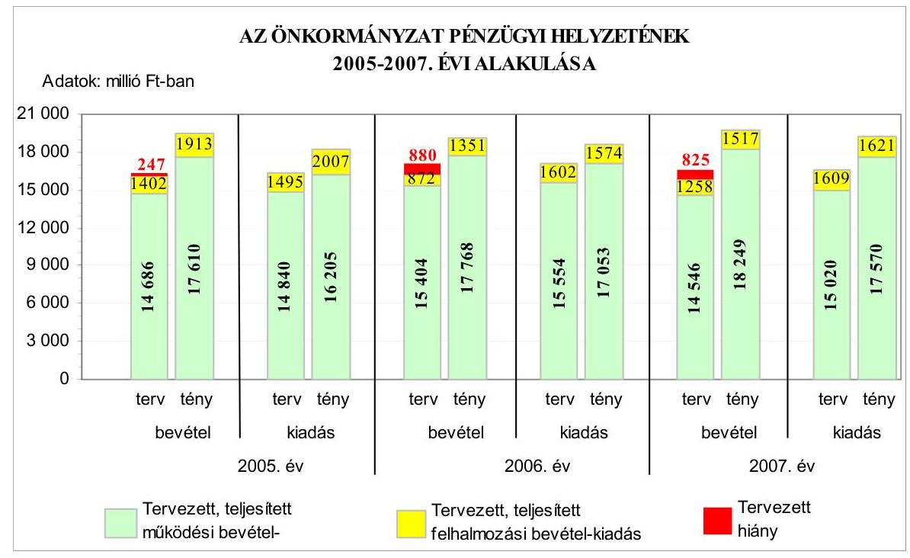

A 2005-2008. években a tervezett költségvetési és a tényleges pénzügyi hiány részarányát a működési és felhalmozási célú, valamint az összes költségvetési kiadáshoz viszonyítottan szemlélteti a következő táblázat:

| Megnevezés | A hiány részaránya \%-ban |  |  |  |  |  |  |
| :--: | :--: | :--: | :--: | :--: | :--: | :--: | :--: |
|  | 2005.   évben |  | 2006.   évben |  | 2007.   évben |  | 2008.   évben |
|  | Terv | Tény | Terv | Tény | Terv | Tény | Terv |
| Múködési célú költségvetési bevételek hiányának aránya a múködési célú költségvetési kiadásokhoz viszonyítva | 1,0 | - | 1,0 | - | 3,2 | - | 3,2 |
| Felhalmozási célú költségvetési bevételek hiányának aránya a felhalmozási célú költségvetési kiadásokhoz viszonyítva | 6,2 | 4,7 | 45,6 | 14,2 | 21,8 | 6,4 | - |
| A költségvetési hiány részaránya a költségvetési kiadásokhoz viszonyítva | 1,5 | - | 5,1 | - | 5,0 | - | 2,9 |

Az Önkormányzatnál a 2006-2008. évi költségvetési rendeletekben a költségvetési bevételek és kiadások főösszegeinek megállapításakor az Áht. 8/A. § (7) bekezdésében előírtakat megsértve finanszírozási célú pénzügyi múveleteket (hitelfelvételből tervezett bevételeket, illetve hiteltörlesztéssel

---

kapcsolatos kiadásokat) vettek figyelembe költségvetési hiányt módosító költségvetési bevételként, illetve költségvetési kiadásként. ${ }^{9}$

# 1.2. A költségvetési és a pénzügyi egyensúlyi helyzet kialakításához tervezett és teljesített finanszírozási célú pénzügyi múveletek módja és azok hatása a tárgyévet követő évek költségvetéseire 

Az Önkormányzatnál a 2005-2008. években tervezett és a 2005-2007. években teljesített múködési és felhalmozási célú költségvetési kiadásokra a következő arányban biztosítottak fedezetet a költségvetési bevételek:

Adatok: \%-ban

| Megnevezés | 2005.   év |  | 2006.   év |  | 2007.   év |  | 2008.   év |
| :--: | :--: | :--: | :--: | :--: | :--: | :--: | :--: |
|  | Terv | Tény | Terv | Tény | Terv | Tény | Terv |
| Múködési célú költségvetési kiadások fedezettsége múködési célú költségvetési bevételekből | 99,0 | 108,7 | 99,0 | 104,2 | 96,8 | 103,9 | 96,8 |
| Felhalmozási célú költségvetési kiadások fedezettsége felhalmozási célú költségvetési bevételekből | 93,8 | 95,3 | 54,4 | 85,8 | 78,2 | 93,6 | 102,5 |
| Költségvetési kiadások fedezettsége költségvetési bevételekbo̊l | 98,5 | 107,2 | 94,9 | 102,6 | 95,0 | 103,0 | 97,1 |

Az Önkormányzatnál a 2005-2008. években a tervezett költségvetési kiadások fedezettsége a költségvetési bevételekből nem volt biztosított, míg a költségvetések végrehajtása során a teljesített költségvetési kiadásokat a 2005-2007. években fedezték a költségvetési bevételek.

[^0]
[^0]:    ${ }^{9}$ A 2006. évi költségvetési rendelet bevételi főösszegében 580 millió Ft felhalmozási célú hitelt is figyelembe vettek felhalmozási célú költségvetési bevételként. A 2007. évi költségvetési rendeletben - az előző évhez hasonlóan - csak a múködési költségvetési hiányt rögzítették, és a költségvetési bevételi főösszeget a felhalmozási célú bevételeket meghaladó felhalmozási célú kiadások 357 millió Ft-ot kitevő összegével (amelynek pótlását felhalmozási célú hitelfelvétellel tervezték) növelten határozták meg, valamint a költségvetési célú kiadások között 180 millió Ft rövidlejáratú hiteltörlesztést is figyelembe vettek. A 2008. évi költségvetési rendelet kiadási főösszegében 340 millió Ft rövidlejáratú múködési hiteltörlesztést szerepeltettek költségvetési célú kiadásként.

---

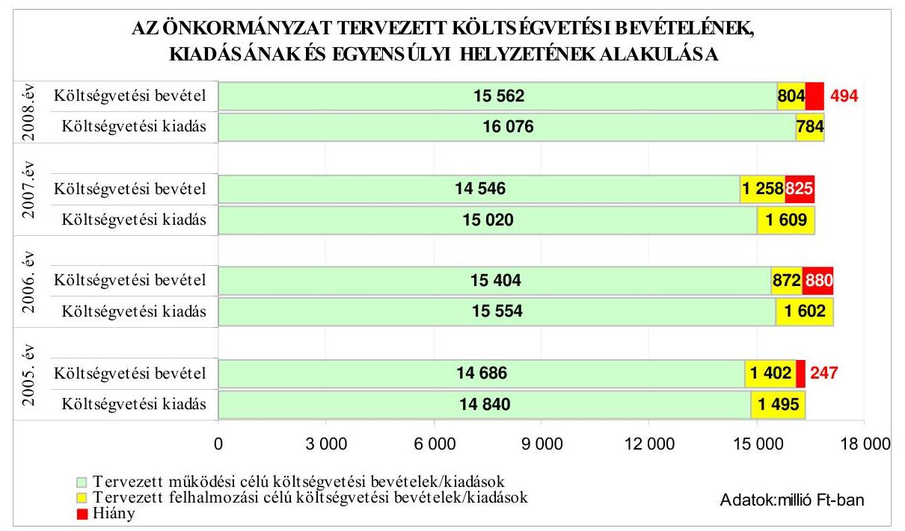

A költségvetés hiányát a 2005-2008. években a múködési költségvetési bevételek hiánya és a tervezett felhalmozási célú költségvetési kiadások bevételekkel nem fedezett összegei együttesen eredményezték. Az Önkormányzat költségvetését minden évben múködési költségvetési hiánnyal tervezték, és a tervezett felhalmozási célú költségvetési kiadások előirányzatai is meghaladták - a 2008. év kivételével - az azonos célú költségvetési bevételeket ${ }^{10}$. A múködési költségvetési hiány kialakulásában közrejátszott, hogy a tervezett múködési bevételek között előző évi pénzmaradvány igénybevételt 2005-2006-ban a teljesített összeg 1,4\%-ában, illetve 8,9\%-ában, 2007-2008-ban azonban egyáltalán nem terveztek. Tovább növelte a hiányt, hogy a 2007. évben az előző évihez képest 429 millió Ft-tal csökkentek az Önkormányzat központi költségvetési támogatásból (átengedett szja-ból) származó forrásai, amely a 2008. évben az előző évhez képest 10\%-kal magasabb - az ellátottak számának növekedésével összefüggő - összegével is a hiányképződés egyik fő tényezője maradt. A költségvetési bevételeken belül - a 2008. év kivételével - a felhalmozási célú költségvetési bevételek tervezett hiánya a múködési célú költségvetési bevételek tervezett hiányát többszörösen meghaladta, a 2006-2007. években a felhalmozási célú kiadások 46, illetve $22 \%$-át nem fedezték a tervezett azonos célú költségvetési bevételek. Az Önkormányzat a 2008. évi költségvetésében a felhalmozási célú kiadások hiányát megszüntette és felhalmozási célú többletbevételt tervezett.

Az Önkormányzat költségvetési egyensúlyi helyzete a 2005-2007. évek között romlott, mivel az előző évhez képest a 2006. évben a költségvetési kiadások a bevételeket ( $3,8 \%$-kal) meghaladóan növekedtek, a 2007. évben pedig a bevéte-

[^0]
[^0]:    ${ }^{10}$ A tervezett felhalmozási célú költségvetési kiadások bevételekhez viszonyított többlete 93-730-351 millió Ft volt. A 2008. évben a felhalmozási célú költségvetési bevételi többlet 20 millió Ft-ot tett ki.

---

lek és kiadások előző évhez viszonyított, tervezett előirányzatai közül a bevételek ( $0,2 \%$-kal) nagyobb arányban csökkentek, mint a kiadások. A 2008. évben az előző évhez képest, a tervezett költségvetési bevételek kiadásokat meghaladó növekedésének eredményeként - a költségvetési kiadások fedezettségének 2,1\%os emelkedésével - a költségvetési egyensúlyi helyzet javult, a költségvetési hiány mértéke az előző évi 59,9\%-ára csökkent.

Az Önkormányzatnál a 2005-2008. évek költségvetési rendeleteiben a költségvetési egyensúly és a tervezett költségvetési kiadások folyamatos finanszírozhatóságának biztosítása érdekében, évenként növekvő összegben, a 2005-2006. években munkabér-megelőlegezési, majd ezen túl a 2007-2008. években - folyószámla hitelkeret-szerződés kötésével - rövidlejáratú múködési hitelek, valamint a 2006-2007. években felhalmozási célú, hosszú lejáratú hitel felvételét tervezték. A költségvetési rendeletekben a kötvénykibocsátásról, tartós hitelviszonyt megtestesítő értékpapírok értékesítéséről nem döntöttek, de előírták, hogy a hitellel történő finanszírozás csökkentése érdekében az év közben képződő többletbevételeket, továbbá a szabad pénzmaradványt a hiány csökkentésére kell fordítani, és az átmenetileg szabad pénzeszközök bevonhatók a kiadások finanszírozásába.

A teljesítési adatok alapján a 2005-2007. években a költségvetési bevételek fedezetet nyújtottak a költségvetési kiadásokra. A múködési célú költségvetési bevételek mindhárom évben fedezték az azonos célú kiadásokat, azonban a tervezettet meghaladóan teljesített felhalmozási célú költségvetési bevételek egyik évben sem fedezték a felhalmozási célú teljesített kiadásokat. A 2005-2007. évek tervezett romló költségvetési egyensúlyi helyzettel szemben a költségvetések végrehajtása során a pénzügyi egyensúly a költségvetési bevételi többletek eredményeként biztosított volt.
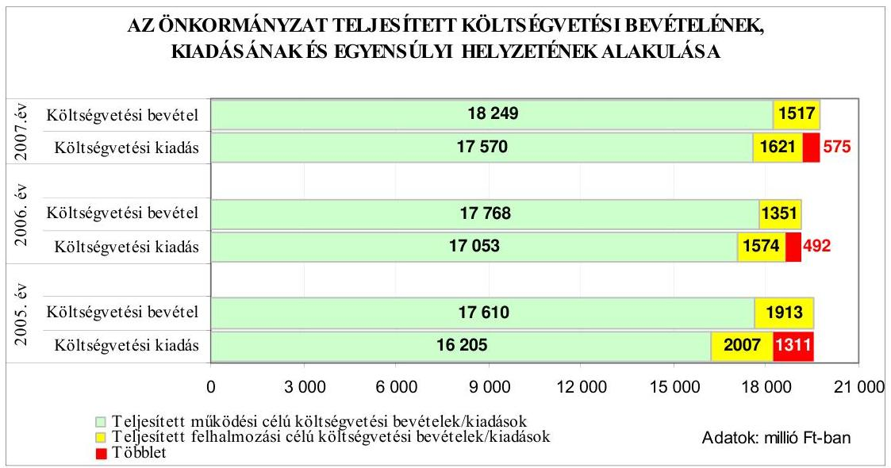

A teljesített költségvetésen belül a 2005-2007. években a múködési célú költségvetési bevételek a tervezetthez képest mindhárom évben - a kiadások teljesítését meghaladóan - (20-15-26\%-kal) túlteljesültek, amelynek eredményeként a múködési célú költségvetési kiadások tervezett hiánya megszűnt. A teljesítések

---

során elért 2005-2006. évi múködési célú költségvetési bevételi többlet több mint kétharmadát, a 2007. évben csaknem felét az előző évi pénzmaradvány tényleges igénybevételének, valamint az illetékek és intézményi múködési bevételek tervezettet meghaladó összegei tették ki. A felhalmozási célú költségvetési kiadásoknál forráshiány volt annak ellenére, hogy a felhalmozási célú költségvetési bevételek a tervezettet meghaladóan teljesültek, azonban a bevételi többletek nem fedezték a felhalmozási célú kiadások tervezett hiányát. A kialakult felhalmozási pénzügyi hiányt az Önkormányzat a 2005. évben 94 millió Ft összegben a múködési célú bevételekből - az átengedett szja-ból és az illetékbevételből - finanszírozta, míg a 2006-2007. években a hiányként jelentkező 223 millió Ft, illetve 104 millió Ft fedezetét az igénybevett hosszú lejáratú fejlesztési célú hitelből biztosította.

Az Önkormányzat a 2005-2007. évi költségvetések végrehajtása során múködési, illetve felhalmozási célú kötvényt nem bocsátott ki, hitelviszonyt megtestesítő befektetési és forgatási célú értékpapírokkal nem rendelkezett. A múködési célú költségvetési bevételeknél teljesült többletek ellenére az Önkormányzat a 2005-2006. években a gazdálkodás során, év közben a fizetőképesség folyamatos biztosítása érdekében a működési célú költségvetési kiadások finanszírozásához munkabér-megelőlegezési hitelt, valamint ezen túlmenően a 2007. évben és 2008. I. negyedévben folyószámlahitelt is igénybe vett. A tervezett költségvetési hiány hitellel történő finanszírozásának csökkentése érdekében a 2005-2007. évek költségvetési rendeleteiben előírtaknak megfelelően az év közben képződött múködési többletbevételekből (illeték és intézménymúködési bevételek), illetve a szabad pénzmaradványokból történt átcsoportosításokkal csökkentették a hiányt. Az Önkormányzat pénzügyi egyensúlyának javítása érdekében a Közgyűlés az intézmények szervezeti struktúrájának átalakítására, párhuzamosan ellátott feladatok megszüntetésére vonatkozó, kiadási megtakarítást, eredményező döntéseket is hozott.

A Közgyűlés 120/2005. (IX. 30.) számú határozata alapján a Karcagi Általános Iskola tevékenységének racionalizálásával - konyhai, mosodai és kollégiumi kisegítői álláshelyek megszüntetésével - évente 11,3 millió Ft kiadáscsökkenést terveztek. A 2007. évben megszüntették a Jász-Nagykun-Szolnok Megyei Önkormányzat Ellátó és Szolgáltató Szervezetét, a feladatok ellátását az Önkormányzati hivatal szervezetéhez integrálták 17 fős létszámcsökkentéssel, 32 millió Ft várt kiadási megtakarítással, valamint az önkormányzati kötelező feladatok más formában - vállalkozási szerződéssel, közalapítvány keretében, illetve a Verseghy Ferenc Könyvtárhoz integráltan - történő ellátására tekintettel megszüntetett Művelődési, Továbbképzési és Sport Intézet 17 fő álláshely és 37 millió Ft kiadás csökkenést eredményezett.

Hosszú lejáratú hitel állománya az Önkormányzatnak a 2005. évben nem, 2006-2007. december 31-én 223 millió Ft, illetve 580 millió Ft volt. A hosszú lejáratú fejlesztési hitel igénybevételére szóló hitelszerződést, a 2006. évi költségvetési rendeletben foglalt, illetve a Közgyűlés 3/2006. (II. 17.) számú határozata alapján a Kórház haemodinamikai labor beruházásának megvalósítására kötötték 2006-ban, 580 millió Ft összegben, a „Sikeres Magyarországért" Önkormányzati Infrastruktúra-fejlesztési Hitelprogram keretében. A változó kamatfeltétellel felvett hitel tőketörlesztésére a szerződéskötés napjától számított három éves türelmi időt tartalmazó szerződésben a törlesztés futamideje 10

---

évre szól, és a kamatfizetési kötelezettség a folyósítás napjától áll fenn. A hitelt az Önkormányzat az egy éves rendelkezésre tartási határidőn belül két részletben vette igénybe, a 2006. évben 223 millió Ft-ot, a 2007. évben 357 millió Ftot.

Az évközi likviditási gondok megoldása céljából a Közgyűlés a 2005-2008. évi költségvetési rendeletekben - hitelkeret meghatározásával - munkabérmegelőlegezési és folyószámlahitel felvételét engedélyezte a Közgyűlés elnöke számára.

A Közgyűlés az Önkormányzat 2005-2006. évek költségvetési rendeleteiben a működési költségvetési hiány finanszírozhatósága érdekében 247 millió Ft, illetve 300 millió Ft összegben munkabér-megelőlegezési hitel igénybe vételét engedélyezte. A 2007. évi költségvetési rendeletben foglalt 648 millió Ft müködési hiányt munkabér megelőlegezési hitelfelvétellel és 350 millió folyószámla-hitelkeret felhasználásával tervezték pótolni, majd év közben 450 millió Ft-ra módosították a folyószámla-hitelkeret összegét. A 2008. évben a munkabérhitelen túl 550 millió Ft folyószámla-hitelkeretről döntöttek a költségvetési rendeletben.

A munkabér-megelőlegezési hitel igénybevételére a 2005. évben egy alkalommal (november hónapban) 47 millió Ft összegben, a 2006. évben hat alkalommal (augusztus-december hónapokban) összesen 930 millió Ft összegben került sor, amelyből év végén 180 millió Ft visszafizetése nem történt meg. Ennek oka az volt, hogy a 2007. január 3-én esedékes munkabéreket 2006. december 28-án folyósították. A 2007. évben (február és október hónapok között) nyolc alkalommal összesen 1600 millió Ft összegben vettek igénybe munkabér-megelőlegezési hitelt. A 2007. év végén az Önkormányzatnak vissza nem fizetett munkabér-hitel állománya nem volt. A munkabérek fizetéséhez 2008. I. negyedévben egy alkalommal (március hónapban) vált szükségessé 200 millió Ft összegben hitel igénybe vétele.

A 2005-2008. években a folyószámlahitellel kapcsolatos jellemzőket mutatja be a következő táblázat:

| Megnevezés | 2005.   évben | 2006.   évben | 2007.   évben | 2008. I.   n. évben |
| :-- | :--: | :--: | :--: | :--: |
| A folyószámlahitel keretösszege   (millió Ft-ban) | 0 | 0 | 450 | 550 |
| Év végén fennálló folyószámlahitel   (millió Ft-ban) | 0 | 0 | 308 | - |
| Folyószámlahitellel zárt napok szá-   ma | 0 | 0 | 185 | 17 |
| A ténylegesen felvett folyószámlahitel   éves átlagos állománya (millió Ft-   ban) | 0 | 0 | 229 | 195 |
| A felvett folyószámlahitel minimum   összege (millió Ft-ban) | 0 | 0 | 4 | 5 |
| A felvett folyószámlahitel maximum   összege (millió Ft-ban) | 0 | 0 | 444 | 309 |

A folyószámlahitel felvételét a bevételek kiadásoktól eltérő ütemben történt realizálása indokolta. A 2007. évben márciustól decemberig, a 2008. I. negyedévben összesen 17 napig vett igénybe az Önkormányzat folyószámlahitelt,

---

melynek éves átlagos állománya a folyószámlakeret összegének a 2007. évben $51 \%$-a, a 2008. I. negyedévben $36 \%$-a volt. A folyószámlahitellel zárt napok aránya 2007-ben 51\%-ot, 2008. I. negyedévben 19\%-ot tett ki. A 2007. év végi 308 millió Ft folyószámlahitel állomány oka elsősorban az volt, hogy az Önkormányzati hivatal költségvetési elszámolási számláján nem rendelkeztek a visszafizetéshez szükséges fedezettel. ${ }^{11}$

A Közgyűlés a 192/2007. (XII. 14.) számú határozatában kötvény kibocsátás előkészítéséről, majd a 11/2008. (II. 22.) számú határozatában 4000 millió Ft összegben történő zártkörű kötvénykibocsátásról hozott döntést, amelynek céljaként a 12/2008. (II. 22.) számú határozatával elfogadott, az Önkormányzat középtávú fejlesztési koncepciójában - európai uniós források elnyerésével tervezett beruházások megvalósítását jelölték meg. A névre szóló kötvényt 2008. március 31-én bocsátották ki, amelynek futamideje 20 év, változó kamatozású, a tervezett igénybevétel kezdő éve 2008, amelyet a tervezett felhasználást megelőzően pénzügyi befektetéssel kívántak kamatoztatni 210 napig, a teljes összeggel. A tőketörlesztés öt év türelmi idő után kezdődik, amely idő alatt évi 180 millió Ft kamatfizetési kötelezettség terheli az Önkormányzatot. A tőketörlesztés évi átlagos összege 267 millió Ft, amelyhez évenként 147 millió Ft átlagos kamatfizetés kapcsolódik.

Az Önkormányzat eladósodása a 2005-2007 közötti időszakban folyamatosan emelkedett, mivel a hosszú és rövid lejáratú fizetési kötelezettségek önkormányzati összes forráson belüli aránya - az eladósodási mutató ${ }^{12}$ - háromszorosára ( $6,9 \%$-ra) nőtt, amelyet a rövid és hosszú lejáratú kötelezettségek év végi állományának növekedése együttesen okozott. A rövid lejáratú kötelezettségek összes kötelezettségeken belüli $40 \%$-os aránya 2005-2007 közötti időszakban nem változott, összege az egyes években 418 millió Ft, 788 millió Ft és 943 millió Ft volt. Ugyanebben az időszakban az esedékességi aránymutató ${ }^{13}$ folyamatosan csökkent, $78 \%$-ról $58 \%$-ra, ami jelzi, hogy a rövidtávon teljesítendő kötelezettségek fizetőképességre gyakorolt hatása mérséklődött. A mutató csökkenésének oka, hogy a rövid lejáratú kötelezettségek állományának növekedése kisebb mértékű - az előző évhez képest a 2006. évre 88,5\% és a 2007. évre $19,7 \%$ - volt, mint az egyéb passzív pénzügyi elszámolások nélkül számított összes fizetési kötelezettség növekedése, ami a 2006. és 2007. évben 204\% és $148 \%$ volt. A két mutató jelzi, hogy az Önkormányzat pénzügyi helyzete eladósodás szempontjából kedvezőtlenül alakult, mivel a 2005-2007. évek között a hosszú lejáratú kötelezettségek állományának ( $469,2 \%$-os) növekedése meghaladta az összes kötelezettség ( $126,3 \%$-os) növekedését.

[^0]
[^0]:    ${ }^{11}$ Az Önkormányzati hivatal 2007. december 31-i 410,8 millió Ft-os pénzkészletéből 396,5 millió Ft az állami hozzájárulások számlán volt, amely a következő havi előfinanszírozás és a kötelezettséggel terhelt pénzeszközök összegét tartalmazta.
    ${ }^{12}$ Az eladósodási mutató a hosszú és rövid lejáratú fizetési kötelezettségek önkormányzati összes forráson belüli arányát mutatja.
    ${ }^{13}$ Az esedékességi aránymutató az egyéb passzív pénzügyi elszámolások összegével csökkentett fizetési kötelezettségen belül a rövid lejáratú fizetési kötelezettségek arányát mutatja.

---

Az Önkormányzat fizetőképessége - a 2005-2007. évek között - romlott, mivel a pénzeszközök év végi állománya egyre kisebb arányban nyújtott fedezetet a rövidlejáratú kötelezettségek rendezésére. A rövid lejáratú kötelezettségek pénzeszközökből történő azonnali kiegyenlítésének lehetősége 287 százalékponttal esett vissza a 2007. év végére a 2005. évhez képest. Az Önkormányzatnál a költségvetési kiadások teljesíthetőségét, a feladatok megvalósíthatóságát jelző fizetőképességi mutatók (készpénz likviditási mutató ${ }^{14}$ és likviditási gyorsráta ${ }^{15}$ ) folyamatos csökkenése jelzi, hogy a pénzeszközök és a rövid lejáratú kötelezettségek pénzügyi teljesítésébe a pénzeszközök mellett bevont követelések egyre kisebb arányban voltak képesek fedezetet biztosítani a rövid lejáratú kötelezettségek kiegyenlítésére, ezáltal romlott a fizetőképesség. A 2007. évben az előző évhez képest $94 \%$-kal csökkent az Önkormányzat követelésállománya az illetékkövetelések nyilvántartásból történt kivezetése - az Illetékhivatal APEH-hez történt átadása - következtében.

Az Önkormányzat fizetőképességét jellemző mutatók alakulását a 2005-2007. években a következő ábra szemlélteti:
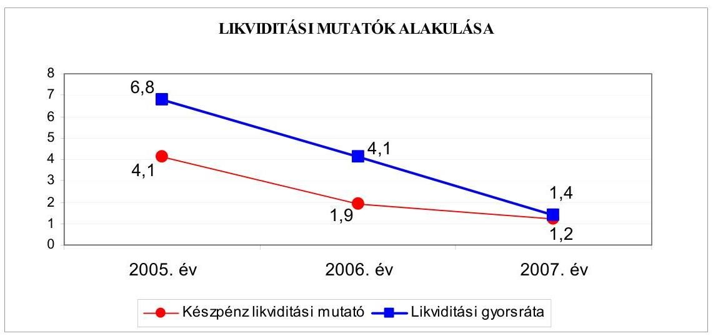

Az Önkormányzat pénzügyi helyzete - az eladósodás növekedését és a fizetőképesség csökkenését figyelembe véve - a 2005-2007. évek között kedvezőtlenül alakult.

# 1.3. A költségvetés tervezésének megalapozottsága 

Az Önkormányzatnál a 2005-2007. években a költségvetés bevételi és kiadási föösszegeit a költségvetések végrehajtása során évente változó arányban, a bevételeket 17-25\%, a kiadásokat 9-15\% közötti mértékben, túlteljesítették. A működési célú költségvetési bevételek 20-25\%-kal, a kiadások 9-17\%-

[^0]
[^0]:    ${ }^{14}$ A készpénz likviditási mutató a pénzeszközök év végi állományának a rövid lejáratú kötelezettségekhez mért arányát mutatja.
    ${ }^{15}$ A likviditási gyorsráta azt mutatja, hogy a rövid lejáratú kötelezettségek kiegyenlítéséhez a pénzeszközökön túl a bevonható követelések, forgatási célú értékpapírok együttesen milyen arányban nyújtanak fedezetet.

---

kal, valamint a felhalmozási célú költségvetési bevételek 55-21\% közötti mértékkel túlteljesültek, míg a felhalmozási célú kiadások a 2005. és a 2007. évben $34 \%$-kal, illetve $1 \%$-kal meghaladták az eredeti előirányzatokat, a 2006. évben azonban $2 \%$-kal elmaradtak a tervezetthez képest.

A 2005-2007. években a működési célú költségvetési bevételek között az évek sorrendjében 22-12-12\%-kal túlteljesített illetékbevételek, a rendszeresen $48 \%$ és $52 \%$ közötti mértékben alultervezett intézményi múködési bevételek és az előző évi kötelezettségekkel terhelt pénzmaradvány eredeti előirányzatként - az előző évről áthúzódó kötelezettségek forrásaként - alacsony összegben, vagy egyáltalán nem tervezett ${ }^{16}$, de teljesített igénybevétele a múködési költségvetési hiány teljes megszüntetését eredményezte. Az intézményi működési bevételi többletek elsősorban a Múzeumok Igazgatóságánál képződtek ${ }^{17}$ a folyamatosan végzett régészeti feltárások kiszámlázott, illetve a 2007. évben megrendezett Munkácsy kiállítás bevételeiből. Az Önkormányzat múködési költségvetési bevételei között az intézményi működési bevételek tervezése - figyelemmel azok visszatérő túlteljesítéseire - és az előző évi múködési célú, kötelezettségekkel terhelt pénzmaradványok eredeti előirányzatként történő tervezésének rendszeres elmaradása miatt nem volt megalapozott. A múködési célú költségvetési kiadások eredeti előirányzatként tervezett összegének túlteljesítése a bevételek túlteljesítésétől elmaradt. A múködési kiadások jogcímei között elsősorban az egyharmados részarányt képviselő dologi kiadások tervezettnél magasabb teljesítései - az igénybevett előző évi pénzmaradványok és a költségvetésben megtervezett tartalékok felhasználásával - eredményezték a tervezett előirányzatok túlteljesítését.

A felhalmozási célú költségvetési bevételek a 2005-2007. években eredeti előirányzatként tervezett összegei az évek sorrendjében 511-479-259 millió Ft-tal nagyobb összegben teljesültek. A felhalmozási célú bevételi előirányzatok között a kötelezettséggel terhelt előző évi pénzmaradványok igénybevételét megtervezték. A 2005. évi tervezett felhalmozási célú költségvetési bevételek túlteljesítését $56 \%$-ban a Kórház diagnosztikai központ európai uniós támogatással megvalósuló ${ }^{18}$ beruházásához év közben igénybevett 288 millió Ftos előleg - a költségvetésbe módosított előirányzatként beemelt - összege eredményezte. A 2006. évben a támogatási szerződés szerinti, tárgyévi 230 millió Ft európai uniós támogatás összegét eredeti előirányzatként nem tervezték meg, amely a felhalmozási célú bevételek túlteljesítéséhez $47 \%$-ban járult hozzá. A

[^0]
[^0]:    ${ }^{16}$ Előző évi múködési célú pénzmaradvány igénybevételt a 2005-2006. években terveztek a költségvetésben 8-99 millió Ft összegben, amelyek azonban 1179 millió Ft-tal, illetve 782 millió Ft-tal túlteljesültek. A 2007-2008. években eredeti előirányzatot nem terveztek. A 2005-2007. évi könyvviteli mérlegben kimutatott, tárgyévi szállítói kötelezettségek összegei az évek sorrendjében 77-121-731 millió Ft volt. A 2006-2007. évi pénzmaradvány elszámolásokban 557 millió Ft, illetve 731 millió Ft összegben jelölték meg a kötelezettséggel terhelt pénzmaradványt.
    ${ }^{17}$ A Múzeumok Igazgatóságánál képződött az önkormányzati szintű működési bevételi többlet 31-71-81\%-a a 2005-2007. években.
    ${ }^{18}$ HEFOP-4.3.2/05/1-0004/4.0 azonosító számú „Térségi diagnosztikai és szürő központ kialakítása" elnevezésű projekt.

---

2005-2006. évi bevételi többletek további részét a címzett támogatással több év alatt megvalósuló intézményi beruházásokhoz ${ }^{19}$ igénybevett támogatások előző évről áthúzódó pénzügyi teljesítései tették ki, míg a 2007. évi bevételi többletet az intézményi fejlesztési feladatokhoz, elsősorban pályázatokkal (TERKI, CÉDE, vis maior) év közben nyert támogatások bevételei eredményezték.

A felhalmozási célú költségvetési bevételek 2005-2007. évi túlteljesítése és a tervezett felhalmozási célú kiadások 2005. és 2007. évi tervezetthez képest alacsonyabb teljesítésének eredményeként a tényleges felhalmozási hiány csökkent. A felhalmozási célú költségvetési bevételek túlteljesítése - tekintettel a 2006-ban eredeti előirányzatként nem tervezett európai uniós támogatás egyszeri előfordulására - összességében nem tervezési hiányosság következménye. A felhalmozási célú teljesített költségvetési kiadások között a felújítási kiadások előirányzatát 2005-ben ötszörösével túlteljesítették, a beruházási kiadásokra 2005-ben a címzett támogatások előző évről áthúzódó, az év közben vis maior támogatásból történt épület-helyreállítási kiadások pénzügyi teljesítései eredményeként $21 \%$-kal, a 2007. évben 5\%-kal fordítottak többet a tervezetthez képest. A "Tiszakürti Arborétum turisztikai vonzerejének fejlesztése" elnevezésű beruházás európai uniós támogatásának 2005. évi 52 millió Ft-os tárgyévi üteméből - a költségvetés évközi módosításával beemelt előirányzat felhasználásával - 13 millió Ft összegben történt teljesítése is a többletkiadások részét képezte. Az Önkormányzatnál a 2005-2007 években a múködési célú költségvetési bevételek túlteljesítése - amelyben tervezési hiányosságok is közrejátszottak -, valamint a sikeres fejlesztési célú pályázatokkal elnyert támogatások öszszegei által a tervezettet meghaladó felhalmozási célú költségvetési bevételek eredményeként a pénzügyi egyensúly biztosított volt, hiány nem alakult ki, mindhárom évben költségvetési bevételi többletet realizáltak.

# 2. AZ ÖNKORMÁNYZAT FELKÉSZÜLTSÉGE AZ EURÓPAI UNIÓS FORRÁSOK IGÉNYLÉSÉRE ÉS FELHASZNÁLÁSÁRA, VALAMINT AZ ELEKTRONIKUS KÖZIGAZGATÁSI FELADATOK ELLÁTÁSÁRA 

2.1. Az európai uniós források igénybevételére és a várható támogatás felhasználására történt felkészülés szabályozottsága, szervezettsége

### 2.1.1. Az európai uniós forrásokra történő pályázatok benyújtására vonatkozó döntések összhangja a fejlesztési célkitűzésekkel

Az Önkormányzat feladatellátására vonatkozó középtávú fejlesztési célkitüzéseit általánosan összefoglalva a 2003-2006. és a 2007-2010. évekre a gaz-

[^0]
[^0]:    ${ }^{19}$ Címzett támogatással valósult meg a Múzeumok Igazgatósága raktár és galéria rekonstrukciója, a Mészáros Lőrinc Gimnázium fejlesztési feladata, a „Szőke Tisza" Otthon bővítéses rekonstrukciója, amelyekhez kapcsolódóan - a feladatok sorrendjében a 2005. évben 34 millió Ft-tal, a 2006. évben 100 millió Ft-tal, illetve 90 millió Ft-tal több bevétel teljesült a tervezetthez képest.

---

dasági program ${ }_{1,2}$-ben, illetve részletesen ágazati koncepciókban ${ }^{20}$, programokban ${ }^{21}$ és tervekben ${ }^{22}$ rögzítették. A gazdasági program ${ }_{1,2}$-ben a térség- és gazdaságfejlesztés, valamint a humán közszolgáltatás feladatainak ellátása körében kitértek a közlekedésfejlesztési, környezetvédelemi, ár- és belvízvédelmi, energiagazdálkodási, turizmusfejlesztési, közoktatási, szakképzési, gyer-mek- és ifjúságvédelmi, egészségügyi, szociális, sportigazgatási, ifjúságpolitikai, közművelődési, valamint közgyűjteményi kiemelt fejlesztési célkitűzésekre.

A fejlesztési célkitűzések megalapozottságát általánosan a gazdasági progra $\mathrm{m}_{1,2}$-ben és részletesen az ágazati koncepciókban, a programokban, valamint a tervekben helyzetelemzéssel támasztották alá, tervezték európai uniós pályázati források igénybevételét. A 2005-2008. I. negyedévre vonatkozóan fejlesztési célkitűzések megvalósításához szükséges saját és külső forrás mértéket az Önkormányzat 2003-2006. évi felújítási és rekonstrukciós programjában ${ }^{23}$, a 2008-2010. évi fejlesztési koncepciójában ${ }^{24}$, valamint az ágazati szakmai fejlesztési koncepciók közül a szociális szolgáltatástervezési koncepcióban ${ }^{25}$ határoztak meg. A Jász-Nagykun-Szolnok Megyei Területfejlesztési Stratégiai Program ${ }^{26}$ 2007-2008. évi Akcióterve ${ }^{27}$ - a regionális tervezéssel összhangban tartalmazta az Önkormányzatot kedvezményezettként érintő megyei szintű tervezett projekteket, azok összköltségét és ágazati operatív program szerinti besorolását.

[^0]
[^0]:    ${ }^{20}$ A Közlekedésfejlesztési, a Turizmusfejlesztési, a Közművelődési, a Szociális szolgálta-tás-tervezési, a 2008-2010. évi fejlesztési, az Ifjúságpolitikai, valamint a Fogyatékosok sportja fejlesztési koncepcióban.
    ${ }^{21}$ A 2003-2006. évi Felújítási és rekonstrukciós, a Környezetvédelmi, a Szennyvízkezelési, a Belterületi belvízrendezési, az Ivóvízminőség-javító, a Középtávú akadálymentesítési, a drogmegelőzési, cselekvési, a Kórház szakmai fejlesztési, a Turizmusfejlesztési stratégiai, a Közoktatási minőségirányítási, az Önkormányzati hivatal informatikai fejlesztési, valamint a Megújuló energiahasznosítási programban.
    ${ }^{22}$ A Megyei területrendezési, a Hulladékgazdálkodási, a Megyei fenntartású közoktatási intézmények számára előírt eszköz- és felszerelési jegyzék szerinti minimum feltételek teljesítésére vonatkozó, a Közoktatás-feladatellátási, intézményhálózat-múködtetési és fejlesztési, a középtávú gyermek- és ifjúságvédelmi szakellátási, valamint a középtávú roma intézkedési tervben.
    ${ }^{23}$ A Közgyűlés az Önkormányzat 2003-2006. évi felújítási és rekonstrukciós programjáról szóló 63/2003. (VI. 27.) számú határozata.
    ${ }^{24}$ A Közgyűlés az Önkormányzat 2008-2010. évi fejlesztési koncepciójáról szóló 12/2008. (II. 22.) számú határozatában a pályázatok előkészítéséhez középtávú fejlesztési koncepciót fogadott el, amelyben pályázatonként bemutatták a várható összköltséget, valamint a tervezett saját és külső források mértékét.
    ${ }^{25}$ A Közgyűlés Jász-Nagykun-Szolnok megye szociális szolgáltatástervezési koncepciójának elfogadásáról szóló 123/2002. (XII. 13.), valamint annak felülvizsgálatáról szóló 101/2005. (VI. 24.) számú határozata.
    ${ }^{26}$ A Területfejlesztési Tanács 72/2006. (V. 16.) számú határozatával fogadta el a 20072013. évre a Jász-Nagykun-Szolnok Megyei Területfejlesztési Stratégiai programot.
    ${ }^{27}$ A Megyei Területfejlesztési Stratégiai Program 2007-2008. évi Akciótervét a Területfejlesztési Tanács 2007. január 22-én fogadta el.

---

A Közgyűlés a gazdasági program ${ }_{1}$-ben rögzített fejlesztési célkitűzéseinek időarányos végrehajtását a 2005-2006 év között évente értékelte ${ }^{28}$. A fejlesztési célkitűzéseket az NFT-ben megjelenő pályázati lehetőségek alapján a koncepciókban módosították. Az Önkormányzat a gazdasági program ${ }_{1}$-et az Ötv-ben foglaltaknak megfelelően az alakuló ülést követő hat hónapon belül felülvizsgálta és a Közgyűlés a gazdasági program ${ }_{2}$-t 2007. április 20-án az ÚMFT keretében megjelenő pályázati lehetőségeket is figyelembe véve fogadta el.

Az Önkormányzat gazdasági program ${ }_{1,2}$-ben és az ágazati szakmai fejlesztési koncepciókban, tervekben rögzített fejlesztési célkitűzéseivel a 2005-2008. I. negyedévben benyújtott európai uniós pályázatokra vonatkozó döntések összhangban voltak. Az Önkormányzatnál a Közgyűlés, a Közgyűlés elnöke, illetve az intézményvezetők a 2005-2008. I. negyedévre vonatkozóan összesen 37 európai uniós forrásokkal összefüggő projekt, program - 25 esetben önállóan és 12-ben partnerként (konzorciumban) történő - megvalósításáról döntöttek.

Az NFT és az ÚMFT keretében a Közgyűlés döntése ellenére egy-egy pályázatot nem nyújtottak be:

- a HEFOP-3.1.3 intézkedéshez kapcsolódó az IMKV Szakképző Iskola által a „A felkészülés a kompetencia-alapú oktatásra" elnevezésű a Közgyűlés 2005. évi döntése ellenére be nem adott pályázat. A pályázat beadására azért nem került sor, mert a 2005. évben, kedvező elbírálásban részesült a Szakiskolai Fejlesztési Program II. pályázat, így az intézmény a két program feltételeinek nem tudott volna megfelelni;
- a TIOP-os prioritású ÚMFT-s pályázati felhíváshoz kapcsolódó az Önkormányzati hivatal által a 2008. I. negyedévben a „Kórház rekonstrukció, a regionális és progresszív betegellátás feltételeinek fejlesztése" elnevezésű a Közgyűlés döntése ellenére be nem adott pályázat, amelynek oka, hogy a konkrét kétfordulós pályázati lehetőség 2008. I. negyedév végéig - a korábban erre a fejlesztési feladatra benyújtott ÚMFT kiemelt projektjavaslat elutasító levelében kapott tájékoztatás ellenére - nem volt kiírva.

A 2008. I. negyedév végéig beadott 35 pályázat közül 24-re kaptak európai uniós támogatást. A támogatott pályázatok alapján elnyert 1301,4 millió Ft európai uniós, illetve 369 millió Ft hazai támogatásból 977,5 millió Ft, illetve 284 millió Ft támogatás érkezett az Önkormányzathoz 2005-2008. I. negyedév közötti időszakban.

Az NFT keretében 2005-2008. I. negyedévekre vonatkozóan 17 benyújtott pályázatból 14 nyert, amelyek közül egytől (amely a ROP-3.2.1 intézkedéshez kapcsolódott) az Önkormányzat visszalépett és három volt eredménytelen.

A nyertes pályázatok:

- az AVOP-3.5.2 intézkedéshez kapcsolódó a Mészáros Lőrinc Gimnázium által a 2006. évben „Kerékpártúra a Jászság kegyhelyei között" elnevezésű turizmusfejlesztés érdekében beadott pályázat. A 2007. évben megkötött támogatási

[^0]
[^0]:    ${ }^{28}$ A Közgyűlés 167/2005. (X. 11.) és 99/2006. (IX. 22.) számú határozata.

---

szerződés alapján a megvalósítás tervezett költségelőirányzata 1,4 millió Ft. volt, amelynek $15 \%$-a önkormányzati saját forrásból, valamint $21 \%$-a hazai és $64 \%$-a európai uniós támogatásból állt;

- a ROP-1.1.1 intézkedéshez kapcsolódó az Önkormányzati hivatal által a 2006. évben a „Tiszakürti Arborétum turisztikai vonzerejének fejlesztése" elnevezésű a turizmusfejlesztés érdekében beadott pályázat. A 2005. évben megkötött támogatási szerződés alapján a megvalósítás tervezett költségelőirányzata 213,7 millió Ft volt, amelynek 2,5\%-a önkormányzati saját forrásból, valamint $24,4 \%$-a hazai és $73,1 \%$-a európai uniós támogatásból állt;
- a ROP-3.2.1 intézkedéshez kapcsolódó az Önkormányzati hivatal által konzorcium tagjaként a 2004. évben „FORTE program a nonprofit foglalkoztatásfejlesztésért" elnevezésű a helyi foglalkoztatási kezdeményezések támogatása érdekében beadott pályázat. A 2005. évben megkötött támogatási szerződés alapján a megvalósítás tervezett költségelőirányzata az Önkormányzatot érintően 0,5 millió Ft volt. Az Önkormányzat - a feladatot végző jogviszonyának megszűnése miatt - elszámolással nem kívánt élni, a projektből viszszalépett, és az előleget visszafizette;
- a HEFOP-1.1.1 intézkedéshez kapcsolódó a Múzeumok Igazgatósága, a Verseghy Ferenc Könyvtár, valamint az Önkormányzati hivatal által a 2006. évben „Munkagyakorlat-szerzést elősegitő foglalkoztatás és utazási költségtérítés" elnevezésű az aktív munka-erőpiaci politikák támogatása érdekében beadott összesen négy pályázat. A 2006. évben megkötött megállapodások alapján a megvalósítás tervezett költségelőirányzata összesen 4 millió Ft volt, amely saját forrást nem igényelt és $25 \%$-a hazai, valamint $75 \%$-a európai uniós támogatásból állt;
- a HEFOP-1.3.1 intézkedéshez kapcsolódó az Önkormányzat három intézménye a „Fehér Akác", a „Gólyafészek", valamint az „Angolkert" Otthon által konzorcium tagjaiként a 2005. évben „A nők munkaerőpiacra való visszatérésének ösztönzése (IRISZ 2006-2007)" elnevezésű az aktív munka-erőpiaci politikák támogatása érdekében beadott pályázat. A 2006. évben megkötött támogatási szerződés alapján a megvalósítás tervezett költségelőirányzata a három intézményt érintően összesen 8,4 millió Ft volt, amely saját forrást nem igényelt és $25 \%$-a hazai, valamint $75 \%$-a európai uniós támogatásból állt;
- a HEFOP-2.1.5 intézkedéshez kapcsolódó a Kádas György speciális oktatási intézmény által konzorcium tagjaként a 2006. évben a „Halmozottan hátrányos helyzetü tanulók integrált nevelése" elnevezésű a társadalmi kirekesztés elleni küzdelem érdekében beadott pályázat. A 2007. évben megkötött támogatási szerződés alapján a megvalósítás tervezett költségelőirányzata az intézményt érintően 6 millió Ft volt, amely saját forrást nem igényelt és $25 \%$-a hazai, valamint $75 \%$-a európai uniós támogatásból állt;
- a HEFOP-2.1.6 intézkedéshez kapcsolódó a Kádas György speciális oktatási intézmény által konzorcium tagjaként a 2005. évben „A sajátos nevelési igényü tanulók együttnevelése" elnevezésű a társadalmi kirekesztés elleni küzdelem érdekében beadott pályázat. A 2006. évben megkötött támogatási szerződés alapján a megvalósítás tervezett költségelőirányzata az intézményt érintően 21,5 millió Ft volt, amely saját forrást nem igényelt és $25 \%$-a hazai, valamint $75 \%$-a európai uniós támogatásból állt;
- HEFOP-2.3.1 intézkedéshez kapcsolódó a „Tóparti Otthon" által konzorcium tagjaként a 2005. évben a "CERTAMEN 2006-2007." elnevezésű a társadalmi kirekesztés elleni küzdelem érdekében beadott pályázat. A 2006. évben megkötött támogatási szerződés alapján a megvalósítás tervezett költségelöi-

---

rányzata az intézményt érintően 19,8 millió Ft volt, amely saját forrást nem igényelt és $25 \%$-a hazai, valamint $75 \%$-a európai uniós támogatásból állt;

- HEFOP-3.1.2 intézkedéshez kapcsolódó a Pedagógiai Intézet által konzorcium tagjaként a 2004. évben a "Pedagógusok módszertani kultúrájának fejlesztése" elnevezésű a Térségi Iskola- és Óvodafejlesztő Központok megalapítása érdekében beadott pályázat. A 2005. évben megkötött támogatási szerződés alapján a megvalósítás tervezett költségelőirányzata az intézményt érintően 11,3 millió Ft volt, amely saját forrást nem igényelt és $25 \%$-a hazai, valamint $75 \%$-a európai uniós támogatásból állt;
- HEFOP-4.3.2 intézkedéshez kapcsolódó a Kórház által a 2005. évben „Térségi diagnosztikai és szürő központ kialakítása" elnevezésű az egészségügyi infrastruktúra fejlesztése érdekében beadott pályázat. A 2005. évben megkötött támogatási szerződés alapján a megvalósítás tervezett költségelőirányzata 1230 millió Ft volt, amelynek $6 \%$-a önkormányzati saját forrásból, valamint $19 \%$-a hazai és $75 \%$-a európai uniós támogatásból állt;
- a HEFOP-4.4.1 intézkedéshez kapcsolódó a Kórház által konzorcium tagjaként a 2004. évben az "Egészségügyi információ-technológia fejlesztés" elnevezésű az egészségügyi infrastruktúra fejlesztése érdekében beadott pályázat. A 2005. évben megkötött támogatási szerződés alapján a megvalósítás tervezett költségelőirányzata az intézményt érintően 116,6 millió Ft volt, amely saját forrást nem igényelt és $25 \%$-a hazai, valamint $75 \%$-a európai uniós támogatásból állt.

Az eredménytelen pályázatok és azok okai:

- a HEFOP-2.1.6 intézkedéshez kapcsolódó a Pedagógiai Intézet által a 2005. évben „A sajátos nevelési igényü gyermekek esélyegyenlőségének növelése" elnevezésű a társadalmi kirekesztés elleni küzdelem érdekében beadott 34,8 millió Ft-os tervezett költségelőirányzatú pályázat. A pályázatot a HEFOP irányító hatóság tartalmi hiányosságok ${ }^{29}$ miatt elutasította;
- a HEFOP-3.2.2 és a HEFOP-4.1.1 intézkedéshez kapcsolódó az Önkormányzati hivatal által konzorcium tagjaként a 2004. évben „TISZK létrehozása", valamint a „TISZK infrastrukturális feltételeinek javitása" elnevezésű beadott két pályázat, amelyeknek Önkormányzatra jutó tervezett költségelőirányzata összesen 1400 millió Ft volt. A pályázatokat a HEFOP irányító hatóság tartalmi hiányosságok ${ }^{30}$ miatt elutasította.

# Az ÚMFT keretében nyolc benyújtott pályázatból kettő nyert, négyet még nem bíráltak el, valamint kettő volt eredménytelen. 

[^0]
[^0]:    ${ }^{29}$ Az elutasítást tartalmazó 2006. február 15-i döntés főbb indokai: a pályázat a helyi szükségleteket, igényeket számszerű adatokkal, a társadalmi gazdasági helyzetet, a pedagógusok képzettségbeli helyzetét, a tanulók sérülés-specifikus csoportjait, a helyi szakmapolitikai elképzeléseket nem mutatta be, önálló szükségletfelmérést nem készítettek, a pedagógusok ösztönzésének módja nem volt egyértelmú, valamint a központi programhoz nem kapcsolódott.
    ${ }^{30}$ Az elutasítást tartalmazó 2005. február 23-i döntés főbb indokai: a meghatározott célok meglehetősen általánosak, az indikátor-mutatók nagyon szerény eredményekről tanúskodnak az igényelt támogatáshoz képest, a költségek jelentősen eltérnek az indokolt mértékektől, a pályázat és mellékletei nem koherensek, sok esetben elnagyoltak, a háttérelemzés, a kinyilvánított célok, az elérni kívánt eredmények, és a hozzárendelt költségvetés külön pályán mozog, a fenntarthatóság biztosítására kevés a konkrétum.

---

A nyertes kettő pályázat az ÉAOP-2007-4.1.5 intézkedéshez kapcsolódott, amelyeket az Önkormányzati hivatal a 2007. évben az IMKV Szakképző Iskolát és az „Angolkert Otthon" intézményét érintő "épület akadálymentesítése" elnevezéssel nyújtott be. A támogatási szerződések megkötésére 2008. I. negyedév végéig nem került sor, a pályázatokban beadott tervezett költségelőirányzat intézményenként 27,8-27,8 millió Ft volt, amely 10\%-a saját forrásból, valamint 90\%-a hazai és európai uniós támogatásból állt.

A 2008. I. negyedév végéig el nem bírált pályázatok:

- a TÁMOP-2.2.3 intézkedéshez kapcsolódó az Önkormányzati hivatal által konzorciumban gesztorként a 2008. I. negyedévben a „TISZK rendszer továbbfejlesztése" elnevezésű a szak- és felnőttképzés struktúrájának átalakítása érdekében beadott kétfordulós pályázat ${ }^{31}$, amelynek tervezett költségelőirányzata 400 millió Ft volt;
- az ÉAOP-2007-2.1.1/C intézkedéshez kapcsolódó az Önkormányzati hivatal által konzorciumban gesztorként a 2008. I. negyedévben a „fászkun kapitányok nyomában tematikus túraútvonal kialakítása" elnevezésű a turizmusfejlesztés érdekében beadott pályázat, amelynek Önkormányzatot érintő tervezett költségelőirányzata 224,4 millió Ft volt;
- az ÉAOP-2007-4.1.1/2F intézkedéshez kapcsolódó az Önkormányzati hivatal által a 2008. I. negyedévben a „Homoki Általános Iskola területén új szakiskola épület épitése" elnevezésű az oktatási-nevelési intézmény fejlesztése érdekében beadott pályázat, amelynek tervezett költségelőirányzata 526,5 millió Ft volt, amelyből a saját forrás $5 \%$ és a kért hazai és európai uniós támogatás összesen $95 \%$;
- az ÉAOP-2007-4.1.1/2F intézkedéshez kapcsolódó az Önkormányzati hivatal által a 2008. I. negyedévben a kunhegyesi „Nagy László Szakképző Iskola, Gimnázium és Kollégium bővitéses rekonstrukciója" elnevezésű az oktatási intézmény fejlesztése érdekében beadott pályázat, amelynek tervezett költségelőirányzata 526,5 millió Ft, a saját forrás $5 \%$ és a kért hazai és európai uniós támogatás összesen $95 \%$ volt.

Az elutasított pályázatok az ÚMFT kiemelt projektjeihez kapcsolódtak ${ }^{32}$, amelyeket az Önkormányzati hivatal a 2007. évben nyújtott be:

- a „Regionális és progresszív betegellátás feltételeinek fejlesztése a Kórházban" elnevezésű 8000 millió Ft tervezett összköltségű projektjavaslat;
- a „Fehér Akác" Otthon intézményét érintő „Otthon kiváltása, profilbővítése, valamint értelmi fogyatékossággal élők lakóotthonának létesítése" elnevezésű 938,3 millió Ft tervezett költségelőirányzatú projektjavaslat.

[^0]
[^0]:    ${ }^{31}$ A TÁMOP-2.2.3 intézkedéshez kapcsolódó pályázat 2008. II. negyedévben a második pályázati fordulóba jutott.
    ${ }^{32}$ A projektjavaslatok nevesítését a Nemzeti Fejlesztési Ügynökség Humán Erőforrás Programok Irányító Hatóság - arra hivatkozva, hogy a benyújtott projektjavaslat céljaival megegyező egy vagy kétfordulós pályázati kiírás kerülhet meghirdetésre TIOP-os intézkedéshez kapcsolódóan, várhatóan a 2007. II. félévben, valamint 2008. I. negyedévben, amelyre a pályázati kiírás feltételeinek megfelelően átdolgozott tartalommal a meghirdetést követően lesz lehetőség a projektjavaslatokat benyújtani - elutasította.

---

# Az NFT és az ÚMFT keretén kívül benyújtott 10 pályázatból nyolc nyert, valamint 2008. I. negyedév végéig kettőt még nem bíráltak el. 

A nyertes pályázatok:

- a PHARE előcsatlakozási alaphoz kapcsolódó az Önkormányzat négy intézménye a „Tóparti Otthon", a „Fenyves Otthon", a „Kastély Otthon", valamint a „Szöke Tisza" Otthon által konzorcium tagjaiként a 2004. évben a "VISSZAÚT 2004-2006." elnevezésű (HU0305-03-01-0004 azonosító számú) beadott pályázat. A 2004. évben megkötött támogatási szerződés alapján a megvalósítás költségelőirányzata a négy intézményt illetően 73,5 millió Ft volt, amely $12 \%$-a saját forrás, valamint $40 \%$-a hazai és $48 \%$-a európai uniós támogatásból állt;
- az Önkormányzati hivatal a 2005-2008. I. negyedévben az iskolatej program keretében, EMOGA támogatásra 14 jóváhagyási kérelmet nyújtott be összesen 7,9 millió Ft támogatást igényelve az iskolatej program lebonyolításával kapcsolatos koordinációs feladatokat ellátó MVH-tól. Az Önkormányzatot az MVH támogatásokban részesítette. Az MVH határozatai alapján a 20052008. években a beadott összesen 7,9 millió Ft támogatási igényből 7,8 millió Ft-ot fogadott el, amelynek $65 \%$-a hazai és $35 \%$-a európai uniós támogatásból állt;
- az IMKV Szakképző Iskola 2005-2007 között évenként EMOGA egységes területalapú támogatásra és a szántóföldi növények kiegészítő támogatására összesen három kérelmet nyújtott be a támogatásokkal kapcsolatos feladatokat ellátó MVH-nak. Az intézményt az MVH évente támogatásban részesítette. Az MVH határozatai alapján a 2005-2007. években a támogatás összesen 13,2 millió Ft volt, amelynek $35 \%$-a hazai és $65 \%$-a európai uniós támogatásból állt;
- a Verseghy Ferenc Könyvtár által a 2005-2007. évben az Európai Bizottsághoz benyújtott, az „Europe Direct információs hálózat információs egységeinek létrehozása és fenntartása" elnevezésű három pályázat. A 2005-2007. években évente megkötött egyedi múködési támogatási megállapodások alapján a megvalósítás tervezett költségelőirányzata összesen 27,3 millió Ft volt, amely $50 \%$-a saját forrás, valamint $50 \%$-a európai uniós támogatásból állt;
- az Önkormányzati hivatal által a 2004. évben az Európai Unió Regionális Fejlesztési Alaphoz, az INTERREG IIIC program keretében a "CENTURIOközigazgatási szakembercsere program /2004-2006/" elnevezéssel, valamint ehhez önerő kiegészítése céljából az INTERREG IIIC Társfinanszírozási Alaphoz benyújtott pályázat. A 2004. évben és a társfinanszírozásra a 2005. évben megkötött támogatási szerződések alapján a megvalósítás tervezett költségelőirányzata 24,6 millió Ft volt, amely $15 \%$-a saját forrás, valamint $10 \%$ a hazai és $75 \%$-a európai uniós támogatásból állt;
- a testvérvárosi programhoz kapcsolódó az Önkormányzati hivatal által a 2004. évben a "Magyar-lengyel testvértelepülések találkozója" elnevezésű beadott pályázat. A 2005. évben megkötött támogatási szerződés alapján a megvalósítás tervezett költségelőirányzata 2,5 millió Ft volt, amely $50 \%$-a saját forrás, valamint $50 \%$-a európai uniós támogatásból állt.

---

A 2008. I. negyedév végéig el nem bírált pályázatok:

- az Európai Bizottság (EACEA ${ }^{33}$ közreműködésével) pályázati felhívásához kapcsolódó az Önkormányzati hivatal által a 2007. évben az „Európa az állampolgárokért" elnevezésű kulturális rendezvények szervezésére és a hazai társfinanszírozásra beadott pályázat, amelynek tervezett költségelőirányzata 8,5 millió Ft volt;
- a Verseghy Ferenc Könyvtár által a 2008. évben az Európai Bizottsághoz, az „Europe Direct információs hálózat információs egységeinek létrehozása és fenntartása" elnevezésű pályázat, amelynek tervezett költségelőirányzata 11,4 millió Ft volt.

Az Önkormányzat befejezett fejlesztési feladatai között az ÚMFT keretében európai uniós forrással támogatott projekt még nem volt, azonban az NFT keretében hét projekt, program lebonyolítására összesen 168,7 millió Ft európai uniós támogatást nyertek el, amelynek a 2008. I. negyedév végéig befejezett projektek esetében megközelítőleg 100\%-át (168,1 millió Ft-ot) vettek igénybe.

Az európai uniós támogatás tényleges felhasználása 0,6 millió Ft-tal ( $0,4 \%$-al) volt kevesebb a tervezettnél, amelyet a ROP-1.1.1 intézkedéshez kapcsolódó a „Tiszakürti Arborétum turisztikai vonzerejének fejlesztése" elnevezésű projekt tervezettnél 0,8 millió Ft-tal kisebb tényleges összköltsége okozott.

Az Önkormányzatnál a 2005-2008. I. negyedév közötti időszakban az NFT és az ÚMFT keretében európai uniós forrással támogatott, befejezett fejlesztési feladatok finanszírozási forrásainak tervezett és tényleges megoszlását a következő ábrák mutatják:
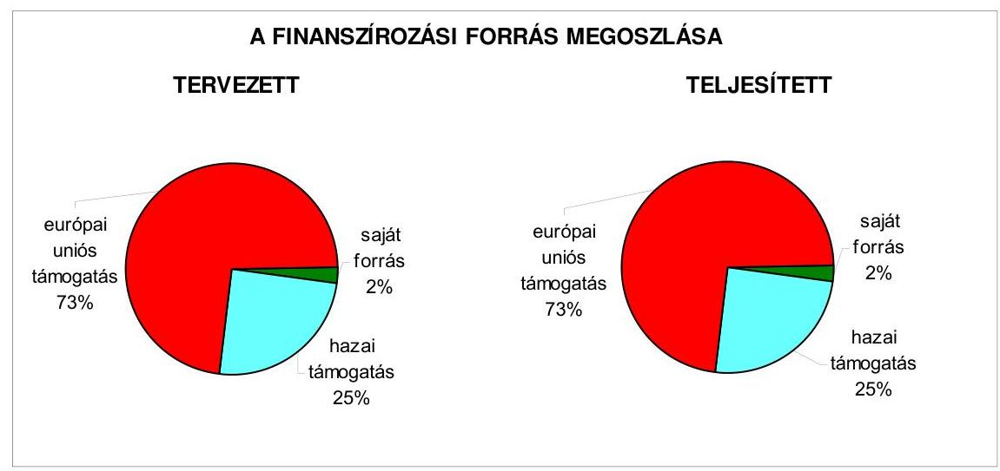

A tényleges finanszírozási források - a saját forrás, a hazai támogatás, valamint az európai uniós támogatás - aránya a befejezett projektek esetében a tervezett arányoktól kimutatható százalékos mértékben nem tért

[^0]
[^0]:    ${ }^{33}$ Európai Oktatási, Audiovizuális és Kulturális Ügynökség (Education, Audiovisual and Culture Executive Agency)

---

el. Az európai uniós forrásokkal támogatott programok, célok tervezett és tényleges adatait a 2005-2008. évekre a 4. számú melléklet tartalmazza.

Az Önkormányzat döntései alapján 2005-2008. I. negyedév között európai uniós források elnyerésére beadott nem támogatott pályázatok elutasításának okai $60 \%$-ban tartalmi hibák, valamint $40 \%$-ban az ÚMFT kiemelt programjavaslatokat érintően később meghirdetésre kerülő TIOP-os azonosító számú pályázati lehetőségre átirányítás volt.

Az Önkormányzatnál a 2005-2008. évi költségvetési rendeletekbe - az Áht. 69. § (1) bekezdését megsértve - az érintett projekteket 79\%-ban, értékben azonban 9\%-ban - nem építették be (a hatályos támogatási szerződésekben foglalt éves támogatási és felhasználási ütemezés szerint) eredeti előirányzatként az európai uniós forrást igénylő projektek, programok bevételi és kiadási előirányzataiba. Az Önkormányzatnál a 2005-2008. évi költségvetési rendeletek - az Ámr. 29. § (1) bekezdés d) és g) pontjaiban foglalt előírásoknak megfelelően - az európai uniós forrást is igénylő fejlesztési feladatok esetében tartalmazták a felhalmozási kiadásokat feladatonként, valamint a többéves kihatással járó feladatok előirányzatait éves bontásban, azonban - az Ámr. 29. § (1) bekezdés k) pontjában foglalt előírás ellenére - az európai uniós támogatással megvalósuló programok, projektek bevételeit és kiadásait elkülönítetten nem mutatták be. Az európai uniós forrással támogatott programokhoz, fejlesztési feladatokhoz a szükséges saját forrást a 2005-2008. évi költségvetési rendeletekben biztosították. Az Önkormányzatnál a 2005-2008. évben központosított előirányzatokból támogatási bevételt nem terveztek és nem realizáltak, valamint az elnyert pályázatok esetében a fejlesztések utófinanszírozási igényét figyelembe vették, a projektek utófinanszírozására felkészültek. Az európai uniós forrásokból megvalósuló projektekhez saját forrás kiváltására pénzintézeti hitel felvételét nem tervezték.

# 2.1.2. Az európai uniós forrásokhoz kapcsolódóan a pályázatfigyelés, a pályázatkészítés, valamint az európai uniós támogatással megvalósuló fejlesztés lebonyolítása belső rendjének szabályozottsága, a végrehajtás személyi, szervezeti feltételei 

A Közgyűlés 2002-2006 között Európai Integrációs és Regionális Bizottság elnevezéssel állandó bizottságot múködtetett, amelynek feladata volt többek között az európai uniós anyagi források, támogatások igénybevételére irányuló, megyei közremúködést igénylő pályázatok véleményezése is. A Közgyűlés az Európai Integrációs és Regionális Bizottságot 2006. októberben megszüntette, majd az Önkormányzat Gazdasági Bizottsága feladatának határozta meg, hogy figyelemmel kísérje a hazai és európai uniós pályázati lehetőségeket, elemezze és értékelje ezek megyei hasznosulását. A Közgyűlés tanácsnoki rendszert is múködtetett, amelyben egy tanácsnok az Önkormányzat európai integrációs feladatai ellátását és nemzetközi kapcsolatait felügyelte.

---

A Közgyűlés a 2004. évben döntött ${ }^{34}$ arról, hogy az Önkormányzat, illetve az Önkormányzati hivatal vállaljon határozott koordinációs és kezdeményező szerepet az érintett megyei és kistérségi szervezetek felé az európai uniós csatlakozásból adódó támogatási lehetőségek hasznosítása érdekében. A tevékenység irányítására az Önkormányzati hivatalnál Európai Uniós Munkacsoportot hoztak létre. A Közgyűlés szükségesnek tartotta programok, projektek és pályázatok kezdeményezését, kiemelten a közúthálózat fejlesztése és a környezetvédelmi feladatok megvalósítása terén a mikro-, kis- és középvállalkozások és az agrárszféra fejlődése, valamint a humán közszolgáltatások színvonalának emelése érdekében.

Az Önkormányzatnál a 2005-2007. évre vonatkozóan nem szabályozták az európai uniós források igénybevételének és felhasználásának önkormányzati szintú feladatait.

Az Önkormányzati hivatal SzMSz-ében általánosan határozták meg a Pénzügyi és Beruházási iroda feladatai között az Önkormányzat intézményei fejlesztésének koordinálását és az egyes fejlesztések pénzügyi és műszaki bonyolítását, az Európai Integrációs iroda, majd 2007. március 1-jétől a Térségfejlesztési és Külügyi iroda feladatai között a pályázati lehetőségek figyelemmel kísérését, az európai uniós pályázatkészítést, valamint a programok menedzselését. Az irodák azonban európai uniós források igénybevételével és felhasználásával kapcsolatos önkormányzati szintű koordináló, nyilvántartó feladatokat az NFT és az ÚMFT keretében meghirdetett pályázatok esetében nem végeztek.

Az európai uniós pályázatokkal, forrásokkal kapcsolatban nem határozták meg az Önkormányzati hivatalon belül az önkormányzati szintü pályá-zat-koordinálás, valamint pályázat nyilvántartás vezetésének felelőseit, a pályázatfigyelést végzők és a döntési, illetve döntés-előterjesztési jogkörrel rendelkezők közötti információ-szolgáltatási kötelezettséget, a Közgyűlés elnöke és a fejlesztési feladat lebonyolítója (projektmenedzsere) közötti kapcsolattartás rendjét. Továbbá nem határozták meg a pályázatfigyeléssel, pályázatkészítéssel, valamint a támogatott fejlesztés lebonyolításával kapcsolatos - feladatellátásra, kapcsolattartásra, információáramlásra, illetve a folyamatba épített, előzetes és utólagos vezetői ellenőrzésre is kiterjedő - eljárási rendet.

A Közgyűlés az Önkormányzat pályázati szabályzatát 2008. március 1-jétől léptette hatályba. Abban rögzítették az európai uniós támogatásokhoz kapcsolódó pályázatfigyelés, pályázatkészítés és a támogatott fejlesztés lebonyolításának feladatait, felelőseit, a feladatellátás és az ellenőrzés rendjét, azonban az Önkormányzati hivatalon belül az önkormányzati szintű pályázatkoordinálás felelőseit, valamint az önkormányzati szintű pályázat nyilvántartás vezetésének felelőśét továbbra sem határozták meg.

Az Önkormányzati hivatalban 2001. január 1-jétől az európai uniós és nemzetközi ügyek koordinálására a feladatok szakszerű és hatékony ellátására Európai Integrációs iroda elnevezéssel, a Közgyűlés elnöke által irányított

[^0]
[^0]:    ${ }^{34}$ A Közgyűlés 14/2004. (II. 20.) számú határozata.

---

öt fös szervezeti egységet hoztak létre ${ }^{35}$, amely feladatai közé tartozott a pályázati lehetőségek figyelemmel kísérése, az európai uniós pályázatkészítés, valamint a programok menedzselése is. Az Európai Integrációs irodát 2007. március 1-jétől a Térségfejlesztési irodából létrehozott Térségfejlesztési és Külügyi irodával összevonták.

Az Önkormányzatnál 2005-2008 első negyedéve között az európai uniós források megszerzésére irányuló pályázatfigyeléssel és pályázatkészítéssel kapcsolatos feladatokat az Önkormányzati hivatal szervezetén belül a Térségfejlesztési iroda és az Európai Integrációs iroda (2007. március 1-jétől Térségfejlesztési és Külügyi iroda), a Művelődési és Népjóléti iroda, a Beruházási és Közbeszerzési iroda ${ }^{36}$ (2007. március 1-jétől Pénzügyi és Beruházási iroda), valamint az Elnöki Kabinet iroda köztisztviselői látták el. A pályázatfigyelést végző köztisztviselők száma a 2005. évben 11 fő volt, amely a szervezeti átalakítások, létszámcsökkentések miatt a 2008. I. negyedév végére öt főre csökkent. Ugyanebben az időszakban a pályázatkészítést végzők száma 13 fő maradt. A pályázatok figyelésével és készítésével megbízott köztisztviselők munkaköri leírásaikban foglalt előírások figyelembevételével végezték a pályázatfigyeléssel és pályázatkészítéssel kapcsolatos feladatokat. A pályázatfigyelést ellátó köztisztviselők a feladat ellátásához szükséges megfelelő képzettséggel, valamint nyelvismerettel rendelkeztek. Az európai uniós forrásokra irányuló pályázatfigyelés tárgyi feltételeit (számítógépek, korlátlan Internet és CD jogtár hozzáférés, nyomtató, fénymásoló) biztosították. Az Önkormányzat - az Önkormányzati hivatal köztisztviselői mellett - külső személyt, szervezetet az európai uniós pályázatfigyeléssel összefüggő feladatok ellátásával nem bízott meg. A pályázatok elkészítésére három projektet érintően kötöttek szerződéseket:

- a ROP-1.1.1 intézkedéshez kapcsolódó „Tiszakürti Arborétum turisztikai vonzerejének fejlesztése" elnevezésű pályázat elkészítésére 2004. május 17-én külső szervezettel;
- a TÁMOP-2.2.3 intézkedéshez kapcsolódó „TISZK rendszer továbbfejlesztése" elnevezésű pályázat elkészítésére 2007. november 30-án külső szervezettel;
- az ÉAOP-2007-2.1.1/C intézkedéshez kapcsolódó „Jászkun kapitányok nyomában tematikus túraútvonal kialakítása" elnevezésű pályázat elkészítésére 2008. február 11-én külső személlyel és szervezettel.

[^0]
[^0]:    ${ }^{35}$ Az európai uniós ügyekkel foglalkozó iroda felállítását a Közgyűlés Európai Unióhoz való csatlakozás felkészülési stratégiájáról szóló 53/1999. (VI. 25.) számú határozata alapozta meg, amelyről a Közgyűlés az Önkormányzati hivatal SzMSz-ét módosító 18/2000. (XII. 18.) számú rendeletében döntött.
    ${ }^{36}$ Az Önkormányzati hivatalban 2005. január 1-jétől a Közgyűlés SzMSz-t módosító 15/2004. (IX. 30.) számú rendelete alapján Beruházási és Közbeszerzési iroda elnevezéssel szervezeti egységet hoztak létre, amely feladatai közé tartozott a fejlesztések pénzügyi és műszaki bonyolítása. A szervezeti egységet 2007. március 1-jétől a Pénzügyi és Beruházási iroda elnevezésű szervezeti egységgel összevonták.

---

A külső személlyel és szervezetekkel megkötött szerződések tartalmazták a feladatellátás kötelezettségeit, a kapcsolattartás és felelősség szabályait, az információk átadásának formáját, tartalmát és módját. Az intézmények a pályázatok benyújtásáról szóló döntés meghozatalát követően a pályázatokat saját maguk készítették.

Az Önkormányzatnál 2005-2008 első negyedéve között az európai uniós támogatással megvalósuló projektek, programok lebonyolításával kapcsolatos feladatokat az Önkormányzati hivatal szervezetén belül köztisztviselők látták el. A projektek, programok lebonyolításával megbízott köztisztviselők munkaköri leírásaikban foglalt előírások figyelembevételével végezték a feladatokat. Projektmenedzseri feladatok ellátására külső személyt a Kórháznál a HEFOP-4.3.2 intézkedéshez kapcsolódó „Térségi diagnosztikai és szürő központ kialakítása" elnevezésű projekt megvalósítása, koordinálása érdekében vettek igénybe.

A külső személlyel a szerződést - amely tartalmazta a feladatellátás kötelezettségeit, a kapcsolattartás és felelősség szabályait, az információk átadásának formáját, tartalmát és módját - a Kórház kötötte meg.

# 2.1.3. A fejlesztési feladat lebonyolításánál a feladatellátás rendjére, az ellenőrzési feladatok teljesítésére, valamint a felelősségi szabályokra vonatkozó előírások betartása 

Az Önkormányzat a ROP-1.1.1 intézkedés keretében a „Tiszakürti Arborétum turisztikai vonzerejének fejlesztése" elnevezésű 213,7 millió Ft-os összköltségű projekt 2005-2006. évi tervezett megvalósítása érdekében benyújtott pályázatát a VÁTI Kht. 2005 április havi értesítése alapján 97,5\%-os (208,3 millió Ft) támogatásban részesítették. Az NFT keretében elnyert támogatás $25 \%$-a hazai és $75 \%$-a európai uniós támogatásból állt, amely igénybe vétele a 2006. évben lezárult. A fejlesztési feladat megvalósítása - a VÁTI Khtvel, mint a ROP irányító hatóság képviseletében eljáró közremúködő szervezettel megkötött - támogatási szerződésben foglalt kezdési (2005. június 23.) és befejezési (2006. szeptember 30.) határidőknek megfelelt. A támogatási szerződést egy alkalommal, 2006. június 7 -én módosították, amely az áfa-kulcs csökkenésével, valamint a műszaki tartalom és a tervezett támogatási ütemezések megváltoztatásával is összefüggött.

Az Önkormányzat az áfa-kulcs csökkenésének pénzügyi hatásával azonos értékben kérelmezte a műszaki tartalom megváltoztatását, amely a sétautak mozgássérülteknek nehezen járható eredetileg tervezett faháncs és kavics helyett, a költségigényesebb kiskockaköves burkolást jelentette. A teljes támogatás értékének 20\%-át meghaladóan változott a költségek évek szerinti bontása is, mert a 2005. évben a támogatási szerződésben foglalt 110,7 millió Ft helyett 21,3 millió Ft támogatás felhasználás történt. A tevékenységek megvalósítási ütemében bekövetkezett kezdeti 1-8 hónapos elmaradást - a projekt előrehaladási jelentésekben foglalt indoklások alapján - a közbeszerezési eljárás elhúzódása okozta.

Az európai uniós forrással támogatott fejlesztési feladat megvalósítása a módosított támogatási szerződésben rögzített tervezett támogatási ütemezésnek megfelelően haladt, azonban a tervezett támogatások igénybevétele nem a

---

módosított támogatási szerződésben meghatározott ütemezésnek megfelelően történt. Az Önkormányzat a támogatási szerződés alapján jogosult volt a támogatás $25 \%$-ára ( 52,1 millió Ft-ra) - a támogatási szerződés 2005. június 22-i megkötését követően 30 naptári napon belül - előlegfizetési kérelmet benyújtani, amelyet az előírt határidőn belül 2005. július 12-én megtettek. Az előleg átutalása 29 nap múlva 2005. augusztus 11-én megtörtént. A tervezett ütemezés tartását az Önkormányzat által az ütemezésnek megfelelően benyújtott európai uniós támogatás további három kifizetésének igénylésénél a projekt előrehaladási jelentés ${ }^{37}$, a szerződésmódosítási kérelem, valamint a támogatás kifizetés igénylését alátámasztó számlák, bizonylatok ellenőrzése nem, hanem a felmerült hiánypótlásra vonatkozó igények - amelyeket az előírt 15 napos határidőn belül teljesítettek - hátráltatták. A VÁTI Kht. a projekt megvalósítása során az Önkormányzatot kilenc esetben ${ }^{38}$ összesen 115 hiányosság ${ }^{39}$ megszüntetésére szólította fel, amelyeknek a kezdeti tapasztalatlanság és a hiányos szabályozás is oka volt.

A fejlesztési feladatok megvalósítása, a kiadások teljesítése a módosított támogatási szerződésben tervezett ütemezés szerint haladt. Az Önkormányzatnál a projekt 2005-2006. évi lebonyolítása idején - szabályozás hiányában - az európai uniós források felhasználására, a feladatellátásra, az ellenőrzési feladatok teljesítésére, valamint a felelősségi szabályokra vonatkozóan eljárási rend nem volt. ${ }^{40}$.

Az Önkormányzat az elnyert támogatásból 0,7 millió Ft-ot nem vett igénybe, mert a projektet a tervezett 213,7 millió Ft helyett 212,9 millió Ft kiadással valósította meg. Az Önkormányzat a vállalt saját forrást biztosította és eleget tett az elnyert támogatás megelőlegezésére vonatkozó követelménynek. A támogatott költségek megelőlegezése pénzügyi zavarokat nem okozott. A projekt megvalósítása többletkiadást nem igényelt.

A Tiszakürti Arborétum területén a támogatási szerződésben rögzített időpontig a fejlesztési feladatok megvalósítása befejeződött. A támogatási szerződésben, illetve annak módosításában foglaltaknak megfelelően, a meghatározott célok és indikátorok teljesültek.

A végrehajtott fejlesztés a rögzített célkitűzéseknek megfelelően biztosítja a kert folyamatos gondozását, valamint elősegíti a turisztikai vonzerő növelését. A fejlesztés elemei - a fogadóépület építése, berendezése, sétaúthálózat burkolása,

[^0]
[^0]:    ${ }^{37}$ Az Önkormányzat a támogatási szerződésben meghatározott negyedévenkénti elszámolási kötelezettségének eleget tett.
    ${ }^{38}$ A VÁTI Kht. hiánypótlásra vonatkozó felszólításai a 2006. évben március 20-i, április 14-i, május 2-i, június 13-i, szeptember 31-i a 2007. évben február 15-i, március 6-i, május 20-i, valamint április 11-i keltezésúek voltak.
    ${ }^{39}$ A hiánypótlásra vonatkozó felszólítások alapján 56 esetben a szükséges dokumentumok, bizonylatok becsatolása hiányzott, 47 esetben a formanyomtatványok és a táblázatok pontatlanul voltak kitöltve, 10 esetben a teljesítésigazolás nem volt szabályszerű, valamint két esetben a számla tartalmilag hiányos volt.
    ${ }^{40}$ A Közgyűlés a pályázati szabályzatot a projekt befejezése után fogadta el.

---

parkoló felújítása, tó kialakítása, gépek (traktor, fűnyíró, ágdaráló) beszerzése, növényjelző táblák kihelyezése, valamint reklámhordozók, tájékoztató anyagok elkészítése - megvalósultak. A megvalósítás számszerűsíthető eredményei - az indikátorok - megfeleltek a pályázatban vállaltaknak, azzal az eltéréssel, hogy a támogatási szerződés módosításában foglaltaknak megfelelően a sétautakat - az eredetileg tervezett faháncs és kavics helyett - kiskockakövekkel burkolták.

A kötelezettségvállalások ellenjegyzését - a támogatási, a vállalkozási, a szállítási és a megbízási szerződések és azok módosításai esetében - a főjegyző vagy az általa felhatalmazott személyek elvégezték, ezáltal meggyőződtek arról, hogy a kötelezettségvállalás tárgyával kapcsolatos kiadási előirányzat rendelkezésre áll-e, továbbá arról, hogy a kötelezettségvállalás nem sérti-e a gazdálkodásra vonatkozó szabályokat. Az Önkormányzati hivatalban a „Tiszakürti Arborétum turisztikai vonzerejének fejlesztésére" elnyert támogatás felhasználásánál, a bevételek beszedésénél és a kiadások teljesítésénél a folyamatba épített ellenőrzési feladatokat a szakmai teljesítésigazolás, az érvényesítés, valamint az utalvány ellenjegyzése esetében a szabályozás hiányossága miatt nem végezték el. A főjegyző - az Ámr. 135. § (3) bekezdésében ${ }^{41}$ előírtak ellenére - belső szabályzatban a szakmai teljesítés igazolásának módjáról ${ }^{42}$ nem rendelkezett.

A szakmai teljesítés igazolására jogosultak aláírásukkal igazolták a fejlesztési feladat megvalósítása során készült számlákhoz kapcsolódó utalványrendeleteken, illetve a támogatási szerződésben meghatározott teljesítés igazolás nyomtatványon a teljesítést, azonban ellenőrzési feladatukat - a helyi szabályozás hiánya miatt - nem a főjegyző által meghatározott módon végezték el. Ebből adódóan az érvényesítés nem a szakmai teljesítés igazolásán alapult. Az utalvány ellenjegyzését végző személyek nem tettek eleget ellenőrzési feladataiknak annak ellenére, hogy az utalványrendeleteket aláírásukkal ellátták, mert nem győződtek meg a szakmai teljesítés igazolás és az érvényesítés megtörténtéről.

A belső ellenőrzés az európai uniós forrásból támogatott projektet a megvalósítás folyamatában nem vizsgálta. A közremüködő szervezet kettő alkalommal (2006. szeptember 21-én és 2007. február 20-án) helyszíni ellenőrzést végzett, amelyet jegyzőkönyv felvételével dokumentált, azonban szabálytalanságra, vagy mulasztásra vonatkozó megállapítást nem tett. A ROP-1.1.1 intézkedés keretében elnyert európai uniós támogatással megvalósult fejlesztés főbb adatait az 5. számú melléklet tartalmazza.

Az Önkormányzat felkészülése a 2005-2007. években az európai uniós források igénybevételére és felhasználására a belső szabályozottság és szervezettség terén összességében nem volt eredményes annak ellenére, hogy az Önkormányzat európai uniós pályázatai a gazdasági programokban, koncepciókban, tervekben megfogalmazott fejlesztési célkitűzésekhez kapcsolódtak. Nem határozták meg ugyanis az európai uniós forrásokhoz kapcsolódó pályázatfigyelés, pályázatkészítés és a pályázat lebonyolítás

[^0]
[^0]:    ${ }^{41}$ 2007. január 1-jétől Ámr. 135. § (2) bekezdésre változott a számozás.
    ${ }^{42}$ A Közgyűlés elnöke és a főjegyző a gazdálkodási jogkörök szabályzata ${ }_{2}$-t 2008. május 15-től módosították, és a szakmai teljesítés igazolásának módját rögzítették.

---

önkormányzati szintű feladatait, a feladatok ellátásának rendjét, az önkormányzati szintű pályázat-nyilvántartás vezetésének felelősét, az információk áramlásának rendjét, az európai uniós forrással támogatott fejlesztési feladatok lebonyolításának ellenőrzési kötelezettségét, feladatait és felelőseit. Az Önkormányzati hivatalon belül és külső személyek, szervezetek igénybevételével biztosították a pályázatfigyelés, pályázatkészítés és lebonyolítás személyi és tárgyi feltételeit. A 2008. március 1-jétől hatályos pályázati szabályzatban rögzítették az európai uniós támogatásokhoz kapcsolódó pályázatfigyelés, pályázatkészítés és a támogatott fejlesztés lebonyolításának feladatait, felelőseit, a feladatellátás és az ellenőrzés rendjét, azonban az Önkormányzati hivatalon belül az önkormányzati szintű pályázatkoordinálás, valamint pályá-zat-nyilvántartás vezetésének felelőseit nem határozták meg.

# 2.2. Az elektronikus közigazgatási feladatok ellátása, a közérdekú adatok elektronikus közzététele 

Az Önkormányzatnál informatikai, illetve e-közigazgatási stratégia nem volt.

A Közgyűlés 2004-2006. évre informatikai fejlesztési programot fogadott el, amelyet azonban a 2007. évtől nem vizsgáltak felül és nem újítottak meg. Az informatikai fejlesztési programban az e-közigazgatás témakörével kapcsolatos helyzetelemzésre nem tértek ki, a szakmai irodáknál ezzel kapcsolatos felméréseket nem végeztek, valamint az e-közigazgatási feladatok szintjeinek megvalósításához közép és hosszú távú célkitűzéseket nem határoztak meg.

Az Önkormányzat az NFT Gazdasági Versenyképesség Operatív Program által, valamint az ÚMFT Államreform és Elektromos Közigazgatás Operatív Programok által az e-közigazgatás fejlesztésére kiírt pályázatokon a 2005-2008. I. negyedévben nem vett részt.

Az Önkormányzat a - 2005. november 1-jétől hatályos közigazgatási hatósági eljárás és szolgáltatás általános szabályairól szóló 2004. évi CXL. törvény 160. § (1) bekezdésében kapott felhatalmazás alapján - 2006. július 1-jétől rendeletében ${ }^{43}$, az ügyfél által a közigazgatási hatósági ügyek elektronikus úton is történő intézését (azon ügyek kivételével, amelyek esetében magasabb szintű jogszabály rendelkezései alapján biztosítani kell) kizárta. Az Önkormányzatnál elektronikus hatósági ügyintézéssel kapcsolatos e-közigazgatási feladatokat ellátó informatikai rendszert nem, csak elektronikus tájékoztató rendszert múködtettek, amely az 1. elektronikus szolgáltatási szint követelményeinek felelt meg. Az Interneten információs tájékoztató szolgáltatás

[^0]
[^0]:    ${ }^{43}$ Az Önkormányzat közigazgatási hatósági eljárásban az elektronikus ügyintézésről szóló 11/2006. (VI. 30.) számú rendelete.

---

keretében a 2003. évtől működtetett www.jnszm.hu internetes honlap ${ }^{44}$ segítségével az Önkormányzat tevékenységét (az Önkormányzati hivatal és irodái felépítését, irányítását, vezetését, feladatait) mutatták be, valamint híreket, közérdekű és pályázati információkat, koncepciókat, önkormányzati dokumentumokat jelenítettek meg. Az információs tájékoztató szolgáltatási feladatok ellátásának személyi feltételeit az Önkormányzati hivatalon belül az Elnöki Kabinet irodánál 2007. április 30-ig kettő, majd egy fő informatikus foglalkoztatásával biztosították. Az Önkormányzati hivatal különböző szakmai egységei az információkat a biztosított számítógépes felhasználói lehetőség keretein belül önállóan jelenítették meg. Az internetes információs tájékoztató szolgáltatás működtetését vásárolt szoftverrel valósították meg. Az internetes honlapon az információs tájékoztató szolgáltatási feladatok ellátását tárhely-kapacitás bérlésével biztosították.

Az Önkormányzat az Eisztv. 21. § (3) bekezdése alapján a közérdekú adatok elektronikus közzétételére - mint megyei önkormányzat - 2007. január 1-jétől kötelezett. A főjegyző 2007. március 13-án a közérdekű adatok elektronikus közzétételére vonatkozó önkormányzati hivatali eljárási rendet határozott meg ${ }^{45}$, amelyben kitértek a honlap szerkesztésének és a közérdekú adatok közzétételének feladataira, felelősségi rendszerére. Az Önkormányzat honlapján a 18/2005. (XII. 27.) IHM rendelet 2. § (1) bekezdésében előírtak ellenére - a közzétételre szolgáló honlap megnyitásakor megjelenő oldalon a közzétételi listák által előírt adatokat tartalmazó jegyzékre vagy felületre mutató - „közérdekú adatok" elnevezés helyett „közérdekú információk" hivatkozást helyeztek el. A 18/2005. (XII. 27.) IHM rendelet 2. számú melléklete 3.2. és 3.3. pontja szerinti gazdálkodási adatokkal - az éves költségvetések, a számviteli beszámolók, a költségvetés végrehajtásáról a külön jogszabályban meghatározott módon és gyakorisággal készített beszámolók, valamint a foglalkoztatottak összesített adatai - kapcsolatos közzétételi egységek nem a meghatározott szerkezetben voltak elérhetőek ${ }^{46}$.

A főjegyző az Áht. 15/A. § (1) bekezdésében foglaltakat megsértve a 2007. évben nyújtott nem normatív, céljellegú múködési ${ }^{47}$ támogatások adatait (kedvezményezettek nevét, a támogatás célját, összegét, a megvalósítás helyére vonatkozó adatokat) az Önkormányzat honlapján 60\%-ban nem tette köz-

[^0]
[^0]:    ${ }^{44}$ Az internetes honlap megvalósítását a Közgyűlés Európai Unióhoz való csatlakozás felkészülési stratégiájáról szóló 53/1999. (VI. 25.) számú határozata alapozta meg. amelyben rögzítették, hogy annak kialakítása a megyei promóció eszköze lehet, hogy a megjelenő információk egy részét célszerű hosszútávon idegen nyelven is megjeleníteni, valamint azt hogy a honlap egyik eszköze a megyei marketingnek, kommunikációnak (így az európai támogatással megvalósuló fejlesztési programoknak az Európai Unió által előírt kommunikációjának), mind a lakosság, mind a külső partnerek irányában.
    ${ }^{45}$ A főjegyző honlap szerkesztésének feladatairól szóló 1/15/2007. számú szabályozása.
    ${ }^{46}$ A közbenső egyeztetés során a Közgyűlés elnöke által adott tájékoztatás szerint az Önkormányzat honlapján elhelyezték a „közérdekú információk" hivatkozás helyett a „közérdekú adatok" elnevezést, valamint a gazdálkodási adatokkal kapcsolatos közzétételi egységek a meghatározott szerkezetben elérhetőek.
    ${ }^{47}$ A múködési támogatások adatainak közzétételét az Áht. 2007. január 1-jétől írta elő.

---

zé ${ }^{48}$. Az Önkormányzat nem normatív, fejlesztési célú támogatást a 20052007. évben nem nyújtott.

A főjegyző a 2007. évben - az Áht. 15/B. § (1) bekezdésében foglaltakat megsértve - nem gondoskodott az ötmillió Ft-ot meghaladó értékú vagyonértékesítésre vonatkozó, 2007. február 1-jén megkötött 40-3/2007. iktatási számú, 33 146,2 millió Ft összegű adásvételről szóló szerződés közzétételéről ${ }^{49}$, amelyben az átadott Illetékhivatal ingóságait az APEH Központi hivatala, mint vevő számára adták el ${ }^{50}$.

A főjegyző az - Ámr. 157/D. § (1) bekezdésében hivatkozott 22. számú melléklet 5. sorában meghatározottak ellenére - a 2005., 2006. és 2007. évi költségvetési beszámoló szöveges indoklását nem tette közzé, az ÁSZ vizsgálat megállapítása alapján 2008 áprilisban megtörtént a közzététel.

Az e-közigazgatási feladatokat ellátó informatikai rendszer ügyfelek általi igénybevételének figyelési rendszerét nem építették ki. A honlapot látogatók számát figyelemmel kísérték, arról statisztikát készítettek.

# 3. A KÖLTSÉGVEtÉsi GAZDÁlKODÁs BELSŐ KONTROLLJAI 

### 3.1. A szabályozottság kockázata a költségvetés tervezési, gazdálkodási, beszámolási és a folyamatba épített előzetes és utólagos vezetői ellenőrzési feladatoknál

Az Önkormányzat hivatalánál a költségvetés tervezés és a zárszámadás készítés szabályozottságának hiányosságai közepes ${ }^{51}$ kockázatot jelentettek a feladatok megfelelő és szabályszerű végrehajtásában, mivel bár a főjegyzö

- nem írta elő az intézmények és az Önkormányzati hivatal szervezeti egységei által benyújtott költségvetési igények indokoltságának, teljesíthetőségének, valamint a tervezett saját bevételek előirányzatainak (intézményi térítési és egyéb szolgáltatási díjak) és az azok megalapozását szolgáló önkormányzati rendeletek összhangjának ellenőrzését;
- nem határozta meg az intézményi költségvetésekben szereplő adatok egyeztetésének, ellenőrzésének felelőseit az Önkormányzati hivatalban, valamint

[^0]
[^0]:    ${ }^{48}$ 2008. április 18-án az Önkormányzat honlapján teljes körűen közzé tették a 2007. évi nem normatív céljellegú múködési támogatások adatait (kedvezményezettek nevét, a támogatás célját, összegét, a megvalósítás helyére vonatkozó adatokat).
    ${ }^{49}$ Az Önkormányzatnál a nettó ötmillió Ft-ot meghaladó értékű szerződések közzétételéről már a 2005. évtől az Önkormányzat honlapján gondoskodtak.
    ${ }^{50}$ Az Önkormányzat honlapján 2008. májusban közzé tette a szerződést.
    ${ }^{51}$ Közepesnek minősítettük a belső kontrollokban rejlő kockázatot, amennyiben a kontrollok - végrehajtásuk esetén - a lehetséges hibák többsége ellen védelmet nyújtanak.

---

- a Közgyűlés nem határozta meg - a főjegyző által előkészített - hivatali belső szabályzatokban a költségvetési szervek elemi beszámolója felülvizsgálatának rendjét, tartalmát, felelőseit ${ }^{52}$,
de a kialakított belső kontrollok végrehajtásuk esetén a lehetséges hibák többsége ellen védelmet nyújtottak.

A gazdálkodási, a pénzügyi-számviteli és a folyamatba épített ellenőrzési feladatok szabályozottságának hiányosságai közepes kockázatot jelentettek az elvégzendő feladatok megfelelő végrehajtásában, mivel bár a főjegyzö:

- nem szabályozta az ügyrendben a vezetők és a beosztottak feladat-, hatásés jogkörét;
- nem határozta meg a munkaköri leírásokban három dolgozónál az érvényesítés, kettő munkavállalónál a kötelezettségvállalás és utalványozás ellenjegyzése feladatot;
- nem szabályozta a gazdasági eseményenként 50 ezer Ft-ot el nem érő kifizetések esetében azok rendjét és nyilvántartási formáját ${ }^{53}$;
- nem rögzítette belső szabályzatban a szakmai teljesítés igazolás módját ${ }^{54}$;
- nem határozta meg a leltározási szabályzatban a leltár és a könyvviteli adatok egyeztetésének módját ${ }^{55}$;
- nem határozta meg az értékelési szabályzatban a követelések év végi értékelésének ${ }^{56}$, és az illeték követelések besorolásának elveit, dokumentálásának szabályait, továbbá nem rögzítette az érintett dolgozók munkaköri leírásaiban az értékelési és ellenőrzési feladataikat;
- nem készítette el az önköltségszámítás rendjére vonatkozó belső szabályzatot $^{57}$;

[^0]
[^0]:    ${ }^{52}$ A közbenső egyeztetés során a Közgyűlés elnöke által adott tájékoztatás szerint az Önkormányzat a 13/2008. (VI. 25.) számú rendeletével módosította az SzMSz-t, amelyben a költségvetés és a zárszámadás készítésével kapcsolatban meghatározták a főjegyző feladat- és hatáskörét, illetve kiegészítették a Pénzügyi és Beruházási iroda feladatait.
    ${ }^{53}$ A Közgyűlés elnöke és a főjegyző a gazdálkodási jogkörök szabályzata ${ }_{2}$-t 2008. május 15-től módosították, az 50 ezer Ft-ot el nem érő kötelezettségvállalások rendjét és nyilvántartási formáját meghatározták.
    ${ }^{54}$ A Közgyűlés elnöke és a főjegyző a gazdálkodási jogkörök szabályzata ${ }_{2}$-t 2008. május 15-től módosították, és a szakmai teljesítés igazolásának módját rögzítették.
    ${ }^{55}$ A főjegyző a leltározási szabályzatot 2008. április 1-jétől a leltár és a könyvviteli adatok egyeztetésének módjával kiegészítette.
    ${ }^{56}$ A főjegyző az értékelési szabályzatot 2008. április 1-jétől a követelések év végi értékelésének elveivel kiegészítette.
    ${ }^{57}$ A főjegyző az önköltségszámítás rendjére vonatkozó szabályzatot 2008. május 15-től hatályba léptette.

---

- nem szabályozta a számlarendben az analitikus nyilvántartások formáját, tartalmát, vezetésének módját ${ }^{58}$, továbbá nem rögzítette az érintett dolgozók munkaköri leírásaiban a számlarendben meghatározott feladataikat;
- nem rögzítette a FEUVE rendszer részeként elkészített ellenőrzési nyomvonalban az egyes tevékenységek, feladatok elvégzését igazoló dokumentumok nyilvántartási helyét a rendszerben, nem határozta meg a kockázatkezelési szabályzatban a kockázatok folyamatgazdáit, és a kockázatokra adható válaszok megvalósíthatóságának mérlegelését, a kockázat nyilvántartását, a válaszintézkedések beépítését az ellenőrzési folyamatba,
azonban a kialakított belső kontrollok végrehajtásuk esetén a lehetséges hibák többsége ellen védelmet nyújtottak.

Az előző 2003. évi átfogó ellenőrzést követően - a még fennálló hiányosságok ellenére - a gazdálkodási, a pénzügyi-számviteli és a folyamatba épített ellenőrzési feladatok szabályozottsága javult, mivel a főjegyző gondoskodott a pénz-ügyi-számviteli szabályzatok kiadásáról és a gazdálkodási jogkörök szabályzata ${ }_{1}$ módosításáról.

Az Önkormányzati hivatalban informatikai környezet szabályozottságának hiányosságai közepes kockázatot ${ }^{59}$ jelentettek a feladatok biztonságos végrehajtásában, mivel az Önkormányzati hivatal nem rendelkezett:

- a 2007. évben és 2008. I. negyedévben nem rendelkezett informatikai stratégiával ${ }^{60}$;
- az Önkormányzati hivatalban nem szabályozták az informatikai eszközökhöz történő hozzáférések ellenőrzésének dokumentálását;
- nem gondoskodtak arról, hogy a pénzügyi-számviteli területen dolgozók megismerjék az informatikával kapcsolatos szabályzatokat,
azonban a kialakított belső kontrollok végrehajtások esetén a lehetséges hibák többsége ellen védelmet nyújtottak.

Az ÁSZ előző, a gazdálkodás 2003. évi átfogó ellenőrzése során tett javaslatának eredményeként elkészült a katasztrófa elhárítási terv.

[^0]
[^0]:    ${ }^{58}$ A főjegyző a számlarendet 2008. április 1-jétől az analitikus nyilvántartás formájával, tartalmával, vezetésének módjával kiegészítette.
    ${ }^{59}$ Közepesnek minősítettük a belső kontrollokban levő belső kockázatot, amennyiben a kontrollok - végrehajtásuk esetén - a lehetséges hibák többsége ellen védelmet nyújtanak.
    ${ }^{60}$ A közbenső egyeztetés során a Közgyűlés elnöke által adott tájékoztatás szerint az Önkormányzat informatikai stratégiáját a Közgyűlés a 167/2008. (X. 31.) számú határozatával fogadta el.

---

# 3.2. A belső kontrollok érvényesülése az önkormányzati források szabályszerű felhasználásában, a költségvetési tervezés, gazdálkodás, beszámolás folyamataiban 

A 2007. évi költségvetés tervezési és a zárszámadás készítési folyamatában a múködésbeli hibák megelőzésére, feltárására, kijavítására kialakított belső kontrollok múködésének megbízhatósága kiváló ${ }^{61}$ volt, mivel az Önkormányzati hivatalnál a vonatkozó jogszabályi előírásoknak megfelelően ellenőrizték, hogy a költségvetési intézmények teljesítették-e a költségvetési javaslat összeállításával kapcsolatban részükre meghatározott követelményeket. Továbbá vizsgálták a költségvetési igények indokoltságát, teljesíthetőségét, valamint a tervezett saját bevételek előirányzatai és az azok megalapozását szolgáló önkormányzati rendeletek összhangját. A zárszámadás készítés folyamatában ellenőrizték az intézményi pénzmaradványok megállapításának szabályszerűségét, az eredeti és a módosított előirányzatok, valamint a teljesítési adatok eltérésének indokoltságát, továbbá felülvizsgálták az intézményi számszaki beszámolók belső, illetve azoknak az adatszolgáltatással való összhangját.

Az Önkormányzati hivatal a 2007. évi elemi költségvetésben 6,1 millió Ft költségvetési előirányzatot tervezett a külső szolgáltatók által végzett karbantartási, kisjavítási szolgáltatásokkal kapcsolatos kiadások fedezetére, amely a dologi kiadások eredeti előirányzatának 2,7\%-a, a módosított előirányzatnak 1,7\%-a volt. Az előirányzatok felhasználásának tárgya ${ }^{62}$ összhangban volt az Önkormányzati hivatal által ellátott feladatokkal.

Az Önkormányzati hivatalnál a külső szolgáltató által végzett karbantartási, kisjavítási feladatokkal kapcsolatos kifizetések során a szakmai teljesítés igazolás és az utalvány ellenjegyzés múködésének megbízhatósága gyenge volt, mert:

- a szakmai teljesítés igazolására kijelölt személyek a kifizetések alapbizonylatait aláírásukkal ugyan ellátták, azonban a szerződés, megállapodás szakmai teljesítés igazolásának módját az Ámr. 135. § (2) bekezdésében előírtak ellenére a főjegyző belső szabályzatban nem határozta meg, ezért ezen aláírások önmagukban nem jelentik a kiadás teljesítésének elrendelése előtti ellenőrzés elvégzésének, illetve a jogosultság, összegszerűség, a megrendelés, szerződés teljesítésének igazolását.

[^0]
[^0]:    ${ }^{61}$ A kontrollok múködésének eredményességét, megbízhatóságát kiválónak értékeltük abban az esetben, ha azok múködése - esetleges apróbb hiányosságoktól eltekintve megfelelit a hibák megelőzésére és kijavítására meghatározott szabályozásnak és a legmagasabb szintű elvárásoknak.
    ${ }^{62}$ A megfelelőségi teszt elvégzése során a külső szolgáltató által végzett karbantartások, kisjavítások a fénymásoló gépek karbantartására, személygépkocsik, kazánok, hűtők javítására irányultak.

---

Az 50 ezer Ft-ot el nem érő fénymásoló gép karbantartási ${ }^{63}$, személygépkocsi kisjavítási kiadásra ${ }^{64}$ vonatkozó kötelezettségvállalások rendjét és nyilvántartási formáját ${ }^{65}$ nem szabályozták, ezért a szakmai teljesítés igazolója a kiadás jogosultságát, összegszerűségét, és a megrendelésben foglaltak teljesítését dokumentum hiányában nem ellenőrizte. A személygépkocsi javítására ${ }^{66}$ kifizetést megelőzően a jogosultság vizsgálatát, az összegszerűség és a megrendelés teljesítésének igazolását a szakmai teljesítés igazolás szabályozásának hiánya miatt nem végezték el;

- az utalvány ellenjegyzője a fénymásoló-gép karbantartás, személygépkocsi javítás kifizetését megelőzően nem ellenőrizte a gazdálkodásra vonatkozó szabályok érvényesülését, a szakmai teljesítés igazolás elvégzését, valamint az érvényesítés megtörténtét, mivel az 50 ezer Ft-ot el nem érő kötelezettségvállalás rendje és nyilvántartása szabályozásának hiányában nem győződött meg arról, hogy a fedezet rendelkezésre áll-e, és nem észrevételezte, hogy a szakmai teljesítés igazolást szabályozás nélkül végezték, illetve az érvényesítés során - az Ámr. 135. § (5) bekezdésében foglaltak ellenére - nem alkalmazták az „érvényesitve" ${ }^{67}$ megjelölést.

Az Önkormányzati hivatal a 2007. évi elemi költségvetésében a gépek, berendezések és felszerelések beszerzésére eredeti előirányzatot nem tervezett, az évközben módosított előirányzat 0,8 millió Ft, a 2007. évi teljesítés 0,9 millió Ft volt. A módosított előirányzat $0,1 \%$-a volt a felhalmozási célú kiadások előirányzatának. Az előirányzat felhasználásának tárgya ${ }^{68}$ összhangban volt az Önkormányzati hivatal által ellátott feladatokkal. Az Önkormányzati hivatalnál a gépek, berendezések és felszerelések vásárlásával kapcsolatos kifizetések során a szakmai teljesítés igazolás és az utalvány ellenjegyzés múködésének megbízhatósága gyenge volt, mert:

- a szakmai teljesítés igazolására kijelölt személyek a kifizetések alapbizonylatait aláírásukkal ugyan ellátták, azonban a szerződés, megállapodás szakmai teljesítés igazolásának módját az Ámr. 135. § (2) bekezdésében előírtak ellenére a főjegyző belső szabályzatban nem határozta meg. Az aláírások önmagukban nem jelentik a kiadás teljesítésének elrendelése előtti ellenőrzés elvégzésének, illetve a jogosultság, összegszerűség, a megrendelés, szerződés teljesítésének igazolását. Az 50 ezer Ft-ot el nem érő melegvíz bojler beszerelési munkára vonatkozó kötelezettségvállalás rendjét és nyilvántartá-

[^0]
[^0]:    ${ }^{63}$ A 2007. február 27-i, május 23-i, augusztus 28-i és október 31-i számla szerint végzett munka.
    ${ }^{64}$ A 2007. november 9-i számla szerint végzett munka.
    ${ }^{65}$ Az Önkormányzati hivatalban a 2007. évben éltek az Ámr. 134. § (3) bekezdésében biztosított lehetőséggel, amely szerint nem szükséges előzetes írásbeli kötelezettségvállalás az 50 ezer Ft-ot el nem érő kötelezettségvállalások esetében, azonban ennek rendjét és nyilvántartási formáját belső szabályzatban nem rögzítették.
    ${ }^{66}$ A 2007. november 30-i számla szerint végzett munka.
    ${ }^{67}$ Az érvényesítésnél 2008. május 15-től alkalmazták az „érvényesítve" megjelölést, ez szerepel az utalványrendeleten és a rövidített utalványon.
    ${ }^{68}$ Gázfűtésű melegvíz bojler beszerzése és beszerelése a „Szőke Tisza" Otthon Mozgássérültek Tiszakürti Részlegénél, számítógép, monitor beszerzés.

---

si formáját nem szabályozták, ezért a szakmai teljesítés igazolója a kiadás jogosultságát, összegszerűségét és a megrendelésben foglaltak teljesítését dokumentum hiányában nem ellenőrizte. A melegvíz bojler beszerzés kifizetését megelőzően a jogosultság vizsgálatát, az összegszerűség és a megrendelés teljesítésének igazolását a szakmai teljesítés igazolás szabályozásának hiánya miatt nem végezték el;

- az utalvány ellenjegyző̉e a melegvíz bojler beszerzés és beszerelés kifizetését megelőzően nem ellenőrizte a gazdálkodásra vonatkozó szabályok érvényesülését, a szakmai teljesítés igazolás elvégzését, valamint az érvényesítés megtörténtét, mivel az 50 ezer Ft-ot el nem érő kötelezettségvállalás rendje és nyilvántartása szabályozásának hiányában nem győződött meg arról, hogy fedezet rendelkezésre áll-e, és nem észrevételezte, hogy a szakmai teljesítésigazolást szabályozás nélkül végezték, illetve az érvényesítés során - az Ámr. 135. § (5) bekezdésében foglaltak ellenére - nem alkalmazták az „érvényesit$v e^{\prime \prime}$ megjelölést.

Az Önkormányzati hivatal a múködési célú pénzeszközátadás államháztartáson kívülre teljesített kifizetésének fedezetére a 2007. évi elemi költségvetésben 164,1 millió Ft eredeti előirányzatot tervezett, amely összeg az év közbeni módosítások következtében 195,3 millió Ft-ra növekedett. A támogatási szerződésben, illetve megállapodásban meghatározott cél ${ }^{69}$ összhangban volt az önkormányzati feladatokkal. Az Önkormányzati hivatalnál a múködési célú pénzeszközátadás államháztartáson kívülre teljesített kifizetései során a szakmai teljesítés igazolás és az utalvány ellenjegyzés múködésének megbízhatósága gyenge volt, mert:

- a szakmai teljesítés igazolás a gazdálkodás folyamatában nem múködött. A szakmai teljesítés igazolására a főjegyző által kijelölt személyek a kifizetés jogosultságának, összegszerűségének ellenőrzését - az Ámr. 135. § (1)-(2) bekezdéseiben előírtak ellenére - a múködési célú pénzeszközátadások államháztartáson kívülre történő kifizetéseket megelőzően nem végezték el;
- az utalvány ellenjegyzője az utalványok ellenjegyzése során az Ámr. 137. § (3) bekezdésének előirása ellenére nem végezte el a gazdálkodásra vonatkozó szabályok betartásának ellenőrzését, mivel nem észrevételezte, hogy elmaradt a szakmai teljesítés igazolása és az érvényesítést a szakmai teljesítés igazolás hiányában végezték, illetve az érvényesítés során - az Ámr. 135. § (5) bekezdésében foglaltak ellenére - nem alkalmazták az „érvényesitve" megjelölést.

Az Önkormányzati hivatalban a külső szolgáltató által végzett karbantartási, kisjavítási szolgáltatásokkal, a gépek, berendezések és felszerelések beszerzéseivel, valamint az államháztartáson kívülre teljesített múködési célú pénzeszközátadásokkal kapcsolatos kifizetések során a kialakított belső kontrollok (szakmai teljesítés igazolás, ellenjegyzés, érvényesítés) a gazdálkodás folyama-

[^0]
[^0]:    ${ }^{69}$ A múködési célú pénzeszközátadás államháztartáson kívülre teljesített kifizetés pályázattal ösztöndíjat nyert hallgatók első félévi támogatására, internet előfizetésére, kulturális és sport szervezetek különböző rendezvényeinek támogatására irányultak.

---

tában nem működtek megbízhatóan. A szakmai teljesítés igazolás és az utalvány ellenjegyzés múködésének megbízhatósága gyenge volt, mert a szakmai teljesítés igazolások során a kifizetés jogosultságának, összegszerűségének és a szerződés, megrendelés szakmai teljesítésének igazolását nem, vagy belső szabályozás hiányában végezték el. Az utalványok ellenjegyzése során nem végezték el a gazdálkodásra vonatkozó szabályok betartásának, a szakmai teljesítés igazolásának, és az érvényesítés megtörténtének az ellenőrzését, valamint nem észrevételezték, hogy az érvényesítést a szakmai teljesítés igazolás nélkül, illetve szabályozásának hiányában végezték és az „érvényesitve" megjelölést nem alkalmazták.

Az Önkormányzati hivatalnál az informatikai rendszer 2007. évi múködtetésénél a múködésbeli hibák megelőzésére, feltárására, kijavítására kialakított kontrollok múködésének megbízhatósága összességében kiváló volt, mivel a számítógépes program biztosította a főkönyv és a költségvetési beszámoló adatainak egyezőségét, megoldott a szolgáltatott adatok rendszeres ellenőrzése. A kontrollok múködésének megbízhatósága annak ellenére összességében kiváló volt, hogy nem biztosították a számítógépen vezetett analitikus nyilvántartások és a főkönyvi könyvelés automatikus kapcsolatát a tárgyi eszköz és a készletnyilvántartó program esetében, valamint a tranzakciók engedélyezését a rögzítőtől eltérő személy által.

# 3.3. A belső ellenőrzési kötelezettség teljesítése, javaslatainak hasznosulása 

A belső ellenőrzés szervezeti kereteinek kialakítása, illetve szabályozottságának hiányosságai közepes ${ }^{70}$ kockázatot jelentettek a feladatok megfelelő és szabályszerű végrehajtásában, mivel bár

- nem készítettek a belső ellenőrök rendszeres továbbképzéséhez a 2007. és a 2008. évre képzési tervet ${ }^{71}$;
- nem tartalmazta az Önkormányzat stratégiai terve ${ }^{72}$ a kockázati tényezőket és értékelésüket;

[^0]
[^0]:    ${ }^{70}$ Közepesnek minősítettük a belső kontrollokban rejlő kockázatot, amennyiben a kontrollok - végrehajtásuk esetén - a lehetséges hibák többsége ellen védelmet nyújtanak.
    ${ }^{71}$ A közbenső egyeztetés során a Közgyűlés elnöke által adott tájékoztatás szerint elkészítették a belső ellenőrök továbbképzéséhez 2008 II. félévére a képzési tervet.
    ${ }^{72}$ A belső ellenőrzés 1180/2006. iktatószámú, 2006-2010. évekre szóló stratégiai tervének keltezése 2006. január 10., jóváhagyta a főjegyző.

---

- nem alapozták meg a 2007. és 2008. évi ellenőrzési tervet ${ }^{73}$ kockázatelemzéssel, ezért nem tervezték magas kockázatúnak értékelhető területek ellenőrzését ${ }^{74}$,
azonban a kialakított szervezet - szabályszerű működés esetén - a lehetséges hiányosságok többsége ellen védelmet nyújtott.

Az Önkormányzati hivatal SzMSz-e szerint a belső ellenőrzési feladatok ellátására 2006. január 1-jei hatállyal a főjegyző közvetlen irányítása alatt működő Belső ellenőrzési csoportot hoztak létre.

A Belső ellenőrzési csoport feladata a pénzügyi irányítási és ellenőrzési rendszer működésének, ezáltal az Önkormányzat rendelkezésére álló források felhasználásának, szabályozottságának, gazdaságosságának, hatékonyságának és eredményességének, az elszámolások megbízhatóságának ellenőrzése, az ellenőrzési jelentések és intézkedési tervek alapján megtett intézkedések nyomon követése. A belső ellenőrök iskolai végzettsége és szakképesítése megfelelt az előírtaknak. A belső ellenőrzés stratégiai terve nem tartalmazott kockázatelemzést, valamint a nem kockázatelemzésre alapozott éves ellenőrzési tervek nem voltak összhangban a stratégiai tervvel. Az éves ellenőrzési tervekben nem határoztak meg kapacitást soron kívüli ellenőrzési feladatokra ${ }^{75}$. Az Önkormányzat 2009. évi belső ellenőrzési tervében 30 ellenőri napot terveztek a soron kívüli ellenőrzésekre. Az ellenőrzések lefolytatásához készített ellenőrzési programok tartalma és jóváhagyása megfelelt az előírásoknak. A 2006. január 1-jétől hatályos és 2007. július 1-jétől módosított belső ellenőrzési kézikönyv tartalma az előírásoknak megfelelő volt.

A 2007. évben a belső ellenőrzés múködésénél kialakított kontrollok megbízhatósága jó volt, mivel a 2007. évi ellenőrzési tervben előírt feladatokat az ütemezés szerint és ellenőrzési program alapján a Belső ellenőrzési csoport végrehajtotta. Azonban nem vizsgálták:

- az Önkormányzati hivatalnál a FEUVE rendszer kiépítésének és múködésének központi és helyi szabályoknak való megfelelését, valamint a rendelkezésre álló erőforrásokkal való gazdálkodást, a vagyon megóvását és gyarapítását, az elszámolások, beszámolók megbízhatóságát;
- a közbeszerzések, illetve közbeszerzési eljárások végrehajtásának ellenőrzését;

[^0]
[^0]:    ${ }^{73}$ A Közgyűlés jóváhagyta a 173/2006. (XII. 15.) és a 188/2007. (XI. 9.) számú határozatával az Önkormányzat 2007. évi és 2008. évi ellenőrzési tervét, amelyek 17, illetve 16 ellenőrzés elvégzését tartalmazták.
    ${ }^{74}$ A közbenső egyeztetés során a Közgyűlés elnöke által adott tájékoztatás szerint a Közgyűlés 190/2008. (X. 31.) számú határozatával elfogadta az Önkormányzat 2009. évi belső ellenőrzési tervét, melyet kockázatelemzéssel alapoztak meg.
    ${ }^{75}$ A 2007. és 2008. évi belső ellenőrzési terv előterjesztésében terveztek ellenőri kapacitást soron kívüli ellenőrzési feladatokra, azonban a Közgyűlés által jóváhagyott éves ellenőrzési tervben nem szerepeltették.

---

- a támogatott szervezeteknél dokumentumok vagy helyszíni ellenőrzés alapján az Önkormányzat költségvetéséből céljelleggel nyújtott támogatások rendeltetés szerinti felhasználását.

A belső ellenőrzés múködésénél megállapított hiányosságok nem veszélyeztették, hogy a belső ellenőrzés megelőzze, feltárja, kijavíttassa a lényeges hibákat és szabálytalanságokat.

A 2007. évben az ütemezésnek megfelelően az Önkormányzati hivatalban négy, az intézményeknél 13 tervezett ellenőrzést végeztek. Az Önkormányzati hivatalban a 2007. évben vizsgálták a leltározás és a selejtezés, a hivatali gépjárművek üzemeltetésének, üzemanyag elszámolásának szabályszerűségét, elnöki, főjegyzői intézkedésben foglaltak érvényesülését, valamint a közgyűlési és a bizottsági tagok juttatásainak számfejtését, nyilvántartását.

A belső ellenőrök a 2007. évben négy átfogó ellenőrzést végeztek az intézményeknél. A normatív hozzájárulás 2006. évi elszámolását 17 intézménynél, a házi pénztár szabályozottságát és a készpénz kezelését négy intézménynél, a befektetett eszközökkel való gazdálkodást hat intézménynél, a lakásotthonok múködését, forrásfelhasználásának gazdaságosságát, hatékonyságát és eredményességét négy intézménynél, a kifizetett illetmények törvényi előírásoknak megfelelését egy intézménynél ellenőrizték. Továbbá a kisegítő gazdaság önköltségszámítását egy intézménynél, a gépjárművek üzemeltetését és üzemanyag elszámolását négy intézménynél, a készletgazdálkodás hatékonyságát, a készletek kezelését, nyilvántartását hat intézménynél, a szakmai vizsgáztatás pénzügyi elszámolását négy intézménynél vizsgálták.

A biztosított ellenőri kapacitás a 2007. évben a tervezett belső ellenőrzési feladatok végrehajtásához elegendő volt. A 2008. évi belső ellenőrzési terv az Önkormányzati hivatalnál három, valamint a költségvetési intézményeknél 13 ellenőrzést tartalmazott.

Az Önkormányzati hivatalnál a 2008. évben a belső ellenőrök vizsgálják a Területi Cigány Kisebbségi Önkormányzat gazdálkodási feladatainak ellátását, az Eisztv. alapján a közérdekú adatok közzétételének szabályozását és gyakorlatát, valamint az önként vállalt feladatokra tervezett összegek felhasználását és elszámolását. A 2008. évben négy átfogó ellenőrzést végeznek az intézményeknél. A normatív hozzájárulás 2007. évi elszámolását 18 intézménynél, a szociális foglalkoztatási támogatás igénylésének, intézményi nyilvántartásának és elszámolásának szabályszerűségét öt intézménynél, az Önkormányzat vagyongazdálkodási rendelete bérbeadásra vonatkozó előírásainak érvényesülését hét intézménynél, az elszámolási előlegek, a munkabérelőlegek nyilvántartását, a mérlegben történő kimutatását, a szigorú számadású nyomtatványok nyilvántartását, kezelését öt intézménynél ellenőrzik. Továbbá az iskola egészségügyi feladatok ellátását és finanszírozását hét intézménynél, a szociális térítési díjak tervezését, beszedését, bizonylatolását nyolc intézménynél, a múködési, valamint a felhalmozási és tőke jellegű bevételek tervezését, beszedését hat intézménynél, a selejtezési, leltározási tevékenység megszervezését, végrehajtását és dokumentálását hat intézménynél vizsgálják. Utóellenőrzés keretében értékelik három intézménynél a 2007. évben készült intézkedési tervekben foglaltak végrehajtását.

A 2008. évi belső ellenőrzési tervet időarányosan teljesítették, a belső ellenőrök 2008. január-február hónapban 17 intézménynél a 2007. évi normatív hozzájárulás elszámolásának szabályszerűségét ellenőrizték. Az ellenőrzési tervben

---

foglaltakon felül 2008. március hónapban egy intézménynél ${ }^{76}$ a 2007. évi negatív pénzmaradvány okait vizsgálták.

A belső ellenőrzéseket az ellenőrzési program alapján folytatták le. A 2007. évben és 2008. I. negyedévben az ellenőrzés megszakítására, illetve felfüggesztésére nem került sor, valamint biztosított volt a belső ellenőrök funkcionális (feladatköri és szervezeti) függetlensége. A belső ellenőrzés négy intézménynél ${ }^{77}$ az átfogó ellenőrzés során ellenőrizte a FEUVE rendszerek kiépítésének és múködésének központi és helyi szabályoknak való megfelelését, a pénzügyi irányítási és ellenőrzési rendszerek múködésének gazdaságosságát, hatékonyságát és eredményességét, valamint a rendelkezésre álló erőforrásokkal való gazdálkodást, a vagyon megóvását, és gyarapítását, az elszámolások, beszámolók megbízhatóságát. A belső ellenőrzés nem tervezte és nem vizsgálta a 2007. évben a közbeszerzések, illetőleg a közbeszerzési eljárások végrehajtásának ${ }^{78}$ ellenőrzését, a kedvezményezett szervezeteknél az Önkormányzat költségvetéséből céljelleggel nyújtott támogatások rendeltetés szerinti felhasználásának vizsgálatát. A jelentések megfeleltek az előírásoknak, értékelték a rendelkezésre álló információkat, a megállapítások alapján ajánlásokat, következtetéseket, valamint javaslatokat is tartalmaztak. A belső ellenőrök az ellenőrzés során a 2007. évben nem tártak fel büntető, illetve kártérítési eljárás megindítására okot adó cselekményt. Írásbeli figyelmeztetésben részesítette a Közgyűlés elnöke, a 2008. március 25 -i keltezésű levelében, a Pedagógiai Intézet igazgatóját. A belső ellenőrzés a Pedagógiai Intézetnél 2007. október-november hónapban végzett átfogó vizsgálata során megállapította, hogy az intézménynél a közalkalmazottak jogállásáról szóló 1992. évi XXXIII. törvény 42. §-ában és az Ámr. 59. § (9) bekezdésében foglaltak ellenére az igazgató a dolgozókkal többletfeladatok ellátására megbízási szerződést kötött. A megbízási szerződésekben szereplő feladatok és a munkaköri leírásban meghatározott feladatok több pontban fedték egymást.

A belső ellenőrök az ellenőrzések során a 2007. évben 132 javaslatot tettek. A javaslatokból négy (3\%) a szabályozottságra, 118 (89\%) a szabályszerű működésre és 10 (8\%) a rendelkezésre álló források gazdaságos, hatékony és eredményes felhasználására vonatkozott. A belső ellenőrzés nem végzett minőségértékelést, tanácsadási tevékenységet. A belső ellenőri jelentésekben foglalt megállapításokra észrevételt tett négy intézmény. Az észrevételekre a főjegyző, illetve a belső ellenőrzési csoportvezető írásban válaszolt, és az észrevételek alapján módosították a jelentéseket. A belső ellenőrök által átfogó vizsgálat során megfogalmazott javaslatoknak a realizálására négy intézmény intézkedési tervet készített. A belső ellenőrzés az ellenőrzött szervezeteknél a 2007. évben utóvizsgálat keretében nem tervezett és nem végzett ellenőrzést, intézkedési terv

[^0]
[^0]:    ${ }^{76}$ Sipos Orbán Szakképző Iskola és Kollégium, Szolnok.
    ${ }^{77}$ A Homoki Általános Iskola, a „Kastély Otthon", a „Tóparti Otthon", valamint a Pedagógiai Intézet.
    ${ }^{78}$ A közbeszerzések és a közbeszerzési eljárások végrehajtása belső ellenőrzés keretében történő ellenőrzését indokolta - a Kbt. 308. § (2) bekezdésében foglalt kötelezettség mellett - a 2007. évben lefolytatott kettő egyszerű-, kettő hirdetmény nélküli tárgyalásos-, egy nemzeti nyílt, valamint kettő közösségi nyílt közbeszerzési eljárás.

---

végrehajtásáról nem készíttetett beszámolót, azonban az átfogó vizsgálat keretében értékelték az előző átfogó ellenőrzés javaslatainak hasznosulását.

A belső ellenőrzési vezető a 2006. és 2007. évi ellenőrzési jelentés elkészítésekor önértékelés keretében nem értékelte a belső ellenőrzés tárgyi, személyi feltételeit. A főjegyző az Áht. 97. § (2) bekezdésében előírtakat megsértve a 2006. és 2007. évi költségvetési beszámoló keretében nem számolt be az Önkormányzati hivatal FEUVE rendszerének, valamint a belső ellenőrzésnek működtetéséről. A Közgyűlés elnöke az Ötv. 92. § (10) bekezdésében előírtaknak megfelelően a zárszámadási rendelettervezettel egyidejűleg, a Közgyülés elé terjesztette a 2006. és 2007. évre vonatkozó éves ellenőrzési jelentést, valamint az Önkormányzat felügyelete alá tartozó költségvetési szervek éves ellenőrzési jelentései alapján készített éves összefoglaló ellenőrzési jelentést, azt elfogadták ${ }^{79}$ és javasolták az ellenőrzött szervezetek vezetőinek az ellenőrzések tapasztalatainak hasznosítását és a feltárt hiányosságok kijavítását.

# 4. Az ÁSZ KORÁBBI ELLENŐRZÉSI JAVASLATAI ALAPJÁN KÉSZíTETT INTÉZKEDÉSI TERV VÉGREHAJTÁSA, EREDMÉNYESSÉGE 

### 4.1. Az Önkormányzat gazdálkodási rendszerének átfogó ellenőrzése során tett javaslatok végrehajtására tervezett intézkedések megvalósulása

Az ÁSZ az Önkormányzat gazdálkodását a 2003. évben ellenőrizte átfogó jelleggel, melynek során 23 szabályszerűségi és hat célszerűségi javaslatot tett. A Közgyűlés megtárgyalta az ÁSZ jelentést és a javasoltak megvalósítására a 22/2004. (IV. 23.) számú határozatával intézkedési tervet fogadott el. Az ÁSZ-nak megküldték a Közgyűlés által elfogadott intézkedési tervet $^{80}$, amely egy javaslati ponthoz kapcsolódó intézkedéssel történő kiegészítést ${ }^{81}$, illetve az intézkedések nyomon követése érdekében határidők meghatározását javasolta az egyes feladatokhoz kapcsolódóan, valamint az intézkedési terv kiegészítéséről várta a tájékoztatást. Az intézkedési terv kiegészítése az Önkormányzat részéről nem történt meg. Az ÁSZ ellenőrzés során tett javaslatokból $73 \%$ megvalósult, $10 \%$ részben hasznosult, $17 \%$ nem teljesült. A szabályszerűségi javaslatokból $70 \%$ valósult meg, $13 \%$ részben hasznosult, $17 \%$ nem teljesült. A célszerűségi javaslatok közül öt teljesült, és egy nem realizálódott.

[^0]
[^0]:    ${ }^{79}$ A Közgyűlés a 35/2007. (IV. 20.) számú, illetve a 66/2008. (IV. 25.) számú határozatával elfogadta az Önkormányzat 2006. illetve 2007. évről szóló ellenőrzési jelentését, és az Önkormányzat felügyelete alá tartozó költségvetési szervek összefoglaló ellenőrzési jelentését.
    ${ }^{80}$ Az intézkedési tervben a teljesítési határidő 2004. december 31. és folyamatos.
    ${ }^{81}$ Az ÁSZ a V-1002-7/32/13/2003. iktatószámú 2004. június 8-i keltezésű, a Közgyűlés elnökének címzett levelében felhívta a figyelmet a gazdasági társaságban lévő tulajdoni részesedést jelentő befektetéseknél az év végi értékelés elvégzésére, a jelentés főjegyzőnek szóló 5 . számú javaslatának megfelelően.

---

# A következő szabályszerűségi javaslatok hasznosultak: 

- a költségvetési rendelet összeállításához, végrehajtásához kapcsolódó három szabályszerűségi javaslatból kettő teljesült. A 2004. évi költségvetési rendelet 2. §-ában a címrendet az Áht. 67. §-ában előírtak alapján, valamint a 12. §ában a költségvetés végrehajtásának szabályai között az Áht. 8/A. § (3) bekezdés c) pontja alapján a szabad pénzeszközök betétként való elhelyezésével és visszavonásával kapcsolatos eljárás rendjét meghatározták;
- a jóváhagyott előirányzatokon belül gazdálkodott a 2003. évi zárszámadási rendelet szerint az önállóan gazdálkodó Kórház, és a részben önállóan gazdálkodó Pedagógiai Intézet;
- a gazdálkodás és a pénzügyi-számviteli feladatellátás szabályozottságának biztosításához kapcsolódó kettő szabályszerűségi javaslatból egy teljesült. Az SzMSz 16. számú mellékletében az Ámr. 10. § (4) bekezdés h) pontjában előírtaknak megfelelően - az Önkormányzat 8/2004. (IV. 23.) számú rendeletével - meghatározták az Önkormányzati hivatalhoz rendelt részben önállóan gazdálkodó költségvetési szerveket, illetve a pénzügyi-gazdasági tevékenységet ellátó személyek feladatkörének ügyrendben történő rögzítését;
- a gazdasági társaságban lévő tulajdoni részesedést jelentő befektetéseknél a 2003. év végi értékelést a számviteli politika alapján és a Számv. tv. 54. § (1)-(3) bekezdése előírásainak megfelelően elvégezték, amelyről 2004. február 23-i keltezéssel feljegyzés készült, és az értékvesztést elszámolták;
- a vagyongazdálkodási rendeletet módosító 9/2004. (IV. 26.) számú rendelet 15. § (4)-(5) bekezdésében rendelkeztek az Áht. 109. §-ában ${ }^{82}$ foglaltak szerint az ingatlan- és ingóvagyontárgyak elfogadásáról;
- a céljelleggel nyújtott támogatásokkal kapcsolatos kettő szabályszerűségi javaslatból egy teljesült. Az alapítványok, közalapítványok támogatása az Ötv. 10. § (1) bekezdés d) pontjában előírtaknak megfelelően a Közgyűlés döntése ${ }^{83}$ alapján történt;
- a közbeszerzési eljárás lefolytatására vonatkozó ÁSZ javaslat alapján gondoskodtak a Kbt. 40. § (1)-(2) bekezdése előírásának betartásáról, az árubeszerzések, szolgáltatások becsült értékének egybeszámításáról;

Az Önkormányzat kettő darab új tehergépjármú, egy darab új személygépkocsi és egy darab új kisbusz beszerzése tárgyában - a Kbt. 40. § (1)-(2) bekezdésében előírtaknak megfelelve - hirdetményes egyszerú közbeszerzési eljárásra ajánlattételi felhívást jelentetett meg a Közbeszerzési Értesítőben 2007. október 19-én KÉ 15 990/2007. szám alatt. Az ajánlattételi határidőre négy érvényes ajánlat érkezett, melyet a létrehozott öttagú bíráló bizottság értékelt és döntési javaslatot készített az eljárást lezáró, döntést hozó Közgyűlés elnöke részére. A Közgyűlés el-

[^0]
[^0]:    ${ }^{82}$ 2007. szeptember 25-től hatályon kívül helyezte a 2007. évi CVI. törvény 58. § (1) bekezdés a) pontja.
    ${ }^{83}$ A Közgyűlés a 2004. évi költségvetési rendelet módosításáról szóló 10/2004. (VI. 30.) számú rendeletének 3/b., 3/c. és 3/d. számú mellékletében, valamint a Közgyűlés 19/2004. (II. 20.) számú határozatával hagyta jóvá az alapítványok támogatását.

---

nöke - a bíráló bizottság javaslatával egyezően - a legalacsonyabb összegű ellenszolgáltatást megjelölő ajánlattevőt jelölte meg a közbeszerzési eljárást lezáró határozatában nyertesként. A nyertessel megkötötte az Önkormányzat az adásvételi szerződést. A járművek átadásának teljesítése a szerződésben megjelölt határidőig megtörtént.

Az Önkormányzat könyvvizsgálói feladatainak ellátására 2007. novemberben hirdetmény nélküli egyszerű közbeszerzési eljárást írt ki, mivel a korábban pályázatra beadott ajánlatok ára meghaladta a közbeszerzési értékhatárt. A közbeszerzési eljárásra meghívták a korábbi pályázókat, és az lett nyertes, aki a legalacsonyabb árat határozta meg.

- a zárszámadási rendelet szerkezetére, tartalmára, mellékleteire vonatkozó követelmények érvényesüléséhez kapcsolódó három szabályszerűségi javaslat teljesült. A 2003. évi zárszámadási rendeletben az Áht. 18. §-ában előírt az elfogadott költségvetéssel történő összehasonlíthatósági követelményt érvényesítették, az 5/c. mellékletben bemutatták az Áht. 116. § 9. pontja szerinti és az Ámr. 29. § (1) bekezdés g) pontjában előírt többéves kihatással járó feladatok előirányzatát és teljesítését évenkénti bontásban, valamint az összesítését és a rendelet előterjesztésében a szöveges indokolását. Továbbá bemutatták a 3/f. mellékletben az Ámr. 29. § (1) bekezdés k) pontjában foglaltak szerint a PHARE támogatással megvalósuló projekt bevételét, kiadását, módosított előirányzatát és teljesítését;
- a belső ellenőrzési rendszer kialakítására, az éves tervek meghatározására, a belső ellenőrzés lefolytatására, az éves ellenőrzésekről a Közgyűlés tájékoztatására vonatkozó hat javaslatból öt teljesült. A 2004. évi ellenőrzési munkatervben tervezték négy intézménynél az ellenőrzési szabályzatban kétévente előírt költségvetési felügyeleti ellenőrzést, és a terv szerint teljesítették. Az ellenőrzési szabályzatban foglaltak alapján előkészítették az éves belső ellenőrzési tervet közgyűlési jóváhagyásra. A Közgyűlés a 2/2004. (II. 20.) számú határozatával a 2004. évi belső ellenőrzési tervet elfogadta. A belső ellenőrzési terv a 2004. évben nyolc intézménynél tartalmazott költségvetési ellenőrzést, amelyek végrehajtásáról az éves összefoglaló ellenőrzési jelentésben beszámoltak. A főjegyző gondoskodott a belső ellenőrzés ellátási módjának meghatározásáról, mivel 2006. január 1-jei hatállyal létrehozták a Belső ellenőrzési csoportot, mely tevékenységét közvetlenül a főjegyzőnek alárendelten végezte. A Közgyűlés áttekintette és a 4/2005. (II. 18.) számú határozatával elfogadta a 2004. évi ellenőrzésekről szóló beszámolót.

# A következő szabályszerúségi javaslatok részben valósultak meg: 

- a céljelleggel - nem szociális ellátásként - juttatott támogatásokra az Áht. 13/A. § (2) bekezdésében foglalt számadási kötelezettséget előírták. Gondoskodtak az Önkormányzati hivatalban a szakreferensek a számadások ellenőrzéséről, azonban nem vizsgálták a rendeltetésszerű felhasználást;
- az Önkormányzati hivatal 2005. évi belső ellenőrzéseihez készült ellenőrzési program, megbízólevél, azonban kilenc ellenőrzési jelentésből kettő nem tartalmazta az ellenőrzött szerv vezetőjének a jelentésben foglaltak megismerésére vonatkozó nyilatkozatát.

---

# A következő szabályszerűségi javaslatok nem teljesültek: 

- a Közgyűlés a költségvetési gazdálkodás jogszabályszerú helyi kereteinek kialakítása céljából az intézkedési tervben foglalt határidőre ${ }^{84}$ nem határozta meg az Áht. 116. § 6., 8., 9. pontja ${ }^{85}$ szerinti vagyonkimutatás, összevont költségvetési mérleg, többéves kihatással járó döntések számszerúsítését évenkénti bontásban bemutató kimutatás tartalmát;
- a költségvetési előirányzatoknak az Áht. 103. § (2) bekezdésében foglalt, a kiadási előirányzatokat terhelő kötelezettségvállalásokat és a bevételi előirányzatok teljesítését előrejelző - a teljesülés várható időpontja szerint rögzített - bevételi előírásokat tartalmazó nyilvántartását nem alakították ki. A főjegyző nem gondoskodott az Ámr. 139. §-a alapján ${ }^{86}$ a 2004. évi költségvetési rendelet 7. számú mellékletében meghatározott, a pénzállomány alakulását tartalmazó likviditási terv szükséges aktualizálásáról;
- a gazdálkodás és a pénzügyi-számviteli feladatellátáshoz kapcsolódóan a gazdasági eseményenként 50 ezer forintot el nem érő kifizetések esetében belső szabályzatban nem rögzítették az Ámr. 134. § (6) bekezdésében ${ }^{87}$ előírtak ellenére a kötelezettségvállalások nyilvántartásának rendjét és módját, amelyből megállapítható az évenkénti kötelezettségvállalás összege.

## A következő célszerúségi javaslatok teljesültek:

- az informatikai rendszerrel történő biztonságos munkavégzés érdekében, váratlan események esetére kiegészítették 2004. december 6-i hatállyal a katasztrófa elhárítási tervvel az informatikai szabályzatot;
- a céljelleggel juttatott támogatásokról analitikus nyilvántartást vezettek, amely tartalmazta a támogatott nevét, a támogatás összegét, a támogatott célt, a számadási kötelezettség határidejét és az elszámolás időpontját;
- a számvevőszéki ellenőrzés tapasztalatait a Közgyűlés megtárgyalta, és a feltárt hiányosságok megszüntetésére a 22/2004. (IV. 22.) számú határozatával elfogadta az intézkedési tervet. Az SzMSz 2. és 3. számú mellékletében meghatározták a kötelező és önként vállalt feladatokat. Az Önkormányzati hivatalban lift beépítésével az akadálymentes közlekedést biztosították, az intézményi beruházások, rekonstrukciók során az akadálymentességi szempontokat figyelembe vették. A Közgyűlés a 2/2006. (II. 17.) számú határozatával elfogadta az Önkormányzat középtávú akadálymentesítési programjának végrehajtásáról szóló beszámolót, amelyben tájékoztatást adtak 14 intézmény akadálymentesítéséről és forráshiány miatt hét intézmény akadálymentesítésének határidejét 2010. december 31-ig határozták meg.

[^0]
[^0]:    ${ }^{84}$ A Közgyűlés a 2/2006. (II. 20.) számú rendeletével fogadta el az Önkormányzat költségvetési és zárszámadási rendelete tartalmának meghatározását.
    ${ }^{85}$ 2007. január 1-jétől az Áht. 118. § (1) bekezdés 2. a), c), d) pontja tartalmazza az Áht. 116. § 6., 8., 9. pontjában előírt követelményeket.
    ${ }^{86}$ A számozása 2005. január 1-jétől 139. § (1) bekezdésre módosult.
    ${ }^{87}$ A bekezdés számozása 2005. január 1-jétől (13) bekezdésre változott.

---

A célszerúségi javaslatok közül egy nem teljesült. A pénzügyi-számviteli dolgozók munkaköri leírásait nem egészítették ki a gazdálkodási szabályzatokban részletezett egyeztetési, ellenőrzési feladatokkal, nem nevesítették a kapcsolódó hatás és jogköröket, nem részletezték az informatikai feladatokat.

# 4.2. A zárszámadáshoz kapcsolódó (állami hozzájárulások, támogatások igénylésének és felhasználásának ellenőrzése), valamint a további vizsgálatok esetében a megállapítások, javaslatok alapján tett intézkedések 

Az Önkormányzatnál az ÁSZ ellenőrizte a 2004. évben a címzett támogatásból finanszírozott egészségügyi beruházásokat, rekonstrukciókat, a zárszámadáshoz kapcsolódóan a 2005-2006. évben a beruházásokhoz és rekonstrukciókhoz nyújtott 2004-2005. évi felhalmozási célú támogatásokat, valamint a 2006. évben a normatív állami hozzájárulás 2005. évi igénylését és elszámolását. A javaslatok hasznosítására az Önkormányzati hivatalnál nem készítettek intézkedési tervet.

Az Önkormányzatnál címzett támogatásból finanszírozott egészségügyi beruházások, rekonstrukciók ellenőrzéséről 2004. évben készített számvevői jelentés nem tartalmazott javaslatokat.

A Magyar Köztársaság 2004. évi költségvetése végrehajtásának ellenőrzése keretében az Önkormányzat beruházásaihoz és rekonstrukcióihoz nyújtott 2004. évi felhalmozási célú támogatások ellenőrzéséről 2005. évben készült számvevői jelentés három szabályszerűségi javaslatot tartalmazott, amelyek megvalósítására intézkedtek. Az Önkormányzat az Áht. 101. § (4) bekezdésében előírtak szerint a beruházásaihoz teljesítményarányosan igényelte a felhalmozási célú támogatást. A folyamatban lévő beruházásokra a címzett támogatás felhasználása megtörtént, ezért nem volt szükség a Cct. 14. § (4) bekezdés f) pontjában foglaltak alkalmazására, a fel nem használt előirányzat haladéktalan lemondására. A TERKI támogatással megvalósuló folyamatban lévő fejlesztéseknél a támogatás felhasználását követően a költségvetési beszámolóval egyidejűleg, illetve a támogatási szerződés szerint tervezett befejezési határidőt követő 90 napon belül elszámolt az Önkormányzat az előirányzat felhasználásáról a Területfejlesztési Tanácsnak.

A Magyar Köztársaság 2005. évi költségvetése végrehajtásának ellenőrzése keretében az Önkormányzatnál a normatív állami hozzájárulás 2005. évi igénylésének és elszámolásának ellenőrzéséről 2006. évben készült számvevői jelentés a főjegyző részére tartalmazott kettő szabályszerűségi javaslatot, amelyek teljesítésére intézkedtek. A napközis foglalkozás biztosítása szakfeladattal kiegészítette a Közgyűlés a kisújszállási Kádas György speciális oktatási intézmény, és a Karcagi Általános Iskola alapító okiratát. A Belső ellenőrzési csoport ellenőrizte az intézményeknél a költségvetési törvényben és a szakmai jogszabályokban foglalt előírások alapján a normatív állami hozzájárulás 2005. év végi elszámolását.

Az Önkormányzat beruházásaihoz és rekonstrukcióihoz nyújtott 2005. évi felhalmozási célú támogatások ellenőrzéséről 2006. évben készült

---

számvevői jelentés a főjegyzőnek négy szabályszerűségi javaslatot tartalmazott, amelyből három megvalósult és egy nem hasznosult. A főjegyző gondoskodott a még pénzügyileg le nem zárt címzett támogatással megvalósított beruházásokkal kapcsolatban a Cct. 14. §-ában előírt igénybevételi előírások érvényesítéséről. Az Önkormányzat az Áht. 101. § (4) bekezdésében előírtak szerint a beruházásaihoz teljesítményarányosan igényelte a felhalmozási célú támogatást. A Mészáros Lőrinc Gimnázium rekonstrukciója és új tornaterem építése során történt műszaki ellenőri mulasztás következményeként az Önkormányzat a kivitelezést végző gazdasági társasággal szerződést bontott, és hitelezői igényt nyújtott be a túlfizetésből és a kötbérigényből eredően. A 2005. év végén múszakilag, pénzügyileg lezárt címzett támogatásból megvalósított Múzeumi mútárgyraktár és Galéria kiállító-terem épületrekonstrukciója kapcsán a fel nem használt előirányzatról az Önkormányzat nem a 2005. évi, hanem a 2007. évi költségvetési beszámoló elkészítésével egyidejűleg, a 90/2008. (IV. 25.) számú Közgyűlési határozatával mondott le.

Az ÁSZ által a 2005-2007. években végzett ellenőrzések során tett javaslatok összességében 76\%-ban teljesültek, 8\%-ban részben, és 16\%-ban nem valósultak meg. A gazdálkodás 2003. évi átfogó ellenőrzése és a zárszámadáshoz kapcsolódó, valamint a további vizsgálatok esetében az ellenőrzések javaslatai végrehajtásának eredményeként javult a költségvetés és a zárszámadás készítési folyamat, illetve a gazdálkodási és a pénzügyi-számviteli feladatok szabályozottsága, valamint a belső ellenőrzés múködésének színvonala.

Az Önkormányzatnál 2005-2007. években végzett ÁSZ ellenőrzések során tett javaslatok hasznosulásának megoszlását a következő ábra mutatja be:
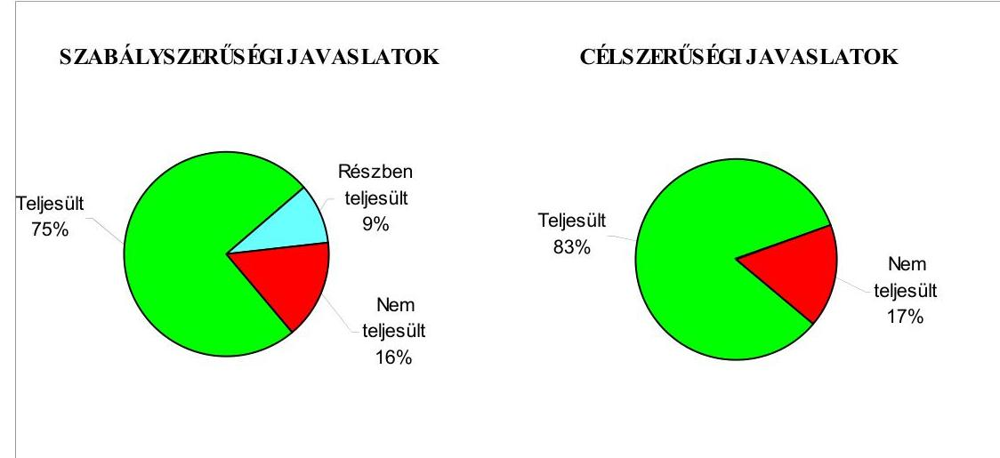

Budapest, 2008. november „26"
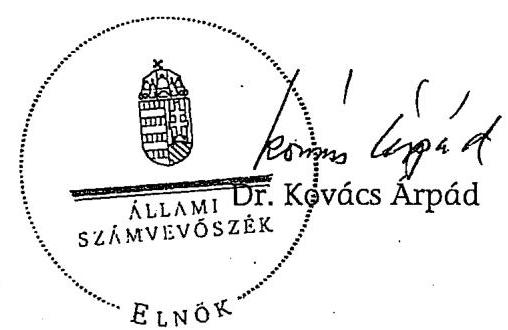

---

# Az Önkormányzat gazdálkodását meghatározó adatok, mutatószámok 

| Megnevezés |  |
| :--: | :--: |
| A megye állandó lakosainak száma (fő) 2008. január 1-jén* | 334379 |
| A Közgyűlés tagjainak a száma (fő) (2007. december 31-én) | 40 |
| A Közgyűlés munkáját segítő állandó bizottságok száma (2007. december 31-én) | 5 |
| Az Önkormányzati hivatalban foglalkoztatott köztisztviselők száma (fő) (2007.december 31-én) | 57 |
| Az összes vagyon értéke a 2007. december 31-i könyvviteli mérleg szerint (millió Ft) | 23604 |
| Az adósságállomány (hosszú és rövid lejáratú kötelezettség) 2007. december 31-én (millió Ft) | 1626 |
| Az egy lakosra jutó adósságállomány (Ft) (2007. december 31-én) | 4863 |
| Az összes költségvetési bevétel (millió Ft) (2007. évben) | 19766 |
| Ebből: saját bevétel (millió Ft), melyből | 4824 |
| Az egy lakosra jutó összes költségvetési bevétel (Ft) (2007. évben) | 59113 |
| Az egy lakosra jutó saját bevétel (Ft) (2007. évben) | 14427 |
| Saját bevétel/Összes költségvetési bevétel (\%) (2007. évben) | 24,4 |
| Az összes teljesített költségvetési kiadás (millió Ft) (2007. évben) | 19191 |
| Ebből: felhalmozási célú kiadás (millió Ft) | 1621 |
| Az összes költségvetési kiadásból a felhalmozási kiadás részaránya (\%) (2007. évben) | 8,4 |
| Az egy lakosra jutó költségvetési kiadás (Ft) (2007. évben) | 57393 |
| Az egy lakosra jutó felhalmozási kiadás (Ft) (2007. évben) | 4848 |
| A költségvetési intézmények száma (db) (2007. december 31-én) | 24 |
| Ebből: részben önállóan gazdálkodó (db) | 23 |
| A költségvetési intézményekben foglalkoztatott közalkalmazottak száma (fő) (2007. december 31-én) | 3710 |

[^0]
[^0]:    * Megjegyzés: A megyék esetében a lakosságszám a megyei jogú város lakosságszáma nélkül értendő!

---

Jász-Nagykun-Szolnok Megyei Önkormányzat

# Az önkormányzati vagyon alakulása

|  Mérlegsor megnevezése | 2005.év
(millió Ft) | 2006. év
(millió Ft) | 2007. év
(millió Ft) | Változás \%-a |  |   |
| --- | --- | --- | --- | --- | --- | --- |
|   |  |  |  | 2006/2005. | 2007/2006. | 2007/2005.  |
|  Immateriális javak | 113 | 108 | 92 | 95,6 | 85,2 | 81,4  |
|  Tárgyi eszközök | 19989 | 20296 | 21359 | 101,5 | 105,2 | 106,9  |
|  ebbäl: ingatlanok | 16404 | 17991 | 18551 | 109,7 | 103,1 | 113,1  |
|  beruházások | 1882 | 452 | 752 | 24,0 | 166,4 | 40,0  |
|  Befektetett pénzügyi eszközök | 71 | 56 | 45 | 78,9 | 80,4 | 63,4  |
|  Üzemeltetésre átadott eszközök | 243 | 205 | 201 | 84,4 | 98,0 | 82,7  |
|  Befektetett eszközök összesen | 20416 | 20665 | 21697 | 101,2 | 105,0 | 106,3  |
|  Forgóeszközök összesen | 3329 | 3688 | 1907 | 110,8 | 51,7 | 57,3  |
|  ebbäl: követelések | 1125 | 1726 | 102 | 153,4 | 5,9 | 9,1  |
|  pénzeszközök | 1721 | 1499 | 1178 | 87,1 | 78,6 | 68,4  |
|  Eszközök összesen | 23745 | 24353 | 23604 | 102,6 | 96,9 | 99,4  |
|  Saját tőke összesen | 21253 | 21518 | 20365 | 101,2 | 94,6 | 95,8  |
|  Tartalék összesen | 1446 | 846 | 872 | 58,5 | 103,1 | 60,3  |
|  Kötelezettségek összesen | 1046 | 1989 | 2367 | 190,2 | 119,0 | 226,3  |
|  ebbäl: rövid lejáratú kötelezettségek | 418 | 788 | 943 | 188,5 | 119,7 | 225,6  |
|  hosszú lejáratú kötelezettségek | 120 | 309 | 683 | 257,5 | 221,0 | 569,2  |
|  Források összesen: | 23745 | 24353 | 23604 | 102,6 | 96,9 | 99,4  |

Forrás: Magyar Államkincstár éves költségvetési beszámoló "01" számú űrlap adatai.

---

# Az Önkormányzat 2005-2008. évi költségvetési előirányzatainak és azok pénzügyi teljesítéseinek alakulása

|  Adatok: millió Ft-ban |  |  |  |  |  |  |  |  |  |   |
| --- | --- | --- | --- | --- | --- | --- | --- | --- | --- | --- |
|  Megnevezés | 2005. év |  |  | 2006. év |  |  | 2007. év |  |  | 2008.  |
|   | Eredeti előirányzat | Módosított
Teljessítés | Eredeti előirányzat | Módosított
Teljessítés | Eredeti előirányzat | Módosított
Teljessítés | Eredeti előirányzat | Módosított
Teljessítés | Telfesítés | Terv  |
|  Müködési célú költségvetési kiadások összesen | 14840 | 16940 | 16205 | 15554 | 17561 | 17053 | 15020 | 18053 | 17570 | 16076  |
|  Felhalmozási célú költségvetési kiadások összesen | 1495 | 2861 | 2007 | 1602 | 2459 | 1574 | 1609 | 2219 | 1621 | 784  |
|  Költségvetési kiadások összesen | 16335 | 19801 | 18212 | 17156 | 20020 | 18627 | 16629 | 20272 | 19191 | 16860  |
|  Müködési célú költségvetési bevételek összesen | 14686 | 17533 | 17610 | 15404 | 17631 | 17768 | 14546 | 17904 | 18249 | 15562  |
|  Felhalmozási célú költségvetési bevételek összesen | 1402 | 2268 | 1913 | 872 | 1629 | 1351 | 1258 | 1851 | 1517 | 804  |
|  Költségvetési bevételek összesen | 16088 | 19801 | 19523 | 16276 | 19260 | 19119 | 15804 | 19755 | 19766 | 16366  |
|  Költségvetési bevételek és kiadások egyenlege: hiány-, többlet+ | $-247$ | 0 | 1311 | $-880$ | $-760$ | 492 | $-825$ | $-517$ | 575 | $-494$  |
|  Finanszírozási célú pénzügyi kiadások | 0 | 0 | 0 | 0 | 0 | 0 | 180 | 180 | 0 | 340  |
|  Finanszírozási célú pénzügyi bevételek | 247 | 0 | 0 | 880 | 760 | 403 | 1005 | 697 | 485 | 834  |
|  Finanszírozási célú pénzügyi műveletek egyenlege | 247 | 0 | 0 | 880 | 760 | 403 | 825 | 517 | 485 | 494  |

Forrás: - Magyar Államkincstár éves költségvetési beszámoló "80" számú űrlap adatai;

- a 2008. évi adatok esetében az Önkormányzat 2008. évi költségvetése;
- a költségvetési bevétel-kiadás müködési-felhalmozási célra történt megosztásánál az analitikus nyilvántartás.

---

Efektivzió tinkercelmező nemr. (lás) Rágyban fizetését Megsel Tinkercelmező Efektivzió tinkercelmező (dvar. 5001 Szobrok, Kossuth Lajos s.2. (Pf. 41.)

tandárulás

sz európai uniós forrásokkal támogatott cátok és programok tervezett és ténylegére adatairól 2003-2008. évadra

|  Sorszám | Az európai uniós forrásokkal
támogatott fejlesztés megnevezése* |  |  |  |  |  |  |  |  |  |  |  |  |  |  |  |  |  |  |  |  |  |  |  |  |  |  |  |  |  |  |  |  |  |  |  |  |  |  |  |  |  |  |  |  |  |  |  |  |  |  |  |  |  |  |  |  |  |  |  |  |  |  |  |  |  |  |  |  |  |  |  |  |  |  |  |  |  |  |  |  |  |  |  |  |  |  |  |  |  |  |  |  |  |  |  |  |  |  |  | 

---

# ADATLAP 

## az Önkormányzat európai uniós forrással támogatott fejlesztéséröl

Az adatlap az Önkormányzat egy európai uniós támogatásának adatait 2004. január 1-jétől a helyszíni ellenőrzés időszakáig tartalmazza.

1. A pályázó Önkormányzat (intézmény) neve: Jász-Nagykun-Szolnok megye Önkormányzata
2. A pályázó Önkormányzat (intézmény) címe: 5000 Szolnok, Kossuth Lajos út 2.
3. A strukturális alap pályázott operatív programjának megnevezése: ROP
4. A pályázott operatív programon belül a projekt megnevezése: ROP 1.1.1
5. A pályázatot készítő megnevezése: Jász-Nagykun-Szolnok Megyei Gazdaságfejlesztő Kht.
6. A pályázott európai uniós támogatás összege: ROP-1.1.1.-2004-070002/37 - 156245456 Ft
7. A pályázott projekt ROP-1.1.1.-2004-07-0002/37

- teljes kiadás összege: 213669000 Ft
- a megvalósítás tervezett időtartama: 2005. június - 2006. szeptember 30.

8. A pályázat elbírálásának eredménye: nyert
9. Az elutasított pályázatnál az elutasítás okai: -
10. A pályázat tartalék státuszba helyezett-e: igen- nem
11. A támogatási szerződés adatai:

- megkötés időpontja: 2005. június 22.
- a támogatás tárgya: A Tiszakürti Arborétum turisztikai vonzerejének fejlesztése.
- időbeli ütemezése: 2005. június 23. - 2006. szeptember 30.

---

- előírt támogatási határidők: Eredetileg a támogatási szerződés F01 mellékletében rögzített költségvetési tervben foglaltak alapján a 2005. évben 110662500 Ft és a 2006. évben 97664775 Ft. Az Önkormányzat a támogatási szerződés módosítását kérte, amely alapján a támogatás évek közötti megosztásának változása miatt a 2005. évben 21310868 Ft és a 2006. évben 187016407 Ft. (Az előleg igénybevételéhez, amely a megítélt támogatás $25 \%$-a $/ 52081819 \mathrm{Ft} /$ az előlegfizetési kérelmet, a támogatási szerződés megkötését követően 30 napon belül kellett benyújtani.)
- előírt fizetési kötelezettségek: Eredetileg a támogatási szerződés F01 mellékletében rögzített költségvetési tervben foglaltak alapján a 2005. évben 113500000 Ft és a 2006. évben 100169000 Ft. Az Önkormányzat a támogatási szerződés módosítását kérte, amely alapján a kiadás évek közötti megosztásának változása miatt a 2005. évben 21857301 Ft és a 2006. évben 191811699 Ft.

12-13. A kifizetési kérelem adatai:

| Kifizetési kérelem (PEJ) benyújtásának idöpontja |  | Számla   bruttó   összege   (Ft) | Kért   támogatási   összeg   (Ft) | Folyósított   összeg   (Ft) | Támogatás   folyósítá-   sának   idöpontja | Benyújtás folyósítás között eltelt idötartam napokban |
| :--: | :--: | :--: | :--: | :--: | :--: | :--: |
| 1. | 2005.07.12. | Előleg | 52081819 | 52081819 | 2005.08.11. | 29 |
| 2. | 2006.02.10. | 42234755 | 41178106 | 41178106 | 2006.07.31. | 170 |
| 3. | 2006.07.31. | 59203242 | 57723161 | 57723161 | 2006.10.09. | 69 |
| 4. | 2006.09.30. | 111495000 | 56626586 | 56626587 | 2007.05.04. | 214 |
|  | Összesen | 212932997 | 207609672 | 207609673 | - | - |

14. A külső ellenőrzésre vonatkozó adatok:

- az ellenőrzések száma: 2 db (2006. szeptember 21-én és 2007. február 20-án)
- az ellenőrzést végző szervek megnevezése: VÁTI Kht.
- az ellenőrzések megállapításai: szabálytalanságra, vagy mulasztásra vonatkozó megállapítást nem tett

15. Szabálytalanságokra vonatkozó adatok:

- mely előírást nem tartotta be az Önkormányzat/intézmény:-
- az előírás nem teljesítésének okai:-
- a rendezésre előírt kötelezettségek: -

---

- a rendezésre előírt kötelezettséget mikor teljesítették: -
- milyen időbeli csúszást eredményezett ez a projekt megvalósításában: -

# A Kohéziós Alappal összefüggő adatok 

1. Melyik országos fejlesztéshez csatlakozott az Önkormányzat: -
2. Az Önkormányzat csatlakozási kérelmének státusza (pl. tartalék státusz): -
3. A támogatási szerződés adatai: (A 11. ponttól egyezőek az információk a strukturális alapoknál feltüntetettekkel) -

Kiállítás időpontja: 2008. május 9.
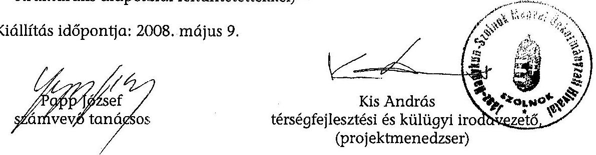

---

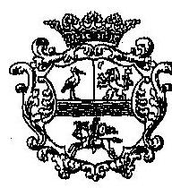

JÁSZ-NAGYKUN-SZOLNOK MEGYEI KÖZGYÜLÉs ELNÖKE

Ikt.szám: 476-5/2008.

Hiv.szám: V-3003-06/23/15/2008.

# ÁLLAMI SZÁMVEVŐSZÉK 

Dr. Kovács Árpád Állami Számvevőszék Elnöke részére

## Budapest

Apáczai Csere János u. 10.
1052

## Tisztelt Elnök Úr!

Az Állami Számvevőszékről szóló 1989. évi XXXVIII. sz. törvény 25. § (1) bekezdése szerint a Jász-Nagykun-Szolnok Megyei Önkormányzat gazdálkodási rendszerének 2008. évi ellenőrzéséről készített jelentésre észrevételt nem kívánok-tenni.

Az ellenőrzési jelentésben foglaltakat és a kapcsolódó intézkedési tervet a Megyei Közgyűlés és a Pénzügyi Bizottság soron következő ülésére beterjesztem, valamint a közgyülés által jóváhagyott intézkedési tervet megküldöm.

Tájékoztatom, hogy a javasolt feladatok körében további intézkedésekre került sor. A megyei közgyülés 2008. október 31-i ülésén tárgyalta és fogadta el a 2009. évi belső ellenőrzési tervet, amelyhez a Ber. 18. §-ában foglalt előírásnak megfelelően kockázatelemzést készítettünk. A terv elkészítése során - a Ber. 21. § (4) bekezdésben foglaltaknak megfelelően - ellenőri kapacitást biztosítottunk a soron kívüli ellenőrzésekre.

Előterjesztést készítettünk az önkormányzati hivatal középtávú informatikai fejlesztési programjára, amelyet a megyei közgyűlés 2008. október 31-i ülésén jóváhagyott.

A jelentésben foglalt megállapításokat és javaslatokat a szabályszerű és hatékony munkavégzés érdekében folyamatosan hasznosítjuk.

Köszönöm az ellenőrzésben részt vevők korrekt és objektív munkáját.

Szolnok, 2008. november 4.

Tisztelettel:
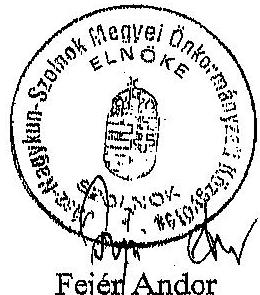

Fejér Andor

---

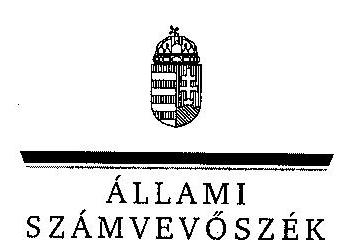

Ikt.sz.: V-3003-6/23/17/2008.

# Fejér Andor 

Közyyülés elnöke

## Szoinok

Kossuth L. út 2.
5000

## Tisztelt Elnök úr!

Köszönettel vettem a Jász-Nagykun-Szolnok Megyei Önkormányzat gazdálkodási rendszerének 2008. évi ellenőrzéséről készült számvevőszéki jelentéshez küldött tájékoztatását a megtett intézkedésekről. Örömmel értesültem arról, hogy a megállapításaink, javaslataink egy részét az ellenőrzést követően megvalósították, a számvevőszéki jelentésben az érintett megállapításhoz kapcsolt lábjegyzetben a tájékoztatásában foglaltakat feltüntettük és a vonatkozó javaslatokat elhagytuk.

Az ellenőrzés lefolytatásához nyújtott segítő közreműködését köszönöm.
Budapest, 2008. november "26 "
Tisztelettel:
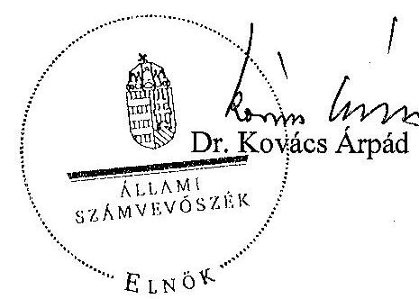