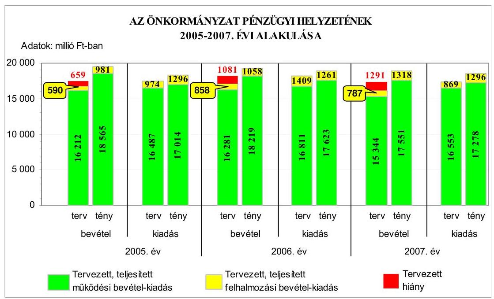
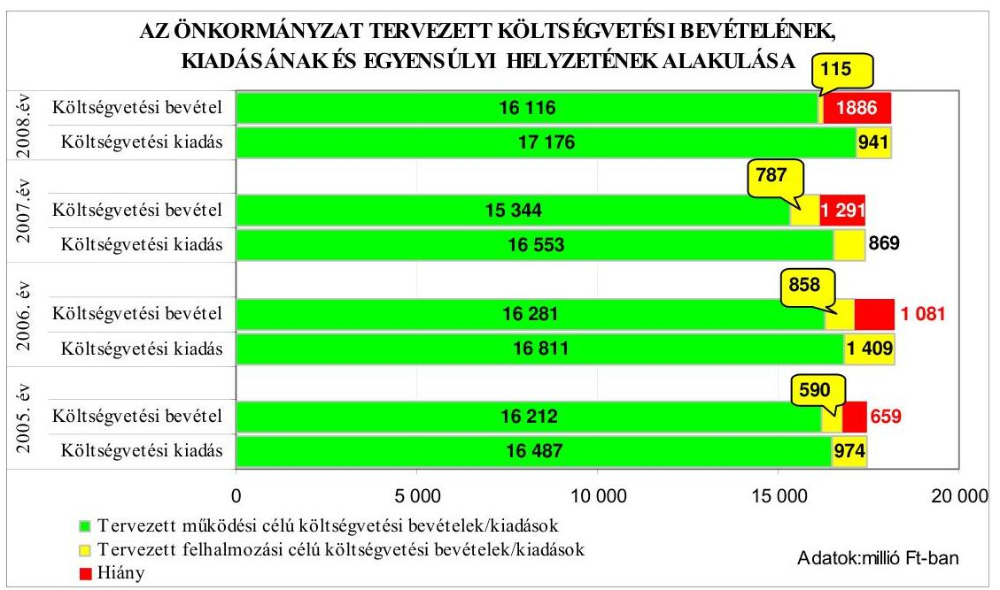
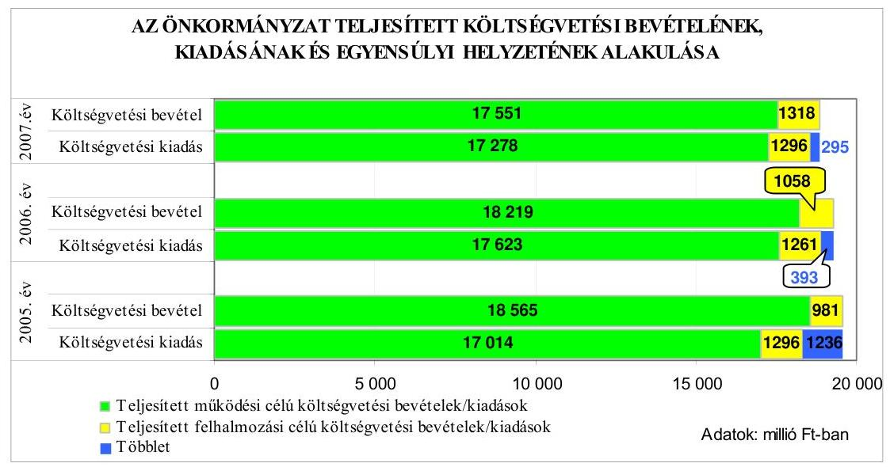
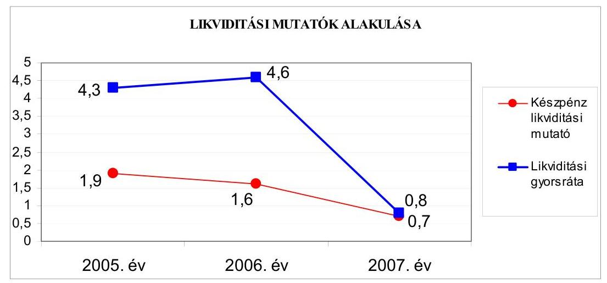
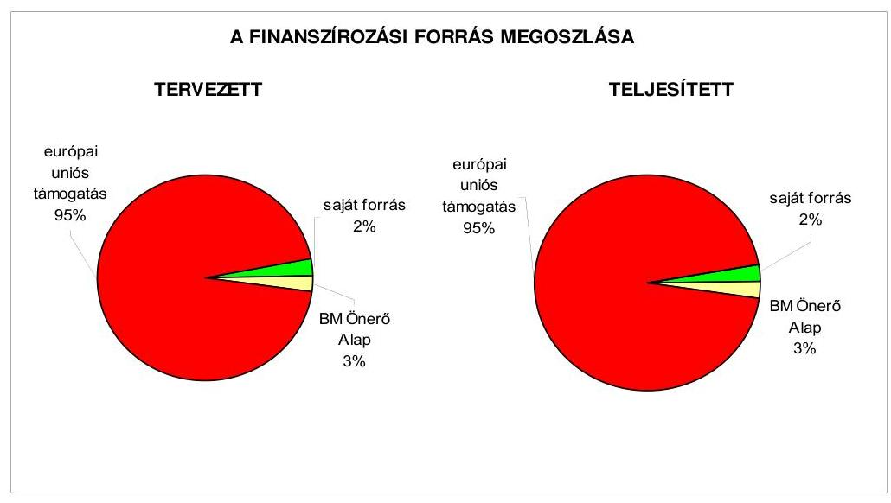
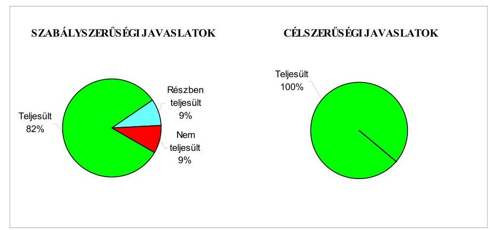
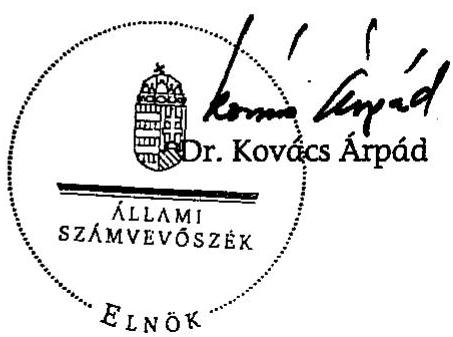
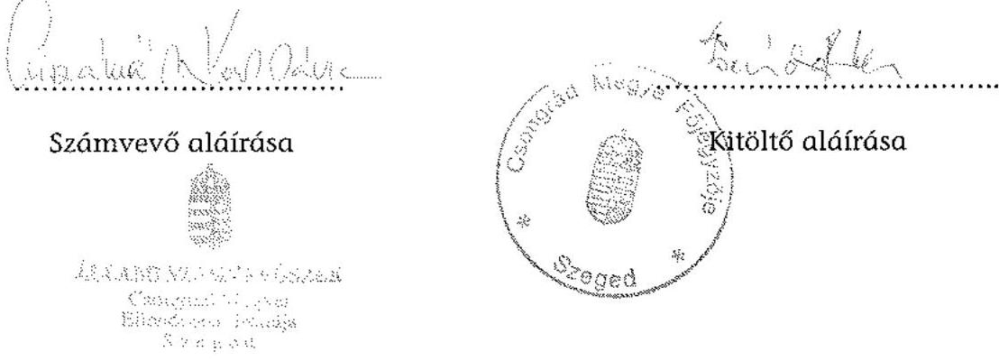
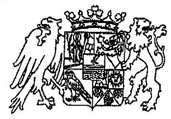
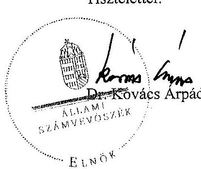

# JELENTÉS 

a Csongrád Megyei Önkormányzat gazdálkodási rendszerének 2008. évi ellenőrzéséről

---

# 3. Önkormányzati és Területi Ellenőrzési Igazgatóság 

## Átfogó Ellenőrzési Főcsoport

Iktatószám: V-3003-6/21/21/2008.
Témaszám: 898
Vizsgálat-azonosító szám: V0388

## Az ellenőrzést felügyelte:

Dr. Lóránt Zoltán
főigazgató
Az ellenőrzés végrehajtásáért felelős:
Dr. Sepsey Tamás
főigazgató-helyettes
Az ellenőrzést vezette:
Dr. Csikai Zsolt
irodavezető, főtanácsadó

## Az ellenőrzést végezték:

| Csiszárné dr. Kosik | Benkéné dr. Lavner | Kisapáti Angéla |
| :-- | :-- | :-- |
| Mária | Klára | számvevő |
| irodavezető, főtanácsadó | számvevő tanácsos |  |

## A témához kapcsolódó eddig készített számvevőszéki jelentések:

## címe

Jelentés a Csongrád Megyei Önkormányzat gazdálkodásának átfogó ellenőrzéséről

Jelentés a helyi és a helyi kisebbségi önkormányzatok gazdálkodásának átfogó ellenőrzéséről

Jelentés a Magyar Köztársaság 2003. évi költségvetése végrehajtásának ellenőrzéséről

Függelék

- a helyi önkormányzatokat a 2003. évben megillető normatív állami hozzájárulás elszámolása

Jelentés a helyi önkormányzatok közművelődési és könyvtári feladatellátásáról és finanszírozásáról

Jelentés a címzett támogatásból finanszírozott egészségügyi beruházások és rekonstrukciók ellenőrzéséről

---

Jelentés a Magyar Köztársaság 2004. évi költségvetése végrehajtásának ellenőrzéséről

Függelék:

- a helyi önkormányzatok beruházásaihoz és rekonstrukcióihoz nyújtott 2004. évi felhalmozási célú támogatások

Jelentés a Magyar Köztársaság 2005. évi költségvetése végrehajtásának ellenőrzéséről

Függelék:

- a helyi önkormányzatok beruházásaihoz és rekonstrukcióihoz nyújtott 2005. évi felhalmozási célú támogatások ellenőrzése

---

# TARTALOMJEGYZÉK 

BEVEZETÉS ..... 11
I. ÖSSZEGZŐ MEGÁLLAPÍTÁSOK, KÖVETKEZTETÉSEK, JAVASLATOK ..... 16
II. RÉSZLETES MEGÁLLAPÍTÁSOK ..... 24

1. Az Önkormányzat költségvetési és pénzügyi helyzete ..... 24
1.1. A tervezett és teljesített költségvetési bevételek és kiadások alapján a költségvetési és a pénzügyi egyensúly alakulása, valamint a költségvetési hiány megállapításának szabályszerűsége ..... 24
1.2. A költségvetési és a pénzügyi egyensúlyi helyzet kialakításához tervezett és teljesített finanszírozási célú pénzügyi műveletek módja és azok hatása a tárgyévet követő évek költségvetéseire ..... 27
1.3. A költségvetés tervezésének megalapozottsága ..... 35
2. Az Önkormányzat felkészültsége az európai uniós források igénylésére és felhasználására, valamint az elektronikus közigazgatási feladatok ellátására ..... 37
2.1. Az európai uniós források igénybevételére és a várható támogatás felhasználására történt felkészülés szabályozottsága, szervezettsége ..... 37
2.1.1. Az európai uniós forrásokra történő pályázatok benyújtására vonatkozó döntések összhangja a fejlesztési célkitűzésekkel ..... 37
2.1.2. Az európai uniós forrásokhoz kapcsolódóan a pályázatfigyelés, a pályázatkészítés, valamint az európai uniós támogatással megvalósuló fejlesztés lebonyolításának belső rendjének szabályozottsága, a végrehajtás személyi, szervezeti feltételei ..... 43
2.1.3. A fejlesztési feladat lebonyolításánál a feladatellátás rendjére, az ellenőrzési feladatok teljesítésére, valamint a felelősségi szabályokra vonatkozó előírások betartása ..... 46
2.2. Az elektronikus közigazgatási feladatok ellátása, a közérdekű adatok elektronikus közzététele ..... 49
3. A költségvetési gazdálkodás belső kontrolljai ..... 51
3.1. A szabályozottság kockázata a költségvetés tervezési, gazdálkodási, beszámolási és a folyamatba épített, előzetes és utólagos vezetői ellenőrzési feladatoknál ..... 51
3.2. A belső kontrollok érvényesülése az önkormányzati források szabályszerű felhasználásában, a költségvetési tervezés, gazdálkodás, beszámolás folyamataiban ..... 52
3.3. A belső ellenőrzési kötelezettség teljesítése, javaslatainak hasznosulása ..... 55

---

4. Az ÁSZ korábbi ellenőrzési javaslatai alapján készített intézkedési terv végrehajtása, eredményessége ..... 61
4.1. Az Önkormányzat gazdálkodási rendszerének átfogó ellenőrzése során tett javaslatok végrehajtására tervezett intézkedések megvalósulása ..... 61
4.2. A zárszámadáshoz kapcsolódó (állami hozzájárulások, támogatások igénylésének és felhasználásának ellenőrzése), valamint a további vizsgálatok esetében a megállapítások, javaslatok alapján tett intézkedések ..... 63
MELLÉKLETEK
5. számú Az Önkormányzat gazdálkodását meghatározó adatok, mutatószámok (1 oldal)
6. számú Az önkormányzati vagyon alakulása (1 oldal)
7. számú Az Önkormányzat 2005-2008. évi költségvetési előirányzatainak és azok pénzügyi teljesítéseinek alakulása (1 oldal)
8. számú Tanúsítvány az európai uniós forrásokkal támogatott célok és programok tervezett és tényleges adatairól a 2005-2008. évekre (1 oldal)
9. számú Adatlap az Önkormányzat európai uniós forrással támogatott fejlesztéséről (3 oldal)
10. számú Magyar Anna úrhölgy, a Csongrád Megyei Önkormányzat Közgyűlés elnökének észrevétele (1 oldal)
11. számú Magyar Anna úrhölgy, a Csongrád Megyei Önkormányzat Közgyűlés elnökének észrevétele (1 oldal)

---

# RÖVIDÍTÉSEK JEGYZÉKE 

## Törvények

Áfa törvény
Áht.
Eisztv.
Ket.
Ötv.
Számv. tv.

## Rendeletek

Ámr.
Ber.
$\mathrm{SzMSz}_{1}$

SzMSz $_{2}$
vagyongazdálkodási rendelet

Vhr.

18/2005. (XII. 27.) IHM rendelet

2005. évi költségvetési rendelet

2005. évi zárszámadási rendelet

az általános forgalmi adóról szóló 1992. évi LXXIV. törvény
az államháztartásról szóló 1992. évi XXXVIII. törvény
az elektronikus információszabadságról szóló 2005. évi XC. törvény
a közigazgatási hatósági eljárás és szolgáltatás általános szabályairól szóló 2004. évi CXL. törvény
a helyi önkormányzatokról szóló 1990. évi LXV. törvény
a számvitelről szóló 2000. évi C. törvény
az államháztartás működési rendjéről szóló 217/1998. (XII. 30.) Korm. rendelet
a költségvetési szervek belső ellenőrzéséről szóló 193/2003. (XI. 26.) Korm. rendelet
a Csongrád Megyei Önkormányzat 3/2005. (III. 5.) számú rendelete a közgyűlés és szervei szervezeti és működési szabályzatáról
a Csongrád Megyei Önkormányzat 4/2007. (IV. 30.) számú rendelete a közgyűlés és szervei szervezeti és működési szabályzatáról
a Csongrád Megyei Önkormányzat 7/2007. (IV. 30.) számú rendelete az Önkormányzat vagyona feletti rendelkezési jog gyakorlásának szabályairól
az államháztartás szervezetei beszámolási és könyvvezetési kötelezettségének sajátosságairól szóló 249/2000.
(XII. 24.) Korm. rendelet
a közzétételi listákon szereplő adatok közzétételéhez szükséges közzétételi mintákról szóló 18/2005. (XII. 27.) IHM rendelet
a Csongrád Megyei Önkormányzat 2/2005. (III. 5.) számú rendelete az Önkormányzat 2005. évi költségvetéséről és annak végrehajtásáról, a költségvetési gazdálkodás 2005. évi vitelének szabályairól
a Csongrád Megyei Önkormányzat 6/2006. (IV. 28.) számú rendelete az Önkormányzat 2005. évi költségvetési gazdálkodásáról szóló zárszámadás elfogadásáról, a normatív állami hozzájárulás elszámolásáról
a Csongrád Megyei Önkormányzat 3/2006. (II. 27.) számú rendelete az Önkormányzat 2006. évi költségvetéséről
a Csongrád Megyei Önkormányzat 5/2007. (IV. 30.) számú rendelete az Önkormányzat 2006. évi költségvetési gazdálkodásáról szóló zárszámadás elfogadásáról, a normatív állami hozzájárulás elszámolásáról

---

2007. évi költségvetési rendelet

2007. évi zárszámadási rendelet

2008. évi költségvetési rendelet

## Szórövidítések

APEH
ÁSZ
ÁROP
BM Önerő Alap
csongrádi fogyatékos otthon
DAOP
deszki kórház
EGT
EKOP
e-közigazgatás
Ellenőrzési osztály
EURIBOR
FEUVE
főjegyző
gazdasági program $_{1}$
gazdasági program $_{2}$
ügyrend
GVOP
HEFOP
a Csongrád Megyei Önkormányzat 3/2007. (II. 26.) számú rendelete az Önkormányzat 2007. évi költségvetéséről és a költségvetést érintő egyéb rendeletek módosításáról
a Csongrád Megyei Önkormányzat 9/2008. (IV. 28.) számú rendelete az Önkormányzat 2007. évi költségvetési gazdálkodásáról szóló zárszámadás elfogadásáról, a normatív állami hozzájárulás elszámolásáról
a Csongrád Megyei Önkormányzat 4/2008. (III. 1.) számú rendelete az Önkormányzat 2008. évi költségvetéséről és a költségvetést érintő egyéb rendeletek módosításáról

Adó- és Pénzügyi Ellenőrzési Hivatal
Állami Számvevőszék
ÚMFT Államreform Operatív Program
Magyar Köztársaság 2007. évi költségvetéséről szóló 2006. évi CXXXVII. tv. - 5. számú mellékletének 12. pontja alapján - központi költségvetési hozzájárulást biztosít a helyi önkormányzatok és jogi személyiségű társulásaik számára, azok európai uniós fejlesztési célú pályázataihoz szükséges saját forrás kiegészítésére
Csongrád Megyei Önkormányzat Aranysziget Otthona Kisréti Otthon, Csongrád
ÚMFT Dél-Alföldi Operatív Program
Csongrád Megyei Önkormányzat Mellkasi Betegségek Szakkórháza, Deszk
Európai Gazdasági Térség
ÚMFT Elektronikus Közigazgatási Operatív Program
elektronikus közigazgatás
a Csongrád Megyei Önkormányzat Hivatalának Önkormányzati Belső Ellenőrzési Osztálya
Európai irányadó bankközi kamatláb (Euro Interbank Offered Rate)
folyamatba épített, előzetes és utólagos vezetői ellenőrzés
Csongrád Megyei Önkormányzat Főjegyzője
a Csongrád Megyei Önkormányzat Közgyűlésének 40/2003. (IV. 24.) számú határozata az Önkormányzat 2003-2006. évekre vonatkozó gazdasági programjáról
a Csongrád Megyei Önkormányzat Közgyűlésének 29/2007. (IV. 26.) számú határozata az Önkormányzat 2007-2010. évekre vonatkozó gazdasági programjáról
a Csongrád Megyei Önkormányzat Hivatala gazdasági szervezetének ügyrendje, amelyet az elnök és a főjegyző a 2005. augusztus 25-én kelt utasításban hagyott jóvá

NFT Gazdasági Versenyképesség Operatív Program
NFT Humánerőforrás-fejlesztési Operatív Program

---

| hivatali SzMSz | a Csongrád Megyei Önkormányzat Közgyűlésének 17/2005. (III. 3.) számú határozata a Csongrád Megyei Önkormányzat Hivatala Szervezeti és Működési Szabályzatáról |
| :--: | :--: |
| IHM | Informatikai és Hírközlési Minisztérium |
| Illetékhivatal | Csongrád Megyei Önkormányzat Illetékhivatala |
| INTERREG | Határon átnyúló, transznacionális és interregionális együttműködés |
| INTERREG HU-RO-SCG | Magyarország-Románia, Magyarország-Szerbia és Montenegró Határon Átnyúló Együttműködési Program |
| INTERREG HU-RO | Magyarország-Románia Határon Átnyúló Együttműködési Program |
| KIOP | NFT Környezetvédelem és Infrastruktúra Operatív Program |
| kisebbségi önkormányzat | Csongrád Megyei Cigány Területi Kisebbségi Önkormányzat |
| Klúg Péter Óvoda, Általános Iskola, Szakiskola, Gyógypedagógiai Módszertani Intézmény | Csongrád Megyei Önkormányzat Klúg Péter Óvoda, Általános Iskola, Alapfokú Művészetoktatási Intézmény, Szakiskola, Diákotthon és Egységes Gyógypedagógiai Módszertani Intézménye |
| Közgazdasági osztály | a Csongrád Megyei Önkormányzat Hivatalának Közgazdasági Osztálya, 2007. július 1-től a Csongrád Megyei Önkormányzat Hivatalának Intézmény-felügyeleti Osztálya |
| Közgyűlés | Csongrád Megyei Önkormányzat Közgyűlése |
| Közgyűlés elnöke | Csongrád Megyei Önkormányzat Közgyűlésének Elnöke |
| Önkormányzat hivatala makói kórház | Csongrád Megyei Önkormányzat Hivatala   a Csongrád Megyei Önkormányzat Dr. Diósszilágyi Sámuel Kórház Rendelőintézete, Makó |
| megyei múzeum | a Csongrád Megyei Önkormányzat Móra Ferenc Múzeuma, Szeged |
| NFÜ | Nemzeti Fejlesztési Ügynökség |
| NFT | Nemzeti Fejlesztési Terv |
| OEP | Országos Egészségügyi Pénztár |
| Önkormányzat | Csongrád Megyei Önkormányzat |
| ÖNTE | Ópusztaszeri Nemzeti Történeti Emlékpark |
| pályázati szabályzat | a Csongrád Megyei Önkormányzat Közgyűlésének 34/2008. (II. 28.) számú határozata az Önkormányzat pályázatokkal, támogatásokkal és európai uniós forrásokkal kapcsolatos tevékenységeinek szabályzatáról |
| Pénzügyi bizottság | a Csongrád Megyei Önkormányzat Pénzügyi Bizottsága |
| ROP | NFT Regionális Fejlesztés Operatív Program |
| Stratégiai és integrációs iroda | Csongrád Megyei Önkormányzat Hivatalának Stratégiai és Integrációs Irodája |
| szja | személyi jövedelemadó |
| szentesi kórház | a Csongrád Megyei Önkormányzat Dr. Bugyi István Kórháza, Szentes |

---

| TEGYESZ | Csongrád Megyei Területi Gyermekvédelmi Szakszolgálat és Gyermekotthonok Igazgatósága |
| :--: | :--: |
| TIOP | ÚMFT Társadalmi Infrastruktúra Operatív Program |
| Tulajdonosi bizottság | a Csongrád Megyei Önkormányzat Közgyűlésének Tulajdonosi Bizottsága |
| ÚMFT | Új Magyarország Fejlesztési Terv |

---

# ÉRTELMEZŐ SZÓTÁR 

1. elektronikus szolgáltatási szint
2. elektronikus szolgáltatási szint
3. elektronikus szolgáltatási szint
4. elektronikus szolgáltatási szint
európai uniós források
fejlesztési feladat (projekt)
fejlesztési célkitűzés
irányító hatóság

Az 1044/2005. (V. 11.) Korm. határozat alapján olyan információs, tájékoztató szolgáltatás, amely csak általános információkat közöl az adott üggyel kapcsolatos teendőkről és a szükséges dokumentumokról.
Az 1044/2005. (V. 11.) Korm. határozat alapján olyan egyirányú kapcsolatot biztosító szolgáltatás, amely az 1. szinten túl biztosítja az adott ügy intézéséhez szükséges dokumentumok, nyomtatványok letöltését, és azok ellenőrzéssel, vagy ellenőrzés nélküli elektronikus kitöltését, amely esetben a dokumentumok benyújtása hagyományos úton történik.
Az 1044/2005. (V. 11.) Korm. határozat alapján olyan kétirányú kapcsolatot biztosító szolgáltatás, amely közvetlen, vagy ellenőrzött kitöltésű dokumentum segítségével biztosítja az elektronikus adatbevitelt és a bevitt adatok ellenőrzését. Az ügy indításához, intézéséhez személyes megjelenés nem szükséges, de az ügyhöz kapcsolódó közigazgatási döntés (határozat, egyéb aktus) közlése, valamint a kapcsolódó illeték-, vagy díjfizetés hagyományos úton történik.
Az 1044/2005. (V. 11.) Korm. határozat alapján olyan teljes közvetlen kétirányú ügyintézési folyamatot biztosító szolgáltatás, amikor az ügyhöz kapcsolódó közigazgatási döntés is elektronikus úton kerül közlésre, illetve a kapcsolódó illeték-, vagy díjfizetés elektronikus úton is intézhető.
Az elnyert európai uniós források lehívása a támogatott projekt megvalósítása érdekében, a fejlesztés lebonyolítása során felmerült kiadások finanszírozására.
A fejlesztési feladat (projekt) tartalmilag és formailag részletesen kidolgozott, megfelelő pénzügyi háttérrel és végrehajtási ütemezéssel rendelkező fejlesztési terv, amely illeszkedik az Európai Unió, illetve a Nemzeti Fejlesztési Terv által támogatott programokhoz.
Az önkormányzat által ellátott kötelező, vagy önként vállalt feladatok ellátásának mennyiségi, vagy minőségi
 fejlesztésére vonatkozó terv. A mennyiségi fejlesztés megvalósulhat beszerzéssel, létesítéssel, bővítéssel, átalakítással.
A strukturális alapok és a Kohéziós alap forrásainak szabályszerű, hatékony és eredményes felhasználásához szükséges intézményrendszer felső eleme. Az irányító hatóság általános és átfogó felelősséget visel a programok, projektek hatékony és szabályszerű végrehajtásáért. Felelősségi köréből eredően ellenőrzi a közösségi, valamint a hazai jogszabályok betartását, koordinálja az európai uniós források szétosztásának folyamatát, irányítja az intézményrendszer, a statisztikai és a pénzügyi nyilvántartási rendszer működését.

---

kedvezményezett
közreműködő szervezet
lebonyolítás
operatív program

Az a helyi önkormányzat, amely a támogatási szerződést kedvezményezettként aláírja, a projektet, illetve a központi programhoz kapcsolódó támogatott önkormányzati programot végrehajtja.
A közreműködő szervezet az európai uniós támogatást elnyert kedvezményezettekkel kapcsolatot tartó szerv. Az operatív programok közreműködő szervezetei befogadják, nyilvántartják, döntésre előkészítik a pályázatokat, rögzítik a támogatással kapcsolatos adatokat az egységes monitoring informatikai rendszerben, elvégzik a támogatások előzetes (szerződéskötést megelőző), közbenső (a pénzügyi elszámolás, finanszírozás folyamatában végzett) és utólagos (a támogatott projekt pénzügyi lezárását megelőző) ellenőrzését. Az önkormányzatoknál a leggyakrabban előforduló operatív program a Regionális Fejlesztési Operatív Program végrehajtásában közreműködő szervezetek a VÁTI Kht. és a regionális fejlesztési ügynökségek.
A Kohéziós alap két közreműködő szervezete (Gazdasági és Közlekedési Minisztérium, Környezetvédelmi és Vízügyi Minisztérium) a támogatott projektek végrehajtásához kapcsolódó operatív feladatokat látják el. Ennek keretében megkötik a szerződéseket a projekt kedvezményezettjével, folyamatosan nyomon követik a teljesítéseket, lebonyolítják a támogatások kifizetését, vezetik az egységes monitoring informatikai rendszert.
Az európai uniós források felhasználásával megvalósuló fejlesztésre irányuló műszaki, gazdasági (pénzügyi) tevékenységet magában foglaló szervezési, irányítási szolgáltatás. A szervezési szolgáltatás kiterjedhet a pályázatkészítésre, a közbeszerzési eljárás lebonyolításán keresztül a folyamatos műszaki ellenőrzésre, a pénzügyi elszámolásra, a műszaki átadás-átvételre, az üzembe helyezésre, illetve a fejlesztési folyamat egyes elemeire.
Az Európai Bizottság által jóváhagyott, a Közösségi Támogatási Keret végrehajtására vonatkozó 2004-2013 közötti, több évre szóló intézkedésekhez kapcsolódó prioritások egységes rendszerét tartalmazó dokumentum. A strukturális alapok operatív programjai: Agrár és Vidékfejlesztési Operatív Program (AVOP); Gazdasági Versenyképesség Operatív Program (GVOP); Humánerőforrás-fejlesztési Operatív Program (HEFOP); Környezetvédelmi és Infrastruktúra-fejlesztési Operatív Program (KIOP); Regionális Fejlesztési Operatív Program (ROP). Az ÚMFT-hez kapcsolódó operatív programok: Gazdaságfejlesztési Operatív Program (GOP); Közlekedés Operatív Program (KÖZOP); Társadalmi Megújulás Operatív Program (TÁMOP); Társadalmi Infrastruktúra Operatív Program (TIOP); Környezet és Energia Operatív Program (KEOP); Államreform Operatív Program (ÁROP); Elektronikus Közigazgatás

---

projekt előrehaladási jelentés (PEJ)
támogatási szerződés

Operatív Program (EKOP); Nyugat-dunántúli Operatív Program (NYDOP); Dél-alföldi Operatív Program (DAOP); Észak-alföldi Operatív Program (ÉAOP); Közép-magyarországi Operatív Program (KMOP); Észak-magyarországi Operatív Program (ÉMOP); Közép-dunántúli Operatív Program (KDOP); Dél-dunántúli Operatív Program (DDOP).
A Strukturális Alapok által társfinanszírozott projektek megvalósítása során a kedvezményezetteknek a támogatási szerződésben meghatározott időközönként, általában negyedévente, a támogatás kifizetési kérelmeihez kapcsolódóan pár oldalas projekt előrehaladási jelentéseket kell benyújtaniuk. A projekt előrehaladási jelentés jóváhagyása a további támogatások kifizetésének előfeltétele.
A strukturális alapok esetében az irányító hatóságnak, illetve a Kohéziós Alap esetében a közreműködő szervezeteknek a kedvezményezett önkormányzattal kötött szerződése, amely a támogatás felhasználásának részletes feltételeit tartalmazza.

---

.

---

# JELENTÉS 

## a Csongrád Megyei Önkormányzat gazdálkodási rendszerének 2008. évi ellenőrzéséről

## BEVEZETÉS

Az Ötv. 92. § (1) bekezdése, az Állami Számvevőszékről szóló 1989. évi XXXVIII. törvény 2. § (3) bekezdése, valamint az Áht. 120/A. § (1) bekezdése alapján az önkormányzatok gazdálkodását az Állami Számvevőszék ellenőrzi. Az ellenőrzésre az Országgyűlés illetékes bizottságai részére is átadott, országosan egységes ellenőrzési program szerint került sor.

Az Állami Számvevőszék a stratégiájában foglalt célkitűzéseknek megfelelően a helyi önkormányzatok költségvetési gazdálkodási rendszere átfogó ellenőrzésének programját a 2007. évtől megújította, azt kiegészítette további - teljesítmény-ellenőrzési - elemekkel.

## Az ellenőrzés célja annak értékelése volt, hogy az Önkormányzat:

- milyen módon biztosította a költségvetési és a pénzügyi egyensúlyt a költségvetésében és annak teljesítése során, valamint változott-e a finanszírozási célú pénzügyi műveletek jelentősége a hiányzó bevételi források pótlásában;
- eredményesen készült-e fel a szabályozottság és a szervezettség terén az európai uniós források igénylésére és felhasználására, továbbá biztosította-e az e-közigazgatás feltételeit, az adatok közzétételével a gazdálkodás nyilvánosságát;
- kialakította-e a külső és a belső feltételeknek megfelelően a költségvetés tervezési, gazdálkodási és zárszámadási feladatai belső kontrollrendszerét ${ }^{1}$, ezen tevékenységek szabályszerű ellátásához hozzájárult-e a folyamatba épített, előzetes és utólagos vezetői ellenőrzés, valamint a belső ellenőrzés;
- megfelelően hasznosították-e a korábbi számvevőszéki ellenőrzések megállapításait, szabályszerűségi ${ }^{2}$ és célszerűségi javaslatait.

[^0]
[^0]:    ${ }^{1}$ A gazdálkodás szabályszerűségét biztosító kontrollrendszer alatt értjük a kiépített és működő belső irányítási és szabályozási rendszert, valamint a belső ellenőrzési funkciók ellátásának rendszerét.
    ${ }^{2}$ A törvényi előírások betartásának elmulasztásakor egységesen a törvénysértés megjelölést alkalmazzuk, mivel az ÁSZ nem tehet különbséget a törvényi előírások között.

---

Az ellenőrzés típusa: átfogó ellenőrzés, amely egyidejűleg - egy ellenőrzés keretében - meghatározott területekre összpontosítva érvényesíti a szabályszerűségi, valamint a teljesítmény-ellenőrzés jellemzőit.

Az ellenőrzött időszak: az 1. és 2. ellenőrzési programpontok tekintetében 2005. évtől a 2008. év I. negyedév végéig, a 3. ellenőrzési programpontnál a 2007. év és 2008. I. negyedév, a 4. ellenőrzési programpontnál a 2004. évtől a 2008. I. negyedév végéig terjedő időszak.

Csongrád megye lakosainak száma - Szeged és Hódmezővásárhely megyei jogú városok nélkül - 2008. január 1-jén 213729 fő volt. A megyében a 2007. évben 60 települési önkormányzat működött, amelyből kilenc város, négy nagyközség és 47 község volt. A 2006. évi önkormányzati választást követően az Önkormányzat 40 tagú Közgyűlésének munkáját kilenc állandó bizottság segítette. Az Önkormányzat területén a 2006. évi önkormányzati választásokig helyi kisebbségi önkormányzat nem működött, azt követően megalakult a Csongrád Megyei Cigány Területi Kisebbségi Önkormányzat. A 2006. évi önkormányzati választást követően a Közgyűlés elnökének személye változott. A 2005. évtől alkalmazásban álló főjegyző köztisztviselői jogviszonya 2007. április 30-án megszűnt. A hivatalban lévő főjegyző 2007. június 4-től tölti be tisztségét.

Az Önkormányzat feladatainak végrehajtása érdekében a 2007. évben 27 költségvetési intézményt működtetett, amelyekből 24 önállóan gazdálkodott. A feladatok ellátásában nyolc gazdasági társasága vett részt. Az Önkormányzat a 2007. évben 18869 millió Ft költségvetési bevételt ért el és 18574 millió Ft költségvetési kiadást teljesített, 2007. december 31-én 13481 millió Ft értékű vagyonnal rendelkezett.

Az Önkormányzat vagyona a 2005. év végi állományhoz viszonyítva a 2007. év végére közel 14 %-kal csökkent, ezen belül mintegy 94 %-kal alacsonyabb a követelések állománya elsősorban az Illetékhivatal APEH-nek történő 2007. január 1-i átadása miatt. Az ingatlanok értékének év végi állománya ugyanezen időszak alatt 18 %-kal emelkedett elsősorban a 900 millió Ft címzett támogatás segítségével Csongrád Városban megvalósult fogyatékos személyeket ellátó, 124 férőhelyes otthon miatt. A kötelezettségek 2007. év végi állománya közel 18 %-kal nőtt a 2005. év végi állományhoz képest, melyet elsősorban a szállítói tartozás, a folyószámlahitel ${ }^{3}$ és a deszki kórház rekonstrukciójára felvett hosszú lejáratú hitel év végi állományának növekedése okozott. A saját tőke 2007. év végi értéke a 2006. év végi saját tőkeérték közel 84 %-ára csökkent az Illetékhivatal eszközeinek APEH részére történt átadása miatt.

A 2008. évi költségvetési rendeletben 16231 millió Ft költségvetési bevételt és 18117 millió Ft költségvetési kiadást irányoztak elő, a költségvetési hiány 1886 millió Ft. Az összes költségvetési bevétel 24 %-át a saját bevétel biztosította a 2007. évben. Az összes költségvetési kiadásból a felhalmozási célú kiadás részaránya a 2007. évben 7% volt. Az Önkormányzat hivatalában dolgozó köztisztviselők száma 2007. december 31-én 72 fő, a költségvetési intézmény-

[^0]
[^0]:    ${ }^{3}$ A 2005. és a 2006. évek végén nem volt folyószámlahitel állománya az Önkormányzatnak.

---

ekben foglalkoztatott közalkalmazottak száma 4011 fő volt. Az Önkormányzat gazdálkodására vonatkozó adatokat, mutatószámokat az 1-3. számú mellékletek tartalmazzák.

Az Önkormányzat költségvetési és pénzügyi helyzetét az elemző eljárás módszerével vizsgáltuk. E körben elemeztük a költségvetés egyensúlyi helyzetének alakulását, a tervezett és tényleges költségvetési hiány okait, a mérséklésére tett intézkedéseket, finanszírozásának módját, az Önkormányzat adósságállományának alakulását, összetevőit.

A teljesítmény-ellenőrzés módszerével vizsgáltuk a belső szabályozottság, szervezettség terén az Önkormányzat felkészültségét az európai uniós források figyelésére, igénylésére és felhasználására, továbbá értékeltük, hogy az igényelt európai uniós támogatások az Önkormányzat által meghatározott fejlesztési célkitűzésekhez kapcsolódtak-e. Az eredményesség szempontjából a minősítést a lényegességi szinthez való viszonyítással végeztük el. Az ellenőrzés során felmértük, hogy az e-közigazgatási feladat ellátása, illetve bevezetése, működtetése érdekében milyen intézkedéseket tettek, valamint biztosították-e a közérdekű adatok közzétételét.

A költségvetési gazdálkodás belső kontrolljainak ellenőrzése során értékeltük, hogy az Önkormányzat hivatalánál a költségvetés tervezési, gazdálkodási, zárszámadás-készítési feladatok belső kontrolljainak kiépítettsége és működése megfelelő biztosítékot ad-e a gazdálkodási feladatok megfelelő, szabályszerű ellátására. Felmértük és minősítettük a költségvetés tervezési, a gazdálkodási, a zárszámadás-készítési feladatokkal, továbbá a pénzügyi-számviteli területen az informatikával kapcsolatosan kialakított kontrollok megfelelőségét, valamint azok működésének eredményességét, megbízhatóságát. Értékeltük a belső ellenőrzés szervezeti és szabályozási keretét, továbbá működését.

Az Önkormányzat hivatalánál értékeltük a gazdálkodás folyamatában a kontrollok működésének megbízhatóságát, ennek keretében ellenőriztük a szakmai teljesítés igazolására és az utalvány ellenjegyzésére kialakított kontrollok végrehajtását. Az ellenőrzést a következő, kiemelt kockázatuk alapján kiválasztott ${ }^{4}$, az általánostól jellemzően eltérő, egyedi eljárást igénylő gazdasági eseményekkel kapcsolatos kifizetésekre folytattuk le ${ }^{5}$ :

[^0]
[^0]:    ${ }^{4}$ Az önkormányzatok kiemelt előirányzataira vonatkozóan, a vertikális folyamatokra elvégeztük a kockázatok becslését, amelynek eredményeként a külső szolgáltató által végzett karbantartási, kisjavítási szolgáltatások, a gépek, berendezések, felszerelések beszerzése valamint a működési célú pénzeszköz átadások államháztartáson kívülre teljesített kifizetései kiemelkedően kockázatos területeknek bizonyultak.
    ${ }^{5}$ A korábbi ellenőrzési tapasztalataink szerint ezeken a területeken a jegyzők nem, vagy hiányosan szabályozták a megbízás, megrendelés, illetve beszerzés indokoltságának, szükségességének elbírálására, igazolására, valamint a teljesítések dokumentálására, a kifizetések jogosságának megítélésére szolgáló kontrollokat. További kockázatot jelentett a külső szolgáltató által végzett karbantartási, kisjavítási munkák esetében, hogy az 50 ezer Ft alatti megrendelésekre vonatkozóan az ellenőrzési tapasztalataink szerint a jegyzők nem alakították ki a kötelezettségvállalások rendjét és nyilvántartási formáját, valamint a szabályozás elmulasztása esetén nem történt meg az írásbeli kötelezettségvállalás és annak az ellenjegyzése sem.

---

- a külső szolgáltató által végzett karbantartási, kisjavítási szolgáltatások,
- a gépek, berendezések, felszerelések beszerzése, továbbá
- a működési célú pénzeszköz átadásokból az államháztartáson kívülre teljesített kifizetésekre.

Az ellenőrzés hatékony elvégzése céljából a vizsgálandó területek kiválasztása során a kockázatokon alapuló megközelítés érvényesült, ezáltal az ellenőrzési erőforrásokat azokra a területekre fókuszáltuk, amelyeken legnagyobb a hibák előfordulási valószínűsége. Az ellenőrzési erőforrások ilyen típusú összpontosításával minimálisra csökkenthető a kívánt ellenőrzési bizonyosság eléréséhez szükséges időráfordítás.

A pénzügyi-számviteli folyamatokban alkalmazott belső kontrollok létezésének és működésének ellenőrzésére a vizsgált három terület 2007. és 2008. I. negyedévi könyvviteli tételeiből területenként egyszerű véletlen mintát vettünk. A kijelölt
 gazdasági eseményre elvégzett megfelelőségi tesztek alapján értékeltük a kontrollok működésének eredményességét, megbízhatóságát a vizsgált három területre külön-külön, majd összefoglalóan ${ }^{6}$ az Önkormányzat hivatala egyedi eljárást igénylő gazdasági eseményeire. A helyszíni ellenőrzés megállapításainak részletes dokumentálását három megfelelőségi tesztlapon, öt elővizsgálati és kilenc helyszíni ellenőrzési munkalapon biztosítottuk. Ezeken a teszt- és munkalapokon a minősítés alapjául szolgáló kérdések és a vonatkozó konkrét jogszabályhelyek megjelölése mellett értékeltük a kialakított belső kontrollokban rejlő kockázatokat ${ }^{7}$ és a kialakított kontrollok működésének megbízhatóságát ${ }^{8}$.

Az ÁSZ korábbi ellenőrzési javaslatai alapján tett intézkedéseket, illetve azok megvalósítását utóellenőrzés keretében vizsgáltuk. A gazdálkodási rendszer átfogó ellenőrzése során megfogalmazott javaslatok végrehajtására tett intézkedések megvalósítását ellenőriztük, az egyéb számvevőszéki ellenőrzések során tett javaslatok esetében pedig a kiadott intézkedéseket tekintettük át.

A helyszíni ellenőrzés során kitöltött - az ellenőrzést végző számvevő és az Önkormányzat hivatala felelős köztisztviselője által aláírt - elővizsgálati és helyszíni ellenőrzési munkalapokat, azok kitöltési útmutatóit, továbbá a megfelelőségi tesztek dokumentumait a Közgyűlés elnöke részére a számvevői jelentéssel egyidejűleg átadtuk.

A jelentést az ÁSZ-ról szóló 1989. évi XXXVIII. tv. 25. § (1) bekezdése alapján észrevétel közlése céljából megküldtük Csongrád Megyei Önkormányzat Közgyűlés elnökének. A kapott észrevételt és az arra adott válaszlevelet a jelentés 6. és 7. számú melléklete tartalmazza.

---

# I. ÖSSZEGZŐ MEGÁLLAPÍTÁSOK, KÖVETKEZTETÉSEK, JAVASLATOK 

Az Önkormányzatnál a tervezett költségvetési bevételek és kiadások főösszegei - az előző évhez viszonyítva - a 2005-2006. és a 2008. évben növekedtek, a 2007. évben csökkentek az Illetékhivatal APEH-hez történő átadása és az szja helyben maradó részének csökkenése miatt. A költségvetés egyensúlya a 2005-2008. években nem volt biztosítva, a tervezett költségvetési bevételek - évről évre növekvő összegben - nem nyújtottak fedezetet a tervezett költségvetési kiadásokra. Az Önkormányzat a 2005-2008. évi költségvetési rendeleteiben a költségvetési egyensúly biztosításához rövid- és hosszú lejáratú hitelek felvételét tervezte. A 2006-2008. évi költségvetési rendeletekben a költségvetési kiadás főösszegének megállapításakor - az Áht előírása ellenére - finanszírozási célú pénzügyi műveletet (hiteltörlesztést) is figyelembe vettek költségvetési hiányt módosító kiadásként.

Az Önkormányzatnál a 2005-2007. években a pénzügyi egyensúlyt a költségvetés végrehajtása során a működési és felhalmozási célú költségvetési bevételeknél elért többletbevételekből - a tervezettet meghaladó összegű előző évi pénzmaradvány igénybevételből, a közoktatási intézmények szakképzési hozzájárulásként kapott, tervezettnél nagyobb összegű támogatásából, az OEP-től az eredeti előirányzatot meghaladóan átvett pénzeszközökből és a megyei múzeum megelőző régészeti feltárásra kapott többletbevételéből, valamint a 2005-2007. években végrehajtott létszámcsökkentések, átszervezések miatt keletkezett, de nem tervezett kiadási megtakarításokból - biztosították. A felhalmozási célú költségvetési bevételeket meghaladó összegű felhalmozási célú költségvetési kiadásokra a működési célú költségvetési bevételi többlet nyújtott fedezetet. A költségvetés teljesítése során a 2005-2007. években pénzügyi hiány nem volt, a költségvetési bevételek fedezetet biztosítottak a költségvetési kiadásokra, ennek ellenére az Önkormányzat rövid és hosszú lejáratú hitelt vett fel.

Az évközi likviditás biztosítása érdekében az Önkormányzat a 2006-2007. években folyószámlahitelt, továbbá a 2006. évben a deszki kórház rekonstrukciójához hosszú lejáratú fejlesztési célú hitelt vett igénybe. A folyószámlahitel keretösszege a 2008. évben az előző évekhez képest háromszorosára emelkedett, a ténylegesen felvett folyószámlahitel éves átlagos állománya a 2007. évben az előző évi 2,8-szorosára növekedett, annak felvételére elsősorban a beruházási kiadások időbeli teljesítése és a tervezett bevételek realizálódása közötti ütemkülönbség miatt volt szükség. A Közgyűlés a 2007. év végén az Önkormányzat hosszú és rövid lejáratú hiteleinek visszafizetése, a határidőn túli szállítói tartozásainak rendezése, továbbá a később meghatározandó beruházások finanszírozása céljából 5000 millió Ft összegű kötvénykibocsátásról döntött. A kötvénykibocsátásból származó bevétel 82%-át betétként lekötötték, valamint kincstárjegyek vásárlására fordították. A 2008. évi költségvetési rendelettervezetben finanszírozási célú pénzügyi műveletek között - indokoltsága ellenére - bevételként, továbbá kiadásként nem szerepeltették a Közgyűlés által 2007. december 20-án elhatározott kötvénykibocsátásból származó 5000 millió Ft bevételt, illetve az abból tervezett kiadásokat.

---

Az Önkormányzat 2005-2007. évi zárszámadási rendelete szerint az Ötv. előírása ellenére kettő intézménye részére a feladatok végrehajtásához szükséges forrást nem támogatásként, hanem a támogatások egy részét kölcsönként biztosította. Ezen kölcsönök tényleges tartalmuk szerint támogatások (intézményfinanszírozások) voltak, így a tartalomtól eltérő könyvviteli elszámolás, és ennek következtében a valóságnál magasabb összegű követelés és kötelezettség könyvviteli mérlegben történt kimutatása nem felelt meg a Számv. tv. előírásainak.

Az Önkormányzat pénzügyi helyzete a 2005. és 2007. évek között a hitelállomány növekedése és a fizetőképesség 2006. évi átmeneti javulását követően a 2007. évben a pénzeszközök és a követelések állományában bekövetkezett csökkenés következtében kedvezőtlenül alakult. A 2008. évben a kötvénykibocsátásból származó bevételből származó pénzeszközök hatására az Önkormányzat fizetőképessége 2008. I. félévben javult, azonban eladósodottsága növekedett.

Az Önkormányzat középtávú fejlesztési célkitűzéseit 2003-2010 között a gazdasági program ${ }_{1,2}$, valamint az ágazati, szakmai, fejlesztési koncepciók az NFT-ben, illetve az ÚMFT-ben foglalt célokkal összhangban tartalmazták. Az Önkormányzat hivatala és az intézmények 2005-2008. I. negyedév között európai uniós források megszerzésére 16 pályázatot nyújtottak be, melyekből nyolc támogatásban részesült, ötöt elutasítottak és három elbírálása még nem történt meg. A pályázatok elutasításának okáról két esetben nem kapott tájékoztatást az Önkormányzat, a továbbiaknál forráshiány és a pályázat tartalmi, formai hibái okozták a sikertelenséget. Az Önkormányzat a 2005-2008. évi költségvetési rendeletei tartalmazták az európai uniós támogatással megvalósuló beruházások kiadási és bevételi előirányzatait, azonban az Ámr. előírása ellenére a költségvetési rendeletekben nem mutatták be elkülönítetten az európai uniós forrásokkal megvalósuló fejlesztések bevételeit és kiadásait, valamint a többéves kihatással járó fejlesztési feladatok előirányzatait éves bontásban.

Az Önkormányzat felkészültsége a 2005-2007. években az európai uniós források igénybevételére és felhasználására a belső szabályozottság és szervezettség terén összességében nem volt eredményes annak ellenére, hogy az Önkormányzat európai uniós pályázatai a gazdasági program ${ }_{1,2}$-ben megfogalmazott fejlesztési célkitűzésekhez kapcsolódtak. Nem határozták meg azonban a 2005-2007. években és 2008. február 28-ig a pályázatfigyelést végzők és a döntési, illetve a döntés-előterjesztési jogkörrel rendelkezők közötti információszolgáltatási kötelezettséget, továbbá a Közgyűlés elnöke és a fejlesztési feladat lebonyolítója közötti kapcsolattartás rendjét, valamint az ellenőrzési stratégiai tervet és az éves ellenőrzési tervet alátámasztó kockázatelemzés nem terjedt ki az európai uniós forrásokkal támogatott fejlesztési feladatok lebonyolításával kapcsolatos belső ellenőrzési feladatokra. Nem írták elő munkaköri leírásban az európai uniós pályázatok nyilvántartási kötelezettségét annak ellenére, hogy a hivatali SzMSz tartalmazta a pályázat-nyilvántartási kötelezettséget. Az Önkormányzat hivatalában és külső szervezetek igénybevételével ugyan biztosították a pályázatfigyelés, pályázatkészítés, lebonyolítás személyi, szervezeti feltételeit, de a feladatok végrehajtásának eljárási rendjét nem határozták meg, továbbá a gazdasági társaságokkal a pályázatok készítésére, lebonyolítására kötött megállapodásokban az ellenőrzési feladatok megosztására nem tértek ki.

---

Az Önkormányzatnál a 2008. március 1-jétől hatályos pályázati szabályzatban határozták meg a pályázatfigyelés és pályázatkészítés feladatait, felelőseit, a fejlesztés lebonyolításával kapcsolatos eljárás rendjét. A pályázati szabályzat szerint az európai uniós pályázatokkal kapcsolatos önkormányzati szintű feladatok ellátása a Stratégiai és integrációs iroda feladatkörébe tartozott. A pályázati szabályzatban meghatározták az önkormányzati szintű pályázatkoordinálás feladatait és felelőseit, az információk áramlásának rendjét, az információ-szolgáltatási kötelezettséget, a pályázatfigyeléssel megbízottak és a döntési jogkörrel rendelkezők közötti, a Közgyűlés elnöke és a fejlesztés lebonyolítója közötti kapcsolattartás rendjét, a belső ellenőrzés európai uniós pályázatokkal kapcsolatos feladatait. Indokoltsága ellenére nem rögzítették az önkormányzati szintű pályázat-nyilvántartás vezetésének felelősét.

Az Önkormányzat az informatikai stratégiájában rövid távú célként az elektronikus szolgáltatás 2. szintjének elérését, középtávon a 3. szint elérését határozta meg. Az Önkormányzat hivatalában a 2007. évben működtetett e-közigazgatási feladatokat ellátó informatikai rendszer az 1. elektronikus szolgáltatási szint követelményeinek felelt meg, mivel az csak tájékoztatást nyújtott a költségvetési szerveknél intézhető ügyekről és az ehhez szükséges dokumentumokról. A főjegyző gondoskodott az Önkormányzat pénzeszközei felhasználásával, a vagyonnal történő gazdálkodással összefüggő - a nettó ötmillió Ft-ot elérő vagy azt meghaladó összegű - árubeszerzésre, építési beruházásra, szolgáltatás megrendelésre, vagyonértékesítésre, vagyonhasznosításra, vagyon, vagy vagyoni értékű jog átadására, valamint koncesszióban adásra vonatkozó szerződések megnevezésének, tárgyának, a szerződést kötő felek nevének, a szerződés értékének, határozott időre kötött szerződések esetében annak időtartamának közzétételéről. Az Áht. előírásai ellenére azonban a 2005-2007. években nem, csak 2008-ban, az ellenőrzés ideje alatt gondoskodott a 2005-2008. években nyújtott, 200 ezer Ft-ot meghaladó összegű céljellegű fejlesztési, valamint a 2007-2008. évben adott működési célú támogatások esetében a támogatottak nevének, a támogatás céljának, összegének, és a támogatási program megvalósítási helyének a közzétételéről. Az Ámr. előírása ellenére az Önkormányzat honlapján nem tették közzé a 2006. és a 2007. évi költségvetési beszámolók szöveges indoklását.

Az Önkormányzat hivatalában a 2007. évben a költségvetés tervezési és a zárszámadás készítési folyamatok szabályozottsága alacsony kockázatot jelentett a feladatok megfelelő, szabályszerű végrehajtásában, mivel a főjegyző a pénzügyi irányítási és ellenőrzési rendszer keretében az ügyrendben, az ellenőrzési nyomvonalban, a munkaköri leírásokban és körlevelekben szabályozta a költségvetési tervezés és a zárszámadás elkészítés rendjét, meghatározta az intézmények részére a költségvetési javaslat összeállításával kapcsolatos követelményeket.

A költségvetés tervezési és a zárszámadás készítési folyamatban a kontrollok működésének megbízhatósága jó volt, mivel a főjegyző a szabályozásban foglaltaknak megfelelően ellenőriztette, hogy a költségvetési intézmények teljesítették-e a költségvetési és zárszámadási tervezet összeállításával kapcsolatban a részükre meghatározott követelményeket. Az előírások ellenére azonban a főjegyző nem ellenőriztette a költségvetés tervezéséhez készített intézményi mutatószám felmérés adatainak megalapozottságát, a saját bevételek előirányzatai

---

és a költségvetés megalapozását szolgáló önkormányzati rendeletek összhangját, az intézményi eredeti és módosított előirányzatok, valamint a teljesítési adatok eltérésének indokoltságát, az intézményi számszaki beszámoló belső, valamint annak
 a Közgyűlés által meghatározott adatszolgáltatással való összhangját. A megállapított hiányosságok azonban még nem veszélyeztették a költségvetés tervezés és a zárszámadás készítés hibáinak megelőzését, feltárását és kijavítását.

A gazdálkodási, a pénzügyi-számviteli és a folyamatba épített ellenőrzési feladatok szabályozottsága az Önkormányzat hivatalában a 2007. évben összességében alacsony kockázatot jelentett a feladatok megfelelő, szabályszerű végrehajtásában, mivel a főjegyző szabályozta a gazdasági szervezet felépítését, feladatait, az Önkormányzat hivatala rendelkezett az előírt szabályzatokkal. Annak ellenére összességében alacsony volt a kockázat, hogy a főjegyző nem jelölte ki a működési célú pénzeszközátadások szakmai teljesítését igazoló személyeket, nem írta elő önköltség-számítási szabályzatban a közérdekű adatszolgáltatáshoz kapcsolódó költségtérítés összegének megállapítási szabályait, az ellenőrzési nyomvonalban nem szabályozta az egyes tevékenység, feladat elvégzését igazoló dokumentum fellelhetőségi helyét a rendszerben.

Az Önkormányzat hivatalánál a külső szolgáltató által végzett karbantartási, kisjavítási szolgáltatásokkal, a gépek, berendezések és felszerelések beszerzéseivel, valamint az államháztartáson kívülre történő működési célú pénzeszközátadásokkal kapcsolatos kifizetések során a szakmai teljesítésigazolás és az utalvány ellenjegyzés működésének megbízhatósága összességében jó volt, mivel a külső szolgáltató által végzett karbantartási, kisjavítási szolgáltatásokkal, valamint a gépek, berendezések és felszerelések beszerzéseivel kapcsolatos kifizetéseknél a szakmai teljesítés igazolására kijelölt személyek ellenőrizték a kifizetés jogosultságát, összegszerűségét és a megállapodások szakmai teljesítését, és az utalvány ellenjegyzője meggyőződött a gazdálkodási szabályok betartásáról, ellenőrizte a szakmai teljesítésigazolás és az érvényesítés megtörténtét. Az államháztartáson kívülre történő működési célú pénzeszköz-átadásokkal kapcsolatos kifizetésekre vonatkozóan a főjegyző a szakmai teljesítés igazolására jogosult személyeket nem jelölte ki, így nem történt meg a kifizetés jogosultságának és összegszerűségének az ellenőrzése, továbbá az utalvány ellenjegyzője nem észrevételezte, hogy a szakmai teljesítés igazolása nem történt meg.

Az érvényesítő a Vhr-ben foglaltak ellenére karbantartási anyag beszerzésekor, valamint irodai hűtő-fűtő beépítésénél a külső szolgáltató által végzett karbantartási, kisjavítási szolgáltatások kiadásainak főkönyvi számláját jelölte ki az anyagbeszerzés, illetve a beruházás főkönyvi számlák helyett. A külső szolgáltató által végzett karbantartási, kisjavítási szolgáltatásokra vonatkozó, 50 ezer Ft alatti kifizetéseknél az utalványozó az Ámr. előírása ellenére az utalványrendeleteken nem tüntette fel a kötelezettségvállalások nyilvántartási sorszámát, mivel a helyi szabályozásban szereplő előírás ellenére nem vezettek nyilvántartást az 50 ezer Ft alatti kötelezettségvállalásokról.

Az Önkormányzat hivatalában az informatikai rendszer szabályozottságának hiányosságai összességében alacsony kockázatot jelentettek az informatikai feladatok biztonságos végrehajtásában, mivel rendelkeztek a Közgyűlés által elfogadott informatikai stratégiával, informatikai biztonsági szabályzattal. Annak ellenére összességében alacsony volt a kockázat, hogy nem szabályozták az informatikai eszközökhöz történő hozzáférések ellenőrzését. Az Önkormányzat hivatalánál a pénzügyi- és számviteli, informatikai rendszerek működtetésénél a működésbeli hibák megelőzésére, feltárására, kijavítására kialakított kontrollok megbízhatósága összességében kiváló volt, mivel a számítógépes program biztosította a főkönyv és a költségvetési beszámoló adatainak egyezőségét, megoldotta a rögzített, de hibás, törölt bizonylatok kezelését. Annak ellenére összességében kiváló volt a kontrollok működésének a megbízhatósága, hogy a számítógépes program nem oldotta meg, hogy csak engedélyezett tranzakciót lehessen könyvelni.

A belső ellenőrzés szervezeti kereteinek kialakítása és szabályozása a belső ellenőrzési feladatok megfelelő, szabályszerű végrehajtásában a 2007. évben összességében alacsony kockázatot jelentett, mivel a Közgyűlés kialakította a belső ellenőrzés szervezeti kereteit és meghatározta a belső ellenőrzés ellátási módját, feladatait, biztosította az Önkormányzat hivatalának és az intézményeknek az ellenőrzését, valamint elkészítették a belső ellenőrzési tevékenységre vonatkozó szabályokat és eljárásokat tartalmazó ellenőrzési kézikönyvet. Annak ellenére összességében alacsony volt a kockázat, hogy a 2007. évi ellenőrzési tervben nem minden vizsgálat esetében határozták meg az ellenőrizendő időszakot. A hivatali SzMSz 2008. évi módosításában a Ber. előírása ellenére nem biztosították a főjegyzőnek történő közvetlen alárendeltséget a belső ellenőrzési osztályvezető tevékenysége esetében. A belső ellenőrzés működésénél a kialakított kontrollok megbízhatósága összességében kiváló volt, mivel a 2007. évi ellenőrzési tervben tervezett ellenőrzéseket végrehajtották, valamint a hibák feltárásával és az intézkedések kezdeményezésével, a javaslatok realizálásának ellenőrzésével a belső ellenőrzés hozzájárult a hiányosságok csökkentéséhez. Annak ellenére összességében kiváló volt a belső ellenőrzés működésének a megbízhatósága, hogy a Ber-ben előírtak ellenére a 2007. évben nem ellenőrizték az Önkormányzat hivatalában a FEUVE rendszer kiépítésének és működésének jogszabályoknak és szabályzatoknak való megfelelését, továbbá a pénzügyi irányítási és ellenőrzési rendszer működésének gazdaságosságát, hatékonyságát és eredményességét. A főjegyző a 2006. és 2007. évi költségvetési beszámoló keretében beszámolt az Önkormányzat hivatala FEUVE rendszerének, valamint a belső ellenőrzésének a működtetéséről. A Közgyűlés elnökének előterjesztése alapján a 2006. és 2007. évi zárszámadási rendelettervezettel egyidejűleg a Közgyűlés áttekintette a költségvetési szervek éves ellenőrzési jelentései alapján készített éves összefoglaló jelentést.

Az ÁSZ az Önkormányzat gazdálkodását átfogó jelleggel a 2004. évben ellenőrizte, ennek során 13 szabályszerűségi és hat célszerűségi javaslatot tett. A javaslatok realizálása érdekében a főjegyző - felelősöket és határidőket tartalmazó - intézkedési tervet készített, amit a Közgyűlés elfogadott. Az ÁSZ ellenőrzés által tett javaslatok közül 11-et megvalósítottak, egy részben és egy pedig nem valósult meg. A megtett intézkedésekkel biztosították a költségvetés előterjesztésekor tájékoztatásul bemutatandó mérlegek, kimutatások tartalmi követelményeinek önkormányzati rendeletben történő meghatározását, valamint az ennek alapján elkészített mérlegek, kimutatások, és a részben önállóan gazdálkodó intézmények bevételei a költségvetés és a zárszámadás előterjesztésekor bemutatásra kerültek. A leltározási és selejtezési szabályzat a források valamint az üzemeltetésre átadott eszközök leltározási feladataival kiegészítésre került. Javaslatunk alapján az Önkormányzat által céljelleggel - nem szociális ellátásként - juttatott támogatások esetében a számadást elmulasztókat a főjegyző kötelezettségük teljesítésére felszólította, valamint biztosították, hogy az alapítványok támogatásáról a Közgyűlés döntsön. Az ingatlanvagyonkataszter és a számviteli nyilvántartások egyeztetésére vonatkozó javaslat ellenére nem történt meg a 2005. és a 2006. évekre vonatkozóan az egyeztetés, és az egyezőség dokumentálása. A belső ellenőrzési tevékenységre vonatkozó javaslatok hasznosultak, a főjegyző a belső ellenőrzési tevékenységet megfelelően szabályozta, valamint a Közgyűlés elnöke tájékoztatta a Közgyűlést a költségvetési szervek ellenőrzési tapasztalatairól.

Az Önkormányzat gazdálkodásának 2004. évi átfogó ellenőrzése során tett célszerűségi javaslatok alapján megtörtént az informatikai rendszer szabályozása, a stratégiai terv elkészítése, az állami hozzájárulások igénybevételének alapját képező nyilvántartások, elszámolások belső ellenőrzés általi ellenőrzése évenként. A céljelleggel - nem szociális ellátásként - juttatott támogatások analitikus nyilvántartása elkészült és folyamatosan vezették, valamint ellenőrizték ezen támogatások rendeltetésszerű felhasználását.

Az ÁSZ a 2005-2007. évek között az Önkormányzatnál négy vizsgálatot végzett: a szentesi kórház címzett támogatásból finanszírozott egészségügyi beruházásának, rekonstrukciójának ellenőrzését, a közművelődési és könyvtári feladat ellátásának, finanszírozásának vizsgálatát, valamint a helyi önkormányzatok beruházásaihoz és rekonstrukcióihoz nyújtott 2004. és 2005. évi felhalmozási célú támogatások felhasználását ellenőrizte. A számvevői jelentésekben tett javaslatok hasznosítására a főjegyző intézkedett.

A helyszíni ellenőrzés megállapításainak hasznosítása mellett javasoljuk:

# a Közgyűlés elnökének 

a jogszabályi előírások maradéktalan betartása érdekében
1. kezdeményezze a hivatali SzMSz III. fejezet 2/d) pontja 5. bekezdésének módosítását annak érdekében, hogy a belső ellenőrzési osztályvezető tevékenységét a Ber. 6. § (2) bekezdés előírásainak megfelelően közvetlenül a főjegyzőnek alárendelve végezze;
a munka színvonalának javítása érdekében
2. kezdeményezze, hogy a számvevőszéki jelentésben foglaltakat a Közgyűlés tárgyalja meg és a feltárt hiányosságok megszüntetése érdekében készíttessen intézkedési tervet a határidők és felelősök megjelölésével;

# a főjegyzőnek 

a jogszabályi előírások maradéktalan betartása érdekében

1. gondoskodjon arról, hogy a költségvetési rendelettervezetben a költségvetés bevételi és kiadási főösszegének megállapítása az Áht. 8/A. § (7) bekezdés alapján a finanszírozási célú pénzügyi műveletek bevételei-kiadásai nélkül történjen;
2. intézkedjen annak érdekében, hogy az Ötv. 89. § (1) bekezdésében foglaltaknak megfelelően az intézmények kölcsön helyett támogatásban részesüljenek, valamint biztosítsa, hogy a gazdasági események a tényleges tartalmuknak megfelelően kerüljenek elszámolásra;
3. gondoskodjon a költségvetési rendelettervezet elkészítésénél arról, hogy az európai uniós forrásokkal megvalósuló fejlesztésekkel kapcsolatos bevételek és kiadások az Ámr. 29. § (1) bekezdés k) pontja alapján elkülönítetten, valamint a több éves kihatással járó feladatok előirányzatai az Ámr. 29. § (1) bekezdés g) pontjának előírása alapján éves bontásban szerepeljenek;
4. biztosítsa a költségvetési tervezés és a zárszámadás készítés folyamatában - az Áht. 121. § (1)-(2) bekezdéseiben, valamint az Ámr. 145/A. § (1)-(2) bekezdéseiben, továbbá a 145/B. § (1) bekezdésében foglaltakat figyelembe véve - a működésbeli hibák megelőzésére, feltárására kialakított kontrollok működtetése során annak ellenőrzését, hogy
a) a költségvetési tervezéshez készített intézményi mutatószám-felmérés adatai megalapozottak-e;
b) a költségvetési tervezés folyamatában a saját bevételek előirányzatai és a költségvetés megalapozását szolgáló önkormányzati rendeletek összhangja biztosított-e;
c) az intézményi eredeti és módosított előirányzatok, valamint a teljesítési adatok eltérése indokolt-e;
d) az intézményi számszaki beszámoló belső, valamint annak a Közgyűlés által meghatározott adatszolgáltatással való összhangja biztosított-e;
5. gondoskodjon a közérdekű adatok közzététele során az Ámr. 157/D. § (1) bekezdésében hivatkozott 22. számú melléklet alapján az éves költségvetési beszámoló szöveges indokolásának közzétételéről;
6. egészítse ki az Ámr. 145/B. § (1) bekezdésében előírtak és az Ámr. 145/A. § (3) bekezdésében hivatkozott „Útmutató az ellenőrzési nyomvonal kialakításához" módszertan alapján az ellenőrzési nyomvonalat az egyes tevékenység, feladat elvégzését igazoló dokumentumok fellelési helyének rögzítésével;
7. gondoskodjon arról, hogy az államháztartáson kívülre történő működési célú pénzeszköz-átadások esetében a szakmai teljesítés igazolására jogosultak az Ámr. 135. § (1) bekezdésében előírtak alapján belső szabályzatban előírt módon igazolják a kifizetés jogosultságát, összegszerűségét;

8. biztosítsa, hogy az érvényesítő a Vhr. 9. számú melléklete 1. g) és 9. c) pontjában foglaltakat figyelembe véve jelölje ki a könyvviteli elszámolásra utaló főkönyvi számlaszámot;
9. gondoskodjon a Ber. 8. §. a)-b) pontjaiban előírtak alapján arról, hogy a belső ellenőrzés rendszerében az Önkormányzat hivatalánál ellenőrizzék a FEUVE rendszer kiépítésének és működésének jogszabályoknak és szabályzatoknak való megfelelését, a pénzügyi irányítási és ellenőrzési rendszer működésének gazdaságosságát, hatékonyságát és eredményességét;
a munka színvonalának javítása érdekében
10. gondoskodjon a költségvetési rendelettervezet előkészítése során a finanszírozási célú pénzügyi műveletekből származó ismert bevételek figyelembe vételéről;
11. kezdeményezze, hogy az európai uniós pályázatok készítésére, a támogatott feladat lebonyolítására kötött szerződésekben, megállapodásokban rögzítsék az ellenőrzési feladatokat;
12. gondoskodjon arról, hogy az érintett dolgozók munkaköri leírása tartalmazza az európai uniós pályázatok nyilvántartására vonatkozó kötelezettséget;
13. írja elő az informatikai rendszer szabályozottságának biztosítása érdekében az informatikai eszközökhöz történő hozzáférések ellenőrzését, valamint kezdeményezze a könyvviteli feladatoknál annak számítástechnikai megoldását, hogy csak engedélyezett tranzakciót lehessen könyvelni.

# II. RÉSZLETES MEGÁLLAPÍTÁSOK 

## 1. AZ ÖNKORMÁNYZAT KÖLTSÉGVETÉSI ÉS PÉNZÜGYI HELYZETE

### 1.1. A tervezett és teljesített költségvetési bevételek és kiadások alapján a költségvetési és a pénzügyi egyensúly alakulása, valamint a költségvetési hiány megállapításának szabályszerűsége

Az Önkormányzatnál a tervezett költségvetési bevételek és kiadások főösszege - előző évhez viszonyítva - a 2005-2006. években és a 2008. évben növekedett, a 2007. évben csökkent az Illetékhivatal APEH-hez történő átadása és az szja helyben maradó részének csökkenése miatt. A 2005-2008. évek költségvetési rendeleteiben a költségvetési bevételek és kiadások nem voltak egyensúlyban, a tervezett költségvetési bevételek
 - évről évre növekvő összegben - nem nyújtottak fedezetet a tervezett költségvetési kiadásokra. A tervezett költségvetési hiány költségvetési kiadásokhoz viszonyított részaránya a 2005-2008. években 3,8%-10,4% között alakult.

A 2005-2007. évi tervezett és tényleges költségvetési bevételek és kiadások alakulását a következő ábra szemlélteti:

A teljesített költségvetési bevételek a 2005-2007. években folyamatosan csökkentek, míg a költségvetési kiadások összege a 2006. évben magasabb, a 2007. évben alacsonyabb összegű volt az előző évinél. A 2007. évi költségvetés teljesített bevételeinek és kiadásainak előző évhez viszonyított csökkenését elsősorban az Illetékhivatal APEH-hez történő átadása, a 2006. év folyamán az Önkor-

---

mányzat költségvetési szerveinél - az egészségügyi intézmények kivételével - végrehajtott létszámcsökkentések, valamint a bevételeknél az szja helyben maradó részének csökkenése okozta. Az Önkormányzatnál a költségvetés végrehajtása során a 2005-2007. években a pénzügyi egyensúlyt biztosították, a tervezett költségvetési hiánnyal szemben - évről évre csökkenő mértékű - 6,8%-1,6% közötti költségvetési többletet értek el.

A 2005-2007. években tervezett és teljesített működési, illetve felhalmozási célú költségvetési bevételeket és kiadásokat, azok egyenlegeként a kialakult hiány, illetve többlet összegét, valamint a finanszírozási célú pénzügyi műveletek bevételeit és kiadásait a jelentés 3. számú melléklete részletezi.

A 2005-2008. években a tervezett költségvetési és a tényleges pénzügyi hiány részarányát a működési és felhalmozási célú, valamint az összes költségvetési kiadáshoz viszonyítva szemlélteti a következő táblázat:

| Megnevezés | A hiány részaránya %-ban |  |  |  |  |  |  |
| :--: | :--: | :--: | :--: | :--: | :--: | :--: | :--: |
|  | $\begin{gathered} 2005. \\ \text { évben } \end{gathered}$ |  | $\begin{gathered} 2006. \\ \text { évben } \end{gathered}$ |  | $\begin{gathered} 2007. \\ \text { évben } \end{gathered}$ |  | $\begin{gathered} 2008. \\ \text { évben } \end{gathered}$ |
|  | terv | tény | terv | tény | terv | tény | terv |
| Működési célú költségvetési bevételek hiányának aránya a működési célú költségvetési kiadásokhoz viszonyítva | 1,7 | - | 3,2 | - | 7,3 | - | 6,2 |
| Felhalmozási célú költségvetési bevételek hiányának aránya a felhalmozási célú költségvetési kiadásokhoz viszonyítva | 39,5 | 24,3 | 39,1 | 16,1 | 9,4 | - | 87,7 |
| A költségvetési hiány részaránya a költségvetési kiadásokhoz viszonyítva | 3,8 | - | 5,9 | - | 7,4 | - | 10,4 |

Az Önkormányzatnál a 2005-2008. években mind a működési célú, mind a felhalmozási célú költségvetési bevételeket meghaladó összegben terveztek működési célú és felhalmozási célú költségvetési kiadást. A működési célú tervezett költségvetési bevételek hiányának aránya - a működési célú költségvetési kiadásokhoz viszonyítva - a 2005-2007. években az előző évhez viszonyítva növekedett, a 2008. évben csökkent. A tervezett felhalmozási célú költségvetési kiadások 2005-2008 között változó arányban haladták meg a felhalmozási célú költségvetési bevételeket, az előző évhez viszonyítva a 2006-2007. években csökkent, a 2008. évben növekedett ez az arány.

A 2007. évre tervezett működési célú költségvetési bevételek hiányának részaránya és összege - a működési célú költségvetési kiadásokhoz viszonyítva - az előző évinek több mint kétszeresére növekedett az szja helyben maradó részének csökkenése miatt. A tervezett felhalmozási célú költségvetési kiadásoknak a felhalmozási célú bevételekhez viszonyított aránya a 2006-2007. évek között csökkent a csongrádi fogyatékos otthon beruházás, a deszki kórház rekonstrukció, illetve a megyei múzeum kezelésében lévő Fekete-ház felújításának 2006. évi befejeződése miatt. A 2008. évre tervezett felhalmozási célú költségvetési kiadásokra a felhal-

---

mozási célú tervezett bevételek az előző évinél 78,3 százalékponttal alacsonyabb mértékben nyújtottak fedezetet, amelyet a fejlesztési célú támogatásokból és az ingatlanértékesítésből tervezett bevételek csökkenése okozott.

Az Önkormányzatnál a 2005-2007. években a pénzügyi egyensúlyt a költségvetés végrehajtása során a működési és a felhalmozási célú költségvetési bevételeknél elért többletbevételekből biztosították. A teljesített felhalmozási célú kiadások a 2005. és a 2006. években meghaladták a teljesített felhalmozási célú költségvetési bevételeket, azonban a 2007. évben a teljesített felhalmozási célú költségvetési bevételek már fedezetet nyújtottak a felhalmozási célú költségvetési kiadásokra. A felhalmozási célú költségvetési bevételeket meghaladó összegű felhalmozási célú költségvetési kiadásokra a működési célú költségvetési bevételi többlet fedezetet nyújtott.

A 2005-2008. évi költségvetési rendeletekben a költségvetés bevételi főösszegének, valamint a 2005. évi költségvetési rendeletben a költségvetés kiadási főösszegének megállapításakor betartották az Áht. 8/A. § (7) bekezdésében foglaltakat, azonban a 2006-2008. évi költségvetési rendeletekben a költségvetési kiadás főösszegének megállapításakor az Áht. 8/A. § (7) bekezdésében foglaltakat megsértve finanszírozási célú pénzügyi műveletet (hiteltörlesztést) is figyelembe vettek költségvetési hiányt módosító költségvetési kiadásként. Az Önkormányzat a 2008. júniusi költségvetési rendelet-módosításkor a tervezett hiteltörlesztés összegét finanszírozási célú pénzügyi műveletek kiadásaként szerepeltette. (A 2006-2008. évi költségvetésekben évente 31 millió Ft hitel visszafizetési kötelezettséget mutattak ki költségvetési hiányt módosító költségvetési kiadásként.)

Az Önkormányzat a 2005. és a 2007. évi költségvetési rendeletei költségvetési intézményeinek nyújtott kölcsönök jogcímen 120 millió Ft, illetve 25 millió Ft eredeti előirányzatot, valamint a 2005-2007. évi költségvetési beszámolói ezen jogcímen teljesített kiadást $^{9}$ tartalmaztak. Az Önkormányzat - likviditási gondjaik enyhítésére - a szentesi és a makói kórházat nem támogatásban részesítette, hanem az Ötv. 89. § (1) bekezdésében előírtakat megsértve kölcsönt nyújtott részükre. Az Önkormányzat által nyújtott kölcsön tényleges tartalma szerint támogatás (intézményfinanszírozás) volt, így a könyvviteli elszámolásban kölcsönként történő kimutatással az Önkormányzat hivatalában megsértették a Számv. tv. 16. § (3) bekezdésében a tartalom elsődlegessége a formával szemben számviteli alapelvre vonatkozó előírást.

Az intézmények finanszírozásával összefüggő támogatás kölcsönként történt könyvviteli elszámolása az önkormányzati szintű könyvviteli mérlegben az eszközök és források főösszegeit növelte. A kölcsönnel kapcsolatosan a követelések és kötelezettségek valós állományi értékénél a 2005. évben 293 millió, a 2006. évben 360 millió, a 2007. évben 505 millió Ft-tal magasabb összegben

[^0]
[^0]:    $^{9}$ Az Önkormányzat hivatala a 2005-2007. évi költségvetési beszámolója szerint költségvetési szervei részére nyújtott működési és felhalmozási célú támogatási kölcsön címén 113,9-66,6-145,3 millió Ft kiadást teljesített. Az Önkormányzat a 2006. évben kölcsönnyújtásra eredeti előirányzatot nem tervezett.

---

történt kimutatással az Önkormányzatnál megsértették a Számv. tv. 15. § (3) bekezdésében a valódiság elvére vonatkozó előírást $^{10}$.

# 1.2. A költségvetési és a pénzügyi egyensúlyi helyzet kialakításához tervezett és teljesített finanszírozási célú pénzügyi műveletek módja és azok hatása a tárgyévet követő évek költségvetéseire 

Az Önkormányzatnál a 2005-2008. években a tervezett költségvetési kiadásokra - ezen belül sem a működési, sem a felhalmozási célú tervezett költségvetési kiadásokra - a tervezett költségvetési bevételek az eredeti költségvetésben nem nyújtottak fedezetet. A 2005-2007. évi költségvetések végrehajtása során azonban a teljesített költségvetési bevételek összességében meghaladták a teljesített költségvetési kiadásokat, bevételi többlet keletkezett.

Az Önkormányzatnál a 2005-2008. években tervezett és a 2005-2007. években teljesített működési és felhalmozási célú költségvetési kiadásokra a következő arányban biztosítottak fedezetet a költségvetési bevételek:

Adatok: %-ban

| Megnevezés | 2005.   év |  | 2006.   év |  | 2007.   év |  | 2008.   év |
| :--: | :--: | :--: | :--: | :--: | :--: | :--: | :--: |
|  | Terv | Tény | Terv | Tény | Terv | Tény | Terv |
| Működési célú költségvetési kiadások fedezettsége működési célú költségvetési bevételekből | 98,3 | 109,1 | 96,9 | 103,4 | 92,7 | 101,6 | 93,8 |
| Felhalmozási célú költségvetési kiadások fedezettsége felhalmozási célú költségvetési bevételekből | 60,5 | 75,7 | 60,9 | 83,9 | 90,6 | 101,7 | 12,3 |
| Költségvetési kiadások fedezettsége költségvetési bevételekből | 96,2 | 106,8 | 94,1 | 102,1 | 92,6 | 101,6 | 89,6 |

A 2005-2007. évi költségvetések hiányát a működési célú költségvetési bevételeket meghaladó összegben tervezett működési célú költségvetési kiadások és a felhalmozási célú költségvetési bevételeket meghaladó összegben tervezett felhalmozási célú kiadások együttesen okozták.

[^0]
[^0]:    $^{10}$ Elemzésünkhöz a valós pénzügyi helyzet bemutatása érdekében az Önkormányzat által az intézményeinek nyújtott támogatási kölcsönökkel és az azok törlesztésével kapcsolatos adatokat a 2005-2007. évi önkormányzati szintű költségvetési beszámoló pénzforgalmi és könyvviteli mérleg adataira vonatkozóan helyesbítettük.

---

Az Önkormányzat 2005-2008. években tervezett költségvetési egyensúlyi helyzetét a következő ábra szemlélteti:

Az Önkormányzat a 2005-2008. évi költségvetési rendeleteiben a költségvetési egyensúly biztosításához rövid- és hosszú lejáratú hitelek felvételét tervezte. A költségvetési hiány finanszírozására nem terveztek kötvénykibocsátást, értékpapír értékesítést.

Az éves költségvetési rendeletekben a 2005. évben 350 millió Ft felhalmozási és 309 millió Ft működési, a 2006. évben 578 millió Ft felhalmozási és 534 millió Ft működési, a 2007. évben 362 millió Ft felhalmozási és 960 millió Ft működési, a 2008. évben 856 millió Ft felhalmozási és 1061 millió Ft működési célú hitel felvételét tervezték.

A Közgyűlés 2005-2007 között az eredeti költségvetésben tervezett kiadások mérséklése érdekében az Önkormányzat hivatalában és az intézményekben foglalkoztatottak éves létszámkeretének csökkentéséről, az intézményrendszer felülvizsgálatáról, a közoktatási és szociális feladatok átszervezéséről döntött. A bevételek növelése érdekében ingatlanok értékesítéséről, hasznosításáról döntött.

A költségvetés végrehajtása során a 2005-2007. években pénzügyi hiány nem volt.

---

Az Önkormányzat pénzügyi egyensúlyi helyzetét a 2005-2008. években a következő ábra szemlélteti:

A 2005-2007. években a teljesített költségvetési bevételek - a felvett hitelek nélkül - fedezetet nyújtottak a költségvetési kiadásokra. Ennek ellenére az Önkormányzat a 2006-2007. években rövid- és hosszú lejáratú hitelt vett fel. A teljesített működési célú költségvetési bevételek a 2005-2007. években fedezték a működési célú költségvetési kiadásokat, valamint éves szinten a 2005-2006. években fedezetet nyújtottak a felhalmozási célú költségvetési bevételeket meghaladó összegű felhalmozási célú költségvetési kiadások finanszírozásához is. A 2007. évben a teljesített felhalmozási célú költségvetési bevételek fedezetet nyújtottak a felhalmozási célú kiadásokra. Az Önkormányzat a 2006-2007. években folyószámlahitelt, továbbá a 2006. évben a deszki kórház rekonstrukciójához hosszú lejáratú fejlesztési célú hitelt vett igénybe.

Az Önkormányzat a 2005-2007. években a költségvetés végrehajtása során a pénzügyi egyensúlyt a tervezettet meghaladó előző évi pénzmaradvány igénybevételből, a közoktatási intézmények szakképzési hozzájárulásként kapott, tervezettnél nagyobb összegű támogatásából, az OEP-től az eredeti előirányzatot meghaladóan átvett pénzeszközökből és a megyei múzeum megelőző régészeti feltárásra kapott - többletbevételéből, valamint a 2005-2007. években végrehajtott létszámcsökkentések, átszervezések miatt keletkezett, de nem tervezett kiadási megtakarításokból biztosította.

A Közgyűlés év közben önkormányzati szinten a 2005. évben 155, a 2006. évben 63, a 2007. évben 349 álláshely megszüntetéséről döntött. Az Önkormányzat 2007. augusztus 1-től 16 közoktatási intézmény összevonásával hét integrált középfokú és gyógypedagógiai feladatokat ellátó intézményt hozott
 létre, valamint a szociális intézmények közül nyolcat megszüntetett 2007. december 31-i hatállyal, és az általuk ellátott feladatokra 2008. január 1-i hatállyal három új intézményt alapított.

---

A Közgyűlés az adott évi költségvetésben tervezett hitelfelvétel összegének csökkentése érdekében év közben egyéb intézkedéseket is tett:

- a 2005. évben zárolta - a három kórház kivételével - az intézmények eredeti támogatási előirányzatának 3%-át, a fejlesztési forráshiány csökkentése érdekében a költségvetésben figyelembe vetteken túlmenően további ingatlanokat értékesítésre, hasznosításra jelölt ki;
- a 2006. évben az 57/2006. (IV. 27.) számú határozat alapján elvonta az intézmények 2005. évi szabad pénzmaradványát (89,4 millió Ft). A 205/2006. (XI. 16.) számú határozatban a Közgyűlés meghatározta a folyó kiadási előirányzat zárolásának szempontjait, és ez alapján a 2006. évi költségvetési rendelet módosításával, a 22/2006. (XII. 20.) számú rendeletben a működési célú hitelkeretet csökkentette az intézményektől zárolt 278,8 millió Ft kiadási előirányzattal;
- a 2007. évben év közben döntött a helyben központosított közbeszerzési eljárás alkalmazásáról, a gépjárműpark csökkentéséről és a gépjármű-üzemeltetés átszervezéséről a gazdaságosabb működés érdekében, az önkormányzati szintű kiskincstári rendszer bevezetéséről.

Az Önkormányzat hosszú lejáratú hitelállománnyal a 2005. év végén nem rendelkezett, a felhalmozási célú hosszú lejáratú hitel állománya a 2006. év végén 217 millió Ft, a 2007. év végén 186 millió Ft volt.

Az önkormányzati infrastruktúra fejlesztési hitelprogram keretében a deszki kórház rekonstrukciójának finanszírozására 250 millió Ft összegű hitelkeret szerződést kötött az Önkormányzat 2005. december 5-én. A szerződés szerint a hitel futamideje nyolc év, az első kamatfizetés és tőketörlesztés időpontja 2006. március 31., az utolsó időpontja 2013. december 31. A hitelkeretből a 2006. évben két részletben 248 millió Ft-ot vett igénybe az Önkormányzat, melyből 31 millió Ft-ot a 2006. évben visszafizetett.

Az Önkormányzat a 2006. évtől kezdődően évközben a fizetőképesség folyamatos biztosítása érdekében rövid lejáratú folyószámlahitelt vett igénybe.

A 2005-2008. években a folyószámlahitellel kapcsolatos jellemzőket mutatja be a következő táblázat:

| Megnevezés | 2005.   évben | 2006.   évben | 2007.   évben | 2008.   június   30-ig |
| :-- | :--: | :--: | :--: | :--: |
| A folyószámlahitel keretösszege (millió Ft) | - | 1000 | 1000 | 3000 |
| Év végén fennálló folyószámlahitel (millió Ft) | - | 0 | 59 | 0 |
| Folyószámlahitellel zárt napok száma | - | 131 | 334 | 137 |
| A ténylegesen felvett folyószámlahitel éves   átlagos állománya (millió Ft) | - | 164 | 454 | 402 |
| A felvett folyószámlahitel minimum összege   (millió Ft) | - | 0,33 | 20 | 66 |
| A felvett folyószámlahitel maximum összege   (millió Ft) | - | 414 | 710 | 743 |

---

A folyószámlahitel keretösszege a 2006. évről a 2007. évre nem változott, a 2008. évben az előző évekhez képest háromszorosára emelkedett, a ténylegesen felvett folyószámlahitel éves átlagos állománya a 2007. évben az előző évi 2,8-szorosára növekedett. A felvett folyószámlahitel maximum összege a 2006-2008. év I. félév között emelkedő volt, annak felvételére elsősorban a beruházási kiadások időbeli teljesítése és a tervezett bevételek realizálódása közötti ütemkülönbség miatt volt szükség. Az Önkormányzat a 2007. évben az év napjainak 92%-ában rendelkezett folyószámlahitellel.

A Közgyűlés a 158/2007. (XII. 20.) számú határozatával döntött 5000 millió Ft értékben kötvény kibocsátásáról az alábbi célokra:

- adósságrendezésre, a 2008. évben 900 millió Ft felhasználásával az Önkormányzat hitelállományának kiváltására, csökkentésére;
- a határozat 3/b. pontja szerint „gazdaságossági vizsgálatok alapján - ha az összes körülmény mérlegelése alapján más megoldási módozatoknál a kötvény felhasználása kedvezőbb - a Pénzügyi bizottság javaslata alapján az Önkormányzat által fenntartott intézmények határidőn túli szállítói állományának rendezésére 300 millió Ft összeg" felhasználása a 2008. évben;
- a fennmaradó 3800 millió Ft-ot később meghatározandó beruházásokra.

A Közgyűlés az elnök részére előírta, hogy - a Pénzügyi bizottság, a Tulajdonosi bizottság és az illetékes szakbizottság javaslatát figyelembe véve - terjessze a Közgyűlés elé azokat a konkrét beruházási terveket, amelyeknél a kötvénykibocsátásból származó forrás felhasználására is sor kerülhet.

Az Önkormányzat a 2008. évi költségvetési rendelet 6. számú melléklete alapján a kötvényből származó forrásból együttesen 645,3 millió Ft igénybevételét tervezte az alábbi felhalmozási feladatokra a 2008. évben: pályázati alapba (225 millió Ft); ÓNTE pályázati alapba (100 millió Ft); kastély-rehabilitáció előkészítésére (24 millió Ft); fejlesztések, fejlesztési célú támogatások előkészítésére (tervezetés, egyéb célra együttesen 70 millió Ft); energetikai fejlesztések esetében támogatás igénylésénél a saját erő biztosításaként 3-6 iskola részére (151,3 millió Ft); szentesi kórház gépészeti rekonstrukció I. ütemére (20 millió Ft); informatikai fejlesztésre, könyvelő szoftver, hardver vételre (46 millió Ft); képviselők részére laptop vásárlásra (9 millió Ft).

A Közgyűlés nem jelölte meg az 5000 millió Ft értékben kibocsátott kötvény visszafizetésének forrását sem a kötvénykibocsátást előkészítő 154/2007. (XI. 22.) számú határozatban, sem a döntést tartalmazó 158/2007. (XII. 20.) számú határozatban és a kapcsolódó előterjesztésekben.

A kötvényt pályázati eljárás keretében kiválasztott bank ajánlata alapján svájci frankban, 20 éves törlesztési idővel, négyéves tőkefizetési halasztással, változó összegű kamatfizetési kötelezettséggel 2008. február 18-án bocsátották ki. Az 5000 millió Ft értékű kötvény 20 éves futamidőre tervezett kamata összesen 2089 millió Ft¹¹. Az első négy évben a tőketörlesztési halasztás miatt csak kamatfizetési kötelezettség jelentkezik, a 2008. évben 120 millió Ft, a kö-

[^0]
[^0]: ¹¹ A kötvénykibocsátáskor ismert kamat 3,42%, az árfolyam 155 Ft/CHF volt.

---

vetkező három évben évi 171 millió Ft összegben. Az Önkormányzatnak - a 2012. évtől kezdődően a félévente csökkenő összegű kamatfizetési kötelezettségen túlmenően - 16 éven keresztül évi 302,9 millió Ft, továbbá 2028. február 18-án 153,6 millió Ft utolsó tőketörlesztési kötelezettséget kell teljesítenie. A Közgyűlés a kötvénykibocsátásról szóló döntés meghozatalakor a döntéskor ismert pénzpiaci feltételekkel számolt. A forint svájci frankhoz viszonyított árfolyamváltozása, valamint a változó kamatmérték miatt az Önkormányzat számára a kötvénykibocsátás kockázatot jelent. A Közgyűlés a kötvénykibocsátás során betartotta az adósságot keletkeztető éves kötelezettségvállalásra vonatkozóan az Ötv. 88. § (2) bekezdésében előírt felső határt.

Az 5000 millió Ft kötvénykibocsátásból származó bevételből az Önkormányzat a 2008. évben 714 millió Ft-ot a folyószámlahitel törlesztésére, 186 millió Ft-ot a fejlesztési célú hosszú lejáratú hitel visszafizetésére fordított.

A hiteltörlesztésről a Közgyűlés a 158/2007. (XII. 20.) számú határozata szerinti összegben (900 millió Ft) rendelkezett, így az Önkormányzat a 8,29-8,81%-os, változó kamatozású - működési célra felvett - folyószámlahitel állományát csökkentette 714 millió Ft-tal a kötvénykibocsátásból származó bevételből. A 2006. évben felvett, és 2007. december 31-én fennálló 186 millió Ft fejlesztési célú, 6,4% induló kamatozású hitel visszafizetésével alacsonyabb kamatozású, bár hosszabb futamidejű kötelezettséggé alakították át a fejlesztési célú hitel összegét.

A kötvénykibocsátásból származó bevételből 2008. március 6-án 2050 millió Ft-ot egy éves lejáratra 2009. március 31-ig betétként helyeztek el (a kamat mértéke évi 8%), a további 2050 millió Ft-ot 2008. március 7-től 13-ig terjedő időszakra 7% éves kamatozású betétben kötötték le. A 2008. március 13-án lejárt 2050 millió Ft betét teljes összegéből a betét lejáratának napján az Önkormányzat diszkont kincstárjegyet vásárolt.

A Közgyűlés elnöke által megkötött három adásvételi szerződés alapján 2008. július 2-i lejárattal 1024 millió Ft, 2008. szeptember 24-i lejárattal 957 millió Ft és 69 millió Ft, együttesen 2050 millió Ft összegben vásároltak diszkont kincstárjegyet. A Közgyűlés elnöke előzetes közgyűlési jóváhagyás nélkül kötötte meg a diszkont kincstárjegy vásárlásra és a tartós betét lekötésre vonatkozó szerződéseket annak ellenére, hogy a vagyongazdálkodási rendelet 3. § (2) bekezdése és 44. § (1) bekezdése alapján a 2008. évben, a szerződéskötés időpontjában erre hatáskörrel csak a Közgyűlés rendelkezett. A Közgyűlés 2008. július 10-én történt utólagos tájékoztatást követően jóváhagyta a 2008. I. félévben történt betétlekötést és kincstárjegy vásárlásokat, valamint a költségvetési rendelet módosítása során, a Közgyűlés 2008. augusztus 19-től felhatalmazta ¹² a Közgyűlés elnökét a kötvénykibocsátásból származó - átmenetileg szabad pénzeszközök legfeljebb egy évre történő lekötésére.

[^0]
[^0]: ¹² Az Önkormányzat 2008. évi költségvetési rendeletének módosítására jóváhagyott 18/2008. (VIII. 19.) számú rendelet 2. §-ában kapott felhatalmazást a Közgyűlés elnöke a kötvénykibocsátásból származó - átmenetileg szabad - pénzeszközök legfeljebb egy évre történő lekötésére.

---

Az Önkormányzat eladósodását az eladósodási mutató ¹³ és az esedékességi aránymutató ¹⁴ változása mutatja:

- az eladósodottság növekedését jelzi, hogy az eladósodási mutató a 2006-2007. években a rövid- és hosszú lejáratú kötelezettségek év végi állományának növekedése miatt folyamatosan emelkedett, a 2005. év végéhez viszonyítva a 2007. év végére közel kétszeresére nőtt ¹⁵;

A 2005. év végéhez viszonyítva a 2007. év végére a rövid és hosszú lejáratú kötelezettségek állománya 377 millió Ft-tal (49%-kal) növekedett a makói és szentesi kórházak szállítói tartozásának emelkedése, illetve a deszki kórház rekonstrukciójához a 2006. évben felvett fejlesztési célú hitel következtében. Az összes forrás állománya pedig 2142 millió Ft-tal (14%-kal) csökkent, melyet elsősorban a tartalék (pénzeszközök) és - az Illetékhivatal APEH-hoz kerülése miatt - a saját tőkén belül a követelések állományának csökkenése okozott.

- az esedékességi aránymutató a 2006. év végén az előző év végéhez viszonyítva csökkent, mert a kötelezettségeken belül a hosszú lejáratú kötelezettségek összege és aránya a rövid lejáratú kötelezettségeknél nagyobb arányban növekedett a 2006. évben az Önkormányzat által felvett 248 millió Ft hosszú lejáratú fejlesztési célú hitel miatt. A 2007. év végén az esedékességi aránymutató az előző év végéhez viszonyítva emelkedett, mert a rövid lejáratú kötelezettségek év végi állománya és aránya az összes fizetési kötelezettségen belül - a makói és szentesi kórházak szállítói tartozás állományának növekedése, továbbá a 2007. év végén fennálló folyószámlahitel állomány miatt - emelkedett, azonban a hosszú lejáratú kötelezettségek összege és aránya az előző év végéhez képest csökkent, így erősödött a rövid távon teljesítendő kötelezettségek fizetőképességre gyakorolt hatása.

Az Önkormányzat pénzügyi helyzete a 2005-2007. évek között eladósodási szempontból - a szállítói tartozás, a rövid és hosszú lejáratú hitel állományának emelkedése miatt - kedvezőtlenül alakult. A 2008. évben 5000 millió Ft értékben kibocsátott kötvény az Önkormányzat eladósodottságát tovább növelte.

[^0]
[^0]: ¹³ Az eladósodási mutató a hosszú és rövid lejáratú fizetési kötelezettségek önkormányzati összes forráson belüli arányát mutatja.
¹⁴ Az esedékességi aránymutató az egyéb passzív pénzügyi elszámolások összegével csökkentett fizetési kötelezettségen belül a rövid lejáratú fizetési kötelezettségek arányát mutatja.
¹⁵ Az eladósodottsági mutató a 2005. év végén
 6,7, a 2007. év végén 11,8 volt.

---

Az Önkormányzat fizetőképességének, likviditásának a 2005-2007. évek közötti alakulását mutatja a készpénz likviditási mutató ${ }^{16}$ és a likviditási gyorsráta ${ }^{17}$.

A készpénz likviditási mutató a 2005-2007. évek között folyamatosan csökkent, a pénzeszközök a 2006. év végén az előző év végénél alacsonyabb arányban nyújtottak fedezetet a rövid lejáratú kötelezettségek kiegyenlítésére ${ }^{18}$. A 2007. év végén az előző év végéhez képest a pénzeszköz állomány 54%-os csökkenése mellett a rövid lejáratú kötelezettségek 12%-os növekedése a fizetőképesség további csökkenését eredményezte. A 2007. év végén - 2005-2007 között először - a pénzeszközök állománya nem nyújtott fedezetet a rövid lejáratú kötelezettségekre.

A likviditási gyorsráta változóan alakult a 2005-2007. évek között. A 2006. év végén az előző év végéhez viszonyítva emelkedett, mivel a követelések (ezen belül elsősorban az illetékkövetelések) és pénzeszközök együttes összege ${ }^{19}$ nagyobb arányban növekedett, mint a rövid lejáratú kötelezettségek év végi állománya, emiatt ezek növekvő arányban nyújtottak fedezetet a rövid lejáratú kötelezettségekre. A 2007. év végén az előző év végéhez képest a pénzeszközök és követelések együttes állománya főként az Illetékhivatal követeléseinek APEH-hoz történt átadása miatt csökkent, a rövid lejáratú kötelezettségek állománya a növekvő folyószámlahitel állomány miatt növekedett, melynek eredményeként a rövid lejáratú kötelezettségekre nem nyújtottak fedezetet a pénzeszközök és követelések.

[^0]
[^0]:    ${ }^{16}$ A készpénz likviditási mutató a pénzeszközök év végi állományának a rövid lejáratú kötelezettségekhez mért arányát mutatja.
    ${ }^{17}$ A likviditási gyorsráta azt mutatja, hogy a rövid lejáratú kötelezettségek kiegyenlítéséhez a pénzeszközökön túl a bevonható követelések, forgatási célú értékpapírok együttesen milyen arányban nyújtanak fedezetet.
    ${ }^{18}$ A 2006. évben az előző évhez viszonyítva a pénzeszközök év végi állománya 3%-kal csökkent, a rövid lejáratú kötelezettségek év végi állománya 11%-kal nőtt.
    ${ }^{19}$ A 2006. év végén a rövid lejáratú kötelezettségek év végi állománya 86 millió Ft-tal (11%-kal), a követelések + értékpapírok + pénzeszközök együttes összegeinek év végi állománya 310 millió Ft-tal (8%-kal) nőtt az előző évhez viszonyítva.

---

Az Önkormányzat fizetőképessége a likviditási mutatók alapján a 2005-2007. évek között változóan alakult, az előző év végéhez viszonyítva a 2006. év végén javult, a 2007. év végén - a pénzeszközök csökkenése, az Illetékhivatal APEH-hoz történt átadásához kapcsolódó követeléscsökkenés, a makói és szentesi kórházak szállítói tartozás állományának növekedése miatt romlott. Az Önkormányzat fizetőképességének 2008. I. félévi javulását eredményezte, hogy a kötvénykibocsátásból származó bevételből a rövid lejáratú hiteleket - adósságrendezés keretében - átváltotta hosszú lejáratú kötelezettséggé.

Az Önkormányzat pénzügyi helyzete a 2005. és 2007. évek között eladósodásának növekedése és fizetőképességének csökkenése miatt kedvezőtlenül alakult. A 2008. évben a kötvénykibocsátás hatására az Önkormányzat fizetőképessége javult, azonban eladósodottsága növekedett.

# 1.3. A költségvetés tervezésének megalapozottsága 

Az Önkormányzat a 2005-2007. évek között a költségvetési rendelet eredeti előirányzatait a bevételeknél 13-17%-kal, a kiadásoknál 4-7%-kal teljesítette túl.

A működési célú költségvetési bevételek eredeti előirányzathoz viszonyított túlteljesítését a 2005-2007. évek között elsősorban az intézményi működési bevételek és az előző évi pénzmaradvány működési célú igénybevételének eredeti előirányzatot meghaladó összegű teljesítései okozták.

Az intézményi működési bevételek 2005. évi 40%-os, a 2006. évi 19%-os, 2007. évi 14%-os eredeti előirányzathoz viszonyított túlteljesítését elsősorban a megyei múzeum előzetes régészeti feltárásokból származó évközi többletbevétele, továbbá a 2007. évben a szabad kapacitások, különösen a kollégiumok hasznosításából származó bérleti díj bevételtöbblete okozta. Az előző évi pénzmaradvány működési célú igénybevételét a 2005. évben a 1095 millió Ft teljesített igénybevétel 0,2%-ában, a 2007. évben a 693 millió Ft teljesített igénybevétel 1,6%-ában, a 2006. évben pedig egyáltalán nem vették figyelembe a költségvetési rendelet eredeti előirányzatainak meghatározása során.

A működési célú költségvetési kiadások eredeti előirányzatát a 2005-2007. években 3-5%-kal teljesítették túl, amelyet a működési célú költségvetési kiadások 28-30%-át képviselő dologi kiadások eredeti előirányzatának 7-18%-os túlteljesítése okozott.

A felhalmozási célú költségvetési kiadások - a beruházások és felújítások miatt - a 2005. évben 33%-kal, a 2007. évben 49%-kal meghaladták az eredeti előirányzatokat, a 2006. évben azonban 10%-kal elmaradtak az eredeti előirányzattól. A felhalmozási kiadások 2005-2006. évi túlteljesítésére az előző évi pénzmaradvány nem tervezett, felhalmozási célú igénybevétele nyújtott fedezetet.

A felhalmozási célú költségvetési bevételeknél a 2005-2007. években az eredeti előirányzaton túlmenő, többletbevételt eredményezett, hogy az előző évi pénzmaradvány felhalmozási célú igénybevételét a 2005. évben a 467 millió Ft teljesített igénybevétel 19%-ában, a 2006. évben a teljesített 208 millió Ft 34%-ában,

---

a 2007. évben a teljesített 268 millió Ft 18%-ában vették csak figyelembe a költségvetési rendelet eredeti előirányzatainak meghatározása során. A 2007. évben felhalmozási célú bevételi többletet okoztak még a fekvőbeteg ellátó egészségügyi intézmények struktúra átalakítására év közben átvett pénzeszközök.

A költségvetési bevételek túlteljesítése meghaladta a kiadások túlteljesítését mindegyik évben, ezért a 2005-2007. években a költségvetés teljesítése során pénzügyi többlet keletkezett az Önkormányzatnál.

Az Önkormányzat a 2005-2008. évi költségvetési rendelettervezetekben az előző évről áthúzódó kötelezettségek forrásaként az előző évi pénzmaradvány igénybevételt eredeti előirányzatként csak részben határozta meg $^{20}$, ezért a 2005-2008. években az előző évi pénzmaradvány igénybevétel előirányzatának tervezése nem volt megalapozott.

A 2005. évben teljesített együttesen 1562 millió Ft működési és felhalmozási célú pénzmaradvány igénybevétel 5,8%-ában, a 2006. évben teljesített 929 millió Ft 7,6%-ában, a 2007. évben teljesített 961 millió Ft 6,2%-ában, 2008. évben az előző évi pénzmaradvány igénybevétel módosított előirányzata 4,2%-ában.

A 2008. évi költségvetési rendelettervezetben és a jóváhagyott rendeletben sem szerepeltették indokoltsága ellenére a finanszírozási célú pénzügyi művelet bevételeként a Közgyűlés által 2007. december 20-án elhatározott kötvénykibocsátásból származó 5000 millió Ft bevételt ${ }^{21}$. A 2008. évi költségvetési rendelet felhalmozási célú előirányzatokat tartalmazó 6. számú mellékletében felsorolt felhalmozási célú kiadások forrásaként 645,3 millió Ft összegben - tájékoztató adatként - a kötvénykibocsátásból származó bevételt jelölte meg.

A felhalmozási célú költségvetési kiadások közül a beruházási kiadásoknál a 2005. és 2007. években az eredeti előirányzatot 7%-kal és 25%-kal meghaladó felhasználás volt, ezzel szemben a 2006. évben a teljesítés 14%-kal elmaradt az előirányzattól.

A beruházási kiadások eredeti előirányzathoz viszonyított 2005. és 2007. évi túlteljesítését az előző évi felhalmozási célú pénzmaradvány - eredeti előirányzatként nem tervezett - igénybevételéből származó évközi többletbevétel beruházásokra történő felhasználása okozta. A 2006. évben az eredeti előirányzathoz képest előirányzat-maradvány mutatkozott a beruházási kiadásoknál a makói kórház energia korszerűsítése beruházás, a 2006. évi egészségügyi gép-

[^0]
[^0]:    ${ }^{20}$ A költségvetési rendelet tervezetben önkormányzati szinten az előző évi (működési és felhalmozási célú) pénzmaradvány igénybevételét eredeti előirányzatként a 2005. évben 91 millió Ft, a 2006. évben 71 millió Ft, a 2007. évben 60 millió Ft, a 2008. évben 40 millió Ft összegben tervezték meg. A pénzmaradvány teljesített működési és felhalmozási célú együttes igénybevétele a 2005. évben 1562 millió Ft, a 2006. évben 929 millió Ft, a 2007. évben 961 millió Ft volt.
    ${ }^{21}$ A kötvénykibocsátásból származó bevételt az Önkormányzat az ÁSZ ellenőrzés ideje alatt a 2008. évi költségvetési rendeletet módosító 11/2008. (VI. 23.) számú rendeletben hagyta jóvá 2008. évi bevételi és kiadási előirányzatként: az 5000 millió Ft kötvénykibocsátásból származó bevételt finanszírozási célú pénzügyi művelet bevételeként, majd ebből 2950 millió Ft-ot finanszírozási célú pénzügyi művelet kiadásaként, továbbá 2050 millió Ft-ot költségvetési kiadásként (tartalékként) szerepeltettek.

---

műszerbeszerzés, az intézményi energetikai rendszerek felújítása beruházások teljesítésének, pénzügyi elszámolásának 2007. évre áthúzódása miatt.

A felújítási kiadásoknál a 2005-2007. években az eredeti előirányzatot meghaladta a teljesítés, azonban ennek mértéke a 2005. évről a 2007. évre csökkent. A 2005. évben az eredeti előirányzat 25-szöröse, a 2006. évben 171%-a, a 2007. évben 170%-a volt a teljesítés.

A 2005-2007. években a felújítási kiadásokra 7-94-110 millió Ft eredeti előirányzatot terveztek, emellett az egyes években a tartalékok között szerepelt 70 millió Ft intézmény felújítási keret, melyet a benyújtott intézményi igények alapján év közben csoportosítottak át a jóváhagyott feladatokra. A felújítási kiadási előirányzatok további túlteljesítését okozta az előző évről áthúzódó felújítások elvégzése, melynek fedezetét a pénzmaradvány jóváhagyását követően módosított előirányzatként határozták meg.

# 2. Az ÖNKORMÁNYZAT FELKÉSZÜLTSÉGE AZ EURÓPAI UNIÓS FORRÁSOK IGÉNYLÉSÉRE ÉS FELHASZNÁLÁSÁRA, VALAMINT AZ ELEKTRONIKUS KÖZIGAZGATÁSI FELADATOK ELLÁTÁSÁRA 

### 2.1. Az európai uniós források igénybevételére és a várható támogatás felhasználására történt felkészülés szabályozottsága, szervezettsége

### 2.1.1. Az európai uniós forrásokra történő pályázatok benyújtására vonatkozó döntések összhangja a fejlesztési célkitűzésekkel

Az Önkormányzat fejlesztési célkitűzéseit a gazdasági program ${ }_{1,2}$-ben, valamint ágazati, szakmai, fejlesztési koncepciókban ${ }^{22}$ határozta meg.

A gazdasági program ${ }_{1}$ tartalmazta a fejlesztési célokat, irányokat az egészségügyi, szociális és gyermekvédelmi feladatok, a közoktatási, a közművelődési, a sport és társadalmi szervekkel kapcsolatos feladatok, a területfejlesztés és a hozzá kapcsolódó feladatok (környezet- és természetvédelem, tájvédelem, területrendezés, ár- és belvízvédelem, regionális, infrastruktúrafejlesztési és kommunális feladatok), a nemzetközi együttműködéssel kapcsolatos feladatok, a turisztika és idegenforgalom, valamint a védelmi feladatok témakörökben. A gazdasági program ${ }_{1}$ részeként elfogadott beruházási terv a gazdasági program ${ }_{1}$-ben foglaltakkal összhangban határozta meg a 2003-2006. évek konkrét fejlesztési célkitűzéseit, elképzeléseit, amely elsősorban a kötelező közszolgáltatási feladatok (közoktatás, egészségügyi és szociális ellátás, közművelődési és közgyűjteményi feladatok) ellátásával és az Önkormányzat által fenntartott intézmények korszerű működtetésével összefüggő célokat tartalmazott.

[^0]
[^0]:    ${ }^{22}$ Területfejlesztési koncepció, szociális szolgáltatás-tervezési koncepció, közoktatás feladat-ellátási, intézményhálózat működtetési és fejlesztési terv, idegenforgalmi fejlesztési koncepció és stratégiai program, sportkoncepció.

---

A gazdasági program ${ }_{1}$ két folyamatban lévő címzett támogatással megvalósuló beruházás befejezését, öt új cél-címzett támogatással megvalósuló beruházás indítását, valamint hat egyéb fejlesztési elképzelést tartalmazott, melyeknek 80%-a az Önkormányzat kötelező feladatellátásához kapcsolódott. Célul tűzték ki továbbá, hogy az európai uniós források segítségével megvalósuló 2006. év végéig tervezett fejlesztések egymást kiegészítő, integrált módon valósuljanak meg. A gazdasági program ${ }_{1}$-ben meghatározott fejlesztési célkitűzések végrehajtását a Közgyűlés a 2006. szeptember 14-i ülésén megtárgyalta, a Közgyűlés elnöke által készített beszámolót elfogadta ${ }^{23}$.

Az Önkormányzat a gazdasági program ${ }_{2}$-ben az intézményeik működtetésén, a közszolgáltatási feladatok biztosításán túl a nemzetközi kapcsolatok (a határon átnyúló interregionális együttműködések fejlesztését), a mezőgazdaság, az élelmiszer feldolgozás, az ökológiai adottságokra épülő mezőgazdasági termelési szerkezet kialakításának támogatását, a megújuló alternatív energiaforrások elterjedésének ösztönzését, az intézmények energetikai, energiagazdálkodási tevékenységének figyelemmel kísérését, a vállalkozások fejlesztését határozta meg. A gazdasági program ${ }_{2}$-ben az Önkormányzat által benyújtható, és közvetlenül az intézményekhez érkező, a támogatások megszerzésére alkalmas pályázati területeket kijelölték, továbbá célul tűzték ki, hogy az Önkormányzatnak és az
 intézményeknek minden rendelkezésre álló és pályázható forráslehetőséget (címzett- és céltámogatások, decentralizált támogatások, európai uniós támogatások) igénybe kell venniük.

Az Önkormányzat középtávú fejlesztési elképzeléseit a gazdasági program ${ }_{1,2}$ és az ágazati, szakmai koncepciók helyzetelemzései alapozták meg, valamint az igénybevevők, az igénylők, a demográfiai mutatók és az ellátottak számának figyelemmel kísérésével támasztották alá.

A gazdasági program ${ }_{1,2}$-ben ${ }^{24}$ rögzítették, hogy a tervezett fejlesztési feladatok megvalósítása az Önkormányzat anyagi helyzetétől és a külső források nagyságától függ. A feladatok végrehajtására meghatározták a fejlesztések lehetséges pénzügyi forrásait (köztük az európai uniós és hazai pályázati lehetőségeket), a közreműködő szervezeteket és a megvalósítás várható idejét.

Az Önkormányzat a gazdasági program ${ }_{1}$-et nem módosította, az abban megfogalmazott fejlesztési célok összhangban voltak az NFT-ben meghatározott operatív programok célkitűzéseivel. A 2007-2010. évek fejlesztési célkitűzéseit az ÜMFT céljaival összhangban határozták meg.

[^0]
[^0]:    ${ }^{23}$ A Közgyűlés 161/2006. (IX. 14.) számú határozata, melyben ajánlásokat fogalmazott meg a következő önkormányzati választási ciklus gazdasági programjának elkészítéséhez, amelyben a külkapcsolatok intenzív ápolására, a megye idegenforgalmának fellendítésére, valamint az NFT programjaihoz kapcsolódva közös - megyei partnerségben határ menti együttműködésekkel megvalósítandó - gazdasági, környezetvédelmi fejlesztésekre, az agrárgazdálkodás fejlesztésére hívta fel a figyelmet.
    ${ }^{24}$ A gazdasági program 1,2-ben fontos szempontként szerepelt a beruházási és a fejlesztési kiadások meghatározásánál az állami támogatásból megkezdett fejlesztések befejezése, az intézmények működésének biztosítása, az önkormányzati vagyon állagának megóvását szolgáló felújítások elvégzése.

---

Az Önkormányzat 2005-2008. I. negyedév között európai uniós források megszerzésére 16 pályázatot ${ }^{25}$ (az Önkormányzat hivatala hat, az intézmények 10) nyújtott be, melyekből nyolc támogatásban részesült, ötöt elutasítottak és három pályázat elbírálása 2008. június 30-ig még nem történt meg.

A benyújtott pályázatokban szereplő célok ${ }^{26}$ az Önkormányzat kötelező feladataihoz kapcsolódtak és összhangban voltak a gazdasági program ${ }_{1,2}$ célkitűzéseivel.

Az Önkormányzat hivatala által benyújtott pályázatok a következők voltak:

- KIOP-1.7.0/2005. Energiagazdálkodás környezetbarát fejlesztése program keretén belül az Önkormányzat "Deszk, Mellkasi Betegségek Szakkórháza, energetikai felújítása" címen nyújtott be pályázatot 2005. szeptember 1-én. A pályázatot befogadták, a támogatási szerződést 2006. május 18-án kötötték meg. A felújítás tervezett költsége 124,5 millió Ft, amelynek 75%-át, 93,4 millió Ft-ot az elnyert támogatásokból (49,8 millió Ft európai uniós, 43,6 millió Ft BM Önerő Alap), 31,1 millió Ft-ot saját forrásból terveztek finanszírozni. A felújítás 2008. június 30-án folyamatban volt;
- a KIOP 1.7.0/2006. Energiagazdálkodás környezetbarát fejlesztése program keretén belül az Önkormányzat a „Makói kórház energiahatékonysági fejlesztése és energetikai korszerűsítése" címen nyújtott be pályázatot 2006. január 23-án 70,0 millió Ft európai uniós támogatás elnyerése érdekében. A pályázott projekt kivitelezési költsége 175,0 millió Ft, amelyhez az európai uniós támogatáson felül 61,2 millió Ft BM Önerő Alap támogatás igénybevételét tervezték. A pályázat alapján a támogatási szerződést 2006. október 27-én kötötték meg. A beruházási munkálatok befejeződtek, a projekt pénzügyi elszámolása még nem zárult le;
- az INTERREG HU-RO 0602/048/2006. intézkedés keretében az Önkormányzat európai uniós támogatás elnyerésére pályázott 2006. november 9-én Makó Város Önkormányzatával és a mórahalmi Homokkerti Kistérségi Integrációs Kht-val közösen az „Alternatív energiatermelő rendszerek elterjesztésének térségi és határmenti ösztönzése kistérségi decentrumok kiépítésével" című projekt megvalósítására. A beruházás teljes költsége 261,7 millió Ft, melynek megvalósításához 248,6 millió Ft európai uniós támogatást igényeltek. Az Önkormányzat részaránya a pályázatból összesen 20,0 millió Ft volt, melyből 19 millió Ft az Önkormányzatot megillető európai uniós támogatás, a saját forrás összege egymillió Ft volt. A támogatási szerződést 2007. augusztus 31-én kötötték meg. A fejlesztés megvalósítása 2008. június 30-án folyamatban volt;
- DAOP-2007-4-2-1/2F Oktatásfejlesztés - Alapfokú nevelési-oktatási intézmények és gimnáziumok infrastruktúrájának fejlesztése program keretén belül az Önkormányzat 2008. január 28-án „Akadálymentes épületfelújítás a Batsányi János Gimnázium és Szakközépiskolában" címen nyújtott be pályázatot. A projekt tervezett kiadásának összege 257,3 millió Ft, az igényelt támogatás összege 231,4 millió Ft, a saját forrás 25,9 millió Ft, melynek biztosítását a Közgyűlés a

[^0]
[^0]:    ${ }^{25}$ Az NFT-hez kapcsolódtak a HEFOP, a ROP, a KIOP, és az INTERREG pályázatok, az ÚMFT-hez a DAOP, és ezen túlmenően a Norvég finanszírozási és a Leonardo da Vinci mobilitási projekt keretében meghirdetett programok.
    ${ }^{26}$ A pályázatokban meghatározott célok a közoktatás, a művelődés és az egészségügyi ellátás minőségének fejlesztésére, az intézmények korszerűsítésére irányultak.

---

19/2008. (II. 28.) számú határozatában vállalta a pályázatban meghatározott ütemezés szerint a 2008-2009. évi költségvetési években. A projekt megvalósításának tervezett időszaka 2009. február 1-2010. június 30. A pályázatot befogadták, amelynek elbírálása 2008. június 30-ig nem zárult le;

- DAOP-2008-2.1.1/B Múzeumok, tájházak, tematikus bemutatóhelyek, témaparkok és az épített örökség (várak, kastélyok, kúriák) turisztikai célú fejlesztése program keretében az Önkormányzat 2008. március 3-án nyújtott be pályázatot „Az Ópusztaszeri Nemzeti Történeti Emlékpark örökségprogramjában rögzített látogatóbarát infrastrukturális fejlesztések megvalósítása a komplex termék és egyedi tematikus bemutatóhely kialakítása érdekében". A projekt tervezett teljes költsége összesen 572,1 millió Ft, az igényelt európai uniós támogatás összege 463,1 millió Ft, a saját forrás 109,0 millió Ft, amelynek biztosítását a Közgyűlés a 18/2008. (II. 28.) számú határozatában vállalta. A projekt megvalósításának tervezett időszaka 2008. július 1-2009. június 30. A pályázatot befogadták, amelynek elbírálása 2008. június 30-ig nem zárult le;
- TIOP-1.1.1/07/1 A pedagógiai módszertani reformot támogató informatikai infrastruktúra fejlesztése program keretében az Önkormányzat 2008. március 17-én „Az informatikai infrastruktúra fejlesztése a diákok információs társadalomban való sikeresebb helytállásáért" címen nyújtott be pályázatot. A projekt tervezett teljes költsége 1,6 millió Ft, melyből az európai uniós támogatás összege 1,1 millió Ft, a saját forrás 0,5 millió Ft, melynek biztosítását a Közgyűlés a 18/2008. (II. 28.) számú határozatában vállalta. A pályázatot befogadták, amelynek elbírálása 2008. június 30-ig nem zárult le.

Az Önkormányzat 27 intézményéből a 2005-2008. években hét intézmény összesen 10 pályázatot nyújtott be európai uniós források megszerzésére. Az intézmények által benyújtott 10 pályázatból öt eredményes volt, ötöt elutasítottak.

Az intézmények pályázatai az alábbiak voltak:

- a megyei múzeum pályázatot nyújtott be a 2004. évben a ROP-1.1.4/2004. program keretében európai uniós támogatás elnyerésére „A szegedi Móra Ferenc Múzeum látogatóbarát fejlesztése" című projekt megvalósításához. A projekt tervezett kiadása 186,4 millió Ft, melyből az európai uniós támogatás összege 177,0 millió Ft volt, a saját forrás 9,4 millió Ft, melynek 50%-át BM Önerő Alapból pályázta. A támogatási szerződést 2006. május 16-án kötötték meg. A projekt megvalósítását 2007. november 19-én befejezték. A projekt megvalósításának összes kiadása 184,7 millió Ft volt, a támogatási összegből 175,5 millió Ft-ot használtak fel, amelynek pénzügyi elszámolása 2007. december 31-vel megtörtént;
- a HEFOP 2.1.6/05/1/2005. sajátos nevelési igényű tanulók együtt nevelése program keretében a Klúg Péter Óvoda, Általános Iskola, Szakiskola, Gyógypedagógiai Módszertani Intézmény pályázatot nyújtott be „Együtt nevelünk, együtt nevetünk" címmel. A pályázatot 18,2 millió Ft európai uniós támogatás elnyerésére 2005. augusztus 1-én nyújtották be. A fejlesztési feladat megvalósításához a pályázatban saját erőt nem terveztek, a kiadások fedezetét 100%-ban európai uniós forrásból tervezték. A pályázat alapján a támogatási szerződés aláírására 2006. október 2-án került sor. A pályázatban foglaltakat 2008. április 30-ig teljesítették, a támogatás pénzügyi elszámolása folyamatban van, melynek rendezéséig az intézmény előfinanszírozásként 7,5 millió Ft-ot fordított a fejlesztés megvalósítására;
- HEFOP-3.1.3-05/1/2005. felkészítés a kompetencia alapú oktatásra program keretében a Boros Sámuel Szakközépiskola, Szakiskola „Minőségi képességfej-

---

lesztés a Boros Sámuel Szakközépiskolában, Szakiskolában" címen nyújtott be pályázatot 2005. október 10-én. A pályázott európai uniós támogatás összege: 17,4 millió Ft volt, amely a projekt tervezett teljes kiadásának összege. A támogatási szerződés megkötésének időpontja 2006. augusztus 21. volt, a pályázati cél megvalósításának tervezett időtartama 24 hónap. A támogatás pénzügyi elszámolása folyamatban van, melynek rendezéséig az intézmény előfinanszírozásként 1,7 millió Ft-ot fordított a fejlesztés megvalósítására;

- a KIOP 1.3. program keretében a szentesi kórház „Egészségügyi hulladékfeldolgozó kiépítése" címen nyújtott be pályázatot 2005. október 10-én. A beruházás tervezett költsége 350,0 millió Ft volt, melynek 95%-ára - a 332,5 millió Ft támogatás iránt - nyújtott be pályázatot. Az Irányító Hatóság jóváhagyta az általa felkért Kiválasztási Bizottság javaslatát, amely a benyújtott pályázatot támogatásra nem javasolta, mivel a beruházás költségei indokolatlanul magasak voltak, és a megvalósíthatósági tanulmány nem felelt meg a követelményeknek, így a pályázatot 2006. december 28-án elutasították;
- INTERREG HU-RO-SCG-1/324/2006 program keretében nyújtott be „Sürgősségi betegellátás elméleti és gyakorlati európai uniós képzés központja" címen pályázatot a makói kórház a 2005. évben 49,5 millió Ft támogatás elnyerése érdekében, amelyhez 1,1 millió Ft saját forrást és 1,6 millió Ft BM Önerő Alapból származó támogatást tervezett. A pályázat alapján a támogatási szerződést 2006. január 11-én kötötték meg. A pályázatban vállalt elméleti és gyakorlati képzést 2007. november 30-án befejezték, a kért támogatási összegből 49,1 millió Ft-ot használtak fel. A befejezéshez készült záró jelentést 2007. december 31-én elfogadták;
- az INTERREG 2.2.1/2006 program keretében 2006. november 17-én a megyei múzeum pályázatot nyújtott be a „Kora középkori népek és etnikumok a Dél-alföldi régióban nemzetközi régészeti kutatások" címmel. A projekt teljes tervezett kiadásának 95%-ára - 12,3 millió Ft európai uniós támogatás - elnyerésére irányuló pályázatot 2007. szeptember 25-én elutasították, mivel az 500 ezer Ft feletti feladat meghatározásra vonatkozó adatok megadása elmaradt, a határon túli szerbiai partner által kért támogatás összege kevesebb volt, mint a kérhető minimális összeg;
- a Galamb József Szakképző Iskola pályázatot nyújtott be 2007. február 8-án a „Leonardo da Vinci mobilitási projekt" program keretében „Egész életen át tartó tanulás program" címmel. A pályázat alapján a támogatási szerződést 2008. január 30-án kötötték meg. A pályázott támogatás összege: 7645 euró ${ }^{27}$ volt, mely megegyezett a teljes kiadás összegével. Az európai uniós támogatás összegének 80%-át előlegként megkapta az intézmény, melyet mezőgazdasági gyakorlat Németországban történő megtartására fordították. A támogatás teljes összegét még nem használták fel, a támogatási szerződés szerint a program befejezésének időpontja 2008. december 15.;
- az EGT és Norvég finanszírozási mechanizmus program keretén belül a megyei múzeum 2007. szeptember 24-én a múzeum épületeinek átfogó felújítására nyújtott be a pályázatot. A pályázott európai uniós támogatás összege: 2340,9 ezer euró, a projekt teljes tervezett kiadása 2601,0 ezer euró volt. A pályázatot elutasították, amelyről az NFÜ honlapján közzétett lista alapján értesült a megyei múzeum;

[^0]
[^0]:    ${ }^{27}$ A projekt tervezett költségét a támogatási szerződésben euróban szerepeltették, a támogatás összegét is euróban kapta meg az intézmény.

---

- az EGT és Norvég finanszírozási
 mechanizmus program keretén belül a megyei múzeum 2007. szeptember 24-én pályázatot nyújtott be európai uniós támogatás elnyerésére „Népélet a szegedi nagytájon a 20. században" címen egy új állandó néprajzi kiállítás megvalósításához. A pályázott projekt teljes tervezett kiadásának összege: 327,0 ezer euró, ebből a kért támogatás összege 294,3 ezer euró volt. A pályázatot elutasították, amelyről az NFÜ honlapján közzétett lista alapján értesült a megyei múzeum;
- az EGT és Norvég finanszírozási mechanizmus program keretén belül a Pápay Endre Óvoda, Általános Iskola, Alapfokú Művészetoktatási Intézmény, Szakiskola, Diákotthon, Gyermekotthon és Egységes Gyógypedagógiai Módszertani Intézmény "Esély a biztosabb jövőre - Utógondozóház építése Maroslelén" címen 2007. szeptember 24-én pályázatot nyújtott be európai uniós támogatás elnyerésére. A tervezett teljes kiadás összege 434,9 ezer euró, melyből a pályázott európai uniós támogatás összege 369,6 ezer euró volt. A pályázatot 2008. március 17-én az NFÜ tízszeres túljelentkezés miatti forráshiányra hivatkozva elutasította.

Az Önkormányzatnál 2008. március 31-ig európai uniós forrással megvalósult és megvalósuló fejlesztési feladatok tervezett és teljesített kiadásait, annak forrásait a jelentés 4. számú melléklete tartalmazza.

Az Önkormányzat 2005-2008. március 31. közötti európai uniós forrásokkal támogatott, megvalósított fejlesztési feladatainál a finanszírozási források tervezett és teljesített megoszlását a következő diagram mutatja:

A fejlesztések megvalósításához felhasznált források megoszlásának aránya a teljesítések során nem változott.

Az Önkormányzat a benyújtott európai uniós pályázatokhoz kapcsolódó saját forrás fedezetét a 2005-2008. évi költségvetési rendeletekben tervezte és a beruházási kiadások között biztosította azok előirányzatát. Saját forrás hiánya miatt a fejlesztések megvalósulási ütemében késedelem nem volt.

Az Önkormányzatnál 2005-2008. évi költségvetési rendeletei - az Áht. 69. § (1) bekezdésében előírtaknak megfelelően - tartalmazták az európai uniós támogatással megvalósuló beruházások kiadási és bevételi előirányzatait. A

---

2005-2008. évi költségvetési rendeletekben - az Ámr. 29. § (1) bekezdés k) pontjában foglalt előírás ellenére - nem mutatták be elkülönítetten az európai uniós forrásokkal megvalósuló fejlesztések bevételeit és kiadásait, valamint - az Ámr. 29. § (1) bekezdés g) pontjában foglalt előírás ellenére - a többéves kihatással járó fejlesztési feladatok előirányzatait éves bontásban. (A többéves kihatással járó feladatok előirányzatai között csak a hitelekkel kapcsolatos kötelezettségek szerepeltek évenkénti bontásban, a több évre vonatkozó fejlesztési döntések támogatási szerződésekben rögzített kiadási előirányzatait nem mutatták be.)

Az Önkormányzat a 2005-2008. március 31-ig benyújtott és európai uniós forrással megvalósított feladatok tekintetében a pályázatokban meghatározott saját forrás részbeni kiváltására a BM Önerő Alapból igényelt a vizsgált időszak fejlesztéseihez összesen 111,1 millió Ft támogatást, amely a források 18,7%-át képezte. Az európai uniós forrásokkal megvalósuló feladatokhoz kapcsolódóan a projektek utófinanszírozása miatti többletforrást az Önkormányzat a céltartalék terhére tervezte finanszírozni (az intézményeknél az intézményfinanszírozás megelőlegezésével). Az Önkormányzat saját forrást kiváltó pénzintézeti hitel felvételét 2005-2007. években nem tervezte, a 2008. évben az európai uniós forrással tervezett fejlesztések saját forrásának fedezetéül a Közgyűlés a kibocsátott kötvényből származó bevételt határozta meg.

# 2.1.2. Az európai uniós forrásokhoz kapcsolódóan a pályázatfigyelés, a pályázatkészítés, valamint az európai uniós támogatással megvalósuló fejlesztés lebonyolításának belső rendjének szabályozottsága, a végrehajtás személyi, szervezeti feltételei 

Az európai uniós források igénybevételének és felhasználásának önkormányzati szintű feladatait az SzMSz$_{1}$ 14. sz. függelékében - a 2004. évben létrehozott - Stratégiai és Integrációs Iroda feladataira vonatkozó ügyrendjében határozták meg.

#### Abstract

A Közgyűlés a 31/2004. (V. 20.) számú határozatával az Önkormányzat kötelező és önként vállalt feladataihoz kapcsolódó pályázataival összefüggő feladatainak ellátására a pályázati munkafolyamatok koordinálásával, a pályázati munka menedzselésével, a pályázati forrás felhasználására vonatkozó döntéseket előkészítő állandó létszámú, „jogi személyiség nélküli szervezeti egységet" (Stratégiai és Integrációs Iroda) hozott létre 2004. szeptember 1-től, létszámát négy főben határozta meg. A hivatali SzMSz szerint a Stratégiai és Integrációs Iroda a Közgyűlés elnökének közvetlen vezetésével működő költségvetési egység.

A hivatali SzMSz a Stratégiai és Integrációs Iroda feladataként írta elő a pályázati rendszer működésének és nyilvántartásainak, valamint az Önkormányzat hivatala és az intézmények pályázati tevékenységének koordinálását. A pályázat koordinálás felelősének a Stratégiai és Integrációs Iroda vezetőjét nevezték ki. A pályázatfigyelési feladatok megszervezése a hivatali SzMSz szerint a Stratégiai és Integrációs Iroda feladata mellett az Önkormányzat hivatala különböző osztályainak, illetve az intézményvezetőknek is feladatát képezte.

A költségvetési rendeletekben foglaltak szerint a pályázatok benyújtására vonatkozó döntési jogosultsággal az Önkormányzat hivatala, az intézmények

---

egymillió Ft feletti pályázatai esetében a Közgyűlés rendelkezett, amelynek képviseletére a Közgyűlés elnöke volt jogosult. Az Önkormányzat 2005-2007. évi költségvetési rendeleteiben foglalt szabályozás szerint az egymillió Ft összeghatár alatti saját forrást nem jelentő pályázatokról az intézményvezető önállóan dönthet. A 2008. évi költségvetési rendeletben foglaltak szerint valamennyi intézmény által készített pályázatot meg kell küldeni a Közgyűlés elnökének engedélyezés céljából.

Az SzMSz$_{3}$-ban és a munkaköri leírásokban nem írták elő a pályázatfigyeléssel megbízottak, a döntési, illetve döntés-előterjesztési jogkörrel rendelkezők közötti információ-szolgáltatási kötelezettséget, valamint nem szabályozták a Közgyűlés elnöke és a fejlesztési feladatok lebonyolítói közötti kapcsolattartás rendjét.

Az európai uniós forrásokra irányuló pályázatfigyelési, pályázatkészítési feladatok végrehajtásával, valamint az európai uniós forrásokkal támogatott fejlesztés lebonyolításával kapcsolatos eljárási rendet nem határozták meg.

Az Önkormányzat hivatalánál az európai uniós forrásokkal támogatott fejlesztési feladatok lebonyolításával kapcsolatos folyamatba épített ellenőrzésre vonatkozó előírásokat a FEUVE tartalmazta. Az európai uniós támogatásokkal összefüggésben a belső ellenőrzés rendjét nem határozták meg, a belső ellenőrzési kézikönyvben az erre vonatkozó eljárási rendet nem rögzítették. A belső ellenőrzés stratégiai tervét és az éves ellenőrzési tervét alátámasztó kockázatelemzés nem terjedt ki az európai uniós forrásokkal támogatott fejlesztési feladatok lebonyolításával kapcsolatos belső ellenőrzési feladatokra.

A 2005-2008. években az európai uniós forrásokra irányuló pályázatfigyelés személyi, szervezeti feltételeit az Önkormányzat hivatalán belül alakították ki az erre a célra létrehozott szervezeti egységgel, külső személyt, szervezetet a feladat ellátásába nem vontak be. A pályázatfigyelésre kijelölt személyek felsőfokú szakirányú képzettséggel, nyelvismerettel rendelkeztek, a pályázatfigyelés tárgyi feltételeit az Önkormányzat hivatalában a korlátlan internet hozzáféréssel, szakirodalom rendelkezésre bocsátásával és továbbképzésekkel biztosították.

Az európai uniós forrásokkal összefüggő pályázatok készítésének személyi, szervezeti feltételeit az Önkormányzat hivatala szervezetén belül, valamint gazdasági társaságok megbízásával biztosították. A Stratégiai és Integrációs Iroda vezetője és három munkatársa a munkaköri leírásban foglaltak alapján a pályázatok készítésében és koordinálásában közreműködői feladatokat látott el.

A 2005-2007. években az európai uniós források elnyerésére benyújtott pályázatokat a Stratégiai és Integrációs Iroda, valamint az intézmények dolgozói készítették el három kivétellel, mely esetekben társaságokat bíztak meg pályázat készítéssel és lebonyolítással. Az európai uniós támogatással megvalósuló fejlesztések lebonyolítási feladatait az Önkormányzat hivatalán belül, valamint gazdasági társaságok megbízásával, és a projektmenedzseri szerződések megkötésével biztosították.

---

Pályázatkészítéssel és lebonyolítással külső személyt, szervezetet három esetben bíztak meg:

- 2007. október 15-én a makói kórház energiahatékonysági, energetikai fejlesztésére, korszerűsítésére vonatkozó KIOP pályázat készítésére és lebonyolítására egy vállalkozási és kereskedelmi kft-vel kötöttek szerződést;
- a DAOP-2007-4-2-1/2F Oktatásfejlesztés - Alapfokú nevelési-oktatási intézmények és gimnáziumok infrastruktúrájának fejlesztése program keretén belül az Önkormányzat „Akadálymentes épület-felújítás a Batsányi János Gimnázium és Szakközépiskolában" című pályázat készítésére és lebonyolítására a 2007. évben megbízási szerződést kötött egy kft-vel;
- a DAOP-2008-2.1.1/B Múzeumok, tájházak, tematikus bemutatóhelyek, témaparkok és az épített örökség (várak, kastélyok, kúriák) turisztikai célú fejlesztése program keretében az Önkormányzat „Az Ópusztaszeri Nemzeti Történeti Emlékpark örökségprogramjában rögzített látogatóbarát infrastrukturális fejlesztések megvalósítása a komplex termék és egyedi tematikus bemutatóhely kialakítása érdekében" című pályázat készítésére és lebonyolítására a 2007. évben megbízási szerződést kötött egy gazdasági társasággal.

Az Önkormányzat hivatalában a Stratégiai és Integrációs Iroda dolgozói közül a fejlesztések lebonyolításáért felelős projektmenedzser megbízása projektenként egyedileg történt.

A gazdasági társaságokkal - pályázatok készítésére - kötött megállapodásokban rögzítették a pályázatkészítéssel kapcsolatos ellátandó feladatokat, a feladatellátás rendjét, amelynek keretében meghatározták a külső szervezet és az Önkormányzat hivatalának megbízott köztisztviselője közötti kapcsolattartás és felelősség szabályait, az információátadás formáját, tartalmát és módját. A projektmenedzseri és gazdasági társaságokkal kötött megbízási szerződésben a feladatellátás kötelezettségét és a fejlesztést lebonyolítók személyes felelősségét meghatározták, azonban az ellenőrzési feladatok megosztására nem tértek ki.

Az Önkormányzat hivatalában a hivatali SzMSz előírása ellenére pályázati nyilvántartó rendszert nem működtettek. A Stratégiai és Integrációs Iroda munkavállalóinak munkaköri leírásai nem tartalmazták a pályázatnyilvántartás vezetésének kötelezettségét.

Az Önkormányzatnál a 34/2008. (II. 28.) számú határozattal elfogadott, 2008. március 1-jétől hatályos pályázati szabályzatban határozták meg a pályázatfigyelés és pályázatkészítés feladatait, felelőseit, a fejlesztés lebonyolításával kapcsolatos eljárás rendjét. A pályázati szabályzat szerint az európai uniós pályázatokkal kapcsolatos önkormányzati szintű feladatok ellátása a Stratégiai és Integrációs Iroda feladatkörébe tartozik. A pályázati szabályzatban meghatározták az önkormányzati szintű pályázatkoordinálás feladatait és felelőseit, az információk áramlásának rendjét, az információ-szolgáltatási kötelezettséget, a pályázatfigyeléssel megbízottak és a döntési, illetve döntés-előkészítési jogkörrel rendelkezők közötti, a Közgyűlés elnöke és a fejlesztés lebonyolítója közötti kapcsolattartás rendjét, a belső ellenőrzés európai uniós pályázatokkal kapcsolatos feladatait. Indokoltsága ellenére nem

---

rögzítették az önkormányzati szintű pályázat-nyilvántartás vezetésének felelősét$^{28}$.

# 2.1.3. A fejlesztési feladat lebonyolításánál a feladatellátás rendjére, az ellenőrzési feladatok teljesítésére, valamint a felelősségi szabályokra vonatkozó előírások betartása 

Az Önkormányzat hivatala a KIOP 1.7.0/2006. Energiagazdálkodás környezetbarát fejlesztése program keretén belül a „Makói kórház energiahatékonysági fejlesztése és energetikai korszerűsítése" címen nyújtott be pályázatot 175,0 millió Ft értékű fejlesztés megvalósításához, melyhez 70 millió Ft európai uniós támogatást és a BM Önerő Alapból 61,2 millió Ft támogatást igényelt. A projekt megvalósításra vonatkozó támogatási szerződést az Önkormányzat az NFÜ KIOP Irányító Hatóságával 2006. október 27-én kötötte meg. A támogatási szerződés alapján a fejlesztési feladat pénzügyi forrását 75%-ban támogatás és 25%-ban saját forrás biztosította. A beruházás megvalósítása 2008. június 5-ig befejeződött. A projekt pénzügyi elszámolása még nem zárult le.

A támogatási szerződés szerint a kivitelezés kezdő napját 2007. január 5-én, befejezésének tervezett időpontját 2007. július 30-án, a lehetséges utolsó kifizetési kérelem időpontját 2007. augusztus 20-án határozták meg. A támogatási szerződésben a támogatás teljes összegének folyósítását a 2007. évben ütemezte a támogató. Az Önkormányzat a teljes támogatási összeg 25%-ának megfelelő egyszeri előleg igénybevételére volt jogosult. A támogatási szerződést három alkalommal módosították, amely a tervezett ütemezések megváltoztatásával függött össze, valamint a projekt előrehaladási jelentések időpontja is megváltozott.

A támogatási szerződések módosítására az alábbi időpontokban és okok miatt került sor:

- a támogatási szerződést első alkalommal 2007. július 10-én az Önkormányzat kezdeményezésére módosították, mert a pályázat mellékletét képező tanulmány alapján a tervezéssel megbízott tervező nem vállalta a kiviteli terv elkészítését a pályázatban erre a célra meghatározott értéken és műszaki tartalommal, ezért 2007. április hóban az Önkormányzat újabb tervezőt keresett. A kivitelező kiválasztására vonatkozó közbeszerzési eljárás az újabb tervező megbízását és a kivitelezési terv elkészítését követően kezdődött meg. A
 módosított támogatási szerződésben a projekt megvalósításának kezdő időpontját nem változtatták, befejezését 2008. május 31-re, az utolsó kifizetési kérelem benyújtásának határidejét 2008. június 20-ra módosították;
- a 2007. augusztus 29-én benyújtott második módosítási kérelemben az előrehaladási jelentések gyakoriságának fél évre történő csökkentését kérte az Önkormányzat a jogszabályváltozás miatt. A támogatási szerződés módosításának időpontja 2007. szeptember 10. volt;
- a 2007. december 10-én benyújtott harmadik szerződésmódosítási kérelemben az Önkormányzat a támogatási összeg évek közötti megosztásának és fel-

[^0]
[^0]:    ${ }^{28}$ A Közgyűlés elnöke és a főjegyző a 2008. július 14-én kiadott együttes utasításban kijelölte a nyilvántartás vezetéséért felelős személyt.

---

használási ütemének megváltoztatását kérte. Az eredetileg megkötött támogatási szerződésben megállapított támogatás 2007. évi teljes felhasználásának üteme (70 millió Ft) a 2008. január 2-án módosított támogatási szerződés szerint változott: a 2007. évi felhasználási ütem 7,7 millió Ft-ra, a 2008. évi 62,3 millió Ft-ra. A befejezés időpontját a második és a harmadik módosítás nem érintette.

A fejlesztési feladat megvalósítása, a kiadások teljesítése és a tervezett támogatás igénybevétele nem az eredeti, hanem a módosított támogatási szerződésben rögzített kezdési és befejezési határidőknek megfelelő ütemezésben történt. A módosított támogatási szerződésben meghatározott ütemezésnek megfelelően haladt a beruházás kivitelezése és a kiadások teljesítése alapján a projekt előrehaladási jelentések valamint a kifizetési kérelmek benyújtása. A kifizetési kérelmek adatainak összegzését az 5. számú melléklet tartalmazza.

Az Önkormányzat a támogatási szerződésben 17,5 millió Ft előleget kért, melyet 2007. január 19-én kapott meg. Ezen túlmenően hét projekt előrehaladási jelentést nyújtott be, az első háromban nem volt kifizetés iránti kérelem. A 4. számú 2007. július 10-én benyújtott fizetési kérelemben 1,8 millió Ft összegű számla alapján a 0,7 millió Ft támogatást 2007. december 14-én kapta meg az Önkormányzat. A kifizetési kérelem benyújtása és a támogatási összeg folyósítása között eltelt 154 napot az okozta, hogy a projekt előrehaladási jelentés és a kifizetési kérelem felülvizsgálata során a közreműködő szervezet 2007. november 26-án hiánypótlásra szólította fel az Önkormányzat hivatalát az elszámolható költségek adatainak hiányosságai miatt, amelynek az Önkormányzat 15 napon belül eleget tett. A 5-7. számú kifizetési kérelmekben 2008. január 14-én kért 6,9 millió Ft, a 2008. május 5-én kért 43,2 millió Ft, és a 2008. június 5-én kért 1,6 millió Ft, összesen 51,7 millió Ft támogatás folyósítása még nem történt meg.

Az Önkormányzat a projekt előrehaladási jelentéseket és a zárójelentést, az utolsó kifizetési kérelmet a módosított támogatási szerződésben előírt határidőben benyújtotta. A projekt lebonyolítása, megvalósítása során a munkavállalók munkaköri leírásában, a hivatali SzMSz-ben és a 2008. március 1-től kiadott pályázati szabályzatban foglaltak alapján jártak el.

Az elnyert támogatást a zárójelentésben foglaltak szerint teljes összegben felhasználták. A fejlesztés megvalósításának pénzügyi forrásai rendelkezésre álltak, a kiadások megelőlegezését az Önkormányzat saját forrásból biztosította. A benyújtott fizetési kérelmek alapján a 2007. évben a 70,0 millió Ft európai uniós támogatásból 18,2 millió Ft-ot, a BM Önerő Alapból 0,7 millió Ft-ot vettek igénybe. Az európai uniós és a BM Önerő Alapból kapott támogatás általános tartalékból történt megelőlegezésével - a pénzügyi elszámolások rendezéséig - az Önkormányzat összesen 156,1 millió Ft-ot fordított a fejlesztés megvalósítására.

A kifizetések során a támogatás utófinanszírozási rendszere pénzügyi zavarokat az Önkormányzat gazdálkodásában nem okozott. A támogatási szerződésben meghatározott fejlesztési feladatok megvalósítása során - a pályázat költségvetésében nem tervezett - többletkiadás nem merült fel. A támogatási szerződésben rögzített célok és indikátorok teljesültek.

Az Önkormányzat hivatalában a FEUVE szabályzatban foglaltak figyelembevételével végezték az európai uniós támogatással megvalósult feladat

---

kiadásaival és bevételeivel összefüggő folyamatba épített ellenőrzési feladatokat. A pénzforgalmi bizonylatok esetében a folyamatba épített ellenőrzési feladatokat a kötelezettségvállalás ellenjegyzője, a szakmai teljesítés igazolója, az érvényesítő és az utalványozás ellenjegyzője - a gazdálkodási jogkörök szabályzatában meghatározott tartalommal - végrehajtotta.

Az Önkormányzat hivatalában a 2005-2008. évi ellenőrzési tervek nem tartalmazták, és így a belső ellenőrzés keretében nem ellenőrizték a KIOP 1.7.0./2006. a „Makói kórház energiahatékonysági fejlesztése és energetikai korszerűsítése" című fejlesztés megvalósításának folyamatát ${ }^{29}$. Külső ellenőrzést a feladat megvalósítása folyamatában nem végeztek.

Az Önkormányzat felkészültsége a 2005-2007. években az európai uniós források igénybevételére és felhasználására a belső szabályozottság és szervezettség terén összességében nem volt eredményes annak ellenére, hogy az Önkormányzat európai uniós pályázatai a gazdasági program ${ }_{1,2}$-ben megfogalmazott fejlesztési célkitűzésekhez kapcsolódtak. Nem határozták meg azonban a 2005-2007. években és 2008. február 28-ig a pályázatfigyelést végzők és a döntési, illetve a döntés-előterjesztési jogkörrel rendelkezők közötti információ-szolgáltatási kötelezettséget, a Közgyűlés elnöke és a fejlesztési feladat lebonyolítója közötti kapcsolattartás rendjét, valamint az ellenőrzési stratégiai tervet és az éves ellenőrzési tervet alátámasztó kockázatelemzés, és a belső ellenőrzési kézikönyv nem terjedt ki az európai uniós forrásokkal támogatott fejlesztési feladatok lebonyolításával kapcsolatos belső ellenőrzési feladatokra. Nem írták elő munkaköri leírásban az európai uniós pályázatok nyilvántartási kötelezettségét annak ellenére, hogy a hivatali SzMSz tartalmazta a pályázat-nyilvántartási kötelezettséget. Az Önkormányzat hivatalában és külső szervezetek igénybevételével ugyan biztosították a pályázatfigyelés, pályázatkészítés, lebonyolítás személyi, szervezeti feltételeit, de ezen feladatok végrehajtásának eljárási rendjét nem határozták meg, továbbá a gazdasági társaságokkal - pályázatok készítésére, lebonyolítására - kötött megállapodásokban az ellenőrzési feladatok megosztására nem tértek ki.

Az Önkormányzatnál a 2008. március 1-jétől hatályos pályázati szabályzatban határozták meg a pályázatfigyelés és pályázatkészítés feladatait, felelőseit, a fejlesztés lebonyolításával kapcsolatos eljárás rendjét. A pályázati szabályzat szerint az európai uniós pályázatokkal kapcsolatos önkormányzati szintű feladatok ellátása a Stratégiai és integrációs iroda feladatkörébe tartozott. A pályázati szabályzatban meghatározták az önkormányzati szintű pályázatkoordinálás feladatait és felelőseit, az információk áramlásának rendjét, az információ-szolgáltatási kötelezettséget, a pályázatfigyeléssel megbízottak és a döntési jogkörrel rendelkezők közötti, a Közgyűlés elnöke és a fejlesztés lebonyolítója közötti kapcsolattartás rendjét, a belső ellenőrzés európai uniós pályázatokkal kapcsolatos feladatait. Indokoltsága elle-

[^0]
[^0]:    ${ }^{29}$ A közbenső egyeztetés során a Közgyűlés elnöke által adott észrevétel szerint a Közgyűlés 73/2008. (IV. 24.) számú határozatában elfogadott belső ellenőrzési stratégiai terv kockázatelemzése kockázati tényezőként vette figyelembe az európai uniós támogatások felhasználását.

---

nére nem rögzítették az önkormányzati szintű pályázat-nyilvántartás vezetésének felelősét.

# 2.2. Az elektronikus közigazgatási feladatok ellátása, a közérdekű adatok elektronikus közzététele 

A Közgyűlés a 123/2005. (VI. 30.) számú határozatban döntött az Önkormányzat középtávú informatikai stratégiájáról. Az informatikai stratégia tartalmazta a helyzetelemzést és meghatározta a középtávú célokat.

Az informatikai stratégiában rögzítették az Önkormányzat jelenlegi és jövőbeni informatikai környezetét, a számítástechnikai szoftver és hardver ellátottság helyzetét, az informatikai támogatottságra épülő, ellátandó önkormányzati feladatokat, valamint részletezték a prioritások és a tervezett időpontok megjelölésével a megvalósítandó célokat, az e-közigazgatás fejlesztésére vonatkozó célkitűzéseket, meghatározták, hogy az elektronikus szolgáltatás melyik szintjét, mikorra kívánják elérni. Az informatikai stratégia fő célkitűzése, hogy informatikai alapok megteremtésével hozzájáruljon az Önkormányzat és a megyében lévő települési önkormányzatok szolgáltató önkormányzattá válásához, valamint elősegítse az igazgatási feladatok szolgáltatási szemléletű megújulását.

Az informatikai stratégiában rövid távú célként határozták meg az elektronikus szolgáltatás 2. szintjének elérését, középtávon pedig a 3. szint elérését. Az informatikai stratégiában megfogalmazott elérendő célokhoz kapcsolódó programok alapján kiépítették az Önkormányzat hivatalának helyi informatikai hálózatát, megteremtették az intézményekkel a közvetlen elektronikus kapcsolatot és létrehozták a saját fejlesztésű honlapot ${ }^{30}$.

Az Önkormányzat hivatalában működtetett e-közigazgatási feladatokat ellátó informatikai rendszer az 1. elektronikus szolgáltatási szint követelményeinek felelt meg, mivel az csak tájékoztatást ${ }^{31}$ nyújt a költségvetési szerveknél intézhető ügyekkel kapcsolatos teendőkről és a szükséges dokumentumokról. A honlapon történő tájékoztatást saját fejlesztésű szoftverrel valósították meg. Az elektronikus tájékoztatási feladatok ellátásának személyi feltételeit az Önkormányzat hivatalán belül biztosították, az alkalmazott szoftverek üzemeltetését, a honlap elkészítését az Önkormányzat hivatala Informatikai csoportjának köztisztviselője végezte a munkaköri leírásában foglaltak szerint.

Az elektronikus szolgáltatási szint továbbfejlesztését pénzügyi források hiánya akadályozta. Az Önkormányzat az e-közigazgatás fejlesztésére kiírt európai uniós támogatásokra vonatkozó pályázatokon nem vett részt.

Az Önkormányzat - a Ket. 160. § (1) bekezdésében foglalt felhatalmazás alapján - az elektronikusan végezhető közigazgatási hatósági eljárási cselekményekről 22/2005. (XI. 24.) számon rendelet alkotott, mely szerint „a Csongrád

[^0]
[^0]:    ${ }^{30}$ www.csongrad-megye.hu
    ${ }^{31}$ Az Önkormányzat hatósági feladatainak ismertetése, az eljárás rendje az Önkormányzat internetes honlapján megtekinthető.

---

Megyei Önkormányzat Közgyűlése, annak szervei, illetve a megyei főjegyző hatáskörébe tartozó közigazgatási hatósági eljárásokat elektronikusan nem lehet intézni".

Az Eisztv. 21. § (3) bekezdése alapján az Önkormányzat 2007. január 1-jétől kötelezett a közérdekű adatok elektronikus úton történő közzétételére. A közérdekű adatok elektronikus közzétételére vonatkozó eljárási rendet, az adatok honlapon történő megjelenítésének és frissítésének felelőseit a 4/2005. (III. 22.), valamint a 4/2008. (III. 31.) számú főjegyzői utasításban, valamint a hivatali SzMSz-ben határozták meg.

A hivatali SzMSz-ben 2005. március 3-tól az Önkormányzat hivatala Önkormányzati és jogi osztálya Informatikai csoportjának feladataként írták elő a közérdekű adatok közzétételét, amelyet a csoport ezzel megbízott köztisztviselőjének munkaköri leírása is tartalmazott:

Az Önkormányzat a 18/2005. (XII. 27.) IHM rendelet 2. § (1) bekezdésében előírt „közérdekű adatok" jegyzékét kialakította, honlapján elhelyezte a rendelet 1. sz. melléklet szerinti tagolásban, a 2. számú melléklet szerinti közzétételi egységeket a honlapján szerepeltette.

A főjegyző az Áht. 15/A. § (1) bekezdésében foglaltakat megsértve nem gondoskodott a 2005-2007. években nyújtott, 200 ezer Ft-ot meghaladó ${ }^{32}$ összegű céljellegű fejlesztési, továbbá a 2007. évben a céljellegű működési támogatások esetében a támogatottak nevének, a támogatás céljának, összegének, a támogatási program megvalósítási helyének a közzétételéről. A 2008. évben az ellenőrzés ideje alatt a 2005-2008. évben adott, 200 ezer Ft-ot meghaladó összegű céljellegű fejlesztési illetve 2007-2008. évben adott működési célú támogatások esetében a támogatottak nevét, a támogatás célját, összegét a támogatási program megvalósítási helyét közzé tették.

A főjegyző - az Áht. 15/B. § (2) bekezdésében foglalt előírásnak eleget tett, gondoskodott a 2005-2007. években az Önkormányzat pénzeszközei felhasználásával, a vagyonnal történő gazdálkodással összefüggő - a nettó ötmillió Ft-ot elérő, vagy azt meghaladó értékű - árubeszerzésre, építési beruházásra, szolgáltatás megrendelésre, vagyonértékesítésre, vagyonhasznosításra, vagyon, vagy vagyoni értékű jog átadására, valamint koncesszióba adásra vonatkozó szerződések megnevezésének, tárgyának, a szerződést kötő felek nevének, a szerződés értékének, határozott időre kötött szerződések esetében annak időtartamának közzétételéről.

Az Ámr. 157/D. § (1) bekezdésében hivatkozott 22. számú melléklet 1.2.5 pontjában meghatározottak ellenére elmaradt a 2006-2007. évi költségvetési beszámolók szöveges indoklásának közzététele.

[^0]
[^0]:    ${ }^{32}$ Az Önkormányzat az Áht. 15/A. (2) bekezdésében foglalt előírás figyelembevételével a 2007-2008. évek költségvetési rendeleteiben meghatározta, hogy a költségvetésből nyújtott, nem normatív, céljellegű fejlesztési, és a működési célú támogatások esetében is a kedvezményezettek nevére, a támogatás céljára, összegére
 és a támogatási program megvalósítási helyére vonatkozó adatok közzétételét a 200 ezer Ft alatti támogatási összegek esetében mellőzi.

---

Az Önkormányzatnál a 2007. évben az e-közigazgatási feladatot ellátó informatikai rendszer ügyfelek általi igénybevételét nem vizsgálták, a honlap látogatottságát figyelemmel kísérték, az információk értékelése és elemzése azonban nem történt meg.

# 3. A KÖLTSÉGVETÉSI GAZDÁLKODÁS BELSŐ KONTROLLJAI 

### 3.1. A szabályozottság kockázata a költségvetés tervezési, gazdálkodási, beszámolási és a folyamatba épített, előzetes és utólagos vezetői ellenőrzési feladatoknál

A 2007. évben az Önkormányzat hivatalában a költségvetés tervezési és a zárszámadás készítési folyamatok szabályozottsága alacsony kockázatot jelentett a feladatok megfelelő, szabályszerű végrehajtásában, mivel a főjegyző a pénzügyi irányítási és ellenőrzési rendszer keretében az ügyrendben, az ellenőrzési nyomvonalban, a munkaköri leírásokban és körlevelekben szabályozta a költségvetési tervezés és a zárszámadás elkészítés rendjét, meghatározta az intézmények részére a költségvetési javaslat összeállításával kapcsolatos követelményeket.

Az ÁSZ előző - a gazdálkodás 2004. évi átfogó - ellenőrzése során tett javaslatainak eredményeként javult a költségvetés és a zárszámadás készítési folyamatok szabályozottsága. Az Önkormányzat a 2/2005. (III. 15.) számú rendeletében szabályozta a költségvetési és zárszámadási rendelettervezetek előterjesztésekor tájékoztatásul bemutatandó mérlegek tartalmi követelményeit. A főjegyző gondoskodott arról, hogy a költségvetési rendelettervezetekben az Önkormányzat hivatalához rendelt részben önálló költségvetési szervek bevételei bemutatásra kerüljenek.

Az Önkormányzat hivatalában a 2007. évben a gazdálkodási, a pénzügyiszámviteli és a folyamatba épített ellenőrzési feladatok szabályozottsága összességében alacsony kockázatot jelentett a feladatok megfelelő, szabályszerű végrehajtásában, mivel az Önkormányzat hivatala rendelkezett SzMSz-szel, számviteli politikával és a kapcsolódó szabályzatokkal, számlarenddel, és a FEUVE-val kapcsolatos szabályozással, a főjegyző a pénzügyi irányítási és ellenőrzési rendszer keretében szabályozta a gazdasági szervezet felépítését, feladatait, meghatározta ügyrendjét. Annak ellenére összességében alacsony volt a kockázat, hogy a főjegyző nem jelölte ki a működési célú pénzeszközátadások szakmai teljesítését igazoló személyeket ${ }^{33}$; nem határozta meg az értékelési és ellenőrzési feladatokat az érintett dolgozók munkaköri leírásaiban ${ }^{34}$; nem írta elő az önköltség-számítási szabályzatban a közérdekű adat-

[^0]
[^0]:    ${ }^{33}$ Az Önkormányzat hivatala kötelezettségvállalási, utalványozási, ellenjegyzési és érvényesítési szabályzata 2008. szeptember 16-tól hatályos módosításában a Közgyűlés elnöke és a főjegyző kijelölte a pénzeszközátadások szakmai teljesítésének igazolását végző személyeket.
    ${ }^{34}$ A főjegyző 2008. augusztus 25-én kiegészítette az érintett dolgozók munkaköri leírását az értékelési és ellenőrzési feladatokkal.

---

szolgáltatáshoz kapcsolódó költségtérítés összegének megállapítási szabályait ${ }^{35}$; nem rögzítette a pénzkezelési szabályzatban az utólagos vezetői ellenőrzés gyakoriságát és dokumentálásának módját ${ }^{36}$; nem határozta meg a számlarendben az egyes főkönyvi számlacsoportokra vonatkozóan az egyes számlákat érintő gazdasági eseményeket, azok más számlákkal való kapcsolatát, továbbá a 0. számlaosztály vonatkozásában a számlaérték növekedés és csökkenés jogcímeit, a főkönyvi számla és az analitikus nyilvántartás kapcsolatát ${ }^{37}$; nem szabályozta az ellenőrzési nyomvonalban az egyes tevékenység, feladat elvégzését igazoló dokumentum fellelhetési helyét a rendszerben.

Az ÁSZ előző - a gazdálkodás 2004. évi átfogó - ellenőrzése során tett javaslatainak eredményeként javult a gazdálkodás szabályozottsága, a leltározási szabályzatot kiegészítették az üzemeltetésre átadott eszközök leltározási feladataival, a számviteli politikában pontosították a jelentős összegű hiba és a jelentős összegű eltérés szabályozását.

Az Önkormányzat hivatalában az informatikai rendszer szabályozottsága összességében alacsony kockázatot jelentett az informatikai feladatok szabályszerű végrehajtásában, mivel az Önkormányzat hivatala rendelkezett a Közgyűlés által elfogadott informatikai stratégiával, informatikai biztonsági szabályzattal, katasztrófa elhárítási tervvel. Annak ellenére összességében alacsony volt a kockázat, hogy nem szabályozták az informatikai eszközökhöz történő hozzáférések ellenőrzését.

Az ÁSZ előző - a gazdálkodás 2004. évi - átfogó ellenőrzése során tett javaslatainak eredményeként javult az informatikai rendszer szabályozottsága, mivel elkészült a katasztrófa elhárítási terv, az adatvédelmi szabályzat és az informatikai biztonsági szabályzat.

# 3.2. A belső kontrollok érvényesülése az önkormányzati források szabályszerű felhasználásában, a költségvetési tervezés, gazdálkodás, beszámolás folyamataiban 

Az Önkormányzat hivatalánál a költségvetés tervezési és zárszámadás készítési folyamatban a kontrollok működésének megbízhatósága jó volt, mivel a szabályozásban foglaltaknak megfelelően a főjegyző ellenőriztette, hogy a költségvetési intézmények teljesítették-e a költségvetési javaslat össze-

[^0]
[^0]:    ${ }^{35}$ A közbenső egyeztetés során a Közgyűlés elnöke észrevételéhez csatolta a közérdekű adatszolgáltatásért fizetendő költségtérítés összegének meghatározásával kiegészített önköltség számítási szabályzatot.
    ${ }^{36}$ Az Önkormányzat hivatala Pénz- és értékkezelési szabályzatának 2008. július 8-án kelt módosításában a Közgyűlés elnöke és a főjegyző szabályozta az utólagos vezetői ellenőrzés gyakoriságát és dokumentálásának módját.
    ${ }^{37}$ A főjegyző 2008. szeptember 12-től egységes szerkezetben hatályba léptette az Önkormányzat hivatala új számlarendjét, mely már tartalmazta az egyes főkönyvi számlákat érintő gazdasági eseményeket, azok más számlákkal való kapcsolatát, továbbá a 0. számlaosztály vonatkozásában a számlaérték növekedés és csökkenés jogcímeit, a főkönyvi számla és az analitikus nyilvántartás kapcsolatát.

---

állításával kapcsolatban a részükre meghatározott követelményeket, az intézmények és az Önkormányzat hivatala szervezeti egységeinek költségvetési igényei indokoltak és teljesíthetők-e, az intézmények által az állami támogatásokkal, hozzájárulásokkal történő elszámoláshoz közölt mutatószámok adatai megbízhatók-e. Az előírások ellenére azonban a főjegyző nem ellenőriztette, hogy a költségvetés tervezéséhez készített intézményi mutatószám felmérés adatai megalapozottak-e; a költségvetési tervezés folyamatában a saját bevételek előirányzatai és a költségvetés megalapozását szolgáló önkormányzati rendeletek összhangja biztosított-e; az intézményi eredeti és módosított előirányzatok, valamint a teljesítési adatok eltérése indokolt-e; az intézményi számszaki beszámoló belső, valamint annak a Közgyűlés által meghatározott adatszolgáltatással való összhangja biztosított-e. A megállapított hiányosságok azonban még nem veszélyeztették a költségvetés tervezés és a zárszámadás készítés hibáinak megelőzését, feltárását és kijavítását.

Az Önkormányzat hivatala az elemi költségvetésben a külső szolgáltató által végzett karbantartási, kisjavítási szolgáltatásokkal kapcsolatos kiadások fedezetére a 2007. évben 18,9 millió Ft eredeti, 23,8 millió Ft módosított előirányzatot, a 2008. évben 25 millió Ft eredeti költségvetési előirányzatot tervezett, amely a dologi kiadások a 2007. évben eredeti előirányzatának 4,1%-át, a 2008. évben 4,9%-át, a 2007. évi módosított előirányzat 5,2%-át képezte. A 2007. évben előirányzat túllépés nem volt, a teljesítés 13,4 millió Ft volt. Az előirányzat felhasználására vonatkozó kötelezettségvállalások (szerződések, megrendelések) tárgya ${ }^{38}$ összhangban volt az Önkormányzat által ellátott feladatokkal.

Az Önkormányzat hivatalánál a külső szolgáltató által végzett karbantartási, kisjavítási feladatokkal kapcsolatos kifizetések során a szakmai teljesítésigazolás és az utalvány ellenjegyzés működésének megbízhatósága kiváló volt, mert az utalványok ellenjegyzője a gazdálkodásra vonatkozó szabályok érvényesüléséről, a szakmai teljesítésigazolás és az érvényesítés elvégzéséről meggyőződött. A szakmai teljesítés igazolására a főjegyző által kijelölt személyek a szerződésekben, megrendelésekben, megállapodásokban meghatározott feladatok, célok teljesítésének, a kiadások jogosultságának, összegszerűségének ellenőrzését a helyi szabályozásban előírt módon elvégezték, az 50 ezer Ft alatti kifizetések esetében az egyedi kötelezettségvállalásokról kiállított belső bizonylatok ${ }^{39}$ alapján.

Az érvényesítő nem a gazdasági esemény tartalmának megfelelően jelölte ki a könyvviteli elszámolásra szolgáló főkönyvi számlaszámot, mert a Vhr. 9. számú mellékletének 9. c) pontjában és 1. g) pontjában foglalt előírásokkal ellentétben az érvényesítés során tévesen a külső szolgáltató által végzett karbantartási, kisjavítási szolgáltatások kiadásainak főkönyvi számláját jelölte ki a karbantartási anyag (izzó) beszerzésekor az anyagbeszerzés főkönyvi számla helyett, továbbá a területi cigány kisebbségi önkormányzat részére kialakított új irodákban a hűtés-fűtés kiépítésénél a beruházás főkönyvi számla helyett. A külső szolgáltató által végzett karbantartási, kisjavítási szolgáltatásokra vonatkozó, 50 ezer Ft alatti kifizetéseknél a 2007. évben az utalványrendeleteken az utalványozó az Ámr. 136. § (4) bekezdés h) pontjában foglalt előírás ellenére nem tüntette fel a kötelezettségvállalások nyilvántartási sorszámát, mivel a helyi szabályozásban szereplő előírás ellenére nem vezettek nyilvántartást az 50 ezer Ft alatti kötelezettségvállalásokról ${ }^{40}$.

Az Önkormányzat hivatala az elemi költségvetésében a gépek, berendezések és felszerelések beszerzésére a 2007. évben 112,1 millió Ft eredeti és 328,4 millió Ft módosított előirányzatot, a 2008. évben 87,5 millió Ft eredeti előirányzatot tervezett, a 2007. évi teljesítés 177,6 millió Ft volt. A 2007. évi eredeti előirányzat 17,1%-ot, a módosított előirányzat 24,9%-ot, a 2008. évi eredeti előirányzat 12,4%-ot képviselt a felhalmozási célú kiadások előirányzatából. Az előirányzat felhasználására vonatkozó kötelezettségvállalások tárgya ${ }^{41}$ összhangban volt az Önkormányzat által ellátott feladatokkal.

Az Önkormányzat hivatalánál a gépek, berendezések és felszerelések vásárlásával kapcsolatos kifizetések során a szakmai teljesítésigazolás és az utalvány ellenjegyzés működésének megbízhatósága kiváló volt, mivel a szerződésekben, megrendelésekben, megállapodásokban meghatározott feladatok, célok teljesítésének, a kiadások jogosultságának, összegszerűségének ellenőrzését a szakmai teljesítés igazolására kijelölt személyek a 2/2006. számú elnöki-főjegyzői együttes utasításban előírt módon elvégezték. Az utalvány ellenjegyzője a gazdálkodásra vonatkozó szabályok érvényesüléséről, a szakmai teljesítésigazolás és az érvényesítés elvégzéséről meggyőződött.

Az Önkormányzat hivatala az elemi költségvetésben a működési célú pénzeszközátadások államháztartáson kívülre teljesített kifizetéseire a 2007. évben 132,8 millió Ft eredeti, 160,8 millió Ft módosított, a 2008. évben 170,9 millió Ft eredeti előirányzatot tervezett, a 2007. évi teljesítés 56,0 millió Ft volt. A 2007. évi eredeti előirányzat 96,4%-ot, a módosított előirányzat 99,3%-ot, a 2008. évi eredeti előirányzat 100%-ot képviselt az összes államháztartáson kívüli pénzeszközátadások kiadási előirányzatából. A támogatási szerződésekben meghatározott célok ${ }^{42}$ összhangban voltak az Ötv. 8. § (1) bekezdésében foglalt önkormányzati feladatokkal.

Az Önkormányzat hivatalánál a működési célú pénzeszközátadások államháztartáson kívülre teljesített kifizetései során a szakmai teljesí-

[^0]
[^0]:    ${ }^{38}$ A külső szolgáltatók által végzett karbantartások, kisjavítások az önkormányzati gépek, járművek, továbbá épületek karbantartási munkáira irányultak.
    ${ }^{39}$ Az Önkormányzat hivatala kötelezettségvállalási, utalványozási, ellenjegyzési és érvényesítési szabályzatáról szóló 2/2006. számú elnöki-főjegyzői együttes utasítás 1. számú melléklete tartalmazza ezen bizonylatok tartalmi követelményeit.
    ${ }^{40}$ Az Önkormányzat hivatalában 2008. január hótól vezetik az 50 ezer Ft alatti kifizetésekre vonatkozóan is a kötelezettségvállalási nyilvántartást, amelyben foglaltak alapján az utalványrendeleten feltüntetik a kötelezettségvállalás nyilvántartási sorszámát.
    ${ }^{41}$ Számítástechnikai eszközök (kézi, asztali számítógépek, szervergépek, nyomtatók, programok, monitor, billentyűzet), fénymásoló gép, hangszerek, egészségügyi gépek és műszerek vásárlása, egészségügyi gép- és műszerbeszerzés.
    ${ }^{42}$ A támogatások a sport, oktatási, kulturális és ifjúsági szervezetek különböző kulturális és sport rendezvényeinek támogatására irányultak.

---

tésigazolás és az utalvány ellenjegyzés működésének megbízhatósága gyenge volt, mivel a szakmai teljesítés igazolására jogosult személyeket a főjegyző nem jelölte ki, ezért a kifizetés jogosultságának és összegszerűségének az ellenőrzését a kifizetéseket megelőzően nem végezték el, valamint az utalvány ellenjegyzője az utalványok ellenjegyzése során nem észrevételezte, hogy elmaradt a szakmai teljesítés igazolása.

Az Önkormányzat hivatalánál a külső szolgáltatók által végzett karbantartásokkal, kisjavításokkal, és a gépek, berendezések, felszerelések beszerzéseivel, valamint az államháztartáson kívülre történő működési célú pénzeszközátadásokkal kapcsolatos kifizetések során - ezen területek költségvetési
 súlyának figyelembevételével összefoglalóan értékelve ${ }^{43}$ a belső kontrollok működésének megbízhatósága összességében jó volt, mivel a karbantartási, kisjavítási szolgáltatásokkal, valamint a gépek, berendezések és felszerelések beszerzéseivel kapcsolatos kifizetéseknél a szakmai teljesítés igazolására kijelölt személyek ellenőrizték a kifizetés jogosultságát, összegszerűségét és a megállapodások szakmai teljesítését, és az utalvány ellenjegyzője meggyőződött a gazdálkodási szabályok betartásáról, ellenőrizte a szakmai teljesítésigazolás és az érvényesítés megtörténtét. Az államháztartáson kívülre történő működési célú pénzeszköz-átadásokkal kapcsolatos kifizetések során nem történt meg a szakmai teljesítés igazolása és ezt az utalvány ellenjegyzője sem észrevételezte.

Az Önkormányzat hivatalánál az informatikai rendszer 2007. évi működtetésénél a működésbeli hibák megelőzésére, feltárására, kijavítására kialakított kontrollok működésének megbízhatósága összességében kiváló volt, mivel a pénzügyi-számviteli feladatok ellátásánál alkalmazott számítógépes program biztosította a főkönyv és a költségvetési beszámoló adatainak egyezőségét, megoldotta a rögzített, de hibás, törölt bizonylatok kezelését. Annak ellenére összességében kiváló volt a kontrollok működésének a megbízhatósága, hogy a számítógépes program nem oldotta meg a nem engedélyezett tranzakciók könyvelhetőségének a kizárását.

# 3.3. A belső ellenőrzési kötelezettség teljesítése, javaslatainak hasznosulása 

A belső ellenőrzés szervezeti kereteinek kialakítása és szabályozása a belső ellenőrzési feladatok megfelelő, szabályszerű végrehajtásában a 2007. évben összességében alacsony kockázatot jelentett, mivel a Közgyűlés kialakította a belső ellenőrzés szervezeti kereteit, meghatározta a belső ellenőrzés ellátási módját, feladatait ${ }^{44}$, biztosította az Önkormányzat hi-

[^0]
[^0]:    ${ }^{43}$ A kontrollok megbízhatóságának értékelése során a vizsgált három terület egyedi értékelési pontszámait az Önkormányzat hivatala 2007. évi költségvetési beszámolójának - a területekre vonatkozó - teljesítési adataiból képzett súlyszámokkal arányosan összegeztük.
    ${ }^{44}$ A hivatali SzMSz hatálybalépését megelőzően a Közgyűlés a 81/2003. (IX. 25.) számú, 4/2004. (II. 26.) számú és a 30/2004. (V. 20.) számú határozataival módosított 26/2002. (IV. 25.) számú határozatában rendelkezett a belső ellenőrzés ellátási módjáról és feladatairól.

---

vatalának és az intézményeknek az ellenőrzését, valamint elkészítették a belső ellenőrzési tevékenységre vonatkozó szabályokat és eljárásokat tartalmazó ellenőrzési kézikönyvet. Annak ellenére összességében alacsony volt a kockázat, hogy a 2007. évi ellenőrzési tervben nem minden vizsgálat esetében határozták meg az ellenőrizendő időszakot ${ }^{45}$.

A hivatali SzMSz-ben a 2005. évtől a 2008. április 24-i módosításig biztosították a belső ellenőrök függetlenségét. Azonban a 2008. április 24-től hatályos hivatali SzMSz II. fejezet 2/d pont 5. bekezdésében a Ber. 6. § (2) bekezdésében foglaltak ellenére nem biztosították, hogy a belső ellenőrzést végző személy és szervezet tevékenységét a költségvetési szerv vezetőjének ${ }^{46}$ közvetlenül alárendelve végezze, mivel lehetővé tették, hogy „...az Önkormányzat belső ellenőrzési osztály vezetőjének a közgyűlés elnöke munkautasítást adhat".

A hivatali SzMSz szerint a belső ellenőrzési feladatok ellátására 2004. június 1-jei hatállyal a főjegyző közvetlen irányítása alatt működő Ellenőrzési osztályt hoztak létre. Az Ellenőrzési osztály feladata volt az Önkormányzat által alapított és fenntartott költségvetési szervek pénzügyigazdasági ellenőrzése, az állami támogatás alapjául szolgáló normatívák teljesítési adatainak felülvizsgálata az intézményekben, az előző évi pénzmaradvány felülvizsgálata, valamint az Önkormányzat által szerződés alapján nyújtott támogatások elszámolásának felülvizsgálata. A 2007. decemberében foglalkoztatott hat fő közül öt belső ellenőr iskolai és szakmai képesítése megfelelt az előírt követelményeknek, egy fő iskolai végzettségi követelmény alóli felmentése a Ber. alapján megtörtént.

A belső ellenőrzés a 2006-2010. évekre vonatkozóan rendelkezett kockázatelemzéssel alátámasztott stratégiai tervvel, valamint azzal összhangban lévő a 2007. és a 2008. évre vonatkozó kockázatelemzésen alapuló éves ellenőrzési tervvel ${ }^{47}$, melyekben a szükséges ellenőri kapacitást hatfős létszámkeretre tervezték.

A 2007. évi belső ellenőrzési tervet megalapozó kockázatelemzésben az Önkormányzat hivatalában magas kockázatúnak értékelték a céljelleggel nyújtott támogatások felhasználásának elszámolását; az intézményeknél az általános forgalmi adó bevallási és fizetési kötelezettség teljesítését; a gyógyszergazdálkodást a bentlakásos szociális intézményeknél; a lakásotthonok pénzellátását, a pénzkezelést a gyermekvédelmi intézményeknél; a közoktatási intézményekben a túlóra és a mozgóbér elszámolásának szabályosságát. Mind az Önkormányzat hivatalánál, mind az intézményeknél magas kockázatúnak értékelték a közbeszerzések és a közbeszerzési eljárások szabályszerűségét; a gépjármű üzemeltetés szabályosságát; a munkaviszony megszüntetésének szabályosságát.

[^0]
[^0]:    ${ }^{45}$ A közbenső egyeztetés során a Közgyűlés elnöke által adott észrevétel szerint a 2009. évi belső ellenőrzési terv minden esetben tartalmazza az ellenőrizendő időszakot.
    ${ }^{46}$ Az Ötv. 36. § (2) bekezdésének előírása alapján az Önkormányzat hivatalát a főjegyző vezeti.
    ${ }^{47}$ A Közgyűlés az Önkormányzat 2007. évi belső ellenőrzési tervét a 209/2006. (XI. 16.) számú, a 2008. évi belső ellenőrzési tervét a 116/2007. (IX. 27.) számú határozatával fogadta el.

---

A magas kockázatúnak minősített 13 feladat közül 11 ellenőrzését tervezték. A gépjármű üzemeltetés és a munkaviszony megszüntetés szabályosságának ellenőrzését, valamint a FEUVE rendszerének kiépítettségét és működését, az állami normatív hozzájárulás, támogatás igénybevételét megalapozó adatszolgáltatást, a kötelezettségvállalások szabályszerűségét, a közalkalmazottak kinevezésének szabályszerűségét, a munkarend kialakítását és a munkaidő, szabadság nyilvántartását az Önkormányzat hivatalában magas kockázatuk ellenére a 2007. évi ellenőrzési terv nem tartalmazta.

A 2008. évi belső ellenőrzési tervet megalapozó kockázatelemzésben magas kockázatúnak értékelték mind az Önkormányzat hivatalánál, mind az intézményeinél a közbeszerzések és a közbeszerzési eljárások szabályszerűségét; a FEUVE rendszer érvényesülését; a jubileumi jutalom megállapításának, kifizetésének szabályosságát; az informatikai rendszer nyilvántartásainak és adatvédelmének helyzetét; a befektetett eszközök állományba vételét, az értékcsökkenés elszámolását; az állami normatív hozzájárulás, támogatás igénybevételét megalapozó adatszolgáltatást. A kockázatelemzésben magas kockázatúnak értékelték az Önkormányzat hivatalánál a területi kisebbségi önkormányzat gazdálkodási feladatainak ellátását, a szociális foglalkoztatást biztosító intézményeknél a nyilvántartás, támogatásigénylés, elszámolás szabályszerűségét; a kórházak fizetőképességének alakulását; az intézmények alaptevékenységéhez kapcsolódó szolgáltatási, megbízási szerződéseket, a térítési díjak megállapítását, beszedését, a munkavédelmi szaktanácsadó szolgáltató havi teljesítés igazolásait és azok jogosságát, a foglalkozás-egészségügyi szerződések szabályszerűségét.

A magas kockázatúnak minősített feladatokat a 2008. évi ellenőrzési terv tartalmazta.

A soron kívüli feladatokra a 2007. évi ellenőrzési tervben az éves ellenőri kapacitás 27%-át, a 2008. évi ellenőrzési tervben az éves ellenőri kapacitás 30%-át határozták meg. Az ellenőrzések lefolytatásához készített ellenőrzési programok tartalma és jóváhagyása megfelelt a Ber-ben foglaltaknak.

Az Önkormányzatnál a belső ellenőrzési vezető 2007. január 2-án elkészítette a belső ellenőrzési kézikönyvet, melyet 2008. április 28-án módosított. Tartalma, szerkezete megfelelt a Ber. előírásainak.

Az ÁSZ előző - a 2004. évi gazdálkodás átfogó - ellenőrzése során tett javaslatok megvalósításának eredményeként javult az Önkormányzat hivatala által ellátott belső ellenőrzési feladatok szabályozottsága. Az Ellenőrzési osztály létszámát növelték, a belső ellenőrzéssel kapcsolatos szabályzatok elkészültek, gondoskodtak az Önkormányzat hivatala és a intézmények ellenőrzéséről.

A belső ellenőrzés működésénél a kialakított kontrollok megbízhatósága összességében kiváló volt, mivel az éves ellenőrzési tervben tervezett ellenőrzéseket - ellenőrzési program alapján - végrehajtották, a hibák feltárásával és intézkedések kezdeményezésével, a javaslatok realizálásának ellenőrzésével a belső ellenőrzés hozzájárult a hiányosságok csökkentéséhez. Annak ellenére összességében kiváló volt a belső ellenőrzés működésének a megbízhatósága, hogy a belső ellenőrzés rendszerében az Önkormányzat hivatalá-

---

nál a 2007. évben nem ellenőrizték a FEUVE rendszer kiépítésének és működésének a jogszabályoknak és szabályzatoknak való megfelelését, valamint a pénzügyi irányítási és ellenőrzési rendszer működésének gazdaságosságát, hatékonyságát és eredményességét.

A főjegyző gondoskodott a 2007. évi ellenőrzési tervben foglaltak végrehajtásáról. A 2007. évben az Önkormányzat hivatalában tervezett egy pénzügyi és egy szabályszerűségi ellenőrzést, és a költségvetési intézményeknél tervezett 11 szabályszerűségi és 11 rendszerellenőrzést végrehajtották, amely önkormányzati szinten 107 vizsgálati egységet (Önkormányzat hivatalát, intézményeket, gazdasági társaságokat, civil szervezeteket) jelentett.

Az Önkormányzat hivatalában terv szerint a közbeszerzések, illetőleg a közbeszerzési eljárások szabályszerűségét, az önkormányzat költségvetéséből céljelleggel nyújtott támogatások rendeltetés szerinti felhasználásának elszámolását ellenőrizték.

Az intézményeknél - az éves ellenőrzési tervnek megfelelően - ellenőrizték az állami normatív hozzájárulás, támogatás igénybevételének elszámolását (16 közoktatási-, és tíz bentlakásos szociális intézménynél, és a Gyermekvédelmi Szakszolgálatnál); a bentlakásos szociális intézmények gyógyszergazdálkodását (öt intézménynél); a közbeszerzések lebonyolítását (három intézménynél); a közalkalmazottak kinevezésének szabályszerűségét (öt intézménynél); a közoktatási intézményeknél a megbízási díjakat (hat intézménynél); a munkarend kialakítását (öt intézménynél); az általános forgalmi adó bevallási és fizetési kötelezettség teljesítésének intézményi alkalmazását (öt intézménynél); a lakásotthonok pénzellátását (három intézménynél); a kötelezettségvállalások szabályszerűségét és nyilvántartását (öt intézménynél), továbbá három intézménynél vizsgálták a FEUVE rendszer kiépítésének és működésének a központi és a helyi szabályoknak való megfelelését; az Önkormányzat többségi irányítást biztosító befolyása alatt működő két Kht. gazdálkodását.

A 2006. évi ellenőrzések alapján készült intézkedési tervekben foglaltak végrehajtásának utóellenőrzését 13 intézménynél végezték el. Rendszerellenőrzést 11 intézménynél hajtottak végre.

Terven felül az Önkormányzat hivatalában egy, a költségvetési intézményeknél hat ellenőrzést végeztek, amely az Önkormányzat hivatalával együtt 38 vizsgálati egységet (költségvetési szervet) érintett.

Az Önkormányzat hivatalánál terven felül ellenőrizték a 2007. évi területi és országos kisebbségi önkormányzati képviselők választási költségeinek elszámolását. Terven felül végeztek ellenőrzést hat témában, összesen 37 intézménynél. A Nagymágocsi Kastélyotthonban vizsgálták a gondozottak értékkezelésének szabályosságát, valamint a vezetői pótlék folyósításának jogszerűségét. A szentesi kórháznál a szállítói tartozásállományt ellenőrizték. A megyei múzeumnál az ásatások gépi földmunkáival kapcsolatos közbeszerzési eljárás lebonyolításának és a keretmegállapodás végrehajtásának jogszerűségét ellenőrizték. Három szociális intézménynél a kinevezések és kinevezés módosítások szabályszerűségéről szóló 7/2007. (II. 15.) számú közgyűlési határozat végrehajtásának szabályszerűségét ellenőrizték. A 2006. évben elszámolt és a 2007. évben tervezett túlóra, ügyeleti és készenléti díjak kifizetésének jogosságát, ezek tervezésének a megalapozottságát 30 intézménynél ellenőrizték.

---

Az ellenőrzéseket ellenőrzési program alapján hajtották végre, az ellenőrzések megszakítására, felfüggesztésére nem került sor. A belső ellenőrzést végzők függetlensége a feladatuk ellátása során érvényesült.

A végrehajtott ellenőrzések során az Önkormányzat hivatalában nem, a költségvetési intézményeknél vizsgálták és értékelték a FEUVE rendszer kiépítésének és működésének a központi és a helyi szabályoknak való megfelelését, a rendelkezésre álló erőforrásokkal való gazdálkodást. Az Önkormányzat hivatalában nem vizsgálták a pénzügyi irányítási és ellenőrzési rendszerek működésének gazdaságosságát, hatékonyságát és eredményességét.

Kockázatelemzés alapján tervezték és a 2007. évben végrehajtották a közbeszerzések és a közbeszerzési eljárások ellenőrzését az Önkormányzat hivatalában és intézményeinél; vizsgálták az Önkormányzat többségi irányítást biztosító befolyása alatt működő gazdasági társaságoknál a rendelkezésre álló erőforrásokkal való gazdálkodást. A kedvezményezett szervezetek 20%-ánál ellenőrizték az Önkormányzat költségvetéséből céljelleggel nyújtott támogatások rendeltetés szerinti felhasználását.

A 2008. év I. negyedévre tervezett öt szabályszerűségi- és kettő rendszerellenőrzés az Önkormányzat költségvetési intézményeit érintette. Az Önkormányzat hivatalát ez időszakban nem tervezték ellenőrizni. A tervezett ellenőrzéseket az ütemezésnek megfelelően végrehajtották, ezen felül az Önkormányzat hivatalánál kettő, az intézményeknél egy terven felüli ellenőrzést végeztek 2008. év I. negyedévben.

Az intézményeknél az éves ellenőrzési tervnek megfelelően vizsgálták a 2007. évi ellenőrzések alapján készült intézkedési tervekben foglaltak végrehajtását (12 intézménynél); az állami normatív támogatások igénybevételét megalapozó intézményi adatszolgáltatás ellenőrzését elszámoláskor (valamennyi közoktatási intézménynél, TEGYESZ-nél, bentlakásos szociális intézménynél); a szociális foglalkoztatás
 intézményi nyilvántartását; a támogatás igénylés és elszámolás szabályszerűségét (négy intézménynél); a munkavédelmi szaktanácsadó szolgáltató havi teljesítés igazolásainak tartalmát, jogosságát (nyolc intézménynél); foglalkozás-egészségügyi szerződések meglétét, tartalmi megfelelését a jogszabályi előírásoknak (öt intézménynél). Rendszerellenőrzés keretében vizsgálták a TEGYESZ 2005-2007. évi működését, valamint a Horváth Mihály Gimnázium gazdálkodását.

Terven felül az Önkormányzat hivatalánál vizsgálták az ÁSZ által az Önkormányzat gazdálkodásának 2004. évi átfogó ellenőrzéséről készített jelentés alapján elfogadott intézkedési tervben foglaltak végrehajtását; valamint a prémiumévek programmal kapcsolatos elszámolásokat. A helyi választási irodáknál (hét iroda) soron kívüli pénzügyi ellenőrzés keretében ellenőrizték a 2008. március 9-i országos népszavazás elszámolásait.

A belső ellenőrzésekről készített jelentések megfeleltek a Ber-ben foglaltaknak, értékelték a rendelkezésre álló információkat, tartalmaztak ajánlásokat, következtetéseket és javaslatokat.

Fegyelmi eljárás kezdeményezésére okot adó cselekményt, illetve mulasztást három esetben tárt fel az ellenőrzés.

---

A Csongrád Megyei Pszichiátriai Otthon (Ópusztaszer) tervezett rendszerellenőrzése során a karbantartási és felújítási feladatokra rendelkezésre álló pénzeszközök felhasználása kapcsán számviteli elszámolási szabálytalanságot tárt fel az ellenőrzés. A TEGYESZ ellenőrzése során megállapították, hogy az igazgató az állami normatíva elszámolás alapját képező adatszolgáltatás során mulasztást követett el. A Csongrád Megyei Önkormányzat Ápoló Otthonában végzett (Derekegyház) rendszerellenőrzés során megállapították, hogy az intézmény vezetője a jogszabályi előírások ellenére a lakóotthoni ellátottak részére biztosított költőpénz egy részéből közös költséget képezett.

Mindhárom ellenőrzési megállapítás alapján a Közgyűlés fegyelmi eljárást indított a mulasztókkal szemben. Az ellenőrzést végzők az ellenőrzések során büntető, illetve kártérítési eljárás megindítására okot adó cselekményt nem tártak fel.

A belső ellenőrök a 2007. évben végrehajtott ellenőrzések során összesen 175 javaslatot tettek, a javaslatok 27%-a szabályozottságra, 60%-a a szabályszerű működésre, 13%-a a rendelkezésre álló források gazdaságos felhasználására irányult.

A 2007. évben végrehajtott ellenőrzések megállapításaival kapcsolatban az ellenőrzöttek négy esetben tettek észrevételt. A hiányosságokat feltáró, illetve megállapító ellenőrzési jelentésekben az ellenőrzötteknél - a feltárt hiányosságok megszüntetése érdekében - intézkedési terv készítését kezdeményezték a belső ellenőrök. Az ellenőrzöttek az intézkedési terveket az ellenőrzést végző és a főjegyző részére megküldték. Az intézkedési tervben foglaltak, illetve a feltárt hiányosságok megszüntetéséről a belső ellenőrök - az ellenőrzést követő évben - utóellenőrzéssel győződtek meg.

A belső ellenőrzési vezető a 2006. és a 2007. évi ellenőrzési jelentés elkészítésekor értékelte a belső ellenőrzés tárgyi, személyi feltételeit és javaslatot tett a főjegyzőnek az Önkormányzati Belső Ellenőrzési Szabályzat módosítására, valamint a stratégiai terv felülvizsgálatára.

A főjegyző az Áht. 97. § (2) bekezdésében előírtakat betartva a 2006. és a 2007. évi költségvetési beszámoló keretében beszámolt az Önkormányzat hivatala FEUVE rendszerének, valamint a belső ellenőrzésnek a működtetéséről.

A Közgyűlés elnöke az Ötv. 92. § (10) bekezdés előírásainak megfelelően a Közgyűlés elé terjesztette az Önkormányzat felügyelete alá tartozó költségvetési szervek ellenőrzési jelentései alapján készített 2006. és 2007. évi összefoglaló jelentéseket a zárszámadással egyidejűleg, melyeket a Közgyűlés elfogadott, további követelményeket, elvárásokat nem fogalmazott meg.

---

# 4. Az ÁSZ KORÁBBI ELLENŐRZÉSI JAVASLATAI ALAPJÁN KÉSZÍTETT INTÉZKEDÉSI TERV VÉGREHAJTÁSA, EREDMÉNYESSÉGE 

### 4.1. Az Önkormányzat gazdálkodási rendszerének átfogó ellenőrzése során tett javaslatok végrehajtására tervezett intézkedések megvalósulása

Az ÁSZ az Önkormányzat gazdálkodását a 2004. évben ellenőrizte átfogó jelleggel, melynek során 13 szabályszerűségi és hat célszerűségi javaslatot tett. A javaslatok realizálása érdekében a főjegyző - a felelősöket és határidőket tartalmazó - intézkedési tervet készített. Az intézkedési tervet - és az Önkormányzat gazdálkodásának átfogó ellenőrzéséről készült tájékoztatót - a Közgyűlés megtárgyalta és az 56/2004. (VI. 24.) számú határozatával elfogadta.

Az ÁSZ ellenőrzés által tett javaslatok közül 17-et realizáltak, egy részben teljesült és egy nem teljesült. A szabályszerűségi javaslatok közül 11-et realizáltak, egy részben hasznosult és egy nem teljesült. A célszerűségi javaslatokat megvalósították.

## A következő szabályszerűségi javaslatok valósultak meg:

- a Közgyűlés elnökének előterjesztése alapján a költségvetés és zárszámadás előterjesztésekor tájékoztatásul bemutatandó mérlegek, kimutatások tartalmi követelményeit meghatározó rendelettervezetet az Önkormányzat a 2/2004. (III. 15.) számú rendeletével elfogadta, az abban foglaltakat a főjegyző betartotta. A Közgyűlés a 87/2004. (IX. 30.) számú határozatában felhívta az érintett költségvetési szervek vezetőinek figyelmét a jóváhagyott költségvetési előirányzaton belüli gazdálkodás követelményének betartására. A 2005-2008. évi költségvetési rendelettervezetek elkészítése során biztosították, hogy az Önkormányzat hivatalához rendelt, részben önálló intézmények bevételei bemutatásra kerüljenek;
- a költségvetési szervek jóváhagyott kiadási előirányzatát meghaladó teljesítéséről a Pénzügyi bizottságot a 2005. és a 2006. években tájékoztatták. Az előirányzat túllépéseket okoztak azonban az intézményvezetők határidő után benyújtott előirányzat-módosítási kérelmei, melyre a fedezet az intézményi pénzmaradvány, a saját bevétel, valamint az átvett pénzeszközök biztosítottak. A Pénzügyi bizottság a határidőt elmulasztó intézményvezetők esetében szankció alkalmazását nem javasolta a Közgyűlésnek;
- a leltározási és selejtezési szabályzatot a források és az üzemeltetésre átadott eszközök leltározási feladataival a főjegyző kiegészítette;
- a Közgyűlés elnöke a 2005. évtől kezdődően gondoskodott arról, hogy a céljelleggel nyújtott támogatásokról szóló döntéseket a Közgyűlés hozza meg az alapítványok esetében;
- a belső ellenőrzés Önkormányzat hivatalára történő kiterjesztését a Közgyűlés a 30/2004. (V. 20.) számú határozatában, valamint a hivatali SzMSz-ben előírta. A Közgyűlés az Ellenőrzési osztály létszámát megnövelte és a működ-

---

tetéshez szükséges fedezetet az éves költségvetésekben biztosította. A belső ellenőrzéssel kapcsolatos szabályzatokat elkészítették;

- az Önkormányzat által céljelleggel - nem szociális ellátásként - juttatott 2004. évi támogatások esetében a számadási kötelezettséget előírták, a számadás és felhasználás ellenőrzését a Közgazdasági osztály dolgozói elvégezték. A 2004. évi támogatás folyósítását egy szervezet esetében a számadási kötelezettség elmulasztása miatt felfüggesztették, és a támogatási szerződést a Közgyűlés felmondta, a támogatás visszafizetése megtörtént. A főjegyző a pályázati kiírásokban rögzítette, hogy olyan szervezetnek nem folyósít az Önkormányzat támogatást, amely nem tesz eleget számadási kötelezettségének;
- az Önkormányzat hivatalában a belső ellenőrzés elmulasztása miatt tett javaslat alapján a Közgyűlés megvizsgálta a mulasztás körülményeit, és az 56/2004. (VI. 24.) számú határozatában úgy döntött, hogy fegyelmi eljárást nem indít.

Az Önkormányzat által céljelleggel - nem szociális ellátásként - nyújtott támogatásokról a számadás benyújtását elmulasztókkal kapcsolatos javaslat részben hasznosult, mivel a főjegyző az intézkedési terv szerinti határidőn túl szólította fel az érintetteket a számadási kötelezettségük teljesítésére.

A javaslat ellenére nem történt meg a 2006. és a 2007. években $^{48}$ az önkormányzatok tulajdonában lévő ingatlanvagyon nyilvántartási és adatszolgáltatási rendjéről szóló 147/1992. (XI. 6.) Korm. rendelet 2. számú melléklete szerinti ingatlanvagyon-kataszter és a számviteli nyilvántartások egyeztetése, és az egyezőség dokumentálása.

A hat célszerűségi javaslat hasznosult, mivel

- elkészült az Informatikai Rendszer Biztonsági Szabályzat, amely 2005. július 1-től tartalmazza a katasztrófa elhárítási tervet, valamint ennek részét képezi a programrészletezésű hozzáférési jogosultságok meghatározása, amelyek személyre szólóan tartalmazzák az engedélyezési jogköröket;
- a Közgyűlés az Önkormányzat informatikai stratégiai tervét a 1491/2005. (XI. 30.) számú határozatával elfogadta;
- az Ellenőrzési osztály az állami hozzájárulások igénybevételének alapját képező nyilvántartások és az elszámolások ellenőrzését évente, a munkatervben foglaltaknak megfelelően végezte;
- az önkormányzati körön kívülre, céljelleggel juttatott támogatások analitikus nyilvántartása a 2004. évtől elkészült. A nyilvántartásból megállapítható a támogatások tételszáma, a megállapodás-kötés ténye, a számadási kö-

[^0]
[^0]:    $^{48}$ A közbenső egyeztetés során a Közgyűlés elnöke által adott tájékoztatás szerint intézkedtek az Önkormányzat gazdálkodásának 2004. évi átfogó ellenőrzése során az ÁSZ által tett szabályszerűségi javaslat végrehajtásáról, az ingatlan vagyonkataszter és a számviteli nyilvántartások egyeztetése és dokumentálása a 2008. évben megtörtént.

---

telezettség határideje, annak teljesítése, valamint a felhasználás és az elszámolás ellenőrzésének elvégzése;

- az Önkormányzat hivatala számviteli politikáját a jelentős összegű hiba, illetve a jelentős összegű eltérés fogalmának meghatározásával a 2004. évben módosították, előírták, hogy a könyvviteli mérlegben megbízható és valós képet lényegesen befolyásoló hibának minősül, ha a jelentős összegű hibák és hibahatások összevont értéke a saját tőke és a tartalékok összevont értékét 5%-ot meghaladóan, de legfeljebb 100 millió forinttal megváltoztatja;
- a fogyatékos személyek jogairól és esélyegyenlőségük biztosításáról szóló 1998. évi XXVI. törvényben előírt akadálymentesítésre vonatkozó felmérés megtörtént, az Önkormányzat tulajdonában, használatában lévő épületek esetében aktualizálásra került. A költségvetési lehetőségek függvényében az épületek (legalább részleges) akadálymentesítése folyamatosan történik.

# 4.2. A zárszámadáshoz kapcsolódó (állami hozzájárulások, támogatások igénylésének és felhasználásának ellenőrzése), valamint a további vizsgálatok esetében a megállapítások, javaslatok alapján tett intézkedések 

Az Önkormányzatnál az ÁSZ a 2005-2007. évek között négy vizsgálatot végzett.

A címzett támogatásból finanszírozott egészségügyi beruházás, rekonstrukció ellenőrzéséről a szentesi kórháznál készített számvevői jelentésben tett javaslatok végrehajtására a főjegyző intézkedési tervet készített, amelyben előírta a közgazdasági osztály vezetője részére, hogy a tervezett fejlesztéseknél azok várható működési költségeit is mutassák ki, mérjék fel előzetesen a megvalósítással kapcsolatos bizonytalansági tényezőket és kockázatokat, a címzett támogatással megvalósuló rekonstrukció esetén az eredménykategóriákban mérhető célokat is határozzák meg, értékeljék a rekonstrukció célszerű, eredményes megvalósítását, annak hatását az érintett intézmény gazdálkodására.

A közművelődési és könyvtári feladatellátás, finanszírozás vizsgálatáról készített számvevői jelentésben tett javaslat alapján a főjegyző közgyűlési előterjesztés készíttetésével kezdeményezte a Csongrád Megyei Önkormányzat közművelődési feladatairól szóló rendelet módosítását, amelyben a Tanácsadó Központ kedvezményes díjú és díjköteles tevékenységeinek módosítását javasolta.

A Magyar Köztársaság 2004. és 2005. évi költségvetése végrehajtásának ellenőrzése keretében az Önkormányzat beruházásaihoz és rekonstrukcióihoz nyújtott 2004. és 2005. évi felhalmozási célú támogatások ellenőrzésekor készített számvevői jelentések javaslatot nem tartalmaztak.

Az ÁSZ által az Önkormányzat gazdálkodásának 2004. évi átfogó ellenőrzése, valamint a 2005-2007. években végzett további ellenőrzések során tett javaslatok összességében 86%-ban hasznosultak, 7%-ban részben és 7%-ban nem teljesültek. A javaslatok végrehajtásának eredményeként javult a

---

gazdálkodási, a pénzügyi-számviteli és az informatikai feladatok ellátásának szabályozottsága, a fejlesztések előkészítésének színvonala. Kialakították a belső ellenőrzés rendszerét, a céljelleggel nem szociális ellátásként nyújtott támogatások számadási és nyilvántartási rendjét.

Az Önkormányzatnál végzett ÁSZ ellenőrzések során tett javaslatok hasznosulásának megoszlását a következő ábra szemlélteti:

Budapest, 2008. december" 11 "

Melléklet: $\quad 7 \mathrm{db} \quad 9$ lap

---

Csongrád Megyei Önkormányzat

# Az Önkormányzat gazdálkodását meghatározó adatok, mutatószámok 

| Megnevezés |  |
| :--: | :--: |
| A megye állandó lakosainak száma (fő) 2008. január 1-jén* | 213729 |
| A Közgyűlés tagjainak a száma (fő) (2007. december 31-én) | 40 |
| A Közgyűlés munkáját segítő állandó bizottságok száma (2007. december 31-én) | 9 |
| A Önkormányzati hivatalban foglalkoztatott köztisztviselők száma (fő) (2007. december 31-én) | 72 |
| Az összes vagyon értéke a 2007. december 31-i könyvviteli mérleg szerint (millió Ft) | 13481 |
| Az adósságállomány (hosszú és rövid lejáratú kötelezettség) 2007. december 31-én (millió Ft) | 1152 |
| Az egy lakosra jutó adósságállomány (Ft) (2007. december 31-én) | 5390,0 |
| Az összes költségvetési bevétel (millió Ft) (2007. évben) | 18869 |
| Ebből: saját bevétel (millió Ft), melyből | 4534 |
| helyi adóbevétel (millió Ft) |  |
| Az egy lakosra jutó

 összes költségvetési bevétel (Ft) (2007. évben) | 88 284,7 |
| Az egy lakosra jutó saját bevétel (Ft) (2007. évben) | 21213,8 |
| Az egy lakosra jutó helyi adóbevétel (Ft) (2007. évben) | 0,0 |
| Saját bevétel/Összes költségvetési bevétel (\%) (2007. évben) | 24,0 |
| Helyi adó bevétel/Összes költségvetési bevétel (\%) (2007. évben) | 0,0 |
| Az összes teljesített költségvetési kiadás (millió Ft) (2007. évben) | 18574 |
| Ebből: felhalmozási célú kiadás (millió Ft) | 1296 |
| Az összes költségvetési kiadásból a felhalmozási kiadás részaránya (\%) (2007. évben) | 7,0 |
| Az egy lakosra jutó költségvetési kiadás (Ft) (2007. évben) | 86 904,4 |
| Az egy lakosra jutó felhalmozási kiadás (Ft) (2007. évben) | 6 063,8 |
| A költségvetési intézmények száma (db) (2007. december 31-én) | 27 |
| Ebből: részben önállóan gazdálkodó (db) | 3 |
| A költségvetési intézményekben foglalkoztatott közalkalmazottak száma (fő) (2007. december 31-én) | 4011 |

[^0]
[^0]:    * Megjegyzés: A megyék esetében a lakosságszám a megyei jogú város lakosságszáma nélkül értendő!

---

Csongrád Megyei Önkormányzat

# Az önkormányzati vagyon alakulása

|  Mérlegsor megnevezése | 2005.év
(millió Ft) | 2006. év
(millió Ft) | 2007. év
(millió Ft) | Változás \%-a |  |   |
| --- | --- | --- | --- | --- | --- | --- |
|   |  |  |  | 2006/2005. | 2007/2006. | 2007/2005.  |
|  Immateriális javak | 59 | 51 | 42 | 86,4 | 82,4 | 71,2  |
|  Tárgyi eszközök | 10541 | 10940 | 11233 | 103,8 | 102,7 | 106,6  |
|  ebből: ingatlanok | 8182 | 8532 | 9683 | 104,3 | 113,5 | 118,3  |
|  beruházások | 533 | 899 | 146 | 168,7 | 16,2 | 27,4  |
|  Befektetett pénzügyi eszközök | 128 | 136 | 131 | 106,3 | 96,3 | 102,3  |
|  Üzemeltetésre átadott eszközök | 957 | 943 | 927 | 98,5 | 98,3 | 96,9  |
|  Befektetett eszközök összesen | 11685 | 12070 | 12333 | 103,3 | 102,2 | 105,5  |
|  Forgóeszközök összesen | 3938 | 4248 | 1148 | 107,9 | 27,0 | 29,2  |
|  ebből: követelések | 1901 | 2562 | 122 | 134,8 | 4,8 | 6,4  |
|  pénzeszközök | 1432 | 1386 | 631 | 96,8 | 45,5 | 44,1  |
|  Eszközök összesen | 15623 | 16318 | 13481 | 104,4 | 82,6 | 86,3  |
|  Saját tőke összesen | 12999 | 13742 | 11509 | 105,7 | 83,8 | 88,5  |
|  Tartalék összesen | 969 | 665 | 27 | 68,6 | 4,1 | 2,8  |
|  Kötelezettségek összesen | 1655 | 1911 | 1945 | 115,5 | 101,8 | 117,5  |
|  ebből: rövid lejáratú kötelezettségek | 769 | 855 | 962 | 111,2 | 112,5 | 125,1  |
|  hosszú lejáratú kötelezettségek | 5 | 222 | 190 | 4440,0 | 85,6 | 3800,0  |
|  Források összesen: | 15623 | 16318 | 13481 | 104,4 | 82,6 | 86,3  |

Forrás: Magyar Államkincstár éves költségvetési beszámoló "01" számú űrlap adatai, csökkentve az Önkormányzat részéről az általa alapított költségvetési szerveknek nyújtott támogatási kölcsönök - befektetett pénzügyi eszköz, követelés és rövid és hosszú lejáratú kötelezettség - állományával.

---

Csongrád Megyei Önkormányzat

Az Önkormányzat 2005-2008. évi költségvetési előirányzatainak és azok pénzügyi teljesítéseinek alakulása

|  |   |   |   |   |   |   |   |   |   |   |
| --- | --- | --- | --- | --- | --- | --- | --- | --- | --- | --- |
|  Megnevezés | 2005. év |  |  | 2006. év |  |  | 2007. év |  |  | 2008.  |
|   | Eredeti előirányzat | Módosított | Teljesítés | Eredeti előirányzat | Módosított | Teljesítés | Eredeti előirányzat | Módosított | Teljesítés | Terv  |
|  Működési célú költségvetési kiadások összesen | 16487 | 18161 | 17014 | 16811 | 18678 | 17623 | 16553 | 18781 | 17278 | 17176  |
|  Felhalmozási célú költségvetési kiadások összesen | 974 | 2028 | 1296 | 1409 | 2198 | 1261 | 869 | 2338 | 1296 | 941  |
|  Költségvetési kiadások összesen | 17461 | 20189 | 18310 | 18220 | 20876 | 18884 | 17422 | 21119 | 18574 | 18117  |
|  Működési célú költségvetési bevételek összesen | 16212 | 18371 | 18565 | 16281 | 18352 | 18219 | 15344 | 17259 | 17551 | 16116  |
|  Felhalmozási célú költségvetési bevételek összesen | 590 | 1273 | 981 | 858 | 1469 | 1058 | 787 | 1926 | 1318 | 115  |
|  Költségvetési bevételek összesen | 16802 | 19644 | 19546 | 17139 | 19821 | 19277 | 16131 | 19185 | 18869 | 16231  |
|  Költségvetési bevételek és kiadások egyenlege: hiány-, többlet+ | $-659$ | $-545$ | 1236 | $-1081$ | $-1055$ | 393 | $-1291$ | $-1934$ | 295 | $-1886$  |
|  Finanszírozási célú pénzügyi kiadások | 0 | 0 | 0 | 31 | 31 | 31 | 31 | 31 | 31 | 31  |
|  Finanszírozási célú pénzügyi bevételek | 659 | 545 | 0 | 1112 | 1086 | 248 | 1322 | 1965 | 58 | 1917  |
|  Finanszírozási célú pénzügyi műveletek egyenlege | 659 | 545 | 0 | 1081 | 1055 | 217 | 1291 | 1934 | 27 | 1886  |

Forrás: - Magyar Államkincstár éves költségvetési beszámoló "80" számú űrlap adatai;

- a 2008. évi adatok esetében az Önkormányzat 2008. évi költségvetése;
- a költségvetési bevétel-kiadás működési-felhalmozási célra történt megosztásánál az analitikus nyilvántartás. A 2005-2007. évek önkormányzati szintű előirányzat és teljesítés adatai csökkentésre kerültek az Önkormányzat által a költségvetési szervek részére tervezett és folyósított, valamint az azok által törlesztett támogatási célú kölcsön kiadás és bevétel előirányzataival és teljesítéseivel a halmozódás kiszűrése érdekében.

---

E fentörzött önkormányzat neve: Csongrád Megyei Önkormányzat E fentörzött önkormányzat címe: 6722 Szeged, Rákóczi tér 1.

1. számú melléklet a V 2003-6/21/2008. számú jelentéshez

TANÚSÍTVÁNY az európai uniós forrásokkal támogatott táblázatok és programok tervezett és tényleges adatairól 2005-2008. évekre

|   |  |  |  |  |  |  |  |  |  |  |  |  |  |  |  |  |  |  |  |  |  |  |  |  |  |  |  |  |  |  |  |  |  |  |  |  |  |  |  |  |  |  |  |  |  |   |
| --- | --- | --- | --- | --- | --- | --- | --- | --- | --- | --- | --- | --- | --- | --- | --- | --- | --- | --- | --- | --- | --- | --- | --- | --- | --- | --- | --- | --- | --- | --- | --- | --- | --- | --- | --- | --- | --- | --- | --- | --- | --- | --- | --- | --- | --- | --- | --- | --- | --- | --- | --- | --- | --- | --- | --- | --- | --- | --- | --- | --- | --- | --- | --- | --- | --- | --- | --- | --- | --- | --- | --- | --- | --- | --- | --- | --- | --- | --- | --- | --- | --- | --- | --- | --- | --- | --- | --- | --- | --- | --- | --- | --- | --- | --- | --- | --- | --- | --- | --- | ---

---

# ADATLAP 

## az Önkormányzat európai uniós forrással támogatott fejlesztéséről

Az adatlap az Önkormányzat egy európai uniós támogatásának adatait 2004. január 1-jétől a helyszíni ellenőrzés időszakáig tartalmazza.

1. A pályázó Önkormányzat (intézmény) neve: Csongrád Megyei Önkormányzat
2. A pályázó Önkormányzat (intézmény) címe: 6722 Szeged, Rákóczi tér 1.
3. A strukturális alap pályázott operatív programjának megnevezése: Környezetvédelem és Infrastruktúra Operatív Program, Energiagazdálkodás környezetbarát fejlesztése, KIOP-1.7.0.F
4. A pályázott operatív programon belül a projekt megnevezése: „Makói kórház energiahatékonysági fejlesztésére és energetikai korszerűsítésére"
5. A pályázatot készítő megnevezése: Csongrád Megyei Önkormányzat
6. A pályázott európai uniós támogatás összege: 69997346 Ft
7. A pályázott projekt

- teljes kiadás összege: 174993366 Ft
- a megvalósítás tervezett időtartama: 2007.01.05.-2007.07.30.
- 8. A pályázat elbírálásának eredménye: kedvező

9. Az elutasított pályázatnál az elutasítás okai: nem releváns
10. A pályázat tartalék státuszba helyezett-e: igen- nem
11. A támogatási szerződés adatai:

- megkötés időpontja: 2006. október 27. Módosítások: (2007. július 20., 2007. szeptember 10., 2008. január 2.)
- a támogatás tárgya: Makói kórház energiahatékonysági fejlesztése és energetika korszerűsítése
- időbeli ütemezése: 2007.01.05.-2007.07.30. (módosítás: 2007.01.05-2008.05.31.)
- előírt támogatási határidők: naptári negyedévente
- előírt fizetési kötelezettségek: -

---

12-13. A kifizetési kérelem adatai:

| Kifizetési kérelem   (PEJ) benyújtásának időpontja | Számla   bruttó   összege | Kért   támogatási   összeg | Folyósított összeg | Támogatás folyósításának időpontja | Benyújtás folyósítás között eltelt időtartam napokban |
| :--: | :--: | :--: | :--: | :--: | :--: |
| 0. | 2006.11.27. | Előleg | 17.499.336,- | 17.499.336, | 2007.01.19. |
| $\begin{aligned} & 1 . \\ & \text { PEJ } \end{aligned}$ | 2007.01.05 | Nem volt kifizetési kérelem |  |  |  |

 $\begin{aligned} & 2 . \\ & \text { PEJ } \end{aligned}$ | 2007.04.02. | Nem volt kifizetési kérelem |  |  |  |
| $\begin{aligned} & 3 . \\ & \text { PEJ } \end{aligned}$ | 2007.07.10. | Nem volt kifizetési kérelem |  |  |  |
| $\begin{aligned} & 4 . \\ & \text { PEJ } \end{aligned}$ | 2007.07.10.   (1. sz. kifizetési kérelem) | 1.800.000,- | 720 000,- | 720 000,- | $\begin{gathered} 2007.12.1 \\ 4 . \end{gathered}$ | 154 nap   A kifizetési kérelem végleges befogadásától számítva: 18 nap |
| 5.   PEJ | 2008.01.14.   (2. sz. kifizetési kérelem) | $\begin{gathered} 9564000, \\ 960000, \\ 6828000,- \end{gathered}$ | 6940 800,- | - | Még nem történt meg |  |
| $\begin{aligned} & 6 . \\ & \text { PEJ } \end{aligned}$ | 2008.05.05.   (3. sz. kifizetési kérelem) | $\begin{aligned} & 43999586,-+ \\ & \text { áfa }= \\ & 52799503,- \\ & 2400000,- \\ & 43999586,-+ \\ & \text { áfa }= \\ & 52799503,- \end{aligned}$ | 43199 602,- | - | Még nem történt meg |  |
| $\begin{aligned} & 7 . \\ & \text { PEJ } \end{aligned}$ | 2008.06.05.   (4. sz. kifizetési kérelem) | $\begin{aligned} & 7887948,-+ \text { áfa } \\ & =9465538,- \\ & 21999793,-+ \\ & \text { áfa }=26399 \\ & \quad 752,- \\ & 2388000,- \\ & 9588000,- \end{aligned}$ | $\begin{gathered} 1637180,- \\ (19136516,-a \\ \text { számlák 40\% } \\ \text { a, de előleg } \\ \text { terhére ebből } \\ 17499336,- \\ \text { teljesítve) } \end{gathered}$ | - | Még nem történt meg |  |
|  | Összesen | 174992 296,- | 69996 918,- | 18219 336,- | - | - |

---

14. A külső ellenőrzésre vonatkozó adatok: még nem volt ellenőrzés

- az ellenőrzések száma: -
- az ellenőrzést végző szervek megnevezése: -
- az ellenőrzések megállapításai: -

15. Szabálytalanságokra vonatkozó adatok: -

- mely előírást nem tartotta be az Önkormányzat/intézmény: -
- az előírás nem teljesítésének okai: -
- a rendezésre előírt kötelezettségek: -
- a rendezésre előírt kötelezettséget mikor teljesítették: -
- milyen időbeli csúszást eredményezett ez a projekt megvalósításában: -

# A Kohéziós Alappal összefüggő adatok 

1. Melyik országos fejlesztéshez csatlakozott az Önkormányzat: nem releváns
2. Az Önkormányzat csatlakozási kérelmének státusza (pl. tartalék státusz): nem releváns
3. A támogatási szerződés adatai: (A 11. ponttól egyezőek az információk a strukturális alapoknál feltüntetettekkel) nem releváns

Kiállítás időpontja: Szeged, 2008. július 10.

---

2431-2/2008. ikt. sz.
Ügyintéző: Szabó Ferenc

# CSONGRÁD MEGYEI KÖZGYŰLÉS ELNÖKE 

6741 Szeged, Rákóczi tér 1.
(Telefon:62/366-003 Telefax:62/420-080 E-mail: elnok@csongrad-megye.hu)

Tárgy: észrevétel az ellenőrzési jelentéssel kapcsolatban

## Állami Számvevőszék Dr. Kovács Árpád Elnök

Budapest
Apáczai Csere János u. 10.
Tisztelt Elnök Úr!

Megkaptam V-3003-6/21/18/2008. ikt. sz., a Csongrád Megyei Önkormányzat gazdálkodási rendszerének 2008. évi ellenőrzéséről készített jelentésüket, mellyel kapcsolatban az alábbiakról tájékoztatom:

A Jelentésben foglalt valamennyi javaslatot elfogadjuk azzal, hogy a Jelentést a 2008. december 18-i Közgyűlés elé terjesztjük, és az abban foglalt hiányosságok megszüntetése érdekében intézkedési tervet készítünk.

Jelezzük, hogy időközben, de már a Jelentés átvételét követően a 10. sz. Javaslatban foglaltakat végrehajtottuk. Nevezetesen az önkormányzat gazdálkodásának 2004. évi átfogó ellenőrzése során az ÁSZ által tett, és időközben nem teljesült szabályszerűségi javaslat alapján az ingatlan vagyonkataszter és a számviteli nyilvántartások egyeztetése és dokumentálása megtörtént.

Ezúton is megköszönöm az Állami Számvevőszék-i vizsgálatot végző valamennyi munkatársának segítő hozzáállását a tekintetben, hogy az általuk feltárt hiányosságok, hibák sok esetben már az ellenőrzési folyamat alatt a Hivatal munkatársai részéről megszüntetésre, javításra kerülhettek.

A számvevők által tett valamennyi javaslat megvalósítására folyamatosan törekszünk annak érdekében, hogy önkormányzatunk gazdálkodásában még inkább a jogszabályi előírásoknak megfelelően járjunk el.

Szeged, 2008. november 4.

## Magyar

Tisztelettel:
Magyar Anna

---

# 7. számú melléklet a 

: V-3003-6/21/2008. számú jelentéshez

## ELNÖK

## ÁLLAMI   SZÁMVEVŐSZÉK

Ikt.szám: V-3003-6/21/20/2008.

## Magyar Anna

Közgyűlés elnöke

## Szeged

Rákóczi tér 1.
6722

## Tisztelt Elnök Úr/Hölgy!

Köszönettel vettem a Csongrád Megyei Önkormányzat gazdálkodási rendszerének 2008. évi ellenőrzéséről készült számvevőszéki jelentéshez küldött tájékoztatását a megtett intézkedésről. A számvevőszéki jelentésben az érintett megállapításhoz kapcsolt lábjegyzetben a tájékoztatásban foglaltakat feltüntettük és a vonatkozó javaslatot elhagytuk.

Az ellenőrzés lefolytatásához nyújtott segítő közreműködését köszönöm.
Budapest, 2008. december 8.

Tisztelettel:

