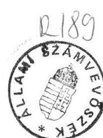

# 21lami sáanturhöséé 

## JELENTÉS

a Központi Földtani Hivatal és a földtani kutatások pénzügyi-gazdasági ellenôrzésérôl

---

Az ellenőrzést végezték:
Szíjártó Károly tanácsos
dr. Burján Margit számvevô
Hegyesné dr. Solymosi Mária számvevô

Az ellenőrzést vezette:
Rádfai Tibor fôtanácsos

---

# J e l e n t é s 

## a Központi Földtani Hivatal és a földtani kutatások pénzügyi-gazdasági ellenôrzésérôl

Az országos kutatási tevékenység irányításával, koordinálásával, és nem kis részben a konkrét kutatások elvégzésével kapcsolatos állami feladatokat az 52 fős (1990.) Központi Földtani Hivatal (KFH), és a felügyelete alá tartozó két intézmény, az 565 fős Magyar Állami Földtani Intézet (MÁFI) és a 772 fôt foglalkoztató Magyar Állami Eötvös Lóránd Geofizikai Intézet (MÁELGI) látta el.

Az eddigi szabályozásoknak megfelelően a KFH látta el a földtani kutatások felügyeletét, dolgozta ki a kutatások távlati és éves tervét, kezelte a kutatásokra fordítható költségvetési elöirányzatokat és irányította, ellenôrizte az ásványi nyersanyagmérlegek elkészítését, az ásványvagyon- gazdálkodási szabályok megtartását.

A KFH 1991-ig önálló költségvetési fejezetként müködött, azóta az Ipari és Kereskedelmi Minisztérium fejezeten belül címként szerepel az állami költségvetésben, de müködési területén továbbra is fejezet szintủ jogokat gyakorol és kötelezettségeket teljesít.

Földtani kutatásokkal foglalkoznak még egyetemek, kisvállalkozások és nem utolsó sorban a munkák meghatározó részét végző bányavállalatok.

Az ellenőrzés célja: az 1988-1990 közötti években földtani kutatásra fordított költségvetési előirányzatok felhasználásának értékelése volt törvényességi, célszerűségi és eredményességi szempontok alapján.

---

# I. Megállapítások 

## 1) A földtani kutatások állami feladatainak szabályozása és pénzügyi feltételei

A földtani kutatások finanszírozásában az állami költségvetés szerepe - az összegszerűen növekedő költségvetési támogatások ellenére - az ellenőrzött 1988-1990. években mérséklődött. Elsősorban azért, mert az előirányzatok nem ellensúlyozták a szabályozóváltozások és az infláció hatását.

Az ásványi nyersanyagok kutatási ráfordításai (3. sz. melléklet) 1986-1990 között - a szénhidrogének kutatására költött ( $26 \%$-kal) növekedő 5,9-7,7 milliárd Ft-tól eltekintve - abszolút összegben csökkentek.

## a) A földtani kutatás állami feladatainak meghatározása

Az általában nagy átfutási időt igénylő földtani kutatások csak hosszabb távra szóló koncepciók és tervek alapján folyhatnak. Ezek kidolgozásához megfelelő tudományos megalapozásra és alkalmazható új szabályozásokra lenne szükség. Az aktuális feladatok megvalósítása azonban még várat magára. Ez abban is érezteti hatását, hogy jelenleg az állami és a termelő szféra kutatási feladatai nincsenek egyértelműen elhatárolva. A szabályozások pedig változatlanul a központi tervgazdálkodás szempontjait, követelményeit tükrözik.

A földtani kutatás és a müködés feltételeit, szabályait az 1960 óta hatályos bányatörvény, valamint a fejezet feladatairól szóló 1013/1964. (V.4.) Korm. sz. határozat és a tervtörvény határozta meg. Ez a szabályozási rendszer és müködési mechanizmus - jóllehet merevsége különösen az utóbbi években jelentősen oldódott - hosszú ideje lényegében változatlan, elavult.

A kutatások finanszírozásának módjáról intézkedő (5052/1981. számú) ÁTB határozat szerint a költségvetési forrásokat (támogatás, kutatási alap) elsősorban alap- és előkutatásokra kell fordítani, míg a kutatások további fázisai vállalati alapok terhére valósulnak meg. Ezen túl a terveket és azok végrehajtását a törvényben rögzített — főleg a nyersanyagvagyon növelését célzó - kutatások motiválták.

A földtani kutatások finanszírozásának - a vonatkozó ÁTB határozattal megerősített - alapelve az volt, hogy a mérhető, konkrét gazdasági eredményt nem hozó, illetve a nagyobb kockázattal járó és ezért a vállalati szféra számára nem vonzó

---

alap- és előkutatások költségeit költségvetési forrásból célszerű fedezni. Ez a helyes elv azonban nem érvényesült maradéktalanul. Így az állami feladatnak minősülő, nagy költségigényű előkutatásokat a szénhidrogének esetében (évi 500-600 millió Ft) vállalati forrásokból - a költségek, illetve az adózatlan nyereség terhére finanszírozták. Ugyanakkor pl. az építőipari nyersanyagkutatást (évi 40-50 millió Ft) — a kutatási fázistól függetlenül — a költségvetés által finanszírozott kutatások körébe sorolta a határozat.

A feladat és a finanszírozási rend ezen ellentmondásai az állami feladatok újragondolását és egyértelmű meghatározását sürgetik.

Az elavult szabályozók új követelményekhez való igazítása - a korábbi felismerésnek megfelelően - csak az utóbbi hónapokban kezdődött el. (A KFH közreműködésével elkészült az új bányatörvény tervezete.)

# b) A tervezési és szervezeti rendszer 

A költségvetési pénzforrásokat kutatási témák, illetve kutatószervezetek között elsődlegesen a KFH által készített kutatási tervek alapján osztották el. Az ásványi nyersanyagkutatások azonban, többek között pl. az egységes energiapolitikai koncepció hiányában is, összehangolatlanok voltak (súlypontképzés hiánya, iparfejlesztési és alapkutatási célok ellentmondásai stb.).

A földtani kutatásokat az elmúlt évtizedekben központi (középtávú és éves) tervek alapján végezték. A tervezés rendszere azonban a tervgazdálkodás igényeihez igazodva alakult ki és a tervezés módszerei azóta sem változtak. Legfeljebb csak annyiban, hogy az egyeztetésre felkért tárcák, főhatóságok az utóbbi években már teljes érdektelenséget kifejezve, megjegyzés nélkül értettek egyet az elképzelésekkel. (Esetleg jelentéktelen módosításokat javasoltak.) A vizsgált időszakban -1988-1990 között, különösen 1990-ben - már oldódtak a korábbi merev tervegyeztetési mechanizmusok.

Az így elfogadott ötéves kutatási terv és költségkeret alapvetően behatárolta az éves terveket. A KFH 1988-1990. években semmiféle instrukciót, elképzelést nem közölt az éves tervek összeállításának szakmai vonatkozásairól. Évenként szinte változatlan szöveggel azt ajánlotta, hogy "a céljavaslatok alapját elsősorban a középtávú kutatási programok képezzék, de természetesen a változó társadalmi-gazdasági körülmények szükségessé tehetik egyes programok aktualizálását, esetleg új programok beindítását is."

---

Az elmúlt évek földtani kutatási terveinek (és tevékenységének) lényeges hibája az volt, hogy nem kaptak kellő súlyt a környezetvédelmi kutatások, illetve a beruházások földtani megalapozottsága sem volt megfelelő. Igaz, a döntést hozók nem is igényelték a kutatók közremúködését, a KFH és intézetei pedig nem voltak elég erősek szakmai véleményük érvényre juttatásához. A kutatási célokat, témákat és a felhasználható összegeket alapvetően bázisszemlélettel határozták meg, amihez a szakmai előkészítés kialakult mechanizmusa, a tárcaegyeztetések sem nyújtottak elfogadható alapot.

A KFH és intézeteinek költségvetési gazdálkodására lényegében az intézményfinanszírozás volt a jellemzô, jóllehet a rendelkezésre álló összegek nagy részét formailag feladatokhoz kapcsolva, szerződéses rendszerben osztották el. Általában a szervezethez rendelték a feladatokat és nem a feladathoz az erôforrásokat. A költségvetésből finanszírozott földtani alap- és elókutatásokról a KFH döntött és azokat zömmel a felügyelete alá tartozó Magyar Állami Földtani Intézetben (MÁFI) és a Magyar Állami Eötvös Lóránd Geofizikai Intézetben (MÁELGI) végeztette el. A tervek és a megkötött szerződések összegének egybevetése alapján a KFH irányító szerepe a tervezésben, a feladatok meghatározásában alig érhető nyomon. A kutatási programok radikális felülvizsgálatát, a pénzügyi lehetőségek és a kapacitások összehangolását csak 1991-ben kezdték meg. Korábban nem vállalták a leépítéssel együttjáró népszerütlen, de mindenképpen szükséges feladatok végrehajtását. (A MÁFI létszáma pl. 1988- ban 571, 1990-ben 565 fó, a csökkenés mindössze 6 fó volt.)

A fejezet támogatási növekményének $83 \%$-a pl. a két intézmény költségvetésébe épült be, a kutatási alap forrásául mindössze $17 \%$ szolgált, ami közvetett (szerzödéses) úton túlnyomórészt ugyancsak az intézményekhez került.

A MÁFI lényegében a KFH által finanszirozott feladatokból tartja fenn magát. A MÁELGI viszont külső szerződésekből jutott jelentősebb bevételekhez.

Az intézetek tervezésére alapvetően "a visszafelé tervezés" volt a jellemzô, azaz az intézet fenntartásának, várható költségeinek megfelelő értékủ feladatot terveztek. A KFH szintén ebből a szempontból kiindulva osztotta el a rendelkezésre álló összegeket, alapvetően ehhez rendelve a feladatokat.

Pl. a MÁELGI-nél a saját bevételek rendszeres alátervezése, az elóirányzatoknak a tényszámokhoz történő mechanikus igazítása volt a jellemzö. Így pl. 1990. évben a tervezettnél több mint háromszor nagyobb bevételt

---

ért el, miközben ezen belül költségvetési támogatása is több mint kétszeresre emelkedett.

A megváltozott körülményekhez alkalmazkodva 1991-ben — ötéves, illetve egyéb középtávú terv hiányában - egy kutatási programot állítottak össze, amelyben új hosszú távú programokat egyelőre - helyesen - nem kezdeményeztek. A nyersanyagkutatásoknál az alap- és előkutatások programjait szerepeltetik és a földtani kutatások eredményeinek szélesebb körű felhasználására törekednek.

A területi földtani szolgálatok jelenlegi szervezeti integritása, hatásköre, feladatai, finanszírozása számos anomália forrása. A MÁFI szervezetében önálló főosztályként tevékenykednek. Fenntartásukat részben költségvetési forrásból, maradványérdekelt megbízások keretében, részben eredményérdekelt kutatási szerződésekben kutatási alapból finanszírozzák.

A területi földtani szolgálatok helyzete ellentmondásos, mivel szervezetileg a MÁFI-hoz tartoznak - döntően alapkutatásokat végeznek -, de a KFH elsőfokú hatósági funkcióit is gyakorolják.

Éves beszámolóikban számot adnak a hatósági feladatok ellátásáról, a kapcsolatos állami megbízások elvégzéséről (tekintélyes számú határozathozatalról, véleményezésröl, bányabejárásról, ellenőrzésröl).

E szolgálatok pl. a KFH megbízásából is nagy számú építőanyagipari nyersanyagkutatási tervet, illetve jelentést véleményeztek, műszaki ellenőri feladatokat láttak el. Hatósági feladataikat - az érintett engedélyt kérő szervek részére - állami finanszírozással díjmentesen végzik.

# c) A földtani kutatások pénzforrásai 

Földtani kutatásokra az ellenőrzött három évben időarányosan összesen 16,4 milliárd Ft felhasználását tervezték. Ebből a KFH kutatási alap, mint költségvetési forrás, 1,5 milliárd Ft-ot ( $8 \%$-ot) tett ki. A tényleges felhasználás 17,8 milliárd Ft volt, 1,3 milliárd Ft-os ( $7 \%$-os) KFH részesedés mellett. A kutatási költségek fő forrásai tehát a vállalati alapok voltak. A felhasznált költségvetési pénzforrások nominálisan is több mint 200 millió Ft-tal alacsonyabbak voltak a középtávú előirányzatoknál. A reálérték változása a lehetőségek további csökkenését eredményezte.

---

A pénzforrások bizonyos kiegészitését jelentették az OTKA-tól, az OMFBtól és az IpM-tól általában speciális feladatok megoldására kapott kisebb összegek.

A költségvetési támogatások összege az elmúlt két évben ténylegesen 171 millió Ft-tal, ( $31 \%$-kal) emelkedett. Ez a növekmény - jóllehet mértéke jelentôs - nem volt elégséges a pénzforrások reálértékének szinten tartásához, ugyanis csupán az élőmunka (bér és főleg a tb-járulék) költségei több mint 150 millió Ft-tal nőttek, felemésztve a támogatási többlet közel $90 \%$-át.

A költségvetési támogatások kb. kétharmad részét az ún. kutatási alap, egyharmad részét az intézményi (KFH, MÁFI, MÁELGI) támogatások tették ki.

A KFH és intézményei 1988-1990. évi összesen 1,9 milliárd Ft költségvetési előirányzata (2. sz. melléklet) mellett földtani kutatási célokat szolgált a Geológiai Kutatási Alap (GKA) is, mely a vizsgált években csupán 102,1 millió Ft-tal járult hozzá a kutatási, illetve a kapcsolódó feladatok megoldásához. A GKA az intézetek befizetéseiből táplálkozik és az adott körülmények között a költségvetési bevételeknek egy lazán szabályozott és ellenőrzött területre való átcsoportosítását jelenti. Az újraelosztás ilyen gyakorlata célszerütlen, ugyanis az előirányzatok szabályos körülmények között nagyrészt ugyanoda kerültek vissza, ahonnan elvonták azokat.

A GKA müködésére vonatkozó jogszabály ugyanis nagyon lazán határozza meg az innen finanszírozható feladatok, célok körét. Ennek tulajdonítható, hogy a kutatások támogatása mellett kisebb-nagyobb összegekkel széles körben fedeztek ebből vitatható témákat.

A felhasznált összegek közel felét ( 50,7 millió Ft-ot) a geofizikai kutatások támogatására forditották. A földtani szolgálatok támogatása, bővítése címén 4,7 millió Ft-ot költöttek.

Emellett jelentősebb tételek voltak a MÁFI-labor felújítására ( 6,8 millió Ft), a bányászati húségjutalomra ( 6,3 millió Ft), másológép beszerzésére ( 3,5 millió Ft), külföldi utazásokra, nyelvtanulásra, folyóirat beszerzésre, könyvkiadásra, konferenciákra, kiállításra, jogi feladatok ellátására stb. fordított összegek. Ebből fedezték a KFH-nál és intézményeinél egy külföldi cég átal elvégzett vagyonértékelés ellenértékét is ( 3,9 millió Ft összegben). Az elkészült tanulmány hasznossága vitatható.

---

# 2) A kutatási pénzforrások felhasználása 

A hagyományos céllal megfogalmazott kutatási terveket az állami feladatok megfelelő körülhatárolása és új földtani koncepció nélkül állították össze. Ezért a kutatási ráfordítások - témacsoportok szerinti - szerkezetében nem történt az elmúlt években alapvető és korszerűbb irányba mutató változás.

## a) A kutatási ráfordítások alakulása, arányai

A kutatási ráfordítások (évente 402-430 millió Ft) fó arányaikban - a fejezet bevezetőjében említett okokból és az általában hosszú átfutású feladatokra is tekintettel - a vizsgált időszakban csak szerény elmozdulást jeleztek. Nagyobb hangsúlyt kaptak az alapkutatások, ezek aránya 48 -ról $51 \%$-ra nőtt. A regionális és alkalmazott földtani kutatásokra, a módszer- és múszerkutatásra tervezett keret kisebb mértékben emelkedett. Az ásványi nyersanyagkutatásra tervezett összegek aránya, az állami feladatok mérséklésének jegyében $42 \%$-ról $36 \%$-ra tovább csökkent.

Jelentősebb munkák voltak az elmúlt három év alatt pl. Magyarország földtani alapszelvény rendszere ( 35,5 millió Ft), Magyarország földtani atlaszának elkészitése ( 10,2 millió Ft), a Bükk-hegységben, a Kisalföldön, Zala megye stb. területén végzett regionális kutatások ( 164,3 millió Ft), hidrogeológiai kutatások a Dunántúli-középhegységben,- az ásványi nyersanyagvagyon felmérése, értékelése.

A törekvések között szerepelt - és erre jelentős összegeket fordítottak a koncesszióba adás (kutatás, kitermelés) feltételeinek kialakítása. A koncessziós törvény tárgyalása előtt kezdeményezték az intézetekre háruló feladatokkal kapcsolatos kutatásokat, s erre jelentős összegeket terveztek.

A kiadások, (kutatási ráfordítások) valójában alacsonyabbak voltak a méglegbeszámolóban kimutatott összegeknél. A KFH és intézetei ugyanis "szabad pénzeszközeik" egy részét átmenetileg értékpapírokba fektették, ami kiadási (illetve bevételi) forgalmukat növelte. E befektetéseknek a pénzforgalomra gyakorolt hatását kiszűrve a KFH gazdálkodása az eredeti előirányzatoknak megfelelő volt. A működési költségek az 1988. évi 20,0 millió Ft-ról 1990-re 31,0 millió Ft-ra emelkedtek, lényegében a bérköltségek és a tb-járulék növekedése miatt.

---

Az alap- és alkalmazott kutatások témacsoportja tíz témát foglal magában. Ezekre három év alatt 640 millió Ft-ot költöttek. A 2-3 \%-os aránynövekedés a regionális kutatásokkal, a nagyberuházások földtani előkészítésével és a meddőhányók vizsgálatával állt összefüggésben. A szorosan vett alapkutatásra, valamint a vízgazdálkodási előkutatásra eszközölt ráfordítások csökkentek. Az e célokra költött összeg 42 \%-át ( 270 millió Ft-ot) a regionális kutatások igényelték (pl. Bükk hegység előtereinek, a Kisalföld és Zala megye, a Dunántúli-középhegység több éve tartó kutatása), amelyek azország geológiai viszonyainak megismerését célozták.

A "végtermék" atlasz, térképek, tanulmány, kutatási zárójelentés stb. formában ölt testet. Hatékonyságuk közgazdasági megközelítéssel nem ítélhető meg.

A kutatási témákat illetően jelentősebb pozitív irányú változás az 1992. évi tervjavaslatokban érzékelhető.

Ásványi nyersanyagkutatásra három év alatt 492,5 millió Ft-ot fordítottak évenként csökkenő tendenciával. Ebbe a témacsoportba szénhidrogén, kőszén, bauxit, színesfém, ásványbányászati és építőipari nyersanyagok kutatása tartozik. A költségvetési ráfordítások szinte valamennyi anyagféleség tekintetében csökkentek. (Ásványi nyersanyagkutatásra költségvetésen kívüli forrásból fordítanak igen jelentős összegeket.)

A kutatási infrastruktúra fenntartására a központi kutatási alap $10 \%$-át, 131 millió Ft-ot fordítottak három év alatt, évenként növekvő tendenciával. Ebből finanszírozták többek között a gazdaságföldtani információs rendszer és geológiai oktatóbázis, a fúrási mintagyűjtemény, a központi dokumentáció stb. múködtetését, fenntartását. E költségek nagyságrendje felülvizsgálatot indokol. Többek között a könyvtár, az adattár kiadványainak, példányszámainak racionálisabb meghatározásával, érdeklődésre számot nem tartó kiadványok mellőzésével a költségek csökkentésére van lehetőség.

Az infrastruktúra és szolgáltatás keretében finanszírozzák a nemzetközi feladatokkal kapcsolatos költségeket is évi kb. 4,0-4,5 millió Ft összegben, nagyrészt piackutatási és expedíciós feladatok címszó alatt.

E tevékenységek, a volt KGST országokkal kialakított tudományos együttmüködés mellett sok formális elemet tartalmaztak (rendezvények, értekezletek stb.). Az 1990. évre pl. 58 rendezvényt terveztek 720 kiküldetési nappal.

---

A piackutatási tevékenység sem hozott számottevő eredményt. Az 1988. évi marokkói, jordániai, indiai, pakisztáni, az 1989. évi iraki, uruguai, kínai utazások értékelhető eredmények nélkül zárultak a legjobb esetben is csak szándéknyilatkozatokig jutottak el.

A kutatási támogatások felhasználásának arányaira - a célszerűséget és hatékonyságot egyaránt kedvezőtlenül befolyásolva - egy másik tendencia is jellemző volt. Az intézményi támogatások aránya ugyanis 1988. évi $27 \%$-ról 1990-re $40 \%$-ra nőtt.

A rendelkezésre álló pénzek hatékonyabb felhasználása céljából 1991-ben pályázati rendszert vezettek be. Az odaítélt 470 millió Ft $88 \%$-át a két saját intézet kapta, míg a fennmaradó 57 millió Ft jutott 28 külső pályázónak.

1988-1989. években az egyes intézetek nettó árbevételén belül kb. azonos volt az eredmény-, illetve a maradványérdekeltségű megbízások súlya, 1990ben azonban a maradványérdekeltségű feladatok aránya mindkét intézetnél számottevően megnőtt (MÁFI 16-ról $30 \%$-ra, MÁELGI 18-ról $30 \%$-ra).

Az eredményérdekeltségi rendszer fenntartásának létjogosultsága a MÁELGI- nél a vállalkozások csökkenése, a MÁFI-nál a tevékenység jellege és az elszámolások pontatlansága miatt erősen megkérdőjelezhető. Az intézményeknél a KFH által finanszírozott feladatok érdekeltségi rendszer szerinti megosztásáról konkrét előírások nem rendelkeznek. A rendező elv az, hogy az infrastruktúrális feladatokat és az alapkutatásokat maradványérdekeltségű rendszerben finanszírozzák.

A MÁFI-nál a KFH megbízások biztosították a bevételek meghatározó részét. Annál kirívóbb hiányosság, hogy a számviteli, elszámolási rend nem volt megfelelő, a mérleg valódisága kérdéses, adataik elemzésre alkalmatlanok voltak. 1991-ben belső vizsgálatot rendeltek el, intézkedési terv készítését és végrehajtását írták elő, melynek teljesítéséről az éves beszámolóban adnak számot.

Az intézeti profil a feladatok, de részben számviteli-kalkulációs elszámolási problémáik miatt is a MÁFI-nál az eredményérdekeltség alkalmazása még részlegesen sem tűnik indokoltnak. A MÁELGI-nél a tevékenységstruktúra és a közvetlenebb személyi érdekeltség következtében ez jobban betöltötte a rendszertől elvárt funkciókat.

A MÁFI a költségvetési támogatásaiból a maradványérdekeltségű összegeket 1988-1989. években jól elkülöníthetően a területi földtani szolgálatok, a központi dokumentáció és a nemzetközi feladatok ellátására kapta. Az 1990- 1991. években

---

pedig a földtani alapkutatási megbízásokat is ebbe az érdekeltségi körbe sorolták. A különböző érdekeltségi rendszerbe tartozó feladatok maradvány, illetve eredmény összegének valódiságát némileg megkérdőjelezi az intézetek költségelszámolási gyakorlata.

A MÁFI-nál pl. az utókalkulációs témalapok és a fơkönyvi könyvelés elszámolása nem egyezik. Az utókalkulációkban felvezetett plusz-mínusz összegek egy része a fơkönyvi könyvelésben nem található meg, illetve az ott nyilvántartott költségek a témalapokon nem szerepelnek.

A MÁELGI-nél az utókalkulációs elszámolás jobban, de korántsem hủen tükrözi a tényleges költségeket. Gazdálkodásukra jellemző, hogy a költségvetésből kapott összegeket a maradványérdekeltségủ témákra számolják el. Ebből azonban olyan anomáliák is adódhattak, mint pl. az 1989. évi utókalkulációs elszámolásoknál, amikor a maradványérdekeltségủ témákra 85, a KFH eredményérdekeltségủ témáira 39, a külső eredményérdekeltségủ feladatokra $33 \%$-os tb-járulékot számoltak el. Máskor, miután több téma költségeit gyüjtőszámon vezették, az egyik téma vesztesége mögött a más témák nyeresége húzódott meg a pontatlan költségelszámolás következtében (pl. Geoelektromos és Gravitációs Főosztály témaelszámolása).

A KFH és intézményei átlagos bérszínvonala alacsony. Az 1990. évben a KFH- nál 23, a MÁFI-nál 13, a MÁELGI-nél 18 ezer Ft/fő/hó adatok jellemezték az átlagos bérszínvonalat. Indokoltnak tartjuk felülvizsgálni azt a gyakorlatot, hogy belső foglalkoztatási gondok mellett olyan munkákat helyeznek ki külső vállalkozásba, melyek nagy részét saját dolgozóik végeznek el.

Így az intézeteknél több éve követett gyakorlat, hogy az egyes kutatómunkák elvégzésével a Magyarhoni Földtani Társulatot, illetve a Szerzői Jogvédő Hivatalt bizzák meg (1988-ban 3,0, 1989-ben 5,9, 1990-ben 2,1 millió Ft értékben). E munkákat külső szakértők mellett nem kis részben a megbízó kutatóintézetek dolgozói végezték el.

E "konstrukcióval" kedvező adózási feltételeket teremtve, lehetőséget adtak dolgozóik - egyébként igen alacsony - jövedelmének kiegészítésére. A szerződésekben kikötésként szerepel, hogy az elkészült munkát a két fél által közösen felkért független zsűribizottsággal kell elbíráltatni. Ennek a kikötésnek ritkán tesznek eleget, egyébként egy-egy szakvéleménnyel pótolják.

---

# b) A pénzforrások felhasználásának célszerűsége és hatékonysága 

A kutatási munkák elvégzésére a kutatási tervek és pénzügyi előirányzatok figyelembevételével kötöttek szerződéseket. A költségvetési támogatások a teljesítést követően jutottak el a kutatókhoz. Az intézményi támogatások egy részét is e szerződéses mechanizmus útján kapták a felhasználók.

A kutatások fő forrásának a KFH által kezelt — reálértékét tekintve egyre zsugorodó - központi kutatási alapnak a felhasználása a KFH és a kutató szervezetek között létrejött szerződések alapján történt. Így a költségvetési támogatások az intézeteknél már nem támogatásként, hanem ár- és díjbevételként jelentek meg. Ez a rendszer azonban — amint már említettük — lényegében csak "egy keretleosztást" helyettesített.

A szűkülő pénzügyi lehetőségek következtében a kutatóintézeteknél az utóbbi években megjelent foglalkoztatási gondokat tehát úgy igyekeztek enyhíteni, hogy az előirányzatokat egyre inkább a kutató szervezetek fenntartására osztották el. A szerződéses rendszer így a KFH és intézetei között formálissá és lényegében a pénz "felosztásának" eszközévé vált, sok bürokratikus elemmel. (A KFH 1990-ben pl. kb. 220 szerződést kötött GKA nélkül.) A szerződések egyébként általában megfeleltek a formai és tartalmi követelményeknek.

Található volt olyan szerződés is, ahol a szerződés tárgyát képező feladat meghatározása nem volt megfelelő (pl. 4915189 számú, a Magyarhoni Földtani Társulattal /MFT/ kötött szerződés /900 ezer Ft/). E szerződésben nincs meghatározva, hogy mi számít "kezdésnek", meddig kell folytatni a témát stb.

A vizsgált szerződésekben vállalt munkák, tanulmányok elkészültek, értékük hasznosságuk azonban közgazdasági megközelítéssel — mint már utaltunk rá — nem ítélhető meg.

A pénzeszközök hatékonyabb felhasználására irányuló törekvéseket jelzi a már említett 1991-ben bevezetett pályázati rendszer. A meghirdetett pályázatra mintegy 50 érdekelt jelentkezett (egyetemek, vállalatok, kisvállalkozók) és kb. 200 millió Ft értékủ - többségében ásványi nyersanyagkutatási - munkára tettek ajánlatot.

A költségvetési pénzeszközök felhasználása általában szabályszerűen történt. A kifizetéseket a kutatási szerződések teljesítése alapján eszközölték. Költségvetési

---

forrásokból — a vonatkozó előírásokat betartva — döntően alap-, illetve előkutatásokat végeztek.

Az elöirányzottnál többet csak regionális ( $130 \%$ ) és ásványbányászati nyersanyagok ( $127 \%$ ) kutatására költöttek, az összes többi témacsoport ráfordításai alacsonyabbak voltak ( $49-98 \%$ ) az elöirányzatnál.

A földtani kutatások költségvetési pénzforrásainak célszerủ felhasználását az elmúlt években - azon túl, hogy egy korszerű energetikai koncepció, bánya- és koncessziós törvény hiányában az állami feladatvállalás és így a kutatási célok sem voltak pontosíthatók — elsősorban az rontotta, hogy az előirányzatok csökkenő reálértékére nem a programok felülvizsgálatával, a szervezetek és munkaerőgazdálkodás racionalizálásával reagáltak, hanem az adott szervezeti struktúrát fenntartva, a meglévő létszám foglalkoztatására törekedtek (MÁFI). A létszám csökkentését 1991-ben megkezdték, ami 1992-ben folytatódik, mértéke várhatóan 30-35 \%-os lesz.

Az ásványi nyersanyagkutatások - költségeit döntően a vállalati szféra fedezi — számottevő eredményeket hoztak, de több nyersanyag tekintetében nem tudták pótolni a termelés és főleg az átminősítések miatt bekövetkezett vagyoncsökkenést (szénhidrogének, bauxit).
3) A KFH hatósági feladatainak ellátása és a vállalati kutatások néhány problémája

Földtani kutatásokról a KFH 1988-ban 28, 1989-ben 21, 1990-ben 25 határozatot adott ki. Az állásfoglalások egy része a kutatási jelentések több hiányosságát tárta fel, határozatot csak pótlólagos kutatások, adatszolgáltatások után adtak ki.

A földtani kutatást végző szervek előírt adatszolgáltatási kötelezettségeiknek eleget tettek. A vállalatok azonban sok - részben állami pénzből finanszírozott kutatásokból nyert - olyan értékes információt is gyűjtöttek, tárolnak, amelyek nem tartoznak adatszolgáltatási kötelezettség alá.

Az átalakulások, privatizációk során ezek az értékes adatok megsemmisülhetnek, vagy kikerülhetnek az állami felügyelet alól. Újbóli beszerzésük súlyos összegekbe kerülhet. Mielőbbi szabályozást tartunk szükségesnek a vállalatoknál tárolt földtani információk további sorsának megnyugtató rendezéséről.

---

A hatósági feladatok ellátásának színvonalát más esetekben is javítani kell. Az állami (KFH) felügyelet hiányosságai ugyanis több vállalati kutatásnak minősített, valójában nemzetgazdasági kárt (is) eredményező döntésnél kimutathatók voltak.

Az 1986-1990-es évekre - egy korábbi szénhidrogén prognózis alapján kidolgozott kutatási tervben - 28 millió tonna szénhidrogén-egyenértéknek ( 1000 m 3 földgáz $=1$ tonna kőolaj) megfelelő vagyonnövekménnyel számoltak. Ennek felét, 14 millió tonnát, a Petróleum Projekt I. nevü, 1984-ben indított program megvalósításával szándékoztak realizálni. Ehhez az OKGT 11 nagymélységü kutatófúrás mélyitését ígérte. Ezek adatainak elemzése, értékelése útján jutottak volna el a várt vagyonnövekményhez. A projekthez 90 millió dollár összegủ világbanki hitelt vettek fel. (Ebből feltáró, fúró és termelőberendezés 42 millió dollár.)

Az elvégzett fúrások közül azonban mindössze 4 db érte el a "nagymélységü" minősitést (4500-6000 métert), a többi mély- (3000-4500 méter), illetve középmély (1500-3000 méter) fúrásnak minősült. A programban kitüzött célokat, (vagyonnövekmény) a külföldi szakértők aktív közremüködésével sem sikerült elérni. Haszna legfeljebb az volt, hogy a fúrások révén az ország földtani szerkezetére vonatkozó újabb adatok váltak ismertté.

A hatályos bányatörvény 13. par. (1) bekezdése értelmében a kutatási programot a Központi Földtani Hivatalhoz fel kellett volna terjeszteni jóváhagyás céljából. Az OKGT a felterjesztést elmulasztotta, sőt a továbbiakban a KFH két, — tájékoztatási kötelezettséget előiró - határozatának sem tett eleget (1924/1987. számú és a 235/1989, számú KFH határozatok). A felterjesztés elmulasztásával az OKGT kizárta a kutatási téma szakmai vitájának, és ezzel a kockázat csökkentésének, a károk megelőzésének lehetőségét is. Hibát követett el a KFH is, ugyanis az OKGT 1987-tól folyamatosan szolgáltatott adatokat a program keretében folytatott munkálatokról, de a Hivatal az információk birtokában sem kezdeményezett alapos ellenőrzést.

# II. Következtetések és javaslatok 

A földtani kutatások tervezése az elmúlt évtizedekben alig változott és 1990-ig lényegében változatlanul a tervgazdálkodás igényeihez igazodó központi elképzelések alapján folyt. Mára úgy a szabályozási rendszer, mint a müködés mechanizmusa elavult. Hiányoznak a tudományosan megalapozott hosszú távú energia- és kutatáspolitikai koncepciók, a tevékenységet szabályozó új bányatörvény. Ennek

---

következménye, hogy nem különülnek el egyérterműen az állam és a termelő szféra kutatási területei, feladatai, nem behatárolt az állami feladatvállalás, illetve annak finanszírozási mechanizmusa. Nincsenek még új módszerek az állami földtani vagyon hasznosítására, ugyanakkor az állam ellenőrzési jogkörének érvényesítésére sem a kutatásban, sem a kitermelésben.

Az utóbbi években folytatott ásványi nyersanyagkutatások nem tudták ellensúlyozni a kitermelés miatti vagyoncsökkenést. A gazdaságosan kitermelhető kőolaj- és földgázvagyon (ipari vagyon) egyaránt csökkent. A kőolajvagyon a múlt évi kitermelési szint mellett 11 évi, a földgázvagyon 17 évi termelésre nyújt fedezetet. A földgáz esetében az ellátottság kis mértékben javult ugyan, de ez elsősorban a termelési volumen csökkenésének következménye. Gazdaságosan kitermelhető jelentősebb tartalékaink kőszenekből és lignitből, bauxitból, egyes ásványbányászati és építőipari nyersanyagokból vannak.

Földtani kutatásokra az elmúlt három év alatt döntően vállalati forrásokból 18,5 milliárd Ft-ot fordítottak. Az összes ráfordítás $10 \%$-a, 1,9 milliárd Ft - évenként növekvő 547-719 millió Ft - származott az állami költségvetésből.

A központi költségvetési ráfordítások a geológiai és geofizikai alap- és előkutatások, valamint a kutatási infrastruktúra fenntartását fedezték. Ezen kutatások hatékonysága közgazdasági mércék alapján azonban nem ítélhetők meg. A kutatási ráfordítások témacsoportok szerinti szerkezetében sem történt alapvető változás. Várható, hogy az új kutatási tematika, folyamatban lévő radikális átalakulás a pénzeszközök hatékonyabb felhasználását eredményezi.

A nominálisan növekvő, de reálértékben csökkenő költségvetési pénzforrásokat a meglévő intézményi struktúrák fenntartásának jegyében használták fel, jellemzően intézményfinanszírozás módszerével, jóllehet a rendelkezésre álló pénzek nagyrészt feladatokhoz kapcsolva, szerződések útján jutottak el a kutatóintézetekhez. Ez utóbbi viszont a pénzellátásnak csak egy formális eszközét jelentette.

A kutatási célok sajátos - a költségvetési pénzforrásokkal átfedő, párhuzamos finanszírozását szolgálja a Geológiai Kutatási Alap, amelynek forrása az intézmények befizetéséből származik. szabályozása nem megfelelő, ennek tulajdonítható, hogy az Alapból nem csak kutatásokat finanszíroztak.

Az intézmények gazdálkodásának belső szabályozása nem megfelelő, ami elsősorban a számviteli nyilvántartások hiányosságában jelenik meg, ezen belül pontosítani szükséges a maradvány- és eredményérdekeltségű tevékenységek elszámolásának

---

rendjét is. A KFH-nál és intézményeinél a zsugorodó pénzforrások, valamint a változatlan szervezeti struktúra és az alig változó létszám következtében a bérszínvonal igen alacsony. Ennek ellenére nem lehet egyetérteni azzal a gyakorlattal, hogy saját dolgozóikat intézeti munkákkal megbízva, de külső szervek beiktatásával juttatták kereseti lehetőségekhez.

A szervezeti rend átalakításának szükségességét a felügyeleti szerv felismerte, az átszervezés folyamatban van. Az elképzelések szerint a KFH - indokoltan megszűnik, helyette Magyar Geológiai Szolgálat néven új szervezet jönne létre. A lényegében középirányító szervként múködő újabb szervezet létesítése azonban vitatható még akkor is, ha a feladatköre más lenne, mint elődjéé. Szervezeti módosításokat igényelnek a területi földtani szolgálatok is, ellentmondásos hatáskörük és feladatuk miatt.

A vizsgálat során szerzett tapasztalatok alapján a következőket javasoljuk:

1. A folyamatban lévő kutatásokat felül kell vizsgálni. Ezt szükséges lenne kiterjeszteni az ország összes földtani kutatással foglalkozó, illetve rokon területeken múködő állami szervezetére, ezek feladat- és kapcsolatrendszerére. Szükséges egy új, hosszabb távra szóló kutatáspolitikai koncepció kidolgozása is. Ezt azonban meg kell, hogy előzze az energiapolitikai koncepció elfogadása.
2. A felülvizsgálat alapján egyértelműen meg kell határozni a földtannal, a föld kincseivel, azok felkutatásával, kitermelésével, hasznosításával összefüggő nemzetgazdasági érdekeket, az ezekkel kapcsolatos állami - így az állami költségvetésből finanszírozandó - feladatokat.

- A megoldandó egyik legfőbb feladat az ásványvagyon-hasznosítás új módszereinek kidolgozása, az új működési rend kialakítása, új bányatörvény megalkotása.
- Az ásványvagyon értékelése, a hasznosítás módjának meghatározása (pl. koncessziók), valamint a kutatás és kitermelés ellenőrzése állami feladat legyen.

3. Folytatni, illetve gyorsítani kell az ásványi nyersanyagvagyon újraértékelését, különös súlyt helyezve az egyes lelőhelyekre vonatkozó konkrét információk körének célszerű bővítésére, a privatizáció elősegítése érdekében.

---

4. A privatizációval és az ásványvagyon értékesítésével kapcsolatos feladatok elvégzését — jóllehet speciális vagyonról van szó - az Állami Vagyonügynökség hatáskörébe javasoljuk utalni. Erre a célra külön szervezet (Ásványvagyon Ügynökség) létrehozását nem javasoljuk.
5. Az új szervezeti rendszer kialakítása során - a KFH jelenlegi keretein kívül működő szakmai szervezetekkel is számolva - létrehozandók az állami feladatok végrehajtását, koordinálását és ellenőrzését végző szervezetek közvetlen minisztériumi alárendeltségben.

- Célszerűnek látszik a vállalkozási tevékenységek állami feladatoktól való egyértelmű elhatárolása. A MÁELGI tevékenysége pl. teljesítményei és a működését meghatározó közgazdasági környezet alapján inkább illeszthető lenne a vállalati szférába. Ár- és díjbevételeinek 60-70 \%-a a KFH megbízásokon kívüli vállalkozásokból származott.
- A hatósági feladatok a kutatóintézeti szférából kerüljenek át az államigazgatási (minisztériumi) szervek hatáskörébe.
- A szükséges, de a versenyszféra számára nem vonzó kutatási, mindenekelőtt a természet védelmével kapcsolatos teendőket az állami feladatok közé sorolandónak tartjuk.

6. Át kell alakítani a finanszírozási rendszert. Ezt alapos szakmai (kutatási) tervekkel indokolt alátámasztani. Növelni kell az intézetek önállóságát és felelősségét úgy, hogy a költségvetési forrásokból fedezett kutatási feladatok végrehajtását és eredményeit rendszeresen számon kell kérni.
7. A Geológiai Kutatási Alapot meg kell szüntetni.
8. A gazdálkodás célszerűségét, a takarékosságot javítani indokolt.

- Racionalizálni kell a munkaerőgazdálkodást, amit a kedvezőtlen létszámarányok (kutató-kiszogáló) és a kialakult kereseti viszonyok egyaránt sürgetnek.
- Az infrastruktúra (könyvtár, dokumentáció stb.) és különösen a nemzetközi feladatok költségeinek felülvizsgálatát (differenciált csökkentését) és egy új gazdálkodási rendszer kialakítását szükségesnek tartjuk.

---

- Felül kell vizsgálni a különböző munkák intézeteken kívüli kihelyezésének gyakorlatát (MFT, Szerzői Jogvédő Hivatal), a saját dolgozók külső szerveknél történő foglalkoztatását.

9. Ki kell alakítani a hatósági feladatokat végző területi földtani szolgálatok múködésének új rendjét, fel kell oldani a — jelenleg a MÁFI keretében működő — részlegek tevékenységével kapcsolatos szervezeti és jogi ellentmondásokat.
10.A MÁFI-nál a folyamatban lévő belső vizsgálat alapján meg kell tenni a szükséges intézkedéseket a számviteli, elszámolási rend helyreállítására, a mérlegvalódiság feltételeinek megteremtésére.

Budapest, 1992. február
Melléklet: 3 lap

---

Az ásványvagyon alakulása 1986-1990. (fontosabb ásvánvi nyersanyagok) (áv végi készletek)

|  Gazdaságosan kitermelhetó (ipari) vagyon millió tonna |  |  |  |  | Termelés |  |  |  | Statisztikai ellátottság vagyon/termelés év |  |   |
| --- | --- | --- | --- | --- | --- | --- | --- | --- | --- | --- | --- |
|   |  |  |  |  |  |  |  |  |  |  | 1986.  |
|   | 1986. |  | 1988. | 1990. | 1986 | 1988. | 1990. | 1986. | 1988. | 1990. |   |
|  |   |   |   |   |   |   |   |   |   |   |   |
|  Szénhidrogének: |  |  |  |  |  |  |  |  |  |  |   |
|  kőolaj | 36.5 | 30.2 | 26.4 | 21.5 | 2.0 | 1.9 | 1.9 | 15 | 13 | 11 |   |
|  földgáz* | 131.7 | 110.7 | 98.4 | 89.3 | 7.3 | 6.5 | 5.1 | 15 | 15 | 17 |   |
|  Eöszenek: feketeszén | 661.5 | 537.0 | 516.1 | 502.7 | 2.7 | 2.6 | 2.0 | 100 | 100 | 100 | 100  |
|  barnakőszén | 988.0 | 844.7 | 928.9 | 905.6 | 15.5 | 14.5 | 11.5 | 54 | 64 | 79 |   |
|  lignit | 2885.2 | 2862.7 | 2850.0 | 2786.4 | 6.0 | 4.9 | 5.0 | 100 | 100 | 100 | 100  |
|  Sauxit | 88.0 | 79.2 | 70.9 | 60.3 | 3.0 | 2.9 | 2.6 | 26 | 24 | 23 |   |
|  Színes fénérceks:részerc | 170.7 | 159.3 | 159.7 | 159.7 | - | - | - | - | - | - |   |
|  olom-cink | 24.7 | 37.2 | 37.2 | 37.2 | - | - | - | - | - | - |   |
|  Asványbány.ny.anyagok |  | 1084.8 | 1156.7 | 1156.7 | 5.7 | 4.9 | 3.5 | 100 | 100 | 100 |   |
|  Cementipari ny.anyagok |  | 2602.0 | 1965.6 | 1973.4 | 8.2 | 8.7 | 7.8 | 100 | 100 | 100 |   |
|  Homok-kavics |  | 988.4 | 935.8 | 1106.3 | 32.5 | 36.9 | 27.6 | 30 | 25 | 40 |   |
|  Uránéres* |  |  |  | 9.6 |  |  | 0.7 |  |  | 14 |   |

- 1000 m3 földgáz = 1 tonna kőolaj ** 1989. évi adatok. EFH előírás szerinti minősítés zég nem történt, a korábbi évek adatai azok titkossága miatt az ásványvagyon-mérlegben nem szerepeltek.

---

Bevételek és kiadások alakulása

|  |  |  |  |  |  |  |  | Millió Ft-ban |  |
| :--: | :--: | :--: | :--: | :--: | :--: | :--: | :--: | :--: | :--: |
|  |  |  |  |  |  |  |  |  | MÁKLGI |
|  | 1988 | 1989 | 1990 | 1988 | 1989 | 1990 | 1988 | 1989 | 1990 |
| Bevételek: |  |  |  |  |  |  |  |  |  |
| Kredeti elöirányzat | 428.1 | 460.0 | 458.0 | 205.0 | 234.7 | 301.0 | 543.3 | 691.0 | 604.1 |
| Módosított elöirányzat | 429.7 | 588.0 | 475.8 | 314.8 | 318.1 | 496.3 | 1095.3 | 1052.4 | 1124.3 |
| Tényleges elöirányzat | 429.8 | 594.3 | 547.3 | 310.9 | 347.8 | 511.2 | 1168.0 | 1052.4 | 2146.0 |
| Ebböl: |  |  |  |  |  |  |  |  |  |
| mük.-i.ár és dijbevételek | 0.6 | 2.4 | 10.7 | 151.7 | 220.0 | 303.0 | 806.4 | 714.8 | 785.1 |
| költségvetési támogatás | 427.6 | 455.4 | 457.3 | 39.2 | 57.3 | 89.9 | 80.6 | 107.2 | 171.3 |
| egyéb bevételek | 1.6 | 136.5 | 79.3 | 120.0 | 70.5 | 118.3 | 281.0 | 230.4 | 1189.6 |
| Kiadások: |  |  |  |  |  |  |  |  |  |
| Kredeti elöirányzat | 428.1 | 460.0 | 458.1 | 205.0 | 234.7 | 301.0 | 543.3 | 691.0 | 768.7 |
| Módosított elöirányzat | 429.7 | 588.0 | 475.8 | 314.8 | 318.1 | 496.3 | 1095.3 | 1052.4 | 1124.3 |
| Tényleges elöirányzat | 425.4 | 581.1 | 530.7 | 277.5 | 279.8 | 494.9 | 1119.0 | 1005.5 | 2085.6 |
| Ebböl: |  |  |  |  |  |  |  |  |  |
| müködési kiadások | 421.5 | 453.8 | 463.4 | 205.3 | 230.7 | 396.2 | 739.6 | 714.8 | 734.2 |
| egyéb kiadások | 3.9 | 127.3 | 67.3 | 72.2 | 49.1 | 98.7 | 379.4 | 290.2 | 1351.4 |
| Müködési kiadások részletezése: |  |  |  |  |  |  |  |  |  |
| Készletbeszerzés | 0.6 | 0.8 | 0.7 | 16.9 | 20.2 | 23.2 | 355.8 | 247.3 | 255.4 |
| Béralap | 10.2 | 11.7 | 14.5 | 75.1 | 77.2 | 90.0 | 150.0 | 173.3 | 167.6 |
| Anyagjellegú kiadások | 3.5 | 2.7 | 1.5 | 51.7 | 56.1 | 59.6 | 64.0 | 53.2 | 78.9 |
| Bérjellegú kiadások | 0.3 | 3.5 | 3.3 | 8.7 | 7.0 | 14.8 | 50.2 | 37.7 | 49.5 |
| Szolgáltatások | 405.9 | 429.3 | 435.7 | 30.4 | 26.1 | 149.2 | 97.5 | 108.9 | 74.0 |
| Ktgvetési befizetés | 1.0 | 5.7 | 7.0 | 8.1 | 32.2 | 52.8 | 16.2 | 86.4 | 103.3 |
| Egyéb | 0.0 | 0.1 | 0.7 | 14.4 | 11.9 | 6.6 | 5.9 | 8.0 | 5.5 |
| összesen: | 421.5 | 453.8 | 463.4 | 205.3 | 230.7 | 396.2 | 739.6 | 714.8 | 734.2 |
| Egyéb kiadások részletezése: |  |  |  |  |  |  |  |  |  |
| Fejlesztési kiadások | 0.2 | 0.2 | 0.8 | 12.9 | 5.2 | 23.3 | 76.3 | 31.5 | 45.8 |
| AFA | 3.6 | 3.6 | 6.5 | 29.9 | 28.8 | 27.3 | 104.9 | 101.8 | 94.3 |
| Atadott pénzeszközök | 0.1 | 123.5 | 60.0 | 1.2 | 0.0 | 40.0 | 2.0 | 29.1 | 1130.8 |
| Elvonások | 0.0 | 0.0 | 0.0 | 28.2 | 15.1 | 8.1 | 105.2 | 29.5 | 18.0 |
| Hitel visszafizetés | 0.0 | 0.0 | 0.0 | 0.0 | 0.0 | 0.0 | 91.0 | 98.5 | 62.5 |
| összesen: | 3.9 | 127.3 | 67.3 | 72.2 | 49.1 | 98.7 | 379.4 | 290.4 | 1351.4 |
| Bevételek-kiadások különbsége: | 4.4 | 13.2 | 16.6 | 33.2 | 68.0 | 16.3 | 49.0 | 46.4 | 60.4 |

---

Az ásványi nyersanyagkutatási ráfordítások alakulása 1986-1990.

|  | 1986. |  | 1987. |  | 1988. |  | 1989. |  | 1990. |  |
| :--: | :--: | :--: | :--: | :--: | :--: | :--: | :--: | :--: | :--: | :--: |
|  |  |  |  | MFt |  | MFt |  | MFt |  | MFt |
| Szénhidrogének | 382,6 | 5879,1 | 383,0 | 6278,8 | 333,7 | 6485,8 | 284,8 | 7843,7 | 172,7 | 7698,3 |
| Feketeköszén | 103,3 | 28,4 | 95,1 | 36,2 | 66,2 | 34,9 | 54,2 | 31,4 | 41,0 | 27,4 |
| Barnaköszén | 138,6 | 332,1 | 149,3 | 297,3 | 107,6 | 223,1 | 110,9 | 257,4 | 36,2 | 225,3 |
| Lignit | 18,9 | 45,3 | 9,1 | 24,7 | 5,8 | 15,3 | 4,9 | 8,6 | 1,2 | 4,8 |
| Szén összesen: | 260,8 | 405,8 | 253,5 | 358,2 | 179,6 | 273,3 | 170,0 | 297,4 | 138,4 | 257,5 |

Bauxit $\quad 174,3 \quad 407,8 \quad 174,8 \quad 379,0 \quad 183,4 \quad 437,2 \quad 185,3 \quad 600,7 \quad 133,1 \quad 568,7$

Színes fénércek $\quad 2,7 \quad 28,1 \quad-\quad 13,9 \quad-\quad 10,4 \quad-\quad 11,1 \quad-\quad 12,8$
Fekete - " - $\quad 0,7 \quad 4,0 \quad 0,8 \quad 3,5 \quad 0,1 \quad 0,8 \quad 0,1 \quad 0,8 \quad 0,1 \quad 0,3$
Uránérc: . . . . 140,0 78,3 - -

Asvány bány.nyers. anyagok

| 11,0 | 33,9 | 6,6 | 33,8 | 11,0 | 33,9 | 7,9 | 22,0 | 3,9 | 22,4 |
| :-- | :-- | :-- | :-- | :-- | :-- | :-- | :-- | :-- | :-- |

Spitóipari nyers. anyagok

| 44,6 | 71,9 | 40,5 | 53,5 | 40,0 | 50,4 | 35,4 | 59,3 | 30,3 | 63,9 |
| :-- | :-- | :-- | :-- | :-- | :-- | :-- | :-- | :-- | :-- |

Oszesen: 876,7 6830,6 859,2 7120,7 747,8 7291,8 823,5 8913,3 478,5 8623,9

Oszesenból terzeléssel összefüggő (bányászati) Szabadterületi kutatás

| 451,0 | 1986,7 | 466,9 | 2218,2 | 387,7 | 2422,6 | 479,9 | 3014,4 | 233,0 | 2581,3 |
| :-- | :-- | :-- | :-- | :-- | :-- | :-- | :-- | :-- | :-- |
| 425,7 | 4843,9 | 392,3 | 4902,5 | 360,1 | 4869,2 | 343,6 | 5898,9 | 245,5 | 6042,6 |