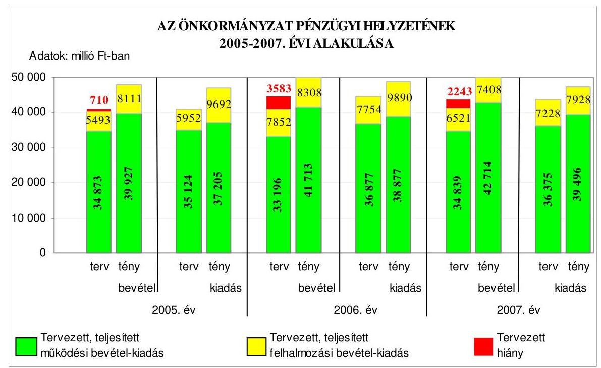
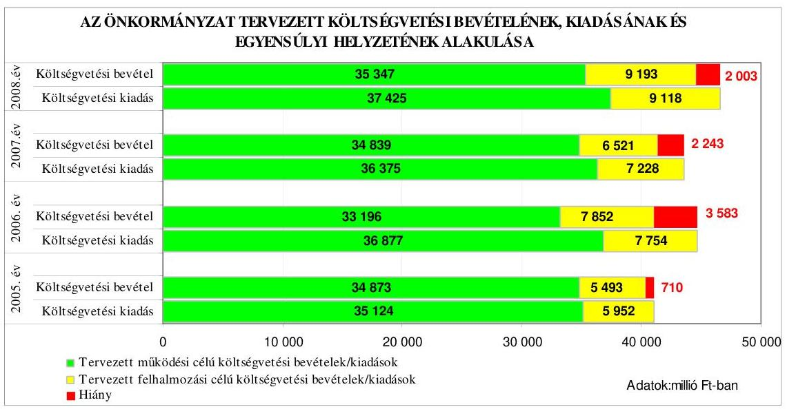
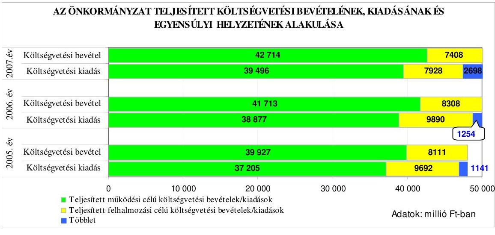
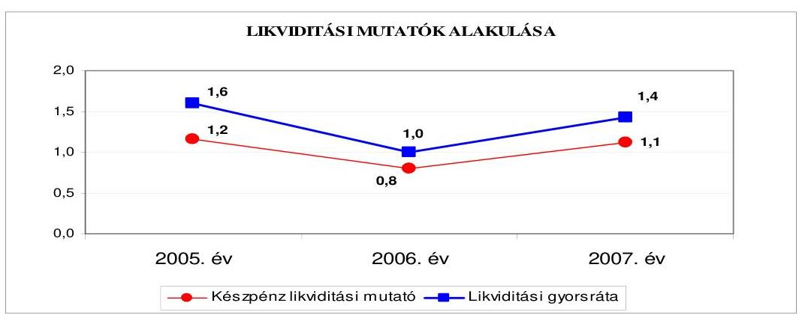
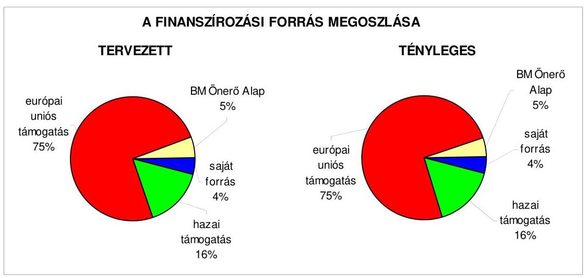
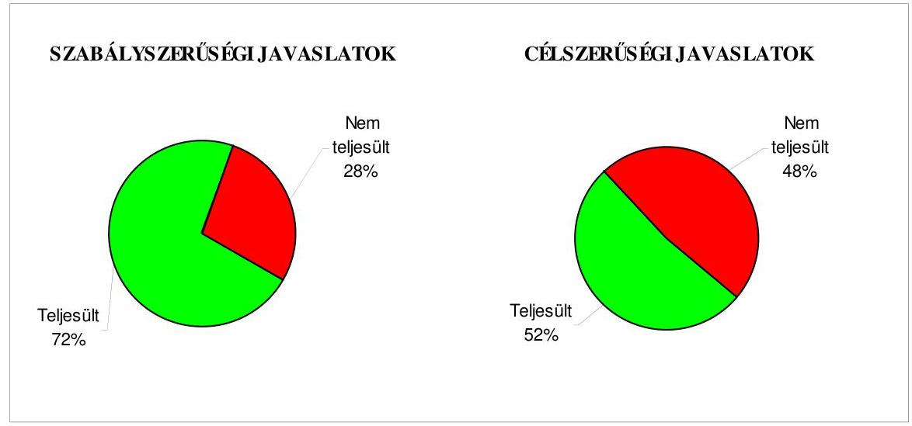
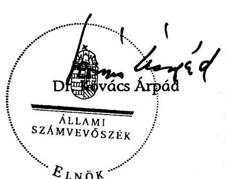
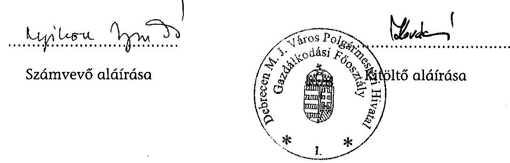
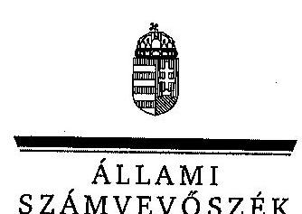
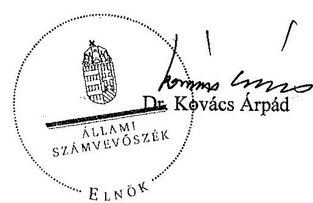

# JELENTÉS 

Debrecen Megyei Jogú Város Önkormányzata gazdálkodási rendszerének 2008. évi ellenőrzéséről

---

3. Önkormányzati és Területi Ellenőrzési Igazgatóság
3.3. Átfogó Ellenőrzések Főcsoport
Iktatószám: V-3003-6/22/19/2008.
Témaszám: 898
Vizsgálat-azonosító szám: V0387
Az ellenőrzést felügyelte:
Dr. Lóránt Zoltán
főigazgató
Az ellenőrzés végrehajtásáért felelős:
Dr. Sepsey Tamás
főigazgató-helyettes
Az ellenőrzést vezette:
Gyüre Lajosné
számvevő tanácsos
Az ellenőrzést végezték:
Hegyes Mária
Fórián Erika
Nyikon Zsigmondné
számvevő tanácsos
számvevő tanácsos
A témához kapcsolódó eddig készített számvevőszéki jelentések:
címe
sorszáma
Jelentés Debrecen Megyei Jogú Város Önkormányzata gazdálkodásának átfogó ellenőrzéséről 0355
Jelentés a települési önkormányzatok szennyvízközmű fejlesztési és ..... 0416
működtetési feladatai ellátásának vizsgálatáról
Jelentés a helyi és a helyi kisebbségi önkormányzatok gazdálkodásának átfogó ellenőrzéséről ..... 0436
Jelentés a köztemetők fenntartásának ellenőrzéséről ..... 0504
Jelentés a helyi önkormányzatok - kiemelten a gyógyfürdők - ..... 0536
helyzete, fejlesztésének lehetőségei, hatása az idegenforgalomra és
a turizmusra
Jelentés a Magyar Köztársaság 2004. évi költségvetése végrehajtásának ellenőrzéséről ..... 0540
Függelék:

- a helyi önkormányzatokat a 2004. évben megillető normatív állami hozzájárulás elszámolásának ellenőrzése
- a kötött felhasználású támogatások 2004. évi felhasználásának ellenőrzése
Jelentés az egészségügyi szakellátások privatizációjának ellenőrzéséről ..... 0609
Jelentés a középiskolai kollégiumok fenntartásának és fejlesztésének ellenőrzéséről ..... 0614

---

Jelentés a Magyar Köztársaság 2005. évi költségvetése végrehajtásának ellenőrzéséről
Függelék:

- a helyi önkormányzatokat a 2005. évben megillető normatív hozzájárulás igénylésének és elszámolásának ellenőrzése
- a kötött felhasználású támogatások 2005. évi felhasználásának ellenőrzése
Jelentés az önkormányzati út- és szennyvízcsatorna beruházásokhoz 2002-2005. években igénybe vett közműfejlesztési támogatások igénylésének és felhasználásának ellenőrzéséről 0639
Jelentés a közmunkaprogramok támogatására fordított pénzeszközök hasznosulásának ellenőrzéséről

---

# TARTALOMJEGYZÉK 

BEVEZETÉS ..... 9
I. ÖSSZEGZŐ MEGÁLLAPÍTÁSOK, KÖVETKEZTETÉSEK, JAVASLATOK ..... 13
II. RÉSZLETES MEGÁLLAPÍTÁSOK ..... 21

1. Az Önkormányzat költségvetési és pénzügyi helyzete ..... 21
1.1. A tervezett és teljesített költségvetési bevételek és kiadások alapján a költségvetési és a pénzügyi egyensúly alakulása, valamint a költségvetési hiány megállapításának szabályszerűsége ..... 21
1.2. A költségvetési és a pénzügyi egyensúlyi helyzet kialakításához tervezett és teljesített finanszírozási célú pénzügyi műveletek módja és azok hatása a tárgyévet követő évek költségvetéseire ..... 23
1.3. A költségvetés tervezésének megalapozottsága ..... 30
2. Az Önkormányzat felkészültsége az európai uniós források igénylésére és felhasználására, valamint az elektronikus közigazgatási feladatok ellátására ..... 33
2.1. Az európai uniós források igénybevételére és a várható támogatás felhasználására történt felkészülés szabályozottsága, szervezettsége ..... 33
2.1.1. Az európai uniós forrásokra történő pályázatok benyújtására vonatkozó döntések összhangja a fejlesztési célkitűzésekkel ..... 33
2.1.2. Az európai uniós forrásokhoz kapcsolódóan a pályázatfigyelés, a pályázatkészítés, valamint az európai uniós támogatással megvalósuló fejlesztés lebonyolításának belső rendjének szabályozottsága, a végrehajtás személyi, szervezeti feltételei ..... 37
2.1.3. A fejlesztési feladat lebonyolításánál a feladatellátás rendjére, az ellenőrzési feladatok teljesítésére, valamint a felelősségi szabályokra vonatkozó előírások betartása ..... 38
2.2. Az elektronikus közigazgatási feladatok ellátása, a közérdekű adatok elektronikus közzététele ..... 42
3. A költségvetési gazdálkodás belső kontrolljai ..... 44
3.1. A szabályozottság kockázata a költségvetés tervezési, gazdálkodási, beszámolási és a folyamatba épített, előzetes és utólagos vezetői ellenőrzési feladatoknál ..... 44
3.2. A belső kontrollok érvényesülése az önkormányzati források szabályszerű felhasználásában, a költségvetési tervezés, gazdálkodás, beszámolás folyamataiban ..... 45
3.3. A belső ellenőrzési kötelezettség teljesítése, javaslatainak hasznosulása ..... 49

---

4. Az ÁSZ korábbi ellenőrzési javaslatai alapján készített intézkedési terv végrehajtása, eredményessége ..... 53
4.1. Az Önkormányzat gazdálkodási rendszerének átfogó ellenőrzése során tett javaslatok végrehajtására tervezett intézkedések megvalósulása ..... 53
4.2. A zárszámadáshoz kapcsolódó (állami hozzájárulások, támogatások igénylésének és felhasználásának ellenőrzése), valamint a további vizsgálatok esetében a megállapítások, javaslatok alapján tett intézkedések ..... 57
MELLÉKLETEK
5. számú Az Önkormányzat gazdálkodását meghatározó adatok, mutatószámok (1 oldal)
6. számú Az önkormányzati vagyon alakulása (1 oldal)
7. számú Az Önkormányzat 2005-2008. évi költségvetési előirányzatainak és a 2005-2007. évi pénzügyi teljesítéseinek alakulása (1 oldal)
8. számú Tanúsítvány az európai uniós forrásokkal támogatott programok, célok tervezett és tényleges 2005-2008. évi adatairól (1 oldal)
9. számú Adatlap az Önkormányzat európai uniós forrással támogatott fejlesztéséről (4 oldal)
10. számú Kósa Lajos úr, Debrecen Megyei Jogú Város Önkormányzata polgármesterének észrevétele (1 oldal)
11. számú Kósa Lajos úr, Debrecen Megyei Jogú Város Önkormányzata polgármesterének észrevételére válasz (1 oldal)

---

# RÖVIDÍTÉSEK JEGYZÉKE 

## Törvények

Áht.
Eisztv.

Kbt.
Ötv.
Számv. tv.

## Rendeletek

Ámr.
Ber.
Vhr.

18/2005. (XII. 27.) IHM rendelet

SzMSz
2005. évi költségvetési rendelet
2006. évi költségvetési rendelet
2007. évi költségvetési rendelet
2008. évi költségvetési rendelet

## Szórövidítések

ÁSZ
Belső ellenőrzési kézikönyv

Cselekvési Terv
az államháztartásról szóló 1992. évi XXXVIII. törvény
az elektronikus információszabadságról szóló 2005. évi XC. törvény
a közbeszerzésekről szóló 2003. évi CXXIX. törvény
a helyi önkormányzatokról szóló 1990. évi LXV. törvény
a számvitelről szóló 2000. évi C. törvény
az államháztartás működési rendjéről szóló 217/1998. (XII. 30.) Korm. rendelet
a költségvetési szervek belső ellenőrzéséről szóló 193/2003. (XI. 26.) Korm. rendelet
az államháztartás szervezetei beszámolási és könyvvezetési kötelezettségének sajátosságairól szóló 249/2000. (XII. 24.) Korm. rendelet
a közzétételi listákon szereplő adatok közzétételéhez szükséges közzétételi mintákról szóló 18/2005. (XI. 27.) IHM rendelet
Debrecen Megyei Jogú Város Önkormányzatának 17/2000. (V. 1.) számú rendelete az Önkormányzat és szervei Szervezeti és Működési Szabályzatáról
Debrecen Megyei Jogú Város Önkormányzatának 2/2005. (II. 15.) számú rendelete az Önkormányzat 2005. évi költségvetéséről
Debrecen Megyei Jogú Város Önkormányzatának 2/2006. (II. 24.) számú rendelete az Önkormányzat 2006. évi költségvetéséről
Debrecen Megyei Jogú Város Önkormányzatának 9/2007. (II. 26.) számú rendelete az Önkormányzat 2007. évi költségvetéséről
Debrecen Megyei Jogú Város Önkormányzatának 9/2008. (II. 29.) számú rendelete az Önkormányzat 2008. évi költségvetéséről

Állami Számvevőszék
Debrecen Megyei Jogú Város Önkormányzata Jegyzőjének 6/2007. számú utasítása a Polgármesteri Hivatal Belső Ellenőrzési Kézikönyvéről
Debrecen Megyei Jogú Város Önkormányzata Közgyűlésének 58/2004. (III. 4.) számú határozatával jóváhagyott Debrecen Megyei Jogú Város Cselekvési Terve (2004-2006. évekre) a Nemzeti Fejlesztési Terv fejlesztési pályázati forrásainak elérése érdekében

---

| DIS | Debrecen Megyei Jogú Város Önkormányzata Közgyűlésének 103/2004. (V. 27.) számú határozatával jóváhagyott Debrecen Város Önkormányzat Informatikai Stratégiája |
| :--: | :--: |
| Egészségügyi bizottság | Debrecen Megyei Jogú Városi Önkormányzata Egészségügyi Bizottsága |
| EKOP | ÚMFT Elektronikus Közigazgatási Operatív Program |
| e-közigazgatás | elektronikus közigazgatás |
| Ellenőrzési osztály | Debrecen Megyei Jogú Város Önkormányzata Polgármesteri Hivatalának Ellenőrzési Osztálya |
| EU Önerő Alap | Önkormányzatok európai uniós, valamint hazai fejlesztési pályázati saját forrás kiegészítésének támogatása |
| Fejlesztési Program | Debrecen Megyei Jogú Város Önkormányzat Közgyűlésének 134/2006. (V. 25.) számú határozatával elfogadott „Debrecen Megyei Jogú Város Operatív Fejlesztési (stratégiai és operatív) Programja 2007-2013-ig" |
| FEUVE | folyamatba épített, előzetes és utólagos vezetői ellenőrzés |
| Gazdálkodási Főosztály | Debrecen Megyei Jogú Város Önkormányzata Polgármesteri Hivatalának Gazdálkodási Főosztálya |
| gazdasági program ${ }_{1}$ | Debrecen Megyei Jogú Város Önkormányzata Közgyűlésének 252/2002. (XII. 19.) számú határozatával elfogadott a 2002-2006. évekre vonatkozó gazdasági programja |
| gazdasági program ${ }_{2}$ | Debrecen Megyei Jogú Város Önkormányzata Közgyűlésének 25/1997. (VI. 20.) számú határozatával elfogadott 2007-2013. évekre vonatkozó gazdasági programja |
| GVOP | Gazdasági Versenyképesség Operatív Program |
| Informatikai szabályzat | Debrecen Megyei Jogú Város Önkormányzata Jegyzőjének 7/2001. számú utasítása a Polgármesteri Hivatal Informatikai Szabályzatáról |
| jegyző | Debrecen Megyei Jogú Város Önkormányzatának Jegyzője |
| kötelezettségvállalás, az   ellenjegyzés és utalvá-   nyozás rendje | Debrecen Megyei Jogú Város Önkormányzata Polgármesterének és Jegyzőjének 5/2006. számú együttes utasítása a kötelezettségvállalás, az ellenjegyzés és utalványozás rendjéről |
| Közbeszerzési osztály | Debrecen Megyei Jogú Város Önkormányzata Polgármesteri Hivatalának Közbeszerzési Osztálya |
| Közgyűlés | Debrecen Megyei Jogú Város Önkormányzatának Közgyűlése |
| MÁK | Magyar Államkincstár |
| NFT | Nemzeti Fejlesztési Terv |
| Operatív Fejlesztési   Program | Debrecen Megyei Jogú Város Önkormányzata Közgyűlésének 97/2003. (VI. 26.) számú határozata Debrecen Megyei Jogú Város 2004-2006. Operatív Fejlesztési Programjáról |
| Önkormányzat   Pénzügyi bizottság | Debrecen Megyei Jogú Város Önkormányzata   Debrecen Megyei Jogú Város Önkormányzatának Pénzügyi Bizottsága |

---

| PM | Pénzügyminisztérium |
| :--: | :--: |
| polgármester | Debrecen Megyei Jogú Város Polgármestere |
| Polgármesteri hivatal | Debrecen Megyei Jogú Város Önkormányzatának Polgármesteri Hivatala |
| ROP Bartók Béla útfejlesztés | ROP 2.1.2. Ipari területekhez vezető utak építése és felújítása intézkedésre Debrecen ipari területi útjainak út- és közműfejlesztése, Bartók Béla útfejlesztési feladat |
| Szociális osztály | Debrecen Megyei Jogú Város Önkormányzata Polgármesteri Hivatalának Szociális Osztálya |
| Titkárság | Debrecen Megyei Jogú Város Önkormányzata Polgármesteri Hivatalának Titkársága |
| ÚMFT | Új Magyarország Fejlesztési Terv |
| ügyrend | Debrecen Megyei Jogú Város Önkormányzata Polgármesteri Hivatalának (a 6/2005. számú együttes polgármesteri és jegyzői utasítással kiadott) Ügyrendje |
| Városüzemeltetési osztály | Debrecen Megyei Jogú Város Önkormányzata Polgármesteri Hivatalának Városüzemeltetési Osztálya |
| Sportcentrum Szolgáltató Kht. | Sportcentrum Szolgáltató Közhasznú Társaság |
| VÁTI Kht. | VÁTI Magyar Regionális Fejlesztési és Urbanisztikai Közhasznú Társaság |

---

# ÉRTELMEZŐ SZÓTÁR 

1. elektronikus szolgáltatási szint
2. elektronikus szolgáltatási szint
3. elektronikus szolgáltatási szint
4. elektronikus szolgáltatási szint
európai uniós források
fejlesztési feladat (projekt)
fejlesztési célkitűzés

Az 1044/2005. (V. 11.) Korm. határozat alapján olyan információs, tájékoztató szolgáltatás, amely csak általános információkat közöl az adott üggyel kapcsolatos teendőkről és a szükséges dokumentumokról.
Az 1044/2005. (V. 11.) Korm. határozat alapján olyan egyirányú kapcsolatot biztosító szolgáltatás, amely az 1. szinten túl biztosítja az adott ügy intézéséhez szükséges dokumentumok, nyomtatványok letöltését, és azok ellenőrzéssel, vagy ellenőrzés nélküli elektronikus kitöltését, amely esetben a dokumentumok benyújtása hagyományos úton történik.
Az 1044/2005. (V. 11.) Korm. határozat alapján olyan kétirányú kapcsolatot biztosító szolgáltatás, amely közvetlen, vagy ellenőrzött kitöltésű dokumentum segítségével biztosítja az elektronikus adatbevitelt és a bevitt adatok ellenőrzését. Az ügy indításához, intézéséhez személyes megjelenés nem szükséges, de az ügyhöz kapcsolódó közigazgatási döntés (határozat, egyéb aktus) közlése, valamint a kapcsolódó illeték-, vagy díjfizetés hagyományos úton történik.
Az 1044/2005. (V. 11.) Korm. határozat alapján olyan teljes közvetlen kétirányú ügyintézési folyamatot biztosító szolgáltatás, amikor az ügyhöz kapcsolódó közigazgatási döntés is elektronikus úton kerül közlésre, illetve a kapcsolódó illeték-, vagy díjfizetés elektronikus úton is intézhető.
Az elnyert európai uniós források lehívása a támogatott projekt megvalósítása érdekében, a fejlesztés lebonyolítása során felmerült kiadások finanszírozására.
A fejlesztési feladat (projekt) tartalmilag és formailag részletesen kidolgozott, megfelelő pénzügyi háttérrel és végrehajtási ütemezéssel rendelkező fejlesztési terv, amely illeszkedik az Európai Unió, illetve a Nemzeti Fejlesztési Terv által támogatott programokhoz.
Az Önkormányzat által ellátott kötelező, vagy önként vállalt feladatok ellátásának mennyiségi, vagy minőségi fejlesztésére vonatkozó terv. A mennyiségi fejlesztés megvalósulhat beszerzéssel, létesítéssel, bővítéssel, átalakítással.

---

irányító hatóság
kedvezményezett
közreműködő szervezet
lebonyolítás

A strukturális alapok és a Kohéziós alap forrásainak szabályszerű, hatékony és eredményes felhasználásához szükséges intézményrendszer felső eleme. Az irányító hatóság általános és átfogó felelősséget visel a programok, projektek hatékony és szabályszerű végrehajtásáért. Felelősségi köréből eredően ellenőrzi a közösségi, valamint a hazai jogszabályok betartását, koordinálja az európai uniós források szétosztásának folyamatát, irányítja az intézményrendszer, a statisztikai és a pénzügyi nyilvántartási rendszer működését.
Az a helyi önkormányzat, amely a támogatási szerződést kedvezményezettként aláírja, a projektet, illetve a központi programhoz kapcsolódó támogatott önkormányzati programot végrehajtja.
A közreműködő szervezet az európai uniós támogatást elnyert kedvezményezettekkel kapcsolatot tartó szerv. Az operatív programok közreműködő szervezetei befogadják, nyilvántartják,

 döntésre előkészítik a pályázatokat, rögzítik a támogatással kapcsolatos adatokat az egységes monitoring informatikai rendszerben, elvégzik a támogatások előzetes (szerződéskötést megelőző), közbenső (a pénzügyi elszámolás, finanszírozás folyamatában végzett) és utólagos (a támogatott projekt pénzügyi lezárását megelőző) ellenőrzését. Az önkormányzatoknál a leggyakrabban előforduló operatív program a Regionális Fejlesztési Operatív Program végrehajtásában közreműködő szervezetek a VÁTI Kht. és a regionális fejlesztési ügynökségek.
Az európai uniós források felhasználásával megvalósuló fejlesztésre irányuló műszaki, gazdasági (pénzügyi) tevékenységet magában foglaló szervezési, irányítási szolgáltatás. A szervezési szolgáltatás kiterjedhet a pályázatkészítésre, a közbeszerzési eljárás lebonyolításán keresztül a folyamatos műszaki ellenőrzésre, a pénzügyi elszámolásra, a műszaki átadás-átvételre, az üzembe helyezésre, illetve a fejlesztési folyamat egyes elemeire.

---

operatív program

támogatási szerződés

Az Európai Bizottság által jóváhagyott, a Közösségi Támogatási Keret végrehajtására vonatkozó 2004-2006 közötti, több évre szóló intézkedésekhez kapcsolódó prioritások egységes rendszerét tartalmazó dokumentum. A strukturális alapok operatív programjai: Agrár és Vidékfejlesztési Operatív Program (AVOP); Gazdasági Versenyképesség Operatív Program (GVOP); Humánerőforrás-fejlesztési Operatív Program (HEFOP); Környezetvédelmi és Infrastruktúra-fejlesztési Operatív Program (KIOP); Regionális Fejlesztési Operatív Program (ROP). Az ÚMFThez kapcsolódó operatív programok: Gazdaságfejlesztési Operatív Program (GOP); Környezet és Energia Operatív Program (KEOP); Társadalmi Megújulás Operatív Program (TÁMOP); Társadalmi Infrastruktúra Operatív Program (TIOP); Dél-alföldi Operatív Program (DAOP); Déldunántúli Operatív Program (DDOP); Észak-alföldi Operatív Program (ÉAOP); Észak-magyarországi Operatív Program (ÉMOP); Közép-dunántúli Operatív Program (KDOP); Közép-magyarországi Operatív Program (KMOP); Nyugat-dunántúli Operatív Program (NYDOP); Balatoni Kiemelt Üdülőkörzet; Államreform Operatív Program (ÁROP); Közlekedés Operatív Program (KÖZOP); Elektronikus Közigazgatás Operatív Program (EKOP).
A strukturális alapok esetében az irányító hatóságnak, illetve a Kohéziós alap esetében a közreműködő szervezeteknek a kedvezményezett önkormányzattal kötött szerződése, amely a támogatás felhasználásának részletes feltételeit tartalmazza.

---

# JELENTÉS 

## Debrecen Megyei Jogú Város Önkormányzata gazdálkodási rendszerének 2008. évi ellenőrzéséről

## BEVEZETÉS

Az Ötv. 92. § (1) bekezdése, az Állami Számvevőszékről szóló 1989. évi XXXVIII. törvény 2. § (3) bekezdése, valamint az Áht. 120/A. § (1) bekezdése alapján az önkormányzatok gazdálkodását az Állami Számvevőszék ellenőrzi. Az ellenőrzésre az Országgyűlés illetékes bizottságai részére is átadott, országosan egységes ellenőrzési program szerint került sor.

Az Állami Számvevőszék a stratégiájában foglalt célkitűzéseknek megfelelően a helyi önkormányzatok költségvetési gazdálkodási rendszere átfogó ellenőrzésének programját a 2007. évtől megújította, azt kiegészítette további - teljesítmény-ellenőrzési - elemekkel.

## Az ellenőrzés célja annak értékelése volt, hogy az Önkormányzat:

- milyen módon biztosította a költségvetési és a pénzügyi egyensúlyt a költségvetésében és annak teljesítése során, valamint változott-e a finanszírozási célú pénzügyi műveletek jelentősége a hiányzó bevételi források pótlásában;
- eredményesen készült-e fel a szabályozottság és a szervezettség terén az európai uniós források igénylésére és felhasználására, továbbá biztosította-e az e-közigazgatás feltételeit, az adatok közzétételével a gazdálkodás nyilvánosságát;
- kialakította-e a külső és a belső feltételeknek megfelelően a költségvetés tervezési, gazdálkodási és zárszámadási feladatai belső kontrollrendszerét ${ }^{1}$, ezen tevékenységek szabályszerű ellátásához hozzájárult-e a folyamatba épített, előzetes és utólagos vezetői ellenőrzés, valamint a belső ellenőrzés;
- megfelelően hasznosították-e a korábbi számvevőszéki ellenőrzések megállapításait, szabályszerűségi ${ }^{2}$ és célszerűségi javaslatait.

[^0]
[^0]:    ${ }^{1}$ A gazdálkodás szabályszerűségét biztosító kontrollrendszer alatt értjük a kiépített és működő belső irányítási és szabályozási rendszert, valamint a belső ellenőrzési funkciók ellátásának rendszerét.
    ${ }^{2}$ A törvényi előírások betartásának elmulasztásakor egységesen a törvénysértés megjelölést alkalmazzuk, mivel az ÁSZ nem tehet különbséget a törvényi előírások között.

---

Az ellenőrzés típusa: átfogó ellenőrzés, amely egyidejűleg - egy ellenőrzés keretében - meghatározott területekre összpontosítva érvényesíti a szabályszerűségi, valamint a teljesítmény-ellenőrzés jellemzőit.

Az ellenőrzött időszak: az 1., 2. és 4. programpontok tekintetében a 2005-2007. évek és 2008. I. negyedév, a 3. ellenőrzési programpontnál a 2007. év és 2008. I. negyedév.

Debrecen megyei jogú város lakosainak száma 2008. január 1-jén 205591 fő volt. A 2006. évi önkormányzati választást követően az Önkormányzat 50 tagú Közgyűlésének munkáját 12 állandó bizottság segítette. A helyi önkormányzat mellett a 2006. évi önkormányzati választásokat követően öt ${ }^{3}$ kisebbségi önkormányzat működött. A polgármester az 1998. évi önkormányzati képviselő és polgármester választás óta tölti be tisztségét, a jegyző személye 2007. január 1. napjával változott.

Az Önkormányzat feladatainak végrehajtása érdekében a 2007. évben 113 költségvetési intézményt működtetett, amelyekből 11 önállóan gazdálkodott. A feladatok ellátásában részt vett két 100%-os önkormányzati tulajdonú gazdasági társasága, kilenc 100%-os önkormányzati tulajdonú közhasznú társasága, továbbá egy alapítványa. Az Önkormányzat a 2007. évi költségvetési beszámolója szerint 50122 millió Ft költségvetési bevételt ért el, és 47424 millió Ft költségvetési kiadást teljesített, 2007. december 31-én a könyvviteli mérleg szerint 283930 millió Ft értékű vagyonnal rendelkezett. Az Önkormányzat vagyona a 2005. év végi állományhoz viszonyítva 4%-kal növekedett, ezen belül több mint nyolcszorosára (810%) nőtt az immateriális javak állománya. Az eszközállomány növekedésével egyidejűleg a 2005-2007. években 83%-kal, 9434 millió Ft-ról 17273 millió Ft-ra, a mérlegfőösszeg 3%-áról 6%-ára emelkedett az Önkormányzat rövid- és hosszú lejáratú kötelezettségeinek állománya, elsősorban a beruházásokhoz felvett fejlesztési hitelek következtében. Az összes költségvetési bevétel 41%-át a saját bevétel, ezen belül 20%-át a helyi adó bevétel biztosította a 2007. évben. Az összes költségvetési kiadásból a felhalmozási célú kiadás részaránya a 2007. évben 17% volt. A Polgármesteri hivatalban foglalkoztatott köztisztviselők száma 2007. december 31-én 648 fő, a költségvetési intézményekben foglalkoztatott közalkalmazottak száma 8724 fő volt. A 2008. évi költségvetési rendeletben 44540 millió Ft költségvetési bevételt és 46543 millió Ft költségvetési kiadást irányoztak elő. Az Önkormányzat gazdálkodását meghatározó adatokat, mutatószámokat az 1-3. számú mellékletek tartalmazzák.

Az Önkormányzat költségvetési és pénzügyi helyzetét az elemző eljárás módszerével vizsgáltuk. E körben elemeztük a költségvetés egyensúlyi helyzetének alakulását, a tervezett és tényleges költségvetési hiány okait, a mérséklésére tett intézkedéseket, finanszírozásának módját, az Önkormányzat adósságállományának alakulását, összetevőit.

A teljesítmény-ellenőrzés módszerével vizsgáltuk a belső szabályozottság, szervezettség terén az Önkormányzat felkészültségét az európai uniós források fi-

[^0]
[^0]:    ${ }^{3}$ Bolgár, cigány, német, örmény, román kisebbségi önkormányzatok.

---

gyelésére, igénylésére és felhasználására, továbbá értékeltük, hogy az igényelt európai uniós támogatások az Önkormányzat által meghatározott fejlesztési célkitűzésekhez kapcsolódtak-e. Az eredményesség szempontjából a minősítést a lényegességi szinthez való viszonyítással végeztük el. Az ellenőrzés során felmértük, hogy az e-közigazgatási feladat ellátása, illetve bevezetése, működtetése érdekében milyen intézkedéseket tettek, valamint biztosították-e a közérdekű adatok közzétételét.

A költségvetési gazdálkodás belső kontrolljainak ellenőrzése során értékeltük, hogy a Polgármesteri hivatalnál a költségvetés tervezési, gazdálkodási, zárszámadás készítési feladatok belső kontrolljainak kiépítettsége és működése megfelelő biztosítékot ad-e a gazdálkodási feladatok megfelelő, szabályszerű ellátására. Felmértük és minősítettük a költségvetés tervezési, a gazdálkodási, a zárszámadás készítési feladatokkal, továbbá a pénzügyi-számviteli területen az informatikával kapcsolatosan kialakított kontrollok megfelelőségét, valamint azok működésének eredményességét, megbízhatóságát. Értékeltük a belső ellenőrzés szervezeti és szabályozási keretét, továbbá működését.

A Polgármesteri hivatalnál értékeltük a gazdálkodás folyamatában a kontrollok működésének megbízhatóságát, ennek keretében ellenőriztük a szakmai teljesítés igazolására és az utalvány ellenjegyzésére kialakított kontrollok végrehajtását. Az ellenőrzést a következő, kiemelt kockázatuk alapján kiválasztott ${ }^{4}$, az általánostól jellemzően eltérő, egyedi eljárást igénylő gazdasági eseményekkel kapcsolatos kifizetésekre folytattuk le ${ }^{5}$ :

- a külső szolgáltató által végzett karbantartási, kisjavítási szolgáltatások;
- a gépek, berendezések, felszerelések beszerzése, továbbá
- a működési célú pénzeszköz átadásokból az államháztartáson kívülre teljesített kifizetésekre.

Az ellenőrzés hatékony elvégzése céljából a vizsgálandó területek kiválasztása során a kockázatokon alapuló megközelítés érvényesült, ezáltal az ellenőrzési erőforrásokat azokra a területekre fókuszáltuk, amelyeken legnagyobb a hibák előfordulási valószínűsége. Az ellenőrzési erőforrások ilyen típusú összpontosí-

[^0]
[^0]:    ${ }^{4}$ Az önkormányzatok kiemelt előirányzataira vonatkozóan, a vertikális folyamatokra elvégeztük a kockázatok becslését, amelynek eredményeként a külső szolgáltató által végzett karbantartási, kisjavítási szolgáltatások, a gépek, berendezések, felszerelések beszerzése valamint a működési célú pénzeszköz átadások államháztartáson kívülre teljesített kifizetései kiemelkedően kockázatos területeknek bizonyultak.
    ${ }^{5}$ A korábbi ellenőrzési tapasztalataink szerint ezeken a területeken a jegyzők nem, vagy hiányosan szabályozták a megbízás, megrendelés, illetve beszerzés indokoltságának, szükségességének elbírálására, igazolására, valamint a teljesítések dokumentálására, a kifizetések jogosságának megítélésére szolgáló kontrollokat. További kockázatot jelentett a külső szolgáltató által végzett karbantartási, kisjavítási munkák esetében, hogy az 50 ezer Ft alatti megrendelésekre vonatkozóan az ellenőrzési tapasztalataink szerint a jegyzők nem alakították ki a kötelezettségvállalások rendjét és nyilvántartási formáját, valamint a szabályozás elmulasztása esetén nem történt meg az írásbeli kötelezettségvállalás és annak az ellenjegyzése sem.

---

tásával minimálisra csökkenthető a kívánt ellenőrzési bizonyosság eléréséhez szükséges időráfordítás.

A pénzügyi-számviteli folyamatokban alkalmazott belső kontrollok létezésének és működésének ellenőrzésére a vizsgált három terület 2007. évi könyvviteli tételeiből területenként egyszerű véletlen mintát vettünk. A kijelölt gazdasági eseményre elvégzett megfelelőségi tesztek alapján értékeltük a kontrollok működésének eredményességét, megbízhatóságát a vizsgált három területre külön-külön, majd összefoglalóan ${ }^{6}$ a Polgármesteri hivatal egyedi eljárást igénylő gazdasági eseményeire. A helyszíni ellenőrzés megállapításainak részletes dokumentálását három megfelelőségi tesztlapon, öt elővizsgálati és 12 helyszíni ellenőrzési munkalapon biztosítottuk. Ezeken a teszt- és munkalapokon a minősítés alapjául szolgáló kérdések és a vonatkozó konkrét jogszabályhelyek megjelölése mellett értékeltük a kialakított belső kontrollokban rejlő kockázatokat ${ }^{7}$ és a kialakított kontrollok működésének megbízhatóságát ${ }^{8}$.

Az ÁSZ korábbi ellenőrzési javaslatai alapján tett intézkedéseket, illetve azok megvalósítását utóellenőrzés keretében vizsgáltuk. A gazdálkodási rendszer átfogó ellenőrzése során megfogalmazott javaslatok végrehajtására tett intézkedések megvalósítását ellenőriztük, az egyéb számvevőszéki ellenőrzések során tett javaslatok esetében pedig a kiadott intézkedéseket tekintettük át.

A helyszíni ellenőrzés során kitöltött - az ellenőrzést végző számvevő és a Polgármesteri hivatal felelős köztisztviselője által aláírt - elővizsgálati és helyszíni ellenőrzési munkalapokat, azok kitöltési útmutatóit, továbbá a megfelelőségi tesztek dokumentumait a polgármester részére a számvevői jelentéssel egyidejűleg átadtuk.

A jelentést az ÁSZ-ról szóló 1989. évi XXXVIII. tv. 25. § (1) bekezdése alapján észrevétel közlése céljából megküldtük Debrecen Megyei Jogú Város Önkormányzata polgármesterének. A kapott észrevételt és az arra adott válaszlevelet a jelentés 6. és 7. számú melléklete tartalmazza.
${ }^{6}$ A vizsgált három terület egyedi értékelési pontszámait a területek relatív költségvetési súlyával arányosan összegeztük.
${ }^{7}$ A kialakított belső kontrollokban rejlő kockázatot alacsonynak minősítettük, ha a kontrollok - végrehajtásuk esetén - megfelelő védelmet nyújtanak a hibák bekövetkezése ellen. Közepesnek minősítettük a belső kontrollokban rejlő kockázatot, amennyiben a kontrollok - végrehajtásuk esetén - a lehetséges hibák többsége ellen védelmet nyújtanak. Magasnak értékeltük a kockázatot, ha a kontrollok - kialakításuk hiányában, vagy hiányos kialakításuk miatt - nem nyújtanak elegendő védelmet a lehetséges hibákkal szemben.
${ }^{8}$ A kontrollok működésének eredményességét, megbízhatóságát kiválónak értékeltük abban az esetben, ha azok működése - esetleges apróbb hiányosságoktól eltekintve - megfelelt a hibák megelőzésére

 és kijavítására meghatározott szabályozásnak és a legmagasabb szintű elvárásoknak. Jónak minősítettük a kontrollok működését, ha a hiányosságok száma ugyan jelentős volt, de nem veszélyeztette az ellenőrzött terület hibáinak megelőzését és kijavítását. Amennyiben a hiányosságok mértéke nem biztosította a hibák megelőzését, feltárását, kijavítását és ezáltal veszélyeztette az eredményes, megbízható működést, a kontroll működésének megbízhatósága gyenge minősítést kapott.

---

# I. ÖSSZEGZŐ MEGÁLLAPÍTÁSOK, KÖVETKEZTETÉSEK, JAVASLATOK 

Az Önkormányzat tervezett költségvetési bevételei 2005-2008 között évente növekedtek, a tervezett költségvetési kiadások az előző évhez viszonyítva a 2007. évben csökkentek, a 2006. és a 2008. évben nőttek. A 2005-2008. évi költségvetési rendeletekben a tervezett költségvetési bevételek nem nyújtottak fedezetet a költségvetési kiadásokra, a költségvetési egyensúly biztosításához az Önkormányzat hosszú lejáratú fejlesztési célú hitel felvételét, továbbá a 2005. és a 2006. évben befektetési célú értékpapírok értékesítését tervezte. Az Önkormányzat az Áht. rendelkezését betartotta, finanszírozási célú pénzügyi műveleteket nem vett figyelembe a költségvetési hiányt módosító bevételként, illetve kiadásként.

A teljesített költségvetési bevételek a 2005-2007. években folyamatosan növekedtek és meghaladták a költségvetési kiadásokat. A költségvetési bevételek növekedésében szerepet játszott, hogy a 2006. és a 2007. évben nőttek a helyi adókból és az átengedett adókból származó bevételek, továbbá a 2006. évben az illetékbevételek és az intézményi működési bevételek. A teljesített költségvetési kiadások az előző évhez viszonyítva a 2005. és a 2006. évben - a személyi juttatások, a dologi kiadások, a működési és felhalmozási célú pénzeszközátadások emelkedése miatt - növekedtek, míg a 2007. évben a 2006. évihez képest csökkentek, a beruházásokra, felújításokra, illetve felhalmozási célú pénzeszközt átadásokra teljesített kiadások csökkenése következtében. Az Önkormányzat a 2005-2007. években a költségvetés végrehajtása során a pénzügyi egyensúlyt biztosította, a teljesített működési célú költségvetési bevételek mindhárom évben fedezték a működési célú költségvetési kiadásokat, valamint fedezetet nyújtottak a felhalmozási célú költségvetési bevételeket meghaladó összegű felhalmozási célú költségvetési kiadások finanszírozására. A felhalmozási célú költségvetési bevételek hiányát hosszú lejáratú, fejlesztési célú hitelekből finanszírozta az Önkormányzat, a 2005-2007. években összesen 11356 millió Ft fejlesztési célú hitelt vett fel. Az Önkormányzat a 2005-2007. években kötvényt nem bocsátott ki, a 2007. évben a 2002. évi kötvénykibocsátásból esedékessé vált (1316 millió Ft) visszafizetési kötelezettségét teljesítette. Az Önkormányzat hosszú lejáratú kötelezettségeinek záró állománya a 2005. évi 5343 millió Ft-hoz képest a 2007. évre mintegy kétszeresére nőtt, 10574 millió Ft volt. A 2005-2007. években az Önkormányzat eladósodása folyamatosan nőtt. A rövid és hosszú lejáratú kötelezettségek aránya a 2007. évben az Önkormányzat forrásainak 6%-a volt. Az Önkormányzat fizetőképessége az előző évhez viszonyítva a 2006. évben - a rövid lejáratú kötelezettségek, ezen belül a szállítói tartozások emelkedése miatt - kedvezőtlenül alakult, míg a 2007. évben az előző évhez viszonyítva a követelések és a pénzeszközök együttes növekedéséből, valamint a rövid lejáratú kötelezettségek csökkenéséből adódóan javult. Fizetési kötelezettségeit az Önkormányzat folyószámla-hitel igénybe vételével teljesítette, a folyószámla hitelkeret a 2006. évi emelést követően a 2007. évben felére csökkent. A 2008. év első negyedévében folyószámlahitel igénybe vételére nem került sor.

---

Az Önkormányzat 2005-2007. évi költségvetési rendeleteiben jóváhagyott eredeti előirányzatok túlteljesültek. A túlteljesítés oka egyrészt az volt, hogy az Önkormányzat a költségvetési rendeletekben eredeti előirányzatként nem tervezte az előző évi kötelezettségvállalások áthúzódó kiadásait (mint jóváhagyott kiadásokat), valamint azok forrását, annak ellenére, hogy az előző évi kötelezettségvállalások pénzmaradvány terhére teljesíthető kiadásai az eredeti előirányzatok tervezésekor ismertek voltak. A költségvetési bevételi, illetve kiadási előirányzatok túlteljesüléséhez hozzájárultak továbbá az eredeti előirányzatként nem tervezhető egyes központosított állami támogatások és az év közben elnyert pályázati források bevételei, valamint azok terhére teljesített kiadások is.

Az Önkormányzat a 2005-2007. évekre vonatkozó fejlesztési célkitűzéseit gazdasági programban$_{1,2}$-ben, Operatív Fejlesztési Programban és Cselekvési Tervben meghatározta, amelyek helyzetelemzésen alapultak. Az Önkormányzat fejlesztési célkitűzéseivel összhangban 2005-2008 között 26 európai uniós támogatásra irányuló pályázat benyújtásáról döntött a Közgyűlés, melyek közül 14 eredményes volt, hármat elutasítottak, kilenc elbírálása folyamatban van. Az Önkormányzat gondoskodott az európai uniós fejlesztési feladatok saját forrásának biztosításáról. A 2005-2008. évi költségvetési rendeletek tartalmazták az európai uniós forrásokkal támogatott fejlesztési feladatok bevételi és kiadási előirányzatait. A Közgyűlés tájékoztatása céljából a költségvetés előterjesztésekor bemutatták a többéves kihatással járó európai uniós forrással támogatott fejlesztési feladatokat számszerűsítve, éves bontásban és összesítve. A költségvetési rendeletek azonban - az Ámr. előírása ellenére - nem tartalmazták a többéves kihatással járó európai uniós támogatás igénybevételével megvalósuló feladatok előirányzatait éves bontásban, valamint önkormányzati szinten elkülönítetten az európai uniós támogatással megvalósuló programok bevételeit és kiadásait.

A Polgármesteri hivatalban szabályozták az európai uniós források igénybevételének és felhasználásának önkormányzati szintű feladatait. A szabályozásban rögzítették az önkormányzati szintű pályázat koordinálás és nyilvántartás vezetésének felelősét, a pályázatfigyelést végző és a döntés-előterjesztési jogkörrel rendelkező közötti információszolgáltatási kötelezettséget, a polgármester és a fejlesztési feladat lebonyolítója közötti kapcsolattartás rendjét. Meghatározták továbbá a pályázatfigyelés, a pályázatkészítés, valamint a fejlesztések lebonyolításával összefüggő feladatokat, a kapcsolattartás, az információáramlás és az ellenőrzés rendjét, a folyamatba épített, előzetes és utólagos vezetői ellenőrzési feladatokat. A 2004-2007. évi belső ellenőrzési tervek kockázatelemzése nem terjedt ki az európai uniós forrásokkal támogatott fejlesztési feladatokra. A pályázatfigyelés, a pályázatkészítés és a fejlesztések lebonyolításának szervezeti, személyi feltételeit a Polgármesteri hivatalon belül kialakították. Ezen túl pályázatkészítésre, fejlesztések lebonyolítására külső személyekkel és szervezetekkel is kötött szerződéseket a polgármester, amelyekben előírta a feladatellátás kötelezettségét, a kapcsolattartást, az információk átadásának formáját, tartalmát és módját, valamint meghatározta a személyre szóló felelősségi szabályokat.

A ROP Bartók Béla útfejlesztési feladat támogatási szerződését az Önkormányzat a 2006. évben megkötötte, annak módosítását kettő alkalommal kezdemé-

---

nyezte. Az európai uniós forrásból támogatott fejlesztési feladat a hatályos támogatási szerződésben foglalt időbeli ütemezésben megvalósult, azonban a támogatások igénybevétele és a kiadások teljesítése az ütemezéstől eltért. A kifizetési kérelmek benyújtásától a teljesítés kettő és négy hónap közötti időtartamot vett igénybe, az igénylést alátámasztó dokumentumok alaki és tartalmi hiányosságai miatt. Az Önkormányzat az elnyert európai uniós támogatásból 14 millió Ft-ot nem vett igénybe. Az Önkormányzat a fejlesztési feladathoz a saját forrást biztosította, a tervezett fejlesztési célok és az indikátorok teljesültek. A folyamatba épített ellenőrzési feladatok végrehajtása a Polgármesteri hivatalban nyomon követhető volt, a fejlesztési feladat dokumentálását és elszámolását a belső ellenőrzés nem vizsgálta. A közreműködő szervezet kettő alkalommal végzett ellenőrzést, hiányosságot, szabálytalanságot nem állapított meg.

Az európai uniós forrásokkal összefüggő pályázatok a gazdasági programban$_{1,2}$-ben, az Operatív Fejlesztési Programban és Cselekvési Tervben megfogalmazott fejlesztési célkitűzésekhez kapcsolódtak, a szabályozottság és szervezettség terén az Önkormányzat a 2005-2007. években eredményesen készült fel az európai uniós források igénybevételére és felhasználására. A szabályozás tartalmazta a pályázatfigyelést végzők és a döntési, illetve döntés-előkészítési jogkörrel rendelkezők közötti információ szolgáltatásának kötelezettségét, a polgármester és a fejlesztési feladat lebonyolítója közötti kapcsolattartás rendjét, továbbá meghatározták a folyamatba épített, előzetes és utólagos vezetői ellenőrzési feladatokat. A Polgármesteri hivatalon belül a pályázatfigyelés személyi feltételeit kialakították, pályázat készítésére külső személyek, szervezetek részére is megbízást adott a polgármester. Meghatározták a pályázatkészítést végző személyek és a pályázat benyújtásáért felelős személy közötti kapcsolattartás és felelősség szabályait, a fejlesztési feladat lebonyolítását végző és a polgármester közötti kapcsolattartás rendjét, valamint a személyre szóló felelősségét.

A Közgyűlés a 2004. évben elfogadta a helyzetelemzésen alapuló önkormányzati informatikai stratégiát, amelyben hosszú távú célként a 4. elektronikus szolgáltatási szint elérését határozták meg. Az e-közigazgatási feladatokat támogató informatikai rendszert a 2006. évtől az Önkormányzat honlapján egyes ügykörökben a magánszemélyek és a vállalkozások részére a 2. elektronikus szolgáltatási szinten, a magánszemélyek részére a személyi okmányok, egészségüggyel kapcsolatos szolgáltatások és lakcímváltozás bejelentése ügykörökben az 1. elektronikus szolgáltatási szinten működtették. Az e-közigazgatási feladatokat ellátó informatikai rendszer ügyfelek általi igénybevételét nem vizsgálták. Az Önkormányzat a közérdekű adatok elektronikus közzétételére a 2007. évtől kötelezett, adatait a honlapján közzétette, szerkezete megfelelt a vonatkozó rendeletben előírt közzétételi egységeknek. Az Önkormányzat honlapján az Áht-ban foglaltaknak eleget tett, a céljelleggel nyújtott működési és felhalmozási célú támogatások kedvezményezettjeinek nevét, a támogatás célját, összegét, a támogatási program megvalósítási helyét, továbbá a vagyonnal történő gazdálkodással összefüggő nettó ötmillió Ft-ot elérő vagy azt meghaladó értékű szerződések megnevezését, tárgyát, a szerződést kötő felek nevét, a szerződés értékét, határozott időre kötött szerződés esetén annak időtartamát közzétette. A 2006. és 2007. évi költségvetési beszámolók szöveges indoklását a jegyző az Ámr. előírása ellenére nem tette közzé.

---

A 2007. évben a Polgármesteri hivatalban a költségvetés tervezési és a zárszámadás készítési folyamatok szabályozottsága összességében alacsony kockázatot jelentett a feladatok szabályszerű végrehajtásában, mivel a jegyző a pénzügyi irányítási és ellenőrzési rendszer keretében a Polgármesteri hivatal ügyrendjében és körlevelekben szabályozta a költségvetési tervezés és a zárszámadás készítés rendjét, meghatározta az intézmények részére a költségvetési javaslat összeállításával kapcsolatos követelményeket. Annak ellenére összességében alacsony volt a kockázat, hogy a Közgyűlés nem határozta meg a költségvetési szervek elemi beszámolója felülvizsgálatának rendjét, tartalmát. A költségvetés tervezési és zárszámadási folyamatban a kontrollok működésének megbízhatósága összességében kiváló volt, mivel az előírásoknak megfelelően ellenőrizték, hogy a költségvetés tervezéséhez készített intézményi mutatószám felmérés adatai megalapozottak-e, az intézmények teljesítették-e a költségvetési javaslat összeállításával kapcsolatban részükre meghatározott feladatokat. Vizsgálták az intézmények által benyújtott költségvetési igények indokoltságát, valamint a saját bevételek előirányzatai és a költségvetés megalapozását szolgáló helyi rendeletek összhangját. A 2007. évi zárszámadás készítés folyamatában dokumentáltan ellenőrizték az intézmények által az állami támogatásokkal történő elszámoláshoz közölt mutatószámok adatainak megbízhatóságát, az intézmények pénzmaradványának szabályszerűségét. Annak ellenére összességében kiváló volt a kontrollok működésének megbízhatósága, hogy a Polgármesteri hivatalnál nem ellenőrizték az intézményi számszaki beszámoló belső, valamint annak a Közgyűlés által meghatározott adatszolgáltatással való összhangját.

A gazdálkodási-, a pénzügyi-számviteli és a folyamatba épített ellenőrzési feladatok szabályozottsága a Polgármesteri hivatalban a 2007. évben összességében alacsony kockázatot jelentett a feladatok szabályszerű végrehajtásában, mivel a jegyző a pénzügyi irányítási és ellenőrzési rendszer szabályozása keretében előírta a gazdasági szervezet felépítését és feladatait, a gazdasági szervezet elkészítette az ügyrendjét, a Polgármesteri hivatal rendelkezett számviteli politikával és a kapcsolódó - aktualizált - szabályzatokkal és számlarenddel. Annak ellenére összességében alacsony volt a kockázat, hogy a Polgármesteri hivatal nem rendelkezett alapító okirattal, valamint a számviteli szabályzatok, illetve a munkaköri leírások az értékelés ellenőrzéséért felelős munkaköröket, az utólagos vezetői ellenőrzés gyakoriságát, dokumentálásának módját nem tartalmazták, ezen hiányosságokat a 2008. évben pótolták. A Polgármesteri hivatalnál a működési hibák megelőzésére, feltárására, kijavítására kialakított belső kontrollok a külső szolgáltatók által végzett karbantartásokkal, kisjavításokkal, valamint a gépek, berendezések, felszerelések beszerzésével kapcsolatos
 kifizetések során kiválóan működtek, mivel a szakmai teljesítés igazolására kijelölt személyek a kiadások teljesítését megelőzően ellenőrizték, szakmailag igazolták azok jogosultságát, összegszerűségét és a szerződésekben, megrendelésekben foglaltak teljesítését, valamint az utalvány ellenjegyzők ellenőrizték a gazdálkodásra vonatkozó szabályok betartását, a szakmai teljesítés igazolás és az érvényesítés megtörténtét. Az államháztartáson kívülre nyújtott működési célú pénzeszközátadásokkal kapcsolatos kifizetések teljesítése során a kontrollok megbízhatósága gyenge volt, mivel az utólagos elszámolási kötelezettséggel nyújtott támogatások kiadásainak teljesítését megelőzően elmaradt azok jogosultságának, összegszerűségének ellenőrzése, a szakmai teljesítés igazolása, valamint az utalvány ellenjegyző ezen utalványok ellenjegyzése során

---

nem végezte el a gazdálkodásra vonatkozó szabályok betartásának ellenőrzését, mivel nem győződött meg a szakmai teljesítés igazolás megtörténtéről. A Polgármesteri hivatalban a külső szolgáltatók által végzett karbantartásokkal, kisjavításokkal, a gépek, berendezések, felszerelések beszerzéseivel és az államháztartáson kívülre történő működési célú pénzeszköz átadásokkal kapcsolatos kifizetések során - ezen területek költségvetési súlyának figyelembevételével összefoglalóan értékelve - a kontrollok működésének megbízhatósága gyenge volt, mert az államháztartáson kívülre, utólagos elszámolási kötelezettséggel nyújtott működési célú pénzeszközátadásokkal kapcsolatos kiadások teljesítését megelőzően a szakmai teljesítés igazolásra kijelölt személyek a folyamatba épített ellenőrzési feladataikat nem végezték el, és ezt a hiányosságot az utalványok ellenjegyzője sem kifogásolta.

A Polgármesteri hivatalban az informatikai rendszer szabályozottsága összességében alacsony kockázatot jelentett az informatikai feladatok biztonságos végrehajtásában, mivel a jegyző szabályozta az informatikai rendszer környezetét, az informatikai eszközökhöz történő hozzáférést. Annak ellenére összességében alacsony volt a kockázat, hogy a pénzügyi-számviteli programrendszerben az adat-karbantartási folyamatot nem szabályozták. Az informatikai rendszer 2007. évi működtetésénél a Polgármesteri hivatalnál a működésbeli hibák megelőzésére, feltárására, kijavítására kialakított belső kontrollok megbízhatósága összességében kiváló volt, mivel az alkalmazott programok hálózaton elérhetőek voltak, az analitikus nyilvántartás, főkönyvi könyvelés és költségvetési beszámoló készítés feladatait informatikai eszközökkel oldották meg, az informatikai rendszer követte a jogszabályi előírások változását. Annak ellenére összességében alacsony volt a kockázat, hogy a számítógépen vezetett analitikus nyilvántartások és a főkönyvi könyvelés kapcsolata nem volt automatikus, valamint a függő, átfutó kiadások, illetve bevételek analitikus nyilvántartásait manuálisan vezették.

A belső ellenőrzés szervezeti keretei kialakításának és szabályozásának hiányosságai a belső ellenőrzési feladatok végrehajtásában összességében alacsony kockázatot jelentettek, mivel az Önkormányzat a belső ellenőrzési kötelezettség teljesítéséhez szükséges szervezeti kereteket kialakította, a belső ellenőrzési csoport feladatát meghatározta. A belső ellenőrzési tevékenységre vonatkozó szabályokat és eljárásokat a belső ellenőrzési kézikönyvben előírták. A Közgyűlés által jóváhagyott - 2007. és 2008. évekre vonatkozó - belső ellenőrzési terveket kockázatelemzés alapján készítették el. Annak ellenére összességében alacsony volt a kockázat, hogy a 2005-2009. évekre szóló stratégiai terv nem kockázatelemzésen alapult. A belső ellenőrzés működésénél a kialakított kontrollok megbízhatósága jó volt, mivel az ellenőrzéseket ellenőrzési program alapján hajtották végre, ellenőrizték a Polgármesteri hivatalban és az Önkormányzat költségvetési intézményeinél a FEUVE rendszer kiépítésének és működésének központi és helyi szabályoknak való megfelelését, a pénzügyi irányítási és ellenőrzési rendszerek működésének hatékonyságát, eredményességét, a rendelkezésre álló erőforrásokkal való gazdálkodást, a vagyon megóvását, gyarapítását, az elszámolások, beszámolók megbízhatóságát. A 2007. évi belső ellenőrzési tervben előírt 97 ellenőrzés mintegy tizedét nem hajtották végre, - egy fő belső ellenőr tartós távolléte miatt - a Polgármesteri hivatalnál nyolc, a költségvetési intézményeknél egy ellenőrzés maradt el. A belső ellenőrzés működésénél megállapított hiányosságok nem veszélyeztették, hogy a belső

---

ellenőrzés megelőzze, feltárja, kijavíttassa a lényeges hibákat és a szabálytalanságokat. A polgármester - az Ötv. előírásának megfelelően - a 2007. évi zárszámadási rendelettel egyidejűleg a Közgyűlés elé terjesztette a költségvetési szervek éves jelentései alapján a belső ellenőrzés működtetéséről készített éves összefoglaló jelentést, azonban a jegyző a 2006. és a 2007. évi költségvetési beszámoló keretében - az Áht. előírása ellenére - nem számolt be a Polgármesteri hivatal FEUVE rendszerének, valamint a belső ellenőrzés működtetéséről.

Az Önkormányzat gazdálkodásának 2003. évi átfogó ellenőrzéséről készített számvevőszéki jelentés a feltárt hiányosságok megszüntetése érdekében 24 szabályszerűségi és hét célszerűségi javaslatot tartalmazott. A jelentést a Közgyűlés megtárgyalta, és intézkedési tervet hagyott jóvá. A 24 szabályszerűségi javaslatot megvalósították, az intézkedések eredményeként az Önkormányzat gazdálkodásának szabályozottsága, és a pénzügyi-számviteli feladatok ellátása során a belső kontrollok működésének megbízhatósága javult. A végrehajtott javaslatok a költségvetési koncepció és a költségvetési rendelet összeállításához, jóváhagyásának rendjéhez, tartalmához, szerkezetéhez, végrehajtási szabályaihoz, az előirányzatokon belüli gazdálkodás kötelezettségéhez, a gazdasági és pénzügyi feladatellátás szabályozottságához, a költségvetési gazdálkodási és ellenőrzési jogkörök gyakorlásához kapcsolódtak. Hasznosították továbbá a vagyon nyilvántartásához, a leltározási kötelezettség teljesítéséhez, a követelések, részesedések, értékpapírok év végi értékelésének szabályszerűségéhez, a vagyongazdálkodási feladatok és döntési hatáskörök meghatározásához, a közbeszerzési eljárások szabályszerű lefolytatásához, a zárszámadási rendelet szerkezetére, tartalmára vonatkozó követelményekhez, a pénzmaradvány elszámolásának és felülvizsgálatának szabályszerűségéhez, az Önkormányzat kötvénykibocsátásairól, garancia- és kötelezettségvállalásokról analitikus nyilvántartások vezetéséhez, az éves likviditási terv aktualizálási kötelezettségéhez, valamint az Önkormányzat és gazdasági társaságai kapcsolatrendszerének szabályozásához kapcsolódó javaslatokat. Nem határozták meg az Önkormányzat által ellátott kötelező és önként vállalt feladatokat, valamint a 2008. évben egészítették ki a pénzügyi-számviteli területen dolgozók munkaköri leírásait az informatikai feladatokkal. Az ÁSZ a 2005-2007. években az Önkormányzatnál 11 vizsgálatot végzett, ellenőrizte a 2004-2005. évi normatív állami hozzájárulások elszámolását, a kötött felhasználású támogatások felhasználását, az önkormányzatok szennyvízközmű fejlesztési és működési feladatai ellátását, az önkormányzati út- és szennyvízberuházásokat, az egészségügyi szakellátások privatizációját, a középiskolai kollégiumok fenntartását és fejlesztését, a közmunka programok támogatására fordított pénzeszközök hasznosulását, helyi önkormányzatok - kiemelten a gyógyfürdők - helyzetét, fejlesztésének lehetőségeit, hatását az idegenforgalomra és turizmusra, valamint a köztemetők fenntartását, amelyek során 75 javaslatot tett, 42 javaslat hasznosítására intézkedtek, 33 javaslatot nem hasznosítottak. Az ÁSZ ellenőrzések során tett szabályszerűségi javaslatok közel háromnegyede, a célszerűségi javaslatok mintegy fele hasznosult.

---

A helyszíni ellenőrzés megállapításainak hasznosítása mellett javasoljuk:

# a polgármesternek 

a munka színvonalának javítása érdekében
1. kezdeményezze, hogy a számvevőszéki jelentésben foglaltakat a Közgyűlés tárgyalja meg, és a feltárt hiányosságok megszüntetése érdekében készíttessen intézkedési tervet a határidők és felelősök megjelölésével;

## a jegyzőnek

a jogszabályi előírások maradéktalan betartása érdekében
1. gondoskodjon arról, hogy - az Ámr. 29. § (1) bekezdés g) és k) pontjában foglaltaknak megfelelően - a költségvetési rendeletek tartalmazzák az európai uniós forrásokkal támogatott, több éves kihatással járó feladatok előirányzatait évenkénti bontásban, továbbá önkormányzati szinten elkülönítetten az európai uniós támogatással megvalósuló programok bevételi és kiadási előirányzatait;
2. kezdeményezze, hogy a Közgyűlés határozza meg a költségvetési szervek elemi beszámolója felülvizsgálatának rendjét, tartalmát az Ámr. 149. § (2) bekezdés a)-c) pontjaiban foglaltak alapján, továbbá írja elő a zárszámadás készítés folyamatában az intézményi számszaki beszámoló belső, valamint annak a Közgyűlés által meghatározott adatszolgáltatással való összhangjának ellenőrzését, és gondoskodjon annak végrehajtásáról az Ámr. 149. § (3) bekezdés d) pontja értelmében;
3. az Önkormányzat közzétételi kötelezettségének teljesítése érdekében biztosítsa az Ámr. 157/D. § (1) bekezdésében hivatkozott 22. számú melléklet 1.2.5. pontjában foglaltak alapján az éves költségvetési beszámoló szöveges indokolásának közzétételét;
4. gondoskodjon az operatív gazdálkodás során a működésbeli hibák megelőzése, feltárása, illetve kijavítása érdekében, hogy
a) az államháztartáson kívülre (utólagos számadási kötelezettséggel) nyújtott pénzeszközátadások esetében a kiadások teljesítése előtt a jegyző által kijelölt személyek - az Ámr. 135. § (1)-(2) bekezdésében foglaltaknak megfelelően - okmányok alapján ellenőrizzék, szakmailag igazolják azok jogosultságát, összegszerűségét;
b) az utalványok ellenjegyzői az államháztartáson kívüli - utólagos elszámolási kötelezettséggel nyújtott - pénzeszközátadások kiadásának teljesítése előtt, az utalványok ellenjegyzése során az Ámr. 137. § (3) bekezdésének előírása alapján győződjenek meg a gazdálkodásra vonatkozó jogszabályok érvényesítésének, a szakmai teljesítés igazolás megtörténtének ellenőrzéséről;
5. gondoskodjon arról, hogy a Ber. 19. § c) pontja értelmében a stratégiai tervet kockázatelemzéssel támasszák alá;

---

6. számoljon be - az Áht. 97. § (2) bekezdésében előírtaknak megfelelően - az éves költségvetési beszámoló keretében a Polgármesteri hivatal FEUVE rendszerének, valamint a belső ellenőrzésének a működtetéséről;
7. gondoskodjon a korábbi ÁSZ ellenőrzések (a középiskolai kollégiumok fenntartásának és fejlesztésének, az önkormányzati út- és szennyvízcsatorna beruházásokhoz 2002-2005. években igénybe vett közműfejlesztési támogatások igénylésének és felhasználásának ellenőrzése, valamint az Önkormányzat gazdálkodásának 2003. évi átfogó, a közmunkaprogramok támogatására fordított pénzeszközök hasznosulásának és a köztemetők fenntartásának ellenőrzése) során tett és nem teljesült szabályszerűségi, illetve célszerűségi javaslatok végrehajtásáról;
a munka színvonalának javítása érdekében
8. gondoskodjon a költségvetési rendelet-tervezet előkészítése során az előző évi kötelezettségvállalások áthúzódó kiadásainak, valamint azok forrásának meghatározásáról;
9. az európai uniós támogatások igénybevételére és felhasználására vonatkozóan gondoskodjon arról, hogy a belső ellenőrzés kockázatelemzése terjedjen ki az európai uniós forrásokkal támogatott fejlesztési feladatokra;
10. vizsgálja meg és értékelje az e-közigazgatási informatikai rendszer ügyfelek általi igénybevételét.

---

# II. RÉSZLETES MEGÁLLAPÍTÁSOK 

## 1. Az ÖNKORMÁNYZAT KÖLTSÉGVETÉSI ÉS PÉNZÜGYI HELYZETE

### 1.1. A tervezett és teljesített költségvetési bevételek és kiadások alapján a költségvetési és a pénzügyi egyensúly alakulása, valamint a költségvetési hiány megállapításának szabályszerűsége

Az Önkormányzatnál a tervezett költségvetési bevételek a 2005-2008. években folyamatosan növekedtek, a növekedés mértéke - az előző évihez viszonyítva a 2006. évben 1,7\%, a 2007. évben 0,8\%, a 2008. évben 7,7\% volt. A tervezett költségvetési bevételek növekedéséhez a 2006. évben a támogatásértékű felhalmozási bevételek, a 2007. évben a helyi adóbevételek, a 2008. évben a tárgyi eszközök értékesítéséből származó bevételek emelkedése járult hozzá. A tervezett költségvetési kiadások a 2006. évben az előző évhez viszonyítva 8,7\%-kal nőttek, a dologi kiadások (köztük a közüzemi díjak), továbbá az államháztartáson kívüli működési célú pénzeszköz-átadások, valamint a beruházási kiadások előirányzatainak emelkedése következtében. A 2007. évben - a felújítási, a kamat és a támogatásértékű felhalmozási kiadások tervezett csökkenésének hatására - az előző évhez viszonyítva 2,3\%-kal csökkent a költségvetési kiadások előirányzata. A 2008. évre tervezett költségvetési kiadások az előző évi kiadási előirányzatokat (a beruházásokra, a felújításokra, a panelépületek felújítási programjához előirányzott felhalmozási célú pénzeszközátadásra, a garanciaés kezességvállalásokból származó kifizetésekre tervezett kiadások emelkedése következtében) 6,7\%-kal haladták meg. Az Önkormányzatnál a 2005-2008. évek költségvetési rendeleteiben a költségvetési bevételek és a költségvetési kiadások nem voltak egyensúlyban, a tervezett költségvetési bevételek nem nyújtottak fedezetet a költségvetési kiadásokra.

A teljesített költségvetési bevételek a 2006. évben 4,1\%-kal növekedtek az előző évhez képest, a 2007. évben 0,2\%-kal haladták meg az előző év költségvetési bevételeit a helyi adókból és az átengedett adókból származó bevételek, továbbá a 2006. évben az illeték- és az intézményi működési bevételek emelkedése következtében. A teljesített költségvetési kiadások az előző évhez viszonyítva a 2006. évben 4\%-kal nőttek, a 2007. évben 2,8\%-kal csökkentek. A 2006. évben a költségvetési kiadások növekedése a működési célú költségvetési kiadások - ezen belül a személyi juttatások és a hozzájuk kapcsolódó járulékok, a dologi kiadások, működési célú pénzeszköz-átadások -, valamint a felhalmozási célú pénzeszköz-átadások emelkedése
 miatt következett be. A 2007. évben a költségvetési kiadások mérséklődésében a felújításokra, beruházásokra és felhalmozási célú pénzeszköz-átadásokra teljesített kifizetések csökkenésének volt meghatározó szerepe.

A teljesített működési célú költségvetési kiadások a 2005-2007. években folyamatosan emelkedtek, a 2006. évben 4,5%-kal haladták meg az előző évi működési célú költségvetési kiadásokat. A működési célú költségvetési kiadásokon belül a

---

dologi kiadások növekedése az energiaárak, a közüzemi díjak emelkedése miatt következett be. A felhalmozási célú költségvetési kiadások a 2007. évben az előző évhez viszonyítva 20%-kal csökkentek, mivel több nagy beruházás (Kölcsey Központ, Csokonai Gimnázium, repülőtér schengeni követelményeknek megfelelő fejlesztése) a 2006. évben befejeződött.

Az Önkormányzatnál a 2005-2007. években a költségvetés végrehajtása során a pénzügyi egyensúlyt biztosították, a tervezett költségvetési hiánnyal szemben 2,4-5,7% közötti költségvetési többletet ért el. A teljesített működési célú költségvetési bevételek meghaladták a működési célú költségvetési kiadásokat, azonban a realizált felhalmozási célú költségvetési bevételek elmaradtak az azonos célú költségvetési kiadásoktól.

Az Önkormányzat által a 2005-2008. években tervezett és a 2005-2007. években teljesített költségvetési bevételeket, kiadásokat működési és felhalmozási cél szerinti bontásban, valamint a tervezett hiány összegét a következő ábra szemlélteti:

A 2005-2008. években a tervezett költségvetési hiány részarányát a működési és felhalmozási célú, valamint az összes költségvetési kiadáshoz viszonyítva, valamint a teljesített felhalmozási célú költségvetési bevételek hiányának arányát a felhalmozási célú költségvetési kiadásokhoz képest a következő táblázat szemlélteti:

---

| Megnevezés | Részarány %-ban |  |  |  |  |  |  |
| :--: | :--: | :--: | :--: | :--: | :--: | :--: | :--: |
|  | 2005.   évben |  | 2006.   évben |  | 2007.   évben |  | 2008.   évben |
|  | Terv | Tény | Terv | Tény | Terv | Tény | Terv |
| Működési célú költségvetési bevételek hiányának aránya a működési célú költségvetési kiadásokhoz viszonyítva | 0,7 | - | 10,0 | - | 4,2 | - | 5,6 |
| Felhalmozási célú költségvetési bevételek hiányának aránya a felhalmozási célú költségvetési kiadásokhoz viszonyítva | 7,7 | 16,3 | - | 16,0 | 9,8 | 6,6 | - |
| A költségvetési hiány részaránya a költségvetési kiadásokhoz viszonyítva | 1,7 | - | 8,0 | - | 5,1 | - | 4,3 |

Az Önkormányzat a 2005-2008. évi költségvetési rendeleteiben a költségvetés bevételi és kiadási főösszegének megállapításakor az Áht. 8/A. § (7) bekezdés rendelkezését betartotta, finanszírozási célú pénzügyi műveleteket a költségvetési hiányt módosító bevételként, illetve kiadásként nem vettek figyelembe.

# 1.2. A költségvetési és a pénzügyi egyensúlyi helyzet kialakításához tervezett és teljesített finanszírozási célú pénzügyi műveletek módja és azok hatása a tárgyévet követő évek költségvetéseire 

Az Önkormányzatnál a 2005-2008. években a tervezett költségvetési bevételek nem nyújtottak fedezetet a költségvetési kiadásokra, a tervezett működési célú költségvetési bevételek nem finanszírozták az azonos célú költségvetési kiadásokat, míg a tervezett felhalmozási célú költségvetési bevételek a felhalmozási célú költségvetési kiadásokat a 2006. és a 2008. évben fedezték, a 2005. és a 2007. évben nem.

A költségvetés végrehajtása során a teljesített költségvetési bevételek a 2005-2007. években meghaladták a költségvetési kiadásokat. A realizált működési célú költségvetési bevételek a 2005. és a 2006. évben 7,3%-kal, a 2007. évben 8,2%-kal haladták meg a működési célú költségvetési kiadásokat, mivel a 2006. évben az intézményi működési bevételek, a 2006. és a 2007. évben a helyi adókból és az illetékekből, a 2007. évben az átengedett adókból származó költségvetési bevételek a tervezetthez viszonyítva jelentős - a működési célú költségvetési kiadások előirányzatainak túlteljesítését meghaladó -

---

mértékben $^{9}$ túlteljesültek. A realizált felhalmozási célú költségvetési bevételek a 2005-2007. években nem nyújtottak fedezetet az azonos célú költségvetési kiadásokra, mert a kiadások az egyes években az eredeti költségvetési előirányzatokhoz viszonyítva 9,7-62,9%-kal túlteljesültek, azonban a tervezett felhalmozási célú költségvetési bevételeken belül a tárgyi eszközök (ingatlanok) értékesítését a 2005-2007. években 17,2-60,1%-ban valósította meg az Önkormányzat.

Az Önkormányzatnál a 2005-2008. években a tervezett és a 2005-2007. években a teljesített működési és felhalmozási célú költségvetési kiadásokra a következő táblázat adatai szerinti arányban biztosítottak fedezetet a tervezett, illetve teljesített működési és felhalmozási célú költségvetési bevételek:
adatok: %-ban

| Megnevezés | 2005. év |  | 2006. év |  | 2007. év |  | 2008.   év |
| :--: | :--: | :--: | :--: | :--: | :--: | :--: | :--: |
|  | Terv | Tény | Terv | Tény | Terv | Tény | Terv |
| Működési célú költségvetési kiadások fedezettsége működési célú költségvetési bevételekből | 99,29 | 107,32 | 90,02 | 107,29 | 95,78 | 108,15 | 94,45 |
| Felhalmozási célú költségvetési kiadások fedezettsége felhalmozási célú költségvetési bevételekből | 92,28 | 83,69 | 101,27 | 84,01 | 90,23 | 93,45 | 100,82 |
| Költségvetési kiadások fedezettsége költségvetési bevételekből | 98,27 | 102,43 | 91,97 | 102,57 | 94,86 | 105,69 | 95,70 |

[^0]
[^0]:    $^{9}$ A 2006. évben az intézményi működési bevételek 816 millió Ft-tal, a helyi adóbevételek 888 millió Ft-tal, az illetékbevételek 651 millió Ft-tal, a 2007. évben a helyi adóbevételek 861 millió Ft-tal, az illetékbevételek 202 millió Ft-tal, az átengedett adókból származó bevételek 1007 millió Ft-tal haladták meg a tervezett bevételi előirányzatokat.

---

Az Önkormányzat 2005-2008. években tervezett költségvetési egyensúlyi helyzetét a következő ábra szemlélteti:

Az Önkormányzat a 2005-2008. évi költségvetési rendeleteiben a költségvetési egyensúly biztosításához hosszú lejáratú hitelek felvételéről, továbbá a 2005. és a 2006. évben befektetési célú értékpapírok értékesítéséről döntött. A költségvetési rendeletben a 2005. évben 1256 millió Ft, a 2006. évben 4600 millió Ft, a 2007. évben 4500 millió Ft hosszú lejáratú hitel felvételéről döntött a Közgyűlés. Az értékesítendő befektetési jegyek értékét a 2005. évben 60 millió Ft, a 2006. évben 40 millió Ft összegben határozták meg.

A költségvetés végrehajtása során a 2005-2007. években az Önkormányzatnál - a tervezettel szemben - nem alakult ki pénzügyi hiány. A teljesített költségvetési bevételek és kiadások alakulását a következő ábra mutatja:

A 2005-2007. években a működési célú költségvetési bevételek növelése, illetve kiadások csökkentése érdekében az Önkormányzat egyensúlyjavító intézkedésekről döntött, amelyek végrehajtása hozzájárult ahhoz, hogy a rea-

---

lizált működési célú költségvetési bevételek meghaladták a működési célú költségvetési kiadásokat.

A Polgármesteri hivatalnál az intézményi működési bevételek előirányzatainak teljesítését folyamatosan figyelemmel kísérték, az intézmények részére a Közgyűlés előírta a saját bevételek növelését, továbbá azoknál a költségvetési intézményeknél, amelyeknél a saját bevételi előirányzatokat nem teljesítették, előírta a kiadási előirányzatok - hiányzó bevétel mértékével való - csökkentését. Az intézkedések eredményeként a teljesített intézményi működési bevételek a 2006. évben 676 millió Ft-tal (22,7%-kal), 2007. évben 242 millió Ft-tal (6,7%-kal) haladták meg az előző évben realizált bevételeket.

A helyi adóbevételek a 2005. évben 8,8%-kal elmaradtak a tervezettől, emiatt az Önkormányzat a 2006. és a 2007. évben fokozta az adókötelezettség teljesítésének ellenőrzését, illetve az adóhátralékok csökkentésére tett behajtási tevékenységet. Az intézkedések hozzájárultak ahhoz, hogy a teljesített helyi adóbevételek az előző évben realizált helyi adóbevételeket a 2006. évben 15,7%-kal (1240 millió Ft-tal), a 2007. évben 8,1%-kal (737 millió Ft-tal) haladták meg.

A 2005. évben a Reménysugár Otthon átszervezésével 47 fő, a közoktatási intézményekben átszervezés és a tanulócsoportok számának csökkentése következtében összesen 43 fő közalkalmazotti létszám leépítésére került sor. A közoktatási intézményekben a 2006. évben 38 fő, a 2007. évben további 113 fő közalkalmazotti létszámcsökkentést hajtott végre az Önkormányzat $^{10}$. Az általános iskolákban a tanulócsoportok számát a 2005-2007. években 677-ről 621-re, a napközis csoportok számát 339-ről 321-re, a középiskolai tanulócsoportok számát 600-ról 577-re csökkentették. A létszámcsökkentéshez kapcsolódó intézkedések pénzügyi fedezetének biztosítására az Önkormányzat a 2005-2007. években központi forrásokra pályázott.

Az Önkormányzat a 2005-2007. években kötvényt nem bocsátott ki, a korábbi (2002. évi) kötvénykibocsátásból származó visszafizetési kötelezettségének (1316 millió Ft) a 2007. évben eleget tett. Befektetési célú értékpapírok értékesítéséből a 2005. évben 20,1 millió Ft, a 2006. évben 40,1 millió Ft bevételt realizáltak. Az Önkormányzat a tervezett beruházások megvalósításához a 2005. évben 2256 millió Ft, a 2006. évben 4600 millió Ft, a 2007. évben 4500 millió Ft fejlesztési célú hitelt vett fel.

A 2005. év első félévében a tervezett felhalmozási célú költségvetési bevételekből a tárgyi eszközök értékesítése nem valósult meg, ezért a Közgyűlés a tervezett hitelfelvétel összegét a féléves beszámoló elfogadásakor megemelte. Az Önkormányzat a 2005. évi költségvetési rendeletében elfogadott beruházásokhoz a 2005. évben (két ütemben) összesen 2256 millió Ft svájci frank alapú, öt, illetve hat év futamidejű hosszú lejáratú hitelt vett fel. A hitelek törlesztését egy év türelmi idővel kellett megkezdenie az Önkormányzatnak.

A 2006. évben 4600 millió Ft svájci frank alapú, tíz év lejáratú hitelt vett fel az Önkormányzat a tervezett beruházások megvalósításához. A hitel törlesztését kettő és fél év türelmi idővel, a 2009. évben kell megkezdenie az Önkormányzatnak. A hitel igénybevételével befejeződött a Kölcsey Központ építése, megvalósult a Csokonai Gimnázium átköltöztetése egy korábbi általános iskola épületébe,

[^0]
[^0]:    $^{10}$ A Közgyűlés 6/2005. (I. 13.), 161/2005. (VI. 30.), 104/2006. (V. 25.), 130/2007. (VI. 21.) határozatai alapján.

---

amelyhez szükséges volt annak teljes rekonstrukciója. Ezen túlmenően a repülőtér schengeni követelményeknek megfelelő fejlesztési programja, belterületi közutak burkolat-felújítása, az iparosított technológiával épült lakóépületek (panelépületek) energiatakarékos felújítása, továbbá szennyvízközmű beruházás finanszírozása valósult meg a felvett hitelekből.

A 2007. évben további 4500 millió Ft svájci frank alapú, 12 év lejáratú fejlesztési hitelt vett fel az Önkormányzat a megvalósítandó beruházások finanszírozásához (MODEM művészeti galéria, belterületi közutak rekonstrukciója, szennyvízközmű beruházás, hulladékgazdálkodási program). A hitel törlesztését a szerződésben foglaltak szerint az Önkormányzatnak kettő és fél év türelmi idővel, a 2010. évben kell megkezdeni.

Az Önkormányzat záró hitelállománya évente nőtt - a korábbi években felvett hitelek még nem törlesztett összegével együtt - a 2005. évben 3900 millió Ft, a 2006. évben 7068 millió Ft, a 2007. évben 10172 millió Ft volt. Az öt-tizenkét éves futamidejű, svájci frank alapú hitelek változó kamatozásúak $^{11}$, de az árfolyamkockázat csökkentése érdekében forintra, vagy más devizára járulékos költség megfizetése nélkül bármely időpontban átválthatóak. A tőketörlesztés megkezdésére biztosított halasztás lehetősége a kamatfizetésre egyik hosszú lejáratú hitel esetében sem terjedt ki.

Az Önkormányzat a 2005-2008. évi gazdálkodás során év közben a fizetőképesség folyamatos biztosítása érdekében folyószámlahitelt vett igénybe. A folyószámlahitel igénybevételét a kiadások időbeni teljesítése és a tervezett bevételek
 realizálódása közötti ütemkülönbség tette szükségessé ${ }^{12}$. A folyószámla hitelkeret összegét a szállítói tartozások állományának alakulása függvényében a 2006. évben az előző évhez képest hatszorosára növelték, majd a 2007. évben felére csökkentették, mivel a 2007. évben az előző évhez viszonyítva a rövid lejáratú szállítói kötelezettségek állománya csökkent, a követelések összege emelkedett. A 2008. évben a 2007. évivel azonos összegű volt az Önkormányzat rendelkezésére álló folyószámla hitelkeret, amelyet 2008. első negyedév végéig nem vettek igénybe. A 2005-2007. évek végén vissza nem fizetett folyószámla-hitele az Önkormányzatnak nem volt. A folyószámlahitelen túlmenően egyéb rövid lejáratú hitelt az Önkormányzat nem vett fel.

[^0]
[^0]:    ${ }^{11}$ A kamat mértéke CHF LIBOR 1,9-2,5\%.
    ${ }^{12}$ Az Önkormányzat költségvetési számlájára a bevételek nem egyenletesen folynak be, mivel a helyi adóbevételeket március és szeptember hónapban fizetik be az adózók. A folyószámla-hitelt az Önkormányzat jellemzően a nyári hónapokban vette igénybe.

---

A 2005-2008. években a folyószámlahitellel kapcsolatos jellemzőket mutatja be a következő táblázat:

| Megnevezés | 2005.   évben | 2006.   évben | 2007.   évben | 2008.   évben ${ }^{13}$ |
| :--: | :--: | :--: | :--: | :--: |
| A folyószámlahitel keretösszege (millió Ft-ban) | 500 | 3000 | 1500 | 1500 |
| Év végén fennálló folyószámlahitel (millió Ft-ban) | - | - | - | - |
| Folyószámlahitellel zárt napok száma | 16 | 47 | 34 | - |
| A ténylegesen felvett folyószámlahitel éves átlagos állománya (millió Ft-ban) | 116 | 998 | 856 | - |
| A felvett folyószámlahitel minimum összege (millió Ft-ban) | 17 | 5 | 10 | - |
| A felvett folyószámlahitel maximum összege (millió Ft-ban) | 406 | 2264 | 1395 | - |

Az Önkormányzatnál a 2005-2007. években teljesített működési célú költségvetési bevételek többlete (az évek sorrendjében) 2722 millió Ft, 2836 millió Ft, illetve 3218 millió Ft volt, míg a felhalmozási célú költségvetési bevételek hiánya a 2005. és a 2006. évben 1582 millió Ft, a 2007. évben 520 millió Ft volt. Az Önkormányzatnál a pénzeszközök állománya - a költségvetési bevételek többlete mellett teljesített hitelfelvételek következtében - a 2005. év végén 4725,5 millió Ft, a 2006. év végén 7260,2 millió Ft, a 2007. év végén 7536,5 millió Ft volt. A fizetési kötelezettségek függvényében az Önkormányzat a szabad pénzeszközeit - kettő héttől kettő hónapig terjedő időtartamra - betétként lekötötte, kamatbevételként a 2005. évben 320 millió Ft-ot, a 2006. évben 122 millió Ft-ot, a 2007. évben 208 millió Ft-ot realizált.

Az Önkormányzat a 2005-2007. években a működési célú költségvetési kiadásokat a működési célú költségvetési bevételekből finanszírozta, míg a felhalmozási célú költségvetési kiadások teljesítéséhez a felhalmozási célú költségvetési bevételeken túlmenően külső forrásokat, fejlesztési célú hiteleket vett igénybe, ennek következtében a 2005-2007. évek közötti időszakban az Önkormányzat pénzügyi helyzete eladósodási szempontból kedvezőtlenül alakult. Az eladósodási mutató ${ }^{14}$ folyamatosan emelkedett ${ }^{15}$, értéke a 2005. évben 3,5\%, a 2006. évben 5,8\%, a 2007. évben 6,1\% volt. A források állomá-

[^0]
[^0]:    ${ }^{13}$ A 2008. év I. negyedév végéig.
    ${ }^{14}$ Az eladósodási mutató a hosszú és rövid lejáratú fizetési kötelezettségek önkormányzati összes forráson belüli arányát mutatja.
    ${ }^{15}$ A 2006. évben mind a hosszú lejáratú, mind a rövid lejáratú kötelezettségek állománya emelkedett, a hosszú lejáratú hitelfelvétel, illetve a szállítói tartozások és az esedékes hiteltörlesztés növekedése következtében.

---

nya a 2006. évben 2,5\%-kal, 2007. évben 1,4\%-kal növekedett az előző év végéhez viszonyítva.

Az esedékességi aránymutató ${ }^{16}$ a 2006. évben az előző évhez viszonyítva nőtt, mivel a rövid lejáratú kötelezettségek állománya nagyobb mértékben emelkedett ${ }^{17}$, mint az Önkormányzat összes kötelezettsége. Az esedékességi aránymutató a 2007. évben az előző évhez viszonyítva csökkent ${ }^{18}$, mert a 2007. évben az összes kötelezettségen belül a hosszú lejáratú kötelezettségek - az újabb hosszú lejáratú hitelfelvétel miatt - 44,6\%-kal növekedtek, a rövid lejáratú kötelezettségek viszont a szállítói tartozások állományának csökkenése miatt 25,7\%-kal mérséklődtek.

Az Önkormányzat fizetőképessége az előző évhez viszonyítva a 2006. évben - a rövid lejáratú kötelezettségek, ezen belül a szállítói tartozások emelkedése miatt - kedvezőtlenül alakult, míg a 2007. évben a rövid lejáratú kötelezettségek (szállítói tartozások) csökkenése, illetve a követelések, valamint a pénzeszközök állományának növekedése következtében kedvezően alakult. A 2005. és a 2007. év végén a pénzeszközök a rövid lejáratú kötelezettségek pénzügyi teljesítésére a fedezetet nyújtottak, azonban 2006. év végén nem fedezték azokat. A 2005-2007. évek végén a pénzeszközök, a követelések és a rövid lejáratú értékpapírok együttesen fedezetet nyújtottak a rövid lejáratú kötelezettségek pénzügyi teljesítésére. A készpénz likviditási mutató ${ }^{19}$ és a likviditási gyorsráta ${ }^{20}$ alakulását a 2005-2007. években a következő ábra szemlélteti:

[^0]
[^0]:    ${ }^{16}$ Az esedékességi aránymutató az egyéb passzív pénzügyi elszámolások összegével csökkentett fizetési kötelezettségen belül a rövid lejáratú fizetési kötelezettségek arányát mutatja.
    ${ }^{17}$ A 2006. év végi rövid lejáratú kötelezettségek állománya folyamatban levő beruházás kivitelezőjétől 2006. december hónapban beérkezett két nagy összegű (2 milliárd Ft-ot meghaladó) számla hatására emelkedett meg.
    ${ }^{18}$ Az esedékességi aránymutató értéke a 2005. évben 43,4\%, a 2006. évben 55,2\%, a 2007. évben 38,8\% volt.
    ${ }^{19}$ A készpénz likviditási mutató a pénzeszközök év végi állományának a rövid lejáratú kötelezettségekhez mért arányát mutatja.
    ${ }^{20}$ A likviditási gyorsráta azt mutatja, hogy a rövid lejáratú kötelezettségek kiegyenlítéséhez a pénzeszközökön túl a bevonható követelések, forgatási célú értékpapírok együttesen milyen arányban nyújtanak fedezetet.

---

A készpénz likviditási mutató az előző év végéhez viszonyítva a 2006. év végére csökkent, ami azt jelezte, hogy a pénzeszközök nem nyújtottak fedezetet a rövid lejáratú kötelezettségek kiegyenlítésére, a 2007. évben azonban a fizetőképesség javult, mivel a pénzeszközök állománya 3,8\%-kal nőtt, valamint a rövid lejáratú kötelezettségek állománya - a szállítói tartozások csökkenése következtében - 25,7\%-kal alacsonyabb volt mint az előző évben. A likviditási gyorsráta az előző év végéhez viszonyítva a 2006. év végén kedvezőtlenül alakult, mivel a rövid lejáratú kötelezettségek - a szállítói tartozások emelkedése következtében - 120,4\%-kal növekedtek, míg a követelések és a pénzeszközök együttes összege ennél alacsonyabb mértékben, 37,4\%-kal nőtt. A 2007. év végére az előző évihez képest a rövid lejáratú kötelezettségek állománya 25,7\%-kal csökkent, ugyanakkor a követelések és pénzeszközök együttes összege 6,5\%-kal növekedett, az Önkormányzat fizetőképessége kedvező irányba változott.

# 1.3. A költségvetés tervezésének megalapozottsága 

Az Önkormányzat 2005-2007. évi költségvetési rendeleteiben jóváhagyott eredeti előirányzatok túlteljesültek ${ }^{21}$, amihez hozzájárult, hogy az Önkormányzat a költségvetési rendeletekben eredeti előirányzatként nem tervezte az előző évi kötelezettségvállalások áthúzódó kiadásait (mint jóváhagyott kiadásokat), valamint azok forrását, - azokkal a költségvetési előirányzatokat a pénzmaradvány jóváhagyását követően módosította ${ }^{22}$ - annak ellenére, hogy az előző évi kötelezettségvállalások pénzmaradvány terhére teljesíthető kiadásai az eredeti előirányzatok tervezésekor ismertek voltak.

A közbenső egyeztetés során a polgármester által tett észrevétel szerint: „A szakmai színvonal javítása érdekében a jegyzőnek írják elő, hogy gondoskodjon arról, hogy a költségvetési rendelet tervezésekor az előző évi kötelezettségvállalások áthúzódó kiadásai és annak forrása kerüljön meghatározásra. Ennek jogszabályi hivatkozását a jegyzőkönyv nem tartalmazza, nem is tartalmazhatja, ugyanis az Ámr. 65. § (2) bekezdése az éves beszámoló készítésekor írja elő a pénzmaradvány megállapítását, tehát a költségvetés készítésekor ez nem áll rendelkezésre. Az Ámr. 66. § (4) bekezdése előírja, hogy a pénzmaradványt a zárszámadási rendelettel egy időben kell előterjeszteni. Megítélésünk szerint helyesen járunk el akkor, ha a zárszámadás elfogadásával egy időben a pénzmaradvány összegével módosítjuk az adott évi költségvetési rendeletünket ez megítélésünk szerint a szabályos eljárás. Kérjük, hogy az Önök által javasolt 8. pontot szíveskedjenek törölni."

Az észrevétel nem megalapozott, a munka színvonalának javítása érdekében tett javaslatunkat továbbra is fenntartjuk mivel indokolt, hogy az Önkormányzat az éves gazdálkodás alapját képező költségvetési rendeletében teljes körűen számí-

[^0]
[^0]:    ${ }^{21}$ A költségvetési bevételek teljesítése 19,0\%-kal, 21,9\%-kal, illetve 21,2\%-kal haladta meg az eredeti költségvetési bevételi előirányzatokat, a költségvetési kiadások teljesítése 14,2\%-kal, 9,3\%-kal, illetve 8,8\%-kal volt magasabb az eredeti költségvetési kiadási előirányzatoknál.
    ${ }^{22}$ A kiadási előirányzatok az előző évi pénzmaradványt terhelő kötelezettségvállalásokkal (14,2-6,3-10,7\%-kal) növekedtek. Az előző évi pénzmaradvány összege a 2005. évben 5831 millió Ft, a 2006. évben 2827 millió Ft, a 2007. évben 4658 millió Ft volt, amely összeg a tárgyévi költségvetési rendelet eredeti bevételi előirányzatait a 14,4-6,9-11,3\%-kal növelte meg.

---

tásba vegye a tervezett feladatok ellátásához teljesíthető valamennyi jóváhagyott (ismert) kiadást, valamint az azokhoz teljesítendő várható bevételt. A költségvetésről szóló önkormányzati rendeletet megalkotó közgyűlés tagjainak a döntés meghozatalához (a költségvetési évre vonatkozó feladatok és azok előirányzatainak jóváhagyásához) ismerniük kell a valóságnak megfelelő - az előző évi kötelezettségvállalások áthúzódó kiadásaira és azok forrásaira is kiterjedő - adatokat, információkat. A költségvetés tervezésének megalapozottabbá tételére irányuló célszerűségi javaslatunk és a Polgármester észrevételében hivatkozott, az előző évi pénzmaradvány megállapítására, felülvizsgálatára és jóváhagyására vonatkozó Ámr. előírások között nincs ellentmondás, mivel a költségvetésnek - az Áht. 7. § (2) bekezdésében foglaltak szerint tartalmazni kell - a tervezett feladatok ellátásához teljesíthető jóváhagyott kiadásokat, így köztük a kötelezettségvállalások áthúzódó kiadásait is, valamint (azok fedezetéül) a várható bevételeket. A kötelezettségvállalások áthúzódó kiadásai fedezetéül szolgáló várható bevételek biztonsággal tervezhetők akkor, ha az Önkormányzatnál a kötelezettségvállalások során betartották az Áht. 12/A. § (1) és (2) bekezdéseiben foglalt - a tárgyéven belüli, illetve tárgyéven túli fizetési kötelezettség vállalásának mértékére vonatkozó - előírásokat, amely szerint tárgyévi fizetési kötelezettség a jóváhagyott kiadási előirányzatok mértékéig vállalható, tárgyéven túli fizetési kötelezettség pedig csak olyan mértékben vállalható, amely a kötelezettségvállalás időpontjában ismert feltételek mellett az esedékesség időpontjában, a rendeltetésszerű működés veszélyeztetése nélkül finanszírozható.

Az előirányzatok túlteljesítéséhez hozzájárultak továbbá az év elején még nem tervezhető (az Önkormányzat részére év közben folyósított) egyes központosított támogatások, illetve a tárgyév folyamán elbírált pályázatok útján elnyert külső források bevételei és azok felhasználása. A költségvetési bevételek eredeti előirányzatainak túlteljesítése a költségvetési kiadási előirányzatok túlteljesítését a 2005. évben 2973 millió Ft-tal, a 2006. évben 6517 millió Ft-tal, a 2007. évben 4941 millió Ft-tal haladta meg:

- A működési célú költségvetési bevételek az eredeti előirányzatokhoz viszonyítva a 2005. évben 14,5\%-kal, a 2006. évben 25,7\%-kal,
 a 2007. évben 22,6%-kal túlteljesültek, amelyhez hozzájárult a jelentős összegű, nem tervezett, de teljesített előző évi pénzmaradvány igénybevétele ${ }^{23}$, továbbá, hogy az eredeti előirányzatokat mintegy 20%-kal ${ }^{24}$ haladták meg a teljesített működési célú költségvetési támogatások. A helyi adóbevételek eredeti előirányzatai a 2006. évben 10,7%-kal (888 millió Ft), a 2007. évben 9,5%-kal (816 millió Ft) teljesültek túl, és ezek teljes összege az Önkormányzat működési célú költségvetési bevételeit növelte;

A 2005. évben az Önkormányzat illetékességi területén a legnagyobb adófizető év közben hozott a helyi iparűzési adó szempontjából az Önkormányzat bevételét csökkentő döntést, ami miatt az Önkormányzat a következő évi költségvetés tervezésekor is kevesebb iparűzési adóbevételt tervezett. A 2006. és a 2007. évi költségvetés tervezésekor az Önkormányzat a december 20-i határidővel előírt

[^0]
[^0]:    ${ }^{23}$ Az előző évi pénzmaradvány összegéből az Önkormányzat működési célra a 2005. évben 2223 millió Ft, a 2006. évben 2399 millió Ft, a 2007. évben 2229 millió Ft összeget vett igénybe.
    ${ }^{24}$ A 2005. évben 21,8%-kal, a 2006. évben 19,4%-kal, a 2007. évben 18,6%-kal volt magasabb az Önkormányzat teljesített működési célú költségvetési támogatása a költségvetési rendeletben eredeti előirányzatként tervezhető összegtől.

---

iparűzési adó feltöltési kötelezettség teljesítését figyelembe vette, de a következő év májusban beadott iparűzési adóbevallások feldolgozása azt mutatta, hogy a feltöltési kötelezettségnek az adózók fele hiányosan tett eleget. Az iparűzési adóbevételeket jelentősen befolyásolja továbbá, hogy a nagy közszolgáltató cégek az adott évben mentesülnek-e a helyi adófizetési kötelezettség alól, amiről a költségvetés tervezésekor még nem áll rendelkezésre információ.

- A működési célú költségvetési kiadások teljesítése a 2005. évben 5,9%-kal, a 2006. évben 5,4%-kal, a 2007. évben 8,6%-kal haladta meg a költségvetésben tervezett eredeti előirányzatokat. A túlteljesítés oka a társadalom- és szociálpolitikai juttatások, az ellátottak pénzbeli juttatásai, az államháztartáson kívüli működési célú átadott pénzeszközök előirányzatainak, illetve a 2006. és a 2007. évben a személyi juttatások, valamint a 2005. és a 2006. évben a dologi kiadások előirányzatainak túlteljesítése volt, ami az év közben jóváhagyott módosított előirányzatok terhére végrehajtott kifizetések hatására következett be;
- A felhalmozási célú költségvetési bevételek az eredeti előirányzatokhoz viszonyítva a 2005. évben 47,7%-kal, a 2006. évben 5,8%-kal, a 2007. évben 13,6%-kal teljesültek túl, az év közben benyújtott pályázatok útján elnyert támogatások realizált bevételeinek köszönhetően. A felhalmozási célú költségvetési kiadások a 2005. évben 62,9%-kal, a 2006. évben 27,5%-kal, a 2007. évben 9,7%-kal haladták meg a költségvetésben tervezett eredeti előirányzatokat ${ }^{25}$, amit az év közben jóváhagyott módosított előirányzatok terhére teljesített kifizetések, valamint az előző évről áthúzódó kötelezettségek teljesítései okoztak.

A 2005. évben a beruházási kiadások eredeti előirányzatai 90,3%-kal túlteljesültek, az előző évi pénzmaradvány megállapítását követően a Kölcsey Központ építésére 3371 millió Ft-tal emelték meg a beruházási előirányzatot. A panelépületek felújítási programjára eredményesen pályázott az Önkormányzat, az eredeti előirányzatként nem tervezhető támogatás felhasználása az államháztartáson kívülre teljesített felhalmozási célú pénzeszköz-átadások eredeti előirányzatainak 470,4%-os (301 millió Ft-os) túlteljesítését eredményezte. A 2006. évben az előző évi pénzmaradvány jóváhagyását követően a beruházási kiadások előirányzatait 407 millió Ft-tal emelték meg, amelyet a Kölcsey Központ építésére és a panelépületek felújítási programjára fordítottak. A 2007. évi beruházási előirányzatokból a költségvetési rendelet eredeti előirányzatai nem tartalmazták a Bartók Béla út rekonstrukciójára 2007. évben lehívható 442 millió Ft támogatás előirányzatait, a már nyertes pályázatokból megvalósuló beruházásokat, amelyekre vonatkozóan a támogatási szerződést még nem írták alá (Hadházi út építése, Terápiás Ház III. ápolási egysége), továbbá a panelépületek felújítási programjára az év folyamán elbírált 23 pályázatnak megfelelő összeget, a Rákóczi-Hunyadi utcai közúti csomópont 200 millió Ft-os, további út- és kerékpárút-építések 120 millió Ft-os előirányzatait.

[^0]
[^0]:    ${ }^{25}$ Az eredeti kiadási előirányzatok a beruházásoknál 90,3-13,5-10,8%-kal, a felújításoknál 22,4-85,1-96,9%-kal túlteljesültek.

---

# 2. Az ÖNKORMÁNYZAT FELKÉSZÜLTSÉGE AZ EURÓPAI UNIÓS FORRÁSOK IGÉNYLÉSÉRE ÉS FELHASZNÁLÁSÁRA, VALAMINT AZ ELEKTRONIKUS KÖZIGAZGATÁSI FELADATOK ELLÁTÁSÁRA 

2.1. Az európai uniós források igénybevételére és a várható támogatás felhasználására történt felkészülés szabályozottsága, szervezettsége

### 2.1.1. Az európai uniós forrásokra történő pályázatok benyújtására vonatkozó döntések összhangja a fejlesztési célkitűzésekkel

Az Önkormányzat fejlesztési célkitűzéseit gazdasági programban ${ }_{1,2}$-ben, valamint Operatív Fejlesztési Programban és Cselekvési Tervben határozta meg.

A gazdasági program ${ }_{1}$ tartalmazta Debrecen város jövőbeni szerepét a hagyományokra épülő, folyamatosan megújuló, dinamikusan fejlődő regionális-, gazdasági-, kulturális- és oktatási központtá válás érdekében. Az Operatív Fejlesztési Programban a 2004-2006. évekre négy „prioritás”-t fogalmaztak meg.

Az Operatív Fejlesztési Programban fő hangsúlyt „Debrecenben a helyi gazdaság fejlesztése” kapott, ennek keretében a termelői szféra versenyképességének, a város logisztikai és tranzitszerepének erősítését, illetve a turizmus növelése érdekében a város arculatának fejlesztését tervezték.

Az Operatív Fejlesztési Programra alapozva a 2004-2006. évekre a Cselekvési Tervben a konkrét európai uniós fejlesztési projekteket kidolgozták. Európai uniós támogatással 18 fejlesztési célkitűzés ${ }^{26}$ megvalósítását tervezték, amelyekhez éves ütemezésben a tervezett költségeket, valamint a lehetséges pénzügyi forrásokat fejlesztési feladatonként meghatározták, továbbá adatlapokon ${ }^{27}$ összefoglalták a tervezett célok eléréséhez szükséges intézkedéseket és azok felelőseit.

[^0]
[^0]:    ${ }^{26}$ A Repülőtér üzemi területén kívüli terület rehabilitációja; a Repülőtér melletti területen kiállítási és városközpont fejlesztés; tömbrehabilitáció; a 2. számú villamos vonal kiépítése; a belvárosi tehermentesítő út és az iparterületi utak építése, valamint azok közműfejlesztése; az ivóvízellátás, csatornahálózat kiépítése, a városi térinformatikai rendszer kialakítása; az oktatási-nevelési intézmények közös adatbázisának létrehozása; a lakossági információs bázis működtetése; az e-közigazgatás egységes rendszerének kidolgozása; fogyatékosok részére gondozóházak és lakóotthonok, valamint a hajléktalanok bentlakásos gondozását biztosító intézmény kialakítása; a hátrányos helyzetű tanulók esélyegyenlőségének biztosítása; a felnőttoktatás és a szakképzés fejlesztése; fogyatékos gyerekek napközbeni ellátásának megszervezése.
    ${ }^{27}$ Az adatlapok tartalmazták az NFT, az ÜMFT programjaihoz és az Operatív Fejlesztési Programhoz a fejlesztési feladatok kapcsolódását, az előkészítés tervezett évét, a projekt indokoltságát, helyszínét, célját, a hatás- és a cél indikátorokat, a célok megvalósításához szükséges tevékenységeket, feltételeket és a dokumentációkat, a menedzsment és a részvevő partnerek megjelölését, a megvalósítás időtartamát, a projekt eredményességét bizonyító monitoring mutatókat.

---

Az Önkormányzat a gazdasági programban ${ }_{2}$-ben a fejlesztés fő irányát és célkitűzéseit fogalmazta meg, amelyek a költségvetési lehetőségekkel összhangban a kötelező és önként vállalt feladatok ellátásához kapcsolódtak.

A gazdasági programban ${ }_{2}$-ben a hatékonyabb gazdaságfejlesztéshez szükséges feltételek megteremtését, a műszaki infrastruktúra fejlesztését, a természeti és épített környezet védelmét, a humán erőforrás- és az intézményhálózat fejlesztését határozták meg. Konkrét feladatonként bemutatták és rögzítették a megvalósítás tervezett összes költségét éves ütemezésben és a finanszírozás forrásösszetételét.

A gazdasági programban ${ }_{2}$-nek részét képezte a 2007-2010 közötti időszakra vonatkozó Fejlesztési Program, amelyben stratégiai célként a város regionális központi szerepének erősítését, nemzetközileg versenyképes gazdaság kiépítését, a lakosság számára a magasabb színvonalú életfeltételek megteremtését rögzítették, továbbá az egyes prioritások végrehajtásához szükséges intézkedéseket egységes szerkezetben részletesen kidolgozták.

A gazdasági programban ${ }_{1,2}$-ben, az Operatív Fejlesztési Programban és a Cselekvési Tervben meghatározott fejlesztési célkitűzések megalapozottságát helyzetelemzéssel alátámasztották. A fejlesztési feladatok megvalósításának lehetséges pénzügyi forrásait felmérték. A megfogalmazott fejlesztési célkitűzések az NFT, illetve az ÚMFT keretében megjelenő pályázati lehetőségekhez igazodtak.

A Közgyűlés 2004-2008 között 26 európai uniós támogatással megvalósítandó fejlesztési feladat önálló, illetve partnerként történő megvalósításáról döntött, amelyek a gazdasági programban ${ }_{1,2}$-ben, az Operatív Fejlesztési Programban és Cselekvési Tervben megfogalmazott célkitűzésekhez kapcsolódtak. A benyújtott pályázatok közül 2008. I. negyedév végéig 14 támogatásban részesült, három pályázatot forráshiány miatt elutasítottak, kilenc pályázat elbírálása folyamatban van. A támogatott fejlesztési feladatokból kettő befejeződött, további öt megvalósult, azonban a záró elszámolása nem készült el, három kivitelezése folyamatban van, négy támogatás szerződését még nem kötötték meg.

A ROP 2.1.3. Hátrányos helyzetű régiók és kistérségek elérhetőségének javítása és a helyi tömegközlekedés fejlesztése intézkedésre „Debrecen 2-es számú villamos vonal tervezése” fejlesztési feladatra - megvalósíthatósági tanulmány, környezeti hatásvizsgálat és építési engedélyezési tervdokumentáció elkészítésére - az Önkormányzat 2004. évben benyújtott pályázata a 2005. évben eredményesen zárult. A projekt tervezett összköltsége 110 millió Ft volt, a kiadás finanszírozását 96%-ban támogatás (78,1%-a európai uniós és 21,9%-a hazai támogatás), 4%-ban saját forrás biztosította.

A GVOP 4.3.2. Információs társadalom és gazdaságfejlesztés prioritás e-közigazgatás fejlesztése intézkedés keretében „Online információszolgáltató rendszer kialakítása a Debreceni Önkormányzatnál” fejlesztési feladat megvalósítására a 2004. évben sikeresen pályázott az Önkormányzat. A projekt tervezett 164,6 millió Ft összköltségét 87,2%-ban támogatás (75% európai uniós és 25%-a hazai), 7,7%-ban EU Önerő Alap támogatás, 5,1%-ban saját forrás fedezte.

A GVOP 4.3.1. Szolgáltató önkormányzat az önkormányzatok információ szolgáltató tevékenységének fejlesztése intézkedés keretében „Integrált önkormányzati

---

rendszer létrehozása és a meglévő hivatali rendszerbe illesztése” pályázatot a 2004. évben nyújtotta be az Önkormányzat, ami eredményesen zárult. A fejlesztési feladat összköltsége 357,1 millió Ft volt, amely finanszírozására 91%-ban támogatás (58,2%-ban európai uniós, 19,4%-ban hazai, 13,4%-ban EU Önerő Alap), 9%-ban saját forrás állt a rendelkezésre.

A ROP 2.1.2. Ipari területekhez vezető utak építése és felújítása intézkedésre „Debrecen ipari területi útjainak út- és közműfejlesztése, Bartók Béla út” fejlesztési feladat támogatására a 2004. évben az Önkormányzat sikeresen pályázott. A fejlesztési feladat 1100 millió Ft összköltségét 75%-ban európai uniós-, 15%-ban hazai-, 6%-ban EU Önerő Alap támogatás, 4%-ban saját forrás finanszírozta.

A HEFOP 4.1.1. a Térségi Integrált Szakképző Központ infrastrukturális feltételeinek javítása intézkedésre a 2004. évben „Térségi Integrált Szakképző Központ intézményi fejlesztési programjának végrehajtása Debrecenben” benyújtott pályázatban az Önkormányzat partnerként ${ }^{28}$ vett részt, amely eredményesen zárult. A fejlesztési feladat tervezett kiadása 760,5 millió Ft, amelyből az Önkormányzatra jutó rész 15,9 millió Ft volt, finanszírozását 93,7%-ban támogatás, 6,3%-ban saját forrás biztosította.

A HEFOP 4.2.1. A társadalmi befogadást támogató szolgáltatások infrastrukturális fejlesztése intézkedésre „a Debreceni bölcsődék felújítása, eszközbeszerzés az integrált nevelésért és rugalmas nyitva tartásért” fejlesztési feladatra a 2004. évben sikeresen pályázott az Önkormányzat. A projekt 213,2 millió Ft összköltségét 97,6%-ban támogatás (75%-ban európai uniós-, 19%-ban hazai-, 3,6%-ban EU Önerő Alap), 2,4%-ban saját forrás finanszírozta.

A HEFOP 3.2.2. Térségi Integrált Szakképző Központ létrehozása intézkedésre „Térségi Integrált Szakképző Központ intézményi fejlesztési programjának végrehajtása Debrecenben” projekt támogatására a 2004. évben az Önkormányzat partnerként ${ }^{29}$ sikeresen pályázott. A beruházás 360,7 millió Ft összköltségéből az önkormányzati részarány 12 millió Ft volt, amelyet 100%-ban támogatás (75%-ban európai uniós, és 25%-ban hazai) finanszírozott.

Az INTERREG III. Partnerség az EURO-Régióért projekt keretében „Magyarország-Románia, és Magyarország-Szerbia és Montenegro Határon
 Átnyúló Együttműködés Program 2004-2006" fejlesztési feladathoz a 2005. évben az Önkormányzat partnerként ${ }^{30}$ pályázatot nyújtott be. Az eredményes pályázat 59,9 millió Ft összköltségéből az önkormányzati részarány 12,5 millió Ft, amely finanszírozására $95,2 \%$-ban támogatás és $4,8 \%$-ban saját forrás állt a rendelkezésre.

A KIOP 1.4.0. Környezeti kármentesítés a felszín alatti vizek és az ivóvízbázisok érdekében intézkedés keretében „a Debreceni Repülőtér területén a földtani közeg és a felszín alatti víz kárrendezés"-re a 2005. évben az Önkormányzat pályázott. Az

[^0]
[^0]:    ${ }^{28}$ A főkedvezményezett Debrecen Térségi Integrált Szakképző Központ és Oktatási Szolgáltató Kht., a közreműködő partnerek Balmazújváros és Hajdúböszörmény városi önkormányzatok voltak.
    ${ }^{29}$ A főkedvezményezett Debrecen Térségi Integrált Szakképző Központ és Oktatási Szolgáltató Kht., a közreműködő partnerek Balmazújváros és Hajdúböszörmény városi önkormányzatok voltak.
    ${ }^{30}$ A főkedvezményezett Hajdú-Bihar Megyei Önkormányzat, további partner a Hajdú-Bihar Megyei Önkormányzat Kölcsey Ferenc Közművelődési Tanácsadó és Szolgáltató Intézet volt.

---

eredményes pályázat 817,9 millió Ft összköltségű beruházását 100\%-ban támogatás ( $75 \%$-ban európai uniós-, $25 \%$ hazai) finanszírozta.

A HEFOP 2.2.1. A társadalmi befogadás elősegítése a szociális területen dolgozó szakemberek képzésével program keretében „Korai kezdet" felkészülés a halmozottan hátrányos helyzetű, sérült gyermekek integrált nevelésére az Önkormányzat, - mint főkedvezményezett ${ }^{31}$ - a 2007. évben sikeresen pályázott. A 18,4 millió Ft összköltségű beruházás megvalósításához önerő biztosítására nem volt szükség, mivel a finanszírozására 75\%-ban európai uniós-, 25\%-ban hazai támogatás állt a rendelkezésre. Az Önkormányzat részére megítélt támogatás összege 13,8 millió Ft volt.

Az Önkormányzat három esetben eredménytelenül pályázott európai uniós forrásra. A 2004. évben a ROP 2.2.2. a debreceni Repülőtér üzemi területén kívüli, ipari-kereskedelmi hasznosítású terület rehabilitációja, a ROP 2.2.2. Debrecen belvárosi tehermentesítő út építése és közműfejlesztése, valamint a HEFOP 4.2.2. Fogyatékossággal élőket ellátó nappali intézmény fejlesztése pályázatokat a támogatási forrás hiánya miatt elutasították.

Az ÉMOP 4.1.5. az önkormányzati intézmények utólagos akadálymentesítése 2. számú intézkedésre három, valamint a Regionális hivatásforgalmú kerékpárút kialakítása a 33. számú főút mellett pályázatokat az Önkormányzat a 2007. évben nyújtotta be, amelyek a 2008. év első negyedévében kedvező elbírálásban részesültek, a támogatási szerződéseket 2008. június 13-ig nem kötötték meg.

Az Önkormányzat 2005-2007 között európai uniós forrásokkal támogatott befejezett fejlesztési feladatainál a tervezett és teljesített kiadások finanszírozási forrásainak megoszlását a következő ábra szemlélteti:

Az európai uniós forrásokkal támogatott befejezett fejlesztési feladatok a tervezett költségvetési kiadásokhoz viszonyítva 49\%-kal alacsonyabb összegben valósultak meg, azonban a finanszírozások forrásösszetétele nem változott. A tervezett kiadáshoz képest a kiadási megtakarítást az eredményezte, hogy 59,3 millió Ft-tal - közbeszerzési eljárás során kiválasztott ajánlat alapján - alacsonyabb összegben valósult meg a ROP 2.1.3. „Debrecen 2. számú villamos vonal tervezése" fejlesztési feladat. A tervezett és teljesített költségvetési kiadásokat és finanszírozási forrásait a jelentés 4. számú melléklete tartalmazza.

A 2005-2008. évi költségvetési rendeletek - az Áht. 69. § (1) bekezdésében foglaltaknak megfelelően - tartalmazták az európai uniós forrásokkal támogatott fejlesztési feladatok bevételi és kiadási előirányzatait. Az Önkormányzat gondoskodott az európai uniós támogatással megvalósuló fejlesztési feladatok saját forrásának biztosításáról. Az Áht. 118. §-ában előírtaknak eleget téve a 2005-2008. években a Közgyűlés tájékoztatása céljából a költségvetési előterjesztésekben bemutatták az Áht. 116. § 9. pontjában ${ }^{32}$ foglaltaknak megfelelően a többéves kihatással járó európai uniós forrásból megvalósuló fejlesztési feladatokat számszerűsítve éves bontásban és összesítve, szöveges indokolással. A 2005-2008. évi költségvetési rendeletek - az Ámr. 29. § (1) bekezdés g) és k) pontjában foglaltak ellenére - azonban nem tartalmazták a többéves kihatással járó európai uniós támogatás igénybevételével megvalósuló feladatok előirányzatait éves bontásban, valamint önkormányzati szinten elkülönítetten az európai uniós támogatással megvalósuló programok bevételeit és kiadásait. Az Önkormányzat a projektek utófinanszírozására céltartalék képzéssel nem készült fel. A projektek megvalósításához kapcsolódó saját forrás biztosítására pénzintézeti hitelfelvételt az Önkormányzat nem tervezett és nem vett igénybe.

# 2.1.2. Az európai uniós forrásokhoz kapcsolódóan a pályázatfigyelés, a pályázatkészítés, valamint az európai uniós támogatással megvalósuló fejlesztés lebonyolításának belső rendjének szabályozottsága, a végrehajtás személyi, szervezeti feltételei 

Az európai uniós források igénybevételének és felhasználásának önkormányzati szintű feladatait a Polgármesteri hivatal ügyrendjében, a minőségirányítási eljárás folyamat szabályozásában ${ }^{33}$, valamint három köztisztviselő munkaköri leírásában határozták meg. A Polgármesteri hivatal ügyrendje alapján az európai uniós pályázati rendszerben a feladatok ellátása és a pályázatok koordinálása a Közbeszerzési osztály, a 2007. évtől a Titkárság feladata volt. Az önkormányzati szintű pályázati nyilvántartás vezetésének kötelezettségét egy fő köztisztviselő munkaköri leírása tartalmazta. Az európai uniós források igénybevételére és felhasználására vonatkozó szabályozás kiterjedt a pályázatfigyelést végző és a döntés-előterjesztési jogkörrel rendelkező közötti információszolgáltatási kötelezettségre. A polgármester felé a tájékoztatási kötelezettséget - vezetői értekezletek keretében - előírták. Meghatározták a polgármester és a fejlesztési feladat lebonyolítója (projektmenedzsere) közötti kapcsolattartás rendjét. A szabályozás tartalmazta a pályázatfigyelés, a pályázatkészítés, valamint az európai uniós forrással támogatott fejlesztések lebonyolításával összefüggő - a feladat, a kapcsolattartás, az információáramlás és az ellenőrzés - eljárás rendjét, továbbá a minőségirányítási eljárás folyamat szabályozásában rögzítették az európai uniós forrásokkal támo-

[^0]
[^0]:    ${ }^{32}$ 2007. január 1-jétől Áht. 118. § (1) bekezdés 2. b) pontja.
    ${ }^{33}$ A jegyző 2004. január 5-én, valamint 2007. március 1-jén jóváhagyta.

---

gatott fejlesztési feladatok lebonyolításával kapcsolatos folyamatba épített, előzetes és utólagos vezetői ellenőrzési feladatokat. A 2005-2007. évi belső ellenőrzési tervek kockázatelemzése nem terjedt ki az európai uniós forrásokkal támogatott fejlesztési feladatokra.

Az európai uniós forrásokkal kapcsolatos pályázatfigyelési és pályázatkészítési feladatok ellátásának személyi, szervezeti feltételeit a Polgármesteri hivatalon belül a 2005-2006. években a Közbeszerzési osztály, a 2007. évtől a Titkárság három köztisztviselőjének kijelölésével kialakították, ezen túl a pályázatkészítésre külső személyekkel és szervezetekkel is kötött szerződést a polgármester. A köztisztviselők rendelkeztek felsőfokú végzettséggel, szakmai felkészültséggel és nyelvismerettel. Az európai uniós forrásokra irányuló pályázatfigyelés tárgyi (Internet) feltételeit a Polgármesteri hivatalban biztosították. A HEFOP 2.2.1. társadalmi befogadás elősegítése a szociális területen dolgozó szakemberek képzésével program keretében, „Korai kezdet" felkészülés a halmozottan hátrányos helyzetű, sérült gyermekek integrált nevelésére pályázatot a Polgármesteri hivatal köztisztviselői a Debrecen Megyei Jogú Város Önkormányzata Egyesített Bölcsődei Intézmény közalkalmazottaival közösen dolgozták ki.

Az európai uniós forrással megvalósuló fejlesztési feladatok lebonyolításának szervezeti, személyi feltételeit egyrészt a Polgármesteri hivatal szervezeti rendszerében, másrészt külső személy, szervezet igénybevételével biztosították. Külső szervezettel, illetve személlyel öt fejlesztés lebonyolítására kötött a polgármester vállalkozói szerződést, további egy esetben, határozott időtartamra keretszerződésben a projektmenedzseri feladat ellátására adott megbízást.

A GVOP 4.3.2. Online információszolgáltató rendszer kialakítására, a GVOP 4.3.1. Integrált önkormányzati rendszer létrehozása és a meglévő hivatali rendszerbe illesztése, a HEFOP 4.2.1. Debreceni bölcsődék felújítása, eszközbeszerzése, a KIOP 1.4.0. Debreceni Repülőtér területén a földtani közeg és a felszín alatti víz kárrendezése, a ROP 2.1.2. Bartók Béla út fejlesztési feladatok lebonyolítására külső személlyel, szervezettel a polgármester megbízást kötött.

A pályázatkészítésre és a fejlesztések lebonyolítására kötött projektmenedzseri megbízási szerződésekben meghatározták a megbízottak feladatellátásának kötelezettségeit, továbbá a pályázatkészítő, valamint a projektmenedzser és a Polgármesteri hivatal részéről a lebonyolításban közreműködő köztisztviselők közötti kapcsolattartás szabályait. A megbízási szerződések tartalmazták az információk átadásának formáját, tartalmát és módját, és meghatározták személyre szólóan a felelősségi szabályokat.

# 2.1.3. A fejlesztési feladat lebonyolításánál a feladatellátás rendjére, az ellenőrzési feladatok teljesítésére, valamint a felelősségi szabályokra vonatkozó előírások betartása 

A ROP 2.1.2. Bartók Béla út fejlesztés támogatási szerződését a polgármester a 2006. évben kötötte meg, a pályázatot az Önkormányzat a 2004. évben nyújtotta be.

---

A projekt megvalósítását 2006. január 31. és 2007. június 30. közötti időszakra három ütemben ${ }^{34}$ tervezték. Az utánkövetési időszak 2010. szeptember 14-ig, az ellenőrzési és monitoring időszak 2013. december 31-ig tart. (A projekt megvalósításával kapcsolatos adatokat a jelentés 5. számú melléklete tartalmazza.)

# A támogatási szerződés módosítását az Önkormányzat kettő alkalommal kezdeményezte. 

Az I. számú szerződésmódosítást az Önkormányzat 2007. március 29-én kezdeményezte, abba a VÁTI Kht. módosító javaslatai is beépültek. Az Önkormányzat kezdeményezésére a közművek kiváltásának objektív okokból eredő - terven nem szereplő, helyszínen fellelt vezetékek kiváltása, és a Debreceni Vízmű Zrt. mint közműkezelő változó technológiai igénye - elhúzódása miatt a projekt befejezési határideje 2007. október 31-re változott. A VÁTI Kht. a támogatási összeg kifizetési kérelemhez egyszerűsített projekt előrehaladási jelentés benyújtását írta elő, a projekt előrehaladási jelentés időszakát fél évre, az első jelentésnek a támogatási szerződéstől lefedett időszakot hat hónapra módosította. Előírták továbbá, hogy a kifizetési kérelmek várható összegéről és benyújtási időpontjáról negyedévente előrejelzést kell benyújtani, és meghatározták annak módját, feltételeit.

A II. számú támogatási szerződés módosításban ${ }^{35}$ a projekt végrehajtásához elismert összes költség és a támogatások 2006. és 2007. évek közötti átcsoportosítását, valamint az intézkedés monitoring indikátorainak ${ }^{36}$ változását rögzítették. A költségvetési terv jogcímek közötti módosítását a személyi jellegű kifizetésekből a beszerzések közé történt átcsoportosítás indokolta, mivel a személyi jellegű juttatások a támogatási szerződésben meghatározottak ellenére meghaladták a projekt összköltségének 2\%-át.

A ROP Bartók Béla út fejlesztés kivitelezése a támogatási szerződésben rögzített időpontban megkezdődött, és a hatályos támogatási szerződésben meghatározott időbeli ütemezésben megvalósult. A 2006. évre tervezett projekt feladatok kivitelezésének első ütemében csúszást okozott a közmű alaptérképen jelölt, de nem annak megfelelően elhelyezkedő vezetékek, illetve a közműhelyszínrajzon nem szereplő, de a valóságban fellelt vezetékek kiváltása. A támogatási szerződésben biztosított lehetőséggel élve, a támogatási összeg 25\%-ának megfelelő összegű - 247,5 millió Ft - támogatási előleget az Önkormányzat igénybe vette.

A támogatások igénybevétele nem felelt meg a hatályos támogatási szerződés ütemezésének. A 2006. évre 38 millió Ft támogatás igénybevételét

[^0]
[^0]:    ${ }^{34}$ Az I-II. ütem „térbeni ütemezést" jelentett, mivel az érintett területen a Hajdú-Bihar Megyei Önkormányzat is tulajdonjoggal rendelkezett. A projekt megvalósítás I. ütemében a közműfejlesztések kiváltását, burkolatépítést terveztek (2006. április-november), a II. ütemben a nem Önkormányzati tulajdonú terület közműfejlesztését és burkolatépítést 2006. novemberi határidővel, a III. ütemben útépítést, a rekonstrukcióval összefüggő parképítést, zöldterület rendezést és a projekt teljes lezárását 2007. júniusi határidőben jelölték meg.
    ${ }^{35}$ Az Önkormányzat a támogatási szerződés II. számú módosítását, amelyet 2008. április 9-én hagyott jóvá a VÁTI Kht., 2007. augusztusban kezdeményezte.
    ${ }^{36}$ Indikátor: számszerűsített teljesítménymutató.

---

tervezték, amelynek folyósítása elmaradt ${ }^{37}$, mivel a vállalkozói számla bruttó összege nem érte el a minimálisan igényelhető támogatás összegét ${ }^{38}$. A 2007. évben 952 millió Ft támogatás
 igénybevételét tervezték, ami 52,2 millió Ft összegben teljesült.

Az európai uniós támogatás igénylésénél a Projekt Előrehaladási Jelentések, illetve a kifizetési kérelmeket alátámasztó számlák és dokumentumok ellenőrzése 97 nap és 135 nap időtartamot vett igénybe, azonban nem hátráltatta a fejlesztési feladat kivitelezését. A ROP Bartók Béla útfejlesztés projekt megvalósításához kettő alkalommal nyújtott be az Önkormányzat kifizetési kérelmet. A projekt elszámolása 2007. október 31-ével készült el.

Az I. számú kifizetési kérelem felülvizsgálata során a közreműködő szervezet kettő alkalommal szólította fel az Önkormányzatot hiánypótlásra ${ }^{39}$, amelyekben a projektmenedzsment tagjainak a projekt tevékenységekkel kapcsolatos havi kimutatások és a személyi juttatások elszámolásának hiányosságait, valamint hét vállalkozói számla alaki, tartalmi hiányosságát állapította meg ${ }^{40}$. A II. számú kifizetési kérelem felülvizsgálata során a közreműködő szervezet a bér és járulékai, valamint a számla összesítővel kapcsolatban számszaki hiányosságot, illetve három vállalkozói számlánál alaki és tartalmi hiányosságot állapított meg. A záró kérelmet 2007. október 31-én nyújtotta be az Önkormányzat. A VÁTI Kht. 2008. február 12-én kelt felszólítására az Önkormányzat 2008. március 4-én a hiánypótlást teljesítette, a záró kérelem 2008. június 13-ig nem került befogadásra.

A fejlesztési feladat kiadásainak teljesítése nem felelt meg a hatályos támogatási szerződésben tervezett ütemezésnek. A tervezett kiadás a 2006. évben 43 millió Ft volt, a teljesítés 196 millió Ft, a 2007. évben előirányzott 1057 millió Ft 29%-át ( 311 millió Ft) teljesítették. A projekt megvalósítása a támogatási szerződésben meghatározott ütemezésnek megfelelően, a tervezett kezdési és a módosított befejezési határidők ${ }^{41}$ betartásával történt.

A lebonyolításra kötött megbízási szerződésben foglalt feladatokat a megbízott ellátta, és eleget tett a kapcsolattartás rendjére vonatkozó kötelezettségének.

A ROP Bartók Béla útfejlesztés megvalósítására a támogatási szerződésben meghatározott 1100 millió Ft projektköltség 98,7%-át az Önkormányzat felhasználta. A megtakarítást a szolgáltatási kiadások tervezettnél alacsonyabb összegű teljesítése eredményezte ${ }^{42}$. A fejlesztési feladat megvalósításához a saját forrást az Önkormányzat biztosította. Az Önkormányzat az egyéb fejlesztési feladatokra előirányzott pénzösszegekből, az európai uniós fejlesztésekre történő átcsoportosítással eleget tett a strukturális alapokból támogatott fejlesztés megelőlegezési követelményének, így a gazdálkodásban nem okozott pénzügyi nehézségeket az európai uniós forrásból megvalósuló fejlesztések támogatásának utólagos finanszírozása.

A támogatási szerződésben foglalt fejlesztési cél teljesült, a város nyugati ipari területei és a belső közlekedési körgyűrűt összekötő gyűjtőút korszerűsítése áteresztő kapacitásának, valamint a közlekedés biztonságának növelése megvalósult. A tervezett indikátorok - 2,475 km útfelújítás, az út, kerékpárút, járda összterület $33795 \mathrm{~m}^{2}$, az utakhoz kapcsolódó infrastruktúra összesen $11,929 \mathrm{~km}$ - teljesültek.

A Polgármesteri hivatalban a folyamatba épített ellenőrzési feladatokat a 2005-2007. években az európai uniós forrással megvalósult, a ROP Bartók Béla útfejlesztési feladattal kapcsolatos kiadások teljesítésénél és a bevételek beszedésénél végrehajtották. A kötelezettségvállalások és az utalványok ellenjegyzését az arra jogosultak ellátták. A teljesítés szakmai igazolását a belső szabályozásban előírt módon a jegyző által kijelölt személyek, az érvényesítést megfelelő végzettséggel és képzettséggel rendelkező, a jegyző írásos megbízásával rendelkező köztisztviselők végezték. A belső ellenőrzés a ROP Bartók Béla útfejlesztés rekonstrukció megvalósítását a 2005-2007. években nem vizsgálta.

Külső ellenőrzést a közreműködő szervezet a 2006-2007. évben két alkalommal - helyszíni monitoring látogatásai keretében - végzett, áttekintette a pályázati és pénzügyi dokumentációt, a megvalósítás készültségi fokát, szabálytalanságot nem állapított meg, megállapításaihoz visszafizetési kötelezettség nem kapcsolódott.

A támogatási szerződésben előírtaknak megfelelően a projekt megvalósításának könyvvizsgálói ellenőrzése megtörtént. A könyvvizsgálói igazolásban rögzítette a könyvvizsgáló, hogy a támogatási szerződésben foglalt kötelezettségeit az Önkormányzat teljesítette, ezáltal a támogatási szerződés szerinti 990 millió Ft támogatási összegből 976 millió Ft lehívására jogosult. Megállapította továbbá, hogy az elszámolás csak a megkötött támogatási szerződésben foglaltaknak megfelelő, támogatható, elszámolható költségeket tartalmaz.

Az európai uniós forrásokra történt pályázatok a gazdasági programban ${ }_{1,2}$-ben, az Operatív Fejlesztési Programban, Cselekvési Tervben megfogalmazott fejlesztési célkitűzésekhez kapcsolódtak, a szabályozottság és szervezettség terén az Önkormányzat a 2005-2007. években eredményesen felkészült az európai uniós források igénybevételére és felhasználására. A szabályozás tar-

[^0]
[^0]:    ${ }^{37}$ A kivitelezés első ütemének csúszása miatt.
    ${ }^{38}$ A támogatási szerződés értelmében a kifizetési kérelmet be lehetett nyújtani, ha a kifizetési kérelemben az igényelt támogatás elérte a támogatás mértékének 4%-át.
    ${ }^{39}$ Az első hiánypótlásra felszólítás 2006. november 24-én, a második hiánypótlásra felszólítás 2007. január 19-én kelt.
    ${ }^{40}$ A számlához nem csatolták a teljesítés igazolást, illetve a számla és a teljesítés igazolás dátuma nem volt összhangban, a számlák ellenértékének kifizetését igazoló bankszámlakivonat hiteles másolatát nem csatolták, a csatolt bankszámla kivonat alapján a kifizetések nem az alszámláról történtek, ezért kérte minden számlához annak indokolását, a számlaösszesítőn a vonatkozó számla sorszáma tévesen került megadásra, és egy javított számla esetében az összesítőn a stornózott számla száma szerepelt.
    ${ }^{41}$ A módosított támogatási szerződés szerint a kivitelezés kezdő napja 2006. január 31., befejezésének tervezett időpontja 2007. október 31.

---

talmazta a folyamatba épített, előzetes és utólagos vezetői ellenőrzés feladatait. A Polgármesteri hivatalon belül a pályázatfigyelés és a pályázatkészítés személyi feltételeit biztosították. Szabályozták a pályázatfigyelést végzők és a döntési, illetve döntés-előkészítési jogkörrel rendelkezők közötti információk szolgáltatásának kötelezettségét, a polgármester és a fejlesztési feladat lebonyolítója közötti kapcsolattartás rendjét. Meghatározták a pályázatkészítést végző személyek és a pályázat benyújtásáért felelős személy közötti kapcsolattartás és felelősség szabályait, továbbá a fejlesztési feladat lebonyolítását végző személyre szóló felelősségét.

# 2.2. Az elektronikus közigazgatási feladatok ellátása, a közérdekű adatok elektronikus közzététele 

Az Önkormányzat a 2004-2010. évekre szóló informatikai stratégiáját a DIS-ben fogalmazta meg. Az informatikai stratégia helyzetelemzést tartalmazott, valamint meghatározta a rövid-, közép- és hosszú távú célkitűzéseket.

A DIS felvázolta az info-kommunikáció legújabb eredményeire, legkorszerűbb megoldásaira épülő, kifejlesztendő DIIR-t ${ }^{43}$, amelynek a legfontosabb célja „a lakossági szolgáltatások színvonalának javítása, a város gazdálkodási céljainak támogatása, a döntéshozók információkkal történő ellátása, az önkormányzati adatok hatékony felhasználása, a város működésének támogatása (infrastruktúra, szervezet, megfelelő alkalmazások, szolgáltatások), a hatékonyság növelése a legkorszerűbb informatikai technológiák alkalmazása" volt.

Az DIS az informatikai szolgáltatások helyzetének figyelembevételével a 2004-2010. évekre kijelölte az Európai Unió által meghatározott fejlettségi szintek fokozatos elérésének ütemezését, az e-közigazgatási feladatok 2-4. elektronikus szolgáltatási szintjének megvalósításához szükséges középtávú elképzeléseket. A Polgármesteri hivatal az Európai Unió ajánlásában megfogalmazott 1. elektronikus szolgáltatási szintnek a 2003. évben megfelelt. A DIS-ben megfogalmazták, hogy „a 2. elektronikus szolgáltatási szintet és - ahol ez lehetséges - a 3. elektronikus szolgáltatási szintet Debrecennek 2007. év végére kell elérni", a 4. elektronikus szolgáltatási szintnek megfelelő teljes elektronizált ügyintézés megvalósítását 2010. évre tervezték.

Az Önkormányzat a 2004. évben az e-közigazgatás fejlesztésére kiírt a GVOP 4.3.1. „Integrált önkormányzati rendszer létrehozása és a meglévő hivatali rendszerbe illesztése", a GVOP 4.3.2. „Online információs szolgáltató rendszer kialakítása a Debreceni Önkormányzatnál" fejlesztési feladatra sikeresen pályázott. A kivitelezés mindkét projekt esetében határidőre - 2007. június 14-ig - befejeződött.

Az e-közigazgatási feladatok ellátásának személyi feltételeit biztosították, a Polgármesteri hivatalon belül egy fő köztisztviselő („Főszerkesztő" munkaköri megnevezéssel), valamint a polgármester által 2007. február 12-én megkötött szerződés alapján külső vállalkozó végezte, a feladatokat saját információs rendszeren keresztül, vásárolt szoftverrel valósították meg.

[^0]
[^0]:    ${ }^{42}$ A könyvvizsgálói díj (11 millió Ft-ról, 1,8 millió Ft-ra), a független mérnök megbízási díj (11 millió Ft helyett, 8,9 millió Ft), a projektmenedzsmentet segítő szakértői szolgáltatás igénybevétele ( 0,1 millió Ft-tal), a közbeszerzési eljárások lebonyolításával kapcsolatos kiadások ( 2 millió Ft helyett 0,6 millió Ft ), a környezeti hatástanulmányok, hatásvizsgálatok zajszint mérése ( 4 millió Ft helyett 1,5 millió Ft ).

---

A „Főszerkesztő" munkaköri leírása, valamint a külső vállalkozóval kötött átalánydíjas vállalkozói szerződés egyaránt tartalmazta az Önkormányzat honlapjának karbantartását. Ezen túlmenően a köztisztviselő munkaköri leírásában az Önkormányzat honlapjával kapcsolatos irányítási feladatokat rögzítették.

Az e-közigazgatási feladatokat támogató informatikai rendszert az Önkormányzat honlapján ${ }^{44}$ keresztül működtette, amelyet a magánszemélyek és a vállalkozások részére egyes ügykörökben a 2. elektronikus szolgáltatási szintnek megfelelően kiépített. A Polgármesteri hivatal Okmányirodája által alkalmazott ügykörökben az 1. elektronikus szolgáltatási szintet biztosította.

Az e-közigazgatási feladatok közül gépjármű regisztrációval, gépjárműadó fizetéssel, az építési engedélyezési ügyekkel, a szociális juttatások, támogatások kifizetéseivel, valamint a helyi adózással kapcsolatos információk, dokumentumok és nyomtatványok letöltését a magánszemélyek és vállalkozások számára a 2. elektronikus szolgáltatási szinten nyújtotta az Önkormányzat. Az okmányirodai szolgáltatásokat - személyi okmányok, lakcímváltozás bejelentése - az 1. elektronikus szolgáltatási szinten biztosították.

Az Önkormányzat az e-közigazgatás 3. elektronikus szolgáltatási szintjének bevezetését az informatikai stratégiában meghatározott időpontra - 2007. év végére - nem teljesítette.

A 2007. évtől az állampolgároknak lehetőségük van az ügyintézés bejelentkezéséhez elektronikus sorszám igénylésére. Az adóügyek elektronikus intézésének bevezetéséhez a rendszert 2008. április hónaptól tesztelik.

A Polgármesteri hivatalban a 4. elektronikus szolgáltatási szintnek megfelelő ügyintézés megvalósításához a hardver-, szoftver ellátottság feltételei rendelkezésre állnak, a pénzügyi és személyi feltételeket a 2010. évre fokozatosan teljesítik.

Az elektronikus ügyintézés kizárásáról ${ }^{45}$ az Önkormányzat rendeletben ${ }^{46}$ döntött. Az e-közigazgatási feladatokat ellátó informatikai rendszer ügyfelek általi igénybevételének figyelési rendszerét nem alakították ki, az egyes ügykörök igénybevételével kapcsolatos tapasztalatokat nem értékelték.

Az Önkormányzat az Eisztv. 21. § (3) bekezdése alapján 2007. január 1-jétől kötelezett volt a közérdekű adatok elektronikus közzétételére. A közzététel során betartották a 18/2005. (XII. 27.) IHM rendelet 2. § (1), (2) bekezdésének előírását, a közérdekű adatok közzétételére való hivatkozást az Önkormányzat honlapján a megnyitáskor megjelenő oldalon helyezték el, valamint a közzétett in-

[^0]
[^0]:    ${ }^{43}$ DIIR: Debrecen Város Integrált Információs Rendszere
    ${ }^{44}$ Az Önkormányzat hivatalos honlapja a www.debrecen.hu címen érhető el.
    ${ }^{45}$ A közigazgatási hatósági eljárás során 2007. január 1-jétől a Közgyűlés, a polgármester, a jegyző hatáskörébe tartozó hatósági ügyek egyes eljárási cselekményei az adóigazgatási eljárás, az üzletek működésének engedélyezése, a telepengedélyezési eljárás, a magánszemélyek nyilvántartásba vétele ügyek indítása kivételével elektronikus úton nem indíthatók.
    ${ }^{46}$ Az Önkormányzat 41/2005. (X. 27.) számú rendelete.

---

formációk honlapon belüli elérhetősége, elrendezése és tartalmi szerkezete a meghatározott tagolásban történt.

A jegyző a 2007. évben nyújtott céljellegű működési és a fejlesztési támogatások adatait (kedvezményezettek nevét, a támogatás célját, összegét, a támogatási program megvalósítási helyét), az Áht. 15/A. § (1) bekezdésében foglaltaknak megfelelően az Önkormányzat honlapján közzétette. Az Áht. 15/B. § (1) bekezdésben foglaltaknak megfelelően az Önkormányzat pénzeszközei felhasználásával, a vagyonnal történő gazdálkodással összefüggő, a nettó ötmillió Ft-ot elérő, vagy azt meghaladó értékű - árubeszerzésre, építési beruházásra, szolgáltatás megrendelésére, vagyonértékesítésre, vagyonhasznosításra, vagyon vagy vagyoni értékű jog
 átadására vonatkozó szerződések adatait (a szerződés megnevezését, tárgyát, a szerződő felek nevét, a szerződés értékét, határozott időre kötött szerződés esetén annak időtartamát) honlapján nyilvánosságra hozta, koncesszióba adásra vonatkozó szerződést nem kötöttek. Az Ámr. 157/D. § (1) bekezdésében előírt 22. számú melléklet 1.2.5. pontjában meghatározottak ellenére a 2005-2007. évi költségvetési beszámolók szöveges indoklását nem hozták nyilvánosságra.

# 3. A KÖLTSÉGVETÉSI GAZDÁLKODÁS BELSŐ KONTROLLJAI 

### 3.1. A szabályozottság kockázata a költségvetés tervezési, gazdálkodási, beszámolási és a folyamatba épített, előzetes és utólagos vezetői ellenőrzési feladatoknál

A Polgármesteri hivatalnál a költségvetés tervezési és a zárszámadás készítési folyamatok szabályozottsága összességében alacsony kockázatot jelentett a feladatok szabályszerű végrehajtásában, mivel a jegyző a pénzügyi irányítási és ellenőrzési rendszer keretében a Polgármesteri hivatal ügyrendjében és körlevelekben szabályozta a költségvetési tervezés és a zárszámadás készítés rendjét, meghatározta az intézmények részére a költségvetési javaslat összeállításával kapcsolatos követelményeket. Annak ellenére összességében alacsony volt a kockázat, hogy a Közgyűlés nem határozta meg a költségvetési szervek elemi beszámolója felülvizsgálatának rendjét, tartalmát.

A Polgármesteri hivatalban a gazdálkodási, a pénzügyi-számviteli és a folyamatba épített ellenőrzési feladatok szabályozottsága összességében alacsony kockázatot jelentett a feladatok szabályszerű végrehajtásában, mivel a jegyző a pénzügyi irányítási és ellenőrzési rendszer szabályozása keretében előírta a gazdasági szervezet felépítését és feladatait, a gazdasági szervezet elkészítette az ügyrendjét, a Polgármesteri hivatal rendelkezett számviteli politikával és a kapcsolódó - aktualizált - szabályzatokkal, számlarenddel. Annak ellenére összességében alacsony volt a kockázat, hogy a Polgármesteri hivatal nem rendelkezett alapító okirattal, a számviteli szabályzatok, illetve a munkaköri leírások az értékelés ellenőrzéséért felelős munkaköröket, az utólagos vezetői ellenőrzés gyakoriságát, dokumentálásának módját, valamint az értékelési és ellenőrzési feladatokat nem tartalmazták. A helyszíni ellenőrzés ideje alatt az alapító okiratot elkészítették, a számviteli szabályozás hiányosságait a jegyző pótolta. A Polgármesteri hivatalban a gazdálkodási, pénzügyi-

---

számviteli és a folyamatba épített ellenőrzési feladatok szabályozottsága az ÁSZ által - az Önkormányzat gazdálkodásának 2003. évi átfogó ellenőrzése keretében - tett javaslatok hasznosítása eredményeként javult, mivel a jegyző gondoskodott a javaslatokban foglaltaknak megfelelően a számlarend, az eszközök és források leltározási szabályzata, és a pénzkezelési szabályzat kiegészítéséről.

A Polgármesteri hivatalban az informatikai rendszer szabályozottsága összességében alacsony kockázatot jelentett az informatikai feladatok biztonságos végrehajtásában, mivel a jegyző szabályozta az informatikai rendszer környezetét, az informatikai eszközökhöz történő hozzáférést. Annak ellenére összességében alacsony volt a kockázat, hogy a pénzügyi-számviteli programrendszerben az adat-karbantartási folyamatot nem szabályozták. Az ÁSZ előző - a gazdálkodás 2003. évi átfogó - ellenőrzése során tett javaslatainak eredményeként javult az informatikai rendszer szabályozottsága, mivel az informatikai rendszerben keletkezett adatok védelme érdekében a katasztrófa elhárítási tervet elkészítették.

# 3.2. A belső kontrollok érvényesülése az önkormányzati források szabályszerű felhasználásában, a költségvetési tervezés, gazdálkodás, beszámolás folyamataiban 

A Polgármesteri hivatalban a költségvetés tervezési és zárszámadási folyamatban a kontrollok működésének megbízhatósága összességében kiváló volt, mivel az előírásoknak megfelelően ellenőrizték, hogy a költségvetés tervezéséhez készített intézményi mutatószám felmérés adatai megalapozottak-e, az intézmények teljesítették-e a költségvetési javaslat összeállításával kapcsolatban részükre meghatározott feladatokat. Vizsgálták az intézmények által benyújtott költségvetési igények indokoltságát, valamint a saját bevételek előirányzatai és a költségvetés megalapozását szolgáló helyi rendeletek összhangját. A 2007. évi zárszámadás készítés folyamatában dokumentáltan ellenőrizték az intézmények által az állami támogatásokkal történő elszámoláshoz közölt mutatószámok adatainak megbízhatóságát, az intézmények pénzmaradványának szabályszerűségét. Annak ellenére összességében kiváló volt a kontrollok megbízhatósága, hogy a Polgármesteri hivatalnál nem ellenőrizték az intézményi számszaki beszámoló belső, valamint annak a Közgyűlés által meghatározott adatszolgáltatással való összhangját.

A Polgármesteri hivatal a külső szolgáltatók által végzett karbantartási, kisjavítási szolgáltatásokkal kapcsolatos kiadások fedezetére a 2007. évi költségvetésében 429,0 millió Ft eredeti előirányzatot tervezett, amely előirányzat az év közbeni módosítások következtében 522,0 millió Ft-ra nőtt. A 2008. évi költségvetésben 445,9 millió Ft eredeti előirányzat szerepelt. A tervezett dologi kiadásokból az eredeti előirányzat a 2007. évben 10,2%-os, a módosított 12,5%-os, a 2008. évben 10,4%-os részarányt képviselt. Az előirányzat felhasználására vonatkozó kötelezettségvállalások a Polgármesteri hivatal által ellá-

---

tott feladatok megvalósítását szolgálták ${ }^{47}$. A Polgármesteri hivatalnál a külső szolgáltatók által végzett karbantartási, kisjavítási szolgáltatásokkal kapcsolatos kifizetések során a szakmai teljesítés igazolás, és az utalvány ellenjegyzés működésének megbízhatósága kiváló volt, mivel az írásbeli kötelezettségvállalásokban ${ }^{48}$ (szerződésekben, megrendelésekben) meghatározott feladatok teljesítésének, a kiadások jogosultságának, összegszerűségének ellenőrzését a szakmai teljesítés igazolására - a jegyző által - kijelölt személyek a kötelezettségvállalás, az ellenjegyzés és utalványozás rendjében előírt módon elvégezték. Az utalvány ellenjegyzője a gazdálkodásra vonatkozó szabályok érvényesüléséről, a szakmai teljesítés igazolás és az érvényesítés megtörténtéről meggyőződött.

A Polgármesteri hivatal a gépek, berendezések és felszerelések vásárlásával, létesítésével kapcsolatos kiadások fedezetére a 2007. évi költségvetésében az eredeti előirányzat 92,6 millió Ft volt, mely az év közbeni módosítások következtében 142,2 millió Ft-ra növekedett. A 2008. évi költségvetésben 100,7 millió Ft előirányzat szerepelt. A tervezett felhalmozási kiadásokból a módosított előirányzat a 2007. évben 2,5%-os, a 2008. évben 1,7%-os részarányt képviselt. Az előirányzat felhasználásra vonatkozó kötelezettségvállalások részben a Polgármesteri hivatal által ellátott feladatok, részben az Önkormányzat által fenntartott intézmények feladatainak megvalósítását szolgálták ${ }^{49}$. A Polgármesteri hivatalnál a gépek, berendezések és felszerelések vásárlásával, létesítésével kapcsolatos kifizetések során a szakmai teljesítés igazolás és az utalvány ellenjegyzés működésének megbízhatósága kiváló volt, mivel a szerződésekben, megrendelésekben meghatározott feladatok teljesítésének, a kiadások jogosultságának és összegszerűségének ellenőrzését a szakmai teljesítés igazolására - jegyző által - kijelölt személyek a kötelezettségvállalás, az ellenjegyzés és utalványozás rendjében előírt módon elvégezték. Az utalvány ellenjegyzője a gazdálkodásra vonatkozó szabályok érvényesüléséről, a szakmai teljesítés igazolás és az érvényesítés megtörténtéről meggyőződött.

A Polgármesteri hivatal a működési célú pénzeszközátadások államháztartáson kívülre teljesítendő kiadásai fedezetére a 2007. évi költségvetésében 2995,5 millió Ft eredeti előirányzatot tervezett, amely előirányzat az év közbeni módosítások következtében 3539,5 millió Ft-ra növekedett. A 2008. évi költségvetésben 3179,7 millió Ft eredeti előirányzat szerepelt. A pénzeszköz átadások összhangban voltak az Ötv. 69-70. §-aiban foglalt önkormányzati fe-

[^0]
[^0]:    ${ }^{47}$ A megfelelőségi teszt elvégzése során tételesen ellenőrzött külső szolgáltató által végzett karbantartások, kisjavítások a számítástechnikai eszközök, nyomtatók, fénymásolók szervizelésére, karbantartására, javítására, gépjárművek szervizelésére irányultak.
    ${ }^{48}$ A gazdálkodásra vonatkozó belső szabályozásban nem éltek az Ámr. 134. § (3) bekezdésében foglalt azon lehetőséggel, amely szerint az 50 ezer Ft-ot el nem érő kifizetések esetében nem szükséges írásbeli kötelezettségvállalás.
    ${ }^{49}$ A megfelelőségi teszt elvégzése során tételesen ellenőrzött gépek, berendezések és felszerelések vásárlása a Polgármesteri hivatal részére számítástechnikai eszközök beszerzésére, illetve az intézmények számára bútorok, számítástechnikai eszközök, oktatási intézmények számítástechnikai és egyéb berendezéseinek vásárlására irányultak.

---

ladatokkal ${ }^{50}$. A Polgármesteri hivatalnál a működési célú pénzeszközátadások államháztartáson kívülre teljesített kifizetései során a szakmai teljesítés igazolás és az utalvány ellenjegyzés működésének megbízhatósága gyenge volt, mert:

- a szakmai teljesítés igazolására - jegyző által - kijelölt személyek az Ámr. 135. § (1) és (2) bekezdésében előírtak ellenére nem ellenőrizték, szakmailag nem igazolták az államháztartáson kívülre - utólagos elszámolási kötelezettséggel - nyújtott ${ }^{51}$ működési célú pénzeszközátadásokkal kapcsolatos kiadások teljesítését megelőzően azok jogosultságát és összegszerűségét;
- az utalvány ellenjegyző az államháztartáson kívülre - utólagos elszámolási kötelezettséggel - nyújtott működési célú pénzeszközátadások utalványainak ellenjegyzése során nem végezte el a gazdálkodásra vonatkozó szabályok betartásának ellenőrzését, mivel ezen kiadások teljesítését megelőzően nem győződött meg a kiadások jogosultságának és összegszerűségének ellenőrzése, szakmai teljesítés igazolása megtörténtéről.

A közbenső egyeztetés során a polgármester által tett észrevétel szerint: „Az államháztartáson kívülre, utólagos elszámolási kötelezettséggel nyújtott pénzeszközök esetében kifogásolta a számvevőszéki megállapítás, hogy a pénzügyi teljesítés előtt nem történik szakmai teljesítés-igazolás. A dokumentumokból egyértelműen megállapítható, hogy azokról a támogatásokról van szó, amelyeket 100%-os önkormányzati tulajdonú közhasznú társaságok kapnak, ezeket a közhasznú társaságokat az önkormányzat önkormányzati feladatellátásra alapította, többségüket intézményi forma megszüntetésével. Ezeknek a feladatoknak az ellátása tehát önkormányzati feladat, működésük önkormányzati támogatás nélkül nem is biztosítható. A társaságok éves üzleti terve a Közgyűlés elé kerül, azokat külön határozattal a Közgyűlés elfogadja, így biztosítva a támogatás indoklását. Az önkormányzat 4/2006. számú együttes polgármesteri és jegyzői utasítás szabályozza a támogatások elszámolását. A gazdasági társaságok esetében kötelező a beszámoló Közgyűlés elé terjesztése, azon belül a támogatással való elszámolás, különös tekintettel a közhasznúsági beszámolóra, itt nem utófinanszírozásról van szó, hanem előleg folyósításról a folyamatos működéshez. Mindezeken túl a Polgármesteri Hivatal Ellenőrzési Osztálya minden évben az 1 millió Ft-ot meghaladó működési támogatásokat helyszíni ellenőrzéssel is ellenőrzi. A támogatások általánosságban negyedévente kerülnek utalásra, az utaláskor minden esetben megtörténik a támogatási szerződéssel való összevetés, az összegek ellenőrzése, nem fordult elő a gyakorlatban olyan, hogy többletutalás történt volna. Megítélésünk szerint jelen esetben a szakmai teljesítés igazolásának lehetősége sincs biztosítva, hiszen előleget utalunk a működéshez. Felmerül a kérdés, hogy mit kellene megvizsgálni, hogy a szakmai teljesítést igazoló rávezethesse büntetőjogi felelőssége tudatában az igazolást. Úgy véljük, hogy az Áht. 13/A. § (2) bekezdésében foglaltaknak az önkormányzat messzemenően megfelel azzal, hogy az önkormányzati forrásból adott támogatások esetében számadási kötelezettséget ír elő, ezt az önkormányzati társaságok esetében az éves beszámolóval támasztja alá, azt Közgyűlés elé terjeszti jóváhagyásra. Az Ámr. 135. §-a megítélésünk szerint egy álta-

[^0]
[^0]:    ${ }^{50}$ A megfelelőségi teszt elvégzése során a tételesen ellenőrzött működési célú pénzeszközátadások többségében oktatási-, kulturális-, sport feladatok ellátását szolgálták.
    ${ }^{51}$ A sportuszodában az úszó, vízilabda rendezvények, edzések támogatására, a kézilabda csapat működésére, a jégcsarnok üzemeltetési, karbantartási, működési és közműdíjának költségére, a zenekar működési költségeire az Önkormányzat 100%-os tulajdonában levő közhasznúsági társaságok részére utólagos elszámolásra adott működési célú pénzeszközátadások.

---

lános szabály a kiadások teljesítésénél és a bevételek beszedésénél, azonban nem írhatja felül az Áht. rendelkezését, ami magasabb rendű jogszabály. Az ellenőrzés dokumentumaiból kiderül, hogy a fenti értelmezésből adódik az, hogy az önkormányzat e tevékenységének értékelése gyenge minősítést kapott, ami abból is adódik, hogy nagyobb részaránnyal vették figyelembe ezt a területet. Az önkormányzat szabályzatában egyértelműen rögzíti a kötelezettségvállalás, ellenjegyzés, utalványozás rendjét és ezeket igyekszik maradéktalanul betartani, semmiféle szándék arra, hogy ezek alól kivonja a működési támogatásokat, nem áll fenn, ugyanakkor a kialakított gyakorlattól eltérő megoldást nem tud alkalmazni. Kérjük, hogy a fentiek alapján részben a minősítést, továbbá a jogszabály értelmezésüket vizsgálják felül, mert jelen esetben az nem helytálló."

Az észrevétel nem megalapozott, mivel az utólagos számadási kötelezettséggel nyújtott működési célú pénzeszköz átadásokkal kapcsolatos gazdasági eseményeknél a kiadások teljesítését (folyósítását) megelőzően azok jogosultságát és összegszerűségét a
 jegyző által kijelölt személyek - az Ámr. 135. § (1) és (2) bekezdésében előírtak ellenére - nem ellenőrizték, annak elvégzését aláírásukkal nem igazolták, és ezt a hiányosságot az Ámr. 137. § (3) bekezdésében foglaltak ellenére az utalványokat ellenjegyző személyek sem észrevételezték. Ellenőrzésünk során a gazdálkodás folyamatában a belső kontrollok működésének megbízhatóságát értékeltük, aminek keretében (az ellenőrzési programunkban foglaltakkal összhangban) a szakmai teljesítés igazolására és az utalvány ellenjegyzésére kialakított - kulcsszerepet betöltő - kontrollok végrehajtását ellenőriztük. Az önkormányzati tulajdonú gazdasági társaságok, illetve közhasznú társaságok részére támogatásként átadott pénzeszközök felhasználását követő számadásokra, illetve a rendeltetésszerű felhasználásra vonatkozóan elvégzett ellenőrzések szükségességét, illetve azok megtörténtét nem vitatjuk, mivel az Áht. 13/A. § (2) bekezdésében foglalt előírások betartására az ellenőrzés nem terjedt ki. A vizsgált belső kontrollok (szakmai teljesítésigazolás és utalvány ellenjegyzés), valamint az Önkormányzat által céljelleggel nyújtott támogatások számadásaira, illetve rendeltetésszerű felhasználására vonatkozó ellenőrzések tartalma nem azonos, mivel ezen utólagos ellenőrzések nem helyettesítik a kifizetést megelőzően az összegszerűség és a jogosultság ellenőrzésére irányuló kontrollokat, amelyeket az Ámr. 135. § (1) és (2) bekezdése szerint a szakmai teljesítés igazolására jegyző által kijelölt személyeknek okmányok alapján, belső szabályzatban előírt módon kivétel nélkül minden kiadás teljesítését megelőzően el kell végezni. A fentiek figyelembe vételével a belső kontrollok megbízhatóságára vonatkozó megállapításunkat továbbra is fenntartjuk, mivel a szakmai teljesítés igazolás és az utalvány ellenjegyzés feladataira vonatkozóan lefolytatott megfelelőségi teszt eredménye a működési célú pénzeszközátadások államháztartáson kívülre teljesített kifizetései tekintetében azt mutatja, hogy a vizsgált belső kontrollok az utólagos számadási kötelezettséggel nyújtott támogatások kifizetéseit megelőzően elmaradtak, így azok nem teljesítették a működésbeli hibák megelőzésére, feltárására és kijavítására irányuló céljaikat, ezáltal fennáll a lényeges hiba, szabálytalanság, illetve gyenge teljesítmény bekövetkezésének lehetősége. Mindezen túl, annak tekintetében megerősítjük az észrevételben leírtakat, hogy a vizsgált belső kontrollok működésében megállapított hiányosságok következményeként jogosulatlan részére történő, illetve a döntéstől eltérő összegű kifizetést az ellenőrzés nem tárt fel, erre vonatkozó megállapítást a számvevői jelentés sem tartalmazott.

A Polgármesteri hivatalban a külső szolgáltatók által végzett karbantartásokkal, kisjavításokkal, valamint a gépek, berendezések, felszerelések beszerzéseivel és az államháztartáson kívülre történő működési célú pénzeszköz átadásokkal kapcsolatos kifizetések során - ezen területek költségvetési súlyának figyelembevételével összefoglalóan értékelve ${ }^{52}$ - a belső kontrollok működésének megbízhatósága gyenge volt, mert az államháztartáson kívülre (utólagos elszámolási kötelezettséggel) nyújtott működési célú pénzeszközátadásokkal kapcsolatos kiadások teljesítését megelőzően a szakmai teljesítés igazolására kijelölt személyek a folyamatba épített ellenőrzési feladataikat nem végezték el, és ezt a hiányosságot az utalvány ellenjegyző sem kifogásolta.

A Polgármesteri hivatalban az informatikai rendszer 2007. évi működtetésénél a működésbeli hibák megelőzésére, feltárására, kijavítására kialakított belső kontrollok megbízhatósága összességében kiváló volt, mivel a pénzügyi-számviteli területen dolgozók által használt programok adatai informatikai hálózaton keresztül elérhetőek voltak, a főkönyvi könyvelés és a költségvetési beszámoló összeállításával kapcsolatos feladatokat informatikai eszközök használatával oldották meg, valamint a jogszabályi előírások változását az informatikai rendszer követte. Annak ellenére összességében kiváló volt a kontrollok megbízhatósága, hogy egyes analitikus nyilvántartásokat ${ }^{53}$ manuálisan vezettek, továbbá a számítógépen vezetett analitikus nyilvántartások és a főkönyvi könyvelés kapcsolata nem volt automatikus.

# 3.3. A belső ellenőrzési kötelezettség teljesítése, javaslatainak hasznosulása 

A belső ellenőrzés szervezeti kereteinek kialakítása és szabályozása a belső ellenőrzési feladatok megfelelő végrehajtásában összességében alacsony kockázatot jelentett, mivel a Közgyűlés kialakította a belső ellenőrzés szervezeti kereteit, meghatározta a belső ellenőrzés ellátási módját, feladatait, és a szabályozás során biztosította a belső ellenőrök függetlenségét. Annak ellenére összességében alacsony volt a kockázat, hogy a 2005-2009. évekre szóló stratégiai tervet kockázatelemzéssel nem támasztották alá.

Az Önkormányzat a belső ellenőrzési feladatok ellátására a jegyző közvetlen irányítása alatt működő belső ellenőrzési egységet - Ellenőrzési osztályt - hozott létre. A belső ellenőrzési kötelezettséget, a belső ellenőrzési szervezet feladatait az SzMSz-ben és az ügyrendben részletesen meghatározták, miszerint az Ellenőrzési osztály a Polgármesteri hivatal belső ellenőrzését, az Önkormányzat által alapított és fenntartott költségvetési szervek pénzügyi-gazdasági ellenőrzését, az Önkormányzat által céljelleggel nyújtott támogatások elszámolásának felülvizsgálatát, az önkormányzati tulajdonú - költségvetési támogatásban részesülő - társaságok, közalapítványok működésének pénzügyi-tulajdonosi ellenőrzését végzi.

A 2007. évben az Ellenőrzési osztály létszáma 13 fő, ebből az ellenőrök száma 11 fő volt, kilenc belső ellenőr iskolai és szakmai képesítése megfelelt az előírt követelményeknek, két fő életkorára való tekintettel felmentést kapott. A 11 főből kettő belső ellenőr a Polgármesteri hivatal belső ellenőrzési feladatait látta el, kilenc ellenőr az önkormányzati intézményeknél, az önkormányzati tulajdonú társaságoknál és az Önkormányzat által támogatott egyéb szervezeteknél végzett ellenőrzést.

A Közgyűlés által jóváhagyott ${ }^{54}$ - 2007. és 2008. évekre vonatkozó - belső ellenőrzési terveket a stratégiai tervben szereplő célkitűzésekkel összhangban, kockázatelemzés alapján készítették el, amelyekben a szükséges ellenőrzési kapacitást 11 fős létszámkeretre tervezték, soron kívüli ellenőrzésekre mindkét évben 135 napot határoztak meg. A 2007. és a 2008. évi belső ellenőrzési tervet megalapozó kockázatelemzésben magas kockázatúnak értékelték az intézmények FEUVE rendszerének kiépítettségét és működését, a közbeszerzések és a közbeszerzési eljárások szabályszerűségét, a normatív állami hozzájárulások elszámolását, a közlekedési feladatok ellátását, a közoktatás hatósági feladataival kapcsolatos tevékenységet, a városfejlesztési feladatokat, a szabályozási tervek készítésének folyamatát, az óvodáknál az ingatlanvagyon és az intézmény alapító okiratának összhangját az alaptevékenységgel, valamint a Sportcentrum Szolgáltató Kht. működését, gazdálkodását.

Az Önkormányzatnál a belső ellenőrzési tevékenységre vonatkozó szabályokat és eljárásokat tartalmazó Belső ellenőrzési kézikönyvet a belső ellenőrzési vezető elkészítette, melyet a 6/2007. számú utasítással a jegyző jóváhagyott. A Belső ellenőrzési kézikönyvben - a Ber-ben meghatározott követelményeknek megfelelő szerkezetben és tartalommal - előírták a belső ellenőrzési tevékenységgel szemben támasztott követelményeket. Az ellenőrzések lefolytatásához ellenőrzési programot készítettek, melyet az ellenőrzési vezető és a jegyző is jóváhagyott.

A belső ellenőrzés működésénél a kialakított kontrollok megbízhatósága jó volt, mivel ellenőrzési programok alapján ellenőrizték a Polgármesteri hivatalban és az Önkormányzat költségvetési intézményeinél FEUVE rendszer kiépítésének és működésének, a helyi és a központi szabályoknak való megfelelését, a pénzügyi irányítási és ellenőrzési rendszerek működésének hatékonyságát, eredményességét, a rendelkezésre álló erőforrásokkal való gazdálkodást, a vagyon megóvását, gyarapítását, az elszámolások, beszámolók megbízhatóságát, azonban a 2007. évi ellenőrzési tervben tervezett ellenőrzésekből a Polgármesteri hivatalnál nyolc, az intézményeknél egy ellenőrzés ${ }^{55}$ elmaradt.

[^0]
[^0]:    ${ }^{52}$ A kontrollok megbízhatóságának értékelése során az ellenőrzött három terület egyedi értékelési pontszámait a Polgármesteri hivatal 2007. évi költségvetési beszámolójának - a területekre vonatkozó - teljesítési adataiból képzett súlyokkal arányosan összegeztük. Ennek megfelelően a külső szolgáltatókkal végzett karbantartás esetében 11\%-os, a gépek, berendezések felszerelések vásárlásánál 2\%-os, az államháztartáson kívülre történő működési célú pénzeszközátadások esetében 87\%-os súllyal számoltunk.
    ${ }^{53}$ Manuálisan vezették az analitikus nyilvántartásokat a függő kiadásokról, az igazgatással és képviselőkkel kapcsolatos személyi jellegű átfutó kiadásokról és egyéb átfutó kiadásokról, a beruházási és fejlesztési hitelekről (devizás hitelekről) és fejlesztési célú kötvénykibocsátásból származó kötelezettségekről, a függő, átfutó, kiegyenlítő bevételekről, a 03. számlaosztályban nyilvántartott függő, el nem ismert, per alatt lévő követelésekről, a 04. számlaosztályban nyilvántartott kezességvállalásokkal kapcsolatos függő, jövőbeni kötelezettségekről.

---

A belső ellenőrzés működésénél megállapított hiányosságok nem veszélyeztették, hogy a belső ellenőrzés megelőzze, feltárja, kijavíttassa a lényeges hibákat, illetve szabálytalanságokat. A tervezett ellenőrzések elmaradását egy belső ellenőr tartós távolléte okozta, mivel a váratlan kapacitáskiesést a jegyző - megfelelő képzettségű szakember hiánya miatt - nem tudta pótolni.

A 2007. évben elmaradt a Polgármesteri hivatalnál a közbeszerzésekre vonatkozó jogszabályok betartásának és a közbeszerzési eljárások szabályszerűségének ellenőrzése, a 2008. év első negyedévében az ellenőrzést elvégezték. Elmaradt a 2007. évi költségvetés tervezésének ellenőrzése, a gépjármű forgalmi engedélyek kiadásával kapcsolatos eljárások és a gépjármű törzskönyv kiállításának ellenőrzése, a kötelezettségvállalás, az ellenjegyzés és utalványozás rendjében foglaltak betartására vonatkozó utóellenőrzés, a termek, helyiségek bérbeadásának ellenőrzése, a felesleges elfekvő készletek, egyéb vagyontárgyak selejtezésének hasznosításának vizsgálata, továbbá az elsőfokú szabálysértési hatósági jogkör gyakorlásának, a helyszíni bírságok végrehajtásának, ügyészi óvásokban rögzített szabálytalanságok vizsgálata.

# A 2007. évben a Polgármesteri hivatalnál a tervezett 13 ellenőrzésből 

ötöt hajtottak végre, továbbá három vizsgálatot soron kívül végeztek el. Az önálló gazdálkodási jogkörrel rendelkező költségvetési intézményeknél a tíz tervezett ellenőrzésből kilencet végrehajtottak, egy ellenőrzést - önkormányzati biztos kijelölésére tekintettel - a 2008. évre átütemeztek, továbbá kettő intézménynél soron kívüli ellenőrzést végeztek. Az Önkormányzati tulajdonú társaságoknál - a rendelkezésre álló erőforrásokkal való gazdálkodás, a vagyon megóvása, gyarapítása, az elszámolások, beszámolók megbízhatóságára vonatkozóan - a hat tervezett ellenőrzésből öt valósult meg, mert egy ellenőrzött szervezet a vizsgálathoz szükséges üzleti tervet nem bocsátotta a belső ellenőrzés rendelkezésére. A támogatott szervezeteknél a 68 tervezett ellenőrzésből 67 teljesült, továbbá öt támogatottnál soron kívüli ellenőrzést végeztek el ${ }^{56}$.

A Polgármesteri hivatalnál a 2007. évben a belső ellenőrzési tervnek megfelelően ellenőrizték a FEUVE rendszer kialakítását és működtetését, a helyi adók megállapítását, kivetését, beszedését, behajtását és nyilvántartását, a közlekedési feladatok ellátását, a közoktatás hatósági feladatait, a súlyosan mozgáskorlátozottak közlekedési kedvezményét, a hatósági jogkörök ellátását.

Az intézményeknél a 2007. évben a belső ellenőrök a tervezettnek megfelelően ellenőrizték három intézmény pénzügyi-gazdasági tevékenységét, továbbá a 2006. évi normatív állami hozzájárulások elszámolását, az óvodákban dolgozó közalkalmazottak illetményeit, szálláshely értékesítéséből, terembérleti díjakból származó bevételek szabályozottságát, bizonylatolását, az ingatlanvagyon és az intézmény alapító okiratában megjelölt alaptevékenység összhangját, elvégezték a 2008. évi normatív állami hozzájárulások igényléséhez intézményi adatközlés felülvizsgálatát, a kollégium ${ }^{57}$ gazdálkodását érintő vezetői intézkedések felülvizsgálatát.

[^0]
[^0]:    ${ }^{54}$ A 2007. évi belső ellenőrzési tervet a Közgyűlés a 260/2006. (XI. 23.) számú, a 2008. évi belső ellenőrzési tervet a 258/2007. (XI. 22.) számú határozatában hagyta jóvá.
    ${ }^{55}$ A Csokonai Színház és részben önállóan gazdálkodó intézményének pénzügyigazdasági ellenőrzése.

---

A 2007. évben tíz terven felüli ellenőrzést végeztek a belső ellenőrök, ebből három ellenőrzést a Polgármesteri hivatalnál (a szociális határozatok késedelmes postázására, valamint a 2007. évi területi és országos kisebbségi választás, és az időközi helyi önkormányzati képviselő választás pénzügyi elszámolásának utóellenőrzésére vonatkozóan), kettő ellenőrzést a költségvetési intézményeknél a térítési díjhátralék ${ }^{58}$ ellenőrzésére vonatkozó panasz kivizsgálása, és egy HEFOP pályázathoz ${ }^{59}$ kapcsolódó projekt szakmai vezetői és projektmenedzseri feladatok ellenőrzése tekintetében, továbbá öt ellenőrzést a támogatott szervezeteknél folytattak le.

A Polgármesteri hivatalnál a 2008. év első negyedévére tervezett három ellenőrzés - a közbeszerzésekre vonatkozó jogszabályok betartása és a közbeszerzési eljárások szabályszerűsége, a felesleges, elfekvő készletek,
 egyéb vagyontárgyak selejtezése és hasznosítása, a közgyógyellátási igazolványok kiadása, érvényesítése területén - teljesült, és ezen túl egy soron kívüli ellenőrzést végeztek a népszavazással kapcsolatos feladatok tekintetében. Az intézményeknél - a 2007. évi normatív állami hozzájárulások elszámolására, az ingatlanvagyon és az intézmény alapító okiratában megjelölt alaptevékenység összhangjára vonatkozóan - kettő témavizsgálatot hajtottak végre a tervvel összhangban, és kettő soron kívüli ellenőrzést folytattak le bejelentés miatt a feladatellátás és önkormányzati támogatás, valamint a gazdálkodás tekintetében. A céljelleggel nyújtott, vissza nem térítendő támogatásként folyósított pénzeszközök felhasználásának ellenőrzésére vonatkozóan öt tervezett, továbbá kettő soron kívüli ${ }^{60}$ ellenőrzés valósult meg.

Az ellenőrzéseket az ellenőrzési programoknak megfelelően hajtották végre, az ellenőrzések megszakítására, felfüggesztésére nem került sor. A belső ellenőrzést végzők függetlensége a feladatuk ellátása során érvényesült. Az ellenőrzésekről készített jelentéseket a Ber-ben és a Belső ellenőrzési kézikönyvben meghatározottak szerint készítették el, azok a részletes megállapítások mellett tartalmaztak összefoglaló értékelést, következtetéseket, javaslatokat. A belső ellenőrzések során 227 javaslatot tettek, melyek 10,6%-a szabályozottságra, $68,3\%$-a a szabályszerű működésre, és $21,1\%$-a az erőforrások gazdaságos, hatékony felhasználására irányult. Az ellenőrzést végzők az ellenőrzések során büntető, kártérítési, illetve fegyelmi eljárás megindítására okot adó cselekményt nem tártak fel. Az ellenőrzött szervezetek az ellenőrzési jelentések megállapításait elfogadták, arra négy ellenőrzött tett észrevételt, amelyből kettőt részben elfogadott az ellenőrzés. Az ellenőrzési jelentésekben - amennyiben az ellenőrzés hiányosságokat tárt fel - intézkedési terv készítésének kötelezettségét írták elő, amelynek az ellenőrzött szervezetek a határidők és a felelősök megjelölésével eleget tettek. Az intézkedési tervben előírtak megvalósulását - utóellenőrzéssel, valamint az intézkedési terv végrehajtásáról készített beszámoló értékelésével - nyomon követték.

[^0]
[^0]:    ${ }^{58}$ A Bolyai János Általános Iskola, Óvoda és Alapfokú Művészetoktatási Intézménynél.
    ${ }^{59}$ A Karácsony Sándor Általános Iskolánál.
    ${ }^{60}$ Az éves ellenőrzési terv készítését követően jóváhagyott támogatások felhasználására vonatkozóan.

---

A 2007. évi ellenőrzési jelentés elkészítésekor a belső ellenőrzési vezető értékelte a belső ellenőrzés személyi és tárgyi feltételeit, az elmaradt ellenőrzések okait rögzítette, bemutatta a tevékenységet elősegítő és akadályozó tényezőket, javaslatot tett az ellenőrzési munka hatékonyságát segítő feltételek javítására.

A 2006. és a 2007. évi költségvetési beszámoló keretében a jegyző - az Áht. 97. § (2) bekezdésében előírtakat megsértve - nem számolt be a Polgármesteri hivatal FEUVE rendszerének, valamint a belső ellenőrzés működtetéséről. A polgármester az Ötv. 92. § (10) bekezdése alapján a 2007. évi zárszámadási rendelettel egyidejűleg a Közgyűlés elé terjesztette a költségvetési szervek éves jelentései alapján a belső ellenőrzés működtetéséről elkészített éves összefoglaló jelentést, amelyet a Közgyűlés elfogadott ${ }^{61}$. A Közgyűlés további követelményeket, elvárásokat nem fogalmazott meg.

# 4. Az ÁSZ korábbi ELLENŐRZÉSI JAVASLATAI ALAPJÁN KÉSZÍTETT INTÉZKEDÉSI TERV VÉGREHAJTÁSA, EREDMÉNYESSÉGE 

### 4.1. Az Önkormányzat gazdálkodási rendszerének átfogó ellenőrzése során tett javaslatok végrehajtására tervezett intézkedések megvalósulása

Az ÁSZ a 2003. évben végezte az Önkormányzat gazdálkodásának átfogó ellenőrzését, az ellenőrzésről szóló jelentés a feltárt hiányosságok megszüntetése érdekében 24 szabályszerűségi és hét célszerűségi javaslatot tett. A számvevőszéki jelentést a Közgyűlés megtárgyalta, és a feltárt hiányosságok megszüntetésére intézkedési tervet fogadott el ${ }^{62}$. Az intézkedési tervben az egyes intézkedések határidejét és felelőseit megjelölték ${ }^{63}$. Az intézkedési terv végrehajtásáról a Gazdálkodási Főosztály vezetője részére előírták az összegző beszámoló elkészítését 2004. december 15. határidővel, ami a jegyző részére határidőre megtörtént. A javaslatok 93,5%-át hasznosították, 6,5%-ának realizálásáról nem intézkedtek. A 24 szabályszerűségi javaslatot teljes körűen végrehajtották. A hét célszerűségi javaslat 71,4%-a megvalósult, 28,6%-át nem hajtották végre.

## A következő szabályszerűségi javaslatokat valósították meg:

- a költségvetési koncepció és a költségvetési rendelet összeállításához, jóváhagyásának rendjéhez, tartalmához, szerkezetéhez, mellékleteihez, végrehajtási szabályaihoz három szabályszerűségi javaslat kapcsolódott, amelyeket megvalósítottak. A Közgyűlés a 2005. évi költségvetési rendeletben meghatározta a költségvetés és a zárszámadás előterjesztésekor bemutatandó mérlegek, kimutatások tartalmi követelményeit, a költségvetési rendelet-

[^0]
[^0]:    ${ }^{61}$ A Közgyűlés a 60/2007. (IV. 19.) számú határozatával elfogadta a belső ellenőrzés működtetéséről szóló 2006. évre vonatkozó belső ellenőrzési jelentést, a 75/2008. (IV. 24.) számú határozatával a 2007. évre vonatkozó belső ellenőrzési jelentést.
    ${ }^{62}$ A Közgyűlés 93/2004. (IV. 22.) számú határozata.
    ${ }^{63}$ Az intézkedések határidejét 2004. április 30. és december 31. között jelölték ki, a felelősök az aljegyző, illetve a Polgármesteri hivatalban az egyes javaslatok által érintett tevékenységet végző főosztályok, osztályok vezetői voltak.

---

tervezet előterjesztésében bemutatták az Önkormányzat által nyújtott közvetett támogatásokat és azok szöveges indoklását. A költségvetési koncepciót és a költségvetési rendelet-tervezetet a kisebbségi önkormányzatok és az Önkormányzat bizottságai részére véleményezésre megküldték, és az előterjesztéshez csatolták a kisebbségi önkormányzatok és a bizottságok tervezetről alkotott véleményét;

- a költségvetési rendelet-módosítás határidejének betartására, a költségvetési előirányzatok nyilvántartási kötelezettségére, illetve a jóváhagyott előirányzatokon belüli gazdálkodásra vonatkozóan megfogalmazott kettő szabályszerűségi javaslatot végrehajtották. A 2005. évi költségvetési rendelet-tervezetben előírták, hogy tárgyévi fizetési kötelezettség a jóváhagyott kiadási előirányzatok mértékéig vállalható, továbbá meghatározták az előirányzat-módosításokra vonatkozó előírásokat. A 2005. év folyamán a költségvetési előirányzatok módosítására vonatkozó rendelet-tervezeteket a jegyző az előírt határidőre elkészítette, ezáltal a Közgyűlés a saját hatáskörben végrehajtott előirányzat-módosításokról a rendeletet határidőre elfogadta. A féléves beszámoló és a zárszámadás készítése során ellenőrizték az intézmények előirányzat betartási kötelezettségének teljesítését, amennyiben az intézmények a részükre megállapított költségvetési kiadási előirányzatokat túllépték, azok okait a Közgyűlés vizsgálta, és figyelmeztetésben részesítette az érintett intézményvezetőket;
- a gazdálkodási és a pénzügyi-számviteli feladatellátás szabályozottságára vonatkozó öt javaslatot realizálták. A jegyző kialakította az egységes számviteli rendet a Polgármesteri hivatalra és a hozzá tartozó, részben önállóan gazdálkodó költségvetési intézményekre, szabályozta az évenkénti kötelezettségvállalások analitikus nyilvántartásának rendjét, a számlarendben szabályozta az üzemeltetésre, kezelésre átadott eszközökre vonatkozóan a főkönyvi számlák és az analitikus nyilvántartások kapcsolatát, meghatározta a tárgyi eszközök analitikus nyilvántartásának vezetési módját, a pénzkezelési szabályzatot kiegészítette a házipénztáron kívüli pénzkezelés szabályaival;
- a költségvetési gazdálkodási és ellenőrzési jogkörök gyakorlásának szabályozására vonatkozó javaslatot teljesítették, a jegyző a kötelezettségvállalás, az ellenjegyzés és utalványozás rendjében kijelölte a szakmai teljesítés igazolására jogosult személyeket, meghatározta feladataikat és szabályozta az igazolás módját;
- az önkormányzati vagyon nyilvántartására vonatkozó javaslat realizálása megtörtént. A beruházások bekerülési értékét szabályszerűen állapították meg, a beruházásokról olyan analitikus nyilvántartások vezetését írták elő, amelyből a bekerülési érték pontosan meghatározható, és azok alapján készítették el a főkönyvi könyvelés részére a feladásokat. A szabályozást a megkezdett, de be nem fejezett beruházásokra már elszámolt költségek számviteli nyilvántartásokból való kivezetésével kapcsolatos feladatokkal és hatáskörökkel kiegészítették;
- a leltározási kötelezettség teljesítésére vonatkozó javaslatot realizálták, a jegyző meghatározta az eszközök és források leltárkészítési és leltározási szabályzatában, illetve a felesleges vagyontárgyak hasznosításáról, selejtezés

---

végrehajtásáról szóló szabályzatban rögzítette az üzemeltetésre, kezelésre átadott eszközök leltározásának, és selejtezésének részletes feladatait;

- a követelések, részesedések, értékpapírok év végi értékelésének szabályszerűségéhez kettő javaslat kapcsolódott, amelyeket megvalósítottak. A Polgármesteri hivatalnál a gazdasági társaságokban levő tulajdoni részesedést jelentő befektetések és a hitelviszonyt megtestesítő értékpapírok év végi értékelését, az értékvesztés elszámolását, illetve az elszámolt értékvesztés visszaírását a számviteli politika előírásai szerint végezték el. A mérleg fordulónapját követő egy éven belül értékesíteni tervezett befektetéseket (részesedések, üzletrészek) az 1. számlaosztályból év végén átvezették a forgóeszközök számlaosztályba;
- a vagyongazdálkodási feladatok és döntési hatáskörök meghatározására vonatkozó javaslatot megvalósították. A vagyongazdálkodási rendeletet 2005. július 15-én módosították ${ }^{64}$, a módosított rendelet 23. §-ában szabályozták azt az értékhatárt, amely felett vagyont értékesíteni, vagyonkezelési, használati, hasznosítási jogát átengedni csak nyilvános versenytárgyalás útján lehet;
- a közbeszerzési eljárások rendjének szabályozására, a becsült érték számítására, az eljárások lefolytatására vonatkozóan tett szabályszerűségi javaslatot végrehajtották. A becsült érték számítására és a szerződésmódosítás során a követendő eljárásra vonatkozó szabályokat betartották;
- a zárszámadási rendelet szerkezetére, tartalmára, mellékleteire vonatkozó követelmények érvényesüléséhez három javaslat kapcsolódott, amelyeket hasznosítottak. A Közgyűlés a 2005. évi költségvetési rendeletben meghatározta a költségvetés és a zárszámadás előterjesztésekor bemutatandó mérlegek, kimutatások tartalmi követelményeit. A 2005. évi zárszámadási rendelet-tervezetet a költségvetési rendelettel összehasonlítható szerkezetben készítették el. A zárszámadási rendelet-tervezetben bemutatták a tényleges létszámadatokat költségvetési szervenkénti bontásban, továbbá a kötelezően előírt mérlegeket és kimutatásokat;
- a pénzmaradvány elszámolás és felülvizsgálat rendjének szabályszerűségére vonatkozó javaslat megvalósult, a Polgármesteri hivatalnál az intézményvezetőkkel a pénzmaradványt dokumentáltan egyeztették, az intézményi pénzmaradvány kimunkálásának szabályszerűségét ellenőrizték, a pénzmaradvány jóváhagyását követően módosította a Közgyűlés a tárgyévi költségvetési rendeletet a pénzmaradvány igénybevétel bevételeivel, valamint az azt terhelő kötelezettségvállalásokkal;
- az Önkormányzat adósságot keletkeztető éves kötelezettség-vállalása felső határának pontos megállapítása érdekében a Polgármesteri hivatal az Önkormányzat kötvénykibocsátásairól, garancia- és kezességvállalásairól, azok évenként esedékes összegéről naprakész analitikus nyilvántartást vezetett. Az éves likvidítási tervet év közben a jegyző szükség szerint aktualizálta.

[^0]
[^0]:    ${ }^{64}$ Az Önkormányzat 24/2005. (VII. 15.) számú rendelete a 25/1997. (VI. 20.) számú vagyongazdálkodási rendelet módosításáról.

---

# A következő célszerűségi javaslatok hasznosultak: 

- az informatika szabályozottságának biztosítására vonatkozóan az informatikai rendszerben keletkezett adatok védelme érdekében a katasztrófa elhárítási tervet a 2006. évben elkészítették;
- a 2003. évi számvevőszéki jelentést a Közgyűlés 2004. április 22-én megtárgyalta, a javaslatok realizálására intézkedési tervet készítettek;
- a költségvetési szervek helyben központosított beszerzéseinek lehetőségeit az Önkormányzat a 2007. évben elemezte, mérlegelte, azonban nem döntött a bevezetése mellett;
- a polgármester a Közgyűlést a féléves és a háromnegyed éves beszámoló és a zárszámadási rendelet-tervezet előterjesztésekor az önkormányzati feladatellátás struktúráját és intézményrendszerét érintő változások hatásairól rendszeresen tájékoztatta;
- a Polgármesteri hivatal és az Önkormányzat 100%-os tulajdonú gazdasági társaságainak, illetve közhasznú társaságainak kapcsolatrendszerét - az ÁSZ javaslatára - szabályozták, ennek megfelelően az alapító (Közgyűlés) hagyja jóvá a társaságok üzleti tervét, éves beszámolóját, illetve dönt a felügyelő bizottságok és a társaságok vezetőinek, könyvvizsgálóinak személyéről;
- a feleslegessé vált vagyontárgyak selejtezésével kapcsolatos feladatokat, felelősöket és hatásköröket a jegyző a Polgármesteri hivatal selejtezési szabályzatában, az intézményvezetők az intézmények selejtezési szabályzatában határozták meg. A gazdasági társaságok, közhasznú társaságok részére üzemeltetésre átadott eszközök selejtezésével kapcsolatos hatásköröket a Közgyűlés határozatával jóváhagyott szerződésekben rögzítették, amelyek értelmében a selejtezést nem a társaságok, hanem a Polgármesteri hivatal Vagyonkezelési osztálya végzi.

A következő célszerűségi javaslatok nem, vagy nem határidőben teljesültek:

- az SzMSz-t nem egészítették ki az Önkormányzat által végzett feladatok teljes körű számbavételét tartalmazó olyan kimutatással, amelyből egyértelműen megállapíthatók a kötelező, illetve önként vállalt feladatok, továbbá az, hogy azokat milyen szervezeti formában látják, illetve láttatják el;
- a Polgármesteri hivatalban a pénzügyi-számviteli munka területén dolgozók munkaköri leírását az informatikai feladatok részletes meghatározásával a 2008. évben egészítették ki.

A 2003. évben végzett átfogó
 ellenőrzés javaslatai eredményeként javult a költségvetés készítés rendje, a gazdálkodási és a pénzügyi-számviteli feladatok ellátásának szabályozottsága, a belső kontrollrendszer működése, a feladatellátás színvonala.

---

# 4.2. A zárszámadáshoz kapcsolódó (állami hozzájárulások, támogatások igénylésének és felhasználásának ellenőrzése), valamint a további vizsgálatok esetében a megállapítások, javaslatok alapján tett intézkedések 

Az Önkormányzatnál az ÁSZ a 2005-2007. évek között 11 vizsgálatot végzett:

- Az Önkormányzat szennyvízközmű fejlesztési és működési feladatai ellátásának vizsgálatáról készült számvevői jelentésben az ÁSZ kettő célszerűségi javaslatot tett ${ }^{65}$, amelyeket hasznosítottak, a csatornahálózat kiépítése érdekében pályázatot nyújtottak be, a csatornadíjak emelésének részletes indokolásával az előterjesztések megalapozottabbá váltak;
- A köztemetők fenntartásának ellenőrzésekor az ÁSZ nyolc szabályszerűségi és egy célszerűségi javaslatot tett. A szabályszerűségi javaslatok hasznosításáról a jegyző 2005. március 2-án intézkedési terv készítésével, feladat, határidő felelős megjelölésével gondoskodott. A temető használatának rendjét szabályozták, a jegyző elrendelte a kegyeleti szolgáltatási szerződések alaki, tartalmi követelményeinek és a tulajdonvédelem érdekében előírt nyitvatartási időnek a betartását, a köztemető fenntartásával és üzemeltetésével összefüggő feladatok ellenőrzését. Az ÁSZ célszerűségi javaslata ellenére a polgármester nem kezdeményezte a számvevői jelentés megismertetését a Közgyűléssel;
- A helyi önkormányzatok - kiemelten a gyógyfürdők - helyzete, fejlesztésének lehetőségei, hatása az idegenforgalomra és turizmusra vonatkozó ellenőrzésről készített jelentésben az ÁSZ javaslatot nem tett;
- A 2004. évi normatív állami hozzájárulás igénylésének és elszámolásának vizsgálatáról készült számvevői jelentésben az ÁSZ a jegyző részére négy szabályszerűségi és egy célszerűségi javaslatot tett. A szabályszerűségi és célszerűségi javaslatok hasznosítása érdekében a jegyző 2005. július 6-án intézkedett, meghatározta a normatív állami hozzájárulás igényléséhez szükséges dokumentáció bekérésének és felülvizsgálatának rendjét, az elszámolás ellenőrzésének feladatait, kijelölte a végrehajtásért felelős osztályokat, illetve azok vezetőit;
- A 2004. évi kötött felhasználású támogatások ellenőrzéséről készített számvevői jelentésben az ÁSZ a jegyző részére 16 szabályszerűségi és három célszerűségi javaslatot tett. A jegyző a javaslatok hasznosítására intézkedési tervet nem készített, a hiányosságok megszüntetésére a 2004. évi költségvetési törvény ${ }^{66}$ 8. számú mellékletében előírtak ellenére a támogatási jogcímek mutatószámainak pontosítására, a központosított támogatások előírásoknak megfelelő felhasználásáról, az év végi elszámolásban a tényleges adatok figyelembevételéről nem intézkedett. A központi költségvetésbe a jogosulatlanul igénybe vett támogatást visszafizették;

- Az egészségügyi szakellátások privatizációjának ellenőrzésekor az ÁSZ kettő célszerűségi javaslatára az Egészségügyi bizottság a jelentést megtárgyalta, azt a 44/2005. (XI. 29.) számú határozattal elfogadta. Az Önkormányzat az egészségügyi gép-műszerpark fejlesztése érdekében a pályázati lehetőségeket figyelemmel kíséri;
- A 2005. évben a középiskolai kollégiumok fenntartásának és fejlesztésének ellenőrzéséről készült jelentésben az ÁSZ öt szabályszerűségi és négy célszerűségi javaslatot tett, a javaslatok végrehajtására intézkedési terv nem készült. A jegyző nem intézkedett - a nevelési-oktatási intézmények működéséről szóló 11/1994. (VI. 8.) MKM rendelet 7. számú mellékletben előírtak ellenére - a kötelező helyiségek kialakításáról és az eszközök beszerzéséről. Nem történt intézkedés - a közoktatásról szóló 1993. évi LXXIX. törvény 32. § (1)-(2) bekezdéseiben előírtak ellenére - a kollégiumok iránt jelentkező igények felméréséről, valamint az 1. számú mellékletben foglaltak ellenére a jegyző nem kezdeményezte a nevelő és oktató munkát közvetlenül segítő alkalmazottak (ápoló, könyvtáros) státuszainak kialakítását. Az intézmények elemi költségvetésének összeállításakor az Ámr. 37. § d) és e) pontjaiban előírt (a költségvetési feladatmutatók állományára, a teljesítménymutatókra, valamint a részletes kiadási és bevételi előirányzatokat megalapozó indokolásra vonatkozó) tartalmi követelmények betartásáról a jegyző nem intézkedett. Az ÁSZ célszerűségi javaslatai ellenére nem kezdeményezték a megye középtávú közoktatási fejlesztésének megismertetését a kollégiumokkal, az Önkormányzati Minőségirányítási Programban az intézmény szerinti célok között a kollégiumi hálózat szerepeltetését, a középfokú kollégiumokra szakmai normatívák meghatározását;
- A 2005. évi normatív állami hozzájárulások igénylésének és elszámolásának ellenőrzéséről készült számvevői jelentésben az ÁSZ három szabályszerűségi és három célszerűségi javaslatot tett. A szabálytalanságok megszüntetése érdekében a jegyző intézkedett az intézményi adatszolgáltatások ellenőrzéséről, az alapfokú művészeti oktatáshoz, a szakmai gyakorlati képzéshez és a szervezett intézményi étkeztetés normatív állami hozzájárulás igényléséhez és elszámolásához kapcsolódóan a költségvetési törvény kiegészítő szabályainak betartásáról, a tanügyi nyilvántartások szabályszerű vezetéséről. Az intézkedési terv tartalmazta az ÁSZ által tett megállapításokat, ahhoz kapcsolódó feladatokat, a végrehajtásért felelősöket, és a határidőket. A célszerűségi javaslatok hasznosultak, a jegyző megszervezte a normatív állami hozzájárulások igénylésével és elszámolásával foglalkozó munkatársak részére a jogszabályi változásokról történő tájékoztatást. A polgármester 2006. június 14-én tájékoztatta a Közgyűlést az ellenőrzés megállapításairól, és a Közgyűlés az intézkedési tervet a 147/2006. (VI. 29.) számú határozattal elfogadta;
- A kötött felhasználású támogatások 2005. évi elszámolásának ellenőrzéséről készült jelentésben az ÁSZ a jegyző részére 14 szabályszerűségi és egy célszerűségi javaslatot tett. A szabálytalanságok megszüntetése és a célszerűségi javaslatok hasznosítására a jegyző intézkedési tervet készített. Elrendelte a hivatásos zenekari és énekkari támogatás célszerű felhasználásának betartását, a magánszemélyek lakossági közműfejlesztési támogatás igénylésének befogadására vonatkozó határidők betartását, a számítógép kezelői vizsga és nyelvvizsga díjának határidőben történő visszatérítését a diákok részére, a lakossági települési folyékonyhulladék ártalmatlanításának támogatásához kapcsolódó bizonylatok felülvizsgálatát, a szociális feladatok támogatásához zárt rendszerű analitikus nyilvántartás kialakítását. Intézkedett továbbá a normatív kötött támogatások szabályszerű könyvviteli elszámolásáról és a 2004. május 1-je után megállapított és 2005. évet érintő lakásfenntartási támogatási összegek felülvizsgálatáról. A polgármester 2006. június 14-én tájékoztatta a Közgyűlést az ellenőrzések megállapításairól, és a Közgyűlés az intézkedési tervet a 147/2006. (VI. 29.) számú határozattal elfogadta;

- Az önkormányzati út- és szennyvízberuházásokhoz 2002-2005. években igénybe vett közműfejlesztési támogatások igénylésének és felhasználásának ellenőrzésekor az ÁSZ három szabályszerűségi javaslatot tett. Intézkedési terv nem készült. A jegyző a magánszemélyek közműfejlesztési támogatásáról szóló 262/2004. (IX. 23.) Korm. rendelet 6. § (5) bekezdésében ${ }^{67}$ foglaltak ellenére nem intézkedett arról, hogy a támogatások a megérkezést követő 15 napon belül a magánszemélyek részére kifizetésre kerüljenek. Az Önkormányzat által jogosulatlanul igénybe vett 27938 Ft-ot 2006. április 5-én visszafizették;
- A közmunka programok támogatására fordított pénzeszközök hasznosulása ellenőrzéséről az ÁSZ három célszerűségi javaslatot tett. A polgármester 2007. április 12-i vezetői ülésen tájékoztatást adott az ellenőrzés megállapításairól. A foglalkoztatás helyzetének értékelésére foglalkoztatási koncepciót nem készítettek. A közfoglalkoztatás eredményességi szempontú értékelését nem tartották szükségesnek elkészíteni, mivel „a foglakoztatási programok megkezdése előtt a Közgyűlés rendszeresen tájékoztatásban részesül a foglalkoztatás aktualitásairól, így az nyilvánosságra kerül, megismerhető".

Az ÁSZ által a 2005-2007. években a zárszámadáshoz kapcsolódóan végzett ellenőrzések során tett szabályszerűségi és célszerűségi javaslatok együttesen 56%-ban hasznosultak, 44%-ban nem teljesültek.

A közbenső egyeztetés során a polgármester által tett észrevétel szerint: „... a célszerűségi javaslatok végrehajtása egy ajánlás, nem pedig kötelező előírás, ezért a korábbi ellenőrzés végre nem hajtott célszerűségi javaslatait a továbbiakban is végrehajtásra fenntartani nincs értelme. A 9. pont előírását indokolt mellőzni."

A korábbi ÁSZ ellenőrzések nem realizált javaslatainak végrehajtására vonatkozó javaslatunkat a Polgármester észrevétele alapján felülvizsgáltuk és a számvevői jelentésben részletezett megállapításainkkal összhangban a számvevőszéki jelentésben már javaslatot teszünk az Önkormányzat által nem teljesített (a középiskolai kollégiumok fenntartásának és fejlesztésének, valamint az út- és szennyvízcsatorna beruházások 2002-2005. években igénybe vett közműfejlesztési támogatások igénylésének és felhasználásának ellenőrzése során tett) szabályszerűségi javaslataink hasznosítására is. Ezen túl továbbra is fenntartjuk és a számvevőszéki jelentésben (a korábbi ellenőrzéseink címének megjelölésével) pontosítjuk a munka színvonalának javítása érdekében - a számvevői jelentésben a jegyző részére - tett 9. számú javaslatunkat, ennek tekintetében kérjük, hogy ezen célszerűségi javaslataink végrehajtására, illetve annak mellőzésére vonatkozó döntésüket megállapításaink megtárgyalását és mérlegelését követően (természetesen az Önkormányzat helyi sajátosságainak és érdekeinek figyelembevételével) hozzák meg.

Az Önkormányzat gazdálkodásának átfogó ellenőrzése, a zárszámadáshoz kapcsolódó és egyéb vizsgálatok keretében tett javaslatok teljesüléséről az alábbi diagram ad áttekintést:

Budapest, 2008. december „p"

Melléklet: $\quad 7 \mathrm{db} \quad 10$ lap

---

1. számú melléklet

a V-3003-06/22/2008. számú jelentéshez

# DEBRECEN Megyei Jogú Város Önkormányzata 

## Az Önkormányzat gazdálkodását meghatározó adatok, mutatószámok

| Megnevezés |  |
| :--: | :--: |
| A település állandó lakosainak száma (fő) 2008. január 1-jén | 205591 |
| A Közgyűlés tagjainak a száma (fő) (2007. december 31-én) | 50 |
| A Közgyűlés munkáját segítő állandó bizottságok száma (2007. december 31-én) | 12 |
| A Polgármesteri hivatalban foglalkoztatott köztisztviselők száma (fő) (2007. december 31-én) | 648 |
| Az összes vagyon értéke a 2007. december 31-i könyvviteli mérleg szerint (millió Ft) | 283930 |
| Az adósságállomány (hosszú és rövid lejáratú kötelezettség) 2007. december 31-én (millió Ft) | 17273 |
| Az egy lakosra jutó adósságállomány (Ft) (2007. december 31-én) | 84016,3 |
| Az összes költségvetési bevétel (millió Ft) (2007. évben) | 50122 |
| Ebből: saját bevétel (millió Ft), melyből | 20425 |
| helyi adóbevétel (millió Ft) | 9891 |
| Az egy lakosra jutó összes költségvetési bevétel (Ft) (2007. évben) | 243794,7 |
| Az egy lakosra jutó saját bevétel (Ft) (2007. évben) | 99347,7 |
| Az egy lakosra jutó helyi adóbevétel (Ft) (2007. évben) | 48110,1 |
| Saját bevétel/Összes költségvetési bevétel (%) (2007. évben) | 40,8 |
| Helyi adó bevétel/Összes költségvetési bevétel (%) (2007. évben) | 19,7 |
| Az összes teljesített költségvetési kiadás (millió Ft) (2007. évben) | 47424 |
| Ebből: felhalmozási célú kiadás (millió Ft) | 7928 |
| Az összes költségvetési kiadásból a felhalmozási kiadás részaránya (%) (2007. évben) | 16,7 |
| Az egy lakosra jutó költségvetési kiadás (Ft) (2007. évben) | 230671,6 |
| Az egy lakosra jutó felhalmozási kiadás (Ft) (2007. évben) | 38562,0 |
| A költségvetési intézmények száma (db) (2007. december 31-én) | 113 |
| Ebből: részben önállóan gazdálkodó (db) | 102 |
| A költségvetési intézményekben foglalkoztatott közalkalmazottak száma (fő) (2007. december 31-én) | 8724 |

---

# Az önkormányzati vagyon alakulása

|  Mérlegsor
megnevezése | 2005.év
(millió Ft) | 2006. év
(millió Ft) | 2007. év
(millió Ft) | Változás %-a |  |   |
| --- | --- | --- | --- | --- | --- | --- |
|   |  |  |  | 2006/2005. | 2007/2006. | 2007/2005.  |
|  Immateriális javak | 81 | 80 | 656 | 98,8 | 820,0 | 809,9  |
|  Tárgyi eszközök

 | 220113 | 226046 | 229649 | 102,7 | 101,6 | 104,3  |
|  ebből: ingatlanok | 209068 | 219082 | 221412 | 104,8 | 101,1 | 105,9  |
|  beruházások | 9327 | 5241 | 6739 | 56,2 | 128,6 | 72,3  |
|  Befektetett pénzügyi eszközök | 17193 | 17155 | 17028 | 99,8 | 99,3 | 99,0  |
|  Üzemeltetésre átadott eszközök | 29101 | 27485 | 26745 | 94,4 | 97,3 | 91,9  |
|  Befektetett eszközök összesen | 266488 | 270766 | 274078 | 101,6 | 101,2 | 102,8  |
|  Forgóeszközök összesen | 6783 | 9243 | 9852 | 136,3 | 106,6 | 145,2  |
|  ebből: követelések | 1826 | 1743 | 2048 | 95,5 | 117,5 | 112,2  |
|  pénzeszközök | 4725 | 7260 | 7536 | 153,7 | 103,8 | 159,5  |
|  Eszközök összesen | 273271 | 280009 | 283930 | 102,5 | 101,4 | 103,9  |
|  Saját tőke összesen | 258983 | 256278 | 258982 | 99,0 | 101,1 | 100,0  |
|  Tartalék összesen | 2334 | 4329 | 4616 | 185,5 | 106,6 | 197,8  |
|  Kötelezettségek összesen | 11954 | 19402 | 20332 | 162,3 | 104,8 | 170,1  |
|  ebből: rövid lejáratú kötelezettségek | 4091 | 9019 | 6699 | 220,5 | 74,3 | 163,7  |
|  hosszú lejáratú kötelezettségek | 5343 | 7311 | 10574 | 136,8 | 144,6 | 197,9  |
|  Források összesen: | 273271 | 280009 | 283930 | 102,5 | 101,4 | 103,9  |

Forrás: Magyar Államkincstár éves költségvetési beszámoló "01" számú űrlap adatai.

---

# Az Önkormányzat 2005-2008. évi költségvetési előirányzatainak és a 2005-2007. évi pénzügyi teljesítéseinek alakulása

|  Adatok: millió Ft-ban |  |  |  |  |  |  |  |  |  |   |
| --- | --- | --- | --- | --- | --- | --- | --- | --- | --- | --- |
|  Megnevezés | 2005. év |  |  | 2006. év |  |  | 2007. év |  |  | 2008.  |
|   | Eredeti előirányzat | Módosított Teljessítés |  | Eredeti előirányzat | Módosított Teljessítés |  | Eredeti előirányzat | Módosított Teljessítés |  | Terv  |
|  Működési célú költségvetési kiadások összesen | 35124 | 39508 | 37205 | 36877 | 41065 | 38877 | 36375 | 41970 | 39496 | 37425  |
|  Felhalmozási célú költségvetési kiadások összesen | 5952 | 10948 | 9692 | 7754 | 12270 | 9890 | 7228 | 12049 | 7928 | 9118  |
|  Költségvetési kiadások összesen | 41076 | 50456 | 46897 | 44631 | 53335 | 48767 | 43603 | 54019 | 47424 | 46543  |
|  Működési célú költségvetési bevételek összesen | 34873 | 40088 | 39927 | 33196 | 39175 | 41713 | 34839 | 41193 | 42714 | 35347  |
|  Felhalmozási célú költségvetési bevételek összesen | 5493 | 8658 | 8111 | 7852 | 10594 | 8308 | 6521 | 10583 | 7408 | 9193  |
|  Költségvetési bevételek összesen | 40366 | 48746 | 48038 | 41048 | 49769 | 50021 | 41360 | 51776 | 50122 | 44540  |
|  Költségvetési bevételek és kiadások egyenlege: hiány-, többlet+ | $-710$ | $-1710$ | 1141 | $-3583$ | $-3566$ | 1254 | $-2243$ | $-2243$ | 2698 | $-2003$  |
|  Finanszírozási célú pénzügyi kiadások | 606 | 606 | 584 | 1057 | 1074 | 1074 | 2257 | 2257 | 2253 | 797  |
|  Finanszírozási célú pénzügyi bevételek | 1316 | 2316 | 2276 | 4640 | 4640 | 4641 | 4500 | 4500 | 4500 | 2800  |
|  Finanszírozási célú pénzügyi műveletek egyenlege | 710 | 1710 | 1692 | 3583 | 3566 | 3567 | 2243 | 2243 | 2247 | 2003  |

Forrás: - Magyar Államkincstár éves költségvetési beszámoló "80" számú űrlap adatai;

- a 2008. évi adatok esetében az Önkormányzat 2008. évi költségvetése;
- a költségvetési bevétel-kiadás működési-felhalmozási célra tört

---

1. számú melléklet a V.3003-6/22/2008. számú jelentéshez

Ellenőrzött önkormányzat neve: DEBRECEN Megyei Jogú Város Önkormányzata Ellenőrzött önkormányzat címe: 4224 Debrecen, Piac u. 20.

TANÚSÍTVÁNY az európai uniós forrásokkal támogatott célok és programok tervezett és tényleges adatairól 2009-2008. évekre

|  Sorszám | Az európai uniós forrásokkal támogatott fejlesztés megnevezése* |  |  |  |  |  |  |  |  |  |  |  |  |  |  |  |  |  |  |  |  |  |  |  |  |  |  |  |  |  |  |  |  |  |  |  |  |  |  |  |  |  |  |  |  |  |  |  |  |  |  |  |  |  |  |  |  |  |  |  |  |  |  |  |  |  |  |  |  |  |  |  |  |  |  |  |  |  |  |  |  |  |  |  |  |  |  |  |  |  |  |  |  |  |  |  |  |  |  |  |  |  |

---

# ADATLAP 

## az Önkormányzat európai uniós forrással támogatott fejlesztéséről

Az adatlap az Önkormányzat egy európai uniós támogatásának adatait 2004. január 1-jétől a helyszíni ellenőrzés időszakáig tartalmazza.

1. A pályázó Önkormányzat (intézmény) neve: Debrecen Megyei Jogú Város Önkormányzata
2. A pályázó Önkormányzat (intézmény) címe: 4024 Debrecen, Piac u. 20.
3. A strukturális alap pályázott operatív programjának megnevezése: ROP 2.1.2. Regionális Operatív Program
4. A pályázott operatív programon belül a projekt megnevezése: „Debrecen ipar területi útjainak út- és közműfejlesztése, Bartók Béla út"
5. A pályázatot készítő megnevezése: Euro-Régió Ház Kht.
6. A pályázott európai uniós támogatás összege: 825.000.000,- Ft (+ kormányzati finanszírozás 165.000.000,- Ft)
7. A pályázott projekt

- teljes kiadás összege: 1.100.000.000,- Ft
- a megvalósítás tervezett időtartama: 2005.01.01 - 2006.12.31.

8. A pályázat elbírálásának eredménye: nyertes
9. Az elutasított pályázatnál az elutasítás okai:
10. A pályázat tartalék státuszba helyezett-e: igen/nem (nyertesség kihirdetésekor, előtte azonban tartaléklistán volt)
11. A támogatási szerződés adatai:

- megkötés időpontja: 2006. január 31.;
- a támogatás tárgya: Debrecen ipar területi útjainak út- és közműfejlesztése, Bartók Béla út;
- időbeli ütemezése: Eredeti szerződés szerint - 2006.01.31-2007.06.30.

Módosított szerződés szerint - 2006.01.31-2007.10.31.;

---

- előírt támogatási határidők: -;
- előírt fizetési kötelezettségek: -.

12-13. A kifizetési kérelem adatai:

| Kifizetési kérelem (PEJ) benyújtásának időpontja |  | Számla   bruttó   összege | Kért   támogatási   összeg | Folyósított összeg | Támogatás folyósításának időpontja | Benyújtás folyósítás között eltelt időtartam napokban |
| :--: | :--: | :--: | :--: | :--: | :--: | :--: |
|  | Előleg |  |  | 247500000 | 2006.03.31 |  |
| 1. | 2006.10.02. | 9603548 | 8643194 |  |  |  |
| 1. hiánypótlás | 2007.02.02. | 9362655 | 8426389 | 8426391 | 2007.05.10. | 97 |
| 2. | 2007.05.16. | 53880404 | 48492363 |  |  |  |
| 1. hiánypótlás | 2007.07.09. | 53880404 | 48492363 |  |  | 135 |
| 2. befogadás | 2007.11.23. | 53296976 | 43787431 | 43787431 | 2007.11.21. |  |
| Záró kérelem | 2007.10.31. | 1027598505 | 677338562 |  |  |  |
| Záró kérelem hiánypótlás | 2008.03.04. | 1027598505 | 677338562 |  |  |  |

14. A külső ellenőrzésre vonatkozó adatok:

- az ellenőrzések száma: 2;
- az ellenőrzést végző szervek megnevezése: VÁTI Kht.;
- az ellenőrzések megállapításai: INFORM MÉDIA Kft. és IMAGE 96 Kft. által megjelentetett (Napló és Extra) hirdetmények nem feleltek meg a nyilvánosság biztosítására vonatkozó követelményeknek, ezért az nem volt elszámolható a támogatási Szerződés keretében. 1. számú fizetési lehívási összege csökkentésre került. Bankgaranciák és felelősségbiztosítások nem felelnek meg (érvényességi idő tekintetében - megjegyzés: műszaki menedzsertől) a Vállalkozási szerződésnek. A meghosszabbított teljesítési bankgaranciákat, módosított fedezetigazolást az építésbiztosításhoz 2008.09.17-én megküldtük a VÁTI Kht-nak. (Megjegyzés: az 1. számú

---

helyszíni szemle időpontja a jegyzőkönyvben tévesen van megjelölve, 2007.07.12. helyett 2007.09.06-án volt.);
2. helyszíni szemle: 2008.03.28. Befejezést követő zajmérés esetében a rendelkezésre álló adatok alapján nem állapítható meg, hogy Fekete Gáborral piaci áron kötött-e a szerződést a kedvezményezett. 2007.10.31-én a VÁTI Kht-nak meg lett küldve a zajmérésre a kiválasztásra vonatkozó ajánlatkérő levelek, ajánlatok és döntés másolatai. HB.c.e. KFT helyrajzi számonkénti kimutatásának eredeti példánya nem volt a helyszínen. Ez helyhiány miatt nem volt lefüzve a dossziéban, pótoltuk. A Bartók 2006. Konzorciummal kötött vállalkozási szerződés módosításáról hirdetmény nem állt rendelkezésre. Közbeszerzési osztálytól megkaptuk, pótoltuk. Végleges forgalomba helyezési engedély nem áll rendelkezésre. Ehhez szükséges a TIKÖTEVIFE vízjogi üzemeltetési engedélyének megléte, és annak alapján az út forgalomba helyezéséhez a hozzájárulásuk, azonban egyik sincs még meg. Elkülönített könyvelés nem állt rendelkezésre. Pénzügytől megkaptuk, pótoltuk. Beruházás aktiválása folyamatban van. Szotyori utcai lakosok panaszainak kivizsgálása - folyamatban van. Eredményindikátor értéke nem dokumentált. Az érintett cégektől az adatkérések megtörténtek, a hiányokat 2008. áprilisában megküldtük a VÁTI Kht-nak.
15. Szabálytalanságokra vonatkozó adatok:

- mely előírást nem tartotta be az Önkormányzat/intézmény: 1. helyszíni szemle - hirdetmények nem megfelelősége. Bankgaranciák érvényességi ideje. 2. helyszíni szemle: többféle hiányosság észlelése;
- az előírás nem teljesítésének okai: Hirdetmények nem megfelelősége: csak forgalomkorlátozásra vonatkoztak, így a hirdetménybe nem került be a Támogató szervezet neve, támogatás összege. Bankgaranciák érvényességi idejének hosszabbítása: A kivitelezők a bankgaranciák
 hosszabbításának elintézését időben elindították, de a banki átfutási idő miatt csak a vizsgálat után tudták becsatolni. 2. helyszíni szemle: a helyszíni vizsgálatot végzők nem jelezték előre, hogy milyen iratokba kívánnak betekinteni, ezért nem álltak rendelkezésre az akkor kért dokumentumok;
- a rendezésre előírt kötelezettségek: Hirdetmények nem megfelelősége: pénzügyi lehívás összegéből kivettük. Egyéb hiánypótlások - VÁTI Kht-nak megküldeni a hiányzó dokumentumokat;
- a rendezésre előírt kötelezettséget mikor teljesítették: 1. helyszíni szemle hiánypótlása: 2007.09.17. 2. helyszíni szemle: 2008.04.15.;
- milyen időbeli csúszást eredményezett ez a projekt megvalósításában: nem eredményezett csúszást.

---

# A Kohéziós Alappal összefüggő adatok 

1. Melyik országos fejlesztéshez csatlakozott az Önkormányzat:
2. Az Önkormányzat csatlakozási kérelmének státusza (pl. tartalék státusz)
3. A támogatási szerződés adatai: (A 11. ponttól egyezőek az információk a strukturális alapoknál feltüntetettekkel)

Kiállítás időpontja: 2008. június 17.

---

Ügyiratszám: 87.522 - 15/2008.

6. számú melléklet a
-V-3003-6/22/2008. számú jelentéshez

# DEBRECEN MEGYEI JOGÚ VÁROS POLGÁRMESTERE

55 4024 Debrecen, Piac u. 20.
Telefon: (52) 511-410 * Fax: (52) 511-401 * E-mail: polgarmester@ph.debrecen.hu

Tárgy: észrevétel fenntartása az Állami
Számvevőszék V-3003-6/22/16/2008. számon
iktatott, 2008. október 22-én kelt jelentésére

# ÁLLAMI SZÁMVEVŐSZÉK

Dr. Kovács Árpád
Elnök Úr
részére

Budapest
Apáczai Csere J. u. 10.
1052

Tisztelt Dr. Kovács Árpád Elnök Úr!

Az Állami Számvevőszék 2008. október 22-én kelt, V-3003-6/22/16/2008. számon iktatott „Debrecen Megyei Jogú Város Önkormányzata gazdálkodási rendszerének 2008. évi ellenőrzéséről” szóló jelentésre, az 1989. évi XXXVIII. törvény 25.§ (1) bekezdése alapján, a jegyző részére megfogalmazott megállapításokra két alkalommal is észrevételt tettünk (2008. szeptember 29-én 87.522-10/2008 ikt.számon; valamint 2008. november 3-án 87.522-14/2008. ikt.számon).

Tájékoztatom a tisztelt Elnök Urat, hogy a 2008. november 3-án kelt, 87.522-14/2008. ikt.számú észrevételeinket – a végleges ellenőrzési jelentés ismeretében – továbbra is fenntartjuk.

Kelt: Debrecen, 2008. november 28.

Tisztelettel:

Kósa Lajos
polgármester

---

ÉLNÖK

Ikt.szám: V-3003-6/22/18/2008.

Debrecen Megyei Jogú
Város Önkormányzata

# Kósa Lajos úr 

polgármester

## Debrecen

Piac u. 20.
4024

## Tisztelt Polgármester Úr!

Köszönettel vettem 2008. november 28-án kelt levelét. Kérésének megfelelően a továbbra is fenntartott észrevételeit a jelentés részletes megállapítások fejezetében szerepeltetjük, az azzal kapcsolatos számvevőszéki állásponttal együtt. Levelét és az arra adott válaszlevelet a jelentéshez mellékletként csatoljuk.

Az ellenőrzés lefolytatásához nyújtott segítő közreműködését köszönöm.
Budapest, 2008. december 3.

Tisztelettel:

