# JELENTÉS 

Budapest Főváros II. kerület Önkormányzata gazdálkodási rendszerének 2008. évi ellenőrzéséről

---

# 3. Önkormányzati és Területi Ellenőrzési Igazgatóság 

## Átfogó Ellenőrzési Főcsoport

Iktatószám: V-3003-6/36/26/2008.
Témaszám: 898
Vizsgálat-azonosító szám: V0394

## Az ellenőrzést felügyelte:

Dr. Lóránt Zoltán
főigazgató
Az ellenőrzés végrehajtásáért felelős:
Dr. Sepsey Tamás
főigazgató-helyettes
Az ellenőrzést vezette:
Molnár Gyula Mihály
igazgató-helyettes
Az ellenőrzést végezték:
Dr. Csermák Judit, Kozma Gábor
számvevő tanácsos, számvevő tanácsos, számvevő

## A témához kapcsolódó eddig készített számvevőszéki jelentések:

## címe

Jelentés Budapest Főváros II. kerület Önkormányzata gazdálkodásának átfogó ellenőrzéséről
Jelentés a helyi és helyi kisebbségi önkormányzatok gazdálkodásának átfogó ellenőrzéséről

Jelentés a Magyar Köztársaság 2005. évi költségvetése végrehajtásának ellenőrzéséről

Függelék:

- a helyi önkormányzatokat a 2005. évben megillető normatív állami hozzájárulás igénylésének és elszámolásának ellenőrzése
- a helyi önkormányzatok beruházásaihoz és rekonstrukcióihoz nyújtott 2005. évi felhalmozási célú támogatások ellenőrzése

Jelentés a Magyar Köztársaság 2006. évi költségvetése végrehajtásának ellenőrzéséről

Függelék:

- a kötött felhasználású támogatások 2006. évi felhasználásának ellenőrzése

Jelentés a fővárosi önkormányzatot és a kerületi önkormányzatokat osztottan megillető bevételek 2007. évi megosztásáról szóló önkormányzati rendelet felülvizsgálatáról

---

# TARTALOMJEGYZÉK 

BEVEZETÉS ..... 9
I. ÖSSZEGZŐ MEGÁLLAPÍTÁSOK, KÖVETKEZTETÉSEK, JAVASLATOK ..... 14
II. RÉSZLETES MEGÁLLAPÍTÁSOK ..... 24

1. Az Önkormányzat költségvetési és pénzügyi helyzete ..... 24
1.1. A tervezett és teljesített költségvetési bevételek és kiadások alapján a költségvetési és a pénzügyi egyensúly alakulása, valamint a költségvetési hiány megállapításának szabályszerűsége ..... 24
1.2. A költségvetési és a pénzügyi egyensúlyi helyzet kialakításához tervezett és teljesített finanszírozási célú pénzügyi műveletek módja és azok hatása a tárgyévet követő évek költségvetéseire ..... 26
1.3. A költségvetés tervezésének megalapozottsága ..... 30
2. Az Önkormányzat felkészültsége az európai uniós források igénylésére és felhasználására, valamint az elektronikus közigazgatási feladatok ellátására ..... 32
2.1. Az európai uniós források igénybevételére és a várható támogatás felhasználására történt felkészülés szabályozottsága, szervezettsége ..... 32
2.1.1. Az európai uniós forrásokra történő pályázatok benyújtására vonatkozó döntések összhangja a fejlesztési célkitűzésekkel ..... 32
2.1.2. Az európai uniós forrásokhoz kapcsolódóan a pályázatfigyelés, a pályázatkészítés, valamint az európai uniós támogatással megvalósuló fejlesztés lebonyolításának belső rendjének szabályozottsága, a végrehajtás személyi, szervezeti feltételei ..... 36
2.1.3. A fejlesztési feladat lebonyolításánál a feladatellátás rendjére, az ellenőrzési feladatok teljesítésére, valamint a felelősségi szabályokra vonatkozó előírások betartása ..... 37
2.2. Az elektronikus közigazgatási feladatok ellátása, a közérdekű adatok elektronikus közzététele ..... 39
3. A költségvetési gazdálkodás belső kontrolljai ..... 41
3.1. A szabályozottság kockázata a költségvetés tervezési, gazdálkodási, beszámolási és a folyamatba épített, előzetes és utólagos vezetői ellenőrzési feladatoknál ..... 41
3.2. A belső kontrollok érvényesülése az önkormányzati források szabályszerű felhasználásában, a költségvetési tervezés, gazdálkodás, beszámolás folyamataiban ..... 44
3.3. A belső ellenőrzési kötelezettség teljesítése, javaslatainak hasznosulása ..... 48

---

4. Az ÁSZ korábbi ellenőrzési javaslatai alapján készített intézkedési terv végrehajtása, eredményessége ..... 51
4.1. Az Önkormányzat gazdálkodási rendszerének átfogó ellenőrzése során tett javaslatok végrehajtására tervezett intézkedések megvalósulása ..... 51
4.2. A zárszámadáshoz kapcsolódó (állami hozzájárulások, támogatások igénylésének és felhasználásának ellenőrzése), valamint a további vizsgálatok esetében a megállapítások, javaslatok alapján tett intézkedések ..... 56
MELLÉKLETEK
5. számú Az Önkormányzat gazdálkodását meghatározó adatok, mutatószámok (1 oldal)
6. számú Az önkormányzati vagyon alakulása (1 oldal)
7. számú Az Önkormányzat 2005-2007. évi költségvetési előirányzatainak és azok pénzügyi teljesítéseinek alakulása (1 oldal)
8. számú Tanúsítvány az európai uniós forrásokkal támogatott programok, célok tervezett és tényleges 2005-2008. évi adatairól (1 oldal)
9. számú Adatlap az Önkormányzat európai uniós forrással támogatott fejlesztéséről (2 oldal)
10. számú Dr. Láng Zsolt úr, a Budapest Főváros II. kerület Önkormányzata polgármestere által adott észrevétel (2 oldal)
11. számú Dr. Láng Zsolt úr, a Budapest Főváros II. kerület Önkormányzata polgármestere észrevételére adott válasz (1 oldal)

---

# RÖVIDÍTÉSEK JEGYZÉKE 

## Törvények

2005. évi költségvetési törvény
2006. évi költségvetési törvény
Áht.
Eisztv.
Htv.

Kbt.
Ötv.
Számv. tv.

## Rendeletek

2004. évi költségvetési rendelet
2005. évi költségvetési rendelet
2006. évi költségvetési rendelet
2007. évi költségvetési rendelet
2008. évi költségvetési rendelet
2005. évi zárszámadási rendelet

2006. évi zárszámadási rendelet

2007. évi zárszámadási rendelet

Ámr.
Ber.
SzMSz
a Magyar Köztársaság 2005. évi költségvetéséről és az államháztartás hároméves kereteiről szóló 2004. évi CXXXV. törvény
a Magyar Köztársaság 2006. évi költségvetéséről szóló 2005. évi CLIII. törvény
az államháztartásról szóló 1992. évi XXXVIII. törvény az elektronikus információszabadságról szóló 2005. évi XC. törvény
a helyi önkormányzatok és szerveik, a köztársasági megbízottak, valamint egyes centrális alárendeltségű szervek feladat- és hatásköreiről szóló 1991. évi XX. törvény
a közbeszerzésekről szóló 2003. évi CXXIX. törvény
a helyi önkormányzatokról szóló 1990. évi LXV. törvény a számvitelről szóló 2000. évi C. törvény

Budapest Főváros II. kerület Önkormányzatának 7/2004. (III. 16.) számú rendelete a 2004. évi költségvetésről
Budapest Főváros II. kerület Önkormányzatának 9/2005. (III. 16.) számú rendelete a 2005. évi költségvetésről
Budapest Főváros II. kerület Önkormányzatának 3/2006. (III. 17.) számú rendelete a 2006. évi költségvetésről
Budapest Főváros II. kerület Önkormányzatának 8/2007. (III. 9.) számú rendelete a 2007. évi költségvetésről
Budapest Főváros II. kerület Önkormányzatának 7/2008. (III. 14.) számú rendelete a 2008. évi költségvetésről
Budapest Főváros II. kerület Önkormányzatának 4/2006. (V. 9.) számú rendelete a 2005. évi költségvetés végrehajtásáról
Budapest Főváros II. kerület Önkormányzatának 14/2007. (V. 3.) számú rendelete a 2006. évi költségvetés végrehajtásáról
Budapest Főváros II. kerület Önkormányzatának 9/2008. (IV. 28.) számú rendelete a 2007. évi költségvetés végrehajtásáról
az államháztartás működési rendjéről szóló 217/1998. (XII. 30.) Korm. rendelet
a költségvetési szervek belső ellenőrzéséről szóló 193/2003. (XI. 26.) Korm. rendelet
Budapest Főváros II. kerület Önkormányzatának 13/1992. (VII. 1.) számú rendelete az Önkormányzat Szervezeti és Működési Szabályzatáról

---

Vhr.

## Szórövidítések

áfa
ÁSZ
e-közigazgatás
FEUVE
gazdálkodási jogkörök szabályzata ${ }_{1}$
gazdálkodási jogkörök szabályzata ${ }_{2}$

GVOP
GVOP-4.3.2. intézkedés

GVOP közreműködő szervezet
GVOP támogatási szerződés

HEFOP
HEFOP-3.1.3. intézkedés

HEFOP projektek
informatikai stratégia ${ }_{1}$
informatikai stratégia ${ }_{2}$

az államháztartás szervezetei beszámolási és könyvvezetési kötelezettségének sajátosságairól szóló 249/2000. (XII. 24.) Korm. rendelet
általános forgalmi adó
Állami Számvevőszék
elektronikus közigazgatás
folyamatba épített, előzetes és utólagos vezetői ellenőrzés
a polgármester és a jegyző I-5/3/2005. számú együttes intézkedése az Önkormányzat kötelezettségvállalásainak, és azok utalványozásának, a kötelezettségvállalások és utalványozások ellenjegyzésének, érvényesítésének rendjéről
a polgármester és a jegyző I-3/4/2007. számú együttes intézkedése az Önkormányzat kötelezettségvállalásainak, és azok utalványozásának, a kötelezettségvállalások és utalványozások ellenjegyzésének, érvényesítésének rendjéről, hatályos 2007. november 1-től
NFT Gazdasági Versenyképesség Operatív Program
a GVOP keretében az információs társadalom- és gazdaság fejlesztése NFT prioritáshoz kapcsolódóan az eközigazgatás fejlesztésén belül az önkormányzati adatvagyon másodlagos hasznosítására megnyitott pályázati lehetőség
MAG - Magyar Gazdaságfejlesztési Központ Zrt.
az Önkormányzat és a GVOP közreműködő szervezet között 2005. szeptember 28-án megkötött támogatási szerződés
NFT Humánerőforrás-fejlesztési Operatív Program
az NFT Humánerőforrás-fejlesztési Operatív Programon belül „Az élethosszig tartó tanulás és alkalmazkodó képesség - Felkészülés a kompetencia alapú oktatásra"pályázati lehetőség
az Önkormányzat kettő közoktatási intézményének a HEFOP-3.1.3. intézkedésére benyújtott eredményes pályázatai
a Képviselő-testület 284/2004. (VI. 15.) számú határozata az informatikai stratégiáról, hatályos 2007. június 30-ig
a Közoktatási, Közművelődési, Sport és Informatikai Bizottság 256/2007. (VI. 26.) számú határozatával elfogadott informatikai stratégia, hatályos 2007. július 1-től 2010-ig

---

INTERREG III. közösségi kezdeményezés

INTERREG projekt

IT
jegyző
Képviselő-testület
KMOP
KMOP-5.2.2./B. intézkedés

KMOP projekt

Költségvetési bizottság
közbeszerzési szabályzat
NFT
Önkormányzat
polgármester
Polgármesteri hivatal

Polgármesteri hivatali SzMSz

Polgármesteri kabinet
projektvezetési szabályzat
ROP
ROP-3.2.2. intézkedés
a határmenti régiók együttműködését szolgáló - az európai közösség kezdeményezésével és nem az NFT keretei között - az Európai Unió Strukturális Alapjai által finanszírozott program
az Önkormányzatnak INTERREG III. közösségi kezdeményezésen belül a „Knowledge network - a helyi önkormányzás hatékonyságának növelése, az állampolgárok motiválása az őket érintő döntésekbe való tevékeny és konstruktív beleszólásra" címen benyújtott eredményes pályázata és annak lebonyolítása
informatikai technológia
Budapest Főváros II. kerület Önkormányzatának Jegyzője
Budapest Főváros II. kerület Önkormányzata Képviselő-testülete
ÚMFT Közép-Magyarországi Operatív Program
az ÚMFT Közép-Magyarországi Operatív Programon belül „Budapest integrált városfejlesztési program - Budapesti kerületi központok fejlesztése"pályázati lehetőség
az Önkormányzatnak a KMOP-5.2.2./B. intézkedés keretében „Bel-Buda városközpont funkcióbővítő fejlesztése" címen benyújtott pályázata
Budapest Főváros II. kerület Önkormányzata Képviselő-testületének Költségvetési Bizottsága
az Önkormányzat 236/2004. (V. 20.) számú képviselőtestületi határozattal elfogadott közbeszerzési szabályzata
Nemzeti Fejlesztési Terv
Budapest Főváros II. kerület Önkormányzata
Budapest Főváros II. kerület Önkormányzatának Polgármestere
Budapest Főváros II. kerület Önkormányzatának Polgármesteri Hivatala
Budapest Főváros II. kerület Önkormányzata 13/1992. (VII. 1.) számú rendelete az Önkormányzat Szervezeti és Működési Szabályzatáról 9. számú melléklete
Budapest Főváros II. kerület Önkormányzata Polgármesteri Kabinetje
a jegyző I-22/25/2006. számú intézkedése a Projektvezetési Szabályzatról, hatályos 2006. november 20-tól
NFT Regionális Operatív Program
az NFT Regionális Operatív Programon belül „a helyi foglalkoztatási kezdeményezések támogatása - non-profit foglalkoztatási projektek megvalósítása a szociális gazdaságban" pályázati lehetőség

---

ROP projekt
ÚMFT
az Önkormányzatnak a ROP-3.2.2. intézkedés keretében „Adatfeldolgozással a munkanélküliség ellen"címen benyújtott pályázata
Új Magyarország Fejlesztési Terv

---

# ÉRTELMEZŐ SZÓTÁR 

1. elektronikus szolgáltatási szint
2. elektronikus szolgáltatási szint
3. elektronikus szolgáltatási szint
4. elektronikus szolgáltatási szint
európai uniós források
fejlesztési feladat (projekt)
fejlesztési célkitűzés
közreműködő szervezet

Az 1044/2005. (V. 11.) Korm. határozat alapján olyan információs, tájékoztató szolgáltatás, amely csak általános információkat közöl az adott üggyel kapcsolatos teendőkről és a szükséges dokumentumokról.
Az 1044/2005. (V. 11.) Korm. határozat alapján olyan egyirányú kapcsolatot biztosító szolgáltatás, amely az 1. szinten túl biztosítja az adott ügy intézéséhez szükséges dokumentumok, nyomtatványok letöltését, és azok ellenőrzéssel, vagy ellenőrzés nélküli elektronikus kitöltését, amely esetben a dokumentumok benyújtása hagyományos úton történik.
Az 1044/2005. (V. 11.) Korm. határozat alapján olyan kétirányú kapcsolatot biztosító szolgáltatás, amely közvetlen, vagy ellenőrzött kitöltésű dokumentum segítségével biztosítja az elektronikus adatbevitelt és a bevitt adatok ellenőrzését. Az ügy indításához, intézéséhez személyes megjelenés nem szükséges, de az ügyhöz kapcsolódó közigazgatási döntés (határozat, egyéb aktus) közlése, valamint a kapcsolódó illeték-, vagy díjfizetés hagyományos úton történik.
Az 1044/2005. (V. 11.) Korm. határozat alapján olyan teljes közvetlen kétirányú ügyintézési folyamatot biztosító szolgáltatás, amikor az ügyhöz kapcsolódó közigazgatási döntés is elektronikus úton kerül közlésre, illetve a kapcsolódó illeték-, vagy díjfizetés elektronikus úton is intézhető.
Az elnyert európai uniós források lehívása a támogatott projekt megvalósítása érdekében, a fejlesztés lebonyolítása során felmerült kiadások finanszírozására.
A fejlesztési feladat (projekt) tartalmilag és formailag részletesen kidolgozott, megfelelő pénzügyi háttérrel és végrehajtási ütemezéssel rendelkező fejlesztési terv, amely illeszkedik az Európai Unió, illetve a Nemzeti Fejlesztési Terv által támogatott programokhoz.
Az önkormányzat által ellátott kötelező, vagy önként vállalt feladatok ellátásának mennyiségi, vagy minőségi fejlesztésére vonatkozó terv. A mennyiségi fejlesztés megvalósulhat beszerzéssel, létesítéssel, bővítéssel, átalakítással.
A közreműködő szervezet az európai uniós támogatást elnyert kedvezményezettekkel kapcsolatot tartó szerv. Az operatív programok közreműködő szervezetei befogadják, nyilvántartják, döntésre előkészítik a pályázatokat, rögzítik a támogatással kapcsolatos adatokat az egységes monitoring informatikai rendszerben, elvégzik a támogatások előzetes (szerződéskötést megelőző), közbenső (a pénzügyi elszámolás, finanszírozás folyamatában végzett) és utólagos (a támogatott projekt pénzügyi lezárását megelőző) ellenőrzését. Az önkormányzatoknál a leg-

---

lebonyolítás
operatív program
támogatási szerződés
gyakrabban előforduló operatív program a Regionális Fejlesztési Operatív Program végrehajtásában közreműködő szervezetek a VÁTI Kht. és a regionális fejlesztési ügynökségek.
A Kohéziós alap két közreműködő szervezete (Gazdasági és Közlekedési Minisztérium, Környezetvédelmi és Vízügyi Minisztérium) a támogatott projektek végrehajtásához kapcsolódó operatív feladatokat látják el. Ennek keretében megkötik a szerződéseket a projekt kedvezményezettjével, folyamatosan nyomon követik a teljesítéseket, lebonyolítják a támogatások kifizetését, vezetik az egységes monitoring informatikai rendszert.
Az európai uniós források felhasználásával megvalósuló fejlesztésre irányuló műszaki, gazdasági (pénzügyi) tevékenységet magában foglaló szervezési, irányítási szolgáltatás. A szervezési szolgáltatás kiterjedhet

 a pályázatkészítésre, a közbeszerzési eljárás lebonyolításán keresztül a folyamatos műszaki ellenőrzésre, a pénzügyi elszámolásra, a műszaki átadás-átvételre, az üzembe helyezésre, illetve a fejlesztési folyamat egyes elemeire.
Az Európai Bizottság által jóváhagyott, a Közösségi Támogatási Keret végrehajtására vonatkozó 2004-2006 és a 2007-2013 közötti, több évre szóló intézkedésekhez kapcsolódó prioritások egységes rendszerét tartalmazó dokumentum. A strukturális alapok NFT-hez kapcsolódó operatív programjai: Agrár és Vidékfejlesztési Operatív Program (AVOP); Gazdasági Versenyképesség Operatív Program (GVOP); Humánerőforrás-fejlesztési Operatív Program (HEFOP); Környezetvédelmi és Infrastruktúrafejlesztési Operatív Program (KIOP); Regionális Fejlesztési Operatív Program (ROP). Az ÚMFT-hez kapcsolódó operatív programok: Gazdaságfejlesztési Operatív Program (GOP); Környezet és Energia Operatív Program (KEOP); Társadalmi Megújulás Operatív Program (TÁMOP); Társadalmi Infrastruktúra Operatív Program (TIOP); Dél-alföldi Operatív Program (DAOP); Dél-dunántúli Operatív Program (DDOP); Észak-alföldi Operatív Program (ÉAOP); Észak-magyarországi Operatív Program (ÉMOP); Közép-dunántúli Operatív Program (KDOP); Közép-magyarországi Operatív Program (KMOP); Nyugat-dunántúli Operatív Program (NYDOP); Balatoni kiemelt Üdülőkörzet; Államreform Operatív Program (ÁROP).
A strukturális alapok esetében az irányító hatóságnak, illetve a Kohéziós alap esetében a közreműködő szervezeteknek a kedvezményezett önkormányzattal kötött szerződése, amely a támogatás felhasználásának részletes feltételeit tartalmazza.

---

# JELENTÉS 

## Budapest Főváros II. kerület Önkormányzata gazdálkodási rendszerének 2008. évi ellenőrzéséről

## BEVEZETÉS

Az Ötv. 92. § (1) bekezdése, az Állami Számvevőszékről szóló 1989. évi XXXVIII. törvény 2. § (3) bekezdése, valamint az Áht. 120/A. § (1) bekezdése alapján az önkormányzatok gazdálkodását az Állami Számvevőszék ellenőrzi. Az ellenőrzésre az Országgyűlés illetékes bizottságai részére is átadott, országosan egységes ellenőrzési program szerint került sor.

Az Állami Számvevőszék a stratégiájában foglalt célkitűzéseknek megfelelően a helyi önkormányzatok költségvetési gazdálkodási rendszere átfogó ellenőrzésének programját a 2007. évtől megújította, azt kiegészítette további - teljesítmény-ellenőrzési - elemekkel.

## Az ellenőrzés célja annak értékelése volt, hogy az Önkormányzat:

- milyen módon biztosította a költségvetési és a pénzügyi egyensúlyt a költségvetésében és annak teljesítése során, valamint változott-e a finanszírozási célú pénzügyi műveletek jelentősége a hiányzó bevételi források pótlásában;
- eredményesen készült-e fel a szabályozottság és a szervezettség terén az európai uniós források igénylésére és felhasználására, továbbá biztosította-e az e-közigazgatás feltételeit, az adatok közzétételével a gazdálkodás nyilvánosságát;
- kialakította-e a külső és a belső feltételeknek megfelelően a költségvetés tervezési, gazdálkodási és zárszámadási feladatai belső kontrollrendszerét ${ }^{1}$, ezen tevékenységek szabályszerű ellátásához hozzájárult-e a folyamatba épített, előzetes és utólagos vezetői ellenőrzés, valamint a belső ellenőrzés;
- megfelelően hasznosították-e a korábbi számvevőszéki ellenőrzések megállapításait, szabályszerűségi ${ }^{2}$ és célszerűségi javaslatait.

[^0]
[^0]:    ${ }^{1}$ A gazdálkodás szabályszerűségét biztosító kontrollrendszer alatt értjük a kiépített és működő belső irányítási és szabályozási rendszert, valamint a belső ellenőrzési funkciók ellátásának rendszerét.
    ${ }^{2}$ A törvényi előírások betartásának elmulasztásakor egységesen a törvénysértés megjelölést alkalmazzuk, mivel az ÁSZ nem tehet különbséget a törvényi előírások között.

---

Az ellenőrzés típusa: átfogó ellenőrzés, amely egyidejűleg - egy ellenőrzés keretében - meghatározott területekre összpontosítva érvényesíti a szabályszerűségi, valamint a teljesítmény-ellenőrzés jellemzőit.

Az ellenőrzött időszak: az 1., 2. és 4. programpontok tekintetében a 2005-2007. évek és 2008. I. negyedév, a 3. ellenőrzési programpontnál a 2007. év és 2008. I. negyedév.

Budapest Főváros II. kerület lakosainak száma 2008. január 1-jén 86464 fő volt. A 2006. évi önkormányzati választást követően az Önkormányzat 30 tagú Képviselő-testületének munkáját nyolc állandó bizottság segítette. A helyi önkormányzat mellett a 2006. évi önkormányzati választásokat követően tíz kisebbségi önkormányzat ${ }^{3}$ működött. A polgármester a 2006. évi önkormányzati képviselő és polgármester választás óta tölti be tisztségét, a jegyző személye a 2004. évben változott.

Az Önkormányzat feladatainak végrehajtása érdekében a 2007. évben 40 költségvetési intézményt működtetett, amelyekből nyolc önállóan gazdálkodott. A feladatok ellátásában részt vett kettő gazdasági társasága, egy közhasznú társasága, továbbá egy közalapítványa. Az Önkormányzat a 2007. évi költségvetési beszámolója szerint 18529 millió Ft költségvetési bevételt ért el és 16575 millió Ft költségvetési kiadást teljesített, 2007. december 31-én a könyvviteli mérleg szerint 95489 millió Ft értékű vagyonnal rendelkezett. A vagyon értéke a 2005. év végi állományhoz viszonyítva 4%-kal emelkedett, amit döntően befolyásolt a befektetett eszközökön belül az ingatlanok értékének 7%-os növekedése (5297 millió Ft), és a beruházások értékének 65%-os csökkenése (2444 millió Ft). A befektetett pénzügyi eszközök értéke 12%-kal csökkent 4006 millió Ft-ról 3534 millió Ft-ra - részvények értékesítése miatt. A forgóeszközök 26%-os emelkedését döntően a pénzeszközök állományának 32%-os növekedése befolyásolta (3790 millió Ft-ról 5008 millió Ft-ra), ami a kötelezettségvállalással terhelt pénzmaradvány fedezete volt. Az Önkormányzat saját tőkéje a 2007. évre a 2005. évhez viszonyítva 3%-kal (2500 millió Ft-tal), míg a tartalékok 28%-kal (948 millió Ft-tal) növekedtek. A kötelezettségek állományán belül a hosszú lejáratú kötelezettségek értéke 13,9%-kal csökkent a beruházásra felvett hosszú lejáratú hitelek törlesztése miatt. Az összes költségvetési bevétel 59%-át a saját bevétel, illetve 31%-át a helyi adó bevétel biztosította a 2007. évben. Az összes költségvetési kiadásból a felhalmozási célú kiadás részaránya a 2007. évben 20% volt. A Polgármesteri hivatalban dolgozó köztisztviselők száma 2007. december 31-én 292 fő, a költségvetési intézményekben foglalkoztatott közalkalmazottak száma 2065 fő volt. A 2008. évi költségvetési rendeletben 18251 millió Ft költségvetési bevételt és 18106 millió Ft költségvetési kiadást irányoztak elő. Az Önkormányzat gazdálkodását meghatározó adatokat, mutatószámokat az 1-3. számú mellékletek tartalmazzák.

Az Önkormányzat költségvetési és pénzügyi helyzetét az elemző eljárás módszerével vizsgáltuk. E körben elemeztük a költségvetés egyensúlyi helyzetének alakulását, a tervezett és tényleges költségvetési hiány okait, a mérséklésére tett

[^0]
[^0]:    ${ }^{3}$ Bolgár, görög, horvát, lengyel, német, örmény, román, szerb, szlovák, ukrán.

---

intézkedéseket, finanszírozásának módját, az Önkormányzat adósságállományának alakulását, összetevőit.

A teljesítmény-ellenőrzés módszerével vizsgáltuk, a belső szabályozottság, szervezettség terén az Önkormányzat felkészültségét az európai uniós források figyelésére, igénylésére és felhasználására, továbbá értékeltük, hogy az igényelt európai uniós támogatások az Önkormányzat által meghatározott fejlesztési célkitűzésekhez kapcsolódtak-e. Az eredményesség szempontjából a minősítést a lényegességi szinthez való viszonyítással végeztük el. Az ellenőrzés során felmértük, hogy az e-közigazgatási feladat ellátása, illetve bevezetése, működtetése érdekében milyen intézkedéseket tettek, valamint biztosították-e a közérdekű adatok közzétételét.

A költségvetési gazdálkodás belső kontrolljainak ellenőrzése során értékeltük, hogy a Polgármesteri hivatalnál a költségvetés tervezési, gazdálkodási, zárszámadás készítési feladatok belső kontrolljainak kiépítettsége és működése megfelelő biztosítékot ad-e a gazdálkodási feladatok megfelelő, szabályszerű ellátására. Felmértük és minősítettük a költségvetés tervezési, a gazdálkodási, a zárszámadás készítési feladatokkal, továbbá a pénzügyi-számviteli területen az informatikával kapcsolatosan kialakított kontrollok megfelelőségét, valamint azok működésének eredményességét, megbízhatóságát. Értékeltük a belső ellenőrzés szervezeti és szabályozási keretét, továbbá működését.

A Polgármesteri hivatalnál értékeltük a gazdálkodás folyamatában a kontrollok működésének megbízhatóságát, ennek keretében ellenőriztük a szakmai teljesítés igazolására és az utalvány ellenjegyzésére kialakított kontrollok végrehajtását. Az ellenőrzést a következő, kiemelt kockázatuk alapján kiválasztott ${ }^{4}$ az általánostól jellemzően eltérő, egyedi eljárást igénylő gazdasági eseményekkel kapcsolatos kifizetésekre folytattuk le ${ }^{5}$:

- a külső szolgáltató által végzett karbantartási, kisjavítási szolgáltatások,
- a gépek, berendezések, felszerelések beszerzése, továbbá
- a működési célú pénzeszköz átadásokból az államháztartáson kívülre teljesített kifizetésekre.

[^0]
[^0]:    ${ }^{4}$ Az önkormányzatok kiemelt előirányzataira vonatkozóan, a vertikális folyamatokra elvégeztük a kockázatok becslését, amelynek eredményeként a külső szolgáltató által végzett karbantartási, kisjavítási szolgáltatások, a gépek, berendezések, felszerelések beszerzése valamint a működési célú pénzeszköz átadások államháztartáson kívülre teljesített kifizetései kiemelkedően kockázatos területeknek bizonyultak.
    ${ }^{5}$ A korábbi ellenőrzési tapasztalataink szerint ezeken a területeken a jegyzők nem, vagy hiányosan szabályozták a megbízás, megrendelés, illetve beszerzés indokoltságának, szükségességének elbírálására, igazolására, valamint a teljesítések dokumentálására, a kifizetések jogosságának megítélésére szolgáló kontrollokat. További kockázatot jelentett a külső szolgáltató által végzett karbantartási, kisjavítási munkák esetében, hogy az 50 ezer Ft alatti megrendelésekre vonatkozóan az ellenőrzési tapasztalataink szerint a jegyzők nem alakították ki a kötelezettségvállalások rendjét és nyilvántartási formáját, valamint a szabályozás elmulasztása esetén nem történt meg az írásbeli kötelezettségvállalás és annak az ellenjegyzése sem.

---

Az ellenőrzés hatékony elvégzése céljából a vizsgálandó területek kiválasztása során a kockázatokon alapuló megközelítés érvényesült, ezáltal az ellenőrzési erőforrásokat azokra a területekre fókuszáltuk, amelyeken legnagyobb a hibák előfordulási valószínűsége. Az ellenőrzési erőforrások ilyen típusú összpontosításával minimálisra csökkenthető a kívánt ellenőrzési bizonyosság eléréséhez szükséges időráfordítás.

A pénzügyi-számviteli folyamatokban alkalmazott belső kontrollok létezésének és működésének ellenőrzésére a vizsgált három terület 2007. évi könyvviteli tételeiből területenként egyszerű véletlen mintát vettünk. A kijelölt gazdasági eseményre elvégzett megfelelőségi tesztek alapján értékeltük a kontrollok működésének eredményességét, megbízhatóságát a vizsgált három területre külön-külön, majd összefoglalóan ${ }^{6}$ a Polgármesteri hivatal egyedi eljárást igénylő gazdasági eseményeire. A helyszíni ellenőrzés megállapításainak részletes dokumentálását három megfelelőségi tesztlapon, öt elővizsgálati és 12 helyszíni ellenőrzési munkalapon biztosítottuk. Ezeken a teszt- és munkalapokon a minősítés alapjául szolgáló kérdések és a vonatkozó konkrét jogszabályhelyek megjelölése mellett értékeltük a kialakított belső kontrollokban rejlő kockázatokat ${ }^{7}$ és a kialakított kontrollok működésének megbízhatóságát ${ }^{8}$.

Az ÁSZ korábbi ellenőrzési javaslatai alapján tett intézkedéseket, illetve azok megvalósítását utóellenőrzés keretében vizsgáltuk. A gazdálkodási rendszer átfogó ellenőrzése során megfogalmazott javaslatok végrehajtására tett intézkedések megvalósítását ellenőriztük, az egyéb számvevőszéki ellenőrzések során tett javaslatok esetében pedig a kiadott intézkedéseket tekintettük át.

A helyszíni ellenőrzés során kitöltött - az ellenőrzést végző számvevő és a Polgármesteri hivatal felelős köztisztviselője által aláírt - elővizsgálati és helyszíni ellenőrzési munkalapokat, azok kitöltési útmutatóit, továbbá a megfelelőségi tesztek dokumentumait a polgármester részére a számvevői jelentéssel egyidejűleg átadtuk.
${ }^{6}$ A vizsgált három terület egyedi értékelési pontszámait a területek relatív költségvetési súlyával arányosan összegeztük.
${ }^{7}$ A kialakított belső kontrollokban rejlő kockázatot alacsonynak minősítettük, ha a kontrollok - végrehajtásuk esetén - megfelelő védelmet nyújtanak a hibák bekövetkezése ellen. Közepesnek minősítettük a belső kontrollokban rejlő kockázatot, amennyiben a kontrollok - végrehajtásuk esetén - a lehetséges hibák többsége ellen védelmet nyújtanak. Magasnak értékeltük a kockázatot, ha a kontrollok - kialakításuk hiányában, vagy hiányos kialakításuk miatt - nem nyújtanak elegendő védelmet a lehetséges hibákkal szemben.
${ }^{8}$ A kontrollok működésének eredményességét, megbízhatóságát kiválónak értékeltük abban az esetben, ha azok működése - esetleges apróbb hiányosságoktól eltekintve - megfelelt a hibák megelőzésére és kijavítására meghatározott szabályozásnak és a legmagasabb szintű elvárásoknak. Jónak minősítettük a kontrollok működését, ha a hiányosságok száma ugyan jelentős volt, de nem veszélyeztette az ellenőrzött terület hibáinak megelőzését és kijavítását. Amennyiben a hiányosságok mértéke nem biztosította a hibák megelőzését, feltárását, kijavítását és ezáltal veszélyeztette az eredményes, megbízható működést, a kontroll működésének megbízhatósága gyenge minősítést kapott.

---

A jelentés megállapításainak, javaslatainak egyeztetése során a polgármester arról adott részletes tájékoztatást - egyidejűleg
 csatolta azokat a dokumentumokat, amelyek igazolták, hogy az időközben megtett intézkedéssel a számvevői jelentésben tett javaslataink ${ }^{9}$ egy részét megvalósították. A megtett intézkedéseket a jelentés II. Részletes megállapítások fejezetében az adott témához kapcsolt lábjegyzetben feltüntettük és a vonatkozó javaslatokat részben, illetve teljesen elhagytuk.

A jelentést az ÁSZ-ról szóló 1989. évi XXXVIII. tv. 25. § (1) bekezdése alapján észrevétel közlése céljából megküldtük a Budapest Főváros II. kerület Önkormányzata polgármesterének. A kapott észrevételt a jelentés 6. számú melléklete, az arra adott választ a 7. számú melléklet tartalmazza.

[^0]
[^0]:    ${ }^{9}$ A számvevői jelentésben a helyszíni ellenőrzés során a jegyzőnek 20 szabályszerűségi, valamint kilenc célszerűségi javaslatot tettünk, melyekből a megtett intézkedésről szóló tájékoztatás alapján három szabályszerűségi és kettő célszerűségi javaslatot teljes egészében, egy-egy szabályszerűségi, illetve célszerűségi javaslatot részben hagytunk el.

---

# I. ÖSSZEGZŐ MEGÁLLAPÍTÁSOK, KÖVETKEZTETÉSEK, JAVASLATOK 

Az Önkormányzatnál a tervezett költségvetési bevételek az előző évhez viszonyítva a 2006. és a 2008. években növekedtek, míg a 2007. évben csökkentek. A tervezett költségvetési kiadások a 2007. és a 2008. években a bevételekkel azonos irányban változtak, a 2006. évre azonban a költségvetési bevételek tervezett növekedése ellenére a kiadásoknál csökkenést terveztek. Az Önkormányzat a 2005-2006. évi költségvetési rendeleteiben a költségvetési bevételek és kiadások egyensúlyát nem biztosította, évről évre csökkenő összegű hiányt tervezett. A teljesített költségvetési bevételek és kiadások a 2006. évben növekedtek, míg a 2007. évben csökkentek az előző évhez képest. A költségvetés végrehajtása során a 2005-2007. években folyamatosan költségvetési többletet értek el. Az Önkormányzatnál a 2005-2006. évek költségvetési rendeleteiben, a költségvetési bevételi és kiadási főösszeg megállapításakor nem tartották be az Áht-ban foglaltakat, mivel finanszírozási célú pénzügyi műveleteket vettek figyelembe költségvetési bevételként, illetve költségvetési kiadásként.

A 2005-2008. évek közötti időszakban tervezett és a 2005-2007. években teljesített működési célú költségvetési bevételek egyaránt növekvő mértékben fedezték a működési célú költségvetési kiadásokat az intézményi bevételek, a helyi és az átengedett adóbevételek folyamatos emelkedése, valamint a teljesítendő működési kiadások mérsékeltebb ütemű növekedése következtében. A felhalmozási célú kiadások a 2006. évi teljesített és a 2007-2008. évi tervezett előirányzatok kivételével meghaladták a tervezett és teljesített felhalmozási célú bevételeket. A 2005-2007. években a költségvetési kiadások fedezettsége a tervezetthez viszonyítva minden évben kedvezőbben alakult a teljesítés során, a 2006. és a 2007. évben költségvetési többletet realizált az Önkormányzat.

Az Önkormányzat a 2005-2006. évi költségvetési rendeleteiben a költségvetési egyensúly biztosításához hosszú lejáratú fejlesztési hitel felvételét tervezte. A 2005-2006. évi költségvetések végrehajtása során az Önkormányzat 2100 millió Ft hosszú lejáratú felhalmozási célú hitelt vett fel oktatási intézménye rekonstrukciójához. A 2005-2008. első félév időszakában egyéb hitelt nem vettek igénybe. Az Önkormányzat pénzügyi helyzete a 2005. és a 2007. évek között - az eladósodás alacsony szintje és számottevően nem változó mértéke, valamint a fizetőképességének kedvező mértéke eredményeként - stabil és kiegyensúlyozott volt.

Az Önkormányzat a 2005-2007. évi költségvetési rendeleteiben jóváhagyott eredeti költségvetési bevételi előirányzatokat a 2006. és a 2007. évben, a kiadási előirányzatokat a 2007. évben túlteljesítette. A 2005. évben a költségvetési bevételek és a kiadások, míg a 2006. évben a költségvetési kiadások esetében azonban a teljesítés elmaradt a tervezettől. Az előirányzatok alul, illetve túlteljesítése eredményezte, hogy a 2005-2007. években pénzügyi hiány nem alakult ki. A 2005. évi elmaradást a bevételeknél a helyi adókból, az áfa visszatérítésekből és az önkormányzati lakások és helyiségek értékesítéséből származó bevételek tervezett szint alatti teljesítése eredményezte elsősorban. A bevételi

---

előirányzatok túlteljesülését a 2006. és a 2007. évben egyaránt az előző évi pénzmaradvány igénybevételéből származó bevételek nem megalapozott tervezése okozta.

Az Önkormányzat - az Ötv-ben előírtak ellenére - nem rendelkezett gazdasági programmal a 2005-2008. évek közötti időszakban. A gazdasági program elkészítésének elmaradásáért a jegyző a felelős, mert a Htv. és a Ktv. előírásai alapján az Önkormányzat gazdasági programtervezetének elkészítése a jegyző feladata. Az Önkormányzat fejlesztési célkitűzéseit az ágazati koncepciók tartalmazták. A fejlesztési célkitűzések megvalósításának lehetséges pénzügyi forrásait a szakmai koncepciók nem tartalmazták. A Polgármesteri hivatal a 2005-2008. évek között négy - európai uniós forrással összefüggő - fejlesztési feladatot pályázott meg, amelyekről a Képviselő-testület döntött. Az NFT keretében benyújtott pályázatok közül kettő eredményes volt, egyet elutasítottak, az ÚMFT keretében benyújtott pályázat elbírálása folyamatban volt. A Polgármesteri hivatalon kívül kettő közoktatási intézmény pályázott sikeresen európai uniós forrásokra, a pályázatok benyújtásáról az intézményvezetők döntöttek. Az Önkormányzat 2005-2008. évi költségvetési rendeletei az európai uniós forrással támogatott fejlesztési feladatokkal összefüggésben tartalmazták a megvalósításhoz szükséges - a hatályos támogatási szerződés éves kiadási és támogatási ütemezésében rögzített - költségvetési kiadásokat és a fedezetéül szolgáló pénzügyi forrásokat, a többéves kihatással járó döntések számszerűsítését, valamint elkülönítetten az európai uniós támogatással megvalósuló fejlesztési feladatok bevételeinek és kiadásainak bemutatását.

Az európai uniós forrásokhoz kapcsolódóan a pályázatfigyelés és koordináció, továbbá a pályázatkészítés, illetve belső ellenőrzés feladatait nem szabályozták, az önkormányzati szintű pályázat-nyilvántartásának felelősét nem jelölték ki, a pályázatok nyilvántartási rendszerét nem alakították ki. A pályázatfigyelés és készítés személyi, szervezeti feltételeit a Polgármesteri hivatalon belül, illetve külső szervezet megbízásával alakították ki. A pályázatfigyelést és készítést, valamint koordinációt végző polgármesteri referensek felsőfokú végzettséggel, megfelelő nyelvismerettel rendelkeztek, a pályázatfigyelés tárgyi feltételeit biztosították. A pályázatfigyelési és készítési feladatok ellátására kötött szerződésekben előírták a feladatellátás kötelezettségeit, a megbízott gazdasági társaságok képviselői és a Polgármesteri hivatal képviselője közötti kapcsolattartás és felelősség szabályait, az információk átadásának formáját, tartalmát és módját.

A GVOP projekt megvalósítása nem tért el a támogatási szerződésben meghatározott időbeli ütemezéstől. A tervezett támogatások igénybevétele a támogatási szerződésben, illetve módosításában meghatározott ütemezésnek megfelelően történt. Az elnyert európai uniós támogatást teljes összegben igénybe vették. A belső ellenőrzés 2008. év februárjában, soron kívüli célvizsgálattal ellenőrizte a GVOP projektet, javaslatot tett a projekt dokumentáció támogatási szerződés szerinti összeállítására, illetve a lebonyolítási szabályok pontosítására a Polgármesteri hivatal szabályzataiban. A belső ellenőrzés megállapításainak megfelelően a jegyző intézkedéseket tett, a javaslatokat megvalósították. A támogatás felhasználását külső ellenőrzés 2008. év májusában vizsgálta, a projekt lebonyolítását szabályszerűnek találta.

---

Az Önkormányzat összességében nem készült fel eredményesen a szabályozottság és szervezettség terén az európai uniós források igénybevételére és felhasználására a 2005-2007. évek közötti időszakban. Az Önkormányzat nem rendelkezett gazdasági programmal, az európai uniós forrásokra történő pályázatok az ágazati, szakmai koncepciókban, tervekben és az informatikai stratégiában megfogalmazott fejlesztési célkitűzésekhez kapcsolódtak. Az európai uniós forrásokhoz kapcsolódóan a pályázatfigyelés és koordináció, továbbá a pályázatkészítés és a belső ellenőrzés feladatait nem szabályozták, az önkormányzati szintű pályázat-nyilvántartásának felelősét nem jelölték ki, a pályázatok nyilvántartási rendszerét nem alakították ki. A Polgármesteri hivatalon belül és külső szervezetek igénybevételével biztosították a pályázatfigyelés és pályázatkészítés személyi feltételeit. A pályázatfigyelést és pályázatkészítést végzők munkaköri leírásai és a gazdálkodó szervezetekkel kötött megbízási szerződések tartalmazták a pályázatfigyelést és pályázatkészítést végzők és a döntési, illetve a döntés-előkészítési jogkörrel rendelkezők közötti információk szolgáltatásának kötelezettségét, a projektvezetési szabályzat tartalmazta a polgármester és a fejlesztési feladat lebonyolítója közötti kapcsolattartás rendjét, továbbá a folyamatba épített, előzetes és utólagos vezetői feladatokat. A belső ellenőrzési feladatokat a 2008. évtől kezdődően határozták meg.

Az Önkormányzat rendelkezett helyzetelemzést tartalmazó informatikai stratégiával ${ }_{1,2}$ a 2005-2010. évek közötti időszakban. Az Önkormányzat hosszú- és középtávú informatikai fejlesztési célja a 3. elektronikus szolgáltatási szint megvalósítása volt, az e-közigazgatási szolgáltatásokat az Önkormányzat informatikai rendszere egyes ügykörökben az 1. és a 2. elektronikus szolgáltatási szinten biztosította. Az e-közigazgatási feladat ellátásának személyi feltételei az Önkormányzatnál biztosítottak voltak, az informatikai rendszer üzemeltetését a Polgármesteri hivatal három köztisztviselője, az Önkormányzat honlapjának az üzemeltetését közhasznú társasága végezte. Az Önkormányzat az elektronikus ügyintézés szabályairól rendeletet alkotott, amelyben felsorolták azokat a közigazgatási hatósági ügyeket, amelyek intézése elektronikus úton történik, a többi ügyfajtát kizárták az elektronikus ügyintézésből.

Az Önkormányzat az Eisztv. alapján kötelezett volt a közérdekű adatok közzétételére. A jegyző - az Áht. előírása ellenére - a 2007. évben nem tette közzé a vagyonnal történő gazdálkodással összefüggő - a nettó ötmillió forintot elérő vagy azt meghaladó értékű - vagyonértékesítésre, vagyonhasznosításra vonatkozó szerződéseket, a vagyonnal történő gazdálkodással összefüggő szerződések közzétételét 2008 júniusban pótolta. A közérdekű adatok közzétételére vonatkozó kötelezettség elektronikus teljesítése során nem tartották be a vonatkozó rendeletben előírt, a honlap megnyitásakor megjelenő „közérdekű adatok" elnevezést, és szerkezeti rendet. Az e-közigazgatási feladatokat ellátó informatikai rendszer ügyfelek általi igénybevételét figyelemmel kísérték, azonban annak tapasztalatait nem értékelték.

A 2007. évben a Polgármesteri hivatalnál a költségvetés tervezési és a zárszámadás-készítési folyamatok szabályozottsága összességében alacsony kockázatot jelentett a feladatok szabályszerű végrehajtásában. Annak ellenére összességében alacsony volt a kockázat, hogy nem írták elő a saját bevételek előirányzatai és a költségvetés megalapozását szolgáló helyi rendeletek összhangjának ellenőrzését, valamint a Képviselő-testület nem határozta meg a

---

költségvetési szervek elemi beszámolója felülvizsgálatának rendjét, tartalmát. A költségvetés tervezési és a zárszámadás-készítési folyamatban a kontrollok működésének megbízhatósága jó volt, mivel a szabályozásban foglaltaknak megfelelően ellenőrizték azt, hogy az intézmények teljesítették-e a költségvetési javaslat összeállításával kapcsolatban a részükre meghatározott követelményeket, továbbá a költségvetési tervezéshez készített intézményi mutatószám felmérés adatai megalapozottak-e. Azonban szabályozás hiányában nem végezték el belső szabályzatban előírt módon a saját bevételek előirányzatai és a költségvetés megalapozását szolgáló helyi rendeletek összhangjának, az intézményi eredeti, módosított előirányzatok és a teljesítések eltérése indokoltságának és az intézményi számszaki beszámoló belső, valamint a Képviselő-testület által meghatározott adatszolgáltatással való összhangjának vizsgálatát. A megállapított hiányosságok nem veszélyeztették a költségvetés tervezés és zárszámadás készítés hibáinak megelőzését, feltárását és kijavítását.

A gazdálkodási, a pénzügyi-számviteli és a folyamatba épített ellenőrzési feladatoknál a szabályozottság hiányosságai közepes kockázatot jelentettek a feladatok szabályszerű végrehajtásában, mivel a jegyző hiányosan szabályozta az ellenőrzési feladatokat. A Polgármesteri hivatali SzMSz nem tartalmazta az alapító okirat keltét, számát, az elvégzendő feladatok forrásait, a költségvetés végrehajtására szolgáló bankszámla számot, a gazdasági szervezet felépítését, feladatait, valamint a gazdasági szervezet nem rendelkezett ügyrenddel. A számviteli szabályzatok nem foglalták magukba az eszközök és források értékelésének ellenőrzéséért felelős munkaköröket, az utólagos vezetői ellenőrzés gyakoriságát a házi pénztárban, a hasznosítási selejtezési eljárás szabályszerű végrehajtásának folyamatba épített ellenőrzéséért felelős személy meghatározását. Az ellenőrzési nyomvonal nem tartalmazta részletesen azt, hogy a tevékenységeket, feladatokat, mely belső szabályzatban határozták meg, valamint a tevékenység, feladat elvégzését igazoló dokumentum fellelési helyét. A pénzügyi-számviteli területen dolgozók munkaköri leírásai nem tartalmazták az eszközök és források értékelése ellenőrzésének feladatát, az eszközök hasznosításával, selejtezésével kapcsolatos, valamint a leltárellenőrzés feladatát, azonban a kialakított belső kontrollok - végrehajtásuk esetén -
 a lehetséges hibák többsége ellen védelmet nyújtottak.

A Polgármesteri hivatalban a külső szolgáltató által végzett karbantartási, kisjavítási szolgáltatásokkal, a gépek, berendezések, felszerelések beszerzésével, létesítésével kapcsolatos kifizetések során, továbbá a működési célú pénzeszközátadások államháztartáson kívülre teljesített kifizetéseinél - a három terület költségvetési súlyának figyelembe vételével - a szakmai teljesítés igazolás és utalvány ellenjegyzés működésének megbízhatósága jó volt, mivel a szakmai teljesítés igazolásra kijelölt személyek a folyamatba épített ellenőrzési feladataikat a gazdálkodási jogkörök szabályzata ${ }_{1,2}$-ben foglaltaknak megfelelően végezték, továbbá az utalvány ellenjegyzője meggyőződött a szakmai teljesítés igazolás és az érvényesítés megtörténtéről, a gazdálkodásra vonatkozó szabályok betartását ellenőrizte. Annak ellenére volt jó a kontrollok működése, hogy az államháztartáson kívülre teljesített működési célú pénzeszköz átadások kifizetéseinél elmaradt a szakmai teljesítés igazolás, valamint ezen területen és a külső szolgáltató által végzett karbantartási, kisjavítási szolgáltatásokra teljesített kifizetéseknél az érvényesítő nem megfelelő főkönyvi számlaszámot jelölt ki.

---

A Polgármesteri hivatalban az informatikai környezet szabályozottságának hiányosságai közepes kockázatot jelentettek a feladatok szabályszerű végrehajtásában, mivel a Polgármesteri hivatal nem rendelkezett - a váratlan események bekövetkezésekor teendő intézkedéseket meghatározó - katasztrófa elhárítási tervvel, és nem szabályozták a hozzáférések ellenőrzését, ennek keretében az ellenőrzés rendjét és az ellenőrzésre jogosult személyt. A pénzügy-számviteli területen dolgozók munkaköri leírásai nem tartalmazták az informatikai feladatokat, azonban a kialakított belső kontrollok végrehajtásuk esetén a lehetséges hibák többsége ellen védelmet nyújtottak. A jegyző 2008. április hónapban kiadta a működés-folytonossági szabályzatot, amelyben meghatározta a váratlan események bekövetkeztekor teendő intézkedéseket, a hozzáférések ellenőrzésének rendjét, de elmaradt a hozzáférések ellenőrzésére jogosult személynek a kijelölése.

Az informatikai rendszer belső kontrolljainak megbízhatósága összességében kiváló volt, mivel a pénzügy-számvitel által használt programok adatai informatikai hálózaton keresztül elérhetőek voltak, a pénzügyi-számviteli feladatokat informatikai eszközökkel oldották meg, az alkalmazott számviteli programok frissítését, az adatok visszamenőleges elérhetőségét biztosították. A kontrollok működésének megbízhatósága annak ellenére összességében kiváló volt, hogy nem volt automatikus a számítógépen vezetett analitikus nyilvántartások és a főkönyvi könyvelés kapcsolata, a könyvviteli feladatok informatikai elvégzése során nem biztosították, hogy a tranzakciók engedélyezését és könyvelését ne ugyanaz a személy végezze, továbbá nem oldották meg az adatok egyszeri bevitelét, illetve a könyvelés során az informatikai rendszerben a gazdasági eseményt rögzítő személy azonosítását.

A belső ellenőrzés szervezeti kereteinek kialakítása és szabályozása a belső ellenőrzési feladatok megfelelő, szabályszerű végrehajtásában összességében alacsony kockázatot jelentett, mivel a belső ellenőrzés ellátási módját - a belső ellenőrzési egység létrehozásával - meghatározta a Képviselő-testület, a belső ellenőrök függetlenségét biztosították, és a foglalkoztatott belső ellenőrök megfelelő iskolai végzettséggel, szakmai képesítéssel rendelkeztek. A belső ellenőrzés rendelkezett a Képviselő-testület által jóváhagyott éves ellenőrzési tervvel a 2007. és 2008. évre, és elkészítették a belső ellenőrzési kézikönyvet. Annak ellenére összességében alacsony volt a kockázat, hogy Polgármesteri hivatali SzMSz-ben nem határozták meg a belső ellenőrzési kötelezettséget, a belső ellenőrzés feladatait és a belső ellenőrzés stratégiai tervét kockázatelemzéssel nem támasztották alá. Az ellenőrzések lefolytatásához készített ellenőrzési programokat a belső ellenőrzési vezető jóváhagyta, azok és a belső ellenőrzési kézikönyv tartalma megfelelő volt.

A belső ellenőrzés működésénél a kialakított kontrollok megbízhatósága gyenge volt, mivel a jegyző nem a 2007. évi ellenőrzési tervben tervezett ellenőrzésekkel összhangban gondoskodott a költségvetési szervek ellenőrzéseinek végrehajtásáról. A 2007. évben a 21 tervezett ellenőrzés 62%-át teljesítették. A 2008. év első negyedévében tervezett hét ellenőrzésből kettő teljesült, mivel két soron kívüli ellenőrzést is elvégeztek. Kockázatelemzés alapján nem tervezték és nem ellenőrizték az Önkormányzat többségi irányítást biztosító befolyása alatt működő gazdasági társaságainál, közhasznú társaságánál, illetve a vagyonkezelőnél a rendelkezésre álló erőforrásokkal való gazdálkodást, a vagyon meg-

---

óvását, gyarapítását, illetve az elszámolások, beszámolók megbízhatóságát, valamint a kedvezményezett szervezeteknél az Önkormányzat költségvetéséből céljelleggel nyújtott támogatások rendeltetés szerinti felhasználását, dokumentumok vagy helyszíni ellenőrzés alapján. Az ellenőrzéseket ellenőrzési program alapján hajtották végre. A belső ellenőrzésekről készített 2007. és 2008. évi ellenőrzési jelentések értékelték a rendelkezésre álló információkat, tartalmaztak ajánlásokat, következtetéseket, javaslatokat, azonban a 2007. évben 14 jelentés nem tartalmazta az ellenőrzés tárgyát és 13 jelentés az ellenőrzött időszakban hivatalban lévő vezetők nevét, beosztását. Ugyanezen ellenőrzési jelentéselemek hiányoztak a 2008. év első negyedévében megírt három jelentésből. A jegyző a 2006. évi és a 2007. évi költségvetési beszámoló keretében az Áht-ban foglaltakat nem tartotta be, mivel nem számolt be a FEUVE, valamint a belső ellenőrzés működtetéséről. A polgármester az Ötv-ben előírtak teljesítésére a zárszámadási rendelettel egyidejűleg a Képviselő-testület elé terjesztette az éves összefoglaló ellenőrzési jelentést.

Az ÁSZ az Önkormányzat gazdálkodását a 2003. évben ellenőrizte átfogó jelleggel, melynek során szabályszerűségi és célszerűségi javaslatokat tett. A jegyző intézkedési tervet készíttetett a javaslatok realizálása érdekében. Az ÁSZ jelentés 47 javaslatot tartalmazott, a 34 szabályszerűségi javaslat 85%-a valósult meg, 15%-a nem teljesült, a 13 célszerűségi javaslatból az Önkormányzat ötöt megvalósított, négy részben, négy nem teljesült. A szabályszerűségi javaslatok közül a költségvetési koncepció és a költségvetési rendelet összeállítására, a költségvetési rendeletmódosítás határidejének betartására, a költségvetési gazdálkodási és ellenőrzési jogkörök gyakorlásának rendjére, az önkormányzati vagyon-nyilvántartására, a leltározási kötelezettség teljesítésére, a követelések, részesedések, értékpapírok év végi értékelésének szabályszerűségére, a vagyongazdálkodási feladatok és döntési hatáskörök meghatározására, a céljelleggel nyújtott támogatások szabályszerűségére, a közbeszerzési eljárások rendjének szabályozására és az eljárások lefolytatására, a zárszámadási rendelet szerkezetére, tartalmára, a Képviselő-testület tájékoztatását szolgáló mellékletekre vonatkozó követelmények érvényesülésére, a pénzmaradvány-elszámolás és felülvizsgálat rendjére, a kisebbségi önkormányzatokkal kötött megállapodások felülvizsgálatára vonatkozó javaslatokat megvalósították. Nem hasznosultak a likviditási terv elkészítésére, a lakásértékesítésekből származó bevétel átutalására, a mérlegek, kimutatások tartalmának külön önkormányzati rendeletben történő meghatározására, az egységes számviteli rendszer kialakítására vonatkozó szabályszerűségi javaslatok. A célszerűségi javaslatok közül a kötelezettségvállalást és az utalványozást átruházott jogkörben gyakorlók beszámoltatási módjának, formájának szabályozására, a pénzügyi befektetések dokumentálására, a középületek akadálymentesítésére vonatkozó javaslatokat megvalósították. Részben teljesültek a leltározási szabályzat kiegészítésére, a kötelezettségvállalás, utalvány-ellenjegyzést átruházott jogkörben gyakorlók beszámoltatási módjának, formájának szabályozására, a pénzügyi befektetéseknek zárolt alszámlán történő elkülönítésére, az informatikai szabályzatok elkészítésére vonatkozó célszerűségi javaslatok. Nem valósították meg az SzMSz önként vállalt feladatokkal történő kiegészítésére, a pénztári és pénzkezelési és a selejtezési szabályzat módosítására, a céljellegű támogatások felhasználásának ellenőrzésére vonatkozó célszerűségi javaslatokat. Az ÁSZ ellenőrzések javaslatai hasznosításának eredményeként javult a gazdálkodás, a pénzügyi, gazdasági, számviteli tevékenység szabályozottsága és a belső kontrollrendszer működése.

---

Az ÁSZ a zárazámadáshoz kapcsolódóan a normatív és a felhalmozási célú támogatások 2005. évi, illetve a normatív kötött felhasználású támogatások 2006. évi felhasználásának ellenőrzéséről, valamint a fővárosi önkormányzatot és a kerületi önkormányzatokat osztottan megillető bevételek megosztásáról szóló önkormányzati rendelet felülvizsgálatáról készített jelentésekben összesen 25 javaslatot tett, melyek közül négy javaslat megvalósítása érdekében a jegyző nem intézkedett.

Az ÁSZ által a 2003-2007. években végzett ellenőrzések során tett javaslatok összességében 76%-ban hasznosultak, 6%-ban részben teljesültek, 18%-ánál nem történt intézkedés.

A helyszíni ellenőrzés megállapításainak hasznosítása mellett javasoljuk:

# a polgármesternek 

a jogszabályi előírások maradéktalan betartása érdekében

1. tegyen javaslatot a Képviselő-testületnek, hogy vizsgálja meg a jegyző felelősségét a számvevői jelentés 2.1. pontjában rögzített jogszabálysértés tekintetében a Ktv. 51. § (1) bekezdése alapján és tegye meg a szükséges intézkedéseket a vizsgálat eredménye figyelembevételével;
2. gondoskodjon az Önkormányzat gazdálkodásának 2003. évi átfogó ellenőrzése során az ÁSZ által tett és nem teljesült szabályszerűségi és célszerűségi javaslatok végrehajtásáról;
a munka színvonalának javítása érdekében
3. kezdeményezze, hogy a számvevőszéki jelentésben foglaltakat a Képviselő-testület tárgyalja meg és a feltárt hiányosságok megszüntetése érdekében készíttessen intézkedési tervet a határidők és felelősök megjelölésével;

## a jegyzőnek

a jogszabályi előírások maradéktalan betartása érdekében

1. gondoskodjon a 18/2005. (XII. 27.) IHM rendelet 2. § (1) bekezdésében és 1. számú mellékletében meghatározottaknak megfelelően az önkormányzati honlap rendjének kialakításáról a közérdekű adatokat tartalmazó felületre vonatkozó hivatkozás, illetve a közérdekű adatokat tartalmazó jegyzékek szerkezete tekintetében;
2. kezdeményezze a Polgármesteri hivatali SzMSz kiegészítését, hogy az tartalmazza az Ámr. 10. § (4) bekezdés a) pontjában előírtaknak megfelelően a Polgármesteri hivatalra vonatkozóan az alapító okirat keltét, számát, a d) pontjában szabályozott feladatok forrásait, a g) pontjában előírt, a költségvetés végrehajtására szolgáló bankszámlaszámot, valamint az Ámr. 17. (4) bekezdésében foglaltak alapján a gazdasági szervezet felépítését és feladatait;

---

3. gondoskodjon arról, hogy a gazdasági szervezet készítse el az Ámr. 17. § (5) bekezdésében előírt ügyrendjét;
4. kezdeményezze a költségvetés tervezésének szabályozásánál, hogy a Képviselőtestület határozza meg a költségvetési szervek elemi beszámolója felülvizsgálatának rendjét, tartalmát az Ámr. 149. § (2) bekezdés a)-c) pontjaiban foglaltak teljesítésére;
5. ellenőriztesse a költségvetés tervezésének folyamatában az Ámr. 145/A. § (1)-(2) bekezdésében és 145/B. § (1) bekezdésében előírtak betartása érdekében belső szabályzatban előírt módon, dokumentáltan a saját bevételek előirányzatai és a költségvetés megalapozását szolgáló helyi rendeletek összhangját;
6. ellenőriztesse a zárszámadás készítésének folyamatában az Ámr. 149. § (3) bekezdés c) pontjában előírtaknak megfelelően belső szabályzatban előírt módon, dokumentáltan az intézményi eredeti, a módosított előirányzatok és a teljesítések eltérésének indokoltságát, valamint a d) pontjában előírtaknak megfelelően az intézményi számszaki beszámoló belső és a Képviselő-testület által meghatározott adatszolgáltatással való összhangját;
7. a pénzügyi-számviteli feladatok szabályozásának kialakítása során határozza meg
a) a Vhr. 8. § (4) bekezdés b) pontja alapján elkészített eszközök és források értékelési szabályzatában az értékelések ellenőrzéséért felelős munkaköröket;
b) a Vhr. 8. § (4) bekezdés d) pontja alapján elkészített pénzkezelési szabályzatban az Ámr. 145/A. § (1)-(2) bekezdésében előírtak teljesítésére az utólagos vezetői ellenőrzés gyakoriságát;
c) a Vhr. 37. § (5) bekezdése alapján elkészített eszközök hasznosítási, selejtezési szabályzatában az eljárás szabályszerű végrehajtásának folyamatba épített ellenőrzéséért felelős személyt;
8. intézkedjen a Polgármesteri hivatal FEUVE rendszerének kiegészítéséről az ellenőrzési nyomvonalban történő utalással, hogy a tevékenységeket, feladatokat részletesen mely belső szabályzatok tartalmazzák az Ámr. 145/B. § (1) bekezdésében foglaltak és az Ámr. 145/A. § (3) bekezdésében hivatkozott „Útmutató az ellenőrzési nyomvonal kialakításához" módszertani útmutató alapján;
9. gondoskodjon az operatív gazdálkodás során a működési hibák megelőzése, feltárása, illetve kijavítása érdekében
a) az Ámr. 135. § (1)-(2) bekezdésében előírtak betartásáról, hogy a működési célú pénzeszközátadások államháztartáson kívülre teljesítendő kiadásainak elrendelése előtt a kijelölt személy okmányok alapján, a belső szabályzatban előírt módon ellenőrizze, szakmailag igazolja a támogatási szerződésben, megállapodásban meghatározott célra történő kifizetés jogosultságát, összegszerűségét;

---

b) a folyamatba épített ellenőrzési feladatok elvégzésével, hogy az utalvány ellenjegyzői az Ámr. 137. § (3) bekezdésének előírása alapján győződjenek meg arról, - a működési célú pénzeszközátadások államháztartáson kívülre teljesítendő kifizetéseinél - hogy a szakmai teljesítés igazolás megtörtént-e az Ámr. 135. § (1)(2) bekezdésében előírtak alapján;
10. a belső ellenőrzés szabályozása keretében biztosítsa, hogy Polgármesteri hivatali SzMSz-ben határozzák meg a belső ellenőrzési kötelezettséget, a belső ellenőrzés feladatait figyelemmel
 a Ber. 4. § (2) bekezdésében előírtakra, és a belső ellenőrzés stratégiai tervét kockázatelemzéssel támaszszák alá a Ber. 19. §-ában foglaltak teljesítésére;
11. a belső ellenőrzés megfelelő működése érdekében
a) gondoskodjon az éves ellenőrzési tervben foglaltak teljesítéséről a költségvetési szervek ellenőrzéseinek végrehajtásával a Htv. 140. § (1) bekezdés e) pontjában és az Ötv. 92. § (5) bekezdésében előírtak teljesítésére;
b) gondoskodjon arról, hogy az ellenőrzési jelentések tartalmazzák az ellenőrzés tárgyát a Ber. 27. § (2) bekezdés d) pontjában előírtak, valamint az ellenőrzött időszakban hivatalban lévő vezetők nevét, beosztását a k) pontjában előírtaknak megfelelően;
c) számoljon be az Áht. 97. § (2) bekezdésében foglaltak betartásával az éves költségvetési beszámoló keretében a Polgármesteri hivatal FEUVE rendszerének, valamint a belső ellenőrzésének működtetéséről;
12. gondoskodjon az Önkormányzat gazdálkodásának 2003. évi átfogó ellenőrzése során az ÁSZ által tett és nem teljesült szabályszerűségi és célszerűségi javaslatok végrehajtásáról;
a munka színvonalának javítása érdekében
13. gondoskodjon a költségvetési rendelet-tervezet előkészítése során az előző évi kötelezettségvállalások áthúzódó kiadásainak, valamint azok forrásaként az előző évi pénzmaradványnak reális összegben való figyelembe vételéről;
14. intézkedjen, hogy az európai uniós forrásokkal kapcsolatos fejlesztési feladatoknál
a) határozzák meg az önkormányzati szintű pályázatfigyelés, pályázatkészítés és a pályázat lebonyolításának eljárási rendjét, az európai uniós pályázatfigyeléssel, készítéssel kapcsolatos folyamatba épített ellenőrzés szabályait;
b) az európai uniós pályázatok önkormányzati szintű nyilvántartásának kialakításáról, vezetéséről;
15. intézkedjen, hogy elemezzék és értékeljék az e-közigazgatási feladatokat ellátó informatikai rendszer ügyfelek általi igénybevételének tapasztalatait;
16. rögzítse az érintett dolgozók munkaköri leírásában az eszközök hasznosításával, selejtezésével kapcsolatos feladatokat, a leltárellenőrzés feladatát;

---

17. biztosítsa a pénzügyi-számviteli informatikai rendszer működése során a számítógépen vezetett analitikus nyilvántartás és a főkönyvi könyvelés automatikus kapcsolatát, a könyvviteli feladatok informatikai elvégzése során, hogy ne ugyanazon személy legyen az engedélyező, illetve a könyvelő ugyanazon tranzakciónál, az adatok egyszeri bevitelét, továbbá a könyvelés során a gazdasági eseményt rögzítő személy azonosítását;
18. biztosítsa, hogy kockázatelemzés alapján a belső ellenőrzés vizsgálja az Önkormányzat többségi irányítást biztosító befolyása alatt működő gazdasági társaságainál, közhasznú társaságánál, illetve a vagyonkezelőnél a rendelkezésre álló erőforrásokkal való gazdálkodást, a vagyon megóvását, gyarapítását, az elszámolások, beszámolók megbízhatóságát.

---

# II. RÉSZLETES MEGÁLLAPÍTÁSOK 

## 1. AZ ÖNKORMÁNYZAT KÖLTSÉGVETÉSI ÉS PÉNZÜGYI HELYZETE

### 1.1. A tervezett és teljesített költségvetési bevételek és kiadások alapján a költségvetési és a pénzügyi egyensúly alakulása, valamint a költségvetési hiány megállapításának szabályszerűsége

Az Önkormányzatnál a tervezett költségvetési bevételek főösszege az előző évhez viszonyítva a 2006. és a 2008. években növekedett, míg a 2007. évben csökkent. A teljesített költségvetési bevételek főösszege a 2006. évben növekedett, a 2007. évben csökkent.

Az Önkormányzat 2005-2007. évi pénzügyi helyzete a tervezett és a teljesített működési és felhalmozási célú költségvetési bevételek és kiadások bontásban a következők szerint alakult:
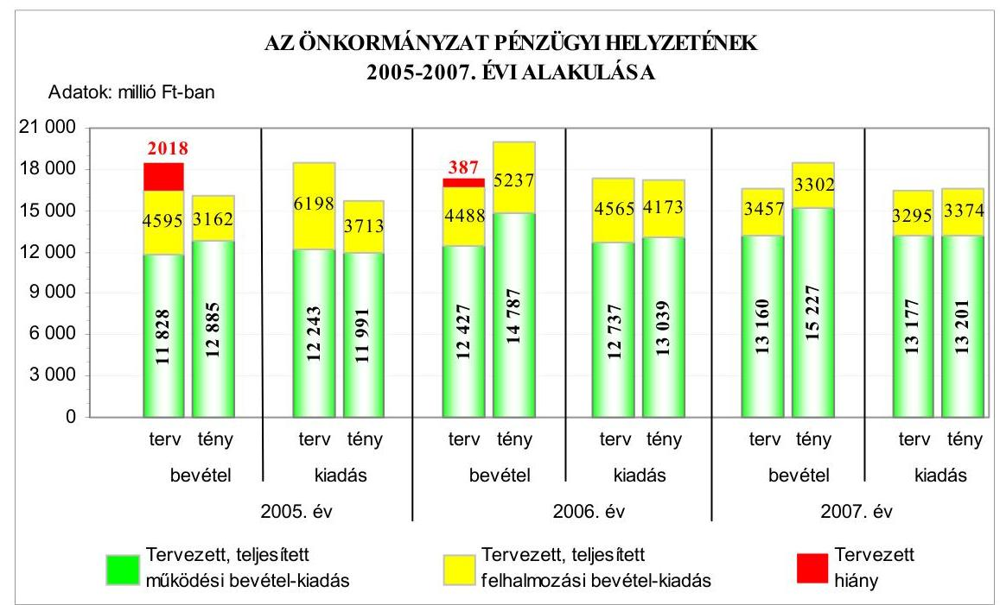

A 2006. évben az előző évhez képest - a költségvetési bevételek tervezett növekedése mellett - csökkentek a tervezett költségvetési kiadások, míg a tervezett költségvetési kiadások főösszege a 2007-2008. évek között a bevételekkel azonos irányban változott. A teljesített költségvetési kiadások előző évhez viszonyított változása a 2006. évben a tervezettel azonos, a 2007. évben ellentétes irányú volt.

Az Önkormányzat 2005-2006. évi költségvetési rendeleteiben a költségvetési bevételek és kiadások egyensúlyát nem biztosították, a 2005.

---

évben 2018 millió Ft, a 2006. évben 387 millió Ft összegű hiányt terveztek. A költségvetés végrehajtása során azonban a 2005-2006. években költségvetési többlettel zárták az évet. A tervezett költségvetési hiány részaránya az összes költségvetési kiadáshoz viszonyítva a 2005-2006. évi költségvetések alapján 10,9%-ról 2,2%-ra mérséklődött.

A 2005-2008. években a tervezett költségvetési és a tényleges pénzügyi hiány részarányát a működési és felhalmozási célú, valamint az összes költségvetési kiadáshoz viszonyítottan szemlélteti a következő táblázat:

| Megnevezés | Részarány %-ban |  |  |  |  |  |  |
| :--: | :--: | :--: | :--: | :--: | :--: | :--: | :--: |
|  | 2005.   évben |  | 2006.   évben |  | 2007.   évben |  | 2008.   évben |
|  | Terv | Tény | Terv | Tény | Terv | Tény | Terv |
| Működési célú költségvetési bevételek hiányának aránya a működési célú költségvetési kiadásokhoz viszonyítva | 3,4 | - | 2,4 | - | 0,1 | - | - |
| Felhalmozási célú költségvetési bevételek hiányának aránya a felhalmozási célú költségvetési kiadásokhoz viszonyítva | 25,9 | 14,8 | 1,7 | - | - | 2,1 | - |
| A költségvetési hiány részaránya a költségvetési kiadásokhoz viszonyítva | 10,9 | - | 2,2 | - | - | - | - |

Az Önkormányzatnál a működési célú költségvetési bevételek meghatározó - a tervezett költségvetési bevételekből 72,0%-os, 73,5%-os, 79,2%-os és 76,8%-os, a teljesített költségvetési bevételekből 80,3%-os, 73,8%-os és 82,2%-os - részarányt jelentettek. A tervezett és teljesített költségvetési kiadásokból szintén a működési célú költségvetési kiadások részaránya volt a meghatározó (a tervezett adatokban 66,4-80,0%, a teljesítés alapján 75,8-79,6% volt a részesedésük).

A 2005-2008. években tervezett és a 2005-2007. években teljesített működési, illetve felhalmozási célú költségvetési bevételeket és kiadásokat, azok egyenlegeként a kialakult hiány, illetve többlet összegét, valamint a finanszírozási célú pénzügyi műveletek bevételeit és kiadásait a jelentés 3. számú melléklete részletezi.

Az Önkormányzat 2005-2006. évi költségvetési rendeleteiben a költségvetési bevételi és kiadási főösszeg megállapításakor megsértették az Áht. 8/A. § (7) bekezdésében foglaltakat, mivel finanszírozási célú pénzügyi művelete-

---

ket (célhitel bevételeket $^{10}$, illetve hosszú lejáratú hiteltörlesztéssel kapcsolatos kiadásokat $^{11}$ ) vettek figyelembe költségvetési egyensúlyt módosító költségvetési bevételként, valamint kiadásként.

# 1.2. A költségvetési és a pénzügyi egyensúlyi helyzet kialakításához tervezett és teljesített finanszírozási célú pénzügyi műveletek módja és azok hatása a tárgyévet követő évek költségvetéseire 

A tervezett költségvetési kiadásokat a költségvetési bevételek az Önkormányzatnál a 2005. és a 2006. évben nem fedezték, a 2007-2008. évek időszakában azonban az előirányzott költségvetési kiadások fedezettsége a költségvetési bevételekből biztosított volt.

A költségvetések 2005-2006. évi hiányát a működési célú és a felhalmozási célú költségvetési bevételeket meghaladó összegben tervezett azonos célú kiadások egyaránt okozták. A tervezett fedezettség az azonos célú költségvetési bevételekből a 2005-2006. években a felhalmozási célú kiadásoknál 24,2 százalékponttal, a működési célú kiadásoknál 1,0 százalékponttal javult. A 2005-2007. években a költségvetési kiadások fedezettsége a tervezetthez viszonyítva minden évben jelentősen kedvezőbben alakult a teljesítés során.

A 2005-2008. évek közötti időszakban a tervezett és a teljesített működési célú költségvetési bevételek egyaránt növekvő mértékben fedezték a működési célú költségvetési kiadásokat. A teljesített működési célú költségvetési bevételek működési célú kiadásokhoz viszonyított többletének növekedését az intézményi bevételek, a helyi- és az átengedett adóbevételek folyamatos emelkedése, valamint a működési kiadások mérsékeltebb ütemű növekedése okozta. A tervezett és teljesített felhalmozási kiadások fedezettsége a beruházási és a felújítási kiadások csökkenése, illetve az önkormányzati lakások, helyiségek értékesítési bevételeinek változása miatt növekedett az előirányzatokban és a teljesítés során, míg a 2007. évben a teljesített felhalmozási célú költségvetési bevételek csökkenése miatt jelentősen mérséklődött.

[^0]
[^0]:    $^{10}$ A költségvetési bevételek között a 2005. évi költségvetési rendeletben 528,8 millió Ft, a 2006. évi költségvetési rendeletben 452,9 millió Ft célhitel bevétel előirányzat szerepelt. (Célhitel címen tervezték az előirányzatokban az Önkormányzat részére a vízgyűjtők szennyvízcsatorna létesítményeinek megvalósításához biztosított központi és fővárosi támogatásokat. A bevételek teljesülése után ezeket az előirányzatokat a felhalmozási célra átvett pénzeszközök előirányzataira átcsoportosították.)
    $^{11}$ A költségvetési kiadások között a 2005-2006. évi költségvetési rendeletekben eredeti előirányzatként 989 millió Ft, illetve 109 millió Ft hosszú lejáratú hiteltörlesztést vettek figyelembe.

---

Az Önkormányzat 2005-2008. években tervezett és a 2005-2007. években teljesített működési és felhalmozási célú költségvetési kiadásaira a következő arányban biztosítottak fedezetet a költségvetési bevételek:

Adatok: %-ban

| Megnevezés | 2005.   év |  | 2006.   év |  | 2007.   év |  | 2008.   év |
| :--: | :--: | :--: | :--: | :--: | :--: | :--: | :--: |
|  | Terv | Tény | Terv | Tény | Terv | Tény | Terv |
| Működési célú költségvetési kiadások fedezettsége működési célú költségvetési bevételekből | 96,6 | 107,5 | 97,6 | 113,4 | 99,9 | 115,3 | 100,9 |
| Felhalmozási célú költségvetési kiadások fedezettsége felhalmozási célú költségvetési bevételekből | 74,1 | 85,2 | 98,3 | 125,5 | 104,9 | 97,9 | 100,3 |
| Költségvetési kiadások fedezettsége költségvetési bevételekből | 89,1 | 102,2 | 97,8 | 116,3 | 100,9 | 111,8 | 100,8 |

Az Önkormányzat tervezett költségvetési bevételei a 2005-2006. évek közötti időszakban nem, a 2007-2008. években azonban fedezték, illetve meghaladták a tervezett költségvetési kiadásokat.

Az Önkormányzat 2005-2008. években tervezett költségvetési bevételeinek és kiadásainak, valamint egyensúlyi helyzetének alakulását szemlélteti az alábbi ábra:
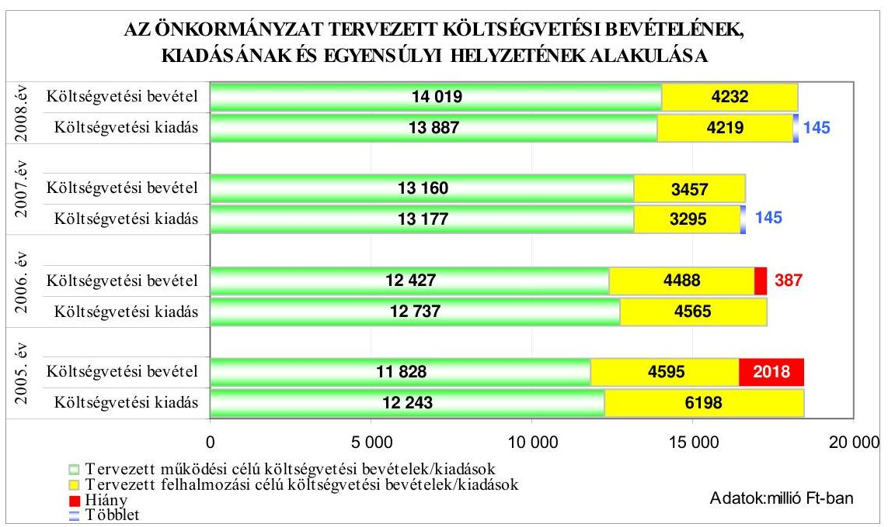

---

Az Önkormányzat a 2005-2006. évi költségvetési rendeleteiben a költségvetési egyensúly biztosításához hosszú lejáratú hitelek felvételét tervezte. Az éves költségvetésekben az általános hatékonysági és takarékossági felhívásokon és a szigorú gazdálkodási keretek előírásán kívül egyéb intézkedéseket (kötvény kibocsátás, értékpapír értékesítés) nem terveztek.

A teljesített költségvetési bevételek és kiadások, valamint egyensúlyi helyzet alakulását szemlélteti a következő ábra:
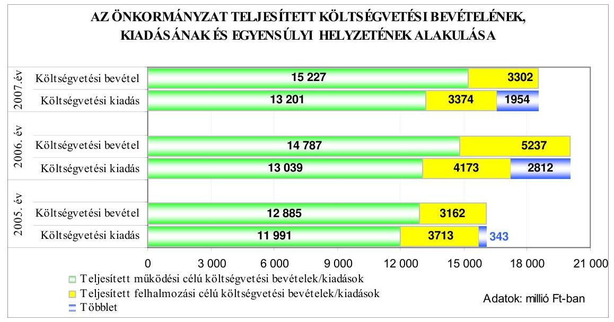

A 2005-2007. években a teljesített költségvetési bevételek fedezetet nyújtottak a költségvetési kiadásokra. A működési célú költségvetési bevételek a költségvetések teljesítése során minden évben fedezték az azonos célú kiadások teljes összegét. A realizált felhalmozási célú költségvetési bevételek a 2005. és a 2007. évben elmaradtak az azonos célú kiadásoktól, azonban a 2006. évben meghaladták azok összegét.

A 2005-2007. évi költségvetések végrehajtása során a pénzügyi hiány finanszírozásához az Önkormányzat a 2005. évben vett fel hosszú lejáratú felhalmozási célú (beruházási) hitelt, a következő években hitelfelvételre nem került sor.

Az Önkormányzatnak felhalmozási célú hitele $^{12}$ 2005. január 1-én nem volt, ez a hitelállomány 2008. június 30-án 1774,1 millió Ft-ot tett ki. A 2005. május 9-én megkötött hitelszerződés alapján 2005-2006. évben felvett hitel a Budapest Főváros II. kerület Önkormányzat II. Rákóczi Ferenc Gimnázium rekonstrukcióját és bővítését célzó fejlesztéshez kapcsolódott. Az igénybevett 2100 millió Ft összegű fejlesztési hitel visszafizetése 2020-ig esedékes. Az Önkormányzati Infrastruktúra Fejlesztési Hitelprogram keretében nyújtott hosszúlejáratú hitel törlesztése (a hitelszerződés aláirásától számított egy év türelmi időt követően)

[^0]
[^0]:    $^{12}$ A 2005-2007. évi önkormányzati beszámolók alapján a beruházási és fejlesztési hitelek állománya 2004. december 31-én nulla, 2005. december 31-én 2082,7 millió Ft, 2006. december 31-én 1991,4 millió Ft és 2007. december 31-én 1846,6 millió Ft volt.

---

évente négy alkalommal, a naptári negyedévet
 követő hónap első munkanapján történik. A tőke törlesztése és az ügyleti kamat megfizetése minden alkalommal egyidejűleg esedékes, a kamatfizetésre a türelmi idő nem vonatkozott.

Az Önkormányzat a folyószámla hitelkeret összegét a 2005. január 1. és a 2008. június 30. közötti időszakban nem emelte (folyamatosan 100 millió Ft volt), a folyószámla napi záró egyenlege folyamatosan pozitív értéket mutatott és likviditási hitel igénybevétel az időszakban nem volt. A hitelkeret rendelkezésre tartásáért az Önkormányzat nem fizetett jutalékot.

Az éves könyvviteli mérleg adataiból számított eladósodási mutató ${ }^{13}$ és az esedékességi aránymutató ${ }^{14}$ az Önkormányzat eladósodásának mértékét mutatja.

Az eladósodási mutató a 2005-2007. években folyamatosan alacsony - 4,9%-os, 4,0%-os és 4,4%-os - mértékű volt. A 2005. évről a 2006. évre bekövetkezett 0,9 százalékpontos csökkenés a kötelezettségek állományának csökkenésével függött össze, melyet a rövid lejáratú kötelezettségek 506 millió Ft-os és a hosszú lejáratú kötelezettségek 131 millió Ft-os mérséklődése okozott. A 2007. évre a mutató előző évihez viszonyított 0,4 százalékpontos emelkedését a rövid lejáratú kötelezettségek 504 millió Ft-os emelkedése, valamint a hosszú lejáratú kötelezettségek 144 millió Ft-os csökkenése okozta. Az önkormányzati források összege ezzel egyidejűleg a kötelezettségekkel ellentétes irányban változott ezekben az években - a 2006. évben növekedett, a 2007. évben csökkent az előző évhez viszonyítva - és a kötelezettségek változásának az eladósodás alakulására vonatkozó hatását erősítette. Eladósodási szempontból az Önkormányzat pénzügyi helyzete a 2005-2007. években kedvező volt.

Az esedékességi aránymutató a 2005. évhez képest a 2006. évben javult, ami abból ered, hogy a rövid lejáratú kötelezettségek aránya az összes kötelezettségen belül csökkent. A kötelezettségeken belül a rövid lejáratú kötelezettségek részaránya a 2007. évre emelkedett, mivel a rövid lejáratú kötelezettségek állománya nagyobb mértékben emelkedett, mint az összes kötelezettség állománya.

Az Önkormányzatnál a pénzeszközök év végi állománya a 2005-2007. években folyamatosan fedezte a rövid lejáratú kötelezettségeket. A 2007. évre a készpénz likviditási mutató ${ }^{13}$ a 2006. évi értékhez képest ugyan csökkent, de a 2005. évi mértéket meghaladta, a rövid lejáratú kötelezettségek csökkenése és a pénzeszközök értékének növekedése következtében. A likviditási

[^0]
[^0]:    ${ }^{13}$ Az eladósodási mutató a hosszú és rövid lejáratú fizetési kötelezettségek önkormányzati összes forráson belüli arányát mutatja.
    ${ }^{14}$ Az esedékességi aránymutató az egyéb passzív pénzügyi elszámolások összegével csökkentett fizetési kötelezettségen belül a rövid lejáratú kötelezettségek arányát mutatja.
    ${ }^{15}$ A készpénz likviditási mutató a pénzeszközök év végi állományának a rövid lejáratú kötelezettségekhez mért arányát mutatja.

---

gyorsráta ${ }^{16}$ a 2007. évre csökkent az előző évi mértékhez viszonyítva, de a követelések és a pénzeszközök együttesen kétszeres fedezetet nyújtottak a rövid lejáratú kötelezettségek kiegyenlítéséhez.

Az Önkormányzat fizetőképességének alakulását a következő ábra szemlélteti:
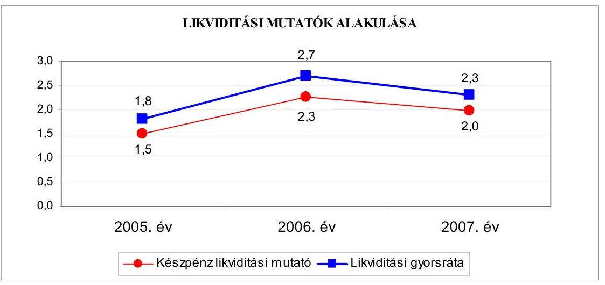

Az Önkormányzat pénzügyi helyzete a 2005. és a 2007. évek között összességében kedvező volt, mert a pénzeszközök önmagukban is és a követelések bevonásával még további fedezetet biztosítottak a rövid lejáratú kötelezettségek kiegyenlítésére, miközben a hosszú- és a rövid lejáratú fizetési kötelezettségek önkormányzati összes forráson belüli 5%-nál kisebb részaránya az alacsony mértékű eladósodottságot jelezte.

# 1.3. A költségvetés tervezésének megalapozottsága 

Az Önkormányzat költségvetési rendeleteiben jóváhagyott eredeti költségvetési bevételi előirányzatoktól a 2005. évi teljesítés 2,3%-kal, a kiadási előirányzatok esetében 14,8%-kal, illetve a 2006. évben a tervezett kiadási előirányzatoktól 0,5%-kal elmaradt. Az eredeti költségvetési bevételi előirányzatokat a 2006. és a 2007. évben 18,4%-kal és 11,5%-kal, a kiadási előirányzatokat a 2007. évben 0,6%-kal túlteljesítették.

A 2005-2007. években a tervezett működési célú költségvetési bevételeket 8,9%-kal, 19,0%-kal, illetve 15,7%-kal haladták meg a teljesített bevételek, a támogatásértékű működési bevételek és a működési célú költségvetési támogatások alultervezése, valamint az előző évi pénzmaradvány működési célú igénybevételének ${ }^{17}$ módosított előirányzatként történő tervezése miatt. A működési célú

[^0]
[^0]:    ${ }^{16}$ A likviditási gyorsráta azt mutatja, hogy a rövid lejáratú kötelezettségek kiegyenlítéséhez a pénzeszközökön túl a bevonható követelések, forgatási célú értékpapírok együttesen milyen arányban nyújtanak fedezetet.
    ${ }^{17}$ Az előző évi pénzmaradvány működési célú igénybevételét a 2005. és a 2006. évben nem tervezték, a 2007. évben 255,0 millió Ft-ot irányoztak elő ezen a bevételi címen. A működési célra történő pénzmaradvány felhasználás ebben az időszakban teljesített 741,0 millió Ft, 698,5 millió Ft, illetve 743,6 millió Ft volt.

---

költségvetési kiadásoknál a 2005. évben 2,1%-os elmaradással, a 2006. évben 2,4%-os túlteljesítéssel, illetve a 2007. évben a tervezettel közel azonos szinten realizálódtak az előirányzatok.

A tervezett felhalmozási célú költségvetési bevételeket a 2006. évben 16,7%-kal túlteljesítették, a 2005. és a 2007. évben azonban 31,2%-kal, illetve 4,5%-kal a tervezett mérték alatt valósultak meg az előirányzatok. A felhalmozási célú költségvetési bevételek eredeti előirányzatának a 2006. évi túlteljesítését, illetve a 2005. és a 2007. évi alulteljesítését az önkormányzati ingatlan és egyéb tárgyi eszközök értékesítéséhez kapcsolódó áfa visszatérítés, valamint az önkormányzati lakásértékesítésekből származó bevételek alakulása, továbbá az előző évi pénzmaradvány felhalmozási célú igénybevételének ${ }^{18}$ a zárszámadást követően, módosított előirányzatként történő figyelembe vétele okozta. A felhalmozási célú költségvetési kiadások eredeti előirányzathoz viszonyított 2005. és 2006. évi alulteljesítését, illetve 2007. évi túlteljesítését a megvalósítandó beruházások tervezettől való elmaradása, valamint túlteljesítése okozta.

Az Önkormányzatnál a 2005. évben az előirányzott költségvetési kiadások alulteljesítése meghaladta a tényleges költségvetési bevételek tervezettől való elmaradását, míg a 2006. évben az előirányzott bevételek magasabb és a kiadások alacsonyabb összegben teljesültek. A 2007. évben az eredeti költségvetési bevételi előirányzatok túlteljesítésének mértéke nagyobb volt a kiadási előirányzatok túlteljesítésénél. Mindezek következtében a 2005-2007. években nem alakult ki pénzügyi hiány, sőt évről-évre többlettel zárta az Önkormányzat a költségvetési évet.

Az Önkormányzatnál eredeti költségvetési előirányzatként az előző évi pénzmaradvány igénybevételét a 2005. évben egyáltalán nem, a 2006-2008. évek közötti időszakban pedig alacsony mértékben tervezték meg a bevételek között a költségvetésekben. A pénzmaradvány igénybevétel reális összegű előirányzatként való figyelembe vételét a 2005-2008. évi költségvetési rendeletek módosításai során - a pénzmaradvány jóváhagyását követően - rendezték. Az Önkormányzat a költségvetési rendeletekben annak ellenére nem tervezte megfelelően az előző évi kötelezettségvállalások forrását, hogy az előző évi kötelezettségvállalások pénzmaradvány terhére teljesítendő kiadásai az eredeti előirányzatok tervezésekor ismertek voltak. A 2005-2007. években az Önkormányzat kötelezettséggel terhelt pénzmaradványa a működési és a felhalmozási célú költségvetési bevételek tervezett és teljesített növekedéséhez egyaránt hozzájárult. Az előző évi pénzmaradvány igénybevételéből származó bevételek eredeti előirányzatainak tervezése nem volt megfelelően megalapozott.

Az Önkormányzat 2005-2007. évi költségvetéseinek végrehajtása során a működési bevétek közül a tervezett helyi adóbevételek sorrendben 91,8%-ra, 120,5%-ra, illetve 108,6%-ra teljesültek. A realizált adóbevételek ezzel a 2005.

[^0]
[^0]:    ${ }^{18}$ Az előző évi pénzmaradvány felhalmozási célú igénybevételét a 2005. évben nem tervezték, a 2006. és a 2007. évben 81,5 millió Ft-ot, illetve 259,0 millió Ft-ot irányoztak elő. Teljesített a felhalmozási célra történő pénzmaradvány felhasználás ebben az időszakban 516,7 millió Ft-ot, 1190,6 millió Ft-ot, illetve 1228,0 millió Ft-ot tett ki.

---

évben növelték, a 2006. évben csökkentették a tervezett költségvetési hiányt, illetve a 2007. évben a költségvetési bevételi többlet kialakulását segítették. A helyi adóbevételek előirányzattól eltérő teljesítését a Fővárosi Önkormányzattól a forrásmegosztás keretében kapott iparűzési adóbevételek alakulása okozta.

Az Önkormányzatnál a 2005-2007. években a felhalmozási célú költségvetési kiadások közül az eredeti előirányzatokban szereplő beruházási kiadások az évek sorrendjében 69,1%-ra, 115,8%-ra, illetve 152,4%-ra teljesültek. A 2005. évi elmaradást az okozta, hogy az Önkormányzat középfokú oktatási intézményének rekonstrukciós fejlesztése jelentős részben a következő évre tolódott át, míg a 2006. és a 2007. évi túlteljesítés abból adódott, hogy az előző évről áthúzódó - pénzmaradványból teljesített - beruházási kötelezettségeket eredeti előirányzatként a költségvetésben nem szerepeltették.

A tervezett önkormányzati felújítási kiadások a 2005. és a 2006. évben alulteljesültek, míg a 2007. évben túlteljesültek. A túlteljesítéshez hozzájárultak a váratlan és halaszthatatlan felújítási feladatok, valamint az előző évről áthúzódó felújítások pénzügyi forrásaként a pénzmaradvány igénybevétel eredeti előirányzatként történő tervezésének elmaradása.

# 2. AZ ÖNKORMÁNYZAT FELKÉSZÜLTSÉGE AZ EURÓPAI UNIÓS FORRÁSOK IGÉNYLÉSÉRE ÉS FELHASZNÁLÁSÁRA, VALAMINT AZ ELEKTRONIKUS KÖZIGAZGATÁSI FELADATOK ELLÁTÁSÁRA 

### 2.1. Az európai uniós források igénybevételére és a várható támogatás felhasználására történt felkészülés szabályozottsága, szervezettsége

### 2.1.1. Az európai uniós forrásokra történő pályázatok benyújtására vonatkozó döntések összhangja a fejlesztési célkitűzésekkel

Az Önkormányzat a 2005-2008. évekre vonatkozó gazdasági programmal nem rendelkezett. A 2006. évi önkormányzati választások után megalakult Képviselő-testület a jogszabályban rögzített alakuló ülést követő hat hónapon belül nem hagyta jóvá a gazdasági programot, amellyel az Önkormányzat megsértette az Ötv. 91. § (1) bekezdésében foglaltakat. A gazdasági programtervezet elkészítésének elmaradásáért a jegyző a felelős, mert a Htv. 140. § (1) bekezdés a) pontja alapján az Önkormányzat gazdasági programtervezetének elkészítése a jegyző feladata, valamint a Ktv. 1. § (8) bekezdés a) pontja alapján a jegyzőnek, mint köztisztviselőnek a feladatait megfelelő szakmai hozzáértéssel, a jogszabályi előírásokat betartva kellett volna ellátnia.

A közbenső egyeztetés során a polgármester észrevétele szerint: „A Htv. szerint a gazdasági programtervezet elkészítése a jegyző kötelezettsége (140. § (1) bek. a) pontja), míg annak Képviselő-testület elé terjesztése a polgármester feladata (139. § (1) bek. a) pontja).

Budapest Főváros II. kerület Önkormányzat jegyzője első ízben 2003. októberében készítette el az önkormányzat gazdasági programját, annak tárgyalását azonban a képviselő-testület - tartalmi és formai okokra hivatkozva - elnapolta. A gazdasági program az-

---

óta többször átdolgozásra került, azonban a Képviselő-testület napirendre nem vette, nem tárgyalta.

Az Ötv. 91. § (1) bekezdése szerint az önkormányzat meghatározza gazdasági programját és költségvetését. A törvény a gazdasági program formájára nézve nem, a tartalom vonatkozásában is csak átfogó követelményeket (91. § (6) bekezdés) támaszt. A tartalmi előírások tekintetében önkormányzatunk a törvény által előírt valamennyi pontnak megfelel, az ágazati fejlesztési stratégiák, koncepciók és rendeletek tartalmazzák az előírt célkitűzéseket.

E fenti két érv alapján - véleményem szerint - a jegyző a Htv. 140. § (1) bek. a) pontjában foglalt kötelezettségének eleget tett, így a Ktv. 51. § (1) bek. alapján fegyelmi eljárás megindítása nem indokolt.

A fegyelmi felelősségre vonás megindítása ellen szól továbbá az is, hogy a Ktv. 51. § (1) bekezdése szerint nem lehet eljárást indítani, ha a kötelezettségszegés felfedezése óta három hónap eltelt. Tekintve, hogy az ÁSZ ellenőrzés zárótárgyalásának időpontján (2008. július 22-én.) a jegyző fegyelmi felelősségének kérdése ismertetésre került, s azóta több mint három hónap eltelt, a fegyelmi eljárás megindítására - a fent említett tartalmi kifogásokon túl - törvényileg sincs már mód.

Végezetül tájékoztatom, hogy Budapest Főváros II. kerület Önkormányzat Képviselőtestülete
 2008. augusztus 28-i ülésén a gazdasági programot megtárgyalta, és elfogadta (Budapest Főváros II. kerület Önkormányzat Képviselő-testületének 17/2008. (IX. 1.) rendelete szól az önkormányzat gazdasági programjáról)."

Az észrevétel nem megalapozott, mivel a megállapításunk és a javaslatunk nem a 2003. évi gazdasági program tervezet elkészítésének hiányára vonatkozik. A 2003. évi gazdasági program tervezet jegyző általi elkészítését az előző számvevőszéki vizsgálat javaslatainak értékelése során teljesítettnek vettük, annak ellenére, hogy azt a Képviselő-testület nem tárgyalta és nem fogadta el. A felelősségre vonás felvetését a 2006. évi önkormányzati választás utáni időszakra vonatkozó gazdasági program tervezet elkészítésének hiányára alapoztuk. Az Önkormányzat az Ötv. 91. § (7) bekezdésének előírása alapján - melyet első alkalommal a 2006. évi önkormányzati választások után kellett alkalmazni - a Képviselőtestület alakuló ülését követő hat hónapon belül volt köteles elfogadni az Önkormányzat gazdasági programját. A program elfogadása az előírt határidőn belül nem történt meg, az Önkormányzat ezzel megsértette az Ötv. hivatkozott előírásait, a jogszabálysértésért a jegyző a felelős, mivel nem készítette el a gazdasági program tervezetét. Az Állami Számvevőszék helyszíni vizsgálata során tett megállapítás alapján, a helyszíni vizsgálat július 22-i lezárását követően a 17/2008. (IX. 1.) számú rendeletével fogadta el az Önkormányzat a gazdasági programját. A jogszabálysértés tényének ismertetése nem jelentette a jegyző felelősségének megállapítását, erre a jelentés-tervezet minőségellenőrzési eljárásának lefolytatása után, valamint a jogi és a szakmai konzultációt követően a számvevői jelentés elkészítésekor került sor. A jegyző felelősségének felvetése az Önkormányzat számára a számvevői jelentés átadásának napján - 2008. október 27-én - vált ismertté, ezért a jegyző felelősségének felvetését és a fegyelmi eljárás megindítását továbbra is javasoljuk.

A fejlesztési célkitűzéseket a Képviselő-testület által elfogadott szakmai koncepciókban - a szociális szolgáltatástervezési koncepcióban, a közoktatási intézkedési tervekben, az informatikai stratégiában, a településfejlesztési koncepció-

---

ban - mutatták be ${ }^{19}$. A szakmai koncepciókban a fejlesztési célkitűzések megalapozottságát helyzetelemzés támasztotta alá, azonban a megvalósítás lehetséges pénzügyi forrásait nem jelölték meg.

A Polgármesteri hivatal a 2005-2008. évek között négy, európai uniós forrásokkal összefüggő fejlesztési feladatot pályázott meg. A pályázatok beadásáról és a saját forrás biztosításáról a Képviselő-testület döntött.

Az Önkormányzat pályázatot nyújtott be 2004. novemberében a GVOP-20044.3.2. „Az önkormányzati adatvagyon másodlagos hasznosítása" intézkedésére. A pályázatot kedvezően bírálták el, a GVOP támogatási szerződést 2005 szeptemberében kötötték meg. A GVOP projekt kapcsolódott az informatikai stratégia ${ }_{1}$ „Adatvagyon hasznosítás" fejezetében megfogalmazott célokhoz. A pályázat 190 millió Ft-os tervezett kiadásából 124,7 millió Ft az európai uniós támogatás, 41,6 millió Ft a hazai támogatás, 23,7 millió Ft az Önkormányzat saját forrása.

A GVOP projektet a Polgármesteri hivatalban, a közbeszerzési eljárást követően a 2006. év szeptember és a 2007. év április közötti időszakban megvalósították.

Az Önkormányzat a ROP-3.2.2. intézkedése keretében a 2005. évben eredménytelenül pályázott a „Non-profit foglalkoztatási kezdeményezések megvalósítása a szociális gazdaságban" elnevezésű projektre. A ROP projekt célja „adatfeldolgozással a munkanélküliség ellen", amely kapcsolódott az informatikai stratégia ${ }_{1}$ „Közösségi és szakmai tudáshálózatok" fejezetben megfogalmazott célokhoz. A ROP projekt megvalósításának tervezett összköltsége 145 millió Ft volt, amelynek 100%-át az Európai Unió finanszírozta volna. A pályázat 2005. márciusi beadását követően a közreműködő szervezet hiánypótlásra hívta fel az Önkormányzatot, amelyet az késedelmesen teljesített, ezért a pályázatot elutasították.

Az Önkormányzat az INTERREG-III. közösségi kezdeményezés pályázati lehetősége keretében a 2005. évben eredményesen pályázott a „Knowledge network" (Tudáshálózat) elnevezésű projektre. Az INTERREG projekt célja „A helyi önkormányzás hatékonyságának növelése, az állampolgárok motiválása az őket érintő döntésekbe való tevékeny és konstruktív beleszólásra", amely összhangban volt az informatikai stratégiában megfogalmazottakkal. Az INTERREG projekt megvalósításának tervezett összköltsége 31 ezer euro volt, amelynek az Európai Regionális Fejlesztési Alap a 75%-át, az Önkormányzat a fennmaradó 25%-át finanszírozta. A projekt 2007. decemberében fejeződött be.

Az Önkormányzat a KMOP-5.2.2./B. intézkedése keretében a 2008. évben pályázatot nyújtott be a „Budapest integrált városfejlesztési program - Budapesti kerületi központok fejlesztése" elnevezésű projektre, a pályázat elbírálása 2008. július 23-

[^0]
[^0]:    ${ }^{19}$ A szociális szolgáltatástervezési koncepciót a Képviselő-testület a 653/2005. (VI. 20.) számú határozatával fogadta el, felülvizsgálatát a 408/2007. (XII. 20.) számú határozatával hagyta jóvá a 2007-2009. évek közötti időszakra. A közoktatási intézkedési tervet a Képviselő-testület a 882/2003. (XII. 18.) számú határozatával fogadta el ötéves időtartamra, felülvizsgálatát a 20/2008. (I. 31.) számú határozatával hagyta jóvá a 2008-2011. évek közötti időszakra vonatkozóan. A településfejlesztési koncepciót a Képviselő-testület 153/2004. (III. 25.) számú határozatával fogadta el határozatlan időre. A Képviselő-testület 284/2004. (VI. 15.) számú határozatával fogadta el a 2004-2007. évek közötti időszakra az informatikai stratégia ${ }_{1}$-et, a Közoktatási, Közművelődési, Sport és Informatikai Bizottság 256/2007. (VI. 26.) számú határozatával fogadta el az informatikai stratégia ${ }_{2}$-t, a 2007-2010. évek közötti időszakra.

---

án folyamatban volt. A KMOP projekt célja „Bel-Buda városközpont funkcióbővítő fejlesztése", amely összhangban volt a településfejlesztési koncepcióban megfogalmazottakkal. A KMOP projekt megvalósításának tervezett összköltsége 1774 millió Ft, amelynek 85%-át az Európai Unió, 15%-át az Önkormányzat finanszírozza.

A Polgármesteri hivatalon kívül közoktatási intézmények kettő esetben pályáztak sikeresen európai uniós forrásokra. A pályázatok beadásáról az intézményvezetők döntöttek, a kialakult gyakorlatnak megfelelően.

A közoktatási intézmények a HEFOP-3.1.3. célkitűzése keretében a 2005. és a 2006. évben egy-egy pályázatot nyújtottak be a „Felkészülés a kompetencia alapú oktatásra" elnevezésű projektre. A HEFOP projektek céljai összhangban voltak a közoktatási intézkedési tervben megfogalmazottakkal. A HEFOP projektek megvalósításának tervezett összköltsége mindkét pályázat esetében 18 millió Ft volt, amelynek 100%-át az Európai Unió finanszírozta. A HEFOP projektek pénzügyi elszámolása 2005. októberében és 2006. májusában megtörtént.

A 2005-2008. évek közötti európai uniós forrással támogatott projektek finanszírozási forrásainak tervezett és tényleges megoszlását a következő ábrák mutatják:
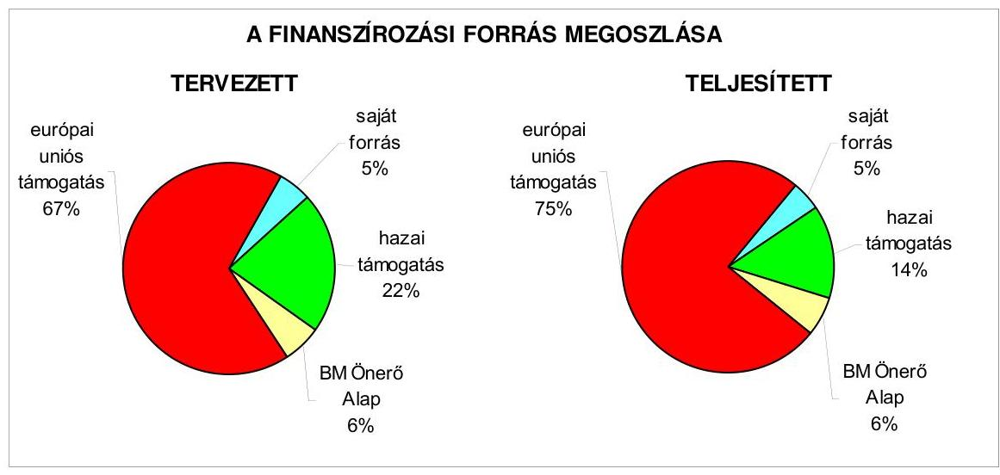

Az Önkormányzat 2005-2008. évi költségvetési rendeletei az európai uniós forrással támogatott fejlesztési feladatokkal összefüggésben tartalmazták a megvalósításhoz szükséges - a hatályos támogatási szerződés éves kiadási és támogatási ütemezésében rögzített - költségvetési kiadásokat és a fedezetéül szolgáló pénzügyi forrásokat az Áht. 69. § (1) bekezdésében foglaltaknak megfelelően, a többéves kihatással járó feladatok előirányzatait éves bontásban az Ámr. 29. § (1) bekezdés g) pontjában foglaltaknak megfelelően, valamint elkülönítetten az európai uniós támogatással megvalósuló programok bevételeinek és kiadásainak bemutatását az Ámr. 29. § (1) bekezdés k) pontjában előírtak szerint.

Az Önkormányzat a 2005-2008. évi költségvetési rendeleteiben gondoskodott az európai uniós támogatással megvalósuló fejlesztési feladatok saját forrásának biztosításáról, nem tervezte a saját forrást kiváltó pénzintézeti

---

hitel felvételét, a projektek utófinanszírozásához szükséges pénzügyi forrásokat az Önkormányzat évközi szabad pénzeszközeivel biztosította.

# 2.1.2. Az európai uniós forrásokhoz kapcsolódóan a pályázatfigyelés, a pályázatkészítés, valamint az európai uniós támogatással megvalósuló fejlesztés lebonyolításának belső rendjének szabályozottsága, a végrehajtás személyi, szervezeti feltételei 

Az európai uniós forrásokhoz kapcsolódóan az önkormányzati szintű pályázatfigyelés és koordináció, illetve a pályázat-készítés feladatait nem szabályozták, az önkormányzati szintű pályázat nyilvántartás felelősét nem jelölték ki, a pályázatok nyilvántartási rendszerét nem alakították ki. Az európai uniós forrásokra vonatkozó, önkormányzati szintű pályázatfigyelés és koordináció feladatait a Polgármesteri kabinet referense teljes munkaidőben, további kettő munkatársa részmunkaidőben látta el a munkaköri leírásokban foglaltak szerint.

A pályázatfigyelést és koordinációt végző polgármesteri referensek és a polgármester és az intézményvezetők, valamint a Képviselő-testület és bizottságai közötti információ-szolgáltatási kötelezettséget a polgármesteri referensek munkaköri leírásaiban, a Polgármesteri hivatalra vonatkozóan a polgármester és a fejlesztési feladat lebonyolítója (projektmenedzsere) közötti kapcsolattartás rendjét, a megvalósuló fejlesztés lebonyolításának eljárási rendjét, továbbá a folyamatba épített, előzetes és utólagos vezetői ellenőrzési feladatokat a projektvezetési szabályzatban írta elő a jegyző 2006. novemberétől.

A belső ellenőrzési feladatok meghatározása az európai uniós forrásokkal támogatott fejlesztési feladatokra a 2005-2007. években nem terjedt ki, a belső ellenőrzési feladatot a jegyző 2008. januárjától kezdődően írta elő ${ }^{20}$.

A pályázatfigyelés és készítés személyi, szervezeti feltételeit a Polgármesteri hivatalon belül, illetve külső szervezet megbízásával alakították ki. A pályázatfigyelést és készítést, valamint koordinációt végző polgármesteri referensek felsőfokú végzettséggel, megfelelő nyelvismerettel rendelkeztek, a pályázatfigyelés tárgyi feltételeit (internet) biztosították.

A pályázatfigyelési és készítési feladatok ellátásával külső szervezeteket is megbíztak. A pályázatfigyelési és készítési feladatok ellátására kötött szerződésekben előírták a feladatellátás kötelezettségeit, a megbízott gazdasági társaságok képviselői és a Polgármesteri hivatal képviselője közötti kapcsolattartás és felelősség szabályait, az információk átadásának formáját, tartalmát és módját. A fejlesztések lebonyolítási feladatainak szervezeti, projektenkénti személyi feltételeit a Polgármesteri hivatalon belül a projektvezetési szabályzatnak megfelelően biztosították. A fejlesztés lebonyolítási (projektmenedzseri) feladatait külső személy, illetve szervezet igénybevételével is ellátták. A fejlesztési feladat lebonyolításának ellátására kötött szerződésekben előírták a feladatellátás kötele-

[^0]
[^0]:    ${ }^{20}$ A jegyző I-22/23/2007. számú intézkedésével módosította a belső ellenőrzésnek a 2006-2010. évekre vonatkozó stratégiai tervét, a tervben meghatározott feladatokat kiegészítette az európai uniós pályázati pénzek felhasználásának ellenőrzésével.

---

zettségeit, személyre szólóan meghatározták a felelősségi szabályokat, az ellenőrzési feladatok megosztását.

A pályázatfigyelési feladatokra egy gazdasági társasággal egy-egy évre megbízási szerződéseket kötöttek a 2005-2006. években. Pályázati szaktanácsadási feladatokra 2007. májusában átalánydíjas megbízási szerződést kötöttek egy gazdasági társasággal. A szerződést 2007. novemberében felmondták és december folyamán egy újonnan kiválasztott gazdasági társasággal kötöttek átalánydíjas megbízási szerződést. Az INTERREG III. közösségi kezdeményezés keretében finanszírozott projekt lebonyolításának koordinációjára egy gazdasági társasággal 2007. májusában megbízási szerződést kötöttek. A 2008. évben két gazdasági társasággal pályázatírási feladatokra megbízási szerződést, egy gazdasági társasággal a pályázati anyag elkészítéséhez kapcsolódó tanácsadási feladatokra vállalkozási szerződést kötöttek.

# 2.1.3. A fejlesztési feladat lebonyolításánál a feladatellátás rendjére, az ellenőrzési feladatok teljesítésére, valamint a felelősségi szabályokra vonatkozó előírások betartása 

Az Önkormányzat pályázatot nyújtott be 2004. novemberében a GVOP-20044.3.2. „Az önkormányzati adatvagyon másodlagos hasznosítása" intézkedésére ${ }^{21}$. A pályázatot kedvezően bírálták el, a GVOP támogatási szerződést 2005 szeptemberében kötötték meg. A GVOP projektet a Polgármesteri hivatalban, a közbeszerzési eljárást követően a 2006. év szeptember és a 2007. év április közötti időszakban megvalósították. A GVOP projekt 190 millió Ft-os teljes költségvetéséből 166,3 millió Ft-ot az elnyert európai uniós támogatással és hazai támogatással finanszíroztak, 14,2 millió Ft-ot a Belügyminisztérium Önerő Alapjából vettek igénybe, a fennmaradó 9,5 millió Ft-ot az Önkormányzat saját forrásként biztosította.

A GVOP projekt megvalósítása nem tért el az GVOP támogatási szerződésben meghatározott időbeli ütemezéstől. A GVOP támogatási szerződés módosítását egy alkalommal a Polgármesteri hivatal, egy alkalommal a GVOP közreműködő szervezet kezdeményezte. A változások nem érintették a GVOP támogatási szerződés főösszegét és a tervezett ütemezéseket.

A GVOP támogatási szerződés 2006. decemberi módosításában a teljes támogatási összeg 25%-ának megfelelő előleg igénybevételéről rendelkeztek, a 2007. decemberi módosításban a GVOP közreműködő szervezet jogutódjával a 166,3 millió Ft támogatási összegen belül a közösségi támogatás
 és a hazai társfinanszírozás ${ }^{22}$ arányát változtatták meg (a közösségi támogatás aránya 75\%-ról 86\%-ra emelkedett).

A tervezett támogatások igénybevétele a GVOP támogatási szerződésben, illetve módosításában meghatározott ütemezésnek megfelelően történt. A tervezett ütemezés betartását a projekt előrehaladási jelentések elfogadása, valamint a kifizetési kérelmet alátámasztó bizonylatok ellenőrzése során felmerült - megalapozott - hiánypótlások teljesítése hátráltatta. A Polgármesteri hivatal kifizetési kérelmeire minden esetben hiánypótlást kért a GVOP közreműködő szervezet, a hiánypótlásokat követően folyósították a támogatás esedékes részét. A kifizetések három ütemben történtek, a kifizetési kérelem benyújtásától a támogatás folyósításáig 154-98-49 nap telt el.

A fejlesztési feladatok megvalósítása, a kiadások teljesítése a GVOP támogatási szerződésben, illetve módosításában tervezett ütemezés szerint haladt a szerződésben meghatározott eljárásrendnek megfelelően. A fejlesztési feladatot a támogatási szerződésben előírt céloknak és indikátornak ${ }^{23}$ megfelelően, a GVOP projekt tervezett főösszegén és költségkeretein belül, a támogatási szerződésben meghatározott 2007. május 16-i határidő lejártát megelőzően, 2007. április 12-én teljesítették.

Az elnyert 166,3 millió Ft európai uniós támogatást teljes összegben igénybe vették. A vállalt saját forrást az Önkormányzat a 2005-2007. évi költségvetésében céltartalékként biztosította. Az Önkormányzat a támogatás utófinanszírozására figyelemmel a 2006-2007. évi költségvetések végrehajtása során a támogatási előleg igénybevételével, illetve a rendelkezésre álló, szabad önkormányzati pénzeszközök felhasználásával biztosította a projekt zavartalan lebonyolítását.

A GVOP projekt megvalósítása során a folyamatba épített, előzetes és utólagos vezetői ellenőrzési feladatokat a Polgármesteri hivatal hatályos szabályozásainak és felelősségi szabályainak megfelelően végezték el. A belső ellenőrzés 2008 februárjában, soron kívüli célvizsgálattal ellenőrizte a GVOP projektet, javaslatot tett a projekt dokumentáció GVOP támogatási szerződés szerinti összeállítására, illetve a lebonyolítási szabályok pontosítására a Polgármesteri hivatal szabályzataiban. A belső ellenőrzés megállapításainak megfelelően a jegyző intézkedéseket tett, a javaslatokat megvalósították. A támogatás felhasználását külső ellenőrzés 2008 májusában vizsgálta, a GVOP projekt lebonyolítását szabályszerűnek találta.

A szabályozottság és szervezettség terén az Önkormányzat a 2005-2007. évek között összességében nem készült fel eredményesen az európai uniós források igénybevételére és felhasználására. Az Önkormányzat nem rendelkezett gazdasági programmal, a fejlesztési feladatokat szakmai koncepciókban és az informatikai stratégiában mutatták be. Az európai uniós forrásokra történő pályázatok kapcsolódtak az ágazati, szakmai koncepciókban, tervekben és az informatikai stratégiában megfogalmazott fejlesztési célkitűzésekhez. Az európai uniós forrásokhoz kapcsolódóan az önkormányzati szintű pályázatfigyelés és koordináció, a pályázat-készítés feladatait nem szabályozták. A munkaköri leírások magukban foglalták a pályázatfigyelést, a pályázatfigyelést végzők és a döntési, illetve a döntés-előkészítési jogkörrel rendelkezők közötti információk szolgáltatásának kötelezettségét. A projektvezetési szabályzat tartalmazta a polgármester és a fejlesztési feladat lebonyolítója közötti kapcsolattartás rendjét, továbbá a folyamatba épített, előzetes és utólagos vezetői feladatokat. A belső ellenőrzési feladatokat a 2008. évtől kezdődően határozták meg, a 2005-2007. években az európai uniós forrásokkal megvalósuló fejlesztések, a pályázati pénzek felhasználásának belső ellenőrzését nem tervezték. A Polgármesteri hivatalon belül és külső szervezetek igénybevételével biztosították a pályázatfigyelés és pályázatkészítés személyi feltételeit, a munkaköri leírásokban és a megbízási szerződésekben meghatározták a pályázatkészítést végző személyek és a pályázat benyújtásáért felelős személy közötti kapcsolattartás és felelősség szabályait, továbbá a fejlesztési feladat lebonyolítását végző személyek feladatait és a kapcsolattartás rendjét, valamint a személyre szóló felelősségét.

A közbenső egyeztetés során a polgármester észrevétele szerint: „Az európai uniós források igénybevételére és felhasználására jogszabály az önkormányzatok számára nem ír elő sem a belső szabályozottság, sem pedig a szervezés tekintetében feladatokat. Az önkormányzatok által is igénybe vehető uniós forrásokra kiírt pályázatok folyamatosan késtek, a kormányzati kommunikációval nem voltak összhangban. A pályázó által teljesítendő feladatokat jellemzően a kiírások tartalmazták, ezek azonban konstrukciónként igen eltérő képet mutattak. E bizonytalan és folyamatosan változó környezet ellenére önkormányzatunk több pályázaton is elindult, s támogatásba részesült, a meglévő belső szabályozottság - a pályázatok számát tekintve - elégséges volt. A jelentés részletes megállapításai csupán vezetési módszertani kérdésekre világít rá. A pályázatok kapcsán összegzésképpen az állapítható meg, hogy mind a megvalósítás, mind pedig a fenntartási időszak a pályázat szellemével összhangban, az eredeti célok mentén, a támogatási szerződésekben vállalt kötelezettségek figyelembe vételével történt. Mindezek miatt javasoljuk, hogy az „önkormányzat nem készült fel eredményesen..." kezdetű mondat finomításra kerüljön az alábbiak szerint:

Az önkormányzat a szabályozottság és szervezettség terén az európai uniós források igénybevételére és felhasználására nem hibátlanul, de összességében eredményesen felkészült a 2005-2007. évek között időszakban."

Az észrevétel nem megalapozott, mivel az Önkormányzat a 2005-2007. években összességében nem készült fel eredményesen a szabályozottság és szervezettség terén az európai uniós források igénybevételére és felhasználására. A felkészülés eredményességét az Állami Számvevőszék által alkalmazott - országosan egységes - teljesítményellenőrzési módszertan keretében a helyszíni ellenőrzés kritériumokhoz viszonyított megállapításai alapján a kérdésfában szereplő kérdésekre adott válaszoknak megfelelően kell minősíteni. Az összességében nem eredményes felkészülés minősítést az támasztja alá, hogy az európai uniós forrásokhoz kapcsolódóan nem szabályozták a pályázatfigyelés és koordináció, továbbá a pályázatkészítés, valamint a belső ellenőrzés feladatait, nem alakították ki az önkormányzati szintű pályázat-nyilvántartás rendszerét, illetve nem jelölték ki az ennek vezetéséért felelős személyt.

# 2.2. Az elektronikus közigazgatási feladatok ellátása, a közérdekű adatok elektronikus közzététele 

Az Önkormányzat rendelkezett helyzetelemzést tartalmazó informatikai stratégiá${ }_{1,2}$-val a 2005-2010. közötti időszakban. Az Önkormányzat hosszú- és középtávú informatikai fejlesztési célja a 3. elektronikus szolgáltatási szint megvalósítása volt. Az informatikai stratégia${ }_{1}$ és az informatikai stratégia${ }_{2}$ tartalmazta a megvalósítani kívánt cél eléréséhez szükséges eszközöket (szervezeti változások, személyi, dologi feltételek, szükséges beruházások). Az Önkormányzat a 2005-2008. évek között nem pályázott a GVOP, az ÁROP, vagy az EKOP keretében kiírt támogatásra, de ebben az időszakban a 2004. évi pályázat kedvező elbírálását követően 2006-2007. években megvalósított egy GVOP fejlesztési projektet 190 millió Ft összegben. A GVOP projekt befejezésének tervezett időpontja 2007. májusa volt, a fejlesztés határidőben, 2007. áprilisában befejeződött.

Az e-közigazgatási feladat ellátásának személyi feltételeit a Polgármesteri hivatal három köztisztviselője biztosította, az Önkormányzat honlapjának üzemeltetését közhasznú társasága útján látta el. Az e-közigazgatási feladatok megvalósítása saját számítógépes információs rendszeren keresztül történt, vásárolt szoftverrel.

Az Önkormányzatnál e-közigazgatási feladatokat ellátó informatikai rendszer működött az elektronikusan nyújtandó közszolgáltatások interneten keresztül történő igénybevételére. Az e-közigazgatási feladatokat ellátó informatikai rendszer keretében honlapot működtettek, amelyen közzétették az önkormányzati rendeleteket, az Önkormányzat szervezetére, a Polgármesteri hivatal szervezeti egységeire vonatkozó adatokat, továbbá a honlapon ${ }^{24}$ keresztül lehetőség volt a kormányzati ügyfélkapu elérésére.

Az Önkormányzat az e-közigazgatás keretében történő ügyintézést az állampolgárok részére a személyi okmányok, hatósági igazolások, lakcímváltozással kapcsolatos adatok, építési engedélyezés, egészségüggyel kapcsolatos ügykörben az 1. elektronikus szolgáltatási szinten, a gépjármű regisztráció, a helyi adózás, szociális juttatások, támogatások kifizetései ügyében a 2. elektronikus szolgáltatási szinten biztosította. Az üzleti vállalkozások részére történő hatósági engedélyezés ügykörében a szolgáltatást az 1. elektronikus szolgáltatási szinten oldották meg. A 4. elektronikus szolgáltatási szint elérését az Önkormányzat nem tűzte ki célul az informatikai stratégia${ }_{1,2}$-ben, ezért a cél eléréséhez szükséges személyi feltételeket, szoftver beszerzéseket sem tervezte meg, illetve nem biztosította az ezek megvalósításához szükséges pénzügyi eszközöket.

Az Önkormányzat az elektronikus ügyintézés szabályairól rendeletet alkotott ${ }^{25}$, amelyben felsorolta azokat a közigazgatási hatósági ügyeket ${ }^{26}$, - anyakönyvi kivonat, mozgáskorlátozottak parkolási igazolványa, járműigazgatási ügyek, vezetői engedély, lakcímváltozás, lakcím igazolvány, egyéni vállalkozói igazolvány - melyek intézése elektronikus úton történik, a többi ügyfajtánál azonban kizárták az elektronikus ügyintézést.

Az Önkormányzat 2007. január 1-től az Eisztv. 21. § (3) bekezdése alapján kötelezett volt a közérdekű adatok elektronikus közzétételére. A közérdekű gazdasági adatok közzétételére vonatkozó kötelezettség elektronikus teljesítése során az Önkormányzat nem tartotta be a 18/2005. (XII. 27.) IHM rendeletet 2. § (1) bekezdésében meghatározott szerkezeti rendet, mivel az elektronikus közzétételre szolgáló honlap megnyitásakor megjelenő oldalon nem helyezték el jól látható módon a közzétételi listák által előírt adatokat tartalmazó felületre/jegyzékre mutató hivatkozást, illetve a hivatkozást nem az előírás szerinti „közérdekű adatok" elnevezéssel jelölték meg, továbbá a rendelet 1. számú mellékletében előírt szerkezeti rendtől eltérő tagolást alkalmaztak az adatcsoportok bemutatására.

A jegyző elektronikusan közzétette az Áht. 15/A. § (1) bekezdésben előírtak alapján a céljellegű működési és felhalmozási támogatások kedvezményezettjeinek nevét, a támogatás célját, összegét, továbbá a támogatási program megvalósítási helyét. A jegyző az Áht. 15/B. § (1) bekezdése előírásainak megfelelően elektronikusan közzétette az Önkormányzat pénzeszközeinek felhasználásával összefüggő - a nettó ötmillió forintot elérő vagy azt meghaladó értékű árubeszerzésre, építési beruházásra, szolgáltatás megrendelésre vonatkozó szerződések megnevezését (típusát), tárgyát, a szerződést kötő felek nevét, a szerződés értékét, határozott időre kötött szerződés esetében annak időtartamát, valamint az említett adatok változását. Azonban az Áht. 15/B. § (1) bekezdését megsértve a 2007. évben nem tette közzé a vagyonnal történő gazdálkodással összefüggő - a nettó ötmillió forintot elérő vagy azt meghaladó értékű vagyonértékesítésre, vagyonhasznosításra vonatkozó szerződések megnevezését (típusát), tárgyát, a szerződést kötő felek nevét, a szerződés értékét, határozott időre kötött szerződés esetében annak időtartamát, valamint ezen adatok változását. A 2008. év júniusában a jegyző közzétette a vagyonnal történő gazdálkodással összefüggő - a nettó ötmillió forintot elérő vagy azt meghaladó értékű vagyonértékesítésre, vagyonhasznosításra vonatkozó szerződések adatait. Az Önkormányzat vagyon, illetve vagyoni értékű jog átadására, valamint koncesszióba adásra vonatkozó szerződéseket a 2007. évben nem kötött.

A jegyző az Ámr. 157/D. § (1) bekezdése előírása ellenére nem tette közzé a 2006. évre vonatkozó beszámoló szöveges indoklását ${ }^{27}$. Az e-közigazgatási feladatokat ellátó informatikai rendszer ügyfelek általi igénybevételét figyelemmel kísérték, azonban annak tapasztalatait nem értékelték.

# 3. A KÖLTSÉGVETÉSI GAZDÁLKODÁS BELSŐ KONTROLLJAI 

### 3.1. A szabályozottság kockázata a költségvetés tervezési, gazdálkodási, beszámolási és a folyamatba épített, előzetes és utólagos vezetői ellenőrzési feladatoknál

A 2007. évben a Polgármesteri hivatalnál a költségvetés tervezési és a zár-számadás-készítési folyamatok szabályozottsága összességében alacsony kockázatot ${ }^{28}$ jelentett a feladatok szabályszerű végrehajtásában, mi-
 ${ }^{27}$ A jegyző a helyszíni vizsgálat lezárását követően 2008. november 5-én intézkedett a 2006. évi beszámoló szöveges indoklásának közzétételéről.
    ${ }^{28}$ A kialakított belső kontrollokban rejlő kockázatot alacsonynak minősítettük, ha a kontrollok – végrehajtásuk esetén – megfelelő védelmet nyújtanak a hibák bekövetkezése ellen.

---

vel a jegyző szabályozta a költségvetési tervezés és a zárszámadás elkészítés rendjét, és meghatározta az intézmények részére a költségvetési javaslat összeállításával kapcsolatos követelményeket. Annak ellenére összességében alacsony volt a kockázat, hogy nem írták elő a saját bevételek előirányzatai és a költségvetés megalapozását szolgáló helyi rendeletek összhangjának ellenőrzését ${ }^{29}$ és a Képviselő-testület nem határozta meg a költségvetési szervek elemi beszámolója felülvizsgálatának rendjét, tartalmát.

A gazdálkodási, a pénzügyi-számviteli és a folyamatba épített ellenőrzési feladatok szabályozottságának hiányosságai közepes kockázatot ${ }^{30}$ jelentettek a feladatok szabályszerű végrehajtásában, mivel hiányosan szabályozták

- a Polgármesteri hivatali SzMSz-ben a Polgármesteri hivatalra vonatkozó adatokat, mert nem rögzítették az alapító okirat keltét, számát, a feladatok forrásait, az előírt költségvetés végrehajtására szolgáló bankszámlaszámot, valamint az nem tartalmazta a gazdasági szervezet felépítését és feladatait, továbbá a gazdasági szervezet nem készített ügyrendet;
- a számviteli szabályzatokat ${ }^{31}$, mert azokban nem rögzítették az üzemeltetésre, kezelésre átadott eszközök leltározásának módját, az eszközök és források értékelésének ellenőrzéséért felelős munkaköröket, a házipénztárban az utólagos vezetői ellenőrzés gyakoriságát. Továbbá nem határozták meg az eszközök hasznosításánál, selejtezésénél a minősítési jogot gyakorló munkaköröket, az ármegállapítás szabályait, a döntéshozatalra jogosultak körét, beleértve az üzemeltetésre, kezelésre átadott eszközöket is, valamint a hasznosítási, selejtezési eljárás szabályszerű végrehajtásának folyamatba épített ellenőrzéséért felelős személyt, illetve nem készíttette el az önköltségszámítási szabályzatot;
- az ellenőrzési nyomvonalat, mert abban nem tettek utalást arra, hogy a tevékenységeket, feladatokat részletesen mely belső szabályzatok tartalmazzák, továbbá nem nevezték meg az egyes tevékenység, feladat elvégzését igazoló dokumentumot és fellelési helyét a rendszerben ${ }^{32}$;

A közbenső egyeztetés során a polgármester észrevétele szerint: „A megállapításokat és javaslatokat nem áll módunkban elfogadni, mivel a jelentés által hivatkozott jog-

[^0]
[^0]:    ${ }^{29}$ A közbenső egyeztetés során a polgármester által adott tájékoztatás szerint az Önkormányzat a tervezéssel kapcsolatos ellenőrzési nyomvonalat kiegészítette a saját bevételek előirányzatai és a költségvetés megalapozását szolgáló helyi rendeletek összhangjának ellenőrzésével.
    ${ }^{30}$ Közepesnek minősítettük a belső kontrollokban rejlő kockázatot, amennyiben a kontrollok – végrehajtásuk esetén – a lehetséges hibák többsége ellen védelmet nyújtanak.
    ${ }^{31}$ Az eszközök és források leltározási és leltárkészítési szabályzatában, az eszközök és források értékelési szabályzatában, a pénzkezelési szabályzatban, a felesleges eszközök hasznosítási és selejtezési szabályzatában.
    ${ }^{32}$ A közbenső egyeztetés során a polgármester által adott tájékoztatás szerint az Önkormányzat kiegészítette az ellenőrzési nyomvonalat az egyes tevékenység, feladat elvégzését igazoló dokumentum megnevezésével és fellelési helyével.

---

szabályi helyek nem a kifogásolt tervezési szabályokról, hanem a FEUVE rendszer kialakításáról, tartalmi elemeiről, illetve az ellenőrzési nyomvonal elkészítéséről szólnak.

A jegyző az Ámr. 145/A. § (1)-(2) és 145/B. § (1) bekezdésében előírtakat teljesítette. A jegyzőnek tett, jogszabályi előírások betartását segítő javaslatok 5. a) és 6. pontját jogszabályi helyek nem támasztják alá, így javasoljuk e pontok célszerűségi, illetőleg színvonaljavító körbe történő átsorolását."

Az észrevétel nem volt megalapozott, mivel a költségvetési szerv vezetője az Ámr. 145/A. § (1) és (2) bekezdése, valamint a 145/B. § (1) bekezdés előírásai alapján a költségvetési szerv gazdálkodásának folyamatára teljes körűen (tervezés, végrehajtás, beszámolás) és sajátosságaira tekintettel köteles kialakítani, működtetni és fejleszteni a FEUVE rendszerét, melynek tartalmaznia kell mindazon elveket, eljárásokat és belső szabályzatokat, melyek alapján a költségvetési szerv érvényesíti a feladatai ellátására szolgáló előirányzatokkal, létszámmal és a vagyonnal való szabályszerű és gazdaságos, hatékony és eredményes gazdálkodás követelményeit. Ennek megfelelően a költségvetési tervezési folyamatok, illetve ezen belül a saját bevételek előirányzatai és a költségvetés megalapozását szolgáló helyi rendeletek összhangja tekintetében is indokolt az ellenőrzésre vonatkozó szabályozás elkészítése, illetve a szabályozás alapján a munkafolyamatba épített ellenőrzés végrehajtása. Helyszíni ellenőrzésünk alapján erre vonatkozó szabályozást nem mutattak be, így a megállapítást és a javaslatot változatlanul fenntartjuk.

- a pénzügyi-számviteli területen dolgozók munkaköri leírásait, mert azok nem tartalmazták az eszközök és források értékelésének ellenőrzési feladatát ${ }^{33}$, az eszközök hasznosításával, selejtezésével kapcsolatos feladatokat, a leltárellenőrzés feladatát, amit külön írásbeli megbízásban sem rögzítettek;
azonban a kialakított belső kontrollok – végrehajtásuk esetén – a lehetséges hibák többsége ellen védelmet nyújtottak.

A jegyző a 2008. év áprilisában meghatározta ${ }^{34}$ az üzemeltetésre, kezelésre átadott eszközök leltározásának módját, az eszközök hasznosítása, selejtezése során a minősítési jogköröket gyakorló munkaköröket, az ármegállapítás szabályait, a döntéshozatalra jogosultak körét, beleértve az üzemeltetésre, kezelésre átadott eszközöket is, valamint a 2007. év októberében elkészíttette az önköltség-számítási szabályzatot ${ }^{35}$. A gazdálkodási, pénzügyi-számviteli feladatok szabályozottsága az ÁSZ által – az Önkormányzat 2003. évi átfogó ellenőrzése keretében – tett javaslatok hasznosulásával javult, mivel a polgármester gondoskodott a kötelezettségvállalást és utalványozást átruházott hatáskörben végzők beszámoltatási módjának, formájának szabályozásáról. A jegyző kiterjesztette az ellenőrzési jogköröket a költségvetési bevételekre, a leltározási szabályzatban rendelkezett a leltározás és a számvitel adatainak egyeztetési kötelezettségéről, a leltározási különbözetek megállapításáról, rendezéséről, a leltár-

[^0]
[^0]:    ${ }^{33}$ A közbenső egyeztetés során a polgármester által adott tájékoztatás szerint egy főkönyvi könyvelő munkaköri leírását kiegészítették az eszközök és források értékelésének ellenőrzési feladatával.
    ${ }^{34}$ A jegyző I-78/13/2008. számú intézkedése a leltározási szabályzatról, I-78/15/2008. számú intézkedése a selejtezési szabályzatról.
    ${ }^{35}$ A jegyző I-22/21/2007. számú intézkedése az önköltség-számítási szabályzatról.

---

ozás lezárásáról, továbbá gondoskodott az ellenjegyzést átruházott hatáskörben végzők beszámoltatási módjának, formájának szabályozásáról a kötelezettségvállalások ellenjegyzésénél.

A Polgármesteri hivatalban az informatikai környezet szabályozottságának hiányosságai közepes kockázatot jelentettek a feladatok szabályszerű végrehajtásában, mivel

- a Polgármesteri hivatal nem rendelkezett – a váratlan események bekövetkezésekor teendő intézkedéseket meghatározó – katasztrófa elhárítási tervvel, és nem szabályozták a hozzáférések ellenőrzését ${ }^{36}$, ennek keretében az ellenőrzés rendjét és az ellenőrzésre jogosult személyt;
- a pénzügyi-számviteli területen dolgozók munkaköri leírásai nem tartalmazták az informatikai feladatokat ${ }^{37}$,
azonban a kialakított belső kontrollok – végrehajtásuk esetén – a lehetséges hibák többsége ellen védelmet nyújtottak.

A jegyző a 2008. év áprilisában kiadta a működés-folytonossági szabályzatot ${ }^{38}$, amelyben meghatározta a váratlan események bekövetkezésekor teendő intézkedéseket. Az informatikai biztonsági szabályzatban a 2008. évben a jegyző szabályozta ${ }^{39}$ a hozzáférések ellenőrzésének rendjét, azonban elmaradt a hozzáférések ellenőrzésére jogosult személy kijelölése.

# 3.2. A belső kontrollok érvényesülése az önkormányzati források szabályszerű felhasználásában, a költségvetési tervezés, gazdálkodás, beszámolás folyamataiban 

A 2007. évben a Polgármesteri hivatalnál a költségvetés tervezési és a zárszámadás-készítési folyamatban a kontrollok működésének megbízhatósága jó ${ }^{40}$ volt, mivel a szabályozásban foglaltaknak megfelelően ellenőrizték azt, hogy az intézmények teljesítették-e a költségvetési javaslat összeállításával kapcsolatban a részükre meghatározott követelményeket, továbbá a költségvetési tervezéshez készített intézményi mutatószám-felmérés adatai megalapozottak-e. Azonban szabályozás hiányában nem végezték el belső szabályzatban előírt módon a saját bevételek előirányzatai és a költségvetés

[^0]
[^0]:    ${ }^{36}$ A közbenső egyeztetés során a polgármester által adott tájékoztatás szerint az egyik számítástechnikai előadó munkaköri leírását kiegészítették az informatikai rendszerek hozzáférési jogosultságainak ellenőrzésével, valamint annak rendszeres felülvizsgálatával.
    ${ }^{37}$ A közbenső egyeztetés során a polgármester által adott tájékoztatás szerint az Önkormányzatnál a pénzügyi-számviteli területen dolgozók munkaköri leírásait kiegészítették az általuk használt informatikai rendszerek megjelölésével, valamint az azokhoz kapcsolódó jogosultságokkal.
    ${ }^{38}$ A jegyző 2008. április 23-án adta ki a működés-folytonossági szabályzatot.
    ${ }^{39}$ A jegyző 2008. április 23-án adta ki az új informatikai biztonsági szabályzatot.
    ${ }^{40}$ Jónak minősítettük a kontrollok működését, ha a hiányosságok száma ugyan jelentős volt, de nem veszélyeztette az ellenőrzött terület hibáinak megelőzését és kijavítását.

---

megalapozását szolgáló helyi rendeletek összhangjának, az intézményi eredeti, módosított előirányzatok és a teljesítések eltérése indokoltságának, illetve az intézményi számszaki beszámoló belső, valamint a Képviselő-testület által meghatározott adatszolgáltatással való összhangjának vizsgálatát.

A Polgármesteri hivatal a 2007. évi elemi költségvetésében a külső szolgáltatók által végzett karbantartási, kisjavítási szolgáltatásokkal kapcsolatos kiadások fedezetére 299,4 millió Ft eredeti előirányzatot tervezett, amely összeget 335,4 millió Ft-ra növeltek, a 2007. évi teljesítés 311,1 millió Ft volt. Az eredeti előirányzat 11%-os, a módosított előirányzat 13%-os, a teljesítés 14%-os részarányt képviselt a dologi kiadásokból. Az előirányzatok felhasználása során a kötelezettségvállalások tárgya ${ }^{41}$ összhangban volt a Polgármesteri hivatal által ellátott feladatokkal. A külső szolgáltató által végzett karbantartási, kisjavítási feladatokkal kapcsolatos kifizetések során a szakmai teljesítés igazolás és az utalvány ellenjegyzés működésének megbízhatósága kiváló ${ }^{42}$ volt, mivel a karbantartásra vonatkozó szerződésekben, megrendelésekben meghatározott cél teljesítésének, a kiadás jogosultságának, összegszerűségének ellenőrzését a szakmai teljesítés igazolására kijelölt személy a gazdálkodási jogkörök szabályzata ${ }_{1,2}$-ben előírt módon elvégezte. Az utalvány ellenjegyzője a gazdálkodásra vonatkozó szabályok érvényesüléséről, a szakmai teljesítés igazolás és az érvényesítés elvégzéséről meggyőződött. A 2007. évben a költségvetési pénzforgalmat érintő gazdasági események közül a külső szolgáltató által végzett karbantartási, kisjavítási feladatok kifizetéseivel kapcsolatban az érvényesítő az Ámr. 135. § (5) bekezdésében meghatározott feladatát a főkönyvi számlák kijelölésére ${ }^{43}$ nem megfelelően látta el, mivel a karbantartások főkönyvi számlán jelölt ki közzétételi díjakat, növénybeszerzéseket.

A Polgármesteri hivatal a gépek, berendezések és felszerelések beszerzésével, létesítésével kapcsolatos kiadások fedezetére a 2007. évi elemi költségvetésben 84,2 millió Ft eredeti előirányzatot határozott meg, amely összeg az év közbeni módosítások következtében 82,6 millió Ft-ra csökkent, a 2007. évi teljesítés összege 32,0 millió Ft volt. Az eredeti előirányzat 9%-ot, a módosított előirányzat 4%-ot, míg a teljesítés 2%-ot képviselt a felhalmozási kiadásokból. Az előirányzatok felhasználása során a kötelezettségvállalások tárgya ${ }^{44}$ összhangban volt a Polgármesteri hivatal által ellátott feladatokkal. A gépek, berendezések és felszerelések beszerzésével, létesítésével kapcsolatos kiadások

[^0]
[^0]:    ${ }^{41}$ Fénymásoló, nyomtató, fax, felvonó, gépkocsi, villany szerelésére, karbantartására, parkfenntartásra és útjavításra teljesítettek kifizetéseket.
    ${ }^{42}$ A kontrollok működésének eredményességét, megbízhatóságát kiválónak értékeltük abban az esetben, ha azok működése – esetleges apróbb hiányosságoktól eltekintve – megfelelt a hibák megelőzésére és kijavítására meghatározott szabályozásnak és legmagasabb szintű elvárásoknak.
    ${ }^{43}$ A közbenső egyeztetés során a polgármester által adott tájékoztatás szerint az Önkormányzatnál a jegyző 2008. november 24-én utasításával felhívta az érvényesítési feladatot ellátó munkatársak figyelmét, különös tekintettel a külső szolgáltató által végzett karbantartási

 és kisjavítási feladatokhoz kapcsolódó kifizetéseknél a megfelelő könyvviteli elszámolásra utaló főkönyvi számlaszám kijelölésére.
    ${ }^{44}$ Monitor, internet optikai kábel, nyomtató, fénymásoló, laptop, légfüggöny, fogas, lámpa beszerzésére, szerver bővítésére történtek kifizetések.

---

teljesítése során a szakmai teljesítés igazolás és az utalvány ellenjegyzés működésének megbízhatósága kiváló volt, mivel a gépbeszerzésre vonatkozó szerződésekben, megrendelésekben meghatározott cél teljesítésének, a kiadás jogosultságának, összegszerűségének ellenőrzését a szakmai teljesítés igazolására kijelölt személy a gazdálkodási jogkörök szabályzata ${ }_{1,2}$-ben előírt módon elvégezte. Az utalvány ellenjegyzője a gazdálkodásra vonatkozó szabályok érvényesüléséről, a szakmai teljesítés igazolás és az érvényesítés megtörténtéről meggyőződött.

A Polgármesteri hivatal a működési célú pénzeszközátadások államháztartáson kívülre teljesített kiadásainak fedezetére a 2007. évi elemi költségvetésben 141,8 millió Ft eredeti előirányzatot tervezett, amely összeg az év közbeni módosítások következtében 121,3 millió Ft-ra csökkent, a 2007. évi teljesítés 100,0 millió Ft volt. Az eredeti előirányzat $34 \%$-ot, a módosított $19 \%$-ot, a teljesítés $25 \%$-ot képviselt az államháztartáson kívüli pénzeszközátadások kiadási előirányzatból. Az előirányzatok felhasználására vonatkozó megállapodásokban, támogatási szerződésekben ${ }^{45}$ meghatározott cél összhangban volt az önkormányzati feladatokkal. A működési célú pénzeszközátadások államháztartáson kívülre teljesített kifizetései során a szakmai teljesítés igazolás és az utalvány ellenjegyzés működésének megbízhatósága gyenge ${ }^{46}$ volt, mert a szakmai teljesítés igazolására kijelölt személyek ellenőrzési feladataikat a támogatások kifizetését megelőzően nem végezték el, ezáltal nem ellenőrizték a támogatásról szóló döntésben meghatározott - támogatási szerződésben rögzített - célra történő kifizetés jogosultságát, összegszerűségét.

A közbenső egyeztetés során a polgármester észrevétele szerint: „A megállapításokat és javaslatokat nem áll módunkban elfogadni, mivel a „civil szféra" támogatására vonatkozó pénzeszköz átadások esetében az Ámr. 135. § (1) bekezdésében előírt, a teljesítést megelőző szakmai ellenőrzés, „szakmai igazolás" a támogatás természetéből fakadóan lehetetlen és értelmetlen. Véleményünk alátámasztására mellékelem a Költségvetési Bizottság elnökének levelét. Javasoljuk e pontok és megállapítások törlését a jelentésből."

Az észrevétel nem megalapozott, mivel az utólagos számadási kötelezettséggel nyújtott működési célú pénzeszköz átadásokkal kapcsolatos gazdasági eseményeknél a kiadások teljesítését (folyósítását) megelőzően azok jogosultságát és összegszerűségét a jegyző által kijelölt személyek - az Ámr. 135. § (1) és (2) bekezdésében előírtak ellenére - nem ellenőrizték, annak elvégzését aláírásukkal nem igazolták, és ezt a hiányosságot az Ámr. 137. § (3) bekezdésében foglaltak ellenére az utalványokat ellenjegyző személyek sem észrevételezték. Ellenőrzésünk során a gazdálkodás folyamatában a belső kontrollok működésének megbízhatóságát értékeltük, aminek keretében (az ellenőrzési programunkban foglaltakkal összhangban) a szakmai teljesítés igazolására és az utalvány ellenjegyzésére kialakított - kulcsszerepet betöltő - kontrollok végrehajtását ellenőriztük. A

[^0]
[^0]:    ${ }^{45}$ A megfelelőségi teszt elvégzése során tételesen ellenőrzött államháztartáson kívülre teljesített működési célú pénzeszköz átadások alapítványok, társadalmi szervezetek kulturális és sport céljainak támogatására, és magánszemély által egészségügyi ellátás keretében megfizetett vizitdíj-visszatérítésre irányultak.
    ${ }^{46}$ A kontroll működésének megbízhatósága gyenge minősítést kapott, amennyiben a hiányosságok mértéke nem biztosította a hibák megelőzését, feltárását, kijavítását és ezáltal veszélyeztette az eredményes, megbízható működést.

---

„civil szféra" részére támogatásként átadott pénzeszközök felhasználását követő számadásokra, illetve a rendeltetésszerű felhasználásra vonatkozóan elvégzett ellenőrzések szükségességét, illetve azok megtörténtét nem vitatjuk, mivel az Áht. 13/A. § (2) bekezdésében foglalt előírások betartására az ellenőrzés nem terjedt ki. A vizsgált belső kontrollok (szakmai teljesítésigazolás és utalvány ellenjegyzés), valamint az Önkormányzat által céljelleggel nyújtott támogatások számadásaira, illetve rendeltetésszerű felhasználására vonatkozó ellenőrzések tartalma nem azonos, mivel ezen utólagos ellenőrzések nem helyettesítik a kifizetést megelőzően az összegszerűség és a jogosultság ellenőrzésére irányuló kontrollokat, amelyeket az Ámr. 135. § (1) és (2) bekezdése szerint a szakmai teljesítés igazolására jegyző által kijelölt személyeknek okmányok alapján, belső szabályzatban előírt módon kivétel nélkül minden kiadás teljesítését megelőzően el kell végezni. A fentiek figyelembe vételével a belső kontrollok megbízhatóságára vonatkozó megállapításunkat továbbra is fenntartjuk, mivel a szakmai teljesítés igazolás és az utalvány ellenjegyzés feladataira vonatkozóan lefolytatott megfelelőségi teszt eredménye a működési célú pénzeszközátadások államháztartáson kívülre teljesített kifizetései tekintetében azt mutatja, hogy a vizsgált belső kontrollok az utólagos számadási kötelezettséggel nyújtott támogatások kifizetéseit megelőzően elmaradtak, így azok nem teljesítették a működésbeli hibák megelőzésére, feltárására és kijavítására irányuló céljaikat, ezáltal fennáll a lényeges hiba, szabálytalanság, illetve gyenge teljesítmény bekövetkezésének lehetősége.

Az utalvány ellenjegyzője nem győződött meg a gazdálkodásra vonatkozó szabályok betartásáról, mivel nem ellenőrizte a szakmai teljesítés igazolás és a szakmai teljesítés igazoláson alapuló érvényesítés megtörténtét. A 2007. évben a költségvetési pénzforgalmat érintő gazdasági események közül a működési célú pénzeszközátadások államháztartáson kívülre teljesített kifizetéseivel kapcsolatban az érvényesítő az Ámr. 135. § (5) bekezdésében meghatározott feladatát nem megfelelően látta el a főkönyvi számlák kijelölésénél ${ }^{47}$, mivel államháztartáson kívülre teljesített pénzeszközátadás főkönyvi számlán jelölt ki államháztartáson belülre - más önkormányzat költségvetési szervének - teljesített pénzeszközátadást.

A Polgármesteri hivatalban a külső szolgáltató által végzett karbantartási, kisjavítási szolgáltatásokkal, a gépek, berendezések, felszerelések beszerzésével, létesítésével kapcsolatos kifizetések során, továbbá a működési célú pénzeszközátadások államháztartáson kívülre teljesített kifizetéseinél - a három terület költségvetési súlyának figyelembe vételével értékelve ${ }^{48}$ - a szakmai teljesítés igazolás és utalvány ellenjegyzés működésének megbízhatósága jó volt, mivel a szakmai teljesítés igazolásra kijelölt személyek a folyamatba épí-

[^0]
[^0]:    ${ }^{47}$ A közbenső egyeztetés során a polgármester által adott tájékoztatás szerint az Önkormányzatnál a jegyző 2008. november 24-én utasításával felhívta az érvényesítési feladatot ellátó munkatársak figyelmét, különös tekintettel a működési célú pénzeszköz átadások államháztartáson kívülre teljesített kifizetéseinél a megfelelő könyvviteli elszámolásra utaló főkönyvi számlaszám kijelölésére.
    ${ }^{48}$ A kontrollok működése megbízhatóságának értékelése során a három vizsgált terület egyedi értékelési pontszámait a területek relatív költségvetési súlyával arányosan összegeztük. Ennek megfelelően a kontrollok működésének megbízhatósága minősítését a külső szolgáltatókkal végzett karbantartás esetében 70\%-os, a gépek, berendezések és felszerelések vásárlásánál 23\%-os, az államháztartáson kívülre történő működési célú pénzeszköz átadások esetében 7\%-os súlyarány figyelembe vételével végeztük.

---

tett ellenőrzési feladataikat összességében a gazdálkodási jogkörök szabályzat${ }_{1,2}$-ben foglaltaknak megfelelően végezték, továbbá az utalvány ellenjegyzője összességében meggyőződött a szakmai teljesítés igazolás és az érvényesítés megtörténtéről, a gazdálkodásra vonatkozó szabályok betartását összességében ellenőrizte. Annak ellenére volt jó a kontrollok működése, hogy az államháztartáson kívülre teljesített működési célú pénzeszköz átadások kifizetéseinél elmaradt a szakmai teljesítés igazolás, valamint ezen területen és a külső szolgáltató által végzett karbantartási, kisjavítási szolgáltatásokra teljesített kifizetéseknél az érvényesítő nem megfelelő főkönyvi számlaszámot jelölt ki.

Az operatív gazdálkodás működése az ÁSZ által - az Önkormányzat 2003. évi átfogó ellenőrzése keretében - tett javaslatok hasznosulásával javult, mivel a jegyző intézkedett, hogy a kifizetések írásbeli kötelezettségvállalásokon alapuljanak, gondoskodott a kötelezettségvállalások ellenjegyzésére vonatkozó előírások betartásáról, a költségvetési bevételek érvényesítéséről és a nem termékértékesítésből és szolgáltatás-nyújtásból származó bevételek utalványozásáról.

Az informatikai rendszer belső kontrolljainak megbízhatósága összességében kiváló volt, mivel a pénzügy-számvitel által használt programok adatai informatikai hálózaton keresztül elérhetőek voltak, a pénzügyiszámviteli feladatokat informatikai eszközökkel oldották meg, a számítógépes program biztosította a könyvviteli mérleg és a főkönyv, illetve a főkönyv és a költségvetési beszámoló többi adatainak egyezőségét, valamint megoldották az informatikai rendszer kimenetének folyamatos kontrollját. A kontrollok működésének megbízhatósága annak ellenére összességében kiváló volt, hogy nem volt automatikus a számítógépen vezetett analitikus nyilvántartás és a főkönyvi könyvelés kapcsolata, a könyvviteli feladatok informatikai elvégzése során nem oldották meg azt, hogy a tranzakciót ne ugyanazon személy engedélyezze, illetve könyvelje, az adatok egyszeri bevitelét, továbbá a könyvelés során az informatikai rendszerben a gazdasági eseményt rögzítő személy azonosítását.

# 3.3. A belső ellenőrzési kötelezettség teljesítése, javaslatainak hasznosulása 

A belső ellenőrzés szervezeti kereteinek megfelelő, szabályszerű kialakítása és szabályozása a belső ellenőrzési feladatok végrehajtásában összességében alacsony kockázatot jelentett, mivel a belső ellenőrzés ellátási módját - belső ellenőrzési egység létrehozásával - meghatározta a Képviselő-testület, a belső ellenőrök függetlenségét biztosították, és a foglalkoztatott belső ellenőrök megfelelő iskolai végzettséggel és szakmai képesítéssel rendelkeztek. Továbbá a belső ellenőrzés rendelkezett a Képviselő-testület által jóváhagyott éves ellenőrzési tervvel ${ }^{49}$ a 2007. és 2008. évre, és elkészítették a belső ellenőrzési kézikönyvet. Annak ellenére összességében alacsony volt a kockázat, hogy Polgármesteri hivatali SzMSz-ben nem határozták meg a belső ellen-

[^0]
[^0]:    ${ }^{49}$ A Képviselő-testület 527/2006. (XI. 23.) számú határozata a 2007. évi belső ellenőrzési tervről, illetve a 346/2007. (X. 25.) számú határozata a 2008. évi belső ellenőrzési tervről.

---

őrzési kötelezettséget, a belső ellenőrzés feladatait és a belső ellenőrzés stratégiai tervét kockázatelemzéssel nem támasztották alá.

Egy belső ellenőri státusz a 2007. évben megüresedett. A jegyző intézkedett a státusz betöltéséről, azonban a kiválasztott személy - hosszantartó betegsége miatt csak öt hónap múlva tudta elfoglalni a belső ellenőri állást.

Az éves ellenőrzési tervet megalapozó kockázatelemzésben magas kockázatúnak értékelték a 2007. és 2008. években azon intézmények pénzügyi-gazdasági tevékenységét és FEUVE rendszerét, amelyeknél az előző belső ellenőrzés óta eltelt idő a négy évet meghaladta, illetve vezetőváltás történt. Ezen területek ellenőrzését tervezték, és meghatároztak kapacitást a soron kívüli feladatokra is. Az ellenőrzések lefolytatásához készített ellenőrzési programok tartalma megfelelő volt, azokat a belső ellenőrzési vezető jóváhagyta. A belső ellenőrzési kézikönyv tartalma is megfelelő volt.

A belső ellenőrzés működésénél a kialakított kontrollok megbízhatósága gyenge volt, mivel a jegyző nem gondoskodott a 2007. évi éves ellenőrzési tervben foglaltaknak megfelelően a költségvetési szervek ellenőrzéseinek végrehajtásáról. A 2007. évben a Polgármesteri hivatalban öt, az intézményeknél 16 ellenőrzést terveztek. A 21 tervezett ellenőrzés 62%-át teljesítették, amit befolyásolt, hogy egy belső ellenőri álláshely öt hónapig betöltetlen volt. A 2007. évben két esetben folytattak soron kívüli ellenőrzést. A 2008. évben 28 vizsgálatot terveztek, amelyből a 2008. év első negyedévében kettő (7%) teljesült elmaradva az időarányos teljesítéstől. A 2008. év első negyedévében a Polgármesteri hivatalban három, az intézményeknél négy ellenőrzést terveztek, a hét tervezett ellenőrzésből kettő teljesült (29%), mivel két soron kívüli ellenőrzést is végrehajtottak.

Az ellenőrzéseket ellenőrzési program alapján hajtották végre, a belső ellenőrzés feladatát három köztisztviselővel látták el, akiknek függetlensége érvényesült a feladatuk ellátása során. Az ellenőrzések megszakítására két esetben került sor a 2007. évben, soron kívüli ellenőrzés, illetve egy belső ellenőr továbbképzésen való részvétele miatt.

A belső ellenőrzés keretében a Polgármesteri hivatalban és az intézményeknél vizsgálták a FEUVE rendszer kiépítésének és működésének központi és helyi szabályoknak való megfelelését, a pénzügyi, irányítási és ellenőrzési rendszerek működésének gazdaságosságát, hatékonyságát, eredményességét, a rendelkezésre álló erőforrásokkal való gazdálkodást, a vagyon megóvását és gyarapítását, illetve az elszámolások, beszámolók megbízhatóságát.

A Polgármesteri hivatalban a 2007. évben öt ellenőrzést terveztek (szabálysértési társulás, valamint a FEUVE működésével
 kapcsolatban, a normatív hozzájárulások tervezésével, elszámolásával, a vevők állományával és a 2006. évi éves költségvetési beszámoló alátámasztottságával kapcsolatban), amelyekből kettőt hajtottak végre (a normatív hozzájárulások és a vevők állományának vizsgálata történt meg). A 2008. évben a Polgármesteri hivatalban 12 vizsgálatot (ebből nyolc utóvizsgálatot) terveztek. A 2008. év első negyedévében tervezett három ellenőrzés közül (a normatív hozzájárulások, a 2007. évi éves költségvetési beszámoló alátámasztottságának és az ÁSZ által a 2004. évben az Önkormányzat gazdálkodásának átfogó ellenőrzéséhez készített intézkedési terv megvalósulásának vizsgálata), egy nem valósult meg (a 2007. évi éves költségvetési beszámoló alátámasztottságának ellenőrzése), azonban két soron kívüli ellenőrzés történt: a FEUVE rendszer és az Önkormányzat által igénybevett GVOP támogatás elszámolásának vizsgálata. Az intézményeknél a 2007. évben 16 ellenőrzést terveztek, hat intézménynél a gazdálkodás átfogó pénzügyi-gazdasági ellenőrzését, három intézménynél a FEUVE rendszer vizsgálatát, hét intézménynél utóellenőrzést. Az intézményi ellenőrzések közül elmaradt három pénzügyi-gazdasági ellenőrzés és kettő FEUVE rendszer vizsgálat, azonban soron kívül egy intézmény átfogó pénzügyi-gazdasági tevékenységének és egy másik intézmény FEUVE rendszerének vizsgálata történt. Az intézményeknél a 2008. évben 16 ellenőrzést (ebből kilenc utóvizsgálatot) terveztek. A 2008. év első negyedévében négy intézménynél tervezett pénzügyi-gazdasági ellenőrzés közül kettő valósult meg, a Polgármesteri hivatalban végzett soron kívüli két ellenőrzés miatt.

Kockázatelemzés alapján tervezték és ellenőrizték a közbeszerzéseket, illetve a közbeszerzési eljárásokat, azonban nem tervezték és nem ellenőrizték az Önkormányzat többségi irányítást biztosító befolyása alatt működő gazdasági társaságainál, közhasznú társaságánál, valamint a vagyonkezelőnél a rendelkezésre álló erőforrásokkal való gazdálkodást, a vagyon megóvását, gyarapítását, továbbá az elszámolások, beszámolók megbízhatóságát, a kedvezményezett szervezeteknél az Önkormányzat költségvetéséből céljelleggel nyújtott támogatások rendeltetés szerinti felhasználását ${ }^{50}$, dokumentumok vagy helyszíni ellenőrzés alapján.

A belső ellenőrzésekről készített 2007. és 2008. évi ellenőrzési jelentések értékelték a rendelkezésre álló információkat, tartalmaztak ajánlásokat, következtetéseket, javaslatokat, azonban a 2007. évben 14 jelentés nem tartalmazta az ellenőrzés tárgyát és 13 jelentés az ellenőrzött időszakban hivatalban lévő vezetők nevét, beosztását. Ugyan ezen ellenőrzési jelentéselemek hiányoztak a 2008. év első negyedévében megírt három jelentésből. A belső ellenőrzést végzők nem tártak fel büntető, kártérítési, illetve fegyelmi eljárás megindítására okot adó cselekményt. Javaslataik 48%-a a szabályozottságra, 52%-a a szabályszerű működésre irányult a 2007. évben, míg a 2008. év első negyedévében a javaslatok 20%-a a szabályozottságot, 77%-a a szabályszerű működést, 3%-a a rendelkezésre álló források gazdaságos, hatékony és eredményes felhasználását érintette. A belső ellenőrzés nem végzett minőségértékelést a 2007. évben, azonban mind a 2007., mind a 2008. évben végzett tanácsadási tevékenységet - függetlenségének megtartása mellett - a Polgármesteri hivatal szervezeti egységei és az önkormányzati intézmények részére.

Az ellenőrzöttek nem tettek észrevételeket a jelentések megállapításaira, azonban az ellenőrzési jelentésekben foglaltaknak megfelelő intézkedési tervet készítettek. Az intézmények gazdálkodásában feltárt hiányosságok megszüntetéséről meggyőződtek, mivel a belső ellenőrzés nyomon követte a belső ellenőri jelentések alapján megtett intézkedéseket utóellenőrzések végrehajtásával. A Polgármesteri hivatalnál a 2007. évben elmaradt a megtett intézkedések nyomon követése, az utóellenőrzéseket a 2008. évre tervezték.

[^0]
[^0]:    ${ }^{50}$ A közbenső egyeztetés során a polgármester által adott tájékoztatás szerint az Önkormányzat a 357/2008. (X. 21.) számú határozatával elfogadta a 2009. évre szóló belső ellenőrzési tervet, melynek keretében feladatként jelölte meg az Önkormányzat költségvetéséből céljelleggel juttatott támogatásoknál a rendeltetés szerinti felhasználást.

---

A Polgármesteri hivatalban a belső ellenőrzési vezető készített éves ellenőrzési jelentést, amelyben indokolta a 2007. évi ellenőrzési tervtől való eltérést. A belső ellenőrzési vezető a 2007. évi ellenőrzési jelentés elkészítésekor értékelte a belső ellenőrzés minőségét, személyi és tárgyi feltételeit, javaslatot nem tett a feltételek éves tervvel való összehangolására.

A jegyző a 2006. évi és a 2007. évi költségvetési beszámoló keretében az Áht. 97. § (2) bekezdésében foglaltak megsértésével nem számolt be a FEUVE, valamint a belső ellenőrzés működtetéséről. A polgármester a 2007. évi zárszámadási rendelettel egyidejűleg az Ötv. 92. § (10) bekezdésében előírtak teljesítésére a Képviselő-testület elé terjesztette az Önkormányzat által alapított és fenntartott költségvetési szervek éves ellenőrzési jelentései alapján összeállított éves összefoglaló ellenőrzési jelentést, amelyben további követelményeket, elvárásokat nem fogalmaztak meg, s melyet a Képviselő-testület határozatával ${ }^{51}$ elfogadott.

# 4. Az ÁSZ KORÁBBI ELLENŐRZÉSI JAVASLATAI ALAPJÁN KÉSZÍTETT INTÉZKEDÉSI TERV VÉGREHAJTÁSA, EREDMÉNYESSÉGE 

### 4.1. Az Önkormányzat gazdálkodási rendszerének átfogó ellenőrzése során tett javaslatok végrehajtására tervezett intézkedések megvalósulása

Az ÁSZ az Önkormányzat gazdálkodását a 2003. évben ellenőrizte átfogó jelleggel, melynek során szabályszerűségi és célszerűségi javaslatokat tett. A jegyző a felelősök és határidők megjelölésével intézkedési tervet ${ }^{52}$ készített az ÁSZ ellenőrzés javaslatainak realizálása érdekében. Az ÁSZ ellenőrzés 47 javaslatot tett, a 34 szabályszerűségi javaslat 85%-a valósult meg, 15%-a nem teljesült, a 13 célszerűségi javaslatból az Önkormányzat ötöt megvalósított, négyet részben, négyet nem teljesült.

## A következő szabályszerűségi javaslatok hasznosultak:

- a polgármester 2003 októberében kezdeményezte a jegyző által előkészített gazdasági programtervezet alapján az Önkormányzat több évre szóló gazdasági programjának meghatározását az Ötv. 91. § (1) bekezdésében előírtak betartása érdekében;
- a költségvetési gazdálkodás jogszabályszerű kereteinek kialakítása céljából a 2005. évi költségvetési koncepció képviselő-testületi beterjesztésekor a tervezethez csatolták a Költségvetési bizottság, illetve a helyi kisebbségi önkormányzatok koncepció tervezetről alkotott véleményét, valamint a 2005. évi költségvetési rendelet-tervezet képviselő-testületi előterjesztésekor a polgármester csatolta a rendelettervezetre vonatkozó bizottsági véleményeket;

[^0]
[^0]:    ${ }^{51}$ A Képviselő-testület 96/2008. (IV. 24.) számú határozatával.
    ${ }^{52}$ A jegyző I-22/17/2004. számú intézkedése.

---

- az Önkormányzat 2005. évi költségvetési rendelet-tervezetének előkészítésekor gondoskodtak arról, hogy a költségvetési rendelettervezet önkormányzati intézményekkel történő egyeztetésének eredményét írásban rögzítsék, a költségvetési rendelettervezetbe a kisebbségi önkormányzatok költségvetése a kisebbségi önkormányzatok határozatai alapján épüljön be, illetve az alapoknak a céltartalék előirányzatok közötti elkülönítése megtörténjen;
- a 2004. évi költségvetési rendelet módosításával kapcsolatban gondoskodtak arról, hogy a költségvetési rendelet utolsó módosítása az előírt határidőben megtörténjen, a kisebbségi önkormányzatok költségvetéseit kizárólag azok határozatai alapján módosítsák, illetve a kisebbségi önkormányzatok költségvetéseit módosító határozatokat az Önkormányzat költségvetési rendeletén átvezessék;
- a jegyző gondoskodott az ellenőrzési jogkörök költségvetési bevételekre vonatkozó kiegészítéséről, mivel a gazdálkodási jogkörök szabályzata ${ }_{1}$-ben kiterjesztette a szakmai teljesítés igazolás, érvényesítés és az utalvány ellenjegyzés feladatát a költségvetési bevételekre is;
- a jegyző intézkedett, hogy a banki és pénztári kifizetések írásbeli kötelezettségvállaláson alapuljanak;
- a jegyző gondoskodott a kötelezettségvállalás ellenjegyzésére vonatkozó előírások betartásáról, a megbízási szerződéseknél és a pénzügyi támogatással kapcsolatos megállapodásoknál;
- a jegyző intézkedett a költségvetési bevételek érvényesítéséről, valamint a nem termékértékesítésből és szolgáltatásnyújtásból származó bevételek utalványozásáról;
- a jegyző a 2004. évtől kezdődően intézkedett a tulajdoni részesedést jelentő befektetések részletező nyilvántartásának kialakításáról és gondoskodott az értékelési feladatok keretében ugyanezen eszközök piaci értékének vizsgálatáról, az Önkormányzat számviteli és ingatlanvagyon-kataszteri nyilvántartásában az ingatlanok bruttó érték adatai egyezőségének biztosításáról, továbbá a leltározási utasítás kiadásáról és az abban foglalt ütemezés szerint a könyvviteli mérlegben kimutatott eszközök és források leltározásáról;
- a jegyző előkészítésében a polgármester kezdeményezte a követelésekről való lemondás eseteinek a vagyongazdálkodási rendeletben történő szabályozását 2004 októberében, továbbá gondoskodtak a követelésekről való lemondás módjának szabályozásáról a költségvetési rendeletek végrehajtási szabályaiban a 2005. évi költségvetési rendelet előterjesztésétől kezdődően;
- a polgármester gondoskodott arról, hogy az Önkormányzat által céljelleggel juttatott támogatások közül az alapítványok, közalapítványok támogatása esetében a döntést a Képviselő-testület hozta meg;
- a jegyző a 2004. évben kezdeményezte a nem önkormányzati oktatási intézményekkel kötött közoktatási megállapodások felülvizsgálatát annak érdekében, hogy azokban rögzítsék az Önkormányzat által adott támogatások elszámolásának szabályait, illetve intézkedett, hogy az Önkormányzat

---

által juttatott támogatások felhasználásáról benyújtott számadások ellenőrzése megtörténjen;

- intézkedtek a közbeszerzési értékhatárt elérő árubeszerzéseknél, építési beruházásoknál és szolgáltatások megrendelésénél a közbeszerzési eljárások lefolytatásáról;
- gondoskodtak az Önkormányzat által lefolytatott közbeszerzési eljárások rendjére vonatkozó előírások következetes betartásáról, valamint arról, hogy a közbeszerzési eljárások során érvényesülő döntéshozatali rendet, a közbeszerzési eljárásokra vonatkozóan előírt éves összegzés összeállításában közreműködők és a teljesítésért felelős személy kijelölését és az adatszolgáltatás belső rendjének szabályozását az önkormányzati Közbeszerzési szabályzatban rögzítsék;
- az Önkormányzat 2004. évi költségvetésének végrehajtásáról szóló beszámoló előterjesztésekor a polgármester intézkedett a vagyonállapotot tartalmazó vagyonkimutatás éves zárszámadáshoz csatolásáról;
- a 2005. évi költségvetési és a 2004. évi zárszámadási rendeletek előterjesztésekor biztosították, hogy a Képviselő-testület részére tájékoztatásul bemutatásra kerüljön a közvetett támogatást (adóelengedéseket, adókedvezményeket) tartalmazó kimutatás az Áht. 118. § (1) bekezdés 2. c) pontja ${ }^{53}$ és az Áht. 118. § (2) bekezdés 2. e) pontja szerint, a többéves kihatással járó döntések számszerűsítése évenkénti bontásban az Áht. 118. § (1) bekezdés 2. b) pontja és az Áht. 118. § (2) bekezdés 2. d) pontja szerint, továbbá zárszámadáskor az Áht. 118. § (2) bekezdés 2. c) pontja szerinti vagyonkimutatás;
- gondoskodtak arról, hogy a részben önállóan gazdálkodó költségvetési szervek pénzmaradványa bemutatásra és jóváhagyásra kerüljön;
- a polgármester 2003 decemberében kezdeményezte a kisebbségi önkormányzatokkal az együttműködési megállapodások megkötését, ennek során a kisebbségi önkormányzatok gazdálkodásának végrehajtó szerveként a Polgármesteri hivatalt határozták meg, a jegyző 2004 januárjától kezdődően gondoskodott a kisebbségi önkormányzatok vagyonára vonatkozó analitikus nyilvántartásának folyamatos vezetéséről, illetve biztosította, hogy a kisebbségi önkormányzatok zárszámadásai azok határozatai alapján épüljenek be az Önkormányzat zárszámadási rendeleteibe;
- a polgármester kezdeményezésére a Képviselő-testület meghatározta ${ }^{54}$ milyen gyakorisággal tekintik át az Önkormányzat által alapított és fenntartott költségvetési szervek ellenőrzési tapasztalatait;
- a jegyző a 2004. évtől betartatta a pénztári- és pénzkezelési szabályzatban rögzített házipénztári keretet.

[^0]
[^0]:    ${ }^{53}$ Az Áht. módosítása miatt a 116. § 8., 9. és 10. pontja 2007. január 1-jétől: 118. § (2) bekezdés 2. c), illetve 118. § (1) bekezdés 2. b) és c), valamint 118. § (2) bekezdés 2. d) és e) pontokra változott.
    ${ }^{54}$ A Képviselő-testület 390/2004. (VI. 24.) számú határozata.

---

# A következő szabályszerűségi javaslatok nem teljesültek: 

- a polgármester - a lakások és helyiségek bérletére, valamint az elidegenítésükre vonatkozó egyes szabályokról szóló 1993. évi LXXVIII. törvény 63. § (1) bekezdését megsértve - nem intézkedett, hogy a fővárosi önkormányzatot megillető lakásértékesítésből származó bevételi rész átutalásra kerüljön;
- a polgármester nem gondoskodott arról, hogy az Áht. 118. §-ában előírt mérlegek, kimutatások tartalmának meghatározását a Képviselő-testület a jegyző előterjesztése alapján - külön önkormányzati rendeletben szabályozza;
- a jegyző nem gondoskodott az Ámr. 139. § (1) bekezdés alapján összeállított, a pénzállomány alakulásáról készített likviditási terv elkészítéséről;
- a jegyző nem alakította ki a Htv. 140. § (1) bekezdés c) pontjában foglaltak ellenére az Önkormányzat intézményei számviteli rendjét a költségvetési szervekre vonatkozó előírások alapján.

## A következő
 célszerűségi javaslatok hasznosultak:

- a polgármester 2004. szeptemberében kezdeményezte - a jegyző által előkészítettek alapján - az SzMSz módosítását a gazdasági programra vonatkozó szabályozás tekintetében, a módosítást az Önkormányzat a 33/2004. (IX. 29.) rendeletében fogadta el;
- a polgármester gondoskodott a kötelezettségvállalást és az utalványozást átruházott jogkörben gyakorlók beszámoltatási módjának, formájának szabályozásáról;
- a polgármester a 2004. évtől kezdődően betartotta döntéshozatala során a rövid távú pénzügyi befektetésekre vonatkozóan a Képviselő-testület által a költségvetési rendelet végrehajtási szabályaiban, illetve a Képviselő-testület esetenként hozott határozataiban előírt feltételeket;
- a középületek akadálymentesítésének tervezése és annak végrehajtása során a fogyatékos személyek jogairól és esélyegyenlőségük biztosításáról szóló törvényben ${ }^{55}$ foglalt határidőt figyelembe vették. Az érintett önkormányzati intézmények, létesítmények akadálymentesítésének tervezése megtörtént, a feladat megvalósítása folyamatosan és tervszerűen történik.

## A célszerűségi javaslatok közül részben valósult meg:

- a jegyző rendelkezett a leltározási szabályzatban ${ }^{56}$ a leltározás és a számvitel adatainak egyeztetési kötelezettségéről, a leltározási különbözetek megállapításáról, rendezéséről, a leltározás lezárásáról, azonban elmaradt a leltározási körzetek kijelölésének, az ütemterv készítésének, az üzemeltetésre, kezelésre átadott eszközök leltározása egyeztetési és ellenőrzési szabályainak meghatározása a 2007. évben, amelyekre vonatkozóan a jegyző a 2008. évben intézkedett ${ }^{57}$;

- a jegyző gondoskodott az ellenjegyzést átruházott jogkörben gyakorlók beszámoltatási módjának, formájának szabályozásáról a kötelezettségvállalás ellenjegyzésének esetében, mivel a gazdálkodási jogkörök szabályzata ${ }_{1}$-ben és a gazdálkodási jogkörök szabályzata ${ }_{2}$-ben a pénzügyi rendszerből előállítandó havonkénti (a hónap utolsó napján elkészítendő) kimutatás-készítési és továbbítási kötelezettséget írt elő, azonban nem gondoskodott az utalvány ellenjegyzés esetében az előbbiek szabályozásáról;
- a polgármester a 2004. évtől kezdődően gondoskodott az ideiglenesen szabad pénzeszközök rövid távú befektetéseinél a döntések dokumentálásáról (ajánlatkérések, értékelés, szerződések nyilvántartása, szükség szerint a képviselő-testületi határozatok), azonban nem biztosította a pénzügyi befektetéseknek a központi elszámolóházban az Önkormányzat részére nevesített, zárolt alszámlán történő elkülönítését a fokozott vagyonvédelem és az ellenőrzési lehetőség érdekében;
- a jegyző gondoskodott az informatikai stratégia elkészítéséről, azonban a Polgármesteri hivatalban nem rendelkeztek - a váratlan események bekövetkezésekor teendő intézkedéseket meghatározó - katasztrófa elhárítási tervvel a 2007. évben. A 2008. évben határozta meg a jegyző az informatikai működés-folytonossági szabályzat ${ }^{58}$ keretében a katasztrófa esetén teendő intézkedéseket.

# A következő célszerűségi javaslatok nem teljesültek: 

- a polgármester nem kezdeményezte az SzMSz kiegészítését az Önkormányzat által önként vállalt feladatok nevesítésével;
- a jegyző nem gondoskodott a selejtezési szabályzat kiegészítéséről a selejtezendő vagyontárgyak feltárási rendjének, a selejtezési jegyzőkönyv bizonylati útjának, a selejtezett eszközök nyilvántartásból való kivezetési kötelezettségének, a megsemmisítés módjának és dokumentálásának, valamint a feleslegessé vált eszközök hasznosítási rendjének meghatározásáról, azokat csak a 2008. évben szabályozta ${ }^{59}$;
- a jegyző nem határozta meg a pénztári és pénzkezelési szabályzatban a pénztárellenőrzés gyakoriságát, mivel annak meghatározásáról a 2008. évben intézkedett ${ }^{60}$;

- a jegyző nem gondoskodott az Önkormányzat által biztosított támogatások felhasználásának és elszámolásának helyszíni ellenőrzés keretében történő vizsgálatáról.

# 4.2. A zárszámadáshoz kapcsolódó (állami hozzájárulások, támogatások igénylésének és felhasználásának ellenőrzése), valamint a további vizsgálatok esetében a megállapítások, javaslatok alapján tett intézkedések 

Az Önkormányzatnál az ÁSZ a 2005-2007. évek között három vizsgálatot végzett. Az ellenőrzések során tett összesen 14 szabályszerűségi javaslat realizálására minden esetben intézkedtek, a 11 célszerűségi javaslat közül négyet nem hasznosítottak.

A Magyar Köztársaság 2005. évi költségvetése végrehajtásának ellenőrzése keretében

- a 2005. évi normatív állami hozzájárulás önkormányzati igénylésének és elszámolásának ellenőrzéséről készített számvevői jelentés a jegyző részére négy szabályszerűségi és két célszerűségi javaslatot tartalmazott. A javaslatok hasznosítására 2006. június 19-én intézkedési ütemtervet készítettek. Az intézkedési tervet a jegyző átadta a Polgármesteri hivatal felelősként megjelölt ${ }^{61}$ szervezeti egységei vezetőinek és utasította őket a feladatok végrehajtására. Az intézkedések kiterjedtek a normatív állami hozzájárulások igénylése és elszámolása dokumentált ellenőrzésére, a közoktatási és a szociális intézmények normatív állami hozzájárulás igénylését megalapozó létszámadatai tényszerűségének ellenőrzésére, az intézményi étkezésben résztvevők normatív állami hozzájárulásának elszámolásánál a jogszabályi előírások egységes és maradéktalan betartására;
- az Önkormányzat beruházásaihoz és rekonstrukcióihoz nyújtott 2005. évi felhalmozási célú támogatások vizsgálatáról készített számvevői jelentés öt célszerűségi javaslatot tartalmazott. A vizsgálat realizálásaként a Képviselő-testületet tájékoztatták a számvevői jelentésben foglaltakról, de a munka színvonalának javítását célzó további négy javaslat megvalósítására nem intézkedtek. A vizsgálat tárgyát képező szennyvízcsatorna létesítmények önkormányzati megvalósítása időközben a kerületben befejeződött.

A Magyar Köztársaság 2006. évi költségvetése végrehajtásának ellenőrzése keretében, a 2006. évi kötött felhasználású támogatások felhasználásának ellenőrzésekor az ÁSZ 10 szabályszerűségi és négy célszerűségi javaslatot tett. A javaslatok hasznosítására a jegyző I-22/11/2007. számú 2007. június 8-i keltű intézkedésében - felelősök és határidők megjelölésével - elrendelte:

- a feltárt jogosulatlan igénybevétel miatti visszafizetési kötelezettségek teljesítését;

- az egyes támogatási jogcímek mutatószámainak meghatározásakor a jogszabályi előírások betartását;
- a beiskolázási tervek, a pedagógusok továbbképzési kötelezettsége és az intézmények továbbképzési tervei megvalósításának ellenőrzését;
- a jogosultak részére járó megállapított különbözetek kifizetését;
- az egyes jogosultságok fennállásának rendszeres felülvizsgálatát, valamint
- a támogatási igénylések, lemondások, illetve a következő évre átvitt feladattal terhelt támogatások dokumentált ellenőrzését.

# A fővárosi önkormányzatot és kerületi önkormányzatokat osztottan 

megillető bevételek 2007. évi megosztásáról szóló önkormányzati rendelet felülvizsgálatáról készített számvevői jelentésben az Önkormányzat részére javaslat megfogalmazására nem került sor.

Az ÁSZ ellenőrzések javaslatai hasznosításának eredményeként javult a gazdálkodás, a pénzügyi, gazdasági, számviteli tevékenység szabályozottsága és a belső kontrollrendszer működése. Az Önkormányzatnál végzett ÁSZ ellenőrzések javaslatai összességében 76%-ban hasznosultak, 6%-ban részben teljesültek, illetve 18%-ban nem valósultak meg.

Az ellenőrzések során tett javaslatok hasznosulását a következő ábra mutatja:
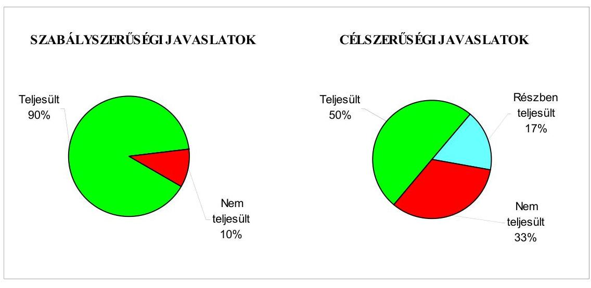

Budapest, 2008. december " 16 "
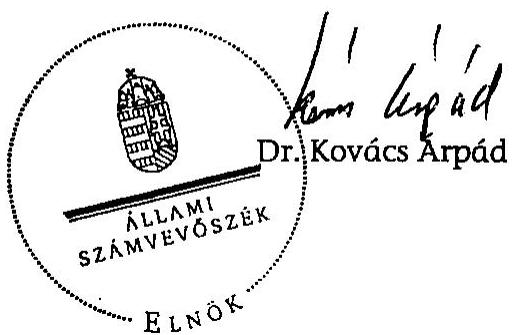

---

Budapest Főváros II. kerület Önkormányzata

# Az Önkormányzat gazdálkodását meghatározó adatok, mutatószámok 

| Megnevezés |  |
| :--: | :--: |
| A kerület állandó lakosainak száma (fő) 2008. január 1-jén | 86464 |
| A Képviselő-testület tagjainak a száma (fő) (2007. december 31-én) | 30 |
| A Képviselő-testület munkáját segítő állandó bizottságok száma (2007. december 31-én) | 8 |
| A Polgármesteri hivatalban foglalkoztatott köztisztviselők száma (fő) (2007. december 31-én) | 292 |
| Az összes vagyon értéke a 2007. december 31-i könyvviteli mérleg szerint (millió Ft) | 95489 |
| Az adósságállomány (hosszú és rövid lejáratú kötelezettség) 2007. december 31-én (millió Ft) | 4225 |
| Az egy lakosra jutó adósságállomány (Ft) (2007. december 31-én) | 48864 |
| Az összes költségvetési bevétel (millió Ft) (2007. évben) | 18529 |
| Ebből: saját bevétel (millió Ft), melyből | 11005 |
| helyi adóbevétel (millió Ft) | 5676 |
| Az egy lakosra jutó összes költségvetési bevétel (Ft) (2007. évben) | 214297 |
| Az egy lakosra jutó saját bevétel (Ft) (2007. évben) | 127278 |
| Az egy lakosra jutó helyi adóbevétel (Ft) (2007. évben) | 65646 |
| Saját bevétel/Összes költségvetési bevétel (%) (2007. évben) | 59,4 |
| Helyi adó bevétel/Összes költségvetési bevétel (%) (2007. évben) | 30,6 |
| Az összes teljesített költségvetési kiadás (millió Ft) (2007. évben) | 16575 |
| Ebből: felhalmozási célú kiadás (millió Ft) | 3374 |
| Az összes költségvetési kiadásból a felhalmozási kiadás részaránya (%) (2007. évben) | 20,4 |
| Az egy lakosra jutó költségvetési kiadás (Ft) (2007. évben) | 191698 |
| Az egy lakosra jutó felhalmozási kiadás (Ft) (2007. évben) | 39022 |
| A költségvetési intézmények száma (db) (2007. december 31-én) | 40 |
| Ebből: részben önállóan gazdálkodó (db) | 32 |
| A költségvetési intézményekben foglalkoztatott közalkalmazottak száma (fő) (2007. december 31-én) | 2065 |

---

Budapest Főváros II. kerület Önkormányzata

# Az önkormányzati vagyon alakulása

|  Mérlegsor
megnevezése | 2005.év
(millió Ft) | 2006. év
(millió Ft) | 2007. év
(millió Ft) | Változás %-a |  |   |
| --- | --- | --- | --- | --- | --- | --- |
|   |  |  |  | 2006/2005. | 2007/2006. | 2007/2005.  |
|  Immateriális javak | 32 | 58 | 86 | 181 | 148 | 269  |
|  Tárgyi eszközök | 78546 | 81847 | 81368 | 104 | 99 | 104  |
|  ebből: ingatlanok | 74095 | 79149 | 79392 | 107 | 100 | 107  |
|  beruházások | 3762 | 1956 | 1318 | 52 | 67 | 35  |
|  Befektetett pénzügyi eszközök | 4006 | 3760 | 3534 | 94 | 94 | 88  |
|  Üzemeltetésre átadott eszközök | 4775 | 4674 | 4602 | 98 | 98 | 96  |
|  Befektetett eszközök összesen | 87359 | 90339 | 89590 | 103 | 99 | 103  |
|  Forgóeszközök összesen | 4686 | 5598 | 5899 | 119 | 105 | 126  |
|  ebből: követelések | 769 | 917 | 757 | 119 | 83 | 98  |
|  pénzeszközök | 3790 | 4546 | 5008 | 120 | 110 | 132  |
|  Eszközök összesen | 92045 | 95937 | 95489 | 104 | 100 | 104  |
|  Saját tőke összesen | 83636 | 87404 | 86136 | 105 | 99 | 103  |
|  Tartalék összesen | 3333 | 4165 | 4281 | 125 | 103 | 128  |
|  Kötelezettségek összesen | 5076 | 4368 | 5072 | 86 | 116 | 100  |
|  ebből: rövid lejáratú kötelezettségek | 2524 | 2018 | 2522 | 80 | 125 | 100  |
|  hosszú lejáratú kötelezettségek |

 1978 | 1847 | 1703 | 93 | 92 | 86  |
|  Források összesen: | 92045 | 95937 | 95489 | 104 | 100 | 104  |

Forrás: Magyar Államkincstár éves költségvetési beszámoló "01" számú űrlap adatai.

---

# Az Önkormányzat 2005-2007. évi költségvetési előirányzatainak és azok pénzügyi teljesítéseinek alakulása

|  Adatok: millió Ft-ban |  |  |  |  |  |  |  |  |  |   |
| --- | --- | --- | --- | --- | --- | --- | --- | --- | --- | --- |
|  Megnevezés | 2005. év |  |  | 2006. év |  |  | 2007. év |  |  | 2008.  |
|   | Eredeti előirányzat | Módosított Teljessítés |  | Eredeti előirányzat | Módosított Teljessítés |  | Eredeti előirányzat | Módosított Teljessítés |  | Terv  |
|  Működési célú költségvetési kiadások összesen | 12243 | 12712 | 11991 | 12737 | 14084 | 13039 | 13177 | 14334 | 13201 | 13887  |
|  Felhalmozási célú költségvetési kiadások összesen | 6198 | 7624 | 3713 | 4565 | 8112 | 4173 | 3295 | 6147 | 3374 | 4219  |
|  Költségvetési kiadások összesen | 18441 | 20336 | 15704 | 17302 | 22196 | 17212 | 16472 | 20481 | 16575 | 18106  |
|  Működési célú költségvetési bevételek összesen | 11828 | 12975 | 12885 | 12427 | 14093 | 14787 | 13160 | 14737 | 15227 | 14019  |
|  Felhalmozási célú költségvetési bevételek összesen | 4595 | 6033 | 3162 | 4488 | 7737 | 5237 | 3457 | 5975 | 3302 | 4232  |
|  Költségvetési bevételek összesen | 16423 | 19008 | 16047 | 16915 | 21830 | 20024 | 16617 | 20712 | 18529 | 18251  |
|  Költségvetési bevételek és kiadások egyenlege: hiány-, többlet+ | $-2018$ | $-1328$ | 343 | $-387$ | $-366$ | 2812 | 145 | 231 | 1954 | 145  |
|  Finanszírozási célú pénzügyi kiadások | 989 | 989 | 989 | 108 | 108 | 108 | 145 | 231 | 229 | 145  |
|  Finanszírozási célú pénzügyi bevételek | 3007 | 2317 | 2083 | 495 | 474 | 17 | 0 | 0 | 0 | 0  |
|  Finanszírozási célú pénzügyi műveletek egyenlege | 2018 | 1328 | 1094 | 387 | 366 | $-91$ | $-145$ | $-231$ | $-229$ | $-145$  |

Forrás: - Magyar Államkincstár éves költségvetési beszámoló "80" számú űrlap adatai;

- a 2008. évi adatok esetében az Önkormányzat 2008. évi költségvetése;
- a költségvetési bevétel-kiadás működési-felhalmozási célra történt megosztásánál az analitikus nyilvántartás.

---

## TANÚSÍTVÁNY

az európai uniós forrásokkal támogatott célok és programok tervezett és tényleges adatairól 2005-2008. évekre

|  Sorszám | Az európai uniós forrásokkal támogatott fejlesztés megnevezése* | Összes költségvetési kiadás | Személyi költségvetési kiadás | Tervezett költségvetési adatok (millió Ft) az összes kiadást finanszírozó források |  |  |  |  |  | Tényadatok (millió Ft) a teljesített összes kiadást finanszírozó források |  |  |  |   |
| --- | --- | --- | --- | --- | --- | --- | --- | --- | --- | --- | --- | --- | --- | --- |
|   |  |  |  |  |  |  |  |  |  |  |  |  |  |   |
|   |  |  |  |  |  |  |  |  |  |  |  |  |  |   |
|   |  |  |  |  |  |  |  |  |  |  |  |  |  |   |
|   |  |  |  |  |  |  |  |  |  |  |  |  |  |   |
|   |  |  |  |  |  |  |  |  |  |  |  |  |  |   |
|   |  |  |  |  |  |  |  |  |  |  |  |  |  |   |
|   |  |  |  |  |  |  |  |  |  |  |  |  |  |   |
|   |  |  |  |  |  |  |  |  |  |  |  |  |  |   |
|   |  |  |  |  |  |  |  |  |  |  |  |  |  |   |
|   |  |  |  |  |  |  |  |  |  |  |  |  |  |   |
|   |  |  |  |  |  |  |  |  |  |  |  |  |  |   |
|   |  |  |  |  |  |  |  |  |  |  |  |  |  |   |
|   |  |  |  |  |  |  |  |  |  |  |  |  |  |   |
|   |  |  |  |  |  |  |  |  |  |  |  |  |  |   |
|   |  |  |  |  |  |  |  |  |  |  |  |  |  |   |
|   |  |  |  |  |  |  |  |  |  |  |  |  |  |   |
|   |  |  |  |  |  |  |  |  |  |  |  |  |  |   |
|   |  |  |  |  |  |  |  |  |  |  |  |  |  |   |
|   |  |  |  |  |  |  |  |  |  |  |  |  |  |   |
|   |  |  |  |  |  |  |  |  |  |  |  |  |  |   |
|   |  |  |  |  |  |  |  |  |  |  |  |  |  |   |
|   |  |  |  |  |  |  |  |  |  |  |  |  |  |   |
|   |  |  |  |  |  |  |  |  |  |  |  |  |  |   |
|   |  |  |  |  |  |  |  |  |  |  |  |  |  |   |
|   |  |  |  |  |  |  |  |  |  |  |  |  |  |   |
|   |  |  |  |  |  |  |  |  |  |  |  |  |  |   |
|   |  |  |  |  |  |  |  |  |  |  |  |  |  |   |
|   |  |  |  |  |  |  |  |  |  |  |  |  |  |   |
|   |

---

# ADATLAP 

## a Budapest Főváros II. kerületi Önkormányzat európai uniós forrással támogatott fejlesztéséről

Az Önkormányzat európai uniós támogatással megvalósuló fejlesztése 2004. január 1-jétől.

1. A pályázó Önkormányzat (intézmény) neve: Budapest Főváros II. kerület Önkormányzata
2. A pályázó Önkormányzat (intézmény) címe: 1024 Budapest, Mechwart liget 1.
3. A

 pályázott operatív programjának megnevezése: Gazdasági Versenyképesség Op. Program, G.V.O.P.- 2004.- 4.3.2.
4. A pályázott operatív programon belül a projekt megnevezése: Önkormányzati adatvagyon másodlagos hasznosítása
5. A pályázatot készítő megnevezése: Unió Pályázati és Tanácsadó Kft.
6. A pályázott európai uniós támogatás összege:

142975000 Ft- közösségi támogatás
23275000 Ft- hazai társfinanszírozás
7. A pályázott projekt

- teljes kiadás összege: 190000000 Ft
- a megvalósítás tervezett időtartama: 2005. február 1. - 2006. december 8.

8. A pályázat elbírálásának eredménye: szerződéskötés, 87,5%-os támogatás (86% Közösségi Támogatás, 14% hazai társfinanszírozás)
9. Az elutasított pályázatnál az elutasítás okai: -
10. A pályázat tartalék státuszba helyezett-e: igen- nem
11. A támogatási szerződés adatai:

- megkötés időpontja: 2005. szeptember 28.
- a támogatás tárgya: II. kerület önkormányzata adatvagyonának másodlagos hasznosítása

---

- időbeli ütemezése:
- előírt határidők: kezdés: 2006. szeptember 28.
befejezés: 2007. május 16.
- előírt kötelezettségek: 5 éves üzemeltetés

12-13. A kifizetési kérelem adatai:

| Kifizetési kérelem (PEI) benyújtásának időpontja |  | Számla   bruttó   összege | Kért támogatási összeg | Folyósított összeg | Támogatás folyósításának időpontja | Benyújtás folyósítás között eltelt időtartam napokban |
| :--: | :--: | :--: | :--: | :--: | :--: | :--: |
| 1 | 2006. 12. 08. | előleg | 41562500 | 41562500 | 2006. 12. 19. | 11 |
| 2 | 2006. 12. 19. | 106840000 | 92510000 | 91437500 | 2007. 05. 22. | 154 |
| 3 | 2007. 04. 10. | 45320000 | 39655000 | 140000 | 2007. 07. 17. | 98 |
| 4 | 2007. 06. 12. | 37920000 | 34085000 | 33110000 | 2007. 08. 01. | 49 |

14. A külső ellenőrzésre vonatkozó adatok:

- az ellenőrzések száma: 1 db
- az ellenőrzést végző szervek megnevezése: MAG Zrt.
- az ellenőrzések megállapításai: Az ellenőrzés mindent rendben talált, a projekt pénzügyileg lezárható. Szakmai és műszaki szempontból megállapítható, hogy a beruházás megfelelő színvonalban elkészült, és további fejlesztésekre is alkalmas, ezekre lehetőséget biztosít.

15. Szabálytalanságokra vonatkozó adatok: nem állapítottak meg szabálytalanságot.

Budapest, 2008. július 11.
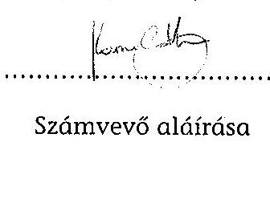

Számvevő aláírása
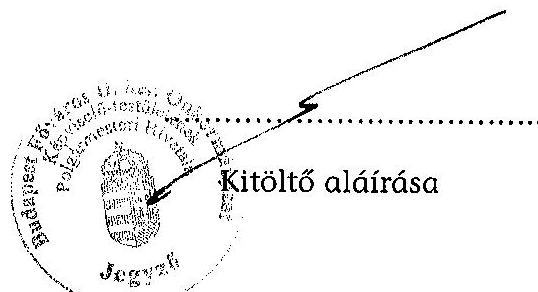

---

Budapest Főváros II. kerületi Önkormányzat
1024 Budapest,
Mechwart liget 1.
Budapest 23. Pf. 21.1277
Telefon: 346-5400
Fax: 346-5592

# Dr. Kovács Árpád: 

elnök úr részére

Ögyszám: I-519/4/2008.
Tárgy: észrevétel végleges jelentésre

Állami Számvevőszék

1364 Budapest 4.
Pf.: 54
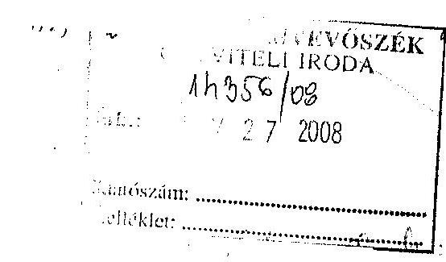

## Tisztelt Elnök Úr!

A Budapest Főváros II. Kerületi Önkormányzat gazdálkodási rendszerének 2008. évi ellenőrzéséről készített jelentés korrigálását a tett megjegyzésünk alapján elfogadjuk. Tájékoztatom továbbá, hogy időközben az alábbi intézkedéseket tettük meg:

1. A jelentés 21. oldalán jegyző számára megfogalmazott javaslatok 4. a), pontjával kapcsolatban:

Módosítottuk a tervezéssel kapcsolatos ellenőrzési nyomvonalunk saját bevételek tervezését leíró tevékenységet, amelynek értelmében a tervezés során be kell mutatni a saját bevételek előirányzatainak és a helyi rendeletek összhangját. (1. számú melléklet)
2. A jelentés 21. oldalán jegyző számára megfogalmazott javaslatok 8. pontjával kapcsolatban:

Kiegészítettük az ellenőrzési nyomvonalunkat, amelynek értelmében utalást tettünk, hogy az egyes tevékenység, feladat elvégzését milyen dokumentumokkal kell igazolni, valamint, hogy azok hol találhatók meg. (2. számú melléklet)
3. A jelentés 22. oldalán jegyző számára megfogalmazott javaslatok 9. c) pontjával kapcsolatban:

Jegyző utasítás került kiadásra, amelynek értelmében valamennyi érvényesítési feladatot ellátó munkatárs felhívásra került, hogy minden esetben a megfelelő könyvviteli elszámolásra utaló főkönyvi számot jelöljék ki. (3. számú melléklet)
4. A jelentés 23. oldalán jegyző számára megfogalmazott javaslatok 16. pontjával kapcsolatban:

---

Kiegészítésre került Annus Béláné főkönyvi könyvelő munkaköri leírása, amelynek következtében a továbbiakban feladatát képezi az eszközök és források értékelésének ellenőrzése. (4. számú melléklet)
5. A jelentés 23. oldalán jegyző számára megfogalmazott javaslatok 17. pontjával kapcsolatban:

Kiegészítésre került Kézdi Péter számítástechnikai előadó munkaköri leírása, amelynek következtében a továbbiakban feladatát képezi az informatikai rendszerek hozzáférési jogosultságainak ellenőrzése. (5. számú melléklet)
Kiegészítésre kerültek a pénzügyi-számviteli területen dolgozók munkaköri leírásai az általuk használt informatikai rendszerek megjelölésével, illetve, hogy alkalmazásuk esetében milyen jogosultsággal bínak. (6. számú melléklet)
6. A jelentés 23. oldalán jegyző számára megfogalmazott javaslatok 19. b) pontjával kapcsolatban:

Az elfogadott Ellenőrzési Terv A/I/4. pontja alatt meghatározott ellenőrzési feladat az Önkormányzat költségvetéséből céljelleggel juttatott támogatások felhasználásának ellenőrzését célozza a kedvezményezett szervezetek dokumentációinak ellenőrzése alapján. (7. számú melléklet)

Kérjük továbbá, hogy az előzetes jelentéshez az I-519/2/2008. számú levelünk 1., 3., 4. és 6. pontjaiban kialakított, de az ÁSZ által el nem fogadott észrevételeinket a végleges ellenőri jelentésben tüntessék fel, mivel azokat továbbra is fenntartjuk. (8. számú melléklet)

Budapest, 2008. november 25.
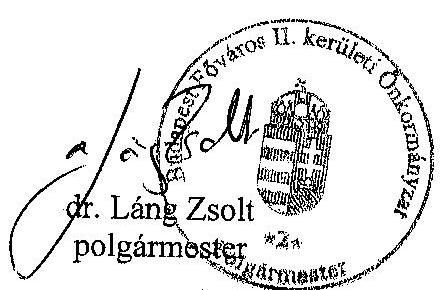

---

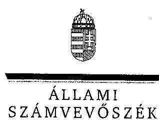

# Dr. Láng Zsolt úr, 

polgármester
Budapest Főváros II. kerületi Önkormányzat

## Budapest

Mechwart liget 1.
1024

## Tisztelt Polgármester Úr!

Köszönettel vettem a Budapest Főváros II. kerületi Önkormányzat gazdálkodási rendszerének 2008. évi ellenőrzéséről készült számvevőszéki jelentéshez küldött tájékoztatását a megtett intézkedésekről. Örömmel értesültem arról, hogy a megállapításaink, javaslataink egy részét az ellenőrzést követően megvalósították, a számvevőszéki jelentésben az érintett megállapításhoz kapcsolt lábjegyzetben a tájékoztatásában foglaltakat feltüntettük és a vonatkozó javaslatokat részben, illetve teljesen elhagytuk. Kérésének megfelelően a számvevői jelentéshez tett és az ÁSZ által el nem fogadott észrevételeit, valamint az arra adott választ a nyilvánosságra kerülő jelentésben feltüntetjük.

Az ellenőrzés lefolytatásához nyújtott segítő közreműködését köszönöm.
Budapest, 2008. december "8"
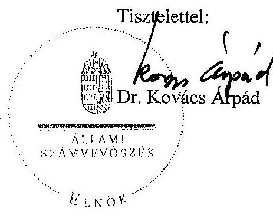

