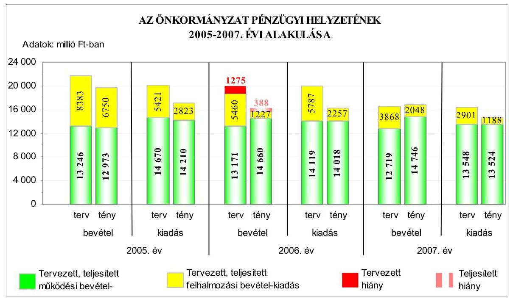
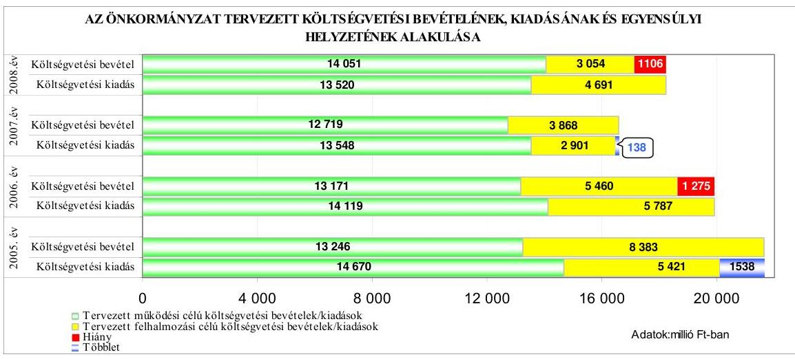
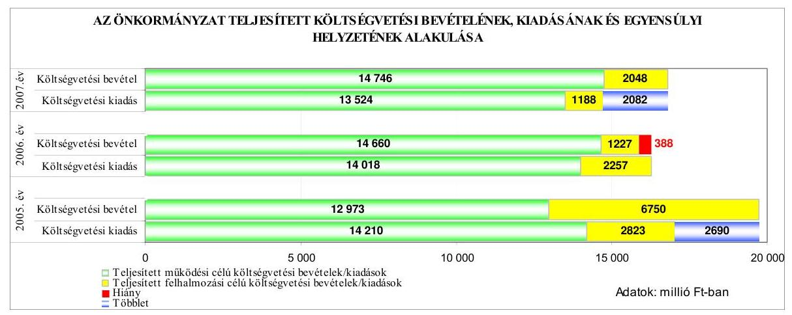
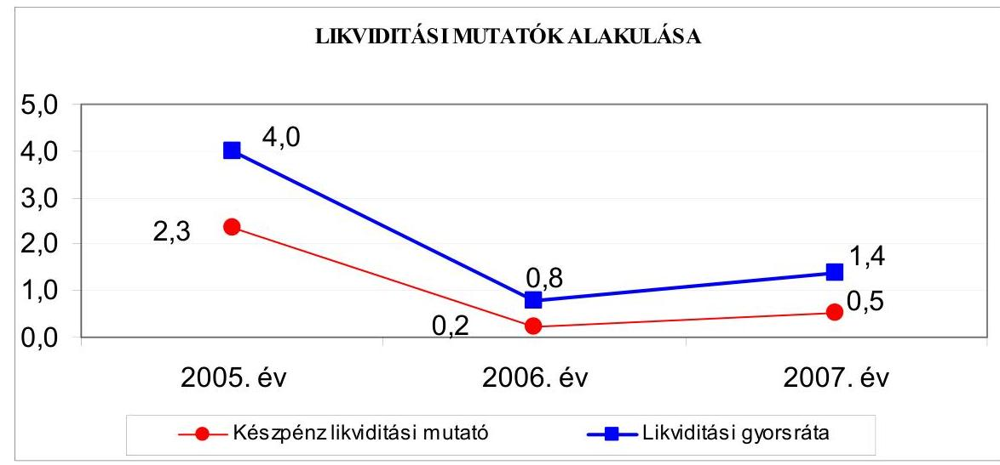
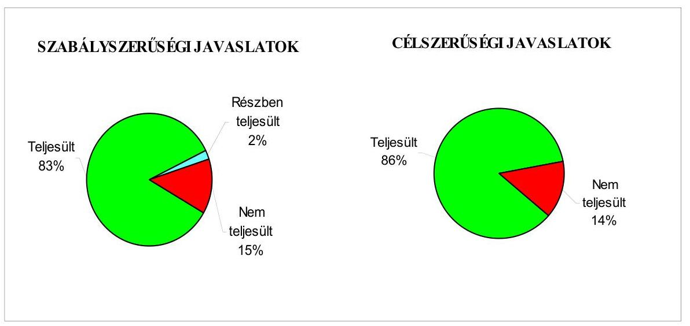
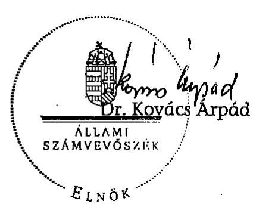
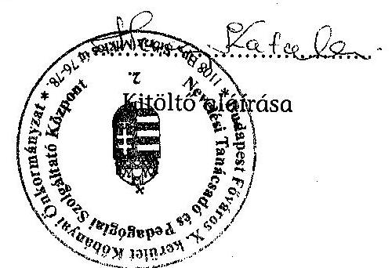
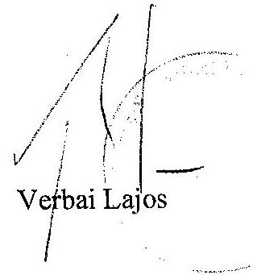
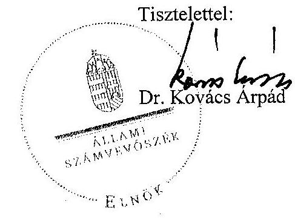

# JELENTÉS 

a Budapest Főváros X. kerület Kőbányai Önkormányzat gazdálkodási rendszerének 2008. évi ellenőrzéséről

---

# 3. Önkormányzati és Területi Ellenőrzési Igazgatóság 

## Átfogó Ellenőrzési Főcsoport

Iktatószám: V-3003-6/33/22/2008.
Témaszám: 898
Vizsgálat-azonosító szám: V0395

## Az ellenőrzést felügyelte:

Dr. Lóránt Zoltán
főigazgató
Az ellenőrzés végrehajtásáért felelős:
Dr. Sepsey Tamás
főigazgató-helyettes
Az ellenőrzést vezette:
Molnár Gyula Mihály
igazgató-helyettes
Az ellenőrzést végezték:
Vojcsekné Szabó Ágnes Köllődné Gátai Mária Tóth László számvevő tanácsos számvevő számvevő

## A témához kapcsolódó eddig készített számvevőszéki jelentések:

## címe

Jelentés Budapest Főváros X. kerület Kőbányai Önkormányzata 0417 gazdálkodásának átfogó ellenőrzéséről

Jelentés a helyi és a helyi kisebbségi önkormányzatok gazdálkodásának átfogó ellenőrzéséről

Jelentés a Magyar Köztársaság 2005. évi költségvetése végrehajtásának ellenőrzéséről

Függelék:

- a helyi önkormányzatokat a 2005. évben megillető normatív állami hozzájárulás igénylésének és elszámolásának ellenőrzése
- a kötött felhasználású támogatások 2005. évi felhasználásának ellenőrzése
- a helyi önkormányzatok beruházásaihoz és rekonstrukcióihoz nyújtott 2005. évi felhalmozási célú támogatások

Jelentés a fővárosi önkormányzatot és a kerületi önkormányzato-
kat osztottan megillető bevételek 2007. évi megosztásáról szóló önkormányzati rendelet felülvizsgálatáról

---

# TARTALOMJEGYZÉK 

BEVEZETÉS ..... 11
I. ÖSSZEGZŐ MEGÁLLAPÍTÁSOK, KÖVETKEZTETÉSEK, JAVASLATOK ..... 16
II. RÉSZLETES MEGÁLLAPÍTÁSOK ..... 26

1. Az Önkormányzat költségvetési és pénzügyi helyzete ..... 26
1.1. A tervezett és teljesített költségvetési bevételek és kiadások alapján a költségvetési és a pénzügyi egyensúly alakulása, valamint a költségvetési hiány megállapításának szabályszerűsége ..... 26
1.2. A költségvetési és a pénzügyi egyensúlyi helyzet kialakításához tervezett és teljesített finanszírozási célú pénzügyi műveletek módja és azok hatása a tárgyévet követő évek költségvetéseire ..... 29
1.3. A költségvetés tervezésének megalapozottsága ..... 35
2. Az Önkormányzat felkészültsége az európai uniós források igénylésére és felhasználására, valamint az elektronikus közigazgatási feladatok ellátására ..... 36
2.1. Az európai uniós források igénybevételére és a várható támogatás felhasználására történt felkészülés szabályozottsága, szervezettsége ..... 36
2.1.1. Az európai uniós forrásokra történő pályázatok benyújtására vonatkozó döntések összhangja a fejlesztési célkitűzésekkel ..... 36
2.1.2. Az európai uniós forrásokhoz kapcsolódóan a pályázatfigyelés, a pályázatkészítés, valamint az európai uniós támogatással megvalósuló fejlesztés lebonyolítása belső rendjének szabályozottsága, a végrehajtás személyi, szervezeti feltételei ..... 39
2.1.3. A fejlesztési feladat lebonyolításánál a feladatellátás rendjére, az ellenőrzési feladatok teljesítésére, valamint a felelősségi szabályokra vonatkozó előírások betartása ..... 41
2.2. Az elektronikus közigazgatási feladatok ellátása, a közérdekű adatok elektronikus közzététele ..... 43
3. A költségvetési gazdálkodás belső kontrolljai ..... 45
3.1. A szabályozottság kockázata a költségvetés tervezési, gazdálkodási, beszámolási és a folyamatba épített, előzetes és utólagos vezetői ellenőrzési feladatoknál ..... 45
3.2. A belső kontrollok érvényesülése az önkormányzati források szabályszerű felhasználásában, a költségvetési tervezés, gazdálkodás, beszámolás folyamataiban ..... 49
3.3. A belső ellenőrzési kötelezettség teljesítése, javaslatainak hasznosulása ..... 52

---

4. Az ÁSZ korábbi ellenőrzési javaslatai alapján készített intézkedési terv végrehajtása, eredményessége ..... 57
4.1. Az Önkormányzat gazdálkodási rendszerének átfogó ellenőrzése során tett javaslatok végrehajtására tervezett intézkedések megvalósulása ..... 57
4.2. A zárszámadáshoz kapcsolódó (állami hozzájárulások, támogatások igénylésének és felhasználásának ellenőrzése), valamint a további vizsgálatok esetében a megállapítások, javaslatok alapján tett intézkedések ..... 62
MELLÉKLETEK
5. számú Az Önkormányzat gazdálkodását meghatározó adatok, mutatószámok (1 oldal)
6. számú Az önkormányzati vagyon alakulása (1 oldal)
7. számú Az Önkormányzat 2005-2007. évi költségvetési előirányzatainak és azok pénzügyi teljesítéseinek alakulása (1 oldal)
8. számú Tanúsítvány az európai uniós forrásokkal támogatott programok, célok tervezett és tényleges 2005-2008. évi adatairól (1 oldal)
9. számú Adatlap az Önkormányzat európai uniós forrással támogatott fejlesztéséről (3 oldal)
10. számú Verbai Lajos úr, a Budapest Főváros X. kerület Kőbányai Önkormányzat polgármestere által adott tájékoztatás (1 oldal)
11. számú Verbai Lajos úr, a Budapest Főváros X. kerület Kőbányai Önkormányzat polgármestere tájékoztatására adott válasz (1 oldal)

---

# RÖVIDÍTÉSEK JEGYZÉKE 

## Törvények

Áht.
Eisztv.

Cctv.

Htv.

Kbt.
Ket.

Ötv.
Számv. tv.
Szoc. tv.

## Rendeletek

2005. évi költségvetési rendelet

2005. évi zárszámadási rendelet

2006. évi költségvetési rendelet

2006. évi zárszámadási rendelet

18/2005. (XII. 27.) IHM rendelet
az államháztartásról szóló 1992. évi XXXVIII. törvény az elektronikus információszabadságról szóló 2005. évi XC. törvény
a helyi önkormányzatok címzett és céltámogatási rendszeréről szóló 1992. évi LXXXIX. törvény
a helyi önkormányzatok és szerveik, a köztársasági megbízottak, valamint egyes centrális alárendeltségű szervek feladat- és hatásköreiről szóló 1991. évi XX. törvény
a közbeszerzésekről szóló 2003. évi CXXIX. törvény
a közigazgatási hatósági eljárás és szolgáltatás általános szabályairól szóló 2004. évi CXL. törvény
a helyi önkormányzatokról szóló 1990. évi LXV. törvény
a számvitelről szóló 2000 . évi C. törvény
a szociális igazgatásról és a szociális ellátásokról szóló 1993. évi III. törvény

Budapest Főváros X. kerület Kőbányai Önkormányzat 5/2005. (II. 25.) számú rendelete a 2005. évi költségvetésről
Budapest Főváros X. kerület Kőbányai Önkormányzat 14/2006. (IV. 14.) számú rendelete a 2005. évi költségvetés végrehajtásáról és az egyszerűsített beszámolójáról
Budapest Főváros X. kerület Kőbányai Önkormányzat 6/2006. (III. 1.) számú rendelete a 2006. évi költségvetésről
Budapest Főváros X. kerület Kőbányai Önkormányzat 15/2007. (IV. 20.) számú rendelete a 2006. évi költségvetés végrehajtásáról és az egyszerúsített beszámolójáról
Budapest Főváros X. kerület Kőbányai Önkormányzat 10/2007. (III. 2.) számú rendelete a 2007. évi költségvetésről
Budapest Főváros X. kerület Kőbányai Önkormányzat 14/2008. (IV. 25.) számú rendelete az Önkormányzat 2007. évi költségvetési beszámolójáról és zárszámadásáról
Budapest Főváros X. kerület Kőbányai Önkormányzat 3/2008. (II. 22.) számú rendelete a 2008. évi költségvetésről
a közzétételi listákon szereplő adatok közzétételéhez szükséges közzétételi mintákról szóló 18/2005. (XII. 27.) Informatikai és Hírközlési Miniszter rendelete

---

19/2005. (II. 11.) Korm. rendelet

Ámr.
Ber.
SzMSz
vagyongazdálkodási rendelet

Vhr.

## Szórövidítések

áfa
ÁSZ
Belső Ellenőrzési Iroda

Beruházási és Vagyonügyi Iroda
BM
CKÖ
EKOP
e-közigazgatás
EQUAL

FEUVE
GAMESZ
gazdasági program ${ }_{1}$
gazdasági program ${ }_{2}$

GKÖ
GVOP
a helyi önkormányzatok címzett- és céltámogatásai felhasználásának részletes szabályairól szóló 19/2005. (II. 11.) Korm. rendelet
az államháztartás múködési rendjéről szóló 217/1998. (XII. 30.) Korm. rendelet
a költségvetési szervek belső ellenőrzéséről szóló 193/2003. (XI. 26.) Korm. rendelet
az Önkormányzat 39/2007. (XII. 19.) számú rendelete a Szervezeti és Múködési Szabályzatáról
Budapest Főváros X. kerület Kőbányai Önkormányzat vagyonáról, a vagyontárgyak feletti tulajdonosi jogok gyakorlásáról szóló 43/2004. (VI. 24.) számú rendelete az államháztartás szervezetei beszámolási és könyvvezetési kötelezettségének sajátosságairól szóló 249/2000. (XII. 24.) Korm. rendelet
általános forgalmi adó
Állami Számvevőszék
Budapest Főváros X. kerület Kőbányai Önkormányzat Belső Ellenőrzési Irodája
Budapest Főváros X. kerület Kőbányai Önkormányzat Beruházási és Vagyonügyi Irodája
Belügyminisztérium
Cigány Kisebbségi Önkormányzat
ÚMFT Elektronikus Közigazgatási Operatív Program
elektronikus közigazgatás
Közösségi kezdeményezés az Európai Unió tagállamaiban és a társult országokban, amely lehetőséget biztosít a foglalkozáspolitika új eszközeinek kiterjesztéseire az Európai Foglalkoztatási Stratégia célkitúzéseinek megfelelően
folyamatba épített, előzetes és utólagos vezetői ellenőrzés
Budapest Főváros X. kerület Kőbányai Önkormányzat Gazdasági Műszaki Ellátó és Szolgáltató Szervezete
Budapest Főváros X. kerület Kőbányai Önkormányzat 2100/2002. (XII. 19.) számú határozatában elfogadott Kőbányai Önkormányzat gazdasági programja a 2002-2006. évekre
Budapest Főváros X. kerület Kőbányai Önkormányzat 1354/2007. (XII. 6.) számú határozatában elfogadott Kőbányai Önkormányzat gazdasági programja 20072010. évekre

Görög Kisebbségi Önkormányzat
NFT Gazdasági Versenyképesség Operatív Program

---

| HKÖ | Horvát Kisebbségi Önkormányzat |
| :--: | :--: |
| Harmat Általános Iskola | Budapest Főváros X. kerület Kőbányai Önkormányzat Harmat Általános Iskola |
| informatikai stratégia ${ }_{1}$ | Budapest Főváros X. kerület Kőbányai Önkormányzat 276/2004. (IV. 22.) számú határozatában elfogadott Kőbányai Önkormányzat informatikai stratégiája a 2002-2006. évekre |
| informatikai stratégia ${ }_{2}$ | Budapest Főváros X. kerület Kőbányai Önkormányzat 1204/2007. (X. 8.) számú határozatában elfogadott Kőbányai Önkormányzat informatikai stratégiája a 2007-2010. évekre |
| Informatikai Osztály | Budapest Főváros X. kerület Kőbányai Önkormányzat Polgármesteri Hivatalának Informatikai Osztálya |
| jegyző | Budapest Főváros X. kerület Kőbányai Önkormányzat Jegyzője |
| Képviselő-testület | Budapest Főváros X. kerület Kőbányai Önkormányzat Képviselő-testülete |
| Komplex Általános Iskola | Budapest Főváros X. kerület Kőbányai Önkormányzat Komplex Általános Iskola Intézménye |
| Közbeszerzési Döntőbizottság | Közbeszerzések Tanácsa Közbeszerzési Döntőbizottsága |
| Közoktatási és Közmúvelődési Iroda | Budapest Főváros X. kerület Kőbányai Önkormányzat Polgármesteri hivatalának Közoktatási és Közmúvelődési Irodája |
| MÁK | Magyar Államkincstár |
| Népjóléti Osztály | Budapest Főváros X. kerület Kőbányai Önkormányzat Polgármesteri hivatalának Népjóléti Osztálya |
| Nevelési Tanácsadó | Budapest Főváros X. kerület Kőbányai Önkormányzat Nevelési Tanácsadó és Nevelési Szolgáltató Központ |
| NFT | Nemzeti Fejlesztési Terv |
| NKÖ | Német Kisebbségi Önkormányzat |
| ÖKIF Hitelprogram | „Sikeres Magyarországért" Önkormányzati Infrastruktúrafejlesztési Hitelprogram |
| ÖKÖ | Örmény Kisebbségi Önkormányzat |
| Pénzügyi Iroda | Budapest Főváros X. kerület Kőbányai Önkormányzat Polgármesteri hivatalának Pénzügyi Irodája |
| PM | Pénzügyminisztérium |
| polgármester | Budapest Főváros X. kerület Kőbányai Önkormányzat Polgármestere |
| Polgármesteri hivatal | Budapest Főváros X. kerület Kőbányai Önkormányzat Polgármesteri Hivatala |
| RKÖ | Román Kisebbségi Önkormányzat |
| RuKÖ | Ruszin Kisebbségi Önkormányzat |

---

| Szent László Gimnázium | Budapest Főváros X. kerület Kőbányai Önkormányzat Szent László Gimnázium és Szakközépiskola intézménye |
| :--: | :--: |
| Szervezési és Ügyviteli Főosztály | Budapest Főváros X. kerület Kőbányai Önkormányzat Polgármesteri Hivatalának Szervezési és Ügyviteli Főosztálya |
| Szivárvány Kht. | Szivárvány Szociális Gondozást Nyújtó Közhasznú Társaság |
| Szociális és Egészségügyi Főosztály | Budapest Főváros X. kerület Kőbányai Önkormányzat Szociális és Egészségügyi Főosztálya |
| Szociális Foglalkoztató | Budapest Főváros X. kerület Kőbányai Önkormányzat Szociális Foglalkoztató |
| ÚMFT | Új Magyarország Fejlesztési Terv |
| ügyrendi szabályzat | az Önkormányzat Ügyrendi szabályzatáról szóló 1/2004. (III. 1.) számú polgármesteri és jegyzői közös utasítás |
| Vagyonkezelő Zrt.   városrehabilitációs program | Kőbányai Vagyonkezelő Zrt.   szociális városrehabilitációs program modellkísérlet |

---

# ÉRTELMEZŐ SZÓTÁR 

1. elektronikus szolgáltatási szint
2. elektronikus szolgáltatási szint
3. elektronikus szolgáltatási szint
4. elektronikus szolgáltatási szint
európai uniós források
fejlesztési feladat (projekt)
fejlesztési célkitúzés
irányító hatóság

Az 1044/2005. (V. 11.) Korm. határozat alapján olyan információs, tájékoztató szolgáltatás, amely csak általános információkat közöl az adott üggyel kapcsolatos teendőkről és a szükséges dokumentumokról.
Az 1044/2005. (V. 11.) Korm. határozat alapján olyan egyirányú kapcsolatot biztosító szolgáltatás, amely az 1. szinten túl biztosítja az adott ügy intézéséhez szükséges dokumentumok, nyomtatványok letöltését, és azok ellenőrzéssel, vagy ellenőrzés nélküli elektronikus kitöltését, amely esetben a dokumentumok benyújtása hagyományos úton történik.
Az 1044/2005. (V. 11.) Korm. határozat alapján olyan kétirányú kapcsolatot biztosító szolgáltatás, amely közvetlen, vagy ellenőrzött kitöltésű dokumentum segítségével biztosítja az elektronikus adatbevitelt és a bevitt adatok ellenőrzését. Az ügy indításához, intézéséhez személyes megjelenés nem szükséges, de az ügyhöz kapcsolódó közigazgatási döntés (határozat, egyéb aktus) közlése, valamint a kapcsolódó illeték-, vagy díffizetés hagyományos úton történik.
Az 1044/2005. (V. 11.) Korm. határozat alapján olyan teljes közvetlen kétirányú ügyintézési folyamatot biztosító szolgáltatás, amikor az ügyhöz kapcsolódó közigazgatási döntés is elektronikus úton kerül közlésre, illetve a kapcsolódó illeték-, vagy díffizetés elektronikus úton is intézhető.
Az elnyert európai uniós források lehívása a támogatott projekt megvalósítása érdekében, a fejlesztés lebonyolítása során felmerült kiadások finanszírozására.
A fejlesztési feladat (projekt) tartalmilag és formailag részletesen kidolgozott, megfelelő pénzügyi háttérrel és végrehajtási ütemezéssel rendelkező fejlesztési terv, amely illeszkedik az Európai Unió, illetve a Nemzeti Fejlesztési Terv által támogatott programokhoz.
Az önkormányzat által ellátott kötelező, vagy önként vállalt feladatok ellátásának mennyiségi, vagy minőségi fejlesztésére vonatkozó terv. A mennyiségi fejlesztés megvalósulhat beszerzéssel, létesítéssel, bővítéssel, átalakítással.
A strukturális alapok és a Kohéziós alap forrásainak szabályszerű, hatékony és eredményes felhasználásához szükséges intézményrendszer felső eleme. Az irányító hatóság általános és átfogó felelősséget visel a programok, projektek hatékony és szabályszerű végrehajtásáért. Felelősségi köréből eredően ellenőrzi a közösségi, valamint a hazai jogszabályok betartását, koordinálja az európai uniós források szétosztásának folyamatát, irányítja az intézményrendszer, a statisztikai és a pénzügyi nyilvántartási rendszer múködését.

---

kedvezményezett
közremúködő szervezet
lebonyolítás

Az a helyi önkormányzat, amely a támogatási szerződést kedvezményezettként aláíra, a projektet, illetve a központi programhoz kapcsolódó támogatott önkormányzati programot végrehajtja.
A közremúködő szervezet az európai uniós támogatást elnyert kedvezményezettekkel kapcsolatot tartó szerv. Az operatív programok közremúködő szervezetei befogadják, nyilvántartják, döntésre előkészítik a pályázatokat, rögzítik a támogatással kapcsolatos adatokat az egységes monitoring informatikai rendszerben, elvégzik a támogatások előzetes (szerződéskötést megelőző), közbenső (a pénzügyi elszámolás, finanszírozás folyamatában végzett) és utólagos (a támogatott projekt pénzügyi lezárását megelőző) ellenőrzését. Az önkormányzatoknál a leggyakrabban előforduló operatív program a Regionális Fejlesztési Operatív Program végrehajtásában közremúködő szervezetek a VÁTI Kht. és a regionális fejlesztési ügynökségek.
A Kohéziós alap két közremúködő szervezete (Gazdasági és Közlekedési Minisztérium, Környezetvédelmi és Vízügyi Minisztérium) a támogatott projektek végrehajtásához kapcsolódó operatív feladatokat látják el. Ennek keretében megkötik a szerződéseket a projekt kedvezményezettjével, folyamatosan nyomon követik a teljesítéseket, lebonyolítják a támogatások kifizetését, vezetik az egységes monitoring informatikai rendszert.
Az európai uniós források felhasználásával megvalósuló fejlesztésre irányuló műszaki, gazdasági (pénzügyi) tevékenységet magában foglaló szervezési, irányítási szolgáltatás. A szervezési szolgáltatás kiterjedhet a pályázatkészítésre, a közbeszerzési eljárás lebonyolításán keresztül a folyamatos műszaki ellenőrzésre, a pénzügyi elszámolásra, a műszaki átadás-átvételre, az üzembe helyezésre, illetve a fejlesztési folyamat egyes elemeire.

---

operatív program

támogatási szerződés

Az Európai Bizottság által jóváhagyott, a Közösségi Támogatási Keret végrehajtására vonatkozó 2004-2006 és 2007-2013 közötti, több évre szóló intézkedésekhez kapcsolódó prioritások egységes rendszerét tartalmazó dokumentum. A strukturális alapok operatív programjai: Agrár és Vidékfejlesztési Operatív Program (AVOP); Gazdasági Versenyképesség Operatív Program (GVOP); Humán-erőforrás-fejlesztési Operatív Program (HEFOP); Környezetvédelmi és Infrastruktúra-fejlesztési Operatív Program (KIOP); Regionális Fejlesztési Operatív Program (ROP). Az ÜMFT-hez kapcsolódó operatív programok: Gazdaságfejlesztési Operatív Program (GOP); Közlekedés Operatív Program (KÖZOP); Társadalmi Megújulás Operatív Program (TÁMOP); Társadalmi Infrastruktúra Operatív Program (TIOP); Környezet és Energia Operatív Program (KEOP); Államreform Operatív Program (ÁROP); Elektronikus Közigazgatás Operatív Program (EKOP); Nyugatdunántúli Operatív Program (NYDOP); Dél-alföldi Operatív Program (DAOP); Észak-alföldi Operatív Program (ÉAOP); Közép-magyarországi Operatív Program (KMOP); Észak-magyarországi Operatív Program (ÉMOP); Középdunántúli Operatív Program (KDOP); Dél-dunántúli Operatív Program (DDOP);
A strukturális alapok esetében az irányító hatóságnak, illetve a Kohéziós alap esetében a közremúködő szervezeteknek a kedvezményezett önkormányzattal kötött szerződése, amely a támogatás felhasználásának részletes feltételeit tartalmazza.

---

.

---

# JELENTÉS 

## Budapest Főváros X. kerület Kőbányai Önkormányzat gazdálkodási rendszerének 2008. évi ellenőrzéséről

## BEVEZETÉS

Az Ötv. 92. § (1) bekezdése, az Állami Számvevőszékről szóló 1989. évi XXXVIII. törvény 2. § (3) bekezdése, valamint az Áht. 120/A. § (1) bekezdése alapján az önkormányzatok gazdálkodását az Állami Számvevőszék ellenőrzi. Az ellenőrzésre az Országgyúlés illetékes bizottságai részére is átadott, országosan egységes ellenőrzési program szerint került sor.

Az Állami Számvevőszék a stratégiájában foglalt célkitűzéseknek megfelelően a helyi önkormányzatok költségvetési gazdálkodási rendszere átfogó ellenőrzésének programját a 2007. évtől megújította, azt kiegészítette további - teljesít-mény-ellenőrzési - elemekkel.

## Az ellenőrzés célja annak értékelése volt, hogy az Önkormányzat:

- milyen módon biztosította a költségvetési és a pénzügyi egyensúlyt a költségvetésében és annak teljesítése során, valamint változott-e a finanszírozási célú pénzügyi műveletek jelentősége a hiányzó bevételi források pótlásában;
- eredményesen készült-e fel a szabályozottság és a szervezettség terén az európai uniós források igénylésére és felhasználására, továbbá biztosította-e az e-közigazgatás feltételeit, az adatok közzétételével a gazdálkodás nyilvánosságát;
- kialakította-e a külső és a belső feltételeknek megfelelően a költségvetés tervezési, gazdálkodási és zárszámadási feladatai belső kontrollrendszerét ${ }^{1}$, ezen tevékenységek szabályszerű ellátásához hozzájárult-e a folyamatba épített, előzetes és utólagos vezetői ellenőrzés, valamint a belső ellenőrzés;
- megfelelően hasznosították-e a korábbi számvevőszéki ellenőrzések megállapításait, szabályszerűségi ${ }^{2}$ és célszerűségi javaslatait.

[^0]
[^0]:    ${ }^{1}$ A gazdálkodás szabályszerűségét biztosító kontrollrendszer alatt értjük a kiépített és múködő belső irányítási és szabályozási rendszert, valamint a belső ellenőrzési funkciók ellátásának rendszerét.
    ${ }^{2}$ A törvényi előírások betartásának elmulasztásakor a részletes megállapítások fejezetben egységesen a törvénysértés megjelölést alkalmazzuk, mivel az ÁSZ nem tehet különbséget a törvényi előírások között.

---

Az ellenőrzés típusa: átfogó ellenőrzés, amely egyidejűleg - egy ellenőrzés keretében - meghatározott területekre összpontosítva érvényesíti a szabályszerűségi, valamint a teljesítmény-ellenőrzés jellemzőit.

Az ellenőrzött időszak: az 1., 2. és 4. programpontok tekintetében a 20052007. évek és 2008. I. negyedév, a 3. ellenőrzési programpontnál a 2007. év és 2008. I. negyedév.

Budapest Főváros X. kerület Kőbányai Önkormányzat lakosainak száma 2008. január 1-jén 74594 fő volt. A 2006. évi önkormányzati választást követően az Önkormányzat 28 tagú Képviselő-testületének munkáját nyolc állandó bizottság segítette. A helyi önkormányzat mellett a 2006. évi önkormányzati választásokat követően kilenc kisebbségi önkormányzat ${ }^{3}$ működött. A polgármester a 2006. évi önkormányzati képviselő és polgármester választás óta, a jegyző az 1993. évtől tölti be tisztségét.

Az Önkormányzat feladatainak végrehajtása érdekében a 2007. év december 31-én 49 költségvetési intézményt ${ }^{4}$ működtetett, amelyekből három önállóan gazdálkodott. A feladatok ellátásában részt vett négy gazdasági társasága, továbbá öt alapítványa ${ }^{5}$. Az Önkormányzat a 2007. évi költségvetési beszámolója szerint 16794 millió Ft költségvetési bevételt ért el és 14712 millió Ft költségvetési kiadást teljesített, 2007. december 31-én a könyvviteli mérleg szerint 95395 millió Ft értékű vagyonnal rendelkezett. Az Önkormányzat vagyona a 2005. év végi állományhoz viszonyítva a 2007. évben 0,2\%-kal, 196 millió Fttal csökkent, ezen belül a forgóeszközök állománya 6,4\%-kal esett vissza, mivel a pénzeszközök értéke kétharmaddal, a követeléseké pedig 12,1\%-kal csökkent a befektetett eszközök értékének változatlan nagyságrendje mellett. A saját tőke 1,3\%-kal, a tartalék 5,6\%-kal csökkent. A kötelezettségek állománya a 2005. évhez viszonyítva a 2007. évben 52,3\%-kal nőtt a 2006. és a 2007. évben felvett összesen 798,1 millió Ft fejlesztési hitel miatt, valamint a ki nem egyenlített folyószámla hitelállomány hatására. Az összes költségvetési bevétel 65,5\%-át a saját bevétel, $42 \%$-át a helyi adó bevétel biztosította a 2007. évben. Az összes költségvetési kiadásból a felhalmozási célú kiadások részaránya a 2007. évben $8,1 \%$ volt. A 2008. évi költségvetési rendeletben 17105 millió Ft költségvetési bevételt és 18211 millió Ft költségvetési kiadást irányoztak elő. A Polgármesteri hivatalban dolgozó köztisztviselők száma 2007. december 31-én 273 fő, a költségvetési intézményekben foglalkoztatott közalkalmazottak száma 1731 fő volt. Az Önkormányzat gazdálkodását meghatározó adatokat, mutatószámokat az 1-3. számú mellékletek tartalmazzák.

Az Önkormányzat költségvetési és pénzügyi helyzetét az elemző eljárás módszerével vizsgáltuk. E körben elemeztük a költségvetés egyensúlyi helyzetének alakulását, a tervezett és tényleges költségvetési hiány okait, a mérséklésére tett

[^0]
[^0]:    ${ }^{3}$ Bolgár, cigány, görög, horvát, lengyel, német, örmény, román, ruszin.
    ${ }^{4}$ A GAMESZ-t a Képviselő-testület 1046/2007. (IX. 20.) számú határozatával 2007. december 31-én megszüntette, ezért az intézményi létszámban nem szerepeltettük.
    ${ }^{5}$ A Reménysugár Alapítványt nem vettük figyelembe, mert a polgármester 2008. június 6-án adott nyilatkozata alapján 2005. március 24-től nem múködik.

---

intézkedéseket, finanszírozásának módját, az Önkormányzat adósságállományának alakulását, összetevőit.

A teljesítmény-ellenőrzés módszerével vizsgáltuk a belső szabályozottság, szervezettség terén az Önkormányzat felkészültségét az európai uniós források figyelésére, igénylésére és felhasználására, továbbá értékeltük, hogy az igényelt európai uniós támogatások az Önkormányzat által meghatározott fejlesztési célkitűzésekhez kapcsolódtak-e. Az eredményesség szempontjából a minősítést a lényegességi szinthez való viszonyítással végeztük el. Az ellenőrzés során felmértük, hogy az e-közigazgatási feladat ellátása, illetve bevezetése, múködtetése érdekében milyen intézkedéseket tettek, valamint biztosították-e a közérdekú adatok közzétételét.

A költségvetési gazdálkodás belső kontrolljainak ellenőrzése során értékeltük, hogy a Polgármesteri hivatalnál a költségvetés tervezési, gazdálkodási, zárszámadás készítési feladatok belső kontrolljainak kiépítettsége és múködése megfelelő biztosítékot ad-e a gazdálkodási feladatok megfelelő, szabályszerű ellátására. Felmértük és minősítettük a költségvetés tervezési, a gazdálkodási, a zárszámadás készítési feladatokkal, továbbá a pénzügyi- számviteli területen az informatikával kapcsolatosan kialakított kontrollok megfelelőségét, valamint azok múködésének eredményességét, megbízhatóságát. Értékeltük a belső ellenőrzés szervezeti és szabályozási keretét, továbbá működését.

A Polgármesteri hivatalnál értékeltük a gazdálkodás folyamatában a kontrollok múködésének megbízhatóságát, ennek keretében ellenőriztük a szakmai teljesítés igazolására és az utalvány ellenjegyzésére kialakított kontrollok végrehajtását. Az ellenőrzést a következő, kiemelt kockázatuk alapján kiválasztott ${ }^{6}$, az általánostól jellemzően eltérő, egyedi eljárást igénylő gazdasági eseményekkel kapcsolatos kifizetésekre folytattuk le ${ }^{7}$ :

- a külső szolgáltató által végzett karbantartási, kisjavítási szolgáltatások,
- a gépek, berendezések, felszerelések beszerzése, továbbá
- a múködési célú pénzeszköz átadásokból az államháztartáson kívülre teljesített kifizetésekre.

[^0]
[^0]:    ${ }^{6}$ Az önkormányzatok kiemelt előirányzataira vonatkozóan, a vertikális folyamatokra elvégeztük a kockázatok becslését, amelynek eredményeként a külső szolgáltató által végzett karbantartási, kisjavítási szolgáltatások, a gépek, berendezések, felszerelések beszerzése, valamint a múködési célú pénzeszköz átadások államháztartáson kívülre teljesített kifizetései kiemelkedően kockázatos területeknek bizonyultak.
    ${ }^{7}$ A korábbi ellenőrzési tapasztalataink szerint ezeken a területeken a jegyzők nem, vagy hiányosan szabályozták a megbízás, megrendelés, illetve beszerzés indokoltságának, szükségességének elbírálására, igazolására, valamint a teljesítések dokumentálására, a kifizetések jogosságának megítélésére szolgáló kontrollokat. További kockázatot jelentett a külső szolgáltató által végzett karbantartási, kisjavítási munkák esetében, hogy az 50 ezer Ft alatti megrendelésekre vonatkozóan az ellenőrzési tapasztalataink szerint a jegyzők nem alakították ki a kötelezettségvállalások rendjét és nyilvántartási formáját, valamint a szabályozás elmulasztása esetén nem történt meg az írásbeli kötelezettségvállalás és annak az ellenjegyzése sem.

---

Az ellenőrzés hatékony elvégzése céljából a vizsgálandó területek kiválasztása során a kockázatokon alapuló megközelítés érvényesült, ezáltal az ellenőrzési erőforrásokat azokra a területekre fókuszáltuk, amelyeken legnagyobb a hibák előfordulási valószínűsége. Az ellenőrzési erőforrások ilyen típusú összpontosításával minimálisra csökkenthető a kívánt ellenőrzési bizonyosság eléréséhez szükséges időráfordítás.

A pénzügyi-számviteli folyamatokban alkalmazott belső kontrollok létezésének és múködésének ellenőrzésére a vizsgált három terület 2007. évi könyvviteli tételeiből területenként egyszerű véletlen mintát vettünk. A kijelölt gazdasági eseményre elvégzett megfelelőségi tesztek alapján értékeltük a kontrollok múködésének eredményességét, megbízhatóságát a vizsgált három területre különkülön, majd összefoglalóan ${ }^{8}$ a Polgármesteri hivatal egyedi eljárást igénylő gazdasági eseményeire. A helyszíni ellenőrzés megállapításainak részletes dokumentálását három megfelelőségi tesztlapon, öt elővizsgálati és 12 helyszíni ellenőrzési munkalapon biztosítottuk. Ezeken a teszt- és munkalapokon a minősítés alapjául szolgáló kérdések és a vonatkozó konkrét jogszabályhelyek megjelölése mellett értékeltük a kialakított belső kontrollokban rejlő kockázatokat ${ }^{9}$ és a kialakított kontrollok múködésének megbízhatóságát ${ }^{10}$.

Az ÁSZ korábbi ellenőrzési javaslatai alapján tett intézkedéseket, illetve azok megvalósítását utóellenőrzés keretében vizsgáltuk. A gazdálkodási rendszer átfogó ellenőrzése során megfogalmazott javaslatok végrehajtására tett intézkedések megvalósítását ellenőriztük, az egyéb számvevőszéki ellenőrzések során tett javaslatok esetében pedig a kiadott intézkedéseket tekintettük át.

A helyszíni ellenőrzés során kitöltött - az ellenőrzést végző számvevő és a Polgármesteri hivatal felelős köztisztviselője által aláírt - elővizsgálati és helyszíni ellenőrzési munkalapokat, azok kitöltési útmutatóit, továbbá a megfelelőségi tesztek dokumentumait a polgármester részére a számvevői jelentéssel egyidejűleg átadtuk.
${ }^{8}$ A vizsgált három terület egyedi értékelési pontszámait a területek relatív költségvetési súlyával arányosan összegeztük.
${ }^{9}$ A kialakított belső kontrollokban rejlő kockázatot alacsonynak minősítettük, ha a kontrollok - végrehajtásuk esetén - megfelelő védelmet nyújtanak a hibák bekövetkezése ellen. Közepesnek minősítettük a belső kontrollokban rejlő kockázatot, amennyiben a kontrollok - végrehajtásuk esetén - a lehetséges hibák többsége ellen védelmet nyújtanak. Magasnak értékeltük a kockázatot, ha a kontrollok - kialakításuk hiányában, vagy hiányos kialakításuk miatt - nem nyújtanak elegendő védelmet a lehetséges hibákkal szemben.
${ }^{10}$ A kontrollok múködésének eredményességét, megbízhatóságát kiválónak értékeltük abban az esetben, ha azok múködése - esetleges apróbb hiányosságoktól eltekintve megfelelt a hibák megelőzésére és kijavítására meghatározott szabályozásnak és a legmagasabb szintű elvárásoknak. Jónak minősítettük a kontrollok múködését, ha a hiányosságok száma ugyan jelentős volt, de nem veszélyeztette az ellenőrzött terület hibáinak megelőzését és kijavítását. Amennyiben a hiányosságok mértéke nem biztosította a hibák megelőzését, feltárását, kijavítását és ezáltal veszélyeztette az eredményes, megbízható múködést, a kontroll múködésének megbízhatósága gyenge minősítést kapott.

---

A jelentés megállapításainak, javaslatainak egyeztetése során a polgármester arról adott részletes tájékoztatást - egyidejúleg csatolta azokat a dokumentumokat, amelyek igazolták - hogy az időközben megtett intézkedésekkel a számvevői jelentésben tett javaslatok ${ }^{11}$ egy részét megvalósították. A megtett intézkedéseket a jelentés II. Részletes megállapítások fejezetében az adott témához kapcsolt lábjegyzetben feltüntettük és a vonatkozó javaslatokat elhagytuk.

A jelentést az ÁSZ-ról szóló 1989. évi XXXVIII. tv. 25. § (1) bekezdése alapján észrevétel közlése céljából megküldtük a Budapest Főváros X. kerület Kőbányai Önkormányzat polgármesterének. A kapott tájékoztatást a jelentés 6. számú melléklete, az arra adott választ a 7. számú melléklet tartalmazza.

[^0]
[^0]:    ${ }^{11}$ A számvevői jelentésben a helyszíni ellenőrzés során a polgármesternek egy szabályszerűségi és kettő célszerűségi javaslatot tettünk, melyből a megtett intézkedésekről szóló tájékoztatás alapján egy célszerűségi javaslatot elhagytunk. A jegyzőnek 23 szabályszerűségi és 10 célszerűségi javaslatot tettünk, melyből a megtett intézkedésekről szóló tájékoztatás alapján három szabályszerűségi javaslatot hagytunk el.

---

# I. ÖSSZEGZŐ MEGÁLLAPÍTÁSOK, KÖVETKEZTETÉSEK, JAVASLATOK 

Az Önkormányzatnál a 2005-2007. években a tervezett költségvetési bevételek és kiadások főösszege folyamatosan csökkent, a 2008. évben pedig az előző évhez viszonyítva nőtt. A teljesített költségvetési bevételek főösszege az előző évhez képest a 2006. évre csökkent, a 2007. évre nőtt. A teljesített költségvetési kiadások főösszege folyamatosan csökkent. Az Önkormányzat költségvetésének egyensúlya a 2006. és a 2008. évben nem volt biztosított, mivel a költségvetési bevételek előirányzata nem fedezte a tervezett költségvetési kiadásokat. A teljesítési adatok alapján az Önkormányzat a 2006. évben zárta pénzügyi hiánnyal az évet, amelynek mértéke a tervezettnél alacsonyabb volt. A 2005. évi költségvetési rendeletben a bevételi főösszeg megállapításakor az Áht. előírása ellenére finanszírozási célú pénzügyi múveletet vettek figyelembe pénzügyi hiányt módosító költségvetési bevételként.

A 2006. év költségvetés hiányát a múködési és a felhalmozási célú költségvetési bevételeket meghaladó összegben tervezett múködési és felhalmozási célú költségvetési kiadások okozták, azon belül is az Önkormányzat által önként vállalt múködési és felhalmozási feladatok tervezett kiadásaira az önként vállalt feladatok tervezett bevételei nem nyújtottak fedezetet. A 2008. évben a felhalmozási célú költségvetési bevételek tervezett előirányzata nem fedezte a felhalmozási célú költségvetési kiadások előirányzatát. Az Önkormányzat a 2005. és a 2007. évi költségvetési rendeletekben a költségvetés egyensúlyát biztosította, a felhalmozási célú költségvetési bevételi többlet mellett a múködési célú költségvetési bevételeknél hiányt terveztek az önként vállalt feladatok miatt. A költségvetés egyensúlyának biztosításához a 2006. és 2008. években hosszú lejáratú fejlesztési hitel felvételét tervezték.

Az Önkormányzat a 2006. évi költségvetésének végrehajtása során a pénzügyi hiány finanszírozásához hosszú lejáratú fejlesztési hitelt vett fel, a 2005. és a 2007. években annak ellenére vettek igénybe hosszú lejáratú fejlesztési hitelt, hogy a költségvetés végrehajtása során a költségvetési bevételek fedezetet nyújtottak a költségvetési kiadásokra. A költségvetési kiadások csökkentése érdekében a Képviselő-testület a 2006. és a 2007. évi költségvetési rendeletek módosítása során feladatcsökkentésről döntött, racionalizálta az oktatási intézményhálózatot, a GAMESZ feladatait 2008. év elejétől a Polgármesteri hivatal Pénzügyi Irodájába integrálta, szűkítette a szociális támogatások körét. A költségvetés tervezésének megalapozottsága a múködési célú bevételeken belül a helyi-, valamint az átengedett adók bevételeinél a 2005. és a 2006. évben kismértékben túltervezett, valamint a 2007. évben alultervezett volt, illetve az előző évi pénzmaradvány nem tervezett, de teljesített igénybevétele a 2005. évben a múködési forráshiányt mérsékelte. A felhalmozási célú költségvetési bevételek eredeti előirányzatként tervezett összegétől való elmaradást az ingatlanok értékesítéséből, valamint a felhalmozási célú pénzeszköz átvételből realizált bevételek alulteljesítése okozta. Az ingatlanértékesítés bevételének tervezése, figyelemmel a teljesítés visszatérő elmaradására, illetve alacsony szinten történt realizálására, nem volt megalapozott. A felhalmozási célú kiadásokon belül a szo-

---

ciális bérlakás építési program kivitelezésére a 2005. évi költségvetési rendeletben tervezett kiadások összege nem volt megalapozott, mivel nem vették figyelembe a beruházás műszaki kivitelezési ütemtervét.

Az évközi likviditás biztosítása érdekében az Önkormányzat a 2005-2007. években folyószámla hitelt, a 2007. évben pedig három alkalommal munkabér hitelt vett fel. A 2006. és a 2007. évet folyószámla hitel visszafizetési kötelezettséggel zárták, amely a rövid távon teljesítendő kötelezettségek növekedése miatt a fizetőképesség romlását okozta. Az Önkormányzat a 2005-2007. években 1052,7 millió Ft hosszú lejáratú fejlesztési hitelt vett fel. A hosszúlejáratú hitelállomány növekedése eladósodás szempontjából gyakorolt kedvezőtlen hatást az Önkormányzat pénzügyi helyzetére. Az eladósodás növekedését és a fizetőképesség romlását figyelembe véve az Önkormányzat pénzügyi helyzete a 2005. évhez viszonyítva a 2006. és a 2007. évben összességében romlott.

Az Önkormányzat 2005-2010. évekre vonatkozó fejlesztési célkitúzéseit a gazdasági program ${ }_{1,2}$-ben, az ágazati koncepciókban rögzítették, melyekben a megvalósítás lehetséges pénzügyi forrásait meghatározták. Az ágazati koncepciókban a fejlesztési célkitűzéseket helyzetelemzéssel alátámasztották. Az európai uniós forrásokra történő 10 pályázat benyújtására vonatkozó döntés kilenc esetben a gazdasági programban és az ágazati koncepciókban, tervekben foglalt célkitűzésekkel nem volt összhangban.

A Képviselő-testület a 2005-2008. év I. negyedévéig öt európai uniós pályázat benyújtásáról határozott, az intézményvezetők öt esetben döntöttek pályázat benyújtásáról, melyet négy esetben nem előzte meg a polgármester fenntartói nyilatkozata. A pályázatokból hármat a Polgármesteri hivatal, hetet az Önkormányzat intézményei nyújtottak be. Az Önkormányzat költségvetési rendeletei a 2006-2008. évekre az Ámr. előirása ellenére elkülönítetten nem tartalmazták az európai uniós támogatással megvalósuló projektek bevételeit és kiadásait, az Ámr-ben foglaltak ellenére a többéves kihatással járó fejlesztések nem tartalmazták az európai uniós forrásból megvalósult fejlesztési feladatokat. Az Önkormányzat a 2008. évi költségvetésében a felhalmozási célú beruházási céltartalék képzésével a pályázatok utófinanszírozására felkészült.

Az európai uniós forrásokhoz kapcsolódóan a pályázatfigyelés, a pályázatkészítés, valamint az európai uniós támogatással megvalósuló fejlesztés lebonyolításának belső rendjét nem szabályozták. Az európai uniós pályázati pénzből megvalósított fejlesztés lebonyolítási feladatainak szervezeti, a projektenkénti személyi feltételeit a Polgármesteri hivatalon belül nem alakították ki. A 2008. május 1-től hatályba lépett „A hazai és Európai Unió által nyújtott egyes pénzügyi támogatások felhasználásáról" szóló szabályzat a pályázat figyelés, készítés, felhasználás és ellenőrzés kereteit meghatározta, de ehhez kapcsolódóan a feladatok ellátásának kötelezettségét a munkaköri leírásokban nem írták elő, és a Polgármesteri hivatalon belül szervezeti egységeket nem alakítottak ki.

Az Önkormányzat Nevelési Tanácsadó és Pedagógiai Szolgáltató Központ intézménye 2006. évben a HEFOP 3. intézkedés „Kompetencia alapú oktatás elterjesztése a Dél-pesti régióban" címmel kiírt pályázatán 80 millió Ft vissza nem térítendő támogatást nyert el. A pályázat projektmenedzseri feladatait 2007. október 31-től külső személy látta el, akinek megbízási szerződésében nem ha-

---

tározták meg a felelősségi szabályokat, az ellenőrzési feladatok megosztását. A pályázati pénzből megvalósított program a módosított befejezési határidőig nem zárult le. A támogatási szerződés három alkalommal került módosításra, melyekben a költségvetés szerkezetét és ütemezését, a megvalósítás határidejét változtatták meg. A Nevelési Tanácsadó négy projekt előrehaladási jelentést adott le, amelyekben összesen 42,4 millió Ft elszámolását nyújtotta be. A támogatás ütemezésnek megfelelő igénybevételét hátráltatta, hogy a közremúködő szervezet 12-14 hónap múltán küldött hiánypótlásra felszólító levelet. A kifizetés nem történt meg 2008. I. negyedév végéig. A fejlesztési feladat kiadásainak teljesítése eltért a támogatási szerződésben meghatározott kiadások tervezett ütemezésétől. A fejlesztési feladat megvalósítását a támogató által biztosított 20 millió Ft-os előlegből, a Képviselő-testületi határozatban jóváhagyott 46,3 millió Ft-ból, valamint a Nevelési Tanácsadó saját költségvetéséből biztosított 1,6 millió Ft-ból finanszírozták. A kötelezettségvállalás, utalványozás, valamint a kapcsolódó ellenőrzési jogkörök gyakorlását hiányosan látták el. A belső ellenőrzés az európai uniós forrásból támogatott fejlesztési feladatot a megvalósítás folyamatában nem vizsgálta. Külső szervezet ellenőrzést a fejlesztési feladat megvalósítása folyamán egy alkalommal végzett, szabálytalanságot nem állapított meg.

Az Önkormányzat felkészülése a 2005-2008. I. negyedévében az európai uniós források igénybevételére és felhasználására a belső szabályozottság és szervezettség területén nem volt eredményes, mivel az európai uniós forrásokra benyújtott pályázatok kilenc esetben nem kapcsolódtak a gazdasági programban, illetve az ágazati koncepciókban meghatározott fejlesztési feladatokhoz. Az európai uniós források igénybevételének és felhasználásának feladatait nem szabályozták, az európai uniós forrásokra vonatkozó pályázatokkal összefüggésben a Polgármesteri hivatalon belül az önkormányzati szintű pályázatkoordinálás feladatainak felelősét, valamint az önkormányzati szintű pályázat nyilvántartás vezetésének felelősét nem jelölték ki. A pályázatfigyelést végzők és a döntési, illetve a döntés-előterjesztési jogkörrel rendelkezők közötti infor-máció-szolgáltatási kötelezettséget, a polgármester és a fejlesztési feladat lebonyolítója közötti kapcsolattartás rendjét, valamint az európai uniós forrásokra irányuló pályázatfigyelés, pályázatkészítés, valamint az európai uniós forrással támogatott fejlesztés lebonyolításával kapcsolatos eljárási rend meghatározását nem írták elő. Az európai uniós forrásokkal támogatott fejlesztési feladatok lebonyolításával kapcsolatos folyamatba épített, előzetes és utólagos vezetői ellenőrzési feladatokat, illetve a belső ellenőrzés rendjét nem szabályozták. A pályázatfigyelés és készítés személyi, szervezeti feltételeit a 2007. évtől a Polgármesteri hivatal két köztisztviselője, illetve megbízási szerződés alapján két gazdasági társaság látta el. A pályázatkészítés feladatát is tartalmazó megbízási szerződések nem tartalmazták a megbízott gazdasági társaság és a Polgármesteri hivatal képviselője közötti kapcsolattartás és felelősség szabályait, az információk átadásának formáját, tartalmát és módját.

Az Önkormányzat a 2005-2010. évekre vonatkozóan rendelkezett informatikai stratégia ${ }_{1,2}$-vel, melyben a 2009. évre tervezték az elektronikus ügyintézés 4. elektronikus szolgáltatási szintjének elérését. Az Önkormányzatnál az e-közigazgatási feladatokat ellátó informatikai rendszert egyes ügykörökben a 2. elektronikus szolgáltatási szinten múködtették. Az Önkormányzat az elektronikusan végezhető közigazgatási hatósági eljárási cselekményekről szóló

---

rendeletében a hatósági eljárások, az anyakönyvi, a házassági és névváltoztatási eljárások elektronikus úton való intézését nem engedélyezte. A jegyző az Áht-ban meghatározott közzétételi kötelezettségének nem tett eleget, mivel az Önkormányzat honlapján pénzeszközei felhasználásával és a vagyonnal történő gazdálkodással összefüggő adatok közül az Önkormányzat intézményeire vonatkozó adatokat nem tették közzé. Az adatok az önkormányzati honlapon nem a vonatkozó rendeletben meghatározott szerkezetben kerültek közzétételre. A 2006-2007. évi költségvetési beszámoló szöveges indoklását az Ámr-ben előírtak ellenére nem tették közzé az Önkormányzat honlapján, a közzétételt 2008. júliusáig pótolták. Az informatikai rendszer ügyfelek általi igénybevételét nem kísérték figyelemmel, annak tapasztalatait nem értékelték.

A költségvetés tervezési és a zárszámadás készítési folyamatok szabályozottságának hiányosságai magas kockázatot jelentettek a feladatok szabályszerű végrehajtásában, mivel a jegyző - az Áht. előírásai ellenére - nem alakította ki a költségvetés tervezésének és a zárszámadás készítésének ellenőrzési feladatait, nem szabályozta a költségvetés tervezésének és a zárszámadás elkészítésének rendjét, a költségvetési tervezéshez készített intézményi mutatószám felmérés adatai megalapozottságának, valamint a saját bevételek előirányzatai és a költségvetés megalapozását szolgáló helyi rendeletek összhangjának ellenőrzését, továbbá az Önkormányzat intézményei és a Polgármesteri hivatal szervezeti egységei által benyújtott költségvetési igények indokoltsága, teljesíthetősége tekintetében a munkafolyamatba épített ellenőrzést, az intézményi költségvetésekben szereplő adatok egyeztetésének, ellenőrzésének felelőseit. A jegyző - az Ámr. előírása ellenére - nem készítette elő a költségvetési szervek felügyeletét ellátó Képviselő-testület részére a költségvetési szervek elemi beszámolója felülvizsgálati rendjének szabályozását, így a Képviselő-testület azt nem határozta meg, továbbá nem írta elő az Önkormányzat intézményei által készített pénzmaradvány kimutatások szabályszerűségének ellenőrzését. A költségvetés tervezési és zárszámadás készítési folyamatban a kontrollok múködésének megbízhatósága gyenge volt, mert a jegyző - a szabályozás hiánya miatt - nem belső szabályzatban előírt módon ellenőriztette a költségvetési tervezéshez készített intézményi mutatószám felmérés adatainak megalapozottságát, az Önkormányzat intézményei és a Polgármesteri hivatal szervezeti egységei által benyújtott költségvetési igények indokoltságát és teljesíthetőségét, a saját bevételek előirányzatai és a költségvetés megalapozását szolgáló helyi rendeletek összhangját. A zárszámadás készítésének folyamatában a jegyző - a szabályozás hiánya miatt - nem belső szabályzatban előírt módon ellenőriztette az intézmények pénzmaradvány megállapításának szabályszerűségét, továbbá nem vizsgáltatta az intézményi eredeti és módosított előirányzatok, valamint a teljesítési adatok eltérésének indokoltságát, az intézményi számszaki beszámoló belső, illetve a jegyző által meghatározott adatszolgáltatással való összhangját.

A gazdálkodási, a pénzügyi-számviteli és a folyamatba épített ellenőrzési feladatok szabályozottságának hiányosságai közepes kockázatot jelentettek a feladatok szabályszerű végrehajtásában, mivel a jegyző nem gondoskodott a Képviselő-testület által jóváhagyott hivatali SzMSz elkészítéséről, nem határozta meg a gazdasági szervezet ügyrendjében a vezetők és más dolgozók feladat-, hatás- és jogkörét, az üzemeltetésre átadott eszközök tekintetében a leltározás módját és a selejtezés során döntéshozatalra jogosultak körét, a selej-

---

tezési eljárás szabályszerű végrehajtásának folyamatába épített ellenőrzésért felelős személyt, az adókövetelések tekintetében az egyszerűsített értékelési eljárás során alkalmazandó besorolási elveket, dokumentálási szabályokat. A jegyző 2008. február végéig nem szabályozta a FEUVE rendszerét és nem alakította ki eljárásrendjét, nem készítette el az ellenőrzési nyomvonalat, a kockázatkezelés és a szabálytalanságok kezelésének eljárásrendjét. A hiányosságok ellenére a kialakított belső kontrollok végrehajtásuk esetén a lehetséges hibák többsége ellen védelmet nyújtanak.

A Polgármesteri hivatalnál a külső szolgáltató által végzett karbantartási, kisjavítási szolgáltatásokkal, valamint a gépek, berendezések és felszerelések beszerzésével, létesítésével kapcsolatos kifizetések során a belső kontrollok múködésének megbízhatósága kiváló, míg az államháztartáson kívülre teljesített múködési célú pénzeszközátadások során gyenge volt. A belső kontrollok múködésének megbízhatósága összességében gyenge volt, mivel az államháztartáson kívülre teljesített múködési célú pénzeszközátadások során a szakmai teljesítés igazolására kijelölt személyek az ellenőrzési feladataikat nem végezték el. Nem ellenőrizték a kifizetések jogosultságát, összegszerűségét, továbbá a támogatási szerződésekben, megállapodásokban foglaltak szakmai teljesítését, ennek következtében az érvényesítés sem a szakmai teljesítésigazoláson alapult. Az utalvány ellenjegyzői elvégezték a gazdálkodásra vonatkozó szabályok betartásának ellenőrzését, de nem ellenőrizték a gazdálkodás folyamatában a szakmai teljesítésigazolás és az érvényesítés megtörténtét.

A Polgármesteri hivatalban az informatikai rendszer szabályozottságának hiányosságai közepes kockázatot jelentettek az informatikai feladatok biztonságos végrehajtásában, mivel nem volt szabályozott az informatikai hozzáférések ellenőrzése, a számítógépes programrendszerben az adatkarbantartás folyamata, valamint 2008. I. negyedévéig nem gondoskodtak a pénzügyiszámviteli területen dolgozók esetében az informatikával kapcsolatos szabályzatok megismertetéséről és ezen dolgozók munkaköri leírásai nem tartalmazták az informatikai feladatokat. A kialakított belső kontrollok azonban végrehajtásuk esetén a lehetséges hibák többsége ellen védelmet nyújtanak. A Polgármesteri hivatalnál az informatikai rendszer belső kontrolljainak megbízhatósága jó volt, mivel az informatikai rendszer segítette a pénzügyi-számviteli feladatok megoldását és a munkafolyamatba épített ellenőrzést, azonban a számítógépen vezetett analitikus nyilvántartások és a főkönyvi könyvelés kapcsolata négy esetben nem volt automatikus. A könyvviteli feladatok informatikai elvégzése során nem volt biztosított a könyvelési tételek visszamenőleges azonosítása a rögzítő személye és a rögzítés ideje szerint, a rögzített, de hibás, törölt bizonylatok kezelése, illetve az, hogy csak az engedélyezett tranzakciók kerüljenek könyvelésre. A feltárt hiányosságok nem veszélyeztették az eredményes, megbízható múködést.

A belső ellenőrzés szervezeti keretei kialakításának és szabályozásának hiányosságai a belső ellenőrzési feladatok végrehajtásában összességében alacsony kockázatot jelentettek, mivel a Képviselő-testület biztosította a belső ellenőrzési feladatok önálló szervezeti egységgel történő ellátását. Az előírt iskolai végzettséggel és szakmai képesítéssel rendelkező belső ellenőrök tevékenységüket a Belső Ellenőrzési Iroda keretében, közvetlenül a jegyzőnek alárendelve végezték. Annak ellenére összességében alacsony volt a kockázat, hogy a belső

---

ellenőrzés nem rendelkezett az ellenőrök rendszeres továbbképzéséhez a 2007. és a 2008. évre képzési tervvel, valamint a jegyző által jóváhagyott stratégiai tervvel, továbbá a Polgármesteri hivatal SzMSz-ében nem írták elő a belső ellenőrzési kötelezettséget, az ellenőrzést végző szervezeti egység jogállását és feladatait. A belső ellenőrzés múködésénél a kialakított kontrollok megbízhatósága jó volt, mivel a jegyző gondoskodott a költségvetési szervek ellenőrzéséről, a feladatellátás során biztosította az ellenőrzést végzők funkcionális függetlenségét, azonban a 2007. évi ellenőrzési tervben foglalt ellenőrzéseket csak 84\%ban hajtották végre az ütemezésnek megfelelően, továbbá a 2007. évben nem végezték el, és a kockázatelemzés alapján a 2008. évre sem tervezték a közbeszerzési eljárások belső ellenőrzését. A belső ellenőrzés működésénél megállapított hiányosságok nem veszélyeztették, hogy a belső ellenőrzés megelőzze, feltárja, kijavíttassa a lényeges hibákat és a szabálytalanságokat. Kettő, a 2007. évi ellenőrzési tervben tervezett és az éves ellenőrzési tervet megalapozó kockázatelemzésben magas kockázatúnak értékelt ellenőrzést nem hajtottak végre, kettő vizsgálat befejezése pedig áthúzódott a 2008. évre. A 2007. évben hat, a 2008. év I. negyedévében három soron kívüli ellenőrzést végeztek. Az ellenőrzéseket ellenőrzési program alapján hajtották végre, az ellenőrök az elvégzett ellenőrzésekről jelentést készítettek. A 2007. évi belső ellenőrzések során kettő fegyelmi eljárás megindítására okot adó cselekményt tártak fel. A belső ellenőrzési vezető elkészítette a 2007. évi ellenőrzési jelentést. A jegyző az Áht. előírása ellenére nem számolt be a 2006. és a 2007. évi költségvetési beszámoló keretében a FEUVE és a belső ellenőrzés múködéséről. A polgármester a zárszámadással egyidejűleg a Képviselő-testület elé terjesztette az Önkormányzat által alapított és fenntartott költségvetési szervek éves ellenőrzési jelentései alapján készített 2007. évi összefoglaló ellenőrzési jelentést.

A 2003-2006. években az ÁSZ által végzett ellenőrzések során tett javaslatok összességében 84\%-ban hasznosultak. Az Önkormányzat gazdálkodásának 2003. évi átfogó ellenőrzéséről készített ÁSZ jelentés 29 szabályszerűségi és 14 célszerűségi javaslatot tartalmazott. A javaslatok megvalósulása érdekében a polgármester intézkedési tervet terjesztett a Képviselő-testület elé, amelyet az elfogadott. Az ÁSZ ellenőrzés során tett javaslatokból az intézkedési tervben foglalt határidőre $77 \%$ hasznosult, $2 \%$ részben teljesült és $21 \%$ nem hasznosult. A költségvetési koncepció, a költségvetési és a zárszámadási rendelet összeállítására, tartalmára, szerkezetére, mellékleteire, a költségvetési rendeletmódosításra, az előirányzat nyilvántartási kötelezettségre, illetve a jóváhagyott előirányzatokon belüli gazdálkodásra, a gazdálkodás és a pénzügyi-számviteli feladatellátás szabályozottságára, a költségvetési gazdálkodási és ellenőrzési jogkörök gyakorlására, a céljelleggel nyújtott támogatásokra, a közbeszerzési eljárások lefolytatására, a belső ellenőrzési rendszer múködésére tett szabályszerűségi javaslatok közül összesen 22 teljesült. A javaslatok hasznosítására megtett intézkedésekkel csökkentették a gazdálkodás során lehetséges hibák bekövetkezésének kockázatát. Egy szabályszerűségi javaslat részben hasznosult, mivel a jegyző a 2005. évi költségvetés előterjesztéséhez bemutatta az Áht-ban előírt mérlegeket és kimutatásokat, kivéve a közvetett támogatásokat. A Képvi-selő-testület az Áht-ban foglaltak ellenére rendeletben nem határozta meg az Önkormányzat költségvetésének előterjesztésekor részére tájékoztatásul bemutatandó mérlegek, kimutatások tartalmát, a jegyző nem írta elő a gazdálkodás és a pénzügyi-számviteli feladatellátás szabályozottságának biztosításához kapcsolódóan tett javaslatok közül - a Vhr-ben foglaltak ellenére - az üzemel-

---

tetésre átadott eszközök tekintetében a leltározás módját, és nem gondoskodott a mennyiségi felvétellel történő leltározásáról. A költségvetési gazdálkodási és ellenőrzési jogkörök gyakorlásához kapcsolódóan tett javaslatok közül - az Ámr-ben foglaltak ellenére - a jegyző egy szerződés esetében nem gondoskodott a kötelezettségvállalás ellenjegyzéséről. A vagyongazdálkodási feladatok meghatározásával kapcsolatban nem készültek éves intézkedési tervek. A Kbt. előírásával ellentétesen az őrzés-védelmi szolgáltatás vásárlás esetében nem gondoskodtak közbeszerzési eljárás lefolytatásáról. A célszerűségi javaslatok közül három nem teljesült, a polgármester nem rendelkezett a kötelezettségvállalásra, az utalványozásra, a jegyző az ellenjegyzésre felhatalmazottak beszámoltatásának módjáról és formájáról, továbbá nem intézkedtek a beszámoltatás elvégzéséről. A polgármester nem kezdeményezte a Képviselő-testületnél az önkormányzati SzMSz kiegészítését az Önkormányzat önként vállalt feladatainak felsorolásával.

A 2005. évi zárszámadáshoz kapcsolódó ellenőrzés során az ÁSZ 12 szabályszerűségi és hét célszerűségi javaslatot tett. Valamennyi javaslat hasznosítása érdekében a polgármester intézkedési terveket terjesztett a Képviselő-testület elé, amelyeket az jóváhagyott. A fővárosi önkormányzatot és a kerületi önkormányzatokat osztottan megillető bevételek 2007. évi megosztásáról szóló fővárosi önkormányzati rendelet ellenőrzése kapcsán az ÁSZ egy szabályszerűségi javaslatot tett, amelyben foglaltak érvényesítésének érdekében a Képviselőtestület határozatban rendelkezett.

A helyszíni ellenőrzés megállapításainak hasznosítása mellett javasoljuk:

# a polgármesternek 

a jogszabályi előírások maradéktalan betartása érdekében

1. gondoskodjon az Önkormányzat gazdálkodásának 2003. évi átfogó ellenőrzése során az ÁSZ által tett és nem teljesült szabályszerűségi és célszerűségi javaslatok végrehajtásáról;
a munka színvonalának javítása érdekében
2. kezdeményezze, hogy a számvevőszéki jelentésben foglaltakat a Képviselő-testület tárgyalja meg és a feltárt hiányosságok megszüntetése érdekében készíttessen intézkedési tervet a határidők és felelősök megjelölésével;

## a jegyzönek

a jogszabályi előírások maradéktalan betartása érdekében

1. gondoskodjon róla, hogy az Önkormányzat költségvetési rendelete az Ámr. 29. § (1) bekezdés k) pontja előírásának megfelelően elkülönítetten tartalmazza az európai uniós támogatással megvalósuló projektek bevételeit és kiadásait, valamint az Ámr. 29. § (1) bekezdés g) pontjának előírása alapján a többéves kihatással járó fejlesztések tartalmazzák az európai uniós forrásból megvalósuló fejlesztéseket;

---

2. biztosítsa, hogy az Önkormányzat közzétételi kötelezettségének az 18/2005. (XII. 27.) IHM rendelet 2. § (1) bekezdésében és annak 1. és 2. számú mellékletében előírt szerkezetben tegyen eleget, valamint gondoskodjon arról, hogy az Áht. 15/B. § (1) bekezdés előírása alapján közzétett adatok az Önkormányzat intézményeinek adatait is tartalmazzák;
3. gondoskodjon Áht. 121. § (1) bekezdés a) és c) pontjainak megfelelően a költségvetés tervezési és a zárszámadás készítési folyamatok szabályozottságának biztosítása érdekében
a) a zárszámadás készítés rendjének szabályozásáról;
b) a költségvetési tervezéshez készített intézményi mutatószám felmérés adatai megalapozottsága, a saját bevételek (helyi adók, intézményi térítési díjak, egyéb szolgáltatási díjak) előirányzatai és a költségvetés megalapozását szolgáló helyi rendeletek összhangja ellenőrzésének szabályozásáról, továbbá a feladatot végző köztisztviselők munkaköri leírásaiban történő előírásáról;
c) az intézményi költségvetésekben szereplő adatok egyeztetéséért, ellenőrzéséért felelős személyek kijelöléséről a Polgármesteri hivatalban;
4. gondoskodjon az Ámr. 149. § (2) bekezdés a)-c) pontjainak megfelelően a költségvetési intézmények elemi beszámolója felülvizsgálata rendjének elkészítéséről és a Képviselő-testület részére történő előterjesztéséről;
5. a gazdálkodási, a pénzügyi-számviteli és a folyamatba épített ellenőrzési feladatok szabályszerű végrehajtási feltételeinek kialakítása érdekében:
a) gondoskodjon az Ámr 17. § (4) bekezdésében foglaltaknak megfelelően a Polgármesteri hivatal SzMSz-ének elkészítéséről, és annak az Ámr. 10. § (5) bekezdésében előírtak alapján a Képviselő-testülettel való jóváhagyásáról;
b) készítse el az Ámr. 17. § (5) bekezdésében előírtak alapján a Polgármesteri hivatal gazdasági szervezetének ügyrendjét, határozza meg a vezetők és a más dolgozók feladat-, hatás- és jogkörét;
c) határozza meg a Vhr. 8. § (18) bekezdésben foglaltak szerint az adókövetelések tekintetében az egyszerűsített értékelési eljárás során alkalmazandó besorolási elveket, dokumentálási szabályokat;
6. a Polgármesteri hivatal FEUVE rendszerének kiegészítése érdekében:
a) rögzítse az Ámr. 145/B. § (1) bekezdésében előírtak és az Ámr. 145/A. § (3) bekezdésében hivatkozott PM „Útmutató az ellenőrzési nyomvonal kialakításához" módszertani útmutatója alapján az ellenőrzési nyomvonalban az egyes tevékenységek, feladatok elvégzését igazoló dokumentumok megnevezését és a rendszerben való nyilvántartási helyét, továbbá azt, hogy az ellenőrzési nyomvonalban megnevezett feladatok részletes szabályozását mely belső szabályzat részletezi;
b) írja elő az Ámr. 145/C. § (1)-(4) bekezdéseiben foglaltak és az Ámr. 145/A. § (3) bekezdésében hivatkozott PM „Útmutató a kockázatkezelés kialakításához" módszertani útmutatója alapján a kockázatkezelési szabályzatban a kockázatok azono-

---

sítására, a kockázatok értékelésére és kategorizálására, az elfogadható kockázati szint meghatározására, a válaszintézkedések folyamatba való beépítésére, a kockázati környezet rendszeres időközönkénti felülvizsgálatára vonatkozó szabályokat, nevesítse a kockázatok folyamatgazdáit, és vezessen kockázat nyilvántartást;
7. gondoskodjon az intézményi eredeti, a módosított előirányzatok és a teljesítések eltérése indokoltságának, valamint az intézményi számszaki beszámoló belső, illetve a jegyző által meghatározott adatszolgáltatással való összhangjának az Ámr. 149. § (3) bekezdés c) és d) pontjaiban foglaltak szerinti ellenőrzéséről;
8. gondoskodjon az operatív gazdálkodás során a müködésbeli hibák megelőzése, feltárása, illetve kijavítása tekintetében kialakított kontrollrendszer megbízható müködése, kockázatainak csökkentése érdekében:
a) az Ámr. 135. § (1) bekezdésében előírtak betartásáról, hogy valamennyi kiadás teljesítésének elrendelése előtt a jegyző által kijelölt személyek okmányok alapján, a belső szabályzatban előírt módon ellenőrizzék, szakmailag igazolják azok jogosultságát, összegszerűségét, a szerződés, megrendelés, megállapodás teljesítését;
b) az Ámr. 135. § (3) bekezdésében foglaltak szerint arról, hogy az érvényesítő a szakmai teljesítésigazolás alapján ellenőrizze az összegszerűséget, a fedezet meglétét és az előírt követelmények betartását;
c) az Ámr. 137. § (3) bekezdésének előírásai alapján arról, hogy az utalvány ellenjegyzője győződjön meg az Ámr. 135. § (1) bekezdésében előírtak szerinti szakmai teljesítés igazolás és az Ámr. 135. § (3) bekezdésében előírtak szerinti szakmai teljesítés igazoláson alapuló érvényesítés megtörténtéről;
9. a belső ellenőrzés szabályszerű kereteinek kialakítása érdekében:
a) gondoskodjon a Ber. 4. § (2) bekezdésében foglaltak szerint arról, hogy a Polgármesteri hivatal SzMSz-ében előírják a belső ellenőrzési kötelezettséget, az ellenőrzést végző szervezeti egység jogállását és feladatait;
b) hagyja jóvá a Ber. 12. § k) pontjában foglaltaknak megfelelően a belső ellenőrzési vezető által az ellenőrök rendszeres továbbképzéséhez elkészített képzési tervet;
c) hagyja jóvá a Ber. 19. §-ában foglaltaknak megfelelően a stratégiai tervet;
10. készítsen az Áht. 97. § (2) bekezdés előírásának megfelelően beszámolót a FEUVE és a belső ellenőrzés müködéséről az éves költségvetési beszámoló keretében;
11. gondoskodjon az Önkormányzat gazdálkodásának 2003. évi átfogó ellenőrzése során az ÁSZ által tett és nem teljesült szabályszerűségi és célszerűségi javaslatok végrehajtásáról;
a munka színvonalának javítása érdekében
12. biztosítsa a költségvetés készítése során az ingatlan értékesítések bevételi előirányzatának, valamint a több év alatt megvalósuló beruházások kiadási előirányzatának megalapozott tervezését;

---

13. határozza meg belső szabályzatban az európai uniós források igénybevételének és felhasználásának önkormányzati szintű feladatait, ennek keretében rögzítse a döntési jogköröket, a pályázatkoordinálás feladatait és felelősét, az európai uniós pályázatokról önkormányzati szintű nyilvántartás vezetésének felelősét, az információk áramlásának rendjét, a pályázatfigyelést végzők és a döntési jogkörrel rendelkezők közötti információszolgáltatási kötelezettség előírását, a polgármester és a fejlesztési feladat lebonyolítója közötti kapcsolattartás rendjét, valamint a pályázatfigyelés, pályázatkészítés, európai uniós forrással támogatott fejlesztési feladat lebonyolításának ellenőrzési kötelezettségét, feladatait és felelőseit;
14. biztosítsa, hogy a pályázatfigyeléssel és pályázatkészítéssel megbízott gazdasági társaság megbízási szerződése tartalmazza a Polgármesteri hivatal képviselője és a megbízott gazdasági társaság közötti kapcsolattartás és felelősség szabályait, az információ átadásának formáját, tartalmát és módját;
15. gondoskodjon arról, hogy a projektmenedzseri feladatok ellátására kötött szerződés tartalmazza személyre szólóan a felelősségi szabályokat és az ellenőrzési feladatok megosztását;
16. határozza meg „A hazai és az európai unió által nyújtott egyes pénzügyi támogatások felhasználásáról készített szabályzat"-hoz kapcsolódó munkaköröket, teremtse meg az összhangot a Képviselő-testület által hozott határozat és a szabályzat között, illetve alakítsa ki a szabályzatban meghatározott feladatok ellátását biztosító szervezeti egységeket;
17. biztosítsa az informatikai rendszer ügyfelek általi igénybevételének figyelemmel kísérését és a tapasztalatok értékelését;
18. gondoskodjon az informatikai rendszer szabályozása keretében az informatikai eszközökhöz történő hozzáférés ellenőrzéséről, a pénzügyi-számviteli programrendszerben az adat karbantartási folyamat szabályozásáról;
19. gondoskodjon az informatikai rendszer működtetése keretében a pénzügyiszámviteli feladatok informatikai rendszerrel történő segítéséről, a biztonságos, dokumentált múködés feltételeinek kialakításáról;
20. gondoskodjon a belső ellenőrzések ütemezésnek megfelelő végrehajtásáról, biztosítsa az ellenőrzési tervben tervezett és az éves ellenőrzési tervet megalapozó kockázatelemzésben magas kockázatúnak értékelt ellenőrzések lefolytatását;
21. gondoskodjon a kockázatelemzés alapján a közbeszerzések, közbeszerzési eljárások belső ellenőrzés keretében történő vizsgálatáról.

---

# II. RÉSZLETES MEGÁLLAPÍTÁSOK 

## 1. AZ ÖNKORMÁNYZAT KÖLTSÉGVETÉSI ÉS PÉNZÜGYI HELYZETE

### 1.1. A tervezett és teljesített költségvetési bevételek és kiadások alapján a költségvetési és a pénzügyi egyensúly alakulása, valamint a költségvetési hiány megállapításának szabályszerűsége

Az Önkormányzatnál a 2005-2007. közötti időszakban a tervezett költségvetési bevételek és kiadások föösszege folyamatosan csökkent.

#### Abstract

Az Önkormányzat az előző évi előirányzathoz képest a 2006. és a 2007. évben a működési célú költségvetési bevételek előirányzatának folyamatos csökkenésével - ezen belül az átengedett adók és a központi költségvetési támogatás visszaesésével - számolt. A felhalmozási célú költségvetési bevételek előirányzata is csökkent, mivel az Önkormányzat a 2006. és a 2007. évben pénzügyi befektetésből származó bevételek felhalmozási célra történő felhasználását nem tervezte, a városrehabilitációs programra átvett pénzeszközökből származó bevételek visszaesésére számított. A múködési célú költségvetési kiadások folyamatosan csökkenő előirányzata mellett az éves költségvetések a beruházási és felújítási feladatokra is az előző évi előirányzathoz képest alacsonyabb előirányzatot tartalmaztak.

## A 2008. évben a tervezett költségvetési bevétel és kiadás főösszege az előző évhez viszonyítva nőtt.

Az Önkormányzat a 2007. évi előirányzathoz viszonyítva a múködési célú költségvetési bevétel előirányzatának növekedésével, - ezen belül a helyi adóbevételek, a központi költségvetési támogatás emelkedésével és az átengedett adók csökkenésével - valamint a felhalmozási célú költségvetési bevételek visszaesésével számolt. A múködési célú költségvetési kiadások előirányzatának közel változatlan nagyságrendje mellett a 2007. évi előirányzati adatokhoz viszonyítva a felhalmozási célú költségvetési kiadások - ezen belül a beruházások növekedésével kalkuláltak.

A 2005-2007. évek között a teljesített költségvetési bevételek főösszege az előző évhez képest a 2006. évre csökkent, a 2007. évre nőtt. A teljesített költségvetési kiadások főösszege évről évre csökkent.

A 2005-2007. évek között a múködési célú költségvetési kiadások folyamatosan csökkentek, egyidejűleg az azonos célú költségvetési bevételek folyamatosan nőttek. A realizált múködési célú költségvetési bevételek növekedését elsősorban az iparűzési adóból származó bevételek, valamint az átengedett adók bevételeinek emelkedése okozta. A múködési célú költségvetési kiadások mérsékelt csökkenéséhez a 2006-2007. évben elsősorban a dologi és egyéb folyó kiadások csökkené-

---

se ${ }^{12}$ járult hozzá, szociálpolitikai juttatásokra, múködési célú pénzeszközök átadására kevesebbet költöttek. A teljesített felhalmozási célú kiadások évről-évre csökkentek, mivel beruházási és felújítási feladatokra, felhalmozási célú pénzeszköz átadásra, felhalmozási célú kölcsön nyújtására kevesebbet fordítottak.

Az Önkormányzat a 2005. és a 2007. évi költségvetési rendeletében a költségvetési bevételek és a költségvetési kiadások egyensúlyát biztosította, a tervezett költségvetési bevételek fedezetet nyújtottak a költségvetési kiadásokra, a költségvetés egyensúlyát a tervezett felhalmozási célú költségvetési bevételek többlete biztosította. Az Önkormányzat 2006. és 2008. évi költségvetési rendeleteiben a tervezett költségvetési bevételek nem nyújtottak fedezetet a költségvetési kiadásokra. A költségvetés egyensúlyának biztosításához hosszú lejáratú fejlesztési hitel felvételét tervezték a 2006. évi költségvetésben 1345,3 millió Ft, a 2008. évben 1684,6 millió Ft összegben ${ }^{13}$, kötvénykibocsátással, hitelviszonyt megtestesítő értékpapírok értékesítésével nem számoltak. A múködési célú költségvetési kiadások csökkentése érdekében a 2007. és a 2008. évi költségvetési rendeletekben a dologi kiadások előirányzatait az iskolák és az óvodák esetében helyben kialakított feladatmutatók (normatívák) alapján határozták meg. A költségvetés végrehajtása során az Önkormányzat a 2005. és a 2007. években költségvetési többletet ért el, míg a 2006. évben pénzügyi hiánnyal zárta az évet. A 2006. évben a pénzügyi hiány részaránya az öszszes költségvetési kiadáshoz viszonyítva a tervezettnél alacsonyabb volt. A 2006. évben a pénzügyi hiányt az okozta, hogy a felhalmozási célú költségvetési bevételek a felhalmozási célú költségvetési kiadások 54,4\%-ára biztosítottak fedezetet. A tervezett költségvetési bevételek hiányának részaránya az öszszes költségvetési kiadáshoz viszonyítva a 2006. évi 6,4\%-ról a 2008. évre 6,1\%ra csökkent.

A 2005-2008. években a tervezett, a 2005-2007. években a teljesített múködési, valamint felhalmozási célú költségvetési bevételeket és kiadásokat, azok egyenlegeként a kialakult hiány, illetve többlet összegét, valamint a finanszírozási célú pénzügyi műveletek bevételeit és kiadásait a jelentés 3. számú melléklete részletezi.

[^0]
[^0]:    ${ }^{12}$ A dologi és egyéb folyó kiadások csökkenése az ingatlan eladások alulteljesítése miatti áfa befizetési kötelezettség, az intézmények készletbeszerzései, valamint a Szociális Foglalkoztató termelő tevékenysége iránti piaci kereslet visszaesése, továbbá a vagyonés lakásgazdálkodási tevékenység kiadásainak csökkenése miatt következett be.
    ${ }^{13}$ Az Önkormányzat a 2006. évi költségvetésében a szociális bérlakás építési program kiadásainak finanszírozására 345,3 millió Ft, a szilárd burkolatú utak javítása és burkolat építése kiadásainak finanszírozására 1000 millió Ft, a 2008. évi költségvetésében az útfelújítások, közlekedési csomópontok kivitelezési munkái kiadásainak finanszírozásához 1684,6 millió Ft hitel igénybevételét tervezte.

---

A tervezett és teljesített költségvetési bevételek és kiadások 2005-2007. évi alakulását szemlélteti a következő grafikus ábra:

A 2005-2008. években a tervezett költségvetési és a tényleges pénzügyi hiány részarányát a működési és felhalmozási célú, valamint az összes költségvetési kiadáshoz viszonyítottan szemlélteti a következő táblázat:

| Megnevezés | Részarány \%-ban |  |  |  |  |  |  |
| :--: | :--: | :--: | :--: | :--: | :--: | :--: | :--: |
|  | 2005.   évben |  | 2006.   évben |  | 2007.   évben |  | 2008.   I. ne-   gyed-   évben |
|  | Terv | Tény | Terv | Tény | Terv | Tény | Terv |
| Múködési célú költségvetési bevételek hiányának aránya a múködési célú költségvetési kiadásokhoz viszonyítva | 9,7 | 8,7 | 6,7 | - | 6,1 | - | - |
| Felhalmozási célú költségvetési bevételek hiányának aránya a felhalmozási célú költségvetési kiadásokhoz viszonyítva | - | - | 5,6 | 45,6 | - | - | 34,9 |
| A költségvetési hiány részaránya a költségvetési kiadásokhoz viszonyítva | - | - | 6,4 | 2,4 | - | - | 6,1 |

Az Önkormányzat pert indított a K\&H Pénzpiaci Nyíltvégű Befektetési Alapba történt befektetései ellenértékének megtérítése céljából, melynek eredményeként a Pénz- és Tőkepiaci Állandó Választottbíróság a 2004. évben 906,2 millió Ft kártérítést ítélt meg részére. A 906,2 millió Ft összegű bevételt - mint finanszírozási célú pénzügyi múveletet - a 2005. évi költségvetési rendeletben a bevételi főösszeg megállapításakor költségvetési hiányt módosító költ-

---

ségvetési bevételként vették számba, megsértve az Áht. 8/A. § (7) bekezdésében előírtakat.

# 1.2. A költségvetési és a pénzügyi egyensúlyi helyzet kialakításához tervezett és teljesített finanszírozási célú pénzügyi múveletek módja és azok hatása a tárgyévet követő évek költségvetéseire 

Az Önkormányzatnál a tervezett költségvetési bevételek a 2006. és a 2008. években nem biztosítottak fedezetet a költségvetési kiadásokra, a költségvetési kiadások fedezettsége a költségvetési bevételekből a 2006. évben 93,6\%, a 2008. évben 93,9\% volt. A tervezett költségvetési bevételek hiányát a 2006. évben a múködési és a felhalmozási célú költségvetési bevételeket meghaladó összegben tervezett múködési és felhalmozási célú költségvetési kiadások okozták, a 2008. évben pedig a felhalmozási célú költségvetési bevételek tervezett előirányzata nem fedezte a felhalmozási célú költségvetési kiadások előirányzatát. Az Önkormányzat a 2005. és a 2007. évi költségvetési rendeletben a költségvetési bevételek és kiadások egyensúlyát biztosította, mindkettő évben a múködési célú költségvetési bevételeknél hiányt terveztek a felhalmozási célú költségvetési bevételek többlete mellett.

Az Önkormányzat 2005-2008. években tervezett költségvetési bevételeinek és kiadásainak, valamint egyensúlyi helyzetének alakulását szemlélteti az alábbi ábra:

Az Önkormányzat a múködési célú költségvetési bevételek hiányának mérséklése céljából a 2005. és a 2007. évi költségvetési rendeleteiben létszámcsökkentésről döntött. A múködési célú költségvetési bevételek hiányának kialakulásához hozzájárult az önként vállalt feladatok ${ }^{14}$ tervezett ellátása. Az Önkor-

[^0]
[^0]:    ${ }^{14}$ Szent László Gimnázium és Szakiskola, Pataki Művelődési Központ, Kőbányai Szabadidő Központ, Újhegyi Tanuszoda, Nevelési Tanácsadó, Felnőttek Általános Iskolája, Zeneiskola, Pedagógiai Szakszolgálat, Komplex Szolgáltató Központ, Központi Tanmúhely fenntartása, illetve üzemeltetése, lapkiadás, TV műsorszolgáltatás.

---

mányzat a 2005. évi költségvetési rendeletében a Richter Rt. részvényei ellenértékének meg nem fizetése miatt indított per során megítélt 1884,9 millió Ft kártérítést, valamint a Hungexpo Rt. részvényei értékesítésének várható bevételét, 500 millió Ft-ot felhalmozási célú kiadások finanszírozására tervezte felhasználni, a 2005-2008. évi költségvetési rendeleteiben kötvénykibocsátással nem számolt.

A 2005. és a 2007. évben a teljesített költségvetési bevételek fedezték a költségvetési kiadásokat. A 2006. évben a költségvetési kiadások fedezettsége $97,6 \%$ volt. A 2005. évben a realizált múködési célú költségvetési bevételek nem érték el, a 2006. és a 2007. évben pedig meghaladták a múködési célú költségvetési kiadásokat. A teljesített felhalmozási célú költségvetési bevételek a 2005. és a 2007. évben meghaladták a felhalmozási célú költségvetési kiadásokat, a 2006. évben azonban a felhalmozási célú költségvetési bevételek nem nyújtottak fedezetet az azonos célú költségvetési kiadásokra, mivel az ingatlan értékesítés realizált bevételei elmaradtak a tervezettől.

A teljesített költségvetési bevételek és kiadások, valamint egyensúlyi helyzet alakulását szemlélteti a következő ábra:

Az Önkormányzat költségvetésének egyensúlyi helyzete az előző évhez viszonyítva a 2006. és a 2008. évben romlott, a 2007. évben pedig javult. A 2005-2007. években a pénzügyi egyensúly a tervezettnél kedvezőbben alakult. A 2006. évben a teljesített költségvetési bevételek hiányának aránya a tervezetthez képest $4 \%$ ponttal csökkent.

---

Az önkormányzatnál a 2005-2008. években tervezett és a 2005-2007. években teljesített működési és felhalmozási célú költségvetési kiadásokra a következő arányban biztosítottak fedezetet a költségvetési bevételek:

| Megnevezés | 2005.   év |  | 2006.   év |  | 2007.   év |  | 2008.   év |
| :--: | :--: | :--: | :--: | :--: | :--: | :--: | :--: |
|  | Terv | Tény | Terv | Tény | Terv | Tény | Terv |
| Múködési célú költségvetési kiadások fedezettsége múködési célú költségvetési bevételekből | 90,3 | 91,3 | 93,3 | 104,6 | 93,9 | 109,0 | 103,9 |
| Felhalmozási célú költségvetési kiadások fedezettsége felhalmozási célú költségvetési bevételekből | 154,7 | 239,2 | 94,4 | 54,4 | 133,3 | 172,4 | 65,1 |
| Költségvetési kiadások fedezettsége költségvetési bevételekbo̊l | 107,7 | 115,8 | 93,6 | 97,6 | 100,8 | 114,2 | 93,9 |

Az Önkormányzat a 2006. évi költségvetésének végrehajtása során 345,3 millió Ft hosszú lejáratú fejlesztési hitelt vett fel, a 2005. és a 2007. években annak ellenére vettek igénybe 254,6 millió Ft, illetve 452,8 millió Ft hosszú lejáratú fejlesztési hitelt ${ }^{15}$, hogy a költségvetés végrehajtása során a költségvetési bevételek fedezetet nyújtottak a költségvetési kiadásokra, mivel a felhalmozási célú költségvetési bevételeknél többlet alakult ki.

Az Önkormányzat a 2005. évben 84 szociális bérlakás felépítéséhez kölcsönszerződést kötött 592,9 millió Ft kedvezményes kamatozású, hosszú lejáratú hitel felvételére, valamint hitelszerződést 7,1 millió Ft célhitel igénybevételére. Az Önkormányzat az utófinanszírozás keretében a 2005-2006. évben összesen 599,9 millió Ft hitelt hívott le. A 2006. évben kötött hitel, valamint kedvezményes kamatozású kölcsönszerződést 2700,0 millió Ft, illetve 300,0 millió Ft célhitel felvételére az ÖKIF Hitelprogram keretében meghatározott beruházási célok közül a szilárd burkolatú úthálózat javításának és burkolatépítésének finanszírozására. A szerződéseket 2007. májusában módosították és a kölcsön felhasználásának lehetőségét kibővítették az ÖKIF hitelprogram 2. hitelcéljainak megfelelő, a költségvetésben szereplő beruházások finanszírozására. A 2007. évben 452,8 millió Ft hitelt hívtak le.

Az Önkormányzat a szociális bérlakásépítés kiadásainak finanszírozására szolgáló kamattámogatásos hitelt 15 éves, a célhitelt 10 éves lejáratra vette fel, az utolsó törlesztés 2021-ben, illetve 2015-ben esedékes. A tőke törlesztése 2006. évben, a kamattörlesztés pedig egy évvel később, a 2007. évben kezdődött el. Az úthálózat javítására felvett hitel szerződéskötésekor a felek az aláírástól számított 15 éves törlesztési futamidőben állapodtak meg, az utolsó törlesztés 2021-

[^0]
[^0]:    ${ }^{15}$ A hosszú lejáratú fejlesztési hitelekből finanszírozták a szociális bérlakások építését, szilárd burkolatú úthálózat javítását és építését.

---

ben esedékes. A tőke törlesztése a 2009. évtől kezdődik, ugyanakkor az Önkormányzat a kölcsön folyósítása napjától köteles a kamatot fizetni.

Az Önkormányzat a 2005-2007. években kötvényt nem bocsátott ki, a 2005. évben 2791,1 millió Ft kártérítést kapott ${ }^{16}$ a K\&H Pénzpiaci Nyíltvégú Befektetési Alapba történt befektetései, valamint a Richter Rt. részvényei ellenértékének megtérítésére indított per eredményeként és 563,6 millió Ft névértékű Hungexpo Rt. részvényeit 1868,4 millió Ft-ért értékesítette. A költségvetési kiadások csökkentésére irányuló intézkedésként a Képviselő-testület a 2006. és a 2007. évi költségvetési rendeletek módosítása során feladatcsökkentésről döntött, az általános iskolák férőhelyének a gyermek létszámhoz való igazítása céljából a 2007. évben két általános iskolában és a tanműhelyben megszűnt az oktatás ${ }^{17}$, a GAMESZ feladatait 2008. január 1-től a Polgármesteri hivatal Pénzügyi Irodájába integrálták ${ }^{18}$. Az Önkormányzat 2007. március 1-étől módosította a szociális ellátások és a gyermekvédelmi támogatások helyi szabályait ${ }^{19}$, amelynek során megszüntette a tanévkezdési és a fűtéskorszerűsítési támogatást, a 2007. évtől nem támogatták az első lakásingatlan megszerzését kamatmentes kölcsön nyújtásával.

A felhalmozási célú hitelek állománya ${ }^{20}$ a december 31-i állapot szerint a 2005. évben 1213,6 millió Ft, a 2006. évben 1488,8 millió Ft, a 2007. évben pedig 1862,6 millió Ft volt.

A folyószámla hitel felvételét a bevételek kiadásoktól eltérő ütemben történt realizálása indokolta. Az Önkormányzat a 2005. évben január és júliusdecember hónapokban, a 2006. évben február, március és júniustól december hónappal bezárólag, a 2007. évben november hónap kivételével minden hónapban, a 2008. év I. negyedévének mindhárom hónapjában vett igénybe folyószámla hitelt, amelynek éves átlagos állománya a folyószámla keretösszegének 2005-ben 1,5\%-a, a 2006. évben 1,6\%-a, a 2007. évben 1,4\%-a volt. Az Önkormányzatnak a 2007. év végén annak ellenére 497,0 millió Ft vissza nem fizetett folyószámla hitele volt, hogy az év végi pénzeszköz állománya a tartozás $96,3 \%$-át fedezte. Az Önkormányzat likviditási nehézségei miatt a 2007. évben a január, február és az augusztus havi bérkifizetéshez vett fel munkabér hitelt 235,7 millió Ft-ot, 223,6 millió Ft-ot, valamint 230,2 millió Ft-ot, amelyet az év folyamán négy millió Ft kamatfizetési kötelezettségével együtt kiegyenlített.

[^0]
[^0]:    ${ }^{16}$ A kártérítést 2005. január 5-én utalták át az Önkormányzat bankszámlájára.
    ${ }^{17}$ A Képviselő-testület 537/2007. (V. 10.) számú határozata alapján megszűnt a Cserkesz u. 10-14. szám alatt múködő általános iskola. A Képviselő testület 577/2007. (V. 17.) számú határozatában döntött az Oktatástechnikai Központi Műhely jogutód nélküli megszüntetéséről.
    ${ }^{18}$ A Képviselő-testület 1046/2007. (IX. 20.) számú határozatában döntött a GAMESZ megszüntetéséről.
    ${ }^{19}$ Az Önkormányzat 6/2007. (II. 16.) számú rendelete a szociális ellátások és gyermekvédelmi támogatások helyi szabályairól.
    ${ }^{20}$ A hitel állományának összege a hosszú lejáratú tartozás mellett a következő évi törlesztő részletet is tartalmazza.

---

A likviditási problémák megoldására a 2005-2008. években felvett folyószámlahitellel kapcsolatos jellemzőket mutatja be a következő táblázat:

| Megnevezés | 2005.   évben | 2006.   évben | 2007.   évben | 2008.   I. negyed   évben |
| :-- | :--: | :--: | :--: | :--: |
| A folyószámlahitel keretösszege   (millió Ft-ban) ${ }^{21}$ | 2000 | 2000 | 2000 | 2000 |
| Év végén fennálló folyószámlahitel   (millió Ft-ban) | 0 | 849 | 497 |  |
| Folyószámlahitellel zárt napok száma | 102 | 149 | 213 | 57 |
| A ténylegesen felvett folyószámlahitel   éves átlagos állománya (millió Ft-   ban) | 30 | 31 | 28 | 28 |
| A felvett folyószámlahitel minimum   összege (millió Ft-ban) | 1 | 1 | 1 | 1 |
| A felvett folyószámlahitel maximum   összege (millió Ft-ban) | 245 | 478 | 271 | 212 |

Az Önkormányzatnál a rövid lejáratú kötelezettségek aránya az összes kötelezettségen belül a 2005. és a 2006. évben nőtt, míg a 2007. év végén csökkent. Az esedékességi aránymutató ${ }^{22}$ a 2005. évhez viszonyítva a 2006. évben nőtt a rövid lejáratú kötelezettségállomány év végi növekedése következtében, amit a vissza nem fizetett, 849,0 millió Ft összegű folyószámla hiteltartozás okozott. Az Önkormányzatnak a 2007. év végére csökkent a vissza nem fizetett folyószámla hitelállománya ${ }^{23}$, és ezzel együtt a rövid lejáratú kötelezettsége is, ami a 2006. évhez viszonyítva az esedékességi aránymutató javulását eredményezte. Az Önkormányzat eladósodása a 2005. évhez viszonyítva emelkedett, mivel a hosszú- és rövid lejáratú fizetési kötelezettségek önkormányzati összes forráson belüli aránya a 2006. évre nőtt és a 2007. évben az előző évvel közel azonos szinten alakult. Az eladósodási mutató bázisévhez viszonyított növekedését a hosszú lejáratú kötelezettségek - elsősorban a hosszú lejáratú hitelállomány - év végi emelkedése ${ }^{24}$ okozta. A 2005. évhez viszonyítva a 20062007. években eladósodás szempontjából az Önkormányzat pénzügyi helyzete kedvezőtlenül alakult.

[^0]
[^0]:    ${ }^{21}$ A folyószámlahitel-keret összege 2005. június 19-ig 3000,0 millió Ft volt, 2005. június 20-tól 2000,0 millió Ft-ra csökkent.
    ${ }^{22}$ Az esedékességi aránymutató az egyéb passzív pénzügyi elszámolások összegével csökkentett fizetési kötelezettségen belül a rövid lejáratú fizetési kötelezettségek arányát mutatja.
    ${ }^{23}$ Az Önkormányzat vissza nem fizetett folyószámla hitelállománya 2007. december 31-én 497,3 millió Ft volt.
    ${ }^{24}$ A hosszú lejáratú hitelek állománya a megelőző év december 31-ei állapotához viszonyítva a 2006. évben $32 \%$-kal, a 2007. évben $25,1 \%$-kal nőtt.

---

Az Önkormányzat fizetőképességét jelző mutatók alakulását a 2005-2007. években a következő ábra szemlélteti:

Az Önkormányzatnál a költségvetési kiadások teljesíthetőségét, ezáltal a feladatok megvalósíthatóságát jelző fizetőképességi mutatók (készpénz likviditási mutató ${ }^{25}$ és likviditási gyorsráta) ${ }^{26}$ 2006. és 2007. évi mértéke a 2005. évvel öszszevetve jelentősen visszaestek. A pénzeszközök ${ }^{27}$ a 2005. év végén a rövid lejáratú kötelezettségek 2,3-szorosára, a 2006. és a 2007. évben azonban mindössze 0,2-szeresére, valamint 0,5 -szeresére nyújtottak fedezetet. A csökkenést a rövid lejáratú kötelezettségállomány növekedése mellett a pénzeszközök év végi állományának visszaesése okozta ${ }^{28}$, amely folyamatot a rövid lejáratú kötelezettségek kiegyenlítéséhez bevonható követelések és a hitelviszonyt megtestesítő forgatási célú értékpapírok nem ellensúlyoztak, az Önkormányzat fizetőképessége romlott.

Az Önkormányzat pénzügyi helyzete - az eladósodás növekedését és a fizetőképesség romlását figyelembe véve - a 2005. évhez viszonyítva a 2006. és a 2007. évben összességében kedvezőtlenül alakult, a 2006. és 2007. év viszonylatában azonban javult.

[^0]
[^0]:    ${ }^{25}$ A készpénz likviditási mutató a pénzeszközök év végi állományának a rövid lejáratú kötelezettségekhez mért arányát mutatja.
    ${ }^{26}$ A likviditási gyorsráta azt mutatja, hogy a rövid lejáratú kötelezettségek kiegyenlítéséhez a pénzeszközökön túl a bevonható követelések, forgatási célú értékpapírok együttesen milyen arányban nyújtanak fedezetet.
    ${ }^{27}$ A 2005. évben 1344,1 millió Ft, a 2006. évben 329,8 millió Ft a 2007. évben 478,4 millió Ft volt a pénzeszközök év végi záró állománya.
    ${ }^{28}$ Az Önkormányzat számlájára 2005. év december 22-én utalták át a Hungexpo Rt. részvényei értékesítésének bevételét, 1868,4 millió Ft-ot, valamint december 29-én a 462,5 millió Ft összegű iparűzési adót.

---

# 1.3. A költségvetés tervezésének megalapozottsága 

Az Önkormányzatnál az évek sorrendjében az eredeti előirányzathoz viszonyítva a költségvetési bevételek föösszege 91,2-85,3-101,3\%-ban, a költségvetési kiadások föösszege 84,8-81,8-89,4\%-ban teljesült. A múködési célú költségvetési bevételek teljesítése a 2005. évben elmaradt az eredeti előirányzattól, a 2006. és a 2007. évben meghaladta azt. A múködési célú költségvetési kiadások teljesítése mindhárom évben alacsonyabb volt a tervezett eredeti előirányzatnál. A felhalmozási célú költségvetési bevételek és kiadások teljesítése mindhárom évben alatta maradt az eredeti előirányzatnak.

A 2005. és a 2006. évben a költségvetési kiadások tervezett összege a költségvetési bevételek eredeti előirányzatának teljesítési mértéke alatt teljesült, aminek következtében az év végi többlet nőtt, illetve a 2006. évben a pénzügyi hiány csökkent. A 2007. évben a költségvetési kiadások eredeti előirányzatként tervezett összege 89,4\%-ra teljesült a költségvetési bevételek eredeti előirányzatának túlteljesítése mellett, amely az év végi pénzügyi többlet növekedését eredményezte.

A múködési célú költségvetési bevételeknek az eredeti előirányzathoz viszonyított alul, illetve túlteljesítésében a helyi adóbevételeknek, az átengedett adók bevételeinek, valamint a 2005. és a 2007. évben az előző évi pénzmaradvány nem tervezett ${ }^{29}$, de teljesített igénybevételének volt meghatározó szerepe. Az Önkormányzat a helyi adók-, valamint az átengedett adók bevételi előirányzatát a 2005. és a 2006. évben alulteljesítette, a 2007. évben pedig túl teljesítette. A helyi adók alul és túlteljesítésével összefüggésben tervezési hiányosság nem volt.

A felhalmozási célú költségvetési bevételek eredeti előirányzatként tervezett öszszegétől való elmaradást az ingatlanok értékesítéséből, valamint a támogatásértékű felhalmozási célú pénzeszközátvételből realizált bevételek eredeti előirányzatainak alulteljesítése okozta. Az Önkormányzat a 2005. évben 26,1 millió Ft, a 2006. évben 8,6 millió Ft, a 2007. évben 674,2 millió Ft nem tervezett pénzmaradványt vett igénybe felhalmozási célra. Az ingatlanértékesítés bevételének tervezése - figyelemmel a teljesítés visszatérő elmaradására, illetve alacsony arányban történt realizálására - nem volt megalapozott. Az Önkormányzat a beruházási és felújítási kiadásait az eredeti előirányzathoz viszonyítva a 2005. évben 56,3\%-ra, illetve 132,0\%-ra, a 2006. évben $54,4 \%$-ra, valamint $83,4 \%$-ra, a 2007. évben pedig $38,4 \%$-ra és $66,8 \%$-ra teljesítette. A szociális bérlakás építési program teljes bekerülési költségének eredeti kiadási előirányzatként való jóváhagyása ${ }^{30}$ a 2005. évi költségvetési rendeletben nem volt megalapozott, mivel a beruházás múszaki kivitelezési ütemterve alapján a kivitelezési munkákat a 2006. év első félévének végén tervezték befejezni.

[^0]
[^0]:    ${ }^{29}$ Az Önkormányzat a 2005. és a 2007. évben nem élt az előző évi pénzmaradványigénybevétel bevételei tervezésének lehetőségével. A pénzmaradvány igénybevétel teljesített bevétele a 2005. évben 631,6 millió Ft, a 2007. évben pedig 718,9 millió Ft volt.
    ${ }^{30}$ A 2005. évi költségvetés 981 millió Ft eredeti előirányzatot tartalmazott, amely $45,9 \%$-ra teljesült.

---

A közbenső egyeztetés során a polgármester észrevétele szerint: „a költségvetés készítése során csak a már ismert, számszerúsített, illetve szerződéssel rendelkező ingatlan értékesitési bevételek tervezhetőek megalapozottan. Ugyanez vonatkozik a több év alatt megvalósuló beruházásokra. Ha a forrás biztosított megalapozottan tervezhető, ha bizonytalan, akkor csak (előirányzat) módosításokkal van lehetőség a pénzügyi tervekben szerepeltetni. Sem az értékesités, sem a beruházás nem jegyzői hatáskör, így nem tudja a javaslatot megvalósítani csak a rendelkezésre álló információ függvényében. A javaslat módosítása indokolt, arra hogy kezdeményezze az előirányzat módosításokat a Kép-viselő-testületnél."

Az észrevétel nem megalapozott, mivel a jelentésben azt kifogásoltuk, hogy a szociális bérlakás építési program teljes bekerülési költségének eredeti kiadási előirányzatként való jóváhagyása a 2005. évi költségvetési rendeletben nem volt összhangban a beruházás műszaki kivitelezési ütemtervével, másrészt az ingatlanértékesítések bevételének tervezése során nem vették figyelembe a piac keresleti és kínálati viszonyait, figyelemmel a teljesítés visszatérő elmaradására, illetve alacsony arányban történt realizálására. Polgármester Úr tájékoztatása alapján álláspontunkat továbbra is fenntartjuk, mert magyarázata nem az általunk feltárt problémákra adott választ. A Htv. 140. § a) pontjának előírása értelmében a jegyző feladat és hatáskörébe tartozik, hogy „elkésziti a helyi önkormányzat gazdasági programtervezeteit, a költségvetéséről szóló koncepciót, majd a költségvetési törvény elfogadása után a költségvetési rendelet, illetve az ahhoz kapcsolódó, azt megalapozó rendeletek tervezetét". A hivatkozott jogszabályi hely előírása alapján a jegyző feladatkörébe tartozik az ingatlanértékesítési és a beruházási feladatok bevételi és kiadási előirányzatának megalapozott tervezése is.

# 2. AZ ÖNKORMÁNYZAT FELKÉSZÜLTSÉGE AZ EURÓPAI UNIÓS FORRÁSOK IGÉNYLÉSÉRE ÉS FELHASZNÁLÁSÁRA, VALAMINT AZ ELEKTRONIKUS KÖZIGAZGATÁSI FELADATOK ELLÁTÁSÁRA 

### 2.1. Az európai uniós források igénybevételére és a várható támogatás felhasználására történt felkészülés szabályozottsága, szervezettsége

### 2.1.1. Az európai uniós forrásokra történő pályázatok benyújtására vonatkozó döntések összhangja a fejlesztési célkitűzésekkel

Az Önkormányzat 2005-2010. évekre vonatkozó fejlesztési célkitüzéseit a 2002-2006. évekre vonatkozó gazdasági program ${ }_{1}$-ben, az annak részét képező lakáskoncepcióban, gazdálkodási programban, oktatási koncepcióban, sportkoncepcióban, valamint a 2007-2010. évekre vonatkozó gazdasági program ${ }_{2}$ ben rögzítették. A gazdasági program ${ }_{2}$-ben 2010-ig a helyi fejlesztési elképzelésekkel egyeztetett és összehangolt közép- és hosszú távú szakmai tervek, koncepciók elkészítését határozták meg, amelyekből a városfejlesztési koncepció és a kulturális koncepció készült el.

A gazdasági program ${ }_{2}$-ben Kőbánya centrumának régió központtá történő fejlesztését, új városközpont kialakítását, a meglévő értékek megóvását, az ipari- és lakókörnyezet szétválasztását, a lakóépületek fejlesztését, a Polgármesteri hivatal szolgáltató szerepének erősítését, valamint a helyi ipar fejlődésének elősegítését tűzték ki célul. A városfejlesztési koncepcióban az élhető környezet és az életmi-

---

nőség javításával kapcsolatban megfogalmazott célok között szerepelt a kerék-párút-hálózat kiépítése.

A fejlesztési célkitűzéseket megalapozó helyzetelemzést a gazdasági program ${ }_{1,2}$ nem tartalmazott. Az ágazati koncepciókban a fejlesztési célkitűzéseket helyzetelemzéssel alátámasztották.

A gazdasági program ${ }_{1,2}$-ben a megvalósítás lehetséges pénzügyi forrásaként a befektető partnerek bevonását, a banki hitellehetőségeket, új bevételi források feltárását, hatékonyabb adóbeszedési módszerek bevezetését, a pályázati munka hatékonyságának növelését határozták meg.

Az európai uniós források elnyerésére 10 esetben nyújtottak be pályázatot, a pályázatok benyújtására vonatkozó döntés kilenc esetben a gazdasági programban és az ágazati koncepciókban, tervekben foglalt célkitűzésekkel nem volt összhangban. A Képviselő-testület 2007. október 18-i döntése alapján - a kerékpárutak fejlesztésére - benyújtott KMOP-2007-2.1.2 pályázat fejlesztési feladatát a 2007. év szeptember 15-én jóváhagyott városfejlesztési koncepció tartalmazta.

A Képviselő-testület a 2005-2008. I. negyedévéig öt európai uniós pályázat benyújtásáról döntött:

- a HEFOP-2.2.1.keretében a Polgármesteri hivatal által megpályázott „A társadalmi befogadás elősegítése a szociális területen dolgozó szakemberek képzésével" című pályázat benyújtásáról a Képviselő testület a döntési jogkört a Szociális és Egészségügyi Bizottságra ruházta át, mely a 115/2007. (II. 27.) számú határozatában döntött az önerőt nem igénylő pályázat benyújtásáról. A pályázat forráshiány miatt elutasításra került;
- a Polgármesteri hivatal a KMOP-2007-4.6.1. intézkedés keretében a Harmat Általános Iskola felújítására nyújtott be pályázatot a 2007. évben. A pályázat elutasításra került forráshiány miatt. Az Önkormányzat a 2008. évben a pályázatot újra benyújtotta, melynek elbírálása folyamatban van. A Képvi-selő-testület a pályázaton való részvételről és a 26,5 milliós önrészről a 777/2007. (VI. 14.) számú és az 1592/2007. (XII. 18.) számú határozatában döntött;
- a Polgármesteri hivatal a KMOP-2007-2.1.2 intézkedés keretében a „Kerékpárutak fejlesztése" című pályázaton vett részt. A pályázaton való részvételről és a 16,6 millió Ft-os önrész biztosításáról a Képviselő-testület a 1230/2007. (X.18.) számú határozatában döntött. Az elnyert 66,4 millió Ft összegű pályázati támogatásról a szerződés még nem került aláírásra;
- a Komplex Általános Iskola és Szolgáltató Központ az Európai Unió bizottsága által kiírt „Read Better" projekt keretében meghirdetett pályázaton való részvételről a Képviselő-testület a 440/2007. (IV. 19.) számú határozatában döntött. A benyújtott pályázat elbírálása folyamatban van.

Az intézményvezetők öt esetben döntöttek pályázat benyújtásáról, melyet négy esetben nem előzött meg a polgármester fenntartói nyilatkozata. A Képviselő-testület a 978/2000. (XI. 21.) számú határozatában az Önkormányzathoz tartozó intézmények önrész biztosítását nem igénylő pályázatainak be-

---

nyújtásához a fenntartói nyilatkozat kiadásának jogát a polgármesterre ruházta át, de ennek eljárásrendjét belső szabályzatban nem rögzítették ${ }^{31}$.

- Az Európai Unió Socrates Programja Comenius együttműködési programkeretében a Tempus Közalapítvány közreműködésével a Harmat Általános Iskola „A tudatos európai integrációért" pályázaton való részvételéről az intézmény vezetője döntött. A pályázat önrészt nem igényelt, elbírálása folyamatban van. A pályázat benyújtását megelőzően fenntartói nyilatkozatot a polgármestertől az intézmény nem kért.
- A HEFOP 3.1.4. keretében a „Kompetencia alapú oktatás elterjesztése" címmel 80 millió Ft-os fejlesztési támogatásról szóló pályázatot nyújtott be a Nevelési Tanácsadó. A polgármester a pályázat benyújtását megelőzően nyilatkozatban támogatta a pályázaton váló részvételt. A pályázaton elnyert támogatásból megvalósuló fejlesztés folyamatban van.
- Az Európai Unió Socrates Programja keretében a Tempus Közalapítvány közreműködésével a Szent László Gimnázium „Az iskolai együttmüködések" projekt megvalósítására a 2005-2007. években három pályázatot nyert el, évente 1 millió Ft értékben. A 2005. illetve 2006. évben elnyert pályázat lebonyolítása befejeződött, a 2007. évben elnyert pályázat megvalósítása folyamatban van.

A 2005-2008. I. negyedévében a Polgármesteri hivatal európai uniós pályázatot három alkalommal, az Önkormányzat intézményei hét alkalommal nyújtottak be. Az Önkormányzat költségvetési rendeletei a 2005-2008. években az Ámr. 29. § (1) bekezdés k) pontjában foglalt előírás ellenére elkülönítetten nem tartalmazták az európai uniós támogatással megvalósuló projektek bevételeit és kiadásait, az Ámr. 29. § (1) bekezdés g) pontjában előírtak ellenére a többéves kihatással járó fejlesztések nem tartalmazták az európai uniós forrásból megvalósult fejlesztési feladatokat.

A 2008. évi költségvetésben a Képviselő-testület által jóváhagyott - kerékpárutak fejlesztésére elnyert - KMOP-2007-2.1.2 pályázat megvalósításához szükséges önrészre és az utófinanszírozott pályázat lebonyolításához szükséges saját forrásra 105 millió Ft előirányzatot biztosított a felhalmozási feladatok között. A Harmat Általános Iskola felújítására benyújtott pályázathoz a Képviselő-testület által jóváhagyott 28 millió Ft-os önrészt a fejlesztési célú céltartalékok képzésénél vették figyelembe.

Az Önkormányzat a 2008. évi költségvetésében a felhalmozási célú beruházási céltartalék képzésekor ${ }^{32}$ a pályázatok utófinanszírozására felkészült. Saját forrást kiváltó pénzintézeti hitel felvételét nem terveztek.

[^0]
[^0]:    ${ }^{31}$ A közbenső egyeztetés során a polgármester által adott tájékoztatás szerint a polgármester és a jegyző a 15/2008. számú, 2008. november 1-től hatályos közös utasításban szabályozták az Önkormányzathoz tartozó intézmények esetében az önrész biztosítását nem igénylő pályázatok benyújtásához előírt fenntartói nyilatkozat kiadásának rendjét.
    ${ }^{32}$ A 2008. évi költségvetésben a felhalmozási célú céltartalékok között a részben önálló intézmények beruházására 101,5 millió Ft-ot terveztek.

---

# 2.1.2. Az európai uniós forrásokhoz kapcsolódóan a pályázatfigyelés, a pályázatkészítés, valamint az európai uniós támogatással megvalósuló fejlesztés lebonyolítása belső rendjének szabályozottsága, a végrehajtás személyi, szervezeti feltételei 

Az európai uniós forrásokhoz kapcsolódóan a pályázatfigyelés, a pályázatkészítés, valamint az európai uniós támogatással megvalósuló fejlesztés lebonyolításának belső rendjét nem szabályozták. Az európai uniós források igénybevételének és felhasználásának feladatait nem szabályozták, az európai uniós forrásokra vonatkozó pályázatokkal összefüggésben a Polgármesteri hivatalon belül az önkormányzati szintű pályázatkoordinálás feladatainak felelősét, valamint az önkormányzati szintű pályázat nyilvántartás vezetésének felelősét nem jelölték ki. A pályázatfigyelést végzők és a döntési, illetve a döntéselőterjesztési jogkörrel rendelkezők közötti információ-szolgáltatási kötelezettséget, a polgármester és a fejlesztési feladat lebonyolítója (projektmenedzsere) közötti kapcsolattartás rendjét, az európai uniós forrásokra irányuló pályázatfigyelés, pályázatkészítés, valamint az európai uniós forrással támogatott fejlesztés lebonyolításával kapcsolatos eljárási rendet (feladat, kapcsolattartás, információáramlás, ellenőrzés) nem írták elő. Az európai uniós forrásokkal támogatott fejlesztési feladatok lebonyolításával kapcsolatos folyamatba épített, előzetes és utólagos vezetői ellenőrzési feladatokat, illetve a belső ellenőrzési feladatokat - az általános szabályozáson túl - nem határozták meg.

A közbenső egyeztetés során a polgármester észrevétele szerint: „Az önkormányzaton belül készült egy teljes körü pályáztatási szabályzat: 8/2008. sz. jegyzői és polgármesteri közös utasítás a hazai és európai unió által nyújtott egyes pénzügyi támogatások felhasználásáról címmel. Ebben a vonatkozó feladatok általánosan és részletesen szabályozva vannak, egyeztetve az önkormányzat egyéb, kapcsolódó szabályaival. Meghatározzuk benne az uniós forrásokra történő pályáztatás rendjét, eljárásrendeket dolgoztunk ki, a szervezeti egységek és a felelősök megjelölésével. Meghatározásra került a pályáztatás belső bonyolítása, a dokumentumok útja, az információáramlás, döntési pontok, a döntési kompetenciák. Részletesen szabályoztuk a projektek megvalósításának rendjét, a végrehajtás és a menedzsment kapcsolattartási szabályait. Alternatívák kerültek kidolgozásra a pályázatfigyelés, és a pályázatkészités módjára és müködtetésére, azok nyomon követési és ellenőrzési feladatainak megvalósítására."

Az észrevétel nem megalapozott, mivel a „Szabályzat a hazai és Európai Unió által nyújtott egyes pénzügyi támogatások felhasználásáról" szóló 8/2008. számú jegyzői és polgármesteri közös utasítás keretszabályozás jellegű, az nem tartalmazta a feladatok elvégzésének önkormányzati szintű, konkrét rendjét, nem határozta meg az Önkormányzat intézményeinek európai uniós pályázattal kapcsolatos feladatait a nyilvántartás, az információáramlás, az információ szolgáltatási kötelezettség előirása tekintetében, valamint nem tartalmazta a polgármester és a fejlesztési feladat lebonyolítója közötti kapcsolattartás rendjét. A pályázatfigyelést végzők és a döntési jogkörrel rendelkezők közötti információszolgáltatási kötelezettség előírása során nem határozták meg a döntési jogkörrel felhatalmazott munkakört, a feladat ellátására nem jelöltek ki konkrét felelős személyt, a kapcsolódó munkaköri leírásokat nem egészítették ki a feladat ellátásával, nem jelölték ki az európai uniós pályázatok önkormányzati szintű nyilvántartásának felelősét.

A pályázatfigyelés személyi, szervezeti feltételeit 2007. május 3-ig nem alakították ki, a feladat ellátását a pályázati referens és a nemzetközi refe-

---

rens munkaköri leírása 2007. május 4-től tartalmazta. A pályázatfigyelésre kijelöltek felsőfokú végzettséggel és nyelvismerettel rendelkeztek, a pályázatfigyelés tárgyi feltételeit - korlátlan Internet hozzáférést - a feladatellátásához biztosították.

A pályázatfigyelés feladatának ellátására a polgármester 2007. október 1-én megbízási szerződést kötött két gazdasági társasággal. Mindkét gazdasági társaság szerződése tartalmazta az európai uniós pályázatok figyelésének feladatát és erről az Önkormányzat havi két alkalommal történő tájékoztatását. A szerződések azonban nem tartalmazták a megbízott gazdasági társaság és a Polgármesteri hivatal képviselője közötti kapcsolattartás és felelősség szabályait, az információk átadásának formáját, tartalmát és módját.

A pályázatkészítés személyi, szervezeti feltételeit a Polgármesteri hivatalon belül 2007. októberig nem alakították ki. A pályázatfigyeléssel megbízott két gazdasági társaság - 2007 októberében megkötött - szerződése tartalmazta a pályázatkészítés feladatának ellátását. A szerződésben nem írták elő a megbízott külső személy, szervezet és Polgármesteri hivatal képviselője közötti kapcsolattartás és felelősség szabályait, az információk átadásának formáját, tartalmát és módját.

Az európai uniós pályázati pénzből megvalósított fejlesztés lebonyolítási feladatainak szervezeti, projektenkénti személyi feltételeit a Polgármesteri hivatalon belül nem alakították ki, a 2005-2008. I. negyedév időszakában a Polgármesteri hivatal európai uniós pályázati pénzből megvalósított fejlesztést nem bonyolított le. A Nevelési Tanácsadó és Pedagógiai Szolgáltató Központ által megvalósított HEFOP-3.1.4 „Kompetencia alapú oktatás elterjesztése a Dél-pesti régióban" pályázat projektmenedzseri feladatait 2007. augusztus 25 -ig az intézményvezető, 2007. október 31-től külső személy látta el. A megbízási szerződésekben nem határozták meg személyre szólóan a felelősségi szabályokat, az ellenőrzési feladatok megosztását.

A polgármester és a jegyző által aláírt, 2008. május elsejétől hatályba lépett „A hazai és Európai Unió által nyújtott egyes pénzügyi támogatások felhasználásáról" szóló szabályzat a pályázat figyelés, készítés, felhasználás és ellenőrzés kereteit meghatározta, de az ehhez kapcsolódó munkaköri leírások nem készültek el, szervezeti egységek a Polgármesteri hivatalon belül 2008. június 18-ig nem kerültek kialakításra, a Képviselő-testület által hozott határozat és a szabályzat közötti összhangot nem biztosították ${ }^{33}$.

[^0]
[^0]:    ${ }^{33}$ A Képviselő-testület a 978/2000. (XI. 21.) számú határozatában az Önkormányzathoz tartozó intézmények önrész biztosítását nem igénylő pályázatainak benyújtásához a fenntartói nyilatkozat kiadásának jogát a polgármesterre ruházta át, míg a szabályzat a jogkör átruházást nem említi, minden pályázat benyújtását bizottsági, illetve Képviselő-testületi döntéshez köti.

---

# 2.1.3. A fejlesztési feladat lebonyolításánál a feladatellátás rendjére, az ellenőrzési feladatok teljesítésére, valamint a felelősségi szabályokra vonatkozó előírások betartása 

Az Önkormányzat Nevelési Tanácsadó intézménye a 2006. évben a Szociális és Munkaügyi Minisztérium a HEFOP és az EQUAL Program Irányító Hatósága által „Kompetencia alapú oktatás elterjesztése a Dél-pesti régióban" címmel kiírt pályázatán 80 millió Ft-os vissza nem térítendő támogatást nyert el, mely a teljes fejlesztési feladat költségét fedezte.

A pályázat céljaként határozták meg a pedagógusok felkészítését a kompetencia alapú oktatási programcsomagok bevezetése, a korszerű módszerek, eszközök alkalmazása területén, valamint az oktatási környezet alkalmassá tételét a kompetencia alapú nevelés befogadására, az intézmények laptoppal, projektorral és digitális táblával történő ellátásával.

A polgármester - a Képviselő-testület átruházott jogköre alapján - 2005. október 5 -én kiadott fenntartói nyilatkozatában támogatta a pályázat benyújtását.

A fejlesztési feladat megvalósítását a támogatási szerződésben foglaltaknak megfelelően a 2006. évben elkezdték. A 2006. június 2-án megkötött támogatási szerződés három alkalommal ${ }^{34}$ módosították, melyekben a beszerzendő eszközök műszaki tartalmának változása miatt a költségvetés szerkezetét és ütemezését, a megvalósítás határidejét módosították. A támogatási szerződésben a projekt befejezésének eredeti határideje 2008. március 1-e, a zárójelentés benyújtásának határideje 2008. május 30-a volt. A Szociális és Munkaügyi Minisztérium 2008. március 20-án kelt levelében lehetőséget adott a projekt megvalósítási határidejének meghosszabbítására a támogatási összeg maximális felhasználhatóságának érdekében. A Nevelési Tanácsadó élt a lehetősséggel és kérte a határidő május 31-ig történő meghosszabbítását. A szerződésmódosítást - 2008. június 18-ig - az Oktatási és Kulturális Minisztérium Támogatáskezelő Igazgatósága csak elektronikus úton hagyta jóvá.

A fejlesztési feladat kiadásainak teljesítése eltért a támogatási szerződésben meghatározott kiadások tervezett ütemezésétől. A módosított támogatási szerződésben a 2006. évre 7,5 millió Ft, a 2007. évre 48,6 millió Ft, a 2008. évre 22,2 millió Ft - 1,7 millió Ft tartalék képzésével - kifizetést terveztek. A ténylegesen felmerült kiadás a 2006. évre 5,0 millió Ft, a 2007. évre 42,5 millió Ft és 2008. év március 31-ig 19,5 millió Ft volt, a fejlesztési feladat megvalósítására teljesített kiadások mindhárom évben elmaradtak a tervezettől.

A Nevelési Tanácsadó 2006-2008. július időszakban négy projekt előrehaladási jelentést adott le 2006. szeptember 6-án 0,1 millió Ft, a 2007. március 19-én 9,4 millió Ft, 2007. szeptember 10-én 4,1 millió Ft, valamint 2008. január 21-én 28,9 millió Ft elszámolását nyújtotta be. A támogatásnak megfelelő ütemezés igénybevételét hátráltatta, hogy a közremúködő szervezet az első projekt előrehaladási jelentés esetében 14 hónap múltán, a második projekt előrehaladási jelentés esetében 10 hónap múltán küldött hiánypótlásra felszólító le-

[^0]
[^0]:    ${ }^{34}$ 2007. január 3-án, 2008. március 26-án és 2008. május 5-én.

---

velet. A projekt előrehaladási jelentésekkel benyújtott fizetési kérelemre 2008. március 31-ig kifizetés nem történt. ${ }^{35}$

A Nevelési Tanácsadónál a fejlesztési feladatellátás rendjére, az ellenőrzési feladatok teljesítésére, valamint a felelősségi szabályokra vonatkozó szabályozás nem készült.

A támogatási szerződés alapján a Nevelési Tanácsadó 20 millió Ft előleget kapott 2006. augusztus 17-én. A fejlesztési feladat kiadásainak finanszírozását a kapott előlegből, a Képviselő-testület 913/2007. (VI. 28.) számú határozatában jóváhagyott 46,3 millió Ft-ból, valamint a Nevelési Tanácsadó saját költségvetéséből biztosított 1,6 millió Ft-ból oldották meg. Az utófinanszírozás rendszere pénzügyi zavarokat nem okozott.

A kötelezettségvállalás, utalványozás, valamint a kapcsolódó ellenőrzési jogkörök gyakorlását hiányosan látták el, mivel öt esetben nem volt kötelezettségvállalás, három esetben nem az arra jogosult személy vállalt kötelezettséget, a kötelezettségvállalás ellenjegyzése nem történt meg, az utalványozás ellenjegyzését és az utalványozás feladatát három-három esetben nem az arra jogosult személy végezte el. A szakmai teljesítést hat kiadásnál nem igazolták, három esetben arra nem jogosult személy végezte el, érvényesítéstőként az arra kijelölt személyek írtak alá, de az érvényesítés nem szakmai teljesítés igazolás alapján történt.

A belső ellenőrzés - a 2007. évi ellenőrzési terv alapján - az európai uniós forrásból támogatott fejlesztési feladatot a megvalósítás folyamatában nem vizsgálta.

A belső ellenőrzés 2007. évi ellenőrzési programja keretében vizsgálta a Nevelési Tanácsadó alapító okirat szerinti tevékenységének végrehajtását, melynek során megállapította a kötelezettségvállalás és utalványozás ellenjegyzésének, valamint az érvényesítés és esetenként a szakmai teljesítés igazolás hiányát. Az intézmény vezetője a belső ellenőrzés megállapítására nem intézkedett.

Külső szervezet ellenőrzést a fejlesztési feladat megvalósítása folyamán egy alkalommal végzett. Az Oktatási és Kulturális Minisztérium Támogatáskezelő Igazgatósága 2007. december 21-én ellenőrizte a projekt előrehaladását. A vizsgálat szabálytalanságot nem állapított meg, bankszámla kivonatokkal, a bérek teljesítésigazolásával kapcsolatos munkaidő-nyilvántartás elkészítésével kapcsolatban hiánypótlásra tett javaslatot, amit a megállapítást követően rendeztek.

Az Önkormányzat felkészülése a 2005-2008. év I. negyedévében az európai uniós források igénybevételére és felhasználására a belső szabályozottság és szervezettség területén összességében nem volt eredményes, mivel:

[^0]
[^0]:    ${ }^{35}$ Az első kifizetés - 9,4 millió Ft - 2008. június 18-án érkezett meg az Önkormányzat bankszámlájára.

---

- az európai uniós forrásokra benyújtott pályázatok kilenc esetben nem kapcsolódtak a gazdasági programban, illetve az ágazati koncepciókban meghatározott fejlesztési feladatokhoz;
- a szabályozás nem tartalmazta a pályázatfigyelést végző és a döntési, illetve a döntés-előterjesztési jogkörrel rendelkezők közötti információk szolgáltatásának kötelezettségét, a polgármester és a fejlesztési feladat lebonyolítója közötti kapcsolattartás rendjét, valamint nem írták elő a folyamatba épített, előzetes és utólagos vezetői feladatokat;
- a pályázatfigyeléssel és pályázatkészítéssel megbízott gazdasági társaságok szerződései nem tartalmazták és Polgármesteri hivatal képviselője közötti kapcsolattartás és felelősség szabályait, az információk átadásának formáját, tartalmát és módját;
- a fejlesztési feladat lebonyolítását végző személyek feladatait és a polgármesterrel való kapcsolattartás rendjét, valamint a személyre szóló felelősségét nem határozták meg.

# 2.2. Az elektronikus közigazgatási feladatok ellátása, a közérdekú adatok elektronikus közzététele 

Az Önkormányzat a 2005-2010. évekre vonatkozóan rendelkezett informatikai stratégia ${ }_{1,2}$-vel. Az informatikai stratégia ${ }_{2}$-ben a jelenleg használt rendszerek helyett integrált operációs rendszer, az intézmények és az Önkormányzat informatikai együttmúködését, testületi és bizottsági ülést támogató rendszer, interaktív honlap megjelenés, költség-hatékony infrastrukturális környezet bevezetését tervezték.

Az informatikai stratégia ${ }_{2}$ összefoglaló helyzetelemzést tartalmazott, a 4. elektronikus szolgáltatási szint elérését tűzték ki célul, melynek megvalósítását a 2009. évre tervezték.

Az Önkormányzat a 2005-2008. évek között GVOP, ÁROP, vagy EKOP keretében kiírt támogatásra nem pályázott.

Az önkormányzati szintű e-közigazgatási feladatokat a Polgármesteri hivatalon belül öt fős Informatikai Osztály látta el. Az e-közigazgatás megvalósítását saját számítógépes információs rendszeren keresztül múködtették, a feladatok megvalósítását vásárolt szoftverrel biztosították.

Az Önkormányzatnál múködtették az e-közigazgatási feladatokat ellátó informatikai rendszert, az ügyfelek az Önkormányzat honlapján ${ }^{36}$ lévő „ügyintézés" címszó alatt tájékozódhattak az 1., illetve a 2. elektronikus szolgáltatási szinten megvalósított elektronikus ügyintézés lehetőségeiről.

Az Önkormányzatnál az e-ügyintézés 2. elektronikus szolgáltatási szintet valósították meg:

[^0]
[^0]:    ${ }^{36}$ Az Önkormányzat honlapja a www.kobanya.hu címen érhető el.

---

- az állampolgárok vonatkozásában a szociális támogatások ügykörében, az építmény és telekadó, a lakcímrendezési kérelem esetében;
- a vállalkozások vonatkozásában az üzemeltető változásának bejelentése, kereskedelmi üzlet nyitva tartásának bejelentése, üzletkör bővítése iránti kérelem, üzlet megszűnésének bejelentése, múködési engedély adataiban bekövetkezett változás bejelentése, múködési engedély kiadása iránti kérelem, telephely engedély adataiban történt változás bejelentése, telephely engedélyköteles tevékenység megszüntetése iránti kérelem, telephelyengedély kiadása iránti kérelem esetében.

A közvetlen ügyintézés feltételei nem biztosítottak, mivel a meglévő számítógép és program állomány elavult.

Az Önkormányzat az elektronikusan végezhető közigazgatási hatósági eljárási cselekményekről szóló 51/2005. (X. 21.) számú rendeletében - a Ket. 160. § (1) bekezdésben kapott felhatalmazás alapján - a hatósági eljárások, az anyakönyvi, a házassági és a névváltoztatási eljárások elektronikus ügyintézését nem engedélyezte.

Az Önkormányzat az Eisztv. 21. § (3) bekezdésében előírtak alapján 2007. január 1-jétől kötelezett közérdekú adatok elektronikus közzétételére.

A jegyző a nem normatív céljellegú fejlesztési és múködési támogatások adatait - kedvezményezettjeinek nevét, a támogatás célját, összegét, továbbá a támogatási program megvalósítási helyét - az Áht. 15/A. § (1) bekezdés előírásának megfelelően az Önkormányzat honlapján közzétette. Az Áht. 15/B. § (1) bekezdés előírását megsértve, az Önkormányzat a pénzeszközei felhasználásával, vagyonnal történő gazdálkodással összefüggő - nettó öt millió forintot elérő, vagy azt meghaladó értékű - árubeszerzésre, építési beruházásra, szolgáltatás megrendelésre, vagyonértékesítésre, vagyonhasznosításra, vagyon vagy vagyonértékú jog átadására, valamint koncesszióba adásra vonatkozó szerződések adatait csak a Polgármesteri hivatalra vonatkozóan tette közzé, a közzétett adatok az Önkormányzat intézményeire vonatkozó adatokat nem tartalmazták. Az adatok az önkormányzati honlapon nem a 18/2005. (XII. 27.) IHM rendelet 2. § (1) bekezdés és 1. és 2. számú mellékletében meghatározott szerkezetben kerültek közzétételre, az elektronikus közzétételre szolgáló honlap megnyitásakor megjelenő oldalon a közzétételi listák által előírt adatokat tartalmazó jegyzékre vagy felületre mutató - „Közérdekú adatok" elnevezéssel - hivatkozást nem helyeztek el.

A 2006-2007. évi költségvetési beszámoló szöveges indoklását az Ámr. 157/B. § (1) bekezdésben hivatkozott 22. számú melléklet 5. sorában előírtak ellenére a jegyző az Önkormányzat honlapján 2008. március 31-ig nem tette közzé, amit 2008. júliusáig pótolt. Az informatikai rendszer ügyfelek általi igénybevételét (elektronikus ügyfélforgalmát) nem kísérték figyelemmel, annak tapasztalatait nem értékelték.

---

# 3. A KÖLTSÉGVEtÉSI GAZDÁlKODÁs BELSŐ KONTROLLJAI 

### 3.1. A szabályozottság kockázata a költségvetés tervezési, gazdálkodási, beszámolási és a folyamatba épített, előzetes és utólagos vezetői ellenőrzési feladatoknál

A költségvetés tervezési és a zárszámadás készítési folyamatok szabályozottságának hiányosságai magas kockázatot jelentettek a feladatok szabályszerű végrehajtásában, a jegyző nem alakította ki a költségvetés tervezésének és a zárszámadás készítésének ellenőrzési feladatait ${ }^{37}$, mivel

- nem szabályozta a költségvetési tervezés és a zárszámadás elkészítés rendjét;
- a költségvetési tervezéshez készített intézményi mutatószám felmérés adatai megalapozottságának, továbbá a saját bevételek (helyi adók, intézményi térítési díjak, egyéb szolgáltatási díjak) előirányzatai és a költségvetés megalapozását szolgáló helyi rendeletek összhangjának ellenőrzését nem írta elő a Polgármesteri hivatal szabályzataiban, valamint a feladatot végző köztisztviselők munkaköri leírásaiban;
- nem szabályozta az Önkormányzat intézményei és a Polgármesteri hivatal szervezeti egységei által benyújtott költségvetési igények indokoltsága, teljesíthetősége tekintetében a munkafolyamatba épített ellenőrzést;
- nem határozta meg az intézményi költségvetésekben szereplő adatok egyeztetésének, ellenőrzésének felelőseit a Polgármesteri hivatalban;
- az Önkormányzat költségvetési szerveinek felügyeletét ellátó Képviselőtestület részére nem készítette elő a költségvetési szervek elemi beszámolója felülvizsgálatának rendjét, így a Képviselő-testület azt nem határozta meg;
- az Önkormányzat intézményei által készített pénzmaradvány kimutatások szabályszerűségének ellenőrzését nem írta elő a Polgármesteri hivatal szabályzataiban, továbbá a feladatot végző köztisztviselők munkaköri leírásaiban.

Az ÁSZ előző - a gazdálkodás 2003. évi átfogó - ellenőrzése során tett javaslatainak eredményeként a költségvetési rendeletekben meghatározták a címrendet és az évközben kialakuló hiány finanszírozásának módját.

A gazdálkodási, a pénzügyi-számviteli és a folyamatba épített ellenőrzési feladatok szabályozottságának hiányosságai közepes kockázatot ${ }^{38}$ jelentettek a

[^0]
[^0]:    ${ }^{37}$ A 2008. március 1-jén kiadott ellenőrzési nyomvonalban a jegyző szabályozta a költségvetés tervezés rendjét, előírta az Önkormányzat intézményei és a Polgármesteri hivatal szervezeti egységei által benyújtott költségvetési igények indokoltságának és teljesíthetőségének, valamint az Önkormányzat intézményei által készített pénzmaradvány kimutatások szabályszerűségének ellenőrzését.
    ${ }^{38}$ Közepesnek minősítettük a belső kontrollokban rejlő kockázatot, amennyiben a kontrollok - végrehajtásuk esetén - a lehetséges hibák többsége ellen védelmet nyújtanak.

---

feladatok szabályszerű végrehajtásában, mivel a jegyző nem gondoskodott a Képviselő-testület által jóváhagyandó hivatali SzMSz elkészítéséről ${ }^{39}$.

A közbenső egyeztetés során a polgármester észrevétele szerint: „Az ÁSZ összefoglalójában a gazdálkodási pénzügyi számviteli és a folyamatba épített ellenőrzési feladatok szabályszerú végrehajtási feltételeinek kialakítására az Ámr. 17. § (4) bekezdésében foglaltaknak megfelelően „a gazdasági szervezet felépitését és feladatát a költségvetési szerv szervezeti és müködési szabályzatában kell rögzíteni" - a 39/2007. (XII. 19.) Budapest Főváros X. kerület Kőbányai Önkormányzat rendelete - a Budapest Főváros X. kerület Kőbányai Önkormányzat és Szervei Szervezeti és Müködési Szabályzatáról - szabályozza a szervezet felépitését és feladatát. Az Ötv-ben foglaltak alapján a Polgármesteri Hivatal, mint az önkormányzat szerve a rendelet 1. §-ában megnevezésre kerül. A Polgármesteri Hivatal, mint gazdálkodó szervezet belső szervezeti tagozódását az 1. számú melléklet tartalmazza, még a továbbiakban az önkormányzat gazdálkodó szerveinek, valamint intézményeinek hivatalos megnevezését a 2. sz. melléklet tartalmazza. Előzöekben kifejtetteket figyelembe véve a Polgármesteri Hivatalra vonatkozó SzMSz szerkesztési kötelezettségünknek a 39/2007. (XII. 19.) sz. önkormányzati rendeletünkben eleget tettünk, mely gyakorlatot ezidáig - korábbi SzMSz szerkesztési gyakorlat is ez volt - sem az ÁSZ, sem a Közigazgatási Hivatal, sem pedig az Ügyészség nem kifogásolta meg eddig ellenőrzései során. Javaslatukra figyelemmel megvizsgáljuk a Polgármesteri Hivatalra vonatkozó önálló SzMSz elkészitésének lehetséges módját, oly módon, hogy az önkormányzat és szerveire vonatkozó szabályozás és a Polgármesteri Hivatalra vonatkozó szabályozás ne jelentsen duplikált kodifikációt."

Az észrevétel nem megalapozott, mivel a Budapest Főváros X. kerület Kőbányai Önkormányzat és Szervei Szervezeti és Müködési Szabályzatáról szóló 39/2007. (XII. 19.) rendelet 1. §-a, valamint a 2. számú melléklete nem tesz eleget az Ámr. 17. § (4) bekezdésében foglalt előírásoknak, mivel a gazdasági szervezet felépítését és feladatát a költségvetési szerv, vagyis a Polgármesteri hivatal szervezeti és múködési szabályzatában kell előírni, továbbá az ügyrendi szabályzatot az Ámr. 10. § (5) bekezdésében foglalt előírásokkal ellentétesen nem a Képviselő-testület, hanem a polgármester és a jegyző közösen hagyták jóvá.

A jegyző a gazdasági szervezet és szervezeti egységei felépítését és feladatait az ügyrendi szabályzatban előírta, azonban nem szabályozta a vezetők és más dolgozók feladat-, hatás- és jogkörét.

A közbenső egyeztetés során a polgármester észrevétele szerint: „2008-ban a részben önállóan gazdálkodó szervezetek integrációját követően - GAMESZ megszünése jogutódlással követően - az új helyzetre tekintettel elkészült a 2/2008. sz. polgármesteri és jegyzői közös utasítás Budapest X. kerület Kőbányai Önkormányzat Polgármesteri Hivatal Úgyrendi Szabályzata a Budapest Főváros X. kerület Kőbányai Önkormányzat Polgármesteri Hivatal szervezetéről és müködéséről. A közös utasítás mindenre tekintettel, így a gazdasági szervezetre vonatkozóan is részletesen tartalmazza annak szabályozását..."

Az észrevétel nem megalapozott, mivel a 2008. április 1-től hatályos ügyrendi szabályzat tartalmazza ugyan a gazdasági szervezet által ellátandó feladatokat, azonban az Ámr. 17. § (5) bekezdésében foglaltak ellenére nem került meghatározásra a vezetők és más dolgozók feladat-, hatás- és jogköre.

[^0]
[^0]:    ${ }^{39}$ A Polgármesteri hivatal a Képviselő-testület által jóváhagyott hivatali SZMSZ-szel nem, de a polgármester és a jegyző által jóváhagyott ügyrendi szabályzattal rendelkezett.

---

A jegyző nem határozta meg az üzemeltetésre átadott eszközök tekintetében a leltározás módját és a selejtezése során döntéshozatalra jogosultak körét, a selejtezési eljárás szabályszerű végrehajtásának folyamatába épített ellenőrzésért felelős személyt ${ }^{40}$, továbbá az adókövetelések tekintetében az egyszerűsített értékelési eljárás során alkalmazandó besorolási elveket, dokumentálási szabályokat.

A közbenső egyeztetés során a polgármester észrevétele szerint: „...Adóhatóságunk az „önkadó" önkormányzati hatáskörbe tartozó adók nyilvántartó rendszerét használja, mely a Magyar Államkincstár útmutatói alapján kezeli az egyszerüsített értékelési eljárás alá vont adókövetelések értékvesztésének elszámolását. Elözőeknek megfelelően a rendszer automatikusan generálja azokat a százalékos mutatókat és a szükséges minösitési kategóriákat, amelyeket a Vhr. 8. § (18) bekezdése és 31/A §-a megkiván, tehát további szabályok meghatározását szükségtelennek tartjuk."

Az észrevétel nem megalapozott, mivel az értékelési szabályzat nem tartalmazza az adókövetelések tekintetében a MÁK által alkalmazott egyszerüsített értékelési eljárás alkalmazását, illetve a dokumentálási szabályokat.

A 2008. február végéig nem szabályozta a FEUVE rendszerét és nem alakította ki eljárásrendjét, ugyanis nem készítette el az ellenőrzési nyomvonalat, a kockázatkezelés és a szabálytalanságok kezelésének eljárásrendjét, azonban a kialakított belső kontrollok - végrehajtásuk esetén - a lehetséges hibák többsége ellen védelmet nyújtanak.

A jegyző az ellenőrzési nyomvonalat, a kockázatkezelés és a szabálytalanságok kezelésének eljárásrendjét 2008. március 1-jén léptette hatályba. A FEUVE rendszer meghatározásának, szabályozásának továbbra is hiányossága volt, hogy az annak részeként elkészített, az ügyrendi szabályzat mellékletét képező ellenőrzési nyomvonalban nem utalt arra, hogy a megnevezett feladatok részletes szabályozását melyik belső szabályzat részletezi, nem rögzítette az egyes feladatok elvégzését igazoló dokumentum megnevezését és a rendszerben való nyilvántartási helyét. A kockázatkezelési szabályzat nem tartalmazott előírást a kockázatok azonosítására, a kockázatok értékelésére és kategorizálására, az elfogadható kockázati szint meghatározására, a válaszintézkedések folyamatba való beépítésére, a kockázati környezet rendszeres felülvizsgálatára, nem nevesítette a kockázatok folyamatgazdáit, továbbá nem gondoskodott a kockázati nyilvántartás vezetéséről.

A közbenső egyeztetés során a polgármester észrevétele szerint: „A 4/2008. számú polgármesteri és jegyzői utasítás a Polgármesteri Hivatal kockázatkezelési rendszerének szervezeti és múködési rendjét szabályozza és tartalmazza a 6/b pontban szerepeltetett valamennyi elöirásra vonatkozó javaslatot..."

Az észrevétel nem megalapozott, mivel az Ámr. 145/A. § (3) bekezdésében hivatkozott PM „Útmutató a kockázatkezelés kialakításához" módszertani útmutatójában megfogalmazott feltételeknek nem feleltek meg a kockázatkezelési szabályzat tar-

[^0]
[^0]:    ${ }^{40}$ A közbenső egyeztetés során a polgármester arról tájékoztatott, hogy 2008. november 1-től a jegyzővel közösen új leltározási és leltárkészítési, valamint selejtezési szabályzatot léptetett hatályba. Az üzemeltetésre átadott eszközök tekintetében - az ÁSZ észrevételének megfelelően - meghatározták a leltározás módját, illetve a selejtezése során döntéshozatalra jogosultak körét.

---

talmi előírásai. Kockázati önértékelés hiányában ugyanis a kockázatok azonosítása nem történt meg, a konkrét kockázatok folyamatgazdáinak kijelölése elmaradt, a kockázati kategóriákat nem nevesítették, nem határozták meg a válaszintézkedést igénylő kockázati szint mértékét, elmaradt a kockázati környezet felülvizsgálata és a kockázat-nyilvántartás vezetése.

Az előző átfogó ellenőrzést követően - a még fennálló hiányosságok ellenére is - a gazdálkodási, a pénzügyi-számviteli és a folyamatba épített ellenőrzési feladatok szabályozottsága javult, mivel a jegyző gondoskodott a gazdálkodáshoz kapcsolódóan az ellenőrzési jogkörök szabályozásának kiegészítéséről, az 50 ezer Ft alatti kötelezettségvállalások nyilvántartási rendjének kialakításáról. A pénzügyi-számviteli feladatok szabályozott elvégzése érdekében intézkedett a költségvetési szervekre vonatkozó, egységes számviteli rend kialakításáról és a Polgármesteri hivatal számlarendjének kiegészítéséről.

A Polgármesteri hivatalban az informatikai rendszer környezetének szabályozottsága közepes kockázatot jelentett az informatikai feladatok biztonságos végrehajtása feltételeinek kialakításában, mivel nem volt szabályozott az informatikai hozzáférések ellenőrzése, a pénzügyi-számviteli számítógépes programrendszerben az adatkarbantartás folyamata, nem gondoskodtak a pénzügyi-számviteli területen dolgozóknak az informatikával kapcsolatos szabályzatok megismertetéséről ${ }^{41}$, valamint ezen dolgozók munkaköri leírásai 2008. I. negyedévéig nem tartalmazták az informatikai feladatokat ${ }^{42}$.

A közbenső egyeztetés során a polgármester észrevétele szerint: „A jelenlegi szabályozás szerint minden dolgozó a saját, illetve beosztottai gépeihez korlátozás nélkül, saját bejelentkezési nevével és jelszavával férhet hozzá. Helyi vezetői döntés alapján a dolgozók egymás gépeihez hozzáférhetnek, ebben az esetben minden vezetőnek felhívják a figyelmét, hogy a géphez hozzáféréssel, a gépen tárolt adatok a gépet használó részére is elérhetővé válhatnak. Az informatikai rendszert üzemeltető hivatali dolgozók, Jegyző, Aljegyző a szabályozás szerint minden hivatali, önkormányzati - nem önkormányzati képviselői munkával kapcsolatos - információhoz, adathoz, hozzáférhetnek... E hozzáférések ellenőrzése a szerverek üzemeltetése során folyamatosan megvalósul. Ez a hozzáférhet - nem hozzáférhet kategóriára terjed ki. A pénzügyi, számviteli programrendszerben a karbantartási folyamat szabályozása az informatikai és az ügyviteli folyamatok együttes szabályozását kell, hogy jelentse. Az informatikai folyamat, az ügyviteli szabályozások alapján kerül beállításra. Jelenleg e szabályozások a pénzügyi rendszerhez való hozzáférési jogosultságok igénylése keretében történik, amikor is az igényt megfogalmazó vezető, az engedélyező az adott jogosultság beállításával kapcsolatban pontosan tudja, hogy az milyen adatmegtekintést, adatfelvitelt, adatmódosítást, esetleges adattörlést tesz lehetővé."

Az észrevétel nem megalapozott, mivel az informatikai eszközökhöz történő hozzáférés ellenőrzését alátámasztó dokumentumot nem bocsátottak rendelkezésünkre, nem szabályozták dokumentáltan a pénzügyi-számviteli program adatkarbantartási folyamatait, nem határozták meg a hozzáférések ellenőrzésének jogosultját és rendjét.

[^0]
[^0]:    ${ }^{41}$ A Polgármesteri hivatalban a pénzügyi-számviteli terület dolgozóival 2008. április 28 -án megismertették az informatikai szabályzatot, amit aláírásukkal igazoltak.
    ${ }^{42}$ A pénzügyi-számviteli területen dolgozók munkaköri leírásai 2008 áprilisától tartalmazták az informatikai feladatok ellátását.

---

# 3.2. A belső kontrollok érvényesülése az önkormányzati források szabályszerű felhasználásában, a költségvetési tervezés, gazdálkodás, beszámolás folyamataiban 

A költségvetés tervezési és zárszámadás készítési folyamatban a kontrollok múködésének megbízhatósága gyenge ${ }^{43}$ volt, ami az alábbi hiányosságokra vezethető vissza:

- a jegyző - a szabályozás hiánya miatt - nem belső szabályzatban előírt módon ellenőriztette a költségvetési tervezéshez készített intézményi mutatószám felmérés adatainak megalapozottságát, az Önkormányzat intézményei és a Polgármesteri hivatal szervezeti egységei által benyújtott költségvetési igények indokoltságát és teljesíthetőségét, a saját bevételek (helyi adók, intézményi térítési díjak, egyéb szolgáltatási díjak) előirányzatai és a költségvetés megalapozását szolgáló helyi rendeletek összhangját ${ }^{44}$;
- a jegyző - a szabályozás hiánya miatt - nem belső szabályzatban előírt módon ellenőriztette a zárszámadás készítésének folyamatában az intézmények pénzmaradvány megállapításának szabályszerűségét ${ }^{45}$, továbbá nem vizsgáltatta az intézményi eredeti és módosított előirányzatok, valamint a teljesítési adatok eltérésének indokoltságát, az intézményi számszaki beszámoló belső, illetve a jegyző által meghatározott adatszolgáltatással való összhangját.

A közbenső egyeztetés során a polgármester észrevétele szerint: „...A felügyeleti szerv a költségvetési szervei beszámolóját - a tárgyévet követő év április 30-álg - felülvizsgálja. A felülvizsgálat kiterjed többek mellett az eredeti, a módosított terv- és tényadatok eltérésére, valamint a számszaki beszámoló belső, valamint annak a költségvetési szerv felügyeleti szerve által meghatározott adatszolgáltatással való összhangjára is. Ezt az ellenőrzési kötelezettséget a Képviselő-testület Pénzügyi Bizottsága minden évben elvégezte, jegyzőkönyvileg is rögzitve. Ebből következöen a jegyzőnek nem kellett, illetve nem indokolt külön felügyeleti (Képviselő-testületi) hatáskörbe tartozó ellenörzésről gondoskodni. Bizottsági ellenőrzés hiányában a Képviselő-testület SzMSz-ének rendelkezése szerint elő sem lehet terjeszteni a beszámolókat."

[^0]
[^0]:    ${ }^{43}$ A kontrollok múködésének eredményességét, megbízhatóságát kiválónak értékeltük abban az esetben, ha azok múködése - esetleges apróbb hiányosságoktól eltekintve megfelelt a hibák megelőzésére és kijavítására meghatározott szabályozásnak és a legmagasabb szintű elvárásoknak. Jónak minősítettük a kontrollok múködését, ha a hiányosságok száma ugyan jelentős volt, de nem veszélyeztette az ellenőrzött terület hibáinak megelőzését és kijavítását. Amennyiben a hiányosságok mértéke nem biztosította a hibák megelőzését, feltárását, kijavítását és ezáltal veszélyeztette az eredményes, megbízható múködést, a kontroll múködésének megbízhatósága gyenge minősítést kapott.
    ${ }^{44}$ A jegyző a 2007. évi költségvetés tervezésének folyamatában jegyzőkönyvekkel dokumentáltan elvégeztette ellenőrzési feladatait, de - a szabályozás hiánya miatt - nem belső szabályzatban előírt módon.
    ${ }^{45}$ A jegyző a 2007. évi zárszámadás készítés folyamatában dokumentáltan ellenőriztette az intézmények pénzmaradvány megállapításának szabályszerűségét, de - a szabályozás hiánya miatt - nem belső szabályzatban előírt módon.

---

Az észrevétel nem megalapozott, mivel a közbenső egyeztetés során rendelkezésünkre bocsátott 2008. április 22-i Pénzügyi Bizottsági üléséről készült jegyzőkönyv nem támasztja alá, hogy ellenőrizték az intézményi eredeti és módosított előirányzatok, valamint a teljesítési adatok eltérésének indokoltságát, az intézményi számszaki beszámoló belső, illetve a jegyző által meghatározott adatszolgáltatással való összhangját.

A Polgármesteri hivatal a külső szolgáltató által végzett karbantartási, kisjavítási szolgáltatásokkal kapcsolatos kiadások fedezetére a 2007. évi elemi költségvetésben ${ }^{46} 257$ millió Ft eredeti előirányzatot tervezett, ezt év közben 297,6 millió Ft-ra módosították, a 2007. évi teljesítés 246,2 millió Ft volt. Az eredeti előirányzat $11,1 \%$-ot, a módosított előirányzat $11,2 \%$-ot és a teljesítés $12,6 \%$-ot képviselt a tervezett, illetve a teljesített dologi kiadásokból. A 2007. évi költségvetési előirányzatok felhasználása során az írásban rögzített kötelezettségvállalások tárgya ${ }^{47}$ összhangban volt a Polgármesteri hivatal által ellátott feladatokkal. A Polgármesteri hivatalnál a külső szolgáltató által végzett karbantartási, kisjavítási szolgáltatásokkal kapcsolatos kifizetések során a szakmai teljesítés igazolás és az utalvány ellenjegyzés múködésének megbízhatósága kiváló volt, mivel a szerződésekben, megrendelésekben meghatározott feladatok teljesítésének, a kiadások jogosultságának, összegszerűségének ellenőrzését a szakmai teljesítés igazolására a jegyző által kijelölt személyek a belső szabályzatban előírt módon végezték el. Az utalvány ellenjegyzői a gazdálkodásra vonatkozó szabályok érvényesüléséről, a szakmai teljesítés igazolás és az érvényesítés elvégzéséről meggyőződtek.

A Polgármesteri hivatal a gépek, berendezések és felszerelések beszerzésével, létesítésével kapcsolatos kiadások fedezetére a 2007. évi elemi költségvetésben ${ }^{48} 5,2$ millió Ft eredeti előirányzatot tervezett, amely összeg az év közbeni módosítások következtében 11,6 millió Ft-ra változott, a 2007. évi teljesítés 6,8 millió Ft volt. Az eredeti előirányzat $0,4 \%$-ot, a módosított előirányzat $0,6 \%$-ot és a teljesített előirányzat $1,9 \%$-ot képviselt a tervezett, illetve teljesített felhalmozási kiadásokból. Az előirányzat felhasználására vonatkozó kötelezettségvállalások tárgya ${ }^{49}$ összhangban volt a Polgármesteri hivatal által ellátott feladatokkal. A Polgármesteri hivatalnál a gépek, berendezések és felszerelések beszerzésével, létesítésével kapcsolatos kifizetések során a szakmai teljesí-

[^0]
[^0]:    ${ }^{46}$ A 2008. évi elemi költségvetés 326,5 millió Ft eredeti előirányzatot tartalmazott, amely előirányzatot a 2008. év I. félévének végéig nem módosították, a teljesítés eddig az időpontig 110,1 millió Ft volt. Az eredeti előirányzat 7,3\%-ot, a teljesítés 12,9\%-ot képviselt a dologi kiadások tervezett, illetve az I. félév végéig teljesített előirányzatából.
    ${ }^{47}$ A megfelelőségi teszt elvégzése során tételesen ellenőrzött külső szolgáltató által végzett karbantartások, kisjavítások az önkormányzati számítógépek, irodai gépek, berendezések, tűzvédelmi és egyéb eszközök, gépjárművek, épületek, közparkok karbantartására, javítására irányultak.
    ${ }^{48}$ A 2008. évi elemi költségvetés 25,0 millió Ft eredeti előirányzatot tartalmazott, amely előirányzatot a 2008. év I. félévének végéig 32,4 millió Ft-ra módosítottak, a teljesítés eddig az időpontig 1,6 millió Ft volt. Az eredeti előirányzat $1 \%$-ot, a módosított $1,3 \%$ ot, a teljesítés $0,2 \%$-ot képviselt a felhalmozási kiadások tervezett, illetve az I. félév végéig teljesített kiadásaiból.
    ${ }^{49}$ Mobiltelefont, számítástechnikai eszközöket, notebookokat, irodagépet vásároltak.

---

tés igazolás és az utalvány ellenjegyzés múködésének megbízhatósága kiváló volt, mivel a szerződésekben, megrendelésekben meghatározott feladatok teljesítésének, a kiadások jogosultságának, összegszerűségének ellenőrzését a szakmai teljesítés igazolására a jegyző által kijelölt személyek a belső szabályzatban előírt módon végezték el. Az utalvány ellenjegyzői a gazdálkodásra vonatkozó szabályok érvényesüléséről, a szakmai teljesítés igazolás és az érvényesítés elvégzéséről meggyőződtek.

A Polgármesteri hivatal az államháztartáson kívülre teljesített múködési célú pénzeszközátadások fedezetére a 2007. évi elemi költségvetésben ${ }^{30}$ 271,9 millió Ft eredeti előirányzatot tervezett, amely összeg az év közbeni módosítások következtében 346,4 millió Ft-ra változott, a 2007. évi teljesítés 328,9 millió Ft volt. Az eredeti előirányzat 68,5\%-ot, a módosított 73,1\%-ot, a teljesítés $81,9 \%$-ot képviselt a tervezett, illetve teljesített államháztartáson kívüli pénzeszközátadások kiadásaiból. A 2007. évi költségvetési előirányzatok felhasználása során a támogatási szerződésekben, megállapodásokban meghatározott célok ${ }^{31}$ összhangban voltak az önkormányzati feladatokkal.

# Az államháztartáson kívülre teljesített múködési célú pénzeszközátadások során a múködésbeli hibák megelőzésére, feltárására, kijavítására kialakított kontrollok múködésének megbízhatósága gyenge volt, mivel 

- a szakmai teljesítés igazolására kijelölt személyek az ellenőrzési feladataikat az Ámr. 135. § (1) bekezdésében előírtak ellenére nem végezték el, nem ellenőrizték a kifizetések jogosultságát, összegszerűségét. Ennek következtében az érvényesítő nem tett eleget az Ámr. 135. § (3) bekezdésében előírtaknak, mert az érvényesítés nem a szakmai teljesítésigazoláson alapult;
- az utalvány ellenjegyzői a jogszabályban meghatározott feladatok közül elvégezték a gazdálkodásra vonatkozó szabályok betartásának ellenőrzését, de az Ámr. 137. § (3) bekezdésének előírásai ellenére nem ellenőrizték a gazdálkodás folyamatában a szakmai teljesítésigazolás és a szakmai teljesítésigazolás alapján végzett érvényesítés megtörténtét.

A Polgármesteri hivatalnál a külső szolgáltató által végzett karbantartási, kisjavítási szolgáltatásokkal, a gépek, berendezések és felszerelések beszerzésével, létesítésével kapcsolatos kifizetések, továbbá az államháztartáson kívülre teljesített múködési célú pénzeszközátadások során a szakmai teljesítés igazolás és az utalvány ellenjegyzés múködésének megbízhatósága összességében gyenge volt, mert az államháztartáson kívülre teljesített múködési

[^0]
[^0]:    ${ }^{30}$ A 2008. évi elemi költségvetés 347,0 millió Ft eredeti előirányzatot tartalmazott, amely előirányzatot a 2008. év I. félévének végéig 354,8 millió Ft-ra módosítottak, a teljesítés eddig az időpontig 68,5 millió Ft volt. Az eredeti előirányzat 74,5\%-ot, a módosított $74,9 \%$-ot, a teljesítés $80,9 \%$-ot képviselt a tervezett, illetve a teljesített államháztartáson kívüli pénzeszközátadások kiadásaiból.
    ${ }^{31}$ Az államháztartáson kívülre teljesített múködési célú pénzeszközátadásokkal az Önkormányzat szociális, sport, múvelődési, oktatási, kulturális, gyermeknevelési, gyermekjóléti, művészeti feladatokat és mozgássérültekkel kapcsolatos tevékenységeket ellátó szervezeteket támogatott.

---

célú pénzeszközátadások során a szakmai teljesítés igazolására kijelölt személyek az ellenőrzési feladataikat nem végezték el, nem ellenőrizték a kifizetések jogosultságát, összegszerűségét, ennek következtében az érvényesítés nem a szakmai teljesítésigazoláson alapult. Az utalvány ellenjegyzői elvégezték a gazdálkodásra vonatkozó szabályok betartásának ellenőrzését, de nem ellenőrizték a gazdálkodás folyamatában a szakmai teljesítésigazolás és a szakmai teljesítésigazolás alapján végzett érvényesítés megtörténtét.

A Polgármesteri hivatalnál az informatikai rendszer belső kontrolljainak megbízhatósága jó volt, mivel az informatikai rendszer segítette a pénzügyi-számviteli feladatok megoldását és a munkafolyamatba épített ellenőrzést, azonban a számítógépen vezetett analitikus nyilvántartások és a főkönyvi könyvelés kapcsolata nem volt automatikus a lakóházkezeléssel kapcsolatos bevételek, az ápolási díj, az adósságrendezés és az adóügyosztály adatai esetében, valamint a könyvviteli feladatok informatikai elvégzése során nem volt biztosított, hogy csak az engedélyezett tranzakciók kerüljenek könyvelésre. A könyvviteli feladatok informatikai elvégzése során nem volt biztosított a könyvelési tételek visszamenőleges azonosítása a rögzítő személye és a rögzítés ideje szerint, a rögzített, de hibás, törölt bizonylatok kezelése, illetve az, hogy csak az engedélyezett tranzakciók kerüljenek könyvelésre. A pénzügyiszámviteli adatok feldolgozása a banki pénzmozgások esetében nem volt naprakész. A feltárt hiányosságok nem veszélyeztették az eredményes, megbízható múködést.

# 3.3. A belső ellenőrzési kötelezettség teljesítése, javaslatainak hasznosulása 

A belső ellenőrzés szervezeti keretei kialakításának és szabályozásának hiányosságai a belső ellenőrzési feladatok végrehajtásában összességében alacsony kockázatot jelentettek, mivel a Képviselő-testület - az ÁSZ korábbi javaslatának megfelelően - biztosította a belső ellenőrzési feladatok önálló szervezeti egységgel történő ellátását ${ }^{52}$, a belső ellenőrzés funkcionális függetlenségét. A belső ellenőrzést végző egység ellenőrzési tevékenységét megfelelően alakították ki, az előírt iskolai végzettséggel és szakmai képesítéssel rendelkező öt belső ellenőr tevékenységét a Belső Ellenőrzési Iroda keretében, közvetlenül a jegyzőnek alárendelve végezte. Annak ellenére összességében alacsony volt a kockázat, hogy a belső ellenőrzés nem rendelkezett az ellenőrök

[^0]
[^0]:    ${ }^{52}$ Az Ötv. 2007. január 1-től hatályos 92. § (7) bekezdése a fővárosi kerületi önkormányzatnál kötelezővé tette a belső ellenőrzési egység létrehozását, kivéve, ha az önkormányzat társulás keretében látja el a belső ellenőrzést. Ennek megfelelően, a Képvi-selő-testület 897/2006. (XII. 21.) számú határozata alapján a belső ellenőrzési feladatokra megszervezték a Belső Ellenőrzési Irodát, amelyet 2008. április 1-től Belső Ellenőrzési Osztálynak neveztek.

---

rendszeres továbbképzéséhez a 2007. és a 2008. évre képzési tervvel ${ }^{53}$, valamint a jegyző által jóváhagyott stratégiai tervvel ${ }^{54}$.

A 2007. és a 2008. évre szóló kockázatelemzéssel alátámasztott ellenőrzési tervek ezáltal nem voltak a jegyző által jóváhagyott stratégiai tervvel megalapozottak. A 2007. évre szóló ellenőrzési tervet a Képviselő-testület a Belső Ellenőrzési Iroda létrehozásáról 2006. december 21-én meghozott döntést és a szervezet felállítását követően, az előírt határidőn túl ${ }^{55}$, 2007. január 18-án fogadta el. A 2008. évi ellenőrzési tervet 2007. november 15-én hagyta jóvá a Képviselő-testület.

A Polgármesteri hivatal nem rendelkezett a Képviselő-testület által jóváhagyott SzMSz-szel, így nem írták elő a belső ellenőrzési kötelezettséget, az ellenőrzést végző szervezeti egység jogállását és feladatait ${ }^{56}$.

A kockázatelemzésben a Polgármesteri hivatal tekintetében a 2007. és a 2008. évben is magas kockázatúnak minősítették a beruházási és vagyongazdálkodási, a településfejlesztési és városrendezési, valamint a pénzügyi területeket, beleértve az adóügyeket, a bérelszámolást, a költségvetési gazdálkodást és a számvitelt. A költségvetési intézmények közül a GAMESZ múködését a 2007. évben, míg a Pataky Művelődési Központ és a Szociális Foglalkoztató gazdálkodását a 2007. és a 2008. években is magas kockázatúnak minősítettek az ellenőrzés szempontjából. A besorolásnál kockázatot befolyásoló tényezőként határozták meg a költségvetési szerv, vagy szervezeti egysége által ellátott feladatok, folyamatok kockázatosságát, valamint a FEUVE kiépítettségét, múködésének színvonalát. Az öszszesített kockázati szint meghatározása előre rögzített súlyok segítségével történt. A magas kockázatúnak minősített területek, illetve intézmények ellenőrzését mindkettő évben tervezték.

A 2007. és a 2008. évi ellenőrzési tervben is meghatároztak kapacitást a soron kívüli ellenőrzési feladatok végrehajtására. A Polgármesteri hivatalban és az intézményekben a 2007. évben és a 2008. év I. negyedévében lefolytatott ellenőrzésekhez a belső ellenőrzési vezető ${ }^{57}$ által jóváhagyott ellenőrzési programot készítettek. A belső ellenőrzési vezető az előírt tartalommal elkészítette, a jegyző és a polgármester jóváhagyta a belső ellenőrzési kézikönyvet ${ }^{58}$.

[^0]
[^0]:    ${ }^{53}$ A 2007. évre nem készült képzési terv, a 2008. évre a Belső Ellenőrzési Iroda vezetője 2007. december 10-ei dátummal elkészítette, de a jegyző nem hagyta jóvá.
    ${ }^{54}$ A Belső Ellenőrzési Iroda vezetője 2008. február 7-ei dátummal elkészítette a kockázatelemzéssel alátámasztott stratégiai tervet, de a jegyző az ÁSZ helyszíni ellenőrzésének lezárásáig nem hagyta jóvá.
    ${ }^{55}$ Az Ötv. 92. § (6) bekezdése alapján a helyi önkormányzatra vonatkozó éves belső ellenőrzési tervet a Képviselő-testület az előző év november 15-éig hagyja jóvá.
    ${ }^{56}$ A jegyző és a polgármester által elfogadott ügyrendi szabályzatban előírták a belső ellenőrzési kötelezettséget, az ellenőrzést végző szervezeti egység jogállását és feladatait.
    ${ }^{57}$ A Belső Ellenőrzési Iroda vezetője.
    ${ }^{58}$ A belső ellenőrzési kézikönyvet a polgármester és a jegyző a 2/2007. számú közös utasítással 2007. január 31-én - a Belső Ellenőrzési Iroda megalakítását követően - helyezte hatályba.

---

A belső ellenőrzés múködésénél a kialakított kontrollok megbízhatósága jó volt, mivel a jegyző a Képviselő-testület által jóváhagyott, kockázatbecsléssel megalapozott 2007. és 2008. évi ellenőrzési tervek alapján gondoskodott a költségvetési szervek ellenőrzéséről, a feladatellátás során - az ÁSZ korábbi javaslatának megfelelően - biztosította az ellenőrzést végzők funkcionális függetlenségét. Azonban a 2007. évi ellenőrzési tervben foglalt ellenőrzéseket $84 \%$-ban hajtották végre az ütemezésnek megfelelően, továbbá a 2007. évben nem végezték el és a kockázatelemzés alapján a 2008. évre sem tervezték a közbeszerzési eljárások ${ }^{59}$ belső ellenőrzését. A belső ellenőrzés működésénél megállapított hiányosságok azonban nem veszélyeztették, hogy a belső ellenőrzés megelőzze, feltárja, kijavíttassa a lényeges hibákat és a szabálytalanságokat.

Az Önkormányzatnál a 2007. évben a belső ellenőrzés keretében összesen 25 vizsgálat végrehajtását tervezték. A Polgármesteri hivatalban 10 vizsgálatot terveztek, így a 2006. évi leltározás, az ÁSZ ellenőrzésre készült feladatterv, és a Közép-magyarországi Regionális Közigazgatási Hivatal vizsgálata alapján készült feladatterv végrehajtásának ellenőrzését. A rendelkezésre álló erőforrásokkal való gazdálkodás, a vagyon megóvása és gyarapítása, az elszámolások megbízhatósága ellenőrzése érdekében tervezték a költségvetés megalapozottsága, a feladatok és a források összhangja, az „Úvegzseb törvény"60 megvalósulása, a kerületfejlesztési koncepció előkészítése, a továbbszámlázott településrendezési tervek bevételeinek tervezése, elszámolása vizsgálatát. Tervezték a pénzügyi irányítási és ellenőrzési rendszerek múködésének gazdaságossága, hatékonysága és eredményessége ellenőrzését, így a pénzkezelés, a pénztár, valamint a gazdálkodási és ellenőrzési jogkörgyakorlás ellenőrzését, valamint a FEUVE kiépítettsége és múködése vizsgálatát. A 2007. évi ellenőrzési tervben szerepelt egy gyógyszertár részére az Önkormányzat költségvetéséből átadott múködési célú pénzeszközzel való elszámolás dokumentumok alapján történő vizsgálata. Az intézményi körben a 2007. évben 12 ellenőrzést terveztek. A pénzügyi irányítási és ellenőrzési rendszerek múködésének gazdaságossága, hatékonysága és eredményessége kapcsán a pénzkezelés, a gazdálkodási és ellenőrzési jogkörgyakorlás, a bevételtervezés, a normatív állami támogatások, a számviteli tevékenység, a bérgazdálkodás területén terveztek vizsgálatokat. A rendelkezésre álló erőforrásokkal való gazdálkodáshoz, a vagyon megóvásához és gyarapításához, az elszámolások, beszámolók megbízhatóságához kapcsolódóan ellenőrizték a leltározást, a feladatellátás színvonalát és a kihasználtságot, vizsgálták továbbá a FEUVE kiépítettségét, múködését. Az Önkormányzat többségi irányítást biztosító befolyása alatt múködő szervezeteknél három ellenőrzést terveztek. A Vagyonkezelő Zrt-nél és a Szivárvány Kht-nál tervezték az alapító okiratuk szerinti tevékenységek áttekin-

[^0]
[^0]:    ${ }^{59}$ A közbeszerzések és a közbeszerzési eljárások végrehajtásának a belső ellenőrzés keretében történő ellenőrzését indokolta - a Kbt. 308. § (2) bekezdésében foglalt kötelezettség mellett - a 2007. évben lefolytatott egy hirdetmény közzététele nélkül indított tár-gyalásos-, egy hirdetmény közzétételével indított tárgyalásos és hét egyszerűközbeszerzési eljárás.
    ${ }^{60}$ A közpénzek felhasználásával, a köztulajdon használatának nyilvánosságával, átláthatóbbá tételével és ellenőrzésének bővítésével összefüggő egyes törvények módosításáról szóló 2003. évi XXIV. törvény.

---

tését, a Vagyonkezelő Zrt-nél a gazdasági társaságoknak történő pénzeszköz átadások ellenőrzését.

A 2008. évben a Polgármesteri hivatalban kilenc, az intézményekben 16 ellenőrzést irányoztak elő. A Polgármesteri hivatalban tervezték a helyiségek bérbeadásának, a rekonstrukciós feladatok ellátásának, a vagyonvédelem, a vagyonhasznosítás, az előirányzat felhasználás, a hivatali múködés, az intézményekkel kötött megállapodások végrehajtása, a FEUVE megvalósulása, a bizottsági határozatok teljesülése ellenőrzését. Az Önkormányzat költségvetéséből nyújtott támogatásokkal kapcsolatos elszámolások vizsgálatát nem tervezték. Az intézményeknél a 2008. évre kihasználtság, bérgazdálkodás, vagyonvédelem, vagyonhasznosítás, bizonylati rend, okmányfegyelem témakörökben nyolc rendszervizsgálatot, alapító okiratoknak való megfelelés, gazdálkodás, ügyrend, önköltségszámítás témakörökben három szabályszerűségi ellenőrzést, továbbá a 2007. évi belső ellenőrzések megállapításai hasznosításának vizsgálatára öt utóvizsgálatot terveztek.

A 2007. évi ellenőrzéseket 16\%-ban nem, a 2008. I. negyedévében esedékes ellenőrzéseket az ütemezésnek megfelelően hajtották végre. Kettő, a 2007. évi ellenőrzési tervben tervezett és az éves ellenőrzési tervet megalapozó kockázatelemzésben magas kockázatúnak értékelt ellenőrzést nem hajtottak végre, így a 2007. évben elmaradt a kerületfejlesztési koncepció előkészítésének ellenőrzése, mivel a Polgármesteri hivatalon belül tervezett feladat ellátásával végül külső szervezetet bíztak meg, továbbá a 2008. évre halasztották - a Polgármesteri hivatal szervezeti felépítésének átalakítása miatt - a FEUVE kiépítettségének, múködésének vizsgálatát. A soron kívül végzett ellenőrzések számossága miatt a Vagyonkezelő Zrt-nél végzett kettő vizsgálat befejezése áthúzódott a 2008. évre. A 2007. évben hat, a 2008. év I. negyedévében három soron kívüli ellenőrzést végeztek.

A 2007. évben soron kívüli ellenőrzés keretében végezték az Újhegyi uszoda múködésének pénzügyi utóellenőrzését, a 2006 decemberében történt uszodabalesetet és a reklámszerződéseket. Ellenőrizték a GAMESZ előirányzat-gazdálkodását, a kisebbségi önkormányzati választás pénzügyi elszámolását, valamint utóvizsgálat keretében a 2006. évi leltározást. A 2008. I. félévében a GAMESZ adóhiányának keletkezését, a Kőbányai Egészségügyi Szolgálat finanszírozását, és a 2008. évi népszavazás lebonyolításának pénzügyi ellenőrzését végezték soron kívül.

A közbenső egyeztetés során a polgármester észrevétele szerint: „A Polgármesteri Hivatal függetlenített belső ellenőrzési egységének feladatait, ütemezését az éves ellenőrzési tervek tartalmazzák. Az ellenőrzési tervben tervezett feladatokon felül a Képviselőtestület, vagy annak bizottsága során kívüli ellenőrzéseket kezdeményezhetnek, amelyek a megállapított határidők miatt befolyásolják a tervben szereplő feladatokat, azok kockázati értékére tekintet nélkül. A jegyző ezt a helyzetet nem tudja befolyásolni, és nem tud arról gondoskodni, hogy az egyébként szintén Képviselő-testület által jóváhagyott ellenőrzési terv maradéktalanul megvalósuljon, erre való tekintettel a javaslat maradéktalanul nem hajtható végre."

Az észrevétel nem megalapozott, mivel a soron kívüli ellenőrzésekre megfelelő tartalékidő állt rendelkezésre, a 2007. évi tervben foglalt ellenőrzések ütemezésének be nem tartását nem a soron kívüli ellenőrzések okozták.

---

A 2007. évben és a 2008. I. negyedévében az ellenőrzéseket ellenőrzési program alapján hajtották végre. A belső ellenőrök az elvégzett ellenőrzésekről jelentést készítettek, amelyek tartalmazták az eredményeket és a hiányosságokat összefoglaló tömör értékelést, következtetést, ajánlásokat és javaslatokat a hiányosságok felszámolása, illetve a folyamatok hatékonyabb, eredményesebb működése érdekében. A belső ellenőrzést végzők ellenőrzést nem szakítottak meg, nem függesztettek fel. A 2007. évi belső ellenőrzések során kártérítési, illetve büntető eljárás megindítására okot adó cselekményt nem, fegyelmi eljárás megindítására okot adó cselekményt az Újhegyi uszoda és a GAMESZ múködése kapcsán tártak fel.

A Képviselő-testület fegyelmi eljárást indított az Újhegyi uszoda vezetője ellen, mert az intézmény 1995-ben kiadott szervezeti és múködési szabályzatát nem aktualizálta, a szigorú számadású nyomtatványként kezelendő uszodabérletek tekintetében a valós készlet és a nyilvántartás között, valamint az uszoda területén működő büfé befizetései esetében eltérés mutatkozott, továbbá a vezetői feladatkörébe tartozó tevékenységért külön megbízási szerződés alapján térítést vett fel. A Képviselő-testület az 548/2007. (V. 17.) számú határozatában az Újhegyi uszoda vezetőjével szemben indított fegyelmi eljárást - lényeges eljárási szabálysértésre hivatkozva - megszüntette.

A Képviselő-testület fegyelmi eljárást indított a GAMESZ vezetője ellen a közalkalmazotti jogviszonyából eredő kötelezettségszegés miatt, mert nem készítette el a gazdasági szervezet ügyrendjét, nem biztosította a gazdálkodási és ellenőrzési jogkörök Ámr-ben foglaltak szerinti gyakorlását. A GAMESZ állományába nem tartozó személyekkel kettő külföldi tanulmányúton vett részt a munkáltatói jogkör gyakorlójának engedélye nélkül, a GAMESZ költségén, továbbá a GAMESZtól valutában felvett ellátmány felhasználását bizonylatokkal nem tudta igazolni. A Képviselő-testület a 990/2007. (VII. 12.) számú határozatában a GAMESZ vezetőjét megrovásban részesítette, aki közös megegyezéssel megszüntette munkaviszonyát.

A belső ellenőrzés minőségértékelést, tanácsadási tevékenységet nem folytatott. A belső ellenőrök a 2007. évben összesen 153 javaslatot tettek, amelyek 28\%-a a szabályszerű működésre, $64 \%$-a a szabályozottságra, $8 \%$-a pedig az erőforrások gazdaságos felhasználására irányult. Az ellenőrzöttek kettő esetben tettek a jelentésben megfogalmazottakra észrevételt. A Nevelési Tanácsadó alapító okirat szerinti tevékenysége végrehajtásának ellenőrzésekor feltárt hiányosságok megszüntetésére nem készítettek intézkedési tervet.

A belső ellenőrök a 2007. és a 2008. években nyomon követték a belső ellenőri jelentések alapján tett intézkedéseket egyrészt a tárgyévet megelőző év vizsgálatainak utóellenőrzésével, másrészt az intézkedési tervek végrehajtásáról szóló, az ellenőrzöttek által készített, a belső ellenőrzési vezető részére megküldött beszámolók alapján.

A belső ellenőrzési vezető a Ber. 12. § h) pontjában foglalt előírásnak eleget téve elkészítette a 2007. évi ellenőrzési jelentést, önértékelés keretében értékelte a belső ellenőrzés személyi, tárgyi feltételeit, a tevékenységet segítő és akadályozó tényezőket. Felhívta a figyelmet a belső ellenőrök által végzett jelentős túlmunkára, ami a GAMESZ feladatainak és a GAMESZ által felügyelt költségvetési szerveknek a Polgármesteri hivatalhoz történt integrálásával, a

---

soron kívüli ellenőrzések számának növekedésével tovább nehezítette a helyzetet. Javaslatot tett a létszám bővítésére.

A jegyző az Áht. 97. § (2) bekezdésében foglalt előírást megsértve nem számolt be a 2006. és a 2007. évi költségvetési beszámoló keretében a FEUVE és a belső ellenőrzés múködéséről. A polgármester az Ötv. 92. § (10) bekezdése előírásának megfelelően a zárszámadással egyidejúleg a Képviselő-testület elé terjesztette az Önkormányzat által alapított és fenntartott költségvetési szervek éves ellenőrzési jelentései alapján készített 2007. évi összefoglaló ellenőrzési jelentést, melyet a Képviselő-testület a 673/2008. (IV. 24.) számú határozatával elfogadott, további elvárást, követelményt nem fogalmazott meg.

A közbenső egyeztetés során a polgármester észrevétele szerint: „Az Áht. 97. § (2) bekezdése szerint a szerv vezetője az éves költségvetési beszámoló keretében beszámol a költségvetési szerv folyamatba épített, előzetes és utólagos vezetői ellenőrzésének, valamint belső ellenőrzésének múködtetéséről. A beszámolók elkészítéséről az Ötv. hatályos rendelkezése szerint a jegyző gondoskodik és azt - a saját SZMSZ rendelkezésének megfelelően - a polgármester terjeszti a Képviselő-testület elé. Megítélésünk szerint nem történt jegyzői mulasztás, mert tartalmilag az Áht. vonatkozó rendelkezése teljesült, ezért a javaslatban szereplő feladat, illetve jegyzői mulasztás rögzítése indokolatlan."

Az észrevétel nem megalapozott, mivel az ellenőrzés során rendelkezésünkre bocsátott, a MÁK-hoz leadott 2006. és 2007. évi költségvetési beszámoló az Áht. 97. § (2) bekezdésében előírtak ellenére nem tartalmazta a jegyző beszámolóját a Polgármesteri hivatalban múködtetett FEUVE-ról, valamint a belső ellenőrzésről. A polgármester az Ötv. 92. § (10) bekezdése előírásának megfelelően a zárszámadással egyidejúleg a Képviselő- testület elé terjesztette az Önkormányzat felügyelete alá tartozó valamennyi költségvetési szerv éves ellenőrzési jelentése alapján készített éves összefoglaló ellenőrzési jelentést, ez azonban nem helyettesítette a jegyző költségvetési beszámoló keretében előírt - a polgármesterétől tartalmában eltérő - beszámolási feladatát.

# 4. Az ÁSZ KORÁBBI ELLENŐRZÉSI JAVASLATAI ALAPJÁN KÉSZÍTETT INTÉZKEDÉSI TERV VÉGREHAJTÁSA, EREDMÉNYESSÉGE 

### 4.1. Az Önkormányzat gazdálkodási rendszerének átfogó ellenőrzése során tett javaslatok végrehajtására tervezett intézkedések megvalósulása

Az Önkormányzat gazdálkodásának 2003. évi átfogó ellenőrzéséről készített ÁSZ jelentés 29 szabályszerűségi és 14 célszerűségi javaslatot tartalmazott. A javaslatok megvalósulása érdekében a polgármester intézkedési tervet terjesztett a Képviselő-testület elé, amelyet az elfogadott.

Az ÁSZ ellenőrzés során tett javaslatokból az intézkedési tervben foglalt határidőre $77 \%$ hasznosult, $2 \%$ részben teljesült és $21 \%$ nem hasznosult. A szabályszerűségi javaslatok $76 \%$-a realizálódott, $3 \%$-a részben hasznosult és $21 \%$-a nem hasznosult. A célszerűségi javaslatok közül 11 realizálódott, három nem hasznosult.

---

# A következő szabályszerűségi javaslatok valósultak meg: 

- a költségvetési koncepció és a költségvetési rendelet összeállítására, jóváhagyásának rendjére, tartalmára, szerkezetére, mellékleteire, a végrehajtás szabályaira tett javaslatok realizálása érdekében a polgármester csatolta az Ámr-ben előírtak szerint a 2005. évi költségvetési koncepcióhoz a Pénzügyi Bizottságnak, valamint a kisebbségi önkormányzatoknak a koncepcióról kialakított állásfoglalását ${ }^{61}$, valamint a 2004. évi költségvetési rendelettervezethez a Pénzügyi Bizottságnak a rendelettervezetről szóló véleményét tartalmazó határozatát ${ }^{62}$, az Áht-ban foglaltak alapján meghatározták a 2004. évi költségvetési rendeletben ${ }^{63}$ a költségvetés címrendjét és a 2006. évi költségvetési rendeletben a költségvetési bevétlek és a költségvetési kiadások különbségeként kimutatták a tervezett hiányt. A jegyző gondoskodott a 2004. évi költségvetési rendeletben az Áht. előírásának eleget téve az évközben kialakuló hiány finanszírozási módjának meghatározásáról;
- a költségvetési rendelet-módosítás határidejének betartása, az előirányzat nyilvántartási kötelezettség, illetve a jóváhagyott előirányzatokon belüli gazdálkodás érvényesítése érdekében a Képviselő-testület a 2004. évi költségvetési rendeletét utolsó alkalommal december 31-i hatállyal az Ámrben előírt határidőn belül, 2005. február 25-én módosította, a polgármester és a jegyző az Áht-ban előírtaknak megfelelő szabályozással és a kötelezettség-vállalás nyilvántartás vezetésével biztosította, hogy a költségvetés végrehajtása során kötelezettséget a jóváhagyott kiadási előirányzatok mértékéig vállaljanak, illetve a Képviselő-testület által meghatározott előirányzatokon belül gazdálkodjanak;
- a gazdálkodás és a pénzügyi-számviteli feladatellátás szabályozottságának biztosítása érdekében a jegyző az Ámr-ben foglaltak szerint a 2004. évben kialakította az 50 ezer Ft alatti, előzetes írásbeli kötelezettségvállaláshoz nem kötött kötelezettségvállalások nyilvántartási rendjét, a Htv. előírásának eleget téve gondoskodott a költségvetési szervekre vonatkozó egységes számviteli rend kialakításáról. Kiegészítette a számlarendet a Számv. tv. előírásának megfelelően, szabályozta a főkönyvi számlák értéke növekedésének, csökkenésének jogcímeit, a számlát érintő gazdasági eseményeket, azok más számlákkal való kapcsolatát, a főkönyvi számla és az analitikus nyilvántartás kapcsolatát;
- a költségvetési gazdálkodási és ellenőrzési jogkörök gyakorlásának szabályszerűsége érdekében a jegyző az Ámr-ben foglaltak szerint a 2004. évben meghatározta a szakmai teljesítésigazolás módját;

[^0]
[^0]:    ${ }^{61}$ A Pénzügyi Bizottság 65/2004. (XII. 15.) számú határozata, a CKÖ 55/2004. (XII. 7.) számú, a GKÖ 38/2004. (XII. 2.) számú, az NKÖ 65/2004. (XII. 6.) számú, az ÖKÖ 38/2004. (XII. 2.) számú, az RKÖ 32/2004. (XII. 6.) számú, a RuKÖ 29/2004. (XII. 8.) számú határozata.
    ${ }^{62}$ A Pénzügyi Bizottság 2004. március 10-én kelt állásfoglalása.
    ${ }^{63}$ Az Önkormányzat 8/2004. (III. 11.) számú rendelete a 2004. évi költségvetésről.

---

- a céljelleggel nyújtott támogatások szabályszerűségének biztosítása érdekében a jegyző a 2005. évtől gondoskodott az Önkormányzat által alapított alapítványoknak, közalapítványoknak céljelleggel nyújtott támogatások esetében arról, hogy az Áht-ban foglaltaknak megfelelően a támogatási szerződésben számadási kötelezettséget írjanak elő, és a támogatások felhasználását ellenőrizzék;
- a közbeszerzési eljárások lefolytatása során a jegyző a Kbt-ben foglaltak szerint gondoskodott az eljárásba bevont gazdálkodó szervezetekkel és más személyekkel kapcsolatban az összeférhetetlenség vizsgálatáról és az összeférhetetlenségi szabályok betartásáról;
- a zárszámadási rendelet szerkezetére, tartalmára, a Képviselő-testület tájékoztatását szolgáló mellékletekre vonatkozó követelmények érvényesülése érdekében az Áht-ban előírtaknak megfelelően a 2004. évi rendelettervezet előterjesztésekor bemutatták a több éves kihatással járó döntések számszerúsítését évenkénti bontásban, valamint összesítve;
- a hatékony belső ellenőrzési rendszer megvalósítása érdekében a jegyző a 2004. évben az Áht-ban foglaltaknak megfelelően gondoskodott a Polgármesteri hivatal és a hozzá tartozó költségvetési intézmények tekintetében a belső ellenőrzés kialakításáról és megfelelő működtetéséről, illetve biztosította a belső ellenőrzés funkcionális (feladatköri és szervezeti) függetlenségét. A Képviselő-testület a Htv-ben előírt kötelezettségének megfelelően - a polgármester előterjesztése alapján - áttekintette az általa alapított és fenntartott költségvetési szervek ellenőrzésének tapasztalatait;
- az önkormányzati gazdálkodás egyéb területeinek törvényes, szabályszerű ellátását érintően tett javaslatok érvényesülése érdekében a Képviselőtestület 2005. november 17-i ülésén megtárgyalta és elfogadta a 2005. évi helyi adózási tevékenységről szóló jegyzői beszámolót és ezzel eleget tett a Htv-ben előírt, az adóztatási tevékenységre vonatkozó ellenőrzési kötelezettségének. A helyi adók és egyéb adóbevételek hó végén rendelkezésre álló összegét a tárgyhót követő hónap 10. napjáig a költségvetési számlára átutalták. A jegyző a Számv. tv-ben, valamint a Vhrben előírtaknak megfelelően gondoskodott a 2004. évi beszámoló elkészítése során a követelések értékvesztésének elszámolásáról, a kárpótlási jegyek értékeléséről, továbbá biztosította, hogy a bérleti díjak kifizetése számla alapján történjen.

A következő szabályszerúségi javaslat részben hasznosult, mivel a költségvetési koncepció és a költségvetési rendelet összeállítására, tartalmára, szerkezetére, mellékleteire tett javaslatok realizálása érdekében a jegyző bemutatta a 2005. évi költségvetési rendelettervezet előterjesztéséhez az Áht-ban előírtaknak megfelelően a helyi kisebbségi önkormányzatok elkülönített mérlegeit, de az Áht. 118. §-ában foglaltaknak maradéktalanul nem tett eleget, mert a 20042007. évi költségvetési rendeletekben elmaradt és csak a 2008. évi költségvetési rendeletében mutatta be az Áht. 118. § (1) bekezdés 2. c) alpontjában foglaltak érvényesülésének biztosítására a közvetett támogatásokat tartalmazó kimutatást.

---

# A következő szabályszerűségi javaslatok nem teljesültek: 

- a költségvetési koncepció és a költségvetési rendelet összeállítására tett javaslatok közül az Áht. 118. § (1) bekezdés 2. pontjában foglaltakat megsértve a Képviselő-testület nem határozta meg rendeletben az önkormányzat költségvetésének előterjesztésekor a Képviselő-testület részére tájékoztatásul bemutatandó mérlegek, kimutatások tartalmát;
- a gazdálkodás és a pénzügyi-számviteli feladatellátás szabályozottságának biztosításához kapcsolódóan tett javaslatok közül a Vhr. 37. § (5) bekezdésében foglaltak ellenére a jegyző nem szabályozta az üzemeltetésre átadott eszközök tekintetében a leltározás módját, és - szabályozás hiányában - nem gondoskodott a Vhr. 37. § (3) bekezdésében foglaltak ellenére az üzemeltetésre átadott eszközök mennyiségi felvétellel történő leltározásáról;
- a költségvetési gazdálkodási és ellenőrzési jogkörök gyakorlásához kapcsolódóan tett javaslatok közül az Ámr. 134. § (9) bekezdésében foglaltak ellenére a jegyző 2006 augusztusában az őrzési-védelmi feladatok ellátására kötött szerződés esetében nem gondoskodott a kötelezettségvállalás ellenjegyzés gyakorlásáról, nem győződött meg arról, hogy a jóváhagyott költségvetés fel nem használt, illetve le nem kötött, a kötelezettségvállalás tárgyával összefüggő kiadási előirányzat rendelkezésre áll-e, illetve a befolyt vagy várhatóan befolyó bevétel biztosítja-e a fedezetet, az előirányzatfelhasználási terv szerint a kifizetés időpontjában a fedezet rendelkezésre áll$\mathrm{e}, \mathrm{továbbá}$ a kötelezettségvállalás nem sérti-e a gazdálkodásra vonatkozó szabályokat;
- a vagyongazdálkodási feladatok meghatározása érdekében a Képviselőtestület 17/2005. (I. 20.) számú határozatában elfogadta az Önkormányzat vagyongazdálkodási irányelveit, de a vagyongazdálkodási rendelet 26. § (1) bekezdésének előírása ellenére nem készítettek éves intézkedési tervet;
- a közbeszerzési eljárások lefolytatásával kapcsolatban az Önkormányzat nem tett eleget a Kbt. 2. § (1) bekezdésében előírt kötelezettségének, mert a jegyző egy közbeszerzési értékhatárt meghaladó őrzési-védelmi szolgáltatás vásárlás esetében nem gondoskodott a közbeszerzési eljárás lefolytatásáról. Az ÁSZ 2008. július 21-én hivatalból jogorvoslati eljárást kezdeményezett a Közbeszerzési Döntőbizottságnál, mely 2008. augusztus 19-én kelt határozatában megállapította a Kbt. megsértését és az Önkormányzatot bírság megfizetésére kötelezte.

## A következő célszerúségi javaslatok hasznosultak:

- az informatikai szabályozottság biztosítása céljából a jegyző adatmentési szabályzatban írta elő az informatikai adatvédelem biztonsága érdekében az adatok mentésének gyakoriságát, módját, megőrzésének idejét és elkészítette a katasztrófa elhárítási szabályzatot;
- az önkormányzati gazdálkodás egyéb területeinek célszerűbb, gazdaságosabb ellátása érdekében: határidőn belül átutalták a 2004. évi pénzmaradványt terhelő elvonást a MÁK Területi Igazgatóságának. Külső

---

szakértő szervezet bevonásával megvizsgálták a Polgármesteri hivatal működésének, az intézmények feladatellátásának hatékonyságát, amelynek kapcsán a Képviselő-testület döntött ${ }^{64}$ a Polgármesteri hivatal belső szervezeti felépítésének módosításáról, a 2004-2007. évek között három általános iskolát zártak be és egy fenntartói jogát adták át, 2006. július 1étől módosították a Polgármesteri hivatal és a Vagyonkezelő Zrt. feladatmegosztását. A 2004. évben előirányzat túllépés miatti felelősség megállapítására nem kellett intézkedni. A Képviselő-testület az önkormányzati portfolióvagyon kezelésének, hasznosításának módját a vagyongazdálkodási rendeletben szabályozta, amely biztosította az önkormányzati érdekek érvényesülését, az elvárható hozambevétel realizálását. A Képviselő-testület az előírt határidőn túl intézkedett a KÖBETA Rt-vel szemben az Önkormányzatot ért veszteség megtérítésére ${ }^{65}$. Az Önkormányzat által indított kártérítési eljárás nem vezetett eredményre, ezért a Képviselő-testület a 73/2007. (I. 18.) számú határozatában az eljárás megszüntetéséről döntött. A lakásbérleti jog megváltásához kapcsolódóan a készpénzforgalmat kímélő fizetési mód bevezetésére a Polgármesteri hivatalban nem intézkedtek, mivel a feladatot átadták a Vagyonkezelő Zrtnek. A Képviselő-testület a Vagyongazdálkodási rendeletében előírta az osztalékfizetésre vonatkozó hirdetmények figyelemmel kísérését és az ebből eredő követelések érvényesítését ${ }^{66}$. Az Önkormányzat tulajdonosi jogainak gyakorlását a Beruházási és Vagyonügyi Iroda kijelölt dolgozói látták el. A jegyző gondoskodott a Polgármesteri hivatal számviteli politikája módosításáról, hogy a mérlegtételek értékelése során a jelentős összegű eltérés mértéke megfeleljen a közpénzekkel történő gazdálkodással szembeni fokozott és szigorú elszámolás igényeinek, továbbá biztosította a központi támogatások, a központosított előirányzatok, valamint a normatív állami hozzájárulások igénylésének, felhasználásának és elszámolásának rendszeres ellenőrzését erre kijelölt személy útján.

Az önkormányzati gazdálkodáshoz kapcsolódóan tett célszerúségi javaslatok közül nem teljesült: a polgármester nem rendelkezett a kötelezettségvállalásra, az utalványozásra, a jegyző az ellenjegyzésre felhatalmazottak beszámoltatásának módjáról és formájáról, továbbá nem intézkedtek a beszámoltatás elvégzéséről. A polgármester nem kezdeményezte a Képviselő-testületnél az

[^0]
[^0]:    ${ }^{64}$ Az Önkormányzat 6/2004. (II. 19.) számú rendelete a Budapest Kőbányai Önkormányzat és Szervei Működési Szabályzatáról szóló 55/2003. (XII. 18.) számú önkormányzati rendelet módosításáról.
    ${ }^{65}$ A Képviselő-testület 193/2005. (III. 24.) számú határozatában döntött a KŐBETA Rtvel kötött vagyonkezelési szerződés legrövidebb törvényes határidőn belüli felmondásáról. A felmondó levél kézhezvételét követően a KÖBETA Rt. további 30,6 millió Ft vagyonkezelőt megillető díjról szóló követelést nyújtott be. A Képviselő-testület a 73/2007. (I. 18.) számú határozatában döntött a peres eljárás azonnali megszüntetéséről, amit a Fővárosi Bíróság Gazdasági Kollégiuma 2007. április 18-án megszüntetett. Az Önkormányzat a ÁSZ jelentésben kimutatott 493,0 millió Ft veszteséget nem tudta megtéríttetni, az eljárás során az üggyel kapcsolatban további kiadásai keletkeztek 3,0 millió Ft értékben, a KŐBETA Rt. vagyonkezeléssel kapcsolatos követelését az Önkormányzat nem fizette ki.
    ${ }^{66}$ A 2004-2005. években osztalék felvételére nem került sor.

---

önkormányzati SzMSz kiegészítését az Önkormányzat önként vállalt feladatainak felsorolásával.

# 4.2. A zárszámadáshoz kapcsolódó (állami hozzájárulások, támogatások igénylésének és felhasználásának ellenőrzése), valamint a további vizsgálatok esetében a megállapítások, javaslatok alapján tett intézkedések 

Az ÁSZ a 2006. évben az Önkormányzatnál ellenőrizte a Magyar Köztársaság 2005. évi költségvetésének a végrehajtása keretében a normatív állami hozzájárulás igénylését és elszámolását, a kötött felhasználású támogatások felhasználását, a helyi önkormányzatok beruházásaihoz és rekonstrukcióihoz nyújtott felhalmozási célú támogatást. A vizsgálatokról készített jelentések közül a normatíva vizsgálat öt szabályszerűségi és egy célszerűségi, a kötött felhasználású támogatások felhasználásáról készített jelentés három szabályszerűségi és három célszerűségi, a felhalmozási célú támogatás vizsgálata három szabályszerűségi és három célszerűségi javaslatot tartalmazott.

A polgármester az ellenőrzések megállapításairól készített tájékoztatóval egyidejűleg terjesztette a Képviselő-testület elé - egy-egy célszerűségi javaslatot teljesítve - a feltárt hiányosságok megszüntetése érdekében készített intézkedési terveket, amelyeket a Képviselő-testület a 321/2006. (VI. 15.) számú határozatával fogadott el.

A polgármester a normatíva vizsgálat kapcsán feltárt hiányosságok megszüntetése érdekében felelősök kijelölése mellett előírta a tanügyi nyilvántartások naprakész, pontos, a szervezett intézményi étkeztetésben résztvevők elkülönített nyilvántartásának vezetését, felhívta a figyelmet, hogy a feladat-mutatószám meghatározása során a magántanulókat és a tanulói jogviszonnyal nem rendelkező tanulókat figyelmen kívül kell hagyni, valamint a tanuló létszám meghatározásakor csak az igényjogosultságot megalapozó dokumentumokkal rendelkező gyermekeket lehet számba venni, kezdeményezte a Közoktatási- és Közművelődési Iroda vezetője, valamint az intézmények vezetői felé, hogy a normatív hozzájárulások igénylése és elszámolása során biztosítsák az intézményi adatok felülvizsgálatát, a jogosultsági feltételek ellenőrzését, a jogszabályi előírások betartását.

A kötött felhasználású támogatások vizsgálati javaslatainak hasznosítása érdekében a polgármester a Pénzügyi Iroda vezetőjének feladatkörébe utalta a központi költségvetésbe visszajáró, jogtalanul igényelt támogatás visszafizetésének biztosítását, a Közoktatási és Közművelődési Iroda vezetőjét bízta meg a pedagógiai szakszolgálatot végző intézmények alapító okiratának a felvételi, ellátási körzetek pontos meghatározásával történő kiegészítésével, valamint azzal, hogy az érettségi és szakmai vizsgák lebonyolításához szükséges felkészülés finanszírozásához kapott támogatással a tanfolyamok elvégzését igazoló tanúsítványok egyidejú csatolásával számoljanak el, előírta a Népjóléti Osztály vezetőjének a normatív lakásfenntartási és adósságcsökkentési támogatásokhoz kapcsolódóan a Szoc. tv. 18. §-ában meghatározott tartalmú nyilvántartások vezetésének biztosítását, valamint elrendelte a kötött felhasználású támogatások jogszabályi előírások szerinti elszámolását.

---

A felhalmozási célú támogatás vizsgálati javaslatainak hasznosulása érdekében a polgármester előírta a finanszírozási szerződés megkötésekor annak biztosítását, hogy a számlavezető hitelintézetnek a kezelési költségekről számlát kell kibocsátania, valamint, hogy a céltámogatás igénylése a Cctv. 17. § (5) bekezdésében foglaltak szerinti számlákhoz kapcsolódóan is megtörténjen, a Beruházási és Vagyonügyi Iroda vezetőjének feladatkörébe utalta a pincejáratokban a „megszünt" jelölések elhelyezését, a megvalósulási terv jelöléseinek pontosítását, annak biztosítását, hogy a beruházások befejezéséről az üzembe helyezési engedély kiadását követő 15 napon belül értesítse az Önkormányzat a MÁK Területi Igazgatóságát.

Az ÁSZ a 2007. évben az Önkormányzatnál ellenőrizte a fővárosi önkormányzatot és a kerületi önkormányzatokat osztottan megillető bevételek 2007. évi megosztásáról szóló fővárosi önkormányzati rendeletet. A vizsgálatról készített jelentés egy szabályszerűségi javaslatot tartalmazott, amelyben foglaltak érvényesülése érdekében a Képviselő-testület a 106/2008. (II. 12.) számú határozatában intézkedett. A gazdálkodás 2003. évi átfogó ellenőrzése és a zárszámadáshoz kapcsolódó ellenőrzések javaslatai végrehajtásának eredményeként javult a költségvetés készítésének folyamata, a gazdálkodási és a pénzügyiszámviteli feladatok ellátásának szabályozottsága és a belső ellenőrzés.

A 2003-2006. években az ÁSZ által végzett ellenőrzések során tett javaslatok összességében 84\%-ban hasznosultak. A javaslatok hasznosulásának szabályszerűségi és célszerűségi javaslatok szerinti csoportosításban való megoszlását a következő ábra mutatja be:

Budapest, 2008. december " 16 "

Melléklet: $\quad 7 \mathrm{db} \quad 9$ lap

---

Budapest Főváros X. kerület Kőbányai Önkormányzata

# Az Önkormányzat gazdálkodását meghatározó adatok, mutatószámok 

| Megnevezés |  |
| :--: | :--: |
| A település állandó lakosainak száma (fő) 2008. január 1-jén | 74594 |
| A Képviselő-testület tagjainak a száma (fő) (2007. december 31-én) | 28 |
| A Képviselő-testület munkáját segítő állandó bizottságok száma (2007. december 31-én) | 8 |
| A Polgármesteri hivatalban foglalkoztatott köztisztviselők száma (fő) (2007. december 31-én) | 273 |
| Az összes vagyon értéke a 2006. december 31-i könyvviteli mérleg szerint (millió Ft) | 95395 |
| Az adósságállomány (hosszú és rövid lejáratú kötelezettség) 2007. december 31-én (millió Ft) | 2746 |
| Az egy lakosra jutó adósságállomány ( Ft ) (2007. december 31-én) | 36813 |
| Az összes költségvetési bevétel (millió Ft) (2007. évben) | 16794 |
| Ebből: saját bevétel (millió Ft), melyből | 10999 |
| helyi adóbevétel (millió Ft) | 7049 |
| Az egy lakosra jutó összes költségvetési bevétel (Ft) (2007. évben) | 225139 |
| Az egy lakosra jutó saját bevétel (Ft) (2007. évben) | 147452 |
| Az egy lakosra jutó helyi adóbevétel (Ft) (2007. évben) | 94498 |
| Saját bevétel/Összes költségvetési bevétel (\%) (2007. évben) | 65,5 |
| Helyi adó bevétel/Összes költségvetési bevétel (\%) (2007. évben) | 42,0 |
| Az összes teljesített költségvetési kiadás (millió Ft) (2007. évben) | 14712 |
| Ebből: felhalmozási célú kiadás (millió Ft) | 1188 |
| Az összes költségvetési kiadásból a felhalmozási kiadás részaránya (\%) (2007. évben) | 8,1 |
| Az egy lakosra jutó költségvetési kiadás (Ft) (2007. évben) | 197228 |
| Az egy lakosra jutó felhalmozási kiadás (Ft) (2007. évben) | 15926 |
| A költségvetési intézmények száma (db) (2007. december 31-én) | 49 |
| Ebből: részben önállóan gazdálkodó (db) | 46 |
| A költségvetési intézményekben foglalkoztatott közalkalmazottak száma (fő) (2007. december 31-én) | 1731 |

---

Budapest Főváros X. kerület Kőbányai Önkormányzata

# Az önkormányzati vagyon alakulása

|  Mérlegsor
megnevezése | 2005.év
(millió Ft) | 2006. év
(millió Ft) | 2007. év
(millió Ft) | Változás \%-a |  |   |
| --- | --- | --- | --- | --- | --- | --- |
|   |  |  |  | 2006/2005. | 2007/2006. | 2007/2005.  |
|  Immateriális javak | 51 | 40 | 45 | 78,4 | 112,5 | 88,2  |
|  Tárgyi eszközök | 89346 | 88662 | 88871 | 99,2 | 100,2 | 99,5  |
|  ebből: ingatlanok | 88031 | 86702 | 87921 | 98,5 | 101,4 | 99,9  |
|  beruházások | 841 | 1450 | 518 | 172,4 | 35,7 | 61,6  |
|  Befektetett pénzügyi eszközök | 2698 | 2898 | 2780 | 107,4 | 95,9 | 103,0  |
|  Üzemeltetésre átadott eszközök | 615 | 1151 | 1002 | 187,2 | 87,1 | 162,9  |
|  Befektetett eszközök összesen | 92710 | 92751 | 92698 | 100,0 | 99,9 | 100,0  |
|  Forgóeszközök összesen | 2881 | 1443 | 2697 | 50,1 | 186,9 | 93,6  |
|  ebből: követelések | 933 | 720 | 820 | 77,2 | 113,9 | 87,9  |
|  pénzeszközök | 1344 | 330 | 478 | 24,6 | 144,8 | 35,6  |
|  Eszközök összesen | 95591 | 94194 | 95395 | 98,5 | 101,3 | 99,8  |
|  Saját tőke összesen | 91946 | 90676 | 90782 | 98,6 | 100,1 | 98,7  |
|  Tartalék összesen | 1622 | 336 | 1531 | 20,7 | 4556,5 | 94,4  |
|  Kötelezettségek összesen | 2023 | 3182 | 3082 | 157,2 | 96,9 | 152,3  |
|  ebből: rövid lejáratú kötelezettségek | 572 | 1361 | 935 | 261,7 | 68,7 | 163,5  |
|  hosszú lejáratú kötelezettségek | 1138 | 1446 | 1811 | 127,1 | 125,2 | 159,1  |
|  Források összesen: | 95591 | 94194 | 95395 | 98,5 | 101,3 | 99,8  |

Forrás: Magyar Államkincstár éves költségvetési beszámoló "01" számú űrlap adatai.

---

Budapest Főváros X. kerület Kőbányai Önkormányzata

Az Önkormányzat 2005-2007. évi költségvetési előirányzatainak és azok pénzügyi teljesítéseinek alakulása

|  Adatok: millió Ft-ban |  |  |  |  |  |  |  |  |  |   |
| --- | --- | --- | --- | --- | --- | --- | --- | --- | --- | --- |
|  Megnevezés | 2005. év |  |  | 2006. év |  |  | 2007. év |  |  | 2008.  |
|   | Eredeti előirányzat | Módosított
Teljessítés |  | Eredeti előirányzat | Módosított
Teljessítés |  | Eredeti előirányzat | Módosított
Teljessítés |  | Terv  |
|  Müködési célú költségvetési kiadások összesen | 14670 | 15773 | 14210 | 14119 | 15268 | 14018 | 13548 | 14248 | 13524 | 13520  |
|  Felhalmozási célú költségvetési kiadások összesen | 5421 | 6201 | 2823 | 5787 | 5073 | 2257 | 2901 | 4095 | 1188 | 4691  |
|  Költségvetési kiadások összesen | 20091 | 21974 | 17033 | 19906 | 20341 | 16275 | 16449 | 18343 | 14712 | 18211  |
|  Müködési célú költségvetési bevételek összesen | 13246 | 13407 | 12973 | 13171 | 14216 | 14660 | 12719 | 13411 | 14746 | 14051  |
|  Felhalmozási célú költségvetési bevételek összesen | 8383 | 10105 | 6750 | 5460 | 4850 | 1227 | 3868 | 3961 | 2048 | 3054  |
|  Költségvetési bevételek összesen | 21629 | 23512 | 19723 | 18631 | 19066 | 15887 | 16587 | 17372 | 16794 | 17105  |
|  Költségvetési bevételek és kiadások egyenlege: hiány-, többlet+ | 1538 | 1538 | 2690 | $-1275$ | $-1275$ | $-388$ | 138 | $-971$ | 2082 | $-1106$  |
|  Finanszírozási célú pénzügyi kiadások | 3044 | 3044 | 2029 | 70 | 70 | 70 | 928 | 928 | 431 | 578  |
|  Finanszírozási célú pénzügyi bevételek | 1506 | 1506 | 1161 | 1345 | 1345 | 1194 | 790 | 1899 | 453 | 1684  |
|  Finanszírozási célú pénzügyi műveletek egyenlege | $-1538$ | $-1538$ | $-868$ | 1275 | 1275 | 1124 | $-138$ | 971 | 22 | 1106  |

Forrás: - Magyar Államkincstár éves költségvetési beszámoló "80" számú űrlap adatai;

- a 2008. évi adatok esetében az Önkormányzat 2008. évi költségvetése;
- a költségvetési bevétel-kiadás müködési-felhalmozási célra történt megosztásánál az analitikus nyilvántartás.

---

## TANÚSÍTVÁNY

az európai uniós forrásokkal támogatott célok és programok tervezett és tényleges adatairól

2005-2008. évekre

|  Sorszám | Az európai uniós forrásokkal
támogatott fejlesztés megnevezése* |  |  |  |  |  |  |  |  |  |  |  |  |  |  |  |  |  |  |  |  |  |  |  |  |  |   |
| --- | --- | --- | --- | --- | --- | --- | --- | --- | --- | --- | --- | --- | --- | --- | --- | --- | --- | --- | --- | --- | --- | --- | --- | --- | --- | --- | --- |
|   |  |  |  |  |  |  |  |  |  |  |  |  |  |  |  |  |  |  |  |  |  |  |  |  |  |  |   |
|   |  |  |  |  |  |  |  |  |  |  |  |  |  |  |  |  |  |  |  |  |  |  |  |  |  |  |   |
|   |  |  |  |  |  |  |  |  |  |  |  |  |  |  |  |  |  |  |  |  |  |  |  |  |  |  |   |
|   |  |  |  |  |  |  |  |  |  |  |  |  |  |  |  |  |  |  |  |  |  |  |  |  |  |  |   |
|   |  |  |  |  |  |  |  |  |  |  |  |  |  |  |  |  |  |  |  |  |  |  |  |  |  |  |   |
|   |  |  |  |  |  |  |  |  |  |  |  |  |  |  |  |  |  |  |  |  |  |  |  |  |  |  |   |
|   |  |  |  |  |  |  |  |  |  |  |  |  |  |  |  |  |  |  |  |  |  |  |  |  |  |  |   |
|   |  |  |  |  |  |  |  |  |  |  |  |  |  |  |  |  |  |  |  |  |  |  |  |  |  |  |   |
|   |  |  |  |  |  |  |  |  |  |  |  |  |  |  |  |  |  |  |  |  |  |  |  |  |  |  |   |
|   |  |  |  |  |  |  |  |  |  |  |  |  |  |  |  |  |  |  |  |  |  |  |  |  |  |  |   |
|   |  |  |  |  |  |  |  |  |  |  |  |  |  |  |  |  |  |  |  |  |  |  |  |  |  |  |   |
|   |  |  |  |  |  |  |  |  |  |  |  |  |  |  |  |  |  |  |  |  |  |  |  |  |  |  |   |
|   |  |  |  |  |  |  |  |  |  |  |  |  |  |  |  |  |  |  |  |  |  |  |  |  |  |  |   |
|   |  |  |  |  |  |  |  |  |  |  |  |  |  |  |  |  |  |  |  |  |  |  |  |  |  |  |   |
|   |  |  |  |  |  |  |  |  |  |  |  |  |  |  |  |  |  |  |  |  |  |  |  |  |  |  |   |
|   |  |  |  |  |  |  |  |  |  |  |  |  |  |  |  |  |  |  |  |  |  |  |  |  |  |  |   |
|   |  |  |  |  |  |  |  |  |  |  |  |  |  |  |  |  |  |  |  |  |  |  |  |  |  |  |   |
|   |  |  |  |  |  |  |  |  |  |  |  |  |  |  |  |  |  |  |  |  |  |  |  |  |  |  |   |
|   |  |  |  |  |  |  |  |  |  |  |  |  |  |  |  |  |  |  |  |  |  |  |  |  |  |  |   |
|   |  |  |  |  |  |  |  |  |  |  |  |  |  |  |  |  |  |  |  |  |  |  |  |  |  |  |   |
|   |  |  |  |  |  |  |  |  |  |  |  |  |  |  |  |  |  |  |  |  |  |  |  |  |  |  |   |
|   |  |  |  |  |  |  |  |  |  |  |  |  |  |  |  |  |  |  |  |  |  |  |  |  |  |  |   |
|   |  |  |  |  |  |  |  |  |  |  |  |  |  |  |  |  |  |  |  |  |  |  |  |  |  |  |   |
|   |  |  |  |  |  |  |  |  |  |  |  |  |  |  |  |  |  |  |  |  |  |  |  |  |  |  |   |
|   |  |  |  |  |  |  |  |  |  |  |  |  |  |  |  |  |  |  |  |  |  |  |  |  |  |  |   |
|   |  |  |  |  |  |  |  |  |  |  |  |  |  |  |  |  |  |  |  |  |  |  |  |  |  |  |   |
|   |  |  |  |  |  |  |  |  |  |  |  |  |  |  |  |  |  |  |  |  |  |  |  |  |  |  |   |
|   |  |  |  |  |  |  |  |  |  |  |  |  |  |  |  |  |  |  |  |  |  |  |  |  |  |  |   |
|   |  |  |  |  |  |  |  |  |  |  |  |  |  |  |  |  |  |  |  |  |  |  |  |  |  |  |   |
|   |  |  |  |  |  |  |  |  |  |  |  |  |  |  |  |  |  |  |  |  |  |  |  |  |  |  |   |
|   |  |  |  |  |  |  |  |  |  |  |  |  |  |  |  |  |  |  |  |  |  |  |  |  |  |  |   |
|  

---

5. számú melléklet a V-3003-6/33/2008. számú jelentéshez

# ADATLAP 

## az Önkormányzat európai uniós forrással támogatott fejlesztéséröl

Az adatlap az Önkormányzat egy eúrópai uniós támogatásának adatait 2004. január 1-jétől a helyszíni ellenőrzés időszakáig tartalmazza.

1. A pályázó Önkormányzat (intézmény) neve:

Budapest Főváros X. kerület Kőbányai Önkormányzat Nevelési Tanácsadó és Pedagógiai Szolgáltató Központ
2. A pályázó Önkormányzat (intézmény) címe:

1105 Budapest, Kápolna tér 4.
3. A stuktúrális alap pályázott operatív programjának megnevezése:

HEFOP 3.1.4
4. A pályázott operatív programon belül a projekt megnevezése:

A kompetencia-alapú oktatás elterjesztése a Dél-pesti régióban
5. A pályázatot készítő megnevezése:

Kotsisné Faragó Katalin
6. A pályázott európai uniós támogatás összege:
$80.000 .000 .-\mathrm{Ft}$
7. A pályázott projekt

- teljes kiadás összege: még nem zárult le az elszámolás, a 4. PEJ leadásáig 2007. december 31-ig 42490828 Ft felhasználás történt. Az 5. PEJ, és a záró PEJ benyújtáshoz történő elökészítés folyamatban van.
- a megvalósítás tervezett időtartama: 2006. március 1. - 2008. február 28. a benyújtott módosított szerződés alapján a befejezés időpontja 2008. május 31.

8. A pályázat elbírálásának eredménye: nyert
9. Az elutasított pályázatnál az elutasítás okai:
10. A pályázat tartalék státuszba helyezett-e: igen- nem

---

11. A támogatási szerződés adatai:

- megkötés időpontja: 2006. 06. 02
- a támogatás tárgya: A kompetencia alapú oktatás elterjesztése a Dél-pesti régióban
- időbeli ütemezése: 2006. 03. 01 - 2008.02.28., utolsó módosítás alapján: 2008. május 31.
- előírt támogatási határidők: igénylés benyújtását követő 60 nap
- előírt fizetési kötelezettségek: 20 millió Ft előleg
- 12-13. A kifizetési kérelem adatai:

| Kifizetési kérelem (PEJ) benyújtásának időpontja | Számla   bruttó   összege | Kért   támogatási   összeg | Folyósitott összeg | Támogatás   folyósitás   sának   időpontja | Benyújtás folyósitás között eltelt időtartam napokban |
| :--: | :--: | :--: | :--: | :--: | :--: |
| 1. PEJ $2006.09 .06$ | 81.700 .- | 81.700 .- |  |  |  |
| 2. PEJ $2007.03 .19$ | 9.418.398.- | 9.418.398.- | 9.416 .487 | 2008.06.17. | 456 |
| 3. PEJ $2007.09 .10$ | 4.058.730.- | 4.058.730.- |  |  |  |
| 4. PEJ $2008.01 .21$ | 28.932.000.- | 28.932.000.- |  |  |  |

14. A külső ellenőrzésre vonatkozó adatok:

- az ellenőrzések száma: 1
- az ellenőrzést végző szervek megnevezése: Oktatási és Kulturális Minisztérium Támogatáskezelő Igazgatósága
- az ellenőrzések megállapításai: nem találtak szabálytalanságot, korrekciós javaslatok, és hiánypótlásokra történő felszólítása történt.

15. Szabálytalanságokra vonatkozó adatok:

- mely előírást nem tartotta be az Önkormányzat/intézmény: -
- az előírás nem teljesítésének okai: -
- a rendezésre előírt kötelezettségek: -
- a rendezésre előírt kötelezettséget mikor teljesítették: -
- milyen időbeli csúszást eredményezett ez a projekt megvalósításában: -

---

# A Kohéziós Alappal összefüggő adatok 

1. Melyik országos fejlesztéshez csatlakozott az Önkormányzat:
2. Az Önkormányzat csatlakozási kérelmének státusza (pl. tartalék státusz)
3. A támogatási szerződés adatai:

Kiállítás idópontja: Budapest, 2008. július 9.
M. 5. lafjlian. 9. fialon. Móslan:

Számvevő aláírása

---

# BUDAPEST FÖVÁROS X. KERÜLET KÖBÁNYAI ÖNKORMÁNYZAT POLGÁRMESTERE 

$14286 / 2008$

$$
V-3003-6 / 33 / 20 / 2008
$$

Állami Számvevőszék
Dr. Kovács Árpád
Elnök részére
Hiv.sz.: V-3003-6/36/19/2008.

Tisztelt Elnök Úr!

Budapest Főváros X. kerület Kőbányai Önkormányzatnál végzett 2008. évi átfogó ellenőrzés megállapításaira az alábbi tájékoztatást adom:

- az előzetes jelentésben foglaltakkal kapcsolatban tett észrevételeinket a végleges jelentésben is szíveskedjenek feltüntetni, természetesen az Állami Számvevőszék álláspontjának egyidejű közlésével.

Egyben tájékoztatom t. Elnök urat, hogy elkészítettük azt az intézkedési tervet, amely az ellenőri jelentésben megfogalmazott hiányosságok megszüntetésére, illetve a szükséges feladatok elvézésére irányul.
A levél 1. sz. melléklete tartalmazza az elkészített intézkedési tervet.

Budapest, 2008. november 24.

---

# 7. számú melléklet 

a V-3003-6/33/2008. számú jelentéshez

## ELNÖK

## ÁLLAMI

SZÁMVEVÖSZÉK

Ikt.szám: V-3003-6/33/21/2008.

## Verbai Lajos úr,   polgármester

Budapest Főváros X. kerület Kőbányai Önkormányzat

## Budapest

Szent László tér 29.
1102

## Tisztelt Polgármester Úr!

Köszönettel vettem a Budapest Főváros X. kerület Kőbányai Önkormányzat gazdálkodási rendszerének 2008. évi ellenőrzéséről készült számvevőszéki jelentéshez küldött tájékoztatását. Kérésének megfelelően a számvevői jelentéshez tett és az ÁSZ által el nem fogadott észrevételeit, valamint az arra adott választ a nyilvánosságra kerülő jelentésben feltüntetjük.

Az ellenőrzés lefolytatásához nyújtott segítő közreműködését köszönöm.
Budapest, 2008. december " 9 "
