# ÁLLAMI   SZÁMVEVŐSZÉK 

## JELENTÉS

a Diákhitel Központ Zrt. működésének ellenőrzéséről

---

# 2. Államháztartás Központi Szintjét Ellenőrző Igazgatóság 

2.1 Teljesítmény Ellenőrzési Főcsoport

Iktatószám: V-2006-028/2008.
Témaszám: 908
Vizsgálat-azonosító szám: V0402

## Az ellenőrzést felügyelte:

Bihary Zsigmond
főigazgató
Az ellenőrzés végrehajtásáért felelős:
Kemény Emil
főigazgató-helyettes
Az ellenőrzést vezette:
Tóthné Nagy Éva
osztályvezető főtanácsos
Az ellenőrzést végezték:

| Osztoics Danica | Verő Tünde | Vörös Katalin |
| :-- | :-- | :-- |
| számvevő | számvevő | számvevő tanácsos |

---

# TARTALOMJEGYZÉK 

BEVEZETÉS ..... 7
I. ÖSSZEGZŐ MEGÁLLAPÍTÁSOK, KÖVETKEZTETÉSEK, JAVASLATOK ..... 11
II. RÉSZLETES MEGÁLLAPÍTÁSOK ..... 15

1. A Diákhitel Zrt. alapítása, szervezete, a hallgatói hitelrendszer működtetése ..... 15
1.1. A Társaság alapítása, szervezete, irányítási, döntéshozatali és ellenőrzési rendszere ..... 15
1.2. A hallgatói hitelrendszer működtetése, szabályozottsága ..... 17
1.3. A hallgatói hitelezéssel összefüggő feladatok informatikai támogatottsága ..... 23
2. A Diákhitel Zrt. hallgatói hitelnyújtási és forrásbiztosítási tevékenysége ..... 24
2.1. Finanszírozási stratégia és a források árazása ..... 24
2.2. A hallgatói hitelkamat összetevőit meghatározó tényezők, a kamatlábak alakulása ..... 27
2.3. A hallgatói hitelállomány változása, hatása a hallgatói hitelrendszer működésére ..... 30
2.4. A törlesztőrészletek megállapítása, a jogszabályban meghatározott minimum mértékek hatása a hallgatói hitel visszafizetésére ..... 32
2.5. A törlesztések, az előtörlesztések, a szüneteltetések és a lejárt követelések kezelése ..... 33
2.6. A célzott kamattámogatás igénylése és folyósítása ..... 35
3. a Diákhitel Zrt. gazdálkodása, a mérlegfőösszeg és a vagyoni helyzet alakulását befolyásoló tényezők ..... 36
3.1. A mérlegfőösszeg változása ..... 36
3.2. A vagyoni helyzet és a saját tőke alakulása, a tőkemegfelelési követelmények teljesítése ..... 37
3.3. Bevételek elszámolása ..... 38
3.4. Költségek és ráfordítások ..... 39
3.4.1. Működési költségek alakulása ..... 39
3.4.2. A költségvetési támogatások alakulása és a működési költségek elhatárolása ..... 41
3.4.3. Ráfordítások elszámolása, finanszírozási forrás különbözet elhatárolása ..... 43
3.5. Céltartalék-képzés ..... 44
3.6. A hallgatói hitelezési eljárás kommunikációja, az ügyfelekkel való kapcsolattartás, panaszügyek kezelése ..... 46

---

3.7. A hallgatói hitelrendszer kitűzött céljainak megvalósulása a közvélemény-kutatások tükrében

# MELLÉKLETEK 

1. sz. melléklet Észrevételek
2. sz. melléklet: A hallgatói hitelrendszer működtetésében közreműködő szervezetek

3/a. sz. melléklet: A Diákhitel Zrt. szervezeti felépítése (2008. július 1-jétől)
3/b. sz. melléklet: A Diákhitel Zrt. szervezeti felépítése (2004. március 24-től)
3/c. sz. melléklet: A Diákhitel Zrt. szervezeti felépítése (2003. július 1-jétől)
3/d. sz. melléklet: A Diákhitel Zrt. szervezeti felépítése (2002. február 11-től)
4. sz. melléklet: A Diákhitel Zrt. alaptevékenységének áttekintő folyamatai
5. sz. melléklet: A hallgatói hitelek törlesztésének a hallgatói hitelek folyósításához viszonyított aránya
6. sz. melléklet: A Diákhitel Zrt. forrásbevonási célú hitel- és kölcsönszerződései
7. sz. melléklet: A Diákhitel Zrt. kötvényaukcióinak főbb adatai
8. sz. melléklet: A hallgatói hitel kamatának és kamatelemeinek alakulása
9. sz. melléklet: A hallgatói hitelre jogosultak és a folyósítási szakaszban lévő ügyfelek számának, valamint arányának alakulása
10. sz. melléklet: A hallgatói hitelállomány és a finanszírozási forrásállomány mérlegfőösszeghez viszonyított arányának alakulása
11. sz. melléklet: A működési költségek alakulása. A működési költségekből számított mutatók alakulása
12. sz. melléklet: A költségvetési támogatás folyósításának és felhasználásának alakulása

## TANÚSÍTVÁNYOK

1. sz. tanúsítvány: Diákhitelek állományának és tőkésített kamatának változása
2. sz. tanúsítvány: A saját tőke változása

---

# RÖVIDÍTÉSEK JEGYZÉKE 

| APEH | Adó- és Pénzügyi Ellenőrzési Hivatal |
| :--: | :--: |
| Art. | 1990. évi XCI. törvény és 2003. évi XCII. törvény az adózás rendjéről |
| Áht. | 1992. évi XXXVIII. törvény az államháztartásról |
| ÁKK | Államadósság Kezelő Központ Zrt. |
| CKT | Célzott kamattámogatás |
| Diákhitel Zrt., Társaság | Diákhitel Központ Rt., Diákhitel Központ Zrt. |
| FB | Felügyelő Bizottság |
| Gt. | 1997. évi CXLIV. törvény és 2006. évi IV. törvény a gazdasági társaságokról |
| Hpt. | 1996. évi CXII. törvény a hitelintézetekről és a pénzügyi vállalkozásokról |
| KHR | Központi Hitelinformációs Rendszer |
| Kincstár | Magyar Államkincstár |
| A hallgatói hitelrendszerről szóló Korm. rendelet | A hallgatói hitelrendszerről és a Diákhitel Központról szóló - 2006. VIII. 14-ig hatályos - 119/2001. (VI. 30.) és a - 2006. VIII. 15-től hatályos - 86/2006. (IV. 12.) Korm. rendeletek |
| A hallgatói hitelrendszerről szóló 2001. évi Korm. rendelet | 119/2001. (VI. 30.) Korm. rendelet a hallgatói hitelrendszerről és a Diákhitel Központról |
| A hallgatói hitelrendszerről szóló 2006. évi Korm. rendelet | 86/2006. (IV. 12.) Korm. rendelet a hallgatói hitelrendszerről és a Diákhitel Központról |
| KVI | Kincstári Vagyoni Igazgatóság |
| MFB | Magyar Fejlesztési Bank Rt. |
| OM | Oktatási Minisztérium |
| PM | Pénzügyminisztérium |
| Postabank | Postabank és Takarékpénztár Rt. |
| PSZÁF | Pénzügyi Szervezetek Állami Felügyelete |
| Számviteli törvény | 2000. évi C. törvény a számvitelről |
| SZMSZ | Szervezeti és Működési Szabályzat |
| Tao. | 1996. évi LXXI. törvény a társasági adóról és az osztalékadóról |

---

# ÉRTELMEZŐ SZÓTÁR 

Aktuáriusi számítás: A nemfizetés bekövetkezési valószínűségének matematikai módszerekkel történő meghatározása, a hitelezési veszteség várható értékének számszerűsítése, valamint a várható veszteségeket fedező kamatelem (kockázati „prémium" %) és a kockázati céltartalék mértékének megállapítása.
Bejelentkezett hallgatói jogviszony:

Előteljesítés:

Előtörlesztés:

Engedményezés:

Hallgatói hitel (diákhitel):

Hitel futamideje:
Jogosultsági idő:

Kamatkockázat:

Kamatperiódus:
Kockázati kamatelem:

Hallgatói jogviszonnyal rendelkező hallgatónak az adott tanulmányi félév megkezdése előtt, tanulmányai folytatása céljából felsőoktatási intézménybe történő bejelentkezése.
A Diákhitel Zrt.-hez érkezett azon befizetés, amelyet az ügyfél a kötelező havi törlesztési összeget meghaladóan teljesít, és az átutalási megbízás közlemény rovatában nem tünteti fel az „előtörlesztés" megjegyzést. A Diákhitel Zrt. az előteljesítést előrehozott törlesztésként kezeli. Az ügyfélnek nem kell törlesztést teljesítenie addig, amíg az így megfizetett összeg az esedékes törlesztőrészletekre fedezetet nyújt.
A teljesítési határidő előtt az előtörlesztési cél megjelölésével történő banki átutalással teljesített befizetés, amely a hitelfelvevő tartozását a Diákhitel Zrt. pénzforgalmi számlájára érkezéskor csökkenti.
Az ügyfél (hitelfelvevő) rendelkezése a hallgatói hitel egy részének, vagy teljes összegének átutalásáról a felsőoktatási intézmény számára a hitelfelvevőt terhelő költségtérítés megfizetése céljából.
A Diákhitel Zrt. és a hitelfelvevő közötti kölcsönszerződés alapján a vonatkozó jogszabályokban és a Diákhitel Zrt. üzletszabályzatában meghatározott feltételek szerint nyújtott pénzkölcsön.
A hallgatói hitel első folyósításának napjától számított, a kölcsön és kamatai visszafizetéséig tartó időtartam.
Tanulmányi félévekben meghatározott és tanulmányi hónapokban számított, a hallgatói hitel igénybevételére lehetőséget biztosító maximális időszak.
A hallgatói hitelrendszer finanszírozásához bevont pénz- és tőkepiaci források kamatának esetleges kedvezőtlen irányú változásából eredő - a hallgatói hitel kamatának emelkedésére ható - kockázat.
Az az időszak, amely alatt a kamatperiódus kezdő napjára megállapított ügyleti kamat mértéke nem változik.
A hallgatók egységes kockázatközösségének törlesztés nem teljesítését fedező - a hallgatói hitelek kamatába beépülő, százalékos mértékben kifejezett - kockázati „prémium".

---

Kölcsönszerződés: A Diákhitel Zrt., mint hitelező és a hallgatói jogviszonnyal rendelkező személy között határozatlan időre létrejött - írásbeli - polgári jogi szerződés az elválaszthatatlan mellékleteivel.
Költségtérítéses képzés: A felsőoktatási intézmény által indított olyan képzés, amelynek költségeit a költségtérítéses képzésben résztvevő hallgatók viselik.
Központi Hitelinformációs Rendszer (KHR):
Megújítási kockázat: A lejáró hitelek és kötvények visszafizetéséhez szükséges külső források - kellő mennyiségben, egyenletes lejárati szerkezettel és minél alacsonyabb áron történő - bevonásához kapcsolódó kockázat.
Minimálbér: A kötelező legkisebb munkabér megállapításáról szóló jogszabályban, a teljes munkaidőben foglalkoztatott munkavállaló részére megállapított személyi alapbér legkisebb összege, a teljes munkaidő teljesítése és havi bér alkalmazása esetén.
Működési költséget A hallgatói hitelrendszer működési költségét, azaz a Diákhitel Zrt.-nél a hallgatói hitelrendszer működtetése során felmerülő működési költségeket fedező - a hallgatói hitelek kamatába beépülő, százalékos mértékben kifejezett - „prémium".
Nonprofit elvű működés: Nincs profitelvárás, az alaptevékenységből nem származhat nyereség, mivel a hallgatói hitel kamatában csak a hitelrendszer finanszírozásához és működtetéséhez szükséges költségek és ráfordítások, illetve a kockázati „prémium" érvényesíthető.
Önfenntartó működés: A működési és finanszírozási költségeket, valamint a hitelezési veszteségeket a hitelfelvevők a hallgatói hitel kamatában teljes mértékben megtérítik, nincs szükség költségvetési támogatásra.
Önfinanszírozás: A fogalom cash-flow szemléletű. Önfinanszírozó a hallgatói hitelrendszer, ha az ügyfelektől befolyó összegek - beleértve a célzott kamattámogatást és az APEH behajtásokat is - fedezetet nyújtanak a Diákhitel Zrt. működési kiadásaira, az új hitelkihelyezésekre és a meglévő adósságportfolió kamatfizetéseire. Az adósságportfolió mindenkor piaci finanszírozású eszközökből épül fel, költségvetési kiadást nem igényel.
Tanév: Az adott naptári év szeptember 1-jétől a következő naptári év június 30-ig terjedő időszaka.
Tanulmányi félév: Az adott naptári év szeptember 1-jétől a következő naptári év január 31-ig, illetve az adott naptári év február 1-jétől június 30-ig terjedő képzési időszak.
Tanulmányi hónap: A tanulmányi féléven belüli naptári hónap.
Törlesztési kötelezettség: A hitelfelvevőnek a törlesztőrészlet határidőben történő megfizetésére vonatkozó kötelezettsége.

---

Törlesztőrészlet: A törlesztési kötelezettség kezdetét követően a Diákhitel Zrt.-nek a hitelfelvevő által havi rendszerességgel fizetendő - jogszabály szerint meghatározott - összeg.
Ügyfél (hitelfelvevő): A hallgatói hitel igénybevételére érvényes kölcsönszerződéssel rendelkező személy (folyósítási, törlesztési vagy szüneteltetetési szakban lévő), illetve az, akinek kölcsönszerződése felmondásra került és lejárt, meg nem fizetett tartozása van.

---

# JELENTÉS   a Diákhitel Központ Zrt. működésének ellenőrzéséről 

## BEVEZETÉS

A Magyar Köztársaság Kormánya a Felsőoktatási Program keretében döntött a diákhitel rendszer létrehozásáról. A hallgatói hitelrendszer kialakításával összefüggő feladatokról a Kormány az 1105/2000. (XII. 8.) Korm. határozatban rendelkezett, meghatározta a legfontosabb elveket és feltételeket, amelyek figyelembevételével az Oktatási Minisztérium (továbbiakban: OM) és a Pénzügyminisztérium (továbbiakban: PM) kidolgozta a hallgatói hitelrendszer bevezetésének jogszabályi, finanszírozási, adminisztratív és technikai részleteit. A hallgatói hitelrendszer működtetésére létrehozott társaság hitelezési tevékenysége nem része a közoktatási feladatok finanszírozásának. A rendszer nem a költségvetési szerepvállalásra épül, a működéséhez szükséges forrásokat a hazai és a nemzetközi pénzpiacokról biztosítja. Működésének lényeges pillére a hitelt felvevő hallgatók egységes kockázatközössége.

Az OM 2001. április 27-én előtársaságként, 100 M Ft alaptőkével - 100 db , egyenként 1 M Ft névértékű részvény kibocsátásával, amelyet 500%-on jegyzett le - megalapította a Diákhitel Központ Szervezési Rt.-t ${ }^{1}$ annak érdekében, hogy kialakítsa a hallgatói hitelrendszer létrehozását és működtetését biztosító Diákhitel Központ Rt. (továbbiakban: Diákhitel Zrt., Társaság) személyi és tárgyi feltételeit. A tulajdonosi jogokat a Társaság alapításától 2001. augusztus 15-ig az OM gyakorolta. A Kormány 2001. augusztus 13-án arról határozott, hogy a Kincstári Vagyoni Igazgatóság (továbbiakban: KVI) a Diákhitel Zrt. részvényeit a Postabank és Takarékpénztár Rt. (továbbiakban: Postabank) részére értékesítse, amelynek célja a szakmai irányítás biztosítása és a pénzintézeti háttér (fiókhálózat) megteremtése volt. 2001. augusztus 16-tól a Diákhitel Zrt. 100%-os tulajdonosa a Postabank lett. A Postabank 2001. december 5-i tulajdonosi határozatában - új részvények kibocsátásával - 200 M Ft alaptőke emelésről döntött, ezzel egyidejűleg a Magyar Fejlesztési Bank Rt. (továbbiakban: MFB) javára lemondott az új részvényekre fennálló elővásárlási jogáról. Az MFB - a Postabank döntésével összhangban - a részvényeket 2000 M Ft kibocsátási értéken jegyezte le, amelyből 200 M Ft a jegyzett tőkét, 1800 M Ft pedig a tőketartalékot
 növelte. Ezzel a Társaság alaptőkéje 300 M Ft-ra, tőketartaléka 2200 M Ft-ra nőtt, az MFB a Társaságban 66,66%-os tulajdoni részt szerzett.

[^0]
[^0]:    ${ }^{1}$ A Társaság a 2001. június 14-i cégbírósági bejegyzést követően Diákhitel Központ Rt., 2006. április 4-től pedig Diákhitel Központ Zrt. néven működött tovább.

---

A Magyar Köztársaság 2003. évi költségvetéséről szóló 2002. évi LXII. törvény előírása alapján a Magyar Állam nevében eljáró KVI megvásárolta a Diákhitel Zrt. részvényeit, ezzel 2002. december 30-tól a részvények 100%-a a Magyar Állam tulajdonába került. Ettől az időponttól a tulajdonosi jogok gyakorlója a pénzügyminiszter, a vagyonkezelő pedig a PM lett. Az állami vagyonról szóló 2007. évi CVI. törvény alapján a tulajdonosi jogok gyakorlója 2007. szeptember 25-től a Nemzeti Vagyongazdálkodási Tanács, amely a tulajdonosi jogokat 2007. december 31-ig az Állami Privatizációs és Vagyonkezelő Zrt. útján, majd 2008. január 1-jétől a Magyar Nemzeti Vagyonkezelő Zrt.-n keresztül, annak ügyvezető szerveként gyakorolta. A Diákhitel Zrt. jegyzett tőkéje 300 M Ft, tőketartaléka 2200 M Ft, 2001 óta változatlanul.

A hallgatói hitelrendszer működési kereteit a hallgatói hitelrendszerről és a Diákhitel Központról szóló többször módosított 119/2001. (VI. 30.) Korm. rendelet (továbbiakban: a hallgatói hitelrendszerről szóló 2001. évi Korm. rendelet) határozta meg. Szabályozta a Társaság jogállását, szervezeti kereteit, üzleti tevékenységét és kijelölte a rendszer működését támogató állami intézmények körét. A Diákhitel Zrt. feladatkörébe utalta az egyéni hitelszámlák vezetését, a hitel kihelyezését, a magánforrások bevonásának koordinálását és ellenőrzését. A Diákhitel Zrt. hallgatói hitelezési tevékenysége nem tartozik a hitelintézetekről és a pénzügyi vállalkozásokról szóló 1996. évi CXII. törvény (továbbiakban: Hpt.) hatálya alá ${ }^{2}$, működését a gazdasági társaságokról szóló 1997. évi CXLIV. törvény ${ }^{3}$ (továbbiakban: Gt.), könyvvezetését a számvitelről szóló 2000. évi C. törvény (továbbiakban: számviteli törvény) szabályozza, és éves beszámoló készítési kötelezettségének is e törvény rendelkezései szerint kell eleget tennie. A Diákhitel Zrt. üzleti célja, hogy aktív és költséghatékony tevékenységével egy önálló és folyamatosan bővülő, önfenntartó diákhitelezési rendszert működtessen. Küldetése pedig, hogy hosszú távon a felsőoktatásban résztvevő hallgatók anyagi helyzetének javításában töltsön be meghatározó, aktív szerepet oly módon, hogy szervezetének működésével, kedvező források bevonásával a lehető legalacsonyabb kamatszint mellett folyósítson hitelt.

A hallgatói hitelrendszer működési elve, hogy nincs profitelvárás, az alaptevékenységből nem származhat nyereség, mivel a hallgatói hitel kamatában csak a hitelrendszer finanszírozásához és működtetéséhez szükséges költségek és ráfordítások, illetve a nemfizetésből eredő kockázatokat fedező kamatelem érvényesíthető. A Diákhitel Zrt. működési és finanszírozási költségeit, valamint várható hitelezési veszteségeit a hitelfelvevők a hallgatói hitel kamatában teljes mértékben megtérítik, így a hitelrendszer - működési elve szerint - önfenntartó, nincs szükség költségvetési támogatásra.

A hitelrendszer bevezetésének első négy évében, a hallgatói hitelek kamatának alacsony szinten tartása érdekében - a hallgatói hitelrendszerről szóló Korm.

[^0]
[^0]:    ${ }^{2}$ A Diákhitel Zrt.-nek a törvény rendelkezéseiből csak a Központi Hitelinformációs Rendszerre (továbbiakban: KHR) vonatkozó előírásokat kellett 2003. január 1-jétől alkalmaznia.
    ${ }^{3}$ 2006. július 1-jétől a gazdasági társaságokról szóló 2006. évi IV. törvény.

---

rendelet módosításai ${ }^{4}$ alapján - fel nem számított, a működési költséget, valamint a nemfizetésből eredő kockázatot fedező kamatelemek ellentételezésére, továbbá az - alaptevékenységet kiszolgáló - informatikai rendszer vagyonkezelési jogának átvételéhez a Diákhitel Zrt. összesen 2546 M Ft költségvetési támogatást kapott. Ezt követően a hallgatói hitelrendszer működtetéséhez további költségvetési támogatásban nem részesült.

A hallgatói hitelrendszerről szóló Korm. rendelet lehetőséget biztosít arra, hogy a Diákhitel Zrt. az egyes években felmerülő, a hallgatói hitelek működési költséget fedező kamateleméből, továbbá a költségvetési támogatásból meg nem térülő működési költségeit aktív időbeli elhatárolásként mutassa ki. (Az elhatárolás 2007 végén nyilvántartott értéke 2461 M Ft volt.) A hallgatói hitelrendszerről szóló Korm. rendelet 2005 szeptemberétől előírta - az elhatárolás eredmény terhére történő teljes feloldásáig, a megtérülés biztosítékaként - a működési költséget fedező kamatelem minimálisan felszámítandó mértékét.

A hallgatói hitelrendszerről szóló Korm. rendelet szerint a hallgatói hitel 40 éves korig - 2006. augusztus 15-ig 35 éves korig -, alanyi jogon, fedezet és hitelbírálat nélkül jár a felsőoktatásban résztvevőknek. A hitel nincs lejárati időhöz kötve, kamata változó, egyéb díjak és költségek nem terhelik. A visszafizetés biztonsága érdekében a törlesztőrészlet igazodik az ügyfél anyagi teherviselő képességéhez. A Diákhitel Zrt. a törlesztés első két évében a mindenkori minimálbér, ezt követően a tényleges jövedelem alapján (annak 6-8%-ában) határozza meg a törlesztőrészletet.

A Kormány a kisgyermeket nevelő hallgatói hitelt igénybevevők részére - jogszabályban meghatározott feltételekkel, a költségvetés terhére - célzott kamattámogatást (továbbiakban: CKT) biztosít, amelynek 2007 végéig igénybe vett összege 720 M Ft volt, a 2008. évi előirányzat ${ }^{5}$ pedig 260 M Ft.

A hallgatói hitelrendszer működtetéséhez kapcsolódó költségvetési „szerepvállalás” a 2001 óta biztosított készfizető kezesség ${ }^{6}$ a hitelrendszer finanszírozása céljából bevont forrásokra. A kezességvállalást díj nem terheli, beváltására a hitelrendszer működésének kezdetétől 2008 júniusáig nem volt szükség.

[^0]
[^0]:    ${ }^{4}$ A hallgatói hitelrendszerről szóló 2001. évi Korm. rendelet módosításáról szóló 145/2001. (VIII. 13.) Korm. rendelet 1. §-a alapján a 2001/2002. és a 2002/2003. tanévre a Diákhitel Zrt. kamatszámítása során a működési költséget és a hitelezési kockázatot fedező kamatelemet nem kell figyelembe venni. A hallgatói hitelrendszerről szóló 2001. évi Korm. rendelet módosításáról szóló 127/2003. (VIII. 15.) Korm. rendelet 2. §-a alapján a hallgatói hitel kamatának 2003/2004. tanévre vonatkozó meghatározása során a Diákhitel Zrt.-nek nem kell figyelembe vennie a működési költséget fedező kamatelemet.
    ${ }^{5}$ a Magyar Köztársaság 2008. évi költségvetéséről szóló 2007. évi CLXIX. törvény alapján,
    ${ }^{6}$ A Magyar Köztársaság 2001. és 2002. évi költségvetéséről szóló 2000. évi CXXXIII. törvény 42. §-ának - 2001. november 19-től hatályos - módosítása alapján az állam készfizető kezességet vállalt a diákhitelezési rendszer finanszírozása érdekében belföldről és külföldről bevont összes forrás (hitelfelvétel, illetve kötvénykibocsátás) és az azokkal összefüggő kötelezettségek visszafizetésére.

---

A hallgatói hitelrendszer finanszírozásának forrásait a Diákhitel Zrt. - az Államadósság Kezelő Központ Zrt. (továbbiakban: ÁKK) bevonásával lebonyolított - hitelfelvételekkel és kötvénykibocsátásokkal biztosította. A Társaság 2007. évi éves beszámolójában hitelfelvételből 75404 M Ft, kötvénykibocsátásból 74500 M Ft kötelezettség szerepelt, amely 2008 végére várhatóan 86804 M Ft, illetve 85000 M Ft lesz.

A Diákhitel Zrt. a 2001. októberi első hallgatói hitelfolyósítások óta több mint 250000 hallgatónak nyújtott kölcsönt. A 2007. év végén nyilvántartott követelés állománya 159248 M Ft volt, amely 2008 végére várhatóan 186587 M Ft-ra nő. A 2007. évi éves beszámoló mérlegfőösszege 164862 M Ft volt, amelynek a 2008. évi tervszáma 190462 M Ft. A Diákhitel Zrt. nonprofit elven működő társaság, speciális - a hallgatói hitelrendszerről szóló Korm. rendeletnek megfelelő - elszámolásai miatt alaptevékenységéből nem származott eredmény. Átlagos statisztikai állományi létszáma 2007-ben 100 fő volt.

A Diákhitel Zrt. működését az Állami Számvevőszék még nem vizsgálta. Az ellenőrzés végrehajtására az Állami Számvevőszékről szóló 1989. évi XXXVIII. törvény 2. § (6) bekezdése nyújtott jogszabályi alapot.

A jelenlegi ellenőrzés célja annak értékelése volt, hogy:

- a Társaság létrehozása, irányítása, működése és ellenőrzése megfelelt-e a jogszabályok és a belső szabályzatok előírásainak, a kialakított szabályozási környezet biztosítja-e a hosszú távú, biztonságos és költséghatékony működés feltételeit;
- a Társaság hallgatói hitelnyújtási és forrásbiztosítási tevékenysége, valamint gazdálkodása szabályozott és szabályszerű volt-e, elszámolási rendszere biztosította-e a nonprofit elven működő gazdálkodás feltételeit;
- a hallgatói hitelezés jogszabályban kialakított kamat- és törlesztési feltételei támogatták-e az önfinanszírozó működés megvalósulását, a közvéleménykutatások és elégedettség felmérések eredményei alátámasztották-e a hallgatói hitelrendszer céljainak teljesülését.

A vizsgálat az Állami Számvevőszék ellenőrzési kézikönyvében és szakmai dokumentumaiban meghatározott eljárások szerint, átfogó ellenőrzéssel értékelte a Diákhitel Zrt. működését.

Az ellenőrzés a Diákhitel Zrt. 2001. évi alapításától a 2008. június 30-ig terjedő működésére irányult, de szükség szerint figyelemmel kísérte a Társaság tevékenységét a helyszíni ellenőrzés befejezéséig. Az ellenőrzés nem terjedt ki a hitelt igénybevevők anyagi helyzetének változásából eredő kockázatok alakulására.

A jelentés-tervezetet észrevételezésre megküldtük a pénzügyminiszternek, a Diákhitel Központ Zrt. vezérigazgatójának és az MNV Zrt. vezérigazgatójának. Válaszlevelüket az 1. számú melléklet tartalmazza.

---

# I. ÖSSZEGZŐ MEGÁLLAPÍTÁSOK, KÖVETKEZTETÉSEK, JAVASLATOK 

A Kormány célja a hallgatói hitelrendszer kialakításával, hogy minden fiatal számára esélyt teremtsen a felsőoktatásban való részvételre - függetlenül az egyén, illetve családja anyagi teherviselő képességétől - és hosszú távon biztosítsa az általánosan hozzáférhető, tömeges és minőségi felsőoktatás fenntarthatóságának feltételeit.

A Kormány a hallgatói hitelrendszerről szóló Korm. rendeletben - a hallgatói hitelrendszer kialakításával összefüggő feladatokról szóló 1105/2000. (XII. 8.) Korm. határozatban rögzített elvekkel összhangban - meghatározta a hallgatói hitelrendszer működtetésére és a hallgatói hitelek folyósítására létrehozott Diákhitel Zrt. főbb feladatait, ennek keretében rendelkezett - többek között - a hallgatói hitel igénybevételének feltételeiről, kamatának megállapításáról, a hitel igénylésének, folyósításának és törlesztésének módjáról. A Kormány a hitelrendszer hosszú távon is biztonságos és költséghatékony működése érdekében kijelölte a közreműködő állami intézményeket és az állami tulajdonú szervezetek körét. (A hallgatói hitelrendszer működtetésében közreműködő szervezeteket az 2. sz. melléklet mutatja be.)

A hallgatói hitelrendszerről szóló Korm. rendelet és a kapcsolódó jogszabályváltozások - egyes adózással összefüggő törvények, valamint az államháztartásról szóló 1992. évi XXXVIII. törvény (továbbiakban: Áht.) és a Hpt. módosításai - megteremtették a hallgatói hitelrendszer működtetésének jogi kereteit. A Hpt. módosítása szerint nem tartozik a törvény hatálya alá a Diákhitel Zrt. által végzett hallgatói hitelnyújtási tevékenység. Az adózással összefüggő jogszabályok - hallgatói hitelrendszer működtetését érintő - módosításai a Diákhitel Zrt. adófizetési kötelezettségének mérséklésén keresztül csökkentették a Társaság ráfordításait. Az Áht. módosítása szerint a Diákhitel Zrt. pénzforgalmi számláit kizárólag a Kincstárnál vezetheti, szabad pénzeszközeit a Kincstár hálózatában értékesített állampapírok vásárlásával hasznosíthatja.

A Diákhitel Zrt. az állami intézmények és az állami tulajdonú szervezetek szolgáltatásait a működés első négy évében - kivéve a hallgatói hiteltartozások végrehajtás útján történő behajtását - díj, illetve költségtérítés nélkül vehette igénybe. A Társaság az Adó- és Pénzügyi Ellenőrzési Hivatalnak (továbbiakban: APEH) átadott hallgatói hiteltartozások behajtásáért végrehajtási díjat, 2005-től a Magyar Államkincstár (továbbiakban: Kincstár) felé forgalmi jutalékot, az ÁKK részére pedig közreműködői díjat fizetett. A Kincstár forintszámla vezetési és értékpapír forgalmazási szolgáltatásai - az ellenőrzött dokumentumok alapján - a kereskedelmi banki feltételeknél kedvezőtlenebbek. A számlavezetés díjtételei magasabbak, nincs felső korlátjuk, hosszú a számlán a jóváírások átfutási ideje, valamint a kincstári rendszerben nincs lehetőség - az ügyintézést egyszerűsítő, annak átfutási idejét rövidítő - csoportos beszedési megbízások indítására. A pénzforgalmi számlán lévő pénz után a Kincstár nem számol el kamatot, továbbá a szabad
 pénzeszközök befektetésére csak lakossági árfolyamon biztosít állampapírokat a Társaság részére. Három kereskedelmi

---

bank ajánlatát alapul véve a Diákhitel Zrt. 25,5 M Ft többletbevételt és 12,5 M Ft-tal kevesebb bankköltséget számolt volna el 2007-ben. A többletköltségeket a Diákhitel Zrt.-nek a hallgatói hitelek kamatában kell megtéríttetnie.

A kamat kialakításának a hallgatói hitelrendszerről szóló Korm. rendeletben meghatározott szabályai ${ }^{7}$, valamint az azokkal összhangban kialakított belső szabályzatok lehetővé teszik, hogy a hallgatói hitelek félévente változó kamatában a Diákhitel Zrt.-nek minden - a hallgatói hitelrendszer működtetésével összefüggően felmerülő - költsége és ráfordítása megtérüljön, megteremtve ezzel az önfenntartó működés feltételeit. Nem teszik lehetővé ugyanakkor, hogy a Társaságnak a hallgatói hitelezési tevékenységéből nyeresége származzon. A Kormány a hitelrendszer működésének első négy évében azzal biztosította a hallgatói hitelek kamatának kedvező - a kereskedelmi bankok szabad felhasználású, fedezet nélkül igénybe vehető hitelkamatánál 10-20 %-kal alacsonyabb, $9,5 \%$ és $11,95 \%$ közötti - kialakítását, hogy csak a forrásköltségek fedezetét biztosító kamatelem felszámítását írta elő. A hallgatói hitelek kamatában nem érvényesített kamatelemek miatt kieső bevétel ellentételezésére a Kormány összesen 2546 M Ft költségvetési támogatást biztosított. Azokat a működési költségeket, amelyekre a tárgyévben elszámolt működési költséget fedező kamatelemből, valamint a költségvetési támogatásból nem képződött fedezet, a Diákhitel Zrt. - a hallgatói hitelrendszerről szóló Korm. rendelet előírásával összhangban - időben elhatárolta, további lehetőséget teremtve ezzel a kiszámítható és vállalhatóan alacsony kamatszint fenntartására. A 2007. év volt az első, amikor megvalósult az önfenntartó működés, azaz a hallgatói hitelek kamatában megtérült minden tárgyévben felmerült és elszámolt költség, egyúttal lehetőség nyílt 522 M Ft-tal csökkenteni a korábbi évek elhatárolt működési költségeit. 2007 végén a Diákhitel Zrt. könyveiben nyilvántartott működési költség elhatárolások halmozott összege 2461 M Ft volt, amelynek teljes feloldása - a Társaság számításai alapján - 2014. előtt nem várható.

A Diákhitel Zrt. a 2001-2007. években alacsony költségű források bevonásával finanszírozta a hallgatói hitelrendszer működését, fizetési kötelezettségeinek az ellenőrzött időszakban eleget tett. A hallgatói hitelkamat alacsony szinten tartását támogatta a bevont források és kamataik visszafizetésére vállalt kormányzati készfizető kezesség, az MFB-től felvett hitelekhez kötődő, MFB részére biztosított árfolyam-garancia, valamint a hitelintézetek versenyeztetésének alkalmazott gyakorlata. A befolyt törlesztések évről évre növekvő arányban nyújtottak fedezetet a hitelfolyósításokra, ez az arány a 2003. évi 5,2\%-ról 2008. I. félévére $65,9 \%$-ra nőtt. A 2007. év végéig befolyt törlesztések 33,7\%-át az előtörlesztések tették ki. A diákhitel rendszer koncepcionális tervében megfogalmazott működési elv szerint a „korai, gyorsított visszafizetés lehetősége növeli a rendszer pénzügyi stabilitását".

[^0]
[^0]:    ${ }^{7}$ A kamatláb három elemből áll, amelynek összetevői a hallgatói hitelrendszer finanszírozása érdekében bevont források - előző időszak adataiból számított - súlyozott, átlagos forrásköltsége, a törlesztések nem teljesítését fedező kockázati kamatelem, valamint a hallgatói hitelrendszer működtetésével összefüggésben felmerülő költségeket fedező kamatelem.

---

A folyósítási szakaszban lévő ügyfelek számának 2003. II. félévétől bekövetkezett csökkenése mellett az igényelt átlagos hitelösszeg nőtt. Hatására a hallgatói hitelek állománya folyamatosan, 2007 végére 159248 M Ft-ra emelkedett. Az állomány növekedéséhez hozzájárult az is, hogy a „vállalhatóan alacsony" a hallgatói hitelrendszerről szóló Korm. rendelet szerint megállapított törlesztőrészletekkel tárgyévben meg nem fizetett kamatok a tőketartozást növelték. A tőkésített kamatok állományának növekedési üteme az ellenőrzött időszak minden évében meghaladta a hitelállomány növekedési ütemét, a 2007. év végi hallgatói hitelállomány $20 \%$-át a tőkésített kamatok tették ki.

A hallgatói hitelek nemfizetésből eredő kockázatainak fedezetére a Diákhitel Zrt. kockázati céltartalékot képzett, amelyből hitelezési veszteségre évente 0,12$1,25 \%$-ot használt fel. A kockázati céltartalék 2007. év végi állománya 9171 M Ft volt.

A Társasághoz benyújtott panaszügyek aránya - az átlagos ügyfélszámhoz mérten - 2006-ig évente növekvő tendenciájú volt, de még 2006-ban sem érte el a két tízezreléket. A panaszügyek kezelése, elemzése és értékelése a „jogos" panaszok esetében az ügykezelésben feltárt hiányosságok és eltérések kijavítását, a „jogtalan" panaszoké pedig az ügyfél-tájékoztatás aktuális témaköreinek meghatározását segítette. A Diákhitel Zrt. működésének megkezdése óta kiemelt figyelmet fordított a hallgatói hitelezéssel - a hitelfelvétel lehetőségeivel és feltételeivel - összefüggő kommunikációra. A tájékoztatást 2002 februárjától a honlapon keresztül elérhető hitelkalkulátor is kiegészíti. A Társaság megbízásából készített közvélemény-kutatások alapján a Diákhitel Zrt. megítélésének mutatói 2005-ről 2007-re a főbb vizsgálati szempontok szerint - mint például a diákhitelezéssel kapcsolatos tájékoztatással elégedett hallgatók aránya, a hitelezési tevékenység minősége - javultak. A 2007. évi felmérésben résztvevők $41 \%$-a vélte úgy, hogy ha nem lenne diákhitel, abba kellene hagyniuk tanulmányaikat, $35 \%$-nak segített a tandíj kifizetésében, szemben a 2005. évi 26\%kal, illetve $23 \%$-kal. A 2007. évi reprezentatív felmérések ugyanakkor azt is megállapították, hogy a felelős, átgondolt döntés támogatására pontosabb, részletesebb információt kell nyújtani a hitelvisszafizetés feltételeiről és hangsúlyosabbá kell tenni a törlesztéssel kapcsolatos tájékoztatást. A Társaság kommunikációs tevékenységét szóbeli és írásos tájékoztatók, a folyamatosan fejlődő honlap, valamint szakmai rendezvények is bővítették.

A hallgatói hitelrendszer működtetésére létrehozott Diákhitel Zrt. szervezetében - a Gt. szabályai szerint - működött a közgyűlés, az egyszemélyi tulajdonosi ellenőrzés, irányító testületként az igazgatóság, ellenőrző testületként a Felügyelő Bizottság (továbbiakban: FB). A testületek tevékenységüket az ellenőrzött időszakban a Gt., az alapító okirat, a Szervezeti és Működési Szabályzat (továbbiakban: SZMSZ) és saját ügyrendjük előírásainak betartásával végezték. A belső ellenőr munkájának szakmai irányítását az FB végezte. A belső ellenőri státuszt - a többszöri sikertelen pályáztatás miatt - csak 2003. II. félévétől töltötték be. A belső ellenőr éves munkaterveit teljesítette, megállapításainak hasznosulását utóvizsgálatok keretében ellenőrizte.

A Társaság szervezetének felépítését, döntési és irányító tevékenységének keretszabályait az SZMSZ tartalmazta, szabályozta a döntési szinteket és az azokhoz tartozó döntési jogköröket, a felelősségek és a feladatok elhatárolását, a be-

---

számolás és az ellenőrzés rendszerét, de nem rendelkezett a Társaságnál működő - a forrásbevonásokkal összefüggő döntéseket előkészítő és azok technikai részleteit meghatározó - Finanszírozási Bizottságról, nem határozta meg annak szervezetben elfoglalt helyét, szerepét. A szervezetek közötti munkamegosztás biztosította a hallgatói hitelrendszerrel összefüggő feladatok ellátását. A szervezetet a Diákhitel Zrt. a bővülő feladatokkal összhangban korszerűsítette. (A Diákhitel Zrt. szervezeti felépítését a 3/a-d. sz. mellékletek mutatják be.) A Diákhitel Zrt. az ellenőrzött időszakban rendelkezett mindazon szabályzatokkal, amelyeket a Gt., a számviteli törvény és a hallgatói hitelrendszerről szóló Korm. rendelet számára előírt, belső szabályzatait a jogszabályok változásaival, valamint a bővülő feladatokkal folyamatosan aktualizálta. A számviteli politika tartalmazta a hallgatói hitelrendszerről szóló Korm. rendelet kockázati céltarta-lék-képzésre vonatkozó rendelkezését, azonban nem rögzítette belső szabályzat a kockázati céltartalék évközi elszámolásával összefüggő eljárásrendet.

A Társaság az alaptevékenységgel kapcsolatos feladatok ellátására 2001-ben egy integrált banki információs rendszert helyezett üzembe, amelyet - a bővülő hitelezési feladatokhoz igazodóan - a Diákhitel Zrt. folyamatosan továbbfejlesztett. Az informatikai támogatottság 2006-ra lefedte a hallgatói hitelrendszer minden alaptevékenységgel összefüggő üzleti folyamatát. A munkafolyamatot kiszolgáló informatikai rendszer ugyanakkor nem teszi lehetővé a folyamatok és a feladatok korszerűsítését és automatizálását, nem támogatja a hatékony ügyfélkapcsolat-kezelést. A Diákhitel Zrt. igazgatósága 2007 végén az üzleti folyamatok hatékonyabb támogatása érdekében, figyelembe véve a Társaság 2008-2010. évekre szóló informatikai beruházási tervjavaslatához készült szakértői véleményt - új integrált informatikai rendszer bevezetéséről döntött. A 2008-2010. évekre tervezett beruházás várható összege 646 M Ft. Az új rendszer üzembe helyezésekor - a terv szerint 2010-ben - az alaptevékenységet jelenleg kiszolgáló informatikai rendszer cseréje miatt 60 M Ft terven felüli értékcsökkenés elszámolása várható.

A helyszíni ellenőrzés megállapításainak hasznosítása mellett javasoljuk:

# a pénzügyminiszternek 

Vizsgálja meg annak lehetőségét, hogy a kincstári számlavezetés, valamint a szabad pénzeszközök Magyar Államkincstáron keresztüli befektetése ne jelentsen gazdasági hátrányt a Diákhitel Zrt. számára.

## a Diákhitel Zrt. igazgatóságának

1. Az SZMSZ-ben szabályozza a Finanszírozási Bizottságnak a szervezetben betöltött helyét, hatáskörét.
2. Részletesen szabályozza a kockázati céltartalék évközi elszámolásának rendjét.

---

# II. RÉSZLETES MEGÁLLAPÍTÁSOK 

## 1. A Diákhitel ZRT. alapítása, szervezete, a hallgatói hitelrendszer működtetése

### 1.1. A Társaság alapítása, szervezete, irányítási, döntéshozatali és ellenőrzési rendszere

Az OM a hallgatói hitelrendszer működtetésére 2001. április 27-én megalapította a Diákhitel Zrt.-t. A Társaság létrehozása megfelelt a hallgatói hitelrendszer kialakításával összefüggő feladatokról szóló 1105/2000. (XII. 8.) Korm. határozatban foglaltaknak és a Gt. előírásainak. Az alapító elfogadta az alapító okiratot, meghatározta az alapítás várható költségét, kijelölte az igazgatóság és az FB tagjait, döntött javadalmazásukról. Az alapító okirat a törvényi előírásokkal összhangban volt és megfelelő keretet biztosított a működéshez.

A tulajdonosi szerkezetben - az ellenőrzött időszakban végrehajtott - változtatások szabályszerűek voltak.

#### Abstract

A Postabank tulajdon szerzésének célja a szakmai irányítás biztosítása és a pénzintézeti háttér (fiókhálózat) megteremtése volt. Az MFB tulajdonosi részvételét a hallgatói hitelek finanszírozási forrásainak biztosítása tette szükségessé, mivel a Diákhitel Zrt. a hitelezés kezdeti időszakában nem rendelkezett állami garanciával a hitelfelvételekhez és a nyilvános kötvénykibocsátás jogszabályi feltételei sem álltak még fenn. Az MFB a tőkeemeléssel egyúttal tulajdonosi kontroll alatt tarthatta a működést. A Magyar Köztársaság 2003. évi költségvetéséről szóló 2002. évi LXII. törvény 101. § (21) bekezdése előírta a Társaság állami tulajdonba vételét azzal a törvényi indokolással, hogy a diákhitelezés első éveiben felmerült működési költségek fedezetére a Kormány 2003-tól állami támogatást biztosít.

A Diákhitel Zrt. tulajdonosi irányítását a mindenkori részvényes a Gt. szabályainak megfelelően gyakorolta, döntéseit közgyűlési illetve tulajdonosi határozatokba foglalta. A tulajdonos képviselője - tanácskozási joggal - részt vett az igazgatósági üléseken. Minden olyan kérdésben a tulajdonos döntött, amelyet az alapító okirat előírt. Ezen belül - többek között - jóváhagyta az éves beszámolót, a stratégiai és éves üzleti terveket, továbbá döntött a hitelfelvételekkel kapcsolatos kötelezettségvállalásokról, kötvénykibocsátásokról.

A Diákhitel Zrt. szervezetében a Gt. szabályai szerint az ellenőrzött időszakban irányító testületként igazgatóság, ellenőrző testületként FB működött.

A Diákhitel Zrt. szervezetének felépítését, döntési és irányító tevékenységének keretszabályait az SZMSZ tartalmazta. Szabályozta a döntési szinteket és az azokhoz tartozó döntési jogköröket, a felelősségek és feladatok elhatárolását, és a beszámolás rendszerét. Az SZMSZ a szervezet felépítését, a működés belső rendjét és felügyeletét egységes, átlátható szerkezetbe foglalta. A szervezeti egységek közötti feladatmegosztás biztosította a hallgatói hitelrendszerrel összefüggő feladatok ellátását.

---

A Diákhitel Zrt. 2001 decemberében megbízási szerződést kötött az ÁKK-val a hallgatói hitelrendszer finanszírozását biztosító források bevonására. A megbízási szerződés alapján - 2002 januárjában - a forrásbevonásokkal kapcsolatos döntések előkészítésére, valamint a hitelfelvételek és kötvénykibocsátások technikai részleteinek meghatározására Finanszírozási Bizottságot hoztak létre. A bizottság működését - az ÁKK-val kötött megbízási szerződésnek megfelelően kialakított - saját ügyrendje szabályozta, azonban annak szervezetben elfoglalt helyét, szerepét az ellenőrzött időszakban hatályos SZMSZ-ek nem tartalmazták.

A Finanszírozási Bizottság öt főből állt, amelyek közül három
 tagot a Diákhitel Zrt., kettő tagot pedig az ÁKK delegált. A bizottság az igazgatóság által elfogadott - valamint a pénzügyminiszter által jóváhagyott - finanszírozási tervek keretei között döntött a kibocsátandó értékpapírok fajtájára, mennyiségére, árára, valamint a forgalombahozatal napjára kidolgozott javaslatokról, meghatározta a hitelfelvételek paramétereit.

Az SZMSZ négy irányítási szintet határozott meg, a vezérigazgatót, a vezérigazgató-helyettest, az igazgatókat (2008-tól ügyvezető igazgatókat) és a szervezeti egység vezetőit. Az alapítás után létrehozott struktúrát a feladatok bővüléséhez igazították, a hitelfolyósítások megkezdésekor az ügyfélkapcsolati tevékenységre helyezték a hangsúlyt, majd 2003-tól, a törlesztések beindulásával a hitelgondozási, törlesztési és behajtási tevékenység vált erőteljesebbé. A változásokat az SZMSZ-ben átvezették.

A szervezet 2003. évi változásait a hallgatói hitelrendszerről szóló Korm. rendelet, az alapító okirat módosítása, valamint az adatbiztonság követelményeinek fokozottabb betartatása és az irányítás racionalizálása indokolták. A hitelezési terület feladatai kibővültek a törlesztések beszedésével, a hitelezési és ügyfélkapcsolati vezérigazgató-helyettes irányítása alatt kialakították az Ügyfélkapcsolati Jogi Osztályt. A Társasági titkársághoz a cégjogi és a humánpolitikai feladatok, az Üzletfejlesztési irodához az eseti szakértői, a tanácsadói és a projektfeladatok ellátása került. A vezérigazgató közvetlen irányítása alatt új státuszt alakítottak ki az adat- és információbiztonsági feladatok ellátására. A jogi és igazgatási feladatok irányítását vezérigazgató-helyettesi szintről igazgatói szintre, majd 2004-től osztályvezetői szintre helyezték. 2007 decemberében az igazgatóság új feladat- és munkamegosztás kialakításáról döntött, amelyet a már korábban jóváhagyott új informatikai rendszer bevezetése is indokolt. Ennek keretében az informatikai igazgató feladatkörét kibővítették az adatvédelmi feladatokkal, továbbá önálló szervezeti egységet alakítottak ki a panaszkezelésre. A - 2008. július 1-jétől hatályos - szervezeti átalakítás valamennyi munkakört érintette, a számvevőszéki ellenőrzés ideje alatt a munkaköri leírások módosítása folyamatban volt.

A Diákhitel Zrt. ügyvezető szerve az igazgatóság. Alapításkor a tulajdonos a Diákhitel Zrt. ügyvezetésére öttagú igazgatóságot hozott létre, a tagok megbízatása öt éves időtartamra szólt. A vizsgált időszakban az igazgatóság összetétele többször változott a tulajdonosváltásokat követő visszahívások, illetve lemondások miatt. A gyakori személyi változások nem okoztak fennakadást a Diákhitel Zrt. működésében. 2003-tól a vezető testületek tagjainak személyében csak az egyes mandátumok lejártakor volt változás. Az igazgatóság az ellenőrzött időszakban tevékenységét a Gt., az alapító okirat, az SZMSZ és saját ügyrendje betartásával végezte. Az igazgatóság minden kérdést megtárgyalt, amelyet számára jogszabály vagy belső szabályzat előírt. Döntéseit határozatokba

---

foglalta, az igazgatósági határozatok dokumentálása folyamatos és átlátható volt.

Az igazgatóság rendszeresen megtárgyalta és elfogadta a Társaság működéséről készített éves jelentéseket, üzleti terveket és döntött azok FB, illetve részvényes elé terjesztéséről. Döntést hozott egyebek mellett a finanszírozási tervek elfogadásáról és azok pénzügyminiszter elé terjesztéséről, jóváhagyta az üzletszabályzat módosításait. Döntött továbbá a hallgatói hitel kamatának mértékéről, az informatikai rendszer cseréjét magában foglaló beruházási tervről.

A Diákhitel Zrt. tevékenységét - a Gt. előírásainak megfelelően - FB ellenőrizte, feladata kiterjedt a belső ellenőrzés szakmai irányítására is. A testület tevékenységét a Gt., az alapító okirat, valamint a mindenkori tulajdonos által jóváhagyott saját ügyrendje szabályozta. Az FB elnöke tanácskozási joggal vett részt az igazgatóság ülésein. Az FB feladatát a jogszabályoknak és a belső szabályzatának megfelelően látta el. Az alapítástól 2002 végéig az FB személyi összetétele a tulajdonos váltások következtében módosult, ez azonban nem akadályozta az FB feladatainak ellátását. A testület 2003-tól folyamatosan rendelkezett éves munkatervekkel, az azokban kitűzött feladatokat teljesítette és felügyelte a belső ellenőr munkáját.

A belső ellenőri feladatot 1 fő látta el, a többszöri sikertelen pályáztatás miatt a státuszt csak 2003. II. félévétől töltötték be. A belső ellenőr közvetlenül a vezérigazgató alá tartozott, feladatát az SZMSZ és a Belső ellenőrzési szabályzat teljes körűen szabályozta. A belső ellenőr feladatát éves munkatervei és a vezérigazgató vizsgálatot elrendelő levelei alapján, a rá vonatkozó szabályzatok betartásával végezte, támogatva a vezetői kontrollfeladatok ellátását.

A 2003-2007. közötti időszakra összesen 50 belső ellenőri vizsgálatot terveztek, a 2007. év végéig 53-at végeztek el. A három terven felüli vizsgálatra az FB jóváhagyásával, a belső szabályzatnak megfelelően került sor. Az ellenőrzések a tevékenység végzésének feltételeire, szabályozottságára, a folyamatba épített, előzetes és utólagos vezetői ellenőrzés érvényesülésére terjedtek ki. A vizsgálatok eredményéről jelentések készültek, amelyeket az FB megtárgyalt és elfogadott. A belső ellenőr vizsgálati megállapításaira, javaslataira, észrevételeire szükség szerint intézkedési tervet készített az illetékes szakterület vezetője, amelyet a vezérigazgató jóváhagyott. Az intézkedési tervben foglaltak megvalósításáról ügyvezetői értekezleteken számoltak be az érintettek, a belső ellenőr pedig utóvizsgálat keretében ellenőrizte azokat.

# 1.2. A hallgatói hitelrendszer működtetése, szabályozottsága 

A Kormány a hallgatói hitelrendszerről szóló 2001. évi Korm. rendeletben kijelölte a hallgatói hitelrendszer működtetésében közreműködő állami intézményeket és állami tulajdonú szervezeteket annak érdekében, hogy kialakítsa a hitelrendszer hosszú távon biztonságos és költséghatékony működésének feltételeit.

A Társaság az ellenőrzött időszakban hatályos, aktualizált szerződésekkel, megállapodásokkal rendelkezett a hallgatói hitelrendszer működtetésében közreműködő állami intézményekkel és állami tulajdonú szervezetekkel. Az együttműködések a szerződésekben, illetve megállapodásokban rögzített előírásoknak megfeleltek.

---

Az ÁKK a hallgatói hitelrendszer finanszírozásához szükséges források biztosítása érdekében - a hallgatói hitelrendszerről szóló Korm. rendeletben foglaltak alapján - közreműködik a Társaság hiteleinek felvételében és kötvényeinek kibocsátásában. A Diákhitel Zrt. 2002. január 1-jei hatállyal megbízási szerződést kötött az ÁKK-val, amelyet 2008. május 15-én - a feladatellátás gyakorlatában bekövetkezett változásokkal - módosítottak. A felsőoktatási intézmények a hallgatói hitelrendszerről szóló Korm. rendelet előírásának megfelelően együttműködési keretmegállapodások és együttműködési megállapodások alapján közreműködnek a hallgatói hitel igénybevételének és folyósításának feltételeként megjelölt hallgatói jogviszony fennállásának ellenőrzésében. Az együttműködési megállapodások az elektronikus úton történő adatszolgáltatással, valamint a hallgatói hitel engedményezésével összefüggő feladatok végrehajtásának módjáról szóltak.

A Kincstár feladatkörébe tartozik a hallgatói hitelrendszerről szóló Korm. rendelet előírása alapján a CKT és a törlesztési kötelezettség szüneteltetése iránti kérelmek elbírálása. A hallgatói hitelrendszerről szóló Korm. rendeletben meghatározott CKT anyagi fedezetét az illetékes minisztérium a költségvetésében megtervezi, továbbá - a Kincstár jogerős határozata alapján - a hitelfelvevő Diákhitel Zrt.-nél vezetett hitelszámlájára utalja. A Bankközi Adós- és Hitelinformációs Rendszer és Adatbank (2006. január 1-jétől BISZ Központi Hitelinformációs Zrt.) és a Diákhitel Zrt. - a Hpt. előírásának megfelelően ${ }^{8}$ - a 2003. október 27-én, majd a 2006. november 6-án megkötött együttműködési szerződése alapján a Diákhitel Zrt. a lejárt és meg nem fizetett tartozások üzletszabályzatban meghatározott feltételeinek fennállása esetén a kötelezettről adatot szolgáltat. Az APEH - a hallgatói hitelrendszerről szóló Korm. rendelet alapján - évente szolgáltatja az ügyfelek jövedelem adatait a törlesztőrészletek megállapításához, valamint a diákhitel szerződés felmondását követően a meg nem fizetett teljes tartozás - követelés átadásának időpontjáig fennálló - késedelmi kamatokkal növelt összegét behajtja. A Diákhitel Zrt. az APEH-hal - a hallgatói hitelrendszerről szóló Korm. rendelet és az adózás rendjéről szóló 1990. évi XCI. törvény (valamint az adózás rendjéről szóló 2003. évi XCII. törvény együtt, a továbbiakban: Art.) előírásaira alapozva - 2003. április 7-én együttműködési megállapodást kötött a törlesztési kötelezettséget nem teljesítő ügyfelekkel szemben fennálló követelések behajtása érdekében. Az adatszolgáltatási és adategyeztetési tevékenységgel összefüggő együttműködést rendező megállapodás 2003. szeptember 18-án jött létre az APEH és a Diákhitel Zrt. között. Ezt követően két alkalommal - 2005. október 31-én és 2007. június 26-án - új együttműködési megállapodást kötöttek, amelyek már egy megállapodásban rögzítették az adatszolgáltatással, az adategyeztetéssel és a végrehajtással összefüggő feladatokat.

A Diákhitel Zrt. 2001 júliusa óta az Áht. 18/C. § (6) bekezdés e) pontja alapján kizárólag a Kincstárnál vezetheti pénzforgalmi számláit, továbbá az Áht. 18/C. § (7) bekezdése alapján szintén a Kincstárnál, állampapírokba fektetve hasznosíthatja az átmeneti időszakokban szabad pénzeszközeit.

[^0]
[^0]:    ${ }^{8}$ A Hpt. 130/C. és 130/D. §-ai alapján a Diákhitel Zrt. annak az ügyfélnek az adatait köteles átadni a KHR-nek, akinek a lejárt és meg nem fizetett tartozásának összege meghaladja a késedelembe esés időpontjában érvényes legkisebb összegű havi minimálbért, és a késedelem folyamatosan, 90 napon keresztül fennállt. Az adatszolgáltatási kötelezettség fennáll továbbá, ha a hallgató a szerződés megkötésének kezdeményezése során valótlan adatot közöl, hamis(itott) okiratot használ (és ez okirattal bizonyítható). A KHR-ben nyilvántartható adatok körét a Hpt. 3. számú mellékletének II. fejezete tartalmazza.

---

Az állami intézmények és állami tulajdonú szervezetek szolgáltatásait a működés első négy évében - kivéve a hallgatói hiteltartozások végrehajtás útján történő behajtását - a Diákhitel Zrt. díj, illetve költségtérítés nélkül vehette igénybe. A Diákhitel Zrt. az APEH-nak 2008. I. félévéig 33,0 M Ft végrehajtási költséget fizetett. A Társaság 2005-től a Kincstárnak a forintszámla vezetéséért az államháztartás működési rendjéről szóló 217/1998. (XII. 30.) Korm. rendelet 24. számú mellékletében ${ }^{9}$ előírt díjakat és jutalékokat, az ÁKK részére pedig a Programszervezői megállapodásban rögzített díjat fizette meg. A Diákhitel Zrt. ezeken a jogcímeken 2008. I. félévéig összesen 221,9 M Ft költséget számolt el a Kincstár és az ÁKK felé.

# Az állami intézmények és állami tulajdonú szervezetek által felszámított díjak és költségek alakulása 

Adatok: M Ft-ban

| Megnevezés | Kincstár (for-   galmi jutalék) | ÁKK   (közreműködési díj) | APEH* (végre-   hajtási költség) | Összesen |
| :-- | :--: | :--: | :--: | :--: |
| 2001. | 0,0 | 0,0 | 0,0 | 0,0 |
| 2002. | 0,0 | 0,0 | 0,0 | 0,0 |
| 2003. | 0,0 | 0,0 | 0,0 | 0,0 |
| 2004. | 0,0 | 0,0 | 0,5 | 0,5 |
| 2005. | 21,5 | 30,0 | 2,8 | 54,3 |
| 2006. | 39,6 | 30,0 | 10,3 | 79,9 |
| 2007. | 35,7 | 30,0 | 14,6 | 80,3 |
| Összesen | $\mathbf{9 6 , 8}$ | $\mathbf{9 0 , 0}$ | $\mathbf{2 8 , 2}$ | $\mathbf{2 1 5 , 0}$ |
| 2008. I. félév | 15,1 | 20,0 | 4,8 | 39,9 |
| Mindösszesen | $\mathbf{1 1 1 , 9}$ | $\mathbf{1 1 0 , 0}$ | $\mathbf{3 3 , 0}$ | $\mathbf{2 5 4 , 9}$ |

* Együttműködési megállapodás szerint a bírósági végrehajtás során befolyt összegből meg nem térült költségek a Diákhitel Zrt.-t terhelik.

A Kincstár szolgáltatásai - az ellenőrzött dokumentumok szerint - a kereskedelmi bankok feltételeinél kedvezőtlenebbek, mivel a díjak magasabbak, felső korlátjuk nincs. A Kincstár a pénzforgalmi számlán lévő pénzeszközök után nem fizet kamatot a 2001. szeptember 12-én kötött és 2005. május 26-án aktualizált számlaszerződésnek megfelelően.

A Társaság számításai szerint ${ }^{10}$ - a 2007. évi forgalmi adatokhoz mérve - a Kincstárnak fizetett bankköltségek 12,5 M Ft-tal haladták meg a kereskedelmi

[^0]
[^0]:   
 ${ }^{9}$ A kincstári rendszer működésével kapcsolatos pénzügyi szolgáltatások teljesítésének rendjéről szóló 36/1999. (XII. 27.) PM rendelet módosításáról szóló 12/2005. (II. 16.) PM rendelet léptette életbe 2005. január 1-jei visszamenőleges hatállyal.
    ${ }^{10}$ A többletköltséget, illetve az elmaradt hozamokat a Diákhitel Zrt. a 2007. évi kincstári szolgáltatásokra (számlavezetésre, szabad pénzeszközök befektetésére) elszámolt költségek és a realizált árfolyamnyereség, valamint a 2007. évi forgalmi adatok figyelembevételével, három kereskedelmi bank ajánlata alapján számított összegek (költségek és kamatok, árfolyamnyereség) különbözeteként határozta meg.

---

bankoktól bekért ajánlatokban szereplő díjak figyelembevételével számított összeget, a pénzforgalmi számlán lévő pénzeszközök elmaradt kamatai pedig 14,5 M Ft-ot tettek ki. Az Áht. 18/C. § (7) bekezdése szerint a Diákhitel Zrt. szabad pénzeszközeit csak a Kincstár által forgalmazott állampapírokba fektetheti, amelyeket a Kincstár a Társaság részére lakossági árfolyamon értékesít. Ebből eredően - a három kereskedelmi banktól bekért ajánlat alapján - a Diákhitel Zrt.-nek 11,0 M Ft árfolyamnyeresége maradt el. A kincstári rendszerben nincs mód - az ügyintézést egyszerűsítő, annak átfutási idejét rövidítő - csoportos beszedési megbízások indítására, valamint a kereskedelmi banki gyakorlathoz viszonyítva legalább 2 nappal hosszabb a számlán a jóváírások átfutási ideje. A többletköltségeket - a költségek átterhelésének a hallgatói hitelrendszerről szóló Korm. rendeletben rögzített szabálya szerint - a hallgatói hitelek kamatában kell megtéríttetnie a Diákhitel Zrt.-nek.

A hallgatói hitelrendszerről szóló 2001. évi Korm. rendelet 2001-2003. közötti módosításai a diákhitel kamatának alacsonyan tartására, a hitelkonstrukció iránti kereslet élénkítésére irányultak.

A hallgatói hitelrendszerről szóló 2001. évi Korm. rendelet 2001. augusztus 13-ától hatályos módosítása a 21. §-t a (4) bekezdéssel egészítette ki, amely szerint a 2001/2002. és a 2002/2003. tanévre a diákhitel kamatának számításánál nem kell figyelembe venni a nemfizetésből eredő kockázatot, valamint a működési költséget fedező kamatelemeket. Az 5. § (1) bekezdésének 2001. február 2-ától hatályos módosítása lehetővé tette a diákhitel félévenkénti egyösszegű folyósítását is, a 2002. május 23-ától hatályos módosítás pedig megemelte a maximálisan felvehető hitelösszeget. A hallgatói hitelrendszerről szóló 2001. évi Korm. rendelet 2003. augusztus 15-étől hatályos módosítása a 21. §-t a (6) bekezdéssel egészítette ki, amely szerint a diákhitel kamatának számításánál a működési költségeket fedező kamatelemet a 2003/2004. tanévre sem kell érvényesíteni.

A hitelfolyósítás megindulásakor a Diákhitel Zrt. a hallgatói hitelt - üzletszabályzatának megfelelően - kizárólag a hallgató Postabanknál vezetett folyószámlájára utalta. A szélesebb körű elérhetőség érdekében 2003. január 1-jétől - a Társaság üzletszabályzatának módosítása alapján - a hitel a hallgató bármely magyarországi kereskedelmi banknál vezetett lakossági folyószámlájára utalható, ennek megfelelően a 2002/2003-as tanév második félévében már hat kereskedelmi bankkal, 106 takarékszövetkezettel és a Magyar Postával kötött együttműködési megállapodás alapján folyósították a hiteleket. (2008. június 30-án 9 kereskedelmi bank, 75 takarékszövetkezet és a Magyar Posta működött együtt a Diákhitel Zrt.-vel.)

A felsőoktatásról szóló 2005. évi CXXXIX. törvény változásával ${ }^{11}$ összefüggésben bővült a diákhitelezéssel kapcsolatos feladatok köre, amely szükségessé tette a hallgatói hitelrendszerről szóló 2001. évi Korm. rendelet megújítását. A

[^0]
[^0]:    ${ }^{11}$ A felsőoktatásról szóló 2005. évi CXXXIX. törvény újraszabályozta a hallgatói jogviszony keletkezésének, fenntartásának, szüneteltetésének és megszűnésének feltételeit, lehetővé tette az államilag támogatott képzésben való részvételt az egymásra épülő képzési ciklusokban tizenkét szemeszternyi oktatási időben (a doktori képzésen kívül). Lehetőséget adott továbbá az Európai Gazdasági Térség országaiban résztanulmányok folytatására, segítve ezzel a felsőoktatásban való részvétel esélyét és közvetve a hallgatói hitel igénybe vételét.

---

hallgatói hitelrendszerről szóló 2006. évi Korm. rendelet a hallgatói hitelezés alapelveit nem érintette, a cél továbbra is az, hogy minden fiatal számára esélyt teremtsen a felsőoktatásban való részvételre. A módosítások fontosabb elemei voltak egyebek mellett, hogy a jogosultak köre kibővült ${ }^{12}$, a költségtérítéses képzésben résztvevők által havonta igényelhető maximális összeg 30 E Ftról 40 E Ft-ra nőtt, a törlesztést pedig a hallgatói jogviszony megszűnését követő második negyedévtől, de legkésőbb 40 éves kortól meg kell kezdeni. A hallgatói hitelrendszerről szóló 2006. évi Korm. rendelet módosítása 2008 januárjától lehetővé tette, hogy a Diákhitel Zrt. - a hallgató engedményezése alapján - közvetlenül a felsőoktatási intézményhez utalja a hallgatói hitelt. 2008. június 30-ig a Társaság 13 felsőoktatási intézménnyel kötött együttműködési megállapodást az engedményezésekre. 2008 szeptemberétől a havonta igényelhető hitelösszeg maximuma az államilag finanszírozott képzésben résztvevők körében 40 E Ft-ra, a költségtérítéses képzésben résztvevők körében pedig 50 E Ft-ra emelkedett. A hallgatói hitelrendszerről szóló 2006. évi Korm. rendelet 2008. évi módosításai a hitelfelvevők körének bővítésére, ezzel a rendszer fenntarthatóságának, stabilitásának megteremtésére irányultak.

A hallgatói hitelrendszerről szóló Korm. rendelet és a kapcsolódó jogszabályváltozások - egyes adózással összefüggő törvények, valamint az Áht. és a Hpt. módosításai - megteremtették a hallgatói hitelrendszer működtetésének és nonprofit elvű gazdálkodásának jogi kereteit.

Az egyes pénzügyi tárgyú törvények módosításáról szóló 2001. évi L. törvény kiegészítette az Áht.-t, amely szerint a Diákhitel Zrt. pénzforgalmi számláját a Kincstár vezeti; a Hpt. módosítása szerint a Diákhitel Zrt. által végzett egyéb pénzügyi tevékenység nem tartozik a Hpt. hatálya alá.

Az adókról, járulékokról és egyéb költségvetési befizetésekről szóló törvények módosításáról rendelkező 2002. évi XLII. törvény 227. §-a 2003. január 1-jei hatállyal módosította az Art. 96/B §-át. A módosítás alapján az APEH az adóévet követő év október 31-éig adatot szolgáltat a Diákhitel Zrt.-nek a hallgatói hitel törlesztésére kötelezett ügyfél adóévben keletkezett, a törlesztési kötelezettség alapját képező jövedelméről, továbbá az APEH az ügyfél tartozását - amennyiben nem tesz eleget a hallgatói hiteltörlesztési kötelezettségének - a Diákhitel Zrt. megkeresésére adók módjára hajtja be.

A társasági adóról és az osztalékadóról szóló 1996. évi LXXXI. törvény (továbbiakban: Tao.) 8. § (1) a) pontja alapján a hitelezési kockázat fedezetére képzett céltartalék a Diákhitel Zrt. adózás előtti eredményét növelte, amelyből 2001-2002. években összesen 56,9 M Ft társasági adófizetési kötelezettsége keletkezett. Az adókról, járulékokról és egyéb költségvetési befizetésekről szóló törvények módosításáról szóló 2003. évi XCI. törvény 44. § (1) bekezdése rendelkezett arról, hogy a Tao. adózás előtti eredményt növelő tételei közül a Diákhitel Zrt. által képzett kockázati céltartalék összege nem módosítja az adóalapot (2004. január 1-jétől hatályos, azonban visszamenőlegesen 2003. január 1-jétől volt alkalmazható). A jogszabály módosítása következtében a Diákhitel Zrt.-nek a céltartalékképzés miatt 2003-tól nem keletkezett társasági adófizetési kötelezettsége.

[^0]
[^0]:    ${ }^{12}$ Diákhitelt vehetnek igénybe a hallgatói jogviszony fennállása idején a doktorandusz hallgatók, az Európai Gazdasági Térség országaiban tanuló magyar hallgatók, a Magyarországon tanuló és munkaviszonyban álló Európai Gazdasági Térség állampolgárai, valamint a letelepedési és bevándorlási engedéllyel rendelkező hallgatók is.

---

A Diákhitel Zrt.-nek a Tao. - diákhitel kockázati céltartalék adóalap növelő módosítását megelőzően helyi iparűzési adófizetési kötelezettsége is keletkezett, a diákhitelek törlesztéséből kapott kamatok teljes összege adóalap volt. A helyi adókról szóló 1990. évi C. törvény 52. § 35. pontja értelmében a Diákhitel Zrt. közszolgáltató szervezetnek minősül, így a 3. § (2) bekezdése alapján helyi iparűzési adó fizetési kötelezettség alól mentesség illeti meg abban az évben, amelyet megelőző adóévben nem keletkezett társasági adófizetési kötelezettsége. A Diákhitel Zrt. a 2001-2003. években 102,5 M Ft helyi iparűzési adót fizetett, 2004-től mentesült az adófizetési kötelezettség alól.

A Diákhitel Zrt. gazdasági eseményeinek elszámolását, éves beszámolójának elkészítését a Gt., a számviteli törvény, valamint a hallgatói hitelrendszerről szóló Korm. rendelet - speciális tevékenységet szabályozó - előírásai határozzák meg.

A Diákhitel Zrt. rendelkezett a számviteli törvényben nevesített szabályzatokkal (számviteli politika, leltárkészítési, pénz- és értékkezelési, önköltségszámítási szabályzat), amelyeket a törvényi előírásokkal összhangban alakított ki. Számviteli politikája a hallgatói hitelrendszerről szóló Korm. rendelet kockázati cél-tartalék-képzésre vonatkozó rendelkezését tartalmazta, azonban nem rögzítette belső szabályzat a kockázati céltartalék évközi elszámolásával összefüggő eljárásrendet. Önköltségszámítási szabályzat készítésére 2004-től kötelezett ${ }^{13}$, amelynek előírásai biztosították a Diákhitel Zrt. gazdálkodásának nonprofit elvű elszámolását és tartalmazták a hallgatói hitel kamatösszetevőinek meghatározását is. A Társaság éves beszámolóját a független könyvvizsgáló az ellenőrzött időszak minden évében hitelesítő záradékkal látta el. Az éves könyvvizsgálat magában foglalta a számviteli alapelvek megfelelőségének és az ügyvezetés „számviteli becslési ésszerűségének" ${ }^{14}$ vizsgálatát is.

Speciális szabályzata az üzletszabályzat, amelyben a Társaság rögzítette üzleti tevékenységének - a diákhitel iránt érdeklődők részére nyilvános - előírásait. A Társaság belső szabályzatait a hallgatói hitelnyújtás rendszerének kiteljesedésével bővülő feladatokhoz igazodóan folyamatosan állította össze, illetve módosította, azok tartalma - a kockázati céltartalék-képzés részletszabályainak meghatározása kivételével - megfelelt a mindenkor hatályos jogszabályoknak és a tevékenység sajátosságainak.

A közbeszerzésekről szóló 1995. évi XL. törvény ${ }^{15}$ hatálya a Diákhitel Zrt. tevékenységére 2002 júliusától terjedt ki.

A Diákhitel Zrt. az ellenőrzött időszakban rendelkezett mindazon szabályzatokkal, amelyeket a Gt., a számviteli törvény és a hallgatói hitelrendszerről szóló Korm. rendelet számára előírt.

[^0]
[^0]:    ${ }^{13}$ a számviteli törvény 14. § (7) bekezdése alapján, tekintettel arra, hogy 2003. évben a költségek költségnemenkénti összege meghaladta az 500 M Ft-ot,
    ${ }^{14}$ A mérlegkészítéskor az éven túli követelésekből az éven belül esedékes követelések közé történő átsoroláshoz az összeget a tárgyévben befolyt törlesztések tőke-kamat arányának figyelembevételével határozták meg.
    ${ }^{15}$ 2004. január 1-től a közbeszerzésekről szóló 2003. évi CXXIX. törvény hatályos.

---

# 1.3. A hallgatói hitelezéssel összefüggő feladatok informatikai támogatottsága 

Az OM 2001-ben egy integrált banki információs rendszerrel megteremtette a szervezet működéséhez, az alaptevékenység elindításához szükséges informatikai hátteret. A tulajdonjogot a rendszer fejlesztője - aki egyben a rendszer üzemeltetője is -, a kezelői jogot pedig az alapító OM tartotta meg. (A Diákhitel Zrt. megállapodás alapján, 2003. május 5-én vette át a kezelői jogot az OMtől.) A jogszabályi változások és a hitelrendszer működtetéséhez kapcsolódó feladatok bővülése miatt szükséges fejlesztéseket csak a monopolhelyzetben lévő fejlesztővel kötött egyedi szerződésekkel biztosíthatta a Diákhitel Zrt.

A hallgatói hitelezés megindításával 2001-ben kifejlesztették a kölcsönszerződések létrehozásához, a hitelek folyósításához szükséges hitelszámla kezelő modult, valamint a főkönyvi modult. Ettől az időponttól működik a telefonos információs szolgálat, amelynek feladatai a hitelrendszer fejlődésével folyamatosan bővültek (2006-ra a Call Center üzemeltetése teljes körűvé vált). Meghatározó volt 2003-ban a törlesztések kezelését támogató modul kialakítása, amely magában foglalja a CKT és a törlesztés szüneteltetéséhez kapcsolódó elemeket is. Kifejlesztették a felsőoktatási intézmények tanulmányi osztályaitól érkező adatok továbbításának automatikus átadását is, amely a floppy lemezes adategyeztetést váltotta fel és az informatikai biztonság szempontjából előrelépést jelentett. A rendszer folyamatos fejlesztésének eredményeként 2006-ra az informatikai támogatottság a hallgatói hitelrendszer minden üzleti folyamatát lefedte, a biztonságos és zárt működés ellenőrzését a könyvvizsgáló az
 éves audit keretében elvégezte.

A Diákhitel Zrt. igazgatósága 2005 novemberében három évre szóló informatikai stratégiát hagyott jóvá. Az informatikai célok megvalósítására olyan egybetartozóan működő, de önálló részekből álló informatikai rendszer kialakításáról döntött, amely kiszolgálja a funkcionális felhasználói követelményeket, rugalmasan alkalmazkodik az új igényekhez és a későbbi változásokhoz, biztosítja az adatkapcsolatok és a feladatok meghatározott sorrendjét. A Diákhitel Zrt. ennek keretében 2005 decemberére fejlesztette ki a vezetői információs rendszert, amely a Társaság vezetése számára elektronikus hozzáféréssel biztosítja az irányítási és ellenőrzési feladatok ellátásához szükséges információkat. A vezetői információs rendszer az adattárházzal (strukturált adatbázis) egymásra épült és lehetőséget biztosít a felhasználóknak az egyedi igények szerinti lekérdezésre. Az adatvédelem biztosítása érdekében a hozzáférést jogosultsági szintekhez kötötték. 2007-től működik a vezetői információs rendszerhez kifejlesztett tervezési modul az üzleti tervek és az üzleti jelentések elkészítéséhez.

A Diákhitel Zrt. az Európai Beruházási Bankkal 2005 májusában kötött finanszírozási szerződésben vállalta a vezetői információs rendszer kialakítását és azt, hogy a szerződésben foglalt adatszolgáltatási kötelezettségét (pl. az évente esedékes, következő évi pénzügyi terv javaslatot, a végleges pénzügyi tervet, a negyedéves pénzügyi kimutatásokat) ennek alkalmazásával teljesíti.

A Diákhitel Zrt. az informatikai stratégia részeként 2005-ben kezdte meg és 2007 végére befejezte az üzleti folyamatainak átvilágítását és áttervezését, amelynek eredményét folyamat-nyilvántartó rendszerben rögzítette. (A Diákhitel Zrt. alaptevékenységének áttekintő folyamatait a 4. sz. melléklet mutatja be.) A rendszerben tárolt és aktualizált folyamatábrák a szervezet által végzett tevékenységeket, azok kapcsolódási pontjait, az információ feldolgozás lépéseit,

---

valamint az egyes kontrollpontokat logikai sorrendben mutatják be, támogatva ezzel a folyamatba épített ellenőrzést. A rendszer az elvégzendő munkafázisokhoz kapcsolva tartalmazza a feladat- és hatásköri funkciókat. Az alaptevékenységet kiszolgáló informatikai rendszer ugyanakkor nem teszi lehetővé a folyamatok és a feladat-ellátás korszerűsítését és automatizálását, nem támogatja a hatékony ügyfélkapcsolat-kezelést. A Diákhitel Zrt. igazgatósága 2007 végén - üzleti folyamatainak hatékonyabb támogatása érdekében, figyelembe véve a Társaság 2008-2010. évekre szóló informatikai beruházási tervjavaslatához készült szakértői véleményt is - új integrált informatikai rendszer bevezetéséről döntött. A 2008-2010. évekre tervezett beruházás várható összege 646 M Ft, amelyből 262 M Ft-ot a 2008. évre irányoztak elő. Az új rendszer üzembe helyezésekor - a terv szerint 2010-ben - az alaptevékenységet jelenleg kiszolgáló informatikai rendszer cseréje miatt 60 M Ft terven felüli értékcsökkenés elszámolása várható. A közbeszerzési pályáztatás előkészítése a helyszíni ellenőrzés idején még folyamatban volt.

# 2. A Diákhitel Zrt. hallgatói hitelnyújtási és forrásbiztosítási tevékenysége

### 2.1. Finanszírozási stratégia és a források árazása

A Kormány elvárása ${ }^{16}$ a hallgatói hitelrendszer működésével kapcsolatban egyebek mellett - az volt, hogy költségvetési támogatás igénybevétele nélkül hosszú távon önfinanszírozóan működjön. Az önfinanszírozó állapot eléréséig azonban a rendszer finanszírozása, azt követően pedig a mindenkor fennálló adósságállomány időszakos megújítása érdekében a Diákhitel Zrt.-nek rendszeresen forrásokat kell bevonnia a pénz- és tőkepiacokról. A hallgatói hitelrendszer finanszírozása érdekében bevont összes forrás és az azokkal kapcsolatos kötelezettségek visszafizetésének biztosítására az állam 2001 novemberétől készfizető kezességet vállal.

A hallgatói hitelrendszer működésében fordulópont lesz, amikor az ügyfelektől befolyó összegek - beleértve a CKT-t és az APEH behajtásokat is - fedezetet nyújtanak a Diákhitel Zrt. működési kiadásaira, az új hitelkihelyezésekre és az addig felhalmozódott adósságállomány kamatfizetéseire. A hallgatói hitelek törlesztéséből befolyt összegek növekvő mértékben - 2003-ban a tárgyévi folyósítás 5,2%-ára, 2007-ben 48,4%-ára, 2008 I. félévében pedig már 65,9%-ára nyújtottak fedezetet a hitelek folyósítására. (A hallgatói hitelek törlesztésének a hallgatói hitelek folyósításához viszonyított arányát az 5. sz. melléklet tartalmazza.)

A Diákhitel Zrt. finanszírozásának elveit és feladatait a finanszírozási stratégia, illetve az évekre, két évekre lebontott finanszírozási tervek tartalmazták. A 2001. évi megalakulás óta két alkalommal (2003-ban és 2005-ben) készült finanszírozási stratégia, amelyeket az igazgatóság jóváhagyott. A finanszírozási

[^0]
[^0]:    ${ }^{16}$ a hallgatói hitelrendszer kialakításával összefüggő feladatokról szóló 1105/2000. (XII. 8.) Korm. határozat 6. e) pontja alapján,

---

terveket 2003-tól az igazgatóság, és - 2005. január 1-jétől - a pénzügyminiszter is jóváhagyta ${ }^{17}$.

A hallgatói hitelrendszer finanszírozása érdekében a Kormány árfolyamgaranciát vállalt az MFB által (amerikai dollárban, euróban vagy svájci frankban) felvett, - a Diákhitel Zrt. részére forintban folyósított - éven túli lejáratú hitelekhez és kötvénykibocsátásokhoz. Az MFB-től kapott - írásbeli - tájékoztatás szerint az árfolyam-garancia beváltására még nem került sor, mivel annak érvényesítése a törlesztésekhez kötődik, és a Diákhitel Zrt. eddig csak kamatot fizetett. A hitel lejáratakor (2014-ben) merülhet fel igényként - az MFB részéről - az árfolyam-garancia beváltása, amely költségvetésből finanszírozandó ráfordítást jelenthet (amennyiben a garancia beváltásakor a Diákhitel Zrt. finanszírozásáról szóló kormányhatározatokban ${ }^{18}$ rögzített garantált árfolyamot meghaladja a törlesztéskori árfolyam).

Az ellenőrzött időszakban a Diákhitel Zrt.-nek árfolyamkockázata nem keletkezett, mivel a hallgatói hiteleket forintban folyósította és a finanszírozási forrásai kizárólag forintban álltak rendelkezésre. (A Diákhitel Zrt. rendelkezik a devizában történő forrásbevonás lehetőségével, azonban az árfolyamkockázat fedezetére az állam nem biztosít garanciát.)

A Diákhitel Zrt. működésének kezdetén (2001 novemberéig) az állami kezességvállalás nem állt rendelkezésre, így a Társaság pénz- és tőkepiaci hitelképessége korlátozott volt. A hallgatói hitelek folyósításához csak állami tulajdonú hitelintézettől tudott rövid lejáratú forrást bevonni, amely - az ellenőrzött dokumentumok alapján - alacsony forrásköltségű hitelnek minősült. A működéshez szükséges kiadásait pedig pénzpiaci feltételek mellett kapott tulajdonosi, áthidaló hitellel finanszírozta. Az állami kezességvállalás biztosítását követően a Diákhitel Zrt. a pénzpiacról - pályáztatás útján - jutott piaci árazású forrásokhoz. A pályáztatásnál - az ellenőrzött dokumentumok szerint - érvényesült az alacsony forrásköltség követelménye. A Diákhitel Zrt. finanszírozási szerkezete 2003 őszétől megváltozott, mivel a hitelrendszer működtetéséhez közép- és hosszú távon nagyobb finanszírozási biztonságot nyújtó eszközökre volt szükség. A középlejáratú bankhitelek egy részét kötvénykibocsátással váltották ki. A kibocsátott kötvények árazásánál mindenkor figyelembe vették az államkötvények hozamát, a kedvezőbb és vonzóbb befektetési lehetőségek biztosítása érdekében attól 0,10-0,46% ponttal magasabb átlagos hozamszintet ajánlottak. (A Diákhitel Zrt. forrásbevonási célú hitel- és kölcsönszerződéseit a jelentés 6. sz. melléklete, a Diákhitel Zrt. kötvényaukcióinak főbb adatait a jelentés 7. sz. melléklete mutatja be.)

A Diákhitel Zrt. adósságportfolióját az ellenőrzött időszakban hitelek és kötvények alkották. A hitelszerződések kamatfizetés és törlesztés szempontjából elté-

[^0]
[^0]:    ${ }^{17}$ a Magyar Köztársaság 2005. évi költségvetéséről szóló 2004. évi CXXXV. törvény 41. § alapján,
    ${ }^{18}$ a Diákhitel Központ Rt. finanszírozásáról szóló 2210/2004. (VIII. 27.) Korm. határozat szerint 6,8 Mrd Ft-os, a Diákhitel Központ Rt. finanszírozásáról szóló 2326/2004. (XII. 17.) Korm. határozatban foglaltak alapján 6,2 Mrd Ft-os, a Diákhitel Központ Rt. finanszírozásáról szóló 2085/2005. (V. 9.) Korm. határozat előírásai szerint 37 Mrd Ft-os mértékig,

---

rőek voltak, a kibocsátott fix kamatozású kötvények futamideje pedig jellemzően három év volt. A kötvényprogramok indulását követően - első alkalommal 2006-tól - a lejáró kötvényeket évente meg kellett újítani.

A hitelrendszer finanszírozásában, az adósságportfolio kezelése során számolni kellett a megújítási kockázattal, amely a lejáró hitelek és kötvények visszafizetéséhez szükséges források bevonásához kapcsolódott. A finanszírozási eszközöket úgy kellett megválasztani, hogy azok lejárati szerkezete egyenletes legyen. Ezzel mérsékelhetővé vált a nagy összegű lejáratok által előidézett megújítási kockázat (lejárati torlódás). A diákhitelek átlagos futamideje - a Diákhitel Zrt. számításai szerint - 15-20 év, ezért a hallgatói hitelek portfoliója nem finanszírozható kizárólag rövid futamidejű forrásokból, még akkor sem, ha azok költsége kedvezőbb. A hallgatói hitelt tanulmányi félévenként öt hónapra lehet igénybe venni, a folyósításra azonban szemeszterenként négy alkalommal, illetve igény szerint egy összegben kerül sor. A Diákhitel Zrt. a havi folyósítást választóknak az első folyósítási hónapban kéthavi hitelrészt utal át. Ennek következtében márciusban és októberben a folyósított összeg elérheti a félévben összesen folyósított hitelek akár kétharmadát is.

A finanszírozási tevékenység szorosan összefügg a hallgatói hitelek kamatával. A hallgatói hitelkamat alacsony szinten tartása mellett a finanszírozási igények biztonságos, kiszámítható, zavartalan kielégítését is meg kellett teremteni. A költségek és kockázatok egyidejű optimalizálásának célja olyan adósságszerkezet kialakítása volt, amely mellett ez a költség-kockázat arány hosszú távon a legkedvezőbb.

A kamatkockázat a pénz- és tőkepiaci források költségének és hozamának változásából adódik, amelynek hatásait a Diákhitel Zrt. több időszakra szétosztva, késleltetve érvényesíti a hallgatói hitelek kamatában. A kamatkockázat kezelésének egyik alapvető eszköze a hallgatói hitelek átlagos idejének és a finanszírozási források átlagos futamidejének illesztése (összehangolása). Az eszközportfoliót kitevő hallgatói hitel változó kamatozású, amelyet félévente áraznak át. Ezért a Diákhitel Zrt.-nek úgy kell kialakítania a finanszírozási források összetételét, hogy a portfolió tartalmazzon rövid lejáratú változó, valamint közép és hosszú lejáratú, fix kamatozású (hozamú) adósságelemeket is. A rövid lejáratú, változó kamatozású források nagyobb megújítási kockázatot hordoznak, ugyanakkor a pénzpiaci változásokat rugalmasabban követik. Ezzel szemben a közép illetve hosszú futamidejű, fix kamatozású adósságelemek lassan árazódnak át és hosszabb időszakra „rögzítik", azaz rugalmatlanná teszik a forrásköltséget.

Az igazgatóság - a hatáskörébe tartozó - minden kölcsönszerződést és kötvénykibocsátást jóváhagyott. A pénzügyminiszter a 2003-2005. években a Diákhitel Zrt. hitelből eredő kötelezettségvállalásaihoz és a - 2003-2008. évek közötti kötvénykibocsátásaihoz hozzájárult ${ }^{19}$. A kötvénykibocsátásokhoz készült tájékoztató és hirdetmény közzétételét a Pénzügyi Szervezetek Állami Felügyelete (továbbiakban: PSZÁF) engedélyezte. A Finanszírozási Bizottság a belső utasítások betartásával - az ÁKK előterjesztése alapján - döntött a kibocsátandó értékpapírok fajtájára, mennyiségére, árára, a forgalomba hozatal napjára vonatkozó javaslatról, valamint a hitelek paramétereit tartalmazó előterjesztések-

[^0]
[^0]:    ${ }^{19}$ a Magyar Köztársaság 2003. évi költségvetéséről szóló 2002. évi LXII. törvény 38. § alapján

---

ről. Döntött továbbá a kötvénykibocsátással bevont források felhasználásáról és a kötvény visszavásárlások feltételeiről.

A hallgatói hitelrendszerről szóló Korm. rendelet előírásainak megfelelően a Diákhitel Zrt. rendszeresen tájékoztatta a PM-et a hallgatói hitelállományról, az igénybevett forrásokról, a törlesztésekről és az állami kezesség érvényesítésének valószínűségéről. Az ellenőrzött időszakban nem volt szükség a kezességvállalás beváltására.

A Diákhitel Zrt. finanszírozási stratégiáinak fő szempontjai a hallgatói hitelek alacsony költségű finanszírozási forrásának biztosítása és azok kockázatának minimalizálása volt. A Diákhitel Zrt. a 2001-2007. években a finanszírozási források bevonásánál - a tevékenység sajátosságából fakadó szempontokat figyelembe véve - biztosította az alacsony költségszintet, valamint a források biztonságos rendelkezésre állását. Működésében likviditási probléma nem fordult elő, fizetési kötelezettségeinek az ellenőrzött időszakban eleget tudott tenni.

A finanszírozásba bevont források felhasználása az ellenőrzött időszakban - a hitelszerződések dokumentumai alapján - a hallgatói hitelrendszerről szóló Korm. rendeletben, valamint az egyedi hitelszerződésekben meghatározott céloknak megfelelően történt.

A Diákhitel Zrt. 2009-2011. évekre szóló finanszírozási stratégiája várhatóan 2008 novemberében készül el, amelyben a Társaság kiemelt szerepet szán az állami készfizető kezességvállalást helyettesítő finanszírozási technikák felkutatásának, kidolgozásának
 és jövőbeni alkalmazásának.

# 2.2. A hallgatói hitelkamat összetevőit meghatározó tényezők, a kamatlábak alakulása 

A hitelrendszer alapgondolata az alacsony szintű hallgatói hitelkamat biztosítása. A Diákhitel Zrt. a hallgatói hitel kamatának meghatározásakor nem tekinthet el a pénzpiaci viszonyoktól, mivel - a hallgatói hitelrendszerről szóló Korm. rendelet előírása szerint - a diákhitel kamatának meghatározó tényezője a hallgatói hitelek finanszírozása érdekében - a pénz- és tőkepiacról - bevont források súlyozott, átlagos forrásköltsége ${ }^{20}$.

A hallgatói hitelrendszer elindításának fontos tényezője volt a költségvetési támogatás. Ezzel biztosította a Kormány, hogy a Diákhitel Zrt. megalapításának, illetve működésének első éveiben a hallgatói hitelek kamata ( $9,5 \%$ ) a kereskedelmi bankok - szabad felhasználású, fedezet nélkül igénybe vehető - hiteleinek kamatánál kedvezőbb, akár 10-20\% ponttal alacsonyabb szintű legyen. A Diákhitel Zrt. dokumentumai szerint a költségvetési támogatás - és a hallgatói hitelrendszerről szóló Korm. rendeletben a működési költséget és a kockázatokat fedező kamatelemek együttesen 4,5\%-ban maximált mértéke nélkül - a hallgatói hitelek kamata a felszámított kamat mértékének többszörösét (akár 5,75-szeresét) is elérte volna.

[^0]
[^0]:    ${ }^{20}$ A forrásköltség a bevont források kamataiból és kamatjellegű, valamint egyéb járulékos költségeiből tevődik össze.

---

A Diákhitel Zrt. számításokat végzett arra vonatkozóan, hogy mennyi lett volna a diákhitel szükséges - „elméleti" - felszámítandó kamatmértéke. A kockázati kamatelem számításánál az aktuárius által becsült alsó és felső határértéket vették figyelembe, a működési költséget fedező kamatelem elméleti értékének pedig azt a mértéket határozták meg, amely felszámítása esetén a működési költséget fedező kamatelemből származó bevételek fedezetet nyújtottak volna a működési költségekre.

# A fedezet nélkül igénybe vehető szabad felhasználású hitelek, a jegybanki alapkamat, valamint a diákhitel kamatának alakulása ${ }^{21}$ 

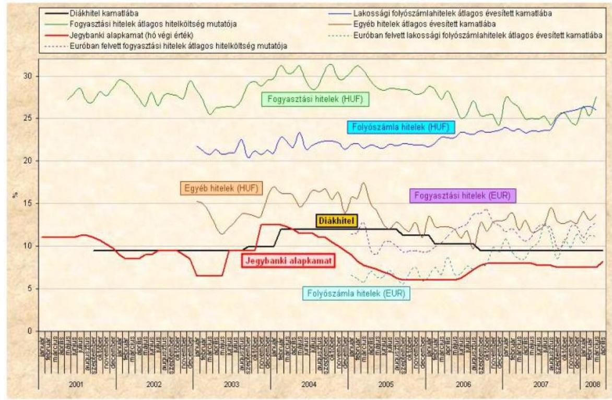

A Diákhitel Zrt. a hallgatói hitelrendszerről szóló Korm. rendelet előírásait betartva a hallgatói hitelek kamatait - a nonprofit elvű működésnek megfelelően - önköltségi elven határozta meg. A kockázati kamatelem és a működési költséget fedező kamatelem változását a Társaság független könyvvizsgálóval felülvizsgáltatta. 2004. január 1-jétől a Diákhitel Zrt. a kockázati kamatelem mértékének meghatározásához az aktuáriusi számításokat elkészíttette és azokat figyelembe vette. A két kamatelem együttesen nem haladta meg a hallgatói hitelrendszerről szóló Korm. rendeletben meghatározott 4,5\%-os felső értéket. A működési költséget fedező kamatelem legkisebb összegére - 2005 szeptemberétől - előírt rendelkezést betartotta. Az ellenőrzött időszakban az igazgatóság határozatot hozott a hallgatói hitel félévente alkalmazandó kamatáról és a kamatelemek mértékéről, valamint elrendelte a kamat közzétételét és a tulajdonos tájékoztatását. A Diákhitel Zrt. a kamatszámítás módját az aktuális üzletszabályzatban meghatározta, továbbá a kamatmérték közzétételének előírásait betartotta. (A hallgatói hitel kamatának és kamatelemeinek alakulását a 8. sz. melléklet mutatja be.)

[^0]
[^0]:    ${ }^{21}$ Az adatok forrása: http://www.diakhitel.hu/cegtortenet (2008. július 7.).

---

A hallgatói hitelrendszerről szóló 2001. évi Korm. rendelet záró rendelkezései szerint a 2001/2002. és a 2002/2003. tanévekben sem a kockázati, sem a működési költséget fedező kamatelemet, a 2003/2004. tanévben pedig a működési költséget fedező kamatelemet nem kellett figyelembe venni a hallgatói hitelek kamatában. A hallgatói hitelrendszer működtetése során felmerülő költségek fedezetét - a 2005-ig felhasznált - költségvetési támogatás, a működési költségeket fedező kamatelemből származó bevétel, valamint a fennmaradó, meg nem térített költségrész aktív időbeli elhatárolása biztosította.

A Diákhitel Zrt. a 2006 szeptemberétől megállapított hallgatói hitel kamatában - a hallgatói hitelrendszerről szóló 2006. évi Korm. rendelet előírása szerinti legalacsonyabbat ( $0,9 \%$ ) meghaladó - 1,88\% működési költséget fedező kamatelem mértéket érvényesített, amit a forrásköltségek kedvező alakulása tett lehetővé. Az igazgatóság a hallgatói hitel kamatát 9,5\%-ban állapította meg, amely - a magasabb, működési költséget fedező kamatelem mérték érvényesítése ellenére is - az előző időszakhoz mérten $0,72 \%$ ponttal volt alacsonyabb. A Diákhitel Zrt. ezzel biztosította, hogy a hallgatói hitelek kamata rövidtávon egyenletes és kiszámítható legyen. Az 1,88\%-os mértékű működési költséget fedező kamatelemből származó bevétel a 2006. évi működési költségek 94,0\%-ára nyújtott fedezetet.

A hitelek folyósításának első három félévében a 9,5\%-os mértékű hallgatói hitelkamat $89,5 \%$-át a forrásköltségeket fedező kamatrész tette ki. A hallgatói hitelrendszerről szóló Korm. rendelet előírásai szerint a folyósítást megelőző naptári félév adatai alapján számított súlyozott, átlagos forrásköltségeket fedező kamatrész az első három periódusban nem változott ( $8,5 \%$ ), a 2003 szeptemberét követő félévekben pedig - a finanszírozásba bevont külső források összetételének változása és azok forrásköltségei hatására - 5,8 és $10,7 \%$ között alakult. 2007 januárjától a diákhitelek kamatában érvényesített forrásköltségek növekvő tendenciát mutattak. A hazai és a nemzetközi pénz- és tőkepiac - esetleges hosszabb távú - kedvezőtlen folyamatainak finanszírozási források árában érvényesülő hatása kockázatot jelenthet a hallgatói hitelek kamatának alakulására. ${ }^{22}$

A hallgatói hitelrendszerről szóló 2001. évi Korm. rendelet szerint a hallgatói hitelek kamatában 2003. I. félévéig a kockázati kamatelemet nem kellett felszámítani. Az igazgatóság határozata alapján azonban a folyósított hallgatói hitelek kamata és a forrásköltséget fedező kamatrész közötti különbözetet kockázati kamatelemként határozták meg. 2004 januárjától az ellenőrzött időszak végéig a kockázati kamatelem mértékét az aktuáriusi számítások és a könyvvizsgálói vélemények figyelembevételével alakították, amelynek értéke 1,25-2,00% között változott.

[^0]
[^0]:    ${ }^{22}$ Az MNB pénzügyi stabilitásról készült - 2008. áprilisi - jelentésének 2008. október 8-i időközi felülvizsgálata megállapítja, hogy „A nemzetközi pénzpiacokat fokozott bizalmatlanság jellemzi. A törékeny nemzetközi pénzügyi rendszer és romló makrogazdasági környezet miatt kockázati prémiumok és a finanszírozási költségek magasak..." „... a magas kockázati prémium hozzájárul a hazai gazdaság külső finanszírozási költségeinek emelkedéséhez, valamint növeli a forint eszközöktől elvárt hozamot."

---

# 2.3. A hallgatói hitelállomány változása, hatása a hallgatói hitelrendszer működésére 

A folyósítási szakaszban lévő ügyfelek száma 2001-ben 70395 fő volt, 2003. I. félévéig folyamatosan, 110642 főre emelkedett. A következő félévtől kezdődően a folyósítási szakaszban lévők száma csökkent, és a 2007/2008. tanév I. félévében 78911 fő volt (amely mindössze 8516 fővel haladta meg a 2001/2002. I. félévben folyósítási szakaszban lévő ügyfelek számát). A hallgatói hitelre jogosultak száma 2001-2007 között mindvégig emelkedett, a 2001. évi 323784 főről 2007. év végére 406224 fő lett. A jogosultak száma 2008. I. felében az előző félévhez képest 15613 fővel csökkent ${ }^{23}$.

A hallgatói hitelrendszer 2001. évi indulásának félévétől a 2007/2008. tanév I. félévére az igényjogosultak száma 20,6\%-kal nőtt, ugyanebben az időszakban az igénybevevők számának növekedése 12,1\% volt. Az igénybevevők jogosultakhoz viszonyított aránya a 2001. évi 21,7\%-ról 2003. I. félévére 30,5\%-ra, tanulmányi félévenként folyamatosan nőtt. 2003. II. félévtől ez az arány időszakról időszakra mérséklődött, és a 2007/2008-as tanév I. félévében a 2001. évi szint alá, 20,2\%-ra csökkent. (A hallgatói hitelre jogosultak és a folyósítási szakaszban lévő ügyfelek számának, valamint arányának alakulását a 9. sz. melléklet tartalmazza.)

Az ellenőrzött időszakban a hallgatói hitelt igénybevevők nagyobb hányada (56,1-62,5\%) került ki az államilag támogatott képzésben résztvevő hallgatók köréből, míg a költségtérítéses képzésben résztvevők aránya mindvégig alacsonyabb (37,5-43,9%) volt. A hitelfelvételi hajlandóság az államilag támogatott képzésben résztvevők körében 2003. I. félévében volt a legmagasabb (34,3%), 2007-2008. I. félévében pedig a legalacsonyabb (22,7%), amely az első folyósítás évének 26,3%-os részarányától is elmaradt. A költségtérítéses képzésben résztvevő hitelt igénybevevők igényjogosultakhoz mért aránya az első folyósítás évében volt a legalacsonyabb (16,9%), 2003 I. félévében volt a legmagasabb (26,6%), amely 2007-2008. I. félévére 18,8%-ra csökkent.

A folyósítás első teljes évében (2002. év) a folyósított hitel összege 19202 M Ft volt, amely a következő években 22635 M Ft (2005. év) és 23658 M Ft (2007. év) között alakult a hitelt igénybevevők számának 12,1\%-os növekedése mellett. A folyósított hitelösszeg évenkénti alakulását az igényelhető legmagasabb hitelösszeg közel megkétszereződése is befolyásolta, amely a 2001. évi 21 E Ftról 2007-re 40 E Ft-ra nőtt.

A felvehető hitel összege az alábbiak szerint változott:

- 2001/2002-es tanévben minimum havi 10 E Ft, maximum havi 21 E Ft,

[^0]
[^0]:    ${ }^{23}$ A középszintű képzésben résztvevők száma (az Oktatási és Kulturális Minisztérium Oktatás-statisztikai évkönyv 2007/2008 című kiadvány adatai alapján) az elmúlt 12 évben - a 2004/2005. tanévet kivéve - növekvő tendenciát mutatott, majd a 2006/2007. tanévről a 2007/2008. tanévre több mint 9 ezer fővel csökkent. Az Országos Felsőoktatási Információs Központ elemzése szerint a felsőoktatásban továbbtanulni szándékozók számának csökkenése demográfiai okokra nem vezethető vissza. A felsőoktatás vonzerejének csökkenését a kutatók - idősoros motivációs vizsgálatok hiányában - tudományosan nem indokolták.

---

- 2002/2003-as tanévtől minimum havi 10 E Ft, maximum havi 25 E Ft,
- 2005/2006-os tanévtől maximum havi 30 E Ft,
- 2006/2007-es tanévtől az államilag támogatott képzésben résztvevő hallgatók számára maximum havi 30 E Ft , a költségtérítéses képzésben résztvevő hallgatók számára maximum havi 40 E Ft ,
- 2008 szeptemberétől az államilag támogatott képzésben résztvevő hallgatók számára maximum havi 40 E Ft , a költségtérítéses képzésben résztvevő hallgatók számára maximum havi 50 E Ft .

A hallgatói hitelrendszerről szóló Korm. rendelet 2005. szeptember 1-jétől nem írta elő a minimálisan felvehető hitel összegét.

A hallgatói hitelállomány az ellenőrzött időszakban évről évre - csökkenő mértékben - nőtt, a 2001. év végén 5146 M Ft , a működés első teljes évében (2002.) 25560 M Ft volt, amely 2007. év végére 159248 M Ft-ra emelkedett.

A folyósításokból származó hallgatói hitelállomány 2001-ben 5087 M Ft, 2002-ben 24167 M Ft , amely a 2007. év végére 127542 M Ft-ra (a 2002. évinek 5,3-szeresére) nőtt. A tőkésített kamat ${ }^{24}$ állománya 2001-ben 59 M Ft, 2002. év végén 1393 M Ft, 2007. év végén pedig 31706 M Ft lett, ami a 2002. évihez viszonyítva 22,8-szoros növekedést mutat. A törlesztések megkezdésének második évére (2003-ról 2004-re) a folyósítás időszakában felszámított hitelkamatok és a minimálbér alapján megállapított törlesztőrészletekben meg nem térített kamatrész év végén tőkésített állománya az előző évinek 2,4-szeresére, míg a folyósításokból származó hallgatói hitelállomány 1,5-szörösére nőtt. Az állományok változása 2006-ról 2007-re a tőkésített kamatoknál 1,3-szoros, míg a hitelállománynál 1,2-szeres volt. A tőkésített kamatok növekedési üteme az ellenőrzött időszak minden évében meghaladta a hitelállomány növekedésének ütemét. A hallgatói hitel 2007. december 31-i állományának 19,9\%-át a tőkésített kamat tette ki, ez az arány a törlesztés megkezdése évének végén (2003. december 31.) 8,4\% volt. (A diákhitelek állományának és tőkésített kamatának változását az 1. sz. tanúsítvány mutatja be.)

A tárgyévben meg nem fizetett kamatok év végi tőkésítéséből eredően a folyósítási szakaszban lévő hallgatók számának 2003. II. félévétől bekövetkezett
 csökkenése ellenére a hallgatói hitelállomány évről évre nőtt. A hallgatói hitelrendszer működési elvének megfelelően a felmerülő költségeket - a súlyozott, átlagos forrásköltséget és a hallgatói hitelrendszer működési költségét - és a törlesztés nem teljesítése miatt várható veszteségek fedezetét - a hallgatói hitelrendszerről szóló Korm. rendelet szerint - a félévente újra árazott kamatokban ${ }^{25}$ az ügyfelekre átterhelik. A kamatokban teljes mértékben áthárított költségek és ráfordítások hozzájárulnak a hitelrendszer stabilitásának fenntartásához. A hitelállomány növekedése folyamatosan növeli a kamatbevételeket.

[^0]
[^0]:    ${ }^{24}$ A hallgatói hitelrendszerről szóló 2001. évi Korm. rendelet 6. § (5) és 6. § (6) bekezdés.
    ${ }^{25}$ A hallgatói hitelrendszerről szóló 2001. évi Korm. rendelet 6. § (3) bekezdés.

---

# 2.4. A törlesztőrészletek megállapítása, a jogszabályban meghatározott minimum mértékek hatása a hallgatói hitel visszafizetésére 

A hallgatói hitelrendszerről szóló Korm. rendelet - a hallgatói hitelrendszer kialakításával összefüggő feladatokról szóló 1105/2000. (XII. 8.) Korm. határozatban megfogalmazott elveknek megfelelően - a törlesztőrészlet megállapítását a minimálbér vagy az éves jövedelem alapján, az ügyfél anyagi teherviselő képességének megfelelően, „vállalhatóan alacsony" mértékben írta elő. A Diákhitel Zrt. a törlesztés első két évében a mindenkori minimálbér, ezt követően a tényleges jövedelem alapján (annak 6-8\%-ában) határozta meg a törlesztőrészletet.

A 2003. évben induló törlesztések alapja a minimálbér volt, a jövedelem alapú törlesztések pedig 2005-től kezdődtek. A jövedelem alapú törlesztőrészletek megállapításához szükséges adatszolgáltatást az APEH a hallgatói hitelrendszerről szóló Korm. rendelet és az Art. előírásainak megfelelően biztosította. Az évente október 31-ig esedékes adatszolgáltatás a törlesztésre kötelezettek megelőző évi jövedelem adatait tartalmazta. A Diákhitel Zrt. - üzletszabályzatának megfelelően - minden év decemberében értesítette ügyfeleit a következő évben esedékes törlesztőrészletről, amelyeket a hallgatói hitelrendszerről szóló Korm. rendelet előírásaival összhangban állapított meg. A törlesztőrészletekről szóló értesítőkben nem különült el a tőke és a kamat összege, így a törlesztésre kötelezett az év végi elszámolásból, utólag értesült arról, hogy - az előírt törlesztőrészlet határidőben történő teljesítése esetén - az éves befizetéseiből mekkora összeget tett ki a kamat-, illetve a tőketörlesztés. A befolyt törlesztés összegéből a Diákhitel Zrt. a jogszabálynak megfelelően először a késedelmi, majd a hitelkamatot számolta el, és a fennmaradó összeggel csökkentette a tőketartozást.

A Diákhitel Zrt. nyilvántartása szerint a vizsgált időszakban a törlesztésre kötelezettek több mint felének nőtt a tartozása ${ }^{26}$, kivéve 2007-ben, amikor ez az arány 49,3% volt. Hitelezési veszteséget jelenthet a Társaság számára, hogy a kereső életszakaszban minimálbér közeli jövedelemmel rendelkező és folyamatosan törlesztő ügyfelek a nyugdíjkorhatár eléréséig sem tudják visszafizetni tőketartozásukat. A meg nem fizetett tőketartozást a hallgatói hitelrendszerről szóló Korm. rendeletnek megfelelően a Diákhitel Zrt. hitelezési veszteségként számolja el, amelynek a - várható hitelezési veszteségekre képzett - kockázati céltartalékhoz mért aránya az ellenőrzött időszak éveiben 0,12% és 1,25% között változott.

[^0]
[^0]:    ${ }^{26}$ Nem nőtt a tartozása azon minimálbér alapján törlesztő ügyfeleknek, akiknek a tárgyév január 1-jén fennálló tartozása nem haladta meg 2003-ban a 362,9 E Ft-ot; 2004-ben a 319,3 E Ft-ot; 2005-ben 364,8 E Ft-ot; 2006-ban 473,7 E Ft-ot; 2007-ben a 473,7 E Ft-ot; 2008-ban a 496,4 E Ft-ot; 2009-ben pedig az 522,9 E Ft-ot, valamint azoknak, akik a megállapított törlesztő részletnél magasabb összeget fizettek meg.

---

# 2.5. A törlesztések, az előtörlesztések, a szüneteltetések és a lejárt követelések kezelése 

A hallgatói hitelek törlesztésének első évében (2003.) a törlesztők száma 26144 fő volt, amely 2007-re 111084 főre, 4,2-szeresre nőtt. 2003-ban 673 M Ft, míg 2007-ben 8878 M Ft, 13,2-szer több törlesztés folyt be. A törlesztések összege a törlesztők számának növekedési tendenciáját meghaladóan, de évről évre mérséklődő ütemben nőtt.

A havi átlagos törlesztőrészletek a 2003. évi $3748 \mathrm{Ft} /$ fő/hóról 2007-ben $9292 \mathrm{Ft} /$ fő/hóra, a 2003. évinek 2,5-szeresére emelkedtek. Az egy főre jutó havi átlagos törlesztőrészlet 2003-ban és azt követő minden évben növekvő mértékben (24,5% és 66,4% között) meghaladta a törlesztési előírás egy főre jutó havi összegét. 2003-tól 2008. I. félévéig a törlesztési előírások összege 19294 M Ft, a befolyt törlesztés összege pedig 25508 M Ft volt. A törlesztési előírást meghaladó befizetések előtörlesztésre és előteljesítésre folytak be. 2002-ben voltak az első előtörlesztések, amelyek elszámolt összege 129 M Ft volt, 2007-re pedig 1896 M Ft lett. Az ellenőrzött időszakban befolyt összes törlesztés 33,7%-át az előtörlesztések tették ki.

Az előírtnál nagyobb összegű törlesztések év végi hitelállományhoz mért aránya az ellenőrzött időszak éveiben 0,5-1,25% között alakult. Az előtörlesztést teljesítő adósok rövidebb futamidő alatt fizetik vissza tartozásukat, így a kockázatközösségre épülő kockázati kamatelemet rövidebb ideig fizetik, és ezzel csökken az általuk e címen megfizetett összeg is. Így a kockázatviselésből nagyobb rész hárul azon kötelezettekre, akik időben és rendszeresen fizetnek, de előtörlesztést nem teljesítenek.

A törlesztés szüneteltetésének feltételeit a hallgatói hitelrendszerről szóló Korm. rendelet írta elő. (A hitelfelvevő terhességi gyermekágyi segélyre, GYED-re, GYES-re való jogosultság, valamint rokkantsági nyugdíjra, rokkantsági járadékra és baleseti rokkantsági nyugdíjra való jogosultság esetén kérvényezheti.) A szüneteltetés egy jól fizető, előtörlesztést nem teljesítő ügyfél esetében a hitel visszafizetésének futamidejét meghosszabbítja, ugyanakkor az átmeneti törlesztési nehézségek esetén áthidaló megoldást nyújt, ezzel növeli a hallgatói hitelrendszer stabilitását. A törlesztés szüneteltetését igénybevevők létszáma 2003. I. félévében 1146 fő volt, 2007. II. félévére megnégyszereződött (4624 fő), amely a törlesztők számának 4,2%-át tette ki.

A Diákhitel Zrt. kiemelt feladatként kezelte a rendszeresen nem vagy egyáltalán nem fizető ügyfelekkel való kapcsolattartást. Az ellenőrzött dokumentumok szerint havonta értesítést küldött az érintetteknek a hátralék összegéről és a kötelezettség nem teljesítésének következményeiről. A Diákhitel Zrt. a kapcsolattartás módját folyamatosan fejlesztette, bevezette a telefonos, valamint az „SMS"-es megkeresést is. A többszöri felszólítás ellenére sem teljesítő ügyfelek kölcsönszerződését a Diákhitel Zrt. a jogszabályoknak megfelelően felmondta, majd az Art. és a hallgatói hitelrendszerről szóló Korm. rendelet előírásainak megfelelően átadta behajtásra az APEH-nak. Az ellenőrzött időszakban a Diákhitel Zrt. 10362 db szerződést mondott fel, ebből 2008. június 30-án 6029 db pénzügyileg nem rendezett szerződést tartott nyilván.

---

# Az APEH-nak behajtásra átadott szerződések és a behajtás eredményességének alakulása 

| Időszak | Átadott szerződések száma (db) | Behaj-   tandó   összeg (M   Ft) | Behajtásból kiegyenlített tartozás (M Ft) | Részletfizetéssel kiegyenlített vagy kiegyenlítése folyamatban (M Ft) | Behajtási megkeresést követő tartozás kiegyenlítés (M Ft) | Megfizetett tartozások összege (M Ft) | Megfizetett tartozások aránya (%) |
| :--: | :--: | :--: | :--: | :--: | :--: | :--: | :--: |
| (1) | (2) | (3) | (4) | (5) | (6) | $(7=4+5+6)$ | $(8=7 / 3)$ |
| 2004. | 280 | 70 | 0 | 0 | 2 | 2 | 2,9 |
| 2005. | 1417 | 435 | 63 | 15 | 21 | 99 | 22,8 |
| 2006. | 2002 | 865 | 147 | 63 | 68 | 278 | 32,1 |
| 2007. | 3031 | 1751 | 303 | 135 | 125 | 563 | 32,2 |
| Összesen | 6730 | 3121 | 513 | 213 | 216 | 942 | 30,2 |
| 2008. I.   félév | 1288 | 804 | 227 | 83 | 114 | 424 | 52,7 |
| Mindösszesen | 8018 | 3925 | 740 | 296 | 330 | 1366 | 34,8 |

A Diákhitel Zrt. 2004-től az ellenőrzött időszak végéig 8018 db szerződést adott át az APEH részére behajtásra. Az átadott nem fizető ügyfelek tartozásainak összege 3925 M Ft volt, amelyből 1366 M Ft (34,8%) térült meg. A behajtásra átadott követelések megfizetésének aránya évről évre folyamatosan javult. Az APEH-nak átadott tartozások egy részét az ügyfelek az APEH behajtási megkeresésének hatására még a behajtási eljárást megelőzően megfizették, az így kiegyenlített tartozások összege 2008. I. félévéig 330 M Ft, az összes behajtandó összeg 8,4%-a volt. A Diákhitel Zrt. által engedélyezett részletfizetések (fizetési könnyítések) eredményeként 296 M Ft térült meg, amely a teljes átadott követelés 7,5%-a volt. Az APEH a Diákhitel Zrt. részére 740 M Ft-ot utalt át behajtásokból, amely az átadott követelés állomány 18,9%-át tette ki. Az APEH a behajtásra átadott követelések összegét a behajtási időszak alatt számított késedelmi kamatokkal nem módosította, ezért az eredményes behajtást követően az ügyfélszámlákon fennmaradó késedelmi kamatokat a Diákhitel Zrt. veszteségként számolta el.

Az APEH-nak behajtásra átadott tételeknél problémát jelentett, hogy az APEH az átadás időpontjától a behajtásig felhalmozódott - késedelmi kamat összegét nem érvényesítette. A Diákhitel Zrt. és az APEH között fennálló, 2005. október 31-én módosított megállapodás többek között azzal egészült ki, hogy a végrehajtásra átadott követelésekre az átadást követően felszámított késedelmi kamattal a követelés összegét az APEH növelje meg és annak behajtását is kísérelje meg.

A nem fizető ügyfelek törlesztésre kötelezettekhez mért aránya 2004-től 2007-ig folyamatosan nőtt, de mindvégig 3,0% alatt maradt, a meg nem fizetett tartozások összegére a kockázati kamatelem fedezetet biztosított.

A Diákhitel Zrt. a törlesztések, az előtörlesztések, a szüneteltetések és a lejárt követelések kezelését előíró belső szabályzatait a hatályos jogszabályokkal összhangban készítette el, feladatait szabályszerűen végezte.

---

# 2.6. A célzott kamattámogatás igénylése és folyósítása 

A hallgatói hitelrendszerről szóló Korm. rendeletnek megfelelően a hallgatói hitelt felvevők általános kamattámogatásban nem részesülnek, de a rendeletekben meghatározott feltételekkel a jogosultak célzott és teljes kamattámogatást igényelhetnek.

A CKT a kölcsön futamideje alatt a kisgyermeket nevelőket, a kötelező sorkatonai vagy polgári szolgálatot teljesítőket, 2005. május 1-jétől csak a kisgyermeket nevelőket illette meg. Az igénylők a kérelmeiket - a jogosultságot igazoló dokumentumokkal együtt - a Diákhitel Zrt.-hez nyújtották be, amelyeket a hallgatói hitelrendszerről szóló Korm. rendeletnek megfelelően az Államháztartási Hivatal, majd 2003. június 30-tól a Kincstár bírált el. Az erről szóló határozatot a Diákhitel Zrt., a támogatás anyagi fedezetét nyújtó illetékes minisztérium ${ }^{27}$, valamint a kérelmező kapta meg.

A hallgatói hitelrendszerről szóló Korm. rendelet alapján a CKT anyagi fedezetét az illetékes minisztérium tervezte meg a költségvetésében, majd a Kincstár határozatának jogerőre emelkedését követően a támogatást átutalta a jogosult Diákhitel Zrt.-nél vezetett hitelszámlájára. A Magyar Köztársaság költségvetéséről szóló törvények a 2003-2007. évekre összesen 427 M Ft CKT előirányzatot tartalmaztak. A Diákhitel Zrt. nyilvántartása szerint ezen a címen 720 M Ft folyt be a költségvetéstől, ami az előirányzatot 69,6%-kal haladta meg.

Az 5 év alatt folyósított 720
 M Ft CKT-t 8586 fő vette igénybe, az átlagos kamattámogatás összege $83857 \mathrm{Ft} /$ fő volt. A jogosultak az ellenőrzött időszakban évente átlagosan 290-312 nap között részesültek kamattámogatásban.
2008. január 31-ig 181 esetben vették igénybe „jogosulatlanul" CKT-t, amelynek összege 1,86 M Ft volt. Az ellenőrzött időszakban a CKT elszámolásával összefüggő „jogos” panasszal egy ügyfél élt.

A „jogosulatlan" igénybevételeket az okozta, hogy a CKT-ban részesülők a Gyes, Gyed lejáratát megelőzően munkába álltak, és erről a Kincstárat nem értesítették. A „jogosulatlanul" kapott támogatást az ügyfél - a Kincstár jogerős határozata alapján - az igénybevétel időpontjában érvényes jegybanki alapkamattal növelt összegben köteles megfizetni a CKT-t folyósító illetékes minisztérium számlájára.

A Diákhitel Zrt. a CKT-val összefüggő feladatokat a többször módosított üzletszabályzatában, valamint belső szabályzataiban a hallgatói hitelrendszerről szóló Korm. rendelet előírásaival összhangban rögzítette. Az alaptevékenységet kiszolgáló integrált informatikai rendszerben a hatályos jogszabályoknak megfelelő módosításokat késedelemmel végezte el, amely azonban a tevékenység jogszerű és szabályszerű ellátását nem akadályozta.

[^0]
[^0]:    ${ }^{27}$ Szociális és Családügyi Minisztérium, majd Egészségügyi, Szociális és Egészségügyi Minisztérium, majd Ifjúsági, Családügyi, Szociális és Egészségügyi Minisztérium, majd Szociális és Munkaügyi Minisztérium, Honvédelmi minisztérium, Gazdasági Minisztérium.

---

# 3. A DIÁKHITEL ZRT. GAZDÁLKODÁSA, A MÉRLEGFŐÖSSZEG ÉS A VAGYONI HELYZET ALAKULÁSÁT BEFOLYÁSOLÓ TÉNYEZŐK 

### 3.1. A mérlegfőösszeg változása

A 2001. évi mérlegfőösszeg 7907 M Ft, 2002-ben 28825 M Ft volt, amely a 2007. év végére közel 6-szorosára, 164862 M Ft-ra emelkedett. A mérlegfőösszeg 2008 végére terv szerint eléri a 190462 M Ft-ot. A mérlegfőösszegben eszközoldalon a kihelyezett - az év végén tőkésített kamatot is tartalmazó - diákhitel követelés összege, forrásoldalon pedig a diákhitelek finanszírozásából eredő tartozások - hitelek és kötvénykibocsátások miatti kötelezettségek - képviseltek meghatározó (a 2002-2007. években $86-91 \%$ közötti) részarányt.

A Diákhitel Zrt. a folyósított kölcsönt a befektetett pénzügyi eszközök között (mint tartósan adott kölcsön) tartotta nyilván. Mérlegkészítéskor az éven belül esedékes részt a követelések (diákhitelezés miatti követelések) közé átsorolta. A hallgatói hitelek törlesztőrészletében tárgyévben esedékes meg nem fizetett kamatokat évente, december 31-ével tőkésítették. A diákhitelekből eredő követelések összege 2001-ben 5146 M Ft volt, a 2002. évi (működés első teljes éve) 25561 M Ft-ról a 2007. év végére 159248 M Ft-ra, 6,2-szeresére nőtt. A diákhitelek finanszírozásához igénybevett források 2007. évi záró értéke 149904 M Ft-ra emelkedett a 2002. évi 24780 M Ft-ról, 2001-ben pedig 5088 M Ft volt.

A mérlegfőösszeg növekedését - és annak ütemét - főbb tényezőkként a hallgatói hitelt igénylők számának alakulása, az igényelhető hitel összegének emelkedése, a hallgatói hitel kamatának alakulása, a felmondott szerződések száma, a törlesztések, az előtörlesztések összegének alakulása, a minimálbér változása befolyásolta. (A hallgatói hitelállomány és a finanszírozási forrásállomány mérlegfőösszeghez viszonyított arányának alakulását a 10. sz. melléklet tartalmazza.)

A mérlegfőösszeg, a hallgatói hitelek és a finanszírozásába bevont források állománya az ellenőrzött időszakban dinamikusan és folyamatosan növekedett.

---

# Az állományok alakulását az alábbi grafikon szemlélteti: 

Adatok: M Ft-ban
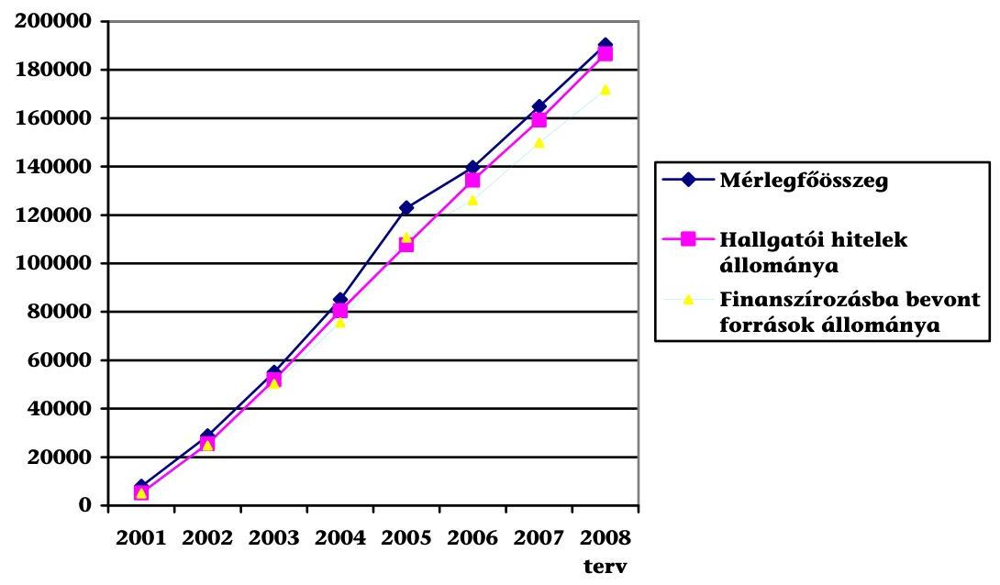

A hallgatói hitelek mérlegfőösszegen belüli aránya a 2001-2007. években 89-97% között, a finanszírozási források mérlegfőösszegen belüli aránya 86-91% intervallumon belül változott. A hallgatói hitelek mérlegfőösszeghez viszonyított aránya az ellenőrzött időszakban - a 2005. év kivételével - folyamatosan nőtt.

A finanszírozási források állománya minden év végén a hallgatói hitelállomány alatt maradt, kivéve a 2005. évet, amikor a finanszírozási források állománya meghaladta a hallgatói hitelállományt, amit a 3 hónapon belüli lejáratú, kötvénykibocsátásból eredő - 38 Mrd Ft összegű - kötelezettségek okoztak. (A 2005-ben bevont 38 Mrd Ft a 2006. januári kötvénylejárat és kamatfizetés finanszírozására szolgált.)

### 3.2. A vagyoni helyzet és a saját tőke alakulása, a tőkemegfelelési követelmények teljesítése

A saját tőke összege a 2001. december 31-i év végi záró 2374,0 M Ft-ról 2007. december 31-re 2296,8 M Ft-ra (96,7%-ra) csökkent. A saját tőke csökkenését a működés első 7 évének összesített mérleg szerinti vesztesége okozta. (A saját tőke változását a 2. sz. tanúsítvány tartalmazza.) A jegyzett tőke (300 M Ft) és a tőketartalék (2200 M Ft) összege a 2001. évtől nem változott. A Gt.-ben foglalt tőkemegfelelési követelménynek ${ }^{28}$ a Diákhitel Zrt. megfelelt. Az ellenőrzött időszak minden évében a saját tőke több mint hétszerese volt a jegyzett tőke összegének.

[^0]
[^0]:    ${ }^{28}$ A gazdasági társaságokról szóló 2006. évi IV. törvény 51. § (1) és 245. § (1) bekezdése szabályozza. (A tőkemegfelelés szabályáról korábban az 1997. évi CXLIV. törvény 61. § (1) és a 243. § (1) bekezdése rendelkezett.)

---

A $2200,0 \mathrm{M}$ Ft tőketartalék a $100 \mathrm{db} 1,0 \mathrm{M} \mathrm{Ft} / \mathrm{db}$ részvény névértéke és $500 \%$-os kibocsátáskori értéke közti különbözetből (400,0 M Ft), valamint a 200 db $1,0 \mathrm{M} \mathrm{Ft} / \mathrm{db}$ részvény névértéke és $1000 \%$-os kibocsátáskori értéke közti különbözetből (1800,0 M Ft) tevődött össze.

A Diákhitel Zrt. gazdálkodása - a nonprofit elvű működésnek megfelelően nem eredményorientált, speciális elszámolásai hatására a működés hét éve alatt az alaptevékenységéből nem származott eredmény. A Társaság gazdálkodása - a 2002-es és a 2007-es évek kivételével - veszteséges volt. A mérlegben kimutatott veszteség a 2001. évi 125,9 M Ft-ról 2006-ra 0,7 M Ft-ra csökkent. (A Diákhitel Zrt. 2002-ben 69,5 M Ft, 2007-ben pedig 0,08 M Ft nyereséget realizált.) A 2001. évi veszteség a megalakuláshoz kötődő alapítási költségek elszámolásából adódott. A további évek mérleg szerinti eredménye sem az alaptevékenység veszteségéből, hanem a lekötött tartalék felszabadítása és az adófizetési kötelezettségek különbözetéből származott. A Társaság a 2001-2007. években társasági adó, helyi iparűzési adó, innovációs járulék ${ }^{29}$ és különadó ${ }^{30}$ címén összesen 180,4 M Ft-ot fizetett meg.

Az egyes évek mérleg szerinti eredményét - a tulajdonos döntésének megfelelően - az eredménytartalékba átvezették. A Diákhitel Zrt. - a számviteli törvény 38. § (3) c) pont előírása szerint - az eredménytartalékkal szemben, lekötött tartalékként számolta el az alapítás, átszervezés aktivált értékét, valamint annak értékcsökkenési leírását. Ebből adódóan 2001-ben az eredménytartalék 226,5 M Ft volt. Alapítás, átszervezési költségek 2001., 2002. és 2007. években merültek fel, összesen 286 M Ft összegben, amelyből az értékcsökkenés elszámolása után a lekötött tartalék 2007. december 31-i záró állománya 45,7 M Ft, az eredménytartalék pedig $249,0 \mathrm{M}$ Ft lett.

# 3.3. Bevételek elszámolása 

A Diákhitel Zrt. alaptevékenységének bevételeit - a hallgatói hitelrendszerről szóló Korm. rendelet előírásai szerint - a hallgatói hitelek kamatában érvényesített, törlesztőrészletekkel befolyó kamatbevételek képezték, amelyeket a Kormány - a hitelrendszer elindulásának első négy évében, a hallgatói hitel kamatának alacsony szinten tartása érdekében - 2546 M Ft költségvetési támogatással egészített ki.

A tárgyidőszakot illető kamatbevételeket a pénzügyi műveletek bevételei között számolta el a Diákhitel Zrt., a járó kamatbevételeket a befektetett pénzügyi eszközök kamataiból kiemelve, külön soron mutatta ki. Az államtól járó CKT negyedévente kalkulált összegét - a belső szabályzatoknak megfelelően - a számviteli nyilvántartásokban előírta, amely a pénzügyi műveletek bevételei között, mint várható bevétel szerepelt.

[^0]
[^0]:    ${ }^{29}$ A Kutatási és Technológiai Innovációs Alapról szóló 2003. évi XC. törvény 3. §-a 2004. január 1-jétől a számviteli törvény hatálya alá tartozó gazdasági társaságoknak innovációs járulékfizetési kötelezettséget írt elő.
    ${ }^{30}$ Az Államháztartás egyensúlyát javító különadóról és járadékról szóló - 2006. szeptember 1-jétől hatályos - 2006. évi LIX. törvény 3.§ (1) bekezdése alapján a társas vállalkozások különadó megfizetésére kötelezettek.

---

A bevételek 2001. év végi 91 M Ft-os elszámolt összege 2002-re 2806 M Ft-ra, majd 2007. év végére 14438 M Ft-ra, a 2002. év végi értéknek közel 6-szorosára emelkedett. A 2008. évre tervezett összeg 16289 M Ft, amely a 2007. évi elszámolt bevételnél képest 12,8%-kal magasabb. A bevételekből a 2002. évben 48,0%, a 2003. évben 79,4%, a 2004-2007. években pedig 93,3-96,0%-ot a diákhitelek kamatbevételei tették ki. A diákhitelek kamatából származó bevétel a működés első teljes gazdasági évében (2002.) 1346 M Ft, amely a 2007. évre 13867 M Ft-ra nőtt, a 2008. évre tervezett összege pedig 13574 M Ft. A költségvetési támogatás a 2002. évben elszámolt bevételek 48,8%-át tette ki, a 2003-2005. években pedig 17,3%, 3,0%, illetve 0,5% volt. Az ellenőrzött időszak mérleggel lezárt éveiben a szabad pénzeszközökből befektetett értékpapírok hozama a bevételek 2-6%-a között alakult.

# A bevételek, ezen belül a hallgatói hitelek kamatából, valamint a költségvetési támogatásból származó bevételek alakulása 

Adatok: M Ft-ban
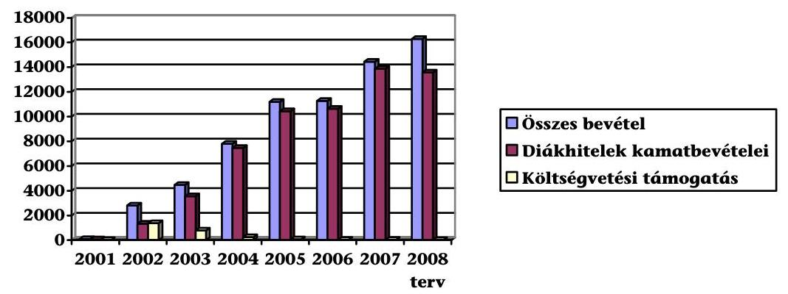

### 3.4. Költségek és ráfordítások

Az ellenőrzött évek eredménykimutatásaiban az alaptevékenységhez kapcsolódó elszámolt költségek és ráfordítások (Anyagjellegű, Személyi jellegű ráfordítások, Értékcsökkenési leírás) nem tükrözték az ugyanazon időszakban felmerült költségeket és ráfordításokat. A Diákhitel Zrt. - számviteli politikájával összhangban - elhatárolta azokat a költségeket és ráfordításokat, amelyekre a diákhitelek tárgyévi kamatbevételében nem képződött fedezet. (Többletfedezet realizálása pedig - annak mértékében - az elhatárolásokat feloldja). A Diákhitel Zrt. a bevételek, költségek és ráfordítások elszámolását a tevékenység sajátosságainak megfelelően, a kialakított számviteli rend betartásával végezte.

### 3.4.1. Működési költségek alakulása

Az ellenőrzött időszakban a működési költségek a 2001. évi 690,7 M Ft-ról 2007-re 1854 M Ft-ra emelkedtek, amelyek 2008-ra évre előirányzott összege 2170,5 M Ft (a 2007. évben elszámolt összegnél 17%-kal magasabb). A hallgatói hitelállomány és a hitellel rendelkező ügyfelek számának folyamatos bővülését a működési költségek mérsékelt növekedése követte, a működés első teljes évéhez (2002.) viszonyítva a hallgatói hitelállomány 2007-re 6,2-szeresére, míg a működési költségek 1,8-szorosára emelkedtek. Az egy ügyfélre jutó működési

---

költség összege 2001-ről 2007-re 28%-kal csökkent. (A működési költségek és a működési költségekből számított mutatók alakulását a 11. sz. melléklet tartalmazza.)

Az igénybevett szolgáltatások értéke a működési költségeken belül az ellenőrzött időszak egyes éveiben 24-38% között volt. Az igénybevett szolgáltatások részét képező marketing és kommunikációs költségek működési költségeken belüli aránya 2001-2007. között 2,3-7,9% között alakult.

A bérköltségek működési költségeken belüli aránya a 2001-2007. közötti években 22-34% között alakult. A bérköltség növekedése a 2002. évben volt a legnagyobb mértékű (95%), a további években a hallgatói hitelállomány bővülése alatt maradt. A Diákhitel Zrt. átlagos statisztikai állományi létszáma 2001-ben 37 fő volt, a működés kezdeti éveiben (2002., 2003.) 59%-kal, illetve 34%-kal bővült, az alaptevékenység ellátásához szükséges létszámfejlesztés miatt. A további években a létszám bővülése - a 2006. évi 14% kivételével - 10% alatt maradt, 2006-ról 2007-re nem változott (100 fő). A 2008. évre tervezett 2 fős létszámbővítésből 1 fő felvétele megtörtént.

Az
 egy munkavállalóra jutó ügyfelek számának alakulása

| Időszak | Átlagos ügyfél-   szám (fő) | Átlagos statisztikai   állományi   létszám (fő) | Egy munkavállalóra jutó   ügyfélszám (fő/fő) |
| :-- | :--: | :--: | :--: |
| 2001. | 70831 | 37 | 1914 |
| 2002. | 94727 | 59 | 1606 |
| 2003. | 137093 | 79 | 1735 |
| 2004. | 165236 | 85 | 1944 |
| 2005. | 183963 | 88 | 2090 |
| 2006. | 199825 | 100 | 1998 |
| 2007. | 209850 | 100 | 2099 |

Az ellenőrzött időszakban az éves átlagos ügyfélszám közel megháromszorozódott, míg a munkavállalók átlagos statisztikai állományi létszáma 2,7-szeresére emelkedett. Az egy munkavállalóra jutó ügyfélszám 2002-ben volt a legalacsonyabb (1606 fő), 2007-ben pedig a legmagasabb (2099 fő). A Diákhitel Zrt. a munkacsúcsokat munkaerő-kölcsönzéssel hidalta át.

A mutatószámok alakulása és a működési költségek fedezettségének pozitív irányú tendenciája a működés hatékonyságának javulását mutatja. A Diákhitel Zrt. - az ellenőrzött dokumentumok alapján - folyamatosan törekedett az ügykezelés racionalizálására, a költségek minimalizálására.

A Diákhitel Zrt. megalakulása óta az alapfeladat ellátásához tartozó tevékenységek bővültek, és a hallgatói hitelezés jogszabályi háttere is többször módosult (pl. törlesztések kezelése, CKT, jogosultak köre, engedményezés), amely a működés tárgyi feltételeinek folyamatos bővítését tette szükségessé. Az ellenőrzött időszak mérleggel lezárt éveiben a Diákhitel Zrt. beruházásainak (1381 M Ft)

---

51,9%-át (716,4 M Ft) az informatikai fejlesztések tették ki. A 2008. évre tervezett aktiválandó beruházás összege 96,1 M Ft, amelynek 90%-a informatikai beruházás.

# 3.4.2. A költségvetési támogatások alakulása és a működési költségek elhatárolása 

A hallgatói hitelrendszerről szóló 2001. évi Korm. rendelet előírása szerint a kockázati illetve a működési költséget fedező kamatelemeket a hallgatói hitelek kamatában - annak alacsony szinten tartása érdekében - a 2001/2002. és a 2002/2003. tanévekben nem kellett érvényesíteni. A kieső bevételeket a Kormány költségvetési támogatásból biztosította, amelynek folyósított összege a 2002-2005. években 2546 M Ft volt. A Társaság a működési költségek fedezetére a költségvetési támogatásból 1871 M Ft-ot számolt el. (A költségvetési támogatás folyósításának és felhasználásának alakulását a 12. sz. melléklet mutatja be.)

A 2003. évi költségvetésről szóló 2002. évi LXII. törvény a Diákhitel Zrt. működéséhez 2120 M Ft állami támogatást biztosított, amelyet 2002 decemberében utalt át a Kincstár. A támogatás összegét a 2001-2003. években - a támogatás céljának megfelelően - az alaptevékenységhez kapcsolódó kiadások ellentételezésére használta fel a Társaság, amelyből 120,0 M Ft-ot az informatikai vagyonkezelési jog megvásárlására; 1700,6 M Ft-ot a működési költségek fedezetére, 299,4 M Ft-ot pedig céltartalék képzésére fordított.

A Magyar Köztársaság 2003. évi költségvetésének végrehajtásáról szóló 2004. évi C. törvény alapján a Diákhitel Zrt. 2003 decemberében 142,0 M Ft költségvetési támogatásban részesült, amelyet a 2003. szeptember-december időszakban folyósított hallgatói hitelek kamatában fel nem számított 1%-os működési költséget fedező kamatelem ellentételezésére fordítottak.

A Magyar Köztársaság 2004. évi költségvetéséről és az államháztartás hároméves kereteiről szóló 2003. évi CXVI. törvény 400,0 M Ft támogatást irányzott elő a Diákhitel Zrt. számára. Az államháztartás egyensúlyi helyzetének javítását szolgáló intézkedések $^{31}$ részeként 116,0 M Ft átutalása nem történt meg. A 284,0 M Ft folyósított támogatásból 28,3 M Ft-ot a hallgatói hitelek kamatában fel nem számított működési költségek fedezetére, 255,7 M Ft-ot pedig kockázati kamatelem fedezetére számolt el a Társaság.

A működés első évében a Diákhitel Zrt. működési költségeit teljes mértékben költségvetési támogatás fedezte, míg a 2002-2003. években ez az arány mintegy 60%-ra, majd 2004-ben 2%-ra csökkent. A Diákhitel Zrt. működéséhez a 2005. évet követően a Magyar Köztársaság költségvetésről szóló törvények nem irányoztak elő további költségvetési támogatást.

A Diákhitel Zrt. az Áht. 13/A. § (2) bekezdése alapján a támogatások felhasználásáról beszámolt a PM-nek. A főkönyvi kimutatások és a PM számára készített beszámolók ellenőrzése alapján a költségvetési támogatások elszámolása szabályszerű volt, a támogatások felhasználása a céloknak megfelelt. A költségvetési támogatások felhasználásának szabályszerűségét a belső ellenőr is vizsgálta, a jelentésekben a támogatások célnak megfelelő felhasználását és az elszámolások szabályszerűségét állapította meg.

A hallgatói hitelrendszerről szóló Korm. rendelet 2005. április 28-i módosítása szabályozta, hogy a Diákhitel Zrt. az egyes években felmerülő, a diákhitel kamatának működési költséget fedező kamatelemében meg nem térülő, illetve költségvetési támogatással nem fedezett működési költségeit aktív időbeli elhatárolásként mutatja ki. Ezzel a költségként való elszámolást azokra az évekre halasztotta el a Társaság, amelyekben a működési költséget fedező kamatelemből származó bevétel arra fedezetet nyújtott.

# A működési költségek elhatárolásának alakulása 

Adatok: E Ft-ban

| Időszak | Tárgyévi működési költség | Kamatban érvényesített működési költség | Kamatban érvényesített működési költség aránya a működési költséghez (%) | Működési költség miatti elhatárolás (feloldás) | Működési költség miatti halmozott elhatárolás |
| :--: | :--: | :--: | :--: | :--: | :--: |
| 2001. | 690204 | - | - | 520038 | 523234* |
| 2002. | 1054763 | - | - | 1040875 | 358633* |
| 2003. | 1144958 | - | - | 547259 | 695465* |
| 2004. | 1326288 | 124917 | 9 | 1082402 | 1777868* |
| 2005. | 1537860 | 345320 | 22 | 995277 | 2773145 |
| 2006. | 1794565 | 1459256 | 81 | 210789 | 2983933 |
| 2007. | 1853933 | 2312653 | 125 | -522549 | 2461384 |
| 2008. I. félév | 763556 | 1125188 | 147 | -361632 | 2099752 |

* A 2001-2004. években a működési költségek egy része - 1870906 E Ft - költségvetési támogatásként megtérült.

A hallgatói hitelrendszerről szóló Korm. rendelet 2005. áprilisi módosítása - az elhatárolt költségek megtérülése érdekében - előírta, hogy a hallgatói hitelek kamatában érvényesített működési költséget fedező kamatelem mértéke 2005. szeptember 1-jétől legalább 0,8; 2006. szeptember 1-jétől legalább 0,9; 2007. szeptember 1-jétől minimum 1 százalékpont legyen, az elhatárolt költségek eredmény terhére történő teljes feloldásáig.

A Diákhitel Zrt. 2003/2004. II. félévében, valamint 2004/2005. II. félévétől a diákhitel kamatában folyamatosan felszámította a működési költséget fedező kamatelemet. A diákhitel kamatában felszámított működési költséget fedező kamatelemből származó bevétel a tárgyévi működési költségekre 2004-ben 9%, 2007-ben pedig már 125%-os mértékben (2008. I. félévében 147%-ban) nyújtott fedezetet.

A 2007. évben a hallgatói hitelek kamatában érvényesített, működési költséget fedező kamatelemből származó bevétel meghaladta a tárgyévben felmerült

---

működési költségek összegét, ennek következtében a korábbi évek elhatárolt költségeiből a bevételekben 522,5 M Ft megtérült. Ezzel az összeggel az elhatárolt költségeket - a hallgatói hitelrendszerről szóló Korm. rendelet előírásával összhangban kialakított számviteli politikának megfelelően - csökkentették, amelynek hatására a 2007. év végi állomány 2461,4 M Ft lett. A 2007. évben az elhatárolt működési költségek visszaírása megkezdődött, amely 2008. I. félévében folytatódott, a Társaság számviteli dokumentumai szerint az elhatárolt működési költségekből feloldott állomány 2008. I. félévében 361,6 M Ft volt. Az elhatárolt költségek megtérülése - a Diákhitel Zrt. számításaival alátámasztott dokumentumok alapján - 2014 előtt nem várható.

A Diákhitel Zrt. jövőjében stratégiai jelentőségű fordulópont lesz, amikor bevételei fedezik a költségeit és ráfordításait, valamint az addig elhatárolt működési költségeket visszavezeti. Ennek várható időpontját a Diákhitel Zrt. sematikus modellel szimulálta. A modell az óvatosság elvét szem előtt tartva a hallgatói hitelek állományában minimális bővüléssel, a költségek alakulásánál pedig a várható felső határértékkel számolt. A működési költséget fedező kamatelemből befolyó bevételeket a hallgatói hitelrendszerről szóló Korm. rendeletben előírt minimum mértékekkel vette figyelembe.

# 3.4.3. Ráfordítások elszámolása, finanszírozási forrás különbözet elhatárolása 

A Diákhitel Zrt. elszámolt ráfordításai a 2001. évi 192,3 M Ft-ról a működés első teljes évére (2002.) 1464,7 M Ft-ra, 2007. év végére pedig 12058,0 M Ft-ra nőttek. A 2008. évre tervezett 14024 M Ft ráfordítás az előző évi elszámolt összegnél 16,3%-kal magasabb. A ráfordítások összegéből a 2002-2007. években 71%-84% közötti arányt képviseltek a diákhitel finanszírozási (kötvénykibocsátások és hitelek miatti) kamatráfordításai, amelyeket a Diákhitel Zrt. a pénzügyi műveletek ráfordításai között tartott nyilván. A gazdálkodás első teljes évében (2002.) a diákhitelek finanszírozása miatti kamatráfordítások záró értéke 1232,7 M Ft, 2007. év végén pedig 8974,0 M Ft volt, amelynek a 2008. évre tervezett összege 9686 M Ft, a 2007. évinél 7,9%-kal magasabb.

Az egyéb ráfordítások között számolta el a Diákhitel Zrt. a hitelezési veszteséget, amelynek a hallgatói hitelek záró állományához viszonyított aránya a 2002-2007. években 0,2-0,4% volt. A hitelezési veszteségben - az előző évi állományhoz viszonyítva - 2005-ben 96%-os, 2007-ben pedig 70%-os állománynövekedés keletkezett. A hitelezési veszteség 2005. évi emelkedését a halálesetek miatti leírások 32,0 M Ft-os összege okozta. 2007-ben a halálesetek miatt leírt állomány 45,1 M Ft volt, 13,0 M Ft-ot pedig az APEH behajtáshoz kapcsolódóan számolt el a Diákhitel Zrt.

A hitelezési veszteségek csökkentése érdekében a Diákhitel Zrt. 2008. január 1-jétől a behajtásra átadott követelések összegét félévente aktualizálja az APEH-hal. A fennmaradó összegek rendezése céljából a Diákhitel Zrt. kiegészítette a számviteli politikáját, behajthatatlannak minősítette az APEH által sikeresen behajtott követelések azon maradványösszegét is, amely a behajtásra történő átadás és a behajtás között eltelt időszakban fel nem számított késedelmi kamat miatt keletkezett.

A Diákhitel Zrt. - nonprofit elvű működéséből adódóan - forrásköltségei speciális elszámolásának célja, hogy a hallgatói hitelek kamatbevételeinek és a fi-

---

nanszírozásba bevont források kamatráfordításainak nagyságrendje megegyezzen. A különbözetből adódó eltéréseket a Diákhitel Zrt. halasztott ráfordításként aktív, vagy halasztott bevételként passzív időbeli elhatárolásként számolja el. 2007 végén a halasztott ráfordításként elszámolt aktív időbeli elhatárolás állománya 1024 M Ft, a halasztott bevételként elszámolt passzív időbeli elhatárolás záró értéke 1491 M Ft volt. A forrásköltségek elhatárolására 2003. óta alkalmazott elszámolási gyakorlat eredményeként 2007. év végére 467 M Ft, 2008. I. félévére pedig 536 M Ft bevételi elhatárolási többlet keletkezett.

A Diákhitel Zrt. a hallgatói hitelek finanszírozásához felvett hitelek és kibocsátott kötvények költségeit és ráfordításait a diákhitel kamatában - a hallgatói hitelrendszerről szóló Korm. rendelet szerint - tovább terhelte a hallgatókra. A hallgatói hitel kamatában érvényesített forrásköltségek átárazása félévente - az előző időszak elszámolt forrásköltségeit és ráfordításait figyelembe véve - történt. A finanszírozáshoz felvett
 hitelek kamat- és jutalékfeltételeinek, valamint a kibocsátott kötvények ráfordításainak tárgyidőszaki növekedése veszteséget, csökkenése nyereséget okozott volna a Diákhitel Zrt.-nek. A tárgyidőszakban ténylegesen felmerült forrásköltségek, valamint a hallgatói hitel kamatában felszámított forrásköltségek közötti különbözetet a Társaság 10 félévre elosztva elhatárolta. A tárgyidőszakra eső (féléves) részt a nyereség jellegű elhatárolásból bevételként, a veszteség jellegű elhatárolásból pedig ráfordításként számolta el.

A forrásköltségekből származó különbözetek elszámolását az önköltségszámítási szabályzat úgy határozza meg, hogy azok 5 év alatt kiegyenlítik egymást. A könyvvizsgáló a számviteli politika keretében jóváhagyta a kialakított elhatárolási gyakorlatot, azonban a Diákhitel Zrt. az elhatárolás időtartamának öt évben történő meghatározását számításokkal nem alapozta meg.

# A forráskamat különbözetek alakulása 

Adatok: E Ft-ban
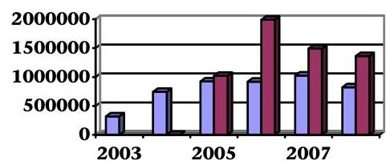

## 3.5. Céltartalék-képzés

A diákhitel kockázati céltartalék képzésére sem a számviteli törvény, sem a hallgatói hitelrendszerről szóló 2001. évi Korm. rendelet nem tartalmazott előírást a működés első két évében. A hitelezési kockázat azonban a 2001-2002. években is fennállt, ezért a Diákhitel Zrt. - a számviteli óvatosság és összemérés elvét figyelembe véve - az eredmény terhére „egyéb céltartalékot" képzett az esetleges hitelezési veszteségek fedezetére.

---

A hallgatói hitelrendszerről szóló 2001. évi Korm. rendelet 2001. évi módosítása előírta, hogy a hallgatói hitelek kamatában a 2001/2002., és a 2002/2003. tanévekben nem kell figyelembe venni a hallgatók nem fizetése miatti kockázati kamatelemet. A hallgatói hitel kamatában meg nem térülő kockázati kamatelem fedezetére a Kormány a 2001-2004. évekre 555,0 M Ft költségvetési támogatást hagyott jóvá, amely a támogatással érintett években ellentételezte a kieső bevételeket.

A hallgatói hitelrendszerről szóló Korm. rendelet 2003. decemberi módosítása 2004. január 1-jei hatállyal előírta a diákhitel kockázati céltartalék képzését és meghatározta annak szabályait. A Diákhitel Zrt. a kockázati céltartalék mértékét - a hallgatói hitelrendszerről szóló Korm. rendelet előírásainak megfelelően - minden esetben az aktuárius által meghatározott, és a könyvvizsgáló által elfogadott kockázati szinten belül határozta meg. A szükséges céltartalék összegét havi gyakorisággal számolta el, a diákhitel kockázati céltartalék-képzés alapja az átlagos hallgatói hitelállomány volt. A kockázati céltartalék feloldását illetve felhasználását - a számviteli törvény 77. § (3) a) bekezdésében foglaltaknak megfelelően - az egyéb bevételekkel szemben számolta el. A Diákhitel Zrt. a kockázatai céltartalék-képzés év végi elszámolásának rendjét a számviteli politikájában meghatározta, azonban a képzés, felhasználás, elszámolás évközi részletes szabályait belső szabályzatban nem rögzítette.

A kockázati céltartalék 2001. évi 128 M Ft-os záróállománya 2002. év végére 309 M Ft-ra emelkedett, 2007. év végén pedig 9171 M Ft volt. A 2008. évre tervezett 11856 M Ft kockázati céltartalék a 2007. évben képzett összegnél 29,3%-kal magasabb. A megképzett állomány az ellenőrzött években a hallgatói hitelállomány 1,2-5,8%-át tette ki, a 2008. évi tervszámok alapján ez az arány 6,4%.

A kockázati céltartalék-állomány növekedésének üteme a 2004-2007. években a hallgatói hitelek állományának növekedési mértékét felülmúlta, amellett, hogy az aktuáriusi előrejelzéseknél kedvezőbben alakult a hitel-visszafizetési hajlandóság, azaz a hallgatói hitelezés kockázati kitettsége javult ${ }^{32}$.

# A hallgatói hitelállomány és a céltartalék-állomány változása 

Adatok: %-ban

| Megnevezés | $\begin{gathered} 2002 / \\ 2001 \end{gathered}$ | $\begin{gathered} 2003 / \\ 2002 \end{gathered}$ | $\begin{gathered} 2004 / \\ 2003 \end{gathered}$ | $\begin{gathered} 2005 / \\ 2004 \end{gathered}$ | $\begin{gathered} 2006 / \\ 2005 \end{gathered}$ | $\begin{gathered} 2007 / \\ 2006 \end{gathered}$ |
| :--: | :--: | :--: | :--: | :--: | :--: | :--: |
| Mérleg szerinti záró hitelállomány változása | 497 | 203 | 155 | 134 | 125 | 119 |
| Éves átlagos hallgatói hitelállomány változása | 689 | 444 | 130 | 147 | 126 | 121 |
| Céltartalék-állomány változása | 241 | 351 | 225 | 178 | 153 | 138 |

[^0]
[^0]:    ${ }^{32}$ A Diákhitel Zrt. a Nemzetközi Számviteli Standardok szerinti beszámoló készítésére való áttérést megelőzően a céltartalék-képzés gyakorlatának felülvizsgálatát tervezi.

---

# 3.6. A hallgatói hitelezési eljárás kommunikációja, az ügyfelekkel való kapcsolattartás, panaszügyek kezelése 

A 2001-2002. években a Diákhitel Zrt. az ügyfelek panaszairól statisztikát még nem készített. A Diákhitel Zrt. tájékoztatása szerint ebben az időszakban a legtöbb ügyfélmegkeresés a hiteljogosultsági feltételekkel függött össze, valamint azzal, hogy az ügyfelek folyószámla vezetését a Társaság üzletszabályzata kizárólag a Postabankhoz kötötte. A hallgatói hitelrendszerről szóló 2001. évi Korm. rendelet előírásainak meg nem felelő ${ }^{33}$ igényeket a Diákhitel Zrt. elutasította, az adatokat - az adatvédelmi szabályok értelmében - nyilvántartásaiból törölte.

## Az ügyfélkapcsolatok jogi osztálya által kezelt panaszügyek alakulása

| Időszak | Panaszok |  |  |  |
| :-- | --: | --: | --: | --: |
|  | "Jogos" (db) | "Jogtalan" (db) | Panaszok   összesen (db) | "Jogos" panaszok   aránya (\%) |
| 2003. | 1 | 15 | 16 | $\mathbf{6,3}$ |
| 2004. | 4 | 35 | 39 | $\mathbf{10,3}$ |
| 2005. | 8 | 228 | 236 | $\mathbf{3,4}$ |
| 2006. | 9 | 351 | 360 | $\mathbf{2,5}$ |
| 2007. | 12 | 313 | 325 | $\mathbf{3,7}$ |
| 2008. I. félév | 5 | 216 | 221 | $\mathbf{2,3}$ |
| Összesen | $\mathbf{39}$ | $\mathbf{1158}$ | $\mathbf{1197}$ | $\mathbf{3,3}$ |

A Diákhitel Zrt.-hez 2003-tól az ellenőrzött időszak végéig 1197 panasz érkezett, amelyből - a hatályos szabályozás szerint - 3,3% volt „jogos". A „jogos" panaszok 35,9%-a (14 eset) a többletbefizetések előtörlesztésként történő elszámolásával volt összefüggésben. (Az ügyfél nem a hallgatói hitelrendszerről szóló 2001. évi Korm. rendeletben meghatározott számlára utalta az előtörlesztés összegét, így azt a Diákhitel Zrt. túlfizetésként tartotta nyilván. A Társaság a beérkezett panaszok kivizsgálását követően a befizetett összegeket előtörlesztésként elszámolta.) Az igazolások téves ügyintézése, valamint a helytelen tájékoztatás miatti panaszok aránya 23,1-23,1% (9-9 panasz) volt. A téves folyósítás miatt felszámított kamattal összefüggő panaszok aránya 12,8% (5 eset). Egy-egy esetben (5,1%) pedig befizetés jóváírás és CKT elszámolás tárgyában érkezett panaszos megkeresés. A „jogos" panaszokat a Diákhitel Zrt. minden esetben a hatályos, a hallgatói hitelrendszerről szóló Korm. rendelet előírásainak és belső szabályzatainak megfelelően rendezte.

Az ellenőrzött időszakban nyilvántartott 1158 „jogtalan" panasz 22,4%-a szerződéskezeléssel, 77,6%-a pedig hitelgondozással függött össze. A szerződéskeze-

[^0]
[^0]:    ${ }^{33}$ Az igényléskor a hiteligénylő életkora meghaladta a 35. életévét, nem a hallgatói hitel igénybevételére jogosító képzésben vett részt, nem rendelkezett a hallgatói hitel igénybevételére jogosító jogosultsági/hiteligénylési idővel.

---

lésen belül 57,1% (148 eset) a jogosultsági feltételekkel volt kapcsolatos. A hitelgondozás témakörben pedig 71,2%-ot (640 eset) a törlesztési kötelezettséggel összefüggő panaszok tették ki. Az ügyfelek panaszait - az ellenőrzött dokumentumok szerint - a belső szabályzatban foglalt előírásoknak megfelelően kivizsgálták és megválaszolták. A Diákhitel Zrt. a nyilvántartott panaszokat elemezte és a rendszeresen ismétlődő panaszok megszüntetéséről intézkedett.

Az átlagos ügyfélszámhoz mérten a panaszügyek aránya 2006-ig évente növekvő tendenciájú volt, de még 2006-ban sem érte el a kettő tízezreléket. A panaszügyek kezelése, elemzése és értékelése a „jogos" panaszok esetében az ügykezelésben feltárt hiányosságok és eltérések kijavítását, a „jogtalan" panaszoké pedig az ügyfél-tájékoztatás aktuális témaköreinek meghatározását segítette.

A panaszügyek kezelését 2003-tól az SZMSZ, 2006-tól vezérigazgatói utasítás, 2007-től pedig - a végrehajtás részletes szabályait meghatározó - igazgatói utasítás is szabályozta.

A Diákhitel Zrt. középtávú marketing-kommunikációs és PR stratégiájában kiemelt célként határozta meg az ügyfél-elégedettség növelését, 2004-ben pedig aktív személyes ügyfélkapcsolat kialakítását kezdte meg.

Ebben az évben először „Osztályfönöki Hírlevelet" küldtek ki minden érettségiztető középiskolába a végzős középiskolások tájékoztatására, a hallgatói hitel kamatának emelését sajtócikkekben, rádiós és televíziós műsorokban kommunikálták, média-kampányt indítottak a törlesztési szakban lévő ügyfelek fizetési fegyelmének megerősítése érdekében. Új kommunikációs csatornát vezettek be a papíralapú hírlevelek kiváltására, gólyatáborokban tartottak diákhitel-előadásokat, egyetemi-főiskolai lapokban hirdetéseket helyeztek el, az országos tanintézeti „road-show" bevezetésével az elsősök személyes tájékoztatását biztosították.

Az ügykezelést, ezen belül a panaszkezelést a beérkezett e-mailek gyors megválaszolásával, hírlevelek kiküldésével segítették. Ezt a célt szolgálta a honlap felhasználóbarát továbbfejlesztése is, amely 2006. év végére fejeződött be. A Társaság 2007. január végére panaszkezelési koncepciót dolgozott ki, 2008-ban pedig a vezérigazgató közvetlen irányítása alatt panaszirodát alakított ki a gyorsabb és eredményesebb ügyintézés érdekében. A gyakran felmerülő panaszok elkerülésének további eszköze volt például a 2007 végén megjelentetett „Miért nőhet a tartozás összege?" című tájékoztató.

# 3.7. A hallgatói hitelrendszer kitűzött céljainak megvalósulása a közvélemény-kutatások tükrében 

A Diákhitel Zrt. hallgatói hitelrendszerrel összefüggő kommunikációjának célja az volt, hogy a jogosultak minél teljesebb körben megismerjék a hitelfelvétel lehetőségét és feltételeit. A hallgatói hitel iránti kereslet növelésének módszereire és a hitelfelvételt motiváló tényezők feltárására a Diákhitel Zrt. megbízást adott egy elemző tanulmány készítésére. A reprezentatív minta ${ }^{34}$ alapján vég-

[^0]
[^0]:    ${ }^{34}$ A reprezentatív felmérés megcélzott csoportjai egyrészről az érettségizők, másrészről a felsőoktatási hallgatók voltak. A minta a középiskolásoknál 1336 esetet, a felsőoktatásban résztvevőknél 1491 hallgatót tartalmazott. A felmérést 2005. április-május hónapban végezték.

---

zett 2005. évi felmérés azt állapította meg, hogy a diákhitel igénybevétele megkönnyíti a felsőoktatásban résztvevők tanulási feltételeit, segíti a felsőoktatásban az esélyegyenlőség érvényesülését, viszont a felsőoktatásba való bekerülés igényét nem befolyásolja. A hitel felvételét a megélhetési költségek és az a szándék motiválja, hogy a hallgatók önálló életvitelt folytathassanak. A hitel felvételének valószínűsége azok esetében nagyobb, akik alacsonyabb jövedelmű családi háttérrel rendelkeznek, pénzügyileg kevesebb szülői támogatást kapnak, költségtérítéses képzésben részesülnek.

A felsőoktatásban résztvevőknek eltérő volt a véleményük a diákhitelről attól függően, hogy vettek-e már fel diákhitelt, vagy nem. A hitelt felvevők között 86% azok aránya, akik szerint megkönnyíti a szülők számára, hogy gyermekeik felsőfokú tanulmányokat folytassanak, a hitelt fel nem vevők között ez az arány 65%-ot tett ki. A felmérési mintában részt vevő középiskolásoknak tudomásuk volt a diákhitel felvételének lehetőségéről. A hitel konkrét paramétereit (pl. nincs hitelbírálat, változó a kamat, a diákhitelnek nincs lejárata) azonban nem, vagy nem teljes körűen ismerték, a megkérdezettek 5%-a volt tisztában a felvehető hitel nagyságával, a törlesztés módjával, illetve a kamattal. A megkérdezettek mindkét csoportja 48%-ban egyetértett azzal, hogy a diákok elsősorban megélhetésre költik a felvett hitelt. A hitelfelvételről való döntésnél a szülők befolyásoló szerepe a felvétel mellett döntőknél 29%, a fel nem vevők között 20% volt.

A diákhitelről szóló információk legfontosabb forrása a megkérdezettek szerint az internet - a hitelt felvevők körében ez 41%, míg a hitel fel nem
 vevők körében 22%-os, majd ezt követi a csoporttársak, barátok véleménye. A tanulmány azt állapította meg, hogy – mivel a felsőoktatásban tanulók zárt közösségeket alkotnak – a „szájreklámnak” meghatározó szerepe lehet, az így terjedő információ tartalma azonban nem kontrollált, az esetleges téves ismeretek miatt ez a fajta információáramlás hátrányos is lehet. Az információk ügyfelekhez eljuttatását – tízes skálán mérve – a válaszadók közepesre (5,5) értékelték. Az ügyintézés megítélésénél a pontosságot 69%-ban, az udvariasságot 66%-ban, az ügyintézés gyorsaságát 53%-ban jónak minősítették. A tanulmány szerint a Diákhitel Zrt. munkájával a megkérdezettek összességében elégedettek voltak, azt kedvezően ítélték meg.

A 2005-ben elfogadott középtávú marketing-kommunikációs és PR stratégiában megfogalmazottakat figyelembe véve, a Diákhitel Zrt. további három tanulmányt készíttetett, annak feltárására, hogy milyen üzenetekkel, mely csatornákon célszerű kommunikálni a célcsoportok felé, mi motiválja a hallgatói hitelt igénybevevők törlesztési magatartását, és hogyan változtak a diákhitel felvételét befolyásoló tényezők a 2005. évi felméréshez viszonyítva.

A 2007. január-március között végzett felmérés $^{35}$ azt vizsgálta, hogy milyen kommunikációval lehet a diákhitel iránti keresletet növelni. A kutatás azt állapította meg, hogy jól elhatárolható véleménykülönbség van a felmérésben résztvevő csoportok között a diákhitel jelentősége és az azzal kapcsolatos tájékozottság szempontjából.

[^0]
[^0]:    $^{35}$ A felmérésben részt vevő célcsoport a végzős, továbbtanulás előtt álló középiskolások és szüleik, valamint a felsőoktatásban tanulók voltak 1452 fős minta alapján.

---

A végzős középiskolások és szüleik számára az érettségi és felvételi eredménye volt a fontos. A diákhitel létezéséről tudtak, de annak feltételeiről pontos információval nem rendelkeztek. A megkérdezettek véleménye szerint a hitelt egyrészről tehetséges diákok veszik fel, akik rossz anyagi körülmények között vannak, másrészről azok, akiknek valójában nincs szükségük a hitelre, azt szórakozásra költik. A tanulmány azt a következtetést vonta le, hogy a középiskolásoknak nincs igényük a diákhitellel kapcsolatos részletes információkra, ajánlásként pedig azt fogalmazta meg, hogy a Diákhitel Zrt. kommunikációjában hangsúlyozza azt a leendő hallgatók felé, hogy a diákhitel a továbbtanulás természetes velejárója.

A felmérésben részt vevő hallgatók – függetlenül attól, hogy van-e diákhitelük vagy sem – több információval rendelkeztek a diákhitelről, mint a középiskolások és szüleik. Ismerték a felvehető összegeket, a felvétel módját, de a hitel visszafizetésének pontos feltételeivel nem voltak tisztában. A tanulmány azt is megállapította, hogy a diákhitellel kapcsolatban kialakult negatív véleményeket a törlesztéssel kapcsolatos hiányos kommunikáció okozta. (Az alacsonyan megállapított törlesztőrészlet a kamatokra sem nyújt fedezetet, a meg nem fizetett kamat a tőketartozást növeli.) Javasolta, hogy a jövőbeli kommunikációban hangsúlyosabb legyen a diákhitel visszafizetésével kapcsolatos tájékoztatás, továbbá célszerű lenne a diákhitel előnyeként kommunikálni azt, hogy a törlesztés alapvetően jövedelemarányos, előtörlesztés pedig korlátozás és díjfizetés nélkül teljesíthető.

# A 2007. február és március között végzett, törlesztési magatartást 

vizsgáló felmérés $^{36}$ eredménye alapján a szabályosan törlesztők csoportja a diákhitelt a megélhetési költségek fedezésére vette igénybe, a hitel felvételének feltételeiről jól informáltak, de a törlesztés alternatív lehetőségeivel (előtörlesztés, előteljesítés) nincsenek tisztában. Az előtörlesztők csoportjánál a hitel felvételét a tanulmányok finanszírozása motiválta. A tartozásuktól minél előbb szeretnének szabadulni, de ez a csoport is – a szabályosan törlesztőkhöz hasonlóan – tájékozatlan a törlesztési lehetőségekről. A szabályosan törlesztők és előtörlesztők csoportja a diákhitel hátrányaként fogalmazták meg azt, hogy a hónap 5. napjáig kell a törlesztést teljesíteniük. Ezt az időpontot korainak tartják, jobban elfogadható lenne számukra egy későbbi, például 10-15-e közötti időpont. A hátralékot felhalmozók – az előző két csoporthoz viszonyítva – átlagosan alacsonyabb összegű hitelt vettek fel, amelyet tanulmányaik finanszírozására és tandíjfizetésre fordítottak. A diákhitel törlesztésével kapcsolatban még kevésbé tájékozottak, mint a szabályosan törlesztők és az előtörlesztők. Erre a csoportra jellemző a hiteltörlesztéssel kapcsolatos felelőtlen magatartás (nem bontják fel a leveleket, nem tartják mulasztásnak a törlesztés nem fizetését).

A tanulmány azt állapította meg, hogy a megkérdezettek 70%-a ítélte jelesnek vagy jónak a Diákhitel Zrt. működését, és ugyancsak 70% tartotta elegendőnek és érthetőnek a diákhitellel kapcsolatos kommunikációját.

A Diákhitel Zrt. 2007-ben összehasonlító felmérést végeztetett $^{37}$, amely arra irányult, hogy milyen tényezők hatására változott a felsőfokú képzésben

[^0]
[^0]:    $^{36}$ A törlesztési szakaszban lévő ügyfelek 1502 fős mintája alapján.
    $^{37}$ kérdőíves felmérés a felsőoktatási intézményekben 1508 hallgató megkérdezésével,

---

résztvevő hallgatók diákhitel iránti kereslete, módosult-e a hallgatók jövedelmi és kiadási szerkezete a 2005. évben végzett felmérés eredményeihez viszonyítva. A felmérésben résztvevők körében a diákhitelt felvevők és az arra jogosultak aránya 2007-ben kedvezőtlenebb volt (23%), mint 2005-ben (26%), továbbá a diákhitelt fel nem vevők körében az eladósodottságtól való félelem a 2005. évi 54%-ról 2007-re 59%-ra nőtt. A tanulmány azt állapította meg, hogy a hallgatók jövedelmében – a rendszeres és az alkalmi jövedelmeket figyelembe véve – továbbra is a szülői támogatás aránya a legnagyobb, amely 2005-höz viszonyítva a hitelfelvevők körében 55%-ról 62%-ra, a hitelt fel nem vevők körében pedig 55%-ról 69%-ra emelkedett. A diplomás szülők gyermekei kisebb arányban vették fel a hitelt, mint az érettségizett vagy ennél alacsonyabb képzettséggel rendelkező szülők gyermekei. A diákhitel felvételével kapcsolatos döntés meghozatalában a szülők befolyása nőtt mind a hitelt felvevők (29%-ról 37%-ra) mind a hitelt fel nem vevők körében (20%-ról 28%-ra). A 2007. évi felmérésben a válaszadók 41%-a vélte úgy, hogy ha nem lenne diákhitel, abba kellene hagyniuk tanulmányaikat, 35%-nak segített a tandíj kifizetésében, szemben a 2005. évi 26%-kal, illetve 23%-kal. A megkérdezettek 78%-a érezte magára nézve igaznak azt az állítást, hogy a diákhitel hozzájárult ahhoz, hogy anyagilag függetleníthessék magukat a szülőktől (a 2005. évi tanulmányban erre vonatkozó információ nem volt).

A diákhitellel kapcsolatos tájékoztatással elégedett hallgatók aránya a 2005. évi 42%-kal szemben 60%-ra nőtt. A Diákhitel Zrt. hitelezési tevékenységét a megkérdezettek egy tízes skálán 2005-ben 5,5-re 2007-ben 6,8-ra értékelték. Az ügyintézés gyorsaságát, pontosságát, és az udvariasságot tekintve a megkérdezettek 80%-a adott jó minősítést, szemben a 2005. évi 63%-kal.

Budapest, 2008. december 17.

Melléklet: 13 db 19 lap
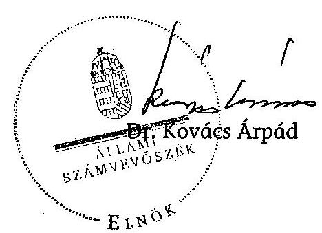

---

# ÉSZREVÉTELEK

---

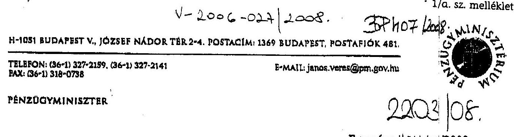

# 2203108. 

Ikt.szám: 14544/8'2008.

Dr. Kovács Árpád
elnök

Állami Számvevőszék Budapest

## Tisztelt Elnök Úr!

A Diákhitel Központ Zrt. működésének ellenőrzéséről készített számvevőszéki jelentést köszönettel megkaptam, azzal kapcsolatban észrevételt tenni nem kívánok.

Egyúttal tájékoztatom, hogy a Diákhitel Zrt. Igazgató Tanácsa – a 2008. november 28-án megtartott ülésén – elfogadta a társaság Szervezeti és Működési Szabályzatának módosítását, így a Finanszírozási Bizottság szervezetben elfoglalt helye és hatásköre – az Önök által a Jelentésben foglalt javaslat szerint – időközben már szabályozásra került.

Budapest, 2008. december 4.

Üdvözlettel:
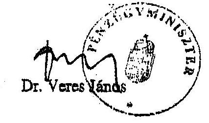

---

# Diákhitel 

Diákhitel Központ Zrt.
1027 Budapest, Csillagány u. 9-11
tel.: 224-86-00
www.diakhitel.hu

Állami Számvevőszék

Bihary Zsigmond
Főigazgató úr részére
részére

Budapest.
Apáczai Csere János u. 10.
1052

## Tisztelt Főigazgató Úr!

Köszönettel vettük a Diákhitel Központ Zrt. átfogó ellenőrzése során készített számvevőszéki jelentés tervezetét.

A jelentést áttekintettük, azzal kapcsolatban észrevételt nem kívánunk tenni.

Budapest, 2008. október 22.

Tisztelettel:
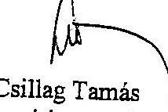

Csillag Tamás
vezérigazgató

---

# 1434108 

## MNV

MAGYAR NEMZETI VAGYONKEZELŐ ZRT.
VEZÉRIGAZGATÓ

1133 BUDAPEST, POZSONYI ÚT 766. 1399 BUDAPEST, PF. 708
TELEFON: (06 1) 237-4400 . FAX: (06 1) 237-4100
HONLAP: WWW.MNVZRT.HU. E-MAIL: INFO@MNVZRT.HU

Bihary Zsigmond főigazgató úr részére

Állami Számvevőszék Budapest
Apáczai Csere János u. 10 1052

Ikt.sz.: 44W101150421612008
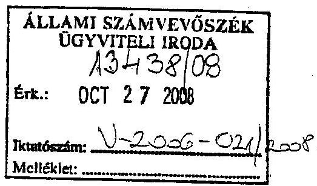

Tárgy: A Diákhitel Központ Zrt. működésének ellenőrzéséről készített jelentés – tervezet véleményezése

Tisztelt Főigazgató Úr!

Az ÁSZ jelentés vizsgálatának irányával, mélységével, a megfogalmazott megállapításokkal és javaslatokkal egyetértek, azokat támogatom.

Megjegyzem, hogy a Bevezetés fejezetben az alaptőke nagyságának levezetése nem egyértelmű, a tőkeemelések időbeli ismertetése az alaptőke nagyságát 200 MFt-tal magasabb értékre viszi, mint a bemutatott 300 MFt érték.

A jelentés tervezetéhez egyebekben észrevételt nem teszek.

Budapest, 2008. október „20”,
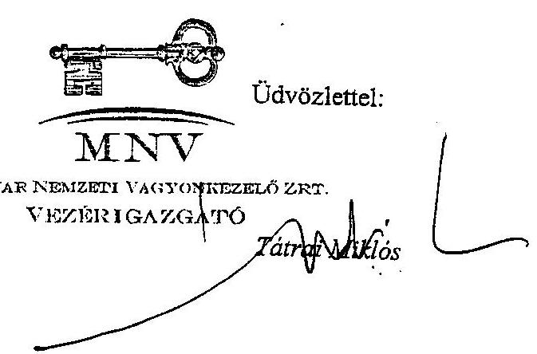

---

# A hallgatói hitelrendszer működtetésében közreműködő szervezetek 

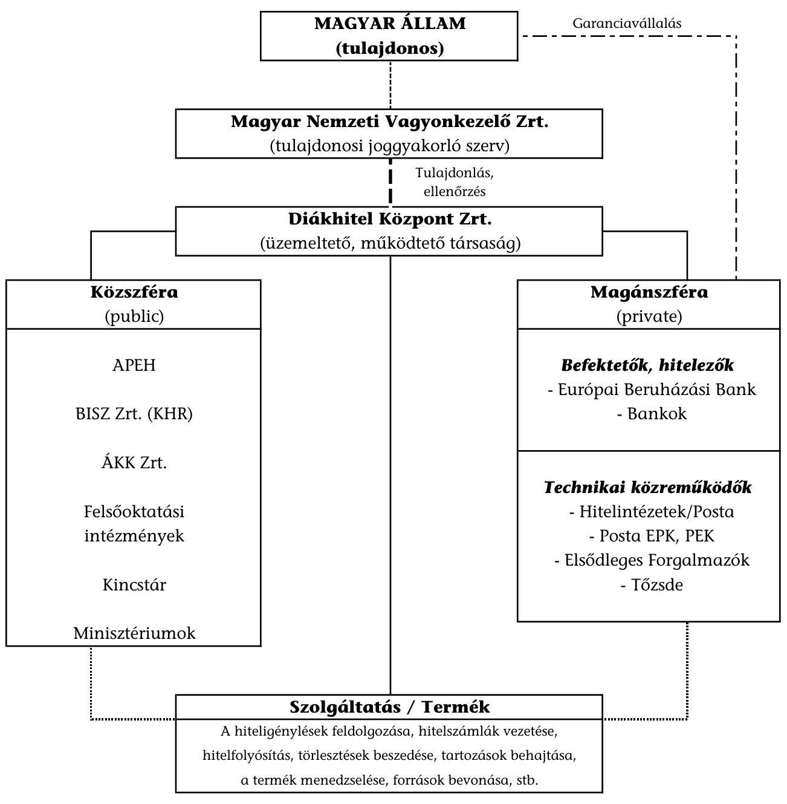

---

3/a. sz. melléklet

a V-2006-025/2008. sz. jelentés-tervezethez

A Diákhitel Zrt. szervezeti felépítése
(2008. július 1-jétől)

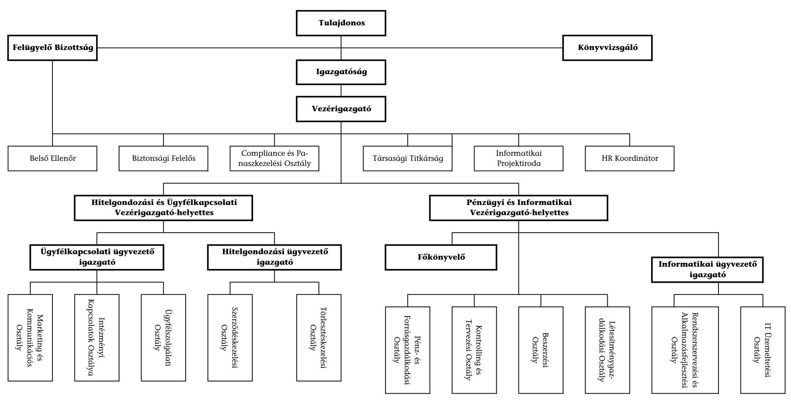

---

# A Diákhitel Zrt. szervezeti felépítése (2004. március 24-től) 

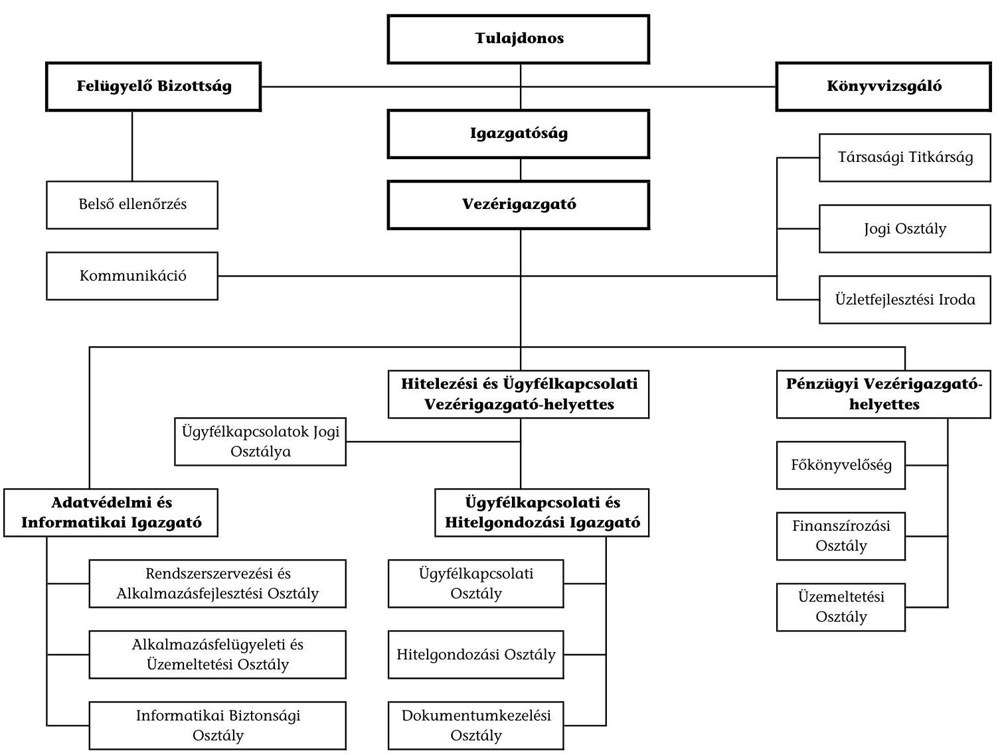

---

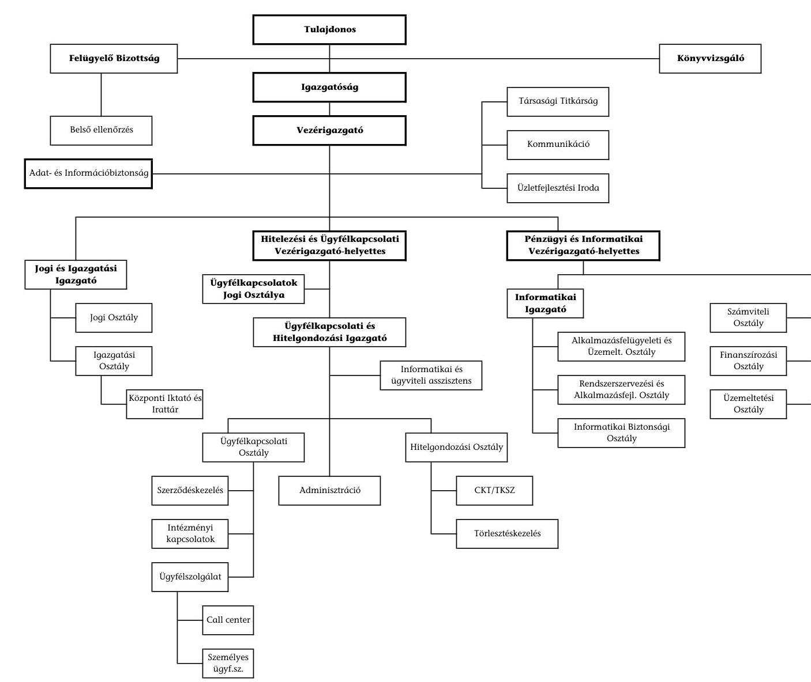

# A Diákhitel Zrt. szervezeti felépítése (2003. július 1-jétől)

## Teljeslet

- **Tulajdonos**: 
- **Tulajdonos Bizottság**: 
- **Igazgatóság**: 
- **Társasági Titkárság**: 
- **Belső ellenőrzés**: 
- **Vezérigazgató**: 
- **Kommunikáció**: 
- **Adat- és Információtisztviselő**: 
- **Üzletfejlesztési Iroda**: 
- **Hitelezési és Ügyfélkapcsolati Vezérigazgató-helyettes**: 
- **Pénzügyi és Informatikai Vezérigazgató-helyettes**: 
- **Jogi és Igazgatási Igazgató**: 
- **Ügyfélkapcsolatok Jogi Osztálya**: 
- **Informatikai Igazgató**: 
- **Szervezési Osztály**: 
- **Alkalmazottszámvitel és Üzemeltető Osztály**: 
- **Finanszírozási Osztály**: 
- **Központi Iktató és Intézet**: 
- **Recepció és Alkalmazottszámvitel**: 
- **Ügyfélkapcsolati Osztály**: 
- **Hitelezőszámvitel**: 
- **Szervezés**: 
- **Szerződéskezelés**: 
- **Adminisztráció**: 
- **CET/TKIZ**: 
- **Törlesztéskezelés**: 
- **Tárgyi eszközszámvitel**: 
- **Ügyfélszolgálat**: 
- **Call center**: 
- **Személyes ügyfélfogadás**: 

---

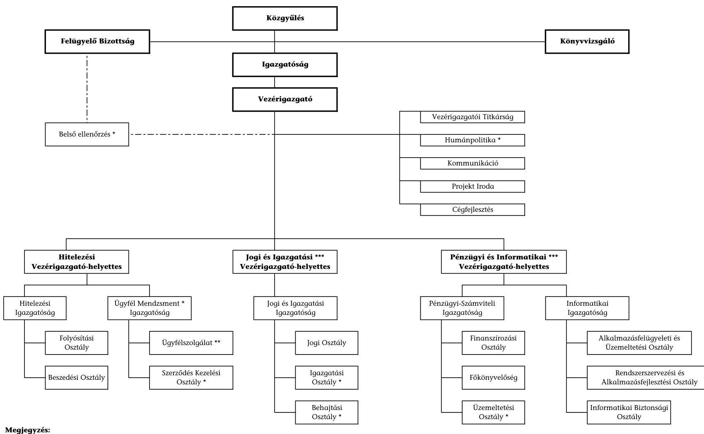

# A Diákhitel Zrt. szervezeti felépítése (2002. február 11-től)

## Megjegyzés:
- ezen szervezeti egységek még nincsenek létszámmal feltöltve, feladataikat más egységek látják el
- **** részében feltöltve (call center) ***** a kinevezés még nem történt meg

---

# A Diákhitel Zrt. alaptevékenységének áttekintő folyamatai 

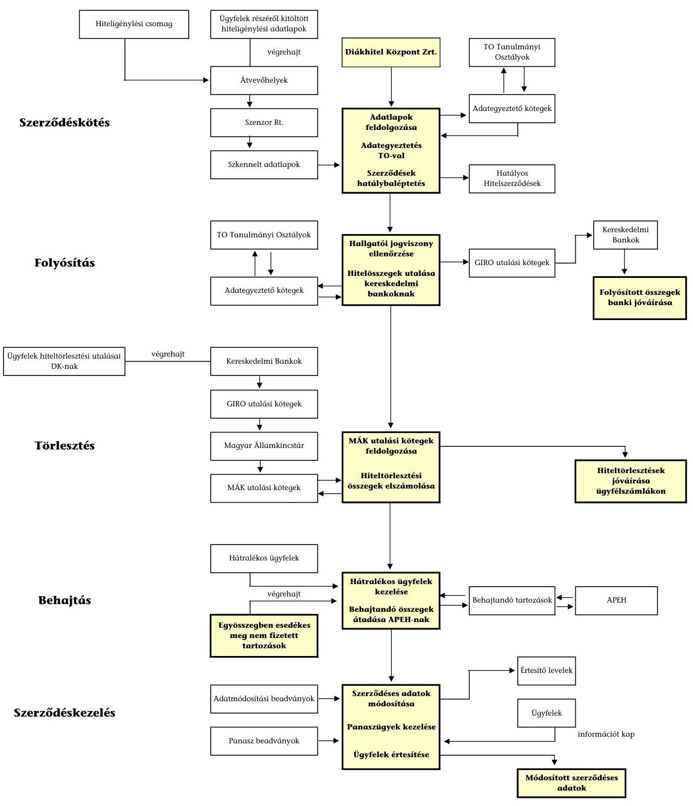

---

# A hallgatói hitelek törlesztésének a hallgatói hitelek folyósításához viszonyított aránya

|  Megnevezés | 2003. év | 2004. év | 2005. év | 2006. év | 2007. év | 2008. I. félév  |
| --- | --- | --- | --- | --- | --- | --- |
|  Hallgatói hiteltörlesztés (M Ft) | 1255 | 2994 | 5860 | 8841 | 11441 | 7684  |
|  Hallgatói hitelfolyósítás (M Ft) | 23938 | 23964 | 22637 | 23506 | 23658 | 11623  |
|  Hallgatói hitelfolyósítás fedezete a hallgatói hiteltörlesztésből (%) | 5,2 | 12,5 | 25,9 | 37,6 | 48,4 | 65,9  |

---

# A Diákhitel Zrt. forrásbevonási célú hitel és kölcsönszerződései

|  Szerződés létrejötte | Hitelt nyújtó bank | Hitel/Keret összege (Ft) | Devizanem | Megjegyzés | Jóváhagyó  |
| --- | --- | --- | --- | --- | --- |
|  2001.09.26 | MFB Rt. | 15000000000 | HUF |  | Igazgatóság 2001. szeptember 24-én hozott határozata (alapító okirat szerint vezérigazgatói hatáskör)  |
|  2001.09.28 | Postabank és Takarékpénztár Rt. | 100000000 | HUF |  | vezérigazgatói hatáskör  |
|  2001.10.31 | Postabank és Takarékpénztár Rt. | 200000000 | HUF | 2001. szeptember 28. módosítás: hitelkeret emelés, prolongáció | vezérigazgatói hatáskör  |
|  2002.01.25 | MFB Rt. | változatlan |  | 2001. szeptember 26. módosítás: prolongáció | 2/2002. (I.23.) Ig. határozat  |
|  2002.03.21 | MFB Rt. | 28000000000 | HUF |  | 10/2002. (II. 27.) Ig. határozat  |
|  2002.12.18 | MFB Rt. | 50000000000 | HUF | 2002. március 21. 1.sz. módosítás: hitelkeret emelés, hitelcél változása, prolongáció | 36/2002. (XII.16.) Ig. határozat  |
|  2003.01.13 | Postabank és Takarékpénztár Rt.

 | 1800000000 | HUF |  | 54/2002. (XII.9) Ig. határozat  |
|  2003.03.12 | Pontabank és Takarékpénztár Rt. | 5000000000 | HUF |  | 22/2003. (III.5.) Ig. határozat  |
|  2003.03.24 | MFB Rt. | változatlan |  | 2002. március 21. 2.sz. módosítási: kamatfeltételek,
megralátivztatása | 25/2003. (III.19.) Ig. határozat  |
|  2003.04.09 | KfeH Rt. | 5000000000 | HUF |  | 23/2003. (III.19.) Ig. határozat  |
|  2003.04.10 | CIB Bank Rt. | 2500000000 | HUF |  | 23/2003. (III.19.) Ig. határozat  |
|  2003.04.10 | CIB Bank Rt. | 6000000000 | HUF |  | 24/2003. (III.19.) Ig. határozat  |
|  2003.05.12 | Citibank Rt. | 2500000000 | HUF |  | 31/2003. (IV.18) Ig. határozat  |
|  2003.05.14 | MFB Rt. | változatlan |  | 2002. március 21. 3.sz. módosítási: kamatfeltételek,
megralátivztatása | nem járt kötelezettségvállalással  |
|  2003.05.30 | MFB Rt. | változatlan |  | 2002. március 21. 4.sz. módosítási: kamatfeltételek,
megralátivztatása | nem járt kötelezettségvállalással  |
|  2003.09.29 | MFB Rt. | változatlan |  | 2002. március 21. 5.sz. módosítási: hitelnyújtás
céljának megralátivztatása, prolongáció | 53/2003. (IX.26.) Ig. határozat  |
|  2004.05.12 | Pontabank és Takarékpénztár Rt. | 6000000000 | HUF |  | 12/2004. (IV.15.) Ig. határozat  |
|  2004.06.30 | MFB Rt. | változatlan |  | 2002. március 21. 6.sz. módosítási: hitel típusának
megralátivztatása (rullrosi), hitelnyújtás céljának
megralátivztatása, prolongáció | 13/2004. (V.20.) Ig. határozat  |
|  2004.10.19 | MFB Rt. | változatlan |  | 2002. március 21. 7.sz. módosítási: kamatfeltételek,
megralátivztatása | 13/2004. (V.20.) Ig. határozat  |
|  2005.01.31 | MFB Rt. | változatlan |  | 2002. március 21. 8.sz. módosítási: kamatfeltételek,
megralátivztatása | 13/2004. (V.20.) Ig. határozat  |
|  2005.05.12 | EIB | 100000000 | EUR |  | 9/2005. (IV.28.) Ig. határozat  |
|  2005.06.30 | MFB Rt. | változatlan |  | 2002. március 21. 9.sz. módosítási: kamatfeltételek,
megralátivztatása | 10/2005. (IV.28.) Ig. határozat  |
|  2006.01.04 | ERSTE | 10000000000 | HUF |  | 13/2004. (V.20.) Ig. határozat  |
|  2006.05.16 | MFB Rt. | változatlan |  | 2002. március 21. 10.sz. módosítási: kamatfeltételek,
változtatása, prolongáció | 17/2005. (XI.3.), 6/2006. (III.22.) Ig. határozat  |
|  2007.01.02 | ERSTE | 15000000000 | HUF | 2007. augusztus 31-éig 10, azt követően 15 M Ft is
követésseg | 6/2006. (III.22.) Ig. határozat  |
|  2007.08.30 | EIB | 150000000 | EUR |  | 5/2007. (VI.13.), 9/2007. (VII.31.) Ig. határozat  |
|  2008.01.03 | ERSTE | 15000000000 | HUF |  | 5/2007. (VI.13.) Ig. határozat  |

---

# A Diákhitel Zrt. kötvényaukcióinak főbb adatai*

|  Kötvény neve | Aukció dátuma | Pénzügyi teljesítés dátuma | Első kibocsátás dátuma | Lejárat dátuma | Kumatszús | Eredeti futamidő (év) | Aktuálisan hátralévő futamidő (nap) | Felajánlott mennyiség (M Ft) | Benyújtott mennyiség (M Ft) | Elfogadott mennyiség (M Ft) | Átlag. hozam | Állampapír hozam** | Spread | Napok száma / Kapcsolódó állampapír  |
| --- | --- | --- | --- | --- | --- | --- | --- | --- | --- | --- | --- | --- | --- | --- |
|  DK2006/01 | 2003.09.23 | 2003.09.29 | 2003.09.29 | 2006.01.06 | fix | 2 | 2 év 109 nap | 10000,00 | 37 936,19 | 9 999,99 | 8,52\% | 8,06\% | 0,46\% | 840  |
|  DK2006/01 | 2003.10.07 | 2003.10.13 | 2003.09.29 | 2006.01.06 | fix | 2 | 2 év 95 nap | 10000,00 | 32 842,48 | 9 999,99 | 8,38\% | 8,08\% | 0,30\% | 826  |
|  DK2006/01 | 2003.11.04 | 2003.11.12 | 2003.09.29 | 2006.01.06 | fix | 2 | 2 év 65 nap | 8000,00 | 20 956,92 | 0,00 | 0,00\% | - | - | 796  |
|  DK2006/01 | 2003.12.09 | 2003.12.11 | 2003.09.29 | 2006.01.06 | fix | 2 | 2 év 36 nap | 5000,00 | 16 731,78 | 4 999,97 | 11,73\% | 11,37\% | 0,36\% | 767  |
|  DK2006/01 | 2004.03.02 | 2004.03.10 | 2003.09.29 | 2006.01.06 | fix | 2 | 1 év 312 nap | 10000,00 | 12 242,00 | 10 000,00 | 11,80\% | 11,45\% | 0,35\% | 677  |
|  DK2006/01 | 2004.04.06 | 2004.04.13 | 2003.09.29 | 2006.01.06 | fix | 2 | 1 év 278 nap | 5000,00 | 11 650,00 | 4 999,98 | 10,49\% | 10,11\% | 0,38\% | 643  |
|  DK2006/01 | 2004.05.04 | 2004.05.12 | 2003.09.29 | 2006.01.06 | fix | 2 | 1 év 249 nap | 5000,00 | 14 300,00 | 6 500,00 | 10,48\% | 10,09\% | 0,39\% | 614  |
|  DK2006/01 | 2004.06.08 | 2004.06.11 | 2003.09.29 | 2006.01.06 | fix | 2 | 1 év 219 nap | 5000,00 | 12 020,00 | 5 000,00 | 10,99\% | 10,59\% | 0,40\% | 584  |
|  DK2008/01 | 2003.11.04 | 2003.11.12 | 2003.11.12 | 2008.12.15 | változó | 5 | 5 év 33 nap | 2000,00 | 3700,00 | 0,00 | - | - | - | -  |
|  DK2007/01 | 2004.10.05 | 2004.10.13 | 2004.10.13 | 2007.10.12 | fix | 3 | 2 év 364 nap | 9000,00 | 35 100,00 | 8 999,98 | 10,27\% | 10,050\% | 0,22\% | 2007/G  |
|  DK2007/01 | 2004.12.07 | 2004.12.13 | 2004.10.13 | 2007.10.12 | fix | 3 | 2 év 303 nap | 3000,00 | 6 929,73 | 2 999,99 | 8,76\% | 8,575\% | 0,19\% | 2007/G  |
|  DK2007/01 | 2005.01.04 | 2005.01.12 | 2004.10.13 | 2007.10.12 | fix | 3 | 2 év 273 nap | 3500,00 | 8 050,00 | 3 499,99 | 8,22\% | 8,100\% | 0,12\% | 2007/G  |
|  DK2007/01 | 2005.03.01 | 2005.03.09 | 2004.10.13 | 2007.10.12 | fix | 3 | 2 év 217 nap | 7000,00 | 16 740,00 | 6 999,97 | 7,23\% | 6,950\% | 0,28\% | 2007/G  |
|  DK2008/01 | 2005.10.04 | 2005.10.12 | 2005.10.12 | 2008.08.12 | fix | 3 | 2 év 304 nap | 6500,00 | 20 936,00 | 6 499,98 | 6,41\% | 6,275\% | 0,14\% | 2008/E  |
|  DK2008/01 | 2005.11.08 | 2005.11.11 | 2005.10.12 | 2008.08.12 | fix | 3 | 2 év 274 nap | 4000,00 | 14 600,00 | 4 000,00 | 6,89\% | 6,700\% | 0,19\% | 2008/E  |
|  DK2008/01 | 2005.12.06 | 2005.12.13 | 2005.10.12 | 2008.08.12 | fix | 3 | 2 év 242 nap | 6000,00 | 25 400,00 | 6 000,00 | 7,04\% | 6,675\% | 0,37\% | 2008/E  |
|  DK2008/01 | 2006.01.03 | 2006.01.11 | 2005.10.12 | 2008.08.12 | fix | 3 | 2 év 213 nap | 9000,00 | 22 500,00 | 9 000,00 | 7,12\% | 6,975\% | 0,14\% | 2008/E  |
|  DK2008/01 | 2006.03.07 | 2006.03.10 | 2005.10.12 | 2008.08.12 | fix | 3 | 2 év 155 nap | 7000,00 | 15 803,00 | 6 999,99 | 7,09\% | 6,850\% | 0,24\% | 2008/E  |
|  DK2009/01 | 2006.10.03 | 2006.10.11 | 2006.10.11 | 2009.08.12 | fix | 3 | 2 év 305 nap | 7000,00 | 20 550,00 | 6 999,99 | 8,88\% | 8,735\% | 0,15\% | 2009/F  |
|  DK2009/01 | 2007.03.06 | 2007.03.12 | 2006.10.11 | 2009.08.12 | fix | 3 | 2 év 153 nap | 6500,00 | 17 050,00 | 6 500,00 | 7,94\% | 7,800\% | 0,14\% | 2009/F  |
|  DK2009/01 | 2007.09.11 | 2007.09.13 | 2006.10.11 | 2009.08.12 | fix | 3 | 1 év 334 nap | 6000,00 | 14 150,00 | 5 999,99 | 7,44\% | 7,330\% | 0,11\% | 2009/F  |
|  DK2010/01 | 2007.10.09 | 2007.10.11 | 2007.10.11 | 2010.08.24 | fix | 3 | 2 év 318 nap | 10000,00 | 19 800,00 | 10 000,00 | 7,10\% | 7,000\% | 0,10\% | 2010/D  |
|  DK2010/01 | 2007.11.13 | 2007.11.15 | 2007.10.11 | 2010.08.24 | fix | 3 | 2 év 283 nap | 7000,00 | 15 000,00 | 7 000,00 | 7,32\% | 7,180\% | 0,14\% | 2010/D  |
|  DK2010/01 | 2007.12.11 | 2007.12.13 | 2007.10.11 | 2010.08.24 | fix | 3 | 2 év 255 nap | 5500,00 | 8 350,00 | 5 499,99 | 7,54\% | 7,275\% | 0,26\% | 2010/D  |
|  DK2011/01 | 2008.04.15 | 2008.04.17 | 2008.04.17 | 2011.04.22 | fix | 3 | 3 év 5 nap | 6000,00 | 7 900,00 | 5 999,99 | 9,26\% | 9,050\% | 0,21\% | 2011/C  |
|  DK2011/01 | 2008.05.20 | 2008.05.22 | 2008.04.17 | 2011.04.22 | fix | 3 | 2 év 335 nap | 6000,00 | 6 484,10 | 4 500,00 | 9,63\% | 9,230\% | 0,40\% | 2011/C  |
|  DK2011/01 | 2008.06.17 | 2008.06.19 | 2008.04.17 | 2011.04.22 | fix | 3 | 2 év 307 nap | 6000,00 | 700,00 | 700,00 | 10,42\% | 9,980\% | 0,44\% | 2011/C  |

- Az ÁKK 2008.07.11-i adatközlés alapján. ** A DK2006/01 típusú kötvény esetén kapcsolódó államkötvény hiányában az aukció napjára megállapított hozamgörbéből került meghatározásra a kibocsátáskori hátralévő futamidőhöz tartozó hozamszint. A további DK kötvényeknél a kapcsolódó 3 éves államkötvénynek az aukció napján meghatározott, legjobb vételi és eladási árjegyzési adataiból képzett súlyozott átlag szerepel állampapír hozamként.

---

# A hallgatói hitel kamatának és kamatelemeinek alakulása 

Adatok: %-ban

| Kamatperiódus | Forrásköltséget fedező kamatelem | Kockázati kamatelem | Működési költséget fedező kamatelem |

 | Hallgatói hitel kamatlába |
| :--: | :--: | :--: | :--: | :--: |
| 2001/2002. I. félév | - | - | - | 9,50 |
| 2001/2002. II. félév | 8,50 | 1,00 | 0,00 | 9,50 |
| 2002/2003. I. félév | 8,50 | 1,00 | 0,00 | 9,50 |
| 2002/2003. II. félév | 8,50 | 1,00 | 0,00 | 9,50 |
| 2003/2004. I. félév | 7,92 | 2,00 | 0,00 | 9,92 |
| 2003/2004. II. félév | 9,62 | 2,00 | 0,33 | 11,95 |
| 2004/2005. I. félév | 10,70 | 1,25 | 0,00 | 11,95 |
| 2004/2005. II. félév | 9,83 | 2,00 | 0,12 | 11,95 |
| 2005/2006. I. félév | 8,51 | 1,94 | 0,80 | 11,25 |
| 2005/2006. II. félév | 7,48 | 1,94 | 0,80 | 10,22 |
| 2006. szeptember 1. - december 31.* | 5,80 | 1,82 | 1,88 | 9,50 |
| 2007. január 1. - június 30. | 6,05 | 1,82 | 1,63 | 9,50 |
| 2007. július 1. - december 31. | 6,45 | 1,60 | 1,45 | 9,50 |
| 2008. január 1. - június 30. | 6,61 | 1,60 | 1,29 | 9,50 |
| 2008. július 1. - december 31. | 6,80 | 1,60 | 1,10 | 9,50 |

* A 86/2006. (IV. 12.) Korm. rendelet módosította a kamatperiódust tanulmányi félévről naptári félévre.

---

9. sz. melléklet a V-2006-028/2008. sz. jelentéshez

A hallgatói hitelre jogosultak és a folyósítási szakaszban lévő ügyfelek számának, valamint arányának alakulása

|  Megnevezés | 2001-2002. |  | 2002-2003. |  | 2003-2004. |  | 2004-2005. |  | 2005-2006. |  | 2006-2007. |  | 2007-2008.  |
| --- | --- | --- | --- | --- | --- | --- | --- | --- | --- | --- | --- | --- | --- |
|   | I. félév | II. félév | I. félév | II. félév | I. félév | II. félév | I. félév | II. félév | I. félév | II. félév | I. félév | II. félév | I. félév  |
|  Hallgatói hitelre jogosultak száma* (fő) | 323 784 | 323 784 | 335 154 | 335 154 | 363 102 | 363 102 | 374 992 | 374 992 | 376 541 | 376 541 | 406 224 | 406 224 | 390 611  |
|  Folyósítási szakaszban lévő ügyfelek száma (fő) | 70 395 | 79 157 | 97 057 | 99 917 | 110 642 | 103 416 | 99 817 | 92 078 | 91 225 | 83 268 | 89 628 | 82 439 | 78 911  |
|  Aránya (%) | 21,7 | 24,4 | 28,9 | 29,8 | 30,5 | 28,5 | 26,6 | 24,5 | 24,2 | 22,1 | 22,1 | 20,3 | 20,2  |

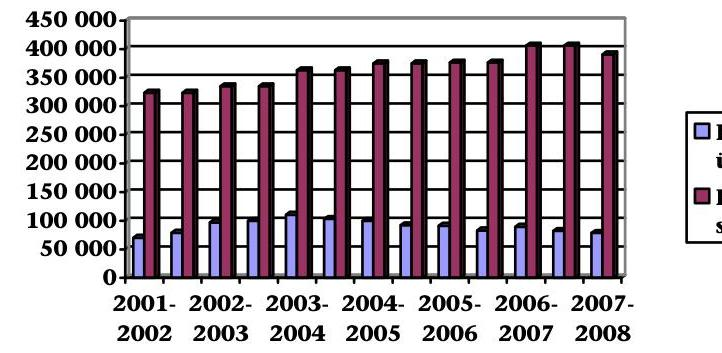

Folyósítási szakaszban lévő ügyfelek száma (fő) Hallgatói hitelre jogosultak száma (fő)

- Részletes statisztikák a tanévek első félévéről állnak a Diákhitel Zrt. rendelkezésére, így az I. és a II. félév adatai megegyeznek.

---

# A hallgatói hitelállomány és a finanszírozási forrásállomány mérlegfőösszeghez viszonyított arányának alakulása

|  Megnevezés | 2001. év | 2002. év | 2003. év | 2004. év | 2005. év | 2006. év | 2007. év | 2008. év
terv  |
| --- | --- | --- | --- | --- | --- | --- | --- | --- |
|  Mérlegfőösszeg (M Ft) | 7907 | 28825 | 55082 | 85087 | 122929 | 139648 | 164862 | 190462  |
|  Hallgatói hitelállomány (M Ft) | 5146 | 25561 | 51871 | 80424 | 107750 | 134291 | 159248 | 186587  |
|  Hallgatói hitelállomány aránya a
mérlegfőösszeghez | $65 \%$ | $89 \%$ | $94 \%$ | $95 \%$ | $88 \%$ | $96 \%$ | $97 \%$ | $98 \%$  |
|  Finanszírozási források állománya (M Ft) | 5088 | 24780 | 50210 | 75587 | 110702 | 126192 | 149904 | 171804  |
|  Finanszírozási források állományának
aránya a mérlegfőösszeghez | $64 \%$ | $86 \%$ | $91 \%$ | $89 \%$ | $90 \%$ | $90 \%$ | $91 \%$ | $90 \%$  |

---

# A működési költségek alakulása

|  A |  |  |  |  |  |  |  |   |
| --- | --- | --- | --- | --- | --- | --- | --- | --- |
|  Megnevezés | 2001. év | 2002. év | 2003. év | 2004. év | 2005. év | 2006. év | 2007. év | 2008. év
terv  |
|  Anyagköltség | 24 | 13 | 14 | 13 | 22 | 25 | 26 | 38  |
|  Igénybe vett szolgáltatások költségei | 259 | 255 | 341 | 340 | 431 | 525 | 563 | 777  |
|  Egyéb szolgáltatások költségei | 170 | 274 | 56 | 76 | 123 | 125 | 144 | 187  |
|  Bérköltség | 150 | 291 | 393 | 449 | 460 | 540 | 568 | 623  |
|  Személyi jellegű egyéb kifizetések | 16 | 35 | 67 | 89 | 88 | 121 | 137 | 155  |
|  Bérjárulékok | 56 | 134 | 144 | 169 | 168 | 198 | 211 | 235  |
|  Értékcsökkenési leírás | 15 | 53 | 130 | 190 | 245 | 260 | 206 | 155  |
|  Működési költségek összesen | 690 | 1055 | 1145 | 1326 | 1537 | 1794 | 1855 | 2170  |

## A működési költségekből számított mutatók alakulása

|  Megnevezés | 2001. év | 2002. év | 2003. év | 2004. év | 2005. év | 2006. év | 2007. év | 2008. év
terv  |
| --- | --- | --- | --- | --- | --- | --- | --- | --- |
|  Igénybe vett szolgáltatások aránya
(működési költségben) | $38 \%$ | $24 \%$ | $30 \%$ | $26 \%$ | $28 \%$ | $29 \%$ | $30 \%$ | $36 \%$  |
|  Marketing és kommunikációs költségek
aránya (működési költségben) | $6,6 \%$ | $2,3 \%$ | $3,4 \%$ | $2,6 \%$ | $5,5 \%$ | $7,9 \%$ | $6,0 \%$ | $11,5 \%$  |
|  Bérköltség aránya (működési költségben) | $22 \%$ | $28 \%$ | $34 \%$ | $34 \%$ | $30 \%$ | $30 \%$ | $31 \%$ | $29 \%$  |
|  Bérköltség változása (bázis: előző év) | - | $94 \%$ | $35 \%$ | $14 \%$ | $2 \%$ | $17 \%$ | $5 \%$ | $10 \%$  |
|  Átlagos statisztikai állományi létszám (fő) | 37 | 59 | 79 | 85 | 88 | 100 | 100 | $102^{*}$  |
|  Létszám változása (bázis: előző év) | - | $59 \%$ | $34 \%$ | $8 \%$ | $4 \%$ | $14 \%$ | $0 \%$ | $5 \%$  |
|  Hallgatói hitelállomány változása (bázis:
előző év) |  | $397 \%$ | $103 \%$ | $55 \%$ | $34 \%$ | $25 \%$ | $19 \%$ | $17 \%$  |
|  Működési költségek változása (bázis: előző
év) |  | $53 \%$ | $9 \%$ | $16 \%$ | $16 \%$ | $17 \%$ | $3 \%$ | $17 \%$  |
|  Egy ügyfélre jutó működési költség (Ft) | 10909 | 9115 | 7325 | 7512 | 8542 | 8422 | 7833 | 8410  |
|  Egy ügyfélre jutó működési költség
változása (bázis: előző év) | - | $-16 \%$ | $-17 \%$ | $0 \%$ | $14 \%$ | $-1 \%$ | $-7 \%$ | $7 \%$  |

---

# A költségvetési támogatás folyósításának és felhasználásának alakulása

|  Támogatás |  | Felhasználás |  |  |  | Összesen  |
| --- | --- | --- | --- | --- | --- | --- |
|  Átutalás éve | Összege | Támogatással érintett időszak | OM-től eszközvásárlás | Kockázati céltartalék képzés | Működési költség |   |
|  2002. év | 2120000 | 2001. év |  | 5937 | 14841 | 20778  |
|   |  | 2002. év |  | 140466 | 351164 | 491630  |
|   |  | 2001. év |  |  | 505196 | 505196  |
|   |  | 2002. év |  | 53805 | 298591 | 352396  |
|   |  | 2003. év | 120000 | 99191 | 530809 | 750000  |
|  2003. év | 142000 | 2003. év |  |  | 142000 | 142000  |
|  2004. év | 84000 | 2004. év |  | 84000 |  | 84000  |
|  2005. év | 200000 | 2004. év |  | 119653 | 28305 | 147958  |
|   |  | 2005. év |  | 52042 |  | 52042  |
|  Összesen | 2546000 |  | 120000 | 555094 | 1870906 | 2546000  |

---

# TANÚSÍTVÁNYOK

---

Diákhitelek állományának és tőkésített kamatának változása

|   |  |  |  |  |  |  |  | Adatok: M Ft-ban |   |
| --- | --- | --- | --- | --- | --- | --- | --- | --- | --- |
|  Megnevezés | 2001.12.31. | 2002.12.31. | 2003.12.31. | 2004.12.31. | 2005.12.31. | 2006.12.31. | 2007.12.31. | 2008. I. félév |   |
|  Diákhitel állomány | 5087 | 24167 | 47526 | 70064 |  |  |  |  |   |

 | 89837 | 109276 | 127542 |  |   |
|  Tőkésített kamat | 59 | 1393 | 4343 | 10359 | 17916 | 25015 | 31706 |  |   |
|  Összesen: | 5146 | 25560 | 51869 | 80423 | 107753 | 134291 | 159248 |  |   |

- Kamatelszámítás csak év végén van. A 2008. évi hitelkamat elhatárolás összege: 2905 Ft.

A fenti adatok a Diákhitel Zrt. nyilvántartásaival megegyeznek. Budapest, 2008. május 23.

DIÁKHITEL KÖZPONT Zrt. 1027 Budapest, Csalogány u. 9-11. Adószám: 12657331-2-41 1.

---

### 2. sz. tanúsítvány

### A saját tőke változása

|  Megnevezés | 2001.12.31. | 2002.12.31. | 2003.12.31. | 2004.12.31. | 2005.12.31. | 2006.12.31. | 2007.12.31.  |
| --- | --- | --- | --- | --- | --- | --- | --- |
|  Saját tőke | 2 374 087 | 2 443 624 | 2 368 049 | 2 327 850 | 2 297 412 | 2 296 677 | 2 296 757  |
|  Jegyzett tőke | 300 000 | 300 000 | 300 000 | 300 000 | 300 000 | 300 000 | 300 000  |
|  Jegyzett, de még be nem fizetett tőke |  |  |  |  |  |  |   |
|  Tőke tartalék | 2 200 000 | 2 200 000 | 2 200 000 | 2 200 000 | 2 200 000 | 2 200 000 | 2 200 000  |
|  Eredménytartalék | -226 533 | -366 400 | -248 767 | -276 244 | -268 477 | -250 817 | -249 055  |
|  Lekötött tartalék | 226 533 | 240 487 | 192 391 | 144 293 | 96 327 | 48 230 | 45 732  |
|  Értékelési tartalék |  |  |  |  |  |  |   |
|  Mérleg szerinti eredmény | -125 913 | 69 537 | -75 575 | -40 199 | -30 438 | -736 | 80  |
|  Tőkemegfelelési követelmény | 200 000 | 200 000 | 200 000 | 200 000 | 200 000 | 200 000 | 200 000  |

A fenti adatok a Diákhitel Zrt. nyilvántartásaival megegyeznek.

Budapest, 2008. május 23.

**DIÁKHITEL KÖZPONT Zrt.**

1027 Budapest, Csalogány u. 9-11. Adószám: 12637331-2-41

1.
