# JELENTÉS 

Székesfehérvár Megyei Jogú Város Önkormányzata gazdálkodási rendszerének 2008. évi ellenőrzéséről

---

3. Önkormányzati és Területi Ellenőrzési Igazgatóság Átfogó Ellenőrzési Főcsoport Iktatószám: V-3003-6/30/20/2008. Témaszám: 898 Vizsgálat-azonosító szám: V0389

# Az ellenőrzést felügyelte: 

Dr. Lóránt Zoltán
főigazgató
Az ellenőrzés végrehajtásáért felelős:
Dr. Sepsey Tamás
főigazgató-helyettes
Az ellenőrzést vezette:
Dr. Csecserits Imréné
főcsoportfőnök-helyettes
Az ellenőrzést végezték:
Ébner Vilmosné Benn Imréné Mohl Anna
irodavezető, főtanácsadó számvevő tanácsos számvevő tanácsos

## A témához kapcsolódó eddig készített számvevőszéki jelentések: címe

sorszáma
Jelentés a Székesfehérvár Megyei Jogú Város Önkormányzata gaz- 0412 dálkodásának átfogó ellenőrzéséről
Jelentés a települési önkormányzatok szennyvízközmű fejlesztési és 0416 működtetési feladatai ellátásának helyszíni ellenőrzéséről
Jelentés a helyi önkormányzatok közművelődési és könyvtári fel- 0521 adatellátásáról és finanszírozásáról
Jelentés a Magyar Köztársaság 2004. évi költségvetése végrehajtásának ellenőrzéséről
Függelék:

- a helyi önkormányzatokat a 2004. évben megillető normatív állami hozzájárulás elszámolásának ellenőrzése
- a normatív kötött felhasználású támogatások ellenőrzése
- a helyi önkormányzatok beruházásaihoz és rekonstrukcióihoz nyújtott 2004. évi felhalmozási célú támogatások ellenőrzése
Jelentés a hajléktalanokat ellátó intézményrendszer ellenőrzéséről 0613
Jelentés a középiskolai kollégiumok fenntartásának és fejlesztésé- 0614 nek ellenőrzéséről
Jelentés a szakiskolai fejlesztési programra fordított pénzeszközök 0819 felhasználásának eredményességéről

---

# TARTALOMJEGYZÉK 

BEVEZETÉS ..... 9
I. ÖSSZEGZŐ MEGÁLLAPÍTÁSOK, KÖVETKEZTETÉSEK, JAVASLATOK ..... 14
II. RÉSZLETES MEGÁLLAPÍTÁSOK ..... 22

1. Az Önkormányzat költségvetési és pénzügyi helyzete ..... 22
1.1. A tervezett és teljesített költségvetési bevételek és kiadások alapján a költségvetési és a pénzügyi egyensúly alakulása, valamint a költségvetési hiány megállapításának szabályszerűsége ..... 22
1.2. A költségvetési és a pénzügyi egyensúlyi helyzet kialakításához tervezett és teljesített finanszírozási célú pénzügyi műveletek módja és azok hatása a tárgyévet követő évek költségvetéseire ..... 23
1.3. A költségvetés tervezésének megalapozottsága ..... 29
2. Az Önkormányzat felkészültsége az európai uniós források igénylésére és felhasználására, valamint az elektronikus közigazgatási feladatok ellátására ..... 31
2.1. Az európai uniós források igénybevételére és a várható támogatás felhasználására történt felkészülés szabályozottsága, szervezettsége ..... 31
2.1.1. Az európai uniós forrásokra történő pályázatok benyújtására vonatkozó döntések összhangja a fejlesztési célkitűzésekkel ..... 31
2.1.2. Az európai uniós forrásokhoz kapcsolódóan a pályázatfigyelés, a pályázatkészítés, valamint az európai uniós támogatással megvalósuló fejlesztés lebonyolításának belső rendjének szabályozottsága, a végrehajtás személyi, szervezeti feltételei ..... 37
2.1.3. A fejlesztési feladat lebonyolításánál a feladatellátás rendjére, az ellenőrzési feladatok teljesítésére, valamint a felelősségi szabályokra vonatkozó előírások betartása ..... 39
2.2. Az elektronikus közigazgatási feladatok ellátása, a közérdekú adatok elektronikus közzététele ..... 42
3. A költségvetési gazdálkodás belső kontrolljai ..... 45
3.1. A szabályozottság kockázata a költségvetés tervezési, gazdálkodási, beszámolási és a folyamatba épített, előzetes és utólagos vezetői ellenőrzési feladatoknál ..... 45
3.2. A belső kontrollok érvényesülése az önkormányzati források szabályszerű felhasználásában, a költségvetési tervezés, gazdálkodás, beszámolás folyamataiban ..... 48
3.3. A belső ellenőrzési kötelezettség teljesítése, javaslatainak hasznosulása ..... 53

---

4. Az ÁSZ korábbi ellenőrzési javaslatai alapján készített intézkedési terv végrehajtása, eredményessége ..... 58
4.1. Az Önkormányzat gazdálkodási rendszerének átfogó ellenőrzése során tett javaslatok végrehajtására tervezett intézkedések megvalósulása ..... 58
4.2. A zárszámadáshoz kapcsolódó (állami hozzájárulások, támogatások igénylésének és felhasználásának ellenőrzése), valamint a további vizsgálatok esetében a megállapítások, javaslatok alapján tett intézkedések ..... 64

# MELLÉKLETEK 

1. számú Az Önkormányzat gazdálkodását meghatározó adatok, mutatószámok (1 oldal)
2. számú Az önkormányzati vagyon alakulása (1 oldal)
3. számú Az Önkormányzat 2005-2007. évi költségvetési előirányzatainak és azok pénzügyi teljesítéseinek alakulása ( 1 oldal)
4. számú Tanúsítvány az európai uniós forrásokkal támogatott programok, célok tervezett és tényleges 2005-2008. évi adatairól (1 oldal)
5. számú Adatlap az Önkormányzat európai uniós forrással támogatott egyik fejlesztéséről (3 oldal)
6. számú Warvasovszky Tihamér úr, a Székesfehérvár Megyei Jogú Város Önkormányzat polgármesterének észrevétele (1 oldal)
7. számú Warvasovszky Tihamér úr, a Székesfehérvár Megyei Jogú Város Önkormányzata polgármestere észrevételére adott válaszlevél (1 oldal

---

# RÖVIDÍTÉSEK JEGYZÉKE 

## Törvények

Áht.
Eisztv.
Kbt.
Ötv.
Számv. tv.
Szoc. tv.

## Rendeletek

Ámr.
Ber.
e-ügyintézési rendelet

18/2005. (XII. 27.) IHM rendelet

2005. évi költségvetési rendelet

2006. évi költségvetési rendelet

2007. évi költségvetési rendelet

2008. évi költségvetési rendelet

SzMSz

Vhr.

## Szórövidítések

ÁSZ
Beruházási iroda

BM Önerő Alap támogatás
az államháztartásról szóló 1992. évi XXXVIII. törvény az elektronikus információszabadságról szóló 2005. évi XC. törvény
a közbeszerzésekről szóló 2003. évi CXXIX. törvény
a helyi önkormányzatokról szóló 1990. évi LXV. törvény
a számvitelről szóló 2000. évi C. törvény
a szociális igazgatásról és szociális ellátásról szóló 1993. évi III. törvény.
az államháztartás működési rendjéről szóló 217/1998. (XII. 30.) Korm. rendelet
a költségvetési szervek belső ellenőrzéséről szóló 193/2003. (XI. 26.) Korm. rendelet
Székesfehérvár Megyei Jogú Város Önkormányzatának 29/2005. (X. 21.) számú rendelete az elektronikus hatósági ügyintézés és szolgáltatás helyi szabályairól
a közzétételi listákon szereplő adatok közzétételéhez szükséges közzétételi mintákról szóló 18/2005. (XII. 27.) IHM rendelet
Székesfehérvár Megyei Jogú Város Önkormányzatának 2/2005. (II. 18.) számú rendelete az Önkormányzat 2005. évi költségvetéséről
Székesfehérvár Megyei Jogú Város Önkormányzatának 2/2006. (II. 17.) számú rendelete az Önkormányzat 2006. évi költségvetéséről
Székesfehérvár Megyei Jogú Város Önkormányzatának 3/2007. (II. 20.) számú rendelete az Önkormányzat 2007. évi költségvetéséről
Székesfehérvár Megyei Jogú Város Önkormányzatának 2/2008. (II. 20.) számú rendelete az Önkormányzat 2008. évi költségvetéséről
Székesfehérvár Megyei Jogú Város Önkormányzatának 5/1999. (III. 24.) számú rendelete az Önkormányzat Közgyűlése Szervezeti és Múködési szabályairól
az államháztartás szervezetei beszámolási és könyvvezetési kötelezettségének sajátosságairól szóló 249/2000. (XII. 24.) Korm. rendelet

Állami Számvevőszék
Székesfehérvár Megyei Jogú Város Önkormányzata Polgármesteri hivatalának Beruházási Irodája
a Magyar Köztársaság 2007. évi költségvetéséről szóló 2006. évi CXXXVII. törvény - 5. számú mellékletének 12.

---

e-közigazgatás
Ellenőrzési iroda

ESZA
EU
FEUVE
gazdasági program ${ }_{1}$

## gazdasági program ${ }_{2}$

ERFA
„Európa köztünk van"

GVOP
HEFOP
információszolgáltató tevékenységet fejlesztő projekt ${ }_{1}$
információszolgáltató tevékenységet fejlesztő projekt $_{2}$

IT
IT Kht.
jegyzó
KDOP
KDRFÜ
KEHI
KIOP
Költségvetési iroda
pontja alapján - központi költségvetési hozzájárulást biztosít a helyi önkormányzatok és jogi személyiségű társulásaik számára, azok európai uniós fejlesztési célú pályázataihoz szükséges saját forrás kiegészítésére
elektronikus közigazgatás
Székesfehérvár Megyei Jogú Város Önkormányzata Polgármesteri hivatalának Ellenőrzési Irodája
Európai Szociális Alap
Európai Unió
folyamatba épített, előzetes és utólagos vezetői ellenőrzés
Székesfehérvár Megyei Jogú Város Önkormányzatának a 2004-2006. évekre vonatkozó gazdasági programja, amelyet a Közgyűlés a 237/2004. (VI. 24.) számú határozattal fogadott el
Székesfehérvár Megyei Jogú Város Önkormányzatának a 2007-2010. évekre vonatkozó gazdasági programja, amelyet a Közgyűlés a 192/2007. (V. 17.) számú határozattal fogadott el
Európai Regionális Fejlesztési Alap
az Európai Bizottság Magyarországi Képviselete valamint az Európai Parlament Tájékoztatási Irodája által kötött EU kommunikációs együttmúködési megállapodás keretében az „Igazgatósági partnerség - 50 évi integráció 50 helyszínen" -, címen kiírt pályázat alapján Székesfehérvár Megyei Jogú Város Önkormányzata által elnyert támogatás projektjének a címe
NFT Gazdasági Versenyképesség Operatív Program
NFT Humánerőforrás-fejlesztési Operatív Program
GVOP 4.3.1. intézkedés keretében kiírt pályázaton elnyert támogatás segítségével megvalósuló „Az Önkormányzat információszolgáltató tevékenységének fejlesztése, Székesfehérvár - a térség szolgáltató e-Önkormányzata" feladat
GVOP 4.3.2. intézkedés keretében kiírt pályázaton elnyert támogatás segítségével megvalósuló „Székesfehérvár Önkormányzata ingatlan-adatvagyonának másodlagos hasznosítása" feladat
informatikai technológia
IT Információs Társadalom Kht.
Székesfehérvár Megyei Jogú Város Önkormányzatának Jegyzője
ÚMFT Közép-dunántúli Operatív Program
Közép-dunántúli Regionális Fejlesztési Ügynökség Kht.
Kormányzati Ellenőrzési Hivatal
ÚMFT Környezetvédelmi és Infrastruktúra-fejlesztési Operatív Program
Székesfehérvár Megyei Jogú Város Önkormányzata Polgármesteri hivatalának Költségvetési Irodája

---

| Közgyűlés | Székesfehérvár Megyei Jogú Város Önkormányzat Közgyűlése |
| :--: | :--: |
| Kríziskezelő Központ | Székesfehérvár Megyei Jogú Város Önkormányzata Kríziskezelő Központja |
| MAG Zrt. | Magyar Gazdaságfejlesztési Központ Zrt., az IT Kht. utódszervezete |
| MÁK | Magyar Államkincstár |
| NFGM | Nemzeti, Fejlesztési és Gazdasági Minisztérium |
| NFT | Nemzeti Fejlesztési Terv |
| NFÜ | Nemzeti Fejlesztési Ügynökség |
| Nonprofit Kft. | Közép-dunántúli Regionális Pedagógiai Szakmai Szolgáltató és Projektközpont Nonprofit Közhasznú Korlátolt Felelősségű Társaság |
| OKÉV | Országos Közoktatási Értékelési és Vizsgaközpont |
| Oktatási iroda | Székesfehérvár Megyei Jogú Város Önkormányzata Polgármesteri hivatalának Oktatási Irodája |
| pályázati eljárási rend | az európai uniós források pályázatfigyelési, készítési valamint a projektek lebonyolításával kapcsolatos eljárási rendet meghatározó 10 016/15/2006. számú jegyzői utasítás, módosításra került a 10 478/12/2008. számú utasítással |
| PEJ | projekt előrehaladási jelentés |
| Pénzügyi bizottság | Székesfehérvár Megyei Jogú Város Önkormányzatának Pénzügyi, Költségvetési Bizottsága |
| Pénzügyi iroda | Székesfehérvár Megyei Jogú Város Önkormányzata Polgármesteri hivatalának Pénzügyi, Költségvetési Irodája |
| polgármester | Székesfehérvár Megyei Jogú Város Önkormányzatának Polgármestere |
| Polgármesteri hivatal | Székesfehérvár Megyei Jogú Város Önkormányzatának Polgármesteri Hivatala |
| Projektmenedzsment iroda | Székesfehérvár Megyei Jogú Város Önkormányzata Polgármesteri hivatalának Projektmenedzsment Irodája |
| ROP | NFT Regionális Operatív Program |
| TIOK | Térségi Iskola és Óvodafejlesztő Központ |
| TIOP | NFT-HEFOP Térségi Iskola és Óvodafejlesztő Program |
| TISZK | NFT-HEFOP Térségi Integrált Szakképző Központ |
| TÁMOP | ÚMFT Társadalmi Megújulás Operatív Program |
| ÚMFT | Új Magyarország Fejlesztési Terv |
| ügyrend | Székesfehérvár Megyei Jogú Város Polgármesteri Hivatalának Ügyrendjéről szóló Székesfehérvár Megyei Jogú Város Jegyzőjének 10 016-2/2007. számú utasítása |
| VÁTI Kht. | VÁTI Magyar Regionális Fejlesztési és Urbanisztikai Közhasznú Társaság |

---

# ÉRTELMEZŐ SZÓTÁR 

1. elektronikus szolgáltatási szint
2. elektronikus szolgáltatási szint
3. elektronikus szolgáltatási szint
4. elektronikus szolgáltatási szint
európai uniós források
fejlesztési feladat (projekt)
fejlesztési célkitúzés
irányító hatóság

Az 1044/2005. (V. 11.) Korm. határozat alapján olyan információs, tájékoztató szolgáltatás, amely csak általános információkat közöl az adott üggyel kapcsolatos teendőkről és a szükséges dokumentumokról.
Az 1044/2005. (V. 11.) Korm. határozat alapján olyan egyirányú kapcsolatot biztosító szolgáltatás, amely az 1. szinten túl biztosítja az adott ügy intézéséhez szükséges dokumentumok, nyomtatványok letöltését, és azok ellenőrzéssel, vagy ellenőrzés nélküli elektronikus kitöltését, amely esetben a dokumentumok benyújtása hagyományos úton történik.
Az 1044/2005. (V. 11.) Korm. határozat alapján olyan kétirányú kapcsolatot biztosító szolgáltatás, amely közvetlen, vagy ellenőrzött kitöltésű dokumentum segítségével biztosítja az elektronikus adatbevitelt és a bevitt adatok ellenőrzését. Az ügy indításához, intézéséhez személyes megjelenés nem szükséges, de az ügyhöz kapcsolódó közigazgatási döntés (határozat, egyéb aktus) közlése, valamint a kapcsolódó illeték-, vagy díjfizetés hagyományos úton történik.
Az 1044/2005. (V. 11.) Korm. határozat alapján olyan teljes közvetlen kétirányú ügyintézési folyamatot biztosító szolgáltatás, amikor az ügyhöz kapcsolódó közigazgatási döntés is elektronikus úton kerül közlésre, illetve a kapcsolódó illeték-, vagy díjfizetés elektronikus úton is intézhető.
Az elnyert európai uniós források lehívása a támogatott projekt megvalósítása érdekében, a fejlesztés lebonyolítása során felmerült kiadások finanszírozására.
A fejlesztési feladat (projekt) tartalmilag és formailag részletesen kidolgozott, megfelelő pénzügyi háttérrel és végrehajtási ütemezéssel rendelkező fejlesztési terv, amely illeszkedik az Európai Unió, illetve a NFT és az ÚMFT által támogatott programokhoz.
Az önkormányzat által ellátott kötelező, vagy önként vállalt feladatok ellátásának mennyiségi, vagy minőségi fejlesztésére vonatkozó terv. A mennyiségi fejlesztés megvalósulhat beszerzéssel, létesítéssel, bővítéssel, átalakítással.
A strukturális alapok és a Kohéziós alap forrásainak szabályszerű, hatékony és eredményes felhasználásához szükséges intézményrendszer felső eleme. Az irányító hatóság általános és átfogó felelősséget visel a programok, projektek hatékony és szabályszerű végrehajtásáért. Felelősségi köréből eredően ellenőrzi a közösségi, valamint a hazai jogszabályok betartását, koordinálja az európai uniós források szétosztásának folyamatát, irányítja az intézményrendszer, a statisztikai és a pénzügyi nyilvántartási rendszer múködését.

---

kedvezményezett
közreműködő szervezet
lebonyolítás
operatív program

Az a helyi önkormányzat, amely a támogatási szerződést kedvezményezettként aláíraa, a projektet végrehajtja.
A közreműködő szervezet az európai uniós támogatást elnyert kedvezményezettekkel kapcsolatot tartó szerv. Az operatív programok közreműködő szervezetei befogadják, nyilvántartják, döntésre előkészítik a pályázatokat, megkötik a szerződéseket a kedvezményezettel, rögzítik a támogatással kapcsolatos adatokat az egységes monitoring informatikai rendszerben, lebonyolítják a támogatások kifizetését, elvégzik a támogatások előzetes (szerződéskötést megelőző), közbenső (a pénzügyi elszámolás, finanszírozás folyamatában végzett) és utólagos (a támogatott projekt pénzügyi lezárását megelőző) ellenőrzését. Továbbá megkötik a szerződéseket a projekt kedvezményezettjével, folyamatosan nyomon követik a teljesítéseket, lebonyolítják a támogatások kifizetését, vezetik az egységes monitoring informatikai rendszert. Az NFT-hez kapcsolódó HEFOP-intézkedések közreműködő szervezete az ESZA Kht. Az ÚMFT-hez kapcsolódó ROP intézkedések közreműködő szervezete a VÂTI Kht. és a regionális fejlesztési ügynökségek. A GVOP-hoz kapcsolódó közreműködő szervezet az IT Információs Társadalom Kht. és annak jogutódja a MAG-Magyar Gazdaságfejlesztési Központ Zrt.
A Kohéziós alap két közreműködő szervezete (Gazdasági és Közlekedési Minisztérium, Környezetvédelmi és Vízügyi Minisztérium) a támogatott projektek végrehajtásához kapcsolódó operatív feladatokat látják el. Ennek keretében megkötik a szerződéseket a projekt kedvezményezettjével, folyamatosan nyomon követik a teljesítéseket, lebonyolítják a támogatások kifizetését, vezetik az egységes monitoring informatikai rendszert.
Az európai uniós források felhasználásával megvalósuló fejlesztésre irányuló műszaki, gazdasági (pénzügyi) tevékenységet magában foglaló szervezési, irányítási szolgáltatás. A szervezési szolgáltatás kiterjedhet a pályázatkészítésre, a közbeszerzési eljárás lebonyolításán keresztül a folyamatos műszaki ellenőrzésre, a pénzügyi elszámolásra, a műszaki átadás-átvételre, az üzembe helyezésre, illetve a fejlesztési folyamat egyes elemeire.
Az Európai Bizottság által jóváhagyott, a Közösségi Támogatási Keret végrehajtására vonatkozó 2004-2006 és a 2007-2013. közötti, több évre szóló intézkedésekhez kapcsolódó prioritások egységes rendszerét tartalmazó dokumentum. A strukturális alapok NFT-hez kapcsolódó operatív programjai: Agrár és Vidékfejlesztési Operatív Program (AVOP); Gazdasági Versenyképesség Operatív Program (GVOP); Humánerőforrás-fejlesztési Operatív Program (HEFOP); Környezetvédelmi és Infrastruktúrafejlesztési Operatív Program (KIOP); Regionális Fejlesztési Operatív Program (ROP). Az ÚMFT-hez kapcsolódó operatív

---

projekt (előrehaladási jelentés (PE)
támogatási szerződés
programok: Gazdaságfejlesztési Operatív Program (GOP); Környezet és Energia Operatív Program (TÁMOP); Társadalmi Infrastruktúra Operatív Program (TIOP); Délalföldi Operatív Program (DAOP); Dél-dunántúli Operatív Program (DDOP); Észak-alföldi Operatív Program (ÉAOP); Észak-magyarországi Operatív Program (ÉMOP); Középdunántúli Operatív Program (KDOP); Középmagyarországi Operatív Program (KMOP); Nyugatdunántúli Operatív Program (NYDOP); Balatoni kiemelt Üdülőkörzet; Államreform Operatív Program (ÁROP).

A Strukturális Alapok által társfinanszírozott projektek megvalósítása során a kedvezményezetteknek a támogatási szerződésben meghatározott időközönként, általában negyedévente, a támogatás fizetési kérelmekhez kapcsolódóan pár oldalas projekt előrehaladási jelentéseket kell benyújtaniuk. A projekt előrehaladási jelentés jóváhagyása a további támogatások kifizetésének előfeltétele.
Az irányító hatóságnak/közremúködő szervezeteknek a kedvezményezett önkormányzattal/intézménnyel kötött szerződése, amely a támogatás felhasználásának részletes feltételeit tartalmazza.

---

# JELENTÉS   Székesfehérvár Megyei Jogú Város Önkormányzata gazdálkodási rendszerének 2008. évi ellenőrzéséről 

## BEVEZETÉS

Az Ötv. 92. § (1) bekezdése, az Állami Számvevőszékről szóló 1989. évi XXXVIII. törvény 2. § (3) bekezdése, valamint az Áht. 120/A. § (1) bekezdése alapján az önkormányzatok gazdálkodását az Állami Számvevőszék ellenőrzi. Az ellenőrzésre az Országgyúlés illetékes bizottságai részére is átadott, országosan egységes ellenőrzési program szerint került sor.

Az Állami Számvevőszék a stratégiájában foglalt célkitűzéseknek megfelelően a helyi önkormányzatok költségvetési gazdálkodási rendszere átfogó ellenőrzésének programját a 2007. évtől megújította, azt kiegészítette további - teljesít-mény-ellenőrzési - elemekkel.

## Az ellenőrzés célja annak értékelése volt, hogy az Önkormányzat:

- milyen módon biztosította a költségvetési és a pénzügyi egyensúlyt a költségvetésében és annak teljesítése során, valamint változott-e a finanszírozási célú pénzügyi műveletek jelentősége a hiányzó bevételi források pótlásában;
- eredményesen készült-e fel a szabályozottság és a szervezettség terén az európai uniós források igénylésére és felhasználására, továbbá biztosította-e az e-közigazgatás feltételeit, az adatok közzétételével a gazdálkodás nyilvánosságát;
- kialakította-e a külső és a belső feltételeknek megfelelően a költségvetés tervezési, gazdálkodási és zárszámadási feladatai belső kontrollrendszerét ${ }^{1}$, ezen tevékenységek szabályszerű ellátásához hozzájárult-e a folyamatba épített, előzetes és utólagos vezetői ellenőrzés, valamint a belső ellenőrzés;
- megfelelően hasznosították-e a korábbi számvevőszéki ellenőrzések megállapításait, szabályszerűségi ${ }^{2}$ és célszerűségi javaslatait.

[^0]
[^0]:    ${ }^{1}$ A gazdálkodás szabályszerűségét biztosító kontrollrendszer alatt értjük a kiépített és múködő belső irányítási és szabályozási rendszert, valamint a belső ellenőrzési funkciók ellátásának rendszerét.
    ${ }^{2}$ A törvényi előírások betartásának elmulasztásakor a részletes megállapítások fejezetben egységesen a törvénysértés megjelölést alkalmazzuk, mivel az ÁSZ nem tehet különbséget a törvényi előírások között.

---

Az ellenőrzés típusa: átfogó ellenőrzés, amely egyidejűleg - egy ellenőrzés keretében - meghatározott területekre összpontosítva érvényesíti a szabályszerűségi, valamint a teljesítmény-ellenőrzés jellemzőit.

Az ellenőrzött időszak: az 1., 2. és 4. programpontok tekintetében a 20052007. évek és 2008. I. negyedév, a 3. ellenőrzési programpontnál a 2007. év és 2008. I. negyedév.

Székesfehérvár megyei jogú város lakosainak száma 2008. január 1-jén 101955 fő volt. A 2006. évi önkormányzati választást követően az Önkormányzat 33 tagú Közgyűlésének munkáját 13 állandó bizottság segítette. A helyi önkormányzat mellett a 2006. évi önkormányzati választásokat követően hat ${ }^{3}$ kisebbségi önkormányzat múködött. A polgármester az 1998. évi önkormányzati képviselő és polgármester választás óta tölti be tisztségét, a jegyző 1999. óta vezeti a Polgármesteri hivatalt.

Az Önkormányzat feladatainak végrehajtása érdekében a 2007. évben 79 költségvetési intézményt múködtetett, amelyekből 44 önállóan gazdálkodott. A feladatok ellátásában részt vett három gazdasági társasága, továbbá öt alapítványa. Az Önkormányzat a 2007. évi költségvetési beszámolója szerint 32018 millió Ft költségvetési bevételt ért el és 33553 millió Ft költségvetési kiadást teljesített, 2007. december 31-én a könyvviteli mérleg szerint 67854 millió Ft értékű vagyonnal rendelkezett. Az Önkormányzat vagyona a 2005. év végi állományhoz viszonyítva $9,9 \%$-kal növekedett, ezen belül mintegy négyszeresére ( $393,8 \%$-kal) növekedett a beruházások állománya a színház rekonstrukciója és szennyvízközmű beruházások miatt, valamint 57,5\%-kal (5681 millió Ft-tal) emelkedett a kötelezettségek állománya a korábbi 4570 millió Ft-os hitelállomány visszafizetése, valamint a 2006-2007. években kibocsátott 8525 millió Ft értékű kötvény hatására. A 2008. évi költségvetési rendeletben 36967 millió Ft költségvetési bevételt és 38667 millió Ft költségvetési kiadást irányoztak elő. Az összes költségvetési bevétel 56,1\%-át a saját bevétel, illetve $31,8 \%$-át a helyi adó bevétel biztosította a 2007. évben. Az összes költségvetési kiadásból a felhalmozási célú kiadás részaránya a 2007. évben 28,4\% volt. A Polgármesteri hivatalban dolgozó köztisztviselők száma 2007. december 31én 295 fő, a költségvetési intézményekben foglalkoztatott közalkalmazottak száma 3704 fő volt. Az Önkormányzat gazdálkodását meghatározó adatokat, mutatószámokat az 1-3. számú mellékletek tartalmazzák.

Az Önkormányzat költségvetési és pénzügyi helyzetét az elemző eljárás módszerével vizsgáltuk. E körben elemeztük a költségvetés egyensúlyi helyzetének alakulását, a tervezett és tényleges költségvetési hiány okait, a mérséklésére tett intézkedéseket, finanszírozásának módját, az Önkormányzat adósságállományának alakulását, összetevőit.

A teljesítmény-ellenőrzés módszerével vizsgáltuk, a belső szabályozottság, szervezettség terén az Önkormányzat felkészültségét az európai uniós források figyelésére, igénylésére és felhasználására, továbbá értékeltük, hogy az igényelt európai uniós támogatások az Önkormányzat által meghatározott fejlesztési

[^0]
[^0]:    ${ }^{3}$ Cigány, horvát, lengyel, német, örmény, szerb kisebbségi önkormányzatok.

---

célkitűzésekhez kapcsolódtak-e. Az eredményesség szempontjából a minősítést a lényegességi szinthez való viszonyítással végeztük el. Az ellenőrzés során felmértük, hogy az e-közigazgatási feladat ellátása, illetve bevezetése, múködtetése érdekében milyen intézkedéseket tettek, valamint biztosították-e a közérdekú adatok közzétételét.

A költségvetési gazdálkodás belső kontrolljainak ellenőrzése során értékeltük, hogy a Polgármesteri hivatalnál a költségvetés tervezési, gazdálkodási, zárszámadás készítési feladatok belső kontrolljainak kiépítettsége és múködése megfelelő biztosítékot ad-e a gazdálkodási feladatok megfelelő, szabályszerű ellátására. Felmértük és minősítettük a költségvetés tervezési, a gazdálkodási, a zárszámadás készítési feladatokkal, továbbá a pénzügyi- számviteli területen az informatikával kapcsolatosan kialakított kontrollok megfelelőségét, valamint azok múködésének eredményességét, megbízhatóságát. Értékeltük a belső ellenőrzés szervezeti és szabályozási keretét, továbbá múködését.

A Polgármesteri hivatalnál értékeltük a gazdálkodás folyamatában a kontrollok múködésének megbízhatóságát, ennek keretében ellenőriztük a szakmai teljesítés igazolására és az utalvány ellenjegyzésére kialakított kontrollok végrehajtását. Az ellenőrzést a következő, kiemelt kockázatuk alapján kiválasztott ${ }^{4}$ az általánostól jellemzően eltérő, egyedi eljárást igénylő gazdasági eseményekkel kapcsolatos kifizetésekre folytattuk le ${ }^{5}$ :

- a külső szolgáltató által végzett karbantartási, kisjavítási szolgáltatások,
- a gépek, berendezések, felszerelések beszerzése, továbbá
- a múködési célú pénzeszköz átadásokból az államháztartáson kívülre teljesített kifizetésekre.

Az ellenőrzés hatékony elvégzése céljából a vizsgálandó területek kiválasztása során a kockázatokon alapuló megközelítés érvényesült, ezáltal az ellenőrzési erőforrásokat azokra a területekre fókuszáltuk, amelyeken legnagyobb a hibák előfordulási valószínűsége. Az ellenőrzési erőforrások ilyen típusú összpontosításával minimálisra csökkenthető a kívánt ellenőrzési bizonyosság eléréséhez szükséges időráfordítás.

[^0]
[^0]:    ${ }^{4}$ Az önkormányzatok kiemelt előirányzataira vonatkozóan, a vertikális folyamatokra elvégeztük a kockázatok becslését, amelynek eredményeként a külső szolgáltató által végzett karbantartási, kisjavítási szolgáltatások, a gépek, berendezések, felszerelések beszerzése valamint a múködési célú pénzeszköz átadások államháztartáson kívülre teljesített kifizetései kiemelkedően kockázatos területeknek bizonyultak.
    ${ }^{5}$ A korábbi ellenőrzési tapasztalataink szerint ezeken a területeken a jegyzők nem, vagy hiányosan szabályozták a megbízás, megrendelés, illetve beszerzés indokoltságának, szükségességének elbírálására, igazolására, valamint a teljesítések dokumentálására, a kifizetések jogosságának megítélésére szolgáló kontrollokat. További kockázatot jelentett a külső szolgáltató által végzett karbantartási, kisjavítási munkák esetében, hogy az 50 ezer Ft alatti megrendelésekre vonatkozóan az ellenőrzési tapasztalataink szerint a jegyzők nem alakították ki a kötelezettségvállalások rendjét és nyilvántartási formáját, valamint a szabályozás elmulasztása esetén nem történt meg az írásbeli kötelezettségvállalás és annak az ellenjegyzése sem.

---

A pénzügyi-számviteli folyamatokban alkalmazott belső kontrollok létezésének és múködésének ellenőrzésére a vizsgált három terület 2007. évi könyvviteli tételeiből területenként egyszerű véletlen mintát vettünk. A kijelölt gazdasági eseményre elvégzett megfelelőségi tesztek alapján értékeltük a kontrollok múködésének eredményességét, megbízhatóságát a vizsgált három területre különkülön, majd összefoglalóan ${ }^{6}$ a Polgármesteri hivatal egyedi eljárást igénylő gazdasági eseményeire. A helyszíni ellenőrzés megállapításainak részletes dokumentálását három megfelelőségi tesztlapon, öt elővizsgálati és 12 helyszíni ellenőrzési munkalapon biztosítottuk. Ezeken a teszt- és munkalapokon a minősítés alapjául szolgáló kérdések és a vonatkozó konkrét jogszabályhelyek megjelölése mellett értékeltük a kialakított belső kontrollokban rejlő kockázatokat ${ }^{7}$ és a kialakított kontrollok múködésének megbízhatóságát ${ }^{8}$.

Az ÁSZ korábbi ellenőrzési javaslatai alapján tett intézkedéseket, illetve azok megvalósítását utóellenőrzés keretében vizsgáltuk. A gazdálkodási rendszer átfogó ellenőrzése során megfogalmazott javaslatok végrehajtására tett intézkedések megvalósítását ellenőriztük, az egyéb számvevőszéki ellenőrzések során tett javaslatok esetében pedig a kiadott intézkedéseket tekintettük át.

A helyszíni ellenőrzés során kitöltött - az ellenőrzést végző számvevő és a Polgármesteri hivatal felelős köztisztviselője által aláírt - elővizsgálati és helyszíni ellenőrzési munkalapokat, azok kitöltési útmutatóit, továbbá a megfelelőségi tesztek dokumentumait a polgármester részére a számvevői jelentéssel egyidejűleg átadtuk.

A jelentés megállapításainak, javaslatainak egyeztetése során a Polgármester arról adott részletes tájékoztatást, - egyidejűleg csatolta azokat a dokumentumokat, amelyek igazolták - hogy az időközben megtett intézkedésekkel a számvevői jelentésben tett javaslatok ${ }^{9}$ egy részét megvalósították. A megtett in-

[^0]
[^0]:    ${ }^{6}$ A vizsgált három terület egyedi értékelési pontszámait a területek relatív költségvetési súlyával arányosan összegeztük.
    ${ }^{7}$ A kialakított belső kontrollokban rejlő kockázatot alacsonynak minősítettük, ha a kontrollok - végrehajtásuk esetén - megfelelő védelmet nyújtanak a hibák bekövetkezése ellen. Közepesnek minősítettük a belső kontrollokban rejlő kockázatot, amennyiben a kontrollok - végrehajtásuk esetén - a lehetséges hibák többsége ellen védelmet nyújtanak. Magasnak értékeltük a kockázatot, ha a kontrollok - kialakításuk hiányában, vagy hiányos kialakításuk miatt - nem nyújtanak elegendő védelmet a lehetséges hibákkal szemben.
    ${ }^{8}$ A kontrollok múködésének eredményességét, megbízhatóságát kiválónak értékeltük abban az esetben, ha azok múködése - esetleges apróbb hiányosságoktól eltekintve megfelelt a hibák megelőzésére és kijavítására meghatározott szabályozásnak és a legmagasabb szintű elvárásoknak. Jónak minősítettük a kontrollok múködését, ha a hiányosságok száma ugyan jelentős volt, de nem veszélyeztette az ellenőrzött terület hibáinak megelőzését és kijavítását. Amennyiben a hiányosságok mértéke nem biztosította a hibák megelőzését, feltárását, kijavítását és ezáltal veszélyeztette az eredményes, megbízható múködést, a kontroll múködésének megbízhatósága gyenge minősítést kapott.
    ${ }^{9}$ A számvevői jelentésben a helyszíni ellenőrzés során a jogszabályi előírások maradéktalan betartása érdekében a jegyzőnek 17 javaslatot tettünk, melyből a megtett intézkedésekről szóló tájékoztatás alapján öt javaslatot elhagytunk.

---

tézkedéseket a jelentés II. Részletes megállapítások fejezetében az adott témához kapcsolt lábjegyzetben feltüntettük és a vonatkozó javaslatokat elhagytuk.

A jelentést az ÁSZ-ról szóló 1989. évi XXXVIII. tv. 25. § (1) bekezdése alapján észrevétel közlése céljából megküldtük Székesfehérvár Megyei Város Önkormányzata polgármesterének. A kapott tájékoztatást a jelentés 6 . számú melléklete tartalmazza.

---

# I. ÖSSZEGZŐ MEGÁLLAPÍTÁSOK, KÖVETKEZTETÉSEK, JAVASLATOK 

Az Önkormányzatnál a 2005-2008. évek között a tervezett költségvetési bevételek és kiadások föösszege folyamatosan növekedett. A költségvetés egyensúlya a 2005-2008. években nem volt biztosított, a tervezett költségvetési bevételek nem nyújtottak fedezetet a tervezett költségvetési kiadásokra. A 2005. évi költségvetési rendeletben a költségvetés bevételi főösszegének megállapításakor az Áht. előírásai ellenére finanszírozási célú múveletet (hitel felvételt) vettek figyelembe költségvetési hiányt módosító költségvetési bevételként. A 2005-2006. évi költségvetések végrehajtása során a teljesített költségvetési bevételek meghaladták a költségvetési kiadásokat, a pénzügyi egyensúly biztosított volt. A 2007. évben elért költségvetési bevételek nem nyújtottak fedezetet a teljesített költségvetési kiadásokra.

A 2005-2007. évi költségvetésekben az egyensúly hiányát a felhalmozási célú költségvetési bevételeket meghaladó összegben tervezett felhalmozási célú költségvetési kiadások okozták. A 2008. évi költségvetésben azonban már a tervezett múködési célú költségvetési kiadásokat sem fedezték a tervezett múködési célú költségvetési bevételek. A Közgyűlés a költségvetési egyensúlyt a 20052008. évi költségvetésekben felhalmozási célú hitel felvétellel, vagy azzal azonos összegű kötvénykibocsátással tervezte biztosítani. A költségvetés teljesítése során a 2005-2006. években pénzügyi hiány éves szinten nem volt, a költségvetési bevételek fedezetet biztosítottak a költségvetési kiadásokra, ennek ellenére az Önkormányzat a 2005. évben hosszú lejáratú hitelt vett fel, és a 2006. évben kötvényt bocsátott ki. A 2007. évi költségvetési bevételeket meghaladó összegű költségvetési kiadások teljesítéséhez a további kötvénykibocsátásból elért bevétel nyújtott fedezetet, valamint ennek a bevételnek a felhasználásával a korábban felvett fejlesztési célú hiteleknél előtörlesztést végeztek.

Az évközi likviditás biztosítására az Önkormányzat a 2005-2007. években folyószámlahitelt vett igénybe, amelynek összege, igénybevételi időtartama és átlagos állománya folyamatosan emelkedett. A folyószámlahitel igénybevételére a kiadások bevételektől eltérő ütemben való teljesítése miatt volt szükség. Az Önkormányzat fizetőképessége a 2005-2007. évek között változóan alakult, a 2005. évről a 2006. évre romlott, mivel nőtt a rövid lejáratú kötelezettségek állománya. A hosszú lejáratú kötvénykibocsátás és a rövid lejáratú hitelek viszszafizetése miatt a fizetőképesség rövidtávon a 2007. év végére javult. Növekedett azonban a hosszú lejáratú kötelezettségek állománya a hitelfelvétel és a kötvénykibocsátás miatt, ezért az Önkormányzat pénzügyi helyzete az eladósodottság tekintetében romlott.

A költségvetések végrehajtása során a 2005-2007. években az Önkormányzat költségvetésének bevételi és kiadási föösszege év végén meghaladta az eredeti előirányzatot, ezen belül a múködési bevételeket és kiadásokat is túlteljesítették. A múködési célú költségvetési bevételeknél az intézményi múködési bevételek és a helyi adóbevételek többlete, a pénzmaradvány nem tervezett, de teljesített múködési célú igénybevétele biztosította a 2005-2006. években a költségve-

---

tési egyensúlyt, illetve a 2007. évben csökkentette a költségvetésben kialakult hiányt. A felhalmozási célú költségvetési bevételek a 2005. évben meghaladták, a 2006-2007. években elmaradtak az eredeti előirányzatoktól, azonban a felhalmozási célú költségvetési kiadások mindhárom évben elmaradtak az eredeti előirányzatoktól. A felhalmozási célú költségvetési bevételek alulteljesítésében a tervezett, de nem teljesült ingatlanértékesítések és az előirányzatnál kisebb összegben igénybevett pályázati támogatások játszottak közre, amelyeket beruházási feladatok megvalósításának időbeli elhúzódása befolyásolt.

Az Önkormányzat középtávú fejlesztési célkitűzéseit a 2004-2010. évekre szóló gazdasági program ${ }_{1,2}$-ben rögzítette. A célkitűzések összhangban voltak az NFT-ben illetve UMFT-ben foglalt célokkal. Az Önkormányzat a 2005-2008as években összesen 38 pályázatot nyújtott be, amelyek célja kapcsolódott a gazdasági program ${ }_{1,2}$-ben foglaltakhoz, valamint az Önkormányzat kötelező és önként vállalt feladataihoz. A benyújtott pályázatok közül három elutasításra került, 15 projekt elbírálás alatt van. Az elutasított pályázatokkal kapcsolatos döntés ellen az Önkormányzat panaszt nyújtott be az irányító hatósághoz. A 2005-2008. évi költségvetési rendeletek elkülönítetten tartalmazták az európai uniós támogatással megvalósuló programok bevételi és kiadási előirányzatait.

Az Önkormányzatnál a 2005. évtől jegyzői utasítással szabályozott az európai uniós források pályázatfigyelési, készítési, valamint a projektek lebonyolításával kapcsolatos pályázati eljárási rend. A pályázati lehetőségek figyelemmel kisérése a Projekmenedzsment iroda, valamint a 2007. év végén közgyűlési döntéssel létrehozott gazdasági társaság feladata. Az európai uniós forrásokkal támogatott fejlesztési feladatok pályázatainak elkészítése megoszlott a Projektmenedzsment iroda, a Polgármesteri hivatal témakörileg érintett irodája és a gazdasági társaság között.

Az Önkormányzat a szabályozottság és szervezettség terén a 2005-2007. évek között eredményesen felkészült az európai uniós források igénybevételére és felhasználására, mivel az európai uniós forrásokra benyújtott pályázatok a gazdasági program ${ }_{1,2}$-ben meghatározott fejlesztési célkitűzésekhez kapcsolódtak, valamint a pályázati eljárási rendet a jegyző kialakította, meghatározta a pályázatfigyelést végzők és döntési jogkörrel rendelkezők közötti információszolgáltatási kötelezettséget, a polgármester és a fejlesztési feladatokat lebonyolítók közötti kapcsolattartás rendjét, a folyamatba épített, előzetes és utólagos vezetői ellenőrzési feladatokat. A Polgármesteri hivatalban a pályázatfigyelés és pályázatkészítés személyi feltételeit biztosították, a pályázatfigyelésben és készítésben feladatot végző Nonprofit Kft. feladatait és a Polgármesteri hivatal érintett irodái közötti kapcsolattartás rendjét, valamint a személyre szóló felelősséget meghatározták. Annak ellenére összességében eredményes volt a szabályozottság és szervezettség tekintetében az Önkormányzat felkészülése, hogy az ellenőrzési stratégia meghatározásánál a kockázatelemzés nem terjedt ki az európai uniós támogatás igénybevételére, nem jelölték ki az Önkormányzati szintű pályázatkoordinálás felelősét, nem határozták meg az önkormányzati szintű pályázat-nyilvántartás tartalmi követelményeit, valamint nem határozták meg a pályázatfigyelésben és készítésben feladatot végző gazdasági társasággal kötött megállapodásban a személyre szóló felelősséget, és az ellenőrzési feladatok megosztását.

---

Az Önkormányzat a 2004-2006. évekre vonatkozóan rendelkezett informatikai stratégiával, melyben nem rögzítették, hogy az elektronikus szolgáltatás melyik szintjét kívánják elérni. Az Önkormányzat nem rendelkezett a 2007-2008. évekre vonatkozó informatikai stratégiával, nem határozták meg a hosszú távú informatikai fejlesztési célkitűzéseket és az e-közigazgatás további fejlesztési ütemeit. Az Önkormányzat az információ szolgáltató tevékenységet fejlesztő európai uniós támogatásokkal a szolgáltatási rendszer korszerűsítését, az elektronikus ügyintézés esetében a 2. elektronikus szolgáltatási szint bővítését és nyolc ügyintézési szolgáltatási területen a 3. elektronikus szolgáltatási szint megvalósítását érte el. Az Önkormányzat honlapján az e-ügyintézés 2. elektronikus szolgáltatási szintjét valósították meg, továbbá az ügyfelek indíthattak a 3. elektronikus szolgáltatási szinten információ lekérdezéseket és közigazgatási, hatósági ügyintézéshez kapcsolódó kérelmeket.

Az Önkormányzat nem biztosította, hogy a közérdekű adatokat tartalmazó jegyzékre mutató hivatkozás a vonatkozó rendeletben előírtaknak megfelelően a honlap megnyitásakor megjelenjen. A jegyző az Áht. előírása ellenére nem tette közzé az Önkormányzat által nyújtott nem normatív céljellegú fejlesztési és múködési támogatásokra vonatkozóan a kedvezményezett nevét, a támogatás célját, összegét és a támogatási program megvalósítási helyét, valamint a vagyonnal történő gazdálkodással összefüggő - nettó öt millió Ft-ot elérő, vagy azt meghaladó értékű - építési beruházásra, vagyonértékesítésre, szolgáltatás megrendelésre, vagyonértékű jog átadására vonatkozó valamennyi szerződés megnevezését, tárgyát, a szerződést kötő felek nevét, a szerződés értékét, határozott időre kötött szerződés időtartamát és a szerződésekkel kapcsolatos adatok változását. A jegyző az Ámr. előírása ellenére a 2005-2007. évek költségvetési beszámolóinak szöveges indoklását nem tette közzé.

A költségvetés tervezési és a zárszámadás készítési folyamatok szabályozottsága összességében alacsony kockázatot jelentett a feladatok megfelelő, szabályszerű végrehajtásában, mivel a jegyző a pénzügyi irányítási és ellenőrzési rendszer keretében szabályozta a költségvetés tervezés és a zárszámadás készítés rendjét, meghatározta az intézmények részére a költségvetési javaslat összeállításával kapcsolatos követelményeket. Annak ellenére összességében alacsony volt a kockázat, hogy a Közgyűlés a költségvetési szervek elemi beszámolója felülvizsgálatának rendjét, tartalmát az Ámr-ben foglaltakkal ellentétben nem határozta meg. A költségvetés tervezési és zárszámadáskészítési folyamatban a kontrollok múködésének a megbízhatósága összességében kiváló volt, mivel a szabályozásban foglaltaknak megfelelően ellenőrizték, hogy a költségvetési intézmények teljesítették-e a részükre meghatározott követelményeket, a költségvetési igények indokoltságát, teljesíthetőségét, a saját bevételek előirányzatai és a költségvetés megalapozását szolgáló rendeletek összhangját. A zárszámadás-készítés folyamatában ellenőrizték az intézményi pénzmaradványok megállapításának szabályszerűségét, az eredeti és módosított előirányzatok, valamint teljesítési adatok eltérésének indokoltságát. Annak ellenére összességében kiváló volt a kontrollok múködésének megbízhatósága, hogy a zárszámadás készítése során a jegyző nem ellenőriztette az intézmények által az állami támogatásokkal, hozzájárulásokkal történő elszámoláshoz közölt adatok, mutatószámok megbízhatóságát.

---

A Polgármesteri hivatalban a gazdálkodási, a pénzügyi-számviteli és a folyamatba épített ellenőrzési feladatok szabályozottságának a hiányosságai közepes kockázatot jelentettek a feladatok megfelelő, szabályszerű végrehajtásában, mivel a jegyző az ellenőrzési feladatokat hiányosan szabályozta, azonban a kialakított belső kontrollok - végrehajtásuk esetén - a lehetséges hibák többsége ellen védelmet nyújtottak. A Polgármesteri hivatal nem rendelkezett a Közgyűlés által jóváhagyott SzMSz-szel, a jegyző az Ámr. előírás ellenére nem készítette el a gazdasági szervezet ügyrendjét, nem határozta meg az önköltségszámítás szabályait, és az adókövetelések esetében az egyszerűsített értékelési eljárás elveit és dokumentálásának szabályait, valamint a dolgozók munkaköri leírásában a kötelezettségvállalási, utalványozási jogkörökkel kapcsolatos, továbbá az eszközök és források értékelési, ellenőrzési feladatait, a selejtezéssel kapcsolatos kötelezettségeket, illetve az eszközök és források értékelési szabályzatában az értékelésért felelős munkaköröket. Az ellenőrzési nyomvonalban a jegyző nem határozta meg az ellenőrzési pontokat, az ellenőrzési feladatok elvégzését igazoló dokumentumok fellelési helyét a rendszerben, a kockázatkezelési szabályzatban nem rögzítette a kockázatok folyamatgazdáit, a kockázatok értékelését és kategóriákba sorolását, az elfogadható kockázati szintet, valamint a kockázatokra teendő válaszintézkedéseket és a kockázati környezet rendszeres felülvizsgálatának kötelezettségét. A jegyző az Ámr. előírás ellenére nem írta elő valamennyi kifizetésre vonatkozóan a szakmai teljesítés igazolásának a kötelezettségét.

A Polgármesteri hivatalnál a külső szolgáltatók által végzett karbantartásokkal, kisjavításokkal, a gépek, berendezések és felszerelések beszerzéseivel valamint az államháztartáson kívülre történő múködési célú pénzeszközátadásokkal kapcsolatos kifizetések során a múködésbeli hibák megelőzésére, feltárására, kijavítására kialakított belső kontrollok múködésének megbízhatósága gyenge volt, mivel a szakmai teljesítésigazolás, illetve az utalvány ellenjegyzés múködése nem adott megfelelő biztosítékot a gazdálkodási feladatok megfelelő, szabályszerű ellátására. A külső szolgáltatók által végzett karbantartási, kisjavítási szolgáltatásoknál a szakmai teljesítés igazolására a jegyző által kijelölt személyek az alapdokumentumok hiányossága miatt nem látták el a jogosultság, valamint az összegszerűség ellenőrzésére vonatkozó feladataikat. Az utalványok ellenjegyzője elmulasztotta a folyamatba épített ellenőrzési feladatai teljesítését, mivel nem győződött meg a gazdálkodásra vonatkozó szabályok betartásáról, a szakmai teljesítés igazolás során a jogosultság, valamint az öszszegszerűség ellenőrzésének megtörténtéről. Az utalványok ellenjegyzője nem észrevételezte, hogy a megrendelők aláírását megelőzően a kötelezettségvállalás ellenjegyzője nem győződött meg arról, hogy a kötelezettségvállalás tárgyával összefüggő kiadási előirányzat rendelkezésre áll-e és nem kifogásolta, hogy a kötelezettségvállalást nem előzte meg annak ellenjegyzése, ezáltal nem végezték el a kiadási előirányzat által biztosított fedezet meglétének, a kötelezettségvállalás jogszerűségének munkafolyamatba épített ellenőrzését. A gépek, berendezések és felszerelések beszerzésével, létesítésével kapcsolatos kifizetések során a szakmai teljesítés igazolását az internethálózat létesítésével kapcsolatos kifizetéskor nem a jegyző által kijelölt személy végezte el, az utalvány ellenjegyzője a kifizetést megelőzően nem győződött meg a gazdálkodásra vonatkozó szabályok betartásáról, nem észrevételezte, hogy a megrendelés során a kötelezettségvállalást nem előzte meg annak ellenjegyzése. A múködési célú

---

pénzeszközátadások államháztartáson kívülre teljesített kifizetései során a logopédiai támogatás esetében a jegyző kijelölésével nem rendelkező személy végezte el a szakmai teljesítés igazolását. A jegyzői szabályozás hiányossága miatt nem történt meg sport és társadalmi szervezetek múködési támogatása során a kifizetések jogosultságának, összegszerűségének igazolása és a szakmai teljesítés ellenőrzése. Az utalványok ellenjegyzője a kifizetéseket megelőzően nem győződött meg a gazdálkodásra vonatkozó szabályok betartásáról, mivel nem kifogásolta a szakmai teljesítés igazolás elmaradását, valamint nem észrevételezte, hogy a polgármester felhatalmazásával nem rendelkező alpolgármesterek vállaltak kötelezettséget.

A Polgármesteri hivatalban az informatikai rendszer szabályozottsága öszszességében alacsony kockázatot jelentett az informatikai feladatok biztonságos végrehajtásában, mivel rendelkeztek informatikai biztonsági szabályzattal, katasztrófa elhárítási tervvel és az informatikai rendszerek üzletmenet folytonossági tervével. Annak ellenére összességében alacsony volt a kockázat, hogy a Polgármesteri hivatal a 2007-2008. években nem rendelkezett informatikai stratégiával. Az informatikai rendszer múködtetésénél a múködésbeli hibák megelőzésére, feltárására, kijavítására kialakított kontrollok működésének megbízhatósága összességében kiváló volt, mivel biztosították a pénzügyszámvitel által használt programok adatainak elérhetőségét az informatikai hálózaton keresztül, informatikai eszközökkel támogatták a főkönyvi könyvelést és a költségvetési beszámoló elkészítését. Annak ellenére összességében kiváló volt a kontrollok múködésének megbízhatósága, hogy nem biztosították, hogy csak az engedélyezett tranzakciók kerüljenek könyvelésre, és az adatok egyszeri rögzítése nem volt megoldott négy analitikus nyilvántartás esetében.

A belső ellenőrzés szervezeti kereteinek kialakítása és szabályozása az ellenőrzési feladatok végrehajtásában összességében alacsony kockázatot jelentett, mivel a Közgyűlés kialakította a belső ellenőrzés szervezeti kereteit és meghatározta a belső ellenőrzés ellátási módját, feladatait, valamint a szabályozás során biztosította a belső ellenőrök függetlenségét. Annak ellenére összességében alacsony volt a kockázat, hogy a belső ellenőrzési kézikönyvben nem rögzítették a Ber-ben előírtak ellenére a belső ellenőrzési tevékenység minőségét biztosító eljárásokat. A belső ellenőrzés működésénél a kialakított kontrollok megbízhatósága összességében kiváló volt, mivel a 2007. évi ellenőrzési tervben ütemezett ellenőrzéseket elvégezték, a hibák feltárásával és az intézkedések kezdeményezésével, a javaslatok realizálásának ellenőrzésével a belső ellenőrzés hozzájárult a hiányosságok csökkentéséhez. Annak ellenére összességében kiváló volt a belső ellenőrzés működésénél a kialakított kontrollok megbízhatósága, hogy a Polgármesteri hivatalban a pénzügyi irányítási és ellenőrzési rendszerek múködésének gazdaságosságát, hatékonyságát és eredményességét valamint az Önkormányzat többségi irányítást biztosító befolyása alatt múködő gazdasági társaságainál és a közhasznú társaságnál a rendelkezésre álló erőforrásokkal való gazdálkodást, a vagyon megóvását és gyarapítását, az elszámolások, beszámolók megbízhatóságát nem ellenőrizték a 2007. évben. A jegyző az Áht. előírása alapján a 2007. évben beszámolt a Polgármesteri hivatal FEUVE rendszerének és a belső ellenőrzésnek a múködéséről. A Közgyűlés a polgármester előterjesztése alapján a 2007. évi zárszámadási rendeletterve-

---

zettel egyidejűleg elfogadta a költségvetési szervek belső ellenőrzési jelentései alapján a belső ellenőrzés működtetéséről készített összefoglaló jelentést.

A 2003-2008. években az ÁSZ által végzett ellenőrzések során tett javaslatok összességében 67\%-ban hasznosultak. Az ÁSZ az Önkormányzat gazdálkodásának átfogó ellenőrzését a 2003-2004. években végezte. Az átfogó ellenőrzéséről készített jelentés 34 szabályszerűségi és 12 célszerűségi javaslatot tartalmazott. A javaslatok realizálása érdekében a jegyző intézkedési tervet készített, melyet a Közgyűlés jóváhagyott. A javaslatokból az intézkedési tervben foglalt határidőkre $63 \%$ hasznosult, $9 \%$ részben és $28 \%$ nem hasznosult. Az intézkedési tervben foglalt határidőket követően hasznosítottak öt szabályszerűségi és öt célszerűségi javaslatot. A javaslatok hasznosítása következtében javult az önkormányzati gazdálkodás színvonala a költségvetés, az operatív gazdálkodás, a vagyongazdálkodás, a céljellegű támogatások, a közbeszerzés, a zárszámadás, a kisebbségi önkormányzatokkal való együttműködés, és a belső ellenőrzés szabályszerűsége terén. Nem számolták fel maradéktalanul a költségvetést érintő szabályszerűségi hiányosságokat, mivel nem csatolták a Pénzügyi bizottság véleményét tartalmazó határozatot a költségvetési koncepció tervezethez, és a költségvetési rendelet előterjesztéséhez. Nem biztosították maradéktalanul az ingatlanvagyon kataszteri nyilvántartást és a pénzügyi-számviteli adatok egyezőségét. A céljelleggel juttatott támogatások közül az alapítványok, közalapítványok részére a polgármester és a bizottságok továbbra is hoztak döntést. A zárszámadási rendeletben az éves létszámkeret előirányzatának teljesítését a költségvetéssel összehasonlítható módon nem mutatták be. A célszerűségi javaslatok ellenére nem készült módszertani útmutató, szabályozás a Polgármesteri hivatal gazdálkodási körébe tartozó szakfeladatok előirányzatainak kialakítására, a gazdálkodási és ellenőrzési jogkörrel felhatalmazottak beszámoltatására.

Az Önkormányzatnál az ÁSZ a 2004-2008. évek között a zárszámadáshoz kapcsolódóan és egyéb témavizsgálat keretében nyolc számvevőszéki vizsgálatot végzett. Ellenőrizte a települési önkormányzatok szennyvízközmű fejlesztési és működtetési feladatait, a 2004. évi zárszámadáshoz kapcsolódóan a normatív állami hozzájárulások, normatív kötött támogatások és felhalmozási célú támogatások elszámolását. Ellenőrzésre került továbbá a közművelődési és könyvtári tevékenység, a középiskolai kollégiumok fenntartásának és fejlesztésének feltételei, a hajléktalanokat ellátó intézményrendszer, és a szakiskolai fejlesztési programra fordított pénzeszközök eredményessége. A számvevői jelentések 11 szabályszerűségi javaslatának 73\%-ára a jegyző intézkedéseket tett, 18\%-ára nem történt intézkedés. A kilenc célszerűségi javaslatból hét megvalósítására a jegyző intézkedett.

A helyszíni ellenőrzés megállapításainak hasznosítása mellett javasoljuk:

# a polgármesternek 

a jogszabályi előírások maradéktalan betartása érdekében

1. gondoskodjon az Önkormányzat gazdálkodásának 2003-2004. évi átfogó ellenőrzése, a 2004. évi zárszámadáshoz kapcsolódó vizsgálatok, illetve a további vizsgálatok

---

során az ÁSZ által tett és nem teljesült szabályszerűségi és célszerűségi javaslatok végrehajtásáról;
a munka színvonalának javítása érdekében
2. kezdeményezze, hogy a számvevőszéki jelentésben foglaltakat a Közgyűlés tárgyalja meg és a feltárt hiányosságok megszüntetése érdekében készíttessen intézkedési tervet a határidők és felelősök megjelölésével;

# a jegyzőnek 

a jogszabályi előírások maradéktalan betartása érdekében
1. az Önkormányzat közzétételi kötelezettségének teljesítése érdekében
a) biztosítsa a nem normatív, céljelleggel nyújtott múködési és fejlesztési támogatások esetében a kedvezményezett nevének, a támogatás céljának, összegének, a támogatási program megvalósítási helyének a közzétételét az Áht. 15/A. § (1) bekezdésében foglalt előírásoknak megfelelően;
b) gondoskodjon az Önkormányzat pénzeszközei felhasználásával, a vagyonnal történő gazdálkodással összefüggő a nettó ötmillió Ft-ot elérő vagy azt meghaladó összegű, árubeszerzésre, építési beruházásra, szolgáltatás megrendelésre, vagyonértékesítésre, vagyonhasznosításra, vagyon, vagy vagyoni értékű jog átadására, valamint koncesszióba adásra vonatkozó szerződések megnevezésének, tárgyának, a szerződést kötő felek nevének, a szerződés értékének, határozott időre kötött szerződések esetében annak időtartamának közzétételéről az Áht. 15/B. § (1) bekezdésében foglalt előírásoknak megfelelően;
c) biztosítsa az Ámr. 157/D. § (1) bekezdésében hivatkozott 22. számú melléklet alapján az éves költségvetési beszámoló szöveges indokolásának közzétételét;
2. kezdeményezze, hogy a Közgyűlés az Ámr. 149. § (2) bekezdés a)-c) pontjában foglaltak alapján határozza meg a költségvetési szervek elemi beszámolója felülvizsgálatának rendjét, tartalmát;
3. a pénzügyi-számviteli és a folyamatba épített ellenőrzési feladatok szabályszerű végrehajtási feltételeinek kialakítása érdekében készítse el a gazdasági szervezet ügyrendjét az Ámr. 17. § (5) bekezdésében foglaltak alapján;
4. az operatív gazdálkodás során a működésbeli hibák megelőzése, feltárása, illetve kijavítása érdekében:
a) gondoskodjon az Ámr. 135. § (1)-(2) bekezdéseiben előírtak betartásáról, amely alapján a kiadások teljesítésének elrendelése előtt a jegyző által kijelölt személyek okmányok alapján, belső szabályzatban előírt módon ellenőrizzék, szakmailag igazolják azok jogosultságát, összegszerűségét, a szerződés, megrendelés, megállapodás teljesítését, ennek érdekében biztosítsa, hogy a karbantartási, kisjavítási szolgáltatásokkal kapcsolatos belső megrendelések tartalmazzák a megrendelt szolgáltatás összegét és a szállító megnevezését;

---

b) biztosítsa a folyamatba épített ellenőrzési feladatok elvégzésével, hogy az utalványok ellenjegyzői tegyenek eleget az Ámr. 137. § (3) bekezdésében előírt ellenőrzési kötelezettségüknek, győződjenek meg arról, hogy az utalványozás nem sérti-e a gazdálkodásra vonatkozó jogszabályokat továbbá, hogy a szakmai teljesítés igazolása az arra jogosultak által megtörtént-e;
5. gondoskodjon arról, hogy a belső ellenőrzési kézikönyvben a belső ellenőrzési tevékenység minőségét biztosító eljárások a Ber. 12. §-a által előírtak alapján rögzítésre kerüljenek;
6. gondoskodjon arról, hogy a belső ellenőrzés keretében a Polgármesteri hivatalnál rendszeresen ellenőrizzék a Ber. 8. § a)-c) pontjai alapján a pénzügyi irányítási és ellenőrzési rendszerek múködésének gazdaságosságát, hatékonyságát és eredményességét, az Önkormányzat többségi irányítást biztosító befolyása alatt múködő gazdasági társaságainál és a közhasznú társaságnál a rendelkezésre álló erőforrásokkal való gazdálkodást, a vagyon megóvását és gyarapítását, az elszámolások, beszámolók megbízhatóságát;
7. gondoskodjon az Önkormányzat gazdálkodásának 2003-2004. évi átfogó ellenőrzése, a 2004. évi zárszámadáshoz kapcsolódó vizsgálatok, illetve a további vizsgálatok során az ÁSZ által tett és nem teljesült szabályszerűségi és célszerűségi javaslatok végrehajtásáról;
a munka színvonalának javítása érdekében
8. gondoskodjon arról, hogy a pályázati eljárási rendet egészítsék ki az önkormányzati szintű pályázatkoordinálás felelősének, az önkormányzati szintű pályázatnyilvántartás tartalmi követelményeinek a meghatározásával, határozzák meg a pályázatfigyelésben és készítésben feladatot végző gazdasági társasággal kötött megállapodásban a személyre szóló felelősséget, és az ellenőrzési feladatok megosztását, valamint kezdeményezze, hogy az ellenőrzési stratégiát megalapozó kockázatelemzés terjedjen ki az európai uniós támogatással megvalósuló programok ellenőrzésére;
9. a zárszámadás készítése során ellenőriztesse az intézmények által, az állami támogatásokkal, hozzájárulásokkal történő elszámoláshoz közölt adatok, mutatószámok megbízhatóságát;
10. gondoskodjon arról, hogy munkaköri leírásokat egészítsék ki a kötelezettségvállalási és utalványozási jogkört érintő feladatokkal, valamint a selejtezéssel, hasznosítással kapcsolatos kötelezettségekkel;
11. intézkedjen annak érdekében, hogy a pénzügyi-számviteli területen alkalmazzák az informatikai rendszer által biztosított lehetőséget, és biztosítsa annak feltételét, hogy csak az engedélyezett tranzakciók kerülhessenek könyvelésére, valamint kezdeményezze, hogy a pénzügyi-számviteli adatok egyszeri rögzítése valamennyi analitikus nyilvántartás esetében biztosított legyen.

---

# II. RÉSZLETES MEGÁLLAPÍTÁSOK 

## 1. AZ ÖNKORMÁNYZAT KÖLTSÉGVETÉSI ÉS PÉNZÜGYI HELYZETE

### 1.1. A tervezett és teljesített költségvetési bevételek és kiadások alapján a költségvetési és a pénzügyi egyensúly alakulása, valamint a költségvetési hiány megállapításának szabályszerűsége

Az Önkormányzatnál a tervezett költségvetési bevételek és kiadások főösszegei - az előző évekhez viszonyítva - folyamatosan emelkedtek a 20052008. évek között összesen 38,1\%, illetve 37,5\%-kal. A 2005-2008. évek költségvetési rendeleteiben a költségvetési bevételek és kiadások nem voltak egyensúlyban, a tervezett költségvetési bevételek nem nyújtottak fedezetet a tervezett költségvetési kiadásokra. A költségvetési hiány részaránya a 2005. évről a 2006. évre az összes költségvetési kiadáshoz viszonyítva 4,8\%-ról 4,6\%-ra csökkent, a 2007. évben 7,8\%-os arányú volt, ami a 2008. évi költségvetésben 3,4 százalékponttal 4,4\%-ra csökkent. A költségvetés végrehajtása során a 2005-2006. években a pénzügyi egyensúlyt biztosították, a 2007. évben a költségvetési kiadásokhoz viszonyítva a pénzügyi hiány 4,6\% volt, mivel a költségvetési kiadások 1535 millió Ft-tal meghaladták a költségvetési bevételeket, amelyre a kötvénykibocsátásból befolyt bevétel nyújtott fedezetet. A 2005-2007. évi tervezett és tényleges költségvetési bevételek és kiadások alakulását a következő ábra szemlélteti.
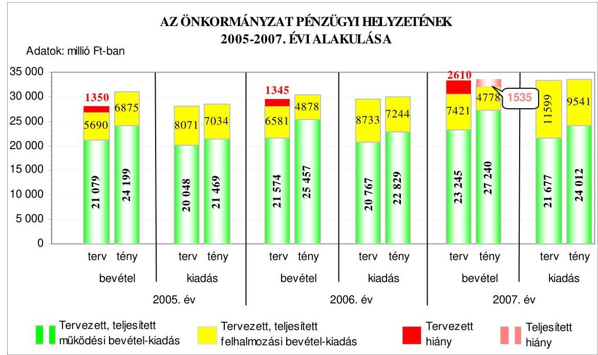

---

A 2005-2008. években a tervezett költségvetési és a tényleges pénzügyi hiány részarányát a múködési és felhalmozási célú, valamint az összes költségvetési kiadáshoz viszonyítottan szemlélteti a következő táblázat:

| Megnevezés | A hiány részaránya \%-ban |  |  |  |  |  |  |
| :--: | :--: | :--: | :--: | :--: | :--: | :--: | :--: |
|  | $\begin{gathered} 2005 . \\ \text { évben } \end{gathered}$ |  | $\begin{gathered} 2006 . \\ \text { évben } \end{gathered}$ |  | $\begin{gathered} 2007 . \\ \text { évben } \end{gathered}$ |  | $\begin{gathered} 2008 . \\ \text { évben } \end{gathered}$ |
|  | Terv | Tény | Terv | Tény | Terv | Tény | Terv |
| Múködési célú költségvetési bevételek hiányának aránya a múködési célú költségvetési kiadásokhoz viszonyítva | - | - | - | - | - | - | 1,7 |
| Felhalmozási célú költségvetési bevételek hiányának aránya a felhalmozási célú költségvetési kiadásokhoz viszonyítva | 29,5 | 2,2 | 24,6 | 32,7 | 36,0 | 49,9 | 10,1 |
| A költségvetési hiány részaránya a költségvetési kiadásokhoz viszonyítva | 4,8 | - | 4,6 | - | 7,8 | 4,6 | 4,4 |

Az Önkormányzatnál a 2005-2007. években a felhalmozási célú költségvetési bevételeket meghaladó mértékben terveztek felhalmozási célú költségvetési kiadásokat, a 2008. évi költségvetésben már a tervezett múködési célú költségvetési kiadások is meghaladták a múködési célú költségvetési bevételeket.

A költségvetés végrehajtása során a 2005-2006. években a teljesített múködési célú költségvetési bevételi többletek fedezetet nyújtottak a teljesített felhalmozási célú költségvetési bevételeket meghaladó összegű felhalmozási célú költségvetési kiadások finanszírozására, így éves szinten a pénzügyi egyensúlyt biztosították. A 2007. évben azonban már a teljesített múködési célú költségvetési bevételi többlet nem fedezte a felhalmozási célú költségvetési bevétel összegét meghaladó felhalmozási célú költségvetési kiadást.

Az Önkormányzatnál 2005-2008 között a 2005. évi költségvetési rendeletben a költségvetés bevételi főösszegének megállapításakor - az Áht. 8/A. § (7) bekezdésében foglaltakat megsértve - finanszírozási célú pénzügyi műveletet (1350 millió Ft hitelfelvételt) is figyelembe vettek költségvetési hiányt módosító költségvetési bevételként.

# 1.2. A költségvetési és a pénzügyi egyensúlyi helyzet kialakításához tervezett és teljesített finanszírozási célú pénzügyi múveletek módja és azok hatása a tárgyévet követő évek költségvetéseire 

Az Önkormányzatnál a tervezett költségvetési bevételek a 2005-2008. években nem biztosítottak fedezetet a költségvetési kiadásokra, a költségvetési kiadások fedezettsége a 2007. évben volt a legalacsonyabb. A múködési célú költségveté-

---

si bevételek tervezett előirányzatai - a 2008. évet kivéve - fedezték a múködési célú költségvetési kiadásokat, ellenben a felhalmozási célú költségvetési bevételeknél nagyobb összegben terveztek felhalmozási célú költségvetési kiadást, amely a költségvetési hiány kialakulását eredményezte. Az Önkormányzat 2008. évi költségvetésében a felhalmozási célú költségvetési kiadások az előző évinél 26 százalékponttal kisebb arányban haladták meg a felhalmozási célú költségvetési bevételeket, azonban még ez évben is $10,1 \%$-kal magasabb a felhalmozási célú költségvetési kiadás, mint a felhalmozási célú költségvetési bevétel. Az Önkormányzatnál a 2005-2008. években tervezett és a 2005-2007. években teljesített múködési és felhalmozási célú költségvetési kiadásokra a következő arányban biztosítottak fedezetet a költségvetési bevételek:

Adatok: \%-ban

| Megnevezés | 2005.   év |  | 2006.   év |  | 2007.   év |  | 2008.   év |
| :--: | :--: | :--: | :--: | :--: | :--: | :--: | :--: |
|  | Terv | Tény | Terv | Tény | Terv | Tény | Terv |
| Múködési célú költségvetési kiadások fedezettsége múködési célú költségvetési bevételekből | 105,1 | 112,7 | 103,9 | 111,5 | 107,2 | 113,4 | 98,3 |
| Felhalmozási célú költségvetési kiadások fedezettsége felhalmozási célú költségvetési bevételekből | 70,5 | 97,7 | 75,4 | 67,3 | 64,0 | 50,1 | 89,9 |
| Költségvetési kiadások fedezettsége költségvetési bevételekből | 95,2 | 109,0 | 95,4 | 100,9 | 92,2 | 95,4 | 95,6 |

Az Önkormányzat 2005-2008. években tervezett egyensúlyi helyzetét a következő ábra szemlélteti:
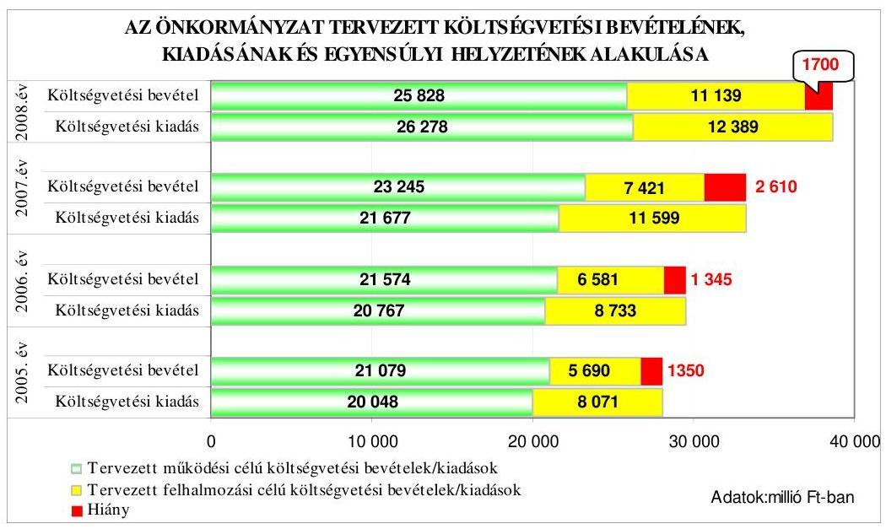

---

A költségvetési egyensúlyi helyzet biztosításához a 2005-2008. évi költségvetési rendeletekben az Önkormányzat hitel felvételét, vagy azzal azonos összegű kötvény kibocsátását irányozta elő.

A tervezett hosszú lejáratú hitelfelvétel, illetve kötvénykibocsátás összegei a következők voltak: a 2005. évben 1350 millió Ft, a 2006. évben 1345 millió Ft, a 2007. évben 2610 millió Ft és a 2008. évben 1700 millió Ft. A hitelfelvételt, illetve kötvénykibocsátást a tervezett fejlesztési feladatok kiadásainak felhalmozási célú bevételeket meghaladó mértéke miatt tervezték. A felhalmozási célú költségvetési kiadások éves költségvetésben tervezett aránya a 2007. évben volt a legmagasabb, $34,9 \%$, a többi évben $28,7 \%-32,0 \%$ között változott. A 2007. évi költségvetési rendelet 7. § 7) pontjában az Önkormányzat meghatározta, hogy a 2007. január 1-jén fennálló fejlesztési hiteleket a 2007. évben lehetőség szerint kedvező kamatozású „Kötvényprogramra" alakítják át. A Közgyűlés felhatalmazta a polgármestert a vonatkozó szerződések aláírására, a Pénzügyi bizottság véleményének előzetes kikérése mellett.

A költségvetések végrehajtása során pénzügyi hiány a 2005-2006. években nem volt, azonban a 2007. évben az összes teljesített költségvetési kiadás meghaladta a teljesített költségvetési bevételek összegét.
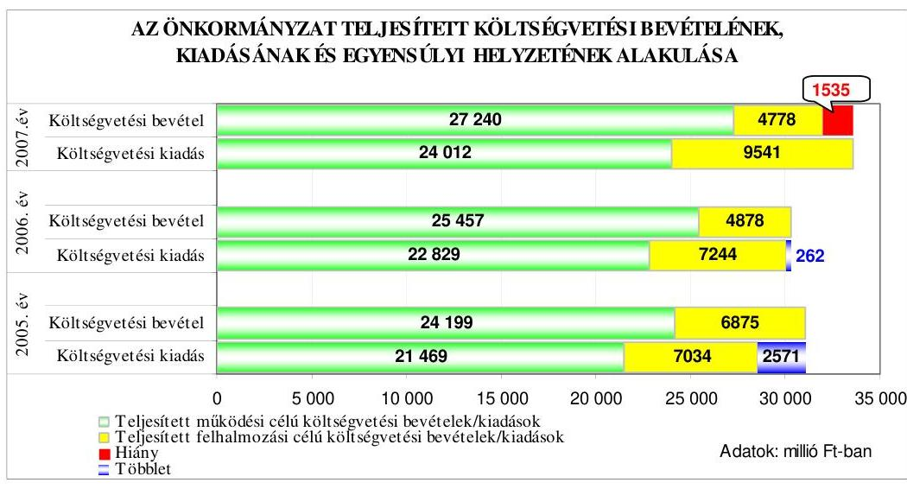

A 2005-2006. években a teljesített költségvetési bevételek - a felvett hitel és kötvénykibocsátás nélkül is - fedezetet nyújtottak a költségvetési kiadásokra. Ennek ellenére az Önkormányzat hosszú lejáratú fejlesztési hitelt vett fel a 2005. évben és kötvényt bocsátott ki a 2006. évben.

Az Önkormányzat a 2005. évben a költségvetésben meghatározott felhalmozási célok megvalósításához, ezen belül a szennyvízelvezetési és szennyvíztisztítási beruházások megvalósításához, valamint a Vörösmarty Színház felújításához az Önkormányzati Infrastruktúra Fejlesztési Hitel program keretében hosszú lejáratú hitelt vett fel. A nyílt közbeszerzési eljárással kiválasztott pénzintézettől a tervezett 1350 millió Ft-nál alacsonyabb összegben, 762,6 millió Ft összegben vett fel hitelt az Önkormányzat, melyet a hitelszerződés szerint - három év türelmi idő elteltével - 2008. szeptember 30-tól negyedévente törleszt. A hitel 20 éves futamidejű, változó kamatozású.

---

A 2006. évben az Önkormányzat 1345 millió Ft összegben változó kamatozású, svájci frank alapú kötvényt bocsátott ki. A kötvény visszafizetésének türelmi ideje 10 év, a türelmi idő végén a tőke visszafizetését egy összegben kell teljesítenie az Önkormányzatnak. A kötvény kamatait a 2007. évtől félévente kell fizetnie az Önkormányzatnak. Az Önkormányzat a 2006. évi kötvénykibocsátásból származó bevételét a költségvetési rendeletben meghatározott fejlesztési célkitűzések megvalósítására használta fel.

A 2007. évben az Önkormányzat a költségvetésben tervezett 2610 millió Ft összegű kötvénykibocsátását két részletben valósította meg. A 2007. május 18-án kibocsátott kötvény 1800 millió Ft összegű, 7 éves lejáratú, forint alapú, változó kamatozású. A 2007. július 16-án kibocsátott kötvény összege 810 millió Ft, a kötvény 10 éves lejáratú, forint alapú, változó kamatozású. Mindkét kötvény tőkeösszegének visszafizetése a lejárat végén egy összegben esedékes. A két kötvény bevétele a panelprogram megvalósítását, az épületek energiatakarékossá tételét (ablakcsere, hőszigetelés), az egycsatornás gyűjtőkémények felújítását, valamint az út- és szennyvízhálózat bővítésének végrehajtását célozta.

A Közgyűlés felhatalmazása alapján a 2007. évi költségvetési rendeletben meghatározott „Kötvényprogram" végrehajtására, a korábbi fejlesztési hitelek kiváltására további három kötvény kibocsátását kezdeményezték 2007. év decemberében. A kibocsátást megelőzően a Pénzügyi bizottság 2007. december 12-i ülésén véleményezte a hitelek kötvényre történő átváltására vonatkozó előterjesztést. A kedvezőbb kamatfeltételeket figyelembe véve döntöttek az összesen 4570 millió Ft értékű kötvény kibocsátásról. A korábbi fejlesztési hitelek kamatai 5,96-9,95\% közöttiek voltak, a kötvények kamata 3,90-8,95\% között alakult. Az Önkormányzat a 2007. évi kötvénykibocsátásból származó bevételének 64\%-ából visszafizette a korábbi években felvett felhalmozási célú hiteleit (nyolc darab), melyekből a 2008. évben lejáró futamidejű hitelek (három darab) esedékes összege 1750 millió Ft, a további előtörlesztett hitelek - 2010-2012. évek közötti lejáratúak - összege 2820 millió Ft volt. A hitelek kiváltását célzó kötvények svájci frank alapúak, változó kamatozásúak, lejáratuk öt-hat illetve nyolc év. A tőketörlesztés egy öszszegben a lejáratkor esedékes, kamataikat a 2008. évtől félévente kell törleszteni.

A 2007. évben kibocsátott kötvényekre a 2008. évben fizetendő kamat összege az Önkormányzat költségvetése szerint összesen 638 millió Ft kiadási kötelezettséget jelent. A 2008. évi költségvetésben 1700 millió Ft összegű kötvénykibocsátást tervezett az Önkormányzat.

A kibocsátott kötvényekkel az Önkormányzat hosszú lejáratú adósságállománya a 2007. év végén 9623,4 millió Ft-ra nőtt, ami a 2005. év január 1-jei állapothoz viszonyítva 80,0\%-os emelkedést mutat. A kötvénykibocsátásoknál a kibocsátáskor ismert hitelpiaci viszonyokat vették figyelembe. A 2006-2007. évben kibocsátott kötvények egyösszegű visszafizetései - a türelmi idő elteltével -a 2012-2017. között évente esedékesek, amely összeg az évi kamatokkal együtt a 2008. évi kötelezettségvállalás felső határának mintegy 24-28\%-át jelenti. A változó kamat valamint a forint svájci frankhoz viszonyított árfolyamváltozása miatt az Önkormányzat számára a kötvénykibocsátás kockázatot jelent.

Az évközi likviditási gondok áthidalására a Közgyűlés a 2005-2008. évi költségvetési rendeletekben emelkedő mértékben folyószámla hitelkeretet határozott meg.

---

A 2005-2008. években a folyószámlahitellel kapcsolatos jellemzőket mutatja be a következő táblázat:

| Megnevezés | 2005.   évben | 2006.   évben | 2007.   évben | 2008.   I.n.évben |
| :-- | :--: | :--: | :--: | --: |
| A folyószámlahitel keretösszege   (millió Ft-ban) | 1000 | 1750 | 2200 | 2600 |
| Év végén fennálló folyószámlahitel   (millió Ft-ban) | 0 | 0 | 0 | 0 |
| Folyószámlahitellel zárt napok száma | 74 | 220 | 226 | 56 |
| A ténylegesen felvett folyószámlahitel   átlagos állománya (millió Ft-ban) | 386 | 955 | 1110 | 730 |
| A felvett folyószámlahitel minimum   összege (millió Ft-ban) | 7 | 2 | 6 | 58 |
| A felvett folyószámlahitel maximum   összege (millió Ft-ban) | 875 | 1669 | 2136 | 2370 |

A folyószámlahitel igénybevételére a kiadások bevételektől eltérő ütemben történt teljesítése miatt volt szükség. A folyószámlahitel keretösszegének emelése mellett a 2005-2008. évek között nőtt a folyószámlahitellel zárt napok száma és a felvett folyószámlahitel átlagos állománya is. Az Önkormányzat likviditási helyzetének romlását jelzi, hogy az évente felvett hitel maximuma már megközelítette a Közgyűlés által meghatározott keretösszeget és a folyószámlahitel igénybevétele - 2006-2007. években 26-32 nap kivételével - állandósult. A folyószámlahitelt a 2005-2007. években év végén visszafizette az Önkormányzat.

Az Önkormányzat eladósodását az eladósodási mutató ${ }^{10}$ és az esedékességi aránymutató változása szemlélteti. Az eladósodási mutató a 2005-2007. években a rövid és hosszú lejáratú kötelezettségek év végi állományának növekedése miatt folyamatosan emelkedett, a 2007. év végi kötelezettségek öszszege a 2005. év végéhez viszonyítva másfélszeresére nőtt, amely az Önkormányzat eladósodásának növekedését jelzi.

A 2005. évi hitelfelvétel és a 2006-2007. évi kötvénykibocsátások miatt 2005-2007 között a hosszú lejáratú kötelezettségek év végi állománya 4523,7 millió Ft-tal emelkedett, a rövid lejáratú kötelezettségek emelkedése 29,4 millió Ft volt.

Az esedékességi aránymutatóo ${ }^{11}$ a 2005. évi értékhez viszonyítva a 2006. és a 2007. években csökkent, mivel az összes kötelezettségen belül a rövidtávon teljesítendő kötelezettségek aránya csökkent, a hosszú lejáratú kötelezettségek aránya pedig nőtt a hitelfelvétel és kötvénykibocsátás miatt, ezáltal a rövidtávon teljesítendő kötelezettségek fizetőképességre gyakorolt hatása mérséklődött.

[^0]
[^0]:    ${ }^{10}$ Eladósodási mutató = önkormányzati összes forráson belül a rövid- és hosszú lejáratú kötelezettségek aránya.
    ${ }^{11}$ Esedékességi aránymutató = az összes fizetési kötelezettségen belül a rövid lejáratú kötelezettségek aránya.

---

Az Önkormányzat fizetőképességének, likviditásának a 2005-2007. évek közötti alakulását mutatja a készpénz likviditási mutató ${ }^{12}$ és a likviditási gyorsráta. ${ }^{13}$

Az Önkormányzat pénzügyi helyzete - az eladósodás növekedését és a rövid távú fizetőképesség 2007. évben bekövetkezett javulását is figyelembe véve - a 2007. év végén a 2005. év végi és a 2006. év végi állapothoz képest összességében kedvezőtlenül alakult, a hosszú lejáratú kötelezettségek növekedése miatt. Az egy lakosra jutó adósságállomány összege a 2005. évi nyitó állomány alapján számítotthoz képest 2007. év végére $65 \%$-kal emelkedett, amelyben közrejátszott a csökkenő lakosságszám is.
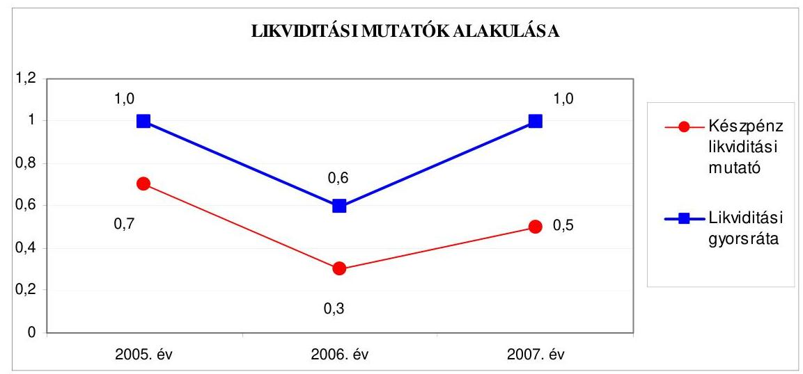

A készpénz likviditási mutató értékei 2005-2007 között változóan alakultak, azonban jelzik, hogy az Önkormányzat év végén meglévő pénzeszközei egyik évben sem nyújtottak fedezetet a rövid lejáratú kötelezettségek finanszírozására. A 2005. év végéhez viszonyítva a 2006. év végén a likviditási mutató romlott, jelezve, hogy a pénzeszközök csökkenő arányban nyújtottak fedezetet a rövid lejáratú kötelezettségek kiegyenlítésére. A 2007. év végén a likviditási mutató emelkedett az előző év végéhez viszonyítva, mivel a rövid lejáratú kötelezettségek a hitelek kötvényre való átváltása miatt csökkentek és a pénzeszközök év végi állománya nőtt.

A likviditási gyorsráta is változóan alakult 2005-2007 között. A 2006. év végén az előző év végéhez képest romlott, mivel a rövid lejáratú kötelezettségek év végi állománya a tárgyévet terhelő szállítói kötelezettségek és az iparűzési adó túlfizetése miatt nagyobb arányban nőtt, mint a követeléseké, és a pénzeszközök év végi állománya $42 \%$-kal csökkent. A 2007. év végén a kötvénykibocsátásból visszafizetett 2008. évben lejáró hitelek állománycsökkenése miatt csökkent a rövid lejáratú kötelezettségek év végi állománya, így a likviditási gyors-

[^0]
[^0]:    ${ }^{12}$ Készpénz likviditási mutató = pénzeszközök/rövid lejáratú kötelezettségek.
    ${ }^{13}$ Likviditási gyorsráta = követelések + értékpapírok + pénzeszközök/rövid lejáratú kötelezettségek.

---

ráta értéke javult, az Önkormányzat fizetőképessége kedvező irányban változott.

Az Önkormányzat fizetőképessége a likviditási mutatók alapján a 20052007. évek között változóan alakult, az előző évhez viszonyítva a 2006. évben romlott, a 2007. évben - a kötvénykibocsátás hatására - javult, azonban ennek ellenére az egy alatti értéke azt mutatja, hogy a rövid lejáratú kötelezettségeit nem fedezte a pénzállomány és a követelésállomány. Az Önkormányzatnál a pénzügyi helyzet rosszabbodását jelzi az eladósodottsági mutató folyamatos emelkedése és a likviditási mutatók egy, illetve egy alatti értéke.

# 1.3. A költségvetés tervezésének megalapozottsága 

Az Önkormányzatnál a költségvetés bevételi és kiadási főösszegének teljesítése a 2005-2007. években meghaladta az eredeti előirányzatokat, az évek sorrendjében a túlteljesítés a bevételeknél 16,1-7,7-4,4\%, a kiadásoknál 1,4-1,9-0,8\% volt. A múködési célú költségvetési bevételeket 14,8-18,0-17,2\%-kal, a múködési célú költségvetési kiadásokat pedig 7,1-9,9-10,8\%kal mindhárom évben túlteljesítették. A múködési célú költségvetési bevételek többlete mérsékelte a felhalmozási célú költségvetési bevételeket meghaladó összegű felhalmozási célú költségvetési kiadások miatt keletkezett hiányt a 2007. évben, illetve a 2005-2006. évi múködési célú költségvetési bevételi többlet biztosította a költségvetés teljesítése során a pénzügyi egyensúlyt.

Az önkormányzati szintű működési célú költségvetési bevételek eredeti előirányzathoz viszonyított túlteljesítését eredményezte, hogy az intézményi múködési bevételeket mindhárom évben, az OEP-től és a fejezetektől átvett pénzeszközöket pedig a 2005. és a 2006. évben alultervezték. Az intézményi múködési bevételek alultervezéséhez hozzájárult, hogy a közoktatási és szociális intézményekben fizetendő térítési díjak emelésére vonatkozó rendelettervezeteket ${ }^{14}$ az Áht. 71. § (2) bekezdésében előírtakat megsértve a polgármester a költségvetési rendelettervezet benyújtását követően terjesztette a Közgyűlés elé.

A múködési célú költségvetési bevételek közül a helyi adóbevételek 20062007. évi eredeti előirányzatai 110,1-119,7\%-ra teljesültek, ami 2006. évben 729 millió Ft, a 2007. évben 1675 millió Ft bevételi többletet jelentett. A helyi adóbevételek többletéhez hozzájárult az iparűzési adókedvezmények csökkenése, a vállalkozások gazdasági teljesítményével összefüggő adóelőleg feltöltés, illetve 2007. évben egy multinacionális cég adóbevallásában szereplő adókötelezettségét közel 840 millió Ft-tal meghaladó befizetése és a hátralékok beszedéséből év végén realizált 165 millió Ft bevétel.

[^0]
[^0]:    ${ }^{14}$ Az Önkormányzat 3/2005. (II. 22.) számú, a 9/2006. (IV. 28.) számú, 18/2007. (V. 22.), 5/2008. (II. 18.) számú rendeletei a személyes gondoskodást nyújtó ellátásokról, valamint a fizetendő térítési díjakról, az Önkormányzat 17/2006. (VI. 23.) számú rendelete a nevelési-oktatási intézményekben igénybevett szolgáltatásokért fizetendő térítési díjak és tandíjak megállapításáról.

---

Bevételi többletet eredményezett, hogy indokoltsága ellenére az előző évi pénzmaradvány igénybevételét működési célra eredeti előirányzatként nem tervezték a 2005-2006. évi és a 2008. évi költségvetésben, a 2007. évben pedig, csupán a teljesített felhasználás $1,1 \%$-a szerepelt eredeti előirányzatként. A felhalmozási célra igénybevett pénzmaradvány teljesített összege a 2005. évben $17 \%$-kal, 2006. évben $35 \%$-kal haladta meg a tervezett mértéket. A 2007-2008. évi költségvetésekben a pénzmaradvány felhalmozási célú igénybevételét nem tervezték. A pénzmaradvány nem tervezett, de teljesített múködési célú igénybevétele ${ }^{15}$, valamint a pénzmaradvány tervezettet meghaladó mértékben történt felhalmozási célú igénybevétele hozzájárult a tervezett költségvetési hiány mérsékléséhez.

A felhalmozási célú költségvetési bevételek és kiadások teljesítése a 2006. és a 2007. évben elmaradt az eredeti költségvetési elöirányzatoktól, a teljesítés a bevételeknél 74,1-64,4\%, a kiadásoknál 82,9-82,3\% volt. A 2005. évben a felhalmozási célú költségvetési bevételek 20,8\%-kal haladták meg az eredeti előirányzatként tervezett összeget, míg a kiadások 87,1\%-ra teljesültek. A felhalmozási célú költségvetési bevételek 2005. évi túlteljesítésében közrejátszottak a pályázatokon elnyert pénzeszközök, a tervezett pénzmaradvány igénybevétel összegét meghaladó felhasználás, valamint a felhalmozási célra nyújtott kölcsönök ${ }^{16}$ tervezettnél korábbi és magasabb összegű visszafizetései. A 2006. évi és a 2007. évi költségvetésben tervezett felhalmozási célú költségvetési bevételek eredeti előirányzataihoz képest a tényleges teljesítés $74,1 \%$, illetve $64,4 \%$ volt, melynek oka, hogy az eladásra kínált nagy értékű ingatlanokra ( 6 db ) kiírt pályázatok eredménytelenül zárultak. A városközpontban lévő 1,5 ha alapterületű ingatlan (murvás parkoló) értékesítéséből származó 6168 millió Ft vételár - 2007. év helyett - 2008. I. félévben realizálódott. A támogatásértékű felhalmozási bevételek az eredeti előirányzatokhoz képest 20052007. években 50,1-65,8\% között teljesültek, melynek oka, hogy a fejezeti kezelésű pénzeszközökből a pályázatokhoz biztosított hazai finanszírozást a beruházások megvalósításának üteméhez igazítva, a lakossági és önkormányzati önrész biztosítása után hívhatta le az Önkormányzat. A beruházási („panelprogram") feladatok megvalósítása a benyújtott pályázatok elbírálásának és a kivitelezők kiválasztásának elhúzódása miatt a tervezett ütemezéstől elmaradt, ami kedvezőtlenül befolyásolta a pályázati támogatások igénybevételét.

[^0]
[^0]:    ${ }^{15}$ A tényleges igénybevétel az évek sorrendjében 1564-1710-906 millió Ft volt.
    ${ }^{16}$ A lakásvásárláshoz a lakosságnak biztosított önkormányzati kölcsönök törlesztésének három havi elmaradása esetén a kölcsönszerződés felbontását, a teljes hátralévő tőkeösszeg visszafizetését kezdeményezi az Önkormányzat.

---

# 2. Az ÖNKORMÁNYZAT FELKÉSZÜLTSÉGE AZ EURÓPAI UNIÓs FORRÁSOK IGÉNYLÉSÉRE ÉS FELHASZNÁLÁSÁRA, VALAMINT AZ ELEKTRONIKUS KÖZIGAZGATÁSI FELADATOK ELLÁTÁSÁRA 

2.1. Az európai uniós források igénybevételére és a várható támogatás felhasználására történt felkészülés szabályozottsága, szervezettsége

### 2.1.1. Az európai uniós forrásokra történő pályázatok benyújtására vonatkozó döntések összhangja a fejlesztési célkitűzésekkel

Az Önkormányzat fejlesztési célkitűzéseit a vizsgált időszakban a gazdasági program ${ }_{1,2}$-ben rögzítette.

A gazdasági program alapját a Közgyűlés által a 2002. évben elfogadott településfejlesztési koncepció képezte, amelyben kijelölték Székesfehérvár megyei jogú város fejlődése érdekében teendő intézkedéseket, meghatározták a fejlesztések területén a prioritásokat. A gazdasági program ${ }_{1}$ a fejlesztendő területek helyzetelemzésén alapult, elkészítésénél figyelemmel voltak az Európai Unió területfejlesztési stratégiájára.

A gazdasági program ${ }_{1}$-ben - összhangban az Önkormányzat ágazati koncepcióival - szerepelt az Önkormányzat fenntartásában lévő intézmények fejlesztésén túl a turizmusfejlesztés, a település kereskedelmi és közlekedési helyzetének a korszerűsítése, a belváros rekonstrukciós fejlesztése, a Nemzeti Emlékhely kiépítése, a kommunális ellátottság javítása, valamint a városrészek fejlesztése keretében a panelprogram következetes megvalósítása. A gazdasági program ${ }_{1}$ részét képező feladatterv 160 részfeladatot tartalmazott.

A gazdasági program ${ }_{2}$-ben meghatározott főbb stratégiai célok továbbra is a területfejlesztési koncepción alapultak, az Önkormányzat három fő célt fogalmazott meg stratégiaként: innovatív gazdasági környezet kialakítását, a környezetvédelem és környezetfejlesztést (vonzó városrész, turizmusfejlesztés), valamint minőségi életkörülmények megteremtését (lakókörnyezeti infrastruktúra és a társadalmi szolgáltatások fejlesztését). A gazdasági program ${ }_{2}$-ben a kötelező feladatokhoz illesztett fejlesztési célként határozták meg az Önkormányzat tulajdonában lévő és ellátási kötelezettségébe tartozó egészségügyi, szociális és oktatási intézmények felújítását, korszerűsítését, akadálymentesítését, egészségügyi és szociális intézmények felszereltségének javítását. A közművelődés, szabadidő és sport területén kiemelt fejlesztési célként rögzítették a város kerékpárút hálózatának bővítését, a közrend és köztisztaság terén pedig a közvilágítás javítását, térfigyelő rendszerek további kiépítését.

A gazdasági program ${ }_{2}$-ben az Önkormányzat önként vállalt feladatai között továbbra is kiemelt helyen szerepel a „vonzó városkép" megteremtése, a történelmi városmag rehabilitációja és felújítása, parkok és terek rendezése, új kulturális intézmények alakítása, a város turisztikai vonzerejének növelése.

Az ágazati (szakmai) koncepciókban rögzített fejlesztési célkitűzéseket helyzetelemzéssel és értékeléssel alátámasztották, a megvalósításhoz szükséges forrá-

---

sokat a gazdasági program ${ }_{1,2}$-ben rögzítették és tervezték külső (európai uniós és hazai) pályázati források igénybevételét.

Az Önkormányzat a gazdasági program ${ }_{1,2}$-t nem módosította, mivel a megfogalmazott fejlesztési célok összhangban voltak az európai uniós forrásokhoz kapcsolódóan az NFT-ben meghatározott operatív programok célkitűzéseivel. A 2007-2010. évek fejlesztési célkitűzéseit az ÜMFT céljaival összhangban határozták meg. Rögzítették, hogy a tervezett fejlesztési feladatok megvalósítása az Önkormányzat anyagi helyzetétől és a külső források nagyságától függ.

Az Önkormányzatnak a 2005-2008. években összesen 38 benyújtott európai uniós források megszerzésére irányuló pályázata volt, amelyekből 28-at a Polgármesteri hivatal, 10-et az intézmények kezdeményeztek. A benyújtott pályázatokban szereplő célok az Önkormányzat kötelező és önként vállalt feladataihoz kapcsolódtak és összhangban voltak a gazdasági progra $\mathrm{m}_{1,2}$ célkitűzéseivel. A támogatásban részesült pályázatok tervezett ${ }^{17}$ és teljesített kiadásait, a kiadást finanszírozó forrásokat a jelentés 4. számú melléklete (tanúsítvány) tartalmazza.

A Polgármesteri hivatal által a 2005-2008. években benyújtott pályázatok közül a 2005. évben egy elutasításra került, hat projekt befejezett, hat projekt megvalósítása folyamatban van, és 15 elbírálás alatt lévő pályázat van. Az intézmények által benyújtott pályázatokból kettő került elutasításra, egy projekt befejeződött és hét projekt megvalósítása folyamatban van. A megkötött támogatási szerződések alapján 1945,2 millió Ft európai uniós támogatást, 709,9 millió Ft Norvég Alapból igénybe vehető finanszírozást, 632,8 millió Ft hazai és a BM Önerő Alapból 135,6 millió Ft támogatást nyertek el, önkormányzati szinten 146,4 millió Ft saját forrást biztosítottak.

A Polgármesteri hivatal által benyújtott pályázatok a következők voltak:

- a Közgyűlés döntései alapján a 2004. évben kettő információszolgáltató tevékenységet fejlesztő projekt ${ }_{1,2}$-re (GVOP 4.3.1. és GVOP 4.3.2.) nyújtott be pályázatot az Önkormányzat, amelyre az eredményes elbírálást követően együttesen 307,8 millió Ft európai uniós támogatásra, a 102,5 millió Ft hazai finanszírozásra és a BM Önerő Alapból 35,2 millió Ft igénybevételére írtak alá szerződést. A projektek megvalósításához 23,5 millió Ft saját forrás biztosítására volt szükség. A kettő projekt a 2005-2006. évekre ütemezetten, 469 millió Ft összköltséggel 2007. évben megvalósult. Az Önkormányzat az európai uniós és a hazai támogatást igénybe vette, a BM Önerő Alap támogatás lehívását az irányító hatóság által kiadott kifizetési kérelmek befogadását követően kezdeményezte, azonban a támogatás teljes összegét még nem kapta meg. A projekt a tervezett műszaki tartalommal valósult meg, használatba vétele és számviteli nyilvántartásba vétele (aktiválása) a 2007. év végén megtörtént;

[^0]
[^0]:    ${ }^{17}$ A tervezett adatok a megkötött támogatási szerződéseken alapulnak, amelyben még nem szerepel az Alsóvárosi kerékpárút építésére vonatkozó projekt.

---

- az Önkormányzat a ROP „Turisztikai vonzerők fejlesztése" intézkedés keretében (ROP-1.2.2.-2004-07-0006/36. számú projekt) a 2004. évben eredményesen pályázott a Hiemer-Font-Caraffa épülettömb felújításának I. ütemére 615,5 millió Ft-os összköltségű beruházás megvalósítására. A támogatási szerződést 2005. augusztus hónapban írták alá, a támogatás mértéke a projekt vissza nem igényelhető általános forgalmi adóval számított költségének 97,5\%-a volt, legfeljebb 600 millió $\mathrm{Ft}^{18}$. Az Önkormányzat a Közgyűlés döntése alapján 6,2 millió Ft saját forrást biztosított. A projekt 2006. augusztus hónapban befejeződött, eredményeként az épülettömb tetőszerkezetének teljes felújítását elvégezték és a Hiemer-Font-Caraffa épülettömb Városháza felé eső részének teljes felújításával reprezentatív közösségi tereket hoztak létre (Utazási Központ, Városi Rezidencia, exkluzív tárgyaló, városházi közfunkciók ellátása). A beruházás 615,4 millió Ft-ból valósult meg, amelyet az Önkormányzat a tervezett 97,5\%-os részarányban külső forrásból finanszírozott, 6,2 millió Ft saját forrás ráfordításával és 9,3 millió Ft BM Önerő Alap támogatás igénybevételével;
- az Önkormányzat a Közgyűlés 365/2004. (IX. 23.) számú határozata alapján a 2004. évben nyújtott be pályázatokat a „Térségi Integrált Szakképző Központok létrehozása és Infrastrukturális feltételeinek javitása" címú, a HEFOP 3.2.2. keretében a szakképzési központok létrehozására, a HEFOP 4.1.1. keretében pedig azok infrastrukturális feltételeinek javítására. Az Önkormányzat a Fejér Megyei Önkormányzattal, a térségben lévő hat szakképző intézménnyel, két felsőfokú oktatási intézménnyel, a Gazdasági Kamarával, a Regionális Munkaerő Képző Központtal valamint a térség kiemelt foglalkoztatóival konzorciumi megállapodást kötött a pályázatban való részvételre. Az Önkormányzat mindkét pályázata eredményes volt, a projekt még nem fejeződött be, megvalósítási határideje 2008. december 31. A támogatási szerződést 2006. február 16-án írták alá. A projektek megvalósításához a támogatási szerződés alapján 867,0 millió Ft európai uniós támogatás, 239,0 millió Ft hazai támogatás és 29,0 millió Ft BM Önerő Alap áll az Önkormányzat rendelkezésére;
- a ROP 3.2.1. „Foglalkoztatási stratégia és munkaerópiaci monitoring" c. projektre a 2005. évben nyújtott be pályázatot az Önkormányzat három partnerrel közösen, elfogadására a 2006. évben került sor. Az Önkormányzat főkedvezményezettként, a támogatásból részesülő partnerekkel együtt ${ }^{19}$, 2006. július hónapban írta alá a támogatási szerződést. A projekt célja a városban megjelenő munkaerő szükséglet mennyiségi és minőségi kielégítése, a gazdasági igény és a szakképzés összhangjának, a foglalkoztatók, a szakképzésben érintett intézmények együttmúködésének megteremtése volt. A projekt megvalósításában érintettek összesen 47 millió Ft támogatást nyertek el, amelyből az Önkormányzat főkedvezményezettként 27,5 millió Ft-ban részesedett. A projekt megvalósítása nem igényelt saját forrást, 22,0 millió Ft európai uniós és 5,5 millió Ft hazai támogatás volt a fedezete. A projekt befejeződött, a Közgyűlés elfogadta a projekt keretében kidolgozott „Székesfehérvári Foglalkoztatási Stratégiá"-t. Az Önkormányzat a fizetési kérelmek benyújtását követően összesen 25,1 millió Ft támogatást vett igénybe. A projekt az időbeli ütemezéshez képest nyolc hónappal korábban valósult meg;

[^0]
[^0]:    ${ }^{18}$ A támogatás összegéből 65\% (390 millió Ft) az Európai Unió Regionális Fejlesztési Alapjából, 35\% (210 millió Ft) magyar kormányzati finanszírozásból származott.
    ${ }^{19}$ Fejér Megyei Kereskedelmi és Iparkamara, Székesfehérvári Regionális Vállalkozásfejlesztési Alapítvány, Székesfehérvári Regionális Központ,

---

- a ROP 3.2.1. intézkedés keretében a „Fejér Paktum" Partnerség a Fejér megyei foglalkoztatási helyzet javításáért projektre vonatkozó támogatási szerződést 2005. július 29-én írta alá a Fejér Megyei Közgyűlés elnöke, a projekt megvalósításában az Önkormányzat partnerként vett részt, további hét szervezettel együtt. A projekt a tervezett időbeli ütemezésben valósult meg, megtörtént a foglalkoztatást elősegítő tevékenységek helyi koordinációja. Az Önkormányzat a benyújtott fizetési kérelmek alapján 1,3 milliós európai uniós és 0,4 millió Ft hazai támogatásban részesült;
- a 2005. évben meghirdetett ROP 2.2.2. intézkedésre a városi területek rehabilitációja keretében „Székesfehérvár Repüléstörténeti Múzeum" létrehozására irányuló pályázatot tartaléklistára kerülést követően, forráshiányra hivatkozva elutasította az irányító hatóság. A pályázott összeg 877 millió Ft volt;
- a vállalkozásalapítást szolgáló projekt az „Interreg IIIC Modele Multinet" program keretében az európai unió társfinanszírozásával történt, fő célja volt az önkormányzati szolgáltatásfejlesztés, vállalkozásalapítás ösztönzése, új vállalkozástámogató eszközök kifejlesztése. Az Önkormányzat 2006. szeptemberben nyújtotta be a pályázatát, amelynek megvalósítását a KDRFÜ-vel és külföldi (spanyol, olasz, görög és szlovák) partnerek együttmúködésével végezték. A projekt befejezési határideje 2007. október 31-e volt. Az Önkormányzat 73 ezer euro ( 18,3 millió Ft) támogatást nyert, amelyhez 6,1 millió Ft önerőt is biztosított. Az Önkormányzat és partnere - a Vállalkozói Központ Közalapítvány ${ }^{20}$ - Vállalkozó Információs Központot hozott létre, amely elsősorban kezdő kis- és középvállalkozásoknak nyújt segítséget (információt, szakmai tanácsot, technikai eszközöket és irodatechnikai szolgáltatásokat). Az Önkormányzatnak a fizetési kérelmek alapján folyósított európai uniós támogatás összege 11 millió Ft, a további kiadásokat az Önkormányzat saját forrásból, 11,3 millió Ft összegben megelőlegezte;
- a KIOP 1.2.0. környezetvédelem prioritás „Állati hulladékok kezelése" intézkedés keretében meghirdetett pályázati felhívásra az Önkormányzat a 2006. évben pályázott. A 2007. évben aláírt támogatási szerződés tárgya volt az állati hulladékok kistérségi szintű kezelési rendszerének kialakítása, infrastruktúra fejlesztése a székesfehérvári kistérség területén. A beruházás tervezett összköltsége 99,5 millió Ft, ezen belül az európai uniós támogatás 86,8 millió Ft. Az Önkormányzat a beruházás befejezéséhez 9,9 millió Ft saját forrást biztosított és rendelkezik a BM Önerő Alapból 2,8 millió Ft támogatás igénybevételének lehetőségével. A projekt tervezett befejezési határideje 2008. május 31-e volt, a beruházás pénzügyi lezárása még nem történt meg.
- az Önkormányzat a 2006. évben pályázott a Norvég Finanszírozási Mechanizmusok keretében a „Barokk örökség, virágzó közösség" - a Hiemer-FontCaraffa épülettömb II. ütemének rehabilitációja c. projekt megvalósítására. Az Önkormányzat, mint a pályázat nyertesének főkedvezményezettje, a négy partnerrel 2006. március 27 -én partnerségi megállapodást írt alá, ezt követően pedig a végrehajtási szerződés megkötésére került sor. A projekt tervezett összköltsége 835,1 millió Ft, amelynek a $85 \%$-át a Norvég Finanszírozási Mechanizmus keretében, 6\%-át a BM Önerő Alap igénybevételéből és 9\%-át saját forrásból tervezték megvalósítani. A beruházás megvalósult, pénzügyi lezárására még nem került sor;

[^0]
[^0]:    ${ }^{20}$ A Vállalkozó Központ Közalapítvány kiemelten közhasznú szervezet, 100\%-os tulajdonosa az Önkormányzat.

---

- az „Európa köztünk van" c. projekt támogatási szerződését 2007. októberben írta alá a polgármester. A pályázat célja volt, hogy a Római Szerződés aláírásának 50. évfordulóját magyarországi helyszíneken méltón megünnepeljék, civil fórumokon, rendezvényeken tárgyalják meg a régió gazdasági és társadalmi kérdéseit. A projekt végrehajtására 2,5 hónap állt rendelkezésre. Az elnyert európai uniós forrás 3 millió Ft-nak megfelelő euro volt és 0,8 millió Ft saját forrást igényelt. A projekt 3,8 millió Ft-os költségét az Önkormányzat megelőlegezte, a támogatás összegét az Önkormányzat még nem kapta meg;
- az ÜMFT KDOP 4.2.2. számú intézkedésre a Polgármesteri hivatal a 2007. évben nyújtott be pályázatot az „Alsóvárosi kerékpárút" építésére. A pályázat támogatása segítségével 168,7 millió Ft összköltségű beruházás valósítható meg, 2009. május 15-i kivitelezési határidővel. Az Önkormányzat a pályázatot befogadó támogató 2008. február 29-én kelt levele szerint a megvalósításhoz 79,9\%-os arányban, 134,9 millió Ft összegben vehet igénybe európai uniós támogatást;
- a Közgyűlés a 401/2007. (X. 25.) számú határozattal létrehozta a Nonprofit Kft-t azzal a céllal, hogy az ÜMFT TÁMOP forrásaira az Önkormányzat (illetve a térség) intézményei helyett az európai uniós források igénybevételéhez a pályázatokat elkészítse. A Polgármesteri hivatal a Nonprofit Kft. által elkészített 13 pályázatot a 2008. évben benyújtotta a KDOP 5.1.1. intézkedés keretében, „közoktatási intézményei infrastrukturális fejlesztésére" külső forrás elnyerése érdekében. A pályázatok elbírálása még nem történt meg;
- a 2008. évben a Polgármesteri hivatal a KDOP 2.1.1. és a KDOP 3.1.1. programok keretében két projekt megvalósítására pályázott, amelyek elbírálása a helyszíni ellenőrzés időszakában még nem történt meg. A „Királyi séta" című, 1300 millió Ft költségigényű projektből az Önkormányzat a város kulturális vonzerejének növelését, a történelmi örökségek fejlesztését tervezi megvalósítani, 196,6 millió Ft önerő vállalásával. „A megyei jogú városok integrált városfejlesztési stratégiái megvalósításának támogatása" című projekt megvalósításához 1700 millió Ft támogatás elnyerésére nyújtott be a Polgármesteri hivatal pályázatot, melyben a vállalt saját erő nagysága 382 millió Ft.

Az intézmények által benyújtott 10 pályázatból nyolc volt eredményes, kettő pályázatot elutasítottak:

- a HEFOP 4.2.1. „A társadalmi befogadást támogató szolgáltatások infrastrukturális fejlesztése" c. projektre a 2004. évben pályázott a Kriziskezelő Központ. A támogatási szerződést 2006. január hónapban kötötte meg az intézmény. Az Önkormányzat - konzorciumi partnerként - vállalta a pályázathoz szükséges önrész biztosítását. A projekt célja olyan infrastrukturális feltételek kialakítása és fejlesztése volt, amely a hajléktalanok és a társadalmi kirekesztődés szempontjából veszélyeztetett emberek számára biztosítja az újrakezdés lehetőségét, a munka világába történő visszatérést ${ }^{21}$. A záró PEJ benyújtására 2008. február hónapban került sor. Az intézmény a 254,0 millió Ft összköltségű beruházáshoz 179,0 millió Ft európai uniós forrást, 60,0 millió Ft hazai támogatást nyert el, amelyhez az Önkormányzat 5,8 millió Ft saját forrást biztosított. A beruházás megvalósításához a BM Önerő Alapból 9,2 millió Ft összegű tá-

[^0]
[^0]:    ${ }^{21}$ A beruházás megvalósításával jelentősen növelik a nappali szociális ellátás alapterületét, a rászorulók igénybe vehetik a Nappali Szolgáltató Centrumban elérhető szolgáltatásokat (képzések, egészségügyi alapszolgáltatás, számítógépes oktatás, internethozzáférés, tanácsadás, étkezés és tisztálkodási lehetőség biztosítása).

---

mogatást igényeltek, amelynek teljes összegét azonban még nem kapták meg. A projekt a tervezett 2007. október 31-i befejezési határidőre és a tervezett összköltséggel valósult meg, használatba vétele valamint a számviteli nyilvántartásba vétele (aktiválása) a 2007. év végén megtörtént;

- a HEFOP 3.1.3. „Felkészités a kompetencia alapú oktatásra" c. projektre a 2005. évben négy intézmény (egy óvoda, két általános iskola és egy többcélú közoktatási költségvetési szerv) nyújtott be pályázatot. Az intézmények együttesen 44,5 millió Ft európai uniós támogatáshoz és 13,5 millió Ft hazai forráshoz jutottak, önerő biztosítására nem volt szükség. A projekt megvalósítása még nem fejeződött be;
- a HEFOP 3.1.2 intézkedése keretében a „Térségi iskola és óvodafejlesztő központok megalapítása a kompetencia-alapú tanulási programok elterjesztése" érdekében elnyert támogatásra vonatkozó szerződést a 2005. évben írta alá az irányító hatósággal a kedvezményezett 11 intézmény ${ }^{22}$ és a fốkedvezményezett Komá-rom-Esztergom Megyei Pedagógiai Intézet. A projekt megvalósításában az Önkormányzat három intézménye érintett (óvoda, általános iskola, szakközépiskola). A projekt megvalósításának határideje 2008. december 31. A három intézménynél a 26,8 millió Ft összköltségű fejlesztés forrás összetétele 25,0 millió Ft európai uniós támogatás és 1,8 millió Ft összegű hazai forrás;
- az ÚMFT TÁMOP 2.2.3. rendszerében a „TISZK rendszer továbbfejlesztése" c. pályázati felhívásra 2008. február hónapban hat szakképző iskola részére nyújtott be pályázatot az Önkormányzat. A pályázati cél a szak- és felnőttképzés struktúrájának átalakítása volt. Az NFÜ Humánerőforrás Programok Irányító Hatósága a teljességi követelmények hiánya miatt elutasította, illetve az elbírálásból kizártnak minősítette a pályázatot. A döntés ellen az Önkormányzat panaszt nyújtott be az irányító hatósághoz, amely a felülvizsgálati kérelemnek helyt adott, és rendelkezett a pályázat visszafogadásáról, mivel az elbíráló nem hívta fel a pályázót az előírt egyszeri hiánypótlás lehetőségére, hanem a projektjavaslat hiánypótlás nélküli elutasításáról döntött, a pályázati útmutató rendelkezéseivel ellentétesen. A pályázat elbírálása még nem történt meg;
- az ÚMFT TIOP 1.1.1. támogatási rendszeréhez a 2008. évben négy szakközép és szakképző intézmény nyújtotta be az „Intelligens iskolák Székesfehérváron" c. pályázatot. Az NFT az elbírálás során kizárta a pályázókat, mivel a pályázati kiírásban megfogalmazott jogosultsági követelményeket nem teljesítették. Az Önkormányzat nevében a polgármester 2008. június hónapban panasszal élt az NFÜ-nél.

Az Önkormányzat a 2005-2008. I. félévben befejezett fejlesztési feladataihoz a tervezett és a teljesített kiadások finanszírozási forrásainak megoszlását a következő ábrák szemléltetik:

[^0]
[^0]:    ${ }^{22}$ A projekt végrehajtásában Fejér, Komárom és Veszprém megyékből összesen 11 oktatási intézmény vesz részt.

---

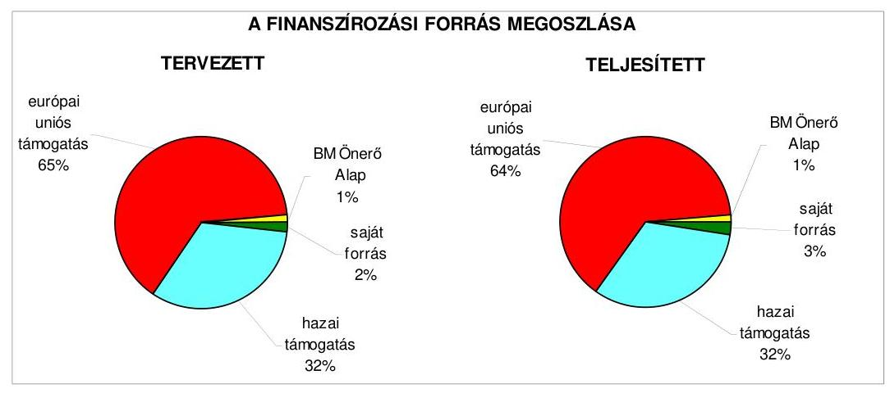

Az Önkormányzat a befejezett fejlesztésekhez 64\% európai uniós forrást, 34\% hazai támogatást vett igénybe. Az utófinanszírozással folyósított BM Önerő Alaptól elnyert támogatás esetében az Önkormányzat a kiadásokat megelőlegezte. A pályázati források fedezetére az éves általános tartalék-előirányzaton belül különítettek el „Önerő alapot", ezért nem volt szükség saját forrást kiváltó hitel felvételére, illetve hitelgarancia igénybevételére. Az Önkormányzat 20052008. évi költségvetési rendeletei elkülönítetten tartalmazták az európai uniós támogatással megvalósuló programok bevételi és kiadási előirányzatait az Ámr. 29. § (1) bekezdés k) pontjában előírtaknak megfelelően. A 2005-2008. évek költségvetési rendeleteiben az Ámr. 29. § (1) bekezdés g) pontjában foglaltak alapján bemutatták a Közgyűlés tájékoztatása céljából az európai uniós támogatással megvalósuló projektek többéves kihatással járó feladatainak előirányzatait éves bontásban.

# 2.1.2. Az európai uniós forrásokhoz kapcsolódóan a pályázatfigyelés, a pályázatkészítés, valamint az európai uniós támogatással megvalósuló fejlesztés lebonyolításának belső rendjének szabályozottsága, a végrehajtás személyi, szervezeti feltételei 

Az Önkormányzatnál a 2005. évtől szabályozott az európai uniós források pályázatfigyeléssel, készítéssel valamint a projektek lebonyolításával kapcsolatos pályázati eljárási rend, melyet jelenleg a 10 478/12/2008. számú jegyzői utasítással módosított 10 016/15/2006. számú jegyzői utasítás szabályoz.

A pályázati lehetőségek rendszeres figyelése és az azokról való folyamatos tájékoztatás - a Polgármesteri hivatal szakmai irodái és az Önkormányzat intézményei részére - a Projektmenedzsment iroda feladata. Feladatkörébe tartozik az Európai Unió stratégiájának, programjainak, akcióterveinek figyelemmel kisérése annak érdekében, hogy az Önkormányzat a lehető legnagyobb mértékben vehessen igénybe támogatást.

A pályázatokon való részvételről az SzMSz-ben illetve az ügyrendben meghatározottak szerinti döntési jogkört gyakorlók a Közgyűlés, illetve átruházott hatáskörben és esetben a polgármester.

---

A pályázati eljárási rend nem határozza meg: az önkormányzati szintű pályázatkoordinálás felelősét, a pályázatokról adatot szolgáltatók kötelezettségét, az önkormányzati szintű pályázat-nyilvántartás valamint az adatszolgáltatás tartalmi követelményeit ${ }^{23}$. Meghatározták a pályázati eljárási rendben, valamint az SzMSz-ben és az ügyrendben az európai uniós forrásokkal kapcsolatos információk áramlásának rendjét, a pályázatfigyelést végző és a döntési jogkört gyakorlók közötti információ-szolgáltatási kötelezettségre vonatkozó előírásokat.

Az európai uniós forrásokra vonatkozó pályázatok készítése a pályázati eljárási rend szerint a Projektmenedzsment iroda, a pályázat témakörileg érintett irodái, továbbá az önkormányzati intézmények feladata, valamint ezzel külső szervezet is megbízható. A 2007. év végén a Közgyűlés létrehozta a Nonprofit Kft-t, amelynek feladata az önkormányzati intézményeket érintő pályázatfigyelés és pályázatkészítés ${ }^{24}$.

A projektek végrehajtására (lebonyolítására) vonatkozó előírásokat a pályázati eljárási rendben részletezték, általános előírásként került meghatározásra, hogy a „projektmenedzsment csapat" felelős a projekt szakmai és pénzügyi lebonyolításáért (az utánkövetési időszak lezárásáig), felelős a pályázati támogatás hatékony felhasználásáért és az Önkormányzat által elnyert források lehívásáért. A projektmenedzser az adott projekt végrehajtására vonatkozó polgármesteri felhatalmazással írásban rendelkezett, tevékenysége a munkaköri leírásban - az adott időszakra vonatkozóan - rögzítésre került. Az egyedi felhatalmazások tartalmazták a projekt végrehajtásának teljes időtartamára és az utánkövetési időszakra, hogy a felhatalmazott személy jogosult a projekttel kapcsolatos ügyekben eljárni. A projektmenedzser a projekt előrehaladásáról és az általa aláírt dokumentumokról minden hónap 15. napjáig írásban köteles tájékoztatást adni a polgármesternek. A projektmenedzsert a jegyző kijelölte a projekt megvalósításával kapcsolatos kiadások és bevételek esetében a szakmai teljesítés igazolására, valamint a pályázati eljárási rend szerint feladata a pénzügyi elszámolások (fizetési kérelmek) összeállítása és a Pénzügyi iroda részére történő továbbítása.

# A Polgármesteri hivatalban az európai uniós forrásokkal támogatott fejlesztési feladatok lebonyolításával kapcsolatos folyamatba épített ellenőrzési feladatokat a FEUVE rendszer valamint az ellenőrzési nyomvonal tartalmazta. Az európai uniós támogatások belső ellenőrzésének rendjét a belső ellenőrzési kézikönyvben azonban nem határozták meg, a 

[^0]
[^0]:    ${ }^{23}$ A Projektmenedzsment iroda az európai uniós pályázati felhívásokról vezet nyilvántartást, ez az adatbázis a benyújtott pályázat célját, forrását valamint azt tartalmazza, hogy az Önkormányzat mely szervezeti egysége kapott értesítést a pályázati lehetőségről, és visszajelzése alapján milyen döntés született a pályázaton való részvételt illetően.
    ${ }^{24}$ A vizsgált időszakban benyújtott pályázatok 33\%-át külső szakértő, 7\%-át a Polgármesteri hivatal témakörileg érintett szakmai irodája (Beruházási, Közlekedési, Kommunális és Civil kapcsolatok), 4\%-át a Projektmenedzser iroda, 56\%-ot a Nonprofit Kft. készítette.

---

stratégiai terv és a 2005-2007. évi ellenőrzési tervek az európai uniós forrásokkal támogatott fejlesztési feladatok lebonyolításával kapcsolatos ellenőrzési feladatot nem tartalmaztak, az európai uniós forrásokkal támogatott projektek ellenőrzésére az ellenőrzés stratégiai tervéhez készített kockázatelemzés nem terjedt ki.

Az Önkormányzatnál a 2005-2008-as években az európai uniós források megszerzésére irányuló pályázatfigyelést, pályázatkészítést és a projektmenedzselést a Projektmenedzsment iroda szervezetén belül négy köztisztviselő látta el, ezen túlmenően a támogatásban érintett irodák köztisztviselői munkaköri feladataik mellett végezték a pályázat előkészítésével és projektmenedzseléssel kapcsolatos feladatokat. Az érintettek munkaköri leírásait szükség szerint aktualizálták, a feladatokkal összefüggő előírások figyelembevételével és az adott projekt útmutatójában foglaltaknak megfelelően. A pályázatfigyeléssel megbízottak és a projektek végrehajtásában közreműködő köztisztviselők rendelkeztek felsőfokú végzettséggel, európai uniós forrással támogatott fejlesztés lebonyolításához szükséges jártassággal, és nyelvismerettel. A feladatellátáshoz az Önkormányzat biztosította a tárgyi feltételeket, munkahelyi számítógép használatát és az internet elérhetőséget.

A pályázatfigyelési és pályázatkészítési feladatok ellátására a Nonprofit Kft-vel 2007. november hónapban kötött megállapodásban előírták a feladatellátás kötelezettségét - pályázatfigyelést, a pályázat készítést, az elnyert projektek végrehajtásának, megvalósításának menedzselését - továbbá a Polgármesteri hivatal érintett irodáival történő kapcsolattartás és felelősség szabályait, az információk átadásának formáját, tartalmát és módját. A megállapodás nem tartalmazza azonban személyre szólóan a felelősségi szabályokat, valamint az ellenőrzési feladatok megosztását. A vizsgált időszakban lebonyolított projektek projektmenedzseri feladatainak ellátására külső személyt, szervezetet nem vettek igénybe.

# 2.1.3. A fejlesztési feladat lebonyolításánál a feladatellátás rendjére, az ellenőrzési feladatok teljesítésére, valamint a felelősségi szabályokra vonatkozó előírások betartása 

Az Önkormányzat a 2004-2007. években az információszolgáltató tevékenységet fejlesztő projekt ${ }_{1}$ megvalósításának segítségével alakította ki a Polgármesteri hivatalban az állampolgárok és a gazdasági élet szereplői részére az elektronikus ügyintézés rendszerét, megteremtette az elektronikus szolgáltatások tárgyi feltételeit. A fejlesztés célja a vállalkozások számára nyújtott szolgáltatások korszerűsítése, az elektronikus ügyintézési lehetőség növelése, az ügyfélszolgáltatás minőségének javítása és az elektronikus rendszerek térségközpontúvá tételével a kistérség települései számára szakmai segítségnyújtás biztosítása volt. Az információszolgáltató tevékenységet fejlesztő projekt ${ }_{2}$ megvalósításával a polgármesteri hivatali munka hatékonyságának növelését, az ügyfelek részére minőségi közvetlen szolgáltatások nyújtását, a városi elektronikus közháló létrejöttének elősegítését és az informatikai kultúra fejlesztését határozták meg.

---

Az információszolgáltató tevékenységet fejlesztő projekt ${ }_{1}$-re 2004. június hónapban nyújtották be a pályázatot, a sikeres elbírálásáról 2005. január hónapban értesültek. A támogatási szerződés aláírására 2005. április hónapban került sor. Az Önkormányzat az elnyert támogatás összegét két évre történő ütemezésben vehette igénybe, a 2005. évben 129,6 millió Ft-ot, a 2006. évben 168,8 millió Ft-ot utófinanszírozással, teljesítmény és forrásarányosan. A támogatási szerződésben a projekt befejezésének tervezett időpontját 2006. október 31., de legkésőbb 2007. március 25-i határidővel állapították meg.

A támogatási szerződést a megvalósítás időszakában kettő alkalommal módosították, egyik módosítás sem járt a támogatás összegének változtatásával:

- a támogatási szerződést első alkalommal 2005. augusztus 25 -én módosították az Önkormányzat kezdeményezésére, ennek alapján az Önkormányzat a teljes támogatási összeg $25 \%$-ának megfelelő összegű egyszeri előleg igénybevételére vált jogosulttá, amely lehetőséggel az Önkormányzat élt ( 74,6 millió Ft előleget vett igénybe). A folyósított előleggel történő elszámolás nem volt előfeltétele a későbbi időközi kifizetéseknek mindaddig, amíg azok együttes összege nem éri el a teljes támogatási összeg $80 \%$-át.
- a támogatási szerződés 2. számú módosítását a közremúködő szervezet az általa lefolytatott ellenőrzést követően kezdeményezte 2008. március 17-én. Az Önkormányzat a közremúködő szervezettel megkötött szerződés módosításában a projekt befejezési határidejének (2007. március 25.) változtatása nélkül az utolsó fizetési kérelem benyújtásának a határidejét 2007. május 9ről 2007. június 9-re változtatták, valamint módosították a támogatás igénybevételének évekre ütemezett összegeit is. Az eredetileg a 2005-2007. években igénybe vehető támogatást három évre elosztva (2005-2006-2007. évek) igényelhette az Önkormányzat, a 2005. évben 129,6 millió Ft, a 2006. évben 90,8 millió Ft, a 2007. évben 78,0 millió Ft összegben. Az eredeti szerződés szerint a 2006. évben igénybe vehető 168,8 millió Ft összeget a módosítás szerint a 2006. és 2007-es években használhatta fel az Önkormányzat.

Az információszolgáltató tevékenységet fejlesztő projekt támogatási szerződésében szereplő célok az eredeti határidőben megvalósultak.

Az Önkormányzat a projekt megvalósításának ideje alatt hat PEJ-t és kifizetési kérelmet nyújtott be (részletezését az 5. számú melléklet tartalmazza). A 2005. évben egy kifizetési kérelmet nyújtott be az Önkormányzat, melynek összegét a támogatási szerződés szerinti időn belül a 2005. év végéig megkapta. A 2006. évben benyújtott négy kifizetési kérelem esetében a támogatás folyósítása 198-405 napos átfutási időt vett igénybe, a kifizetés elhúzódásának indokáról az időközben megváltozott közreműködő szervezettől az Önkormányzat tájékoztatást nem kapott. A támogatás utolsó részletét a 2007. július 30-án benyújtott kifizetési kérelem benyújtását követő 84. napon, 2007. október 20-án kapta meg a Polgármesteri hivatal.

---

A támogatás utófinanszírozási rendszere pénzügyi akadályt nem okozott, az Önkormányzat a kifizetések pénzügyi fedezetét az általános tartalékból megelőlegezte. A záró PEJ és a pénzügyi beszámolót követően az Önkormányzat az elszámolások „kerekítési különbözzetei" miatt a Közgyűlés döntése alapján 22045 Ft összegről lemondott.

A közremúködő szervezet a projekt megvalósításának folyamatában külső ellenőrzést három alkalommal - a 2005. és a 2006. évben - végzett. Az első helyszíni ellenőrzés előzetes ellenőrzésnek minősült, a további kettő ellenőrzés során vizsgálták a megvalósítás szakmai és pénzügyi folyamatait:

- a 2005. március hónapban végzett előzetes ellenőrzés eredményeként megállapították a pályázó jó felkészülését, együttmúködési készségét;
- a 2005. december hónapban lefolytatott közbenső ellenőrzés az elszámolásra benyújtott dokumentumok vizsgálatára, a beszerzett tárgyi eszközök azonosítására, a könyvviteli elszámolásokra és a benyújtott pályázattal kapcsolatos közbeszerzési eljárás lebonyolítására vonatkozott, mulasztás, hiányosság megállapítására nem került sor;
- a 2006. február hónapban végzett ellenőrzés a hiányzó szakmai dokumentációk pótlására szólította fel az Önkormányzatot, amelynek azonnal eleget tettek.

A külső ellenőrzések szabálytalanságra vonatkozó megállapításokat nem tettek, visszafizetési kötelezettséget nem állapítottak meg. A projekt további megvalósítási időszakában és a befejezést követően az irányító hatóság, és más külső szervek ellenőrzést nem végeztek.

Az Önkormányzat a szabályozottság és szervezettség terén a 20052007. évek között eredményesen felkészült az európai uniós források igénybevételére és felhasználására, mivel az európai uniós forrásokra benyújtott pályázatok a gazdasági program ${ }_{1,2}$-ben meghatározott fejlesztési célkitűzésekhez kapcsolódtak, valamint a pályázati eljárási rendet a jegyző kialakította, meghatározta a pályázatfigyelést végzők és döntési jogkörrel rendelkezők közötti információszolgáltatási kötelezettséget, a polgármester és a fejlesztési feladatokat lebonyolítók közötti kapcsolattartás rendjét, a folyamatba épített, előzetes és utólagos vezetői ellenőrzési feladatokat. A Polgármesteri hivatalban a pályázatfigyelés és pályázatkészítés személyi feltételeit biztosították, a pályázatfigyelésben és készítésben feladatot végző Nonprofit Kft. feladatait és a Polgármesteri hivatal érintett irodái közötti kapcsolattartás rendjét meghatározták. Annak ellenére összességében eredményes volt a szabályozottság és szervezettség tekintetében az Önkormányzat felkészülése, hogy az ellenőrzési stratégiát megalapozó kockázatelemzés nem terjedt ki az európai uniós támogatás igénybevételére, nem jelölték ki az Önkormányzati szintű pályázatkoordinálás felelősét, nem határozták meg az önkormányzati szintű pályázat-nyilvántartás tartalmi követelményeit, valamint nem határozták meg pályázatfigyelésben és készítésben feladatot végző Nonprofit Kft-vel kötött megállapodásban a személyre szóló felelősséget, és az ellenőrzési feladatok megosztását.

---

# 2.2. Az elektronikus közigazgatási feladatok ellátása, a közérdekú adatok elektronikus közzététele 

A Közgyűlés a 360/2003. (XI. 20.) számú - határozatával fogadta el a 20042006. évekre vonatkozó informatikai stratégiát, melyben bemutatták az Önkormányzat informatikai helyzetét és meghatározták a stratégiai célokat, azok megvalósítási módszereit. Stratégiai „akciók" keretében rögzítették a Polgármesteri hivatal múködési feltételeinek informatikai eszközökkel való fejlesztését, az ügyfélbarát önkormányzat múködéséhez kapcsolódó beruházásokat, az eÖnkormányzat megteremtését, a város elektronikus közhálójának létrehozását, és az informatikai kultúra fejlesztését. Nem határozták meg, hogy az elektronikus szolgáltatás melyik szintjét kívánják elérni. Az informatikai stratégia felülvizsgálatára, a 2007. évtől aktuális informatikai fejlesztési célok meghatározására nem került sor. Az Önkormányzat a 2007-2008. évekre vonatkozó informatikai stratégiával nem rendelkezett, nem határozták meg a hosszú távú informatikai fejlesztési célkitűzéseket és az elektronikus ügyintézés további fejlesztési ütemeit.

Az Önkormányzat a 2004. évben az információszolgáltató tevékenységet fejlesztő projekt, ${ }_{1,2}$-re összesen 307,8 millió Ft európai uniós támogatást kapott. A két projekt célja az elektronikus szolgáltatási rendszer korszerúsítése volt, a gazdasági-, és civil szervezetek, illetve a lakosság számára, valamint az elektronikus ügyintézés esetében a 2. elektronikus szolgáltatási szinten már múködtetett területek bővítése és nyolc ügyintézési szolgáltatási területen a 3. elektronikus szolgáltatási szint elérése. A fejlesztések a támogatási szerződésben előírt határidőre 2007. március 24-re, illetve 31-re befejeződtek.

Az e-közigazgatási feladatok informatikai hátterét a Polgármesteri hivatalban múködő, európai uniós támogatással - összességében 469 millió Ft összegű beruházások eredményeként - megvalósult számítógépes informatikai rendszeren keresztül, a támogatásokból megvásárolt szoftverrel valósították meg. A feladatok ellátásának személyi feltételeit a Polgármesteri hivatal kijelölt köztisztviselői, valamint az Önkormányzat tulajdonában lévő közhasznú társaság szolgáltatásainak igénybevételével biztosították.

Az Önkormányzatnál kialakították és múködtették az e-közigazgatási feladatokat ellátó informatikai rendszert. Az ügyfelek az Önkormányzat honlapján ${ }^{25}$ az „Ügyfélszolgálat" valamint az „e-Önkormányzat" menüsorban tájékozódhattak az 1. elektronikus szolgáltatási szinten kialakított tájékoztató adatokról, illetve 2. elektronikus szolgáltatási szinten megvalósított elektronikus ügyintézés lehetőségeiről, indíthattak a 3. elektronikus szolgáltatási szinten kérelmeket. Az Önkormányzat az e-ügyintézési rendeletben határozta meg az elektronikus úton kezdeményezhető közigazgatási hatósági és az elektronikus úton történő időpontfoglalás körébe tartozó ügyeket, valamint az Önkormányzat honlapján elérhető ügyfél-tájékoztatók körét, azonban azt nem módosította

[^0]
[^0]:    ${ }^{25}$ Az Önkormányzat honlapja a www.szekesfehervar.hu címen érhető el.

---

az európai uniós támogatás eredményeként kialakított elektronikus szolgáltatások igénybevételének lehetőségével ${ }^{26}$.

Az Önkormányzat honlapján 2007. január 1-től az e-ügyintézés 2. elektronikus szolgáltatási szintjét valósították meg a következő területeken:

- az állampolgárok vonatkozásában a közlekedési ügyeknél (behajtási engedélyek, útcsatlakozás, kapubejáró és közterület-burkolás engedélyezése), a helyi adóügyeknél (gépjárműadó bevallás, támogatás, az összes adónemmel kapcsolatosan kérelem, idegenforgalmi adó, talajterhelési díj, luxusadó, termőföld bérbeadásához kapcsolódó adóbevallások), a lakás-, és vagyongazdálkodásnál (helyi lakáscélú támogatás igénylése, nem lakás célú helyiségek bérbeadására, értékesítésére vonatkozó jelentkezési lap, önkormányzati tulajdonú lakótelkek elidegenítéséhez pályázati adatlap, lakbértámogatás), a szociális, egészségügyi és gyermekvédelmi ügyeknél (kérelmek támogatás, segély, igazolványok kiadására) a gyermekvédelmi és gyámügyi igazgatási ügyeknél, a szabálysértési igazgatásnál, az anyakönyvi ügyeknél, a birtokvédelemnél, a szakfordítói és tolmácsigazolvány kiadásánál, a méhészeti és építésügyi hatósági engedélyeknél és az egyéb nyomtatványok tekintetében, esetében;
- a vállalkozások vonatkozásában a közlekedési és adóügyekhez (gépjármú súlyadó és iparúzési adóbevallás) a kapcsolódó kérelmek, bevallásoknál, a lakás és vagyongazdálkodást érintő jelentkezéseknél, a szabálysértési ügyintézés keretében kérelmek, feljelentések, tüzvizsgálati hatósági bizonyítvány kérelmek, építésügyi hatósági engedély kérelmek és cégképviseletre vonatkozó meghatalmazás nyomtatvány letöltésénél.

A 3. elektronikus szolgáltatási szinten az állampolgárok és vállalkozások az adóegyenlegüket kérdezhették le, az egyes adónemek közötti átvezetéseket és panaszbejelentéseket kezdeményezhették. A vállalkozások üzleteik múködési engedélyeztetése, szálláshelyek nyilvántartásba vétele és megszüntetése, közterület használati engedély, telephely-engedélyezés, környezetvédelmi kérelmek, közmú szakhatósági hozzájárulás tekintetében kezdeményezhettek elektronikus ügyintést.

A minden ügycsoportra kiterjedő közvetlen e-ügyintézés feltételei nem álltak rendelkezésre, mivel a Polgármesteri hivatalban a meglévő szoftver állomány további fejlesztést igényel, amelynek pénzügyi és személyi feltételei nem álltak rendelkezésre 2005-2007 között.

[^0]
[^0]:    ${ }^{26}$ A közbenső egyeztetés során a Polgármester által adott észrevétel szerint: „Az információszolgáltatási lehetőségek feltételeinek meghatározására és befolyásolására a Hi vatalnak nincs lehetősége. Az EU ajánlása által meghatározott 3. és 4. szintű ügyek vonatkozásában a felhasználó hiteles azonosításának esetében jogszabályi előírásokat követ és tart be a Hivatal."

---

# Az Önkormányzat az e-ügyintézési rendeletében az elektronikus ügyintézést kizáró szabályokat határozott meg. 

Közigazgatási hatósági eljárás során a Közgyűlés, a polgármester, a jegyző, a Polgármesteri hivatal ügyintézője hatáskörébe, továbbá a Közgyűlés által a polgármesterre, bizottságra átruházott hatáskörbe tartozó közigazgatási hatósági ügyek elektronikusan nem intézhetők, kivéve ezen hatósági ügyekben az eljárási cselekmények közül az eljárást megindító kérelem, valamint azon hatósági ügyek, amelyek esetében magasabb szintű jogszabály alapján biztosítani kell az ügyfelek részére az elektronikus ügyintést.

Az Önkormányzat az Eisztv. 21. § (3) bekezdése alapján a közérdekű adatok honlapon történő közzétételére 2007. január 1-től kötelezett. Az Önkormányzati honlapon azonban a 18/2005. (XII. 27.) IHM rendelet 2. § (1) bekezdésében előírtak ellenére a honlap megnyitásakor megjelenő oldalon a közzétételi listák által előírt adatokat tartalmazó jegyzékre mutató hivatkozást „Közérdekü adatok" elnevezéssel nem helyezték el ${ }^{27}$, valamint a 2. § (2) bekezdésében előírtakat figyelmen kívül hagyva a közzéteendő adatok jegyzékét nem az itt hivatkozott 1. számú melléklet szerinti tagolásban tették közzé.

Az Áht. 15/A. § (1) bekezdés előírását megsértve a jegyző az Önkormányzat által nyújtott nem normatív céljellegú fejlesztési és múködési támogatásokra vonatkozóan a kedvezményezett nevének, a támogatás céljának, összegének, a támogatási program megvalósítási helyének közzétételéről a vizsgált időszakban nem gondoskodott. Az Áht. 15/B. § (1) bekezdésének előírását megsértve a jegyző a vizsgált időszakban a vagyonnal történő gazdálkodással összefüggő - nettó öt millió forintot elérő, vagy azt meghaladó értékű - építési beruházásra, vagyonértékesítésre, szolgáltatás megrendelésre, vagyonértékű jog átadására vonatkozó valamennyi szerződés megnevezésének, tárgyának, a szerződést kötő felek nevének, a szerződés értékének, határozott időre kötött szerződések időtartamának és a szerződéssel kapcsolatos adatok változásának közzétételéről nem gondoskodott.

Az Önkormányzat az Ámr. 157/D. § (1) bekezdésében hivatkozott Ámr. 22. számú melléklet 1.2.5. pontjában foglaltak ellenére a 2005-2007. évek költségvetési beszámolóinak szöveges indoklását nem tette közzé.

A közbenső egyeztetés során a polgármester által adott észrevétel szerint: „A beszámoló szöveges indoklását 2008. május 21 -én tettük közzé az Önkormányzat honlapján — www.szekesfehervar.hu/közérdekú adatok. A számvevöi észrevételek alapján a beszámoló szöveges tartalma pontositásra került, melynek átvezetését a megadott szempontok alapján megtettük a vizsgálat folyamán."

[^0]
[^0]:    ${ }^{27}$ A közbenső egyeztetés során a Polgármester által adott észrevétel szerint a közérdekű adatokat tartalmazó jegyzékre mutató hivatkozást az ellenőrzés időszaka alatt a honlapon elhelyezték.

---

Az észrevétel nem megalapozott, mivel a honlapon közzé tett 2007. évi költségvetési beszámoló szöveges indoklása nem tartalmazza a Vhr. 32. § (8) bekezdésében foglaltak ellenére a piaci értéken történő értékelés esetén az alkalmazott elveket és módszereket, a Vhr. 40. § (8) bekezdésében foglaltak ellenére a közalapítványok, alapítványok által ellátott feladatokra teljesített kifizetéseket, illetve a térítésmentesen juttatott eszközök értékét, a Vhr. 40. § (9) bekezdésében előírtak ellenére a könyvviteli mérlegben kimutatott részesedéseket, további bontásban minden olyan gazdasági társaság nevét, székhelyét, amelyben 100\%-os, 75\%-on felüli, $50 \%$-on felüli, illetve $25 \%$-on felüli részesedéssel rendelkezik az Önkormányzat, valamint a Vhr. 40. § (11) bekezdésében előírtak ellenére a könyvvizsgálati jogszabályi kötelezettségre való egyértelmű utalást.

A Polgármesteri hivatalban az e-közigazgatási feladatokat ellátó informatikai rendszer ügyfelek általi igénybevételének figyelési rendszerét kialakították, azonban annak tapasztalatait nem értékelték.

# 3. A KÖLTSÉGVEtÉsi GAZDÁlKODÁs BELSŐ KONTROLLJAI 

### 3.1. A szabályozottság kockázata a költségvetés tervezési, gazdálkodási, beszámolási és a folyamatba épített, előzetes és utólagos vezetői ellenőrzési feladatoknál

A 2007. évben és 2008. I. negyedévben a tervezési és a zárszámadás készítési folyamatok szabályozottsága összességében alacsony kockázatot jelentett a feladatok megfelelő, szabályszerű végrehajtásában, mivel a jegyző a pénzügyi irányítási és ellenőrzési rendszer keretében az ellenőrzési nyomvonalban, körlevelekben szabályozta a költségvetés tervezés és a zárszámadás készítés rendjét, meghatározta az intézmények részére a költségvetési javaslat összeállításával kapcsolatos követelményeket. Annak ellenére összességében alacsony volt a kockázat, hogy a Közgyűlés a költségvetési szervek elemi beszámolója felülvizsgálatának rendjét, tartalmát az Ámr. 149. § (2) bekezdés a)-c) pontjában foglaltak ellenére nem határozta meg.

A költségvetési és zárszámadási rendelettervezetek előterjesztésekor tájékoztatásul bemutatandó mérlegek tartalmi követelményeit az Önkormányzat az ÁSZ előző, a gazdálkodás 2004. évi átfogó ellenőrzése során tett javaslata ellenére 20042007. között nem, csak 2007. december hónapban határozta meg. Javaslatunkat figyelembe véve a jegyző a 2005. évtől gondoskodott arról, hogy a költségvetési rendelettervezetben szerepeljenek a több éves kihatással járó elkötelezettségek, a kisebbségi önkormányzatok költségvetése, valamint bemutatásra kerüljenek a múködési és a felhalmozási előirányzatok mérlegszerűen, továbbá a közvetett támogatások, és a zárszámadáskor a pénzmaradvány kötelezettségvállalással terhelt része.

A Polgármesteri hivatalban a gazdálkodási, a pénzügyi-számviteli és a folyamatba épített ellenőrzési feladatok szabályozottságának hiányosságai közepes kockázatot jelentettek a feladatok szabályszerű végrehajtásában, mivel a jegyző az ellenőrzési feladatokat hiányosan szabályozta, azonban a kialakított belső kontrollok - végrehajtásuk esetén - a lehetséges hibák többsége ellen védelmet nyújtottak.

---

A közepes kockázatot az alábbi hiányosságok okozták:

- a jegyző nem szabályozta a számviteli politika keretében az önköltségszámítás szabályait annak ellenére, hogy az Önkormányzat a közérdekú adatok szolgáltatására kötelezett ${ }^{28}$, valamint nem rögzítette az adókövetelések esetében az egyszerűsített értékelési eljárás elveit és dokumentálásának szabályait annak ellenére, hogy éltek az egyszerűsített értékelés lehetőségével ${ }^{29}$;
- a Polgármesteri hivatal nem rendelkezett a Közgyűlés által jóváhagyott SzMSz-szel ${ }^{30}$ és a jegyző nem készítette el a gazdasági szervezet ügyrendjét, nem határozta meg a gazdasági szervezet feladatait, a vezetők és a beosztottak feladat-, hatás-, és jogkörét, valamint az érintett dolgozók munkaköri leírásában a kötelezettségvállalási, utalványozási jogkörökkel kapcsolatos, továbbá az eszközök és források értékelési, ellenőrzési feladatokat ${ }^{31}$, valamint a selejtezéssel, hasznosítással kapcsolatos kötelezettségeket, illetve nem határozta meg az eszközök és források értékelési szabályzatában az értékelések ellenőrzéséért felelős munkaköröket;

A közbenső egyeztetés során a polgármester által adott észrevétel szerint: „Az Ámr 134. § (2) bekezdése és 136. § (2) bekezdése alapján a helyi önkormányzat nevében kötelezettség vállalására, utalványozásra a polgármester vagy az általa felhatalmazott személy jogosult. Sem az Áht., sem pedig az Ámr. nem írják elő, hogy minden esetben személyre szólóan külön a munkaköri leírásban rögzíteni kellene a kötelezettségvállalási., utalványozási jogosultságot, annak terjedelmét. A Polgármester a kötelezettségvállalás, az ellenjegyzés, az utalványozás és az érvényesités szabályaitól szóló polgármesteri és jegyzői együttes utasításban írásban rendelkezett a kötelezettségvállalásra és utalványozásra vonatkozó felhatalmazásról."

A munkaköri leírások kiegészítésére vonatkozó észrevétellel nem értünk egyet, mivel véleményünk szerint polgármesteri és jegyzői együttes utasítás mellett a munkaköri leírásokban is indokolt és célszerű a felelősséggel ellátandó feladatok konkrét megjelölése.

[^0]
[^0]:    ${ }^{28}$ A polgármester által adott mellékelt tájékoztatás szerint: „A Polgármesteri Hivatal Számviteli politika szabályzata kiegészítésre került azzal a rendelkezéssel, hogy a közérdekú adatok közlésével összefüggésben a Polgármesteri hivatal költségtérítést nem kér, így az önköltségszámítási szabályzat nem képezi a számviteli politika részét"
    ${ }^{29}$ A polgármester által adott mellékelt tájékoztatás szerint: „Az eszközök és források értékelési szabályzata az adókövetelések esetében az egyszerúsített értékelési eljárás elveivel, valamint azok dokumentálásának szabályaival kiegészítésre került."
    ${ }^{30}$ A közbenső egyeztetés során a Polgármester által adott észrevétel szerint a Polgármesteri hivatal ügyrendjét a Közgyűlés a 436/2008. (X. 30.) számú határozatával módosította, ennek során kiegészítette az Ámr. 10.§ (5) bekezdésében a Polgármesteri hivatal SzMSz-ére vonatkozóan előírt követelményekkel.
    ${ }^{31}$ A polgármester által adott mellékelt tájékoztatás szerint az eszközök és források értékelési szabályzata az értékelések ellenőrzéséért felelős munkakörökkel kiegészítésre került.

---

- a jegyző nem határozta meg a FEUVE rendszer részeként elkészített ellenőrzési nyomvonalban az ellenőrzési pontokat és az egyes ellenőrzési feladatok elvégzését igazoló dokumentumok nyilvántartási helyét a rendszerben. A kockázatkezelési eljárásrendben nem határozta meg a kockázatok folyamatgazdáit, a kockázatok értékelését és kategóriákba sorolását, az elfogadható kockázati szintet, valamint a kockázatokra adható válaszintézkedések beépítését a folyamatba, a kockázati környezet rendszeres felülvizsgálatát ${ }^{32}$;
- a jegyző belső szabályzatban nem írta elő valamennyi kifizetésre ${ }^{33}$ vonatkozóan a szakmai teljesítés igazolási kötelezettséget ${ }^{34}$.

A közbenső egyezetés során a polgármester által adott észrevétel szerint: „A Polgármesteri Hivatal nem végez rendszeres szolgáltatásnyújtást, illetve termékértékesitést, ilyet a számvevői jelentés sem állapított meg. Az Ám. 157/C. § (1) úgy rendelkezik, hogy a közérdekú adatok közlésével (ideértve a másolást és az adatok meghatározott szempontok szerinti előállítását, illetve csoportosítását is) összefüggésben felmerült költséggel arányos térítés kérhető. A (2) bekezdés szerint a költségtérítés pontos összegét a szerv az adatszolgáltatást megelőzően köteles meghatározni. A költségtérítés összegét és megfizetésének módját a külön jogszabályban elöirt, a számviteli politika részeként elkészített önköltségszámítás rendjére vonatkozó belső szabályzatban foglaltak szerint kell megállapítani.

A rendelet elöírása megengedő jellegü, önköltség-számítási szabályzatot csak abban az esetben kell készíteni, ha a költségvetési szerv költségtérítés ellenében szolgáltatja a közérdekú adatokat. Az Önkormányzatnak a közérdekú adatok közlésével összefüggésben térítést nem kér. A leírtak alapján az önköltség-számítási szabályzat hiányát kifogásoló megállapítást nem tartjuk megalapozottnak."

Az észrevétel nem megalapozott, mivel az észrevétel nem tér ki arra, hogy a közérdekű adatok közlésével összefüggésben ki, vagy milyen szervezet által, mikor hozott rendelkezés szerint nem kér költségtérítést az Önkormányzat.

[^0]
[^0]:    ${ }^{32}$ A közbenső egyeztetés során a Polgármester által adott észrevétel szerint 2008. szeptember 1-i hatállyal a FEUVE szabályzat kiegészítésével a hiányosságokat megszüntették.
    ${ }^{33}$ A kötelezettségvállalás, az ellenjegyzés, az utalványozás és az érvényesítés szabályozásáról szóló 10016-9/2007. számú polgármesteri és jegyzői közös utasítás szerint „mindazon pénzügyi teljesítésre benyújtott kötelezettségvállalást megtestesítő bizonylatok - pl. támogatási szerződés, rendelkező levél, értesítés, Közgyűlési határozat, bizottsági határozat, stb. - melyek azáltal, hogy a kifizetést közvetlenül rendelik el, önmagukban hordozzák a kifizetés jogosságának igazolását, így ezek külön szakmai igazolása nem szükséges."
    ${ }^{34}$ A Polgármester által adott mellékelt tájékoztatás szerint: „A kötelezettségvállalás, az ellenjegyzés, az utalványozás és az érvényesítés rendjét szabályozó polgármesteri és jegyzői utasításban előírásra került, hogy az Ámr. 135. § (1)-(2) bekezdésében foglaltak figyelembevételével valamennyi kiadás esetében el kell végezni a szakmai teljesítés igazolását."

---

Az ÁSZ előző, a gazdálkodás átfogó ellenőrzése során tett javaslatok megvalósításának eredményeként - a még fennálló hiányosságok ellenére is - javult a gazdálkodási, a pénzügyi-számviteli és a folyamatba épített ellenőrzési feladatok szabályozottsága, mivel a jegyző gondoskodott az eszközök és források értékelési szabályzatának kiegészítéséről, a számlarend kialakításáról.

A Polgármesteri hivatalban az informatikai környezet szabályozottsága összességében alacsony kockázatot jelentett a feladatok megfelelő, szabályszerű végrehajtásában, mivel a Polgármesteri hivatal rendelkezett informatikai biztonsági szabályzattal, katasztrófa elhárítási tervvel, és az informatikai rendszerek üzletmenet folytonossági tervével. Annak ellenére összességében alacsony volt a kockázat, hogy a Polgármesteri hivatal a 2007-2008. években nem rendelkezett informatikai stratégiával ${ }^{35}$.

# 3.2. A belső kontrollok érvényesülése az önkormányzati források szabályszerű felhasználásában, a költségvetési tervezés, gazdálkodás, beszámolás folyamataiban 

A költségvetés tervezési és a zárszámadás készítés folyamatában a múködésbeli hibák megelőzésére, feltárására, kijavítására kialakított kontrollok múködésének megbízhatósága összességében kiváló volt, mivel a Polgármesteri hivatalnál az előírásoknak megfelelően ellenőrizték, hogy a költségvetési intézmények teljesítették-e a költségvetési javaslat összeállításával kapcsolatban részükre meghatározott követelményeket, valamint a költségvetési igények indokoltságát és teljesíthetőségét, továbbá a tervezett saját bevételek előirányzatai és az azok megalapozását szolgáló önkormányzati rendeletek összhangját. A zárszámadás készítés folyamatában ellenőrizték az intézményi pénzmaradványok megállapításának szabályszerűségét, az eredeti és a módosított előirányzatok, valamint a teljesítési adatok eltérésének indokoltságát. Annak ellenére összességében kiváló volt a kontrollok múködésének megbízhatósága, hogy a jegyző nem ellenőriztette a zárszámadás készítése során az intézmények által az állami támogatásokkal, hozzájárulásokkal történő elszámoláshoz közölt mutatószámok megbízhatóságát.

A Polgármesteri hivatal a külső szolgáltatók által végzett karbantartási, kisjavítási szolgáltatásokkal kapcsolatos kiadások fedezetére a 2007. évi elemi költségvetésben 15 millió Ft eredeti előirányzatot tervezett, ezt év közben 20,5 millió Ft-ra módosították, a 2007. évi teljesítés 20,5 millió Ft volt. Az eredeti és a módosított előirányzat 1,5\%-ot, a teljesítés 1,7\%-ot képviselt a tervezett, illetve teljesített dologi kiadásokból. A 2008. évi elemi költségvetésben 21 millió Ft eredeti előirányzatot terveztek, amely a tervezett dologi kiadások 1,0\%-a. Az előirányzatok felhasználására vonatkozó kötelezettségvállalások (szerződések, megrendelések) tárgya összhangban volt a Polgármesteri hivatal által ellá-

[^0]
[^0]:    ${ }^{35}$ A közbenső egyeztetés során a Polgármester által adott észrevétel szerint a Polgármesteri hivatal informatikai stratégiájának elkészítésére vonatkozóan 2008. október 7én megállapodást kötöttek.

---

tott feladatokkal ${ }^{36}$. A Polgármesteri hivatalnál a külső szolgáltatók által végzett karbantartási, kisjavítási szolgáltatásokkal kapcsolatos kifizetések során a szakmai teljesítés igazolás és az utalvány ellenjegyzés múködésének megbízhatósága gyenge volt, mivel

- a gépkocsik szervizelésével, karbantartásával, mosatásával, valamint a székek javításával kapcsolatos kifizetéseket megelőzően a szakmai teljesítés igazolására a jegyző által kijelölt személyek az alapdokumentumok - belső megrendelők ${ }^{37}$ - hiányossága miatt ${ }^{38}$, az igazolás elvégzését tanúsító aláírásuk ellenére nem látták el a jogosultság, valamint az összegszerűség ellenőrzésére vonatkozó feladataikat;

A közbenső egyeztetés során a polgármester által adott észrevétel szerint: „A 10016-9/2007. számú Polgármesteri, Jegyzői együttes utasítás a szakmai igazolás tekintetében az alábbiak szerint rendelkezik:
„Mindazon pénzügyi teresítésre benyújtott kötelezettségvállalást megtestesítő bizonylatok - pl. támogatási szerződés, rendelkező levél, értesítés, közgyúlési határozat, bizottsági határozat, stb. - melyek azáltal, hogy a kifizetést közvetlenül rendelik el, önmagukban hordozzák a kifizetés jogosságának igazolását, így ezek külön szakmai igazolása nem szükséges".

A szakmai igazolással kapcsolatos eljárási rendet az Állani Számvevőszék által 2004. évben lefolytatott átfogó gazdasági ellenőrzéskor hatályos Polgármesteri, Jegyzői együttes utasítás is így szabályozta. Akkor az Állami Számvevőszék sem a szabályozás megfelelősége, sem pedig az alkalmazott gyakorlat tekintetében kifogást nem emelt. Ennek okán Önkormányzatunk joggal feltételezte, hogy a hatályos jogszabályi előirásoknak megfelelően jár el."

Az észrevétel nem megalapozott, mert az Ámr. 135. § (1)-(2) bekezdés előírja, hogy a kiadások teljesítésének elrendelése előtt a jegyző által kijelölt személyeknek okmányok alapján, belső szabályzatban előírt módon kell ellenőrizniük, szakmailag igazolniuk azok jogosultságát, összegszerűségét, a szerződés, megrendelés, megállapodás teljesítését. Ezen jogszabályi előírással ellentétes az észrevételben hivatkozott 10016-9/2007. számú polgármesteri-jegyzői együttes utasítás, amikor lehetővé teszi, hogy meghatározott kifizetések esetében szakmai teljesítés igazolása nem szükséges. A szakmai teljesítés igazolásával kapcsolatosan az ellenőrzés során a kialakított belső kontrollok múködésének megbízhatóságát

[^0]
[^0]:    ${ }^{36}$ A megfelelőségi teszt elvégzése során tételesen ellenőrzött külső szolgáltató által végzett karbantartások, kisjavítások a Polgármesteri hivatalban lévő gépek, berendezések, gépjárművek, intézmények karbantartására, javítására irányultak.
    ${ }^{37}$ A Polgármesteri hivatalban nem éltek az Ámr. 134. § (3) bekezdésében biztosított lehetőséggel, amely szerint nem szükséges írásbeli kötelezettségvállalás a gazdasági eseményenként 50 ezer Ft-ot el nem érő kifizetések esetében, amennyiben azt belső szabályzatban rögzítik. A rendszeresen jelentkező karbantartási kötelezettségvállalásokat belső megrendelőben rögzítették, amely tartalmazta a kifizetések alapját képező bizonylatok tárgyát, az elvégzett feladatot, azonban nem határozták meg a szolgáltatót, a megrendelést teljesítő szállítót, és a szolgáltatás, megrendelés összegét.
    ${ }^{38}$ A belső megrendelők a megrendelt szolgáltatás összegét és a szolgáltatás megrendelését nem tartalmazták.

---

vizsgáltuk. A 2004. évben lefolytatott ellenőrzés - a jóváhagyott ellenőrzési programnak megfelelően - nem foglalkozott a múködési célú pénzeszkózátadások és külső szolgáltatók által végzett karbantartási, kisjavítási szolgáltatásokkal kapcsolatos kifizetések vizsgálatával.

- az utalványok ellenjegyző̉e a gépkocsikkal és a bútorzat javításával kapcsolatos kifizetéseket megelőzően elmulasztotta a folyamatba épített ellenőrzési feladatai teljesítését, mivel nem győződött meg a gazdálkodásra vonatkozó szabályok betartásáról, a szakmai teljesítés igazolás során a jogosultság, valamint az összegszerűség ellenőrzésének megtörténtéről. Az utalványok ellenjegyzője nem észrevételezte, hogy a gépkocsik szerviz, karbantartási és mosatási szolgáltatásokra vonatkozó megrendelők aláírását megelőzően a kötelezettségvállalás ellenjegyzóje nem győződött meg arról, hogy a kötelezettségvállalás tárgyával összefüggő kiadási előirányzat rendelkezésre áll-e, mivel a kötelezettségvállalásról az Ámr. 134. § (13) bekezdésében foglaltak ellenére az előírásnak megfelelő nyilvántartást nem vezettek. Az utalvány ellenjegyző a gimnázium falrepedésének javítására vonatkozó megrendelés tekintetében nem kifogásolta, hogy a kötelezettségvállalást nem előzte meg annak ellenjegyzése, ezáltal nem végezték el a kiadási előirányzat által biztosított fedezet meglétének, a kötelezettségvállalás jogszerűségének munkafolyamatba épített ellenőrzését.

A közbenső egyeztetés során a polgármester által adott észrevétel szerint: „A 10016-9/2007. számú Polgármesteri, Jegyzői együttes utasítás az alábbi szabályozást tartalmazza:
„a kötelezettségvállalás csak írásban történhet (kivéve kivételes esetben sürgős karbantartási, javitási kisösszegü kifizetések) "

A minőségi teszt 3,5,6 sorában felsorolt tételeknél a hatályos utasításunk alapján nem kötelező a megrendelés írásba foglalása - ezt az Ámr. 134. § (3) bekezdése is lehetővé teszi, ha a kötelezettségvállalás összege az 50.000 Ft-ot nem haladja meg - tekintettel a javítások kivételes jellegére, melyek esetében azonnali intézkedés szükséges. A gépkocsikon végzett javítások, karbantartások elvégzését a szakiroda megbízott dolgozója a számlán aláírásával igazolta.

A megfelelőségi teszt 7,9 sorában hivatkozott autómosás szolgáltatás igénybevétele esetén a kifizetések a felvett előlegek terhére történtek. Utasításunk kimondja, hogy "elszámolási elölegfelvétel esetében az elölegigénylő lap minősül írásos megrendelésnek" ez pedig a pénztárbizonylatok mellékletét képezi. A munka elvégzését a gépkocsi vezetője a számlán aláírásával igazolta. Ennek megfelelően az utalvány a kiadásokhoz 2. számú melléklete szerinti szakmai igazolást az iroda vezetője elvégezte.

A megfelelőségi teszt 10. pontja esetében is értelmezhető véleményünk szerint a sürgős javitási munkákra vonatkozó rendelkezés.

Meglátásunk szerint a kötelezettségvállas tekintetében a 10016-9/2007. számú Polgármesteri, Jegyzői együttes utasításnak megfelelően jártunk el. Ez mentesített a hivatkozott pontok tekintetében külön megrendelés készitésének kötelezettsége alól. A kifizetés jogosságának szakmai igazolása az érintettek (gépkocsivezető, irodai dolgozó) aláírása után megalapozottnak tekinthető. Ennélfogva a szakmai igazolásuk, utalvány ellenjegyzése elvégzésének, illetőleg a kötelezettségvállalások írásba foglalásának hiányára vonatkozó megállapításokkal nem értünk egyet."

---

#### Abstract

Az észrevétel nem megalapozott, mert az Ámr. 134. § (3) bekezdése a gazdasági eseményenként 50 ezer Ft-ot el nem érő kifizetéseknél csak abban az esetben teszi lehetővé az írásbeli kötelezettségvállalás mellőzését, amennyiben ennek rendjét és nyilvántartási formáját belső szabályzatban rögzítették. A szakmai teljesítés igazolás elvégzéséhez szükséges, hogy az ezt elvégző a nyilvántartásból megismerje a kifizetés jogosultját, összegszerűségét, valamint a szerződés, megrendelés, megállapodás tartamát. Ennek hiányában a szakmai teljesítés igazolására kijelölt személy nem tudja elvégezni az Ámr. 135. § (1) bekezdésében előírt ellenőrzési feladatát, ehhez az előleg felvételi bizonylatok nem nyújtanak elegendő információt.

A Polgármesteri hivatal a gépek, berendezések és felszerelések beszerzésével, létesítésével kapcsolatos kiadások fedezetére a 2007. évi elemi költségvetésben 3 millió Ft eredeti előirányzatot tervezett, amely összeg az év közbeni módosítások következtében 48 millió Ft-ra növekedett, a 2007. évi teljesítés 39,2 millió Ft volt. Az eredeti előirányzat $0,1 \%$-ot, a módosított előirányzat $1,2 \%$-ot és a teljesítés $0,5 \%$-ot képviselt a tervezett, illetve teljesített felhalmozási kiadásokból. A 2008. évi elemi költségvetésben 2 millió Ft eredeti előirányzatot terveztek, amely a tervezett felhalmozási kiadások 0,1\%-a. Az előirányzat felhasználására vonatkozó kötelezettségvállalások tárgya ${ }^{39}$ összhangban volt a Polgármesteri hivatal által ellátott feladatokkal.

A Polgármesteri hivatalnál a gépek, berendezések és felszerelések beszerzésével, létesítésével kapcsolatos kifizetések során a szakmai teljesítés igazolás és az utalvány ellenjegyzés múködésének megbízhatósága gyenge volt, mert a szakmai teljesítés igazolását a vezeték nélküli internethálózat létesítésével kapcsolatos kifizetéskor nem a jegyző által kijelölt személy végezte el. Az utalvány ellenjegyzője a kifizetést megelőzően nem győződött meg a gazdálkodásra vonatkozó szabályok betartásáról, nem észrevételezte, hogy az internet hálózat létesítésével kapcsolatos megrendelés során a kötelezettségvállalást nem előzte meg annak ellenjegyzése, ezáltal nem végezték el a kiadási előirányzat által biztosított fedezet meglétének, a kötelezettségvállalás jogszerűségének ellenőrzését.

A Polgármesteri hivatal az államháztartáson kívülre teljesített múködési célú pénzeszközátadások fedezetére a 2007. évi elemi költségvetésben 121,4 millió Ft eredeti előirányzatot tervezett, amely összeg az év közbeni módosítások következtében 941,5 millió Ft-ra növekedett, a 2007. évi teljesítés 941,5 millió Ft volt. Az eredeti előirányzat 2,0\%-ot, a módosított $13,6 \%$-ot, a teljesítés $60,7 \%$-ot képviselt a tervezett, illetve teljesített államháztartáson kívüli pénzeszközátadások kiadásaiból. A 2008. évi elemi költségvetésben 202,7 millió Ft eredeti előirányzatot terveztek, amely a tervezett államháztartáson kívüli pénzeszközát-

[^0]
[^0]:    ${ }^{39}$ Számítástechnikai és informatikai eszközök, turisztikai célú információs táblák (a belvárosban és a közúthálózaton), elektromos sziréna, multiszéf beszerzésére vonatkozó kötelezettségvállalás történt.

---

adások 5,9\%-a. A pénzeszköz átadások összhangban voltak az önkormányzati feladatokkal ${ }^{40}$.

A múködési célú pénzeszközátadások államháztartáson kívülre teljesített kifizetései során a szakmai teljesítés igazolás és az utalvány ellenjegyzés múködésének megbízhatósága gyenge volt, mivel

- a szakmai teljesítés igazolás a gazdálkodás folyamatában nem megfelelően működött. A logopédia feladatellátás támogatása esetében a jegyző kijelölésével nem rendelkező személy végezte el a szakmai teljesítés igazolását. A jegyzői szabályozás hiányossága miatt nem történt meg boksz, atlétikai tevékenység, a teniszverseny megrendezésének sporttámogatása, és a Mozgássérült Egyesület, a Civil Szervezetek Szövetségének múködési támogatása során a kifizetések jogosultságának, összegszerűségének igazolása;
- az utalványok ellenjegyzője a múködési célú támogatások kifizetését megelőzően nem győződött meg a gazdálkodásra vonatkozó szabályok betartásáról, mivel nem kifogásolta meg a boksz, az atlétikai tevékenység, a teniszverseny megrendezésének sporttámogatása, és a Mozgássérült Egyesület, valamint a Civil Szervezetek Szövetségének múködési támogatására vonatkozó kiadások teljesítését megelőzően a szakmai teljesítés igazolás elmaradását, valamint nem észrevételezte, hogy a vízipóló utánpótlás, a teniszverseny megrendezése a mozgássérültek, a hegymászók, és a kulturális támogatás esetében a polgármester felhatalmazásával nem rendelkező alpolgármesterek vállaltak kötelezettséget.

A Polgármesteri hivatalnál a külső szolgáltatók által végzett karbantartásokkal, kisjavításokkal, a gépek, berendezések és felszerelések beszerzéseivel kapcsolatos kifizetések, továbbá az államháztartáson kívülre teljesített múködési célú pénzeszközátadások során a kialakított belső kontrollok (a szakmai teljesí-tés-igazolás és az utalvány ellenjegyzés) a gazdálkodás folyamatában nem múködtek megbízhatóan. A szakmai teljesítés igazolás és az utalvány ellenjegyzés múködésének megbízhatósága gyenge volt, mert a szakmai teljesítés igazolására a jegyző által kijelölt személyek a kiadás jogosultságának, összegszerűségének ellenőrzését a szerződés, megrendelés szakmai teljesítésének igazolását nem, illetve nem a jegyző által kijelölt személyek végezték el. Az utalványok ellenjegyzése során az ellenjegyzők nem győződtek meg a gazdálkodásra vonatkozó szabályok betartásáról, a szakmai teljesítés igazolás megtörténtéről.

A Polgármesteri hivatalnál az informatikai rendszer múködtetésénél a múködésbeli hibák megelőzésére, feltárására, kijavítására kialakított belső kontrollok megbízhatósága összességében kiváló volt, mivel a pénzügyi számviteli területen használt programok adatai informatikai hálózaton keresztül elérhetők voltak, a főkönyvi könyvelést és a költségvetési beszámoló összeál-

[^0]
[^0]:    ${ }^{40}$ Az államháztartáson kívülre teljesített múködési célú pénzeszközátadásokkal az Önkormányzat oktatási, kulturális, sport és szociális feladatokat ellátó szervezeteket támogatott.

---

lítását informatikai eszközökkel valósították meg. Annak ellenére összességében kiváló volt a kontrollok működésének megbízhatósága, hogy nem biztosították, hogy csak az engedélyezett tranzakciók kerüljenek könyvelésre, továbbá az adatok egyszeri rögzítése nem volt megoldott a függő, átfutó kiadások, a készfizető kezesség és hitelek nyilvántartása tekintetében.

A közbenső egyeztetés során a polgármester által adott észrevétel szerint: „Az alkalmazott integrált pénzügyi információs rendszer a beépített belső egyeztetési pontok, illetve kontroll mechanizmusok révén biztositja azt, hogy csak az engedélyezett tranzakciók kerüljenek könyvelésre. Ez a beépített programelem szükségtelenné teszi az un. négy szem elv alkalmazását, ami egyébként a jelenlegi dolgozói létszám mellett a nagyszámú könyvelési tételekre való tekintettel nem is oldható meg."
„Az analitikus nyilvántartásokban minden tétel egy alkalommal rögzitésre kerül. A forrás integrált pénzügyi információs rendszer analitikus nyilvántartó moduljában nem rögzíthető tételek külön excel formátumban kerülnek felvezetésre, Ilyen analitikus nyilvántartásban szerepelnek a hitelekkel, az aktív, passzív könyvelési tételekkel, kezességvállalásokkal összefüggő analitikát érintő gazdasági események. Ezek a számvevői vizsgálat során bemutatásra kerültek."

A számviteli nyilvántartások során az engedélyezett tranzakciók könyvelésével kapcsolatos észrevétel nem megalapozott, mivel az alkalmazott integrált pénzügyi információs rendszer biztosítja annak lehetőségét, hogy a rögzítőtől eltérő személy által történjen a tranzakció engedélyezése, azonban ezt a lehetőséget nem alkalmazzák, a beépített belső egyeztetési pontok, illetve kontrollmechanizmusok azonban nem biztosítják azt az ellenőrzést, amelyet az engedélyezés során az engedélyező elvégez. A számviteli nyilvántartásban az un. „négy szem elv" alkalmazás elkerülése a kialakított rendszer múködésénél a megbízhatóság kockázatát növeli, ezért az erre vonatkozó célszerűségi javaslatunkat továbbra is indokoltnak tartjuk.

Az analitikus nyilvántartásban történő adatrögzítéssel kapcsolatos észrevétel nem megalapozott, mivel az integrált pénzügyi információs rendszer analitikus nyilvántartó moduljában nem rögzíthető tételek esetében a főkönyvi könyveléshez szükséges a már „excel" formátumban felvezetett adatok ismételt rögzítése.

# 3.3. A belső ellenőrzési kötelezettség teljesítése, javaslatainak hasznosulása 

A belső ellenőrzés szervezeti kereteinek kialakítása és szabályozása a belső ellenőrzési feladatok végrehajtásában összességében alacsony kockázatot jelentettek, mivel a Közgyűlés kialakította a belső ellenőrzés szervezeti kereteit, meghatározta a belső ellenőrzés ellátási módját, feladatait és a szabályozás során biztosította a belső ellenőrök függetlenségét. Annak ellenére összességében alacsony volt a kockázat, hogy az Önkormányzat a belső ellenőrzési kézikönyvben nem rögzítette a Ber-ben előírtak ellenére a belső ellenőrzési tevékenység minőségét biztosító eljárásokat.

A Polgármesteri hivatalban a belső ellenőrzési feladatok ellátására a jegyző közvetlen irányítása alatt az 1996. évtől múködik az Ellenőrzési iroda, vala-

---

mint ezen kívül egy fő belső ellenőr, így az Önkormányzatnál a belső ellenőrzési feladatokat nem egy szervezeti egységen belül oldották meg ${ }^{41}$. Az Ellenőrzési iroda feladata az Önkormányzat által alapított és fenntartott költségvetési szervek ${ }^{42}$ ellenőrzése, valamint a 2006. évtől a Székesfehérvári Kistérségi Társulással kötött megállapodás alapján ${ }^{43} 17$ települési önkormányzatot érintően az intézményi ellenőrzések végrehajtása a 2008. év végéig. Az Önkormányzat vállalta a társulás és munkaszervezete ellenőrzésének elvégzését, szintén a 2008. év végéig.

Az Ellenőrzési iroda engedélyezett létszáma a 2007. év végén kilenc fő volt, nyugdíjazások következtében a létszám 2008. évben hét főre csökkent. A kistérségi társulással kötött megállapodás alapján a határozott időre szóló szerződéssel alkalmazott két fő belső ellenőr az Ellenőrzési iroda létszámában szerepel. A belső ellenőrök iskolai végzettsége, szakmai képzettsége valamint szakmai gyakorlata megfelel az előírt követelményeknek.

A belső ellenőrzés rendelkezett a jegyző által 2007. június 18-án jóváhagyott kockázatelemzéssel alátámasztott, a 2007-2010. évekre vonatkozó stratégiai tervvel és a Közgyűlés által jóváhagyott, kockázatelemzésen alapuló 2007. és 2008. évi ellenőrzési tervekkel ${ }^{44}$.

A stratégiai tervben a kockázatelemzés alapján 12 intézmény működését kiemelt kockázatúnak, 32 intézmény működését átlagos kockázatúnak minősítettek. A kiemelten magas kockázatúnak értékelt intézményeknél kétévenkénti, az átlagos kockázatúnak értékelt intézményeknél háromévenkénti rendszerellenőrzést terveztek. A kockázatelemzés alapján az intézményeknél éves gyakorisággal ütemezett szabályszerűségi, pénzügyi, valamint teljesítményellenőrzéseket határoztak meg.

# A 2007. évi ellenőrzési terv a Polgármesteri hivatalra vonatkozóan 

hét vizsgálatot tartalmazott, a zárszámadási tevékenység, a területi és országos kisebbségi önkormányzati választás pénzeszközeinek, a céljellegú támogatások felhasználásának, az Önkormányzat és a helyi kisebbségi önkormányzatok együttmúködésének, az önkormányzati bérlakás-kiutalás folyamatának, a pályázat útján elnyert támogatásból végzett felújítások, valamint a közbeszerzési eljárások ellenőrzését.

[^0]
[^0]:    ${ }^{41}$ A Közgyűlés az SzMSz 367/2008. (IX. 25.) számú - 2008. október 1-i hatályú - módosításakor a függetlenített belső ellenőrt az Ellenőrzési irodába helyezte át.
    ${ }^{42}$ A költségvetési szervek száma 79, ebből 44 önállóan, 35 részben önállóan gazdálkodó.
    ${ }^{43}$ A Közgyűlés a 67/2006. (III. 16.) és a 390/2006. (XII. 14.) számú határozatokkal fogadta el a belső ellenőrzési feladatok ellátására vonatkozó megállapodásokat.
    ${ }^{44}$ A 2007. évi belső ellenőrzési tervet a Közgyűlés a 389/2006. (XII. 14.) számú, a 2008. évit a 396/2007. (X. 25.) számú határozattal fogadta el.

---

A 2007. évben - egységes ellenőrzési program alapján - 14 intézménynél ${ }^{45}$ a szakmai feladatellátás és a gazdálkodás irányításának szervezettségét, a költségvetés tervezését, a munkaerő- és bérgazdálkodást, a számviteli rend és bizonylati fegyelem betartását, valamint a FEUVE rendszer múködésének vizsgálatát tervezték. A 2007. évi ellenőrzési terv további 17 intézménynél 31 vizsgálatot tartalmazott, amelyek során a vagyonvédelmi előírások betartását, az intézményi élelmezési tevékenységet és a költségvetés végrehajtásának ellenőrzését tervezték.

A 2008. évi ellenőrzési tervben a Polgármesteri hivatalnál hat ellenőrzés szerepelt, ennek során a költségvetési koncepció elkészítésének, a költségvetési tervezési munkák szabályszerűségének, a civil szervezeteknek nyújtott támogatások felhasználásának, a Polgármesteri hivatal központi és kihelyezett pénztárai múködésének, a pályázattal megvalósított felújításoknak valamint a közbeszerzési szabályzatban foglalt előírások betartásának az ellenőrzését tervezték.

A kockázatelemzés alapján 19 intézménynél, - három kiemelten magas kockázatúnak és 16 átlagos kockázatúnak értékelt intézménynél - terveztek rendszerellenőrzést. Az ellenőrzési program alapján ezen intézmények múködésének átfogó vizsgálatára kerül sor. Az Önkormányzat által alapított 53 (önálló és részben önállóan gazdálkodó) intézménynél a leltározási és selejtezési tevékenységet, a közbeszerzést, a költségvetés tervezését és végrehajtását, az élelmezési tevékenység ellátását, valamint a bizonylati rend és okmányfegyelem betartásának ellenőrzését tervezték.

Az Önkormányzat éves ellenőrzési tervei tartalmazták az ellenőrzési kapacitásszámítását, amelynek alapján a 2007-2008. években a rendelkezésre álló időalap 26-27\%-át soron kívüli ellenőrzési feladatok elvégzésére biztosították. Az ellenőrzések lefolytatásához készített programok tartalma és jóváhagyása megfelelt az előírásoknak.

Az Önkormányzat által a 2004. évben elkészített és többször módosított belső ellenőrzési kézikönyv a jogszabályi előírás ellenére nem tartalmazta az ellenőrzési tevékenység minőségét biztosító eljárások meghatározását.

Az ÁSZ előző - az Önkormányzat gazdálkodási rendszerének átfogó - ellenőrzése során tett javaslatok eredményeként javult az Önkormányzat által ellátott belső ellenőrzési feladatok szabályozottsága, mert a javaslatok alapján meghatározták az ellenőrzések célját, a felügyeleti ellenőrzések rendszerét, az ellenőrzési megállapítások realizálásának módját.

A belső ellenőrzés múködésénél a kialakított kontrollok megbízhatósága összességében kiváló volt, mivel a 2007. évi ellenőrzési tervben foglalt intézményi ellenőrzéseket teljesítették, az ellenőrzésekről készült jelentésekben értékelték a rendelkezésre álló információkat, a jelentések tartalmaztak ajánlásokat, következtetéseket, javaslatokat. Annak ellenére összességében ki-

[^0]
[^0]:    ${ }^{45}$ Ebből: kilenc kiemelt kockázatú, öt átlagos kockázatú volt.

---

váló volt a belső ellenőrzés működésénél a kialakított kontrollok megbízhatósága, hogy a Polgármesteri hivatalban a 2007. évben a pénzügyi irányítási és ellenőrzési rendszerek múködésének gazdaságosságát, hatékonyságát és eredményességét valamint az Önkormányzat többségi irányítást biztosító befolyása alatt működő gazdasági társaságainál és a közhasznú társaságnál a rendelkezésre álló erőforrásokkal való gazdálkodást, a vagyon megóvását és gyarapítását, az elszámolások, beszámolók megbízhatóságát nem ellenőrizték. A FEUVE rendszer jogszabályokban és szabályzatokban foglaltaknak való megfelelő kiépítését és múködését a belső ellenőr a 2008. I. félévben ellenőrizte.

A közbenső egyeztetés során a polgármester által adott észrevétel szerint: „Az Ötv. 92. § (11) bekezdés b) pontja a többségi tulajdonú gazdasági társaságoknál, közhasznú gazdasági társaságoknál stb. az ellenőrzés lehetőségét, nem pedig kötelezettségét határozza meg. A gazdasági társaságokról szóló 2006. évi IV. törvény meghatározza a gazdasági társaság müködésének tulajdonosi és közérdekvédelmi ellenőrzése kerestében azokat a szerveket (felügyelő bizottság, könyvvizsgáló), amelyek a gazdasági társaság müködése során kötelesek az ellenőrzési tevékenység ellátására, illetve a törvény rögzíti eljárásak rendjét, jogosítványaikat és felelősségüket. A Közgyülés a Gt-ben meghatározott kötelezettségeinek eleget téve az ellenőrzésre jogosult szervezeteket létrehozta, illetve személyeket megbizta. Ugyanakkor tervezzük a száz százalékos önkormányzati tulajdonban lévő gazdasági társaságok közül kiválasztandó társaság ellenőrzését."

Az észrevétel nem megalapozott, mivel az Ötv. 92. § (11) bekezdés b) pontja ugyancsak lehetőségként szerepelteti a helyi önkormányzat többségi irányítást biztosító befolyása alatt múködő gazdasági társaságoknál, közhasznú társaságoknál, vagyonkezelőknél történő ellenőrzés végzését, azonban a Ber. 8. § c) pontja a belső ellenőrzés feladatává teszi vizsgálni a rendelkezésre álló erőforrásokkal való gazdálkodást, a vagyon megóvását és gyarapítását. Ennek ellenére sem a belső ellenőrzési stratégia kialakításához készített kockázatelemzés, sem a 2007-2008. évi ellenőrzési terv nem tér ki a gazdasági társaságok ellenőrzésére.

A Polgármesteri hivatalban a belső ellenőr a 2007. évi tervben szereplő hét feladat közül ötöt a 2007. évben, kettőt a 2008. évben hajtott végre ${ }^{46}$. A belső ellenőr a 2008. I. félévben ezen túlmenően hat ellenőrzést végzett, a 2008. évi ellenőrzési tervet időarányosan teljesítette, valamint kettő soron kívüli ellenőrzést is befejezett.

Az intézményeknél 2007. évben összesen $46^{47}$ ellenőrzést végeztek az Ellenőrzési iroda ellenőrei, ebből egy ellenőrzést soron kívüli elrendelés alapján végeztek el, egy célvizsgálat pedig bejelentés alapján történt. A végrehajtott ellenőrzések során vizsgálták az intézmények múködését, ellenőrizték a közbeszerzési tevékenységüket ${ }^{48}$, az Önkormányzat költségvetéséből céljelleggel nyújtott támoga-

[^0]
[^0]:    ${ }^{46}$ A 2007. évi ellenőrzési tervbe vett feladatok közül a felújításra elnyert pályázatok, valamint a közbeszerzési eljárások ellenőrzését kapacitás hiánya miatt átütemezték a 2008-as évre.
    ${ }^{47} 13$ rendszerellenőrzés, 33 pénzügyi-, teljesítmény-, megbízhatósági ellenőrzés.
    ${ }^{48}$ A közbeszerzéseket illetve a közbeszerzési eljárások végrehajtását a 2007. évben négy, a 2008. évben hat intézménynél ellenőrizték.

---

tások rendeltetés szerinti felhasználását ${ }^{49}$, a FEUVE rendszerek kiépítését és múködését, a pénzügyi irányítási és ellenőrzési rendszerek múködésének gazdaságosságát, eredményességét, valamint a rendelkezésre álló erőforrásokkal (vagyonnal) való gazdálkodást. Az éves ellenőrzési tervet megalapozó kockázatelemzésben a magas kockázatúnak értékelt területek tervezett ellenőrzését elvégezték, a 2007. évben 12 ellenőrzés végrehajtásával. A 2008. évre ütemezett rendszerellenőrzéseket az előző évről áthúzódó vizsgálattal együtt 2008. I. félévig bezárólag időarányosan elvégezték, 11 ellenőrzést lezártak, valamint két soron kívüli ellenőrzést elvégeztek. A teljesítmény ellenőrzések végrehajtása során a tervben meghatározott négy témakörben 24 vizsgálatot és két soron kívüli ellenőrzést végeztek el, a bizonylati rend és okmányfegyelem témakörben az ellenőrzések 2008. II. félévben esedékesek az intézményeknél.

Az ellenőrzésekről készített jelentések megfeleltek a Ber-ben foglaltaknak, értékelték a rendelkezésre álló információk alapján az eredményeket, a hiányosságok megszüntetésére vonatkozóan tartalmaztak ajánlásokat, javaslatokat. Az ellenőrzést végzők egy intézmény esetében tártak fel fegyelmi eljárás megindítására okot adó cselekményt ${ }^{50}$.

A 2007. évben lefolytatott belső ellenőrzések során 164 javaslatot tettek az ellenőrzést végzők, amelyek $83 \%$-a szabályozottságra, $14 \%$-a célszerűségre, $3 \%$-a a rendelkezésre álló források hatékony és gazdaságos felhasználására irányult ${ }^{51}$. A 2007-2008. I. félévben végrehajtott ellenőrzések megállapításaival kapcsolatban az ellenőrzöttek - egy intézmény kivételével - nem tettek észrevételt. Az intézmények az ellenőrzést követően intézkedési tervet készítettek a feltárt hiányosságok megszüntetése érdekében, amelyet az ellenőrzést végző szervezet számára megküldtek. Az intézmények gazdálkodásában az előző vizsgálat által feltárt hiányosságok megszüntetéséről utóellenőrzés keretében győződtek meg, az ellenőrzést követő évre ütemezett vizsgálatkor.

A belső ellenőrzési vezető az éves ellenőrzési jelentés elkészítésekor értékelte a belső ellenőrzés tárgyi és személyi feltételeit, számot adott a végrehajtott ellenőrzésekről és a tapasztalatokról. A személyi és tárgyi feltételek éves ellenőrzési tervvel történő összehangolására nem tett javaslatot. A belső ellenőrzés minőségértékelést és tanácsadói tevékenységet nem végzett.

A jegyző a 2006. évi költségvetési beszámoló keretében - az Áht. 97. § (2) bekezdésben előírtakat megsértve - nem számolt be a Polgármesteri hivatal FEUVE rendszerének a múködéséről. A 2007. évi költségvetési beszámoló kere-

[^0]
[^0]:    ${ }^{49}$ Az Önkormányzat költségvetéséből céljelleggel nyújtott támogatások rendeltetés szerinti felhasználásának vizsgálatát 2007. évben három, 2008. I. félévben egy kedvezményezett költségvetési intézménynél ellenőrizték.
    ${ }^{50}$ Az eljárás befejezéseként kettő fő fegyelmi büntetésben részesült.
    ${ }^{51}$ A javaslatok $72 \%$-a a rendszerellenőrzésekhez, $28 \%$-a az intézményi pénzügyi-teljesítmény-, megbízhatósági ellenőrzésekhez, $28 \%$-a intézményi belső ellenőrzéshez kapcsolódott.

---

tében a Polgármesteri hivatal FEUVE rendszerének és a belső ellenőrzésnek a működéséről a jegyző beszámolt.

A polgármester az Ötv. 92. § (10) bekezdése alapján a Közgyűlés elé terjesztette - a 2007. évi zárszámadási rendelet-tervezettel egyidejűleg - az Önkormányzat felügyelete alá tartozó költségvetési szervek ellenőrzési jelentései alapján a belső ellenőrzés múködtetéséről készített összefoglaló jelentést, amelyet a Közgyűlés elfogadott, további követelményeket, elvárásokat nem fogalmazott meg.

# 4. Az ÁSZ KORÁBBI ELLENŐRZÉSI JAVASLATAI ALAPJÁN KÉSZÍTETT INTÉZKEDÉSI TERV VÉGREHAJTÁSA, EREDMÉNYESSÉGE 

### 4.1. Az Önkormányzat gazdálkodási rendszerének átfogó ellenőrzése során tett javaslatok végrehajtására tervezett intézkedések megvalósulása

Az ÁSZ az Önkormányzat gazdálkodását a 2004. évben ellenőrizte átfogó jelleggel, melynek során 34 szabályszerűségi, 12 célszerűségi javaslatot tett. A javaslatok realizálása érdekében a jegyző - a felelősöket és határidőket tartalmazó - intézkedési tervet készített. Az intézkedési tervet és az Önkormányzat gazdálkodásának átfogó ellenőrzéséről készült tájékoztatót a Közgyűlés a 174/2004. (IV. 29.) számú határozatával fogadta el.

Az ÁSZ ellenőrzése során tett javaslatok 63\%-át megvalósították, 9\%-a részben teljesült, $28 \%$-a nem teljesült.

A szabályszerűségi javaslatok 76\%-a hasznosult, 6\%-a részben hasznosult, 18\%-a nem realizálódott. A célszerűségi javaslatok 25\%-a realizálódott, 17\%-a részben hasznosult, 58\%-a nem hasznosult.

## A következő szabályszerűségi javaslatok valósultak meg:

- a költségvetési koncepció és a költségvetési rendelet tartalmának, mellékleteinek kiegészítésére tett hét javaslat közül ötöt hasznosítottak. A jegyző biztosította, hogy a költségvetési rendelettervezet előterjesztésekor a több éves kihatással járó döntések számszerűsítését évenkénti bontásban, valamint a közvetett támogatásokat tájékoztatásul bemutassák. Gondoskodott arról, hogy a kisebbségi önkormányzatok költségvetése elkülönítetten beépüljön a költségvetési rendelettervezetbe. A 2005. évi költségvetési rendelettervezetben bemutatták a működési és felhalmozási célú bevételi és kiadási előirányzatokat mérlegszerűen. A kisebbségi önkormányzatok elnökeit az Önkormányzat 2005. évi költségvetési koncepciójának a kisebbségi önkormányzatra vonatkozó részéről tájékoztatták;
- a költségvetési rendelet-módosítás határidejének betartására, illetve a jóváhagyott előirányzatokon belüli gazdálkodásra vonatkozó két javaslat hasznosult. A jegyző gondoskodott arról, hogy a 2005. évi költségvetési rendelet

---

utolsó módosításakor a jogszabályban előírt határidőt betartsák. A polgármester biztosította, hogy a 2005. évben az intézmények és a Polgármesteri hivatal a költségvetési rendeletben meghatározott kiemelt előirányzatokon belül gazdálkodjanak;

- az eszközök és források értékelési szabályzatát kiegészítették a terven felüli értékcsökkenés elszámolási rendjével, az éven túli követelések és készletek értékvesztésének szabályaival;
- a jegyző 2004. június 30-tól hatályba léptette a számlarendet, amely tartalmazta az alkalmazni kívánt főkönyvi számlák megnevezését, tartalmát és azok értékében bekövetkezett változások jogcímét, valamint rendelkezett az önkormányzati törzsvagyon elkülönített analitikus nyilvántartásáról;
- gondoskodott a jegyző arról, hogy megfelelő tartalmú utalványrendelet készüljön a gazdasági eseményről;
- biztosították a számviteli bizonylatok feldolgozásakor a banki-, és készpénz forgalom esetében a gazdasági műveletek, események, bizonylatok adatai késedelem nélküli rögzítését;
- biztosították, hogy az önkormányzati vagyon értékesítése nyilvános pályázat útján történjen;
- az Ötv-ben valamint a Kbt-ben kapott törvényi felhatalmazás alapján az Önkormányzat megalkotta az 5/2007. (II. 19.) számú rendeletet a helyben központosított közbeszerzési eljárásokról, ennek alapján 2007. március 1-től a Polgármesteri hivatal az ajánlatkérésre kizárólagosan feljogosított szervezet, ellátja az intézmények számára a Kbt. hatálya alá tartozó beszerzések lebonyolítását;
- a közbeszerzési szabályzatban, valamint az SzMSz-ben rögzítették a közbeszerzési eljárást lezáró és a döntést hozó szervezet hatáskörét és felelősségét;
- biztosították, hogy az irodaszerek beszerzése, az építési beruházásokhoz, felújításokhoz kapcsolódó tervek elkészítésének megrendelése közbeszerzési eljárás keretében történjen;
- a jegyző gondoskodott arról, hogy a kisebbségi önkormányzatok bevételeit és pénzmaradványát a költségvetéssel összhangban a 2004. évi zárszámadási rendeletben bemutassák;
- bemutatták a pénzmaradvány kötelezettség-vállalással terhelt részét a 2004. évi zárszámadási rendeletben;
- a kisebbségi önkormányzatokkal - horvát, szlovák, szlovén -a 2004. évben megkötötték az együttmúködési megállapodásokat. A jegyző gondoskodott arról, hogy a kisebbségi önkormányzatok 2005. évi előirányzatainak módosítása a kisebbségi önkormányzatok határozatai alapján történjen;
- a költségvetési szervek ellenőrzéséről a belső ellenőrzés keretében gondoskodtak. Az ellenőrzési programok tartalmát, a felügyeleti ellenőrzések gyakoriságát, az ellenőrzési megállapítások realizálásának módját a 2004. június

---

30-án elkészült ${ }^{52}$ „Belső ellenőrzési kézikönyv"-ben meghatározták. A polgármester a 2006. évtől a zárszámadási rendelettervezetekkel egyidejűleg a Közgyűlés ${ }^{53}$ elé terjesztette a költségvetési szervek ellenőrzési jelentései alapján a belső ellenőrzés működtetéséről készített összefoglaló jelentést;

- a jegyző gondoskodott a likviditási terv szükség szerinti aktualizálásáról a 2005. évtől kezdődően.

# A következő szabályszerűségi javaslatok részben hasznosultak: 

- biztosították az ingatlanvagyon-kataszteri nyilvántartás bruttó érték adatainak egyezőségét a pénzügyi-számviteli nyilvántartások adataival az ingatlanok esetében az évenkénti leltározás keretében, azonban az ingatlanvagyon kataszterben az üzemeltetésre átadott eszközöket az önkormányzatok tulajdonában lévő ingatlanvagyon nyilvántartási és adatszolgáltatási rendjéről szóló 147/1992. (XI. 6.) Korm. rendelet 2. számú mellékletében előírtak ellenére nem vették nyilvántartásba,;
- a jegyző az intézkedési tervben foglalt határidőig továbbra sem szabályoz$\mathrm{ta}^{54}$ a céljelleggel juttatott támogatások feltételrendszerét, a számadások előírásának rendjét, a támogatások felhasználásának ellenőrzési módját, azonban a nyújtott támogatásokra minden esetben előírt számadási kötelezettséget és gondoskodott a felhasználások ellenőrzéséről.

## A következő szabályszerűségi javaslatok nem hasznosultak:

- a polgármester az Önkormányzat 2005-2008. évi költségvetési koncepciótervezeteihez az Ámr. 28. § (3) bekezdésében előírtak ellenére nem csatolta a Pénzügyi bizottság véleményét, illetve az Ámr. 29. § (9) bekezdésével ellentétben a költségvetési rendelettervezet előterjesztéséhez a Pénzügyi bizottság költségvetési rendelettervezetről alkotott véleményét;

A közbenső egyeztetés során a polgármester által adott észrevétel szerint: „A Számvevői jelentés kifogásolja, hogy a Polgármester az Ámr. 28. § (3) bekezdésében elöírtak ellenére nem csatolta a 2005-2008. évi koncepcióhoz a Pénzügyi Bizottság véleményét. Az Ámr. vonatkozó szakasza szerint:
(3) A polgármester a helyi önkormányzatnál müködő bizottságok véleményét a szervezeti és müködési szabályzatban foglaltak szerint kikéri, és a települési, illetve területi kisebbségi önkormányzatnak a koncepció tervezetről alkotott véleményével együtt a koncepcióhoz csatolja. Ahol pénzügyi bizottság müködik annak az egész koncepcióról véleményt kell alkotnia.

[^0]
[^0]:    ${ }^{52}$ A belső ellenőrzési kézikönyvet a vizsgált időszakban két alkalommal (2005. szeptember 16-án, és 2008. január 1-i hatállyal) módosították.
    ${ }^{53}$ A Közgyűlés a 2006. évről a 11/2007. (IV. 27.) számú rendelettel, a 2007. évről a 141/2008. (VI. 24.) számú határozattal fogadta el az ellenőrzési beszámolót.
    ${ }^{54}$ Az Önkormányzat a civil szervezetek pénzügyi támogatásának rendjéről szóló 7/2005. (III. 30.) számú és a 39/2007. (XII. 28.) számú rendeletben szabályozta a támogatások feltételrendszerét.

---

A rendelkezés konkrétan azt mondja ki, hogy ahol pénzügyi bizottság múködik ott az egész koncepcióról véleményt kell alkotnia. Ez Önkormányzatunknál minden esetben megtörtént, amelyet a Pénzügyi Bizottság üléséről készült jegyzőkönyv rögzít. A Bizottság véleménye a közgyűlés ülésének kezdetekor kiosztásra kerül a testület tagjai részére, ezen túlmenően a Pénzügyi Bizottság elnöke a napirend tárgyalásakor szóban is ismerteti a bizottság véleményét. Ennek ténye a közgyülésről készült jegyzőkönyvben is szerepei. Álláspontunk szerint, így az Ámr. 28. § (3) bekezdésében foglaltakat maradéktalanul betartottuk."
„A Számvevői jelentés kifogásolja, hogy a Polgármester az Ámr. 29. § (9) bekezdésében előírtak ellenére nem csatolta a költségvetési rendelettervezet előterjesztéséhez a Pénzügyi Bizottság véleményét. Az Ámr. vonatkozó szakasza szerint:
(9) A polgármester a képviselő-testület elé terjeszti a bizottságok által megtárgyalt, a pénzügyi bizottság által véleményezett, valamint az önkormányzatokról szóló törvény 92/A-92/C. §-ok alapján szükséges könyvvizsgáló írásos jelentését is csatoltan tartalmazó rendelettervezetet. A képviselő-testület ennek alapján megalkotja a költségvetési önkormányzati rendeletet.

A rendelet konkrétan azt határozza meg, hogy Pénzügyi bizottságnak véleményeznie kell a javaslatot, arról nem rendelkezik, milyen formában kell azt megtenni. Az előterjesztéshez az Ámr. szerint a könyvvizsgáló írásos véleményét kell csatolni. Egyébiránt a Pénzügyi Bizottság véleményét a költségvetési rendelettervezet vonatkozásában a koncepciónál leírtak szerint rögzíti, illetve tárja a képviselő-testület elé.

Megítélésünk szerint önkormányzatnak nem követett el jogszabálysértést."
A Pénzügyi bizottság véleményének költségvetési koncepció tervezethez történő csatolásával kapcsolatos észrevétel nem megalapozott, mivel a Pénzügyi bizottság véleményét a költségvetési koncepcióról az azt napirendi pontként tárgyaló közgyűlésen osztották ki, így nem biztosították a képviselők részére a döntést megelőzően a tájékozódási, felkészülési lehetőséget a megalapozott vélemény kialakításához. A Közgyűlés a költségvetési koncepció-tervezetet az Ámr. 28. § (3) bekezdésében foglaltak alapján a Pénzügyi bizottság egész koncepcióról alkotott véleményének megismerése után, az abban foglaltak figyelembe vételével tárgyalja. A képviselői vélemény kialakításához a Pénzügyi bizottság véleményének ismerete szükséges. A költségvetési koncepció-tervezetről alkotott bizottsági vélemény előterjesztése és tárgyalása közötti időszakot - tekintettel a felkészülési igényre - az SzMSz-ben a Közgyűlés maga határozza meg.

A költségvetési rendelettervezet előterjesztésével kapcsolatos észrevétel nem megalapozott, mert a Közgyűlés elé terjesztésre vonatkozóan az Ámr. 29. § (9) bekezdése előírja, hogy a polgármester a bizottságok által megtárgyalt, a Pénzügyi bizottság és a könyvvizsgáló által véleményezett és a véleményeket is csatoltan tartalmazó költségvetési rendelettervezetet terjeszt a Közgyűlés elé, amely ennek alapján alkotja meg a költségvetési rendeletet. A költségvetési rendelettervezetről történő képviselői vélemény megalapozott kialakításához szükséges felkészülési időt is figyelembe véve a Közgyűlés az SzMSz-ben maga határozza meg a Pénzügyi bizottság és a könyvvizsgáló erről alkotott véleményének előterjesztése és tárgyalása közötti időszakot. A vélemények közgyűlésen történő kiosztásával nem biztosították a képviselők részére a megalapozott, átgondolt vélemény kialakításához szükséges felkészülési időt.

---

- jegyzői előkészítés hiányában a polgármester az intézkedési tervben meghatározott 2004. június 30-i határidőn belül nem, csak a 2007. évben kezdeményezte, hogy az Önkormányzat rendeletben határozza meg a költségvetés és a zárszámadás előterjesztésekor tájékoztatásul bemutatandó - az Áht. 118. § (1) bekezdés 2. a) pontja és a (2) bekezdés 2. c) d) e) pontjaiban előírt - mérlegek, kimutatások tartalmi követelményeit ${ }^{55}$;
- a jegyző nem rendelkezett ${ }^{56}$ az intézkedési terv szerinti határidőn belül az Ámr. 138. § (3) bekezdésben előírtak ellenére a közeli hozzátartozó és a saját részre történő gazdálkodási, ellenőrzési jogkörök gyakorlására felhatalmazottak összeférhetetlenségi szabályainak meghatározásáról;
- Aba Nagyközség Önkormányzatával közös tulajdont képező ingatlanok esetében a Vhr. 37. § (1) bekezdésében előírtak ellenére a jegyző nem intézkedett ${ }^{57}$ a megkötött megállapodás leltározási kötelezettséggel való kiegészítéséről;
- a polgármester és az Önkormányzat bizottságai az Ötv. 10. § (1) bekezdés d) pontjában előírtakat megsértve továbbra is hoztak döntéseket alapítványok, közalapítványok támogatásáról;

A közbenső egyeztetés során a polgármester által adott észrevétel szerint: „A Számvevői jelentés kifogásolja, hogy céljelleggel alapítványok, közalapítványok részére átruházott hatáskörben bizottságok, polgármester is biztositott támogatást, megsértve ez által az Ötv. 10. § (1) bekezdését.

A Közép-dunántúli Regionális Közigazgatási Hivatal vezetőjének 02/751-1/2008. számon kiadott szakmai tájékoztatója alapján az Ötv. 10. § (1) bekezdésének elöírásait azon forrásokra keli alkalmazni, amelyek alapítványtól származnak, azaz alapítványtól csak a közgyülés vehet át forrást, illetve alapítványtól származó bevételét csak a közgyülés adhatja át más szerv részére. Az önkormányzat költségvetéséből adott támogatás nem tartozik a szabályozás hatálya alá.

A Közép-dunántúli Regionális Közigazgatási Hivatal álláspontja szerint (melléklet) az alapítványok polgármester, illetve a bizottságok által átruházott hatáskörben, céljelleggel történő támogatása nem törvénysértő."
${ }^{55}$ Az Önkormányzat a 41/2007. (XII. 21.) számú rendeletben meghatározta a költségvetési, a zárszámadási rendeletekben tájékoztatásul bemutatandó mérlegek és kimutatások tartalmi követelményeit.
${ }^{56}$ A jegyző által 2005. március 1-től hatályba léptetett a kötelezettségvállalás, az utalványozás és az érvényesítés rendjéről szóló utasításban rendelkezett az összeférhetetlenség szabályairól.
${ }^{57}$ A Közgyűlés a 37/2005. (II. 17.) számú határozatával döntött a közös tulajdon megszüntetéséről, az érintett ingatlanok kivásárlásáról.

---

Az észrevétellel nem értünk egyet, mivel az Ötv. 10. § (1) bekezdés d) pontjában foglaltak az alapítvány részére adott támogatásokról szóló önkormányzati döntésekre vonatkoznak. A Közép-dunántúli Regionális Közigazgatási Hivatal által a jogalkotásról szóló 1987. évi XI. törvény garanciális szabályainak mellőzésével kiadott állásfoglalás nem minősül jogforrásnak. Az Ötv. 10. § (1) bekezdés d) pontjában előírtak alapján már a 2004. évben átadott 0412 sorszámú ÁSZ jelentésben is javasoltuk annak biztosítását, hogy az önkormányzat által céljelleggel juttatott támogatások közül az alapítványok, közalapítványok támogatása esetében a döntést a Közgyűlés hozza meg. Az Ötv. 10. § (1) bekezdés d) pontjában foglaltakkal összhangban az SzMSz 13. § (2) bekezdés j) pontja is rögzíti, hogy a Közgyűlés hatásköréből nem ruházza át a döntést „közösségi célú alapítvány létesítése, alapítványi forrás átvétele és átadása ügyében, társadalmi szervezet, alapítvány létrehozásának engedélyezéséről, társadalmi szervezethez, alapítványhoz való csatlakozásáról".

# A célszerúségi javaslatokból a következőket hasznosították: 

- az előirányzat nyilvántartások adatainak megbízhatósága érdekében 2004. II. félértől gondoskodtak az előirányzat módosítások dokumentálásáról;
- biztosították a 2005. évi költségvetési rendeletben és a 2004. évi zárszámadási rendeletben lévő számszaki adatok és a központi pénzügyi rendszer részére adott tájékoztatás egyezőségét;
- biztosították a 2005. évben két általános iskola, egy szakközépiskola és egy orvosi rendelő valamint az Okmányiroda bejáratának akadálymentes megközelítési lehetőségét, valamint a mozgássérültek részére mosdók, WC-k és kollégiumi vendégszobák kialakítása valósult meg. A 2006. évben egy középiskola, egy általános iskola és egy orvosi rendelő akadálymentesítése, és a mozgássérültek által használható mosdók, WC-k kialakítása történt meg. A 2007. évben két bölcsődénél és egy szakközépiskolánál oldották meg az akadálymentesítést.

## A következő célszerúségi javaslatok részben hasznosultak:

- a Közgyűlés jóváhagyta az Önkormányzat 2004-2006. évekre vonatkozó informatikai stratégiáját, azonban a jegyző nem szabályozta ${ }^{58}$ az intézkedési terv szerinti határidőre az adatvédelmi és biztonsági eljárásokat, a zavartalan múködés érdekében szükséges intézkedéseket katasztrófa elhárítási tervben;
- felülvizsgálták a Polgármesteri hivatal készpénz és banki forgalmát, ennek alapján intézkedtek a személyi jellegű kifizetések esetében a készpénzforgalom mérséklésére, azonban az intézkedési terv szerinti határidőre az ok-

[^0]
[^0]:    ${ }^{58}$ A jegyző 2006. szeptember 25-től az informatikai biztonsági szabályzatot, az alpolgármester az informatikai rendszer katasztrófa elhárítási tervét 2006. szeptember 20-tól hatályba léptette.

---

mányirodai befizetések költségtakarékosabb megoldását nem valósították meg $^{59}$.

A következő célszerűségi javaslatok nem teljesültek:

- a Városkörnyéki alap pénzeszközeinek kezelésére nem nyitottak elkülönített bankszámlát ${ }^{60}$;
- nem készült módszertani útmutató a Polgármesteri hivatal gazdálkodási körébe tartozó szakfeladatok előirányzatainak kialakításához a költségvetés tervezésében résztvevők számára;
- nem történt meg az üzemeltetésre átadott eszközök üzemeltetőivel megkötött szerződések kiegészítése az intézkedési terv szerinti határidőre ${ }^{61}$ az önkormányzati tulajdon védelmét szolgáló, vagyonmegállapító leltározási kötelezettséggel, selejtezési szabályokkal;
- nem történt meg az önként vállalt feladatok meghatározása ${ }^{62}$;
- nem készült szabályozás a gazdálkodási és ellenőrzési jogkörökkel felhatalmazott személyek beszámoltatásának módjára és formájára vonatkozóan;
- nem írta elő a jegyző az intézkedési terv szerinti határidőre az ingatlanva-ayon-kataszter folyamatos vezetését és a számviteli nyilvántartást végzők közötti egyeztetés kötelezettségét ${ }^{63}$.

# 4.2. A zárszámadáshoz kapcsolódó (állami hozzájárulások, támogatások igénylésének és felhasználásának ellenőrzése), valamint a további vizsgálatok esetében a megállapítások, javaslatok alapján tett intézkedések 

Az Önkormányzatnál az ÁSZ a 2004-2008. évek között a gazdálkodás átfogó ellenőrzésén túl nyolc vizsgálatot végzett, amelyekben rögzített 11 szabályszerűségi és kilenc célszerűségi javaslat 75\%-ának megvalósítása érdekében intézkedtek.

[^0]
[^0]:    ${ }^{59}$ A Magyar Postával 2005. április 4-től hatályosan szerződést kötöttek a helyben történő befizetési lehetőség biztosítása érdekében.
    ${ }^{60}$ A közbenső egyeztetés során a Polgármester által adott észrevétel szerint 2008. november 6-án a Városkörnyéki Alap pénzeszközeinek elkülönített kezelésére alszámlát nyitottak Városkörnyéki Pénzügyi Alap elnevezéssel.
    ${ }^{61}$ Az üzemeltetőkkel kötött szerződések kiegészítésére a Közgyűlés 188/2008. (IV. 24.) számú határozata alapján 2008. július 15-én került sor.
    ${ }^{62}$ A közbenső egyeztetés során a Polgármester által adott észrevétel szerint az Önkormányzat az SzMSz módosításáról szóló 24/2008. (IX. 29.) számú rendeletben meghatározta az önként vállalt feladatait.
    ${ }^{63}$ A jegyző a 2007. január 1-től hatályos számviteli politikában előírta a számviteli analitikus nyilvántartások adatainak egyeztetési kötelezettségét.

---

A települési önkormányzatok szennyvízközmú fejlesztési és múködtetési feladatainak 2004. évi ellenőrzésekor az ÁSZ egy szabályszerűségi és egy célszerűségi javaslatot tett. A javaslat és az önkormányzatok tulajdonában lévő ingatlanvagyon nyilvántartási és adatszolgáltatási rendjéről szóló 147/1992. (XI. 6.) Korm. rendelet 1. § (2) bekezdés előírásai ellenére a jegyző nem intézkedett, az üzembe helyezett szennyvízközmű létesítmények állományba vételét követően az ingatlanvagyon kataszterben történő szerepeltetéséről. A szennyvízközmű hálózattal nem rendelkező városrészek csatornázására vonatkozó javaslat megvalósítása érdekében a polgármester intézkedett, hogy a hálózat bővítése a 2005. évtől folyamatosan az önkormányzat éves költségvetési rendeleteinek kiemelt célkitűzései között szerepeljen.

A Magyar Köztársaság 2004. évi költségvetése végrehajtásának ellenőrzése keretében:

- a 2004. évi normatív állami hozzájárulás igénylésének és elszámolásának ellenőrzésekor tett javaslat alapján a jegyző intézkedett, hogy a felügyeleti ellenőrzés keretében az ellenőrzési programban a 2005. évtől szerepeljen a normatív hozzájárulások elszámolásához szolgáltatott intézményi feladatmutatók ellenőrzése, azonban az ellenőrzések zárszámadási rendelettervezet benyújtását megelőző végrehajtását nem biztosította;
- a kötött felhasználású támogatások 2004. évi felhasználásának ellenőrzéséről készült jelentésben szereplő javaslatok alapján a jegyző 2005. június 1-én intézkedési tervet készített, melyben a Közgazdasági Igazgatóság, a Városgondnokság és a Humán Szolgáltatási Igazgatóság feladatait meghatározta. Intézkedett, hogy a közműfejlesztési hozzájárulás igénylésének dokumentumait kiegészítsék, az igénylések nyilvántartását pótolják. A szociális ellátások igényléséhez mellékelt vagyon és jövedelemnyilatkozatokat a szociális törvény változásait követve módosítsák. Kezdeményezte, hogy a Városgondnokság a közcélú foglalkoztatásra vonatkozó feladatokat ügyrendjében szerepeltesse és gondoskodott a közcélú foglalkoztatás költségeinek számviteli elkülönítéséről. A javaslat ellenére nem intézkedett az állami támogatások év közbeni belső ellenőrzésére;
- a helyi önkormányzatok beruházásaihoz és rekonstrukcióihoz nyújtott 2004. évi felhalmozási célú támogatások ellenőrzéséről, valamint a helyi önkormányzatok közmúvelődési és könyvtári feladatellátásáról és finanszírozásáról készült számvevői jelentésekben javaslatok nem szerepeltek;
- a középiskolai kollégiumok fenntartásának és fejlesztésének ellenőrzéséről készült számvevői jelentés javaslatai alapján a jegyző a Közgyűlés elé terjesztette a két vizsgált intézmény jogszabályi előírásoknak megfelelő intézményi múködési formát tartalmazó alapító okiratát ${ }^{64}$. A három célszerűségi javaslatból kettőre intézkedés történt. A kollégiumi fejlesztési prog-

[^0]
[^0]:    ${ }^{64}$ A Közgyűlés az intézmények alapító okiratát a 238/2007. (VI. 21.) és a 240/2007. (VI. 21.) számú határozattal fogadta el.

---

ram keretében az Oktatási bizottság előterjesztése alapján 2006-tól több intézkedést fogadott el a Közgyűlés a kollégiumi vizesblokkok felújítására, a négyágyas szobák háromágyassá és komfortosabbá alakítására, valamint a jegyző a 2007. évben intézkedett az Oktatási iroda egy fő létszámmal való bővítésére. A kötelező eszközjegyzékben ${ }^{65}$ szereplő kollégiumi eszközök és közös helyiségek biztosítását a Közgyűlés 421/2003. (XII. 18.) számú határozata szerinti ütemezésben javasolta az ÁSZ. A javaslatra a kollégiumi fejlesztési program során történtek részintézkedések. A jegyző az eszközjegyzékben foglaltak biztosításának felülvizsgálatáról a Közgyűlést 2007. április 26-án tájékoztatta. A beszerzések elvégzésének befejezési határidejét a jegyző kezdeményezése alapján az OKÉV 2008. augusztus 31-re módosította;

- a hajléktalanokat ellátó intézményrendszer 2005. évi ellenőrzése során tett megállapítások alapján négy szabályszerűségi javaslat megvalósítása érdekében a jegyző intézkedett a hajléktalan ellátás pénzügyi- és szakmai ellenőrzésének elvégzéséről. Az ellenőrzési megállapítások alapján a hajléktalan ellátás helyzetéről készített beszámolót a 2007. évben a polgármester a Közgyűlés elé terjesztette. A jegyző kezdeményezte a hajléktalanok átmeneti ellátására rendelkezésre álló férőhelyszám bővítéséhez szükséges engedélyezési eljárás megindítását. A javaslat ellenére nem történt intézkedés az Önkormányzat Szolgáltatástervezési Koncepciójának - a Szoc. tv. 92. § (3) bekezdése szerinti tartalommal - Közgyűlés elé történő terjesztésére;
- a szakiskolai fejlesztési programra fordított pénzeszközök felhasználása eredményességének 2007. évi ellenőrzésekor tett három célszerűségi javaslat alapján a jegyző kezdeményezte a 2008-2010. évekre szóló szakképzés-fejlesztési stratégia ${ }^{66}$ Közgyűlés elé terjesztését, amelyben az ÁSZ javaslatának megfelelően elemezték a szakiskolai tanulók lemorzsolódási arányának változását, 2008. szeptember 30-i határidővel előírták a szakiskolai fejlesztési program I-II. céljai teljesülésének vizsgálatát, elhatározták a szakiskolák belső mérési rendszerének kialakítását.

A 2004-2008. évek között az ÁSZ által végzett ellenőrzések során tett javaslatok 67\%-a hasznosult. A javaslatok hasznosulásának szabályszerűségi és célszerűségi javaslatok szerinti csoportosításban való megoszlását a következő ábra mutatja be:

[^0]
[^0]:    ${ }^{65}$ A nevelési-oktatási intézmények működési rendjéről szóló 11/1994. (VI. 8.) MKM rendelet 7. számú melléklete tartalmazza a kötelezően biztosítandó eszközök jegyzékét.
    ${ }^{66}$ A szakképzés-fejlesztési stratégiát a Közgyűlés a 237/2008. (V. 22.) számú határozattal fogadta el.

---

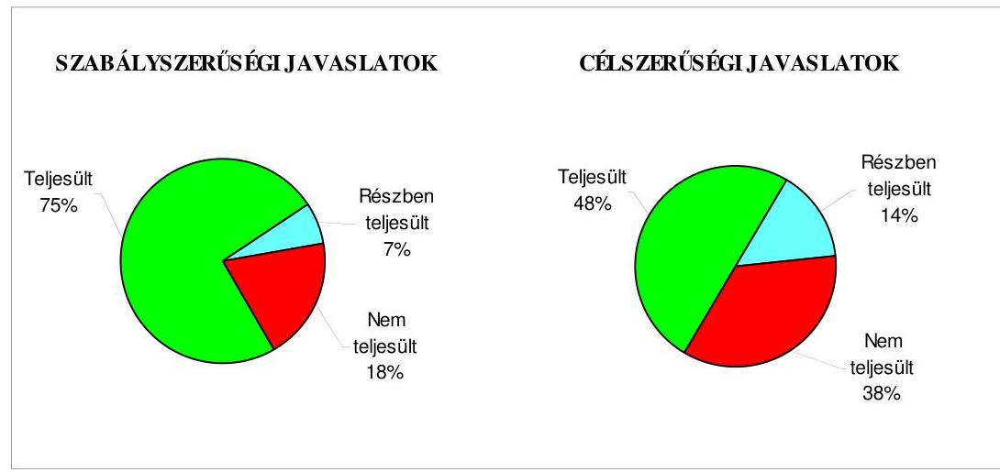

Budapest, 2008. december" 16 "

Melléklet: $\quad 7 \mathrm{db} \quad 9$ lap
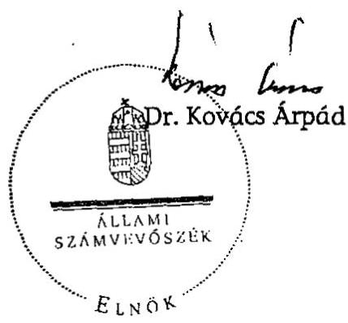

---

Székesfehérvár Megyei Jogú Város Önkormányzata

# Az Önkormányzat gazdálkodását meghatározó adatok, mutatószámok 

| Megnevezés |  |
| :--: | :--: |
| A település állandó lakosainak száma (fő) 2008. január 1-jén | 101955 |
| A Közgyűlés tagjainak a száma (fő) (2007. december 31-én) | 33 |
| A Közgyülés munkáját segítő állandó bizottságok száma (2007. december 31-én) | 13 |
| A Polgármesteri hivatalban foglalkoztatott köztisztviselők száma (fő) (2007. december 31-én) | 295 |
| Az összes vagyon értéke a 2007. december 31-i könyvviteli mérleg szerint (millió Ft) | 67854 |
| Az adósságállomány (hosszú és rövid lejáratú kötelezettség) 2007. december 31-én (millió Ft) | 13635 |
| Az egy lakosra jutó adósságállomány (Ft) (2007. december 31-én) | 133735 |
| Az összes költségvetési bevétel (millió Ft) (2007. évben) | 32018 |
| Ebből: saját bevétel (millió Ft), melyből | 17972 |
| helyi adóbevétel (millió Ft) | 10181 |
| Az egy lakosra jutó összes költségvetési bevétel (Ft) (2007. évben) | 314040 |
| Az egy lakosra jutó saját bevétel (Ft) (2007. évben) | 176273 |
| Az egy lakosra jutó helyi adóbevétel (Ft) (2007. évben) | 99858 |
| Saját bevétel/Összes költségvetési bevétel (\%) (2007. évben) | 56,1 |
| Helyi adó bevétel/Összes költségvetési bevétel (\%) (2007. évben) | 31,8 |
| Az összes teljesített költségvetési kiadás (millió Ft) (2007. évben) | 33553 |
| Ebből: felhalmozási célú kiadás (millió Ft) | 9541 |
| Az összes költségvetési kiadásból a felhalmozási kiadás részaránya (\%) (2007. évben) | 28,4 |
| Az egy lakosra jutó költségvetési kiadás (Ft) (2007. évben) | 329096 |
| Az egy lakosra jutó felhalmozási kiadás (Ft) (2007. évben) | 93580 |
| A költségvetési intézmények száma (db) (2007. december 31-én) | 79 |
| Ebből: részben önállóan gazdálkodó (db) | 35 |
| A költségvetési intézményekben foglalkoztatott közalkalmazottak száma (fő) (2007. december 31-én) | 3704 |

---

Székesfehérvár Megyei Jogú Város Önkormányzata

# Az önkormányzati vagyon alakulása

|  Mérlegsor
megnevezése | 2005.év
(millió Ft) | 2006. év
(millió Ft) | 2007. év
(millió Ft) | Változás \%-a |  |   |
| --- | --- | --- | --- | --- | --- | --- |
|   |  |  |  | 2006/2005. | 2007/2006. | 2007/2005.  |
|  Immateriális javak | 63 | 238 | 202 | 377,8 | 84,9 | 320,6  |
|  Tárgyi eszközök | 40372 | 42855 | 44569 | 106,2 | 104,0 | 110,4  |
|  ebből: ingatlanok | 37203 | 38779 | 40270 | 104,2 | 103,8 | 108,2  |
|  beruházások | 354 | 1008 | 1394 | 284,7 | 138,3 | 393,8  |
|  Befektetett pénzügyi eszközök | 4408 | 4165 | 4129 | 94,5 | 99,1 | 93,7  |
|  Üzemeltetésre átadott eszközök | 13209 | 15578 | 15429 | 117,9 | 99,0 | 116,8  |
|  Befektetett eszközök összesen | 58052 | 62836 | 64329 | 108,2 | 102,4 | 110,8  |
|  Forgóeszközök összesen | 3712 | 2510 | 3525 | 67,6 | 140,4 | 95,0  |
|  ebből: követelések | 1041 | 1129 | 1544 | 108,5 | 136,8 | 148,3  |
|  pénzeszközök | 1978 | 1153 | 1444 | 58,3 | 125,2 | 73,0  |
|  Eszközök összesen | 61764 | 65346 | 67854 | 105,8 | 103,8 | 109,9  |
|  Saját tőke összesen | 50069 | 51982 | 52337 | 103,8 | 100,7 | 104,5  |
|  Tartalék összesen | 1810 | 538 | 49 | 29,7 | 9,1 | 2,7  |
|  Kötelezettségek összesen | 9885 | 12826 | 15566 | 129,8 | 121,4 | 157,5  |
|  ebből: rövid lejáratú kötelezettségek | 2916 | 3707 | 2945 | 127,1 | 79,4 | 101,0  |
|  hosszú lejáratú kötelezettségek | 6165 | 8360 | 10689 | 135,6 | 127,9 | 173,4  |
|  Források összesen: | 61764 | 65346 | 67854 | 105,8 | 103,8 | 109,9  |

Forrás: Magyar Államkincstár éves költségvetési beszámoló "01" számú űrlap adatai.

---

Székesfehérvár Megyei Jogú Város Önkormányzata

Az Önkormányzat 2005-2007. évi költségvetési előirányzatainak és azok pénzügyi teljesítéseinek alakulása

|  |   |   |   |   |   |   |   |   |   |   |
| --- | --- | --- | --- | --- | --- | --- | --- | --- | --- | --- |
|  Megnevezés | 2005. év |  |  | 2006. év |  |  | 2007. év |  |  | 2008.  |
|   | Eredeti előirányzat | Módosított | Teljesítés | Eredeti előirányzat | Módosított | Teljesítés | Eredeti előirányzat | Módosított | Teljesítés | Terv  |
|  Müködési célú költségvetési kiadások összesen | 20048 | 23275 | 21469 | 20767 | 23818 | 22829 | 21677 | 25047 | 24012 | 26278  |
|  Felhalmozási célú költségvetési kiadások összesen | 8071 | 7965 | 7034 | 8733 | 8845 | 7244 | 11599 | 11854 | 9541 | 12389  |
|  Költségvetési kiadások összesen | 28119 | 31240 | 28503 | 29500 | 32663 | 30073 | 33276 | 36901 | 33553 | 38667  |
|  Müködési célú költségvetési bevételek összesen | 21079 | 23756 | 24199 | 21574 | 24746 | 25457 | 23245 | 26857 | 27240 | 25828  |
|  Felhalmozási célú költségvetési bevételek összesen | 5690 | 7550 | 6875 | 6581 | 7059 | 4878 | 7421 | 7931 | 4778 | 11139  |
|  Költségvetési bevételek összesen | 26769 | 31306 | 31074 | 28155 | 31805 | 30335 | 30666 | 34788 | 32018 | 36967  |
|  Költségvetési bevételek és kiadások egyenlege: hiány-, többlet+ | $-1350$ | 66 | 2571 | $-1345$ | $-858$ | 262 | $-2610$ | $-2113$ | $-1535$ | $-1700$  |
|  Finanszírozási célú pénzügyi kiadások | 0 | 1416 | 1416 | 0 | 487 | 487 | 0 | 5067 | 5067 | 0  |
|  Finanszírozási célú pénzügyi bevételek | 1350 | 1350 | 1302 | 1345 | 1345 | 1345 | 2610 | 7180 | 7180 | 0  |
|  Finanszírozási célú pénzügyi műveletek egyenlege | 1350 | $-66$ | $-114$ | 1345 | 858 | 858 | 2610 | 2113 | 2113 | 0  |

Forrás: - Magyar Államkincstár éves költségvetési beszámoló "80" számú űrlap adatai;

- a 2008. évi adatok esetében az Önkormányzat 2008. évi költségvetése;
- a költségvetési bevétel-kiadás müködési-felhalmozási célra történt megosztásánál az analitikus nyilvántartás.

---

## TANÚSÍTVÁNY

az európai uniós forrásokkal támogatott célok és programok tervezett és tényleges adatairól 2005-2008. évekre

|  Sorszám | Az európai uniós forrásokkal
támogatott fejlesztés megnevezése* |  |  |  |  |  |  |  | Tényadatok (millió Ft) |  |  |  |  |  |   |
| --- | --- | --- | --- | --- | --- | --- | --- | --- | --- | --- | --- | --- | --- | --- | --- |
|   |  |  |  |  |  | az összes kiadást finanszírozó források |  |  |  | a teljesített összes kiadást finanszírozó források |  |  |  |  |   |
|   |  |  |  |  |  | támogatás |  | európai
uniós
támogatás | hitel | egyéb
forrás |  |  |  |  |   |
|   |  |  |  |  |  |  |  |  |  |  |  |  |  |  |   |
|   |  |  |  |  |  |  |  |  |  |  |  |  |  |  |   |
|   |  |  |  |  |  |  |  |  |  |  |  |  |  |  |   |
|   |  |  |  |  |  |  |  |  |  |  |  |  |  |  |   |
|   | Fejlesztési megnevezése |  |  |  |  |  |  |  |  |  |  |  |  |  |   |
|   |  |  |  |  |  |  |  |  |  |  |  |  |  |  |   |
|   |  |  |  |  |  |  |  |  |  |  |  |  |  |  |   |
|   |  |  |  |  |  |  |  |  |  |  |  |  |  |  |   |
|   |  |  |  |  |  |  |  |  |  |  |  |  |  |  |   |
|   |  |  |  |  |  |  |  |  |  |  |  |  |  |  |   |
|   |  |  |  |  |  |  |  |  |  |  |  |  |  |  |   |
|   |  |  |  |  |  |  |  |  |  |  |  |  |  |  |   |
|   |  |  |  |  |  |  |  |  |  |  |  |  |  |  |   |
|   |  |  |  |  |  |  |  |  |  |  |  |  |  |  |   |
|   |  |  |  |  |  |  |  |  |  |  |  |  |  |  |   |
|   |  |  |  |  |  |  |  |  |  |  |  |  |  |  |   |
|   |  |  |  |  |  |  |  |  |  |  |  |  |  |  |   |
|   |  |  |  |  |  |  |  |  |  |  |  |  |  |  |   |
|   |  |  |  |  |  |  |  |  |  |  |  |  |  |  |   |
|   |  |  |  |  |  |  |  |  |  |  |  |  |  |  |   |
|   |  |  |  |  |  |  |  |  |  |  |  |  |  |  |   |
|   |  |  |  |  |  |  |  |  |  |  |  |  |  |  |   |
|   |  |  |  |  |  |  |  |  |  |  |  |  |  |  |   |
|   |  |  |  |  |  |  |  |  |  |  |  |  |  |  |   |
|   |  |  |  |  |  |  |  |  |  |  |  |  |  |  |   |
|   |  |  |  |  |  |  |  |  |  |  |  |  |  |  |   |
|   |  |  |  |  |  |  |  |  |  |  |  |  |  |  |   |
|   |  |  |  |  |  |  |  |  |  |  |  |  |  |  |   |
|   |  |  |  |  |  |  |  |  |  |  |  |  |  |  |   |
|   |  |  |  |  |  |  |  |  |  |  |  |  |  |  |   |
|   |  |  |  |  |  |  |  |  |  |  |  |  |  |  |   |
|   |  |  |  |  |  |  |  |  |  |  |  |  |  |  |   |
|   |  |  |  |  |  |  |  |  |  |  |  |  |  |  |   |
|   |  |  |  |  |  |  |  |  |  |  |  |  |  |  |   |
|   |  |  |  |  |  |  |  |  |  |  |  |  |  |  |   |
|   |  |  |  |  |  |  |  |  |  |  |  |  |  |  |   |
|   |

---

|  Sorszám | Az európai uniós forrásokkal támogatott fejlesztés megnevezése* | Tervezett költségvetési adatok (millió Ft) az összes kiadási finanszírozó források |  |  |  |  |  | Térnyadatok (millió Ft) a fejlesztett összes kiadási finanszírozó források |  |  |  |  |  |   |
| --- | --- | --- | --- | --- | --- | --- | --- | --- | --- | --- | --- | --- | --- | --- |
|   |  | összes költségvetési kiadás | saját forrás |  |  |  |  | teljesített összes kiadás | saját forrás |  |  |  |  |   |
|   |  |  |  |  |  | európai uniós támogatás | hitel | egyéb forrás |  |  |  |  |  |   |
|   |  |  |  |  |  |  |  |  |  |  |  |  | európai uniós támogatás | hitel  |
|  HEFOP 4.1.1. Térségi Integrált Szakloppá Központok Infrastruktúrai lejáraté | 783,0 | 19,0 | 146,0 | 29,0 | 589,0 | 0,0 | 0,0 | 728,0 | 47,0 | 136,0 | 0,0 | 545,0 | 0,0 | 0,0  |
|  Horvég Alap-Tanotó Szakloppá - Vérgető Kötőszobák 1. Üzete | 835,1 | 75,1 | 0,0 | 50,1 | 0,0 | 0,0 | 709,9 | 821,3 | 73,9 | 0,0 | 49,3 | 0,0 | 0,0 | 698,1  |
|  Folyamatban lévő fejlesztési feladatok összesen | 2 900,2 | 134,1 | 416,8 | 126,3 | 1 513,1 | 0,0 | 709,9 | 2 642,2 | 205,5 | 362,2 | 54,4 | 1 322,1 | 0,0 | 698,1  |
|  Finanszírozási források megoszlása** | 100% | 4,6% | 14,4% | 4,4% | 52,2% | 0,0% | 24,5% | 100% | 0,0% | 13,7% | 2,1% | 50,0% | 0,0% | 26,4%  |
|  Mind-összesen Finanszírozási források megoszlása** | 3 568,9 | 146,4 | 632,8 | 135,6 | 1 945,2 | 0,0 | 709,9 | 3 306,7 | 223,0 | 577,6 | 63,7 | 1 744,4 | 0,0 | 698,1  |
|  Jóimagyarázat: *A fejlesztési feladatokat meg kell osztani a a fejlesztés megvalósításának állapota szerint.* *A finanszírozási források megoszlására vonatkozó sorokat nem kell kitölteni, azok adatait a program számítja ki. |  |  |  |  |  |  |  |  |  |  |  |  |  |   |

Nyilatkozat: A tanúsítványban szereplő adatok valódiságát igazolom.

Klállítás időpontja: 2008. 16. 50.

a kiállító aláírása

---

# ADATLAP 

## az Önkormányzat európai uniós forrással támogatott egyik fejlesztéséröl

Az adatlap az Önkormányzat egyik európai uniós támogatásának adatait 2005. január 1-jétől a helyszíni ellenőrzés időszakáig tartalmazza.

1. A pályázó Önkormányzat (intézmény) neve: Székesfehérvár Megyei Jogú Város Önkormányzata
2. A pályázó Önkormányzat (intézmény) címe: 8000 Székesfehérvár, Városház tér 1 .
3. A stuktúrális alap pályázott operatív programjának megnevezése: GVOP 4.3.1.
4. A pályázott operatív programon belül a projekt megnevezése: „Székesfehérvár - a térség szolgáltató e-Önkormányzata"
5. A pályázatot készítő megnevezése: Megyei Jogú Város Polgármesteri Hivatal köztisztviselője
6. A pályázott európai uniós támogatás összege: 223,9 millió Ft (+ 74,5 millió Ft hazai támogatás)
7. A pályázott projekt

- teljes kiadás összege: 341,1 millió Ft
- a megvalósítás tervezett időtartama: 2005. március 25. - 2007. március 25., kettő év

8. A pályázat elbírálásának eredménye: eredményes
9. Az elutasított pályázatnál az elutasítás okai: -
10. A pályázat tartalék státuszba helyezett-e: igen- nem
11. A támogatási szerződés adatai:

- megkötés időpontja: 2005. április 27.
- a támogatás tárgya: „Székesfehérvár - a térség szolgáltató e-Önkormányzata" c. projekt megvalósítása

---

- időbeli ütemezése: 2005. évben 129,6 millió Ft, 2006. évben 90,8 millió Ft, 2007. évben 78,0 millió Ft.
- előírt támogatási határidők: -
- előírt fizetési kötelezettségek: utolsó PEJ benyújtási határideje 2007. június 9.

12-13. A kifizetési kérelem adatai:
ezer Ft-ban

| Kifizetési kérelem (PEJ) benyújtásának idöpontja |  | Számla   bruttó   összege | Kért   támogatási   összeg | Folyósitott összeg | Támogatás folyósitásának időpontja | Benyújtás folyósitás között eltelt időtartam napokban |
| :--: | :--: | :--: | :--: | :--: | :--: | :--: |
| 1. Előleg igénybevétel 2005.04.10. |  | - | - | $74620^{*}$ | 2005.09.30. | - |
| 2. $\quad$ 1.PEJ 2005.10 .28 . |  | 148211 | 129685 | 129681 | 2005.12.21. | 54 |
| 3. 2. PEJ 2006.02.08. |  | 10013 | 8762 | 8762 | 2006.08.25. | 198 |
| 4. 3.PEJ 2006.05.10. |  | 10816 | 9463 | - | - | - |
| 5. 4. PEJ 2006.08.20. |  | 67968 | 59470 | - | - | - |
| 6. 5. PEJ 2006.11.30. |  | 82897 | 72533 | - | - | - |
| 7. | - | - | - | 25720 | 2007.06.20. | 405 |
| 8. 6. PEJ 2007.07.30. |  | 21198 | 18548 | - | - | - |
| 9. | - | - | - | 59674 | 2007.10.20. | 81 |
| Összesen |  | 341103 | 298461 | 298457 | - | - |

* hazai támogatás

14. A külső ellenőrzésre vonatkozó adatok:

- az ellenőrzések száma: 3
- az ellenőrzést végző szervek megnevezése: IT Kht., MAG Zrt.

Az ellenőrzések megállapításai:

- a 2005. március hónapban végzett előzetes ellenőrzés eredményeként megállapították a pályázó jó felkészülését, együttmúködési készségét;
- a 2005. december hónapban lefolytatott közbenső ellenőrzés az elszámolásra benyújtott dokumentumok vizsgálatára, a beszerzett tárgyi eszközök azonosítására, a könyvviteli elszámolásokra és a benyújtott pályázattal kapcsola-

---

tos közbeszerzési eljárás lebonyolítására vonatkozott, mulasztás, hiányosság megállapítására nem került sor;

- a 2006. február hónapban végzett ellenőrzés hiányzó szakmai dokumentációk pótlására szólította fel az Önkormányzatot, amelynek eleget tettek.

15. Szabálytalanságokra vonatkozó adatok: a külső ellenőrzés szabálytalanságra, lényeges mulasztásra vonatkozó megállapítást nem tett.

- mely előírást nem tartotta be az Önkormányzat/intézmény: -
- az előírás nem teljesítésének okai: -
- a rendezésre előírt kötelezettségek: -
- a rendezésre előírt kötelezettséget mikor teljesítették: -
- milyen időbeli csúszást eredményezett ez a projekt megvalósításában: -

Kiállítás időpontja: Székesfehérvár, 2008. szeptember

Ebner Vilmosné
irodavezető, főtanácsadó
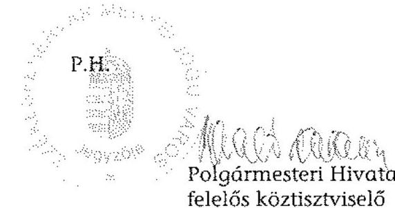

---

# Székesfehérvár Megyei Jogú Város   Polgármestere 

8000 Székesfehérvár, Városház tér 1-2. Telefon: (22) 537-100, fax: (22) 316-569 E-mail: polgarmester@pmhiv.szekesfehervar.hu

Ügyiratszám: 90441/3/2008.

Dr. Kovács Árpád
Állami Számvevőszék Elnöke

## 1052 BUDAPEST

Apáczai Csere János utca 10.

Tisztelt Elnök Úr!
A Székesfehérvár Megyei Jogú Város Önkormányzata gazdálkodási rendszerének 2008. évi ellenőrzéséről szóló számvevői jelentéssel kapcsolatban tájékoztatom Elnök Urat a jelentésben megfogalmazott, alábbi számvevői javaslatok vonatkozásában a már megtett intézkedéseinkről:

A Polgármesteri Hivatal Számviteli politika szabályzata kiegészítésre került azzal a rendelkezéssel, hogy a közérdekủ adatok közlésével összefüggésben a Polgármesteri Hivatal költségtérítést nem kér, igy az önköltség-számítási szabályzat nem képezi a számviteli politika részét.
A kötelezettségvállalás, az ellenjegyzés, az utalványozás és az érvényesités rendjét szabályozó polgármesteri és jegyzői utasításban előírásra került, hogy az Ámr. 135. § (1)(2) bekezdésében foglaltak figyelembe vételével valamennyi kiadás esetében el kell végezni a szakmai teljesités igazolását.
Az eszközök és források értékelési szabályzata az értékelések ellenőrzéséért felelős munkakörökkel és az adókövetelések esetében az egyszerüsített értékelési eljárás elveivel, valamint azok dokumentálásának szabályaival kiegészítésre került.
Kérem Elnök Urat, hogy a végleges jelentésben az intézkedés megtörténte kerüljön feltüntetésre, illetőleg az azokra vonatkozó javaslatok kerüljenek elhagyásra.

Segitő közremüködésüket, együttmüködésüket megköszönöm.
Székesfehérvár, 2008. december 2.
Tisztelettel:
/: Warvasovszky Tihamér :/ polgármester
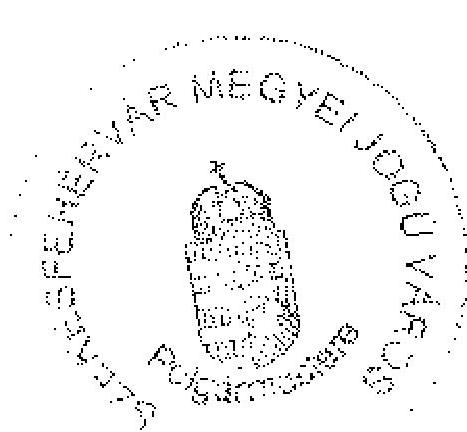

---

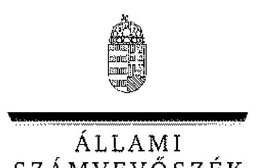

# 7. számú melléklet a V-3003-6/30/2008. számú jelentéshez 

## ELNÖK

ÁLLAMI
SZÁMVEVÓSZÉK

Ikt.szám: V-3003-6/30/24/2008.
Hiv.szám: $90441 / 3 / 2008$

## Warvasovszky Tihamér úr,   polgármester

Székesfehérvár Megyei Jogú Város Önkormányzata

## Székesfehérvár

Városház tér 1.
8000

## Tisztelt Polgármester Úr!

Köszönettel vettem Székesfehérvár Megyei Jogú Város Önkormányzata gazdálkodási rendszerének 2008. évi ellenőrzéséről készült számvevőszéki jelentéshez küldött tájékoztatását a megtett intézkedésekről. Örömmel értesültem arról, hogy a megállapításaink, javaslataink egy részét az ellenőrzést követően megvalósították. A számvevőszéki jelentésben az érintett megállapításhoz kapcsolt lábjegyzetben a tájékoztatásában foglaltakat feltüntettük és a vonatkozó javaslatokat elhagytuk.

Az ellenőrzés lefolytatásához nyújtott közreműködését köszönöm.

Budapest, 2008. december " $1 g$ ".

Tisztelettel:
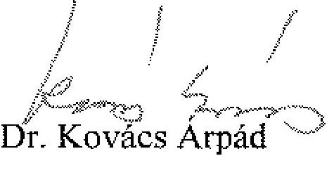