# ÁLLAMI   SZÁMVEVŐSZÉK 

## JELENTÉS

az INTERREG célú költségvetési előirányzatok hasznosulásának ellenőrzéséről

---

# 2. Államháztartás Központi Szintjét Ellenőrző Igazgatóság 

2.1. Teljesítmény Ellenőrzési Főcsoport

Iktatószám: V-2004-054/2008.
Témaszám: 901
Vizsgálat-azonosító szám: V-0401

## Az ellenőrzést felügyelte:

Bihary Zsigmond
föigazgató
Az ellenőrzés végrehajtásáért felelős:
Kemény Emil
föigazgató-helyettes
Az ellenőrzést vezette:
Dr. Zöldréti Attila
igazgatóhelyettes
Az ellenőrzést végezték:

| Bank Lajos | Fekete Gábor | Feketéné Hajkó Andrea |
| :-- | :-- | :-- |
| főtanácsadó | tanácsadó | számvevő |
| Szepes Béla | Terbe Mónika | Tóthné Kiss Katalin |
| számvevő | számvevő tanácsos | főtanácsadó |

## Tukacs Éva

számvevő tanácsos

## A témához kapcsolódó eddig készített számvevőszéki jelentések:

| címe | sorszáma |
| :-- | :--: |
| Jelentés az ISPA támogatásból megvalósított környezetvédelmi | 0469 |
| programok ellenőrzéséről |  |
| Jelentés az uniós támogatások hazai monitoring és ellenőrzési |  |
| rendszere múködésének ellenőrzéséről | 0723 |

---

# TARTALOMJEGYZÉK 

BEVEZETÉS ..... 9
I. ÖSSZEGZŐ MEGÁLLAPÍTÁSOK, KÖVETKEZTETÉSEK, JAVASLATOK ..... 14
II. RÉSZLETES MEGÁLLAPÍTÁSOK ..... 22

1. Az INTERREG III program cél- és feltételrendszerének kialakítása ..... 22
1.1. A programok célrendszerének kialakítása, a pénzügyi keretek és a naturális célok egyensúlya programonként ..... 22
1.2. Az INTERREG III program szabályozási és intézményi rendszerének kialakítása és időbelisége ..... 29
1.2.1. Az INTERREG III program szabályozási rendszere ..... 29
1.2.2. A programot végrehajtó intézményrendszer kapacitásának, működési költségeinek és finanszírozásának tervezettsége ..... 33
1.2.3. Az intézményrendszer múködését értékelő rendszer kialakítása és gyakorlati alkalmazása ..... 34
1.2.4. A program végrehajtásához biztosított hazai és uniós források tervezett ütem szerinti biztosítása ..... 35
1.2.5. A tájékoztatás, nyilvánosság és a partnerség elv érvényesítését biztosító eljárások kialakítása és gyakorlati alkalmazása ..... 36
2. A projektek kiválasztása és annak a célrendszer eredményes, hatékony teljesítéséhez való hozzájárulása ..... 38
2.1. A pályáztatás gyakorlata és a támogatásra kiválasztott projektek hozzájárulása a célrendszer eredményes teljesítéséhez ..... 38
2.2. A forrásfelhasználás tervezett hatékonyságát biztosító eljárások kialakítása és alkalmazott gyakorlata a támogatás odaítélési folyamatában ..... 44
2.3. A vállalt kötelezettségek teljesítésének nyomon követhetősége és a teljesítés elmaradása esetére szóló biztosítékok megléte a támogatási szerződésben ..... 47
3. A projektek előrehaladása és a támogatási folyamat pénzügyi lebonyolítása ..... 50
3.1. A támogatási folyamat pénzügyi lebonyolítása és időszükséglete tervezésének, továbbá gyakorlatának hozzájárulása a hatékony megvalósításhoz ..... 50
3.2. A projektek megvalósulási ütemének megfelelősége a támogatási szerződésben foglalt ütemezéshez képest ..... 52
3.3. A támogatási folyamat pénzügyi lebonyolításában a gazdaságossági, eredményességi és hatékonysági szempontok (3e, VFM elv) érvényesítése, valamint a jogosult költségek ellenőrzési rendszerének kialakítása, múködtetése ..... 54

---

3.4. A források hasznosulásának érdekében alkalmazott ellenőrzési, monitoring és értékelési rendszer

# MELLÉKLETEK 

1. sz. A nemzeti fejlesztési és gazdasági miniszter észrevétele
2.a. sz. A magyarországi részvételű INTERREG IIIA programok intézményrendszere
2.b. sz. Az INTERREG IIIB - CADSES program intézményrendszere
2.c. sz. Az INTERREG IIIB és IIIC programok pénzügyi lebonyolításának intézményrendszere
3.a. sz. Az INTERREG IIIA programok pénzügyi lebonyolítása magyarországi Program Irányító Hatóság esetén
3.b. sz. Az INTERREG IIIA programok pénzügyi lebonyolítása külföldi Program Irányító Hatóság esetén
3.c. sz. Az INTERREG IIIB és IIIC programok pénzügyi lebonyolítása, hazai társfinanszírozása
3.d. sz. Az INTERREG IIIB és IIIC pénzügyi elszámolásának folyamata
2. sz. Teljesítménymutatók és a hozzá tartozó kritériumok az INTERREG III végrehajtásának értékeléséhez
4.a. sz. INTERREG IIIA AT-HU program monitoring indikátorai
4.b. sz. INTERREG IIIA HU-RO-SCG program monitoring indikátorai
4.c. sz. INTERREG IIIA HU-SK-UA program monitoring indikátorai
4.d. sz. INTERREG IIIA SLO-HU-CRO program monitoring indikátorai
5.a. sz. Az INTERREG IIIA HU-SK-UA program támogatásra jogosult területei
5.b. sz. Az INTERREG IIIA HU-RO-SCG program támogatásra jogosult területei
5.c. sz. Az INTERREG IIIA SLO-HU-CRO program támogatásra jogosult területei
5.d. sz. Az INTERREG IIIA AT-HU program támogatásra jogosult területei
3. sz. A célok és a prioritások kapcsolata az INTERREG IIIA HU-RO-SCG program esetében
4. sz. Projektlista az INTERREG IIIA támogatott projektjeiről
5. sz. Példák az INTERREG IIIA helyszíni ellenőrzés képeiből
6. sz. INTERREG IIIB (CADSES) és IIIC program ellenőrzési tapasztalatai

## FÜGGELÉKEK

1. sz. Az INTERREG célú költségvetési előirányzatok hasznosulására irányuló véleményfelmérés értékelése
2. sz. Jelentés az EU strukturális alapok környezetvédelmi célú felhasználásának ellenőrzéséről

---

# RÖVIDÍTÉSEK JEGYZÉKE 

| AVOP | Agrár- és Vidékfejlesztési Operatív Program |
| :--: | :--: |
| ÁSZ | Állami Számvevőszék |
| CADSES | Central Adriatic Danubean South European Space (Középeurópai, adriai, dunai térség) |
| CARDS | Community Assistance for Reconstruction, Development and Stabilisation (Közösségi Újjáépítési, Fejlesztési és Stabilizációs Támogatás) |
| C EAST | INTERREG IIIC Keleti Zóna |
| ERFA | Európai Regionális Fejlesztési Alap |
| ESZA Kht. | Európai Szociális Alap Nemzeti Programirányító Iroda Társadalmi Szolgáltató Kht. |
| EU | Európai Unió |
| EX-ANTE értékelés | Előzetes értékelés |
| GDP | Gross Domestic Produkt (Bruttó Nemzeti Termék) |
| GKM | Gazdasági és Közlekedési Minisztérium |
| IH | Irányító Hatóság |
| IMIR | Integrált Monitoring Információs Rendszer |
| INTERREG | Interregionális Együttmúködés |
| INTERREG IIIA AT-HU | Ausztria-Magyarország INTERREG IIIA Közösségi kezdeményezés Program |
| INTERREG IIIA HU-RO-   SCG | Magyarország-Románia és Magyarország-Szerbia és Montenegró Határmenti Együttmúködési Program |
| INTERREG IIIA HU-SK-   UA | Magyarország-Szlovákia-Ukrajna Szomszédsági Program |
| INTERREG IIIA SLO-HU-   CRO | Szlovénia-Magyarország-Horvátország Szomszédsági Program |
| ISNARD | Monitoring információs rendszer SLO-HU-CRO program ban (az IMIR megfelelője) |
| KEHI | Kormányzati Ellenőrzési Hivatal |
| KKK | Közlekedésfejlesztési Koordinációs Központ (az UKIG jogutódja) |
| KPSZE | Központi Pénzügyi és Szerződéskötő Egység |
| KSZ | Közreműködő Szerv |
| KSZT | Közös Szakmai Titkárság |
| KTK | Közösségi Támogatás Keret (2004-2006-ig terjedő időszak) |
| KÜ | Kifizető Ügynökség |
| LT | Lebonyolító Testület |
| MAG Zrt. | Magyar Gazdaságfejlesztési Központi Támogatásközvetítő Zrt. |
| MÁK | Magyar Államkincstár |
| MB | Monitoring Bizottság |
| MEH | Miniszterelnöki Hivatal |
| MK Kht. | Magyar Közút Állami Közútkezelő, Fejlesztő, Műszaki és Információs Kht. |

---

| MKK | Múködési Kézikönyv |
| :--: | :--: |
| MTRFH | Magyar Terület- és Regionális Fejlesztési Hivatal (2005. 09. 01-től Országos Fejlesztési Hivatal, amely megszűnt 2006. 07-31-ével) |
| NA Zrt. | Nemzeti Autópálya Zrt. |
| NB | Nemzeti Bizottság |
| NFH | Nemzeti Fejlesztési Hivatal |
| NFT I. | Első Nemzeti Fejlesztési Terv |
| NFÜ | Nemzeti Fejlesztési Ügynökség |
| NIF Zrt. | Nemzeti Infrastruktúra Fejlesztési Zrt. (NA Zrt. jogutódja) |
| NVT | Nemzeti Vidékfejlesztési Terv |
| NUTS | Nomenclature of Territorial Unit for Statistics (meghatározott területi statisztikai egységek, amelyekbe az Európai Unió régióit besorolták) |
| OLAF | Európai Csalásellenes Iroda |
| OM | Oktatási Minisztérium |
| OTH | Országos Területfejlesztési Hivatal (2008. 08. 34-ig MTRH, 2006. 07. 31-ével megszűnt) |
| OTMR | Országos Támogatási Monitoring Rendszer |
| ÖTM | Önkormányzati és Területfejlesztési Minisztérium |
| PHARE | Közép- és Kelet-Európának nyújtott EU-támogatások programja. (A rövidítés pontos jelentése: Lengyelország és Magyarország Segítségnyújtás a Gazdasági Újjáépítéshez). Az 1990 évtől a programot kiterjesztették többi közép- és ke-let-európai országra |
| PHARE CBC | Cross-border co-operation (határon átnyúló együttmúködés) |
| PkD | Program-kiegészítő Dokumentum (2004-2006. időszakban) |
| PM | Pénzügyminisztérium |
| PM ERF | Pénzügyminisztérium Ellenőrzési Rendszer-fejlesztési Főosztály |
| PRD | Program Dokumentum |
| RFP | Regionális Fejlesztési Ügynökség |
| ROP | Regionális Operatív Program |
| SZMSZ | Szervezeti és Múködési Szabályzat |
| TA | Technical Assistance (technikai segítségnyújtás) |
| TRFC | Terület- és Régiófejlesztési Célelóirányzat |
| TSZ | Támogatási Szerződés |
| UKIG | Útgazdálkodási és Koordinációs Igazgatóság |
| ÚMFT | Új Magyarország Fejlesztési Terv |
| ÚMVP | Új Magyarország Vidékfejlesztési Program |
| VÁTI Kht. | VÁTI Magyar Regionális Fejlesztési és Urbanisztikai Kht. |
| VFM elv | Value for money (értéket a pénzért elv) |
| WGEA | Working Group of Enviromental Audit (Környezetvédelmi Ellenőrzési Munkacsoport) |

---

# ÉRTELMEZŐ SZÓTÁR 

| IMIR | INTERREG Monitoring és Informatikai Rendszer |
| :--: | :--: |
| folyamatos elbírálás | A pályázatok olyan eljárás szerinti elbírálása, amikor a bírálat és a döntéshozatal a beérkezés sorrendjében történik, amíg a rendelkezésre álló forrás ki nem merül. Folyamatos elbírálás esetén csak egy végső benyújtási határidő kerül meghatározásra, de a forrás kimerülése esetén a pályázatok benyújtásának lehetősége ezt megelőzően is lezárható. (A strukturális alapok és a Kohéziós Alap felhasználásának általános eljárási szabályairól szóló 14/2004. (VIII. 13.) TNM-GKM-FMM-FVM-PM együttes rendelet 2. § (1) bek. e) pontja.) |
| indikatív pénzügyi keret | Egy adott időszakra szóló pénzügyi előirányzat a prog-ram-dokumentumokban |
| intézkedés | Olyan eszköz, amelynek segítségével egy prioritást többéves keretben valósítanak meg, és amely lehetővé teszi műveletek finanszírozását. Intézkedés a Szerződés 87. cikke szerinti bármely támogatási rendszerelem, valamint minden olyan támogatás, amelyet a tagállamok által kijelölt szervek nyújtanak, továbbá a támogatási rendszerek vagy előbb említett típusú támogatások bármely csoportja, és ezeknek bármely kombinációja, amelyek célja megegyezik. (A strukturális alapokra vonatkozó általános rendelkezések megállapításáról szóló a Tanács 1999. június 21-i 1260/1999/EK rendelete 9. Cikk.) |
| irányító hatóság | A Nemzeti Fejlesztési Terv operatív programjai, az EQUAL Közösségi Kezdeményezés program és a Kohéziós Alap projektek támogatásainak fogadásához kapcsolódó pénzügyi lebonyolítási, számviteli és ellenőrzési rendszerek kialakításáról szóló 360/2004. (XII. 26.) Korm. rendelet 2. § (1) bek. 11. ponja, valamint az Európai Unió strukturális alapjaiból és Kohéziós Alapjából származó támogatások hazai felhasználásáért felelős intézményekről szóló 1/2004. (I. 5.) Korm. rendelet mellékletében meghatározott szervezet. |
| kedvezményezett | A projektet végrehajtó, a támogatási szerződést kedvezményezettként aláíró szervezet vagy magánszemély. (Az Európai Unió strukturális alapjaiból és Kohéziós Alapjából származó támogatások hazai felhasználásáért felelős intézményekről szóló 1/2004. (I. 5.) Korm. rendelet 2. § (1) bek. e) pontja.) |
| kifizető hatóság | A tagállam által kijelölt egy vagy több, országos, regionális vagy helyi hatóság vagy szerv, amelynek feladata a kifizetés iránti kérelmek készítése és benyújtása, valamint a Bizottságtól érkező kifizetések fogadása. (A strukturális alapokra vonatkozó általános rendelkezések megállapításáról szóló a Tanács 1999. június 21-i 1260/1999/EK Rendelete 9. Cikk o) pontja.) |

---

közreműködő szervezetek
monitoring
monitoring bizottság
monitoring rendszer
operatív program
prioritás
program

A strukturális alapok és a Kohéziós Alap kezelése során eljáró szervezet, a strukturális alapok esetén az irányító hatóság által átruházott hatáskörben.
(Az Európai Unió által nyújtott egyes pénzügyi támogatások felhasználásával megvalósuló, és egyes nemzetközi megállapodások alapján finanszírozott programok monitoring rendszerének kialakításáról és múködéséről szóló 102/2006. (IV. 28.) Korm. rendelet 2. § (1) bek. f) pontja.)
A források felhasználásának (pénzügyi monitoring), az eredményeknek és a teljesítményeknek (szakmai monitoring) mindenre kiterjedő - többek között szabályossági, hatékonysági és célszerűségi - vizsgálata rendszeres jelleggel projekt, illetve program szinten. (Az Európai Unió által nyújtott egyes pénzügyi támogatások felhasználásával megvalósuló, és egyes nemzetközi megállapodások alapján finanszírozott programok monitoring rendszerének kialakításáról és múködéséről szóló 102/2006. (IV. 28.) Korm. rendelet 2. § (1) bek. g) pontja.)

Monitoring tevékenységet végző, elsősorban a program megvalósításában részt vevő partnerek képviselőiből álló, önálló jogalanyisággal nem rendelkező testület. (Az Európai Unió által nyújtott egyes pénzügyi támogatások felhasználásával megvalósuló, és egyes nemzetközi megállapodások alapján finanszírozott programok monitoring rendszerének kialakításáról és múködéséről szóló 102/2006. (IV. 28.) Korm. rendelet 2. § (1) bek. h) pontja.)
A monitoring tevékenység folytatása céljából létrehozott intézmények, szervezetek és eszközök, valamint ezek múködtetése érdekében foganatosított intézkedések összessége. (Az Európai Unió által nyújtott egyes pénzügyi támogatások felhasználásával megvalósuló, és egyes nemzetközi megállapodások alapján finanszírozott programok monitoring rendszerének kialakításáról és múködéséről szóló 102/2006. (IV. 28.) Korm. rendelet 2. § (1) bek. j) pontja.)
Az Európai Bizottság által jóváhagyott és a Közösségi Támogatási Keret végrehajtására vonatkozó, több évre szóló intézkedésekhez kapcsolódó prioritások egységes rendszerét tartalmazó dokumentum. (Az Európai Unió strukturális alapjaiból és Kohéziós Alapjából származó támogatások hazai felhasználásáért felelős intézményekről szóló 1/2004. (I. 5.) Korm. rendelet 2. § (1) bek. n) pontja.)
A támogatás felhasználására kialakított stratégia részcélja a prioritás; ehhez rendelik hozzá a támogatásokból és egyéb pénzügyi eszközökből, valamint a tagállam megfelelő pénzügyi forrásaiból származó hozzájárulást. (A strukturális alapokra vonatkozó általános rendelkezések megállapításáról szóló a Tanács 1999. június 21-i 1260/1999/EK rendelete 9. Cikk h) pontja.)
Meghatározott célrendszer érdekében végrehajtandó fel-

---

Program kiegészítő dokumentum
programok végrehajtásáért felelős szervezeti egységek
strukturális alapok
végső kedvezményezett
adatok és azok végrehajtására kidolgozott keretfeltételek egysége. (Az Európai Unió által nyújtott egyes pénzügyi támogatások felhasználásával megvalósuló, és egyes nemzetközi megállapodások alapján finanszírozott programok monitoring rendszerének kialakításáról és múködéséről szóló 102/2006. (IV. 28.) Korm. rendelet 2. § (1) bek. s) pontja.)
A tagállam vagy az irányító hatóság által kidolgozott és szükség szerint a 34. cikk (3) bekezdésével összhangban felülvizsgált támogatási stratégia, amely prioritásokra majd intézkedésekre bontva tartalmazza a 18. cikk (3) bekezdésében meghatározott elemeket. (A strukturális alapokra vonatkozó általános rendelkezések megállapításáról szóló a Tanács 1999. június 21-i 1260/1999/EK rendelete 9. Cikk m) pontja.)
A végrehajtó szervezetek, az irányító hatóságok és a lebonyolító szervezet, valamint a közremúködő szervezetek. (Az Európai Unió által nyújtott egyes pénzügyi támogatások felhasználásával megvalósuló, és egyes nemzetközi megállapodások alapján finanszírozott programok monitoring rendszerének kialakításáról és múködéséről szóló 102/2006. (IV. 28.) Korm. rendelet 2. § (1) bek. t) pontja.)
A Tanács strukturális alapokra vonatkozó általános rendelkezések megállapításáról szóló 1999. június 21-ei 1260/1999/EK rendeletében meghatározott alapok.
(Az Európai Unió strukturális alapjaiból és Kohéziós Alapjából származó támogatások hazai felhasználásáért felelős intézményekről szóló 1/2004. (I. 5.) Korm. rendelet 2. § (1) bek. r) pontja.)
Olyan jogi személy, jogi személyiség nélküli gazdasági társaság, amely a projekt megvalósítója és hasznosítója. (Az Európai Uniós előcsatlakozási eszközök és az Átmeneti Támogatás felhasználásának pénzügyi tervezési, lebonyolítási, számviteli és ellenőrzési rendjéről 119/2004. (IV. 29.) Korm. rendelet 2. § 27.) pontja.)

---

.

---

# JELENTÉS 

## az INTERREG célú költségvetési előirányzatok hasznosulásának ellenőrzéséről

## BEVEZETÉS

Magyarország EU csatlakozását követően a PHARE CBC ${ }^{1}$ programokat az INTERREG ${ }^{2}$ III Közösségi Kezdeményezés programok (a továbbiakban: INTERREG III) váltották fel. A programok fő célja a határ menti régiók gazdasági és társadalmi kohéziójának erősítése a határ menti együttműködések támogatásával, az Európai Unión belüli és kívüli tagállamok között egyaránt. Ennek keretében cél a területfejlesztés, a humánerőforrás, a környezetvédelem és a közlekedés fejlesztése.

Az alapelvek ${ }^{3}$ szerint, a közösségi pályázatok elfogadásának feltétele a közös határokon átnyúló stratégia és fejlesztési program kialakítása. Figyelembe kell venni a strukturális alapok és a közösségi jogszabályok és politikák irányelveit (preferenciát kell biztosítani azon tevékenységeknek, amelyek segítik a munkahelyteremtést, növelik az érintett területek versenyképességét stb.). A programnak ki kell egészítenie a strukturális alapok célkitűzései által támogatott intézkedéseket, a tevékenységeknek illeszkedniük kell a strukturális alapok alkalmazási területéhez és meg kell felelniük a költségek elszámolhatóságára vonatkozó szabályoknak.

Az INTERREG III programoknak három alkotóeleme van: a határ menti együttműködés (INTERREG IIIA), a transznacionális együttműködés (INTERREG IIIB) és az interregionális együttműködés (INTERREG IIIC).

Az INTERREG III programokat a Közösség és a tagállamok közösen finanszírozzák a 1260/1999/EK tanácsi rendelet előírásai alapján. Az Európai Bizottság az INTERREG III finanszírozásához pénzügyi keretet határozott meg az Európai Unióhoz 2004-től csatlakozó tagállamok számára. Ennek keretében Magyarországnak az Európai Regionális Fejlesztési Alap (a továbbiakban: ERFA) forrásaiból $68,7 \mathrm{M}$ euró ( $17,2 \mathrm{Mrd} \mathrm{Ft}^{4}$ ) összegű támogatást kapott, amelyet hazánk

[^0]
[^0]:    ${ }^{1}$ PHARE Cross-border Co-operation - PHARE Határon átnyúló Együttmúködés.
    ${ }^{2}$ Az elnevezés a régiók közötti együttműködés (INTERREGIONAL) rövidítéséből született.
    ${ }^{3}$ Az Európai Bizottság 204/C 226/02 számú közleménye a tagállamoknak, az európai terület harmonikus és kiegyensúlyozott fejlődésének ösztönzésére szánt transz-európai közösségi kezdeményezési programjának meghatározásáról, INTERREG III.
    ${ }^{4}$ Az értékadatok $250 \mathrm{Ft} /$ Európaárfolyamon szerepelnek az ellenőrzési program egészében.

---

18,1 M euró (4,5 Mrd Ft) társfinanszírozással egészítette ki. Magyarország öszszesen mintegy 86,8 M eurós ( 21,7 Mrd Ft-os) indikatív pénzügyi kerettel kapcsolódott be az ún. szomszédsági programokba 2004-2006 között.

A tagállamoknak az Európai Bizottság által a rájuk vonatkozóan megállapított keretösszeget - a vonatkozó Bizottsági közleményben meghatározottak szerint ${ }^{5}$ - fel kellett osztaniuk az INTERREG III elemeire (INTERREG IIIA, IIIB és IIIC), amely elemenkénti keretösszegek a közös programok fedezetét képezték.

Az INTERREG III. magyar oldali indikatív pénzügyi keretének felosztását az 1. sz. ábra szemlélteti.
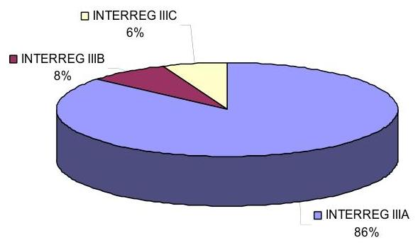

1. sz. ábra

Hazánk az INTERREG IIIA keretében négy programban vesz részt: az „Ausztria-Magyarország INTERREG IIIA Közösségi Kezdeményezés Program"-ban (ATHU), a „Szlovénia-Magyarország-Horvátország Szomszédsági Program"-ban (SLO-HU-CRO), a „Magyarország-Szlovákia-Ukrajna Szomszédsági Program"ban (HU-SK-UA), valamint a „Magyarország-Románia és MagyarországSzerbia és Montenegro Határmenti Együttmúködési Program"-ban (HU-ROSCG).

Az egyes programokban részt vevő országok együttmúködési megállapodásokat kötöttek a programokra ${ }^{6}$. A megállapodások tartalmazták az egyes országok felelősségeit, jogait és kötelezettségeit, valamint a program teljes pénzügyi keretét és a tagországokra lebontott indikatív pénzügyi keretet.

Elviekben a közös együttmúködés alapján benyújtott pályázatokat versenyeztetni kellett, úgy hogy a tagországok valamennyi megvalósuló projekt előnyét élvezhessék, függetlenül attól, hogy a határ mely oldalán valósulnak meg. Ezek alapján az egyes tagállamok területén megvalósuló projektek összértéke lehet több és/vagy kevesebb saját indikatív pénzügyi keretüknél. A gyakorlatban az

[^0]
[^0]:    ${ }^{5}$ Az Európai Bizottság 204/C 226/02 számú közleményének 48. pontjában meghatározott szempontok szerint.
    ${ }^{6}$ Az osztrák program esetében fizikailag aláírt együttmúködési megállapodással nem rendelkezik az IH/NH.

---

egyes tagországok területén megvalósuló projektek összértéke megegyezett az általuk a közös projektekre (ERFA-ból és hazai forrásból) meghatározott indikatív pénzügyi keretösszeggel. Az INTERREG IIIA - négy programjának - magyar pénzügyi kerete 74,8 M euró ( $18,7 \mathrm{Mrd} \mathrm{Ft}$ ) volt.

Az Irányító és a Kifizető Hatóságok, valamint a Közös Titkárság az INTERREG IIIA program keretében az Ausztria-Magyarország, és a Magyar-Szlovén-Horvát együttműködés esetében külföldön, a Magyar-Szlovák-Ukrán, a Magyar-Román-Szerb és a Magyar-Szerb-Montenegro együttmúködés esetében Magyarországon vannak. Azokban az esetekben, ahol az Irányító és a Kifizető Hatóságok külföldön vannak, Magyarországon múködik egy Nemzeti Hatóság és egy Al-kifizető hatóság, amely felelős a magyar projektek lebonyolításáért és a magyarországi kifizetésekért. (Az INTERREG IIIA programok intézményrendszerét a 2.a., a pénzügyi lebonyolítás rendszerét a 3.a. és a 3.b. sz. mellékletek szemléltetik.)

Az INTERREG IIIB a szomszédos országok közötti együttmúködésnél magasabb szintű területi integráció elősegítésére irányul. Európát 13 makro régióra osztották ${ }^{7}$, amelyek egyike a 18 országot magába foglaló CADSES ${ }^{8}$ régió, azaz a Közép-európai, adriai, dunai térség, amelynek Magyarország is tagja ${ }^{9}$.

Magyarország az INTERREG IIIB-re az Európai Bizottság által jóváhagyott ERFA keretből 6,2 M eurót ( $1,2 \mathrm{Mrd}$ Ft-ot) különített el. A finanszírozást a Rómában működő Kifizető Hatóság közvetlenül a vezető partnereknek teljesíti. (Az INTERREG IIIB-CADSES program intézményrendszerét a 2.b. sz., a pénzügyi lebonyolítás rendszerét és az elszámolás folyamatát a 3.c. és a 3.d. sz. mellékletek szemléltetik.)

Az INTERREG IIIC lehetőséget nyújt az egymástól távol eső régiók együttmúködésére, illetve kiemelten támogatja a tagjelöltek és csatlakozni még nem szándékozó európai országok (Norvégia, Svájc) bevonását. Az Európai Unió területét 4 programzónára osztották fel (Észak, Kelet, Dél, Nyugat). Magyarország a keleti programövezethez tartozik, de partnerként részt vehet az északi, déli, nyugati övezetekben futó projektekben is.

Magyarország az INTERREG IIIC-re az Európai Bizottság által jóváhagyott ERFA keretből 4,1 M euró-t (1,0 Mrd Ft-ot) különített el. (Az INTERREG IIIC-Keleti Zóna intézményrendszerét az 2.b. sz., a pénzügyi lebonyolítás rendszerét és az elszámolás folyamatát a 3.c. sz és a 3.d. sz. mellékletek szemléltetik.)

[^0]
[^0]:    ${ }^{7}$ Plusz a Karibi térség és a Reunion térség
    ${ }^{8}$ Central Adriatic Danubean South European Space
    ${ }^{9}$ A transznacionális projektek hagyományosan a programtér 5-7 országa 10-15 partnerének részvételével valósulnak meg. A projektek leginkább kutatási, tervezési, szakmai együttműködési jellegűek, beruházási vagy jelentősebb beszerzési elemet nem tartalmaznak.

---

Az Állami Számvevőszék korábban vizsgálta a Phare CBC program hasznosulását ${ }^{10}$ és az INTERREG III program végrehajtásának egyes részterületeit ${ }^{11}$, de az INTERREG III program egészének hasznosulását még nem értékelte.

A jelenlegi ellenőrzés célja annak értékelése volt, hogy az INTERREG célú költségvetési előirányzatok felhasználása eredményesen és hatékonyan szol-gálta-e a célrendszer teljesítését és a rendelkezésre álló források hasznosulását. Ennek során értékeltük, hogy:

- a feltételrendszer kialakítása lehetővé tette-e a célrendszer teljesítését, a pénzügyi és naturális célok összhangját, a jogi-szabályozási és intézményi környezetet, a tájékoztatás, nyilvánosság és partnerség elvének érvényesítését;
- a projektek kiválasztása hozzájárult-e a célrendszer eredményes és hatékony teljesítéséhez, ennek keretében a kiválasztási folyamat alkalmazott gyakorlatát és a kötelezettségvállalás rögzítettségét;
- a projektek előrehaladása és a támogatási folyamat pénzügyi lebonyolítása segítette-e a támogatási célok hatékony teljesítését, valamint a program hasznosulását a kedvezményezettek körében végzett önkéntes elégedettségi felmérés tükrében.

Az INTERREG III célú költségvetési előirányzatok hasznosulásának ellenőrzését a teljesítmény-ellenőrzés módszerével hajtottuk végre, így vizsgálatunk nem a szabályszerűségre fókuszált. Az ellenőrzöttek bevonásával - jelen vizsgálatunk tárgyára értelmezve - meghatároztuk a gazdaságosság, hatékonyság és eredményesség értékelési szempontjait, valamint a teljesítmény kritériumokat.

Az ellenőrzés során összevetettük és elemeztük az INTERREG III programok különböző szintű tervekben foglalt célkitűzéseit a ténylegesen realizált eredményekkel, ennek keretében értékeltük az input, output, eredmény és hatás indikátorok tervezett és tényállapotának alakulását. A rendszeralapú és a közvetlen megközelítési módok kombinációjával alakítottuk ki az ellenőrzési megközelítési módot. Ennek keretében meghatároztuk az ellenőrzési szempontok azon körét, amelyek megválaszolásában felhasználtuk az elsődleges adatforrások értékelését is. Az ellenőrzési szempontok szerint értékeltük az INTERREG támogatási rendszer működését az elért eredmények alakulásában. A teljesítés minősítését a 4. sz. mellékletben felsorolt értékelési kritériumok és adatforrások alapján végeztük.

Az ellenőrzési időszak az INTERREG III támogatások igénylésének periódusára (2004-2006), valamint a pénzügyi lebonyolítás - helyszíni ellenőrzésünk befejezéséig (2008. június 27 -ig) tartó - időszakát ölelte fel, és kiterjedt az intézményrendszer hazai szervezeteire.

[^0]
[^0]:    ${ }^{10}$ Az ÁSZ 9931 sz. jelentése a határmenti együttmúködést támogató Phare CBC (cross border co-operation) programok ellenőrzéséről.
    ${ }^{11}$ Az ÁSZ 0723 sz. jelentése az uniós támogatások hazai monitoring és ellenőrzési rendszere múködésének ellenőrzéséről.

---

Az ellenőrzés mellett önkéntes alapú vélemény-felmérést végeztünk, amelynek célja az volt, hogy megismerjük és értékeljük a kedvezményezettek véleményét és elégedettségét az ellenőrzött terület múködéséről. A véleményfelmérés eredményeit az 1. sz. függelékben foglaltuk össze.

Jelen ellenőrzés eredményeit hasznosítottuk az EU Strukturális Alapok Munkacsoport, valamint az EUROSAI WGEA Környezetvédelmi Ellenőrzési Munkacsoport határon átnyúló, környezetvédelemre felhasznált strukturális források hasznosulására irányuló koordinált nemzetközi ellenőrzésekhez is. Az eredményeket a 2. sz. függelékben foglaltuk össze.

Az ellenőrzés jogalapját az Állami Számvevőszékről szóló 1989. évi XXXVIII. törvény 2. § (5)-(6)-(9) és az államháztartásról szóló 1992. évi XXXVIII. törvény 120/A. § (1) bekezdései képezték.

A jelentést egyeztetésre megküldtük a nemzeti fejlesztési és gazdasági miniszter úrnak. Válaszlevele másolatát az 1. sz. melléklet tartalmazza.

---

# I. ÖSSZEGZŐ MEGÁLLAPÍTÁSOK, KÖVETKEZTETÉSEK, JAVASLATOK 

Az egységes Európa célkitűzései közé tartozik a határokon átívelő regionális együttműködés átfogó fejlesztése. A különböző szintű (határ menti, transznacionális és interregionális) együttműködések általános célja az emberek közötti kapcsolat kiépítése és erősítése, hozzájárulva ezzel az uniós kohéziós politika realizálásához.

Az INTERREG III 2004-2006-ra meghirdetett - Magyarországot is érintő - programjai segítették a különböző szintű regionális együttműködés fejlődését. A források legkedvezőbb felhasználását ugyanakkor több tényező korlátozta. Ezek sorában ki kell emelni a határon átnyúló kezdeményezések viszonylagos újszerűségét, a nemzetközi együttműködést támogató politikai akarat tényleges megnyilvánulásának időigényét, valamint a partnerség elvét érvényesítő nemzetközi együttműködés bonyolult intézményi és eljárásrendi rendszerét. Hazai viszonylatban kedvezőtlenül befolyásolta a források hatékony felhasználását az intézményrendszer támogatásra vetített magas múködési költsége.

Az INTERREG IIIA négy programja hozzájárult a határon átnyúló gazdasági és szociális együttműködés, továbbá a környezetvédelmi ügyek, és a közlekedés fejlesztéséhez ${ }^{12}$. Az INTERREG IIIA keretében 388 projekt valósul meg, mintegy 17, 4 milliárd Ft támogatási kerettel. A programok végrehajtásában a késedelmet követő gyorsítás eredményeként 15217 M Ft kifizetést teljesítettek, ami a teljes keret $87,33 \%$-át jelenti. A programokhoz rendelt keretekre átlagosan $9,41 \%$-kal nagyobb összegben vállaltak kötelezettséget, miközben a programok pénzügyi végrehajtása eltérő eredményt mutatott. Az AT-HU program esetében a rendelkezésre álló keret $10,35 \%$-át várhatóan nem sikerül felhasználni. A HU-RO-SCG program esetében pedig a $10,72 \%$-os többlet kötelezettségvállalás mellett a várható kifizetések végül $4,33 \%$-al haladják meg az eredeti támogatási keretet. A keretkihasználás hiánya és a többlet kötelezettségvállalás a költségvetés szempontjából többletterhet jelent, amelyet az egyes programok maradványainak egyenlegével nem lehet elfedni. A programok pénzügyi végrehajtásának eredményeit szemlélteti a 1. sz. táblázat.

| INTERREG   IIIA | Összes keret (TA nélkül) ${ }^{a}$ |  | Kötele-   zeltség   vállalás | Kifizetett | Várható kifizetés | Maradvány |  |  |  |
| :--: | :--: | :--: | :--: | :--: | :--: | :--: | :--: | :--: | :--: |
|  |  |  |  |  |  | Kötelezettség vállaláshoz |  | Összes kerethez képest |  |
|  | M euró | M Ft | M Ft | M Ft | M Ft | M Ft | \% | M Ft | \% |
| HU-SK-UA | 16,9 | 4225 | 4728 | 3688 | 496 | 544 | $11,50 \%$ | 41 | $0,97 \%$ |
| HU-RO-SCG | 28,2 | 7050 | 7806 | 6360 | 995 | 451 | $5,78 \%$ | $-305$ | $-4,33 \%$ |
| SLO-HU-CRO | 13,1 | 3275 | 3633 | 2804 | 466 | 363 | $10,00 \%$ | 5 | $0,15 \%$ |
| AT-HU | 11,5 | 2875 | 2898 | 2364 | 213 | 321 | $11,06 \%$ | 298 | $10,35 \%$ |
| Összesen: | 69,7 | 17425 | 19065 | 15217 | 2170 | 1679 | 8,80\% |  |  |

[^0][^1]
[^0]:    Adatforrás: Váti Kht. adatszolgáltatás 2008.06.30-i állapot

[^1]:    ${ }^{12}$ A hasznosulást a 3. sz. táblázat szemlélteti átfogóan.

---

Az INTERREG IIIB keretében rendelkezésre álló ERFA támogatási források 70,16\%-át ( 727 M Ft), az INTERREG IIIC esetében pedig a keret 81,5\%-át (2134,5M FT) fizették ki.

Az INTERREG III program hazai feltételrendszerének megteremtése párhuzamosan folyt a program végrehajtásával. A hazai feltételrendszer kialakítását nem segítette, hogy az uniós szabályozás is módosult 2004-ben ${ }^{13}$.

A programok végrehajtását szabályozó hazai kormányrendelet ${ }^{14}$ a strukturális alapok elvi indulása után egy évvel jelent meg. Hasonló késedelem volt a hazai intézményi feltételek kialakításában is. A Közreműködő Szervezet (továbbiakban: KSZ) kijelölése és az Irányító Hatósággal (továbbiakban: IH) megkötött együttműködési megállapodás is egy, illetve másfél évet vett igénybe, miközben - a megállapodás hiánya ellenére - megindult a programok pályáztatása.

Az INTERREG IIIA négy programjának kialakításában a nemzetközi együttmúködés eredményesen, de időigényesen működött. Az elfogadott programcélok általános jellegű megfogalmazása könnyítette a célszerű felhasználási feltétel teljesítését, ugyanakkor átfogó jellegük miatt nem koncentráltak a határmenti térségek főbb problémaira.

A programok célrendszeréhez tartozó, a várt eredményeket és hatásokat megfogalmazó monitoring mutatók és a célok elérésére rendelkezésre bocsátott források egyensúlyának elemzését - és ezzel együtt a forrásfelhasználás eredményességének vizsgálatát - megnehezítette, hogy a célértékek meghatározása mellett nem adták meg az egyes célértékekhez tartozó induló értékeket, illetve nem alakították ki az eredmény és hatásmutatók hierarchikus rendszerét. Ezek hiányában nem volt értékelhető, hogy a forrásfelhasználás milyen induló értékhez képest határozta meg a célok elérését, illetve a források felhasználása milyen hozzáadott értéket hozott létre. Ugyanebből az okból a támogatási források allokálásának tervcélokhoz viszonyított hatékonyságelemzése is korlátozott volt.

A támogatási források célba juttatása intézményi költségének elemzésében ${ }^{15}$ előrelépést jelentett az, hogy a KSZ intézményi szintű költséghatékonysági vizsgálatot végeztetett 2008-ban. Eszerint az INTERREG III programok végrehajtásának múködési költsége a KSZ-nél az összes szerződött összeg arányában 2006-ban 18\%, 2007-ben 29\% volt. A támogatási források célba juttatásának

[^0]
[^0]:    ${ }^{13}$ A Bizottság a (2001/C 141/02) közleményét 2001. augusztus 23-án módosította, majd 2004. szeptember 2-án összevont útmutatót adott ki a (2004/C 226/02) közleményében.
    ${ }^{14}$ Az INTERREG III Közösségi Kezdeményezés programok végrehajtásának részletes szabályiról szóló 359/2004. (XII. 26.) Korm. rendelet.
    ${ }^{15}$ Az ÁSZ 0636 sz. jelentésében (2006 szeptemberében) a Nemzeti Fejlesztési Terv végrehajtásának ellenőrzéséről és a 0723 sz. jelentésében (2007 júliusában) az uniós támogatások hazai monitoring és ellenőrzési rendszere múködésének ellenőrzéséről javaslatokat tett az uniós támogatásközvetítő intézményrendszer múködési költségeit meghatározó nyilvántartási rendszer kialakítására, valamint a tényleges múködési költségek meghatározására és a költséghatékonyság vizsgálatára.

---

összes költsége ennél az aránynál magasabb ${ }^{16}$, mivel a KSZ a teljes hazai intézményrendszernek csak egy eleme.

Az 2004-2006. évekre vonatkozóan az IH nem alakította ki az intézményrendszert átfogó értékelő rendszert, az intézmények működését rendszeresen nem értékelte és költséghatékonysági vizsgálat sem készült. Az IH 2007-ben vezette be a teljesítményarányos finanszírozást, amely a feladatok számszerúsítését és a költségek tervezését irányozta elő. Az intézkedés költségmegtakarítást nem eredményezett figyelembe véve a 2007. évre kimutatott költségeket. AZ IH és a KSZ között évente kötött finanszírozási szerződés rendelkezik a finanszírozás forrásairól. A KSZ a 2005-2008-as évekre kapacitástervvel, a 2006-2008-as évekre költségvetési keretszámokkal rendelkezett.

Az intézményrendszer feladatait a tájékoztatás, nyilvánosság és partnerség elveinek érvényesítésére törekedve látta el, amelyet igazol a beadott pályázatok magas száma. A belső szabályozását követő jelleggel alakították ki, amely különösen a panaszügyek kezelésében jelentett időbeli késedelmet ${ }^{17}$.

A transznacionális együttmúködés (INTERREG IIIB) és az interregionális együttmúködés (INTERREG IIIC) teljes, illetve hazai feltételrendszerének kialakítása a IIIA programéhoz hasonlóan alakult, azzal a különbséggel, hogy a nemzetközi szervezetek felállítása még több időt vett igénybe. Az INTERREG IIIB esetében az irányítási és ellenőrzési rendszerek megfelelőségének megteremtésére a Bizottság felszólította az érintetteket és 2005 decemberében értesítette az INTERREG IIIB római IH-ját a kifizetések felfüggesztéséről. Az elhúzódó fejlesztéseket és ellenőrzéseket követően 2008. június végével indulhattak újra a kifizetések. A hazai belső szabályozási késedelmet mutatja, hogy a KSZ az INTERREG IIIB-re és IIIC-re vonatkozó eljárásrendet 2005. augusztus 30 -án léptette hatályba ${ }^{18}$.

A projekt-kiválasztási folyamatban alkalmazott értékelési kritériumok az INTERREG IIIA esetében (határon átnyúló együttmúködés, határon átnyúló hatás, prioritási kritériumok) közvetítették az EU támogatások alapvető céljait, az együttmúködés fejlesztését, a határ menti térségek kohéziójának és az ott élők életminőségének fejlesztését.

Az INTERREG IIIA befogadott és elutasított pályázatainak arányai programonként eltérően alakultak, ugyanakkor összességében a meghirdetett programok végrehajtása intenzív pályázói aktivitás mellett folyt. A meghirdetett progra-

[^0]
[^0]:    ${ }^{16}$ A költséghatékonyság alacsony szintje csak részben magyarázható a támogatási szerződési összegek értékével, ugyanakkor a megalapozott megállapítások kialakítása a teljes rendszer vizsgálatát igényli.
    ${ }^{17}$ Az IH a 6/2007. (IV. 5.) NFÜ Elnöki Utasítással, illetőleg az azt módosító 31/2007. (XI. 16.) Elnöki Utasítással szabályozta a panaszügyek kezelését, előtte ilyen szabályozás nem volt.
    ${ }^{18}$ A Kézikönyvet 2006. június 26-án és 2007. augusztus 30-án módosították, illetve a vizsgálat ideje alatt is módosítás alatt állt.

---

mokra átlagosan a rendelkezésre álló források közel négyszeresére érkezett be pályázói igény.

A közös, tükör és egyedi projektek arányának alakulása programonként eltérő volt. A határon átnyúló együttműködést legjobban szimbolizáló közös programok aránya az AT-HU program esetében volt a legalacsonyabb, ahol az ilyen típusú projektek aránya a programban támogatott összes projekt 3,23\%-át tették ki. Az együttműködés típusa szerinti megoszlást a 2. sz táblázat szemlélteti.
2. sz. táblázat

|  | ME | HU-SKUA |  | HU-RO-SCO |  | SLO-HU-CRO |  | AT-HU |  | Özzzezen |  |
| :--: | :--: | :--: | :--: | :--: | :--: | :--: | :--: | :--: | :--: | :--: | :--: |
| Egyedi | db | 23 | 28,05\% | 45 | 35,43\% | 59 | 68,60\% | 83 | 89,25\% | 210 | 54,12\% |
| Tük ör | db | 12 | 14,63\% | 65 | 51,97\% | 6 | 5,98\% | 7 | 7,52\% | 81 | 23,45\% |
| Közöz | db | 42 | 51,22\% | 15 | 12,60\% | 21 | 24,42\% | 3 | 3,23\% | 82 | 21,13\% |
| Klegészitő | db | 5 | 5,10\% |  |  |  |  |  |  | 5 | 1,29\% |
| Özzzezen | db | 82 | 100\% | 127 | 100\% | 85 | 100\% | 93 | 100\% | 388 | 100\% |

A közös projektek 21\%-os átlagos aránya mutatja, hogy a határon átnyúló együttműködés szándékának gyakorlati megvalósítása még további erőfeszítéseket igényel ${ }^{19}$.

A pályázatok értékelésének szempontja volt a hatékony, eredményes végrehajtás, de az értékelésben erre járó pontok aránya a gazdaságos megvalósítási szempont alacsony fontosságára utalt ${ }^{20}$. A költséghatékonysági elemzésekre csak korlátozottan volt lehetőség, mivel a szakmailag széles skálájú projektek értékeléséhez nem alkalmaztak fajlagos mutatókat, normatívákat. A forrásallokációban a program szinten tervezett eredmények és az egyes projektek eredményhatásának és forrásszükségletének harmonizációját nem vizsgálták.

A támogatás-odaítélés folyamata, a pályázat-benyújtástól a szerződéskötésig eltelt idő, átlagosan meghaladta az 1 évet. A feltételrendszer kialakításában bekövetkezett csúszás, a pályáztatási és szerződéskötési folyamatok elhúzódása is hozzájárult a program végrehajtásának csúszásához.

Megfelelő biztosítékokat nyújtottak elvi szinten a vállalt kötelezettségek nyomon követhetőségére a támogatási szerződésekben foglalt feltételek és kötelezettségek a projekt teljes életciklusára kiterjedően. A gyakorlat azonban azt

[^0]
[^0]:    ${ }^{19}$ Az önkéntes véleményfelmérés eredményei is rámutattak arra, hogy a hasznosulást leginkább az interregionális politikai együttmüködés hiánya akadályozza, megelőzve a bürokratikus és gazdasági tényezőket.
    ${ }^{20}$ Például az AU-HU program esetében a tervezett költségek és várható eredmények közötti arány, valamint a tervezett költségek szükségességének értékelése, csak az elérhető pontoknak $10 \%$-át jelentették.

---

mutatta, hogy a szerződéses feltételek teljesítésének nyomon követésére kialakított jelentési rendszer hiányos ${ }^{21}$.

Hasonló volt a helyzet az INTERREG IIIB és IIIC projektek esetében, ahol a projektek eredményeinek konkrét hasznosulásáról nagyon kevés információ állt rendelkezésre és a társfinanszírozási alapra vonatkozó záró jelentés sem tartalmazott olyan pontot, melyben a kedvezményezett számot adna a projekt eredményeinek kézzelfogható, konkrét hasznosulásáról.

A projektek előrehaladását követő jelentési és nyilvántartási rendszer múködését kedvezőtlenül befolyásolta, hogy a projektek céljainak teljesülését figyelemmel kísérő indikátorrendszer csak korlátozottan volt képes feladatát teljesíteni. A monitoringot támogató információs rendszerben, az IMIR törzsállományában jelenleg csak az output mutatók állnak rendelkezésre, az eredmény és a hatásmutatók nem.

A támogatási szerződésekben foglalt megvalósítási ütemek a források teljes felhasználását célozták. 2006-ban és 2007-ben az IH és a KSZ figyelemmel kísérte a teljesítések és a kifizetések alakulását. Azok gyorsítására mindkét évben intézkedési terv született, amelyet vezérigazgatói utasítás formájában írtak elő. Az intézkedések ellenére a források felhasználása programonként eltérően alakult.

A KSZ előrejelzései alapján a támogatási szerződésekben szereplő mérföldkövek szerint a kifizetési ütem teljes mértékben tartható volt ${ }^{22}$, amelyet nem támasztott alá elegendő információ az IMIR rendszerben ${ }^{23}$. Az ütemtervek felülvizsgálatával, monitoring látogatásokkal nem csökkentették a kritikus projektek megvalósítási kockázatát.

Az ellenőrzési és monitoring rendszert INTERREG IIIA program keretében kialakították és múködtették. A monitoring rendszer múködtetését kedvezőtlenül befolyásolta az, hogy a kialakított indikátorok nem alkottak hierarchikus rendszert. Az output indikátorok mellett nem állt rendelkezésre információ a források felhasználásának eredményéről és a határmenti együttműködés fejlesztésére gyakorolt hatásáról. Az output indikátorok programonként eltérően teljesültek. Alakulásukat a 4.a., 4.b., 4.c. és 4.d. sz. mellékletek szemléltetik.

A többszintű szakmai indikátorok hiányában a gazdaságossági összehasonlítások nem voltak végrehajthatók. A monitoring lehetőségét tovább korlátozta az aktuális információk és a projektek teljes életciklusára kialakított modul hiá-

[^0]
[^0]:    ${ }^{21}$ Például a HU-SK-UA program esetében az ellenőrzésre kivett 9 projekt közül 2 esetben a jelenlegi gyakorlat alkalmatlanná teszi a záró jelentést arra, hogy ez alapján állapítsák meg a szerződésben foglalt számszerúsített célok teljesítését.
    ${ }^{22}$ A közös projektek időbeli csúszásában szerepet játszott és a végrehajtás időbeni kockázatát jelentette az, hogy az együttmúködő partner országok szabályozása a projektek múszaki engedélyezésében, előkészítésében és végrehajtásában nem egységes.
    ${ }^{23}$ Ellenőrzésünk kompetenciájából adódóan vizsgálatunk csak a hazai intézményi funkciók és az itt kezelt információk elemzésére irányult az INTERREG IIIB és IIIC programok esetében, tekintettel a nemzetközi intézményrendszer sajátosságaira.

---

nya, amelyben a projekt átadását követő után követési információkat tárolná az IMIR rendszerben.

Az ellenőrzési rendszer múködésének és a szabálytalanságok kezelésének bizonytalanságát mutatja, hogy a közbeszerzési folyamatok szabálytalansággyanús eseteiben nem indítottak eljárást, az időbeli késedelmek miatt beállt jogvesztő hatályra hivatkozva. Álláspontunk szerint a Kbt. megfelelő jogalapot ${ }^{24}$ nyújtott a szabálytalan közbeszerzések esetében a támogatási szerződések módosítására, illetve a szerződés felmondására. Ennek ma még hiányzó feltétele, hogy az alkalmazott eljárási rendszer a szabálytalanságok kezelésére alkalmas legyen a törvényben meghatározott intervallumon belül gyakorlati cselekvésre.

A KSZ-nél vizsgált dokumentumok nem adtak magyarázatot arra, hogy a feltárt jogsértések miért nem jártak a kedvezményezettre nézve szankciókkal. 2008 áprilisában a Bizottság tartott tájékoztatót az NFÜ és a KSZ-ek részére, amelyben egyértelmúvé tette álláspontját, a feltárt szabálytalanságokat mindenképpen szankcionálni kell, az EU források védelme érdekében ${ }^{25}$. A szabálytalansági gyanúk kezelésének hiányosságai az érintett projektek pénzügyi végrehajtási kockázatát eredményezte.

Az INTERREG IIIB és IIIC projektek hazai elszámolási feladataihoz kialakított irányítási és ellenőrzési rendszerek esetében minden projektben részt vevő partner - a megfelelő megállapodások ${ }^{26}$ szerint - köteles független könyvvizsgálót alkalmazni az elszámolásokra, aki az egyes kifizetési kérelmek benyújtását megelőzően 100\%-os dokumentumalapú ellenőrzést végez és a szakmai teljesítésről is nyilatkozik, azaz a helyszíni ellenőrzést is elvégzi. ${ }^{27}$

Az INTERREG IIIB-hez tartozó Regionális Policentrikus Városrendszer Stratégiája nyertes projektben részt vevő magyar partner a VÁTI Kht. Területi Tervezési és Értékelési Irodája. A kialakult helyzetben a VÁTI Kht. - egymástól funkcionálisan független - szervezeti egységei nyújtották be a projektköltségeket, illet-

[^0]
[^0]:    ${ }^{24}$ A törvény 327. § (1) g) pontja nevesíti a közbeszerzéshez támogatást nyújtó, illetve a támogatás felhasználásában jogszabály alapján közremúködő szervezetet, mint aki jogosult szabálytalanság észlelése után eljárni. A (2) bekezdés szerint az eljárás kezdeményezésére nyitva álló határidő a jogsértés megtörténtétől számított egy év, a közbeszerzési eljárás jogtalan mellőzése esetében pedig a jogsértés megtörténtétől számított három év.
    ${ }^{25}$ A Bizottság hasonló szabálytalanságok miatt rendelt el pénzügyi korrekciót és függesztette fel félévre a támogatások folyósítását az AT-HU program osztrák oldali végrehajtása esetében.
    ${ }^{26}$ Az INTERREG IIIB CADSES esetében a Memorandum of Understanding 5. §, az INTERREG IIIC esetében az Agreement 4. §.
    ${ }^{27}$ 2007. 07. 1-től a VÁTI Kht. tájékoztatót bocsátott ki, melyben ettől az időponttól kezdve tették kötelezővé a könyvvizsgálók által készítendő helyszíni ellenőrzési jegyzőkönyv megküldését. 2007 júliusát megelőzően nem volt kötelező a helyszíni ellenőrzési jegyzőkönyv, a helyszíni ellenőrzés bizonyítékaként elfogadták a könyvvizsgálói jelentéseket.

---

ve igazolták azokat, amely a jelenlegi belső szabályozás mellett összeférhetetlenségi kockázatot jelentett. ${ }^{28}$

A nemzetközi intézményrendszer és projektek sajátosságaiból eredően az INTERREG IIIB és IIIC projektek esetében a nemzeti szintű indikátorokat nem képeztek, amely korlátozta a tagországok számára a IIIB és IIIC program eredményeinek követhetőségét.

Az önkéntes alapú véleményfelmérés visszatükrözte az INTERREG program hasznosulásának erős és gyenge pontjait. A támogatott projektek és az általuk érintett önkormányzatok körében végzett felmérés részletes eredményeit az 1. sz. függelékben foglaljuk össze. A válaszadók pozitívan értékelték a pá-lyázat-elbírálás előtti tevékenységet (pályázati felhívások közzététele, szakszerűsége, megismerési lehetősége), de elmarasztalták a folyamatok elhúzódását (bírálat, szerződéskötés, részösszegek kifizetése stb.). A válaszadók többsége szerint a pályázatok értékelésében az együttműködési és költséghatékonysági szempontok együtt érvényesültek. Pozitívan értékelték a válaszadók a projektek településekre gyakorolt általános hatását, de jelezték, hogy a helyi konkrét problémák (pl. munkahelyek számának növelése) megoldására a program forrásai nem voltak elégségesek, ill. a célkitűzések nem voltak részletezve. A válaszadók túlnyomó többsége nem tapasztalt korrupciót, de a mintegy 10\%-os arányú korrupciós jelzés (gyenge és közepes mértékű) mutatja a korrupcióellenes tevékenység fontosságát.

A helyszíni ellenőrzés megállapításainak hasznosítása mellett javasoljuk:

# a nemzeti fejlesztési és gazdasági miniszternek: 

1. Hasznosítsa az INTERREG III program tapasztalatait az Európai Területi Együttmüködés keretében, a 2007-2013-as programozási időszakban meghirdetendő, regionális együttműködést támogató programok esetében. A pályáztatás rendszerével segítse elő a közös projektek számának növekedését.
2. Fejlessze tovább a monitoring tevékenységet és a hozzá tartozó nyilvántartási rendszert az INTERREG III programból támogatott projektek teljes életciklusára kiterjedően, a projektek hasznosulásának nyomon követhetősége és értékelhetősége érdekében.
[^0]
[^0]:    ${ }^{28}$ A drezdai székhelyű Közös Szakmai Titkársághoz beadott pályázatban a VÁTI Kht. egyértelműen jelezte, hogy a szervezet látja el az INTERREG IIIB és IIIC nemzeti kontaktpont és költségigazoló tevékenységeket. Ezt a tényt a támogatás megítélése során nem találták kizáró tényezőnek. A VÁTI Kht. az összeférhetetlenség problémájának kérdését a szervezet SZMSZ 2. 4. 1. pontjában szabályozta, a következők szerint: „Hatásköre nem terjed ki az INTERREG eljárási kézikönyvben szabályozott döntési folyamatok befolyásolására." A VÁTI Kht. funkcionálisan független részlege igazolta le a római székhelyű IH/KH felé a VÁTI Kht. egy másik részlege által benyújtott és a VÁTI Kht. könyvelésében nyilvántartott projektköltségeket.

---

3. Intézkedjen a VÁTI Kht. SZMSZ-ének módosítása iránt az INTERREG IIIB program szegregált és funkcionálisan független intézményi lebonyolítása érdekében.
4. Vizsgáltassa felül a szabálytalansággyanús közbeszerzési eseteket és intézkedjen a szabálytalansági eljárások lebonyolításáról a Kbt. 327. § (1) g) pontjában foglaltak alapján.

---

# II. RÉSZLETES MEGÁLLAPÍTÁSOK 

## 1. Az INTERREG III PROGRAM CÉl- És FELTÉTELRENDSZERÉNEK KIALAKÍTÁSA

### 1.1. A programok célrendszerének kialakítása, a pénzügyi keretek és a naturális célok egyensúlya programonként

Az INTERREG IIIA egy olyan közös eszköz, amely azt célozza, hogy megszüntessék a fejlesztési korlátokat és a határ menti régióban élő lakosságot közelebb hozza egymáshoz a határ menti kapcsolatok és kooperációk befolyásolása révén. ${ }^{29}$ A támogatásra jogosult területeket mutatják be az 5.a-d. számú mellékletek. Az európai integrációs folyamatok erősítése a fő cél. Az Európai Regionális Fejlesztési Alap küldetése, mottója ebben a relációban az, hogy „dolgozzunk együtt" azért, hogy megfeleljünk a határ menti térségekben jelentkező kihívásoknak. A támogatások főbb célterületeit mutatja a 3. sz. táblázat. A támogatott projektek listáját a 7. sz. melléklet tartalmazza.

A programok kialakítása a korábbiakban részletezett EU alapelvek és programozási módszertan, valamint az INTERREG III célok és pénzügyi keretek figyelembe vételével, a területfejlesztési politika és a pénzügyi lehetőségekhez mérten a szakpolitikai szempontok alapján történt. Például a célok és a prioritások kapcsolatát mutatja az 6. sz. melléklet az INTERREG IIIA HU-RO-SCG program esetében. Ennek elsődleges eszközei voltak - a programokként későbbiekben részletesebben tárgyalt - eltérő intézkedések kijelölése, a célállapotokat kifejező indikátorok és az intézkedésenként eltérő keretösszegek közös jóváhagyása. A pénzügyi kereteken belül a célok elérését segítették azok a közösen elfogadott és alkalmazott pályáztatási eljárási módok, amelyek keretében priorizálták a közös és erős együttmúködési formákat, és alapfeltétel volt a célokhoz való hozzájárulás biztosítása.

A pénzügyi keretek és a naturális célok közti egyensúly elérése részben teljesült a korlátozó feltételek miatt. A hazai és az EU támogatási két rendszer szabályozásában, intézményrendszerében, a nyilvántartási rendszerben és a költségvetési források tekintetében elkülönült. ${ }^{30}$ A pályázati igények átlagosan közel négyszeresen meghaladták a pénzügyi kereteket intézkedésenként. A közös projektek átlagos aránya a támogatott projektek egyötöde volt. A projekt kiválasztási folyamatban nem kapott kellő hangsúlyt a költség/haszon elemzés. A pénzügyi keretek és a célrendszer közti egyensúly megteremtését nem segítette a célok átfogó jellegú és széles szakmai területekre kiterjedő kialakítása, mely az érintett térségek kulturális és gazdasági fejlettségének különböző szintjeiből

[^0]
[^0]:    ${ }^{29}$ Implementig Guidelines for INTERREG/TACIS and INTERREG/CARDS borders of 11 June 2004
    ${ }^{30}$ 0802. számú ÁSZ jelentés a gazdaságfejlesztés állami eszközrendszere múködésének ellenőrzéséről (23. oldal közepe, 2008. március)

---

következett. Ez a körülmény a pénzügyi allokáció során hozzájárult a támogatási források szétaprózódásához.
3. sz. táblázat

| prioritás | Név | Támogatások megoszlása | Támogatás | Projektek teljes költsége |
| :--: | :--: | :--: | :--: | :--: |
|  |  |  | M Ft | M Ft |
| SLO-HU-CRO program |  |  |  |  |
| 1 | Gazdasági és szociális kohézió és humán eröforrás fejlesztés | $45 \%$ | 1621,37 | 1791,97 |
| 2 | Fenntartható fejlődés | $55 \%$ | 1987,77 | 2208,84 |
|  | Összesen: | 100\% | 3609,14 | 4000,81 |
| HU-RO-SCG |  |  |  |  |
| 1 | A határ menti terület térségi, fizikai és infrastrukturális integrációjának erősítése | $72 \%$ | 5276,27 | 5933,77 |
| 2 | A piacok integrációját elősegitő és a helyi közösségek közötti koherenciát erősítő kooperációs kezdeményezések támogatása | $28 \%$ | 2017,05 | 2189,22 |
|  | Összesen: | 100\% | 7293,32 | 8122,99 |
| AT-HU |  |  |  |  |
| 1 | Határon átnyúló gazdasági együttmüködés | $17 \%$ | 485,88 | 522,84 |
| 2 | Elérhetőség | $23 \%$ | 650,50 | 789,28 |
| 3 | Határon átnyúló szervezeti struktúrák és hálózatok | $20 \%$ | 567,03 | 625,27 |
| 4 | Emberi erőforrások | $15 \%$ | 416,10 | 441,71 |
| 5 | Fenntartható területi és környezeti fejlődés | $25 \%$ | 701,45 | 874,83 |
|  | Összesen: | 100\% | 2820,96 | 3253,92 |
| HU-SK-UA |  |  |  |  |
| 1 | Határon átnyúló gazdasági és szociális együttmüködés | $34 \%$ | 1582 | 1496 |
| 2 | Határon átnyúló környezetvédelmi ügyek és közlekedés fejlesztés | $66 \%$ | 3122 | 2959 |
|  | Összesen: | 100\% | 4704,00 | 4455,00 |
|  | Mindösszesen: |  | 18427,41 | 19832,73 |

Adatforrás: Váti Kht. 2008.06.30-i állapot
A célok pontosabb specifikálása hiányában a naturális mutatók meghatározása nehézségekbe ütközött. Az átfogó jellegű mutatók esetében az előrehaladás, a fejlődés mérését az indikátorrendszer nem támogatta teljes körűen, mivel a célállapotok meghatározásával párhuzamosan nem mutatták be a dokumentumok a kiinduló állapotot. A projektek elősegítették az együttműködést a határtérségben, azonban világos, konkrét és releváns alpontokra bomló fő célkitűzések hiányában nehéz felmérni a projektek hatékonyságának mértékét. A

---

programok kidolgozása során a célok általános jellege miatt teljes körűen nem rögzítették azt a kezdeti állapotot, amelyhez képest lemérhető lett volna az elért haladás.

Például a HU-SK-UA program esetében a pályázati kiírások alapján a rendelkezésre álló pénzügyi keret hatszorosának megfelelő igény jelentkezett, ami a fokozott érdeklődés mellett betudható annak is, hogy a programterület nagy ${ }^{31}$, a költségvetési keret a Strukturális Alapok operatív programjaihoz képest kis összegü ${ }^{32}$ volt.

A pénzügyi keretek szűkössége ellenére a programként a következő fel nem használt támogatási források, illetve maradványok prognosztizálhatók.
4. sz. táblázat

| INTERREG   IIIA | Összes keret (TA nélkül)* |  | Kötelezettség vállalás | Kifizetett | Várható kifizetés | Maradvány |  |  |  |
| :--: | :--: | :--: | :--: | :--: | :--: | :--: | :--: | :--: | :--: |
|  |  |  | Kötelezettség   vállaláshoz |  |  |  |  |  |  |
|  | M euró | M Ft | M Ft | M Ft | M Ft | M Ft | \% | M Ft | \% |
| HU-SK-UA | 16,9 | 4225 | 4728 | 3688 | 496 | 544 | $11,50 \%$ | 41 | $0,97 \%$ |
| HU-RO-SCG | 28,2 | 7050 | 7806 | 6360 | 995 | 451 | $5,78 \%$ | $-305$ | $-4,33 \%$ |
| SLO-HU-CRO | 13,1 | 3275 | 3633 | 2804 | 466 | 363 | $10,00 \%$ | 5 | $0,15 \%$ |
| AT-HU | 11,5 | 2875 | 2898 | 2364 | 213 | 321 | $11,06 \%$ | 298 | $10,35 \%$ |
| Összesen: | 69,7 | 17425 | 19065 | 15217 | 2170 | 1679 | $8,80 \%$ |  |  |

Adatforrás: Váti Kht. adatszolgáltatás 2008.06.30-i állapot
*Technical Assistance, azaz technikai segítségnyújtás, illetve múködési költségek nélkül.

A maradványok, illetve a fel nem használt pénzeszközök részben közbeszerzések során kialakult megtakarításokból erednek. Másrészt időhiányból eredően az intézményrendszer nem tudta kiaknázni az átcsoportosítási lehetőségeket a programon belül. Az AT-HU programban a kötelezettségvállaláshoz és az öszszes támogatási kerethez képest a várhatóan fel nem használt támogatási források aránya több mint 10\%-os. A HU-RO-SCG programban való túlvállalást központi költségvetésből kell fedezni. A KSZ nem készítette el a maradványok ok-okozati összefüggéseinek elemzését.

# Az INTERREG IIIA Ausztria-Magyarország programja (továbbiakban 

AT-HU program) a korábbi - osztrák oldalon - INTERREG IIIA - magyar oldalon Phare CBC - közös program folytatása. A vizsgált 2004-2006. években az INTERREG összes forrása 12.062,7 E euró, mely összegből ERFA forrás 9.047 E euró, nemzeti társfinanszírozása 3.015,7 E euró. A fel nem használt támogatási források várhatóan 298 M Ft-ot tesznek ki 2008. év végén, amelyek elvesznek a program céljainak megvalósítása szempontjából.

[^0]
[^0]:    ${ }^{31}$ A HU-SK-UA program területe mintegy 83 ezer $\mathrm{km}^{2}$, a lakosok száma közel 11 M (2001-ben). Magyarországon hét megyét és a fővárost, Szlovákiában hat megyét és Ukrajnában egy megyét foglal magába.
    ${ }^{32}$ A HU-SK-UA program költségvetése az NFT I. Regionális Operatív Program keretének (121 Mrd Ft-nak) a 4,0\%-a, a Strukturális Alapok keretének (543,5 Mrd Ft-nak) a 0,9\%a, a 2004-2006-os időszakra vonatkozóan.

---

A Nyugat-Dunántúli Régió fejlesztésére 1998-2004 évek között - a régió honlapja szerint - $46 \mathrm{db}, 2005-2007$ között további 12 db különféle terv, program, modell készült. Az INTERREG program/prioritások/intézkedések céljai részhalmazát képezték a dokumentumrendszerben szereplő heterogén és széleskörű célterületnek.

A Nyugat-Dunántúli Régió Területfejlesztési Programja (2001.) szerint a régió megyéi együttesen érdekeltek a West/Pannon Eurégióban, illetve egyénileg tagok olyan transznacionális együttműködésekben, mint az Alpok-Adria Munkaközösség és a Duna Menti Tartományok Közössége (Arge Donau Länder - csak Győr-Moson-Sopron megye). A korábban megalakult Magyar-Osztrák Határ Menti Tanács mintájára létrejött a Magyar-Szlovén Határ Menti Tanács. 2001 januárjában Hármas-Duna vidék néven együttmúködési megállapodást írt alá Győr-Moson-Sopron megye a szlovákiai Galánta és Dunaszerdahely járás képviselőivel. A régió külső kapcsolatrendszerében nem csupán az országhatáron átnyúló együttmúködések bírnak jelentőséggel, hanem az országon belül, a régióhatáron átnyúlók is ${ }^{33}$ Ezt indokolják a történeti-gazdasági kapcsolatok, hiszen a régió északi része mindig is sok szállal kötődött a Közép-Dunántúlhoz (teljes egységként Észak-Dunántúl vagy Felső-Pannónia), míg a déli részek inkább a DélDunántúl felé gravitáltak (pl. közlekedés-elérhetőség, felsőoktatás).

Célkitűzés volt az, hogy különös figyelmet fordítsanak a régiók közötti együttműködésekre és a régiók területfejlesztési programjában az adott kistérségekre vonatkozó tervek összehangolására. A kistérségi fejlesztési terveknek, illetve programoknak az INTERREG IIIA programhoz illeszkedése nem volt értékelhető több okból. Egyrészt a kistérség jelenleg nem közigazgatási szint, így az állami fejlesztési források elosztásában nem vett részt, saját forrással pedig egyáltalán nem rendelkezett. Másrészt a törvény által nevesített statisztikai-tervezési kistérségek nem voltak azonosak a valójában működő térségi területfejlesztési társulásokkal, és egyéb kistérségi szervezetekkel, amelyek ráadásul nem is ismétlésmentesen fedték le a régiót. Egyes településfejlesztési elképzelések 2, illetve 3 kistérségi programban is szerepeltek. Továbbá nem segítette az átláthatóságot az sem, hogy kistérségi szinten a legkülönfélébb címeken számos szakágazati fejlesztési programhoz kapcsolódtak, melyek átfedéseket tartalmaztak. A kedvezményezett települések kistérségi besorolása ez esetben a KSH besorolást követte, amely nem egyezett meg a múködő fejlesztési társulásokkal. ${ }^{34}$

Az INTERREG IIIA Magyarország-Szlovákia-Ukrajna programja (továbbiakban HU-SK-UA program) magyar oldali költségvetési kerete 4,6 Mrd $\mathrm{Ft}^{35}$ volt 2004-2006-ra. A keret terhére 82 db támogatási szerződést kötöttek. A HU-SK-UA program az érintett országok nemzeti minisztériumai és regionális intézményei közötti megbeszélés és egyeztetés sorozat eredményeként született meg, az érintett partnereket (érintett országok, Regionális Fejlesztési Ügynökségek, Eurorégiók képviselőit) bevonva.

[^0]
[^0]:    ${ }^{33}$ Például a régió középső területe gyakorlatilag részét képezi a Balaton régiónak is.
    ${ }^{34}$ Nyugat-Magyarországi Tudományos Intézet: Integrált regionális fejlesztés finanszírozási modell Győr, 2004. február
    ${ }^{35}$ Ez az érték magában foglalja az uniós támogatás és a hazai társfinanszírozás összegét is, és $250 \mathrm{Ft} /$ Euro árfolyamon került meghatározásra.

---

A program célterülete széles, mind gazdasági, mind szociális szempontból meglehetősen heterogén, ebből adódóan is a program sokoldalú intézkedéseket tartalmaz. A HU-SK-UA program magyar oldali kerete kis összegű támogatást jelentett az érintett térségben, ugyanakkor mégis pozitívum, hogy mintegy 82 projekt keretében tette lehetővé a határmentén élők együttműködését, jövőbeni fejlesztési lehetőségek elindítását, közös problémák megoldásának előkészítését ${ }^{36}$ és kiegészítették a strukturális alapok intézkedéseit (7. sz. és 8. sz. mellékletek).

Az ellenőrzési tapasztalatok szerint a kistérségi programok számos elképzelést tartalmaztak, amelyek megvalósítása szinte kizárólag a pénzügyi eszközök pályázati úton való elnyerésétől függött. Az önkormányzatok jellemzően forrás korlátos helyzetben főként pályázati úton tudták megoldani a fejlesztési elképzeléseiket. A közigazgatási régiók fejlesztési elképzelésében elsődleges helyen a régió fejlesztési csomópontjainak támogatása állt. A térségek határon átnyúló tevékenységeinek, fejlesztési elképzelésinek összehangolásában az ún. Eurorégióknak jelentős szerepük volt.

Például az Ipoly hidak megépítése (Helemba-Ipolydamásd, és IpolypásztóVámosmikola között) az Ister-Granum Eurorégió fejlesztési elképzelési között szerepel kiemelten, és nem a közigazgatási régió tervében.

# A Magyarország-Románia és Magyarország-Szerbia és Montenegró 

Határon Átnyúló Együttmüködési Program (továbbiakban: HU-RO-SCG program) program-dokumentuma ${ }^{37}$ (továbbiakban: PRD) tartalmazta a más fejlesztési programokkal való kapcsolatokat. A célok és a prioritások kapcsolatát az 6. sz. melléklet szemlélteti.

A célrendszer (prioritások és intézkedések) a támogatási lehetőségek széles körét (kis- és középvállalkozások gazdasági tevékenységétől a kulturális kapcsolatok erősítéséig) fogta át (7. sz. melléklet). A széleskörű célterületen a teljesítmények mérésére a PRD-ben elfogadott indikátorok 10 db programszintű, 17 db prioritásszintű és 6 db intézkedésszintű indikátort tartalmaztak. Az indikátorok célértékeit meghatározták, ugyanakkor azok kiindulási értékekeit nem rendelték mellé, így a célérték megfelelősége önmagában nem volt értékelhető.

A PRD nem foglalkozott a hazai területfejlesztéssel kapcsolatos programokkal, így az Országos Területfejlesztési Koncepcióval való konzisztenciát nem értékelték. Ez rávilágított - a korábbi ÁSZ vizsgálatok azon tapasztalataira -, miszerint Magyarországon a gazdaságfejlesztésnek két, egymástól elkülönült irányítási területe van: a hazai támogatások esetében elsősorban a felelős minisztériumok döntenek, míg az EU támogatások esetében a Nemzeti Fejlesztési Ügynökség és a hozzá kapcsolódó intézményrendszer tevékenysége a meghatározó.

A 015-ös Mátészalkai inkubátorház helyszíni ellenőrzésén került felszínre egy az elkülönült támogatási rendszerekről írtakat szemléltető - konkrét példa. Költ-

[^0]
[^0]:    ${ }^{36}$ Fejlesztési tervek, környezetvédelemi, közlekedési projektek tervei, kis léptékű beruházások.
    ${ }^{37}$ Magyarország-Románia és Magyarország-Szerbia és Montenegró Határon Átnyúló Együttmüködési Program (2004. június 15.)

---

ségvetési okokból két szakaszra osztották a megvalósitást. 2005-ben az I. rész forrását az INTERREG HU-RO-SCG programból, a II. részt a TRFC tisztán hazai támogatású forrásból pályázták meg, ${ }^{38}$ de az utóbbi pályázatukat elutasították.

# Az INTERREG IIIA Szlovénia-Magyarország-Horvátország Szomszéd- 

sági Programban (továbbiakban: SLO-HU-CRO program) határozták meg a célrendszert, amelyet az EU Bizottság 2004. október 18-án hagyott jóvá. A közös Monitoring Bizottság eljárási szabályait 2006. július 14-én fogadta el. A három ország érintett térségeiben a gazdasági fejlettségi szintek, kulturális örökségek, a potenciális pályázók és projektek sokfélesége miatt a célok megfogalmazása és az indikátorok kialakítása átfogóan történt, ezáltal nagyfokú nyitottságot eredményezett a pályáztatási rendszerben.

A SLO-HU-CRO program területileg kiterjed Szlovénia, Magyarország és Horvátország közös határainak területeire, beleértve a NUTS III szintű megyéket és régiókat (5.c. sz. melléklet szerint). A Szomszédsági Program 3 prioritást, fő célterületet foglal magában: Gazdasági és szociális kohézió és humán erőforrás fejlesztése, Fenntartható fejlesztés, Technikai segítségnyújtás.

A Program teljes végrehajtására 20,5 M euró támogatást kaptak az érintett EU tagállamok az ERFA-ból, amelyhez további 6,8 M euró a két tagállami társfinanszírozás. A horvát partner részére a CARDS/Phare alapokból áll rendelkezésre mintegy 8 M euró támogatási forrás, amelyet 1,2 M euró saját forrással egészítenek ki.

A célterületek szerint az intézkedések közötti támogatási forrásallokáció lényegesen különbözött. A természeti erőforrások fenntartható használata és a környezetvédelem 30\%-os arányával kapta a legnagyobb prioritást. Ugyanakkor a természetvédelem és közös gazdasági térségi intézkedéseknek a támogatási aránya volt a legalacsonyabb $8 \%$ és $10 \%$-ban.

A specifikus célok és a szakmai területek széles sávját mutatta az intézkedéseken belül kialakult szakmai sokszínűsége a projekteknek, amelyek hozzájárultak a társadalmi és gazdasági kohézió erősítéséhez a szomszédos országok között.

- A közös gazdasági térség intézkedésén belül például az egyetemi innovációs potenciál fejlesztése, a gyógynövény gyűitő hálózat kiterjesztése, ökológiai parasztgazdaságok együttmúködési rendszerének kialakítása, befektetés ösztönzési hálózati struktúrák kiépítésének megalapozása, a helyi energia felhasználása, inkubátorház építés projektek valósultak meg.
- A közös humán erőforrás fejlesztés intézkedés keretében például a hátrányos helyzetű rétegek tranzit foglakoztatásának elősegítése, képzési programok, tananyagok fejlesztése és együtt a borászatért célú projektek kaptak támogatást.
- A közös turisztikai és kulturális térség intézkedése például kiterjedt a kerékpáros útvonalak, a Szent Márton legendára épülő kulturális útvonal létrehozásá-

[^0]
[^0]:    ${ }^{38}$ Észak-alföldi Regionális Fejlesztési Tanács 2005. évi TRFC pályázati kiírás 6b jogcímére benyújtott, EA-1394/2005 ikt. számú befogadó nyilatkozat. (2005.07.20.)

---

ra, az ökoturisztikai összefogás és a kulturális örökség erejével történő turizmus fejlesztésére.

- A környezeti erőforrások fenntartható használata intézkedéshez kapcsolódtak például a Drávamenti Ökológiai Régióval, a Drávával kapcsolatos projektek, a megújuló energia, ivóvízhálózat, árvíztározó, biogáz és biomassza erőmű szakterületeket érintő projektek.
- A természetvédelem intézkedés keretében például a fenntartható vízgazdálkodás, a Natura 2000 fejlesztése, a bemutató központ kialakítása, a környezettudatosság növelése specifikus célok valósultak meg.
- Az elérhetőség intézkedés kiemelten támogatta a műszaki-gazdasági előkészítési, illetve tervezési tevékenységet, gyakorlatilag az összes közlekedési ágban. Például a Murakeresztúri közúti határátkelőhely tervezését, a Rédics-Lendvai vasúti összeköttetés helyreállítását, a 67. sz. főút Szigetvár-országhatár közti előkészítését, a Dunakeszi-Országhatár közötti hajóút áteresztő képességének javítását, továbbá Beremend útkorszerűsítését.

A célrendszer érvényesülését biztosító három „pillér" - nevezetesen az érintett földrajzi térségek lehatárolása, a jogosult kedvezményezettek körének meghatározása és a fejlesztési célok kijelölése pillérek - közül a középső pillér tervezését kifogásolta meg az EX-ANTE értékelés, mivel a program a kedvezményezettek köréből a vállalkozókat kizárta. Az EX-ANTE értékelés szerint ez azt eredményezte, hogy a pillérek nem voltak egyen szilárdságúak, mivel a gazdaságfejlesztési célok, intézkedések megvalósításában alapvetően érintett vállalkozók nem pályázhattak.

Az INTERREG III/B (CADSES) a regionálisnál magasabb szintű területi integráció elősegítésére irányul. A CADSES régió, azaz a Közép-európai, adriai, dunai térség az EU egyik makro régiója. A program 4 fő prioritást határoz meg, melyek a területfejlesztés, a fenntartható közlekedési hálózatok, információs társadalom, tájvédelem, kulturális örökség, valamint a környezetvédelem területére koncentrálódnak. A Bizottság a 2004. december 17-i C(2004)5411-es határozatában hagyta jóvá a CADSES új, a 2004-es csatlakozás következtében megnövelt költségvetését. Ez összesen 165,3 M euró ERFA forrást jelentett a 2000-2006-os időszakra, amelyet a tagállamok kötelesek kiegészíteni nemzeti társfinanszírozási forrással, illetve a végső kedvezményezettek saját forrásaikkal. Ebből magyar részről támogatási szerződésekkel lekötésre került a 2004-2006-os időszakban 1727 M Ft, melyhez 220 M Ft társfinanszírozást biztosított a magyar Kormány a 3. és 4. felhívásra összesen. A nemzeti társfinanszírozási részből kifizetésre 2008. május végéig 46,49\% került, az ERFA támogatásoknak 70,16\%-át igazolta le a magyarországi KSZ ${ }^{39}$ Az ERFA támogatások a KH általi a vezető partnerek felé történő kifizetéséről, illetve a vezető partner által a magyarországi kedvezményezettek részére való utalásáról a KSZ-nek nincs információja, ezáltal az ellenőrzési nyomvonal nem tekinthető teljesnek. Ugyanez érvényes a C program esetében is.

[^0]
[^0]:    ${ }^{39}$ A \%-os arányok eltérése a két forrásnál abból adódik, hogy nem minden kedvezményezett kapott társfinanszírozást, ezáltal a leigazolt összegek aránya magasabb, mint a társfinanszírozás kifizetésének aránya.

---

Az INTERREG III/C program 4 részből áll: a Kelet, Nyugat, Északi és Dél regionális programokból, melyek mindegyike külön intézményrendszert állított fel. Ezeken belül a C EAST az, amelyben Magyarország tagként részt vesz, de magyar szervezetek, cégek jogosultak pályázni a többi régióba is. A C program esetében nem témakörök (pl.: környezetvédelem) kerültek meghatározásra, hanem az együttműködések formái: Regionális keretműveletek, Egyéni kooperációs projektek, Hálózatok. A C EAST program IH, KH és Közös Szakmai Titkársága Bécsben helyezkedik el. A program keretében a C EAST 3. és 4. felhívás keretében 2 134,5 M Ft összegű ERFA forrás és 163 M Ft összegű nemzeti társfinanszírozás került lekötésre támogatási szerződésekkel, amelynek 62,07\%-át kifizették 2008. május végéig. Az ERFA támogatásoknak 81,05\%-át igazolta le a magyarországi KSZ.

Az interregionális együttműködési forma fő célja, hogy elősegítsék a regionális fejlesztések és a kohéziós politika megvalósításának hatékonyságát, az ezek alapjául szolgáló pénzügyi alapok - elsősorban a Strukturális Alap - felhasználásának eredményességét. A projektek nem tartalmaznak beruházási költségeket, elsősorban tapasztalatcsere, a legjobb gyakorlat terjesztése, módszertanok fejlesztése, megvalósíthatósági tanulmányok kidolgozása a jellemző tevékenységek. Ezek során folyamatos kommunikáció valósul meg a különböző országok, régiók között. A pályázásra jogosultak a köz-, illetve a non-profit szférából kerültek ki.

# 1.2. Az INTERREG III program szabályozási és intézményi rendszerének kialakítása és időbelisége 

### 1.2.1. Az INTERREG III program szabályozási rendszere

Az INTERREG IIIA program szabályozási és intézményi rendszerének kialakítását egyrészt jellemezte a folyamatos továbbfejlesztés, mind az EU mind a hazai jogi hátteret tekintve. Másrészt a hazai támogatásokat kezelő intézményrendszer kiépítésének bizonytalanságai, a programok végrehajtásának részletes szabályozása (359/2004. (XII.26.) Korm. rend.) 2005. január 10-i hatálybalépése és a programok EU jóváhagyásának 2004. év decemberéig történő elhúzódása késleltette a programok megkezdhetőségét. Az Európai Unió strukturális alapjai hazánk számára 2004. január 1-én nyíltak meg, ehhez képest hazánk közel egyéves késéssel - 2005. január 10-i hatálybalépéssel - szabályozta az INTERREG III Közösségi Kezdeményezés programok végrehajtásának részletes szabályait ${ }^{40}$.

Az EU szabályozás változását mutatta az, hogy az Európai Közösségek Bizottsága a strukturális alapokra vonatkozó 1999. június 29-től hatályos általános rendelkezések megállapításáról szóló 1260/1999/EK tanácsi rendeletének 20. cikke alapján 2000. április 28-án hozta létre a transzeurópai együttmúködésre (INTERREG) vonatkozó közösségi kezdeményezést. A hozzájuk tartozó magyar programok a Phare CBC keretében valósultak meg. Az INTERREG III progra-

[^0]
[^0]:    ${ }^{40}$ Az INTERREG III Közösségi Kezdeményezés programok végrehajtásának részletes szabályairól szóló 359/2004. (XII. 26.) Korm. rendelet

---

mok alapdokumentuma volt az Európai Unió Bizottságának 2004. szeptember 2-i Közleménye a tagállamoknak az európai terület harmonikus és kiegyensúlyozott fejlődésének ösztönzésére szánt transzeurópai közösségi kezdeményezési programjának (INTERREG III) meghatározásáról ${ }^{41}$.

Az INTERREG programok magyarországi végrehajtásával kapcsolatban 2004. év végére kialakításra került és működött a teljes intézményrendszer (2.a-b. sz. mellékletek), amelyet az INTERREG III Közösségi Kezdeményezés programok végrehajtásának részletes szabályairól szóló 359/2004 (XII. 26.) Korm. rendelet, valamint az egyes programok Programdokumentumai és Programkiegészítő Dokumentumai szabályoztak. A hazai menedzsment folyamatok leírásai, a kapcsolódó dokumentumok és eljárásrendek, az első szintű ellenőrzési eljárások elkészültek.

Az Irányító és a Kifizető Hatóságok, valamint a Közös Titkárság az INTERREG IIIA programban az AT-HU, és a SLO-HU-CRO együttmúködés esetében külföldön, a HU-SK-UA, és a HU-RO-SCG együttmúködés esetében Magyarországon vannak. Azokban az esetekben, ahol az Irányító és a Kifizető Hatóságok külföldön vannak, Magyarországon múködik egy Nemzeti Hatóság és egy Al-kifizető Hatóság, amely felelős a magyar projektek lebonyolításáért és a magyarországi kifizetésekért (3.a. sz. melléklet az INTERREG IIIA programok pénzügyi lebonyolításáról magyarországi Program Irányító Hatóság esetén, valamint a 3.b. sz. melléklet az INTERREG IIIA programok pénzügyi lebonyolításáról külföldi Program Irányító Hatóság esetén).

A belső szabályozás tekintetében az IH feladata a részletes végrehajtási szabályok ${ }^{42}$ hatálybalépésétől számított 4 hónap múlva, az 1/2005. (IV. 29.) MTRFH Elnöki Utasításban jelent meg először, amelyben az INTERREG Önálló Osztály az Európai Unió által finanszírozott operatív programokért felelős elnökhelyettes irányítása alatt állt. Feladatkörében részt vett a projektek megszervezésében, a nemzetközi irányító testületeinek munkájában; közremúködött a Programdokumentumok és a Programkiegészítő Dokumentumok kidolgozásában, megkötötte az Egyetértési Nyilatkozatokat a külföldi székhelyű irányító hatóságokkal; figyelemmel kísérte a programok hazai és közösségi előírásokkal összhangban történő szakmai előrehaladását, közreműködött az INTERREG Közösségi Kezdeményezés programok végrehajtásában.

# Az IH vezetője jóváhagyta a múködési kézikönyveket 2005. augusztus 15-én. Az egyes programok sajátosságait is figyelembe véve két INTERREG Múködési Kézikönyv készült, külön az INTERREG IIIA, illetve külön az INTERREG IIIB és IIIC programokra. 

A hazai intézményrendszer folyamatos fejlesztését a következő átalakítások jellemezték. A Miniszterelnöki Hivatalról szóló 148/2002. (VII. 1.) Korm. rendelet 3. sz. melléklete alapján az INTERREG program lebonyolításával és végrehajtásával a területfejlesztési minisztert nevezték ki felelősnek, akinek munkáját a Miniszterelnöki Hivatal szervezeti keretében múködő, önálló feladatkörrel rendelkező

[^0]
[^0]:    ${ }^{41}$ 2004/C 226/02
    ${ }^{42}$ Az INTERREG III Közösségi Kezdeményezés programok végrehajtásának részletes szabályairól szóló 359/2004. (XII. 26.) Korm. rendelet

---

Nemzeti Területfejlesztési Hivatal segítette. A Nemzeti Területfejlesztési Hivatal általános jogutódja a 195/2003. (XI. 28.) Korm. rend 8. § (1) bekezdése alapján a Magyar Terület- és Regionális Fejlesztési Hivatal lett. A Magyar Terület- és Regionális Fejlesztési Hivatal 2005. szeptember 1-i névváltoztatása után ${ }^{43}$ Országos Területfejlesztési Hivatal néven múködött tovább. Az Országos Területfejlesztési Hivatalt a Kormány 2006. július 31-én megszüntette ${ }^{44}$, az INTERREG Irányító Hatóság (a továbbiakban: IH) által kötött szerződések tekintetében jogutódja a Nemzeti Fejlesztési Ügynökség lett.
2007. január 1-ig a ROP IH vezetője egyben az INTERREG IH vezetője is volt ${ }^{45}$, ezután az INTERREG III IH levált a ROP-ról, és a Nemzetközi Együttmúködési Programok Főosztálya, majd 2008 február 1-től a Nemzetközi Együttmúködési Programok IH-ja alá tartozik. ${ }^{46}$

A VÁTI Magyar Regionális Fejlesztési és Urbanisztikai Közhasznú Társaság (továbbiakban: VÁTI Kht.) a PHARE programoktól kezdődően a határon átnyúló programok szakmai felelőseként múködött. A Nemzeti Területfejlesztési Hivatal - mint a társadalom közös szükségleteinek kielégítésért felelős szerv - és a VÁTI Kht. 2003. május 30-án Közhasznú Keretszerződést kötöttek. A Közhasznú Keretszerződés alapján a VÁTI Kht. átvett állami feladatként bonyolította le a csatlakozás előtti programokat (a területfejlesztési PHARE és PHARE CBC, INTERREG felkészülési programokat), és vett részt a végrehajtásuk értékelésében.

A VÁTI Kht. az INTERREG III Közösségi Kezdeményezés Magyarország részvételével megvalósuló programjainak végrehajtásába az Európai Unió strukturális alapjaiból és Kohéziós Alapjából származó támogatások hazai felhasználásáért felelős intézményekről szóló 1/2004. (I. 5.) Korm. rendelet 20. § (1) bekezdése, valamint az INTERREG III Közösségi Kezdeményezés programok végrehajtásának részletes szabályairól szóló 359/2004. (XII. 26.) Korm. rendelet 2. § (1) ae.) pontja, továbbá a 7. § (1) bekezdése alapján - 2005. január 10-től Közremúködő Szervezet (a továbbiakban: KSZ). A KSZ feladatait a VÁTI Kht. látta el az IH-val - a szabályozást követő 6. hónapban - 2005. július 14én kötött, több évre szóló - máig nem módosított - Együttmúködési Keretmegállapodás alapján. A Keretmegállapodás a programperiódus (2004-2006) teljes időszakára meghatározta az INTERREG programok végrehajtásával kapcsolatban az IH által a VÁTI Kht-ra delegált feladatokat, a felek jo-

[^0]
[^0]:    ${ }^{43}$ A területrendezési hatósági eljárásokról szóló 134/2005. (VII. 14.) Korm. rend. 9. § (4)
    ${ }^{44}$ Egyes országos hatáskörú államigazgatási szervek megszüntetéséről és jogutódlásáról szóló 149/2006. (VII. 21.) Korm. rendelet 1. § d.) pont
    ${ }^{45} 1 / 2004$. Korm. rend. 18. § (2) bek.
    ${ }^{46}$ A Nemzeti Fejlesztési Hivatal (NFH) Nemzeti Fejlesztési Ügynökséggé (NFÜ) alakult át és az Irányító hatóságok - köztük a ROP és INTERREG Irányító Hatóság is - a megszűnt OTH-ból ${ }^{46}$ az NFÜ-be került. Ezt követően a ROP és az Interreg Irányító Hatóságot szétválasztották, amely az NFÜ 2007. 01. 01-től hatályos SZMSZ-ében jelent meg először. Az NFÜ SZMSZ-e azután 2007. 07. 01-től megint átalakult, mivel a szervezet az ÖTM-hez került át. A 2008. 05. 14-ét követően a volt ÖTM-ből a területfejlesztés, a volt GKM-ből a gazdaságfejlesztés a Nemzeti Fejlesztési és Gazdasági Minisztériumhoz, a volt GKM-ből a közlekedés a Közlekedési, Hírközlési és Energiaügyi Minisztériumhoz kerültek át.

---

gait és kötelezettségeit, illetve a felelősségi szabályokat. Az IH és a KSZ évente Támogatási Szerződést köt az INTERREG Programok végrehajtásának finanszírozására.

A Együttmúködési Keretmegállapodás az INTERREG III Közösségi Kezdeményezés Magyarországot érintő programjainak végrehajtásáról a Közhasznú Keretszerződést egészítette ki a felek együttmúködési területeinek, formáinak és kereteinek meghatározásával. Az IH feladatait a VÁTI Kht-ra delegálta az INTERREG programokkal kapcsolatos feladatok ellátása érdekében az INTERREG programok végrehajtását szabályozó dokumentumok figyelembe vételével, valamint az európai uniós és hazai jogszabályokkal összhangban. A Közhasznú Keretszerződést 2005. november 20-án módosították, amely eredményeként a VÁTI Kht. végezte az INTERREG közösségi kezdeményezés programjainak végrehajtásával kapcsolatos magyarországi feladatokat, továbbá közös struktúráinak múködtetésével kapcsolatos, technikai segítségnyújtásból finanszírozott feladatokat.
2004. évben az INTERREG IIIA határon átnyúló programok dokumentumainak Európai Bizottság általi elfogadására - az előzetes tervekkel ellentétben - hivatalosan csak 2004. októberében, illetve decemberében került sor. Emiatt a Programkiegészítő Dokumentumok végleges szövegének elfogadása, valamint a pályázati felhívások közzététele késedelmet szenvedett. A program kidolgozása és az intézményrendszer kiépítése párhuzamosan haladt.

Az időbeliség elemzése azt mutatta, hogy a 2005. évben a programok elmaradása mögött alapvetően a pályáztatási és szerződéskötési folyamatok elhúzódása állt. A pályázati kiírásokat követően a vártnál jóval magasabb számú pályázat érkezett be, amelyekhez meg kellett szervezni a jogosultsági értékeléseket formai, jogi és szakmai szempontból. Az értékelt pályázatokat a Közös Irányító Bizottságoknak és az egyes kihelyezett EU delegációknak is jóvá kellett hagyniuk, amely jelentősen kitolta a szerződéskötések idejét. Ugyanakkor 2005. utolsó negyedévére valamennyi program esetében kiválasztották a 2005. évi kiírásokra beérkezett támogatható pályázatokat, és a kötelezettségvállalásokat követően a szerződéskötések is megkezdődtek. 2006. elején a 2005-ben lebonyolított pályázati felhívások eredményeképpen nyertes kedvezményezettek túlnyomó többségével megkötötték a támogatási szerződéseket ${ }^{47}$.

Az INTERREG IIIA programok közel megegyezően haladtak. A programokat 2004. október közepén fogadták el (a HU-SK-UA esetében december elején), ehhez képest az első pályázati felhívások 2005 decembere és 2006 márciusa között jelentek meg. Az első szerződéskötésekre 2005. októbere és 2006. áprilisa között került sor. A programok előrehaladását az alábbi diagramm szemlélteti.

[^0]
[^0]:    ${ }^{47}$ 2004-2006. évi zárszámadási törvények indoklása alapján.

---

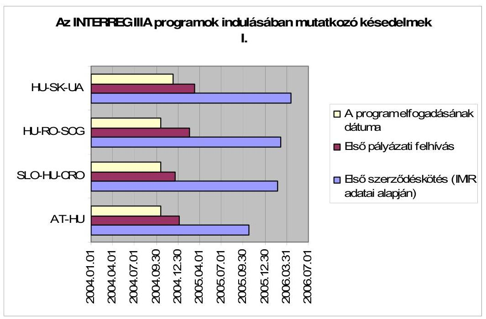
2. sz. ábra

A transznacionális együttmúködés (INTERREG IIIB) és az interregionális együttmúködés (INTERREG IIIC) teljes, illetve hazai feltételrendszerének kialakítása a IIIA programéhoz hasonlóan alakult, azzal a különbséggel, hogy a nemzetközi szervezetek felállítása még több időt vett igénybe. Az INTERREG IIIB esetében az irányítási és ellenőrzési rendszerek megfelelőségének megteremtésére a Bizottság felszólította az érintetteket és 2005 decemberében értesítette az INTERREG IIIB római IH-át a kifizetések felfüggesztéséről. Az elhúzódó fejlesztések és ellenőrzéseket követően 2008. június végével indulhattak újra a kifizetések. A hazai belső szabályozási késedelmet mutatja, hogy a KSZ az INTERREG IIIB-re és IIIC-re vonatkozó eljárásrendet 2005. augusztus 30 -án léptette hatályba ${ }^{48}$.

# 1.2.2. A programot végrehajtó intézményrendszer kapacitásának, múködési költségeinek és finanszírozásának tervezettsége 

A KSZ 2005-2008-as évekre vonatkozó kapacitástervvel, 2006. ${ }^{49}$, valamint 2007-2008. évekre költségvetési keretszámokkal rendelkezett. 2006-ra vonatkozóan az IH és a KSZ által kötött megállapodás tartalmazta az általános bérköltség és a kapacitás, valamint a feladatmutatók alapján a tervezett szakmai szolgáltatások pénzügyi kereteit. Ezek a közvetlen intézményi múködési költsé-

[^0]
[^0]:    ${ }^{48}$ A Kézikönyvet 2006. június 26-án és 2007. augusztus 30-án módosították, illetve a vizsgálat ideje alatt is módosítás alatt állt.
    ${ }^{49}$ Az NFÜ és a VÁTI Kht. között létrejött 2006. évi Egységes Megállapodás (ROP-INTERREG-VÁTI szerződés) melléklete

---

gekre és a szakmai szolgáltatásokra vonatkozó költségvetési keretösszegeket határozták meg.

Az IH 2007-ben vezette be a teljesítményarányos finanszírozást, amely megkövetelte a feladatok számszerúsítését és a költségek tervezését. Az IH és a KSZ között évente kötött finanszírozási szerződés rendelkezett a finanszírozás forrásairól.

# Kimutatás a KSZ-re az INTERREG III múködési költségeiről forrásonként 2005-2007. évekre 

5. sz. táblázat

| Központi költségvetésböl |  |  |  |  |
| :--: | :--: | :--: | :--: | :--: |
| 2005 |  | 270 M Ft |  |  |
| 2006 |  | 460 M Ft |  |  |
| 2007 |  | $578+35 \mathrm{M} \mathrm{Ft}^{50}$ |  |  |
| Technikai Segítségnyújtásból (M Ft-ban) |  |  |  |  |
| INTERREG IIIA | 2006. év | 2007. év | 2008. év | Összesen (2008-ig) |
| HU-SK-UA | 185,2 | 159,2 | 121,2 | 465,6 |
| HU-RO-SCG | 275,2 | 316,6 | 196,5 | 788,3 |
| SLO-HU-CRO | 95,2 | 136,6 | 92,2 | 324,0 |
| AT-HU | 89,7 | 75,1 | 30,6 | 195,4 |
| Összesen (2008-ig): | 645,3 | 687,5 | 440,5 | 1773,3 |

Adatforrás: INTERREG IH 2008.08.29-i adatszolgáltatása
Az IH-nál az intézményrendszer egészére kiterjedő kapacitási, múködési és finanszírozási költségekkel kapcsolatos tervezési dokumentumok nem álltak rendelkezésre. Ez a körülmény nem tette lehetővé a tervszerűség ellenőrzését. A dokumentálási hiányosságok összefüggtek egyrészt irattározási hiányosságokkal (szervezeti költözés, iktatórendszer kétszeri változása), másrészt a gyakori személyi változásokkal (az iratanyagok átadás-átvételének hiányosságaival).

### 1.2.3. Az intézményrendszer múködését értékelő rendszer kialakítása és gyakorlati alkalmazása

A 2004-2006. évekre vonatkozóan az IH nem alakította ki az intézményrendszert átfogóan értékelő rendszert. Nem értékelte rendszeresen az intézmények múködését. Az INTERREG-re vonatkozó teljesítménymutatókat (szerződésköté-

[^0]
[^0]:    ${ }^{50}$ A 2008. évi szerződésben jelent meg a 35 M Ft a 2007. évi múködési költségek fedezetére.

---

seket, kifizetéseket, N+2 szabály teljesítését ${ }^{51}$, szerződés-zárásokat) az INTERREG Monitoring és Információs Rendszerből ellenőrizték. Az N+2 szabály teljesítése érdekében 2006. 06. 01-ével a Váti Kht-nál intézkedési terv készült ${ }^{52}$. Az IH a 2005-től évente kötött finanszírozási szerződés részeként a tárgyévet követő április 15-ig elszámoltatja a közremúködő szervezetet.

2004-2005. évekre vonatkozó költséghatékonysági vizsgálat nem készült. A VÁTI Kht. kizárólag vállalati szintű költséghatékonysági vizsgálatot végzett. Az Ernst \& Young Tanácsadó Kft. a VÁTI 2006. évi múködésére átadott források felhasználásának ellenőrzéséről készített - 2008-ban közzétett - jelentése költséghatékonyságra vonatkozó megállapítást tartalmazott. A programvégrehajtás hatékonyságát a leszerződött összegek és a végrehajtási költségek arányában határozta meg. Az INTERREG III programok végrehajtásának közvetlen és közvetett költsége az összes szerződött összeg arányában 2006-ban 18\%, 2007ben $29 \%$ volt. A vizsgálat értékelte és bemutatta a múködés költségeit is, és javasolta a programvégrehajtás hatékonyságának a teljes végrehajtási időszak (2004-2008) vonatkozásában való vizsgálatát, továbbá a VÁTI Kht. működését és hatékonyságát más hasonló tevékenységet végző közreműködő szervezetekkel (pl. MAG Zrt, ESZA Kht., Regionális Fejlesztési Ügynökségek) összehasonlítani, a legjobb gyakorlatot („best practice"-t) azonosítani és ennek megfelelően a hatékonyság fokozó lépéseket elvégezni.

A VÁTI Kht. ügyfél-elégedettségi kérdőívet készített, amelyet összesített, kiértékelt és megállapításokat is tett. A támogatottak leginkább a szerződéskötési folyamat hosszúságát, valamit a jelentésekkel kapcsolatos követelmények bonyolultságát, nehézkességét és lassúságát kifogásolták. Legelégedettebbek a VÁTI Kht. munkatársainak problémamegoldásával, segítőkészségével voltak. Arra a kérdésre, hogy a tapasztalatokra alapozva kíván-e a jövőben is európai határ menti programokra pályázni, illetve szívesen együttmúködnek-e a VÁTI Kht-val projektje megvalósítása során a válaszadók több mint $90 \%$-a igen választ adott, a HU-SK-UA és az AT-HU programban ez az arány $100 \%$.

# 1.2.4. A program végrehajtásához biztosított hazai és uniós források tervezett ütem szerinti biztosítása 

Az INTERREG III Közösségi Kezdeményezés programok végrehajtásának részletes szabályairól szóló 359/2004. (XII. 26.) sz. Korm. rendelet 9. § (1) bekezdése alapján az IH feladata volt megtervezni a programok támogatásait és bevételeit. Az IH a KSZ-től kapott outputok alapján 2004. évtől kezdődően évente, a tárgyévi és a tárgyévet követő évről pénzfelhasználási ütemtervet készített. A tervezett éves pénzfelhasználás és a költségvetési források összhangjáról elemzés nem készült. A tervezett és a tényleges pénzfelhasználás eltéréseinek arányáról és időbeliségéről nem készült kimutatás. A kifizetések forráshiány miatti állásáról az IH nem vezetett nyilvántartást. Támogatási forráshiány, illetve a

[^0]
[^0]:    ${ }^{51} \mathrm{Az} \mathrm{N}+2$ szabály kimondja, hogy a strukturális alap források felhasználása esetében az egyes évekre meghatározott allokációk felhasználási határideje az allokálás évétől számított második év vége, ezt követően a támogatás az „automatikus visszakövetelés" tárgyát képezi.
    ${ }^{52}$ Váti Kht. 42/2006. sz. vezérigazgatói utasítás.

---

kifizetések teljesítésének elhúzódása nem késleltette a projektek fizikai megvalósítását.
6. sz. táblázat

| Millió Ft-ban | 2004. év ${ }^{53}$ | 2005. év ${ }^{54}$ | 2006. év ${ }^{55}$ |
| :-- | --: | --: | --: |
| eredeti kiadási előirányzat | 2.340,2 | 2.259,9 | 7.869,4 |
| ebből uniós forrás | 1.755,1 | 1.577,1 | 6.091,0 |
| ebből hazai társfinanszírozás | 585,1 | 682,8 | 1.778,4 |
| módosított kiadási előirányzat | 2.166,2 | 2.609,8 |  |
| kifizetés | 1,8 | 219,9   (ebből 55,4 M   Ft az uniós   forrás) | 4.062,7   (ebből 2.458 M   Ft az uniós for-   rás |

Adatforrás: ÁSZ kigyűjtés 2008.06.30.

# 1.2.5. A tájékoztatás, nyilvánosság és a partnerség elv érvényesítését biztosító eljárások kialakítása és gyakorlati alkalmazása 

Az 1260/1999/EK tanácsi rendelet 8. cikke értelmében az Európai Közösség intézkedései az Európai Bizottság és az egyes tagállamok közötti partnerség szellemében valósulnak meg. A tagállamok mind a nemzeti szabályozásnak, mind pedig a fennálló uniós gyakorlatnak megfelelően kijelölt regionális, helyi, valamint egyéb közigazgatósági hatóságok, gazdasági és szociális partnerek, valamint minden illetékes szerv bevonásával széles körű és hatékony társulást hoznak létre, figyelembe véve a nemek közötti esélyegyenlőség és a fenntartható fejlődés horizontális szempontjainak érvényesítését. Az Európai Unió Strukturális Alapjaira vonatkozó partnerség elve kiterjedt a közösségi támogatások előkészítésére, finanszírozására, monitoringjára és értékelésére.

A partnerség követelményeként a pályázati felhívásokkal kapcsolatban az IH és a KSZ széleskörű tájékoztatási tevékenységet végzett. Ennek keretében a pályázati felhívásokat a médiában (országos, illetve megyei napilapokban), - a pályázati kiírás csomagot letölthető formában a program közös, illetve az IH weboldaláról is - elérhetővé tették. Információs napokat, partnerkereső fórumot és projektfejlesztő workshopokat szervezetek, ismertetőket és egyéb kommunikációs anyagokat készítettek. Az addig ismert partnereket e-mail-ben tájékoztatták a részvételi lehetőségekről. A honlapokon közzétett dokumentumokkal, telefonos, illetőleg e-mail-en történő információszolgáltatással, konferenciákkal, az esetleges projektötletekről személyes konzultációkkal, valamint a pályázat értékelésének állásáról tájékoztatás nyújtásával segítették elő az információcserét. A programok indulá-

[^0]
[^0]:    ${ }^{53}$ A Magyar Köztársaság 2004. évi költségvetéséről és az államháztartás hároméves kereteiről szóló törvény végrehajtásáról szóló 2005. évi CXVIII. tv. indoklása
    ${ }^{54}$ A Magyar Köztársaság 2005. évi költségvetésének végrehajtásáról szóló 2006. évi XCIX. törvény indoklása
    ${ }^{55}$ A Magyar Köztársaság 2006. évi költségvetésének végrehajtásáról szóló 2007. évi CXXVIII. törvény indoklása

---

sakor programindító konferenciát rendeztek, továbbá részt vettek minden olyan rendezvényen, amely a program megismerését támogatta.

Az információs napok a potenciális pályázóknak szóló nyilvános tájékoztató rendezvények voltak, amelyeknek célja - a figyelemfelhívás mellett - elsősorban a sikeres projektfejlesztés és a megvalósítás elősegítése volt. Ennek érdekében részletes ismertetésre kerültek az aktuális pályázati kiírás szabályai (intézményrendszer, prioritások/intézkedések, rendelkezésre álló keret, jogosult pályázók, támogatható tevékenységek/költségek, értékelés, megvalósítás főbb szabályai, mint pl. jelentéstétel, kifizetések, áfa-szabályok, stb.), továbbá a jelenlévők választ kaptak kérdéseikre is. Ezen információs napokat a pályázati kiírás meghirdetése és a pályázatok benyújtási határideje között rendezték meg.

A feladat nemzetközi jellege miatt a feladatok összehangolása nehéz feladatot jelentett. A kistérségi, illetve regionális programok hasznosulásáról az IH nem végzett elemzést, összefoglaló az együttmúködésről nem készült. Ugyanakkor intézkedtek annak érdekében, hogy a térségi programokkal a projektek összhangban legyenek.

Például a magyar-szlovák együttmúködés kapcsán a pályázati döntés előtt megküldték a megyéknek a program dokumentumait, és kérték, hogy nyilatkozzanak arról, hogy összhangban van-e a megyei, illetve kistérség-fejlesztési programjaival. A rendelkezésre bocsátott dokumentumok alapján - a KSZ esetében - a Ko-márom-Esztergom Megyei Területfejlesztési Tanács, valamint a Magyar Turisztikai Hivatal elnökének leveléből megállapítható, hogy a pályázatok a megyei és régiós koncepciókba beilleszthetők voltak, programjaikkal nem voltak ellentétesek. Koherencia felmérést folytattak le Borsod-Abaúj-Zemplén, Győr-MosonSopron, Pest, Heves, Nógrád és Szabolcs-Szatmár-Bereg megyékben.

A nyilvánosság követelménye alapján a támogatásokra vonatkozó információknak széles körben és könnyen hozzáférhetőnek kell lenni. Ennek megfelelően az odaítélt támogatások listáját évente közzétették. A működési kézikönyv projektek kiválasztására vonatkozó része elvárásokat tartalmazott a nyilvánossággal, átláthatósággal és az összeférhetetlenséggel kapcsolatban. A tájékoztatásra vonatkozó követelményeknek eleget téve a pályázati felhívásokat elektronikusan a VÁTI Kht. és a NFÜ honlapján, nyomtatott formában pedig egy országos napilapban és az érintett megyék egy-egy napilapjában tették közzé. A támogatási források ismertségéről felmérés nem készült, mivel a túljelentkezés miatt ezt nem tartották szükségesnek.

Az IH a 6/2007. (IV. 5.) NFÜ Elnöki utasítással, illetőleg az azt módosító 31/2007. (XI. 16.) Elnöki utasítással szabályozta a panaszügyek kezelését, előtte ilyen szabályozás nem volt. A módosításra a jogszabályi változásra, valamint a gyakorlati alkalmazási kérdések megoldása miatt került sor. Az utasításban meghatározták a panasz fogalmát, a panasz elintézésében közreműködő szerveket, a jogértelmezési hatásköröket, az eljárásrend részletes szabályait, a panaszügybeni döntéshozatalt és a felülvizsgálatot. A KSZ az IH panaszkezelésről szóló elnöki utasítását, eljárásrendjét a helyszíni vizsgálat előtt nem ismerte.

Az eljárásrend részletes szabályainak 7. pontja alapján az IH a panaszügyekről havonta a tárgyhónapot követő hónap 10. napjáig tájékoztatót készített az NFÜ elnöki értekezlet számára, amelynek elkészítéséhez a KSZ-től kérte be a szükséges

---

információkat. Az eljárásrend egyéb rendelkezései feladatként fogalmazták meg a KSZ-nek, hogy a KSZ által a pályázóknak küldött elutasító, illetve feltételeket tartalmazó jóváhagyó tárgyú értesítő levélben tájékoztató rendelkezést kell beilleszteni a panasszal kapcsolatban.

A KSZ az összeférhetetlenséget a pályázati útmutatóban, az eljárásrendben, a pályázati kiírásban és a projekt kiválasztásakor a döntésben deklarálta. Az értékelésben és a döntésben résztvevőkre vonatkozó pártatlansági és titoktartási nyilatkozatot dolgoztak ki és alkalmaztak. A KSZ Humánpolitikai Szabályzata részletes tájékoztatót ad az összeférhetetlenségi, pártatlansági és titoktartási nyilatkozathoz. A 2006-ban kötött OTH és VÁTI Kht. megállapodás, valamint a 2007. februári NFÜ-VÁTI Kht. szerződés az összeférhetetlenségről rendelkezik. Az összeférhetetlenséggel kapcsolatban a vizsgált időszak alatt nem volt eljárás.

# 2. A PROJEKTEK KIVÁLASZTÁSA ÉS ANNAK A CÉLRENDSZER EREDMÉNYES, HATÉKONY TELJESÍTÉSÉHEZ VALÓ HOZZÁJÁRULÁSA 

### 2.1. A pályáztatás gyakorlata és a támogatásra kiválasztott projektek hozzájárulása a célrendszer eredményes teljesítéséhez

Az INTERREG IIIA befogadott és elutasított pályázatainak arányai programonként eltérően alakultak, a következő táblázatban foglaltak szerint.
7. sz. táblázat

|  | ME | HU-SK-UA | HU-RO-SCG | SLO-HU-CRO | AT-HU | Összesen |
| :-- | :--: | --: | --: | --: | --: | --: |
| Beérkezett pályázatok | db | 540 | 620 | 288 | 227 | 1675 |
| IH által támogatott | db | 82 | 127 | 86 | 93 | 388 |
| Támogatási arány | db | $15,19 \%$ | $20,48 \%$ | $29,86 \%$ | $40,97 \%$ | $23,16 \%$ |
| Igényelt támogatás | mFt | 32900 | 13695 | 14334 | 5903 | 66832 |
| Megítélt támogatás | mFt | 4728 | 7806 | 3633 | 2898 | 19065 |
| Támogatási arány | mFt | $14,37 \%$ | $57,00 \%$ | $25,35 \%$ | $49,09 \%$ | $28,53 \%$ |

Adatforrás: Váti Kht. adatszolgáltatás 2008.06.30-i állapot
Például a SLO-HU-CRO program esetében a pályázói igények négyszeresen meghaladták a programban rendelkezésre álló támogatási forrásokat. A támogatási forráshiány okozta SLO-HU-CRO Szomszédsági programban elsősorban a pályázatok elutasítását.

A pályázati kiírásokat interneten, országos és megyei napilapban jelentették meg. A pályázati formanyomtatvány egységesítette az értékelést és útmutatóul szolgált a pályázóknak a szükséges adatok kitöltéséhez. A pályázónak a pályázati formanyomtatványon jelölni kellett, hogy pályázata a pályázati kiíráson belül melyik prioritáshoz, azon belül melyik intézkedéshez tartozik, így a programdokumentumban lefektetett célrendszerhez való igazodás biztosított volt.

A projekt kiválasztási folyamatban alkalmazott értékelési kritériumok (határon átnyúló együttműködés, határon átnyúló hatás, prioritási kritériumok) közvetí-

---

tették az EU támogatások alapvető céljait, az együttműködés fejlesztését, a határ menti térségek kohéziójának és az ott élők életminőségének fejlesztését. Preferálták az együttműködés legmagasabb szintjét jelentő közös és erős hatású projekteket. ${ }^{56}$ A közös, tükör, és egyedi projektek arányának alakulása programonként eltérő volt. Az együttműködés típusa szerint a támogatott projektek összetételét a következő táblázat mutatja.
8. sz. táblázat

|  | ME | HU-SK-UA |  | HU-RO-SCG |  | SLO-HU-CRO |  | AT-HU |  | Összesen |  |
| :-- | :-- | :-- | :-- | :--: | :--: | :--: | :--: | :--: | :--: | :--: | :--: |
| Egyedi | db | 23 | $28,05 \%$ | 45 | $35,43 \%$ | 59 | $68,60 \%$ | 83 | $89,25 \%$ | 210 | $54,12 \%$ |
| Tükör | db | 12 | $14,63 \%$ | 66 | $51,97 \%$ | 6 | $6,98 \%$ | 7 | $7,52 \%$ | 91 | $23,46 \%$ |
| Közös | db | 42 | $51,22 \%$ | 16 | $12,60 \%$ | 21 | $24,42 \%$ | 3 | $3,23 \%$ | 82 | $21,13 \%$ |
| Kiegészítő | db | 5 | $6,10 \%$ |  |  |  |  |  |  | 5 | $1,29 \%$ |
| Összesen: | db | 82 | $100 \%$ | 127 | $100 \%$ | 86 | $100 \%$ | 93 | $100 \%$ | 388 | $100 \%$ |

Adatforrás: Váti Kht. adatszolgáltatás 2008.06.30-i állapot

- A HU-SK-UA program esetében a támogatott projekteknek a fele, a határon átnyúló hatás legmagasabb fokát biztosító közös projekt, és közel egy harmada (30\%) csak viszonylag alacsony határon átnyúló hatást biztosító különálló projekt. A projektek 15\%-át tették ki a tükör projektek és 6\%-át a kiegészítő projektek.
- A HU-RO-SCG program esetében a közös projektek aránya viszonylagosan alacsony volt $12,6 \%$. Ugyanakkor a tükör projektek aránya $52 \%$ mutatja a szomszédos országok közötti közös fejlesztési feladatok összehangolásának a célkitűzések szerinti megvalósítását.
- Az AT-HU program esetében a benyújtott pályázatokról előértékelés és javaslattétel alapján döntött a Kormányzóbizottság. Az egyedi projektek 90\%os túlsúlya megkérdőjelezi a felosztás fontosságát.
- A SLO-HU-CRO program esetében Magyarországon a közös projektek aránya a támogatási forrás allokációt és a pályázatok darabszámát tekintve $24 \%$-os ( 853 M Ft ), a tükör projektek aránya a pályázatok számát tekintve 7\%-os volt. Az értékelési és a döntési folyamatokban alkalmazott együttmúködés minősítési kritérium és pontozási rendszer elősegítette azt, hogy a célrendszerhez hozzájárulás mértékétől függően alakítsák ki a projektrangsort. Ugyanakkor a szomszédos országokban lévő pályázói potenciál (felkészültség, tőkeerő) részben volt összhangban a kitűzött célokkal, és ez a körülmény nem tette lehetővé a közös és tükör projektek arányának növelését. A közös projektekre tervezett közös projektirányítás az országonként megkötött külön támogatási szerződések esetében nem érvényesült.

[^0]
[^0]:    ${ }^{56}$ A közös kiválasztási kritériumok szerint mind a két pályázati felhívásban, mind a projekt kiválasztási folyamatokban értékelték a projektek hozzájárulását a határ menti együttműködéshez. A határon átnyúló integrációra kifejtett hatásnak 3 minőségi szintjét (erős, közepes, gyenge hatás) különböztették meg és a határon átnyúló együttmúködés három projekttípusa (közös, tükör és együttműködési) szerint. Ennek megfelelő pontozási rendszert alakítottak ki.

---

A pályázatok értékelésének szempontja volt a hatékony, eredményes végrehajtás, valamint a célrendszerhez kapcsolódás. Az áttanulmányozott bírálati jegyzőkönyvek szerint elutasítási indok volt a céloktól eltérő projektjavaslat. A helyszíni ellenőrzésre kiválasztott projektek mindegyike megfelelt a célrendszerhez kapcsolódás követelményének. A gazdaságossági szempontból ugyanakkor például az AT-HU program esetében a gazdaságos megvalósítás alacsony fontosságára utalt az, hogy a tervezett költségek és várható eredmények közötti arány, valamint a tervezett költségek szükségességének értékelése, csak az elérhető pontoknak 10\%-át jelentette.

A kedvezményezettek körének elemzése szerint a költségvetési szervek nyerték el a legtöbb pályázatot, $63 \%$-os arányban.
9. sz. táblázat

|  | ME | Költségvetési szerv | Nem költségvetési szerv | Összesen |
| :-- | :-- | --: | --: | --: |
| HU-SK-UA | db | 54 | 28 | 82 |
| HU-RO-SCG | db | 78 | 49 | 127 |
| SLO-HU-CRO | db | 45 | 41 | 86 |
| AT-HU | db | 61 | 32 | 93 |
| Összesen: | db | 238 | 150 | 388 |

Adatforrás: Váti Kht. adatszolgáltatás 2008.06.30-i állapot

- A HU-SK-UA program esetében a kedvezményezettek kétharmada költségvetési szerv, az egyharmada nem költségvetési szerv volt. A költségvetési szervek között voltak: megyei, városi, községi, kistérségi önkormányzatok, iskolák, Nemzeti Parki Igazgatóságok, Képző Központok, Vízügyi Igazgatóságok, KKK (korábban UKIG). Tehát főként a helyi, regionális intézmények, hatóságok részére jelentett többletforrást. A potenciális kedvezményezettek körét szűkítette, hogy az INTERREG-ből a Strukturális Alapokat kiegészítő jellegű támogatások nyújthatóak, például az AVOP potenciális pályázói nem pályázhattak INTERREG-re.
- A HU-RO-SCG program esetében a kedvezményezettek 61\%-a volt költségvetési szerv.
- A SLO-HU-CRO program esetében a kedvezményezettek szerinti megoszlást tekintve a hatályos 86 db támogatási szerződés közül 45 db-ot költségvetési szerv/intézménnyel kötötték meg, 52\%-os arányban.
- Az AT-HU program esetében a kedvezményezettek 65\%-a volt költségvetési szerv.

Az INTERREG IIIB (CADSES) program esetében a pályáztatás és az azt követő döntési folyamat decentralizált volt. A magyar pályázók a pályázati anyagot a drezdai székhelyű Közös Szakmai Titkárságra (továbbiakban: KSZT) juttatták el, akik a formai, jogosultsági és szakmai ellenőrzést követően az Irányító Bizottság elé terjesztették a befogadott pályázatokat. Az Irányító Bizottság a tagállamok képviselőiből állt és ők hozták meg a végleges döntést a CADSES program kitűzött céljainak megfelelően. A CADSES döntést megelőzően az egyes tagállamok, így a magyar Nemzeti Bizottság (továbbiakban: NB) is értékelte a beadott magyar pályázatokat. A Nemzeti Bizottság titkársági feladatait

---

a VÁTI Kht. CADSES kapcsolattartó pontja látta el, melynek keretében ők véglegesítették az NB ülés eredményeként kialakult, általuk támogatott pályázatok listáját. Ezt a listát, azaz a nemzeti álláspontot az Irányító Bizottság figyelembe vette az értékelésnél, de a lista nem jelentett semmilyen kötelezettséget az Irányító Bizottság véleményalkotásában. A Nemzeti Bizottság tagjai egyrészt a szaktárcák (GKM, ÖTM, OM stb.) képviselőiből, másrészt a régiók érdekeinek képviseletében a Regionális Fejlesztési Ügynökségek (RFÜ) küldötteiből álltak.

Mind a CADSES, mind a C program esetében külön támogatási szerződést kötöttek az ERFA forrásra (vezető partner az IH-val szerződik, majd ezt követően a partnerekkel) és külön szerződést a hazai társfinanszírozásra. Ugyanez a kettősség jelentkezett a pályáztatás, majd azt követően a projekt előrehaladási jelentések benyújtásakor a társfinanszírozott kedvezményezettek esetében. Mindkét elem esetében a projektek átlagosan 36 hónaposak voltak. Az intézményrendszert külföldi székhelyű hivatalok alkotják, melyeket nem ellenőriztünk.

CADSES magyarországi kedvezményezettjeinek pályázói típusok szerinti megoszlása
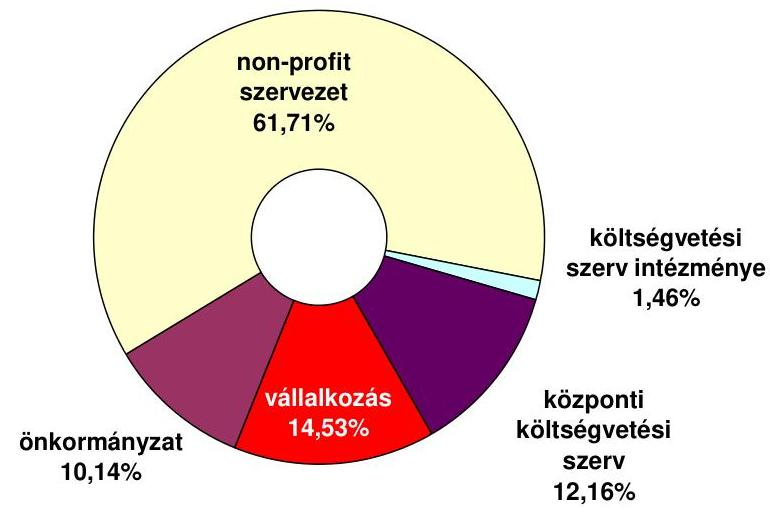
3. sz. ábra

---

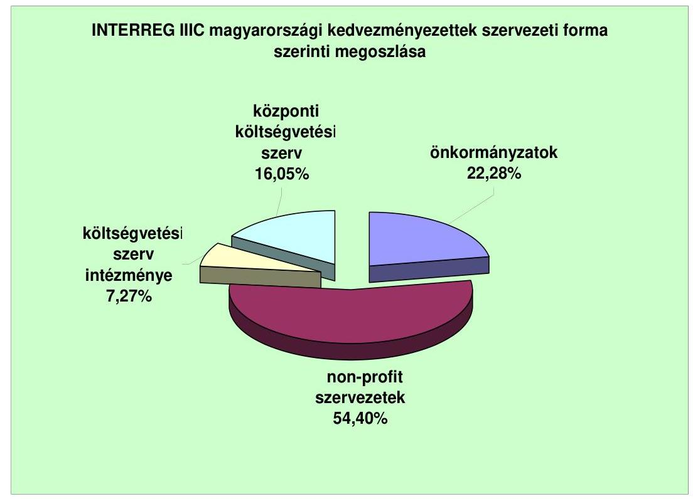
4. sz. ábra

Az AT-HU program esetében az INTERREG forrásokra meghirdetésüktől kezdődően folyamatosan lehetett pályázni, a keret kimerüléséig. A folyamatos pályázás lehetővé tette, hogy a projektek megvalósítása során elért megtakarításokból tartalékprojektekre kössön a Közremúködő Szervezet támogatási szerződéseket. A folyamatos elbírálás rendszere a bíráló bizottságok felelősségét növelte, mivel egyenletesen tartaniuk kellett a kiválasztási kritériumok szintjét. Az INTERREG fő célkitűzése volt a határon átnyúló kapcsolatok kiépítése, a korábban gazdaságilag elmaradottabb határ menti települések együttes fejlesztése, az országok középső térségeire jellemző fejlettségi szintre történő felzárkóztatása. A program céljainak megfogalmazása azonban nem terjedt ki számszerúsítetten meghatározott kritériumokra. Ebből eredően az egyes projektekkel elért eredmények sem voltak kimutathatóak számszerúsítetten a naturális mutatóik alapján.

A HU-SK-UA program esetében a potenciális kedvezményezettektől, magyar oldalon két pályázati kiírás keretében összesen 540 db pályázat 32,9 Mrd Ft értékben érkezett, a rendelkezésre álló 4,6 Mrd Ft-os pénzügyi keretre. 2005-ben 241 magyarországi székhellyel rendelkező pályázó által benyújtott pályázatból 31-re kötöttek támogatási szerződést (a pályázatok 13\%-a), míg a 2006-ban beérkezett 313 pályázatból 37 projektre kötöttek támogatási szerződést (a pályázatok mintegy 12\%-a). A projektek végrehajtása során képződő szabad keret (szerződés meghiúsulása, megtakarítások) terhére 2007-ben 14, ún. tartaléklistás projektre kötöttek támogatási szerződést. A legkisebb összegű projekt értéke

---

3,6 $\mathrm{M} \mathrm{Ft}^{57}$, a legnagyobb projekt értéke $379,1 \mathrm{M} \mathrm{Ft}^{58}$ volt. A pályázatok száma átlagban hatszorosa volt (darabszámban és értékben is) a rendelkezésre álló támogatási keret terhére támogatható pályázatoknak. A pályázók érdeklődése az átlagos érdeklődés kétszerese volt az üzleti együttmúködés és az intézmények közötti kapcsolatok, intézkedések iránt. A támogatott projektek körét az alábbiak jellemezték:

- a közös projektek között találhatóak a pozitív példák arra, hogy a határon átnyúló hatások miatt közös ügynek tekintett környezetvédelmi feladatokat hogyan lehet közösen kezelni. Ilyen projekt volt a Magyar-Ukrán komplex árvízvédelmi-vízgazdálkodási - ártérrevitalizációs fejlesztési tervek kidolgozása. Ez a terv példa értékű azért is, mert már a megvalósíthatósági tanulmányban számba vették, hogy a terv megvalósításának egyes elemei, tevékenységei az ÚM FT, az ÚMVP és más fejlesztési programok mely területéhez kapcsolódnak, honnan finanszírozhatóak;
- a projektek előkészítettsége különböző szinten állt: például a közös fejlesztési tervek megvalósításához a partnerállamok között vagy volt egyezmény, vagy nem;
- azokban az esetekben, amikor nem jött létre korábban egyezmény a partnerállamok között, megnövekedtek a projektek folytatásának kockázatai. A már elkészült hatástanulmányok, illetve tervek további hasznosítása kérdésessé vált.

Ilyen, a kiviteli terveket támogató projekt volt az „Ipoly hidak" és az engedélyezési terveket támogató „Komárom és Komárno térségi közös területfejlesztés eszközéül szolgáló új közúti Duna határhíd és kapcsolatai megépítésének tervezete" projekt. E projektek keretében elkészült tervek megvalósításához jelenleg még nincs nemzetközi egyezmény, ugyanakkor a térség szempontjából kiemelt jelentőségű beruházásokról van szó.

A HU-RO-SCG program esetében pályázati formanyomtatvány elősegítette a célrendszerhez való kapcsolódás követhetőségét és ellenőrizhetőségét. A pályáztatási rendszer szabályozásának hiányossága volt, hogy a 165. és a 182. sz. projektek pályázói az útkorszerűsítés során fennmaradt összeget nem használhatták fel további útépítésre, útkorszerűsítésre sem (pl. szerződésmódosítással). Ugyanakkor már a közbeszerzés eredményhirdetésekor egyértelmú volt, hogy többletforrás bevonása nélkül további fontos szakasz készülhetett volna el. A 165. sz. projekt további útszakasz-tervei már a Phare CBC program keretében elkészültek.

A 182. sz. projekt (Biharugra-Körösnagyharsány-országhatár útfelújítás) esetén a Körösnagyharsány-országhatár mindössze 2 km -es szakasza nem készült el, jóllehet a közbeszerzési eljárás eredményhirdetésekor már látszott, hogy az is megvalósulhatott volna a megítélt támogatásból. Ezt azonban a pályázati rendszer pl. indokolt szerződésmódosítással - sem tette lehetővé. Ezáltal éppen a határon átnyúló célzott hatás sérült, mivel a határ elérésének lehetősége múlott a hiány-

[^0]
[^0]:    ${ }^{57}$ Az 1.3-as intézkedés keretében
    ${ }^{58}$ A 2.1-es intézkedés keretében

---

zó rövid szakasz megépítésén. (Lásd a 8. sz. melléklet 2-3. fényképei: a 182. sz. projekthez a helyszínen készült felvételek.)

A pályázati rendszert is érintő, hasonló gondok forrása volt a 165. sz. projekt esetén a Megyei Közútkezelő Kht-k összeolvadása és Magyar Közút Kht-vá (MK) alakulása, valamint az UKIG támogatásban részesülő partnerként a projektbe történő bevonása. Az előzetes tervekhez képest ez a körülmény jelentősen megnövelte a közbeszerzési eljárások átfutási idejét. ${ }^{59}$ (EU-s közbeszerzési pályázatra lett szükség.) A területszerzéshez szükséges ingatlan értékbecslő kiválasztása az eredetileg tervezett 3 árajánlat bekérése helyett az új szervezeti felépítés miatt csak hirdetmény közzététel útján volt lehetséges, amihez szükség volt az UKIG-gal való egyeztetésekre és a hirdetmény UKIG részéről történő jóváhagyására. A vállalkozói szerződés módosítását az UKIG helyett a Közlekedésfejlesztési Koordinációs Központ (KKK) írta alá 2007. 10. 20.-án. Az összevonások hatásköri átrendeződéssel is jártak, amelyben a szakterületek központjai (MK, KKK) sem tudtak méltányolható gyorsasággal állást foglalni. A pályázat meghirdetésekor az önálló Bács-Kiskun Megyei Állami Közútkezelő Kht. (BÁKMÁK) látta el ezen feladatokat Kecskeméten.

Az intézményrendszer átalakulása és az összevonások hatásköri átrendeződése volt a fő oka a 165. projekt esetében is annak, hogy a közzétett 2005 júliusi várható szerződéskötési idő helyett, 2006.06. 09-én került aláírásra a Támogatási Szerződés (TSZ). A második pályázati körben így is indulhatott volna (2006.11.13-ig) a 165. projekt folytatása, de a közbeszerzési eljárás eredménye csak 2007. 02. 16-án vált ismertté.

A SLO-HU-CRO program esetében a pályáztatás rendszerét a három ország közös egyetértéssel teljes körűen szabályozta, beleértve a Közös Projektkiválasztó Bizottság (JSC) ${ }^{60}$ eljárási rendjét. A dokumentumokban a célrendszer eredményes teljesítésének feltételeit az együttmúködő országok körültekintően határozták meg, és egységesen alkalmazták a gyakorlatban, így a projektfelhívásokban, a pályázati formanyomtatványokban, valamint útmutatókban.

# 2.2. A forrásfelhasználás tervezett hatékonyságát biztosító eljárások kialakítása és alkalmazott gyakorlata a támogatás odaítélési folyamatában 

A forrásfelhasználás hatékonyságot meghatározó eleme volt az értékelési eljárások kialakítása, azon belül az értékelési kritériumok alkalmazásának módja. A tapasztalatok szerint a gazdaságossági szempontok érvényesítésére a benyújtott pályázatok vonatkozásában csak részben volt lehetőség, mivel a szakmailag széles skálájú projektekhez nem álltak rendelkezésre fajlagos mutatók, normatívák. A források célirányos felhasználását biztosító projektkiválasztó el-

[^0]
[^0]:    ${ }^{59}$ Szerződés Módosítás Kísérő Lap (2006.9.26)
    ${ }^{60}$ A Közös Projektkiválasztó Bizottságban a magyar delegáció 14 fővel vett részt, 6 fő a VÁTI Kht. részéről megfigyelőként, 2 fő a Dél-dunántúli Regionális Fejlesztési Ügynökségtől megfigyelőként, 1-1 fő a Regionális Fejlesztés Nemzeti Hivatal, a KvVM, a Vas megyei Tanács, a Zala megyei Regionális Fejlesztési Tanács, a GKM és Somogy megyei Regionális Fejlesztési Tanács képviseletében szavazótagként.

---

járások megléte ellenére azok pozitív hatását csökkentette az, hogy az érintett térségekben társadalmilag és szakmailag elfogadott fejlesztési preferenciák, rangsorok még hiányoztak. A projektek költség és funkció szerinti összehasonlíthatósága a projektek egyediségéből származóan korlátozott volt, ilyen jellegű nemzeti vagy nemzetközi értékelések nem készültek.

- A HU-SK-UA program esetében az értékelés során a projekt tervezett eredményeinek és forrásszükségletének arányát a támogatás célrendszerében lefektetett arányokkal nem vették figyelembe. Normatívák nem kerültek meghatározásra a beavatkozások széles köre és az együttmúködési tevékenységek szerteágazó mivolta miatt. A horizontális célokat szem előtt tartották, a célok figyelembe vételéről a különböző jelentésekben számot adtak.
- A HU-RO-SCG program esetében a bírálati szempontok nem tartalmaztak kifejezetten teljesítmény elv alapú ${ }^{61}$ bírálati szempontokat, vagy költséghaszon alapú megközelítést és nem jelent meg bírálati szempontként a horizontális céloknak való megfelelés sem, bár a pályázati formanyomtatványok azt tartalmazták.
- A SLO-HU-CRO program esetében a tervezett projektlisták, illetve rangsorok ${ }^{62}$ hatékonysága, az optimális támogatási portfolió elérése számos külső tényező - korábbi program és projektciklusban történt - alakulásától is függött, így a pályázói potenciáltól, a projekt költség-haszon alakulásától. Az ellenőrzési mintákban lévő 8 projekt esetében a döntéshez felhasznált pályázati formanyomtatványok elemzése azt mutatta, hogy azokban csak a projektek költsége szerepelt, költség-haszon elemzést a pályázati dokumentációk nem tartalmaztak. Ennek következményeként a projektrangsor felállításakor költség-haszon elemzés figyelembevételére nem volt mód. A költségek pontosabb meghatározását, a közbeszerzési eljárások hatékonyságát a műszaki tartalom specifikálási hiányosságok és a helyi vállalkozói kapacitások hiánya, a mintaprojekteknél tapasztaltak szerint kedvezőtlenül befolyásolta.

Az eljárások idöigényességének elemzése szerint a pályázat benyújtástól a szerződéskötésig eltelt idő átlagosan meghaladta az 1 évet, amely nem eredményezett magas kockázatokat a végrehajtásban. Ez a körülmény viszont közvetve hozzájárult a fel nem használt pénzeszközök eltérő mértékű kialakulásához.

Például az AT-HU program esetében a pályázatok beérkezésétől a támogatási szerződés megkötéséig átlagosan eltelt idő, a pályázatok teljes „életciklusa" az osztrák Irányító Hatóság rendszeréből volt elérhető. A kitöltött tanúsítvány szerint a szerződéskötésre átlag 368 napra volt szükség, a maximális időtartam 930 nap volt (ez tartalékprojekt volt), de a leggyorsabb szerződéskötés is 251 napot vett igénybe. Az osztrák-magyar program esetében az Irányító Hatósági szerepet Ausztria töltötte be, így a pályáztatási folyamat (a szerződéskötésig) az ő hatás-

[^0]
[^0]:    ${ }^{61}$ Gazdaságosság, hatékonyság és eredményesség (3e elv, és a Value for Money elv)
    ${ }^{62}$ A támogatás odaítélési szakaszban a támogatási források elosztása a Közös Projektkiválasztó Bizottságnak előterjesztett - a szakértői pontozáson alapuló - projektrangsor listák alapján történt.

---

körében állt, a KSZ (illetve a magyar Nemzeti Hatóság) csak a döntést követő folyamat gyorsítására tehetett volna intézkedéseket - tehát a pályázat benyújtásától a döntéshozatalig eltelt időtartam változtatása, rövidítése nem állt módjában. A helyszínen megkérdezett kedvezményezettek sem panaszkodtak az elhúzódó folyamatokra. Elmondásuk szerint tudomásul vették az EU források odaítélésében az elhúzódását, csak akkor pályáztak, ha a megvalósítandó célok lehetővé tették a várakozást. A HU-SK-UA program esetében a pályáztatás időszükséglete (a hiánytalan pályázat benyújtásától a támogatási döntés meghozataláig) 54 naptól 110 napig terjedt. A támogatás odaítélési folyamatának időszükséglete (a befogadástól a szerződéskötésig) legkevesebb 8 hó, a legtöbb 16 hó volt.

Az IH a támogatás odaítélési folyamat időszükségletének nagyságát - a 2006. évi zárszámadási törvények indoklása szerint - abban látja, hogy egyrészt a vártnál jóval magasabb számú pályázat érkezett be, amelyekhez meg kellett szervezni a közös értékeléseket, formai, jogi és szakmai szempontból. Másrészt az értékelt pályázatokat a Közös Irányító Bizottságnak és az egyes kihelyezett EU delegációknak is jóvá kellett hagyniuk, amely jelentősen kitolta a szerződéskötések idejét.

Az egyes kifizetési igények feldolgozásának teljes időszükséglete határidőn belül maradt, az ellenőrzésre kiválasztott tételek esetében. ${ }^{63}$ A projekt tevékenységek szerződés szerinti határidőben történő teljesítését kifizetések elhúzódása nem gátolta.

A VÁTI Kht. INTERREG IIIB és IIIC Múködési Kézikönyvének 3. fejezete tartalmazza a pályáztatás és projektkiválasztás folyamatának leírását. Az előírtak szerinti pályázatbontási jegyzőkönyv egyetlen pályázati kiírás esetében sem állt rendelkezésre. Az első CADSES pályázati kiírásra vonatkozóan ennek okaként azt jelölték meg, hogy ekkor még nem volt hatályos MKK, mivel a B és C elemre vonatkozó eljárásrend csak 2005. augusztus 30 -án lépett hatályba. A pályázatok beadási határideje 2005. január 21. volt és a rendelkezésre bocsátott „Bontás+formai és jogosultsági értékelés" táblázat 2005. július 11-i dátumot tartalmaz. Az ezt követő értékelések 2005 augusztusában történtek, majd a Nemzeti Hatóság döntése 2005. október 4-én. A támogatási szerződések megkötése csak ezt követően kezdődött meg. A második CADSES társfinanszírozási kiírás beadási határideje 2005. november 18. volt. Az átadott bontási jegyzőkönyv - amely nem volt a jelenlévők aláírásával ellátva - 2006. május 18-i dátumot tartalmaz, az értékelési jelentés 2006. augusztusi és a végleges jóváhagyás 2006. szeptember 5. A C elem tárfinanszírozási pályázat beadási határideje 2004. november 19. volt, majd a végleges döntés 2005. októberében született.

A pályázati beadási határidőtől számítva a döntéshozatal közel egy évet vett igénybe. Ebből is következett, hogy a mindhárom felhívásban kikötött feltétel, azaz „társfinanszírozás csak a társfinanszírozási szerződés megkötését követően felmerült költségekhez nyújtható" már nem volt tartható a korábban elindult projektek esetében. Ennek eredményeként a megkötött támogatási szerződések tartalmazták azt, hogy „A Kedvezményezett a szerződéskötést követő 30 napon

[^0]
[^0]:    ${ }^{63}$ Az INTERREG 2004-2006-ra vonatkozó Múködési Kézikönyv és a vonatkozó jogszabály szerint 60 naptári nap +5 munkanap áll rendelkezésre a kifizetési igények teljesítésére.

---

belül a jelen szerződés megkötése előtti beszámolási időszakokban felmerült költségekre is benyújthat Fizetési Kérelmet".

# 2.3. A vállalt kötelezettségek teljesítésének nyomon követhetősége és a teljesítés elmaradása esetére szóló biztosítékok megléte a támogatási szerződésben 

A támogatási szerződésekben foglalt feltételek, és kötelezettségek (a kedvezményezettek részéről) a projekt teljes életciklusára kiterjedően, beleértve a projekt utánkövetési jelentések kötelező szolgáltatását, megfelelő biztosítékokat nyújtottak a vállalt kötelezettségek nyomon követhetőségére. A visszafizetési kötelezettség eseteinek specifikálására, azok szabályozására, a támogatási szerződések kiterjedtek, megfelelő biztosítékokat tartalmaztak. A teljesítés elmaradása esetén a kedvezményezettek hozzájárultak az azonnali beszedéshez. Költségvetési szervek esetében az Ámr. rendelkezéseinek betartására hivatkozott a támogatási szerződés. A horizontális célok teljesítésének a követése megoldott. Az ellenőrzött projektek mindegyikében - ahol ez értelmezhető volt -, érvényesültek a horizontális célok.

A támogatási szerződés elállásra vonatkozó része lehetővé tette, hogy a közremúködő szervezet elálljon a szerződéstől, és egyben a támogatás teljes összegét vagy annak egy részét a törvényes kamatokkal és egyéb járulékokkal visszakövetelje, melyet a kedvezményezettektől kapott biztosítékok is megerősítettek.

A teljesítmények követésének a legfőbb eszköze volt a támogatási szerződésekben előírt jelentéstételi rendszer múködtetése mind a Kedvezményezettek, mind a KSZ részéről. A vállalt kötelezettségek teljesítésének feltételei elvi szinten a szerződésben foglalt jelentési kötelezettségek (időközi és záró jelentés) keretében megoldottak.

A gyakorlatban nem múködött kielégítően a jelentéstételi rendszer, mivel nem érvényesült teljes körűen a zárójelentésekre vonatkozó előírás a „2. Általános előrehaladás a felállított célok és alcélok elérése érdekében" pontja (például a HU-SK-UA program esetében). A jelentéstételi rendszer hatékonyságát kedvezőtlenül befolyásolta az, hogy a projektek céljainak teljesülését figyelemmel kísérő indikátorrendszer csak korlátozottan volt képes feladatát teljesíteni. A monitoringot támogató információs rendszerben, az IMIR törzsállományában jelenleg csak az output mutatók állnak rendelkezésre, az eredmény és a hatásmutatók nem.

Az AT-HU program esetében a programok pályázati anyagának eleme volt az egységesített monitoring indikátorok halmaza. A projektjavaslatok bírálati szempontja volt a horizontális célok értékelése, ezek hiánya a projekt elvetését eredményezte. Az egyes indikátorok alkalmazhatóságát korlátozta, hogy azok inkább a célok rövidített meghatározásai, semmint számszerűsíthető, a projekt fizikai megvalósítását mérő mutatók voltak.

Például nem voltak alkalmasak számszerúsítésre a következő mutatók:

- Határon átnyúló infrastruktúra fejlesztése, közlekedési kapcsolatok fejlesztése és gyorsítása, illetve ezek előkészítése;

---

- Az információs technológiai, illetve távközlési infrastruktúra szolgáltatásainak és termékeinek fejlesztése, illetve ezek integrált használatának elősegítése;
- Hozzájárulás a határon átnyúló logisztikai kapcsolatok felépítéséhez és erősítéséhez.

Az IMIR rendszer és a támogatási szerződések is tartalmazták a vállalt output indikátorokat. A kedvezményezettnek az előrehaladási és a záró jelentésében ismertetnie kellett az indikátorokban elért változást, de a három dokumentum típus szerinti adatok (támogatási szerződés, előrehaladási, illetve zárójelentés) nem mindig estek egybe.

Például a 2. prioritás a „Határon átnyúló közlekedési és telekommunikációs infrastruktúra fejlesztése intézkedés" egyik projektjének támogatási szerződésben vállalt indikátorai az útmutatóból választott lehetőségek közül a következők voltak: határon átnyúló infrastruktúra fejlesztése, közlekedési kapcsolatok fejlesztése és gyorsítása, illetve ezek előkészítése; nemzetközi közlekedési vonalakhoz való kapcsolódás, illetve ennek előkészítése; gazdasági célterületek határon átnyúló összekötése. Ezzel szemben a zárójelentésben a következő indikátorok teljesítéséről számolt be a kedvezményezett: beszerzés értéke; kerékpárút hossza; megvalósítás időtartama. Az IMIR rendszerben kezelt indikátor viszont a kitöltött tanúsítvány alapján: 1 kerékpárút. Az útmutatóban, a zárójelentésben és a IMIR-ben lévő három indikátorhalmaz együttesen sem tette lehetővé a teljesítés mérését. A helyszíni ellenőrzés igazolta, hogy a vállalt kerékpárút a céloknak megfelelően elkészült. Az előbbi eset nem volt egyedi.

A HU-SK-UA program esetében a zárójelentés e pontjához tett kitöltési útmutatás egyértelműen meghatározta, hogy hogyan kell bemutatni a célok elérését mutató indikátorokat, továbbá a VÁTI Kht. programmenedzserei is többször felhívták erre a kedvezményezettek figyelmét. Ennek ellenére a kedvezményezettek nem e szerint jártak el, ami a közremúködő szervezet számára megnehezítette a záró jelentés adatainak a feldolgozását. A projektzárási tevékenységek 2008. I. félévig lezajlottak, de a kedvezményezetteknek maradt még szerződésben foglalt kötelezettsége ezt követően is (jelentési kötelezettség, eredményességi és hatásmutatók alakulásáról számot kell adni stb.), amit a KSZ-nek fel kell dolgozni.

Az ellenőrzésre kivett 9 projekt közül 2 esetben a jelenlegi gyakorlat alkalmatlanná tette a záró jelentést arra, hogy megállapítsák a szerződésben foglalt számszerűsített célok teljesítését. Az indikátor kiindulási, tervezett és jelenlegi értékéhez, az indikátor számszerúsített értéke helyett, az elvégzett munkálatok, munkanemek Ft értékeit írták (a szerződésekben még helyesen az indikátorok számszerúsített értékei szerepeltek). Gyakorlati problémaként jelentkezett, hogy ered-mény- és hatásmutatók is rögzítésre kerültek az output mutatók értékei között. Ez a hiányosság az ellenőrzésre kivett projektek közül, például a HU-SKUA0501/253/J/2.3/HU, és az 501/289/J/2.2/HU projekteknél fordult elő. (Az output indikátorok általános jellege lehetővé tette, hogy a szerződésekben foglalt bármilyen típusú indikátor beilleszthető legyen a nyilvántartott indikátorok közé.) A VÁTI Kht. tájékoztatása szerint a helyszíni ellenőrzés során feltárt hiányosság adminisztrációs tévedés volt, javításáról intézkedtek, annak teljesítését ellenőrzik, továbbá gondoskodnak a hasonló adatrögzítési hiányosságok kiküszöböléséről.

A HU-RO-SCG program esetében a projektek indikátoraiból a programindikátorok felépíthetők, de nem azonosítható be egyértelműen, hogy az egyes

---

programszintű indikátorok hogyan kapcsolódnak a támogatási szerződésben megadott indikátorokhoz. Ezt segítené az indikátorokhoz rendelt azonosító szám, de a támogatási szerződés ilyet nem tartalmazott. Hasonló a helyzet az előre haladási jelentésekkel, az előrehaladási jelentések indikátorai a támogatási szerződéshez igazodnak, de nem azonosítható a kapcsolat az IMIR adatbázisból kigyűjtött indikátorokkal.

A támogatási szerződésben (és az előrehaladási jelentésekben) szereplő indikátorok, illetve programszintű (IMIR-ben rögzített) indikátorok közötti egyértelműen azonosítható kapcsolat hiányát támasztja alá az, hogy a biogáz üzem Klárafalván (207), vagy a Mérnöktalálkozók határok nélkül (003) projektek esetében a támogatási szerződésben szereplő indikátorok nem egyeznek meg az IMIR-ben rögzített indikátorokkal. A programszintű indikátor értéke a biogáz üzem esetében az 1 db biogáz üzem volt, amely önmagában nem volt alkalmas a részteljesítések ellenőrzésére.

A SLO-HU-CRO program esetében a jelentéstételi rendszer múködtetése a szerződésekben előírtaknak megfelelően megtörtént, amelynek keretében a kedvezményezettek negyedévente beszámoltak a projekt előhaladásáról. Az utánkövetési jelentések jóváhagyása a helyszíni ellenőrzés fázisában a KSZ-nél folyamatban volt, ezért még ebben a vonatkozásban nem volt elegendő tapasztalat. Az ÁSZ helyszíni ellenőrzése során az egyik ellenőrzési mintaprojekt esetében - az utánkövetési jelentéssel is összefüggően - feltárt egy eljárási hiányosságot. Az ellenőrzött kedvezményezett nem teljesítette a támogatási szerződésben vállalt kötelezettségét arra nézve, hogy egyik beszerzett gépének bérbe adását a KSZ-nek bejelentse, miközben azt az eredeti környezetvédelmi céltól eltérően hasznosította. A KSZ a feltárt hiányossággal kapcsolatos ellenőrzési feladatait 2008. áprilistól augusztusig nem fejezte be ${ }^{64}$.

A betontörmelékek, kőzúzalékok osztályozására alkalmas - támogatási forrásból beszerzett - osztályozó gép nem a környezetvédelmi szakmai célnak megfelelő funkciót látta el a helyszínen tapasztaltak szerint. Az osztályozó berendezés a hulladék feldolgozó telep helyett egy távoli kőbányában volt fellelhető, ahova azt bérbe adta a gép üzemeltetője. A VÁTI illetékes területi irodája az ÁSZ helyszíni ellenőrzésen tapasztaltak alapján felülvizsgálatot indított el a projekt utánkövetési jelentésének megbízhatósága és bérbeadás körülményeinek, továbbá a felelősségek tisztázása érdekében. A helyszínen tapasztaltak és a gépkihasználási adatok értékelése alapján az osztályozó berendezés kedvezőtlen kihasználása okozta a bérbeadás megvalósítását. Ez a körülmény rávilágított arra a tényre, hogy a támogatásban részesült projekt fenntarthatóságának igazolása nem volt megfelelően megalapozott üzleti tervezéssel és marketing tevékenységgel. A kedvezményezett nyilatkozott arról, hogy a szomszédos országbeli partnerrel megállapodás előkészítése folyik a határon túli jövőbeni hasznosítás érdekében.

[^0]
[^0]:    ${ }^{64}$ A VÁTI Kht. 2008. szeptemberéig bekérte a kedvezményezettől az igazoló dokumentumokat, amelyeket jóváhagyólag elfogadott.

---

# 3. A PROJEKTEK ELŐREHALADÁSA ÉS A TÁMOGATÁSI FOLYAMAT PÉNZÜGYI LEBONYOLÍTÁSA 

### 3.1. A támogatási folyamat pénzügyi lebonyolítása és időszükséglete tervezésének, továbbá gyakorlatának hozzájárulása a hatékony megvalósításhoz

A pénzügyi folyamatok lebonyolításának szabályozása és gyakorlata programonként eltérő mértékben és hatékonysággal hozzájárult a programok eredményes megvalósításához. Az EU keretek lekötésének kockázatát csökkentette a kötelezettségvállalásoknak a támogatási keretekhez mért 10\%-ot meghaladó alakulása. Ez a körülmény pozitívan hozzájárult ahhoz, hogy az EU támogatási források teljes körű felhasználása valószínűsíthető 2008. év végéig, az AT-HU program kivételével. A támogatási folyamat pénzügyi lebonyolításának, az EU támogatások átutalásának nemzetközi összefüggéseit példázzák a 3.a-b. sz. mellékletek. A programok előrehaladásának alakulását a kifizetések alapján a 4. sz. táblázat mutatja.

A hatékonyság mérésének szintetikus mutatójaként az N+2 elv érvényesítése, a kifizetések alakulása és a fel nem használt pénzeszközök mértéke szolgált. A támogatási szerződésekben foglalt megvalósítási ütemeket az $\mathrm{N}+2$ céljának megfelelően fogadták el. 2006-ban és 2007-ben az IH és VÁTI Kht. figyelemmel kísérte a kifizetések alakulását. Azok gyorsítására mindkét évben $\mathrm{N}+2$ intézkedési terv született, amelyet vezérigazgatói utasítás formájában írtak elő.

A VÁTI Kht. előrejelzések és interjúk alapján a támogatási szerződésekben szereplő mérföldkövek szerint a kifizetési ütemek teljes mértékben tarthatóak. Az ÁSZ ellenőrzés szerint ennek igazolására, illetve alátámasztására a tapasztaltak szerint nem állt elegendő információ rendelkezésre az IMIR rendszerben. A kritikus projektek aktuális ütemterveinek szakértői felülvizsgálatai és monitoring látogatásokra épülő ellenőrzései, az aktuális adatok IMIR-ben történt kezelése nem segítették a megvalósítási kockázatok további csökkentését, amelyek programonként a kifizetések arányától függően különböző szintűek voltak. A fel nem használt pénzeszközök várható aránya részben függött a kifizetések alakulásától, a megszüntetett szerződésektől, de alapvetően a közbeszerzések, a fizikai megvalósítás során elért megtakarítások határozták meg. A megtakarítások átcsoportosíthatóságának, felhasználásának körülményei (a pályáztatási eljárások időigényessége, a pályázatok kibővíthetőségének korlátai miatt) kedvezőtlenül alakultak a következők szerint:

- Az AT-HU program esetében a kifizetések 81,6\%-os teljesítési szintje kockázatot jelent az ERFA forrás teljes felhasználására. A program egyes intézkedéseire jellemző volt a túljelentkezés, az egyes projektek megtakarításaira tartalék projektekre kötöttek támogatási szerződéseket, így hangolva össze az igényeket és a forrásokat. A 2004-2006. és a 2005-2007. évekre az N+2 szabályt a program teljesítette, a 2006-2008 évekre 2008. 06. 24-én az IMIR N+2 jelentés szerint $62 \%$-os volt a teljesítés. (2008. évben a vizsgálat időpontjáig a programra történő lehívás mintegy 1.352 e euró volt a KSZ tájékoztatása szerint.) Ez az elmaradás részben az elért megtakarítások miatt alakult ki. A

---

lekötetlen kerettel, a projektek késői lezárásával, illetve az elszámolási késedelmekkel magyarázható elsősorban a teljesítési kockázatok magas szintje.

- Az EU bizottság az osztrák közreműködő szervezetnél, a lebonyolításban tárt fel hiányosságokat és a projektek kifizetéseit felfüggesztette fél évre. Ez azonban a program végrehajtását nem hátráltatta.
- A HU-SK-UA program esetében az ellenőrzött időszakban a HU-SK-UA program 4,6 Mrd Ft-os kerete terhére összesen 4,7 Mrd Ft összegben kötöttek támogatási szerződést. A program pénzügyi keretét meghaladó szerződéskötésekre a Pénzügyminisztérium engedélyével került sor, a keret mind teljesebb kihasználása érdekében. A tényleges kifizetés, illetve a kifizetésekre jóváhagyott (pénzügy technikailag folyamatban lévő kifizetések) összege 2008. június 30-án 3.688 M Ft. Az IH előrejelzése szerint 2008. második félévében 496 M Ft kifizetés várható. A kötelezettségvállalásból a fel nem használt összeg várhatóan 544 M Ft lesz 2008. év végén. Ez az előrejelzések szerint 11,5\%-os arányt jelent a kötelezettségvállaláshoz képest. Ennek kialakulását alapvetően a közbeszerzések során elért megtakarítások okozták.
- A HU-RO-SCG program esetében a kifizetések aránya 81\%-os 2008. első félév végén. A fel nem használt pénzeszközök aránya - a kötelezettségvállaláshoz viszonyítva - 6\%-os. A program a 2006. és 2007. évben teljesítette az $\mathrm{N}+2$ szabályt. A HUROSCG INTERREG IIIA program megvalósításának utolsó évében már N+2-re vonatkozó feladat nincsen. ${ }^{65}$
- A SLO-HU-CRO program esetében 2008. I félév végén a kifizetések alakulása a TSZ szerinti támogatás összegéhez viszonyítva 79\%-os volt. A program magyar oldali pénzügyi teljesítése az N+2 elv szempontjából 2007. december 31-ig bezárólag 128,3\%-os volt. A várható kifizetések még hátralévő havi ütemének meghatározásával kapcsolatban a KSZ részéről optimista és viszonylag kisszámú helyszíni monitoring látogatáson alapuló kifizetési előrejelzések történtek. Az IMIR rendszerben tárolt ütemtervek aktualizálása és naprakészsége nélkül, a kritikus projektek ütemterveinek szakértői felülvizsgálata hiányában a kifizetés ütemének tarthatósága, a kockázatok megszủnése, vagy csökkenése a KSZ részéről 2008. évben nem igazolt. A fel nem használt támogatási források kialakulását részben a támogatási folyamatokban előre nem tervezhető, a KSZ kompetenciáján kívül eső többlet időszükségletek okozták, így például a hiánypótlások és közbeszerzési folyamatok elhúzódása. Nem maradt idő az újabb projektek megvalósítására.

Az összes lezárult státuszú projekt darabszáma 2008. június 30-án 60 db volt. Továbbá a projektek közül háromnál volt szerződéskötéstől elállás, összesen 103 M Ft értékben. A Kötelezettségvállalások összege 2621 M Ft , a támogatási Szerződés szerinti támogatás összege 2597 M Ft-ot tett ki, amelyből 2308 M Ft kifizetést teljesítettek. A maradvány 313 M Ft volt, a kötelezettségvállalásoknak $12 \%$-a.

A még folyamatban lévő projektek darabszáma 23 volt 2008 első félév végén, amelyek összes kötelezettségvállalása 1013 M Ft és a Támogatási Szerződések szerinti támogatás összege 1011 M Ft volt. Az eddig ténylegesen kifizetett ösz-

[^0]
[^0]:    ${ }^{65}$ Bizottság által szervezett konferencia anyaga -Brüsszel workshop 2008. 04. 28.

---

szeg 496 M Ft-ot tett ki. A 2008. második félévben a várható kifizetésként 466 M Ft-ot irányozták elő és 51 M Ft kötelezettségvállalás szerinti maradványt valószínűsítettek. A fel nem használt támogatási forrás együttesen 363 M Ft-ra prognosztizálható, amely $10 \%$-os arányt jelent a kötelezettségvállalások összegéhez viszonyítva.

Az AT-HU program esetében a teljes program dokumentálásának, pénzügyi rendezésének időszükséglete az IMIR-ből kinyert adatok alapján nem volt elemezhető, mert a sokszor hosszadalmas hiánypótlások okait a KSZ nem elemezte. Az okokról statisztikával nem rendelkezett, bár a helyszíni tapasztalatok szerint a szóbeli egyeztetések rendszeresek voltak a KSZ és az egyes kedvezményezettek között. Az IMIR lehetővé tenné a projektek lezárásának rögzítését, mivel azonban a projektek fizikai lezárását követően, illetve az archiválási folyamat során még szükséges lehet kiegészítő - addig hiányzó - információk rögzítésére, a KSZ munkatársai egyelőre nem éltek ezzel a lehetőséggel.

A kifizetések az ellenőrzött mintában megfelelően szerepeltek az IMIR rendszerben. A támogatások kifizetése megfelelően szabályozott és a támogatási szerződésben rögzített. A projekt megvalósítása során a kedvezményezett választhatott, az előlegfizetés, vagy a közvetlen kifizetés között. Mindkét változat a kedvezményezett - utólagos elszámolás miatti - esetleges likviditási gondjait mérsékelte. Az ütemezett teljesítést ösztönözte - a támogatási szerződésben előre rögzített mérföldkövekhez kötött időpontban - a közbenső kifizetés. Az előleggel a záró kifizetés alkalmával kellett elszámolni.

A HU-RO-SCG program esetében a Kormányrendelet ${ }^{66}$ 29. § (1)-(3) bekezdései alapján - ha a számlák megfelelnek a jogszabályoknak - a kedvezményezettnek összesen 60 naptári napon és további 5 munkanapon belül ${ }^{67}$ át kell utalni a támogatást. Ennek a követelménynek átlagosan minden egyes projekt megfelel.

A 056-os projekt egyetlen kiugró késedelme félreértésen alapult (a zárás már megtörtént, $90 \%$ feletti rész kifizetése). A 263-as projektnél szabálytalansági eljárás lefolytatása miatt függesztették fel a kifizetési folyamatot, amely nem a közremúködő szervezet átfutási idejét terheli.

A SLO-HU-CRO program esetében a vizsgált projekteknél (a kedvezményezetteknél és a területi irodáknál) a pénzügyi lebonyolítás nem késleltette a projektek ütemezett megvalósítását.

# 3.2. A projektek megvalósulási ütemének megfelelősége a támogatási szerződésben foglalt ütemezéshez képest 

A támogatási szerződéseknek minden esetben része volt a költségvetés és a mérföldkövekhez kötött megvalósítási ütemterv. A projektek időbeni megvalósulá-

[^0]
[^0]:    ${ }^{66}$ Az INTERREG Közösségi Kezdeményezés programok végrehajtásának részletes szabályairól szóló 359/2004. (XII. 26.) Korm. rendelet.
    ${ }^{67}$ Az INTERREG III Közösségi Kezdeményezés programok végrehajtásának részletes szabályairól szóló 359/2004. (XII. 26.) Korm. rendelet 29. §. (1)-(3) bekezdései.

---

sát 2007-ig az jellemezte, hogy a kedvezményezettek az eredetileg tervezetthez képest a projektek egyes közbenső munkaszakaszainak határidejét módosították, de a tervezett befejezési véghatáridőt tudták tartani. A közbenső munkaszakaszok határidejének módosítását indokoló tényezők, általában más programoknál megszokott gátló tényezők voltak: időjárás, átszervezéshez, szervezet átalakításhoz kapcsolódó problémák a közigazgatásban (KKK, NA Zrt.).

Az ütemezés szerinti teljesítés kontrolljával kapcsolatban a VÁTI Kht. Területi Irodáin kívül a központi pénzügyi menedzsernek is ellenjegyezni kellett azt, hogy „a megvalósítás időtartamára mérföldkövekre bontott pénzügyi ütemterv (fizetési előrejelzés) rendelkezésre áll-e, illetve aktualizált-e az IMIR-ben." Ugyanakkor az IMIR-ben kezelt ütemtervek alapján - nem volt átlátható és megítélhető az, hogy a 2008. év - a kifizetések, ill. a fel nem használt támogatási források szempontjából - milyen mértékben kockázatos év.

Az alkalmazott indikátorrendszer (4.a-d. sz. mellékletek) nem tette lehetővé a projektek fizikai megvalósulási ütemének nyomon követését. A fizikai előrehaladás mérőszámai túl átfogóak voltak ahhoz, hogy az indikátorok felhasználhatók legyenek az előrehaladás ütemének tervezéséhez és nyomon követéséhez. A projektek előrehaladását mutató előrehaladási és zárójelentések áttekinthetőek, de az indikátorok korábban már ismertetett hiányosságai miatt a fizikai előrehaladás értékelésére korlátozottan voltak alkalmasak.

A HU-RO-SCG program esetében a helyszíni ellenőrzés tapasztalatai alapján lényeges határidő módosítások nem voltak. Előfordultak olyan projektek is, ahol nem volt támogatási szerződésmódosítás. A minta projektek sikeresen, határidőre (vagy a módosított határidőre) befejeződtek, a leghosszabb módosítás 243 nap volt, de nem veszélyeztette a program sikeres befejezését.

Az AT-HU program esetében a közbeszerzésekkel érintett pályázatok elhúzódása befolyásolta a projektek ütemes megvalósítását, a támogatási szerződésben meghatározott pénzügyi ütemterv betartását. Ennek ellenére az egyes projekteket érintő csúszás nem befolyásolta az N+2 szabály betartását 2007. év végéig. A projektek megvalósulási ütemét az átadott projektlista alapján átfogóan nem lehetett értékelni, mert az IMIR nem minden esetben tartalmazta a projektek lezárásának tényét.

A program előrehaladásának értékelését a dokumentációk hiánypótlásai késleltették, hiszen a már fizikailag befejezett projekt csak a zárójelentés elfogadásával válik a program szempontjából befejezetté (a támogatási szerződés 4.4 pontja szerint).

A helyszínen vizsgált egyik projekt TSZ szerinti lezárásának ideje 2007. 02. 28., zárójelentésének beküldési dátuma 2007. 08. 03. volt. A zárójelentés a KSZ szerint elfogadhatatlan volt, ennek ellenére a kedvezményezett nem rendezte időben a hiányosságokat 2008. 05. 12-ig. A projekt pénzügyi zárása esetén a kedvezményezettet visszafizetési kötelezettség terheli az előleg elszámolása miatt.

A HU-SK-UA program esetében a kilenc minta projektből egy projekt kivételével tudták a befejezési véghatáridőt tartani.

---

A HU-SK-UA 501/283/1/2.3/HU projekt a tervezett 9 hónap helyett 19 hónap alatt valósult meg. A kivett minta projektek közül a 9 hónapos projekt megvalósítási időtartam eleve a legkisebb időtartam volt, időben alultervezettnek tekinthető a projekt. A többi hasonló fejlesztési tervet, akció tervet tartalmazó projekt esetében legalább 1,5 éves projekt megvalósítási idővel, fél évvel hosszabb időszakkal számoltak. Az eredeti határidőben történő megvalósítást gátló tényezők voltak: a Környezetvédelmi Hatósági engedély beszerzése csak hosszas tárgyalássorozat után sikerült, amely önmagában lehetetlenné tette az eredeti szerződés szerinti határidőben való teljesítést. A későbbiekben szakmai és eljárásrendi indokok (a speciális műszaki szabványügyi eltérések a magyar és a szlovák oldalon, a fokozatosan tisztázott környezetvédelmi aggályok, a hatóság által előírt modell kísérletek) újabb csúszást eredményeztek a projekt megvalósításában.

A SLO-HU-CRO program esetében a kialakított monitoring indikátor rendszer több szintű és több célzatú volt. ${ }^{68}$ A három ország összehangolt tervezése során kialakított Szomszédsági Program indikátor rendszere korlátozottan volt alkalmas a szakmai teljesítmények mennyiségi és minőségi számbavételére, valamint a projektek megvalósítási ütemének ellenőrzésére. A kevés számú és kis ráfordítással mérhető, szakmai felkészültséget alig igénylő mutatók és a széles skálájú célok országok, térségek közötti „közös nevezőre", hozásának, továbbá a programszintre történő transzformációknak a kényszere miatt a mutatók átfogóak lettek. Ennek következményeként azok a fizikai megvalósulás ütemének követésére, valamint a specifikus szakmai és gazdaságossági célok követésére nem voltak alkalmasak.

Például környezetvédelmi célok teljesítésének követésére, értékelésére (összehasonlítva a NKPII mutatóival) a monitoring indikátorrendszer nem megfelelő részletességű. Az indikátorok szakmai specifikálása hiányában azok önmagukban nem mérik a tényleges teljesítményeket. Így például az elkészített tanulmányok, tervek, vagy megállapodások, közös fórumok darabszáma, mint indikátor és azok összegzése programszinten nem elégséges a pozitív eredmények, a tényleges teljesítmények követhetőségéhez.

# 3.3. A támogatási folyamat pénzügyi lebonyolításában a gazdaságossági, eredményességi és hatékonysági szempontok (3e, VFM elv) érvényesítése, valamint a jogosult költségek ellenőrzési rendszerének kialakítása, múködtetése 

A gazdaságosság, eredményesség és hatékonysági szempontok érvényesítésének feltételei, és értékelési lehetőségei eltérően alakultak a programok projektösszetételétől, földrajzi elhelyezkedésétől és a projektciklusoktól függően. Az indikátorrendszer korlátozottan volt alkalmas a szomszédos országok közötti együttműködés fejlesztésének komplex értékelésére (4.a-d. sz. mellékletek). A 3e elv érvényesülése a 2. pontban tárgyalt projekt kiválasztási fázisban volt a meghatározó.

[^0]
[^0]:    ${ }^{68}$ Alapvetően programszintű, továbbá intézkedés- és projektszintű indikátorokat különböztettek meg, output és eredménymutató típusok szerint, amelyek struktúráját és a célértékeket a Program-kiegészítő Dokumentumban rögzítették.

---

A gazdaságossági szempontok figyelembevételét korlátozta a szakmai fajlagos mutatókra és értékelési tevékenységre koncentrálás hiánya. A gazdaságossági kritérium érvényesítésének másik fő területén a közbeszerzési folyamatok esetében a hatékonyságot az előkészítési tevékenységgel kapcsolatos minőségbiztosítás, marketing tevékenység, kivitelezői kapacitás hiányok csökkentették.

Az eredményesség szempontjából a támogatási folyamat sikeresen járult hozzá az EU és hazai célok teljesítéséhez. A célrendszernek való megfelelés az összes programnál és projektnél teljesült. Ezt támasztották alá a mintaprojekteknél végzett helyszíni ellenőrzések (a mintaprojektek szürke háttérrel jelölve a 7. sz. mellékletben, illetve képiesen illusztrálják a teljesítést a helyszíni ellenőrzéseken készült, a 8. sz. mellékletben lévő fotók).

A hatékonysági szempontok érvényesülésének mérését szolgáló eszközök korlátozottak voltak. A szomszédos országok közötti együttműködést minősítő közös projektek viszonylag alacsony aránya a kihasználatlan együttműködési lehetőségeket mutatta. Ugyanis a közös projektek aránya a 8. sz. táblázatban foglaltak szerint kedvezőtlenül alakult 3 programnál. Másfelől az elmaradt költség-haszon elemzések nem teszik lehetővé annak objektív megítélését, hogy az egyes szakterületeken a VFM elv milyen mértékben érvényesült. A projektek hasznosításának aktuális alakulásáról a rövid időtáv miatt még tapasztalati adatok nem állnak rendelkezésre. A 3e alakulásának követhetőségét és értékelését megfelelő részletességű indikátor rendszer kiépítése és szakmai monitoring tevékenység nem támogatta.

A HU-SK-UA program esetében az értékelési folyamat során az értékelők figyelemmel voltak arra, hogy csak elszámolható költségeket és indokolt tevékenységek költségeit tervezhessék be a pályázók pénzügyi tervükbe. A vizsgált projektek esetében lefaragtak személyi jellegű költséget (munkaidő ráfordítás szükségessége alapján), napidíjat és szállásköltséget, őrzés-védési költséget. A legnagyobb eltéréseket a nyilvánosság költségei, illetve költség arányai mutatták az egyes projektek között, illetve lényegesen eltért egy adott projekt nyilvánosságára tervezett és tényleges kiadás összege.

A HU-SK-UA/05/01/253 számú projekt pénzügyi tervének a nyilvánosság költsége 660 E Ft volt (a jóváhagyott támogatás $0,34 \%$-a), amely hét-nyolcszorosára, 5 M Ft-ra növekedett (a módosított költségvetés ( $4,7 \%$ ), mert más költségvetési soron megtakarítás keletkezett, felszabadult forrás; végül a nyilvánosság költsége 1,5 M Ft-ban realizálódott (a csökkentett költségvetés 1,43\%-a). A nyilvánosság költsége jelentősen csökkent viszont a HU-SK-UA/05/01/255/J/1.2/HU projekt esetében, az eredetileg tervezett mintegy 400 E Ft helyett 40 E Ft-ban realizálódott a nyilvánosság költsége. Mindezek azt mutatják, hogy a projektek nyilvánosságának biztosítása egy jelentősen változó költségelem, jelentősen túltervezhető, vagy túlléphető tétel.

A HU-RO-SCG program esetében a korábban részletezett megállapítások alapján a pályáztatás rendszerét alapvetően érintő szervezeti-hatásköri átalakulások, az ellenőrzött útépítés-korszerűsítés témájú projektek esetében különösen, mind a gazdaságosság, mind az eredményesség és a hatékonyság (3e) vonatkozásában jelentős többletköltséget okozva, a reális igénynél kevesebb eredmény elérését tették lehetővé ugyanannyi forrásból, ugyanannyi idő alatt.

---

(Átmenetileg tisztázatlan jogkörök, központi döntés többletadatot, többletidőt igényelt, drágább, hosszabb közbeszerzési eljárás vált szükségessé stb.)

A 182. sz. projektnél a közbeszerzési eljárások lefolytatásában bekövetkezett késedelem miatt a tényleges kivitelezési munkák elvégzésére csak 2007 tavaszán kerülhetett sor.

A SLO-HU-CRO program esetében például a magyar partner szempontjából programszinten eltérően alakultak az indikátorok tervértékei és tényleges értékei közti eltérések. $50 \%$ alatti teljesítményt mutat a közös turizmus és kulturális események száma (16\%), az új határon átnyúló hálózatok száma (46\%) és a közös környezetvédelmi célú befektetések száma (36\%). A program értékelési rendszerének egyik elemét az éves végrehajtási jelentések képezték. ${ }^{69}$ A 2007. évi jelentés tervezet szerint a programnak a célrendszer szerinti megvalósulása biztosított.
„Az értéket a pénzért" elv (VFM elv) érvényesülése alapvetően a támogatási szerződés megkötését követően, projektszinten és a kedvezményezett által irányított közbeszerzési folyamatokban és a projekt befejezését követően a hasznosítás mértéke szerint alakult ki.

A kedvezményezettek közbeszerzési tevékenységének értékelése a VFM elv alkalmazása és a kifizetések teljesítményarányos végrehajthatósága szempontjából kockázatokat mutatott.

- A közbeszerzési folyamatokban magas kockázatokra utalt például az, hogy a Zalaegerszegen az építési hulladék kezelésére (betonszerkezetek bontására és rakodására, törésére és osztályozására) szolgáló berendezések szállítására egy ajánlat érkezett, azt választották ki. Az ŐS Dráva projekt esetében ugyancsak egy ajánlattevő jelentkezett tervezés és kutatás orientált (szolgáltatási jellegű) projekt megvalósítására, aki korábban már a projekt megvalósíthatósági dokumentációit készítette. A gépi berendezések esetében a kedvezményezett végzett előzetes piaci ár összehasonlítást, a tervezési projekt esetében erre nem volt lehetőség.
- A kialakult költségkockázatok másik elemét jelentette a tenderdokumentációk minőségbiztosításának a hiánya a kedvezményezetteknél, vagy a nem megfelelő részletességű, pontosságú feladatmegfogalmazás és költségbontás. Például az Ős Dráva projekt pályáztatása során nem pontosították a készítendő tervezési dokumentumokat és azok árát. Menetközben ezeket a hiányosságokat részben pótolták, ugyanakkor a későbbi KSZ helyszíni ellenőrzései továbbra is feltártak az ajánlati dokumentációhoz, a szerződéshez és tényleges teljesítések közötti formális eltéréseket. Intézkedéseket kezdeményeztek a tervdokumentumok tartalmi beazonosíthatósága érdekében, amelynek a kedvezményezett időközben eleget tett.
- A Kerca patakon és holtágán megvalósuló projekt esetében a közbeszerzési dokumentumok nem rendelkeztek megfelelő pontossággal az elvégzendő munkákról. Nem volt fellelhető teljes körűen a kiviteli tervdokumentáció, valamint annak alapján készült méret és mennyiség kimutatás, miközben a

[^0]
[^0]:    ${ }^{69}$ A monitoring rendszer bázisán nyújtotta be az IH - az 1260/1999/EK Tanácsi rendelet 37.1 cikkének megfelelően a végrehajtás teljes naptári évének befejezését követő hat hónapon belül az Éves végrehajtási jelentést az EU-nak.

---

munkák többsége eltakart munkát jelentett. A 3 benyújtott pályázat adatai nem tették lehetővé a főbb szerkezetek szerinti költség összehasonlítások elvégzését. Például, hogy mennyiért rendeznek 1 folyóméter holtágat stb. A kedvezményezett a legalacsonyabb árat adó ajánlattevőt hirdette ki nyertesnek, ezáltal eleget tett a gazdaságossági alapkövetelményeknek. A kifizetésekhez a nyertes pályázó később bontotta meg egyösszegű ajánlatát.

- A mohácsi inkubátorház esetében megfelelő részletességű tételrend szolgált az előzetes költségbecslés és az ajánlatadás alapjául. Ugyanakkor az előzetes költségbecslés alapján megítélt támogatási arány lényegesen megváltozott a költségek alulbecslése révén, mivel 50 M Ft-tal megnövekedtek az önkormányzat terhei. A drávai monitoring rendszer projekt esetében a költségek meghatározása ráfordítás arányosan, a szükséges mérnöknapok alapján történt például 40-65 ezer Ft/nappal számítva. Az alkalmazott számítási mód a tervezési, kutatási munkák elszámolásának leggyakoribb formája, ugyanakkor versenyeztetés hiányában alkalmatlan volt a VFM elv érvényesítési helyzetének megítélésére.

A VFM elv alkalmazásának másik kritériuma - a befejezett projektek hasznosítása szempontjából - a rövid időtáv ellenére (az ellenőrzési mintaprojektek alapján) alapvetően pozitív eredményeket értek el a kedvezményezettek. Előfordult azonban például a SLO-HU-CRO program mintaprojektjei között 3 esetben (építési hulladék feldolgozásnál alacsony gépkihasználás, tanulmányok, tervdokumentumok széleskörű hasznosításának hiánya, inkubátorház hasznosításának alacsony szintje) hatékonysági probléma a hasznosításban, amely a projektek teljes életciklusára kiterjedő üzleti tervezés, a marketing tevékenység bizonytalanságait és hiányosságait mutatta.

- Például a hasznosítás magas foka volt tapasztalható a drávai monitoring rendszer fejlesztése projekt esetében, ahol modellértékű együttműködés kialakult a partnerek között és annak fenntartása az információszolgáltatással biztosított, mind a hazai mind a szomszédos országok vonatkozásában. A kutatásokra épülő, kifejlesztett honlap azonnal szolgálta az élet és vagyonbiztonságot, továbbfejlesztette a szomszédos térségben élők életminőségét, segítette a biodiverzitás fenntartását.
- A szlovén-magyar vízgazdálkodási projekt keretében, a Kerca patak ökoszisztémájának helyreállítása elsősorban természetvédelem célzatú volt, amely nem ismert határokat. Az országok közti együttmúködés fejlesztése sikeres volt, a kiépített tanösvény és kiadványok pozitív példái a támogatási források célirányos hasznosításának, mindenek előtt a környezettudatosság növelésének. A holtág revitalizációjának hatásai hosszabb időtávban értékelhetők.
- A mohácsi inkubátorház esetében a helyszínen tapasztaltak szerint a projekt keretében épített műhelyek kihasználtsága aktuálisan nem éri el az 50\%ot. A kedvezményezett dokumentumokkal igazolta, hogy erőfeszítéseket tett (hirdetmények, képzések révén) annak érdekében, hogy a hazai és a szomszéd országbeli vállalkozók igénybe vegyék a szabad területeket. Az erre vonatkozó támogatási szerződésben foglalt indikátorokat mindezen kedvezőtlen körülmények ellenére is a kedvezményezett túlteljesítette.
- Az ŐS-DRÁVA projekt egyaránt kiterjedt a szomszédos országokkal összehangolt vízgazdálkodás, tájgazdálkodási és területfejlesztési kutatásokra, a kapcsolatos tanulmányok készítésére, valamint a térségben élők életminőségét fejlesztő oktatások és kiadványok készítésére. Ezen outputok közül a tanulmányok sorsa a legkritikusabb, mivel azok nem kellő számú példányban (eseten-

---

ként egy) készültek és hasznosításukra nem készült tulajdoni jogokat szabályzó és kommunikációs stratégia. A tanulmányok holt tőkét jelentenek mindaddig nemzetgazdasági szempontból, amíg nem lesznek publikusak és hozzáférhetők teljes körűen. A jelenlegi körülmény veszélyforrást jelent a tekintetben is, hogy, egy társadalmilag kompetens, de szakmai szempontokból nem teljesen kompetens térségi egyesületnél a tanulmányokban felhalmozott és már kifizetett „tudás" újra eladható lesz az államnak és polgárainak a szakmai szervezetek profitérdekeinek megfelelően. A projekt eredményességét mindezen körülmények ellenére alátámasztotta az, hogy egy víz és tájgazdálkodási kutatásokra épülő területfejlesztési terv, fejlesztési stratégia elkészült a potenciális projektek beazonosításával és költségbecslésekkel, a térség és szomszéd országok érintettjeinek, szakértőinek jó együttműködésével.

A jogosult költségek ellenőrzési rendszerében mind rendszer szintű, mind a folyamatba épített, mind pedig a helyszíni ellenőrzés megfelelően múködött a helyszíni ellenőrzésre kiválasztott projektek esetében. A helyszíni vizsgálat tapasztalatok alapján a kifizetések bizonylatai szabályozott rendben dokumentálva a közbenső szervezet illetékes helyi irodájánál megtalálhatók voltak. A kedvezményezett által lefolytatott közbeszerzési eljárás dokumentumai kizárólag a kedvezményezettnél voltak megtalálhatók. A kifizetési igénylésekhez a kedvezményezetteknek az eredeti számlát be kellett nyújtania, amelyet az eljárás végén lepecsételve visszaadtak biztosítva azt, hogy más támogatáshoz az eredeti számlát ne tudják felhasználni.

A HU-RO-SCG program esetében a kifizetések a helyszíni vizsgálatra kijelölt projektek esetében a tervezett és a tényleges kifizetések között a 165. és a 182. sz. sorok esetében jelentős az eltérés. Mindkét esetben az elmúlt években kialakult árakkal számoltak a pályázat összeállításakor, de a visszafogott útépítési piacon a közbeszerzés eredményeként 35-40\%-os árcsökkenést értek el. A kifizetések öszszegszerűségét tekintve egyébként lényeges eltérés a támogatási szerződéshez képest nem volt, mivel a támogatási szerződés szerinti összeget később módosítani már nem lehetett, legfeljebb csak átcsoportosítani.

A külföldi pénznemben felmerült költségek elszámolásához kapcsolódóan ellentmondásos szabályozás és dokumentáció állt az ellenőrzés rendelkezésére. Az INTERREG III Közösségi Kezdeményezés programok végrehajtásának részletes szabályairól szóló 359/2004.(XII.26.) Kormányrendelet 39. §. (2) bekezdése előírja, hogy a támogatás kiszámításánál a számla teljesítés napján érvényes MNB deviza középárfolyamot kell használni. Ugyancsak a jogszabályra hivatkozva a KSZ a kedvezményezetteknek küldött, a társfinanszírozási támogatási szerződés aláírásáról szóló levelében felhívja a figyelmet ezen árfolyam kötelező alkalmazására. Ennek ellenére a KSZ által kiadott ún. Elszámolási segédlet 4 opciót tartalmaz az alkalmazható árfolyamok tekintetében. Az egyes projektek dokumentációi vizsgálata során különböző árfolyamok kerültek alkalmazásra a Kormányrendelet előírása ellenére.

# 3.4. A források hasznosulásának érdekében alkalmazott ellenőrzési, monitoring és értékelési rendszer 

Az ellenőrzési rendszer elemei a vonatkozó előírásoknak megfelelően megtalálhatóak. Az ellenőrzési rendszerre és a szabálytalanságok kezelésére vonatkozó szabályokat az INTERREG végrehajtásával kapcsolatos Kormányrendelet

---

szabályozta. ${ }^{70}$ Eszerint volt folyamatba épített ellenőrzés, belső ellenőrzés, rend-szer-ellenőrzés, 5\%-os ellenőrzések és záró nyilatkozatok (utóbbi kettőt a KEHI végzi). A folyamatba épített ellenőrzéseket a VÁTI Kht-nál külső céggel végeztették.

A pénzügyi előírásoknak megfelelően kétszintű ellenőrzést folytattak. Az INTERREG esetében a kifizetés előtt előírás volt minden projekt 100\%-os ellenőrzése. Az első szintü ellenőrzés ${ }^{71}$ folyamataiért Magyarországon a VÁTI Magyar Regionális Fejlesztési és Urbanisztikai Kht. és annak területi irodái a felelősek. Az első szintű ellenőrzést a projektciklusoknak megfelelő ellenőrzési listák alapján végezték, a pályázatok benyújtásától a helyszíni ellenőrzésig bezárólag. Az első szintü ellenőrzéseken belül a helyszíni (szakmai) ellenőrzések elvégzését a VÁTI Kht., mint KSZ, kiszervezte, mindössze egy fővel csak azok koordinálását biztosította. A második szintű ellenőrzés célja a Szomszédsági Program végrehajtásának a Strukturális Alapok követelményeinek megfelelő pénzügyi ellenőrzés lefolytatása. A második szintű ellenőrzés felelősei Magyarországon a Magyar Kormányzati Ellenőrzési Hivatal és a Magyar Terület és Regionális Fejlesztési Hivatal. Az összes elszámolható költségek minimum 5\% -ára kiterjedő szúrópróbaszerű ellenőrzések végrehajtására a 43862001/EK Bizottsági Rendelet IV. fejezetének megfelelően került sor. A szúrópróbaszerű ellenőrzések célja a programirányítási és ellenőrzési rendszerek hatékonyságának ellenőrzése, továbbá kockázatelemzés alapján a különböző szintek költségnyilatkozatainak vizsgálata.

A monitoring intézmény rendszer kiépítése szintén megtörtént, további fejlesztésekre annak gyakorlati múködtetésében van szükség. Az EU támogatások adatait a 14/2004. (VIII. 13.) TNM-GKM-FMM-FVM-PM együttes rendelet 7. § (1) bekezdése szerint az „Egységes Monitoring Információs Rendszer"-ben (EMIR) rögzítik. Az INTERREG III azonban kivétel, mert az INTERREG programok nyilvántartására speciálisan kifejlesztett IMIR rendszerben rögzítik ${ }^{72}$.

A monitoring rendszer múködtetésének hatékonyságát csökkentette az, hogy az országos szakmai programok, stratégiák indikátoraihoz való kapcsolódási pontokat, transzformációs technikát nem alakítottak ki, azok követését és a kötelező adatszolgáltatását nem írták elő. A többszintű szakmai indikátorok hiányában a gazdaságossági összehasonlítások nem voltak végrehajthatók. (4.a-d. sz. mellékletek). A múködtetés hatékonyságát másfelől korlátozta az, hogy a vezetési információs rendszer értékelési (terv és tényadatok összehasonlítását biztosító) és előrejelzési funkcióinak ellátását, a teljesítménytípusú ellenőrzést az IMIR jelentések naprakészen nem támogatták. Ennek előfeltételei a támogatási szerződésekben sem voltak előírva egyértelműen.

Az Európai Számvevőszék az INTERREG III európai együttműködési közösségi kezdeményezés programozásáról szóló 2004/4. sz. külön jelentésében hangsú-

[^0]
[^0]:    ${ }^{70}$ A 359/2004. (XII. 26.) Korm. rendelet 44/A-55 §-ok.
    ${ }^{71}$ Az első szintű ellenőrzés magában foglalta a társfinanszírozott termékek és szolgáltatások teljesítésének igazolását, a projekt költségei tényleges felmerülésének ellenőrzését, és hogy azokat valóban kifizették, valamint hogy azok a program minden aspektusából (idő és tartalom) támogathatóak, könyvvizsgálói jelentésben az elvégzett munka dokumentációjának ellenőrzését, anyagi beruházások esetén helyszíni ellenőrzést.
    ${ }^{72}$ A 359/2004. (XII. 26.) Korm. rendelet 8/A. §-a.

---

lyozta, hogy a programban nincsenek konkrét, mérhető, világosan megfogalmazott, számszerűsíthető célkitűzések. Ez az állítás a B és a C program esetében hatványozottan igaz. A konkrét célkitűzések hiánya azt eredményezte, hogy az indikátor rendszer önmagában nem adott információt az elért eredményekről, különösen prioritás és programszinten.

A helyszíni vizsgálat tapasztalatai szerint az IMIR-en kívül egy excel alapú belső használatú nyilvántartást is vezetnek a VÁTI Kht-nél, amelybe a kirendeltségek is betekinthetnek, illetve bizonyos projekt-adatokat rögzítenek. Az IMIR rendszerből a nyomon követés bonyolult és használata nehézkes. Az excel alapú nyilvántartás az áttekinthetőbb, alkalmasabb az egyedi szűrések, keresések gyors elvégzésére. A pályázókkal, szállítókkal való kapcsolattartásnál az egyszerú nyomon követés gyors tájékoztatást tesz lehetővé. Az IMIR rendszert a felmerülő igényeknek megfelelően folyamatosan fejlesztették. Kevéssé volt érthető, hogy miért nem az IMIR rendszerben, annak adatbázisán kérnek kifejleszteni hasonló funkciójú menüt, a nyomon követéshez szükséges esetleges többletadat rögzíthetőségének megoldásával. Hiteles információnak az IMIR adatait tekintették.

Az INTERREG típusú támogatások - nagyságrendjükből adódóan - az egyéb strukturális alapokból finanszírozott támogatások kiegészítő jellegű támogatását is jelentik. Ez felveti ugyanakkor az INTERREG-ből támogatott tanulmány és engedélyezési tervdokumentáció stb. típusú projektek hasznosulásának nyomon követési igényét, mert ezekben az esetekben a konkrét projektcél teljesítése még nem jelenti a projekt eredmények automatikus hasznosulását, vagyis a kidolgozott tervek, tanulmányok felhasználását. A támogatott projektek harmonizációját segítő és a nyomon követést támogató nyilvántartási rendszert még nem alakították ki ${ }^{73}$. Az utánkövetésre az IMIR jelenleg nem alkalmas, az erre szolgáló modul nem áll rendelkezésre, fejlesztés hiányában a KSZ és az IH csak számítógépes monitoring rendszer-támogatás nélkül, azaz papíralapon tudta ellátni ezen feladatát.

Az AT-HU program esetében a KSZ múködteti a folyamatba épített és a helyszíni ellenőrzési rendszereket. A KSZ szerződésben bízott meg egy vállalkozót a programok számviteli, pénzügyi, műszaki valamint közbeszerzési szabályossági helyszíni ellenőrzésére. A tíz vizsgált mintaprojektből kilenc esetében volt helyszíni ellenőrzés. Az ellenőrzések során feltárt szabálytalanságok esetében a vállalkozói szerződés szerint javaslatokat kellett volna tennie az ellenőrnek. Ez azonban a közbeszerzésekről szóló 2003. évi CXXIX. törvénybe ütköző közbeszerzési szabálytalanságok esetében nem mindig történt meg.

Egy projekt még nem fejeződött be helyszíni vizsgálatunk végéig, és a KSZ besorolása szerint nem jelentett magas kockázatot a projekt, ezért helyszíni ellenőrzésre csak a projekt lezárását követően kerül sor.

Az ellenőr több alkalommal is feltárt - a 10 mintaprojektből négy esetben - a törvény egyes paragrafusaiba ütköző tevékenységeket, ennek ellenére nem tett semmiféle javaslatot, hivatkozva a fenti törvény 323. § (2) bekezdésére, amely szerint a jogsértés megtörténtétől számított kilencven napon túl kérelmet előter-

[^0]
[^0]:    ${ }^{73}$ Például az INTERREG-ből támogatott, a HU-SK-UA program keretében elkészített Ipoly hidak, új komáromi Duna határhíd terveinek hasznosulása a hidak megépítésének sorrendjétől, más támogatási lehetőségektől függ.

---

jeszteni nem lehet. A KSZ értelmezése szerint e határidők elmulasztása jogvesztéssel járt. Ugyanakkor a Kbt. megfelelő jogalapot nyújtott a támogatási szerződések módosítására, illetve a szerződés felmondására. A törvény 327. § (1) bekezdés g) pontja nevesíti a közbeszerzéshez támogatást nyújtó, illetve a támogatás felhasználásában jogszabály alapján közreműködő szervezetet, mint aki jogosult szabálytalanság észlelése után eljárni. A (2) bekezdés szerint az eljárás kezdeményezésére nyitva álló határidő a jogsértés megtörténtétől számított egy év, a közbeszerzési eljárás jogtalan mellőzése esetében pedig a jogsértés megtörténtétől számított három év. Az IH és a KSZ-ek szabálytalanság észlelése utáni feladatait a fentiekkel összhangban határozta meg a 2007-2013. programozási időszakban az Európai Regionális Fejlesztési Alapból, az Európai Szociális Alapból és a Kohéziós Alapból származó támogatások fogadásához kapcsolódó pénzügyi lebonyolítási és ellenőrzési rendszerek kialakításáról szóló 281/2006. (XII. 23.) Korm. rendelet 35. § is. A KSZ-nél vizsgált dokumentumok nem adtak magyarázatot arra, hogy ezek a jogsértések miért nem jártak a kedvezményezettre nézve szankciókkal. 2008 áprilisában az EU Bizottsága tartott tájékoztatót az NFÜ és a KSZ-ek részére, amelyben egyértelművé tette álláspontját, a feltárt szabálytalanságokat mindenképpen szankcionálni kell az EU források védelme érdekében.

A vizsgálat időpontjában az IH a vizsgált programra vonatkozóan nem adott ki állásfoglalást arról, hogy az új Bizottsági állásfoglalásnak megfelelően viszszamenőleg felül kell-e vizsgálni a korábbi döntéseket. Az EU támogatások szabályozásában nem egyértelmű, hogy a „pályáztatásból kizárás" milyen pályázati körre terjed ki (csak INTERREG, csak EU támogatások, hazai támogatások is). Az sem tisztázott, kit kell kizárni (pl. önkormányzat esetében a polgármester, a község/város, a vállalkozó, a vállalkozás). Jogszabály nem írja elő olyan lista összeállítását, amely tartalmazná a szabálytalanságokkal sikertelenül próbálkozó, vagy kisebb szabálytalanságokat elkövető, illetve a pályázói körből esetleg kizárt, ezért kockázatosnak minősülő pályázókat.

A HU-SK-UA program esetében a program elért előrehaladásának értékelésére a közreműködő szervezetnek belső kapacitása volt, ugyanakkor a 2007. évre vonatkozó az éves végrehajtási jelentés, illetve jelentéstervezet csak az indikátorok tervezett és aktuális értékeit tartalmazta, azok alakulásának értékelését nem.

A HU-RO-SCG program esetében előfordult, hogy a folyamatba épített ellenőrzéseket végző külső cég megállapításaival kapcsolatban intézkedést nem minden esetben foganatosítottak.

A nem beruházási célú projektek közül az „agrártermelők együttműködési hálózata - tanulmány-készítés" (263) projekt esetben a költségvetés fő elemei voltak: igényfelmérés ( $2,2 \mathrm{MFt}$ ), tanulmány készítés ( $5,6 \mathrm{MFt}$ ) és mintaszoftver készítése (9,4 M Ft). A helyszíni vizsgálatkor (2008. 06. 24.) a mintaszoftvert alapján múködő szoftvert a helyszínen bemutatták, a tanulmány (3 pld.-ban) elkészült és az igényfelmérő lapok megtekinthetők voltak. A VÁTI által megbízott helyszíni ellenőrzést végző cég megállapította, hogy a tanulmány teljesítése nincs összhangban a vállalkozói szerződéssel. A VÁTI Kht. a vitatott tanulmányt elfogadta, mert úgy ítélte meg, hogy a szakmai ellenőr által kért dokumentumok benyújtása és

---

eltérő álláspontjának felülvizsgálata után a végrehajtott módosítások elégségesek. Ezen felül a $\mathrm{Kbt}^{74} .40 \S$-ában foglalt egybeszámítási szabály megsértése miatt, a Közbeszerzések Tanácsa Közbeszerzési Döntőbizottsága megállapította a közbeszerzési törvény megsértését (amelyet a kedvezményezett a bíróságon megtámadott, de a bíróság a keresetnek nem adott helyt), amelynek eredményeként 300 eFt bírságot szabtak ki. Az egybeszámítási szabály figyelembevételével a kedvezményezettnek közbeszerzési eljárást kellett volna lefolytatni, amely során lehetőség lett volna a fenti tanulmány, mintaszoftver, igényfelmérés piaci értékének megállapítására, szemben a pályázó által alkalmazott versenyeztetés módszerével, amikor is három (a kedvezményezett által kiválasztott és megkeresett) vállalkozó árajánlatainak összevetésével választotta ki a legkedvezőbbet. A VÁTI INTERREG programoknak a szabálytalanságfelelőse által a 2007. június 25 -én keltezésű levélben megfogalmazottak alapján „A VÁTI, mint közremúködő szervezet döntése alapján, - az Irányító Hatóság jóváhagyásával - a szabálytalansággal érintett 3 vállalkozási szerződésben meghatározott vállalkozói díjak 10\%a, összesen: 1456500 Ft támogatásból nem finanszírozható, így a fenti összeggel csökkentésre kerül a 3. kifizetési kérelemben igényelt támogatás".

A SLO-HU-CRO program esetében az Irányító Hatóság (szlovén Nemzeti területfejlesztési Ügynökség) feladata volt a program monitoring rendszerének kidolgozása és múködtetése. Az ERFA adatok bevitele a Szlovéniában múködő ERFA monitoring rendszerre az ún. ISNARD-ra, Magyarországon az IMIR rendszerre épült. Az Irányító Hatóság, a Közremúködő Szerv (VÁTI Kht.) és a Monitoring Bizottság a monitoring tevékenységet a Szomszédsági programban és a Program-kiegészítő Dokumentumban meghatározott fizikai (tárgyi) és pénzügyi indikátorok alapján hajtotta végre. A pénzügyi végrehajtást és ellenőrzést a Szomszédsági Program dokumentumban szabályozták. Magyarországon a VÁTI Kht. egyszerre múködik Közremúködő Szervezetként és Al-kifizető Hatóságként, és felelős a Végső Kedvezményezetteknek történő kifizetésekért.

A helyszíni ellenőrzések és a monitoring-látogatások alakulásának elemzése azt mutatta, hogy a helyszíni ellenőrzések kiterjedtek az összes projektre, ugyanakkor a monitoring látogatások nem voltak elégséges gyakoriságúak.

A Hydea Kft. által végzett helyszíni ellenőrzések a vizsgált 85 projekt esetében elérték projektenkénti 1,66-os átlagot, míg a monitoring látogatások átlaga 0,74 volt projektenként. Az évenkénti helyszíni ellenőrzések és a monitoring látogatások intenzitás változása az ellenőrzési kapacitások és az ellenőrzési feladatok öszszehangolási nehézségeit tükrözte. Az ellenőrzésekben észlelt hiányosságokról, azok megszüntetéséről az ellenőrzést koordináló szervezet nem készített összefoglaló értékelést, ezáltal azok hatása program szinten átfogóan nem értékelhető.

A szabálytalanságok alakulásáról az INTERREG IIIA programban a Szlovénia-Magyarország-Horvátország Szomszédsági Programban a VÁTI Regionális Fejlesztési és Urbanisztikai Kht., mint Közremúködő Szervezet az előírtaknak megfelelően adott tájékoztatást a Nemzeti Fejlesztési Ügynökség Nemzetközi Együttmúködési Főosztályának. A KSZ szabálytalansági adatbázisa a SLO-HUCRO program esetében 2007. évi időszakra hat szabálytalanság gyanús ügyet tartalmazott. Ebből négy esetben nem indult eljárás, mind a négy esetben a

[^0]
[^0]:    ${ }^{74}$ A közbeszerzésekről szóló 2003. évi CXXIX. törvény (továbbiakban: Kbt.).

---

szabálytalansági gyanú a Kbt. megsértése ${ }^{75}$ miatt merült fel. Az egyetlen lezárult és szabálytalannak minősített ügyben a szabálytalanság oka az volt, hogy a kedvezményezett utólagosan adott be kérelmet a projekt meghosszabbítására, adminisztrációs kötelezettséget mulasztott, nem tartotta a határidőket, a projektet 43\%-ban teljesítette. A Kedvezményezett szabálytalan magatartását az IH a Támogatási Szerződéstől történő egyoldali elállással szankcionálta.

A négy Kbt. megsértése miatt felmerült gyanúból, amikor nem indult eljárás 3 esetben a szabálytalansági eljárás lefolytatásának elmaradását azzal indokolták a nyilvántartásban, hogy a gyanúk nem voltak relevánsak, mivel nem voltak káros hatással az EU költségvetésére. A negyedik esetben a szerződést felbontották, így nem volt releváns a jogsértés. Egy további lezárult szabálytalansági eljárásban a megsértett rendelkezés az volt, hogy a KDB a jogorvoslati kérelmet elutasította. A szabálytalansági vizsgálat megállapítása ugyanezt tartalmazta.

A Kbt. megsértésével kapcsolatos ügyekben korlátozott szankcionálási lehetőség volt. A szabálytalansági gyanúk előfordulásának gyakorisága a jogi környezet továbbfejlesztésének szükségességét mutatta.

Az INTERREG IIIB és IIIC projektek esetében az ellenőrzési és monitoring rendszer tükrözte a nemzetközi jellegükből eredő sajátosságokat. A specifikus nemzetközi ellenőrzési tapasztalatokat a 9. sz. melléklet részletezi. A Nemzeti Hatóság, amely felelős a KSZ tevékenységének felügyeletéért nem végzett egyetlen helyszíni ellenőrzést sem 2004 óta a nemzeti társfinanszírozás forrásait érintően. A társfinanszírozás tekintetében az NH látja el a KH-i feladatokat, ezáltal megállapítható, hogy a 359/2004. (XII. 26.) Korm. rendelet 2. §. u.) pontjában előírt tényfeltáró látogatásra nem került sor.

A hazai elszámolási feladataihoz kialakított irányítási és ellenőrzési rendszerek esetében minden projektben résztvevő partner köteles független könyvvizsgálót alkalmazni az elszámolásokra, aki az egyes kifizetési kérelmek benyújtását megelőzően 100\%-os dokumentumalapú ellenőrzést végez és a szakmai teljesítésről is nyilatkozik, azaz a helyszíni ellenőrzést is elvégzi.
2007. 07. 01-ét megelőzően nem állt rendelkezésre a helyszíni ellenőrzést igazoló dokumentum. ${ }^{76}$

Az INTERREG IIIB-hez tartozó Regionális Policentrikus Városrendszer Stratégiája nyertes projektben résztvevő magyar partner a VÁTI Kht. Területi Tervezési

[^0]
[^0]:    ${ }^{75}$ A szabálytalansági vizsgálat megállapítása szerint, tekintettel a Pénzügyminisztérium és az Irányítóhatóság Kbt. 340. (2) bekezdés c) pontjára alapozott iránymutatására, miszerint kizárólag a Közbeszerzések Tanácsa Döntőbizottsága jogosult a közbeszerzési törvény megsértésének megállapítására. A Döntőbizottság marasztaló határozata nélkül a KSZ-nek nincs hatásköre közbeszerzési jogsértésre hivatkozással szabálytalanságot megállapítani, illetve erre hivatkozással szankciót alkalmazni.
    ${ }^{76}$ 2007. 07. 1-től a VÁTI Kht. tájékozatót bocsátott ki, melyben ettől az időponttól kezdve tették kötelezővé a könyvvizsgálók által készítendő helyszíni ellenőrzési jegyzőkönyv megküldését. 2007 júliusát megelőzően nem volt kötelező a helyszíni ellenőrzési jegyzőkönyv, a helyszíni ellenőrzés bizonyítékaként elfogadták a könyvvizsgálói jelentéseket.

---

és Értékelési Irodája. A kialakult helyzetben a VÁTI Kht. - egymástól funkcionálisan független - szervezeti egységei nyújtották be a projektköltségeket, illetve igazolták azokat, amely a jelenlegi belső szabályozás mellett összeférhetetlenségi kockázatot jelentett.

A drezdai székhelyű Közös Szakmai Titkársághoz beadott pályázatban a VÁTI Kht. egyértelműen jelezte, hogy a szervezet látja el az INTERREG IIIB és IIIC nemzeti kontaktpont és költségigazoló tevékenységeket. Ezt a tényt a támogatás megítélése során nem találták kizáró tényezőnek. A VÁTI Kht. az összeférhetetlenség problémájának kérdését a szervezet SZMSZ 2. 4. 1. pontjában kívánta szabályozni, melyben a vezérigazgató részletes feladata és hatásköre bekezdésben a következő mondat szerepel: „Hatásköre nem terjed ki az INTERREG eljárási kézikönyvben szabályozott döntési folyamatok befolyásolására." Az idézett mondat álláspontunk szerint nem elegendő annak a problémának a kiküszöbölésére, hogy a VÁTI Kht. egy egyébiránt funkcionálisan független részlege igazolja le a római székhelyű IH/KH felé a VÁTI Kht. egy másik részlege által benyújtott és a VÁTI Kht. könyvelésében nyilvántartott projektköltségeket.

A monitoring indikátorokat a magyarországi KSZ nem rögzíti az IMIR rendszerben. Ennek fő oka, hogy a teljes projektre vonatkozó adatok csak a vezető partneri funkciót ellátó szervezetnél állnak rendelkezésre. Vezető partnerséget a CADSES-ben 2, a C programban 3 magyarországi szervezet lát el a KSZ által rendelkezésre bocsátott információ szerint. Az IMIR rendszerben nincs megjelölve a kedvezményezett vezetői pozíciója és az IMIR - bár a szükséges felület kialakított -, még a vezető partnerek esetében sem tartalmazott információkat az indikátorokról. A KSZ nem kötelezi a vezető partnereket a monitoring indikátorok aktuális állásának rendszeres időközönkénti közlésére, azokat a releváns IH részére továbbították. A szakmai projekt előrehaladási jelentését megküldték a KSZ-nek, az ott fellelhető. Ugyanakkor az abban foglalt adatokat nem rögzítették az IMIR-ben.

Az indikátorok nem épültek egymásra, azaz nem voltak aggregálhatóak az alsóbb szintű mutatók a felső szintre (projekt, intézkedés, prioritás, program). A megvalósított projektek szakmailag rendkívül heterogének, ezért is ütközik nehézségbe a mutatóik felsőbb szintre való összegzése. Az indikátorok sokszor magát a felhasznált pénzösszeget jelentik, a projektben részt vevők számát, a találkozók, work-shopok számát, kiadványok számát, megvalósíthatósági tanulmányok számát stb. Az indikátorok többnyire nem alkalmasak a projektek hozzáadott értékének mérésére. (pl.: a work-shopok száma önmagában nem jelenti, hogy sikeresen megvalósult a célzott tevékenység, vagy a projektben részt vevők száma, a felhasznált támogatás mértéke önmagában nem bizonyítja azt, hogy a támogatás elérte célját).

A már lezárt projektek esetében rendelkezésre állt a projekt szintű Záró projekt előrehaladási jelentés ${ }^{77}$. A CADSES pályázati és záró jelentés formanyomtatvány összevetése eredményeként megállapítható, hogy a záró szakmai beszámoló formátuma nem biztosította megfelelően a nemzetközi pályázatok 5. pontjában megadott monitoring indikátorok teljesítésének ellenőrzését, a tervezett és a tényleges állapot összehasonlítását.

[^0]
[^0]:    ${ }^{77}$ Final progress report

---

A projektek helyszíni ellenőrzése során a kedvezményezettek minden esetben a szóban forgó, általában 3 éves időtartamú projektek folytatásáról számoltak be a 2007-2013-as időszakban elindult új területi együttműködési programok keretében. Ezen projektek több esetben (pl.: REPUS, DanewBE Data) már egy azt megelőző, még az INTERREG II programban indult projektek folytatásai.

A projektek eredményeinek konkrét hasznosulásáról nagyon kevés információ állt rendelkezésre és a társfinanszírozási alapra vonatkozó záró jelentés sem tartalmaz olyan pontot, melyben a kedvezményezett számot adna a projekttermék kézzelfogható, konkrét hasznosulásáról. A nemzeti szintű indikátorok hiánya megnehezítette a tagországok számára az INTERREG IIIB és IIIC programok eredményeinek követhetőségét.

Budapest, 2008. december " 17 "

| Melléklet: | 9 db | 50 lap |
| :-- | :-- | :-- |
| Függelék: | 2 db | 54 lap |

---

MELLÉKLETEK

---

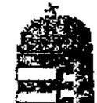

1. sz. melléklet

a V-2004-054/2008. sz. jelentéshez

NEMZETI FEJLZSZTÉSI ÉS CAZDASÁGI MINISZTÉRIUM MINISZTÉR

Iktatószám: N=GH/6669/2
Hivatkozási szám: V-2004-052/2008

Dr. Kovács Árpád úr
elnök

Áliami Számvevőszék

Tárgy: „Az INTERREG célú költségvetési előirányzatok hasznosulásának ellenőrzése" - számvevőszéki jelentés véleményezése

Tisztelt Elnök Úr!

Köszönettel megkaptam „Az INTERREG célú költségvetési előirányzatok hasznosulásának ellenőrzése" című számvevőszéki jelentést. A jelentés tervezetre további észrevételt nem kívánok tenni.

Együttműködését köszönöm.

Budapest, 2008. december '16.'

Tisztelettel:

Bajnal Gordon

1055 Budapest, Szemere u. 6 • e-mail: miniszter@nfgm.gov.hu • telefon: +36 1 374 2713 • telefax: +36 1 269 3485

---

# A magyarországi részvételű INTERREG IIIA programok intézményrendszere 

|  | Ausztria-   Magyarország | Magyarországszlovákia-   Ukrajna | Szlovénia-   Magyarország-   Horvátország | Magyarország-Románia és Magyarország-Szerbia és Montenegro |
| :--: | :--: | :--: | :--: | :--: |
| Irányító Hatóság | Osztrák Kancellári Hivatal-Bécs | Országos Területfejlesztési Hivatal $(\mathrm{OTH})^{1}$ Budapest, 2006. július 1. óta NFÜ-NEP | Szlovén Nemzeti Területfejlesztési Ügynökség (NARD)- Ljubljana | OTH-Budapest   2006. július 1. óta NFÜNEP |
| Kifizető   Hatóság | Osztrák Szövetségi Kancellári Hivatal | Magyar Pénzügyminisztérium | Szlovén Pénzügyminisztérium | Magyar Pénzügyminisztérium |
| Al-Kifizető Hatóság | VÁTI Kht. Pénzügyi Iroda | Szlovák Pénzügyminisztérium | VÁTI Kht. Pénzügyi Iroda | Phare: Román EU Integrációs Minisztérium; Cards program szerbiai hatósága: EU Újjáépítési Ügynökség |
| Nemzeti Hatóság | OTH a VÁTI   Kht.-t jelölte ki,mint nevében eljáró KSZ-t | Szlová-   kia,Építésügyi és Regionális fejlesztési Minisztérium | OTH a VÁTI Kht.-t jelölte ki,mint nevében eljáró KSZ-t/ Horvát EU Integrációs Ügyek Minisztériuma | Phare CBC programért felelős Román Európai integrációs Hatóság |
| Közös   Titkárság | Ausztria-Bécs   (ÖIR-   Management-   dienste Gmbh) és   VÁTI Nyugat-   dunántúli Regio-   nális Képviselet   (Sopron) | VÁTI Kht.   Interreg Iroda | Szlovénia NARD,   Ljubljana | VÁTI Kht. |
| Közremüködő Szervezet(KSZ) | Burgenlandi   Tartományi   Igazgatóság   (Eisenstadt) és   VÁTI Kht. (Bp. -   Sopron), Ukrajna   Gazdasági és   Európai   legrációs Minisz-   tériuma (pro-   gramkoordináci-   ós egység) | VÁTI Kht. Bp.,   Eger, Sopron,   Miskolc, Mátészalka / Szlová-   kia, Építésügyi és Regionális fejlesztési Minisztérium/   Ukrajna TACIS   Agency | NARD,VÁTI Kht.   (Bp, Pécs, Zalaegerszeg),   Horvát EU In-   tegrációs Ügyek   Minisztériuma | VÁTI Kht. (Békéscsaba, Szeged, Debrecen, Mátészalka), román EU In-   tegrációs Minisztérium;   Cards program szerbiai hatósága: EU Újjáépítési Ügynökség |
| Pénzügyi Alapok | Interreg IIIA | Interreg IIIA és TACIS | Interreg IIIA és CARDS | Interreg IIIA és Phare CBC, CARDS |
| Pályázati felhívások | folyamatosan | Évente 3-4, közös határidők | Évente 3-4, közös határidők | Évente 3-4, közös határidők |
| Projektek   Kiválasztása | Közremüködő   szervezet és   Közös Irányító   Bizottság | Közremüködő   szervezet és   Közös Irányító   Bizottság +   Európai Bizottsáa | Közremüködő   szervezet és Közös   Irányító Bizottság   +Európai Bizottság | Közremüködő szervezet és Közös Irányító Bizottság + Európai Bizottság |
| Közös Monitoring Bizottsági /Közös Irányító Bizottsági ülés évente | 2-3 | 3-4 | 3-4 | 3-4 |

[^0]
[^0]:    ${ }^{1}$ 2005. szeptemberéig: Magyar Terület-és Regionális Fejlesztési Hivatal - MTRFH

---

# Az INTERREG IIIB - CADSES program intézményrendszere 

- Közös Szakmai Titkárság: Drezda
- Irányító/Végrehajtó Hatóság: Infrastruktúra- és Közlekedési Minisztérium, Területi Koordinációért Felelős Főigazgatóság (DiCoTer)-IV. Osztály-Róma
- Kifizető Hatóság: Infrastruktúra- és Közlekedési Minisztérium-Róma
- Monitoring Bizottság magyarországi kapcsolattartó pontja: VÁTI Kht.
- Kormányzó Bizottság
- CADSES Kapcsolattartó Pontok (mind a 18 CADSES országban, Magyarországon: 1998. óta a VÁTI Kht.)
- Nemzeti Hatóság: Nemzeti Fejlesztési Ügynökség- Nemzetközi Együttmúködési Programokért felelős szervezeti egysége (NFÜ-NEP)

## INTERREG IIIC Keleti Zóna intézményrendszere

- Irányító Hatóság: INTERREG IIIC Keleti Irányító Hatóság EU Források Osztálya (27. Irányító Hatóság) -Bécs
- Kifizető Hatóság: INTERREG IIIC Keleti Irányító Hatóság Pénzügyi és Költségvetési Osztály (5. Irányító Hatóság)-Bécs
- Közös Titkárság: INTERREG IIIC Kelet Közös Titkárság-Bécs
- Monitoring Bizottság magyarországi kapcsolattartó pontja: VÁTI Kht.
- Nemzeti hatóság: Nemzeti Fejlesztési Ügynökség- Nemzetközi Együttmúködési Programokért felelős szervezeti egysége (NFÜ-NEP)

---

Az INTERREG IIIB és IIIC programok pénzügyi lebonyolításának intézményrendszere
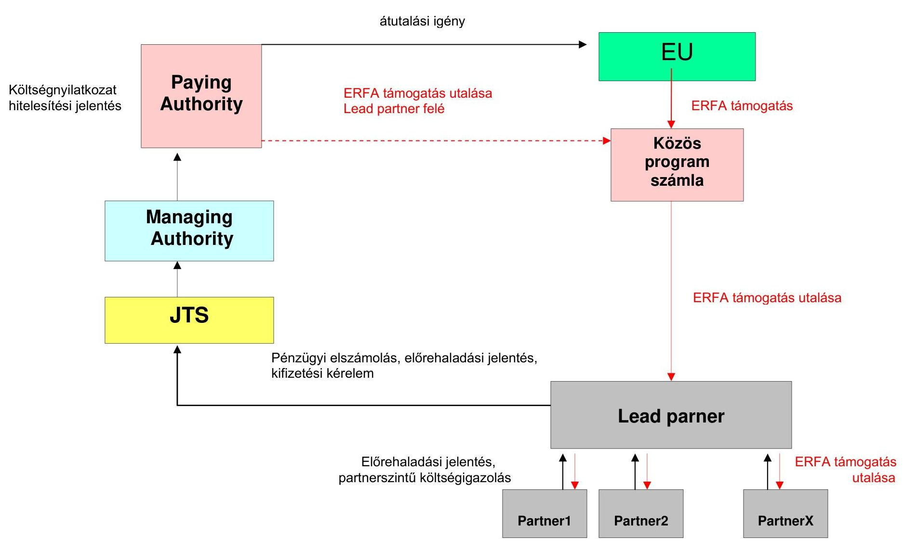

---

**Az INTERREG IIIA programok pénzügyi lebonyolítása magyarországi Program Irányító Hatóság esetén**

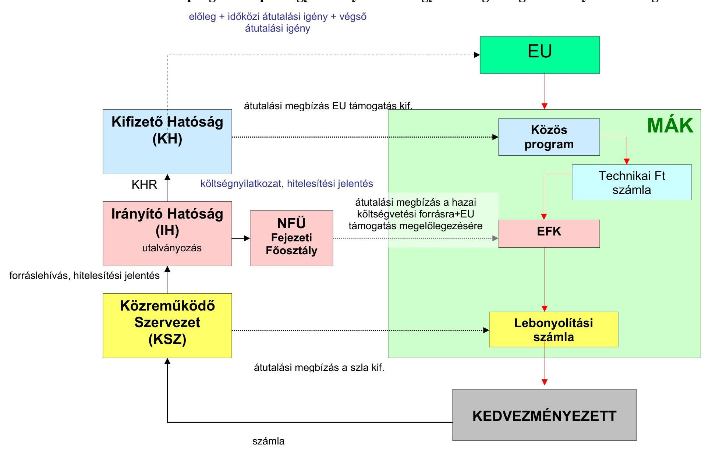

---

Az INTERREG IIIA programok pénzügyi lebonyolítása külföldi Program Irányító Hatóság esetén
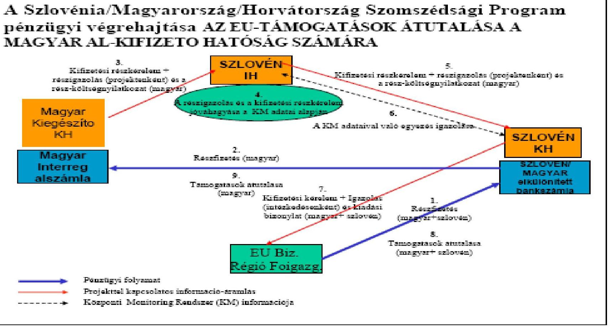

---

Az INTERREG IIIB és IIIC programok pénzügyi lebonyolítása, hazai társfinanszírozása
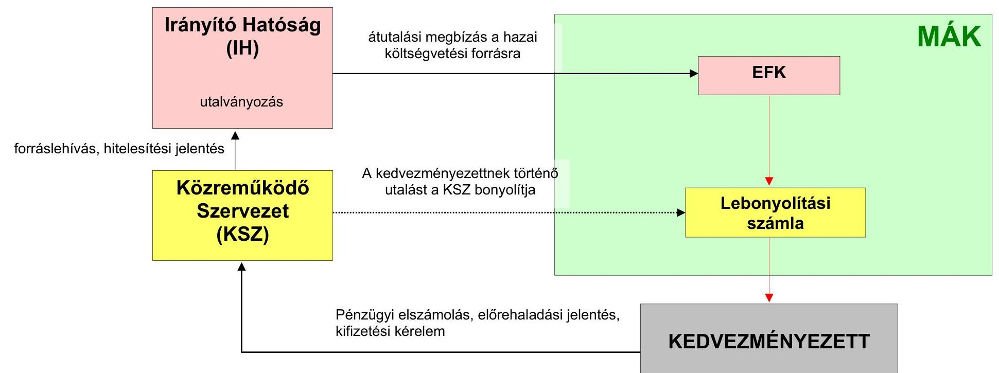

---

Az INTERREG IIIB és IIIC pénzügyi elszámolásának folyamata
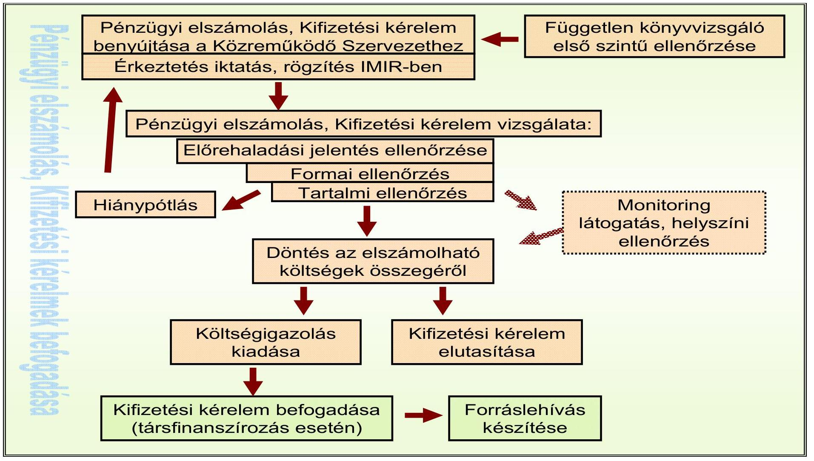

---

# Teljesítménymutatók és a hozzá tartozó kritériumok azINTERREG III végrehajtásának értékeléséhez

|  Vizsgálati kérdések | Kritériumok és teljesítménymutatók | Adatforrások  |
| --- | --- | --- |
|  Az INTERREG III végrehajtása eredményesen és hatékonyan szolgálta-e a célrendszer teljesítését és a rendelkezésre álló források hasznosulását? |  |   |
|  1. A feltételrendszer kialakítása lehetővé tette-e a célrendszer teljesítését? |  |   |
|  1.1 Megteremtették-e az INTERREG III program célrendszerének kialakítása során az egyértelmú célrendszert és kialakították-e a pénzügyi és naturális célok egyensúlyát? | A célrendszer megléte, a pénzügyi és naturális tervezés összhanga és a feltételrendszer időbeli rendelkezésre állása. | Programdokumentumok. Jogszabályok, SZMSZ-ek.  |
|  1.1.1. A célrendszer kialakításában (program, prioritások, intézkedés) megteremtették-e a programcélok és az előzetes (ex-ante) értékelés alapján feltárt szükségletek összhangját? | Az előzetes (ex-ante) értékelés és a célrendszer összhanga. | Ex-ante értékelés, programdokumentum.  |
|  1.1.2.A tervezés során kialakított monitoring indikátorrendszer alkalmas-e az INTERREG III program tényleges teljesítményének (projekt és program szintű) nyomon követésére, számbavételére és értékelésére? | Az indikátorrendszer megléte. A program indikátorok felépíthetősége a projekt indikátorokból. | A többszintű programdokumentáció.  |
|  1.1.3. Időben elkészítették-e és fogadták-e el az INTERREG III többszintű dokumentációját? | Az EU pénzügyi források elérhetősége és az INTERREG III dokumentumai végső kialakítása (elkészítés, elfogadás) közötti időintervallum. | INTERREG III kialakítási ütemterv, az elfogadást igazoló dokumentumok.  |
|  1.2. Időben kialakították-e az INTERREG III program szabályozási és intézményi rendszerét? | A Strukturális Alapok Magyarország számára való megnyílása időpontja és a teljes hazai jogszabályi környezet és intézményrendszer kialakítása közötti időintervallum kimutatása.
Az együttműködési megállapodások időpontja és a program indulása közötti időintervallum. | Jogszabályok, az intézmények, alapító okiratai és módosításai.  |

---

|  1.2.1. Megtervezték-e a programot végrehajtó intézményrendszer kapacitását, működési költségeit és azok finanszírozását? | Tervdokumentáció és a források megléte. | Tervdokumentáció, EU és hazai finanszírozási dokumentumok.  |
| --- | --- | --- |
|  1.2.2. Kialakították-e és a gyakorlatban alkalmazták-e az intézményrendszer működésének értékelési rendszerét, ennek keretében végeztek-e költséghatékonysági vizsgálatokat? | Az értékelés alapján hozott intézkedések és azok hatásai.
A költséghatékonyság-vizsgálatok száma, a hasznosult javaslatok aránya. | INTERREG III, OP-k, EU jogszabályok, célvizsgálatok.
Időközi beszámolók, időközi felmérések (belső és külső).  |
|  1.3. A program végrehajtásához a tervezett (finanszírozási) ütem szerint biztosították-e a hazai és uniós forrásokat? (költségvetési, előirányzati szinten) | Az INTERREG III tervezett éves pénzfelhasználási ütemterveinek és a költségvetési források összhangja, esetleges eltérések aránya és időbelisége.
A források a terveknek megfelelően álltak-e rendelkezésre? Kifizetési igénylések, átutalási megbízások/ a rendelkezésre álló keret (programonként, intézkedésenként). | Zárszámadási és költségvetési törvények.
Átutalási megbízások, a kifizetési bizonylatok, egyéb dokumentumok.  |
|  1.4. Kialakították-e és a végrehajtás során a gyakorlatban alkalmazták-e a tájékoztatás, nyilvánosság és a partnerség elvét érvényesítő eljárásokat? | A pályázati felhívások közzétételének és az összeférhetetlenség kezelésének megfelelősége, a támogatási források ismertsége a beadott pályázatok száma alapján. | Pályázati felhívások, hirdetések, IMIR.  |
|  2. A projektek kiválasztása hozzájárult-e a célrendszer eredményes és hatékony teljesítéséhez? |  |   |
|  2.1. A támogatásra kiválasztott, illetve leszerződött projektek biztosították-e a célrendszer eredményes teljesítését? | A kiválasztott és a szerződéses állomány tervezett kifizetési és fizikai teljesítési ütemtervének összhangja az INTERREG III ütemterveivel. Ezt az összhangot az alábbi mutatókkal vizsgáljuk:
A kiválasztott és a szerződéses állomány alapján tervezett kifizetések és az OP intézkedésenként tervezett kifizetéseinek a viszonya.
A szerződéssel lefedett tervezett kifizetések kifi- | Tanúsítványok.
OP-k és a kiválasztott állomány és a szerződéssel lefedett állomány pénzügyi kifizetései és azok trendje, a fizikai teljesítések trendje.
IMIR és egyéb nyilvántartások.  |

---

|   | zetés-intenzitása és a felhasználható forrás-keretösszeg viszonya az N+2-re tekintettel (OP-ként, intézkedésenként). A szerződéssel lekötött állomány tervezett out-put, eredmény és hatásmutatóinak összhangja az INTERREG III output, eredmény és hatásmu-tatóival. | IMIR és egyéb nyilvántartások. Tanúsítványok. A szerződésekben szereplő indikátorok és az OP indikátorok.  |
| --- | --- | --- |
|  2.1.1. A pályáztatás gyakorlata és alkalmazott módja segítette-e az INTERREG III program eredményes megvalósítását? | Időegységenként a benyújtott és támogatott, pályázatok száma, értéke, az értékelés gyakori-sága, az igények változása. A szerződéssel lekötött állomány tervezett out-put, eredmény és hatásmutatóinak viszonya az INTERREG III tervezett forrásfelhasználásához. | Pályázatok nyilvántartási rendszere, IMIR, programozásnál alkalmazott SWOT analízis. Tanúsítványok.  |
|  2.1.2. Kialakították-e a támogatás odaítélési eljárás (pályáztatás, elbírálás, támogatási döntés, szerződés-kötés) szabályozott folyamatát és annak időszükségletét, biztosították-e annak érvényesülését? | A kiválasztási folyamat szabályozottsága, azon eljárások rögzítésével, amelyek biztosítják, hogy a támogatott projektek portfoliója a programcélok elérését biztosítja. Együttműködési szerződések megléte a működési folyamatok ciklusidejének ellátására. A támogatás odaítélés és részfolyamatai ciklusidejének alakulása. | Eljárásrendek. Együttműködési megállapodások. IMIR és egyéb nyilvántartások.  |
|  2.1.3. Összehangolták-e a támogatási folyamatban az éves igényeket és forrásokat, valamint vizsgálták-e projektek hozzájárulását az N+2 szabály érvényesülésében? | Forrás felhasználási terv megléte. A forrásbiztosítás és a forrásigény összhangja az N+2 szabályozással. | Forrás felhasználási tervek. Forráslehívási prognózisok, N+2 szabály teljesülését nyomon követő elemzések és kimutatások.  |
|  2.1.4 Vizsgálták-e a támogatás odaítélési folyamat idő-igényének a pályázatokban vállalt megvalósítási ütemekre gyakorolt hatását? Tettek-e intézkedéseket a támogatás odaítélési folyamata időigényének csökkentésére? | A pályázathoz beadott kifizetési és fizikai teljesítési ütemtervek és a szerződésben aláírt kifizetési és fizikai teljesítési ütemtervek módosításainak mértéke és hatása. A késedelmes kezdések, a terv és-tényadatok eltérésének trendje. | IMIR statisztikai kimutatások a pályázat benyújtása időpontja szerinti csoportosításban, projektenként a szerző-déskötési, valamint a pályázatokban előirányzott, a szerződéskötéskor vállalt és a tényleges kezdési időpontokról.  |

---

|  2.2. A támogatás odaítélésben kialakították-e és a gyakorlatban alkalmazták-e a forrásfelhasználás tervezett hatékonyságát biztosító eljárásokat? | A forrásfelhasználás projekt és program szintű hatékonyság vizsgálatának megléte a pályázatértékelési folyamatban. | Eljárásrendek.
Pályázati dokumentációk.  |
| --- | --- | --- |
|  2.2.1.A támogatás odaítélés során, a jogosultság mellett, figyelemmel kísérték-e az egyes projektek hozzájárulását a programcélok teljesítéséhez? | A támogatott projektek és a programcélok összhanga. | IMIR  |
|  2.2.2. A támogatás odaítélési folyamatban érvényesített-ék-e a 3e (VFM) elv alkalmazását, valamint kialakították és alkalmazzák-e a jogosult költségek ellenőrzésének rendszerét? | Az előre meghatározott támogatás odaítélés összhanga az alkalmazott gyakorlattal. (Költ-ség-haszon mutatók) | Értékelési jegyzőkönyvek, pályázatok.  |
|  2.2.3. Érvényesítették-e a horizontális célokat a projekt kiválasztási folyamatban? | OP-kban meghatározott horizontális célok teljesítése a tervhez képest. | Tanúsítványok
KSH, IMIR, pályázatok, szerződések  |
|  2.3. A támogatási szerződések tartalmazzák-e a vállalt kötelezettségek teljesítésének nyomon követhetőségét és a teljesítés elmaradása esetére a megfelelő biztosítékokat? | A vállalt kötelezettségek és garanciák (biztosítékok) szerződéses megléte. | Támogatási szerződések.  |
|  3. A projektek előrehaladása és a támogatási folyamat pénzügyi lebonyolítása segítette-e a támogatási célok hatékony teljesítését? |  |   |
|  3.1. A támogatott projektek megvalósulása megfelelte a támogatási szerződésben foglalt ütemezésnek? | A projektek előrehaladási ütemének és a szerződésben rögzített ütemek összhanga.
Az N+2 forrás felhasználási terv és a tényleges kifizetések összhanga.
A projektekben elkészült létesítmények, és befejezett szolgáltatások aránya az eredeti és módosított határidők szerint.
A projektek állása.
A tervezett és a tényleges átadási határidők viszonya, a túllépések nagysága.
A megvalósítás készültségi fokának követése, az előrehaladás fázisonkénti alakulása az elő- | Szerződések, kifizetési ütemek, IMIR.
Viszonyítási alap:
- támogatási szerződések,
- szerződésmódosítások;
- jelentések,
- aktualizált ütemtervek.  |

---

|   | rejelzésekhez és az aktualizált állapothoz képest.
Módosított/összes szerződés aránya.
A késedelmek mértéke, időbeli aránya és térbeli megoszlása a projektek legutolsó, módosított ütemtervéhez képest. |   |
| --- | --- | --- |
|  3.2. A támogatási folyamat pénzügyi lebonyolításában érvényesítették-e a 3e (VFM) elv alkalmazását, valamint kialakították és alkalmazzák-e a jogosult költségek ellenőrzésének rendszerét? | A projektek tervezett költséghatékonyságának ellenőrzése a végrehajtás során (IH/NH/KSZ)
Beszerzések gazdaságosságának igazolása. | Támogatás igénylések. Azokhoz kapcsolódóan a projektek értékelése:
- jelentések
- támogatási szerződés, mellékletei
- értékelések
- ellenőrzési és monitoring jegyzőkönyvek.  |
|  3.3. Kialakították-e és a gyakorlatban érvényesítették-e a támogatási folyamat pénzügyi lebonyolításnak (kifizetés-igénylés jogosultságvizsgálata, ellenőrzés, kifizetési döntés, átutalás, könyvelés) olyan idöszükségletét, amely biztosította a lebonyolítás hatékonyságát? | A támogatás igénylés ciklusidejének alakulása (OP-nként és intézkedésenként). | IMIR és egyéb nyilvántartások.  |
|  3.3.1. Figyelemmel kisérték-e a támogatási folyamat pénzügyi lebonyolításának hatását a projektek realizálására? | A késedelmes kifizetés aránya az összes kifizetés tekintetében.
Késedelmes kifizetésre visszavezethető átütemezési kérelmek száma. | A támogatásigénylés és az átutalások dátuma.  |
|  3.3.2. Nyomon követték-e a szerződésekben foglalt pénzügyi ütemtervek teljesülését és vizsgálták-e az indikátorok teljesítését a kifizetések előtt? | A tényleges kifizetések és az elért indikátorok összhangja szerződésesben foglaltakkal. | Szerződések, IMIR, egyéb nyilvántartások.  |
|  3.3.3. Alkalmas-e a kialakított pénzügyi nyilvántartási rendszer a kiválasztott projektek esetében a tranzakciók egyértelmú nyomon követésére, a nyilvántartott adatok egyeznek-e az alapdokumentumok adataival (IMIR)? | A papír alapú és elektronikus nyilvántartások összhangja
A számlák egyértelmú beazonosíthatósága. | A kiválasztott projekt pénzügyi adatainak lekérdezhetősége az IMIR rendszerből. Projekt dossziék  |

---

|  3.4. Támogatta-e a források hasznosulását az alkalmazott ellenőrzési, monitoring és értékelési rendszer? | Összhang az EU és hazai előírásokkal.
A rendszerek működése alapján javasolt és tett intézkedések összhangja. | IMIR, jegyzőkönyvek, jelentések  |
| --- | --- | --- |
|  3.4.1 Kialakították és működtették-e az előírt ellenőrzési rendszert? Elősegítette-e ez a program eredményes és hatékony végrehajtását? | A 438/2001/EK Bizottsági rendelet 4. és 10. cikkelye szerinti ellenőrzések megfelelősége.
10. cikkely szerinti helyszíni ellenőrzések száma, program/projekt/prioritás szintű lefedettség | Működési kézikönyv, ellenőrzési nyomvonalak, ellenőrzési nyilvántartások (VÁTI Kht., NFÜ NEP, KEHI)  |
|  3.4.2. Hasznosultak-e az ellenőrzések megállapításai, javaslatai? | A javasolt és végrehajtott intézkedések aránya . | Ellenőrzési jelentések, Intézkedési tervek,  |
|  3.4.3.Kialakították és működtetették-e a monitoring rendszer? A megvalósítás folyamán az IH/NH és a KSZ figyelemmel kísérte-e a támogatási szerződésben meghatározott indikátorok várható teljesítését? | A projektektől a programok átfogó céljáig történő információáramlás kimutathatósága/hiánya. A folyamatosan fenntartandó jogosultsági kritériumok ellenőrzése (IH/NH/KSZ) | Célrendszer (programdokumentum),
Indikátorok (bázis, tény és terv adatok).  |
|  3.4.4.Vizsgálták-e a projektgazdák által jelentett tényleges indikátor adatok valódiságát és a folyamatosan fenntartandó jogosultsági kritériumok meglétét? Hasznosították-e a dokumentum és helyszíni alapú monitoring megállapítások eredményeit? | A szerződött és a tényleges monitoring adatok összhangja. | Monitoring jelentések, monitoring látogatások jegyzőkönyvei.
IMIR  |
|  3.4.5.Hasznosították-e az értékelések eredményeit a program hatékonyságának javítása érdekében? | Értékelés alapján tett és végrehajtott javaslatok összhangja. | Értékelési jelentések.  |
|  4. Az INTERREG III program hasznosulását tükröző elégedettség felmérése |  |   |
|  4.1 A program végrehajtásának hatásával a végső kedvezményezettek mennyire vannak megelégedve? | A programban lefektetett célok. | Önkéntes kérdőíves felmérés válaszainak aggregált adatai.  |

---

# INTERREG IIIA AT-HU program monitoring indikátorai

Alapadatszolgáltatás időpontja: 2008.04.22. Alapadatforrás: 5. számú tanúsítvány (VÁTI Kht.)

|  Indikátor megnevezése (angol) | Indikátor megnevezése (magyar) | Mértékegység | Bázisérték | Célállapot (2004-2008) | Időarányos teljesítés a megkötött szerződések alapján | Teljesítés \%  |
| --- | --- | --- | --- | --- | --- | --- |
|  383 - AT-HU Number of new or used instrumentes bought Összesen | Vásárolt új, vagy használt eszközök száma | db | 0 | 988 | 869 | 88\%  |
|  384 - AT-HU Nr. of organised cross-border events or conference, meetings Összesen | Határon átnyúló események, konferenciák, vagy ülések száma | db | 1 | 418 | 355 | 85\%  |
|  385 - AT-HU Nr. of elaborated researches, plans, studies, technical and training materials Összesen | Kutatások, tervek, tanulmányok, technikai és képzés anyagok száma | db | 3 | 3469 | 3430 | 99\%  |
|  386 - AT-HU Nr. of newly created or preserved jobs Összesen | új, vagy megőrzött munkahelyek száma | db | 3 | 15 | 15 | 100\%  |
|  387 - AT-HU Nr. of surveys, pactums, databases, web pages, white papers etc Összesen | Vizsgálatok, megállapodások, adatbázisok, honlapok, stb. száma | db | 0 | 17498 | 14065 | 80\%  |
|  388 - AT-HU Nr. of people directly involved into the cultural and social events, training, HRO activities or study tours Összesen | A kulturális, szociális eseményeken, képzéseken, tanulmányutakon közvetlenül résztvevők száma | fő | 0 | 7685 | 6927 | 90\%  |
|  389 - AT-HU Length of transport infrastructure developed Összesen | A fejlesztett közlekedési infrastruktúra hossza | fm | 0 | 0 | 0 | -  |
|  390 - AT-HU Nr. of trainings or educations organised Összesen | A szervezett tréninek és képzések száma | db | 1 | 79 | 72 | 91\%  |
|  391 - AT-HU Nr. of partnership statements Összesen | Partneri megállapodások száma | db | 0 | 24 | 22 | 92\%  |
|  392 - AT-HU Nr. of prepared awareness raising and information materials Összesen | Az elkészített figyelemfelhívó és információs anyagok száma | db | 0 | 81190 | 41117 | 51\%  |
|  393 - AT-HU Nr. of buildings constructed or renovated Összesen | Az új és felújított épületek száma | db | 4 | 18 | 18 | 100\%  |
|  394 - AT-HU Lenght of bicycle road construction Összesen | Kerékpárút építések hossza | db | 0 | 1 | 0 | 0\%  |
|  395 - AT-HU Investment in waste-water treatment Összesen | Szennyvízkezeléssel kapcsolatos fejlesztések száma | db | 0 | 2 | 2 | 100\%  |
|  396 - AT-HU Nr.of instrumentes renewed Összesen | A felújított eszközök száma | db | 0 | 1 | 1 | 100\%  |
|  397 - AT-HU Nr.of licence plans Összesen | A licenctervek száma | db | 0 | 4 | 4 | 100\%  |
|  398 - AT-HU Nr.of enforceable licence plans Összesen | Alkalmazott licenctervek száma | db | 0 | 9 | 1 | 11\%  |
|  6 - Number of elaborated plans, programmes, preparatory studies, surveys, action plans and strategies Összesen | Kódolgozott tervek, programok, megvalósítási tanulmányok, vizsgálatok, akciótervek és stratégiák száma | db | 0 | 4 | 4 | 100\%  |

Készítette, fordította: ÁSZ Bank Lajos, Szepes Béla

---

4.b. sz. melléklet a V-2004-054/2008. sz. jelentéshez

# INTERREG IIIA HU-RO-SCG program monitoring indikátorai

Alapadatszolgáltatás időpontja: 2008.04.22. Alapadatforrás: 5. számú tanúsítvány (VÁTI Kht.)

|  Indikátor megnevezése (angol) | Indikátor megnevezése (magyar) | Mértékegység | Bázisérték | Célállapot (2004-2008) | Időarányos teljesítés a megkötött szerződések alapján | Teljesítés
$\%$  |
| --- | --- | --- | --- | --- | --- | --- |
|  1. Number of people who's situation improved Összesen | Az emberek száma, akiknek a helyzete javult | fő | 0 | 5000 | 5600 | $112 \%$  |
|  10. Number of joint researches, plans, studies, technical and training materials Összesen | A közös kutatások, tervek, tanulmányok, technikai és képzési anyagoknak a száma | db | 7 | 122226 | 117091 | $96 \%$  |
|  11. Number of surveys, pactums, databases, web-pages, white papers vizs. Összesen | Vizsglátatok, megállapodások, adatbázisok, honlapok, stb. száma | db | 0 | 41048 | 12787 | $31 \%$  |
|  12. Number of people directly involved into the cultural and social events, training, HRD activities or study tours etc. Összesen | A kulturális, szociális eseményeken, képzéseken, tanulmányutakon közvetlenül résztvevők száma | fő | 304 | 9609 | 7452 | $78 \%$  |
|  13. km of transport lines built or renewed (road, waterways) Összesen | Az újonnan épített és felújított közlekedési vonalak hossza km-ben (utak, vízi utak) | km | 0 | 23314 | 23314 | $100 \%$  |
|  15.Activities contributing to the environment and sustainable development Összesen | A környezetvédelemhez és a fenntartható fejlődéshez hozzájáruló tevékenységek | db | 0 | 4 | 1 | $25 \%$  |
|  2. Number of contracts established within the eligibility area Összesen | A megkötött szerződések száma a jogosultsági területen belül | db | 5 | 107 | 204 | $191 \%$  |
|  21. Number of improved tourism attractions Összesen | A túrizmus fejlődését szolgáló attrakciók száma | db | 0 | 7 | 4 | $57 \%$  |
|  24. Number of participants of organised cross-border (bi- or trilateral) events Összesen | A szervezett határon átnyúló (két, vagy háromoldalú) eseményeken résztvevők száma | fő | 0 | 111 | 111 | $100 \%$  |
|  3. Newly built and reconstructed business infrastructures Összesen | Újonnan épített üzleti infrastruktúra | db | 0 | 7039 | 6160 | $88 \%$  |
|  4. Number of Municipalities and other Organisations directly effected by the programme (investments, activities, programme etc.) Összesen | Az önkormányzatok és más szervezetek száma, akikre közvetlenül hatással volt a program (befektetések, tevékenységek, program, stb.) | db | 195 | 507847 | 276 | $0 \%$  |
|  5. Number of new or used instruments bought (supply) Összesen | Vásárolt új, vagy használt eszközök száma | db | 66 | 4337 | 3451 | $80 \%$  |
|  6. Number of elaborated plans, programmes, preparatory studies, surveys, action plans and strategies Összesen | Kódolgozott tervek, programok, megvalósítási tanulmányok, vizsgálatok, akciótervek és stratégiák száma | db | 1 | 1 | 1 | $100 \%$  |
|  6. Number of newly established or preserved job opportunities Összesen | Az újonnan létrehozott és megőrzött munkahely-lehetőségek száma | db | 0 | 3 | 1 | $33 \%$  |
|  7. Number of enterprises possessed cross border partnership (concerning the supported activities) Összesen | A határon átnyúló kapcsolatokat kiépítő vállalkozások száma (a támogatott tevékenységekkel összefüggően) | db | 2 | 18 | 16 | $89 \%$  |
|  7. Number of joint information activities Összesen | A közös információs tevékenységek száma | db | 0 | 226 | 160 | $71 \%$  |
|  8. Number of social, cultural events or conferences in the crossborder area Összesen | A szociális, kultúráliús események, vagy konferendciák száma a határmenti területeken | db | 9 | 823 | 583 | $71 \%$  |
|  9. Number of people or enterprises using the newly established or renewed business infrastructure network resulted by the improved HRD or joint researches Összesen | Az emberek, vagy vállalkozások száma, akik alkalmazzák az újonnan létrehozott, vagy felújított üzleti hálózatot, amelyek a továbbfejlesztett HRD, vagy a közös kutatások eredményeként jött létre. | db | 0 | 660 | 216 | $33 \%$  |

---

# INTERREG IIIA HU-SK-UA program monitoring indikátorai

Alapadatszolgáltatás időpontja: 2008.04.22. Alapadatforrás: 5. számú tanúsítvány (VÁTI Kht.)

|  Indikátor megnevezése (angol) | Indikátor megnevezése (magyar) | Mértékegység | Bázisérték | Célállapot (2004-2008) | Időarányos teljesítés a megkötött szerződések alapján | Teljesítés
$\%$  |
| --- | --- | --- | --- | --- | --- | --- |
|  1. Number of people who's situation improved Összesen | Az emberek száma, akiknek a helyzete javult | fő | 0 | 30032 | 32 | $0 \%$  |
|  10. Number of joint researches, plans, studies, technical and training materials Összesen | A közös kutatások, tervek, tanulmányok, technikai és képzési anyagoknak a száma | db | 2 | 178798 | 64116 | $36 \%$  |
|  11. Number of surveys, pactums, databases, webpages, white papers etc Összesen | Vizsgálatok, megállapodások, adatbázisok, honlapok, stb. száma | db | 108002 | 432890 | 359840 | $83 \%$  |
|  12. Number of people directly involved into the cultural and social events, training, HRD activities or study tours etc. Összesen | A kulturális, szociális eseményeken, képzéseken, tanulmányutakon közvetlenül résztvevők száma | fő | 0 | 23257 | 11915 | $51 \%$  |
|  13. km of transport lines built or renewed (road, waterways) Összesen | Az újonnan épített és felújított közlekedési vonalak hossza km-ben (utak, vízi utak) | km | 0 | 4806 | 4806 | $100 \%$  |
|  14. Activities contributing to the equal opportunities Összesen | Az esélyegőséghez hozzájáruló tevékenységek | db | 0 | 18 | 18 | $100 \%$  |
|  15.Activities contributing to the environment and sustainable development Összesen | A környezetvédelemhez és a fenntartható fejlődéshez hozzájáruló tevékenységek | db | 2500 | 75654 | 102506 | $135 \%$  |
|  2. Number of contracts established within the eligibility area Összesen | A megkötött szerződések száma a jogosultsági területen belül | db | 0 | 77 | 34 | $44 \%$  |
|  3. Newly built and reconstructed business infrastructures Összesen | Újonnan épített üzleti infrastruktúra | db | 9 | 6371 | 3454 | $54 \%$  |
|  4. Number of Municipalities and other Organisations directly effected by the programme (investments, activities, programme etc.) Összesen | Az önkormányzatok és más szervezetek száma, akikre közvetlenül hatással volt a program (befektetések, tevékenységek, program, stb.) | db | 1 | 236 | 664 | $281 \%$  |
|  5. Number of new or used instruments bought (supply) Összesen | Vásárolt új, vagy használt eszközök száma | db | 2036 | 8807 | 1615 | $18 \%$  |
|  6. Number of newly established or preserved job opportunities Összesen | Az újonnan létrehozott és megőrzött munkahelylehetőségek száma | db | 3 | 33 | 23 | $70 \%$  |
|  7. Number of enterprises possessed cross border partnership (concerning the supported activities) Összesen | A határon átnyúló kapcsolatokat kiépítő vállalkozások száma (a támogatott tevékenységekkel összefüggően) | db | 0 | 38 | 7 | $18 \%$  |
|  8. Number of social, cultural events or conferences in the cross-border area Összesen | A szociális, kulturális események, vagy konferendciák száma a határmenti területeken | db | 65 | 625 | 387 | $62 \%$  |
|  9. Number of people or enterprises using the newly established or renewed business infrastructure network resulted by the improved HRD or joint researches Összesen | Az emberek, vagy vállalkozások száma, akik alkalmazzák az újonnan létrehozott, vagy felújított üzleti hálózatot, amelyek a továbbfejlesztett HRD, vagy a közös kutatások eredményeként jött létre. | db | 3634 | 90642 | 10844 | $12 \%$  |

Készítette, fordította: ÁSZ Bank Lajos, Szepes Béla

---

# INTERREG IIIA SLO-HU-CRO program monitoring indikátorai

Alapadatszolgáltatás időpontja: 2008.04.22. Alapadatforrás: 5. számú tanúsítvány (VÁTI Kht.)

|  Indikátor megnevezése (angol) | Indikátor megnevezése (magyar) | Mértékegység | Bázisérték | Célállapot (2004-2008) | Időarányos teljesítés a megkötött szerződések alapján | Teljesítés
$\%$  |
| --- | --- | --- | --- | --- | --- | --- |
|  Number of cross-border partners involved in the project (co-operation agreements signed) Összesen | A projektekbe bevont határmenti partnerek száma ( az aláírt kooperációs megállapodások) | db | 0 | 1 | 1 | $100 \%$  |
|  Number of new jobs created Összesen | Ujonnan létrehozott munkahelyek száma | db | 0 | 12 | 8 | $67 \%$  |
|  Number of organised cross-border (bi- or trilateral) events Összesen | Szervezett határmenti események (két „illetve háromoldalú) | db | 0 | 3 | 3 | $100 \%$  |
|  Number of prepared awareness raising and information materials (booklets, books, training materials) Összesen | Az elkészített figyelemfelhívó és információs anyagok száma | db | 0 | 200 | 200 | $100 \%$  |
|  Number of trained staff Összesen | Kiképzett munkavállalók száma | fő | 0 | 45 | 47 | $104 \%$  |
|  SLOHUCRO Number of joint investments in cross-border sustainable transport Összesen | A határmenti, fenntartható közlekedéshez hozzájáruló közös befektetések száma. | db | 3 | 10 | 0 | $0 \%$  |
|  SLOHUCRO Number of cross-border events and meetings Összesen | A határmenti események tanácskozások száma | db | 52 | 620 | 229 | $37 \%$  |
|  SLOHUCRO Number of employment creation projects Összesen | A munkahelyteremtő projektek száma | db | 0 | 15 | 15 | $100 \%$  |
|  SLOHUCRO Number of increase in total size of actively managed area (km2) Összesen | Az aktívan felügyelt terület (km2) növekedésének mértéke | km2 | 9 | 45 | 19 | $42 \%$  |
|  SLOHUCRO Number of joint (cross-border) environmental realised investments Összesen | Közös határmenti környezetvédelmi célzatú megvalósított beruházások száma. | db | 1 | 14 | 5 | $36 \%$  |
|  SLOHUCRO Number of joint outputs Összesen | Közös outputok száma. | db | 0 | 95 | 62 | $65 \%$  |
|  SLOHUCRO Number of joint tourism and cultural products and events Összesen | A közös, tünzmushoz kapcsolódó és kulturális termékek, illetve események száma. | db | 9 | 632 | 100 | $16 \%$  |
|  SLOHUCRO Number of new cross-border networks Összesen | Az új határmenti hálózatok száma. | db | 1 | 13 | 4 | $31 \%$  |
|  SLOHUCRO Number of new cross-border tourism zones Összesen | Az új, határmenti turista-zónák száma. | db | 0 | 20 | 10 | $50 \%$  |
|  SLOHUCRO Number of newly created jobs Összesen | Ujonnan létrehozott munkahelyek száma | db | 4 | 371 | 189 | $51 \%$  |
|  SLOHUCRO Number of partners involved in the projects Összesen | A projektekbe bevont határmenti partnerek száma ( az aláírt kooperációs megállapodások) | db | 24 | 653 | 651 | $100 \%$  |
|  SLOHUCRO Number of partnership statements Összesen | A partnersegi megállapodások száma. | db | 140 | 378 | 391 | $103 \%$  |
|  SLOHUCRO Number of signed agreements on future cooperation Összesen | A jövőbeni kooperációt szolgáló, aláírt megállapodások száma. | db | 2 | 221 | 10 | $5 \%$  |
|  SLOHUCRO Number of successfully trained people Összesen | A sikeresen kiképzett emberek száma. | fő | 0 | 584 | 524 | $90 \%$  |
|  SLOHUCRO Number of training and education projects Összesen | A tréningek és oktatási projektek száma. | db | 0 | 7 | 6 | $86 \%$  |
|  SLOHUCRO Share of projects that improve CB mobility, accessibility and integrated use of information technology and communication infrastructure Összesen | Azon projekteknek az aránya, amelyek fejlesztik a határmenti mobilitást, elérhetőséget, az információs technológia integrált alkalmazását és a kommunikációs infrastruktúrát. | db | 0 | 4 | 4 | $100 \%$  |

Készítette, fordította: ÁSZ Bank Lajos, Szepes Béla

---

5/a. sz. melléklet
a V-2004-054/2008. sz. jelentéshez

Az INTERREG IIIA HU-SK-UA Program támogatásra jogosult területei
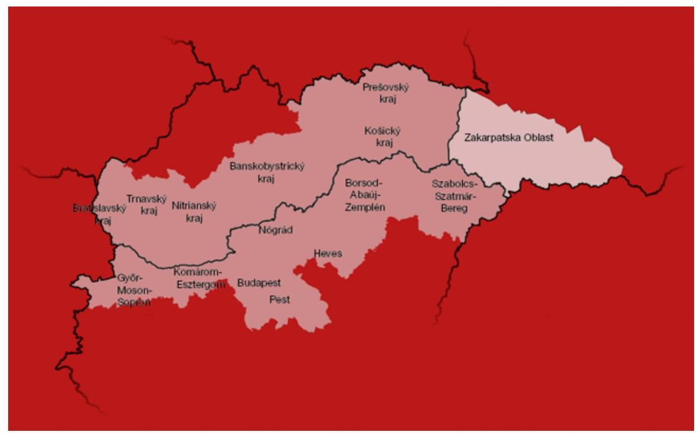

---

5/b. sz. melléklet a V-2004-054/2008. sz. jelentéshez

Az INTERREG IIIA HU-RO-SCG Program támogatásra jogosult területei
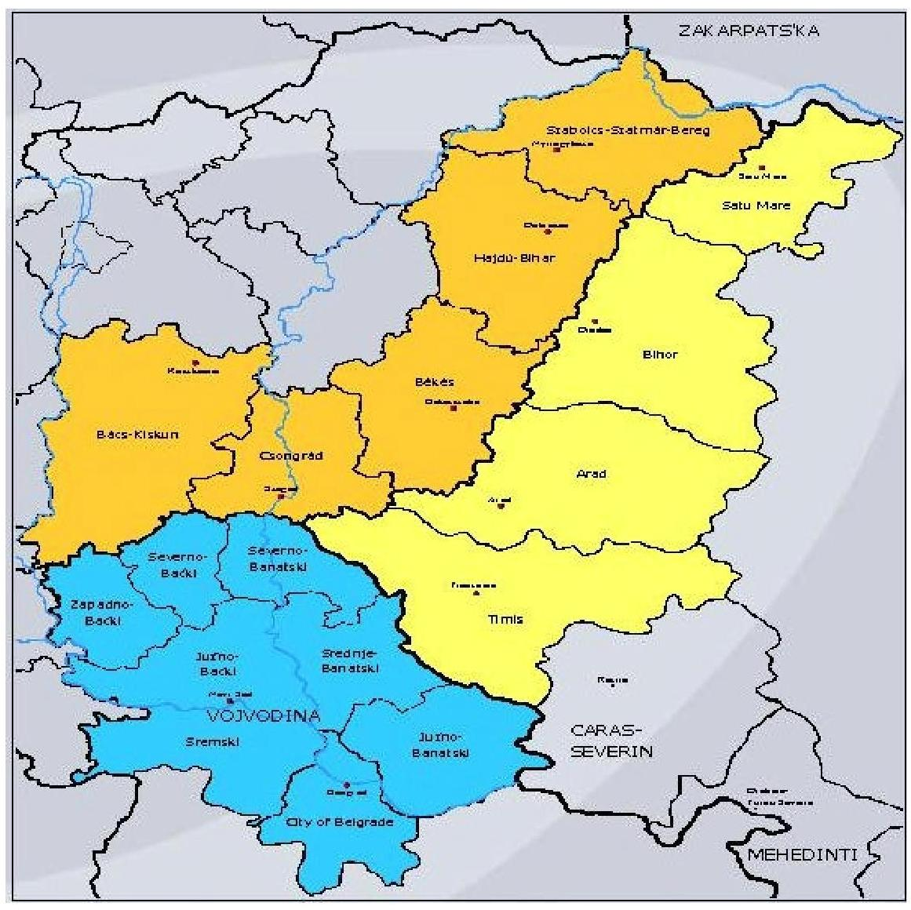

---

5/c. sz. melléklet
a V-2004-054/2008. sz. jelentéshez

# Az INTERREG IIIA SLO-HU-CRO Program támogatásra jogosult területei 

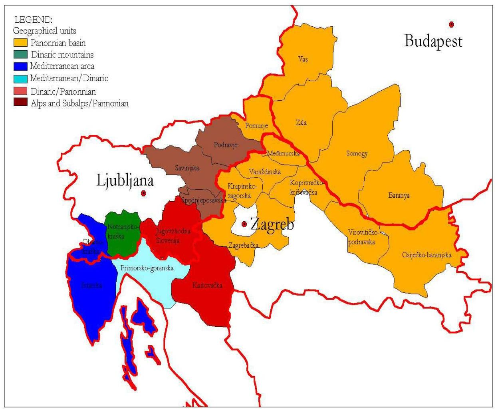

---

5/d. sz. melléklet a V-2004-054/2008. sz. jelentéshez

Az INTERREG IIIA AT-HU Program támogatásra jogosult területei
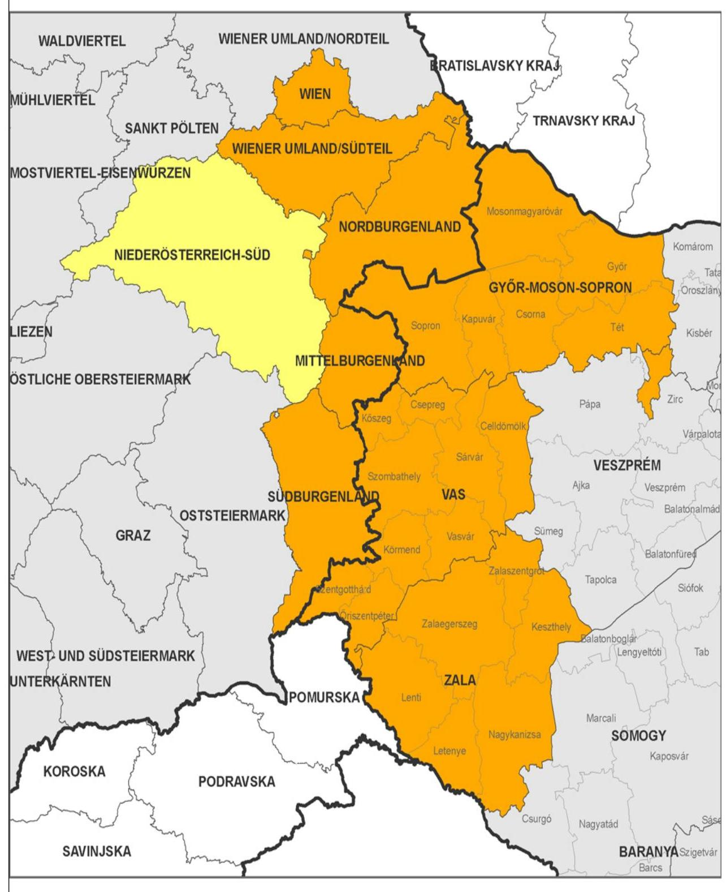

---

# A célok és a prioritások kapcsolata az INTERREG IIIA HU-RO-SCG program esetében 

(példa a célok és prioritások kapcsolatára)
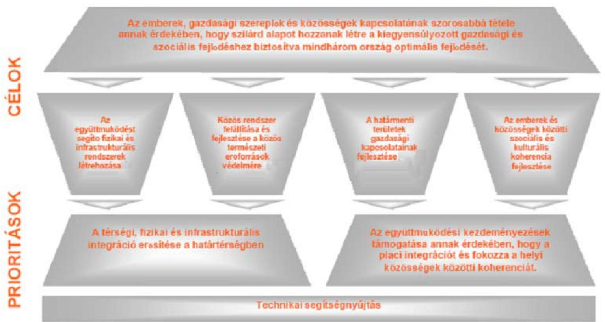

---

# 7. sz. melléklet

a V-2004-054/2008. sz. jelentéshez

|  HU-SK-UA | (a helyszíni vizsgálatra kijelölt projektek sárga háttérrel kiemelve) |  |  |   |
| --- | --- | --- | --- | --- |
|  Pályázat azonosító | Projekt címe | Kedvezményezett neve | Jóváhagyott támogatás (Ft) | Projekt teljes költsége (Ft)  |
|  HUSKUA0501/303/1.1/HU | A gazdasági és kultúrála együttműködést megalapozó és segítő hálózat megalapozása | Pro Professione Alapítvány | 17784000 | 18720000  |
|  HUSKUA0501/243/1.1/HU | Kultúrtörténeti séta a Rákóczi Várak nyomán | Magyar Nemzeti Múzeum | 171599991 | 180631570  |
|  HUSKUA0501/270/1.1/HU | A Zemplén Kapui - integrált Zempléni turizmusfejlesztési Program (TokajNagykapos) | Tokaj Város Önkormányzata | 52630000 | 55400000  |
|  HUSKUA0501/244/1.1/HU | Pozsony-Budapest vizitúraútvonal budapesti állomáshely fejlesztése | KÜLKER Evezős Klub | 63300875 | 66632500  |
|  HUSKUA0501/250/1.1/HU | Turisztikai szálláshelyek és tematikus idegenforgalmi szolgáltatáskínálat bővítése Hollókőn és Rimócon | Hollókő Községi Önkormányzat | 209104738 | 220110250  |
|  HUSKUA0501/021/1.1/HU | A Szigetköz-Csallóköz szerves turisztikai egységének helyi jellegzetességeire építő öko- és viziturisztikai kínálat bővítése a masonmagyaróvári várpince és környezete rehabilitációjával | Nyugat-magyaroszági Egyetem
Mezőgazdaság és
Elelmiszertudományi Kar | 210552151 | 221633843  |
|  HUSKUA
0502/401/1.1/HU | Távmunka-ház interregionális koncepciójának kidolgozása és mintaértékű megvalósítása | Örkény Város Önkormányzata | 40665485 | 42859913  |
|  HUSKUA
0502/085/1.1/HU | Füzér - Vár a Natúrparkban | Kincstári Vagyoni Igazgatóság | 42426082 | 50507240  |
|  HUSKUA0501/315/1.1/HU
HUSKUA0501/231/1.1/HU | Vizi- és falusi turizmus határok nélkül | Falusi Turizmus Szabolcs-SzatmárBereg Megyei Szervezete | 23325916 | 24702900  |
|  HUSKUA
0502/069/1.1/HU | A Gömör-Tornai-karszt turisztikai programház kialakítása (Vytvorenie turistického programového domu Gemersko-tumianskeho-krasu) | Aggteleki Nemzeti Park Igazgatóság | 49799988 | 52421040  |
|  HUSKUA
0502/294/1.1/HU | Magyar, ukrán vállalkozások együttműködésését javító képzés | Szabolcs-Szatmár-Bereg Megyei Kereskedelmi és Iparkamara | 18716941 | 19702044  |
|  HUSKUA
0502/148/1.1/HU | Ikrény község és Rábcatorok kistérség esélye a gazdasági fellendülésre | Ikrény Község Önkormányzata | 12424618 | 13078545  |
|  HUSKUA
0502/135/1.2/HU | Kárpátalja megyével a közlekedésbiztonság javításáért | Sz-Sz-B Megyei Rendőr-
Főkapitányság | 15061838 | 15854566  |
|  HUSKUA
0502/361/1.2/HU | Határtalan felnőtiképzés | Eszak Magyarország Regionális Képző Központ Érák | 26735567 | 28142703  |
|  HUSKUA0501/014/1.2/UA | DEVELOPMENT AND INTRODUCTION OF CBC SOCIAL-MEDICAL REHABILITATION PROGRAMME FOR SUPPORTING CHILDREN OF NATIONAL MINORITIES AND SOCIALLY UNPROTECTED POPULATION DEVELOPMENT AND INTRODUCTION OF CBC SOCIAL-MEDICAL REHABILITATION PROGRAMME FOR SUPPORTING | Felső-Szabolcsi Kórház | 110743649 | 116637690  |
|  HUSKUA0501/255/1.2/SK | "ERÖDÖK ÉBREDÉSE"
A révkomárom Öregvár és Újvár hasznosítási lehetőségeinek elemzése ? akcióterv kidolgozása | Monostori Erőd Hadkultúra Központ KHT. | 30177937 | 31766250  |
|  HUSKUA0501/016/1.2/SK | Adathálózat kiépítése a Szlovák Köztársaság és a Magyar Köztársaság tüzoltóegységei közti összeköttelés és információcsere biztosítása céljából. | BM Országos Katasztrófavédelmi Fölgazgatóság Komárom-Esztergom Megyei Katasztrófavédelmi Igazgatóság | 63728375 | 67082500  |

---

|  HUSKUA0501/056/1.2/SK | CLUST - NET | Bay Zoltán Foundation for Applied Research, Institute for Logistics and Production Systems | 45290872 | 47674602  |
| --- | --- | --- | --- | --- |
|  HUSKUA0501/237/1.2/HU | Határ menti együttműködést segítő képzési és vállalkozásösztönzési program Szabolcs-Szatmár-Bereg és Kassa megyék között | Müszaki és Természettudományi Egyesületek Szövetsége | 12351736 | 13005934  |
|  HUSKUA 0502/390/1.2/HU | Interregional Civil Partnership Network | Kisalföldi Vállalkozásfejlesztési Alapítvány | 16897000 | 17786788  |
|  HUSKUA 0502/292/1.2/HU | Plato program Ukrajna | Szabolcs-Szatmár-Bereg Megyei Kereskedelmi és Iparkamara | 16530853 | 17400898  |
|  HUSKUA 0502/332/1.2/HU | Kutató- és Innovációs Központ a Kárpátmedencében | Bay Zoltán Alkalmazott Kutatási Közalapítvány Logisztikai és Gyártástechnikai Intézet | 14171434 | 14917299  |
|  HUSKUA 0502/105/1.2/HU | A határrégió versenyképességét segítő oktatási programok | GYőr-Moson-Sopron Megyei Pedagógiai Intézet | 27988734 | 29461825  |
|  HUSKUA 0502/377/1.2/HU | Kapcsolatépítés az SZTE, a BME és az Ungvári Nemzeti Egyetem között ? EU-s és hazai építőipari technológia, alkalmazások szellemi exportja | Szilikátipari Tudományos Egyesület | 6525607 | 6869060  |
|  HUSKUA 0502/445/1.2/HU | Civilek a civilekért- határon átnyúló non-profit szakmai támogató program | Regionális Érdekvédelem Alapítvány | 18037631 | 18986980  |
|  HUSKUA 0502/117/1.2/HU | Alapkutatás a szlovák-magyar határtérség társadalmi-gazdasági vizsgálatára | Magyar Tudományos Akadémia Regionális Kutatások Központja Nyugat-magyarországi Tudományos Intézet | 22548768 | 23735545  |
|  HUSKUA 0502/001/1.3/HU | Cooperation of vocational institutions in the field of commerce | Pálffy Miklós Kereskedelmi Szakképző Iskola | 11075243 | 11675243  |
|  HUSKUA 0502/191/1.3/HU | Együtt Európában Program | Egyházasdengelegi Községi Önkormányzat | 4330000 | 4769265  |
|  HUSKUA 0502/216/1.3/HU | "Andrássy" Kulturális Út létrehozása a szlovák-magyar határ mentén | Szabolcs-Szatmár-Bereg Megyei Önkormányzati Hivatal | 10260000 | 10800000  |
|  HUSKUA 0502/218/1.3/HU | Határon átnyúló turisztikai kapcsolatok kialakítása és fejlesztése Szabolcs-SzatmárBereg és Kárpátalja megyékben | Szabolcs-Sz B Megyei
Területfejlesztési és
Környezetgazdálkodási Ügynökség Kht. | 3757790 | 3955570  |
|  HUSKUA 0502/088/1.3/HU | Vizi- és Kite Sportok Mobil Centruma Középés Kelet-Európában | Magyar Kitesurf és Extrémsport Egyesület | 9688575 | 10198500  |
|  HUSKUA 0502/320/1.3/HU | ?ARANYNÉZÖ?
a Szigetköz és a Csallóköz kulturális és természeti értékeinek komplex megismertetése | Pisztráng Kör Waldorf Természetvédő és Természetjáró Egyesület | 4006000 | 4217900  |
|  HUSKUA 0502/115/1.3/HU | Tanuljuk együtt Európát | Petőfi Sándor Középiskolai Fiúkollégium | 6298601 | 6698601  |
|  HUSKUA 0502/350/1.3/HU | Carovná záhrada, spoločná minulosť záloha budúcnosti | Halászi Község Önkormányzata | 3598125 | 3787500  |
|  HUSKUA 0502/097/1.3/HU | KOMP - Kulturális, oktatási, multietnikus program | MTA Etnikai-Nemzeti Kisebbségkutató Intézet | 10839500 | 11410000  |
|  HUSKUA 0502/060/1.3/HU | Kárpátaljai gyerekek kézműves táboroztatása | Búzavirág Alapítvány | 11870000 | 12499702  |
|  HUSKUA 0502/079/1.3/HU | Magyar-Szlovák-Ukrán Tájékozódási Futó Találkozó | Diósgyőri Tájékozódási Futó Club | 5130000 | 5400000  |
|  HUSKUA 0502/195/1.3/HU | A VILÁG ÖRÖKSÉGE, AZ ÖRÖKSÉG VILÁGA | Hollókőért Közalapítvány | 12625000 | 13289474  |
|  HUSKUA 0502/249/1.3/SK | Reneszánsz örökségünk- tradíciók összekapcsolása és rejtett kulturális örökségünk a szlovák-magyar határ mentén | Diósgyőri Ady Endre Kulturális és Szabadidő Központ | 12140200 | 13104750  |
|  HUSKUA 0502/419/1.3/HU | Színházi előadások cseréje Kassa és Miskolc között | Miskolci Nemzeti Színház | 12624835 | 13289300  |
|  HUSKUA 0502/013/1.3/HU | Testvérségi kapcsolatok erősítése Vanyarc és Dolná Strehová települések között | Vanyarc Község Önkormányzata | 7194464 | 7573120  |

---

|  HUSKUA
0502/019/1.3/SK | Common water tourism events in the Danube branch system | Felső - Szigetközi Szabadidő és Vízi Sport Egyesület | 5139264 | 5412600  |
| --- | --- | --- | --- | --- |
|  HUSKUA
0502/210/1.3/HU | Hand in hand for each other across nurserybridge | Önkormányzati Intézmények Gazdasági Hivatala alá gazdaságilag tartozó Kistáltos Óvoda | 6886135 | 7248725  |
|  HUSKUA
0502/113/1.3/SK | Common history and collective identities in border regions. (Intensification of historian commision activities) | Magyar Tudományos Akadémia Társadalomkutató Központ | 6307050 | 6639000  |
|  HUSKUA
0502/170/1.3/HU | Együttműködés a vízgazdálkodás és a környezetvédelem területén a határvizi megállapodás szellemében | Észak-Magyarországi Környezetvédelmi és Vízügyi Igazgatóság | 3843300 | 4045580  |
|  HUSKUA
0502/155/1.3/HU | A Sajó vize összeköt | Herman Ottó Általános és Művészetoktatási Iskola | 10591740 | 11149200  |
|  HUSKUA0501/123/2.1/SK | A HU - SK - UA határmenti régiók komplex hatástanulmánya a biomassza felhasználásával kapcsolatban | Zempléni Fejlesztési Társaság Alapítvány | 51435811 | 54142958  |
|  HUSKUA0501/259/2.1/HU | Szlovák-Magyar települések egységes szemléletű vízgazdálkodása az Ipoly mentén | Szob Város Önkormányzata | 37790000 | 40790000  |
|  HUSKUA0501/139/2.1/HU | Magyar-ukrán komplex árvízvédelmi-vizgazdálkodási-ártérrevitalizációs fejlesztési tervek kidolgozása a Bereg és a Borzsa vízgyűjtőjére | Felső-Tisza Vidéki Környezetvédelmi és Vízügyi Igazgatóság | 379102983 | 399223866  |
|  HUSKUA0501/160/2.1/HU | Ökológiai folyosó kialakítása az Ipoly folyón Kiskeszi (Malé Kosihy) és Ipolyszakállos (Ipelsky Sokolec) térségében (Hallépcsők az Ipolyon) | Közép-Duna-völgyi Környezetvédelmi és Vízügyi Igazgatóság | 184180000 | 193880000  |
|  HUSKUA0501/213/2.1/HU | Szlovák-magyar talajvízvédelmi akcióterv kidolgozása a Hernández-völgy sérülékeny allúviumán a fenntartható vidékfejlesztés megalapozása céljából | Encsi Többcélú Kistérségi Társulás | 48677933 | 51239929  |
|  HUSKUA0501/041/2.1/HU | Landscape and water management concept based on water retention, its feasibility study and planning at Bodrogköz area. | Észak-Magyarországi Környezetvédelmi és Vízügyi Igazgatóság | 222225613 | 233921698  |
|  HUSKUA
0502/029/2.1/HU | Környezetvédelmi program a Gömör-Tornai karszt vízbázisainak védelmére | Észak-Magyarországi Környezetvédelmi és Vízügyi Igazgatóság | 149161318 | 157011914  |
|  HUSKUA
0502/158/2.1/HU | Transformation and utilisation of the metal content of wastes | University of West Hungary Faculty of Agricultural and Food Sciences | 29120697 | 30750077  |
|  HUSKUA
0502/355/2.1/HU | Egy magyar régió és három szlovák megye komplex biomassza energetikai, kooperációs modellje | Károly Róbert Főiskola | 34732000 | 36560000  |
|  HUSKUA
0502/166/2.1/HU | Magyar-Szlovák határmenti közös felszínalati viztestek környezetállapota és fenntartható használata | Magyar Állami Földtani Intézet | 117214972 | 123384181  |
|  HUSKUA
0502/367/2.1/HU | Megújuló Energia-Megújuló Határvidék | Esztergomi Környezetkultúra Egyesület | 37436498 | 39406840  |
|  HUSKUA
0502/156/2.1/HU | A Tisza magyar-ukrán határszakaszának környezeti hatástanulmánya és folyógazdálkodási tanulmányterve | Felső Tisza-vidéki Környezetvédelmi és Vízügyi Igazgatóság | 38070637 | 40074355  |
|  HUSKUA
0502/167/2.1/HU | Árvízvédelmi szükségtározók tervezése a Bódva völgyében | Észak-magyarországi Környezetvédelmi és Vízügyi Igazgatóság | 29091375 | 30622500  |
|  HUSKUA0501/236/2.2/HU | Önkéntes munka bevonásával megvalósuló természetvédelmi monitoring hálózat kiépítése | Magyar Madártani és Természetvédelmi Egyesület | 30396200 | 31996000  |
|  HUSKUA0501/126/2.2/HU | Határtalan természet | Zemplén Televízió Kht. | 29804706 | 31373375  |

---

|  HUSKUA0501/154/2.2/HU | Természeti értékeket, természetvédelmi tevékenységeket bemutató programok, kiadványok, információhordozók kivitelezése és periodika megjelentetése | Bükki Nemzeti Park Igazgatósága | 121211161 | 127590696  |
| --- | --- | --- | --- | --- |
|  HUSKUA0501/252/2.2/HU | Az Ipoly és a Duna vizes élőhelyeinek természetvédelmi bemutatása és határon átnyúló Natura 2000 monitoring rendszer kialakítása | Danube-Ipoly National Park Directorate | 54045001 | 59843038  |
|  HUSKUA0501/289/2.2/HU | Budaörs és Kisújfalu - a határon átnyúló természetvédelmi együttműködés modellje | Budaörs Város Önkormányzata | 15950860 | 16950860  |
|  HUSKUA
0502/094/2.2/HU | A Szigetköz - Csallóközi Duna-ártér mellékágrendszere rehabilitációjának közös megalapozása | Mosonmagyaróvár
Környezetvédelméért Közalapítvány | 97940966 | 103095750  |
|  HUSKUA
0502/068/2.2/HU | Természetvédelmi területek hatékony irányításához szükséges biomonitoring hálózat fejlesztése | Aggteleki Nemzeti Park Igazgatóság | 75634592 | 79615360  |
|  HUSKUA
0502/400/2.2/HU | A Bodrogköz természeti értékeinek; a természetvédelem és a gazdálkodás konfliktusainak bemutatása kiadványban, kiállításon és CD-n | Bokartisz Kht. | 29328058 | 30871640  |
|  HUSKUA
0502/404/2.2/HU | Természetvédelmi és természeti területek kezelését megalapozó kuttaás a történelmi Bodrogközben | Miskolci Egyetem | 98964540 | 104173200  |
|  HUSKUA
0502/341/2.2/HU | Nögrádi Geopark | Salgótarjáni Kistérség Többcélú Társulása | 55643400 | 58572000  |
|  HUSKUA
0502/391/2.2/HU | Duna-menti ökoturisztikai fogadóhelyek fejlesztése | Duna-Ipoly Nemzeti Park Igazgatóság | 48917039 | 51491620  |
|  HUSKUA
0502/228/2.2/HU | Nature protection in the practice of public administration and non-profit organisations | Felső-Tisza Alapítvány | 14357950 | 15113700  |
|  HUSKUA0501/005/2.3/HU | Karos-Bodrogszerdahely településeket összekötő út szilárdburkolattal történő ellátása | Karos Községi Önkormányzat | 115062670 | 121118600  |
|  HUSKUA0501/072/2.3/HU | Kistérségi határátkelőhelyek kialakítása BAZ megye keleti határszakaszán | Útgazdálkodási és Koordinációs Igazgatóság | 10925000 | 11500000  |
|  HUSKUA0501/074/2.3/HU | Kistérségi határátkelőhelyek kialakítása BAZ megye északi határszakaszán | Útgazdálkodási és Koordinációs Igazgatóság | 16158740 | 17009200  |
|  HUSKUA0501/076/2.3/HU | Kistérségi határátkelőhelyek kialakítása BAZ megye nyugati határszakaszán | Útgazdálkodási és Koordinációs Igazgatóság | 12833740 | 13509200  |
|  HUSKUA0501/084/2.3/SK | "Tervdokumentációk elkészítése a szlovák-
magyar határszakasz a Busince(SR)-
Nögrádszakáll(HU) és Vrdovka(SR)-
Örhalom(HU) térségben tervezett Ipolyhidak
újjáépítését illetően" | Directorate for Road Managment and Co-ordination | 28696536 | 30206880  |
|  HUSKUA0501/253/2.3/SK | Komárom és Komárno térségi közös területfejlesztés eszközéül szolgáló új közúti Duna határhíd és kapcsolatai megépítésének tervezete | Municipality of Town Komárom | 196667216 | 207018123  |
|  HUSKUA0501/142/2.3/HU | Shipping on Upper-Tisza, environment protection and area development on Hungarian ? Slovakian ? Ukrainian border | Felső-Tisza Vidéki Környezetvédelmi és Vízügyi Igazgatóság | 93605510 | 98547650  |
|  HUSKUA0501/283/2.3/HU | Hidak az Ipolyon | Szobi Kistérség Önkormányzatainak Területfejlesztési Társulása | 43556924 | 47356924  |
|  HUSKUA
0502/169/2.3/HU | Hajózásfejlesztés, természetvédelem és vidékfejlesztés a magyar-szlovák-ukrán határmenti régiókban | Észak-Magyarországi
Környezetvédelmi és Vízügyi Igazgatóság | 190990660 | 201042800  |
|  HUSKUA
0502/327/2.3/HU | Bicycle road and rest house between Mikóháza and Michalany | Mikóháza Község Önkormányzata | 149254798 | 157110314  |
|  HUSKUA
0502/410/2.3/HU | ?Tisza-Túr Tudásrégió? kialakítása információs hálózat létrehozásával | Túristvándi Felemelkedéséért Információs Kht. | 71354980 | 75110506  |

---

HU-RO-SCG

|  Projekt azonosítója | Projekt címe | Kedvezményezett neve | Jóváhagyott támogatás (Ft) | Projekt teljes költsége (Ft)  |
| --- | --- | --- | --- | --- |
|  HUROSCG0501/003/M/2. 3/HU | Mérnöktalálkozó határok nélkül | Békés Megyei Mérnöki Kamara | 10534164 | 11088594  |
|  HURO0602/014/M/1.1/HU | Határtalanul kétkeréken | Körösök Völgye Natúrpark Egyesület | 36596157 | 38522270  |
|  HUROSCG0501/015/M/2. 1/HU | MÁTÉSZALKAI INKUBÁTORHÁZ ÉS KÉPZÉSI KÖZPONT (TECHNOLÓGIAI CENTRUM) MEGVALÓSÍTÁSA | Szatmári Gazdaságfejlesztési Alapítvány | 296326589 | 311966743  |
|  HUROSCG0501/016/M/2. 3/HU | Together for Democracy | Farkas Gyula Szakképző Iskola, Gimnázium, Speciális Szakiskola, Egységes Gyógypedagógiai Módszertani Intézmény, Kollégium és Gyermekotthon | 9894847 | 10498511  |
|  HUROSCG0501/018/I/2.3/ HU | Egészséges életmódra, szabadidő helyes eltöltésére nevelés, drogprevenció, együttműködve a rendőrséggel | Táltos Rendezvényi Alapítvány | 3347228 | 3524228  |
|  HUROSCG0501/019/M/1. 1/HU | Magyar-román tükörprojekt keretében a közlekedési infrastruktúra fejlesztése az Unió határán | Magyar Közút Állami Közútkezelő, Fejlesztő, Műszaki és Információs Kht. | 114934800 | 120984000  |
|  HUROSCG0501/022/M/1. 2/HU | Zöld Közösségi Ház és Erdei Iskola kialakítása, ökoturisztikai infrastruktúrafejlesztés Mórahalmon | Kiskunsági Nemzeti Park Igazgatóság | 152464134 | 160488562  |
|  HUROSCG0501/031/J/2.2 /HU | INNOCOOPESS: Innovatív határmenti gazdasági együttműködés Subotica-Szeged | DARFÜ Dél-alföldi Regionális Fejlesztési Ügynökség Kht. | 8606098 | 9059050  |
|  HUROSCG0501/048/I/2.2/ HU | Magyar, román vállalkozások együttműködését, versenyképességét javító képzés | Szabolcs-Szatmár-Bereg Megyei Kereskedelmi és Iparkamara | 16650354 | 17526754  |
|  HUROSCG0501/052/M/1. 2/HU | Távmérő hálózat fejlesztése | Körös-vidéki Környezetvédelmi és Vízügyi Igazgatóság | 38370500 | 40390000  |
|  HUROSCG0501/056/M/1. 1/HU | Szilárdburkolatú út építése Álmosd országhatári/Létavértes - Székelyhíd határátkelő / között. | Álmosd Község Önkormányzata | 386784298 | 410532474  |
|  HUROSCG0501/086/M/1. 1/HU | A magyarosanádi Szent Gellért - híd újjáépítése | Magyar Közút Kht | 118269136 | 124493827  |
|  HUROSCG0501/087/M/1. 1/HU | A DKMT Eurorégió főútja, a bánáti út (üttervezés) | Magyar Közút Kht. | 110200000 | 116000000  |
|  HUROSCG0501/095/M/2. 4/HU | Magyar-szerb területfejlesztési információs, dokumentációs központ kialakítása | Magyar Tudományos Akadémia Regionális Kutató Központ | 14128098 | 14871682  |
|  HUROSCG0501/110/M/1. 2/HU | Kisdelta árvizi szükségtározó korszerűsítése I. | Körös-vidéki Környezetvédelmi és Vízügyi Igazgatóság | 29051000 | 30580000  |
|  HUROSCG0501/121/I/1.1/ HU | Hercegszántói határátkelőhelyhez vezető 51. számú főút fejlesztési terveinek elkészítése | Bajai Többcélú Kistérségi Társulás | 43605000 | 45900000  |
|  HUROSCG0501/124/I/1.2/ HU | Veszélyes Duna-szakaszok hidrodinamikai modellezése folyószabályozás tervezéséhez | Alsó-Duna-Völgyi Környezetvédelmi és Vízügyi Igazgatóság | 79362043 | 83538993  |
|  HUROSCG0501/134/M/2. 1/HU | "Együtt egymásért": A határon átnyúló gazdasági, társadalmi együttműködés erősítése | Mórahalom Város Önkormányzata | 170013276 | 240766614  |
|  HUROSCG0501/142/M/1. 2/HU | Complex rehabilitation and development of the Túr (Old and Living Túr) river-system | Sz-Sz-B Megyei Önkormányzati Hivatla | 84672148 | 89128577  |
|  HUROSCG0501/146/M/1. 2/HU | Déli határszakasz felszíni vizeinek jó környezeti állapotának megőrzéséhez szükséges akcióterv | Alsó-Tisza Vidéki Környvéd. és Vízügyi Ig. | 109507889 | 115271462  |
|  HUROSCG0501/150/I/2.2/ HU | Határmenti KKV-k együttműködésének erősítése a Kiskunmajsai kistérségben és Bánát megyében | Kiskunmajsai Kistérségi Területfejlesztési Kht. | 11967127 | 12596976  |

---

|  HUROSCG0501/152/I/1.2/   HU | Árvizvédelmi információs rendszer kiépítésének tervezése Nyíregyháza és Szatmárnémeti között | Felső-Tisza-vidéki Környezetvédelmi és Vízügyi Igazgatóság | 12503898 | 13161998  |
| --- | --- | --- | --- | --- |
|  HUROSCG0501/153/M/1.   2/HU | A Szamos mentén, vízen és kétkeréken, árvízvédelem és területfejlesztés   Szatmárban | Felső-Tisza-vidéki Környezetvédelmi és Vízügyi Igazgatóság | 87852067 | 92631872  |
|  HUROSCG0501/154/M/1.   2/HU | Magyar-román közös érdekeltségű területek belvízvédelmi szabályzatának korszerűsítése és Vízügyi Igazgatóság | Felső-Tisza-vidéki Környezetvédelmi és Vízügyi Igazgatóság | 62053281 | 65408750  |
|  HUROSCG0501/165/I/1.1/   HU | 5312. sz. Bácsalmás - országhatár útvonal korszerűsítése | Magyar Közút Kht. | 630000000 | 663157895  |
|  HUROSCG0501/170/J/2.4   /HU | Rehabilitáció és humánerőforrás-fejlesztés a szerb-magyar integrált munkaerő-piacon | Bácsalmás Város Önkormányzata | 40418236 | 42594832  |
|  HUROSCG0501/182/M/1.   1/HU | Biharugra-Körösnagyharsány országhatár közötti országos közút burkolatának felújítása | Körösnagyharsány Község Önkormányzat | 372537940 | 392145200  |
|  HUROSCG0501/187/J/2.3   /HU | Két állatkert egy Európában - Állatkertek határok nélkül a természetvédelmi oktatásért   Two European Zoos Enhancing Education and Environmental Protection   Dva Evropska Zoološka vrta u funkciji obrazovanja i zaštite prirode | Szeged Megyei Jogú Város Önkormányzat | 66730280 | 70242400  |
|  HUROSCG0501/191/M/1.   2/HU | Vízhozam és vízminőségi monitoring rendszer létrehozása a Berettyó és Er határszelvényében | Tiszántúli Környezetvédelmi és Vízügyi Igazgatóság | 89584912 | 94300000  |
|  HUROSCG0501/197/I/2.2/   HU | Közös turisztikai programcsomagok fejlesztése a Hajdú-Bihar-Bihor Eurorégióban | Hajdú-Bihar Megyei Fejlesztési Ügynökség Kht. | 17400149 | 18560159  |
|  HUROSCG0501/198/M/1.   1/HU | Kerékpárútfejlesztési koncepció elkészítése Hajdú ? Bihar megyében | Hajdú-Bihar Megyei Fejlesztési Ügynökség Kht. | 19690059 | 20984823  |
|  HUROSCG0501/199/I/2.3/   HU | PARTNERSÉGBEN AZ EURORÉGIÓÉRT | Hajdú-Bihar Megyei Önkormányzat | 56864444 | 59857310  |
|  HUROSCG0501/200/I/2.3/   HU | Magyar-román területfejlesztők partnerségi hálózatának megvalósítása ? Partnerség 2007-2013 | Észak-Alföldi Regionális Fejlesztési Ügynökség Kht. | 22132815 | 23297700  |
|  HUROSCG0501/202/M/2.   2/HU | Regionális Európai Képzési Akadémia létrehozása a Hajdú-Bihar- Bihor Eurorégióban | Euro-Régió Ház Kht. | 42474953 | 44710477  |
|  HUROSCG0501/203/M/2.   4/HU | Humarket Elektronikus Munkaerőpiaci adatbázis és Karrierközpont | Debreceni Egyetem (tudományegyetemi Karok) | 17100000 | 18100000  |
|  HUROSCG0501/206/M/2.   4/HU | Kutatási együttműködés fejlesztése korszerű növénynemesítési technikák alkalmazására | Gabonatermesztési Kutató Kht. | 26585918 | 27988712  |
|  HUROSCG0501/207/M/1.   2/HU | Biogáz üzem létesítése Klárafalván Energetikallag Optimalizált Határmenti Térség kialakítása érdekében | Csanád Gazdaságfejlesztési Közhasznú Társaság | 372984852 | 589233573  |
|  HUROSCG0501/223/M/2.   4/HU | Határmenti vidékfejlesztési tanácsadó központ | Debreceni Egyetem | 22627119 | 23818020  |
|  HUROSCG0501/230/J/2.1   /HU | A magyar-szerb vállalkozói és intézményi együttműködés elősegítése Bácska térségben | Röszke Község Önkormányzata | 112123505 | 118024743  |
|  HUROSCG0501/237/M/1.   2/HU | Szennyvíztisztító telep építése Bácsbokodon | Bácsbokod Nagyközségi Önkormányzat | 345873024 | 529971021  |
|  HUROSCG0501/251/I/2.4/   HU | Magyar-román innovációs- és képző központ létrehozása és mintaprojektekkel való beindítása | Nyírtelek Város Önkormányzat | 76476808 | 80501904  |

---

|  HUROSCG0501/263/M/2. $2 / \mathrm{HU}$ | Agrártermelők együttműködési hálózata tanulmány készítés | Békés Megyéért Vállakozásfejlesztési Közhasznú Közalapítvány | 21121974 | 22240680  |
| --- | --- | --- | --- | --- |
|  HUROSCG0501/265/I/2.3/ HU | Együttműködés ösztönzése a határmenti régiók kistérségei között | Magyarországért Európában Egyesület | 7673514 | 8086805  |
|  HUROSCG0501/266/I/2.3/ HU | Területfejlesztési szakemberek képzése a magyar-román határmenti térségben | Szabolcs-Sz B Megyei
Területfejlesztési és
Környezetgazdálkodási Ügynökség Kht. | 31132894 | 32771468  |
|  HUROSCG0501/267/I/2.3/ HU | A KÖRNYEZETI FENNTARTHATÓSÁG ÉRVÉNYESÜLÉSÉNEK ELŐSEGÍTÉSE A MAGYAR-ROMÁN HATÁRMENTI TÉRSÉGBEN | Szabolcs-Sz-B M Területfejlesztési Tanács | 9314531 | 9812000  |
|  HUROSCG0501/268/I/2.3/ HU | Magyar-Román Határmenti Gazdaságfejlesztési és Információs Hálózat Építés | Hajdú-Bihar Megyei Területi Agrárkamara | 15658629 | 16620984  |
|  HUROSCG0501/286/I/2.4/ HU | Audiovizuális újságíró-oktatás a Szegedi Tudományegyetemen, és az Újvidéki Egyetemen | Szegedi Tudományegyetem Bölcsészettudományi Kar | 18263750 | 19225000  |
|  HUROSCG0501/295/I/1.2/ HU | Környezetvédelmi program a Hajdú-Bihar megyei határközeli ivóvízbázisok védelmére | Tiszántúli Környezetvédelmi és Vízügyi Igazgatóság | 98681250 | 103875000  |
|  HUROSCG0501/305/J/2.3 /HU | ERIC - Eurorégiós Információs Centrum | Duna-Körös-Maros-Tisza Eurorégiós Fejlesztési Ügynökség Kht. | 65135306 | 68570698  |
|  HUROSCG0501/306/J/2.2 /HU | Tematikus turisztikai útvonal-csoportok kialakítása a DKMT Eurorégióban | Duna-Körös-Maros-Tisza Eurorégiós Fejlesztési Ügynökség Kht. | 32069047 | 33756892  |
|  HUROSCG0501/324/I/2.3/ HU | Sürgősségi betegellátás elméleti és gyakorlati európai uniós kpzési központja | Dr. Diösszilágyi Sámuel KórházRendelőintézet | 62961876 | 66282636  |
|  HUROSCG0501/329/M/2. $4 / \mathrm{HU}$ | HATÉKONY ÉS BIZTONSÁGOS NÖVÉNYVÉDELEM AZ EU-BAN | A Növényvédelem Oktatásának Fejlesztéséért Közhasznú Alapítvány | 11883216 | 12512600  |
|  HUROSCG0501/330/I/1.2/ HU | ÖKOVÍZ-Az Élővíz-csatorna ökológiai, turisztikai állapotának javítása | Közép-Békési Települések Vízvédelmi Egyesülete | 363949479 | 387139112  |
|  HUROSCG0501/336/M/2. $2 / \mathrm{HU}$ | Magyar-Román mintaértékű turisztikai vállalkozásfejlesztő modell a Körösök völgyében | Körösök Völgye Natúrpark Egyesület | 25400412 | 26737276  |
|  HUROSCG0501/337/M/2. $3 / \mathrm{HU}$ | Hungarian-Romanian environmental conference and study tour | Alsó-Tisza-vidéki Környezetvédelmi, Természetvédelmi és Vízügyi Felügyelőség | 4096308 | 4311903  |
|  HUROSCG0501/338/M/1. $1 / \mathrm{HU}$ | Construction of the cycle-path leading to the international border crossing point at Kiszombor (Hu) and Csanad (Ro) | Kiszombor Község Önkormányzata | 157875386 | 166184617  |
|  HUROSCG0501/356/M/2. $3 / \mathrm{HU}$ | "Maros Fórum" környezetvédelmi kommunikációs kampány | Csemete Természet- és Környezetvédelmi Egyesület | 8715254 | 9173952  |
|  HUROSCG0501/374/M/2. $2 / \mathrm{HU}$ | Internet alapú határon átnyúló turizmusfejlesztés | Szegedi Tudományegyetem Mezőgazdasági Főiskolai Kar | 13742700 | 14466000  |
|  HUROSCG0501/378/I/1.1/ HU | Maros-part és környéke rehabilitációs terv készítése | Makó Város Önkormányzata | 56999937 | 60060000  |
|  HUROSCG0501/379/M/1. $1 / \mathrm{HU}$ | Maros-part kerékpár- és árvizi védekezési út tervezése | Makó Város Önkormányzata | 23702500 | 24950000  |
|  HUROSCG0501/382/M/1. $1 / \mathrm{HU}$ | Tiborszállás és Börvely határon átnyúló összekötő út építésének előkészítő munkálatai | Tiborszállás Község Önkormányzata | 15437500 | 16250000  |
|  HURO0602/001/I/2.2/HU | Agrártermelői hálózat határok nélkül | Békés Megyéért Vállalkozásfejlesztési Közhasznú Közalapítvány | 13568479 | 14283600  |
|  HURO0602/003/I/2.3/HU | Természeti értékeink, örökségünk határok nélkül | Petőfi Utcai Általános Iskola | 10911339 | 11485620  |

---

|  HURO0602/006/M/2.4/HU | A Tisza-Maros régióban termesztett búzafajták ipari hasznosítása, különös tekintettel a búzakeményítőre | Szegedi Tudományegyetem Növényélettani Tanszék | 15412120 | 16234550  |
| --- | --- | --- | --- | --- |
|  HURO0602/008/I/2.3/HU | Promotion of rural development actions along the border | Humán Forrás Alapítvány | 12260700 | 12906000  |
|  HURO0602/010/M/2.3/HU | Nyitott kapuk | Farkas Gyula Közoktatási Intézmény | 14068550 | 14809000  |
|  HURO0602/012/I/2.3/HU | Járványvédelmi központ létrehozása a Magyar-Román közös járványvédelmi feladatok ellátása érdekében | Békés Megyei Mezőgazdasági Szakigazgatási Hivatal | 18050800 | 19300400  |
|  HURO0602/014/M/1.1/HU | Határtalanul kétkeréken | Körösök Völgye Natúrpark Egyesület | 36596157 | 38522270  |
|  HURO0602/019/I/2.3/HU | Humánerőforrás fejlesztés | Békés Megyei Képviselőtestület Pándy Kálmán Kórház | 11066094 | 11648520  |
|  HURO0602/025/I/2.3/HU | Civil Courage | Regionális Érdekvédelem Alapítvány | 12827249 | 13502368  |
|  HURO0602/030/M/2.3/HU | "Nappali álmok"-fejlesztések, képzések, együttműködés az autizmussal élők színvonalas ellátásáért | AUT-PONT Autista Gyermekekért és Fiatalokért Alapítvány | 21368842 | 22496842  |
|  HURO0602/035/M/2.3/HU | Communication without Borders in the HajdúBihar - Bihor Euroregion | Hang-Kép Kulturális Egyesület | 8287002 | 8723160  |
|  HURO0602/036/I/2.3/HU | "Művészet határtalanul" | Kulturális Kapcsolatok Egyesülete | 11321382 | 11917244  |
|  HURO0602/044/I/2.3/HU | Román-Magyar Interregionális Kistérségi Televíziós Együttműködés | Makói Városi Televízió Kht. | 10817308 | 11386640  |
|  HURO0602/045/M/2.3/HU | Battonya-Pécska Vasútvonal újraindításának várható társadalmi, gazdasági hatásainak felmérése | Battonya Város Önkormányzata | 8809920 | 9273600  |
|  HURO0602/048/M/1.2/HU | Alternatív energiatermelő rendszerek elterjesztésének térségi és határmenti ösztönzése kistérségi decentrumok kiépítésével | Csongrád Megyei Önkormányzat | 248575833 | 261658772  |
|  HURO0602/056/I/2.3/HU | Békés-Csanádi térség természeti értékei | Békés Megyei Önkormányzat | 10640000 | 11200000  |
|  HURO0602/059/M/1.2/HU | Establishment of the Nature Park of SzatmárBereg | Szabolcs-Szatmár-Beregi Természetés Környezetvédelmi Kulturális Értékőrző Alapítvány | 47631037 | 50238240  |
|  HURO0602/060/M/2.3/HU | Work out of the development conception of cross-border microregions | Tiszaköröd Község Önkormányzata | 3052045 | 3212679  |
|  HURO0602/065/I/1.2/HU | Establishment of a disaster management communication system to the management of flood controls in the area of the HajdúBihar - Bihor Euroregion | BM OKF Hajdú-Bihar Megyei Katasztrófavédelmi Igazgatósága | 71997030 | 79877800  |
|  HURO0602/066/I/2.3/HU | INTERLIGA - Foci határok nélkül | Békéscsabai Utánpótlás-nevelő Futball Club | 25999999 | 27368420  |
|  HURO0602/072/M/2.2/HU | Without Borders - Supporting Hungarian and Romanian Business Cooperation Initiatives | PRIMOM SZSZB Megyei Vállalkozásélénkítő Alapítvány, VK | 22464288 | 23664288  |
|  HURO0602/079/I/2.3/HU | Foundation of independent agricultural advisory system in Bihor County, Romania | Debreceni Universitas Kht. | 23573300 | 24814000  |
|  HURO0602/086/M/2.4/HU | Távoktatási-pályaorientációs együttműködési rendszer a regionális felsőoktatásban | Szegedi Tudományegyetem | 18897856 | 19894400  |
|  HURO0602/093/I/1.2/HU | Complex program of natural value and flood protection in the Tur river?s flood plain | Felső-Tisza Vidéki Környezetvédelmi és Vízügyi Igazgatóság | 110735418 | 116563598  |
|  HURO0602/094/I/1.2/HU | Establishment of a flood protection information system between Nyíregyháza and Szatmárnémeti (Satu Mare) | Felső-Tisza Vidéki Környezetvédelmi és Vízügyi Igazgatóság | 54401393 | 57264626  |
|  HURO0602/095/M/2.2/HU | Establishment of entrepreneurial bridges between the entrepreneurs of Szabolcs-Szatmár-Bereg and Szatmár Counties | Szabolcs-Szatmár-Bereg Megyei Ipartestületek és Kisvállalkozások Szövetsége | 11977059 | 12703000  |

---

|  HURO0602/096/M/1.2/HU | Lakes and parklands along the border, revitalisation of Szamos dead channels | Felső-Tisza Vidéki Környezetvédelmi és Vízügyi Igazgatóság | 122313051 | 128750581  |
| --- | --- | --- | --- | --- |
|  HURO0602/099/M/2.3/HU | Járványügyi biztonság fokozása- a járványügyi felügyeleti rendszer megerősítése a magyar-román határ mentén | Állami Népegészségügyi és Tisztiorvosi Szolgálat Dél-Alföldi Regionális Intézete | 17740300 | 18674000  |
|  HURO0602/105/M/2.2/HU | Setting up a common environment management service centre for small sized enterprises | Magyar Növényvédő Mérnöki és Növényorvosi Kamara Hajdú-Bihar Megyei Területi Szervezete | 13568850 | 14283000  |
|  HURO0602/115/M/2.3/HU | "Tackling with free-movement of problem's" Cross-border partnership towards effectiveness | Eszak-Kelet Magyarország Szenvedélybelegségeket Megelőző Egyesület | 12349740 | 12999740  |
|  HURO0602/116/M/2.3/HU | "The women running with wolves" - The world with the eye of a woman: programmes streugthening the identities of women | Boldog Terézia Katolikus Egyetemi Feminine Studies Szakkollégium | 8550000 | 9000000  |
|  HURO0602/117/M/2.3/HU | For more effective cooperation with Bihor county Police Department | Hajdú-Bihar Megyei Rendőrfőkapitányság | 13937668 | 14737668  |
|  HURO0602/118/I/2.3/HU | Határmenti együttműködés az úszósportért | Békéscsabai Előre Úszó Klub | 7036035 | 7406353  |
|  HURO0602/119/M/2.3/HU | Művészet és a Természet a határon átnyúló kapcsolatok szolgálatában | Kötegyán Község Önkormányzata | 8806500 | 9270000  |
|  HURO0602/125/I/1.2/HU | A Fehér-Körös hasznosítható vízkészletének vizsgálata magyar és román vízgyűjtőn | Körös-vidéki Környezetvédelmi és Vízügyi Igazgatóság | 55627436 | 58555968  |
|  HURO0602/126/I/1.2/HU | Árvízvédelmi út tervezése | Körös-vidéki Környezetvédelmi és Vízügyi Igazgatóság | 14025800 | 14764000  |
|  HURO0602/129/I/1.2/HU | Vízbázis védelem előkészítése a Dél-Békési Térségben | Medgyesegyháza Nagyközség Önkormányzata | 33250000 | 35000000  |
|  HURO0602/130/M/1.2/HU | Kettős-Körös árvízvédelmi fejlesztése | Körös-vidéki Környezetvédelmi és Vízügyi Igazgatóság | 67587444 | 71187444  |
|  HURO0602/133/M/2.3/HU | Heritage of the past | Fiatalok Kulturális Szövetsége Ifjúsági Egyesület | 12721800 | 13401800  |
|  HURO0602/136/I/2.3/HU | Békés-Bihor közös színházi előadás kulturálisan hátrányos településeken | Fiatal Színházművészetért Alapítvány | 12682404 | 13349904  |
|  HURO0602/139/I/2.3/HU | Team-players in civil service | Mátészalka Város Polgármesteri Hivatala | 6297360 | 6628800  |
|  HURO0602/140/I/2.4/HU | Határmenti turisztikai szolgáltatások humánerőforrásainak korszerűsítése | Tessedik Sámuel Főiskola | 13972572 | 15161120  |
|  HURO0602/141/M/2.3/HU | KBC-Arad Fejlesztési Ügynökség léterhozása | Közép-Békési Területfejlesztési Önkormányzati Társulás | 22720200 | 23916000  |
|  HURO0602/142/M/2.3/HU | Sky-scraping tree | Nadányi Zoltán Művelődési Központ | 11019650 | 11600000  |
|  HURO0602/148/M/1.1/HU | Construction plan of the Geszti access-road and the Fehér-Körös bridge | Magyar Közút Kht | 0 | 0  |
|  HUSER0602/006/J/1.2/HU | Akciócsoport felállítása az árvizi kihívások közös kezelése érdekében | Duna-Körös-Maros-Tisza Eurorégiós Fejlesztési Ügynökség Kht. | 74024205 | 77920236  |
|  HUSER0602/007/J/2.3/HU | Egészségbiztosítás határok nélkül | Duna-Körös-Maros-Tisza Eurorégiós Fejlesztési Ügynökség Kht. | 12335985 | 12985268  |
|  HUSER0602/050/J/1.2/HU | Környezeti potenciál növelése a Tisza folyó határközeli holtágain | Szeged Megyei Jogú Város Önkormányzat | 36635600 | 38635600  |
|  HUSER0602/066/M/2.4/H U | Számítógéppel segített modellezés és szimuláció a természettudományokban | Szegedi Tudományegyetem | 7468306 | 7900000  |
|  HUSER0602/068/M/2.4/H U | Korszerű gépészeti technológia bevezetése, határon túli megismertetése | Gregus Máté Műszaki, Mezőgazdasági Szakközépiskola és Gimnázium | 9156641 | 9638569  |
|  HUSER0602/075/M/1.2/H U | Szennyvízcsatorna -hálózat építése I. ütem | Bácsbokod Nagyközségi Önkormányzat | 78000000 | 82186440  |
|  HUSER0602/080/M/1.2/H U | Határon átnyúló területet védő árvízvédelmi fővédvonal fejlesztése I. ütem 0+000-2+100 tkm | Alsó-Duna-Völgyi Környezetvédelmi és Vízügyi Igazgatóság | 15295257 | 16100270  |

---

|  HUSER0602/081/I/1.2/HU | Dunai Árvizvédelmi Monitoring Fejlesztése (I.ütem) | Alsó-Duna-Völgyi Környezetvédelmi és Vizügyi Igazgatóság | 24532836 | 25824836  |
| --- | --- | --- | --- | --- |
|  HUSER0602/086/M/1.2/H U | Komplex geotermikus energiahasznosítás, és közös magyar-szerb termálvízbázismonitoring tervezése | Geotermikus Koordinációs és Innovációs Alapítvány | 37862000 | 39862000  |
|  HUSER0602/108/J/2.3/HU | Közösségfejlesztés alternatív jövedelemszerzési lehetőségekkel | Szegedi Tudományegyetem Mérnöki Kat | 11150150 | 11737000  |
|  HUSER0602/113/M/2.1/H U | Határ-menti vállalkozók "összefogása" | Deszk Község Önkormányzat | 16379088 | 17241188  |
|  HUSER0602/118/M/2.1/H U | Magyar-szerb agrárkereskedelmi és szolgáltató központ létrehozása Kelebián | Kelebia Község Önkormányzata | 78000000 | 83408125  |
|  HUSER0602/120/M/1.2/H U | Vizes-élőhely rehabilitáció Nagy-Széksós-tón | Kiskunsági Nemzeti Park Igazgatósága | 47581025 | 50085290  |
|  HUSER0602/128/J/2.2/HU | Programsorozat a KKV-k Együttműködésének Fejlesztéséért a Magyar Szerb Határmenti Térségben | DEEF Kht. | 12488471 | 13639640  |
|  HUSER0602/129/J/2.3/HU | Nemzetközi Megyejáró Fesztivál | Makó Város Önkormányzata | 12999500 | 14349500  |
|  HUSER0602/132/M/1.2/H U | Felszinalatti vizek használatának fenntartható fejlesztése a magyar-szerb országhatár menti régióban | Alsó-Tisza Vidéki Környvéd. és Vizügyi Ig. | 28332352 | 29823528  |
|  HUSER0602/135/J/1.2/HU | Magyar-Szerb határmenti hulladékgazdálkodási együttműködési program | Baja Város Önkormányzata | 36907500 | 38850000  |
|  HUSER0602/145/I/2.2/HU | SPA - határon át | Dél-Alföldi Gyógy- és Termálfürdők Közhasznú Egyesülete | 12240452 | 12890452  |
|  HUSER0602/146/J/2.2/HU | RELOAD - Regionális Elemek a Logisztikai Lehetőségekben - Értékelés és Fejlesztés | DARFÜ Dél-alföldi Regionális Fejlesztési Ügynökség Kht. | 11193850 | 11783000  |
|  HUSER0602/152/J/2.3/HU | BORUTAKRA ALAPOZOTT INTEGRÁLT MINÖSÉGI TURIZMUSFEJLESZTÉS A DÉLALFÖLDÖN ÉS BÁCSKA TÉRSÉGEIBEN | Duna Borrégió Borút Egyesület | 7921490 | 8351490  |
|  HUSER0602/154/I/1.2/HU | Természetes eutróf vizes élőhely monitoring előkészítés, mintaprojekt megvalósításával a Kolon-tónál | Kiskunsági Nemzeti Park Igazgatóság | 20814000 | 26814000  |
|  HUSER0602/155/J/2.4/HU | Természetes vízi kecsegeállományok fenntarthatátó hasznosítása és a kecsege tenyésztés fejlesztése | Halászati és Öntözési Kutatóintézet | 9369489 | 9874000  |
|  SLO-HU-CRO |  |  |  |   |
|  Pályázat azonosító | Projekt címe | Kedvezményezett neve | Jóváhagyott támogatás (FI) | Projekt teljes költsége (FI)  |
|  SLO-HU-CRO 4012-
106/2004 HU-11 | Határ menti gyógynövénygyűjtő- termelő, és felvásárló hálózat kiterjesztése a hatrámenti térség gazdaságának fejlesztése érdekében | DÉL-DUNÁNTÚLI REGIONÁLIS MUNKAÜGYI KÖZPONT-BM | 65650000 | 89789989  |
|  SLO-HU-CRO 2006/01 150/HU | Kis- és középvállalkozások hálózata a helyi energiáért a szlovén-magyar határ mentén (=SME-Network for Local Energie) | Hegyháti Jóléti Szolgálat Alapítvány | 17416160 | 18332800  |
|  SLO-HU-CRO 4012-
106/2004 HU-106 | A mohácsi inkubátorház fejlesztése horvátmagyar együttműködésben | Mohács Városfejlesztési Kht. | 100000000 | 156250000  |
|  SLO-HU-CRO 2006/01 129/HU | Üzleti parkok közötti határon átnyúló együttműködési modell fejlesztése | Nagyatád Város Önkormányzata | 23266126 | 25851252  |

---

| SLO-HU-CRO 2006/01 103/HU | A mediterrán területekről származó fás szárú dísznövények termesztési lehetőségeinek vizsgálata a határmenti területeken, ajánlások kidolgozása a klímaváltozás következtében szükségszerű fajtaváltozásra, és az eredmények felhasználása az oktatásban | Pannon Egyetem | 13125000 | 13815789 |
| :--: | :--: | :--: | :--: | :--: |
| SLO-HU-CRO 4012-   106/2004 HU-12 | Az egyetemi innovációs transzfer potenciál elősegítése a határmenti régiók KKV-i felé | Pécsi Tudományegyetem Közgazdaságtudományi Kar | 34878000 | 36737079 |
| SLO-HU-CRO 2006/01 053/HU | A határmenti területeken tevékenykedő ökológiai parasztgazdaságok és támogató szervezetek együttműködési rendszerének kialakítása és erősítése, a versenyképességük fokozása a hazai és nemzetközi piacon való közös fellépés érdekében: EKO-NET | Régiófókusz Vállalkozás-, Humánerőforrás- és Környezetfejlesztési Kht. | 13727000 | 14485000 |
| SLO-HU-CRO 2006/01 074/HU | "Applications for applications" Pályázattal a pályázatokért - Felkészülés a 2007-2013-as programozási időszakra a Strukturális Alapok hatékony kihasználása érdekében | Zala Megyei Fejlesztési Kht. | 17182381 | 18086717 |
| SLO-HU-CRO 2006/01 095/HU | Határon átnyúló befektetésösztönzési program hálózati struktúrát megalapozó pilotprojekt megvalósításával | Zala Megyei Fejlesztési Kht. | 24337059 | 25617957 |
| SLO-HU-CRO 2006/01 119/HU | Business Zone's Net | Zala Megyei Vállalkozásfejlesztési Alapítvány | 25477670 | 26818600 |
| SLO-HU-CRO 2006/01 065/HU | Nő a tudás - Nő a piac | Zalai Borút Egyesület | 12545616 | 13346400 |
| SLO-HU-CRO 2006/01 121/HU | PANNONIAN TOURISM | Dél-Dunántúli Regionális Munkaügyi Központ | 25514713 | 26942675 |
| SLO-HU-CRO 4012-   106/2004 HU-03 | Szolgáltatás, hatékonyság, minőség a magyar és horvát munkaerőpiaci szervezetekben | Dél-dunántúli Regionális Munkaügyi Központ (SMMK) | 13160786 | 14160786 |
| SLO-HU-CRO 4012-   106/2004 HU-58 | A Termelőiskola esélyt ad | Első Magyar-Dán Termelő Iskola Alapítvány | 24061731 | 25328138 |
| SLO-HU-CRO 2006/01 125/HU | Szakképzéssel a régiónk gyarapodásáért | Első Magyar-Dán Termelő Iskola Alapítvány | 49974393 | 52604625 |
| SLO-HU-CRO 2006/01 126/HU | MEDIATOR*C | Hálózat az Integrációért Alapítvány | 22618000 | 23809390 |
| SLO-HU-CRO 2006/01 098/HU | Humán erőforrás-fejlesztés a lótenyésztés és fogathajtás területén | Helikon Kastélymúzeum Kht | 23659740 | 24904990 |
| SLO-HU-CRO 2006/01 049/HU | Öko-szociális parasztgazdaságok hálózata | Kercaszomor Község Önkormányzata | 12534560 | 13194800 |
| SLO-HU-CRO 4012-   106/2004 HU-74 | Határrégiók sajátosságainak vizsgálata, és a gazdaság igényeinek megfelelő képzési program kialakítása a határrégiók versenyképességének javítása érdekében Magyarországon és Horvátországban. | Keszthely-Hévízi Kistérségi Többcélú Társulás | 29450000 | 31000000 |
| SLO-HU-CRO 4012-   106/2004 HU-29 | Horvát-Magyar együttműködési projekt az esélyegyenlőségért | Megyervárosi Óvoda, Általános Iskola és Gimnázium lilyés Gyula Általános Iskolája és Óvodája | 22807628 | 24057628 |
| SLO-HU-CRO 2006/01 168/HU | InnoMur@ Projektfejlesztő Hálózat | Molnári Község Önkormányzata | 27005080 | 28426400 |
| SLO-HU-CRO 4012-   106/2004 HU-70 | Tréning a pályázati lehetőségek kihasználására | Nagykanizsai Kereskedelmi és parkamara | 12883200 | 13563200 |
| SLO-HU-CRO 4012-   106/2004 HU-35 | Tradíció és modern kor a jobb foglalkoztatás szolgálatában | Népi Mesterségek Mühelye Egyesület | 26831946 | 28273916 |
| SLO-HU-CRO 2006/01 092/HU | Zala-völgye lovas-szakember képzés | Pácodi Harmatfü Természetvédelmi és Turisztikai Kht. | 39750090 | 41842200 |

---

|  SLO-HU-CRO 4012-106/2004 HU-44 | Interaktív távoktatási tananyagfejlesztés és képzés szervezése | Régiófókusz Vállalkozás-, Humánerőforrás- és Környezetfejlesztési Kht. | 9775931 | 10511754  |
| --- | --- | --- | --- | --- |
|  SLO-HU-CRO 2006/01 113/HU | Szlovén-magyar gazdasági együttműködés erősítése az állásrotáció eszközével | Regionális Humán Innováció Képzési Kht. | 15409000 | 16220000  |
|  SLO-HU-CRO 4012-106/2004 HU-14 | Hogyan pályázzunk Európai Uniós pénzforrásokra? | Somogy Megyei Vállalkozói Központ Közalapítvány | 6108395 | 6429890  |
|  SLO-HU-CRO 4012-106/2004 HU-37 | Stratégia többgenerációs munkanélküliségre | West Hungary Humán Szolgáltató Közhasznú Társaság | 18403115 | 19371700  |
|  SLO-HU-CRO 4012-106/2004 HU-36 | Innovatív együttműködés a munkaerőpiacon hátrányos helyzetű rétegek (romák, háborús sérültek, pálykezdők) tranzitfoglalkoztatásának határ menti és nemzetközi megvalósítására, közös munkaerő-piaci politikák kidolgozása, együttes alkalmazása | Zala Megyei Munkaügyi Központ | 25189249 | 26514999  |
|  SLO-HU-CRO 4012-106/2004 HU-78 | Vállalkozói kompetencia megerősítése | Zala Megyei Vállalkozásfejlesztési Alapítvány | 23908635 | 25168100  |
|  SLO-HU-CRO 2006/01 077/HU | Együtt a borászatért | Zala Szőlő és Borkultúrájáért Egyesület | 18810000 | 19800000  |
|  SLO-HU-CRO 4012-106/2004 HU-52 | Együttműködés és innováció a szakképzésben | Zsigmondy Vilmos és Széchenyi István Szakképző Iskola | 36639600 | 38568000  |
|  SLO-HU-CRO 2006/01 027/HU | Barátságvonat- Határontúli kulturális értékek megismerése a Barátságvonattal | Községi Önkormányzat Alsószölnök | 15940757 | 16779745  |
|  SLO-HU-CRO 4012-106/2004 HU-66 | Komplex kulturális turisztikai együttműködés Eszék, Eszék-Baranya, Pécs és Baranya között | Baranya Megyei Önkormányzat | 49523185 | 52184600  |
|  SLO-HU-CRO 4012-106/2004 HU-41 | Dráva Népmese- és Históriapark | Csurgó Kistérségi Többcélú Társulás | 13169850 | 13863000  |
|  SLO-HU-CRO 4012-106/2004 HU-100 | Három folyó nemzetközi kerékpáros túraútvonal hiányzó szakaszainak kijelölése, illetve megalapozása a Dráva két oldalán | Dél-Dunántúli Regionális Fejlesztési Ügynökség Kht. | 54376396 | 57238312  |
|  SLO-HU-CRO 2006/01 106/HU | Partnerség kialakítása és a hozzáférhető lehetőségek számának növelése a turisztikai és a kulturális szektorban egy erősebb gazdasági és szociális kohézió megteremtése érdekében | Együd Árpád Művelődési Központ és Alapfokú Művészeti Iskola | 19699250 | 20736060  |
|  SLO-HU-CRO 2006/01 026/HU | Aquila János festészetének tematikus útja | Fenntartható Fejlődésért Alapítvány | 28932915 | 30455700  |
|  SLO-HU-CRO 4012-106/2004 HU-47 | A vidék kihasználatlan kincsei | Hegypásztor Kör | 36718592 | 38651150  |
|  SLO-HU-CRO 2006/01 155/HU | Kerékpáron két völgyön át | Kétvölgy Községi Önkormányzat | 32017781 | 33767781  |
|  SLO-HU-CRO 2006/01 057/HU | A Batthyányiak és az Önvidék a lélek fényében - határon átnyúló komplex turisztikai zóna kialakítása a fogyatékkal élők számára kompatibilis szolgáltatási struktúrával | Körmend Város Önkormányzata | 27148490 | 28987840  |
|  SLO-HU-CRO 2006/01 135/HU | A MURÁNIA határon átnyúló, a szomszédos országokat összekapcsoló multikulturális térség kulturális-turisztikai fejlesztése és promóciója, a közös kulturális és idegenforgalmi kínálat kialakítása | Lenti Város Önkormányzata | 35913800 | 37804000  |
|  SLO-HU-CRO 4012-106/2004 HU-61 | MURÁNIA | Lenti Város Önkormányzata | 59158400 | 62272000  |
|  SLO-HU-CRO 4012-106/2004 HU-31 | "Az őrállók útja" közös turisztikai térség kialakítása | Örségi Nemzeti Park Igazgatóság | 44282491 | 51892491  |
|  SLO-HU-CRO 4012-106/2004 HU-75 | Folyók, tavak, halak | Pannon Egyetem | 17912844 | 19112844  |

---

|  SLO-HU-CRO 2006/01 171/HU | Digital History - elektronikus történelmi és kulturális tartalomfejlesztés. | Pécsi Egyházmegye | 65331450 | 68824000  |
| --- | --- | --- | --- | --- |
|  SLO-HU-CRO 4012-106/2004 HU-23 | A turizmus fejlesztése a kulturális örökség erejével a Dráva mentén | Szigetvár Város Önkormányzata | 44441000 | 46797000  |
|  SLO-HU-CRO 4012-106/2004 HU-25 | A Szent Márton legendára épülő nemzetközi kulturális útvonal és turisztikai attrakciócsomag létrehozása, közös menedzsment és marketingstratégia megvalósítása | Szombathely Megyei Jogú Város Önkormányzata | 67809310 | 74589024  |
|  SLO-HU-CRO 2006/01 032/HU | Via Urbium - Városi turisztikai termékek közös fejlesztése, menedzselése és marketingje, a régió központi városainak kulturális hasonlóságaira támaszkodva | Szombathely MJV Önkormányzata | 27961582 | 30745910  |
|  SLO-HU-CRO 2006/01 014/HU | Jó szomszédok - magyar-szlovén határmenti turisztikai programok | Vas Megyei Kereskedelmi és tparkamara | 19680000 | 20730000  |
|  SLO-HU-CRO 2006/01 031/HU | Történelem határok nélkül: Vas vármegye történeti térinformatikája | Vas Megyei Önkormányzati Hivatal | 19000000 | 20000000  |
|  SLO-HU-CRO 4012-106/2004 HU-46 | Katonák Útja Kulturális és Turisztikai Központ létrehozása | Vasvár Város Önkormányzata | 29587981 | 31145244  |
|  SLO-HU-CRO 2006/01 112/HU | Katonák útja, határon átnyúló kulturális és turisztikai központ fejlesztése | Vasvár Város Önkormányzata | 28160000 | 29700000  |
|  SLO-HU-CRO 2006/01 056/HU | Határmenti borbarátság | Zalai Borút Egyesület | 29459976 | 31340400  |
|  SLO-HU-CRO 2006/01 006/HU | Ökoturisztikai összefogás, program- és portálfejlesztés minőségi csalival | Zselici Napsugár Alapítvány | 23040782 | 24529900  |
|  SLO-HU-CRO 4012-106/2004 HU-84 | A Dráva folyó magyar-horvát határszakaszain a biztonságos vízi közlekedés érdekében helyreállítási munkák végzése, a biztonságos víziközlekedést veszélyeztető szabályozási mű eltávolítása | Dél-dunántúli Környezetvédelmi és Vízügyi Igazgatóság | 18825175 | 19817300  |
|  SLO-HU-CRO 2006/01 068/HU | A víz-keretirányelv végrehajtásának egyeztetése horvát-magyar viszonylatban, kiemelten a határokon átnyúló vízgyűjlőkre vonatkozóan | Dél-dunántúli Környezetvédelmi és Vízügyi Igazgatóság | 18751600 | 19751600  |
|  SLO-HU-CRO 4012-106/2004 HU-85 | Integrált vízrajzi, vízminőségi és ökológiai monitoring rendszer megtervezése, a működtetett megfigyelő rendszerek optimalizálásával és új létesítmények meghatározásával a Dráva közös érdekű szakaszán | Dél-dunántúli Környezetvédelmi és Vízügyi Igazgatóság | 41415000 | 43915000  |
|  SLO-HU-CRO 4012-106/2004 HU-09 | A "Drávamenti Ökológiai Régió" alapjainak lerakása - (a kutatási, tudományos, önkormányzati és civil szférák összefogásával átfogó helyzetelemzés, ökoszociális szemléletű, fenntartható fejlődés irányába előremozdító közös határmenti fejlesztési koncepció | Dél-Dunántúli Regionális Forrásközpont Kht. | 112763700 | 118820000  |
|  SLO-HU-CRO 2006/01 003/HU | Felsőszólnök ivóvízhálózat bővítés, Jánoshegy és Kakasdomb községrészek ivóvízelítáása | Felsőszólnök Község Önkormányzata | 167737500 | 186375000  |
|  SLO-HU-CRO 2006/01 086/HU | Vegyes tüzelésű biomassza erőmű Gellénházán | Gellénháza Község Önkormányzata | 123044950 | 129521000  |
|  SLO-HU-CRO 4012-106/2004 HU-33 | Ökológiai hidak-Környezet-Kultúra Központ (Öriszentpéter-Dobronak) | Népi Mesterségek Műhelye Egyesület | 67986610 | 72326180  |
|  SLO-HU-CRO 2006/01 072/HU | Kebele árviztározó | Nyugat-dunántúli Környezetvédelmi és Vízügyi Igazgatóság | 174209375 | 278735000  |
|  SLO-HU-CRO 4012-106/2004 HU-103 | Ös-Dráva Projekt, környezetbarát tájgazdálkodás feltételeinek megteremtése az Alsó-Dráva völgyében | Ormánságfejlesztő Társulás Egyesület | 148008100 | 155798000  |

---

|  SLO-HU-CRO 4012-106/2004 HU-54 | Öriszentpéteri biogáz erőmű komplett engedélyes szintű kiviteli terveinek és megvalósíthatósági tanulmányának elkészítése | Öriszentpéter Város Önkormányzata | 47 950 788 | 50 474 514  |
| --- | --- | --- | --- | --- |
|  SLO-HU-CRO 4012-106/2004 HU-80 | Nemzetközi megújuló energia út a magyar-szlovén közös környezettudatos fejlődésért | Zala Megyei Vállalkozásfejlesztési Alapítvány - Pannon Fa- és Bútoripan Klaszter | 40 255 000 | 42 378 915  |
|  SLO-HU-CRO 4012-106/2004 HU-97 | Környezetszennyezés csökkentése a határrégióban | Zalaegerszeg Megyei Jogú Város Önkormányzata | 120 000 000 | 127 139 933  |
|  SLO-HU-CRO 2006/01 132/HU | Természeti értékek és kulturális örökség megőrzése a Kerka-völgy Natura 2000 hálózatba tartozó és a jogi védettségen kívül eső területeken | Lenti Város Önkormányzata | 24 423 787 | 25 709 250  |
|  SLO-HU-CRO 4012-106/2004 HU-51 | Horvát-magyar természetvédelmi tábor | Nagykanizsa Megyei Jogú Város Önkormányzata | 43 311 450 | 45 591 000  |
|  SLO-HU-CRO 4012-106/2004 HU-32 | Fenntartható vízgazdálkodás magyarországi és szlovéniai védett területeken | Örségi Nemzeti Park Igazgatóság | 64 731 607 | 69 831 607  |
|  SLO-HU-CRO 2006/01 102/HU | Bemutató központ létrehozása és iskolai segédanyag készítése a hagyományos tájhasználat felelevenítésére a Mura határszakaszán a biodiverzitás megőrzése, a lakosság szemléletformálása, és helyi lehetőségeinek javítása érdekében | Pannon Egyetem | 17 009 750 | 17 905 000  |
|  SLO-HU-CRO 2006/01 129/HU | DRAVA-INTERECO | Pécsi Tudományegyetem | 67 643 900 | 75 243 900  |
|  SLO-HU-CRO 2006/01 044/HU | Csörnöc-Herpenyő revitalizációja | Sporthorgász Egyesületek Vas Megyei Szövetsége | 76 000 000 | 80 000 000  |
|  SLO-HU-CRO 2006/01 041/HU | A Dunaszekcső-Országhatár közötti dunai hajóút áteresztőképességének javítása | Alsó-Duna-völgyi Környezetvédelmi és Vizügyi Igazgatóság | 32 109 098 | 33 799 050  |
|  SLO-HU-CRO 4012-106/2004 HU-91 | @cces: az információs társadalom fejlesztési stratégiaalkotási projektje | Baranya Megyei Önkormányzat | 47 925 800 | 51 955 800  |
|  SLO-HU-CRO 2006/01 088/HU | Kerékpárral a borutakon | Bóly Város Önkormányzata | 78 036 580 | 82 143 769  |
|  SLO-HU-CRO 2006/01 062/HU | Kerékpárút tervezése Felsőszentmárton-Tótújfalu között a Dráva bal parti töltésén | Dél-dunántúli Környezetvédelmi és Vizügyi Igazgatóság | 12 665 670 | 13 335 670  |
|  SLO-HU-CRO 2006/01 139/HU | E-térség. Önkormányzati munkafolyamatok támogatása kommunikációs technológiákkal | Lenti Város Önkormányzata | 62 872 425 | 66 181 500  |
|  SLO-HU-CRO 4012-106/2004 HU-101 | A 67. számú főút Szigetvár-országhatár közötti szakasza megvalósításának előkészítése | Magyar Közút Kht | 68 857 974 | 73 253 164  |
|  SLO-HU-CRO 4012-106/2004 HU-27 | 6835.j. Murakeresztúr-Letenye összekötő út felújításának terve | Magyar Közút Kht. | 16 482 500 | 17 350 000  |
|  SLO-HU-CRO 2006/01 151/HU | Beremennd útkorszerűsítés | Magyar Közút Kht. | 80 646 399 | 85 900 424  |
|  SLO-HU-CRO 4012-106/2004 HU-28 | Hetés alsórendű úthálózata | Magyar Közút Kht. | 43 700 000 | 46 000 000  |
|  SLO-HU-CRO 4012-106/2004 HU-39 | Murakeresztúri közúti határátkelő megtervezése | Murakeresztúr Község Önkormányzata | 65 122 144 | 68 549 626  |
|  SLO-HU-CRO 4012-106/2004 HU-22 | Folyami Információs Szolgáltatások határon, átnyúló megvalósítása a Dunán és a Dráván | Rádiós Segélyhívó és Infokommunikációs Országos Egyesület | 58 596 138 | 61 875 542  |
|  SLO-HU-CRO 2006/01 005/HU | DRAVIS | Somogy Megyei Katasztrófavédelmi Igazgatóság | 22 056 656 | 23 242 000  |
|  SLO-HU-CRO 4012-106/2004 HU-56 | Rédics-Lendva vasúti összeköttetés helyreállításának tervdokumentációja | Zala megyei Fejlesztési Kht. | 24 625 584 | 25 921 668  |

---

|  AT-HU |  |  |  |   |
| --- | --- | --- | --- | --- |
|  Pályázat IMR azonosító | Projekt címe | Kedvezményezett neve | Jóvállanyod támogatás (Ft) | Projekt teljes költsége (Ft)  |
|  AT-HU-05-01/053/I/1.1/HU | Üzleti információs központok a határtérségben | Nyugat-Pannon Terület- és Gazdaságfejlesztési Szolg. Kht. | 22232810 | 25320700  |
|  AT-HU-05-01/032/I/1.1/HU | A Gazdasági felsőoktatás és a (Hu-Au) határ menti régió vállalatainak együttmüködése | A Soproni Felsőoktatásért Alapítvány | 27812218 | 31576650  |
|  $\begin{aligned} & \text { AT-HU-05- } \ & 01 / 041 / M / 1.1 / H U \end{aligned}$ | ÖkobusinessPartnership Bécs-Győr, az ÖkobusinessPlan Bécs-Győr 2002-2005 projekt továbbvitele | Győr MJV Önkormányzata | 7414999 | 8239374  |
|  AT-HU-05-01/023/I/1.2/HU | Dél-Nyugat Pannon Faipari Koncepció | "Biotherm 2000" Ipari Park, Fejlesztési és Szolgáltató Kht. | 37760779 | 41956421  |
|  AT-HU-05-01/009/I/1.2/HU | HUMANKOOP - Gazdaságfejlesztők képzése, szervezeti menedzsment és koordinált akciók a Nyugat-Dunántúlon | Nyugat-dunántúli Regionális Fejlesztési Ügynökség Kht. | 43128000 | 47920000  |
|  AT-HU-05-01/042/I/1.3/HU | Vendégvárók Szombathely Kistérségében | Szombathelyi Kistérség Többcélú Társulása | 21082000 | 22192000  |
|  AT-HU-05-01/038/I/1.3/HU | Szombathely térségi kerékpáros és kulturális központ | Szombathely Megyei Jogú Város Önkormányzata | 114000000 | 120000000  |
|  AT-HU-05-01/052/I/1.3/HU | Gyöngyszemünk-e Gyöngyösünk? | Köszeg Város Önkormányzata | 35620330 | 37495085  |
|  AT-HU-05-01/031/I/1.3/HU | Ifjúságturisztikai centrum kialakítása Kemeneskápolnan I. ütem | "Kemenesaljai Kistelepülésekért" Kommunális Szolg. Kht. | 103186340 | 108617200  |
|  AT-HU-05-01/050/I/1.3/HU | Határon átnyúló horgászturisztikai fejlesztések | Sporthorgász Egyesületek Vas Megyei Szövetsége | 47500000 | 50000000  |
|  AT-HU-05-01/029/I/1.3/HU | Zenehíd Mosonmagyaróvári Kisrégió és Burgenland között | Mosonmagyaróvár Város Önkormányzata | 14625000 | 17400000  |
|  AT-HU-05-01/104/I/1.3/HU | Horgászturisztikai és sporthorgász központ ikerváron | Sporthorgász Egyesületek Vas Megyei Szövetsége | 11518750 | 12125000  |
|  AT-HU-05-01/051/I/2.1/HU | Körmend-Güssing mikrorégió közlekedéshálózatának fejlesztése | Körmend és Kistérsége Önkormányzati, Területfejlesztési Társulás | 499500000 | 621500000  |
|  AT-HU-05-01/110/I/2.1/HU | Kerékpárút kivitelezése Kehidakustyánban | Kehidakustyán Község Önkormányzata | 25524351 | 28360813  |
|  AT-HU-05-01/049/I/2.1/HU | Kerékpárút építése Ágfalva és Sopron között | Sopron Megyei Jogú Város Önkormányzata | 125475919 | 139417688  |
|  AT-HU-05-01/016/I/3.1/HU | A West/Nyugat Pannon Eurégió határon átnyúló hálózati együttműködéseinek megerősítése | Nyugat-dunántúli Regionális Fejlesztési Ügynökség Kht. | 47224500 | 49710000  |
|  AT-HU-05-01/039/I/3.1/HU | Határon átnyúló struktúrák fejlesztése (Határtalan kistérségi szolgáltató központ létrehozása) | Lövő Község Önkormányzata | 57602438 | 87602438  |
|  AT-HU-05-01/030/I/3.1/HU | Szociális információs segítő hálózatok fejlesztése az integrált nappali szolgáltatások kiegészítésére | Társadalmi Egyesülések Zala Megyei Szövetsége | 12338000 | 12988000  |
|  AT-HU-05-01/043/I/3.1/HU | Határmenti osztrák-magyar ifjúsági szervezetekért (Határokon átívelő összefogás az ifjúsági szervezetekért) | Ifjúsági Szövetség a Kísalföldi Régióért | 14332755 | 15166937  |
|  AT-HU-05-01/082/I/3.2/HU | Senior-animator képzés a minőségi öregség és öregkor megalapozásáért | Burgenlandi Felnőttképzési Intézet Magyarországı Közhasznú Egyesület | 4270544 | 4495310  |
|  AT-HU-05-01/124/3.2/AT | Nyugat-Pannon Interdiszciplináris Nyári Egyetem | Nyugat-Magyarországi Egyetem Közgaztdaságtudományi Kar | 9349846 | 9949846  |
|  AT-HU-05-01/078/I/3.2/HU | Kerékpáros szálló terveinek elkészítése Halásziban és Bergben | Halászi Község Önkormányzata | 4560000 | 4800000  |
|  AT-HU-05-01/074/I/3.2/HU | Kapacitásépítés és esélyegyenlőség, helyi és regionális roma civilszerveződések megerősítése | Az Európai Unió Roma Ifjúságáért Egyesület | 9086345 | 9574100  |
|  AT-HU-05-01/060/J/3.2/HU | Gasztrokultúrák találkozása Árnyékból FÉNYT! - szolgáltató közösségi tér tervezése | Községi Önkormányzat Hosszúpereszteg | 4918800 | 5218800  |
|  AT-HU-05-01/107/I/3.2/HU |  | Fényfolt Egyesület | 9980928 | 10506240  |

---

|  AT-HU-05-01/057/I/3.2/HU | "Múltból a jelenen át a jövő nemzedékéért" | Porpáczy Aladár Középiskola, Szaktanácsadó Intézmény és Kollégium | 8682736 | 9140736  |
| --- | --- | --- | --- | --- |
|  AT-HU-05-01/094/I/3.2/HU | Megújuló Energiaforrás Szakértői Hálózatépítés | Kisalföldi Vállalkozásfejlesztési Alapítvány | 9838060 | 10363060  |
|  AT-HU-05-01/119/I/3.2/HU | Közintézmények alternatív energiaellátása | Letenye Város Önkormányzata | 5238680 | 5514400  |
|  AT-HU-05-01/064/I/3.2/HU | Bucsutai Látogatóközpont megvalósítása "Válicka pajta" | Gőcsej Természetvédelmi Alapítvány | 6069787 | 6389600  |
|  AT-HU-05-01/114/I/3.2/HU | Önzetlenül - Önkéntes programok a határ mentén | Zalai Falvakért egyesület | 9345492 | 9837360  |
|  AT-HU-05-01/111/I/3.2/HU | Zsidó emlékhelyek a Nyugat-Pannon EuRégióban | Magyar-Izraeli baráti társaság, Szombathely | 9500000 | 10000000  |
|  AT-HU-05-01/059/I/3.2/HU | Kommunikáció a jövő kapcsolatrendszeréért | Győri Waldorf Egyesület | 9981982 | 10511982  |
|  AT-HU-05-01/093/I/3.2/HU | VEL-MÉR-(mér)LEGELI múltját és jövőjét | Velemér Község Önkormányzata | 8125350 | 8553000  |
|  AT-HU-05-01/084/I/3.2/HU | Kerka völgy aranya, a méz - a helyi termékekért | Lenti és Vidéke Méhész Egyesület | 4689865 | 4936700  |
|  AT-HU-05-01/061/I/3.2/HU | ZALAnak - Zalai Lankákon Tematikus Túraútvonal létrehozása | "Cseszt Regélő" Térségfejlesztési Tanácsadó és Szolgáltató Kht. | 6694222 | 7046550  |
|  AT-HU-05-01/121/I/3.2/HU | Felkészítés a vezető partner elv alkalmazására | Nyugat Dunántúli Regionális Fejlesztési Ügynökség Kht. | 9270708 | 9759000  |
|  AT-HU-05-01/071/I/3.2/HU | Határ-menti partnerség a Lead partner elv jegyében | Vas Megyei Önkormányzati Hivatal | 8787000 | 9250000  |
|  AT-HU-05-01/073/I/3.2/HU | "Navigáló"-projektfejlesztés az együttműködés jegyében | Balatoni Integrációs és Fejlesztési Ügynökség Kht. | 9161710 | 9643906  |
|  AT-HU-05-01/069/I/3.2/HU | Határmenti kommunikáció egykor és ma | Köszeg Kultúrájáért Alapítvány | 6924360 | 7288800  |
|  AT-HU-05-01/096/I/3.2/HU | Hagyományőrzés a határ két oldalán | Gencsapáti Község Önkormányzata | 9499996 | 9999996  |
|  AT-HU-05-01/126/I/3.2/HU | Oktatási és kutatási kooperációk határokon átnyúló fejlesztése | Soproni Felsőoktatásért Alapítvány | 9460000 | 9960000  |
|  AT-HU-05-01/058/I/3.2/HU | Közös Vizitunisztikai Központ projekt előkészítése | Mosonmagyaróvári Vizisport Egyesület | 9405000 | 9900000  |
|  AT-HU-05-01/066/I/3.2/HU | Szennyvíz-biomassza-energia | Fenntartható Fejlődésért Alapítvány | 9453782 | 9951350  |
|  AT-HU-05-01/117/I/3.2/HU | A Zala-völgye kerékpárút ausztriai csatlakozása | Zala Megyei Fejlesztési Közhasznú Társaság | 9974430 | 10499400  |
|  AT-HU-05-01/083/I/3.2/HU | Biomassza erőmű tanulmánya Nagypáliban | Nagypáli Község Önkormányzata | 8060455 | 8484690  |
|  AT-HU-05-01/116/I/3.2/HU | "People to people with animals" | "Bogáncs" Zalaegerszegi Állatvédő Egyesület | 8463360 | 8908800  |
|  AT-HU-05-01/089/I/3.2/HU | Gothard fizikus műhely - Crossborder oktató hálózat | ELTE Gothard Asztrofizikai Obszervatórium | 9500000 | 10000000  |
|  AT-HU-05-01/056/I/3.2/HU | Natúrpark a Pinkamentén | Alsó-Pinkamenti Mikrotérség Területfejlesztési Társulása | 9500000 | 10000000  |
|  AT-HU-05-01/075/I/3.2/HU | Határtérség átjárhetóságát biztosító közút tervezése | Zsira Község Önkormányzata | 9234000 | 9720000  |
|  AT-HU-05-01/072/I/3.2/HU | Tájrehabilitációs terv, Zsira | Zsira Község Önkormányzata | 7569600 | 7968000  |
|  AT-HU-05-01/085/I/3.2/HU | GPS túrák a Sokorótól a Rábáig Kerékpáros turisztikai együttműködés | Téti Kistérség Sokoróaljai Önkormányzatainak Többcélú Társulása | 6840000 | 7200000  |
|  AT-HU-05-01/079/I/3.2/HU | Határon átnyúló ökoturizmus a Fertő-Hanság Nemzeti Parkban | Fertő-Hanság és Örségi Nemzeti Park Igazgatósága | 8786471 | 9258500  |
|  AT-HU-05-01/055/I/3.2/HU | Borvidékek hálózata, integráció a határmentén | Soproni Borút Egyesület | 8550000 | 9000000  |
|  AT-HU-05-01/080/I/3.2/HU | ISES Köszeg - EPU Stadtschlaining határon átnyúló egyetem | Társadalomtudományok és Európa- tanulmányok Intézete Alapítvány | 9836285 | 10380000  |
|  AT-HU-05-01/103/I/3.2/HU | Interaktív kiállítás a szombathelyi Viztoronyban | MTESz Vas Megyei Szervezete | 8620000 | 9145000  |
|  AT-HU-05-01/070/I/3.2/HU | Pinka menti szennyvíztisztító rendszer korszerűsítése | Szentpéterfa Község Önkormányzata | 9972720 | 10497600  |

---

|  AT-HU-05-01/081/I/3.2/HU | Ökomobilitási projektelőkészítés a Fertő-tó mentén | Sarród Község Önkormányzata | 9963000 | 10488000  |
| --- | --- | --- | --- | --- |
|  AT-HU-05-01/112/I/3.2/HU | Falvak megújuló energián alapuló komplex közműmodelljének kialakítása | Anima Társadalmi és Kulturális Innovációs Egyesület | 8823600 | 9288000  |
|  AT-HU-05-01/088/I/3.2/HU | MAGNES - Dialógussal a vonzó határközi partnerségért | Szombathelyi Televízió és Rádió Kht. | 6440276 | 7611720  |
|  AT-HU-05-01/086/I/3.2/HU | Herrentisch - Natúrpark régió - SopronLánzsér-Rozália | Soproni-hegység Natúrparkért
Egyesület | 9500000 | 10000000  |
|  AT-HU-05-01/063/I/3.2/HU | Alpokalja turisztikai feltárás terv | Sylvanus Alapítvány | 3188145 | 3530640  |
|  AT-HU-05-01/067/I/3.2/HU | "ELETBEVÁGÓ"-an fontos együttműködés kialakítása | Zalaegerszegi Különleges Mentők Kiemelten Közhasznú Társaság | 7065777 | 7437660  |
|  AT-HU-05-01/115/I/3.2/HU | Minőségi termékek interregionális piacratétele | Agrárlogosztikai Intézet Közhasznú Társaság | 7467000 | 7860000  |
|  AT-HU-05-01/087/I/3.2/HU | Integrált folyógazdálkodás kistelepülési mintája | Községi Önkormányzat Bodonhely | 8320000 | 8760000  |
|  AT-HU-05-01/090/I/3.2/HU | Ifjúsági hálózati együttműködés NyugatPannóniában | Retro 73 Ifjúsági és Kulturális Közhasznú Egyesület | 6198299 | 6540000  |
|  AT-HU-05-01/092/I/3.2/HU | Kneipp kistérségi prevenció és rehabilitáció | Magyarországi Kneipp Szövetség | 9025000 | 9500000  |
|  AT-HU-05-01/118/I/3.2/HU | GPS alapú kerékpáros turisztikai rendszer | Lispeszentadorjáni Kulturális és Sport
Egyesület | 8809600 | 9309600  |
|  AT-HU-05-01/091/I/3.2/HU | Összefogás az Alsó-Válcika és a Pinka völgyében | Szentliszló Község Önkormányzata | 9328335 | 9819300  |
|  AT-HU-05-01/077/I/3.2/HU | Határon Átnyúló Felnőttképzési Nyelvi Módszertani Központ létesítése | Tudományos Ismeretterjesztő Társulat Pannon Egyesülete | 9462000 | 9960000  |
|  AT-HU-05-01/106/I/3.2/HU | Határon átnyúló kistérségi bemutatkozó sorozat | Pannonhalma Többcélú Kistérségi Társulás | 7413420 | 7803600  |
|  AT-HU-05-01/108/I/3.2/HU | Határtalan Irodalom | Életünk Szerkesztősége | 6118380 | 6440400  |
|  AT-HU-05-01/123/I/3.2/HU | Kétnyelvű közoktatásvezetői menedzser képzés | Kenyeres Elemér Általános Iskola és Övoda Pusztamogyoród | 3605250 | 3795000  |
|  AT-HU-05-01/076/I/3.2/HU | Fertő-tavi hidro-ökológiai tájékoztató rendszer | Észak-dunántúli Környezetvédelmi és Vizügyi Igazgatóság | 7600950 | 8001000  |
|  AT-HU-05-01/007/I/4.1/HU | Határ menti foglalkoztatási megállapodások a West-Nyugat Pannónia Eurégióban | Párbeszéd az Európai Integrációért Nemzetközi Közhasznú Egyesület | 28500000 | 30000000  |
|  AT-HU-05-01/026/I/4.1/HU | Közösen a foglalkoztatásért | Az Európai Unió Roma Ifjúságáért
Egyesület | 10208598 | 10823903  |
|  AT-HU-05-01/013/M/4.2/HU | Egyetemek a határ menti együttműködésben | Magyar Tudományos Akadémia Regionális Kutatások Központja | 24844334 | 26151931  |
|  AT-HU-05-01/003/J/4.2/HU | Köszegi Európai Egyetemi Intézet II. | Társadalomtudományok és Európatanulmányok Intézete Alapítvány | 127489772 | 134199761  |
|  AT-HU-05-01/011/I/4.2/HU | Szabad nevelési kezdeményezések határmenti együttműködése és műhelye | Szombathelyi Waldorf Társas Kör
Egyesület | 58870550 | 61969000  |
|  AT-HU-05-01/027/I/4.2/HU | Négy évszakos lovasterápia
Az ultrahang alkalmazásai a kutatásban és oktatásban | Unicornis Egészségforrás Alapítvány
Zalaegerszeg Felsőfokú Oktatásáért
Közalapítvány
Nyugat-Magyarországi Egyetem
Mezőgazdaság és
Elelmiszertudományi Kar | 45000000
50473500 | 51000000
53130000  |
|  AT-HU-05-01/105/I/4.2/HU | Megújuló enegriaforrások kihasználása osztrák-magyar együttműködés keretében Oszták-magyar diák kapcsolatok egymás nyelvén |  | 16752953 | 17636000  |
|  AT-HU-05-01/036/I/4.2/HU | Természetgyógyász-asszisztens, prevenciós szakember képzés | Zala-KAR Térségi InnovációsTársulás | 6161936 | 6486250  |
|  AT-HU-05-01/102/I/4.2/HU | MedAustron - határon átnyúló kutatási együttműködés a MedAuston program keretében | Csillagvirág Alapítvány | 24691165 | 25990700  |
|  AT-HU-05-01/024/I/4.2/HU | Megújuló Energiaforrások Innovációs Ökocentruma | Innováció Határok Nélkül Közhasznú
Egyesület | 23107895 | 24324100  |
|  AT-HU-05-01/021/I/5.1/HU | Rádóckölked-Deutsch-Eisenberg- és társközségeik szennyvízkezelése | Nagypáli Község Önkormányzata | 160276498 | 178186498  |
|  AT-HU-05-01/006/I/5.1/HU | Rádóckölked-Deutsch-Eisenberg- és | Rádóckölked Község Önkormányzata | 227728000 | 354022000  |

---

|  AT-HU-05-   01/028/J/5.1/HU | Téti biogázberendezés tervezése határon átnyúló ausztriai tapasztalatok alapján | Tét Polgármesteri Hivatal | 52077432 | 57863813  |
| --- | --- | --- | --- | --- |
|  AT-HU-05-01/037/I/5.1/HU | Bioenergia? - Természetesen! | Szentgotthárd Város Önkormányzata | 3150000 | 3500000  |
|  AT-HU-05-01/033/I/5.1/HU | Hegyeshalom és az I. sz. Víziegyesület együttműködése a hegyeshalmi szennyvíztisztító intenzifikálása és a befogadó Lajta környezeti tehermentesítése érdekében | Hegyeshalom Nagyközség Önkormányzata | 118237500 | 131375000  |
|  AT-HU-05-01/008/I/5.2/HU | Határon-átnyúló Natúrpark Akadémia | Natúrpark Térségfejlesztési Kht. | 44279500 | 46610000  |
|  AT-HU-05-01/040/I/5.2/HU | Fertő-tó Látogató-, Oktatási és Képzési Központ | Fertő-Hanság Nemzeti Park Igazgatóság | 47597309 | 52636793  |
|  AT-HU-05-01/122/I/5.2/HU | Magyar-osztrák-szlovák környezetvédelmi InfoLánc | Győr Megyei Jogú Város Önkormányzata | 19600875 | 20632500  |
|  AT-HU-05-01/047/I/5.3/HU | A Lővérek és Sopron belvárosának tehermentesítése a vasút okozta környezeti károktól | Sopron MJV Önkormányzata | 28500000 | 30000000  |

---

8. sz. melléklet a V-2004-054/2008. sz. jelentéshez

Példák az INTERREG IIIA helyszíni ellenőrzés képeiből
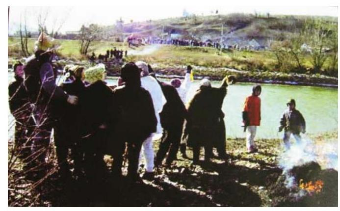

Integrő emberek az Ipoly folyó mentén, Helemba-Ipolydamásd Itt egy Ipoly hidat terveztek.
Projekt száma: HU-SK-UA 0501/283
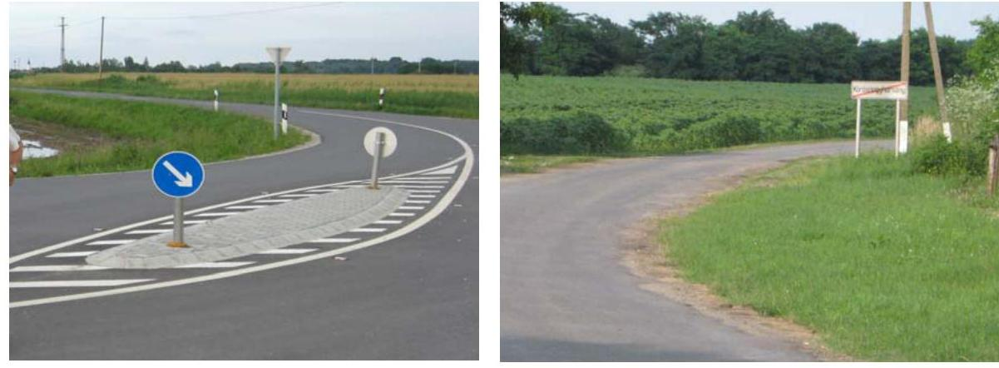

A HU-RO-SCG Biharugra-Körösnagyharsány út elágazása és a határ felé vezető 2 km kezdete 2008.06.11
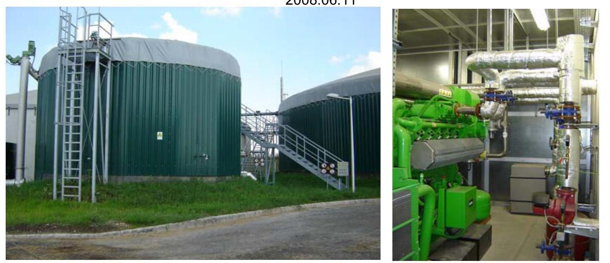

Biogáz üzem létesítése Klárafalván (Szeged és Makó között) 2008. 06. 09.
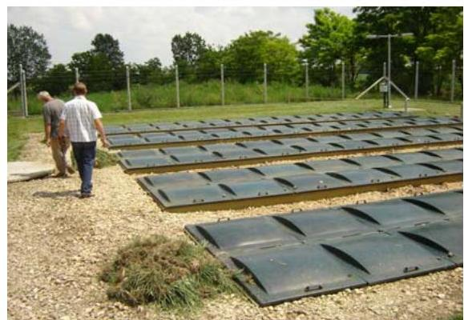
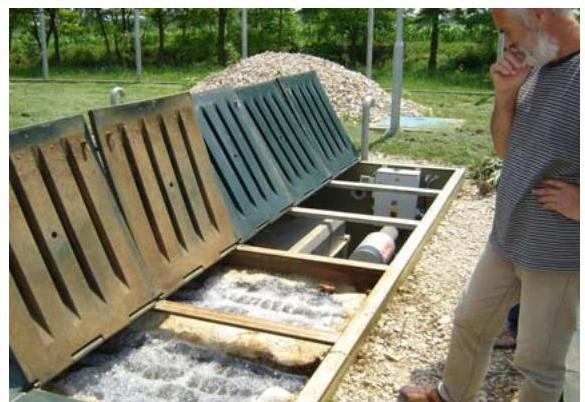

Szennyvíztisztító Bácsbokodon 2008. 06. 10.

---

# INTERREG IIIB (CADSES) És IIIC PROGRAM ELLENŐRZÉSI TAPASZTALATAI 

## 1. EU És KÜLSŐ ELLENŐRZÉSEK

Az EU Bizottság Regionális Főigazgatósága 2006-ban, majd 2007-ben hajtott végre a 1260/1999/EK és a 438/2001/EK rendelet előírásai betartására vonatkozó auditot, melynek során az Irányító, Kifizető Hatóságokat és a Közös Szakmai Titkárságot ellenőrizték. Az ellenőrzések oka elsődlegesen a 438/2001/EK 5. cikke szerinti irányítási és ellenőrzési rendszer leírásának hiányossága volt, amely a kifizetések felfüggesztését eredményezte még 2005. decemberében. Az auditok eredményeit a következő alpont részletezi.

A Bécsi Szakmai Titkárság 2007. december 17-én és 2008. január 21-én helyszíni ellenőrzést végzett a VÁTI Kht., mint első szintű ellenőrző szerv székhelyén. Ennek során 6 kedvezményezett dokumentációját vizsgálták át. Ellenőrzésüket a költségek elszámolhatósági szabályait tartalmazó 448/2004/EK rendelet előírásainak figyelembevételével végezték. Tételes vizsgálatnak vetették alá a kiválasztott dokumentumokat és azokat az egyes költségsorok (személyzeti, adminisztrációs, utazás, szállás, találkozók, eszközbeszerzések) mentén haladva vizsgálták. A még le nem zárt vizsgálat során a közbeszerzési eljárások során alkalmazott kiválasztási eljárások dokumentációját találták hiányosnak. Ezek a tételek a Kbt. 402.§. (4) c pontjában meghatározott 2 M Ft ún. egyszerű közbeszerzési eljárás értékhatárát nem haladták meg, azaz 3 árajánlat bekérése volt kötelező. Ezek dokumentációját a KSZ utólag megküldte. A személyi költségek esetében nem találták eléggé részletezettnek és informatívnak az ún. munkaidő-elszámolási táblázatokat, illetve az adminisztratív költségek esetében hiányolták azok számítási módszerét ${ }^{1}$.

## EU Bizottsági audit megállapításai

A Bizottság Regionális Főigazgatósága 2005. decemberében értesítette a CADSES római IH-át a kifizetések felfüggesztéséről. A felfüggesztés oka az IH által a Bizottság részére megküldött a 438/2001/EK rendelet 5. cikke szerinti irányítási és ellenőrzési rendszer leírásának hiányosságai voltak. Ezt követően 2006. júniusában a Bizottság ellenőrei helyszíni ellenőrzést hajtottak végre, amely kiterjedt a római IH-ra, KH-ra és a drezdai KSZT-ra. Az ellenőrzés jelentős hiányosságokat tárt fel elsősorban a CADSES pénzügyi ellenőrzési folyamataira vonatkozóan. Az IH a megállapításokra az észrevételeit 2007. februárjában küldte meg a Bizottságnak. Az alábbi főbb észrevételeket tették:

- 2006. júniusában még nem került aláírásra a program alapdokumentumának számító és az egyes résztvevő tagországok feladatait, felelősségét szabályozó Egyetértési Nyilatkozat (Memorandum of Understanding);
- A Nyilatkozat ezt követően került aláírásra. Magyarország részéről az ÖTM államtitkára, mint a Monitoring Bizottság tagja 2006. július 27-én írta alá;

[^0]
[^0]:    ${ }^{1}$ Pl: a kedvezményezett teljes havi telefonszámlájából hány \% lett a projektre terhelve

---

- A római IH a napi végrehajtási feladatainak ellátásával egy külső szolgáltató céget bízott meg. A cég munkatársai között nem valósult meg a feladatok, hatáskörök és felelősség megfelelő felosztása, illetve a feladatelhatárolás az IH-nak és a KH-nak jelentést tevő munkatársak között;
- A KH nem rendelkezett eljárásrenddel és hiányoztak a munkaköri leírások;
- A KH-nál nem volt fellelhető az adósnyilvántartás, illetve az auditorok azt állapították meg, hogy nem volt még visszakövetelés;
- Az IH nem végzett dokumentált ellenőrzést az első szintű ellenőrzést végző nemzeti hatóságokat illetően és nem rendelkezett azok tevékenységére vonatkozóan az ellenőrzési rendszer leírásával;

A megállapítást követően az IH megküldte az egyes országok első szintű ellenőrzési tevékenységének összefoglalóját, azonban a Bizottság ezt nem találta kielégítőnek. A kifizetési kérelmek Bizottság felé történő benyújtását megelőzően a KH nem szerzett bizonyosságot az igazolt költségek elszámolhatóságát illetően. A megállapítást követően 2007-től új költségigazolási modell került bevezetésre, melynek során az első szintű ellenőrzést végző nemzeti hatóságok a költségigazolásokon már egyértelműen jelzik, hogy az adott projekt volt-e helyszíni ellenőrzés tárgya. Az új rendszerben az igazolásokhoz a számlák listáját is csatolni kell, az elszámolhatóság ellenőrzése céljából.

Az első szintű ellenőrzés keretében végrehajtandó projekt helyszíni ellenőrzésével kapcsolatosan az IH nem tudott információkat adni. Az IH válaszát a Bizottság ellentmondásosnak találta és nem fogadta el. A Bizottság sürgette az IH mielőbbi intézkedését a tagállamok tájékoztatására/irányítására a helyszíni ellenőrzések végrehajtása tekintetében. 2007. márciusában az IH kibocsátott egy Audit Kézikönyvet, melyben már részletes iránymutatást nyújt az első szintű ellenőrzést végző nemzeti hatóságoknak. Ugyancsak ezen hatóságok képviselőivel tartottak az auditot követően 2006. szeptemberében, majd 2007. szeptemberében megbeszéléseket².
A 438/2001/EK rendelet 10. cikke szerinti rendszer- és 5\% -os második szintű ellenőrzéseket végző hatóság nem került kijelölésre. Az auditot követően az IH megjelentette a tenderfelhívást a feladat ellátására. Az első jelentkezővel való szerződéskötés szakmai okokból meghiúsult. 2007. második felétől a Deloitte\&Touche Plc. nemzetközi könyvvizsgáló cég látja el a feladatot. Az azóta elvégzett auditok eredményeit tartalmazó jelentés 2008. április végére készült el.

A 438/2001/EK rendelet 15. cikke szerinti záró nyilatkozatot kiadó hatóságot kijelölték, azonban az nem rendelkezett a megfelelő eljárásrendekkel.
Az ellenőrzési nyomvonal nem volt teljesnek tekinthető, mivel a projektek vezető partnereitől nem érkezett a KH-hoz olyan dokumentum, amely igazolta volna a támogatások partnereknek történő kifizetését (pl.: átutalási elismervény másolata).
A drezdai KSZT helyszíni ellenőrzése során többek között az alábbi megállapításokat tették:

- Nincs egyértelmű, direkt kapcsolat a projekt előrehaladási jelentések szakmai értékelése és az adott időszakhoz kapcsolódó kifizetési kérelmek költségei elszámolhatóságának ellenőrzése között. A 2 folyamat elválik egymástól, a szakmai és pénzügyi beszámoló

[^0]
[^0]:    ${ }^{2}$ First Level Control Bodies Roundtable

---

benyújtásának határideje sem azonos. Nincs visszacsatolás a szakmai értékelést végző drezdai és a projektek költségigazolásait befogadó római hatóság végrehajtási tevékenysége között.
Az auditorok véletlenszerű kiválasztás módszerével 10 projektdossziét vizsgáltak meg a helyszíneken, melynek eredményeként az alábbiakat állapították meg:

- Nincs világos kapcsolat a projektek értékelése és a kifizetések között;
- A pályázatok értékelése megfelelően dokumentált, azonban az értékelési lapok, check listák sem aláírást, sem dátumot nem tartalmaznak;
- A KH-nál lévő akták nem tartalmaznak ellenőrzési listákat; nincs nyoma a kifizetési kérelmek adminisztratív, teljességi ellenőrzésének;
- Nincs dokumentálva a költségek elszámolhatóságának ellenőrzése. Az egyetlen dokumentum az első szintű ellenőrzést végző nemzeti hatóságok költségigazolása.
Az audit záró értekezletén a CADSES hatóságok képviselői elismerték, hogy az IH és a tagállamok közötti kapcsolat nem teljesen tisztázott ${ }^{3}$.
2007. februárjában a Bizottság az IH észrevételeit és az intézkedésekről szóló beszámolóját követően értesítette az IH-t, hogy a 2006. december 31-ig leigazolt költségeket kifizetik a vezető partnereknek.
Az 2006. évi auditot 2007. májusában újabb ún. follow-up (nyomonkövető) audit követte, melynek során a korábban feltárt problémák utóellenőrzése történt meg. Az újabb audit nem állapított meg jelentős előrelépéseket a korábban feltárt lényeges problémák tekintetében. Az első szintű ellenőrzést végző nemzeti hatóságoknak kibocsátott audit módszertant nem találták teljesnek és továbbra is fenntartották azon megállapításukat, hogy az IH nem rendelkezik megfelelő információval az első szintű ellenőrző hatóságok 438/2001/EK 4. cikke keretében végzendő helyszíni ellenőrzési tevékenységére vonatkozóan. Javasolták annak végső kidolgozását és a Pénzügyi Ellenőrző Csoport jóváhagyását követően a Bizottsághoz történő mielőbbi benyújtását. Megállapították továbbá, hogy a 438/2001/EK 10. cikke szerinti másodszintű ellenőrzést végző ellenőrző hatóság, bár már kijelölték, még nem kezdte meg a munkát, azaz egyetlen kedvezményezett helyszíni ellenőrzését sem végezték még el 2007. májusáig. A Bizottsági ellenőrök ez utóbbi problémát ítélték a legsúlyosabbnak, mint a kifizetések felfüggesztésének legfőbb indokát ${ }^{4}$.
A 2. auditot követően az ellenőrzési jelentésben az auditorok kinyilvánították, hogy nem tudtak bizonyosságot szerezni az irányítási és ellenőrzési rendszer megfelelőségéről, továbbá, hogy a rendszer nem a 1260/1999/EK és a 438/2001/EK rendelet előírásaival összhangban múködik.
2008. márciusi levelében a Bizottság ismét kilátásba helyezte a kifizetések felfüggesztését, mivel a másodszintű ellenőrzések végrehajtásáról nem kaptak továbbra sem információt. Végül 2008. májusában elkészült a Pénzügyi Ellenőrző Csoport által jóváhagyott 10. cikk szerinti audit jelentés, amelyet megküldtek a Bizottságnak. A jelentés jelenleg elbírálás alatt van, azonban rendszerhiba felmerülése esetén kérdéses lehet a kifizetések újraindítása. A másodszintű ellenőrzés 6 projektet érintett, melyekben nem volt magyar résztvevő.
A 2008. júniusi Monitoring Bizottsági ülésen a Bizottság képviselője azt a tájékoztatást adta, hogy 2008. június végével újraindulhatnak a kifizetések. A

[^0]
[^0]:    ${ }^{3}$ „At the wrap-up meeting ...have admitted unclear relationship between MA and Member States."
    ${ }^{4}$ „The fact that no sample checks on operations have been carried out...remains the main blocking element for the Commission's payments..."

---

KH a vezető partnereknek a már korában benyújtott kifizetési kérelmek kronológikus sorrendben való mihamarabbi feldolgozását ígérte.

# 2. A MAGYARORSZÁGI ELSŐ És MÁSOD SZINTŨ ELLENŐRZÉS RENDSZERE A B ÉS A C ELEMRE VONATKOZÓAN 

Az INTERREG IIIB és IIIC eleme esetében a transznacionális és interregionális projektek nemzetközi konzorciumos formában jelennek meg. A projektek vezető partnerei felelősek az IH felé a projekt pénzügyi és szakmai lebonyolításáért, ők gyűjtik be a különböző tagországokból származó projektpartnerektől a szakmai előrehaladási jelentéseket és a költségigazolásokat. A projektben résztvevők, azaz a kedvezményezettek ellenőrzésére 2 modellt alkalmaznak: a centralizált és a decentralizált modellt. Az előbbi azt jelenti, hogy hasonlóképpen a Nemzeti Fejlesztési Terv operatív programjai végrehajtásában résztvevő közreműködő szervezetekhez egy központi intézmény végzi az első szintű ellenőrzést a 438/2001/EK rendelet 4. cikke előírásainak megfelelően. Ennek keretében végzik a folyamatba épített 100\%-os dokumentumalapú ellenőrzést és a kedvezményezettek kockázatelemzésen alapuló reprezentatív mintavételes helyszíni ellenőrzését. A decentralizált modell esetében minden projektben résztvevő partner köteles független könyvvizsgálót alkalmazni az elszámolásokra, aki az egyes kifizetési kérelmek benyújtását megelőzően 100\%os dokumentumalapú ellenőrzést végez és a szakmai teljesítésről is nyilatkozik, azaz a helyszíni ellenőrzést is elvégzi. Ez utóbbi modell esetében az audit költségei elszámolhatóak a külső szakértői költségsoron. A CADSES-ben a decentralizált modellt Németország és Ausztria alkalmazza, azonban ezt a rendszert magas kockázatúnak ítélte meg az IH és a másodszintű ellenőrzések során ezt figyelembe is vették.

Magyarországon a kettő közötti átmeneti, egy ún. kétszintű ellenőrzési modellt alkalmaznak. A VÁTI KHT TEPÜ ${ }^{5}$ Programvégrehajtási és Ellenőrzési Igazgatóság, Központi Ellenőrzési Irodája látja el a program első szintű ellenőrzését. Ugyanakkor az általuk kiadott, mindkét elemre vonatkozó „Az első szintű ellenőrzés irányelvei...." dokumentumokban a független könyvvizsgálókat tüntetik fel első szintű ellenőrzést végző szervként. Emellett a VÁTI Kht. a költségigazolásra beadott elszámolásokat ismételten tételes ellenőrzésnek veti alá, azaz a dokumentumalapú ellenőrzést kétszer is végrehajtják. Megállapítható, hogy bár a könyvvizsgálók részletes, a VÁTI Kht. által kiadott ellenőrző listákat töltenek ki, mégis sokszor hiánypótlásra és az elszámolások módosítására van szükség. Ez azt mutatja, hogy a könyvvizsgálók nem minden esetben vannak tisztában az EU-s jogszabályi előírásokkal, a speciális INTERREG szabályokkal. A VÁTI Kht. által kidolgozott a B és C elemre vonatkozó eljárásrend csak 2005. augusztus 30 -án lépett hatályba, ezt megelőzően a 2004. májusi csatlakozástól nem volt érvényes eljárásrend. A Kézikönyvet 2 alkalommal (2006. június 26. és 2007. augusztus 30.) módosították, és jelenleg is módosítás alatt van.

Az első szintű ellenőrzések keretében végrehajtandó helyszíni ellenőrzéseket a VÁTI Kht. nem végez, ezt a feladatot is a kedvezményezett által kiválasztott könyvvizsgálók látják el. Ennek keretében ellenőrző listákat és helyszíni ellenőrzési jegyzőkönyvet kötelesek kitölteni. Kérdéses azonban, hogy a projektek szakmai teljesítésének ellenőrzésére elegendő-e egy független

[^0]
[^0]:    ${ }^{5}$ Területi Együttmúködési Programok Üzletág

---

könyvvizsgálói nyilatkozat. A szakmai nyomonkövetés/ellenőrzés kérdése azért is fontos, mivel a VÁTI Kht. INTERREG IIIB és IIIC Múködési Kézikönyv 5.3. pontjában meghatározott helyszíni monitoring látogatásokra nem került sor még a magyar vezető partnerek esetében sem. A kézikönyv hivatkozott pontja külső szakértő bevonását is előírja, ami a projektek témáinak speciális és széleskörú spektrumát figyelembe véve kívánatos volna.

Az INTERREG IIIB és IIIC múveletekben résztvevő partnerek számára 2007. 07. 1-től a VÁTI Kht. tájékozatót bocsátott ki, melyben ettől az időponttól kezdve tették kötelezővé a könyvvizsgálók által készítendő helyszíni ellenőrzési jegyzőkönyv megküldését. 2007. júliusát megelőzően nem volt kötelező a helyszíni ellenőrzési jegyzőkönyv, a helyszíni ellenőrzés bizonyítékaként elfogadták a könyvvizsgálói jelentéseket.
A 438/2001/EK rendelet 10. cikke szerinti másodszintú ellenőrzést az Enst\&Young Plc. látja el a C programra vonatkozóan.

# 3. CADSES PROJEKTEK FÖBB MUTATÓI És A HELYSZíNI ELLENÖRZÉSÜK TAPASZTALATAI 

## REPUS

A (Regionális Policentrikus Városrendszer Stratégiája) projekt a 3. pályázati kiírás nyerteseként kapott támogatást 2005-ben. A 6 partnerből álló és összesen 1427640 EUR költségvetésú projektet olasz partner vezeti. A projektben résztvevő magyar partner a VÁTI Kht. Területi Tervezési és Értékelési Irodája 302440 EUR ( 77 M Ft) költségvetéssel, melynek $75 \%$-át azaz 226830 EUR ( 58 M Ft) támogatási összeget ítélt meg a tagállamok képviselőiből álló CADSES Irányító Bizottság. A $25 \%$-os saját forrást a projekthez 2005-ben a Magyar Terület- és Regionális Fejlesztési Hivatal 12 M Ft összegben, majd 2007-ben az Önkormányzati és Területfejlesztési Minisztérium 7,5 M Ft összegben biztosította.
A drezdai székhelyű Közös Szakmai Titkársághoz beadott pályázat 14.3. Partner profil pontjában a VÁTI Kht. egyértelmúen jelezte, hogy a szervezet látja el az INTERREG IIIB és IIIC nemzeti kontaktpont és költségigazoló tevékenységeket. Ezt a tényt a támogatás megítélése során nem találták kizáró tényezőnek.
Bár a VÁTI Kht-nál a költségigazolási tevékenységet egy a projekt végrehajtásában résztvevő egységtől funkcionálisan független szervezeti egység látja el - azonban az egységek felügyeletét ellátó vezérigazgató személye azonosfelmerült az összeférhetetlenség kérdése. A VÁTI Kht. az összeférhetetlenség problémájának kérdését a szervezet SZMSZ 2. 4. 1. pontjában kívánta szabályozni. A vezérigazgató részletes feladata és hatásköre bekezdésben a következő mondat szerepel: „Hatásköre nem terjed ki az INTERREG eljárási kézikönyvben szabályozott döntési folyamatok befolyásolására." Az idézett mondat nem elegendő annak az összeférhetetlenségnek a kiküszöbölésére, hogy a VÁTI Kht. egy egyébiránt funkcionálisan független részlege igazolja le a római székhelyű IH/KH felé a VÁTI Kht. egy másik részlege által benyújtott és a VÁTI Kht. könyvelésében nyilvántartott projektköltségeket.
A magyar projektrész könyvvizsgálatát az AUDITTAX 2000 Könyvvizsgáló és Adótanácsadó Kft. látta el. A projekt igazolt költségeiből 48104 E Ft átutalására még nem került sor ${ }^{6}$.

[^0]
[^0]:    ${ }^{6}$ A korábban felvázolt kifizetés felfüggesztési problémák miatt.

---

A VÁTI Kht. belső ellenőrzése 2008. márciusában vizsgálatot végzett a projekt tárgyában. A belső vizsgálat megállapította, hogy nem készült előzetesen kalkuláció a projekt várható költségeire vonatkozóan, illetve a pénzügyi és szakmai lebonyolítás elkülönült. A projektszemlélet hiánya arra is visszavezethető, hogy a projekt lebonyolítása során nagy volt a fluktuáció: mind a szakmai, mind a pénzügyi menedzserek változtak.
A projekt megvalósításának eredményeként született tanulmány a jelenleg kidolgozás alatt álló Országos Településhálózati Koncepció alapjául szolgál, amely munkában a VÁTI Kht. munkatársai operatív módon vesznek részt.

# Hydea Tanácsadó Kft. projektjei 

A Hydea Tanácsadó Kft., amely az INTERREG IIIA programban a 438/2001/EK rendelet 4. cikke szerinti első szintű helyszíni projektellenőrzési feladatot látja el - a VÁTI Kht.-val 2006. novemberében megkötött megbízási szerződés alapján- 2 CADSES projektben is részt vesz. A projektek még a szerződés megkötését megelőző pályázati kiírásokban nyertek támogatást.

## 4. C PROGRAM PROJEKTEK FÖBB MUTATÓI ÉS HELYSZÍNI ELLENÖRZÉSÜK TAPASZTALATAI

## TOWER

A Towards Sustainable Excellence by Innovating Regions című 5 tagból (svéd, magyar, angol, holland, francia) álló projekt magyarországi kedvezményezettje a Dél-Alföldi Regionális Fejlesztési Ügynökség Kht. ${ }^{7}$ (továbbiakban: DARFÜ). A 930216 EUR költségvetésű projekt 75\%-át 697662 EUR (178 M Ft) ERFA, 15\%-át pedig $35,5 \mathrm{M}$ Ft nemzeti társfinanszírozás biztosítja; a maradék $15 \%$-ot saját forrásból köteles a kedvezményezett a projektre fordítani. A Regionális Keretművelet típusú projekt a C program északi zónájához tartozik ${ }^{8}$ és svéd vezető partner irányítja. A projekt célja alapvetően a KKV-k fenntartható fejlődésének elősegítése és innovációs kezdeményezések közös kifejlesztése a nemzetközi együttmúködés keretében megszerzett tapasztalatcserére alapozva. A 36 hónap időtartamú projekt 2007. december 31-ével, az eredetileg tervezett időpontban lezárult. A DARFÜ időben benyújtotta a szakmai és pénzügyi beszámolóját; a teljes költségvetés 84,53\%-át használták fel. A költségvetésből 720000 EUR volt az ún. projektalap, mely a projekt keretében megvalósítandó alprojektek finanszírozását célozta. A tervezett 12 nemzetközi alprojekt megvalósult, ezekből 8-ban vettek részt a dél-alföldi régióból magyar partnerek. Az alprojektek kedvezményezettjei az ERFA forrásra az alprojekt vezető partnerével,míg a társfinanszírozásra a DARFÜ-vel kötöttek szerződést, elszámolásaikat szintén könyvvizsgálóval kellett auditáltatniuk. A DARFÜ szakmai egyeztető fórumokat szervezett részükre és igyekeztek kapcsolódási pontokat találni az egyes alprojektek között.
A 2008. január 15-én benyújtott záró szakmai előrehaladási jelentés 2. pontja tartalmazza a projekt elért eredményeit. A helyszíni ellenőrzés során tapasztaltak eredményeképpen az alábbiak állapíthatóak meg:

[^0]
[^0]:    ${ }^{7}$ A projekt menedzsment feladatait ellátó személy egyben a magyar pályázatokról a nemzeti álláspontot kialakító CADSES Nemzeti Bizottság tagja
    ${ }^{8}$ Közös Szakmai Titkárság: Németország, Rostock

---

- A jelentésben eredményként feltüntetett „Két spin-off vállalkozás"ról kiderült, hogy valójában azok üzleti tervének előkészítése történt meg.
- Az „Egy Innovációs Központ kialakítása" valójában azt jelentette, hogy a francia partner régiójában található innovációs központ által nyújtott szolgáltatásokról, az ottani tapasztalatokról készült egy tanulmány egy majdani a dél-alföldi régióban kialakítandó innovációs központ létrehozásához.
- Az ellenőrzés során az „egy új üzletfejlesztési elemző eszköz az élettudományok területén" projekttermékről a kedvezményezett nem tudott információt szolgáltatni.
A fentebb vázolt tapasztalatok is azt mutatják, hogy a projektek helyszíni monitoring látogatásaira szükség van, különösen az ehhez hasonló, nagy költségvetésű és bonyolult struktúrájú projektek esetén, ahol a projektalap teszi ki a költségvetés nagy részét, amelyet a kedvezményezett még további pályázóknak biztosít.
A projekt pénzügyi elszámolásában több költségsoron szerepeltek az ún. közös projekt költségek ${ }^{9}$, amelyek a svéd vezető partner által végzett, a teljes projekt menedzseléséhez, adminisztrációjához kapcsolódó költségekre vonatkoztak. Ezen horizontális költségek a Közös Szakmai Titkárság útmutatásai nyomán a VÁTI Kht. által készített elszámolási segédlet 11. pontja szerint elszámolhatóak és bár eredeti számla nem állt rendelkezésre a helyszínen sem, a segédlet által előírt „a vezető partner fizetési kérelme" pótolta azt.

# INCO-HEALTH 

Az Interregional Cooperation for trans-European Electronic Health Card Strategy című, mindösszesen 903607 EUR-ós költségvetésű interregionális projektből a magyar Országos Egészségbiztosítási Pénztár 137752 EUR költségvetéssel rendelkezik, melyből 103314 EUR $(26,3 M)$ az ERFA és 3,5M a nemzeti társfinanszírozási forrás. A projekt célja az elektronikus egészségügyi és egészségbiztosítási kártya bevezetésének megtervezése uniós szinten. A projektet olasz partner vezeti, mellette még két olasz és egy szlovén szervezet vesz részt a megvalósításban az OEP- el együtt. Magyarországon a projekt megalapozhatja az elektronikus chip alapú TAJ kártya és az EU egészségbiztosítási kártya bevezetésének folyamatát.
A KSZ székhelyén található dokumentáció vizsgálatakor megállapításra nyert, hogy a legutolsó papíralapon, valamint elektronikusan fellelhető szakmai és pénzügyi jelentés 2006. június 30 -áig tartó időszakra vonatkozik. Ezt követően nem volt dokumentált nyoma a kedvezményezett és a KSZ közötti kommunikációnak. A vezető partner és az IH közötti szerződés szerint a projekt vége: 2007. február, míg az OEP társfinanszírozási szerződése szerint ez a dátum 2007. július 15. A kedvezményezett székhelyén történt ellenőrzéskor átadásra került 2 db 2006. július 1-től 2007. június 30-i tartó időszakra vonatkozó előrehaladási jelentés, ami azt mutatja, hogy valószínűleg volt szerződésmódosítás az ERFA forrásra vonatkozóan, azonban sem a kedvezményezett, sem a KSZ erről információt, dokumentumot nem tudott adni. Megállapítható továbbá, hogy a kedvezményezett nem tett eleget a IIIC 0401039/HU azonosító számú társfinanszírozási szerződés 5.2. pontjában

[^0]
[^0]:    ${ }^{9}$ JPC: joint project costs

---

meghatározott jelentéstételi kötelezettségének, mely előírja, hogy a 2. 6.b. pontban meghatározott befejezési határidőig a kedvezményezett köteles zárójelentést készíteni. Ugyanakkor az is tény, hogy a KSZ a jelen helyszíni ellenőrzés időpontjáig (2008. június) a projekt befejezésének napját, azaz 2007. július 15 -ét követően nem küldött a szerződés 5.7. pontja szerinti írásbeli felszólítást a kedvezményezettnek. A projekt támogatás felhasználása 54,9\%-ot ért el.

# RECORA 

A Zala Megyei Fejlesztési Kht., mint kedvezményezett részt vett a Renewable Energy Cooperation of Rural Areas című osztrák vezető partner által koordinált projektben. Az 59587 EUR (15,2M Ft) ERFA forrás mellett, 3032622 Ft nemzeti társfinanszírozásban részesültek. A KSZ 2007. márciusában készített feljegyzést szabálytalanság észleléséről. A projekt menedzsere véletlenül értesült arról, hogy a projekt vezető partnere a kedvezményezett kizárását tervezi. A szabálytalanság gyanúja beigazolódott, a kedvezményezett utólag megküldte a 2006. december 15 -én kelt levelet, melyben az osztrák partner a többi partnerrel egyetértésben a kizárásról határozott, de egyben engedélyezte a 2006. december 31-ig felmerült költségei elszámolását. A kizárás oka az együttmúködés, a megbeszéléseken való részvétel, illetve a teljesítés hiánya volt. A levelet másolatban a bécsi KSZT is megkapta. A kedvezményezett összességében 11,5\%ot használt fel a támogatásból a 2005. márciusában kezdődött projektben, míg a többi partner költségei 32-65\% között mozogtak. A kizárást és a kizárt kedvezményezett maradék költségvetési összegének a másik magyar partner (Gödöllői Önkormányzat) részére történő allokálását az Irányító Bizottság jóváhagyta. A KSZ miután az osztrák hatóságtól értesült a történtekről megindította a szabálytalansági eljárást a 359/2004. (XII. 26.) Kormányrendelet 44. §-ának megfelelően. Ennek eredményeként a KSZ a Nemzeti Hatóság jóváhagyását követően a támogatási szerződéstől való egyoldalú elállásról határozott, mivel a kedvezményezett megszegte a szerződés 11.6.-11.7. pontját és az államháztartás múködési rendjéről szóló 217/1998. (XII. 30.) Korm. rendelet 87.§. (5) bekezdését. A nemzeti társfinanszírozásból addig kifizetett, a jegybanki alapkamat kétszeresével növelt összeget ( 366893 Ft ) a kedvezményezett visszautalta.

---

F Ü G G E L É K E K

---

# Az INTERREG célú költségvetési előirányzatok hasznosulására irányuló véleményfelmérés értékelése 

## ÖSSZEFOGLALÓ

A megkérdezést véleményfelmérő kérdőívekkel végeztük, külön kérdőív készült a támogatással érintett pályázók, illetve a támogatott pályázók által érintett önkormányzatok részére. A kérdések az utolsó kivételével - előre meghatározott válaszlehetőségekkel - zártak voltak. Az utolsó kérdésnél lehetőség volt saját megszövegezésű vélemény-nyilvánításra, mindkét kérdőívnél. A tapasztalat alapján ez indokolt volt, mivel több konkrét, hasznosítható észrevétel, javaslat érkezett a válaszadóktól.

A kérdőíveket e-mailben, kísérő levéllel küldtük meg, amelyben ismertettük az ellenőrzés célját, módszerét és a válaszadás önkéntes voltát. Közöltük, hogy a válaszokat titkosan kezeljük, azokat egyedileg nem használjuk fel és nem adjuk át harmadik személynek.

A visszaküldési arány a pályázóknál igen kedvező volt (33,3\%), az önkormányzatoké ettől elmaradt ( $12,8 \%$ ), ami az előzetes várakozásunknál alacsonyabb.

A kitöltött kérdőívek értékelése azt mutatja, hogy a pályázók és az önkormányzatok válaszai összességében összhangban voltak és megállapíthatók az INTERREG program hasznosulásának főbb tendenciái a válaszadók véleménye alapján.

A véleményfelmérésnek a folyamatok ellátásához kapcsolódó elégedettség rangsorában a pályáztatási és a projekt megvalósítási szakaszok közül a pályázat elbírálása előtti tevékenységek (pályázati felhívás közzététele, szakszerűsége, megismerési lehetősége, a szükséges információk megszerzése) az átlagosnál kedvezőbb megítélésűek.

Pozitív tapasztalat az is, hogy ezektől alig marad el a partnerség elvének érvényesülése és a támogatási folyamatokhoz kapcsolódó ellenőrzések elégedettsége. Az ellenőrzések segítő jellegére vonatkozó részletező kérdésre adott válaszok túlnyomó többsége szerint az ellenőrzési megállapítások (és javaslatok) hasznosíthatóak és/vagy alkalmazásuk hozzájárul a szabálytalanságok megelőzéséhez.

A pályázat elbírálási folyamata és a támogatási döntés indokolásának szakszerűsége elégedettségi értékek megközelítik az átlagos elégedettséget.

---

A határidők teljesülésével kapcsolatos elégedettségek kedvezőtlenebbek (a különböző határidő késedelmek, lassú ügyintézési idők, a támogatási részösszegek és a teljes támogatási részösszeg kifizetések időtartama). A legalacsonyabb elégedettségű a támogatási szerződés megkötésének folyamata. Ezekkel összhangban vannak a részletező kérdésekre adott válaszok, amelyek szerint a támogatott projektek pályázatban foglaltakhoz képesti határidő csúszásaihoz túlnyomórészt a támogatási szerződések megkötésének, továbbá a pályázatok elbírálásának késedelmei vezettek. Az okok között jelentősen kisebb arányt képvisel a projekt megvalósításának tervezettnél nagyobb időigénye, valamint kifizetési és elszámolási késedelmek. A válaszadók közel harmada szerint a projekt (időarányos) megvalósítása késik és mintegy 12\%-a három hónapnál nagyobb csúszással valósul(t) meg (vannak egy évnél nagyobb késedelmek is).

A véleményfelmérés során külön is foglalkoztunk a pályázat értékelésében érvényesülő szempontokkal (együttmúködési, költséghatékonysági, regionális). A válaszadók túlnyomó többsége két, illetve három szempont együttes érvényesülését jelezte, ami kedvezőnek tekinthető, mivel ezáltal valószínűsíthető az egyes szempontok egymást erősítő hatása.

Az önkormányzatok válaszai alapján az INTERREG program támogatási célkitűzései és az adott település megalapozott szükségletei többségében egybeestek. Kedvezőtlen azonban - és az egybeesést tovább növelő tényező lehetett volna ha a támogatási célok meghatározásához (kialakításához) nagyobb arányban kérték volna a települések véleményét (többségében nem kértek véleményt). Ahol kértek véleményt, ott is többségében nem kaptak az érintett önkormányzatok visszajelzést a figyelmen kívül hagyás indokára. (Ez az előzmény egyik összetevője lehet a felmérésünk alacsonyabb visszaküldési arányának.)

A megvalósult projektek településre kedvező hatásai között viszonylagosan a legtöbb válasz a lakosság interregionális együttműködésének, társadalmi kohéziójának javulását jelezte kedvező hatásként. A válaszok ugyanakkor jelzik a végrehajtás hiányosságait, mivel alapvevő fontosságú célkitűzések teljesülése munkahelyek számának, piacképes tudásnak növelése - csak kisebb mértékben jelenik meg.

Az adminisztratív (bürokratikus), gazdasági és interregionális (politikai) tényezők rangsorolása alapján az interregionális együttmúködésnek van érzékelhetően a legnagyobb szerepe az adott település valós igényeihez igazodó támogatások kialakításának és/vagy végrehajtásának elmaradásában. Ez ráirányítja a figyelmet az INTERREG program gyenge pontjára, mivel a válaszadók többsége szerint az interregionális együttműködés nem megfelelően szolgálta a település valós igényeihez igazodó támogatások kialakítását, illetve a végrehajtást.

Mindkét válaszadói csoportnál felmértük a támogatott projekt(ek) kiválasztása és megvalósítása során a tapasztalt korrupció mértékét. A válaszadók túlnyomó többsége nem tapasztalt korrupciót, azonban a mintegy 10\%-os arányú korrupció jelzés (gyenge és közepes mértékű) mutatja a további csökkentés szükségességét, a korrupció ellenes tevékenység fontosságát.

A szöveges vélemények között a legnagyobb súllyal a határidő és túlzott bürokrácia témakörei jelennek meg. Túlzottnak tartják az adminisztrációs követel-

---

ményeket és külön is hangsúlyozzák a támogatási szerződés megkötésének időtartamát, késedelmét. Ezen túlmenően konkrét jelzések vannak a határon túli együttműködés problémái témakörökben (eltérőek az országonkénti intézményrendszerek, közbeszerzési jogszabályok, finanszírozási mechanizmusok, a közös projekttel kapcsolatos elvárások, követelmények). Az INTERREG program megvalósulásának teljes körűségét hátráltatta, hogy nemcsak közös projektekkel lehetett pályázni.

# A VÉLEMÉNYFELMÉRÉS MÓDSZERE ÉS VÉGREHAJTÁSA 

A megkérdezést többváltozós, direkt kérdéseket tartalmazó önkitöltő kérdőívekre adott, vélemény (preferencia) jellegű válaszadással végeztük. A kitöltéssel kapcsolatos kérdésekre telefonon válaszoltunk.

Külön kérdőív készült a támogatással érintett pályázók, illetve a támogatással érintett önkormányzatok részére. Az előbbi 11 db , az utóbbi 9 db kérdést tartalmazott. A kérdések az utolsó kérdés kivételével - előre meghatározott válaszlehetőségekkel - zártak voltak. Mindkét kérdőívben az utolsó kérdés nyitott volt, lehetővé téve a saját megszövegezésű vélemény-nyilvánítást.

A kérdőívet e-mailben küldtük el és a kitöltött kérdőívet a pályázóktól, illetve az önkormányzatoktól így kaptuk vissza.

A válaszadás önkéntes volt.

## A pályázóknak küldött kérdőív a következő főbb kérdéscsoportokat tartalmazta:

- a pályázati felhívás ismertsége, a dokumentumok teljes körűsége és egyértelmű megfogalmazása (1. és 2. sz. kérdések);
- a pályázat elkészítésében az intézmények segítsége, a kiemelt szempontok érvényesülése (3. és 4. sz. kérdések);
- az ellenőrzések segítsége a támogatások hatékony felhasználásában (5. sz. kérdés);
- a projekt határidőben történő, illetve késedelmes megvalósítása a támogatási szerződéshez és a pályázatban foglaltakhoz képest, a késedelem oka(i) (6. és 7. sz. kérdések);
- a program lebonyolítását végző intézményrendszer tevékenysége (8. sz. kérdés);
- az elégedettség értéke a támogatási folyamat főbb részterületei szerint (9. sz. kérdés 10 db részterületre);
- a tapasztalt korrupció mértéke (10. sz. kérdés);
- a támogatások hatékony felhasználását akadályozó tényezők (11. sz. kérdés).

---

# Az önkormányzatoknak küldött kérdőív a következő főbb kérdéscsoportokat tartalmazta: 

- a támogatási célkitűzések és a település/kistérség/régió valós szükségleteinek egybeesése (1. sz. kérdés);
- a településtől kért véleménykérés és ennek megjelenése/figyelmen kívül hagyása (2. és 3. sz. kérdések);
- a támogatott projektek kedvező hatása(i) (4. sz. kérdés);
- a településen bejegyzett kedvezményezett(ek) által megvalósuló/megvalósított projektek hozzájárulása a település fejlődéséhez, illetve az interregionális együttműködéshez (5. és 6. sz. kérdések);
- az adminisztratív, gazdasági és interregionális tényezők szerepének rangsorolása (7. sz. kérdés);
- a tapasztalt korrupció mértéke (8. sz. kérdés);
- a támogatások hatékony felhasználását akadályozó tényezők (9. sz. kérdés).

A pályázók 10. sz. kérdése megegyezett az önkormányzatok 8. sz. kérdésével, illetve a 11. sz. kérdés a 9. sz. kérdéssel.

A kérdések a múködési folyamat idősorrendjét, valamint a részterületek logikai kapcsolódását követik. A kérdőívet úgy szerkesztettük, hogy az előre tervezett kombinatív elemzéshez szükséges kérdéseket tartalmazzák és az ellenőrzési programban meghatározott cél minimális számú kérdés megválaszolásával legyen elérhető.

A megkérdezések szubjektív minőségi ismérvekre vonatkoznak. A skálakérdéseknél - ahol a válasz valamilyen vélemény, tapasztalat vagy tényező intenzitására vonatkozik - a válaszlehetőségek fokozatosak voltak a minősítő skálafokozatok által (pl. teljes mértékben, átlagosnál nagyobb mértékben, átlagos mértékben, átlagosnál kisebb mértékben, egyáltalán nem).

A pályázók elégedettségének színvonalát öt fokozatú - 1, 2, 3, 4 és 5-ös számjegyekkel jelölt - skála által állapítottuk meg, az elégedetlentől az elégedett felé haladva.

A kérdések többségére egy válasz volt adható. Két vagy több válasz a felsorolás jellegű kérdéseknél volt lehetséges, ezt a kérdőíven külön jeleztük (pályázóknál az 5. és 7. sz. kérdések, önkormányzatoknál a 4. sz. kérdés).

Kiemelt figyelmet fordítottunk a kérdések érthető nyelvezetére, szabatos, egyértelmű megfogalmazására, továbbá, hogy minden lehetséges válasz besorolható legyen a kategóriák valamelyikébe.

A válaszok befolyásolásának elkerülése érdekében döntő fontosságúként kezeltük a válaszok irányultságánál a semlegesség, a pártatlanság és a kiegyensúlyozottság követelményének érvényesítését.

---

# A VÉLEMÉNYFELMÉRŐ KÉRDŐÍVEKRE ADOTT VÁLASZOK ÉRTÉKELÉSE 

## 1. A hatÁrokon Átnyúló REGIONÁlis eGYÜTTMúkódési CÉlú TÁmOGATÁSOK Által ÉRINTETT PÁLYÁzÓK VÁLASZAINAK ÉRTÉKELÉSE.

A véleményfelmérő kérdőívet kitöltve 133 pályázó küldte vissza, ami az elküldött kérdőívek számához viszonyítva igen kedvező aránynak minősül, mutatva a pályázók aktivitását.

### 1.1. A pályázati felhívás ismertsége (megismerési lehetősége)

Az ötfokozatú skálakérdésre adott válaszok átlaga 4,17, ami az átlagosnál nagyobb mértékben megfelelő tartományban van. Külön is kedvező, hogy a válaszadók több mint egyharmada (37\%) teljes mértékben megfelelőnek minősítette a pályázati felhívás ismertségét. A válaszadók több mint négyötöde $(46+37=83 \%)$ szerint az ismertség az átlagosnak tekinthető mértéket meghaladja. A válaszadók mindösszesen 2\%-a szerint volt az ismertség egyáltalán nem megfelelő.

1. sz. ábra

A pályázati felhívás közzétételének ismertsége (megismerési lehetősége)
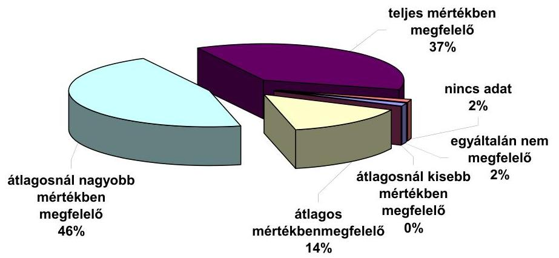
1.2. A pályázati felhívás dokumentumainak teljes körűsége és egyértelmú (pontos) megfogalmazása

A válaszadók közel kétharmada (65\%) szerint a felhívás teljes körű és egyértelmű volt, mindössze $1 \%$ jelezte, hogy nem teljesültek együttesen ezek a követelmények, ami összességében pozitív megítélést jelent. A követelmények részleges érvényesülése közül a válaszadók közel negyedének (23\%) véleménye, hogy a felhívás nem volt egyértelmű és mintegy tizedének (11\%), hogy a felhí-

---

vás hiányos volt. Ezek a válaszarányok azt mutatják, hogy az egyértelmú megfogalmazásra, illetve a teljes körűségre még fokozottabb figyelmet indokolt fordítani, elsősorban az AU-HU és az SL-HU-CR programoknál
2. sz. ábra

A pályázati felhívás dokumentumainak teljes körüsége és egyértelmüsége
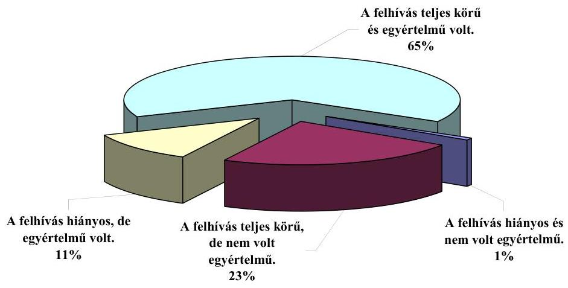

# 1.3. A programok intézményeinek honlapján közzétett információk segítsége a pályázat elkészítésében 

A válaszadók összességében kedvezőnek tartották a közzétett információk segítségét. Az ötfokozatú skálakérdésre adott válaszok átlaga 3,95, ami azt mutatja, hogy a pályázók többsége szerint az átlagosnál nagyobb segítséget jelentettek az információk. A válaszadók negyede jelentős mértékű, a fele pedig átlagosnál nagyobb segítséget jelzett, így a háromnegyede az átlagosnak tekinthető mértéket meghaladóan hasznosította a közzétett információkat. Csak 1\% véleménye, hogy nem kapott ezáltal segítséget. A válaszadók mintegy ötöde (21\%) szerint a közzétett információk átlagos mértékben segítették a pályázat elkészítését.
3. sz. ábra
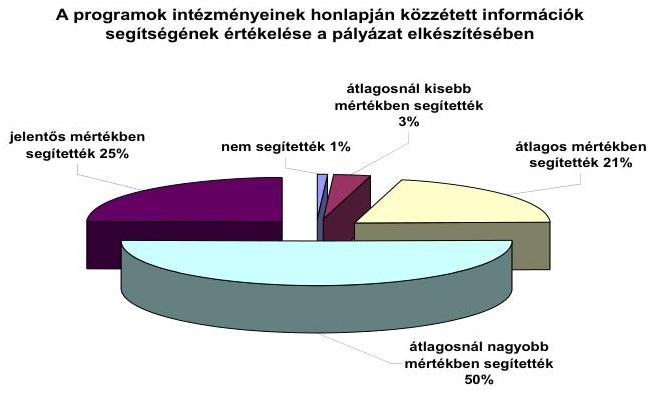

---

# 1.4. A pályázat értékelésében az elsősorban érvényesülő szempontok 

A kérdőívben megadott válaszlehetőségek - az együttmúködési, a költséghatékonysági, valamint a regionális szempontok - alapján a válaszadók túlnyomó többsége (89\%) két, illetve három szempont együttes érvényesülését jelezte, ami kedvezőnek tekinthető, mivel ezáltal inkább valószínűsíthető a kedvező tényezők nagyobb mértékű - szélesebb körű -érvényesülése, továbbá az egyes szempontok egymást erősítő hatásának megjelenése.

Mindhárom szempont együttesen érvényesült a válaszadók több mint harmada (36\%), két-két szempont pedig több mint fele (53\%) szerint. Ezen belül a többséget az együttmúködési és költséghatékonysági szempontok (26\%), valamint az együttmúködési és regionális szempontok (22\%) jelentették. A válaszok összessége azt mutatja, hogy a válaszadók elsősorban az együttmúködési szempont érvényesülését érzékelték, amit a költséghatékonysági, majd a regionális szempont követ. (Az utóbbi kettő közötti sorrend azonban minimális, a hibahatáron belül van.)

Mindhárom szempont az átlagosnál nagyobb mértékben az AU-HU, az átlagosnál jelentősen kisebb mértékben (17\%) a HU-SK-UA programnál érvényesült.
4. sz. ábra

A pályázat értékelésében az elsősorban érvényesülő szempont/ok/
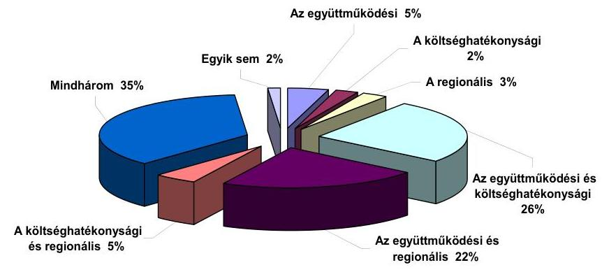

### 1.5. A projekt megvalósítás során az ellenőrzés(ek) módja hogyan segíti a támogatások hatékony felhasználását

A számértékek mutatják, hogy az összes válasz négyötöde szerint az ellenőrzés(ek) segítették a támogatások hatékony felhasználását, ami kedvező mértéket jelent. A legnagyobb részarányú válasz szerint az ellenőrzési megállapítások (és javaslatok) a továbbiakban hasznosíthatóak, a válaszok közel harmada szerint az ellenőrzés(ek) hozzájárul(nak) a szabálytalanságok megelőzéséhez. A nagyobb arányú nemleges válasz alapján az ellenőrzések túlságosan elhúzód-

---

nak és ezzel lassítják a végrehajtást. Ez azt mutatja, hogy az ellenőrzések időben történő, ütemezett elvégzésére fokozottabb figyelmet indokolt fordítani.
5. sz. ábra

A projekt megvalósítás során az ellenőrzés/ek/ módja hogyan segíti a támogatások hatékony felhasználását (több válasz is megadható)
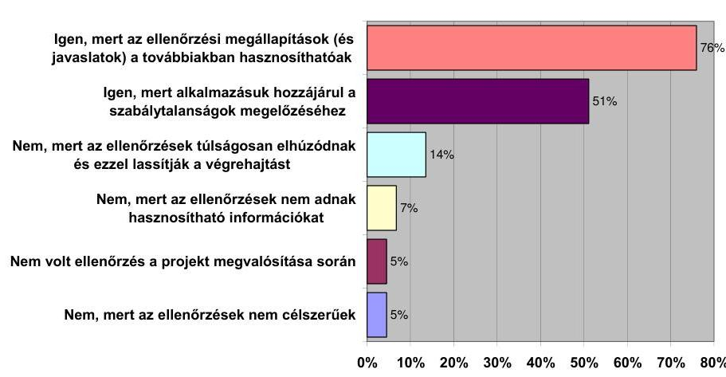
1.6. A projekt (időarányos) megvalósításának eltérése a támogatási szerződés határidő ütemezésétől

A meghatározott válaszlehetőségek alapján a válaszadók kétharmada (67\%) szerint a tervnek megfelelő a teljesítés, néhány esetben (3\%) a tervezett határidő előtt megvalósult a projekt. A 29\%-os késedelem - a projektek közel harmadánál - kedvezőtlen, tekintettel arra is, hogy a konkrét szerződés nem teljesítését jelenti. A három hónapnál nagyobb késedelem a projektek mintegy nyolcadánál ( $5+5+2=12 \%$ ) mutatkozott, ami már a programok végrehajtásának csúszását mutatja. Az átlagosnál nagyobb mértékű késedelmek elsősorban az AU-HU programnál jelentkeztek.
6. sz. ábra

A projekt (időarányos) megvalósításának eltérése a támogatási szerződés határidő ütemezésétől
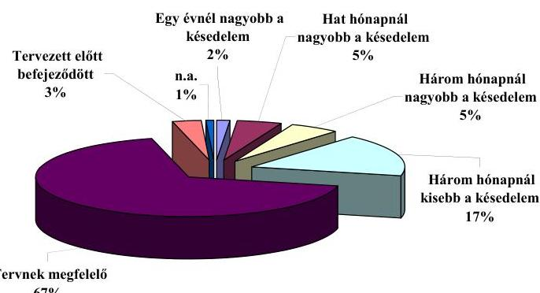

---

# 1.7. A támogatott projekt pályázatban foglaltakhoz képest határidő késedelmes megvalósulásának oka 

A határidő késedelmet tartalmazó válaszok közel négyötöde (39\%) szerint a legfőbb ok a támogatási szerződés megkötésének időtartama (késedelme) volt. Ezt követi a pályázat elbírálásának időtartama (késedelme) a válaszok negyede (25\%) alapján. Ez azt jelenti, hogy a pályázatban tervezett határidő késedelmek alapvetően nem a projekt fizikai megvalósításának időtartam növekedése miatt következtek be, hanem közel kétharmad arányban ( $39+25=64 \%$ ) a kivitelezés megkezdése előtti késedelmek következtében. A projekt tervezettnél nagyobb fizikai időigény a válaszok ötödénél (20\%) jelentkezett és mindössze csak egyhatod részarányt képviselt a kifizetési és elszámolási késedelem $(10+6=16 \%)$.

A válaszok 46\%-a szerint a projekt a tervezett határidőre megvalósul(t).
7. sz. ábra

A támogatott projekt pályázatban foglalt határidejéhez képest a késedelmes megvalósulás oka
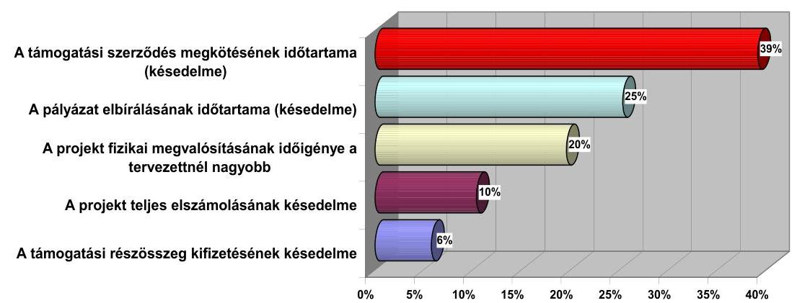

### 1.8. A program lebonyolítását végző intézményrendszer tevékenységének minősítése

Az ötfokozatú skálakérdésre adott válaszok alapján az intézményrendszer tevékenységének minősítése kedvező, a válaszok átlaga 4,22. A válaszok 43\%-a szerint a múködés kiváló, 39\%-a szerint jó, összesen a válaszadók több mint négyötöde ( $43+39=82 \%$ ) a tevékenységet közepesnél jobbnak értékelte. A közepesnél rosszabb (elégséges és elégtelen) minősítés igen kismértékű ( $3+1=4 \%$ ).

Az ilyen nagy arányú pozitív véleménynyilvánítás nincs összhangban az előző pontban bemutatott késedelem okokkal. Ugyanis a válaszok szerint a késedelmek négyötöd része ( $80 \%$ ) az intézmények tevékenységével függ össze (a támogatási szerződés megkötésének, a pályázat elbírálásának, a kifizetésnek, elszámolásnak késedelmei).

---

# 8. sz. ábra 

A program lebonyolítását végző intézményrendszer tevékenységének minöeltése
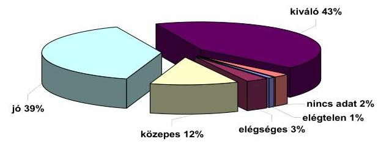
1.9. A támogatási folyamat részterületeire vonatkozó elégedettség mértéke 1-5-ös skálán

Az elégedettség mértékének fokozatai a felmérés során a következők voltak:

| Teljes mértékben elégedetlen | 1 |
| :-- | :-- |
| Összességében elégedetlen | 2 |
| Se nem elégedetlen, se nem elégedett | 3 |
| Összességében elégedett | 4 |
| Teljes mértékben elégedett | 5 |

A 10 db részterületre adott válaszok összességében kedvezően értékelik a támogatási folyamatot, valamennyi részterületre adott válasz átlaga a pozitív tartományban van (a 3-as számértéket meghaladja).

A legmagasabb átlagos elégedettségi értékeket a pályázati felhívás közzététele, a megismerési lehetősége $(4,21)$ és a pályázat elkészítéséhez szükséges információk megszerzésének lehetősége $(4,19)$ részterületek kapták. Ezeket követik a partnerség elvének érvényesülése a működési folyamatokban és a támogatási folyamatokhoz kapcsolódó ellenőrzések (egyaránt 4,05-4,05). A következők a pályázat elbírálási folyamata és a támogatási döntés indokolásának szakszerűsége (egyaránt 3,71-3,71). A határidők teljesülésével kapcsolatos elégedettségek értéke már viszonylag kedvezőtlenebbek: a teljes támogatási összeg elszámolása (3,65), az előírt határidők/időtartamok teljesülése (3,64), a támogatási részösszeg kifizetésének folyamata $(3,58)$. A legalacsonyabb elégedettségű a támogatási szerződés megkötésének folyamata $(3,36)$.

Az egyes részterületekre adott válaszok összességének átlaga 3,82, ami az öszszességében elégedett tartomány alsó felében van.

Az egyes részterületekre adott elégedettségi értékek összességében összhangban vannak a részletező kérdések (1-8-ig), valamint a szöveges értékelés válaszaival:

- a részletező kérdésekre adott válaszok közül is a legnagyobb arányú kedvező válasz a pályázati felhívás közzétételére, megismerési lehetőségére, a szüksé-

---

ges információk megszerzésére, továbbá a felhívás szakszerűségére vonatkozott;

- a projekt megvalósítása során az ellenőrzések szerepét, segítségét a válaszadók túlnyomó többsége a részletező kérdésnél is kedvezőnek, pozitív jellegű tevékenységnek tartották;
- a partnerség elvének érvényesülésével összefüggésben a lebonyolítást végző intézményrendszerek tevékenységét a válaszadók a részletező kérdésnél is többségében kedvezőnek minősítették;
- a pályázatban, illetve a támogatási szerződésben előirányzott határidő késedelmekre adott válaszok mutatják ezen késedelmek számottevő arányát (a projektek közel harmada a támogatási szerződés határidejénél később valósul(t) meg), így a határidők teljesülésével kapcsolatos, átlagosnál alacsonyabb elégedettségek ezzel összhangban vannak;
- a határidő késedelmek okai közül a részletező válasznál a legnagyobb részaránnyal a támogatási szerződés megkötésének időtartama (késedelme) szerepel (39\%), így az erre vonatkozó legalacsonyabb elégedettségi érték ennek a folyamatszakasznak a kedvezőtlen hatását erősíti;
- a szöveges értékeléseknél elsősorban az átlagosnál alacsonyabb elégedettségű folyamatszakaszok, tevékenységek szerepelnek. Az előbbi témakörökön túlmenően az adminisztrációs, bürokratikus problémák, a pályázatok elbírálásának és a kifizetéseknek a késedelmei jelennek meg.
9. sz. ábra

A támogatási folyamat részterületeire vonatkozó elégedettség mértéke 1- 5-ös skálán
megesztán az 1. Sós skálán / átlagos elégedettség
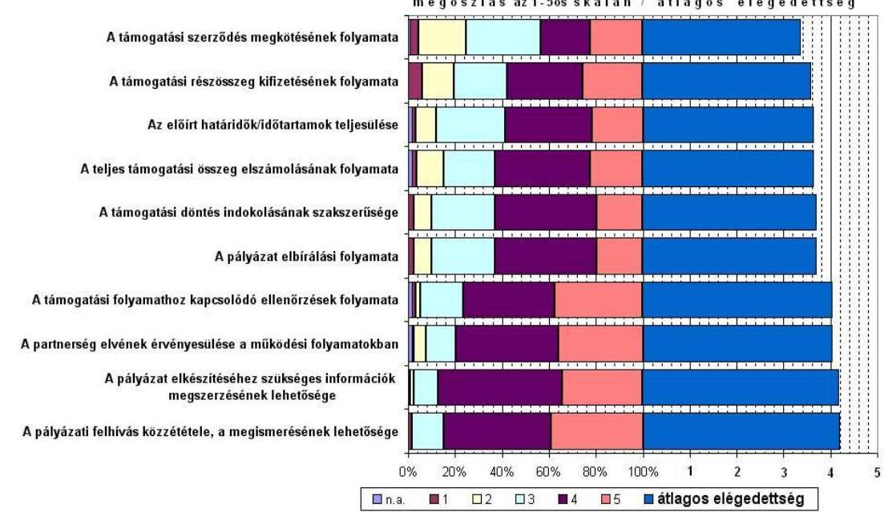
$1=$ Teljes mértékben elégedetlen
$2=$ Összességében elégedetlen
$3=$ Se nem elégedetlen, se nem elégedett
$4=$ Összességében elégedett
$5=$ Teljes mértékben elégedett

---

# 1.10. A támogatott projekt(ek) kiválasztása és megvalósítása során tapasztalt korrupció mértéke 

A válaszadók túlnyomó többsége (88\%) egyáltalán nem tapasztalt korrupciót. Gyenge mértékben tapasztalt 9\% és mindössze 3\% tapasztalt közepes és annál erősebb mértékű korrupciót. Ezek az adatok nem támasztják alá azt, hogy a korrupció kiterjedten megjelent volna a támogatott projekt(ek) kiválasztása és megvalósítása során. Azonban a válaszok jelzik a további csökkentés szükségességét és felhívják a figyelmet a korrupció ellenes tevékenység fontosságára.
10. sz. ábra

Az INTERREG által támogatott projekt/ek kiválasztása és megvalósítása során tapasztalt korrupció mértéke
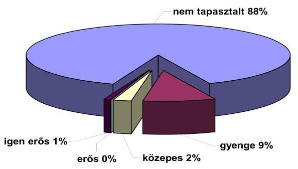
1.11. A támogatási folyamat mely területein és milyen tényezők akadályozták/zák a támogatások hatékony felhasználását

A nyílt kérdésre a 133 válaszadó közül 36-an válaszoltak, amelynek túlnyomó többsége a határidő és bürokrácia témakörökre vonatkozott. Ezen túlmenően konkrét észrevételeket tettek a határon túli együttműködéssel és a pályázatok értékelésével kapcsolatban. Az intézmények tevékenységével összefüggő jelentős számú, hiányosságot jelző észrevétel nincs összhangban azzal, hogy a válaszadók $82 \%$-a az intézmények tevékenységét kiválónak vagy jónak értékelte.

## a) A határon túli együttmüködéssel összefüggő észrevételek

- A nemzetközi együttműködésben megvalósuló projektek országonkénti intézményrendszereinek, alkalmazott hivatalos mértékegységeinek (térkép felbontások) eltérése hátráltatta az eredményes megvalósítást;
- A szlovák oldalon problémát jelentett az ottani finanszírozási mechanizmus;
- A külföldi partnerek hosszadalmas szerződéskötése miatt csúszott a projekt, sőt a projekt időtartama sem volt azonos a hazai támogatási szerződésben foglaltakkal;
- A szlovák és magyar közbeszerzési jogszabályok különbözősége, a közös közbeszerzési eljárás lehetőségének meghiúsulása;

---

- A szerbiai döntési folyamatok bürokráciája és a távolság (Belgrád) jelentett nehézséget;
- A határon átnyúló együttműködések hatásait jobban segítette volna, ha legalább a második körben - csak közös projektek pályázatát lehetett volna benyújtani.
b) A pályázatok értékelésével összefüggő észrevétel
- A pályázók nem kapnak érdemi visszajelzést a pályázatuk szakmai minősítéséről, pedig ez nagyon fontos információ lenne, mind a nyertes pályázatok megvalósítása során, mind pedig a jövőbeni pályázatok összeállításához, a minőségének javításához.
c) A túlzott bürokráciával összefüggő észrevételek (a párhuzamosságok összevonásával)
- Túlzottak az adminisztrációs követelmények;
- Az adminisztrációs feladatok bonyolultsága jelentős mértékben akadályozta a megvalósulás folyamatát és a támogatások kifizetését;
- Az elszámolás túlzottan bürokratikus;
- Lassú a döntési mechanizmus, túlbürokratizált az ügymenet, késedelmes és nem egységes a dokumentumigény, a folyamat közben több személyi változás volt a Kezelő Szervezetnél;
- A pályázaton belüli pénz-átcsoportosításokat ellehetetlenítették;
- A támogatott terület határa szigorúan a megyehatárok szerint volt kijelölve, így Bács-Kiskunban a dunai környezetvédelmi fejlesztést a balparton lehetett tervezni, a jobbparton nem;
- A bürokrácia sokszor a szakmai szempontokat háttérbe szorítja. A pénzösszeg felhasználási lehetősége nem volt rugalmas, jó lett volna némi pénzösszeget szakkönyvek vásárlására, konferenciákon való részvételre fordítani;
- A folyamat túlbürokratizált, rugalmatlan, nem a megvalósítást és a projekt célját tekinti elsődlegesnek, hanem az ellenőrzést.
d) A határidő késedelmekkel összefüggő észrevételek (rövidítésekkel és a párhuzamosságok összevonásával)
- A támogatási szerződés megkötésének folyamata hosszadalmas, az elszámolások elfogadása és a kifizetések közötti időszakok túlzottan hosszúak;
- A támogatási szerződés aláírásának késedelme, illetve az első kifizetés elhúzódása likviditási problémákat jelentett, így egyes tevékenységeket át kellett csoportosítani;
- A szerződéskötés hosszúsága mérföldkő eltérésekhez vezet;
- A támogatási szerződés megkötése csúszott, így a megvalósításra szánt idő lerövidült;
- A szerződéskötés folyamata rendkívül hosszú, a szerződéskötés dátuma a tervezett megvalósítás idejére esett. Mindez a közbeszerzések jelentős csúszását okozta;
- A projekt lebonyolítása során a szerződésmódosítási kérelmekre több hónapos késéssel kaptak választ, amely nagyban nehezítette - építési beruházás lévén a projekt megvalósítását;

---

- A támogatási szerződés megkötésének elhúzódása nehezítette a rögzített határokon belüli költségkeret felhasználását;
- A megvalósítást jelentős mértékben hátráltatta a támogatási szerződés aláírásának elhúzódása;
- A támogatási döntés meghozatala késlekedő, a támogatási összegek elszámolása és kifizetése lassú;
- A támogatási döntés és az előkészített támogatási szerződés aláírása elhúzódott, a részkifizetések csúsztak;
- A támogatási részösszegek ellenőrzési, engedélyezési, kifizetési folyamata hosszú, de ezt az alvállalkozókkal kötött szerződésben rögzítették;
- A hosszú kifizetési határidők miatt több partner visszalépett;
- A döntési folyamatok felgyorsításával hatékonyabb munkát lehetne végezni, nem torlódnának a programon belüli tevékenységek és javulna a költségfelhasználás;
- A támogatási összegek átutalása késett;
- A támogatási részösszeg kifizetési, valamint a támogatási összeg elszámolási folyamatán kellene rövidíteni;
- A közbeszerzési eljárás nagyon meghosszabbította az eljárást, bár azóta már voltak változások.

Ezek a szöveges észrevételek összhangban vannak az 1.7 pontban bemutatott késedelem okokkal, különös tekintettel a támogatási szerződés megkötésének késedelmével (az 1.7 pontban az összes válasz 39\%-a vonatkozott erre).

# 2. A határokon átnyúló regionális együTtmúködési célú támogatá-   SOK ÁltAl ÉrintETT ÖNKORMÁNYZATOK VÁLASZAINAK ÉRTÉKELÉSE 

2.1. Az INTERREG program támogatási célkitűzéseinek és az adott település/kistérség/régió valós, megalapozott szükségleteinek egybeesése.

Az egybeesést az ötfokozatú skálakérdésre adott válaszok összességében kedvezőnek ítélték meg (az átlagos érték 3.57). A válaszolók több mint fele pozitív, az átlagosnál nagyobb érzékelhető egybeesést jelzett. Az említett városok közül volt olyan, ahol a válasz nemleges volt, ez rontotta ezen városok válaszainak átlagát $(3,5)$.
2.2. A program tervezése során kérték-e a település véleményét a támogatási célok meghatározásához/kialakításához).
A válaszok összességében kedvezőtlen képet mutatnak, mivel többségében nem kértek véleményt, a nagyobb városoknál is ez 50\%-os arányt képvisel. Konzultációs lehetőségre több esetben volt lehetőség, azonban csak 2 válasz jelezte, hogy írásban kértek véleményt.
2.3. Az önkormányzat véleménye megjelent-e a pályázati kiírásban, illetve kaptak-e visszajelzést a figyelmen kívül hagyás indokára.
A válaszok szerint egyetlenegy esetben sem jelent meg teljes körűen az önkormányzat véleménye és mindössze két válasz jelezte a részleges megjelenést (fi-

---

gyelembe vételt). Kedvezőtlen az is, hogy többségében az érintett önkormányzatok nem kaptak visszajelzést a figyelmen kívül hagyás indokára (csak egy önkormányzat jelzett visszajelzést).

# 2.4. Az INTERREG projekt(ek) kedvező hatása a településre 

A nyolc válaszlehetőség között a válaszok nagy mértékben megoszlottak, így egyik sem kapott szignifikáns többséget. Viszonylagosan a legtöbb válasz (25\%) a lakosság interregionális együttmúködésének, társadalmi kohéziójának javulását jelezte kedvező hatásként. Az átlagosnál több válasz vonatkozott az életminőség, valamint a térség turisztikai kapacitásának növekedésére. Az átlagosnál kevesebben jelezték a környezeti tényezők javulását, a közlekedés színvonalának emelését, a munkahelyek számának, a munkavállalók piacképes tudásának növelését és az önkormányzati bevételek növekedését.
A válaszok jelzik a végrehajtás hiányosságait, mivel alapvető fontosságú célkitűzések teljesülése - közlekedés, munkahelyek száma, piacképes tudás - csak kisebb mértékben jelent meg. (Mindössze egy nagyobb város jelezte a munkahelyek számának növelését.) Ugyanakkor kedvező, hogy a határon túli együttműködés hatása megjelent a válaszokban (A nagyobb városok többségénél is.)
2.5. A településen bejegyzett kedvezményezett(ek) által - INTERREG támogatással - megvalósuló/megvalósított projekt(ek) hozzájárulása a település fejlődéséhez.
Az ötfokozatú skálakérdésre adott válaszok átlaga 3,28, ami kismértékű pozitív megítélést jelent. A nagyobb városok átlaga kedvezőtlenebb $(3,0)$, két város jelzett segítséget, két város pedig nem érzékelt hozzájárulást, a többiek megítélése semleges volt.
2.6. A településen bejegyzett kedvezményezett(ek) által megvalósuló/megvalósított projekt(ek) hozzájárulása az interregionális együttmúködéshez.
Az ötfokozatú skálakérdésre adott válaszok átlaga 3,93, ami kedvező megítélést, érzékelhető, tényleges hozzájárulást jelent. A jelzett nagyobb városok átlaga még nagyobb számértékű $(4,0)$ és egyetlenegy válasz sem jelezte, hogy nem járult hozzá a projekt az interregionális együttműködéshez.
2.7. Az adminisztratív (bürokratikus), gazdasági és interregionális (politikai) tényezők rangsorolása a település/kistérség/régió valós igényeihez igazodó támogatások kialakításának és/vagy végrehajtásának elmaradásában betöltött szerepük szerint.

Az 1, 2 és 3 számjegyekkel jelzett sorrend (helyezési szám) szerint a tényezők közül érzékelhetően az interregionális együttmúködés vezeti a rangsort, vagyis ennek van a legnagyobb szerepe a valós igényekhez való támogatások kialakításának és/vagy végrehajtásának elmaradásában. A városok fele az első helyre, a több mint egyötöde a második helyre rangsorolta. A nagyobb városok esetében a rangsor vezetése még inkább jelentkezett. (A városok fele az első, több mint egyharmada a második helyre rangsorolta az interregionális együttmúködést.) Az adminisztratív és gazdasági tényezőket a válaszolók összességében közel azonosan ítélték meg a rangsorban a második-harmadik helyen.

---

# 2.8. A támogatott projekt(ek) kiválasztása és a megvalósítása során tapasztalt korrupció mértéke. 

A válaszolók mintegy négyötöde egyáltalán nem tapasztalt korrupciót. Két válaszadó kismértékű (14\%), egy válaszadó közepes mértékű (7\%) korrupciót jelzett. A nagyobb városok válasza kedvezőbb volt, a válaszolók 88\%-a egyáltalán nem tapasztalt korrupciót.
2.9. A támogatási folyamat mely területein és milyen tényezők akadályozták/zák a támogatások hatékony felhasználását.

A nyílt kérdésre a válaszadók fele által adott válaszok szerint elsősorban a következő problémák, hiányosságok jelentek meg:

- A pályázati kiírásokban erőltetett követelmények vannak;
- A pályázati kiírás, a pontozási rendszer, az elbírálás nem igazodott a kistelepülések sajátosságaihoz;
- Túl sok az adminisztráció a pályázatok elkészítése és megvalósítása során. A felesleges „papírgyártás" időigényes. Több településen nem áll rendelkezésre a szükséges mennyiségű és minőségű humánerőforrás. Így esetenként a projektek megfelelő menedzselése nem valósul meg;
- A támogatások lehívása nehézkes, időigényes, túlbürokratizált, a közreműködő szervezet eljárási folyamatai bonyolultak. A külföldi partnerekéhez képest a magyar utófinanszírozás általában az utolsó volt;
- A becsült költségvetés a több éves átfutási idő miatt nehezen tartható, így többszöri, időigényes szerződésmódosítás szükséges. Felesleges a három árajánlat bekérése az alacsony összegű (50-100 eFt-os) tételeknél;
- A közös projekteknél más-más előírások (elvárások) voltak érvényben a határ két oldalán, ami több esetben nehezítette a hatékony együttműködést. (HU-RO-SER);
- Az új komáromi Duna-híd tervei készültek el a támogatásból, azonban a híd megépítése kormányközi megállapodást igényel. Az INTERREG folytatásakénti ETE programban a megvalósításra történő pályázat benyújtás akadálya lehet a megállapodás hiánya.

A válaszok túlnyomó többsége a nagyobb városok önkormányzatától érkezett.

---

# JELENTÉS 

## AZ EU STRUKTURÁLIS ALAPOK KÖRNYEZETVÉDELMI CÉLÚ FELHASZNÁLÁSÁNAK ELLENŐRZÉSÉRŐL

(az EU Strukturális Alapok Munkacsoport által koordinált ellenőrzéshez)

## I. RÉSZ A 2004 - 2006. IDŐSZAK ÉRTÉKELÉSE

## KÖRNYEZETVÉDELEM ÉS INFRASTRUKTÚRA OPERATÍV PROGRAM

## BEVEZETÉS

Az EU Bizottsága a 1260/1999 EU Tanácsi Rendelet a Strukturális Alapokra vonatkozó általános rendelkezése keretében alapvető követelményként fogalmazta meg a fenntartható fejlődés elveinek következetes érvényesítését.
„Mivel a Közösség gazdasági és szociális kohézió erősitését célzó törekvéseiben a gazdasági tevékenység harmonikus és kiegyensúlyozott és tartós növekedését, .....a környezet magas szintű védelmét és fejlesztését is elő kivánja segíteni, mivel ezeknek az erőfeszitéseknek a különösen a környezetvédelmi követelményeket kell integrálniuk a Strukturális Alapok tevékenységének tervezésébe és végrehajtásába..."(1260/5-ös Preambulum)

Magyarországon az Országgyűlés a 132/2003. sz. határozatában 2003. decemberében elfogadta a 2003-2008-ig terjedő időszakra szóló második Nemzeti Környezetvédelmi Programot (NKP II), amelyben meghatározásra került a hazai környezetvédelmi politika és célrendszer összhangban az EU környezetvédelmi irányelvekkel.

A Magyar Köztársaság Kormánya 2003 májusában elfogadta a Nemzeti Fejlesztési Tervet és az öt operatív programot, így a Környezetvédelem és Infrastruktúra Operatív programot. Az NFT az a stratégiai dokumentum, amely meghatározta a 2004-2006 programozási időszakra az EU támogatással megvalósítandó fejlesztési irányokat. A Környezetvédelem és Infrastruktúra Operatív program (továbbiakban KIOP) az NFT-ben leírt célok elérését szolgáló végrehajtási stratégiát tartalmazta. Az OP három prioritásból állt, a környezetvédelem, közlekedés, valamint a technikai segítségnyújtás. Jelen nemzetközi párhuzamos ellenőrzés a környezetvédelemre fókuszált.

---

# 1. Kulcsterület: Az intézkedések tervezése és a projektek KIVÁLASZTÁSA 

### 1.1. Fő következtetések:

A KIOP program tervezése és a projektkiválasztások során alapul vették az SA elsődleges céljait és a nemzeti környezetvédelmi politikát. A környezetvédelmi fejlesztések területén az OP-k intézkedései hozzájárultak a Strukturális Alap elsődleges céljaihoz, mivel az teljes mértékben megfelelt a fenntartható fejlődés elve érvényesítésének és az ökológiai céloknak. A KIOP program (2004-2006) tervezése és a projektek kiválasztása fázisokban egyaránt figyelembe vették az EU és a hazai a környezetvédelmi célrendszert. Ez megmutatkozott abban, hogy a KIOP-ban szereplő intézkedések összhangban voltak az EU hatodik környezetvédelmi akció programjával és az NKP II vel.

A bolygónkra, Európára, Magyarországra vonatkozó fenntartható fejlődési hoszszú távú stratégiák és akció programok, a 2003- 2008 évekre kiterjedő országgyűlés által elfogadott második Magyar Környezetvédelemi Program, a környezetvédelmi ágazati szakmai programok, a regionális stratégiák és a KIOP intézkedések rendelkeztek indikátorokkal. Ugyanakkor az egymásra épülés kvantitatív kezeléséhez a KIOP indikátorok nem képeztek egy konzisztens indikátorhierarchiát. Az indikátorok közti transzformációk nem voltak megoldottak és átláthatóak.

### 1.2. Megállapítások

A célrendszer megalapozottságát a magyar környezeti állapotok körültekintő felmérése és helyzetelemzése előzte meg. A környezetvédelmi célok (NKP II) és a KIOP program között az összhang biztosított volt. Az összefüggéseket fejezi ki az NKP II. tematikus akcióprogramjainak előrehaladását és az EU támogatási források felhasználásának alakulását tartalmazó 1. sz. ábra.

Magyarország a célterületeket a speciális kritériumokkal együtt azért választotta, mert azok a legfontosabb környezetvédelmi beavatkozási területeket jelentették. A célterületek az EU környezetvédelmi irányelveinek betartásához szükségesek voltak, teljesítésükre Magyarország kötelezettséget vállalt, továbbá kisebb beruházási értéküknél fogva nem részesültek a KA támogatásban. Az intézkedések közötti a megoszlást mutatja a 2. sz. ábra.

---

# 1. sz. ábra 

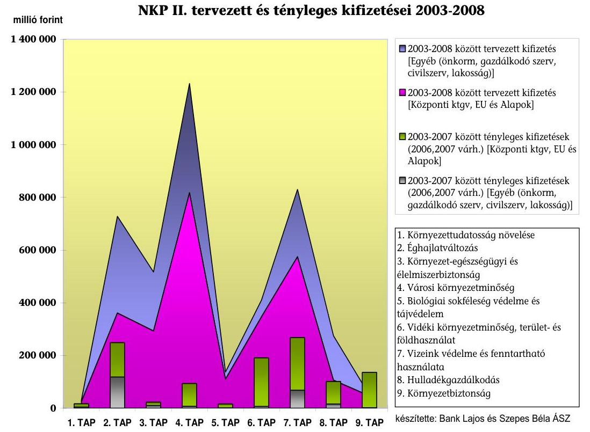

## 2. sz. ábra

Környezetvédelmi és Infrastruktúra-fejlesztési Operatív Program EU támogatási forrásainak megoszlása intézkedésenként (\%)
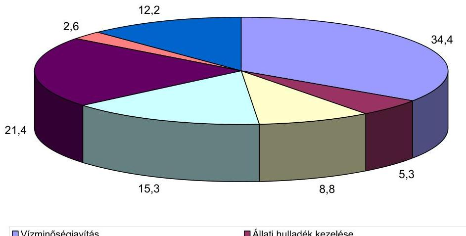

---

A környezeti célok vonatkozásában intézkedésenként specifikusan fogalmazták meg a projekt kiválasztási kritériumokat és feltételrendszert, amelyeket az OP és PkD dokumentumok tartalmaztak.

Például a Vízminőség javítás intézkedésen belül az ivóvíz komponens esetében a kritériumok meghatározását a következők jellemezték. A támogatás célterületét azon települések képezték, ahol 2006. dec. 25 -ig meg kellett oldani az ivóvíz minőségének javítását, ahol az ivóvízben az arzén koncentráció meghaladta a határértéket. Az így érintett települések száma 191 db volt, a lakosok száma elérte a 330 ezer főt. 2009. dec. 25 -ig kell ivóvizek minőségének javítását elvégezni a viszonylag kisebb arzén koncentráció feletti és az ammónium-ion határérték feletti szennyezést tartalmazó településeken. Az így érintett települések száma 686 db ., a lakosok száma 22420 ezer fő. Az intézkedés tartalmazott időcélt is, nevezetesen, hogy az ivóvízminőség határidőre megvalósuljon.

Az intézkedés ill. szakma specifikus kritériumok ezáltal lehetővé tették annak mérlegelését, hogy az adott projektek hozzájárulnak-e a hazai környezetvédelmi célokhoz, szakmai programok teljesítéséhez. A kiválasztási kritériumok a jogosultság intézkedésenkénti meghatározásával célirányosan szűkítették a potenciális pályázók körét. 2004-2006 időszakban - a bírálati szempontok szerint - kiemelkedő hangsúlyt kapott a projekt kiválasztási folyamatban a szabályosságra törekvés és az, hogy a fizikai és pénzügyi megvalósítás kockázatai minimálisra csökkenjenek, ezáltal garantálva az EU program sikerét.

Az egyes intézkedések különböző szakmai jellegéből eredően, a kiválasztási kritériumok eltértek, ugyanakkor voltak közös elemek. Ezek közé tartozott például általánosan annak vizsgálata, hogy a regionális vagy kistérségi programokhoz illeszkedés ${ }^{1}$ és a projekt fenntarthatóságának alapvető követelménye teljesül-e, továbbá a projektek előkészítettségét és menedzselését kifejező projekt kiválasztási paraméterek megfelelőek -e. A VFM elv érvényesítésének szándéka a pályázatok elbírálási folyamatának része volt. Például előnyben részesültek azok a projektek, ahol gazdaságosabb szennyvízkezelési technológiát terveztek be. A természetvédelmi projekteknél a helyszíni vizsgálati tapasztalatok alapján megkövetelték a társadalmi-, gazdasági haszon elemzés elvégzését a pályázóktól az EU módszertanra alapozottan.

# 1.3. A legjobb gyakorlat 

A projekt kiválasztás során felállításra került egy egységes kritérium rendszer, melynek részét képezte a horizontális politikára vonatkozó rész. A programozás pozitív elemei megmutatkoztak abban, hogy gondos helyzetelemző munkával definiálták a szükséges környezetvédelmi beavatkozási területeket. Például az ivóvíz ellátás, hulladékgazdálkodás, Natura 2000 területén vagy a kármentesítési projektek esetében. A környezetvédelmi projektek megvalósításának bizton-

[^0]
[^0]:    1 ' Magyarországon a regionális fejlesztési tervek készítését jogszabály írja elő. A régiók, sőt kistérségek is rendelkeznek fejlesztési tervekkel. Az Országgyúlés - fogadta el az országos területfejlesztési koncepciót. Az ennek való megfelelés ugyancsak alapvető követelmény volt.

---

ságát célzó kritériumok alkalmazása a projektkiválasztó folyamatban alapvetően elősegítette a program fenntartható és sikeres megvalósítását, az EU támogatási források megalapozott felhasználását.

# 1.4. Gyengeségek 

A pályázók körének alakulása és a pályázói kapacitások fejlesztése - elsősorban az önkormányzatok esetében - a finanszírozási források rendelkezésre állásától függően a nemzeti hatóságok programmenedzsmentjének kompetenciáján kívül esett. A környezetvédelmi problémák időbeni alakulását és súlyát a pályázói kör, és pályázatok csak részben tudták közvetíteni az EU támogatásokat múködtető rendszerben.

Egyik példája volt ennek az, hogy az állati hulladékokra nem érkezett elegendő pályázat, és a monitoring bizottságnak kellett ehhez igazítani az intézkedésenkénti kereteket, miközben ezen a területen a fejlesztés elengedhetetlen követelmény volt. Az ivóvíz fejlesztési projektek mértéke nem érte el a kívánt mértéket, ugyancsak elegendő pályázat hiányában.

A regionális tervek és az NKP II nem nyújtottak elégséges támpontot a megvalósítandó projektek időbeni rangsorolásához.

A környezetvédelmi állapotok általános elmaradottsági szintje és a rendelkezésre álló EU támogatási források időbeni és nagyságrendi korlátai miatt a regionális tervekhez illeszkedés kritériuma önmagában nem volt alkalmas az intézkedésszintű és nemzetgazdasági szintű hatékonysági szempontok kezelésére.

A pályázatban szereplő költségek megalapozottságának megítélésekor, például a nettó jelenérték számításkori figyelembe vétele esetében, nem álltak rendelkezésre megfelelő részletességű háttérdokumentumok. A projektek előkészítési fázisában pontatlanok voltak a költségbecslések, az üzleti tervek.

### 1.5. Ajánlások

A tapasztalatok szerint a pályázatok megalapozottságának és a dokumentációk kidolgozottságának, továbbá a nemzetgazdasági szinten a pályázatok elkészítésére fordított pénzeszközök hatékonyságának javítása érdekében a 2007-2013-as periódusra célszerűvé vált a pályázati eljárást kétfordulósra ${ }^{2}$ változtatni.

A támogatási források előkészítési szakaszban történő felhasználása révén a nemzeti hatóságok megcélozták azt, hogy a kedvezményezettek közti szakmai felkészültségből és a saját finanszírozási forráslehetőségekből eredő különbségeket mérsékeljék és egységesen jól megalapozott pályázati dokumentációk előállítását elősegítsék.

[^0]
[^0]:    ${ }^{2}$ Az első pályáztatási körben a koncepcionális tervekre épülően kiválasztott projektek előkészítési támogatásban részesülnek. Ezáltal a kétfordulós pályázat következményeként tömegével nem fognak előállítani olyan részletes terveket, amelyeket nem használnak fel rövidtávon. Nem maradnak ki azok az önkormányzatok, akiknek nincs elég forrása a részletes tervek kidolgozására.

---

# 2. Kulcsterület: Célirányos Pályáztatási eljárási foLYAMATOK 

### 2.1. Fő következtetések

A nemzeti pályáztatási eljárások elősegítették az Alapok elsődleges célkitűzéseinek teljesítését a környezetvédelem területén. Ennek eszközeként felhasználták intézkedésenként a pályázati felhívásokat, abban a célokat, a jogosultság és feltételrendszert körültekintően kialakították, valamint a pályázatokat ennek megfelelően elemezték.

Ugyanakkor a jó VFM megoldások elérésére tett erőfeszítések ${ }^{3}$ ellenére az adatszolgáltatások és elemzések nem terjedtek ki teljes körűen arra, hogy a célok elérése a lehető legkisebb költséggel valósuljon meg. A környezetvédelmi projekteknél az „érték" (VFM) értelmezése és a társadalmi diszkontráta kezelése módszertani és szakmai szempontból még nem egyértelműen tisztázott a különböző időhorizontok és az elmaradt és fejlettebb régiók, természeti értékek koncentrálódása és az értékkifejező indikátorok viszonylatában. Az „értékkel" kapcsolatos értelmezési hiányosságokat fokozta az, hogy a kockázatmentesebb projektmegvalósítás felértékelődött az alkalmazott projekt kiválasztási rendszerben.

### 2.2. Megállapítások

A Program Kiegészítő Dokumentum (PkD) volt a gyakorlatban az a tervezési kulcseszköz, amely a program társadalmi és gazdasági hatékonyságát a leginkább befolyásolta és meghatározta. A PkD kidolgozottság szintje és az abban foglalt feltételrendszer megfelelő garanciát jelentett abban a tekintetben, hogy a támogatási forrásokat az SA és a nemzeti környezetvédelmi stratégiának megfelelően használják fel. A pályázati felhívások minden esetben tartalmaztak olyan feltételeket és mutatókat, amelyek szerint a pályázónak előzetesen garantálnia kellett, hogy projektje hozzájárul az adott intézkedésben kitűzött célok teljesítéséhez. Enélkül projektet a nemzeti hatóságok nem fogadtak be és nem támogattak.

A pályázatok elbírálásához a PkD-ban hagyta jóvá a Monitoring Bizottság a bírálati szempontokat és a pontozási rendszert, amelynek felhasználásával rangsorolták az egyes felhívásokra beérkezett projekteket. A PkD intézkedési szintenként jól meghatározta a célterületeket. Célra orientáltan szűkítette a pályázói kört. A projekt szabályos megvalósíthatóságának és fenntarthatóságának kritériumai elsőbbséget élveztek. A PkD kijelölte a támogatás elnyeréséhez szükséges feltételeket.

A pályáztatási adatokat a 2008. június 30-i állapotnak megfelelően az 1. sz. melléklet foglalja össze, intézkedésenkénti bontásban kimutatva a benyújtott és

[^0]
[^0]:    ${ }^{3}$ A következő adatszolgáltatást követelték meg a pályázóktól ahhoz, hogy értékelni tudják azt, hogy a projekt a VFM szempontjából releváns-e: projekt célja, output, várt eredmények és hatások (outcome), ütemezés, költséghatékonysági elemzés, közvetlen és közvetett környezetvédelmi hatások.

---

elfogadott pályázatok darabszámát és az igényelt támogatások, továbbá az EU támogatások összegét, valamint a támogatások arányait(\%).

A nemzeti hatóságok a kiválasztási folyamatban elsősorban projektszinten végeztek költséghatékonysági elemzéseket, ezek az EU előírásoknak megfelelően történtek. Nehézségekbe ütközött annak megítélése, hogy a célrendszerhez a lehetséges legnagyobb hozzájárulást az adott környezetvédelmi területen a lehetséges legalacsonyabb költség mellett biztosítja-e a projekt. Összefüggött ez a pályázati dokumentáció kidolgozottságának szintjétől függő költségbecslési pontatlanságokkal, a projektek egyediségétől, térbeni elhelyezkedésétől eredő összehasonlíthatósági problémákkal, továbbá az üzleti tervezés kockázati tényezőivel, amelyet a projekt teljes életciklusára kiterjedően számításba kellett venni.

Ugyanakkor ebben a programperiódusban a támogatási szerződések kötését megelőzően nem vált gyakorlattá az, hogy program, vagy intézkedés szinten végezzenek átfogó értékeléseket, hasonlítsák össze a potenciális pályázatokat a fő célokhoz való hozzájárulás mértéke alapján. Ez nem volt EU követelmény. Az értékelés funkcionálisan elkülönült, melyet közbenső, utóértékelési feladatként határozott meg az EU. Ezáltal a Monitoring Bizottságok tevékenységébe nem épült be a rendszeres és a szakmai eredményeket értékelő feladatkör.

# 2.3. A legjobb gyakorlat 

A kiinduló állapot korrekt értékelése (például SWOT analízissel), a célok kijelölése és a projekt kiválasztási kritériumok, amelyeket a PkD, a pályázati kiírások tartalmaztak megfelelő támpontot jelentettek a projektgenerálási és kiválasztási folyamatokban. A jogosultsági és értékelési (tartalmi és minőségi) kritériumok (például céloknak való megfelelést mérő, fenntarthatósági, vagy költséghatékonysági szempontokra, hátrányos helyzetű régiókra, ill. kistérségre figyelemmel levő értékelési elemek) lehetővé tették annak megítélését, hogy a projektek garantáltan és viszonylag kis kockázattal, célirányosan hozzájárulnak-e a fenntartható program megvalósításához. Például szennyvíz projektek esetében.

### 2.4. Gyengeségek és ajánlások

Az ellenőrzési tapasztalatok szerint az eddigi pontozási rendszer nem volt elégséges a legjobb VFM szerinti program végrehajtásához. Az optimális támogatási portfolió kialakítását, az országos pályázati igényekből az optimális projektrangsor meghatározását intézkedéseken belül és intézkedések között korlátozta a projektek műszaki, gazdasági előkészítettségének és társadalmi elfogadottságának helyzete, az önkormányzatoknál a finanszírozhatóság alakulása, továbbá az időben és térben változó intenzitású pályázói igényeknek a felmerülése. Ezen tényezőknek a befolyásolása a 2004-2006 periódusban a nemzeti hatóságok kompetenciáján nagyobbrészt kívül esett.

A projektek rangsorolásában a költséghatékonysági szempontoknak nem volt meg a kellő súlya. A kockázatmentesebb, mielőbbi megvalósításnak, az előké-

---

szítettségnek és a jó menedzsmentnek a szempontjai 2004 és 2005-ben az SA indításakor nagyobb szerepet kaptak.

Az indikátorok fejlesztése az NFT I-ben nem fejeződött be. Problémaként jelentkezett az, hogy az EU szintjén összevontabb, ugyanakkor a gazdaságosság, a VFM, a környezetvédelmi hatások megítéléséhez finomabb indikátorokra volna szükség.

A környezetvédelmi projekteknél általánosan jelentkező társadalmi és hosszú távú haszon értékelésével kapcsolatos módszertanok még nem kezelik az SA projekteknél elfogadott indikátor kategóriákat, így, az output, eredmény és hatásmutatókat.

A bírálati időkkel és szakértői költségekkel kapcsolatos egységes csökkentési tendencia, a komplex környezetvédelmi projekteknél a VFM elemzések szempontjából nem volt kedvező hatású.

Javasoljuk, hogy

- a költséghatékonysági kritérium az értékelési folyamatban, különösen az intézkedések szintjén kapjon az eddigieknél nagyobb figyelmet és prioritást;
- a gazdaságossági, eredményességi és hatékonysági szemlélet fokozását az IHnál, KSZ-eknél és a szakminisztériumoknál (a projektötlettől az üzemeltetésig);
- az állam és az EU nagyobb szerepvállalását a társadalmi prioritásokat élvező projektek előkészítésének finanszírozásában és promóciójában;
- tekintettel a 2.2. pontban is leírtakra, miszerint az értékelés funkcionálisan elkülönült és utóértékelési feladatot határozott meg az EU, javasoljuk az időközi értékelések készítését az Irányító Hatóságok részére. Az időközi értékelések lehetővé teszik a pályázati kiírások szükség szerinti hatékonyabb módosítását, mivel konkrét eredményekre támaszkodnak. Továbbá lehetővé válik a hatékonyabb, periódusközi tervezés a 2007-2013-as időszakban.

# 3. Kulcsterület: Az odaítéLési eljárási mechanizmUSA 

### 3.1. Fő következtetések

Az odaítélési eljárás mechanizmusa alkalmas volt a projekt menetének és sikerének előzetes értékeléséhez. ${ }^{4}$ A nemzeti hatóságok az odaítélési eljárásban a kedvezményezettől bekért és általa szolgáltatott dokumentumok ${ }^{5}$, vitás esetek-

[^0]
[^0]:    ${ }^{4}$ A végső kedvezményezettnek igazolnia kellett, hogy úgy fogja megvalósítani a projektet, hogy az előre jelzett költségkereten belül, időben és módon elérje a tervezett eredményeket.
    ${ }^{5}$ A pályázati dokumentációban lévő bizonyító erejú dokumentumok, nyilatkozatok ugyanis tartalmazták a projekt előkészítettségének helyzetét (építési engedélyek megléte), a projektet

---

ben azok helyszíni kontrollja alapján ítélték meg, pontozták azt, hogy a pályázat befogadható. Ugyanakkor az idő és költségcélok tarthatóságával kapcsolatban a megvalósítási kockázatok megalapozottabb megítélése nem valósulhatott meg kellő tapasztalati adat és költségszakértői kapacitás hiányában.

# 3.2. Megállapítások 

A célpiramis csúcsán az OP szintjén kialakították az output, eredmény és hatásmutatókat, amelyek eléréséért az IH az elsődleges felelős. A célhierarchia következő szintjét a Program-kiegészítő Dokumentum jelentette, amely részletekbe menően, intézkedésenként mutatta be az OP keretében igénybe vehető támogatások céljait és feltételeit. A teljesítés ütemterveinek, a költségek megalapozottságának értékelése a bírálati tevékenység része volt.

A megítélt támogatások és a módosított támogatási szerződések alakulását intézkedésenként a 2008. június 30-i állapotnak megfelelően a 2. sz. melléklet foglalja össze. Előfordult a költségek alulbecslése.

### 3.3. A legjobb gyakorlat

A projekt menetének (pályáztatási állapot, pénzügyi előrehaladás)) értékeléséhez jól múködő monitoring rendszert építettek ki a pályázati és a megvalósítási szakaszban, mivel a kedvezményezett jelentéstételi kötelezettségét előírták.

### 3.4. Gyengeségek és ajánlások

A pályáztatási folyamatban rendelkezésre álló adatok bizonytalanságai (a pályázati dokumentumok minőségi problémái, a döntési folyamatok időigényessége, a piaci árak változásai, a tervezés késedelmei, a közbeszerzések elhúzódása, a költségadatbázisok és normatívák hiányai) az ütemtervek és a költségek megbízhatóságának a megítélését megnehezítették.

Javasoljuk a kedvezményezetteknél a szakmai kapacitások növelését, a pályázati dokumentációk minőségének tovább fejlesztését és a KSZ-ek ráhatásának növelését a megvalósítási dokumentációk minőségére a projektek megvalósítási költségeinek és az ütemterveinek megalapozottabb kidolgozása és értékelése, a támogatási források jobb hasznosulása érdekében.
megvalósító szervezet projektmenedzseri felkészültségét, a kedvezményezett pénzügyi garanciáit és a projekt hosszú távú fenntarthatóságának főbb paramétereit.

---

# 4. Kulcsterület: Monitoring És jelentés 

### 4.1. Fő következtetések

Az Egységes Monitoring Információs Rendszer (továbbiakban: EMIR), amely központilag fejlesztett és múködtetett, más eszközökkel együtt, jól támogatta a támogatott intézkedések pénzügyi nyomon követését és értékelését a környezetvédelmi célterületeken. A nemzeti Egységes Monitoring Információs Rendszer megfelel a releváns EU szabályoknak. A rendszer biztosítja az adatoknak a Bizottság részére történő továbbítását. Az éves Kormány jelentéstételi rendszer múködése jól biztosított. Ugyanakkor kormányzati és MB szinten a hatékonyságát csökkentette az a tény, hogy félévvel követte a jelentéstétel a reálfolyamatokat, ezáltal a projektciklusok lezárása után korrigálási lehetőségek már minimálisak voltak.

A rendszer megbízható pénzügyi és statisztikai információt gyűjt össze a pénzügyi monitoring jelzőszámokhoz teljes körűen. A szakmai monitoring feladatok ellátását az indikátor rendszer fejlesztésének hiányosságai és késedelme miatt csak részben támogatta. A szakmai monitoringra és a fizikai indikátorokra fókuszáló tevékenység a pályáztatási ciklusban háttérbe szorult.

### 4.2. Megállapítások

A monitoring adatok kezelése az összes operatív programra kiterjedően az Egységes Monitoring Információs Rendszerben történik. A pénzügyi monitoring fejlesztése befejeződött, a szakmai monitoring és az ellenőrzési folyamatok követésének moduljainak fejlesztése még folyamatban volt. A pályáztatási ciklusban a monitoring rendszer múködése inkább eljárás és idő orientált volt, mint ered-mény-indikátor központú. Későn, a megvalósítási ciklusban indult el az indikátor adatok (output és eredmény) felvitele.

Az indikátorok (Financial-, Progress- and Output- or Outcome indicators) önmagukban nem voltak alkalmasak annak megítélésére, hogy az intézkedések hatékonysága mérlegelhető legyen.

A környezetvédelmi hatásoknak az NKP II szakmai célrendszere szerinti követése nem alakult ki a környezetvédelmi projektek vonatkozásában a nemzeti hatóságnál (NFH-nál). A KIOP projektek hatását viszont külön nem követték a szakminisztériumnál.

### 4.3. A legjobb gyakorlat

Az átláthatóság és összehasonlíthatóság biztosított az egységes adatfeldolgozó rendszerben. A monitoring és jelentéstételi rendszerben alkalmazott indikátorok közti konzisztencia biztosított, amely a pályázati és az előrehaladási jelentések adataira épült.

---

A központi adatbázisba az adatot ott vitték be ahol az képződött. A pénzügyi monitoring rendszer múködtetése példa értékű.

Naprakész és az értékelést támogató modulokat tartalmaz. Például képes öszszefoglaló táblázatokat és diagramokat készíteni eljárási ciklusidők alakulásáról, a pályáztatások egyes mérföldköveiről, a szerződések és kifizetések helyzetéről, regionális és kedvezményezett típusonkénti támogatási források megoszlásáról és általában az előrehaladás helyzetéről.

Az ÁSZ ellenőrzések következtében 2007-től fejlődött az intézkedésszintű és valószínűsített output és eredménymutatók kezelése a KSZ-nél működtetett monitoring rendszerben a KIOP környezetvédelmi prioritás esetében.

# 4.4. Gyengeségek és ajánlások 

A monitoring rendszer a fejlesztés jelen fázisában még nem támogatta teljes körűen a vezetési információs rendszer működtetését, főleg a terv és tényadatok összehasonlítása terén. A környezetvédelmi és a regionális stratégiákhoz rendelt indikátorok közti összhang (hierachia, mértékegység, értelmezések) nem volt biztosított.

Az EU szintű és összevont, esetenként statisztikai célzatú indikátorok kialakításának igénye korlátozta azoknak az indikátoroknak a számát, amelyek megfelelő részletességűek ahhoz, hogy alkalmasak legyenek a gazdaságossági elemzések elvégzéséhez. Az EU-s Working Paper 3 útmutató alapján összeállított indikátorok jellegéből következően nem volt megoldott a projektek előrehaladásának mérése, hatásaiknak előrebecslése szakmailag megfelelő indikátorokkal. ${ }^{6}$ Az ÁSZ 2006-ig ezért saját elemzéseket végzett a nyertes projektek intézkedésszinten valószínűsített outputjára és eredményére vonatkozóan.

Az EU-s előírások preferálása azt jelentette, hogy az EU felé történő beszámolások esetében ezen indikátorok alakulását csak a befejezett projektek esetében mutatták be. Az indikátorok kombinációjával képezhető hatékonysági mutatót nem alkalmaztak.

Párhuzamosan az IH-nál és a KSZ-eknél működtetnek az EMIR-en kívül más - az operatív beavatkozásokat támogató - számítógépes nyilvántartási rendszereket. A monitoring rendszerben korlátozottak a lehetőségek a terv és tényadatok folyamatos összehasonlítására.

A hatásmutatók elemzése az IH-knál nem megoldott, az a szakminisztériumoknál folyt a hazai és EU források felhasználásnak integrált követésével. A 20042006 periódusra vonatkozó éves jelentések költség-haszon elemzéseket nem tar-

[^0]
[^0]:    ${ }^{6}$ A számvevőszéki ellenőrzések szempontjából rendszeresen visszatérő problémaként jelentkezett az, hogy - a nem az EU értékelési ciklusaihoz igazodó ÁSZ ellenőrzések során - az IH és a KSZ-ek 2006-ig nem rendelkeztek intézkedésenként valószínűsített output és eredménymutatókkal.

---

talmazták, mivel a projektek nem fejeződtek be, továbbá a költség-haszon elemzést az értékelési ciklusokhoz tartozónak tekintették.

# 5. Kulcsterület: Értékelés 

### 5.1. Fő következtetések

Az értékelési tevékenység széleskörűen és a kritikus keresztmetszeteket jól feltáró értékelési módszerekkel valósult meg. A KIOP-nál a hasznosulást tekintve viszonylag késve, a KEOP 2007-2013-as időszakokra kiterjedően megfelelő időben gondoskodtak a támogatási forrásallokáció eredményességét elősegítő egyéb értékelések végrehajtásáról. A megválasztott értékelési módszerek és kritériumok (indikátoroknál a SMART és a QQTTP) ${ }^{7}$ megfelelően illeszkedtek az értékelési feladatokhoz. Ezt példázza az, hogy a kétfordulós pályázatokra áttérés megvalósult, vagy az indikátorrendszert ért kritikákat részben figyelembe vették a KEOP tervezésben és a monitoring rendszer múködtetésében.

Az értékelési területek megválasztása, az értékelési jelentések szakmai színvonala megalapozta a 2007-2013-as időszakra való felkészülést, mind eredményesség növelési, mind eljárásbeli hatékonyság fokozási szempontból a pályázók környezetvédelmi tevékenysége, a célrendszer tervezése és azok alakulásának követése terén.

Az indirekt hatásokat követte a KvVM felügyeletével múködtetett, a környezet állapotát mérő, országos környezeti monitoring rendszer. A kormányzat az évi NKP II jelentés keretében az összes EU és hazai forrás szinergikus környezetvédelmi hatását évenként értékeli, amelyet jogszabály ír elő.

### 5.2. Megállapítások

A 2004-2006 időszakra EX-ANTE és egyéb értékelésekre került sor. 2008 áprilisáig tervezte az IH egy MID-TERM típusú vizsgálat végrehajtásának befejezését.

Az egyéb értékeléseket külső tanácsadó irodák végezték. Az értékelések kiterjedtek a támogatási intézményrendszer múködésére, gazdálkodásának felmérésére, a pályázati egységcsomag felülvizsgálatára, a pályáztatási rendszer hatékonyságára, a pályázatokat értékelők kiválasztási mechanizmusára. A pályáztatások eredményei alapján és rendszer szemléleti megközelítésben külön elemezték az önkormányzatok környezetvédelmi tevékenységét, finanszírozási lehetőségeit, mint a támogatott projektek hatékonyságát befolyásoló egyik alapvető tényezőt. Átfogóan értékelték a KIOP és a települési, ágazati környezetvédelmi programok kapcsolatát. Külön értékelések valósultak meg a horizontális célok, a fenntart-

[^0]
[^0]:    ${ }^{7}$ Az indikátorok értékelésének elsődleges elemzési kereteként alkalmazták a SMART (Specific, Measurable, Available, Relevant, Timely), és QQTTP (Quantity, Quality, Time, Target group, Place) két kritérium rendszert.

---

hatóság és az esélyegyenlőségi kritériumok érvényesülésével kapcsolatban. 2007 októberéig bezárólag befejezték az ÁSZ ellenőrzések hatására is folytatott KIOP indikátorok alakulásának értékelését.

Az IH és a KSZ-ek által elrendelt értékelések a támogatási rendszer kritikus pontjaira irányultak. A megállapítások megbízhatóságát gondosan megválasztott értékelési kritériumok és módszerek (SMART és QQTTP), továbbá környezeti adatbázis háttér garantálták. Egyaránt alkalmazták a dokumentumok tanulmányozását, kérdőíves felmérést, a mélyinterjúk alkalmazását és workshoposos, valamint a fókuszcsoportos technikát. A vizsgálatokba bevonták a KIOP pályázaton nyertes, elutasított és a pályázatokat nem beadó „kontroll" településeket.

A projektkiválasztás folyamatában a pályázók szemszögéből legfőbb megállapítások a pályázati egységcsomaggal, az előkészítési nehézségekkel, az értékelési szempontrendszerrel, az elszámolható költségekkel voltak kapcsolatosak. A külső értékelők tapasztalatainak összegzése a projektkiválasztás módszerére (központi vagy pályázat), a pályázati kiírás időzítésére, az értékelési szempontokra és a pályázatok színvonalára és minőségbiztosítására terjedt ki.

Az ajánlások ugyanezen területekre fókuszáltak és mindegyik témakörhöz több ajánlást fogalmaztak meg.

Például a kétfordulós pályázati rendszer várhatóan megoldást nyújt a nem megfelelő előkészítés miatt adódó problémákra, mert a két forduló között támogatással valósulhat meg az első fordulóban előkészitésre kiválasztott projektek dokumentumainak továbbfejlesztése a KSZ felügyelete és aktív szakmai segítségnyújtása mellett.

A pályázatok értékelése szempontjából jelentős felvetések és ajánlások voltak a projektek időbeni megvalósíthatóságának megítélését elősegítő ütemtervek készítésének előírásaira. Előfordult az, hogy a költségvetések nem voltak kellően részletesek ahhoz, hogy a költségek realitása megítélhető legyen. A kétfordulós pályázatoknál a megvalósíthatósági tanulmány adatainak pontosítása jelentené a kiutat erre a problémára.

A megtérülés, mint értékelési szempont nem volt kellőképpen megkövetelve. Ennek fontosságát segít alátámasztani a jövőben az, hogy költség-haszon elemzés elkészítéséhez útmutató készült. Az értékelés során felmerült tapasztalatok közé tartozott, hogy a pontozásos rendszer korlátok közé szorítja az értékelési folyamatot, gyakran irreleváns kérdéseket feltéve. Az ajánlások szerint, mind a pontozásos rendszer felállítása, mind az értékelés során jobban figyelembe kellene venni az adott szakterület műszaki sajátosságait.

A döntési folyamatok szempontjából az előkészítettség javításának eszközének a kétfordulós pályáztatást ajánlották. Javasolták az első támogatási döntés (az előkészítési támogatási szerződés aláírásától) és a megvalósítás támogatási döntése közé a megvalósíthatósági tanulmányra épülő közbenső döntés beépítését.

---

A megvalósithatósági tanulmány értékelésekor számításba vennék a múszaki és pénzügyi oldalról azt, hogy kellőképpen megvizsgálták-e az egyes változatokat, például vizsgálták-e az alternatív technológiákat, üzemeltetési formákat, több ütemú megvalósitást, indokolt-e a tervezett kapacitás kiépitése, stb.

Az ÁSZ álláspontja szerint ez a közbenső döntési pont nem csak az előkészítés javításának eszköze, hanem az optimális támogatási portfolió elérését is szolgálja, mivel a támogatást nyújtónak- a pályázati felhívásnál operatívabb és hatékonyabb módon - itt van ráhatása arra, hogy a szakmai és gazdaságossági szempontból is legkedvezőbb fejlesztés valósuljon meg.

A monitoring rendszerrel kapcsolatos főbb megállapítások szerint a 2003-tól fejlesztett EMIR ugyan leköveti a pályázatok teljes életútját, azonban nem projektmenedzsment centrikusan, továbbá nincs benne határidő támogatás. Ezek a funkciók már az ajánlásnak megfelelően kidolgozás alatt vannak.

# A Környezetvédelem és Infrastruktúra Operatív Program indikátorainak értékelése (2007 október) feltárta az indikátorokkal kapcsolatos hiányosságokat, amelyek részben a tervezési hibák, részben a nem megfelelő értelmezés miatt adódtak. Az értékelés legfontosabb eredménye, hogy értékelték mind a kötelezettségvállalások (támogatási szerződések), mind a tényleges kifizetési adatok és az output és eredményességi mutatók felhasználásával a pénzügyi és fizikai megvalósulás összhangját. 

A 3. sz. ábrában található az új megújuló energia-kapacitások komponenst ábrázoló diagram azt mutatja, hogy a beépített kapacitás (ahol az output indikátor 30 MW ) enyhén, a termelés (ahol az eredményindikátor értéke az új megújuló kapacitással termelt villamos energia éves mennyisége 50 GWh/év) jelentősen fogja meghaladni a célértéket, a megvalósítás kis késedelme mellett.

---

# 3. ábra Az energiagazdálkodás környezetbarát fejlesztése, új kapacitás 

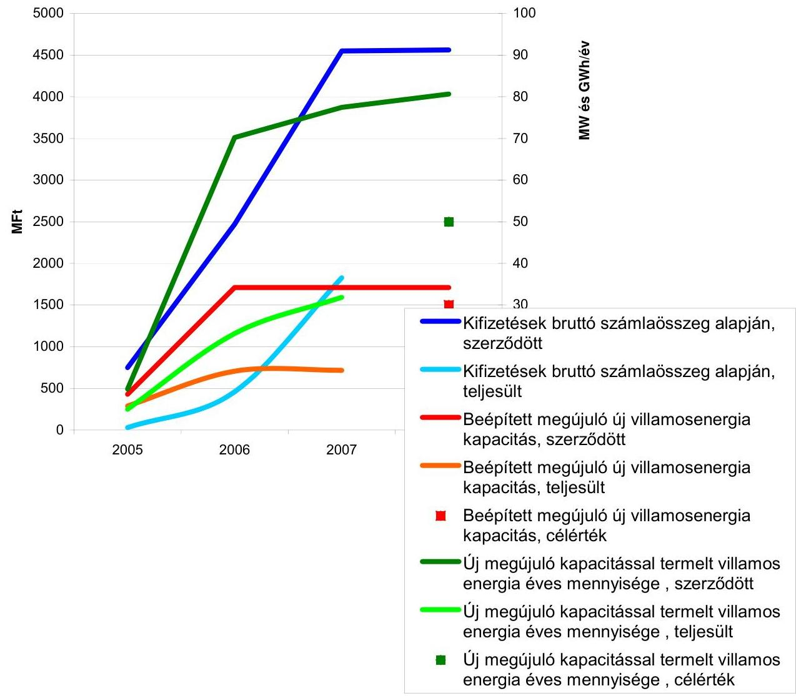

A 4.sz. ábrában található a természetvédelem és fenntartható árvízvédelem intézkedésre vonatkozó diagram. Az output indikátor az intézkedés által érintett terület nagysága, ahol a célérték 8000 ha. Az eredményindikátor a megerősített árvízvédelemből adódó kockázatcsökkenéssel közvetlenül érintett háztartások száma: 7200 háztartás. Az intézkedésre allokált források $128 \%$-a mellett az output indikátorok esetében a tervezett célérték $2418 \%$-ára érkezett vállalás, amely jelzi az értelmezési problémát. Az eredményindikátor szintén értelmezési problémát mutat, ahol a tervezett célérték $238 \%$-ára érkezett vállalás.

---

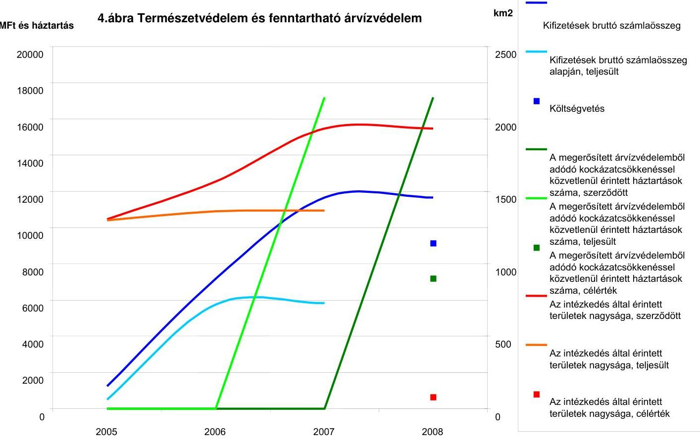

A KIOP indikátorokra vonatkozó értékelés átfogó megállapításai szerint a KIOP indikátorrendszere a program heterogén jellegéből következően szerteágazó. Az alkalmazható indikátorok számát csökkentette az, hogy az EU Bizottság ajánlásait szem előtt tartva azok felvétele korlátozott volt. Az indikátorrendszer alapján történő eredményességi és hatékonysági elemzések ezért szűkkörűen voltak végrehajthatóak. Az indikátorokra vonatkozó ajánlások több szintjét határozták meg:

- a rosszul megfogalmazott, alkalmatlan indikátorok esetében azok módosítását,
- az indikátorokra vonatkozó útmutató kidolgozását,
- a program előrehaladását az intézkedésszintű indikátorok segítségével javasolták megvalósítani.

# 5.3. A legjobb gyakorlat 

A potenciális kedvezményezettektől és feladataiktól függő forrásallokációs lehetőségeknek az értékelése az IH pro-aktív tevékenységét mutatta és példaként vehető számításba a jó gyakorlatra. Az önkormányzatok környezetvédelmi tevékenységnek a

---

kenységét elemző kutatás alapvető célja volt a KIOP vonatkozásában, hogy a KIOP pályázati struktúráját, intézkedéseit összevesse a pályázó, valamint a nem pályázó önkormányzatok igényeivel (Ld. 5. sz. ábra).

# 5. ábra: Települési környezetvédelmi programok és azok elfogadásának idöpontja a vizsgált KIOP nyert, elutasított és nem pályázott településeken 

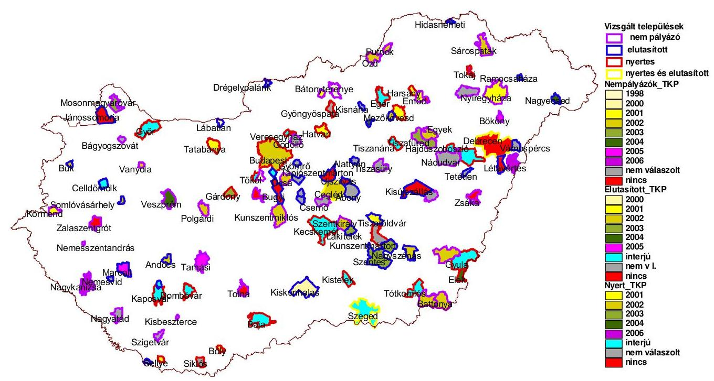

Az elemzés összehasonlította az ország jelenlegi környezetvédelmi helyzetével és fejlesztési igényeivel az önkormányzati lehetőségeket, annak érdekében, hogy az új OP megalapozott, az igényeket jól követő legyen.

- Az értékelésekben ajánlásokat fogalmaztak meg az egyes projektek esetében a társadalmi, gazdasági és környezeti költségek és hasznok külön-külön történő azonosítására, az EU által elfogadott társadalmi diszkontráta alkalmazására.
- A gazdasági elemzés megkönnyítése érdekében az egyes projekttípusok esetében a számszerúsíthető gazdasági és társadalmi környezeti hasznokra és költségekre fajlagos mutatók kidolgozását javasolták, hogy a CBA-k alapján is a projektek összehasonlíthatók legyenek.
- A több kritériumos elemzés esetében ajánlották az EU útmutató továbbfejlesztését olyan módon, hogy az egyes projekttípusok esetében célszerű lenne

---

ajánlás szinten - legalább a pályázatokhoz kapcsolódóan - egy általános hatásmechanizmus vizsgálati séma kialakítását megvalósítani.

# 5.4. Gyengeségek és ajánlások 

- A KIOP pályázatok értékelésekor javaslat merült fel a településfejlesztési és környezetvédelmi programok erőteljesebb figyelembevételére;
- A környezeti kultúra javítására vonatkozó kezdeményezéseket hatékonyabban kell támogatni az erre fordított támogatási források növelésével;
- A pályázati struktúrára vonatkozó javaslatok főleg a kisebb és forráshiányosabb önkormányzatok szempontjából kiemelt jelentőségűek. Egyes meghatározott feladatok teljesítésére a pályázaton való részvételt kötelezővé kellene tenni;
- A települési fejlesztési-, és beruházási programokban való aktív társadalmi részvétel erősítése szükséges. A környezet- és természetvédő szervezeteket érintett partnereknek kell tekinteni, nagy szerepük lehet az intézkedések hatékonyságának ellenőrzésében;
- Javaslatot fogalmaztak meg a projektek belső monitoring rendszeréhez alkalmazott hatékonyabb műszaki output és eredmény indikátorokra (például ivóvíz minőségének javítása esetén);
- A monitoring rendszer továbbfejlesztését és az indikátorok képzésének javítását szorgalmazták;
- Javasolták a pályázatokhoz szükséges segédletek kidolgozását (például a megvalósíthatósági tanulmányra).

## 6. A KIOP Monitoring Bizottság részvétele a Strukturális Alapokkal KAPCSOLATOS INTÉZKEDÉSEK ÉRTÉKELÉSÉBEN

### 6.1. Főbb következtetések

A KIOP Monitoring Bizottság tevékenysége elősegítette a programdokumentumokban elfogadott célok teljesülését. Az MB az OP legfontosabb koordinációs és döntéshozó testülete volt. Az MB elnökét 2006-tól a Fejlesztéspolitikai Irányító Testület (FIT) biztosította. A jelentéstételi és értékelési rendszerben az MB jóváhagyó szerepet kapott. Az output és eredményindikátorok használata, költséghatékonysági elemzések az MB kezdeti tevékenységében nem kaptak kellő figyelmet, mivel azt a mid-term értékelés faladatának tekintették.

---

# 6.2. Megállapítások 

Az 1260/1999/EK Rendelet értelmében az MB volt a felelős a programmegvalósítás minőségért és eredményességéért ${ }^{8}$. Jóváhagyta a projekt kiválasztási kritériumokat. Rendszeresen vizsgálta a Program előrehaladását és áttekintette eredményeit a különböző intézkedésekre meghatározott célok elérése érdekében.

A 3. sz. melléklet foglalja össze intézkedésenként az előrehaladás, illetve a kifizetések alakulását a 2008. 06. 30. állapotnak megfelelően.

Javaslatokat tett az IH felé az intézkedések közötti átcsoportosításra vonatkozóan (1260/1999. Ek rendelet 34. cikk 3. pontja alapján. Ennek megfelelően az MB kiigazította a PkD-t, azt a pályázati igényekhez jobban illeszkedően módosította. Például az energiagazdálkodás területén.

A pénzügyi teljesítések követése a MB tevékenység gyakorlásában kulcsszerepet kapott. A pénzügyi előrehaladás alakulását intézkedésenként rendszeresen és körültekintően követték, és értékelték, a megbízhatóságukat ellenőrizték. A célrendszernek való megfelelés értékelése elsősorban a pályázatok kiválasztási szakaszhoz tartozott, amelyet a PKB tevékenysége határozott meg.

### 6.3. A legjobb gyakorlat

A monitoring rendszer pénzügyi, előrehaladási (projektciklusonként változó) indikátorok adatait az MB hasznosította a támogatott intézkedések folyamatos követéséhez. A Monitoring Bizottság tevékenysége során feltárta azokat a szűk keresztmetszeteket, ahol a forrás átcsoportosításokra és célkiigazításokra volt szükség.

### 6.4. Gyengeségek és ajánlások

A Monitoring Bizottságok jegyzőkönyvei, és az évi Kormányjelentések azt mutatták, hogy a nemzeti hatóságok - a projektek összehasonlításával - nem végeztek az intézkedések, és projekttípusok szintjén költség-haszon elemzéseket. ${ }^{9}$ A kapcsolatos ajánlások a korábbi pontoknál találhatók

[^0]
[^0]:    ${ }^{8}$ Az MB megtárgyalta és jóváhagyta a megvalósításról szóló éves jelentéseket, mielőtt azokat megküldték az EU Bizottságának..
    ${ }^{9}$ A piaci és a társadalmi diszkontráta hosszú távú felvételének nehézségei, a megvalósítás becsült költségeinek pontatlanságai, az üzleti tervek kockázatai megnehezítették a költség-haszon elemzések megalapozottságának vizsgálatát.

---

# II. RÉSZ - ELŐKÉSZÜLETEK A 2007-2013. IDŐSZAKRA 

## A KÖRNYEZETVÉDELEM ÉS ENERGETIKA OPERATÍV PROGRAM

## 7. Kulcsterület: AZ Intézkedések tervezése és kiválaszTÁSI ELJÁRÁSOK

### 7.1. Fő következtetések

A KEOP célrendszere megfelel az Európai Regionális Fejlesztési Alapról szóló 1080/2006/EK. sz. Európai Parlamenti és Tanácsi közös rendeletben foglaltaknak. A KEOP célrendszerét tekintve tartalmazza az egyes alapokra jellemző prioritási tengelyeket az 1083/2006/EK rendeletnek megfelelően. A programok tervezése és a projektek kiválasztása hozzájárul a kohézióra vonatkozó közösségi stratégiai iránymutatásokról szóló 2006. évi 2066/702/EK tanácsi határozatban, illetve a nemzeti stratégiai referencia keretben meghatározott célkitűzések végrehajtásához.
Nagy hangsúlyt fektettek arra, hogy a tervezési folyamat során a projekt kiválasztási kritériumokat az EU és a hazai környezetvédelmi és területfejlesztési stratégiákból vezessék le, amellyel biztosították a projektek szakmapolitikai relevanciáját.
Általános stratégiai célkitűzésként határozták meg, hog
y Magyarország ökológiai lábnyoma, biokapacitása és ökológiai deficitje az általánosan érvényes trenddel ellentétben ne romoljon tovább a KEOP és más programok, valamint szakpolitikák segítségével.
A szakmai indikátorok részletezettsége és pontossága nem elégséges a VFM elv érvényesülésének követéséhez és nem biztosított teljes körűen a különböző stratégiák, akciótervek indikátorai közti kapcsolatok kiépítése.
A finanszírozási stratégiában - elsősorban a KA-ból fínanszírozott 1. prioritás esetében azzal számoltak a tervezők, hogy az EU támogatásokat teljes mértékben lehívják a derogációs kötelezettségek teljesítésének elősegítése érdekében 2010-ig. Az ezt követő időszakban 100\%-ban hazai forrást irányoztak elő a hátralévő feladatokra, amelyek költségvetési finanszírozhatósága feltételezett.

### 7.2. Megállapítások

Értékelték a koherencia alakulását a Nemzeti Stratégiai Referencia Keret és az Operatív Programok között. A KEOP helyzetelemzése feltárta a környezeti problémák okait, az okok hatótényezőit és bemutatta a kialakult környezeti állapotot.

A Közösségi Stratégiai Iránymutatás (CSG) alapján határozták meg a támogatandó fejlesztéseket. ${ }^{10}$ A KEOP stratégiája, a prioritások megállapítása alapvetően a hiányzó

[^0]
[^0]:    ${ }^{10}$ A CSG környezetügyre vonatkozó iránymutatása szerint a környezetvédelem és a növekedés közötti együttműködés erősítésével és a hagyományos energiaforrások kevésbé intenzív felhasználásával kell Európát és régióit a beruházások és a munka szempontjából vonzóbbá tenni.

---

környezetvédelmi infrastruktúra fejlesztése irányult, de ezen túlmenően célul tűzték ki a termelés és a fogyasztás terén a megelőző környezetvédelmi megoldások támogatását.

A környezeti fenntarthatóság számos területét érinti a Csatlakozási Szerződésben vállalt EU jogszabályokból eredő környezetvédelmi kötelezettségek teljesítése. 2013-ig fejlesztés szükséges a szennyvíz, ivóvíz, hulladékgazdálkodás, kármentesítés, rekultiváció, Víz Keretirányelv, természetvédelem (Natura 2000 területek, élőhelyvédelmi irányelv, madárvédelmi irányelv), megújuló energia, energiahatékonyság, fenntartható fogyasztás és termelés, e-környezetvédelem (Aarhus) területeken. A KEOP forrásainak $80 \%$-át olyan típusú projektek végrehajtására tervezték, amelyek az EU-s kötelezettségek (derogációk szennyvíz, ivóvíz, vagy EU-s követelmények VKI, hulladék, klíma, stb.) valamint magyar jogszabályban foglalt szigorú kötelezettségek teljesítését szolgálják.

Az Európai Közösségek Bizottsága 2007. augusztus 1-én az operatív program keretében az Európai Regionális Fejlesztési Alapból 396 millió eurót ítélt meg Magyarország számára, amely a következő prioritási tengelyeket tartalmazza:

- (3) Természeti értékeink jó kezelése;
- (4) Megújuló energiaforrás-felhasználás növelése;
- (6) Fenntartható életmód és fogyasztás.

A fenntarthatóság és a környezeti szempontok érvényesítésének elősegítése céljából és a jogszabályi előírások (az Európai Parlament és a Tanács 2001/42/ EK irányelve - valamint annak hazai jogszabályi adaptációjának megfelelően az NFÜ gondoskodott az operatív programokra vonatkozó stratégiai környezeti hatásvizsgálat (SKV) elkészítéséről.
Prioritási tengelyenként a projektek kiválasztásával kapcsolatban a kialakított kiválasztási kritériumok ${ }^{11}$ összhangban vannak az EU és a hazai környezetvédelmi szakmai célrendszerrel.

# 7.3. A legjobb gyakorlat 

A KEOP meghatározta a középtávon legsürgetőbb fejlesztési feladatokat.
A hazai környezetpolitikai főbb irányait az NKP II alapján, amelyek alapvetően EU kötelezettségeket tükrözik, alapul vették. A környezeti célállapotok konkrét indikátorokkal szerepelnek, számszerűen bemutatva a jelenlegi és célállapotokat. Figyelembe vették Magyarország hosszú és középtávú fejlesztési céljait, a területi kohézió és a területiség elvét. Megfelelő rugalmasságot ad a tervezésnek az, hogy az Akcióterveket évente felülvizsgálják és a 2 éves gördülő tervezést bevezették.

[^0]
[^0]:    ${ }^{11}$ A projekt kiválasztására a program a következő kritériumokat határozta meg:

    - a projekt járuljon hozzá az ÚMFT és az operatív program, ill. az adott prioritás társadalmigazdasági céljaihoz;
    - egyértelmú és elérhető célokkal rendelkezzen;
    - legyen költség-hatékony;
    - járuljon hozzá a fenntarthatóság, valamint az esélyegyenlőség és diszkrimináció tilalmának érvényesítéséhez;
    - a sikeres megvalósulás valamennyi feltétele biztosított legyen.

---

# 7.4. Gyengeségek/ajánlások 

Az EX-ANTE értékelők által részben jelzett és az ÁSZ által is problémás területnek tartott tervezési elemek a következők:

- A KEOP az NKP II, a derogációs feladatok jelentős részét finanszírozza, ugyanakkor nem feladata a teljes NKP monitoringja és menedzselése. Ebből eredően a KEOP hozzájárulás arányát és hatékonyságát az EU és hazai célrendszer teljesítéséhez a KEOP dokumentumok nem teljes körűen mutatják be. A KvVM, az NKP II gazdájának szakmai tevékenysége nem integrálódott be teljes körűen a projekt kiválasztási folyamatokba;
- A projektek fenntarthatósága szempontjából veszélynek tekinthető az, hogy az önkormányzatok és közüzemi szolgáltatásokat igénybevevők nem tudják hosszú távon finanszírozni az üzemeltetési költségeket.
Az országos fenntartható fejlődési stratégiát annak későbbi jóváhagyása miatt csak részben tudták figyelembe venni a tervezéskor.

## Ajánlások

- A KIOP tapasztalatokból is kiindulva, mivel a környezetfejlesztés eszközrendszerében meghatározóak (elsősorban 2010-ig) az EU támogatási források, az MB, az IH, a KvVM szakmai tevékenységének integrálásával előzetesen modellezzék a projekt kiválasztási eljárásokban alkalmazott kiválasztási kritériumok hatását elsősorban a KEOP, továbbá az NKP és a derogációs feladatok végrehajtásának hatékonysága szempontjából;
- Folyamatosan kövessék és értékeljék a kiválasztott projektek hozzájárulását, eredményességét a KEOP, a nemzetközi és hazai környezetvédelmi célok teljesítéséhez. Ennek eredményeképp az első fordulóban tapasztaltak alapján aktualizálják a potenciális kedvezményezettek felé az IH, KSZ-ek és NFÜ promóciós tevékenységét.

## 8. Kulcsterület: Cél-orIENTÁlt PÁlyÁzati eljárások

### 8.1. Fő következtetések:

A pályáztatási rendszert a nemzeti hatóság elemezte. Az előző időszakból levont tanulságok három témakör szerint - a beruházások előkészítése (idő és költségcélok tarthatósága szempontjából), a közbeszerzések alakulása és a kifizetések alacsony szintje szerint - csoportosíthatók. A 2007-2013 időszak végrehajtási kereteinek meghatározása során az NFÜ figyelembe vette a korábbi hazai végrehajtás tapasztalatait és intézkedett a támogatási feltételek javításáról, az ügyintézés és a kifizetések felgyorsításáról, amelyet az ÁSZ is kezdeményezett.
A célorientált pályázati eljárások továbbfejlesztése szempontjából a legfontosabb változást a kétfordulós eljárásrend bevezetése jelentette. Ezáltal megnőtt az első fordulóban a projekt kiválasztási kritériumok jelentősége. A prioritási tengelyek közötti és tengelyen belül - a projektek összessége által alkotott - optimális támogatási portfolió eléréséhez nem állnak rendelkezésre részletes összehasonlító adatok (normatívák) és indikátorok.

---

# 8.2. Megállapítások 

Az előző időszak tanulságait a következők jellemezték:

- A beruházások előkészítése során azok engedélyezése időigényes, ezért szükséges az engedélyezés rendszerének felülvizsgálata. A visszafizetés kockázatának csökkentése érdekében a pályázati rendszer túlbürokratizálttá vált, a kötelező mellékletek száma meghaladta a 30-at. A projektek előkészítésének költségigénye jelentős volt (a teljes projektköltség 3-5 \%-a), ezért a pályáztatási rendszer átalakítása időszerűvé vált. Az új időszakban a változtatások eredményeként a kétfordulós pályáztatás bevezetésével már az első lépcsőben szűrhetővé váltak a pályázatok és csak a potenciális pályázatok továbbfejlesztését kell megfinanszírozni. A kedvezményezettek, főleg az önkormányzatok finanszírozási problémáinak kiküszöbölését célozta meg részben az önerő csökkentése, részben az önerő fizetését megkönnyítő banki konstrukciók kialakítása;
- A közbeszerzési eljárások elhúzódása visszavezethető volt arra, hogy a nagyobb értékű közbeszerzéseket gyakran alapos ok nélkül is megtámadták, vagy az a kedvezményezettek tapasztalatlanságából, a dokumentációk minőségbiztosításának hiányosságaiból következett. A kedvezményezett folyamatos szakértői támogatása, dokumentációk minőségellenőrzése és a közbeszerzési eljárások lebonyolítási költségeinek elszámolhatóvá tétele hozzájárul az eljárások sikeresebb lebonyolításához;
- A kifizetések üteme elmaradt a tervezettől a projektek lassú előrehaladása (például a régészeti feltárások következtében) és kedvezményezetti önerő rendelkezésre állásának hiánya miatt. A változó jogszabályi háttér okozott problémákat.

Az új időszakban alkalmazott kétfordulós eljárás keretében az első fordulóban a pályázónak egy projektjavaslatot (adatlap és előzetes megvalósíthatósági tanulmány, valamint egyéb kötelező mellékletek) kell benyújtania. Részletes kidolgozásra (a két forduló) között csak az első forduló nyertes, továbbfejlesztésre javasolt pályázatai kerülnek. A projektfejlesztési időszak alatt a kiválasztott projektek részletes kidolgozását a Közremúködő Szervezet folyamatos szakmai és menedzsment tanácsadással segíti.

Az ERFA támogatásban részesülő KEOP projektek estében alkalmazott végrehajtási ill. pályáztatási folyamatokat - a pályázati felhívások alapján - a következő táblázat foglalja össze:

---

| Kódszám | Támogatás célja | Konstrukció | KEOP forrásból projektek megvalósitására 2007-2008 évek milliárd forint | Pályázatok legkorábbi benyújtása | Legelső értékelés |
| :--: | :--: | :--: | :--: | :--: | :--: |
| 3.1.1 | Élő- és élettelen természeti értékek megőrzése, vonalas létesítmények természetkárosító hatásának mérséklése | meghívásos   kétfordulós   pályázat | 5,8 | 2007.   október 24. | 2007.   november 26. |
| 3.1.2 | Élőhelyvédelem, -   helyreállítás, vonalas létesítmények természetkárosító hatásának mérséklése | kétfordulós pályázat | 1,7 | 2007.   október 24. | 2007.   november 12. |
| 3.1.3 | Gyűjteményes növénykertek és védett történeti kertek megőrzése és helyreállítása | kétfordulós pályázat | 0,8 | 2007.   október 24. | 2008.   január 7. |
| 3.2.1 | Élőhelymegőrző mező-   és erdőgazdálkodás infrastrukturális fejlesztése | egyfordulós pályázat | 1,9 |  |  |
| 3.3.1 | Erdei iskola hálózat infrastrukturális fejlesztése 2007-2008 | egyfordulós pályázat | 1,0 | 2007.   december   12. | 2008.   március 3. |
| 4.1.0 | Hő -és vagy villamosenergiaelőállítás támogatása megújuló energiaforrásból | egyfordulós pályázat | 13,26 | 2007.   október 24. |  |
| 6.3.0 | Környezetvédelmi célú informatikai fejlesztések a közigazgatásban | kétfordulós pályázat | 5,974 | 2007.   október 24. | 2008.   január 20. |
|  | Összesen |  |  |  |  |

# 8.3. A legjobb gyakorlat 

A kétfordulós eljárásrend bevezetése következményeként mind a kiírói, mind pedig a pályázói oldal szempontjából költséghatékonyabb megoldás alakult ki, mivel a nem támogatott projekteket nem dolgozzák ki.
A szakmai és eljárásrendi követelmények átláthatósága érdekében útmutatókat bocsátottak a pályázók rendelkezésére, amelyek az NFÜ honlapján elérhetők. Előmegvalósíthatósági tanulmány, részletes megvalósíthatósági tanulmány, költséghaszon elemzés útmutatók készültek.

---

# 9. Kulcsterület: Odaítélési eljárások 

### 9.1. Fő következtetések:

A nemzeti odaítélési eljárásokban alkalmazott kiválasztási kritériumok alkalmasak annak elősegítésére, hogy a végső kedvezményezett alacsony kockázattal végrehajtsa a projektet oly módon, hogy az hozza a kívánt eredményt. Ennek érdekében pozitív változtatásokat eszközöltek a pályázati eljárásokban és az intézményrendszerben, figyelembe véve az előző időszak tanulságait. Bevezették a kétfordulós pályáztatási eljárást, az ennek megfelelő pontozási rendszert. Kialakították az OP szintjén a teljesítménymérési és ösztönzési rendszert a támogatott és a sikeresen befejezett projektek arányaitól függően.
Nem kezdeményezték még azt, hogy a projekt kiválasztási fázisban - az MB-k feladatai közé beépítve - folyamatosan országos szintű értékeléseket végezzenek, tekintettel arra, hogy ez hozza meg a legnagyobb eredményt. Ez az elemzés az országos szintű környezetvédelmi igényekre és a pályázók által vállalt szakmai és gazdaságossági mutatók összesítésére és összehasonlítására épülhetne. Ismeretes, hogy a hagyományos, a befejezett projektekre épülő országos értékelések csak jó pár év múlva lehetnek esedékesek, tehát a 2008-09-es értékelési tervekben ezeket még nem is szerepeltették.
Ezzel összefüggésben az első fordulós döntéseket minden esetben a célterületen jelentkező, vagy felmért országos igényekkel összevetve célszerű meghozni, és az MB ügyrendjét ezzel kiegészíteni.

### 9.2. Megállapítások

A KEOP szempontjából az újonnan bevezetett kétfordulós eljárásos módszer csökkentheti a végrehajtási kockázatokat a kívánt eredmények elérése szempontjából, mivel hozzájárul az előkészítés minőségének javulásához. Az újonnan kidolgozott útmutatók növelik a kiválasztási folyamat átláthatóságát, gazdaságossági megalapozottságát.
A pályázatok elbírálása, a pályázati dokumentáció részét képező pályázati útmutatóban között jogosultsági, formai, szakmai és pénzügyi szempontok alapján történik. A projekt kiválasztási kritériumok alkalmasak a végrehajtási kockázatok csökkentésére (projektmenedzsmentben mért jártasság mérlegelése révén), a fenntarthatóság biztosítására, továbbá a projektszintű költséghatékonysági és időcélok alakulásának mérlegelésére.

A főbb kiválasztási kritériumok közé tartozik az akciótervben foglaltak szerint például:
A közösségi jelentőségű és védett természeti értékek és területek megőrzése, helyreállítása intézkedés esetében kritérium az, hogy védett természeti terület és/vagy Natura 200 terület legyen. A projekt kiválasztási eljárásban a legnagyobb szerepe van az élőhely rekonstrukció célterülete védettségi szintjének ( 20 pont), az élettelen természeti értékek jelentőségének (10 pont), a vezetékszakasz által okozott madárpusztulásoknak ( 9 pont), az érintett fajok természetvédelmi összértékének, a veszélyeztetett célpopulációk méretének és azok összesített eszmei értékének. A megőrizni kívánt célterület kiterjedése [ha] (10 pont), továbbá az átalakított infrastruktúra hossza (5 pont), amelyek nyomon követési indikátorok (NY), szerepelnek a kiválasztási szempontok között. A pénzügyi kritériumok tartalmazzák kizáró kritériumként - a kötelezően alkalmazandó pénzügyi, illetve közgazdasági költség-haszon elemzési útmutató alapján - a projekt társadalmi hasznosság bizonyításának előírását (5 pont). Ugyanakkor ennek a szempontnak a súlya viszonylag alacsony. A természetvédelem terén a projekt költséghatékonysága külön mérlegelés szempontként nem jelenik meg. Megfelelő gondosságot tükröz az, hogy a projekt szakmai fenntarthatóságának vizsgálata ( 10 pont) fontos szempontként jelenik meg a kritériumok között. Összességében a kezelni kívánt probléma és támogatott projek-

---

tek idő és költségcéljai alakulásának együttes elemzését a kidolgozott szempontrendszer szolgálja.

# 9.3. A legjobb gyakorlat 

Az első és a második projekt kiválasztási fordulóban célirányosan alakították ki a pontozási rendszert.
A közreműködők ösztönzése szempontjából bevezették a teljesítményértékelést. Az intézményrendszer aspektusából a technikai segítségnyújtás prioritási tengelynél alkalmazott indikátor új elemet jelent. A mutató felvétele azt célozza, hogy úgy válasszák ki a projekteket, hogy a sikeres projektek aránya meghaladja a $90 \%$-ot.

### 9.4. Gyengeségek/ajánlások

Az odaítélési eljárások során nem követhető közvetlenül a KEOP monitoring rendszerében, hogy kiválasztott projektek milyen arányban csökkentik a derogációs feladatokat, milyen arányban járulnak hozzá a nemzeti környezetvédelmi program teljesítéséhez, miközben azok szinte a fejlesztés egyedüli eszközeként szolgálnak.

## Ajánlások

Az odaítélési eljárások során folyamatosan és halmozottan kövessék nyomon a projektek eredményességét a derogációs feladatok, EU kötelezettségek és az NKP II-ben elérni kívánt célállapotok szempontjából.
A projekt kiválasztási eljárások jobban épüljenek a szakmai sajátosságoknak megfelelő normatív adatbázisok (például létesítménytípusok/építési költség) alkalmazására és az output mutatók hatékonysági vizsgálatára a VFM elv jobb érvényesíthetősége céljából.

## 10. Kulcsterület: Monitoring és értéKelés (NyOMONKÖVETÉS ÉS BESZÁMOLÁs)

### 10.1. Fő következtetések

A magyar kifejlesztett nemzeti nyomon követési (monitoring) rendszer - a fejlesztési csúszásai és az alkalmazásban a szakmai monitoring indikátorok bevezetésénél tapasztalt hiányosságai ellenére - modellértékű Európában. A továbbfejlesztett Egységes Monitoring Információs Rendszer (EMIR) megfelelően támogatja az intézkedések értékelését. Az OP-k értékelése ÚMFT szinten koordinált és egységesített. Az Értékelési terv alapján és az értékelési menedzsment kapacitásának biztosításával (ÚMFT és IH-nál) az értékelések végrehajtása a 2015-ig terjedő időszakra előre tervezetten garantált. A folyamatos értékelések rendszerének bevezetése javította az értékelések időbeni hasznosulását, mivel az kiterjed mindazon múveletekre, ahol a végrehajtási ütemtervben meghatározott indikátor-értékektől jelentős eltérés mutatkozik. Az indikátorok tervezési problémáit még nem sikerült teljes mértékben kiküszöbölni, mivel az eredményindikátorok mellett az output/költség mutatók szakma-specifikus alkalmazása háttérbe szorult.
Pozitív változást mutat az, hogy a korábbi időszak tanulságainak feltárása érdekében a folyamatos értékelés keretében tervezett az akcióterv múveleteihez kapcsolódó I. NFT-ben megvalósított intézkedések tapasztalatainak összegyüjtése.

---

# 10.2. Megállapítások 

A Monitoring Információs Rendszer valós idejű adatokat szolgáltat a megvalósítási rendszer minden egyes szintjéről.
A pályáztatási adatokat a 2008. június 30-i állapotnak megfelelően az 4. sz. melléklet foglalja össze, intézkedésenkénti bontásban kimutatva a benyújtott és elfogadott pályázatok darabszámát és értékét, továbbá az EU támogatások összegét és a támogatás arányait (\%). Az 5. sz. melléklet foglalja össze a kifizetéseket, amely mutatja, hogy csak a pályázat előkészítési feladatokra történt kifizetés.
Az informatikai rendszer elektronikus kommunikációs eszközként múködik az EU Bizottság és Magyarország között. A nyilvánosság által elérhető, ezáltal biztosítja a pályáztatási rendszer átláthatóságát.
A 2004-2006-os régi időszak kedvezőtlen tapasztalatai a monitoring terén a szakmai indikátorok hiányos kialakításával és az ezzel kapcsolatos adatszolgáltatás nehézségeivel függtek össze. A 2007-2013-as új időszak rendszere világosan elkülöníti a nyomon követési és értékelési indikátorokat aszerint, hogy azok az EMIR-ből vagy külső adatforrásból származnak, az EU útmutatásoknak megfelelően.

Az értékvédelem és megőrzés programszintű indikátora az élőhelyvédelmi irányelv mellékletein szereplő élőhelyek és fajok természetvédelmi helyzetének összesített változása [\%]. A természetvédelmi értékeink jó kezelése prioritási tengely „értékelési" eredmény indikátora azonos a programszinttel, ahol a külső adatforrást az irányelv 17. cikke szerint szükséges jelentés képezi. Az összes hazai fejlesztés figyelembe-vételével várható célérték (É) KvVM adatforrás alapján a kiindulási érték (É)1994-ben 100, 2006-ban 100, és az összes hazai fejlesztés figyelembevételével a várható célérték 110.

A 17. cikk szerint a tagországoknak hatévente $(2006,2012,2018)$ kell jelenteniük az I. mellékleten szereplő élőhelyek és a II., IV. és V. mellékletben szereplő fajok természetvédelmi helyzetéről. Az első jelentést a 25 tagország 2007. I félévében adja le az 1994-2006-os időszakról. Az 1994-e állapotot tekintették alapállapotnak (100\%). Az 1994-2006 közötti időszak változásait a 2007-es jelentés tükrözi majd. A jelentés az egyes fajok, illetve élőhelyek helyzetét egy összesített paraméterrel jellemzi, amely három értéket vehet fel (kedvező, kedvezőtlen, illetve köztes). E paraméterek összesítésével egyetlen indikátor nyerhető, amely megmutatja, hogy a vizsgált fajok és élőhelyek összességének természetvédelmi helyzete hogyan változott az adott periódusban.

A prioritási tengely „nyomon követési" (NY) eredményindikátora a KEOP műveletek eredményeként a) az élőhely helyreállításával, fejlesztésével érintett területek nagysága [ha], mint (29-es) EU magindikátor, és b) az infrastrukturális fejlesztéssel érintett természetközeli erdő- és mezőgazdálkodás feltételeit kielégítő területek nagysága [ha].

Például a KEOP 3. „Természeti értékeink jó kezelése" prioritás esetében az akcióterv a következő nyomon követési indikátorokat és célértékeket tartalmazza:

| Indikátor megnevezése | Mérték-   egység | Célérték (NY) |  |  |
| :-- | :--: | :--: | :--: | :--: |
|  |  | $\mathbf{2 0 0 7}$ | $\mathbf{2 0 1 0}$ | $\mathbf{2 0 1 5}$ |
| Élőhely helyreállításával, fejlesztésével érin-   tett területek nagysága | ha | 0 | 14100 | 30200 |
| Természetvédelmi szempontból átalakított   vonalas létesítmények hossza | km | 0 | 380 | 1640 |
| A természetközeli erdő- és mezőgazdálkodás   feltételeit kielégítő területek nagysága | ha | 0 | 74900 | 180000 |
| Átalakított erdei iskolák száma | db | 0 | 28 | 69 |

---

Ezek az indikátorok túlzottan átfogóak ahhoz, hogy a támogatási források odaítélésekor a potenciálisan támogatható projektek költséghatékonysága (VFM érvényesülése) és hozzájárulásuk az értékelési indikátor célértékének eléréséhez mérlegelhető és összehasonlítható legyen.

A beszámolás/értékelés területén a jövőbeli, a program-értékelésre vonatkozó éves beszámolási követelmények teljesítését az OP-ben elfogadott „Értékelési terv" biztosítja. A folyamatos értékelés szabályozása összhangban van a Bizottság erre vonatkozó munkadokumentumaival (Working Documents on ongoing evaluations). Az Értékelési tervtől függetlenül ad-hoc értékelés indítható a KSZ, IH, valamint az MB igényei alapján.

# 10.3. A legjobb gyakorlat 

A területi kohézió érvényesülése érdekében a Monitoring információs rendszer nyomonköveti a teljes program időszak alatt a pénzügyi források allokációját az egyes régiók és a kiemelten hátrányos kistérségekben. A feldolgozás eredményei részét képezik az évente készített monitoring jelentéseknek.
Az értékelések eredményeinek a tervezési és végrehajtási folyamatokba történő nagy gyakoriságú visszacsatolása biztosítja azok hasznosulását, és ezáltal az értékelésre fordított támogatási források megtérülését.

### 10.4. Gyengeségek/ajánlások

A KEOP-ben elfogadott értékelési terv és az EU-nak megküldendő beszámolók (VKI, biodiverzitás, Natura 2000, Lisszaboni stratégia), valamint a Magyar Országgyúlésnek készülő (például NKP II) és kormány tájékoztatását célzó évi előrehaladási jelentések közti koordináció időben és szakmailag teljes körűen nem megoldott. Ezt támasztotta alá az ÁSZ 2007-ben lefolytatott Gazdaságfejlesztés eszközrendszer müködtetése ellenőrzése.
A KEOP célhierarchia nem a fenntartható fejlődési stratégiából, mint legfelső szintű célrendszerből levezetett. Ebből eredően a szakmai indikátorok közti összhang és transzformációs technika EU és hazai szinten nem teljes körűen biztosított.
A kialakított indikátorok erőteljesen az EU beszámolói kötelezettségek teljesítésére és iránymutatásaira épülnek. Az EU szintű értékelés és nagyléptékű indikátorok felvétele önmagában nem támogatja kellő mértékben - a szakmaspecifikus és térségenként változó fajlagos mutatók hiányában - a VFM elv érvényesülésének követhetőségét.
A KEOP-ban az értékelési menedzsment feladatai között nem szerepel az, hogy pályázati felhívásonként mindenegyes odaítélési szakaszban köteles annak valószínűségét és kockázatát értékelni, hogy a támogatott projektek a támogatási forráslekötéssel arányosan járulnak-e hozzá a célértékek eléréséhez.

## Ajánlások

Törvényi eszközökkel szabályozzák az országos, regionális és ágazati stratégia, továbbá az operatív programok és akciótervek tervhierarchiáját. Ezzel összefüggően a bázis és célállapotokat kifejező indikátorok egymásra épülését írják elő.

## Az NFÜ értékelés menedzsmentje, az IH

- Gondoskodjon az OP értékelési indikátorainak olyan továbbfejlesztéséről, hogy az elősegítse megfelelő fajlagos mutatók előállításával a VFM elv és/vagy a tár-

---

sadalmi-gazdaságossági kritériumok alakulásának követhetőségét és ellenőrizhetőségét.

- A folyamatos értékelési mechanizmus keretében és az odaítélési eljárás során irányozzák elő annak rendszeres értékelését, hogy a támogatásért folyamodó projektek költségarányosan, gazdaságosan járulnak-e hozzá a célállapot eléréséhez, az optimális támogatási portfolió eléréséhez.
- A KEOP értékelési menedzsment területén az EU támogatási forrásokat allokáló NFÜ és a derogációs feladatokért, az EU és magyar jogszabályi kötelezettségek teljesítésért felelős KvVM közti együttmúködés intézményi rendszerét fejlesszék tovább. Egészítsék ki a szakmai indikátorrendszert és biztosítsák a monitoring és értékelési rendszerekben az input (költség) és output kapcsolatok kezelését, a gazdaságosságot mérő mutatók lekérdezhetőségét.

# 11. Kulcsterület: A Monitoring BizottsÁg részvétele a Strukturális Alapokhoz tartozó új intézkedések tervezésében 

### 11.1. Fő következtetések

A Monitoring Bizottság közvetlenül nem vett részt a tervezési folyamatokban. Az akciótervet az irányító hatóság vezetésével az érintett tárcák ill. régiók és a közremüködő szervezetek szakembereiből álló munkacsoprt (Operatív Program Tervezési Koordinációs Bizottság) készítette elő. A Monitoring Bizottság részvétele a Strukturális Alapokhoz tartozó új intézkedések tervezésében alapvetően az akciótervek megtárgyalása révén valósult meg. MB egyik fő feladata a kiválasztási kritériumok jóváhagyása.

Az MB feladatai és döntési lehetőségei az értékelési rendszer változásával összefüggően kibővültek, ugyanakkor hiányoznak a döntéshozatal jobb támogatását biztosító részletesebb szakmai indikátorok, az indikátorok alábontása és azokhoz kapcsolható fajlagos mutatók, ill normatívák.

A Monitoring Bizottság felelősségi körébe tartozó feladatokat az 1083/2006/EK rendelet 65. cikke és a 255/2006-os Korm. rendelet 14. §-a részletesen tartalmazza. A Monitoring Bizottság ennek megfelelően felelős az új időszak programjainak nyomon követéséért és feladata a jelentések jóváhagyása. Javasolhathatja az IH-nak a program felülvizsgálatát a program irányításának javítása érdekében. Változott az MB-k összetétele. Tekintettel arra, hogy az OP végrehajtásában érintett szakminisztériumok delegált képviselői, a környezetvédelmi civil szervezetek által delegált képviselő, továbbá az érintett regionális fejlesztési tanácsok képviselői tagjai a KEOP MB-nak, adott a lehetőség a szakmai és területi fejlsztési kritériumok MB keresztüli érvényesítésének.

### 11.2. Megállapítások

Feladata, hogy rendszeresen megvizsgálja a végrehajtás eredményeit, különösen az egyes prioritási tengelyek mentén kitűzött célok elérését és értékeléseket. A MB feladata továbbá az, hogy megvizsgálja és jóváhagyja az éves és záró végrehajtási jelentéseket, valamint az évente aktualizált értékelési terveket. Tájékoztatást kap az éves ellenőrzési jelentésről, a Bizottság által tett észrevételekről.

---

| Ajánlások/tanulságok | Történt intézkedés a   megvalósitásra? (I/N) | Ha igen: mit támasztja ezt alá? |
| :-- | :-- | :-- |
| 2000-2006-os régi időszak   tapasztalatai |  |  |
| Monitoring Bizottság múködése | 255/2006-os Korm. rendelet az   1083/2006/EK rendelet alapján | különös tekintettel a végrehajtás   eredményességére és minőségére |

# 11.3 Ajánlások: 

A MB üléseire rendszeresen készüljenek szakértői értékelések (alábontott indikátorokkal) annak elősegítésére, hogy időben követhető és megvitatható legyen az MB által jóváhagyott kritériumok és indikátorok megfelelősége. Az MB-nek folyamatosan kell mérlegelnie a kiválasztott projektek mennyiségi és költségarányos hozzájárulását nem csak a KEOP célrendszeréhez, hanem a derogációs kötelezettségek és az ágazati célok teljesítéséhez is, mint fő célhoz, mivel erre a KEOP pályáztatási rendszere önmagában nem ad garanciát. Az MB összetétele erre az elemzésre módot és lehetőséget biztosít, és az esetleges programmódosítást ebből eredően az MB-nek kell kezdeményeznie. Tekintettel arra, hogy a tervezési és kiválasztási kritériumok átfogóak ahhoz, hogy a VFM elv érvényesülése (tér, idő, technológia, költség, hasznosulás, stb.) garantált legyen, tovább szükséges fejleszteni és intézményesíteni a KEOP IH, a KvVM, továbbá az önkormányzatok integrált szakmai monitoring és értékelő tevékenységét az MB és az IH keretei között.

Budapest, 2008. szeptember

---

# 2. sz. Függelék mellékletei 

| 1. sz. | KIOP pályáztatás főbb adatai intézkedésenként 2008. jú-   nius 30-i állapotnak megfelelően |
| :-- | :-- |
| 2. sz. | KIOP környezetvédelem prioritás szerződésmódosítások   főbb adatai projektenként 2008. június 30-i állapotnak   megfelelően |
| 3. sz. | KIOP kifizetések főbb adatai intézkedésenként 2008. júni-   us 30-i állapotnak megfelelően |
| 4. sz. | KEOP pályáztatás főbb adatai intézkedésenként 2008. jú-   nius 30-i állapotnak megfelelően |
| 5. sz. | KEOP kifizetések főbb adatai intézkedésenként 2008. júni-   us 30-i állapotnak megfelelően |

---

# PÁLYÁZTATÁS FŐBB ADATAI/INTÉZKEDÉSENKÉNT 2008. JÚNIUS 3O.-I ÁLLAPOTNAK MEGFELELŐEN

|  Operatív egységek: prioritás, intézkedés, al-intézkedés | Beérkezett pályázat | Támogatott projektek | $3 / 2$ | Igényelt támogatás | Megítélt SA támogatás | 6/5 | Megítélt költség | 6/8  |
| --- | --- | --- | --- | --- | --- | --- | --- | --- |
|   | db | db | \% | millió Ft | millió Ft | \% | millió Ft | \%  |
|  1 | 2 | 3 | 4 | 5 | 6 | 7 | 8 | 9  |
|  KIOP | 390 | 203 | $52 \%$ | 271220 | 122394 | $45 \%$ | 152741 | $80 \%$  |
|  1. Környezetvédelem | 251 | 101 | $40 \%$ | 155796 | 47655 | $31 \%$ | 76063 | $63 \%$  |
|  1.1. Vízminőség javítása | 57 | 11 | $19 \%$ | 91917 | 18827 | $20 \%$ | 20132 | $94 \%$  |
|  1.1.1. Az ivóvízminőség javítása | 2 | 0 | $0 \%$ | 1045 | 0 | $0 \%$ | 0 |   |
|  1.1.1-F. Ivóvízminőség javítása | 21 | 6 | $29 \%$ | 6923 | 3222 | $47 \%$ | 3418 | $94 \%$  |
|  1.1.2. Szennyvizelvezetés és tisztítás fejlesztése | 16 | 2 | $13 \%$ | 49234 | 7352 | $15 \%$ | 7739 | $95 \%$  |
|  1.1.2-F. Szennyvizelvezetés és tisztítás fejlesztése | 18 | 3 | $17 \%$ | 34714 | 8253 | $24 \%$ | 8975 | $92 \%$  |
|  1.2. Állati hulladék kezelése | 41 | 15 | $37 \%$ | 10997 | 2680 | $24 \%$ | 3721 | $72 \%$  |
|  1.2.0-F. Állati hulladék kezelése | 37 | 15 | $41 \%$ | 10818 | 2680 | $25 \%$ | 3721 | $72 \%$  |
|  1.2.1. Állati hulladék kezelése | 4 | 0 | $0 \%$ | 179 | 0 | $0 \%$ | 0 |   |
|  1.3. Egészségügyi és építési-bontási hulladék kezelése | 13 | 9 | $69 \%$ | 5108 | 4082 | $80 \%$ | 4327 | $94 \%$  |
|  1.3.0-F. Egészségügyi és építési-
bontási hulladék kezelése | 7 | 5 | $71 \%$ | 2238 | 1901 | $85 \%$ | 2028 | $94 \%$  |
|  1.3.1. Egészségügyi és építési-
bontási hulladék kezelése | 6 | 4 | $67 \%$ | 2871 | 2181 | $76 \%$ | 2299 | $95 \%$  |
|  1.4. Környezeti kármentesítés a felszín alatti vizek és az ivóvizbázisok védelme érdekében | 19 | 5 | $26 \%$ | 19647 | 5212 | $27 \%$ | 5263 | $99 \%$  |
|  1.4.0-F. Környezeti kármentesítés a felszín alatti vizek és az ivóvizbázisok védelme érdekében | 18 | 5 | $28 \%$ | 18350 | 5212 | $28 \%$ | 5263 | $99 \%$  |

---

|  1.4.1. Környezeti kármentesítés a
felszín alatti vizek és ívóvizbázisok
védelme érdekében | 1 | 0 | 0% | 1 297 | 0 | 0% | 0 |   |
| --- | --- | --- | --- | --- | --- | --- | --- | --- |
|  1.5. Természetvédelem és
fenntartható árvízvédelem | 12 | 12 | 100% | 9 477 | 9 477 | 100% | 20 252 | 47%  |
|  1.5.1. Természetvédelem erősítése | 11 | 11 | 100% | 3 277 | 3 277 | 100% | 3 277 | 100%  |
|  1.5.2. Tisza-völgyi árvízvédelem | 1 | 1 | 100% | 6 200 | 6 200 | 100% | 16 975 | 37%  |
|  1.6. A levegőszennyezés és a
zajterhelés mérése | 3 | 3 | 100% | 1 110 | 1 110 | 100% | 1 110 | 100%  |
|  1.6.1. A levegőszennyezés és a
zajterhelés mérése | 3 | 3 | 100% | 1 110 | 1 110 | 100% | 1 110 | 100%  |
|  1.7. Az energiagazdálkodás
környezetbarát fejlesztése | 106 | 46 | 43% | 17 540 | 6 265 | 36% | 21 258 | 29%  |
|  1.7.0. Megújuló energiaforrások
felhasználásának növelése | 17 | 6 | 35% | 2 572 | 734 | 29% | 1 994 | 37%  |
|  1.7.0-F. Energiagazdálkodás
környezetbarát fejlesztés | 15 | 8 | 53% | 2 077 | 1 496 | 72% | 6 437 | 23%  |
|  1.7.0F-05/1. Energiagazdálkodás
környezetbarát fejlesztés | 74 | 32 | 43% | 12 891 | 4 036 | 31% | 12 827 | 31%  |

*Forrás: KIOP EMIR 2.1 lekérdezés [1., 4., 27-29. oszlop ]*

---

|  Operatív egységek: prioritás, intézkedés, al-intézkedés, PROJEKTEK | Megítélt támogatás | ERDF támogatás
legutolsó szerződés
módosítás szerint | $3 / 2$  |
| --- | --- | --- | --- |
|   | millió Ft | millió Ft | $\%$  |
|  1 | 2 | 3 | 4  |
|  KIOP | 122394 | 119814 | 98\%  |
|  1. Környezetvédelem | 47655 | 49508 | 104\%  |
|  1.1. Vízminőség javítása | 18827 | 17221 | 91\%  |
|  1.1.1. Az ivóvízminőség javítása | 0 | 1 | 1  |
|  1.1.1-F. Ivóvízminőség javítása | 3222 | 2988 | 93\%  |
|  1.1.2. Szennyvízelvezetés és -ösztitás fejlesztése | 7352 | 6446 | 88\%  |
|  1.1.2-F. Szennyvízelvezetés és -ösztitás fejlesztése | 8253 | 7786 | 94\%  |
|  1.2. Állati hulladék kezelése | 2680 | 2631 | 98\%  |
|  1.2.0-F. Állati hulladék kezelése | 2680 | 2631 | 98\%  |
|  1.2.1. Állati hulladék kezelése | 0 | 1 | 1  |
|  1.3. Egészségügyi és építési-bontási hulladék kezelése | 4082 | 3743 | 92\%  |
|  1.3.0-F. Egészségügyi és építési-bontási hulladék kezelése | 1901 | 1627 | 88\%  |
|  1.3.1. Egészségügyi és építési-bontási hulladék kezelése | 2181 | 2116 | 97\%  |
|  1.4. Környezeti kármentesítés a felszín alatti vizek és az ivóvízbázisok védelme érdekében | 5212 | 4502 | 88\%  |
|  1.4.0-F. Környezeti kármentesítés a felszín alatti vizek és az ivóvízbázisok védelme érdekében | 5212 | 4502 | 88\%  |
|  1.4.1. Környezeti kármentesítés a felszín alatti vizek és ivóvízbázisok védelme érdekében | 0 | 0 | 1  |
|  1.5. Természetvédelem és fenntartható árvízvédelem | 9477 | 14262 | 100\%  |
|  1.5.1. Természetvédelem erősítése | 3277 | 3257 | 99\%  |
|  1.5.2. Tisza-völgyi árvízvédelem | 6200 | 11005 | 178\%  |
|  1.6. A levegőszennyezés és a zajterhelés mérése | 1110 | 1052 | 95\%  |
|  1.6.1. A levegőszennyezés és a zajterhelés mérése | 1110 | 1052 | 95\%  |
|  1.7. Az energiagazdálkodás környezetbarát fejlesztése | 6265 | 6096 | 97\%  |
|  1.7.0. Megújuló energiaforrások felhasználásának növelése | 734 | 711 | 97\%  |
|  1.7.0-F. Energiagazdálkodás környezetbarát fejlesztés | 1496 | 1496 | 100\%  |
|  1.7.0F-05/1. Energiagazdálkodás környezetbarát fejlesztés | 4036 | 3890 | 98\%  |

Fonrás: KIOP EMIR 3.2 lekérdezés [2., 15. osztop]

---

Függelék 3. sz. melléklet a V-2004-054/2008. sz. jelentéshez

# Környezetvédelem és Infrastruktúra Operatív Program (KIOP) 

KIFIZETÉSEK FÖBB ADATAI INTÉZKEDÉSENKÉNT 2008. JÚNIUS 30.-I ÁLLAPOTNAK MEGFELELŐEN

| Operatív egységek: intézkedés | Kifizetett SA   Támogatás |
| :--: | :--: |
|  | millió Ft |
| 1 | 2 |
| 1.1. Vízminőség javítása | 16865 |
| 1.2. Állati hulladék kezelése | 815 |
| 1.3. Egészségügyi és építési-bontási hulladék kezelése | 3382 |
| 1.4. Környezeti kármentesítés a felszín alatti vízek és az ivóvízbázisok védelme érdekében | 2632 |
| 1.5. Természetvédelem és fenntartható árvízvédelem | 13281 |
| 1.6. A levegőszennyezés és a zajterhelés mérése | 805 |
| 1.7. Az energiagazdálkodás környezetbarát fejlesztése | 5014 |
| Összesen | 42794 |

Forrás: KIOP EMIR 4.5 lekérdezés [48. oszlop]

---

Függelék 4.sz. melléklet a V-2004-054/2008. sz. jelentéshez

# KÖRNYEZET és ENERGIA OPERATÍV PROGRAM (KEOP)

PÁLYÁZTATÁS FŐBB ADATAI/INTÉZKEDÉSENKÉNT 2008. JÚNIUS 3O.-I ÁLLAPOTNAK MEGFELELŐEN

|  Operatív egységek: prioritás, intézkedés, al-intézkedés | Beérkezett pályázat | Támogatott projektek | 3/2 | Igényelt támogatás | Megítélt SA támogatás | 6/5 | Megítélt költség | 6/8  |
| --- | --- | --- | --- | --- | --- | --- | --- | --- |
|   | db | db | % | millió Ft | millió Ft | % | millió Ft | %  |
|  1 | 2 | 3 | 4 | 5 | 6 | 7 | 8 | 9  |
|  KEOP | 554 | 136 | 25% | 161 455 | 22 024 | 14% | 32 241 | 68%  |
|  KEOP-1. Egészséges tiszta települések | 246 | 56 | 23% | 88 641 | 9 202 | 10% | 14 588 | 63%  |
|  KEOP-1.1. Hulladékgazdálkodás | 13 | 8 | 62% | 20 264 | 6 018 | 30% | 10 181 | 59%  |
|  KEOP-1.1.1/1F. Települési szilárdhulladék-gazdálkodási rendszerek fejlesztése | 11 | 7 | 64% | 657 | 492 | 75% | 681 | 72%  |
|  KEOP-1.1.1/2F. Települési szilárdhulladék-gazdálkodási rendszerek fejlesztése | 2 | 1 | 50% | 19 607 | 5 526 | 28% | 9 500 | 58%  |
|  KEOP-1.2. Szennyvízkezelés | 216 | 45 | 21% | 68 185 | 3 166 | 5% | 4 382 | 72%  |
|  KEOP-1.2.0/1F. Szennyvízelvezetés és tisztítás | 212 | 45 | 21% | 19 962 | 3 166 | 16% | 4 382 | 72%  |
|  KEOP-1.2.0/2F. Szennyvízelvezetés és tisztítás | 4 | 0 | 0% | 48 223 | 0 | 0% | 0 |   |
|  KEOP-1.3. Ivóvízminőség javítás | 17 | 3 | 18% | 193 | 18 | 9% | 25 | 72%  |
|  KEOP-1.3.0/1F. Ivóvízminőség javítása | 17 | 3 | 18% | 193 | 18 | 9% | 25 | 72%  |
|  KEOP-2. Vizeink jó kezelése | 98 | 40 | 41% | 59 074 | 12 125 | 21% | 15 615 | 78%  |
|  KEOP-2.1. Jó árvízvédelmi gyakorlat kialakítása | 39 | 18 | 46% | 41 643 | 2 224 | 5% | 3 024 | 74%  |
|  KEOP-2.1.1/1F. Állami tulajdonú árvízvédelmi fejlesztések | 24 | 14 | 58% | 3 317 | 2 176 | 66% | 2 957 | 74%  |
|  KEOP-2.1.1/2F. Állami tulajdonú árvízvédelmi fejlesztések | 2 | 0 | 0% | 38 013 | 0 | 0% | 0 |   |
|  KEOP-2.1.2/1F. Önkormányzati árvízvédelmi fejlesztések | 13 | 4 | 31% | 313 | 49 | 16% | 67 | 72%  |

---

|  KEOP-2.2. Komplex vízgyűjtő fejlesztés | 12 | 6 | 50% | 3 926 | 2 110 | 54% | 2 952 | 71%  |
| --- | --- | --- | --- | --- | --- | --- | --- | --- |
|  KEOP-2.2.1/1F. Komplex vízvédelmi beruházások | 5 | 5 | 100% | 2 385 | 2 021 | 85% | 2 848 | 71%  |
|  KEOP-2.2.3/A. Üzemelő vízbázisok diagnosztikai fázisa | 3 | 1 | 33% | 637 | 89 | 14% | 105 | 85%  |
|  KEOP-2.2.3/C. Távlati vízbázisok diagnosztikai fázisa | 4 | 0 | 0% | 904 | 0 | 0% | 0 |   |
|  KEOP-2.3. Települési szilárdhulladék lerakók rekultivációja | 39 | 16 | 41% | 10 733 | 7 790 | 73% | 9 638 | 81%  |
|  KEOP-2.3.0/1F. A települési szilárd hulladéklerakót érintő térségi szintű rekultivációs programok elvégzése | 36 | 15 | 42% | 3 027 | 1 240 | 41% | 1 931 | 64%  |
|  KEOP-2.3.0/2F. A települési szilárd hulladéklerakót érintő térségi szintű rekultivációs programok elvégzése | 3 | 1 | 33% | 7 707 | 6 551 | 85% | 7 707 | 85%  |
|  KEOP-2.4. Környezeti kármentesítés | 6 | 0 | 0% | 272 | 0 | 0% | 0 |   |
|  KEOP-2.4.0/1F. Szennyezett területek kármetesítése | 6 | 0 | 0% | 272 | 0 | 0% | 0 |   |
|  KEOP-2.5. Vízgazdálkodási tervezés | 2 | 0 | 0% | 2 500 | 0 | 0% | 0 |   |
|  KEOP-2.5.0/A. Vízgyűjtő - gazdálkodási tervek készítése | 2 | 0 | 0% | 2 500 | 0 | 0% | 0 |   |
|  KEOP-3. Természeti értékeink jó kezelése | 66 | 17 | 26% | 1 758 | 176 | 10% | 208 | 85%  |
|  KEOP-3.1. Védett természeti értékek és területek megőrzése, helyreállítása, fejlesztése | 46 | 17 | 37% | 440 | 176 | 40% | 208 | 85%  |
|  KEOP-3.1.1/1F. Élő- és élettelen természeti értékek megőrzése, vonalas létesítmények természetkárosító hatásának mérséklése | 17 | 8 | 47% | 242 | 120 | 50% | 142 | 85%  |
|  KEOP-3.1.2/1F. Élőhelyvédelem, - helyreállítás, vonalas létesítmények természetkárosító hatásának mérséklése | 12 | 1 | 8% | 70 | 5 | 7% | 6 | 72%  |

---

|  KEOP-3.1.3/1F. Gyüjteményes növénykertek, védett történeti kertek megőrzése és helyreállítása | 17 | 8 | 47% | 128 | 51 | 40% | 60 | 85%  |
| --- | --- | --- | --- | --- | --- | --- | --- | --- |
|  KEOP-3.3. Erdei iskola hálózatfejlesztés | 20 | 0 | 0% | 1 318 | 0 | 0% | 0 |   |
|  KEOP-3.3.0. Erdei iskola hálózat infrastrukturális fejlesztése | 20 | 0 | 0% | 1 318 | 0 | 0% | 0 |   |
|  KEOP-4. Megújuló energiaforrás-felhasználás növelése | 52 | 2 | 4% | 4 721 | 412 | 9% | 973 | 42%  |
|  KEOP-4.1. Hő- és/vagy villamosenergia-előállítás támogatása megújuló energiaforrásból | 52 | 2 | 4% | 4 721 | 412 | 9% | 973 | 42%  |
|  KEOP-4.1.0. Hő- és/vagy villamosenergia-előállítás támogatása megújuló energiaforrásból | 52 | 2 | 4% | 4 721 | 412 | 9% | 973 | 42%  |
|  KEOP-5. Hatekony energia-felhasználás | 64 | 18 | 28% | 1 771 | 87 | 5% | 827 | 11%  |
|  KEOP-5.1. Hatekony energia-felhasználás | 45 | 2 | 4% | 1 679 | 13 | 1% | 104 | 12%  |
|  KEOP-5.1.0. Energetikai hatékonyság fokozása | 45 | 2 | 4% | 1 679 | 13 | 1% | 104 | 12%  |
|  KEOP-5.2. Harmadik feles finanszírozás | 19 | 16 | 84% | 92 | 74 | 81% | 722 | 10%  |
|  KEOP-5.2.0. Harmadik feles finanszírozás | 19 | 16 | 84% | 92 | 74 | 81% | 722 | 10%  |
|  KEOP-6. Fenntartható Életmód és Fogyasztás | 27 | 3 | 11% | 1 989 | 23 | 1% | 32 | 72%  |
|  KEOP-6.3. Környezetvédelmi célú informatikai fejlesztések a közigazgatásban (e-környezetvédelem) | 27 | 3 | 11% | 1 989 | 23 | 1% | 32 | 72%  |
|  KEOP-6.3.0/1F. Környezetvédelmi célú informatikai fejlesztések a közigazgatásban (e-környezetvédelem) | 27 | 3 | 11% | 1 989 | 23 | 1% | 32 | 72%  |

---

# KÖRNYEZET és ENERGIA OPERATÍV PROGRAM (KEOP) 

KIFIZETÉSEK FÖBB ADATAI INTÉZKEDÉSENKÉNT 2008. JÚNIUS 30.-I ÁLLAPOTNAK MEGFELELŐEN

| Operatív egységek:   prioritás | Kifizetett SA   támogatás |
| :--: | :--: |
|  | millió Ft |
| 1 | 7 |
| KEOP-7. Pályázat   előkészítés | 292 |
| KEOP-8. Technikai   Segítségnyújtás | 349 |