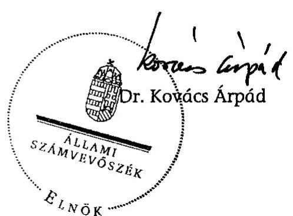

# ÁLLAMI   SZÁMVEVŐSZÉK 

## JELENTÉS

a Fidesz - Magyar Polgári Szövetség 2006-2007. évi gazdálkodása törvényességének ellenőrzéséről

---

3. Önkormányzati és Területi Ellenőrzési Igazgatóság
3.1. Szabályszerűségi Ellenőrzési FőcsoportIktatószám: V-3011-028/2008.Témaszám: 915
Vizsgálat-azonosító szám: V-405
Az ellenőrzést felügyelte:
Dr. Lóránt Zoltán
főigazgató
Az ellenőrzés végrehajtásáért felelős:
Dr. Elek János általános főigazgató-helyettes
Az ellenőrzést vezette:
Horváth Balázs
főcsoportfőnök-helyettes
Az összefoglaló jelentést készítette:
Tóth István
tanácsadó
Az ellenőrzést végezték:
Tóth István Dr. Veress Tiborné Vincze B. Róbert
tanácsadó számvevő számvevő
A témához kapcsolódó eddig készített számvevőszéki jelentések:
címe
sorszáma
Jelentés a Fiatal Demokraták Szövetsége 1991. évi gazdálkodása ..... 125
törvényességének ellenőrzéséről
Jelentés a Fiatal Demokraták Szövetsége 1992-1993. évi gazdálkodása ..... 236
törvényességének ellenőrzéséről
Jelentés a FIDESZ-Magyar Polgári Párt 1994-1995. évi gazdálkodása ..... 343
törvényességének ellenőrzéséről
Jelentés a FIDESZ-Magyar Polgári Párt 1996-1997. évi gazdálkodása ..... 9901
törvényességének ellenőrzéséről
Jelentés a FIDESZ-Magyar Polgári Párt 1998-1999. évi gazdálkodása ..... 0103
törvényességének ellenőrzéséről
Jelentés a FIDESZ-Magyar Polgári Párt 2000-2001. évi gazdálkodása ..... 0308
törvényességének ellenőrzéséről
Jelentés a FIDESZ-Magyar Polgári Szövetség 2002-2003. évi gazdálkodása ..... 0454
törvényességének ellenőrzéséről
Jelentés a FIDESZ-Magyar Polgári Szövetség 2004-2005. évi gazdálkodása ..... 0653
törvényességének ellenőrzéséről

---

# TARTALOMJEGYZÉK 

BEVEZETÉS ..... 5
I. ÖSSZEGZŐ MEGÁLLAPÍTÁSOK, KÖVETKEZTETÉSEK, JAVASLATOK ..... 7
II. RÉSZLETES MEGÁLLAPÍTÁSOK ..... 10

1. A Párt gazdálkodásáról szóló 2006-2007. évi beszámolók ..... 10
1.1. A teljes vizsgálati időszakra érvényes megállapítások ..... 10
1.2. A 2006. és 2007. évi beszámoló ..... 10
1.2.1. Bevételek ..... 10
1.2.2. Kiadások ..... 12
2. A Pártnak a beszámoló összeállítására és az azt alátámasztó könyvvezetésre vonatkozó belső szabályozása és gyakorlata ..... 13
2.1. A belső szabályozás rendszere ..... 13
2.2. A könyvvezetés gyakorlata, ennek összhangja a jogszabályokban és a belső szabályzatokban előírt követelményekkel ..... 14
2.3. Analitikus nyilvántartások ..... 15
2.4. A bizonylati rend és fegyelem betartása ..... 16
3. A Párt bevételszerző, gazdálkodó tevékenysége ..... 16
4. A gazdálkodással összefüggő egyéb jogszabályok betartása ..... 17
4.1. Személyi jellegű kifizetések ..... 17
4.2. Az adózási, társadalombiztosítási és egyéb jogszabályok rendelkezéseinek érvényesítése ..... 17
5. A Párt belső ellenőrzésének rendszere ..... 18
5.1. A belső ellenőrzés rendszerének szabályozottsága ..... 18
5.2. A belső ellenőrzés működése ..... 19

## MELLÉKLETEK

1. számú Kimutatás a FIDESZ-MPSZ 2006 és 2007. évi beszámolóinak önrevíziójáról
2. számú A FIDESZ - Magyar Polgári Szövetség 2006. évi módosított pénzügyi beszámolója
3. számú A FIDESZ - Magyar Polgári Szövetség 2007. évi módosított pénzügyi beszámolója

---

.

---

# RÖVIDÍTÉSEK JEGYZÉKE 

| APEH | Adó és Pénzügyi Ellenőrzési Hivatal |
| :--: | :--: |
| Art. | Az adózás rendjéről szóló - többször módosított - 2003. évi XCII. törvény |
| ÁSZ | Állami Számvevőszék |
| KDNP | Kereszténydemokrata Néppárt |
| KH | Központi Hivatal |
| OE | Országos Elnökség |
| OV | Országos Választmány |
| Párt | FIDESZ - Magyar Polgári Szövetség |
| Párttörvény | A pártok működéséről és gazdálkodásáról szóló - többször módosított - 1989. évi XXXIII. törvény |
| SZB | Számvizsgáló Bizottság |
| Szja. tv. | A személyi jövedelemadóról szóló - többször módosított 1995. évi CXVII. törvény |
| Számv. tv. | A számvitelről szóló - többször módosított - 2000. évi C. törvény |
| Tbj. | A társadalombiztosítás ellátásaira és a magánnyugdíjra jogosultakról, valamint e szolgáltatások fedezetéről szóló - többször módosított - 1997. évi LXXX. törvény |
| VKI | Választókerületi Iroda |

---

.

---

# JELENTÉS 

## a FIDESZ - Magyar Polgári Szövetség 2006-2007. évi gazdálkodása törvényességének ellenőrzéséről

## BEVEZETÉS

Az Állami Számvevőszékről szóló 1989. évi XXXVIII. törvény 5. §-a, a 16. § (2) és a 17. § (2) bekezdése, valamint a pártok működéséről és gazdálkodásáról szóló - többször módosított - 1989. évi XXXIII. törvény (párttörvény) 10. § (1) és (3) bekezdése alapján a pártok gazdálkodása törvényességének ellenőrzésére az Állami Számvevőszék (ÁSZ) jogosult. E törvényi felhatalmazásokra figyelemmel az ÁSZ 2008. évi ellenőrzési tervének megfelelően vizsgálta a FIDESZ - Magyar Polgári Szövetség (Párt) 2006-2007. évi gazdálkodása törvényességét.

Az ellenőrzés célja annak megállapítása volt, hogy:

- a Párt által készített, a Magyar Közlönyben és a Párt internetes honlapján közzétett éves beszámolók a törvényi előírásoknak megfelelnek-e, a könyvvezetéssel és a valósággal megegyező adatokat tartalmaznak-e;
- a könyvvezetés, a gazdálkodás során betartották-e a számvitelről szóló többször módosított - 2000. évi C. tv. (Számv. tv.) és az egyéb jogszabályok rendelkezéseit, belső előírásokat;
- a Párt a működéséhez szabályszerűen igénybe vehető forrásokat használt-e fel, nem folytatott-e a párttörvény által tiltott gazdálkodó tevékenységet, nem fogadott-e el tiltott vagyoni hozzájárulást, illetőleg adományt.

Az ellenőrzés körülményeit illetően rögzíteni szükséges ${ }^{1}$, hogy:

- a párttörvény 1. sz. melléklete szerinti beszámoló-mintához magyarázatot, útmutatót nem készítettek a jogalkotók, így ennek kitöltése pártonként - kialakított számviteli politikájuknak megfelelően - eltérő lehet;
- a beszámolóminta a Számv. tv. rendelkezéseivel nem harmonizál, nem felel meg sem a mérleg, sem az eredmény-kimutatás követelményeinek.

A korábbi pártellenőrzések alapján tett jelzésekre is figyelemmel elengedhetetlenül szükséges a pártok működéséről és gazdálkodásáról szóló - többször módosított - 1989. évi XXXIII. törvény, valamint a Számv. tv. előírásainak összehangolása, amely a pártfinanszírozás átláthatóvá tételére benyújtott törvényjavaslatnak szerves része (száma: T-4190).

[^0]
[^0]:    ${ }^{1}$ Az ÁSZ évek óta javasolja a Kormánynak a pártok ellenőrzéséről készített jelentéseiben a párttörvény módosítását.

---

Az ÁSZ a párttörvény módosításáig a jelenleg hatályos rendelkezéseknek megfelelő - egységes módszertani alapokra helyezett - gyakorlattal folytatja a pártok gazdálkodása törvényességének ellenőrzését. Az ellenőrzést a pénzügyiszabályszerűségi ellenőrzés módszertani szabályai szerint, a pártellenőrzésre kiadott segédletbe foglalt egységes követelmények alapján végeztük.

Az ellenőrzési feladatok szempontrendszerét kockázat elemzéssel alapoztuk meg, amelynek eredményeként az ellenőrzést közepes kockázatúnak értékeltük. Tételesen ellenőriztük a bevételek közül a vizsgált évekre kapott állami támogatást, az egymillió Ft feletti tételeket, valamint a beszámolóban kötelezően nevesítendő, értékhatárt elérő egyéb hozzájárulásokat, adományokat. A 2006. évi tételeket megtisztítottuk az országgyűlési képviselő-választás forrásaitól és költségeitől, mivel az ÁSZ 2007. évi ellenőrzése erre kiterjedt². A vizsgált években statisztikai mintavételi eljárást alkalmaztunk, figyelemmel az eredendő és ellenőrzési kockázat közepes minősítésére. Az átfogó lényegességi szint mértékét az éves beszámoló főösszegének 2\%-ában határoztuk meg, továbbá specifikus lényegességi küszöböt alkalmaztunk az egyéb hozzájárulások, adományok esetében a párttörvény 1. számú mellékletének előírásaira tekintettel.

A pénzügyi-szabályszerűségi ellenőrzésre 2008. augusztus 26. - október 7. között, a Párt székhelyén került sor.

[^0]
[^0]:    ${ }^{2}$ A részletes megállapítások a 0718. számon kiadott „Jelentés a 2006. évi országgyűlési választásra fordított pénzeszközök elszámolásának ellenőrzéséről a jelölő szervezeteknél és a független jelölteknél" című ÁSZ jelentésben találhatók.

---

# I. ÖSSZEGZŐ MEGÁLLAPÍTÁSOK, KÖVETKEZTETÉSEK, JAVASLATOK 

A Párt a 2006. és 2007. évi pénzügyi beszámolóit a párttörvényben előírt formában és tartalommal a Magyar Közlönyben és internetes honlapján határidőben közzétette. Mindkét évi beszámolóját, a számvevőszéki vizsgálatot megelőzően önellenőrzéssel módosította. A párttörvénynek megfelelően pótolta a 2006. évi beszámolóban a belföldi jogi személytől kapott 7250 ezer Ft értékű nem pénzbeli vagyoni hozzájárulás szerepeltetését, nevesítését. Az egyéb bevételek összegét a hitelfelvételhez kapcsolódóan 2006-ban 145507 ezer Ft-tal növelte, illetve 2007-ben 145621 ezer Ft-tal csökkentette. A mérleg főösszeg 2\%-át meghaladó, lényeges mértékű javításra figyelemmel a Párt - szabályszerűen 2008. július 16-án, a Magyar Közlöny 104. számában tette közzé a módosított beszámolóit. Az önellenőrzéssel helyesbített éves beszámolók megbízható és valós képet adtak a gazdálkodásról, mivel a számvevőszéki ellenőrzés által feltárt bevételi eltérések egyik évben sem minősültek lényegesnek. A feltárt hibák a Számv. tv. alapján kiadott számviteli politika korábban már kifogásolt előírásából és a kapcsolódó értékelési szabályzat hiányos szabályozásából fakadtak.

A Párt számviteli szabályozásait hiányosan igazította a módosult törvényi előírásokhoz, a megváltozott gazdálkodási sajátosságokhoz. A számviteli politika 2006. január 5-ei hatályú módosításával - törvényi felhatalmazás alapján - felemelték az egyösszegű értékcsökkenési leírás értékhatárát, rendelkeztek az önkormányzatoktól, egyéb szervezetektől származó nem pénzbeli vagyoni hozzájárulások beszámolóban való szerepeltetéséről, kibővítették az egyéb bevételek között szereplő tételek körét. Utóbbinál nem voltak figyelemmel az ingatlanok hasznosítására vonatkozó párttörvényi korlátozásra, amelynek értelmében a bérelt ingatlanok bérbeadása nem engedélyezett. A számviteli politikához kapcsolódó szabályzatok közül nem került sor a pénzügyi, értékelési szabályzat Számv. tv. módosításával összhangban álló aktualizálására. A szabályozást az ellenőrzés észrevételére a jogszabályi előírásoknak megfelelően módosították. A 2006. január 1-jétől hatályos számlarend sem felelt meg teljes mértékben a Számv. tv. előírásainak, de az ellenőrzés észrevételére minden alkalmazott főkönyvi számlára kiterjesztették a szabályozást.

A könyvvezetés külső vállalkozás által, a kettős könyvvitel rendszerében központilag, az alapbizonylatok számítógépes feldolgozásával történt, mindkét évben azonos program használatával. A főkönyvi könyvelést idősorrendben, a zárlati munkákat a számlarendben előírt módon végezték. Az eszközök és források leltározását szabályszerű kiértékeléssel mindkét évben elvégezték. A számlakijelölésnél betartották a törvényi és számlarendi előírásokat. A számviteli alapelvek érvényesítését szolgálta, hogy a könyvelésre feladott alapbizonylatokat folyamatosan felülvizsgálták.

A főkönyvi számlákhoz tartozó analitikus nyilvántartások körét, tartalmát és vezetésének rendjét a számlarendben és a pénzügyi szabályzatban meghatározták. Teljes körűen, a szabályozásnak megfelelő adattartalommal vezették: az immateriális javak és tárgyi eszközök; a szállítók és vevők; a tartozások és

---

kamatok; a készpénz-forgalom és a szigorú számadású nyomtatványok nyilvántartását. Az analitikus nyilvántartások és a kapcsolódó főkönyvi számlák zárlati adatai megegyeztek.

A bizonylati rend és az okmányfegyelem vonatkozó törvényi és belső előírásait betartották. A könyvelt gazdasági műveleteket szabályszerűen kiállított, hiteles számviteli bizonylatok igazolták. A bizonylatolás alaki és tartalmi követelményei érvényesültek. A költségvetési gazdálkodási szabályzat előírásai szerint működött a kötelezettségvállalás, utalványozás és ellenjegyzés.

A Párt gazdálkodási bevételei - könyvviteli nyilvántartásának adataival egyezően - szabályozott tagdíjból, állami költségvetési támogatásból, egyéb hozzájárulásból és adományból, feleslegessé vált tárgyi eszközök értékesítéséből, költség- és kártérítésekből, kamatból és kölcsönökből, saját ingóságok és bérelt ingatlan bérbeadásából teljesültek. Utóbbiból a párttörvény előírásába ütköző módon a Pártnak 2007-ben - az ingatlan használattal összefüggő közüzemi díjak és rezsiköltségek levonása után - 9336 ezer Ft tiltott bevétele származott. Ennek összegét 2008. november 10-én az albérlők részére visszautalták, ezáltal nem keletkezett olyan eredmény, amit ténylegesen a Párt tevékenységének finanszírozására fordítottak. Az intézkedés következtében nem alkalmazható a párttörvényben meghatározott jogkövetkezmény. A Párt könyvviteli nyilvántartásai szerint névtelen bevételt nem fogadott el, gazdasági társaságban részesedést nem szerzett, értékpapírt nem vásárolt. A bérelt ingatlan hasznosításán kívül betartotta a párttörvényben foglalt korlátozásokat.

A gazdálkodással összefüggő egyéb jogszabályokat a munkáltatói, megbízási és tagsági jogviszony keretében felmerült kiadásoknál betartották. A foglalkoztatáshoz kapcsolódóan az adózási és társadalombiztosítási jogszabályokban előírt adó- és járulékfizetési kötelezettségnek eleget tettek. A társadalombiztosítás és adózás kötelező nyilvántartásait vezették. A főkönyvi könyvelés és a bevallások adatai megegyeztek a nyilvántartások adataival. A munkáltatót és munkavállalót terhelő, a költségvetést megillető befizetési kötelezettségeket határidőben teljesítették, a kiadott folyószámla-kivonatok tanúsága szerint a Pártnak 2006. és 2007. év végén nem voltak hátralékai. Hasonlóan szabályszerűen történt a telefonok magáncélú használatával, valamint a magánszemélyektől bérelt ingatlanokkal összefüggő jövedelem adójának és járulékának megállapítása, befizetése. A reprezentációs költségek mértéke nem érte
 el az Szja. tv.-ben meghatározott adó- és járulékköteles értékhatárt.

A hivatali célú gépjármű használatot a gépjármű üzemeltetési és használati szabályzat - vonatkozó jogszabályokkal összhangban álló - előírásai szerint térítették. A hivatali cél dokumentálására vezetett menetlevelek adattartalma viszont nem felelt meg az Szja. tv.-nek, de az ellenőrzés észrevételére elvégzett önellenőrzés eredményeként magáncélú használatot nem állapítottak meg. A munkavállalók munkába járását, étkezési hozzájárulását a hatályos jogszabályok szerint, adómentes értékkel fizették.

A Párt gazdálkodásának és működésének, pénzügyi és számviteli tevékenységének belső ellenőrzési rendszerét az alapszabály, a költségvetési gazdálkodási szabályzat és a pénzügyi szabályzat összehangoltan szabályozta. Az SZB az alapszabályban előírtak ellenére nem állapította meg működési rendjét.

---

Meghatározott feladatkörében véleményezte az éves költségvetést, beszámolót és ajánlásával került sor az elfogadásukra. Időszakosan értékelte a költségvetés időarányos teljesítését és a tagdíjbevételek alakulását; vizsgálta a 2006. évi országgyűlési választások kampányköltségeit, a hitelek törlesztésének és a kamatok fizetésének teljesülését, valamint eseti jelleggel a bizonylati fegyelmet. Ellenőrzései során nem észlelt olyan hiányosságokat, amelyek nyomán intézkedést kellett kezdeményeznie.

A vezetői ellenőrzés a költségvetési gazdálkodási szabályzat és a számviteli szabályozások szerint teljesült. A munkafolyamatba épített ellenőrzéseken túlmenően a könyvviteli szolgáltatást végző cég munkatársai a gazdasági vezető kezdeményezésére különféle célellenőrzéseket végeztek. Önellenőrzés keretében gondoskodtak a 2006-2007. évi beszámolók lényeges hibáinak megszüntetéséről, a módosított beszámolók szabályszerű megjelentetéséről. A számvevőszéki ellenőrzés által megállapított szabályozási, könyvelési, bizonylatolási hibákat, továbbá a jogosulatlan bevételszerzést a belső ellenőrzés rendszere ugyanakkor nem tárta fel.

A helyszíni ellenőrzés megállapításainak hasznosítása mellett az Állami Számvevőszék elnöke felhívja

# a Párt elnökét 

1. Intézkedjen a számviteli politika hatályos törvényekkel összhangban álló módosítására:
a) szerezzen érvényt a Számv. tv. 15. § (5) bekezdésében foglalt következetesség alapelvének és az állami költségvetésből származó támogatások közé rendelje az országgyűlési képviselőválasztásra kapott költségvetési támogatást;
b) törölje a szabályozásból a bérelt ingatlanok és ingóságok hasznosításának a párttörvény 6. § (1) bekezdésében meg nem engedett (tiltott) lehetőségét.
2. Gondoskodjon a belső ellenőrzési rendszer eredményesebb működéséről, valamint az SZB alapszabály 81. § (2) bekezdésében előírt működési rendjének elfogadásáról.

---

# II. RÉSZLETES MEGÁLLAPÍTÁSOK 

## 1. A PÁrt GAZDÁLKODÁSÁRÓL SZÓLÓ 2006-2007. ÉVI BESZÁMOLÓK

### 1.1. A teljes vizsgálati időszakra érvényes megállapítások

A Párt a vizsgált évek pénzügyi beszámolóit a párttörvény 9. § (1) bekezdésében előírt határidőn belül, a párttörvény 1. sz. mellékletében előírt formában és tartalommal a Magyar Köztársaság hivatalos lapjában közzétette. A 2006. évi beszámoló 2007. április 19-én, a Magyar Közlöny 49., a 2007. évi beszámoló 2008. április 17-én, a Magyar Közlöny 62. számában jelent meg. A Párt mindkét évi beszámolóját - a Magyar Közlönyben való nyilvánosságra hozatallal egyidejűleg - internetes honlapján is megjelentette.

A Párt a 2006. és 2007. évi gazdálkodásáról szóló beszámolóit a számvevőszéki vizsgálatot megelőzően, önellenőrzéssel módosította (1. számú melléklet). A 2006. évi pénzügyi beszámolóban a párttörvény 4. § (5) bekezdése alapján pótolta a 7250 ezer Ft értékű, belföldi jogi személytől kapott nem pénzbeli vagyoni hozzájárulás szerepeltetését, melyet a párttörvény 1. számú mellékletében előírtak szerint nevesített is.

Az egyéb bevételek értékét a hitelfelvételhez kapcsolódóan 2006-ban 145507 ezer Ft-tal növelte, illetve 2007-ben 145621 ezer Ft-tal csökkentette. A mérleg főösszeg 2%-át meghaladó, lényeges mértékű javításra figyelemmel a Párt - szabályszerűen - 2008. július 16-án, a Magyar Közlöny 104. számában tette közzé a módosított pénzügyi beszámolóit (2-3. számú melléklet).

A beszámolók összeállításának rendjét a Párt a hatályos számviteli politikában és számlarendjében szabályozta, a belső előírásokat maradéktalanul érvényesítette. Az éves beszámolókat a vonatkozó főkönyvi számlák adatai, analitikus nyilvántartásai alátámasztották.

Az önellenőrzéssel helyesbített, ismételten közzétett éves beszámolók adatai megbízható, valós képet adtak a Párt éves gazdálkodásáról. A bevételi jogcímeket érintően feltárt hibák előjeltől független összege 2006-ban 30157 ezer Ft, a bevételi főösszegre vetített aránya 1,05%, 2007-ben 345 ezer Ft, ez a bevételi főösszegnek mindössze 0,02%-a, amelyek nem minősültek lényegesnek. A kiadási jogcímek eltérést egyik évben sem mutattak.

### 1.2. A 2006. és 2007. évi beszámoló

### 1.2.1. Bevételek

A 2006-2007. években közzétett beszámolók bevételeinek ellenőrzése során megállapított eltéréseket - beszámoló soronként - a következő összeállítás részletezi:

---

| Bevételek | Adatok ezer forintban |  |  |  |  |  |
| :-- | :--: | :--: | :--: | :--: | :--: | :--: |
|  | Közzétett   módosított   beszámoló | Ellenőrzés ál-   tal feltárt elté-   rések | Előjeltől független hibahatás |  |  |  |
|  | 2006. | 2007. | 2006. | 2007. | 2006. | 2007. |
| 1. Tagdíjak | 94830 | 116954 | 0 | 0 | 0 | 0 |
| 2. Állami támogatás | 826601 | 833200 | 14755 | 0 | 14755 | 0 |
| 4. Egyéb hozzájárulások, adományok összesen | 269594 | 87235 | 647 | 345 | 647 | 345 |
| 4.1. Jogi személyektől | 22771 | 17955 | 647 | 345 | 647 | 345 |
| 4.2. Jogi személynek nem minősülő gt-től | 2178 | 100 | 0 | 0 | 0 | 0 |
| 4.3. Magán személyektől | 244645 | 45274 | 0 | 0 | 0 | 0 |
| 6. Egyéb bevétel | 1680007 | 475743 | -14755 | 0 | 14755 | 0 |
| Összesen: | 2871032 | 1513132 | 647 | 345 | 30157* | 345* |

* A 2., 4. és 6. sorszámú tételek hibahatása együttesen

A beszámoló bevételeit a 9. Bevételek elnevezésű számlaosztályhoz tartozó, a párttörvény 1. számú melléklete szerinti minta soraihoz igazodó főkönyvi számlák adataiból, valamint a belső szabályozás szerinti - 4. számlaosztályban nyilvántartott - hitel, kölcsönbevételekből állították össze.

A tagdíjak közzétett adata mindkét évben megegyezett a főkönyvi könyvelésben szereplő összeggel. A tagdíj főkönyvi számla adatait tagdíj analitika támasztotta alá. A tagdíjbevételek pénztári befizetési, illetve banki bizonylataiból a befizető személye minden esetben megállapítható volt. A tagdíj befizetés a Párt alapszabályával és az Országos Választmány határozatával összhangban teljesült.

Állami költségvetésből származó támogatás címén kimutatott 2006. évi összeg nem tartalmazta az országgyűlési képviselő-választásra kapott jelöltarányos 14755 ezer Ft-os támogatást. Ezt az összeget - a számviteli politika hibás előírásából eredően - tévesen az egyéb bevételek között mutatták ki. A közzétett adat a 2006. évben megegyezett a Magyar Köztársaság 2006. évi költségvetésének végrehajtásáról szóló 2007. évi CXXVIII. törvény vonatkozó adatával, a 2007. évben megegyezett a főkönyvi könyvelésben kimutatott, a Magyar Államkincstár által ténylegesen átutalt összeggel.

Az egyéb hozzájárulások, adományok beszámolósor adatát a Párt, a párttörvény 1. számú mellékletében előírt minta szerint tovább részletezte, a belföldiektől származó 500 ezer Ft, a külföldi magánszemélytől teljesült 100 ezer Ft feletti támogatásokat szabályszerűen nevesítette. A párttörvényben meghatározott értékhatár feletti támogatásokat külön főkönyvi számlán tartották nyilván, az értékhatár alatti támogatók adományait a beszámoló készítéséhez összesítették. Készpénzes befizetés esetén adományozási megállapodást írtak alá, amely az adományozó személyének egyértelmű azonosítására vonatkozó adatokat tartalmazta. Banki átutalásnál a személyazonosításra vonatkozó információkon kívül szerepelt a közleményben a befizetés jogcíme. A nyilvánosságra hozott beszámolók 4. Egyéb hozzájárulások, adományok sorának összege szabályszerűen megegyezett a 94. Egyéb hozzájárulás számlacsoport és a 989. Egyéb rendkívüli bevétel főkönyvi számla összevont egyenlegével, mivel a Párt az utóbbi számlán mutatta ki a nem pénzbeli vagyoni hozzájárulások értékét. A követelményeknek megfelelően az egyéb hozzájárulások, adományok jogi személyektől beszámolósoron szerepeltették az önkormányzatoktól ingyenes, vagy jelképes bérleti díj és piaci érték különbözeteként ingatlanhasználat formájában kapott nem pénzbeli vagyoni hozzájárulás értékét. Szabályozási hiányosságból fakadóan, a Számv. tv. 3. § (9) bekezdés 12. pontjában foglalt valós értékelési szabályokat figyelmen kívül hagyták és a hozzájárulás összegét 2006-ban 647 ezer Ft-tal, 2007-ben 345 ezer Ft-tal csökkentették.

Az egyéb bevételek beszámolósoron a számviteli politika előírásai szerint szabályszerűen szerepeltették a beszámolóban az adott évben felvett hitel, kölcsön összegét. A beszámolósor 2006-ban ismételten hibásan tartalmazta az országgyűlési képviselőválasztási jelöltállításra tekintettel kapott 14755 ezer Ft központi költségvetési támogatást. ³

# 1.2.2. Kiadások 

A kiadásokat a kettős könyvvitel rendszerében másodlagos könyveléssel vezetett 6. számlaosztály vonatkozó számláinak adataiból, azzal egyezően állították össze. A 6. számlaosztályban a számlák tartalmának meghatározására a párttörvény 1. számú melléklete jogcímeinek figyelembevételével került sor.

Támogatás egyéb szervezeteknek beszámolósoron közölt adat mindkét évben megegyezett a 612. „támogatás egyéb szervezetek számára" főkönyvi számla egyenlegével; tartalmában kizárólag szervezetnek adott támogatást tartottak nyilván.

A működési kiadások beszámoló soron a Párt a 614 „működési kiadások" számlacsoportra a számlarendben meghatározott kiadásokat könyvelte, így a vizsgált években érvényesült a működési kiadások jogcímeinek azonossága.

Eszközbeszerzés címén közzétett adatok mindkét évben megegyeztek a 161 „beruházások" főkönyvi számla egyenlegével.

A politikai tevékenység kiadásai beszámolósoron a számlarendben meghatározott főkönyvi számlák összesített adatát, a „Politikai tevékenység kiadásai" számlacsoportban rögzítettekkel összhangban mutatták ki mindkét évben.
Egyéb kiadások soron a beszámolók adata mindkét évben megegyezett a könyvelés 6. számlaosztály 6163 „Egyéb költség" számlacsoportjában könyvelt késedelmi és hitelkamat, árfolyam-különbözet egyenlegével.

[^0]
[^0]: ³ Lásd: 0454. számú ÁSZ jelentés megállapításait.

---

# 2. A PÁrtnak a beszámoló ÖsszeÁllítására És az azT alÁtáMASZTÓ KÖNYVVEZETÉSRE VONATKOZÓ BELSŐ SZABÁLYOZÁSA ÉS GYAKORLATA 

### 2.1. A belső szabályozás rendszere

A Párt a Számv. tv. 14. § (3) - (5) bekezdés alapján kiadott számviteli szabályozásait hiányosan igazította a módosult előírásokhoz, a gazdálkodási változásokhoz.

A számviteli politika 2006. január 5-i hatállyal az alábbiakban módosult:

- az egyösszegű értékcsökkentési leírás értékhatárát a Számv. tv. 80. § (2) bekezdéssel összhangban 100 ezer Ft-ra emelték;
- az önkormányzatoktól, egyéb szervezetektől kapott nem pénzbeli vagyoni hozzájárulások értékének közlését az egyéb hozzájárulások, adományok beszámoló sorhoz rendelték;
- az egyéb bevételek között kimutatandó tételek körét bővítették a faktor ügyletből adódó „pénzforgalmi bevétellel", valamint a saját, illetve bérelt ingatlanok bérbeadásából származó bevételi jogcímekkel;
- a faktor visszafizetés összegét az egyéb kiadások közé sorolták.

A módosítások körében a bérelt ingatlanok bérbeadása nem állt összhangban a párttörvény 6. § (1) bekezdés b) pontjában foglalt korlátozással. A párttörvény 1. számú mellékletében meghatározott beszámoló minta szerint az állami költségvetésből származó támogatást a bevételek 2. sorában kell szerepeltetni, ezzel szemben a számviteli politika az országgyűlési képviselőválasztás jelöltarányos költségvetési támogatását hibásan egyéb bevételnek minősítette. Az ÁSZ korábban javasolta a szabályozási hiba megszüntetését.

A Párt számviteli politikájában nem szabályozta, hogy beszámolójában mely soron szerepelteti a KDNP-vel kötött „Együttműködési megállapodás" keretében kapott hozzájárulás összegét, de az ellenőrzés észrevételére - 2008. szeptember 23-ával - számviteli politikáját kiegészítette, a KDNP-től közös finanszírozásra kapott összeg egyéb bevételek soron való szerepeltetésével.

A 2006. január 5-ével kiadott számviteli politika kiegészítést egy személyben a könyvelési feladatokat ellátó szervezet képviselője írta alá, annak
 ellenére, hogy a Számv. tv. 14. § (9) bekezdése értelmében a számviteli politika elkészítésért, módosításáért a gazdálkodó képviseletére jogosult személy a felelős. A Párt alapszabálya szerint a képviseleti, illetve aláírási jogkör a Párttal munkaviszonyban, illetve munkavégzésre irányuló egyéb jogviszonyban álló személyekre oly módon ruházható át, hogy a meghatalmazottak ketten együtt járhatnak el, illetve képviselhetik a Pártot. A hiányzó meghatalmazást a Párt elnöke 2008. november 3-án kiadta.

A Párt a számviteli politikához kapcsolódó leltározási, értékelési, pénzügyi szabályzatainak előírásait tartotta hatályban, így a következők miatt nem biztosított összhangot a megváltozott szabályokkal, sajátosságokkal.

---

Az értékelési szabályzat nem volt összhangban a számviteli politika 2006. január 5-i kiegészítésével, mivel a III. Amortizációs politika fejezetben az egyösszegű értékcsökkenési leírási értékhatár változatlanul 50 ezer Ft-tal szerepelt. A szabályzatban a térítés nélkül átvett eszköz értékének meghatározása sem volt összhangban a Számv. tv. 50. § (4) bekezdésében foglalt 2007. január 1-jétől hatályos szabállyal, változatlanul az átadónál kimutatott nyilvántartás szerinti érték a beszerzési ár, nem az állományba vétel időpontjában ismert piaci érték. A szabályzat nem tartalmazta a térítés nélkül kapott szolgáltatás piaci értékének meghatározásánál alkalmazott módszert, eljárást. Az ellenőrzés időszakában a Párt a Számv. tv. előírásaival összhangba hozta értékelési szabályzatát.

A pénzügyi szabályzatban nem vezették át a Számv. tv. 2007. január 1-jétől hatályos 14. § (8) bekezdés előírásait: a készpénzben és a bankszámlán tartott pénzeszközök közötti forgalom szabályozását; a pénzszállítás feltételeit; az ellenőrzés gyakoriságát; a napi készpénz záróállomány maximális mértékét. A szabályzat a házipénztárban tartható pénzösszeget határozta meg, időpont megjelölése nélkül, valamint havi pénztárzárlatot írt elő. A Párt az ellenőrzés megállapításai alapján a Számv. tv-ben előírtakat figyelembe véve módosította pénzügyi szabályzatát.

A törvényes és egységes gazdálkodás érdekében hatályban volt még: a költségvetési gazdálkodási szabályzat; a külföldi kiküldetési szabályzat; a gépkocsi üzemeltetési és használati szabályzat; a tagdíjszabályzat. A szabályzatokat minden esetben a gazdasági vezető, mint a költségvetési gazdálkodási szabályzatban a gazdasági-pénzügyi ellenőrzések megszervezéséért, folyamatos működéséért és irányításáért felelős vezető aláírásával helyezték hatályba.

A számviteli politikához új számlarend kapcsolódott 2006. január 1-jétől, amely a Számv. tv. 161. § (2) bekezdésében előírtaknak nem teljes mértékben tett eleget: a főkönyvi könyvelés során jogszabályi, valamint a Párt gazdálkodásában beállt változások miatt új főkönyvi számlákat nyitottak meg a vizsgált években. A 2006-ban 7 db, 2007-ben 15 db megnyitott/alkalmazott főkönyvi számla számjelét és megnevezését nem tartalmazta a számlarend. A Párt a helyszíni ellenőrzés alatt a számlarendjét módosította, megteremtve az összhangot a főkönyvi könyveléssel. A főkönyvi számla és az analitikus nyilvántartás kapcsolatát, valamint a bizonylati rendet a számviteli politika keretében, illetve az ahhoz kapcsolódóan elkészített szabályzatokban rögzítették.

# 2.2. A könyvvezetés gyakorlata, ennek összhangja a jogszabályokban és a belső szabályzatokban előírt követelményekkel 

A könyvvezetést és a beszámoló összeállítását mindkét ellenőrzött évben ugyanaz a külső vállalkozás végezte, a megbízási szerződés hatálya határozatlan idejű. A számviteli szolgáltatást végző társaság vezetője a Számv. tv. 151. § (1) bekezdés szerint meghatározott képesítéssel rendelkezik és szerepel a Magyar Könyvvizsgálói Kamara nyilvántartásában.

---

A könyvvezetés a vizsgált időszakban a kettős könyvvitel rendszerében központilag, az alapbizonylatok számítógépes feldolgozásával történt, mindkét vizsgált évben azonos programmal. A főkönyvi számlák és az analitikus nyilvántartások kapcsolata a szabályozásnak megfelelt. A gazdasági eseményeket könyvvezetés idősorosan rögzítette. A rendelkezésre álló dokumentumok alapján ellenőrizhető volt a zárlati munkálatok határidőben történt, szabályszerű végrehajtása.

A VKI-któl beérkezett alapbizonylatok, munkafolyamatba épített ellenőrzést követően kerültek feldolgozásra. A számlakijelölés gyakorlata összhangban volt a Számv. tv. 167. § (1) bekezdés h) pontjával, és belső számlarendi előírásokkal. A beszámolót érintő kontírozási és könyvelési hiba nem fordult elő.

A Párt a leltározási szabályzat előírásait betartva, leltározási kötelezettségének mindkét vizsgált évben eleget tett, az eszközök és források számbavételét december 31-i fordulónappal elvégezték. A leltározások kiértékelésekor leltárkülönbözetet nem tártak fel.

A számviteli politika 6.) b) pontjában rögzítetteknek megfelelően a 100 ezer Ft egyedi beszerzési érték alatti kis értékű tárgyi eszközöket az 1. számlaosztályban kimutatták, és a használatbavételkor értékcsökkenési leírásként egy összegben elszámolták. A 200 ezer Ft beszerzési érték alatti tárgyi eszközöket a Párt a számviteli politikájában leírtaknak megfelelően írta le két év alatt időarányosan.

A Számv. tv. 42. § (2) és (3) bekezdései szabályozzák a hosszú és rövid lejáratú kötelezettség tartalmát, amelyet azonban a Párt nem vett figyelembe a könyvvezetés során, annak ellenére, hogy faktor kötelezettségének végső lejárata 2012., a hitelé pedig 2010. év. A faktorszállítókat a rövid lejáratú kötelezettségek között, teljes hitelállományát a pénztartozások, azon belül a rövid lejáratú hitelek között tartotta nyilván. A könyvelési hibának nem volt kihatása az éves beszámolóra.

# 2.3. Analitikus nyilvántartások 

A Párt számlarendjében, valamint pénzügyi szabályzatában rendelkezett a főkönyvi számlákhoz kapcsolódó analitikákról, meghatározta azok tartalmát, formáját és a vezetés rendjét. Az immateriális javak és aktivált tárgyi eszközök egyedi analitikus nyilvántartása az azonosító adatokat megfelelően tartalmazta. A beszerzéseket összeghatártól függetlenül, egyedileg mennyiségben és értékben analitikus nyilvántartásba vették. A Párt a szállítói és a vevői analitikus nyilvántartásokat számítógépes könyvelési programjában vezette, amely minden szükséges adatot tartalmazott. A tartozásokról és a fizetendő kamatokról kézi analitikus nyilvántartást vezetettek, amelyből megállapítható volt a felvett hitel összege és időpontja, a fennálló hitelállomány nagysága, a törlesztés időpontja és összege, a kamat fizetés rendje. A készpénzforgalom nyilvántartására a pénzügyi szabályzatban előírt időszaki pénztárjelentést a Számv. tv. 165. § (3) bekezdés a) pontjának megfelelően vezették, havi rendszerességgel zárták. A szigorú számadású nyomtatványokat a Számv. tv. 168. §-ban, és a pénzügyi szabályzatban foglaltak betartásával teljes körűen nyilvántartották.

---

# 2.4. A bizonylati rend és fegyelem betartása 

A Párt a bizonylati rendjét számviteli politikájában és az ahhoz kapcsolódóan elkészített gazdálkodási szabályzataiban határozta meg. A számviteli nyilvántartásban a könyvelt gazdasági műveleteket szabályszerűen kiállított bizonylatokkal támasztották alá a Számv. tv. 165. § (1) és (2) bekezdésében foglalt előírásokat érvényesítve. A gazdasági műveletek, események bizonylatainak adatait a Számv. tv. 165. § (3) bekezdésében meghatározott időpontig rögzítették. A számviteli bizonylatok hitelesek, megbízhatók és helytállóak voltak, megfelelve a Számv. tv. 166. §-ában rögzített szabályoknak. A bizonylatok alaki és tartalmi kellékei eleget tettek a Számv. tv. 165-167. §-aiban előírtaknak. A Pártnál a költségvetési gazdálkodási szabályzat előírásai szerint működött a kötelezettségvállalás, utalványozás és ellenjegyzés.

## 3. A PÁRT BEVÉTELSZERZŐ, GAZDÁLKODÓ TEVÉKENYSÉGE

A Párt a vizsgált időszakban a könyvviteli nyilvántartások szerint a párttörvény 4. §-ában meg nem engedett forrásból származó, illetve névtelen vagyoni hozzájárulást nem fogadott el, a párttörvény 6. §-ában nem engedélyezett gazdálkodó tevékenységet - a Budapest, Szentkirály u. 18. szám alatti bérelt irodaház bérbeadásán kívül - nem folytatott, gazdasági társaságban részesedést nem szerzett, értékpapírt nem vásárolt. A Párt a 2006-2007. évben - a könyvviteli nyilvántartások adatai szerint - a beszámolókban kimutatott tagdijakon, állami költségvetésből származó támogatáson, valamint egyéb hozzájáruláson, adományon kívül kiadásait a következő bevételekből fedezte: feleslegessé vált tárgyi eszközök értékesítése; költség- és kártérítések; kamatbevétel; tulajdonában nem álló ingatlan bérbeadása; saját ingóságok hasznosítása; kölcsönök igénybevétele.

A Párt a Budapest, Szentkirály u. 18. szám alatti bérelt ingatlant bútorozva, telefonközponttal, fénymásolóval, digitális TV antennával három társadalmi szervezetnek albérletbe adta 2007. március 1-jétől 2008. február 29-ig terjedő időszakra. Az albérletbe adásból a Pártnak 2007-ben 53394 ezer Ft bevétele származott. A Párt az ingatlan bérbeadásával megsértette a párttörvény 6. § (1) bekezdés b) pontjának előírását, mely szerint a Párt csak a tulajdonában álló ingatlanokat hasznosíthatja dí ellenében. A Pártnak az ingatlanhasználattal összefüggésben 44058 ezer Ft összegű közüzemi díj és egyéb rezsi kiadása keletkezett, ezáltal 9336 ezer Ft összegű tiltott bevételre tett szert, amelyet az albérlők részére 2008. november 10-én visszautalt. Az intézkedés nyomán nem keletkezett olyan eredmény, amit ténylegesen a Párt finanszírozására fordítottak. Mindezek következtében nem alkalmazható a párttörvény 6. § (5) bekezdésében meghatározott jogkövetkezmény.

A Párt a vizsgált időszakban a párttörvény 6. § (3) bekezdésében engedélyezett egyszemélyes korlátolt felelősségű társaságot nem alapított. A Párt a vizsgált időszakban országosan, évente 62, illetve 86 db önkormányzati tulajdonú ingatlant használt, amelyek közül 2006-ban 9 db, 2007-ben 19 db ingatlant bérelt piaci áron. A kedvezményes ingatlanhasználat nem pénzbeli vagyoni hozzájárulásnak minősült, amelynek értékét a párttörvény 4. § (5) bekezdésében foglaltakra figyelemmel évente megállapították.

---

# 4. A GAZDÁLKODÁSSAL ÖSSZEFÜGGŐ EGYÉB JOGSZABÁLYOK BETARTÁSA 

### 4.1. Személyi jellegű kifizetések

A Pártnál hatályos gazdálkodási szabályzatok alapján munkába-járási és belföldi kiküldetési költségtérítést, valamint étkezési hozzájárulást fizettek.

A közigazgatási határon kívülről történt munkába járáshoz kapcsolódó költség-, a helyi utazásra szolgáló bérlettérítést az utazási költségtérítésről szóló 78/1993. (V. 12.) Korm. rendelet 3. § (1) bekezdés b) pontjában előírt mértékkel teljesítették, a helyi bérlet kifizetését a lejárt bérletszelvény leadásához kötötték.

A hivatali célú gépjármű használatot a gépjármű üzemeltetési és használati szabályzat - vonatkozó jogszabályokkal összhangban álló - előírásai szerint térítették. A Párt tulajdonában lévő gépjárműveket a tagok és a munkavállalók kizárólag hivatalos utazásokhoz vehették igénybe a szabályozás szerint. A gépkocsik napi átadása átvétele nem dokumentált módon történt. A hivatali cél dokumentálására vezetett menetlevelek adattartalma nem felelt meg az Szja. tv. 70. §-ában és 5. számú mellékletének II. 7. pontjában foglalt követelményeknek; nem tartalmazta minden esetben az utazás időpontját és célját. Az ellenőrzés észrevételére a Párt SZB önellenőrzést végzett, amelynek eredményeként jegyzőkönyvezte, hogy magáncélú használat a vizsgált időszakban nem történt. A magántulajdonú gépjárművek hivatali célú használatát - a szabályozás korábbi ÁSZ észrevételre történt 2006. október 1-jei hatályú módosításával - szabályszerűen kiküldetési rendelvényen dokumentálták. Az Szja. tv. 3. számú melléklet II. 6. pontja szerinti igazolás nélkül elszámolható költségek közül a futásteljesítmény alapján normatív üzemanyag-felhasználási és üzemeltetési költséget térítettek.

A munkavállalók részére az étkezési hozzájárulást hideg étkezési jeggyel biztosították, értéke nem haladta meg az Szja. tv. 1. számú melléklet 8. 17. pontban meghatározott adómentes mértéket.

### 4.2. Az adózási, társadalombiztosítási és egyéb jogszabályok rendelkezéseinek érvényesítése

A Párt munkaszerződést, megbízási jogviszonyt 2006. és 2007. évben is létesített. A Tbj. 44. § (5) bekezdésében foglaltaknak megfelelve a Párt határidőn belül bejelentette a foglalkoztatottak biztosítási jogviszonyában történt változásokat. A társadalombiztosítás és adózás kötelező nyilvántartásait vezették, azok adatai megegyeztek a főkönyvi könyvelés és a bevallások adataival. A nyilvántartások és a főkönyvi könyvelés adatait rendszeresen ellenőrizték. A Tbj. 46. §-a szerinti társadalombiztosítási egyéni nyilvántartó lapokat az ellenőrzött szerv megfelelően vezette és azokról az adatszolgáltatását az igazgatási szervnek teljesítette.

Az Art. 46. § (1) bekezdésben, valamint a Tbj. 47. § (3) bekezdésében szabályozott igazolásokat a Párt határidőben kiadta. Az Art. 2. számú melléklet I. 1. és I. 5. pontja alapján
 a levont adót és járulékot havi rendszerességgel, határidő-

---

ben megfizette és a törvény 1. számú melléklete I/A. 3. pontjának megfelelően havonta bevallotta. Az APEH folyószámla-kivonatok tanúsága szerint a Pártnak 2006. és 2007. év végén nem voltak hátralékai. A Tbj. 51. § (1) bekezdése előírásait teljesítette, a levont magán-nyugdíjpénztári tagdíjakat havonta, határidőben magán-nyugdíjpénztáranként bevallotta és befizette.

A Pártnál a Fővárosi és Pest Megyei Egészségbiztosítási Pénztár ellenőrizte a 2005-2006. júliusi időszakra az egészségbiztosítási járulékfizetési kötelezettséget. Hiányosságot nem állapítottak meg.

A Párt tulajdonában álló telefonok magáncélú használatából eredő adó- és járulékfizetési kötelezettségének eleget tett. Az Szja. tv. 69. § (12) bekezdés szerinti 20%-os magánhasználatot vélelmezve számította a Párt az adót és a járulékokat. Az Szja. tv. 74. § (6) bekezdésének megfelelően a Párt, mint kifizető teljesítette az adó- és járulékfizetési kötelezettségét a magánszemélyeknél, a tőlük bérbe vett ingatlanok bérleti díjából keletkező jövedelem után.

A politikai tevékenységek kiadásai közt elszámolt reprezentációs költségek igazoltan a Párt tevékenységével összefüggő rendezvényekhez, eseményekhez kapcsolódtak. Az elszámolt reprezentációs költségek mértéke nem érte el az Szja. tv. 69. § (7) bekezdés b) pontjában foglalt értékhatárt, ezért személyi jövedelem-adó- és járulékfizetési kötelezettség nem keletkezett. Az elszámolt reprezentációs költségek és üzleti ajándékok értékére a Párt külön főkönyvi számlaszámot nyitott, így az adó- és járulékfizetési kötelezettséget nyomon követte.

# 5. A PÁRT BELSŐ ELLENŐRZÉSÉNEK RENDSZERE 

### 5.1. A belső ellenőrzés rendszerének szabályozottsága

A Párt gazdálkodásának, működésének, valamint pénzügyi és számviteli tevékenységének belső ellenőrzési rendszerét az alapszabály, a költségvetési gazdálkodási szabályzat és a pénzügyi szabályzat foglalta magába. Az alapszabály XIII. fejezete rögzíti az SZB megválasztásának, feladatának szabályait. Az SZB szabályozott vagyonkezelési és pénzügyi ellenőrzési főbb feladatai: véleményezi az OV elé terjesztett költségvetést, annak végrehajtásáról szóló beszámolót, ellenőrzi a tagdíjak és tagdíj-kiegészítések befizetését, felhasználásának módját, és munkájáról tájékoztatja az OE-t és OV-t, továbbá beszámolni köteles a kongresszusnak.

Az ellenőrzés szervezése és működtetése a költségvetési gazdálkodási szabályzat 41. §-a szerint a gazdasági vezető felelősségi körébe tartozott, aki utasításban jelölte ki az utalványozásra, érvényesítésre és ellenőrzésre jogosultak körét. A pénzügyi szabályzat a számviteli feladatok ellenőrzését a főkönyvelő hatáskörébe utalta, amelyet külön meghatalmazással a könyvelő cég vezetője látott el. A munkafolyamatba épített ellenőrzés kötelezettségeit a kötelező számviteli szabályzatokban összehangoltan határozták meg, különös tekintettel az időszaki és éves zárlati munkálatokra. A pénztárellenőri feladatokat a pénzügyi szabályzat III. fejezet c) pontja meghatározta. Az ellenőrzés észrevételére a pénzügyi szabályzat kiegészítésével rögzítették a pénztárellenőrzés módját.

---

# 5.2. A belső ellenőrzés működése 

Az SZB tagjait az alapszabály 81. §-ban foglaltaknak megfelelően a Párt 2006. november 25-ei kongresszusán újraválasztották, de működési rendjét a testület saját hatáskörében nem állapította meg. Az SZB meghatározott feladatkörében véleményezte az éves költségvetést, beszámolót és ajánlásával került sor az elfogadásukra, időszakosan értékelte a költségvetés időarányos teljesítését és a tagdíjbevételek alakulását, észrevételezte a KDNP-vel kötött megállapodást és figyelemmel kísérte az abban foglaltak teljesítését. Vizsgálta a 2006. évi Kossuth téri rendezvény költségeit, a 2006. évi országgyűlési választások kampányköltségeit, a hitelek törlesztésének és a kamatok fizetésének teljesülését, valamint eseti jelleggel a bizonylati fegyelmet. Ellenőrzései során nem észlelt olyan hiányosságokat, amelyek nyomán intézkedést kellett kezdeményeznie.

A vezetői és munkafolyamatba épített ellenőrzéseket folyamatosan dokumentálták. A kötelezettségvállalási, utalványozási és ellenjegyzési jogkört a szabályoknak megfelelően gyakorolták. Az éves és időszaki könyvviteli zárlati munkák során érvényesítették a számviteli politikában és a számlarendben foglaltakat. Önellenőrzés keretében gondoskodtak a 2006-2007. évi beszámolók lényeges hibáinak megszüntetéséről, a módosított beszámolók szabályszerű közzétételéről. A könyvelést végző szolgáltató a vizsgált időszakban esetileg ellenőrizte a bérszámfejtési és költségvetési kifizetések szabályszerűségét, az elszámolásra kiadott előlegek nyilvántartását, a magántulajdonú gépjármű használat hivatali célú költségtérítését.

Az ellenőrzés által feltárt szabályozási hiányosságokat, jogosulatlan bevételszerzést, könyvvezetési és menetlevél nyilvántartási hibákat a belső ellenőrzés rendszere nem tárta fel.

Budapest, 2009. január 45

Melléklet: 3 db

---

# KIMUTATÁS A FIDESZ - MPSZ 2006-2007. ÉVI BESZÁMOLÓINAK ÖNREVIZIÓJÁRÓL

A) 2006. ÉVI BESZÁMOLÓ EREDETI ÉS MÓDOSÍTOTT ADATAI

|  BESZÁMOLÓSOR | EREDETI | ÖNREVIZIÓ | MÓDOSÍTOTT  |
| --- | --- | --- | --- |
|  1. Tagdíjak | 94810 | 20 | 94830  |
|  2. Állami költségvetési támogatás | 826601 | 0 | 826601  |
|  4. Egyéb hozzájárulások | 262364 | 7230 | 269594  |
|  4.1. Jogi személyektől | 15518 | 7253 | 22771  |
|  4.1.1.a) Belföldiektől 500eFt alatt | 9776 | 3 | 9779  |
|  4.1.1.b) Belföldiektől 500eFt felett | 5731 | 7250 | 12981  |
|  4.1.2.a) Külföldiektől 100eFt alatt | 11 | 0 | 11  |
|  4.2. Jogi személyiséggel nem rend | 2170 | 8 | 2178  |
|  4.2.1.a) Belföldiektől 500eFt alatt | 2170 | 0 | 2178  |
|  4.3. Magánszemélyektől | 244676 | -31 | 244645  |
|  4.3.1.a) Belföldiektől 500eFt alatt | 225136 | -31 | 225105  |
|  4.3.1.b) Belföldiektől 500eFt felett | 19282 | 0 | 19282  |
|  4.3.2.a) Külföldiektől 100eFt alatt | 40 | 0 | 40  |
|  4.3.2.b) Külföldiektől 100eFt felett | 218 | 0 | 218  |
|  6. Egyéb bevétel | 1534500 | 145507 | 1680007  |
|  - ebből hitelfelvétel | 1504500 | 145507 | 1650007  |
|  BEVÉTELEK ÖSSZESEN | 2718275 | 152757 | 2871032  |
|  2. Támogatás egyéb szervezetnek | 5525 | 0 | 5525  |
|  4. Működési kiadások | 473947 | 117 | 474064  |
|  5. Eszköz beszerzés | 26814 | 1 | 26815  |
|  6. Politikai tevékenység kiadásai | 2052749 | 0 | 2052749  |
|  7. Egyéb kiadás | 131410 | -1 | 131409  |
|  - ebből hitelvisszafizetés | 1946 | 0 | 1946  |
|  KIADÁSOK ÖSSZESEN | 2690445 | 117 | 2690562  |

B) 2007. ÉVI BESZÁMOLÓ EREDETI ÉS MÓDOSÍTOTT ADATAI

|  BESZÁMOLÓSOR | EREDETI | ÖNREVIZIÓ | MÓDOSÍTOTT  |
| --- | --- | --- | --- |
|  1. Tagdíjak | 116954 | 0 | 116954  |
|  2. Állami költségvetési támogatás | 833200 | 0 | 833200  |
|  4. Egyéb hozzájárulások | 87235 | 0 | 87235  |
|  6. Egyéb bevétel | 621364 | -145621 | 475743  |
|  - ebből hitelfelvétel | 398454 | -145621 | 252833  |
|  BEVÉTELEK ÖSSZESEN | 1658753 | -145621 | 1513132  |
|  2. Támogatás egyéb szervezetnek | 1600 | 0 | 1600  |
|  4. Működési kiadások | 295579 | 56 | 295635  |
|  5. Eszköz beszerzés | 5813 | 0 | 5813  |
|  6. Politikai tevékenység kiadásai | 517207 | 0 | 517207  |
|  7. Egyéb kiadás | 388137 | 1600 | 389737  |
|  - ebből hitelvisszafizetés | 112250 | 1600 | 113850  |
|  KIADÁSOK ÖSSZESEN | 1208336 | 1656 | 1209992  |

---

# A Fidesz - Magyar Polgári Szövetség 2006. évi módosított pénzügyi beszámolója 

Ezer forintban

## Bevételek

1. Tagdíjak ..... 94830
2. Állami költségvetésből származó támogatás ..... 826601
3. Képviselőcsoportnak nyújtott állami támogatás
4. Egyéb hozzájárulások, adományok ..... 269594
4.1. Jogi személyektől ..... 22771
4.1.1. a) Belföldiektől ( 500000 Ft alatt)* ..... 9779
4.1.1. b) Belföldiektől ( 500000 Ft felett)* ..... 12981

- Bp. V., Belváros-Lipótváros Vagyonkezelő Rt. ..... 1029
- Bp. Főváros XI. Újbuda Önkormányzata ..... 714
- Palota Holding Rt. (Bp. XV. Önkormányzat) ..... 524
- Bp. Főváros Kispest Önkormányzat Polgármesteri Hivatal ..... 731
- Bp. Pesterzsébeti Városüzemeltetési Rt. ..... 593
- Police Press Kft. ..... 1140
- Germán Rt. ..... 1000
- Heti Válasz Kiadó Kft. ..... 7250
4.1.2. a) Külföldiektől ( 100000 Ft alatt) ..... 11
4.2. Jogi személyiséggel nem rendelkezőktől ..... 2178
4.2.1. a) Belföldiektől ( 500000 Ft alatt) ..... 2178
4.3. Magánszemélyektől ..... 244645
4.3.1. a) Belföldiektől ( 500000 Ft alatt) ..... 225105
4.3.1. b) Belföldiektől ( 500000 Ft felett) ..... 19282
- Ágota Gábor ..... 1400
- Becsey Zsolt ..... 660
- Braunn Márton ..... 572
- Gere Attila ..... 1000
- Gyimesi Endre ..... 557
- Hoffmann J. Henrik ..... 1485
- Járóka Lívia ..... 569
- Knapp J. Pál ..... 944
- Meggyes Tamás ..... 1070
- Szarvas Károlyné ..... 10025
- Tóth János ..... 1000
4.3.2. a) Külföldiektől ( 100000 Ft alatt) ..... 40
4.3.2. b) Külföldiektől ( 100000 Ft felett) ..... 218
- Stefan A. Steiner ..... 218

5. A párt által alapított vállalat és kft. nyereségéből származó bevétel
6. Egyéb bevétel

- ebből hitelfelvétel
1650007
Összes bevétel a gazdasági évben ..... 2871032
[^0]
[^0]:    * Megjegyzés: A Szövetség beszámolójának *-gal jelzett sorai számított adatot is tartalmaznak, 5307 E Ft [4.1.1. a) sorból] és 11981 E Ft [4.1.b) sorból] összegben.

---

# Kiadások 

1. Támogatás a párt országgyűlési csoportja számára
2. Támogatás egyéb szervezetnek
3. Vállalkozás alapítására fordított összeg
4. Működési kiadások
5. Eszközbeszerzés
6. Politikai tevékenység kiadásai
7. Egyéb kiadások

- ebből hitel-visszafizetés

Összes kiadás a gazdasági évben

Tóth Józsefné s. k., gazdasági vezető

Priszter Erzsébet s. k., főkönyvelő

---

# A Fidesz - Magyar Polgári Szövetség 2007. évi módosított pénzügyi beszámolója 

Ezer forintban
Bevételek

1. Tagdíjak ..... 116954
2. Állami költségvetésből származó támogatás ..... 833200
3. Képviselőcsoportnak nyújtott állami támogatás
4. Egyéb hozzájárulások, adományok ..... 87235
4.1. Jogi személyektől ..... 17955
4.1.1. a) Belföldiektől ( 500000 Ft alatt)* ..... 8258
4.1.1. b) Belföldiektől ( 500000 Ft felett)* ..... 9697

- Bp. V., Belváros-Lipótváros Vagyonkezelő Rt. ..... 1046
- Buda Hold Kft., (Bp. XI. Önkormányzat) ..... 537
- Palota Holding Zrt. (Bp. XV. Önkormányzat) ..... 529
- Bp. XIX. ker. Önkormányzat Polgármesteri Hivatal ..... 739
- Integrit - XX. Kft. (Bp. XX. Önkormányzat) ..... 622
- Heti Válasz Kiadó Kft. ..... 6224
4.1.2. a). Külföldiektől ( 100000 Ft alatt)
4.2. Jogi személyiséggel nem rendelkezőktől ..... 100
4.2.1. a) Belföldiektől ( 500000 Ft alatt) ..... 100
4.3. Magánszemélyektől ..... 69180
4.3.1. a) Belföldiektől ( 500000 Ft alatt) ..... 45274
4.3.1. b) Belföldiektől ( 500000 Ft felett) ..... 23866
- Becsey Zsolt ..... 740
- Hadházý Sándor ..... 1105
- Járóka Lívia ..... 541
- Kerényi János ..... 880
- Kis István ..... 900
- Kósa Lajos ..... 510
- Molnár Ágnes ..... 1010
- Navracsics Tibor ..... 810
- Nyitrai Zsolt ..... 1200
- Palotai György ..... 1000
- Papcsák Ferenc ..... 2110

---

- Rácz Róbert ..... 600
- Schmitt Pál ..... 800
- Simon István ..... 1000
- Szarvas Károlyné ..... 10000
- Varga Mihály ..... 660
4.3.2. a) Külföldiektől ( 100000
 Ft alatt) ..... 40
.4.3.2. b) Külföldiektől (100000 Ft felett)
- A párt által alapított vállalat és kft. nyereségéből származó bevétel
- Egyéb bevétel ..... 475743
- ebből hitelfelvétel ..... 252833
Összes bevétel a gazdasági évben ..... 1513132
Kiadások
1. Támogatás a párt országgyűlési csoportja számára
2. Támogatás egyéb szervezetnek ..... 1600
3. Vállalkozás alapítására fordított összeg
4. Működési kiadások ..... 295635
5. Eszközbeszerzés ..... 5813
6. Politikai tevékenység kiadásai ..... 517207
7. Egyéb kiadások ..... 389737
- ebből hitel-visszafizetés ..... 113850
Összes kiadás a gazdasági évben ..... 1209992
Tóth Józsefné s. k., ..... Priszter Erzsébet s. k., gazdasági vezető ..... főkönyvelő
[^0]
[^0]:    * Megjegyzés: A Szövetség beszámolójának *-gal jelzett sorai számított adatot is tartalmaznak, 8108 E Ft [4.1.1. a) sorból] és 9697 E Ft [4.1. b) sorból] összegben.

