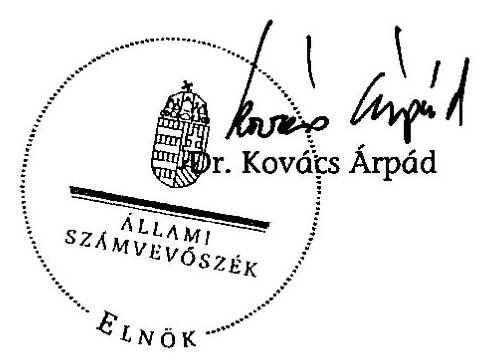
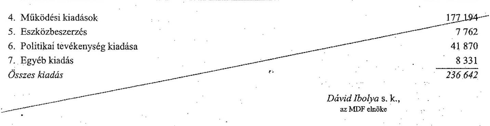

# ÁLLAMI   SZÁMVEVŐSZÉK 

## JELENTÉS

a Magyar Demokrata Fórum 2006-2007. évi gazdálkodása törvényességének ellenőrzéséről

---

3. Önkormányzati és Területi Ellenőrzési Igazgatóság
3.1. Szabályszerüségi Ellenőrzési FőcsoportIktatószám: V-3012-025/2008.Témaszám: 916
Vizsgálat-azonosító szám: V-406
Az ellenőrzést felügyelte:
Dr. Lóránt Zoltán
főigazgató
Az ellenőrzés végrehajtásáért felelős:
Dr. Elek Jánosáltalános főigazgató-helyettes
Az ellenőrzést vezette:
Horváth Balázs
főcsoportfőnök-helyettes
Az összefoglaló jelentést készítette:
Szakmányné Bilik Mária
tanácsos
Az ellenőrzést végezték:
Szakmányné Bilik Mária Dr. Faragóné Tóth Mária Szendrey Lajostanácsos számvevő
A témához kapcsolódó eddig készített számvevőszéki jelentések:
címe
sorszáma
Jelentés a Magyar Demokrata Fórum 1991. évi gazdálkodása tör-
136
vényességének ellenőrzéséről
Jelentés a Magyar Demokrata Fórum 1992-1993. évi gazdálkodása ..... 235
törvényességének ellenőrzéséről
Jelentés a Magyar Demokrata Fórum 1994-1995. évi gazdálkodása ..... 342
törvényességének ellenőrzéséről
Jelentés a Magyar Demokrata Fórum 1996-1997. évi gazdálkodása ..... 9902
törvényességének ellenőrzéséről
Jelentés a Magyar Demokrata Fórum 1998-1999. évi gazdálkodása ..... 0106
törvényességének ellenőrzéséről
Jelentés a Magyar Demokrata Fórum 2000-2001. évi gazdálkodása ..... 0313
törvényességének ellenőrzéséről
Jelentés a Magyar Demokrata Fórum 2002-2003. évi gazdálkodása ..... 0457
törvényességének ellenőrzéséről
Jelentés a Magyar Demokrata Fórum 2004-2005. évi gazdálkodása ..... 0703
törvényességének ellenőrzéséről

---

# TARTALOMJEGYZÉK 

BEVEZETÉS ..... 5
I. ÖSSZEGZŐ MEGÁLLAPÍTÁSOK, KÖVETKEZTETÉSEK, JAVASLATOK ..... 7
II. RÉSZLETES MEGÁLLAPÍTÁSOK ..... 13

1. A Párt gazdálkodásáról szóló 2006-2007. évi beszámolók ..... 13
1.1. A teljes vizsgálati időszakra érvényes megállapítások ..... 13
1.1.1. Bevételek ..... 14
1.1.2. Kiadások ..... 16
2. A Pártnak a beszámoló összeállítására és az azt alátámasztó könyvvezetésre vonatkozó belső szabályozása és gyakorlata ..... 18
2.1. A belső szabályozás rendszere ..... 18
2.2. A könyvvezetés gyakorlata, ennek összhangja a jogszabályokban és a belső szabályzatokban előírt követelményekkel ..... 20
2.3. Analitikus nyilvántartások ..... 21
2.4. A bizonylati elv és a bizonylati fegyelem érvényesülése ..... 22
3. A Párt bevételszerző, gazdálkodó tevékenysége ..... 23
4. A gazdálkodással összefüggő, egyéb jogszabályokban foglalt előírások betartása ..... 24
4.1. Személyi jellegű kifizetések ..... 24
4.2. Az adózási, társadalombiztosítási és egyéb jogszabályok rendelkezéseinek érvényesítése ..... 24
5. A Párt belső ellenőrzési rendszere ..... 25
5.1. A belső ellenőrzés rendszerének szabályozottsága ..... 25
5.2. A belső ellenőrzési rendszer működése, eredményessége ..... 26
6. Az előző ellenőrzés megállapításaira tett intézkedések ..... 27
MELLÉKLETEK
7. számú A Magyar Demokrata Fórum 2006. évi pénzügyi beszámolója
8. számú A Magyar Demokrata Fórum 2007. évi pénzügyi beszámolója
9. számú A Magyar Demokrata Fórum 2006. évi módosított beszámolója
10. számú A Magyar Demokrata Fórum 2007. évi módosított beszámolója

---

.

---

# RÖVIDÍTÉSEK JEGYZÉKE 

| APEH | Adó- és Pénzügyi Ellenőrzési Hivatal |
| :-- | :-- |
| Art. | Az adózás rendjéről szóló - többször módosított - 2003. |
|  | évi XCII. törvény |
| ÁSZ | Állami Számvevőszék |
| MDNP | Magyar Demokrata Néppárt |
| OH | Országos Hivatal |
| OSZB | Országos Számvizsgáló Bizottság |
| Párt | Magyar Demokrata Fórum |
| Párttörvény | A pártok múködéséről és gazdálkodásáról szóló - többször |
|  | módosított - 1989. évi XXXIII. törvény |
| Számv. tv. | A számvitelről szóló - többször módosított - 2000. évi C. |
|  | törvény |
| Szja törvény | A személyi jövedelemadóról szóló - többször módosított - |
|  | 1995. évi CXVII. törvény |
| Tbj. | A társadalombiztosítás ellátásaira és a magánnyugdíjra |
|  | jogosultakról, valamint e szolgáltatások fedezetéről szóló |
|  | - többször módosított - 1997. évi LXXX. törvény |

---

.

---

# JELENTÉS 

## a Magyar Demokrata Fórum 2006-2007. évi gazdálkodása törvényességének ellenőrzéséről

## BEVEZETÉS

Az Állami Számvevőszékről szóló 1989. évi XXXVIII. törvény 5. §-a, a 16. § (2) és a 17. § (2) bekezdése, valamint a pártok múködéséről és gazdálkodásáról szóló - többször módosított - 1989. évi XXXIII. törvény (párttörvény) 10. § (1) és (3) bekezdése alapján a pártok gazdálkodása törvényességének ellenőrzésére az Állami Számvevőszék (ÁSZ) jogosult. E törvényi felhatalmazásokra figyelemmel az ÁSZ 2008. évi ellenőrzési tervének megfelelőn vizsgálta a Magyar Demokrata Fórum (Párt) 2006-2007. évi gazdálkodása törvényességét.

Az ellenőrzés célja annak megállapítása volt, hogy:

- a Párt által készített, a Magyar Közlönyben és a Párt internetes honlapján közzétett éves beszámolók a törvényi előírásoknak megfelelnek-e, a könyvvezetéssel és a valósággal megegyező adatokat tartalmaznak-e;
- a könyvvezetés, a gazdálkodás során betartották-e a számvitelről szóló többször módosított - 2000. évi C. tv. (Számv. tv.) és az egyéb jogszabályok rendelkezéseit, a belső előírásokat;
- a Párt a múködéséhez szabályszerűen igénybe vehető forrásokat használt-e fel, nem folytatott-e a párttörvény által tiltott gazdálkodó tevékenységet, nem fogadott-e el tiltott vagyoni hozzájárulást, illetőleg adományt.

Az ellenőrzés körülményeit illetően rögzíteni szükséges ${ }^{1}$, hogy:

- a párttörvény 1. sz. melléklete szerinti beszámoló-mintához magyarázatot, útmutatót nem készítettek a jogalkotók, így ennek kitöltése pártonként - a kialakított számviteli politikájuknak megfelelően - eltérő lehet;
- a beszámolóminta a számviteli törvény rendelkezéseivel nem harmonizál, nem felel meg sem a mérleg, sem az eredmény-kimutatás követelményeinek.

A korábbi pártellenőrzések alapján tett jelzésekre is figyelemmel elengedhetetlenül szükséges a pártok múködéséről és gazdálkodásáról szóló - többször módosított - 1989. évi XXXIII. törvény, valamint a Számv. tv. előírásainak összehangolása, amely a pártfinanszírozás átláthatóvá tételére benyújtott törvényjavaslatnak szerves része (száma: T-4190).

[^0]
[^0]:    ${ }^{1}$ Az ÁSZ évek óta javasolja a Kormánynak a pártok ellenőrzéséről készített jelentéseiben a párttörvény módosítását.

---

Az ÁSZ a párttörvény módosításáig a jelenleg hatályos rendelkezéseknek megfelelő - egységes módszertani alapokra helyezett - gyakorlattal folytatja a pártok gazdálkodása törvényességének ellenőrzését. Az ellenőrzést a pénzügyiszabályszerűségi ellenőrzés módszertani szabályai szerint, a pártellenőrzésre kiadott segédletbe foglalt egységes követelmények alapján végeztük.

Az adatok előzetes elemzése alapján terveztük meg a tételes ellenőrzést és a legalacsonyabb feltárási kockázatra tekintettel a mintavételi eljárást. Tételesen ellenőriztük a bevételek közül a vizsgált évekre kapott állami támogatást, az egymillió Ft feletti tételeket, valamint a beszámolóban kötelezően nevesítendő, értékhatárt elérő egyéb hozzájárulásokat, adományokat. A 2006. évi tételeket megtisztítottuk az országgyúlési képviselő-választás forrásaitól és költségeitől, mivel az ÁSZ 2007. évi ellenőrzése erre kiterjedt². A vizsgált években nem statisztikai mintavételi eljárást alkalmaztunk, mivel a Párt könyvelési gyakorlatában a helyi és megyei szervezetek bevételei és kiadásai évente egy alkalommal, egy összegben kerültek könyvelésre főkönyvi számlánként.

Az előkészítés során a rendelkezésre bocsátott dokumentumok alapján az átfogó lényegességi szint mértékét az éves beszámoló főösszegének 2\%-ában határoztuk meg, továbbá specifikus lényegességi küszöböt alkalmaztunk az egyéb hozzájárulások, adományok esetében a párttörvény 1. számú mellékletének előírásaira tekintettel.

A pénzügyi-szabályszerúségi ellenőrzésre 2008. augusztus 29 - október 10-e között, a Párt által megbízott könyvelő cég budapesti irodájában került sor.

[^0]
[^0]:    ${ }^{2}$ A részletes megállapítások a 0718. számon kiadott „Jelentés a 2006. évi országgyúlési választásra fordított pénzeszközök elszámolásának ellenőrzéséről a jelölő szervezeteknél és a független jelölteknél" című ÁSZ jelentésben találhatók.

---

# I. ÖSSZEGZŐ MEGÁLLAPÍTÁSOK, KÖVETKEZTETÉSEK, JAVASLATOK 

A Párt a 2006. és 2007. évi pénzügyi beszámolóit a Magyar Közlönyben, valamint internetes honlapján a párttörvényben előírt határidőn belül és formában nyilvánosságra hozta. A beszámolók egyes soraiban szereplő adatok - a 2006. évi egyéb bevételek sor kivételével - mindkét évben megegyeztek a főkönyvi könyvelés kapcsolódó számlái összevont egyenlegeivel, mégsem mutattak megbízható és valós képet a Párt gazdálkodásáról és pénzügyi helyzetéről, mivel a beszámolók összeállításánál nem érvényesítették a számviteli törvényben szabályozott valódiság, teljesség, következetesség és lényegesség elvét. A beszámolók szabályozási, könyvelési és bizonylatolási hibái lényeges eltérést mutattak.

A 2006. évi beszámolóban a feltárt hibák összességében 165847 ezer Ft bevételi, 6648 ezer Ft kiadási eltérést mutattak. A bevételek lényeges eltérésének 95\%-a az egyéb bevételek közölt adatához kötődött. Belső előírás nélkül tartalmazott 152954 ezer Ft év végi hitelállományt, hibás könyvelés miatt 2138 ezer Ft jogi személytől és 1092 ezer Ft összegű magánszemélytől származó támogatást, valamint összeadási hiba miatt 1000 ezer Ft-ot. Kimaradt a beszámolóból összességében 7395 ezer Ft, amely közel teljes összegében belföldiek hozzájárulásához kapcsolódott. A hibás és hiányos adatközlésből fakadóan a párttörvényben előírt nevesítést is elmulasztottak hat támogatónál. Az eltérések következtében az éves beszámoló 151057 ezer Ft bevételi többletet mutatott. A kiadásoknál a kimaradt tételek összege 4119 ezer Ft, illetve a hibás jogcímmel szerepelt tételek értéke 2529 ezer Ft volt, amely egyenlegében 1590 ezer Ft hiányt okozott.

A 2007. évi beszámolósorokhoz kapcsolódó eltérések a bevételi oldalon 3651 ezer Ft, a kiadási oldalon 12656 ezer Ft hibaösszeget indukáltak. A beszámolóban a bevételek között nem mutatták ki az MDNP-től átvett 789 ezer Ft készpénzt, az előző évhez hasonlóan a tárgyidőszakban is kimaradt 2862 ezer Ft összegben kilenc ingatlanhasználattal összefüggő nem pénzbeli vagyoni hozzájárulás értéke. Elmulasztották három támogató nevesítését, továbbá egy esetben nem az adományozó által befizetett tényleges összeget hozták nyilvánosságra. Hiányzott 5657 ezer Ft tárgyi eszközbeszerzés, valamint az eszközbeszerzések között hibásan szerepeltettek 2181 ezer Ft értékcsökkenést. Nem a valós jogcímen mutattak ki 1090 ezer Ft kiadást. Az eltérések egyenlegeként 5588 ezer Ft-tal kisebb kiadási összeget közöltek.

A megjelentetett beszámolóhoz képest kimutatott, a beszámoló főösszegére vetített hiba mértéke - a 2006. évi bevételek és a 2007. évi kiadások vonatkozásában - meghaladta az átfogó lényegességi küszöböt. A 2006. évi bevételeknél $25,1 \%$, a 2007. évi kiadásoknál 5,0\%-os mértéket ért el. A számvevőszéki ellenőrzés megállapítására a könyvelést helyesbítették, a 2006. és a 2007. évi módosított pénzügyi beszámolót a Magyar Közlöny Hivatalos Értesítőjében és a Párt internetes honlapján ismételten közzétették.

---

A Párt gazdálkodási és számviteli szabályozási rendszerét az előző ÁSZ jelentés felhívása ellenére nem hozta összhangba gazdálkodási sajátosságaival, valamint a Számv. tv. előírásaival. A 2002 óta változatlan tartalommal hatályban tartott pénzügyi és gazdálkodási szabályzat továbbra sem felelt meg a központosított gazdálkodás rendjének. A 2007. év második felétől alkalmazott belső ellenőr, majd átminősített gazdasági vezető feladat- és hatásköre a szabályozásban nem került meghatározásra. A pártigazgató feladatkörét ellentmondásosan szabályozták, mivel a számviteli szabályzatok szerint felel a számviteli rend kialakításáért és a szabályszerű könyvvezetéséért, azonban sem a pénzügyi és gazdálkodási szabályzat, sem a munkaköri leírása nem tartalmazta a Párt gazdálkodásának irányítására, szervezésére vonatkozó feladat- és hatáskörét. A Számv. tv-ben előírt számviteli rendért felelős pártigazgató személyében ismételten változás történt.

A Párt számviteli szabályzatai közül változatlan előírásokkal tartotta hatályban, az előző ÁSZ ellenőrzés során nem megfelelőnek minősített, számviteli politikát és értékelési szabályzatot. A számviteli politika nem tartalmazta a párttörvény szerinti beszámoló sorok és a főkönyvi számlák összefüggéseit, az amortizációs politikára vonatkozó szabályozást. A könyvvezetés módjának szabályozása nem állt összhangban a Számv. tv-ben foglalt, egységes könyvvezetésre vonatkozó rendelkezéssel. Az értékelési szabályzatot nem egészítették ki a nem pénzbeli vagyoni hozzájárulás értékelési, valamint az állományból való kivezetési szabályaival. A számviteli törvény 2007. évi módosítására új pénzkezelési szabályzatot léptettek hatályba, amely nem volt összhangban a törvényi előírással, mivel nem szabályozták a Párt bankszámláinak forgalmi rendjét, a napi záró pénzkészlet nagyságát, a kártyás készpénzfelvétel rendjét, valamint a helyi pártszervek pénztárainak sajátos múködési feltételeit. A 2006. évben módosított számlarend továbbra sem felelt meg a Számv. tv. előírásainak, mivel hiányos és hibás volt a kijelölt főkönyvi számlák köre, nem tartalmazta a számlaösszefüggéseket, a kapcsolódó analitikát és bizonylati rendet. Az operatív jelleggel kiadott pártigazgatói utasítások nem szüntették meg a szabályozások rendszer- és szakmai hibáit.

A könyvvezetésben a belső szabályozási hiányosságok, ezen belül a nem megfelelő számviteli politika, értékelési és számlarendi előírások lényeges hibákhoz vezettek. A Párt 2006 végéig a Számv. tv. előírása ellenére az egyszeres és kettős könyvelési rendszer kombinációját alkalmazta, majd 2007-ben az ÁSZ legutóbbi jelentésének felhívása alapján áttért az egységes kettős könyvviteli rendszerre, de továbbra sem biztosította a területi és helyi pártszervezetek bankés pénzforgalmának elkülönült, valamint a költségek költségnemenkénti könyvelését. A helyi szervezetek gazdálkodási adatainak megyei szinten összevont könyvelése nem felelt meg a szervezetenkénti elszámoltatás követelményeinek. A gazdasági események időrendi nyilvántartását a Számv. tv. előírása ellenére nem biztosították, azokat a hónap, illetve a helyi szervezetek tranzakciói esetében az év utolsó napjára rögzítették. A beszámoló alapjául szolgáló könyvvezetési szabálytalanságokkal összefüggésben sérült a teljesség, a valódiság, a következetesség és az egyedi értékelés elve. A leltározás egyik évben sem volt teljes körű, a zárási feladatokat hiányosan hajtották végre.

A főkönyvi könyveléshez kapcsolódó analitikus nyilvántartások közül a vevők, szállítók vezetése minősült szabályszerűnek. A Párt nem vezette - a be-

---

számoló szabályszerű összeállításához, valamint a vagyonvédelmi követelmények és adójogszabályokban előírt korlátok érvényesítéséhez - a támogatások adományozónkénti nyilvántartását, a kis értékű tárgyi eszközök analitikáját, a reprezentációs kiadásokat. Belső utasítás ellenére nem volt teljes körű a szigorú számadású nyomtatványok nyilvántartása, a pénzkezelési szabályzatban előírt pénztárjelentést a helyi szervezetek több mint $80 \%$-a nem vezette. A főkönyvi könyvelés és az adatszolgáltatás szerinti záró pénzkészlet évek óta fennálló eltérését korrigálták. A 2007. évi zárás alkalmával pártigazgatói utasításra az eredménytelenül folytatott egyeztetés miatt, a több éve felhalmozott eltérések rendezésére 6588 ezer Ft összeg leírásra került a helyi szervezetek pénzállományából, valamint a nyilvántartott kötelezettségekből. A hiányosan és szabálytalanul vezetett analitikák gátolták a leltárak teljes körű egyeztethetőségét, a szabályos zárási feladatok elvégzését, az adományozók valós támogatási öszszeggel való nevesítését, mindez lényeges beszámolási hibákhoz vezetett.

A bizonylati elv és fegyelem Számv. tv-vel összhangban meghatározott követelményeit az ÁSZ előző felhívása ellenére hiányosan érvényesítették. A bizonylati elvet sértette, hogy a pénzkezelési szabályzat előírása ellenére 2006ban a helyi szervezetek több mint fele, 2007-ben csaknem egyötöde nem állított ki szabályszerű bevételi és kiadási bizonylatot; az MDNP vagyon egy részének nyilvántartásba vételét, a javító tételeket bizonylatok nem támasztották alá, nem állítottak ki minden esetben számlát a bérbe adott eszközök díjának beszedéséhez. A bizonylatolás alaki és tartalmi követelményei közül az utalványozás 2006-ban a bizonylatok több mint felénél, 2007-ben mintegy egyötödénél nem volt szabályszerű. Az ellenőrzés jogtalan kifizetést nem tapasztalt. A Párt a Számv. tv-ben rögzített bizonylat megőrzési kötelezettséget hiányosan teljesítette, mivel a megszűnt szervezetek mindössze 15\%-ánál készült a dokumentumokról átadási jegyzőkönyv. A bizonylati szabálytalanságok hozzájárultak a beszámolási hibákhoz.

A Párt gazdálkodó, bevételszerző tevékenysége során könyvviteli nyilvántartásai szerint betartotta a párttörvényben előírt gazdálkodási tilalmakat, de 2006-ban megszegte a forrásszerzési korlátozásokat, mivel 383500 Ft összegű névtelen adományt fogadott el. Bevételei szabályozott tagdíffizetésből, egyéb hozzájárulásokból és adományokból, a tulajdonát képező tárgyi eszközök értékesítéséből és bérbe adásából, más szervezetekkel közösen használt ingatlanok rezsiköltségének megtérítéséből, valamint kamatbevételekből álltak. A Pártnál három helyi szervezet szabad pénzeszközeit az előző ÁSZ ellenőrzés felhívása ellenére továbbra is magánszemélyek részére kibocsátott fix kamatozású takarékjegybe fektette. A magánszemély nevére szóló értékpapír-vásárlás a Pártnál vagyonvédelmi kockázatot jelentett.

A személyi jellegú kifizetések körében a béreket szabályszerű munkaszerződések alapján központilag számfejtették. A Párt az Szja törvényben szabályozott adómentes mértékben bérlettérítést, étkezési utalványt, iskolakezdési támogatást és üdülési csekket biztosított munkavállalói részére. Az iskolakezdési támogatás és üdülési csekk adómentességéhez szükséges adathiányt a helyszíni ellenőrzés megállapításaira önellenőrzéssel pótolták. A saját gépkocsi használatát újraszabályozta. A magántulajdonú gépjármú hivatali célú használatát adómentes, normatív mértékkel térítették.

---

Az adózási, társadalombiztosítási jogszabályok előírásainak a Párt munkáltatóként eleget tett, a havi és éves adatszolgáltatási, bevallási és befizetési kötelezettségét szabályszerűen teljesítette, a foglalkoztatottak biztosítási jogviszonyában történt változásokat határidőben bejelentette. A Párt tulajdonát képező gépkocsi futásteljesítményéről vezetett nyilvántartás nem felelt meg a kizárólagos hivatali használat dokumentálásának, az Szja törvény előírása szerint az így keletkezett cégautóadó fizetési kötelezettséget a Párt a helyszíni ellenőrzés időszakában önellenőrzéssel rendezte. Hasonlóan a helyszíni ellenőrzés időszakában pótolta a kis értékű összeget meghaladó ajándékozás esetében keletkezett bevallási és befizetési kötelezettséget.

A belső ellenőrzés szabályozási és szervezeti rendszere a vizsgált időszakban nem volt alkalmas a lényeges beszámolási hibák, szabályozási hiányosságok, tiltott névtelen bevételek kiszűrésére. Az OSZB működési és eljárási rendtartása szerint működött, tevékenysége a költségvetés és beszámoló véleményezésére, a 2006. évi választási kampánnyal kapcsolatos költségek vizsgálatára és az ÁSZ ellenőrzésével kapcsolatosan tett intézkedések áttekintésére terjedt ki, de azok következetes végrehajtását nem ellenőrizte. A megyei számvizsgáló bizottságok a megyék kétharmadánál végeztek dokumentált ellenőrzést.

A Párt 2007 második felétől függetlenített belső ellenőrt alkalmazott, akinek feladatkörét összeférhetetlen módon kibővítették gazdasági vezetői feladatokkal. A pártigazgató az összeférhetetlenséget az ellenőrzés észrevételére megszüntette. A 2007. évi beszámoló összeállításával kapcsolatban a belső ellenőr által feltárt hibákat javították. A vezetői és munkafolyamatba épített ellenőrzés kialakított rendszere magán viselte a feladatok, hatáskörök, felügyeleti és felelősségi körök belső előírásokban ellentmondásosan és hiányosan szabályozott jogosítványainak problémáit. A kötelezettségvállalás 2006-ban a gazdasági tranzakciók közel negyedénél, 2007-ben 2,8\%-ánál nem teljesült szabályszerűen. A helyi, területi és megyei szervezetek feladásainak $90 \%$-a ellenőrzés nélkül került átadásra a központi könyvelés részére. A pártigazgató belső előírás ellenére nem jelölt ki pénztári ellenőröket. A könyvelő szolgáltatói szerződésében rögzített módon nem valósult meg a bizonylatolás szabályszerű kontrollja.

A Párt az előző ÁSZ ellenőrzés felhívásában kezdeményezett intézkedéseket csak részben hajtotta végre. A Párt az előzetesen elfogadott intézkedési terv alapján ismételten nyilvánosságra hozta 2004. és 2005. évi helyesbített beszámolóját, az MDNP átvett vagyonát a vagyonmérlegében kimutatta, a központi költségvetést megillető tiltott bevételt befizette, a természetbeni juttatásokhoz kapcsolódó adó- és járulék elszámolási hibákat önellenőrzéssel javította.

Új gazdálkodási szabályzatot fogadott el 2008. január 12-i hatállyal, a saját gépkocsi használatát újraszabályozta, az értékpapír vásárlás korlátozására, a számviteli és beszámolási fegyelem javítására utasításban rendelkezett. A vizsgált időszakra vonatkozóan a számviteli szabályozás módosítását és összehangolását, valamint a központi gazdálkodási rend fokozását célzó intézkedések végrehajtását elmulasztották, továbbra sem érvényesültek maradéktalanul a bizonylatolás alaki és tartalmi követelményei, a kontrollok eredménytelenül múködtek, mindezek következtében a szabálytalanságok ismétlődtek.

---

A helyszíni ellenőrzés megállapításainak hasznosítása mellett az Állami Számvevőszék elnöke felhívja

# a Párt elnökét: 

1. Intézkedjen a Párt sajátosságainak megfelelően a beszámolási és könyvvezetési szabályok Számv. tv-hez igazodó módosítására, hogy:
a) a számviteli politika részletesen tartalmazza a párttörvény 1 . számú mellékletében szereplő beszámoló és a főkönyvi számlák kapcsolatát, a Számv. tv. 12. § (3) bekezdése szerinti kettős könyvviteli rendszert, valamint az 52-53. §-ra figyelemmel az amortizációs politikát;
b) a pénzkezelési szabályzatban rögzítsék a Számv. tv. 14. § (8) bekezdésével összhangban a Párt bankszámlái forgalmának működtetési rendjét, a maximális napi záró pénzkészlet nagyságát, valamint a kártyás készpénzfelvétel szabályait;
c) az értékelési szabályzat a párttörvény 4. § (5) bekezdésével összhangban tartalmazza az értékelési eljárásokat, módszereket, valamint az állományból való kivezetés feltételeit;
d) a számlarend a Számv. tv. 160. § (3) bekezdés a) pontja előírásának figyelembevételével határozza meg az 5. számlaosztály költségnem csoportjai tartalmát; továbbá a számlarend feleljen meg a 161. § (2) bekezdés követelményének.
2. Szerezzen érvényt az éves beszámolók összeállítása során, és az alapjául szolgáló könyvvezetésben a Számv. tv. 15. § (2)-(3) és (5), valamint a 16. § (1) és (4) bekezdésben szabályozott számviteli alapelveknek.
3. Intézkedjen, hogy a könyvviteli nyilvántartások az eszközökben és forrásokban bekövetkezett változásokat a valóságnak megfelelően folyamatosan mutassák, figyelemmel a Számv. tv. 159. § előírására.
4. Intézkedjen a Párt sajátosságaihoz igazodó, az adózási és vagyonvédelmi követelményeket kielégítő analitikus nyilvántartások szabályszerű vezetésére és egyeztetésére, különösen a banki és pénztári pénzkészletek pénzkezelő helyenkénti főkönyvi és analitikai egyeztethetőségére.
5. Gondoskodjon a Számv. tv. 69. § és 164. § (1) bekezdésében előírt szabályszerű és teljes körű leltározás és zárás végrehajtásáról.
6. Intézkedjen a Párt szabályszerű gazdálkodó tevékenysége érdekében, hogy:
a) a belső utasításnak megfelelően csak gazdálkodó szervezeteknek kibocsátott értékpapírokat vásároljanak a pártszervezet nevére;
b) a párttörvény 4. § (3)-(4) bekezdésének előírása szerint a 383500 Ft összegű névtelen adománynak megfelelő összeget határidőben, a központi költségvetésbe befizessék.

---

7. Szerezzen érvényt a Számv. tv. 165. § (1) bekezdésében foglalt bizonylati elv és fegyelem, a bizonylatolás 167. § (1) bekezdésében megfogalmazott alaki és tartalmi követelményeinek, továbbá a 169. § (2) és (4) bekezdésében előírt bizonylat megőrzési kötelezettségnek.
8. Gondoskodjon a pártigazgató és gazdasági vezető gazdálkodással összefüggő fel-adat- és hatásköre, valamint felelősségi köre meghatározásáról.
9. Szabályozza a belső ellenőrzés hierarchikus rendszerét és biztosítsa annak összehangolt múködését.

# a pénzügyminisztert 

A vizsgálat során megállapított 383500 Ft értékű névtelen adománynak megfelelő összeggel a párttörvény 4. § (4) bekezdés előírása szerint csökkentse a Párt 2009. évi költségvetési támogatását.

---

# II. RÉSZLETES MEGÁLLAPÍTÁSOK 

## 1. A PÁRT GAZDÁLKODÁSÁRÓL SZÓLÓ 2006-2007. ÉVI BESZÁmolÓK

### 1.1. A teljes vizsgálati időszakra érvényes megállapítások

A Párt a 2006. évi beszámolóját 2007. április 26-án a Magyar Közlöny 53. számában, a 2007. évi beszámolóját 2008. április 22-én a Magyar közlöny 63. számában a párttörvény 9. § (1) bekezdésében előírt határidőn belül, a párttörvény 1. számú mellékletében meghatározott minta szerint jelentette meg (1-2. számú melléklet). A Párt mindkét évi beszámolóját az internetes honlapján is közzétette.

A közzétett beszámolók az OH számviteli bizonylatai, 2006-ban a területi irodák naplófőkönyvei és a helyi szervezetek gazdálkodásáról készített összesítő kimutatások alapján könyvelt adatokból készültek. A Párt az előző ÁSZ ellenőrzés felhívására 2007-ben a területi irodák gazdálkodási adatait is a kettős könyvvitel rendszerében rögzítette, amely a beszámoló készítés alapjául szolgált. A beszámolók egyes soraiban szereplő adatok - a 2006. évi egyéb bevételek sor kivételével - mindkét évben megegyeztek a főkönyvi könyvelés kapcsolódó számlák összevont egyenlegeivel, mégsem a valós képet mutatták a Párt gazdálkodásáról, pénzügyi helyzetéről.

A Párt az éves beszámolók összeállítása során megsértette a Számv. tv. 15. § (2)-(3) és (5), valamint a 16. § (4) bekezdésében foglalt teljesség, valódiság, következetesség és lényegesség számviteli alapelveket.

A lényegesség elvét sértette, hogy a 2006. évi beszámoló összeállításával összefüggésben feltárt bevételi hibák előjeltől független értéke 165847 ezer Ft, a bevételi főösszegre vetített hiba $25,1 \%$. A 2007. évi beszámoló kiadási oldalán feltárt hibák kiadási főösszegre vetített értéke 5,0\%. Figyelemmel a párttörvény 9. § (2) bekezdésében foglaltakra, valamint a Párt számviteli politikája előírására a jelzett hibák mindkét évben jelentős összegű, és egyben lényeges hibának minősültek. ${ }^{3}$ Specifikus lényegességi hibaként állapítottuk meg mindkét évi beszámolóban, hogy az adományozók párttörvény előírása szerinti nevesítése nem volt teljes körű, illetve a támogatásokat hibás összeggel közölték.

A feltárt hibák összességében 2006-ban 165847 ezer Ft bevételi, 6648 ezer Ft kiadási; 2007-ben 3651 ezer Ft bevételi, illetve 12656 ezer Ft kiadási eltérést mutattak. A Párt az ellenőrzés észrevételére a 2006. és a 2007. évi pénzügyi beszámolóit a könyvelési hibák kijavítását követően helyesbítette, a Magyar Közlöny Hivatalos Értesítő 2008. évi 46. számában és internetes honlapján ismételten megjelentette (3-4. számú melléklet).

[^0]
[^0]:    ${ }^{3}$ A pártok ellenőrzésénél az átfogó lényegességi küszöb mértéke az ÁSZ-nál általánosan elfogadott $2 \%$.

---

# 1.1.1. Bevételek 

A Párt által közzétett beszámolók bevételi sorai az alábbi eltérések miatt nem egyeznek a valós helyzettel:

Adatok ezer Ft-ban

| Megnevezés | Párt által közzétett beszámoló |  | Ellenőrzés által megállapított eltérések a beszámolóhoz képest |  |  |  |
| :--: | :--: | :--: | :--: | :--: | :--: | :--: |
|  | 2006. évi | 2007. évi | 2006. évi |  | 2007. évi |  |
| BEVÉTEL |  |  | Kimaradt | Hibásan   szerepel | Kimaradt | Hibásan   szerepel |
| 1.Tagdíjak | 5488 | 4605 | 51 | 16 | 0 | 0 |
| 2.Állami tám. | 265329 | 226295 | 0 | 0 | 0 | 0 |
| 4.1.Belf. jogi sz. | 113103 | 28335 | 5683 | 320 | 2862 | 0 |
| 4.2.Jogisz-nek nem min.gt. | 539 | 143 |  | 83 | 0 | 0 |
| 4.3.1.Belf. magánszemély. | 111254 | 38809 | 1661 | 849 | 0 | 0 |
| 6.Egyéb bevétel | 165394 | 4192 | 0 | 157184 | 789 | 0 |
| ÖSSZESEN: | 661107 | 302379 | 7395 | 158452 | 3651 | 0 |
| - hiány |  |  |  |  | 3651 |  |
| - többlet |  |  |  | 151057 |  |  |

A tagdíj befizetés feltételeit a Párt alapszabálya rögzítette. A tagdíjak mérsékléséről, illetve annak elengedéséről a helyi szervezetek dönthettek. 2006-ban a helyi szervezetek $27 \%$-a, 2007-ben $38 \%$-a nullás beszámolót nyújtott be, így az adatszolgáltatásuk szerint nem fizettek tagdíjat. A döntéseket - egy helyi szerv kivételével - nem csatolták az éves adatszolgáltatáshoz. A 2006. évi tagdíjbevételből hiányzott a IV. kerületi pártszerv magánszemélyek adományai között kimutatott 51 ezer Ft tagdíj befizetése, hibásan szerepelt a könyvelésben a XI. és XIX. kerületi helyi szervek összesen 16 ezer Ft bizonylattal alá nem támasztott bevétele.

Az állami költségvetésből származó támogatásokat a főkönyvi könyvelésben kimutatott és a bankszámla kivonaton szereplő, a Magyar Államkincstár által ténylegesen átutalt összeggel egyezően közölték. A 2006. évi adat tartalmazta az országgyűlési képviselőválasztásra kapott jelöltarányos támogatást is. A 2007. évi támogatás összegéből - a pénzügyminiszter intézkedésére - az ÁSZ felhívásának megfelelően levonták az előző ÁSZ vizsgálat által megállapított tiltott bevételnek megfelelő 1305 ezer Ft összeget.

Az egyéb hozzájárulások, adományok beszámoló sor adattartalmát a Párt a párttörvény előírásának megfelelően tovább részletezte. A Pártnak a vizsgált években belföldi jogi személyektől, jogi személynek nem minősülő gazdasági társaságoktól, valamint belföldi magánszemélyektől származott bevétele.

Egyéb hozzájárulások, adományok belföldi jogi személyektől beszámoló sor adata egyezett a vonatkozó főkönyvi számlák összesített egyenlegével, azonban egyik évben sem a valós helyzetet mutatta. A 2006. évi beszámolóból hiányzott tévesen magánszemélyek adománya között kimutatott - III. és XXI. kerületi helyi szervezetnél teljesült - 798 ezer Ft összegű, továbbá az egyéb bevé-

---

telek között kimutatott, a XI. kerületi szervezetnél befizetett jogi személyektől származó 2138 ezer Ft adomány. Ezekből 747 ezer Ft, illetve 1930 ezer Ft azonos jogi személy befizetőtől, a Twintlex Kft-től és az Európai Jövő Egyesülettől származott. A Párt elmulasztotta a beszámolóban feltüntetni az adományozók nevét a támogatás összegével a párttörvény 9. § (2) bekezdés előírását megsértve.

Tévesen került kimutatásra ezen a jogcímen a Győr-Moson-Sopron megyei helyi szervezetnél befizetett 320 ezer Ft összegű magánszemélyektől származó támogatás. A 2007. évi beszámolóban nem nevesítették a Toprex Bau Kft-től származó 8000 ezer Ft támogatást, ezt az összeget a Toronyház Ingatlan Kft. adománya között mutatták ki, így a közzétett beszámoló specifikus lényeges hibát tartalmaz.

A beszámoló sorból mindkét évben hiányzott - kilenc ingatlannal összefüggő a helyi pártszervek által a helyi önkormányzatoktól ingyenes vagy kedvezményes díjtételű ingatlanhasználat formájában kapott nem pénzbeli vagyoni hozzájárulás értéke. A Párt a helyszíni ellenőrzés alatt ismételten értékelte az ingatlanok használatából eredő támogatást, amely alapján a 2006. évi beszámolóból 2747 ezer Ft, a 2007. éviből 2862 ezer Ft összeg hiányzik. Ebből mindkét évben egy-egy esetben az egy támogatótól kapott nem vagyoni hozzájárulás értéke meghaladta az 500 ezer Ft-ot, így azt nevesíteni kellett volna.

Az egyéb hozzájárulások, adományok jogi személynek nem minősülő gazdasági társaságoktól soron a 2006. évi beszámolóban szerepeltetett öszszegből 83 ezer Ft-ot a magánszemélyektől származó adományok között kellett volna feltüntetni, mivel az összeget Békés megyei helyi szervezetnél magánszemélyek fizették be.

Az egyéb hozzájárulások, adományok belföldi magánszemélyektől soron a 2006. évi beszámoló sorból hiányzott, a jogi személynek nem minősülő gazdasági társaságoktól származó adományként kimutatott 83 ezer Ft összegű, jogi személyek adományaként közzétett 320 ezer Ft, valamint az egyéb bevételek között kimutatott, összesen 1092 ezer Ft bevétel. Ebből Békés megyei helyi szervezetnél teljesült 361 ezer Ft, a II. kerületi pártszervnél 80 ezer Ft, a VII. kerületben 160 ezer Ft, a XI. kerületben 491 ezer Ft összegű bevétel. Hiányzott továbbá a VII. kerületi és Pest megyei szervezetnél befizetett, de nem könyvelt 166 ezer Ft magánszemélyektől származó támogatás. Tévesen szerepelt a 2006. évi beszámolóban ezen a soron 798 ezer Ft jogi személy adománya. Hibásan mutattak ki a jogcímen 51 ezer Ft tagdíjat.

A Párt a 2006. évi beszámoló összeállítása során a párttörvény előírása ellenére elmulasztotta összeadni az egy befizetőtől származó adományokat, így az 500 ezer Ft-ot meghaladó, nevesítésre került adományozók közül három fő adományát nem a bizonylatokkal alátámasztott összegekkel hozták nyilvánosságra. A támogatók az OH pénztárán kívül a helyi, illetve megyei szervezet pénztárában is fizettek be adományt. Egy támogató több befizetésből származó 989 ezer Ft összegű támogatását nem nevesítették. A 2007. évi beszámolóban nem került összesítésre és nevesítésre egy támogató 580 ezer Ft összegű adománya.

---

Egyéb bevételek között kamatbevételeket, eszközök értékesítéséből és bérbeadásából, valamint költségtérítésből származó bevételt tartottak nyilván. A Párt a 2006. évi beszámolóban 152954 ezer Ft év végi hitelállományt mutatott ki annak ellenére, hogy a számviteli politika erre vonatkozó előírást nem tartalmazott. A 2006. évi beszámoló sor adatában hibásan hoztak nyilvánosságra 1092 ezer Ft összegű magánszemélytől és 2138 ezer Ft összegű jogi személytől származó támogatást, továbbá összeadási hiba miatt 1000 ezer Ft-ot. A 2007. évi beszámolóból ezen a soron hiányzott 789 ezer Ft összegben, a XI. kerületi pártszervezethez az MDNP pénztárából befizetett készpénz.

# 1.1.2. Kiadások 

A kiadásokat a beszámoló mindkét évben az egyes beszámoló sorok adatának kiszámításánál figyelembe vett főkönyvi számlák egyenlegével egyező összegben tartalmazta.
A 2006. és a 2007. évekre közzétett beszámolók kiadásainak ellenőrzése során megállapított eltéréseket - beszámoló soronként - a következő összeállítás részletezi:

Adatok ezer Ft-ban

| Megnevezés | Párt által közzétett   beszámoló |  | Bizonylatok alapján megállapított   eltérés a beszámolóhoz képest |  |  |  |
| :--: | :--: | :--: | :--: | :--: | :--: | :--: |
|  | 2006. évi | 2007. évi | 2006. évi |  | 2007. évi |  |
| KIADÁS |  |  |  |  |  |  |
| 2. Tám. egyéb   szervezetnek | 1859 | 1190 | 0 | 60 | 0 | 500 |
| 4. Múködési | 233694 | 178417 | 2905 | 26 | 3379 | 25 |
| 5. Eszközbesz. | 3881 | 4170 | 1183 | 2205 | 5657 | 2458 |
| 6. Politikai | 447867 | 40897 | 31 | 238 | 86 | 504 |
| 7. Egyéb | 14201 | 30506 | 0 | 0 | 0 | 47 |
| ÖSSZESEN: | 701502 | 255180 | 4119 | 2529 | 9122 | 3534 |
| - hiány |  |  | 1590 |  | 5588 |  |
| - többlet |  |  |  |  |  |  |

Támogatás egyéb szervezeteknek beszámoló soron közölt adat mindkét évben megegyezett a főkönyvi számla egyenlegével. Az adatok nem a valós helyzetet tükrözték, mivel a kapcsolódó főkönyvi számlákon nem csak szervezetnek adott támogatást tartottak nyilván. A 2006. évi beszámoló soron a III. kerületi és Jász-Nagykun-Szolnok megye helyi pártszervezetek adatszolgáltatása alapján 60 ezer Ft magánszemély részére adott támogatást, a 2007. évi beszámoló soron pedig 500 ezer Ft összegben Párton belüli pénzmozgást is kimutattak.

Múködési kiadások között a Párt rezsi költségeket, bérleti díjakat, a munkavállalók bér- és járulékköltségeit, juttatásait, anyagköltségeket és a múködéshez kapcsolódó igénybevett szolgáltatásokat számolt el. Az adat egyik évben sem pontos. A 2006. évi beszámolóból hiányzott a XV. kerületi, a Jász-Nagykun-Szolnok megyei helyi szervezetek politikai kiadásként kimutatott tétele, összesen 79 ezer Ft összegben ( 27 ezer Ft, illetve 52 ezer Ft), valamint a XV. kerületi szervezet eszközbeszerzés soron szerepeltetett 24 ezer Ft kiadása. Nem

---

tartalmazta a kiadási jogcím a Békés megyei helyi szervezetek 55 ezer Ft nem könyvelt kiadását sem. Közzétettek viszont a beszámoló soron téves könyvelés következtében 11 ezer Ft politikai kiadást, továbbá 15 ezer Ft bizonylattal alá nem támasztott kiadást. A 2007. évi beszámoló sor nem tartalmazta a politikai kiadások között kimutatott 504 ezer Ft kiadást és 13 ezer Ft nem könyvelt öszszeget. A múködési kiadás jogcímen hibásan mutatták ki a Békés megyei helyi szervezetek 25 ezer Ft politikai kiadását.

A beszámoló sor egyik évben sem tartalmazta teljes körűen a Párt által a helyi önkormányzatoktól ingyenes, vagy kedvezményes díjtételű ingatlanhasználat formájában kapott nem pénzbeli vagyoni hozzájárulás értékéhez kapcsolódó kiadási tételt, ami 2006-ban 2747 ezer Ft, 2007-ben 2862 ezer Ft-ot jelentett.

Az eszközbeszerzés beszámoló sor tartalmát a számviteli szabályzatokban nem rögzítették. A főkönyvi számlák között szerepelt mindkét évben a tárgyi eszközök elszámolt értékcsökkenése, ugyanakkor nem tartalmazta az év során beszerzett 100 ezer Ft-ot meghaladó tárgyi eszközök értékét, így az eszközbeszerzés fogalomkörébe tartozó összegeket - a kis értékű eszközök kivételével nem mutatták ki.

Mindezek alapján a 2006. évi beszámoló közzétett adatában hibásan szerepelt 2205 ezer Ft, amelyből 2181 ezer Ft értékcsökkenés, 24 ezer Ft múködési kiadás. A 2007. évi beszámoló soron hibásan mutattak ki 2444 ezer Ft értékcsökkenést, valamint 14 ezer Ft összegben üzleti ajándék címén vásárolt politikai kiadást. Nem mutattak ki 2006-ban 1183 ezer Ft, 2007-ben 5657 ezer Ft főkönyvileg elszámolt értékhatár feletti tárgyi eszköz beszerzést.

Politikai tevékenység kiadása beszámoló soron a Párt számlarendjében meghatározott főkönyvi számlái összesített adatát mutatta ki következetesen mindkét évben. Ezek a reklám, propaganda költség; a politikai tevékenységgel kapcsolatos kiküldetési költség; az üzleti vendéglátás; a rendezvényköltség; az országgyűlési választási és önkormányzati választási költség. Az adat nem a tényleges állapotot tükrözte, az éves könyvvezetés és beszámoló összeállítása során a valódiság, a teljesség, a következetesség elve nem érvényesült. A 2006. évi beszámoló sorból hiányzott a működési kiadások között nyilvánosságra hozott 11 ezer Ft, valamint a Pest megyei helyi pártszerv nem könyvelt 20 ezer Ft összegű kiadása.

Hibásan szerepel összesen 79 ezer Ft működési kiadás, valamint összeadási hiba miatt a Békés megyei helyi szervek összesen 159 ezer Ft nem létező kiadása. A 2007. évi beszámolóban hibásan tettek közzé ezen a soron 504 ezer Ft múködési kiadást, ugyanakkor nem tartalmazta 25 ezer Ft összegben a múködési kiadások között, 14 ezer Ft összegben az eszközbeszerzés között, valamint Jász-Nagykun-Szolnok megyei helyi szervezet 47 ezer Ft egyéb kiadásként közzétett kiadását.

Egyéb kiadások között bankköltséget, árfolyamveszteséget, hitelkamatot, illetéket, közjegyzői díjat, kerekítés miatti eltéréseket számoltak el. A 2006. évi beszámoló sor adata megegyezett a vonatkozó főkönyvi számlák összevont egyenlegeivel. A 2007. évi beszámoló ezen a jogcímen hibásan tartalmazott 47 ezer Ft politikai kiadást.

---

# 2. A PÁrtnak a beszámoló ÖsszeÁllítására És az azt alátáMASZTÓ KÖNYVVEZETÉSRE VONATKOZÓ BELSŐ SZABÁLYOZÁSA ÉS GYAKORLATA 

### 2.1. A belső szabályozás rendszere

Az alapszabály tartalmazza a Párt gazdálkodásának, valamint a helyi szervezetek beszámolási kötelezettségének szabályait, a helyi szervezeteket megillető bevételeket. Az alapdokumentum rendelkezése szerint a pénzügyi és gazdálkodási szabályzat határozza meg a pénzügyi intézkedések és ellenőrzések rendjét.

A Párt testületeinek munkáját az alapszabály 43. §-a szerint hivatali szervezet, az OH segíti, melynek tevékenységét ügyrendje határozza meg. Az OH az ügyrendben előírt „referatúrák" nélkül működött, így a szervezet továbbra sem a belső szabályozás szerint végezte tevékenységét. Az OH vezetője a pártigazgató, akinek személye 2007-ben - a vizsgált időszakban - változott.

A pénzügyi és gazdálkodási szabályzat kitér ugyan a Párt gazdálkodási rendjére, de nem változtattak azon - az előző ÁSZ jelentésben feltártak szerint figyelemmel a Párt gazdálkodási sajátosságaira. A 2007. év második felétől alkalmazott belső ellenőr, majd átminősített gazdasági vezető feladat- és hatásköre a szabályozásban nem került meghatározásra.

A Számv. tv. 14. § (10) és a 161. § (4) bekezdése alapján a számviteli politika és kapcsolódó szabályzatok, valamint a beszámolóhoz és számviteli rendhez kapcsolódó számlarend elkészítéséért, megfelelő színvonalú alkalmazásáért a gazdálkodó szervezet képviseletre jogosult vezetője a felelős. A Pártnál ezt a felelősséget az országos választmány a 2001. évtől hatályos számviteli szabályzatokban a pártigazgatóhoz delegálta. Feladatkörét ellentmondásosan szabályozták, mivel a számviteli szabályzatok szerint felel a számviteli rend kialakításáért és a szabályszerű könyvvezetéséért, azonban sem a pénzügyi és gazdálkodási szabályzat, sem a munkaköri leírása nem tartalmazta a Párt gazdálkodásának irányítására, szervezésére vonatkozó feladat-és hatáskörérét. A pártigazgató munkaköri leírása a gazdálkodás vonatkozásában csak a költségvetés végrehajtását utalta feladatkörébe.

A számviteli politika előírásait az ÁSZ előző felhívása ellenére nem módosították. Az elavult szabályozásban:

- nem tértek ki a beszámoló sorok és a főkönyvi számlák összefüggéseire, valamint a Számv. tv 52-53. § szerinti átfogó amortizációs politika előírására;
- a könyvvezetés módjának szabályozása 2006. december 31-ig nem állt összhangban a Számv. tv. 12. § (3) és (4) bekezdésében foglalt egységes könyvvezetésre vonatkozó rendelkezéssel;
- nem jelent meg a 2007. január 1-jei hatállyal bevezetett - Párt egészére vonatkozó - kettős könyvviteli rendszer egységes szabályozása.

---

A házipénztár és készpénzforgalom szabályzata 2001. január 1-jétől volt hatályos, ezt 2007. február 26-án módosították pénzkezelési szabályzat néven, a Számv. tv. módosítására figyelemmel. Ezen módosítás rendszerezte a Párt legfőbb pénzügyi feladatait, a pénzkezelés elemeit, a bankszámlán történő pénzforgalommal kapcsolatos feladatokat; a házipénztár múködtetését, pénzellátását a pénztári bevételezés, kifizetés módját, az utalványozók feladatát. A szabályzat meghatározta a pénztári nyilvántartás alapbizonylatait, a pénztári beés kifizetések elsődleges feljegyzésére, a záró pénzkészlet megállapítására pénztárjelentést írt elő. A pénzkezelési szabályzat Számv. tv. 14. § (8) bekezdés előírása ellenére nem tartalmazta a Párt bankszámláira vonatkozóan a bank-számlapénz-forgalom lebonyolítási rendjét; a helyi pártszervek pénztárainak sajátos múködési feltételeit, nem rendelkezett a maximális napi záró pénzkészletről, a kártyával történő készpénz felvétel rendjéről.

A leltározási szabályzat megfelelt a törvényi előírásoknak, a leltározás és a könyvvitel adatainak egyeztetési módjainak szabályozása, a leltárkörzetek kijelölése kivételével. Az évenként kiadott leltározási utasításban pótolták a hiányt.

Az eszközök és források értékelési szabályzata továbbra sem tartalmazta az állományból való kivezetés feltételeit, az azokat alátámasztó bizonylatokat, a nem pénzbeni hozzájárulás értékelésének módját. Ez utóbbit részben pótolta a 3/2007. sz. pártigazgatói utasítás, mivel az előírás csak az ingyenesen használt ingatlanok értékelési módját tartalmazta, a kedvezményes használatot nem. Az utasításnak nem képezte részét az értékelés alapjául szolgáló piaci árlista.

A 2006. január 1-jétől kiadott számlarend az alábbi hiányosságok miatt nem felelt meg a Számv. tv. 161. § előírásainak.

- A Párt sajátosságaiból adódó, ténylegesen használt számlák számát, megnevezését nem tartalmazta teljes körűen, ez ellentétes a hivatkozott jogszabályi hely (2) bekezdés a) pontjával.
- Nem tartalmazta valamennyi alkalmazott főkönyvi számla leírását, a számlákat érintő gazdasági eseményeket és azok más számlákkal való kapcsolatát, ezzel sérült a (2) bekezdés b) pont előírása. Nem jelöltek ki számlát a nem pénzbeli vagyoni hozzájárulások nyilvántartására.
- A főkönyvi számlákhoz kapcsolódó analitikus nyilvántartásokról nem rendelkezett teljes körűen a (2) bekezdés c) előírása ellenére. Nem írta elő pl. az adományok, a kis értékű tárgyi eszközök részletező nyilvántartását.
- Hiányzott a könyvvezetéshez kapcsolódó bizonylati rend, valamint az analitikus nyilvántartás és a főkönyvi számlák számszerű egyeztetésének követelménye, ez nem felelt meg a (2) bekezdés c) és d) pont szabályozásának.

Az egyéb törvényességet elősegítő belső előírások a gazdálkodási igényeknek megfelelően kerültek kialakításra: külföldi kiküldetés szabályzat; gépkocsi üzemeltetési és használati szabályzat. Operatív, kiegészítő jelleggel a következő tárgyakban kerültek kiadásra pártigazgatói utasítások: útmutató a helyi szervezetek adatszolgáltatásához; időszaki pénzbeli megtakarítások; ajándékozás, adózási kötelezettségek; telefon magáncélú használatának szabályozása.

---

# 2.2. A könyvvezetés gyakorlata, ennek összhangja a jogszabályokban és a belső szabályzatokban előírt követelményekkel 

A belső szabályozási hiányosságok, ezen belül a nem megfelelő számviteli politikai és számlarendi előírások a könyvvezetésben lényeges hibákhoz vezettek. A Párt 2006. december 31-ig a területi szervezeteknél egyszeres, a OH-nál kettős könyvelést alkalmazott, ellentétben a Számv. tv. 12. § (2) bekezdésében előírtakkal. Az egységes kettős könyvviteli rendszer alkalmazására az ÁSZ legutóbbi jelentésének felhívása alapján 2007. január 1-jétől került sor, amely továbbra sem biztosította:

- a megyei és helyi szervezetek pénzforgalmában a bankszámla- és a készpénzforgalom szétválasztását;
- a helyi szervezetek pénztári forgalmának főkönyvi számlán történt nyilvántartását, mivel a pénzeszköz elnevezésű számlán csak az év végi állományt rögzítették.

Az országos szintű könyvvezetésben nem érvényesültek a Számv. tv-ben meghatározott alábbi elvek:

- a 15. § (2) bekezdésben foglalt teljesség elve, mivel nem könyveltek 2006-ban 2913 ezer Ft bevételt és 2767 ezer Ft kiadást, 2007-ben 3651 ezer Ft bevételt és 2875 ezer Ft összegű kiadást;
- a 15. § (3) bekezdés szerinti valódiság elve, mivel szabályszerű számviteli bizonylatok nélkül történt a könyvelés (2006-ban 16 ezer Ft bevétel és 174 ezer Ft kiadás);
- a 15. § (5) bekezdésben előírt következetesség elve, mert nem a számlarendben meghatározott jogcímre könyveltek 2006-ban 4482 ezer Ft bevételt és 174 ezer Ft kiadást, 2007-ben 1090 ezer Ft kiadást, ennek következtében a vizsgált években eltérő volt az egyes beszámolósorok adattartalma;
- a 16. § (1) bekezdésben meghatározott egyedi értékelés elve, mivel a Párt elmulasztotta mindkét évben kilenc kedvezményesen használt ingatlannal összefüggésben a nem pénzbeni vagyoni hozzájárulás megállapítását.

A kialakított könyvviteli nyilvántartás az eszközökben és forrásokban bekövetkezett változásokat a Számv. tv. 159. § szabályozása ellenére nem mutatta a valóságnak megfelelően, folyamatosan, mivel a gazdasági eseményeket a hónap, illetve a helyi szervezetek tranzakciói esetében az év utolsó napjára rögzítették. A helyi szervezetek gazdálkodási adatainak könyvelése a korábbi évek gyakorlatával egyezően az éves beszámoló jogcímei szerint, évente egy alkalommal megyei szinten összevont adatokkal történt, amely nem felelt meg a belső szabályozás szervezetenkénti elszámoltatási követelményeinek.

A leltározás egyik évben sem volt teljes körű, a zárlati munkálatokat hiányosan hajtották végre. Ennek folytán nem tartották be a Számv. tv. 69. § (1)-(2), valamint 164. § (1) bekezdésében foglaltakat. Az időszaki pénztárzárások elmulasztásának következményeként nem volt megoldott az analitikának a főkönyvvel való egyeztethetősége. Három megye, valamint Budapest helyi szer-

---

vezeteinél a 2006. évi záró pénzkészlet a főkönyvi nyilvántartás szerint 1014 ezer Ft-tal magasabb volt az adatszolgáltatás szerintinél. Az összevont elszámolások következtében nem volt megállapítható a helyi szervezetek valós pénzkészletének alakulása, amely vagyonvédelmi kockázatot jelentett.

A 6/2007. számú pártigazgatói utasítás szerint, a helyi szervezetekkel 2001. évtől eredménytelenül folytatott egyeztetés miatt, a pénzkészlet analitika és a főkönyv több éve felhalmozódott eltérésének megszüntetése céljából a 2007. évi zárás alkalmával 5353 ezer Ft-tal csökkentették a könyvelt pénzkészlet állományát. Ugyancsak így került leírásra az MDNP beolvadásával összefüggésben 1235 ezer Ft kötelezettség is, melynek könyvelésekor az alapdokumentumok hiányoztak. Ez a könyvelési gyakorlat ellentétes volt a valódiság számviteli alapelvével és a Számv. tv. 165. § (2) bekezdésében szabályozott bizonylati elvvel és fegyelemmel.

A helyi szervezetek - hibás pártigazgatói utasítás alapján - a 2006. évre vonatkozó adatszolgáltatásukat alapbizonylatok csatolása nélkül teljesítették, a feladások $90 \%$-a ellenőrizetlenül került a könyvelési szolgáltatóhoz. A könyvelést végző vállalkozás eltérés, hiányosság esetén azokat a Párt vezetése felé jelezte. A könyvelő iroda alapbizonylati szintű egyeztetést nem tudott végezni, így a javítások helyessége nem volt dokumentumokkal alátámasztott. E téren 2007ben javulás volt tapasztalható, mivel a helyi szervezetek adatszolgáltatását a könyvelő cég alapbizonylatok alapján ellenőrizte.

A főkönyvi könyvelést és ennek alapján a beszámoló összeállítását a vizsgált időszakban azonos számítógépes programmal, ugyanaz a könyvelő kft. végezte. A számviteli szolgáltatást végző szervezet vezetője a Számv. tv. 151. § (1) bekezdés szerint meghatározott képesítéssel rendelkezik és szerepel a PM által vezetett könyvviteli szolgáltatást végzők nyilvántartásában.

A Párt az ÁSZ felhívása ellenére folytatta a korábbi évek gyakorlatát, a Számv. tv. 160. § (3) bekezdés a) pont szabályozása ellenére az 5-ös számlaosztályban nem költségnem szerinti könyvelést végzett, hanem az idetartozó számlacsoportokban vegyes költségeket mutatott ki. Az 51-es - számviteli előírások szerinti - anyagköltség számlacsoport a Pártnál múködési kiadás, amely többek között anyagköltséget, személyi kiadásokat és járulékokat, költségtérítéseket és igénybevett szolgáltatásokat is tartalmazott.

# 2.3. Analitikus nyilvántartások 

A főkönyvi könyveléshez kapcsolódó analitikus nyilvántartások tartalmát, körét a számlarend kiegészítésben hiányosan határozták meg. A vizsgált időszakban a főkönyvi számlákhoz kapcsolódóan szabályszerűen csak a vevők, szállítók analitikáját vezették.

- A Párt nem vezette - a beszámoló szabályszerű összeállításához, valamint a vagyonvédelmi követelmények érvényesüléséhez - a támogatások adományozónkénti nyilvántartását, a kis értékű tárgyi eszközök analitikáját, valamint a pénzkezelési szabályzatban előírt pénztárjelentést (helyi szervezetek $82 \%$-a és a budapesti területi iroda).

---

- Az OH és a megyei irodák által beszerzett, értékhatár feletti tárgyi eszközökről ugyan vezettek egyedi nyilvántartást, de az eszköznyilvántartó kartonok hiányos kitöltése nem tette lehetővé a tárgyi eszköz tételek 30\%-ának egyedi azonosítását.
- A helyi szervezetek éves beszámoló adatlapjának támogatásokra vonatkozó része hibás volt, mivel kizárólag a párttörvény szerint nevesítendő összeget befizetők nevét és támogatási összegét rendelte kimutatni. Ebből, illetve az adomány analitika hiányából fakadt, hogy a 2006-2007. évi beszámolóban a helyi, megyei szervezeteknél és az OH-ban befizetett, azonos személytől származó adományokat nem összesítette a Párt.
- A Párt által használt szigorú számadású nyomtatványok körét az értékelési szabályzat előírása ellenére a pártigazgató 2006. évben nem határozta meg, ezt 2007. február 26-ától hatályos belső előírásban pótolta. Annak ellenére, hogy központilag beszerzett, nyilvántartott, szigorú számadású okmányok kerültek terítésre, a helyi szervezetek és területi irodák vásároltak és használtak központi nyilvántartásba nem vett bizonylati tömböket. Ezzel a Párt megsértette a Számv tv. 168. § (3) bekezdés szigorú számadású nyomtatványok nyilvántartásba vételi kötelezettségének előírását.

A központi könyvelést végző kft. a beszámolást megelőző zárlati időszakban, írásban jelezte a pártigazgatónak az elszámolási határidők elmulasztását, a bizonylathiányokat, az analitikának a főkönyvtől való eltérését, de eredményes intézkedést a dokumentumok nem igazoltak.

# 2.4. A bizonylati elv és a bizonylati fegyelem érvényesülése 

A bizonylati elv és a bizonylati fegyelem érvényesüléséhez a Párt nem rendelkezett a számlarend részét képező bizonylati szabályzattal, ezzel megsértette a Számv. tv. 161. § (2) bekezdés d) pontját.

A könyvelő céggel kötött megbízási szerződés szerint a Párt a Számv. tv. követelményeinek mind alaki, mind tartalmi szempontból megfelelő bizonylatokat ad át a megbízott rendelkezésére, de ennek a Párt a vizsgált időszakban nem tett eleget. A Párt megsértette a Számv. tv. 165. § (1) bekezdésében foglalt bizonylati elv és fegyelem követelményét: az MDNP eszközeinek és forrásainak nyilvántartásba vételét teljes körűen nem bizonylatolták; a javító tételek vegyes naplóban való rögzítését bizonylatok nem támasztották alá; előfordult 1000 ezer Ft átutalása bizonylat nélkül; a Párt nem állított ki számlát a XXI. kerületi szervezetnél lévő eszközök bérbeadásáról. 2006-ban a helyi szervezetek több mint fele, 2007-ben közel 20\%-a szabályszerű bevételi és kiadási bizonylatot a pénzkezelési szabályzat előírása ellenére nem állított ki.

A bizonylatolás - a Számv. tv. 167. § (1) bekezdés c), g), h), i) és j) pontjaiban meghatározott - alaki és tartalmi kellékei részben hiányoztak.

- A 2006. évben a gazdasági tranzakciók 24,5\%-ánál a kötelezettségvállalás, $35 \%$-nál a teljesítés igazolása, $50,6 \%$-ában az utalványozás nem, vagy nem szabályosan valósult meg. 2007-ben a gazdasági események 2,8\%-ában a kötelezettségvállalás, $12 \%$-ban a teljesítés igazolása, $20,1 \%$-ában az utalványozás nem, vagy nem az előírásoknak megfelelően valósult meg. A bizony-

---

latok teljes köréről hiányzott mindkét évben az ellenőr aláírása, a helyi szervezeteknél a pénztáros, a befizető aláírása. A szabálytalanságok döntő részét a helyi és területi pártszervezeteknél tapasztaltuk.

- Nem szabályszerű összesítő bizonylat alapján történt a helyi szervezetek éves gazdálkodási adatainak könyvekben való rögzítése, mivel az összesítő adatlap az összesítés alapjául szolgáló bizonylatok körét nem tartalmazta.
- A könyvelési hivatkozást 2006-ban nem rögzítették a bizonylatok 27,6\%-án, 2007-ben 6\%-án.
- 2006-ban a bizonylatok 75,5\%-áról, 2007-ben 50,1\%-áról hiányzott a könyvviteli nyilvántartásban történt rögzítés időpontjának feltüntetése, valamint igazolása.

A szervezetek megszűnésére vonatkozóan, azok gazdálkodásának lezárását igazoló dokumentumokat, pénzeszközök és bizonylatok átadásáról szóló jegyzőkönyveket az alapszabály előírása ellenére a megszűnt szervezetek mindössze 15\%-ánál készítettek, így nem tartották be maradéktalanul a Számv. tv. 169. § (2) és (4) bekezdésében foglaltakat. A bizonylati elv és fegyelem megsértése, a nem megfelelő információáramlás a könyvelési szolgáltató és a Párt között, a szabályozási és könyvelési hiányosságokkal együtt hozzájárult a beszámolási hibákhoz.

# 3. A PÁRT BEVÉTELSZERZŐ, GAZDÁLKODÓ TEVÉKENYSÉGE 

A Párt saját bevételei szabályozott tagdíjfizetésből, egyéb hozzájárulásokból és adományokból, a tulajdonában álló ingatlan dí ellenében történő hasznosításából, tárgyi eszközök értékesítéséből és bérbe adásából, más szervezetekkel közösen használt ingatlanok rezsiköltségének megtérítéséből, valamint kamatbevételekből álltak. A Párt 2006. év végi hitelállománya 152954 ezer Ft, a 2007. évi 137714 ezer Ft volt.

A Párt a vizsgált időszakban könyvviteli nyilvántartásai szerint a párttörvény 4. § (2) bekezdésében meg nem engedett forrásból származó vagyoni hozzájárulást nem fogadott el, a párttörvény 6. §-ában nem engedélyezett gazdálkodó tevékenységet nem folytatott, gazdasági társaságban részesedést nem szerzett, egyszemélyes kft-t, vállalatot nem alapított, párttörvény által tiltott értékpapírt nem vásárolt. A Párt szervezetei 2006. évben 383500 Ft értékben olyan bevételről adtak számot, mely befizetője a bizonylatok alapján nem volt megállapítható, ezért névtelen adománynak minősült. Ezzel a Párt megsértette a párttörvény 4. § (3) bekezdését.

A Párt Vas megyei irodája, valamint a szombathelyi, sárvári helyi szervezete szabad pénzeszközeit az előző ÁSZ ellenőrzés felhívása ellenére továbbra is magánszemélyek részére kibocsátott fix kamatozású takarékjegybe fektette. Az értékpapírokat a pénztárt kezelő személyek az utalványozásra jogosultak írásbeli megbízása alapján saját nevükre vásárolták, majd a pénztárban nyilvántartásba vették. Az értékpapírok beváltása után a pénzt a kamatokkal együtt a szervezet pénztárába befizették, vagy a megbízásnak megfelelően újra értékpapírba fektették. A magánszemély nevére szóló értékpapír-vásárlás a Pártnál vagyonvédelmi kockázatot jelentett.

---

# 4. A GAZDÁLKODÁSSAL ÖSSZEFÜGGŐ, EGYÉB JOGSZABÁLYOKBAN FOGLALT ELŐÍRÁSOK BETARTÁSA 

### 4.1. Személyi jellegú kifizetések

A megbízott könyvelési szolgáltató végezte a munkabérek számfejtését, teljesítette az adó- és társadalombiztosítási jogszabályokban előírt levonási, bevallási és adatszolgáltatási kötelezettségeket. Az ügyrend előírásának megfelelően a Pártnál a vezetési, szervezési gazdálkodási feladatokat határozatlan idejű munkaviszony keretében látták el.

A pártigazgató a Párt által üzemeltetett és a magántulajdonú gépkocsi üzem-anyag-, illetve költségelszámolás rendjét, mértékét a 2004. január 1-jétől hatályos, az előző ÁSZ felhívásra 2006. október 1-jén módosított személygépkocsi használat szabályzatában rögzítette. A magántulajdonú gépjármú hivatali célú használatának költségtérítése és elszámolása a szabályozás szerint történt a gépkocsi használatra vonatkozó megállapodás alapján. Az üzemanyag költségtérítések normatív mértékkel szabályszerűen teljesültek.

A Párt az Szja törvény 1. számú mellékletében szabályozott adómentes mértékben munkába járással összefüggő utazási költségtérítést, étkezési utalványt, üdülési csekket és iskolakezdési támogatást biztosított a munkavállalók részére. A Párt az üdülési csekk juttatása során a munkavállalóktól nem kért nyilatkozatot, így figyelmen kívül hagyta az Szja törvény 1. számú melléklet 9.1. pontjában rögzített, az üdülési csekk adómentességével kapcsolatos szabályokat. Az iskolakezdési támogatás kifizetése csatolt szabályos számlák alapján történt. Mindkét évben hiányzott a nyilvántartásból a támogatásban részesített gyermek adóazonosító jele, illetve ennek hiányában a tanuló természetes azonosítója, ezért nem felelt meg az Szja törvény 1. számú melléklet 8.30. pontjában előírt adattartalomnak. A Párt a helyszíni ellenőrzés megállapításaira a nyilatkozatok beszerzését és az adathiányokat pótolta.

### 4.2. Az adózási, társadalombiztosítási és egyéb jogszabályok rendelkezéseinek érvényesítése

A Párt a vizsgált időszakban a munkabérekből levont személyi jövedelemadót, a munkáltatót és munkavállalókat terhelő járulékokat, valamint a magánnyugdíj-pénztári befizetési kötelezettséget havonta megállapította. A Párt a munkabérekhez kapcsolódó - Art. és Tbj. jogszabályokban előírt havi és éves - adatszolgáltatási, bevallási és befizetési kötelezettségének eleget tett. A vizsgált időszakban kiadott APEH folyószámla kivonat igazolta a költségvetési kötelezettségek szabályszerű teljesítését. Az Art. 46. § (1) bekezdésben, valamint a Tbj. 47. § (3) bekezdésében szabályozott igazolásokat a Párt határidőben kiadta. Az egyéni bér- és járulék nyilvántartásokat vezették, melyek megegyeztek a főkönyvi könyveléssel és bevallásokkal. A Tbj. 44. § (5) bekezdésében foglaltaknak megfelelően a Párt határidőben bejelentette a foglalkoztatottak biztosítási jogviszonyában történt változásokat.

A szabályozás szerint a Párt tulajdonában lévő gépjárművet a munkavállalók kizárólag hivatalos utazásokhoz vehették igénybe. A hivatali cél dokumentálá-

---

sára vezetett menetlevelek adattartalma nem felelt meg az Szja törvény 70. §ában és 5. számú mellékletének II. 7. pontjában foglalt követelményeknek. A gépkocsi futásteljesítményéről vezetett menetlevelekről hiányzott az utazás időpontja és célja, a megállás helye, a felkeresett partner, az utasok száma, az indulás és érkezés ideje. A vezetett nyilvántartás a tárolási helyet is figyelembe véve nem felelt meg a kizárólagos hivatali használat dokumentálásának, ezért megvalósulhatott az Szja törvény 70. § (1) bekezdésében leírt magáncélú használat. A vizsgált években a Párt az Szja törvény 70. § (3) bekezdés szerinti cégautó adó bevallási és fizetési kötelezettségének nem tett eleget, ezt az ellenőrzés időszakában önellenőrzéssel pótolta.

Az előző ÁSZ felhívásra a kis összegű ajándékozás nyilvántartására és adózási kötelezettségére pártigazgatói utasítást adott ki. A belső utasítás ellenére nem teljesítette a Párt a 10 ezer Ft egyedi értéket meghaladó üzleti ajándék utáni adó-és járulék bevallási és fizetési kötelezettségét, amit az ellenőrzés időszakában szintén önellenőrzéssel pótolt. A Párt a reprezentációs kiadásokat a számlarend szabályozása alapján a helyi szervezetek politikai kiadásai, valamint az OH és területi irodák rendezvényköltségei között is elszámolta, így a főkönyvi nyilvántartás továbbra sem volt alkalmas annak megállapítására, hogy a reprezentációs kiadások értéke meghaladta-e az Szja törvény 69. § (7) bekezdés b) pontja szerinti mértéket. A Párt az ellenőrzés észrevételére önellenőrzést végzett, adókötelezettséget nem állapított meg. A Párt tulajdonában álló telefonok magáncélú használatából eredő adó- és járulékfizetési kötelezettségének eleget tett. Az Szja törvény 69. § (12) bekezdés szerinti 20\%-os magánhasználatot vélelmezve számították az adót és járulékokat.

A 2006-2007. évet érintő társadalombiztosítási ellenőrzésre nem került sor, illetve az APEH az adózási szabályok betartását nem vizsgálta.

# 5. A PÁRT BELSŐ ELLENŐRZÉSI RENDSZERE 

### 5.1. A belső ellenőrzés rendszerének szabályozottsága

A Párt gazdálkodásának pénzügyi és számviteli tevékenységének belső ellenőrzési rendszerét az ÁSZ megelőző felhívására belső szabályozásában nem hangolta össze.

Az alapszabály továbbra is háromszintú: országos, megyei/budapesti, helyi - számvizsgáló bizottság múködéséről rendelkezik, amelynek kapcsolatrendszere nem szabályozott. Az OSZB feladatköre az alapdokumentum szerint a Párt központi költségvetése végrehajtásának, a gazdálkodáshoz és számviteli nyilvántartáshoz kapcsolódó szabályzatok betartásának ellenőrzésére, a vagyoni helyzet figyelemmel kísérésére terjed ki. Az OSZB múködési és eljárási rendtartása szerint legalább negyedévenként ülést tart, tevékenységéről évente az Országos Gyűlésnek köteles beszámolni. A megyei és helyi számvizsgáló bizottságok múködési területükön rendelkeztek ellenőrzési jogkörrel.

A vezetői és munkafolyamatba épített ellenőrzés kialakított rendszerében korábbról fennmaradtak az ellentmondásos viszonyok. A vizsgált időszak-

---

ban sem volt meghatározott a pártigazgató gazdálkodást irányító, szervező és kontroll szerepe a belső szabályozások körében, illetve a munkaköri leírásában. A pénzügyi és gazdálkodási szabályzat mellékletében az OH szintjén szabályozták a kötelezettségvállalás rendjét. A kötelezettségvállalások összegét havi felsőértékben szabályozták. Az értékhatárok figyelése érdekében azok nyilvántartásáról nem rendelkeztek, nyilvántartást nem vezettek. Az előző ÁSZ felhívásra módosított, 2008. január 12-től hatályba léptetett gazdálkodási szabályzat a kötelezettségvállalási összeget tranzakciónkénti összeghatárban állapította meg. A Párt a pénzkezelési szabályzatban az utalványozó feladatául jelölte ki a teljesítésigazolást. A Párt nem rendelkezett olyan nyilvántartással, amely a szervezet egészére vonatkozóan tartalmazza az utalványozásra, bankszámla feletti rendelkezésre jogosult személyek nevét, hiteles aláírását. A szabályszerű utalványozás központi ellenőrzésének feltétele nem volt biztosított.

A belső ellenőr, gazdasági vezető működési, felelősségi körét a hatályos szabályzatok nem tartalmazták. A könyvelési szolgáltató megbízási szerződésében nem került meghatározásra az ellenőrzési kötelezettség módja, a számviteli szabályozatok elkészítésében és karbantartásában való közreműködés. A pénztárellenőr megbízása a pártigazgató hatáskörébe tartozott.

# 5.2. A belső ellenőrzési rendszer múködése, eredményessége 

Az OSZB múködési és eljárási rendtartása szerint működött, tevékenysége a költségvetés és beszámoló véleményezésére, a 2006. évi választási kampánnyal kapcsolatos költségek vizsgálatára és az ÁSZ ellenőrzésével kapcsolatosan tett intézkedések áttekintésére terjedt ki. Az ülésekről emlékeztető készült, amely a döntéseket határozat formájában tartalmazta. A határozatok az éves költségvetések és beszámolók észrevételre történt módosítása utáni egyhangú elfogadására vonatkoztak. A testület, szabályozási hiányosságokat állapított meg, kezdeményezte a belső szabályzatok felülvizsgálatát, de ez a vizsgált időszakban nem valósult meg. Az Országos Gyűlés az OSZB munkájáról szóló beszámolót évente elfogadta. Megyei számvizsgáló bizottságok a vizsgált megyék 66,7\%-ánál dokumentáltan végeztek ellenőrzést, helyi szervezetek szintjén a múködésről dokumentumok nem álltak rendelkezésre.

Függetlenített belső ellenőrt a Pártnál 2007. június 4-étől november 16-ig foglalkoztattak. Munkaköri leírásában foglaltaknak megfelelően javaslatot dolgozott ki a Párt új gazdálkodási szabályzatára. A belső ellenőrzésről éves munkaterv nem készült. A belső ellenőr 2007. évben a Győr-Moson-Sopron megyei területi iroda gazdálkodását, nyilvántartását ellenőrizte, amit a jegyzőkönyv szerint rendben talált. A belső ellenőr feladatkörét 2007 végén gazdasági vezetői hatáskörrel bővítették, amelynek együttes ellátása összeférhetetlennek minősült. A pártigazgató az összeférhetetlenséget az ellenőrzés észrevételeire megszüntette.

A vezetői ellenőrzést a kötelezettségvállaláson és utalványozáson keresztül gyakorolta az OH tranzakciói vonatkozásában a pártigazgató. A területi szerveknél a gazdálkodási jogkörrel felruházott elnökök ezt hiányosan teljesítették.

A munkafolyamatba épített ellenőrzés körében a Pártnál a gazdasági tranzakciók teljesítését dokumentáltan nem igazolták, a bevételek és kiadások

---

teljesítés előtti, továbbá a pénzügyi nyilvántartások dokumentált ellenőrzése hiányzott. A gazdasági múvelet végrehajtásának ellenőrzésére, a számla aláírására jogosult személyek megbízására, a pénztárak ellenőrzési feladatainak ellátására a belső előírás ellenére a pártigazgató nem adott ki megbízást.

A Párt a megyei és helyi szervezetek pénzügyi-gazdasági tevékenységről továbbra sem rendelkezett folyamatos, megbízható információval. A vezetői és munkafolyamatba épített ellenőrzés a vizsgált időszakban sem tárta fel teljes körűen a bizonylatolási, elszámolási, adózási, könyvvezetési és beszámolási hibákat. A belső ellenőrzés szabályozási és szervezeti rendszere a vizsgált időszakban nem volt alkalmas a lényeges beszámolási hibák, szabályozási gondok, tiltott névtelen bevételek kiszűrésére, ezen keresztül az ÁSZ korábbi felhívásainak következetes végrehajtására.

# 6. AZ ELŐZŐ ELLENŐRZÉS MEGÁLLAPÍTÁSAIRA TETT INTÉZKEDÉSEK 

A Párt Országos Elnöksége az előző ÁSZ ellenőrzés megállapításainak hasznosítására kiadott felhívás alapján 2007. március 24 -én intézkedési tervet fogadott el, s azt határidőben 2007. március 30 -án megküldte az ÁSZ részére. Az intézkedési terv alapján:

- újra elkészítették és a 2007. április 26-i Magyar Közlöny 53. számában közzétették a Párt 2004. és 2005. évi módosított beszámolóját;
- az MDNP vagyonát - az átadott dokumentumok alapján - a Párt ismételten elkészített 2005. évi mérlegében szerepeltették;
- a Párt egészére 2007. január 1-jétől bevezették a kettős könyvvezetési kötelezettséget;
- az új pénzügyi és gazdálkodási szabályzatot a Párt Országos Választmánya 2008. január 12-én léptette hatályba;
- a személygépkocsi használat szabályzatot - az Szja törvény 3. számú melléklet IV. 1. pont követelményének megfelelően - 2006. október 1-jétől kiegészítették;
- a szigorú számadás alá vont bizonylatok rendjét 2007. február 26-ától szabályozták;
- az ÁSZ vizsgálat által megállapított tiltott bevételnek minősülő összeget a költségvetésbe befizették;
- előírták a pénzbeli megtakarítás befektetésének, az értékpapír vásárlásának szabályszerű módját;
- önellenőrzést végeztek a 2004-2005. évi adóköteles természetbeni juttatások és üzleti ajándék utáni adó- és járulék megállapítására, bevallására és megfizetésére;
- tekintettel a tagi kölcsön indokolatlanságára, a budapesti területi iroda vezetőjét figyelmeztetésben részesítették, majd munkaviszonyát megszüntették.

---

Az ÁSZ felhívás ellenére nem került sor a számviteli politikának, értékelési szabályzatnak a Párt sajátosságaihoz igazodó kiegészítésére. A 2006. január 1jétől hatályos számlarend, valamint a 2007. február 26-án módosított pénzkezelési szabályzat a számvevői jelentés 2.1. pontjában részletezett hiányosságokra tekintettel nem felel meg a Számv. tv. előírásainak.

A Párt egészére kiterjedően a gazdálkodáshoz kapcsolódó jogköröket és felelősséget nem határozták meg. Nem alakítottak ki olyan elszámolási és nyilvántartási rendszert, amely biztosítja valamennyi szervezeti egység vonatkozásában a bizonylati elv maradéktalan érvényesülését, a pénzállományok egyeztethetőségét, valamint az Szja törvényből adódó nyilvántartási kötelezettségek maradéktalan teljesítését. Nem gondoskodtak a belső ellenőrzés szabályozási rendszerének módosításáról, eredményes múködéséről.
Budapest, 2009. január „ 4 "

Melléklet: $\quad 4 \mathrm{db} \quad 7$ lap

---

# A Magyar Demokrata Fórum 2006. évi pénzügyi beszámolója 

Ezer forintban

## BEVETELEK

1. Tagdijak ..... 5488
2. Állami költségvetésböl származó támogatás ..... 265329
3. Képviselöcsoportnak nyújtott támogatás
4. Egyéb hozzájárulások, adományok ..... 224896
4.1. Jogi személyektől ..... 113103
4.1.1. Belföldiektől ..... 113103
K 26 Kft. ..... 10000
Panoráma 2003 Kft. ..... 10000
Szemeszt-ker Kft. ..... 10000
ESMA Kft. ..... 50000
Toprex Bau Kft. ..... 18000
Magyar Épületszerelö Zrt. ..... 3000
Újpesti Vagyonkezelö Rt. ..... 689
Bp. VI. ker. IKV ..... 956
Bp. XI. ker. Önkorm. ..... 1240
Palota Holding Rt. ..... 728
Bp. XVIII. ker. Önkorm. ..... 616
Bp. Föv. Önkorm. ..... 795
Miskolc Város Önkorm. ..... 845
Civis Ház Rt. ..... 764
Eger Város Önkorm. ..... 561
4.2. Jogi személynek nem mint Gt.-töl ..... 539
4.2.1. Belföldiektöl ..... 539
4.3. Magánszemélyektöl ..... 111254

- Wágner Lajosné ..... 1000
- Lakatos Tibor ..... 1510
- Martin József Gyula ..... 10000
- Viniczai Tibor ..... 60000
- Pettkó András ..... 1600
- dr. Csáky András ..... 1250
- Lasztovicza Gábor ..... 1000
- Hock Zoltán ..... 2000
- dr. Boross Péter ..... 1000
- Almássy Kornél ..... 2000

---

- Herényi Károly
- Katona Kálmán
- Nógrádi Tamás
- Breznay Enikő

5. A párt által alapított vállalat és kft. nyereségéből származó bevétel
6. Egyéb bevétel
ebből hitel
Összes bevétel

KIADÁSOK

1. Támogatás a párt országgyűlési csoportja számára
2. Támogatás egyéb szervczeteknek
3. Vállalkozások alapítására fordított összeg
4. Müködési kiadások
5. Eszközbeszerzés
6. Politikai tevékenység kiadása
7. Egyéb kiadás

Összes kiadás

Szemereki Zoltán s. k., pártigazgató

165394
152954
1661107

Prancz József s. k.,
Pranczék Könyvelési Irodája Kft.
ügyvezetője

Helyesbítés: A Magyar Közlöny 2007. évi 52. számában megjelent, a közforgalmú személyszállitási utazási kedvezményséről szóló 85/2007. (IV. 25.) Korm. rendelet 1. mellékletének

- 8. és 42. pontjában a jegykedvezmény mértéke helyesen 90%;
- 8. pontjában az első oszlop szövege helyesen a következő:
„a Szátv. hatálya alá tartozó 6-65 év közötti külföldi állampolgár (évente 4 alkalommal menettérti utazásra)"

(Kézirahiba)

- 42. pontjában az első oszlop szövege helyesen a következő:
„a Szátv. 8. §-a (3) bekezdésének b) pontjában meghatározott 18 éven aluli személyek legalább tíz főből álló csoportja és a velük utazó két 18. életévét be-
töltött kísérője (évente 1 alkalommal menettérti utazásra)"

(Kézirahiba)

---

# Az MDF 2007. évi pénzügyi beszámolója 

## Bevételek

1. Tagdijak ..... 4605
2. Állami költségvetésből származó támogatás ..... 226295
3. Képviselöcsoportnak nyújtott támogatás
4. Egyéb hozzájárulások, adományok ..... 67287
4.1. Jogi személyektől
28335
4.1.1. Belföldiektől
Újpesti Vagyonkezelő Rt. ..... 719
Bp. VI. ker. IKV ..... 998
Bp. XI. ker. Önkorm. ..... 1294
Palota Holding Rt. ..... 760
Bp. XVIII. ker. Önkorm. ..... 643
Bp. Föv. Önkorm. (Csepel) ..... 830
Miskolc Város Önkorm. ..... 882
Debrecen Civisház Rt. ..... 797
Eger Város Önkorm. ..... 585
E.E.B.F. RT. ..... 1000
Toronyház Ingatlan Kft. ..... 13500
4.2. Jogi személynek nem minősülötöl
143
4.2.1. Belföldiektől
143
4.3. Magánszemélyektől
38809
4.3.1. Belföldiektől
Németh Ferenc
841
Viniczai Tibor
5000
Kenessei Péter
7000
Kenessei Matild
3000
Szilassy Gábor
1928
5. A párt által alapított vállalat és kft. nyereségéből származó bevétel
6. Egyéb bevétel
4192
7. Összes bevétel
302379

## Kiadások

1. Támogatás a párt országgyűlési csoportja számára
2. Támogatás egyéb szervezeteknek ..... 1190
3. Vállalkozás alapítására fordítottösszeg
4. Müködési kiadások ..... 178417
5. Eszközbeszerzés ..... 4170
6. Politikai tevékenység kiadása ..... 40897
7. Egyéb kiadás ..... 30506
8. Összes kiadás
255180
Dr. Varga Zsolt s. k., pártigazgató
Pranczék Könyvelési Irodája Kft.
Prancz József s. k., ügyvezető

---

# MÉrleGBESZÁmoló 

A Magyar Demokrata Fórum 2006. évi módosított beszámolója
BEVÉTELEK

Adatok E Ft-ban
Sorszám Megnevezés Összeg
1. Tagdijak ..... 5523
2. Állami költségvetésből származó támogatás ..... 265329
3. Képviselőcsoportnak nyújtott támogatás ..... -
4. Egyéb hozzájárulások, adományok ..... 230988
4.1. Jogi személyekből
4.1.1. Belföldeiktól ..... 118466
K 26 Kft. ..... 10000
Panoráma 2003 Kft. ..... 10000
Szemeszt-ker Kft. ..... 10000
ESMA Kft. ..... 50000
Toprex Bau Kft. ..... 18000
Magyar Épületszerelő Zrt. ..... 3000
Újpesti Vagyonkezelő Rt. ..... 689
Bp. VI. Kerületi IKV ..... 956
Bp. XI. Kerületi Önkormányzat ..... 1240
Palota Holding Rt. ..... 728
Bp. XVIII. Kerületi Önkormányzat ..... 616
Bp. Főváros Önkormányzat (Csepel) ..... 795
Miskolc Város Önkormányzata ..... 845
Civis Ház Rt. ..... 764
Eger Város Önkormányzata ..... 561
TWINTLEX Kft. ..... 747
Európai Jövő Egyesület ..... 1930
Bp. XIII. Kerületi Önkormányzat ..... 769
4.2. Jogi személynek nem mint gt-től
4.2.1. Belföldiektől ..... 456
4.3. Magánszemélyektől ..... 112066
Wágner Lajosné ..... 1000
Lakatos Tibor ..... 1510
Martin József Gyula ..... 10000
Viniczai Tibor ..... 60000
Pettkó András ..... 1600
dr. Csáky András ..... 1650
Lasztovicza Gábor ..... 1000
Hock Zoltán ..... 2110
dr. Boross Péter ..... 1000
Almássy Kornél ..... 2000
Herényi Károly ..... 2000
Katona Kálmán ..... 10081
Nógrádi Tamás ..... 1500
Breznay Enikő ..... 1500
Németh Ferenc ..... 989

---

|  8164 | HIVATALOS ÉRTESITÓ | 2008/46. szám  |
| --- | --- | --- |
|  5. | A párt által alapított vállalat és kft. nyereségéből származó |   |
|   | bevétel |   |
|  6. | Egyéb bevétel | 8210  |
|  7. | Összes bevétel | 510050  |
|   | KIADÁSOK |   |
|  Sorszám | Megnevezés | Összeg  |
|  1. | Támogatás a párt országgyúlési csoportja számára |   |
|  2. | Támogatás egyéb szervezeteknek | 1799  |
|  3. | Vállalkozások alapítására fordított összeg |   |
|  4. | Müködési kiadások | 236573  |
|  5. | Eszközbeszerzés | 2687  |
|  6. | Politikai tevékenység kiadása | 447660  |
|  7. | Egyéb kiadás | 14201  |
|  8. | Összes kiadás | 702920  |

---

A Magyar Demokrata Fórum 2007. évi módosított beszámolója
BEVÉTELEK

| Sorszám | Megnevezés | Áatok E Ft-ban Ösázeg |
| :--: | :--: | :--: |
| 1. | Tagdijak | 4605 |
| 2. | Állami költségvetésböl származó támogatás | 226295 |
| 3. | Képviselöcsoportnak nyújtott támogatás | - |
| 4. | Egyéb hozzájárulások, adományok | 70148 |
| 4.1. | Jogi személyektől | 31196 |
| 4.1.1. | Belföldiektől | 31197 |
|  | Újpesti Vagyonkezelő Rt. | 719 |
|  | Bp. VI. Kerületi IKV | 998 |
|  | Bp. XI. Kerület Önkormányzata | 1294 |
|  | Palota Holding Rt. | 760 |
|  | Bp. XVIII. Kerület Önkormányzata | 643 |
|  | Bp. Föváros Önkormányzata (Csepel) | 830 |
|  | Miskolc Város Önkormányzata | 882 |
|  | Debrecen Civisház Rt. | 797 |
|  | Eger Város Önkormányzata | 585 |
|  | E.E.B.F. Rt. | 1000 |
|  | Toronyház Ingatlan Kft. | 5500 |
|  | TOPREX-BAU Kft. | 8000 |
|  | Bp. XIII. Kerület Önkormányzata | 803 |
| 4.2. | Jogi személynek nem minősülötől | 143 |
| 4.2.1. | Belföldiektől | 143 |

---

|  4.3. | Magánszemélyektől | 38809  |
| --- | --- | --- |
|  4.3.1. | Belföldiektől | 38809  |
|   | Németh Ferenc | 841  |
|   | Viniczai Tibor | 5000  |
|   | Kenessei Péter | 7000  |
|   | Kenessei Matild | 3000  |
|   | Szilassy Gábor | 1928  |
|   | Hock Zoltán | 580  |
|  5. | A párt által alapított vállalat és kft. nyereségéből származó bevétel- |   |
|  6. | Egyéb bevétel | 4982  |
|  7. | Összes bevétel | 306030  |

# KIADÁSOK

|  Sorszám | Megnevezés | Összeg  |
| --- | --- | --- |
|  1. | Támogatás a párt országgyúlési csoportja számára | -  |
|  2. | Támogatás egyéb szervezeteknek | 690  |
|  3. | Vállalkozások alapitására forditott összeg | -  |
|  4. | Müködési kiadások | 181771  |
|  5. | Eszközbeszerzés | 6549  |
|  6. | Politikai tevékenység kiadása | 40479  |
|  7. | Egyéb kiadás | 30459  |
|  8. | Összes kiadás | 259948  |