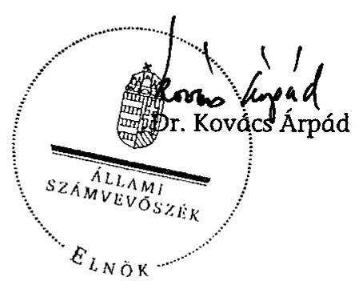
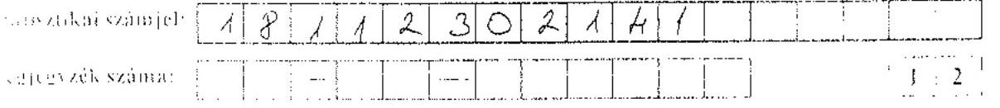
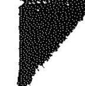

# ÁLLAMI   SZÁMVEVŐSZÉK 

## JELENTÉS

az Antall József Alapítvány 2006-2007. évi gazdálkodása törvényességének ellenőrzéséről

---

3. Önkormányzati és Területi Ellenőrzési Igazgatóság
3.1. Szabályszerűségi Ellenőrzési Főcsoport
Iktatószám: V-3014-26/2008.
Témaszám: 919
Vizsgálat-azonosító szám: V-0407
Az ellenőrzést felügyelte:
Dr. Lóránt Zoltán
főigazgató
Az ellenőrzés végrehajtásáért felelős:
Dr. Elek János
általános főigazgató-helyettes
Az ellenőrzést vezette:
Solymár Ágnes
osztályvezető főtanácsos
Az összefoglaló jelentést készítette:
Brebán Andrea
számvevő
Az ellenőrzést végezték:
Brebán Andrea
Rohák Ferencné
számvevő
számvevő tanácsos

# A témához kapcsolódó eddig készített számvevőszéki jelentések: 

címe
sorszáma
Jelentés az Antall József Alapítvány 2003-2005. évi gazdálkodása 0702 törvényességének ellenőrzéséről

---

# TARTALOMJEGYZÉK 

BEVEZETÉS ..... 5
I. ÖSSZEGZŐ MEGÁLLAPÍTÁSOK, KÖVETKEZTETÉSEK, JAVASLATOK ..... 7
II. RÉSZLETES MEGÁLLAPÍTÁSOK ..... 13

1. Az alapítvány gazdálkodásának törvényessége ..... 13
1.1. A gazdálkodás szabályozottsága, a kuratórium működése ..... 13
1.2. Az alapítvány bevételei ..... 15
1.3. Az alapítvány ráfordításai ..... 16
2. Az éves beszámolók ..... 19
2.1. A beszámolók szabályossága ..... 19
2.2. A mérleg ..... 21
2.3. Az eredmény-kimutatás ..... 23
3. A könyvvezetés szabályozottsága ..... 24
4. A könyvvezetés gyakorlata ..... 26
5. Az adó és járulék fizetési kötelezettségek teljesítése ..... 28
6. Az ellenőrzés rendszere ..... 29
7. A korábbi ellenőrzés megállapításaira tett intézkedések ..... 30

## MELLÉKLETEK

1. számú Az Antall József Alapítvány 2006. évi egyszerűsített éves beszámolójának mérlege
2. számú Az Antall József Alapítvány 2006. évi egyszerűsített éves beszámolójának eredmény-kimutatása
3. számú Az Antall József Alapítvány 2007. évi egyszerűsített éves beszámolójának mérlege
4. számú Az Antall József Alapítvány 2007. évi egyszerűsített éves beszámolójának eredmény-kimutatása

---

.

---

# RÖVIDÍTÉSEK JEGYZÉKE 

| Áfa | Általános forgalmi adó |
| :--: | :--: |
| AJA/alapítvány | Antall József Alapítvány |
| APEH | Adó- és Pénzügyi Ellenőrzési Hivatal |
| ÁSZ | Állami Számvevőszék |
| Egyéb szervezetekre vonatkozó számviteli rendelet | A számviteli törvény szerinti egyes egyéb szervezetek be-számoló-készítési és könyvvezetési kötelezettségének sajátosságairól szóló 224/2000. (XII. 19.) Korm. rendelet |
| Éves beszámoló | A számvitelről szóló 2000. évi C. törvény 8. § (2) b) pontjában megjelölt egyszerűsített éves beszámoló |
| IDF | Ifjúsági Demokrata Fórum |
| Kbt. | A közbeszerzésekről szóló 2003. évi CXXIX. törvény |
| MDF | Magyar Demokrata Fórum |
| Pártalapítványi törvény | A pártok működését segítő tudományos, ismeretterjesztő, kutatási, oktatási tevékenységet végző alapítványokról szóló 2003. évi XLVII. törvény |
| Párttörvény | A pártok működéséről és gazdálkodásáról szóló 1989. évi XXXIII. törvény |
| Ptk. | A Polgári Törvénykönyvről szóló 1959. évi IV. törvény |
| Szja. tv. | A személyi jövedelemadóról szóló 1995. évi CXVII. törvény |
| SZMSZ | Szervezeti és Működési Szabályzat |
| Szt. | A számvitelről szóló 2000. évi C. törvény |

---

.

---

# JELENTÉS 

## az Antall József Alapítvány 2006-2007. évi gazdálkodása törvényességének ellenőrzéséről

## BEVEZETÉS

A pártok működését segítő tudományos, ismeretterjesztő, kutatási, oktatási tevékenységet végző alapítványokról szóló 2003. évi XLVII. törvény (pártalapítványi törvény) alapján a pártok a politikai kultúra fejlesztése érdekében tudományos, ismeretterjesztő, kutatási és oktatási tevékenységük elősegítésére, a pártok működéséről és gazdálkodásáról szóló 1989. évi XXXIII. törvényben (párttörvény) meghatározott költségvetési támogatásra jogosult alapítványt hozhattak létre. A Magyar Demokrata Fórum (MDF) a pártalapítványi törvényben biztosított lehetőséggel élve létrehozta az Antall József Alapítványt (AJA).

Az alapítvány célja, hogy tevékenységével hozzájáruljon a magyarországi politikai kultúra fejlesztéséhez, színvonalának emeléséhez, az MDF által vallott értékekhez, politikai értékrendhez kapcsolódó tudományos, ismeretterjesztő, kutatási és oktatási tevékenységet végezzen, valamint tudományos kutatás, tájékoztatás, oktatás és képzés szervezésével elősegítse a célok megvalósulását.

A pártalapítványi törvény alapján létrehozott alapítványok költségvetési támogatásának mértékéről a párttörvény rendelkezett, az AJA a törvényi előírásnak megfelelően a 2006. és 2007. években összesen 192700 ezer Ft költségvetési támogatásban részesült.

A pártalapítványi törvény 4. § (2) bekezdése alapján az állami költségvetési támogatásban részesülő alapítványok gazdálkodása törvényességének ellenőrzésére az Állami Számvevőszék (ÁSZ) jogosult, amely a 4. § (4) bekezdése alapján kétévenként ellenőrzi az alapítványok gazdálkodását. Az AJA-t az ÁSZ 2006-ban ellenőrizte a megalakulástól 2005. december 31-éig terjedő időszakra vonatkozóan. Az ellenőrzés a belső szabályzatokkal, az éves beszámoló mérlegének leltárral való alátámasztásával, a számviteli alapelvek betartásával és a képviseleti jog gyakorlásával kapcsolatos hiányosságokat állapított meg.

A jelen ellenőrzés célja az alapítvány 2006-2007. évi gazdálkodása törvényességének értékelése volt, ennek keretében ellenőriztük:

- az alapítvány gazdálkodásának törvényességét;
- az éves beszámolók jogszabályi előírásoknak való megfelelését;
- az alapítvány könyvvezetésében a számvitelről szóló 2000. évi C. törvény (Szt.), egyéb jogszabályi rendelkezések és belső előírások betartását;

---

- a kuratórium megtette-e a szükséges intézkedéseket az ÁSZ előző ellenőrzése során feltárt hiányosságok megszüntetése, valamint az intézkedési tervben megjelölt feladatok megvalósítása érdekében.

A pártalapítványok ellenőrzési segédletében foglaltaknak megfelelően, az éves központi költségvetési támogatást, a csatlakozóktól kapott és az AJA által nyújtott támogatásokat, valamint az ötmillió forintot meghaladó könyvelési tételeket tételesen, a ráfordításokat minta alapján ellenőriztük. Az ellenőrzésnél a pártalapítványok ellenőrzési segédletében megjelölt 2\%-os lényegességi küszöb és az előkészítés során elvégzett kockázatértékelés figyelembevételével kialakított mintavételt alkalmaztunk.

Az előkészítés során az eredendő és a belső kontroll kockázatot közepes mértékűnek minősítettük. A lényegességi küszöb az összes bevétel 2\%-a, mértéke a 2006. évben 3153 ezer Ft, a 2007. évben 2623 ezer Ft.

Az egyéb szabályszerűségi ellenőrzés a 2006. január 1. és 2007. december 31. közötti időszakra terjedt ki.

---

# I. ÖSSZEGZŐ MEGÁLLAPÍTÁSOK, KÖVETKEZTETÉSEK, JAVASLATOK 

Az AJA működésének és a vagyonfelhasználásának kereteit a pártalapítványi törvény, az alapító okirat, részletes szabályait az alapítvány belső szabályzatai rögzítették. A többször módosított alapító okirat a Ptk. előírásainak megfelelően rendelkezett az alapítvány képviseletéről, a bankszámla feletti rendelkezés szabályairól. A szervezeti és működési szabályzatot (SZMSZ) és az annak mellékleteként elfogadott pénzügyi gazdálkodási szabályzatot az alapító okirat többszöri módosítása ellenére nem aktualizálták, így a bankszámla feletti rendelkezési jog és a képviseleti jog szabályozása nem volt összhangban a Ptk. és az alapító okirat vonatkozó rendelkezésével. Az SZMSZ az alapító okirattal összhangban határozta meg az alapító feladatait, a kuratórium működését, az alapítványi iroda, a főigazgató és az igazgatók feladatait.

A kuratórium működése - egy ülése kivételével - az ellenőrzött időszakban megfelelt az alapító okirat előírásainak. A szabálytalan kuratóriumi ülés az alapító okirat előírásai szerint nem volt határozatképes, így a jelenlévők érvénytelenül két határozatot hoztak, továbbá a szabályozástól eltérően az ülésről jegyzőkönyv helyett emlékeztető készült. Az AJA vagyonkezelője - a kuratórium - gazdálkodást érintő döntései az alapítványi cél megvalósulását szolgálták, így az alapító okirat szabályai szerint döntött az alapítvány működéséhez és a cél szerinti tevékenységekhez felhasználható pénzeszközök keretösszegét tartalmazó költségvetés elfogadásáról, de azokat a teljesítés évében történt változásokkal nem módosította. A bankszámla feletti rendelkezési jog gyakorlása megfelelt az alapító okiratnak.

Az alapítvány feladatait az alapítványi iroda, a főigazgató vezetésével hajtotta végre. Az alapító okirat módosításáig a főigazgató a szabályozásban megjelölt hatáskörét túllépte, mivel az AJA nevében a belső szabályzatokban megjelölt értékhatár felett is kötött szerződéseket, a pénzügyi gazdálkodási szabályzat előírásától eltérően a kuratórium elnöke helyett gyakorolta a munkáltatói jogot az alkalmazottak felett.

A vizsgált időszakban az alapítvány - beszámolóiban kimutatott - összes bevétele 288811 ezer Ft volt, amelynek 66,7\%-át a párttörvényben előírtak szerint meghatározott költségvetési támogatás ( 192700 ezer Ft) tette ki. A támogatás az ellenőrzött években megfelelt a párttörvény által meghatározott alap-, és mandátumarányos kiegészítő támogatás együttes értékének, folyósítása a pártalapítványi törvény rendelkezéseinek. Emellett az AJA bevételeit 31,8\%-ban a csatlakozó jogi szervezetektől kapott és a költségvetésből pályázati úton nyert támogatással egészítette ki, amely növelte a célokra fordítható forrásokat. További 1,5\%-ot a cél szerinti tevékenységéből és az átmenetileg szabad pénzeszközei lekötésével realizált. Az alapítvány eleget tett a csatlakozók által nyújtott támogatásra előírt közzétételi kötelezettségének.

Az AJA a beszámolóiban összesen 298751 ezer Ft ráfordítást mutatott ki, amelyet céljai megvalósítására, a kuratórium által megítélt, továbbadott tá-

---

mogatásokhoz, közcélú kifizetésekhez és saját szervezeti keretei között végzett tevékenységéhez használt fel. A ráfordítások zömét ( $94,4 \%$ ) az alapítvány saját szervezeti keretei között végzett cél szerinti tevékenységére és működésre, 5,6\%-át támogatásra fordította. A korábbi ellenőrzés javaslatainak és az SZMSZ előírásának megfelelően a támogatási szerződések - a magánszemélyeknek nyújtott közcélú kifizetések kivételével - tartalmazták a támogatás elszámolási határidejét és a szankció lehetőségét. Ugyan a támogatottak - egy kivétellel - határidőre nem, csak a helyszíni ellenőrzés időszakában, a főigazgató többszöri felszólítására számoltak el, a támogatás visszavonásának lehetőségével a főigazgató nem élt. A kuratórium az SZMSZ szabályozásától eltérően két esetben nem határozott a támogatások módosításáról, egy esetben a támogatás megítéléséről. A főigazgató az alapító okiratban megjelölt célokhoz illeszkedő rendezvények lebonyolításához együttműködési megállapodásokat kötött, amelyekről a kuratórium sem külön, sem a költségvetés keretében nem döntött.

Az AJA rendelkezett a könyvvezetés és beszámoló készítés rendjét meghatározó - a Szt-ben előírt - számviteli szabályzatokkal, azonban azok nem feleltek meg az Szt. előírásainak és az alapítvány sajátosságainak. Ennek oka, hogy a szabályzatok alapítványi sajátosságoknak megfelelő módosítását a korábbi ellenőrzés javaslatai ellenére nem végezte el. Így a számviteli politika továbbra sem jelölte meg pontosan a könyvvezetés módját, az éves beszámoló formáját, az értékcsökkenés elszámolásának szabályait, az alapítványi célú tevékenység közvetlen, illetve egyéb közvetett költségeinek körét és elkülönítésük módját. Az eszközök és források értékelési szabályzata nem igazodott az alapítványi gazdálkodás sajátosságaihoz, téves jogszabályi hivatkozást tartalmazott. Továbbra sem volt összhangban a főkönyvi számlacsoportok és számlák számjele a számlarend és a számlatükör előírásaiban. A pénzkezelési szabályzatot nem egészítették ki a banki átutalások, a pénztárnapló vonatkozásában a szigorú számadási kötelezettség szabályaival. A szabályozási hiányosságok hozzájárultak a számviteli elveket sértő könyvvezetési és beszámoló készítési hibákhoz, amelyek a 2007. évben meghaladták a lényegességi szintet.

Az AJA az ellenőrzött időszakban beszámoló készítési kötelezettségének a számviteli politikában előírt határidőn túl tett eleget. Az egyszerűsített éves beszámolók szerkezete megfelelt a vonatkozó számviteli jogszabályok előírásainak, azonban a 2006. évi beszámolót nem az alapító okiratban előírt határozatképes ülésen fogadták el a kuratórium jelen lévő tagjai, a 2007. évi beszámolóról pedig a vonatkozó jogszabály előírásától eltérően a kuratórium nem döntött. Az AJA az éves beszámolók elkészítése és a könyvvezetés során mindkét évben a valódiság és teljesség, 2007. évben továbbá az egyedi értékelés számviteli alapelveit sértette meg. Lényeges szintű (2\%) hiba 2006-ban nem volt, de 2007-ben a hibák aránya meghaladta a lényegességi szintet (3,6\%), továbbá a számviteli politikában meghatározott jelentős összegű hiba mértékét is. A számviteli elveket sértette, hogy mindkét évben eltért a beszámolókban kimutatott pénzeszközök értéke az analitikus nyilvántartások és a leltárak adatától, a 2007. évi beszámolóban az értékcsökkenési leírást nem a belső szabályozásnak megfelelően számolták el, a csatlakozóktól kapott és az AJA által nyújtott támogatásokat négy esetben nem a jogszabályi rendelkezéseknek megfelelően könyvelték. A beszámolók adatai a záráshoz készített a hivatkozott hibákat tartalmazó főkönyvi kivonat adataiból - a 2007-ben a követelések kivételével - levezethetők voltak.

---

A kuratórium nem gondoskodott a vonatkozó jogszabályi rendelkezés és a korábbi ellenőrzésünk javaslata ellenére - a pénzeszközök sor kivételével - a mérleg leltárral való alátámasztásáról. Az immateriális javak és tárgyi eszközök mérlegben kimutatott összértéke megegyezett ugyan a főkönyvi nyilvántartás adataival, de 2007-ben az immateriális javakról és tárgyi eszközökről vezetett analitikus nyilvántartások nem feleltek meg a számlarend előírásainak, és az értékcsökkenést a szabályozástól eltérően számolták el. A mérlegben kimutatott készletérték is megegyezett a készletek főkönyvi számláinak összértékével, azonban a számlarendben a készletekre előírt könyvvezetési szabályokat az AJA nem tartotta be. Az alapítvány a 2007. évi mérlegben tévesen a követelések sor adataiban szerepeltette a pénzeszközök mozgásához kapcsolódó technikai számla egyenlegét. Mindkét évben helyesen mutatták ki az induló vagyon és az időbeli elhatárolások értékét. A kötelezettségeket az analitikus és a főkönyvi nyilvántartások összértékével megegyezően, de 2007-ben nem megfelelő szerkezetben mutatták ki.

Az AJA az eredmény-kimutatásban a költségvetési támogatást, a cél szerinti tevékenységéből származó és pénzügyi bevételeit a vonatkozó jogszabályi előírásoknak megfelelően, a bankkivonatok adataival megegyezően mutatta ki. A vonatkozó jogszabályi rendelkezéstől és a belső előírásaitól eltérően tartotta nyilván és mutatta ki 2006-ban részben az igénybe vett szolgáltatások helyett az egyéb ráfordítások között a pályázati tanácsadás költségeit, mindkét évben részben a személyi jellegű ráfordítások helyett az anyagjellegű ráfordítások között a reprezentáció költségeit, teljes egészében a személyi jellegű ráfordítások helyett az egyéb ráfordítások között a magánszemélyek részére kifizetett közcélú támogatásokat.

A könyvvezetésben a belső szabályozási, egyeztetési és ellenőrzési hiányosságok számviteli elveket sértő és a 2007. évben lényegességi szintet meghaladó hibákhoz vezettek. A könyvvezetést kettős könyvvitel rendszerében, megbízott könyvelő iroda bevonásával végezték. Az időszakban a megbízott könyvelő, az alkalmazott könyvelési program változott. 2007-ben az újonnan megbízott könyvelő által megnyitott számlák számjelükben, nevükben és tagolásukban eltértek a hatályos számlarend, számlatükör és a korábban vezetett számlákétól. A vezetett számlákról a számviteli politikának megfelelően főkönyvi kivonatot állítottak össze, de 2007-ben a főkönyvi számlákat - a vonatkozó számviteli előírásoktól eltérően - technikailag nem zárták le. Nem igazolták a bizonylatokon az időszakban a gazdasági műveletek könyvviteli nyilvántartásokban történő rögzítését, hiányosan jelölték a rögzítés időpontját, valamint 2007-ben a több számlát érintő gazdasági események ötödénél hiányoztak a számlákat érintő felosztott összegek. A pénzkezelési szabályzatnak megfelelően vezették a szigorú számadású bizonylatok nyilvántartását, azonban a pénztári maximumra előírt értéket mindkét évben meghaladta a pénztárban tartott készpénz állománya. A pénzkezelési szabályzatban előírt utalványozást 2006-ban a főigazgató nem végzett, 2007-ben a szabályozásnak megfelelően ellátta. Az AJA a számlarendjében megjelölt analitikus nyilvántartásokat ugyan vezette, de a belső szabályzatokban előírt főkönyvi nyilvántartás adataival való egyeztetéseket nem végezte el. Az AJA a jogszabályi előírásoktól eltérően számviteli nyilvántartásában 2006-ban nem különítette el az alapítvány cél szerinti tevékenysége közvetlen és egyéb közvetett költségeit, 2007-ben pedig az elkülönítés nem felelt meg a vonatkozó jogszabályi előírásoknak.

---

Az alapítvány munkáltatói jogkörében eleget tett az adózási és társadalombiztosítási jogszabályok rendelkezéseinek, a munkáltatói és a kifizetői feladatokhoz rendelt nyilvántartásokat vezette, az előírt adatszolgáltatásokat - a Nyugdíjbiztosítási Egyéni Nyilvántartó Lap kivételével - teljesítette. A kifizetett bér és bérjellegű jövedelmekből a magánszemélyeket terhelő adóelőleget és járulékokat levonta, a munkáltatót terhelő költségvetési befizetési kötelezettséget előírta és befizette. 2006-ban hat hónap esetében a vonatkozó jogszabályban előírt határidőn túl teljesítette a befizetéseket, a késedelem miatt keletkezett kötelezettségét rendezte.

Az alapítvány ellenőrzési rendszere nem volt alkalmas a szabályozási hiányosságok, a számviteli elveket sértő, valamint 2007. évben a lényegességi szintet meghaladó hibák feltárására. Az alapító nem jelölt ki a kuratórium ellenőrzésére jogosult szervet, a kuratórium nem bízott meg könyvvizsgálót az egyszerűsített éves beszámolók ellenőrzésével és hitelesítésével, továbbá az alapítványi irodánál pénztárellenőrt nem jelöltek ki, a pénztárjelentéseket nem ellenőrizték, így az ellenőrzés hiánya is hozzájárulhatott a pénztári nyilvántartás hibáihoz. Az ellenőrzést belső szabályzatai határozták meg, így a folyamatba épített vezetői ellenőrzés rendszeréről az SZMSZ és a pénzügyi gazdálkodási szabályzat rendelkezett, független belső ellenőrzést a szabályzatok nem írtak elő. A kuratórium a főigazgató rendszeres beszámoltatásával figyelemmel kísérte a szakmai munkát, a költségvetés és a munkaterv teljesülését, és a bankszámla feletti rendelkezés során ellenőrizte a kifizetéseket. A főigazgató a házipénztárból történő kifizetéseket 2006-ban nem, 2007-ben az utalványozás során ellenőrizte.

Az AJA az előző ÁSZ ellenőrzés megállapításai alapján megjelölt intézkedéseket csak részben hajtotta végre, így önellenőrzéssel elvégezte a 2005. évi beszámoló helyesbítését, az alapító okirat módosítását, a szabályzatokat a kuratóriumi elnöke aláírta. Nem módosította azonban az alapítványi sajátosságoknak és a jogszabályi előírásoknak megfelelően szabályzatait, nem gondoskodott az azokban előírtak maradéktalan betartatásáról, a mérlegnek a leltározási szabályzatban előírtak szerinti alátámasztásáról.

A helyszíni ellenőrzés megállapításainak hasznosítása mellett javasoljuk:

# az alapítvány kuratóriumának 

1.  Módosítsa az alapítvány belső szabályzatait a következők figyelembevételével:
    a)  hozza összhangba az SZMSZ és a pénzügyi gazdálkodási szabályzat képviseleti jogra és a bankszámla feletti rendelkezési jogra vonatkozó szabályozását az alapító okirat előírásaival;
    b)  rögzítse a számviteli politikában a számvitelről szóló 2000. évi C. törvény 14. § (4) bekezdése szerint a könyvvezetés módját, az éves beszámoló formáját, az értékcsökkenés elszámolásának szabályait; határozza meg az alapítványok gazdálkodási rendjéről szóló 115/1992. (VII. 23.) Korm. rendelet 3. § (2) bekezdésének és 5. §-ának megfelelően az alapítványi célú tevékenység közvetlen, és egyéb közvetett költségeinek körét és elkülönítésük módját;

---

c) szabályozza a számvitelről szóló 2000. évi C. törvény 14. § (4) bekezdése szerint az alapítványi sajátosságoknak megfelelően az eszközök és a források értékelésének szabályait, továbbá törölje a téves jogszabályi hivatkozást;
d) írja elő a számvitelről szóló 2000. évi C. törvény 14. § (8) bekezdése szerint a pénzkezelési szabályzatban a banki átutalások rendjét, és a 168. § (1) bekezdésnek megfelelően a pénztárnapló vonatkozásában a szigorú számadási kötelezettség szabályait;
e) gondoskodjon a számvitelről szóló 2000. évi C. törvény 161. § (1) bekezdésének megfelelő számlarend elkészítéséről.
2.  Határozza meg részletesen a költségvetésben - az alapító okirat VII. fejezet 1. pontjában biztosított vagyonkezelői feladatának megfelelően - a bevételek és ráfordítások tételeit, és gondoskodjon az évközi változásoknak megfelelő módosításról.
3.  Határozzon minden esetben - az SZMSZ V. 15. pontjának megfelelően - az alapítvány által nyújtott támogatásokról, azokkal kapcsolatos változásokról, valamint követelje meg a támogatottak szerződésben előírt határidő szerinti elszámoltatását.
4.  Határozzon minden évben az egyszerűsített éves beszámoló - alapító okirat VII. fejezet 2. pontjában előírt határozathozatali szabályoknak megfelelő és a számviteli törvény szerinti egyes egyéb szervezetek beszámoló-készítési és könyvvezetési kötelezettségének sajátosságairól szóló 224/2000. (XII. 19.) Korm. rendelet 20. § (7) bekezdésében előírtak szerinti - elfogadásáról.
5.  Intézkedjen a 2007. évi beszámoló önellenőrzés keretében történő helyesbítéséről, a helyesbített beszámoló elfogadásáról.
6.  Intézkedjen a számvitelről szóló 2000. évi C. törvény
    a)  15-16. §-aiban rögzített számviteli alapelvek betartatásáról a könyvvezetésben és az éves beszámolók összeállítása során;
    b)  69. § (1) bekezdésében előírtak szerint a mérleg leltározási szabályzatban meghatározottaknak megfelelő alátámasztásáról;
    c)  3. § (7) bekezdés 3. pontjának megfelelően a reprezentáció költségeinek és a magánszemélyek számára nyújtott támogatások nyilvántartásáról;
    d)  3. § (7) bekezdés 1. pontjának megfelelően az igénybe vett szolgáltatások rögzítéséről;
    e)  167. § (1) bekezdésének megfelelően a könyvviteli elszámolást alátámasztó bizonylatok alaki és tartalmi kellékeire a szabályok betartatásáról.
7.  Intézkedjen a pénzkezelési szabályzat 8. pontjában előírt pénztárellenőr kijelöléséről és a pénztár ellenőrzéséről.
8.  Követelje meg a számviteli szabályzatokban foglalt előírások betartását, különösen a készletek nyilvántartására, az egyszerűsített éves beszámoló határidőre való elkészíté-

---

sére, a pénztárban tartható pénzkészlet állományára, a főkönyvi számlák technikai lezárására és a vezetett nyilvántartások egyeztetésére vonatkozóan.
9.  Intézkedjen a társadalombiztosítási nyugellátásról szóló 1997. évi LXXXI. törvény 97. § (2) bekezdés a) pontjában előírt adatszolgáltatási kötelezettség pótlásáról.

---

# II. RÉSZLETES MEGÁLLAPÍTÁSOK 

## 1. Az alapítvány GAZDÁLKODÁSÁNAK TÖRVÉNYESSÉGE

### 1.1. A gazdálkodás szabályozottsága, a kuratórium működése

Az alapítványi működés és vagyonfelhasználás kereteit a pártalapítványi törvény és az alapító okirat, részletes szabályait az alapítvány belső szabályzatai rögzítették. Az ellenőrzött időszakban az MDF mint alapító az AJA alapító okiratát a Polgári Törvénykönyvről szóló 1959. évi IV. törvény (Ptk.) 74/B. (5) és a 74/C. § (1) bekezdésének rendelkezéseivel összhangban háromszor módosította.

Változott az alapító okiratban a 2006. január 13-ai módosítással a kuratórium két tagjának a személye, a 2007. október 30-ai módosítással az alapítvány székhelye.

A 2007. január 18-án kelt módosítás megváltoztatta az alapítvány képviseletét és a bankszámla feletti rendelkezést, továbbá az alapítványi iroda vezetőjének megnevezését, akit főigazgatóként nevezett meg. A módosítás a Ptk. 74/C. § (4) bekezdésének megfelelően rendelkezett az alapítvány képviseletéről, a képviseleti jog gyakorlásának módjáról és terjedelméről, továbbá a 29. § (3) bekezdésének előírásával összhangban írta elő a bankszámla feletti rendelkezés szabályait.

Az alapító okirat VIII. 1. pontja szerint az AJA képviseletében - önállóan - a kuratórium elnöke jogosult eljárni. Az alapító okirat módosítása után a Ptk. 74/C. § (4) bekezdése alapján a kuratórium - megjelölve a képviseleti jog gyakorlásának módját, illetőleg terjedelmét - az alapítvány képviseletére az alapítvány főigazgatóját írásban felhatalmazhatta. A 2007. augusztus 31-éig hatályos Ptk. 29. § (3) bekezdés szabályozása értelmében a bankszámla felett való rendelkezéshez minden esetben két képviseleti joggal felruházott személy aláírása szükséges.

Az ellenőrzött időszakban az alapító okirat módosításához igazodóan az alapítvány szervezeti és működési szabályzatát (SZMSZ) és mellékletét nem módosították. Az alapító okirattal összhangban tartalmazták az alapító feladatait és a kuratórium működését, ügyrendjét. Ugyancsak megfelelt az alapító okirat előírásainak az alapítványi iroda, a főigazgató és az igazgatók feladatainak meghatározása, azonban a Ptk.-val és az alapító okirattal ellentétben, a főigazgató részére a működés körében elkülönített bankszámla feletti rendelkezési jogot biztosított a kuratórium utólagos tájékoztatása mellett. Ugyancsak ellentétes volt az alapító okirattal a pénzügyi gazdálkodási szabályzat azon előírásai, amelyek engedélyezték az iroda főigazgatója és igazgatói részére 500 ezer Ft erejéig a kötelezettségvállalást, illetve számukra az adományok elfogadása területén korlátlan jogot biztosított.

Az SZMSZ-t a 2004. február 27-i kuratóriumi ülésen, az SZMSZ mellékleteként a pénzügyi gazdálkodási szabályzatot 2005. április 21-én fogadta el a kuratórium.

---

Az alapító okirat VII. 3. g) pontja szerint a kuratórium dönt az alapítványi vagyon alapítványi célnak megfelelő felhasználásáról, valamint a vagyonnal kapcsolatos gazdálkodási kérdésekben.

A 2007. január 18-ai módosított alapító okiratnak megfelelő felhatalmazást az önálló képviseleti jog tekintetében a főigazgató részére a 2007. szeptember 11-ei kuratóriumi ülésen hozott 94. számú határozat adta meg.

A felhatalmazással a főigazgató képviseleti joga keretében munkáltatói jogkört gyakorol az alapítvány alkalmazottai felett, az AJA nevében a költségvetésben előirányzott összegek keretei között jogokat szerezhet és kötelezettségeket vállalhat, így különösen jogosult szerződések megkötésére, utalványozási jogot gyakorolhat a költségvetésben előirányzott összegek keretei között az alapítványi program és a
 működési költségei kiegyenlítésére. Az alapítvány részére történő felajánlások ideiglenes befogadásáról dönthet azzal, hogy a felajánlásokról végleges döntést a kuratórium hoz, a kuratórium elnökével együttesen az alapítvány bankszámlája feletti rendelkezési jogot gyakorolhat.

A bankszámla feletti rendelkezés az alapító okiratnak megfelelően történt. Így 2007. december 12-éig a kuratórium elnöke és egy kuratóriumi tag, utána pedig az elnök mellett a főigazgató volt bejelentve a banknál aláíróként. A bankszámla feletti rendelkezési jogot a bejelentettek gyakorolták.

A képviseleti jog gyakorlása nem felelt meg az alapítvány SZMSZ-ében meghatározottaknak, ugyanis a főigazgató az SZMSZ-ben meghatározott 500 ezer forint értékhatárig megengedett kötelezettségvállalást 2006-ban a szerződések 38,2\%-ánál, 2007-ben 11,1\%-ánál lépte túl.

A kuratórium működése az ellenőrzött időszakban - egy ülése kivételével - megfelelt az alapító okirat előírásainak. A kuratóriumi ülésekről készült jegyzőkönyvek és a határozatok nyilvántartása megfelelt az SZMSZ előírásainak. A jegyzőkönyvekből megállapítható volt, hogy a kuratórium határozatait nyolc esetben az alapító okiratban előírtak szerinti határozatképes üléseken, a jelenlévő kuratóriumi tagok egyszerű szótöbbségével hozta. 2007. május 30-án a kuratóriumi ülés nem volt határozatképes. Az ülésről nem jegyzőkönyv, hanem emlékeztető készült, a jelenlévők - érvénytelenül - két határozatot hoztak.

A határozatképtelen ülésen a jelenlévő kuratóriumi tagok elfogadták a főigazgató költségvetési és szakmai munkához kapcsolódó beszámolóját és elkészített intézkedési tervét, az alapítvány éves beszámolóját.

A kuratórium az alapítvány vagyonkezelését, gazdálkodását érintő döntései az alapítványi célok megvalósulását szolgálták. A kuratórium mindkét évben keretösszeg formájában - az alapító okiratban előírt szabályok szerint - döntött az SZMSZ V. 5. pontjának megfelelően az alapítvány működési költségeinek fedezésére, illetve az alapítványnak az alapító okiratában rögzített céljai végrehajtásához felhasználható pénzeszközök mértékéről és arányáról.

Az alapító okirat VII. 1. pontja szerint az alapítványi vagyont kuratórium kezeli. A bevételek között 2006-ban az állami támogatás mellett egy külföldről érkező alapítványi támogatást szerepeltettek, 2007-ben az előzőeken kívül kamat- és egyéb pályázati bevétellel és az előző évi maradvánnyal is számoltak. A kiadások között mindkét évben szerepeltették az alapítványi iroda működési költségeit.

---

Emellett az alapító okiratban foglaltaknak megfelelően 2006-ban a hagyatékkezelés, oktatás, valamint a kommunikáció és pályázat költségeivel számoltak. 2007-ben külügyek, elemzés, képzés, kutatás-hagyatékkezelés, holdudvar, kommunikáció és tartalék címen tüntettek fel kiadásokat.

A költségvetést a teljesítés évében történt változásokkal nem módosították, arról a kuratórium nem határozott.

Így például a kuratórium a 2007. évi költségvetés elfogadásakor döntött 30 ezer EUR és 2000 ezer Ft befogadásáról, mely összegek a költségvetés bevételei között nem szerepeltek. A főigazgató észrevétele szerint azért, mert a költségvetés elfogadásakor még nem állt rendelkezésre a támogatók írásbeli határozata.

Az alapítványi iroda főigazgatója az SZMSZ IV. 5. c) bekezdésének megfelelően a kuratóriumi üléseken negyedévenként beszámolt a végzett munkáról, a költségvetés helyzetéről. Szakmai beszámolóját a kuratórium minden esetben elfogadta.

# 1.2. Az alapítvány bevételei 

Az AJA az ellenőrzött időszak éves beszámolóiban összesen 288811 ezer Ft bevételt mutatott ki.

Az AJA a pártalapítványi törvény 1. §-a alapján központi költségvetési támogatásra volt jogosult, amelynek összegét a párttörvény szabályozása alapján az éves költségvetési törvény tartalmazta. A kapott összeg mindkét évben megfelelt a párttörvény rendelkezéseinek. A támogatás a párttörvény 9/A. § (5) bekezdés a) és b) pontok szerinti alap-, és mandátumarányos kiegészítő támogatásból tevődött össze. Az alapítvány eseti támogatásban nem részesült. A központi költségvetési támogatás - a lekerekítés eredményeként - 2006-ban 101700 ezer Ft, 2007-ben 91000 ezer Ft, összesen 192700 ezer Ft volt, amely az összes bevétel 66,7\%-ának felelt meg.

Az alaptámogatás mértéke az egyévi képviselői alapdíj huszonötszöröse, összege 2006-ban 65430 ezer Ft, 2007-ben 66240 ezer Ft, összesen 131670 ezer Ft volt. A mandátumarányos kiegészítő támogatás mértéke képviselőnként a képviselői alapdíj $85 \%$-a, összege 2006. januártól júniusig 24, azt követően 11 képviselőre számítva 36312 ezer Ft, 2007-ben 11 képviselőre számítva 24773,8 ezer Ft, összesen 61085,8 ezer Ft volt. A kerekítés szabályai miatt a két évben együttesen 55,8 ezer Ft-tal volt alacsonyabb az alapítvány bevétele a számítottnál.

A Magyar Államkincstár a költségvetési támogatást a pártalapítványi törvény 2. § (1) bekezdésének megfelelően folyósította az AJA pénzforgalmi számlájára.

Emellett az AJA bevételeit 31,8\%-ban a csatlakozó jogi szervezetektől kapott és a költségvetésből pályázati úton nyert támogatással egészítette ki, amely növelte a célokra fordítható forrásokat.

Az AJA központi költségvetési forrásból pályázati úton a vizsgált két év alatt összesen 4330 ezer Ft támogatást nyert, amely az összes bevétel 1,5\%-át jelentette.

---

Az alapítvány 2006-ban a Fővárosi Munkaügyi Központtól egy személy részére 270 ezer Ft bértámogatást kapott, 2007-ben 360 ezer Ft-ot. 2007-ben ezenkívül összesen 3700 ezer Ft pályázati támogatást kapott a Miniszterelnöki Hivataltól (2000 ezer Ft) és a Külügyminisztériumtól (1700 ezer Ft).

Az AJA-hoz csatlakozó belföldi és külföldi jogi személytől kapott támogatás beszámolókban kimutatott értéke az ellenőrzött időszakban 87579,1 ezer Ft volt, mely az összes bevétel $30,3 \%$-át tette ki (további 1885,5 ezer Ft támogatást a 2007. évi beszámolóban a bevételek között nem szerepeltettek). A támogatások elfogadását a kuratórium a pártalapítványi törvény 3. § (2) bekezdése és az alapító okirat III./2. pontja rendelkezéseinek megfelelően, mindkét évben - az alapító okirat előírásainak megfelelő határozattal hagyta jóvá. A pártalapítványi törvény 3. § (3) bekezdésében előírtaknak megfelelően a banki kivonatokon az adományozó szervezetek adatait feltüntették, a támogatás folyósítása minden esetben az AJA pénzforgalmi számlájára történt. Az alapítvány eleget tett a pártalapítványi törvény 3. § (4) bekezdésében előírt közzétételi kötelezettségének, honlapján nyilvánosságra hozta a kapott támogatásokat.

Az ellenőrzött időszakban a külföldi jogi személyek összesen 84079,1 ezer Ft, a belföldi jogi személyek 3500 ezer Ft támogatást nyújtottak az alapítványnak.

A vizsgált időszakban az alapítvány az alapító okiratban rögzített céljainak megfelelő tevékenységéből és az átmenetileg szabad pénzeszközök lekötésével összesen 4201,9 ezer Ft (az összes bevétel 1,5\%-a) további bevételt realizált.

A célszerinti tevékenységből származó bevétel 3658,9 ezer Ft volt, amely könyvek, kiadványok értékesítéséből, rendezvényszervezésből és képzési-oktatási tevékenységből származott. Az AJA pénzügyi bevétele 543 ezer Ft volt.

# 1.3. Az alapítvány ráfordításai 

Az AJA az ellenőrzött időszak éves beszámolóiban összesen 298751 ezer Ft ráfordítást mutatott ki. Az alapítvány által nyújtott támogatások (16 870 ezer Ft) és a saját szervezeti keretek között végzett célszerinti és működési tevékenysége (281 881 ezer Ft) megfelelt a pártalapítványi törvénynek és az alapító okiratban megjelölt céloknak.

Az alapító okirat V. 3. pontjával összhangban a kuratórium a vizsgált időszakban jogi személyek részére nyújtott pályázati úton támogatásokat, és magánszemélyek részére biztosított ún. közcélú kifizetéseket.

A támogatásokról szóló kuratóriumi határozatok határozatképes ülésen, egyhangú döntéssel, az alapító okiratnak megfelelően születtek. A kuratórium 2006. február 21-i ülésén 77. számú határozatában döntött három alapítvány pályázati támogatásáról, együttesen 6400 ezer Ft értékben és öt fő részére összesen 2590 ezer Ft közcélú támogatásról, a 2006. december 15-i ülésén 85. számú határozatával két fő együttesen 350 ezer Ft értékű és 2007. január 26-i ülésén 88. számú határozattal hét fő együttesen 2530 ezer Ft közcélú támogatásáról.

A támogatások szabályairól az SZMSZ V.12.-16. pontjai rendelkeztek, ennek megfelelően a támogatott alapítványokkal az iroda főigazgatója támogatási szerződést kötött. A pályázók a szerződésnek megfelelően az előírt doku-

---

mentumokat mellékelték. Az AJA a támogatási szerződések 3. B/ pontjában az SZMSZ V. 14. pontjának megfelelően - előírta a támogatással való elszámolás határidejét. A támogatott alapítványok azonban az összeg felhasználásáról nem számoltak el határidőre. A támogató a támogatási szerződésben foglalt szankcióval nem élt, vagyis egy esetben sem vonta vissza a támogatást ha a támogatott elszámolási kötelezettségének a támogatott eseményt követő 30 napon belül nem tett eleget.

Az alapítványi iroda főigazgatója 2007. augusztus 17-én, majd a helyszíni vizsgálat idején, 2008. szeptember 23-án szólította fel a támogatottakat, hogy számoljanak el, illetve egészítsék ki elszámolásukat. A vizsgált időszak támogatottjai - egy kivétellel - 2008 októberéig a főigazgató felszólítása után 8 napon belül elszámoltak.

2006-ban a kuratórium az SZMSZ-ben foglaltaktól eltérően két szervezet támogatásának csökkentéséről és mellettük egy harmadik szervezet támogatásáról nem döntött.

Az SZMSZ V. 15. pontja szerint a megítélt támogatások kizárólag az alapítvány kuratóriuma által a támogatások megítélésekor meghatározott célokra fordíthatók, egyéb célú felhasználásuk előzetes kuratóriumi hozzájárulás nélkül nem megengedett.

Az AJA Közös Jövő Alapítvánnyal és az Író Gergely Alapítvánnyal kötött támogatási szerződések - a róluk hozott kuratóriumi határozatnak megfelelően - az alapítványok kutatási munkáinak végzésére, illetve működési költségeire nyújtott támogatásról szóltak. 2006. március 31-én két támogatott alapítvány kérelmet nyújtott be az alapítványi irodához, melyben lemondanak a számukra jóváhagyott támogatási összeg második feléről a Haza és Haladás Alapítvány javára.

2007 folyamán az AJA támogatást nyújtott a Haza és Haladás Alapítványnak, azonban a támogatás ügyében a kuratórium nem hozott olyan határozatot, mely megnevezte volna az alapítványt. Az AJA főigazgatója a Haza és Haladás Alapítvánnyal támogatási szerződést kötött 2007. évi ifjúsági programok 5000 ezer Ft-os támogatására, az elszámolási határidőt 2008. április 30-ában határozta meg.

A 2007. évi költségvetésben szerepelt az Ifjúsági Demokrata Fórum (IDF) 5000 ezer Ft-os támogatása, így az alapítványi iroda főigazgatója szerint a kuratórium határozata a költségvetés elfogadásáról helyettesítette az alapítvány támogatásáról szóló határozatot, mivel az IDF támogatása a Haza és Haladás Alapítvány keretei között valósult meg.

A 2007. január 26-i ülésén a kuratórium 88. számú határozatában kimondta, hogy 2007-ben nem ír ki pályázatot, a beérkezett kérelmeket keret hiányában elutasítja, és ehelyett az alapító okiratban megjelölt célokhoz illeszkedő rendezvények megvalósításába az AJA együttműködési megállapodás keretében kapcsolódjon be. A kuratóriumi határozatot megelőzően is kötött az AJA együttműködési megállapodásokat, ezeket a költségvetés nem nevesítette. Az együttműködési megállapodások keretében megvalósított tevékenységek megfeleltek az AJA alapító okiratban rögzített céljainak. Az egyes együttműködési megállapodásokról a vagyonkezelő szerv, a kuratórium nem határozott.

---

Az alapítványi iroda kimutatása szerint 2006. február 28. és 2007. szeptember 5. között tizenegy alkalommal, 150 ezer Ft és 1550 ezer Ft közötti értékben kötött az alapítványi iroda főigazgatója ilyen szerződést.

Az AJA magánszemélyeknek nyújtott közcélú támogatásairól minden esetben a kuratórium határozott. A kedvezményezettekkel az alapítványi iroda főigazgatója - a kuratóriumi határozatnak megfelelően - kötött megállapodást közérdekű célra történő kötelezettségvállalásról. A megállapodásokban a pontosan meghatározott célokra megjelölt témakörben végzendő kutatási célra nyújtott támogatást az alapítvány, azonban az SZMSZ V. 14. pontjában előírtaktól eltérően nem kötött ki elszámolási kötelezettséget a támogatottak részére.

A kuratórium az éves költségvetés elfogadásával egy összegben határozta meg a működési költségek keretösszegét, amely megteremtette az iroda számára a saját szervezeti keretek között megvalósított célszerinti tevékenység költségeinek fedezetét is.

Az AJA a közbeszerzésekről szóló 2003. évi CXXIX. törvény (Kbt.) hatálya alá tartozó beszerzések tekintetében, a törvény 22. § (1) bekezdés i) pontja értelmében ajánlatkérőnek minősült, mert a törvényi rendelkezés hármas feltétele, a jogi személyiség, a közérdekű tevékenység folytatásának célja és a működésnek többségi részben állam által történő finanszírozása az alapítvány esetében teljesült.

Az alapítvány a Ptk. 74/A. § (1) bekezdésében foglaltak alapján jogi személy. Az alapítvány közérdekű tevékenységet folytat, mivel az AJA alapító okiratában szereplő cél szerinti tevékenységek, úgymint a tudományos tevékenység, kutatás, a nevelés és oktatás, képességfejlesztés, ismeretterjesztés a közhasznú szervezetekről szóló 1997. évi CLVI. törvény 26. § c) pont 3-4. alpontjai szerinti közhasznú, ezáltal a Kbt. 4. § 16. pontja értelmében közérdekű tevékenység, függetlenül attól, hogy az AJA nem közhasznú jogállású szervezet. Az alapítvány működését többségi részben a központi költségvetés finanszírozza.

Az alapítvány indokoltan - Kbt. 29. § (2) bekezdés g) pontjának megfelelően közbeszerzési eljárás lefolytatása nélkül kötött közbeszerzési értékhatárt meghaladóan megbízási szerződéseket egy szállítóval, mert annak eredményét nem kizárólag az alapítvány hasznosította, hanem azokat a kuratórium által meghatározott köröknek szétosztotta, kéthetenként elektronikus úton a meghatározott címekre továbbította.

A Magyar Köztársaság 2006. évi költségvetéséről szóló 2005. évi CLIII. törvény 117. § (3) c) és a Magyar Köztársaság 2007. évi költségvetéséről szóló 2006. évi CXXVII. törvény 93. § (3) bekezdés c) pontjai írták elő az egyszerű közbeszerzési eljárásra vonatkozóan a szolgáltatás megrendelése esetében alkalmazandó 8000 ezer Ft értékhatárt. A Kbt. 29. § (2) bekezdés g) pont értelmében nem kell közbeszerzési eljárást lefolytatni a kutatási és fejlesztési szolgáltatásnál, ha annak eredményét nem kizárólag az ajánlatkérő hasznosítja tevékenységi körében, és az ellenszolgáltatást teljes mértékben az ajánlatkérő teljesíti. Az alapítvány ugyanazzal a kft.-vel 2006 folyamán három szerződést kötött összesen bruttó 24000 ezer Ft+áfa értékben, 2007-ben egy szerződést 24960 ezer Ft+ áfa értékben - azonos tartalommal - kutatási témakörben.

---

# 2. Az ÉVES BESZÁMOLÓK 

### 2.1. A beszámolók szabályossága

Az AJA az ellenőrzött időszakban eleget tett beszámoló-készítési kötelezettségének. A 2006. évi éves beszámolót két változatban készítette el, egyrészt a számviteli törvény szerinti egyes egyéb szervezetek beszámoló-készítési és könyvvezetési kötelezettségének sajátosságairól szóló 224/2000. (XII. 19.) Korm. rendelet (egyéb szervezetekre vonatkozó számviteli rendelet) 6. §. (4) bekezdés ba) alpontja szerinti, valamint az Szt. szerinti „A" jelű egyszerűsített éves beszámolót. A 2007. évre vonatkozóan az AJA az Szt. szerinti „A" jelű egyszerűsített éves beszámolót készített. Az egyszerűsített éves beszámolók (éves beszámoló) szerkezete megfelelt az egyéb szervezetekre vonatkozó számviteli rendelet, illetve az Szt. 96. § (1) bekezdés előírásainak.

Az Szt. 96. § (1) bekezdése értelmében az egyszerűsített éves beszámoló mérlegből, eredmény-kimutatásból és kiegészítő mellékletből áll.

A 2006. éves beszámolót az alapító okiratban előírtaktól eltérően nem határozatképes ülésen fogadták el a kuratórium jelen lévő tagjai. A 2007. évre vonatkozó éves beszámoló elfogadásáról az egyéb szervezetekre vonatkozó számviteli rendelet 20. § (7) bekezdésben előírtaktól eltérően a helyszíni ellenőrzés időszakáig - az alapítvány főigazgatójának nyilatkozata alapján - a kuratórium nem döntött. Az AJA az éves beszámolóit mindkét évben a számviteli politikában előírt határidőn túl, de az egyéb szervezetekre vonatkozó számviteli rendelet 20. § (7) bekezdésben előírt határidőn belül készítette el. Az éves beszámolókat az Szt. 20. § (5) bekezdésében előírtak szerint a képviseletre jogosult aláírásával hitelesítette, de a 2006. évi beszámolót nem a határidőnek megfelelően, hanem csak 2007. július 3-án írta alá.

A 2006. évi beszámolót a 2007. május 30-ai kuratóriumi ülésen 5 jelenlévő kurátor 91. számú határozattal fogadta el. Az alapító okirat szerint az alapító 11 tagú kuratóriumot jelölt ki, és a szabályozás szerint a kuratórium a tagok többségének jelenlétekor határozatképes. Az egyéb szervezetekre vonatkozó számviteli rendelet 20. § (7) bekezdése szerint azon egyéb szervezetnek, amelynek sem nyilvánosságra hozatali, sem közzétételi, sem beszámoló letétbe helyezési kötelezettsége nincs, a beszámolóját legkésőbb az adott üzleti év mérleg-fordulónapját követő 150 napon belül el kell készítenie, és a jóváhagyásra jogosult testülettel el kell fogadtatnia. A számviteli politika a beszámolási kötelezettség fejezet 1/a pontjában az éves beszámoló elkészítésének végső határidejét a tárgyévet követő év május 15-éig írta elő. Az AJA a 2007. évi éves beszámolót 2008. május 29-ei dátummal készítette el.

Az elfogadott egyszerűsített éves beszámolók mérlegét és eredmény-kimutatását a jelentés mellékletei tartalmazzák.

Az AJA az Szt. 15. és 16. §-aiban foglalt számviteli alapelvekre vonatkozó előírásai közül nem érvényesítette az éves beszámolók elkészítése és a könyvvezetés során 2006-ban a valódiság és teljesség, 2007-ben a valódiság, a teljesség és az egyedi értékelés alapelveit.

Az Szt. 15. § (2) bekezdése szerint a gazdálkodónak könyvelnie kell mindazon gazdasági eseményeket, amelyeknek az eszközökre és a forrásokra, illetve a

---

tárgyévi eredményre gyakorolt hatását a beszámolóban ki kell mutatni (a teljesség elve). Az Szt. 15. § (3) bekezdése szerint a könyvvitelben rögzített és a beszámolóban szereplő tételeknek a valóságban is megtalálhatóknak, bizonyíthatóknak, kívülállók által is megállapíthatóknak kell lenniük. Értékelésük meg kell, hogy feleljen az e törvényben előírt értékelési elveknek és az azokhoz kapcsolódó értékelési eljárásoknak (a valódiság elve). Az Szt. 16. § (1) bekezdése alapján az eszközöket és a kötelezettségeket a könyvvezetés és a beszámoló elkészítése során egyedileg kell rögzíteni és értékelni (az egyedi értékelés elve).

Az ellenőrzés során feltárt eredményt, saját tőkét módosító és a lényegességi szintet érintő hiba a 2006. évi beszámolóban nem volt. A 2007. évben az ellenőrzés során feltárt hibák mértéke meghaladta a 2\%-os lényegességi küszöböt, továbbá az alapítvány számviteli politikájában meghatározott jelentős összegű hiba mértékét.

A 2007. évben az eredményt és a saját tőkét módosító hibák előjeltől független értéke 4753 ezer Ft, a lényegességi szintet érintő hibák aránya az összes bevételre (131 172 ezer Ft) vetítve 3,6\%, a jelentős összegű hibák aránya a mérleg főösszegére (101 734 ezer Ft) vetítve 4,7\% volt. (A hibák hatására az éves beszámoló egyenlegében 40 ezer Ft-tal magasabb a kimutatott eredmény és a saját tőke értéke.)

A téves könyvvezetésből származó lényegességi szintet érintő hibák:

- Az AJA a 2007. évben a valódiság és az egyedi értékelés elvét nem tartotta be, mivel az eszközök és források értékelési szabályzatban előírt 50 ezer Ft egyedi értéket el nem érő tárgyi eszközöknél az értékcsökkenést teljes egészében nem számolta el. Az el nem számolt értékcsökkenés 286 ezer Ft volt. A 2007. évben 209 ezer Ft értékű, 50 ezer Ft egyedi értéket meghaladó tárgyi eszköznél a leírás mértékét nem határozták meg és azokra az időszakban értékcsökkenést nem számoltak el.

Az eszközök és források értékelési szabályzatának 1.5. pontja szerint az 50 ezer Ft-os értékhatárig az immateriális javak és tárgyi eszközök értékét beszerzéskor költségként egy összegben kell elszámolni.

- Az AJA a 2007. évi beszámolóban nem érvényesítette a valódiság és a teljesség elvét, mert - a belső szabályozástól eltérő könyvvezetés és a záráshoz kapcsolódó egyeztetés hiánya miatt - a kimutatott eredményt és a saját tőkét csökkentette a bevételek között egy esetben el nem számolt 1885,5 ezer Ft csatlakozóktól kapott, növelte a ráfordítások között három esetben el nem számolt összesen 2050 ezer Ft AJA által nyújtott támogatás.

A kapott és nyújtott támogatásokat technikai számlán rögzítették, de a ráfordítások és bevételek közé nem vezették fel.

A nyújtott támogatások összege két személy részére történő 150-150 ezer Ft-os közcélú kifizetésből, és egy szervezet 1750 ezer Ft-os támogatásából adódott.

- A 2006. és 2007. években nem érvényesítették a valódiság és a teljesség elvét a pénzeszközök adatainak kimutatásakor. A pénzeszközök mérlegsoron a főkönyvi nyilvántartással megegyező értéket mutattak ki, azonban a házipénztárról vezetett főkönyvi és analitikus nyilvántartás, valamint a leltár év végi záró adata eltért egymástól. Az eltérés hibás könyvvezetésből,

---

adminisztrációs hibákból és az egyeztetés hiányából adódott. Az időszakban az analitikus nyilvántartások és a zárlati munkák keretében a pénzeszközök mennyiségi leltárának egyeztetése a főkönyvvel és a leltár kiértékelése nem történt meg. A könyv szerinti érték 2006. december 31-én 59 ezer Ft-tal, 2007. december 31-én 483 ezer Ft-tal volt magasabb, mint az analitikus nyilvántartás szerinti pénzeszköz. A 2006. évben lényegességi szintet érintő hibát nem állapítottunk meg. A 2007. évben viszont könyvvezetési hibák miatt 60,5 ezer Ft értékben az eredményt növelő és 471 ezer Ft értékben az eredményt csökkentő hibát állapítottunk meg. (A hibák az eredménykimutatás egyéb bevétel, az anyagjellegű és a személyi jellegű ráfordítás sorainak adatait érintették.)

A mindkét évi beszámolót érintő pénztári nyilvántartásokban feltárt eltérést a helyszíni ellenőrzés befejezéséig - a 2008. október 7-én felvett jegyzőkönyv alapján - az alapítvány teljes körűen rendezte.

A 2006. és a 2007. évi egyszerűsített éves beszámolókban szereplő adatok a záráshoz készített főkönyvi kivonat egyenleg adataiból - a 2007. évi beszámoló követelések sor adatának kivételével - levezethetők voltak, a beszámoló sorokhoz kapcsolódó főkönyvi számlák adataival megegyeztek. A 2007. évben a záráshoz készített főkönyvi kivonat forgalom adatai azonban hiányosak voltak, mert a 2007. január 1. és április 30. közti időszak könyvelési forgalmait csak egyenlegében tartalmazták (részletezését a jelentés 4. pontja tartalmazza).

# 2.2. A mérleg 

Az AJA az éves beszámolók mérlegeinek alátámasztására - a pénzeszközök kivételével - leltárakat nem készített, így nem érvényesült a mérleg valódiságának biztosítása, a helyes eszköz és forrásállományok megállapítása, a könyvelés ellenőrzése és az alapítványi tulajdon védelmének elve.

Az ellenőrzött időszak mérlegeiben kimutatott immateriális javak és tárgyi eszközök összértéke megegyezett a főkönyvi számlák adataival. A számlarendben előírtaknak megfelelően analitikus nyilvántartásként ún. egyedi nyilvántartó kartonokat vezettek az eszközökről. A 2006. évben az immateriális javak és tárgyi eszközök analitikus nyilvántartásokban kimutatott értéke megegyezett a főkönyvi nyilvántartásban és a mérlegben szerepeltetett értékével.

A 2006. évben a kézzel vezetett egyedi kartonokon a számlarendben előírtaknak megfelelően feltüntették az eszközök megnevezését, mennyiségét, az üzembe helyezés időpontját, az alkalmazott leírási kulcsot, a bekerülési értéket, az elszámolt értékcsökkenési leírást és a mérleg-fordulónapi értéket.

A 2007. évben - a megbízott könyvelő és az alkalmazott könyvelési program változása után - az immateriális javakról és tárgyi eszközökről a könyvelő programmal készített egyedi nyilvántartó kartonok vezetése nem felelt meg a számlarend előírásainak. A 2007. április 30. előtt beszerzett és használatba vett eszközöknél az értékcsökkenés elszámolása szabálytalan volt.

A 2007. április 30. előtt beszerzett és használatba vett eszközök kartonjain az üzembe helyezés időpontja tévesen 2007. január 1. volt. Az eszközök eredeti bekerülési értékét feltüntették, de a korábbi években az eszköz után elszámolt érték-

---

csökkenés értékét nem vezették fel, így 2007. december 31-én ezen immateriális javak és tárgyi eszközök egyedi értéke a nyilvántartó kartonokon tévesen, csak az adott év elszámolt értékcsökkenésével csökkentett értéket mutatott. A 2007. április 30. előtt beszerzett és használatba vett eszközök kartonjainak 72\%-ánál
 a korábban alkalmazott leírási kulcstól eltérőt szerepeltettek, így a korábbi évektől eltérő mértékű éves értékcsökkenést számoltak el. A számviteli politikában előírtaktól eltérően az amortizációt év vége helyett havonta számolták el. A leírási kulcsok mértékváltozásának okairól, az alkalmazandó új kulcsok mértékének és elszámolási idejének elrendeléséről azonban dokumentum nem állt rendelkezésre. A 2007. április 30. után beszerzett 100 ezer Ft egyedi értéket meghaladó tárgyi eszközök nyilvántartása viszont szabályos volt.

A 2006. december 31-éig az immateriális javakra és tárgyi eszközökre külön elszámolt értékcsökkenés összértékét a tárgyi eszközökhöz kapcsolódó főkönyvi számlára vezették fel, ezért a mérlegben 39 ezer Ft-tal magasabb az immateriális javak és alacsonyabb a tárgyi eszközök értéke, ez a befektetett eszközök összértékét nem módosította.

Az alapítványnál készletként főként könyveket és kiadványokat tartottak nyilván. A mérlegben a készletek értéke megegyezett a készletek főkönyvi számláinak összértékével. A számlarendben a 2. Készletek számlaosztály fejezetben meghatározott könyvelési szabályoktól eltérően, a vásárolt készletek bekerülési értékével évközben is növelték a készletek főkönyvi számláin nyilvántartott értéket. A számlarend előírásaitól eltérően a készletcsökkenések értékével - leltárak hiányában - azonban nem korrigálták a számlákon nyilvántartott készletek értékét.

A számlarend előírása szerint a készletszámlákat év közben nem kell vezetni, a beszerzések értékét azonnal költségként kell elszámolni, az időszaki leltározás eredményével a fellelt készletek értékével csökkenteni kell az elszámolt költségeket. A készletek számlára év végén a leltár alapján kell könyvelni.

A 2006. évben a követelések értéke megegyezett a főkönyvi nyilvántartás adatával, azonban az Szt. 29. § (1) bekezdésében előírtaktól eltérően a 2007. évi beszámoló mérlegében a követelések sor adataiban szerepeltette a pénzeszközök mozgásához kapcsolódó technikai számla egyenlegét. A hiba miatt a beszámolóban 2440,5 ezer Ft-tal magasabbak a követelések, a forgóeszközök és a mérleg főösszegének értéke, a hiba a pénzeszközök sor értékét nem érintette. A követelésekről analitikus nyilvántartást vezettek, azonban - a leltározási szabályzatban előírtaktól eltérően - a vevőkövetelésekről az Szt. 65. § (1) bekezdésében előírtaktól eltérően egyenlegközlő leveleket nem készítettek, amelyek a követelés elismeréséül szolgáltak volna. A mérlegben - a követeléseken belül az előlegekről vezetett analitika és főkönyvi nyilvántartás adataival megegyező értéket mutattak ki. Az utólagos elszámolásra kiadott előlegek analitikájában a szabályozásnak megfelelően nyilvántartották az elszámolásra kiadott összegeket, az elszámolásért felelős személyeket. Az előlegekkel a pénzkezelési szabályzatban előírt határidőre minden esetben elszámoltak.

Az időszak mérlegeiben helyesen - a pénzeszközökön belül - a bankszámlán tartott pénz év végi értékét a december 31-i bankkivonat egyenlegével, az induló vagyont a saját tőke részeként az alapító okiratban meghatározott összeggel megegyezően mutatták ki. A passzív időbeli elhatárolások értékét az alapítvány helyesen határozta meg, de a számlarendben előírt részletező kimutatást,

---

amihez csatolták a tételeket alátámasztó eredeti bizonylatok másolatait, nem készített.

A kötelezettségekről a számlarend előírásának megfelelően analitikus nyilvántartást vezettek, azok adatai a főkönyvi nyilvántartások adataival megegyeztek. A mérlegben a 2006. évben a kötelezettségeket helyesen mutatták ki, 2007-ben azonban a hosszú lejáratú kötelezettségek helyett a rövid lejáratú kötelezettségek között 39958 ezer Ft-ot, a rövid lejáratú kötelezettségek helyett a hosszú lejáratú kötelezettségek között 8000 ezer Ft-ot tévesen szerepeltettek. Az Szt. 42. § (3) bekezdésében foglaltaktól eltérően a kiegészítő mellékletben a mérleg fordulónapját követő egy üzleti éven belül esedékes törlesztéseket nem részletezték. A feltárt hibák a kötelezettségek összértékét nem módosították.

Az Szt. 42. § (2) bekezdése értelmében hosszú lejáratú kötelezettség - a hitelezővel kötött szerződés szerint - az egy üzleti évnél hosszabb lejáratra kapott kölcsön és hitel, a mérleg fordulónapját követő egy üzleti éven belül esedékes törlesztések levonásával. A (3) bekezdés szerint „rövid lejáratú kötelezettség az egy üzleti évet meg nem haladó lejáratra kapott kölcsön, hitel, ideértve a hosszú lejáratú kötelezettségekből a mérleg fordulónapját követő egy üzleti éven belül esedékes törlesztéseket is (ez utóbbiak összegét a kiegészítő mellékletben részletezni kell)".

Az AJA 2007 szeptemberében 59937 ezer Ft értékben ingatlant vásárolt. Az AJA a szerződés aláírásakor 14984 ezer Ft-ot fizetett ki, a további 44953 ezer Ft - ezt mutatta ki rövid lejáratú kötelezettségként - kifizetésére 9 egyenlő részletben 2017. január 30-áig vállalt kötelezettséget. 2008-ban kifizetendő 4995 ezer Ft, így 39958 ezer Ft egy éven túli kötelezettség volt. Az első részlet kifizetésére és az ingatlan felújítására az AJA 20000 ezer Ft hitelt vett fel, ezt mutatta ki hosszú lejáratú kötelezettségként. A 2008. évben 8000 ezer Ft hiteltörlesztés fizetendő, így az egy éven túli kötelezettség csak 12000 ezer Ft volt.

# 2.3. Az eredmény-kimutatás 

Az ellenőrzött években a bevételek és ráfordítások elszámolása bizonylatokkal alátámasztott volt.

Az AJA a költségvetési támogatást az egyéb szervezetekre vonatkozó számviteli rendelet előírásának megfelelően az egyéb bevételek között, a bankkivonatok alapján összesített értékkel megegyezően mutatta ki. Az AJA a csatlakozóktól kapott támogatásokat 2006-ban helyesen mutatta ki. A 2007. évi eredmény-kimutatásban tévesen, az adott évi bankkivonatokon szereplő támogatások összegétől kisebb értéken mutatta ki (az eltérés leírását a jelentés 2.1. pontja tartalmazza). Az ellenőrzött években az alapítvány vállalkozási tevékenységet nem folytatott, a támogatásokon kívül bevétele a könyv és kiadvány értékesítési, oktatási, rendezvényszervezési célszerinti tevékenységéből, valamint az átmenetileg szabad pénzeszközei egy évnél rövidebb időtartamú lekötésével szerzett kamatból származott. Ezek elszámolása szabályosan történt, értékük a bankkivonatok és a bevételi pénztárbizonylatok összesített adataival megegyezett.

Az Szt. 3. §. (7) bekezdés 3. pontjában és a számlarendben előírtaktól eltérően a reprezentáció költségeit mindkét évben több, eltérő költségnem-számlán is nyilvántartották, ezért tévesen a személyi jellegű ráfordítások helyett az anyag-

---

jellegű ráfordítások között a 2006. évben 683 ezer Ft-ot, a 2007. évben 1250 ezer Ft-ot tartottak nyilván és mutattak ki. Az Szt. 3. § (7) bekezdés 1. pontjában meghatározottaktól eltérően a 2006. évben 600 ezer Ft értékben pályázati tanácsadás címen számlázott igénybe vett szolgáltatást tévesen az egyéb ráfordítások között, mint nyújtott támogatást tartottak nyilván. Az Szt. 3. § (7) bekezdés 3. pontjában foglaltaktól eltérően a magánszemélyek részére kifizetett közcélú támogatás teljes értékét a személyi jellegű ráfordítások helyett az egyéb ráfordítások között tartották nyilván és mutattak ki. Ezen hibák az alapítvány saját tőkéjének és kimutatott eredményének értékét nem módosították, nem érintették a lényegességi küszöb és a jelentős összegű hiba értékét.

# 3. A KÖNYVVEZETÉS SZABÁLYOZOTTSÁGA 

Az AJA gazdálkodásának, éves beszámolói elkészítésének és könyvvezetésének belső szabályozási rendszere az Szt. által kötelezően előírt szabályozáson alapult. Az Szt. 14. § (3)-(6) bekezdései szerint az AJA rendelkezett a számviteli törvényben előírt szabályzatokkal, így számviteli politikával, azon belül az eszközök és a források leltárkészítési és leltározási, az eszközök és a források értékelési, és a pénzkezelési szabályzatával, valamint a 161. §-a szerinti számlarenddel. Az AJA a korábbi ellenőrzés megállapításai és javaslatai alapján összeállított intézkedési tervében a számviteli politika, a számlarend és a pénzkezelési szabályzat módosítását határozta meg, de a módosításokat nem végezte el.

A számviteli politika továbbra sem az Szt. 14. § (3) bekezdésének megfelelően, az alapítvány gazdálkodási sajátosságainak figyelembevételével írta elő az alkalmazandó elszámolási szabályokat, így nem szabályozta az alapítványok gazdálkodási rendjéről szóló 115/1992. (VII. 23.) Korm. rendelet 3. § (2) bekezdése és 5. §-a szerint az alapítványi célú tevékenység közvetlen, és közvetett (működési) költségeinek elkülönített nyilvántartás rendszerét és módját.

Az Szt. 14. § (3) bekezdése szerint „a törvényben rögzített alapelvek, értékelési előírások alapján ki kell alakítani, és írásba kell foglalni a gazdálkodó adottságainak, körülményeinek leginkább megfelelő - a törvény végrehajtásának módszereit, eszközeit meghatározó - számviteli politikát."

A számviteli politika a könyvvezetés módját továbbra is pontatlanul határozta meg, mivel az Szt. 12. § (3) bekezdése szerinti kettős könyvviteli rendszer helyett „egyszerűsített kettős könyvviteli" szabályoknak megfelelő könyvvezetést írt elő. Az Szt. 14. § (4) bekezdésének előírásától eltérően az éves beszámolónak az egyéb szervezetekre vonatkozó számviteli rendelet szerint választható formáját továbbra sem határozta meg, az éves beszámoló részét képező eredménykimutatás tartalmát részletező melléklet számát is tévesen jelölte meg, nem írta elő az éves beszámolónak a kuratórium által történő jóváhagyását és az éves beszámoló aláírását az Szt. 20. § (5) bekezdésétől eltérően a képviseleti joggal nem rendelkező főigazgató hatáskörébe utalta.

A számviteli politika az egyéb szervezetekre vonatkozó számviteli rendelet 6. § (4) bekezdés b) pontjában rögzített mindkét formát és emellett az Szt. 9. § (2) bekezdése és az egyéb szervezetekre vonatkozó számviteli rendelet 6. § (4) bekezdés c) pontja szerinti egyszerűsített éves beszámoló elkészítését is előírta. Az egyéb szervezetekre vonatkozó számviteli rendelet 5. számú melléklete helyett a csak közhasznú szervezetek számára előírt 6. számú mellékletet jelölte meg. Az AJA

---

közhasznú jogállással nem rendelkezett. Az egyéb szervezetekre vonatkozó számviteli rendelet 20. § (7) bekezdése szerint az egyéb szervezetnek a beszámolóját a jóváhagyásra jogosult testülettel el kell fogadtatnia, az Szt. 20. § (5) bekezdése szerint az éves beszámolót a hely és a kelet feltüntetésével képviseletére jogosult személy köteles aláírni.

Az AJA számviteli politikája az Szt. 52. § (2) bekezdésében foglaltaktól eltérően továbbra sem határozta meg az értékcsökkenés elszámolásával kapcsolatban az egyes eszközök (eszközcsoportok) maradvány érték, a hasznos élettartam, és az alkalmazott leírási kulcsok megállapításának módját és feltételeit, az üzembe helyezés dokumentálásának módját.

Az eszközök és a források értékelésének szabályait a számviteli politika II. fejezete tartalmazta. Ez a szabályzat továbbra sem igazodott az alapítvány sajátosságaihoz, olyan tételeket is tartalmazott, amelyek az alapítványnál nem értelmezhetőek (például a közvetlen önköltség körébe tartozó tételek), továbbá az éves beszámoló letétbe helyezésére és közzétételére a szabályzat téves jogszabályi hivatkozást tartalmazott, miszerint az egyéb szervezetekre vonatkozó számviteli rendelet 20. § (7) bekezdése helyett tévesen az egyéb szervezetekre vonatkozó számviteli rendelet 20. § (3)-(4) bekezdését, a párttörvényt, illetve nem az alapítványokra vonatkozó 13/1997. (V. 14.) ME. határozatot jelölte meg.

A leltározási szabályzat az alapítvány eszközeire és forrásaira meghatározta a leltározással kapcsolatos feladatokat, előírásokat, a mennyiségi felvétellel és egyeztetéssel leltározandó eszközök és források körét, gyakoriságát.

A pénzkezelési szabályzat (megnevezése az alapítványnál: Házipénztár és készpénz szabályzat) tartalmazta a házipénztár kezelésére vonatkozó előírásokat és az utalványozási rendet, előírta a havi pénztárjelentés vezetési, és a pénztár havi zárási kötelezettségét, meghatározta a pénztáros és a pénztárellenőr feladatkörét, a nyilvántartási kötelezettségeket. A szabályzatban továbbra is csak a készpénzforgalom került szabályozásra, a bankszámla kezelésének szabályait és annak utalványozás rendjét nem tartalmazta. A házipénztárban használható bizonylatok közül a pénztárjelentés esetében továbbra is választási lehetőséget adott kétféle nyomtatvány között, melyek közül az Szt. 168. § (1) bekezdésében előírtaktól eltérően a pénztárnaplónál nem írt elő szigorú számadási kötelezettséget, továbbá nem határozta meg annak tartalmát. Az Szt. 14. § (8) bekezdés 2007. január 1-jétől hatályos szabályozásától eltérően nem a pénzkezelési szabályzatban, hanem a Pénzügyi Gazdálkodási és a Munkaügyi szabályzatokban határozták meg a pénztárosra vonatkozó felelősségi szabályokat.

Az Szt. 168. § (1) bekezdése szerint a készpénz kezeléséhez kapcsolódó bizonylatokat szigorú számadási kötelezettség alá kell vonni. A szabályzat 11. pontjában a havi pénztárjelentés elkészítéséhez a nyomdai úton előállított pénztárjelentés nyomtatványt vagy számítógéppel előállított pénztárnaplót kell alkalmazni.

A számlarend tartalmazta a főkönyvi számlák és az analitikus nyilvántartás kapcsolatát, az értékadatok kötelező egyeztetését. A számlarend továbbra sem az alapítvány gazdálkodási sajátosságainak figyelembevételével készült, tartalmazott olyan számlacsoportokat, amelyek az alapítványoknál nem értel-

---

mezhetőek, így például a rövid lejáratú kötelezettségek között a fizetendő osztalékot, részesedést. A számlarend nem volt összhangban az alkalmazott főkönyvi számlatükörrel, a főkönyvi számlacsoportok és főkönyvi számlák számjele eltérő volt.

Például a számlarend szerint a 2. számlaosztály számláit az alapítvány nem használta, a számlatükör mégis tíz főkönyvi számlát jelölt meg alkalmazásra. A számlarend a 41. számlacsoportot nem az egyéb szervezetekre vonatkozó számviteli rendelet 13. § előírásai szerint tartalmazta, mely szerint a kettős könyvvitelt vezető alapítvány saját tőkéje induló tőkéből, tőkeváltozásból, lekötött tartalékból, értékelési tartalékból, valamint tárgyévi eredményből tevődik össze.

# 4. A KÖNYVVEZETÉS GYAKORLATA 

Az alapítvány a könyvvezetését kettős könyvvitel rendszerében végezte. Az AJA a könyvvezetést külső könyvelő irodára bízta, amely változott az ellenőrzött időszakban. A megbízott könyvelő irodák a könyvvezetést és az éves beszámolók összeállítását az alapbizonylatok számítógépes feldolgozásával, de eltérő könyvelési programmal készítették el. A számviteli szolgáltatást végző személyek rendelkeztek az Szt. 151. § (1) bekezdésében előírt képesítéssel, és szerepeltek a Pénzügyminisztérium által vezetett könyvviteli szolgáltatást végzők nyilvántartásában.

A könyvvezetés során alkalmazott számítógépes programokból az ellenőrzéshez szükséges adatokat biztosították. A 2007. évben az újonnan megbízott könyvelő cég 2007. április 30-ai dátummal nyitotta meg - a korábban alkalmazottól eltérő könyvelési programban a 2007. január 1. és április 30. között az előző könyvelő által vezetett számlákról, azok egyenlegével - a főkönyvi és részletező számlákat. Ezért e számlák és a számlák alapján összeállított 2007. évre vonatkozó főkönyvi kivonat is hiányosan, csak egyenlegében tartalmazta az év első négy hónapjának forgalmát. Az újonnan megbízott könyvelő által megnyitott számlák számjelükben, nevükben és tagolásukban eltértek a hatályos számlarendben előírt és a korábban vezetett számlákétól.

Így például, a költségvetési támogatást a könyvelő változás előtt a 912. Éves költségvetési támogatás számlán, később a 9635. Költségvetési támogatások számlán, a könyv értékesítés bevételeit a 9611. Könyv értékesítés bevétele számlán, majd a 9111. Kiadvány értékesítés bevétele számlán vezették; a készletek számlái a 26. számlacsoportban készlet fajtánként külön-külön, majd a 261. Készleten lévő kiadványok számlán összevontan tartották nyilván.

Az alapítvány az Szt. 167. §-ában a bizonylatok alaki és tartalmi kellékeire vonatkozó előírásait nem teljes körűen tartotta be. 2006-ban és 2007-ben sem igazolta a gazdasági műveletek könyvviteli nyilvántartásokban történő rögzítését. A könyvviteli nyilvántartásokban való rögzítés időpontját 2006. évben egyáltalán nem tüntette fel, 2007-ben viszont feltüntette a bizonylatok 80\%-án. Az időszakban a gazdasági műveletek által érintett könyvviteli számlákat minden esetben kijelölte, de 2007. évben a több számlát érintő események 20\%-ánál az egyes számlákat érintő felosztott összegeket nem tüntette fel.

Az Szt. 167. § (1) bekezdése alapján a könyvviteli elszámolást közvetlenül alátámasztó bizonylat kellékei többek között a gazdasági művelet tartalmának leírása

---

vagy megjelölése, a gazdasági művelet okozta változások mennyiségi, minőségi és értékadatai, a könyvelés módjára, az érintett könyvviteli számlákra történő hivatkozás, továbbá a könyvviteli nyilvántartásokban történt rögzítés időpontja, igazolása.

Az AJA a számlarendjében megjelölt analitikus nyilvántartásokat vezette. A főigazgató nyilatkozata alapján az ellenőrzött időszakban az analitikus és főkönyvi nyilvántartások egyeztetését - így a számviteli politikában a könyvviteli zárások, egyeztetések évközi időpontjai részben előírt feladatok elvégzését igazoló jegyzőkönyvek nem készültek. A számviteli politikában a záráshoz kapcsolódóan előírt időbeli elhatárolások elszámolását mindkét évben elvégezte az alapítvány. Az árfolyam-különbözetet 2006-ban a szabályozásnak megfelelően záráskor, 2007. évben év közben számolta el. A főkönyvi számlákról a számviteli politikában foglaltaknak megfelelően mindkét évben főkönyvi kivonatot állított össze, de a 2007. évben a főkönyvi számlákat az Szt. 164. § (1) bekezdésében és a belső szabályozásban előírtaktól eltérően technikailag nem zárta le.

A számviteli politika szabályozása előírta a pénzeszközöknél a főkönyvi számlákon kimutatott értékek és az analitikus nyilvántartások havonkénti, az egyéb gazdasági eseményekhez kapcsolódó főkönyvi számlákon kimutatott adatok negyedévenkénti egyeztetését. Az év végi zárás keretében előírta a tárgyévben beszerzett eszközöknél az értékcsökkenés elszámolását, és az elszámolása után az analitikus és a főkönyvi nyilvántartásban az eszközérték egyeztetését, az időbeli elhatárolások, továbbá a deviza- és valutamozgáshoz kapcsolódó árfolyamkülönbözet megállapítását és a főkönyvben való elszámolását, a számviteli nyilvántartások év végi zárását.

A szigorú számadás alá vont bizonylatok körét a pénzkezelési szabályzatban - a pénztárnapló kivételével - határozták meg, azokat a szabályozásnak és az Szt. 168. § (3) bekezdésének megfelelően nyomtatványféleségenként nyilvántartották.

Az alapítvány a pénzkezelési szabályzatban meghatározott pénztári maximum értékét a pénztárjelentések alapján a 2006. évben hatszor, a 2007. évben tizenegyszer lépte túl a hónap végén.

Az AJA pénzkezelési szabályzatának 5. pontjában 2000 ezer Ft-ban határozta meg a pénztárban tartható készpénz záró állományát. 2006. évben a június, október és december hónapokban, 2007-ben január kivételével minden hónapban meghaladta hó végén a pénzkészlet a pénztárban tartható állomány értékét.

Az ellenőrzött időszakban a leltározási szabályzatnak megfelelően a házipénztárnál a leltározás év végén mennyiségi felvétellel megtörtént. A készletek mennyiségi megszámlálását, valamint a többi eszköz és a források esetében az egyeztetéssel történő leltározás elvégzését jegyzőkönyv nem igazolta.

Az alapítványok gazdálkodási rendjéről szóló 115/1992. (VII. 23.) Korm. rendelet 3. § (2) bekezdése és az 5. § előírásaitól eltérően az AJA számviteli nyilvántartásában a 2006. évben nem különítette el az alapítvány cél szerinti tevékenysége közvetlen és az egyéb közvetett költségeit. Az alapítványnak kezelő szervhez kapcsolódó költsége nem volt. A 2007. év utolsó nyolc hónapjában az alapítvány cél szerinti közvetlen és az egyéb közvetett költségek elkülönítését a

---

főkönyvi nyilvántartás keretében kialakította, de annak rendjét nem szabályozta. A főkönyvi számlákon elkülönítette a kommunikációval, a kutatással, hagyatékkezeléssel, elemzésekkel, külügyekkel kapcsolatos költségeit, de a nem részletezett általános költségekben és az iroda működési költségeiben a jogszabályi előírástól eltérően a fenti célszerinti tevékenységekkel kapcsolatos költségeket is nyilvántartott.

Az alapító okirat alapján a kuratórium tagjai tiszteletdíjban nem részesültek, így kezelő szervhez kapcsolódó költségek nem voltak.

Az AJA az utalványozás rendjéről a pénztári kifizetésekre vonatkozóan a pénzkezelési szabályzatban rendelkezett, a banki átutalásokra vonatkozóan nem határozott meg szabályokat. A gyakorlatban a kifizetéseknél a 2006. évben az alapítvány főigazgatója nem végzett utalványozást. A 2007. évben a főigazgató a belső szabályozásnak megfelelően a pénztári kifizetéseknél az alapbizonylatokon utalványozott, a banki átutalásoknál a banki aláírással valósult meg az utalványozás. 2007-ben a teljesítés igazolása csak az utalványozással és banki aláírással történt meg.

# 5. AZ ADÓ ÉS JÁRULÉK FIZETÉSI KÖTELEZETTSÉGEK TELJESÍTÉSE 

Az AJA munkáltatói jogkörében a személyi jövedelemadóról, a társadalombiztosítás ellátásaira és a magánnyugdíjra jogosultakról, valamint e szolgáltatások fedezetéről, az egészségügyi hozzájárulásról és az adózás rendjéről szóló hatályos törvényi előírásoknak eleget tett. A munkáltatói és a kifizetői feladatokhoz rendelt nyilvántartásokat vezette, az előírt adatszolgáltatásokat - a Nyugdíjbiztosítási Egyéni Nyilvántartó Lappal kapcsolatos adatszolgáltatás kivételével - teljesítette.

A társadalombiztosítási nyugellátásról szóló 1997. évi LXXXI. törvény 97. § (2) bekezdése szerint a nyugdíjjogosultsághoz, illetőleg a nyugdíj-megállapításhoz szükséges adatokat a 2007. évre vonatkozóan 2008. április 30-áig kellett teljesíteni. Az alapítvány főigazgatójának nyilatkozata alapján az adatszolgáltatást adategyeztetés elmaradása miatt nem végezték el.

A kifizetett bér és bérjellegű jövedelmekből a magánszemélyeket terhelő levonásokat teljesítették. A munkáltatót, illetve a kifizetőt terhelő befizetési kötelezettségeket előírták, azt havi rendszerességgel teljesítették, azonban a 2006. évben hat hónapon folyamán - az adózás rendjéről szóló 2003. évi XCII. törvényben az adókra előírt - határidőkön túl történt a teljesítés, az AJA az emiatt keletkezett késedelmi pótlékot rendezte. A vizsgált időszakról szóló Adó- és Pénzügyi Ellenőrzési Hivatal (APEH) folyószámla kivonatok záró egyenlegei túlfizetést mutattak, egyik adó- és járulékszámla sem tartalmazott hátralékot.

A kiküldetések az AJA főigazgatójának elrendelése alapján valósultak meg. Az alapítvány szabályosan útiköltség térítést fizetett saját tulajdonú gépkocsi hivatali célú használatával összefüggésben. Az üzemanyagköltséget - a közúti gépjárművek, az egyes mezőgazdasági, erdészeti és halászati erőgépek üzem-anyag- és kenőanyag-fogyasztásának igazolás nélkül elszámolható mértékéről szóló 60/1992. (IV. 1.) Korm. rendelet szerinti - üzemanyag-fogyasztási norma és az APEH által közzétett üzemanyagár alapulvételével számolták el, és gépjárműhasználat címen adómentes költségtérítést fizettek. A külföldi kiküldetés

---

esetén napidíjat és elszámolás nélküli költségtérítést nem fizettek, ami után adót kellett volna elszámolni.

Az AJA cégautóval az ellenőrzött időszakban nem rendelkezett. A személyi jövedelemadóról szóló 1995. évi CXVII. törvény (Szja. tv.) 1. sz. melléklete 8.17. pontja szerint étkezési költségtérítést és 8.34. pontja szerint helyi utazásra szolgáló bérletet adómentesen elszámolható mértékben juttattak. Az elszámolt reprezentáció és a tízezer forint egyedi értéket meg nem haladó üzleti ajándék együttes összege nem érte el az Szja. tv. 69. § (7) b) pontjában meghatározott adómentesen elszámolható értéket.

A reprezentációs költségek értékét a különböző számlákon nyilvántartott tételek értékeinek legyűjtésével határoztuk meg. Az Szja. tv. 69. § (7) b) pontja szerint az alapítványi kifizető nem köteles megállapítani, bevallani és megfizetni a reprezentáció és 10 ezer forint egyedi értéket meg nem haladó üzleti ajándékok alapján meghatározott bevétel után a cél szerinti tevékenysége érdekében felmerült, az adóévre vonatkozó beszámolóban kimutatott összes ráfordítás 10 százalékának 54 százalékát, de legfeljebb az adóévre elszámolt éves összes bevétele 10 százalékának 54 százalékát.

# 6. Az ellenőrzés Rendszere 

Az alapítványnál független belső ellenőrzés nem működött, a munkaszervezet kis létszáma (4 fő), azt nem indokolta, az SZMSZ nem írta elő. A vagyonkezelő a főigazgató rendszeres beszámoltatásával figyelemmel kísérte a szakmai munkát, a költségvetés és a munkaterv teljesülését.

A kuratórium az SZMSZ-ben szabályozta a főigazgató feletti munkáltatói jog gyakorlását. Eszerint az alapítványi iroda főigazgatójának kinevezése, felette a munkáltatói jogok gyakorlása a kuratórium hatásköre. Nem felelt meg a pénzügyi gazdálkodási szabályzat 16. pontjában előírtaknak a főigazgatóval 2005. június 1-jén kötött munkaszerződés 5. pontja, mely szerint a főigazgató gyakorolja a beosztott dolgozók, munkavállalók feletti munkáltatói jogokat és állandó munkavállalókat alkalmazhat. A kuratórium ugyanis csak 2007. szeptember 11-ei ülésén hozott 94. számú határozatával biztosította a főigazgatónak a munkáltatói jogkör gyakorlását, a döntéssel azonban a határozatban foglaltak és a pénzügyi gazdálkodási szabályzat munkáltatói jogra vonatkozó előírásai ellentmondásba kerültek.

Az SZMSZ mellékleteként 2005. április 21-én elfogadott pénzügyi gazdálkodási szabályzat 16. pontja szerint az alapítvány munkáltatói jogkörét előzetes egyeztetés alapján a
 kuratórium elnöke gyakorolja. A kuratórium előzetes egyeztetésével megköti a munkaszerződéseket, illetve indokolt esetben felbontja azokat.

A kuratórium 2007. szeptember 11-ei ülésén hozott határozatáig a munkáltatói jogkör gyakorlása nem felelt meg az SZMSZ-nek és a pénzügyi gazdálkodási szabályzatnak, mivel a kuratórium elnöke csak a főigazgatóval kötött munkaszerződést, a többi munkavállalóval a főigazgató szerződött. A főigazgató munkaszerződése a pénzügyi gazdálkodási szabályzat 7. pontjának megfelelően tartalmazta az ellenőrzési feladatait.

---

A folyamatba épített vezetői ellenőrzés rendszeréről a pénzügyi gazdálkodási szabályzat rendelkezett. Kizárólag a bankszámla feletti rendelkezés során ellenőrizte a kuratórium a pénzügyi kifizetéseket. A főigazgató a házipénztárból történő kifizetéseket a 2006. évben nem, a 2007. évben az utalványozás során ellenőrizte. Az alapítványi irodánál pénztárellenőri feladatokkal nem bíztak meg senkit, a pénztárjelentéseken ellenőri aláírás nem volt megtalálható. Az ellenőrzés hiánya is hozzájárulhatott a pénztári nyilvántartásokban feltárt eltérésekhez.

Az alapító nem jelölt ki a kuratórium ellenőrzésére jogosult szervet, a kuratórium az ellenőrzött időszakban éves beszámolóit könyvvizsgálóval nem ellenőriztette. A könyvvezetést és a kapcsolódó feladatokat külső szervezet látta el. A könyvelő irodákkal kötött szerződések nem határozták meg az alapítványi iroda ellenőrzési feladatait.

Az AJA-nak az ellenőrzött időszakban jogszabályi kötelezettsége nem volt felügyelő bizottság létrehozására és könyvvizsgáló megbízására, ezt az alapító okirat sem írta elő.

# 7. A KORÁBBI ELLENŐRZÉS MEGÁLLAPÍTÁSAIRA TETT INTÉZKEDÉSEK 

Az alapítvány kuratóriuma - a korábbi ellenőrzés javaslatai ellenére - nem biztosította az alapító okirat, az SZMSZ és a pénzügyi gazdálkodási szabályzat összhangját. Az alapító az ellenőrzés megállapításaira reagálva 2007 januárjában sürgősséggel módosította ugyan az alapító okiratot, de a módosítás nem járt együtt az SZMSZ és a pénzügyi gazdálkodási szabályzat korszerűsítésével az elkülönített bankszámla feletti rendelkezési jog, valamint az adományok elfogadása és felhasználása vonatkozásában. A támogatási szerződések aláírásánál nem valósult meg a képviseleti jog alapító okiratnak megfelelő gyakorlása. A kuratórium meghatározta - az ÁSZ javaslatainak megfelelően - a szerződésekben a támogatások összegét és a felhasználásról szóló elszámolások határidejét.

A kuratórium - a korábbi ellenőrzés javaslata ellenére - nem pontosította a számviteli politikában a könyvvezetés módját, az éves beszámoló formáját, nem szabályozta az alapítványi célú tevékenység közvetlen, illetve az egyéb közvetett költségeinek körét és elkülönítésük módját, az értékcsökkenés elszámolásának szabályait, továbbá eszközök és források értékelési szabályzatát nem módosította az alapítványi sajátosságoknak megfelelően és abból nem törölte a téves jogszabályi hivatkozást.

A kuratórium - a korábbi ellenőrzés javaslata ellenére - nem egészítette ki a pénzkezelési szabályzatot a banki átutalásokra vonatkozó szabályokkal és a banki utalványozás rendjével. Nem módosította a számlarendet az alapítvány gazdálkodására jellemző, sajátos elszámolások figyelembevételével, így az továbbra is tartalmazta az alapítványoknál nem értelmezhető számlacsoportokat, valamint nem hozta összhangba a számlarendben és a számlatükörben a főkönyvi számlák és számlacsoportok számjelét.

A kuratórium a korábbi ÁSZ ellenőrzés javaslatai alapján gondoskodott a szabályzatoknak a képviseletre jogosult kuratóriumi elnök általi aláírásáról és a

---

2005. évi beszámoló önellenőrzés keretében történő helyesbítéséről. Nem gondoskodott viszont a számviteli szabályzatokban foglaltak maradéktalan betartatásáról, a mérlegnek a leltározási szabályzatban előírtaknak megfelelő alátámasztásáról.

Budapest, 2009. január 19.

Melléklet: $\quad 4 \mathrm{db} \quad 6$ lap

---

Statisztikai számjel: 18112302141 Cégjegyzék száma: 1

Egyszerűsített éves beszámoló MÉRLEGE „A” változat Eszközök (aktívák)

Az üzleti év és mérlegforduló napja: 2006.12.31. (év hojtap)

|  Sorszám | A tétel megnevezése | Előző év | Előző értéki módosításai | Tárgyév  |
| --- | --- | --- | --- | --- |
|  a | b | c | d | e  |
|  1 | A. Befektetett eszközök (0. 04. 06. sor) | 5.693 |  | 5.386  |
|  1 | IMMATERIÁLIS JAVAK | 59 |  | 43  |
|  1 | 02. sorból immatériális javak értékhelyesbítése |  |  |   |
|  1 | TÁRGYI ESZKÖZÖK | 5.634 |  | 5.337  |
|  1 | 04. sorból tárgyi eszközök értékhelyesbítése |  |  |   |
|  1 | BEFEKTETETT TÁRGYI ESZKÖZÖK |  |  |   |
|  1 | 06. sorból 11. sorból magyar eszközök értékhelyesbítése |  |  |   |
|  1 | 06. sorból 16. sorból papírnoy eszközök értékhelyesbítése |  |  |   |
|  1 | B. Fárgyeszközök (10. 11. 17. 16. sor) | 24.054 |  | 19.481  |
|  1 | KÉSZLETÉK | 7.592 |  | 10.549  |
|  1 | KÖVETELÉSEK | 1.314 |  | 1.142  |
|  1 | 1. sorból Követelések értékelésű kulönbözete |  |  |   |
|  1 | 11. sorból 12. sorból 13. sorból egyletűk pozitív felújítások kulönbözete |  |  |   |
|  1 | BÍZTETEMPÖRÖK |  |  |   |
|  1 | 1. sorból 1.142. sorból értékelésű kulönbözete |  |  |   |
|  1 | B. PÉNZKÖZÖKÖZÖK | 15.148 |  | 7.790  |
|  1 | C. Aktív időbeli élményölések |  |  |   |
|  1 | 1. ESZKÖZÖK ÖSSZENEN (01. 09. 17. sor) | 29.747 |  | 24.861  |

2007.03.03. 181

Antall József Alapítvány 1037 Budapest, 1037 Budapest, 1037 1037 1037 1037 1037 1037 1037 1037 1037 1037 1037 1037 1037 1037 1037 1037 1037 1037 1037 1037 1037 1037 1037 1037 1037 1037 1037 1037 1037 1037 1037 1037 1037 1037 1037 1037 1037 1037 1037 1037 1037 10

---

# Egyszerűsített éves beszámoló MÉRLEGE „A” változat

## Források (passzívák)

|  A tétel megnevezése | Előző év | Előző év (el.) módosítását | Tárgyév  |
| --- | --- | --- | --- |
|  b. | c. | d. | e.  |
|  1. Saját tükéc (50.02.021.21.25.126.029. sor) | 19.169 |  | 13.692  |
|  2. Győző 1. tük | 1.000 |  | 1.000  |
|  3. Tük |  |  |   |
|  4. Tük |  |  |   |
|  5. Tök |  |  |   |
|  6. Előző 1. tük |  |  |   |
|  7. Előző 1. tük |  |  |   |
|  8. Előző 1. tük |  |  |   |
|  9. Előző 1. tük |  |  |   |
|  10. Előző 1. tük |  |  |   |
|  11. Előző 1. tük |  |  |   |
|  12. Előző 1. tük |  |  |   |
|  13. Előző 1. tük |  |  |   |
|  14. Előző 1. tük |  |  |   |
|  15. Előző 1. tük |  |  |   |
|  16. Előző 1. tük |  |  |   |
|  17. Előző 1. tük |  |  |   |
|  18. Előző 1. tük |  |  |   |
|  19. Előző 1. tük |  |  |   |
|  20. Előző 1. tük |  |  |   |
|  21. Előző 1. tük |  |  |   |
|  22. Előző 1. tük |  |  |   |
|  23. Előző 1. tük |  |  |   |
|  24. Előző 1. tük |  |  |   |
|  25. Előző 1. tük |  |  |   |
|  26. Előző 1. tük |  |  |   |
|  27. Előző 1. tük |  |  |   |
|  28. Előző 1. tük |  |  |   |
|  29. Előző 1. tük |  |  |   |
|  30. Előző 1. tük |  |  |   |
|  31. Előző 1. tük |  |  |   |
|  32. Előző 1. tük |  |  |   |
|  33. Előző 1. tük |  |  |   |
|  34. Előző 1. tük |  |  |   |
|  35. Előző 1. tük |  |  |   |
|  36. Előző 1. tük |  |  |   |
|  37. Előző 1. tük |  |  |   |
|  38. Előző 1. tük |  |  |   |
|  39. Előző 1. tük |  |  |   |
|  40. Előző 1. tük |  |  |   |
|  41. Előző 1. tük |  |  |   |
|  42. Előző 1. tük |  |  |   |
|  43. Előző 1. tük |  |  |   |
|  44. Előző 1. tük |  |  |   |
|  45. Előző 1. tük |  |  |   |
|  46. Előző 1. tük |  |  |   |
|  47. Előző 1. tük |  |  |   |
|  48. Előző 1. tük |  |  |   |
|  49. Előző 1. tük |  |  |   |
|  50. Előző 1. tük |  |  |   |
|  51. Előző 1. tük |  |  |   |
|  52. Előző 1. tük |  |  |   |
|  53. Előző 1. tük |  |  |   |
|  54. Előző 1. tük |  |  |   |
|  55. Előző 1. tük |  |  |   |
|  56. Előző 1. tük |  |  |   |
|  57. Előző 1. tük |  |  |   |
|  58. Előző 1. tük |  |  |   |
|  59. Előző 1. tük |  |  |   |
|  60. Előző 1. tük |  |  |   |
|  61. Előző 1. tük |  |  |   |
|  62. Előző 1. tük |  |  |   |
|  63. Előző 1. tük |  |  |   |
|  64. Előző 1. tük |  |  |   |
|  65. Előző 1. tük |  |  |   |
|  66. Előző 1. tük |  |  |   |
|  67. Előző 1. tük |  |  |   |
|  68. Előző 1. tük |  |  |   |
|  69. Előző 1. tük |  |  |   |
|  70. Előző 1. tük |  |  |   |
|  71. Előző 1. tük |  |  |   |
|  72. Előző 1. tük |  |  |   |
|  73. Előző 1. tük |  |  |   |
|  74. Előző 1. tük |  |  |   |
|  75. Előző 1. tük |  |  |   |
|  76. Előző 1. tük |  |  |   |
|  77. Előző 1. tük |  |  |   |
|  78. Előző 1. tük |  |  |   |
|  79. Előző 1. tük |  |  |   |
|  80. Előző 1. tük |  |  |   |
|  81. Előző 1. tük |  |  |   |
|  82. Előző 1. tük |  |  |   |
|  83. Előző 1. tük |  |  |   |
|  84. Előző 1. tük |  |  |   |
|  85. Előző 1. tük |  |  |   |
|  86. Előző 1. tük |  |  |   |
|  87. Előző 1. tük |  |  |   |
|  88. Előző 1. tük |  |  |   |
|  89. Előző 1. tük |  |  |   |
|  90. Előző 1. tük |  |  |   |
|  91. Előző 1. tük |  |  |   |
|  92. Előző 1. tük |  |  |   |
|  93. Előző 1. tük |  |  |   |
|  94. Előző 1. tük |  |  |   |
|  95. Előző 1. tük |  |  |   |
|  96. Előző 1. tük |  |  |   |
|  97. Előző 1. tük |  |  |   |
|  98. Előző 1. tük |  |  |   |
|  99. Előző 1. tük |  |  |   |
|  100. Előző 1. tük |  |  |   |
|  101. Előző 1. tük |  |  |   |
|  102. Előző 1. tük |  |  |   |
|  103. Előző 1. tük |  |  |   |
|  104. Előző 1. tük |  |  |   |
|  105. Előző 1. tük |  |  |   |
|  106. Előző 1. tük |  |  |   |
|  107. Előző 1. tük |  |  |   |
|  108. Előző 1. tük |  |  |   |
|  109. Előző 1. tük |  |  |   |
|  110. Előző 1. tük |  |  |   |
|  111. Előző 1. tük |  |  |   |
|  112. Előző 1. tük |  |  |   |
|  113. Előző 1. tük |  |  |   |
|  114. Előző 1. tük |  |  |   |
|  115. Előző 1. tük |  |  |   |
|  116. Előző 1. tük |  |  |   |
|  117. Előző 1. tük |  |  |   |
|  118. Előző 1. tük |  |  |   |
|  119. Előző 1. tük |  |  |   |
|  120. Előző 1. tük |  |  |   |
|  121. Előző 1. tük |  |  |   |
|  122. Előző 1. tük |  |  |   |
|  123. Előző 1. tük |  |  |   |
|  124. Előző 1. tük |  |  |   |
|  125. Előző 1. tük |  |  |   |
|  126. Előző 1. tük |  |  |   |
|  127. Előző 1. tük |  |  |   |
|  128. Előző 1. tük |  |  |   |
|  129. Előző 1. tük |  |  |   |
|  130. Előző 1. tük |  |  |   |
|  131. Előző 1. tük |  |  |   |
|  132. Előző 1. tük |  |  |   |
|  133. Előző 1. tük |  |  |   |
|  134. Előző 1. tük |  |  |   |
|  135. Előző 1. tük |  |  |   |
|  136. Előző 1. tük |  |  |   |
|  137. Előző 1. tük |  |  |   |
|  138. Előző 1. tük |  |  |   |
|  139. Előző 1. tük |  |  |   |
|  140. Előző 1. tük |  |  |   |
|  141. Előző 1. tük |  |  |   |
|  142. Előző 1. tük |  |  |   |
|  143. Előző 1. tük |  |  |   |
|  144. Előző 1. tük |  |  |   |
|  145. Előző 1. tük |  |  |   |
|  146. Előző 1. tük |  |  |   |
|  147. Előző 1. tük |  |  |   |
|  148. Előző 1. tük |  |  |   |
|  149. Előző 1. tük |  |  |   |
|  150. Előző 1. tük |  |  |   |
|  151. Előző 1. tük |  |  |   |
|  152. Előző 1. tük |  |  |   |
|  153. Előző 1. tük |  |  |   |
|  154. Előző 1. tük |  |  |   |
|  155. Előző 1. tük |  |  |   |
|  156. Előző 1. tük |  |  |   |
|  157. Előző 1. tük |  |  |   |
|  158. Előző 1. tük |  |  |   |
|  159. Előző 1. tük |  |  |   |
|  160. Előző 1. tük |  |  |   |
|  161. Előző 1. tük |  |  |   |
|  162. Előző 1. tük |  |  |   |
|  163. Előző 1. tük |  |  |   |
|  164. Előző 1. tük |  |  |   |
|  165. Előző 1. tük |  |  |   |
|  166. Előző 1. tük |  |  |   |
|  167. Előző 1. tük |  |  |   |
|  168. Előző 1. tük |  |  |   |
|  169. Előző 1. tük |  |  |   |
|  170. Előző 1. tük |  |  |   |
|  171. Előző 1. tük |  |  |   |
|  172. Előző 1. tük |  |  |   |
|  173. Előző 1. tük |  |  |   |
|  174. Előző 1. tük |  |  |   |
|  175. Előző 1. tük |  |  |   |
|  176. Előző 1. tük |  |  |   |
|  177. Előző 1. tük |  |  |   |
|  178. Előző 1. tük |  |  | |  179. Előző 1. tük |  |  |   |
|  180. Előző 1. tük |  |  |   |
|  181. Előző 1. tük |  |  |   |
|  182. Előző 1. tük |  |  |   |
|  183. Előző 1. tük |  |  |   |
|  184. Előző 1. tük |  |  |   |
|  185. Előző 1. tük |  |  |   |
|  186. Előző 1. tük |  |  |   |
|  187. Előző 1. tük |  |  |   |
|  188. Előző 1. tük |  |  |   |
|  189. Előző 1. tük |  |  |   |
|  181. Előző 1. tük |  |  |   |
|  182. Előző 1. tük |  |  |   |
|  183. Előző 1. tük |  |  |   |
|  184. Előző 1. tük |  |  |   |
|  185. Előző 1. tük |  |  |   |
|  186. Előző 1. tük |  |  |   |
|  187. Előző 1. tük |  |  |   |
|  188. Előző 1. tük |  |  |   |
|  189. Előző 1. tük |  |  |   |
|  181. Előző 1. tük |  |  |   |
|  182. Előző 1. tük |  |  |   |
|  183. Előző 1. tük |  |  |   |
|  184. Előző 1. tük |  |  |   |
|  185. Előző 1. tük |  |  |   |
|  186. Előző 1. tük |  |  |   |
|  187. Előző 1. tük |  |  |   |
|  188. Előző 1. tük |  |  |   |
|  189. Előző 1. tük |  |  |   |
|  181. Előző 1. tük |  |  |   |
|  182. Előző 1. tük |  |  |   |
|  183. Előző 1. tük |  |  |   |
|  184. Előző 1. tük |  |  |   |
|  185. Előző 1. tük |  |  |   |
|  186. Előző 1. tük |  |  |   |
|  187. Előző 1. tük |  |  |   |
|  188. Előző 1. tük |  |  |   |
|  189. Előző 1. tük |  |  |   |
|  181. Előző 1. tük |  |  |   |
|  182. Előző 1. tük |  |  |   |
|  183. Előző 1. tük |  |  |   |
|  184. Előző 1. tük |  |  |   |
|  185. Előző 1. tük |  |  |   |
|  186. Előző 1. tük |  |  |   |
|  187. Előző 1. tük |  |  |   |
|  188. Előző 1. tük |  |  |   |
|  189. Előző 1. tük |  |  |   |
|  181. Előző 1. tük |  |  |   |
|  182. Előző 1. tük |  |  |   |
|  183. Előző 1. tük |  |  |   |
|  184. Előző 1. tük |  |  |   |
|  185. Előző 1. tük |  |  |   |
|  186. Előző 1. tük |  |  |   |
|  187. Előző 1. tük |  |  |   |
|  188. Előző 1. tük |  |  |   |
|  189. Előző 1. tük |  |  |   |
|  181. Előző 1. tük |  |  |   |
|  182. Előző 1. tük |  |  |   |
|  183. Előző 1. tük |  |  |   |
|  184. Előző 1. tük |  |  |   |
|  185. Előző 1. tük |  |  |   |
|  186. Előző 1. tük |  |  |   |
|  187. Előző 1. tük |  |  |   |
|  188. Előző 1. tük |  |  |   |
|  189. Előző 1. tük |  |  |   |
|  181. Előző 1. tük |  |  |   |
|  182. Előző 1. tük |  |  |   |
|  183. Előző 1. tük |  |  |   |
|  184. Előző 1. tük |  |  |   |
|  185. Előző 1. tük |  |  |   |
|  186. Előző 1. tük |  |  |   |
|  187. Előző 1. tük |  |  |   |
|  188. Előző 1. tük |  |  |   |
|  189. Előző 1. tük |  |  |   |
|  181. Előző 1. tük |  |  |   |
|  182. Előző 1. tük |  |  |   |
|  183. Előző 1. tük |  |  |   |
|  184. Előző 1. tük |  |  |   | |
| 185. Előző 1. tük | | | |
| 186. Előző 1. tük | | | |
| 187. Előző 1. tük | | | |
| 188. Előző 1. tük | | | |
| 189. Előző 1. tük | | | |
| 181. Előző 1. tük | | | |
| 182. Előző 1. tük | | | |
| 183. Előző 1. tük | | | |
| 184. Előző 1. tük | | | |
| 185. Előző 1. tük | | | |
| 186. Előző 1. tük | | | |
| 187. Előző 1. tük | | | |
| 188. Előző 1. tük | | | |
| 189. Előző 1. tük | | | |
| 181. Előző 1. tük | | | |
| 182. Előző 1. tük | | | |
| 183. Előző 1. tük | | | |
| 184. Előző 1. tük | | | |
| 185. Előző 1. tük | | | |
| 186. Előző 1. tük | | | |
| 187. Előző 1. tük | | | |
| 188. Előző 1. tük | | | |
| 189. Előző 1. tük | | | |
| 181. Előző 1. tük | | | |
| 182. Előző 1. tük | | | |
| 183. Előző 1. tük | | | |
| 184. Előző 1. tük | | | |
| 185. Előző 1. tük | | | |
| 186. Előző 1. tük | | | |
| 187. Előző 1. tük | | | |
| 181. Előző 1. tük | | | |
| 182. Előző 1. tük | | | |
| 183. Előző 1. tük | | | |
| 184. Előző 1. tük | | | |
| 185. Előző 1. tük | | | |
| 186. Előző 1. tük | | | |
| 187. Előző 1. tük | | | |
| 181. Előző 1. tük | | | |
| 182. Előző 1. tük | | | |
| 183. Előző 1. tük | | | |
| 184. Előző 1. tük | | | |
| 185. Előző 1. tük | | | |
| 186. Előző 1. tük | | | |
| 187. Előző 1. tük | | | |
| 188. Előző 1. tük | | | |
| 181. Előző 1. tük | | | |
| 182. Előző 1. tük | | | |
| 183. Előző 1. tük | | | |
| 184. Előző 1. tük | | | |
| 185. Előző 1. tük | | | |
| 186. Előző 1. tük | | | |
| 187. Előző 1. tük | | | |
| 181. Előző 1. tük | | | |
| 182. Előző 1. tük | | | |
| 183. Előző 1. tük | | | |
| 184. Előző 1. tük | | | |
| 185. Előző 1. tük | | | |
| 186. Előző 1. tük | | | |
| 187. Előző 1. tük | | | |
| 181. Előző 1. tük | | | |
| 182. Előző 1. tük | | | |
| 183. Előző 1. tük | | | |
| 184. Előző 1. tük | | | |
| 185. Előző 1. tük | | | |
| 186. Előző 1. tük | | | |
| 187. Előző 1. tük | | | |
| 181. Előző 1. tük | | | |
| 182. Előző 1. tük | | | |
| 183. Előző 1. tük | | | |
| 184. Előző 1. tük | | | |
| 185. Előző 1. tük | | | |
| 187. Előző 1. tük | | | |
| 181. Előző 1. tük | | | |
| 182. Előző 1. tük | | | |
| 183. Előző 1. tük | | | |
| 184. Előző 1. tük | | | |
| 185. Előző 1. tük | | | |
| 186. Előző 1. tük | | | |
| 187. Előző 1. tük | | | |
| 181. Előző 1. tük | | | |
| 182. Előző 1. tük | | | |
| 183. Előző 1. tük | | | |
| 185. Előző 1. tük | | | |
| 186. Előző 1. tük | | | |
| 187. Előző 1. tük | | | |
| 187. Előző 1. tük | | | |
| 187. Előző 1. tük | | | |
| 187. Előző 1. tük | | | |
| 181. Előző 1. tük | | | |
| 181. Előző 1. tük | | | |
| 187. Előző 1. tük | | | |
| 187. Előző 1. tük | | | |
| 181. Előző 1. tük | | | |
| 181. Előző 1. tük | | | |
| 187. Előző 1. tük | | | |
| 181. Előző 1. tük | | | |
| 181. Előző 1. tük | | | |
| 181. Előző 1. tük | | | |
| 181. Előző 1. tük | | | |
| 181. Előző 1. tük | | | |
| 181. Előző 1. tük | | | |
| 181. Előző 1. tük | | | | |
| 181. Előző 1. tük |  |  |   |
| 181. Előző 1. tük |  |  |   |
| 181. Előző 1. tük |  |  |   |
| 181. Előző 1. tük |  |  |   |
| 181. Előző 1. tük |  |  |   |
| 181. Előző 1. tük |  |  |   |
| 181. Előző 1. tük |  |  |   |
| 181. Előző 1. tük |  |  |   |
| 181. Előző 1. tük |  |  |   |
| 181. Előző 1. tük |  |  |   |
| 181. Előző 1. tük |  |  |   |
| 181. Előző 1. tük |  |  |   |
| 181. Előző 1. tük |  |  |   |
| 181. Előző 1. tük |  |  |   |
| 181. Előző 1. tük |  |  |   |
| 181. Előző 1. tük |  |  |   |
| 181. Előző 1. tük |  |  |   |
| 181. Elő 1. tük |  |  |   |
| 181. Elő 1. tük |  |  |   |
| 181. Elő 1. tük |  |  |   |
| 181. Elő 1. tük |  |  |   |
| 181. Elő 1. tük |  |  |   |
| 181. Elő 1. tük |  |  |   |
| 181. Elő 1. tük |  |  |   |
| 181. Elő 1. tük |  |  |   |
| 181. Elő 1. tük |  |  |   |
| 181. Elő 1. tük |  |  |   |
| 181. Elő 1. tük |  |  |   |
| 181. Elő 1. tük |  |  |   |
| 181. Elő 1. tük |  |  |   |
| 181. Elő 1. tük |  |  |   |
| 181. Elő 1. tük |  |  |   |
| 181. Elő 1. tük |  |  |   |
| 181. Elő 1. tük |  |  |   |
| 181. Elő 1. tük |  |  |   |
| 181. Elő 1. tük |  |  |   |
| 181. Elő 1. tük |  |  |   |
| 181. Elő 1. tük |  |  |   |
| 181. Elő 1. tük |  |  |   |
| 181. Elő 1. tük |  |  |   |
| 181. Elő 1. tük |  |  |   |
| 181. Elő 1. tük |  |  |   |
| 181. Elő 1. tük |  |  |   |
| 181. Elő 1. tük |  |  |   |
| 181. Elő 1. tük |  |  |   |
| 181. Elő 1. tük |  |  |   |
| 181. Elő 1. tük |  |  |   |
| 181. Elő 1. tük |  |  |   |

---

2. sz. melléklet a V-3014-26/2008. sz. jelentéshez

Statisztikai számjel: 18112302141

Cégjegyzék száma: 31

Egyszerűsített éves beszámoló összköltség eljárással készített

**EREDMÉNYKIMUTATÁSA**

A „A” változat 2006.12.31. (év/bohap)

|  Sorszám | A tétel megnevezése | Előző év | Előző év(ek) módosítása | Tárgyév  |
| --- | --- | --- | --- | --- |
|  a | b | c | d | e  |
|  I. | Értékesítés nettó árbevétele |  |  |   |
|  II. | Aktivált saját teljesítmények értéke |  |  |   |
|  III. | Egyéb bevételek | 122.511 |  | 156.257  |
|  IV. | Il. sorosításosztás a tételretele |  |  |   |
|  V. | Szczególlegi ráfordítások | 90.444 |  | 135.981  |
|  VI. | Személyi jellegű ráfordítások | 11.143 |  | 14.382  |
|  VII. | Értékesünkünést lenne | 1.988 |  | 2.564  |
|  VIII. | Egyéb ráfordítások | 13.615 |  | 10.027  |
|  IX. | Előző sírbolás (egyszerű) |  |  |   |
|  X. | ÉZEMÍ (ÉZÜTTI) TEVÉKENYSÉG ÉREDMÉNYE (ÉZÜTTI + V + VI + VII) | 5.321 |  | -6.697  |
|  XI. | Összögysművételek bevételei | 1.206 |  | 1.382  |
|  XII. | Előző sírbolás (egyszerű) kódszáldozó |  |  |   |
|  XIII. | Összögysművételek ráfordításai |  |  |   |
|  XIV. | Előző sírbolás (egyszerű) kódszáldozó |  |  |   |
|  V. | HENZEGYTMI VILFÉTEK ÉREDMÉNYE | 1.206 |  | 1.382  |
|  VI. | SZOKÁSOS VILFÉTEKÖZASI ÉREDMÉNY | 6.527 |  | -5.295  |
|  VII. | Átudikívált bevételek |  |  |   |
|  VIII. | Rendkívált ráfordítások |  |  |   |
|  X. | RENDKÍVULTÉREDMÉNY (X - XI.) |  |  |   |
|  XI. | ADÓZAS FLÓTTI ÉREDMÉNY (IC - II.) | 6.527 |  | -5.295  |
|  XII. | Adófezést kötelezettség |  |  |   |
|  XIII. | ADOZOTI ÉREDMÉNY (I - XII.) | 6.527 |  | -5.295  |
|  XIV. | SZKÉLGSZIRISI ÉREDMÉNY | 6.527 |  | -5.295  |

2008-07-03

Antall József Alapítós

IRSZ Budapest, Montsvídeő u. 3./a. H. em. Ádószáz- 18112502-1-41 FÜKÖNYVELŐSEG

---

3. sz. melléklet a V-3014-26/2008. sz. jelentéshez 1. oldal

|  1 | 8 | 1 | 1 | 2 | 3 | 0 | 2 | 9 | 4 | 9 | 5 | 6 | 9 | 0 | 1  |
| --- | --- | --- | --- | --- | --- | --- | --- | --- | --- | --- | --- | --- | --- | --- | --- |
|  |   |   |   |   |   |   |   |   |   |   |   |   |   |   |   |

Statisztikai számjel

Cégjegyzék száma

Antall József Alapítvány Egyszerűsített éves beszámoló MÉRLEGE (Eszközök)

adatok E Ft-ban

|  Tét. sz. | A tétel megnevezése | 2006.12.31. | Előző év módosít. | 2007.12.31.  |
| --- | --- | --- | --- | --- |
|  a | b | c | d | e  |
|  01. | A. BEFEKTETETT ESZKÖZÖK (I+II+III) | 5.380 | 0 | 69.309  |
|  02. | I. IMMATERIALIS JAVAK | 43 |  | 55  |
|  03. | Ebből: immateriális javak értékhelyesbítése | 0 |  | 0  |
|  04. | II. TÁRGYI ESZKÖZÖK | 5.337 |  | 69.254  |
|  05. | Ebből: tárgyi eszközök értékhelyesbítése | 0 |  | 0  |
|  06. | III. BEFEKTETETT PÉNZÜGYI ESZKÖZÖK | 0 |  | 0  |
|  07. | Ebből: befektetett pű. eszközök értékhelyesbítés | 0 |  | 0  |
|  08. | B. FORGOESZKÖZÖK (I+II+III+IV) | 19.481 | 0 | 32.425  |
|  09. | I. KÉSZLETEK | 10.549 |  | 12.338  |
|  10. | II. KÖVETELÉSEK | 1.142 |  | 3.507  |
|  11. | III. ÉRTÉKPÁPIROK | 0 |  | 0  |
|  12. | IV. PÉNZESZKÖZÖK | 7.790 |  | 16.580  |
|  13. | C. AKTIV IDŐBELI ELHATÁROLÁSOK | 0 |  | 0  |
|  14. | ESZKÖZÖK (AKTIVÁK) (A+B+C) | 24.861 | 0 | 101.734  |

Keltezés:

BUDAPEST, 2008.05.29.

az alapítvány vezetője (képviselője)

---

1. sz. melléklet a V-3014-26/2008. sz. jelentéshez 2. oldal

|  1 | 8 | 1 | 1 | 2 | 3 | 0 | 2 | 9 | 4 | 9 | 5 | 6 | 9 | 0 | 1  |
| --- | --- | --- | --- | --- | --- | --- | --- | --- | --- | --- | --- | --- | --- | --- | --- |
|  Statisztikai számjel |  |  |  |  |  |  |  |  |  |  |  |  |  |  |   |

Cégjegyzék száma

Antall József Alapítvány Egyszerűsített éves beszámoló MÉRLEGE (Források)

adatok E Ft-ban

|  Tét. | A tétel megnevezése | 2006.12.31. | Előző ev. módosít. | 2007.12.31.  |
| --- | --- | --- | --- | --- |
|  sz. |  |  |  |   |
|  a | b | c | d | e  |
|  15. | D. SAJÁT TÖKE | 13.672 | 0 | 9.026  |
|  16. | I. Jegyzett tőke | 1.000 |  | 1.000  |
|  17. | II. Jegyzett,de be nem fizetett tőke(-) | 0 |  | 0 |
| 18. | III. Tőketartalék | 0 |  | 0 |
| 19. | IV. Eredménytartalék | 17.967 |  | 12.671 |
| 20. | V. Lekötött tartalék | 0 |  | 0 |
| 21. | VI. Értékelési tartalék | 0 |  | 0 |
| 22. | VII. Mérleg szerinti eredmény | -5.295 |  | -4.645 |
| 23. | E. CÉLTARTALÉKOK | 0 |  | 0 |
| 24. | F. KÖTELEZETTSÉGEK (I+II+III) | 10.336 | 0 | 91.951 |
| 25. | I. HÁTRASOROLT KÖTELEZETTSÉGEK | 0 |  | 0 |
| 26. | II. HOSSZÚ LEJÁRATÚ KÖTELEZETTSÉGEK | 0 |  | 20.000 |
| 27. | III. RÖVID LEJÁRATÚ KÖTELEZETTSÉGEK | 10.336 |  | 71.951 |
| 28. | G. PASSZÍV IDŐBELI ELHATÁROLÁSOK | 853 |  | 757 |
| 29. | FORRÁSOK (PASSZÍVÁK) (D+E+F+G) | 24.861 | 0 | 101.734 |

Keltezés: BUDAPEST, 2008.05.29.

az alapítvány vezetője (képviselője)

---

| 1 | 8 | 1 | 1 | 2 | 3 | 0 | 2 | 9 | 4 | 9 | 5 | 6 | 9 | 0 | 1 |
| --- | --- | --- | --- | --- | --- | --- | --- | --- | --- | --- | --- | --- | --- | --- | --- |
| | | | | | | | | | | | | | | | |

Statisztikai számjel

21

Cégjegyzék száma

Antall József Alapítvány Egyszerűsített éves beszámoló "A" EREDMÉNYKIMUTATÁSA (összköltség eljárással)

| a | b | | | | | | | | | | | | | |
| --- | --- | --- | --- | --- | --- | --- | --- | --- | --- | --- | --- | --- | --- | --- |
| | | A tétel megnevezése | | | | | | | | 2006.01.01-2006.12.31. | Előző év módosít. | 2007.01.01-2007.12.31. | | |
| | | a | | | | | | | | | | | | |
| | | b | | | | | | | | c | d | e | | |
| | | I. Értékesítés nettó árbevétele | | | | | | | | | | | | 01. |
| | | II. | | | | | | | | | | | | 02. |
| | | III. | | | | | | | | | | | | 03. |
| | | Egyéb bevételek | | | | | | | | | | | | 03. |
| | | - ebből: központi költségvetés | | | | | | | | | | | | 01.000 |
| | | - egyéb | | | | | | | | | | | | 04. |
| | | IV. | Anyagjellegű ráfordítások | | | | | | | | | | | | 04. |
| | | V. | Személyi jellegű ráfordítások | | | | | | | | | | | | 05. |
| | | VI. | Értékcsökkenési leírás | | | | | | | | | | | | 06. |
| | | VII. | Egyéb ráfordítások | | | | | | | | | | | | 07. |
| | | A. | ÜZEMI (ÜZLETI) TEVÉKENYSÉG EREDMÉNYE (I+I-II+III-IV-V-VI-VII) | | | | | | | | | | | | 08. |
| | | VIII. | Pénzügyi műveletek bevételei | | | | | | | | | | | | 09. |
| | | IX. | Pénzügyi műveletek ráfordításai | | | | | | | | | | | | 10. |
| | | B. | PÉNZÜGYI MŰVELETEK EREDMÉNYE (VIII-IX) | | | | | | | | | | | | 11. |
| | | C. | SZOKÁSOS VÁLLALKOZÁSI EREDMÉNY | | | | | | | | | | | | 12. |
| | | X. | Rendkívüli bevételek | | | | | | | | | | | | 13. |
| | | XI. | Rendkívüli ráfordítások | | | | | | | | | | | | 14. |
| | | D. | RENDKÍVÜLI EREDMÉNY (XI-XII) | | | | | | | | | | | | 15. |
| | | E. | ADÓZÁS ELŐTTI EREDMÉNY (+-C+-D) | | | | | | | | | | | | 16. |
| | | XII. | Adófizetési kötelezettség | | | | | | | | | | | | 17. |
| | | F. | ADÓZOTT EREDMÉNY (+-E-XIII) | | | | | | | | | | | | 18. |
| | | XIII. | Jóváhagyott osztalék | | | | | | | | | | | | 19. |
| | | G. | MÉRLEG SZERINTI EREDMÉNY | | | | | | | | | | | | 19. |

Keltezés:

BUDAPEST, 2008.05.29.

az alapítvány vezetője (képviselője)
