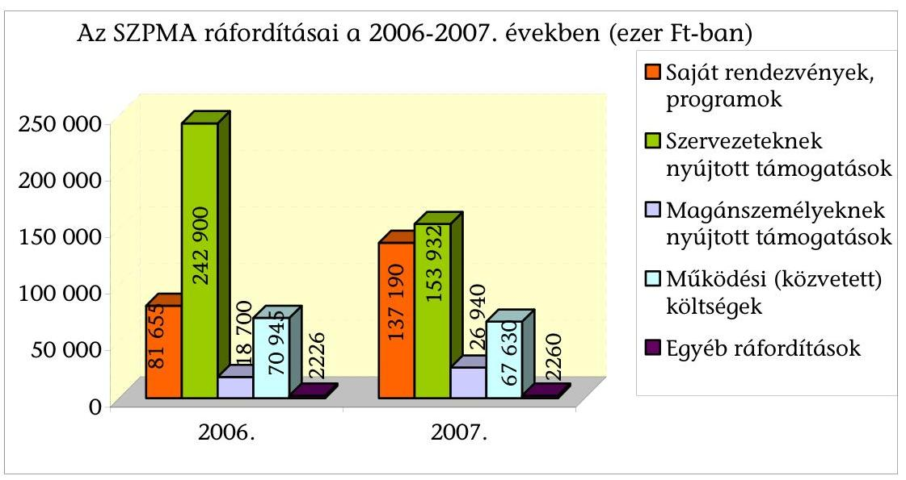
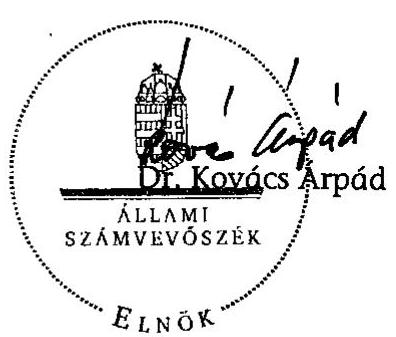

# ÁLLAMI   SZÁMVEVŐSZÉK 

## JELENTÉS

a Szövetség a Polgári Magyarországért Alapítvány 2006-2007. évi gazdálkodása törvényességének ellenőrzéséről

---

3. Önkormányzati és Területi Ellenőrzési Igazgatóság
3.1. Szabályszerűségi Ellenőrzési Főcsoport
Iktatószám: V-3015-26/2008.
Témaszám: 920
Vizsgálat-azonosító szám: V-0408
Az ellenőrzést felügyelte:
Dr. Lóránt Zoltán
főigazgató
Az ellenőrzés végrehajtásáért felelős:
Dr. Elek János
általános főigazgató-helyettes
Az ellenőrzést vezette:
Solymár Ágnes
osztályvezető főtanácsos
Az összefoglaló jelentést készítette:
Sas Imréné
számvevő tanácsadó
Az ellenőrzést végezték:
Kulcsár Lászlóné Sas Imréné
számvevő számvevő tanácsadó

# A témához kapcsolódó eddig készített számvevőszéki jelentések: 

címe
sorszáma
Jelentés a Szövetség a Polgári Magyarországért Alapítvány 2003- 0654
2005. évi gazdálkodása törvényességének ellenőrzéséről

---

# TARTALOMJEGYZÉK 

BEVEZETÉS ..... 5
I. ÖSSZEGZŐ MEGÁLLAPÍTÁSOK, KÖVETKEZTETÉSEK, JAVASLATOK ..... 7
II. RÉSZLETES MEGÁLLAPÍTÁSOK ..... 11

1. Az alapítvány gazdálkodásának törvényessége ..... 11
1.1. A gazdálkodás szabályozottsága, a kuratórium működése ..... 11
1.2. Az alapítvány bevételei ..... 13
1.3. Az alapítvány ráfordításai ..... 14
2. Az éves beszámolók ..... 16
2.1. Az éves beszámolók szabályossága ..... 16
2.2. A mérleg ..... 16
2.3. Az eredmény-kimutatás ..... 17
3. A könyvvezetés szabályozottsága ..... 18
4. A könyvvezetés gyakorlata ..... 18
5. Az adókkal és járulékokkal kapcsolatos kötelezettségek ..... 20
6. Az ellenőrzés rendszere ..... 22
7. A Polgári Szemle Alapítvány felügyelete és támogatása ..... 22
8. A korábbi ellenőrzés megállapításaira tett intézkedések ..... 23

## MELLÉKLETEK

1. számú A Szövetség a Polgári Magyarországért Alapítvány 2006. évi egyszerűsített éves beszámolójának mérlege
2. számú A Szövetség a Polgári Magyarországért Alapítvány 2006. évi egyszerűsített éves beszámolójának eredmény-kimutatása
3. számú A Szövetség a Polgári Magyarországért Alapítvány 2007. évi egyszerűsített éves beszámolójának mérlege
4. számú A Szövetség a Polgári Magyarországért Alapítvány 2007. évi egyszerűsített éves beszámolójának eredmény-kimutatása
5. számú A Szövetség a Polgári Magyarországért Alapítvány kuratóriumi elnökének észrevétele

---

# 2

---

# RÖVIDÍTÉSEK JEGYZÉKE 

| áfa | általános forgalmi adó |
| :--: | :--: |
| APEH | Adó- és Pénzügyi Ellenőrzési Hivatal |
| ÁSZ | Állami Számvevőszék |
| FB | Szövetség a Polgári Magyarországért Alapítvány Felügyelő Bizottsága |
| Kbt. | a közbeszerzésekről szóló 2003. évi CXXIX. törvény |
| Kincstár | Magyar Államkincstár |
| pártalapítványi törvény | a pártok működését segítő tudományos, ismeretterjesztő, kutatási, oktatási tevékenységet végző alapítványokról szóló 2003. évi XLVII. törvény |
| párttörvény | a pártok működéséről és gazdálkodásáról szóló 1989. évi XXXIII. törvény |
| Ptk. | a Polgári Törvénykönyvről szóló 1959. évi IV. törvény |
| Szja. tv. | a személyi jövedelemadóról szóló 1995. évi CXVII. törvény |
| SZMSZ | Szervezeti és Működési Szabályzat |
| SZPMA/alapítvány | Szövetség a Polgári Magyarországért Alapítvány |
| Szt. | a számvitelről szóló 2000. évi C. törvény |

---

.

---

# JELENTÉS 

## a Szövetség a Polgári Magyarországért Alapítvány 2006-2007. évi gazdálkodása törvényességének ellenőrzéséről

## BEVEZETÉS

A pártok működését segítő tudományos, ismeretterjesztő, kutatási, oktatási tevékenységet végző alapítványokról szóló 2003. évi XLVII. törvény (pártalapítványi törvény) alapján a pártok a politikai kultúra fejlesztése érdekében költségvetési támogatásra jogosult alapítványt hozhatnak létre tudományos, ismeretterjesztő, kutatási és oktatási tevékenységük elősegítésére. A Fidesz - Magyar Polgári Szövetség a törvényi rendelkezéseknek megfelelően 2003-ban létrehozta a Szövetség a Polgári Magyarországért Alapítványt (SZPMA).

Az SZPMA alapító okirat szerinti célja a politikai kultúra fejlesztése, a nemzeti elkötelezettség és a kereszténydemokrata eszmekör jegyében. Ehhez kapcsolódóan célja az ország határain belül, illetve a határon túli magyarság lakta területeken tudományos, kutatási tevékenység szervezése, elsősorban a társadalomtudományok körében, majd részben ezen kutatások eredményeinek felhasználásával is oktatási, ismeretterjesztő tevékenység végzése, mely jelentős mértékben hozzájárulhat az állampolgárok közéleti ismereteinek szélesítéséhez, a politikai szféra, a pártok és az állampolgárok kapcsolatának erősítéséhez, valamint a határon túli magyarság nemzeti elkötelezettségének fejlesztéséhez, nemzettudatának erősítéséhez. Célja ezen túl a professzionális politika tudományos igényű vizsgálata, majd ennek eredményeként javaslatok, új módszerek, eljárások kidolgozása a politikai tevékenység minőségének, hatékonyságának javítása érdekében, amelyek a politikai rendszer egészének jobb, hatékonyabb, a közjót fokozottan szolgáló működéséhez járulhatnak hozzá.

A pártalapítványok gazdálkodása törvényességének ellenőrzésére a pártalapítványi törvény 4. § (2) bekezdése alapján az Állami Számvevőszék (ÁSZ) jogosult, a pártalapítványi törvény 4. § (4) bekezdése értelmében az ÁSZ kétévenként ellenőrzi azoknak az alapítványoknak a gazdálkodását, amelyek e törvény szerint állami költségvetési támogatásban részesültek.

A pártalapítványi törvény alapján létrehozott alapítványok költségvetési támogatásának mértékéről a pártok működéséről és gazdálkodásáról szóló 1989. évi XXXIII. törvény (párttörvény) rendelkezik. Az SZPMA a törvényi előírásnak megfelelően, 2006-ban 400,1 millió Ft, 2007-ben 383,8 millió Ft költségvetési támogatásban részesült.

---

Az ÁSZ 2006-ban az alapítvány 2003-2005. évi gazdálkodásának törvényességét ellenőrizte. Az ellenőrzés hiányosságokat állapított meg az SZMSZ és a belső szabályzatok tekintetében, a könyvvezetésben, valamint az adó- és járulék elszámolásoknál.

A jelen ellenőrzés célja az alapítvány 2006-2007. évi gazdálkodása törvényességének értékelése volt, ennek keretében ellenőriztük:

- az alapítvány gazdálkodásának törvényességét;
- az éves beszámolók jogszabályi előírásoknak való megfelelését;
- az alapítvány könyvvezetésében a számvitelről szóló 2000. évi C. törvény (Szt.), egyéb jogszabályi rendelkezések és belső előírások betartását;
- a kuratórium megtette-e a szükséges intézkedéseket az ÁSZ előző ellenőrzése során feltárt hiányosságok megszüntetése, valamint az intézkedési tervben megjelölt feladatok megvalósítása érdekében.

A pártalapítványok ellenőrzési segédletében foglaltaknak megfelelően, az éves központi költségvetési támogatást, a csatlakozóktól kapott támogatásokat, és az ötmillió forintot meghaladó könyvelési tételeket tételesen, a ráfordításokat minta alapján ellenőriztük. Az ellenőrzési minta nagyságát az ellenőrzés előkészítése során elvégzett kockázatértékelés alapján határoztuk meg, amelynek során az eredendő és a belső kontroll kockázatot alacsonynak minősítettük.

Az egyéb szabályszerűségi ellenőrzés a 2006. január 1. és 2007. december 31. közötti időszakra terjedt ki.

---

# I. ÖSSZEGZŐ MEGÁLLAPÍTÁSOK, KÖVETKEZTETÉSEK, JAVASLATOK 

A kuratórium az ellenőrzött időszakban az alapító okirat előírásait betartva, törvényesen működött. Döntéseit határozatképes üléseken, a jelen lévő kuratóriumi tagok egyszerű szótöbbségével hozta meg. Az ülésekről az alapító okirat rendelkezésének megfelelően jegyzőkönyv, a határozatokról nyilvántartás készült. A kuratórium vagyoni döntései a pártalapítványi törvényben és az alapító okiratban rögzített tudományos, ismeretterjesztő, kutatási, oktatási célok megvalósítását szolgálták. Az alapítvány részére történt felajánlások elfogadásáról, az alapítványi vagyon cél szerinti felhasználásáról, a támogatások odaítéléséről minden esetben a kuratórium határozott. A kuratórium által elfogadott éves költségvetések teljes körűen tartalmazták a bevételeket, a cél szerinti tevékenységek ráfordításait, valamint az alapítvány működési költségeit.

Az alapító okiratban és a szervezeti és működési szabályzatban (SZMSZ) a képviseleti jog és a bankszámla feletti rendelkezés szabályozása megfelelt a törvényi előírásoknak, gyakorlása az alapító okirat és a belső szabályzatok rendelkezéseivel összhangban történt. A kuratórium - előző ellenőrzésünk javaslataival összhangban - megteremtette az SZMSZ összhangját az alapító okirattal a bankszámla feletti rendelkezési jog gyakorlása tekintetében azáltal, hogy törölte a szabályzatból az alapítvány korábbi főigazgatójának a bankszámla feletti rendelkezés meghatározására vonatkozó jogosultságát. Az alapító okirat és az SZMSZ az alapítvány céljára rendelt vagyon felhasználási módját a törvényi rendelkezéseknek megfelelően szabályozták.

Az alapítvány összes bevétele 815096 ezer Ft volt az ellenőrzött években, ebből a központi költségvetési támogatás 96,2%-ot, a csatlakozói adomány 1,6%-ot képviselt, a bevételek további hányadát a költségtérítések és a szabad pénzeszközök kamatbevétele tette ki. A költségvetési támogatás (783900 ezer Ft) az ellenőrzött években megfelelt a párttörvény által meghatározott alap-, és mandátumarányos kiegészítő támogatás együttes értékének, folyósítása a pártalapítványi törvény rendelkezéseinek. Az alapítvány céljai megvalósításához külföldi jogi személyektől az ellenőrzött években összesen 13056 ezer Ft támogatást, és 6276 ezer Ft költségtérítést kapott. A kuratórium az adományokat a pártalapítványi törvény rendelkezésének megfelelően beazonosítható személyektől, az alapítvány pénzforgalmi számlájára történő átutalással fogadta el, azokat az alapítvány honlapján nyilvánosságra hozta.

Az ellenőrzött években elszámolt 804378 ezer Ft ráfordítás 82%-át célszerinti feladatokra, 17%-át az alapítvány működésére fordította a kuratórium, az egyéb ráfordítások aránya 1% volt. A cél szerinti ráfordítások kétharmad részét a kuratórium által más szervezetek és magánszemélyek részére nyújtott támogatások, egyharmad részét a saját szervezeti keretek között megvalósított tevékenységek költségei alkották.

---

A továbbadott támogatások odaítéléséről a kuratórium határozott, a kuratórium elnöke a támogatottakkal szerződést kötött. A szerződés tartalmazta a támogatás célját, mértékét, folyósításának és elszámolásának módját és határidejét, az elszámolási határidő elmulasztásának szankcióját. A szerződés nem írta elő a pénzügyi teljesítést igazoló dokumentumok benyújtási kötelezettségét annak igazolására, hogy a támogatottak csak az általuk már kifizetett számlákat csatolják elszámolásukhoz. (Az alapítványi iroda a helyszíni ellenőrzés által kért pénzügyi bizonylatok másolatait minden esetben beszerezte a támogatottaktól.) Az elszámolások elfogadásáról a kuratórium minden esetben határozott. A kapott támogatás felhasználásával a támogatottak kétharmada szerződés szerinti határidőben elszámolt, 30%-a túllépte az elszámolási határidőt, további egy támogatott a helyszíni ellenőrzés befejezését követően számolt el. A kuratórium az ellenőrzött támogatások esetében nem érvényesítette a késedelmes elszámolásokra kikötött szerződéses szankciót.

Az SZPMA rendelkezett a jogszabályokban előírt, a könyvvezetés és a beszámoló elkészítésének rendjét meghatározó számviteli politikával, és ahhoz kapcsolódó szabályzatokkal. A kuratórium az ellenőrzött években a szabályzatok módosításait jóváhagyta. A szabályzatok megfeleltek az Szt. vonatkozó rendelkezéseinek. A számviteli politika és a számlarend rögzítette az előző ellenőrzésünk során javasolt, az alapítványi célú tevékenység közvetlen és közvetett költségei elkülönítésének rendjét és szabályait. A kuratórium az eszközök és a források leltárkészítési és leltározási szabályzatát az alapítványi gazdálkodás sajátosságainak megfelelően módosította, a pénzkezelési szabályzatot kiegészítette a bankszámlaforgalom és az elektronikus átutalások rendjének szabályaival.

Az SZPMA határidőben elkészítette az egyszerűsített éves beszámolókat az ellenőrzött évekre a jogszabályi előírásoknak és a belső szabályzatoknak megfelelően. A beszámolókat a felügyelő bizottság (FB) véleményezte, a könyvvizsgáló hitelesítette, a kuratórium érvényes határozatokkal elfogadta. Az éves beszámolók elkészítésénél érvényesítették a Szt.-ben megfogalmazott alapelveket, azok megbízható, valós adatokat tartalmaztak az alapítvány gazdálkodásáról. A mérleg és eredmény-kimutatás sorok adatai megegyeztek a kapcsolódó analitikus és főkönyvi nyilvántartások összesített adataival, és az év végi főkönyvi kivonatok adataiból levezethetőek voltak. A magánszemélyek részére teljesített alapítványi kifizetéseket a vonatkozó törvényi rendelkezéstől eltérően nem a személyi jellegű ráfordítások, hanem az egyéb ráfordítások között mutatták ki, amely az eredmény-kimutatás sorok között okozott eltérést, eredményre gyakorolt hatása nem volt. Az éves mérlegekben kimutatott eszközök és források értékadatait a leltározási szabályzat szerinti leltárakkal, az eredménykimutatásban kimutatott bevételeket és ráfordításokat könyvelési alapbizonylatokkal támasztották alá. Az eszközbeszerzéseknél és a ráfordítások elszámolásánál érvényesítették a kötelezettségvállalás, a teljesítésigazolás és utalványozás, valamint a banki aláírás szabályait.

A könyvvezetést a kettős könyvvitel rendszerében, mindkét évben azonos számítógépes programmal végezték, a gazdasági eseményeket idősorrendben, könyvelési alapbizonylatokkal alátámasztva rögzítették. A számviteli feladatok vezetésére és a beszámoló elkészítésére jogosult személy rendelkezett a törvényi előírásoknak megfelelő képesítéssel. A könyvvezetésben érvényesítették a bizonylatok Szt. által előírt alaki és tartalmi követelményeit. A számlakijelölés gyakorlata összhangban volt a vonatkozó jogszabályi előírásokkal. A belső szabályzatokban előírt egyedi nyilvántartásokat vezették, és azoknak a főkönyvi adatokkal való egyeztetését elvégezték. A házipénztárt a megbízott pénztáros kezelte, a záró pénzkészlet nem haladta meg a pénzkezelési szabályzatban előírt mértéket. A szigorú számadású nyomtatványokat és az elszámolásra adott
 előlegeket nyilvántartották, utóbbiak elszámolása szabályos volt.

Az SZPMA az ellenőrzött években munkáltatói és kifizetői jogkörében eleget tett az adózási és társadalombiztosítási jogszabályok rendelkezéseinek, vezette az előírt nyilvántartásokat, és az adatszolgáltatást teljesítette. A bér- és bérjellegű kifizetésekből a magánszemélyek adóelőlegeit és járulékait levonta, a munkáltatót, illetve kifizetőt terhelő költségvetési kötelezettséget határidőben befizette. A hivatali személygépkocsi magáncélú használata után a cégautó adót megfizette. A vezetékes telefon magáncélú használata miatti adófizetési kötelezettségének eleget tett.

Az FB az alapító okirat előírásával összhangban mindkét évben ellenőrizte és véleményezte az éves költségvetéseket, a számviteli beszámolókat és a könyvvizsgáló jelentéseit, továbbá az alapítvány éves tevékenységéről készített szakmai beszámolókat. A belső kontrollokat a gazdálkodási szabályzatok rögzítették. A belső ellenőrzés folyamatba épített, előzetes és utólagos vezetői ellenőrzéssel valósult meg. A vezetői ellenőrzést a kuratórium elnöke és az alapítvány igazgatója a munkáltatói jogkör gyakorlása, a képviseleti jog, a kötelezettségvállalás, az utalványozás és a bankszámla feletti rendelkezés során látták el.

Az SZPMA kuratóriuma az ellenőrzött években az általa létrehozott Polgári Szemle Alapítvány részére 5900 ezer Ft támogatást ítélt meg kutatásra, folyóirat kiadásra és működési költségekre. A támogatás odaítéléséről érvényes határozatot hozott a kuratórium, a támogatás felhasználására a felek szerződést kötöttek, amely tartalmazta a támogatás felhasználásának szabályait, az elszámolás módját és határidejét. A Polgári Szemle Alapítvány a szerződésben rögzített határidőben és módon elszámolt a támogatás cél szerinti felhasználásával, az SZPMA kuratóriuma az elszámolást elfogadta.

---

A kuratórium az előző ellenőrzésünk megállapításai alapján intézkedési tervet készített, a megtett intézkedések összhangban voltak az ellenőrzésről készített jelentésben megfogalmazott javaslatokkal.

A helyszíni ellenőrzés megállapításainak hasznosítása mellett javasoljuk:

# az alapítvány kuratóriumának 

1. Írja elő a támogatottak részére az elszámoláshoz benyújtott számlák pénzügyi teljesítését igazoló bizonylatok hitelesített másolatainak benyújtási kötelezettségét.
2. Érvényesítse a támogatási szerződésben kikötött szankciót a késedelmesen elszámoló támogatottakkal szemben.
3. Gondoskodjon a magánszemélyek részére teljesített alapítványi kifizetéseknek a személyi jellegű ráfordítások között történő elszámolásáról, a számvitelről szóló 2000. évi C. törvény 79. § (3) bekezdésének megfelelően.

---

# II. RÉSZLETES MEGÁLLAPÍTÁSOK 

## 1. Az alapítvány gazdálkodásának törvényessége

### 1.1. A gazdálkodás szabályozottsága, a kuratórium működése

A Fidesz - Magyar Polgári Szövetség, mint alapító, az ellenőrzött években egy alkalommal módosította az SZPMA alapító okiratát a Ptk. 74/B. § (5) és a 74/C. § (1) bekezdések rendelkezéseivel összhangban. A módosítást a Fővárosi Bíróság 2007. áprilisában vette nyilvántartásba. Az alapító az alapító okiratban a kuratórium elnökét és két tagját a pártalapítványi törvény 3. § (7) bekezdésének megfelelően öt évre bízta meg, három kurátor tagságát megszüntette, és módosította az alapítvány képviseletét. A kuratórium személyi összetétele megfelelt a pártalapítványi törvény 3. § (7), és a Ptk. 74/C. § (3) bekezdésekben foglaltaknak.

A módosított alapító okirat a Ptk. 74/C. § (4) bekezdésének megfelelően rendelkezett az alapítvány képviseletéről, a képviseleti jog gyakorlásának módjáról és terjedelméről.

Az alapító okirat alapján az alapítványt a kuratórium elnöke, akadályoztatása esetén az alapító okiratban megnevezett kurátor képviseli. A bankszámla feletti rendelkezésre a kuratórium elnöke és az alapítvány igazgatója együttesen jogosultak. Az alapító az alapító okiratban felhatalmazta a kuratóriumot, hogy képviseleti jogot biztosítson az alapítvány alkalmazottjának. A kuratórium e felhatalmazás alapján az alapítvány igazgatójának bankszámla feletti rendelkezési jogot, valamint az SZMSZ-ben megjelölt értékhatárig kötelezettségvállalási és utalványozási jogot biztosított.

A kuratórium az ellenőrzött években módosított SZMSZ-t az alapító okirat előírásainak megfelelő, érvényes határozatokkal fogadta el. A szabályzat az alapító okirattal összhangban meghatározta a kuratórium és az SZPMA munkaszervezete alkalmazottainak hatás-, feladat- és felelősségi körét. Az SZMSZ az alapító okirattal összhangban határozta meg a képviseleti-, illetve a bankszámla feletti rendelkezési jog gyakorlását, mivel korábbi ellenőrzésünk javaslata alapján a kuratórium törölte az SZMSZ-ből az alapítvány korábbi főigazgatójának a bankszámla feletti rendelkezés meghatározására irányuló hatáskörét. A banki aláírásra bejelentettek köre megfelelt az alapító okirat és az SZMSZ rendelkezéseinek.

A képviseleti és bankszámla feletti rendelkezési jog gyakorlása a Ptk., az alapító okirat és az SZMSZ rendelkezéseivel összhangban történt.

A szerződéseket (megbízási-, vállalkozói-, támogatási szerződések) minden esetben a kuratórium elnöke írta alá. A banki átutalásokat elektronikus úton végezték, a bankszámla felett rendelkezni jogosult személyek a számlavezető bank által rendelkezésre bocsátott kód biztonságos kezelésére felelősségvállalási nyilatkozatot tettek.

---

Az alapító okirat és az SZMSZ az alapítvány céljára rendelt vagyon felhasználási módját a Ptk. rendelkezéseinek megfelelően szabályozta. Az alapítvány részére történő felajánlások elfogadásáról, az alapítványi vagyon hasznosításáról, a rendelkezésre álló vagyon alapítványi célok szerinti felhasználásáról, ezen belül a továbbadott támogatásokról a kuratórium volt jogosult határozni.

A kuratórium működése az ellenőrzött időszakban megfelelt az alapító okirat előírásainak. A kuratóriumi ülésekről készített jegyzőkönyvek, és a határozatok tára megfelelt az alapító okirat és SZMSZ jegyzőkönyv készítési-, hitelesítési- és nyilvántartási előírásainak. A kuratóriumi ülésekről felvett jegyzőkönyvek tanúsága szerint a kuratórium határozatait az alapító okiratban előírtak szerinti határozatképes üléseken, a jelenlévő kuratóriumi tagok egyszerű szótöbbségével hozta. A kuratórium az ellenőrzött 2006-2007. években 17 ülésen összesen 81 határozatot hozott.

A kuratórium az ellenőrzött időszakban - többek között - megtárgyalta és elfogadta az SZMSZ és a gazdálkodási szabályzatok módosításait, az éves költségvetéseket, az éves szakmai és pénzügyi beszámolókat.

Az ellenőrzött időszakban a kuratórium vagyoni döntései az alapítványi cél megvalósulása érdekében végzett tevékenységek ellátását szolgálták. A kuratórium döntéseit az alapító okirat céljához kapcsolódó tudományos és ismeretterjesztő tevékenység, kutatás, képzési és egyéb alapítványi programok szervezése és támogatása érdekében hozta, valamint a kezelő- és munkaszervezet működési költségeit biztosította.

A kuratórium mindkét évben gondoskodott az alapító okirat 5.8. pontja szerinti éves költségvetések elkészítéséről. A kuratórium által meghatározott irányelvek alapján összeállított költségvetéseket az FB mindkét évben megvitatta, a kuratórium azokat az alapító okirat előírásainak megfelelően, érvényes határozatokkal elfogadta. A költségvetések mindkét évben teljes körűen tartalmazták az SZPMA bevételeit, a cél szerinti tevékenységek ráfordításait, valamint a kezelő és munkaszervezet működésének költségeit.

Az éves költségvetés az alapítvány bevételeit az előző évi eredmény, a tárgyévi költségvetési támogatás, továbbá egyéb támogatások, és bevételek szerinti bontásban tartalmazta. A kiadásokon belül a saját szervezeti keretek között végzett tevékenységek költségeit alapítványi célok szerinti, a kuratórium által nyújtott támogatásokat pályázat útján és egyedi kérelemre odaítélt támogatások szerinti, az alapítvány közvetett (működési) költségeit jogcímek szerinti részletezésben mutatta be.

A kuratórium az éves költségvetést indokolt esetben - így 2006-ban az éves költségvetési támogatás évközi csökkentése miatt - módosította. Az éves költségvetések időarányos teljesítését az alapítvány igazgatója nyomon követte, a teljesülésről a kuratóriumot rendszeresen tájékoztatta. Az éves költségvetések teljesítését a kuratórium által elfogadott, az alapítvány éves tevékenységéről szóló jelentésekben értékelték ki.

---

# 1.2. Az alapítvány bevételei 

Az SZPMA az ellenőrzött időszak éves beszámolóiban összesen 815096 ezer Ft bevételt mutatott ki, amelyből a központi költségvetési támogatás aránya 96,2%-volt. Az alapítványhoz csatlakozó külföldi jogi személy adománya a bevételek 1,6%-át alkotta. A költségtérítések és a szabad pénzeszközök banki lekötéséből származó pénzügyi műveletek bevétele az összes bevételből egyaránt 1,1-1,1%-ot képviselt.

Az SZPMA a pártalapítványi törvény 1. §-a alapján központi költségvetési támogatásra volt jogosult, a támogatás mértékét a párttörvény határozta meg. A központi költségvetési támogatás összege mindkét évben megfelelt a párttörvény rendelkezéseinek. A támogatás a 2008. szeptember 29-ig hatályos párttörvény 9/A. § (5) bekezdés a) és b) pontok szerinti alap-, és mandátumarányos kiegészítő támogatásból tevődött össze. Az alapítvány eseti támogatásban nem részesült. A központi költségvetési támogatás - a felkerekítés eredményeként - 2006-ban 400100 ezer Ft, 2007-ben 383800 ezer Ft, összesen 783900 ezer Ft volt. A Magyar Államkincstár a költségvetési támogatást mindkét évben a pártalapítványi törvény 2. § (1) bekezdésének megfelelően folyósította az SZPMA pénzforgalmi számlájára.

Az alaptámogatás mértéke az egyévi képviselői alapdíj huszonötszöröse, összege 2006-ban 65430 ezer Ft, 2007-ben 66240 ezer Ft, összesen 131670 ezer Ft volt. A mandátumarányos kiegészítő támogatás mértéke képviselőnként a képviselői alapdíj 85%-a, összege 2006. januártól júniusig 164, azt követően 141 képviselőre számítva 334621 ezer Ft, 2007-ben 141 képviselőre számítva 317555 ezer Ft, összesen 652176 ezer Ft volt.

A kuratórium a pártalapítványi törvény 3. § (2) bekezdésének, és az alapító okirat 5.2. pontja rendelkezéseinek megfelelően mindkét évben döntött az alapítványhoz csatlakozó külföldi alapítványtól kapott támogatás (13 056 ezer Ft) elfogadásáról. A pártalapítványi törvény 3. § (3) bekezdésében előírt, a támogatást nyújtó személy azonosításához szükséges adatok az alapítványnál rendelkezésre álltak, a banki kivonatokon az adományozó személye beazonosítható volt, a támogatás folyósítása az SZPMA pénzforgalmi számlájára történt. Az alapítvány eleget tett a pártalapítványi törvény 3. § (4) bekezdésében előírt közzétételi kötelezettségének, a kapott támogatást internetes honlapján mindkét évben nyilvánosságra hozta. Az SZPMA a támogatás felhasználására kötött szerződések előírásainak megfelelően, mindkét évben elszámolt a kapott támogatás cél szerinti felhasználásáról.

A külföldi alapítvány 2006-ban 20 ezer euro (5443 ezer Ft), 2007-ben 30 ezer euro (7613 ezer Ft) támogatást nyújtott az alapítványi célok megvalósításához.

Az SZPMA két alkalommal számolt el külföldről származó, a pártalapítványi törvény 3. § (4) bekezdés b) pontjában megjelölt, egyedileg százezer forintnak megfelelő értéket meghaladó, az alapítványi célok megvalósításához kapcsolódó költségtérítést. A támogató a költségtérítést az alapítvány pénzforgalmi számlájára folyósította, az SZPMA internetes honlapján nyilvánosságra hozta.

Az Európai Néppárt az SZPMA által kiállított számlák alapján, az alapítvány által lebonyolított képzés költségeihez járult hozzá (6276 ezer Ft).

---

# 1.3. Az alapítvány ráfordításai 

Az SZPMA könyvvezetésében 2006-ban 416426 ezer Ft, 2007-ben 387952 ezer Ft, összesen 804378 ezer Ft ráfordítást számolt el. A ráfordítások 82%-át (661 317 ezer Ft) az alapítványi célok megvalósításának közvetlen költségei, 17%-át (138 575 ezer Ft) a működési (közvetett) költségek, 1%-át (4486 ezer Ft) az egyéb ráfordítások tették ki. A cél szerinti tevékenységek közvetlen költségeinek átlagosan kétharmad részét a kuratórium által más szervezetek és magánszemélyek részére nyújtott támogatások, egyharmad részét a saját szervezeti keretek között megvalósított tevékenységek költségei alkották.

A kuratórium az alapító okirat céljaival összhangban egyedi kérelmek alapján és pályázati úton támogatást nyújtott más szervezetek és magánszemélyek részére különféle programok (rendezvények, kutatások, ismeretterjesztés, kiadványok, képzések) megvalósításához. A kuratórium a továbbadott támogatásokról határozatot hozott, amelynek során betartotta a határozathozatal módjára és a határozatképességre az alapító okiratban rögzített előírásokat. A kuratóriumi határozatok tartalmazták a támogatott nevét, a támogatás célját és összegét. Az alapítvány képviseletére jogosult személy a támogatottakkal, az alapító okirat előírásának megfelelően támogatási szerződést kötött. A szerződés tartalmazta a támogatás célját, mértékét, folyósításának és elszámolásának módját és határidejét, az elszámolási határidő elmulasztásának szankcióját.

A kuratórium által nyújtott támogatások, azok felhasználásával való elszámolások szabályosságának ellenőrzése során az alábbiakat állapítottuk meg:

- a kuratórium elnöke minden esetben a kuratóriumi határozattal összhangban álló szerződést kötött a támogatottakkal,
 a szerződések tartalmazták a kuratóriumi határozatok számát, ezáltal beazonosíthatóak voltak;
- az alapítvány a támogatásokat utólagos elszámolás mellett, a támogatási szerződések előírása szerint folyósította;
- a támogatási szerződések szerint a támogatás felhasználását igazoló számlák hitelesített másolataival kellett elszámolni, a kifizetési bizonylatok (bankkivonat, pénztárbizonylat) benyújtási kötelezettségét nem írták elő annak igazolására, hogy a támogatottak az általuk kifizetett számlákkal számoltak el (az alapítványi iroda az ellenőrzéshez kért kifizetési bizonylatok másolatait a helyszíni ellenőrzés során minden esetben beszerezte a támogatottaktól);
- a támogatottak 68%-a a támogatási szerződésben előírt határidőben, hitelesített számlamásolatok és szakmai beszámolók benyújtásával számolt el;
- a támogatottak 30%-a késedelmesen számolt el, a határidő túllépés fél és három hónap között, átlagosan másfél hónap volt, jelentős (három hónap) túllépés esetén az alapítvány igazgatója írásban felszólította a támogatottakat elszámolásuk megküldésére;
- egy támogatott (2%) a kuratórium által engedélyezett módosított határidőt túllépve - többszöri felszólításra - a helyszíni ellenőrzés befejezését követően számolt el a 2006. évben nyújtott támogatás felhasználásával, a kuratórium

---

az elszámolás egy részét elfogadta, és határozott a támogatás kétharmad részének visszatérítéséről, amelyet a támogatott visszafizetett;

- a kuratórium az ellenőrzött támogatások esetében nem élt a támogatási szerződésben kikötött, késedelmes elszámolás miatti szankcióval;
- a kuratórium a támogatások felhasználásáról készített elszámolásokat - a támogatottak 5%-ánál a fel nem használt támogatási összeg visszafizetése mellett - határozatokkal elfogadta, a visszafizetési kötelezettséget az érintett támogatottak teljesítették.

A kuratórium az ellenőrzött években az alapítvány céljaival összhangban határozott az alapítvány saját szervezeti keretei között megvalósított célszerinti tevékenységek költségeiről, a finanszírozás feltételeiről.

A kuratórium a működési költségek keretösszegét az éves költségvetésekben állapította meg, és évközben döntött az alapítvány működéséhez kapcsolódó szerződések megkötéséről.

Az alapítvány a közbeszerzésekről szóló 2003. évi CXXIX. törvény (Kbt.) hatálya alá tartozó beszerzések tekintetében ajánlatkérőnek minősül, mivel a Kbt. 22. § (1) bekezdés i) pontjában rögzített hármas feltétel - jogi személyiség, közérdekű tevékenység folytatása, a működésnek többségi részben állam által történő finanszírozása - az alapítvány esetében teljesül.

Az alapítvány a Ptk. 74/A. § (1) bekezdésében foglaltak alapján jogi személy. Az alapítvány közérdekű tevékenységet folytat, mivel az SZPMA alapító okiratában szereplő cél szerinti tevékenységek, úgymint a tudományos tevékenység, kutatás, a nevelés és oktatás, képességfejlesztés, ismeretterjesztés a közhasznú szervezetekről szóló 1997. évi CLVI. törvény 26. § c) pontjának 3. és 4. alpontjai szerinti közhasznú, ezáltal a Kbt. 4. § 16. pontja értelmében közérdekű tevékenység, függetlenül attól, hogy az SZPMA nem közhasznú jogállású szervezet. Az alapítvány működését többségi részben a központi költségvetés finanszírozza.

Az ellenőrzött időszakban a vállalkozói megbízások értéke évenként két-két esetben haladta meg az éves költségvetési törvényekben, a szolgáltatás megrendelésére előírt 25 millió Ft nemzeti közbeszerzési értékhatárt.

Az alapítvány politikai tanulmányok, elemzések, összefoglalók készítésére 2006-ban 30,8 millió Ft + áfa, 2007-ben 32,2 millió Ft + áfa, képzések lebonyolítására 2006-ban 26,1 millió Ft + áfa, 2007-ben 33,3 millió Ft + áfa összegű szerződéseket kötött.

Az alapítvány mindkét évben indokoltan, közbeszerzési eljárás lefolytatása nélkül kötött megbízási szerződést politikai tanulmányok, elemzések, összefoglalók készítésére és képzési rendezvénysorozat lebonyolítására.

- A politikai tanulmányok, elemzések tárgyában megvalósított beszerzés a Kbt. 29. § (2) bekezdés g) pontja értelmében mentesült a közbeszerzési eljárási kötelezettség alól, mivel a szerződések eredményét nem kizárólag az alapítvány hasznosította, hanem azokat a kuratórium által meghatározott körben szétosztotta, illetve az SZPMA honlapján nyilvánosságra hozta.

---

A Kbt. 29. § (2) bekezdés g) pontja értelmében nem kell közbeszerzési eljárást lefolytatni a kutatási és fejlesztési szolgáltatásnál, kivéve, ha annak eredményét kizárólag az ajánlatkérő hasznosítja tevékenységi körében, és az ellenszolgáltatást teljes mértékben az ajánlatkérő teljesíti.

- A képzési rendezvénysorozatot lebonyolító szerződéses partner részére a kuratórium által korábban nyújtott alapítványi támogatás teremtette meg a képzés infrastrukturális feltételeit, amely alapján a Felnőttképzési Akkreditáló Testület az alapítványt akkreditálta.

# 2. Az ÉVES BESZÁMOLÓK 

### 2.1. Az éves beszámolók szabályossága

Az SZPMA az ellenőrzött időszak mindkét évében eleget tett beszámoló készítési kötelezettségnek, éves beszámolóit a vonatkozó jogszabályi előírásoknak megfelelően, a számviteli politikájában megjelölt formában, határidőre elkészítette.

Az egyszerűsített éves beszámoló a számviteli törvény szerinti egyes egyéb szervezetek beszámoló készítési és könyvvezetési kötelezettségének sajátosságairól szóló 224/2000. (XII. 19.) Korm. rendelet 4. és 5. számú mellékletek szerinti mérlegből és eredmény-kimutatásból állt.

Az egyszerűsített éves beszámolókat az 1-4. számú mellékletek mutatják be.
A könyvvizsgáló az alapítvány éves beszámolóit hitelesítő záradékkal látta el. Az FB az alapító okirat előírásának megfelelően az egyszerűsített éves beszámolókat véleményezte, a kuratóriumnak elfogadásra javasolta. A kuratórium a beszámolókat érvényes kuratóriumi határozattal elfogadta.

A 2006-2007. évek könyvvizsgálattal hitelesített egyszerűsített éves beszámolói megbízható, valós adatokat tartalmaztak az alapítvány gazdálkodásáról. A beszámolók összeállítása során érvényesítették az Szt.-ben foglalt számviteli alapelveket. Az éves beszámolók adatai az év végi főkönyvi kivonatok adataiból mindkét évben levezethetőek voltak.

### 2.2. A mérleg

Az ellenőrzött években a mérlegsorok adatai megegyeztek a kapcsolódó analitikus és főkönyvi nyilvántartások összesített adataival. Az éves mérlegekben kimutatott eszközök és források értékadatait az Szt. 69. § (1) bekezdése előírásával összhangban, leltárakkal alátámasztották.

Az immateriális javak és tárgyi eszközök értékét az egyedi nyilvántartás adataiból készített összesítő kimutatásokkal mindkét évben, a leltározási szabályzat szerinti tételes eszközleltárral - az előző ellenőrzésünk javaslata alapján - a 2007. évben támasztották alá. A pénzeszközök értékét készpénzállománynál mennyiségi leltár, bankszámláknál év végi bankkivonatok, a követelések és kötelezettségek, az aktív és passzív időbeli elhatárolások értékét év végi tételes kimutatások támasztották alá.

---

Az ellenőrzött időszakban az immateriális javak és tárgyi eszközök egyedi nyilvántartása és az állomány-változások (beszerzés-aktiválás, selejtezés, térítés nélküli átadás, értékcsökkenés) elszámolása összhangban volt a belső szabályzatok előírásaival.

Az eszközök beszerzése során mindkét évben betartották a kötelezettségvállalás szabályait. Az egyedi kötelezettségvállalások értéke nem haladta meg a kuratórium elnökének hatáskörét (5000 ezer Ft), ezen belül két esetben haladta meg az 1000 ezer Ft-ot, amelyről a kuratórium elnöke az SZMSZ előírásának megfelelően tájékoztatta a kuratóriumot. Az eszközbeszerzések értéke 2006-ban 1428 ezer Ft, 2007-ben 7265 ezer Ft volt, a növekedést az alapítvány új székhelyéhez kapcsolódó felújítás, illetve eszközbeszerzés indokolta.

A forgóeszközökön belül az éves mérlegek elismert követeléseket tartalmaztak (adott előlegek, továbbszámlázott költségek, visszaigényelhető járulékok összegeit), a pénzeszközök értéke megegyezett az év végi pénztárjelentés záró állományával és a bankkivonatokkal.

A mérlegben az induló tőkét az alapító okirat által meghatározott induló vagyon értékének megfelelően mutatták ki.

A kötelezettségek között mindkét évben rövidlejáratú kötelezettséget mutattak ki, amely az Szt. rendelkezéseinek megfelelően a kuratórium által megítélt, és a tárgyévben ki nem fizetett támogatásokat, a szállítói tartozások értékét, és az év végi adó- és járuléktartozásokat tartalmazta.

Az aktív és passzív időbeli elhatárolások elszámolása szabályos volt, az elszámolást szállítói számlák, támogatási szerződések, számítási anyagok támasztották alá.

# 2.3. Az eredmény-kimutatás 

Az ellenőrzött években az eredmény-kimutatás sorok adatai a főkönyvi kivonatok, illetve a vonatkozó főkönyvi és részletező számlák összesített adataival megegyeztek.

A bevételeken belül a központi költségvetési és az egyéb támogatásokat elkülönítetten mutatták ki, a támogatások, valamint az elszámolt pénzügyi és egyéb bevételek összege megegyezett a vonatkozó bankkivonatok összesített értékével. Az eredmény-kimutatásban szerepeltetett ráfordításokat könyvelési alapbizonylatokkal (szerződések, szállítói számlák, vegyes könyvelési bizonylatok) támasztották alá.

Az eredmény-kimutatás sorai - egy kivétellel - az adott sorokon kimutatható bevételek, illetve ráfordítások fogalomkörébe tartozó tételeket tartalmaztak. A magánszemélyek részére teljesített alapítványi kifizetéseket (támogatások, közcélú juttatások, alapítványi díjak) azonban a személyi jellegű ráfordítások helyett az egyéb ráfordítások között számolták el, amely csak az eredménykimutatás sorait érintette, az összes ráfordítás értékét nem módosította.

A magánszemélyek részére történt alapítványi kifizetések nem a 224/2000. (XII. 19.) Korm. rendelet 16. § (6) és (7) bekezdései szerinti továbbutalt támogatások

---

(egyéb ráfordítások), hanem az Szt. 79. § (3) bekezdése szerinti személyi jellegű egyéb kifizetések (2006-ban 18700 ezer Ft, 2007-ben 26640 ezer Ft).

A ráfordítások elszámolásánál érvényesítették a kötelezettségvállalás, az utalványozás, a teljesítésigazolás és a banki aláírás szabályait.

A szerződéseket az alapító okirat előírásával összhangban a kuratórium határozata alapján a kuratórium elnöke kötötte meg. Az utalványozást - értékhatártól függően - a kuratórium által elfogadott belső szabályzatok szerint végezték, a bankszámla feletti rendelkezés megfelelt az alapító okirat előírásának.

# 3. A KÖNYVVEZETÉS SZABÁLYOZOTTSÁGA 

A 2006-2007. években a könyvvezetés és az éves beszámolók elkészítésének belső szabályozási rendszere az Szt. által kötelezően előírt szabályozáson alapult. Az Szt. 14. § (3)-(5) bekezdések előírásával összhangban az SZPMA rendelkezett számviteli politikával (ennek keretében határozták meg az eszközök és a források értékelési szabályait), leltárkészítési és leltározási-, pénzkezelési szabályzattal, továbbá az Szt. 161. § alapján számlarenddel. Az SZPMA a szabályzatokat a 2007. évben kétszer módosította, egyrészt az előző ellenőrzésünk javaslatai alapján, másrészt személyi és munkaköri változások miatt. A kuratórium a szabályzatok módosításait jóváhagyta.

A számviteli politikában - javaslataink figyelembevételével - pontosították az éves beszámoló formáját és tartalmát, a zárlati munkák és az időbeli elhatárolások körét, szabályozták az értékcsökkenés elszámolását, meghatározták a kis értékű tárgyi eszközök elszámolásának, az eszközök és források értékelésének szabályait, valamint az alapítványi célú tevékenység közvetlen, és működési költségeinek elkülönített nyilvántartását a főkönyvi és analitikus könyvelés keretében egyaránt.

Az eszközök és a források leltárkészítési és leltározási szabályzatát a kuratórium az alapítványi gazdálkodás sajátosságainak megfelelően módosította, a szabályzat tartalmazta a mérleg-tételeket alátámasztó leltárakat, a leltározással kapcsolatos feladatokat, a mennyiségi felvétellel és egyeztetéssel leltározandó eszközök és források körét, a leltározás gyakoriságát és idejét.

A pénzkezelési szabályzatot előző ellenőrzésünk javaslata alapján kiegészítették a banki átutalások utalványozási rendjére vonatkozóan, és külön mellékletekben szabályozták az elektronikus átutalások és a bankkártyák használatának szabályait. A szabályzat megfelelt az Szt. 14. § (8) bekezdés rendelkezéseinek.

A számlarendet az alapítvány gazdálkodására jellemző, sajátos elszámolások figyelembevételével módosították, a számlarend és a mellékletét képező számlatükör megfelelt az Szt. előírásainak.

## 4. A KÖNYVVEZETÉS GYAKORLATA

Az SZPMA könyvvezetését és éves beszámolóinak összeállítását - szerződés alapján - külső könyvelő szervezet végezte az ellenőrzött időszakban. A számvi-

---

teli szolgáltatás körébe tartozó feladatok vezetésére, a beszámoló elkészítésére jogosult személy rendelkezett az Szt. 151. § (1) bekezdésben előírt képesítéssel, szerepelt a Pénzügyminisztérium által vezetett könyvviteli szolgáltatást végzők nyilvántartásában.

A könyvvezetést a kettős könyvvitel rendszerében, az alapbizonylatok számítógépes feldolgozásával, az ellenőrzött időszakban azonos könyvelési programmal végezték. A kialakított számítógépes könyvelési rendszerből az ellenőrzéshez szükséges adatokat biztosították.

A gazdasági eseményeket idősorrendben rögzítették. A könyvelt tételekhez megfelelő alapbizonylatok kapcsolódtak, így a pénzforgalmi bizonylatokhoz a kifizetés, illetve átutalás alapbizonyulatai (szerződések, számlák), a vegyes bizonylatok alapján könyvelt tételekhez részletező kimutatások, bizonylatok. A könyvelési bizonylatok alaki és tartalmi követelményeit az Szt. 167. § (1) bekezdés előírásának megfelelően, a könyvvezetésben érvényesítették. A számlakijelölés gyakorlata összhangban volt az Szt. 167. § (1) bekezdés h) és i) pontjai, és a belső szabályzatok
 előírásával.

Az egyszerűsített éves beszámolók elkészítését megelőzően a számviteli politikában előírt, a könyvviteli zárlattal kapcsolatos feladatokat elvégezték.

Elszámolták az immateriális javak és tárgyi eszközök éves terv szerinti és terven felüli értékcsökkenését, megállapították az év végi aktív és passzív időbeli elhatárolásokat, főkönyvi kivonatot készítettek, az eszköz-, a forrás- és az eredmény számlákat lezárták.

Az SZPMA a 2006-2007. években a leltározási szabályzat előírásainak megfelelően, az eszköz és forrás tételeket a főkönyvi számláknak az analitikus nyilvántartásokkal, és a könyvelés helyességét igazoló egyéb okmányokkal (bankkivonatok, szerződések) történt egyeztetése útján leltározta, és a belső szabályzatnak megfelelően dokumentálta.

Az SZPMA az Szt. 161. § (2) bekezdés c) pontjának megfelelően, számlarendjében szabályozta a főkönyvi számlákhoz rendelt analitikák körét, tartalmát, vezetésük rendjét. Az ellenőrzött években a számlarendben előírt egyedi nyilvántartásokat vezették, az év végi főkönyvi kivonatot az analitikus nyilvántartásokkal egyeztetett főkönyvi számlákból állították össze.

Az immateriális javak és tárgyi eszközök egyedi nyilvántartó lapjait naprakészen vezették. A szállítókkal szembeni kötelezettséget a zárt rendszerű főkönyvi könyvelés keretében, tételesen nyilvántartották. A személyi jellegű kifizetésekről egyénenként, az adóhatósággal szembeni kötelezettségről havonta elkülönített nyilvántartást vezettek.

A házipénztári nyilvántartások vezetésének és ellenőrzésének szabályait a pénzkezelési szabályzat rögzítette. A szabályzatban előírt nyilvántartásokat vezették, a havi pénztári zárásokat dokumentálták. A házipénztár napi záró készpénz állománya nem haladta meg a szabályzatban előírt keretösszeget (500 ezer Ft). Az utólagos elszámolásra kiadott előlegeket és azok elszámolását nyilvántartották, az elszámolások a szabályzatban rögzített határidőn belül megtörténtek (30 napon belül). A szigorú számadás alá vont bizonylatok körét

---

a pénzkezelési szabályzatban meghatározták (bevételi és kiadási pénztárbizonylat, pénztárjelentés, számlatömb), és az Szt. 168. § (3) bekezdésének megfelelően nyilvántartották.

A kuratórium a kötelezettségvállalás és az utalványozás rendjéről a SZMSZ-ben és a pénzkezelési szabályzatban rendelkezett. A szabályozás kiterjedt az aláírási, utalványozási jogosultak körére, valamint e jogosítványok értékhatáraira. A szabályzatokban e jogkörökkel a kuratóriumot, a kuratórium elnökét, és az alapítványi igazgatót hatalmazták fel.

A kötelezettségvállalás és utalványozás gyakorlása az ellenőrzött években megfelelt a belső szabályzatok előírásainak. A készpénzes kifizetések és szállítói számlák utalványozása összhangban volt a pénzkezelési szabályzat előírásával, a pénzforgalmi bizonylatokat - értékhatártól függően - az utalványozásra jogosultak írták alá.

A kuratórium elnöke dologi kiadások és beszerzések során 5000 ezer Ft, eseti megbízások során 1000 ezer forint fölött a kuratórium előzetes hozzájárulásával vállalt kötelezettséget. Az alapítványi igazgató 250 ezer Ft értékhatárig, azt meghaladóan a kuratórium elnöke utalványozott.

A munkabérek utalványozása az átutalás során, az elektronikus banki aláírással valósult meg. Az alapítványnál azonos volt a bankszámla felett rendelkezők, illetve aláírásra bejelentettek, valamint az utalványozásra jogosultak köre.

A könyvvezetésben - az alapítványok gazdálkodási rendjéről szóló 115/1992. (VII. 23.) Korm. rendelet 3. § (2) bekezdésében előírtaknak megfelelően - az alapítványi célú tevékenység közvetlen és közvetett (működési jellegű) költségeit a főkönyvi könyvelés keretében, munkaszámos nyilvántartással elkülönítették. A költségek típusát a könyvelési alapbizonylatokon feltüntették.

# 5. AZ ADÓKKAL ÉS JÁRULÉKOKKAL KAPCSOLATOS KÖTELEZETTSÉGEK 

Az SZPMA 2006-2007-ben a személyi jövedelemadóról, a társadalombiztosítás ellátásaira és a magánnyugdíjra jogosultakról, valamint e szolgáltatások fedezetéről, az egészségügyi hozzájárulásról és az adózás rendjéről szóló hatályos törvényi előírásoknak eleget tett. A munkáltatói és a kifizetői feladatokhoz rendelt nyilvántartásokat vezette, az előírt adatszolgáltatásokat teljesítette.

A kifizetett bér és bérjellegű jövedelmekből a magánszemélyeket terhelő levonásokat teljesítették, a munkáltatót, illetve a kifizetőt terhelő költségvetési befizetési kötelezettséget előírták, azt havi rendszerességgel, határidőre befizették.

A külföldi kiküldetés napidíja után az adó- és járulékfizetési kötelezettséget megállapították és teljesítették.

A külföldi kiküldetések alapján elszámolható költségtérítésekről a kuratórium minden esetben döntött.

Természetbeni juttatásként az SZMSZ-ben biztosított, a személyi jövedelemadóról szóló 1995. évi CXVII. törvény (Szja tv.) 1. számú melléklet 8.17. pontja sze-

---

rint adómentesen elszámolható étkezési költségtérítést fizettek. Az étkezési utalványok átadás-átvétele szabályos volt.

A kuratórium és az FB tagjai az alapító okirat alapján tiszteletdíjban nem részesültek, költségtérítésre magángépjárművek használatával összefüggésben, útnyilvántartás vezetése mellett, legfeljebb havi 50 ezer Ft összegben részesülhettek. Költségtérítést egy kurátornak fizettek útnyilvántartás alapján, az előírt limit betartásával.

Az SZPMA tulajdonában lévő személygépkocsit 2006-ban az alapítvány főigazgatója használta, útnyilvántartást vezetett, magáncélra kizárólag szabadsága alatt használta, amely időszakra az alapítvány megfizette a cégautó adót és járulékait. A kuratórium a 29/2007. (VII. 2.) számú határozatában arról döntött, hogy a kuratórium elnöke (aki korábban az alapítvány főigazgatója volt) magáncélra bármikor használhatja a cégautót, és ezen időszaktól kezdődően a cégautó adót és járulékait megfizették. Az SZMSZ rendelkezett a saját tulajdonú gépkocsi hivatali célú használata miatti útiköltség térítés fizetéséről. A kuratórium elnöke minden esetben megállapodást kötött a tulajdonossal a gépkocsi használatára, a költségeket igazolt útnyilvántartás alapján, a vonatkozó jogszabályoknak megfelelően, adómentes mértékben térítették meg, erről az igazolásokat határidőben kiadták.

Az üzemanyag költséget a közúti gépjárművek, az egyes mezőgazdasági, erdészeti és halászati erőgépek üzemanyag- és kenőanyag-fogyasztásának igazolás nélkül elszámolható mértékéről szóló 60/1992. (VI. 1.) Korm. rendelet 1. számú melléklete szerinti üzemanyag-fogyasztási norma, és az APEH által közzétett üzemanyagár alapulvételével számolták el.

A személyi jellegű ráfordítások között elszámolt reprezentáció, és a tízezer forint egyedi értéket meg nem haladó üzleti ajándék együttes összege nem haladta meg az Szja tv. 69. § (7) bekezdés b) pontja szerint adómentesen elszámolható értéket (összes ráfordítás 10%-át), így adófizetési kötelezettség nem keletkezett.

A mobil telefonok használata után a magánszemélyek az ellenőrzött időszakban 20%-os mértékű költségtérítést fizettek, így magáncélú használat miatt adófizetési kötelezettség nem keletkezett. A vezetékes telefonok magáncélú használatával összefüggésben adófizetési kötelezettség állt fenn az Szja. tv. 69. §-a (1) bekezdés mb) pontja szerint, amelyet 2006-ban elszámoltak és megfizettek, 2007-ben nem, a különbözetet önrevízió keretében, a helyszíni ellenőrzés befejezéséig rendezték.

A vezetékes telefonok magáncélú használatát az 1/2006. számú elnöki utasítás megtiltotta, és a magánszemélyek külön-külön arról nyilatkoztak, hogy magánbeszélgetést nem folytattak. A telefonszámlák azonban nem tartalmaztak tételes híváslistát, amely alapján azonosítható, ellenőrizhető és bizonyítható lett volna a kizárólagos hivatali célú használat, emiatt a vezetékes telefon költségek 20%-a után a természetbeni juttatások utáni adót és járulékot meg kellett volna fizetni. Az adó- és járulék összege két évre 73 ezer Ft, ebből 56 ezer Ft-ot megfizettek, az önrevízió szerinti hátralék 17 ezer Ft volt, amely összeget átutalták.

---

# 6. Az ellenőrzés Rendszere 

Az alapító az alapító okiratban az SZPMA működésének és gazdálkodásának ellenőrzésére háromfős FB-t jelölt ki, meghatározta működésének szabályait, feladat- és hatáskörét. Az FB az ellenőrzött években az alapító okirat rendelkezéseinek megfelelően a kuratórium jóváhagyását megelőzően véleményezte az éves költségvetéseket, az éves számviteli beszámolókat és könyvvizsgálói jelentéseket, az alapítvány éves tevékenységéről készített szakmai beszámolókat. Rendszeresen részt vett a kuratórium ülésein. Az FB üléseiről jegyzőkönyvet készített, a jegyzőkönyvek tartalmazták az FB határozatokat.

A munkaszervezet kis létszáma (3 fő), továbbá a pénzügyi-számviteli feladatok megbízás alapján, külső szervezet útján való ellátása függetlenített belső ellenőrzés létrehozását nem indokolta.

A belső kontroll mechanizmusokat a gazdálkodási szabályzatok rögzítették. Az SZMSZ rendelkezett a munkáltatói jogok gyakorlásáról, amely szerint az alapítvány igazgatójának kinevezése és felmentése a kuratórium hatásköre, az alapítvány alkalmazottai felett az igazgató gyakorolja a munkáltatói jogokat. Az SZMSZ rendelkezésének megfelelően a kuratórium elnöke az alapítvány igazgatójának, az igazgató az alapítvány alkalmazottainak kiadta a munkaköri leírásokat, amelyek tartalmazták az egyes munkakörökhöz tartozó ellenőrzési feladatokat.

A folyamatba épített vezetői ellenőrzést a kuratórium elnöke a képviseleti-, a kötelezettségvállalási- és az utalványozási jog, valamint a munkáltatói jogkör gyakorlása során teljes körűen ellátta. Az alapítvány igazgatója ellenőrizte a munkaszervezet működését, az alapítványi kifizetéseket az utalványozás és a bankszámla feletti rendelkezés során, a költségvetési és munkaterv végrehajtását, szükség szerint a szakmai programok, rendezvények lebonyolítását.

A kuratórium az éves beszámolók ellenőrzésével független könyvvizsgálót bízott meg. A könyvvizsgálóval megkötött szerződés tartalmazta az éves beszámolók ellenőrzésével kapcsolatos feladatokat, és kiterjedt a pénzügyi és számviteli folyamatok ellenőrzésére, e feladatokat a könyvvizsgáló teljesítette.

## 7. A Polgári Szemle Alapítvány felügyelete és támogatása

Az SZPMA kuratóriuma, mint alapító az ellenőrzött időszakban egy alkalommal módosította a Polgári Szemle Alapítvány alapító okiratát. Az alapító okirat módosításáról szóló határozathozatal során betartotta a határozathozatal módjára és a határozatképességre az alapító okiratban rögzített előírásokat.

A Polgári Szemle Alapítvány az ellenőrzött időszakban összesen 5900 ezer Ft támogatást kapott az alapítványtól, ebből kutatásra 2400 ezer Ft-ot, a Polgári Szemle című folyóirat kiadására 1000 ezer Ft-ot, működési költségekre 2500 ezer Ft-ot. A támogatás odaítéléséről az SZPMA kuratóriuma érvényes határozatot hozott, a kuratórium elnöke a támogatás felhasználására szerződést kötött. A szerződés tartalmazta a támogatás felhasználásának szabályait, az elszámolás módját és határidejét. A Polgári Szemle Alapítvány a szerződésben

---

rögzített határidőben és módon elszámolt a támogatás cél szerinti felhasználásával, az SZPMA kuratóriuma az elszámolást elfogadta.

Az ellenőrzött években a Polgári Szemle Alapítvány kuratóriuma az alapítvány éves tevékenységéről beszámolt az alapítónak.

# 8. A KORÁBBI ELLENŐRZÉS MEGÁLLAPÍTÁSAIRA TETT INTÉZKEDÉSEK 

A kuratórium előző ellenőrzésünk megállapításai és javaslatai alapján intézkedési tervet készített, és gondoskodott az alábbiakról:

- megteremtette az SZMSZ összhangját az alapító okirattal a bankszámla feletti rendelkezési jog gyakorlása tekintetében azáltal, hogy törölte a szabályzatból az alapítvány korábbi főigazgatójának a bankszámla feletti rendelkezés meghatározására vonatkozó jogosultságát;
- a számviteli politikában meghatározta az éves beszámoló formáját és tartalmát, a zárlati munkák és az időbeli elhatárolások körét, szabályozta az értékcsökkenés elszámolását, meghatározta a kis értékű tárgyi eszközök elszámolásának, valamint az eszközök és források értékelésének szabályait, gondoskodott az alapítványi célú tevékenység közvetlen, és működési költségeinek elkülönített nyilvántartásáról;
- a számlarendet módosította az alapítvány gazdálkodására jellemző sajátos elszámolások figyelembevételével;
- a pénzkezelési szabályzatot kiegészítette a banki átutalások utalványozási rendjére, az elektronikus utalásokra, illetve a bankkártyák használatára vonatkozóan;
- a leltárkészítési és leltározási szabályzatot az alapítványi gazdálkodás sajátosságainak megfelelően módosította;
- az adó- és járulékfizetési kötelezettségnek (foglalkoztatottak nyugdíjáruléka, cégautó adó és járulékok) önellenőrzés keretében eleget tettek.

A kuratórium által megtett intézkedések összhangban voltak az előző ellenőrzésről készített jelentésben megfogalmazott javaslatokkal.

Budapest, 2009. január 45.

Melléklet: $\quad 5 \mathrm{db} \quad 5$ lap

---

Szövetség a Polgári Magyarországért Alapítvány Egyéb szervezetek egyszerűsített éves beszámoló - Mérleg

Vegnevezés / E Ft

|  Ssz. |  |  |  |   |
| --- | --- | --- | --- | --- |
|  1 | A. BEFEKTETETT ESZKÖZÖK | 19 866 |  | 14 329  |
|  2 | I. IMMATERIÁLIS JAVAK | 2 602 |  | 1 080  |
|  3 | II. TÁRGYI ESZKÖZÖK | 16 995 |  | 13 230  |
|  4 | III. BEFEKTETETT PÉNZÜGYI ESZKÖZÖK | 663 |  |   |
|  5 | B. FORGÓESZKÖZÖK | 71 082 |  | 50 448  |
|

  6 | I. KÉSZLETEK |  |  |   |
|  7 | II. KÖVETELÉSEK | 57 |  | 30 095  |
|  8 | III. ÉRTÉKPAPÍROK |  |  |   |
|  9 | IV. PÉNZESZKÖZÖK | 71 005 |  | 20 353  |
|  10 | C. AKTÍV IDŐBELI ELHATÁROLÁSOK | 2 021 |  | 1 356  |
|  11 | ESZKÖZÖK ÖSSZESEN | 92 943 |  | 66 130  |
|  12 | D. SAJÁT TŐKE | 45 579 |  | 39 778  |
|  13 | I. INDULÓ TŐKE / JEGYZETT TŐKE | 600 |  | 600  |
|  14 | II. TŐKEVALTÓZÁS / EREDMÉNY | 127 210 |  | 44 979  |
|  15 | III. LEKÖTÖTT TARTALÉK |  |  |   |
|  16 | IV. ÉRTÉKELÉSI TARTALÉK |  |  |   |
|  17 | V. TÁRGYÉVI EREDMÉNY ALAPTEVÉKENYSÉGBŐL | -82 231 |  | -5 801  |
|  18 | VI. TÁRGYÉVI EREDMÉNY VÁLLALKOZÁSI TEVÉKENYSÉGBŐL |  |  |   |
|  19 | E. I. CÉLTARTALÉKOK |  |  |   |
|  20 | F. KÖTELEZETTSÉGEK | 46 266 |  | 15 458  |
|  21 | I. HATÁRIDŐSOROLT KÖTELEZETTSÉGEK |  |  |   |
|  22 | II. HOSSZÚ LEJÁRATÚ KÖTELEZETTSÉGEK |  |  |   |
|  23 | III. RÖVID LEJÁRATÚ KÖTELEZETTSÉGEK | 46 266 |  | 15 458  |
|  24 | G. PASSZÍV IDŐBELI ELHATÁROLÁSOK | 1 098 |  | 10 894  |
|  25 | FORRÁSOK ÖSSZESEN | 92 943 |  | 66 130  |

2007. március 2

Szövetség a Polgári Magyarországért Alapítvány Balázs Zoltán

Könyvvizsgálói jelentésem alapján igazolom.

Dr. Mácskóvics Gábor

Ny. sz.: 003287

---

2. sz. melléklet a V-3015-26/2008. sz. jelentéshez

Szövetség a Polgári Magyarországért Alapítvány

|   |  |  |  | Egyéb szervezetek egyszerűsített éves beszámoló - Eredménykimutatás |  |  |  |  |   |
| --- | --- | --- | --- | --- | --- | --- | --- | --- | --- |
|  Sz. | Megnevezés 15.11. |  |  | 2005 |  |  |  |  |   |
|   |  |  |  | Vállalkozási | Összesen | Alapítvány |  |  |   |
|  1. |  |  |  | tevékenység |  | Vállalkozási | Összesen | Alapítvány | 2008  |
|  2. |  |  |  |  |  | tevékenység |  |  |   |
|  3. |  |  |  |  |  |  |  |  |   |
|  4. |  |  |  |  |  |  |  |  |   |
|  5. |  |  |  |  |  |  |  |  |   |
|  6. |  |  |  |  |  |  |  |  |   |
|  7. |  |  |  |  |  |  |  |  |   |
|  8. |  |  |  |  |  |  |  |  |   |
|  9. |  |  |  |  |  |  |  |  |   |
|  10. |  |  |  |  |  |  |  |  |   |
|  11. |  |  |  |  |  |  |  |  |   |
|  12. |  |  |  |  |  |  |  |  |   |
|  13. |  |  |  |  |  |  |  |  |   |
|  14. |  |  |  |  |  |  |  |  |   |
|  15. |  |  |  |  |  |  |  |  |   |
|  16. |  |  |  |  |  |  |  |  |   |
|  17. |  |  |  |  |  |  |  |  |   |
|  18. |  |  |  |  |  |  |  |  |   |
|  19. |  |  |  |  |  |  |  |  |   |
|  20. |  |  |  |  |  |  |  |  |   |
|  21. |  |  |  |  |  |  |  |  |   |
|  22. |  |  |  |  |  |  |  |  |   |
|  23. |  |  |  |  |  |  |  |  |   |
|  24. |  |  |  |  |  |  |  |  |   |
|  25. |  |  |  |  |  |  |  |  |   |
|  26. |  |  |  |  |  |  |  |  |   |
|  27. |  |  |  |  |  |  |  |  |   |
|  28. |  |  |  |  |  |  |  |  |   |
|  29. |  |  |  |  |  |  |  |  |   |
|  30. |  |  |  |  |  |  |  |  |   |
|  31. |  |  |  |  |  |  |  |  |   |
|  32. |  |  |  |  |  |  |  |  |   |
|  33. |  |  |  |  |  |  |  |  |   |
|  34. |  |  |  |  |  |  |  |  |   |
|  35. |  |  |  |  |  |  |  |  |   |
|  36. |  |  |  |  |  |  |  |  |   |
|  37. |  |  |  |  |  |  |  |  |   |
|  38. |  |  |  |  |  |  |  |  |   |
|  39. |  |  |  |  |  |  |  |  |   |
|  40. |  |  |  |  |  |  |  |  |   |
|  41. |  |  |  |  |  |  |  |  |   |
|  42. |  |  |  |  |  |  |  |  |   |
|  43. |  |  |  |  |  |  |  |  |   |
|  44. |  |  |  |  |  |  |  |  |   |
|  45. |  |  |  |  |  |  |  |  |   |
|  46. |  |  |  |  |  |  |  |  |   |
|  47. |  |  |  |  |  |  |  |  |   |
|  48. |  |  |  |  |  |  |  |  |   |
|  49. |  |  |  |  |  |  |  |  |   |
|  50. |  |  |  |  |  |  |  |  |   |
|  51. |  |  |  |  |  |  |  |  |   |
|  52. |  |  |  |  |  |  |  |  |   |
|  53. |  |  |  |  |  |  |  |  |   |
|  54. |  |  |  |  |  |  |  |  |   |

  |  |  |  |   |
|  55. |  |  |  |  |  |  |  |  |   |
|  56. |  |  |  |  |  |  |  |  |   |
|  57. |  |  |  |  |  |  |  |  |   |
|  58. |  |  |  |  |  |  |  |  |   |
|  59. |  |  |  |  |  |  |  |  |   |
|  60. |  |  |  |  |  |  |  |  |   |
|  61. |  |  |  |  |  |  |  |  |   |
|  62. |  |  |  |  |  |  |  |  |   |
|  63. |  |  |  |  |  |  |  |  |   |
|  64. |  |  |  |  |  |  |  |  |   |
|  65. |  |  |  |  |  |  |  |  |   |
|  66. |  |  |  |  |  |  |  |  |   |
|  67. |  |  |  |  |  |  |  |  |   |
|  68. |  |  |  |  |  |  |  |  |   |
|  69. |  |  |  |  |  |  |  |  |   |
|  70. |  |  |  |  |  |  |  |  |   |
|  71. |  |  |  |  |  |  |  |  |   |
|  72. |  |  |  |  |  |  |  |  |   |
|  73. |  |  |  |  |  |  |  |  |   |
|  74. |  |  |  |  |  |  |  |  |   |
|  75. |  |  |  |  |  |  |  |  |   |
|  76. |  |  |  |  |  |  |  |  |   |
|  77. |  |  |  |  |  |  |  |  |   |
|  78. |  |  |  |  |  |  |  |  |   |
|  79. |  |  |  |  |  |  |  |  |   |
|  80. |  |  |  |  |  |  |  |  |   |
|  81. |  |  |  |  |  |  |  |  |   |
|  82. |  |  |  |  |  |  |  |  |   |
|  83. |  |  |  |  |  |  |  |  |   |
|  84. |  |  |  |  |  |  |  |  |   |
|  85. |  |  |  |  |  |  |  |  |   |
|  86. |  |  |  |  |  |  |  |  |   |
|  87. |  |  |  |  |  |  |  |  |   |
|  88. |  |  |  |  |  |  |  |  |   |
|  89. |  |  |  |  |  |  |  |  |   |
|  90. |  |  |  |  |  |  |  |  |   |
|  91. |  |  |  |  |  |  |  |  |   |
|  92. |  |  |  |  |  |  |  |  |   |
|  93. |  |  |  |  |  |  |  |  |   |
|  94. |  |  |  |  |  |  |  |  |   |
|  95. |  |  |  |  |  |  |  |  |   |
|  96. |  |  |  |  |  |  |  |  |   |
|  97. |  |  |  |  |  |  |  |  |   |
|  98. |  |  |  |  |  |  |  |  |   |
|  99. |  |  |  |  |  |  |  |  |   |
|  100. |  |  |  |  |  |  |  |  |   |
|  101. |  |  |  |  |  |  |  |  |   |
|  102. |  |  |  |  |  |  |  |  |   |
|  103. |  |  |  |  |  |  |  |  |   |
|  104. |  |  |  |  |  |  |  |  |   |
|  105. |  |  |  |  |  |  |  |  |   |
|  106. |  |  |  |  |  |  |  |  |   |
|  107. |  |  |  |  |  |  |  |  |   |
|  108. |  |  |  |  |  |  |  |  |   |
|  109. |  |  |  |  |  |  |  |  |   |
|  110. |  |  |  |  |  |  |  |  |   |
|  111. |  |  |  |  |  |  |  |  |   |
|  112. |  |  |  |  |  |  |  |  |   |
|  113. |  |  |  |  |  |  |  |  |   |
|  114. |  |  |  |  |  |  |  |  |   |
|  115. |  |  |  |  |  |  |  |  |   |
|  116. |  |  |  |  |  |  |  |  |   |
|  117. |  |  |  |  |  |  |  |  |   |
|  118. |  |  |  |  |  |  |  |  |   |
|  119. |  |  |  |  |  |  |  |  |   |
|  120. |  |  |  |  |  |  |  |  |   |
|  121. |  |  |  |  |  |  |  |  |   |
|  122. |  |  |  |  |  |  |  |  |   |
|  123. |  |  |  |  |  |  |  |  |   |
|  124. |  |  |  |  |  |  |  |  |   |
|  125. |  |  |  |  |  |  |  |  |   |
|  126. |  |  |  |  |  |  |  |  |   |
|  127. |  |

  |  |  |  |  |  |  |   |
|  128. |  |  |  |  |  |  |  |  |   |
|  129. |  |  |  |  |  |  |  |  |   |
|  130. |  |  |  |  |  |  |  |  |   |
|  131. |  |  |  |  |  |  |  |  |   |
|  132. |  |  |  |  |  |  |  |  |   |
|  133. |  |  |  |  |  |  |  |  |   |
|  134. |  |  |  |  |  |  |  |  |   |
|  135. |  |  |  |  |  |  |  |  |   |
|  136. |  |  |  |  |  |  |  |  |   |
|  137. |  |  |  |  |  |  |  |  |   |
|  138. |  |  |  |  |  |  |  |  |   |
|  139. |  |  |  |  |  |  |  |  |   |
|  140. |  |  |  |  |  |  |  |  |   |
|  141. |  |  |  |  |  |  |  |  |   |
|  142. |  |  |  |  |  |  |  |  |   |
|  143. |  |  |  |  |  |  |  |  |   |
|  144. |  |  |  |  |  |  |  |  |   |
|  145. |  |  |  |  |  |  |  |  |   |
|  146. |  |  |  |  |  |  |  |  |   |
|  147. |  |  |  |  |  |  |  |  |   |
|  148. |  |  |  |  |  |  |  |  |   |
|  149. |  |  |  |  |  |  |  |  |   |
|  150. |  |  |  |  |  |  |  |  |   |
|  151. |  |  |  |  |  |  |  |  |   |
|  152. |  |  |  |  |  |  |  |  |   |
|  153. |  |  |  |  |  |  |  |  |   |
|  154. |  |  |  |  |  |  |  |  |   |
|  155. |  |  |  |  |  |  |  |  |   |
|  156. |  |  |  |  |  |  |  |  |   |
|  157. |  |  |  |  |  |  |  |  |   |
|  158. |  |  |  |  |  |  |  |  |   |
|  159. |  |  |  |  |  |  |  |  |   |
|  160. |  |  |  |  |  |  |  |  |   |
|  161. |  |  |  |  |  |  |  |  |   |
|  162. |  |  |  |  |  |  |  |  |   |
|  163. |  |  |  |  |  |  |  |  |   |
|  164. |  |  |  |  |  |  |  |  |   |
|  165. |  |  |  |  |  |  |  |  |   |
|  166. |  |  |  |  |  |  |  |  |   |
|  167. |  |  |  |  |  |  |  |  |   |
|  168. |  |  |  |  |  |  |  |  |   |
|  169. |  |  |  |  |  |  |  |  |   |
|  1610. |  |  |  |  |  |  |  |  |   |
|  1611. |  |  |  |  |  |  |  |  |   |
|  1612. |  |  |  |  |  |  |  |  |   |
|  1613. |  |  |  |  |  |  |  |  |   |
|  1614. |  |  |  |  |  |  |  |  |   |
|  1615. |  |  |  |  |  |  |  |  |   |
|  1616. |  |  |  |  |  |  |  |  |   |
|  1617. |  |  |  |  |  |  |  |  |   |
|  1618. |  |  |  |  |  |  |  |  |   |
|  1619. |  |  |  |  |  |  |  |  |   |
|  1620. |  |  |  |  |  |  |  |  |   |
|  1617. |  |  |  |  |  |  |  |  |   |
|  1618. |  |  |  |  |  |  |  |  |   |
|  1619. |  |  |  |  |  |  |  |  |   |
|  1620. |  |  |  |  |  |  |  |  |   |
|  1619. |  |  |  |  |  |  |  |  |   |
|  1618. |  |  |  |  |  |  |  |  |   |
|  1617. |  |  |  |  |  |  |  |  |   |
|  1618. |  |  |  |  |  |  |  |  |   |
|  1619. |  |  |  |  |  |  |  |  |   |
|  1620. |  |  |  |  |  |  |  |  |   |
|  1617. |  |  |  |  |  |  |  |  |   |
|  1618. |  |  |  |  |  |  |  |  |   |
|  1619. |  |  |  |  |  |  |  |  |   |
|  1620. |  |  |  |  |  |  |  |  |   |
|  1619. |  |  |  |  |  |  |  |  |   |
|  1618. |  |  |  |  |  |  |  |  |   |
|  1617. |  |  |  |  |  |  |  |  |   |
|  1618. |  |  |  |  |  |  |  |  |   |
|  1617. |  |  |  |  |  |  |  |  |  

 |
|  1619. |  |  |  |  |  |  |  |  |   |
|  1619. |  |  |  |  |  |  |  |  |   |
|  1620. |  |  |  |  |  |  |  |  |   |
|  1617. |  |  |  |  |  |  |  |  |   |
|  1618. |  |  |  |  |  |  |  |  |   |
|  1619. |  |  |  |  |  |  |  |  |   |
|  1620. |  |  |  |  |  |  |  |  |   |
|  1617. |  |  |  |  |  |  |  |  |   |
|  1618. |  |  |  |  |  |  |  |  |   |
|  1617. |  |  |  |  |  |  |  |  |   |
|  1618. |  |  |  |  |  |  |  |  |   |
|  1619. |  |  |  |  |  |  |  |  |   |
|  1617. |  |  |  |  |  |  |  |  |   |
|  1619. |  |  |  |  |  |  |  |  |   |
|  1618. |  |  |  |  |  |  |  |  |   |
|  1617. |  |  |  |  |  |  |  |  |   |
|  1618. |  |  |  |  |  |  |  |  |   |
|  1617. |  |  |  |  |  |  |  |  |   |
|  1619. |  |  |  |  |  |  |  |  |   |
|  1617. |  |  |  |  |  |  |  |  |   |
|  1618. |  |  |  |  |  |  |  |  |   |
|  1617. |  |  |  |  |  |  |  |  |   |
|  1618. |  |  |  |  |  |  |  |  |   |
|  1619. |  |  |  |  |  |  |  |  |   |
|  1617. |  |  |  |  |  |  |  |  |   |
|  1617. |  |  |  |  |  |  |  |  |   |
|  1618. |  |  |  |  |  |  |  |  |   |
|  1617. |  |  |  |  |  |  |  |  |   |
|  1618. |  |  |  |  |  |  |  |  |   |
|  1617. |  |  |  |  |  |  |  |  |   |
|  1617. |  |  |  |  |  |  |  |  |   |
|  1617. |  |  |  |  |  |  |  |  |   |
|  1617. |  |  |  |  |  |  |  |  |   |
|  1617. |  |  |  |  |  |  |  |  |   |
|  1617. |  |  |  |  |  |  |  |  |   |
|  1617. |  |  |  |  |  |  |  |  |   |
|  1617. |  |  |  |  |  |  |  |  |   |
|  1617. |  |  |  |  |  |  |  |  |   |
|  1617. |  |  |  |  |  |  |  |  |   |
|  1617. |  |  |  |  |  |  |  |  |   |
|  1617. |  |  |  |  |  |  |  |  |   |
|  1617. |  |  |  |  |  |  |  |  |   |
|  1617. |  |  |  |  |  |  |  |  |   |
|  1617. |  |  |  |  |  |  |  |  |   |
|  1617. |  |  |  |  |  |  |  |  |   |
|  1617. |  |  |  |  |  |  |  |  |   |
|  1617. |  |  |  |  |  |  |  |  |   |
|  1617. |  |  |  |  |  |  |  |  |   |
|  1617. |  |  |  |  |  |  |  |  |   |
|  1617. |  |  |  |  |  |  |  |  |   |
|  1617. |  |  |  |  |  |  |  |  |   |
|  1617. |  |  |  |  |  |  |  |  |   |
|  1617. |  |  |  |  |  |  |  |  |   |
|  1617. |  |  |  |  |  |  |  |  |   |
|  1617. |  |  |  |  |  |  |  |  |   |
|  1617. |  |  |  |  |  |  |  |  |   |
|  1617. |  |  |  |  |  |  |  |  |   |
|  

---

## 3. sz. melléklet a V-3015-26/2008. sz. jelentéshez

|  Szövetség a Polgári Magyarországért Alapítvány |  |  |  |   |
| --- | --- | --- | --- | --- |
|  Egyéb szervezetek egyszerűsített éves beszámoló - Mérleg |  |  |  |   |
|  Sz. | Megnevezés (E F) | 2006 | Ellenőrzés
halása | 2007  |
|  1 | A. BEFEKTETETT ESZKÖZÖK | 14 326 |  | 13 454  |
|  2 | I. IMMATERIÁLIS JAVAK | 1 088 |  | 761  |
|  3 | II. TÁRGYI ESZKÖZÖK | 13 238 |  | 12 733  |
|  4 | III. BEFEKTETETT PÉNZÜGYI ESZKÖZÖK |  |  |   |
|  5 | B. FORGÓESZKÖZÖK | 50 448 |  | 81 568  |
|  6 | I. KÉSZLETEK |  |  |   |
|  7 | II. KÖVETELÉSEK | 30 095 |  | 21 238  |
|  8 | III. ÉRTÉKPAPÍROK |  |  |   |
|  9 | IV. PÉNZESZKÖZÖK | 20 353 |  | 60 330  |
|  10 | C. AKTÍV IDŐBELI ELHATÁROLÁSOK | 1 356 |  | 412  |
|  11 | ESZKÖZÖK ÖSSZESEN | 65 130 |  | 95 474  |
|  12 | D. SAJÁT TŐKE | 39 778 |  | 56 297  |
|  13 | I. ALAPÍTÓ TŐKE / JEGYZETT TŐKE | 600 |  | 600  |
|  14 | II. TŐKEVÁLTOZÁS / EREDMÉNY | 44 979 |  | 39 178  |

  |
|  15 | III. LEADOTT TARTALÉK |  |  |   |
|  16 | IV. ÉRTÉKELÉSI TARTALÉK |  |  |   |
|  17 | V. TÁRGYÉVI EREDMÉNY ALAPTEVÉKENYSÉGBŐL | -5 801 |  | 16 519  |
|  18 | VI. TÁRGYÉVI EREDMÉNY VÁLLALKOZÁSI TEVÉKENYSÉGBŐL |  |  |   |
|  19 | E. CÉLTARTALÉKOK |  |  |   |
|  20 | F. KÖTELEZETTSÉGEK | 15 458 |  | 26 379  |
|  21 | I. NÁTRASOROLT KÖTELEZETTSÉGEK |  |  |   |
|  22 | II. HOSSZÚ LEJÁRATÚ KÖTELEZETTSÉGEK |  |  |   |
|  23 | III. RÖVID LEJÁRATÚ KÖTELEZETTSÉGEK | 15 458 |  | 26 379  |
|  24 | G. PASSZÍV IDŐBELI ELHATÁROLÁSOK | 10 894 |  | 12 898  |
|  25 | FORRÁSOK ÖSSZESEN | 66 130 |  | 95 474  |

2006. március 13

Szövetség a Polgári Magyarországért Alapítvány

Bélog Zoltán

---

# Szövetség a Polgári Magyarországért Alapítvány

## Egyéb szervezetek egyszerűsített éves beszámoló - Eredménykimutatás

|  Szövetség a Polgári Magyarországért Alapítvány |  |  |  |  |  |  |  |  |   |
| --- | --- | --- | --- | --- | --- | --- | --- | --- | --- |
|  2008. sz. jelentéshez |  |  |  |  |  |  |  |  |   |
|  4. sz. melléklet a V-2015-26/2008. sz. jelentéshez |  |  |  |  |  |  |  |  |   |
|  Szövetség a Polgári Magyarországért Alapítvány |  |  |  |  |  |  |  |  |   |
|  2007. Vállalkozási tevékenység |  |  |  |  |  |  |  |  |   |
|  404 471 |  |  |  |  |  |  |  |  |   |
|  404 471 |  |  |  |  |  |  |  |  |   |
|  391 411 |  |  |  |  |  |  |  |  |   |
|  391 411 |  |  |  |  |  |  |  |  |   |
|  391 411 |  |  |  |  |  |  |  |  |   |
|  391 411 |  |  |  |  |  |  |  |  |   |
|  391 411 |  |  |  |  |  |  |  |  |   |
|  391 411 |  |  |  |  |  |  |  |  |   |
|  391 411 |  |  |  |  |  |  |  |  |   |
|  391 411 |  |  |  |  |  |  |  |  |   |
|  391 411 |  |  |  |  |  |  |  |  |   |
|  391 411 |  |  |  |  |  |  |  |  |   |
|  391 411 |  |  |  |  |  |  |  |  |   |
|  391 411 |  |  |  |  |  |  |  |  |   |
|  391 411 |  |  |  |  |  |  |  |  |   |
|  391 411 |  |  |  |  |  |  |  |  |   |
|  391 411 |  |  |  |  |  |  |  |  |   |
|  391 411 |  |  |  |  |  |  |  |  |   |
|  391 411 |  |  |  |  |  |  |  |  |   |
|  391 411 |  |  |  |  |  |  |  |  |   |
|  391 411 |  |  |  |  |  |  |  |  |   |
|  391 411 |  |  |  |  |  |  |  |  |   |
|  391 411 |  |  |  |  |  |  |  |  |   |
|  391 411 |  |  |  |  |  |  |  |  |   |
|  391 411 |  |  |  |  |  |  |  |  |   |
|  391 411 |  |  |  |  |  |  |  |  |   |
|  391 411 |  |  |  |  |  |  |  |  |   |
|  391 411 |  |  |  |  |  |  |  |  |   |
|  391 411 |  |  |  |  |  |  |  |  |   |
|  391 411 |  |  |  |  |  |  |  |  |   |
|  391 411 |  |  |  |  |  |  |  |  |   |
|  

---

Dr. Kovács Árpád elnök úr részére
Állami Számvevőszék
1052 Budapest, Apáczai Csere János u. 10.

Tisztelt Elnök Úr!

A tegnapi napon kézhez vett az Állami Számvevőszék Alapítványunk 2006-2007. évi gazdálkodása törvényességi ellenőrzéséről készült jelentésével kapcsolatban nem kívánunk észrevételt tenni.
A jelentés alapos, korrekt és pontos, a valóságot tükröző visszajelzést ad munkánkról, törekvéseinkről, s igazolja azon lépéseinket és erőfeszítéseinket, amelyeket folyamatosan a törvényes, jogszabályi előírásoknak és belső szabályzatainknak megfelelő működés érdekében mind a Kuratórium, mind a munkaszervezet megtett és megtesz. Az Állami Számvevőszék megállapításai azt is jelzik számunkra, hogy lényeges hiba, mulasztás nélkül látjuk el az Alapító Okiratban rögzített feladatainkat és valósítjuk meg céljainkat.

Tisztelt Elnök Úr!
Köszönöm Önnek és munkatársainak - kiemelten dr. Elek János általános főigazgató helyettes úrnak, Solymár Ágnes osztályvezető főtanácsos asszonynak, Sas Imréné számvevő tanácsos asszonynak és Kulcsár Lászlóné számvevő asszonynak - lelkiismeretes munkáját, mivel a kétévenkénti ellenőrzés elsősorban bennünket segít, mint egy szilárd mérföldkő.

A jelentéssel kapcsolatos kuratóriumi intézkedésekről a soron következő januári ülés után tájékoztatni fogom Önöket.

Budapest, 2009. január 06.

Tisztelettel:

Balog Zoltán
kuratóriumi elnök
