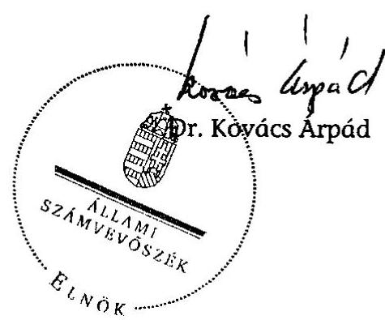
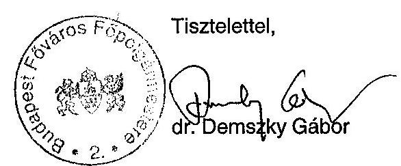
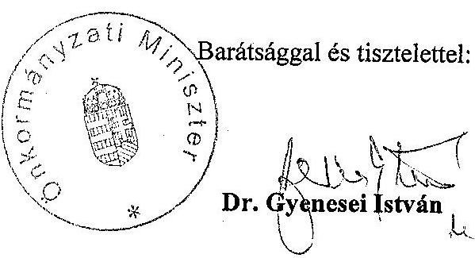
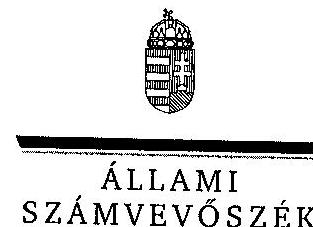
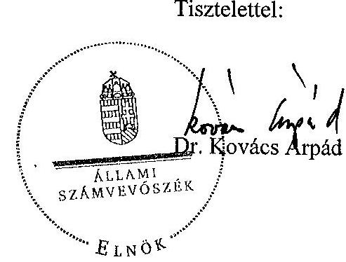

# JELENTÉS 

a fővárosi önkormányzatot és a kerületi önkormányzatokat osztottan megillető bevételek 2008. évi megosztásáról szóló önkormányzati rendelet felülvizsgálatáról

---

# 3. Önkormányzati és Területi Ellenőrzési Igazgatóság 

3.3. Átfogó Ellenőrzési Főcsoport

Iktatószám: V-3008-28/2008.
Témaszám: 906
Vizsgálat-azonosító szám: V0398

## Az ellenőrzést felügyelte:

Dr. Lóránt Zoltán
főigazgató
Az ellenőrzés végrehajtásáért felelős:
Dr. Sepsey Tamás
főigazgató helyettes
Az ellenőrzést vezette:
Németh Gábor
igazgató helyettes
A jelentés összeállításában közreműködött:
Dr. Karáné Kőszegi Zsuzsanna
tanácsadó
Az ellenőrzést végezték:
Dr. Karáné Kőszegi Zsuzsanna Tóth László
tanácsadó
számvevő

## A témához kapcsolódó eddig készített számvevőszéki jelentések:

## címe

Jelentés a Magyar Köztársaság 1998. évi költségvetése végrehajtásának ellenőrzéséről

- A helyi önkormányzatok ellenőrzése
1.3. A fővárosi és fővárosi kerületi önkormányzatok közötti forrásmegosztás tapasztalatai
Jelentés a Magyar Köztársaság 1999. évi költségvetése végrehajtásának ellenőrzéséről
- A helyi önkormányzatok ellenőrzése

1. számú Függelék: A fővárosi és a fővárosi kerületi önkormányzatok közötti forrásmegosztás tapasztalatai
Jelentés a települési önkormányzatok adóztatási tevékenységének 0121 vizsgálatáról
Függelék:

- A fővárosi és a kerületi önkormányzatok közötti forrásmegosztás

Jelentés a fővárosi önkormányzatot és a kerületi önkormányzatokat osztottan megillető bevételek 2007. évi megosztásáról szóló önkormányzati rendelet felülvizsgálatáról

---

# TARTALOMJEGYZÉK 

BEVEZETÉS ..... 7
I. ÖSSZEGZŐ MEGÁLLAPÍTÁSOK, KÖVETKEZTETÉSEK, JAVASLATOK ..... 10
II. RÉSZLETES MEGÁLLAPÍTÁSOK ..... 16

1. A fővárosi önkormányzatot és a kerületi önkormányzatokat osztottan megillető 2008. évi bevételek meghatározásának szabályszerűsége és összege ..... 16
1.1. A magánszemélyek jövedelemadójából a 2008. évi költségvetési törvény alapján a települési önkormányzatot megillető rész ..... 17
1.2. Az egyéb központi adóbevételek ..... 18
1.3. Az állandó népességszámra vetített normatív hozzájárulás összege, az Ötv. 64/B. § a) pontjában foglaltak kivételével ..... 19
1.4. A helyi adókból származó bevételek ..... 21
2. A megosztási arányok meghatározása során felhasznált alapadatok megalapozottsága, megbízhatósága, valamint a számítási eljárások szabályszerűségének ellenőrzése ..... 22
2.1. A fővárosi önkormányzatot és a kerületi önkormányzatokat együttesen megillető részesedés számítása a forrásmegosztási törvény 5. § (1) bekezdése alapján ..... 22
2.2. A forrásmegosztási törvény 6. § (1) bekezdés szerinti megosztás alapját képező „központi hozzájárulás", valamint a felhasználási kötöttséggel járó támogatások számításának szabályszerűsége ..... 24
2.3. A 2006. évi kerületi önkormányzati költségvetési beszámolók alapján a „központi hozzájárulás"-sal támogatott feladatokhoz kapcsolódó működési kiadások meghatározásának szabályszerűsége és megbízhatósága ..... 25
2.4. A működési kiadási forráshiány összegének meghatározása ..... 27
2.5. A „központi hozzájárulás" aránya szerinti megosztás számításának szabályszerűsége ..... 27
2.6. A forrásmegosztási törvény 6. § (2) bekezdés szerinti megosztás számításának szabályszerűsége ..... 28
2.7. Az egyes kerületi önkormányzatokat megillető részesedési arány esetében a 2007. év forrásmegosztásához viszonyított, maximum 5%-os növekedés, illetve csökkenés betartása ..... 28
3. Az esetleges adat- és számítási hibák miatt a 2009. évi forrásmegosztásnál végrehajtandó korrekció (a fővárosi önkormányzat vagy kerületi önkormányzat részére még jogszerűen járó összeg, illetve jogosulatlanul kapott összeg) meghatározása ..... 29

---

4. A 2008. évi forrásmegosztási rendeletalkotás eljárásának szabályszerűsége, valamint a forrásmegosztás adatellenőrzése ..... 29
4.1. A fővárosi 2008. évi költségvetési koncepció elfogadása, valamint a forrásmegosztás adatellenőrzése ..... 29
4.2. A forrásmegosztási törvényben előírt határidők betartása ..... 30
4.3. A kerületi önkormányzatok 2006. évi költségvetési beszámolóiban szereplő adatok feldolgozásának szabályozottsága és vezetői ellenőrzése ..... 31
5. Az ÁSZ 2007. évi ellenőrzése során megfogalmazott javaslatok végrehajtására tett intézkedések ..... 31

# MELLÉKLETEK 

1. számú A forrásmegosztási törvény, illetve a 2008. évi forrásmegosztási rendelet szerint figyelembe vett 47%-53% arányban megosztandó bevételek kimutatása (1 oldal)
2. számú A forrásmegosztásba vont bevételek összesítése az ÁSZ megállapításai alapján (1 oldal)
3. számú Működési kiadási forráshiány számítása a Kincstár adatai alapján (1 oldal)
4. számú Működési kiadási forráshiány az ÁSZ megállapításai alapján (1 oldal)
5. számú Megosztott bevételekből történő részesedés az állandó népesség, a belterületi terület, a népsűrűség, az alacsony komfortfokozatú és az iparosított technológiájú lakások arányában (2 oldal)
6. számú Az önkormányzatok részesedése a megosztott bevételekből a korrigált részesedési arány szerint az ÁSZ megállapításai alapján (1 oldal)
7. számú Dr. Demszky Gábor úr, Budapest Főváros Önkormányzat főpolgármesterének észrevétele (1 oldal)
8. számú Dr. Gyenesei István úr, az Önkormányzati Minisztérium miniszterének észrevétele (2 oldal)
9. számú Dr. Gyenesei István úr, az Önkormányzati Minisztérium miniszterének írt válaszlevél (2 oldal)

---

# RÖVIDÍTÉSEK JEGYZÉKE 

## Törvények

1994. évi LXIII. törvény
2000. évi költségvetési törvény
2001. és 2002. évi költségvetési törvény
2007. évi költségvetési törvény
2008. évi költségvetési törvény
Áht.
Alkotmány
forrásmegosztási törvény
fővárosról szóló törvény
Hatv.
módosító törvény
Ötv.

## Rendeletek

2007. évi PM-ÖTM
együttes rendelet
2008. évi PM-ÖTM
együttes rendelet
2008. évi forrásmegosztási rendelet

## Szórövidítések

2008. évi költségvetési koncepció
AB
ÁSZ
bázisév
a helyi önkormányzatokról szóló 1990. évi LXV. törvény módosításáról szóló 1994. évi LXIII. törvény
a Magyar Köztársaság 2000. évi költségvetéséről szóló 1999. évi CXXV. törvény
a Magyar Köztársaság 2001. és 2002. évi költségvetéséről szóló 2000. évi CXXXIII. törvény
a Magyar Köztársaság 2007. évi költségvetéséről szóló 2006. évi CXXVII. törvény
a Magyar Köztársaság 2008. évi költségvetéséről szóló 2007. évi CLXIX. törvény
az államháztartásról szóló 1992. évi XXXVIII. törvény
a Magyar Köztársaság Alkotmányáról szóló 1949. évi XX. törvény
a fővárosi önkormányzat és a kerületi önkormányzatok közötti forrásmegosztásról szóló 2006. évi CXXXIII. törvény
a fővárosi és a fővárosi kerületi önkormányzatokról szóló 1991. évi XXIV. törvény
a helyi adókról szóló 1990. évi C. törvény
az egyes önkormányzatokat érintő törvények módosításáról szóló 2007. évi CLXXXII. törvény
a helyi önkormányzatokról szóló 1990. évi LXV. törvény
a helyi önkormányzatokat és a többcélú kistérségi társulásokat 2006. évben egyes központi költségvetési kapcsolatokból megillető forrásokról szóló 4/2006. (I. 26.) PMBM együttes rendelet végrehajtásáról szóló 26/2007. (XII. 18.) PM-ÖTM együttes rendelet
a helyi önkormányzatokat és a többcélú kistérségi társulásokat 2008. évben egyes központi költségvetési kapcsolatokból megillető forrásokról szóló 2/2008. (I. 30.) PMÖTM együttes rendelet
Budapest Főváros Önkormányzat 9/2008. (II. 28.) számú rendelete a Fővárosi Önkormányzatot és a kerületi önkormányzatokat osztottan megillető bevételek 2008. évi megosztásáról

Javaslat Budapest Főváros Önkormányzata 2008. évi költségvetési koncepciójára
Alkotmánybíróság
Állami Számvevőszék
a tárgyévet kettővel megelőző év

---

| BM KANYVH | Belügyminisztérium Központi Adatfeldolgozó, Nyilvántartó és Választási Hivatal |
| :--: | :--: |
| főjegyző | Budapest Főváros Önkormányzatának főjegyzője |
| főpolgármester | Budapest Főváros Önkormányzatának főpolgármestere |
| Főpolgármesteri hivatal | Budapest Főváros Önkormányzata Közgyűlésének Főpolgármesteri Hivatala |
| fővárosi önkormányzat | Budapest Főváros Önkormányzata |
| KEKKH | BM KANYVH jogutód szervezete 2007. január 1-jétől a Közigazgatási és Elektronikus Közszolgáltatások Központi Hivatal |
| kerületi önkormányzatok | Budapest Főváros I - XXIII. kerületeinek önkormányzatai |
| Kincstár | Magyar Államkincstár |
| KÖEF | Kormány - Önkormányzatok Egyeztető Fórum |
| Közgyűlés | Budapest Főváros Önkormányzatának Közgyűlése |
| KSH | Központi Statisztikai Hivatal |
| SzMSz | Szervezeti és Működési Szabályzat |

---

# ÉRTELMEZŐ SZÓTÁR 

„ászfmt" adatbázis
„kincstári" adatbázis
forrásmegosztás
háttérszámítás
működési kiadási forráshiány
normatív hozzájárulások
normatív állami hozzájárulás
az ÁSZ észrevétele alapján meghatározott adatokat és a számítást tartalmazza.
az ÁSZ rendelkezésére álló 2006. évi kincstári adatokat és a számítást tartalmazza.
a fővárosi önkormányzatot és a kerületi önkormányzatokat osztottan megillető bevételek megosztása
a fővárosi önkormányzat 2008. évi forrásmegosztási rendelettervezetének előterjesztéséhez mellékelt, a forrásmegosztást megalapozó számítások, amelyek alapján a 2008. évi forrásmegosztási rendelet elfogadásra került
a működési kiadások és a normatív hozzájárulások, valamint a felhasználási kötöttséggel járó támogatások különbözete
a normatív állami hozzájárulás és a normatív részesedésű átengedett személyi jövedelemadó együttesen
Az Ötv. 64. § (3) bekezdés a), 64/B. § a) pontjában normatív központi hozzájárulás, 64. § (4) bekezdés c) pontjában központi hozzájárulás, 84. § (1) bekezdésében normatív költségvetési hozzájárulás, 88. § (1) bekezdés b) pontjában normatív állami hozzájárulás megnevezések együttesen

---

.

---

# JELENTÉS 

## a fővárosi önkormányzatot és a kerületi önkormányzatokat osztottan megillető bevételek 2008. évi megosztásáról szóló önkormányzati rendelet felülvizsgálatáról

## BEVEZETÉS

Az Országgyűlés a fővárosi önkormányzat és a kerületi önkormányzatok közötti forrásmegosztásról szóló 2006. évi CXXXIII. törvény 2007. decemberben történt módosításával újraszabályozta a fővárosi forrásmegosztást.

A forrásmegosztási törvény 8. § (1) bekezdése alapján, figyelemmel az Alkotmány 32/C. § (1) bekezdésére, a fővárosi önkormányzat tárgyévre vonatkozó forrásmegosztási rendeletét az ÁSZ-nak felül kell vizsgálnia.

A forrásmegosztási törvénynek megfelelően a számvevőszéki ellenőrzés a forrásmegosztás során alkalmazott adatok megalapozottságára és az ennek alapjául szolgáló számítások helyességére irányult. A 8. § (2) bekezdésének rendelkezése értelmében, amennyiben a forrásmegosztás során alkalmazott adatok, vagy a számítások helytelensége miatt a fővárosi önkormányzat, vagy valamely kerületi önkormányzat jogosulatlan forráshoz jutott, vagy a jogszerűen járó forrásnál alacsonyabb összegben részesült, ezt az összeget, a hiba feltárását követő év forrásmegosztásánál kell figyelembe venni.

Az ellenőrzés célja annak megállapítása volt, hogy:

- a 2008. évi forrásmegosztási rendelet a forrásmegosztási törvény előírásainak megfelelően határozta-e meg a megosztható bevételeket és azok összegét;
- a megosztási arányok meghatározásánál felhasznált alapadatok megalapozottak voltak-e, és a számítási eljárások helyesek voltak-e;
- az esetleges adat- és számítási hibák miatt milyen korrekciót kell elvégezni a tárgyévet követő évi forrásmegosztásnál.

Az ellenőrzött adatkör: a fővárosi önkormányzatot és a kerületi önkormányzatokat osztottan megillető bevételek meghatározása a 2008. évre vonatkozott, a megosztási arányok meghatározása során felhasznált alapadatokat a 2006. évi önkormányzati költségvetési beszámoló alapján kellett ellenőrizni.

---

A forrásmegosztás rendszerének megismeréséhez szükséges vonatkozó jogi szabályozással kapcsolatos megállapításainkat az ÁSZ 2007. évi 0756 számú jelentése tartalmazta.

A forrásmegosztási törvény a korábbi évek gyakorlatától eltérő szabályozást tartalmazott, az Ötv.-ben meghatározott megosztandó bevételek összességére vonatkozóan 47%-53%-os megosztási arány kötelező alkalmazását írta elő a fővárosi és a kerületi önkormányzatok részesedése tekintetében. Ezt az Országgyűlés a 2007. december 17-én elfogadott, december 29-én kihirdetett törvénynyel ¹ módosította. A módosító előírások egy részét a 2007. évi forrásmegosztás felülvizsgálatánál is alkalmazni kellett.

A módosító törvényben foglaltak figyelembevétele miatt a forrásmegosztási törvény 8. § (2) bekezdés szerinti hiba feltárása 2008. januárban történt meg, emiatt a 2007. évi felülvizsgálat adatainak figyelembevételével a 2009. évi forrásmegosztást kell módosítani, és itt kell figyelembe venni a 2008. évi felülvizsgálat megállapításait is.

Az egyéb szabályszerűségi ellenőrzés keretében a forrásmegosztási törvény előírásainak való megfelelőséget elemző eljárással vizsgáltuk. A Főpolgármesteri hivatalnál tekintettük át a forrásmegosztási törvény gyakorlati alkalmazását, a számítások helyességét. A fővárosi önkormányzatot a módosított forrásmegosztási törvény szerint megosztott - a kerületi önkormányzatok által beszedett adóbevételek (az egyéb központi adókból a gépjárműadó, valamint a kerületi helyi adók) és a személyi jövedelemadó helyben maradó része (beleértve a jövedelem-differenciálódás mérséklésének korrekcióját) kivételével - bevételek 47%-a illeti meg. A kerületi önkormányzatok összességét megillető (53%) összeg helyességének megállapításánál a 2008. évi forrásmegosztási rendelettervezet előterjesztéséhez mellékelt háttérszámításokhoz kapcsolódó adatbázis adatait hasonlítottuk össze az ÁSZ rendelkezésére álló kincstári adatokkal². Az összehasonlítás érdekében a „kincstári" adatbázis táblázataiba a Kincstár adatait írtuk be, ha az adat eltért a táblázatban feltüntetett háttérszámítás adatától. Az ÁSZ vizsgálata alapján meghatározott adatok rögzítését az „ászfmt" adatbázisban végeztük el.

[^0]
[^0]:    ¹ A 2007. évi CLXXXII. törvény az egyes önkormányzatokat érintő törvények módosításáról.
    ² Az ÁSZ a 2007. évi 0756 számú jelentésében megállapította, hogy az önkormányzatoknál található költségvetési beszámoló adatai minden esetben megegyeztek a kincstár adataival, emiatt a kerületi önkormányzatoknál nem indokolt a helyszíni ellenőrzés.

---

A forrásmegosztás adatainak ellenőrzésekor értékeltük az adatfeldolgozás szabályozottságát és

 az ehhez kapcsolódó vezetői ellenőrzés működésének megbízhatóságát.

A helyszíni ellenőrzés megállapításainak dokumentálását adatbázis táblázatok és munkatáblák kitöltésével biztosítottuk.

---

# I. ÖSSZEGZŐ MEGÁLLAPÍTÁSOK, KÖVETKEZTETÉSEK, JAVASLATOK 

A 2008. évi forrásmegosztási rendelet összesen 206193490 ezer Ft megosztásáról rendelkezett. A forrásmegosztási törvény a fővárosi önkormányzatot és a kerületi önkormányzatokat osztottan megillető bevételek körét az Ötv. szabályozására hivatkozva határozta meg, továbbá előírta, hogy a bevételek nagyságának meghatározása a tárgyidőszakra vonatkozó fővárosi költségvetési koncepcióban szereplő tervszámok alapján történik.

A forrásmegosztási törvény hivatkozik a Hatv.-re az Ötv. szerinti megosztott bevételek körébe tartozó helyi adók vonatkozásában, azonban a Hatv. rendelkezése nincs összhangban az Ötv. rendelkezésével, mert az Ötv. helyett a hatályon kívül helyezett, a fővárosról szóló törvényre való hivatkozást tartalmazza. A forrásmegosztási törvény a fővárosi, valamint a kerületi önkormányzatokat megillető bevételek 47%, illetve 53%-os megosztásával korlátozta a Közgyűlés Ötv. felhatalmazásán alapuló jogkörét a megosztási arányok normatív meghatározására vonatkozóan ${ }^{3}$. A módosító törvény megteremtette az összhangot a forrásmegosztási törvény és a 2008. évi költségvetési törvény azon rendelkezése között, miszerint a normatív hozzájárulás egy részének forrása a helyi önkormányzatokat megillető személyi jövedelemadó. A forrásmegosztási törvény a fővárosi önkormányzatokat osztottan megillető bevételek közé - a személyi jövedelemadó helyben maradó részébe - beemelte a jövedelemdifferenciálódás mérséklése miatt elvont összeg tárgyévet megelőző évben visszaigényelhető részét. A módosító törvény szabályozta a jövedelemdifferenciálódás mérséklés elszámolása alapján visszafizetendő összeg rendezését. A fővárosi önkormányzatot és a kerületi önkormányzatokat osztottan megillető bevétel az egyéb központi adó, vagyis a gépjárműadó és a luxusadó. A módosító törvény szerint az egyéb központi adókból a kerületi önkormányzat által beszedett adóbevétel 100%-a a kerületi önkormányzatot illeti meg. A 2008. évi forrásmegosztási rendelet az Ötv. szabályozását figyelmen kívül hagyva, az egyszerű többségi szavazattal elfogadott módosító forrásmegosztási törvényben foglaltaknak megfelelően osztotta meg a gépjárműadó és a luxusadó bevételt.

Az állandó népességhez kapcsolódó normatív hozzájárulás megosztása során a forrásmegosztási törvény szerint a KSH bázisévet követő év január 1-jei állandó népesség számát kell figyelembe venni. Az Ötv. alapján a forrásmegosztási törvényben meghatározott állandó népesség fogalom nincs összhangban a 2008. évi költségvetési törvényben a normatív hozzájárulások összegének megállapításánál alkalmazott lakosságszám adattal. A költségvetési törvények a normatív hozzájárulások esetében KEKKH lakosságszám adatainak figyelembevételét írják elő. Célszerűtlen és indokolatlan a forrásmegosztás esetében ettől eltérni.

[^0]
[^0]:    ${ }^{3}$ Az erre vonatkozó megállapításokat a 0756 számú jelentésünk tartalmazza.

---

A 2008. évi forrásmegosztási rendelet az Ötv. szerinti állandó népességhez kapcsolódó normatív hozzájárulások közül - ellentétben a forrásmegosztási törvény előírásával - nem vette figyelembe a körzeti igazgatás körébe tartozó gyámügyi igazgatási feladatokat, az építésügyi igazgatási feladatok térségi normatív hozzájárulását, a pénzbeli szociális juttatásokat, a helyi közművelődési és közgyűjteményi feladatokat, a szociális és gyermekjóléti alapszolgáltatás általános feladatai körébe tartozó családsegítés és/vagy gyermekjóléti szolgáltatás működtetését, továbbá a fővárosi önkormányzat feladatai közül az igazgatási- és sportfeladatokból a sport, valamint a közművelődési- és közgyűjteményi feladatokból a közgyűjteményi feladatokat. A településüzemeltetéshez kapcsolódó normatív hozzájárulás esetében a 2008. évi költségvetési törvény a települési önkormányzatot nevesítette igénybevevő önkormányzatnak. Tekintettel arra, hogy mind a fővárosi önkormányzat, mind a kerületi önkormányzat települési önkormányzat, mindegyik jogosult a településüzemeltetési normatív hozzájárulásra. A 2008. évi költségvetési törvény előírásától eltérően a 2008. évi PM-ÖTM együttes rendelet csak a fővárosi önkormányzatot tartalmazta jogosultként, de összegét szabályszerűen bevonták a forrásmegosztásba. A fővárosi önkormányzat az üdülőhelyi feladatokhoz tartozó normatív hozzájárulást is bevonta a megosztandó bevételek közé, annak ellenére, hogy az nem kapcsolódott az Ötv-ben meghatározott állandó népességhez.

A fővárosi önkormányzat által bevezetett helyi iparűzési adó és idegenforgalmi adó a megosztott bevételek részét képezte, a kerületi önkormányzatok által kivetett helyi adókat nem vették figyelembe a 2008. évi forrásmegosztási rendeletben.

A fővárosi önkormányzat által figyelembe vett 206193490 ezer Ft bevételhez képest az ÁSZ megállapítása szerint a megosztandó források előirányzatának összege 5%-kal több, 218278096 ezer Ft.

Az Ötv. szerint a fővárosi és a kerületi önkormányzatok közötti forrásmegosztást meghatározó forrásmegosztási törvényben rögzíteni kell a számítások során figyelembe veendő feladatokat, ezt a forrásmegosztási törvény nem tartalmazza, hanem a számítási módszert szabályozza.

A forrásmegosztási törvény szerint a bázisév önkormányzati költségvetési beszámoló űrlapjainak az ÁSZ vagy a Kincstár által elvégzett felülvizsgálat esetén a vizsgálat alapján korrigált - a zárszámadási törvényben elfogadott, illetve jogerős kincstári határozattal megállapított - adatait kell figyelembe venni a „központi hozzájárulás" meghatározásához. Az önkormányzati költségvetési beszámolókon az eltérések miatt szükséges javítások átvezetési kötelezettségét jogszabály nem írja elő. A lakosságszám alapján járó normatív hozzájárulások, valamint a felhasználási kötöttséggel járó támogatások esetében az ÁSZ felülvizsgálattal érintett önkormányzatoknál figyelembe vettük a 2007. évi PMÖTM együttes rendelet szerinti elvonásokat, ezek következményeként a „központi hozzájárulás" összesen 122851 ezer Ft-tal, a felhasználási kötöttséggel járó támogatások összege 23 ezer Ft-tal kevesebb az ÁSZ számítása szerint.

A forrásmegosztás során a működési kiadásokat az önkormányzati költségvetési beszámolók adatai alapján kell számba venni, amelyek a működési kiadásokat szakfeladatonként részletezik. A forrásmegosztási törvény azonban

---

nem tartalmazza a forrásmegosztásnál figyelembe veendő feladatokat. A jogi szabályozás hiányában nem határozható meg pontosan, hogy a működési kiadásokat meghatározó szakfeladatokhoz mely normatív hozzájárulások kapcsolódnak. A „központi hozzájárulás"-sal támogatott feladatok működési kiadásait - a fővárosi önkormányzat által a kerületi önkormányzatok részére egyeztetés céljából megküldött táblázat szakfeladatainak adatait az önkormányzati költségvetési beszámoló 21. űrlapjának kincstári adatai alapján - ellenőriztük, eltérés nem volt. A 2006. évben már nem járt normatív hozzájárulás az egyéb közoktatási, nevelési, oktatási feladatok körébe tartozó kulturális, egyéb szabadidős, egészségfejlesztési feladatokhoz ${ }^{4}$, ezért a fővárosi önkormányzat szabálytalanul vette figyelembe a működési kiadásban az 551414 üdültetés, az 551425 egyéb szálláshely szolgáltatás, valamint a 552411 munkahelyi vendéglátás szakfeladatokat, ennek következtében az összes működési kiadás a háttérszámítás adatához viszonyítva 1,1%-kal, 1530850 ezer Ft-tal kevesebb az ÁSZ számítása szerint.

A működési kiadási forráshiány meghatározását a fővárosi önkormányzat a szabályozásnak megfelelő módszer szerint végezte, az ÁSZ által végzett számítás eltérése a „központi hozzájárulás" és a felhasználási kötöttséggel járó állami támogatás, valamint a működési kiadások számításánál elvégzett helyesbítésből ered. A működési kiadási forráshiány összesen 1,7%-kal 1407976 ezer Ft-tal kevesebb az ÁSZ számítása szerint.

A módosító törvény megteremtette az összhangot a működési kiadás és a kapcsolódó „központi hozzájárulás" között, ezért a 6. § (1) bekezdés szerinti működési kiadási forráshiányra rendelkezésre álló források megosztását követően maradt forrás a 6. § (2) bekezdés szerinti megosztásra. A számítás során a figyelembe veendő adatok forrásával, azok megbízhatóságával kapcsolatos problémát a módosító törvény egy kivétellel megszüntette. A belterületi területre számított népsűrűség meghatározása továbbra sem egyértelmű, mert nem szabályozta, hogy az a belterület népességének, vagy a 3. § e) pontja szerinti állandó népességnek és a belterületi területnek a hányadosa.

Az ÁSZ megállapításai alapján a 2008. évi forrásmegosztás korrekciója során a megosztandó bevételek összegét meg kell növelni a háttérszámításból hiányzó állandó népességhez kapcsolódó normatív hozzájárulások 12084606 ezer Ft előirányzatával, továbbá az ÁSZ felülvizsgálata következtében módosított 54106209 ezer Ft 2006. évi „központi hozzájárulás", a felhasználási kötöttséggel járó 1401402 ezer Ft korrigált összegű támogatás, valamint az ÁSZ számítása szerinti 136272372 ezer Ft működési kiadás figyelembevételével meghatározott arányok (6. számú melléklet 2. oszlop adatai) alapján kell az egyes kerületi önkormányzatokat megillető bevételeket korrigálni a 2009. évben.

A Közgyűlés határozatban döntött a megosztandó bevételek nagyságának meghatározásáról a 2008. évi költségvetési koncepcióban. A Főpolgármesteri hivatalban megfelelően elvégezték a forrásmegosztáshoz tartozó normatív hozzá-

[^0]
[^0]:    ${ }^{4}$ A 2004. évi CXXXV. törvény 3. számú melléklet 24. d) pontja szerinti normatív hozzájárulás.

---

járulások, felhasználási kötöttséggel járó támogatások és működési kiadások adatainak ellenőrzését.

A fővárosi önkormányzat határidőben megküldte a 2008. évi forrásmegosztás elvégzéséhez szükséges adatokat ellenőrzés céljából a kerületi önkormányzatoknak, amelyek eltérést nem jeleztek. A fővárosi önkormányzat a 2008. évi forrásmegosztási rendelettervezetet véleményezés céljából határidőben küldte meg a kerületi önkormányzatok részére. A 23 kerületi önkormányzat 83%-a a 2008. évi forrásmegosztási rendelettervezetben foglaltakat tudomásul vette, négy nem támogatta. A kerületi önkormányzatok a 2008. évi forrásmegosztási rendelettervezet véleményezésekor jelezték, hogy a 2008. évi forrásmegosztási rendelet nincs összhangban az Ötv., a költségvetési törvény és a forrásmegosztási törvény szabályozásával. A Közgyűlés határidőben megalkotta a 2008. évi forrásmegosztási rendeletet, és élve a felterjesztési jogával, kezdeményezte a jogszabályok közti összhang megteremtését az Önkormányzati és Területfejlesztési Minisztériumnál.

Az ÁSZ 2007. évi ellenőrzési javaslatai alapján az önkormányzati és területfejlesztési miniszternek tett négy javaslat közül három javaslatra nem történt intézkedés, a főpolgármesternek tett három javaslat végrehajtása a 2009. évben esedékes.

A helyszíni ellenőrzés megállapításainak hasznosítása mellett javasoljuk:

# az önkormányzati miniszternek 

1. kezdeményezze a fővárosi önkormányzat és a kerületi önkormányzatok közötti forrásmegosztásról szóló 2006. évi CXXXIII. törvény módosítását annak érdekében, hogy előírásai összhangban legyenek a helyi önkormányzatokról szóló 1990. évi LXV. törvénnyel, ezért a módosítás
a) határozza meg a forrásmegosztási számításoknál figyelembe veendő feladatokat a helyi önkormányzatokról szóló 1990. évi LXV. törvény 64. § (6) bekezdésének megfelelően;
b) kezdeményezze a fővárosi önkormányzat és a kerületi önkormányzatok részesedési arányának olyan normatív módon való meghatározását, ami nem korlátozza a Fővárosi Közgyűlés megosztási arányok meghatározására vonatkozó jogát;
2. kezdeményezze a fővárosi önkormányzat és a kerületi önkormányzatok közötti forrásmegosztásról szóló 2006. évi CXXXIII. törvény előírásainak pontosítását az egyértelmű alkalmazhatóság céljából, hogy
a) a 3. § e) pontja szerinti állandó népesség meghatározása összhangban legyen a költségvetési törvény 3. számú mellékletében alkalmazott, KEKKH által megadott lakosságszámmal;
b) a Fővárosi Közgyűlés törvényi felhatalmazás alapján rendeletben határozza meg a forrásmegosztási számításnál figyelembe vett feladatokhoz tartozó azon szakfeladatokat, amelyeken elszámolt működési kiadások a forrásmegosztási számítás alapját képezik;

---

c) a 6. § (2) bekezdése szerinti forrásmegosztásnál egyértelműen határozzák meg a belterületre számított népsűrűség definícióját;
d) a költségvetési törvényben külön önálló feladatként szerepeljen a fővárosi önkormányzat kizárólagos bevételét képező igazgatási és közművelődési feladat normatív hozzájárulása a helyi önkormányzatokról szóló 1990. évi LXV. törvény 64/8. § a) pontjában foglaltak érvényesíthetősége érdekében;
3. kezdeményezze a helyi adókról szóló 1990. évi C. törvény 8. § (1) bekezdése módosítását, hogy az ne a már hatályon kívül helyezett, a fővárosi és a fővárosi kerületi önkormányzatokról szóló 1991. évi XXIV. törvényre hivatkozzon, hanem a helyi önkormányzatokról szóló 1990. évi LXV. törvény 64. § (4) bekezdés d) pontjára.

# a főpolgármesternek 

1. gondoskodjon arról, hogy a 2009. évi forrásmegosztásnál a 2007. évi forrásmegosztás korrekciójaként
a) a 2005. évi jövedelem-differenciálódás mérséklés elszámolásából adódó 402194856 forint visszafizetendő összeg jogszabályi felhatalmazás hiányában szabálytalan megosztását szüntesse meg;
b) az Ötv. 64. § (4) bekezdés c) pontjának megfelelően az állandó népességhez kapcsolódó központi hozzájárulások teljes körű
 figyelembevételével (a Magyar Köztársaság 2007. évi költségvetéséről szóló 2006. évi CXXVII. törvény 3. számú melléklet 2. ac) pontjában meghatározott gyámügyi igazgatási feladatok; 2. ba) pontjában meghatározott építésügyi igazgatási feladatok alap-hozzájárulása; 9. pontjában meghatározott pénzbeli szociális juttatások; 10. pontjában meghatározott lakáshoz jutás feladatai; 11. ab), ac), ad) pontjaiban meghatározott családsegítő és/vagy gyermekjóléti szolgáltatás működtetése; 18. pontjában meghatározott helyi közművelődési és közgyűjteményi feladatok) a megosztandó bevételek összegét növelje meg;
c) a 2007. évi megosztandó bevétel b) pontbeli javaslat alapján módosított adatok figyelembevételével meghatározott összegét a 2007. évi 0756 számú ÁSZ jelentés 4. számú melléklet 3. oszlopában meghatározott arányok szerint ossza meg.
2. gondoskodjon arról, hogy a 2009. évi forrásmegosztásnál a 2008. évi forrásmegosztás korrekciójaként
a) az Ötv. 64. § (4) bekezdés c) pontjának megfelelően az állandó népességhez kapcsolódó központi hozzájárulások teljes körű figyelembevételével (a Magyar Köztársaság 2008. évi költségvetéséről szóló 2007. évi CLXIX. törvény 3. számú melléklet 2. ac) pontjában meghatározott gyámügyi igazgatási feladatok; 2. ba) pontjában meghatározott építésügyi igazgatási feladatok térségi normatív hozzájárulása; 9. pontjában meghatározott pénzbeli szociális juttatások; 10. pontjában meghatározott helyi közművelődési és közgyűjteményi feladatok; 11. ab), ac), ad) pontjaiban meghatározott családsegítő és/vagy gyermekjóléti szolgáltatás működtetése) a megosztandó bevételek összegét növelje meg;

---

b) a lakosságszám alapján járó normatív hozzájárulások, a felhasználási kötöttséggel járó támogatások, valamint a működési kiadások esetében vegye figyelembe az ÁSZ felülvizsgálattal érintett kerületi önkormányzatok adatait érintő elvonásokat, valamint a normatív támogatásban nem részesülő szakfeladatok adatainak elhagyását;
c) a 2008. évi megosztandó bevétel a) és b) pontbeli javaslat alapján módosított adatok figyelembevételével meghatározott összegét a jelentés 6. számú melléklet 2. oszlopában meghatározott arányok szerint ossza meg.

---

# II. RÉSZLETES MEGÁLLAPÍTÁSOK 

## 1. A FŐVÁROSI ÖNKORMÁNYZATOT ÉS A KERÜLETI ÖNKORMÁNYZATOKAT OSZTOTTAN MEGILLETŐ 2008. ÉVI BEVÉTELEK MEGHATÁROZÁSÁNAK SZABÁLYSZERŰSÉGE ÉS ÖSSZEGE

A forrásmegosztási törvény 4. § (1) bekezdésében a fővárosi önkormányzatot és a kerületi önkormányzatokat osztottan megillető bevételek körét az Ötv. 64. § (4) bekezdésére hivatkozással határozta meg.

Az Ötv. 64. § (4) bekezdése szerint:

- a magánszemélyek jövedelemadójából az állami költségvetésről szóló törvény alapján a települési önkormányzatokat megillető rész;
- az egyéb központi adó;
- az állandó népességhez kapcsolódó normatív állami hozzájárulás, kivéve a 64/B. § a) pontban foglaltakat ${ }^{5}$;
- a helyi adókból származó bevételek.

A forrásmegosztási törvény a 4. § (4) bekezdésében előírta, hogy a bevételek nagyságának meghatározása a tárgyidőszakra vonatkozó fővárosi költségvetési koncepcióban szereplő tervszámok ${ }^{6}$ alapján történik.

A főpolgármester a 2007. november 29-én elkészült, a 2008. évre vonatkozó költségvetési koncepciót benyújtotta a Közgyűlésnek. A Közgyűlés a 2007. december 20-i ülésén határozatban ${ }^{7}$ elfogadta a „Javaslat Budapest Főváros Önkormányzata 2008. évi költségvetési koncepciójáról" szóló előterjesztésben foglaltakat.

A Közgyűlés a 2008. évre vonatkozó költségvetési koncepcióban elfogadott forrásmegosztáshoz kapcsolódó tervszámokat határozatban ${ }^{8}$ 2008. január 31-én véglegesítette.

A forrásmegosztási törvény 5. § (1) bekezdése alapján a fővárosi és a kerületi önkormányzatokat az Ötv. 64. § (4) bekezdése szerint osztottan megillető bevételekből a fővárosi önkormányzatot $\mathbf{47 \%}$, a kerületi önkormányzatokat együttesen $\mathbf{53 \%}$ részesedés illeti meg.

[^0]
[^0]:    ${ }^{5}$ Az Ötv. 64/B. § a) pontja szerint a fővárosi önkormányzat kizárólagos bevétele „a normatív központi hozzájárulás igazgatási és közművelődési feladatokra".
    ${ }^{6}$ A módosító törvény megszüntette a bevételi tervszámok kerületi önkormányzatokkal történő egyeztetési kötelezettségét.
    ${ }^{7}$ A Közgyűlés 2176/2007. (XII. 20.) számú határozatában felkérte a főpolgármestert, hogy a 2008. évi költségvetési koncepcióban javasolt bevételek alapján terjessze a Közgyűlés elé a 2008. évi forrásmegosztási rendelettervezetet.
    ${ }^{8}$ A Közgyűlés 86/2008. (I. 31.) számú határozatában fogadta el a forrásmegosztás 2008. évi tervszámait.

---

A forrásmegosztási törvény a fővárosi önkormányzatokat megillető bevételek százalékos megosztásával korlátozta a Közgyűlés Ötv. 64. § (5) bekezdésének felhatalmazásán alapuló jogkörét ${ }^{9}$, amely a megosztási arányok meghatározására vonatkozik ${ }^{10}$.

A 2008. évi költségvetési törvény 22. §-a helytelenül a fővárosi önkormányzatot megillető bevételeknek a fővárosi és a kerületi önkormányzatok közötti megosztásáról rendelkezik, helyesen az Ötv. 64. § (4) bekezdésben meghatározott, a fővárosi önkormányzatot és a kerületeket osztottan megillető bevételeket kell megosztani.

# 1.1. A magánszemélyek jövedelemadójából a 2008. évi költségvetési törvény alapján a települési önkormányzatot megillető rész 

Az Ötv. 64. § (4) bekezdése szerint a fővárosi önkormányzatot és a kerületi önkormányzatot osztottan megillető bevételek között az a) pontban „a magánszemélyek jövedelemadójából az állami költségvetésről szóló törvény alapján a települési önkormányzatokat megillető rész" szerepel.

A 2008. évi PM-ÖTM együttes rendeletben a fővárosi önkormányzatnál tüntették fel a főváros önkormányzatait megillető személyi jövedelemadó összegét.

A 2008. évi költségvetési törvény a helyi önkormányzatokat megillető személyi jövedelemadó egy részét a települési önkormányzatokat közvetlenül megillető személyi jövedelemadóként, a másik részét normatív hozzájárulás jogcímeihez átengedett személyi jövedelemadóként vette figyelembe.

A forrásszerkezet módosításával - a személyi jövedelemadó normatív hozzájárulásként történő kezelésével - egyidejűleg nem módosították az Ötv. vonatkozó rendelkezését, és ennek következtében megszűnt az Ötv. 64. § (3) bekezdés a) pontja és a (4) bekezdés a) pontja közötti összhang.

Az Ötv. 64. § (3) bekezdés a) pontja szerint a fővárosi önkormányzatot, illetve a kerületi önkormányzatokat önállóan és közvetlenül illetik meg a feladat ellátáshoz kapcsolódó normatív hozzájárulások, a 64. § (4) bekezdés a) pontja szerint viszont osztott bevétel a magánszemélyek jövedelemadójából a költségvetési törvény alapján a települési önkormányzatokat megillető rész egésze. Eszerint a települési önkormányzatokat a magánszemélyek jövedelemadójából illeti meg a

[^0]
[^0]:    ${ }^{9}$ Az önkormányzati és lakásügyi szakállamtitkár véleménye szerint a forrásmegosztási törvény 5. § (1) bekezdése, amely a megosztási arányokra vonatkozik, nem üresíti ki a fővárosi önkormányzat rendeletalkotási jogkörét. Álláspontunk szerint a forrásmegosztási törvényben rögzített arányszám megállapítása a főváros és a kerületi önkormányzatok közötti forrásmegosztás tekintetében ellentétes az Ötv. 64. § (5) bekezdésében foglaltakkal, mely szerint a bevételeknek a fővárosi önkormányzat és a kerületi önkormányzatok közötti megosztását a Fővárosi Közgyűlés rendeletében határozza meg. Az Ötv. hivatkozott rendelkezése a fővárosi önkormányzatot hatalmazza fel a megosztásról szóló döntésre, nem pedig külön törvényre bízza a megosztás meghatározását.
    ${ }^{10}$ Az ezzel kapcsolatos megállapításainkat a 0756 számú jelentés tartalmazza.

---

normatív hozzájárulások személyi jövedelemadóból fedezett része, amely a főváros önkormányzatai tekintetében az osztottan megillető bevételek részét képezi.

A módosító törvény megteremtette az összhangot a forrásmegosztási törvény és a 2008. évi költségvetési törvény azon rendelkezése között, miszerint a normatív hozzájárulás egy részének forrása a helyi önkormányzatokat megillető személyi jövedelemadó.

A 2008. évi költségvetési törvény 19. §-ában hivatkozott 4. sz. mellékletben foglalt megosztási szabályok szerint 571,1 milliárd Ft személyi jövedelemadó illeti meg a helyi önkormányzatokat, ebből 58,8%-336 milliárd Ft - normatív hozzájárulásként.

A 2008. évi költségvetési törvény alapján a fővárosi önkormányzatot és a kerületi, mint települési önkormányzatokat együttesen megillető magánszemélyek jövedelemadójából származó összeg 62 milliárd Ft$^{11}$, amely a fővárosra vonatkozóan, az Ötv. 64. § (4) bekezdés a) pontja szerint a megosztott bevételek részét képezi. Ebből a főváros közigazgatási területére kimutatott személyi jövedelemadó 8%-a, 35,7 milliárd Ft, a jövedelem-differenciálódás mérséklése miatt elvont összeg 23 milliárd Ft, a normatív hozzájárulás személyi jövedelemadóból származó része 49,3 milliárd Ft.

A forrásmegosztási törvény 5. § (1) bekezdése beemelte az osztottan megillető bevételek közé - a személyi jövedelemadó helyben maradó részébe - a jövedelem-differenciálódás mérséklése miatt elvont összeg tárgyévet megelőző évben visszaigényelhető részét. A módosító törvény szabályozta a jövedelem-differenciálódás mérséklés elszámolása alapján visszafizetendő összeg$^{12}$ rendezését.

# 1.2. Az egyéb központi adóbevételek 

Az Ötv. 64. § (4) bekezdés b) pontja szerint a fővárosi önkormányzatot és a kerületi önkormányzatokat osztottan megillető bevétel az egyéb központi adó. Az egyéb központi adók körébe tartozik a gépjárműadó és a luxusadó.

Az Ötv. 64. § (4) bekezdés b) pontját figyelmen kívül hagyva, az egyszerű többségi szavazattal elfogadott módosító törvény 2007. december 30-án hatályba lépett rendelkezése ${ }^{13}$ szerint az egyéb központi adókból a kerületi önkormányzat által beszedett adóbevétel 100%-a a kerületi önkormányzatot illeti meg ${ }^{14}$.

[^0]
[^0]:    ${ }^{11}$ a 2008. évi PM-ÖTM együttes rendelet 3. számú melléklet ország összesen adatai alapján számított érték
    ${ }^{12}$ a jövedelem-differenciálódás mérséklésének elszámolásából adódó korrekció összege a 2008. évben -1 252 380 ezer Ft a kerületi önkormányzatokra vonatkozóan
    ${ }^{13}$ a forrásmegosztási törvény 4. § (3) bekezdése
    ${ }^{14}$ Az önkormányzati és lakásügyi szakállamtitkár észrevételében azt rögzítette, hogy az egyéb központi adó megosztási arányának 100%-0%-ban történő meghatározása nem ellentétes az Ötv. szabályával. Tekintettel arra, hogy az Ötv. 64. § (4) bekezdése a fővárosi önkormányzatot és a kerületi önkormányzatot osztottan megillető bevételek közé sorolja az egyéb központi adókat és nem az Ötv. 64/A. §-ban a kerületi önkormányzat kizárólagos bevételeként határozza meg, az észrevételt nem fogadjuk el.

---

Ezt a rendelkezést a módosító törvény 8. § (1) bekezdésének előírása szerint a forrásmegosztás 2007. évi felülvizsgálata esetén is alkalmazni kell.

A 2008. évi forrásmegosztási rendelet 3. §-a a forrásmegosztási törvényben foglaltaknak megfelelően a kerületi önkormányzat költségvetési bevételeként határozta meg a gépjárműadó bevételt.

A 2008. évi forrásmegosztási rendelet a forrásmegosztási törvény 5. § (1) bekezdésében meghatározott részesedés szerint osztotta meg a luxusadó tervezett összegét a fővárosi önkormányzat és a kerületi önkormányzatok között.

# 1.3. Az állandó népességszámra vetített normatív hozzájárulás összege, az Ötv. 64/B. § a) pontjában foglaltak kivételével 

A forrásmegosztási törvény 2007. december 30-án hatályba lépett 3. § e) pontja a KSH bázisévet követő év január 1-jei adataként határozta meg a figyelembe veendő állandó népesség számát.

A forrásmegosztási törvényben az Ötv. 64. § (4) bekezdés c) pontja alapján meghatározott állandó népesség fogalom ${ }^{15}$ nincs összhangban a 2008. évi költségvetési törvény - az Ötv. ugyanezen előírásán alapuló - normatív hozzájárulások összegének megállapításánál alkalmazott lakosságszám ${ }^{16}$ adattal. A költségvetési törvények a normatív hozzájárulások esetében KSH lakosságszám adatainak figyelembevételét írják elő. Célszerűtlen és indokolatlan a forrásmegosztás esetében ettől eltérni. A különböző fogalom meghatározás az állandó népesség esetében eltérést okoz (az I. kerület KSH lakónépesség adata 1775 fővel, 6,7%-kal kevesebb, mint a lakosságszám, illetve a VIII. kerület KSH lakónépesség adata 7094 fővel, 9,7%-kal több, mint a lakosságszám), amely az egyes kerületi önkormányzatok forrásmegosztásból való részesedésében - az előző évi forrásmegosztáshoz viszonyított ±5%-os határ miatt - változást eredményez.

A bevételi tervszámok nem tartalmazták teljes körűen a forrásmegosztási törvény 4. § (1) bekezdése, vagyis az Ötv. 64. § (4) bekezdése szerinti bevételeket
 (1. számú melléklet).

A 2008. évi forrásmegosztási rendelettervezet 2008. január 11-ei előterjesztése szerint a „az előző évek gyakorlatának megfelelően - az állandó népességhez kapcsolódó központi hozzájárulásból csak a településüzemeltetési, igazgatási és sportfeladatokhoz kapcsolódó normatív hozzájárulásokat szerepeltetjük...".

A 2008. évi forrásmegosztási rendelet 1. § (1) bekezdésében az Ötv. 64. § (4) bekezdés c) pontja szerinti állandó népességhez kapcsolódó normatív hozzájárulások közül - megsértve a forrásmegosztási törvény 5. § (1) bekezdésének előírását - nem vette figyelembe a körzeti igazgatás körébe tartozó gyámügyi igazgatási feladatokat ${ }^{17}$, az építésügyi igazgatási feladatok térségi normatív hozzájárulását ${ }^{18}$, a pénzbeli szociális juttatásokat ${ }^{19}$, a helyi közművelődési és közgyűjteményi feladatokat ${ }^{20}$, a szociális és gyermekjóléti alapszolgáltatás általános feladatai körébe tartozó családsegítést és/vagy gyermekjóléti szolgáltatás működtetését ${ }^{21}$, (ezek 2008. évi tervezett előirányzata 12084606 ezer Ft), továbbá a fővárosi önkormányzat feladatai közül az igazgatási és sportfeladatokból ${ }^{22}$ a sport, valamint a közművelődési és közgyűjteményi feladatokból ${ }^{23}$ a közgyűjteményi feladatokat.

[^0]
[^0]:    ${ }^{15}$ a KSH január 1-jei adata, mely a lakónépesség számára vonatkozik
    ${ }^{16}$ a KEKKH január 1-jei lakosságszám adata

---

tási feladatokat ${ }^{17}$, az építésügyi igazgatási feladatok térségi normatív hozzájárulást ${ }^{18}$, a pénzbeli szociális juttatásokat ${ }^{19}$, a helyi közművelődési és közgyűjteményi feladatokat ${ }^{20}$, a szociális és gyermekjóléti alapszolgáltatás általános feladatai körébe tartozó családsegítést és/vagy gyermekjóléti szolgáltatás működtetését ${ }^{21}$, (ezek 2008. évi tervezett előirányzata 12084606 ezer Ft), továbbá a fővárosi önkormányzat feladatai közül az igazgatási és sportfeladatokból ${ }^{22}$ a sport, valamint a közművelődési és közgyűjteményi feladatokból ${ }^{23}$ a közgyűjteményi feladatokat.

A 2008. évi költségvetési törvény a felsorolt hozzájárulások igénybevételének feltételeit a szakágazati törvények előírásának betartásához kötötte, amely alapján a 2008. évi PM-ÖTM együttes rendelet a normatív hozzájárulások önkormányzatonkénti összegeit a feladatot ellátó kerületi, illetve fővárosi önkormányzatnál tüntette fel.

Az Ötv. 64/B § a) pontja szerint a fővárosi önkormányzat kizárólagos bevétele az igazgatási- és közművelődési normatív hozzájárulás, ennek összege azonban nem állapítható meg, mert a költségvetési törvény összevontan tartalmazta ezek összegét a megosztandó bevételek körébe tartozó sport- és közgyűjteményi feladatokhoz tartozóval. Ezek együttes tervezett előirányzata a 2008. évben 884374 ezer Ft. A 2008. évi forrásmegosztási rendelet nem vette figyelembe az állandó népességszám alapján juttatott összes normatív hozzájárulást, hanem csak a településüzemeltetési, igazgatási- és sportfeladatokhoz kapcsolódó normatív hozzájárulást osztotta meg a fővárosi és a kerületi önkormányzatok között.

Az állandó népességhez kapcsolódó normatív hozzájárulások közül a településüzemeltetéshez ${ }^{24}$ kapcsolódó hozzájárulás igénybevételének feltétele nem kötődik szakágazati törvény előírásához, ez esetben a 2008. évi költségvetési törvény a települési önkormányzatot nevesítette igénybe vevő önkormányzatnak. Tekintettel arra, hogy mind a fővárosi önkormányzat, mind a kerületi önkormányzat települési önkormányzat, a 2008. évi költségvetési törvény szerint mindegyik jogosult a településüzemeltetési normatív hozzájárulásra. A 2008. évi költségvetési törvény előírásától eltérően a 2008. évi PM-ÖTM együt-

[^0]
[^0]:    ${ }^{17}$ a 2008. évi költségvetési törvény 3. számú melléklet 2. ac) pontjában meghatározott gyámügyi igazgatási feladatok
    ${ }^{18}$ a 2008. évi költségvetési törvény 3. számú melléklet 2. ba) pontjában meghatározott építésügyi igazgatási feladatok térségi normatív hozzájárulása
    ${ }^{19}$ a 2008. évi költségvetési törvény 3. számú melléklet 9. pontjában meghatározott pénzbeli szociális juttatások
    ${ }^{20}$ a 2008. évi költségvetési törvény 3. számú melléklet 10. a) pontjában meghatározott helyi közművelődési és közgyűjteményi feladatok
    ${ }^{21}$ a 2008. évi költségvetési törvény 3. számú melléklet 11. ab), ac) ad) pontjában meghatározott családsegítés és/vagy gyermekjóléti szolgáltatás működtetése
    ${ }^{22}$ a 2008. évi költségvetési törvény 3. számú melléklet 4. a) pontjában meghatározott fővárosi önkormányzat igazgatási és sportfeladatok
    ${ }^{23}$ a 2008. évi költségvetési törvény 3. számú melléklet 10. b) pontjában meghatározott fővárosi közművelődési és közgyűjteményi feladatok
    ${ }^{24}$ a 2008. évi költségvetési törvény 3. számú melléklet 1. a) pontban meghatározott településüzemeltetési, igazgatási és sportfeladatok

---

tes rendelet - amely a 2008. évi költségvetési törvény 15. § (3) bekezdésének felhatalmazása alapján helyi önkormányzatonként és jogcímenként tartalmazta többek között a normatív hozzájárulásokat - csak a fővárosi önkormányzatot tartalmazta jogosultként, de azokat a forrásmegosztásnál megosztandó bevételként figyelembe vették.

A 2008. évi forrásmegosztási rendelet 1. § (1) bekezdése - a településüzemeltetési, igazgatási és sportfeladatokhoz kapcsolódó normatív hozzájárulás kivételével - az állandó népességhez kapcsolódó normatív hozzájárulásokat a feladatot ellátó önkormányzathoz szabályozta és a 2007. január elsejei állandó népesség alapján osztotta meg az önkormányzatok között.

A fővárosi önkormányzat az általa bevezetett idegenforgalmi adó alapján számított ${ }^{25}$ üdülőhelyi feladatokhoz tartozó normatív hozzájárulást is bevonta a megosztandó bevételek közé, annak ellenére, hogy az nem kapcsolódott az Ötv. 64. § (4) bekezdésében meghatározott állandó népességhez.

A Főpolgármesteri hivatal - az ÁSZ 0756 számú jelentésének részletes megállapításai alapján - a 2008. évi forrásmegosztási számítások során a normatív hozzájárulással támogatott működési kiadások meghatározásához a szakfeladatok listáját a javasolt szakfeladatokkal kiegészítette, az üdülőhelyi feladatokhoz tartozó normatív hozzájárulások meghatározásánál a bázisévben bevételként könyvelt összeget, a normatív kötött felhasználású támogatások esetében a 2006. évben ténylegesen átutalt összeget vette figyelembe, pontosította a lakosságszám alapján járó normatív hozzájárulások jogcímeit. A Főpolgármesteri hivatal a változásokról az adategyeztetésről szóló levélben tájékoztatta a kerületi önkormányzatokat.

Az ellenőrzésnél az állandó népességhez kapcsolódó normatív hozzájárulás 2008. évi tervezett bevételi adatainak meghatározásakor - a Kincstár tervezési adatai alapján - az állandó népességhez kapcsolódó normatív hozzájárulásokat vettük figyelembe.

# 1.4. A helyi adókból származó bevételek 

Az Ötv. 64. § (4) bekezdés d) pontja szerint megosztott bevételek a helyi adókból származó bevételek.

A forrásmegosztási törvény 2. §-a hivatkozik a Hatv.-re az Ötv. szerinti megosztott bevételek körébe tartozó helyi adókra vonatkozóan.

A Hatv. 8. § (1) bekezdésének hatályos szövege szerint „Ha a fővárosi és a fővárosi kerületi önkormányzatokról szóló törvény másképp nem rendelkezik, a helyi adó kizárólag az azt megállapító önkormányzat bevételét képezi, tőle az nem vonható el". Az egyes jogszabályok és jogszabályi rendelkezések hatályon kívül helyezéséről szóló 2007. évi LXXXII. törvény 2. § 75. pontja hatályon kívül helyezte a fővárosról szóló törvény még hatályban lévő rendelkezéseit úgy, hogy egyidejűleg nem módosította a Hatv. 8. § (1) bekezdés első mondatrészét az Ötv. 64. § (4) bekezdés d) pontjával összhangban.

[^0]
[^0]:    ${ }^{25}$ Az idegenforgalmi adó minden forintjához 2 Ft normatív hozzájárulást nyújt az üdülőhelyi feladatokhoz a 2008. évi költségvetési törvény.

---

A Hatv. 1. § (2) bekezdésében foglalt felhatalmazás alapján a fővárosi önkormányzat joga volt a helyi iparűzési adó és idegenforgalmi adó bevezetése, amelyek a megosztott bevételek részét képezték, a kerületi önkormányzatok által kivetett helyi adókat ${ }^{26}$ nem vették figyelembe a 2008. évi forrásmegosztási rendeletben.

Az Ötv. 64. § (4) bekezdés d) pontjának figyelmen kívül hagyásával az egyszerű többségi szavazattal elfogadott módosító törvény 2. § (3) bekezdése szerint a kerületi önkormányzat által beszedett adóbevétel 100%-a a kerületi önkormányzatot illeti meg. Ezt a rendelkezést a módosító törvény 8. § (1) bekezdésének előírása szerint a forrásmegosztás 2007. évi felülvizsgálata esetén is alkalmazni kell.

A 2008. évi forrásmegosztási rendelet az Ötv. 64. § (4) bekezdés d) pontjának előírását figyelmen kívül hagyva a forrásmegosztási törvény 4. § (3) bekezdésbeli előírásának megfelelően a kerületi önkormányzatok által kivetett helyi adókat nem vonta be a megosztandó bevételekbe.

A forrásmegosztási törvény, valamint az 1.1. - 1.4. pontban leírtak alapján a fővárosi önkormányzat által figyelembe vett 206193490 ezer Ft bevételhez képest az ÁSZ megállapítása szerint a megosztandó források összege 5%-kal több, 218278096 ezer Ft (2. számú melléklet).

# 2. A MEGOSZTÁSI ARÁNYOK MEGHATÁROZÁSA SORÁN FELHASZNÁLT ALAPADATOK MEGALAPOZOTTSÁGA, MEGBÍZHATÓSÁGA, VALAMINT A SZÁMÍTÁSI ELJÁRÁSOK SZABÁLYSZERŰSÉGÉNEK ELLENŐRZÉSE 

A kerületi önkormányzatokat megillető részesedés felosztása a „bázisév"-i önkormányzati költségvetési beszámoló érintett űrlapjainak adatain alapult. A forrásmegosztás során alkalmazott adatok helyességének megállapításánál a 2008. évi forrásmegosztási rendelettervezet előterjesztéséhez mellékelt háttérszámításokhoz kapcsolódó adatbázis adatait hasonlítottuk össze az ÁSZ rendelkezésére álló kincstári adatokkal a „kincstári" adatbázisban. Az ÁSZ megállapítása alapján meghatározott adatok rögzítését az „ászfmt" adatbázisban végeztük el.

### 2.1. A fővárosi önkormányzatot és a kerületi önkormányzatokat együttesen megillető részesedés számítása a forrásmegosztási törvény 5. § (1) bekezdése alapján

Az Ötv. 64. § (6) bekezdése szerint a fővárosi és a kerületi önkormányzatok közötti - feladat- és hatáskörarányos - forrásmegosztást meghatározó forrásmegosztási törvényben rögzíteni kell a számítások során figyelembe veendő feladatokat. A forrásmegosztási törvény nem felel meg ennek az előírásnak, nem tar-

[^0]
[^0]:    ${ }^{26}$ a kerületi önkormányzatok által kivetett helyi adó az építményadó, a telekadó, a vállalkozók kommunális adója, a magánszemélyek kommunális adója

---

talmazza a figyelembe veendő feladatokat, hanem a forrásmegosztás számítási módját szabályozza ${ }^{27}$.

Az Ötv. 64. § (1) bekezdés előírása szerint az önkormányzati bevételek a fővárosi és a kerületi önkormányzat által ténylegesen gyakorolt feladat- és hatáskör arányában illetik meg a fővárosi, illetve kerületi önkormányzatokat. Ezt figyelmen kívül hagyva a forrásmegosztási törvény 6. § (4) bekezdés a részesedési arány elmozdulásának meghatározásakor figyelmen kívül hagyni rendeli a költségvetési szervek intézményfenntartói jogának átadására visszavezethető változásokat, amelyek módosítják a feladatellátás arányait.

A fővárosi önkormányzat és a kerületi önkormányzatok közötti feladat átadás-átvételt a forrásmegosztás szempontjából a 2006. évre vonatkozóan tekintettük át.

A forrásmegosztás szempontjából a normatív hozzájárulásban részesülő feladatokat kell figyelembe venni. A fővárosi önkormányzat tájékoztatása szerint a 2006. évben az oktatási ágazatban történt feladat átadás-átvétel a fővárosi önkormányzat és a kerületi önkormányzatok között. A 2006. év második félévében kettő kerületi önkormányzat összesen három gimnáziumot adott át a fővárosi önkormányzatnak. Az átadó önkormányzatok 2006. július hónaptól összesen 586211 ezer Ft támogatást utaltak át a fővárosi önkormányzatnak. Az átvett intézmények második félévi működési kiadása 593747 ezer Ft volt. A fővárosi önkormányzatnak az átvett intézményekkel kapcsolatosan 7536 ezer Ft működési többletkiadása keletkezett.

A 2006. évben az átadott intézmények működtetéséhez a kerületek által igényelt normatív hozzájárulás egész évi összegével a kerületi önkormányzatok számolnak el, amelyhez működési kiadásként viszont az első félévi összeget tartják nyilván. A 2008. évi forrásmegosztás báziséve a 2006. év, amelyre vonatkozó nem lakosságszám alapján járó normatív hozzájárulások - az intézményt átadó kerületi önkormányzat költségvetési beszámolójában - egész évi összege szerepel, a működési kiadásnak azonban az első félévi adata.

A normatív hozzájárulások elszámolásának előírásai alapján nem követhető az évközi önkormányzatok közötti feladat átadás/átvétel a költségvetési beszámoló 31. űrlapját megalapozó 48. űrlapon.

A fővárosi önkormányzat 2006. évi beszámolójának 48. űrlapja 6., 7. oszlopa egyik évben sem tartalmazott adatot, mert a normatív hozzájárulás egész évi összegével az átadó kerületi önkormányzat számolt el, az államháztartás működési

[^0]
[^0]:    ${ }^{27}$ Az önkormányzati és lakásügyi szakállamtitkár nem ért egyet a forrásmegosztás során figyelembe veendő feladatok törvényi szintű meghatározásával. Véleménye szerint az egyes önkormányzatok feladatainak részletes meghatározása nem képzelhető el a forrásmegosztási törvényben. Álláspontunk szerint az Ötv. 64. § (6) bekezdés előírását, amely felhatalmazást ad

 a forrásmegosztás külön törvényben való szabályozására, valamint meghatározza a szabályozás tartalmát, nem lehet figyelmen kívül hagyni, a forrásmegosztási törvényt annak megfelelően módosítani kell.

---

rendjéről szóló 217/1998. (XII. 30.) Korm. rendelet 119. § (4) és (5) bekezdés előírása alapján.

# 2.2. A forrásmegosztási törvény 6. § (1) bekezdés szerinti megosztás alapját képező „központi hozzájárulás", valamint a felhasználási kötöttséggel járó támogatások számításának szabályszerűsége 

A forrásmegosztási törvény 3. § c) pontja határozta meg a „központi hozzájárulás" fogalmát a következők szerint: a nem az állandó népességszámra vetített normatív hozzájárulások bázisévi önkormányzati költségvetési beszámoló érintett űrlapjainak - az ÁSZ vagy a Kincstár által elvégzett felülvizsgálat esetén a vizsgálat alapján korrigált - a zárszámadási törvényben elfogadott, illetve jogerős kincstári határozattal megállapított adatai.

A forrásmegosztási törvény 3. § c) pontja szerint a bázisév önkormányzati költségvetési beszámoló űrlapjainak adatait kell figyelembe venni. Az adatok a Kincstár, illetve az ÁSZ felülvizsgálata alapján módosulhatnak. Az önkormányzati költségvetési beszámolókon az eltérések miatt szükséges javítások átvezetési kötelezettségét jogszabály nem írja elő és ezt nem is végzik el. A forrásmegosztás adatainak ellenőrzésekor azonban nem fogadhatók el a már hibásnak minősített adatok. A módosító törvény ezt a hiányosságot pótolta, azonban a jogalkotó ezen módosítás tekintetében nem írta elő, hogy a forrásmegosztás 2007. évi felülvizsgálata során ezt alkalmazni kell.

A forrásmegosztási törvény 7. § (1) bekezdése szerint a kerületi önkormányzati költségvetési beszámolókban szereplő, a Kincstár által elfogadott adatokat a fővárosi önkormányzat feldolgozza és a 2007. év október 31-ig ellenőrzés céljából kiküldi a kerületi önkormányzatoknak, amelyek az adatellenőrzésnek november 15. napjáig tesznek eleget. Ekkor még nem jelent meg a Magyar Köztársaság 2006. évi költségvetésének végrehajtásáról szóló 2007. évi CXXVIII. törvény 7. § (9) bekezdése alapján az ÁSZ ellenőrzés által megállapított visszafizetési kötelezettséget tartalmazó - 2007. december 18-án kihirdetett - 2007. évi PM-ÖTM együttes rendelet.

Ennek 3. és 4. számú melléklete tartalmazza az ÁSZ által feltárt, az érintett kerületi önkormányzatok részéről jogosulatlanul igénybe vett normatív hozzájárulások és normatív kötött felhasználású támogatások önkormányzatonként és jogcímenként részletezett elszámolását, amely alapján a 2008. évi forrásmegosztási rendelettervezet - véleményezés céljából 2008. január 15-ig történő - kiküldésekor már figyelembe kellett volna venni a forrásmegosztási törvény szerinti „központi hozzájárulás"-hoz ${ }^{28}$, valamint a felhasználási kötöttséggel járó támogatás$\mathrm{hoz}^{29}$ szükséges adatokat.

[^0]
[^0]:    ${ }^{28}$ A „központi hozzájárulás" megállapításához tartozó normatív hozzájárulás visszafizetendő összege a Budapest III. kerület esetében 42522 ezer Ft, a Budapest IV. kerület esetében 53386 ezer Ft, a Budapest XI. kerület esetében 26943 ezer Ft.
    ${ }^{29}$ A normatív kötött felhasználású támogatás visszafizetendő összege a Budapest II. kerület esetében 23 ezer Ft.

---

A forrásmegosztási törvény 3. § c) pontja szerinti „központi hozzájárulás" meghatározásához a nem az állandó népességszám alapján járó normatív hozzájárulásokat kell figyelembe venni. A nem az állandó népességszám alapján járó normatív hozzájárulás az összes normatív hozzájárulás és az állandó népességszám alapján járó normatív hozzájárulás különbsége.

A kerületi önkormányzatok esetében az összes normatív hozzájárulást a 31. űrlap tényleges állami hozzájárulás összesen adatának és az üdülőhelyi feladatok normatív hozzájárulásának összege adja meg.

A lakosságszám alapján járó normatív hozzájárulások, valamint a felhasználási kötöttséggel járó állami támogatások adatainak ellenőrzését a „kincstári" adatbázisban a Kincstár adatai alapján az önkormányzati költségvetési beszámolók 31., 51. és 46. űrlapjára vonatkozóan végeztük el. A háttérszámítás adatához viszonyítva nem volt eltérés (3. számú melléklet 2. és 4. oszlop adata).

Az „ászfmt" adatbázisban a lakosságszám alapján járó normatív hozzájárulások, valamint a felhasználási kötöttséggel járó támogatások esetében az ÁSZ felülvizsgálattal érintett kerületi önkormányzatoknál a 2007. évi PM-ÖTM együttes rendelet szerinti elvonásokat vettük figyelembe. A „központi hozzájárulás" összesen 0,2%-kal, 122851 ezer Ft-tal, a felhasználási kötöttséggel járó támogatások összege 23 ezer Ft-tal lett kevesebb (4. számú melléklet 2. és 4. oszlop adata).

# 2.3. A 2006. évi kerületi önkormányzati költségvetési beszámolók alapján a „központi hozzájárulás"-sal támogatott feladatokhoz kapcsolódó működési kiadások meghatározásának szabályszerűsége és megbízhatósága 

A forrásmegosztási törvény 6. § (1) bekezdése szerint a bázisévi önkormányzati költségvetési beszámolók azon működési kiadásaiból, melyekhez a központi költségvetés „központi hozzájárulást" nyújt, le kell vonni a 3. § c) pontban meghatározott „központi hozzájárulást". A működési kiadásoknál minden olyan feladatot figyelembe kell venni, amihez a központi költségvetés nem lakosságszám alapján nyújt normatív hozzájárulást. A levonandó „központi hozzájárulás" a 2008. évben csak a nem lakosságszám alapján járó központi normatív hozzájárulásokat tartalmazza.

A működési kiadásokat az önkormányzati költségvetési beszámolók adatai alapján kell számba venni. Az önkormányzati költségvetési beszámolók a működési kiadásokat szakfeladatonkénti részletezésben tartalmazzák. A forrásmegosztási törvény azonban nem tartalmazza a forrásmegosztásnál figyelembe veendő feladatok megnevezését. A kincstári adatok alapján megállapítható, hogy a kerületi önkormányzatok a feladatokhoz tartozó szakfeladatok körét nem azonosan határozták meg ${ }^{30}$.

[^0]
[^0]:    ${ }^{30}$ Az ezzel kapcsolatos részletes megállapításokat a 0756 számú jelentésünk tartalmazza.

---

A működési kiadásokat meghatározó szakfeladatok tartalmi meghatározása alapján áttekintettük a hozzájuk kapcsolható (jogi szabályozás hiányában pontosan nem meghatározható) normatív hozzájárulásokat annak érdekében, hogy van-e olyan szakfeladatszám, melyhez az állandó népesség és a nem az állandó népesség alapján is járhat normatív hozzájárulás.

A mindkét normatív hozzájárulásból támogathatónak talált 16 szakfeladat ${ }^{31}$ közül nem ellenőriztük azt a nyolc szakfeladatot, amelyre legfeljebb három kerületi önkormányzat (jelentéktelen összeget) könyvelt. Azon négy ${ }^{32}$ szakfeladat, amelyre legalább a kerületi önkormányzatok 50%-a könyvelt, 2006. évi tételes könyvelésének ellenőrzését öt kerületi önkormányzat (21,7%) esetében végeztük el. Az igazgatási feladathoz tartozó, emiatt állandó népesség alapján normatív hozzájárulásban részesülő 751757 szakfeladaton a gazdasági ellátó szolgálatok könyvelése történt. A nem állandó népesség alapján normatív hozzájárulásban részesülő 853277 és 853288 szakfeladaton a szociális-, a közérdekű- és a közcélú foglalkoztatás feladat, illetve táboroztatás kiadásait könyvelték. Ezen három szakfeladat esetében nem kapcsolható kétféle normatív hozzájárulás a feladatellátáshoz.

Az igazgatási tevékenység körébe tartozó, állandó népességszám alapján normatív hozzájárulásban részesülő 751153 szakfeladaton - a könyvelt feladatok megnevezése alapján - történt nem ezen szakfeladathoz tartozó könyvelés - eseti szociális segély, lakásfenntartási támogatás, eseti gondozási díj, átmeneti segély postaköltsége (853344), szikkasztó rendszer karbantartás (901215), hulladékszállítás (902113), kéménytisztítás, közüzemi díjak (701015), vízmérőszerelés (454018), kulturális szolgáltatás postaköltsége (921925), útburkolatfestés (631211) - azonban a helyes szakfeladaton szintén az állandó népesség alapján jár normatív hozzájárulás, ezért a téves könyvelés a forrásmegosztás számításánál nem jelentett eltérést. Egyedi jellegük miatt nem okoztak számszaki eltérést az egy-egy önkormányzat esetében az igazgatási szakfeladatra könyvelt egy-egy közoktatásfejlesztési pályázat, illetve oktatási szakértés (805915), valamint a szociális foglalkoztató tetőjavítás (853277) költsége, amelyekhez a nem állandó népesség alapján vehető igénybe normatív hozzájárulás. Ezen szakfeladatok esetében sem kapcsolható kétféle normatív hozzájárulás a feladatellátáshoz.

A „központi hozzájárulás"-sal támogatott feladatok működési kiadásait - a fővárosi önkormányzat által a kerületi önkormányzatok részére egyeztetés céljából megküldött táblázat szakfeladatainak adatait - az önkormányzati költségvetési beszámoló 21. űrlapjának kincstári adatai alapján ellenőriztük, eltérés nem volt (3. számú melléklet 5. oszlop adata).

A helyi önkormányzatok 2005. évi normatív hozzájárulásaihoz viszonyítva a 2006. évben már nem járt normatív hozzájárulás az egyéb közoktatási nevelési oktatási feladatok körébe tartozó kulturális, egyéb szabadidős, egészségfejlesztési feladatokhoz ${ }^{33}$, emiatt az 551414 üdültetés, az 551425 egyéb szálláshely

[^0]
[^0]:    ${ }^{31}$ a szakfeladatok száma: 452014, 452025, 729017, 751153, 751197, 751669, 751692, 751757, 751779, 751791, 751954, 751955, 751958, 853277, 853288, 930932
    ${ }^{32}$ A kerületi önkormányzatok 50%-a könyvelt a 751153, 751757, 853277, 853288, szakfeladatokra.
    ${ }^{33}$ a 2004. évi CXXXV. törvény 3. számú melléklet 24. d) pontja szerinti normatív hozzájárulás

---

szolgáltatás, valamint a 552411 munkahelyi vendéglátás szakfeladatok nem vehetők figyelembe a működési kiadásban. Az „ászfmt" adatbázisban a működési kiadások pontosítása céljából a 21. űrlap adataiból figyelmen kívül kell hagyni a felsorolt szakfeladatokhoz tartozó kincstári adatot, ennek következtében az összes működési kiadás a háttérszámítás adatához viszonyítva 1,1%-kal, 1530850 ezer Ft-tal csökkent (4. számú melléklet 5. oszlop adata).

# 2.4. A működési kiadási forráshiány összegének meghatározása 

A forrásmegosztási törvény 6. § (1) bekezdésében meghatározott működési kiadások, valamint a 3. § c) pontja szerinti „központi hozzájárulás" és a felhasználási kötöttséggel járó állami támogatás különbségének, azaz a működési kiadási forráshiánynak a meghatározását a fővárosi önkormányzat a szabályozásnak megfelelően határozta meg, emiatt a számítás a „kincstári" adatbázisban egyező eredményt adott (3. számú melléklet 6. oszlop adata).

Az „ászfmt" adatbázisban végzett számítás háttérszámítástól való eltérése a 2.2. pont szerinti „központi hozzájárulás" és a felhasználási kötöttséggel járó állami támogatás, valamint a 2.3. pont szerinti működési kiadások számításánál figyelembe vett adatokból eredt (4. számú melléklet 6. oszlop adata).

A működési kiadási forráshiányban megállapított eltérés összesen 1,7%, 1407976 ezer Ft.

### 2.5. A „központi hozzájárulás" aránya szerinti megosztás számításának szabályszerűsége

A megosztás alapját képező „központi hozzájárulás"-ok aránya az egyes kerületi érték és az összes kerület értékének hányadosa (3. számú melléklet 3. oszlop adata).

A „központi hozzájárulás" arányát az „ászfmt" adatbázisban az ÁSZ felülvizsgálat által megállapított eltérés alapján módosítani kell, az érintett három kerületi önkormányzat esetében az arányszám csökken, a többi kerületi önkormányzatnál nő (4. számú melléklet 3. oszlop adata).

A működési kiadási forráshiány lefedésére rendelkezésre álló források - forrásmegosztási törvény 6. § (1) bekezdése szerinti - megosztását a fővárosi önkormányzat a szabályozásnak megfelelően határozta meg (3. számú melléklet 7. oszlop adata).

Az ÁSZ felülvizsgálat következtében módosítani javasolt adatok miatt a működési kiadási forráshiány lefedésére rendelkezésre álló - az ÁSZ számításai szerint ennek összege 80764761 ezer Ft - forrásból minden kerületi önkormányzat részesedése csökken (4. számú melléklet 7. oszlop adata).

---

# 2.6. A forrásmegosztási törvény 6. § (2) bekezdés szerinti megosztás számításának szabályszerűsége 

A módosító törvény megteremtette az összhangot a működési kiadás és a kapcsolódó „központi hozzájárulás" között, ezért a 6. § (1) bekezdés szerinti működési kiadási forráshiányra rendelkezésre álló források megosztását követően maradt forrás a 6. § (2) bekezdés szerinti megosztásra.

A számítás során a figyelembe veendő adatok forrásával, azok megbízhatóságával kapcsolatos problémát a módosító törvény - egy kivétellel - megszüntette, az adatokat a forrásmegosztási törvény mellékletében rögzítette.

A forrásmegosztási törvény 6. § (2) bekezdésében a belterületi területre számított népsűrűség meghatározása nem egyértelmű, mivel nem szabályozott, hogy az a belterület népességének ${ }^{34}$, vagy a 3. § e) pontja szerinti állandó népességnek és a mellékletben feltüntetett belterületi területnek a hányadosa.

A fővárosi önkormányzat az állandó népesség és a belterületi terület hányadosaként határozta meg a belterületi területre számított népsűrűséget.

Az adatellenőrzés a háttérszámítás adatainak a forrásmegosztási törvény mellékletében feltüntetett adatokkal történő összehasonlítására,
 valamint az előírt százalékos megosztás számításának ellenőrzésére vonatkozott, eltérés nem volt (5. számú melléklet).

### 2.7. Az egyes kerületi önkormányzatokat megillető részesedési arány esetében a 2007. év forrásmegosztásához viszonyított, maximum 5\%-os növekedés, illetve csökkenés betartása

A fővárosi önkormányzat a forrásmegosztási törvény 6. § (4) bekezdése szerint határozta meg az egyes kerületi önkormányzatoknak a tárgyévi részesedési arányát. A számítás eredménye szerint öt, illetve négy kerületi önkormányzat részesedési aránya csökkent, illetve nőtt az előírt $\pm 5 \%$-os mértékhez viszonyítva. Az 5\%-os arányváltozással kiszámított részesedési arány minimum (95\%) és maximum (105\%) értéke megfelelő volt. A korrekció lépéseinél a bekövetkező eltérésekkel az egyes önkormányzatok részesedése növekedett, illetve csökkent. A korrekció második lépését követően alakultak ki a 2008. évi korrigált részesedési arányok. A háttérszámítás 7. és 7/a. számú táblázatának számítási eljárása megfelelt a forrásmegosztási törvény előírásainak.

[^0]
[^0]:    ${ }^{34}$ a belterület népessége nem tartalmazza a külterületi lakosság számát

---

# 3. Az esetleges adat- és számítási hibák miatt a 2009. évi forrásmegosztásnál végrehajtandó korrekció (a fővárosi önkormányzat vagy kerületi önkormányzat részére még jogszerűen járó összeg, illetve jogosulatlanul kapott összeg) meghatározása 

Az ÁSZ megállapításai alapján a 2008. évi forrásmegosztás korrekcióját a következők figyelembevételével kell elvégezni a 2009. évben:

- A megosztandó bevételek összegét meg kell növelni a háttérszámításból hiányzó állandó népességhez kapcsolódó normatív hozzájárulásokkal, amelyek előirányzata 12084606 ezer Ft (a 2008. évi költségvetési törvény 3. számú melléklet 2. ac.) pontjában meghatározott gyámügyi igazgatási feladatok; 2.ba.) pontjában meghatározott építésügyi igazgatási feladatok térségi normatív hozzájárulás; 9. pontjában meghatározott pénzbeli szociális juttatások; 10. a) pontjában meghatározott helyi közművelődési és közgyűjteményi feladatok; 11. ab., ac., ad. pontjaiban meghatározott családsegítő és/vagy gyermekjóléti szolgáltatás működtetése).
- A 2006. évi „központi hozzájárulás”, a felhasználási kötöttséggel járó támogatás, valamint a működési kiadások adatainak az ÁSZ felülvizsgálata szerinti pontosítása és a megosztandó bevételek előző bekezdésbeli módosítás utáni összege figyelembevételével meghatározott arányok (6. számú melléklet 2. oszlop) szerint kell az egyes kerületi önkormányzatokat megillető bevételeket korrigálni.

A 6. számú melléklet az önkormányzatok részesedését mutatja be az előirányzatok alapján számított megosztott bevételekből a korrigált részesedési arány szerint az ÁSZ megállapításai alapján.

## 4. A 2008. évi forrásmegosztási rendeletalkotás eljárásának szabályszerűsége, valamint a forrásmegosztás adatellenőrzése

### 4.1. A fővárosi 2008. évi költségvetési koncepció elfogadása, valamint a forrásmegosztás adatellenőrzése

A forrásmegosztási törvény 4. § (4) bekezdése szerint a megosztandó bevételek nagyságának meghatározása a fővárosi költségvetési koncepcióban szereplő tervszámok alapján történik.

A főpolgármester a 2008. évi költségvetési koncepció előterjesztését az Áht. 70. $\S$-ában meghatározott határidőben benyújtotta a Közgyűlésnek, amely határozatban ${ }^{35}$ kérte fel a főpolgármestert, hogy a javasolt bevételek alapján terjessze a Közgyűlés elé a 2008. évi forrásmegosztási rendelettervezetet.

[^0]
[^0]:    ${ }^{35}$ a Közgyűlés 2176/2007. (XII. 30.) számú határozata

---

A Közgyűlés a forrásmegosztáshoz kapcsolódó bevételi tervszámokat a 2008. évi költségvetési törvény adatai, valamint a várható önkormányzati sajátos bevételek alapján a 2008. év január 31-ei ülésén hozott határozatban ${ }^{36}$ módosította.

A Főpolgármesteri hivatalban megfelelően elvégezték a 2008. évi forrásmegosztási rendelettervezetben figyelembe vett normatív hozzájárulások, felhasználási kötöttséggel járó támogatások és működési kiadások - kerületi önkormányzatok költségvetési beszámoló érintett űrlapjaiban szereplő - adatainak ellenőrzését.

# 4.2. A forrásmegosztási törvényben előírt határidők betartása 

A fővárosi önkormányzat a forrásmegosztási törvény 7. § (1) bekezdésében előírt határidőben, 2007. október 30-án küldte meg a 2008. évi forrásmegosztás elvégzéséhez szükséges, a fővárosi önkormányzat által kigyűjtött adatokat ellenőrzés céljából a kerületi önkormányzatoknak, amelyek az adatlapokat aláírásukkal, keltezéssel ellátva 2007. november 15-ig visszaküldték. A költségvetési beszámoló adataival való összehasonlításnál eltérést nem jeleztek.

A fővárosi önkormányzat a 2008. évi forrásmegosztási rendelettervezetet a forrásmegosztási törvény 7. § (2) bekezdésében előírt határidőben, 2008. január 14-én küldte meg a kerületi önkormányzatok részére, 2008. február 14-ig történő véleményezés céljából.

A 23 kerületi önkormányzat ${ }^{37} 83 \%$-a, 19 önkormányzat - hat önkormányzat (26\%) az észrevételei fenntartása mellett - a 2008. évi forrásmegosztási rendelettervezetben foglaltakat tudomásul vette, illetve elfogadta, négy nem támogatta. Öt kerületi önkormányzat képviselő-testülete javasolta, hogy a fővárosi önkormányzat éljen a felterjesztési jogával és kezdeményezze a forrásmegosztási törvény módosítását.

A kerületi önkormányzatok a 2008. évi forrásmegosztási rendelettel kapcsolatban jelezték, hogy a forrásmegosztási rendelet nincs összhangban az Ötv. előírása szerinti normatív eljárással, valamint a forrásmegosztási törvénnyel, nem teljesül a feladatarányos elosztás sem a főváros és a kerületek, sem a kerületek egymás közötti megosztása során, a figyelembe vett állandó népességadatok nem azonosak az állami költségvetésben használt adatokkal, ami egyes önkormányzatokat hátrányos, másokat előnyös helyzetbe hoz, nem tartalmazza az állandó lakossághoz kapcsolódó összes normatív hozzájárulást, hosszú távon hátrányos helyzetet teremt a minimum szinten (95\%) maradás, a normatív hozzájárulások és a kapcsolódó működési kiadások felsorolása nem egyértelmű valamint, hogy az állandó népesség, a belterület és a belterületre számított népsűrűség alkalmazása ugyanazon mutatók kétszeres figyelembevételét jelenti.

[^0]
[^0]:    ${ }^{36}$ a Közgyűlés 86/2008. (I. 31.) számú határozata
    ${ }^{37}$ A Főpolgármesteri hivatalba az előírt határidőre 17 kerületi önkormányzat véleménye érkezett meg.

---

A Közgyűlés a forrásmegosztási törvény 7. § (2) bekezdésében előírt határidőben, a 2008. február 15-i ülésén megalkotta a 2008. évi forrásmegosztási rendeletet.

# 4.3. A kerületi önkormányzatok 2006. évi költségvetési beszámolóiban szereplő adatok feldolgozásának szabályozottsága és vezetői ellenőrzése 

A fővárosi önkormányzat SzMSz-ében a Közgyűlés által a főpolgármesterre átruházott hatáskörök jegyzékében szerepelt a forrásmegosztás elvégzésének feladata. A Költségvetési Tervezési Ügyosztály ügyrendje szerint előkészíti „a fővárosi és a kerületi önkormányzatokat osztottan megillető bevételekre vonatkozó forrásmegosztási javaslatot és önkormányzati rendelettervezetet”. A kerületi önkormányzatoktól az adatszolgáltatás kérésének, összesítésének, a számítások elvégzésének, az előterjesztés készítésének folyamatát - a felelősök megnevezésével - az ME 04-02 számú minőségügyi eljárás részletezte. A forrásmegosztással kapcsolatos feladatok elvégzését kettő ügyintéző munkaköri leírása tartalmazta.

A Főpolgármesteri hivatalban a vezetői ellenőrzés elvégzését a Költségvetési Tervezési Ügyosztály vezetőjének munkaköri leírása szabályozta, aki az ellenőrzés elvégzését dokumentálta.

A Közgyűlés elfogadta a 2008. évi forrásmegosztási rendeletet és a 126/2008. (II. 15.) számú határozatában a felterjesztési jogával élve kezdeményezte a jogszabályok közti összhang megteremtését az Önkormányzati és Területfejlesztési Minisztériumnál. A miniszter 2008. április 3-án kelt válaszlevelében jelezte, hogy a felmerült jogszabályi pontatlanságok áttekintését, illetve javaslat tételét a KÖEF keretein belül, a Fővárosi munkacsoportban kialakított kompromisszumos javaslat alapján tartja lehetségesnek. A felterjesztésben jelzett jogszabályok közötti összhang megteremtése érdekében kezdeményezőként nem lépett fel.

A fővárosi önkormányzat által elkészített módosító törvényjavaslatot a KÖEF Fővárosi munkacsoportja 2008. július 17-én „Javaslat a néhány a közelmúltban felmerült problémakör rendezésének szabályozási koncepciójára” című, a Kormány által elkészített anyag tárgyalása közben érintette, a fővárosi forrásmegosztás problémáira vonatkozóan döntés nem született.

## 5. Az ÁSZ 2007. évi ellenőrzése során megfogalmazott javaslatok végrehajtására tett intézkedések

Az önkormányzati és területfejlesztési miniszternek tett négy javaslatban foglaltak közül három javaslatra nem történt intézkedés. A 4. pontban megfogalmazott javaslatnak megfelelően a 2009. évi költségvetési törvény tervezete már nem tartalmazza a rosszul megfogalmazott törvényi rendelkezést.

---

A főpolgármesternek tett - a 2007. évi forrásmegosztás korrekciójára vonatkozó - három javaslat végrehajtása a 2009. évben esedékes.

Budapest, 2009. január "20"

---

# A forrásmegosztási törvény, illetve a 2008. évi forrásmegosztási rendelet szerint figyelembe vett, 47%-53% arányban megosztandó bevételek kimutatása 

| Ötv. 64. § (4) bekezdés | Megnevezés |
| :--: | :--: |
| 2. | 3. |
| a) | magánszemélyek jövedelemadójából az állami költségvetésről szóló törvény alapján a települési önkormányzatokat megillető rész* |
|  | személyi jövedelemadó helyben maradó része (8\%) |
|  | jövedelemdifferenciálódás mérséklése |
|  | 2006. évi jöv. diff. mérséklés elszámolásának korrekciója |
|  | személyi jövedelemadó normatív hozzájárulások jogcímeihez átengedett része |
| b) | egyéb központi adó |
|  | gépjárműadó ** |
|  | luxusadó |
| c) | állandó népességhez kapcsolódó normatív állami hozzájárulás |
|  | 1. Települési önkormányzatok feladatai |
|  | 1.a) településüzemeltetési, igazgatási és sportfeladatok |
|  | 2. Körzeti igazgatás |
|  | 2.ac) gyámügyi igazgatási feladatok |
|  | 2.ba) építésügyi igazgatási feladatok térségi normatív hozzájárulás |
|  | 4. Megyei, fővárosi önkormányzatok feladatai |
|  | 4.a) igazgatási és sportfeladatok |
|  | 8. Üdülőhelyi feladatok *** |
|  | 9. Pénzbeli szociális juttatások |
|  | 10.a) Helyi közművelődési és közgyűjteményi feladatok |
|  | 10.b) Megyei, fővárosi közművelődési és közgyűjteményi feladatok |
|  | 11. Szociális és gyermekjóléti alapszolgáltatás feladatai |
|  | 11.ab)-11ad) (1) családsegítés |
|  | 11.ab)-11ad) (2) gyermekjóléti szolgáltatás |
| d) | helyi adók |
|  | fővárosi helyi adók |
|  | idegenforgalmi adó |
|  | iparűzési adó |
|  | kerületi helyi adók ** |
|  | építményadó |
|  | telekadó |
|  | vállalkozók kommunális adója |
|  | magánszemélyek kommunális adója |

Megjegyzés: a fővárosi önkormányzat a vastagon szedett bevételeket vette figyelembe a forrásmegosztási rendeletben

* A forrásmegosztási törvény 4. § (2) bekezdése szerint a személyi jövedelemadó bevételből a normatív hozzájárulás forrásául szolgáló részt normatív hozzájárulásként kell figyelembe venni.
** A forrásmegosztási törvény 4. § (3) bekezdése szerint a kerületi önkormányzat által beszedett adóbevétel 100\%-a a kerületi önkormányzatot illeti meg.
*** Az üdülőhelyi feladatokhoz kapcsolódó normatív hozzájárulás nem tartozik az állandó népességhez kapcsolódó normatív hozzájárulás körébe, azonban az idegenforgalmi adóhoz való közvetlen kapcsolódása miatt az 1991. évtől a forrásmegosztás részét képezi.

---

# A forrásmegosztásba vont bevételek összesítése az ÁSZ megállapításai alapján

(2008. évi tervezett bevételek)

|   | Jogcím | Főváros (47\%) | Kerületek (53\%) | Összesen  |
| --- | --- | --- | --- | --- |
|  1 | Település-üzemeltetési normatív hozzájárulás | 1132168 | 1276700 | 2408868  |
|  2 | Átengedett SZJA (helyben maradó) | 5985272 | 6749350 | 12734622  |
|  3 | Üdülőhelyi feladatokhoz kapcsolódó normatív hozzájárulás | 1222000 | 1378000 | 2600000  |
|  4 | Állandó népességhez kapcsolódó normatív hozzájárulás * | 5679765 | 6404841 | 12084606  |
|  5 | Idegenforgalmi adó | 611000 | 689000 | 1300000  |
|  6 | Iparűzési adó | 87890000 | 99110000 | 187000000  |
|  7 | Luxusadó | 70500 | 79500 | 150000  |
|  8 | Megosztandó források összesen | 102590705 | 115687391 | 218278096  |
|  9 | SZJA jövedelemdifferenciálódás mérséklésének elszámolásából adódó korrekció | 1252380 | -1252380 | 0  |
|  10 | Forrásmegosztáshoz kapcsolódó bevétel összesen |  |  |  |

 | 103843085 | 114435011 | 218278096  |
|   | Ebből: |  |  |   |
|   | Megosztandó források azon működési kiadások fedezetére, melyekhez a központi költségvetés központi hozzájárulást nyújt |  | 80764761 |   |
|   | Megosztandó források az egyéb kiadások fedezetére |  | 33670250 |   |

- A forrásmegosztási törvény 4. § (1) bekezdése alapján megosztandó bevétel.

---

# Működési kiadási forráshiány számítása a Kincstár adatai alapján

|  Megnevezés | "Központi hozzájárulás" | Megoszlás
(\%) | Felhasználási
kötöttséggel járó
állami
támogatások | Működési kiadások | Működési kiadási
forráshiány
( 5 - 4 - 2 ) | Működési kiadási
forráshiány lefedésére
rendelkezésre álló források
megosztása a "központi
hozzájárulás" arányában  |
| --- | --- | --- | --- | --- | --- | --- |
|  1 | 2 | 3 | 4 | 5 | 6 | 7  |
|  I. Kerület | 847455 | 1,563 | 25470 | 2355977 | 1483052 | 1284360  |
|  II. Kerület | 2677342 | 4,937 | 66347 | 6793774 | 4050085 | 4056868  |
|  III. Kerület | 3939626 | 7,265 | 131366 | 10009632 | 5938640 | 5969849  |
|  IV. Kerület | 3365933 | 6,207 | 114277 | 7550882 | 4070672 | 5100462  |
|  V. Kerület | 1237474 | 2,282 | 6618 | 3470564 | 2226472 | 1875182  |
|  VI. Kerület | 1403479 | 2,588 | 54301 | 3989275 | 2531495 | 2126630  |
|  VII. Kerület | 1620129 | 2,988 | 40087 | 3593540 | 1933324 | 2455321  |
|  VIII. Kerület | 1871567 | 3,451 | 40025 | 5550621 | 3639029 | 2835781  |
|  IX. Kerület | 1937578 | 3,573 | 62063 | 5095876 | 3096235 | 2936032  |
|  X. Kerület | 2472253 | 4,559 | 71604 | 7273417 | 4729560 | 3746255  |
|  XI. Kerület | 4072712 | 7,510 | 102798 | 10020152 | 5844642 | 6171173  |
|  XII. Kerület | 1641816 | 3,028 | 36931 | 4007992 | 2329245 | 2488190  |
|  XIII. Kerület | 3314124 | 6,111 | 69402 | 9123773 | 5740247 | 5021576  |
|  XIV. Kerület | 3714274 | 6,849 | 93251 | 9405261 | 5597736 | 5628011  |
|  XV. Kerület | 2728560 | 5,032 | 63749 | 6829819 | 4037510 | 4134932  |
|  XVI. Kerület | 2164501 | 3,991 | 65152 | 5288149 | 3058496 | 3279514  |
|  XVII. Kerület | 2472368 | 4,559 | 53926 | 6211778 | 3685484 | 3746255  |
|  XVIII. Kerület | 3777245 | 6,965 | 70271 | 8864574 | 5017058 | 5723331  |
|  XIX. Kerület | 1841270 | 3,395 | 55828 | 4683632 | 2786534 | 2789764  |
|  XX. Kerület | 1793767 | 3,308 | 42234 | 4278552 | 2442551 | 2718274  |
|  XXI. Kerület | 2865306 | 5,284 | 75995 | 7282255 | 4340954 | 4342007  |
|  XXII. Kerület | 1717190 | 3,167 | 42289 | 4395810 | 2636331 | 2602411  |
|  XXIII. Kerület | 753091 | 1,388 | 17441 | 1727917 | 957385 | 1140559  |
|  Kerületek összesen | 54229060 | 100,000 | 1401425 | 137803222 | 82172737 | 82172737  |
|  Háttérszámítás adata | 54229060 | 100,000 | 1401425 | 137803222 | 82172737 | 82172737  |

---

# Működési kiadási forráshiány az ÁSZ megállapításai alapján

|  Megnevezés | "Központi hozzájárulás" | Megoszlás
(\%) | Felhasználási
kötöttséggel járó
támogatások | Működési kiadások | Működési kiadási
forráshiány
( 5 - 4 - 2 ) | Működési kiadási
forráshiány lefedésére
rendelkezésre álló források
megosztása a központi
hozzájárulások arányában  |
| --- | --- | --- | --- | --- | --- | --- |
|  1 | 2 | 3 | 4 | 5 | 6 | 7  |
|  I. kerület | 847455 | 1,566 | 25470 | 2308576 | 1435651 | 1265002  |
|  II. kerület | 2677342 | 4,948 | 66324 | 6742992 | 3999326 | 3996490  |
|  III. kerület | 3897104 | 7,203 | 131366 | 9902819 | 5874349 | 5817238  |
|  IV. kerület | 3312547 | 6,122 | 114277 | 7483625 | 4056801 | 4944664  |
|  V. kerület | 1237474 | 2,287 | 6618 | 3456234 | 2212142 | 1847188  |
|  VI. kerület | 1403479 | 2,594 | 54301 | 3848970 | 2391190 | 2094984  |
|  VII. kerület | 1620129 | 2,994 | 40087 | 3549480 | 1889264 | 2418379  |
|  VIII. kerület | 1871567 | 3,459 | 40025 | 5450293 | 3538701 | 2793702  |
|  IX. kerület | 1937578 | 3,581 | 62063 | 4951394 | 2951753 | 2892238  |
|  X. kerület | 2472253 | 4,569 | 71604 | 7202668 | 4658811 | 3690351  |
|  XI. kerület | 4045769 | 7,477 | 102798 | 9935513 | 5786946 | 6039151  |
|  XII. kerület | 1641816 | 3,034 | 36931 | 3980933 | 2302186 | 2450752  |
|  XIII. kerület | 3314124 | 6,125 | 69402 | 9103457 | 5719931 | 4947018  |
|  XIV. kerület | 3714274 | 6,865 | 93251 | 9212177 | 5404652 | 5544326  |
|  XV. kerület | 2728560 | 5,043 | 63749 | 6672828 | 3880519 | 4072943  |
|  XVI. Kerület | 2164501 | 4,000 | 65152 | 5282814 | 3053161 | 3230967  |
|  XVII. Kerület | 2472368 | 4,569 | 53926 | 6197433 | 3671139 | 3690523  |
|  XVIII. Kerület | 3777245 | 6,981 | 70271 | 8824561 | 4977045 | 5638323  |
|  XIX. Kerület | 1841270 | 3,403 | 55828 | 4657744 | 2760646 | 2748478  |
|  XX. Kerület | 1793767 | 3,315 | 42234 | 4276108 | 2440107 | 2677570  |
|  XXI. Kerület | 2865306 | 5,296 | 75995 | 7167555 | 4226254 | 4277065  |
|  XXII. Kerület | 1717190 | 3,174 | 42289 | 4342300 | 2582821 | 2563263  |
|  XXIII. Kerület | 753091 | 1,392 | 17441 | 1721898 | 951366 | 1124145  |
|  Kerületek összesen | 54106209 | 100,000 | 1401402 | 136272372 | 80764761 | 80764761  |
|  Háttérszámítás adata | 54229060 | 100,000 | 1401425 | 137803222 | 82172737 | 82172737  |

---

# Megosztott bevételekből történő részesedés az állandó népesség, a belterületi terület, a népsűrűség az alacsony komfortfokozatú és az iparosított technológiájú lakások arányában

|  Megnevezés | Lakónépesség 2007. január 1. (fő) | Megoszlás (\%) | Megosztott bevételekből történő részesedés az állandó népesség arányában (40%) | Belterületi terület nagysága
( ha ) | Megoszlás
(\%) | Megosztott bevételekből történő részesedés a belterületi terület arányában (15%) | Népsűrűség (fő/1000m²) (2/5) | Megoszlás
(\%) | Megosztott bevételekből történő részesedés a belterületi területre számított népsűrűség arányában (15%)  |
| --- | --- | --- | --- | --- | --- | --- | --- | --- | --- |
|  1. | 2. | 3. | 4. | 5. | 6. | 7. | 8. | 9. | 10.  |
|  I. Kerület | 24707 | 1,457 | 196186 | 341 | 0,883 | 44612 | 72,45 | 4,726 | 238705  |
|  II. Kerület | 88058 | 5,192 | 699224 | 2265 | 5,867 | 296321 | 38,88 | 2,536 | 128085  |
|  III. Kerület | 124256 | 7,326 | 986654 | 3100 | 8,030 | 405561 | 40,08 | 2,615 | 132054  |
|  IV. Kerület | 98518 | 5,808 | 782282 | 1704 | 4,414 | 222927 | 57,82 | 3,771 | 190477  |
|  V. Kerület | 27055 | 1,595 | 214830 | 259 | 0,671 | 33884 | 104,46 | 6,814 | 344147  |
|  VI. Kerület | 41839 | 2,467 | 332222 | 238 | 0,617 | 31137 | 175,79 | 11,467 | 579163  |
|  VII. Kerület | 62001 | 3,655 | 492319 | 209 | 0,541 | 27343 | 296,66 | 19,351 | 977348  |
|  VIII. Kerület | 80166 | 4,726 | 636558 | 685 | 1,774 | 89616 | 117,03 | 7,634 | 385564  |
|  IX. Kerület | 59992 | 3,537 | 476366 | 1253 | 3,246 | 163925 | 47,88 | 3,123 | 157739  |
|  X. Kerület | 77822 | 4,588 | 617945 | 2895 | 7,499 | 378741 | 26,88 | 1,754 | 88563  |
|  XI. Kerület | 136577 | 8,052 | 1084489 | 2838 | 7,351 | 371284 | 48,12 | 3,139 | 158548  |
|  XII. Kerület | 56461 | 3,329 | 448328 | 1574 | 4,077 | 205920 | 35,87 | 2,340 | 118179  |
|  XIII. Kerület | 109935 | 6,482 | 872939 | 1344 | 3,481 | 175830 | 81,80 | 5,336 | 269484  |
|  XIV. Kerület | 116897 | 6,892 | 928220 | 1813 | 4,696 | 237188 | 64,48 | 4,206 | 212423  |
|  XV. Kerület | 81061 | 4,779 | 643665 | 1765 | 4,572 | 230908 | 45,93 | 2,996 | 151309  |
|  XVI. Kerület | 68400 | 4,033 | 543130 | 2407 | 6,235 | 314898 | 28,42 | 1,854 | 93622  |
|  XVII. Kerület | 77586 | 4,574 | 616071 | 2459 | 6,370 | 321701 | 31,55 | 2,058 | 103949  |
|  XVIII. Kerület | 93120 | 5,490 | 739419 | 3226 | 8,352 | 422287 | 28,83 | 1,876 | 94627  |

 8,356 | 422045 | 28,87 | 1,883 | 95099  |
|  XIX. Kerület | 61223 | 3,610 | 486141 | 938 | 2,430 | 122715 | 65,27 | 4,258 | 215035  |
|  XX. Kerület | 63161 | 3,724 | 501530 | 1122 | 2,906 | 146787 | 56,29 | 3,672 | 185461  |
|  XXI. Kerület | 76342 | 4,501 | 606193 | 2302 | 5,963 | 301161 | 33,16 | 2,163 | 109258  |
|  XXII. Kerület | 50449 | 2,974 | 400590 | 2542 | 6,585 | 332560 | 19,85 | 1,295 | 65384  |
|  XXIII. Kerület | 20502 | 1,209 | 162796 | 1326 | 3,435 | 173475 | 15,46 | 1,009 | 50939  |
|  Kerületek összesen | 1696128 | 100,000 | 13468100 | 38605 | 100,000 | 5050537 | - | 100,000 | 5050537  |
|  Hütőrszámítás adata | 1696128 | 100,000 | 10342973 | 38605 | 100,000 | 3878615 | - | 100,000 | 3878615  |

---

1. oldal

# Megosztott bevételekből történő részesedés az állandó népesség, a belterületi terület, a népsűrűség az alacsony komfortfokozatú és az iparosított technológiájú lakások arányában

|  Megnevezés | Önkormányzati tulajdonban lévő félkomfortos, komfort nélküli és szükséglakások együttes alapterülete ( m2 ) | Megoszlás (%) | Megosztott bevételekből történő részesedés az alacsony komfortfokozatú lakások arányában ( $15 \%$ ) | Önkormányzat területén iparosított technológiával épült lakások darabszáma | Megoszlás (%) | Megosztott bevételekből történő részesedés az iparosított technológiájú lakások arányában ( $15 \%$ ) | Megosztott bevételekből történő részesedés a "Müködési deficit" lefedése után (4+7+10+13+16)  |
| --- | --- | --- | --- | --- | --- | --- | --- |
|  1. | 11. | 12. | 13. | 14. | 15. | 16. | 17.  |
|  I. Kerület | 6492 | 0,896 | 45243 | 461 | 0,172 | 8667 | 533413  |
|  II. Kerület | 9435 | 1,302 | 65753 | 2577 | 0,959 | 48448 | 1237831  |
|  III. Kerület | 15880 | 2,191 | 110669 | 36613 | 13,629 | 688331 | 2323269  |
|  IV. Kerület | 25163 | 3,472 | 175363 | 28123 | 10,469 | 528718 | 1899767  |
|  V. Kerület | 8725 | 1,204 | 60805 | 173 | 0,064 | 3252 | 656919  |
|  VI. Kerület | 33753 | 4,657 | 235228 |  | 0,000 |  | 1177750  |
|  VII. Kerület | 84615 | 11,676 | 589689 | 105 | 0,039 | 1974 | 2088672  |
|  VIII. Kerület | 134977 | 18,625 | 940666 | 4714 | 1,755 | 88624 | 2141028  |
|  IX. Kerület | 120599 | 16,641 | 840465 | 9219 | 3,432 | 173319 | 1811814  |
|  X. Kerület | 38036 | 5,248 | 265076 | 19656 | 7,317 | 369536 | 1719862  |
|  XI. Kerület | 17765 | 2,451 | 123806 | 27371 | 10,189 | 514580 | 2252708  |
|  XII. Kerület | 11695 | 1,614 | 81503 | 1033 | 0,385 | 19421 | 873352  |
|  XIII. Kerület | 97697 | 13,481 | 680859 | 23072 | 8,588 | 433758 | 2432870  |
|  XIV. Kerület | 48607 | 6,707 | 338746 | 22289 | 8,297 | 419037 | 2135615  |
|  XV. Kerület | 14016 | 1,934 | 97679 | 20500 | 7,631 | 385404 | 1508964  |
|  XVI. Kerület | 5035 | 0,695 | 35089 | 6324 | 2,354 | 118892 | 1105632  |
|  XVII. Kerület | 2119 | 0,292 | 14767 | 8249 | 3,071 | 155083 | 1211572  |
|  XVIII. Kerület | 15769 | 2,176 | 109895 | 13612 | 5,067 | 255908 | 1622366  |
|  XIX. Kerület | 7940 | 1,096 | 55335 | 11996 | 4,465 | 225527 | 1104752  |
|  XX. Kerület | 9323 | 1,286 | 64973 | 9240 | 3,440 | 173714 | 1072464  |
|  XXI. Kerület | 8422 | 1,162 | 58694 | 16968 | 6,316 | 319002 | 1394308  |
|  XXII. Kerület | 7378 | 1,018 | 51418 | 5658 | 2,106 | 106371 | 956324  |
|  XXIII. Kerület | 1265 | 0,175 | 8816 | 690 | 0,257 | 12972 | 408998  |
|  Kerületek összesen | 724706 | 100,000 | 5050537 | 268643 | 100,000 | 5050537 | 33670250  |
|  Hütérszámítás adata | 724706 | 100,000 | 3878615 | 268643 | 100,000 | 3878615 | 25857433  |

---

Az önkormányzatok részesedése a megosztott bevételekből a korrigált részesedési arány szerint az ÁSZ megállapításai alapján

|  |   |   |   | EBBŐL: |  |  |  |  |  |   |
| --- | --- | --- | --- | --- | --- | --- | --- | --- | --- | --- |
|  Megnevezés |  |  |  |  |  |  |  |  |  |   |
|   |  |  |  |  |  |  |  |  |  | Le:  |
|   |  |  |  |  |  |  |  |  |  | jövedelem -  |
|   |  |  | Megosztott |  |  |  |  |  |  | díferenciálódás  |
|   |  |  | bevételek |  |  |  |  |  |  | mérséklésének  |
|   |  |  | összesen | Településüzemeltetési normatív hozzájárulás | Átengedett SZJA | Üdülőhelyi feladatokhoz kapcsolódó normatív hozzájárulás | Állandó népességhez kapcsolódó normatív hozzájárulás | Idegenforgalmi adó | Iparüzési adó | Luxusadó  |
|  1 | 2 | 3 | 4 | 5 | 6 | 7 | 8 | 9 | 10 | 11  |
|  I. | kerület | 1,6067 | 1838609 | 20513 | 108441 | 22140 | 102906 | 11070 | 1592385 | 1277  |
|  II. | kerület | 4,6117 | 5277413 | 58878 | 311261 | 63549 | 295373 | 31775 | 4570667 | 3666  |
|  III. | kerület | 7,1608 | 8194476 | 91422 | 483308 | 98676 | 458639 | 49338 | 7097081 | 5693  |
|  IV. | kerület | 5,6338 | 6446985 | 71926 | 380242 | 77633 | 360833 | 38817 | 5583612 | 4479  |
|  V. | kerület | 1,2431 | 1422586 | 15871 | 83904 | 17130 | 79621 | 8565 | 1232075 | 988  |
|  VI. | kerület | 2,8789 | 3294431 | 36754 | 194305 | 39671 | 184387 | 19835 | 2853244 | 2289  |
|  VII. | kerület | 3,9646 | 4536932 | 50617 | 267587 | 54633 | 253929 | 27316 | 3929351 | 3152  |
|  VIII. | kerület | 4,3931 | 5027194 | 56086 | 296503 | 60536 | 281368 | 30268 | 4353958 | 3492  |
|  IX. | kerület | 4,1379 | 4735239 | 52829 | 279283 | 57021 | 265028 | 28510 | 4101101 | 3290  |
|  X. | kerület | 4,7591 | 5446081 | 60759 | 321209 | 65580 | 304813 | 32790 | 4716748 | 3783  |
|  XI. | kerület | 6,8104 | 7793509 | 86949 | 459659 | 93848 | 436197 | 46924 | 6749811 | 5414  |
|  XII. | kerület | 3,0342 | 3472236 | 38738 | 204792 | 41812 | 194338 | 20906 | 3007238 | 2412  |
|  XIII. | kerület | 6,3183 | 7230404 | 80666 | 426447 | 87067 | 404680 | 43533 | 6262116 | 5023  |
|  XIV. | kerület | 6,7557 | 7730857 | 86250 | 455964 | 93093 | 432690 | 46547 | 6695549 | 5371  |
|  XV. | kerület | 4,9101 | 5618913 | 62688 | 331402 | 67662 | 314486 | 33831 | 4866434 | 3904  |
|  XVI. | kerület | 3,9529 | 4523508 | 50467 | 266795 | 54471 | 253177 | 27236 | 3917725 | 3143  |
|  XVII. | kerület | 5,3200 | 6087941 | 67920 | 359065 | 73310 | 340737 | 36655 | 5272651 | 4229  |
|  XVIII. | kerület | 6,3869 | 7308825 | 81541 | 431073 | 88011 | 409069 | 44006 | 6330036 | 5078  |
|  XIX. | kerület | 3,3895 | 3878776 | 43274 | 228769 | 46707 | 217092 | 23354 | 3359334 | 2695  |
|  XX. | kerület | 3,2987 | 3774896 | 42115 | 222642 | 45456 | 211278 | 22728 | 3269366 | 2622  |
|  XXI. | kerület | 4,9888 | 5708973 | 63692 | 336714 | 68746 | 319527 | 34373 | 4944434 | 3966  |
|  XXII. | kerület | 3,0960 | 3542921 | 39527 | 208961 | 42663 | 198295 | 21332 | 3068457 | 2461  |
|  XXIII. | kerület | 1,3486 | 1543307 | 17218 | 91024 | 18584 | 86378 | 9292 | 1336629 | 1072  |
|  Ker. összesen |  | 100,0000 | 114435011 | 1276700 | 6749350 | 1378000 | 6404841 | 689000 |

 99110000 | 79500  |
|  Hűtérszámítás adata |  | 100,0000 | 108030170 | 1276700 | 6749350 | 1378000 | 0 | 689000 | 99110000 | 79500  |

---

# Budapest 

Budapest Főváros Főpolgármestere
ikt. szám: 07/347/30/2008

## Dr. Kovács Árpád

## elnök

részére

## Állami Számvevőszék

## Budapest

Apáczai Csere János utca 10.
1052

## Tisztelt Elnök Úr!

Köszönettel vettem V-3008-24/2008. számon megküldött „A fővárosi önkormányzatot és a kerületi önkormányzatokat osztottan megillető bevételek 2008. évi megosztásáról szóló önkormányzati rendelet felülvizsgálatáról" szóló jelentését.

Tájékoztatom, hogy a megküldött jelentéssel kapcsolatosan észrevételt nem teszek.

Budapest, 2008. december 17.

---

# ÖNKORMÁNYZATI MINISZTER 

Iktatószám: ÖM/ 675/3/2009.
Hivatkozási szám: V-3008-24/2008.

Dr. Kovács Árpád úr részére, elnök Állami Számvevőszék

## Budapest

## Tisztelt Elnök Úr!

Köszönettel megkaptam a fővárosi önkormányzatot és a kerületi önkormányzatokat osztottan megillető bevételek 2008. évi megosztásáról szóló önkormányzati rendelet felülvizsgálatának ellenőrzéséről készített számvevőszéki jelentést.

A Jelentés - a korábbi évekhez hasonlóan - ismét alaposan bemutatja a fővárosi forrásmegosztás gyakorlatát, a felmerülő kisebb-nagyobb problémákat. Az anyagban foglaltakra, illetve az önkormányzati miniszternek tett javaslatokra az alábbi észrevételeket teszem.

Az Önkormányzati Minisztérium is nagyon fontosnak tartja a felmerült kérdések rendezését a forrásmegosztási rendszer kiszámítható, biztonságos működése érdekében. Ezt is szem előtt tartva - többek között a forrásmegosztási törvény ellentmondásainak, visszásságainak kiküszöbölése érdekében - tárcánk a Kormány-Önkormányzatok Egyeztető Fórumának (KÖEF) keretében létrehozta a Fővárosi Munkacsoportot, amelyben a fővárost érintő hangsúlyos kérdések - köztük a forrásmegosztás is - megvitatásra kerülnek. Az Országgyűlésnek benyújtásra került a T/6763. számú önálló képviselői indítvány a forrásmegosztásról szóló 2006. évi CXXXIII. törvény módosítására. Tárcánk ezzel érdemben foglalkozott, észrevételünket a Főpolgármesternek is megküldtük.

Az önkormányzati miniszternek meghatározott 1. a.) javaslat szerint a forrásmegosztási számításoknál figyelembe veendő feladatok meghatározására van szükség a helyi önkormányzatokról szóló (továbbiakban Ötv.) 1990. évi LXV. törvény 64. § (6) bekezdésének megfelelően.
Továbbra is fenntartom azt a véleményem, mely szerint egy ilyen módosítással az Ötv-vel való összhang nem érvényesülne; emellett az egyes önkormányzatok feladatainak részletes meghatározása nem végezhető el a forrásmegosztási törvényben. A jogalkotásról szóló 1987. évi XI. törvényből fakadóan ugyanis ez a szakmai, ágazati törvények feladata. Az Állami

---

Számvevőszék e javaslatának elfogadása esetén adott ágazati jogszabály-változás maga után vonná a forrásmegosztási törvény módosítását is, amely bizonytalanságot és átláthatatlanságot eredményezhet.

Az 1. b.) javaslat értelmében a fővárosi önkormányzat és a kerületi önkormányzatok részesedési arányának olyan normatív módon való meghatározása szükséges, amely nem korlátozza a Fővárosi Közgyűlés megosztási arányok meghatározására vonatkozó jogát.
A fentiekre vonatkozóan megjegyzem, hogy az arányszámok a forrásmegosztási törvényben a kerületi önkormányzatok és a fővárosi önkormányzat konszenzusa alapján kerültek rögzítésre. Tekintettel arra, hogy a főváros működése szempontjából kiemelkedően fontos a forrásmegosztási szabályok gyakorlati alkalmazhatósága, a kialakult konszenzusra figyelemmel a hivatkozott rendelkezés ténylegesen nem üresíti ki a fővárosi önkormányzat rendeletalkotási jogkörét.

A 2. pontban megfogalmazott javaslatok közül az állandó népesség fogalmának pontosításával, a figyelembe veendő feladatok szakfeladatrend szerinti besorolásának Fővárosi Közgyűlés általi meghatározásával, a belterületre számított népsűrűség definíciójának egyértelmű meghatározásával egyetértek, azokat a forrásmegosztási törvény módosítása során képviselni fogom.

A 2. d). illetve a 3. pontban megfogalmazott javaslatok - az igazgatási és közművelődési feladatok normatív állami hozzájárulásának külön feladatként történő megjelenítése a költségvetési törvényben, illetve a helyi adókról szóló 1990. évi C. törvény módosítása - a Pénzügyminisztérium illetékességébe tartoznak. Megjegyzem, hogy az érintett pontok tekintetében dr. Bujdosó Sándor szakállamtitkár úr már megkereste a Pénzügyminisztérium illetékes szakállamtitkárát. A levelezés iratanyagát csatoltan megküldöm Elnök Úr részére.

Kérem, tolmácsolja köszönetünket munkatársai felé az ellenőrzés folyamán tanúsított szakszerű és korrekt feladatellátásért.

Budapest, 2009. január 11.

---

# Dr. Gyenesei István úr 

miniszter

## Önkormányzati Minisztérium

Budapest
József A. u. 2-4.
1051

## Tisztelt Miniszter Úr!

Köszönettel vettem a fővárosi önkormányzatot és a kerületi önkormányzatokat osztottan megillető bevételek 2008. évi megosztásáról szóló önkormányzati rendelet felülvizsgálatáról készült jelentésünkre adott észrevételeit. Ezekre visszatérve a következőkről tájékoztatom Miniszter urat.

Az Ötv. 64. §-ának (1) bekezdése értelmében az önkormányzati bevételek a fővárosi és kerületi önkormányzat által ténylegesen gyakorolt feladat- és hatáskör arányában illetik meg a fővárosi, illetve a kerületi önkormányzatokat. Ugyanezen jogszabályhely (6) bekezdése írja elő, hogy a feladat- és hatáskörarányos forrásmegosztás érdekében külön törvényben meghatározott normatív eljárásokat kell alkalmazni. E bekezdés második mondatának rendelkezése rögzíti azt is, hogy e külön törvényben kell meghatározni a számítások során figyelembe veendő feladatokat is. A forrásmegosztási törvény nem felel meg ennek a követelménynek, ezért továbbra is megalapozott az Állami Számvevőszék javaslata.

A forrásmegosztási törvényben rögzített arányszám megállapítása a főváros és a kerületi önkormányzatok közötti forrásmegosztás tekintetében ellentétes az Ötv. 64. § (5) bekezdésében foglaltakkal, mely szerint a bevételeknek a fővárosi önkormányzat és a kerületi önkormányzatok közötti megosztását a Fővárosi Közgyűlés rendeletében határozza meg. Az Ötv. hivatkozott rendelkezése a fővárosi önkormányzatot hatalmazza fel a megosztásról szóló döntésre, nem pedig külön törvényre bízza a megosztás meghatározását. Álláspontunk szerint a jelentésben kifejtett javaslatnak megfelelő módosítás elvégzése után lenne összhang az Ötv. hatályos előírásával.

---

A 2. és 3. pontbeli javaslataink befogadását, az azok megvalósítására tett, illetve tervezett intézkedésekről szóló tájékoztatását örömmel vettük tudomásul.

Tájékoztatom a Miniszter Urat, hogy jelentésünket a miniszteri észrevétellel és e levél csatolásával hozzuk nyilvánosságra.

Budapest, 2009. január 14.

