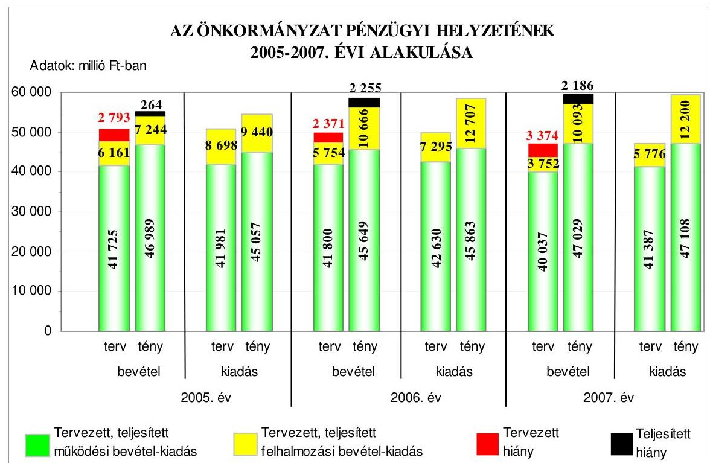
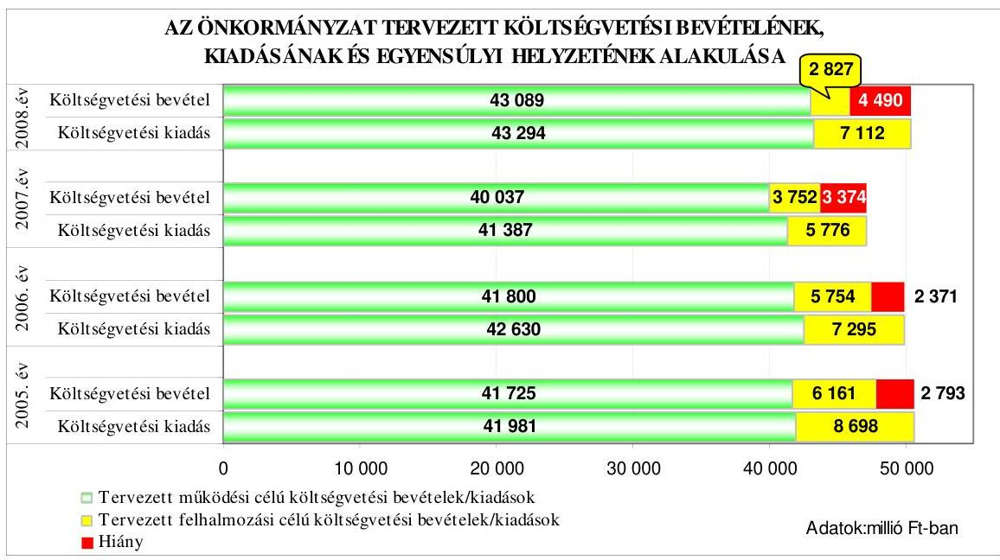
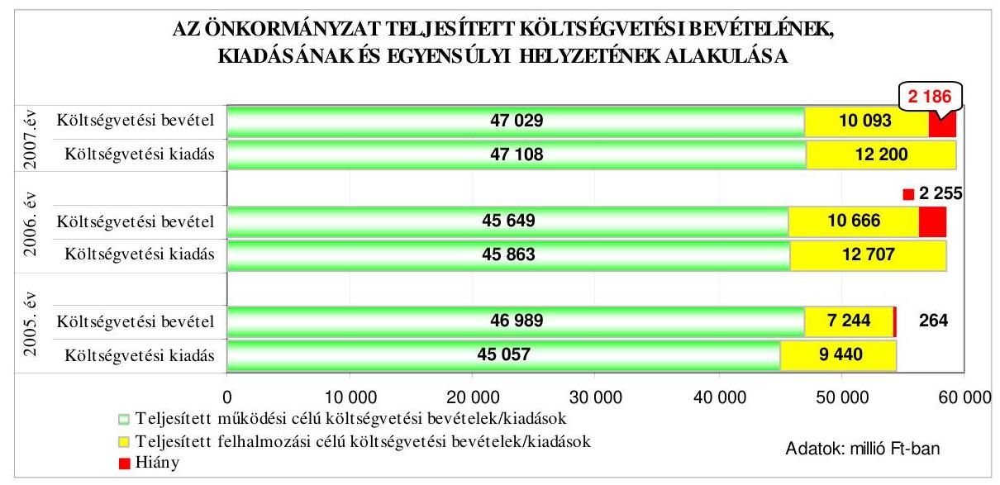
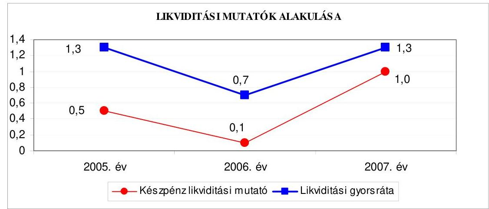
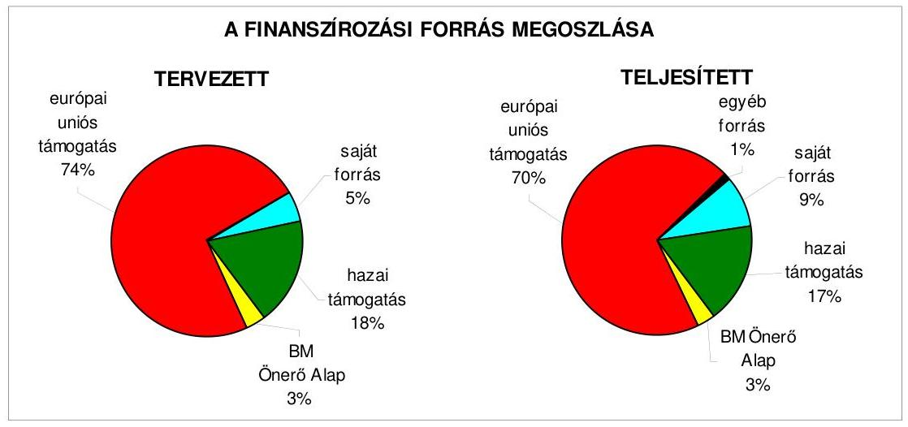
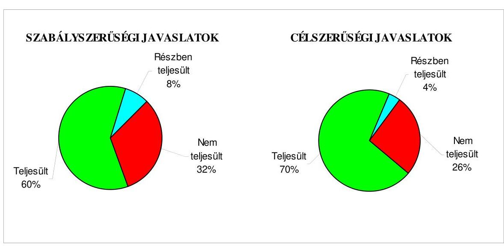
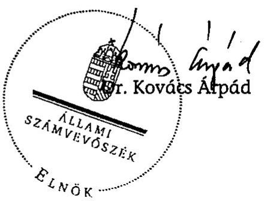
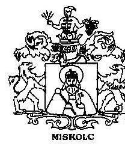
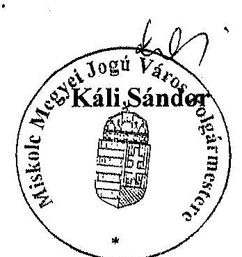

# JELENTÉS 

Miskolc Megyei Jogú Város Önkormányzata gazdálkodási rendszerének 2008. évi ellenőrzéséről

---

# 3. Önkormányzati és Területi Ellenőrzési Igazgatóság 

3.3. Átfogó Ellenőrzési Főcsoport

Iktatószám: V-3003-6/24/17/2008.
Témaszám: 898
Vizsgálat-azonosító szám: V0390

## Az ellenőrzést felügyelte:

Dr. Lóránt Zoltán
főigazgató
Az ellenőrzés végrehajtásáért felelős:
Dr. Sepsey Tamás
főigazgató-helyettes
Az ellenőrzést vezette:
Klinga László
számvevő tanácsos
Az ellenőrzést végezték:
Bialkó Zsolt Kányáné Murvai Tünde Klinga László
számvevő tanácsos számvevő számvevő tanácsos

## A témához kapcsolódó eddig készített számvevőszéki jelentések:

## címe

Jelentés Miskolc Megyei Jogú Város Önkormányzat gazdálkodásának átfogó ellenőrzéséről
Jelentés a helyi és a helyi kisebbségi önkormányzatok gazdálkodásának átfogó ellenőrzéséről
Jelentés a helyi önkormányzatok közművelődési és könyvtári fel-
adatellátásáról és finanszírozásáról
Jelentés a helyi önkormányzati fürdők - kiemelten a gyógyfürdők -
helyzete, fejlesztésének lehetőségei, hatása az idegenforgalomra és a turizmusra
Jelentés a Magyar Köztársaság 2004. évi költségvetése végrehajtásának ellenőrzéséről
Függelék:

- a helyi önkormányzatokat a 2004. évben megillető normatív állami hozzájárulás elszámolásának ellenőrzése
- a helyi önkormányzatok kötött felhasználású támogatások 2004. évi felhasználásának ellenőrzése
- a helyi önkormányzatok beruházásaihoz és rekonstrukcióihoz nyújtott 2004. évi felhalmozási célú támogatások ellenőrzése
Jelentés a hajléktalanokat ellátó intézményrendszer működéséről

---

Jelentés a középiskolai kollégiumok fenntartásának és fejlesztési feltételeinek ellenőrzéséről
Jelentés a Magyar Köztársaság 2005. évi költségvetése végrehajtásának ellenőrzéséről
Függelék:

- a helyi önkormányzatokat a 2005. évben megillető normatív állami hozzájárulás elszámolásának ellenőrzése
- a helyi önkormányzatok kötött felhasználású támogatások 2005. évi felhasználásának ellenőrzése
- a helyi önkormányzatok beruházásaihoz és rekonstrukcióihoz nyújtott 2005. évi felhalmozási célú támogatások ellenőrzése
Jelentés a közmunkaprogramok támogatására fordított pénzeszközök hasznosulásáról
Jelentés az önkormányzati kórházak és a bentlakásos szociális intézmények ápolásra, gondozásra fordított pénzeszközeinek felhasználásáról

---

# TARTALOMJEGYZÉK 

BEVEZETÉS ..... 11
I. ÖSSZEGZŐ MEGÁLLAPÍTÁSOK, KÖVETKEZTETÉSEK, JAVASLATOK ..... 16
II. RÉSZLETES MEGÁLLAPÍTÁSOK ..... 26

1. Az Önkormányzat költségvetési és pénzügyi helyzete ..... 26
1.1. A tervezett és teljesített költségvetési bevételek és kiadások alapján a költségvetési és a pénzügyi egyensúly alakulása, valamint a költségvetési hiány megállapításának szabályszerűsége ..... 26
1.2. A költségvetési és a pénzügyi egyensúlyi helyzet kialakításához tervezett és teljesített finanszírozási célú pénzügyi műveletek módja és azok hatása a tárgyévet követő évek költségvetéseire ..... 27
1.3. A költségvetés tervezésének megalapozottsága ..... 35
2. Az Önkormányzat felkészültsége az európai uniós források igénylésére és felhasználására, valamint az elektronikus közigazgatási feladatok ellátására ..... 37
2.1. Az európai uniós források igénybevételére és a várható támogatás felhasználására történt felkészülés szabályozottsága, szervezettsége ..... 37
2.1.1. Az európai uniós forrásokra történő pályázatok benyújtására vonatkozó döntések összhangja a fejlesztési célkitűzésekkel ..... 37
2.1.2. Az európai uniós forrásokhoz kapcsolódóan a pályázatfigyelés, a pályázatkészítés, valamint az európai uniós támogatással megvalósuló fejlesztés lebonyolításának belső rendjének szabályozottsága, a végrehajtás személyi, szervezeti feltételei ..... 45
2.1.3. A fejlesztési feladat lebonyolításánál a feladatellátás rendjére, az ellenőrzési feladatok teljesítésére, valamint a felelősségi szabályokra vonatkozó előírások betartása ..... 47
2.2. Az elektronikus közigazgatási feladatok ellátása, a közérdekű adatok elektronikus közzététele ..... 51
3. A költségvetési gazdálkodás belső kontrolljai ..... 53
3.1. A szabályozottság kockázata a költségvetés tervezési, gazdálkodási, beszámolási és a folyamatba épített, előzetes és utólagos vezetői ellenőrzési feladatoknál ..... 53
3.2. A belső kontrollok érvényesülése az önkormányzati források szabályszerű felhasználásában, a költségvetési tervezés, gazdálkodás, beszámolás folyamataiban ..... 56
3.3. A belső ellenőrzési kötelezettség teljesítése, javaslatainak hasznosulása ..... 60

---

4. Az ÁSZ korábbi ellenőrzési javaslatai alapján készített intézkedési terv végrehajtása, eredményessége ..... 65
4.1. Az Önkormányzat gazdálkodási rendszerének átfogó ellenőrzése során tett javaslatok végrehajtására tervezett intézkedések megvalósulása ..... 65
4.2. A zárszámadáshoz kapcsolódó (állami hozzájárulások, támogatások igénylésének és felhasználásának ellenőrzése), valamint a további vizsgálatok esetében a megállapítások, javaslatok alapján tett intézkedések ..... 70
MELLÉKLETEK
5. számú Az Önkormányzat gazdálkodását meghatározó adatok, mutatószámok (1 oldal)
6. számú Az önkormányzati vagyon alakulása (1 oldal)
7. számú Az Önkormányzat 2005-2007. évi költségvetési előirányzatainak és azok pénzügyi teljesítéseinek alakulása (1 oldal)
8. számú Tanúsítvány az európai uniós forrásokkal támogatott programok, célok tervezett és tényleges 2005-2008. évi adatairól (2 oldal)
9. számú Adatlap az Önkormányzat európai uniós forrással támogatott fejlesztéséről (3 oldal)
10. számú Káli Sándor úr, Miskolc Megyei Jogú Város Önkormányzata polgármesterének észrevétele (1 oldal)

---

# RÖVIDÍTÉSEK JEGYZÉKE 

## Törvények

Áht.
Eisztv.
Kbt.
Ket.

Ötv.
Számv. tv.

## Rendeletek

18/2005. (XII. 27.) IHM rendelet

2005. évi költségvetési rendelet

2005. évi zárszámadási rendelet

2006. évi költségvetési rendelet

2006. évi zárszámadási rendelet

2007. évi költségvetési rendelet

2007. évi zárszámadási rendelet

2008. évi költségvetési rendelet

Ámr.
Ber.
Vhr.
az államháztartásról szóló 1992. évi XXXVIII. törvény az elektronikus információszabadságról szóló 2005. évi XC. törvény
a közbeszerzésekről szóló 2003. évi CXXIX. törvény
a közigazgatási hatósági eljárás és szolgáltatás általános szabályairól szóló 2004. évi CXL. törvény
a helyi önkormányzatokról szóló 1990. évi LXV. törvény a számvitelről szóló 2000. évi C. törvény
a közzétételi listákon szereplő adatok közzétételéhez szükséges közzétételi mintákról szóló 18/2005. (XII. 27.) IHM rendelet
Miskolc Megyei Jogú Város Önkormányzata 5/2005. (III. 10.) számú rendelete az Önkormányzat költségvetéséről
Miskolc Megyei Jogú Város Önkormányzata 15/2006. (V. 10.) számú rendelete az Önkormányzat 2005. évi zárszámadásának elfogadásáról
Miskolc Megyei Jogú Város Önkormányzata 8/2006. (III. 8.) számú rendelete az Önkormányzat költségvetéséről
Miskolc Megyei Jogú Város Önkormányzata 8/2007. (IV. 19.) számú rendelete az Önkormányzat 2006. évi zárszámadásának elfogadásáról
Miskolc Megyei Jogú Város Önkormányzata 6/2007. (III. 7.) számú rendelete az Önkormányzat költségvetéséről
Miskolc Megyei Jogú Város Önkormányzata 13/2008. (IV. 24.) számú rendelete az Önkormányzat 2007. évi zárszámadásának elfogadásáról
Miskolc Megyei Jogú Város Önkormányzata 2/2008. (III. 12.) számú rendelete az Önkormányzat költségvetéséről
az államháztartás működési rendjéről szóló 217/1998. (XII. 30.) Korm. rendelet
a költségvetési szervek belső ellenőrzéséről szóló 193/2003. (XI. 26.) Korm. rendelet
az államháztartás szervezetei beszámolási és könyvvezetési kötelezettségének sajátosságairól szóló 249/2000. (XII. 24.) Korm. rendelet

---

# Szórövidítések 

AVOP
ÁSZ
BM Önerő Alap támogatás

EKOP
ÉMOP
e-közigazgatás
Ellenőrzési Iroda

FEUVE
gazdasági program
gazdálkodási utasítás $_{1}$
gazdálkodási utasítás $_{2}$

GVOP
HEFOP
informatikai stratégia
jegyző
KEHI
KEOP
Közgyűlés
MITISZK Kht.
NFT
ÖNHIKI
Önkormányzat
pályázati szabályzat

Agrár- és Vidékfejlesztési Operatív Program
Állami Számvevőszék
A Magyar Köztársaság 2007. évi költségvetéséről szóló 2006. évi CXXXVII. tv. - 5. számú mellékletének 12. pontja alapján - központi költségvetési hozzájárulást biztosít a helyi önkormányzatok és jogi személyiségű társulásaik számára, azok európai uniós fejlesztési célú pályázataihoz szükséges saját forrás kiegészítésére
ÚMFT Elektronikus Közigazgatási Operatív Program
ÚMFT Észak-Magyarországi Operatív Program
elektronikus közigazgatás
Miskolc Megyei Jogú Város Polgármesteri hivatalának Ellenőrzési Irodája
folyamatba épített, előzetes és utólagos vezetői ellenőrzés
Miskolc Megyei Jogú Város Önkormányzat Közgyűlésének a V-99/16.488/2007. (VI. 21.) számú határozatával elfogadott, 2007-2010. évekre vonatkozó gazdasági programja
a polgármester és a jegyző 2/2003. számú együttes utasítása 2003. július 1-jétől a költségvetési gazdálkodás lebonyolításával kapcsolatos feladatok ellátásáról
a polgármester és a jegyző 4/2007. számú együttes utasítása 2007. szeptember 1-jétől a költségvetési gazdálkodás lebonyolításával kapcsolatos feladatok ellátásáról
NFT Gazdasági Versenyképesség Operatív Program
NFT Humánerőforrás-fejlesztési Operatív Program
Miskolc Megyei Jogú Város Önkormányzat Közgyűlésének a 4-112/59475/2004. (V. 6.) számú határozatával elfogadott, 2004-2007. évekre szóló informatikai fejlesztési stratégiája
Miskolc Megyei Jogú Város Önkormányzat jegyzője
Kormányzati Ellenőrzési Hivatal
ÚMFT Környezet és Energia Operatív Program
Miskolc Megyei Jogú Város Önkormányzat Közgyűlése
Miskolci Térségi Integrált Szakképző Központ Kht.
Nemzeti Fejlesztési Terv
önhibáján kívül hátrányos helyzetben lévő önkormányzatok támogatása
Miskolc Megyei Jogú Város Önkormányzata
Miskolc Megyei Jogú Város Önkormányzat Polgármesteri Hivatalának pályázati rendszeréről szóló szabályzata

---

| PEJ | projekt előrehaladási jelentés |
| :--: | :--: |
| polgármester | Miskolc Megyei Jogú Város Önkormányzat polgármestere |
| Polgármesteri hivatal | Miskolc Megyei Jogú Város Önkormányzat Polgármesteri Hivatala |
| Polgármesteri hivatal SzMSz-e | Miskolc Megyei Jogú Város Polgármesteri hivatalának a Közgyűlés 7/2004. (III. 10.) számú határozatával elfogadott Szervezeti és Működési Szabályzata |
| ROP | NFT Regionális Operatív Program |
| TÁMOP | ÚMFT Társadalmi Megújulás Operatív Program |
| ÚMFT | Új Magyarország Fejlesztési Terv |
| ügyrend | Miskolc Megyei Jogú Város Önkormányzat Polgármesteri hivatalának belső szervezeti felépítéséről és működési rendjéről szóló 7/2004. (III. 10.) számú rendelete |
| VÁTI Kht. | VÁTI Magyar Regionális Fejlesztési és Urbanisztikai Közhasznú Társaság |
| városfejlesztési stratégia | Miskolc Megyei Jogú Város Közgyűlésének IV117/70.823/2005. (V. 5.) számú határozatával elfogadott a 2007-2013. közötti időszakra vonatkozó városfejlesztési stratégiája és operatív programja |

---

# ÉRTELMEZŐ SZÓTÁR 

1. elektronikus szolgáltatási szint
2. elektronikus szolgáltatási szint
3. elektronikus szolgáltatási szint
4. elektronikus szolgáltatási szint

AVOP-3. intézkedés EMIR

EQUAL
európai uniós források

Az 1044/2005. (V. 11.) Korm. határozat alapján olyan információs, tájékoztató szolgáltatás, amely csak általános információkat közöl az adott üggyel kapcsolatos teendőkről és a szükséges dokumentumokról.
Az 1044/2005. (V. 11.) Korm. határozat alapján olyan egyirányú kapcsolatot biztosító szolgáltatás, amely az 1. szinten túl biztosítja az adott ügy intézéséhez szükséges dokumentumok, nyomtatványok letöltését, és azok ellenőrzéssel, vagy ellenőrzés nélküli elektronikus kitöltését, amely esetben a dokumentumok benyújtása hagyományos úton történik.
Az 1044/2005. (V. 11.) Korm. határozat alapján olyan kétirányú kapcsolatot biztosító szolgáltatás, amely közvetlen, vagy ellenőrzött kitöltésű dokumentum segítségével biztosítja az elektronikus adatbevitelt és a bevitt adatok ellenőrzését. Az ügy indításához, intézéséhez személyes megjelenés nem szükséges, de az ügyhöz kapcsolódó közigazgatási döntés (határozat, egyéb aktus) közlése, valamint a kapcsolódó illeték-, vagy díjfizetés hagyományos úton történik.
Az 1044/2005. (V. 11.) Korm. határozat alapján olyan teljes közvetlen kétirányú ügyintézési folyamatot biztosító szolgáltatás, amikor az ügyhöz kapcsolódó közigazgatási döntés is elektronikus úton kerül közlésre, illetve a kapcsolódó illeték-, vagy díjfizetés elektronikus úton is intézhető.
Vidéki térségek fejlesztése.
Egységes monitoring informatikai rendszer az Európai Unió által nyújtott egyes pénzügyi támogatások felhasználásával megvalósuló programok, projektek figyelemmel kísérésére kialakított számítógépes nyilvántartási rendszer, amely a programok és a projektek adatait gyűjti, rendszerezi és tartja nyilván.
Az EQUAL Közösségi Kezdeményezés célja olyan innovatív megközelítések és módszerek kidolgozása és elterjesztése, amelyek hozzájárulnak a munkaerőpiachoz kapcsolódó diszkrimináció és egyenlőtlenségek megszüntetéséhez. Az EQUAL által támogatott kezdeményezések az Európai foglalkoztatási stratégia és a Társadalmi kirekesztés elleni küzdelem közösségi stratégiái által meghatározott szakmapolitikai keretekbe illeszkednek.
Az elnyert európai uniós források lehívása a támogatott projekt megvalósítása érdekében, a fejlesztés lebonyolítása során felmerült kiadások finanszírozására.

---

fejlesztési feladat (projekt)
fejlesztési célkitűzés

GVOP intézkedések
HEFOP intézkedések
irányító hatóság
kedvezményezett
közösségi kezdeményezések

A fejlesztési feladat (projekt) tartalmilag és formailag részletesen kidolgozott, megfelelő pénzügyi háttérrel és végrehajtási ütemezéssel rendelkező fejlesztési terv, amely illeszkedik az Európai Unió, illetve a Nemzeti Fejlesztési Terv által támogatott programokhoz.
Az önkormányzat által ellátott kötelező, vagy önként vállalt feladatok ellátásának mennyiségi, vagy minőségi fejlesztésére vonatkozó terv. A mennyiségi fejlesztés megvalósulhat beszerzéssel, létesítéssel, bővítéssel, átalakítással.
GVOP 3. Kutatás, fejlesztés, innováció; GVOP 4.3 Az e-közigazgatás fejlesztése.
A HEFOP 2.1 Hátrányos helyzetű tanulók esélyegyenlőségének biztosítása az oktatásban; a HEFOP 2.2 A társadalmi befogadás előmozdítása a szociális területen dolgozó szakemberek képzésével; a HEFOP 2.3. Egészségügyi információ-technológia fejlesztés az elmaradott régiókban; a HEFOP 3.1 Az egész életen át tartó tanuláshoz szükséges készségek és kompetenciák fejlesztésének támogatása; a HEFOP 3.2 A Térségi Integrált Szakképző Központok létrehozása és infrastrukturális feltételeinek javítása; a HEFOP 4.2 A társadalmi befogadást támogató szolgáltatások infrastrukturális fejlesztése; a HEFOP 4.3 Az egészségügyi infrastruktúra fejlesztése az elmaradt régiókban; a HEFOP 4.4 Egészségügyi információ-technológia fejlesztése az elmaradott régiókban.
A strukturális alapok és a Kohéziós alap forrásainak szabályszerű, hatékony és eredményes felhasználásához szükséges intézményrendszer felső eleme. Az irányító hatóság általános és átfogó felelősséget

 visel a programok, projektek hatékony és szabályszerű végrehajtásáért. Felelősségi köréből eredően ellenőrzi a közösségi, valamint a hazai jogszabályok betartását, koordinálja az európai uniós források szétosztásának folyamatát, irányítja az intézményrendszer, a statisztikai és a pénzügyi nyilvántartási rendszer működését.
Az a helyi önkormányzat, amely a támogatási szerződést kedvezményezettként aláírja, a projektet, illetve a központi programhoz kapcsolódó támogatott önkormányzati programot végrehajtja.
Az Európai Bizottság által kidolgozott, a strukturális alapokat kiegészítő programok, melyeket a tagállamok nemzeti szinten hajtanak végre. Ilyen program az EQUAL. Az EQUAL kezdeményezés célja a munkaerőpiacon kialakult hátrányos helyzet és mindennemű egyenlőtlenség leküzdése.

---

közösségi programok

közreműködő szervezet
lebonyolítás

Az Európai Unió a tagállamok közötti együttműködés ösztönzését, az oktatásban és szakképzésben részt vevő intézmények fejlesztésének támogatását, a minőségi oktatás és szakképzés elősegítését az ún. közösségi programokon keresztül valósítja meg. Közösségi programoknak a gazdasági és társadalmi élet szinte minden területét átfogó közösségi politikák végrehajtását szolgáló programokat nevezzük. (Ezek a területek pl. az ipar, az oktatás, a környezetvédelem, az egészség, a kultúra, stb.)
A közreműködő szervezet az európai uniós támogatást elnyert kedvezményezettekkel kapcsolatot tartó szerv. Az operatív programok közreműködő szervezetei befogadják, nyilvántartják, döntésre előkészítik a pályázatokat, rögzítik a támogatással kapcsolatos adatokat az egységes monitoring informatikai rendszerben, elvégzik a támogatások előzetes (szerződéskötést megelőző), közbenső (a pénzügyi elszámolás, finanszírozás folyamatában végzett) és utólagos (a támogatott projekt pénzügyi lezárását megelőző) ellenőrzését. Továbbá megkötik a szerződéseket a projekt kedvezményezettjével, folyamatosan nyomon követik a teljesítéseket, lebonyolítják a támogatások kifizetését, vezetik az egységes monitoring informatikai rendszert. Az NFT-hez kapcsolódó HEFOP intézkedések közreműködő szervezete az ESZA Kht., OMAI, a GVOP intézkedések közreműködő szervezete az IT Információs Társadalom Informatikai és Távközlési Szolgáltató Kht., a ROP intézkedések közreműködő szervezete a VÁTI Kht.
Az európai uniós források felhasználásával megvalósuló fejlesztésre irányuló műszaki, gazdasági (pénzügyi) tevékenységet magában foglaló szervezési, irányítási szolgáltatás. A szervezési szolgáltatás kiterjedhet a pályázatkészítésre, a közbeszerzési eljárás lebonyolításán keresztül a folyamatos műszaki ellenőrzésre, a pénzügyi elszámolásra, a műszaki átadás-átvételre, az üzembe helyezésre, illetve a fejlesztési folyamat egyes elemeire.

---

operatív program

ROP intézkedések
támogatási szerződés

Az Európai Bizottság által jóváhagyott, a Közösségi Támogatási Keret végrehajtására vonatkozó 2004-2006 és a 2007-2013 közötti, több évre szóló intézkedésekhez kapcsolódó prioritások egységes rendszerét tartalmazó dokumentum. A strukturális alapok operatív programjai: Agrár és Vidékfejlesztési Operatív Program (AVOP); Gazdasági Versenyképesség Operatív Program (GVOP); Humán-erőforrás-fejlesztési Operatív Program (HEFOP); Környezetvédelmi és Infrastruktúra-fejlesztési Operatív Program (KIOP); Regionális Fejlesztési Operatív Program (ROP). Az ÜMFT-hez kapcsolódó operatív programok: Gazdaságfejlesztési Operatív Program (GOP); Közlekedés Operatív Program (KÖZOP); Társadalmi Megújulás Operatív Program (TÁMOP); Társadalmi Infrastruktúra Operatív Program (TIOP); Környezet és Energia Operatív Program (KEOP); Államreform Operatív Program (ÁROP); Elektronikus Közigazgatás Operatív Program (EKOP); Nyugat-dunántúli Operatív Program (NYDOP); Dél-alföldi Operatív Program (DAOP); Észak-alföldi Operatív Program (ÉAOP); Közép-magyarországi Operatív Program (KMOP); Észak-magyarországi Operatív Program (ÉMOP); Közép-dunántúli Operatív Program (KDOP); Dél-dunántúli Operatív Program (DDOP).
A Strukturális Alapok által társfinanszírozott projektek megvalósítása során a kedvezményezetteknek a támogatási szerződésben meghatározott időközönként, általában negyedévente, a támogatás fizetési kérelmekhez kapcsolódóan pár oldalas projekt előrehaladási jelentéseket kell benyújtaniuk. A projekt előrehaladási jelentés jóváhagyása a további támogatások kifizetésének előfeltétele.
A ROP 1.2 Turisztikai fogadóképesség javítása; a ROP 2.1 Hátrányos helyzetű régiók és kistérségek elérhetőségének fejlesztése; a ROP 2.2 Városi területek rehabilitációja; a ROP 2.3 Az óvodai és az alapfokú oktatási nevelési intézmények infrastrukturális fejlesztése; a ROP 3.2 A helyi foglalkoztatás kezdeményezések támogatása.
A Strukturális Alapok esetében az irányító hatóságnak, illetve a Kohéziós Alap esetében a közreműködő szervezeteknek a kedvezményezett önkormányzattal kötött szerződése, amely a támogatás felhasználásának részletes feltételeit tartalmazza.

---

.

---

# JELENTÉS 

## Miskolc Megyei Jogú Város Önkormányzata gazdálkodási rendszerének 2008. évi ellenőrzéséről

## BEVEZETÉS

Az Ötv. 92. § (1) bekezdése, az Állami Számvevőszékről szóló 1989. évi XXXVIII. törvény 2. § (3) bekezdése, valamint az Áht. 120/A. § (1) bekezdése alapján az önkormányzatok gazdálkodását az Állami Számvevőszék ellenőrzi. Az ellenőrzésre az Országgyűlés illetékes bizottságai részére is átadott, országosan egységes ellenőrzési program szerint került sor.

Az Állami Számvevőszék a stratégiájában foglalt célkitűzéseknek megfelelően a helyi önkormányzatok költségvetési gazdálkodási rendszere átfogó ellenőrzésének programját a 2007. évtől megújította, azt kiegészítette további - teljesítmény-ellenőrzési - elemekkel.

## Az ellenőrzés célja annak értékelése volt, hogy az Önkormányzat:

- milyen módon biztosította a költségvetési és a pénzügyi egyensúlyt a költségvetésében és annak teljesítése során, valamint változott-e a finanszírozási célú pénzügyi műveletek jelentősége a hiányzó bevételi források pótlásában;
- eredményesen készült-e fel a szabályozottság és a szervezettség terén az európai uniós források igénylésére és felhasználására, továbbá biztosította-e az e-közigazgatás feltételeit, az adatok közzétételével a gazdálkodás nyilvánosságát;
- kialakította-e a külső és a belső feltételeknek megfelelően a költségvetés tervezési, gazdálkodási és zárszámadási feladatai belső kontrollrendszerét ${ }^{1}$, ezen tevékenységek szabályszerű ellátásához hozzájárult-e a folyamatba épített, előzetes és utólagos vezetői ellenőrzés, valamint a belső ellenőrzés;
- megfelelően hasznosították-e a korábbi számvevőszéki ellenőrzések megállapításait, szabályszerűségi ${ }^{2}$ és célszerűségi javaslatait.

[^0]
[^0]:    ${ }^{1}$ A gazdálkodás szabályszerűségét biztosító kontrollrendszer alatt értjük a kiépített és működő belső irányítási és szabályozási rendszert, valamint a belső ellenőrzési funkciók ellátásának rendszerét.
    ${ }^{2}$ A törvényi előírások betartásának elmulasztásakor egységesen a törvénysértés megjelölést alkalmazzuk, mivel az ÁSZ nem tehet különbséget a törvényi előírások között.

---

Az ellenőrzés típusa: átfogó ellenőrzés, amely egyidejűleg - egy ellenőrzés keretében - meghatározott területekre összpontosítva érvényesíti a szabályszerűségi, valamint a teljesítmény-ellenőrzés jellemzőit.

Az ellenőrzött időszak: az 1., 2. és 4. programpontok tekintetében a 2005-2007. évek és 2008. I. negyedév, a 3. ellenőrzési programpontnál a 2007. év és 2008. I. negyedév.

Miskolc Megyei Jogú Város lakosainak száma 2008. január 1-jén 172 855 fő volt. A 2006. évi önkormányzati választást követően az Önkormányzat 48 tagú Közgyűlésének munkáját nyolc állandó bizottság segítette. A helyi önkormányzat mellett a 2006. évi önkormányzati választásokat követően kilenc kisebbségi önkormányzat ${ }^{3}$ működött. A polgármester a 2002. évi önkormányzati képviselő és polgármester választás óta tölti be tisztségét, a jegyző személye 2008. június 27-étől változott.

Az Önkormányzat feladatainak végrehajtása érdekében a 2007. évben 66 költségvetési intézményt működtetett, amelyekből 52 önállóan gazdálkodott. A feladatok ellátásában részt vett kilenc gazdasági társasága, továbbá 17 alapítványa. Az Önkormányzat a 2007. évi költségvetési beszámolója szerint 57 122 millió Ft költségvetési bevételt ért el és 59 308 millió Ft költségvetési kiadást teljesített, 2007. december 31-én a könyvviteli mérleg szerint 194 414 millió Ft értékű vagyonnal rendelkezett. Az Önkormányzat vagyona a 2005. év végi állományhoz viszonyítva 15,8%-kal nőtt, ezen belül az immateriális javak állománya közel négy és félszeresére (90 millió Ft-ról 388 millió Ft-ra) nőtt. A 2007. évben 5000 millió Ft összegben kibocsátott kötvény hatására a pénzeszközök év végi állománya a 2005. évi 1344 millió Ft-ról a 2007. év végére 6190 millió Ft-ra növekedett. A kötelezettségek állománya a 2005-2007. években több mint kétszeresére 13 078 millió Ft-ról 27 850 millió Ft-ra nőtt, elsősorban a kötvénykibocsátás és a hosszú lejáratú fejlesztési célú hitelek következtében. A 2008. évi költségvetési rendeletben 45 916 millió Ft költségvetési bevételt és 50 406 millió Ft költségvetési kiadást irányoztak elő. Az összes költségvetési bevétel 30,8%-át a saját bevétel, illetve 12,7%-át a helyi adó bevétel biztosította a 2007. évben. Az összes költségvetési kiadásból a felhalmozási célú kiadás részaránya a 2007. évben 20,6% volt. A Polgármesteri hivatalban dolgozó köztisztviselők száma 2007. december 31-én 504 fő, a költségvetési intézményekben foglalkoztatott közalkalmazottak száma 8746 fő volt. Az Önkormányzat gazdálkodását meghatározó adatokat, mutatószámokat az 1-3. számú mellékletek tartalmazzák.

Az Önkormányzat költségvetési és pénzügyi helyzetét az elemző eljárás módszerével vizsgáltuk. E körben elemeztük a költségvetés egyensúlyi helyzetének alakulását, a tervezett és tényleges költségvetési hiány okait, a mérséklésére tett intézkedéseket, finanszírozásának módját, az Önkormányzat adósságállományának alakulását, összetevőit.

A teljesítmény-ellenőrzés módszerével vizsgáltuk, a belső szabályozottság, szervezettség terén az Önkormányzat felkészültségét az európai uniós források fi-

[^0]
[^0]:    ${ }^{3}$ Bolgár, cigány, görög, horvát, lengyel, német, ruszin, szlovák, ukrán.

---

gyelésére, igénylésére és felhasználására, továbbá értékeltük, hogy az igényelt európai uniós támogatások az Önkormányzat által meghatározott fejlesztési célkitűzésekhez kapcsolódtak-e. Az eredményesség szempontjából a minősítést a lényegességi szinthez való viszonyítással végeztük el. Az ellenőrzés során felmértük, hogy az e-közigazgatási feladat ellátása, illetve bevezetése, működtetése érdekében milyen intézkedéseket tettek, valamint biztosították-e a közérdekű adatok közzétételét.

A költségvetési gazdálkodás belső kontrolljainak ellenőrzése során értékeltük, hogy a Polgármesteri hivatalnál a költségvetés tervezési, gazdálkodási, zárszámadás készítési feladatok belső kontrolljainak kiépítettsége és működése megfelelő biztosítékot ad-e a gazdálkodási feladatok megfelelő, szabályszerű ellátására. Felmértük és minősítettük a költségvetés tervezési, a gazdálkodási, a zárszámadás készítési feladatokkal, továbbá a pénzügyi-számviteli területen az informatikával kapcsolatosan kialakított kontrollok megfelelőségét, valamint azok működésének eredményességét, megbízhatóságát. Értékeltük a belső ellenőrzés szervezeti és szabályozási keretét, továbbá működését.

A Polgármesteri hivatalnál értékeltük a gazdálkodás folyamatában a kontrollok működésének megbízhatóságát, ennek keretében ellenőriztük a szakmai teljesítés igazolására és az utalvány ellenjegyzésére kialakított kontrollok végrehajtását. Az ellenőrzést a következő, kiemelt kockázatuk alapján kiválasztott ${ }^{4}$ az általánostól jellemzően eltérő, egyedi eljárást igénylő gazdasági eseményekkel kapcsolatos kifizetésekre folytattuk le ${ }^{5}$:

- a külső szolgáltató által végzett karbantartási, kisjavítási szolgáltatások,
- a gépek, berendezések, felszerelések beszerzése, továbbá
- a működési célú pénzeszköz átadásokból az államháztartáson kívülre teljesített kifizetésekre.

Az ellenőrzés hatékony elvégzése céljából a vizsgálandó területek kiválasztása során a kockázatokon alapuló megközelítés érvényesült, ezáltal az ellenőrzési erőforrásokat azokra a területekre fókuszáltuk, amelyeken legnagyobb a hibák előfordulási valószínűsége. Az ellenőrzési erőforrások ilyen típusú összpontosí-

[^0]
[^0]:    ${ }^{4}$ Az önkormányzatok kiemelt előirányzataira vonatkozóan, a vertikális folyamatokra elvégeztük a kockázatok becslését, amelynek eredményeként a külső szolgáltató által végzett karbantartási, kisjavítási szolgáltatások, a gépek, berendezések, felszerelések beszerzése valamint a működési célú pénzeszköz átadások államháztartáson kívülre teljesített kifizetései kiemelkedően kockázatos területeknek bizonyultak.
    ${ }^{5}$ A korábbi ellenőrzési tapasztalataink szerint ezeken a területeken a jegyzők nem, vagy hiányosan szabályozták a megbízás, megrendelés, illetve beszerzés indokoltságának, szükségességének elbírálására, igazolására, valamint a teljesítések dokumentálására, a kifizetések jogosságának megítélésére szolgáló kontrollokat. További kockázatot jelentett a külső szolgáltató által végzett karbantartási, kisjavítási munkák esetében, hogy az 50 ezer Ft alatti megrendelésekre vonatkozóan az ellenőrzési tapasztalataink szerint a jegyzők nem alakították ki a kötelezettségvállalások rendjét és nyilvántartási formáját, valamint a szabályozás elmulasztása esetén nem történt meg az írásbeli kötelezettségvállalás és annak az ellenjegyzése sem.

---

tásával minimálisra csökkenthető a kívánt ellenőrzési bizonyosság eléréséhez szükséges időráfordítás.

A pénzügyi-számviteli folyamatokban alkalmazott belső kontrollok létezésének és működésének ellenőrzésére a vizsgált három terület 2007. évi könyvviteli tételeiből területenként egyszerű véletlen mintát vettünk. A kijelölt
 gazdasági eseményre elvégzett megfelelőségi tesztek alapján értékeltük a kontrollok működésének eredményességét, megbízhatóságát a vizsgált három területre külön-külön, majd összefoglalóan ${ }^{6}$ a Polgármesteri hivatal egyedi eljárást igénylő gazdasági eseményeire. A helyszíni ellenőrzés megállapításainak részletes dokumentálását három megfelelőségi tesztlapon, öt elővizsgálati és 12 helyszíni ellenőrzési munkalapon biztosítottuk. Ezeken a teszt- és munkalapokon a minősítés alapjául szolgáló kérdések és a vonatkozó konkrét jogszabályhelyek megjelölése mellett értékeltük a kialakított belső kontrollokban rejlő kockázatokat ${ }^{7}$ és a kialakított kontrollok működésének megbízhatóságát ${ }^{8}$.

Az ÁSZ korábbi ellenőrzési javaslatai alapján tett intézkedéseket, illetve azok megvalósítását utóellenőrzés keretében vizsgáltuk. A gazdálkodási rendszer átfogó ellenőrzése során megfogalmazott javaslatok végrehajtására tett intézkedések megvalósítását ellenőriztük, az egyéb számvevőszéki ellenőrzések során tett javaslatok esetében pedig a kiadott intézkedéseket tekintettük át.

A helyszíni ellenőrzés során kitöltött - az ellenőrzést végző számvevő és a Polgármesteri hivatal felelős köztisztviselője által aláírt - elővizsgálati és helyszíni ellenőrzési munkalapokat, azok kitöltési útmutatóit, továbbá a megfelelőségi tesztek dokumentumait a polgármester részére a számvevői jelentéssel egyidejűleg átadtuk.

[^0]
[^0]:    ${ }^{6}$ A vizsgált három terület egyedi értékelési pontszámait a területek relatív költségvetési súlyával arányosan összegeztük.
    ${ }^{7}$ A kialakított belső kontrollokban rejlő kockázatot alacsonynak minősítettük, ha a kontrollok - végrehajtásuk esetén - megfelelő védelmet nyújtanak a hibák bekövetkezése ellen. Közepesnek minősítettük a belső kontrollokban rejlő kockázatot, amennyiben a kontrollok - végrehajtásuk esetén - a lehetséges hibák többsége ellen védelmet nyújtanak. Magasnak értékeltük a kockázatot, ha a kontrollok - kialakításuk hiányában, vagy hiányos kialakításuk miatt - nem nyújtanak elegendő védelmet a lehetséges hibákkal szemben.
    ${ }^{8}$ A kontrollok működésének eredményességét, megbízhatóságát kiválónak értékeltük abban az esetben, ha azok működése - esetleges apróbb hiányosságoktól eltekintve - megfelelt a hibák megelőzésére és kijavítására meghatározott szabályozásnak és a legmagasabb szintű elvárásoknak. Jónak minősítettük a kontrollok működését, ha a hiányosságok száma ugyan jelentős volt, de nem veszélyeztette az ellenőrzött terület hibáinak megelőzését és kijavítását. Amennyiben a hiányosságok mértéke nem biztosította a hibák megelőzését, feltárását, kijavítását, és ezáltal veszélyeztette az eredményes, megbízható működést, a kontroll működésének megbízhatósága gyenge minősítést kapott.

---

A jelentés megállapításainak, javaslatainak egyeztetése során a jegyző arról adott részletes tájékoztatást, - egyidejűleg csatolta azokat a dokumentumokat, amelyek igazolták - hogy az időközben megtett intézkedésekkel a számvevői jelentésben a jegyző részére tett javaslatokat ${ }^{9}$ megvalósították. A megtett intézkedéseket a jelentés II. Részletes megállapítások fejezetében az adott témához kapcsolt lábjegyzetben feltüntettük és a vonatkozó javaslatot elhagytuk.

A jelentést az ÁSZ-ról szóló 1989. évi XXXVIII. tv. 25. § (1) bekezdése alapján észrevétel közlése céljából megküldtük Miskolc Megyei Jogú Város Önkormányzata polgármesterének. A kapott észrevételt a jelentés 6. számú melléklete tartalmazza.

[^0]
[^0]:    ${ }^{9}$ A számvevői jelentés a helyszíni ellenőrzés során feltárt hiányosságok megszüntetése, a jogszabályi előírások maradéktalan betartása érdekében 22, a munka színvonalának javítása érdekében hat javaslatot tartalmazott a jegyző részére, melyből 13 a jogszabályi előírások maradéktalan betartására vonatkozó és öt a munka színvonalának javítását célzó javaslatokra tett intézkedést elfogadtuk.

---

# I. ÖSSZEGZŐ MEGÁLLAPÍTÁSOK, KÖVETKEZTETÉSEK, JAVASLATOK 

Az Önkormányzat tervezett költségvetési bevételei és kiadásai a 2005-2007. között csökkentek, a 2008. évben emelkedtek. A teljesített költségvetési bevételek és kiadások főösszege a 2006-2007. években folyamatosan nőtt. A költségvetés egyensúlya a 2005-2008. években nem volt biztosított, a tervezett költségvetési bevételek nem nyújtottak fedezetet a tervezett költségvetési kiadásokra. Az Önkormányzat a 2005-2008. évi költségvetési rendeleteiben a költségvetés kiadási főösszegének megállapításakor - az Áht. előírása ellenére - finanszírozási célú pénzügyi műveleteket is figyelembe vett költségvetési hiányt módosító költségvetési kiadásként ${ }^{10}$. A költségvetések teljesítése során a pénzügyi egyensúlyt nem biztosították, a költségvetési bevételek nem nyújtottak fedezetet a költségvetési kiadásokra. A 2005-2008. évben a tervezett működési célú és felhalmozási célú költségvetési bevételek előirányzata nem fedezte az azonos célú költségvetési kiadások előirányzatát. A teljesített működési célú költségvetési bevételek a 2005. évben fedezték, a 2006-2007. években nem fedezték a működési célú költségvetési kiadásokat. A teljesített felhalmozási célú költségvetési bevételek egyik évben sem nyújtottak fedezetet a felhalmozási célú kiadásokra.

Az Önkormányzat a 2005-2008. évi költségvetési rendeleteiben a költségvetési egyensúly megteremtése érdekében rövid- és hosszú lejáratú hitelek felvételét tervezte, valamint előírta az évközi többletbevételekből és kiadási megtakarításokból keletkező források terhére a hiány csökkentését. Az Önkormányzat a költségvetések teljesítése során a pénzügyi egyensúly biztosításához rövid és hosszú lejáratú hitelt vett fel, a 2005-2006. években ÖNHIKI-s pályázaton támogatást nyert el, a 2006-2007. években hitelviszonyt megtestesítő befektetési célú értékpapírt értékesített, intézményi szervezeti struktúra átalakítást hajtott végre, továbbá kötvényt bocsátott ki. A fejlesztési feladatok megvalósításához az Önkormányzat hosszú lejáratú hiteleket vett fel, melyek állománya a 2005-2007. években jelentősen emelkedett, a 2005. év végén fennálló 7869 millió Ft összegű hosszúlejáratú hitelállomány a 2007. év végére 12173 millió Ft-ra nőtt. A 2005-2007. évek között a felvett folyószámlahitel éves átlagos állománya folyamatosan emelkedett, amit elsősorban a kötelezettségek teljesítése és a bevételek realizálódása közötti időbeli különbség okozott. Az Önkormányzat 2007. december hónapban 5000 millió Ft összegben felhalmozási célú kötvényt bocsátott ki a városfejlesztési stratégiában meghatározott fejlesztési feladatok megvalósításának forrás biztosítására. A 2008. évi költségvetési rendeletben tervezett beruházási feladatok megvalósítására 2008. júliusában 3000 millió Ft felhalmozási célú kötvényt bocsátottak ki. A kötvénykibocsátásról szóló megbízási szerződésben a pénzintézet részére inkasszó jogot engedélyeztek az esedékesség időpontjában meg nem fizetett tartozás biztosítékaként, a kötvény fede-

[^0]
[^0]:    ${ }^{10}$ Az Önkormányzat a 2008. évi költségvetési rendeletét módosította és a költségvetési kiadás főösszegét a finanszírozási célú pénzügyi műveletek nélkül határozta meg.

---

zete - az Ötv. előírása ellenére - az Önkormányzat bankszámláinak állománya volt.

Az Önkormányzat eladósodása - a kötvénykibocsátásból és a beruházási hitelek állományából származó kötelezettségek növekedése miatt - folyamatosan emelkedett, az eladósodási mutató a 2005. évről a 2007. évre közel a kétszeresére nőtt, a pénzügyi helyzet kedvezőtlenül alakult. A rövidtávon teljesítendő fizetési kötelezettségek fizetőképességre gyakorolt hatása az előző évhez viszonyítva a 2006. évben romlott, mivel a rövid lejáratú kötelezettségek állománya gyorsabb ütemben növekedett, mint az összes kötelezettség állománya, a 2007. évben a kötelezettségek eladósodásra gyakorolt hatása nem erősödött. Az Önkormányzat fizetőképessége a 2005. év végéhez viszonyítva a 2006. évben romlott, a 2007. évben kedvezően alakult a kötvénykibocsátásból származó bevétel betétként való elhelyezése miatt.

Az Önkormányzat 2005-2007. évi költségvetési rendeleteiben jóváhagyott eredeti előirányzatok túlteljesültek. A túlteljesítés oka az volt, hogy az Önkormányzat a 2005-2006. évi költségvetési rendeleteiben 40%-ban, illetve 96%-ban, a 2007. évben egyáltalán nem tervezte eredeti előirányzatként az előző évi kötelezettségvállalások áthúzódó kiadásait (mint jóváhagyott kiadásokat), valamint azok forrását, a költségvetési előirányzatokat a pénzmaradvány jóváhagyását követően módosította. A költségvetési bevételi és kiadási előirányzatok túlteljesüléséhez hozzájárultak továbbá az eredeti előirányzatként nem tervezhető év közben elnyert pályázati források bevételei, valamint az azok terhére teljesített kiadások is.

Az Önkormányzat középtávú fejlesztési célkitűzéseit gazdasági programban, ágazati, szakmai fejlesztési koncepciókban rögzítette. A célkitűzések megvalósításának lehetséges forrásait a városfejlesztési stratégia tartalmazta. A fejlesztési célokat helyzetelemzéssel, a lakosság és a civil szféra körében végzett igényfelméréssel alapozták meg. Az Ötv. előírása ellenére a gazdasági program felülvizsgálatát határidőn túl végezték el. A fejlesztési célkitűzések meghatározásakor az NFT prioritásait figyelembe vették. A Polgármesteri hivatal és az intézmények a 2004-2008. évek között 43 európai uniós forrásokkal támogatott fejlesztési feladat megvalósításához nyújtottak be pályázatot, melyből 16 eredményes volt, kilenc pályázatot elutasítottak, 16 elbírálása folyamatban volt, kettő pedig tartaléklistán szerepelt. Az eredménytelen pályázatok közül az elutasítás oka hét pályázat esetében a pályázati kiírásban meghatározott célok és eredmények összhangjának hiánya, egy esetben a program tartalmának és címének összhanghiánya, egy esetben pedig a forráshiány volt.

Az Önkormányzat intézményei esetében a 2005-2008. évek költségvetési rendeletei elfogadásakor nem döntöttek az európai uniós támogatásból megvalósuló fejlesztések támogatási szerződés szerint ütemezett bevételeiről és kiadásairól, azok költségvetési rendeletekbe való beépítése a támogatási elszámolások benyújtását követően történt. A Polgármesteri hivatal által benyújtott egyik pályázat esetében a 2007. évi költségvetési rendeletben nem a támogatási szerződés szerinti támogatási összeget szerepeltették eredeti bevételi és kiadási előirányzatként. A Közgyűlés tájékoztatása céljából a költségvetési előterjesztésekben - az Áht. előírásával ellentétben - nem mutatták be az intézmények lebonyolításában végzett, többéves kihatással járó európai uniós forrásból megva-

---

lósuló fejlesztési feladatokat számszerűsítve éves bontásban és összesítve, illetve szöveges indoklással. Az intézmények által tervezett felhalmozási kiadások feladatonkénti előirányzatát nem határozták meg. Az európai uniós fejlesztési projektek kétharmadában - az Ámr. előírásai ellenére - nem mutatták be a többéves kihatással járó európai uniós támogatás igénybevételével megvalósuló feladatok előirányzatait éves bontásban, illetve elkülönítetten az európai uniós támogatással megvalósuló programok bevételi és kiadási előirányzatait.

Önkormányzati szinten nem szabályozták az európai uniós források igénybevételének és felhasználásának feladatait. A Polgármesteri hivatalban a 2004-2008. évek között az európai uniós pályázatok figyelésével, a pályázatok készítésével, lebonyolításával összefüggő feladatok ellátásának személyi feltételeit kialakították. Az európai uniós források igénybevételével és felhasználásával összefüggő felelősség szabályait a feladatellátással megbízott köztisztviselők munkaköri leírása tartalmazta. Az intézményeknél megvalósított fejlesztések projektenkénti személyi feltételeinek kialakítása nem történt meg.

Az Önkormányzat ROP-2.2.1-2004. Városi területek rehabilitációja fejlesztési feladatra beadott pályázatával Miskolc belváros megújulására 1249 millió Ft európai uniós és 250 millió Ft hazai támogatást nyert el. A saját forrás összege 67 millió Ft volt. A fejlesztési feladat megvalósítása során a hatályos támogatási szerződésben meghatározott időbeli ütemezésnek megfelelően haladt a kivitelezés. A támogatás igénybevétele, a kiadások teljesítése a támogatási szerződésben szereplő ütemezésnek megfelelően történt. Az Önkormányzat biztosította a támogatási szerződésben vállalt saját forrást. A fejlesztési feladat támogatási szerződésben tervezett kiadásához képest többlet merült fel, melyet saját, illetve egyéb, külső forrásból biztosított, a beruházáshoz szorosan kapcsolódó kifizetés volt. A támogatási szerződést összesen öt alkalommal módosították, előleg igénybevételének lehetősége, a költségek közötti forrás átcsoportosítás, befejezési időpontváltozás, többletköltségek felmerülése, kifizetési kérelmek benyújtási időpontjának módosítása miatt. A fejlesztési feladat folyamatát belső ellenőrzés keretében nem vizsgálták. Külső ellenőrzés egy esetben állapított meg szabálytalanságot, melyet megszüntettek.

Az Önkormányzat felkészültsége az európai uniós források igénybevételére és fogadására - önkormányzati szintű szabályozás hiányában - összességében nem volt eredményes annak ellenére, hogy az európai uniós pályázatok a gazdasági programban, ágazati, fejlesztési, szakmai koncepciókban megfogalmazott fejlesztési célkitűzésekhez kapcsolódtak. A belső ellenőrzés az európai uniós forrásokkal támogatott fejlesztési feladatok megvalósítására vonatkozóan kockázatelemzésen alapuló stratégiai tervet nem készített. A Polgármesteri hivatalon belül meghatározták az európai uniós forrásokhoz kapcsolódó pályázatfigyelés, pályázatkészítés és a lebonyolítás feladatait, a feladatok ellátásának rendjét, a pályázat-nyilvántartás
 vezetésének felelőseit, az információk áramlásának rendjét, az európai uniós forrásokra irányuló pályázatfigyelés, pályázatkészítés és az európai uniós forrással támogatott fejlesztés lebonyolításának ellenőrzési kötelezettségét, feladatait és felelőseit.

Az Önkormányzat rendelkezett informatikai stratégiával, amelyben célként tűzték ki az elektronikus szolgáltatás 3. szintjének 2007. év végéig történő elérését. A Polgármesteri hivatalban a 2007. évben működtetett e-közigazgatási

---

feladatokat ellátó informatikai rendszerben a fejlesztéssel a szociális juttatási rendszerben, illetve az elektronikus adózási rendszerben (iparűzési adó, gépjármű súlyadó) érték el a 3. ügyintézési szintet, annak teljes körű bevezetését az informatikai stratégiában meghatározott időpontra nem teljesítették.

Az Önkormányzat a közérdekű adatok közzétételére 2007. évtől kötelezett, azonban honlapja a vonatkozó rendelet előírásai ellenére nem tartalmazta a „Működés törvényessége, ellenőrzések”, és a „Működés” közzétételi listákat, valamint közzétételi egységeket. A jegyző a 2007. évben nyújtott céljellegű működési és fejlesztési célú támogatások kedvezményezettjeinek nevét, célját, összegét az Önkormányzat honlapján nyilvánosságra hozta, azonban az Áht. előírásai ellenére nem gondoskodott a támogatási program megvalósítási helyének közzétételéről. A közzétett információk honlapon belüli elérhetősége, elrendezése és szerkezete nem felelt meg a vonatkozó rendeletben előírt közzétételi egységeknek. A jegyző - az Áht. előírása ellenére - nem gondoskodott a 2005-2007. években az Önkormányzat pénzeszközei felhasználásával, a vagyonnal történő gazdálkodással összefüggő - a nettó ötmillió Ft-ot elérő vagy azt meghaladó összegű - árubeszerzésre, építési beruházásra, szolgáltatás megrendelésre, vagyonértékesítésre, vagyonhasznosításra, vagyon, vagy vagyoni értékű jog átadására, valamint koncesszióban adásra vonatkozó szerződések megnevezésének, tárgyának, a szerződést kötő felek nevének, a szerződés értékének, határozott időre kötött szerződések esetében annak időtartamának közzétételéről. A jegyző az Ámr. előírásai ellenére a 2005-2007. évi költségvetési beszámolók szöveges indoklását nem tette közzé.

A 2007. évben a Polgármesteri hivatalban a költségvetés tervezési és a zárszámadás-készítési folyamatok szabályozottsága összességében alacsony kockázatot jelentett a feladatok szabályszerű végrehajtásában, mivel a jegyző a pénzügyi irányítási és ellenőrzési rendszer keretében szabályozta a költségvetési tervezés és a zárszámadás elkészítés rendjét, meghatározta a költségvetési javaslat összeállításával kapcsolatos követelményeket. Annak ellenére összességében alacsony volt a kockázat, hogy a költségvetés tervezés és a zárszámadás készítés folyamatában a jegyző nem írta elő a saját bevételek előirányzatai és a költségvetés megalapozását szolgáló helyi rendeletek összhangja biztosítottságának ellenőrzési kötelezettségét, a Közgyűlés nem határozta meg a költségvetési szervek elemi beszámolója felülvizsgálatának rendjét és tartalmát. A Polgármesteri hivatalban a költségvetés tervezési és zárszámadás készítési folyamatban a működési hibák megelőzésére, feltárására, kijavítására kialakított kontrollok működésének megbízhatósága összességében kiváló volt, mivel a Polgármesteri hivatalban, a vonatkozó jogszabályokban előírtaknak megfelelően ellenőrizték a költségvetési javaslat összeállításával kapcsolatosan meghatározott követelmények érvényesülését, a költségvetési igények indokoltságát, teljesíthetőségét. A zárszámadás készítés folyamatában ellenőrizték az intézményi pénzmaradványok megállapításának szabályszerűségét, az eredeti és a módosított előirányzatok, valamint a teljesítési adatok eltérésének indokoltságát. Annak ellenére összességében kiváló volt a kontrollok működésének megbízhatósága, hogy a jegyző nem ellenőriztette a költségvetési tervezés folyamatában a saját bevételek előirányzatai és a költségvetés megalapozását szolgáló önkormányzati rendeletek összhangja biztosított-e, illetve a Polgármesteri hiva-

---

talnál nem ellenőrizték az intézményi beszámolók belső, valamint annak Közgyűlés által meghatározott adatszolgáltatással való összhangját.

A gazdálkodási, a pénzügyi-számviteli és a folyamatba épített ellenőrzési feladatok szabályozottsága a Polgármesteri hivatalban a 2007. évben összességében alacsony kockázatot jelentett a feladatok szabályszerű végrehajtásában, mivel a jegyző a pénzügyi irányítási és ellenőrzési rendszer szabályozása keretében meghatározta a gazdasági szervezet felépítését és feladatait, a gazdasági szervezet elkészítette az ügyrendjét, a Polgármesteri hivatal rendelkezett számviteli politikával és a kapcsolódó - aktualizált - szabályzatokkal, számlarenddel. Annak ellenére összességében alacsony volt a kockázat, hogy az érvényesítést végzőket nem a jegyző bízta meg írásban. A jegyző nem szabályozta az üzemeltetésre átadott eszközök leltározásának módját, nem határozta meg az üzemeltetésre átadott eszközök hasznosításának és selejtezésének szabályait, valamint a pénzkezelés folyamatában az utólagos vezetői ellenőrzés gyakoriságát és módját. A vezetők és a munkatársak munkaköri leírásai nem tartalmazták a gazdálkodási és ellenőrzési (kötelezettségvállalás, szakmai teljesítésigazolási, érvényesítés, utalvány ellenjegyzési) jogköröket, továbbá az érintett dolgozóké a számviteli szabályzatokban meghatározott értékelési, egyeztetési, ellenőrzési feladatokat, a pénzkezelés ellenőrzésével kapcsolatos feladatokat, és az eszközök hasznosítási, selejtezési szabályzatában előírt minősítésre, ármegállapításra, döntéshozatalra vonatkozó feladatokat. A jegyző 2008. szeptemberétől előírta az eszközök és források leltározási és leltárkészítési szabályzatában az üzemeltetésre átadott eszközök leltározási kötelezettségét és annak módját, a pénzkezelési szabályzatban a pénzkezelési folyamat utólagos vezetői ellenőrzésének gyakoriságát és módját, valamint a felesleges vagyontárgyak hasznosításának és selejtezésének szabályzatában az üzemeltetésre átadott eszközök hasznosításának és selejtezésének szabályait. Az ellenőrzési nyomvonal készítése során a jegyző nem gondoskodott az ellenőrzési pontok kellő részletezettséggel történő kialakításáról, elmaradt a Polgármesteri hivatal és az önálló gazdálkodási jogkörrel rendelkező költségvetési szervek költségvetés készítésének folyamatában az ellenőrzési pontok kijelölése, a kockázatkezelési eljárásrendben nem azonosították a kockázatokat, a jegyző nem jelölte ki az adott kockázatok kezelésének folyamatgazdáit, továbbá nem határozta meg a válaszintézkedéseket.

A Polgármesteri hivatalnál a gazdasági eseményekkel kapcsolatos kifizetések során a belső kontrollok működésének megbízhatósága összességében jó volt, mert a szakmai teljesítés igazolására kijelölt személyek a folyamatba épített ellenőrzési feladataikat megfelelően végezték, továbbá az utalvány ellenjegyzője meggyőződött a szakmai teljesítésigazolás és az érvényesítés megtörténtéről. Annak ellenére összességében jó volt a kontrollok működésének megbízhatósága, hogy az államháztartáson kívülre nyújtott működési célú pénzeszközátadásokkal kapcsolatos kiadások teljesítését megelőzően az utalvány ellenjegyzésekor a gazdálkodási szabályok betartásának ellenőrzése elmaradt, az utalvány ellenjegyzője nem ellenőrizte az alapítványok, közalapítványok működési célú pénzeszközeinek államháztartáson kívülre történő kifizetését megelőzően, hogy a kötelezettségvállalásokat megelőzte-e a Közgyűlés döntése, valamint az utalvány ellenjegyzője nem kifogásolta, hogy a „Mecénás Alapból” az

---

alpolgármesterek által nyújtott támogatásokra tett kötelezettségvállalások az Ötv-ben előírtakkal ellentétben történtek.

A Polgármesteri hivatalban az informatikai környezet szabályozottsága összességében alacsony kockázatot jelentett a feladatok megfelelő, szabályszerű végrehajtásában, mivel a Polgármesteri hivatal rendelkezett a Közgyűlés által elfogadott informatikai stratégiával, katasztrófa elhárítási tervvel és informatikai biztonsági szabályzattal. Annak ellenére összességében alacsony volt a kockázat, hogy az informatikai szabályzatban nem határozták meg a hozzáférések ellenőrzésének feladatát és annak rendjét. A jegyző 2008. szeptember hónapban módosította az informatikai szabályzatot, melyben előírta az informatikai adatok hozzáférésének ellenőrzését, valamint az ellenőrzések rendjét. Az informatikai rendszer 2007. évi működtetésénél a Polgármesteri hivatalban az informatikai rendszer belső kontrolljainak megbízhatósága kiváló volt, mivel a számítógépes program biztosította a könyvviteli mérleg, a főkönyv és a költségvetési beszámoló adatainak egyezőségét, a rögzített, de hibás, rontott bizonylatok kezelését, a pénzügyi-számviteli számítógépes informatikai rendszer kimeneti adatainak folyamatos kontrollját.

A belső ellenőrzés szervezeti kereteinek kialakítása és szabályozása a belső ellenőrzési feladatok megfelelő, szabályszerű végrehajtásában összességében alacsony kockázatot jelentett, mivel a Közgyűlés meghatározta a belső ellenőrzés ellátási módját és feladatait, jóváhagyta az Önkormányzatra vonatkozó éves ellenőrzési tervet, továbbá gondoskodtak az éves ellenőrzési tervet megalapozó kockázatelemzésben magas kockázatúnak értékelt területek ellenőrzésének tervezéséről. Annak ellenére összességében alacsony volt a kockázat, hogy a szabályozás során a belső ellenőrök funkcionális függetlenségét nem biztosították, mivel közvetlenül a polgármester irányítása alatt látták el feladataikat. A Közgyűlés döntése alapján az Ellenőrzési Iroda 2008. októberétől közvetlen jegyzői irányítás mellett látja el feladatát, eleget téve ezzel az Áht-ban előírtaknak. A belső ellenőrzés kockázatelemzéssel alátámasztott stratégiai tervet, valamint kockázatelemzésen alapuló éves ellenőrzési tervet készített, azonban annak jóváhagyásáról - előterjesztés hiányában - Közgyűlés az Ötv-ben előírt határidőt követően döntött. A belső ellenőrzési tevékenységre vonatkozó szabályokat és eljárásokat a belső ellenőrzési kézikönyvben előírták, amit a Ber-ben előírtakkal ellentétben a polgármester hagyott jóvá. A belső ellenőrzés működésénél kialakított kontrollok megbízhatósága összességében kiváló volt, mivel a belső ellenőrzés a 2007. évi ellenőrzési tervben tervezett ellenőrzéseket a jóváhagyott ellenőrzési program alapján végrehajtotta, az ellenőrzésekről jelentést készítettek, a Polgármesteri hivatalnál és az önkormányzati költségvetési intézményeknél a FEUVE rendszer kiépítése, működése szabályszerűségének, a pénzügyi irányítási és ellenőrzési rendszerek működése hatékonyságának, eredményességének ellenőrzési feladatait elvégezték. Annak ellenére összességében kiváló volt a belső ellenőrzés működésének megbízhatósága, hogy a jegyző a 2006. és a 2007. évi költségvetési beszámoló keretében nem számolt be a Polgármesteri hivatal FEUVE rendszere, valamint a belső ellenőrzés működtetéséről, továbbá az Önkormányzat többségi irányítást biztosító befolyása alatt működő gazdasági társaságoknál nem végeztek ellenőrzést. A Polgármesteri hivatalnál készült belső ellenőrzési jelentésekben - a záradék hiánya miatt - intézkedési terv készítési kötelezettséget nem írtak elő, illetve a feltárt hiányosságok megszüntetéséről nem győződtek meg, a megtett intézkedéseket nem követték nyomon. A polgármester előterjesztése alapján a Közgyűlés a 2007. évi zárszámadási rendelettervezettel egyidejűleg áttekintette a költségvetési szervek éves ellenőrzési jelentései alapján készített éves összefoglaló jelentést.

Az ÁSZ az Önkormányzat gazdálkodását átfogó jelleggel a 2003. évben ellenőrizte, ennek során 38 szabályszerűségi és 17 célszerűségi javaslatot tett. A javaslatok realizálása érdekében a jegyző - felelősöket és határidőket tartalmazó - intézkedési tervet készített, amit a Közgyűlés elfogadott. Az ÁSZ ellenőrzés által tett javaslatok 62%-a realizálódott, 9%-a részben valósult meg és 29%-át nem hasznosították. A szabályszerűségi javaslatok 58%-a teljesült, az intézkedések eredményeként az Önkormányzat gazdálkodásának szabályozottsága, és a pénzügyi-számviteli feladatok ellátása során a belső kontrollok működésének megbízhatósága javult. A végrehajtott javaslatok a költségvetési koncepció és a költségvetési rendelet összeállításához, jóváhagyásának rendjéhez, tartalmához, szerkezetéhez, végrehajtási szabályaihoz, a gazdasági és pénzügyi feladatellátás szabályozottságához, a költségvetési gazdálkodási és ellenőrzési jogkörök gyakorlásához, a gazdasági eseményeket magukba foglaló bizonylatok alaki, tartalmi követelményeknek való megfeleléséhez, a közbeszerzési eljárások szabályszerű lefolytatásához kapcsolódtak. Részben érvényesítették a költségvetési és zárszámadási rendelettervezetek előterjesztésekor a Közgyűlés részére tájékoztatásul bemutatott mérlegekkel, kimutatásokkal kapcsolatos javaslatot, mivel a közvetett támogatásokról szóló kimutatáshoz szöveges indoklást készítettek, azonban a többéves kihatással járó döntések számszerűsítését évenkénti bontásban - a Polgármesteri hivatal által benyújtott európai unió által támogatott beruházásai kivételével - nem mutatták be. Az eszközök mennyiségi felvétellel történő leltározását elvégezték, azonban az üzemeltetésre, kezelésre átadott eszközök leltározásának végrehajtása elmaradt. A belső ellenőrzési rendszert kialakították, azonban a belső ellenőrzés feladatellátásának funkcionális függetlenségét nem biztosították.

Nem hasznosult az Ámr-ben előírt, a helyi kisebbségi önkormányzatokra vonatkozó rész költségvetési koncepció-tervezetbe való beépítésének javaslata. A polgármester nem gondoskodott arról, hogy a költségvetési rendelet utolsó módosítása határidőben megtörténjen, illetve hogy az intézmények saját hatáskörű előirányzat módosítási igényeiket a Közgyűlés felé az Ámr-ben foglaltak szerinti határidőben jelezzék, és az előirányzatok módosításra kerüljenek, valamint nem követelte meg, hogy a költségvetési szervek a Közgyűlés által jóváhagyott előirányzatokon belül gazdálkodjanak. A jegyző a külön írásbeli rendelkezésként elkészített utalványon a kötelezettségvállalások nyilvántartásba vételi sorszámának a feltüntetéséről az intézkedési tervben előírt határidőig nem gondoskodott, azok feltüntetésére 2006-ban került sor. Az önállóan és a részben önállóan gazdálkodó költségvetési szervek között megkötött együttműködési megállapodások
 jóváhagyása, és a részben önállóan gazdálkodó költségvetési szervek előirányzatok feletti rendelkezési jogosultság szerinti besorolása az intézkedési tervben előírt határidőt követően történt meg. A polgármester nem intézkedett arról, hogy a helyi kisebbségi önkormányzatokkal kötött megállapodásokban szabályozásra kerüljön a költségvetési előirányzatok módosításáról szóló kisebbségi önkormányzati határozatok Önkormányzat részére történő átadásának határideje. A jegyző nem kezdeményezte, hogy a kisebbségi

---

önkormányzatokkal kötött megállapodások tartalmazzák az Ámr-ben előírt szakmai teljesítések igazolásával összefüggő szabályokat. A polgármester nem kezdeményezte a céljellegű támogatások juttatása esetén az Ötv-ben előírtak betartását, miszerint a Közgyűlés hatásköréből nem ruházható át a közösségi célú alapítványi forrás átadása, valamint nem szüntette meg az alpolgármesterek támogatások odaítélésével kapcsolatos döntési hatásköreit. Az Önkormányzat kötelező és önként vállalt feladatait az Ötv. előírása ellenére nem határozták meg. A polgármester az intézkedési tervben előírt határidőt követően kezdeményezte a Közgyűlésnél a lakás és nem lakás céljára szolgáló helyiségek bérletéről szóló önkormányzati határozat módosítását.

A célszerűségi javaslatok több mint héttizede hasznosult. Az informatikai katasztrófa elhárítási tervet a jegyző hatályba léptette, és a munkaköri leírásokban a pénzügyi-számviteli területen alkalmazott számítástechnikai programok hozzáférési jogosultságait rögzítette. A további hasznosult javaslatok az önkormányzati gazdálkodás egyéb területeinek célszerűbb ellátásának elősegítésére irányultak. Részben hasznosították a pénzügyi-számviteli területen dolgozók munkaköri leírásainak módosítására vonatkozó javaslatot, mivel az új munkaköri leírásokban nem rögzítették a szakmai teljesítésigazolás és az érvényesítés feladatát. Az Önkormányzat informatikai fejlesztési koncepciója végrehajtásának értékelésére vonatkozó javaslatot nem hasznosították. Az üzemeltetésre, kezelésre átadott eszközök átvétele és átadása kapcsán kötött megállapodásokat nem vizsgálták felül, a hiányzókat nem pótolták. A jegyző nem intézkedett arról, hogy a gazdasági társaságok a részükre nyújtott kölcsönökkel határidőben elszámoljanak, nem biztosította továbbá, hogy a kisebbségi önkormányzatokkal kötött megállapodások kitérjenek a leltározással és belső ellenőrzéssel kapcsolatos feladatokra.

Az ÁSZ a 2005-2007. évek között az Önkormányzatnál nyolc vizsgálatot végzett: a közművelődési és könyvtári feladatellátást és finanszírozását, a gyógyfürdők helyzetét, fejlesztésének lehetőségeit, hatását az idegenforgalomra és a turizmusra, a 2004. és 2005. évi normatív állami hozzájárulás igénylését és elszámolását, a 2004. és 2005. évi kötött felhasználású támogatások felhasználását, az Önkormányzat 2004. és 2005. évi beruházásaihoz és rekonstrukcióihoz nyújtott felhalmozási célú támogatások felhasználását, a középiskolai kollégiumok fenntartásának és fejlesztésének elszámolását, a hajléktalanokat ellátó intézményrendszert, a közmunka programok támogatására fordított pénzeszközök hasznosulását, valamint a kórházak és bentlakásos szociális intézmények ápolásra, gondozásra fordított pénzeszközei felhasználását ellenőrizte. A vizsgálatok során összesen 15 szabályszerűségi és 10 célszerűségi javaslatot tett, melyből 17 javaslat hasznosult, nyolc javaslatot nem hasznosítottak.

Az Önkormányzat gazdálkodásának 2003. évi átfogó ellenőrzése, valamint a 2005-2008. évek között végrehajtott ellenőrzések során tett javaslatok összességében 64%-ban hasznosultak, 6%-ban részben és 30%-ban nem teljesültek. Az átfogó és a zárszámadáshoz kapcsolódó ellenőrzések javaslatai hasznosításának eredményeként javult a költségvetés készítés rendje, a gazdálkodási és a pénzügyi-számviteli feladatok szabályozottsága és a belső kontrollrendszer működése.

---

A helyszíni ellenőrzés megállapításainak hasznosítása mellett javasoljuk:

# a polgármesternek 

a jogszabályi előírások maradéktalan betartása érdekében

1. gondoskodjon az Önkormányzat gazdálkodásának 2003. évi átfogó ellenőrzése, valamint a zárszámadáshoz kapcsolódó ellenőrzések során az ÁSZ által tett és nem teljesült szabályszerűségi és célszerűségi javaslatok végrehajtásáról;
a munka színvonalának javítása érdekében
2. kezdeményezze, hogy a számvevőszéki jelentésben foglaltakat a Közgyűlés tárgyalja meg és a feltárt hiányosságok megszüntetése érdekében készíttessen intézkedési tervet a határidők és felelősök megjelölésével;

## a jegyzőnek

a jogszabályi előírások maradéktalan betartása érdekében

1. intézkedjen annak érdekében, hogy az Ötv. 88. § (1) bekezdés b) pontja előírása alapján kötvény fedezetéül önkormányzati törzsvagyon és a normatív állami hozzájárulás, az állami támogatás, a személyi jövedelemadó, valamint az államháztartáson belülről működési célra átvett bevételek ne legyenek felhasználhatóak;
2. az Önkormányzat közzétételi kötelezettségének teljesítése érdekében
a) intézkedjen annak érdekében, hogy az Önkormányzat honlapján létrehozzák a 18/2005. (XII. 27.) IHM rendelet 1. számú mellékletében előírtak szerinti közzétételi listákat, illetve a 2. számú mellékletében meghatározott közzétételi egységek szerint helyezzék el az előírt adatokat;
b) biztosítsa a nem normatív, céljelleggel nyújtott működési és fejlesztési támogatások esetében a támogatási program megvalósítási helyének a közzétételét az Áht. 15/A. § (1) bekezdésében foglalt előírásoknak megfelelően;
c) gondoskodjon az Önkormányzat pénzeszközei felhasználásával, a vagyonnal történő gazdálkodással összefüggő a nettó ötmillió Ft-ot elérő vagy azt meghaladó összegű, árubeszerzésre, építési beruházásra, szolgáltatás megrendelésre, vagyonértékesítésre, vagyonhasznosításra, vagyon, vagy vagyoni értékű jog átadására, valamint koncesszióba adásra vonatkozó szerződések megnevezésének, tárgyának, a szerződést kötő felek nevének, a szerződés értékének, határozott időre kötött szerződések esetében annak időtartamának közzétételéről az Áht. 15/B. § (1) bekezdésében foglalt előírásoknak megfelelően;
d) biztosítsa az Ámr. 157/D. § (1) bekezdésében hivatkozott 22. számú melléklet alapján az éves költségvetési beszámoló szöveges indokolásának közzétételét;
3. kezdeményezze, hogy a Közgyűlés határozza meg a költségvetési szervek elemi beszámolója felülvizsgálatának rendjét, tartalmát az Ámr. 149. § (2) bekezdés a)-

---

c) pontjaiban foglaltak alapján, továbbá írja elő a zárszámadás készítés folyamatában az intézményi számszaki beszámoló belső, valamint annak a Közgyűlés által meghatározott adatszolgáltatással való összhangjának ellenőrzését, és gondoskodjon annak végrehajtásáról az Ámr. 149. § (3) bekezdés d) pontja értelmében;
4. intézkedjen a Polgármesteri hivatal FEUVE rendszerének kiegészítéséről:
a) az ellenőrzési nyomvonalban az ellenőrzési pontok kellő részletezettséggel történő kialakításával, a Polgármesteri hivatal és az önálló gazdálkodási jogkörrel rendelkező költségvetési szervek költségvetés készítésének folyamatában az ellenőrzési pontok kijelölésével, az Ámr. 145/B. § (1) bekezdésében előírtak és az Ámr. 145/A. § (3) bekezdésében hivatkozott, a Pénzügyminisztérium által kiadott „Útmutató az ellenőrzési nyomvonal kialakításához" módszertan alapján;
b) a kockázatkezelés szabályozásában a kockázatok azonosításával, a kockázatok folyamatgazdáinak kijelölésével, a kockázatok értékelésével és kategóriákba sorolásával, az elfogadható kockázati keret meghatározásával, a kockázatokra adható válaszok megvalósíthatóságának mérlegelésével, a kockázat nyilvántartásával, a válaszintézkedések ellenőrzési folyamatba beépítésével, az Ámr. 145/C. § (1)-(4) bekezdéseiben foglaltak és az Ámr. 145/A. § (3) bekezdésében hivatkozott, a Pénzügyminisztérium által kiadott „Útmutató a kockázatkezelés kialakításához" módszertan alapján;
5. gondoskodjon az Önkormányzat gazdálkodásának 2003. évi átfogó ellenőrzése, valamint a zárszámadáshoz kapcsolódó (állami hozzájárulások, támogatások igénylésének és felhasználásának ellenőrzése) vizsgálatok során az ÁSZ által tett és nem teljesült szabályszerűségi és célszerűségi javaslatok végrehajtásáról;
a munka színvonalának javítása érdekében
6. intézkedjen annak érdekében, hogy a belső ellenőrzés kockázatelemzése terjedjen ki az európai uniós forrásokkal támogatott fejlesztési feladatokra.

---

# II. RÉSZLETES MEGÁLLAPÍTÁSOK 

## 1. Az ÖNKORMÁNYZAT KÖLTSÉGVETÉSI ÉS PÉNZÜGYI HELYZETE

### 1.1. A tervezett és teljesített költségvetési bevételek és kiadások alapján a költségvetési és a pénzügyi egyensúly alakulása, valamint a költségvetési hiány megállapításának szabályszerűsége

Az Önkormányzatnál tervezett költségvetési bevételek és kiadások főösszege az előző évhez viszonyítva a 2005-2007. évek közötti időszakban csökkent, a 2008. évben emelkedett. A teljesített költségvetési bevételek és kiadások főösszege az előző évhez viszonyítva a 2006-2007. években folyamatosan nőtt. Az Önkormányzat költségvetéseinek egyensúlya a 2005-2008. években nem volt biztosított, mivel a tervezett költségvetési bevételek nem nyújtottak fedezetet a tervezett költségvetési kiadásokra. A tervezett költségvetési hiány mértéke a 2005. évi 5,5%-ról a 2006. évben 4,8%-ra csökkent, majd a 2007. évben 7,2%-ra, a 2008. évben 8,9%-ra nőtt. A költségvetések teljesítési adatai alapján a pénzügyi egyensúlyt nem biztosították, mivel a teljesített költségvetési bevételek nem nyújtottak fedezetet a költségvetési kiadásokra.

A 2005-2007. évi tervezett és teljesített költségvetési bevételek és kiadások alakulását a következő ábra szemlélteti:

---

A 2005-2008. években a tervezett költségvetési és a tényleges pénzügyi hiány részarányát a működési és felhalmozási célú, valamint az összes költségvetési kiadáshoz viszonyítottan szemlélteti a következő táblázat:

| Megnevezés | Részarány %-ban |  |  |  |  |  |  |
| :--: | :--: | :--: | :--: | :--: | :--: | :--: | :--: |
|  | 2005.   évben |  | 2006.   évben |  | 2007.   évben |  | 2008.   évben |
|  | Terv | Tény | Terv | Tény | Terv | Tény | Terv |
| Működési célú költségvetési bevételek hiányának aránya a működési célú költségvetési kiadásokhoz viszonyítva | 0,6 | - | 1,9 | 0,5 | 3,3 | 0,2 | 0,5 |
| Felhalmozási célú költségvetési bevételek hiányának aránya a felhalmozási célú költségvetési kiadásokhoz viszonyítva | 29,2 | 23,3 | 21,1 | 16,0 | 35,0 | 17,3 | 60,2 |
| A költségvetési hiány rész-   aránya a költségvetési ki-   adásokhoz viszonyítva | 5,5 | 0,5 | 4,8 | 3,9 | 7,2 | 3,7 | 8,9 |

Az Önkormányzat a 2005-2007. években a működési és a felhalmozási célú költségvetési bevételeket meghaladó összegben tervezett működési célú és felhalmozási célú költségvetési kiadást. A 2006-2007. években a teljesített működési célú költségvetési kiadások, a 2005-2007. években a felhalmozási célú költségvetési kiadások meghaladták az azonos célú teljesített költségvetési bevételek összegét.

A 2005-2008. évi költségvetési rendeletekben a költségvetés kiadási főösszegének megállapításakor az Áht. 8/A. § (7) bekezdésében előírtakat megsértve finanszírozási célú pénzügyi műveleteket (hiteltörlesztéssel kapcsolatos kiadásokat) vettek figyelembe $^{11}$ költségvetési hiányt módosító költségvetési kiadásként $^{12}$.

# 1.2. A költségvetési és a pénzügyi egyensúlyi helyzet kialakításához tervezett és teljesített finanszírozási célú pénzügyi műveletek módja és azok hatása a tárgyévet követő évek költségvetéseire 

Az Önkormányzat 2005-2008. évi költségvetéseiben a tervezett működési és felhalmozási célú költségvetési bevételek előirányzata nem fedezte az

[^0]
[^0]:    $^{11}$ A költségvetésekben nem a finanszírozási célú pénzügyi műveletek között, hanem költségvetési hiányt módosító kiadásként szerepelt a 2005-2006. években 337 millió Ft, a 2007. évben 426 millió Ft, a 2008. évben 144,7 millió Ft tervezett hiteltörlesztés.
    $^{12}$ A közbenső egyeztetés során a jegyző által adott tájékoztatás szerint a 2008. I-III. negyedéves gazdálkodásról szóló költségvetési beszámoló, valamint a 2009. évi költségvetési rendelet-tervezet költségvetési kiadási főösszege finanszírozási célú pénzügyi művelet nélkül kerül meghatározásra.

---

azonos célú költségvetési kiadások előirányzatát. A teljesített működési célú költségvetési bevételek a 2005. évben fedezetet nyújtottak az azonos célú kiadásokra, de a 2006-2007. években nem fedezték a működési célú költségvetési kiadásokat. A teljesített felhalmozási célú költségvetési bevételek egyik évben sem nyújtottak fedezetet a felhalmozási célú kiadásokra. Mindezek következtében az Önkormányzat mindhárom évben pénzügyi hiánnyal zárta a gazdálkodását.

Az Önkormányzatnál a 2005-2008. években tervezett és a 2005-2007. években teljesített működési és felhalmozási célú költségvetési kiadásokra a következő arányban biztosítottak fedezetet a költségvetési bevételek:

Adatok: %-ban

| Megnevezés | 2005.   év |  | 2006.   év |  | 2007.   év |  | 2008.   év |
| :--: | :--: | :--: | :--: | :--: | :--: | :--: | :--: |
|  | Terv | Tény | Terv |

 Tény | Terv | Tény | Terv |
| Működési célú költségvetési kiadások fedezettsége működési célú költségvetési bevételekből | 99,4 | 104,3 | 98,1 | 99,5 | 96,7 | 99,8 | 99,5 |
| Felhalmozási célú költségvetési kiadások fedezettsége felhalmozási célú költségvetési bevételekből | 70,8 | 76,7 | 78,9 | 83,9 | 65,0 | 82,7 | 39,8 |
| Költségvetési kiadások fedezettsége költségvetési bevételekből | 94,5 | 99,5 | 95,3 | 96,2 | 92,9 | 96,3 | 91,1 |

Az Önkormányzat a 2005-2008. években a költségvetési egyensúlyt rövid és hosszú lejáratú hitelek felvételével tervezte biztosítani, valamint a költségvetési rendeletekben előírta a bevételi előirányzatok túlteljesítéséből és kiadási megtakarításokból keletkező források terhére a hiány mérséklését. Az Önkormányzat hitelviszonyt megtestesítő (befektetési vagy forgatási célú) értékpapír értékesítést nem tervezett. A 2008. évi költségvetés elfogadásakor a Közgyűlés 3000 millió Ft összegű felhalmozási célú kötvény kibocsátásáról döntött.

A 2005. évi költségvetési rendeletben 330 millió Ft rövid lejáratú és 2800 millió Ft hosszú lejáratú, a 2006. évi költségvetési rendeletben 830 millió Ft rövid lejáratú és 1878 millió Ft hosszú lejáratú, a 2007. évi költségvetési rendeletben 1400 millió Ft rövid lejáratú és 2400 millió Ft hosszú lejáratú, a 2008. évi költségvetési rendeletben 200 millió Ft rövid lejáratú és 1435 millió Ft hosszú lejáratú hitel felvételét határozta el a Közgyűlés.

---

Az Önkormányzat 2005-2008. években tervezett költségvetési egyensúlyi helyzetét a következő ábra szemlélteti:

Az Önkormányzat a költségvetések végrehajtása során a pénzügyi egyensúlyt rövid- és hosszú lejáratú hitelek felvétele mellett, a 2005-2006. években ÖNHIKI-s pályázatokon elnyert támogatásból, a 2006-2007. években hitelviszonyt megtestesítő befektetési célú értékpapír értékesítésével, továbbá egyes intézmények szervezeti struktúrájának átalakításából származó megtakarításból biztosította. A Közgyűlés 2007. június 21-én 5000 millió Ft összegű felhalmozási célú kötvény kibocsátásáról döntött, amit az Önkormányzat a költségvetésében módosított előirányzatként tervezett.

Az Önkormányzat a 2005. évben rövid lejáratú hitelt 330 millió Ft összegben vett fel, melyet év végéig visszafizetett. A rövid lejáratú hitelek év végi állománya a 2006. évben 360 millió Ft, a 2007. évben 1000 millió Ft volt. Hosszú lejáratú hitelt a 2005. évben 2837,6 millió Ft, a 2006. évben 2625,8 millió Ft, a 2007. évben 2248,1 millió Ft összegben vett fel.

Az Önkormányzat a gázközmű vagyonnal összefüggő önkormányzati igények rendezésére kibocsátott Magyar Államkötvény beváltásából a 2006. évben 110,4 millió Ft, a 2007. évben 451,3 millió Ft bevételt realizált, ami a likviditási helyzetet javította.

Az Önkormányzat a pénzügyi egyensúly biztosítása érdekében a 2005-2006. években ÖNHIKI-s pályázatot nyújtott be, az elnyert támogatásból a 2005. évben 154,1 millió Ft-tal, a 2006. évben 471 millió Ft-tal csökkentették a rövid lejáratú hitelek összegét.

A Közgyűlés a 2007. évben több, a közoktatási intézményhálózat átszervezését érintő határozatot hozott. Ennek keretében megszüntetésre került egy tagóvoda, kettő tagiskola és egy középiskolai kollégium, valamint integráltak kettő általános iskolát és kettő alapfokú művészetoktatási intézményt, továbbá 23 főzőkonyhát melegítő konyhává minősítettek át, óvodai csoportokat vontak össze. Az intézkedések következtében a 2007. évben 200 millió Ft-os megtakarítást értek el.

---

Az Önkormányzat fejlesztési célú (hosszú lejáratú) hitelállománya a 2005-2007. években jelentősen emelkedett. A 2005. év végén fennálló 7869,6 millió Ft összegű hosszú lejáratú hitelállomány a 2006. év végére 10069,5 millió Ft-ra, a 2007. év végére 12 172,9 millió Ft-ra emelkedett a következők miatt:

- A Közgyűlés döntése alapján13 - az önkormányzati fejlesztési hitelprogram keretében - 2005. június 14-én 2400 millió Ft összegben kedvezményes kamatozású hitelszerződést kötöttek, három év türelmi idővel, ingatlanok építése, útberuházások, önkormányzati létesítmények felújítása, korszerűsítése, rehabilitációja céljából. A hitelkeret összegéből a 2005. évben 1537,7 millió Ft-ot a 2006. évben 862,3 millió Ft-ot használtak fel;
- a polgármester a 2005. évi költségvetési rendeletben kapott felhatalmazás alapján a „Sikeres Magyarországért" infrastruktúrafejlesztési hitelprogram keretében 2006. február 20-án kettő kedvezményes kamatozású forinthitel szerződést kötött három éves türelmi idővel. Az Ady Endre Kulturális és Szabadidő Központ fogadótermének és előcsarnokának felújítására 20 millió Ft összegben 20 éves futamidőre kötöttek hitelszerződést, melynek az igénybevételére a 2007. évben került sor. A "Panel plusz" hitelprogramhoz kapcsolódva 216 millió Ft összegben 15 éves futamidőre, három év türelmi idő mellett került a szerződés megkötésre, amit a 2006. évben felhasználtak. A polgármester a 2006. évi költségvetési rendeletben meghatározottak szerint a „Sikeres Magyarországért" infrastruktúrafejlesztési hitelprogram keretében 2006. augusztus 10-én öt kedvezményes kamatozású forinthitel szerződést kötött összességében 1935,4 millió Ft összegben, három éves türelmi idővel. A fejlesztési célú hiteleket a környezetvédelemhez kapcsolódó beruházási célok (csapadékvíz elvezetés 63,3 millió Ft) megvalósítására, a kulturális infrastruktúra kialakítására (közművelődési intézmények felújítása, bővítése 141,3 millió Ft), általános beruházási célok megvalósítására (közutak építése, közvilágítás, intézményi világítás korszerűsítése, épület felújítás

[^0]
[^0]:    13 A Közgyűlés II-33/70.413/2005. számú határozata.

---

871,2 millió Ft) 20 éves futamidőre, a közoktatási célú beruházások megvalósítására (közoktatási intézmények műszaki felújítása, rekonstrukciója 72,1 millió Ft) 18 éves futamidőre, a panelházak korszerűsítésére, felújítására 15 éves futamidőre 750 millió Ft összegben vették fel. A rendelkezésre álló hitelkeret terhére a 2006. évben 1363,4 millió Ft felhasználása történt meg. Az Önkormányzat a 2006. május 15-én 184 millió Ft összegben kötött célhitel szerződést - hat hitelcél megjelölése mellett14 - 12 éves futamidőre, két év türelmi idővel. A hitelkeret teljes összegét a 2006. évben igénybe vették;

- a 2007. évi költségvetési rendeletben meghatározottak alapján a „Sikeres Magyarországért" infrastruktúrafejlesztési hitelprogram keretében 2007. augusztus 2-án négy kedvezményes kamatozású forinthitel szerződést kötött az Önkormányzat 1520,9 millió Ft összegben három éves türelmi idővel, húsz éves futamidő mellett. A fejlesztési célú hitelt általános beruházási célokra ( 784,8 millió Ft), közoktatási célú beruházásokra ( 647,4 millió Ft), kulturális infrastruktúra kialakítására ( 19,2 millió Ft), egészségügyi szolgáltatások fejlesztésére ( 66,5 millió Ft) nyújtotta a hitelintézet. Az Önkormányzat a 2007. évben a rendelkezésre álló hitelkeretből az általános beruházási kiadásokra 705,5 millió Ft-ot, közoktatási célú beruházásokra 478,1 millió Ft-ot vett igénybe, a kulturális infrastruktúra kialakítására és az egészségügyi szolgáltatások fejlesztésére biztosított hitelkeretből felhasználás nem történt. A "Panel plusz" hitelprogramhoz kapcsolódva 2007. augusztus 2-án 450 millió Ft összegben 15 éves futamidőre három év türelmi idővel kötöttek a pénzintézettel szerződést, melyből a 2007. évben felhasználás nem történt. Az Önkormányzat 2007. július 28-án 912,1 millió Ft összegben kötött célhitel szerződést a 2007. évi költségvetésben tervezett fejlesztési feladatok megvalósítására 15 éves futamidőre, négy év türelmi idővel. A rendelkezésre álló hitelkeretből a 2007. évben 651,2 millió Ft felhasználása történt meg.

Az Önkormányzat felhalmozási célú (hosszú lejáratú) hitelt minden esetben konkrét fejlesztési feladat megvalósításához vett fel, a működési célú (rövid lejáratú) hiteleket a személyi jellegű juttatások és azok járulékainak, továbbá a dologi kiadások finanszírozására használták fel.

[^0]
[^0]:    14 Avasi Kilátó díszkivilágítása, a Diósgyőri Vár díszkivilágítása, Piac rekonstrukció, temetőfejlesztés, Avasi Református Templom orgona felújítása, Vadaspark fejlesztése.

---

A 2005-2008. években a folyószámlahitellel kapcsolatos jellemzőket mutatja be a következő táblázat:

| Megnevezés | 2005.   évben | 2006.   évben | 2007.   évben | 2008.   június   30-ig |
| :-- | :--: | :--: | :--: | :--: |
| A folyószámlahitel keretösszege   (millió Ft-ban) | 560 | 2000 | 2500 | 3000 |
| Év végén fennálló folyószámlahitel   (millió Ft-ban) | 0 | 0 | 0 | - |
| Folyószámlahitellel zárt napok   száma | 120 | 299 | 341 | 176 |
| A ténylegesen felvett folyószámlahitel éves átlagos állománya (millió   Ft-ban) | 231 | 708 | 1649 | - |
| A felvett folyószámlahitel minimum   összege (millió Ft-ban) | 12 | 7 | 189 | 24 |
| A felvett folyószámlahitel maximum   összege (millió Ft-ban) | 498 | 1598 | 2478 | 2790 |

Az Önkormányzat - a 2006. évtől igénybe vett rövid lejáratú működési célú hitelek mellett - folyószámlahitel felvételével biztosította a gazdálkodás finanszírozását. A folyószámla hitelkeret összegének15 emelése mellett, a folyószámlahitellel zárt napok száma és a ténylegesen felvett folyószámlahitel éves átlagos állománya a 2005-2007. évek között folyamatosan emelkedett, amit elsősorban az okozott, hogy a beruházási kiadások teljesítése és a bevételek realizálódása időben elvált egymástól.

A Közgyűlés 2007. június 21-én a városfejlesztési stratégiában szereplő célkitűzésekhez szükséges önrész időbeli rendelkezésre állása érdekében 5000 millió Ft összegben felhalmozási célú kötvény kibocsátásáról döntött16, és felhatalmazta a polgármestert a kötvény kibocsátási eljárás lebonyolítására 2007. december 31-i határidővel. A kötvényt pályázati eljárás keretében kiválasztott pénzintézet ajánlata alapján svájci frankban 15 éves futamidővel17, 10 éves tőkefizetési halasztással, változó összegű kamatfizetési kötelezettséggel bocsátották ki. A kötvénykibocsátásról szóló megbízási szerződésben rögzítették, hogy a pénzintézet az Önkormányzat bankszámlájára inkasszó jogot gyakorolhat az esedékesség időpontjában meg nem fizetett tartozás kiegyenlítéseként, ezen lehetőség biztosításával az Önkormányzat megsértette az Ötv. 88. § (1) bekezdés b) pontjának előírását, mely szerint a kötvény fedezetéül az ön-

[^0]
[^0]:    15 Az Önkormányzat folyószámla hitelkerete 2005. február 28-ig 590 millió Ft, 2006. március 5-ig 560 millió Ft, június 30-ig 660 millió Ft, november 20-ig 1200 millió Ft, november 21-től 2007. június 11-ig 2000 millió Ft, majd azt követően 2008. június 2-ig 2500 millió Ft volt.
    16 A Közgyűlés 99/2007. (VI. 21.) számú határozata Miskolc Megyei Jogú Város fejlesztéséért kötvény kibocsátásáról.
    17 A kötvény futamidejének és kamatszámításának kezdőnapja 2007. december 10. volt.

---

kormányzati törzsvagyon és a normatív állami hozzájárulás, az állami támogatás, a személyi jövedelemadó, valamint az államháztartáson belülről működési célra átvett bevételei nem használhatók fel.

Az Önkormányzat az 5000 millió Ft összegű kötvényt a kibocsátás napján bankbetétben elhelyezte (lekötötte), abból 2008. június 30-ig felhasználás nem történt. A bankbetétben elhelyezett összeg után 207,6 millió Ft kamatbevételt realizáltak, amit 90,3 millió Ft fizetendő kamat terhelt, ennek egyenlegeként 117,3 millió Ft többletbevétele keletkezett az Önkormányzatnak 2008. június 30-ig.

A Közgyűlés a 2008. évi költségvetési rendeletben tervezett beruházási feladatok megvalósítására 3000 millió Ft felhalmozási célú kötvény kibocsátásáról döntött18. A kötvényt pályázati eljárás keretében kiválasztott pénzintézet ajánlata alapján svájci frankban 20 éves futamidővel19, 10 éves tőkefizetési halasztással, változó összegű kamatfizetési kötelezettséggel választották ki. A kamatfizetést a futamidő alatt féléves időszakonként határozták meg. A kötvény fedezeteként - az 5000 millió Ft összegben kibocsátott kötvény megbízási szerződésében rögzítettekkel azonosan - a pénzintézet az Önkormányzat bankszámlájára inkasszó jogot gyakorolhat, mely lehetőség biztosításakor az Önkormányzat megsértette az

 Ötv. 88. § (1) bekezdés b) pontjának előírását.

Az Önkormányzat a 3000 millió Ft összegű kötvényből a kibocsátás napján 2000 millió Ft-ot bankbetétben helyezett el, 1000 millió Ft-ot felhalmozási célú kiadásokra fordított. A tőketörlesztésnek a 2018. évtől kezdődően 2027-ig kell eleget tenni, mellyel egyidejűleg a kamatfizetési kötelezettséget is teljesíteni kell.

A forint svájci frankhoz viszonyított árfolyamváltozása, valamint a változó kamatmérték miatt az Önkormányzat számára a kötvénykibocsátás kockázatot jelent.

Az Önkormányzat eladósodása a 2005-2007. évek között folyamatosan emelkedett, mivel a hosszú és a rövid lejáratú kötelezettségek állományának növekedése meghaladta az Önkormányzat összes forrás állományának növekedését. Az eladósodási mutató ${ }^{20}$ a 2005-2007. években 6,4%-os, 8,5%-os és 12,3%-os arányt mutatott. A mutató 2006-2007 között 3,8 százalékponttal emelkedett, a kötvénykibocsátásból és a beruházási hitelek állományából származó kötelezettségek növekedése miatt.

A 2005. év végéhez viszonyítva a 2007. év végére a hosszú- és rövid lejáratú kötelezettségek állománya 10664,5 millió Ft-ról 23 986,1 millió Ft-ra (149,1%-kal) emelkedett, ezzel szemben az összes forrás 167 891,9 millió Ft-ról 194 414,1 millió Ft-ra nőtt, ami 15,8%-os növekedést jelentett.

[^0]
[^0]:    ${ }^{18}$ A Közgyűlés III-8/13.178-2/2008. (III. 6.) számú határozata kötvény kibocsátásáról.
    ${ }^{19}$ A kötvény futamidejének és kamatszámításának kezdőnapja 2008. július 16. volt.
    ${ }^{20}$ Az eladósodási mutató a hosszú és rövid lejáratú fizetési kötelezettségek önkormányzati összes forráson belüli arányát mutatja.

---

Az esedékességi aránymutató ${ }^{21}$ a 2005-2007. években 24,7%-os, 30,7%-os és 25,8%-os arányt mutatott. A 2006. év végén a 2005. év végéhez viszonyítva az esedékességi aránymutató romlott, mivel a rövid lejáratú kötelezettségek állománya gyorsabb ütemben növekedett, mint az összes kötelezettség állománya, így erősödött a rövidtávon teljesítendő kötelezettségek fizetőképességre gyakorolt hatása. A 2007. évben az előző évhez viszonyítva az esedékességi aránymutató javult, mivel az 5000 millió Ft összegű kötvénykibocsátás miatt a hosszúlejáratú kötelezettségek év végi állománya nagyobb mértékben növekedett, mint a rövidlejáratú kötelezettségek év végi állománya, ezért ennek aránya az összes kötelezettségen belül csökkent.

Az Önkormányzat pénzügyi helyzete - a 2005-2007. évek között - eladósodási szempontból összességében kedvezőtlenül alakult.

Az Önkormányzat fizetőképességének, likviditásának 2005-2007 közötti alakulását mutatja a készpénz likviditási mutató ${ }^{22}$ és a likviditási gyorsráta ${ }^{23}$ :

A 2005-2006. években a pénzeszközök nem nyújtottak fedezetet a rövid lejáratú kötelezettségek pénzügyi rendezésére. A 2007. év végén az előző év végéhez képest az Önkormányzat fizetőképessége javult, mivel a kötvénykibocsátás bevételéből a pénzeszközök év végi állománya nagyobb arányban nőtt, mint a rövid lejáratú kötelezettségek állománya, a pénzeszközök fedezetet nyújtottak a rövid lejáratú kötelezettségek pénzügyi rendezésére. A 2006. év végén az előző év végéhez viszonyítva a rövid lejáratú kötelezettségek év végi állománya nagyobb arányban növekedett, mint a követelések és pénzeszközök együttes összege, így ezek csökkenő arányban nyújtottak fedezetet a rövid lejá-

[^0]
[^0]:    ${ }^{21}$ Az esedékességi aránymutató az egyéb passzív pénzügyi elszámolások összegével csökkentett fizetési kötelezettségen belül a rövid lejáratú fizetési kötelezettségek arányát mutatja.
    ${ }^{22}$ A készpénz likviditási mutató a pénzeszközök év végi állományának a rövid lejáratú kötelezettségekhez mért arányát mutatja.
    ${ }^{23}$ A likviditási gyorsráta azt mutatja, hogy a rövid lejáratú kötelezettségek kiegyenlítéséhez a pénzeszközökön túl a bevonható követelések, forgatási célú értékpapírok együttesen milyen arányban nyújtanak fedezetet.

---

ratú kötelezettségek fedezetére. A 2007. év végén az előző év végéhez viszonyítva a pénzeszközök és a követelések fedezetet nyújtottak a rövid lejáratú kötelezettségek pénzügyi rendezésére, melynek oka, hogy az Önkormányzat az 5000 millió Ft összegben kibocsátott kötvényből származó bevételt év végén bankbetétként elhelyezte, megnövelve ezzel a pénzeszközök 2007. december 31-ei állományát.

Az Önkormányzat fizetőképessége az előző év végéhez viszonyítva a 2006. évben romlott, a 2007. évben a kötvénykibocsátásból származó bevétel betétként történő elhelyezése következtében javult.

# 1.3. A költségvetés tervezésének megalapozottsága 

Az Önkormányzat 2005-2007 között a költségvetési rendeletekben jóváhagyott költségvetési eredeti előirányzatát túlteljesítette. A teljesített költségvetési bevételek a 2005-2007. években 13,3-30,4% közötti, a teljesített költségvetési kiadások 7,5-25,8% közötti mértékben haladták meg az eredeti előirányzatokat. Az Önkormányzat az előző évi kötelezettséggel terhelt pénzmaradványának a 2005. évben a 40,5%-át, a 2006. évben a 96,1%-át tervezte meg eredeti előirányzatként a bevételek és a kiadások között. A 2007. évi költségvetési rendeletben eredeti előirányzatként nem tervezte ${ }^{24}$ az előző évi kötelezettségvállalások áthúzódó kiadásait ${ }^{25}$ (mint jóváhagyott kiadásokat), valamint azok forrását, azokkal a költségvetési előirányzatokat a pénzmaradvány jóváhagyását követően módosította ${ }^{26}$. Az előirányzatok túlteljesítéséhez hozzájárultak továbbá az év elején még nem tervezhető (az Önkormányzat részére év közben folyósított) egyes központosított támogatások, illetve a tárgyév folyamán elbírált pályázatok útján elnyert külső források bevételei és azok felhasználása.

Az Önkormányzat a teljesített működési célú költségvetési bevételeket az eredeti előirányzathoz viszonyítva 2005-2007 között 12,6-9,2-17,5%-kal túlteljesítette. A működési célú költségvetési bevételek túlteljesítési arányának növekedését az intézményi működési bevételeknél keletkezett többlet, a tervezettnél magasabb összegben teljesített, előző évi pénzmaradvány igénybevétele, továbbá a túlteljesített illetékbevételek okoztak. A teljesített működési célú költségvetési kiadások a bevételeknél kisebb arányban haladták meg a költségvetési rendeletekben jóváhagyott eredeti előirányzatokat, amit legnagyobb összegben a dologi kiadások és az államháztartáson kívüli működési célú pénzeszköz átadások növeltek.

[^0]
[^0]:    ${ }^{24}$ A 2008. évi költségvetési rendeletben az előző évi pénzmaradvány összegét eredeti előirányzatként nem tervezték.
    ${ }^{25}$ Az előző évi pénzmaradvány kötelezettséggel terhelt összege a 2005. évben 728,9 millió Ft, a 2006. évben 432,6 millió Ft, a 2007. évben 5147,7 millió Ft volt.
    ${ }^{26}$ A közbenső egyeztetés során a jegyző tájékoztatása szerint utasítást adott arra vonatkozóan, hogy a 2009. évi költségvetési rendelet-tervezetben az ismert áthúzódó kötelezettségek kiadásait és azok fedezetét tervezni kell. A 2009. évi költségvetési koncepcióban 3000 millió Ft fejlesztésekhez kapcsolódó, előző évi pénzmaradvány igénybevételt szerepeltettek.

---

A teljesített felhalmozási célú költségvetési bevételek a 2005. évben 17,6%-kal haladták meg az eredeti előirányzatokat, a 2006-2007. években jelentős mértékű volt a túlteljesítés, mivel 85,4%-kal, illetve 169%-kal voltak magasabbak a teljesített bevételek az eredeti előirányzatoknál, amit legnagyobb mértékben az év közben benyújtott és elnyert pályázatok bevételei eredményeztek. A teljesített felhalmozási célú költségvetési kiadások a tervezetthez viszonyítva magasabb összegben teljesültek, arányait tekintve 2005-2007 között 8,5-74,2-111,2%-kal haladták meg az eredeti előirányzatokat.

A 2005-2007 évek között a teljesített költségvetési bevételek a költségvetési kiadásokat meghaladó mértékben növekedtek, ennek következtében a tervezett hiány csökkent. Az Önkormányzat pénzügyi hiánya annak ellenére csökkent, hogy a teljesítés során a működési célú költségvetési bevételek a 2006-2007. években, míg a felhalmozási célú költségvetési bevételek egyetlen évben sem fedezték az azonos célú költségvetési kiadásokat.

Az Önkormányzat a működési célú költségvetési bevételek közül a helyi adók működési célú részének előirányzatát a 2005. évben alulteljesítette, míg a 2006. és a 2007. évben túlteljesítette, amit a vállalkozások által magasabb összegben realizált árbevétel miatti többlet befizetésből származó iparűzési adó bevétel ${ }^{27}$, illetve az építmények számának növekedéséből származó építményadó ${ }^{28}$ bevételi többlet indokolt. A helyi adó bevételek előirányzatainak tervezése megalapozott volt.

A felhalmozási célú költségvetési kiadások előirányzatán belül a beruházási kiadások eredeti előirányzatainak teljesítése a 2005. évben elmaradt az előirányzattól, míg a 2006. és a 2007. évben túlteljesítették azokat az eredeti előirányzathoz képest.

A 2006. évben a beruházási kiadások eredeti előirányzathoz viszonyított túlteljesítését a legnagyobb összegben az Önkormányzat e-közigazgatás szolgáltatásának kiépítése miatti 617,2 millió Ft-os és az egyéb intézményi beruházások 1146,6 millió Ft-os növekménye eredményezte. A 2007. évben a regionális hulladéklerakó építésével összefüggő 1728,9 millió Ft összegű, és az egyéb intézményi beruházások 1723,4 millió Ft összegű kiadása befolyásolta a legnagyobb mértékben a teljesítést, ami módosított előirányzatként került a költségvetésbe beépítésre.

Az Önkormányzat a felújítási kiadások előirányzatait a 2005-2007. években túlteljesítette. Az év közben jelentkező többletkiadások az intézményeknél jelentkező váratlan meghibásodások elhárítása és az intézményi konyhai berendezések felújítása miatt merültek fel. A beruházási és felújítási kiadási előirányzatok tervezése megalapozott volt, - az eredeti előirányzathoz képest - az alul-, vagy túlteljesítés tervezési hiányosságokra nem vezethető vissza.

[^0]
[^0]:    ${ }^{27}$ A tervezethez képest a 2006. évben 95,3 millió Ft, a 2007. évben 723,9 millió Ft többletbefizetést teljesítettek a vállalkozások.
    ${ }^{28}$ A 2006. évben 22,3 millió Ft, a 2007. évben 167,2 millió Ft többletbevétel keletkezett. Az adótárgyak száma a 2007. évben 20 323-ról év végére 20 660-ra nőtt.

---

# 2. Az ÖNKORMÁNYZAT FELKÉSZÜLTSÉGE AZ EURÓPAI UNIÓS FORRÁSOK IGÉNYLÉSÉRE ÉS FELHASZNÁLÁSÁRA, VALAMINT AZ ELEKTRONIKUS KÖZIGAZGATÁSI FELADATOK ELLÁTÁSÁRA 

2.1. Az európai uniós források igénybevételére és a várható támogatás felhasználására történt felkészülés szabályozottsága, szervezettsége

### 2.1.1. Az európai uniós forrásokra történő pályázatok benyújtására vonatkozó döntések összhangja a fejlesztési célkitűzésekkel

Az Önkormányzat fejlesztési célkitűzéseit helyzetelemzéssel alátámasztott gazdasági programban, valamint ágazati, szakmai, fejlesztési koncepciókban ${ }^{29}$ határozta meg.

A gazdasági program tartalmazta az ágazati feladatellátás lényeges területeinek célkitűzéseit, a fejlesztés irányait, javaslatait a városüzemeltetési feladatok, a környezetvédelem, az egészségügyi, a foglalkoztatáspolitikai, a gyermekvédelmi és szociális, a közoktatási, a kulturális, a turisztikai és marketing, a sport és ifjúsági feladatok témakörökben. A fejlesztési célkitűzések a költségvetési lehetőségekkel összhangban a kötelező és önként vállalt feladatok ellátásához kapcsolódtak.

A gazdasági programban fejlesztési célként határozták meg a városüzemeltetés területén a temetkezési szolgáltatás korszerűsítését, komposztálási rendszer beindítását, további körforgalmi csomópontok létesítését, időjelzők és sebességmérők telepítését, az ivóvíz közműhálózat korszerűsítését, a szennyvízcsatorna hálózat kapacitás bővítését, zárt csapadékcsatorna hálózat bővítését, zárt kukatárolók létesítését, az útfelújítások és az akadálymentesítés folytatását, lakótelepi parkok felújítását. Az oktatás területén az ellátási kötelezettségek körébe tartozó intézmények felújítását, korszerűsítését, a taneszköz-ellátási kötelezettség teljesítését, digitális tananyagfejlesztést, az egészségügyi feladatok korszerűsítése területén kistérségi központ kialakítását, lakosság közeli ellátások fejlesztése céljából alapellátó központ létrehozását. Tervezték továbbá a közművelődési intézmények épületeinek felújítását.

A Közgyűlés a gazdasági program elfogadásával azonos időben, 2005. május 5-i ülésén határozattal elfogadta a városfejlesztési stratégiáját. A határozat értelmében a Közgyűlés 2007-ben felülvizsgálta a középtávú program megvalósításának állását, meghatározta a szükséges korrekciókat és beavatkozási területeket. A gazdasági programmal egy időben elfogadott, majd 2007-ben felülvizsgált városfejlesztési stratégia 2007-2013. évekre vonatkozó fejlesztési elképzelései közül legjelentősebbek a közlekedési hálózat átalakítása, a belváros

 megújításának továbbvitele, a turizmus fejlesztése, a szolgáltatói (humán) infrastruktúra koncentrált fejlesztése és a városüzemeltetés feladataival kapcsolatos lépések voltak. Az Önkormányzat megsértette az Ötv. 91. § (7) bekezdésében foglaltakat, mivel a 2005-ben elfogadott gazdasági programját a hat hónapos törvényes határidőn túl, 2007. június 21-én vizsgálta felül és fogadta el újra.

A fejlesztési célok megvalósításához szükséges forrásigényt a városfejlesztési stratégiában rögzítették, valamint tervezték külső források (európai uniós és hazai pályázatok) bevonását.

A városfejlesztési stratégia hat stratégiai programot, ezen belül 44 alprogramot (tervezett fejlesztési elképzelést) tartalmazott. A fejlesztési elképzelések összes forrásigénye 344934 millió Ft volt.

A fejlesztési célkitűzések meghatározásakor a Közgyűlés az NFT prioritásait figyelembe vette. A városfejlesztési stratégiában megfogalmazták, hogy a stratégiai program az országos, a regionális, a megyei és a térségi területfejlesztési koncepciókhoz, programokhoz igazodóan is építkezik, figyelembe veszi az Európai Unió tervezési módszertanának sajátosságait. A javaslatok koherensek az Európai Unió fejlesztési elveivel, támogatási területeivel. A fejlesztési célkitűzések ÚMFT-ben megjelenő pályázati lehetőségekhez történő módosítása a városfejlesztési stratégia felülvizsgálatakor megtörtént.

Az Önkormányzatnál a 2004-2008. években az NFT keretében 27, az ÚMFT keretében 16, összesen 43 európai uniós támogatással megvalósítandó fejlesztési feladathoz kapcsolódóan nyújtottak be pályázatot önállóan, illetve konzorciumi formában.

A tervezett projektek közül 31 esetben a Polgármesteri hivatal, öt esetben az Önkormányzat intézményei nyújtottak be pályázatot, további hét esetben az Önkormányzat 17 intézménye konzorciumban vett részt. A benyújtott pályázatok közül 16 projektet részesítettek támogatásban, kilenc pályázatot nem támogattak, 16 pályázat 2008. június 30-án még elbírálás alatt volt, két pályázat pedig tartaléklistán szerepelt.

A benyújtott pályázatokban szereplő célkitűzések ${ }^{30}$ összhangban voltak a gazdasági programban, illetve az ágazati, szakmai, fejlesztési koncepciókban foglaltakkal.

Az intézmények - amennyiben a pályázati kiírás benyújtandó dokumentumként nem írta elő, illetve önkormányzati szintű szabályozás hiányában - nem kérték a Közgyűlés jóváhagyását a 2004-2008. években benyújtott pályázatok-

[^0]
[^0]:    ${ }^{30}$ A pályázatokban meghatározott célok a közoktatásra, a szociális ellátás minőségének fejlesztésére, az e-közigazgatási szolgáltatások bevezetésére, az intézmények korszerűsítésére, vízbázis-védelemre, turisztikai fejlesztésre, akadálymentesítésre irányultak.

---

hoz. A Miskolci Egészségügyi Központ „Térségi Diagnosztikai és Szűrőközpont létrehozása Miskolcon" című pályázata esetében az önkormányzati saját forrás biztosításáról a Közgyűlés a VI-157/2004. (VI. 3.) számú határozatában döntött. Két 2007. évben lezárult és 2004. évben benyújtott pályázat esetében az Önkormányzat partnerként ${ }^{31}$ vett részt.

A Polgármesteri hivatal által benyújtott pályázatok az alábbiak voltak:

- a GVOP 3.1.1 intézkedés keretében a 2004. évben „Lakótelepi Egycsöves Fütési Rendszerek Energiatakarékos Alkalmazástechnikája" címen benyújtott pályázatban az Önkormányzat partnerként ${ }^{32}$ vett részt, amely eredményesen zárult. A támogatási szerződés aláírására 2005. június 16-án került sor. A projekt tervezett költsége 20,1 millió Ft volt, melyet 100%-ban (75%-ban európai uniós, 25%-ban hazai támogatás) támogatás finanszírozott. A fejlesztés Önkormányzatra jutó része 5,2 millió Ft volt. A projekt 2007. szeptember 30-án befejeződött. A támogatásból a Szemere Bertalan Kollégium fütési rendszerének részleges átalakítása történt meg;
- a GVOP 4.3.1 intézkedés keretében Miskolc önkormányzati e-közigazgatás szolgáltatások megvalósítására a 2004. évben ${ }^{33}$ nyújtottak be pályázatot. A támogatási szerződést 2005. június 30-án írták alá. A 620 millió Ft tervezett összköltségű (65,3%-ban európai uniós támogatás, 29,5%-ban hazai forrás és 5,2%-ban saját erő) beruházás befejeződött, a projekt zárójelentést 2007. január 26-án elkészítették;
- a ROP-2.2.1 intézkedés keretében a 2004. évben a „Miskolc belváros megújulása" címmel benyújtott pályázat eredményes volt, a pályázati cél támogatására az Önkormányzat 1249,4 millió Ft európai uniós és 350 millió Ft hazai támogatás lehívására volt jogosult 66,6 millió Ft saját erő biztosítása mellett. A támogatási szerződés aláírására 2005. május 25-én került sor, melyet többször módosítottak. A projekt a hatályos támogatási szerződésben előírt időpontban, 2007. május 24-én zárult;
- a HEFOP 3.2.2 intézkedés keretében 2004. szeptember 30-án nyújtottak be pályázatot Térségi Integrált Szakképző Központok létrehozására. A támogatási szerződés aláírásával egyidejűleg az 1. számú módosítás is elfogadásra került, mely szerint a főkedvezményezett a MITISZK Kht. lett. A beruházás tervezett költsége 355,7 millió Ft volt, melyből 11,6 millió Ft (100%-ban európai uniós és kormányzati forrás) terhelte az Önkormányzatot és jelent meg költségvetésében;
- a HEFOP 4.2.1 intézkedés keretében 177,9 millió Ft európai uniós és 59,2 millió Ft kormányzati támogatásra pályáztak a 2004. évben az „Önálló másság, más önállóság - Szolgáltató központ a fogyatékkal élők integrált önálló életének elő-

[^0]
[^0]:    ${ }^{31}$ A Miskolci Családsegítő Központ, mint főkedvezményezett által a 2004. évben a HEFOP 2.2.1-P keretében „Képzéssel a szociális hálóért" címen benyújtott pályázatban az Önkormányzat partnerként vett részt. A Bay Zoltán Alkalmazott Kutatási Alapítvány, mint főkedvezményezett által a 2004. évben a GVOP 3.1.1 keretében a „Lakótelepi Egycsöves Fütési Rendszerek Energiatakarékos Alkalmazástechnikája" címen benyújtott pályázatban az Önkormányzat szintén partnerként vett részt.
    ${ }^{32}$ A főkedvezményezett a Bay Zoltán Alkalmazott Kutatási Alapítvány, további közreműködő partner a Miskolci Egyetem volt.
    ${ }^{33}$ A Közgyűlés a IV-112/59.475/2004. (V. 6.) számú határozattal döntött a pályázat benyújtásáról.

---

segítésére" című pályázattal. A szociális programra benyújtott - 2007. július 15-ére tervezett (és 2008. február 29-ére módosított) befejezési határidejű - pályázat eredményes volt, a támogatási szerződést 2005. december 6-án kötötték meg;

- a ROP-2.1.3 intézkedés keretében a 2004. évben a „Mozgáskorlátozottak tömegközlekedésének elősegítése Miskolc városában - Miskolc integrált tömegközlekedési rendszerének kialakítása" című pályázatban vettek részt. A sikeres pályázat eredményeként 83,8 millió Ft európai uniós és kormányzati támogatásban részesült az Önkormányzat (79 millió Ft igénybevételére került sor), illetve további, 5,6 millió Ft hazai támogatás várható (BM Önerő Alap), mely összegre vonatkozóan a támogatási szerződés aláírása 2008. június 30-ig nem került sor. A ténylegesen biztosított saját forrás 9,8 millió Ft volt. A projekt befejezésének tervezett határideje - a támogatási szerződés szerint, melynek aláírására 2005. november 30-án került sor, - 2006. december 30-a, mely 2007. február 28-ára módosult. A projekt befejeződött, azonban a BM Önerő Alap támogatása még nem érkezett meg;
- a ROP-2.3 intézkedés keretében a Fazola Henrik Általános Iskola korszerűsítése céljából nyújtottak be pályázatot. A projekt pályázati adatlapját és költségvetését külső szakértő készítette el 2004. augusztusában. A pályázatkészítés időpontjában rendelkezésre álló adatok szerint a kapacitáskihasználtság a pályázati kiírásban kért 70%-os érték feletti volt. A pályázat 2004. október 28-i befogadásának időpontjában - az iskola integrációjának következtében - a kapacitáskihasználtság 67,6%-ra csökkent, emiatt a pályázatot elutasították. A projektet 241,5 millió Ft összköltséggel tervezték (12 millió Ft önerővel és 229,5 millió Ft európai uniós, illetve hazai támogatással);
- a ROP-2.3.1, illetve a ROP-2.2.1 intézkedés keretei között 2004-ben meghirdetett, az óvodai és az alapfokú oktatási-nevelési intézmények infrastruktúrájának fejlesztése felhívásra benyújtott, „József Attila Általános Iskola felújítása", illetve a városi területek rehabilitációja felhívásra benyújtott, „Miskolc belváros megújulása" című pályázatok a közreműködő szervezet értékelése alapján szakmailag megfeleltek, de a források kimerülése miatt tartaléklistára kerültek. A projekt megvalósításának tervezett összege 242 millió Ft, illetve 466 millió Ft;
- a ROP-3.2.2 intézkedés keretében meghirdetett, Non-profit foglalkoztatási projektek megvalósítása a szociális gazdaságban pályázati felhívásra benyújtott „SZOCIOTRANZIT - Komplex reintegrációs forrásközpont létrehozása tartós munkanélküliek képzésére, foglalkoztatására" című pályázatot a 2005. évben jogosulatlanság miatt elutasították. Az elutasítás indoka volt, hogy a pályázatban beállított építési költség a projekt összköltségének 18%-a volt, a pályázati kiírás szerinti maximum 5%-kal szemben, illetve, hogy a foglalkoztatást nem a pályázati kiírásban meghatározott szervezetek valamelyikében tervezték megvalósítani. A pályázat tervezett összköltsége 160,4 millió Ft, melyből 15,4 millió Ft saját forrás, 145 millió Ft hazai, illetve európai uniós támogatás volt;
- a ROP-1.2 intézkedés keretében Gyermekközpontú Vadaspark szolgáltatásainak fejlesztése céljából a 2005. évben benyújtott pályázatot a közreműködő szervezet jogosulatlanság miatt elutasította, megállapította, hogy a tervezett étterem kialakítása nem támogatott tevékenység, abban az esetben sem, ha kiegészül a természeti értékek (hazai halfajok) bemutatásával. A 160 millió Ft tervezett költségvetési kiadásból 32 millió Ft volt a saját forrás, 128 millió Ft a hazai, illetve európai uniós támogatás;
- az AVOP 3.2.23 intézkedés keretében a Vasgyári Piac infrastrukturális felújítása céljából a 2005. évben benyújtott pályázatot elutasították, mivel a pályáza-

---

ti dokumentációhoz csatolt üzemeltetési szerződés szerint a piac üzemeltetését nem az Önkormányzat biztosította volna, ami nem felelt meg a pályázati felhívásban foglaltaknak. A felújítás tervezett összköltsége 50 millió Ft, melynek 50%-a saját forrás, 50%-a hazai, illetve európai uniós támogatás volt;

- a HEFOP 2.1.5. intézkedés keretében a 2006. évben benyújtott, „Hátrányos helyzetű gyerekek tanulói életpályájának megteremtése az integrált oktatás keretein belül" című pályázatot elutasították, tartalmilag értékelni nem tudták, mivel ellentétes volt a pályázati kiírásban szereplő kritériumokkal. A projektet 49,9 millió Ft összköltséggel, saját forrás nélkül tervezték;
- a HEFOP 2.1.7 intézkedés keretében 2006-ban benyújtott, „Miskolcon a természetesen kialakult szegregáció csökkentése az óvodára épülő közoktatási fejlesztéssel" tárgyú pályázat elutasításra került, mivel a pályázati felhívásban szereplő legfontosabb cél, a halmozottan hátrányos helyzetű tanulók iskolai integrációja nem teljesülhetett. A projektet 45 millió Ft összköltséggel, saját erő nélkül tervezték;
- a HEFOP 2.2.1 intézkedés alatt 2007-ben megjelent, „Miskolc roma, nem roma civil szervezeteinek mentorhálózati kiépítése - szakemberek képzésével a munkaerőpiaci integráció és a társadalmi befogadás sikerességének érdekében" tárgyú pályázatot az irányító hatóság nem részesítette támogatásban, mivel a pályázati útmutató követelményének nem felelt meg. A projektet 19,95 millió Ft összköltséggel, saját forrás nélkül tervezték;
- az ÜMFT keretében meghirdetett pályázatokra a 2007. január 1. - 2008. március 31. között összesen 16 pályázatot nyújtottak be (TÁMOP 2.2.3 - három pályázat, ÉMOP 4.3.1/2F - három pályázat, ÉMOP 4.2.2. - öt pályázat, ÉMOP 3.2.1/C - egy pályázat, ÉMOP 2.1.1. - egy pályázat, KEOP 2.2.3/A - egy pályázat, KEOP 1.2.0 - egy pályázat, valamint egy kiemelt projekt), amelyeknek céljai a következők voltak: három térségi integrált szakképző központ létrehozása; három oktatási intézmény infrastrukturális fejlesztése; öt intézmény akadálymentesítése; a Szinva patak árvizes szakaszainak rendezése; a Selyemréti strandfürdő átépítése; Miskolc város üzemelő, sérülékeny, karsztos vízbázisának diagnosztikai vizsgálata; Miskolc város szennyvizelvezetési és tisztítási ellátása; valamint Mechatronikai Ipari Park létrehozása. A pályázatok elbírálása 2008. június 30-án folyamatban volt.

Az intézmények által benyújtott 12 pályázatból 10 volt eredményes, kettő pályázatot elutasítottak:

- a HEFOP 4.3.2 intézkedés keretében kiírt pályázaton vett részt a Miskolci Egészségügyi Központ. A pályázatot 1429,5 millió Ft európai uniós támogatás elnyerésére 2004. júliusában nyújtották be „Térségi Diagnosztikai és Szűrőközpont létrehozása Miskolcon" címmel. A fejlesztési feladat megvalósításához a pályázatban az európai uniós támogatáson kívül
 121,5 millió Ft saját erőt és 354,9 millió Ft hazai forrást terveztek. A pályázat eredményes volt, a döntésről 2004. október 25-én kaptak értesítést. A támogatási szerződés aláírására 2005. március 31-én került sor. A projekt 2007. március 31-én befejeződött, a zárójelentés 2008. május 29-én készült;
- a Diósgyőri Gimnázium és Városi Pedagógiai Intézet, mint főpályázó hét konzorciumi partnerrel vett részt a HEFOP 3.1.2 P intézkedés által a 2004. évben kiírt pályázaton. A projekt megnevezése „Térségi Iskola és Óvodafejlesztő Központok megalapítása a kompetencia alapú tanítási-tanulási programok elterjesztése érdekében". A beruházás megvalósításához 150 millió Ft - a fejlesztési feladat 100%-a - európai uniós, illetve hazai támogatást terveztek. A pályázat benyújtására a 2004. évben, a támogatási szerződés aláírására 2005. december 21-én került sor. A projekt 2007. június 30-án befejeződött;

- a Lórántffy Zsuzsanna Napközi Otthonos Óvoda, mint főpályázó öt konzorciumi partnerrel vett részt a HEFOP 2.1.3 intézkedés által a 2004. évben kiírt pályázaton. Az „Első lépés a hátrányok leküzdéséhez" című projekt megvalósításához 14,8 millió Ft európai uniós, illetve hazai támogatást terveztek. A pályázatot 2004-ben nyújtották be, mely eredményes volt, a pozitív döntésről 2004. október 29-én kaptak értesítést. A támogatási szerződés aláírására 2005. május 19-én került sor. A projekt 2006. november 23-án befejeződött;
- a Miskolci Családsegítő Központ, mint főpályázó három konzorciumi partnerrel vett részt a HEFOP 2.2.1 intézkedés keretében 2004-ben kiírt pályázaton. A „Képzéssel a szociális hálóért" című projekt megvalósításának tervezett összköltsége 24,1 millió Ft volt, melyhez 23,7 millió Ft európai uniós, illetve hazai támogatást és 0,4 millió Ft saját forrást terveztek a 2004. évben benyújtott pályázatban. A támogatási szerződést 2006. március 27-én írták alá, a befejezés tervezett és tényleges dátuma 2007. május 31-e volt. A projekt zárójelentést 2007. augusztus 29-én írták alá;
- a Martin János Szakképző Iskola konzorciumi partnerként vett részt a HEFOP 2.3.1.1 intézkedés keretében 2004-ben kiírt pályázaton. A projekt megnevezése: „Hátrányos helyzetű emberek alternatív munkaerő piaci képzése és foglalkoztatása", melyre az intézmény 0,2 millió Ft hazai és 0,8 millió Ft európai uniós forrásra pályázott. A tervezettel szemben 0,1 millió Ft hazai és 0,2 millió Ft európai uniós támogatást nyertek el. A támogatási szerződés megkötésének időpontja 2005. április 26-a volt. A projekt 2006. december 31-én befejeződött, a zárójelentés 2007. év elején elkészült;
- a Diósgyőri Városi Kórház szintén konzorciumi partnerként a HEFOP 4.4.1-P intézkedés keretében 2004-ben kiírt pályázaton vett részt, „Egészségügyi Információs technológia fejlesztés az elmaradott régiókban" címmel. A támogatási szerződést 2005. március 23-án kötötték meg, a beruházás intézményre eső tervezett összköltsége 49,3 millió Ft volt, melyből 12,3 millió Ft volt hazai és 37 millió Ft volt az európai uniós támogatás. A projekt 2008. március 31-én fejeződött be, a zárójelentést 2008. június 9-én készítették el;
- a II. Rákóczi Ferenc Általános Iskola, valamint a Berzeviczy Gergely Kereskedelmi és Vendéglátóipari Szakközépiskola a 2005. évben pályázatot nyújtottak be a HEFOP 3.1.3 intézkedés keretében kiírt pályázatra 18 millió Ft, illetve 17,9 millió Ft támogatás elnyerésére. A fejlesztési feladat címe „Felkészülés a kompetencia alapú oktatásra" volt. A fejlesztési cél megvalósítását 100%-ban európai uniós és hazai forrásból tervezték. A pályázatok eredményesek voltak, az erről szóló értesítést a közreműködő szervezettől (ESZA Kht.) 2006. március 8-án, illetve 2006. április 18-án kapták meg. A támogatási szerződést 2006. augusztus 8-án, illetve 2006. augusztus 1-jén írták alá. Mindkét projekt 2008. május 31-én befejeződött;
- a Baross Gábor Közlekedési és Postaforgalmi Szakközépiskola pályázatot nyújtott be a 2005. évben a „Kompetencia-alapú oktatás fejlesztése a szakképzés megalapozására és a munkaerő-piaci integráció elősegítésére" című projekt megvalósításához 18 millió Ft támogatás megszerzésére a HEFOP 3.1.3 intézkedés keretében. A fejlesztési feladat kiadásainak forrásául 100%-ban európai uniós és hazai forrást terveztek. A pályázat pozitív elbírálásáról szóló értesítést 2006. októberében kapták meg. A támogatási szerződést 2006. november 9-én kötötték meg. A projekt 2008. május 31-én befejeződött;
- „A munkaerő-piaci esélyek javítása a kompetencia-alapú oktatás bevezetésével" című projektre nyújtott be pályázatot a Szemere Bertalan Szakközépiskola, Szakiskola és Kollégium a HEFOP 3.1.3 intézkedés keretében kiírt pályázatra a 2005. évben 17 millió Ft támogatás elnyerése érdekében, amelynek forrásához önerőt nem terveztek, a fejlesztési kiadást 100%-ban európai uniós és hazai forrásból tervezték biztosítani. A pályázat eredményes volt, a pályázatban igényelt támogatási összeg elnyeréséről 2006. március 21-én kaptak értesítést, a támogatási szerződést 2006. július 18-án kötötték meg. A projekt 2008. január 31-én befejeződött;

- a HEFOP 2.1.6 intézkedés keretében öt intézmény együttesen pályázott, „Közösen a megkezdett úton" címmel a 2005. évben. A pályázatot nem támogatták, az elutasítás indoka volt, hogy a pályázat szakmailag nem megfelelő, az indikátorok zavarosak, a pénzügyi indoklás nem megfelelően kibontott. A projekt összköltségét 20 millió Ft-tal, 100%-ban hazai és európai uniós támogatással tervezték;
- a Miskolci Családsegítő Központ, mint főpályázó, négy konzorciumi partnerrel ${ }^{34}$ vett részt a HEFOP 2.2.1 intézkedés keretében 2006-ban kiírt pályázaton. A pályázatot forráshiány miatt nem támogatták. A projekt tervezett összköltsége 35 millió Ft volt.

Az Önkormányzatnál 2008. március 31-éig európai uniós forrással megvalósult és megvalósuló fejlesztési feladatok tervezett és teljesített kiadásait és annak forrásait a jelentés 4. számú melléklete tartalmazza. A 2005-2007 között nyert és az előző évről áthúzódó európai uniós támogatásokkal megvalósuló fejlesztések 25%-a 2008. március 31-én folyamatban volt, 75%-a 2008. március 31-éig befejeződött. Összesítetten a következő diagram mutatja be az Önkormányzat 2005-2008 közötti európai uniós forrásokkal támogatott és befejezett fejlesztési feladatainál a finanszírozási források tervezett és tényleges megoszlását:

Az európai uniós forrásokkal támogatott, befejezett fejlesztési feladatok a tervezett összes költségvetési kiadásokhoz viszonyítva 4%-kal magasabb összegben valósultak meg. A tervezett kiadáshoz képest a többletet a 190 millió Ft-tal magasabb összegben megvalósult ROP 2.2.1 „Miskolc belváros megújulása" fejlesztési feladat okozta. A finanszírozások forrásösszetétele is megváltozott, a teljesített saját források aránya a tervezett 5%-ról 9%-ra, az egyéb források aránya 0%-ról 1%-ra nőtt. A teljesített európai uniós források aránya a tervezett 74%-ról 70%-ra, a hazai források aránya 21%-ról 20%-ra csökkent.

A 2005-2008. évek költségvetési rendeletei - egy eset kivételével - csak a Polgármesteri hivatalra vonatkozóan tartalmazták az Áht. 69. § (1) bekezdésében foglaltaknak megfelelően az európai uniós forrásokkal támogatott fejlesztési feladatok bevételi és kiadási előirányzatait ${ }^{35}$.

A 2007. évi költségvetési rendeletben 4,4 millió Ft-ot terveztek a Szemere Bertalan Kollégium fütési rendszer részleges átalakítása beruházási projekt eredeti bevételi és kiadási előirányzataként, azonban a támogatási szerződés szerinti támogatási összeg ettől eltérő, 5,2 millió Ft volt.

Az intézmények esetében az európai uniós támogatásból megvalósuló fejlesztések támogatási szerződései szerint ütemezett bevételeiről és kiadásairól a 2005-2008. évi költségvetési rendeletek elfogadásakor nem döntöttek. Az európai uniós fejlesztések bevételi és kiadási előirányzatainak költségvetési rendeletekbe való beépítésére a támogatási elszámolások benyújtását követően került sor, amelyeket a Közgyűlés a költségvetési rendeletek módosításaikor hagyott jóvá. Az Áht. 118. §-ában előírtaknak csak a Polgármesteri hivatal által benyújtott pályázatok esetében tettek eleget ${ }^{36}$, a 2005-2008. években a Közgyűlés tájékoztatása céljából a költségvetési előterjesztésekben bemutatták az Áht. 116. § 9. pontjában ${ }^{37}$ foglaltaknak megfelelően a többéves kihatással járó európai uniós forrásból megvalósuló fejlesztési feladatokat számszerűsítve éves bontásban és összesítve, szöveges indoklással. A 2005-2008. évi költségvetési rendeletekben a Polgármesteri hivatal által tervezett felhalmozási kiadások előirányzatait mutatták be feladatonként, azonban az intézmények által tervezett európai uniós támogatással megvalósuló felhalmozási kiadások feladatonkénti előirányzatát az Ámr. 29. § (1) bekezdés d) pontjának előírása ellenére nem határozták meg. A 2005-2008. évi költségvetési rendeletekben az európai uniós fejlesztési projektek kétharmadában (az intézmények által benyújtott 10 pályázat) nem mutatták be az Ámr. 29. § (1) bekezdés g) pontjának előírása ellenére a többéves kihatással járó európai uniós támogatás igénybevételével megvalósuló feladatok előirányzatait éves bontásban, valamint az Ámr. 29. § (1) bekezdés k) pontjának előírásával szemben elkülönítetten az európai uniós támogatással megvalósuló programok bevételi és kiadási előirányzatait ${ }^{38}$.

A pályázatokban szereplő célkitűzéseket saját forrásból és támogatásból tervezték finanszírozni. Az európai uniós forrásból támogatott fejlesztések közül öt projekthez volt szükség saját forrás biztosítására, amelyekből három fejlesztési feladathoz - a „Miskolc önkormányzati e-közigazgatás szolgáltatások", a „Miskolc belváros megújulása", valamint a „Mozgáskorlátozottak tömegközlekedésének elősegítése Miskolc városában" - kapcsolódóan az Önkormányzat pályázatot nyújtott be a Belügyminisztériumhoz „EU Önerő Alap" támogatás igénybevételére. A pályázatok eredményesek voltak, az Önkormányzat a saját forrás kiegészítésére összesen 148 millió Ft támogatásban részesült. Az európai uniós fejlesztési projektek utófinanszírozására céltartalék képzéssel nem készültek fel. Kettő fejlesztési projekt esetében éltek a támogatási előleg igénybevételével. A projektek megvalósításához kapcsolódó saját forrás kiváltására pénzintézeti hitelfelvételt az Önkormányzat nem tervezett és nem vett igénybe.

# 2.1.2. Az európai uniós forrásokhoz kapcsolódóan a pályázatfigyelés, a pályázatkészítés, valamint az európai uniós támogatással megvalósuló fejlesztés lebonyolításának belső rendjének szabályozottsága, a végrehajtás személyi, szervezeti feltételei 

Az európai uniós források igénybevételének és felhasználásának, az egységes pályázati rend kialakításának feladatait az 1/1999. számú jegyzői rendelkezésben, illetve a 2007. december 1-jétől hatályos pályázati szabályzatban határozták meg. A pályázati szabályzatban a Polgármesteri hivatal részéről benyújtandó pályázatokkal kapcsolatos eljárásrend került rögzítésre, önkormányzati szinten, azonban - annak indokoltsága ellenére - nem határozták meg a pályázatok koordinálásának feladatait, felelőseit, valamint a pályázat-nyilvántartás vezetésének felelőseit. A szabályozásban előírtak szerint a pályázati tevékenységgel kapcsolatos feladatkörben a Közgyűlés rendelkezett döntési jogosultsággal a pályázati tevékenységet szervező, koordináló belső szervezeti egység létrehozásáról, a pályázati tevékenységről készült beszámolók elfogadásáról, a pályázatok benyújtásával kapcsolatos előterjesztések támogatásáról, valamint a pályázati önerő biztosításáról. A szabályozás a polgármester hatáskörébe utalta a pályázati
 dokumentáció összeállításáról, a projekt partnerek elfogadásáról, külső személy vagy szervezet pályázatírási, pályázatmenedzselési szakaszba történő bevonásáról, a kapcsolattartó személyéről, a megítélt támogatás elfogadásáról szóló döntést, a támogatási szerződés aláírását, a beszámolók elfogadását.

[^0]
[^0]:    ${ }^{38}$ A közbenső egyeztetés során a jegyző tájékoztatása szerint utasítást adott arra, hogy a 2009. évi költségvetési rendelet-tervezetben kerüljenek bemutatásra az intézmények által tervezett európai uniós támogatással megvalósuló felhalmozási kiadások feladatonkénti előirányzatai, a többéves kihatással járó európai uniós támogatás igénybevételével megvalósuló feladatok előirányzatai éves bontásban, valamint elkülönítetten az európai uniós támogatással megvalósuló programok bevételi és kiadási előirányzatai.

---

A pályázati szabályzat - a Polgármesteri hivatal SzMSz-ében foglaltakkal összhangban - a Közigazgatási és Jogi Főosztály keretein belül létrejött Fejlesztési és Pályázati Csoport ${ }^{39}$ részére írta elő a pályázati rendszer működésének, a pályázat-koordinálásnak a feladatait. A Polgármesteri hivatal főosztályainak ${ }^{40}$ pályázati tevékenységgel összefüggő feladata volt a pályázati kiírások figyelemmel kísérése, javaslattétel a konkrét projekt ötletek kidolgozására, közgyűlési előterjesztés készítése a pályázatok benyújtásáról, szakmai ellenőrzés elvégzése, valamint adatszolgáltatási kötelezettség a nyilvántartó rendszer felé. A Pénzügyi és Vagyongazdálkodási Főosztály biztosította a Közgyűlés által jóváhagyott, nyertes pályázatokhoz kapcsolódó saját forrást, valamint aktualizálta a nyilvántartó rendszert és tájékoztatást adott a Pályázati Önerő Alap keret-előirányzat terhére kiadott kötelezettségvállalások helyzetéről, a jóváhagyott felhasználás üteméről. A projektmenedzsment volt felelős a projektek hatékony megvalósításáért, a támogatás hatékony felhasználásáért.

A Polgármesteri hivatalban 2004. májusától bevezetésre került egy saját fejlesztésű komplex pályázatnyilvántartó szoftver, mely naprakész információt szolgáltatott a benyújtott, valamint a folyamatban lévő, illetve elutasított pályázatokról. A nyilvántartás a Polgármesteri hivatal által benyújtott pályázatokat tartalmazta.

A pályázati szabályzat tartalmazta a pályázatfigyelést végzők és a döntési, illetve döntés-előkészítési jogkörrel rendelkezők közötti információ-szolgáltatási kötelezettségét, valamint a polgármester és a fejlesztési feladat lebonyolítója közötti kapcsolattartás rendjét. Meghatározták továbbá a pályázatok figyelésének és készítésének rendjét, a fejlesztési feladatok lebonyolításával kapcsolatos eljárási rendet, a folyamatba épített, előzetes és utólagos vezetői ellenőrzés feladatait, valamint a külső erőforrások bevonásával megvalósuló fejlesztések négyévenkénti belső ellenőrzési kötelezettségét.

A Polgármesteri hivatalban az európai uniós forrásokkal támogatott fejlesztési feladatok lebonyolításával kapcsolatos folyamatba épített ellenőrzési feladatokat a FEUVE szabályzat tartalmazta. A belső ellenőrzés stratégiai terve, kockázatelemzése, illetve a 2007. és a 2008. évi ellenőrzési tervek az európai uniós forrásokkal támogatott fejlesztési feladatok lebonyolításával kapcsolatos ellenőrzési feladatát nem tartalmazták.

Az Önkormányzatnál a 2004-2008. években az európai uniós források megszerzésére irányuló pályázatfigyeléssel és pályázatkészítéssel kapcsolatos feladatokat a Polgármesteri hivatal szervezetén belül a Fejlesztési és Pályázati csoport látta el. A pályázatok figyelésével és készítésével megbízott hat

[^0]
[^0]:    ${ }^{39}$ 2007. november hónaptól a Fejlesztési és Pályázati Csoport a Stratégiai és Városfejlesztési Osztály részeként működik.
    ${ }^{40}$ Stratégiai és Városfejlesztési Főosztály, Közigazgatási és Jogi Főosztály, Hatósági és Ügyfélszolgálati Főosztály, Pénzügyi és Vagyongazdálkodási Főosztály, Építési, Környezetvédelmi és Településfejlesztési Főosztály, Oktatási, Kulturális és Civil Kapcsolatok Főosztálya, Egészségügyi, Családvédelmi és Foglalkoztatáspolitikai Főosztály, Közterület-felügyeleti és Településrendészeti Főosztály.

---

fő köztisztviselő ${ }^{41}$ munkaköri leírásaikban foglalt előírások figyelembevételével végezte a pályázatfigyeléssel és pályázatkészítéssel kapcsolatos feladatokat. A köztisztviselők - egy fő kivételével - rendelkeztek nyelvismerettel és a feladat ellátásához megfelelő végzettséggel. A feladatellátáshoz rendelkezésre álltak a tárgyi feltételek, az érintett köztisztviselők részére biztosított volt munkahelyi számítógép használat és internet elérhetőség. Az Önkormányzat - a Polgármesteri hivatal köztisztviselői mellett - a pályázatok készítésébe vont be külső szervezeteket. A külső szervezetekkel kötött megállapodásban rögzítették a pályázatkészítéssel kapcsolatos ellátandó feladatot, a feladatellátás rendjét, amelynek keretében meghatározták a kapcsolattartás és felelősség szabályait, az információk átadásának formáját, tartalmát és módját. Az intézmények a pályázatok benyújtásáról szóló döntés meghozatalát követően a pályázatokat saját maguk, illetve külső szervezet közreműködésével készítették.

A 2004-2008. években az európai uniós források elnyerésére benyújtott 43 pályázatból négy pályázatot a Polgármesteri hivatal köztisztviselői, 32 pályázatot külső szervezet, hét pályázatot az intézmények dolgozói készítettek el.

Az európai uniós támogatással megvalósuló fejlesztések lebonyolítási feladatait egyrészt a Polgármesteri hivatalon belül, másrészt külső személyek, szervezetek közreműködésével biztosították. A Polgármesteri hivatal köztisztviselőinek munkaköri leírásaik tartalmazták a fejlesztések lebonyolításával kapcsolatos feladatokat. A külső személyekkel, szervezetekkel kötött megbízási, vállalkozási szerződésekben az elvégzendő feladatok részletes előírásán túl meghatározták a kapcsolattartás rendjét, illetve a felelősség szabályait. A fejlesztések lebonyolításáért felelős projektmenedzser megbízása projektenként egyedileg történt, megbízási szerződés alapján.

# 2.1.3. A fejlesztési feladat lebonyolításánál a feladatellátás rendjére, az ellenőrzési feladatok teljesítésére, valamint a felelősségi szabályokra vonatkozó előírások betartása 

Az Önkormányzat az NFT-hez kapcsolódó, ROP keretén belül Városi területek rehabilitációja céljából meghirdetett felhívásra Miskolc belváros megújulása témában 2004. november 12-én nyújtotta be a ROP-2.2.1.-2004-11-0013/31 azonosító számú pályázatát. A benyújtott pályázat a formai feltételeknek megfelelt. A pályázat keretében kilenc helyszín rehabilitációját tervezték.

A pályázat eredményes volt, a támogatási szerződés megkötésére a 2005. évben, a fejlesztés megvalósítására és befejezésére a 2007. évben került sor. A projekt megvalósításának tervezett összege 1666 millió Ft volt. A támogatás összegéből 83,3% (1249,4 millió Ft) származott az Európai Unió Európai Regionális Fejlesztési Alapjából, 16,7% (250 millió Ft) pedig hazai kormányzati finanszírozás. A kifizetési kérelem benyújtásának feltétele volt, hogy az igényelt támogatás összegének el kellett érnie a projektre jóváhagyott támogatás 4%-át.

[^0]
[^0]:    ${ }^{41}$ A feladatokat ellátó köztisztviselők száma a 2004. évről a 2008. évre két főre csökkent.

---

Előleg lehívására 300 millió Ft összegben volt lehetőség, az első közbenső kifizetésre vonatkozó kérelem összegének pedig el kellett érnie a támogatási összeg 20%-át. A saját forrás összege 66,6 millió Ft (4%) volt, a Belügyminisztériumtól 100 millió Ft vissza nem térítendő támogatást kaptak.

Az európai uniós forrással támogatott fejlesztési feladat megvalósítása során az eredeti, illetve a későbbiekben többször módosított támogatási szerződésben rögzített időbeli - kezdési és befejezési - határidőket betartották.

A támogatási szerződés aláírására 2005. május 25-én került sor, melyet öt alkalommal módosítottak.

A módosítás indokai az alábbiak voltak:

- az 1. számú módosítás indoka az 52/2005. (III. 26.) Korm. rendelet hatálybalépése, mely lehetővé tette a kedvezményezett számára az Ámr. 91. § (3) bekezdésében meghatározott feltételek mellett a támogatás összegéből legfeljebb 300 millió Ft értékű előleg nyújtását, amely lehetőséggel az Önkormányzat élni kívánt. A módosítás hatálybalépésének dátuma 2005. július 13-a volt;
- a 2. számú módosítást részben az egyes költségsorok közötti forrás átcsoportosítási igény, illetve a cselekvési és ütemtervben bekövetkezett változás indokolta (a Déryné utcai helyszín megvalósítása 2006-ra tolódott át, egy park kialakítása pedig az időjárási viszonyok miatt egy hónapot csúszott). A módosítás 2005. december 15-én lépett hatályba;
- a 3. számú módosítás indoka a Hősök tere átépítésében bekövetkezett szükségszerű változtatás volt, mely érintette a projekt befejezési időpontját, ami 2007. május 24-re módosult, változott a cselekvési és ütemterv, az indikátortáblázat és átcsoportosítások történtek a költségvetésben, melyek azonban nem jelentettek költségnövekedést, illetve változást a sorok közti arányban. A módosítás 2006. augusztus 30-án lépett hatályba;
- a 4. számú módosítás során változott az indikátor tábla és a cselekvési és ütemterv, valamint a Hősök tere és a Kazinczy utca átépítésével kapcsolatban felmerült többletköltségek miatt a projekt összköltsége 48,1 millió Ft-tal megnőtt. A támogatás összege nem változott, a többletkiadásokat egyéb, külső forrásból ${ }^{42}$ fedezték. A módosítás 2007. március 10-én lépett hatályba;
- az utolsó szerződésmódosítás 2007. március 10-én történt, a projekt előrehaladási jelentések félévenkénti, illetve a kifizetési kérelmek negyedévenkénti benyújtásával kapcsolatosan.

A saját forrás kiegészítésére vonatkozó támogatási szerződést 2005. december 29-én írták alá. A szerződés módosítására nem került sor. A támogatás lehívására a 2005. évben 41,9 millió Ft, a 2006. évben 58,1 millió Ft összegben volt lehetőség.

A tervezett támogatások igénybevétele a hatályos támogatási szerződésben meghatározott ütemezésnek megfelelően történt.

[^0]
[^0]:    ${ }^{42}$ A külső forrást a Miskolci Vízművek Zrt. biztosította.

---

A közreműködő szervezethez hét projekt előrehaladási jelentést nyújtottak be, melynek során hiánypótlásra volt szükség. Ennek oka a hibás adatszolgáltatás, a projekt tevékenységek nem teljes körű felsorolása, a megvalósításban bekövetkezett csúszások nem megfelelő indoklása, a táblázatok nem megfelelő kitöltése volt. A hiánypótlási felszólításoknak határidőben eleget tettek. A projekt előrehaladási jelentéseket és a kifizetési kérelmeket a hatályos támogatási szerződésben előírt ütemezésnek megfelelően nyújtották be (részletezését az 5. számú melléklet tartalmazza).

A közreműködő szervezet a jogszabályi előírásokat és a támogatási szerződésben foglaltakat betartva, az igényelt támogatást a kérelem elfogadását követő 60 napon belül átutalta az Önkormányzat bankszámlájára ${ }^{43}$.

Az európai uniós támogatás kifizetésének igénylésénél a PEJ, valamint a támogatás kifizetési igénylését alátámasztó számlák, bizonylatok ellenőrzése a tervezett ütemezés betartását nem veszélyeztették, mivel az időközi projekt előrehaladási jelentésekhez nem kapcsolódott kifizetési kérelem.

A fejlesztési feladat megvalósítása, a kiadások teljesítése a támogatási szerződésben, illetve módosításaiban tervezett ütemezésnek megfelelően haladt.

A fejlesztési feladat megvalósítása során a szabályozásban meghatározott eljárási rend érvényesült, lebonyolításánál betartották a feladatellátás rendjére, az ellenőrzési feladatok teljesítésére, valamint a felelősségi szabályokra vonatkozó előírásokat.

Az Önkormányzat az európai uniós forrással támogatott fejlesztési feladat megvalósítása során biztosította a támogatási szerződésben vállalt és a 2005-2007. évi költségvetési rendeletekben szereplő saját forrást ${ }^{44}$. A fejlesztési feladat támogatási szerződésben szereplő, tervezett kiadásához (1666 millió Ft) képest a ténylegesen felmerült kiadás 1856 millió Ft, a támogatási szerződésen kívüli saját forrás összege 142,7 millió Ft, a megítélt támogatás összege 1499,4 millió Ft, a ténylegesen igénybe vett támogatás összege pedig 1498,6 millió Ft volt. A ténylegesen igénybevett támogatás 3,5%-át bér és bérjellegű költségekre, 91,6%-át építési kivitelezési munkákra, 4,9%-át pedig szolgáltatás igénybevételére fordítottak. Az igénybevett támogatás azért volt kevesebb az elnyert támogatástól (798402 Ft-tal), mert a projektben személyi változás történt, amit csak 2006. augusztus hónapban jelzett az Önkormányzat, ezért a műszaki felelős 2006. június-július hónapra eső bérköltségét a közreműködő szervezet nem fogadta el.

Az Önkormányzat eleget tett a strukturális alapok által támogatott fejlesztés megelőlegezési követelményének. A gazdálkodásban nem okozott

[^0]
[^0]:    ${ }^{43}$ A 2005. évben 300 millió Ft (előleg), a 2006. évben 852,6 millió Ft, a 2007. évben 346 millió Ft volt a folyósított támogatás.
    ${ }^{44}$ A Közgyűlés a IX-248/60.555/2004. számú határozatban rendelkezett az önerő biztosításáról.

---

pénzügyi zavarokat az európai uniós forrásból megvalósított fejlesztési feladatnál sem a támogatás utólagos finanszírozási rendszere, sem a többletkiadások felmerülése.

A fejlesztési feladatot többletkiadással teljesítették. A teljesített összes kiadásból 190,8 millió Ft nem támogatott, részben saját erőből, részben egyéb, külső forrásból biztosított, a beruházáshoz szorosan kapcsolódó kifizetés (hirdetés, közzététel, bronz szobor a Szinva teraszon, kiviteli terv III. ütemének egy része, műszaki ellenőr, Hősök tere
 átépítési költségének egy része) volt.

A fejlesztési feladat megvalósítása a hatályos támogatási szerződésben előírt időpontban, 2007. május 24-én befejeződött. A záró jelentést 2007. június 29-én nyújtotta be az Önkormányzat a közreműködő szervezethez, melyet az 2007. szeptember 10-én írásos nyilatkozatával elfogadott. A támogatási szerződésben rögzített célok és indikátorok teljesültek.

A Polgármesteri hivatalban a FEUVE kötelezettségét a 2005-2007. években európai uniós támogatással megvalósult fejlesztési feladattal kapcsolatos bevételek beszedésénél és kiadások teljesítésénél végrehajtották. A kötelezettségvállalást, az utalványozást, a kötelezettségvállalás valamint az utalvány ellenjegyzését az arra jogosultak, a teljesítés szakmai igazolását a belső szabályozásban előírt módon a jegyző által kijelölt személyek, az érvényesítést a megfelelő végzettséggel és képesítéssel rendelkező megbízott személyek végezték.

A 2005-2008. évi ellenőrzési tervek nem tartalmazták, ezért a belső ellenőrzés keretében nem ellenőrizték a fejlesztési feladat megvalósításának folyamatát.

Külső ellenőrzést a fejlesztési feladat megvalósítása folyamatában a VÁTI Kht. négy, a NORDA Regionális Fejlesztés Operatív Program Észak-Magyarországi Regionális Fejlesztési Ügynökség Kht. egy, a KEHI egy alkalommal - helyszíni monitoring látogatás keretében - végzett. Áttekintették a pályázati és pénzügyi dokumentációt, a megvalósítás készültségi fokát, a kivitelezési munkálatokat. A KEHI a számviteli nyilvántartásra vonatkozó hiányosságként tárta fel, hogy az első kifizetési kérelemmel benyújtott eredeti számlák és kapcsolódó dokumentumok nem voltak fellelhetők. Az ellenőrzési jelentés megállapításaira a Pénzügyi és Vagyongazdálkodási Főosztály 2006. december 31-én készített intézkedési tervet, melyet 2007. január 2-án küldött meg a KEHI részére véleményezés céljából. A projekt első kifizetési kérelméhez kapcsolódó elveszett számlák, dokumentumok pótlása megtörtént. A külső ellenőrzés szabálytalanságra vonatkozó megállapításához visszafizetési kötelezettség nem kapcsolódott.

A támogatási szerződésben előírtaknak megfelelően a projekt megvalósításának könyvvizsgálói ellenőrzése megtörtént. A könyvvizsgálói igazolásban rögzítette a könyvvizsgáló, hogy az Önkormányzat a támogatási szerződésben foglalt kötelezettségeit teljesítette, az elszámolás csak a szerződésben foglaltaknak megfelelő, támogatható és elszámolható költségeket tartalmaz.

---

Az Önkormányzat felkészültsége a 2005-2007. években az európai uniós források igénybevételére és felhasználására a belső szabályozottság és szervezettség terén összességében nem volt eredményes. Önkormányzati szinten nem határozták meg a pályázat-koordinálás feladatait, illetve felelőseit, nem jelölték ki az önkormányzati szintű pályázat-nyilvántartás vezetéséért felelős személyt ${ }^{45}$. A belső ellenőrzés az európai uniós forrásokkal támogatott fejlesztési feladatok megvalósítására vonatkozóan kockázatelemzésen alapuló stratégiai tervet nem készített, feladatait az európai uniós forrásokkal támogatott fejlesztési feladatok vonatkozásában nem szabályozták. Az európai uniós forrásokra történő pályázatok a gazdasági programban, ágazati, fejlesztési, szakmai koncepciókban megfogalmazott fejlesztési célkitűzésekhez kapcsolódtak. A Polgármesteri hivatalon belül a pályázatfigyelés és a pályázatkészítés személyi feltételeit biztosították, szabályozták a pályázatfigyelést végzők és a döntési, illetve döntés-előkészítési jogkörrel rendelkezők közötti információk szolgáltatásának kötelezettségét, a polgármester és a fejlesztési feladat lebonyolítója közötti kapcsolattartás rendjét, meghatározták a pályázatkészítést végző személyek és a pályázat benyújtásáért felelős személy közötti kapcsolattartás és felelősség szabályait, valamint a fejlesztési feladat lebonyolítását végző személyre szóló felelősségét, illetve az európai uniós pályázatok nyilvántartásának kötelezettségét a feladattal megbízott köztisztviselők munkaköri leírásában előírták.

# 2.2. Az elektronikus közigazgatási feladatok ellátása, a közérdekű adatok elektronikus közzététele 

A Közgyűlés 2004. május 6-án döntött az Önkormányzat 2004-2007. évekre szóló informatikai stratégiájáról, amely tartalmazta a helyzetelemzést, illetve meghatározta, hogy a célkitűzéseket milyen időszak alatt kívánják elérni.

Az informatikai stratégia fő célkitűzésként fogalmazta meg, hogy az Önkormányzat 2005. év végéig jusson el az európai uniós ajánlásban 1. és 2. szintként megjelölt, az e-Úgyintézés részeként definiált szolgáltatásig, illetve, hogy eljussanak a 2007. év végéig az e-Úgyintézés európai uniós ajánlásban definiált 3. szintjeként megjelölt szolgáltatásokig. További célkitűzések a közérdekű és közhasznú információk, önkormányzati adatvagyon publikussá tétele, interneten keresztüli elérhetősége a 2005. évben, az ügyfélkapcsolat-kezelés, az integrált önkormányzati információs rendszer megvalósítása, illetve a közbeszerzési feladatok elektronikus támogatása, valamint az e-Önkormányzat és más rendszerek széles körű, elektronikus együttműködése a 2007. év végéig.

Az Önkormányzat a GVOP 4.3.1. komponens keretében információ-szolgáltató tevékenység fejlesztése tárgyban meghirdetett felhívásra 2004. június 18-án nyújtotta be pályázatát. Az irányító hatóságtól 2004. november 26-án érkezett meg a támogató levél, melynek alapján 540 millió Ft támogatást nyertek el.

[^0]
[^0]:    ${ }^{45}$ A közbenső egyeztetés során a jegyző tájékoztatást adott arról, hogy az önkormányzati szintű pályázat-koordinálási feladatokkal, illetve a pályázat-nyilvántartás vezetésével egy fő munkatársat kijelölt.

---

A projekt tervezett összes költsége 620 millió Ft, melyből a saját forrás összege 80 millió $\mathrm{Ft}^{46}$ volt. A projekt a módosított műszaki befejezési időpontra (2006. szeptember 30.), az eredeti tartalommal és a pályázatban leírt célkitűzésekkel összhangban megvalósult. A tervezett indikátorok teljesültek, a szociális juttatási rendszert és az elektronikus adózási rendszert az Ügyfélkapun keresztül is el lehet érni (3. szintű szolgáltatás).

Az Önkormányzat az ÚMFT ÁROP és EKOP által az e-közigazgatás fejlesztésére kiírt pályázatokon a 2005-2007. években nem vett részt.

Az e-közigazgatási feladatokat a Közigazgatási és Jogi Főosztályon belül az Informatikai Csoport 13 fő köztisztviselője végezte, illetve egy fő megbízási szerződés alapján. A köztisztviselők munkaköri leírásai, valamint a megbízási szerződés az alkalmazott szoftverek üzemeltetésére vonatkozó előírásokat tartalmazták. Az Önkormányzat honlapját a GVOP 4.3.1. pályázat keretében, külső vállalkozó készítette el, a honlap karbantartását vállalkozói szerződés alapján végeztették. Az e-közigazgatási feladatok keretében ellátott tevékenységeket a Polgármesteri hivatal ügyrendje tartalmazta a 2005-2007. években.

Az ügyrendben a Várospolitikai és Informatikai Osztály ${ }^{47}$ feladataként rögzítették a Polgármesteri hivatal informatikai rendszereinek működtetését, fejlesztését, karbantartását, vírusvédelmet, az informatikai beruházásokkal kapcsolatos szakmai feladatokat.

Az Önkormányzat az e-közigazgatási feladatait saját számítástechnikai hálózat működtetésével, vásárolt szoftverrel hajtotta végre. Az e-közigazgatási feladatokat támogató informatikai rendszert honlapján ${ }^{48}$ keresztül működtette, melyet a magánszemélyek és vállalkozások részére egyes ügykörökben a 2. elektronikus szolgáltatási szintnek megfelelően kiépített. Az e-közigazgatási feladatok közül a személyi okmányok, hatósági igazolások, lakcímváltozás bejelentése, gépjármű regisztráció, súlyadófizetés, építési engedélyezés, valamint az egészségüggyel kapcsolatos szolgáltatások vonatkozásában a 2. elektronikus szolgáltatási szint, a szociális juttatások valamint a vállalkozások által fizetendő iparűzési adó, gépjármű-súlyadó tekintetében a 3. elektronikus szolgáltatási szint követelményeinek felelt meg. Az Önkormányzat elektronikus úton információs, tájékoztató szolgáltatást nyújtott a költségvetési szerveinél intézhető ügyekkel kapcsolatos teendőkről és a szükséges dokumentumokról.

Az Önkormányzat az e-közigazgatás 3. elektronikus szolgáltatási szintjének teljes körű bevezetését az informatikai stratégiájában meghatározott időpontra - a 2007. év végére - nem teljesítette.

[^0]
[^0]:    ${ }^{46}$ A saját forrás kiegészítésére 48 millió Ft összeget nyertek el az EU Önerő Alapjából. A támogatási szerződés megkötésére 2005. december 13-án került sor.
    ${ }^{47}$ 2007. január 1-jétől az e-közigazgatási feladatokat a Közigazgatási és Jogi Főosztály ügyrendje tartalmazta. Az ügyrend 1.5. pontjában az Informatikai Csoport feladataként került rögzítésre az informatikai tevékenység irányítása, szervezése, fejlesztése.
    ${ }^{48}$ Az Önkormányzat hivatalos honlapja a www.miskolc.hu címen érhető el.

---

A Polgármesteri hivatalban a 4. elektronikus szolgáltatási szintnek megfelelő ügyintézés megvalósításához a pénzügyi, tárgyi és személyi feltételek jelenleg nem állnak rendelkezésre, annak teljesítését a 2012. évre tervezik.

Az Önkormányzat - a Ket. 160. § (1) bekezdésében foglalt felhatalmazás alapján - az elektronikus ügyintézésről a 45/2005. (X. 26.) számon rendeletet alkotott, mely szerint „ha magasabb szintű jogszabály eltérően nem rendelkezik, a Közgyűlés az elektronikus ügyintézést a közigazgatási hatósági ügyekben kizárja".

Az Eisztv. 21. § (3) bekezdése alapján az Önkormányzat 2007. január 1-jétől kötelezett a közérdekű adatok közzétételére. Az Önkormányzat honlapján a „közérdekű adatok" hivatkozást a megnyitáskor megjelenő oldalon elhelyezték, azonban nem tartották be a 18/2005. (XII. 27.) IHM rendelet 1. számú mellékletében előírtakat, mivel a jegyzék nem tartalmazta a „Működés törvényessége, ellenőrzések", és a „Működés" közzétételi listákat, valamint a 2. számú mellékletben meghatározott gazdálkodási adatokra vonatkozó közzétételi listán belül a közzétételi egységek nem voltak elérhetőek a honlapon.

A jegyző a 2007. évben nyújtott céljellegű működési és fejlesztési célú támogatások kedvezményezettjeinek nevét, célját, összegét az Önkormányzat honlapján nyilvánosságra hozta, azonban az Áht. 15/A. § (1) bekezdésében foglaltakat megsértve a támogatási program megvalósítási helyét nem tette közzé. A közzétett információk honlapon belüli elérhetősége, elrendezése és szerkezete nem felelt meg a 18/2005. (XII. 27.) IHM rendeletben előírt közzétételi egységeknek. Az Áht. 15/B. § (1) bekezdésében foglalt előírást megsértve, a jegyző nem gondoskodott a 2005-2007. években az Önkormányzat pénzeszközei felhasználásával, a vagyonnal történő gazdálkodással összefüggő - a nettó ötmillió Ft-ot elérő vagy azt meghaladó értékű - árubeszerzésre, építési beruházásra, szolgáltatás megrendelésre, vagyonértékesítésre, vagyonhasznosításra, vagyon, vagy vagyoni értékű jog átadására, valamint koncesszióban adásra vonatkozó szerződések megnevezésének, tárgyának, a szerződést kötő felek nevének, a szerződés értékének, határozott időre kötött szerződések esetében annak időtartamának közzétételéről. Az Ámr. 157/D. § (1) bekezdésében hivatkozott 22. számú melléklet 1.2.5 pontjában foglaltak ellenére a 2005-2007. évi költségvetési beszámolók szöveges indoklását nem hozták nyilvánosságra.

Az Önkormányzat a 2007. évben, illetve a 2008. év I. félévében az e-közigazgatási feladatot ellátó informatikai rendszer ügyfelek általi igénybevételét nem kísérte figyelemmel.

# 3. A KÖLTSÉGVETÉSI GAZDÁLKODÁS BELSŐ KONTROLLJAI 

### 3.1. A szabályozottság kockázata a költségvetés tervezési, gazdálkodási, beszámolási és a folyamatba épített, előzetes és utólagos vezetői ellenőrzési feladatoknál

A 2007. évben a Polgármesteri hivatalban a költségvetés tervezési és a zárszámadás készítési folyamatok szabályozottsága összességében ala-

---

csony kockázatot jelentett a feladatok megfelelő, szabályszerű végrehajtásában, mivel a jegyző a pénzügyi irányítási és ellenőrzési rendszer keretében a Pénzügyi és Vagyongazdálkodási Főosztály ellenőrzési nyomvonalában ${ }^{49}$ és körlevelekben szabályozta a költségvetési tervezés és a zárszámadás elkészítés rendjét, meghatározta az intézmények részére a költségvetési javaslat összeállításával kapcsolatos követelményeket. Annak ellenére összességében alacsony volt a kockázat, hogy a költségvetés tervezés és a zárszámadás készítés folyamatában a jegyző nem írta elő a saját bevételek (helyi adók, intézményi térítési díjak, egyéb szolgáltatási díjak) előirányzatai és a költségvetés megalapozását szolgáló helyi rendeletek összhangja biztosítottságának ellenőrzési kötelezettségét ${ }^{50}$, a Közgyűlés nem határozta meg a költségvetési szervek elemi beszámolója felülvizsgálatának rendjét és tartalmát.

Az ÁSZ előző, a gazdálkodás 2003. évi átfogó ellenőrzése során tett javaslatainak eredményeként - a még fennálló hiányosságok ellenére is - javult a költségvetési és zárszámadási folyamatok szabályozottsága.

A 2005. évi költségvetési koncepcióhoz a Pénzügyi bizottság és a helyi kisebbségi önkormányzatok koncepcióról alkotott véleményét csatolták. A 2005. évi költségvetési rendelettervezethez a pénzügyi bizottsági véleményt és a könyvvizsgálói véleményt csatolták. A polgármester előterjesztése alapján az Áht-ban előírt mérlegek, kimutatások tartalmának meghatározásáról szóló rendelettervezetet az Önkormányzat az 5/2005. (III. 10.) számú rendeletével elfogadta. A részben önállóan gazdálkodó költségvetési szerveket - a jegyző rendelettervezet előkészítését és a polgármester előterjesztését követően - a 2004. évi zárszámadásról szóló rendelet és a 2005. évi költségvetésről szóló rendelet az előírásoknak megfelelve tartalmazta. Az intézmények részére a jegyző 2004. szeptember
 15-én előírta a számviteli politika és a számlarend készítésének kötelezettségét és meghatározta a figyelembe veendő egységes szabályokat.

A Polgármesteri hivatalban a 2007. évben a gazdálkodási, a pénzügyi-számviteli és a folyamatba épített ellenőrzési feladatok szabályozottsága összességében alacsony kockázatot jelentett a feladatok megfelelő, szabályszerű végrehajtásában, mivel a jegyző a pénzügyi irányítási és ellenőrzési rendszer keretében szabályozta a gazdasági szervezet felépítését és feladatait, a gazdasági szervezet elkészítette az ügyrendjét, a Polgármesteri hivatal rendelkezett számviteli politikával és a kapcsolódó - aktualizált - szabályzatokkal, számlarenddel. Annak ellenére összességében alacsony volt a kockázat, hogy:

- az érvényesítést végzőket nem bízta meg írásban ${ }^{51}$;

[^0]
[^0]:    ${ }^{49}$ A jegyző a 8/2007. számú rendelkezésével 2007. október 1-jétől hatályba léptette a Polgármesteri hivatal egységes ellenőrzési nyomvonalát.
    ${ }^{50}$ A közbenső egyeztetés során a jegyző tájékoztatást adott arról, hogy a költségvetés megalapozását szolgáló rendeletek, valamint a saját bevételek tervezése közötti összhang megléte ellenőrzésének feladatával a Pénzügyi, Adó és Gazdálkodási Főosztály osztályvezető-helyettesét megbízta.
    ${ }^{51}$ Az írásbeli megbízást a polgármester tette meg. A 2008. március 31-én a jegyző megbízásából jóváhagyott munkaköri leírások tartalmazták az érvényesítés feladatkörét a feladattal megbízottak esetében.

---

- a vezetők és munkatársak munkaköri leírásai nem tartalmazták a gazdálkodási utasítás ${ }_{1}$-ben rögzített gazdálkodási és ellenőrzési (kötelezettségvállalás, szakmai teljesítésigazolási, érvényesítés, utalvány ellenjegyzési) jogköröket, továbbá a számviteli szabályzatokban ${ }^{52}$ meghatározott értékelési, egyeztetési, ellenőrzési feladatokat;
- nem szabályozta az üzemeltetésre átadott eszközök leltározásának módját;
- nem írta elő a pénzkezelés folyamatában az utólagos vezetői ellenőrzés gyakoriságát és módját, a pénzkezelés ellenőrzésével kapcsolatos feladatok az érintett dolgozók munkaköri leírásaiban nem szerepeltek;
- nem határozta meg az üzemeltetésre átadott eszközök hasznosításának és selejtezésének szabályait, továbbá az eszközök hasznosítási, selejtezési szabályzatában előírt minősítésre, ármegállapításra, döntéshozatalra vonatkozó feladatok az érintett dolgozók munkaköri leírásaiban nem szerepeltek;
- az ellenőrzési nyomvonal készítése során nem gondoskodott az ellenőrzési pontok kellő részletezettséggel történő kialakításáról, elmaradt a Polgármesteri hivatal és az önállóan gazdálkodó költségvetési szervek költségvetés készítésének folyamatában az ellenőrzési pontok kijelölése;
- a kockázatkezelési eljárásrendben nem azonosította a kockázatokat, nem jelölte ki az adott kockázatok kezelésének folyamatgazdáit, továbbá nem határozta meg a válaszintézkedéseket.

A jegyző 2008. szeptember 22-én módosította az eszközök és források leltározási és leltárkészítési szabályzatot, a pénzkezelési szabályzatot, illetve a felesleges vagyontárgyak hasznosításának és selejtezésének szabályzatát. Az eszközök és források leltározási és leltárkészítési szabályzatában előírta az üzemeltetésre átadott eszközök leltározási kötelezettségét és annak módját. A pénzkezelési szabályzatban meghatározta a pénzkezelési folyamat utólagos vezetői ellenőrzésének gyakoriságát és módját. A felesleges vagyontárgyak hasznosításának és selejtezésének szabályzatában rögzítették az üzemeltetésre átadott eszközök hasznosításának és selejtezésének szabályait.

Az ÁSZ előző, a gazdálkodás 2003. évi átfogó ellenőrzése során tett javaslatainak eredményeként javult a gazdálkodás szabályozottsága.

A gazdálkodási utasítás ${ }_{1}$-ben meghatározták az írásbeliséget nem igénylő 50 ezer Ft-ot el nem érő kötelezettségvállalások rendjét és a nyilvántartás formáját, valamint a kötelezettségvállalás nyilvántartás formai és tartalmi követelményeit úgy, hogy a nyilvántartásból az évenkénti kötelezettségvállalások összege megállapítható legyen. A Vhr. 8. § (4) bekezdésében és a Vhr. 37. § (5) bekezdésében előírt számviteli szabályzatok - kiemelten az eszközök és források leltározási és leltárkészítési, valamint pénzkezelési szabályzatokat -, továbbá a 49. §-ban előírt számlarend tartalmát a jegyző 2004. július 1-i hatállyal aktualizálta, ezáltal javult a feladatellátás szabályozottsága. A részesedések és értékpapírok esetében a könyvviteli számlákhoz kapcsolódó analitikus nyilvántartások vezetéséről

[^0]
[^0]:    ${ }^{52}$ A számlarendben, az eszközök és források értékelési szabályzatában.

---

a 2004. évben gondoskodtak. A szigorú számadású nyomtatványok nyilvántartásának vezetését a 2004. évben teljessé tették.

A számviteli politikát 2008. január 1-jei hatályú módosítás során kiegészítették a vevőkkel és adósokkal szembeni kisösszegű követelések egy összegben elszámolható értékvesztésének szabályaival. A pénzkezelési szabályzat aktualizálásának keretében a jegyző meghatározta az egy és két forintos érmék forgalomból való kivonásához kapcsolódó kerekítési szabályokat, és a kerekítési különbözet elszámolásának előírásait.

A Polgármesteri hivatalban az informatikai környezet szabályozottsága összességében alacsony kockázatot jelentett a feladatok megfelelő, szabályszerű végrehajtásában, mivel a Polgármesteri hivatal rendelkezett a Közgyűlés által elfogadott informatikai stratégiával, katasztrófa elhárítási tervvel és informatikai biztonsági szabályzattal. Annak ellenére összességében alacsony volt a kockázat, hogy az informatikai szabályzatban nem határozták meg a hozzáférések ellenőrzésének feladatát és annak rendjét.

A jegyző 2008. szeptember 22-én módosította az informatikai szabályzatot, melyben előírta az informatikai adatok hozzáférésének ellenőrzését, valamint az ellenőrzések rendjét.

Az ÁSZ előző, a gazdálkodás 2003. évi átfogó ellenőrzése során tett javaslatainak eredményeként javult az informatikai rendszer szabályozottsága. Az informatikai katasztrófa elhárítási tervet a jegyző 7/2004. számú rendelkezésével hatályba léptette, és a 2005. február 22-én jóváhagyott munkaköri leírásokban a pénzügyi-számviteli területen alkalmazott számítástechnikai programok hozzáférési jogosultságait rögzítette.

# 3.2. A belső kontrollok érvényesülése az önkormányzati források szabályszerű felhasználásában, a költségvetési tervezés, gazdálkodás, beszámolás folyamataiban 

A Polgármesteri hivatalban a költségvetés tervezési és zárszámadás készítési folyamatban a működésbeli hibák megelőzésére, feltárására, kijavítására kialakított kontrollok működésének megbízhatósága összességében kiváló volt, mivel az előírásoknak megfelelően a jegyző dokumentáltan ellenőriztette, hogy a költségvetési intézmények teljesítették-e a költségvetési javaslat összeállításával kapcsolatban a részükre meghatározott követelményeket, valamint azt, hogy a költségvetési tervezéshez készített intézményi mutatószámok adatai megalapozottak-e, az intézmények és a Polgármesteri hivatal szervezeti egységeinek költségvetési igényei indokoltak és teljesíthetők-e, a 2007. évi a költségvetési beszámoló összeállításával kapcsolatban a költségvetési szervek teljesítették-e a részükre meghatározott követelményeket, illetve az intézmények által az állami támogatásokkal, hozzájárulásokkal történő elszámoláshoz közölt mutatószámok megbízhatók-e, az intézményi eredeti és módosított előirányzatok, valamint a teljesítési adatok eltérése indokolt-e. Annak ellenére összességében kiváló volt a kontrollok működésének megbízhatósága, hogy a jegyző nem ellenőriztette, hogy a költségvetési tervezés folyamatában a saját bevételek előirányzatai és a költségvetés megalapozását szolgáló önkormányzati ren-

---

deletek összhangja biztosított-e, illetve a Polgármesteri hivatalnál nem ellenőrizték az intézményi beszámolók belső, valamint annak Közgyűlés által meghatározott adatszolgáltatással való összhangját.

A Polgármesteri hivatal a 2007. évi elemi költségvetésében 269,6 millió Ft költségvetési előirányzatot tervezett a külső szolgáltató által végzett karbantartási, kisjavítási szolgáltatásokkal kapcsolatos kiadások fedezetére, amely az év közbeni módosítások következtében 198,7 millió Ft-ra csökkent, a 2007. évi teljesítés 169,3 millió Ft volt. Az eredeti előirányzat a dologi kiadások eredeti előirányzatának 10,7%-a, a módosított előirányzat 8,5%-a, a teljesítés 7,2% volt. A 2008. évi elemi költségvetésben szintén 269,6 millió Ft eredeti előirányzat szerepelt, mely a tervezett dologi kiadások előirányzatának 10%-át tette ki. Az előirányzat felhasználására vonatkozó kötelezettségvállalások (szerződések, megrendelések) tárgya ${ }^{53}$ összhangban volt a Polgármesteri hivatal által ellátott feladatokkal.

A Polgármesteri hivatalnál a külső szolgáltató által végzett karbantartási, kisjavítási feladatokkal kapcsolatos kifizetések során a szakmai teljesítésigazolás és az utalvány ellenjegyzés működésének megbízhatósága összességében kiváló volt, mivel a szerződésekben, megrendelésekben meghatározott feladatok, célok teljesítésének, a kiadások jogosultságának, összegszerűségének ellenőrzését a szakmai teljesítés igazolására kijelölt személyek a gazdálkodási utasítás ${ }_{1,2}$-ben előírt módon elvégezték. Az utalvány ellenjegyzője az érvényesítés elvégzéséről meggyőződött. Annak ellenére összességében kiváló volt a kontrollok működésének megbízhatósága, hogy a Kuruc utcai bokorrózsa ültetés számlázása során a gazdálkodásra vonatkozó szabályok érvényesülésének hiányosságairól az utalványozás ellenjegyzője nem győződött meg, valamint az utalvány ellenjegyzője a kifizetés során nem észrevételezte, hogy az egyik polgármesteri hivatali gépjármű karbantartási díja kifizetésének szakmai teljesítés igazolását, a kifizetés jogosultságának, összegszerűségének, a megrendelés teljesítésének ellenőrzését a jegyző által kijelölt személyek az Ámr. 135. § (1)-(2) bekezdésében előírtak ellenére nem végezték el ${ }^{54}$.

A Polgármesteri hivatal a 2007. évi elemi költségvetésében a gépek, berendezések és felszerelések beszerzésére 50 millió Ft eredeti előirányzatot tervezett, amely az év közbeni módosítások következtében 60,9 millió Ft-ra nőtt, a 2007. évi teljesítés 68 millió Ft volt. Az eredeti előirányzat 1,1%-ot, a módosított előirányzat 0,7%-ot, a teljesítés 1,2%-ot képviselt a felhalmozási célú kiadások előirányzatából. A 2008. évi elemi költségvetésben 165,2 millió Ft eredeti előirányzat szerepelt, mely a felhalmozási célú kiadások előirányzatának 2,9%-át

[^0]
[^0]:    ${ }^{53}$ A külső szolgáltatók által végzett karbantartások, kisjavítások az önkormányzati gépek, járművek karbantartási munkáira, továbbá irodai, informatikai eszközök javítási, karbantartási munkálataira irányultak.
    ${ }^{54}$ A közbenső egyeztetés során a jegyző által adott tájékoztatás szerint utasította a szakmai teljesítés igazolására jogosultakat, hogy a kiadás teljesítésének és a bevétel beszedésének elrendelése előtt okmányok alapján ellenőrizzék, szakmailag igazolják azok jogosultságát, összegszerűségét, a szerződés, megrendelés teljesítését.

---

jelentette. Az előirányzat felhasználására vonatkozó kötelezettségvállalások tárgya ${ }^{55}$ összhangban volt a Polgármesteri hivatal által ellátott feladatokkal.

A Polgármesteri hivatalban a gépek, berendezések és felszerelések vásárlásával kapcsolatos kifizetések során a szakmai teljesítésigazolás és az utalvány ellenjegyzés működésének megbízhatósága összességében kiváló volt, mivel a szerződésekben, megrendelésekben meghatározott feladatok, célok teljesítésének, a kiadások jogosultságának, összegszerűségének ellenőrzését a szakmai teljesítés igazolására kijelölt személyek a gazdálkodási utasítás ${ }_{1,2}$-ben előírt módon elvégezték. Az utalvány ellenjegyzője a gazdálkodásra vonatkozó szabályok érvényesüléséről meggyőződött. Annak ellenére összességében kiváló volt a kontrollok működésének megbízhatósága, hogy a spirálozógép vásárlásánál a kifizetés jogosultságának, összegszerűségének, a megrendelés teljesítésének szakmai teljesítésigazolását a jegyző által kijelölt személy az Ámr. 135. § (1)-(2) bekezdésében előírtak ellenére nem végezte el, valamint a kifizetés érvényesítését a jegyző által a feladattal írásban megbízott személy az Ámr. 135. § (3) bekezdésében előírtak ellenére elmulasztotta, és az utalvány ellenjegyzője a szabálytalanságokat a kifizetés során nem észrevételezte ${ }^{56}$.

A Polgármesteri hivatal a 2007. évi elemi költségvetésben a működési célú pénzeszközátadások államháztartáson kívülre teljesített kifizetéseire 2755,6 millió Ft eredeti előirányzatot tervezett, amely az év közbeni módosítások következtében 3830,5 millió Ft-ra nőtt, a 2007. évi teljesítés 3580,8 millió Ft volt. Az eredeti előirányzat 96,9%-ot, a módosított előirányzat 62,1%-ot, a teljesítés 66,1%-ot képviselt az összes államháztartáson kívüli pénzeszközátadások kiadási előirányzatából. A 2008. évi elemi költségvetésben 2829,9 millió Ft eredeti előirányzat szerepelt, mely az összes államháztartáson kívüli pénzeszközátadások kiadási előirányzatának 98%-át jelentette. A támogatási szerződésekben meghatározott célok ${ }^{57}$ összhangban voltak az Ötv. 8. § (1) bekezdésében foglalt önkormányzati feladatokkal.

A Polgármesteri hivatalban a működési célú pénzeszközátadások államháztartáson kívülre teljesített kifizetései során a szakmai teljesítésigazolás és az utalvány ellenjegyzés működésének megbízhatósága gyenge volt, mivel az utalvány ellenjegyzője az alapítványok, közalapítványok működési célú pénzeszközátadások államháztartáson kívülre történő kifizetését megelőzően nem győződött meg a gazdálkodásra vonatkozó szabályok betartásáról, nem ellenőrizte, hogy az Ötv. 10. § (1) bekezdés d) pontjában előírt kötelezettségvállalásokat nem előzte meg a Közgyűlés döntése, valamint

[^0]
[^0]:    ${ }^{55}$ Klímaberendezés, számítástechnikai eszközök, irodatechnikai eszközök, digitális fényképezőgép, navigációs GPS készülék, motoros fűkasza vásárlása.
  ${ }^{56}$ A közbenső egyeztetés során a jegyző tájékoztatása szerint utasította az érvényesítéssel írásban megbízottakat, hogy szakmai teljesítés igazolás alapján ellenőrizzék az összegszerűséget, a fedezet meglétét, illetve az alaki követelmények betartását, valamint az utalvány ellenjegyzésére felhatalmazottakat, hogy győződjenek meg a szakmai teljesítés igazolásának és az azon alapuló érvényesítés megtörténtéről.
    ${ }^{57}$ A támogatások alapítványok, egyesületek sport, kulturális, egészségügyi és ifjúsági célú tevékenységének, rendezvényeinek támogatására, valamint a Miskolci Városgazda Kht. működési célú támogatására irányultak.

---

nem kifogásolta azt, hogy a „Mecénás Alapból" az alpolgármesterek által nyújtott támogatásokra tett kötelezettségvállalásokkal az Ötv. 9. § (3) bekezdésében előírtakat megsértették.

A Polgármesteri hivatalnál a külső szolgáltatók által végzett karbantartásokkal, kisjavításokkal, valamint a gépek, berendezések, felszerelések beszerzéseivel és az államháztartáson kívülre történő működési célú pénzeszköz átadásokkal kapcsolatos kifizetések során - ezen területek költségvetési súlyának figyelembevételével összefoglalóan értékelve ${ }^{58}$ - a belső kontrollok működésének megbízhatósága jó volt, mivel a szakmai teljesítés igazolására kijelölt személyek a folyamatba épített ellenőrzési feladataikat összességében, a gazdálkodási utasítás ${ }_{1,2}$-ben foglaltaknak megfelelően végezték, továbbá az utalvány ellenjegyzője összességében meggyőződött a szakmai teljesítésigazolás és az érvényesítés megtörténtéről, a gazdálkodásra vonatkozó szabályok betartását az alapítványi támogatások, alpolgármesterek által nyújtott támogatások kivételével összességében ellenőrizte ${ }^{59}$.

Az ÁSZ előző, a gazdálkodás 2003. évi átfogó ellenőrzése során tett javaslatai hasznosításának elmaradása miatt - az államháztartáson kívülre nyújtott működési célú pénzeszközátadások esetében - nem javult a belső kontrollok működésének megbízhatósága.

Az ÁSZ javasolta a polgármesternek, hogy biztosítsa a céljellegű támogatások juttatása esetén az Ötv. 10. § (1) bekezdés d) pontjában előírtak betartását, miszerint a Közgyűlés hatásköréből nem ruházható át a közösségi célú alapítványi forrás átadása, továbbá, hogy szüntesse meg az alpolgármesterek támogatások odaítélésével kapcsolatos döntési hatásköreit, mivel azzal megsértik az Ötv. 9. § (3) bekezdésében előírtakat. A javaslatok nem hasznosultak.

A Polgármesteri hivatalban az informatikai rendszer belső kontrolljainak megbízhatósága kiváló volt, mivel intézkedtek, hogy a számítógépes program biztosítsa a könyvviteli mérleg, a főkönyv és a költségvetési beszámoló adatainak egyezőségét, megoldották a rögzített, de hibás, törölt bizonylatok kezelését, a pénzügyi-számviteli számítógépes informatikai rendszer kimeneti adatainak folyamatos kontrollját.

[^0]
[^0]:    ${ }^{58}$ A kontrollok megbízhatóságának értékelése során az ellenőrzött három terület egyedi értékelési pontszámait a Polgármesteri hivatal 2007. évi költségvetési beszámolójának - a területekre vonatkozó - teljesítési adataiból képzett súlyokkal arányosan összegeztük. Ennek megfelelően a külső szolgáltatókkal végzett karbantartás esetében 4\%-os, a gépek, berendezések felszerelések vásárlásánál 2\%-os, az államháztartáson kívülre történő működési célú pénzeszközátadások esetében 94\%-os súllyal számoltunk.
    ${ }^{59}$ A közbenső egyeztetés során a jegyző az utalvány ellenjegyzésére felhatalmazottakat utasította arra, hogy az államháztartáson kívüli pénzeszközátadások kiadásának teljesítése előtt, az utalványok ellenjegyzése során győződjenek meg a gazdálkodásra vonatkozó jogszabályok betartásának ellenőrzéséről.

---

# 3.3. A belső ellenőrzési kötelezettség teljesítése, javaslatainak hasznosulása 

A belső ellenőrzés szervezeti kereteinek kialakítása és szabályozása a belső ellenőrzési feladatok megfelelő szabályszerű végrehajtásában összességében alacsony kockázatot jelentett, mivel a Közgyűlés meghatározta a belső ellenőrzés ellátási módját és feladatait, jóváhagyta az Önkormányzatra vonatkozó éves ellenőrzési tervet, továbbá gondoskodtak az éves ellenőrzési tervet megalapozó kockázatelemzésben magas kockázatúnak értékelt területek ellenőrzésének tervezéséről. Annak ellenére összességében alacsony volt a kockázat, hogy a szabályozás során a belső ellenőrök funkcionális függetlenségét nem biztosították.

Az Önkormányzat a belső ellenőrzési feladatok ellátására 2005. július 1-jétől Ellenőrzési Irodát hozott létre, ezzel biztosítva a belső ellenőrzési feladatok végrehajtásához szükséges szervezeti keretet. A belső ellenőrzési kötelezettséget a Polgármesteri hivatal SzMSz-ében kapott felhatalmazás alapján a Polgármesteri Kabinet Ügyrendjében előírták, abban meghatározták a tevékenységet végző szervezeti egység jogállását, feladatát. A szabályozás és a feladatellátás során az Áht. 121/A. § (4) bekezdésében előírtakat megsértve a belső ellenőrök funkcionális függetlensége nem érvényesült, mivel az ellenőrök közvetlenül a polgármester irányítása alatt látták el feladataikat.

A Közgyűlés a Polgármesteri hivatal belső szervezeti felépítéséről és működési rendjéről szóló 25/2008. (IX. 14.) számú rendeletében Jegyzői Kabinet létrehozásáról döntött, mely szervezetben a belső ellenőrök funkcionális függetlenségének biztosítása érdekében az Ellenőrzési Iroda 2008. október 1-jétől közvetlen jegyzői irányítás mellett látja el feladatát.

A 2007. évben és 2008. I. félévében az Ellenőrzési Iroda egy fő belső ellenőrzési vezető és hét fő belső ellenőrrel látta el feladatát, akik megfelelő iskolai végzettséggel és szakmai képesítéssel rendelkeztek.

A belső ellenőrzés a 2006-2010. évekre vonatkozóan rendelkezett kockázatelemzéssel alátámasztott stratégiai tervvel, valamint azzal összhangban lévő a 2007. és a 2008. évekre vonatkozó kockázatelemzésen alapuló éves ellenőrzési tervvel. A Közgyűlés - előterjesztés hiányában - az Önkormányzat 2007. és 2008. évi belső ellenőrzési tervét ${ }^{60}$ az előző év november 15-éig nem hagyta jóvá, megsértve ezzel az Ötv. 92. § (6) bekezdésében előírtakat ${ }^{61}$.

A 2007-2008. évben az Ellenőrzési Iroda a Polgármesteri hivatalra és az Önkormányzat intézményeire elkészítette az ellenőrzési tervet megalapozó kocká-

[^0]
[^0]:    ${ }^{60}$ A Közgyűlés az Önkormányzat 2007. évi belső ellenőrzési tervét a 223/2006. (XII. 14.) számú, a 2008. évi belső ellenőrzési tervét a 168/2007. (XI. 22.) számú határozatával fogadta el.
    ${ }^{61}$ A közbenső egyeztetés során a jegyző tájékoztatást adott arról, hogy a Közgyűlés 2009. II. félévi munkatervében 2009. október hónapra került ütemezésre az Önkormányzat éves ellenőrzési tervének elfogadása.

---

zatelemzést. A 2007. évi belső ellenőrzési tervet megalapozó kockázatelemzésben a Polgármesteri hivatalnál magas kockázatúnak értékelték a közbeszerzések és a közbeszerzési eljárások szabályszerűségét, a 2007. évi költségvetési rendeletben meghatározott támogatási előirányzatok felhasználását és elszámoltatását, a céljelleggel juttatott előirányzatok felhasználását, az ügyrendek és belső szabályzatok elkészítését és azok munkaköri leírásokkal való összhangját, a FEUVE rendszer kialakítását és működtetését. A Polgármesteri hivatalnál a magas kockázatúnak értékelt területek ellenőrzését az éves ellenőrzési terv tartalmazta.

Az ügyrendek és belső szabályzatok elkészítését, azok munkaköri leírásokkal való összhangját a magas kockázatúnak értékelt területek ellenőrzéséhez kapcsolódva vizsgálták.

A 2007. évi belső ellenőrzési tervben a költségvetési intézményeknél magas kockázati tényezőként vették figyelembe az utolsó vizsgálat idejét, az intézményi vezető váltást, a szervezeti átalakulást és a korábbi ellenőrzéskor a gazdálkodásra adott minősítést. A magas kockázatba sorolt intézményeknél átfogó pénzügyi,- gazdasági ellenőrzés keretében - terveztek belső ellenőrzést.

A 2008. évi belső ellenőrzési tervet megalapozó kockázatelemzésben a Polgármesteri hivatalnál a 2007. évi belső ellenőrzési tervben magas kockázatúnak értékelt területeket ismételten magas kockázatúnak minősítették, kiegészítve a kötött felhasználású normatív hozzájárulások elszámolásának magas kockázatával. A céljelleggel juttatott előirányzatok felhasználásának és a FEUVE rendszer kialakításának és működtetésének ellenőrzését magas kockázata ellenére az éves ellenőrzési terv nem tartalmazta. A 2008. évi belső ellenőrzési tervben a költségvetési intézményeknél a 2007. évben meghatározott magas kockázati tényezőket vették ismételten figyelembe, ennek során a magas kockázatúnak besorolt intézményeknél terveztek belső ellenőrzést.

A soron kívüli feladatokra a 2007. és a 2008. évi ellenőrzési tervekben az éves ellenőri kapacitás 20\%-át határozták meg. A belső ellenőrzési tevékenység lefolytatásához készített ellenőrzési programokat a belső ellenőrzési vezető jóváhagyta, azok tartalma megfelelt az előírásoknak.

A belső ellenőrzési kézikönyvet a belső ellenőrzési vezető elkészítette ${ }^{62}$, amit a Ber. 5. § (1) bekezdésében előírtakkal ellentétben nem a jegyző, hanem a polgármester hagyott jóvá ${ }^{63}$. A belső ellenőrzési kézikönyv tartalma megfelelt az előírásoknak.

Az ÁSZ 2003. évi átfogó ellenőrzése során tett szabályszerűségi javaslatok eredményeként biztosították az Önkormányzatnál a belső ellenőrzési tevékenység végrehajtását és gondoskodtak a Polgármesteri hivatal belső ellenőrzésének kialakításáról. Az ÁSZ által tett szabályszerűségi javaslat ellenére a belső ellen-

[^0]
[^0]:    ${ }^{62}$ A belső ellenőrzési kézikönyvet 2007. január 1-jén helyezték hatályba.
    ${ }^{63}$ A közbenső egyeztetés során a jegyző tájékoztatást adott arról, hogy a belső ellenőrzési kézikönyvet 2008. október 1-jével jóváhagyta.

---

őrök funkcionális függetlenségét nem biztosították, így a javaslat nem hasznosult.

A belső ellenőrzés működésénél kialakított kontrollok megbízhatósága összességében kiváló volt, mivel a belső ellenőrzés a 2007. évi ellenőrzési tervben tervezett ellenőrzéseket a jóváhagyott ellenőrzési program alapján végrehajtotta, az ellenőrzésekről jelentést készítettek, a Polgármesteri hivatalnál és az önkormányzati költségvetési intézményeknél a FEUVE rendszer kiépítésének, működésének szabályszerűségének, a pénzügyi irányítási és ellenőrzési rendszerek működésének hatékonyságának, eredményességének ellenőrzési feladatait elvégezték. Annak ellenére összességében kiváló volt a belső ellenőrzés működésének megbízhatósága, hogy a belső ellenőrzési tevékenység végrehajtása során nem biztosították a belső ellenőrök funkcionális függetlenségét, a jegyző a 2006. és a 2007. évi költségvetési beszámoló keretében nem számolt be a FEUVE rendszer, valamint a belső ellenőrzés működtetéséről, nem ellenőrizték az Önkormányzat többségi irányítást biztosító befolyása alatt működő gazdasági társaságoknál, közhasznú társaságoknál, illetve a vagyonkezelőknél a rendelkezésre álló erőforrásokkal való gazdálkodást, a vagyon megóvását, gyarapítását, az elszámolások és beszámolók megbízhatóságát, továbbá a Polgármesteri hivatalnál végzett ellenőrzések esetében a feltárt hiányosságok megszüntetéséről nem győződtek meg.

A jegyző a 2007. évi ellenőrzési tervben foglaltaknak megfelelően gondoskodott a költségvetési szervek ellenőrzéseinek végrehajtásáról. A 2007. évben a Polgármesteri hivatalban tervezett hét ellenőrzést, és az Önkormányzat költségvetési intézményeinél tervezett 21 ellenőrzést az ütemezésnek megfelelően végrehajtották, ezen felül négy szervezetnél ellenőrizték a céljelleggel juttatott támogatások felhasználásának szabályszerűségét. A költségvetési intézményeknél három soron kívüli ellenőrzést végeztek.

A Polgármesteri hivatalban a 2007. évi ellenőrzési tervben foglaltaknak megfelelően a működési költségek vizsgálatát, elemzését; a pénz és értékkezelés rendjét; a közbeszerzési eljárások szabályszerűségét; a céljelleggel nyújtott támogatások rendeltetés szerinti felhasználását; a 2007. évi költségvetési rendeletben meghatározott támogatási előirányzatok felhasználását és elszámoltatását; az Önkormányzat által alapított közalapítványok ellenőrzését, továbbá a FEUVE rendszer kiépítésének és működésének rendszerét ellenőrizték.

A 2007. évi ellenőrzési tervben szereplő 21 költségvetési intézménynél átfogó pénzügyi- gazdasági ellenőrzést végeztek. Ennek keretében vizsgálták a szabályozást; a személyi és tárgyi feltételek megfelelőségét; a költségvetési gazdálkodás végrehajtásának szabályszerűségét; a vagyonnyilvántartást, továbbá a FEUVE rendszer kiépítésének és működésének a központi és a helyi szabályoknak való megfelelését. Minden átfogó pénzügyi-gazdasági ellenőrzés részét képezte az utóellenőrzés, melynek keretében vizsgálták az előző ellenőrzés javaslatainak végrehajtását. Terven felül - a soron kívüli ellenőrzésekre biztosított kapacitás terhére - három ellenőrzést végeztek. Célvizsgálat keretében - bejelentés alapján - ellenőrizték a Miskolci Gyermekvédelmi Központot, témavizsgálat kapcsán az élelmezési konyhák feladatmutatóinak felmérését, utóellenőrzés keretében a Földes Ferenc Gimnáziumban a 2006. évben feltárt pénzügyi-számviteli hiányosságok megszüntetésének utólagos ellenőrzését végezték el.

---

Két közhasznú társaságnál, illetve két egyesületnél dokumentumok alapján ellenőrizték a céljelleggel juttatott támogatások felhasználásának szabályszerűségét és az elszámolási kötelezettség végrehajtását.

A 2008. évben a Polgármesteri hivatalban nyolc ellenőrzést, a költségvetési intézményeknél 20 ellenőrzést terveztek, azok végrehajtása az ellenőrzési tervben meghatározott ütemezésnek megfelelően folyt.

A 2008. évben a Polgármesteri hivatalban a kötött felhasználású normatív hozzájárulások elszámolását; a kis értékű tárgyi eszközök,
 készletek nyilvántartását; a feleslegessé vált eszközök hasznosításának rendjét; a közbeszerzési eljárások szabályszerűségét; céljelleggel nyújtott támogatások rendeltetés szerinti felhasználását; a 2007. évi költségvetési rendeletben meghatározott támogatási előirányzatok felhasználását és elszámoltatását; az Önkormányzat által alapított közalapítványok ellenőrzését, továbbá a pótlékok, bírságok és sajátos bevételek elszámolásának, beszedésének vizsgálatát tervezték. A 2008. évi ellenőrzési tervben szereplő költségvetési intézményeknél átfogó pénzügyi-gazdasági ellenőrzést terveztek.

Az ellenőrzéseket a belső ellenőrzési vezető által jóváhagyott ellenőrzési program alapján hajtották végre, az ellenőrzések megszakítására, felfüggesztésére nem került sor.

Az Ellenőrzési Iroda a Polgármesteri hivatalban, valamint a költségvetési intézményeknél vizsgálta és értékelte a FEUVE rendszer kiépítésének és működésének a központi és a helyi szabályoknak való megfelelését, a pénzügyi irányítási és ellenőrzési rendszerek működésének gazdaságosságát, hatékonyságát és eredményességét, továbbá a rendelkezésre álló erőforrásokkal való gazdálkodást, a vagyon megóvását és gyarapítását, az elszámolások megbízhatóságát. Nem ellenőrizték a Polgármesteri hivatalban az Önkormányzat többségi irányítást biztosító befolyása alatt működő gazdasági társaságoknál, közhasznú társaságoknál, illetve a vagyonkezelőknél a rendelkezésre álló erőforrásokkal való gazdálkodást, a vagyon megóvását, gyarapítását, az elszámolások és beszámolók megbízhatóságát, illetve ennek elvégzését a kockázatelemzésben nem szerepeltették ${ }^{64}$.

A belső ellenőrzésekről készített jelentésekben értékelték a rendelkezésre álló információkat, ajánlásokat fogalmaztak meg, következtetéseket és javaslatokat tartalmaztak az előírtaknak megfelelően. A Polgármesteri hivatal ellenőrzéséről készült jelentések a Ber. 28. § (2) bekezdésének előírása ellenére nem tartalmaztak záradékot, így az ellenőrzött szervezeti egység vezetőjének a figyelmét nem hívták fel arra, hogy a jelentéssel kapcso-

[^0]
[^0]:    ${ }^{64}$ A közbenső egyeztetés során a jegyző tájékoztatást adott arról, hogy a 2009. évi ellenőrzési tervben előírásra került az Önkormányzat gazdasági társaságának - Miskolc Holding Zrt. - ellenőrzése, a 2008. évben lefolytatott közbeszerzési eljárások tekintetében, illetve az önkormányzati érdek érvényesülése a gazdasági társaság működése tárgyában.

---

latban észrevételt tehet, vitathatja, továbbá intézkedési terv készítési kötelezettsége van ${ }^{65}$.

A jegyző a Polgármesteri hivatalnál készült 2007. évi belső ellenőrzési jelentésekben szereplő javaslatok végrehajtása érdekében 2008. február 15-én intézkedési tervet készített.

Az ellenőrzést végzők az ellenőrzések során büntető, kártérítési, illetve fegyelmi eljárás megindítására okot adó cselekményt nem tártak fel. A belső ellenőrök a 2007. évben végrehajtott ellenőrzések során összesen 294 javaslatot tettek, melyek 22%-a a szabályozottságra, 64%-a a szabályszerű működésre és 14%-a az Önkormányzat rendelkezésére álló források gazdaságos, hatékony és eredményes felhasználására irányult. A belső ellenőrzés az intézmények esetében minőségértékelési tevékenységet végzett, tanácsadási tevékenységet nem végzett. A 2007. évben végrehajtott ellenőrzések megállapításaival kapcsolatban az ellenőrzöttek egy esetben megalapozott észrevételt tettek.

A Polgármesteri hivatalban végzett ellenőrzések során 31 javaslatot, a költségvetési intézmények esetében 260 javaslatot, a terven felüli ellenőrzéseknél három javaslatot tettek a belső ellenőrök.

A költségvetési intézményeknél készült ellenőrzési jelentésekben, - amennyiben hiányosságot tártak fel - intézkedési terv készítési kötelezettséget írtak elő, melynek az ellenőrzöttek eleget tettek, az intézkedési terveket a belső ellenőrzési vezető részére megküldték. Az intézkedési tervben foglaltak, illetve a feltárt hiányosságok megszüntetéséről utóellenőrzéssel győződtek meg, illetve az átfogó pénzügyi-gazdasági ellenőrzés keretében vizsgálták az előző ellenőrzés javaslatainak végrehajtását. A Polgármesteri hivatalnál készült belső ellenőrzési jelentésekben - a záradék hiánya miatt - intézkedési terv készítési kötelezettséget nem írtak elő, intézkedési terv nem készült. A feltárt hiányosságok megszüntetéséről a belső ellenőrzés nem győződött meg, a megtett intézkedéseket nem követték nyomon ${ }^{66}$.

A 2007. évi ellenőrzési jelentés elkészítésekor a belső ellenőrzési vezető értékelte a belső ellenőrzés tárgyi, személyi feltételeit és javaslatokat fogalmazott meg az ellenőrzési tevékenység fejlesztésére vonatkozóan.

A jegyző az Áht. 97. § (2) bekezdésében előírtakat megsértve a 2006. évi és a 2007. évi költségvetési beszámoló keretében nem számolt be a FEUVE rendszeréről, valamint a belső ellenőrzés működtetéséről ${ }^{67}$.

[^0]
[^0]:    ${ }^{65}$ A közbenső egyeztetés során a jegyző tájékoztatást adott arról, hogy a belső ellenőrzésekről szóló jelentések záradékot tartalmaznak.
    ${ }^{66}$ A közbenső egyeztetés során a jegyző tájékoztatást adott arról, hogy a Polgármesteri hivatalnál végzett belső ellenőrzések jelentéseinek javaslatai alapján tett intézkedésekről, illetve a feltárt hiányosságok megszüntetéséről az ellenőrzöttek beszámoltatásával meggyőződtek.
    ${ }^{67}$ A közbenső egyeztetés során a jegyző tájékoztatása szerint utasította a Pénzügyi, Adó és Gazdálkodási Főosztály vezetőjét, hogy a Polgármesteri hivatal FEUVE rendszeréről, valamint a belső ellenőrzés működtetéséről szóló beszámolót készítse el a 2008. évi költségvetési beszámoló előterjesztéséhez.

---

A Közgyűlés a polgármester előterjesztése alapján, - az Ötv. 92. § (10) bekezdésében előírtak figyelembevételével - a 2007. évi zárszámadási rendelettervezettel egyidejűleg áttekintette a költségvetési szervek éves ellenőrzési jelentései alapján készített éves összefoglaló jelentést, további követelményeket, elvárásokat nem fogalmazott meg.

# 4. Az ÁSZ KORÁBBI ELLENŐRZÉSI JAVASLATAI ALAPJÁN KÉSZÍTETT INTÉZKEDÉSI TERV VÉGREHAJTÁSA, EREDMÉNYESSÉGE 

### 4.1. Az Önkormányzat gazdálkodási rendszerének átfogó ellenőrzése során tett javaslatok végrehajtására tervezett intézkedések megvalósulása

Az ÁSZ az Önkormányzat gazdálkodását a 2003. évben ellenőrizte átfogó jelleggel, melynek során 38 szabályszerűségi és 17 célszerűségi javaslatot tett. A javaslatok realizálása érdekében a jegyző - a felelősöket és határidőket tartalmazó - intézkedési tervet készített. Az intézkedési tervet - és az Önkormányzat gazdálkodásának átfogó ellenőrzéséről készült tájékoztatót - a Közgyűlés megtárgyalta és a V-128/59.638/2004. számú határozatával elfogadta.

Az ÁSZ ellenőrzés által tett javaslatok 62%-a realizálódott, 9%-a részben hasznosult, és 29%-a nem teljesült. A szabályszerűségi javaslatok 58%-a realizálódott, 11%-a részben hasznosult, és 31%-a nem teljesült. A célszerűségi javaslatok 71%-a realizálódott, 6%-a részben hasznosult és 23%-a nem teljesült.

## A következő szabályszerűségi javaslatok hasznosultak:

- a 2005. évi költségvetési koncepcióhoz a Pénzügyi bizottság és a helyi kisebbségi önkormányzatok koncepcióról alkotott véleményét, illetve a 2005. évi költségvetési rendelettervezethez a pénzügyi bizottsági véleményt és a könyvvizsgálói véleményt csatolta a polgármester. A polgármester előterjesztése alapján az Áht-ban előírt mérlegek, kimutatások tartalmának meghatározásáról szóló rendelettervezetet az Önkormányzat az 5/2005. (III. 10.) számú rendeletével elfogadta. A részben önállóan gazdálkodó költségvetési szerveket a 2004. évi zárszámadásról szóló rendelet és a 2005. évi költségvetésről szóló rendelet az előírásoknak megfelelve tartalmazta;
- a jegyző meghatározta az írásbeliséget nem igénylő 50 ezer Ft-ot el nem érő kötelezettségvállalások rendjét és a nyilvántartás formáját, valamint a kötelezettségvállalás nyilvántartás formai és tartalmi követelményeit úgy, hogy a nyilvántartásból az évenkénti kötelezettségvállalások összege megállapítható legyen. Az eszközök és források leltározási és leltárkészítési valamint pénzkezelési szabályzatokat, továbbá a számlarend tartalmát a jegyző 2004. július 1-i hatállyal aktualizálta, ezáltal javult a feladatellátás szabályozottsága. A részesedések és értékpapírok esetében a könyvviteli számlákhoz kapcsolódó analitikus nyilvántartások vezetéséről a 2004. évben gondoskodtak. Az intézmények részére a jegyző 2004. szeptember 15-én kelt levelében előírta a számviteli politika és a számlarend készítésének kötelezettségét és meghatározta a figyelembe veendő egységes szabályokat. A szigorú

---

számadású nyomtatványok nyilvántartásának vezetését a 2004. évben teljessé tették;

- a jegyző a szakmai teljesítés igazolását végzőket kijelölte, feladataikat meghatározta, illetve az érvényesítést és a szakmai teljesítésigazolást végző személyekre vonatkozóan összeférhetetlenségi szabályokat előírta a gazdálkodási utasítás1-ben. A jegyző gondoskodott arról, hogy a bevételi és kiadási bizonylatok esetében az utalványozás ellenjegyzését az értékhatártól függően az arra feljogosított személyek végezzék, megszüntette a bevételi és kiadási pénztárbizonylatok utalványozása és ellenjegyzése során felmerült összeférhetetlenséget;
- a megtörtént gazdasági eseményeket tényleges tartalmuknak megfelelően rögzítették;
- a polgármester a 2005. évben kezdeményezte, a támogatott szervezetek részére meghatározott elszámolási kötelezettségnek az előírását, a támogatások cél szerinti felhasználása ellenőriztetését, s a céltól eltérő felhasználás esetén a támogatások visszafizettetését;
- a közbeszerzési eljárások rendjének szabályozására, a becsült érték kiszámítására, az eljárások lefolytatására vonatkozó három javaslatból kettő - a közbeszerzési rendelet döntési hatáskörre vonatkozóan módosításának igénye, illetve az értékhatárt el nem érő beszerzésekre vonatkozóan a feladat- és hatásköri szabályok meghatározására tett javaslat - a Kbt. hatálybalépését követően aktualitását vesztette. A részekre bontás tilalmának és a becsült érték számításánál az egybeszámítás követelményének érvényesítése érdekében tett javaslatot hasznosították;
- a jegyző a 2004. évben kezdeményezte, hogy a kisebbségi önkormányzatok módosítsák költségvetési határozataikat abban az esetben, ha többletbevételt érnek el. A jegyző a 2004. évben intézkedett arról, hogy a kisebbségi önkormányzatok pénzforgalma a számukra megnyitott alszámlákon történjen.

# A következő szabályszerűségi javaslatok részben hasznosultak: 

- a költségvetési és zárszámadási rendelettervezetek előterjesztésekor a Közgyűlés részére tájékoztatásul bemutatott közvetett támogatásokról szóló kimutatáshoz szöveges indoklást készítettek, azonban a többéves kihatással járó döntések számszerűsítését évenkénti bontásban nem mutatták be;
- a jegyző részben biztosította a gazdasági eseményeket magukba foglaló bizonylatok az előírt alaki és tartalmi követelményeknek való megfelelését, mivel az alapítványok számára céljelleggel nyújtott támogatásokat - az Ötv. 10. § (1) bekezdés d) pontjában előírtakat megsértve - Közgyűlés döntése nélkül nyújtottak, ezáltal az utalvány ellenjegyzője nem győződött meg a gazdálkodásra vonatkozó szabályok betartásáról;

[^0]
[^0]:    ${ }^{68}$ A Kbt. 2004. május 1-jén lépett hatályba.

---

- az eszközök mennyiségi felvétellel történő leltározását 2004. december 31-ei fordulónappal elvégezték, azonban az üzemeltetésre, kezelésre átadott eszközök leltározásának végrehajtása elmaradt;
- a Közgyűlés 2004. évben határozott az ellenőrzési rendszer átalakításáról, ${ }^{69}$ mely döntés következtében 2005. július 1-jei hatállyal létrehozták az Ellenőrzési Irodát, azonban a belső ellenőrzés feladatellátásának funkcionális függetlenségét nem biztosították.

# A következő szabályszerűségi javaslatok nem hasznosultak: 

- a jegyző az Önkormányzat a 2005. évi költségvetési koncepció-tervezetébe az Ámr. 28. § (6) bekezdésének előírása ellenére nem építette be a helyi kisebbségi önkormányzatokra vonatkozó részt;
- a polgármester nem gondoskodott arról, hogy a költségvetési rendelet utolsó módosítása határidőben megtörténjen, illetve hogy az intézmények saját hatáskörű előirányzat módosítási igényeiket a Közgyűlés felé az Ámr. 53. § (6) bekezdésében foglaltak szerinti határidőben jelezzék, és az előirányzatok módosításra kerüljenek, valamint nem követelte meg, hogy a költségvetési szervek a Közgyűlés által jóváhagyott előirányzatokon belül gazdálkodjanak;

A 2007. évben 32 intézmény a számára jóváhagyott kiadási előirányzatot túllépte, melyek közül 25 esetében a költségvetési rendelet felhatalmazást adott a saját bevételtöbblet felhasználására, azonban az előirányzatok módosítására nem került sor, hét intézmény a jóváhagyott kiadási előirányzata túllépésekor saját bevételi többlettel nem rendelkezett. Az intézmények a 2007. évben a személyi jellegű kiadások előirányzatát 60 millió Ft-tal, a dologi kiadások előirányzatát 126,2 millió Ft-tal, a felhalmozási kiadások előirányzatát 22,1 millió Ft-tal lépték túl. Az előirányzat túllépések okait nem vizsgálták.

- a jegyző a külön írásbeli rendelkezésként elkészített utalványon a kötelezettségvállalások nyilvántartásba vételi sorszámának a feltüntetéséről az intézkedési tervben előírt határidőben ${ }^{70}$ nem gondoskodott, arra csak 2006. évben került sor. Az önállóan és a részben önállóan gazdálkodó költségvetési szervek között megkötött együttműködési megállapodások jóváhagyása, és a részben önállóan gazdálkodó költségvetési szervek előirányzatok feletti
 rendelkezési jogosultság szerinti besorolása az intézkedési tervben előírt 2004. szeptember 30-ai határidőt követően, 2005. július 1-jén történt meg;
- a polgármester nem intézkedett arról, hogy a helyi kisebbségi önkormányzatokkal kötött megállapodásokban szabályozásra kerüljön a költségvetési előirányzatok módosításáról szóló kisebbségi önkormányzati határozatok Önkormányzat részére történő átadásának határideje. A jegyző nem kezdeményezte, hogy a kisebbségi önkormányzatokkal kötött megállapodások tartalmazzák az Ámr. 135. § (1) és (5) bekezdése szerinti szakmai teljesítések igazolásával összefüggő szabályokat;

[^0]
[^0]:    ${ }^{69}$ A Közgyűlés VIII-222/60.381/2004 számú határozata.
    ${ }^{70}$ Az előírt határidő 2004. szeptember 30. volt.

---

- a polgármester nem kezdeményezte a céljellegű támogatások juttatása esetében az Ötv. 10. § (1) bekezdés d) pontjában előírtak betartását, miszerint a Közgyűlés hatásköréből nem ruházható át a közösségi célú alapítványi forrás átadása, valamint nem szüntette meg az alpolgármesterek támogatások odaítélésével kapcsolatos döntési hatásköreit, annak ellenére, hogy a kialakult gyakorlattal megsértik az Ötv. 9. § (3) bekezdésében előírtakat;
- az Önkormányzat kötelező és önként vállalt feladatait az Ötv. 8. § (2) bekezdésében előírtakat megsértve nem határozták meg. A polgármester nem kezdeményezte az intézkedési tervben előírt határidőn belül ${ }^{71}$ a Közgyűlésnél a lakás és nem lakás céljára szolgáló helyiségek bérletéről szóló VIII186/23585/2003. számú önkormányzati határozat módosítását annak érdekében, hogy a pártok részére a piaci ártól lényegesen alacsonyabb összegben megállapított díjtételeket az Alkotmánybíróság 47/2002. (X. 11.) AB. határozat döntésével - mely szerint a helyiségbérlők közötti megkülönböztetésnek elfogadható indoka nincs - összhangban állapítsák meg.

A 17 célszerűségi javaslat közül 12 hasznosult, egy részben hasznosult és négy nem realizálódott.

# A célszerűségi javaslatok alapján: 

- az informatikai katasztrófa-elhárítási tervet a jegyző 7/2004. számú rendelkezésével hatályba léptette, és a 2005. február 22-én jóváhagyott munkaköri leírásokban a pénzügyi-számviteli területen alkalmazott számítástechnikai programok hozzáférési jogosultságait rögzítette;
- a Közgyűlés 2005. február 10-én elfogadott vagyongazdálkodási rendeletben a versenyeztetésre vonatkozó értékhatárt csökkentette, valamint a követelések elengedésére vonatkozó méltányossági eseményeket meghatározta. Az önkormányzati tulajdonban lévő gazdasági társaságok, vállalkozások feladatellátásban betöltött szerepét, eredményességét a Gazdasági Bizottság - a vagyongazdálkodási rendelet tulajdonjog gyakorlására adott felhatalmazása alapján - évente értékelte, illetve a feladatellátásban betöltött szerep, valamint az eredményesség áttekintése a 2005. évben külső szakértő bevonásával ${ }^{72}$ is megtörtént;
- a polgármester a kötelezettségvállalás, utalványozás jogkörének gyakorlásáról a felhatalmazottakat a 2004. évtől dokumentáltan beszámoltatta;
- a korábbi ÁSZ ellenőrzések - a szilárd hulladékgazdálkodás feladatai, az egyes pénzügyi befektetésekkel történő gazdálkodás - javaslatainak hasznosítására készült intézkedési tervek végrehajtása megtörtént, az ingatlanvagyon-kataszter nyilvántartásának adatait pontosították, a vagyongazdálkodási rendeletben az önkormányzati tulajdonú gazdasági társaságokban a tulajdonosi jogok gyakorlásának szabályait előírták;

[^0]
[^0]:    ${ }^{71}$ A polgármester a 2007. május 10-i Közgyűlésén kezdeményezte a pártok helyiséghasználati díjának felülvizsgálatát.
    ${ }^{72}$ A 2006. május 11-én készített Alapozó tanulmány a miskolci önkormányzati vállalatok egységes irányítási rendszerének kialakítására.

---

- a pénzkezelési szabályzat és a gazdálkodási utasítás összhangját az utalványozási és ellenjegyzési feladatok tekintetében a szabályzatok módosításával 2005. január 1-jei hatállyal megteremtették. A Polgármesteri hivatal szervezeti egységeinek ügyrendjét 2005. április 1-jén módosította a jegyző. Az elszámolásra felvett előlegek elszámolási határidejét a pénzkezelési szabályzat 2005. január 1-jei hatályú módosításakor meghatározták. Az intézmények belső ellenőrzéseinek gyakoriságát az Ellenőrzési Iroda 2005. évi létrehozását követően a belső ellenőrök létszámának bővítésével növelték;
- a középületek akadálymentessé tételét a fogyatékos személyek jogairól és esélyegyenlőségük biztosításáról szóló 1998. évi XXVI. törvény 29. § (6) bekezdésében meghatározott 2005. január 1-i teljesítési határidőre biztosították ${ }^{73}$. A középületek akadálymentesítésének végrehajtása érdekében a Közgyűlés a 2004. évben két pályázat benyújtására vonatkozó határozatot fogadott el, a 2005. évben pedig jóváhagyta „Miskolc város 2006-2010. évekre szóló akadálymentesítési programját". A 2004. évben két óvoda, egy háziorvosi rendelő és egy hivatali épület akadálymentesítését biztosították.

A célszerűségi javaslatok közül egy részben valósult meg, mivel a jegyző 2005. február 22-én új munkaköri leírásokat hagyott jóvá a pénzügyiszámviteli területen dolgozók esetében, azonban azokban a javasoltak ellenére nem rögzítette a szakmai teljesítésigazolás és az érvényesítés ${ }^{74}$ feladatát.

# A következő célszerűségi javaslatok nem teljesültek: 

- az informatikai szabályozottság biztosítását szolgáló javaslatok közül az Önkormányzat informatikai fejlesztési koncepciója végrehajtásának értékelése elmaradt;
- az üzemeltetésre, kezelésre átadott eszközök átvétele és átadása kapcsán kötött megállapodásokat nem vizsgálták felül, a négy hiányzót ${ }^{75}$ nem pótolták;
- a jegyző nem intézkedett arról, hogy a gazdasági társaságok a részükre nyújtott kölcsönökkel határidőben elszámoljanak;
- a jegyző nem biztosította, hogy a kisebbségi önkormányzatokkal kötött megállapodások kitérjenek a leltározással és belső ellenőrzéssel kapcsolatos feladatokra.

[^0]
[^0]:    ${ }^{73}$ A fogyatékos személyek jogairól és esélyegyenlőségük biztosításáról szóló 1998. évi XXVI. törvény 7/B § (2) bekezdése a törvényben meghatározott - 2007. április 1-jén már működő - közszolgáltatások vonatkozásában az egyenlő esélyű hozzáférés megvalósítása követelményének biztosítására 2010. december 31-ei határidőt írt elő.
    ${ }^{74}$ A feladat ellátásával megbízottak 2008. március 31-én jóváhagyott munkaköri leírásaiban rögzítették az érvényesítés feladatát.
    ${ }^{75}$ Az Önkormányzat gazdálkodása 2003. évi átfogó ellenőrzésekor nem volt fellelhető a Miskolci Városgazda Kht-val, az Állami Közútkezelő Kht-val, az MVK ZRt-vel és az ÉMÁSZ NyRt-vel kötött üzemeltetési szerződés.

---

# 4.2. A zárszámadáshoz kapcsolódó (állami hozzájárulások, támogatások igénylésének és felhasználásának ellenőrzése), valamint a további vizsgálatok esetében a megállapítások, javaslatok alapján tett intézkedések 

Az Önkormányzatnál az ÁSZ a 2005-2007. évek között nyolc számvevőszéki jelentéssel lezárt vizsgálatot végzett:

- az Önkormányzat közművelődési és könyvtári feladatellátásának és finanszírozásának vizsgálatáról készült számvevői jelentésben az ÁSZ kettő célszerűségi javaslatot tett, melyeket hasznosítottak, az Ady Endre Kulturális és Szabadidő Központ intézményhálózati szabályzatát 2005. március 8-án, illetve a Diósgyőri Vár bérbeadásához, a költséghatékonysági szempontok bevezetése lehetőségének vizsgálatához az önköltségszámítási szabályzatot 2005. március 5-én elkészítették;
- a helyi önkormányzati fürdők - kiemelten a gyógyfürdők - helyzete, fejlesztésének lehetőségei, hatása az idegenforgalomra és a turizmusra ellenőrzéséről készített jelentésben az ÁSZ egy célszerűségi javaslatot tett. A javaslat ellenére a polgármester nem kezdeményezte a számvevői jelentés megismertetését a Közgyűléssel;
- a 2004. évi normatív állami hozzájárulás igénylésének és elszámolásának vizsgálatáról készült számvevői jelentésben az ÁSZ a jegyző részére egy szabályszerűségi és egy célszerűségi javaslatot tett. A javaslatok hasznosítása érdekében a jegyző nem intézkedett, nem határozta meg a normatív állami hozzájárulás igényléséhez szükséges dokumentációk bekérésének és felülvizsgálatának rendjét, az elszámolás ellenőrzésének feladatait, nem jelölte ki a végrehajtásért felelős személyeket. A jogosulatlanul igénybe vett 972300 Ft összegű támogatást a központi költségvetésbe 2005. július 5-én visszafizették;
- a 2004. évi kötött felhasználású támogatások ellenőrzéséről készített számvevői jelentésben az ÁSZ a jegyző részére kettő szabályszerűségi javaslatot tett. A jegyző a javaslatok hasznosítására intézkedési tervet nem készített, a hiányosságok megszüntetésére a 2004. évi költségvetési törvény ${ }^{76}$ 8. számú mellékletében előírtak ellenére a támogatási jogcímek mutatószámainak betartásáról, a központosított támogatások jogszabályi előírásoknak megfelelő felhasználásáról, az év végi elszámolásban a tényleges adatok figyelembevételéről nem intézkedett. A rendszeres szociális segély folyósításáról vezetett nyilvántartást kiegészítették az Önkormányzat által megállapított átlagjövedelem összegével, mely a határozatok indoklási részében is feltüntetésre került. A központi költségvetésből pótlólagosan járó 192540 Ft támogatást 2005. december 12-én igényelték;

[^0]
[^0]:    ${ }^{76}$ A Magyar Köztársaság 2004. évi költségvetéséről és az államháztartás hároméves kereteiről szóló 2003. évi CXVI. törvény.

---

- az Önkormányzat beruházásaihoz és rekonstrukcióihoz nyújtott 2004. évi felhalmozási célú támogatások ellenőrzéséről készült számvevői jelentés a polgármester részére fogalmazott meg kettő szabályszerűségi és egy célszerűségi javaslatot. A javaslatok hasznosítása érdekében a polgármester nem intézkedett. A számvevői jelentést a Közgyűlés önálló napirendi pontként nem tárgyalta meg, a javaslatok végrehajtására intézkedési terv nem készült;
- a középiskolai kollégiumok fenntartásának és fejlesztésének ellenőrzéséről készített számvevői jelentésben az ÁSZ javaslatot nem tett;
- az Önkormányzat hajléktalanokat ellátó intézményrendszerének ellenőrzéséről készített jelentésben az ÁSZ javaslatot nem tett;
- a 2005. évi normatív állami hozzájárulás igénylésének és elszámolásának vizsgálatáról készült számvevői jelentésben az ÁSZ egy szabályszerűségi javaslatot tett. A jegyző a javaslat hasznosítására intézkedési tervet nem készített, a hiányosságok megszüntetésére a 2005. évi költségvetési törvényben ${ }^{77}$ előírtak ellenére a szociális és közoktatási feladatok ellátásához kapcsolódó normatív állami hozzájárulások előírásoknak megfelelő felhasználásáról, az év végi elszámolásban a tényleges adatok figyelembevételéről nem intézkedett. A számvevői jelentésben foglaltakat a Közgyűlés a VI-168/95.933/2006. (VIII. 8.) számú határozatával tudomásul vette. A központi költségvetésbe a jogosulatlanul felvett 16894780 Ft összegű támogatást 2006. július 3-án visszafizették;
- a kötött felhasználású támogatások 2005. évi elszámolásának ellenőrzéséről készült jelentésben az ÁSZ a polgármester részére kettő, a jegyző részére öt szabályszerűségi javaslatot tett. Az Önkormányzat által jogosulatlanul igénybe vett 330280 Ft-ot a központi költségvetésbe 2006. július 3-án visszafizették. A polgármester a 2006. augusztus 8-i Közgyűlési ülésen tájékoztatást adott az ellenőrzés megállapításairól. A jegyző 2006. május 29-én, a Pü.:73.140-4/2006. számú levelében intézkedett arról, hogy a magánszemélyek közműfejlesztési támogatásáról szóló 262/2004. (IX. 23.) Korm. rendelet 5. § (1) bekezdésében ${ }^{78}$ foglaltak szerint a támogatás igénylésekor minden esetben csatolják a magánszemélyek írásbeli igénybejelentését. Intézkedett továbbá arról, hogy az átadott, üzembe helyezett felújítások a Számv. tv. 26. § (2) bekezdésében foglaltak szerint, a mérleg megfelelő sorában kerüljenek kimutatásra; a személyes gondoskodást végző személyek továbbképzéséről és a szociális szakvizsgáról szóló 9/2000. (VIII. 4.) SzCsM rendelet 15. § (1) bekezdésével összhangban a továbbképzési tervek tartalmazzák a szakvizsgára kötelezettek munkakörét, valamint a továbbképzésre, felkészítő tanfolyamra, szakvizsgára fordítható források megjelölését; a 2005. évi költségvetési törvény 8. számú melléklet III. fejezet utolsó bekezdésében foglaltak szerint a tűzoltóságok támogatása jogcím esetében a tűzoltó járművek futott és pótlékolt kilométereinek korrekcióját elvégezzék; illetve, hogy a normatív kö-

[^0]
[^0]:    ${ }^{77}$ A Magyar Köztársaság 2005. évi költségvetéséről szóló 2004. évi CXXXV. törvény.
    ${ }^{78}$ 2007. március 28-tól 5. § (2) bekezdés, amely szerint az írásbeli igénybejelentéshez csatolni kell a jogosult nyilatkozatát, hogy a megfizetett közműfejlesztési hozzájárulást más módon még nem számolta el és a jövőben sem számolja el.

---

tött felhasználású támogatások igénylése előtt az intézmények által szolgáltatott adatok valódisága ellenőrzésre kerüljön;

- a helyi önkormányzatok beruházásaihoz és rekonstrukcióihoz nyújtott 2005. évi felhalmozási célú támogatások ellenőrzéséről készült számvevői jelentésben az ÁSZ javaslatot nem tett;
- a közmunka programok támogatására fordított pénzeszközök hasznosulása ellenőrzésekor az ÁSZ javaslatot nem tett;
- a kórházak és bentlakásos szociális intézmények ápolásra, gondozásra fordított pénzeszközei felhasználásáról készített számvevői jelentésben az ÁSZ a polgármester részére egy célszerűségi, a jegyző részére kettő szabályszerűségi és négy célszerűségi javaslatot tett.
 A polgármester a javaslatok hasznosításáról 2008. február 25-én intézkedési terv készítésével – feladat, határidő, felelős megjelölésével – gondoskodott. A jegyző 2008. február 25-én, a 230.195-1/2008. számú levelében intézkedett arról, hogy a gyógyintézetek működési rendjéről, illetve szakmai vezető testületéről szóló 43/2003. (VII. 29.) ESzCsM rendelet 6/A. § (3) bekezdésében foglaltaknak megfelelően a Miskolci Egészségügyi Központ szakmai terve a Közgyűlés által elfogadásra kerüljön, valamint arról, hogy a szociális intézményekben az intézményi térítési díjak a szociális igazgatásról és szociális ellátásokról szóló 1993. évi III. törvény 115. § (1) bekezdésében foglaltaknak megfelelően a szolgáltatás önköltsége és a normatív állami hozzájárulás különbözeteként megállapításra kerüljenek. Intézkedett továbbá a Miskolci Egészségügyi Központ végleges működési engedélyéhez szükséges, a szakmai minimumkövetelményekben előírt személyi és tárgyi feltételek biztosítására vonatkozó fedezetigény felméréséről, a Közgyűlés által elfogadott Egészségügyi Stratégiai Tervben szereplő célkitűzéseknek megfelelően az egészségügyi és szociális ellátás összehangolása érdekében a helyzetfelméréshez szükséges feltételek megteremtéséről. Kezdeményezte a krónikus és a szociális ellátási igények rendszerezett és megbízható felmérését az igények és a kapacitások közötti összhang nyomon követhetősége és a fejlesztés forrásigénye megállapítása érdekében, illetve a számvitel rendjének az ápolás, gondozás, a szolgáltatás önköltségének megállapítását biztosító kialakítását.

Az ÁSZ által a 2004–2007. években végzett ellenőrzések során tett javaslatok összességében 64%-ban hasznosultak, 6%-ban részben és 30%-ban nem teljesültek. A gazdálkodás 2003. évi átfogó ellenőrzése és a zárszámadásokhoz kapcsolódó ellenőrzések javaslatai végrehajtásának eredményeként javult a költségvetés és a zárszámadás készítési folyamatok, valamint a gazdálkodási és a pénzügyi-számviteli feladatok ellátásának szabályozottsága.

---

Az Önkormányzat gazdálkodásának 2003. évi átfogó ellenőrzése, a zárszámadáshoz kapcsolódó és egyéb vizsgálatok keretében tett javaslatok teljesüléséről az alábbi diagram ad áttekintést:

Budapest, 2009. január 20.,

---

# Az Önkormányzat gazdálkodását meghatározó adatok, mutatószámok 

| Megnevezés |  |
| :--: | :--: |
| A település állandó lakosainak száma (fő) 2008. január 1-jén | 172855 |
| A Közgyűlés tagjainak a száma (fő) (2007. december 31-én) | 48 |
| A Közgyűlés munkáját segítő állandó bizottságok száma (2007. december 31-én) | 8 |
| A Polgármesteri hivatalban foglalkoztatott köztisztviselők száma (fő) (2007. december 31-én) | 504 |
| Az összes vagyon értéke a 2007. december 31-i könyvviteli mérleg szerint (millió Ft) | 194414 |
| Az adósságállomány (hosszú és rövid lejáratú kötelezettség) 2007. december 31-én (millió Ft) | 23986 |
| Az egy lakosra jutó adósságállomány (Ft) (2007. december 31-én) | 138764 |
| Az összes költségvetési bevétel (millió Ft) (2007. évben) | 57122 |
| Ebből: saját bevétel (millió Ft), melyből | 17586 |
| helyi adóbevétel (millió Ft) | 7236 |
| Az egy lakosra jutó összes költségvetési bevétel (Ft) (2007. évben) | 330462 |
| Az egy lakosra jutó saját bevétel (Ft) (2007. évben) | 101738 |
| Az egy lakosra jutó helyi adóbevétel (Ft) (2007. évben) | 41862 |
| Saját bevétel/Összes költségvetési bevétel (%) (2007. évben) | 30,8 |
| Helyi adó bevétel/Összes költségvetési bevétel (%) (2007. évben) | 12,7 |
| Az összes teljesített költségvetési kiadás (millió Ft) (2007. évben) | 59308 |
| Ebből: felhalmozási célú kiadás (millió Ft) | 12200 |
| Az összes költségvetési kiadásból a felhalmozási kiadás részaránya (%) (2007. évben) | 20,6 |
| Az egy lakosra jutó költségvetési kiadás (Ft) (2007. évben) | 343108 |
| Az egy lakosra jutó felhalmozási kiadás (Ft) (2007. évben) | 70579 |
| A költségvetési intézmények száma (db) (2007. december 31-én) | 66 |
| Ebből: részben önállóan gazdálkodó (db) | 14 |
| A költségvetési intézményekben foglalkoztatott közalkalmazottak száma (fő) (2007. december 31-én) | 8746 |

---

# Az önkormányzati vagyon alakulása

|  Mérlegsor
megnevezése | 2005.év
(millió Ft) | 2006. év
(millió Ft) | 2007. év
(millió Ft) | Változás %-a |  |   |
| --- | --- | --- | --- | --- | --- | --- |
|   |  |  |  | 2006/2005. | 2007/2006. | 2007/2005.  |
|  Immateriális javak | 90 | 357 | 388 | 396,7 | 108,7 | 431,1  |
|  Tárgyi eszközök | 130279 | 142025 | 144592 | 109,0 | 101,8 | 111,0  |
|  ebből: ingatlanok | 123797 | 129650 | 136138 | 104,7 | 105,0 | 110,0  |
|  beruházások | 4262 | 9926 | 5050 | 232,9 | 50,9 | 118,5  |
|  Befektetett pénzügyi eszközök | 15740 | 17872 | 17916 | 113,5 | 100,2 | 113,8  |
|  Üzemeltetésre átadott eszközök | 15946 | 18292 | 20441 | 114,7 | 111,7 | 128,2  |
|  Befektetett eszközök összesen | 162055 | 178546 | 183337 | 110,2 | 102,7 | 113,1  |
|  Forgóeszközök összesen | 5837 | 5979 | 11077 | 102,4 | 185,3 | 189,8  |
|  ebből: követelések | 2129 | 2812 | 2115 | 132,1 | 75,2 | 99,3  |
|  pénzeszközök | 1344 | 709 | 6190 | 52,8 | 873,1 | 460,6  |
|  Eszközök összesen | 167892 | 184525 | 194414 | 109,9 | 105,4 | 115,8  |
|  Saját tőke összesen | 153734 | 165842 | 161642 | 107,9 | 97,5 | 105,1  |
|  Tartalék összesen | 1080 | 288 | 4922 | 26,7 | 1709,0 | 455,7  |
|  Kötelezettségek összesen | 13078 | 18395 | 27850 | 140,7 | 151,4 | 213,0  |
|  ebből: rövid lejáratú kötelezettségek | 2635 | 4831 | 6186 | 183,3 | 128,0 | 234,8  |
|  hosszú lejáratú kötelezettségek | 8030 | 10880 | 17800 | 135,5 | 163,6 | 221,7  |
|  Források összesen: | 167892 | 184525 | 194414 | 109,9 | 105,4 | 115,8  |

Forrás: Magyar Államkincstár éves költségvetési beszámoló "01" számú űrlap adatai.

---

# Az Önkormányzat 2005-2007. évi költségvetési előirányzatainak és azok pénzügyi teljesítéseinek alakulása

|  Adatok: millió Ft-ban |  |  |  |  |  |  |  |  |  |   |
| --- | --- | --- | --- | --- | --- | --- | --- | --- | --- | --- |
|  Megnevezés | 2005. év |  |  | 2006. év |  |  | 2007. év |  |  | 2008.  |
|   | Eredeti előirányzat | Módosított
Teljesítés | Eredeti előirányzat | Módosított
Teljesítés | Teljesítés | Eredeti előirányzat | Módosított
Teljesítés | Teljesítés | Terv |   |
|  Működési célú költségvetési kiadások összesen | 41981 | 46300 | 45057 | 42630 | 46418 | 45863 | 41387 | 47729 | 47108 | 43294  |
|  Felhalmozási célú költségvetési kiadások összesen | 8698 | 15313 | 9440 | 7295 | 17647 | 12707 | 5776 | 20422 | 12200 | 7112  |
|  Költségvetési kiadások összesen | 50679 | 61613 | 54497 | 49925 | 64065 | 58570 | 47163 | 68151 | 59308 | 50406  |
|  Működési célú költségvetési bevételek összesen | 41725 | 46575 | 46989 | 41800 | 45844 | 45649 | 40037 | 47074 | 47029 | 43089  |
|  Felhalmozási célú költségvetési bevételek összesen | 6161 | 10432 | 7244 | 5754 | 14130 | 10666 | 3752 | 11763 | 10093 | 2827  |
|  Költségvetési bevételek összesen | 47886 | 57007 | 54233 | 47554 | 59974 | 56315 | 43789 | 58837 | 57122 | 45916  |
|  Költségvetési bevételek és kiadások egyenlege: hiány-, többlet+ | -2793 | -4606 | -264 | -2371 | -4091 | -2255 | -3374 | -9314 | -2186 | -4490  |
|  Finanszírozási célú pénzügyi kiadások | 337 | 577 | 577 | 337 | 337 | 337 | 426 | 426 | 426 | 145  |
|  Finanszírozási célú pénzügyi bevételek | 3130 | 5183 | 2838 | 2708 | 4428 | 3096 | 3800 | 9731 | 8699 | 4635  |
|  Finanszírozási célú pénzügyi műveletek egyenlege | 2793 | 4606 | 2261 | 2371 | 4091 | 2759 | 3374 | 9305 | 8273 | 4490  |

Forrás: - Magyar Államkincstár éves költségvetési beszámoló "80" számú űrlap adatai;

- a 2008. évi adatok esetében az Önkormányzat 2008. évi költségvetése;
- a költségvetési bevétel-kiadás működési-felhalmozási célra történt megosztásánál az analitikus nyilvántartás.

---

Miskolc Megyei Jogú Önkormányzat

TANÚSÍTVÁNY az európai uniós forrásokkal támogatott fejlesztések tervezett és tényleges adatairól 2005-2008. évekre

|  Sorszám | Az európai uniós forrásokkal támogatott fejlesztés megnevezése* | összes költségvetlési kiadás | saját forrás | Tervezett költségvetlési adatok (millió Ft) az összes kiadást finanszírozó források |  |  |  |  |  |  |  |  |  |  |  |  |  |  |  |  |  |  |  |  |  |  |  |  |  |  |  |  |  |  |  |  |  |  |  |  |  |  |  |  |  |  |  |  |   |
| --- | --- | --- | --- | --- | --- | --- | --- | --- | --- | --- | --- | --- | --- | --- | --- | --- | --- | --- | --- | --- | --- | --- | --- | --- | --- | --- | --- | --- | --- | --- | --- | --- | --- | --- | --- | --- | --- | --- | --- | --- | --- | --- | --- | --- | --- | --- | --- | --- | --- | --- | --- | --- | --- | --- |

 |  |  |  |  |  |  |  |  |  |  |  |  |  |  |  |  |  |  |  |  |  |  |  |  |  |  |  |  |  |  |  |  |   |
|   |  |  |  |  |  |  |  |  |  |  |  |  |  |  |  |  |  |  |  |  |  |  |  |  |  |  |  |  |  |  |  |  |  |  |  |  |  |  |  |  |  |  |  |  |  |  |  |  |  |   |
|   |  |  |  |  |  |  |  |  |  |  |  |  |  |  |  |  |  |  |  |  |  |  |  |  |  |  |  |  |  |  |  |  |  |  |  |  |  |  |  |  |  |  |  |  |  |  |  |  |   |
|   |  |  |  |  |  |  |  |  |  |  |  |  |  |  |  |  |  |  |  |  |  |  |  |  |  |  |  |  |  |  |  |  |  |  |  |  |  |  |  |  |  |  |  |  |  |  |  |   |
|   |  |  |  |  |  |  |  |  |  |  |  |  |  |  |  |  |  |  |  |  |  |  |  |  |  |  |  |  |  |  |  |  |  |  |  |  |  |  |  |  |  |  |  |  |  |  |  |   |
|   |  |  |  |  |  |  |  |  |  |  |  |  |  |  |  |  |  |  |  |  |  |  |  |  |  |  |  |  |  |  |  |  |  |  |  |  |  |  |  |  |  |  |  |  |  |  |  |   |
|   |  |  |  |  |  |  |  |  |  |  |  |  |  |  |  |  |  |  |  |  |  |  |  |  |  |  |  |  |  |  |  |  |  |  |  |  |  |  |  |  |  |  |  |  |  |  |  |   |
|   |  |  |  |  |  |  |  |  |  |  |  |  |  |  |  |  |  |  |  |  |  |  |  |  |  |  |  |  |  |  |  |  |  |  |  |  |  |  |  |  |  |  |  |  |  |  |  |   |
|   |  |  |  |  |  |  |  |  |  |  |  |  |  |  |  |  |  |  |  |  |  |  |  |  |  |  |  |  |  |  |  |  |  |  |  |  |  |  |  |  |  |  |  |  |  |  |  |   |
|   |  |  |  |  |  |  |  |  |  |  |  |  |  |  |  |  |  |  |  |  |  |  |  |  |  |  |  |  |  |  |  |  |  |  |  |  |  |  |  |  |  |  |  |  |  |  |  |   |
|   |  |  |  |  |  |  |  |  |  |  |  |  |  |  |  |  |  |  |  |  |  |  |  |  |  |  |  |  |  |  |  |  |  |  |  |  |  |  |  |  |  |  |  |  |  |  |  |  |   |
|   |  |  |  |  |  |  |  |  |  |  |  |  |  |  |  |  |  |  |  |  |  |  |  |  |  |  |  |  |  |  |  |  |  |  |  |  |  |  |  |  |  |  |  |  |  |  |  |  |   |
|   |  |  |  |  |  |  |  |  |  |  |  |  |  |  |  |  |  |  |  |  |  |  |  |  |  |  |  |  |  |  |  |  |  |  |  |  |  |  |  |  |  |  |  |  |  |  |  |  |   |
|   |  |  |  |  |  |  |  |  |  |  |  |  |  |  |  |  |  |  |  |  |  |  |  |  |  |  |  |  |  |  |  |  |  |  |  |  |  |  |  |  |  |  |  |  |  |  |  |  |   |
|   |  |  |  |  |  |  |  |  |  |  |  |  |  |  |  |  |  |  |  |  |  |  |  |  |  |  |  |  |  |  |  |  |  |  |  |  |  |  |  |  |  |  |  |  |  |  |  |  |   |
|   |  |  |  |  |  |  |  |  |  |  |  |  |  |  |  |  |  |  |  |  |  |  |  |  |  |  |  |  |  |  |  |  |  |  |  |  |  |  |  |  |  |  |  |  |  |  |  |  |   |

  |  |  |  |   |
|   |  |  |  |  |  |  |  |  |  |  |  |  |  |  |  |  |  |  |  |  |  |  |  |  |  |  |  |  |  |  |  |  |  |  |  |  |  |  |  |  |  |  |  |  |  |  |  |  |  |   |
|   |  |  |  |  |  |  |  |  |  |  |  |  |  |  |  |  |  |  |  |  |  |  |  |  |  |  |  |  |  |  |  |  |  |  |  |  |  |  |  |  |  |  |  |  |  |  |  |  |  |   |
|   |  |  |  |  |  |  |  |  |  |  |  |  |  |  |  |  |  |  |  |  |  |  |  |  |  |  |  |  |  |  |  |  |  |  |  |  |  |  |  |  |  |  |  |  |  |  |  |  |  |   |
|   |  |  |  |  |  |  |  |  |  |  |  |  |  |  |  |  |  |  |  |  |  |  |  |  |  |  |  |  |  |  |  |  |  |  |  |  |  |  |  |  |  |  |  |  |  |  |  |  |  |   |
|   |  |  |  |  |  |  |  |  |  |  |  |  |  |  |  |  |  |  |  |  |  |  |  |  |  |  |  |  |  |  |  |  |  |  |  |  |  |  |  |  |  |  |  |  |  |  |  |  |  |   |
|   |  |  |  |  |  |  |  |  |  |  |  |  |  |  |  |  |  |  |  |  |  |  |  |  |  |  |  |  |  |  |  |  |  |  |  |  |  |  |  |  |  |  |  |  |  |  |  |  |  |   |
|   |  |  |  |  |  |  |  |  |  |  |  |  |  |  |  |  |  |  |  |  |  |  |  |  |  |  |  |  |  |  |  |  |  |  |  |  |  |  |  |  |  |  |  |  |  |  |  |  |  |   |
|   |  |  |  |  |  |  |  |  |  |  |  |  |  |  |  |  |  |  |  |  |  |  |  |  |  |  |  |  |  |  |  |  |  |  |  |  |  |  |  |  |  |  |  |  |  |  |  |  |  |   |
|   |  |  |  |  |  |  |  |  |  |  |  |  |  |  |  |  |  |  |  |  |  |  |  |  |  |  |  |  |  |  |  |  |  |  |  |  |  |  |  |  |  |  |  |  |  |  |  |  |  |   |
|   |  |  |  |  |  |  |  |  |  |  |  |  |  |  |  |  |  |  |  |  |  |  |  |  |  |  |  |  |  |  |  |  |  |  |  |  |  |  |  |  |  |  |  |  |  |  |  |  |  |  |   |
|   |  |  |  |  |  |  |  |  |  |  |  |  |  |  |  |  |  |  |  |  |  |  |  |  |  |  |  |  |  |  |  |  |  |  |  |  |  |  |  |  |  |  |  |  |  |  |  |  |  |   |
|   |  |  |  |  |  |  |  |  |  |  |  |  |  |  |  |  |  |  |  |  |  |  |  |  |  |  |  |  |  |  |  |  |  |  |  |  |  |  |  |  |  |  |  |  |  |  |  |  |  |   |
|   |  |  |  |  |  |  |  |  |  |  |  |  |  |  |  |  |  |  |  |  |  |  |  |  |  |  |  |  |  |  |  |  |  |  |  |  |  |  |  |  |  |  |  |  |  |  |  |  |  |   |
|   |  |  |  |  |  |  |  |  |  |  |  |  |  |  |  |  |  |  |  |  |  |  |  |  |  |  |  |  |  |  |  |  |  |  |  |  |  |  |  |  |  |  |  |  |  |  |  |  |  |   |
|   |  |  |  |  |  |  |  |  |  |  |  |  |  |  |  |  |  |  |  |  |  |  |  |  |  |  |  |  |  |  |  |  |  |  |  |  |  |  |  |  |  |  |  |  |  |  |  |  |  |  |   |
|   |  |  |  |  |  |  |  |  |  |  |  |

  |  |  |  |  |  |  |  |  |  |  |  |  |  |  |  |  |  |  |  |  |  |  |  |  |  |  |  |  |  |  |  |  |  |  |  |  |  |  |   |
|   |  |  |  |  |  |  |  |  |  |  |  |  |  |  |  |  |  |  |  |  |  |  |  |  |  |  |  |  |  |  |  |  |  |  |  |  |  |  |  |  |  |  |  |  |  |  |  |  |  |  |   |
|   |  |  |  |  |  |  |  |  |  |  |  |  |  |  |  |  |  |  |  |  |  |  |  |  |  |  |  |  |  |  |  |  |  |  |  |  |  |  |  |  |  |  |  |  |  |  |  |  |  |  |   |
|   |  |  |  |  |  |  |  |  |  |  |  |  |  |  |  |  |  |  |  |  |  |  |  |  |  |  |  |  |  |  |  |  |  |  |  |  |  |  |  |  |  |  |  |  |  |  |  |  |  |  |   |
|   |  |  |  |  |  |  |  |  |  |  |  |  |  |  |  |  |  |  |  |  |  |  |  |  |  |  |  |  |  |  |  |  |  |  |  |  |  |  |  |  |  |  |  |  |  |  |  |  |  |  |   |
|   |  |  |  |  |  |  |  |  |  |  |  |  |  |  |  |  |  |  |  |  |  |  |  |  |  |  |  |  |  |  |  |  |  |  |  |  |  |  |  |  |  |  |  |  |  |  |  |  |  |  |   |
|   |  |  |  |  |  |  |  |  |  |  |  |  |  |  |  |  |  |  |  |  |  |  |  |  |  |  |  |  |  |  |  |  |  |  |  |  |  |  |  |  |  |  |  |  |  |  |  |  |  |  |   |
|   |  |  |  |  |  |  |  |  |  |  |  |  |  |  |  |  |  |  |  |  |  |  |  |  |  |  |  |  |  |  |  |  |  |  |  |  |  |  |  |  |  |  |  |  |  |  |  |  |  |  |   |
|   |  |  |  |  |  |  |  |  |  |  |  |  |  |  |  |  |  |  |  |  |  |  |  |  |  |  |  |  |  |  |  |  |  |  |  |  |  |  |  |  |  |  |  |  |  |  |  |  |  |  |   |
|   |  |  |  |  |  |  |  |  |  |  |  |  |  |  |  |  |  |  |  |  |  |  |  |  |  |  |  |  |  |  |  |  |  |  |  |  |  |  |  |  |  |  |  |  |  |  |  |  |  |  |   |
|   |  |  |  |  |  |  |  |  |  |  |  |  |  |  |  |  |  |  |  |  |  |  |  |  |  |  |  |  |  |  |  |  |  |  |  |  |  |  |  |  |  |  |  |  |  |  |  |  |  |  |   |
|   |  |  |  |  |  |  |  |  |  |  |  |  |  |  |  |  |  |  |  |  |  |  |  |  |  |  |  |  |  |  |  |  |  |  |  |  |  |  |  |  |  |  |  |  |  |  |  |  |  |  |   |
|   |  |  |  |  |  |  |  |  |  |  |  |  |  |  |  |  |  |  |  |  |  |  |  |  |  |  |  |  |  |  |  |  |  |  |  |  |  |  |  |  |  |  |  |  |  |  |  |  |  |  |   |
|   |  |  |  |  |  |  |  |  |  |  |  |  |  |  |  |  |  |  |  |  |  |  |  |  |  |  |  |  |  |  |  |  |  |  |  |  |  |  |  |  |  |  |  |  |  |  |  |  |  |  |   |
|   |  |  |  |  |  |  |  |  |  |  |  |  |  |  |  |  |  |  |  |  |  |  |  |  |  |  |  |  |  |  |  |  |  |  |  |  |  |  |  |  |  |  |  |  |  |  |  |  |  |  |   |
|   |  |  |  |  |  |  |  |  |  |  |  |  |  |  |  |  |

  |  |  |  |  |  |  |  |  |  |  |  |  |  |  |  |  |  |  |  |  |  |  |  |  |  |  |  |  |  |  |  |  |  |  |   |
|   |  |  |  |  |  |  |  |  |  |  |  |  |  |  |  |  |  |  |  |  |  |  |  |  |  |  |  |  |  |  |  |  |  |  |  |  |  |  |  |  |  |  |  |  |  |  |  |  |  |  |  |  |   |
|   |  |  |  |  |  |  |  |  |  |  |  |  |  |  |  |  |  |  |  |  |  |  |  |  |  |  |  |  |  |  |  |  |  |  |  |  |  |  |  |  |  |  |  |  |  |  |  |  |  |  |  |  |   |
|   |  |  |  |  |  |  |  |  |  |  |  |  |  |  |  |  |  |  |  |  |  |  |  |  |  |  |  |  |  |  |  |  |  |  |  |  |  |  |  |  |  |  |  |  |  |  |  |  |  |  |  |  |   |
|   |  |  |  |  |  |  |  |  |  |  |  |  |  |  |  |  |  |  |  |  |  |  |  |  |  |  |  |  |  |  |  |  |  |  |  |  |  |  |  |  |  |  |  |  |  |  |  |  |  |  |  |  |   |
|   |  |  |  |  |  |  |  |  |  |  |  |  |  |  |  |  |  |  |  |  |  |  |  |  |  |  |  |  |  |  |  |  |  |  |  |  |  |  |  |  |  |  |  |  |  |  |  |  |  |  |  |  |   |
|   |  |  |  |  |  |  |  |  |  |  |  |  |  |  |  |  |  |  |  |  |  |  |  |  |  |  |  |  |  |  |  |  |  |  |  |  |  |  |  |  |  |  |  |  |  |  |  |  |  |  |  |  |   |
|   |  |  |  |  |  |  |  |  |  |  |  |  |  |  |  |  |  |  |  |  |  |  |  |  |  |  |  |  |  |  |  |  |  |  |  |  |  |  |  |  |  |  |  |  |  |  |  |  |  |  |  |  |   |
|   |  |  |  |  |  |  |  |  |  |  |  |  |  |  |  |  |  |  |  |  |  |  |  |  |  |  |  |  |  |  |  |  |  |  |  |  |  |  |  |  |  |  |  |  |  |  |  |  |  |  |  |  |   |
|   |  |  |  |  |  |  |  |  |  |  |  |  |  |  |  |  |  |  |  |  |  |  |  |  |  |  |  |  |  |  |  |  |  |  |  |  |  |  |  |  |  |  |  |  |  |  |  |  |  |  |  |  |   |
|   |  |  |  |  |  |  |  |  |  |  |  |  |  |  |  |  |  |  |  |  |  |  |  |  |  |  |  |  |  |  |  |  |  |  |  |  |  |  |  |  |  |  |  |  |  |  |  |  |  |  |  |  |   |
|   |  |  |  |  |  |  |  |  |  |  |  |  |  |  |  |  |  |  |  |  |  |  |  |  |  |  |  |  |  |  |  |  |  |  |  |  |  |  |  |  |  |  |  |  |  |  |  |  |  |  |  |  |   |
|   |  |  |  |  |  |  |  |  |  |  |  |  |  |  |  |  |  |  |  |  |  |  |  |  |  |  |  |  |  |  |  |  |  |  |  |  |  |  |  |  |  |  |  |  |  |  |  |  |  |  |  |  |   |
|   |  |  |  |  |  |  |  |  |  |  |  |  |  |  |  |  |  |  |  |  |  |  |  |  |  |  |  |  |  |  |  |  |  |  |  |  |  |  |  |  |  |  |  |  |  |  |  |  |  |  |  |  |   |
|   |  |  |  |  |  |  |  |  |  |  |  |  |  |  |  |  |  |  |  |  |  |  |  |  |  |  |  |  |  |  |  |  |  |  |  |  |  |  |  |  |  |  |  |  |  |  |  |

  |  |  |  |  |  |   |
|   |  |  |  |  |  |  |  |  |  |  |  |  |  |  |  |  |  |  |  |  |  |  |  |  |  |  |  |  |  |  |  |  |  |  |  |  |  |  |  |  |  |  |  |  |  |  |  |  |  |  |  |  |   |
|   |  |  |  |  |  |  |  |  |  |  |  |  |  |  |  |  |  |  |  |  |  |  |  |  |  |  |  |  |  |  |  |  |  |  |  |  |  |  |  |  |  |  |  |  |  |  |  |  |  |  |  |  |  |   |
|   |  |  |  |  |  |  |  |  |  |  |  |  |  |  |  |  |  |  |  |  |  |  |  |  |  |  |  |  |  |  |  |  |  |  |  |  |  |  |  |  |  |  |  |  |  |  |  |  |  |  |  |  |  |   |
|   |  |  |  |  |  |  |  |  |  |  |  |  |  |  |  |  |  |  |  |  |  |  |  |  |  |  |  |  |  |  |  |  |  |  |  |  |  |  |  |  |  |  |  |  |  |  |  |  |  |  |  |  |  |   |
|   |  |  |  |  |  |  |  |  |  |  |  |  |  |  |  |  |  |  |  |  |  |  |  |  |  |  |  |  |  |  |  |  |  |  |  |  |  |  |  |  |  |  |  |  |  |  |  |  |  |  |  |  |  |   |
|   |  |  |  |  |  |  |  |  |  |  |  |  |  |  |  |  |  |  |  |  |  |  |  |  |  |  |  |  |  |  |  |  |  |  |  |  |  |  |  |  |  |  |  |  |  |  |  |  |  |  |  |  |  |  |   |
|   |  |  |  |  |  |  |  |  |  |  |  |  |  |  |  |  |  |  |  |  |  |  |  |  |  |  |  |  |  |  |  |  |  |  |  |  |  |  |  |  |  |  |  |  |  |  |  |  |  |  |  |  |  |  |   |
|   |  |  |  |  |  |  |  |  |  |  |  |  |  |  |  |  |  |  |  |  |  |  |  |  |  |  |  |  |  |  |  |  |  |  |  |  |  |  |  |  |  |  |  |  |  |  |  |  |  |  |  |  |  |  |   |
|   |  |  |  |  |  |  |  |  |  |  |  |  |  |  |  |  |  |  |  |  |  |  |  |  |  |  |  |  |  |  |  |  |  |  |  |  |  |  |  |  |  |  |  |  |  |  |  |  |  |  |  |  |  |  |   |
|   |  |  |  |  |  |  |  |  |  |  |  |  |  |  |  |  |  |  |  |  |  |  |  |  |  |  |  |  |  |  |  |  |  |  |  |  |  |  |  |  |  |  |  |  |  |  |  |  |  |  |  |  |  |  |   |
|   |  |  |  |  |  |  |  |  |  |  |  |  |  |  |  |  |  |  |  |  |  |  |  |  |  |  |  |  |  |  |  |  |  |  |  |  |  |  |  |  |  |  |  |  |  |  |  |  |  |  |  |  |  |  |   |
|   |  |  |  |  |  |  |  |  |  |  |  |  |  |  |  |  |  |  |  |  |  |  |  |  |  |  |  |  |  |  |  |  |  |  |  |  |  |  |  |  |  |  |  |  |  |  |  |  |  |  |  |  |  |  |  |   |
|   |  |  |  |  |  |  |  |  |  |  |  |  |  |  |  |  |  |  |  |  |  |  |  |  |  |  |  |  |  |  |  |  |  |  |  |  |  |  |  |  |  |  |  |  |  |  |  |  |  |  |  |  |  |  |  |  |  |  |   |

 |  15. | Diósgyőri Gimnázium és Városi Könyvtár | 26,0 | 0,0 | 0,50 | 0,0 | 19,50 | 0,0 | 0,0 | 26,0 | 8,0 | 4,50 | 0,0 | 13,50 | 0,0 | 0,0  |
| --- | --- | --- | --- | --- | --- | --- | --- | --- | --- | --- | --- | --- | --- | --- | --- |
|  17. | Hátrányos helyzetű emberek alternatív munkaerő-képzésének és foglalkoztatásának HEFOP 2.3.1.1.-2004-09-0081/2.0. Koncernium partner: Martin János Szakképző Iskola | 1,0 | 0,0 | 0,2 | 0,0 | 0,8 | 0,0 | 0,0 | 0,3 | 0,0 | 0,1 | 0,0 | 0,2 | 0,0 | 0,0  |
|   | Képzéssel a szociális hatásért. HEFOP 2.2.1.P.-2004-10-0088/4.0 Koncerniumi partnerek |  |  |  |  |  |  |  |  |  |  |  |  |   |
|  18. | Miskolc Családsegítő Központ | 23,0 | 0,4 | 5,65 | 0,0 | 16,95 | 0,0 | 0,0 | 23,0 | 0,4 | 5,65 | 0,0 | 16,95 | 0,0 | 0,0  |
|  19. | Miskolc Megyei Jogú Város Önkormányzata | 1,1 | 0,0 | 0,27 | 0,0 | 0,83 | 0,0 | 0,0 | 1,1 | 0,0 | 0,27 | 0,0 | 0,83 | 0,0 | 0,0  |
|  20. | Egészségügyi információs-technológia fejlesztés az elmaradott régiókban. HEFOP 4.4.1-P.-2004-07-0002/4.0 Koncerniumi partner: Diósgyőri Városi Kórház | 49,3 | 0,0 | 12,3 | 0,0 | 37,0 | 0,0 | 0,0 | 49,3 | 0,0 | 12,3 | 0,0 | 37,0 | 0,0 | 0,0  |
|   | Diósgyőri fejlesztési feladatok összesen | 4 402,4 | 220,5 | 814,5 | 148,0 | 3 309,0 | 0,0 | 0,0 | 4 686,7 | 400,2 | 806,5 | 148,0 | 3 293,9 | 0,0 | 48,1  |
|   | Finanszírozási források megoszlása** | 100,0% | 4,9 | 15,1 | 3,5 | 73,7 | 0,0 | 0,0 | 100,0 | 8,5 | 17,3 | 3,7 | 70,7 | 0,0 | 1,0  |
|   | E. Folyamatban lévő fejlesztési feladatok |  |  |  |  |  |  |  |  |  |  |  |  |  |   |
| 

 21. | Tátségi integrált Szalékpót Központok létrehozása
HEFOP 2.2.2-P.-2004-10-0011/1.0 | 11,6 | 0,0 | 2,9 | 0,0 | 8,7 | 0,0 | 0,0 | 7,2 | -2,9 | 2,5 |  | 7,6 | 0,0 | 0,0  |
|  22. | Szálló mássság más önállóság - Szolgáltató Központ a
fogyatékkal élő integrált önálló életének
elősegítésére HEFOP 4.2.1.-P.-2004-10-0104/4.0 | 237,1 | 0,0 | 59,2 | 0,0 | 177,9 | 0,0 | 0,0 | 197,4 | 64,7 |  |  | 132,7 | 0,0 | 0,0  |
|  23. | Megtekintéstözékes tömegnövekedésnek
elősegítése Miskolc városában - Miskolc Integrált
tömegnövekedési rendszerének kialakítása ROP
2.1.3.-2004-11-0001/31 | 93,1 | 3,7 | 14,0 | 5,6 | 69,8 | 0,0 | 0,0 | 88,8 | 9,8 | 13,2 | 0,0 | 65,8 | 0,0 | 0,0  |
|   | Első lépés a hátrányok leküzdéséhez Főjallpászi
Léránffy Zsuzsanna napközl. Otthonos Óvoda
HEFOP/2004/2.1.3 |  |  |  |  |  |  |  |  |  |  |  |  |  |   |
|  24. | Léránffy Zsuzsanna Napközl. Otthonos Óvoda | 4,3 | 0,0 | 1,00 | 0,0 | 3,30 | 0,0 | 0,0 | 4,3 | 0,0 | 1,00 |  | 3,30 | 0,0 | 0,0  |
|  25. | Kafka Mihály Általános és Művészeti Iskola | 2,3 | 0,0 | 0,57 | 0,0 | 1,73 | 0,0 | 0,0 | 2,2 | 0,0 | 0,55 |  | 1,65 | 0,0 | 0,0  |
|  26. | Munkácsy Mihály Általános és Művészeti Iskola | 2,7 | 0,0 | 0,67 | 0,0 | 2,03 | 0,0 | 0,0 | 2,8 | 0,0 | 0,63 |  | 1,95 | 0,0 | 0,0  |
|  27. | Szolgáltató Általános és Magyar-Angol két tanítási
nyelvű Iskola | 2,3 | 0,0 | 0,57 | 0,0 | 1,73 | 0,0 | 0,0 | 2,3 | 0,0 | 0,57 |  | 1,73 | 0,0 | 0,0  |
|  28. | Ilona Kossuth Önkormányzat | 0,9 | 0,0 | 0,20 | 0,0 | 0,70 | 0,0 | 0,0 | 0,9 | 0,0 | 0,20 |  | 0,70 | 0,0 | 0,0  |
|  29. | Diósgyőri Gimnázium és Városi Könyvtár | 2,3 | 0,0 | 0,57 | 0,0 | 1,73 | 0,0 | 0,0 | 2,3 | 0,0 | 0,57 |  | 1,73 | 0,0 | 0,0  |
|   | Folyamatban lévő fejlesztési feladatok összesen | 356,6 | 3,7 | 79,7 | 5,6 | 267,6 | 0,0 | 0,0 | 308,0 | 71,6 | 19,2 | 0,0 | 217,3 | 0,0 | 0,0  |
|   | Finanszírozási források megoszlása** | 100% | 1,0 | 22,3 | 7,0 | 73,0 | 0,0 | 0,0 | 100% | 23,2 | 26,9 | 0,0 | 70,3 | 0,0 | 0,0  |
|  Mind- | Felfelé szorzás értéke | 4 949,0 | 224,2 | 894,6 | 153,6 | 3 576,7 | 0,0 | 0,0 | 4 994,7 | 471,8 | 825,7 | 148,0 | 3 501,1 | 0,0 | 48,1  |
|  összesen | Finanszírozási források megoszlása** | 100% | 4,6 | 16,4 | 3,3 | 73,8 | 0,0 | 0,0 | 100,0 | 6,4 | 16,5 | 3,0 | 70,1 | 0,0 | 1,0  |

Jelmagyarázat: *A fejlesztési feladatokat meg kell osztani a fejlesztés megvalósításának állapota szerint.* *A finanszírozási források megoszlására vonatkozó sorokat nem kell kitölteni, azok adatait a program számítja ki.

Nyilatkozat: A tanúsítványban szereplő adatok valódiságát igazolom.

Kállítás időpontja: 2008. szeptember 8.

Megj.: Az Önkormányzat költségvetésében az EU támogatás és a Kormányzati hozzájárulás (amit a fenti táblázat hazai támogatásnak nevez) összevontan szerepel

a kiállító aláírása

---

# ADATLAP 

## az Önkormányzat európai uniós forrással támogatott fejlesztésére

Az adatlap az Önkormányzat európai uniós támogatásának adatait 2004. január 1-jétől a helyszíni ellenőrzés időszakáig tartalmazza.

## Strukturális alapokkal összefüggő adatok

1. A pályázó önkormányzat neve: Miskolc Megyei Jogú Város Önkormányzat
2. A pályázó önkormányzat címe: 3525 Miskolc, Városház tér 8.
3. A pályázott operatív program megnevezése: ROP-2.2 Városi területek rehabilitációja
4. A pályázott operatív programon belül a projekt megnevezése: ROP-2.2.1-2004-11-0013/31 Miskolc belváros megújulása
5. A pályázatot készítő megnevezése: Miskolc Megyei Jogú Város Önkormányzat Polgármesteri hivatala
6. A pályázott európai uniós támogatás összege: 1249,4 millió Ft
7. A pályázott projekt

- teljes kiadás összege: 1666 millió Ft
- tervezett időtartama: 2005. június 27. - 2006. december 30.

8. A pályázat elbírálásának eredménye: nyertes
9. Az elutasított pályázatnál az elutasítás okai: X
10. A pályázat tartalék státuszba helyezett: X
11. A támogatási szerződések adatai:

- megkötés időpontja: 2005. május 25.
- a támogatás tárgya: Miskolc belváros megújulása
- ütemezése (időbeli, támogatási, kiadási): 2005-2007. évek

---

- előírt határidők: 2005-2007. évek
- előírt kötelezettségek: 2005-2007. évek

12-13. A kifizetési kérelem adatai:

| Kifizetési kérelem (PEJ) benyújtásának időpontja | Számla   bruttó   összege | Kért támogatási összeg | Folyósított összeg | Támogatás folyósításának időpontja | Benyújtás és folyósítás között eltelt időtartam napokban |
| :--: | :--: | :--: | :--: | :--: | :--: |
| Előleg | - | - | 300000000 | 2005. 08. 23. | - |
| 1. 2005. 12. 23. | 530684754 | 475591279 | 475591279 | 2006. 02. 23. | 54 |
| 2. 2006. 07. 06. | 124136990 | 111723294 | 111723294 | 2006. 08. 09. | 34 |
| 3. 2006. 07. 20. | 66661872 | 59995686 | 59995686 | 2006. 09. 06. | 48 |
| 4. 2006. 08. 23. | 228092015 | 205282814 | 205282814 | 2006. 10. 16. | 54 |
| 5. 2006. 11. 13. | 75329899 | 67796909 | 46926927 | 2007. 05. 04. | 172 |
| 6. 2007. 03. 05. | 308022539 | 277220284 | - | - | - |
| 7. 2007. 07. 20. | 350405585 | 300991332 | 299081598 | 2007. 09. 21. | 62 |

14. A külső ellenőrzésre vonatkozó adatok:

- az ellenőrzések száma: 6 db
- az ellenőrzést végző szervek: a VÁTI Kht., a NORDA Regionális Fejlesztés Operatív Program Észak-Magyarországi Regionális Fejlesztési Ügynökség Kht., valamint a KEHI.
- az ellenőrzés megállapításai: szabálytalanságra vonatkozó megállapítást egy esetben tettek.

15. Szabálytalanságokra vonatkozó adatok:

- mely előírást nem tartotta be az önkormányzat: az első kifizetési kérelemmel benyújtott eredeti számlák és kapcsolódó dokumentumok nem voltak fellelhetőek.
- az előírás nem teljesítésének oka: eredeti számlák elvesztése.

---

- a rendezésre előírt kötelezettségek: az elveszett számlák, dokumentumok pótlása.
- mikor rendezte az önkormányzat: 2007. január 2-án.
- milyen időbeli csúszást eredményezett ez a projekt megvalósításában: nem eredményezett csúszást.

Kiállítás időpontja: 2008. július 10.

Számvevő aláírása
Kitöltő aláírása

---

# MISKOLC MEGYEI JOGÚ VÁROS POLGÁRMESTERE 

Pü: $16038 / 2009$.
Tárgy: 2008. évi ÁSZ ellenőrzés

## Dr. Kovács Árpád

Állami Számvevőszék
elnöke

## Budapest

Apáczai Csere János utca 10.
1052

## Tisztelt Elnök Úr!

Az Állami Számvevőszék Miskolc Megyei Jogú Város Önkormányzata gazdálkodási rendszerének 2008. évi ellenőrzéséről készített jelentésében foglalt megállapításaival kapcsolatban észrevételt nem kívánok tenni.

Az ellenőrzés alatt tanúsított segítő együttműködésüket ezúton is köszönöm.

Miskolc, 2009. január 8.

Tisztelettel:

