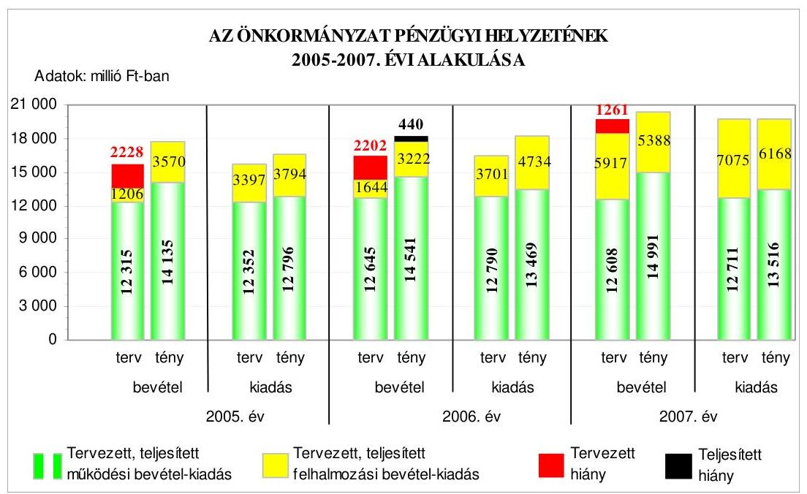
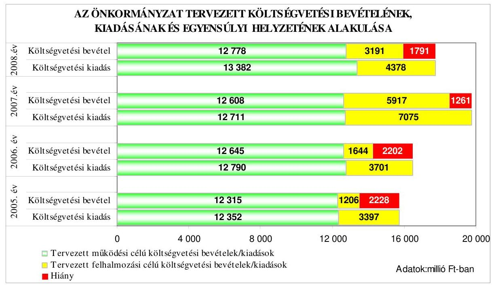
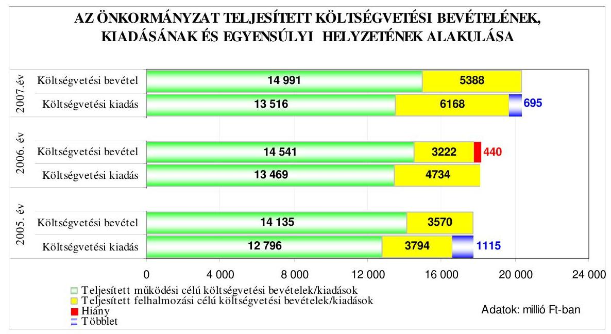
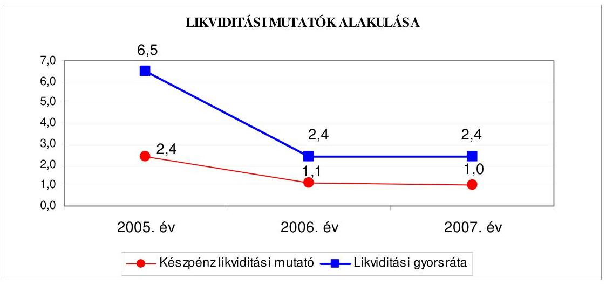
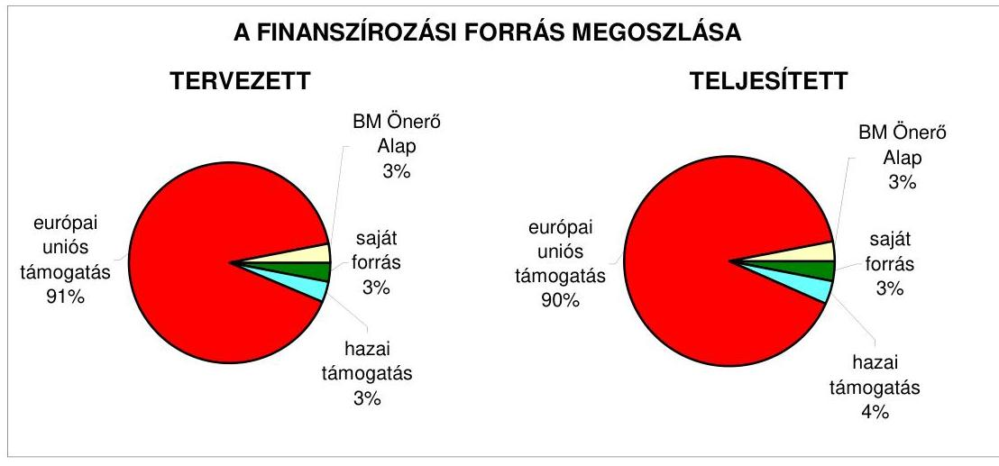
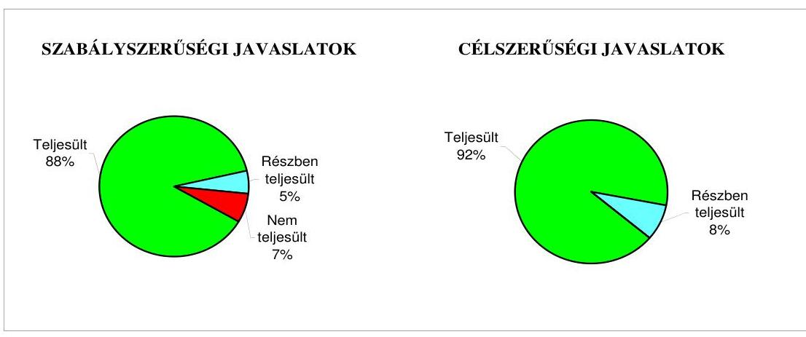
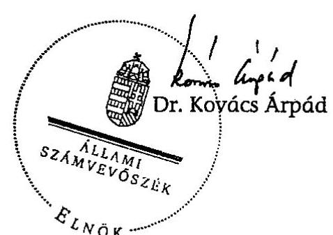
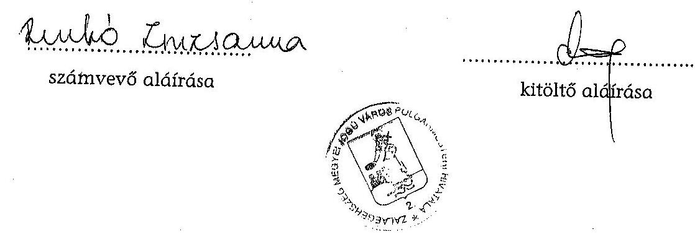
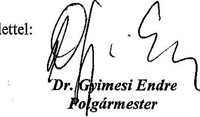

# JELENTÉS 

Zalaegerszeg Megyei Jogú Város Önkormányzata gazdálkodási rendszerének 2008. évi ellenőrzéséről

---

# 3. Önkormányzati és Területi Ellenőrzési Igazgatóság 

## Átfogó Ellenőrzési Főcsoport

Iktatószám: V-3003-06/29/18/2008.
Témaszám: 898
Vizsgálat-azonosító szám: V0391

## Az ellenőrzést felügyelte:

Dr. Lóránt Zoltán
főigazgató
Az ellenőrzés végrehajtásáért felelős:
Dr. Sepsey Tamás
főigazgató-helyettes
Az ellenőrzést vezette:
Köcse Istvánné
irodavezető, főtanácsadó

## Az ellenőrzést végezték:

| Köcse Istvánné | Dér Lívia | Renkó Zsuzsanna |
| :-- | :-- | :-- |
| irodavezető, főtanácsadó | számvevő tanácsos | számvevő tanácsos |

## A témához kapcsolódó eddig készített számvevőszéki jelentések:

## címe

Jelentés Zalaegerszeg Megyei Jogú Város Önkormányzata gazdálkodásának átfogó ellenőrzéséről
Jelentés a helyi és a helyi kisebbségi önkormányzatok gazdálkodásának átfogó ellenőrzéséről
Jelentés a Magyar Köztársaság 2004. évi költségvetése végrehajtásának ellenőrzéséről
Függelék:

- a helyi önkormányzatokat a 2004. évben megillető normatív állami hozzájárulás elszámolása
- a kötött felhasználású támogatások 2004. évi felhasználásának vizsgálata
Jelentés a Magyar Köztársaság 2005. évi költségvetése végrehajtásának ellenőrzéséről
Függelék:
- a helyi önkormányzatok a 2005. évben megillető normatív hozzájárulás elszámolásának ellenőrzése
- kötött felhasználású támogatások 2005. évi felhasználásának ellenőrzése

---

# TARTALOMJEGYZÉK 

BEVEZETÉS ..... 9
I. ÖSSZEGZŐ MEGÁLLAPÍTÁSOK, KÖVETKEZTETÉSEK, JAVASLATOK ..... 14
II. RÉSZLETES MEGÁLLAPÍTÁSOK ..... 21

1. Az Önkormányzat költségvetési és pénzügyi helyzete ..... 21
1.1. A tervezett és teljesített költségvetési bevételek és kiadások alapján a költségvetési és a pénzügyi egyensúly alakulása, valamint a költségvetési hiány megállapításának szabályszerűsége ..... 21
1.2. A költségvetési és a pénzügyi egyensúlyi helyzet kialakításához tervezett és teljesített finanszírozási célú pénzügyi műveletek módja és azok hatása a tárgyévet követő évek költségvetéseire ..... 23
1.3. A költségvetés tervezésének megalapozottsága ..... 30
2. Az Önkormányzat felkészültsége az európai uniós források igénylésére és felhasználására, valamint az elektronikus közigazgatási feladatok ellátására ..... 32
2.1. Az európai uniós források igénybevételére és a várható támogatás felhasználására történt felkészülés szabályozottsága, szervezettsége ..... 32
2.1.1. Az európai uniós forrásokra történő pályázatok benyújtására vonatkozó döntések összhangja a fejlesztési célkitűzésekkel ..... 32
2.1.2. Az európai uniós forrásokhoz kapcsolódóan a pályázatfigyelés, a pályázatkészítés, valamint az európai uniós támogatással megvalósuló fejlesztés lebonyolításának belső rendjének szabályozottsága, a végrehajtás személyi, szervezeti feltételei ..... 38
2.1.3. A fejlesztési feladat lebonyolításánál a feladatellátás rendjére, az ellenőrzési feladatok teljesítésére, valamint a felelősségi szabályokra vonatkozó előírások betartása ..... 40
2.2. Az elektronikus közigazgatási feladatok ellátása, a közérdekű adatok elektronikus közzététele ..... 42
3. A költségvetési gazdálkodás belső kontrolljai ..... 44
3.1. A szabályozottság kockázata a költségvetés tervezési, gazdálkodási, beszámolási és a folyamatba épített, előzetes és utólagos vezetői ellenőrzési feladatoknál ..... 44
3.2. A belső kontrollok érvényesülése az önkormányzati források szabályszerű felhasználásában, a költségvetési tervezés, gazdálkodás, beszámolás folyamataiban ..... 47
3.3. A belső ellenőrzési kötelezettség teljesítése, javaslatainak hasznosulása ..... 50

---

4. Az ÁSZ korábbi ellenőrzési javaslatai alapján készített intézkedési terv végrehajtása, eredményessége ..... 54
4.1. Az Önkormányzat gazdálkodási rendszerének átfogó ellenőrzése során tett javaslatok végrehajtására tervezett intézkedések megvalósulása ..... 54
4.2. A zárszámadáshoz kapcsolódó (állami hozzájárulások, támogatások igénylésének és felhasználásának ellenőrzése), valamint a további vizsgálatok esetében a megállapítások, javaslatok alapján tett intézkedések ..... 61
MELLÉKLETEK
5. számú Az Önkormányzat gazdálkodását meghatározó adatok, mutatószámok (1 oldal)
6. számú Az önkormányzati vagyon alakulása (1 oldal)
7. számú Az Önkormányzat 2005-2007. évi költségvetési előirányzatainak és azok pénzügyi teljesítéseinek alakulása (1 oldal)
8. számú Tanúsítvány az európai uniós forrásokkal támogatott programok, célok tervezett és tényleges 2005-2008. évi adatairól (2 oldal)
9. számú Adatlap az Önkormányzat európai uniós forrással támogatott fejlesztéséről (3 oldal)
10. számú Dr. Gyimesi Endre úr, Zalaegerszeg Megyei Jogú Város Önkormányzata polgármesterének észrevétele (1 oldal)

---

# RÖVIDÍTÉSEK JEGYZÉKE 

## Törvények

Áht.
Eisztv.
Ötv.
Számv. tv.

## Rendeletek

Ámr.
Ber.
2004. évi költségvetési rendelet
2004. évi zárszámadási rendelet
2005. évi költségvetési rendelet
2006. évi költségvetési rendelet
2007. évi költségvetési rendelet
2008. évi költségvetési rendelet
önkormányzati SzMSz
vagyongazdálkodási rendelet

Vhr.

18/2005. (XII. 27.) IHM rendelet

## Szórövidítések

ÁSZ
az államháztartásról szóló 1992. évi XXXVIII. törvény
az elektronikus információszabadságról szóló 2005. évi XC. törvény
a helyi önkormányzatokról szóló 1990. évi LXV. törvény
a számvitelről szóló 2000. évi C. törvény
az államháztartás működési rendjéről szóló 217/1998. (XII. 30.) Korm. rendelet
a költségvetési szervek belső ellenőrzéséről szóló 193/2003. (XI. 26.) Korm. rendelet
Zalaegerszeg Megyei Jogú Városi Önkormányzat 1/2004. (II. 6.) számú rendelete az Önkormányzat 2004. évi költségvetéséről
Zalaegerszeg Megyei Jogú Városi Önkormányzat 19/2005. (V. 6.) számú rendelete az Önkormányzat 2004. évi zárszámadásáról
Zalaegerszeg Megyei Jogú Városi Önkormányzat 5/2005. (II. 4.) számú rendelete az Önkormányzat 2005. évi költségvetéséről
Zalaegerszeg Megyei Jogú Városi Önkormányzat 6/2006. (II. 3.) számú rendelete az Önkormányzat 2006. évi költségvetéséről
Zalaegerszeg Megyei Jogú Városi Önkormányzat 9/2007. (II. 9.) számú rendelete az Önkormányzat 2007. évi költségvetéséről
Zalaegerszeg Megyei Jogú Városi Önkormányzat 4/2008. (II. 15.) számú rendelete az Önkormányzat 2008. évi költségvetéséről
Zalaegerszeg Megyei Jogú Város Önkormányzat 39/1999. (XII. 27.) számú rendelete az Önkormányzat Szervezeti és Működési Szabályzatáról
Zalaegerszeg Megyei Jogú Város Önkormányzatának a vagyonáról, a vagyongazdálkodás és vagyonhasznosítás szabályairól szóló 8/2005. (III. 4.) számú rendelete
az államháztartás szervezetei beszámolási és könyvvezetési kötelezettségének sajátosságairól szóló 249/2000. (XII. 24.) Korm. rendelet
a közzétételi listákon szereplő adatok közzétételéhez szükséges közzétételi mintákról szóló 18/2005. (XI. 27.) IHM rendelet

Állami Számvevőszék

---

BM Önerő Alap támogatás

CKÖ
e-közigazgatás
Ellenőrzési iroda
FEUVE
gazdasági program ${ }_{1}$
gazdasági program ${ }_{2}$

HEFOP
hivatali SzMSz
hivatali ügyrend
jegyző
Közgyűlés
NFT
NYDOP
ÖKÖ
polgármester
Polgármesteri hivatal
Területfejlesztési és pályázati csoport

TIOP
ÚMFT
a Magyar Köztársaság 2007. évi költségvetéséről szóló 2006. évi CXXXVII. tv. - 5. számú mellékletének 12. pontja alapján - központi költségvetési hozzájárulást biztosít a helyi önkormányzatok és jogi személyiségű társulásaik számára, azok európai uniós fejlesztési célú pályázataihoz szükséges saját forrás kiegészítésére
Cigány Kisebbségi Önkormányzat
elektronikus közigazgatás
Zalaegerszeg Megyei Jogú Város Önkormányzat Polgármesteri Hivatalának Ellenőrzési Irodája
folyamatba épített, előzetes és utólagos vezetői ellenőrzés
Zalaegerszeg Megyei Jogú Város Önkormányzat Közgyűlésének a 69/2003. (IV. 3.) és 163/2003. (VI. 12.) számú határozatával elfogadott Gazdasági program a 2003-2006. évekre
Zalaegerszeg Megyei Jogú Város Önkormányzat Közgyűlésének a 322/2006. (VI. 12.) számú határozatával elfogadott Operatív Program és Kistérség Területfejlesztési Stratégia a 2007-2013. évekre
NFT Humánerőforrás-fejlesztési Operatív Program
Zalaegerszeg Megyei Jogú Város Önkormányzat Közgyűlésének 3/2005. (I. 27.) számú határozatával jóváhagyott Polgármesteri Hivatal Szervezeti és Működési Szabályzata
Zalaegerszeg Megyei Jogú Város Önkormányzata polgármesterének és jegyzőjének 3/2005. (IV. 15.) számú szabályzata a Polgármesteri Hivatal ügyrendjéről
Zalaegerszeg Megyei Jogú Város Önkormányzatának Jegyzője
Zalaegerszeg Megyei Jogú Város Önkormányzatának Közgyűlése
Nemzeti Fejlesztési Terv
ÚMFT Nyugat-Dunántúli Operatív Program
Örmény Kisebbségi Önkormányzat
Zalaegerszeg Megyei Jogú Város Önkormányzatának polgármestere
Zalaegerszeg Megyei Jogú Város Önkormányzatának Polgármesteri Hivatala
Zalaegerszeg Megyei Jogú Város Önkormányzat Polgármesteri Hivatala Városfejlesztési és Tervezési Osztályának Területfejlesztési és Pályázati Csoportja
Társadalmi Infrastruktúra Operatív Program
Új Magyarország Fejlesztési Terv

---

# ÉRTELMEZŐ SZÓTÁR 

1. elektronikus szolgáltatási szint
2. elektronikus szolgáltatási szint
3. elektronikus szolgáltatási szint
4. elektronikus szolgáltatási szint

Európa a polgárokért közösségi program
európai uniós források
fejlesztési feladat (projekt)
fejlesztési célkitűzés

Az 1044/2005. (V. 11.) Korm. határozat alapján olyan információs, tájékoztató szolgáltatás, amely csak általános információkat közöl az adott üggyel kapcsolatos teendőkről és a szükséges dokumentumokról.
Az 1044/2005. (V. 11.) Korm. határozat alapján olyan egyirányú kapcsolatot biztosító szolgáltatás, amely az 1. szinten túl biztosítja az adott ügy intézéséhez szükséges dokumentumok, nyomtatványok letöltését, és azok ellenőrzéssel, vagy ellenőrzés nélküli elektronikus kitöltését, amely esetben a dokumentumok benyújtása hagyományos úton történik.
Az 1044/2005. (V. 11.) Korm. határozat alapján olyan kétirányú kapcsolatot biztosító szolgáltatás, amely közvetlen, vagy ellenőrzött kitöltésű dokumentum segítségével biztosítja az elektronikus adatbevitelt és a bevitt adatok ellenőrzését. Az ügy indításához, intézéséhez személyes megjelenés nem szükséges, de az ügyhöz kapcsolódó közigazgatási döntés (határozat, egyéb aktus) közlése, valamint a kapcsolódó illeték-, vagy díjfizetés hagyományos úton történik.
Az 1044/2005. (V. 11.) Korm. határozat alapján olyan teljes közvetlen kétirányú ügyintézési folyamatot biztosító szolgáltatás, amikor az ügyhöz kapcsolódó közigazgatási döntés is elektronikus úton kerül közlésre, illetve a kapcsolódó illeték-, vagy díjfizetés elektronikus úton is intézhető.
Az Európai Bizottság 2007-2013-ig szóló programja, amelynek célja lehetővé tenni, hogy a polgárok aktívan részt vegyenek egy hozzájuk közel álló, demokratikus, a világra nyitott, kulturális sokszínűségében egységes Európa alakításában.
Az elnyert európai uniós források lehívása a támogatott projekt megvalósítása érdekében, a fejlesztés lebonyolítása során felmerült kiadások finanszírozására.
A fejlesztési feladat (projekt) tartalmilag és formailag részletesen kidolgozott, megfelelő pénzügyi háttérrel és végrehajtási ütemezéssel rendelkező fejlesztési terv, amely illeszkedik az Európai Unió, illetve a Nemzeti Fejlesztési Terv által támogatott programokhoz.
Az Önkormányzat által ellátott kötelező, vagy önként vállalt feladatok ellátásának mennyiségi, vagy minőségi fejlesztésére vonatkozó terv. A mennyiségi fejlesztés megvalósulhat beszerzéssel, létesítéssel, bővítéssel, átalakítással.

---

HEFOP intézkedések

INTERREG IIIA

INTERREG IIIC

KIOP 1.2. intézkedés
közreműködő szervezet

HEFOP 2.2.1. A társadalmi befogadás elősegítése a szociális területen dolgozó szakemberek képzésével, HEFOP 2.3.2.1 Fejlesztésközpontú alternatív munkaerő-piaci szolgáltatások, HEFOP 3.1.3. Felkészítés a kompetencia alapú oktatásra, HEFOP 3.2.2. Térségi integrált szakképző központok létrehozása, HEFOP 3.5.4. A felnőttképzés hozzáférésének javítása a rendelkezésre álló közművelődési intézményrendszer rendszerszerű bevonásával, HEFOP 4.1.1. Térségi integrált szakképző központok létrehozása és infrastrukturális feltételeinek javítása. Ezen intézkedések keretében különféle programok megvalósítására kiírt pályázatokon vett részt Zalaegerszeg Megyei Jogú Város Önkormányzata.
Határmenti együttműködési program, ahol két, egyes esetekben három ország határ menti megyéi működnek együtt a határon átnyúló gazdasági és szociális kapcsolatok fejlesztése érdekében.
Interregionális együttműködési program a regionális fejlesztés és kohézió stratégia eszközeinek fejlesztésére Európa teljes területét felölelő együttműködésen keresztül.
A Környezetvédelem és Infrastruktúra Operatív Program részeként az Állati hulladék kezelése intézkedés.
A közreműködő szervezet az európai uniós támogatást elnyert kedvezményezettekkel kapcsolatot tartó szerv. Az operatív programok közreműködő szervezetei befogadják, nyilvántartják, döntésre előkészítik a pályázatokat, rögzítik a támogatással kapcsolatos adatokat az egységes monitoring informatikai rendszerben, elvégzik a támogatások előzetes (szerződéskötést megelőző), közbenső (a pénzügyi elszámolás, finanszírozás folyamatában végzett) és utólagos (a támogatott projekt pénzügyi lezárását megelőző) ellenőrzését. Az önkormányzatoknál a leggyakrabban előforduló operatív program a Regionális Fejlesztési Operatív Program végrehajtásában közreműködő szervezetek a VÁTI Kht. és a regionális fejlesztési ügynökségek.
A Kohéziós alap két közreműködő szervezete (Gazdasági és Közlekedési Minisztérium, Környezetvédelmi és Vízügyi Minisztérium) a támogatott projektek végrehajtásához kapcsolódó operatív feladatokat látják el. Ennek keretében megkötik a szerződéseket a projekt kedvezményezettjével, folyamatosan nyomon követik a teljesítéseket, lebonyolítják a támogatások kifizetését, vezetik az egységes monitoring informatikai rendszert.

---

lebonyolítás

Leonardo mobilitas program

NYDOP intézkedések

Az európai uniós források felhasználásával megvalósuló fejlesztésre irányuló műszaki, gazdasági (pénzügyi) tevékenységet magában foglaló szervezési, irányítási szolgáltatás. A szervezési szolgáltatás kiterjedhet a pályázatkészítésre, a közbeszerzési eljárás lebonyolításán keresztül a folyamatos műszaki ellenőrzésre, a pénzügyi elszámolásra, a műszaki átadás-átvételre, az üzembe helyezésre, illetve a fejlesztési folyamat egyes elemeire.
Az Európai Bizottság által kidolgozott, a strukturális alapokat kiegészítő program, amely célja a szakmai alap- és továbbképzés európai jellegének erősítése, valamint az elméleti és gyakorlati szakmai tudás és a szaknyelvi készségek fejlesztésének elősegítése.
NYDOP 1.3.1. A befektetési környezet fejlesztése - ipari parkok, iparterületek és inkubátorházak támogatása, NYDOP 2.2.1. A régió történelmi és kulturális örökségének fenntartható hasznosítása és természeti értékeken alapuló aktív turisztikai programok fejlesztése, NYDOP 3.1.1. Városközpontok funkcióbővítő megújítása a megyei jogú városokban, és a megyei jogú városok szociális célú rehabilitációs programja, NYDOP 3.2.1 Közösségi közlekedési infrastrukturális fejlesztések, NYDOP 4.1.1. Helyi környezetvédelmi
 infrastruktúra és szolgáltatások fejlesztése, NYDOP 4.3.1. Kerékpárút-hálózat fejlesztése forgalmas útszakaszok mentén, NYDOP 5.2.1. Egészségügyi szolgáltatások fejlesztése - Kistérségi járóbeteg szakellátó központok fejlesztése, alap-, járóbeteg szakellátás korszerűsítése, NYDOP 5.3. Közoktatás infrastruktúrájának fejlesztése. Ezen intézkedések keretében különféle programok megvalósítására kiírt pályázatokon vett részt Zalaegerszeg Megyei Jogú Város Önkormányzata.

---

operatív program
projekt előrehaladási jelentés (PEJ)
támogatási szerződés

TÁMOP 1.4.1. intézkedés
TIOP intézkedések

Az Európai Bizottság által jóváhagyott, a Közösségi Támogatási Keret végrehajtására vonatkozó 2004-2006 közötti, több évre szóló intézkedésekhez kapcsolódó prioritások egységes rendszerét tartalmazó dokumentum. A strukturális alapok operatív programjai: Agrár és Vidékfejlesztési Operatív Program (AVOP); Gazdasági Versenyképesség Operatív Program (GVOP); Humánerőforrás-fejlesztési Operatív Program (HEFOP); Környezetvédelmi és Infrastruktúra-fejlesztési Operatív Program (KIOP); Regionális Fejlesztési Operatív Program (ROP). A 2007-2013. évekre szóló ÚMFT-hez kapcsolódó operatív programok: Államreform Operatív Program (ÁROP); Elektronikus Közigazgatás Operatív Program (EKOP); Gazdaságfejlesztési Operatív Program (GOP); Környezet és Energia Operatív Program (KEOP); Közlekedés Operatív Program (KÖZOP); Társadalmi Megújulás Operatív Program (TÁMOP); Társadalmi Infrastruktúra Operatív Program (TIOP); Dél-alföldi Operatív Program (DAOP); Dél-dunántúli Operatív Program (DDOP); Észak-alföldi Operatív Program (ÉAOP); Észak-magyarországi Operatív Program (ÉMOP); Középdunántúli Operatív Program (KDOP); Közép-magyarországi Operatív Program (KMOP); Nyugat-dunántúli Operatív Program (NYDOP).
A Strukturális Alapok által társfinanszírozott projektek megvalósítása során a kedvezményezetteknek a támogatási szerződésben meghatározott időközönként, általában negyedévente, a támogatásfizetési kérelmekhez kapcsolódóan pár oldalas projekt előrehaladási jelentéseket kell benyújtaniuk. A projekt előrehaladási jelentés jóváhagyása a további támogatások kifizetésének előfeltétele.
A strukturális alapok esetében az irányító hatóságnak, illetve a Kohéziós alap esetében a közreműködő szervezeteknek a kedvezményezett önkormányzattal kötött szerződése, amely a támogatás felhasználásának részletes feltételeit tartalmazza.
Társadalmi Megújulás Operatív Program részeként Alternatív munkaerő-piaci programok.
TIOP 1.1.1 A pedagógiai, módszertani reformot támogató informatikai infrastruktúra fejlesztése, TIOP 1.2.1 Agóra multifunkcionális közösségi központok és területi közművelődési tanácsadó szolgálat infrastrukturális feltételeinek kialakítása. Ezen intézkedések keretében különféle programok megvalósítására kiírt pályázatokon vett részt Zalaegerszeg Megyei Jogú Város Önkormányzata.

---

# JELENTÉS   Zalaegerszeg Megyei Jogú Város Önkormányzata gazdálkodási rendszerének 2008. évi ellenőrzéséről 

## BEVEZETÉS

Az Ötv. 92. § (1) bekezdése, az Állami Számvevőszékről szóló 1989. évi XXXVIII. törvény 2. § (3) bekezdése, valamint az Áht. 120/A. § (1) bekezdése alapján az önkormányzatok gazdálkodását az Állami Számvevőszék ellenőrzi. Az ellenőrzésre az Országgyűlés illetékes bizottságai részére is átadott, országosan egységes ellenőrzési program szerint került sor.

Az Állami Számvevőszék a stratégiájában foglalt célkitűzéseknek megfelelően a helyi önkormányzatok költségvetési gazdálkodási rendszere átfogó ellenőrzésének programját a 2007. évtől megújította, azt kiegészítette további - teljesítmény-ellenőrzési - elemekkel.

## Az ellenőrzés célja annak értékelése volt, hogy az Önkormányzat:

- milyen módon biztosította a költségvetési és a pénzügyi egyensúlyt a költségvetésében és annak teljesítése során, valamint változott-e a finanszírozási célú pénzügyi műveletek jelentősége a hiányzó bevételi források pótlásában;
- eredményesen készült-e fel a szabályozottság és a szervezettség terén az európai uniós források igénylésére és felhasználására, továbbá biztosította-e az e-közigazgatás feltételeit, az adatok közzétételével a gazdálkodás nyilvánosságát;
- kialakította-e a külső és a belső feltételeknek megfelelően a költségvetés tervezési, gazdálkodási és zárszámadási feladatai belső kontrollrendszerét ${ }^{1}$, ezen tevékenységek szabályszerű ellátásához hozzájárult-e a folyamatba épített, előzetes és utólagos vezetői ellenőrzés, valamint a belső ellenőrzés;
- megfelelően hasznosították-e a korábbi számvevőszéki ellenőrzések megállapításait, szabályszerűségi ${ }^{2}$ és célszerűségi javaslatait.

[^0]
[^0]:    ${ }^{1}$ A gazdálkodás szabályszerűségét biztosító kontrollrendszer alatt értjük a kiépített és működő belső irányítási és szabályozási rendszert, valamint a belső ellenőrzési funkciók ellátásának rendszerét.
    ${ }^{2}$ A törvényi előírások betartásának elmulasztásakor egységesen a törvénysértés megjelölést alkalmazzuk, mivel az ÁSZ nem tehet különbséget a törvényi előírások között.

---

Az ellenőrzés típusa: átfogó ellenőrzés, amely egyidejűleg - egy ellenőrzés keretében - meghatározott területekre összpontosítva érvényesíti a szabályszerűségi, valamint a teljesítmény-ellenőrzés jellemzőit.

Az ellenőrzött időszak: az 1., 2. és 4. programpontok tekintetében a 2005-2007. évek és 2008. I. negyedév, a 3. ellenőrzési programpontnál a 2007. év és 2008. I. negyedév.

Zalaegerszeg megyei jogú város lakosainak száma 2008. január 1-jén 59843 fő volt. A 2006. évi önkormányzati választást követően az Önkormányzat 28 tagú Közgyűlésének munkáját 9 állandó bizottság segítette. A helyi önkormányzat mellett a 2006. évi önkormányzati választásokat követően egy, cigány kisebbségi önkormányzat működött. A polgármester az 1994. évi önkormányzati képviselő és polgármester választás óta tölti be tisztségét, a jegyző személye a 2003. évben változott.

Az Önkormányzat feladatainak végrehajtása érdekében a 2007. évben 35 költségvetési intézményt működtetett, amelyekből 25 önállóan gazdálkodott, valamint a feladatok ellátásában részt vett tíz 75%-on felüli önkormányzati tulajdonú gazdasági társasága, továbbá hét közalapítványa. Az Önkormányzat a 2007. évi költségvetési beszámolója szerint 20379 millió Ft költségvetési bevételt ért el és 19683 millió Ft költségvetési kiadást teljesített, 2007. december 31-én a könyvviteli mérleg szerint 104122 millió Ft értékű vagyonnal rendelkezett.

Az Önkormányzat vagyona a 2005. év végi állományhoz viszonyítva 5%-kal emelkedett. Ezen belül több mint háromszorosára (218%-kal) nőtt a beruházások állománya a szennyvízközmű beruházás miatt, valamint közel háromszorosára (178%-kal növekedve 4636 millió Ft-ra) emelkedett a kötelezettségek állománya, elsősorban a fejlesztési feladatokhoz felvett hosszú lejáratú hitelek következtében.

A 2008. évi költségvetési rendeletben 15969 millió Ft költségvetési bevételt és 17760 millió Ft költségvetési kiadást irányoztak elő.

Az összes költségvetési bevétel 36%-át a saját bevétel, 16%-át a helyi adó bevétel biztosította a 2007. évben. Az összes költségvetési kiadásból a felhalmozási célú kiadás részaránya a 2007. évben 31% volt. A Polgármesteri hivatalban dolgozó köztisztviselők száma 2007. december 31-én 210 fő, a költségvetési intézményekben foglalkoztatott közalkalmazottak száma 2324 fő volt. Az Önkormányzat gazdálkodását meghatározó adatokat, mutatószámokat az 1-3. számú mellékletek tartalmazzák.

Az Önkormányzat költségvetési és pénzügyi helyzetét az elemző eljárás módszerével vizsgáltuk. E körben elemeztük a költségvetés egyensúlyi helyzetének alakulását, a tervezett és tényleges költségvetési hiány okait, a mérséklésére tett intézkedéseket, finanszírozásának módját, az Önkormányzat adósságállományának alakulását, összetevőit.

A teljesítmény-ellenőrzés módszerével vizsgáltuk a belső szabályozottság, szervezettség terén az Önkormányzat felkészültségét az európai uniós források figyelésére, igénylésére és felhasználására, továbbá értékeltük, hogy az igényelt

---

európai uniós támogatások az Önkormányzat által meghatározott fejlesztési célkitűzésekhez kapcsolódtak-e. Az eredményesség szempontjából a minősítést a lényegességi szinthez való viszonyítással végeztük el. Az ellenőrzés során felmértük, hogy az e-közigazgatási feladat ellátása, illetve bevezetése, működtetése érdekében milyen intézkedéseket tettek, valamint biztosították-e a közérdekű adatok közzétételét.

A költségvetési gazdálkodás belső kontrolljainak ellenőrzése során értékeltük, hogy a Polgármesteri hivatalnál a költségvetés tervezési, gazdálkodási, zárszámadás készítési feladatok belső kontrolljainak kiépítettsége és működése megfelelő biztosítékot ad-e a gazdálkodási feladatok megfelelő, szabályszerű ellátására. Felmértük és minősítettük a költségvetés tervezési, a gazdálkodási, a zárszámadás készítési feladatokkal, továbbá a pénzügyi-számviteli területen az informatikával kapcsolatosan kialakított kontrollok megfelelőségét, valamint azok működésének eredményességét, megbízhatóságát. Értékeltük a belső ellenőrzés szervezeti és szabályozási keretét, továbbá működését.

A Polgármesteri hivatalnál értékeltük a gazdálkodás folyamatában a kontrollok működésének megbízhatóságát, ennek keretében ellenőriztük a szakmai teljesítés igazolására és az utalvány ellenjegyzésére kialakított kontrollok végrehajtását. Az ellenőrzést a következő, kiemelt kockázatuk alapján kiválasztott ${ }^{3}$ az általánostól jellemzően eltérő, egyedi eljárást igénylő gazdasági eseményekkel kapcsolatos kifizetésekre folytattuk le ${ }^{4}$ :

- a külső szolgáltató által végzett karbantartási, kisjavítási szolgáltatások,
- a gépek, berendezések, felszerelések beszerzése, továbbá
- a működési célú pénzeszköz átadásokból az államháztartáson kívülre teljesített kifizetésekre.

Az ellenőrzés hatékony elvégzése céljából a vizsgálandó területek kiválasztása során a kockázatokon alapuló megközelítés érvényesült, ezáltal az ellenőrzési erőforrásokat azokra a területekre fókuszáltuk, amelyeken legnagyobb a hibák előfordulási valószínűsége. Az ellenőrzési erőforrások ilyen típusú összpontosí-

[^0]
[^0]:    ${ }^{3}$ Az önkormányzatok kiemelt előirányzataira vonatkozóan, a vertikális folyamatokra elvégeztük a kockázatok becslését, amelynek eredményeként a külső szolgáltató által végzett karbantartási, kisjavítási szolgáltatások, a gépek, berendezések, felszerelések beszerzése, valamint a működési célú pénzeszköz átadások államháztartáson kívülre teljesített kifizetései kiemelkedően kockázatos területeknek bizonyultak.
    ${ }^{4}$ A korábbi ellenőrzési tapasztalataink szerint ezeken a területeken a jegyzők nem, vagy hiányosan szabályozták a megbízás, megrendelés, illetve beszerzés indokoltságának, szükségességének elbírálására, igazolására, valamint a teljesítések dokumentálására, a kifizetések jogosságának megítélésére szolgáló kontrollokat. További kockázatot jelentett a külső szolgáltató által végzett karbantartási, kisjavítási munkák esetében, hogy az 50 ezer Ft alatti megrendelésekre vonatkozóan az ellenőrzési tapasztalataink szerint a jegyzők nem alakították ki a kötelezettségvállalások rendjét és nyilvántartási formáját, valamint a szabályozás elmulasztása esetén nem történt meg az írásbeli kötelezettségvállalás és annak az ellenjegyzése sem.

---

tásával minimálisra csökkenthető a kívánt ellenőrzési bizonyosság eléréséhez szükséges időráfordítás.

A pénzügyi-számviteli folyamatokban alkalmazott belső kontrollok létezésének és működésének ellenőrzésére a vizsgált három terület 2007. évi könyvviteli tételeiből területenként egyszerű véletlen mintát vettünk. A kijelölt gazdasági eseményre elvégzett megfelelőségi tesztek alapján értékeltük a kontrollok működésének eredményességét, megbízhatóságát a vizsgált három területre külön-külön, majd összefoglalóan ${ }^{5}$ a Polgármesteri hivatal egyedi eljárást igénylő gazdasági eseményeire.

A helyszíni ellenőrzés megállapításainak részletes dokumentálását három megfelelőségi tesztlapon, öt elővizsgálati és 12 helyszíni ellenőrzési munkalapon biztosítottuk. Ezeken a teszt- és munkalapokon a minősítés alapjául szolgáló kérdések és a vonatkozó konkrét jogszabályhelyek megjelölése mellett értékeltük a kialakított belső kontrollokban rejlő kockázatokat ${ }^{6}$ és a kialakított kontrollok működésének megbízhatóságát ${ }^{7}$.

Az ÁSZ korábbi ellenőrzési javaslatai alapján tett intézkedéseket, illetve azok megvalósítását utóellenőrzés keretében vizsgáltuk. A gazdálkodási rendszer átfogó ellenőrzése során megfogalmazott javaslatok végrehajtására tett intézkedések megvalósítását ellenőriztük, az egyéb számvevőszéki ellenőrzések során tett javaslatok esetében pedig a kiadott intézkedéseket tekintettük át.

A helyszíni ellenőrzés során kitöltött - az ellenőrzést végző számvevő és a Polgármesteri hivatal felelős köztisztviselője által aláírt - elővizsgálati és helyszíni ellenőrzési munkalapokat, azok kitöltési útmutatóit, továbbá a megfelelőségi tesztek dokumentumait a polgármester részére a számvevői jelentéssel egyidejűleg átadtuk.

A jelentés megállapításainak, javaslatainak egyeztetése során a polgármester és a jegyző arról adott részletes tájékoztatást - egyidejűleg csatolták azokat a

[^0]
[^0]:    ${ }^{5}$ A vizsgált három terület egyedi értékelési pontszámait a területek relatív költségvetési súlyával arányosan összegeztük.
    ${ }^{6}$ A kialakított belső kontrollokban rejlő kockázatot alacsonynak minősítettük, ha a kontrollok - végrehajtásuk esetén - megfelelő védelmet nyújtanak a hibák bekövetkezése ellen. Közepesnek minősítettük a belső kontrollokban rejlő kockázatot, amennyiben a kontrollok - végrehajtásuk esetén - a lehetséges hibák többsége ellen védelmet nyújtanak. Magasnak értékeltük a kockázatot, ha a kontrollok - kialakításuk hiányában, vagy hiányos kialakításuk miatt - nem nyújtanak elegendő védelmet a lehetséges hibákkal szemben.
    ${ }^{7}$ A kontrollok működésének eredményességét, megbízhatóságát kiválónak értékeltük abban az esetben, ha azok működése - esetleges apróbb hiányosságoktól eltekintve - megfelelt a hibák megelőzésére és kijavítására meghatározott szabályozásnak és a legmagasabb szintű elvárásoknak. Jónak minősítettük a kontrollok működését,

 ha a hiányosságok száma ugyan jelentős volt, de nem veszélyeztette az ellenőrzött terület hibáinak megelőzését és kijavítását. Amennyiben a hiányosságok mértéke nem biztosította a hibák megelőzését, feltárását, kijavítását és ezáltal veszélyeztette az eredményes, megbízható működést, a kontroll működésének megbízhatósága gyenge minősítést kapott.

---

dokumentumokat, amelyek igazolták, hogy az időközben megtett intézkedésekkel a számvevői jelentésben a polgármester és a jegyző részére tett javaslatokat ${ }^{8}$ megvalósították. A megtett intézkedéseket a jelentés II. Részletes megállapítások fejezetében az adott témához kapcsolt lábjegyzetben feltüntettük és a vonatkozó javaslatokat elhagytuk.

A jelentést az ÁSZ-ról szóló 1989. évi XXXVIII. tv. 25. § (1) bekezdése alapján észrevétel közlése céljából megküldtük Zalaegerszeg Megyei Jogú Város Önkormányzata polgármesterének. A kapott észrevételt a jelentés 6. számú melléklete tartalmazza.

[^0]
[^0]:    ${ }^{8}$ A számvevői jelentés a helyszíni ellenőrzés során feltárt hiányosságok megszüntetése, a jogszabályi előírások maradéktalan betartása érdekében 13, a munka színvonalának javítása érdekében 10 javaslatot tartalmazott a polgármester és a jegyző részére.

---

# I. ÖSSZEGZŐ MEGÁLLAPÍTÁSOK, KÖVETKEZTETÉSEK, JAVASLATOK 

Az Önkormányzat tervezett költségvetési bevételei és kiadásai 2005-2007 között növekedtek, a 2008. évben - az előző évhez viszonyítva - csökkentek a térségi szennyvízcsatorna hálózat és szennyvíztelep beruházás 2007. évi ütemének áthúzódása, illetve az ahhoz kapcsolódó bevételek és kiadások eredeti előirányzatként való tervezésének elmaradása miatt. A költségvetés egyensúlya a 2005-2008. években nem volt biztosítva, a tervezett költségvetési bevételek ezen belül sem a működési, sem a felhalmozási bevételek nem nyújtottak fedezetet a tervezett költségvetési kiadásokra. Az Önkormányzat 2005-2008. évi költségvetési rendeleteiben a költségvetés bevételi és kiadási főösszegének megállapításakor - az Áht. előírása ellenére - finanszírozási célú pénzügyi műveleteket is figyelembe vettek költségvetési hiányt módosító bevételként, illetve kiadásként. A költségvetések végrehajtása során a 2005. és a 2007. években a teljesített költségvetési bevételek meghaladták a teljesített költségvetési kiadásokat, a pénzügyi egyensúly biztosított volt. A 2006. évben a realizált bevételek nem nyújtottak fedezetet a teljesített költségvetési kiadásokra, azonban a tervezettnél 80%-kal kisebb összegű költségvetési hiány keletkezett. A teljesített működési célú költségvetési bevételek 2005-2007 között fedezték a működési célú költségvetési kiadásokat, valamint a 2005. és a 2007. években fedezetet nyújtottak a felhalmozási célú költségvetési bevételeket meghaladó összegű felhalmozási célú költségvetési kiadások finanszírozására is. A felhalmozási célú költségvetési kiadások mindegyik évben meghaladták a felhalmozási célú költségvetési bevételeket.

A 2005-2008. évi költségvetési rendeletekben a költségvetési egyensúly biztosításához működési- és felhalmozási célú hitelek felvételét, értékpapírok értékesítését tervezte az Önkormányzat, és a 2006-2008. években előírta, hogy évközi többletbevételekből biztosítani kell a tervezett működési célú hitelfelvétel kiváltását. A tervezett hiány csökkentése érdekében 2005-2007 között a költségvetési rendeletben foglaltak végrehajtásán túl évközi intézkedés nem történt, míg a 2008. évben a költségvetés jóváhagyását követően az intézmények költségvetési támogatásának és létszámkeretének csökkentéséről döntöttek, valamint meghatározták az intézményi struktúra átalakításával, a gazdálkodás racionalizálásával kapcsolatos 2008. évi feladatokat. A költségvetés teljesítése során 2005-2007 között az egyensúlyi helyzet javult a tervezetthez viszonyítva, a teljesített költségvetési bevételek a 2005. és a 2007. években - a felvett hosszú lejáratú hitelek és értékesített értékpapírok bevételei nélkül is - fedezetet nyújtottak a költségvetési kiadásokra. Ennek ellenére az Önkormányzat a felhalmozási feladatok megvalósításához ezekben az években is hosszú lejáratú hitelt vett fel, valamint a 2007. évben értékesítette a 2004. és a 2006. években vásárolt értékpapírjainak egy részét. A 2006. év végén a tényleges pénzügyi hiány a tervezett 2202 millió Ft-tal szemben 440 millió Ft volt, ennek több mint négyszerese a felhalmozási feladatok megvalósításához történt hitelfelvétel és az értékpapír értékesítés finanszírozási célú bevétele, amelynek mintegy kilenctizedét a költség-

---

vetésben tervezett működési kiadások finanszírozására, egytizedét a felhalmozási feladatokra fordították.

Az Önkormányzat a 2005-2007. években és 2008. I. félévben összesen 2045 millió Ft fejlesztési célú hitelt vett fel 10-20 éves futamidőre, két-három év türelmi idővel. Rövid lejáratú hitelt, valamint az évközi likviditás biztosításához folyószámlahitelt nem vett igénybe. A 2005-2007. évek költségvetéseinek végrehajtása során a pénzügyi egyensúlyt a tervezettet meghaladó bevétel, az előző évi pénzmaradvány nem tervezett igénybevétele, valamint a kiadások feladatáthúzódás miatti elmaradásai okozták.

Az Önkormányzat eladósodása a hitelfelvételek, a tartozásátvállalás és a pénzügyi lízing segítségével történt ingatlanvásárlás miatt 2005-2007 között emelkedett, a 2005. év végéhez viszonyítva a 2007. év végére több mint háromszorosára nőtt. A rövidtávon teljesítendő fizetési kötelezettségek fizetőképességre gyakorolt hatása mérséklődött, azonban a hosszú lejáratú hitelekre biztosított türelmi idő lejártával kezdődő hiteltörlesztések növelik a rövid lejáratú hitelek év végi állományát.

Az Önkormányzat 2005-2007. évi költségvetési rendeleteiben jóváhagyott eredeti előirányzatok túlteljesültek, amelyhez hozzájárult, hogy a költségvetési rendeletekben indokoltsága ellenére eredeti előirányzatként nem tervezték az előző évről áthúzódó feladatok ellátásához teljesíthető jóváhagyott kiadásokat és a teljesítendő várható bevételeket, valamint az eredeti előirányzatként nem tervezhető állami támogatásokat és az év közben elnyert pályázati források bevételeit és azok terhére teljesített kiadásokat.

Az Önkormányzat 2005-2008. évekre vonatkozó fejlesztési célkitűzéseit a gazdasági program ${ }_{1,2}$ az NFT-ben illetve az ÚMFT-ben foglalt célokkal összhangban tartalmazta. A Polgármesteri hivatal, az intézmények és az önkormányzati feladatot ellátó gazdasági társaságok a 2005-2008. I. félévben 31 fejlesztési feladattal kapcsolatban nyújtottak be pályázatot európai uniós források megszerzésére. A benyújtott pályázatok közül 16 támogatásban részesült, négyet forráshiány miatt elutasítottak, 11 elbírálása még nem történt meg.

Az európai uniós források igénybevételével és felhasználásával kapcsolatos önkormányzati feladatokat a 2005-2008. években nem határozták meg. A szabályozás hiánya közrejátszott abban, hogy az Önkormányzat 2005-2008. évi költségvetési rendeletei - az Áht. előírása ellenére - nem a támogatási szerződésekben szereplő ütemezésnek megfelelően tartalmazták az európai uniós forrással megvalósuló fejlesztések előirányzatait, továbbá az Ámr. előírásai ellenére hiányosan tartalmazták az európai uniós támogatás igénybevételével megvalósuló projektek kiadásait feladatonként, a többéves kihatással járó európai uniós támogatás igénybevételével megvalósuló feladatok bevételi-kiadási előirányzatait éves bontásban, illetve elkülönítetten az európai uniós támogatással megvalósuló programok bevételi és kiadási előirányzatait. A benyújtott európai uniós pályázatokhoz kapcsolódó saját forrás fedezetét a 2005-2007. évi költségvetési rendeletekben nem határozták meg, a 2008. évi költségvetési rendeletben a céltartalékban tervezték.

---

Az Önkormányzat felkészültsége 2005-2008. I. félév között az európai uniós források igénybevételére és felhasználására a belső szabályozottság és szervezettség terén összességében nem volt eredményes, annak ellenére, hogy az európai uniós forrásokra történő pályázatok a gazdasági program ${ }_{1,2}$-ben megfogalmazott fejlesztési célkitűzésekhez kapcsolódtak, és a pályázatfigyelés és pályázatkészítés személyi feltételeit biztosították. Nem határozták meg azonban a pályázatfigyelést végzők és a döntési, illetve a döntés-előkészítési jogkörrel rendelkezők közötti információk szolgáltatásának kötelezettségét, a polgármester és a fejlesztési feladat lebonyolítója közötti kapcsolattartás rendjét, valamint a kockázatelemzés készítésekor a belső ellenőrzési feladatokat, a pályázat nyilvántartás vezetésének felelőseit, a pályázatkészítést végző és a pályázat benyújtásáért felelős személyek közötti kapcsolattartás és felelősség szabályait, a fejlesztési feladat lebonyolítását végző személyek feladatait, a polgármesterrel való kapcsolattartás rendjét, a személyre szóló felelősségét. A pályázatkészítésre külső szakértőkkel kötött szerződések nem tartalmazták a felek közötti kapcsolattartás rendjét, a felelősség szabályait, az információk átadásának formáját, tartalmát és módját.

Az Önkormányzat nem rendelkezett a Közgyűlés által jóváhagyott informatikai stratégiával, nem határozták meg az e-közigazgatás fejlesztésével kapcsolatos konkrét célokat, és azt hogy az elektronikus szolgáltatás melyik szintjét mikorra kívánják elérni. Az e-közigazgatási feladatokat ellátó informatikai rendszer egyes ügytípusoknál a 2. elektronikai szolgáltatási szint követelményeinek felelt meg, egyes ügyeknél 2008. január 1-től lehetőség van a 4. elektronikus szolgáltatási szintnek megfelelő ügyintézési feladatok elvégzésére is. A jegyző az Áht. előírása ellenére nem gondoskodott az Önkormányzat által a 2007-2008. I. félévben nyújtott nem normatív céljellegű működési és felhalmozási támogatások közel harmadánál a kedvezményezettek nevének, a támogatás céljának, összegének, a támogatási program megvalósítási helyének és az Önkormányzat pénzeszközei felhasználásával, továbbá a vagyonnal történő gazdálkodással összefüggő - nettó öt millió Ft-ot elérő vagy azt meghaladó értékű - árubeszerzésre, építési beruházásra, szolgáltatás megrendelésre, vagyonértékesítésre, vagyonhasznosításra, vagyon vagy vagyoni értékű jog átadására vonatkozó szerződések háromnegyedénél a szerződések típusának, tárgyának, a szerződést kötő felek nevének, a szerződés értékének, határozott időre kötött szerződés esetében az időtartamának, valamint ezen adatok változásának közzétételéről. A jegyző - az Ámr. előírása ellenére - a 2005-2007. évi költségvetési beszámolók szöveges indokolását nem tette közzé.

A Polgármesteri hivatalban a költségvetés tervezési és a zárszámadás készítési folyamatok szabályozottsága a 2007. évben összességében alacsony kockázatot jelentett a feladatok megfelelő, szabályszerű végrehajtásában, mivel a polgármester és a jegyző szabályozta a költségvetési tervezés és a zárszámadás elkészítés rendjét, meghatározta a költségvetési javaslat összeállításával kapcsolatos követelményeket. Annak ellenére összességében alacsony volt a kockázat, hogy a Közgyűlés a költségvetési szervek elemi beszámolója felülvizsgálatának rendjét, tartalmát a 2007. évre nem, csak a 2008. II. félévben határozta meg. A költségvetés tervezési és zárszámadás-készítési folyamatban a kontrollok működésének megbízhatósága kiváló volt, mivel a jegyző a szabályozásban foglaltaknak megfelelően ellenőriztette, hogy a költségvetési intéz-

---

mények teljesítették-e a részükre meghatározott követelményeket, valamint a költségvetési igények indokoltságát, teljesíthetőségét, a tervezett saját bevételek előirányzatai és az azok megalapozását szolgáló önkormányzati rendeletek összhangját, a zárszámadás készítés folyamatában az intézményi pénzmaradványok megállapításának szabályszerűségét, az eredeti és a módosított előirányzatok, valamint a teljesítési adatok eltérésének indokoltságát, az intézményi számszaki beszámolók belső, valamint azoknak az adatszolgáltatással való összhangját.

A gazdálkodási, a pénzügyi-számviteli és a folyamatba épített ellenőrzési feladatok szabályozottságának hiányosságai a Polgármesteri hivatalban a 2007. évben közepes kockázatot jelentettek a feladatok szabályszerű végrehajtásában, mivel a jegyző hiányosan szabályozta a számviteli és ellenőrzési feladatokat, valamint a számlarend nem tartalmazta a számlákat érintő gazdasági eseményeket, azok más számlákkal való kapcsolatát, a főkönyv és az analitikus nyilvántartások egyeztetése dokumentálási módját, azonban a kialakított kontrollok - végrehajtásuk esetén - a lehetséges hibák többsége ellen védelmet nyújtottak. A szabályozás hiányosságait - a számlarend kivételével - a 2008. évben a helyszíni ellenőrzés ideje alatt megszüntették, ezáltal javult a pénzügyi-számviteli, ellenőrzési feladatok szabályozottsága.

A Polgármesteri hivatalnál a működésbeli hibák megelőzésére, feltárására, kijavítására kialakított belső kontrollok a külső szolgáltatók által végzett karbantartásokkal, kisjavításokkal, valamint a gépek, berendezések, felszerelések beszerzésével kapcsolatos kifizetések során jól működtek, mivel a szakmai teljesítés igazolására kijelölt személyek a kiadások teljesítését megelőzően ellenőrizték, szakmailag igazolták azok jogosultságát, összegszerűségét és a szerződésekben, megrendelésekben foglaltak teljesítését. Az utalványok ellenjegyzője azonban nem észrevételezte, hogy az érvényesítés nem tartalmazta a könyvviteli elszámolásra utaló főkönyvi számlaszámot, valamint a könyvviteli elszámolásra utaló számlaszámok kijelölését nem az érvényesítés során és nem a jegyző által érvényesítéssel megbízott személy végezte el. Az államháztartáson kívülre nyújtott működési célú pénzeszközátadásokkal kapcsolatos kifizetések teljesítése során a kontrollok működésének a megbízhatósága gyenge volt, mivel
 a kiadások teljesítését megelőzően elmaradt azok jogosultságának, összegszerűségének ellenőrzése, valamint az utalványok ellenjegyzője ezen utalványok ellenjegyzése során nem végezte el a gazdálkodásra vonatkozó szabályok betartásának ellenőrzését, nem győződött meg a szakmai teljesítés igazolás megtörténtéről. A Polgármesteri hivatalban a külső szolgáltatók által végzett karbantartásokkal, kisjavításokkal, a gépek, berendezések, felszerelések beszerzéseivel és az államháztartáson kívülre történő működési célú pénzeszköz átadásokkal kapcsolatos kifizetések során - ezen területek költségvetési súlyának figyelembevételével összefoglalóan értékelve - a kontrollok működésének megbízhatósága gyenge volt, mert az államháztartáson kívülre nyújtott működési célú pénzeszközátadásokkal kapcsolatos kiadások teljesítését megelőzően a szakmai teljesítés igazolásra kijelölt személyek, továbbá az érvényesítők a folyamatba épített ellenőrzési feladataikat nem végezték el, és ezt a hiányosságot az utalványok ellenjegyzője sem kifogásolta.

---

Az informatikai rendszer környezete szabályozottságának hiányosságai közepes kockázatot jelentettek az informatikai feladatok biztonságos végrehajtásában, mert a Polgármesteri hivatal nem rendelkezett a Közgyűlés által jóváhagyott informatikai stratégiával, nem szabályozták az informatikai eszközökhöz történő hozzáférések ellenőrzésének jogosultjait és rendjét, valamint nem gondoskodtak az informatikával kapcsolatos szabályzatok dolgozókkal történő megismertetéséről. A szabályozási hiányosságok ellenére a Polgármesteri hivatalban az informatikai rendszer 2007. évi működtetésénél a működésbeli hibák megelőzésére, feltárására, kijavítására kialakított belső kontrollok megbízhatósága összességében kiváló volt.

A belső ellenőrzés szervezeti kereteinek kialakítása és szabályozása a belső ellenőrzési feladatok végrehajtásában alacsony kockázatot jelentett, mivel a Közgyűlés kialakította a belső ellenőrzés szervezeti kereteit és meghatározta a belső ellenőrzés ellátási módját, feladatait, valamint a szabályozás során biztosította a belső ellenőrök függetlenségét, a belső ellenőrzési tevékenységre vonatkozó szabályokat és eljárásokat a belső ellenőrzési kézikönyvben előírták, az éves ellenőrzési tervek kockázatelemzéssel alátámasztott stratégiai terven alapultak. Az éves ellenőrzési tervekben azonban szükségessége ellenére a soron kívüli ellenőrzési feladatok végrehajtására kapacitást nem határoztak meg. A belső ellenőrzés működésénél a kialakított kontrollok megbízhatósága jó volt, mivel a jegyző gondoskodott a költségvetési szervek ellenőrzéséről, az ellenőrzéseket ellenőrzési program alapján hajtották végre, az elvégzett ellenőrzésekről készített jelentések megfeleltek a jogszabályban foglalt követelményeknek. A Polgármesteri hivatalnál az éves ellenőrzési tervben előírt ellenőrzéseket azonban nem a tervezett ütemezésnek megfelelően végezték, és nem ellenőrizték a FEUVE rendszer kiépítésének és működésének a helyi és központi szabályoknak való megfelelését, továbbá az Önkormányzat többségi irányítást biztosító befolyása alatt működő gazdasági társaságoknál a rendelkezésre álló erőforrásokkal való gazdálkodást, a vagyon megóvását, gyarapítását, az elszámolások és beszámolók megbízhatóságát, valamint a kedvezményezett szervezeteknél az Önkormányzat költségvetéséből céljelleggel nyújtott támogatások rendeltetés szerinti felhasználását, a közbeszerzéseket, illetőleg a közbeszerzési eljárásokat, ezekre a kockázatelemzés nem terjedt ki, és az éves ellenőrzési terv sem tartalmazta, az ellenőrzésre rendelkezésre álló kapacitás nagyságrendje nem állt arányban a belső ellenőrzés által ellátandó feladatokkal. A belső ellenőrzés működésénél megállapított hiányosságok nem veszélyeztették, hogy a belső ellenőrzés megelőzze, feltárja, kijavíttassa a lényeges hibákat, illetve szabálytalanságokat. A jegyző - az Áht. előírása ellenére - a 2006. és a 2007. évi költségvetési beszámolók keretében nem számolt be a Polgármesteri hivatal FEUVE és belső ellenőrzési rendszerének működtetéséről. A polgármester a zárszámadási rendelettel egyidejűleg a Közgyűlés elé terjesztette a költségvetési szervek éves ellenőrzési jelentései alapján készített éves összefoglaló jelentést.

Az ÁSZ az Önkormányzat gazdálkodását átfogó jelleggel a 2003. évben ellenőrizte, ennek során 54 szabályszerűségi és 15 célszerűségi javaslatot tett. Az ellenőrzés javaslatainak megvalósítására a felelősöket és határidőket tartalmazó intézkedési terv készült, amelyet a Közgyűlés elfogadott. Az ÁSZ ellenőrzés által tett javaslatok 84%-a realizálódott, kilenc %-a részben valósult meg és hét %-ánál elmaradt a hasznosítás. A megtett intézkedések eredményeként javult a

---

költségvetés és a zárszámadás készítés rendje, valamint az Önkormányzat gazdálkodásának szabályozottsága.

A végrehajtott javaslatok a költségvetési koncepció és a költségvetési rendelet tartalmához, szerkezetéhez, végrehajtási szabályaihoz, a költségvetési rendelet módosításához, a gazdálkodási és a pénzügyi-számviteli feladatellátás szabályozottságához, a költségvetési gazdálkodási és ellenőrzési jogkörök gyakorlásához, a bizonylatok alaki és tartalmi követelményeihez kapcsolódtak. Hasznosították továbbá a vagyon nyilvántartására, a leltározási kötelezettség teljesítésére, a követelések és értékpapírok év végi értékelésének szabályszerűségére, a vagyongazdálkodási feladatok és döntési hatáskörök meghatározására, a céljelleggel nyújtott támogatások szabályszerűségére, a közbeszerzési eljárások lefolytatására, a zárszámadási rendelet szerkezetére, tartalmára vonatkozó követelményekhez, a pénzmaradvány elszámolásának és felülvizsgálat rendjének szabályszerűségéhez, a kisebbségi önkormányzatokkal kötött megállapodásokhoz, végrehajtásuk szabályszerűségéhez, az önként vállalt feladatok meghatározásához, az informatikai szabályozottság biztosításához, a munkaköri leírások tartalmi kiegészítéséhez, a középületek akadálymentesítéséhez kapcsolódó javaslatokat.

Az Áht-ban előírt mérlegek, kimutatások tartalmi követelményeit az intézkedési tervben foglalt határidőt követően, a 2008. évben határozták meg rendeletben. A Polgármesteri hivatal javasolt előirányzatait nem az Ámr. előírásainak megfelelően dolgozták ki. A költségvetés előterjesztésekor az Áht. előírásai ellenére nem mutatták be teljes körűen a több éves kihatással járó döntések számszerűsítését évenkénti bontásban és összesítve, szöveges indokolással együtt, a jegyző nem biztosította a céltartalék előirányzatok teljes körű elkülönítését a költségvetési rendeletben, továbbá jóváhagyott kiadási előirányzat hiányában teljesítettek kifizetéseket az előző évekről áthúzódó feladatokra. A CKÖ költségvetési előirányzatának módosítását a kisebbségi önkormányzat határozatának hiányában vezették át a költségvetési rendeleten. Az intézkedési tervben előírt határidőt követően, a 2008. évben készítették el a gazdasági szervezet Ámr. előírásainak megfelelő tartalmú ügyrendjét. A kisebbségi önkormányzatokkal kötött együttműködési megállapodásokat az Ámr-ben előírt határidőt követően módosították.

Nem történt meg a felesleges vagyontárgyak selejtezésének, a leltározás elvégzésének, a beszámolók és a mérlegkészítés határidejének önkormányzati szintű meghatározása. Nem szabályozták az Önkormányzat tulajdonosi részesedéssel rendelkező gazdasági társaságai, a kulturális és sport szervezetek működéséhez biztosított támogatások számadási kötelezettségét.

Az ÁSZ 2005-2007 között az Önkormányzatnál ellenőrizte a helyi önkormányzatokat 2004. és 2005. évben megillető normatív hozzájárulás, valamint a kötött felhasználású támogatások elszámolását. A számvevői jelentésekben tett javaslatok hasznosítására a jegyző intézkedett.

Az Önkormányzat gazdálkodásának 2003. évi átfogó ellenőrzése, valamint a 2005-2007. évek között végrehajtott ellenőrzések során tett javaslatok a megtett intézkedések következtében összességében 89%-ban hasznosultak, hat %-ban részben, öt %-ban nem teljesültek.

---

A helyszíni ellenőrzés megállapításainak hasznosítása mellett javasoljuk:

# a polgármesternek 

a munka színvonalának javítása érdekében
kezdeményezze, hogy a számvevőszéki jelentésben foglaltakat a Közgyűlés tárgyalja meg.

---

# II. RÉSZLETES MEGÁLLAPÍTÁSOK 

## 1. AZ ÖNKORMÁNYZAT KÖLTSÉGVETÉSI ÉS PÉNZÜGYI HELYZETE

### 1.1. A tervezett és teljesített költségvetési bevételek és kiadások alapján a költségvetési és a pénzügyi egyensúly alakulása, valamint a költségvetési hiány megállapításának szabályszerűsége

Az Önkormányzatnál a tervezett költségvetési bevételek és kiadások főösszege a 2005-2007 között növekedett, a 2008. évben 10,2%-kal, illetve 13,8%-kal csökkent, a felhalmozási feladatokra tervezett összegek csökkenése, illetve a térségi szennyvízcsatorna hálózat és szennyvíztelep beruházás ${ }^{9}$ 2007. évi ütemének áthúzódásához kapcsolódó források és kiadások (támogatás, előző évi pénzmaradvány és társulási tagok befizetései, beruházási kiadások) eredeti előirányzatként való megtervezésének elmaradása miatt. A tervezett költségvetési bevételek és kiadások nem voltak egyensúlyban a 2005-2008. évi költségvetési rendeletekben.

A 2005-2007. évi tervezett és teljesített összes költségvetési bevétel és kiadás alakulását a következő ábra szemlélteti:

[^0]
[^0]:    ${ }^{9}$ A beruházás az Önkormányzat részben önállóan gazdálkodó intézménye, a Zalaegerszeg és környéke szennyvízelvezetés és csatornahálózat fejlesztésre létrejött önkormányzati társulás keretében, a Kohéziós Alap támogatásával, a támogatási szerződés szerint 2005-2010 között valósul meg.

---

Az Önkormányzatnál a teljesített költségvetési bevételek és kiadások főösszege 2005-2007 között évről évre növekedett.

A költségvetés végrehajtása során a 2005. és a 2007. években a pénzügyi egyensúlyt biztosították, költségvetési bevételi többletet értek el.

A teljesített költségvetési kiadások fedezetét a 2006. évben nem biztosították a realizált bevételek, azonban a tervezettnél 80%-kal kisebb összegű költségvetési hiánnyal zárta az évet az Önkormányzat, a pénzügyi hiány részaránya az összes költségvetési kiadáshoz viszonyítva 2,4% volt.

A 2005-2008. években a tervezett költségvetési és a tényleges pénzügyi hiány részarányát a működési és felhalmozási célú, valamint az összes költségvetési kiadáshoz viszonyítottan szemlélteti a következő táblázat:

| Megnevezés | Részarány %-ban |  |  |  |  |  |  |
| :--: | :--: | :--: | :--: | :--: | :--: | :--: | :--: |
|  | 2005.   évben |  | 2006.   évben |  | 2007.   évben |  | 2008.   év-   ben |
|  | Terv | Tény | Terv | Tény | Terv | Tény | Terv |
| Működési célú költségvetési bevételek hiányának aránya a működési célú költségvetési kiadásokhoz viszonyítva | 0,3 | - | 1,1 | - | 0,8 | - | 4,5 |
| Felhalmozási célú költségvetési bevételek hiányának aránya a felhalmozási célú költségvetési kiadásokhoz viszonyítva | 64,5 | 5,9 | 55,6 | 31,9 | 16,4 | 12,6 | 27,1 |
| A költségvetési hiány részaránya a költségvetési kiadásokhoz viszonyítva | 14,1 | - | 13,4 | 2,4 | 6,4 | - | 10,1 |

Az Önkormányzatnál a 2005-2008. években mind a működési célú, mind a felhalmozási célú költségvetési bevételeket meghaladó összegben terveztek működési célú és felhalmozási célú költségvetési kiadást. A működési célú költségvetési bevételek tervezett hiányának aránya a működési célú költségvetési kiadásokhoz viszonyítva a legnagyobb a 2008. évben. A felhalmozási célú költségvetési kiadások 2005-2007 között csökkenő arányban haladták meg a felhalmozási célú költségvetési bevételeket. Az összes költségvetési kiadást a 2005-2008. évek költségvetéseiben az összes költségvetési bevételt meghaladó összegben tervezték.

A költségvetés végrehajtása során a pénzügyi egyensúlyt a 2005. és a 2007. években a működési célú költségvetési bevételeknél elért többletbevételekből biztosították, míg a 2006. évben realizált működési célú többletbevételek nem voltak elegendőek a felhalmozási célú kiadások 31,9%-os hiányának finanszírozására. A teljesített felhalmozási célú kiadások mindhárom évben meghaladták a teljesített felhalmozási célú bevételeket.

---

Az Önkormányzatnál a 2005-2008. évi költségvetési rendeletekben a költségvetés bevételi és kiadási főösszegének ${ }^{10}$ megállapításakor - az Áht. 8/A. § (7) bekezdés előírásait megsértve - finanszírozási célú pénzügyi műveleteket (értékpapír értékesítésből származó- és hitelbevételeket, hiteltörlesztéssel kapcsolatos kiadásokat) is figyelembe vettek költségvetési hiányt módosító költségvetési bevételként és kiadásként ${ }^{11}$.

A 2005. évi költségvetésben költségvetési hiányt módosító bevételként vettek figyelembe 1248,9 millió Ft értékpapír értékesítésből és 1006,0 millió Ft hitelfelvételből származó bevételt, valamint kiadásként 26,5 millió Ft hitel visszafizetést. A 2006. évi költségvetésben költségvetési bevételként mutattak ki 780,0 millió Ft értékpapír értékesítésből és 1464,3 millió Ft hitelfelvételből származó bevételt, valamint költségvetési kiadásként 42,4 millió Ft hitel visszafizetést. A 2007. évi költségvetésben hiányt módosító bevételként vettek számba 504,8 millió Ft értékpapír értékesítésből és 873,0 millió Ft hitelfelvételből származó bevételt, valamint kiadásként 116,3 millió Ft hitel visszafizetést. A 2008. évi költségvetésben költségvetési bevételként mutattak ki 545,0 millió Ft értékpapír értékesítésből és 1432,6 millió Ft hitelfelvételből származó bevételt valamint kiadásként 186,4 millió Ft hitel visszafizetést.

# 1.2. A költségvetési és a
 pénzügyi egyensúlyi helyzet kialakításához tervezett és teljesített finanszírozási célú pénzügyi műveletek módja és azok hatása a tárgyévet követő évek költségvetéseire 

Az Önkormányzatnál 2005-2008 között a költségvetés eredeti kiadási előirányzatainak hiányát mind a négy évben a működési és a felhalmozási célú költségvetési bevételeket meghaladó összegben tervezett működési, illetve felhalmozási célú költségvetési kiadások okozták. Az azonos célú bevétellel nem fedezett költségvetési kiadások részaránya a felhalmozási célú kiadások esetében - a 2007. évig csökkenő mértékben ugyan, de - minden évben nagyobb volt, mint a működési célú kiadásoknál.

A teljesített működési célú költségvetési bevételek mindhárom évben elegendőek voltak az azonos célú kiadásokra, valamint éves szinten a 2005. és a 2007. években fedezetet nyújtottak a felhalmozási célú bevételeket meghaladó összegű felhalmozási célú költségvetési kiadások finanszírozására is.

Az Önkormányzatnál a 2005-2008. években tervezett és a 2005-2007. években teljesített működési és felhalmozási célú bevételek a költségvetési kiadásokra a következő arányban biztosítottak fedezetet:

[^0]
[^0]:    ${ }^{10}$ A Közgyűlés a 2005-2008. évi költségvetési rendeletekben a bevétel és kiadás főösszegét azonos összegben, 15 776,0-16 449,7-19 887,6-17 946,9 millió Ft-ban állapította meg.
    ${ }^{11}$ A közbenső egyeztetés során a polgármester és a jegyző által adott észrevétel szerint a jegyző intézkedett, hogy a 2009. évi költségvetési rendelettervezetben a költségvetési bevétel és kiadás főösszegének megállapítása a finanszírozási célú pénzügyi műveletek bevételei-kiadásai nélkül történjen.

---

Adatok: %-ban

| Megnevezés | 2005.   év |  | 2006.   év |  | 2007.   év |  | 2008.   év |
| :--: | :--: | :--: | :--: | :--: | :--: | :--: | :--: |
|  | Terv | Tény | Terv | Tény | Terv | Tény | Terv |
| Működési célú költségvetési kiadások fedezettsége működési célú költségvetési bevételekből | 99,7 | 110,5 | 98,9 | 108,0 | 99,2 | 110,9 | 95,5 |
| Felhalmozási célú költségvetési kiadások fedezettsége felhalmozási célú költségvetési bevételekből | 35,5 | 94,1 | 44,4 | 68,1 | 83,6 | 87,4 | 72,9 |
| Költségvetési kiadások fedezettsége költségvetési bevételekből | 85,9 | 106,7 | 86,6 | 97,6 | 93,6 | 103,5 | 89,9 |

Az Önkormányzat tervezett egyensúlyi helyzete 2005-2007 között javult, mivel az áthúzódó feladatokhoz kapcsolódó előirányzatok megtervezésének elmaradása miatt a bevételek nagyobb arányban nőttek, mint a kiadások.

A költségvetés teljesítése során 2005-2007 között az egyensúlyi helyzet a tervezetthez viszonyítva is javult, a 2005. és a 2007. év végére pénzügyi hiány nem volt, a költségvetési bevételek meghaladták a költségvetési kiadásokat, illetve a 2006. év végén a tervezettnél 11 százalékponttal nagyobb arányban nyújtottak fedezetet a költségvetési kiadásokra.

Az Önkormányzat 2005-2008. években tervezett költségvetési egyensúlyi helyzetét a következő ábra szemlélteti:

---

A tervezett költségvetési kiadásokon belül a 2005-2008. években mind a működési célú, mind a felhalmozási célú költségvetési kiadásoknál volt forráshiány, a működési célú kiadásoknál jellemzően 5,0% alatti, míg a felhalmozási célúak esetében 16,4-64,5% közötti arányban. A költségvetés hiányát 98-66%-ban a tervezett felhalmozási célú költségvetési bevételeket meghaladó felhalmozási célú költségvetési kiadások okozták.

Az Önkormányzat a 2005-2008. évi költségvetési rendeleteiben a költségvetési egyensúly biztosításához működési- és felhalmozási célú hitelek felvételét, értékpapírok értékesítését tervezte és a 2006-2008. évekre előírta, hogy az évközi többletbevételekből biztosítani kell a tervezett működési célú hitelfelvétel kiváltását. A 2007-2008. évi költségvetési rendeletekben a Közgyűlés felhatalmazta a polgármestert a működési célú költségvetési kiadásokhoz szükséges mértékben és a likviditás folyamatos biztosítására rulírozó, illetve folyószámlahitel felvételére is ${ }^{12}$. A pénzügyi egyensúly kialakítása érdekében 2005-2007 között a költségvetési rendeletben foglaltak végrehajtásán túl évközi intézkedés nem történt, míg a 2008. évben a költségvetés jóváhagyását követően az intézmények költségvetési támogatásának és létszámkeretének csökkentéséről döntöttek, valamint meghatározták az intézményi struktúra átalakításával, a gazdálkodás racionalizálásával kapcsolatos 2008. évi feladatokat.

A 2005. évi költségvetési rendeletben 1248,9 millió Ft forgatási célú értékpapír értékesítését és 1006,0 millió Ft felhalmozási célú hitel felvételét, a 2006. évi költségvetési rendeletben 780,0 millió Ft forgatási célú értékpapír értékesítését, valamint 120,0 millió Ft működési- és 1344,3 millió Ft felhalmozási célú hitel felvételét határozták el. A 2007. évi költségvetési rendeletben 504,8 millió Ft forgatási célú értékpapír értékesítésről, 486,8 millió Ft működési- és 386,2 millió Ft felhalmozási célú hitel felvételéről, a 2008. évi költségvetési rendeletben 545,0 millió Ft forgatási célú értékpapír értékesítéséről, valamint 622,6 millió Ft működési- és 810,0 millió felhalmozási célú hitel felvételéről döntöttek.

Az Önkormányzat a tervezett hiány csökkentése érdekében a 2008. évi költségvetés elfogadását követően ${ }^{13}$ az intézmények költségvetési támogatásának 1,5-2,5%-os (összesen 122 millió Ft összegű) és létszámkeretének 1,6%-os (37,5 fő) mértékű csökkentéséről döntött, valamint további intézkedések (intézménystruktúra átalakítása, létszám- és bérgazdálkodás racionalizálása, karbantartás, takarítás vállalkozásba adása, élelmezési raktárak számának csökkentése) előkészítésével kapcsolatos feladatokat és határidőket határozott meg. Ezen intézkedésekkel elérendő megtakarítás számszerűsítésére a költségvetésben nem került sor.

Az Önkormányzat pénzügyi helyzete a tervezettnél kedvezőbben alakult. A 2005. és a 2007. években a költségvetési bevételek fedezték a költségvetési kiadásokat, a költségvetés többlete a 2005. évben 1115 millió Ft, a 2007. évben 695 millió Ft volt, a 2006. évben viszont 440 millió Ft költségvetési hiány keletkezett.

[^0]
[^0]:    ${ }^{12}$ A polgármester felhatalmazását rulírozó, illetve folyószámlahitel felvételére a 2007. és a 2008. évi költségvetési rendeletek 4. § (11) bekezdései tartalmazzák.
    ${ }^{13}$ A Közgyűlés a 36/2008. (III. 13.) számú határozatában döntött a tervezett hiány csökkentése érdekében teendő intézkedésekről. Az Önkormányzat az intézményi költségvetési támogatások és létszámkeretek csökkentését a 2008. évi költségvetést módosító 14/2008. (IV. 25.) számú rendeletben hagyta jóvá.

---

A teljesített költségvetési bevételek a 2005. és a 2007. években - a felvett hosszú lejáratú hitelek és értékesített értékpapírok bevételei nélkül is - fedezetet nyújtottak a költségvetési kiadásokra. Ennek ellenére az Önkormányzat a felhalmozási feladatok megvalósításához ezekben az években is hosszú lejáratú hitelt vett fel, valamint a 2007. évben értékesítette a 2004. és a 2006. években vásárolt értékpapírjainak egy részét.

A teljesített költségvetési bevételek és kiadások egyenlege 2005-2007 között a 2006. év végén nem volt egyensúlyban, mivel a tervezetthez képest elért működési célú többletbevétel nem biztosította a felhalmozási célú kiadások azonos célú bevétellel nem fedezett részének fedezetét. A tényleges pénzügyi hiány a tervezett 2202 millió Ft-tal szemben 440 millió Ft volt, amelynek több mint négyszerese (429%-a) a felhalmozási feladatok megvalósításához történt hitelfelvétel és az értékpapír értékesítés finanszírozási célú bevétele. Az értékpapír értékesítés bevételének 87%-át a költségvetésben tervezett működési kiadások, 13%-át a tervezett felhalmozási feladatok finanszírozására fordították.

Az Önkormányzat a feladatok megvalósításához hitelfelvételről, értékpapír értékesítésről, pénzügyi lízing igénybevételéről, illetve hiteltartozás átvállalásáról döntött. A költségvetés végrehajtása során 2005-2007 között - évenként változó összegben - vettek fel felhalmozási célú hosszú lejáratú hitelt, valamint a 2005. évben ingatlanvásárlás finanszírozására pénzügyi lízingszerződést kötöttek ${ }^{14}$ és átvállaltak vállalkozói hiteltartozást ${ }^{15}$.

[^0]
[^0]:    ${ }^{14}$ Az Önkormányzat a Közgyűlés 121/2005. (IV. 28.) számú határozata alapján 597,8 millió Ft összeggel, 10 évi futamidővel, pénzügyi lízing segítségével vásárolta meg a Zalaegerszeg, Gasparich u. 3. szám alatt kialakított Idősek Otthonát.
    ${ }^{15}$ A Közgyűlés a 162/2005. (VI. 9.) számú határozatával döntött a ZTE Football Club Rt. Zalaegerszeg likviditásának hosszú távú biztosítását szolgáló, 2011. évben lejáró 140 millió Ft összegű hiteltartozásának átvállalásáról.

---

Az Önkormányzat hosszú lejáratú hitelállománya folyamatosan emelkedett, a 2005-2007. évek végén 385,8-1437,0-1806,1 millió Ft volt. A tartozásátvállalásból származó hosszú lejáratú működési célú hitel állománya a 2005. év végi 100 millió Ft-ról a 2007. év végére 60 millió Ft-ra, a lízingdíj kötelezettség összege a 2006. év végi 528 millió Ft-ról, a 2007. év végére 485 millió Ft-ra csökkent.

A fejlesztési célú hitelfelvételek az önkormányzati feladatok ellátását szolgáló beruházások, felújítások finanszírozásához történtek. Az Önkormányzat a 2005-2007. években és 2008. I. félévben a „Sikeres Magyarországért" Önkormányzati Infrastruktúra Hitelprogram keretében a 2213 millió Ft hitelkeretből 2045 millió Ft hitelt vett igénybe a következők szerint:

- a 2005. évben az összesen 1209 millió Ft hitelkeretből 274 millió Ft-ot vett fel 10 éves futamidőre, kettő év türelmi idővel. A hitelkeretből a hitelszerződésben meghatározott célok közül az oktatási intézmények energiaracionalizálására 171 millió Ft-ot, körforgalom- és kerékpárút építésére 77 millió Ft-ot, kisvállalkozói övezet kialakítására 26 millió Ft-ot folyósított a bank;
- a 2006. évben az előző évben kötött hitelkeret-szerződés terhére további 565 millió Ft hitelt vett fel infrastrukturális beruházásokra (út- és kerékpárutak, díszburkolat, körforgalom építése), 206 millió Ft-ot ipartelep fejlesztésre. Hitelszerződést kötött 2006-ban az infrastrukturális beruházások finanszírozásához további 350 millió Ft összeggel 20 év futamidőre, három év türelmi idővel, amelyből 265 millió Ft hitelt vett fel a 2006. évben, valamint a lakóépületek energiatakarékos korszerűsítésének, felújításának támogatására a Panel Plusz Hitelprogram keretében 267 millió Ft összeggel, 15 év futamidőre három év türelmi idővel, amelyből 112 millió Ft hitelt vett fel;
- a 2007. évben 342 millió Ft összegű hitelkeret-szerződést kötött az infrastrukturális beruházások folytatására 20 év futamidőre, három év türelmi idővel, valamint 45 millió Ft összegű hitelkeret-szerződést a Panel Plusz Hitelprogram keretében 15 év futamidőre ugyancsak három év türelmi idővel. Ezekből a hitelkeretekből a 2007. évben igénybe vett 163 millió, illetve 38 millió Ft-ot. Az előző években kötött hitelkeret-szerződések terhére 184 millió Ft hitelfelvétel történt az infrastrukturális beruházások, 150 millió Ft a Panel Plusz Program folytatására;
- 2008. I. félévben a 2005. és a 2007. években kötött hitelkeret-szerződések terhére összesen 84, illetve 4 millió Ft hitelt vett fel az infrastrukturális beruházások és a Panel Plusz Hitelprogram további folytatására.

Az Önkormányzat a 2005-2007. években és 2008. I. félévében kötvényt nem bocsátott ki, rövid lejáratú hitelt, valamint az évközi likviditás biztosításához folyószámlahitelt - a tervezettől eltérően - nem vett igénybe.

Az Önkormányzatnál a 2005-2007. években teljesített működési célú költségvetési bevételek többlete az évek sorrendjében 1339,3-1071,8-1475,3 millió Ft volt, míg a felhalmozási célú költségvetési kiadások 223,9-1511,7-779,9 millió Ft-tal meghaladták a felhalmozási célú költségvetési bevételeket. A pénzeszközök állománya - a költségvetési bevételek 2005. és 2007. évi többlete mellett teljesített hitelfelvételek, értékpapír értékesítések következtében - a 2005. év végén 1782,8

---

millió Ft, a 2006. év végén 2030,1 millió Ft, a 2007. év végén 1770,2 millió Ft volt. A fizetési kötelezettségek függvényében az Önkormányzat a szabad pénzeszközeit - egy-három hónapig terjedő időtartamra, 190,0-720,7 millió Ft összegekkel - betétként lekötötte és forgatási célú értékpapírba fektette, így kamatbevételként a 2005. évben 171,3
 millió Ft-ot, a 2006. évben 158,4 millió Ft-ot, a 2007. évben 141,7 millió Ft-ot realizált. A forgatási célú értékpapírok év végi állománya 2494,4-1602,3 millió Ft között alakult a 2005-2007. években. A 2004-2006. években vásárolt forgatási célú értékpapírokból a 2006-2007. években diszkontkincstárjegyet és OPTIMA befektetési jegyet értékesítettek. Az értékpapírok értékesítéséből 749,4 millió, illetve 142,8 millió Ft finanszírozási célú bevételt realizáltak, amelyet 87-44%-ban a költségvetésben tervezett működési célú, 13-56%-ban a felhalmozási célú kiadások finanszírozására használtak fel.

Az Önkormányzat eladósodását az eladósodási mutató ${ }^{16}$ és az esedékességi aránymutató ${ }^{17}$ változása mutatja. Az Önkormányzat a 2005-2007. években a működési célú költségvetési kiadásokat a működési célú költségvetési bevételekből finanszírozta, míg a felhalmozási célú költségvetési kiadásokra a felhalmozási célú költségvetési bevételeken túl külső forrásokat, fejlesztési célú hiteleket is igénybe vett, amely az Önkormányzat pénzügyi helyzetére eladósodási szempontból kedvezőtlenül hatott. Az eladósodás növekedését jelzi, hogy az eladósodási mutató a 2006-2007. években a rövid és hosszú lejáratú kötelezettségek év végi állományának növekedése miatt folyamatosan emelkedett, a 2005. év végéhez viszonyítva a 2007. év végére több mint háromszorosára (1,2-ről 4,0-re) nőtt.

A rövid és hosszú lejáratú kötelezettségek állománya a 2005. év végéhez viszonyítva a 2007. év végére a 2970 millió Ft-tal (178%-kal), az összes forrás állománya pedig 5188 millió Ft-tal (5%-kal) nőtt, 70%-ban a hitelfelvételek és az ingatlanfinanszírozási lízing miatt.

Az esedékességi aránymutató 2005-2007 között folyamatosan javult a hosszú lejáratú hitelek felvétele, és ennek következményeként a kötelezettségeken belül a rövid és a hosszú lejáratú kötelezettségek közötti átrendeződés hatására. A beruházási és fejlesztési hitelfelvételek, a hiteltartozás átvállalás, valamint az ingatlanfinanszírozási lízing miatt a hosszú lejáratú kötelezettségek állománya gyorsabban nőtt, mint a rövid lejáratú és az összes kötelezettség állománya ${ }^{18}$. Ennek következtében a hosszú lejáratú kötelezettségek aránya az összes fizetési kötelezettségen belül évről-évre emelkedett ${ }^{19}$, míg a rövid lejáratú

[^0]
[^0]:    ${ }^{16}$ Az eladósodási mutató a hosszú és rövid lejáratú fizetési kötelezettségek önkormányzati összes forráson belüli arányát mutatja.
    ${ }^{17}$ Az esedékességi aránymutató az egyéb passzív pénzügyi elszámolások összegével csökkentett fizetési kötelezettségen belül a rövid lejáratú fizetési kötelezettségek arányát mutatja.
    ${ }^{18}$ Az összes kötelezettség állománya 178,4%-kal, a hosszú lejáratú kötelezettségeké 382,7%-kal, a rövid lejáratú kötelezettségeké 143,3%-kal nőtt 2005-2007 között.
    ${ }^{19}$ A hosszú lejáratú kötelezettség állománya az előző évihez képest a 2006. évben a 320%-kal, a 2007. évben 15%-kal nőtt, az összes kötelezettségen belüli aránya 29%-ról 45-51%-ra emelkedett.

---

kötelezettségeké évente csökkent ${ }^{20}$. A rövidtávon teljesítendő kötelezettségek fizetőképességre gyakorolt hatása átmenetileg mérséklődött, azonban a hosszú lejáratú hitelekre biztosított türelmi idő lejártával kezdődő hiteltörlesztések növelik a rövid lejáratú hitelek év végi állományát. A likviditást csak átmenetileg segítő lehetőség, hogy a pénzintézetek a hosszú lejáratú fejlesztési célú hitelek törlesztésének megkezdésére két-három éves türelmi időt biztosítottak az Önkormányzat számára.

Az Önkormányzat fizetőképességének, likviditásának 2005-2007 közötti alakulását mutatja a készpénz-likviditási mutató ${ }^{21}$ és a likviditási gyorsráta ${ }^{22}$:

A készpénz-likviditási mutató 2005-2007 között folyamatosan csökkent, jelezve, hogy a pénzeszközök csökkenő arányban nyújtottak fedezetet a rövid lejáratú kötelezettségek kiegyenlítésére. A likviditási gyorsráta változóan alakult 2005-2007 között, a 2006. év végén az előző év végéhez viszonyítva csökkent, mutatva a likviditási helyzet romlását. Ennek oka, hogy a rövid lejáratú kötelezettségek év végi állománya - elsősorban az iparűzési adó feltöltés és a szállítói kötelezettségek emelkedése miatt - növekedett, míg a követelések, értékpapírok és pénzeszközök együttes összege a forgatási célú értékpapír értékesítések hatására csökkent, emiatt azok csökkenő arányban nyújtottak fedezetet a rövid lejáratú kötelezettségekre. A 2007. év végén az előző év végéhez képest a likvid eszközök (követelések, értékpapírok és pénzeszközök) együttes összege ugyan tovább csökkent, de azzal közel azonos nagyságrend-

[^0]
[^0]:    ${ }^{20}$ A rövid lejáratú kötelezettség összes kötelezettségen belüli aránya a 2005. évi 44%-ról a 2006. évben 40%-ra, a 2007. évben 39%-ra csökkent, év végi állománya az előző évihez képest a 2006. évben a 147%-kal nőtt, a 2007. évben 2%-kal csökkent.
    ${ }^{21}$ A készpénz likviditási mutató a pénzeszközök év végi állományának a rövid lejáratú kötelezettségekhez mért arányát mutatja.
    ${ }^{22}$ A likviditási gyorsráta azt mutatja, hogy a rövid lejáratú kötelezettségek kiegyenlítéséhez a pénzeszközökön túl a bevonható követelések, forgatási célú értékpapírok együttesen milyen arányban nyújtanak fedezetet.

---

ben csökkent ${ }^{23}$ a rövid lejáratú kötelezettségek év végi állománya is, ezért a likvid eszközökből történő kiegyenlítésük lehetősége változatlan maradt, továbbra is fedezetet nyújtva a rövid lejáratú kötelezettségekre.

Az Önkormányzat fizetőképessége a likviditási mutatók alapján 2005-2007 között változóan alakult, az előző év végéhez viszonyítva a 2006. év végén romlott, a 2007. év végén az előző év végi szinten maradt. Mind a pénzeszközök, mind likvid eszközök együttes összege 2005-2007 között csökkenő mértékben, de folyamatosan fedezetet biztosított a rövid lejáratú kötelezettségek kiegyenlítésére.

Az Önkormányzat pénzügyi helyzete 2005-2007 között az eladósodás növekedése és a fizetőképesség romlása miatt összességében kedvezőtlenül alakult.

# 1.3. A költségvetés tervezésének megalapozottsága 

Az Önkormányzat a 2005-2007. évi költségvetéseiben jóváhagyott eredeti előirányzatokat - a 2007. évi költségvetési kiadások kivételével - túlteljesítette. A teljesített összes költségvetési bevétel 30,9-24,3-10,0%-kal haladta meg az eredeti előirányzatot. A teljesített összes költségvetési kiadás a 2005-2006. években 5,3-10,4%-kal meghaladta, a 2007. évben 0,5%-kal elmaradt az eredeti előirányzattól. A túlteljesítéshez hozzájárult, hogy a költségvetési rendeletekben - indokoltsága ellenére - eredeti előirányzatként nem tervezték az előző évről áthúzódó feladatok ellátásához teljesíthető jóváhagyott kiadásokat és a teljesítendő várható bevételeket, - amelyekkel a költségvetési előirányzatokat, rendszeresen a második negyedévben módosították ${ }^{24}$ - annak ellenére, hogy ezen feladatok ellátásához teljesíthető kiadások és azok forrásai az eredeti előirányzatok tervezésekor ismertek voltak ${ }^{25}$. Az előirányzatok túlteljesítéséhez hozzájárultak továbbá az év elején még nem tervezhető (az Önkormányzat részére év közben folyósított) állami támogatások, illetve a tárgyév folyamán elbírált pályázatok útján elnyert külső források bevételei és azok felhasználása.

Az önkormányzati szintű működési célú költségvetési bevételek eredeti előirányzathoz viszonyított túlteljesítését okozta, hogy az előző évi pénzmaradvány működési célú igénybevételét a 2005. évben a teljesített igénybevétel csupán

[^0]
[^0]:    ${ }^{23}$ A 2007. év végén a követelések állománya 366 millió Ft-tal nőtt, a követelések, értékpapírok és pénzeszközök együttes összege 37 millió Ft-tal, a rövid lejáratú kötelezettségek év végi állománya 29 millió Ft-tal csökkent.
    ${ }^{24}$ A költségvetési előirányzatokat az előző évről áthúzódó kiadásokkal és azok forrásaival (pénzmaradvány, értékpapír bevonás, támogatás, hitel, stb.) a 2005. évben 1424 millió, a 2006. évben 1749 millió, a 2007. évben 2416 millió, a 2008. I. félévben 4587 millió Ft-tal módosították, amely összegek a költségvetési rendelettel jóváhagyott tárgyévi kiadási előirányzatokat 9,0-10,6-12,2-25,8%-kal növelték.
    ${ }^{25}$ A közbenső egyeztetés során a polgármester és a jegyző által adott észrevétel szerint a jegyző intézkedett, hogy a 2009. évi költségvetési rendelettervezet tartalmazza az előző évről áthúzódó feladatok ellátásához teljesíthető jóváhagyott kiadásokat és a teljesítendő várható bevételeket.

---

7%-ának, a 2006. évben 5%-ának megfelelő összegben, a 2007. és a 2008. évben pedig egyáltalán nem vették figyelembe a költségvetési rendelet eredeti előirányzatainak meghatározásakor, valamint a működési célú költségvetési bevételeket 14,8-18,9%-kal alultervezték. A működési célú költségvetési bevételek eredeti előirányzathoz viszonyított túlteljesítési arányának a növekedését 2005-2007 között az intézményi működési, a helyi adó, valamint a hozam- és kamatbevételek alultervezései okozták ${ }^{26}$. (Az intézményi működési bevételek 2005-2007. évi eredeti előirányzathoz viszonyított 13-19-14%-os túlteljesítésének 72-71-89%-a a Polgármesteri hivatalnál, döntően a bérleti díjak és ingatlanértékesítések előirányzatánál jelentkezett.) A helyi adóbevételek túlteljesülése a helyi iparűzési adóbevételek tervezettnél kedvezőbb alakulásának - önrevízió, adóelőleg-feltöltés változásának, behajtási tevékenység javításának - következménye volt.

A működési célú költségvetési kiadások eredeti előirányzatát a 2005-2007. években 3,6-6,3%-kal teljesítették túl, amelyet a működési célú költségvetési kiadások mintegy 30%-át kitevő dologi kiadások 8,8-9,8-4,5%-os, illetve a társadalom- és szociálpolitikai juttatások 105,0-70,9-87,6%-os túlteljesítése okozott.

A felhalmozási célú bevételek és kiadások eredeti előirányzathoz viszonyított jelentős eltéréseinek ${ }^{27}$ okozója volt, hogy a beruházási és felújítási feladatok előző évről áthúzódó ütemének bevételeit és kiadásait, illetve a feladatok ellátásához teljesíthető jóváhagyott kiadásokat és a teljesítendő várható bevételeket az eredeti előirányzatok nem tartalmazták.

A 2007. évben a tervezett felhalmozási célú költségvetési bevételek és kiadások alulteljesítését okozta a felhalmozási célú költségvetési kiadások előirányzatának 71%-át kitevő térségi szennyvízcsatorna hálózat és szennyvíztelep beruházási feladatok közel harmadának következő évre történt áthúzódása, ahhoz kapcsolódóan az eredeti előirányzatokban tervezett támogatások (Kohéziós Alap és BM Önerő Alap), valamint kiadások elmaradása ${ }^{28}$.

A felhalmozási célú költségvetési bevételeknél többletbevételt eredményezett, hogy az előző évi pénzmaradvány felhalmozási célú igénybevételét a 2005-2006. években a teljesített igénybevétel mindössze 22%-67%-ának megfelelő összegben, a 2007. és a 2008. évben pedig egyáltalán nem vették figyelembe az

[^0]
[^0]:    ${ }^{26}$ Az intézményi működési bevételek a 2005. évben 13,3%-kal, a 2006. évben 19,0%-kal, a 2007. évben 14,4%-kal túlteljesültek az eredeti előirányzathoz viszonyítva. A helyi adóknál 24,6-9,4-24,4%, a helyi adókhoz kapcsolódó bírságoknál 112,2-38,2-69,6%, a hozam- és kamatbevételeknél 953,3-845,7-279,4% túlteljesülés volt.
    ${ }^{27}$ A felhalmozási célú bevételek eredeti előirányzatait a 2005-2006. években 2364,5-1578,2 millió Ft-tal túl-, a 2007. évben 529,5 millió Ft-tal alulteljesítették, a felhalmozási célú kiadások eredeti előirányzatait a 2005-2006. években 397,1-1032,9 millió Ft-tal túl-, a 2007. évben 907,5 millió Ft-tal alulteljesítették.
    ${ }^{28}$ A térségi szennyvízcsatorna hálózat és szennyvíztelep beruházás eredeti előirányzata 5080,3 millió Ft, teljesítése 3399,7 millió Ft, az önkormányzati támogatások eredeti előirányzata 5271,0 millió Ft, a teljesítés 3849,5 millió Ft volt.

---

eredeti előirányzatok meghatározásakor ${ }^{29}$, továbbá a 2005. évben az ingatlanértékesítések, valamint a 2005-2007. években a benyújtott pályázatok tervezettnél nagyobb összegű eredményessége ${ }^{30}$.

# 2. Az ÖNKORMÁNYZAT FELKÉSZÜLTSÉGE AZ EURÓPAI UNIÓS FORRÁSOK IGÉNYLÉSÉRE ÉS FELHASZNÁLÁSÁRA, VALAMINT AZ ELEKTRONIKUS KÖZIGAZGATÁSI FELADATOK ELLÁTÁSÁRA 

2.1. Az európai uniós források igénybevételére és a várható támogatás felhasználására történt felkészülés szabályozottsága, szervezettsége

### 2.1.1. Az európai uniós forrásokra történő pályázatok benyújtására vonatkozó döntések összhangja a fejlesztési célkitűzésekkel

Az Önkormányzat fejlesztési célkitűzéseit a 2003-2013. évekre a gazdasági program$_{1,2}$-ben határozták meg.

Prioritásként jelölték meg a gazdasági program$_{1}$-ben a helyi gazdaság jövedelemtermelő képességének javítását, a környezetminőség javítását, a foglalkoztatás és a humánerőforrás fejlesztését, a gazdasági program$_{2}$-ben a fenntartható fejlődést, az esélyegyenlőséget, az információs

[^0]
[^0]:    ${ }^{29}$ Az előző évi pénzmaradvány felhalmozási célú igénybevételét a 2005. évben a teljesített igénybevétel 22%-ának, a 2006. évben 67%-ának megfelelő összegben, a 2007. és a 2008. évben pedig egyáltalán nem vették figyelembe az eredeti előirányzatok meghatározásakor.
    ${ }^{30}$ Az ingatlanértékesítésekből származó bevételek a 2005. évben 115,7 millió Ft-tal, a pályázatokból származó bevételek a 2005. évben 100,0 millió Ft-tal, a 2006. évben 110,0 millió Ft-tal, a 2007. évben 150,0 millió Ft-tal haladták meg az eredeti előirányzatot.

---
 társadalmat, a partnerséget, a megújulási készséget és kezdeményezőkészséget, a területi koordinációt és a foglalkoztatást. A prioritásokon belül a gazdasági program ${ }_{1}$-ben kiemelt feladatként határozták meg a vállalkozói övezetek, a turizmus, az oktatási-nevelési rendszer, a közmű és a közlekedési rendszerek fejlesztését, a gazdasági program ${ }_{2}$-ben a megújuló településszerkezetet és közszolgáltatást, a környezetminőséget és egészségvédelmet, a megújuló embert, közösséget és kultúrát, a megújuló gazdasági környezetet és új energiák fejlesztését, a megújuló térségi arculatot és európai kapcsolatokat.

A fejlesztési célkitűzések megalapozását helyzetelemzések támasztották alá, amelyek kiterjedtek a társadalmi-gazdasági helyzetképre, a város nyugat-dunántúli régión belüli helyzetére, a belső tényezők erősségeire és gyengeségeire, valamint a külső tényezőkben rejlő lehetőségekre és veszélyekre.

A fejlesztési célok megvalósításához a lehetséges pénzügyi forrásokat a gazdasági program ${ }_{1,2}$-ben rögzítették, tervezték a kiemelt prioritások projektjeihez külső források (európai uniós és hazai pályázatok) igénybevételét.

A gazdasági program ${ }_{1}$-t nem módosították, mivel az abban megfogalmazott fejlesztési célkitűzések összhangban voltak az NFT-ben meghatározott

[^0]
[^0]:    ${ }^{29}$ A nem tervezett felhalmozási célú pénzmaradvány igénybevételből származó bevételi többlet a 2005-2007. években 725,1-391,6-784,2 millió Ft volt.
    ${ }^{30}$ A tárgyi eszközök, immateriális javak értékesítése és a kapcsolódó általános forgalmi adó többletbevétele a 2005. évben 585,6 millió és 274,7 millió Ft, a támogatások eredeti előirányzatának túlteljesítése a sikeres pályázatok hatására a 2005-2006. években $427,8-900,5$ millió Ft volt.

---

operatív programok célkitűzéseivel. A 2007-2013. évek fejlesztési célkitűzéseit az ÚMFT céljaival összhangban határozták meg.

Az Önkormányzatnál $31^{31}$ európai uniós forrásokkal összefüggő, a gazdasági program ${ }_{1,2}$-ben meghatározott fejlesztési célkitűzésekkel összhangban lévő fejlesztési feladatot megvalósító pályázatról döntöttek a 2005-2008. évekre vonatkozóan. A tervezett projektek közül 21-re a Polgármesteri hivatal, 10-re az Önkormányzat intézményei és gazdasági társaságai nyújtottak be pályázatot. A 16 támogatást elnyert pályázatból 10 projekt megvalósult, hat folyamatban volt. A benyújtott pályázatok közül négyet forráshiány miatt elutasítottak, 11 pályázat elbírálásáról az Önkormányzat értesítést még nem kapott.

A Polgármesteri hivatal hét támogatást nyert projektjéből négy eredményesen fejeződött be:

- „Térségi Integrált Szakképző Központ létrehozására" a 2004. évben két pályázatot nyújtott be az Önkormányzat a Zala Megyei és a keszthelyi önkormányzattal közösen. A HEFOP 4.1.1 intézkedés keretében az infrastrukturális feltételek javítására a 736,6 millió Ft-ból befejezett projekthez 681,2 millió Ft uniós, és 33 millió Ft hazai támogatást használtak fel a pályázó önkormányzatok. A projektek megvalósításával korszerűbb intézményhálózat biztosítja a szakképzés hatékony működtetését, regionális, egységes rendszerré hangolja össze a térség szétaprózottságát. A szakképző központ újonnan kialakított, csúcstechnikával felszerelt központi képzőhely és nyolc, jelenleg is szakképzést folytató tagintézmény együttese. A folyamatban lévő fejlesztési feladatok közül a térségi integrált szakképző központ létrehozására, a moduláris szakképzés integrált megvalósítására irányuló HEFOP 3.2.2 intézkedés 345,7 millió Ft-os összköltségvetésű projektje 100%-ban uniós forrásból finanszírozott;
- a „Zalaegerszeg és környéke csatornahálózat és szennyvíztisztító telep fejlesztése" című, 48,9 millió EUR összköltségvetésű projekt a 2005. évben a Kohéziós Alapból 36,7 millió EUR uniós támogatásban részesült, hazai források a projekt 19,8%-át finanszírozzák. A beruházás Zalaegerszeg és Zala megye jelentős részének (42 település), és a Balaton vízgyűjtő területének szennyvízelvezetési gondjait enyhíti, amely az ütemterv szerint a 2010. évben fejeződik be;
- az INTERREG IIIA program keretében a 2005. évben benyújtott „Környezetszennyezés csökkentése a határrégióban" című 127,1 millió Ft-os összköltségű projekt a 2006. évben 75,0%-os uniós, és 19,4%-os hazai támogatással megvalósult, célja Zala és Muraköz megyék területén keletkező építési-bontási hulladék okozta környezetszennyezés újrahasznosítás általi csökkentése volt;
- az INTERREG IIIC program keretében a 2005. évben támogatott „Helyi Esélyegyenlőségi Ügynökség projekt" átfogó szemléletet alakított ki az esélyegyenlőségi politikához, célja a nők szerepének bemutatása volt. A 35 millió Ft-ból a 2006-2007. években megvalósult projekthez 26,2 millió Ft európai uniós, és 5,3 millió Ft hazai támogatást kapott az Önkormányzat;

[^0]
[^0]:    ${ }^{31}$ A 31 pályázat között nem szerepel a Hevesi Sándor Színház pályázata. Az intézmény adatszolgáltatása szerint az Európai Kulturális Bizottsághoz „Tranzit 2008" címmel 1,8 millió EUR összegre pályázott, amelyet megfelelő számú partner hiánya miatt elutasítottak. A színház nem tisztázott nemzetközi kapcsolatai, külföldi vendégszerepléseinek és pályázatainak meghiúsulása következtében csalás és okirat-hamisítás gyanúja miatt rendőrségi feljelentés történt.

---

- az Európa a polgárokért közösségi programból a 2007. évben a „Polgárok találkozója" című pályázattal elnyert három millió Ft támogatást a 2007. évi város napi programsorozat keretében, a testvérvárosok bemutatkozására használta fel a Polgármesteri hivatal;
- a NYDOP 4.3.1 intézkedésre a 2007. évben „Kerékpárút építése Zalaegerszegen, a 76-os számú főút átkelési szakasza mellett" projekttel megvalósuló kerékpárút a Zala-völgyi kerékpárútnak a városon áthaladó részét képezi, kiváltva a 76-os főúton zajló biciklis forgalmat. A projekt hálózati jellegű, a kerékpárút csatlakozik egy már meglévő szakaszhoz, ezáltal több térséget kapcsol a megyeszékhelyhez. A 81 millió Ft összköltségű projekt 65,8 millió Ft uniós támogatásban részesült, és a támogatási szerződés szerint 2008. év végére készül el.

Forráshiányra hivatkozva a Polgármesteri hivatal három pályázatát utasították el. A 2005. évben a KIOP 1.2. intézkedés keretében az állati hulladék kezelésére vonatkozó projektek előkészítésének támogatására, a 2006. évben az INTERREG IIIA programra „Sportkapcsolatok és az utánpótlás-nevelés komplex fejlesztése a határrégióban" címmel 72,5 millió Ft-ra, a „Környezetvédelemhez kapcsolódó hulladékgazdálkodási közszolgáltatás fejlesztése, és hatékonyságának növelése regionális együttműködésben" címmel 72,6 millió Ft-ra nyújtottak be pályázatot.

A Polgármesteri hivatal által a 2008. I. félévében benyújtott 11 pályázat elbírálása még nem történt meg:

- a zalaegerszegi Északi Ipari Park kialakításához kapcsolódóan a NYDOP 1.3.1 intézkedésre két projekttel pályáztak. A már elkezdett közművesítés folytatására kidolgozott, 317,6 millió Ft költségvetésű projekthez 95,3 millió Ft, az ipari parkban létrehozandó inkubátorház kialakításának 500,4 millió Ft-os fejlesztéséhez 400 millió Ft támogatásra pályázott az Önkormányzat. Az inkubátorház mikro vállalkozások számára kínálna ideiglenes letelepedési lehetőséget, ahol négy évig maradhatnak, mielőtt a saját telepen folytatják tevékenységüket. A pályázatok elbírálása többfordulós, az első fordulóban továbbjutásra érdemesnek ítélték a projekteket;
- a város infrastruktúrájának javítására három projektet dolgoztak ki. A NYDOP 3.1.1 intézkedésre a „Zalaegerszeg történelmi városközpont rehabilitációs és revitalizációs programja" című projekttel 900 millió Ft támogatásra pályáztak. A 4292 millió Ft költségvetésű projekt keretében megvalósulna Zalaegerszeg belvárosának közlekedési tehermentesítése (északi elkerülő út), a Piac tér megújítása, mélygarázs, és bevásárló utca kialakítása. A NYDOP 3.2.1 intézkedés keretében „Autóbusz-öblök építése" projekttel kilenc autóbusz-öböl kialakítását tervezték, a 83,8 millió Ft költségvetésű beruházás megvalósításához 75,1 millió Ft támogatásra pályáztak. A NYDOP 4.1. intézkedés keretében a „Zala jobb parti városrész csapadékvíz-elvezető hálózat rekonstrukciója, fejlesztése" projekt 326 millió Ft-os összköltségéhez 277,1 millió Ft támogatást igényeltek, a város földrajzi adottságaiból, a nagy beépítettségi százalékból, illetve a heves esőzésekből adódó csapadékvíz elvezetési problémák megoldására;
- a középületek felújítására, korszerűsítésére négy pályázatot nyújtottak be. „A zalaegerszegi Kvártélyház felújítása és fejlesztése" 260 millió Ft-os költségvetésű projekt megvalósításához a NYDOP 2.2.1 intézkedésből pályáztak 221 millió Ft-ra. A projekt során épületrekonstrukciót, illetve a kulturális helyszín technikai feltételrendszerének fejlesztését tervezték. A „Berzsenyi úti rendelőkomplexum korszerűsítése és akadálymentesítése" című 87,1 millió Ft költségvetésű projekttel 40 millió Ft támogatási összegre pályáztak a NYDOP 5.2.1. intézkedésből. A NYDOP 5.3 intézkedésre „A Zrínyi Miklós Gimnázium utcafronti épületeinek felújítása" projekttel a gimnázium udvari épületének 223 millió Ft-os költségvetésű

---

felújításához 200 millió Ft, valamint „A zalaegerszegi Ganz Ábrahám és Munkácsy Mihály Szakközépiskola és Szakiskola épületeinek korszerűsítése és energiatakarékos felújítása" projekttel a szakközépiskola főépületének 563 millió Ft-os rekonstrukciójához 500 millió Ft uniós forrásra pályáztak;

- az önkormányzati feladatellátás szerkezetének átalakítására, modernizálására két projekttel pályázott az Önkormányzat. A TIOP 1.1.1 intézkedésre „Zalaegerszegi iskolák informatikai infrastruktúra fejlesztése" címmel adtak be pályázatot. Sikeres pályázat esetén az iskolák a kompetenciaalapú oktatáshoz korszerű informatikai eszközöket kapnak. A „Zagóra-multifunkcionális közösségi központ létrehozása Zalaegerszegen" című projekt - a TIOP 1.2.1 intézkedésben elnyerhető támogatással - egy kihasználatlanul működő belvárosi épületet alakít át modern közösségi térré. A megvalósítás hatékonyabb intézmény fenn-tartást-működtetést biztosít, a létrejövő kultúrális-közművelődési-művészetoktatási centrum a legkorszerűbb körülmények között nyújt magas színvonalú programokat és szolgáltatásokat. A 2028,8 millió Ft költségvetésű projekthez 1750 millió Ft támogatásra pályázott az Önkormányzat.

Az intézmények és az Önkormányzat 100%-os tulajdonában lévő gazdasági társaságok kilenc támogatott projektjéből hat fejeződött be. A projektek mindegyike teljes egészében pályázati forrásból finanszírozott volt:

- a Kontakt Humán Kht. a HEFOP 2.3.2.1. intézkedésre két pályázatot nyújtott be, a 2005. évben 46,4 millió Ft, a 2006. évben 56,2 millió Ft támogatást kapott az „Újra Dolgozom Program" megvalósítására. A projekt célja a tartós munkanélküliek álláshoz juttatása, illetve olyan képzésben részesítése volt, amely növeli a versenyképességet;
- a Gönczi Ferenc ÁMK ${ }^{32}$ „Munkaerő-piaci igényekre építő felnőttképzési projekt indítása Zalaegerszegen" pályázatát a HEFOP 3.5.4 intézkedés 14 millió Ft-tal támogatta. A 2007 augusztusában záródott projekt célja két fő munkatárs kiképezése oktatásszervezőnek, négy új képzési program kifejlesztése, továbbá 49 fő munkanélküli képzésben részesítése volt;
- a kompetencia alapú oktatási forma megismerésére és bevezetésére a HEFOP 3.1.3 intézkedés keretében a Kölcsey Ferenc Gimnázium „Digitális Honfoglalás A tanulás-tanítás hatékonyságának növelése és az esélyegyenlőség elősegítése a digitális technika alkalmazásával" projektje 10,8 millió Ft uniós és 3,6 millió Ft hazai támogatásban, a Ganz-Munkácsy Szakközépiskola és Szakiskola „Módszertani megújulás a szakiskolában és szakközépiskolában" projektje 9,5 millió Ft uniós és 4 millió Ft hazai támogatásban részesült. A 2008. január-február hónapokban lezárult projektek során informatikai fejlesztésekre, tanár továbbképzésekre került sor, továbbá kompetencialapú programcsomagokat vezettek be;
- a Leonardo Mobilitas intézkedés keretében a Ganz-Munkácsy Szakközépiskola és Szakiskola a „Zala-Loire szakmai csereprogram 2007" című projekttel 2007. július és 2008. január között kettő millió Ft-ból 10 tanuló franciaországi szakmai gyakorlatát szervezte meg.

Az intézmények és az Önkormányzat 100%-os tulajdonában lévő gazdasági társaságok uniós forrásokkal támogatott projektjeiből három volt folyamatban a helyszíni ellenőrzéskor. A projektekhez saját forrás biztosítása nem volt szükséges:

[^0]
[^0]:    ${ }^{32}$ 2007 szeptemberében megyei közművelődési feladatokat is átvett a Keresztury ÁMK névre keresztelt intézmény.

---

- a Családsegítő Szolgálat és Gyermekjóléti Központ a HEFOP 2.2.1 intézkedésre a 2006. évben benyújtott „Szociokulturális esélyek növelése és munkaerő-piaci reintegráció" pályázatát 19,4 millió Ft támogatásban részesítették. A projektben 60 fő szociális szakember 540 órás részben akkreditált képzése történik, szakmai személyiség fejlesztést, álláskeresési technikákat, jogi ismereteket, szakmai kapcsolati hálózat kiépítését, meditációs tevékenységet, és ökologikus gondolkodásfejlesztést oktatnak. A projekt a támogatási szerződés szerint 2008. november 30-ával fejeződik be;
- a Kontakt Humán Kht. „Újra Dolgozom Program"-ja a 2008. évben is folytatódik. A HEFOP 2.3.2.1. intézkedés keretében 17 millió Ft támogatásban részesült projekt 2008. november 30-án zárul;
- a TÁMOP
 1.4.1 intézkedésre is pályázott a Kontakt Humán Kht., az „UDP Új irány" című projekt célcsoportja az aktív korú, alacsony iskolai végzettségű, nem piacképes szakképzettségű álláskeresők csoportja volt. A projektben 84 fő programba vonását, ebből 72 fő OKJ-s képzettségének megszerzését és 42 fő folyamatos, hat hónapon túli munkába helyezését vállalták. A projekt 71,9 millió Ft támogatást nyert 2008. december–2010. július időtartamra.

Forráshiány miatt elutasították a Gönczi Ferenc ÁMK 2005. évi INTERREG IIIA programból 9,9 millió Ft támogatásra pályázó „Határon átívelő szlovén–magyar kulturális és turisztikai kapcsolatok" projektjét.

Az Önkormányzatnál 2005–2008. I. félévéig európai uniós forrással megvalósult és folyamatban lévő fejlesztési feladatok tervezett és teljesített kiadásainak és azok forrásainak részletezését a jelentés 4. számú melléklete tartalmazza. Az Önkormányzat 2005–2007. évek közötti európai uniós forrásokkal támogatott, megvalósított fejlesztési feladatainál a finanszírozási források tervezett és tényleges megoszlását a következő ábra mutatja:

A megvalósításhoz tervezett források megoszlása a teljesítések során lényegesen nem változott. A teljesített bevételek európai uniós támogatásának aránya 90% volt, amely a tervezetthez képest egy százalékpontos csökkenést jelentett. A csökkenést az okozta, hogy a projektek teljesített összes kiadása a tervezettnél kedvezőbben alakult, így az igénybe vehető európai uniós támogatások mértéke is csökkent. A hazai támogatások aránya egy százalékponttal nőtt, ami ab-

---

ból adódott, hogy a térségi integrált szakképző központ megvalósításához a BM Önerő Alapból elnyert támogatás összege nem változott, míg a projekt összköltsége csökkent. A saját forrás aránya a tervezettel azonos, 3% volt.

Az Önkormányzatnál – az Áht. 69. § (1) bekezdésének előírásait megsértve – nem a hatályos támogatási szerződésekben foglalt éves támogatási és felhasználási ütemeknek megfelelően tartalmazták a 2005–2008. évi költségvetési rendeletek az európai uniós támogatással megvalósuló feladatok bevételeit és kiadásait.

Hiányosan tartalmazták a 2005–2008. évi költségvetési rendeletek – az Ámr. 29. § (1) bekezdés d) pontjában előírtak ellenére – az európai uniós támogatás igénybevételével megvalósuló projektek felhalmozási kiadásait feladatonként, illetve az Ámr. 29. § (1) bekezdés g) pontjában előírtak ellenére a többéves kihatással járó európai uniós támogatás igénybevételével megvalósuló feladatok előirányzatait éves bontásban $^{33}$.

A költségvetési rendeletekben a Kohéziós Alapból elnyert támogatás 2005. évi eredeti előirányzataként 20 millió Ft-ot terveztek a szerződésben rögzített 87,8 millió Ft-tal szemben, a 2006. évben 200 millió Ft-ot a 4073,5 millió Ft-tal szemben, a 2007. évben 5080,3 millió Ft-ot az 5394,2 millió Ft-tal szemben, a 2008. évben 1777,1 millió Ft-ot a 3397,2 millió Ft-tal szemben. Nem tervezték az eredeti előirányzatok között továbbá a projekt előző évről áthúzódó kiadásait sem, amely a 2006. évben 20 millió Ft, a 2007. évben 287,6 millió Ft, a 2008. évben 1884,5 millió Ft volt.

A 2007–2008. évek költségvetési rendeleteiben az intézmények eredeti előirányzatai nem tartalmazták az általuk lebonyolított projektek kiadásait és bevételeit. Hiányzott az éves költségvetési rendeletek eredeti előirányzatából:

- a Kölcsey Ferenc Gimnázium „Digitális Honfoglalás – A tanulás-tanítás hatékonyságának növelése és az esélyegyenlőség elősegítése a digitális technika alkalmazásával" projektjével kapcsolatosan a 2007. évben 5,1 millió Ft, a 2008. évben 2,6 millió Ft;
- a Ganz–Munkácsy Szakközépiskola és Szakiskola „Módszertani megújulás a szakiskolában és szakközépiskolában" projektjével kapcsolatosan a 2007. évben 14,4 millió Ft, a 2008. évben 1,3 millió Ft;
- a Gönczi Ferenc ÁMK „Munkaerő-piaci igényekre építő felnőttképzési projekt indítása Zalaegerszegen" projektjéhez kapcsolódóan a 2007. évben 9 millió Ft.

A 2005–2006. évek költségvetési rendeleteiben – az Ámr. 29. § (1) bekezdés k) pontjának előírásával ellentétben – elkülönítetten nem, a 2007–2008. évek költségvetési rendeleteiben hiányosan mutatták be az európai uniós támogatással megvalósuló projektek bevételi és kiadási előirányzatait.

A 2007. és a 2008. évben a költségvetési rendelet mellékletét képezte „Az európai uniós támogatással megvalósuló beruházások tervezett költségei és finanszírozási forrá-

[^0]
[^0]:    $^{33}$ A közbenső egyeztetés során a polgármester és a jegyző által adott észrevétel szerint a jegyző intézkedett, hogy a 2009. évi költségvetési rendelettervezet az Áht. 69. § (1) bekezdés, valamint az Ámr. 29. § (1) bekezdés d) és g) pontjának megfelelően tartalmazza az európai uniós forrásokkal kapcsolatos fejlesztések bevételi-kiadási előirányzatait.

---

sai az érvényben lévő támogatási dokumentumok alapján" című táblázat, azonban a 2007. évben a „Helyi esélyegyenlőségi Ügynökség" és a szennyvíz projekt, a 2008. évben a szennyvíz projekt adatain túl nem tartalmazta az intézmények európai uniós támogatással megvalósuló, a 2007. évben 28,5 millió Ft, a 2008. évben 3,9 millió Ft értékű fejlesztési feladatainak adatait.

A benyújtott európai uniós pályázatokhoz kapcsolódó saját forrás fedezetét a 2005–2007. évi költségvetési rendeletekben nem határozták meg, a 2008. évi költségvetési rendeletben céltartalékként tervezték. A 2007. évi költségvetésben a céltartalék önkormányzati szinten 20 millió Ft pályázati önrészt tartalmazott, de nem rögzítették, hogy az fedezete az uniós pályázatok saját forrás igényének. A 2008. évi költségvetésben a céltartalékban szereplő pályázati önrészt megbontották, a benyújtott, elbírálás alatt lévő pályázatokhoz saját forrásból biztosított önrészt 101,9 millió Ft-ban, az ÜMFT programjaira benyújtott pályázatok önrészéhez elkülönített, hitelből finanszírozott keretet 700 millió Ft-ban határozták meg. Ezt a hitelt, illetve Hitelgarancia Zrt. garanciavállalását a 2008. I. félévében nem vették igénybe.

Az Önkormányzatnál a 2005–2008. I. félév között lebonyolított, európai uniós forrással megvalósuló projektek utófinanszírozása likviditási gondokat nem okozott, a pályázatokban meghatározott saját forráson túl további saját forrást a finanszírozásba nem kellett bevonni. Két projekt esetében – a térségi integrált szakképző központ kialakításához, és a térségi szennyvízprogramhoz kapcsolódóan – vette igénybe az Önkormányzat a BM Önerő Alapból igényelhető támogatást, a térségi integrált szakképző központhoz 33 millió Ft, a szennyvíz projekthez 600 millió Ft támogatást nyert.

# 2.1.2. Az európai uniós forrásokhoz kapcsolódóan a pályázatfigyelés, a pályázatkészítés, valamint az európai uniós támogatással megvalósuló fejlesztés lebonyolításának belső rendjének szabályozottsága, a végrehajtás személyi, szervezeti feltételei 

Az Önkormányzatnál a pályázatfigyeléssel, és a pályázatkészítéssel kapcsolatos feladatok ellátásának módját a hivatali SzMSz 1. számú függeléke tartalmazta. A Területfejlesztési és pályázati csoport feladataként határozták meg az önkormányzati szintű pályázatfigyelést, a pályázati koordinációt, a pályázatok nyilvántartását, a pályázatok írását és benyújtását, valamint a pályázati források felhasználásának nyomon követését. A munkaköri leírásokban kijelölték a pályázatfigyelés, pályázatkészítés, pályázat koordinálás feladatainak felelősét, előírták a kapcsolattartás kötelezettségét hivatalon belüli egységekkel és hivatalon kívüli szervekkel. Nem határozták meg az önkormányzati szintű pályázatkoordinálás feladatának tartalmát, és a pályázat nyilvántartás vezetésének felelősét. Nem terjedt ki a szabályozás a pályázatfigyelést végzők és a döntési, illetve a döntés-előterjesztési jogkörrel rendelkezők közötti információszolgáltatási kötelezettség meghatározására, a polgármester és a fejlesztési feladat lebonyolítója közötti kapcsolattartás rendjére, a pályázatfigyelés, a pályázatkészítés és az európai uniós forrással támogatott fejlesztések lebonyolításával kapcsolatos feladatok eljárási rendjének meghatározására.

---

A hivatali SzMSz tartalmazta a pályázati tevékenység ellenőrzési nyomvonalának folyamatábráját, de abban nem határozták meg az európai uniós forrásokkal támogatott fejlesztési feladatok lebonyolításával összefüggő folyamatba épített előzetes és utólagos vezetői ellenőrzési feladatokat $^{34}$. A belső ellenőrzési feladatok meghatározásakor az európai uniós forrásokkal támogatott fejlesztésekre a stratégiát megalapozó kockázatelemzés nem terjedt ki.

A pályázatfigyelés személyi és szervezeti feltételeit a Polgármesteri hivatalon belül alakították ki. A pályázatfigyelést a háromfős Területfejlesztési és pályázati csoport végezte, ilyen feladattal külső személyt, szervezetet nem bíztak meg. A pályázatfigyelést végző köztisztviselők rendelkeztek nyelvismerettel, és a feladat ellátásához szükséges végzettséggel. A pályázatfigyelés tárgyi feltételei – számítógép, Internet hozzáférés – rendelkezésre álltak.

A Polgármesteri hivatal által benyújtott pályázatok készítését a Polgármesteri hivatalban végezték, az intézmények és az Önkormányzat 100%-os tulajdonában lévő gazdasági társaságok pályázataikat saját maguk készítették el. A 2005–2008. években két önkormányzati projekt esetében külső szakértő cég, további két projektnél az Önkormányzat 100%-os tulajdonában lévő Városfejlesztő Zrt. készítette el a pályázatot $^{35}$. Pályázatkészítésre a Városfejlesztő Zrt-vel nem, csak a két külső szakértő céggel kötöttek vállalkozói szerződést. A megkötött szerződésekben kijelölték mindkét fél részéről a kapcsolattartókat, rögzítették a feladat-ellátási kötelezettséget és a feladat elvégzésének határidejét. Nem tartalmazták a szerződések a felek közötti kapcsolattartás rendjét, a felelősség szabályait, az információk átadásának formáját, tartalmát és módját $^{36}$.

Az európai uniós forrásokkal megvalósuló fejlesztések lebonyolításának feladatait a Polgármesteri hivatal, illetve az intézmények végezték. Az Önkormányzatnál a fejlesztések lebonyolításáért felelős projektmenedzser kijelölése projektenként egyedileg történt meg, a feladat ellátásával külső személyt, szervezetet nem bíztak meg.

[^0]
[^0]:    $^{34}$ A közbenső egyeztetés során a polgármester és a jegyző által adott észrevétel szerint a jegyző intézkedett az európai uniós forrásokkal kapcsolatos fejlesztési feladatok átfogó szabályozására és abban az információszolgáltatási kötelezettség, a fejlesztések lebonyolításával kapcsolatos feladatok eljárásrendjének, folyamatba épített előzetes és utólagos vezetői ellenőrzési feladatainak meghatározására.
    $^{35}$ A pályázat előkészítését külső cég végezte a „Helyi Esélyegyenlőségi Ügynökség projekt", és a "Zalaegerszeg történelmi városközpont rehabilitációs és revitalizációs programja" projektek, a Városfejlesztő Zrt. az „Inkubátorház létrehozása Zalaegerszegen", és a „Zalaegerszegi Északi Ipari Park terület I. ütem infrastruktúra kiépítése" projektek esetében.
    $^{36}$ A közbenső egyeztetés során a polgármester és a jegyző által adott észrevétel szerint a jegyző intézkedett, hogy „a külső szervezetekkel kötött szerződések tartalmazzák a kapcsolattartás rendjét, a felelősség szabályait, az információk átadásának formáját, tartalmát és módját".

---

# 2.1.3. A fejlesztési feladat lebonyolításánál a feladatellátás rendjére, az ellenőrzési feladatok teljesítésére, valamint a felelősségi szabályokra vonatkozó előírások betartása 

Az Önkormányzat az INTERREG IIIA program keretében „Környezetszennyezés csökkentése a határrégióban" című pályázatával a 2006. évben 120 millió Ft támogatást nyert el. A pályázat célja Zala és Muraköz megyék területén keletkező építési–bontási hulladék okozta környezetszennyezés csökkentése, illetve az érintett területek környezetkímélő rehabilitációja volt, kompakt újrahasznosító törőgép (munkagép) beszerzésével és üzembe helyezésével. A projekt támogatási szerződésben rögzített elszámolható költsége 127,1 millió Ft volt, amelynek 75,0%-át uniós forrás, 19,4%-át kormányzati társfinanszírozás, 5,6%-át önkormányzati saját forrás biztosította.

A projekt megvalósítása a 2006. március 1-jén megkötött támogatási szerződésben meghatározott időbeli ütemezésnek megfelelően, a 2006. március 1-i kezdési és 2006. szeptember 30-i befejezési határidő betartásával történt. A támogatási szerződést egy alkalommal, 2006. április 19-én, az Önkormányzat kezdeményezésére módosították. A módosítás a beszerzendő munkagép műszaki leírásának pontosítására vonatkozott $^{37}$, a projekt tervezett megvalósítási ütemezésében nem okozott változást.

A tervezett támogatás igénybevétele a támogatási szerződésben meghatározott előírások szerint, a kifizetések ütemezésének megfelelően történt.

A támogatási szerződésben előleg igénybevételt nem rögzítettek. Előírták, hogy a kifizetések a ténylegesen felmerült, számviteli bizonylatokkal igazolt kiadások után kezdeményezhetők, továbbá kifizetési kérelem a 2006. március 1–március 31., a 2006. április 1–június 30., és a 2006. július 1–szeptember 30. időszakokról készítendő projekt előrehaladási jelentéshez kapcsolható. Ennek megfelelően a második elszámolási időszak után egy időközi kifizetést (támogatási
 összeg 1,2%-a), és egy záró kifizetést (támogatási összeg 98,8%-a) határoztak meg. A projekt végrehajtása során csak a harmadik időszakban volt pénzügyi teljesítés, ezért a támogatást egy összegben, a harmadik projekt előrehaladási jelentéshez készített kifizetési kérelmen igényelték. A 2006. október 10-i kifizetési kérelemre 2006. november 27-én érkezett meg a támogatás az Önkormányzat bankszámlájára.

Az európai uniós támogatás igénylésénél a projekt előrehaladási jelentés, illetve a kifizetési kérelmet alátámasztó számlák és dokumentumok ellenőrzése nem hátráltatta a fejlesztési feladat kivitelezését.

A fejlesztési feladat megvalósítása, a kiadások teljesítése a támogatási szerződésben rögzített ütemezés szerint történt.

A munkagép beszerzésére 2006. május 17-én írt ki az Önkormányzat közbeszerzési eljárást. A gyorsított meghívásos eljárásban négy vállalkozás jelentkezett

[^0]
[^0]:    ${ }^{37}$ A projekt során beszerzendő eszköz leírásában a „gumikerekes kotró, rakodó gép" meghatározást a „gumikerekes vagy lánctalpas kotró, rakodó gép" meghatározás váltotta fel, indoklása szerint a lánctalpas - a járószerkezet kialakításának köszönhetően - stabilabb, a bontási, kotrási, rakodási teljesítménye nagyobb a gumikerekes gépénél.

---

ajánlattételre, ajánlatot kettő nyújtott be. A közbeszerzési eljárás eredményéről a döntés 2006. június 28-án született meg, a vállalkozóval az ajánlatával megegyező tartalmú adásvételi szerződést 2006. július 10-én kötötték meg. A 124,8 millió Ft összegű vételárat az Önkormányzat két részletben, 2006. szeptember 25-én, illetve október 5-én, a támogatást megelőlegezve, saját forrásból fizette ki.

Az Önkormányzat a támogatási szerződésben részére jóváhagyott 120 millió Ft-os támogatás 98,9%-át (118,7 millió Ft) használta fel, mivel a projekt összköltsége kedvezőbben alakult a munkagép tervezettnél alacsonyabb beszerzési ára miatt. A fejlesztési feladat megvalósításához a saját forrást az Önkormányzat biztosította, a megelőlegezés követelményének eleget tett, ahhoz külső forrást, hitelt nem vett igénybe. Az európai uniós forrásból megvalósuló fejlesztés utófinanszírozási rendszere az Önkormányzatnál nem okozott pénzügyi zavarokat.

A támogatási szerződésben foglalt fejlesztési cél teljesült, beszerezték a korszerű, építési törmeléket újrahasznosító törőgépet, amelyhez osztályozó berendezés, törőfej és roppantó vágófej is tartozik. A gépet az Önkormányzat hulladékgazdálkodással foglalkozó gazdasági társasága üzemelteti.

A Polgármesteri hivatalban a projekt során a munkafolyamatba épített előzetes és utólagos vezetői ellenőrzési feladatokat (kötelezettségvállalás ellenjegyzése, szakmai teljesítés igazolása, érvényesítés, utalvány ellenjegyzése) a helyi szabályozásnak ${ }^{38}$ megfelelően végrehajtották. A belső ellenőrzés a fejlesztési feladat megvalósításának folyamatát nem ellenőrizte.

# A projektet külső ellenőrzés két alkalommal vizsgálta: 

- a közreműködő szervezet 2006. október 19-én, a projekt lezárását követően, a kifizetési kérelemhez kapcsolódóan tekintette át a projekttevékenységet. Megállapította, hogy a projektet a támogatási szerződésben foglaltaknak megfelelően bonyolították le, azonban nem voltak megtekinthetők a közbeszerzési eljárás bírálóbizottsági tagjainak összeférhetetlenségi és titoktartási nyilatkozatai, és az egyéni bírálati lapok, amelyeket a közreműködő szervezet részére a kifizetés előtt, utólag bemutattak;
- az ÁSZ „Az INTERREG célú költségvetési előirányzatok hasznosulásának ellenőrzése" vizsgálat keretében 2008. június 11-én a projekt megvalósulását és dokumentálását a helyszínen ellenőrizte. Az ellenőrzés során hiányosságot nem állapított meg.

Az Önkormányzat felkészülése a 2005-2007. években az európai uniós források igénybevételére és felhasználására a belső szabályozottság és szervezettség tekintetében összességében nem volt eredményes annak ellenére, hogy az európai uniós forrásokra történő pályázatok a gazdasági program ${ }_{1,2}$-ben megfogalmazott fejlesztési célkitűzésekhez kapcsolódtak, és a pályázatfigyelés és pályázatkészítés személyi feltételeit biztosították. Nem ha-

[^0]
[^0]:    ${ }^{38}$ A Polgármesteri hivatal pénzgazdálkodásával kapcsolatos kötelezettségvállalás, utalványozás, érvényesítés, ellenjegyzés hatásköri rendjét a hivatali ügyrend tartalmazza.

---

tározták meg azonban az önkormányzati szintű pályázat koordinálás feladatának tartalmát és a pályázat nyilvántartás vezetésének felelősét, a pályázatfigyelést végzők és a döntési, illetve a döntés-előkészítési jogkörrel rendelkezők közötti információk szolgáltatásának kötelezettségét, a polgármester és a fejlesztési feladat lebonyolítója közötti kapcsolattartás rendjét, a kockázatelemzés készítésekor a belső ellenőrzési feladatokat, a pályázatkészítést végző személyek és a pályázat benyújtásáért felelős személy közötti kapcsolattartás és felelősség szabályait, a fejlesztési feladat lebonyolítását végző személyek feladatait, a polgármesterrel való kapcsolattartás rendjét és személyre szóló felelősségét.

# 2.2. Az elektronikus közigazgatási feladatok ellátása, a közérdekű adatok elektronikus közzététele 

Az Önkormányzat nem rendelkezett a Közgyűlés által jóváhagyott informatikai, illetve e-közigazgatási stratégiával, nem határozták meg az e-közigazgatás fejlesztésével kapcsolatos konkrét célokat, valamint azt, hogy az elektronikus szolgáltatás melyik szintjét, mikorra kívánják elérni ${ }^{39}$.

Az Önkormányzat nem pályázott a 2005-2008. években az e-közigazgatás fejlesztéséhez európai uniós támogatásra.

Az Önkormányzat e-közigazgatási feladatai ellátásának személyi feltételeit a Polgármesteri hivatalban biztosították, az e-közigazgatási feladatokat saját informatikai hálózaton, vásárolt szoftverek üzemeltetésével végezték. Az e-közigazgatási feladatokat ellátó informatikai rendszer egyes ügytípusoknál a 2. elektronikus szolgáltatási szint követelményeinek megfelelt. Az Önkormányzat internetes honlapján ${ }^{40}$ közigazgatási feladatkörök szerint csoportosítva, nyomtatható formában megtalálhatók a Polgármesteri hivatal által alkalmazott formanyomtatványok, azonban az elektronikus kitöltés lehetősége az adóügyi nyomtatványok 64,3%-ánál, az általános igazgatáshoz kapcsolódó nyomtatványok 27,3%-ánál, és a szociálpolitikai ügyek nyomtatványainak 60%-ánál nem volt biztosított ${ }^{41}$, így ezen ügyeknél nem felelt meg a rendszer a 2. elektronikus szolgáltatási szint követelményeinek.

Egyes ügyeknél 2008. január 1-től a 4. elektronikus szolgáltatási szintnek megfelelő ügyintézési feladatok is elvégezhetők, a közvetlen ügyintézés biztosított, az elektronikus adatbevitel mellett az ügy záródokumentuma is elektronikus formában hozzáférhető. A rendszer továbbfejlesztésére a meglévő technikai és személyi feltételek lehetőséget nyújtanak.

[^0]
[^0]:    ${ }^{39}$ A közbenső egyeztetés során a polgármester és a jegyző által adott észrevétel szerint a jegyző intézkedett az informatikai stratégia közigazgatás fejlesztésével kapcsolatos célokkal és az elektronikus szolgáltatási szintek elérésének ütemezésével történő kiegészítésére, valamint annak a Közgyűlés által 2009. június 30-ig történő jóváhagyására.
    ${ }^{40}$ www.zalaegerszeg.hu
    ${ }^{41}$ A szövegfájl formátumú nyomtatványok (rtf., illetve doc. kiterjesztésű fájlok) elektronikusan kitölthetők, az Adobe Reader program által használt pdf. kiterjesztésű fájlok azonban nem.

---

Teljes elektronikus ügyintézés lehetséges a városi címer és zászló használatának engedélyezésénél, helyi kitüntetések adományozására javaslat benyújtásánál, közterület-használati szerződés megkötésére irányuló kérelmek közül az építőanyag, törmelék, konténer tárolása, állványzat, felvonulási terület, alkalmi építési munkálatoknál, Egerszeg Kártya igénylésénél, házszámozás megállapítása iránti kérelemnél, felsőoktatásban tanuló diákok ösztöndíj megállapítása iránti kérelménél és kollégiumi férőhely igénylésénél, hulladékkezelési díjkedvezmény igénylésénél, idegenforgalmi adóbevallásnál.

Az Önkormányzatnál a 2005-2007. években elektronikus ügyintézésre nem volt lehetőség, az elektronikus ügyintézés kizárásáról az Önkormányzat az elektronikus ügyintézésről szóló 43/2005. (X. 28.) számú rendeletben döntött. A Közgyűlés 2008. január 1-től tette lehetővé ${ }^{42}$, hogy a rendeletben meghatározott eljárási cselekményeknél a közigazgatási hatósági eljárást az ügyfelek elektronikus úton is gyakorolhassák, ügyfélkapus azonosítás és regisztráció ${ }^{43}$ útján.

Az Önkormányzat az Eisztv. 21. § (3) bekezdése alapján 2007. január 1-től kötelezett volt a közérdekű adatok elektronikus közzétételére. A közzététel során betartották a 18/2005. (XII. 27.) IHM rendelet 2. § (1), (2) bekezdésének előírását, a közérdekű adatok közzétételére való hivatkozást az Önkormányzat honlapján a megnyitáskor megjelenő oldalon helyezték el, a közzétett információk honlapon belüli elérhetősége, elrendezése és tartalmi szerkezete a meghatározott tagolásban történt. A közzétett adatok teljes állományának megtekintése nem közvetlenül a támogatások és szerződések menü pontokban, hanem egy kereső ablakon át, különféle rendezési lehetőségek kiválasztásával érhető el.

A jegyző - az Áht. 15/A. § (1) bekezdés előírásait megsértve - nem gondoskodott az Önkormányzat által 2007-2008. I. félév között nyújtott nem normatív céljellegű működési és felhalmozási támogatások 31,8%-ánál a kedvezményezettek nevének, a támogatás céljának, összegének, a támogatási program megvalósítási helyének közzétételéről. Nem biztosította a jegyző 2007-2008. I. félév között - az Áht. 15/B. § (1) bekezdés előírásait megsértve - az Önkormányzat pénzeszközei felhasználásával, a vagyonnal történő gazdálkodással összefüggő - nettó öt millió Ft-ot elérő vagy azt meghaladó értékű - árubeszerzésre, építési beruházásra, szolgáltatás megrendelésre, vagyonértékesítésre, vagyonhasznosításra, vagyon vagy vagyoni értékű jog átadására vonatkozó szerződések 75%-ánál a szerződések típusának, tárgyának, a szerződést kötő felek nevének, a szerződés értékének, határozott időre kötött szerződés időtartamának, és ezen adatok változásának közzétételét. A jegyző nem tette közzé - az Ámr. 157/D. § (1) bekezdésében hivatkozott 22. számú melléklet 1.2.5. pontjában foglaltak ellenére - a 2005-2007. évi költségvetési beszámolók szöveges indokolását ${ }^{44}$

[^0]
[^0]:    ${ }^{42}$ Az Önkormányzat 31/2007. (VII. 13.) számú rendelete az elektronikus hatósági ügyintézés és szolgáltatás helyi szabályozásáról.
    ${ }^{43}$ Az ügyfél azonosítása a Központi Elektronikus Szolgáltató Rendszer által biztosított ügyfélkapus ügyfél-azonosító informatikai rendszer alkalmazásával történik.
    ${ }^{44}$ A közbenső egyeztetés során a polgármester és a jegyző által adott észrevétel szerint a 2008. november 21-ig pótolták a céljellegű támogatások és a megkötött szerződések Áht. 15/A. és 15/B. §. (1) bekezdései, valamint a költségvetési beszámolók szöveges indokolásának Ámr. 157/D. § (1) bekezdésében előírt közzétételét.

---

Az Önkormányzatnál az e-közigazgatási feladatokat ellátó informatikai rendszer ügyfelek általi igénybevételét nem vizsgálták, annak figyelési rendszerét nem alakították ki, tapasztalatait nem értékelték.

# 3. A KÖLTSÉGVETÉSI GAZDÁLKODÁS BELSŐ KONTROLLJAI 

### 3.1. A szabályozottság kockázata a költségvetés tervezési, gazdálkodási, beszámolási és a folyamatba épített, előzetes és utólagos vezetői ellenőrzési feladatoknál

A Polgármesteri hivatalban a költségvetés tervezési és a zárszámadás készítési folyamatok szabályozottsága a 2007. évben összességében alacsony kockázatot jelentett a feladatok megfelelő, szabályszerű végrehajtásában, mivel a polgármester és a jegyző a hivatali ügyrendben, valamint körlevelekben ${ }^{45}$ szabályozta a költségvetési tervezés és a zárszámadás elkészítés rendjét, meghatározta az intézmények részére a költségvetési javaslat összeállításával kapcsolatos követelményeket. Annak ellenére összességében alacsony volt a kockázat, hogy a Közgyűlés az Ámr. 149. § (2) bekezdés a-c) pontjaiban előírtak ellenére - előterjesztés hiányában - nem határozta meg a költségvetési szervek elemi beszámolója felülvizsgálatának rendjét, tartalmát, illetve a költségvetési beszámolóhoz kapcsolódó adatszolgáltatás tartalmát ${ }^{46}$.

Az ÁSZ előző - a gazdálkodás 2003. évi átfogó - ellenőrzése során tett javaslatainak eredményeként javult a költségvetési és zárszámadási folyamatok szabályozottsága.

A Közgyűlés a költségvetési koncepció elfogadásakor határozatot hozott a költségvetés készítés további munkálatairól. A költségvetési rendelettervezet intézmények vezetőivel történő egyeztetését írásban rögzítették. Az intézmények saját hatáskörű előirányzat-módosításának és gyakoriságának szabályait meghatározták a költségvetési rendelettervezetekben. A zárszámadáskor bemutatták az Áhtban meghatározott mérlegeket, kimutatásokat és azok szöveges indokolását, csatolták az Önkormányzat vagyongazdálkodási rendeletében előírt tartalommal elkészített vagyonkimutatást, a zárszámadási rendelettervezetet a költségvetéssel összehasonlítható módon állították össze, a Közgyűlés a zárszámadáshoz kapcsolódóan elfogadta az egyszerűsített éves költségvetési beszámolót.

A gazdálkodási, a pénzügyi-számviteli és a folyamatba épített ellenőrzési feladatok szabályozottságának hiányosságai a 2007. évben a Polgármesteri hivatalban közepes kockázatot jelentettek a feladatok szabályszerű végrehajtásában, mivel a jegyző:

[^0]
[^0]:    ${ }^{45}$ A polgármester és a jegyző a hivatali ügyrend és a körlevelek szabályozását egységesítve, kiadták a 2008. július 1-től hatályos 13/2008. (VI. 30.) számú belső szabályzatot, amelyben a költségvetési tervezés és zárszámadás elkészítés rendjét,

 részletes feladatait, felelőseit, valamint a kapcsolódó határidőket határozták meg.
    ${ }^{46}$ A Közgyűlés a hivatali SzMSz 194/2008. (IX. 11.) számú határozattal elfogadott módosításában meghatározta a költségvetési szervek elemi beszámolója felülvizsgálatának rendjét, tartalmát.

---

- nem készítette el a gazdasági szervezet vezetők és más dolgozók feladat-, hatás- és jogkörét tartalmazó ügyrendjét;
- a számviteli szabályzatokban ${ }^{47}$ nem szabályozta az üzemeltetésre átadott eszközök leltározásának módját, a követelések év végi értékelésének, az egyszerűsített értékelési eljárás alá vont követelések besorolásának elveit, dokumentálásának szabályait, az értékvesztés elszámolásának és annak visszaírásának részletes rendjét, az eszközök és források értékelésének ellenőrzéséért felelős munkaköröket, az érintett dolgozók munkaköri leírásaiban az értékelési és ellenőrzési feladatokat. A jegyző nem határozta meg az üzemeltetésre átadott eszközök vonatkozásában a selejtezési jogköröket, valamint a selejtezés és a hasznosítás szabályszerű végrehajtásának folyamatába épített ellenőrzésért felelős személyt, az érintett dolgozók munkaköri leírásában a selejtezési feladatokat, továbbá az alkalmazásra kijelölt számlákat érintő gazdasági eseményeket, azok más számlákkal való kapcsolatát ${ }^{48}$, a főkönyv és az analitikus nyilvántartások egyeztetése dokumentálásának módját;
- az önköltség számítási szabályzatban nem határozta meg a közérdekű adatszolgáltatáshoz kapcsolódó költségtérítés összegének megállapításának és megfizetésének módját;
- az ellenőrzési nyomvonal készítése során nem gondoskodott a folyamatok és a folyamatgazdák azonosításáról, az egyes tevékenységek, feladatok elvégzését igazoló dokumentumok fellelési helyének meghatározásáról a rendszerben, a kockázatkezelési eljárásrendben nem értékelte és nem sorolta kategóriákba a kockázatokat, nem határozta meg az elfogadható kockázati kereteket, nem írt elő jelentési rendszert a kockázati környezet rendszeres felülvizsgálatához, valamint a szabálytalanságok kezelésének eljárásrendjében nem határozta meg az intézkedések megindításának, végrehajtásának, és a kapcsolódó döntés meghozatalának rendszerét, a szabálytalansággal kapcsolatos eljárás nyilvántartási feladatait, és azok végrehajtásáért felelősöket.

A kialakított belső kontrollok végrehajtásuk esetén - a feladatok szabályozottságának hiányosságai ellenére - a lehetséges hibák többsége ellen védelmet nyújtottak.

Az ÁSZ 2003. évi átfogó ellenőrzése során tett szabályszerűségi javaslatok hasznosításának eredményeként - a még fennálló hiányosságok ellenére - a gazdálkodási, a pénzügyi-számviteli és a folyamatba épített ellenőrzési feladatok szabályozottsága javult, mivel a jegyző a gazdasági szervezet ügyrendje kivételével gondoskodott a szabályzatok javasolt módosításáról, a hivatali SzMSz elkészítéséről és Közgyűlés általi jóváhagyásáról.

[^0]
[^0]:    ${ }^{47}$ A leltározási és leltárkészítési szabályzatban, az értékelési szabályzatban, a selejtezési szabályzatban, a számlarendben.
    ${ }^{48}$ A közbenső egyeztetés során a polgármester és a jegyző által adott észrevétel szerint a jegyző a 716-4/2008. számú ügyiratban intézkedett a számlarend kiegészítésére az alkalmazásra kijelölt számlákat érintő gazdasági eseményekkel és azok más számlákkal való kapcsolatával.

---

A helyszíni ellenőrzés idején a Polgármesteri hivatalban a gazdálkodási, a pénzügyi-számviteli, folyamatba épített ellenőrzési feladatok szabályozottságának javítása érdekében elkészítették a gazdasági szervezet vezetők és más dolgozók feladat-, hatás- és jogkörét tartalmazó ügyrendjét ${ }^{49}$, valamint kiegészítették:

- az értékelési szabályzatot a követelések év végi értékelésének, az egyszerűsített értékelési eljárás alá vont követelések besorolásának elveivel, dokumentálásának szabályaival, az értékvesztés elszámolásának és annak visszaírásának rendjével, az eszközök és források értékelésének ellenőrzéséért felelős munkakörök meghatározásával ${ }^{50}$;
- az önköltség számítási szabályzatot a közérdekű adatszolgáltatáshoz kapcsolódó költségtérítés összegének megállapításának és megfizetésének módjával ${ }^{51}$;
- a selejtezési szabályzatot az üzemeltetésre átadott eszközökkel kapcsolatos selejtezési jogkörökkel és az ellenőrzésért felelős személy meghatározásával ${ }^{52}$;
- a számlarendet ${ }^{53}$ a főkönyv és az analitikus nyilvántartások egyeztetésének feladataival;
- az ellenőrzési nyomvonalat ${ }^{54}$ a folyamatok és a folyamatgazdák azonosításával, az egyes tevékenységek, feladatok elvégzését igazoló dokumentumok fellelési helyének meghatározásával a rendszerben;
- a kockázatkezelési eljárásrendet ${ }^{55}$ a kockázatok kategóriákba sorolásával és értékelésével, az elfogadható kockázati keretek meghatározásával, a kockázati környezet rendszeres felülvizsgálatához jelentési rendszer előírásával;
- a szabálytalanságok kezelésének eljárásrendjét ${ }^{56}$ az intézkedések megindításának, végrehajtásának, és a kapcsolódó döntés meghozatalának rendjével,

[^0]
[^0]:    ${ }^{49}$ A gazdasági szervezet vezetők és más dolgozók feladat-, hatás- és jogkörét tartalmazó ügyrendjét a polgármester és a jegyző által kiadott 24/2008. (IX. 12.) számú szabályzat tartalmazza.
    ${ }^{50}$ Az értékelési szabályzatot a polgármester és a jegyző a 25/2008. (IX. 15.) számú szabályzattal módosította.
    ${ }^{51}$ Az önköltség számítási szabályzatot a polgármester és a jegyző a 18/2008. (VIII. 1.) számú szabályzattal módosította.
    ${ }^{52}$ A felesleges vagyontárgyak hasznosításának és selejtezésének szabályzatát a polgármester és a jegyző a 19/2008. (VIII. 1.) számú szabályzattal módosította.
    ${ }^{53}$ A számlarendet a polgármester és a jegyző a 17/2008. (VIII. 1.) számú szabályzattal módosította.
    ${ }^{54}$ Az ellenőrzési nyomvonalat a polgármester és a jegyző a 23/2008. (IX. 12.) számú szabályzatban határozta meg.
    ${ }^{55}$ A kockázatkezelési eljárásrendet a polgármester és a jegyző a 22/2008. (IX. 12.) számú szabályzatban rögzítette.
    ${ }^{56}$ A szabálytalanságok kezelésének eljárásrendjét a Közgyűlés 194/2008. (IX. 11.) számú határozatával jóváhagyott hivatali SzMSz 4. számú melléklete tartalmazza.

---

a szabálytalansággal kapcsolatos eljárás nyilvántartási feladataival, és azok végrehajtásáért felelősök meghatározásával;

- a dolgozók munkaköri leírásait ${ }^{57}$ az értékelési és selejtezési feladatokkal.

A Polgármesteri hivatalban az informatikai rendszer szabályozottságának hiányosságai közepes kockázatot jelentettek az informatikai feladatok biztonságos végrehajtásában, mivel nem rendelkeztek a Közgyűlés által jóváhagyott informatikai stratégiával, nem szabályozták az informatikai eszközökhöz történő hozzáférések ellenőrzésének jogosultjait és rendjét, valamint nem gondoskodtak az informatikával kapcsolatos szabályzatok dolgozókkal történő megismertetéséről ${ }^{58}$, azonban a kialakított belső kontrollok végrehajtásuk esetén a lehetséges hibák többsége ellen védelmet nyújtottak.

# 3.2. A belső kontrollok érvényesülése az önkormányzati források szabályszerű felhasználásában, a költségvetési tervezés, gazdálkodás, beszámolás folyamataiban 

A költségvetési tervezés és a zárszámadás készítés folyamatában a működésbeli hibák megelőzésére, feltárására, kijavítására kialakított kontrollok működésének megbízhatósága összességében kiváló volt, mivel a Polgármesteri hivatalnál a szabályozásban foglaltaknak megfelelően a jegyző dokumentáltan ellenőriztette, hogy a költségvetési intézmények teljesítették-e a költségvetési javaslat összeállításával kapcsolatban részükre meghatározott követelményeket, valamint a költségvetési igények indokoltságát, teljesíthetőségét, továbbá a tervezett saját bevételek előirányzatai és az azok megalapozását szolgáló önkormányzati rendeletek összhangját. A zárszámadás készítés folyamatában ellenőrizték az intézményi pénzmaradványok megállapításának szabályszerűségét, az eredeti és a módosított előirányzatok, valamint a teljesítési adatok eltérésének indokoltságát, továbbá felülvizsgálták az intézményi számszaki beszámolók belső, és azoknak az adatszolgáltatással való összhangját.

A Polgármesteri hivatal a külső szolgáltatók által végzett karbantartási, kisjavítási szolgáltatásokkal kapcsolatos kiadások fedezetére a 2007. évi elemi költségvetésében 480 millió Ft eredeti előirányzatot tervezett, amely az év közbeni módosítások következtében 528 millió Ft-ra nőtt, a teljesítés 340 millió Ft volt. A 2008. évi költségvetésben 381 millió Ft eredeti előirányzat szerepelt. A tervezett dologi kiadásokból az eredeti előirányzat a 2007. évben 26,7%-os, a módosított előirányzat 25,4%-os, a 2008. évben 21,4%-os részarányt képviselt.

[^0]
[^0]:    ${ }^{57}$ A munkaköri leírásokat a jegyző 2008. szeptember 11-én kiegészítette.
    ${ }^{58}$ A közbenső egyeztetés során a polgármester és a jegyző által adott észrevétel szerint a jegyző a 2008. november 21-én szabályozta az informatikai eszközökhöz történő hozzáférés ellenőrzésének jogosultjait és rendjét, valamint intézkedett az informatikával kapcsolatos szabályzatok dolgozókkal történő megismertetésének dokumentálására.

---

Az előirányzat felhasználására vonatkozó kötelezettségvállalások az Önkormányzat által ellátott feladatok megvalósítását szolgálták ${ }^{59}$.

A Polgármesteri hivatalnál a külső szolgáltatók által végzett karbantartási, kisjavítási szolgáltatással kapcsolatos kifizetések során a szakmai teljesítés igazolásának és az utalvány ellenjegyzésének működésének megbízhatósága jó volt, mivel a szerződésekben, megrendelésekben meghatározott feladatok teljesítésének, a kiadások jogosultságának, összegszerűségének ellenőrzését a szakmai teljesítés igazolására kijelölt személyek a jegyző által előírt módon elvégezték. Az utalványok ellenjegyzője a gazdálkodásra vonatkozó szabályok érvényesüléséről, a szakmai teljesítés igazolás elvégzéséről meggyőződött, azonban a kifizetések során nem észrevételezte, hogy az érvényesítéssel megbízott személy által elvégzett érvényesítés - az Ámr. 135. § (5) bekezdésében előírtak ellenére - nem tartalmazta a könyvviteli elszámolásra utaló főkönyvi számlaszámot, valamint a könyvviteli elszámolásra utaló számlaszámok kijelölését nem az érvényesítés során és az Ámr. 135. § (4) bekezdésében előírtak ellenére nem a jegyző által érvényesítéssel megbízott személy végezte.

A Polgármesteri hivatal a 2007. évi elemi költségvetésében a gépek, berendezések és felszerelések beszerzésére 57 millió Ft eredeti előirányzatot tervezett, amely összeget az év közbeni módosítások következtében 46 millió Ft-ra csökkentettek, a 2007. évi teljesítés 14 millió Ft volt. A 2008. évi elemi költségvetés 76 millió Ft eredeti előirányzatot tartalmazott. A 2007. évi eredeti előirányzat 0,9%-ot, a módosított előirányzat 0,6%-ot, a 2008. évi eredeti előirányzat 2,2%-ot képviselt a felhalmozási célú kiadások előirányzatából. Az előirányzat felhasználására vonatkozó kötelezettségvállalások tárgya ${ }^{60}$ összhangban volt az Önkormányzat által ellátott feladatokkal.

A Polgármesteri hivatalban a gépek, berendezések és felszerelések beszerzésével kapcsolatos kifizetések során a szakmai teljesítés igazolásának és az utalvány ellenjegyzésének működésének megbízhatósága jó volt, mivel a szerződésekben, megrendelésekben meghatározott feladatok teljesítésének, a kiadások jogosultságának, összegszerűségének ellenőrzését a szakmai teljesítés igazolására kijelölt személyek a jegyző által előírt módon elvégezték. Az utalványok ellenjegyzője a szakmai teljesítés igazolás elvégzéséről meggyőződött, azonban az optikai hálózat kiépítés kifizetésekor nem ellenőrizte a gazdálkodásra vonatkozó szabályok betartását, mivel nem észrevételezte, hogy a kötelezettségvállalást nem előzte meg annak ellenjegyzése, ezáltal nem végezték el a kiadási előirányzat által biztosított fedezet meglétének, a kötelezettségvállalás jogszerűségének az ellenőrzését. Az utalványok ellenjegyzője nem győződött meg az érvényesítés megtörténtéről, mivel nem kifogásolta, hogy a kifizetések során az érvényesítés az Ámr. 135. § (5) bekezdésében előírtak ellenére nem tartalmazta

[^0]
[^0]:    ${ }^{59}$ A megfelelőségi teszt elvégzése során tételesen ellenőrzött külső szolgáltató által végzett karbantartások, kisjavítások önkormányzati gépek, járművek, épületek karbantartására, kisjavítására, parkok és utak karbantartására irányultak.
    ${ }^{60}$ A megfelelőségi teszt elvégzése során tételesen ellenőrzött gépek, berendezések és felszerelések beszerzésével kapcsolatos kiadások a Polgármesteri hivatal részére számítástechnikai eszközök és nyomdagép vásárlására, telefonközpont bővítésére, köztéri padok és hulladéktárolók pótlására, térfigyelő rendszer beszerzésére irányultak.

---

a könyvviteli elszámolásra utaló főkönyvi számlaszámot, valamint a könyvviteli elszámolásra utaló számlaszámok kijelölését nem az érvényesítés során és az Ámr. 135. § (4) bekezdésében előírtak ellenére nem a jegyző által érvényesítéssel megbízott személy végezte el.

A Polgármesteri hivatal 2007. évi költségvetésében a működési célú pénzeszközátadások államháztartáson kívülre teljesített kifizetéseire 703 millió Ft eredeti előirányzat szerepelt, amely az év közbeni módosítások következtében 789 millió Ft-ra növekedett, a 2007. évi teljesítés 658 millió Ft volt. A 2008. évi költségvetésben 650 millió Ft eredeti előirányzatot terveztek. A 2007. évi eredeti előirányzat 61,4%-ot, a módosított előirányzat 53,3%-ot, a 2008. évi eredeti előirányzat 73,9%-ot képviselt
 az összes államháztartáson kívüli pénzeszközátadások kiadási előirányzatából. A támogatási szerződésekben meghatározott célok ${ }^{61}$ összhangban voltak az Ötv. 8. § (1) bekezdésében foglalt önkormányzati feladatokkal.

A Polgármesteri hivatalban a működési célú pénzeszközátadások államháztartáson kívülre teljesített kifizetései során a szakmai teljesítés igazolás és az utalvány ellenjegyzés működésének megbízhatósága gyenge ${ }^{62}$ volt, mert:

- a szakmai teljesítés igazolás a gazdálkodás folyamatában nem működött. A szakmai teljesítés igazolására a jegyző által kijelölt személyek a kifizetés jogosultságának, összegszerűségének ellenőrzését - az Ámr. 135. § (1)-(2) bekezdéseiben előírtak ellenére - a működési célú pénzeszközátadások államháztartáson kívülre történő kifizetéseket megelőzően nem végezték el;
- az utalvány ellenjegyző az utalványok ellenjegyzése során - az Ámr. 137. § (3) bekezdésének előírása ellenére - nem győződött meg a gazdálkodásra vonatkozó szabályok betartásáról, nem észrevételezte, hogy a kiadások teljesítését megelőzően elmaradt a kifizetés jogosultságának, valamint összegszerűségének az ellenőrzése, továbbá nem győződött meg az érvényesítés megtörténtéről, mivel nem kifogásolta, hogy a kifizetések során az érvényesítés az Ámr. 135. § (5) bekezdésében előírtak ellenére - nem tartalmazta a könyvviteli elszámolásra utaló főkönyvi számlaszámot, valamint a könyvviteli elszámolásra utaló számlaszámok kijelölését - az Ámr. 135. § (4) bekezdésében előírtak ellenére - nem a jegyző által érvényesítéssel megbízott személy végezte el.

A Polgármesteri hivatalban a külső szolgáltatók által végzett karbantartási, kisjavítási szolgáltatásokkal, a gépek, berendezések, felszerelések beszerzéseivel, továbbá az államháztartáson kívülre történő működési célú pénzeszköz átadásokkal kapcsolatos kifizetések során - a három terület költségvetési súlyának

[^0]
[^0]:    ${ }^{61}$ A megfelelőségi teszt elvégzése során a tételesen ellenőrzött működési célú pénzeszközátadások többségében ifjúsági, kulturális és sport feladatok ellátását szolgálták.
    ${ }^{62}$ A kontroll működésének megbízhatósága gyenge minősítést kapott, amennyiben a hiányosságok mértéke nem biztosította a hibák megelőzését, feltárását, kijavítását és ezáltal veszélyeztette az eredményes, megbízható működést.

---

figyelembevételével értékelve ${ }^{63}$ - a belső kontrollok a gazdálkodás során nem működtek megbízhatóan. A szakmai teljesítés igazolás és az utalvány ellenjegyzés működésének megbízhatósága gyenge volt, mert a kifizetés jogosultságának, összegszerűségének ellenőrzését az államháztartáson kívülre történő működési célú pénzeszköz átadások esetében nem végezték el. Az utalványok ellenjegyzője nem észrevételezte a szakmai teljesítés igazolás (a jogosultság és összegszerűség ellenőrzésének) elmaradását, és nem kifogásolta az érvényesítés hiányosságait ${ }^{64}$.

A Polgármesteri hivatalban az informatikai rendszer 2007. évi működtetésénél a működésbeli hibák megelőzésére, feltárására, kijavítására kialakított belső kontrollok megbízhatósága összességében kiváló volt, mivel a pénzügyi-számviteli területen dolgozók által használt programok adatai informatikai hálózaton keresztül elérhetők voltak, a főkönyvi könyvelés, az analitikus nyilvántartások és a költségvetési beszámoló készítésével kapcsolatos feladatokat informatikai eszközökkel oldották meg, a jogszabályi változásokat követte az informatikai rendszer. Biztosított volt az adatok egyszeri bevitele, a számszaki pontosság automatikus ellenőrzése, a könyvelési tételek visszamenőleges azonosítása, a hibásan rögzített tételek kezelése. Annak ellenére összességében kiváló volt a kontrollok működésének megbízhatósága, hogy nem volt automatikus kapcsolat az ingatlanok, illetve a szállítók analitikus nyilvántartása és a főkönyvi könyvelés között, továbbá a könyvviteli feladatok elvégzése során nem volt megoldott, hogy csak az engedélyezett tranzakciók legyenek könyvelhetők.

# 3.3. A belső ellenőrzési kötelezettség teljesítése, javaslatainak hasznosulása 

A belső ellenőrzés szervezeti kereteinek kialakítása és szabályozása a belső ellenőrzési feladatok megfelelő, szabályszerű végrehajtásában alacsony kockázatot jelentett, mivel az Önkormányzat kialakította a belső ellenőrzés szervezeti kereteit, meghatározta a belső ellenőrzés ellátási módját, feladatait, és a szabályozás során biztosította a belső ellenőrök függetlenségét.

Az Önkormányzat a belső ellenőrzési feladatok ellátására 2006. október 15-től a Polgármesteri hivatalban közvetlenül a jegyző irányítása alá tartozó belső ellenőrzési egységet - Ellenőrzési irodát - hozott létre, valamint további hat község

[^0]
[^0]:    ${ }^{63}$ A kontrollok megbízhatóságának értékelése során az ellenőrzött három terület egyedi értékelési pontszámait a Polgármesteri hivatal 2007. évi költségvetési beszámolójának - a területekre vonatkozó - teljesítési adataiból képzett súlyokkal arányosan összegeztük. Ennek megfelelően a külső szolgáltatókkal végzett karbantartás esetében 34\%-os, a gépek, berendezések felszerelések vásárlásánál 1\%-os, az államháztartáson kívülre történő működési célú pénzeszközátadások esetében 65\%-os súllyal számoltunk.
    ${ }^{64}$ A közbenső egyeztetés során a polgármester és a jegyző által adott észrevétel szerint a 2008. szeptember 15-én hatályba lépett belső szabályzat előírása alapján: „a kiadások teljesítése előtt a jogszabályi előírásoknak megfelelően történik a szakmai teljesítés igazolása, amit az utalványok ellenjegyzői ellenőriznek", továbbá az érvényesítés tartalmazza a könyvviteli elszámolásra utaló főkönyvi számlaszámot, amelynek kijelölését az érvényesítés során a jegyző által érvényesítéssel megbízott személy végzi.

---

önkormányzatának képviselő-testületével társulási megállapodást kötött a belső ellenőrzési feladatok ellátására köztisztviselők közös foglalkoztatásával.

A belső ellenőrzési kötelezettséget, a belső ellenőrzési szervezet feladatait a hivatali SzMSz-ben részletesen meghatározták, mely szerint az Ellenőrzési iroda feladata volt a Polgármesteri hivatal belső ellenőrzése, az Önkormányzat által alapított és fenntartott költségvetési intézmények pénzügyi-gazdasági ellenőrzése, az Önkormányzat által céljelleggel nyújtott támogatások elszámolásának felülvizsgálata, az önkormányzati tulajdonú - költségvetési támogatásban részesülő - társaságok, közalapítványok működésének pénzügyi-tulajdonosi ellenőrzése. A társulási megállapodásban foglaltak szerint az Ellenőrzési Iroda ellátja a társult települések önkormányzati hivatalainál a belső ellenőrzést, és azok intézményeinél a felügyeleti jellegű ellenőrzést is. A társulási megállapodásban a kapacitás megosztásának arányát nem határozták meg.

A hivatali SzMSz-ben meghatározott ellenőrzési feladatok ellátására a belső ellenőrzési vezető mellett három fő belső ellenőrt foglalkoztattak. A foglalkoztatott belső ellenőrök iskolai végzettsége és szakképesítése megfelelt az előírt követelményeknek.

A belső ellenőrzés rendelkezett kockázatelemzéssel alátámasztott stratégiai tervvel, valamint azzal összhangban lévő a 2007. és a 2008. évre vonatkozó kockázatelemzésen alapuló éves ellenőrzési tervvel ${ }^{65}$.

A 2007. évi ellenőrzési tervet megalapozó kockázatelemzésben magas kockázatúnak értékelték a Polgármesteri hivatalnál a leltározási és a beruházási tevékenységet, a Polgármesteri hivatalnál és az intézményeknél központosított és a normatív kötött felhasználású támogatások elszámolását, az intézményeknél az előző ellenőrzés óta eltelt időt, a költségvetés nagyságát, a FEUVE rendszer kiépítését, az előző ellenőrzés során feltárt hibák számát. A 2008. évi ellenőrzési tervet megalapozó kockázatelemzésben magas kockázatúnak értékelték a Polgármesteri hivatalnál a vagyonhasznosítási és a leltározási tevékenységet, a Polgármesteri hivatalnál és az intézményeknél a központosított és normatív kötött felhasználású támogatások elszámolását, az intézményeknél a tervezett intézményi struktúra átalakítást, a FEUVE rendszer kiépítésének és működésének érvényesülését. A 2007. és a 2008. évi ellenőrzési tervekben a magas kockázatúnak értékelt területek ellenőrzését tervezték, soron kívüli ellenőrzési feladatok végrehajtására kapacitást, annak szükségessége ellenére, nem határoztak meg${ }^{66}$.

Az ellenőrzések lefolytatásához ellenőrzési programokat készítettek, amelyek tartalma és jóváhagyása megfelelt az előírásoknak. A 2006. október 15-től hatályos és 2007. szeptember 1-től módosított belső ellenőrzési kézikönyv a jog-

[^0]
[^0]:    ${ }^{65}$ A Közgyűlés a 2007. évi ellenőrzési tervet a 250-1/2006. (XI. 16.) számú, a 2008. évi ellenőrzési tervet a 249-2/2007. (X. 18.) számú határozatával fogadta el.
    ${ }^{66}$ A közbenső egyeztetés során a polgármester és a jegyző által adott észrevétel szerint: „a jegyző a 716-3/2008. számú ügyiratban intézkedett, hogy a Ber. 21. § (4) bekezdésében foglaltaknak megfelelően az éves ellenőrzési tervek tartalmazzanak kapacitást soron kívüli ellenőrzési feladatokra".

---

szabályi előírásoknak megfelelő szerkezetben és tartalommal határozta meg az ellenőrzési tevékenységgel szemben támasztott követelményeket.

# A belső ellenőrzésnél a kialakított kontrollok működésének a meg- 

bízhatósága jó ${ }^{67}$ volt, mivel ellenőrzési programok alapján ellenőrizték az Önkormányzat költségvetési intézményeinél a FEUVE rendszer kiépítésének és működésének központi és helyi szabályoknak való megfelelőségét, a Polgármesteri hivatalban és az Önkormányzat költségvetési intézményeinél a pénzügyi irányítási és ellenőrzési rendszerek működésének hatékonyságát, eredményességét, a rendelkezésre álló erőforrásokkal való gazdálkodást, a vagyon megóvását, gyarapítását, az elszámolások, beszámolók szabályszerűségét, azonban a Polgármesteri hivatalnál a 2007. évre tervezett ellenőrzésekből három elmaradt, valamint nem ellenőrizték a FEUVE rendszer kiépítésének és működésének a helyi és központi szabályoknak való megfelelését. ${ }^{68}$ A kockázatelemzés nem terjedt ki, és az éves ellenőrzési terv sem tartalmazta, ezért nem ellenőrizték az Önkormányzat többségi irányítást biztosító befolyása alatt működő gazdasági társaságoknál a rendelkezésre álló erőforrásokkal való gazdálkodást, a vagyon megóvását, gyarapítását, az elszámolások és beszámolók megbízhatóságát, valamint a kedvezményezett szervezeteknél az Önkormányzat költségvetéséből céljelleggel nyújtott támogatások rendeltetés szerinti felhasználását, a közbeszerzéseket, illetőleg a közbeszerzési eljárásokat ${ }^{69}$, az ellenőrzésre rendelkezésre álló kapacitás nem állt arányban az ellátandó feladatokkal ${ }^{70}$.

A belső ellenőrzés működésénél megállapított hiányosságok nem veszélyeztették, hogy a belső ellenőrzés megelőzze, feltárja, kijavíttassa a lényeges hibákat, illetve szabálytalanságokat.

A 2007. évi ellenőrzési tervben a Polgármesteri hivatalnál az adóügyi dolgozók 2006. II. félévi, valamint a 2007. I. félévi érdekeltségi alapképzésének, a leltá-

[^0]
[^0]:    ${ }^{67}$ Jónak minősítettük a kontrollok működését, ha a hiányosságok száma ugyan jelentős volt, de nem veszélyeztette az ellenőrzött terület hibáinak megelőzését és kijavítását.
    ${ }^{68}$ A közbenső egyeztetés során a polgármester és a jegyző által adott észrevétel szerint: „a jegyző a 716/2008. számú ügyiratban intézkedett, hogy a belső ellenőrzés 2009. január 15-ig vizsgálja meg a Polgármesteri hivatalban a Ber. 8 § a) pontja alapján a FEUVE rendszer kiépítése és működése jogszabályoknak és szabályzatoknak való megfelelését."
    ${ }^{69}$ A közbenső egyeztetés során a polgármester és a jegyző által adott észrevétel szerint a Közgyűlés 231/2008. (X. 16.) számú határozatával elfogadott 2009. évi ellenőrzési tervében kockázatelemzés alapján szerepel az Önkormányzat többségi irányítást biztosító befolyása alatt működő gazdasági társaságoknál a rendelkezésre álló erőforrásokkal való gazdálkodás, a vagyonmegóvás, gyarapítás, az elszámolások és beszámolók megbízhatósága, valamint a kedvezményezett szervezeteknél az Önkormányzat költségvetéséből céljelleggel nyújtott támogatások rendeltetés szerinti felhasználása, a közbeszerzések, illetve a közbeszerzési eljárások vizsgálata.
    ${ }^{70}$ A közbenső egyeztetés során a polgármester és a jegyző által adott észrevétel szerint a belső ellenőri létszám és a belső ellenőrzés által ellátandó feladatok közötti összhang megteremtése érdekében az ellátandó feladatok jegyző általi felülvizsgálata megtörtént, feladatnövekedés esetén javaslatot tesznek a Közgyűlésnek a létszám megnövekedett feladatokkal arányos megállapítására.

---

rozásnak, a közterület használat, környezetvédelem érdekében hozott intézkedéseknek, a Kohéziós Alapból támogatott szennyvízelvezetési és kezelési projekt kiadásainak, a lakásértékesítési számlára befolyt pénzeszközök felhasználásának, a Polgármesteri hivatalnál és az intézményeknél a központosított és normatív kötött felhasználású támogatások elszámolásának, továbbá 11 intézmény pénzügyi-gazdasági tevékenységének ellenőrzését tervezték. A 2007. évi ellenőrzési terv a központosított és normatív kötött felhasználású támogatások elszámolása vizsgálat esetében a Ber. 21. § (3) bekezdés h) pontjának előírása ellenére nem tartalmazta az ellenőrizendő intézményeket.

A Polgármesteri hivatalnál az éves ellenőrzési tervben előírt ellenőrzéseket nem a tervezett ütemezésnek megfelelően végezték ${ }^{71}$. A 2007. évben a tervezett hét ellenőrzésből négyet hajtottak végre. Elmaradt
 az adóügyi dolgozók 2007. I. félévi érdekeltségi alapképzésének vizsgálata alapképzés hiányában; a közterület használat, környezetvédelem érdekében hozott intézkedések ellenőrzése ügyészségi vizsgálat miatt; a lakásértékesítési számlára befolyt pénzeszközök felhasználásának ellenőrzését a korábbi vizsgálatok elhúzódása miatt átütemezték a 2008. évre. Az éves ellenőrzési terv üteméhez képest a városüzemeltetés szerződéses feladatainak ellenőrzését 11 hónapos, a leltározás ellenőrzését kilenc hónapos késedelemmel végezték el.

Az önálló gazdálkodási jogkörrel rendelkező költségvetési intézményeknél a 12 tervezett ellenőrzést a 2007. évben végrehajtották, továbbá három soron kívüli ellenőrzést - két intézmény szerződéses kapcsolatait, valamint a Hajnalfény Közalapítvány utóellenőrzését - végezték. A soron kívüli feladatok ellátásához szükséges kapacitást túlmunkában biztosították.

A 2008. évi ellenőrzési tervben a Polgármesteri hivatalnál a 2007. évi könyvviteli mérleg sorainak alátámasztását szolgáló leltárnak, a vagyonhasznosítási tevékenységnek, a közút nem közlekedés célú használatával kapcsolatos eljárásoknak, a településrészi önkormányzati források, a lakásértékesítési számlára befolyt pénzeszközök felhasználásának, a Polgármesteri hivatalnál és az intézményeknél a központosított és normatív kötött felhasználású támogatások elszámolásának, továbbá 12 intézmény pénzügyi-gazdasági tevékenységének ellenőrzését tervezték.

A Polgármesteri hivatalnál a 2008. év I. félévre tervezett három ellenőrzésből kettő teljesült, a vagyonhasznosítási tevékenység ellenőrzése áthúzódott a következő félévre. Az intézmények ellenőrzését az éves ellenőrzési tervnek megfelelően végezték a 2008. I. félévben. Soron kívüli ellenőrzés keretében a Hevesi Sándor Színháznál célvizsgálatot folytattak le.

Az ellenőrzéseket az ellenőrzési programoknak megfelelően hajtották végre, az ellenőrzések megszakítására, felfüggesztésére nem került sor. Az ellenőrzésekről készített jelentéseket a Ber-ben és a belső ellenőrzési kézikönyvben meghatározottak szerint készítették el, értékelték a rendelkezésre álló in-

[^0]
[^0]:    ${ }^{71}$ A közbenső egyeztetés során a polgármester és a jegyző által adott észrevétel szerint a jegyző intézkedett, hogy az Ellenőrzési iroda az éves tervben meghatározott ellenőrzéseket az ütemezésnek megfelelően hajtsa végre.

---

formációkat, azok a részletes megállapítások mellett tartalmaztak összefoglaló értékelést, következtetéseket, javaslatokat. Az ellenőrzést végzők az ellenőrzések során büntető, kártérítési, illetve fegyelmi eljárás megindítására okot adó cselekményt nem tártak fel.

Az ellenőrzések során 156 javaslatot tettek, amelyek 27%-a a szabályozottságra, 51%-a a szabályszerű működésre, és 22%-a az erőforrások gazdaságos, hatékony felhasználására irányult. Az ellenőrzött szervezetek az ellenőrzési jelentések megállapításait elfogadták, arra észrevételt nem tettek. Az ellenőrzési jelentésekben - amennyiben az ellenőrzés hiányosságokat tárt fel - intézkedési terv készítésének kötelezettségét írták elő, amelynek az ellenőrzött szervezetek határidők és felelősök megjelölésével eleget tettek. Az intézkedési tervben előírtak megvalósulását a soron következő vizsgálatok alkalmával végzett utóellenőrzéssel és az intézkedési terv végrehajtásáról készített beszámoló értékelésével nyomon követték.

A belső ellenőrzési vezető a 2007. évi ellenőrzési jelentés elkészítésekor értékelte a belső ellenőrzés tárgyi, személyi feltételeit, abban azonban nem indokolta az éves ellenőrzési tervtől eltérő ütemű végrehajtást és nem tett javaslatot a jegyzőnek a feltételek éves tervvel történő összehangolására.

A jegyző - az Áht. 97. § (2) bekezdésében foglaltakat megsértve - a 2006. és a 2007. évi költségvetési beszámolók keretében nem számolt be a Polgármesteri hivatal FEUVE és a belső ellenőrzés működtetéséről. ${ }^{72}$

A polgármester az Ötv. 92. § (10) bekezdésében előírtaknak megfelelően a zárszámadási rendelettel egyidejűleg a Közgyűlés elé terjesztette a költségvetési szervek éves ellenőrzési jelentései alapján készített éves összefoglaló jelentést, amelyet a Közgyűlés elfogadott. ${ }^{73}$ A Közgyűlés további követelményeket, elvárásokat nem fogalmazott meg.

# 4. Az ÁSZ KORÁBBI ELLENŐRZÉSI JAVASLATAI ALAPJÁN KÉSZÍTETT INTÉZKEDÉSI TERV VÉGREHAJTÁSA, EREDMÉNYESSÉGE 

### 4.1. Az Önkormányzat gazdálkodási rendszerének átfogó ellenőrzése során tett javaslatok végrehajtására tervezett intézkedések megvalósulása

Az ÁSZ az Önkormányzat gazdálkodását a 2003. évben ellenőrizte átfogó jelleggel, amelynek során 54 szabályszerűségi és 15 célszerűségi javaslatot tett. Az ellenőrzés megállapításaira, javaslatainak megvalósítására a felelősöket és ha-

[^0]
[^0]:    ${ }^{72}$ A közbenső egyeztetés során a polgármester és a jegyző által adott észrevétel szerint: a jegyző intézkedett a Polgármesteri hivatal FEUVE és belső ellenőrzés működtetéséről a 2008. évi költségvetési beszámoló keretében történő jegyzői beszámoló előkészítésére.
    ${ }^{73}$ A Közgyűlés a 117/2007. (V. 3.) számú határozatával elfogadta az ellenőrzés működtetéséről szóló 2006. évre vonatkozó összefoglaló ellenőrzési jelentést, a 60/2008. (IV. 17.) számú határozatával a 2007. évre vonatkozó összefoglaló ellenőrzési jelentést.

---

táridőket tartalmazó intézkedési terv készült, amelyet a Közgyűlés 131/2004. (VI. 10.) számú - az ÁSZ által kezdeményezett - kiegészítését ${ }^{74}$ a 213/2004. (IX. 16.) számú határozatával elfogadta.

Az ÁSZ ellenőrzés által tett javaslatokból az intézkedési tervben foglalt határidőre 84% teljesült, 9% részben és 7% nem teljesült. A szabályszerűségi javaslatok 83%-a realizálódott, 8%-a részben teljesült és 9%-a nem teljesült. A célszerűségi javaslatok közül 13 realizálódott és kettő részben teljesült.

# A következő szabályszerűségi javaslatok valósultak meg: 

- a költségvetési koncepció és a költségvetési rendelet tartalmára, szerkezetére, mellékleteire, a végrehajtás szabályaira tett 17 javaslat közel háromnegyedét hasznosították. A 2005. évi költségvetési koncepció előterjesztéséhez a jegyző megkérte ${ }^{75}$, a polgármester csatolta a helyi kisebbségi önkormányzatok koncepció tervezetről alkotott véleményét tartalmazó, a CKÖ 15/2004. (XI. 12.) és az ÖKÖ 13/2004. (XI. 3.) számú határozatát. A költségvetési koncepció elfogadásakor a Közgyűlés határozatot hozott ${ }^{76}$ a költségvetés készítés további munkálatairól. A jegyző tájékoztatta ${ }^{77}$ a helyi kisebbségi önkormányzatok elnökeit az Önkormányzat költségvetési koncepciójának a kisebbségi önkormányzatokra vonatkozó részéről. A költségvetési rendelettervezet önkormányzati intézményekkel történő egyeztetésének eredményét írásban rögzítették. A költségvetési rendelet előterjesztése tartalmazta a Polgármesteri hivatal bevételi és kiadási előirányzatainak feladatonkénti részletezését és külön tételben az általános és a céltartalékot. A jegyző gondoskodott a kisebbségi önkormányzatok teljes évre szóló előirányzatait tartalmazó költségvetésének az elfogadó határozataikkal egyező és elkülönített beépítéséről a költségvetési rendeletbe. Intézkedett a jegyző az intézmények saját hatáskörű előirányzat módosításának rendjére, továbbá biztosította az intézmények saját hatáskörű előirányzat módosításainak beépítését, valamint az előirányzat módosítások negyedéven belül történő átvezetését a 2005. évi költségvetési rendeletben;
- a jegyző előírta a jóváhagyott előirányzatok nyilvántartásának formáját, tartalmát, a módosítások dokumentálásának módját, és biztosította az előirányzat nyilvántartás folyamatos vezetését;
- elkészítették és a Közgyűlés jóváhagyta a hivatali SzMSz-t. A bankszámlák közötti pénzmozgások és az intézményfinanszírozások utalványozására a polgármester adott felhatalmazást. Módosították a kisebbségi önkormányzat kötelezettségvállalásra és utalványozásra vonatkozó szabályozását, amely-

[^0]
[^0]:    ${ }^{74}$ Az intézkedési terv kiegészítését az ÁSZ V-1002-7/36/14/2003. számú megkeresésében kezdeményezte.
    ${ }^{75}$ A jegyző 2004. november 10-én kelt, a CKÖ és az ÖKÖ elnökének küldött, iktatószámot nem tartalmazó megkeresésében.
    ${ }^{76}$ A Közgyűlés a 303/2004. (XI. 25.) számú határozattal fogadta el a költségvetési koncepciót.
    ${ }^{77}$ A tájékoztatást a közgazdasági osztályvezető CKÖ és ÖKÖ elnökének küldött, 2005. január 5-én kelt, 208/2005. iktatószámú levele tartalmazta.

---

nek keretében a távollét esetén helyettesítő személyeket a kisebbségi önkormányzat elnöke jelölte ki. A leltározási szabályzatban a leltárkészítés időpontját a jogszabályi előírásoknak megfelelően határozták meg az üzemeltetésre átadott eszközök tekintetében is. A jegyző szabályozta a terven felüli értékcsökkenés elszámolását, az analitikus nyilvántartások vezetésének módját és az összesítő bizonylatok elkészítésének határidejét;

- a költségvetési elszámolási számláról felvett pénzösszegek pénztári bevételeinek és az elszámolásra kiadott előlegek visszavételezésének utalványozását és ellenjegyzését elvégezték. A banki pénzforgalom érvényesítésére jogosultakat a jegyző írásban felhatalmazta, és az érvényesítést az arra feljogosítottak látták el. Az utalványozást és az utalványok ellenjegyzését a hivatali ügyrendben arra felhatalmazottak végezték. A jegyző elkészítette az Önkormányzat pénzállományára vonatkozó likviditási tervet;
- a gazdasági eseményeket magukba foglaló bizonylatok tartalmazták a számviteli nyilvántartásokban történő rögzítés időpontját;
- az ingatlanvagyon-kataszter és a számviteli nyilvántartások ingatlan értékére vonatkozó egyeztetések elvégzését dokumentálták, az adategyezőséget biztosították. Az Önkormányzat Észak-keleti és Északi szennyvízcsatorna főgyűjtő rendszerben lévő tulajdoni hányadát az üzemeltetésre átadott eszközök között nyilvántartásba vették;
- a Polgármesteri hivatalban az 549-2/2004. számú leltározási ütemtervnek megfelelően, 2004. december 31-ei fordulónappal leltározást végeztek, a könyvviteli mérleget leltárral alátámasztották;
- az értékvesztés elszámolásának szükségességét vizsgálták, indokolt esetekben az elszámolást elvégezték;
- a vagyongazdálkodási rendeletben 2005. március 4-i hatállyal meghatározták a vagyonértékesítés versenytárgyalásának értékhatárát ${ }^{78}$;
- az Önkormányzat tulajdonában lévő vagyon tulajdonjogának és vagyonkezelői joga ingyenes átruházásának módját és eseteit a vagyongazdálkodási rendeletben, a követelésekről történő lemondást - a vagyongazdálkodási rendeletben előírtaknak megfelelően - az éves költségvetési rendeletekben szabályozták. Az üzemeltetésre átadott eszközök üzemeltetőivel kötött szerződésekben szerepelt az önkormányzati tulajdon védelmét szolgáló leltározási kötelezettség;
- a polgármester a 2004. évtől kezdődően gondoskodott arról, hogy a céljelleggel nyújtott támogatásokról szóló döntéseket a Közgyűlés hozza meg az alapítványok esetében. A támogatottak részére előírták a számadást és a Polgármesteri hivatalban gondoskodtak a számadások ellenőrzéséről;

[^0]
[^0]:    ${ }^{78}$ A versenytárgyalás értékhatárának meghatározásakor az Áht. 108. § (1) bekezdésében előírtakat megsértve lehetővé tették a versenytárgyalási eljárás mellőzését a városrendezési feladatok, közérdekű cél megvalósítása esetén a Magyar Köztársaság 2005. évi költségvetéséről szóló 2004. évi CXXXV. törvény 7. § (1) bekezdésében előírt 20 millió Ft feletti érték esetén is.

---

- a közbeszerzési ajánlatok elbírálásakor, a nyertes kihirdetésekor és az eredményhirdetéskor az eljárási szabályokat betartották;
- a 2004. évi zárszámadási rendelettervezet előterjesztésénél az Áht-ban előírt mérlegeket, kimutatásokat és szöveges indokolásukat bemutatták annak ellenére, hogy annak tartalmi követelményeit - a vagyonkimutatás kivételével - önkormányzati rendeletben nem határozták meg. A zárszámadási rendelettervezet előterjesztéséhez csatolt vagyonkimutatást az Önkormányzat vagyongazdálkodási rendeletében meghatározott tartalmi követelmények szerint készítették el, bemutatva abban az önkormányzati törzsvagyon, ezen belül a forgalomképtelen és a korlátozottan forgalomképes vagyon alakulását is. A 2004. évi költségvetés végrehajtásáról szóló zárszámadási rendeletben a költségvetéssel való összehasonlíthatóságot biztosították, a teljesítési adatok mellett a működési kiadások kiemelt előirányzatait is szerepeltették. A zárszámadáshoz kapcsolódóan a Közgyűlés elfogadta az Önkormányzat és intézményei adatait összevontan tartalmazó, egyszerűsített éves költségvetési beszámolót (egyszerűsített mérleget, egyszerűsített pénzforgalmi jelentést, egyszerűsített pénzmaradvány- és eredmény kimutatást);
- a pénzmaradvány jóváhagyására vonatkozó közgyűlési előterjesztés az aktív és passzív pénzügyi elszámolások pénzforgalma nélküli, ténylegesen teljesített tárgyévi bevételek és kiadások különbözeteként mutatta be az Önkormányzat 2004. évi pénzmaradványát, amelyben a felhasználható pénzmaradványt a központi költségvetést megillető visszafizetési kötelezettség összegével korrigálták. A Közgyűlés az Önkormányzat és költségvetési szervei pénzmaradványát az elszámolások felülvizsgálatát követően, intézményenként hagyta jóvá;
- a kisebbségi önkormányzatokkal kötött együttműködési megállapodásokban a kisebbségi önkormányzatokkal kapcsolatot tartó személyt kijelölték, a dolgozó munkaköri leírásában a feladatot meghatározták. A számviteli nyilvántartásokban az önkormányzati támogatás összegét a CKÖ bevételei között megjelenítették, követeléseket és kötelezettségeket egymással szemben nem számoltak el. A kisebbségi önkormányzatok készpénzforgalmának lebonyolítása önálló pénztáron keresztül történt;
- az önként vállalt feladatokat meghatározták az önkormányzati SzMSz-t módosító 1/2005. (II. 1.) számú rendeletben.

# A következő szabályszerűségi javaslatok részben teljesültek: 

- a 2005. évi költségvetés
 előterjesztéséhez az Önkormányzat hitelállományának alakulásáról csatoltak kimutatást, azonban az Áht. 116. § 9. pontjának – 2007. január 1-től az Áht. 118. § (1) bekezdés 2. b. pontjának – előírásait megsértve nem mutatták be a több éves kihatással járó további döntések (az Önkormányzat által vállalt több éves kihatással járó készfizető kezesség, több év alatt megvalósítandó beruházások, felújítások, egyéb feladatokra

---

irányuló döntések) számszerűsítését évenkénti bontásban és összesítve, szöveges indokolással együtt ${ }^{79}$;

- a kisebbségi önkormányzat 2005. évi költségvetési előirányzatának az előző évi pénzmaradvánnyal történt módosítását ${ }^{80}$ az ÖKÖ határozata alapján, a CKÖ esetében azonban az Áht. 74. § (3) bekezdésének előírásait megsértve a kisebbségi önkormányzat határozatának hiányában ${ }^{81}$ vezették át a költségvetési rendeletben ${ }^{82}$. A 2004. évi gazdálkodás során a költségvetési rendeletben jóváhagyott előirányzatokat éves szinten betartották, de a 2004-2008. évek I. félévében az Áht. 12/A. § (1) bekezdés előírásait megsértve jóváhagyott kiadási előirányzat hiányában teljesítettek kifizetéseket az előző évekről áthúzódó feladatokra ${ }^{83}$;
- a kisebbségi önkormányzatokkal kötött együttműködési megállapodásokat felülvizsgálták és abban szerepeltették a költségvetés készítésével kapcsolatos határidőket. A módosítás azonban az Ámr. 29. § (11) bekezdésében előírt január 15-i határidő után, 2005. február 2-án történt, két nappal a költségvetési rendelet elfogadása előtt, így az a költségvetés tervezésével kapcsolatos feladatok ellátásában nem töltötte be a szerepét ${ }^{84}$.

# A következő szabályszerűségi javaslatok nem teljesültek: 

- az intézkedési tervben meghatározott 2004. december 31-ei határidőre az Áht. 118. §-ában előírtakat megsértve rendeletben nem határozták meg a költségvetés előterjesztésekor, illetőleg a zárszámadáskor a Közgyűlés részére az Áht. 116. § 6., 9. és 10. pontja szerint tájékoztatásul bemutatandó mérlegek és kimutatások tartalmi követelményeit. ${ }^{85}$ A 2005. évi költségvetés előterjesztésében az Áht. 116. § 10. pontjának – 2007. január 1-től az Áht. 118.

[^0]
[^0]:    ${ }^{79}$ A közbenső egyeztetés során a polgármester és a jegyző által adott észrevétel szerint a 2008. évi költségvetési rendeletben bemutatták a több éves kihatással járó további döntések számszerűsítését évenkénti bontásban és összesítve szöveges indokolással együtt, a következő évek költségvetési rendeleteit ennek megfelelően készítik elő.
    ${ }^{80}$ A kisebbségi önkormányzatok 2005. évi költségvetési előirányzatainak az előző évi pénzmaradvánnyal történt módosítását az Önkormányzat 29/2005. (VI. 17.) számú rendelete tartalmazza.
    ${ }^{81}$ A CKÖ 9/2005. (II. 17.) számú előirányzat-módosító határozata az előző évi pénzmaradványt nem tartalmazta.
    ${ }^{82}$ A közbenső egyeztetés során a polgármester és a jegyző által adott észrevétel szerint a kisebbségi önkormányzatok előirányzatainak módosítása 2006. évtől a határozataik alapján kerül beépítésre a költségvetési rendeletekbe.
    ${ }^{83}$ A közbenső egyeztetés során a polgármester és a jegyző által adott észrevétel szerint a jóváhagyott kiadási előirányzatok betartására felhívták az intézmények és a Polgármesteri hivatal szakosztályainak figyelmét, amelynek teljesítését figyelemmel kísérik.
    ${ }^{84}$ A közbenső egyeztetés során a polgármester és a jegyző által adott észrevétel szerint: „A kisebbségi önkormányzattal 2006. december 1-től 2010. november 30-ig érvényes együttműködési megállapodást kötött az Önkormányzat."
    ${ }^{85}$ 2007. január 1-től az Áht. 118. § (1) bekezdés 2. pontja, valamint (2) bekezdés 2. pontja. Ezen mérlegek és kimutatások tartalmi követelményeit a 3/2008. (II. 15.) számú önkormányzati rendeletben határozta meg a Közgyűlés.

---

§ (1) bekezdés 2. c. pontjának – előírásait megsértve nem mutatták be a közvetett támogatásokat tartalmazó kimutatást és annak szöveges indokolását ${ }^{86}$;

- a költségvetési rendelettervezetben a Polgármesteri hivatal javasolt előirányzatait az Ámr. 26. § (2) bekezdés előírásai ellenére nem az előző évi eredeti előirányzatokat a szerkezeti változásokkal és szintre hozásokkal módosítva és az előirányzat többletekkel növelve dolgozták ki, mivel abban az előző évről áthúzódó, jóváhagyott feladatok előirányzatait nem szerepeltették ${ }^{87}$;
- a jegyző az Áht. 73. § (1) bekezdésében foglaltakat megsértve nem biztosította a céltartalék előirányzatok elkülönítését a költségvetési rendeletben, mivel továbbra is a Polgármesteri hivatal dologi előirányzatai és az átadott pénzeszközei között tervezték a Polgármesteri hivatal kiadásai között elkülönített településrészi önkormányzati, polgármesteri és alpolgármesteri kereteket, valamint a helyi pályázaton elnyerhető összegeket, a városi kulturális és sport rendezvényi támogatásokat, amelyek intézmények és feladatok közötti felosztásáról év közben az Önkormányzat bizottságai döntöttek ${ }^{88}$.
- az intézkedési tervben meghatározott 2004. december 31-ei határidőre nem készítette el a jegyző a gazdasági szervezet Ámr. 17. § (5) ${ }^{89}$ bekezdésében előírt tartalmú ügyrendjét ${ }^{90}$.

# A következő célszerűségi javaslatok hasznosultak: 

- a jegyző 2004. december 29-én kiadta az informatikai katasztrófa elhárítási tervet, a dolgozók munkaköri leírását kiegészítette a munkafolyamatba épített ellenőrzési és informatikai feladatokkal;
- a 2005. évi költségvetési rendelet második negyedévi módosítására vonatkozó előterjesztés tartalmazta az előirányzatok javasolt változásának összefüggéseit a döntési hatáskörök szerint is. Az előirányzat átcsoportosításokat a jóváhagyás szerkezetének megfelelő nyilvántartásban rögzítették;
- a kötelezettségvállalásra, utalványozásra jogosultak a polgármesternek, a kötelezettségvállalás és az utalvány ellenjegyzésére jogosultak a jegyzőnek a

[^0]
[^0]:    ${ }^{86}$ A közbenső egyeztetés során a polgármester és a jegyző által adott észrevétel szerint a jegyző intézkedett a közvetett támogatásokat tartalmazó kimutatás és szöveges indokolásának költségvetés előterjesztésében történő szerepeltetésére.
    ${ }^{87}$ A közbenső egyeztetés során a polgármester és a jegyző által adott észrevétel szerint a jegyző 716-4/2008. számú ügyiratban intézkedett, hogy a 2009. évi költségvetési rendelet előkészítésekor az Ámr. 26. § (2) bekezdés előírásait betartva kerüljenek kidolgozásra az eredeti előirányzatok, különös figyelemmel az előző évről áthúzódó feladatokra.
    ${ }^{88}$ A közbenső egyeztetés során a polgármester és a jegyző által adott észrevétel szerint a 2009. évi költségvetési rendelet előkészítésekor biztosítják az év közben felosztásra kerülő, keret jellegű előirányzatok céltartalékban történő elkülönítését a költségvetésben.
    ${ }^{89}$ Az ügyrend tartalmi követelményeit az Ámr. 17. § (4) bekezdése írta elő 2003. december 31-ig.
    ${ }^{90}$ A gazdasági szervezet Ámr. 17. § (5) bekezdésében előírt tartalmú ügyrendjét a polgármester és a jegyző által kiadott 24/2008. (IX. 12.) számú szabályzat tartalmazza.

---

2004. évben éves szinten, azt követően negyedéves gyakorisággal beszámoltak a tett intézkedéseikről;

- a belső ellenőrzésre rendelkezésre álló kapacitást felülvizsgálták, módosítására nem került sor, a 2004. évi ellenőrzési tervben szereplő feladatokat teljesítették;
- a pénzkezelési szabályzat 2004. július 8-tól hatályos módosítása során a beszerzési és üzemanyag vásárlási célra felvett összegek elszámolásának határidejét 30 napban határozták meg, ezáltal a szabályozás és az elszámolás összhangját biztosították;
- a vagyontárgyak forgalomképessége megváltoztatásának eseteit a vagyongazdálkodási rendeletben rögzítették. Az Önkormányzat befektetett pénzügyi eszközeinek tulajdonvédelme érdekében az értékpapírokat együttes rendelkezésű bankszámlán helyezték el. Az ingatlan értékesítések, vásárlások és cserék, a vagyongazdálkodási rendelet előírásainak megfelelően, forgalmi értékbecslésen alapultak;
- a középületek akadálymentesítésével kapcsolatos feladatokat folyamatosan végezték, a 2004. évben hét, a 2005. évben hat, a 2006. évben négy, a 2007. évben kettő, a 2008. év I. félévében egy középület akadálymentesítésére került sor;
- a vagyongazdálkodási feladatok összefogottabbá tétele érdekében a Polgármesteri hivatalban 2004. április 1-i hatállyal létrehozták a Vagyongazdálkodási és Tervezési Osztályt, amelynek feladata a vagyongazdálkodási döntések megalapozott előkészítése.

A célszerűségi javaslatok közül kettő részben valósult meg. A jegyző aktualizálta az egységes számviteli és információs rendszer érdekében az intézmények részére kiadott irányelvet, de indokoltsága ellenére nem egészítette ki a felesleges vagyontárgyak selejtezésének, a leltározás elvégzésének, a beszámolók és a mérlegkészítés határidejének önkormányzati szintű meghatározásával ${ }^{91}$. A jegyző szabályozta a céljelleggel – nem szociális ellátásként – juttatott összegek rendeltetésszerű felhasználásáról történő számadás módját, de a szabályozás nem terjedt ki az Önkormányzat tulajdonosi részesedéssel rendelkező gazdasági társaságai, továbbá a kulturális és sportszervezetek működéséhez biztosított támogatások számadási kötelezettségének meghatározására ${ }^{92}$.

[^0]
[^0]:    ${ }^{91}$ A közbenső egyeztetés során a polgármester és a jegyző által adott észrevétel szerint az intézmények részére kiadott irányelvet 2008. november 20-án kiegészítették a felesleges vagyontárgyak selejtezésének, a leltározás elvégzésének, valamint a beszámolók és a mérlegkészítés határidejének önkormányzati szintű meghatározásával.
    ${ }^{92}$ A közbenső egyeztetés során a polgármester és a jegyző által adott észrevétel szerint a jegyző a 6/2008. számú utasításával kiegészítette a belső szabályozást az Önkormányzat tulajdonosi részesedéssel rendelkező gazdasági társaságai, valamint a kulturális és sportszervezetek működéséhez biztosított támogatások számadási kötelezettségének meghatározásával.

---

# 4.2. A zárszámadáshoz kapcsolódó (állami hozzájárulások, támogatások igénylésének és felhasználásának ellenőrzése), valamint a további vizsgálatok esetében a megállapítások, javaslatok alapján tett intézkedések 

Az Önkormányzatnál az ÁSZ a 2005-2007. évek között kettő vizsgálatot végzett.

A Magyar Köztársaság 2004. évi költségvetése végrehajtásának ellenőrzése keretében:

- az Önkormányzat 2004. évi normatív állami hozzájárulás igénylésének és elszámolásának ellenőrzésekor az ÁSZ négy szabályszerűségi javaslatot tett;
- a kötött felhasználású támogatások 2004. évi felhasználásának ellenőrzésekor készített számvevői jelentés nyolc szabályszerűségi és öt célszerűségi javaslatot fogalmazott meg.

A jegyző mindkét vizsgálat által megfogalmazott javaslatok hasznosítására tett intézkedéseket. Az intézményvezetőknek címzett, 502/2005. szám alatt 2005. június 15-én kiadott levelében ismertette a két ÁSZ vizsgálat tapasztalatait, felhívta a figyelmet a jogszabályok betartására, a támogatások célnak megfelelő felhasználására, a nyilvántartások pontos vezetésére, és az ÁSZ által megállapított hiányosságok megszüntetésére, az intézményi étkeztetésben résztvevőkről vezetett nyilvántartás tartalmi változtatására, a nappali szociális ellátást nyújtó intézmények taglétszámának és éves átlaglétszámának szabályszerű megállapítására, a működési engedélyben szereplő létszámok felülvizsgálatára.

A kötött felhasználású támogatások ellenőrzésével kapcsolatban új rendelet alkotását kezdeményezte a polgármester a pénzbeli és természetben nyújtott szociális, valamint gyermekvédelmi ellátásokról, amelyet a Közgyűlés a 25/2006. (VI. 15.) számon elfogadott. A jegyző utasította az Ellenőrzési Irodát a központosított állami hozzájárulások jogszerű és szabályszerű felhasználásának az érintett intézményeknél történő ellenőrzésére, intézkedett továbbá a kistérségi fejlesztések és társulások ösztönzését szolgáló központosított támogatás határidőre történő elszámolására, a magánszemélyek közműfejlesztési támogatásának szabályszerű nyilvántartására és kiutalására, a speciális hulladékgyűjtő gépjármű nyilvántartásba vételére, a folyékony hulladék lerakó telepre történő beszállítás dokumentálására.

## A Magyar Köztársaság 2005. évi költségvetése végrehajtásának ellenőrzése keretében:

- az Önkormányzat 2005. évi normatív állami hozzájárulás igénylésének és elszámolásának ellenőrzésekor az ÁSZ kettő szabályszerűségi javaslatot tett;
- a kötött felhasználású támogatások 2005. évi felhasználásának ellenőrzésekor készített számvevői jelentés nyolc szabályszerűségi és öt célszerűségi javaslatot fogalmazott meg.

---

A jegyző a vizsgálatok tapasztalatairól a 362-7/2006. számú, 2006. június 28-án kiadott levélben tájékoztatta az intézményvezetőket és a Polgármesteri hivatal érintett osztályainak vezetőit. Felhívta a figyelmet a főbb hiányosságok elkerülése érdekében szükséges teendőkre, a jogszabályi előírások betartására a normatív hozzájárulások elszámolásakor, a feladat-mutatószámok képzésekor, az iskolai osztályok létszámának meghatározásakor, valamint az ECDL számítógép-kezelői vizsga
 és nyelvvizsga díjak tanulók részére határidőben történő visszafizetésére, a hivatásos tűzoltóság támogatásának igénybevételekor a kilométer elszámolás, továbbá az előző évről feladattal terhelten áthozott támogatások felhasználásának és dokumentálásának szabályszerűségére. A jegyző az ÁSZ vizsgálatok megállapításairól a Közgyűlést a 2006. szeptember 14-i ülésen tájékoztatta, a jogosulatlanul igénybevett támogatást 2006. július 17-én visszafizették.

Az ÁSZ által a 2004-2007. években végzett ellenőrzések javaslatainak összeségében 89%-a hasznosult, 6%-a részben és 5%-a nem teljesült. A gazdálkodás 2003. évi átfogó ellenőrzése és a zárszámadásokhoz kapcsolódó ellenőrzések javaslatai végrehajtásának eredményeként javult a költségvetés és a zárszámadás készítés rendje, valamint az Önkormányzat gazdálkodásának szabályozottsága.

Az Önkormányzatnál végzett ÁSZ ellenőrzések során tett javaslatok hasznosulásának megoszlását a következő ábra szemlélteti:

Budapest, 2009. január „ 20 „

Melléklet:  6 db 9 lap

---

1. számú melléklet

a V-3003-06/29/2008. számú jelentéshez

Zalaegerszeg Megyei Jogú Város Önkormányzata

# Az Önkormányzat gazdálkodását meghatározó adatok, mutatószámok 

| Megnevezés |  |
| :--: | :--: |
| A település állandó lakosainak száma (fő) 2008. január 1-jén | 59843 |
| A Közgyűlés tagjainak a száma (fő) (2007. december 31-én) | 28 |
| A Közgyűlés munkáját segítő állandó bizottságok száma (2007. december 31-én) | 9 |
| A Polgármesteri hivatalban foglalkoztatott köztisztviselők száma (fő) (2007. december 31-én) | 210 |
| Az összes vagyon értéke a 2007. december 31-i könyvviteli mérleg szerint (millió Ft) | 104122 |
| Az adósságállomány (hosszú és rövid lejáratú kötelezettség) 2007. december 31-én (millió Ft) | 4138 |
| Az egy lakosra jutó adósságállomány (Ft) (2007. december 31-én) | 69148 |
| Az összes költségvetési bevétel (millió Ft) (2007. évben) | 20379 |
| Ebből: saját bevétel (millió Ft), melyből | 7340 |
| helyi adóbevétel (millió Ft) | 3160 |
| Az egy lakosra jutó összes költségvetési bevétel (Ft) (2007. évben) | 340541 |
| Az egy lakosra jutó saját bevétel (Ft) (2007. évben) | 122654 |
| Az egy lakosra jutó helyi adóbevétel (Ft) (2007. évben) | 52805 |
| Saját bevétel/Összes költségvetési bevétel (%) (2007. évben) | 36,0 |
| Helyi adó bevétel/Összes költségvetési bevétel (%) (2007. évben) | 15,5 |
| Az összes teljesített költségvetési kiadás (millió Ft) (2007. évben) | 19683 |
| Ebből: felhalmozási célú kiadás (millió Ft) | 6168 |
| Az összes költségvetési kiadásból a felhalmozási kiadás részaránya (%) (2007. évben) | 31,3 |
| Az egy lakosra jutó költségvetési kiadás (Ft) (2007. évben) | 328911 |
| Az egy lakosra jutó felhalmozási kiadás (Ft) (2007. évben) | 103070 |
| A költségvetési intézmények száma (db) (2007. december 31-én) | 35 |
| Ebből: részben önállóan gazdálkodó (db) | 10 |
| A költségvetési intézményekben foglalkoztatott közalkalmazottak száma (fő) (2007. december 31-én) | 2324 |

---

Zalaegerszeg Megyei Jogú Város Önkormányzata

# Az önkormányzati vagyon alakulása

|  Mérlegsor megnevezése | 2005.év
(millió Ft) | 2006. év
(millió Ft) | 2007. év
(millió Ft) | Változás %-a |  |   |
| --- | --- | --- | --- | --- | --- | --- |
|   |  |  |  | 2006/2005. | 2007/2006. | 2007/2005.  |
|  Immateriális javak | 128 | 120 | 78 | 93,6 | 65,5 | 61,3  |
|  Tárgyi eszközök | 82105 | 82901 | 86141 | 101,0 | 103,9 | 104,9  |
|  ebből: ingatlanok | 79280 | 79345 | 79643 | 100,1 | 100,4 | 100,5  |
|  beruházások | 1708 | 2438 | 5427 | 142,7 | 222,6 | 317,7  |
|  Befektetett pénzügyi eszközök | 1446 | 1447 | 1442 | 100,0 | 99,7 | 99,7  |
|  Üzemeltetésre átadott eszközök | 10246 | 11529 | 11849 | 112,5 | 102,8 | 115,6  |
|  Befektetett eszközök összesen | 93925 | 95996 | 99511 | 102,2 | 103,7 | 105,9  |
|  Forgóeszközök összesen | 5009 | 4526 | 4610 | 90,3 | 101,9 | 92,0  |
|  ebből: követelések | 503 | 569 | 935 | 113,0 | 164,3 | 185,7  |
|  pénzeszközök | 1783 | 2030 | 1770 | 113,9 | 87,2 | 99,3  |
|  Eszközök összesen | 98934 | 100522 | 104122 | 101,6 | 103,6 | 105,2  |
|  Saját tőke összesen | 95850 | 94566 | 98010 | 98,7 | 103,6 | 102,3  |
|  Tartalék összesen | 1418 | 1413 | 1476 | 99,6 | 104,5 | 104,1  |
|  Kötelezettségek összesen | 1665 | 4544 | 4636 | 272,8 | 102,0 | 278,4  |
|  ebből: rövid lejáratú kötelezettségek | 735 | 1816 | 1787 | 247,2 | 98,4 | 243,3  |
|  hosszú lejáratú kötelezettségek | 487 | 2045 | 2351 | 419,9 | 115,0 | 482,7  |
|  Források összesen: | 98934 | 100522 | 104122 | 101,6 | 103,6 | 105,2  |

Forrás: Magyar Államkincstár éves költségvetési beszámoló "01" számú űrlap adatai.

---

# Az Önkormányzat 2005-2007. évi költségvetési előirányzatainak és azok pénzügyi teljesítéseinek alakulása

|  Adatok: millió Ft-ban |  |  |  |  |  |  |  |  |  |   |
| --- | --- | --- | --- | --- | --- | --- | --- | --- | --- | --- |
|  Megnevezés | 2005. év |  |  | 2006. év |  |  | 2007. év |  |  | 2008.  |
|   | Eredeti előirányzat | Módosított | Teljesítés | Eredeti előirányzat | Módosított | Teljesítés | Eredeti előirányzat | Módosított | Teljesítés | Terv  |
|  Működési célú költségvetési kiadások összesen | 12352 | 13896 | 12796 | 12790 | 14362 | 13469 | 12711 | 14391 | 13516 | 13382  |
|  Felhalmozási célú költségvetési kiadások összesen | 3397 | 5750 | 3794 | 3701 | 7125 | 4734 | 7075 | 9631 | 6168 | 4379  |
|  Költségvetési kiadások összesen | 15750 | 19645 | 16590 | 16491 | 21487 | 18203 | 19786 | 24022 | 19683 | 17760  |
|  Működési célú költségvetési bevételek összesen | 12315 | 13782 | 14135 | 12645 | 14013 | 14541 | 12608 | 14151 | 14991 | 12778  |
|  Felhalmozási célú költségvetési bevételek összesen | 1206 | 3454 | 3570 | 1644 | 3933 | 3222 | 5917 | 7866 | 5388 | 3191  |
|  Költségvetési bevételek összesen | 13521 | 17236 | 17706 | 14289 | 17945 | 17763 | 18525 | 22016 | 20379 | 15969  |
|  Költségvetési bevételek és kiadások egyenlege: hiány-, többlet+ | $-2228$ | $-2409$ | 1115 | $-2202$ | $-3542$ | $-440$ | $-1261$ | $-2005$ | 695 | $-1791$  |
|  Finanszírozási célú pénzügyi kiadások | 26 | 46 | 47 | 42 | 42 | 42 | 116 | 116 | 116 | 183  |
|  Finanszírozási célú pénzügyi bevételek | 2255 | 2456 | 274 | 2244 | 3584 | 1897 | 1378 | 2082 | 678 | 1978  |
|  Finanszírozási célú pénzügyi műveletek egyenlege | 2228 | 2409 | 227 | 2202 | 3542 | 1854 | 1261 | 1965 | 562 | 1794  |

Forrás: - Magyar Államkincstár éves költségvetési beszámoló "80" számú űrlap adatai;

- a 2008. évi adatok esetében az Önkormányzat 2008. évi költségvetése;
- a költségvetési bevétel-kiadás működési-felhalmozási célra történt megosztásánál az analitikus nyilvántartás.

---

4. számú melléklet a

Ellenőrzött önkormányzat neve: Zalaegerszeg Megyei Jogú Város Önkormányzata Ellenőrzött önkormányzat címe: 8900 Zalaegerszeg, Kossuth L. u. 17-19.

TANÚSÍTVÁNY az európai uniós forrásokkal támogatott célok és programok tervezett és tényleges adatairól 2005-2008. évekre

|  |   |   |   |   |   |   |   |   |   |   |   |   |   |   |   |   |   |   |   |   |   |   |   |   |   |   |   |   |   |   |   |   |   |   |   |   |   |   |   |   |   |   |   |   |   |   |   |   |   |   |   |   |   |   |   |   |   |   |   |   |   |   |   |   |   |   |   |   |   |   |   |   |   |   |   |   |   |   |   |   |   |   |   |   |   |   |   |   |   |   |   |   |   |   |   |   |   |   |   |   |   |

---

|  Sorszám | Az európai uniós forrásokkal támogatott fejlesztés megnevezése* | Összes költségvetési feladatok | Összes kiadás | 3. NYOOP-2007.4.3.1/8 "Főmérsész" építésre (millió Ft) |  |  |  |  |  |  |  |  |  |  |  |  |  |  |  |  |  |  |  |  |

  |  |  |  |  |  |  |  |  |  |  |  |  |  |  |  |  |  |  |  |  |  |  |  |  |  |  |  |  |  |  |  |  |  |  |  |  |  |  |  |  |  |  |  |  |  |  |  |  |  |  |  |  |  |  |  |  |  |  |  |  |  |  |  |  |  |  |  |  |  |  |  |  |  |  |  |  |  |  | 

---

# ADATLAP 

## az Önkormányzat európai uniós forrással támogatott fejlesztéséről

Az adatlap az Önkormányzat egy európai uniós támogatásának adatait 2004. január 1-jétől a helyszíni ellenőrzés időszakáig tartalmazza.

1. A pályázó Önkormányzat (intézmény) neve: Zalaegerszeg Megyei Jogú Város Önkormányzata
2. A pályázó Önkormányzat (intézmény) címe: 8900 Zalaegerszeg Kossuth L. u. 17-19.
3. A strukturális alap pályázott operatív programjának megnevezése: Interreg IIIA
4. A pályázott operatív programon belül a projekt megnevezése: Környezetszennyezés csökkentése a határrégióban
5. A pályázatot készítő megnevezése: Zalaegerszeg Megyei Jogú Város Önkormányzata
6. A pályázott európai uniós támogatás összege: 120000 eFt
7. A pályázott projekt

- teljes kiadás összege: 125818 eFt
- a megvalósítás tervezett időtartama: 2005. 10 - 2006. 05.

8. A pályázat elbírálásának eredménye: Támogatásban részesült
9. Az elutasított pályázatnál az elutasítás okai: -
10. A pályázat tartalék státuszba helyezett-e: igen- nem
11. A támogatási szerződés adatai:

- megkötés időpontja: 2006. március 1.
- a támogatás tárgya: „Zala és Muraköz megyék területén keletkező építési-bontási hulladék által okozott környezetszennyezés csökkentése újrahasznosítással, regionális együttműködésben" címü, 4012-106/2004/01/HU-97 regisztrációs számú pályázat, vissza nem térítendő támogatás formájában történő finanszírozása.

---

- időbeli ütemezése: 2006. március 1-2006. szeptember 30.
- előírt támogatási határidők:
- előírt fizetési kötelezettségek:

12-13. A kifizetési kérelem adatai:

| Kifizetési kérelem   (PEJ) benyújtásának   időpontja | Számla   bruttó   összege | Kért   támogatási   összeg | Folyósított   összeg | Támogatás   folyósításának   időpontja | Benyújtás   folyósítás   között   eltelt időtartam   napokban |
| :-- | :--: | :--: | :--: | :--: | :--: |
| 1. 2006. 10. 10. | 125818000 | 118752306 | 118674153 | 2006. 11. 27 | 48 |

14. A külső ellenőrzésre vonatkozó adatok:

- az ellenőrzések száma: 2
- az ellenőrzést végző szervek megnevezése:
I. Váti Kht. Interreg Igazgatóság
II. Állami Számvevőszék

Államháztartás Központi Szintjét Ellenőrző Igazgatóság
Teljesítmény Ellenőrzési Főcsoport
Európai Uniós Támogatások Ellenőrzési Osztálya

- az ellenőrzések megállapításai:
I. A projekt pénzügyi műveletei megfelelően, a támogatási szerződés (TSZ) és a pályázat szerint zajlottak. A költségek megfelelően lettek könyvelve. A beszerzett eszközök paraméterei megfelelnek a pályázatban, a TSZ-ben és a közbeszerzési dokumentációban leírtakkal. Az eszközöket rendeltetésüknek megfelelő célra használják. Kedvezményezett bevezette a leltárába a támogatásból finanszírozott eszközöket és rendelkezik azokról megfelelően vezetett egyedi nyilvántartó lapokkal. Szolgáltatásként szereplő közbeszerzési tanácsadási tevékenységet a valóságban is igénybe vették, megvalósulását megfelelő dokumentumok igazolják. A közbeszerzési eljárás ajánlattételi felhívása összhangban van a szerződésben és a nyertes ajánlatban foglaltakkal. A pályázat dokumentumai a helyszínen megtalálhatók. A pályázatban megadott indikátorok teljesültek. A projektről és annak eredményéről több helyi újságban beszámoltak.
II. Az ellenőrzés 2008. június 11-én történt meg, megállapításairól hivatalos dokumentumot még nem kaptunk. A helyszíni ellenőrzésről emlékeztető készült, amely szerint az ÁSZ képviselője a közbeszerzési eljárás dokumentációját, a gépkihasználási táblázatot, a gépüzemnaplót és a kapcsolódó szerződéseket kérte.

---

15. Szabálytalanságokra vonatkozó adatok: -

- mely előírást nem tartotta be az Önkormányzat/intézmény:
- az előírás nem teljesítésének okai:
- a rendezésre előírt kötelezettségek:
- a rendezésre előírt kötelezettséget mikor teljesítették:
- milyen időbeli csúszást eredményezett ez a projekt megvalósításában:

# A Kohéziós Alappal összefüggő adatok 

1. Melyik országos fejlesztéshez csatlakozott az Önkormányzat:
2. Az Önkormányzat csatlakozási kérelmének státusza (pl. tartalék státusz)
3. A támogatási szerződés adatai: (A 11. ponttól egyezőek az információk a strukturális alapoknál feltüntetettekkel)

Kiállítás időpontja: Zalaegerszeg, 2008. szeptember 22.

---

# ZALAEGERSZEG MEGYEI JOGÚ VÁROS POLGÁRMESTERÉTŐL 

Ügyiratszám: 525-13/2008

Állami Számvevőszék
Dr. Kovács Árpád Elnök Úr részére

Budapest
Apáczai Csere János u. 10.
1052

## Tisztelt Elnök Úr!

Köszönettel vettem Zalaegerszeg Megyei Jogú Város Önkormányzata gazdálkodási rendszerének 2008. évi ellenőrzéséről készült jelentésüket.
Az ellenőrzés megállapításaira vonatkozóan észrevételt nem kívánok tenni.
A helyszíni vizsgálat befejezését követően a megállapított hiányosságok megszüntetésére kiemelt figyelmet fordítottunk, számos intézkedést tettünk, melynek eredményeképpen a megállapítások többségét megvalósítottuk, a hiányosságokat megszüntettük.
A megtett intézkedésekről a számvevői jelentésre adott észrevételünkben adtunk számot.
Ezúton is szeretném megköszönni a vizsgálat vezetőjének, Köcse Istvánné Irodavezető Asszonynak és a vizsgálatban részt vevő Dér Lívia és Renkó Zsuzsanna számvevő tanácsosoknak a vizsgálat során tanúsított hozzáállását, amellyel a további munkánkat javaslataikkal segítették.

Kérem fentiek szíves elfogadását.

Zalaegerszeg, 2008. december 22.
Tisztelettel:

