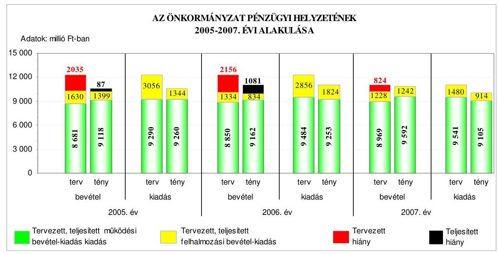
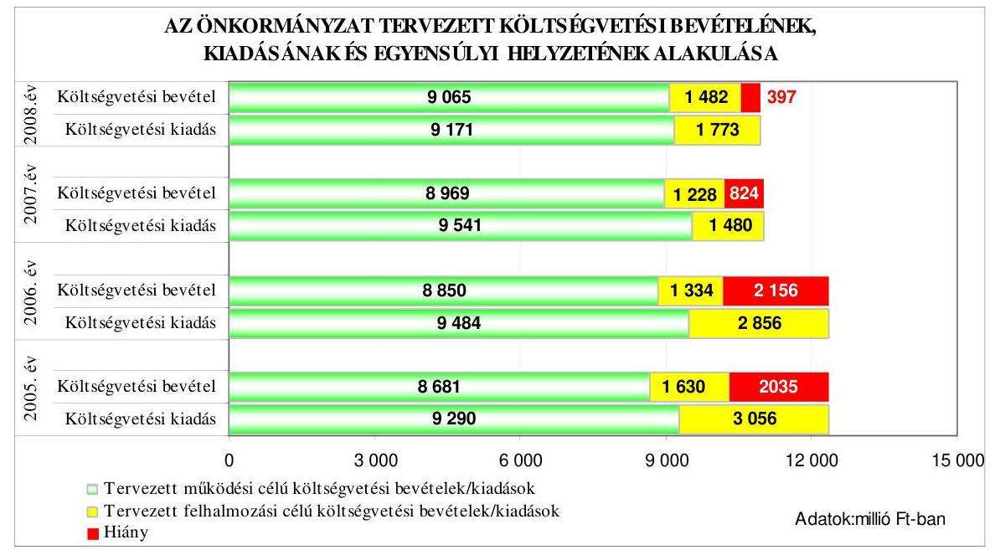
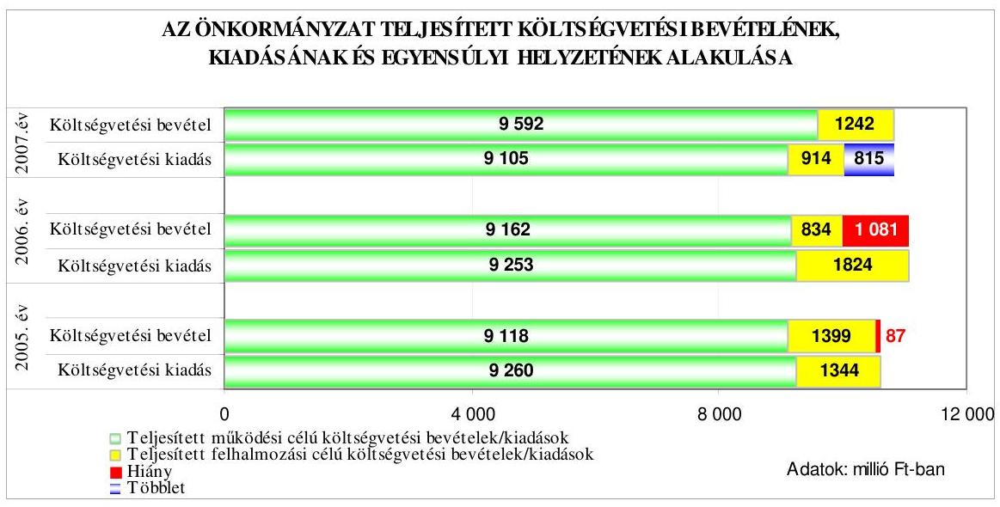
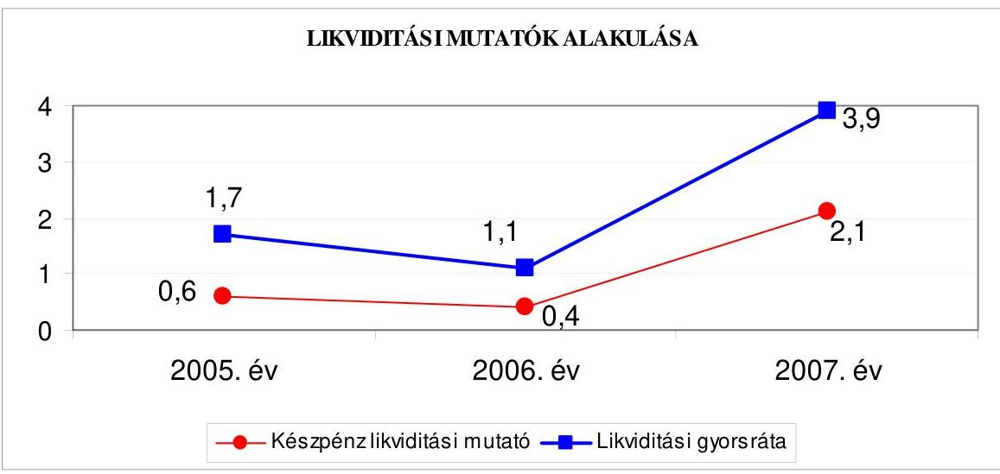
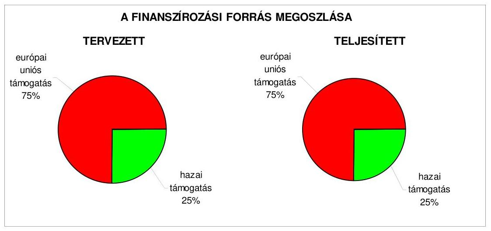
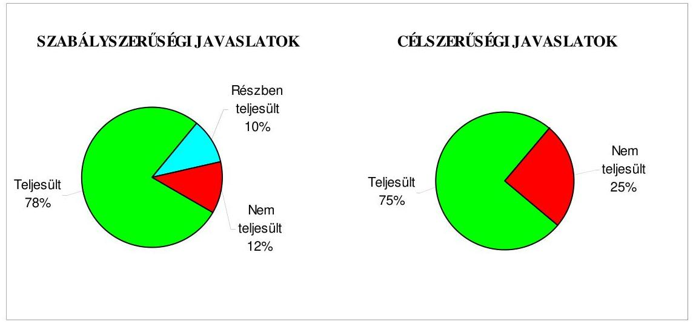
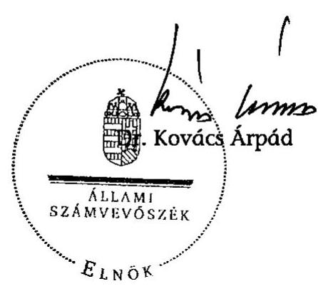
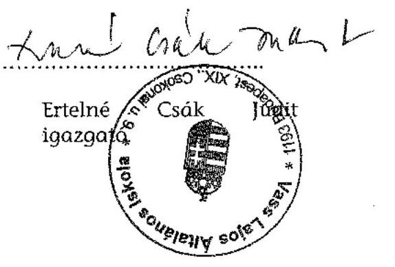
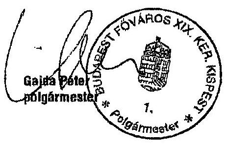
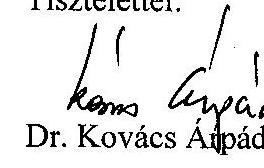

# JELENTÉS 

Budapest Főváros XIX. kerület Kispest Önkormányzata gazdálkodási rendszerének 2008. évi ellenőrzéséről

---

# 3. Önkormányzati és Területi Ellenőrzési Igazgatóság 

## Átfogó Ellenőrzési Főcsoport

Iktatószám: V-3003-6/34/21/2008.
Témaszám: 898
Vizsgálat-azonosító szám: V0396

## Az ellenőrzést felügyelte:

Dr. Lóránt Zoltán
főigazgató
Az ellenőrzés végrehajtásáért felelős:
Dr. Sepsey Tamás
főigazgató-helyettes
Az ellenőrzést vezette:
Molnár Gyula Mihály
igazgató-helyettes
Az ellenőrzést végezték:
Schósz Attiláné Dr. Kiss Károly Dr. Telkes Imre
számvevő tanácsos
számvevő tanácsos

## A témához kapcsolódó eddig készített számvevőszéki jelentések:

## címe

Jelentés Budapest Főváros XIX. kerület Kispest Önkormányzata 0415 gazdálkodásának átfogó ellenőrzéséről

Jelentés a helyi és a helyi kisebbségi önkormányzatok gazdálkodá- 0436 sának átfogó ellenőrzéséről

Jelentés a Magyar Köztársaság 2004. évi költségvetése végrehajtá- 0540 sának ellenőrzéséről

Függelék:

- a helyi önkormányzatokat a 2004. évben megillető normatív állami hozzájárulás elszámolásának ellenőrzésére

Jelentés a Fővárosi Önkormányzatot és a kerületi önkormányzato- 0756 kat osztottan megillető bevételek 2007. évi megosztásáról szóló önkormányzati rendelet felülvizsgálatáról

---

# TARTALOMJEGYZÉK 

BEVEZETÉS ..... 11
I. ÖSSZEGZŐ MEGÁLLAPÍTÁSOK, KÖVETKEZTETÉSEK, JAVASLATOK ..... 16
II. RÉSZLETES MEGÁLLAPÍTÁSOK ..... 25

1. Az Önkormányzat költségvetési és pénzügyi helyzete ..... 25
1.1. A tervezett és teljesített költségvetési bevételek és kiadások alapján a költségvetési és a pénzügyi egyensúly alakulása, valamint a költségvetési hiány megállapításának szabályszerűsége ..... 25
1.2. A költségvetési és a pénzügyi egyensúlyi helyzet kialakításához tervezett és teljesített finanszírozási célú pénzügyi műveletek módja és azok hatása a tárgyévet követő évek költségvetéseire ..... 27
1.3. A költségvetés tervezésének megalapozottsága ..... 33
2. Az Önkormányzat felkészültsége az európai uniós források igénylésére és felhasználására, valamint az elektronikus közigazgatási feladatok ellátására ..... 35
2.1. Az európai uniós források igénybevételére és a várható támogatás felhasználására történt felkészülés szabályozottsága, szervezettsége ..... 35
2.1.1. Az európai uniós forrásokra történő pályázatok benyújtására vonatkozó döntések összhangja a fejlesztési célkitűzésekkel ..... 35
2.1.2. Az európai uniós forrásokhoz kapcsolódóan a pályázatfigyelés, a pályázatkészítés, valamint az európai uniós támogatással megvalósuló fejlesztés lebonyolításának belső rendjének szabályozottsága, a végrehajtás személyi, szervezeti feltételei ..... 38
2.1.3. A fejlesztési feladat lebonyolításánál a feladatellátás rendjére, az ellenőrzési feladatok teljesítésére, valamint a felelősségi szabályokra vonatkozó előírások betartása ..... 39
2.2. Az elektronikus közigazgatási feladatok ellátása, a közérdekű adatok elektronikus közzététele ..... 41
3. A költségvetési gazdálkodás belső kontrolljai ..... 42
3.1. A szabályozottság kockázata a költségvetés tervezési, gazdálkodási, beszámolási és a folyamatba épített, előzetes és utólagos vezetői ellenőrzési feladatoknál ..... 42
3.2. A belső kontrollok érvényesülése az önkormányzati források szabályszerű felhasználásában, a költségvetési tervezés, gazdálkodás, beszámolás folyamataiban ..... 44
3.3. A belső ellenőrzési kötelezettség teljesítése, javaslatainak hasznosulása ..... 47

---

4. Az ÁSZ korábbi ellenőrzési javaslatai alapján készített intézkedési terv végrehajtása, eredményessége ..... 51
4.1. Az Önkormányzat gazdálkodási rendszerének átfogó ellenőrzése során tett javaslatok végrehajtására tervezett intézkedések megvalósulása ..... 51
4.2. A zárszámadáshoz kapcsolódó (állami hozzájárulások, támogatások igénylésének és felhasználásának ellenőrzése), valamint a további vizsgálatok esetében a megállapítások, javaslatok alapján tett intézkedések ..... 56
MELLÉKLETEK
5. számú Az Önkormányzat gazdálkodását meghatározó adatok, mutatószámok (1 oldal)
6. számú Az önkormányzati vagyon alakulása (1 oldal)
7. számú Az Önkormányzat 2005-2007. évi költségvetési előirányzatainak és azok pénzügyi teljesítéseinek alakulása (1 oldal)
8. számú Tanúsítvány az európai uniós forrásokkal támogatott célok és programok tervezett és tényleges adatairól 2005-2008. évekre (1 oldal)
9. számú Adatlap az Önkormányzat európai uniós forrással támogatott fejlesztéséről (4 oldal)
10. számú Gajda Péter úr, a Budapest Főváros XIX. kerület Kispest Önkormányzata polgármestere által adott tájékoztatás (1 oldal)
11. számú Gajda Péter úr, a Budapest Főváros XIX. kerület Budafok-Tétény Önkormányzata polgármestere tájékoztatására adott válasz (1 oldal)

---

# RÖVIDÍTÉSEK JEGYZÉKE 

## Törvények

Áht.
Eisztv.

Kbt.
Ket.

Ötv.

## Rendeletek

2005. évi költségvetési rendelet

2005. évi zárszámadási rendelet

2006. évi költségvetési rendelet

2007. évi költségvetési rendelet

2008. évi költségvetési rendelet

18/2005. (XII. 27.) IHM rendelet

Ámr.
Ber.
hivatali SzMSz
lakásrendelet ${ }_{1}$
lakásrendelet ${ }_{2}$

SzMSz $_{1}$

az államháztartásról szóló 1992. évi XXXVIII. törvény
az elektronikus információszabadságról szóló 2005. évi XC. törvény
a közbeszerzésekről szóló 2003. évi CXXIX. törvény
a közigazgatási hatósági eljárás és szolgáltatás általános szabályairól szóló 2004. évi CXL. törvény
a helyi önkormányzatokról szóló 1990. évi LXV. törvény

Budapest Főváros XIX. Kerület Kispest Önkormányzatának 5/2005. (III. 16.) számú rendelete az Önkormányzat 2005. évi költségvetéséről

Budapest Főváros XIX. Kerület Kispest Önkormányzatának 10/2006. (IV. 19.) számú rendelete az Önkormányzat 2005. évi zárszámadásáról

Budapest Főváros XIX. Kerület Kispest Önkormányzatának 6/2006. (III. 14.) számú rendelete az Önkormányzat 2006. évi költségvetéséről
Budapest Főváros XIX. Kerület Kispest Önkormányzatának 2/2007. (II. 23.) számú rendelete az Önkormányzat 2007. évi költségvetéséről

Budapest Főváros XIX. Kerület Kispest Önkormányzatának 5/2008. (II. 21.) számú rendelete az Önkormányzat 2008. évi költségvetéséről
a közzétételi listákon szereplő adatok közzétételéhez szükséges közzétételi mintákról szóló 18/2005. (XII. 27.) IHM rendelet
az államháztartás működési rendjéről szóló 217/1998. (XII. 30.) Korm. rendelet
a költségvetési szervek belső ellenőrzéséről szóló 193/2003. (XI. 26.) Korm. rendelet

Budapest Főváros XIX. Kerület Kispest Önkormányzatának 43/2006. (XII. 22.) számú rendelete a Polgármesteri Hivatal Szervezeti és Múködési Szabályzatáról
Budapest Főváros XIX. Kerület Kispest Önkormányzatának 29/2004. (V. 19.) számú rendelete az Önkormányzat tulajdonában lévő lakások és nem lakás céljára szolgáló helyiségek bérletéről és elidegenítéséről
Budapest Főváros XIX. Kerület Kispest Önkormányzatának 17/2006. (IV. 19.) számú rendelete az Önkormányzat tulajdonában lévő lakások és nem lakás céljára szolgáló helyiségek bérletéről és elidegenítéséről
Budapest Főváros XIX. Kerület Kispest Önkormányzatának 5/2003. (III. 17.) számú rendelete az Önkormányzat Szervezeti és Múködési Szabályzatáról

---

| $\mathrm{SzMSz}_{2}$ | Budapest Főváros XIX. Kerület Kispest Önkormányzatának 1/2007. (I. 17.) számú rendelete az Önkormányzat Szervezeti és Múködési Szabályzatáról |
| :--: | :--: |
| vagyongazdálkodási   rendelet | Budapest Főváros XIX. Kerület Kispest Önkormányzatának 9/2004. (III. 16.) számú rendelete az Önkormányzat vagyonával való rendelkezés szabályairól |
| Vhr. | az államháztartás szervezetei beszámolási és könyvvezetési kötelezettségének sajátosságairól szóló 249/2000. (XII. 24.) Korm. rendelet |
| Szórövidítések |  |
| áfa | általános forgalmi adó |
| ÁROP | ÚMFT Államreform Operatív Program |
| ÁSZ | Állami Számvevőszék |
| Családsegítő és Gyermekjóléti Szolgálat | Budapest Főváros XIX. kerület Kispest Önkormányzata   Családsegítő szolgálat és Gyermekjóléti Módszertani Központ Intézménye |
| EKOP | ÚMFT Elektronikus Közigazgatási Operatív Program |
| EPEJ | Egyszerűsített Projekt Előrehaladási Jelentés |
| e-közigazgatás | elektronikus közigazgatás |
| felkészítés a kompeten-cia-alapú oktatásra projekt | HEFOP-3.1. „Az élethosszig tartó tanulás és alkalmazkodás képesség" intézkedésre a Vass Lajos Iskola „Felkészités a kompetencia-alapú oktatásra" címszóval benyújtott pályázata |
| FEUVE | folyamatba épített, előzetes és utólagos vezetői ellenőrzés |
| gazdálkodási jogkörök   szabályzata ${ }_{1}$ | a kötelezettségvállalás, utalványozás, az ellenjegyzés és az érvényesítés rendjéről szóló 5-20/2005. (X. 1.) számú polgármesteri és jegyzői közös intézkedés |
| gazdálkodási jogkörök   szabályzata ${ }_{2}$ | a kötelezettségvállalás, utalványozás, az ellenjegyzés és az érvényesítés rendjéről szóló 5-28/2007. (IX. 1.) számú polgármesteri és jegyzői közös intézkedés |
| gazdasági program ${ }_{1}$ | Budapest Főváros XIX. kerület Kispest Önkormányzat Kép-viselő-testülete által a 682/2004. (VI. 17.) számú határozattal jóváhagyott 2004-2006. évekre szóló gazdasági program |
| gazdasági program ${ }_{2}$ | Budapest Főváros XIX. kerület Kispest Önkormányzat Képviselő-testülete által a 363/2007. (IV. 17.) számú határozattal jóváhagyott 2007-2010. évekre szóló gazdasági program |
| GESZ | Budapest Főváros XIX. kerület Kispest Önkormányzat Gazdasági Ellátó Szervezete |
| GVOP | NFT Gazdasági Versenyképesség Operatív Program |
| HEFOP | NFT Humánerőforrás-fejlesztési Operatív Program |
| Humánszolgáltatási   iroda | Budapest Főváros XIX. Kerület Kispest Önkormányzat Polgármesteri Hivatalának Humánszolgáltatási Irodája |
| IVS | Budapest Főváros XIX. kerület Kispest Önkormányzatának Integrált Városfejlesztési Stratégiája |

---

| jegyző | Budapest Főváros XIX. Kerület Kispest Önkormányzat |
| :-- | :-- |
| Jegyzői kabinet | Jegyzője |
| Budapest Főváros XIX. Kerület Kispest Önkormányzat |  |
|  | Polgármesteri Hivatalának Jegyzői Kabinetje |
| Képviselő-testület | Budapest Főváros XIX. Kerület Kispest Önkormányzat |
|  | Képviselő-testülete |
| KIJE | Kispest Biztonságáért Közösségi Jóléti Egyesület |
| Kispest Uszoda | Budapest Főváros XIX. Kerület Kispest Önkormányzatá- |
|  | nak Kispest Uszodája |
| KMOP | ÚMFT Közép-Magyarországi Operatív Program |
| MÁK | Magyar Államkincstár |
| NFT | Nemzeti Fejlesztési Terv |
| OMEGA kht. | Omega Kispest Foglalkozási Szolgálat Közhasznú Társa- |
|  | ság |
| Önkormányzat | Budapest Főváros XIX. Kerület Kispest Önkormányzata |
| PEJ | Projekt Előrehaladási Jelentés |
| Pénzügyi iroda | Budapest Főváros XIX. Kerület Kispest Önkormányzat |
|  | Polgármesteri Hivatalának Pénzügyi és Gazdasági irodája |
| Piac-felügyelőség | Budapest Főváros XIX. Kerület Kispest Önkormányzatá- |
|  | nak Piac-felügyelősége |
| polgármester | Budapest Főváros XIX. Kerület Kispest Önkormányzat |
|  | Polgármestere |
| Polgármesteri hivatal | Budapest Főváros XIX. Kerület Kispest Önkormányzat |
|  | Polgármesteri Hivatala |
| Polgármesteri Kabinet | Budapest Főváros XIX. Kerület Kispest Önkormányzat |
| iroda | Polgármesteri Hivatalának Polgármesteri Kabinet irodája |
| ROP | NFT Regionális Fejlesztési Operatív Program |
| Társadalmi Kapcsolatok | Budapest Főváros XIX. Kerület Kispest Önkormányzat |
| irodája | Polgármesteri Hivatalának Társadalmi Kapcsolatok Irodá- |
|  | ja |
| ÚMFT | Új Magyarország Fejlesztési Terv |
| VAMÚSZ | Budapest Főváros XIX. Kerület Kispest Önkormányzatá- |
|  | nak Vagyonkezelő Műszaki Szervezete |
| Vass Lajos Iskola | Budapest Főváros XIX. kerület Kispest Önkormányzatá- |
|  | nak Vass Lajos Általános Iskolája |

---

.

---

# ÉRTELMEZŐ SZÓTÁR 

1. elektronikus szolgáltatási szint
2. elektronikus szolgáltatási szint
3. elektronikus szolgáltatási szint
4. elektronikus szolgáltatási szint

EMIR
európai uniós források
fejlesztési feladat (projekt)
fejlesztési célkitúzés

Az 1044/2005. (V. 11.) Korm. határozat alapján olyan információs, tájékoztató szolgáltatás, amely csak általános információkat közöl az adott üggyel kapcsolatos teendőkről és a szükséges dokumentumokról.
Az 1044/2005. (V. 11.) Korm. határozat alapján olyan egyirányú kapcsolatot biztosító szolgáltatás, amely az 1. szinten túl biztosítja az adott ügy intézéséhez szükséges dokumentumok, nyomtatványok letöltését, és azok ellenőrzéssel, vagy ellenőrzés nélküli elektronikus kitöltését, amely esetben a dokumentumok benyújtása hagyományos úton történik.
Az 1044/2005. (V. 11.) Korm. határozat alapján olyan kétirányú kapcsolatot biztosító szolgáltatás, amely közvetlen, vagy ellenőrzött kitöltésű dokumentum segítségével biztosítja az elektronikus adatbevitelt és a bevitt adatok ellenőrzését. Az ügy indításához, intézéséhez személyes megjelenés nem szükséges, de az ügyhöz kapcsolódó közigazgatási döntés (határozat, egyéb aktus) közlése, valamint a kapcsolódó illeték-, vagy díjfizetés hagyományos úton történik.
Az 1044/2005. (V. 11.) Korm. határozat alapján olyan teljes közvetlen kétirányú ügyintézési folyamatot biztosító szolgáltatás, amikor az ügyhöz kapcsolódó közigazgatási döntés is elektronikus úton kerül közlésre, illetve a kapcsolódó illeték-, vagy díjfizetés elektronikus úton is intézhető.
Egységes monitoring informatikai rendszer az Európai Unió által nyújtott egyes pénzügyi támogatások felhasználásával megvalósuló programok, projektek figyelemmel kísérésére kialakított számítógépes nyilvántartási rendszer, amely a programok és a projektek adatait gyúti, rendszerezi és tartja nyilván.
Az elnyert európai uniós források lehívása a támogatott projekt megvalósítása érdekében, a fejlesztés lebonyolítása során felmerült kiadások finanszírozására.
A fejlesztési feladat (projekt) tartalmilag és formailag részletesen kidolgozott, megfelelő pénzügyi háttérrel és végrehajtási ütemezéssel rendelkező fejlesztési terv, amely illeszkedik az Európai Unió, illetve a Nemzeti Fejlesztési Terv által támogatott programokhoz.
Az önkormányzat által ellátott kötelező, vagy önként vállalt feladatok ellátásának mennyiségi, vagy minőségi fejlesztésére vonatkozó terv. A mennyiségi fejlesztés megvalósulhat beszerzéssel, létesítéssel, bővítéssel, átalakítással.

---

irányító hatóság
kedvezményezett
központi program
közreműködő szervezet

A strukturális alapok és a Kohéziós alap forrásainak szabályszerű, hatékony és eredményes felhasználásához szükséges intézményrendszer felső eleme. Az irányító hatóság általános és átfogó felelősséget visel a programok, projektek hatékony és szabályszerű végrehajtásáért. Felelősségi köréből eredően ellenőrzi a közösségi, valamint a hazai jogszabályok betartását, koordinálja az európai uniós források szétosztásának folyamatát, irányítja az intézményrendszer, a statisztikai és a pénzügyi nyilvántartási rendszer múködését.
Az a helyi önkormányzat, amely a támogatási szerződést kedvezményezettként aláíra, a projektet, illetve a központi programhoz kapcsolódó támogatott önkormányzati programot végrehajtja.
Az ország egészére, több régióra, egy régióra vonatkozó, de mindenképpen az önkormányzat közigazgatási területén túlmutató program, amelynél a támogatott programok kiválasztása pályáztatás nélkül, előre meghatározott feltételrendszer szerint történik, a kedvezményezettek közvetlen megkeresésével. Az Európai Unió pénzügyi alapja a Kohéziós alap, a környezetvédelem és a közlekedés terén nyújt lehetőséget az egyes tagországoknak központi programok megvalósítására.
A közreműködő szervezet az európai uniós támogatást elnyert kedvezményezettekkel kapcsolatot tartó szerv. Az operatív programok közreműködő szervezetei befogadják, nyilvántartják, döntésre előkészítik a pályázatokat, rögzítik a támogatással kapcsolatos adatokat az egységes monitoring informatikai rendszerben, elvégzik a támogatások előzetes (szerződéskötést megelőző), közbenső (a pénzügyi elszámolás, finanszírozás folyamatában végzett) és utólagos (a támogatott projekt pénzügyi lezárását megelőző) ellenőrzését. Az önkormányzatoknál a leggyakrabban előforduló operatív program a Regionális Fejlesztési Operatív Program végrehajtásában közreműködő szervezetek a VÂTI Kht. és a regionális fejlesztési ügynökségek.
A Kohéziós alap két közreműködő szervezete (Gazdasági és Közlekedési Minisztérium, Környezetvédelmi és Vízügyi Minisztérium) a támogatott projektek végrehajtásához kapcsolódó operatív feladatokat látják el. Ennek keretében megkötik a szerződéseket a projekt kedvezményezettjével, folyamatosan nyomon követik a teljesítéseket, lebonyolítják a támogatások kifizetését, vezetik az egységes monitoring informatikai rendszert.

---

lebonyolítás
operatív program
támogatási szerződés

Az európai uniós források felhasználásával megvalósuló fejlesztésre irányuló műszaki, gazdasági (pénzügyi) tevékenységet magában foglaló szervezési, irányítási szolgáltatás. A szervezési szolgáltatás kiterjedhet a pályázatkészítésre, a közbeszerzési eljárás lebonyolításán keresztül a folyamatos műszaki ellenőrzésre, a pénzügyi elszámolásra, a műszaki átadás-átvételre, az üzembe helyezésre, illetve a fejlesztési folyamat egyes elemeire.
Az Európai Bizottság által jóváhagyott, a Közösségi Támogatási Keret végrehajtására vonatkozó 2004-2006 és a 2007-2013 közötti, több évre szóló intézkedésekhez kapcsolódó prioritások egységes rendszerét tartalmazó dokumentum. A strukturális alapok operatív programjai: Agrár és Vidékfejlesztési Operatív Program (AVOP); Gazdasági Versenyképesség Operatív Program (GVOP); Humán-erőforrás-fejlesztési Operatív Program (HEFOP); Környezetvédelmi és Infrastruktúra-fejlesztési Operatív Program (KIOP); Regionális Fejlesztési Operatív Program (ROP). Az ÚMFT-hez kapcsolódó operatív programok: Gazdaságfejlesztési Operatív Program (GOP); Közlekedés Operatív Program (KÖZOP); Társadalmi Megújulás Operatív Program (TÁMOP); Társadalmi Infrastruktúra Operatív Program (TIOP); Környezet és Energia Operatív Program (KEOP); Államreform Operatív Program (ÁROP); Elektronikus Közigazgatás Operatív Program (EKOP); Nyugatdunántúli Operatív Program (NYDOP); Dél-alföldi Operatív Program (DAOP); Észak-alföldi Operatív Program (ÉAOP); Közép-magyarországi Operatív Program (KMOP); Észak-magyarországi Operatív Program (ÉMOP); Középdunántúli Operatív Program (KDOP); Dél-dunántúli Operatív Program (DDOP);
A strukturális alapok esetében az irányító hatóságnak, illetve a Kohéziós alap esetében a közreműködő szervezeteknek a kedvezményezett önkormányzattal kötött szerződése, amely a támogatás felhasználásának részletes feltételeit tartalmazza.

---

.

---

# JELENTÉS 

## Budapest Főváros XIX. Kerület Kispest Önkormányzata gazdálkodási rendszerének 2008. évi ellenőrzéséről

## BEVEZETÉS

Az Ötv. 92. § (1) bekezdése, az Állami Számvevőszékről szóló 1989. évi XXXVIII. törvény 2. § (3) bekezdése, valamint az Áht. 120/A. § (1) bekezdése alapján az önkormányzatok gazdálkodását az Állami Számvevőszék ellenőrzi. Az ellenőrzésre az Országgyúlés illetékes bizottságai részére is átadott, országosan egységes ellenőrzési program szerint került sor.

Az Állami Számvevőszék a stratégiájában foglalt célkitűzéseknek megfelelően a helyi önkormányzatok költségvetési gazdálkodási rendszere átfogó ellenőrzésének programját a 2007. évtől megújította, azt kiegészítette további - teljesít-mény-ellenőrzési - elemekkel.

## Az ellenőrzés célja annak értékelése volt, hogy az Önkormányzat:

- milyen módon biztosította a költségvetési és a pénzügyi egyensúlyt a költségvetésében és annak teljesítése során, valamint változott-e a finanszírozási célú pénzügyi műveletek jelentősége a hiányzó bevételi források pótlásában;
- eredményesen készült-e fel a szabályozottság és a szervezettség terén az európai uniós források igénylésére és felhasználására, továbbá biztosította-e az e-közigazgatás feltételeit, az adatok közzétételével a gazdálkodás nyilvánosságát;
- kialakította-e a külső és a belső feltételeknek megfelelően a költségvetés tervezési, gazdálkodási és zárszámadási feladatai belső kontrollrendszerét ${ }^{1}$, ezen tevékenységek szabályszerű ellátásához hozzájárult-e a folyamatba épített, előzetes és utólagos vezetői ellenőrzés, valamint a belső ellenőrzés;
- megfelelően hasznosították-e a korábbi számvevőszéki ellenőrzések megállapításait, szabályszerűségi ${ }^{2}$ és célszerűségi javaslatait.

[^0]
[^0]:    ${ }^{1}$ A gazdálkodás szabályszerűségét biztosító kontrollrendszer alatt értjük a kiépített és múködő belső irányítási és szabályozási rendszert, valamint a belső ellenőrzési funkciók ellátásának rendszerét.
    ${ }^{2}$ A törvényi előírások betartásának elmulasztásakor a részletes megállapítások fejezetben egységesen a törvénysértés megjelölést alkalmazzuk, mivel az ÁSZ nem tehet különbséget a törvényi előírások között.

---

Az ellenőrzés típusa: átfogó ellenőrzés, amely egyidejúleg - egy ellenőrzés keretében - meghatározott területekre összpontosítva érvényesíti a szabályszerűségi, valamint a teljesítmény-ellenőrzés jellemzőit.

Az ellenőrzött időszak: az 1., 2. és 4. programpontok tekintetében a 20052007. évek és 2008. I. félév, a 3. ellenőrzési programpontnál a 2007. év és 2008. I. félév.

Budapest Főváros XIX. kerület lakosainak száma 2008. január 1-jén 60814 fő volt. A 2006. évi önkormányzati választást követően az Önkormányzat 28 tagú Képviselő-testületének munkáját 10 állandó bizottság segítette. Az Önkormányzat mellett a 2006. évi önkormányzati választásokat követően hét kisebbségi önkormányzat ${ }^{3}$ múködött. A polgármester a 2006. évi önkormányzati képviselő és polgármester választás óta tölti be tisztségét, a jegyző személye az 1990. évi önkormányzati választások óta nem változott.

Az Önkormányzat feladatainak végrehajtása érdekében a 2007. évben 47 költségvetési intézményt múködtetett, amelyekből hat önállóan gazdálkodott. A feladatok ellátásában részt vett egy gazdasági társasága és egy közhasznú társasága, továbbá kilenc alapítványa. Az Önkormányzat a 2007. évi költségvetési beszámolója szerint 10834 millió Ft költségvetési bevételt ért el és 10019 millió Ft költségvetési kiadást teljesített, 2007. december 31-én a könyvviteli mérleg szerint 81279 millió Ft értékű vagyonnal rendelkezett. Az Önkormányzat vagyona a 2005. év végi állományhoz viszonyítva $0,4 \%$-kal emelkedett, mivel közel megduplázódott ( $92 \%$-kal emelkedve 1676 millió Ft-ra nőtt) a forgóeszközök állománya a pénzeszközök év végi állományának növekedése hatására, ugyanakkor a befektetett eszközök értéke 0,6\%-kal (469 millió Ft-tal) csökkent a tárgyi eszközök és a befektetett pénzügyi eszközök állományának változása következtében. A saját tőke összege 1,7\%-kal (1376 millió Ft-tal) csökkent, melyhez hozzájárult a termőföld és ingatlan értékesítés. A tartalékok értéke közel kilencszeresére nőtt, a kötelezettségek a hosszú lejáratú kötelezettségek növekedésének hatására több mint kétszeresére ( $128 \%$-kal emelkedve 2346 millió Ft-ra) emelkedtek. Az összes költségvetési bevétel $60 \%$-át a saját bevétel, és ezen belül $34 \%$-át a helyi adó bevétel biztosította a 2007. évben. Az összes költségvetési kiadásból a felhalmozási célú kiadás részaránya a 2007. évben 9\% volt. A 2008. évi költségvetési rendeletben 10547 millió Ft költségvetési bevételt és 10944 millió Ft költségvetési kiadást irányoztak elő. A Polgármesteri hivatalban dolgozó köztisztviselők száma 2007. december 31-én 218 fő, a költségvetési intézményekben foglalkoztatott közalkalmazottak száma 1712 fő volt. Az Önkormányzat gazdálkodását meghatározó adatokat, mutatószámokat az 1-3. számú mellékletek tartalmazzák.

Az Önkormányzat költségvetési és pénzügyi helyzetét az elemző eljárás módszerével vizsgáltuk. E körben elemeztük a költségvetés egyensúlyi helyzetének alakulását, a tervezett és tényleges költségvetési hiány okait, a mérséklésére tett intézkedéseket, finanszírozásának módját, az Önkormányzat adósságállományának alakulását, összetevőit.

[^0]
[^0]:    ${ }^{3}$ Bolgár, cigány, görög, horvát, lengyel, román, szerb.

---

A teljesítmény-ellenőrzés módszerével vizsgáltuk, a belső szabályozottság, szervezettség terén az Önkormányzat felkészültségét az európai uniós források figyelésére, igénylésére és felhasználására, továbbá értékeltük, hogy az igényelt európai uniós támogatások az Önkormányzat által meghatározott fejlesztési célkitűzésekhez kapcsolódtak-e. Az eredményesség szempontjából a minősítést a lényegességi szinthez való viszonyítással végeztük el. Az ellenőrzés során felmértük, hogy az e-közigazgatási feladat ellátása, illetve bevezetése, múködtetése érdekében milyen intézkedéseket tettek, valamint biztosították-e a közérdekú adatok közzétételét.

A költségvetési gazdálkodás belső kontrolljainak ellenőrzése során értékeltük, hogy a Polgármesteri hivatalnál a költségvetés tervezési, gazdálkodási, zárszámadás készítési feladatok belső kontrolljainak kiépítettsége és múködése megfelelő biztosítékot ad-e a gazdálkodási feladatok megfelelő, szabályszerű ellátására. Felmértük és minősítettük a költségvetés tervezési, a gazdálkodási, a zárszámadás készítési feladatokkal, továbbá a pénzügyi- számviteli területen az informatikával kapcsolatosan kialakított kontrollok megfelelőségét, valamint azok múködésének eredményességét, megbízhatóságát. Értékeltük a belső ellenőrzés szervezeti és szabályozási keretét, továbbá múködését.

A Polgármesteri hivatalnál értékeltük a gazdálkodás folyamatában a kontrollok múködésének megbízhatóságát, ennek keretében ellenőriztük a szakmai teljesítés igazolására és az utalvány ellenjegyzésére kialakított kontrollok végrehajtását. Az ellenőrzést a következő, kiemelt kockázatuk alapján kiválasztott ${ }^{4}$ az általánostól jellemzően eltérő, egyedi eljárást igénylő gazdasági eseményekkel kapcsolatos kifizetésekre folytattuk le ${ }^{5}$ :

- a külső szolgáltató által végzett karbantartási, kisjavítási szolgáltatások,
- a gépek, berendezések, felszerelések beszerzése, továbbá
- a múködési célú pénzeszköz átadásokból az államháztartáson kívülre teljesített kifizetésekre.

[^0]
[^0]:    ${ }^{4}$ Az önkormányzatok kiemelt előirányzataira vonatkozóan, a vertikális folyamatokra elvégeztük a kockázatok becslését, amelynek eredményeként a külső szolgáltató által végzett karbantartási, kisjavítási szolgáltatások, a gépek, berendezések, felszerelések beszerzése valamint a múködési célú pénzeszköz átadások államháztartáson kívülre teljesített kifizetései kiemelkedően kockázatos területeknek bizonyultak.
    ${ }^{5}$ A korábbi ellenőrzési tapasztalataink szerint ezeken a területeken a jegyzők nem, vagy hiányosan szabályozták a megbízás, megrendelés, illetve beszerzés indokoltságának, szükségességének elbírálására, igazolására, valamint a teljesítések dokumentálására, a kifizetések jogosságának megítélésére szolgáló kontrollokat. További kockázatot jelentett a külső szolgáltató által végzett karbantartási, kisjavítási munkák esetében, hogy az 50 ezer Ft alatti megrendelésekre vonatkozóan az ellenőrzési tapasztalataink szerint a jegyzők nem alakították ki a kötelezettségvállalások rendjét és nyilvántartási formáját, valamint a szabályozás elmulasztása esetén nem történt meg az írásbeli kötelezettségvállalás és annak az ellenjegyzése sem.

---

Az ellenőrzés hatékony elvégzése céljából a vizsgálandó területek kiválasztása során a kockázatokon alapuló megközelítés érvényesült, ezáltal az ellenőrzési erőforrásokat azokra a területekre fókuszáltuk, amelyeken legnagyobb a hibák előfordulási valószínűsége. Az ellenőrzési erőforrások ilyen típusú összpontosításával minimálisra csökkenthető a kívánt ellenőrzési bizonyosság eléréséhez szükséges időráfordítás.

A pénzügyi-számviteli folyamatokban alkalmazott belső kontrollok létezésének és múködésének ellenőrzésére a vizsgált három terület 2007. évi könyvviteli tételeiből területenként egyszerű véletlen mintát vettünk. A kijelölt gazdasági eseményre elvégzett megfelelőségi tesztek alapján értékeltük a kontrollok múködésének eredményességét, megbízhatóságát a vizsgált három területre különkülön, majd összefoglalóan ${ }^{6}$ a Polgármesteri hivatal egyedi eljárást igénylő gazdasági eseményeire. A helyszíni ellenőrzés megállapításainak részletes dokumentálását három megfelelőségi tesztlapon, öt elővizsgálati és 12 helyszíni ellenőrzési munkalapon biztosítottuk. Ezeken a teszt- és munkalapokon a minősítés alapjául szolgáló kérdések és a vonatkozó konkrét jogszabályhelyek megjelölése mellett értékeltük a kialakított belső kontrollokban rejlő kockázatokat ${ }^{7}$ és a kialakított kontrollok múködésének megbízhatóságát ${ }^{8}$.

Az ÁSZ korábbi ellenőrzési javaslatai alapján tett intézkedéseket, illetve azok megvalósítását utóellenőrzés keretében vizsgáltuk. A gazdálkodási rendszer átfogó ellenőrzése során megfogalmazott javaslatok végrehajtására tett intézkedések megvalósítását ellenőriztük, az egyéb számvevőszéki ellenőrzések során tett javaslatok esetében pedig a kiadott intézkedéseket tekintettük át.

A helyszíni ellenőrzés során kitöltött - az ellenőrzést végző számvevő és a Polgármesteri hivatal felelős köztisztviselője által aláírt - elővizsgálati és helyszíni ellenőrzési munkalapokat, azok kitöltési útmutatóit, továbbá a megfelelőségi tesztek dokumentumait a polgármester részére a számvevői jelentéssel egyidejűleg átadtuk.
${ }^{6}$ A vizsgált három terület egyedi értékelési pontszámait a területek relatív költségvetési súlyával arányosan összegeztük.
${ }^{7}$ A kialakított belső kontrollokban rejlő kockázatot alacsonynak minősítettük, ha a kontrollok - végrehajtásuk esetén - megfelelő védelmet nyújtanak a hibák bekövetkezése ellen. Közepesnek minősítettük a belső kontrollokban rejlő kockázatot, amennyiben a kontrollok - végrehajtásuk esetén - a lehetséges hibák többsége ellen védelmet nyújtanak. Magasnak értékeltük a kockázatot, ha a kontrollok - kialakításuk hiányában, vagy hiányos kialakításuk miatt - nem nyújtanak elegendő védelmet a lehetséges hibákkal szemben.
${ }^{8}$ A kontrollok múködésének eredményességét, megbízhatóságát kiválónak értékeltük abban az esetben, ha azok múködése - esetleges apróbb hiányosságoktól eltekintve megfelelt a hibák megelőzésére és kijavítására meghatározott szabályozásnak és a legmagasabb szintű elvárásoknak. Jónak minősítettük a kontrollok múködését, ha a hiányosságok száma ugyan jelentős volt, de nem veszélyeztette az ellenőrzött terület hibáinak megelőzését és kijavítását. Amennyiben a hiányosságok mértéke nem biztosította a hibák megelőzését, feltárását, kijavítását és ezáltal veszélyeztette az eredményes, megbízható múködést, a kontroll múködésének megbízhatósága gyenge minősítést kapott.

---

A jelentés megállapításainak, javaslatainak egyeztetése során a polgármester arról adott részletes tájékoztatást - egyidejúleg csatolta azokat a dokumentumokat, amelyek igazolták - hogy az időközben megtett intézkedésekkel a számvevői jelentésben tett néhány javaslatot ${ }^{9}$ megvalósították. A megtett intézkedéseket a jelentés II. Részletes megállapítások fejezetében az adott témához kapcsolt lábjegyzetben feltüntettük és a vonatkozó javaslatokat elhagytuk.

A jelentést az ÁSZ-ról szóló 1989. évi XXXVIII. tv. 25. § (1) bekezdése alapján észrevétel közlése céljából megküldtük a Budapest Főváros XIX. kerület Kispest Önkormányzata polgármesterének. A kapott tájékoztatást a jelentés 6. számú melléklete, az arra adott választ a 7. számú melléklet tartalmazza.

[^0]
[^0]:    ${ }^{9}$ A számvevői jelentésben a helyszíni ellenőrzés során a jegyzőnek 23 szabályszerűségi javaslatot tettünk, melyből a megtett intézkedésről szóló tájékoztatás alapján négy szabályszerűségi javaslatot hagytunk el.

---

# I. ÖSSZEGZŐ MEGÁLLAPÍTÁSOK, KÖVETKEZTETÉSEK, JAVASLATOK 

Az Önkormányzatnál a tervezett költségvetési bevételek főösszege az előző évhez viszonyítva a 2006. évben csökkent, míg a 2007. és a 2008. években növekedett, ugyanakkor a tervezett költségvetési kiadások főösszege folyamatosan csökkent. Az Önkormányzat a 2005-2008. évi költségvetési rendeleteiben a költségvetési bevételek és kiadások egyensúlyát nem biztosította, mivel a tervezett költségvetési kiadások mindegyik évben meghaladták a tervezett költségvetési bevételeket. Az Önkormányzat a 2005-2008. évi költségvetési rendeleteiben a költségvetési egyensúly biztosításához rövid és hosszú lejáratú hitelek felvételét tervezte, valamint a költségvetések végrehajtása során a pénzügyi hiány csökkentése érdekében bevétel növelő és kiadás csökkentő intézkedéseket hozott. A 2005-2008. évi költségvetési rendeletekben a költségvetési kiadási fơöszszeg megállapításakor nem tartották be az Áht-ban foglaltakat, mivel finanszírozási célú pénzügyi műveleteket vettek figyelembe költségvetési hiányt módosító költségvetési kiadásként. Az Önkormányzat a 2008. évi költségvetési rendeletét módosította és a költségvetési kiadási főösszeget finanszírozási célú pénzügyi műveletek nélkül határozta meg.

A 2005-2007. évi költségvetés végrehajtása során a költségvetési bevételek főösszege az előző évhez viszonyítva a 2006. évre csökkent, majd a 2007. évre növekedett, a költségvetési kiadások főösszegének változása ezzel ellentétes irányú volt. A költségvetés végrehajtása során a 2005-2006. években a tervezettől alacsonyabb összegű pénzügyi hiánnyal, a 2007. évben pénzügyi többlettel zárták az évet. Az Önkormányzat a 2006-2007. években hosszú lejáratú felhalmozási célú hitelt vett fel, továbbá a folyamatos likviditás biztosítása érdekében a 2005-2008. években folyószámla és a 2006-2007. években munkabér hitelt vett igénybe. Az Önkormányzatnál a pénzeszközök év végi állománya a 2005-2006. években nem biztosított fedezetet a rövid lejáratú kötelezettségek pénzügyi rendezésére, míg a 2007. évben már igen. A pénzeszközök növekedéséhez hozzájárult, hogy a bevételi többlet mellett hitelt vett fel az Önkormányzat. A követelések és a pénzeszközök együttesen mindhárom évben fedezetet nyújtottak a rövid lejáratú kötelezettségek pénzügyi teljesítésére.

A 2005. és a 2007. évi költségvetési rendeletekben jóváhagyott eredeti költségvetési bevételi előirányzatok túl-, a 2006. évben alulteljesültek, a kiadási elöirányzatokat mindhárom évben alulteljesítés jellemezte. Az Önkormányzat a 2005-2007. évi költségvetési rendeletekben eredeti előirányzatként nem tervezte az előző évi kötelezettségvállalások áthúzódó kiadásait (mint jóváhagyott kiadásokat), valamint azok forrását - azokkal a költségvetési előirányzatokat a pénzmaradvány jóváhagyását követően módosította - annak ellenére, hogy az előző évi kötelezettségvállalások pénzmaradvány terhére teljesíthető kiadásai az eredeti előirányzatok tervezésekor ismertek voltak. Az Önkormányzat a 2008. évi költségvetési rendeletben tervezett, előző évről áthúzódó kötelezettség forrásaként az előző évi pénzmaradvány igénybevételét jelölte meg. A felhalmozási célú költségvetési kiadásokon belül a beruházási és a felújítási kiadások

---

a 2005-2007. években alulteljesültek. Az alulteljesítésekben közrejátszott, hogy - a költségvetési rendeletekben a fejlesztési kiadások bevételekkel összhangban lévő teljesítésére vonatkozó előírásoknak megfelelően - több beruházás és felújítás késve kezdődött meg, illetve az adott évben elmaradt.

Az Önkormányzat a 2005-2010. évekre vonatkozó fejlesztési célkitúzéseit a gazdasági programok ${ }_{1,2}$-ben a szolgáltatástervezési koncepcióban, a közoktatási intézkedési tervében, a településfejlesztési koncepcióban, valamint az IVS-ben rögzítette. Az Önkormányzat fejlesztési célkitűzései az NFT-ben és az ÚMFT-ben megjelenő pályázati lehetőségekkel összhangban voltak. Az Önkormányzat a 2005-2008. I. félévében 14 európai uniós pályázat benyújtásáról döntött. Ezek közül hat eredményes volt, egyet elutasítottak a kidolgozás hiányosságai miatt. A 2008. I. félévében benyújtott és még el nem bírált pályázatok száma hét volt. Az Önkormányzat nem teljesítette az Áht. előírását, mivel a 2005-2008. évi költségvetési rendeletek nem tartalmazták az európai uniós támogatással megvalósuló fejlesztési feladatok támogatási szerződésben rögzített bevételi és kiadási előirányzatait. Az Ámr. előírása ellenére nem mutatták be a több éves kihatással járó európai uniós feladatok előirányzatait éves bontásban és elkülönítetten.

Az európai uniós források igénybevételének és felhasználásának feladatait a hivatali SzMSz-ben, a Minőségügyi Kézikönyvben, továbbá munkaköri leírásokban határozták meg. Az Önkormányzat egyik intézménye a Vass Lajos Iskola a 2005. évben a HEFOP 2005-3.1.3. intézkedésre eredményesen pályázott és a 2006. évben „Felkészités a kompetencia-alapú oktatásra" projekt 18 millió Ft támogatást nyert el. A fejlesztési feladat végrehajtása a támogatási szerződés késedelmes aláírása, valamint szervezési hiányosságok miatt nem a szerződésben rögzített határidőben indult, azonban az nem befolyásolta a felkészítés a kompetencia-alapú oktatásra projekt szerződésben rögzített befejezési határidejét. Az európai uniós támogatás igénylésénél az elszámolásokat, illetve a kifizetési kérelmeket alátámasztó bizonylatok ellenőrzése - benyújtástól a kifizetéséig - másfél és nyolc hónap közötti időtartamot vett igénybe, mely nem hátráltatta a projekt megvalósítását, mivel a támogatás megérkezéséig az Önkormányzat a kiadások összegét a GESZ költségvetéséből, a szabad pénzeszközök terhére megelőlegezte, a fejlesztés utófinanszírozása az intézménynél pénzügyi zavarokat nem okozott. A feladat megvalósítása során az eljárási rendet a Vass Lajos Iskola igazgatója alakította ki, melyet a feladat lebonyolítása során betartottak. A belső, illetve a külső ellenőrzés nem vizsgálta az európai uniós forrásból támogatott, felkészítés a kompetencia-alapú oktatásra projekt megvalósulását.

Az Önkormányzat felkészülése a 2005-2008. I. félévében az európai uniós források igénybevételére és felhasználására a belső szabályozottság és a szervezettség terén összességében nem volt eredményes, annak ellenére, hogy az Önkormányzat európai uniós pályázatai a gazdasági programok ${ }_{1,2}$-ben, a szolgáltatástervezési koncepcióban, a közoktatási intézkedési tervben, a településfejlesztési koncepcióban és az IVS-ben megfogalmazott fejlesztési célkitűzésekhez kapcsolódtak. A szabályozás tartalmazta a pályázatfigyelést végzők és a döntési, illetve a döntés előkészítési jogkörrel rendelkezők közötti információk szolgáltatásának kötelezettségét. A Polgármesteri hivatalon belül külön szervezeti egységgel és külső szervezet megbízásával, igénybevételével biztosították a

---

pályázatfigyelés és pályázatkészítés személyi feltételeit, meghatározták a pályázat készítést végző személyek, a pályázat benyújtásáért felelős személyek közötti kapcsolattartás és felelősség szabályait. Nem határozták meg azonban a támogatott fejlesztés lebonyolításával kapcsolatos eljárási rendet, a polgármester és a fejlesztési feladat lebonyolítója közötti kapcsolattartás rendjét, mely hiányosságokat 2008. augusztus végéig polgármesteri és jegyzői közös intézkedésben pótoltak. A szabályozás nem tartalmazta az európai uniós forrásokkal támogatott fejlesztési feladatok lebonyolításával kapcsolatos FEUVE feladatokat. A belső ellenőrzési tervek nem terjedtek ki az európai uniós forrásokkal támogatott fejlesztési feladatok vizsgálatára.

Az Önkormányzat 2008. szeptember közepéig nem rendelkezett a Képviselőtestület által elfogadott informatikai, illetve közigazgatási stratégiával. A Polgármesteri hivatalban az e-közigazgatás keretében történő ügyintézést az 1. és a 2. elektronikus szolgáltatási szinten valósították meg egyes ügykörökben. A közérdekú adatok közzététele az önkormányzati honlapon nem a vonatkozó rendeletben előírtak szerint történt, mivel a honlap megnyitásakor megjelenő oldalon nem szerepelt a „közérdekú adatok" elnevezés és a közérdekú adatok jegyzéke nem tartalmazta a közzétételi egységeket, vagy az arra vonatkozó hivatkozást. Az Áht. előírása ellenére a jegyző nem tette közzé az Önkormányzat által nyújtott nem normatív céljellegú fejlesztési támogatásokra vonatkozó adatokat, míg a múködési támogatásokra vonatkozó adatok közel kétharmadának közzétételéről nem gondoskodott. A közzétett céljellegú múködési támogatások esetében a támogatási program megvalósítási helyére vonatkozó adatokat nem tartalmazott a közzététel. A jegyző az Önkormányzat pénzeszközei felhasználásával, a vagyonnal történő gazdálkodással összefüggő, a nettó öt millió Ft-ot elérő, vagy azt meghaladó értékű - árubeszerzésre, építési beruházásra, szolgáltatás megrendelésre, vagyonértékesítésre, vagyonhasznosításra vonatkozó - szerződéseket közzétette, azonban az Áht. előírása ellenére a közzététel nem tartalmazta a határozott időre kötött szerződések esetében azok időtartamát. Az Ámr-ben foglaltak ellenére elmaradt a 2005-2007. évek költségvetési beszámoló szöveges indoklásának közzététele. A Polgármesteri hivatalban az e-közigazgatási feladatokat ellátó informatikai rendszer ügyfelek általi igénybevételét nem kísérték figyelemmel.

A 2007. évben a Polgármesteri hivatalban a költségvetés tervezési és a zárszámadás készítési folyamatok szabályozottsága közepes kockázatot jelentett a feladatok szabályszerű végrehajtásában, mivel a jegyző nem szabályozta az intézmények és a Polgármesteri hivatal szervezeti egységei által benyújtott költségvetési igények indokoltságának és teljesíthetőségének ellenőrzését, továbbá a Képviselő-testület nem határozta meg a költségvetési szervek elemi beszámolójának rendjét és tartalmát. A költségvetés tervezési és zárszámadás készítési folyamatban a belső kontrollok múködésének megbízhatósága jó volt, mivel a szabályozásban foglaltaknak megfelelően a jegyző ellenőriztette, hogy az intézmények teljesítették-e a költségvetési javaslat összeállításával kapcsolatban a részükre meghatározott követelményeket, a költségvetési tervezéshez készített intézményi mutatószám felmérés adatainak megalapozottságát, valamint az intézmények pénzmaradvány megállapításának szabályszerűségét. A hiányos szabályozás miatt nem végezték el annak ellenőrzését, hogy az Önkormányzat intézményei és a Polgármesteri hivatal szervezeti egységei által benyújtott költségvetési igények indokoltak és teljesíthetőek-e, a saját bevételek előirányzatai

---

és a költségvetés megalapozását szolgáló helyi rendeletek összhangja biztosí-tott-e. A zárszámadás készítés folyamatában nem ellenőrizték az Önkormányzat intézményei által az állami támogatásokkal, hozzájárulásokkal történő elszámoláshoz közölt mutatószámok adatainak megbízhatóságát. A megállapított hiányosságok nem veszélyeztették a költségvetés tervezés és zárszámadás készítés hibáinak megelőzését, feltárását és kijavítását.

A gazdálkodási, a pénzügyi-számviteli és a folyamatba épített ellenőrzési feladatok szabályozottságának hiányosságai közepes kockázatot jelentettek a feladatok szabályszerű végrehajtásában, mivel a jegyző nem készíttette el a gazdasági szervezet ügyrendjét (mely 2008 októberében elkészült), nem határozta meg az aljegyző és az irodavezetők munkaköri leírásaiban a kötelezettségvállalás és szakmai teljesítésigazolási feladatot. A számviteli szabályzatokban a jegyző nem rögzítette a figyelembe veendő szempontokat a kisértékű tárgyi eszközök, vagyoni értékű jogok, szellemi termékek minősítésénél, az üzemeltetésre, kezelésre átadott eszközök leltározásának módját, illetve selejtezésük esetén a döntéshozatalra jogosultak körét, az értékelések ellenőrzéséért felelős munkaköröket, továbbá az érintett dolgozó munkaköri leírásában az értékelés ellenőrzési feladatát, valamint az ingatlanok leltározási kötelezettségének gyakoriságát nem a Vhr. előírásának megfelelően szabályozta. A jegyző a kockázatkezelési szabályzatban nem határozta meg a kockázatok folyamatgazdáit, az elfogadható kockázati szintet, a kockázatokra teendő válaszintézkedések beépítését a folyamatba, továbbá a kockázati környezet rendszeres felülvizsgálatát. A számviteli szabályzatok, a kockázatkezelési szabályzat és a munkaköri leírások szabályozási hiányosságait a jegyző 2008. szeptemberéig pótolta. A Polgármesteri hivatalnál a gazdasági eseményekkel kapcsolatos kifizetések során a kialakított belső kontrollok kiválóan múködtek, mivel a szakmai teljesítés igazolására kijelölt személyek a kiadások teljesítését megelőzően ellenőrizték, szakmailag igazolták azok jogosultságát, összegszerűségét és a szerződésekben, megrendelésekben foglaltak teljesítését, valamint az utalványok ellenjegyzői ellenőrizték a gazdálkodásra vonatkozó szabályok betartását, a szakmai teljesítésigazolás és az érvényesítés megtörténtét. A karbantartási, kisjavítási szolgáltatások főkönyvi számlán, valamint az államháztartáson kívüli végleges pénzeszközátadások elszámolása főkönyvi számlán egy-egy gazdasági esemény tekintetében - az Ámr-ben foglalt előírás ellenére - az érvényesítő a könyvviteli elszámolásra utaló főkönyvi számlaszámot nem a gazdasági esemény tartalmának megfelelően jelölte ki.

A Polgármesteri hivatalban az informatikai környezet szabályozottságának hiányosságai magas kockázatot jelentettek a feladatok szabályszerű végrehajtásában, mivel a Polgármesteri hivatalban nem volt informatikai biztonsági szabályzat, illetve katasztrófa elhárítási terv, informatikai eszközök hozzáférésének szabályzata, továbbá a hozzáférések ellenőrzése és a pénzügyiszámviteli szoftver adat-karbantartási folyamata nem volt szabályozott. A Képviselő-testület által elfogadott informatikai stratégiával az Önkormányzat 2008. szeptember közepéig nem rendelkezett. A Polgármesteri hivatalnál az informatikai rendszer belső kontrolljainak megbízhatósága a 2007. évben gyenge volt, mivel nem volt biztosított az informatikai támogatás az analitikus nyilvántartások vezetéséhez, továbbá az analitikus nyilvántartások és a főkönyv kapcsolata nem volt automatikus. A könyvviteli feladatok elvégzése során nem volt megoldott az adatok egyszeri bevitele, a bizonylatok adatainak rögzítésé-

---

nél a számszaki pontosság automatikus ellenőrzése, a rögzített, de hibás, törölt bizonylatok kezelése, valamint a pénzügyi-számviteli adatok feldolgozása nem volt naprakész. Az egységes integrált pénzügyi rendszer bevezetését követően a hiányosságok megszűntek, ezáltal az informatikai rendszer belső kontrolljainak megbízhatósága javult.

A belső ellenőrzés szervezeti kereteinek kialakítása és szabályozásának hiányosságai a belső ellenőrzési feladatok megfelelő, szabályszerű végrehajtásában magas kockázatot jelentettek, mivel az Ötv-ben előírtak ellenére az Önkormányzat belső ellenőrzési egységet nem hozott létre, valamint a Polgármesteri hivatalban foglalkoztatott belső ellenőr nem rendelkezett megfelelő iskolai végzettséggel, a rendszeres továbbképzéshez képzési terv nem készült, a Képvi-selő-testület által jóváhagyott éves ellenőrzési tervek tartalmukban nem feleltek meg a Ber-ben előírtaknak. A belső ellenőrzés nem rendelkezett kockázatelemzéssel alátámasztott stratégiai tervvel, a belső ellenőrzési programok jóváhagyása nem történt meg, valamint a belső ellenőrzési kézikönyvet nem készítették el. A 2007. és a 2008. évi ellenőrzési terveket a Képviselő-testület - külön az Önkormányzat felügyelete alá tartozó költségvetési intézményekre és a Polgármesteri hivatalra - az Ötv-ben előírt határidőt túllépve hagyta jóvá.

A belső ellenőrzés múködésénél a kialakított kontrollok megbízhatósága jó volt, mivel a belső ellenőrzés keretében a jegyző gondoskodott a költségvetési szervek ellenőrzéséről, az elvégzett ellenőrzésekről jelentéseket készítettek. A 2007. év folyamán a tervezett ellenőrzéseken felül soron kívül ellenőrzést nem végeztek. A 2007. évi ellenőrzési tervben előírt feladatok közül egy ellenőrzést nem az ellenőrzési tervben előírt ütemezésnek megfelelően végeztek el. Az Önkormányzat intézményeire vonatkozó 2008. évi ellenőrzési tervben az I. félévre ütemezett kettő ellenőrzés nem valósult meg, az előző évről áthúzódó intézményi ellenőrzés miatt. Az Önkormányzat felügyelete alá tartozó költségvetési intézményekre vonatkozó - kockázatelemzés hiányában elkészített - éves ellenőrzési tervben foglalt feladatok ellátásához a szükséges ellenőri kapacitás a Berben foglaltak ellenére nem volt biztosított. A Polgármesteri hivatalnál a Ber. előírásai ellenére nem ellenőrizték a FEUVE rendszer kiépítésének és múködésének helyi szabályoknak való megfelelését, a pénzügyi irányítási rendszer múködésének gazdaságosságát, hatékonyságát és eredményességét, valamint nem értékelték a belső ellenőrzés minőségét, tárgyi és személyi feltételeit a 2007. évi ellenőrzési jelentés elkészítésekor. A közbeszerzések, illetőleg a közbeszerzési eljárások ellenőrzését nem végezték el, valamint az Önkormányzat költségvetéséből céljelleggel nyújtott támogatások rendeltetés szerinti felhasználását a belső ellenőrzés nem vizsgálta. Az Áht. előírása ellenére a jegyző a 2006. és a 2007. évi költségvetési beszámoló keretében a Polgármesteri hivatal FEUVE rendszerének, illetve a belső ellenőrzésének múködtetéséről nem számolt be. A polgármester az Ötv-ben előírtaknak megfelelően a zárszámadási rendelettel egyidejűleg a Képviselő-testület elé terjesztette az éves összefoglaló ellenőrzési jelentést.

Az Önkormányzat gazdálkodási rendszerének 2003. évi átfogó ellenőrzéséről készített számvevői jelentés 51 szabályszerűségi és nyolc célszerűségi javaslatot tartalmazott. A javaslatok megvalósulása érdekében a jegyző intézkedési tervet készített határidők és felelősök megjelölésével, melyet a Képviselő-testület megtárgyalt és jóváhagyott. Az ÁSZ ellenőrzés által tett javaslatokból az intézke-

---

dési tervben foglalt határidőre $75 \%$ hasznosult, $10 \%$ részben és $15 \%$ nem teljesült. A szabályszerűségi javaslatok 75\%-a realizálódott, 12\%-a részben, illetve 13\%-a nem hasznosult. A célszerűségi javaslatok közül hat realizálódott, kettő nem valósult meg. A szabályszerűségi javaslatok közül az intézkedési tervben foglalt határidőre teljesültek a gazdasági program készítésére, a számviteli politika kiegészítésére, a gazdálkodási és ellenőrzési jogkörök szabályozására, a vagyongazdálkodási rendelet kiegészítésére, az önként vállalt feladatok rögzítésére, a vagyon nyilvántartására, a versenyeztetési eljárás lefolytatására, az előirányzatokon belüli gazdálkodásra, a zárszámadási rendelet tartalmára, a kisebbségi önkormányzatokkal kötött együttmúködési megállapodásra, valamint a belső ellenőrzésre vonatkozó javaslatok. A költségvetési rendelet tartalmára és módosítására vonatkozó javaslatok több mint fele teljesült, elmaradt azonban a mérlegek, kimutatások tartalmi követelményeinek a meghatározása, az ellátottak pénzbeli juttatásainak bemutatása önkormányzatra összesítve, valamint egy kisebbségi önkormányzat határozatát nem vezették át a költségvetési rendeleten. A céljellegú, nem szociális támogatások nyújtására és elszámolására vonatkozó javaslatok háromnegyede határidőre teljesült, a közoktatási megállapodások elszámolási szabályokkal való kiegészítése csak 2008. szeptemberében valósult meg. A közbeszerzésekre vonatkozó javasatok egyharmada teljesült, azonban az Önkormányzat a részekre bontás tilalmának figyelmen kívül hagyásával, közbeszerzési eljárás mellőzésével végzett beszerzést az önkormányzati lakások felújításakor a 2007. évben. Az Önkormányzat megalkotta a lakásrendelet ${ }_{1}$-et, azonban nem módosították a pártokkal kötött bérleti szerződéseket. A tárgyi eszközök leltározása közül elmaradt az ingatlanok leltározása. Nem teljesült az intézkedési tervben foglalt határidőre a kisebbségi önkormányzatok véleményének a költségvetési koncepcióhoz való csatolása, a számlarend tartalmi aktualizálása, a kötelezettségvállalás nyilvántartásának vezetése, a záró pénzkészlet betartása. A célszerűségi javaslatok közül teljesültek a számviteli politika, a pénzkezelési szabályzat módosítására és a gazdaságosság vizsgálatára vonatkozó javaslatok. Nem realizálódtak határidőre a számlarend, illetve az értékelési szabályzat kiegészítésére tett javaslatok.

Az ÁSZ a 2005. évben ellenőrizte a zárszámadáshoz kapcsolódóan a normatív állami hozzájárulások igénylését és elszámolását, a 2007. évben a fővárosi önkormányzatot és a kerületi önkormányzatokat osztottan megillető bevételek 2007. évi megosztásáról szóló fővárosi önkormányzati rendelet felülvizsgálatát. Az ÁSZ által tett javaslatok realizálása érdekében maradéktalanul intézkedtek.

Az Önkormányzatnál végzett ÁSZ ellenőrzések javaslatai összességében 77\%ban hasznosultak, 9\%-ban részben teljesültek, 14\%-ban nem valósultak meg.

---

A helyszíni ellenőrzés megállapításainak hasznosítása mellett javasoljuk:

# a polgármesternek 

a jogszabályi előírások maradéktalan betartása érdekében

1. gondoskodjon arról, hogy a Képviselő-testület az Ötv. 92. § (6) bekezdésében foglaltak alapján határidőben fogadja el az Önkormányzatra vonatkozó éves belső ellenőrzési tervet;
2. kezdeményezze a Képviselő-testületnél - a Polgármesteri hivatal szervezeti felépítésének módosításával - az Ötv. 92. § (7) bekezdésében foglaltak teljesítése érdekében a belső ellenőrzési egység létrehozását;
3. gondoskodjon az Önkormányzat gazdálkodásának 2003. évi átfogó ellenőrzése során az ÁSZ által tett és nem, illetve részben teljesült szabályszerűségi javaslatok végrehajtásáról;
a munka színvonalának javítása érdekében
4. kezdeményezze, hogy a számvevőszéki jelentésben foglaltakat a Képviselő-testület tárgyalja meg és a feltárt hiányosságok megszüntetése érdekében készíttessen intézkedési tervet a határidők és felelősök megjelölésével;

## a jegyzőnek

a jogszabályi előírások maradéktalan betartása érdekében

1. gondoskodjon a költségvetési rendelet-tervezetek elkészítése során arról, hogy az európai uniós forrásokkal kapcsolatos fejlesztések:
a) bevételi és kiadási előirányzatait a támogatási szerződésben foglaltakkal összhangban tervezzék meg, az Áht. 69. § (1) bekezdésében előírtaknak megfelelően;
b) bevételi és kiadási előirányzatait az Ámr. 29. § (1) bekezdés k) pontja alapján elkülönítetten és az Ámr. 29. § (1) bekezdés g) pontjának előírása alapján a több éves kihatással járó feladatok előirányzatainak éves bontásával tervezzék;
2. gondoskodjon arról, hogy a közérdekú adatok közzététele az önkormányzati honlapon a 18/2005. (XII. 27.) IHM rendelet 2. § (1) bekezdésében előírtak szerint történjen, a honlap megnyitásakor megjelenő oldalon szerepeljen a „közérdekú adatok" elnevezés és a közérdekú adatok jegyzéke az 1. számú melléklet tagolásában mutassa be az általános közzétételi lista szerinti adatokat tartalmazó közzétételi egységeket, vagy az arra vonatkozó hivatkozást;

---

3. az Önkormányzat közzétételi kötelezettségének teljesítése érdekében:
a) biztosítsa az Áht. 15/A. § (1) bekezdés előírása alapján az Önkormányzat által nyújtott nem normatív céljellegú múködési, valamint felhalmozási támogatások esetében a kedvezményezett nevének, a támogatás céljának, összegének, a támogatási program megvalósítási helyének a közzétételét;
b) gondoskodjon az Önkormányzat pénzeszközei felhasználásával, a vagyonnal történő gazdálkodással összefüggő, nettó öt millió Ft-ot elérő, vagy azt meghaladó értékű - árubeszerzésre, építési beruházásra, szolgáltatás megrendelésre, vagyonértékesítésre, vagyonhasznosításra, vagyon, vagy vagyoni értékű jog átadására, valamint koncesszióba adásra vonatkozó - határozott időre kötött szerződések esetében annak időtartamának közzétételéről az Áht. 15/B. § (1) bekezdésében foglalt előírásoknak megfelelően;
c) biztosítsa az Ámr. 157/D. § (1) bekezdésében hivatkozott 22. számú melléklet alapján az éves költségvetési beszámoló szöveges indokolásának közzétételét;
4. gondoskodjon az Ámr. 149. § (2) bekezdés a)-c) pontjaiban foglaltak alapján, hogy a Képviselő-testület határozza meg a költségvetési szervek elemi beszámolója felülvizsgálatának rendjét, tartalmát;
5. gondoskodjon arról, hogy az érvényesítő a könyvviteli elszámolásra utaló főkönyvi számlaszámot az Ámr. 135. § (5) bekezdésében foglalt előírás alapján a gazdasági esemény tartalmának megfelelően jelölje ki;
6. belső ellenőrzés szabályszerű kereteinek kialakítása érdekében:
a) biztosítsa, hogy belső ellenőrzési tevékenységet a Ber. 11. § (1) bekezdésében előírt követelményeknek megfelelő végzettségű személy végezze;
b) gondoskodjon a Ber. 2. § n) pontjában foglaltak alapján a belső ellenőrzési vezető kinevezéséről;
c) készíttesse el a Ber. 12. § k) pontjában foglaltak figyelembe vételével a belső ellenőrök szakmai továbbképzésére vonatkozó éves képzési tervet;
d) intézkedjen a Ber. 19. §-ában meghatározott tartalmú stratégiai terv elkészítése érdekében;
e) gondoskodjon arról, hogy az éves ellenőrzési terv a Ber. 21. § (3) bekezdés a) pontjában foglaltak szerint tartalmazza az ellenőrzési tervet megalapozó elemzéseket, különös tekintettel a kockázatelemzésre, továbbá a Polgármesteri hivatal esetében a tervezés során a Ber. 21. § (4) bekezdésében foglaltaknak megfelelően biztosítson ellenőri kapacitást a soron kívüli ellenőrzésekre;
f) biztosítsa, hogy a Polgármesteri hivatalra vonatkozó ellenőrzési programokat a Ber. 23. § (3) bekezdésében foglaltaknak megfelelően a belső ellenőrzési vezető hagyja jóvá;

---

g) intézkedjen a Ber. 5. § (1) bekezdésében foglaltak alapján, a Ber. 5. § (2) bekezdésében meghatározott tartalmú belső ellenőrzési kézikönyv elkészítése érdekében;
7. biztosítsa a Ber. 8. § a) pontjában előírtak alapján, hogy vizsgálják és értékeljék a Polgármesteri hivatalnál a FEUVE rendszer kiépítésének, müködésének központi és helyi szabályoknak való megfelelését, valamint a pénzügyi irányítási és ellenőrzési rendszerek müködésének gazdaságosságát, hatékonyságát és eredményességét a Ber. 8. § b) pontjában foglaltaknak megfelelően;
8. számoljon be - az Áht. 97. § (2) bekezdésében előírtaknak megfelelően - az éves költségvetési beszámoló keretében a Polgármesteri hivatal FEUVE rendszerének, valamint a belső ellenőrzésnek a müködtetéséről;
9. gondoskodjon a Ber. 12. § I) pontjában foglaltak figyelembe vételével arról, hogy a belső ellenőrzési vezető az éves ellenőrzési jelentés elkészítésekor értékelje a belső ellenőrzés minőségét, tárgyi, személyi feltételeit;
10. gondoskodjon az Önkormányzat gazdálkodásának 2003. évi átfogó ellenőrzése során az ÁSZ által tett és nem, illetve részben teljesült szabályszerűségi javaslatok végrehajtásáról;
a munka színvonalának javítása érdekében
11. gondoskodjon arról, hogy az európai uniós forrásokból megvalósuló fejlesztések lebonyolítására vonatkozó szabályozás tartalmazza a FEUVE és a belső ellenőrzési feladatokat;
12. vizsgálja meg és értékelje az e-közigazgatási informatikai rendszer ügyfelek általi igénybevételét;
13. gondoskodjon a Polgármesteri hivatalnál az informatikai rendszerek szabályozottságának biztosítása érdekében:
a) informatikai biztonsági szabályzat, illetve katasztrófa elhárítási terv elkészítéséről;
b) informatikai eszközök hozzáférésének szabályzata kiadásával a hozzáférések ellenőrzésének és a pénzügyi-számviteli szoftver adat-karbantartási folyamatoknak a szabályozásáról;
14. intézkedjen arról, hogy a belső ellenőrzés kockázatelemzés alapján az Önkormányzat költségvetési szerveinél és a Polgármesteri hivatalnál ellenőrizze a közbeszerzéseket, illetve a közbeszerzési eljárásokat, valamint a kedvezményezett szervezeteknél az önkormányzati költségvetésből céljelleggel nyújtott támogatás rendeltetésszerű felhasználását.

---

# II. RÉSZLETES MEGÁLLAPÍTÁSOK 

## 1. Az ÖNKORMÁNYZAT KÖLTSÉGVETÉSI ÉS PÉNZÜGYI HELYZETE

### 1.1. A tervezett és teljesített költségvetési bevételek és kiadások alapján a költségvetési és a pénzügyi egyensúly alakulása, valamint a költségvetési hiány megállapításának szabályszerűsége

Az Önkormányzatnál a tervezett költségvetési bevételek főösszege az előző évhez viszonyítva a 2006. évben csökkent, míg a 2007. és a 2008. években növekedett, a tervezett költségvetési kiadások főösszege folyamatosan csökkent.

#### Abstract

A tervezett költségvetési bevételek 2006. évi csökkenésében a felhalmozási célú államháztartáson kívülről történő pénzeszköz átvétel mérséklődése volt a meghatározó. A tervezett költségvetési bevételek növekedését a 2007. évben elsősorban a támogatásértékű működési bevételek, a 2008. évben a helyi adó, a működési célú költségvetési támogatás, a tárgyi eszközök, az immateriális javak, a támogatásértékű felhalmozási bevételek, mindkét évben a helyi adókhoz kapcsolódó bírságok, valamint a felhalmozási célú költségvetési támogatási bevételek növekedése okozta. A tervezett költségvetési kiadások csökkenésében a 2005-2007. években a felhalmozási célú költségvetési kiadások, a 2005-2008. években - a működési célú költségvetési kiadások közül - a személyi juttatások és a munkaadókat terhelő járulékok csökkenése volt a meghatározó.

Az Önkormányzat a 2005-2008. évi költségvetési rendeleteiben a költségvetési bevételek és kiadások egyensúlyát nem biztosította, mivel a tervezett költségvetési kiadások meghaladták a tervezett költségvetési bevételeket. A tervezett költségvetési bevételek hiányának a költségvetési kiadásokhoz viszonyított részaránya a 2005. évről a 2006. évre 1 százalékponttal növekedett, ezt követően folyamatosan (10, illetve 3,9 százalékponttal) csökkent. A költségvetési hiány ellenére az Önkormányzat a 2005-2008. években a költségvetési rendeletekben az önként vállalt feladatokra az évek sorrendjében 2887,8 millió Ft, 1893,8 millió Ft, 930,9 millió Ft, valamint 903,7 millió Ft-ot tervezett. Ezen feladatokra a kiadásokkal szemben 1391,3 millió Ft, 393,8 millió Ft, 310,2 millió Ft, valamint 323,2 millió Ft bevételt irányzott elő.

A teljesített költségvetési bevételek fóösszege az előző évhez viszonyítva a 2006. évre csökkent, majd a 2007. évre növekedett. A teljesített költségvetési kiadások főösszegének változása ezzel ellentétes irányú volt, a 2006. évre növekedett és a 2007. évre csökkent.

Az előző évhez képest a 2006. évre az Önkormányzat múködési célú költségvetési támogatásából és a tárgyi eszközök, immateriális javak értékesítéséből realizáltak kevesebb bevételt. A 2006. évről a 2007. évre a növekedést elsősorban az átengedett adók, a tárgyi eszközök, immateriális javak értékesítésének változása

---

okozta. A teljesített költségvetési kiadások a 2006. évben elsősorban a felújítási kiadások emelkedése miatt növekedtek, míg a 2007. évben az államháztartáson kívüli felhalmozási célú pénzeszköz átadások, beruházási és felújítási kiadások mérséklődése következtében csökkentek.

Az Önkormányzat 2005-2007. évi pénzügyi helyzete a tervezett és a teljesített múködési és felhalmozási célú költségvetési bevételek és kiadások bontásban a következők szerint alakult:

Az Önkormányzatnál a 2005-2007. években a tervezett és a teljesített költségvetési bevételekből a működési célú költségvetési bevételek meghatározó - 84,2\% és $91,7 \%$ közötti - részarányt képviseltek, a kiadásoknál szintén a múködési célú költségvetési kiadások részaránya volt a jelentős ( $75,3 \%-90,9 \%$ ).

A 2005-2008. években a tervezett költségvetési és a tényleges pénzügyi hiány részarányát a múködési és felhalmozási célú, valamint az összes költségvetési kiadáshoz viszonyítottan szemlélteti a következő táblázat:

| Megnevezés | Részarány \%-ban |  |  |  |  |  |  |
| :--: | :--: | :--: | :--: | :--: | :--: | :--: | :--: |
|  | 2005.   évben |  | 2006.   évben |  | 2007.   évben |  | 2008.   évben |
|  | Terv | Tény | Terv | Tény | Terv | Tény | Terv |
| Múködési célú költségvetési bevételek hiányának aránya a múködési célú költségvetési kiadásokhoz viszonyítva | 6,6 | 1,5 | 6,7 | 1,0 | 6,0 | - | 1,2 |
| Felhalmozási célú költségvetési bevételek hiányának aránya a felhalmozási célú költségvetési kiadásokhoz viszonyítva | 46,7 | - | 53,3 | 54,3 | 17,0 | - | 16,4 |
| A költségvetési hiány részaránya a költségvetési kiadásokhoz viszonyítva | 16,5 | 0,8 | 17,5 | 9,8 | 7,5 | - | 3,6 |

---

A 2005-2008. években tervezett és a 2005-2007. években teljesített múködési, illetve felhalmozási célú költségvetési bevételeket és kiadásokat, azok egyenlegeként a kialakult hiány, illetve többlet összegét, valamint a finanszírozási célú pénzügyi műveletek bevételeit és kiadásait a jelentés 3. számú melléklete részletezi.

Az Önkormányzatnál a 2005-2008. évi költségvetési rendeletekben a költségvetési kiadási főösszeg megállapításakor megsértették az Áht. 8/A. § (7) bekezdésében foglaltakat, mivel finanszírozási célú pénzügyi múveleteket (hoszszú és rövid lejáratú hiteltörlesztéssel kapcsolatos kiadásokat) vettek figyelembe költségvetési hiányt módosító költségvetési kiadásként.

A költségvetési kiadások között a 2005. évi költségvetési rendeletben 8 millió Ft, a 2006. évi költségvetési rendeletben 234,2 millió Ft hosszú lejáratú, a 2007. évi költségvetési rendeletben 545 millió Ft rövid lejáratú és 7,7 millió Ft hosszú lejáratú, valamint a 2008. évi költségvetési rendeletben 29,1 millió Ft hosszú lejáratú hiteltörlesztéseket mutattak be.

Az Önkormányzat a 31/2008. (IX. 18.) számú rendeletével módosította a 2008. évi költségvetési rendeletét és finanszírozási célú pénzügyi műveletek (hosszú és rövid lejáratú hiteltörlesztéssel kapcsolatos kiadások) nélkül határozta meg a költségvetési kiadási főösszeget.

# 1.2. A költségvetési és a pénzügyi egyensúlyi helyzet kialakításához tervezett és teljesített finanszírozási célú pénzügyi műveletek módja és azok hatása a tárgyévet követő évek költségvetéseire 

Az Önkormányzatnál a költségvetési kiadások fedezettségének aránya a költségvetési bevételekből a 2005. évről a 2006. évre csökkent, majd ezt követően folyamatosan növekedett, azonban a 2005-2008. években tervezett költségvetési kiadásokra a költségvetési bevételek nem biztosítottak fedezetet. A költségvetési bevételek hiányát a múködési célú költségvetési bevételek hiánya és a felhalmozási célú költségvetési bevételeket meghaladó öszszegben tervezett felhalmozási célú kiadások okozták. A 2005-2006. és a 2008. években a felhalmozási célú bevételek hiánya ( $69,5 \%$ és $73,4 \%$ közötti), a 2007. évben a múködési célú bevételek hiánya (69,5\%) volt a meghatározó.

---

Az Önkormányzatnál a 2005-2008. években tervezett és a 2005-2007. években teljesített múködési és felhalmozási célú költségvetési kiadásokra a következő arányban biztosítottak fedezetet a költségvetési bevételek:

Adatok: \%-ban

| Megnevezés | 2005.   év |  | 2006.   év |  | 2007.   év |  | 2008.   év |
| :--: | :--: | :--: | :--: | :--: | :--: | :--: | :--: |
|  | Terv | Tény | Terv | Tény | Terv | Tény | Terv |
| Múködési célú költségvetési kiadások fedezettsége múködési célú költségvetési bevételekből | 93,4 | 98,5 | 93,3 | 99,0 | 94,0 | 105,3 | 98,8 |
| Felhalmozási célú költségvetési kiadások fedezettsége felhalmozási célú költségvetési bevételekből | 53,3 | 104,1 | 46,7 | 45,7 | 83,0 | 135,9 | 83,6 |
| Költségvetési kiadások fedezettsége költségvetési bevételekből | 83,5 | 99,2 | 82,5 | 90,2 | 92,5 | 108,1 | 96,4 |

A költségvetés végrehajtása során a 2005-2006. években a tervezettől alacsonyabb összegű pénzügyi hiánnyal, a 2007. évben pénzügyi többlettel zárták az évet. A pénzügyi hiány részaránya a teljesített költségvetési kiadásokhoz viszonyítva a 2005. évről a 2006. évre 9 százalékponttal növekedett.

Az Önkormányzat 2005-2008. években tervezett költségvetési bevételeinek és kiadásainak, valamint egyensúlyi helyzetének alakulását szemlélteti az alábbi ábra:

---

Az Önkormányzat a 2005-2008. évi költségvetési rendeleteiben a költségvetési egyensúly biztosításához rövid és hosszú lejáratú hitelek felvételét valamint bevétel növelő és kiadás csökkentő intézkedések megtételét tervezte:

A Képviselő-testület a 2005. évi költségvetési rendeletben 590,2 millió Ft rövid lejáratú és 1453 millió Ft hosszú lejáratú, a 2006. évi költségvetési rendeletben 937,4 millió Ft rövid és 1453 millió Ft hosszú lejáratú hitel igénybevételét tervezte. A 2007. évben 1212,6 millió Ft rövid lejáratú és 164 millió Ft hosszú lejáratú hitelfelvételt, a 2008. évben 160 millió Ft rövid és 266 millió Ft hosszú lejáratú hitelfelvételt irányzott elő a Képviselő-testület. Az Önkormányzat - az előző évhez képest - az önként vállalt feladatokra a 2007. évi költségvetési rendeletben 879,3 millió Ft-tal, a 2008. évi költségvetési rendeletben 40,2 millió Ft-tal tervezett kevesebbet.

A költségvetési rendeletekben előírták, hogy az évközi többletbevételeket a hiány csökkentésére kell fordítani. Rendelkeztek továbbá arról, hogy a kiadási előirányzatok a tervezett bevételek teljesülésének arányában teljesíthetők, illetve a fejlesztési kiadások teljesítése csak a felhalmozási célú költségvetési bevételek beszedése után kezdhető meg.

Az Önkormányzat adó-, közterület használati díj, bérleti díj emelést, továbbá intézmények megszűntetését, összevonását, illetve költségtakarékossági intézkedéseket tervezett.

A teljesített költségvetési bevételek és kiadások, valamint egyensúlyi helyzet alakulását szemlélteti a következő ábra:

A 2005. és a 2006. évek végén a teljesített költségvetési bevételek nem nyújtottak fedezetet a költségvetési kiadásokra. A múködési célú költségvetési bevételek a múködési célú költségvetési kiadásoknak a 2005. évben 1,5\%-át, a 2006. évben $1 \%$-át nem finanszírozták. A realizált felhalmozási célú költségvetési bevételek a 2005. évben fedezetet biztosítottak az azonos célú kiadások teljes öszszegére, a 2006. évben annak 54,3\%-át nem finanszírozták. A 2007. évben teljesített költségvetési bevételek - azon belül a felhalmozási és a múködési célú bevételek - fedezetet biztosítottak a költségvetési kiadásokra.

---

A 2005-2008. évi költségvetések végrehajtása során az Önkormányzat a pénzügyi hiány csökkentése érdekében a következő intézkedéseket valósította meg:

- a polgármester a 2006. évi költségvetési rendeletben kapott felhatalmazás alapján a Sikeres Magyarországért Önkormányzati Fejlesztési Hitelprogram keretében 2006. február 6-án - csapadékvíz elvezetésre - 275,4 millió Ft, illetve - egyéb beruházási és felújítási feladatokra - 1032,3 millió Ft hitelkeret nyitására, továbbá 2006. február 26-án - beruházási feladatok finanszírozására - 145,3 millió Ft célhitel igénybevételére kötött szerződést;

A szerződések szerint a tőketörlesztési kötelezettség a türelmi idő lejártát követően, 2008. december 5-én kezdődik és 20 év alatt, egyenlő részletekben kell visszafizetni, míg a kamatfizetési kötelezettség a kölcsön folyósítás napjától állt fenn. A hiteleket a szerződésekben szereplő célok megvalósítására - csapadékvíz elvezetés, uszoda és oktatási épületek felújítása, a Templom tér korszerűsítése, út- és járda felújítás, forgalomtechnikai fejlesztés, gyermekek átmeneti otthonának kialakítása - fordították. A szerződések alapján rendelkezésre álló 1453 millió Ft hitelkeretből a 2006. évben 1022,4 millió Ft-ot, a 2007. évben 164 millió Ft-ot vettek igénybe az elvégzett beruházásokkal, felújításokkal arányosan, 2008. I. félévben nem vettek igénybe. A kamatokat a szerződéseknek megfelelően negyedévente törlesztették.

- a felhalmozási célú hitelek állománya 2005. december 31-én 20,8 millió Ft, 2006. december 31-én 1035,5 millió Ft és 2007. december 31-én 1170,6 millió Ft volt;

A felhalmozási célú hitelek állománya - a Sikeres Magyarországért Önkormányzati Fejlesztési Hitelprogram keretében felvett hitelen kívül - tartalmazta a bérlakások kialakítására, illetve építésére a 2003. és a 2004. évben felvett 39-39 millió Ft hitelt is, amely hitelek (és kamatok) visszafizetése a szerződésben foglaltak szerint öt év alatt, havonta azonos törlesztő részletekkel történik.

- az Önkormányzat az 5,8 millió Ft névértékű DÉMÁSZ részvényt a 2006. évben 11,5 millió Ft-ért értékesítette a többségi tulajdonosnak;
- a saját bevételek növelése érdekében megemelték a 2008. évre a telekadó, a 2006. és a 2008. évre az építményadó mértékét, továbbá a 2005. és a 20072008. években a közterület-használati díj, valamint a 2007-2008. években a nem lakáscélú helyiségek bérleti díjának mértékét;
- a 2005-2008. évek közötti időszakban döntöttek kettő óvoda, kettő általános iskola, egy múvelődési ház és egy pedagógiai szolgáltatási feladatokat ellátó intézmény megszüntetéséről, továbbá kettő általános iskola összevonásáról. A Polgármesteri hivatal létszámát 17 fővel csökkentették;
- a polgármester és a jegyző a 2005-2007. években - a költségvetési egyensúly javítására, a költségtakarékosság érdekében - közös intézkedéseket hozott a tanfolyamokon, továbbképzéseken való részvétel csökkentésére, a tértivevényes küldemények alkalmazására, a hivatali telefonok magáncélú használatára, a követelések behajtására, az üresen álló, nem lakáscélú helyiségek hasznosítására, valamint a béren kívüli juttatásokra.

---

Az Önkormányzat a folyószámla hitelkeret összegét az évközi likviditás biztosítása céljából a 2005. évi 800 millió Ft-ról a 2006. évben 1500 millió Ft-ra emelte. A folyószámla hitellel zárt napok száma a 2005. évről a 2006. évre 195 nappal emelkedett, majd ezt követően 38 nappal csökkent. A 2008. év első félévében 18 napon zártak folyószámla hitellel. A ténylegesen felvett hitel éves átlagos állománya, valamint a maximum összege folyamatosan emelkedett. A folyószámla hitelen túlmenően a 2006-2007. években a likviditás biztosítása érdekében munkabér hitelt is igénybe vettek, mindkét évben egy-egy alkalommal. A felvett munkabér hitel 181,0 millió Ft, illetve 178,1 millió Ft volt.

A 2005-2008. években a folyószámlahitellel kapcsolatos jellemzőket mutatja be a következő táblázat:

| Megnevezés | 2005.   évben | 2006.   évben | 2007.   évben | 2008.   I. félév-   ben |
| :-- | :--: | :--: | :--: | :--: |
| A folyószámlahitel keretösszege   (millió Ft-ban) | 800 | 1500 | 1500 | 1500 |
| Év végén fennálló folyószámlahitel   (millió Ft-ban) | 226 | 545 | 0 | - |
| Folyószámlahitellel zárt napok száma | 152 | 347 | 309 | 18 |
| A ténylegesen felvett folyószámlahitel   éves átlagos állománya (millió Ft-   ban) | 259 | 718 | 990 | - |
| A felvett folyószámlahitel minimum   összege (millió Ft-ban) | 3 | 26 | 15 | 81 |
| A felvett folyószámlahitel maximum   összege (millió Ft-ban) | 541 | 1437 | 1492 | 144 |

Az Önkormányzat eladósodásának arányát mutatja az eladósodási mutató ${ }^{10}$ és az esedékességi aránymutató ${ }^{11}$ :

- az eladósodási mutató a 2005-2007. évek végén alacsony - 0,9\%, 2,5\%, $2 \%$ - volt. A 2005. évről a 2006. évre bekövetkezett emelkedés a rövid és a hosszú lejáratú kötelezettségek állományának együttes növekedésével függött össze, melyet az év végén fennálló felhalmozási célú hitelek, a folyószámlahitel, valamint a szállítói kötelezettségek állományának növekedése okozott. A 2007. évre a mutató előző évihez viszonyított csökkenését a rövid lejáratú kötelezettségek több, mint felére (58,6\%-kal) történő csökkenése okozta, mivel év végén - a 2006. év végi 545 millió Ft összegű folyószámla hitelállománnyal szemben - az Önkormányzatnak nem volt folyószámla hitele;

[^0]
[^0]:    ${ }^{10}$ Az eladósodási mutató a hosszú és rövid lejáratú fizetési kötelezettségek önkormányzati összes forráson belüli arányát mutatja.
    ${ }^{11}$ Az esedékességi aránymutató az egyéb passzív pénzügyi elszámolások összegével csökkentett fizetési kötelezettségen belül a rövid lejáratú kötelezettségek arányát mutatja.

---

- az esedékességi aránymutató a 2005-2007. évek között folyamatosan csökkent (59,2\%-ról 18,6\%-ra), ami azt mutatja, hogy a rövidtávon teljesítendő kötelezettségek fizetőképességre gyakorolt hatása mérséklődött. A 2005. évről a 2006. évre a rövid lejáratú kötelezettségek állományának növekedése kisebb mérvű volt, mint az összes fizetési kötelezettség növekedése. A rövid lejáratú kötelezettségek növekedésében az év végén fennálló folyószámla hitel közel két és félszeresére történő emelkedése volt a meghatározó, míg a hosszú lejáratú kötelezettségek több, mint négyszeresére történő növekedését a hosszú lejáratú, felhalmozási célú hitelfelvétel okozta. A 2007. évre az esedékességi aránymutató - a folyószámla hitel év végi állományának megszűnésével - 18,7 százalékponttal mérséklődött.

Az Önkormányzatnál a pénzeszközök év végi állománya a 2005-2006. években nem biztosított fedezetet a rövid lejáratú kötelezettségek pénzügyi rendezésére. A készpénz likviditási mutató ${ }^{12}$ a 2005. évi értékhez képest a 2006. évre 16,1 százalékponttal csökkent a rövid lejáratú kötelezettségek állományának 76,2\%os növekedése következtében. A pénzeszközök év végi állománya a 2007. évre 124,4\%-kal növekedett, ezáltal már fedezetet biztosított a rövid lejáratú kötelezettségek teljesítésére. A pénzeszközök növekedéséhez hozzájárult, hogy a bevételi többlete mellett hitelt vett fel az Önkormányzat. A likviditási gyorsráta ${ }^{13}$ a 2006. évben csökkent, a 2007. évben nőtt az előző évhez képest, de a követelések és a pénzeszközök együttesen mindhárom évben fedezetet biztosítottak a rövid lejáratú kötelezettségek pénzügyi rendezésére. A növekedést a pénzeszközök állományának emelkedése és a rövid lejáratú kötelezettségek csökkenése együttesen okozta.

Az Önkormányzat fizetőképességének alakulását a következő ábra szemlélteti:

[^0]
[^0]:    ${ }^{12}$ A készpénz likviditási mutató a pénzeszközök év végi állományának a rövid lejáratú kötelezettségekhez mért arányát mutatja.
    ${ }^{13}$ A likviditási gyorsráta azt mutatja, hogy a rövid lejáratú kötelezettségek kiegyenlítéséhez a pénzeszközökön túl a bevonható követelések, forgatási célú értékpapírok együttesen milyen arányban nyújtanak fedezetet.

---

Az Önkormányzat pénzügyi helyzete a 2005. évről a 2007. évre öszszességében javult, az esedékességi aránymutató folyamatos csökkent, ami azt mutatja, hogy a rövid lejáratú kötelezettségek eladósodásra gyakorolt hatása mérséklődött. A fizetőképesség a likviditási mutatók alapján 2005-2007 között változóan alakult, az előző év végéhez viszonyítva a 2006. évben romlott, a 2007. évben azonban - a pénzeszközök év végi állományának növekedése és a rövid lejáratú kötelezettségek csökkenése következében - javult.

# 1.3. A költségvetés tervezésének megalapozottsága 

A 2005. és a 2007. évi költségvetési rendeletekben jóváhagyott eredeti költségvetési bevételi előirányzatok $2 \%$-kal, illetve $6,3 \%$-kal túlteljesültek, a 2006. évben $1,8 \%$-kal alulteljesültek. A költségvetési kiadási előirányzatokat mindhárom évben alulteljesítés jellemezte.

A múködési célú költségvetési bevételek túlteljesültek, a felhalmozási célú költségvetési bevételek a 2005-2006. években alul-, a 2007. évben túlteljesültek.

A múködési célú költségvetési bevételek eredeti előirányzathoz viszonyított túlteljesítését a 2005-2007. években a helyi adóbevételek tervezettnél kedvezőbb alakulása, valamint az előző évi pénzmaradvány nem tervezett, de tényleges igénybevétele okozta. A felhalmozási célú költségvetési bevételek alulteljesítése a 2005. évben a tárgyi eszközök, az immateriális javak értékesítésének, és áfa visszatérülésének, a 2005-2006. években az államháztartáson kívüli felhalmozási célú pénzeszköz átvételnek, az önkormányzati lakások és helyiségek értékesítésének a tervezettől történő elmaradására vezethető vissza. A 2007. évben a túlteljesítést a tárgyi eszközök, az immateriális javak értékesítésének és áfa visszatérülésének, az osztalékoknak a tervezettnél kedvezőbb teljesítése okozta.

A múködési és a felhalmozási célú költségvetési kiadások minden évben alulteljesültek.

A múködési célú költségvetési kiadások alulteljesítését a 2005-2007. években a személyi juttatások, a munkaadókat terhelő járulékok és a dologi kiadások, valamint az államháztartáson kívüli múködési célú pénzeszköz átadások tervezettől történő elmaradása okozta. A felhalmozási célú költségvetési kiadások alulteljesítése mindhárom évben a felújítások, a beruházások, az áfa befizetések, a támogatás értékű felhalmozási kiadások, az államháztartáson kívüli felhalmozási célú pénzeszköz átadások, a felhalmozási célú támogatási kölcsön nyújtása tervezettől történő elmaradására vezethető vissza.

A 2005. és a 2007. években az eredeti költségvetési bevételi előirányzatok túlteljesítésének következtében a 2005. évben a pénzügyi hiány - a tervezett 2035,2 millió Ft-tal szemben - 87,1 millió Ft volt, a 2007. évben pedig nem alakult ki pénzügyi hiány. A 2006. évben az eredeti költségvetési bevételi előirányzatok alulteljesítésének mértéke kisebb volt a kiadási előirányzatok alulteljesítésének mértékétől, ezért a tervezett 2156,2 millió Ft-os hiánnyal szemben a kialakult pénzügyi hiány 1081,2 millió Ft volt.

Az Önkormányzat a 2005-2007. évi költségvetési rendeletekben eredeti előirányzatként nem tervezte az előző évi kötelezettségvállalások áthúzódó kiadásait (mint jóváhagyott kiadásokat), valamint azok forrását azokkal a költségvetési előirányzatokat a pénzmaradvány jóváhagyását köve-

---

tően módosította ${ }^{14}$ - annak ellenére, hogy az előző évi kötelezettségvállalások pénzmaradvány terhére teljesíthető kiadásai az eredeti előirányzatok tervezésekor ismertek voltak.

A 2005. évben az előző évi pénzmaradványból finanszíroztak 162,5 millió Ft értékben épületvásárlást, 20 millió Ft összegben gyermekek átmeneti otthonának kialakítását, valamint 20,5 millió Ft összegben közmúfejlesztést. A 2006. évben a 2005. évi pénzmaradvány volt a forrása 32,3 millió Ft szállítói kötelezettségnek. A 2007. évben a 2006. évi pénzmaradványból finanszíroztak 21 millió Ft szállítói kötelezettséget, 7,9 millió Ft előző évi központi támogatás visszafizetését.

Az Önkormányzat a 2008. évi költségvetési rendeletben tervezett 135 millió Ft előző évről áthúzódó kötelezettség forrásaként az előző évi pénzmaradvány igénybevételét jelölte meg.

A múködési célú költségvetési bevételek közül a helyi adók a jóváhagyott eredeti költségvetési előirányzathoz képest túlteljesültek, mely az iparúzési adó bevétel növekedéséből adódott. A túlteljesítés nem vezethető vissza tervezési hiányosságra, mivel az iparúzési adó a fővárosi forrásmegosztás részét képezi.

A felhalmozási célú költségvetési kiadásokon belül a beruházási kiadások a 2005. évben 6,1\%-kal, a 2006. évben 42\%-kal és a 2007. évben 35,2\%-kal alulteljesültek. A felújítási kiadások az eredeti előirányzathoz viszonyítva a 2005. évben 47\%-ra, a 2006. évben 81,6\%-ra és a 2007. évben 53,9\%-ra teljesültek. Az alulteljesítésekben közrejátszott, hogy - a költségvetési rendeletekben a fejlesztési kiadások bevételekkel összhangban lévő teljesítésére vonatkozó előírásoknak megfelelően - több beruházás és felújítás késve kezdődött meg, illetve az adott évben elmaradt.

A 2005. évben a fejlesztési hitelt a közbeszerzési eljárás elhúzódása miatt nem vették fel, ezáltal a hitelből tervezett beruházási és felújítási feladatok kivitelezése elmaradt. A 2006. évi teljesített kiadások eredeti előirányzatoktól való elmaradásához hozzájárult az út- és járdaépítés, valamint felújítás, a forgalomtechnikai fejlesztés tervezett előirányzatai pénzügyi teljesítésének következő évre történő áthúzódása, továbbá az, hogy nem teljesült egy közterület korszerűsítése, mely feladatokat a 2007. évi költségvetésbe eredeti előirányzatként betervezték. A 2007. évi alulteljesítés oka, hogy a járdaépítés, az útfelújítás, és egy épület felújítás pénzügyi teljesítése a következő évre húzódott, továbbá - jogerős építési engedély hiányában - nem teljesült egy gyermekorvosi rendelő kialakítása, mely feladatokat a 2008. évi költségvetésbe eredeti előirányzatként betervezték.

[^0]
[^0]:    ${ }^{14}$ Az előző évi pénzmaradvány igénybevételének összege a 2005. évben 734,6 millió Ft, a 2006. évben 85,4 millió Ft és a 2007. évben 207,2 millió Ft volt. A pénzmaradvány összege a 2005. évben megoszlott múködési és felhalmozási célra, a 2006-2007. években csak múködési célú pénzmaradvány volt.

---

# 2. Az ÖNKORMÁNYZAT FELKÉSZÜLTSÉGE AZ EURÓPAI UNIÓs FORRÁSOK IGÉNYLÉSÉRE ÉS FELHASZNÁLÁSÁRA, VALAMINT AZ ELEKTRONIKUS KÖZIGAZGATÁSI FELADATOK ELLÁTÁSÁRA 

2.1. Az európai uniós források igénybevételére és a várható támogatás felhasználására történt felkészülés szabályozottsága, szervezettsége

### 2.1.1. Az európai uniós forrásokra történő pályázatok benyújtására vonatkozó döntések összhangja a fejlesztési célkitűzésekkel

Az Önkormányzat a 2005-2010. évekre vonatkozó fejlesztési célkitűzéseit a gazdasági program ${ }_{1,2}$-ben, a szolgáltatás tervezési koncepcióban, a közoktatási intézkedési tervben, a településfejlesztési koncepcióban és az IVS-ben határozta meg. A fejlesztési célkitűzéseket helyzetelemzéssel, a gazdasági, társadalmi folyamatok vizsgálatával alakították ki és a szükségletek felmérésével, számításokkal, valamint ellátottsági mutatókkal támasztották alá.

Az Önkormányzat fejlesztési célkitűzései - melyek az Önkormányzat kötelező oktatási-nevelési, szociális, egészségügyi, kulturális és környezetvédelmi feladataihoz kapcsolódtak - az NFT-ben és ÜMFT-ben megjelent pályázati lehetőségekkel összhangban voltak, így a fejlesztési célkitűzések módosítására nem volt szükség.

Az Önkormányzatnál a megvalósítás lehetséges pénzügyi forrásait figyelembe vették a fejlesztési célkitűzések meghatározásánál. A saját források mellett számoltak a hazai és az európai uniós pályázati források igénybe vételével, bővítve ezzel az Önkormányzat fejlesztési lehetőségeit.

Az Önkormányzat a gazdasági program ${ }_{1,2}$-ben, a szolgáltatás tervezési koncepcióban, a településfejlesztési koncepcióban, a közoktatási intézkedési tervben, valamint az IVS-ben megfogalmazott célkitűzésekhez kapcsolódóan a 20052008. I. félévében 14 pályázat benyújtásáról döntött, melyből hat eredményes, egy sikertelen volt és hét esetben a befogadás történt meg, az elbírálás még nem. A Képviselő-testület hat olyan esetben, amikor önrészt nem kellett biztosítani a pályázathoz, felhatalmazta az intézményvezetőket a pályázatok benyújtására. Nyolc esetben, amikor pályázati önrész is feltétel volt, a pályázatokat a Polgármesteri hivatal nyújtotta be.

Eredményes pályázatok, melyek önrész biztosítását nem igényelték:

- a ROP-3.2. „Helyi foglalkoztatási kezdeményezések támogatása" intézkedésre öt kerületi önkormányzat (XVIII., XIX., XX., XXI. és XXIII.) együttes pályázatot nyújtott be a 2005. évben „Az öt muskétás. Egy mindenkiért, mindenki egyért" elnevezéssel, melyen 49 millió Ft támogatást nyertek el. A támogatás $25 \%$-a hazai forrás, $75 \%$-a európai uniós forrás volt. A főkedvezményezett és lebonyolító a XVIII. kerületi önkormányzat volt 36,2 millió Ft támogatással, az Önkormányzat és a többi pályázó önkormányzat egyaránt 3,2 -3,2 millió Ft támogatásban részesült. A projekt 2008. január végéig megvalósult. Az Önkormányzat a támogatást rendezvények szervezésére, foglalkoztatási straté-

---

gia készítésére és a lebonyolító bérezésére fordította. A záró helyszíni jelentés az Önkormányzatnál 2008. július 3-án elkészült, melyben a támogató a felhasználást megfelelőnek minősítette;

- a HEFOP-2.2. „A társadalmi kirekesztés elleni küzdelem" intézkedésre a Családsegítő és Gyermekjóléti Szolgálat „A társadalmi befogadás elősegitése a szociális területen dolgozó szakemberek képzésével" címszó alatt a 2005. évben pályázatot adott be. A pályázat főkedvezményezettjének - a Családsegítő és Gyermekjóléti Szolgálatnak - 17,4 millió Ft, míg a XIX. kerületi Nonprofit Alapítvány részére 0,6 millió Ft támogatást ítéltek meg a feladatok megvalósítására. A támogatás $25 \%$-a hazai forrás, $75 \%$-a európai uniós forrás volt;
- a HEFOP-1.3. „Aktiv munkaerő piaci politikák támogatása" intézkedésre a Családsegítő és Gyermekjóléti Szolgálat és a KIJE közös pályázatot nyújtott be a 2006. évben „A női vállalkozások létrehozása és megerősitése Dél-pesten" elnevezéssel. A pályázat keretében a projekt 10,4 millió Ft támogatást nyert el. A főkedvezményezett 7 millió Ft támogatással a KIJE volt, a Családsegítő és Gyermekjóléti Szolgálat részére 3,4 millió Ft támogatást hagytak jóvá. A támogatás $25 \%$-a hazai forrás, $75 \%$-a európai uniós forrás volt;
- a HEFOP-3.1. „Az élethosszig tartó tanulás és alkalmazkodás képesség" intézkedésre az Önkormányzat három intézménye (Vass Lajos Iskola, Kispesti Deák Ferenc Gimnázium és Bólyai János Általános Iskola) „Felkészités a kompeten-cia-alapú oktatásra" címszóval a 2006. évben pályázatot nyújtott be. A pályázat alapján az intézmények egyenként 18 millió Ft támogatást nyertek. A hazai forrás $25 \%$, az európai uniós támogatás $75 \%$ volt.

A KMOP-4.6. „A közoktatási intézmények beruházásainak támogatása" intézkedésre az Önkormányzat a 2007. évben pályázatot nyújtott be, melynek célja az Ady Endre Általános Iskola energiatakarékos és akadálymentes felújítása volt. A 241 millió Ft-os pályázati összeghez a Képviselő-testület a 24 millió Ft önrész biztosítását vállalta. A pályázatot elutasították, melyet azzal indokoltak, hogy annak kidolgozatlansága miatt nem érte el a szakmai megfelelőséghez szükséges minimális 60 pontot.

A Képviselő-testület 2008. I. félévében az alábbi pályázatok benyújtásáról döntött, melyeket még nem bíráltak el:

- a KMOP-4.5. „A szociális alapszolgáltatásokhoz és gyermekjóléti alapellátásokhoz való hozzáférés javitása és szolgáltatás minőségének komplex, vagy térségi szintü fejlesztése" intézkedésre az Önkormányzat pályázatot nyújtott be, melynek célja a Dobó Katica utca 18. szám alatti - jelenleg óvodaként múködő - épület funkcióváltó felújításával, valamint tetőterének beépítésével szociális nappali ellátást nyújtó komplexum létesítése. Az 555 millió Ft-os pályázati összeghez a Képviselő-testület az 55,5 millió Ft önrész biztosítását vállalta;
- a KMOP-4.5. „A bölcsődei ellátást nyújtó intézmények fejlesztése és kapacitásának bővitése" intézkedésre az Önkormányzat pályázatot nyújtott be. A pályázat célja a Wekerlei Tipegők Huba utcai Bölcsőde 10 férőhellyel történő bővítéses felújítása. A 190 millió Ft-os pályázati összegből a Képviselő-testület a 19 millió Ft önrész biztosítását vállalta;

---

- a KMOP-4.6. „A közoktatási intézmények beruházásainak támogatása" intézkedésre az Önkormányzat három pályázatot nyújtott be. A pályázat célja az Erkel Ferenc Általános Iskola, az Ady Endre Általános Iskola és a Napraforgó Óvoda felújítása volt 278, 241 és 165 millió Ft pályázati összegekkel, melyhez a 10\%-os önrészt a Képviselő-testület vállalta;
- az ÁROP-3.A.1. „A polgármesteri hivatalok fejlesztése a Közép-magyarországi régióban" intézkedésre az Önkormányzat pályázatot nyújtott be és az 55,5 millió Ft-os pályázati összegből a Képviselő-testület 5,5 millió Ft önrész biztosítását vállalta;
- a KMOP- 5.2. „Budapest integrált városfejlesztési program és a kerületi központok fejlesztése" intézkedésre az Önkormányzat pályázatot nyújtott be a Wekerletelep központjának értékmegőrző megújítására. A konzorciumi pályázat ${ }^{15}$ önkormányzati tulajdont érintő 932 millió Ft pályázati összegéhez a Képvi-selő-testület a 19 millió Ft önrész biztosítását vállalta.

Az Önkormányzat európai uniós forrásokkal támogatott fejlesztési feladatainál - a 2006-2007-2008. években - a finanszírozási források tervezett és tényleges megoszlását a következő ábra mutatja:

Az Önkormányzatnál a hat nyertes pályázat tervezett költségvetési kiadása 78 millió Ft, a tényleges kiadása 71,2 millió Ft volt. Az utólagos finanszírozás miatt az Önkormányzat megelőlegezte a kiadásokat. A jelentés 4. számú melléklete tartalmazza az európai uniós forrással támogatott célok és programok tervezett és tényleges adatait.

Az Önkormányzat megsértette az Áht. 69. § (1) bekezdése előírását, mivel a 2006-2008. évi költségvetési rendeletek a hat támogatott fejlesztési feladatnak a támogatási szerződéseiben rögzített bevételi és kiadási előirányzatait nem tartalmazták. Az Ámr 29. § (1) bekezdés g) pontja előírása ellenére nem mutatták be a több éves kihatással járó európai uniós fel-

[^0]
[^0]:    ${ }^{15}$ Konzorciumi tagok voltak: Kispest Wekerle-telepi Szent József Plébánia és a Wekerlei Társaskör Egyesület.

---

adatok előirányzatait éves bontásban, továbbá nem tartották be az Ámr. 29. § (1) bekezdés k) pontja előírását, mert nem rögzítették elkülönítetten az európai uniós támogatással megvalósuló fejlesztések bevételi és kiadási előirányzatait.

# 2.1.2. Az európai uniós forrásokhoz kapcsolódóan a pályázatfigyelés, a pályázatkészítés, valamint az európai uniós támogatással megvalósuló fejlesztés lebonyolításának belső rendjének szabályozottsága, a végrehajtás személyi, szervezeti feltételei 

Az európai uniós források igénybevételének és felhasználásának feladatait a hivatali SzMSz-ben, a Minőségügyi Kézikönyvben ${ }^{16}$, továbbá a Társadalmi Kapcsolatok irodája két köztisztviselőjének munkaköri leírásában határozták meg. A Polgármesteri hivatalon belül az európai uniós forrásokra vonatkozó pályázatokkal összefüggésben az önkormányzati szintű pályázat koordinálás felelőse a Társadalmi Kapcsolatok irodájának vezetője, az önkormányzati szintű pályázati nyilvántartás vezetésének felelőse az iroda egyik munkatársa volt. A szabályozás kiterjedt a pályázatfigyelést végzők és a döntési, illetve a döntés előterjesztési jogkörrel rendelkezők közötti információ szolgáltatási kötelezettségre, azonban nem tartalmazta a polgármester és a fejlesztési feladat lebonyolítója közötti kapcsolattartás rendjét, mely hiányosságot az 5-27/2008. (VIII. 25.) számú polgármesteri és jegyzői közös intézkedésben pótoltak.

A szabályozás magában foglalta az európai uniós forrásokra irányuló pályázatfigyelés és pályázatkészítés rendjét, azonban a támogatott fejlesztés lebonyolításával kapcsolatos eljárási rend hiányzott a szabályozásból, mely hiányosságot az 5-27/2008. (VIII. 25.) számú polgármesteri és jegyzői közös intézkedésben pótoltak. A szabályozás nem tartalmazta az európai uniós forrásokkal támogatott fejlesztési feladatok lebonyolításával kapcsolatos FEUVE feladatokat. A kockázatelemezés hiányában elkészített belső ellenőrzési tervek nem terjedtek ki az európai uniós forrásokkal támogatott fejlesztési feladatok vizsgálatára.

A pályázatfigyelés és pályázatkészítés személyi és szervezeti feltételeit részben a Polgármesteri hivatalon belül - Társadalmi Kapcsolatok irodája két köztisztviselőjének munkaköri feladataként -, részben külső szervezet megbízásával alakították ki. A két köztisztviselő megfelelő szakképzettséggel és nyelvismerettel rendelkezett. A pályázatfigyelés tárgyi feltételeit Internet hozzáférés biztosította.

[^0]
[^0]:    ${ }^{16}$ A Polgármesteri hivatal Társadalmi Kapcsolatok Irodája Minőségügyi eljárás tevékenységének folyamatszabályozása címú dokumentum.

---

A pályázatfigyelési és készítési feladatok ellátására külső szervezettel kötött szerződésben előírták a feladat ellátási kötelezettséget, a felelősség és a kapcsolattartás szabályait, az információk átadásának formáját, tartalmát és módját ${ }^{17}$.

A fejlesztési feladatok lebonyolításának szervezeti, projektenkénti személyi feltételeit a pályázaton nyertes intézményeknél biztosították, arra külső személlyel, vagy szervezettel szerződést nem kötöttek. A Polgármesteri hivatal esetében - európai uniós pályázat hiányában - a lebonyolítás szervezeti, személyi feltételeinek biztosítása nem vált szükségessé ${ }^{18}$.

# 2.1.3. A fejlesztési feladat lebonyolításánál a feladatellátás rendjére, az ellenőrzési feladatok teljesítésére, valamint a felelősségi szabályokra vonatkozó előírások betartása 

A HEFOP-3.1. „Az élethosszig tartó tanulás és alkalmazkodás képesség" intézkedésre a Vass Lajos Iskola „Felkészítés a kompetencia-alapú oktatásra" címszóval a 2005. évben pályázatot nyújtott be, mely a 2006. évben 18 millió Ft elnyerésével zárult. A támogatás $75 \%$-a európai uniós forrás, $25 \%$-a hazai forrás volt, saját forrást nem kellett biztosítani. A felkészítés a kompetencia-alapú oktatásra projekt megvalósításával kapcsolatos adatokat a jelentés 4. és 5. számú mellékletei tartalmazzák.

A támogatási szerződést 2006. július 24 -én írták alá, melyben a felkészítés a kompetencia-alapú oktatásra projekt megvalósításának kezdő napját 2006. február 1-ével jelölték meg ${ }^{19}$, ezért a fejlesztési feladat megvalósítása késedelemmel indult, továbbá szervezési nehézségek miatt a pedagógusok felkészítése csak 2006. augusztus végén kezdődött meg. A kezdeti késedelem a 2008. január 31-i befejezési határidőt nem befolyásolta, a felkészítés a kompetencia-alapú oktatásra projekt a szerződésben meghatározott időben és tartalommal megvalósult, a támogatási szerződést nem módosították.

A Vass Lajos Iskola a támogatások igénylése céljából négy PEJ és egy EPEJ elszámolást nyújtott be, melyből a második, a harmadik és a negyedik elszámolás benyújtásának ideje nem felelt meg a támogatási szerződésben rögzített dátumnak, mivel központi intézkedés alapján a három havonkénti benyújtási kötelezettség hat hónapra változott. Az európai uniós támogatás igénylésénél az elszámolásokat, illetve a kifizetési kérelmeket alátámasztó számlák, bizony-

[^0]
[^0]:    ${ }^{17}$ A szerződésben meghatározták az Önkormányzat számára releváns, az Európai Unió, hazai minisztériumok és más szervezetek által kiírt pályázatok tematikus figyelését és havonta két alkalommal frissített formában történő megküldését a kapcsolattartó személy részére. A megbízott sikerdíj ellenében vállalta a pályázatok készítésében való részvételt.
    ${ }^{18}$ „Az öt muskétás. Egy mindenkiért, mindenki egyért" címen megvalósult pályázat lebonyolítási feladatait a Családsegítő és Gyermekjóléti Szolgálat végezte el.
    ${ }^{19}$ A felkészítés a kompetencia-alapú oktatásra projektnél az után-követési időszakot 2013 január 31-ig írták elő, az ellenőrzési és monitoring időszak 2013. december 31ével lezárul.

---

latok ellenőrzése - benyújtástól a kifizetésig - 51-258 nap közötti időtartamot vett igénybe. A bizonylatok ellenőrzésének elhúzódását alaki tartalmi hiányosságok okozták, mely miatt hiánypótlások váltak szükségessé, mivel bélyegzőlenyomatok, hivatkozási számok, munkabérek járulékainak befizetését igazoló bizonylatok hiányoztak, továbbá igazolni kellett a GESZ és az intézmény kapcsolatát a kifizető hely eltérése miatt, valamint a képzési szerződések és az azt igazoló tanúsítványok újbóli benyújtását kérték. A késedelem nem hátráltatta a felkészítés a kompetencia-alapú oktatásra projekt megvalósítását, mivel a támogatás megérkezéséig az Önkormányzat - a GESZ költségvetéséből a szabad pénzeszközök terhére - a kiadások összegét megelőlegezte, a fejlesztés utófinanszírozási rendszere az intézménynél pénzügyi zavarokat nem okozott.

A felkészítés a kompetencia-alapú oktatás projekt 2008. január 31-ével megvalósult, a zárójelentés 2008. április 30-ával elkészült. A támogatási szerződés előírása szerint kifizetéseket a Vass Lajos Iskola 2008. március 16-ig teljesített. A pályázat lezáráskor a projektre 16 millió Ft pénzügyi kifizetést számoltak el, mely 2 millió Ft megtakarítást jelentett, amit a bérjellegú költségek és járulékok, az útiköltség, napidíj és a szállás költségek, a szakmai szolgáltatások és az egyéb kisértékű eszközökre történt ráfordítások tervezethez képest alacsonyabb összegű kifizetései eredményeztek. A MÁK 2008. június 30-ig a Vass Lajos Iskola részére 11,3 millió Ft-ot utalt át.

A támogatási szerződésben rögzített célok és indikátorok ${ }^{20}$ teljesültek. A képzésben 16 pedagógus és az intézményvezető vett részt, melyet eredményesen elvégeztek. A fejlesztési téma gyakorlati megvalósítása során az érintett tanulók aránya - a cél értékkel azonosan - $41 \%$-ot ért el.

A felkészítés a kompetencia-alapú oktatás projekt megvalósítása során az eljárási rendet a Vass Lajos Iskola igazgatója alakította ki, melyet a feladat lebonyolítása során betartottak. A belső, illetve a külső ellenőrzés az európai uniós forrásból támogatott, felkészítés a kompetencia-alapú oktatás projekt megvalósulását nem vizsgálta.

Az Önkormányzat felkészülése a 2005-2008. I. félévében az európai uniós források igénybevételére és felhasználására a belső szabályozottság és a szervezettség terén összességében nem volt eredményes annak ellenére, hogy az Önkormányzat európai uniós pályázatai a gazdasági program ${ }_{1,2}$-ben, a szolgáltatás tervezési koncepcióban, a közoktatási intézkedési tervben, a településfejlesztési koncepcióban és az IVS-ben megfogalmazott fejlesztési célkitűzésekhez kapcsolódtak. A szabályozás tartalmazta a pályázatfigyelést végzők és a döntési, illetve a döntés előkészítési jogkörrel rendelkezők közötti információk szolgáltatásának kötelezettségét. A Polgármesteri hivatalon belül külön szervezeti egységgel és külső szervezet megbízásával, igénybevételével biztosították a pályázatfigyelés és pályázatkészítés személyi feltételeit, meghatározták a pályázat készítést végző személyek, a pályázat benyújtásáért felelős személyek közötti kapcsolattartás és felelősség szabályait. Nem határozták meg azonban a támogatott fejlesztés lebonyolításával kapcsolatos eljárási rendet, a polgármester és a fejlesztési feladat lebonyolítója közötti kapcsolattar-

[^0]
[^0]:    ${ }^{20}$ Az indikátorok számszerúsíthető célkitűzések.

---

tás rendjét, a FEUVE feladatokat, továbbá kockázatelemezés hiányában elkészített belső ellenőrzési tervek nem terjedtek ki az európai uniós forrásokkal támogatott fejlesztési feladatok vizsgálatára.

# 2.2. Az elektronikus közigazgatási feladatok ellátása, a közérdekú adatok elektronikus közzététele 

Az Önkormányzat 2008. szeptember közepéig nem rendelkezett a Képviselőtestület által elfogadott informatikai, illetve közigazgatási stratégiával. A Kép-viselő-testület az Önkormányzat 2008-2010. időszakra vonatkozó informatikai stratégiáját az 596/2008. (IX. 16.) számú határozattal fogadta el. A 2005-2007. évek között és a 2008. I. félévig GVOP, EKOP és ÁROP ${ }^{21}$ keretében kiírt támogatásra az Önkormányzat nem pályázott.

Az önkormányzati szintű e-közigazgatási feladatokat a Polgármesteri hivatal szervezeti keretén belül látták el a Polgármesteri Kabinet iroda informatikus munkatársai. Az e-közigazgatási feladatok megvalósítását saját számítógépes információs rendszeren keresztül múködtették, a feladatokat vásárolt szoftverekkel biztosították.

Az Önkormányzat honlapján ${ }^{22}$ az e-közigazgatás 1. és 2. elektronikus szolgáltatási szintjeit valósították meg:

- az állampolgárok vonatkozásában: a személyi okmányokkal, a lakcím bejelentéssel, az egészségüggyel kapcsolatos e-ügyintézést az 1. elektronikus szolgáltatás szintjén, a hatósági igazolásokkal, a gépjármú regisztrációval, a súlyadó fizetésével, az építési engedélyezéssel, a szociális juttatásokkal, a támogatások kifizetésével, a helyi adózással kapcsolatos e-ügyintézést a 2. elektronikus szolgáltatás szintjén biztosították;
- a vállalkozások vonatkozásában: a vállalkozói igazolvány igénylése, pótlása és megszűnése miatti visszaadás, a helyi adózással és telephely engedélyezéssel kapcsolatos e-ügyintézést a 2. elektronikus szolgáltatás szintjén valósították meg.

A teljes közvetlen ügyintézés feltételeit az Önkormányzatnál nem biztosították, mivel az e-közigazgatáshoz kapcsolódó meglévő hardver és szoftver állomány fejlesztését a pénzügyi források hiánya a 2005-2008. I. félév között akadályozta.

Az Önkormányzatnál bevezetendő részleges elektronikus ügyintézés szabályairól szóló 37/2005. (X. 19.) számú rendelet 3. § (2) bekezdése alapján nem intézhetők elektronikusan azok az ügyek, ahol az ügyfél, vagy tanú személyes meg-

[^0]
[^0]:    ${ }^{21}$ Az Önkormányzat 2008. július 15-én nyújtott be pályázatot az ÁROP-3.A.1. „A polgármesteri hivatalok fejlesztése a Közép-magyarországi régióban" intézkedésre.
    ${ }^{22}$ Az Önkormányzat hivatalos honlapja www. kispest.hu címszó alatt érhető el. Az eügyintézés 1. és 2. elektronikus szolgáltatási szintjeinek múködését az Önkormányzat honlapján elérhető és letölthető 36 adatlap, 91 ügyintézési, 43 a Ket. által előírt ügyfél tájékoztató és 47 egyéb hozzáférhető információ segítette.

---

hallgatása szükséges, van ellenérdekű ügyfél, mellékleteket kell csatolni, szakértő közreműködése szükséges, környezetvédelmi, helyszíni szemlét kell tartani, és ez az eljárás megindításakor nyilvánvaló.

Az Önkormányzat az Eisztv. 21. § (3) bekezdése alapján a közérdekű adatok elektronikus közzétételére 2007. január 1-jétől kötelezett. A közérdekú adatok közzététele az önkormányzati honlapon nem a 18/2005. (XII. 27.) IHM rendelet 2. § (1) bekezdésében előirtak szerint történt, mivel a honlap megnyitásakor megjelenő oldalon nem szerepelt a „közérdekü adatok" elnevezés és a közérdekű adatok jegyzéke nem a 18/2005. (XII. 27.) IHM rendelet 1. számú mellékletének tagolásában mutatta be az általános közzétételi lista szerinti adatokat tartalmazó közzétételi egységeket, vagy az arra vonatkozó hivatkozást.

Az Áht. 15/A. § (1) bekezdés előírását megsértve a jegyző az Önkormányzat által nyújtott nem normatív céljellegú felhalmozási támogatásokra vonatkozó - a kedvezményezett neve, a támogatás célja, összege, a támogatási program megvalósítási helye - adatokat nem tette közzé, míg a múködési támogatásokra vonatkozó adatok 70\%-ának közzétételéről nem gondoskodott. A közzétett céljellegű működési támogatások (30\%) esetében a támogatási program megvalósítási helyére vonatkozó adatokat nem tartalmazott a közzététel. A jegyző az Önkormányzat pénzeszközei felhasználásával, a vagyonnal történő gazdálkodással összefüggő, a nettó öt millió Ft-ot elérő, vagy azt meghaladó értékű - árubeszerzésre, építési beruházásra, szolgáltatás megrendelésre, vagyonértékesítésre, vagyonhasznosításra, vagyon, vagy vagyoni értékű jog átadására, valamint koncesszióba adásra vonatkozó - szerződéseket közzétette, azonban megsértette az Áht. 15/B. § (1) bekezdés előírását, mivel a közzététel nem tartalmazta a határozott időre kötött szerződések esetében azok időtartamát. Az Ámr. 157/D. § (1) bekezdésében előírt 22. számú melléklet 1.2.5. pontjában foglaltak ellenére elmaradt a 2005-2007. évek költségvetési beszámolói szöveges indoklásának közzététele.

A Polgármesteri hivatalban az e-közigazgatási feladatokat ellátó informatikai rendszer ügyfelek általi igénybevételét nem kísérték figyelemmel, csak a látogatottságot mérték.

# 3. A KÖLTSÉGVETÉSI GAZDÁLKODÁS BELSŐ KONTROLLJAI 

### 3.1. A szabályozottság kockázata a költségvetés tervezési, gazdálkodási, beszámolási és a folyamatba épített, előzetes és utólagos vezetői ellenőrzési feladatoknál

A költségvetés tervezési és a zárszámadás készítési folyamatok szabályozottságának hiányosságai közepes kockázatot ${ }^{23}$ jelentettek a feladatok szabályszerű végrehajtásában, mivel a jegyző nem szabályozta az intézmények és a Polgármesteri hivatal szervezeti egységei által benyújtott költségvetési igé-

[^0]
[^0]:    ${ }^{23}$ Közepesnek minősítettük a belső kontrollokban rejlő kockázatot, amennyiben a kontrollok - végrehajtásuk esetén - a lehetséges hibák többsége ellen védelmet nyújtanak.

---

nyek indokoltságának és teljesíthetőségének ellenőrzését ${ }^{24}$,, továbbá a Képvise-lő-testület nem határozta meg a költségvetési szervek elemi beszámolójának rendjét és tartalmát azonban a kialakított belső kontrollok - végrehajtásuk esetén - a lehetséges hibák többsége ellen védelmet nyújtottak.

A gazdálkodási, a pénzügyi-számviteli és a folyamatba épített ellenőrzési feladatok szabályozottságának hiányosságai közepes kockázatot jelentettek a feladatok szabályszerű végrehajtásában, mivel a jegyző:

- nem készíttette el a gazdasági szervezet ügyrendjét ${ }^{25}$;
- nem határozta meg az aljegyző és a nyolc irodavezető munkaköri leírásaiban az engedélyezés (kötelezettségvállalás) és szakmai teljesítésigazolási feladatot;
- a számviteli szabályzatokban ${ }^{26}$ nem rögzítette a figyelembe veendő szempontokat a kisértékű tárgyi eszközök, vagyoni értékű jogok, szellemi termékek minősítésénél, az üzemeltetésre, kezelésre átadott eszközök leltározásának módját, az értékelések ellenőrzéséért felelős munkaköröket, továbbá az érintett dolgozó munkaköri leírásában az értékelés ellenőrzési feladatát, az üzemeltetésre, kezelésre átadott eszközök selejtezése tekintetében a döntéshozatalra jogosultak körét, valamint az ingatlanok leltározási kötelezettségének gyakoriságát ${ }^{27}$ nem az előírásoknak megfelelően határozta meg;
- a kockázatkezelési szabályzatban nem határozta meg a kockázatok folyamatgazdáit, az elfogadható kockázati szintet, a kockázatokra teendő válaszintézkedések beépítését a folyamatba, továbbá a kockázati környezet rendszeres felülvizsgálatát;
azonban a kialakított belső kontrollok - végrehajtásuk esetén - a lehetséges hibák többsége ellen védelmet nyújtottak.

A számviteli szabályzatok, a kockázatkezelési szabályzat és a munkaköri leírások szabályozási hiányosságait a jegyző 2008. június 18. és szeptember 15. közötti időpontban pótolta.

Az ÁSZ 2003. évben végzett átfogó ellenőrzését követően - a még fennálló hiányosságok ellenére is - a gazdálkodási, a pénzügyi-számviteli és a folyamatba

[^0]
[^0]:    ${ }^{24}$ A közbenső egyeztetés során a polgármester által adott tájékoztatás szerint 534/2008. (X. 14.) szám alatt polgármesteri és jegyzői együttes intézkedést adtak ki a költségvetés tervezés, a költségvetési beszámolás, a pénzmaradvány elszámolás és felülvizsgálat rendjéről.
    ${ }^{25}$ A közbenső egyeztetés során a polgármester által adott tájékoztatás szerint az Önkormányzat a 32/2008. (X. 22.) számú rendeletével módosította a hivatali SzMSz-t, és azt kiegészítette a gazdasági szervezet ügyrendjével.
    ${ }^{26}$ A számviteli politika, leltározási és leltárkészítési, eszközök értékelési, valamint hasznosítási és selejtezési szabályzatok.
    ${ }^{27}$ A leltározási és leltárkészítési szabályzat előírása szerint az ingatlanokat mennyiségi felvétellel, ötévenként kell leltározni.

---

épített ellenőrzési feladatok szabályozottsága javult, mivel a jegyző gondoskodott a pénzügyi-számviteli szabályzatok kiegészítéséről.

A Polgármesteri hivatalban az informatikai környezet szabályozottságának hiányosságai magas ${ }^{28}$ kockázatot jelentettek a feladatok szabályszerű végrehajtásában, mivel a Polgármesteri hivatalban nem volt:

- a Képviselő-testület által elfogadott informatikai stratégia, informatikai biztonsági szabályzat, illetve katasztrófa elhárítási terv;
- informatikai eszközök hozzáférésének szabályzata, illetve hozzáférések ellenőrzése és a pénzügyi-számviteli szoftver adat-karbantartási folyamata nem volt szabályozott.

A Képviselő-testület az Önkormányzat 2008-2010. időszakra vonatkozó informatikai stratégiáját az 596/2008. (IX. 16.) számú határozattal fogadta el.

# 3.2. A belső kontrollok érvényesülése az önkormányzati források szabályszerú felhasználásában, a költségvetési tervezés, gazdálkodás, beszámolás folyamataiban 

A költségvetés tervezési és zárszámadás készítési folyamatban a belső kontrollok múködésének megbízhatósága jó volt, mivel a szabályozásban foglaltaknak megfelelően a jegyző ellenőriztette, hogy az intézmények teljesítették-e a költségvetési javaslat összeállításával kapcsolatban a részükre meghatározott követelményeket ${ }^{29}$, a költségvetési tervezéshez készített intézményi mutatószám felmérés adatainak megalapozottságát, valamint az intézmények pénzmaradvány megállapításának szabályszerűségét. A hiányos szabályozás miatt nem végezték el annak ellenőrzését, hogy az Önkormányzat intézményei és a Polgármesteri hivatal szervezeti egységei által benyújtott költségvetési igények indokoltak és teljesíthetőek-e, a saját bevételek (helyi adók, intézményi térítési díjak, egyéb szolgáltatási díjak) előirányzatai és a költségvetés megalapozását szolgáló helyi rendeletek összhangja biztosított-e. A zárszámadás készítés folyamatában nem ellenőrizték ${ }^{30}$ az Önkormányzat intézményei által az állami támogatásokkal, hozzájárulásokkal történő elszámo-

[^0]
[^0]:    ${ }^{28}$ Magasnak értékeltük a kockázatot, ha a kontrollok - kialakításuk hiányában, vagy hiányos kialakításuk miatt - nem nyújtanak elegendő védelmet a lehetséges hibákkal szemben.
    ${ }^{29}$ A polgármester a költségvetés elkészítésének irányelveit az intézmények részére a 2007., illetve a 2008. évre a 2663/06. számú, illetve a 2640/07. számú körlevelekben írta elő.
    ${ }^{30}$ A 2008. évi belső ellenőrzési tervben tervezték a Polgármesteri hivatalnál a normatív állami hozzájárulások és a kötött felhasználású állami támogatások igénylésének és felhasználásának ellenőrzését. Az ellenőrzés kezdő időpontját 2008. május 5 -ében, a jelentés leadásának határidejét 2008. július 30 -ában határozták meg. Az ellenőrzés ütemezése és megvalósulása miatt a zárszámadás készítési folyamatban az állami támogatásokkal, hozzájárulásokkal történő elszámoláshoz közölt mutatószámok adatainak megbízhatóságával kapcsolatos megállapítások nem voltak figyelembe vehetőek.

---

láshoz közölt mutatószámok adatainak megbízhatóságát ${ }^{31}$. A megállapított hiányosságok nem veszélyeztették a költségvetés tervezés és zárszámadás készítés hibáinak megelőzését, feltárását és kijavítását.

Az ÁSZ 2003. évben végzett átfogó ellenőrzésének javaslataira tett intézkedések eredményeként javult a költségvetés tervezési és a zárszámadás készítési folyamatok kontrolljainak múködése, mivel a jegyző gondoskodott a költségvetési rendelettervezet önkormányzati intézmények vezetőivel történő egyeztetésének írásba foglalásáról.

A Polgármesteri hivatalnál a külső szolgáltatók által végzett karbantartási, kisjavítási szolgáltatásokkal kapcsolatos kiadások fedezetére a 2007. évi elemi költségvetésben 149,1 millió Ft eredeti előirányzatot terveztek, amely öszszeget az év közbeni módosításokkal 142,1 millió Ft-ra csökkentettek, a 2007. évi teljesítés 94,8 millió Ft volt. A tervezett dologi kiadásokból az eredeti előirányzat a 2007. évben 26,4 \%-os, a módosított $25,9 \%$-os, a teljesítés $20,2 \%$-os részarányt képviselt. Az Önkormányzat a 2008. évben 190,1 millió Ft eredeti előirányzatot tervezett - amely a tervezett dologi kiadásokból 31,5\%-os részarányt képviselt -, az előirányzatot az I. félévben a Képviselő-testület nem módosította. Az előirányzatok felhasználására vonatkozó kötelezettségvállalások tárgya ${ }^{32}$ összhangban volt a Polgármesteri hivatal által ellátott feladatokkal. A külső szolgáltató által végzett karbantartási, kisjavítási feladatokkal kapcsolatos kifizetések során a szakmai teljesítés igazolás és az utalvány ellenjegyzés múködésének megbízhatósága kiváló volt, mivel a szerződésekben, illetve a megrendelésekben meghatározott feladatok teljesítésének, a kiadások jogosultságának, összegszerűségének ellenőrzését, a szakmai teljesítés igazolásra a jegyző által kijelölt személyek a gazdálkodási jogkörök szabály-$\mathrm{zat}_{1,2}$-ben előírt módon elvégezték. Az utalványok ellenjegyző́je meggyőződött a gazdálkodásra vonatkozó szabályok érvényesüléséről, a szakmai teljesítés igazolás és az érvényesítés elvégzéséről.

A karbantartási, kisjavítási szolgáltatások főkönyvi számlán tévesen számoltak el villamos energiaszolgáltatási díjat ( 54649 Ft összegben), mivel azt helyesen a Vhr. 9. számú melléklet, Számlakerettükör szerint az 553. Vásárolt közszolgáltatások számlacsoporton kellett volna elszámolni. A könyvviteli elszámolásra utaló főkönyvi számlaszámot az Ámr. 135. § (5) bekezdésében foglalt előírás ellenére nem a gazdasági esemény tartalmának megfelelően jelölte ki az érvényesítő és azt javító napló útján nem helyesbítették.

[^0]
[^0]:    ${ }^{31}$ A közbenső egyeztetés során a polgármester által adott tájékoztatás szerint az 534/2008. (X. 14.) szám alatt polgármesteri és jegyzői együttes intézkedést adtak ki a költségvetés tervezés, a költségvetési beszámolás, a pénzmaradvány elszámolás és felülvizsgálat rendjéről, melyben kijelölték a feladatok felelő́st és előírták az elkészítési határidőket.
    ${ }^{32}$ A megfelelőségi teszt elvégzése során ellenőrzött külső szolgáltató által végzett karbantartások, kisjavítások útfenntartási munkák elvégzésére, gépjárművek, monitorok, fénymásolók, nyomtatók, biztonságtechnikai eszközök javítására, illetve karbantartására irányultak.

---

A Polgármesteri hivatalnál a gépek, berendezések, felszerelések beszerzésével, létesítésével kapcsolatos kiadások fedezetére a 2007. évi költségvetésben 21,8 millió Ft eredeti előirányzatot terveztek, az év közbeni módosításokkal a Képviselő-testület a módosított előirányzatot 21,5 millió Ft összegben határozta meg, a 2007. évi teljesítés 12,7 millió Ft volt. Az eredeti előirányzat $1,8 \%$-os, a módosított előirányzat $2,2 \%$-os, a teljesítés $2,3 \%$-os részarányt képviselt a tervezett felhalmozási célú kiadásokból. A 2008. évben 27,2 millió Ft eredeti előirányzatot terveztek, amelyet a Képviselő-testület az I. félévben 25,8 millió Ft-ra módosított. A tervezett és a módosított előirányzat a felhalmozási célú kiadásokból 1,7\%-os részarányt képviselt. Az előirányzatok felhasználására vonatkozó kötelezettségvállalások tárgya ${ }^{33}$ összhangban volt a Polgármester hivatal által ellátott feladatokkal. A gépek, berendezések és felszerelések beszerzésével, létesítésével kapcsolatos kifizetések során a szakmai teljesítés igazolás és az utalvány ellenjegyzés múködésének megbízhatósága kiváló volt, mivel a szerződésekben, illetve a megrendelésekben meghatározott feladatok teljesítésének, a kiadások jogosultságának, összegszerűségének ellenőrzését, a szakmai teljesítés igazolásra a jegyző által kijelölt személyek a gazdálkodási jogkörök szabályzat ${ }_{1,2}$-ben előírt módon elvégezték. Az utalványok ellenjegyzője meggyőződött a gazdálkodásra vonatkozó szabályok érvényesüléséről, a szakmai teljesítés igazolás és az érvényesítés elvégzéséről.

A Polgármesteri hivatalnál a múködési célú pénzeszközátadások államháztartáson kívülre teljesített kiadásainak fedezetére a 2007. évi költségvetésben 349,9 millió Ft eredeti előirányzatot terveztek, amely összeg az év közbeni módosítások következtében 333,4 millió Ft-ra csökkent, a 2007. évi teljesítés 292,6 millió Ft volt. Az eredeti előirányzat 70,1\%-ot, a módosított 70,9\%-ot, valamint a teljesítés $62,2 \%$-ot képviselt az államháztartáson kívülre átadott pénzeszközök kiadási előirányzataiból. A 2008. évben 294,5 millió Ft eredeti előirányzatot terveztek, amelyet a Képviselő-testület az I. félévben 270,9 millió Ft-ra módosított. A tervezett, illetve a módosított előirányzat az államháztartáson kívülre átadott pénzeszközök kiadásaiból $45 \%$-os, illetve $43,2 \%$-os részarányt képviselt. Az előirányzatok felhasználására vonatkozó megállapodásokban, támogatási szerződésekben ${ }^{34}$ meghatározott cél összhangban volt az önkormányzati feladatokkal. A múködési célú pénzeszközátadások államháztartáson kívülre teljesített kifizetései során a szakmai teljesítés igazolás és az utalvány ellenjegyzés múködésének megbízhatósága kiváló volt, mivel a szerződésekben meghatározott célok teljesítésének, a kiadások jogosultságának, összegszerűségének ellenőrzését, a szakmai teljesítés igazolásra a jegyző által kijelölt személyek a gazdálkodási jogkörök szabályzat ${ }_{1,2}$-ben előírt módon elvégezték. Az utalványok ellenjegyzője meggyőződött a gazdálkodásra vonatkozó szabályok érvényesüléséről, a szakmai teljesítés igazolás és az érvényesítés elvégzéséről.

[^0]
[^0]:    ${ }^{33}$ A megfelelőségi teszt elvégzése során ellenőrzött gépek, berendezések és felszerelések beszerzésével, létesítésével kapcsolatos kiadások irodai bútor, számítógép és nyomtató, fénymásoló gép, mobiltelefon és navigációs berendezés beszerzésre irányultak.
    ${ }^{34}$ A megfelelőségi teszt elvégzése során ellenőrzött államháztartáson kívülre teljesített múködési célú pénzeszköz átadás társadalmi szervezetek kulturális és sport céljainak támogatására, egyházi fenntartású iskolák támogatására, valamint közbiztonsági célt szolgáló támogatásra irányultak.

---

Az államháztartáson kívüli végleges pénzeszközátadások elszámolása főkönyvi számlán tévesen számoltak el megbízási díj címén történt kifizetést ( 64800 Ft összegben), mivel azt helyesen a Vhr. 9. számú melléklet 9. a) pontja alapján a személyi juttatások számlacsoporton kell elszámolni. A könyvviteli elszámolásra utaló főkönyvi számlaszámot az Ámr. 135. § (5) bekezdésében foglalt előirás ellenére nem a gazdasági esemény tartalmának megfelelően jelölte ki az érvényesítő és azt javító napló útján nem helyesbítették.

A Polgármesteri hivatalnál a karbantartási, kisjavítási szolgáltatásokkal, a gépek, berendezések és felszerelések beszerzésével, valamint az államháztartáson kívülre történő működési célú pénzeszközátadásokkal kapcsolatos kifizetések során a múködésbeli hibák megelőzésére, feltárására, kijavítására kialakított belső kontrollok múködésének megbízhatósága kiváló ${ }^{35}$ volt, mivel a kiadások teljesítését megelőzően a szakmai teljesítés igazolója ellenőrizte, szakmailag igazolta a kiadások összegszerűségét, jogosultságát és a szerződésben foglaltak teljesítését, valamint az utalványok ellenjegyző̉je meggyőződött a gazdálkodásra vonatkozó szabályok betartásáról, továbbá a szakmai teljesítésigazolás és az érvényesítés - jegyző által kijelölt, illetve megbízott személyek általi elvégzésének - megtörténtéről.

A Polgármesteri hivatalnál a 2007. évben az informatikai rendszer belső kontrolljainak megbízhatósága gyenge volt, mivel nem volt biztosított az informatikai támogatás az analitikus nyilvántartások vezetéséhez, az analitikus nyilvántartások és a főkönyv kapcsolata nem volt automatikus, továbbá a rendező és záró tételek átvezetése nem számítógépen történt. A könyvviteli feladatok elvégzése során nem volt megoldott az adatok egyszeri bevitele, a bizonylatok adatainak rögzítésénél a számszaki pontosság automatikus ellenőrzése, a rögzített, de hibás, törölt bizonylatok kezelése, valamint, hogy csak az engedélyezett tranzakciók könyvelése történjen meg. A számítógépes programok nem tudták biztosítani a pénzügyi-számviteli adatok visszamenőleges elérhetőségét, valamint a pénzügyi-számviteli adatok feldolgozása nem volt naprakész. Az egységes integrált pénzügyi rendszer 2008. január 1-jei bevezetését követően a hiányosságok megszűntek, ezáltal az informatikai rendszer belső kontrolljainak megbízhatósága javult.

# 3.3. A belső ellenőrzési kötelezettség teljesítése, javaslatainak hasznosulása 

A belső ellenőrzés szervezeti kereteinek kialakítása és szabályozásának hiányosságai a belső ellenőrzési feladatok megfelelő, szabályszerű végrehajtásában magas kockázatot ${ }^{36}$ jelentettek, mivel

[^0]
[^0]:    ${ }^{35}$ A kontroll megbízhatóságának értékelése az ellenőrzött három terület megfelelőségi teszt űrlapján elért pontszámokból és a Polgármesteri hivatal 2007. évi költségvetési beszámolójának a területekre vonatkozó súlyszámokból kimunkált képlet alapján, számítógépes program segítségével történt.
    ${ }^{36}$ Magasnak értékeltük a kockázatot, ha a kontrollok - kialakításuk hiányában, vagy hiányos kialakításuk miatt - nem nyújtanak elegendő védelmet a lehetséges hibákkal szemben.

---

- belső ellenőrzési egységet nem hoztak létre, továbbá a Polgármesteri hivatal belső ellenőrzési feladatait külső szolgáltatóval látták el, ezért az Önkormányzat megsértette az Ötv. 92. § (7) bekezdésében előírtakat ${ }^{37}$;

A hivatali SZMSz-ben a Jegyzői kabinet szervezetébe integráltan egy fő belső ellenőr foglalkoztatását határozták meg az intézmények belső ellenőrzésére.

- a Polgármesteri hivatalban foglalkoztatott belső ellenőr nem rendelkezett megfelelő iskolai végzettséggel;
- a belső ellenőr rendszeres továbbképzéséhez képzési terv nem készült;
- a belső ellenőrzés nem rendelkezett kockázatelemzéssel alátámasztott stratégiai tervvel;
- a Képviselő-testület által jóváhagyott éves ellenőrzési tervek tartalmukban nem feleltek meg az előírtaknak;

Az Önkormányzat felügyelete alá tartozó költségvetési intézményekre vonatkozó 2007. és 2008. évi belső ellenőrzési terveket kockázatelemzéssel támasztották alá, amely tartalmazta az egyes kockázati tényezők értékelését, azonban nem határozták meg a kockázati tényezők szerinti összesítés alapján az egyes költségvetési intézményeknél a magas kockázatú területeket. Soron kívüli feladatokra 30 nap, illetve 32 nap munkaidő kapacitást határoztak meg. A Polgármesteri hivatal esetében az éves ellenőrzési tervek az ellenőrzési tervet megalapozó elemzéseket különös tekintettel a kockázatelemzésre - nem tartalmaztak. A Polgármesteri hivatalra vonatkozó éves ellenőrzési tervekben a soron kívüli feladatokra munkaidő kapacitást nem határoztak meg.

- a belső ellenőrzési programok jóváhagyása nem történt meg;
- a belső ellenőrzési kézikönyvet nem készítették el.

A hivatali SzMSz-ben meghatározták a belső ellenőrzési kötelezettséget, az ellátandó feladatokat. A közvetlen jegyzői irányítást a belső ellenőr munkaköri leírásában rögzítették.

A 2007. és a 2008. évi ellenőrzési terveket - külön az Önkormányzat felügyelete alá tartozó költségvetési intézményekre és a Polgármesteri hivatalra - a Képvi-selő-testület az Ötv. 92. § (6) bekezdésének rendelkezését megsértve, az abban foglalt - a megelőző év november 15-e - határidőt túllépve ${ }^{38}$ hagyta jóvá.

[^0]
[^0]:    ${ }^{37}$ A fővárosi és fővárosi kerületi, megyei, megyei jogú városi önkormányzatoknál 2007. január 1-jétől kötelező a belső ellenőrzési egység létrehozása, kivéve, ha társulás keretében látják el a belső ellenőrzést.
    ${ }^{38}$ A Képviselő testület az Önkormányzat felügyelete alá tartozó költségvetési intézményekre vonatkozó 2007. évi belső ellenőrzési tervét az 1092/2006. (XII. 19.) számú határozatával, a 2008. évi ellenőrzési tervét a 806/2007. (XI. 20.) számú határozatával hagyta jóvá. A Polgármesteri hivatal 2007. évi ellenőrzési tervét a 292/2007. (III. 20.) számú határozatával, a 2008. évi ellenőrzési tervét a 278/2008. (IV. 15.) számú határozatával állapította meg a Képviselő-testület.

---

Az éves ellenőrzési tervben szereplő ellenőrzések lefolytatásához minden esetben készítettek ellenőrzési programot, amelyek tartalma megfelelt az előírásoknak.

# A belső ellenőrzés múködésénél a kialakított kontrollok megbízha- 

tósága jó volt, mivel a belső ellenőrzés keretében a jegyző gondoskodott a költségvetési szervek ellenőrzéséről, a 2007. évi ellenőrzési tervben foglalt ellenőrzéseket ellenőrzési program alapján végrehajtották, az elvégzett ellenőrzésekről jelentéseket készítettek, azonban

- az Önkormányzat intézményeire vonatkozó éves ellenőrzési tervben a 2008. I. félévre ütemezett kettő ellenőrzés nem valósult meg, az előző évről áthúzódó intézményi ellenőrzés miatt. Az Önkormányzat felügyelete alá tartozó költségvetési intézményekre vonatkozó - kockázatelemzés hiányában elkészített - éves ellenőrzési tervben foglalt feladatok ellátásához a szükséges ellenőri kapacitás az előírások ellenére nem volt biztosított;
- a Polgármesteri hivatalnál nem ellenőrizték a FEUVE rendszer kiépítésének és múködésének helyi szabályoknak való megfelelését, a pénzügyi irányítási rendszer múködésének gazdaságosságát, hatékonyságát és eredményességét;
- a közbeszerzések, illetőleg a közbeszerzési eljárások ellenőrzését nem végezték el, valamint az Önkormányzat költségvetéséből céljelleggel nyújtott támogatások rendeltetés szerinti felhasználását a belső ellenőrzés nem vizsgálta ${ }^{39}$;
- a 2007. évi ellenőrzési jelentés elkészítésekor a belső ellenőrzés minőségét, tárgyi és személyi feltételeit nem értékelték;
- az Áht. 97. § (2) bekezdésében foglalt előírást megsértve a jegyző nem számolt be a 2006. és a 2007. évi költségvetési beszámoló keretében a Polgármesteri hivatal FEUVE rendszerének, valamint a belső ellenőrzésének a múködtetéséről.

A belső ellenőrzés múködésénél megállapított hiányosságok nem veszélyeztették, hogy a belső ellenőrzés megelőzze, feltárja, kijavíttassa a lényeges hibákat és a szabálytalanságokat.

Az Önkormányzatnál a 2007. évben a belső ellenőrzés keretében összesen nyolc vizsgálat végrehajtását tervezték.

A Polgármesteri hivatalban három vizsgálatot terveztek, így a 2006. normatív állami hozzájárulások igénylésének és elszámolásának, a 2006. évben megvalósult közmúhálózat, út, járda, zöldterület, játszótér, forgalomtechnikai eszközök fejlesztésének, felújításának, valamint az önkormányzati tulajdonú gépjárművek menetlevél kezelését és üzemanyag elszámolásának ellenőrzését. Az intézményi

[^0]
[^0]:    ${ }^{39}$ Az Önkormányzat által a 2007. évben céljelleggel nyújtott támogatások rendeltetésszerű felhasználását a Humánszolgáltatási iroda kijelölt dolgozói - a munkaköri leírásban előírtak alapján - a benyújtott dokumentációk alapján ellenőrizték, a támogatott szervezetek számadását jóváhagyásra az illetékes önkormányzati bizottság elé terjesztették.

---

körben a 2007. évi ellenőrzési tervben négy ellenőrzés szerepelt. A Kispest Uszodánál utóellenőrzés keretében a 2006. évben lefolytatott ellenőrzés alapján hozott intézkedési terv végrehajtásának, a VAMÚSZ-nél a 2006. évi költségvetési beszámoló megbízhatóságának, a Kispesti Egészségügyi Intézetnél az önkormányzati támogatásból megvalósított fejlesztéseknek, felújításoknak, valamint a vagyonnyilvántartásnak, továbbá a Segítő Kéz Kispesti Gondozó Szolgálat gazdálkodásának ellenőrzését tervezték. Az Önkormányzat többségi irányítást biztosító befolyása alatt működő szervezeteknél egy ellenőrzést terveztek, az OMEGA khtnál a gépjármúvek üzemeltetésének szabályosságát, igénybevételét.

A 2007. évi ellenőrzési tervben előírt feladatok közül a Segítő Kéz Kispesti Gondozó Szolgálat ellenőrzését nem az ellenőrzési tervben előírt ütemezésnek megfelelően végezték el, az intézmény helyszíni ellenőrzésének befejezése a 2008. évre áthúzódott, amelynek elsődleges indoka a helyszíni vizsgálat által tapasztalt hiányosságok, hibák volumene volt. Az ellenőrzések lefolytatása során a belső ellenőrzést végző függetlensége érvényesült. A 2007. év folyamán a tervezett ellenőrzéseken felül soron kívül ellenőrzést nem végeztek. A 2007. évben a belső ellenőr az Önkormányzat felügyelete alá tartozó költségvetési intézményeknél, illetve az OMEGA kht-nál összesen négy jelentéssel lezárt vizsgálatot, a Polgármesteri hivatalnál a belső ellenőrzéssel megbízott szervezet három ellenőrzést végzett.

#### Abstract

A Polgármesteri hivatalban a 2007. évben ellenőrizték a normatív állami hozzájárulások igénylését és elszámolását, a 2006. évben megvalósult közmúhálózat, út, járda, zöldterület, játszótér, forgalomtechnikai eszközök fejlesztését, felújítását, valamint az önkormányzati tulajdonú gépjárművek menetlevél kezelését és üzemanyag elszámolását, mely vizsgálatok kiterjedtek az elszámolások, beszámolók megbízhatóságára. Az Önkormányzat felügyelete alá tartozó költségvetési intézmények közül a Kispest Uszodánál utóellenőrzés keretében vizsgálták a 2006. évben lefolytatott ellenőrzés alapján hozott intézkedési terv végrehajtását, a VAMÚSZ-nél a 2006. évi költségvetési beszámoló megbízhatóságát, a Kispesti Egészségügyi Intézetnél az önkormányzati támogatásból megvalósított fejlesztéseket, felújításokat, valamint a vagyonnyilvántartást, leltározást, selejtezést. A költségvetési intézményeknél végzett ellenőrzések során értékelték a FEUVE központi előírásoknak megfelelő múködését, az erőforrásokkal való gazdálkodást, az elszámolások megbízhatóságát, a vagyon megóvását, a rendelkezésre álló erőforrásokkal való gazdálkodást. Az Önkormányzat által alapított OMEGA kht-nál a rendelkezésre álló erőforrásokkal való gazdálkodás keretében vizsgálták a gépjárművek üzemeltetésének szabályosságát, igénybevételét.

A Polgármesteri hivatalban a 2008. évi belső ellenőrzési terv szerint a normatív állami hozzájárulások és a kötött felhasználású állami támogatások igénylése és felhasználása, valamint a helyi adóztatás, a hátralékbehajtás és az új adóalanyok feltárásának ellenőrzését tervezték, míg az Önkormányzat intézményei közül a Piac-felügyelőség, a GESZ és a VAMÚSZ pénzügyi ellenőrzését. A Polgármesteri hivatalnál a normatív állami hozzájárulások és a kötött felhasználású állami támogatások igénylésének és felhasználásának ellenőrzése az éves ellenőrzési terv szerinti ütemezésnek megfelelően megtörtént.

A belső ellenőr, illetve a Polgármesteri hivatal belső ellenőrzésével megbízott szervezet az elvégzett ellenőrzésekről jelentést készítettek, amelyek tartalmazták az eredmények és a hiányosságok összefoglaló értékelését, következtetéseket, valamint ajánlásokat és javaslatokat a hiányosságok felszámo-

---

lására, illetve a folyamatok hatékonyabb, eredményesebb működése érdekében. A belső ellenőrzést végzők az ellenőrzések során nem tártak fel büntető-, illetve kártérítési és fegyelmi eljárás megindítására okot adó cselekményt, ellenőrzést nem függesztettek fel.

A belső ellenőr, illetve a Polgármesteri hivatal belső ellenőrzésével megbízott szervezet a 2007. évben a költségvetési intézményekben és a Polgármesteri hivatalban végzett ellenőrzéseik során 60 javaslatot tettek, amelyek $68,4 \%$-a a szabályszerű működésre, $28,3 \%$-a a szabályozottságra, $3,3 \%$-a pedig az erőforrások gazdaságos felhasználására irányult. A belső ellenőrzés minőségértékelést, tanácsadási tevékenységet nem folytatott. Az ellenőrzöttek egy esetben ${ }^{40}$ tettek a jelentésben megfogalmazottakra észrevételt. A javaslatokban foglaltak realizálására az Önkormányzat felügyelete alá tartozó költségvetési intézmények és az OMEGA kht. intézkedési tervet készítettek. A Polgármesteri hivatalt érintő belső ellenőrzések javaslatainak megvalósítására polgármesteri és jegyzői közös intézkedéseket adtak ki.

A belső ellenőr a 2007. évben nyomon követte az ellenőrzöttek által - a belső ellenőri jelentések alapján - tett intézkedéseket, egyrészt a tárgyévet megelőző évek vizsgálatainak utóellenőrzésével (Kispest Uszoda), másrészt az intézkedési tervek végrehajtásáról az intézmények által adott jelentések folyamatos figyelemmel kísérésével, és azoknak a jegyző részére történő megküldésével. A belső ellenőrzés által tett valamennyi javaslatot realizálták.

A polgármester az Ötv. 92. § (10) bekezdés előírásainak megfelelően előterjesztette a 2007. évről szóló éves ellenőrzési jelentést a zárszámadási rendelet tervezettel egyidejűleg a Képviselő-testület elé. A Képviselő-testület határozataiban ${ }^{41}$ elfogadta a polgármester által előterjesztett, a belső ellenőrzésről és az Önkormányzat által alapított és fenntartott költségvetési szervek 2007. évi ellenőrzési tapasztalatairól készített éves összefoglaló jelentést, további követelményeket, elvárásokat nem fogalmazott meg.

# 4. Az ÁSZ korÁbbi ElLENŐRZÉsi JAVASLATAI ALAPJÁN KÉSZíTETT INTÉZKEDÉSI TERV VÉGREHAJTÁSA, EREDMÉNYESSÉGE 

### 4.1. Az Önkormányzat gazdálkodási rendszerének átfogó ellenőrzése során tett javaslatok végrehajtására tervezett intézkedések megvalósulása

Az ÁSZ az Önkormányzat gazdálkodási rendszerét a 2003. évben ellenőrizte átfogó jelleggel, amelynek során 51 szabályszerűségi és nyolc célszerűségi javas-

[^0]
[^0]:    ${ }^{40}$ A VAMÜSZ ellenőrzéséről készült jelentés a társasházi közös költség elszámolásával kapcsolatos megállapításra tett észrevétel alapján pénzügyminisztériumi állásfoglalás kérésére került sor, amelynek figyelembe vételével az intézmény a szükséges korrekciót megtette.
    ${ }^{41}$ A Képviselő-testület a 277/2008. (IV. 15) számú határozatával a Polgármesteri hivatalt érintő ellenőrzésekről szóló tájékoztatót, a 279/2008. (IV. 15.) számú határozatával az Önkormányzat intézményeit érintő ellenőrzésekről szóló tájékoztatót elfogadta.

---

latot tett. A javaslatok megvalósulása érdekében a jegyző intézkedési tervet készített határidők és felelősök megjelölésével, melyet a Képviselő-testület megtárgyalt és a 456/2004. (V. 13.) számú határozatával jóváhagyott.

Az ÁSZ által tett javaslatokból az intézkedési tervben foglalt határidőre $\mathbf{7 5 \%}$ hasznosult, $\mathbf{1 0 \%}$ részben és $\mathbf{1 5 \%}$ nem teljesült. A szabályszerűségi javaslatok $75 \%$-a realizálódott, $12 \%$-a részben, $13 \%$-a nem hasznosult. A célszerűségi javaslatok közül hat realizálódott, kettő nem valósult meg.

# A következő szabályszerűségi javaslatok valósultak meg: 

- a Képviselő-testület - az ÁSZ javaslatára - a 682/2004. (VI. 17.) számú határozatával elfogadta az Önkormányzat gazdasági programját;
- az Önkormányzat a 2005. évi költségvetési rendeletben szabályozta, hogy a költségvetési szervek milyen mértékű és időtartamú elismert tartozásállománya esetén kell a Képviselő-testületnek önkormányzati biztost kijelölni. A jegyző a 2005. évi költségvetési rendelet-tervezetet egyeztette az intézményvezetőkkel és annak eredményét írásban rögzítette. A rendelet-tervezet előterjesztésekor a Képviselő-testület részére tájékoztatásul bemutatták az önkormányzati összevont mérlegeket, a közvetett támogatásokról szóló kimutatást, továbbá a múködési és felhalmozási célú bevételi és kiadási előirányzatokat tájékoztató jelleggel, mérlegszerűen. A 2005. évi költségvetési rendeletet negyedévente módosította az Önkormányzat és az utolsó módosítás a következő év február 28-i határidőn belül megtörtént;
- a jegyző a számviteli politikában rendelkezett az immateriális javak és tárgyi eszközök értékcsökkenésének időarányos, és a tényleges használatnak megfelelő elszámolásáról, valamint a terven felüli értékcsökkenés elszámolásánál figyelembe veendő szempontokról. Gondoskodott továbbá a számlarend kiegészítéséről a főkönyvi számla és az analitikus nyilvántartás kapcsolatára vonatkozóan az egyeztetések gyakoriságának és módjának előírásával;
- a jegyző az intézkedési tervben foglalt határidőre intézkedett a gazdálkodási és ellenőrzési jogkörökre vonatkozó összeférhetetlenségi követelmények szabályozásáról, továbbá úgy rendelkezett, hogy az 50 ezer Ft alatti kifizetések esetén nem szükséges előzetes írásbeli kötelezettségvállalás és szabályozta annak rendjét és nyilvántartási formáját. A kötelezettségvállalás bizonylatai tartalmazták a megrendelt áru, szolgáltatás értékadatait. A kötelezettségvállalás ellenjegyzésére felhatalmazottak eleget tettek a fedezet meglétére, a gazdálkodási szabályok betartására és a célszerűségre vonatkozó munkafolyamatba épített ellenőrzési feladataiknak a megbízási és a szakértői szerződések esetében. Az érvényesítő és az utalványozó a költségvetési bevételek érvényesítése és utalványozása során elvégezték munkafolyamatba épített feladataikat;
- az Önkormányzat a vagyongazdálkodási rendelet és a lakásrendelet ${ }_{2}$ hatályának összhangját az intézkedési tervben foglalt határidőre biztosította, továbbá a vagyongazdálkodási rendeletben szabályozta a követelésről történő lemondás eseteit és módját. Az önként vállalt feladatokat és azok ellátásának módját az $\mathrm{SzMSz}_{1}$-ben rögzítette az Önkormányzat;

---

- A jegyző intézkedett a törzs-, valamint az egyéb vagyon elkülönített számviteli nyilvántartásáról. A Polgármesteri hivatalban az ingatlanok bruttó értékét rögzítették az ingatlanvagyon kataszteri nyilvántartásban. Az érték nélkül nyilvántartott eszközök értékét az intézkedési tervben foglalt határidőre kimutatták a számviteli analitikus nyilvántartásban. A Polgármesteri hivatalban a 2004. év végi értékelési feladatok keretében a tulajdoni viszonyt megtestesítő befektetéseknél és a követeléseknél vizsgálták az értékvesztés elszámolásának szükségességét, ennek megfelelően a részesedések esetében 15,2 millió Ft értékvesztést számoltak el és 7,5 millió Ft értékvesztést visszaírtak;
- Az Önkormányzat a vagyongazdálkodási rendeletben versenyeztetési eljárást írt elő lakások és nem lakáscélú helyiségek, telkek bérbeadására, valamint ingatlanvagyon elidegenítésére értékhatártól függetlenül. A bérbeadás és az elidegenítés során a 2004. évben az intézkedési terv kiadását követően betartották a vagyongazdálkodási rendeletben foglalt versenyeztetési eljárás lefolytatására vonatkozó előírást;
- az Önkormányzat által az alapítványoknak juttatott céljellegú támogatásokról a döntést a Képviselő-testület hozta meg az intézkedési tervben foglalt határidőt követően. A polgármester a közhasznú szervezetekkel a céljelleggel nyújtott támogatások folyósítására szerződést kötött;
- a 2003. évben lefolytatott közbeszerzésekről az éves összegzést elkészítették és a Közbeszerzések Tanácsának megküldték;
- a Polgármesteri hivatal és az Önkormányzat intézményei a 2004. évben betartották a jóváhagyott előirányzatokon belüli gazdálkodásra vonatkozó előírást, valamint tárgyévi fizetési kötelezettséget a jóváhagyott kiadási előirányzatok mértékéig vállaltak;
- az Önkormányzat a 2004. évi zárszámadási rendeletben megfelelően mutatta be a költségvetési szervek pénzmaradványát. A 2005. évi zárszámadási rendelet tartalmazta Önkormányzatra összesítve a személyi jellegű kiadásokat, a munkaadókat terhelő járulékokat, a dologi jellegű kiadásokat, az ellátottak pénzbeli juttatásait és a speciális célú támogatásokat, valamint a múködési és felhalmozási bevételeket és kiadásokat mérlegszerűen, továbbá részben önállóan gazdálkodó költségvetési szervenként a múködési és a fenntartási előirányzatok teljesítését;
- az intézkedési tervben foglalt határidőre módosították a kisebbségi önkormányzatokkal kötött együttműködési megállapodást és abban írásbeli kötelezettségvállalást írtak elő, rendelkeztek a gazdálkodási jogosítványok gyakorlása során az összeférhetetlenség esetén követendő eljárásról, valamint rögzítették az évközi előirányzat módosításokról szóló kisebbségi önkormányzati határozatok átadásának határidejét annak érdekében, hogy az Önkormányzat számára az előírt kötelezettségek határidőben teljesíthetők legyenek;

---

- a Képviselő-testület 2005. április 14-én áttekintette az általa alapított és fenntartott költségvetési szervek 2004. évi ellenőrzésének tapasztalatait és azt a 343/2005. (IV. 14.) számú határozatával elfogadta. Biztosították a belső ellenőrök szervezeti függetlenségét. A jegyző szabályozta az állami hozzájárulások és támogatások igénybevételével és elszámolásával kapcsolatos ellenőrzési feladatokat az ellenőrzési nyomvonalban.

# A következő szabályszerűségi javaslatok részben hasznosultak: 

- az Önkormányzat a 2005. évi költségvetési rendeletében bemutatta Önkormányzatra összesítve a személyi jellegű kiadásokat, a munkaadókat terhelő járulékokat, a dologi kiadásokat és a speciális célú támogatásokat, elmaradt azonban - az Áht. 69. § (1) bekezdésében foglalt előírást megsértve - az ellátottak pénzbeli juttatásainak bemutatása Önkormányzatra összesítve. Az Önkormányzat az éves költségvetési rendeletekben az Áht. 8. § (1) bekezdésében előírtak alapján a költségvetés bevételeinek és kiadásainak különbségeként tervezett hiányt a normaszövegben nevesítette, azonban annak összege nem volt megfelelő, mert a költségvetési kiadási főösszeg megállapításakor megsértették az Áht. 8/A. § (7) bekezdésében foglaltakat, mivel finanszírozási célú pénzügyi műveleteket (hosszú és rövid lejáratú hiteltörlesztéssel kapcsolatos kiadásokat) vettek figyelembe költségvetési hiányt módosító költségvetési kiadásként. A 2004. évi költségvetési rendelet módosításában a cigány kisebbségi önkormányzat előirányzatait a meghozott határozataik alapján módosították, azonban a szerb kisebbségi önkormányzat 15/2004. (VII. 7.) számú határozata ellenére - megsértve az Áht. 74. § (3) bekezdésében foglaltakat - nem vezettek át 150 ezer Ft múködési célú pénzeszköz átvételt, valamint annak személyi juttatásokra és dologi kiadásokra történő tervezését a 2004. évi költségvetési rendelet kiadási és bevételi előirányzatain;
- az Önkormányzat hatályon kívül helyezte a lakások és nem lakás céljára szolgáló helyiségek bérletéről és elidegenítéséről szóló 11/1998. (III. 20.) számú rendeletet és megalkotta a lakásrendelet ${ }_{1}$-et annak érdekében, hogy a pártok részére megállapított díjtételeket az Alkotmánybíróság 47/2002. (X. 11.) számú határozatával összhangban hozzák meg. A pártokkal kötött bérleti szerződéseket azonban - az alkotmánybírósági határozat és a lakásrendelet ${ }_{1}$ előírását figyelmen kívül hagyva - nem módosították, három párt jelenleg is évi 10 Ft , illetve egy párt havi $1 \mathrm{Ft} / \mathrm{m}^{2} / \mathrm{hó}$ (+áfa) bérleti díjat fizet;
- a tárgyi eszközök közül - 2004. december 31-i fordulónappal - mennyiségi felvétellel leltározták a gépek, berendezések, felszereléseket és járműveket, elmaradt azonban a Vhr. 37. § (1) bekezdésében foglalt előírás ellenére az ingatlanok leltározása;
- a polgármester módosította a nem önkormányzati oktatási intézményekkel kötött közoktatási megállapodást és abban számadási kötelezettséget rögzítettek a céljellegű, nem szociális támogatásokra, azonban elmaradt azok elszámolási szabályainak előírása, mellyel megsértették az Áht. 13/A. § (2) bekezdésében foglaltakat. A Képviselő-testület az 577/2008. (IX. 16.) számú határozatával hozzájárult a közoktatási megállapodásnak az elszámolási szabályok előírásával történő kiegészítéséhez. Az Önkormányzat által céljel-

---

leggel nyújtott támogatások esetében számadási kötelezettséget írtak elő és a benyújtott számadást, a támogatás felhasználását ellenőrizték.

# A következő szabályszerűségi javaslatok nem teljesültek: 

- a polgármester az Ámr. 28. § (3) bekezdésében foglaltak ellenére nem csatolta a 2005. évi költségvetési koncepció tervezethez a kisebbségi önkormányzatoknak a tervezetről alkotott véleményét. Nem határozták meg a költségvetés, illetve a zárszámadás előterjesztésekor a Képviselő-testület részére tájékoztatatásul bemutatandó - mérlegek, kimutatások tartalmi követelményeit;
- a jegyző az intézkedési tervben foglalt határidőre nem intézkedett a Vhr. 49. § (5) bekezdésben foglalt előírás ellenére a számlarend tartalmi aktualizálásáról, mivel továbbra is feltüntetett olyan főkönyvi számlákat, melyeket a Polgármesteri hivatal nem alkalmazott (vagyonkezelésbe vett eszközök állománya, előző évi vállalkozási eredmény igénybevétele). Az 5-26/2008. (IX. 1.) számú polgármesteri és jegyzői közös intézkedéssel kiadott számlarend tartalmi aktualizálását elvégezték;
- a Polgármesteri hivatalban a jóváhagyott előirányzatok és azok teljesülésének alakulásáról vezetett analitikus nyilvántartás nem terjedt ki a kiadási előirányzatokat terhelő kötelezettségvállalások és a bevételi előirányzatok teljesítését előrejelző bevételi előírások folyamatos nyilvántartására, mellyel megsértették az Áht. 103. § (2) bekezdésében foglalt előírást. A hiányosságot 2008. január 1-től pótolták;
- a pénzkezelési szabályzatban foglalt 350 ezer Ft záró pénzkészletet az intézkedési terv kiadását követően a 2004. évben - 2004. október 6-án és november 29-én - túllépték.
- a közbeszerzési eljárás lefolytatására vonatkozó ÁSZ javaslatok ellenére az Önkormányzat a részekre bontás tilalmának figyelmen kívül hagyásával, közbeszerzési eljárás mellőzésével végzett beszerzést, megsértve a Kbt. 2. § (1) bekezdésének előírását, tekintettel a Kbt. 40. § (2) bekezdésére, valamint a 292. § (1) bekezdés a) pontjára. Az Önkormányzat az önkormányzati lakások felújítására a költségvetési rendeletében „központosított előirányzatként" a 2007. évben 25000 ezer Ft-ot tervezett általános forgalmi adó nélkül. Az önkormányzati lakások felújítására 2006. november 2-től, 2007. október 26-ig terjedő időszakban hét vállalkozási szerződést kötött a Polgármester, összesen 23898 ezer Ft nettó összegben, és a 2007. év folyamán a lakások felújítási feladataira a vállalkozók által benyújtott számlák alapján 19291 ezer Ft került kifizetésre. A beszerzés a Kbt. 25. §-a alapján építési beruházásnak minősült. A beszerzés becsült értéke (12 hónapra) a Kbt. 35. § (1) bekezdése alapján általános forgalmi adó nélkül meghaladta a Magyar Köztársaság 2007. évi költségvetéséről szóló 2006. évi CXXVII. törvény 93. § (3) bekezdés b) pontja alapján az egyszerű közbeszerzési eljárás értékhatárát, amely építési beruházás esetében 15 millió Ft volt. Mindezek következtében az Önkormányzatnak a közbeszerzési eljárást le kellett volna folytatnia. Az ÁSZ az ellenőrzési tevékenysége során tudomására jutott mulasztás miatt a Kbt. 327. § (1) bekezdés b) pontja alapján a Közbeszerzési Döntőbi-

---

zottság hivatalból való eljárását kezdeményezte, mely alapján a jogorvoslati eljárást megindították ${ }^{42}$.

# A következő célszerúségi javaslatok hasznosultak: 

- a jegyző meghatározta a számviteli politikában a jelentős összeg nagyságrendjét, továbbá a pénzkezelési szabályzatban az üzemanyagkártya nyilvántartásának és kezelésének szabályait. A polgármester a kötelezettségvállalásra és az utalványozásra, a jegyző az ellenjegyzésre felhatalmazott személyek beszámoltatásának módját és formáját az ellenőrzési nyomvonalban szabályozta;
- a jegyző a 2004. évben gondoskodott az intézmények vizsgálata során arról, hogy az ellenőrzés a feladatellátás gazdaságosságára is kiterjedjen.

A célszerúségi javaslatok közül nem teljesültek a számlarend, továbbá az értékelési szabályzat kiegészítésére vonatkozó javaslatok, mivel a jegyző az intézkedési tervben foglalt határidőre nem egészítette ki a számlarendet a tárgyi eszközök, az üzemeltetésre, kezelésre átadott eszközök, valamint a belföldi szállítók részletező nyilvántartásának tartalmára, továbbá az értékelési szabályzatot a követelések értékvesztése elszámolásának és visszaírásának rendjére vonatkozó szabályozással, mely hiányosságokat a 2007. június 1-től hatályos értékelési szabályzatban, valamint a 2008. szeptember 1-től érvényes számlarendben pótolt.

A javaslatok hasznosítása eredményeként összességében javult az önkormányzati gazdálkodás, a költségvetési és a zárszámadási rendeletkészítés szabályszerűsége, a gazdálkodási és a pénzügyi-számviteli feladatok szabályozottsága, a vagyongazdálkodás szabályozottsága és múködése, a kisebbségi önkormányzatokkal kötött együttmúködési megállapodás tartalma, illetve a céljellegú támogatások nyújtásának és elszámolásának szabályszerűsége.

### 4.2. A zárszámadáshoz kapcsolódó (állami hozzájárulások, támogatások igénylésének és felhasználásának ellenőrzése), valamint a további vizsgálatok esetében a megállapítások, javaslatok alapján tett intézkedések

Az ÁSZ a 2005. évben az Önkormányzatnál a 2004. évi zárszámadáshoz kapcsolódóan ellenőrizte a normatív állami hozzájárulások igénylését és elszámolását. A vizsgálatról készített jelentés hat szabályszerűségi javaslatot tartalmazott, melyre a polgármester 15 napon belül - a hiányosságok megszüntetése érdekében - intézkedési tervet készített. Az ÁSZ ellenőrzés során tett hat szabályszerúségi javaslat realizálódott:

- a sajátos nevelési igényű tanulók ellátásának személyi feltételeit az Önkormányzat javította, a 2005/2006. tanévtől az általános iskolákban négy fő

[^0]
[^0]:    ${ }^{42}$ Az ÁSZ 2008. szeptember 24-én hivatalból jogorvoslati eljárást kezdeményezett a Közbeszerzési Döntőbizottságnál, mely 2008. október 14-én kelt határozatában megállapította a Kbt. megsértését és az Önkormányzatot bírság megfizetésére kötelezte.

---

logopédus és négy fő pedagógiai asszisztens, az óvodákban egy fő óvoda pedagógus és egy fő pedagógiai asszisztens álláshellyel növelte a létszámokat;

- az Önkormányzat a 2006. évi normatív állami hozzájárulás igénylésének és elszámolásának felülvizsgálatát külső megbízott szervezettel elvégeztette;
- az általános iskolák a jegyző intézkedése alapján a 2005/2006. tanév szeptember hónapjában a tanügyi nyilvántartásokat felülvizsgálták;
- a jegyző ellenőriztette, hogy az óvodákba három életévet be nem töltött gyermekeket ne vegyenek fel;
- a jegyző intézkedett arról, hogy a szervezett intézményi étkeztetésben résztvevők közül az étkezési kedvezményben részesülőkre vonatkozó elkülönített nyilvántartást vezessék;
- az intézmények vezetői a hiányzó szakértői rehabilitációs bizottsági szakvéleményeket a gyógypedagógiai ellátásban részesülő gyermekek és tanulók esetében beszerezték.

Az ÁSZ 2007. október hónapban ellenőrizte az Önkormányzatnál a fővárosi önkormányzatot és a kerületi önkormányzatokat osztottan megillető bevételek 2007. évi megosztásáról szóló fơvárosi önkormányzati rendelet felülvizsgálatát, mely egy szabályszerűségi javaslatot tartalmazott. A jegyző az ÁSZ javaslata alapján intézkedett a Pénzügyi iroda vezetője felé a forrásmegosztási rendelet-tervezet véleményezésével kapcsolatosan.

A javaslatok hasznosulásának szabályszerűségi és célszerűségi javaslatok szerinti csoportosításban való megoszlását a következő ábra mutatja be:

---

Az Önkormányzatnál végzett ÁSZ ellenőrzések javaslatai összességében 77\%-ban hasznosultak, 9\%-ban részben teljesültek, 14\%-ban nem valósultak meg.

Budapest, 2009. január „ 24 "

Melléklet: $\quad 7 \mathrm{db} \quad 10$ lap

---

Budapest Főváros XIX. kerület Kispest Önkormányzata

# Az Önkormányzat gazdálkodását meghatározó adatok, mutatószámok 

| Megnevezés |  |
| :--: | :--: |
| A kerület állandó lakosainak száma (fő) 2008. január 1-jén | 60814 |
| A Képviselő-testület tagjainak a száma (fő) (2007. december 31-én) | 28 |
| A Képviselő-testület munkáját segítő állandó bizottságok száma (2007. december 31-én) | 10 |
| A Polgármesteri hivatalban foglalkoztatott köztisztviselők száma (fő) (2007. december 31-én) | 218 |
| Az összes vagyon értéke a 2007. december 31-i könyvviteli mérleg szerint (millió Ft) | 81279 |
| Az adósságállomány (hosszú és rövid lejáratú kötelezettség) 2007. december 31-én (millió Ft) | 1661 |
| Az egy lakosra jutó adósságállomány (Ft) (2007. december 31-én) | 27313 |
| Az összes költségvetési bevétel (millió Ft) (2007. évben) | 10834 |
| Ebből: saját bevétel (millió Ft), melyből | 6453 |
| helyi adóbevétel (millió Ft) | 3662 |
| Az egy lakosra jutó összes költségvetési bevétel (Ft) (2007. évben) | 178150 |
| Az egy lakosra jutó saját bevétel (Ft) (2007. évben) | 106110 |
| Az egy lakosra jutó helyi adóbevétel (Ft) (2007. évben) | 60216 |
| Saját bevétel/Összes költségvetési bevétel (\%) (2007. évben) | 60 |
| Helyi adó bevétel/Összes költségvetési bevétel (\%) (2007. évben) | 34 |
| Az összes teljesített költségvetési kiadás (millió Ft) (2007. évben) | 10019 |
| Ebből: felhalmozási célú kiadás (millió Ft) | 914 |
| Az összes költségvetési kiadásból a felhalmozási kiadás részaránya (\%) (2007. évben) | 9 |
| Az egy lakosra jutó költségvetési kiadás (Ft) (2007. évben) | 164748 |
| Az egy lakosra jutó felhalmozási kiadás (Ft) (2007. évben) | 15029 |
| A költségvetési intézmények száma (db) (2007. december 31-én) | 47 |
| Ebből: részben önállóan gazdálkodó (db) | 41 |
| A költségvetési intézményekben foglalkoztatott közalkalmazottak száma (fő) (2007. december 31-én) | 1712 |

---

Budapest Főváros XIX. kerület Kispest Önkormányzata

# Az önkormányzati vagyon alakulása

|  Mérlegsor
megnevezése | 2005.év
(millió Ft) | 2006. év
(millió Ft) | 2007. év
(millió Ft) | Változás \%-a |  |   |
| --- | --- | --- | --- | --- | --- | --- |
|   |  |  |  | 2006/2005. | 2007/2006. | 2007/2005.  |
|  Immateriális javak | 36 | 37 | 37 | 103,9 | 100,0 | 103,9  |
|  Tárgyi eszközök | 78641 | 79344 | 78318 | 100,9 | 98,7 | 99,6  |
|  ebből: ingatlanok | 78224 | 78948 | 77930 | 100,9 | 98,7 | 99,6  |
|  beruházások | 94 | 58 | 100 | 61,7 | 172,4 | 106,4  |
|  Befektetett pénzügyi eszközök | 1391 | 1264 | 1180 | 90,9 | 93,4 | 84,8  |
|  Üzemeltetésre átadott eszközök | 4 | 71 | 68 | 1775,0 | 95,8 | 1700,0  |
|  Befektetett eszközök összesen | 80072 | 80716 | 79603 | 100,8 | 98,6 | 99,4  |
|  Forgóeszközök összesen | 873 | 1152 | 1676 | 132,0 | 145,5 | 192,0  |
|  ebből: követelések | 498 | 562 | 544 | 112,9 | 96,8 | 109,2  |
|  pénzeszközök | 236 | 296 | 663 | 125,4 | 224,0 | 280,9  |
|  Eszközök összesen | 80945 | 81868 | 81279 | 101,1 | 99,3 | 100,4  |
|  Saját tőke összesen | 79869 | 79275 | 78493 | 99,3 | 99,0 | 98,3  |
|  Tartalék összesen | 49 | 220 | 440 | 449,0 | 200,0 | 898,0  |
|  Kötelezettségek összesen | 1027 | 2373 | 2346 | 231,1 | 98,9 | 228,4  |
|  ebből: rövid lejáratú kötelezettségek | 425 | 748 | 310 | 176,0 | 41,4 | 72,9  |
|  hosszú lejáratú kötelezettségek | 293 | 1261 | 1351 | 430,4 | 107,1 | 461,1  |
|  Források összesen: | 80945 | 81868 | 81279 | 101,1 | 99,3 | 100,4  |

Forrás: Magyar Államkincstár éves költségvetési beszámoló "01" számú űrlap adatai.

---

Budapest Főváros XIX. kerület Kispest Önkormányzata

Az Önkormányzat 2005-2007. évi költségvetési előirányzatainak és azok pénzügyi teljesítéseinek alakulása

|  Adatok: millió Ft-ban |  |  |  |  |  |  |  |  |   |
| --- | --- | --- | --- | --- | --- | --- | --- | --- | --- |
|  Megnevezés | 2005. év |  |  | 2006. év |  |  | 2007. év |  | 2008.  |
|   | Eredeti előirányzat | Módosított
Teljesítés |  | Eredeti előirányzat | Módosított
Teljesítés |  | Eredeti előirányzat | Módosított
Teljesítés | Terv  |
|  Müködési célú költségvetési kiadások összesen | 9290 | 9772 | 9260 | 9484 | 9721 | 9253 | 9541 | 9831 | 9105  |
|  Felhalmozási célú költségvetési kiadások összesen | 3056 | 3434 | 1344 | 2856 | 2929 | 1824 | 1480 | 1371 | 914  |
|  Költségvetési kiadások összesen | 12346 | 13206 | 10604 | 12340 | 12650 | 11077 | 11021 | 11202 | 10019  |
|  Müködési célú költségvetési bevételek összesen | 8681 | 8986 | 9118 | 8850 | 8949 | 9162 | 8969 | 9508 | 9592  |
|  Felhalmozási célú költségvetési bevételek összesen | 1630 | 2198 | 1399 | 1334 | 1545 | 834 | 1228 | 1203 | 1242  |
|  Költségvetési bevételek összesen | 10311 | 11184 | 10517 | 10184 | 10494 | 9996 | 10197 | 10711 | 10834  |
|  Költségvetési bevételek és kiadások egyenlege: hiány-, többlet+ | $-2035$ | $-2022$ | $-87$ | $-2156$ | $-2156$ | $-1081$ | $-824$ | $-491$ | 815  |
|  Finanszírozási célú pénzügyi kiadások | 8 | 8 | 9 | 234 | 234 | 234 | 553 | 553 | 552  |
|  Finanszírozási célú pénzügyi bevételek | 2043 | 2030 | 228 | 2390 | 2390 | 1572 | 1377 | 1044 | 164  |
|  Finanszírozási célú pénzügyi műveletek egyenlege | 2035 | 2022 | 219 | 2156 | 2156 | 1338 | 824 | 491 | $-388$  |

Forrás: - Magyar Államkincstár éves költségvetési beszámoló "80" számú űrlap adatai;

- a 2008. évi adatok esetében az Önkormányzat 2008. évi költségvetése;
- a költségvetési bevétel-kiadás müködési-felhalmozási célra történt megosztásánál az analitikus nyilvántartás.

---

Efemérzető önkormányzat neve: Budapest Főváros XIX. Karúiat Kispest Önkormányzata 1195 Budapest, Vársalváz tér 16-20.

TANÚSÍTVÁNY az európai utolsó fordósokkal támogatott válok és programok tervezett és tényleges adatairól 2005-2008. évként

|  Borozási | Az európai utolsó fordósokkal
támogatott fejlesztés megnevezése* |  |  |  |  |  |  |  |  |  |  |  |  |  |  |  |  |  |  |  |  |  |  |  |  |  |  |  |  |  |  |  |  |  |  |  |  |  |  |  |  |  |  |  |  |  |  |  |  |  |  |  |  |  |  |  |  |  |  |  |  |  |  |  |  |  |  |  |  |  |  |  |  |  |  |  |  |  |  |  |  |  |  |  |  |  |  |  |  |  |  |  |  |  |  |  |  |  |  |  |  |

---

# ADATLAP 

## az Önkormányzat európai uniós forrással támogatott fejlesztéséröl

Az adatlap az Önkormányzat egy európai uniós támogatásának adatait 2004. január 1-jétől a helyszíni ellenőrzés időszakáig tartalmazza.

1. A pályázó Önkormányzat (intézmény) neve: Vass Lajos Általános Iskola
2. A pályázó Önkormányzat (intézmény) címe:1193 Budapest, Csokonai u. 9.
3. A stuktúrális alap pályázott operatív programjának megnevezése: HEFOP/2005/3.1.3.
4. A pályázott operatív programon belül a projekt megnevezése: Felkészítés a kompetencia-alapú oktatásra
5. A pályázatot készítő megnevezése:Ertelné Csák Judit
6. A pályázott európai uniós támogatás összege: 18 millió Ft
7. A pályázott projekt

- teljes kiadás összege: 18 millió Ft
- a megvalósítás tervezett időtartama: 2 év (2006. 02. 01.- 2008. 01. 31.)

8. A pályázat elbírálásának eredménye: nyertes
9. Az elutasított pályázatnál az elutasítás okai:
10. A pályázat tartalék státuszba helyezett-e: igen- nem
11. A támogatási szerződés adatai:

- megkötés időpontja: 2006. 07. 24.
- a támogatás tárgya: Felkészítés a kompetencia-alapú oktatásra
- időbeli ütemezése:

---

| PEJ száma | Tárgyidőszak eleje | Tárgyidőszak vége | Beadás dátuma |
| :-- | :-- | :-- | :-- |
| 1. | Projekt kezdéstől | 2006.08 .16 . | 2006.09 .04 . |
| 2. | 2006.08 .17 . | 2006.11 .17 . | 2006.12 .05 . |
| 3. | 2006.11 .18 . | 2007.02 .18 . | 2007.03 .06 . |
| 4. | 2007.02 .19 . | 2007.05 .22 . | 2007.06 .07 . |
| 5. | 2007.05 .23 . | 2007.08 .23 . | 2007.09 .10 . |
| 6. | 2007.08 .24 . | 2007.11 .24 . | 2007.12 .11 . |
| Zárójelentés |  |  | 2008.04 .30 . |

- előírt támogatási határidők: A projekt-előrehaladási jelentés (PEJ) három havonkénti benyújtásának kötelezettsége 2006. november 19-től hat hónapra változott. A hat hónapos időtartam hatályba lépésével egyidejúleg lehetőség nyílt egyszerűsített projekt előrehaladási jelentés (EPEJ) benyújtására, ha az önkormányzat a hat havi kötelező jelentés-benyújtások között kíván kifizetést igényelni.
előírt fizetési kötelezettségek: Jelentések ütemezése:

1. PEJ 2006.09. 04.
2. EPEJ 2007.01. 23.
3. PEJ 2007.02. 19.
4. PEJ 2007.08. 23.
5. Záró PEJ 2008.04. 30.

---

12-13. A kifizetési kérelem adatai:

| Kifizetési kérelem (PEI) benyújtásának időpontja | Számla bruttó összege | Kért támogatási összeg | Folyósított összeg | Támogatás folyósiáaának időpontja | Benyújtás folyósiáás között eltelt időtartam napokban |
| :--: | :--: | :--: | :--: | :--: | :--: |
| Előleg   2006. 07. 24. | - | - | 4.500 .000 | 2006.09.13. | 51 |
| 1. 2006.09.04. | - | - | - | - | - |
| 2. 2007.01. 23. | 6.718 .084 | 6.718 .084 | 6.718 .084 | 2007.06. 19. | 147 |
| 3. 2007.02. 19. | 1.523 .287 | 1.523 .287 | - | - | - |
| 4. 2007.08. 23. | 3.082 .272 | 3.082 .272 | 100.040 | 2008. 05.07. | 258 |
| 5. 2008.04. 30. | 4.600 .255 | 4.600 .255 | - | - | - |

14. A külső ellenőrzésre vonatkozó adatok:

- az ellenőrzések száma: 0
- az ellenőrzést végző szervek megnevezése: -
- az ellenőrzések megállapításai: -

15. Szabálytalanságokra vonatkozó adatok:

- mely előírást nem tartotta be az Önkormányzat/intézmény: 0
- az előírás nem teljesítésének okai: -
- a rendezésre előírt kötelezettségek: -
- a rendezésre előírt kötelezettséget mikor teljesítették: -
- milyen időbeli császást eredményezett ez a projekt megvalósításában: -

[^0]
[^0]:    ${ }^{1}$ Az előrehaladási jelentéshez csak szöveges értékelést kértek

---

# A Kohéziós Alappal összefüggő adatok 

1. Melyik országos fejlesztéshez csatlakozott az Önkormányzat:
2. Az Önkormányzat csatlakozási kérelmének státusza (pl. tartalék státusz)
3. A támogatási szerződés adatai: (A 11. ponttól egyezőek az információk a strukturális alapoknál feltüntetettekkel

Kiállítás idópontja: 2008. június 18.

Dr. Telkes Imre
számvevő tanácsos

---

# Polgármester 

tkt.sz:V-3003-6/34/18/08.

## Dr. Kovács Árpád   Állami Számvevőszék Elnöke

1052. Budapest

Apáczal Csere János u. 10.

## Tisztelt Elnök Úr!

A Budapest Főváros XIX. Kispest Önkormányzat gazdálkodási rendszerének 2008.évi ellenőrzéséről készített, egyeztetett jelentést 2009. január 9.-én megkaptam, tartalmát megismertem.
A jelentésben foglaltak megvalósítására intézkedési tervet terjesztek a képviselő-testület elé.

További észrevételt nem kívánok tenni.
Budapest, 2009. január 22.

Tisztelettel:

HUNGAROCERT által ISO 9001 szerint poditált szervezet.
1195, Budapest, Városház tér 18-20.
Telefon: 347-4528, Fax: 280-7241
E-mail: gajsta@kispest.hu
www.kispest.hu

---

# E L N Ö K 

ÁLLAMI
SZÁMVEVÖSZÉK

Ikt.szám: V-3003-6/34/20/2008.

## Gajda Péter úr,   polgármester

Budapest Főváros XIX. kerület Kispest Önkormányzata

## Budapest

Városház tér 18-20.
1195

## Tisztelt Polgármester Úr!

Köszönettel vettem a Budapest Főváros XIX. kerület Kispest Önkormányzata gazdálkodási rendszerének 2008. évi ellenőrzéséről készült számvevőszéki jelentéshez küldött tájékoztatását.

Az ellenőrzés lefolytatásához nyújtott segítő közreműködését köszönöm.
Budapest, 2009. január " 16 "

Tisztelettel:
