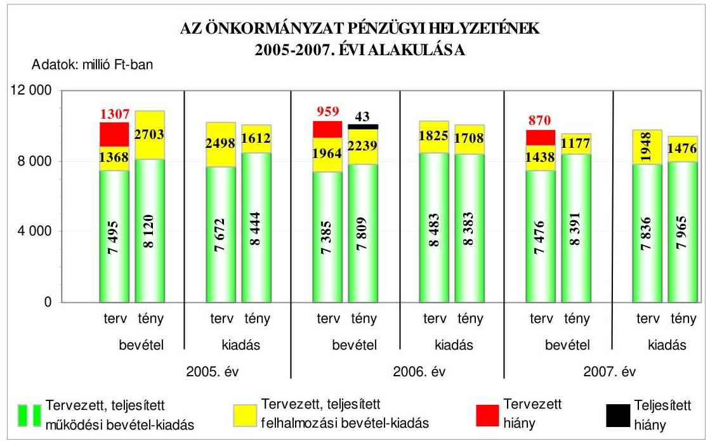
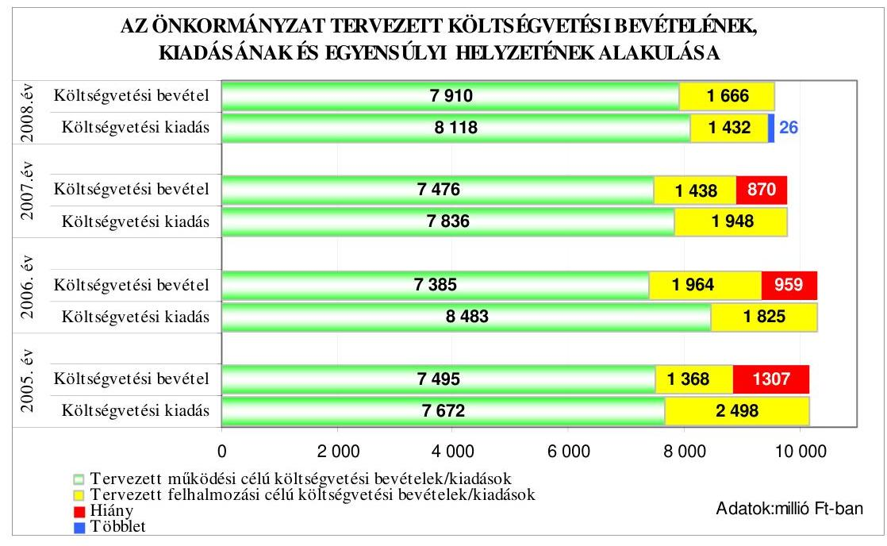
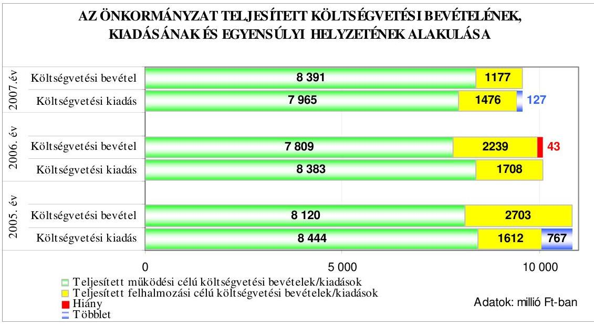
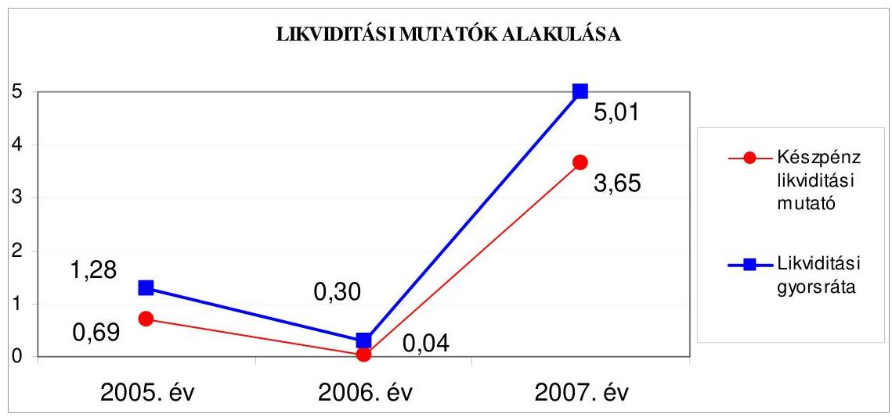
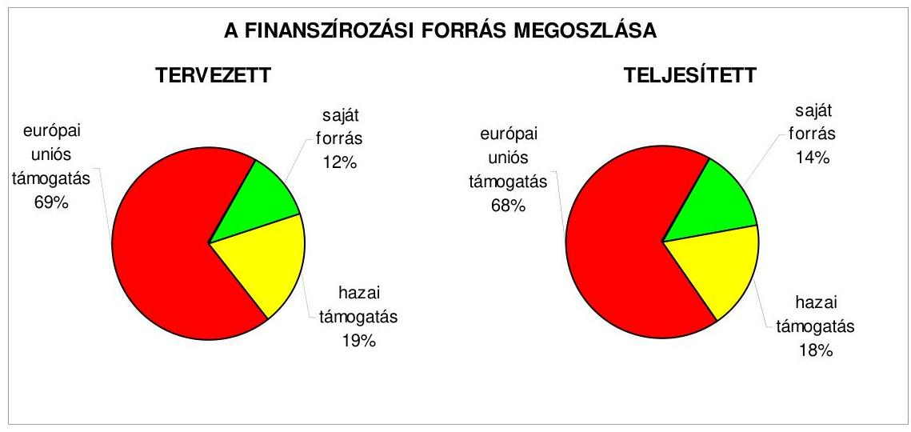
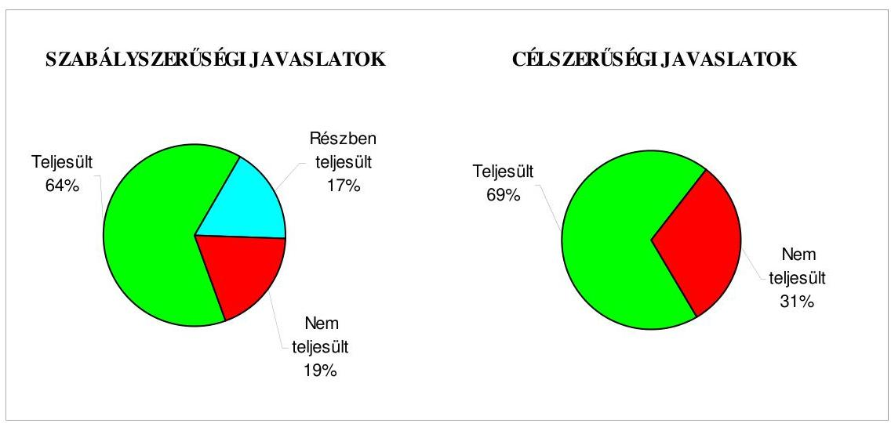
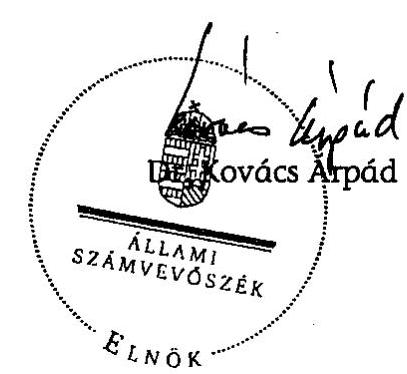
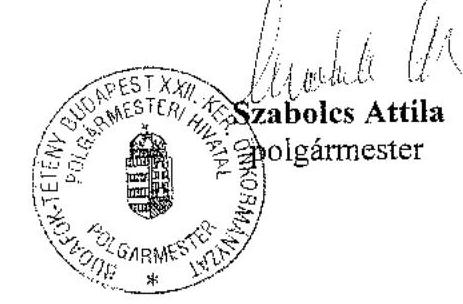
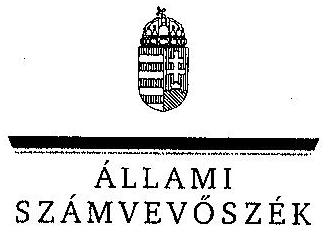

# JELENTÉS 

Budapest Főváros XXII. kerület Budafok-Tétény Önkormányzata gazdálkodási rendszerének 2008. évi ellenőrzéséről

---

# 3. Önkormányzati és Területi Ellenőrzési Igazgatóság 

## Átfogó Ellenőrzési Főcsoport

Iktatószám: V-3003-6/35/19/2008.
Témaszám: 898
Vizsgálat-azonosító szám: V0397

## Az ellenőrzést felügyelte:

Dr. Lóránt Zoltán
főigazgató
Az ellenőrzés végrehajtásáért felelős:
Dr. Sepsey Tamás
főigazgató-helyettes
Az ellenőrzést vezette:
Molnár Gyula Mihály
igazgató-helyettes
Az ellenőrzést végezték:
Endrődy Péterné Dér Géza Nagy László Csaba
számvevő tanácsos számvevő tanácsos számvevő tanácsos

## A témához kapcsolódó eddig készített számvevőszéki jelentések:

## címe

Jelentés Budapest Főváros XXII. kerület Budafok-Tétény Önkormányzata gazdálkodásának átfogó ellenőrzéséről
Jelentés a helyi és helyi kisebbségi önkormányzatok gazdálkodásának átfogó ellenőrzéséről

Jelentés a Magyar Köztársaság 2005. évi költségvetése végrehajtásának ellenőrzéséről

Függelék:

- a helyi önkormányzatokat a 2005. évben megillető normatív állami hozzájárulás igénylésének és elszámolásának ellenőrzése
Jelentés a fővárosi önkormányzatot és kerületi önkormányzatokat 0756 osztottan megillető bevételek 2007. évi megosztásáról szóló önkormányzati rendelet felülvizsgálatáról

---

# TARTALOMJEGYZÉK 

BEVEZETÉS ..... 9
I. ÖSSZEGZŐ MEGÁLLAPÍTÁSOK, KÖVETKEZTETÉSEK, JAVASLATOK ..... 14
II. RÉSZLETES MEGÁLLAPÍTÁSOK ..... 24

1. Az Önkormányzat költségvetési és pénzügyi helyzete ..... 24
1.1. A tervezett és teljesített költségvetési bevételek és kiadások alapján a költségvetési és a pénzügyi egyensúly alakulása, valamint a költségvetési hiány megállapításának szabályszerűsége ..... 24
1.2. A költségvetési és a pénzügyi egyensúlyi helyzet kialakításához tervezett és teljesített finanszírozási célú pénzügyi műveletek módja és azok hatása a tárgyévet követő évek költségvetéseire ..... 26
1.3. A költségvetés tervezésének megalapozottsága ..... 32
2. Az Önkormányzat felkészültsége az európai uniós források igénylésére és felhasználására, valamint az elektronikus közigazgatási feladatok ellátására ..... 34
2.1. Az európai uniós források igénybevételére és a várható támogatás felhasználására történt felkészülés szabályozottsága, szervezettsége ..... 34
2.1.1. Az európai uniós forrásokra történő pályázatok benyújtására vonatkozó döntések összhangja a fejlesztési célkitűzésekkel ..... 34
2.1.2. Az európai uniós forrásokhoz kapcsolódóan a pályázatfigyelés, a pályázatkészítés, valamint az európai uniós támogatással megvalósuló fejlesztés lebonyolításának belső rendjének szabályozottsága, a végrehajtás személyi, szervezeti feltételei ..... 38
2.1.3. A fejlesztési feladat lebonyolításánál a feladatellátás rendjére, az ellenőrzési feladatok teljesítésére, valamint a felelősségi szabályokra vonatkozó előírások betartása ..... 40
2.2. Az elektronikus közigazgatási feladatok ellátása, a közérdekű adatok elektronikus közzététele ..... 43
3. A költségvetési gazdálkodás belső kontrolljai ..... 45
3.1. A szabályozottság kockázata a költségvetés tervezési, gazdálkodási, beszámolási és a folyamatba épített, előzetes és utólagos vezetői ellenőrzési feladatoknál ..... 45
3.2. A belső kontrollok érvényesülése az önkormányzati források szabályszerű felhasználásában, a költségvetési tervezés, gazdálkodás, beszámolás folyamataiban ..... 46
3.3. A belső ellenőrzési kötelezettség teljesítése, javaslatainak hasznosulása ..... 50

---

4. Az ÁSZ korábbi ellenőrzési javaslatai alapján készített intézkedési terv végrehajtása, eredményessége ..... 53
4.1. Az Önkormányzat gazdálkodási rendszerének átfogó ellenőrzése során tett javaslatok végrehajtására tervezett intézkedések megvalósulása ..... 53
4.2. A zárszámadáshoz kapcsolódó (állami hozzájárulások, támogatások igénylésének és felhasználásának ellenőrzése), valamint a további vizsgálatok esetében a megállapítások, javaslatok alapján tett intézkedések ..... 58

# MELLÉKLETEK 

1. számú Az Önkormányzat gazdálkodását meghatározó adatok, mutatószámok (1 oldal)
2. számú Az önkormányzati vagyon alakulása (1 oldal)
3. számú Az Önkormányzat 2005-2007. évi költségvetési előirányzatainak és azok pénzügyi teljesítéseinek alakulása (1 oldal)
4. számú Tanúsítvány az európai uniós forrásokkal támogatott programok, célok tervezett és tényleges 2005-2008. évi adatairól (1 oldal)
5. számú Adatlap az Önkormányzat európai uniós forrással támogatott fejlesztéséről (3 oldal)
6. számú Szabolcs Attila úr, a Budapest Főváros XXII. kerület Budafok-Tétény Önkormányzata polgármestere által adott tájékoztatás (1 oldal)
7. számú Szabolcs Attila úr, a Budapest Főváros XXII. kerület Budafok-Tétény Önkormányzata polgármestere tájékoztatására adott válasz (1 oldal)

---

# RÖVIDÍTÉSEK JEGYZÉKE 

## Törvények

2005. évi költségvetési törvény

Áht.
Eisztv.

Htv.

Kbt.
Ket.

Ötv.
Számv. tv.

## Rendeletek

2004. évi költségvetési rendelet

2004. évi zárszámadási
rendelet

2005. évi költségvetési rendelet

2005. évi zárszámadási rendelet

2006. évi költségvetési rendelet

2007. évi költségvetési rendelet

2008. évi költségvetési rendelet
a Magyar Köztársaság 2005. évi költségvetéséről és az államháztartás hároméves kereteiről szóló 2004. évi CXXXV. törvény
az államháztartásról szóló 1992. évi XXXVIII. törvény az elektronikus információszabadságról szóló 2005. évi XC. törvény
a helyi önkormányzatok és szerveik, a köztársasági megbízottak, valamint egyes centrális alárendeltségú szervek feladat- és hatásköreiről szóló 1991. évi XX. törvény
a közbeszerzésekről szóló 2003. évi CXXIX. törvény
a közigazgatási hatósági eljárás és szolgáltatás általános szabályairól szóló 2004. évi CXL. törvény
a helyi önkormányzatokról szóló 1990. évi LXV. törvény a számvitelről szóló 2000 . évi C. törvény

Budapest Főváros XXII. kerület Budafok-Tétény Önkormányzat 1/2004. (II. 23.) számú rendelete az Önkormányzat 2004. évi költségvetéséről
Budapest Főváros XXII. kerület Budafok-Tétény Önkormányzat 7/2005. (IV. 26.) számú rendelete az Önkormányzat 2004. évi költségvetésének végrehajtásáról Budapest Főváros XXII. kerület Budafok-Tétény Önkormányzat 3/2005. (III. 7.) számú rendelete az Önkormányzat 2005. évi költségvetéséről
Budapest Főváros XXII. kerület Budafok-Tétény Önkormányzat 10/2006. (V. 4.) számú rendelete az Önkormányzat 2005. évi költségvetésének végrehajtásáról Budapest Főváros XXII. kerület Budafok-Tétény Önkormányzat 4/2006. (III. 7.) számú rendelete az Önkormányzat 2006. év költségvetéséről
Budapest Főváros XXII. kerület Budafok-Tétény Önkormányzat 12/2007. (IV. 27.) számú rendelete az Önkormányzat 2006. évi költségvetésének végrehajtásáról Budapest Főváros XXII. kerület Budafok-Tétény Önkormányzat 1/2007. (II. 23.) számú rendelete az Önkormányzat 2007. évi költségvetéséről
Budapest Főváros XXII. kerület Budafok-Tétény Önkormányzat 13/2008. (IV. 23.) számú rendelete az Önkormányzat 2007. évi költségvetésének végrehajtásáról Budapest Főváros XXII. kerület Budafok-Tétény Önkormányzat 4/2008. (II. 28.) számú rendelete az Önkormányzat 2008. évi költségvetéséről

---

18/2005. (XII. 27.) IHM rendelet

Ámr.
Ber.
SzMSz
vagyongazdálkodási rendelet

Vhr.

## Szórövidítések

azbeszt-mentesítés projekt
áfa
ÁSZ
EKOP
e-közigazgatás
FEUVE
GVOP
Gazdasági iroda
gazdálkodási jogkörök szabályzatai
gazdasági program ${ }_{1}$
gazdasági program ${ }_{2}$

a közzétételi listákon szereplő adatok közzétételéhez szükséges közzétételi mintákról szóló 18/2005. (XII. 27.) IHM rendelet
az államháztartás múködési rendjéről szóló 217/1998. (XII. 30.) Korm. rendelet
a költségvetési szervek belső ellenőrzéséről szóló 193/2003. (XI. 26.) Korm. rendelet
Budapest Főváros XXII. kerület Budafok-Tétény Önkormányzatának 19/1995. (VI. 1.) számú rendelete Budafok-Tétény Budapest XXII. kerület Önkormányzat Képviselő-testületének Szervezeti és Múködési Szabályzatáról
Budapest Főváros XXII. kerület Budafok-Tétény Önkormányzatának 18/2004. (V. 28.) számú rendelete az Önkormányzat vagyonáról, a vagyontárgyak feletti tulajdonosi jogok gyakorlásáról
az államháztartás szervezetei beszámolási és könyvvezetési kötelezettségének sajátosságairól szóló 249/2000. (XII. 24.) Korm. rendelet

KIOP 1.3.0. „Rózsakerti lakótelep azbeszt-mentesítése" projekt
általános forgalmi adó
Állami Számvevőszék
ÚMFT Elektronikus Közigazgatási Operatív Program
elektronikus közigazgatás
folyamatba épített, előzetes és utólagos vezetői ellenőrzés
NFT Gazdasági Versenyképesség Operatív Program
Budapest Főváros XXII. kerület Budafok-Tétény Önkormányzat Polgármesteri hivatalának Gazdasági Irodája
Budapest Főváros XXII. kerület Budafok-Tétény Önkormányzat Polgármesterének és Jegyzőjének XIII37/31/2006., XIII-37/31/2007. és a XIII/2993-4/2008. számú együttes utasítása a kötelezettségvállalás, érvényesítés, utalványozás, ellenjegyzés, teljesítésigazolás és bizonylat kibocsátás rendjéről
Budapest Főváros XXII. kerület Budafok-Tétény Önkormányzat Képviselő-testületének 257/2003. (VI. 26.) számú határozatával elfogadott, a 2003-2006. évekre szóló gazdasági programja
Budapest Főváros XXII. kerület Budafok-Tétény Önkormányzat Képviselő-testületének 96/2007. (IV. 19.) számú határozatával elfogadott, a 2007-2010. évekre szóló gazdasági programja

---

| HEFOP | Humánerőforrás-fejlesztési Operatív Program |
| :--: | :--: |
| hivatali SzMSz | Budapest Főváros XXII. kerület Budafok-Tétény Önkormányzat Polgármesteri hivatalának a Képviselőtestület 420/2001. (XII. 18.) számú határozatával jóváhagyott Szervezeti és Múködési Szabályzata |
| jegyző | Budapest Főváros XXII. kerület Budafok-Tétény Önkormányzat Jegyzője |
| Képviselő-testület | Budapest Főváros XXII. kerület Budafok-Tétény Önkormányzat Képviselő-testülete |
| KIOP | Környezetvédelmi és Infrastruktúra-fejlesztési Operatív Program |
| KMOP | Közép-magyarországi Operatív Program |
| KvVM | Környezetvédelmi és Vízügyi Minisztérium |
| NFT | Nemzeti Fejlesztési Terv |
| Önkormányzat | Budapest Főváros XXII. kerület Budafok-Tétény Önkormányzat |
| pályázati szabályzat | Budapest Főváros XXII. kerület Budafok-Tétény Önkormányzat Polgármesterének és Jegyzőjének 1337/8/2006. számú együttes utasítása az Önkormányzat által benyújtásra kerülő pályázatok kezeléséről |
| PEJ | Projekt-előrehaladási jelentés |
| polgármester | Budapest Főváros XXII. kerület Budafok-Tétény Önkormányzatának Polgármestere |
| Polgármesteri hivatal | Budapest Főváros XXII. kerület Budafok-Tétény Önkormányzat Polgármesteri hivatala |
| Szociális Szolgálat | Budapest Főváros XXII. kerület Budafok-Tétény Önkormányzat Szociális Szolgálata |
| ÚMFT | Új Magyarország Fejlesztési Terv |
| ügyrend | Budapest Főváros XXII. kerület Budafok-Tétény Önkormányzat Polgármesteri hivatala - jegyző által 2006. december 1-én elkészített - ügyrendjének 7. számú melléklete a Gazdasági iroda ügyrendjéről |
| VAX Zrt. | Budafok-Tétény Vagyonkezelő és Szolgáltató Zrt. |

---

# ÉRTELMEZŐ SZÓTÁR 

1. elektronikus szolgáltatási szint
2. elektronikus szolgáltatási szint
3. elektronikus szolgáltatási szint
4. elektronikus szolgáltatási szint
európai uniós források
fejlesztési feladat (projekt)
fejlesztési célkitúzés
irányító hatóság

Az 1044/2005. (V. 11.) Korm. határozat alapján olyan információs, tájékoztató szolgáltatás, amely csak általános információkat közöl az adott üggyel kapcsolatos teendőkről és a szükséges dokumentumokról.
Az 1044/2005. (V. 11.) Korm. határozat alapján olyan egyirányú kapcsolatot biztosító szolgáltatás, amely az 1. szinten túl biztosítja az adott ügy intézéséhez szükséges dokumentumok, nyomtatványok letöltését, és azok ellenőrzéssel, vagy ellenőrzés nélküli elektronikus kitöltését, amely esetben a dokumentumok benyújtása hagyományos úton történik.
Az 1044/2005. (V. 11.) Korm. határozat alapján olyan kétirányú kapcsolatot biztosító szolgáltatás, amely közvetlen, vagy ellenőrzött kitöltésű dokumentum segítségével biztosítja az elektronikus adatbevitelt és a bevitt adatok ellenőrzését. Az ügy indításához, intézéséhez személyes megjelenés nem szükséges, de az ügyhöz kapcsolódó közigazgatási döntés (határozat, egyéb aktus) közlése, valamint a kapcsolódó illeték-, vagy díjfizetés hagyományos úton történik.
Az 1044/2005. (V. 11.) Korm. határozat alapján olyan teljes közvetlen kétirányú ügyintézési folyamatot biztosító szolgáltatás, amikor az ügyhöz kapcsolódó közigazgatási döntés is elektronikus úton kerül közlésre, illetve a kapcsolódó illeték-, vagy díjfizetés elektronikus úton is intézhető.
Az elnyert európai uniós források lehívása a támogatott projekt megvalósítása érdekében, a fejlesztés lebonyolítása során felmerült kiadások finanszírozására.
A fejlesztési feladat (projekt) tartalmilag és formailag részletesen kidolgozott, megfelelő pénzügyi háttérrel és végrehajtási ütemezéssel rendelkező fejlesztési terv, amely illeszkedik az Európai Unió, illetve a Nemzeti Fejlesztési Terv által támogatott programokhoz.
Az önkormányzat által ellátott kötelező, vagy önként vállalt feladatok ellátásának mennyiségi, vagy minőségi fejlesztésére vonatkozó terv. A mennyiségi fejlesztés megvalósulhat beszerzéssel, létesítéssel, bővítéssel, átalakítással.
A strukturális alapok és a Kohéziós alap forrásainak szabályszerű, hatékony és eredményes felhasználásához szükséges intézményrendszer felső eleme. Az irányító hatóság általános és átfogó felelősséget visel a programok, projektek hatékony és szabályszerű végrehajtásáért. Felelősségi köréből eredően ellenőrzi a közösségi, valamint a hazai jogszabályok betartását, koordinálja az európai uniós források szétosztásának folyamatát, irányítja az intézményrendszer, a statisztikai és a pénzügyi nyilvántartási rendszer múködését.

---

kedvezményezett
közreműködő szervezet
lebonyolítás
operatív program

Az a helyi önkormányzat, amely a támogatási szerződést kedvezményezettként aláíria, a projektet, illetve a központi programhoz kapcsolódó támogatott önkormányzati programot végrehajtja.
A közreműködő szervezet az európai uniós támogatást elnyert kedvezményezettekkel kapcsolatot tartó szerv. Az operatív programok közreműködő szervezetei befogadják, nyilvántartják, döntésre előkészítik a pályázatokat, rögzítik a támogatással kapcsolatos adatokat az egységes monitoring informatikai rendszerben, elvégzik a támogatások előzetes (szerződéskötést megelőző), közbenső (a pénzügyi elszámolás, finanszírozás folyamatában végzett) és utólagos (a támogatott projekt pénzügyi lezárását megelőző) ellenőrzését. Az önkormányzatoknál a leggyakrabban előforduló operatív program a Regionális Fejlesztési Operatív Program végrehajtásában közreműködő szervezetek a VÁTI Kht. és a regionális fejlesztési ügynökségek.
A Kohéziós alap két közreműködő szervezete (Gazdasági és Közlekedési Minisztérium, Környezetvédelmi és Vízügyi Minisztérium) a támogatott projektek végrehajtásához kapcsolódó operatív feladatokat látják el. Ennek keretében megkötik a szerződéseket a projekt kedvezményezettjével, folyamatosan nyomon követik a teljesítéseket, lebonyolítják a támogatások kifizetését, vezetik az egységes monitoring informatikai rendszert.
Az európai uniós források felhasználásával megvalósuló fejlesztésre irányuló műszaki, gazdasági (pénzügyi) tevékenységet magában foglaló szervezési, irányítási szolgáltatás. A szervezési szolgáltatás kiterjedhet a pályázatkészítésre, a közbeszerzési eljárás lebonyolításán keresztül a folyamatos műszaki ellenőrzésre, a pénzügyi elszámolásra, a műszaki átadás-átvételre, az üzembe helyezésre, illetve a fejlesztési folyamat egyes elemeire.
Az Európai Bizottság által jóváhagyott, a Közösségi Támogatási Keret végrehajtására vonatkozó 2004-2006 és 2007-2013 közötti, több évre szóló intézkedésekhez kapcsolódó prioritások egységes rendszerét tartalmazó dokumentum. A strukturális alapok operatív programjai: Agrár és Vidékfejlesztési Operatív Program (AVOP); Gazdasági Versenyképesség Operatív Program (GVOP); Humán-erőforrás-fejlesztési Operatív Program (HEFOP); Környezetvédelmi és Infrastruktúra-fejlesztési Operatív Program (KIOP); Regionális Fejlesztési Operatív Program (ROP). Az ÜMFT-hez kapcsolódó operatív programok: Gazdaságfejlesztési Operatív Program (GOP); Közlekedés Operatív Program (KÖZOP); Társadalmi Megújulás Operatív Program (TÁMOP); Társadalmi Infrastruktúra Operatív Program (TIOP); Környezet és Energia Operatív Program (KEOP); Államreform Operatív Program (ÁROP); Elektro-

---

támogatási szerződés
nikus Közigazgatás Operatív Program (EKOP); Nyugatdunántúli Operatív Program (NYDOP); Dél-alföldi Operatív Program (DAOP); Észak-alföldi Operatív Program (ÉAOP); Közép-magyarországi Operatív Program (KMOP); Észak-magyarországi Operatív Program (ÉMOP); Középdunántúli Operatív Program (KDOP); Dél-dunántúli Operatív Program (DDOP).
A strukturális alapok esetében az irányító hatóságnak, illetve a Kohéziós alap esetében a közremúködő szervezeteknek a kedvezményezett önkormányzattal kötött szerződése, amely a támogatás felhasználásának részletes feltételeit tartalmazza.

---

# JELENTÉS 

## Budapest Főváros XXII. kerület BudafokTétény Önkormányzata gazdálkodási rendszerének 2008. évi ellenőrzéséről

## BEVEZETÉS

Az Ötv. 92. § (1) bekezdése, az Állami Számvevőszékről szóló 1989. évi XXXVIII. törvény 2. § (3) bekezdése, valamint az Áht. 120/A. § (1) bekezdése alapján az önkormányzatok gazdálkodását az Állami Számvevőszék ellenőrzi. Az ellenőrzésre az Országgyúlés illetékes bizottságai részére is átadott, országosan egységes ellenőrzési program szerint került sor.

Az Állami Számvevőszék a stratégiájában foglalt célkitűzéseknek megfelelően a helyi önkormányzatok költségvetési gazdálkodási rendszere átfogó ellenőrzésének programját a 2007. évtől megújította, azt kiegészítette további - teljesít-mény-ellenőrzési - elemekkel.

## Az ellenőrzés célja annak értékelése volt, hogy az Önkormányzat:

- milyen módon biztosította a költségvetési és a pénzügyi egyensúlyt a költségvetésében és annak teljesítése során, valamint változott-e a finanszírozási célú pénzügyi műveletek jelentősége a hiányzó bevételi források pótlásában;
- eredményesen készült-e fel a szabályozottság és a szervezettség terén az európai uniós források igénylésére és felhasználására, továbbá biztosította-e az e-közigazgatás feltételeit, az adatok közzétételével a gazdálkodás nyilvánosságát;
- kialakította-e a külső és a belső feltételeknek megfelelően a költségvetés tervezési, gazdálkodási és zárszámadási feladatai belső kontrollrendszerét ${ }^{1}$, ezen tevékenységek szabályszerű ellátásához hozzájárult-e a folyamatba épített, előzetes és utólagos vezetői ellenőrzés, valamint a belső ellenőrzés;
- megfelelően hasznosították-e a korábbi számvevőszéki ellenőrzések megállapításait, szabályszerűségi ${ }^{2}$ és célszerűségi javaslatait.

[^0]
[^0]:    ${ }^{1}$ A gazdálkodás szabályszerűségét biztosító kontrollrendszer alatt értjük a kiépített és múködő belső irányítási és szabályozási rendszert, valamint a belső ellenőrzési funkciók ellátásának rendszerét.
    ${ }^{2}$ A törvényi előírások betartásának elmulasztásakor a részletes megállapítások fejezetben egységesen a törvénysértés megjelölést alkalmazzuk, mivel az ÁSZ nem tehet különbséget a törvényi előírások között.

---

Az ellenőrzés típusa: átfogó ellenőrzés, amely egyidejúleg - egy ellenőrzés keretében - meghatározott területekre összpontosítva érvényesíti a szabályszerűségi, valamint a teljesítmény-ellenőrzés jellemzőit.

Az ellenőrzött időszak: az 1., 2. és 4. programpontok tekintetében a 20052007. évek és 2008. I. negyedév, a 3. ellenőrzési programpontnál a 2007. év és 2008. I. negyedév.

Budapest Főváros XXII. kerület Budafok-Tétény lakosainak száma 2008. január 1-jén 53148 fő volt. A 2006. évi önkormányzati választást követően az Önkormányzat 25 tagú Képviselő-testületének munkáját nyolc állandó bizottság segítette. A helyi önkormányzat mellett a 2006. évi önkormányzati választásokat követően négy kisebbségi önkormányzat ${ }^{3}$ múködött. A polgármester a 2006. évi önkormányzati képviselő és polgármester választás óta tölti be tisztségét, a jegyző személye a 2007 évben változott.

Az Önkormányzat feladatainak végrehajtása érdekében a 2007. évben 27 költségvetési intézményt múködtetett, amelyekből öt önállóan gazdálkodott. A feladatok ellátásában részt vett hat gazdasági társasága, továbbá három alapítványa. Az Önkormányzat a 2007. évi költségvetési beszámolója szerint 9568 millió Ft költségvetési bevételt ért el és 9441 millió Ft költségvetési kiadást teljesített, 2007. december 31-én a könyvviteli mérleg szerint 50567 millió Ft értékű vagyonnal rendelkezett. Az Önkormányzat vagyona a 2005. év végi állományhoz viszonyítva $6 \%$-kal csökkent, ezen belül a pénzeszközök állománya két és félszeresére, 998 millió Ft-tal emelkedett, míg az üzemeltetésre átadott eszközök értéke - a Budapest Fővárosi Önkormányzatnak az általa üzemeltetett csatornahálózat tulajdonba átadása következtében - 20\%-kal, 2536 millió Fttal csökkent. A saját tőke $8 \%$-ot kitevő 4101 millió Ft-os csökkenését az értékcsökkenésen és a csatornahálózat átadáson kívül a VAX Zrt. vevőállományának elengedése okozta. A kötelezettségek 79\%-kal, 1617 millió Ft-tal növekedtek, amelyen belül a hosszú lejáratú kötelezettségek állománya - a kötvény kibocsátással összefüggésben - háromszorosára emelkedett, a rövid lejáratú kötelezettségek felére történő csökkenése mellett. A 2008. évi költségvetési rendeletben 9576 millió Ft költségvetési bevételt és 9550 millió Ft költségvetési kiadást irányoztak elő. Az összes költségvetési bevétel $64 \%$-át a saját bevétel, illetve $43 \%$-át a helyi adó bevétel biztosította a 2007. évben. Az összes költségvetési kiadásból a felhalmozási célú kiadás részaránya a 2007. évben 16\% volt. A Polgármesteri hivatalban dolgozó köztisztviselők száma 2007. december 31-én 171 fő, a költségvetési intézményekben foglalkoztatott közalkalmazottak száma 1119 fő volt. Az Önkormányzat gazdálkodását meghatározó adatokat, mutatószámokat az 1-3. számú mellékletek tartalmazzák.

Az Önkormányzat költségvetési és pénzügyi helyzetét az elemző eljárás módszerével vizsgáltuk. E körben elemeztük a költségvetés egyensúlyi helyzetének alakulását, a tervezett és tényleges költségvetési hiány okait, a mérséklésére tett intézkedéseket, finanszírozásának módját, az Önkormányzat adósságállományának alakulását, összetevőit.

[^0]
[^0]:    ${ }^{3}$ Bolgár, cigány, horvát, német.

---

A teljesítmény-ellenőrzés módszerével vizsgáltuk, a belső szabályozottság, szervezettség terén az Önkormányzat felkészültségét az európai uniós források figyelésére, igénylésére és felhasználására, továbbá értékeltük, hogy az igényelt európai uniós támogatások az Önkormányzat által meghatározott fejlesztési célkitűzésekhez kapcsolódtak-e. Az eredményesség szempontjából a minősítést a lényegességi szinthez való viszonyítással végeztük el. Az ellenőrzés során felmértük, hogy az e-közigazgatási feladat ellátása, illetve bevezetése, múködtetése érdekében milyen intézkedéseket tettek, valamint biztosították-e a közérdekú adatok közzétételét.

A költségvetési gazdálkodás belső kontrolljainak ellenőrzése során értékeltük, hogy a Polgármesteri hivatalnál a költségvetés tervezési, gazdálkodási, zárszámadás készítési feladatok belső kontrolljainak kiépítettsége és múködése megfelelő biztosítékot ad-e a gazdálkodási feladatok megfelelő, szabályszerű ellátására. Felmértük és minősítettük a költségvetés tervezési, a gazdálkodási, a zárszámadás készítési feladatokkal, továbbá a pénzügyi- számviteli területen az informatikával kapcsolatosan kialakított kontrollok megfelelőségét, valamint azok múködésének eredményességét, megbízhatóságát. Értékeltük a belső ellenőrzés szervezeti és szabályozási keretét, továbbá működését.

A Polgármesteri hivatalnál értékeltük a gazdálkodás folyamatában a kontrollok múködésének megbízhatóságát, ennek keretében ellenőriztük a szakmai teljesítés igazolására és az utalvány ellenjegyzésére kialakított kontrollok végrehajtását. Az ellenőrzést a következő, kiemelt kockázatuk alapján kiválasztott ${ }^{4}$ az általánostól jellemzően eltérő, egyedi eljárást igénylő gazdasági eseményekkel kapcsolatos kifizetésekre folytattuk le ${ }^{5}$ :

- a külső szolgáltató által végzett karbantartási, kisjavítási szolgáltatások,
- a gépek, berendezések, felszerelések beszerzése, továbbá
- a múködési célú pénzeszköz átadásokból az államháztartáson kívülre teljesített kifizetésekre.

Az ellenőrzés hatékony elvégzése céljából a vizsgálandó területek kiválasztása során a kockázatokon alapuló megközelítés érvényesült, ezáltal az ellenőrzési erőforrásokat azokra a területekre fókuszáltuk, amelyeken legnagyobb a hibák

[^0]
[^0]:    ${ }^{4}$ Az önkormányzatok kiemelt előirányzataira vonatkozóan, a vertikális folyamatokra elvégeztük a kockázatok becslését, amelynek eredményeként a külső szolgáltató által végzett karbantartási, kisjavítási szolgáltatások, a gépek, berendezések, felszerelések beszerzése valamint a múködési célú pénzeszköz átadások államháztartáson kívülre teljesített kifizetései kiemelkedően kockázatos területeknek bizonyultak.
    ${ }^{5}$ A korábbi ellenőrzési tapasztalataink szerint, ezeken a területeken a jegyzők nem, vagy hiányosan szabályozták a megbízás, megrendelés, illetve beszerzés indokoltságának, szükségességének elbírálására, igazolására, valamint a teljesítések dokumentálására, a kifizetések jogosságának megítélésére szolgáló kontrollokat. További kockázatot jelentett a külső szolgáltató által végzett karbantartási, kisjavítási munkák esetében, hogy az 50 ezer Ft alatti megrendelésekre vonatkozóan az ellenőrzési tapasztalataink szerint a jegyzők nem alakították ki a kötelezettségvállalások rendjét és nyilvántartási formáját, valamint a szabályozás elmulasztása esetén nem történt meg az írásbeli kötelezettségvállalás és annak az ellenjegyzése sem.

---

előfordulási valószínűsége. Az ellenőrzési erőforrások ilyen típusú összpontosításával minimálisra csökkenthető a kívánt ellenőrzési bizonyosság eléréséhez szükséges időráfordítás.

A pénzügyi-számviteli folyamatokban alkalmazott belső kontrollok létezésének és múködésének ellenőrzésére a vizsgált három terület 2007. évi könyvviteli tételeiből területenként egyszerú véletlen mintát vettünk. A kijelölt gazdasági eseményre elvégzett megfelelőségi tesztek alapján értékeltük a kontrollok múködésének eredményességét, megbízhatóságát a vizsgált három területre különkülön, majd összefoglalóan ${ }^{6}$ a Polgármesteri hivatal egyedi eljárást igénylő gazdasági eseményeire. A helyszíni ellenőrzés megállapításainak részletes dokumentálását három megfelelőségi tesztlapon, öt elővizsgálati és 12 helyszíni ellenőrzési munkalapon biztosítottuk. Ezeken a teszt- és munkalapokon a minősítés alapjául szolgáló kérdések és a vonatkozó konkrét jogszabályhelyek megjelölése mellett értékeltük a kialakított belső kontrollokban rejlő kockázatokat ${ }^{7}$ és a kialakított kontrollok múködésének megbízhatóságát ${ }^{8}$.

Az ÁSZ korábbi ellenőrzési javaslatai alapján tett intézkedéseket, illetve azok megvalósítását utóellenőrzés keretében vizsgáltuk. A gazdálkodási rendszer átfogó ellenőrzése során megfogalmazott javaslatok végrehajtására tett intézkedések megvalósítását ellenőriztük, az egyéb számvevőszéki ellenőrzések során tett javaslatok esetében pedig a kiadott intézkedéseket tekintettük át.

A helyszíni ellenőrzés során kitöltött - az ellenőrzést végző számvevő és a Polgármesteri hivatal felelős köztisztviselője által aláírt - elővizsgálati és helyszíni ellenőrzési munkalapokat, azok kitöltési útmutatóit, továbbá a megfelelőségi tesztek dokumentumait a polgármester részére a számvevői jelentéssel egyidejűleg átadtuk.

A jelentés megállapításainak, javaslatainak egyeztetése során a polgármester arról adott részletes tájékoztatást - egyidejűleg csatolta azokat a dokumentumokat, amelyek igazolták - hogy az időközben megtett intézkedésekkel a

[^0]
[^0]:    ${ }^{6}$ A vizsgált három terület egyedi értékelési pontszámait a területek relatív költségvetési súlyával arányosan összegeztük.
    ${ }^{7}$ A kialakított belső kontrollokban rejlő kockázatot alacsonynak minősítettük, ha a kontrollok - végrehajtásuk esetén - megfelelő védelmet nyújtanak a hibák bekövetkezése ellen. Közepesnek minősítettük a belső kontrollokban rejlő kockázatot, amennyiben a kontrollok - végrehajtásuk esetén - a lehetséges hibák többsége ellen védelmet nyújtanak. Magasnak értékeltük a kockázatot, ha a kontrollok - kialakításuk hiányában, vagy hiányos kialakításuk miatt - nem nyújtanak elegendő védelmet a lehetséges hibákkal szemben.
    ${ }^{8}$ A kontrollok múködésének eredményességét, megbízhatóságát kiválónak értékeltük abban az esetben, ha azok múködése - esetleges apróbb hiányosságoktól eltekintve megfelelt a hibák megelőzésére és kijavítására meghatározott szabályozásnak és a legmagasabb szintű elvárásoknak. Jónak minősítettük a kontrollok múködését, ha a hiányosságok száma ugyan jelentős volt, de nem veszélyeztette az ellenőrzött terület hibáinak megelőzését és kijavítását. Amennyiben a hiányosságok mértéke nem biztosította a hibák megelőzését, feltárását, kijavítását és ez által veszélyeztette az eredményes, megbízható múködést, a kontroll múködésének megbízhatósága gyenge minősítést kapott.

---

számvevői jelentésben tett néhány javaslatot ${ }^{9}$ megvalósították. A megtett intézkedéseket a jelentés II. Részletes megállapítások fejezetében az adott témához kapcsolt lábjegyzetben feltüntettük és a vonatkozó javaslatokat elhagytuk.

A jelentést az ÁSZ-ról szóló 1989. évi XXXVIII. tv. 25. § (1) bekezdése alapján észrevétel közlése céljából megküldtük a Budapest Főváros XXII. kerület Buda-fok-Tétény Önkormányzata polgármesterének. A kapott tájékoztatást a jelentés 6. számú melléklete, az arra adott választ a 7. számú melléklet tartalmazza.

[^0]
[^0]:    ${ }^{9}$ A számvevői jelentésben a helyszíni ellenőrzés során a jegyzőnek 17 szabályszerűségi és nyolc célszerűségi javaslatot tettünk, melyből a megtett intézkedésről szóló tájékoztatás alapján egy szabályszerűségi és egy célszerűségi javaslatot hagytunk el.

---

# I. ÖSSZEGZŐ MEGÁLLAPÍTÁSOK, KÖVETKEZTETÉSEK, JAVASLATOK 

Az Önkormányzat tervezett költségvetési bevételei az előző évhez viszonyítva a 2006. és a 2008. években növekedtek, a 2007. évben csökkentek, a tervezett költségvetési kiadások a 2006. évben növekedtek, a 2007-2008. években csökkentek az előző évhez viszonyítva. Az Önkormányzat a 2005-2007. évi költségvetési rendeleteiben évről-évre csökkenő összegű költségvetési hiányt tervezett. A 2008. évben a költségvetési bevételek fedezetet biztosítottak a tervezett költségvetési kiadásokra. A 2005-2008. évi költségvetési rendeletekben az Önkormányzat az Áht. előírásaival ellentétesen a finanszírozási célú pénzügyi műveleteket a költségvetési kiadásokkal összevontan mutatta be. A 2005. és a 2007. évben a teljesített költségvetési bevételek meghaladták a költségvetési kiadásokat, a 2006. évben a teljesítéskor hiány alakult ki. Az Önkormányzatnál a 2005-2007. években a tervezett és a teljesített múködési célú költségvetési bevételek és a kiadások költségvetésen belüli részaránya volt a meghatározó, azok meghaladták a tervezett és teljesített költségvetési bevételek illetve kiadások háromnegyed részét.

Az Önkormányzat a 2005-2007. évi költségvetési rendeleteiben a költségvetési egyensúly biztosításához rövid és hosszú lejáratú hitelek felvételét tervezte. A költségvetések végrehajtása során a pénzügyi hiány csökkenése érdekében bevételt növelő és kiadást csökkentő intézkedéseket hozott. A 2005-2007. évi költségvetések végrehajtása során a finanszírozáshoz az Önkormányzat a 2006-2007. évben hosszú lejáratú felhalmozási célú hitelt vett fel, továbbá 2500 millió Ft összegű működési és felhalmozási célú kötvényt bocsátott ki. A 2007. évi költségvetési rendelet módosításakor kötvény kibocsátásról döntöttek, az árfolyamváltozás, valamint a változó kamatmérték miatt az Önkormányzat számára a kötvénykibocsátás kockázatot jelentett. A 2007. év végén fennálló adósság állomány törlesztése a 2008-2010. években, a kötvénykibocsátás 2012. évtől kezdődő tőketörlesztése és a felszámított kamatok megfizetése terheli az Önkormányzat költségvetéseit. A folyószámla hitelkeret változóan alakult, a ténylegesen felvett folyószámlahitel összege folyamatosan emelkedett. A pénzügyi mutatók alapján az Önkormányzat pénzügyi helyzete a 2005-2007. években kedvezőtlenül alakult, a kötvénykibocsátás az eladósodás tartóssá válását okozta, ugyanakkor a kötvénykibocsátás bevételeiből a pénzeszközök állománya közel háromszorosára nőtt. A fizetőképesség a likviditási mutatók alapján változóan alakult, az előző év végéhez viszonyítva a 2006. évben romlott, a 2007. évben pedig javult.

Az Önkormányzat 2005-2007. évi költségvetési rendeleteiben jóváhagyott eredeti költségvetési bevételi előirányzatokat túlteljesítette, a kiadásoknál alulteljesítés alakult ki. A túlteljesítés oka a bevételeknél az volt, hogy az Önkormányzat a költségvetési rendeletekben eredeti előirányzatként nem tervezte az előző évi kötelezettségvállalások áthúzódó kiadásainak forrását annak ellenére, hogy eredeti előirányzatok tervezésekor azok ismertek voltak. A Polgármesteri hivatalban a bevételek eredeti előirányzatának túlteljesítését okozta az

---

is, hogy az elnyert európai uniós támogatás összegét - az Áht. előírása ellenére - a 2005-2007. évi költségvetési rendeletek eredeti előirányzataként nem tervezték. Az eredeti kiadási előirányzatokhoz viszonyított elmaradás mértéke mind három évben négy százalék alatt volt, ami a múködési célú költségvetési kiadások 2005. és a 2007. évi túlteljesítéséből, illetve a 2006. évi alulteljesítésből, valamint a felhalmozási célú kiadások folyamatos alulteljesítéséből alakult ki.

A 2004-2007. években benyújtott európai uniós pályázatok az Önkormányzat gazdasági programjaiban, fejlesztési koncepciókban foglaltakkal összhangban voltak, illeszkedtek az NFT, illetve az ÚMFT célkitűzéseihez. A fejlesztések indokoltságát az elvégzett helyzetelemzések támasztották alá. Az Önkormányzatnál a 2004-2007. évekre vonatkozóan hét európai uniós fejlesztési célkitűzés önállóan, vagy partnerként történő megvalósításáról döntöttek, amelyek közül kettő projektre kaptak támogatást. A nem támogatott projektek elutasításának oka a pályázatok alaki, tartalmi hibája, illetve az hogy a pályázattal tervezett projektet a bíráló bizottság nem ítélte alkalmasnak a térségi feladatok megoldására. A 2005-2007. évi költségvetési rendeletek eredeti előirányzatként az Áht. előírása ellenére nem tartalmazták a támogatási szerződésben szereplő ütemezésben a kiadásokat és a támogatásból származó bevételeket, a többéves kihatással járó döntés számszerúsítését évenkénti bontásban, és összesítve. Nem tartalmazták az Ámr. előírása ellenére az európai uniós támogatással megvalósuló projektek bevétel és kiadási előirányzatait elkülönítetten, valamint a felhalmozási kiadásokat feladatonként.

Az Önkormányzat az európai uniós források igénybevételének és felhasználásának önkormányzati feladatait pályázati szabályzatban határozta meg. A pályázati szabályzatban rögzítették a pályázatfigyelés kötelezettségét, valamint meghatározták a pályázatkészítés feladatait. A szabályozás nem tartalmazta a fejlesztés lebonyolításával kapcsolatos eljárásrendet, azt projektenként egyedileg határozták meg. A fejlesztési feladatok belső ellenőrzési feladatait kockázatelemzés alapján az éves ellenőrzési tervek nem tartalmazták. A polgármester és a jegyző 2008. szeptemberében kiadott együttes utasítása tartalmazta a hiányzó előírásokat. A pályázati nyilvántartás feladatait 2008. II. negyedévéig a Gazdasági iroda, azt követően a pályázati referens végezte. A pályázatfigyelési, a pályázatkészítési és a fejlesztési feladat lebonyolítását a Polgármesteri hivatal köztisztviselői végezték, egy esetben bíztak meg pályázatírással külső szervezetet.

Az Önkormányzat a 2004. évben sikeresen pályázott a KIOP Környezetvédelmi prioritás keretében az azbeszt-mentesítés projekt megvalósítására. A támogatási szerződést kettő alkalommal módosították, mely a kivitelezés, illetve a pénzügyi megvalósítás ütemezését nem érintette, a kivitelezés a tervezett kezdési és befejezési határidők betartásával valósult meg. A támogatások igénybevétele nem a támogatási szerződésben rögzített ütemezés szerint történt. A megvalósítás során a tervezett saját forrást biztosították, többletkiadás nem merült fel. A támogatási szerződésben meghatározott célok és mutatók teljesültek. A projekt megvalósításának tényleges költsége - a módosított támogatási szerződés szerinti - tervezett kiadás összegével megegyezően teljesült. A projektet a közremúködő szervezet kettő alkalommal ellenőrizte a helyszínen, mely-

---

nek során pénzügyi, elszámolási szabálytalanságot, mulasztást nem állapított meg.

Az Önkormányzat felkészülése a 2005-2007. években az európai uniós források igénybevételére és felhasználására a belső szabályozottság és szervezettség terén összességében nem volt eredményes, mivel a pályázatkészítés feladataival megbízott szervezettel kötött megbízási szerződésben nem írták elő a szervezet és a Polgármesteri hivatal képviselője közötti kapcsolattartás és felelősség szabályait, az információk átadásának formáját, tartalmát és módját, valamint a szabályozás hiányos volt, nem tartalmazta az európai uniós forrással támogatott fejlesztés lebonyolításával kapcsolatos eljárási rendet. Az éves belső ellenőrzési terveket megalapozó kockázatelemzés nem terjedt ki a támogatott fejlesztési feladatokra. Az európai uniós pályázatok kapcsolódtak a gazdasági program ${ }_{1,2}$-ben megfogalmazott fejlesztési célkitűzésekhez. A szabályozás tartalmazta a pályázatfigyelést végzők és a döntési, illetve a döntéselőkészítési jogkörrel rendelkezők közötti információ szolgáltatás kötelezettségét. A Polgármesteri hivatalban, illetve az intézményeknél biztosították a pályázatfigyelés és pályázatkészítés személyi feltételeit, meghatározták a pályázatkészítést végző személyek és a pályázat benyújtásáért felelős személy közötti kapcsolattartás és felelősség szabályait. A fejlesztési feladat lebonyolítását végző személyek feladatait és a kapcsolattartás rendjét, valamint a személyre szóló felelősségét projektenként határozták meg.

Az Önkormányzat informatikai stratégiájával nem rendelkezett, az eközigazgatáshoz kapcsolódó közép és hosszú távú célokat a gazdasági program ${ }_{1,2}$ tartalmazta, azonban nem határozták meg azt, hogy az e-közigazgatási feladatok melyik szintjét mikor kívánják elérni. Az e-közigazgatási szolgáltatásokat biztosító informatikai rendszert saját számítógépes információs rendszeren keresztül és vásárolt szoftverrel múködtették a Polgármesteri hivatalban, az e-közigazgatási feladatok ellátásának személyi feltételeit a Polgármesteri hivatalon belül kettő fő informatikai feladattal megbízott köztisztviselővel, valamint az Önkormányzat honlapjának üzemeltetésére kötött megbízási szerződéssel biztosították. Az Önkormányzatnál múködő informatikai rendszer az eközigazgatási feladatok ellátását egyes ügykörökben az 1., illetve az ügykörök több mint felénél a 2. elektronikus szolgáltatási szinten biztosította. Az Önkormányzat nem tett eleget az e-közigazgatási feladatokat ellátó informatikai rendszerben a gazdasági adatok közzétételi kötelezettségének, mivel nem tartották be a vonatkozó rendelet előírását. A közérdekú adatok közzétételére való hivatkozást az Önkormányzat honlapján a megnyitáskor megjelenő oldalon nem az előírt „közérdekú adatok" elnevezéssel, az adatokat nem az előírt szerkezetben helyezték el. A jegyző az Áht. előírása ellenére nem tette közzé a 2007. évben és a 2008. év I. negyedévében nyújtott céljellegú múködési és a 20052007. években adott fejlesztési támogatások adatait, valamint az Ámr. előírását figyelmen kívül hagyva nem hozta nyilvánosságra a 2006. és a 2007. évi költségvetési beszámoló szöveges indoklását. Az Önkormányzat pénzeszközeinek felhasználással, a vagyonnal történő gazdálkodással összefüggő, nettó öt millió Ft-ot elérő, vagy azt meghaladó értékű - árubeszerzésre, építési beruházásra, szolgáltatás megrendelésre, vagyon értékesítésre, vagyon hasznosításra, vagyon, vagy vagyoni értékú jog átadására, valamint koncesszióba adásra vonatkozó - szerződések adatait közzétették. Az e-közigazgatási feladatokat ellá-

---

tó informatikai rendszer ügyfelek általi igénybevételét a Polgármesteri hivatalban nem kísérték figyelemmel.

A Polgármesteri hivatalnál a költségvetés tervezési és a zárszámadás készítési folyamatok szabályozottsága összességében alacsony kockázatot jelentett a feladatok megfelelő, szabályszerű végrehajtásában, mivel a jegyző szabályozta a költségvetési tervezés és a zárszámadás elkészítés rendjét. Annak ellenére összességében alacsony volt a kockázat, hogy nem írták elő az intézmények, hivatali szervezeti egységek által benyújtott költségvetési igények indokoltságának, teljesíthetőségének ellenőrzését, valamint annak ellenőrzését, hogy a saját bevételek előirányzatai és a költségvetés megalapozását szolgáló helyi rendeletek összhangja biztosított-e. Az ellenőrzés szabályozására vonatkozó hiányosságot a jegyző 2008. szeptember végéig pótolta. A Polgármesteri hivatalnál a költségvetés tervezési és a zárszámadás készítési folyamatban a kontrollok múködésének megbízhatósága gyenge volt, mivel a költségvetés tervezés során a jegyző dokumentáltan nem ellenőriztette, hogy az intézmények, hivatali szervezeti egységek által benyújtott költségvetési igények indokoltak és teljesíthetőek-e, illetve, hogy a saját bevételek előirányzatai és a költségvetés megalapozását szolgáló helyi rendeletek összhangja biztosított-e. A zárszámadás készítés folyamatában a jegyző dokumentáltan nem ellenőriztette az intézményi eredeti, illetve a módosított előirányzatok és a teljesítések eltérésének indokoltságát, továbbá az intézményi számszaki beszámoló belső előírásokkal, valamint annak a Képviselő-testület által meghatározott adatszolgáltatással való összhangját.

A gazdálkodási, a pénzügyi-számviteli és a folyamatba épített ellenőrzési feladatok szabályozottsága összességében alacsony kockázatott jelentett a feladatok megfelelő, szabályszerű végrehajtásában, mivel a Polgármesteri hivatal rendelkezett a Képviselő-testület által jóváhagyott SzMSz-szel, a gazdasági szervezet elkészítette az ügyrendjét, a kötelezettségvállalás, ellenjegyzés, utalványozás, érvényesítés rendjét szabályozták. Annak ellenére összességében alacsony volt a kockázat, hogy a gazdasági szervezet ügyrendje nem tartalmazta a vezetők és a beosztottak feladat-, hatás- és jogkörét, az önköltségszámítás rendjére vonatkozó szabályzat nem készült. Az ingatlanok kétévenkénti leltározását önkormányzati rendelet nem szabályozta, a pénzkezeléshez kapcsolódó utólagos vezetői ellenőrzés gyakoriságát, dokumentálásának módját nem határozták meg, az érintett dolgozók munkaköri leírása az értékeléssel és a selejtezéssel kapcsolatos feladatokat nem tartalmazta. A leltározás és a pénzkezelés szabályozási hiányosságait a szabályzatok módosításával rendezték, a munkaköri leírások kiegészítését a jegyző 2008. szeptember végéig pótolta.

A Polgármesteri hivatalnál a karbantartási, kisjavítási szolgáltatásokkal, a gépek, berendezések és felszerelések beszerzésével, valamint az államháztartáson kívülre történő múködési célú pénzeszközátadásokkal kapcsolatos kifizetések során a belső kontrollok múködésének megbízhatósága összességében gyenge volt, mivel a karbantartási, kisjavítási feladatokkal, valamint a pénzeszközátadásokkal kapcsolatos kiadások teljesítését megelőzően a szakmai teljesítés igazoló és az utalvány ellenjegyző nem látta el a folyamatba épített ellenőrzési feladatait. A szakmai teljesítés igazolására kijelölt személyek nem végezték el a szerződésben, megrendelésben rögzített célra történő kifizetés jogosultságának, összegszerűségének és szakmai teljesítésének igazolását, az utal-

---

vány ellenjegyzője nem győződött meg a szakmai teljesítés igazolásának megtörténtéről és a gazdálkodásra vonatkozó szabályok betartásáról. A gépek, berendezések, felszerelések beszerzésével kapcsolatos kiadások teljesítését megelőzően a szakmai teljesítésigazoló az összegszerűséget, a jogosultságot és a szerződésben foglaltak teljesítését ellenőrizte, de az utalvány ellenjegyzője nem győződött meg a gazdálkodásra vonatkozó szabályok betartásáról.

A Polgármesteri hivatalban az informatikai környezet szabályozottságának hiányosságai magas kockázatot jelentettek a feladatok szabályszerű végrehajtásában, mivel az Önkormányzat nem rendelkezett informatikai stratégiával és katasztrófa elhárítási tervvel, az informatikai szabályzat megismertetéséről nem gondoskodtak a pénzügyi számviteli területen dolgozókkal, az informatikai eszközökhöz történő hozzáférést és annak ellenőrzését nem szabályozták, és a pénzügyi-számviteli programrendszer adat karbantartási folyamatai nem szabályozottak. A Polgármesteri hivatalban az informatikai rendszer belső kontrolljainak megbízhatósága jó volt, mivel a főkönyvi könyvelést és a költségvetési beszámoló összeállítását informatikai eszközökkel oldották meg, és az alkalmazott számítógépes program biztosította a könyvviteli mérleg, illetve a főkönyv, valamint a főkönyv és a költségvetési beszámoló adatainak egyezőségét, azonban az analitikus nyilvántartás és a főkönyvi könyvelés kapcsolata nem volt automatikus, a könyvviteli feladatok informatikai elvégzése során nem oldották meg a tranzakciót rögzítő személytől eltérő személy általi engedélyezést, az adatok egyszeri bevitelét, és a bizonylatok adatainak rögzítésénél a számszaki pontosság automatikus ellenőrzését, valamint a könyvelési tételek visszamenőleges azonosítása során a gazdasági eseményt rögzítő személy azonosítására nem volt mód és a pénzügyi-számviteli adatok feldolgozása nem volt naprakész. A feltárt hiányosságok nem veszélyeztették az eredményes, megbízható múködést.

A belső ellenőrzés szervezeti kereteinek kialakítása és szabályozása a belső ellenőrzési feladatok megfelelő, szabályszerű végrehajtásában alacsony kockázatot jelentettek, mivel a Képviselő-testület kialakította a belső ellenőrzés szervezeti kereteit és meghatározta a belső ellenőrzés eljárási módját. Annak ellenére összességében alacsony volt a kockázat, hogy a belső ellenőrök rendszeres továbbképzéséhez képzési tervet nem készítettek, illetve az egyik belső ellenőr iskolai végzettsége nem felelt meg a Ber. előírásának. A belső ellenőrzés múködésénél a kialakított kontrollok megbízhatósága összességében kiváló volt, mivel a jegyző gondoskodott a költségvetési szervek ellenőrzésének végrehajtásáról. Annak ellenére összességében kiváló volt a megbízhatóság, hogy a 2007. évre tervezett belső ellenőrzések közel egy tizedét nem hajtották végre. Továbbá kockázatelemzés alapján nem tervezték a közbeszerzések, illetve a közbeszerzési eljárások ellenőrzését, az Önkormányzat többségi irányítást biztosító befolyása alatt működő gazdasági társaságoknál, illetve vagyonkezelőknél a rendelkezésre álló erőforrásokkal való gazdálkodásának, a vagyon megóvásának, gyarapításának vizsgálatát, illetve az Önkormányzat költségvetéséből céljelleggel nyújtott támogatások rendeltetés szerinti felhasználásának ellenőrzését. A belső ellenőrzés keretében a Polgármesteri hivatalban és az intézményeknél vizsgálták a FEUVE rendszer kiépítésének és múködésének központi és helyi szabályoknak való megfelelését, a pénzügyi, irányítási és ellenőrzési rendszerek múködésének, gazdaságosságának hatékonyságát, eredményességét, a rendelkezésre álló erőforrásokkal való gazdálkodást, a vagyon megóvását és gyarapítását. A belső

---

ellenőrzésekről készített 2007. és a 2008. évi ellenőrzési jelentések értékelték a rendelkezésre álló információkat, tartalmaztak ajánlásokat, következtetéseket, azonban a javaslatok a helyi szabályozás ellenére nem elkülönítve kerültek rögzítésre. Az ellenőrzöttek a feltárt hiányosságok megszüntetésére intézkedési tervet készítettek, a belső ellenőrzés nyomon követte a belső ellenőri jelentések alapján megtett intézkedéseket, a 2007. évben nyolc utóellenőrzést végeztek. A jegyző a költségvetési beszámoló keretében a FEUVE, valamint a belső ellenőrzés működéséről beszámolt. A polgármester a 2007. évi zárszámadási rendelettel egyidejűleg a Képviselő-testület elé terjesztette az Önkormányzat felügyelete alá tartozó intézmények éves ellenőrzési jelentései alapján összeállított éves összegfoglaló ellenőrzési jelentést, amelyet a Képviselő-testület elfogadott, további követelményeket, elvárásokat nem fogalmazott meg.

Az Önkormányzat gazdálkodási rendszerének 2003. évi átfogó ellenőrzéséről készített ÁSZ jelentés 22 szabályszerűségi és 10 célszerűségi javaslatot tartalmazott. A javaslatok megvalósítása érdekében részletes intézkedési terv készült a határidők és felelősök megjelölésével, amit a Képviselő-testület megtárgyalt és jóváhagyott. Az intézkedési tervben előírt határidőre a jelentésben foglalt javaslatok $47 \%$-a megvalósult, $19 \%$-a részben teljesült, $34 \%$-a nem hasznosult.

A szabályszerűségi javaslatok közül a költségvetési előirányzat módosítására, a szakmai teljesítés igazolás módjának meghatározására, az utalványozási és érvényesítési jogkörök teljes körű érvényesítésére, a helyi kisebbségi önkormányzatok együttmúködési megállapodására, valamint a közbeszerzés szabályszerűségére vonatkozó javaslatok teljesültek. Részben teljesült a számviteli politika kiegészítéséhez kapcsolódó javaslat, mivel a Vhr-ben foglaltak ellenére továbbra sem határozták meg, hogy mit tekintenek figyelembe veendő szempontnak a terven felüli értékcsökkenés elszámolása tekintetében, és a jegyző a Htv. előírása ellenére nem gondoskodott az egységes számviteli rendszer kialakításáról. A vagyonnyilvántartáshoz és a leltározás végrehajtásához kapcsolódó feladatok keretében a tulajdonosi részesedést jelentő befektetések analitikus nyilvántartását kialakították, azonban az értékvesztés elszámolása annak indokoltsága ellenére a Számv. tv-ben foglaltaktól eltérően nem történt meg. A 2004. évi leltározáshoz kiadott leltározási utasításban a jegyző kijelölte a leltározás vezetőjét, de az ingatlanok kétévenkénti mennyiségi felvétellel történő leltározásáról a Vhr-ben foglaltak ellenére rendeletet nem alkottak. A vagyongazdálkodási rendeletet a nyilvános versenyeztetés szabályozásával kiegészítették, de a követelésről történő lemondás módját és eseteit az Áht. előírása ellenére nem szabályozták. A zárszámadási rendelettervezet előterjesztésekor a vagyonkimutatásról a Képviselő-testületet nem tájékoztatták, a hiányosságot a 2005. évi zárszámadás előterjesztésekor megszüntették. Nem teljesült a gazdálkodási és ellenőrzési jogkörök gyakorlásának szabályszerűségére vonatkozó javaslatok közül az írásbeli kötelezettségvállalásra vonatkozó előírások következetes betartására vonatkozó javaslat, mert az 50 ezer Ft alatti pénztári kifizetések esetében a kötelezettségvállalás az Ámr-ben foglaltaktól eltérően elmaradt. A költségvetés kiadásai között az Áht. előírása ellenére továbbra is finanszírozási célú pénzügyi műveleteket mutattak ki költségvetési hiányt módosító kiadásként, az Áht-ban előírt mérlegek, kimutatások tartalmi követelményeit a Képviselő-testület nem határozta meg. A kisebbségi önkormányzatok költségvetési koncepció tervezetről alkotott véleményét az Ámr. előírása ellenére a költ-

---

ségvetési rendelettervezethez nem csatolták, a hiányosságot a 2008. évi költségvetési koncepció elkészítése során felszámolták. Az ingatlanvagyonkataszteri nyilvántartásnak a számviteli nyilvántartással való egyezőségéről az intézkedési tervben előírt határidőre nem gondoskodtak, az egyezőséget a 2005. évi beszámolónál már biztosították. A törvényi felhatalmazás nélkül létrehozott alapok céltartalék előirányzatként történő elkülönítésére, illetve megszüntetésére vonatkozó javaslat az Áht-ban foglaltak ellenére az előírt határidőre nem teljesült. A jegyző továbbra sem gondoskodott a kisebbségi önkormányzatok pénzeszközeinek elkülönített kezelése során az érvényesítési feladatok Ámr-ben foglaltak szerinti elvégzéséről, valamint az előirányzat módosítások kisebbségi önkormányzati határozattal történő alátámasztásáról.

A célszerúségi javaslatok négy tizede nem teljesült. Az Önkormányzat továbbra sem rendelkezett informatikai stratégiával, az SzMSz-t nem egészítették ki az önként vállalt feladatok meghatározásával, a szervezeti rendszer célszerúségének felülvizsgálatára nem került sor, és az Önkormányzat közhasznú társasága részére teljesített pénzeszközátadás továbbra sem az Önkormányzat vagyonát gyarapította.

A javaslatok hasznosítása eredményeként javult a gazdálkodás és a pénzügyiszámviteli feladatellátás szabályozottsága, a közbeszerzések szabályszerűsége, valamint a belső ellenőrzés működése.

Az Önkormányzatnál az ÁSZ a 2005-2007. évek között a Magyar Köztársaság 2005. évi költségvetése végrehajtásának ellenőrzése keretében vizsgálata a helyi önkormányzatokat megillető normatív hozzájárulás igénylését és elszámolását a 2006. évben ellenőrizte. Az ellenőrzési jelentésben tett szabályszerűségi és célszerűségi javaslatokra intézkedtek. A kötött felhasználású támogatások 2005. évi felhasználásának ellenőrzéséről készült számvevői jelentésben tett javaslatok végrehajtásáról a jegyző részére beszámoltak. A Fővárosi Önkormányzatot és a kerületi önkormányzatokat osztottan megillető bevételek 2007. évi megosztásáról szóló fővárosi önkormányzati rendelet felülvizsgálatáról az Önkormányzatnál készített jelentés kettő célszerűségi javaslatából egy hasznosult, egy javaslat megvalósítására a jegyző nem intézkedett.

A helyszíni ellenőrzés megállapításainak hasznosítása mellett javasoljuk:

# a polgármesternek 

a jogszabályi előírások maradéktalan betartása érdekében

1. gondoskodjon az Önkormányzat gazdálkodásának 2003. évi átfogó ellenőrzése során az ÁSZ által tett és nem teljesült szabályszerűségi és célszerűségi javaslatok végrehajtásáról;
a munka színvonalának javítása érdekében
2. kezdeményezze, hogy a számvevőszéki jelentésben foglaltakat a Képviselő-testület tárgyalja meg és a feltárt hiányosságok megszüntetése érdekében készíttessen intézkedési tervet a határidők és felelősök megjelölésével;

---

# a jegyzőnek 

a jogszabályi előírások maradéktalan betartása érdekében

1. gondoskodjon az Áht. 8/A. § (7) bekezdésében előírtaknak megfelelően arról, hogy a költségvetés megállapításakor finanszírozási célú pénzügyi múveleteket ne számoljanak el a költségvetési hiányt, többletet módosító kiadásként;
2. gondoskodjon az európai uniós forrással megvalósuló fejlesztési feladattal összefüggően arról, hogy az Önkormányzat költségvetési rendeletei tartalmazzák
a) az Áht. 69. § (1) bekezdésében előírtak alapján a támogatási szerződésben szereplő ütemezésekben, a kiadási és bevételi előirányzatokat;
b) az Áht. 118. § (1) bekezdés 2. b) pontjában előírtaknak megfelelően a többéves kihatással járó döntések számszerúsítését évenkénti bontásban és összesítve;
c) az Ámr. 29. § (1) bekezdés d), és g) pontjai alapján a felhalmozási kiadásokat feladatonként, valamint a többéves kihatással járó feladatok előirányzatait éves bontásban;
d) az Ámr. 29. § (1) bekezdés k) pontja alapján az európai uniós támogatással megvalósuló programok, projektek bevételi és kiadási előirányzatait elkülönítetten.
3. gondoskodjon az Áht. 15/A. § (1) bekezdésekben foglaltak érvényesítése érdekében arról, hogy tegyék közzé az Önkormányzat által nyújtott céljellegú múködési és fejlesztési támogatások adatait az Önkormányzat honlapján;
4. gondoskodjon az Ámr 157/D. § (1) bekezdésében és a 22. számú mellékletben előírtak érvényesítése érdekében arról, hogy hozzák nyilvánosságra az Önkormányzat éves költségvetési beszámoló szöveges indoklását az Önkormányzat honlapján;
5. a költségvetés tervezés és a zárszámadás készítés folyamatához kapcsolódóan
a) gondoskodjon az ellenőrzési nyomvonalban előírt módon annak ellenőrzéséről, hogy az intézmények, hivatali szervezeti egységek által benyújtott költségvetési igények indokoltak és teljesíthetőek-e, valamint annak ellenőrzéséről, hogy a saját bevételek előirányzatai és a költségvetés megalapozását szolgáló helyi rendeletek összhangja biztosított-e az ellenőrzési nyomvonalban foglaltaknak megfelelően az Ámr. 145/A. § (1)-(2) bekezdésében és a 145/B. § (1) bekezdésében előírtak betartsa érdekében;
b) ellenőriztesse az intézményi eredeti, módosított előirányzatok és a teljesítések eltérésének indokoltságát az Ámr. 149. § (3) bekezdés c) pontjában foglaltakkal összhangban;
c) intézkedjen, hogy az intézményi számszaki beszámoló belső, valamint az intézmények részére meghatározott adatszolgáltatással való összhangját ellenőrizzék az Ámr. 149. § 3) bekezdés d) pontjában előírtak betartása érdekében;

---

6. gondoskodjon a gazdasági szervezet ügyrendjének kiegészítéséről a vezetők és a beosztottak feladat-, hatás- és jogkörének részletes meghatározásával az Ámr. 17. § (5) bekezdésében előírtak alapján;
7. intézkedjen az önköltségszámítás rendjére vonatkozó belső szabályzat elkészítésére vonatkozóan a Vhr. 8. § (4) bekezdés c) pontjában foglaltak betartása érdekében;
8. gondoskodjon az operatív gazdálkodás során a működésbeli hibák megelőzése, feltárása, illetve kijavítása érdekében
a) az Ámr. 135. § (1) bekezdésében foglaltak betartásáról, valamennyi kiadást megelőzően a kifizetés összegszerűségének, jogosultságának és a szakmai teljesítés igazolásának ellenőrzésével;
b) a folyamatba épített ellenőrzési feladatok elvégzésével biztosítsa, hogy az utalvány ellenjegyzője az Ámr. 137. § (3) bekezdése alapján győződjön meg arról, hogy az utalványozás nem sérti-e a gazdálkodásra vonatkozó - a kötelezettségvállalásra és annak ellenjegyzésére az Ámr. 134. § (2) és (8) bekezdésében foglalt - előírásokat, továbbá az utalvány ellenjegyzője ellenőrizze a szakmai teljesítés igazolásának a megtörténtét az Ámr. 137. § (3) bekezdésében foglaltak alapján;
9. intézkedjen, hogy a belső ellenőrök rendszeres továbbképzéséhez a Ber. 12. § k) pontjában előírtaknak megfelelően készüljön képzési terv;
10. gondoskodjon az Önkormányzat gazdálkodásának 2003. évi átfogó ellenőrzése során az ÁSZ által tett és nem teljesült szabályszerűségi és célszerűségi javaslatok végrehajtásáról;
a munka színvonalának javítása érdekében
11. gondoskodjon a költségvetési rendelet-tervezet előkészítése során az előző évi köte-lezettség-vállalások áthúzódó kiadásainak, valamint azok forrásainak meghatározásáról;
12. készíttesse el és terjessze jóváhagyásra a Képviselő-testület elé az Önkormányzat informatikai stratégiáját, abban határozzák meg, hogy az e-közigazgatási feladatok melyik szintjét, mikor kívánják elérni;
13. az informatikai rendszer szabályozása során
a) gondoskodjon arról, hogy az Önkormányzat rendelkezzen katasztrófa elhárítási tervvel;
b) gondoskodjon az informatikai eszközökhöz történő hozzáférés és a hozzáférések ellenőrzésének szabályozásáról, valamint az informatikával kapcsolatos szabályzatok megismertetéséről és a pénzügyi-számviteli számítógépes programrendszerben az adat-karbantartási folyamat szabályozásáról;

---

14. a pénzügyi-számviteli feladatok informatikai rendszerrel történő ellátása során
a) oldja meg a könyvviteli feladatok informatika elvégzésénél a tranzakciót rögzítő személytől eltérő személy általi engedélyezést, az adatok egyszeri bevitelét, a bizonylatok adatainak rögzítésénél a számszaki pontosság automatikus ellenőrzését;
b) biztosítsa a könyvelési tételeket rögzítő személy visszamenőleges azonosítását és gondoskodjon a pénzügyi-számviteli adatok naprakész feldolgozásáról;
15. intézkedjen a belső ellenőrzési jelentések szerkezetének a belső ellenőrzési kézikönyvben meghatározottak szerinti elkészítéséről, a megállapítások alapján tett javaslatok elkülönített megjelenítéséről.

---

# II. RÉSZLETES MEGÁLLAPÍTÁSOK 

## 1. AZ ÖNKORMÁNYZAT KÖLTSÉGVEtÉSI ÉS PÉNZÜGYI HELYZETE

### 1.1. A tervezett és teljesített költségvetési bevételek és kiadások alapján a költségvetési és a pénzügyi egyensúly alakulása, valamint a költségvetési hiány megállapításának szabályszerűsége

Az Önkormányzatnál a tervezett költségvetési bevételek az előző évhez viszonyítva a 2006. évben növekedtek, míg a 2007. évben csökkentek, a 2008. évben növekedtek. A tervezett költségvetési kiadások a 2006. évben a 2005. évhez viszonyítva közel azonos szinten maradtak, amely a múködési célú költségvetési kiadások 10,6\%-kal való növekedésének és a felhalmozási célú kiadások 26,9\%-kal történő csökkenésének eredőjeként alakult ki. Az előző évhez viszonyított csökkenést a 2007. évben a múködési célú költségvetési kiadások csökkenésével és a felhalmozási célú költségvetési kiadások mérsékelt emelésével érték el, a 2008. évben a csökkenés a múködési célú költségvetési kiadások kismértékű növelése mellett a felhalmozási célú költségvetési kiadások több mint háromnegyedére való csökkenésével alakult ki. A teljesített költségvetési bevételek a 2005-2007. években az előző évhez viszonyítva folyamatosan csökkentek, amelyet a felhalmozási célú bevételek csökkenése, illetve a múködési célú költségvetés bevételek 2006. évi csökkenése és a 2007. évi növekedése idézett elő. A teljesített költségvetési kiadások összege az előző évihez viszonyítva a 2006. évre növekedett, a 2007. évre csökkent, a múködési célú költségvetési kiadások mindegyik évben csökkentek, a felhalmozási célú kiadások változásának iránya azonos volt a költségvetési kiadásokéval mindegyik évben.

---

Az Önkormányzat a 2005-2007. évi költségvetési rendeleteiben a költségvetési bevételek és kiadások egyensúlyát nem biztosította, évrölévre csökkenő összegű hiányt tervezett. A 2008. évben a tervezett költségvetési bevételek fedezetet biztosítottak a tervezett költségvetési kiadásokra. A 20052007. évek közötti időszakban a 2006. év kivételével a teljesített költségvetési bevételek a teljesített költségvetési kiadásokat meghaladták. A 2006. évben a múködési célú költségvetési bevételek azonos célú költségvetési kiadásokhoz viszonyított hiányának, illetve a felhalmozási célú bevételek és a kiadások alapján létrejött többletének egyenlegeként a költségvetés teljesítése során 43 millió Ft pénzügyi hiány jött létre. A pénzügyi hiány kialakulásához hozzájárult, az önként vállalt feladatokra ${ }^{10}$ a 2006. évben teljesített 1598,6 millió Ft kiadás.

A 2005-2008. években a tervezett költségvetési és a 2005-2007. években a tényleges pénzügyi hiány részarányát a múködési és felhalmozási célú, valamint az összes költségvetési kiadáshoz viszonyítottan szemlélteti a következő táblázat:

| Megnevezés | Részarány \%-ban |  |  |  |  |  |  |
| :--: | :--: | :--: | :--: | :--: | :--: | :--: | :--: |
|  | 2005.   évben |  | 2006.   évben |  | 2007.   évben |  | 2008.   évben |
|  | Terv | Tény | Terv | Tény | Terv | Tény | Terv |
| Múködési célú költségvetési bevételek hiányának aránya a múködési célú költségvetési kiadásokhoz viszonyítva | 2,3 | 3,8 | 12,9 | 6,9 | 4,6 | - | 2,6 |
| Felhalmozási célú költségvetési bevételek hiányának aránya a felhalmozási célú költségvetési kiadásokhoz viszonyítva | 45,3 | - | - | - | $\begin{gathered} 26, \\ 2 \end{gathered}$ | 20,3 | - |
| A költségvetési hiány részaránya a költségvetési kiadásokhoz viszonyítva | 12,9 | - | 9,3 | 0,4 | 8,9 | - | - |

Az Önkormányzatnál a 2005-2007. években a tervezett és a teljesített költségvetési bevételekből a múködési célú költségvetési bevételek meghatározó - 75,0\%$87,7 \%$ közötti - részarányt képviseltek, a kiadásoknál szintén a múködési célú költségvetési kiadások részaránya volt a jelentős $(75,4 \%-85,0 \%)$.

Az Önkormányzat a 2005-2008. évi költségvetési rendeleteiben a költségvetési főösszeg, illetve a hiány/többlet megállapításakor megsértette az Áht. 8/A. § (7) bekezdésében foglaltakat, mivel finanszírozási célú pénzügyi műveleteket (hosszú és rövid lejáratú hiteltörlesztéssel kapcsolatos kiadásokat) vettek figyelembe költségvetési hiányt/többletet módosító kiadásként.

A költségvetési rendeletekben a költségvetési kiadások között a 2005. évben 142,8 millió Ft, a 2006. évben 489,3 millió Ft hosszú lejáratú hiteltörlesztést, a

[^0]
[^0]:    ${ }^{10}$ Az Önkormányzat a 2005-2008. években, a költségvetési rendeletekben - az évek sorrendjében - a következő összeget tervezte az önként vállalt feladatként kimutatott múködési és felhalmozási célú kiadásokra: 1554 millió Ft, 1709 millió Ft, 1907 millió Ft és 1337 millió Ft.

---

2007. évi költségvetési rendeletben 152,3 millió Ft hosszú lejáratú hiteltörlesztést és 544,4 millió Ft rövid lejáratú hiteltörlesztést számoltak el költségvetési hiányt módosító kiadásként és a 2008. évi költségvetési rendeletben 25,7 millió Ft hosszú lejáratú hiteltörlesztést vettek figyelembe költségvetési többletet módosító kiadásként.

A közbenső egyeztetés során a polgármester észrevétele szerint: „...Az önkormányzat költségvetési rendeletének 1. számú és 2. számú táblázata 2006. óta az Áht. 8/A. § (7) bekezdésében előirtaknak megfelelően készül. A táblázatok elkülönítetten tartalmazzák a költségvetési bevételeket ( 1 sz. táblázat B sora) és költségvetési kiadásokat (2. sz. táblázat B. sora), valamint ettől elkülönítetten a finanszirozási bevételeket és kiadásokat és a kiegyenlítő, függő, átfutó bevételeket és kiadásokat. A MÁK az önkormányzatok költségvetését csak akkor fogadja be (K11), ha a költségvetés bevételi és kiadási föösszege megegyezik - nem a költségvetési bevételek és költségvetési kiadások egyenlegét vizsgálja -, ezért valamennyi az adott költségvetési évben megjelenő illetve tervezett finanszírozási kiadást és bevételt - a pénzforgalmi szemléletnek megfelelően - a költségvetési bevételeken és kiadásokon felül, azok elkülönítve előirányzatosítunk. A Polgármesteri hivatal is csak akkor kezdeményezheti hitel felvételét, ha azt a Képviselő-testület az adott évre jóváhagyja. A leírtaknak megfelelően a költségvetési rendeletben a Képviselốtestület a költségvetési bevételek és kiadási föösszeg különbözeteként hagyja jóvá az adott évi finanszírozási kiadásokat valamint a finanszírozás módját. Az önkormányzat költségvetési rendeleteinek vonatkozó normaszövege (rendelet 1. §) egyebekben megegyezik a Magyar Köztársaság éves költségvetéséről szóló törvény 1. §-ának normaszövegével."

Az észrevétel nem megalapozott, mivel a 2005-2008. évi költségvetési rendelet normaszövege az éves költségvetési hiányt nem az Áht. 8/A. § (7) bekezdés előírásának megfelelően határozta meg, mert a költségvetési rendeletekben a költségvetési bevételek és kiadások finanszírozási célú pénzügyi műveleteket is tartalmaztak.

# 1.2. A költségvetési és a pénzügyi egyensúlyi helyzet kialakításához tervezett és teljesített finanszírozási célú pénzügyi műveletek módja és azok hatása a tárgyévet követő évek költségvetéseire 

Az Önkormányzatnál a 2005-2008. években tervezett költségvetési kiadásokra a költségvetési bevételek - a 2008. év kivételével - nem biztosítottak fedezetet, a költségvetési kiadások fedezettsége a költségvetési bevételekből azonban évente egyre növekvő ( $87,1 \%-100,3 \%$ között) volt. Az Önkormányzat költségvetésének a hiányát a 2005. évben elsősorban a felhalmozási célú költségvetési bevételeket meghaladó felhalmozási célú kiadások, a 2006. évben a működési célú költségvetési hiány, a 2007. évben a felhalmozási célú költségvetési bevételeket meghaladó felhalmozási célú kiadások és múködési célú költségvetési hiány egyaránt okozta. A 2008. évi múködési célú költségvetési hiányt a felhalmozási célú költségvetési bevételek és kiadások egyenlege meghaladta, amelynek eredményeként 26 millió Ft költségvetési többletet terveztek.

Az Önkormányzatnál a 2005-2008. években tervezett és a 2005-2007. években teljesített múködési és felhalmozási célú költségvetési kiadásokra a következő arányban biztosítottak fedezetet a költségvetési bevételek:

---

Adatok: \%-ban

| Megnevezés | 2005.   év |  | 2006.   év |  | 2007.   év |  | 2008.   év |
| :--: | :--: | :--: | :--: | :--: | :--: | :--: | :--: |
|  | Terv | Tény | Terv | Tény | Terv | Tény | Terv |
| Múködési célú költségvetési kiadások fedezettsége múködési célú költségvetési bevételekből | 97,7 | 96,2 | 87,1 | 93,1 | 95,4 | 105,4 | 97,4 |
| Felhalmozási célú költségvetési kiadások fedezettsége felhalmozási célú költségvetési bevételekből | 54,7 | 167,6 | 107,6 | 131,1 | 73,8 | 79,7 | 116,4 |
| Költségvetési kiadások fedezettsége költségvetési bevételek-   böl | 87,1 | 107,6 | 90,7 | 99,6 | 91,1 | 101,3 | 100,3 |

Az Önkormányzat 2005-2008. években tervezett költségvetési bevételeinek és kiadásainak, valamint egyensúlyi helyzetének alakulását szemlélteti az alábbi ábra:

Az Önkormányzat a 2005-2007. évi költségvetési rendeleteiben a költségvetési egyensúly biztosításához rövid és hosszú lejáratú hitelek felvételét tervezte.

A Képviselő-testület a 2005. évi költségvetési rendeletben 450,0 millió Ft rövid lejáratú, valamint 1000,0 millió Ft hosszú lejáratú hitel felvételéről, a 2006. évben 1250,0 millió Ft rövid lejáratú, továbbá 198,0 millió Ft hosszú lejáratú hitel igénybevételéről döntött. A 2007. évi költségvetési rendeletben 855,2 millió Ft rövid lejáratú hitel, valamint 711,0 millió Ft hosszú lejáratú hitel felvételét irányozták elő.

---

Az Önkormányzat a 2006. és a 2007. évi költségvetési rendeletben beruházási feladatok kiadásaira tervezett kevesebbet az előző évhez képest. A 2008. évi költségvetési rendeletben az önként vállalt feladatokra terveztek kevesebb kiadást.

A 2006. évben a teljesített költségvetési bevétel nem nyújtott fedezetet a költségvetési kiadásokra. A múködési célú költségvetési bevételek a 2005. és a 2006. években nem biztosítottak fedezetet az azonos célú kiadásokra, 3,8\%, illetve $6,9 \%$ forráshiány volt, a 2007. évben a múködési bevételek fedezetet biztosítottak a múködési kiadások összegére. A realizált felhalmozási célú költségvetési bevételek a 2005-2006. években meghaladták a teljesített felhalmozási célú kiadásokat, a 2007. évben azonban egyötödét nem fedezték.

A teljesített költségvetési bevételek és kiadások, valamint egyensúlyi helyzet alakulását szemlélteti a következő ábra:

Az Önkormányzat a költségvetések végrehajtása során a pénzügyi hiány csökkentése érdekében bevétel növelő és kiadás csökkentő intézkedéseket hozott.

A 2007-2008. években a személyes gondoskodást nyújtó ellátások intézményi térítési díját, valamint a lakások és helyiségek bérleti díját emelték. A közoktatási intézményekben 49 fős létszámcsökkentésről döntöttek a 2007/2008. tanévtől, négy önállóan gazdálkodó intézmény gazdálkodási jogkörének megváltoztatásával öt álláshely megszűnéséről határoztak, a bérmegtakarításon túl a gazdálkodási feladatok ellátásának központosítása is eredményezett megtakarítást.

A Képviselő-testület 2007. november 22-i ülésén az Önkormányzat intézményeinek és gazdasági társaságainak múködési és gazdasági átalakításáról döntött a VAX Zrt. 2008. szeptember 1-jétől korlátolt felelősségű társasággá való átalakításáról, továbbá, hogy az önkormányzati fizikai „egyéb technikai" besorolású dolgozók (200 fő) továbbfoglalkoztatása - hatékonyabb feladat ellátás érdekében a VAX Zrt-nél történjen. A Képviselő-testület a 48/2008. (II. 21.) számú határozatában a Dél-budai Egészségügyi Kht. és a Szociális Foglalkoztató Kht. átszervezésére hozott döntést.

---

A 2006. évi költségvetés végrehajtása során a pénzügyi hiány finanszírozásához az Önkormányzat a hosszú lejáratú felhalmozási célú hitelt vett fel, a 2007. évben múködési és felhalmozási célú kötvényt bocsátott ki az alábbiak szerint:

- a polgármester a 2006. április 19-én 198 millió Ft hitelkeret nyitására kötött szerződést a számlavezető pénzintézettel a Panel Plusz Hitelprogram keretében megvalósuló beruházási feladatok finanszírozására;

A törlesztés a szerződés megkötésétől számított három éves türelmi időt követően esedékes, a hitelt 2009. június 5 -től 2021. március 5 -ig 15 év alatt kell visszafizetni. Az adós a folyósított kölcsön után a kölcsön folyósítása napjától a visszafizetés előtti napig kamatot fizet. A hitelt 2008. március 31-ig három részletben vették igénybe, azt a Képviselő-testület 344/2005. (XII. 8.) számú határozata alapján az iparosított technológiával épült lakások energiatakarékos korszerűsítésének finanszírozására fordították. A kamat fizetését a szerződésnek megfelelően a folyósítás napjától 2006. december 28-án teljesítették, amely 2008. március 31-ig 10,4 millió Ft volt. A hitel állománya 2006. december 31-én 72,1 millió Ft, 2007. december 31-én 184,3 millió Ft és 2008. március 31-én 190,0 millió Ft volt.

- a polgármester a „Sikeres Magyarországért" önkormányzati infrastruktúra fejlesztési hitelprogram keretében a Képviselő-testület 327/2006. (XII. 14.) számú határozata alapján 223,0 millió Ft keret összegű kedvezményes hitelszerződést kötött 2007. május 22-én 20 éves futamidőre, három év türelmi idővel (5,05\%-5,55\% évi kamattal). A hitelkeretből a hitelszerződésben meghatározott célok közül a vízvezeték és csatorna építésére 71,5 millió Ft-ot, közutak építésére, közvilágítás felújítására 54,1 millió Ft-ot, közoktatási intézmények felújítására 46,1 millió Ft-ot, orvosi rendelő felújítására, akadálymentesítésére 35,5 millió Ft-ot és informatikai eszközök beszerzésére 3,4 millió Ft-ot folyósított a bank;
- a Képviselő-testület 233/2007. (IX. 11.) számú határozatában a közép és hosszú távú fejlesztési céljainak megvalósítására és a múködési kiadások folyamatos finanszírozására 2500 millió Ft névértékủ (svájci frank alapú) kötvény kibocsátásáról döntött. A kötvény kibocsátásra vonatkozó döntést (a hitelállomány optimalizálásának feltételeit), a meglévő hitelek kamatának és a kötvény kamatának összehasonlításával ${ }^{11}$ támasztották alá, az előterjesztés a kötvény visszafizetés forrásainak számbavételét azonban nem tartalmazta. A Képviselő-testület a kötvénykibocsátásról szóló döntés meghozatalakor a döntéskor ismert pénzpiaci feltételekkel számolt. A forint svájci frankhoz viszonyított árfolyamváltozása, valamint a változó kamatmérték miatt az Önkormányzat számára a kötvénykibocsátás kockázatot jelentett. A kötvényt a pályázati eljárás keretében kiválasztott bank ajánlata alapján svájci frankban 20 éves törlesztési idővel, öt éves tőkefizetési halasztással, változó összegű (a kibocsátáskor 3,12\%) kamatfizetési kötelezettséggel bocsátotta ki az Önkormányzat. A kötvény kibocsátásából származó bevételből 411,2 millió Ft-ot a múködési és 920,0 Ft-ot felhalmozá-

[^0]
[^0]:    ${ }^{11}$ A fennálló hitelek 4,74\%-8,15\%-os kamatozásúak voltak, a kötvény kamata 3,37\% volt.

---

si célú hitel kiváltására fordítottak, a fennmaradó részt felhasználásig betétként helyezték el, a betéti kamat $7,81 \%$ volt.

A polgármester az Önkormányzat tulajdonában lévő kárpótlási jegyeket névértéken 407 ezer Ft-ért értékesítette.

A felvett hitelek 2005. év végi állománya 1085,0 millió Ft, a 2006. év végi állománya 953,8 millió Ft, a 2007. év végi állománya 103,0 millió Ft volt.

Az Önkormányzat a 2005-2008. évi gazdálkodás során év közben, a fizetőképesség folyamatos biztosítása érdekében folyószámlahitelt vett igénybe.

A 2005-2008. években a folyószámlahitellel kapcsolatos jellemzőket mutatja be a következő táblázat:

| Megnevezés | 2005.   évben | 2006.   évben | 2007.   évben | 2008.   I. n.év-   ben |
| :-- | :--: | :--: | :--: | :--: |
| A folyószámlahitel keretösszege   (millió Ft-ban) | 1060 | 990 | 1500 | 1100 |
| Év végén fennálló folyószámlahitel   (millió Ft-ban) | 0 | 544 | 0 | 0 |
| Folyószámlahitellel zárt napok szá-   ma | 14 | 73 | 197 | 6 |
| A ténylegesen felvett folyószámlahitel   éves átlagos állománya (millió Ft-   ban) | 10,4 | 378,5 | 1011,1 | - |
| A felvett folyószámlahitel minimum   összege (millió Ft-ban) | 0,0002 | 0,001 | 0,003 | 18,2 |
| A felvett folyószámlahitel maximum   összege (millió Ft-ban) | 135 | 820 | 1322 | 73 |

Az Önkormányzat részére a folyószámla hitelkeret összegét egy éves időtartamra határozták meg. A 2005. évi folyószámla hitelkeret mérséklődött a következő évre, majd ezt követően emelték, a 2008. évre ismét csökkent. A ténylegesen felvett hitel éves átlagos állománya, valamint a minimum és maximum összege 2005-2007. években folyamatosan emelkedett. A 2006. év végén az 544,0 millió Ft rulirozó hitelt a bank az év végén átutalásra küldött számlák kiegyenlítésére nyitotta meg.

Az Önkormányzat eladósodását mutatja az eladósodási mutatóo ${ }^{12}$ és az esedékességi aránymutató ${ }^{13}$ :

- az eladósodási mutató a 2005-2007. évek közötti időszakban folyamatosan emelkedett, amelyet a hosszúlejáratú kötelezettségek 2005. év végi állományának több mint háromszorosára történő emelkedése, valamint az

[^0]
[^0]:    ${ }^{12}$ Eladósodási mutató: a hosszú és rövid lejáratú fizetési kötelezettségek az önkormányzati összes forráson belüli arányát mutatja.
    ${ }^{13}$ Esedékességi aránymutató: az összes fizetési kötelezettségen belül a rövid lejáratú kötelezettségek arányára utal.

---

összes forrásállomány csökkenése okozott. A hosszú lejáratú kötelezettségek a kötvény kibocsátás miatt nőttek;

- az esedékességi aránymutató a 2006. év végén az előző év végéhez viszonyítva romlott, mivel a rövid lejáratú kötelezettségek állománya gyorsabban növekedett, mint az összes kötelezettség állománya, ezért a rövidtávon teljesítendő kötelezettségek fizetőképességre gyakorolt hatása erősödött. A 2007. év végén az esedékességi aránymutató az előző év végéhez viszonyítva javult, mivel az összes fizetési kötelezettség növekedése mellett a rövidtávon teljesítendő fizetési kötelezettségek év végi állománya, közel felére csökkent. A rövidtávon teljesítendő fizetési kötelezettségek fizetőképességre gyakorolt hatása mérséklődött.

Az Önkormányzat fizetőképességének, likviditásának 2005-2007. közötti alakulását mutatja a készpénz likviditási mutató ${ }^{14}$ és a likviditási gyorsráta II ${ }^{15}$.

A készpénz likviditási mutató a 2005-2007. években változóan alakult, az előző év végéhez viszonyítva a 2006. év végén romlott, mivel a pénzeszközök nem nyújtottak fedezetet a rövid lejáratú kötelezettségek kiegyenlítésére. A 2007. év végén - az előző év végéhez viszonyítva - a fizetőképesség javult a kötvénykibocsátás bevétele miatt, a megnövekedett pénzeszköz állomány közel négyszeresen fedezte a harmadára csökkent rövid lejáratú kötelezettségeket.

A likviditási gyorsráta II. is változóan alakult a 2005-2007. években. A 2006. év végére az előző évhez viszonyítva romlott, mivel az év végén a bevonható követelések és pénzeszközök harmadára csökkentek, a rövid lejáratú kötelezettség 30\%-kal nőtt, a 2007. év végén javult a kötvénykibocsátásból származó bevételek miatt, a pénzeszközök állománya növekedett, ugyanakkor a rövidlejáratú kötelezettségek állománya 685 millió Ft-tal csökkent.

[^0]
[^0]:    ${ }^{14}$ A készpénz likviditási mutató a pénzeszközök év végi állományának a rövid lejáratú kötelezettségekhez mért arányát mutatja.
    ${ }^{15}$ A likviditási gyorsráta II. azt mutatja, hogy a rövid lejáratú kötelezettségek kiegyenlítésére bevonható követelések, forgatási célú értékpapírok, valamint a pénzeszközök milyen arányban nyújtanak fedezetet.

---

Az Önkormányzat pénzügyi helyzete a 2005-2007. években kedvezőtlenül alakult, a kötvénykibocsátás az eladósodás tartóssá válását okozta, ugyanakkor a kötvénykibocsátás bevételeiből a pénzeszköz állomány közel háromszorosára nőtt. A fizetőképesség a likviditási mutatók alapján változóan alakult, az előző év végéhez viszonyítva a 2006. évben romlott, a 2007. évben pedig javult.

# 1.3. A költségvetés tervezésének megalapozottsága 

Az Önkormányzat a 2005-2007. évi költségvetési rendeleteiben jóváhagyott költségvetési előirányzatait a bevételeknél $22,1 \%-7,5 \%-7,3 \%$-kal teljesítette túl ${ }^{16}$, a kiadásoknál a teljesítés ${ }^{17} 98,9 \%-97,9 \%-96,5 \%$ volt:

- a múködési célú költségvetési bevételek eredeti előirányzathoz viszonyított túlteljesítését a támogatásértékű működési bevételi előirányzatok, illetve az Önkormányzat múködési célú költségvetési támogatásainak túlteljesítése, valamint az előző évi pénzmaradvány nem tervezett, de tényleges igénybevétele határozta meg, továbbá a helyi adóbevételek és az átengedett adóbevételek növekedésére vezethető vissza.

A közbenső egyeztetés során a polgármester észrevétele szerint: „...A jelentés 12. pontjában megfogalmazottak jogszabályi hátteréről kérjük pontos tájékoztatásukat. Az Áht-ban kapott felhatalmazás illetve lehetőség alapján (átmeneti finanszírozásról a Képviselő-testület rendeletet alkothat) önkormányzatunk minden évben rendeletet alkot az átmeneti finanszírozásról, melyben szabályozásra kerül többek között a pénzmaradvány felhasználása. Az Áht. 82. §-a és a Ámr. 65. §-a alapján a pénzmaradvány elszámolása minden évben a zárszámadással egyidejúleg terjesztem be a Képviselő-testület elé."

Az észrevétel nem megalapozott, mivel a jelentés 12. - az előző évi kötelezettségvállalások áthúzódó kiadásainak meghatározására vonatkozó - javaslata a munka színvonalának javítását célzó célszerűségi javaslatok között szerepel, jogszabályi hivatkozást nem igényel. A pénzmaradvány elszámolása tárgyában - a munka színvonalának javítása érdekében - tett javaslatunkat továbbra is fenntartjuk mivel indokolt, hogy az Önkormányzat az éves gazdálkodás alapját képező költségvetési rendeletében teljes körűen számításba vegye a tervezett feladatok ellátásához teljesíthető valamennyi jóváhagyott (ismert) kiadást, valamint az azokhoz teljesítendő várható bevételt. A költségvetésről szóló önkormányzati rendeletet megalkotó Képviselő-testület tagjainak a döntés meghozatalához (a költségvetési évre vonatkozó feladatok és azok előirányzatainak jóváhagyásához) ismerniük kell a valóságnak megfelelő - az előző évi kötelezettségvállalások áthúzódó kiadásaira és azok forrásaira is kiterjedő - adatokat, információkat. A kötelezettségvállalások áthúzódó kiadásai fedezetéül szolgáló várható bevételek biztonsággal tervezhetők akkor, ha az Önkormányzatnál a kötelezettségvállalások során betartották az Áht. 12/A. § (1) és (2) bekezdéseiben foglalt - a tárgyéven

[^0]
[^0]:    ${ }^{16}$ A költségvetési bevételek teljesítését a múködési célú bevételek 8,3\%-5,7\%-12,2\%kal, a felhalmozási célú bevételek $97,7 \%-14,0 \%$-os túlteljesítése és a 2007 . évi $8,2 \%$-os alulteljesítése határozta meg.
    ${ }^{17}$ A költségvetési kiadások teljesítését - az évek sorrendjében - a múködési célú kiadások $10,1 \%$-os túlteljesítése, $1,2 \%$-os alulteljesítés, $1,6 \%$-os túlteljesítése, a felhalmozási célú kiadások $35,4 \%-6,4 \%-24,2 \%$-os alulteljesítése határozta meg.

---

belüli, illetve tárgyéven túli fizetési kötelezettség vállalásának mértékére vonatkozó - előírásokat, amely szerint tárgyévi fizetési kötelezettség a jóváhagyott kiadási előirányzatok mértékéig vállalható, tárgyéven túli fizetési kötelezettség pedig csak olyan mértékben vállalható, amely a kötelezettségvállalás időpontjában ismert feltételek mellett az esedékesség időpontjában, a rendeltetésszerú múködés veszélyeztetése nélkül finanszírozható;

Az Önkormányzat részére járó helyi iparűzési adóbevételek az eredeti előirányzathoz viszonyítva kedvezőbben ${ }^{18}$ alakultak. A túlteljesítés részben a támogatásértékű működési bevétel tervezési hiányosságának következménye, mivel 2004. december 23 -án aláírt azbeszt-mentesítés projekt támogatási szerződésben szereplő támogatás összegét ( 570 millió Ft-ot) a 2005-2007. évi költségvetésekben eredeti előirányzatként nem tervezték - az Áht. 69. § (1) bekezdésében előírtakat megsértve.

A Polgármesteri hivatalban, a támogatásértékű múködési bevételi és múködési célú költségvetési kiadási pénzforgalom nélküli teljesítési adatok elszámolásra kerültek annak ellenére, hogy tartalmuk szerint felhalmozási célú gazdasági események voltak, ezzel megsértették a Számv. tv. 16. § (3) bekezdésében foglaltakat és a Vhr. 9. § (11) bekezdésében előírtakkal ${ }^{19}$ ellentétesen jártak el.

A múködési célú költségvetési kiadások túlteljesítését a 2005. évben a személyi, a dologi kiadások, az ellátottak pénzbeli juttatásai és a múködési célú pénzeszköz átadás túlteljesítése okozta, a 2006. évben az alulteljesítést a dologi kiadásoknál, illetve az egyéb folyó kiadásoknál elért megtakarítás eredményezte, a 2007. évben a túlteljesítést az ellátottak pénzbeli juttatása és múködési pénzeszköz átadás összegének növekedése határozta meg;

- a felhalmozási célú költségvetési bevételeknél az eredeti előirányzathoz viszonyítva a 2005-2006. években túlteljesítés alakult ki, amely az önkormányzati ingatlan értékesítés bevételeinek, a cél, címzett támogatások növekedésének, illetve a nem tervezett pénzmaradvány igénybevételének következménye. A 2007. évi alulteljesítést a támogatásértékű felhalmozási bevételek és az önkormányzati lakásértékesítés tervezetthez viszonyított csökkenése eredményezték. A felhalmozási célú költségvetési kiadások alulteljesítését 2005. évben a beruházások, a 2006-2007. években a felhalmozási célú pénzeszköz átadások tervezetthez viszonyított elmaradása okozta.

A 2005-2007. években az eredeti költségvetési bevételi előirányzatok túlteljesítésének illetve a teljesített kiadások előirányzatoktól való elmaradása következtében a 2005. és a 2007. években nem alakult ki pénzügyi hiány, a 2006. évi tényleges pénzügyi hiány a tervezett hiány kevesebb mint egyharmadát tette ki.

[^0]
[^0]:    ${ }^{18}$ A költségvetési bevételekből az iparűzési adó bevétel a 2005-2007. években 29-43\% részarányt képviselt, a tervezett összeget 2007. évben 6,1\%-kal haladta meg a teljesítés.
    ${ }^{19}$ A tartalom elsődlegessége a formával szemben számviteli alapelv, a gazdasági eseményeket tényleges gazdasági tartalmuknak megfelelően kell bemutatni, illetve annak megfelelően kell elszámolni.

---

A felhalmozási célú költségvetési kiadásokon belül a beruházási kiadások a 2005. évben 52,5\%-ra, a 2006. évben 96,2\%-ra, 2007-ben 146,3\%-ra teljesültek. A 2005. évi alulteljesítést az 1000,0 millió Ft-os bérlakás építési programjának törlése okozta az Önkormányzat 5/2006. (III. 7.) számú rendelete alapján. A 2007. évi túlteljesítést az előző évről áthúzódó beruházási kötelezettségvállalások és azok pénzügyi forrásaként az előző évi pénzmaradvány igénybevétel eredeti előirányzatként történő tervezésének elmaradása ${ }^{20}$ eredményezte.

A felújítási kiadások az eredeti előirányzathoz viszonyítva a 2005. évben 159,5\%-ra, a 2006. évben 122,5\%-ra és a 2007. évben 93,5\%-ra teljesültek. A 2005-2006. évi túlteljesítéshez hozzájárult az előző évről áthúzódó - előző évi pénzmaradványból teljesített - felújítási kötelezettségvállalások eredeti előirányzatként történő tervezésének elmaradása.

# 2. AZ ÖNKORMÁNYZAT FELKÉSZÜLTSÉGE AZ EURÓPAI UNIÓs FORRÁSOK IGÉNYLÉSÉRE ÉS FELHASZNÁLÁSÁRA, VALAMINT AZ ELEKTRONIKUS KÖZIGAZGATÁSI FELADATOK ELLÁTÁSÁRA 

### 2.1. Az európai uniós források igénybevételére és a várható támogatás felhasználására történt felkészülés szabályozottsága, szervezettsége

### 2.1.1. Az európai uniós forrásokra történő pályázatok benyújtására vonatkozó döntések összhangja a fejlesztési célkitűzésekkel

Az Önkormányzat fejlesztési célkitűzéseit gazdasági program ${ }_{1,2}$-ben, valamint középtávú ágazati, szakmai, fejlesztési koncepciókban ${ }^{21}$ határozta meg.

A gazdasági program ${ }_{1}$ tartalmazta a fejlesztési célokat, irányokat a városren-dezési-településfejlesztési, a városüzemeltetési, a környezetvédelmi, a szociálpolitikai, az egészségügyi, az oktatási, a sport, a közművelődési, tájékoztatási, a turisztikai, a közbiztonsági feladatok témakörökben. A gazdasági program ${ }_{1}$ e témakörökben határozta meg a 2003-2006. évek konkrét fejlesztési elképzeléseit, amelyek elsősorban a kötelező feladatok ellátásával, az Önkormányzat által fenntartott intézmények korszerű működtetésével összefüggő célokat tartalmazták. A fejlesztési elképzelések között meghatároztak továbbá az önként vállalt feladatokkal (környezetvédelem, turisztika és szabadidősport) kapcsolatos célokat is.

[^0]
[^0]:    ${ }^{20}$ Az Önkormányzat a 2005-2008. években nem tervezte eredeti előirányzatként az előző évi pénzmaradvány igénybevételét annak ellenére, hogy a költségvetési beszámolók szerint tárgyévi költségvetést terhelő, előző évről áthúzódó kötelezettsége volt.
    ${ }^{21}$ Közlekedésbiztonsági koncepció, közbiztonsági koncepció, környezetvédelmi koncepció, nevelési-oktatási koncepció, közművelődési koncepció, kerületfejlesztési koncepció, idegenforgalmi koncepció, sport-, illetve gyermek- és ifjúságvédelmi koncepció.

---

A gazdasági program ${ }_{2}$-ben meghatározták a városfejlesztés "kulcs- illetve konfliktusterületeit", az egyes területek fejlesztési feladatait, melyekhez számításba vették az állami, az önkormányzati, valamint az európai uniós fejlesztési forrásokat.

Az Önkormányzat középtávú fejlesztési elképzeléseit a gazdasági progra ${ }_{1,2}$, az ágazati, szakmai koncepciók megalapozottságát helyzetelemzés$\operatorname{sel}^{22}$ támasztották alá.

A gazdasági program ${ }_{1,2}$, valamint az ágazati, szakmai koncepciók, a fejlesztési célkitúzések megvalósításának lehetséges pénzügyi forrásait a 2005-2008. évek költségvetési koncepcióiban határozták meg. A költségvetési tervezésnél a költségvetési koncepciókban kiemelt célkitűzésként határozta meg a Képviselő-testület az elnyert, illetve rendelkezésre álló európai uniós pályázati pénzeszközök hatékony felhasználását, valamint a saját rész biztosítását. Az NFT és az ÜMFT keretében megjelenő pályázati lehetőségek alapján a fejlesztési célkitűzéseket nem módosították, mivel a célkitűzéseik illeszkedtek a pályázati lehetőségekhez.

Az Önkormányzatnál a 2004-2008. évekre vonatkozóan európai uniós forrásokkal összefüggő fejlesztési feladatokról hat alkalommal döntött a Képviselőtestület és egy alkalommal a fejlesztési feladatot végrehajtó intézmény - a Szociális Szolgálat - vezetője. A fejlesztési feladatok megvalósításához európai uniós források elnyerésére készített hét pályázat közül kettő volt sikeres, öt pedig elutasított:

- az Önkormányzat a Képviselő-testület 93/2004. (IV. 22.) számú határozata alapján 2004. június 24-én nyújtott be pályázatot a KIOP 1.3.0. Környezetvédelmi prioritás "Egészségügyi és építési-bontási hulladék kezelése" intézkedés keretében, annak "Építési-bontási hulladék kezelése" komponensére "Rózsakerti lakótelep azbeszt-mentesitése" címmel. A 600 millió Ft kiadással tervezett projekt pályázati önrészének összegére - az összköltség 5\%-ára, azaz 30 millió Ft-ra - az Önkormányzat a 2004. évi költségvetésében a céltartalékban ${ }^{23}$ a feladatra elkülönített előirányzattal rendelkezett. A pályázat sikeres volt, melyre 450 millió Ft európai uniós és 120 millió Ft hazai támogatást nyertek el. A projektet megvalósították, pénzügyi lezárása az irányító hatóság részéről szükséges egyeztetési feladatok ${ }^{24}$ elhúzódása következtében nem történt meg;
- az Önkormányzat Szociális Szolgálata a 2004. évben a HEFOP 4.2. program keretében pályázott támogatásra a "Fogyatékosok nappali ellátásának fejleszté-

[^0]
[^0]:    ${ }^{22}$ Turisztikai fejlesztési lehetőségek felmérése, kerületi zöldfelületek állapotának felmérése, kerületi pincék felmérése, Nagytétény kerületrész rehabilitációjának tanulmányterve, Péter Pál utcai épületek értékvizsgálata, Pécsi utca rekonstrukció tanulmányterve.
    ${ }^{23}$ A 2004. évi költségvetés céltartaléka összesen 307 millió Ft-ot tartalmazott többek között az európai uniós pályázatok önrészének fedezetére.
    ${ }^{24}$ Az azbesztmentesítés támogatásában beállt változások miatt a projekt finanszírozásával összefüggően az irányító hatóság nem adta meg nyilatkozatát a pénzügyi lezárásról.

---

se, meglévő épület kialakítása, bővítése, akadálymentesítése jobb színvonalú ellátás biztosítása érdekében" címmel. A 142,6 millió Ft tervezett összegű projekthez szükséges 57,4 millió Ft önrészhez 85,2 millió Ft európai uniós támogatást nyertek el. A projektet 138,4 millió Ft teljesített összes kiadással valósították meg, pénzügyi lezárása a közremúködő szervezet részéről nem történt meg;

- az Önkormányzat a Képviselő-testület 325/2006. (XII. 14.) számú határozata alapján a HEFOP 2.2. program keretében pályázott támogatásra a "TRAMBULIN - felkészítő program a helyi együttmüködő hálózat egy agglomerációhoz kapcsolódó kerület segitői számára" címmel, mely pályázat sikertelen volt. A 18,7 millió Ft teljes költséggel tervezett, önrészt nem igénylő pályázat elutasításának oka az volt, hogy a bíráló bizottság értékelése alapján a pályázat az adható összpontszám $50 \%$-át nem érte el;
- az Önkormányzat a Képviselő-testület 236/2007. (IX. 11.) számú határozata alapján pályázott kiemelt projekt támogatására a "Magyar Borkultúra Központ létrehozása - Budafok városközpont komplex rehabilitáció I. ütem. Az egykori Törley pezsgőgyár felújítása" címmel, mely pályázat sikertelen volt. Az 1985,0 millió Ft teljes költséggel és 317,6 millió Ft önrésszel tervezett pályázat elutasításának okaként a fejlesztésben érintett ingatlanok tulajdoni viszonyainak tisztázatlanságát jelölték meg;
- az Önkormányzat a Képviselő-testület 275/2007. (IX. 20.) számú határozata alapján pályázott KMOP-2007-3.3.1./B intézkedés keretében kiírt támogatásra az "Érd-Diósd-Nagytétény térségi jelentőségű vízrendszer rekonstrukció" címmel, mely pályázat sikertelen volt. A 3786,0 millió Ft teljes költséggel - a több résztvevő között az Önkormányzatot érintően - 19,0 millió Ft önrésszel tervezett pályázat elutasításának oka az volt, hogy a pályázatban leírt rekonstrukcióval a térségi vízrendezési feladatok teljes köre nem volt megoldható;
- az Önkormányzat a Képviselő-testület 324/2007. (XI. 18.) számú határozata alapján pályázott KMOP-2007-2.1.1/B operatív program támogatásra a "Belterületi földutak állandó burkolattal való ellátása" címmel, mely pályázat sikertelen volt. A 380,0 millió Ft teljes költséggel tervezett pályázat elutasításának oka az volt, hogy a projekt nem biztosította a terület teljes körű közmúellátását;
- az Önkormányzat a Képviselő-testület 11/2008. (I. 17.) számú határozata alapján pályázott KMOP-2007-4.6.1/2 operatív program támogatásra a "VII. utcai óvoda infrastruktúra fejlesztése és eszközbeszerzése " címmel, mely pályázat sikertelen volt. A 233,2 millió Ft teljes költséggel és 23,4 millió Ft önrészszel tervezett pályázat elutasításának oka formai hiba - oldalszámozás hiánya - volt.

Az európai uniós forrásokra történő pályázatok benyújtására vonatkozó döntések összhangban voltak a gazdasági program ${ }_{1-2}$ a "Városrendezés, településfejlesztés", "Szociálpolitika" és "Közmüvelődés" fejezeteiben, illetve a környezetvé-delmi-, a nevelési-oktatási-, a közművelődési-, és a kerületfejlesztési koncepcióban foglalt célkitűzésekkel.

---

Az Önkormányzat 2004-2008. év I. negyedéve között európai uniós forrással támogatott fejlesztések tervezett és tényleges megoszlását a következő ábrák mutatják.

Az európai uniós forrással támogatott fejlesztések tervezett kiadása 742,6 millió Ft volt, ami 2007. május 10 -ig 726,2 millió Ft-ra teljesült, melynek során a finanszírozás részaránya megváltozott. Az európai uniós és a hazai támogatás teljesített kiadás 1-1 százalékponttal alacsonyabb, a saját forrás kettő százalékponttal magasabb részarányú volt a tervezettnél, mivel a fogyatékosok nappali ellátását szolgáló épület kialakítása projekt uniós és hazai támogatásából 14,4 millió Ft-ot nem folyósítottak. A 4. számú melléklet tartalmazza az európai uniós forrásokkal megvalósuló fejlesztési feladatok előirányzati és fejlesztési adatait a támogatási szerződések alapján.

Az Önkormányzat 2004-2007. évi költségvetési rendeletei eredeti előirányzatként az európai uniós forrást igénylő fejlesztési feladattal ${ }^{25}$ összefüggően nem tartalmazták:

- az Áht. 69. § (1) bekezdésében előírtakat megsértve a támogatási szerződésben szereplő ütemezésekben a kiadásokat és a támogatásból származó bevételeket a költségvetés eredeti előirányzataként, azokat az év közbeni - a támogatásértékű működési bevételi és működési célú kiadási - előirányzatok módosítása során jelenítették meg;

Az azbeszt-mentesítés projekt 2004. december 23. napján megkötött támogatási szerződésének a projekt költségvetését tartalmazó 3. számú mellékletében a 2004. évre 12 millió Ft, a 2005. évre 453 millió Ft, és a 2006. évre 135 millió Ft elszámolható költség szerepelt.

[^0]
[^0]:    ${ }^{25}$ A 2005-2007. években kettő - azbesztmentesítési projekt és a fogyatékosok nappali ellátását szolgáló épület kialakítását - európai uniós forrással támogatott fejlesztési feladatot valósítottak meg.

---

- az Áht. 118. §-ában hivatkozott 116. § 9. pontjában ${ }^{26}$ foglaltakat megsértve a többéves kihatással járó döntések számszerúsítését évenkénti bontásban és összesítve;
- az Ámr. 29. § (1) bekezdés d) és g) pontjaiban előírtak ellenére a felhalmozási kiadásokat feladatonként, valamint a többéves kihatással járó feladatok előirányzatait éves bontásban;
- az Ámr. 29. § (1) bekezdés k) pontja előírása ellenére az európai uniós támogatással megvalósuló programok, projektek bevételi és kiadási előirányzatait elkülönítetten.

Az Önkormányzat a projektek utófinanszírozására céltartalék képzéssel nem készült fel, annak ellenére, hogy a támogatási szerződésben rögzítették ${ }^{27}$, „a támogatás folyósitása utólagosan történik". A támogatási szerződés 2005. november 18 -án kelt módosításában úgy rendelkeztek, hogy a támogatás kifizetése közvetlenül a szállító részére történik így az Önkormányzat előfinanszírozási kötelezettsége fenti dátumtól, az azbeszt-mentesítés projekt lebonyolítása során megszűnt.

A saját forrást kiváltó pénzintézeti hitel felvételét nem tervezték, a projektek lebonyolítása során fejlesztési célú hitel igénybevétele nem történt.

# 2.1.2. Az európai uniós forrásokhoz kapcsolódóan a pályázatfigyelés, a pályázatkészítés, valamint az európai uniós támogatással megvalósuló fejlesztés lebonyolításának belső rendjének szabályozottsága, a végrehajtás személyi, szervezeti feltételei 

Az európai uniós források igénybevételének és felhasználásának önkormányzati szintű feladatait a 2006. február 15-től hatályos pályázati szabályzatban határozták meg, azt megelőzően ilyen szabályozással az Önkormányzat nem rendelkezett. A szabályozás hatálya kiterjedt a Polgármesteri hivatalra és az Önkormányzat által fenntartott intézményekre. A szabályozás szerint döntési jogosultsággal a Képviselő-testület rendelkezett. A döntéselőterjesztési jogkörrel az irodák rendelkeztek a saját szakterületükön. A pályázati szabályzat a Polgármesteri hivatalon belül a szakmai irodák vezetőinek feladataként írta elő a pályázati rendszer múködésének és nyilvántartásainak, valamint a Polgármesteri hivatal és az intézmények pályázati tevékenységének összehangolását. A benyújtott pályázatok és a nyertes pályázatok pénzügyi megvalósulásának nyilvántartásáért a Gazdasági iroda vezetője volt a felelős. A pályázati szabályzatot 2007. február 1-től módosították ${ }^{28}$, a Polgármesteri hivatalon belül a pályázatok elkészítésének összehangolásáért a jegyző által esetenként kijelölt köztisztviselő volt felelős.

[^0]
[^0]:    ${ }^{26}$ 2007. január 1-jétől Áht. 118. § (1) bekezdés 2. b) pontja.
    ${ }^{27}$ A támogatási szerződés 6.2. pontja rögzíti, hogy a támogatás folyósítása a benyújtott számlák alapján utólag, teljesítés és forrásarányosan történik.
    ${ }^{28}$ A polgármester és a jegyző által 2007. február 1-jei hatállyal kiadott XIII-37/3/2007. számú együttes utasítás.

---

A pályázati szabályzat előírta a pályázatfigyelést végzők - a szakmai irodák, valamint az intézmények vezetői - és a döntési, illetve a döntéselőterjesztési jogkörrel rendelkezők közötti információ-szolgáltatási kötelezettséget is, azonban a szabályozás nem tartalmazta a polgármester és a fejlesztési feladat lebonyolítója (projektmenedzsere) közötti kapcsolattartás rendjét. A szabályozás nem tartalmazta az európai uniós forrással támogatott fejlesztés lebonyolításával kapcsolatos eljárási rendet. A 2007-2008. évi belső ellenőrzési terveket megalapozó kockázatelemzés nem terjedt ki az európai uniós forrásokkal támogatott fejlesztési feladatokra. A polgármester és a jegyző 2008. szeptember 25 -ei hatállyal kiadott együttes utasítása tartalmazta a hiányzó előírásokat.

Az európai uniós forrásokra irányuló pályázatfigyelés személyi, szervezeti feltételeit a szabályozásnak megfelelően - a Polgármesteri hivatalon belül az irodavetők, intézmények esetében azok vezetői voltak a felelősök - alakították ki. A Polgármesteri hivatalban 2008. április hónaptól kezdődően európai uniós referenst alkalmaztak. A Polgármesteri hivatalban pályázatfigyelést végző hét iroda vezetője felsőfokú szakirányú végzettséggel, nyelvismerettel rendelkezett, a pályázatfigyelés tárgyi feltételeit korlátlan Internet hozzáféréssel biztosították.

Az európai uniós forrásokkal összefüggő pályázatok készítésének személyi, szervezeti feltételeit a Polgármesteri hivatal szervezetén belül, illetve az intézményvezetők felhatalmazásával biztosították, a 2005-2007. években az irodavezetők és az intézményvezetők feladata volt. A szakmai irodák vezetői, illetve 2008. április hónaptól a pályázati referens munkaköri leírásaiban foglaltak szerint a pályázatok készítésében és koordinálásában közremúködői feladatokat láttak el. A pályázatkészítés feladataival 2008. január hónaptól külső szervezetet is megbíztak ${ }^{29}$, azonban a feladat ellátására kötött szerződésben nem írták elő a szervezet és a Polgármesteri hivatal képviselője közötti kapcsolattartás és felelősség szabályait, az információk átadásának formáját, tartalmát és módját.

A 2004-2007. években és a 2008. év I. negyedévében az európai uniós források elnyerésére benyújtott hat pályázatot a Polgármesteri hivatal köztisztviselői, egy pályázatot az ezzel a feladattal a Képviselő-testület határozata alapján megbízott külső szervezet készítette el.

Az európai uniós támogatással megvalósuló fejlesztések lebonyolítási feladatainak szervezeti, a projektenkénti személyi feltételeit a Polgármesteri hivatalon belül biztosították, a projektmenedzser megbízása projektenként egyedileg történt. A Képviselő-testület határozatával a kettő nyertes projekt esetében az alpolgármestert, illetve az intézményvezetőt bízta meg a projekt lebonyolítási feladataival. A megbízás az Irányító Hatóság által előírt feladatrendben szereplő projektmenedzseri feladatok ellátására vonatkozott.

[^0]
[^0]:    ${ }^{29}$ A megbízási szerződést 2008. január hónapban kötötte meg az alpolgármester.

---

# 2.1.3. A fejlesztési feladat lebonyolításánál a feladatellátás rendjére, az ellenőrzési feladatok teljesítésére, valamint a felelősségi szabályokra vonatkozó előírások betartása 

Az azbeszt-mentesítés projekt célja a Rózsakerti lakótelepi 51 lakóépület azbeszt-mentesítésének biztonságos megvalósítása, a keletkező, veszélyes hulladéknak minősülő azbeszthulladék jogszabályi feltételeknek megfelelő tárolása, elszállítása és ártalmatlanítása, valamint az érintett 3300 lakos egészségét veszélyeztető légszennyezés megszüntetése.

Az azbeszt-mentesítés projekt megvalósítása a támogatási szerződésben, illetve a módosításában tervezett időbeli és kiadási ütemezésnek megfelelően haladt, a támogatás felhasználása a meghatározott ütemezéstől eltérően alakult. Az Önkormányzat a 2004-2006. évre az azbeszt-mentesítés projektre 570 millió Ft támogatást - melyből 450 millió Ft európai uniós, 120 millió Ft hazai támogatás - nyert el a 600 millió Ft összköltséggel tervezett projekt megvalósításához. A projekt megvalósítása a támogatási szerződésben rögzített határidőknek megfelelt, a beruházás előkészítését 2004. december hónapban, a kivitelezési munkákat 2005. május hónapban megkezdték és 2006. június hónapban - a műszaki átadással befejezték.

A támogatási szerződést 2004. december 23-án írta alá a KIOP irányító hatóság vezetője és az Önkormányzat képviseletében a polgármester. A támogatási szerződésben a projekt megvalósításának kezdő napjaként a szerződés hatálybalépésének napját, befejezési napjaként 2006. július 1-jét, az utolsó fizetési kérelem benyújtásának utolsó napjaként 2006. szeptember 30-át határozták meg. A támogatási szerződésben a kedvezményezettnek a projekt végrehajtása során negyedéves előrehaladási jelentés, a projekt lezárását követő 20. napon belül zárójelentés, valamint a projekt lezárását követő öt évig évente nyomkövetési jelentés benyújtását írtak elő.

## A támogatási szerződést kétszer módosították:

- az 1. számú módosításra 2005. december 19-én került sor. A szerződésmódosítás célja az volt, hogy a támogatási szerződés az aláírását követően hatályba lépett, illetve módosított jogszabályok rendelkezéseivel összhangban legyen. A módosítás a megvalósítás időbeli-pénzügyi ütemezését nem érintette. A támogatási szerződés 6., a kifizetési kérelemről rendelkező pontja változott, melynek értelmében Támogató az általa elfogadott kifizetési kérelem alapján a támogatás teljesítés- és forrásarányos részét közvetlenül a szállító részére fizeti ki, az Önkormányzat számlájáról - az eredeti támogatási szerződésben foglaltakat módosítva - csak az Önkormányzat önrészével arányos kifizetés történik.
- a 2006. szeptember 25-ei, 2. számú módosítás az áfa mérték 25\%-ról 20\%-ra csökkenésének a hatásait érvényesítette, így a projekt összköltsége 587,8 millió Ft-ra - az európai uniós támogatás 440,4 millió Ft-ra, a hazai támogatás 118,0 millió Ft-ra és az önrész 29,4 millió Ft-ra - módosult.

A 2004. évre ütemezett - az áfa mértékének változása következtében 9,9 millió Ft-ra módosított, a projekt előkészítésével összefüggően elszámolható - támogatási összeget a 2005. évben vették igénybe, a támogatási szerződés 2004. december 23-ai megkötését követően rendelkezésre álló idő rövidsége miatt. A támogatási szerződésben előírtaknak megfelelően havonta beadott projekt elő-

---

rehaladási jelentésekhez csatolt kifizetési kérelmekben kért támogatási összegeket negyedévente utalták, azonban az utalások összege - az irányító hatóság szervezetében bekövetkező változásokból adódó technikai okok következtében nem volt megegyező a tárgynegyedévre vonatkozó kérelmekben szereplő összegekkel. Az utolsó teljesített kifizetés 0,5 millió Ft értékben 2007. május 10-én történt - a támogatási szerződésben 2007. évre ütemezett kiadás nem szerepelt - mely késedelmet az utolsó PEJ értékelésének elhúzódása okozta. Az értékelés elhúzódását technikai okok eredményezték. A 2006. október 9-én beadott utolsó kifizetési kérelemre 2007. májusban történt kifizetéssel teljesült az 558,4 millió Ft összegű támogatás.

Az európai uniós támogatás kifizetésének igénylésénél a támogatás kifizetés igénylését alátámasztó számlák, bizonylatok ellenőrzése a tervezett ütemezés tartását nem hátráltatta. A támogatási szerződésben havonkénti PEJ elkészítését írták elő, mely egyben a támogatás kifizetési kérelem benyújtásának feltétele volt.

A fejlesztési feladat megvalósítása, a kiadások teljesítése a támogatási szerződésben, illetve módosításában meghatározott ütemezésnek megfelelően történt. A projekt zárójelentését 2006. július 7-én küldték meg, melyhez mellékelték a kivitelezési munkák 2006. június 30 -án kelt átadás-átvételi jegyzőkönyvét, a műszaki ellenőr összefoglaló jelentését és a független könyvvizsgálói jelentést. A közremúködő szervezet a zárójelentést elfogadta ${ }^{30}$, továbbította a Támogató részére.

A fejlesztési feladat lebonyolításakor betartották a feladatellátás rendjére és a felelősségi szabályokra vonatkozó előírásokat, azonban - a lebonyolításra vonatkozó belső szabályozás hiánya miatt - nem érvényesítettek a belső ellenőrzési feladatok teljesítésére vonatkozó előírásokat.

A fejlesztés lebonyolításához rendelkezésre álltak a tervezett pénzügyi források, az elnyert európai uniós támogatást teljes összegben felhasználták. Az Önkormányzat a saját forrás biztosítására a megvalósítás folyamatában képes volt, a kiadások megelőlegezésére - a támogatási szerződésben foglaltak alapján, az előkészítés költségeinek kivételével - nem került sor. A Polgármesteri hivatal gazdálkodásában az utófinanszírozás likvidítási gondokat nem okozott, fizetési kötelezettségeiknek a projektek lebonyolítása során eleget tettek. A projekt megvalósítása során többletköltségek nem merültek fel.

A fejlesztési feladat a hatályos támogatási szerződésben meghatározott határidőre megvalósult, a támogatási szerződésben rögzített célok és indikátorok maradéktalanul teljesültek.

Az európai uniós forrással megvalósított fejlesztési feladat lebonyolításakor a folyamatba épített, előzetes és utólagos vezetői ellenőrzési feladatokat az általános szabályozás előírásai alapján ellátták, érvényesült a gazdálkodásra vonatkozó általános szabályozásban meghatározott eljárási rend.

[^0]
[^0]:    ${ }^{30}$ A KvVM Fejlesztési Igazgatósága, mint közreműködő szervezet 2007. október 10-én küldött értesítést az Önkormányzatnak.

---

Az éves belső ellenőrzési tervek az európai uniós forrásokkal támogatott fejlesztési feladatok belső ellenőrzését a kockázatelemzés alapján nem tartalmazták. Az Önkormányzat belső ellenőrzése az európai uniós pénzeszközből megvalósuló projekteket ellenőrzési terve alapján nem vizsgálta a 20052007. években és a 2008. év I. negyedévében.

Az eredeti költségvetési bevételi előirányzatokat - a projekttel összefüggésben összesen hat alkalommal, először 2005. szeptember 30-án, utoljára 2007. március 10-én módosították ${ }^{31}$. Az irányító hatóság a Gazdasági és Közlekedési Minisztérium arról küldött értesítést, hogy a 2005. év I. félévében 11,4 millió Ft, a III. negyedévben 188,3 millió Ft, a IV. negyedévben 184,8 millió Ft, a 2006. év I. félévében 54,3 millió Ft, a III. negyedévben 118,7 millió Ft, a IV. negyedévben 0,3 millió Ft kifizetést teljesített a projektre ${ }^{32}$. A pénzforgalom nélküli elszámolás módjának az oka az volt, hogy az azbesztmentesítésben érintett lakóépületek nem önkormányzati, hanem magántulajdonban álltak, így a tartalmuk szerint felhalmozási célú kiadásokat valódi tartalmuk szerint elszámolni nem állt módjukban, ezért a kiadások eredményeként az Önkormányzat vagyonában növekedés nem történt. Az Önkormányzat nevére - a támogatási szerződésben előírtaknak megfelelően - kiállított számlák alapján kiegyenlített önkormányzati önrész erejéig felhalmozási célú támogatást nyújtott az Önkormányzat a lakóknak, illetve a társasházi lakóközösségnek.

A külső ellenőrzés a projekt végrehajtása során végzett kettő helyszíni vizsgálatot, pénzügyi-, elszámolási szabálytalanságra, mulasztásra vonatkozó megállapítást nem tett, visszafizetési kötelezettség nem merült fel. A külső ellenőrzés műszaki tartalmú megállapításaira a kivitelezés során intézkedtek.

A KvVM Fejlesztési Igazgatóság, mint KIOP közreműködő szervezet munkatársai 2005. július 15-én végeztek helyszíni ellenőrzést. Az ellenőrzés során három, a környezetre veszélyes hulladékok tárolásával kapcsolatos megállapítást tettek, melyre a kivitelező a szükséges intézkedéseket - a hulladék őrzésével, megfelelő tárolóedények alkalmazásával és a kibontott hulladék mennyiségének nyilvántartásával - haladéktalanul megtette. A KvVM Fejlesztési Igazgatóság, mint KIOP közreműködő szervezet 2007. július 3-án végezte el a helyszínen a zárójelentésben foglaltak ellenőrzését, a zárójelentésben foglaltakat elfogadták.

Az Önkormányzat a 2005-2007. években a fejlesztési célkitűzésekhez kapcsolódó európai uniós források igénybevételére és felhasználására a belső szabályozottság és szervezettség terén összességében nem készült fel eredményesen, mivel a pályázatkészítés feladataival megbízott szervezettel kötött megbízási szerződésben nem írták elő a szervezet és a Polgármesteri hivatal képviselője közötti kapcsolattartás és felelősség szabályait, az információk átadásának formáját, tartalmát és módját, valamint szabályozás nem tartalmaz-

[^0]
[^0]:    ${ }^{31}$ Az előirányzat módosításokat a Képviselő-testület 3/2005. (III. 7.) számú rendeletének 11. § (2) bekezdésének h) pontjában kapott felhatalmazása alapján a polgármester rendelte el.
    ${ }^{32}$ A 2004. december 23-án kötött támogatási szerződés alapján a támogatás átutalása az Önkormányzat erre a célra nyitott számlájára történt, az 1. számú módosításban rendelkeztek a szerződő felek úgy, hogy a támogatást a számlát benyújtó vállalkozásnak közvetlenül utalja a támogató.

---

ta az európai uniós forrással támogatott fejlesztés lebonyolításával kapcsolatos eljárási rendet. Az Önkormányzat 2007-2008. évi belső ellenőrzési tervei nem tartalmaztak a kockázatelemzésen alapuló a belső ellenőrzési feladatokat. Az Önkormányzat európai uniós pályázatai kapcsolódtak a gazdasági program ${ }_{1,2}$ ben megfogalmazott fejlesztési célkitűzésekhez. A szabályozás tartalmazta a pályázatfigyelést végzők és a döntési, illetve a döntés-előkészítési jogkörrel rendelkezők közötti információk szolgáltatásának kötelezettségét. A Polgármesteri hivatalon belül, illetve az intézményeknél biztosították a pályázatfigyelés és pályázatkészítés személyi feltételeit, meghatározták a pályázatkészítést végző személyek és a pályázat benyújtásáért felelős személy közötti kapcsolattartás és felelősség szabályait. A fejlesztési feladat lebonyolítását végző személyek feladatait és a kapcsolattartás rendjét, valamint a személyre szóló felelősségét projektenként határozták meg. A polgármester és a jegyző által 2008. szeptemberében kiadott együttes utasítás tartalmazta a hiányzó előírásokat.

# 2.2. Az elektronikus közigazgatási feladatok ellátása, a közérdekú adatok elektronikus közzététele 

Az Önkormányzat informatikai stratégiával nem rendelkezett. Az eközigazgatáshoz kapcsolódó közép és hosszú távú célokat a Gazdasági program $_{1,2}$ tartalmazta, azonban nem határozták meg, hogy az e-közigazgatási feladatok melyik szintjét, mikor kívánják elérni.

A Gazdasági program ${ }_{1}$ szerint "Szükséges a bp22.hu honlap folyamatos fejlesztése, és azon minél több aktuális közérdekú adat hozzáférhetővé tétele. Folytatni kell a megkezdett „ügyfélközpontú önkormányzat" kialakítását. A jelenleg is alkalmazott programok fejlesztésekor, illetve új eljárások bevezetésekor figyelembe kell venni az elektronikus ügyintézés lehetőségét."

A gazdasági program ${ }_{2}$ "Informatikai program 2006-2010" fejezete évente 10 millió Ft összeget irányzott elő az e-közigazgatási feladatokat is támogató ügyiratkezelési rendszer alkalmazására, valamint a segélyezési rendszert támogató informatikai fejlesztésekre.

Az Önkormányzat az NFT GVOP által, valamint az ÚMFT, ÁROP és EKOP által az e-közigazgatás fejlesztésére kiírt pályázatokon a 2005-2007. évek között nem vett részt.

Az e-közigazgatási feladatok ellátásának személyi feltételeit részben a Polgármesteri hivatalon belül - kettő fő informatikai feladattal megbízott köztisztviselővel - valamint az Önkormányzat honlapjának üzemeltetésére kötött megbízási szerződéssel ${ }^{33}$ biztosították. Az e-közigazgatási szolgáltatásokat biztosító informatikai rendszert saját számítógépes információs rendszeren keresztül és vásárolt szoftverrel múködtették a Polgármesteri hivatalban.

Az állampolgárok, illetve a vállalkozások részére az önkormányzati szolgáltatások e-közigazgatás keretében történő ügyintézését az 1., illetve a 2. elektronikus szolgáltatási szinten valósították meg. Az Önkormányzat honlap-

[^0]
[^0]:    ${ }^{33}$ A határozatlan időre szóló megbízási szerződést 2006. február 28-án kötötték az Önkormányzat honlapjának üzemeltetésére.

---

ján általános információkat közölnek az adott üggyel kapcsolatos teendőkről és a szükséges dokumentumokról és egyirányú interakciót biztosító szolgáltatásként, a tájékoztatáson túl az adott ügy intézéséhez szükséges dokumentumok, nyomtatványok - az építési engedélyezés és az egészségüggyel kapcsolatos szolgáltatások kivételével - letölthetők, a dokumentum benyújtása hagyományos úton történik. Az építési engedélyezés, az egészségüggyel kapcsolatos szolgáltatások, valamint a vállalkozás szervezetei vonatkozásában az adófizetés és az engedélyek ügykörökben az 1. elektronikus szolgáltatási szinten, a személyi okmányok, hatósági igazolások, lakcímváltozás bejelentése, gépjármú regisztráció, gépjármúadó fizetés, szociális juttatások, támogatások fizetései - kérelmek a díjak és támogatások megállapításához, kifizetéséhez - és a helyi adózás ügykörökben a 2. elektronikus szolgáltatási szinten valósították meg az eközigazgatási feladatokat.

A teljes közvetlen kétirányú ügyintézés még nem biztosított, a fejlesztés akadálya, hogy informatikai stratégia hiányában az Önkormányzat nem határozta meg az e-közigazgatási feladatok melyik szintjét, mikor kívánják elérni.

Az Önkormányzat a Ket. 160. § (1) bekezdése alapján az elektronikus ügyintézést az egyes önkormányzati, illetve hatósági ügykörökkel kapcsolatos rendeleteiben ${ }^{34}$ zárta ki. Az Önkormányzat nem tett eleget az e-közigazgatási feladatokat ellátó informatikai rendszerben a gazdasági adatok közzétételi kötelezettségének, nem tartották be a 18/2005. (XII. 27.) IHM rendelet 2. § (1) bekezdésének előírását, mivel a közérdekú adatok közzétételére való hivatkozást az Önkormányzat honlapján ${ }^{35}$ a megnyitáskor megjelenő oldalon nem "Közérdekü adatok", hanem "Közzétételi lista" elnevezéssel helyezték el, valamint a jegyző által 2007. január 1-jei hatállyal kiadott közzétételi szabályzatban ${ }^{36}$ a közzétételt nem a 18/2005. (XII. 27.) IHM rendelet 2. §. (2) bekezdésében meghatározott tagolásban és közzétételi egységekben határozta meg.

A jegyző megsértette az Áht. 15/A. § (1) bekezdésekben foglaltakat, mivel nem tette közzé ${ }^{37}$ a 2007. évben és a 2008. év I. negyedévében nyújtott céljellegú múködési és a 2007. évben nyújtott fejlesztési támogatások adatait (kedvezményezettek nevét, a támogatás célját, összegét, továbbá a támogatási program megvalósítási helyét).

[^0]
[^0]:    ${ }^{34}$ A 24-35/2005. (X. 26.) és a 24-25/2007. (X. 1.) számú, összesen 14 rendeletben azt határozták meg, hogy mely ügyek, milyen szinten intézhetők elektronikusan, a többi ügy elektronikus ügyintézését kizárták.
    ${ }^{35}$ Az Önkormányzat honlapjának címe www.bp22.hu.
    ${ }^{36}$ A jegyző XIII-37/16/2006. számú utasításával 2007. január 1-jei hatállyal adta ki "Az Önkormányzat hivatalos honlapjának közzétételi szabályzatát". A jegyző által 2008. június 27-én kiadott utasítás tartalmazta a hiányzó előírásokat.
    ${ }^{37}$ A múködési célú pénzeszközátadásoknál a 2007. május 29-én teljesített 94979 Ft, a 2007. július 10-én teljesített 500000 Ft , és a 2008. január 23-án teljesített 461860 Ft összegű támogatási kiadás adatait, valamint a fejlesztési támogatások közül a 2007. január 4-én teljesített 711189 Ft , valamint a 2007. szeptember 10-én teljesített 9845884 Ft támogatási kiadás adatait az Önkormányzat honlapján nem tették közzé.

---

A közbenső egyeztetés során a polgármester észrevétele szerint: „...Az önkormányzat honlapján megtalálható az Önkormányzat által nyújtott támogatásokra vonatkozó közzététel, de valóban voltak kis számban olyan támogatások, amelyek a közzétételből kimaradtak, ezért a javaslat 3. pontjában megfogalmazottakkal kapcsolatban az alábbi pontosítást kérjük: „gondoskodjon az Áht. 15/A. § (1) bekezdésben foglaltak érvényesítése érdekében arról, hogy teljes körüen tegyék közzé az önkormányzat által nyújtott céljellegü müködési és fejlesztési támogatások adatait az önkormányzat honlapján". Az összegző megállapítások 15. oldalán a részletes megállapítások 39. oldalán leírtak és a javaslat jelenlegi szövege azt sugallja, hogy a Jegyzö egyáltalán nem gondoskodik a közzétételi kötelezettségről."

Az észrevétel nem megalapozott, mivel a számvevői jelentés részletes megállapítások fejezetében rögzítettük, hogy az Önkormányzat az általa nyújtott támogatások mely tételeit nem tette közzé, így a kért pontosítást nem tartjuk indokoltnak.

A jegyző eleget tett az Áht. 15/B. § (1) bekezdése előírásának, mert a pénzeszközei felhasználásával, a vagyonnal történő gazdálkodással összefüggő, a nettó ötmillió Ft-ot elérő vagy azt meghaladó értékú - árubeszerzésre, építési beruházásra, szolgáltatás megrendelésre, vagyonértékesítésre, vagyonhasznosításra, vagyon vagy vagyoni értékű jog átadására, valamint koncesszióba adásra vonatkozó - szerződések adatait (a szerződés megnevezését, tárgyát, a szerződő felek nevét, szerződés értékét, határozott időre kötött szerződés esetén annak időtartamát) közzétette.

A jegyző az Ámr. 157/D. § (1) bekezdésében és a 22. számú mellékletben előírtakat figyelmen kívül hagyva nem hozta nyilvánosságra a 2006. és a 2007. évi költségvetési beszámoló szöveges indoklását.

Az e-közigazgatási feladatokat ellátó informatikai rendszer ügyfelek általi igénybevételét a Polgármesteri hivatalban nem kísérték figyelemmel és annak tapasztalatait nem értékelték.

# 3. A KÖLTSÉGVEtÉsi GAZDÁlKODÁs BELSŐ KONTROLLJAI 

### 3.1. A szabályozottság kockázata a költségvetés tervezési, gazdálkodási, beszámolási és a folyamatba épített, előzetes és utólagos vezetői ellenőrzési feladatoknál

A Polgármesteri hivatalnál a költségvetés tervezési és a zárszámadás készítési folyamatok szabályozottsága összességében alacsony kockázatot jelentett a feladatok megfelelő, szabályszerű végrehajtásában, mivel a jegyző a pénzügyi irányítási és ellenőrzési rendszer keretében szabályozta a költségvetési tervezés és a zárszámadás elkészítés rendjét, előírta az intézmények részére a költségvetési javaslat összeállításával kapcsolatos követelményeket, valamint a Képviselő-testület meghatározta a költségvetési szervek elemi beszámolója felülvizsgálatának rendjét. Annak ellenére összességében alacsony volt a kockázat, hogy nem írták elő az intézmények, hivatali szervezeti egységek által benyújtott költségvetési igények indokoltságának, teljesíthetőségének vizsgálatát, valamint annak ellenőrzését, hogy a saját bevételek előirányzatai és a költségvetés megalapozását szolgáló helyi rendeletek összhangja

---

biztosított-e. Az ellenőrzés szabályozására vonatkozó hiányosságot a jegyző a FEUVE 2008. szeptember 25-i módosításával pótolta.

A gazdálkodási, a pénzügyi-számviteli és a folyamatba épített ellenőrzési feladatok szabályozottsága összességében alacsony kockázatott jelentett a feladatok megfelelő, szabályszerű végrehajtásában, mivel a Polgármesteri hivatal rendelkezett a Képviselő-testület által jóváhagyott SzMSz-szel, a gazdasági szervezet elkészítette az ügyrendjét, a kötelezettségvállalás, ellenjegyzés, utalványozás, érvényesítés rendjét szabályozták. A jegyző a pénzügyi irányítási és ellenőrzési rendszer keretében kialakította a FEUVE-val kapcsolatos szabályozást és eljárási rendet, a pénzügyi-gazdasági, számviteli területen foglalkoztatott köztisztviselők munkaköri leírásában szabályozta a vezetők és a beosztottak feladatait, kötelezettségeit, hatásköreit és felelősségi jogkörüket, a munkaköri leírások pontosan elhatárolták az engedélyezés, a kifizetés és a nyilvántartás feladatait. Annak ellenére összességében alacsony volt a kockázat, hogy a gazdasági szervezet ügyrendje nem tartalmazta a vezetők és a beosztottak feladat-, hatás- és jogkörét, az önköltségszámítás rendjére vonatkozó szabályzat nem készült, az ingatlanok kétévenkénti leltározását helyi rendeletben nem szabályozta a Képviselő-testület, a pénzkezeléshez kapcsolódó utólagos vezetői ellenőrzés gyakoriságát, dokumentálásának módját nem határozták meg, az érintett dolgozók munkaköri leírása az értékelési és a selejtezéssel kapcsolatos feladatokat nem tartalmazta. A leltározás és a pénzkezelés szabályozási hiányosságait a szabályzatok módosításával rendezték, a munkaköri leírások kiegészítését a jegyző 2008. szeptember végéig pótolta. Az ellenőrzési nyomvonal nem tartalmazta az egyes tevékenység elvégzését igazoló dokumentum nyilvántartási helyét a rendszerben.

A Polgármesteri hivatalban az informatikai környezet szabályozottságának hiányosságai magas kockázatot jelentettek a feladatok szabályszerű végrehajtásában, mivel:

- a Polgármesteri hivatal nem rendelkezett informatikai stratégiával és katasztrófa elhárítási tervvel,
- az informatikai eszközökhöz történő hozzáférés és a hozzáférés ellenőrzése nem szabályozott,
- a pénzügyi-számviteli programrendszer adat karbantartási folyamatai nem szabályozottak,
- az informatikai szabályzat megismertetéséről nem gondoskodtak a pénzügyi és számviteli területen dolgozókkal.

# 3.2. A belső kontrollok érvényesülése az önkormányzati források szabályszerú felhasználásában, a költségvetési tervezés, gazdálkodás, beszámolás folyamataiban 

A Polgármesteri hivatalnál a költségvetés tervezési és a zárszámadás készítési folyamatában a kontrollok múködésének megbízhatósága gyenge volt, ami az alábbi hiányosságokra vezethető vissza:

---

- a költségvetés tervezés folyamatában a jegyző dokumentáltan nem ellenőriztette, hogy az intézmények, hivatali szervezeti egységek által benyújtott költségvetési igények indokoltak és teljesíthetőek-e, valamint hogy a saját bevételek előirányzatai és a költségvetés megalapozását szolgáló helyi rendeletek összhangja biztosított-e;

A közbenső egyeztetés során a polgármester észrevétele szerint: „...Évek óta a javaslat 5. a) pontjában leírtaknak megfelelően kerül összeállításra a költségvetés, ezért ennek a pontnak a törlését kérjük. Az önkormányzat intézményei a Gazdasági Iroda által összeállított excel táblában készítik el dologi és személyi költségvetésüket. A táblázat készíti el a megadott adatokból az intézmény 2. és 3. számú költségvetési úrlapjait, (fökönyvi mélységig, annak módosítására az intézményeknek nincs lehetősége. A táblázat kitöltéséhez minden évben írásos útmutatót is kapnak az intézmények. Az elkészített költségvetések egyeztetése minden évben az intézmények vezetőivel és a szakirodák vezetőivel együtt megtörténik a Gazdasági Irodán, erről minden esetben intézményenként külön-külön jegyzőkönyvet veszünk fel. A gazdasági társaságokkal és a szakirodákkal az egyeztetések szintén a FEUVE-ben leírtak szerint történik. Az egyeztetés tényét az érintettek az aláírásukkal igazolják. Amennyiben a helyi rendeletek, illetve korábban hozott testületi döntések felülvizsgálata szükséges, akkor a rendeletek felülvizsgálatára már a költségvetés koncepcióban felkéri a Képviselő-testületet a Polgármester."

Az észrevétel nem megalapozott, mivel az 5 a.) számú - a költségvetésnek az ellenőrzési nyomvonalban előírt módon történő ellenőrzésére vonatkozó javaslatban szereplő ellenőrzési követelményeket a nyomvonalban a helyszíni ellenőrzés ideje alatt határozták meg, így szabályozás hiányában az ellenőrzési feladatot a Polgármesteri hivatal dolgozói nem végezhették el.

- a zárszámadás készítés folyamatában a jegyző dokumentáltan nem ellenőriztette az intézményi eredeti, illetve a módosított előirányzatok és a teljesítések eltérésének indokoltságát, továbbá az intézményi számszaki beszámoló belső előírásokkal, valamint annak a Képviselő-testület által meghatározott adatszolgáltatással való összhangját.

A Polgármesteri hivatalnál a külső szolgáltatók által végzett karbantartási, kisjavítási szolgáltatásokkal kapcsolatos kiadások fedezetére a 2007. évi elemi költségvetésben 252,5 millió Ft eredeti előirányzatot terveztek, amely összeget az év közbeni módosításokkal 266,4 millió Ft-ra növeltek, a teljesítés 245,2 millió Ft volt. Az eredeti előirányzat 14,4\%-os, a módosított 14,6\%-os, a teljesítés $14,7 \%$-os részarányt képviselt a dologi kiadásokból. A 2008. évre tervezett dologi kiadások 18,8\%-át tette ki a 367,1 millió Ft összegű karbantartási, kisjavítási szolgáltatások eredeti előirányzata. Az előirányzatok felhasználására vonatkozó kötelezettségvállalások tárgya ${ }^{38}$ összhangban volt a Polgármesteri hivatal által ellátott feladatokkal. A külső szolgáltató által végzett karbantartási, kisjavítási feladatokkal kapcsolatos kifizetések során a szakmai teljesítés igazolás és az utalvány ellenjegyzés múködésének megbízhatósága gyenge volt, mivel a szakmai teljesítés igazolására kijelölt személyek ellenőrzési feladataikat a karbantartással, kisjavítással kapcsolatos

[^0]
[^0]:    ${ }^{38}$ A megfelelőségi teszt elvégzése során ellenőrzött külső szolgáltató által végzett karbantartások, kisjavítások az Önkormányzat üdülőjének, piacának, intézményeinek javítási munkálataira, földes utak javításra, átereszek tisztítására, fénymásoló- és egyéb gépek karbantartására irányultak.

---

kifizetéseket megelőzően nem végezték el. A láncfưrész javítással, kerékcserével és autóápolással kapcsolatos kifizetéseket megelőzően - megrendelés hiányában - nem történt meg a kifizetés jogosultságának, összegszerűségének és a szakmai teljesítésnek az igazolása. A lakóházakon, helyiségeken és a piac területén végzett karbantartásokkal kapcsolatos kifizetések szakmai teljesítés igazolását arra jogosultsággal nem rendelkező személy végezte. Az intézményekben végzett hibaelhárításhoz, karbantartáshoz kapcsolódó szerződések összeget nem tartalmaztak, így elmaradt a kifizetés összegszerűségének, a szerződés szakmai teljesítésének igazolása. Az utalvány ellenjegyzője a hiányos szakmai teljesítés igazolás mellett történt karbantartási kifizetések esetében nem győződött meg a szakmai teljesítés igazolásának megtörténtéről és a gazdálkodásra vonatkozó szabályok betartásáról.

A Polgármesteri hivatalnál a gépek, berendezések, felszerelések beszerzésével, létesítésével kapcsolatos kiadások fedezetére a 2007. évi költségvetésben 13 millió Ft eredeti előirányzat terveztek, a módosított előirányzat 36,6 millió Ft, a teljesítés 31,4 millió Ft volt. Az eredeti előirányzat 2,1\%-ot, a módosított $3,2 \%$-ot, a teljesítés $3,5 \%$-ot képviselt a felhalmozási célú kiadásokból. A 2008. évre tervezett felhalmozási célú kiadások 4,7\%-át tette ki a gépbeszerzés 33,8 millió Ft eredeti előirányzata. Az előirányzatok felhasználására vonatkozó kötelezettségvállalások tárgya ${ }^{39}$ összhangban volt a Polgármesteri hivatal által ellátott feladatokkal. A gépek, berendezések és felszerelések beszerzésével, létesítésével kapcsolatos kifizetések során a szakmai teljesítés igazolás és az utalvány ellenjegyzés múködésének megbízhatósága gyenge volt, mivel az utalvány ellenjegyzője nem győződött meg a gazdálkodásra vonatkozó szabályok érvényesüléséről. Az utalvány ellenjegyzője nem észrevételezte, hogy a köztéri kutak bekötésére vonatkozó szerződések esetében a kötelezettségvállalónak, illetve a kötelezettségvállalás ellenjegyzőjének nem volt jogosultsága, továbbá az irodai bútor megrendelés ellenjegyzése nem történt meg. A szerződésekben, illetve a megrendelésekben meghatározott feladatok teljesítésének, a kiadások jogosultságának, összegszerűségének ellenőrzését a szakmai teljesítés igazolására kijelölt személyek a gazdálkodási jogkörök szabályzataiban előírt módon elvégezték, az utalvány ellenjegyzője a szakmai teljesítés igazolás és az érvényesítés elvégzését ellenőrizte.

A Polgármesteri hivatalnál a múködési célú pénzeszközátadások államháztartáson kívülre teljesített kiadásainak fedezetére a 2007. évi költségvetésben 459,4 millió Ft eredeti előirányzatot terveztek, amely összeg az év közbeni módosítások következtében 515,0 millió Ft-ra növekedett, a teljesítés 499,0 millió Ft volt. Az eredeti előirányzat 48,5\%-ot, a módosított 51,2\%-ot, a teljesítés $77,2 \%$-ot képviselt az államháztartáson kívülre történő pénzeszközátadás kiadásaiból. A 2008. évre tervezett államháztartáson kívüli pénzeszközátadás 99,5\%-t tette ki a 432,4 millió Ft múködési célú pénzeszközátadás eredeti előirányzata. A támogatási szerződésben

[^0]
[^0]:    ${ }^{39}$ A megfelelőségi teszt elvégzése során ellenőrzött gépek, berendezések és felszerelések beszerzésével, létesítésével kapcsolatos kiadások játszótéri berendezések, számítógépek, bútorok, hangtechnikai eszközök beszerzésére, köztéri kutak bekötésére, valamint fénymásolók lízingelésére irányultak.

---

meghatározott cél ${ }^{40}$ összhangban volt az önkormányzati feladatokkal. A múködési célú pénzeszközátadások államháztartáson kívülre teljesített kifizetések során a szakmai teljesítés igazolás és az utalvány ellenjegyzés múködésének megbízhatósága gyenge volt, mivel a szakmai teljesítés igazolására kijelölt személyek ellenőrzési feladataikat a támogatások kifizetését megelőzően nem végezték el, ezáltal nem ellenőrizték a támogatási szerződésben rögzített célra történő kifizetés jogosultságát, összegszerűségét. A társadalmi és sportszervezetek, valamint az egyházi szervezet és magánszemélyek támogatására irányuló kifizetéseket megelőzően nem történt meg a szakmai teljesítés igazolása. Az utalvány ellenjegyzője nem győződött meg a szakmai teljesítés igazolásának a megtörténtéről és a gazdálkodásra vonatkozó jogszabályok betartásáról.

A Polgármesteri hivatalnál a karbantartási, kisjavítási szolgáltatásokkal, a gépek, berendezések és felszerelések beszerzésével, valamint az államháztartáson kívülre történő működési célú pénzeszközátadásokkal kapcsolatos kifizetések során a belső kontrollok múködésének megbízhatósága összességében gyenge volt, mivel a karbantartási, kisjavítási feladatokkal, valamint a pénzeszközátadásokkal kapcsolatos kiadások teljesítését megelőzően a szakmai teljesítés igazoló és az utalvány ellenjegyző nem végezte el a folyamatba épített ellenőrzési feladatait. A gépek, berendezések, felszerelések beszerzésével kapcsolatos kiadások teljesítését megelőzően a szakmai teljesítés igazoló az összegszerűséget, a jogosultságot és a szerződésben foglaltak teljesítését ellenőrizte, de az utalvány ellenjegyzője nem győződött meg a szakmai teljesítésigazolás megtörténtéről és a gazdálkodásra vonatkozó szabályok betartásáról.

A Polgármesteri hivatalnál az informatikai rendszer belső kontrolljainak megbízhatósága jó volt, mivel a főkönyvi könyvelést és a költségvetési beszámoló összeállítását informatikai eszközökkel oldották meg, és az alkalmazott számítógépes program biztosította a könyvviteli mérleg és a főkönyv, valamint a főkönyv és a költségvetési beszámoló adatainak egyezőségét. A hiányos szabályozás miatt azonban az analitikus nyilvántartás és a főkönyvi könyvelés kapcsolata nem volt automatikus, a könyvviteli feladatok informatikai elvégzése során nem oldották meg a tranzakciót rögzítő személytől eltérő személy általi engedélyezést, az adatok egyszeri bevitelét, és a bizonylatok adatainak rögzítésénél a számszaki pontosság automatikus ellenőrzését, valamint a könyvelési tételeket rögzítő személy visszamenőleges azonosítására nem volt mód és a pénzügyi-számviteli adatok feldolgozása nem volt naprakész. A feltárt hiányosságok nem veszélyeztették az eredményes, megbízható múködést.

[^0]
[^0]:    ${ }^{40}$ A megfelelőségi teszt elvégzése során ellenőrzött államháztartáson kívülre teljesített múködési célú pénzeszköz átadások társadalmi és sportszervezetek, valamint egyházi szervezet és magánszemélyek támogatására irányultak.

---

# 3.3. A belső ellenőrzési kötelezettség teljesítése, javaslatainak hasznosulása 

A belső ellenőrzés szervezeti kereteinek kialakítása és szabályozása a belső ellenőrzési feladatok megfelelő szabályszerű, végrehajtásában összességében alacsony kockázatot jelentett, mivel:

- a Képviselő-testület a belső ellenőrzés ellátási módját kialakította a Polgármesteri hivatalban létrehozott szervezeti egység meghatározásával ${ }^{41}$;
- a Képviselő-testület által jóváhagyott a 2007. és a 2008. évi ellenőrzési tervek kockázatelemzésen alapultak a stratégiai tervben kialakított elvek figyelembe vételével;
- az éves ellenőrzési tervet megalapozó kockázatelemzésben magas kockázatúnak értékelt területek ellenőrzését tervezték, kapacitást határoztak meg a soron kívüli ellenőrzési feladatokra, továbbá minden ellenőrzéshez ellenőrzési programot készítettek.

Annak ellenére összességében alacsony volt a kockázat, hogy:

- a belső ellenőrök rendszeres továbbképzéséhez képzési tervet nem készítettek;
- az egyik belső ellenőr az előírásoknak megfelelő iskolai végzettséggel nem rendelkezett ${ }^{42}$.

A Polgármesteri hivatalban belső ellenőrként dolgozó köztisztviselő nem felelt meg az előírt iskolai végzettségnek, mivel felsőfokú iskolai végzettséggel nem rendelkezett. A jegyző által kiadott felmentés a jogszabályi előírással ellentétes, mivel a Ber. 11. § (2) bekezdése szerint a költségvetési szerv vezetője indokolt esetben az iskolai végzettség megszerzés teljesítésére adhat csak halasztást 2008. december 31-ig, felmentést nem.

Az Önkormányzat a jegyző közvetlen felügyelete alatt múködő belső ellenőrzési szervezeti egységet hozott létre a belső ellenőrzési feladatok ellátására. A belső ellenőrzési kötelezettséget a hivatali SzMSz írta elő, miszerint a Polgármesteri hivatal szervezeti egységeinek ellenőrzésén kívül az Önkormányzat által fenntartott intézmények ellenőrzését is végzi. A belső ellenérzési kézikönyv V. fejezetében meghatározták a belső ellenőrzési csoport jogállását, függetlenségét, a VI. fejezetben részletezték a belső ellenőrök feladatait. A 2007. év végén a foglalkoztatott belső ellenőrök száma három fő volt.

A belső ellenőrzés stratégiai tervét a jegyző 2006. január 6-án hagyta jóvá, amelyben rögzítették a kockázati tényezőket, a 2007. és a 2008. évek belső ellenőrzési tervének ${ }^{43}$ összeállításakor a kockázatelemzések alapján a magas

[^0]
[^0]:    ${ }^{41}$ A hivatali SzMSz 11. pontjában a Jegyzői Titkárság részeként Belső ellenőrzési csoportot hoztak létre.
    ${ }^{42}$ A közbenső egyeztetés során a polgármester arról tájékoztatott, hogy a belső ellenőrök képzettségére vonatkozó megállapításra intézkedtek.
    ${ }^{43}$ A Képviselő-testület 308/2006. (XI. 23.) számú, illetve a 325/2007. (X.18.) számú határozattal hagyta jóvá.

---

kockázatúnak minősítették a 65 pontszámot meghaladó intézményi értékelést. A 2007. évben nyolc ellenőrzést terveztek a magas kockázat - a három évnél régebben végzett vizsgálat, vezetőváltás, előirányzat nagyságrendje, információs adatvédelem biztosítása, illetve üzembe helyezett információs rendszer működése - miatt. Az éves ellenőrzési tervek munkaidőmérlegében a soron kívüli feladatok elvégzésére kapacitást határoztak meg, a 2007. és a 2008. években, $10 \%$-ot különítetek el erre a célra.

A 2007. évi és a 2008. I. negyedévi ellenőrzések lefolytatásához - az előírásoknak megfelelő tartalmú - ellenőrzési programot készítettek, amelyeket a belső ellenőrzési vezető esetében a jegyző, a további programokat a belső ellenőrzési vezető hagyta jóvá.

A belső ellenőrzési kézikönyvet megfelelő tartalommal készítették el.
A belső ellenőrzés szabályozottsága a 2003. évi előző átfogó ÁSZ ellenőrzés során tett javaslatok hasznosítása következtében javult, mivel szabályozták a belső ellenőrzést végző személyek jogállását és feladatait, biztosították funkcionális függetlenségüket, a belső ellenőrzési feladatok ellátásához szükséges létszámot kapacitás felmérés alapján három főben állapították meg.

A belső ellenőrzés működésénél a kialakított kontrollok megbízhatósága összességében kiváló volt, mivel a jegyző gondoskodott a költségvetési szervek ellenőrzésének végrehajtásáról.

A Polgármesteri hivatalban a 2007. évben hét ellenőrzést terveztek (a Gazdasági Iroda átfogó vizsgálata, a Polgármesteri hivatal információ- és adat áramlás, Polgármesteri hivatal és Önkormányzat intézményeinek informatikai ellátottsága, normatív hozzájárulásokkal történő elszámolás, tankönyvrendelés, tankönyvtámogatás szabályozottsága, a Gazdasági iroda számviteli programjának értékelése, valamint a hatósági határozattal kiszabott bírságok végrehajtásának vizsgálata), amelyeket végrehajtottak. A 2008. év I. negyedévében kettő témavizsgálatot terveztek a Polgármesteri hivatalban közbeszerzési témában, I. negyedévben teljesítés nem történt. Az intézményeknél a 2007. évben 14 ellenőrzést terveztek, amelyből kettőt nem teljesítettek betegség és fluktuáció miatt. Négy intézménynél a gazdálkodás átfogó jellegű ellenőrzését, egy téma vizsgálatot, hét utóvizsgálatot végeztek, amelyből kettő a többségi tulajdonú gazdasági társaságok ellenőrzése volt. Terven felüli ellenőrzést három alkalommal teljesítettek, egy esetben a polgármester kezdeményezésére a Szociális foglalkoztató Kht. szerződés kötései és vezetői prémium kifizetései megalapozottságára vonatkozóan, továbbá jegyzői megbízásra a helyi kisebbségi önkormányzati választás elszámolás, valamint növényvédelmi kötelezettség teljesítés pénzügyi feltételeinek ellenőrzését. A 2008. évben hét intézménynél pénzügyi-gazdasági ellenőrzést, hét témavizsgálatot, öt célvizsgálatot, továbbá 10 utóvizsgálatot terveztek, amelyek közül összesen három valósult meg, 20 napos betegállomány, valamint hat munkanap tanácsadói feladatellátás miatt. Az éves ellenőrzési terv időarányos teljesítése $10,3 \%$-os.

A belső ellenőrzés keretében a Polgármesteri hivatalban és az intézményeknél vizsgálták a FEUVE rendszer kiépítésének és múködésének központi és helyi szabályoknak való megfelelését, a pénzügyi, irányítási és ellenőrzési rendszerek múködésének, gazdaságosságának hatékonyságát, eredményességét, a rendelkezésre álló erőforrásokkal való gazdálkodást, a vagyon megóvását és gyarapítását.

---

Annak ellenére összességében kiváló volt a megbízhatóság, hogy:

- a 2007. évi ellenőrzési tervben foglalt ellenőrzési feladatok 92\%-át zárták le;
- az Önkormányzat költségvetéséből céljelleggel nyújtott támogatások rendeltetés szerinti felhasználásának ellenőrzését nem tervezték és végrehajtásra sem került sor.
- a 2007. és a 2008. I. negyedévében nem terveztek és nem is hajtottak végre a közbeszerzések, illetve közbeszerzési eljárások végrehajtásával kapcsolatos ellenőrzést;
- az Önkormányzat többségi irányítást biztosító befolyása alatt működő gazdasági társaságoknál, illetve vagyonkezelőknél a rendelkezésre álló erőforrásokkal való gazdálkodás, a vagyon megóvása, gyarapítása ellenőrzését nem tervezték és nem teljesítették ${ }^{44}$;

Az ellenőrzéseket ellenőrzési program alapján hajtották végre, a belső ellenőrzés feladatát három köztisztviselővel látták el, akiknek, függetlensége érvényesült a feladatok végzése során. Az ellenőrzések megszakítására egy esetben került sor a 2007. évben soron kívüli ellenőrzés elrendelése miatt, ellenőrzés felfüggesztésre nem került sor.

A belső ellenőrzésekről készített 2007. és 2008. évi ellenőrzési jelentések értékelték a rendelkezésre álló információkat, tartalmaztak ajánlásokat, következtetéseket, azonban a javaslatok nem elkülönítve kerültek 17 jelentés esetében rögzítésre, ez ellentétes a belső ellenőrzési kézikönyv 5. számú iratmintában előírt vizsgálati jelentés tartalmára vonatkozó meghatározással. A jelentések az előírás szerinti záradékkal kerültek átadásra. A belső ellenőrzést végzők nem tártak fel, büntető, kártérítési, illetve fegyelmi eljárás megindítására okot adó cselekményt, javaslatok 71\%-a szabályozottságra, 22\%-a szabályszerű működésre, 7\%-a hatékonyságra, eredményességre irányult. Észrevétel három esetben volt.

Az ellenőrzöttek a feltárt hiányosságok megszüntetésére intézkedési tervet készítettek, a belső ellenőrzés nyomon követte a belső ellenőri jelentések alapján megtett intézkedéseket, a 2007. évben nyolc utóellenőrzést végeztek. A belső ellenőrzést végző köztisztviselők a Polgármesteri hivatal szervezeti egységei részére tanácsadási tevékenységet nyújtottak.

A belső ellenőrzési vezető a 2007. évi ellenőrzési jelentés elkészítésekor értékelte a belső ellenőrzés személyi és tárgyi feltételeit.

A jegyző a 2006. évi és a 2007. évi költségvetési beszámoló keretében a Polgármesteri hivatal FEUVE, valamint a belső ellenőrzés múködtetéséről beszámolt. A polgármester a 2007. évi zárszámadási rendelettel egyidejúleg az Ötv. 92. § (10) bekezdésében előírtak teljesítésére a Képviselő-testület elé terjesztette

[^0]
[^0]:    ${ }^{44}$ A közbenső egyeztetés során a polgármester arról tájékoztatott, hogy a belső ellenőrzés - Képviselő-testület által jóváhagyott - 2009. évi ellenőrzési terve kiterjed a jelentésben kezdeményezett vizsgálatokra, így a hiányosságot megszüntették.

---

az Önkormányzat felügyelete alá tartozó intézmények éves ellenőrzési jelentései alapján összeállított éves összegfoglaló ellenőrzési jelentést, amelyet a Kép-viselő-testület a 153/2008. (IV. 17.) számú határozatával elfogadott, további követelményeket, elvárásokat nem fogalmazott meg.

# 4. Az ÁSZ korÁbbi ELLENŐRZÉSI JAVASLATAI ALAPJÁN KÉSZíTETT INTÉZKEDÉSI TERV VÉGREHAJTÁSA, EREDMÉNYESSÉGE 

### 4.1. Az Önkormányzat gazdálkodási rendszerének átfogó ellenőrzése során tett javaslatok végrehajtására tervezett intézkedések megvalósulása

Az ÁSZ a 2003. évben végezte az Önkormányzat gazdálkodási rendszerének átfogó ellenőrzését, a jelentés 22 szabályszerűségi és 10 célszerűségi javaslatot tartalmazott. A javaslatok megvalósulása érdekében részletes intézkedési terv készült, amelyet a Képviselő-testület megtárgyalt és a 142/2004. (VI. 24.) számú határozatával jóváhagyott.

Az intézkedési tervben előírt határidőre az ÁSZ által tett javaslatok 47\%-a megvalósult, 19\%-a részben, $34 \%$-a nem teljesült. A szabályszerűségi javaslatok $41 \%$-a realizálódott, $27 \%$-a részben valósult meg, $32 \%$-a nem hasznosult. A célszerűségi javaslatok közül hat realizálódott, négy nem teljesült.

## A következő szabályszerűségi javaslatok valósultak meg:

- a 2004. évi költségvetési rendelettervezet benyújtásával egyidejűleg a Képvi-selő-testületnek bemutatták a többéves kihatással járó döntések számszerűsítését évenkénti bontásban és összesítve, valamint a közvetett támogatásokat;
- a Képviselő-testület az előírt határidőn belül döntött a költségvetési rendeletnek az év közben biztosított pótelőirányzatok szerinti módosításáról;
- a 2005. január 1-jétől hatályos számlarend tartalmazta a főkönyvi számlaösszefüggések előírását;
- a költségvetési gazdálkodási és ellenőrzési jogkörök szabályozásának és gyakorlásának szabályszerűségére vonatkozó javaslatok a következők szerint teljesültek. Az érvényesítés alapjául szolgáló teljesítés szakmai igazolásának módjáról a jegyző rendelkezett. Az utalványozási és érvényesítési jogkörök teljes körű érvényesüléséről gondoskodtak, a banki bevételek utalványozásának rendjét az intézkedési tervben meghatározott 2003. november 30-i határidőre kialakították, gyakorlati érvényesülését biztosították. A kiadások utalványozása során a főkönyvi számlák kijelölése az érvényesítés keretében történt;
- a Képviselő-testület a 381/2003. (X. 16.) számú határozatával döntött a Bu-dafok-Tétény Városüzemeltetési Kht. végelszámolással történő megszüntetéséről 2003. december 31. fordulónappal, az igénybevett szolgáltatásokat a 2004. évtől az ÁSZ javaslatnak megfelelően a tényleges gazdasági tartalmuknak megfelelően tervezték, megszüntetve a szolgáltatás ellenében történő pénzeszközátadást;

---

- a közbeszerzési eljárás ${ }^{45}$ lefolytatásánál az összeférhetetlenség vizsgálatára és a legalább háromtagú bírálóbizottság létrehozására vonatkozó előírásokat betartották. Közbeszerzési eljárás jogtalan mellőzésére nem került sor, a részekre bontás tilalmának előírását betartották;
- a helyi kisebbségi önkormányzatok a 2004. évi költségvetésük eredeti előirányzatáról az Önkormányzat költségvetésének elfogadását megelőzően hoztak határozattal ${ }^{46}$ döntést, az együttmúködési megállapodások módosítására az előírt határidőt ${ }^{47}$ követően nem került sor.

# A következő szabályszerűségi javaslatok részben hasznosultak: 

- a mérlegkészítés időpontját rögzítették, de a Vhr. 8. § (5) bekezdés g) pontjában foglaltaktól eltérően továbbra sem határozták meg, hogy mi tekinthető figyelembe veendő szempontnak a terven felüli értékcsökkenés elszámolása tekintetében, valamint a jegyző - a Htv. 140. § (1) bekezdésének c) pontjában előírtakat megsértve - nem gondoskodott az egységes számviteli rendszer kialakításáról;

A közbenső egyeztetés során a polgármester észrevétele szerint: „...Az önkormányzat hatályos számviteli politikájának 6.2. pontja rendelkezik a terven felüli értékcsökkenési leírás elszámolásáról. A jelentéstervezet 17. oldalán található azon megállapítást, hogy „továbbra sem határozták meg, hogy mit tekintenek figyelembe veendő szempontnak a terven felüli értékcsökkenés elszámolása tekintetében" kérjük pontositsák.

Az észrevétel nem megalapozott, mivel a 2007. évben és azt megelőző időszakban hatályos számviteli politika nem rendelkezett arról, hogy mi tekinthető figyelembe veendő szempontnak a terven felüli értékcsökkenés elszámolása tekintetében, a számviteli politika III. fejezet 6.2. pontja ugyanis, csak a terven felüli értékcsökkenés elszámolására terjed ki. Ezért a megállapításunkat nem kívánjuk pontosítani.

- a vagyonnyilvántartás keretében a tulajdonosi részesedést jelentő befektetések analitikus nyilvántartását az intézkedési tervben előírt határidőre kialakították, a befektetések piaci értékének vizsgálatáról a közalapítványok ${ }^{48}$ és egy gazdasági társaság kivételével gondoskodtak, értékvesztés elszámolás annak indokoltsága ellenére - a Számv. tv. 54. § (1) és (2) bekezdésének előírását megsértve - a VAX Zrt. esetében nem történt meg;

[^0]
[^0]:    ${ }^{45}$ Az Okmányiroda felújítására, bővítésére 2007. október 4-én kiírt közbeszerzési eljárás.
    ${ }^{46}$ A Bolgár Kisebbségi Önkormányzat testülete 2/2004. (II. 6.) számú, a Horvát Kisebbségi Önkormányzat 2/2004. (I. 8.) számú, a Német Kisebbségi Önkormányzat 1/2004. (I. 12.) számú, a Cigány Kisebbségi Önkormányzat 2/2004. (I. 19.) számú határozattal fogadta el a 2004. évi költségvetését.
    ${ }^{47}$ A kisebbségi önkormányzatok a költségvetési rendelettervezet megalkotására vonatkozó megállapodást a helyi önkormányzattal január 15-éig kötik meg, és azt minden évben ezen időpontig módosíthatják.
    ${ }^{48}$ Képző- és Iparművészeti Közalapítvány a XXII. Ker. Kultúrájáért, Nagytétényi Kastély Közalapítvány.

---

- az ingatlankataszteri nyilvántartásnak a számviteli nyilvántartással való egyezősége megteremtésének határidejét az intézkedési tervben 2004. március 31 -ében határozták meg. A számviteli nyilvántartásban a 2004. év végi bruttó ingatlanérték 140 millió Ft-tal eltért az ingatlankataszteri statisztika összesített állományi értékétől. Az Önkormányzatnak az egyezőséget - az önkormányzatok tulajdonában lévő ingatlanvagyon nyilvántartási és adatszolgáltatási rendjéről szóló 147/1994. (XI. 6.) Korm. rendelet 2. számú mellékletében előírtak ${ }^{49}$ ellenére - csak a 2005. évi beszámolónál teremtették meg;
- a 2004. évi leltározáshoz a jegyző leltározási utasítást adott ki, amelyben a leltározás vezetőjét kijelölte, de az ingatlanok kétévenkénti mennyiségi felvétellel történő leltározásáról - a Vhr. 37. § (7) bekezdésében foglaltaktól eltérően - rendeletet nem alkottak;
- a vagyongazdálkodás szabályozására a Képviselő-testület a 2004. évben új rendeletet ${ }^{50}$ alkotott, amelyben meghatározták, hogy forgalomképes ingatlant értékesíteni licit útján lehet nyilvános árverésen. A követelésről történő lemondás módját és eseteit azonban nem szabályozták, amellyel megsértették az Áht. 108. § (2) bekezdésében foglaltakat;
- a 2004. évi zárszámadási rendelettervezet benyújtásával egyidejűleg a Kép-viselő-testületnek bemutatták a többéves kihatással járó döntések számszerúsítését évenkénti bontásban és összesítve, valamint a közvetett támogatásokat, elmaradt azonban - az Áht. 116. § 8. pontjában ${ }^{51}$ foglalt előírást megsértve - a vagyonkimutatás bemutatása. A hiányosságot a 2005. évi zárszámadás előterjesztésekor megszüntették, a vagyonkimutatást az előterjesztés 14/b. táblázata, a 2006-2007. években pedig az előterjesztés 17. táblázata tartalmazta;

# A következő szabályszerűségi javaslatok nem teljesültek: 

- a kisebbségi önkormányzatok költségvetési koncepció tervezetről alkotott véleményének a költségvetési rendelettervezethez történő csatolására vonatkozó javaslat - az Ámr. 28. § (3) bekezdésében előírtak ellenére - nem teljesült, a gazdasági irodavezető az intézkedési tervben előírtak ellenére nem kérte be a kisebbségi önkormányzatok véleményét a 2004. évi költségvetési koncepcióról. A hiányosságot a 2008. évi költségvetési koncepció elkészítése során a kisebbségi önkormányzatok részére küldött körlevéllel - megszüntették, a kisebbségi önkormányzatok a koncepcióra tett javaslatot határozatukkal elfogadták, a döntéseket a 2008. évi költségvetési koncepció tervezethez a polgármester csatolta;

[^0]
[^0]:    ${ }^{49}$ A 2. számú mellékletben az Általános tudnivalók címszó alatt előírják, hogy a kataszterben feltüntetett épület ingatlanrészek, illetőleg egyéb építmény ingatlanrészek bruttó értékének külön-külön és minden időpontban meg kell egyezni a számvitelben nyilvántartott bruttó értékkel.
    ${ }^{50}$ Az Önkormányzat 18/2004. (V. 28.) számú rendelete az Önkormányzat vagyonáról, a vagyontárgyak feletti tulajdonosi jogok gyakorlásáról.
    ${ }^{51}$ 2007. január 1-jétől az Áht. 118. § 2. c) pontja.

---

- az intézkedési tervben megfogalmazottak ellenére az Áht. 118. §-át megsértve az előírt mérlegek, kimutatások tartalmi követelményéről rendeletet nem alkottak;

A közbenső egyeztetés során a polgármester észrevétele szerint: „...az Áht. 118. §ában foglaltak figyelembe vételével az Önkormányzat Képviselő-testülete a mérlegek, kimutatások tartalmát és formáját költségvetési rendeletében fogadja el, ezért véleményünk szerint a jogszabály azon elöirása, hogy „a helyi Önkormányzat rendeletében meghatározott tartalommal" kell a mérlegek, kimutatások tartalmát és formáját meghatározni nem sérül, ennek ellenére a Képviselő-testület 2008. decemberi ülésére az erre vonatkozó rendeletet beterjesztem."

Az észrevétel nem megalapozott, mivel az Áht. 118. §-ában előírt mérlegek, kimutatások tartalmi és formai követelményeinek előre történő meghatározását követően lehet a költségvetés vonatkozó kimutatásait összeállítani.

- a költségvetési bevételek és kiadások, valamint azok különbözeteként tervezett hiány előírásszerű kimutatására vonatkozó javaslat nem teljesült, mivel a 2004. évi költségvetés kiadásai között - az Áht. 8/A. § (7) bekezdésének előírását megsértve - finanszírozási célú pénzügyi műveleteket mutattak ki költségvetési hiányt módosító kiadásként;
- a törvényi felhatalmazás nélkül létrehozott alapok ${ }^{52}$ céltartalék előirányzatként történő elkülönítésére és kezelésére vonatkozó javaslat az Áht. 73. § (1) bekezdésében és az intézkedési tervben előírtak ellenére nem teljesült. Az intézkedési terv határidőként a 2004. évi költségvetés Képviselő-testület elé terjesztésének idejét határozta meg. A 2004-2007. évi költségvetésekben a három alapra kiadási és bevételi előirányzatot nem terveztek, célelőirányzatként való elkülönítés nem történt. Az alapok megszüntetésére azonban 2007. áprilisáig nem intézkedtek. A Képviselő-testület a 2007. évben döntött ${ }^{53}$ kettő rendeletének ${ }^{54}$ hatályon kívül helyezésével az „Épitészeti örökség" Alapnak és a „Kerületfejlesztési" Alapnak a megszüntetéséről;
- az írásbeli kötelezettségvállalásra vonatkozó előírások következetes betartására vonatkozó javaslat nem teljesült, mert az 50 ezer Ft alatti pénztári kifizetések esetében - az Ámr. 134. § (8) bekezdésében előírtak ellenére - az írásbeli kötelezettségvállalás elmaradt;
- a helyi kisebbségi önkormányzatok előirányzatának módosítására vonatkozó javaslat nem teljesült, mert a módosítás az Ámr. 53. § (1) bekezdésében foglaltaktól eltérően a kisebbségi önkormányzatok határozata nélkül történt meg. A jegyző továbbra sem gondoskodott a kisebbségi önkormányzatok elkülönített pénzeszközeinek kezelése során az érvényesítésnek az Ámr. 135. § (3) és (4) bekezdésben foglalt előírás szerinti elvégzéséről, ezáltal nem győződtek meg a teljesítésigazolás megtörténtéről, illetve nem ellenőrizték az

[^0]
[^0]:    ${ }^{52}$ Az Önkormányzat 41/1996. (XI. 29.) számú rendeletével létrehozott Faültetési Alap, a 24/1999. (VII. 15.) számú rendeletével szabályozott „Építészeti örökség" Alap, valamint a 25/1999. (VII. 15.) számú rendeletével létrehozott „Kerületfejlesztési" Alap.
    ${ }^{53}$ Az Önkormányzat 14/2007. (IV. 27.) számú rendelete.
    ${ }^{54}$ Az Önkormányzat 24/1999. (VII. 15.) és a 25/1999. (VII. 15.) számú rendelete.

---

összegszerűséget, a fedezet meglétét és azt, hogy az előírt követelményeket betartották-e.

# A következő célszerúségi javaslatok hasznosultak: 

- a gazdálkodási jogkörök szabályozásához kapcsolódóan a kötelezettségvállalási és utalványozási jogkör különválasztási lehetőségét megvizsgálták, a jogköröket az értékhatárok differenciált meghatározásával alakították ki;
- a 2005. évtől bevezetett pénzügyi információs rendszer keretében gondoskodtak a kötelezettségvállalás analitikus nyilvántartásának teljessé tételéről a rendszeres kifizetésekről szóló kötelezettségvállalások rögzítésével;
- a Gazdasági iroda köztisztviselőinek munkaköri leírását kiegészítették az adott munkakörben elvégzendő ellenőrzési, egyeztetési feladatok kijelölésével;
- a vagyongazdálkodási rendelet kiegészítésével a forgalomképesség megváltoztatásának módjáról a kapcsolódó jogkörök meghatározásával az intézkedési tervben előírt határidőre rendelkeztek, a szabályozás értelmében a Képviselő testület az átminősítéssel kapcsolatos döntését minősített többséggel hozza meg;
- a belső ellenőrzés személyi feltételének javításáról gondoskodtak, 2003. október 15-től két főre, 2006. szeptember 11-től pedig három főre nőtt a belső ellenőrzési szervezet létszáma. A belső ellenőrzés 2004. évi munkaterve tartalmazta a cél- és címzett támogatások felhasználásának, elszámolásának vizsgálatát.

## A következő célszerúségi javaslatok nem teljesültek:

- az Önkormányzat a Dél-Budai Egészségügyi Szolgáltató Kht. és a Szociális Foglalkoztató Kht. részére a 2005. és 2006. évben is tervezett és teljesített felhalmozási célú pénzeszköz átadást, amely összegekből megvalósított fejlesztések továbbra sem az Önkormányzat vagyonát gyarapították. A társaságokkal kötött - felhalmozási célú pénzeszközátadással kapcsolatos - megállapodások tartalmára (adatszolgáltatás, elszámolás részletezettsége, kapcsolódó ellenőrzés) vonatkozó ÁSZ javaslatra az intézkedési terv nem terjedt ki;
- a szervezeti rendszer célszerűségének, különös tekintettel a nonprofit szervezetek, az egyéni és társas vállalkozások feladatellátásban betöltött szerepének, eredményességének áttekintésére, értékelésére vonatkozó javaslat nem teljesült. Az intézkedési terv a felülvizsgálat határidejeként a 2004. évi költségvetés beterjesztésének határidejét határozta meg, intézkedés azonban nem történt;
- az Önkormányzat - az intézkedési tervben előírt 2004. április 30. határidő ellenére - nem rendelkezett jóváhagyott informatikai stratégiával és katasztrófa elhárítási tervvel;
- az SzMSz-nek a Képviselő-testület által meghatározott önként vállalt feladatokkal való kiegészítése határidőre nem történt meg. Az intézkedési terv a szabályzat módosításának előkészítésére 2004. április 30-i határidőt határozott meg a jegyzői iroda vezetője számára, a 2005-2007. években hatályos

---

SzMSZ-be az önként vállalt feladatok köre és azok tartalma azonban nem került beépítésre. Az Önkormányzat által ellátott, önként vállalt feladatok jegyzékét egy 2008. évben megalkotott rendelet ${ }^{55}$ melléklete tartalmazza.

A javaslatok hasznosítása eredményeként javult a gazdálkodás és a pénzügyiszámviteli feladatellátás szabályozottsága, a közbeszerzések szabályszerűsége, valamint a belső ellenőrzés múködése.

# 4.2. A zárszámadáshoz kapcsolódó (állami hozzájárulások, támogatások igénylésének és felhasználásának ellenőrzése), valamint a további vizsgálatok esetében a megállapítások, javaslatok alapján tett intézkedések 

Az Önkormányzatnál az ÁSZ a 2005-2007. évek között kettő vizsgálatot végzett, a számvevői jelentések megállapításairól minden esetben tájékoztatták ${ }^{56}$ a Képviselő-testületet.

A Magyar Köztársaság 2005. évi költségvetése végrehajtásának ellenőrzése keretében:

- az Önkormányzat 2005. évi normatív állami hozzájárulás igénylésének és elszámolásának ellenőrzésekor az ÁSZ kilenc szabályszerűségi és kettő célszerűségi javaslatot tett. A javaslatok hasznosítására a polgármester és a jegyző az XI-236/2/2006. számon, 2006. június 15 -i keltezéssel adott ki együttes intézkedést. Az intézkedésben foglaltak végrehajtásáról egy hónapos határidővel kértek jelentést a végrehajtásért felelős irodák vezetőitől. Az irodavezetők jelentésüket határidőre megadták, beszámoltak az együttes intézkedésben előírtak végrehajtásáról;
- a kötött felhasználású támogatások 2005. évi felhasználásának ellenőrzéséről készült számvevői jelentésben az ÁSZ öt szabályszerűségi és kettő célszerűségi javaslatot tett. A javaslatok hasznosítására a polgármester és a jegyző az XI-236/1/2006. számon, 2006. május 19-i keltezéssel adott ki együttes intézkedést. Az intézkedésben foglaltak végrehajtásáról egy hónapos határidővel kértek jelentést a végrehajtásért felelős irodák vezetőitől. Az irodavezetők jelentésüket határidőre megadták, beszámoltak az együttes intézkedésben előírtak végrehajtásáról.

A fővárosi önkormányzatot és a kerületi önkormányzatokat osztottan megillető bevételek 2007. évi megosztásáról szóló fővárosi önkormányzati rendelet felülvizsgálatáról végzett ellenőrzés keretében az Önkormányzatnál az ÁSZ két célszerűségi javaslatot tett. A jegyző gondoskodott arról, hogy a 2008. évi fővárosi forrásmegosztási rendelettervezetet a Képviselő-testület véleményezze, nem intézkedett annak érdekében, hogy a forrásmegosztáshoz kapcsolódó adatok ellenőrzése minden szakfeladatra megtörténjen.

[^0]
[^0]:    ${ }^{55}$ Az Önkormányzat 20/2008. (VI. 25.) számú rendelete az Önkormányzat önként vállalt feladatairól.
    ${ }^{56}$ A tájékoztatás Képviselő-testület 2006. június 22-ei, illetve 2008. január 31-ei ülésén történt.

---

Az Önkormányzatnál végzett ÁSZ ellenőrzések javaslatai összességében 65\%ban hasznosultak, $12 \%$-ban részben teljesültek, $23 \%$-ban nem valósultak meg.

A javaslatok hasznosulásának szabályszerűségi és célszerűségi javaslatok szerinti megoszlását a következő ábra mutatja:

Budapest, 2009. január " 29 "

Melléklet: $\quad 7 \mathrm{db} \quad 9$ lap

---

Budapest Főváros XXII. kerület Budafok-Tétény Önkormányzata

# Az Önkormányzat gazdálkodását meghatározó adatok, mutatószámok 

| Megnevezés |  |
| :--: | :--: |
| A kerület állandó lakosainak száma (fő) 2008. január 1-jén | 53148 |
| A Képviselő-testület tagjainak a száma (fő) (2007. december 31-én) | 25 |
| A Képviselő-testület munkáját segítő állandó bizottságok száma (2007. december 31-én) | 8 |
| A Polgármesteri hivatalban foglalkoztatott köztisztviselők száma (fő) (2007. december 31-én) | 171 |
| Az összes vagyon értéke a 2007. december 31-i könyvviteli mérleg szerint (millió Ft) | 50567 |
| Az adósságállomány (hosszú és rövid lejáratú kötelezettség) 2007. december 31-én (millió Ft) | 3419 |
| Az egy lakosra jutó adósságállomány (Ft) (2007. december 31-én) | 64330 |
| Az összes költségvetési bevétel (millió Ft) (2007. évben) | 9568 |
| Ebből: saját bevétel (millió Ft), melyből | 6132 |
| helyi adóbevétel (millió Ft) | 4073 |
| Az egy lakosra jutó összes költségvetési bevétel (Ft) (2007. évben) | 180026 |
| Az egy lakosra jutó saját bevétel (Ft) (2007. évben) | 115376 |
| Az egy lakosra jutó helyi adóbevétel (Ft) (2007. évben) | 76635 |
| Saját bevétel/Összes költségvetési bevétel (\%) (2007. évben) | 64,1 |
| Helyi adó bevétel/Összes költségvetési bevétel (\%) (2007. évben) | 42,6 |
| Az összes teljesített költségvetési kiadás (millió Ft) (2007. évben) | 9441 |
| Ebből: felhalmozási célú kiadás (millió Ft) | 1476 |
| Az összes költségvetési kiadásból a felhalmozási kiadás részaránya (\%) (2007. évben) | 15,6 |
| Az egy lakosra jutó költségvetési kiadás (Ft) (2007. évben) | 177636 |
| Az egy lakosra jutó felhalmozási kiadás (Ft) (2007. évben) | 27772 |
| A költségvetési intézmények száma (db) (2007. december 31-én) | 27 |
| Ebből: részben önállóan gazdálkodó (db) | 22 |
| A költségvetési intézményekben foglalkoztatott közalkalmazottak száma (fő) (2007. december 31-én) | 1119 |

---

Budapest Főváros XXII. kerület Budafok-Tétény Önkormányzata

# Az önkormányzati vagyon alakulása

|  Mérlegsor
megnevezése | 2005.év
(millió Ft) | 2006. év
(millió Ft) | 2007. év
(millió Ft) | Változás \%-a |  |   |
| --- | --- | --- | --- | --- | --- | --- |
|   |  |  |  | 2006/2005. | 2007/2006. | 2007/2005.  |
|  Immateriális javak | 122 | 90 | 75 | 73,8 | 83,3 | 61,5  |
|  Tárgyi eszközök | 37855 | 38267 | 37989 | 101,1 | 99,3 | 100,4  |
|  ebből: ingatlanok | 37333 | 37619 | 37569 | 100,8 | 99,9 | 100,6  |
|  beruházások | 522 | 648 | 286 | 124,1 | 44,1 | 54,8  |
|  Befektetett pénzügyi eszközök | 560 | 451 | 408 | 80,5 | 90,5 | 72,9  |
|  Üzemeltetésre átadott eszközök | 12256 | 9925 | 9720 | 81,0 | 97,9 | 79,3  |
|  Befektetett eszközök összesen | 50794 | 48733 | 48192 | 95,9 | 98,9 | 94,9  |
|  Forgóeszközök összesen | 1349 | 474 | 2376 | 35,1 | 501,3 | 176,1  |
|  ebből: követelések | 511 | 293 | 596 | 57,3 | 203,4 | 116,6  |
|  pénzeszközök | 597 | 47 | 1595 | 7,9 | 3393,6 | 267,2  |
|  Eszközök összesen | 52143 | 49207 | 50567 | 94,4 | 102,8 | 97,0  |
|  Saját tőke összesen | 49470 | 46999 | 45369 | 95,0 | 96,5 | 91,7  |
|  Tartalék összesen | 634 | 77 | 1542 | 12,1 | 2002,6 | 243,2  |
|  Kötelezettségek összesen | 2039 | 2131 | 3656 | 104,5 | 171,6 | 179,3  |
|  ebből: rövid lejáratú kötelezettségek | 868 | 1122 | 437 | 129,3 | 38,9 | 50,3  |
|  hosszú lejáratú kötelezettségek | 967 | 905 | 2982 | 93,6 | 329,5 | 308,4  |
|  Források összesen: | 52143 | 49207 | 50567 | 94,4 | 102,8 | 97,0  |

Forrás: Magyar Államkincstár éves költségvetési beszámoló "01" számú űrlap adatai.

---

Budapest Főváros XXII. kerület Budafok-Tétény Önkormányzata

Az Önkormányzat 2005-2007. évi költségvetési előirányzatainak és azok pénzügyi teljesítéseinek alakulása

|  |   |   |   |   |   |   |   |   |   |   |
| --- | --- | --- | --- | --- | --- | --- | --- | --- | --- | --- |
|  Megnevezés | 2005. év |  |  | 2006. év |  |  | 2007. év |  |  | 2008.  |
|   | Eredeti előirányzat | Módosított | Teljesítés | Eredeti előirányzat | Módosított | Teljesítés | Eredeti előirányzat | Módosított | Teljesítés | Terv  |
|  Müködési célú költségvetési kiadások összesen | 7672 | 8924 | 8444 | 8483 | 9000 | 8383 | 7836 | 8792 | 7965 | 8118  |
|  Felhalmozási célú költségvetési kiadások összesen | 2498 | 2573 | 1612 | 1825 | 2521 | 1708 | 1948 | 2252 | 1476 | 1432  |
|  Költségvetési kiadások összesen | 10170 | 11497 | 10056 | 10308 | 11521 | 10091 | 9784 | 11044 | 9441 | 9550  |
|  Müködési célú költségvetési bevételek összesen | 7495 | 8390 | 8120 | 7385 | 7806 | 7809 | 7476 | 8365 | 8391 | 7910  |
|  Felhalmozási célú költségvetési bevételek összesen | 1368 | 2610 | 2703 | 1964 | 2265 | 2239 | 1438 | 1260 | 1177 | 1666  |
|  Költségvetési bevételek összesen | 8863 | 11000 | 10823 | 9349 | 10071 | 10048 | 8914 | 9625 | 9568 | 9576  |
|  Költségvetési bevételek és kiadások egyenlege: hiány-, többlet+ | $-1307$ | $-497$ | 767 | $-959$ | $-1450$ | $-43$ | $-870$ | $-1419$ | 127 | 26  |
|  Finanszírozási célú pénzügyi kiadások | 143 | 131 | 131 | 489 | 489 | 471 | 696 | 1416 | 1395 | 26  |
|  Finanszírozási célú pénzügyi bevételek | 1450 | 628 | 0 | 1448 | 1939 | 617 | 1566 | 2835 | 2823 | 0  |
|  Finanszírozási célú pénzügyi műveletek egyenlege | 1307 | 497 | $-131$ | 959 | 1450 | 146 | 870 | 1419 | 1428 | $-26$  |

Forrás: - Magyar Államkincstár éves költségvetési beszámoló "80" számú űrlap adatai;

- a 2008. évi adatok esetében az Önkormányzat 2008. évi költségvetése;
- a költségvetési bevétel-kiadás működési-felhalmozási célra történt megosztásánál az analitikus nyilvántartás.

---

## 4. számú melléklet a 3003-6/35/2008. számú jelentőshez

|  Sorszám | Az európai uniós forrásokkal támogatott fejlesztések tervezett és tényleges adatairól 2004-2008. évekre |  |  |  |  |  |  |  |  |  |  |  |  |  |  |  |  |  |   |
| --- | --- | --- | --- | --- | --- | --- | --- | --- | --- | --- | --- | --- | --- | --- | --- | --- | --- | --- | --- |
|   |  |  |  |  |  |  |  |  |  |  |  | Ténysdaítok (millió Ft) |  |  |  |  |  |  |   |
|   |  |  |  |  |  |  |  |  |  |  |  | a teljesített összes kiadás | a teljesített összes kiadás |  |  |  |  |  |   |
|   |  |  |  |  |  |  |  |  |  |  |  |  |  |  |  |  |  |  |   |
|  Sorszám | Az európai uniós forrásokkal
támogatott fejlesztés megnevezése* | összes
kláttségve
felü
kiadás | saját forrás |  |  | támogatás |  |  |  |  |  |  |  |  |  |  |  |  |   |
|   |  |  |  |  |  |  |  |  |  |  |  |  |  |  |  |  |  |  |   |
|   |  |  |  |  |  |  |  |  |  |  |  |  |  |  |  |  |  |  |   |
|   |  |  |  |  |  |  |  |  |  |  |  |  |  |  |  |  |  |  |   |
|   |  |  |  |  |  |  |  |  |  |  |  |  |  |  |  |  |  |  |   |
|   | Fejlesztési megnevezése |  |  |  |  |  |  |  |  |  |  |  |  |  |  |  |  |  |   |
|   | 1. Belépzett fejlesztési feladatok |  |  |  |  |  |  |  |  |  |  |  |  |  |  |  |  |  |   |
|   |  |  |  |  |  |  |  |  |  |  |  |  |  |  |  |  |  |  |   |
|   |  |  |  |  |  |  |  |  |  |  |  |  |  |  |  |  |  |  |   |
|   |  |  |  |  |  |  |  |  |  |  |  |  |  |  |  |  |  |  |   |
|   |  |  |  |  |  |  |  |  |  |  |  |  |  |  |  |  |  |  |   |
|   |  |  |  |  |  |  |  |  |  |  |  |  |  |  |  |  |  |  |   |
|   |  |  |  |  |  |  |  |  |  |  |  |  |  |  |  |  |  |  |   |
|   |  |  |  |  |  |  |  |  |  |  |  |  |  |  |  |  |  |  |   |
|   |  |  |  |  |  |  |  |  |  |  |  |  |  |  |  |  |  |  |   |
|   |  |  |  |  |  |  |  |  |  |  |  |  |  |  |  |  |  |  |   |
|   |  |  |  |  |  |  |  |  |  |  |  |  |  |  |  |  |  |  |   |
|   |  |  |  |  |  |  |  |  |  |  |  |  |  |  |  |  |  |  |   |
|   |  |  |  |  |  |  |  |  |  |  |  |  |  |  |  |  |  |  |   |
|   |  |  |  |  |  |  |  |  |  |  |  |  |  |  |  |  |  |  |   |
|   |  |  |  |  |  |  |  |  |  |  |  |  |  |  |  |  |  |  |   |
|   |  |  |  |  |  |  |  |  |  |  |  |  |  |  |  |  |  |  |   |
|   |  |  |  |  |  |  |  |  |  |  |  |  |  |  |  |  |  |  |   |
|   |  |  |  |  |  |  |  |  |  |  |  |  |  |  |  |  |  |  |   |
|   |  |  |  |  |  |  |  |  |  |  |  |  |  |  |  |  |  |  |   |
|   |  |  |  |  |  |  |  |  |  |  |  |  |  |  |  |  |  |  |   |
|   |  |  |  |  |  |  |  |  |  |  |  |  |  |  |  |  |  |  |   |
|   |  |  |  |  |  |  |  |  |  |  |  |  |  |  |  |  |  |  |   |
|   |  |  |  |  |  |  |  |  |  |  |  |  |  |  |  |  |  |  |   |
|   |  |  |  |  |  |  |  |  |  |  |  |  |  |  |  |  |  |  |   |
|   |  |  |  |  |  |  |  |  |  |  |  |  |  |  |  |  |  |  |   |
|   |  |  |  |  |  |  |  |  |  |  |  |  |  |  |  |  |  |  |   |
|   |  |  |  |  |  |  |  |  |  |  |  |  |  |  |  |  |  |  |   |
|   |  |  |  |  |  |  |  |  |  |  |  |  |  |  |  |  |  |  |   |
|   |  |  |  |  |  |  |  |  |  |  |  |  |  |  |  |  |  |  |   |
|   |  |  |  |  |  |  |  |  |  |  |  |  |  |  |  |  |  |  |   |
|   |  |  |  |  |  |  |  |  |  |  |  |  |  |  |  |  |  |  |   |
|   |  |  |  |  |  |  |  |  |  |  |  |  |  |  |  |  |  |  |   |
|   |

---

# ADATLAP 

## az Önkormányzat európai uniós forrással támogatott fejlesztéséröl

Az adatlap az Önkormányzat egy európai uniós támogatásának adatait 2004. január 1-jétől a helyszíni ellenőrzés időszakáig tartalmazza.

1. A pályázó Önkormányzat (intézmény) neve: Budafok-Tétény Budapest XXII. Ker. Önkormányzata
2. A pályázó Önkormányzat (intézmény) címe: 1221. Budapest, Városház tér 11 .
3. A strukturális alap pályázott operatív programjának megnevezése: KIOP
4. A pályázott operatív programon belül a projekt megnevezése: KIOP-1.3.1.-2004-07-0006/2 Rózsakerti lakótelep azbesztmentesítése
5. A pályázatot készítő megnevezése: Budafok-Tétény Budapest XXII. Ker. Önkormányzata
6. A pályázott európai uniós támogatás összege: 570.000 .000 Ft
7. A pályázott projekt

- teljes kiadás összege: 587.764 .926 Ft
- a megvalósítás tervezett időtartama: 2006. július 1-ig

8. A pályázat elbírálásának eredménye: eredményes
9. Az elutasított pályázatnál az elutasítás okai:
10. A pályázat tartalék státuszba helyezett-e: igen- nem
11. A támogatási szerződés adatai:

- megkötés időpontja: 2004. december 23.
- a támogatás tárgya: 51 lakóépület azbesztmentesítése
- időbeli ütemezése: 2004. december 23.-2006.július 1-ig.
- előírt támogatási határidők:
- előírt fizetési kötelezettségek:

---

12-13. A kifizetési kérelem adatai:

| Kifizetési kérelem (PEJ) benyújtásának időpontja |  | Számla bruttó összege | Kért támogatási összeg | Folyósitott összeg | Támogatás folyósiáa sának időpontja | Benyújtás folyósiáa között eltelt időtartam napokban |
| :--: | :--: | :--: | :--: | :--: | :--: | :--: |
| 1 | 2005..20. | 12000 | 11400 | 11400 | 2005.06.30. | 161 |
| 2 | 2005.05.10 | 57653 | 54770 | 54770 | 2005.10.02. | 145 |
| 3 | 2005.06.17. | 55841 | 53999 | 53999 | 2005.10.02. | 107 |
| 4 | 2005.07.14. | 0 | Nem igényelt0 | 0 | 0 | 0 |
| 5 | 2005.08.10. | 83744 | 79557 | 79557 | 2005.10.02. | 53 |
| 6 | 2005.09.14. | 60956 | 57908 |  | 2005.12.26. | 103 |
| 7 | 2005.10.07. | 52516 | 49890 |  | 2005.12.26. | 80 |
| 8 | 2005.11.09. | 81096 | 77041 |  | 2005.12.26. | 47 |
| 9 | 2005.12.16. | 56417 | 53596 | 184841 | 2005.12.26. | 10 |
| 10 | 2006.04.07. | 1090 | 1035 | 54328 | 2006.06.11. | 65 |
| 11 | 2006.05.10. | 32054 | 30451 |  | 2006.06.11. | 32 |
| 12 | 2006.06.16. | 74195 | 70485 |  | 2006.09.30. | 106 |
| 13 | 2006.07.10. | 18667 | 1773 | 118670 | 2006.09.30. | 82 |
| 14 | 2006.10.09. | 536 | 509 | 304 | 2006.11.30 | 52 |
|  | 2006.10.09. | Elbirálás elhúzódása miatt | 2007. évben utalták | 506 | 2007.05.10. |  |

14. A külső ellenőrzésre vonatkozó adatok:

- az ellenőrzések száma: kettő alkalom
- az ellenőrzést végző szervek megnevezése: közreműködő hatóság KvVM
- az ellenőrzések megállapításai: három megállapítás a kivitelezőt érintően az azbeszthulladék kezelésére vonatkozóan

15. Szabálytalanságokra vonatkozó adatok:

- mely előírást nem tartotta be az Önkormányzat/intézmény:
- az előírás nem teljesítésének okai:
- a rendezésre előírt kötelezettségek:

---

- a rendezésre előírt kötelezettséget mikor teljesítették: azonnal
- milyen időbeli csúszást eredményezett ez a projekt megvalósításában: nem okozott csúszást

# A Kohéziós Alappal összefüggő adatok 

1. Melyik országos fejlesztéshez csatlakozott az Önkormányzat:
2. Az Önkormányzat csatlakozási kérelmének státusza (pl. tartalék státusz)
3. A támogatási szerződés adatai: (A 11. ponttól egyezőek az információk a strukturális alapoknál feltüntetettekkel

Kiállítás időpontja: 2008. október $\qquad$ " $\qquad$ " $\qquad$ " $\qquad$ Számvevő aláírása $\qquad$ Kitöltő aláírása $\qquad$

---

# Budafok-Tétény Budapest XXII. kerület Önkormányzatának POLGÁRMESTERE 1221 Budapest, XXII. Városház tér 11. 

Ikt. szám: 17414/8/XIV/2008.

## Állami Számvevőszék   Dr. Kovács Árpád Elnök Úr részére

## Budapest

Apáczai Csere János u. 10.
1052

## Tisztelt Elnök Úr!

Megismertük Budafok-Tétény Budapest XXII. kerületi Önkormányzata gazdálkodási rendszerének 2008. évi ellenőrzéséről készült jelentést és köszönjük az észrevételeinkre tett módosításokat, illetve válaszukat.

Az ellenőrzési jelentésben foglaltak megtárgyalását a Képviselő-testület a végleges tartalommal kihirdetett jelentést követően képviselő-testületi ülésen megtárgyalja. Az ellenőrzés alapján elrendelt intézkedésekről 30 napon belül tájékoztatni fogjuk.

Az előzetes jelentéshez korábban kialakított és az Állami Számvevőszék által el nem fogadott észrevételeinket továbbra is fenntartjuk, kérjük, hogy azokat a végleges ellenőrzési jelentésben továbbra is feltüntetni szíveskedjenek.

Az ellenőrzés során a vizsgálati munka ütemezése figyelembe vette a Polgármesteri Hivatal müködési folyamatait, melyet ezúton is köszönünk az ellenőrzésben résztvevő munkatársainak.
A határidő mulasztásáért szíves elnézését kérjük.

Budapest, 2009. január 14.
Tisztelettel:

---

ELNÖK

Ikt.szám: V-3003-6/35/18/2008.

Szabolcs Attila úr,
polgármester
Budapest Főváros XXII. kerület Budafok-Tétény Önkormányzata

Budapest
Városház tér 11.
1221

# Tisztelt Polgármester Úr! 

Köszönettel vettem a Budapest Főváros XXII. kerület Budafok-Tétény Önkormányzata gazdálkodási rendszerének 2008. évi ellenőrzéséről készült számvevőszéki jelentéshez küldött tájékoztatását. Kérésének megfelelően a számvevői jelentéshez tett és az ÁSZ által el nem fogadott észrevételeit, valamint az arra adott választ a nyilvánosságra kerülő jelentésben feltüntetjük.

Az ellenőrzés lefolytatásához nyújtott segitő közreműködését köszönöm.
Budapest, 2009. január " 26 "

Tisztelettel:
Kanma
Dr. Kovács Arpád