# ÁLLAMI   SZÁMVEVŐSZÉK 

## JELENTÉS

a közgyógyellátási rendszer múködésének ellenőrzéséről

---

# 2. Államháztartás Központi Szintjét Ellenőrző Igazgatóság 

2. 1. Teljesítményellenőrzési Főcsoport

Iktatószám: V-2005-99/2008.
Témaszám: 903
Vizsgálat-azonosító szám: V0399

## Az ellenőrzést felügyelte:

Bihary Zsigmond
föigazgató
Az ellenőrzés végrehajtásáért felelős:
Kemény Emil
föigazgató-helyettes
Az ellenőrzést vezette:
Winter Zsuzsa
osztályvezető főtanácsos
Az ellenőrzést végezték:

| Bravics Barbara | Federics Adrienn | Ganter Ildikó |
| :-- | :-- | :-- |
| számvevő gyakornok | számvevő tanácsos | számvevő |
| Kriston-Vizi János | Dr. Székely Edit | Tóth Árpád |
| számvevő tanácsos | számvevő tanácsos | számvevő tanácsos, |
|  |  | tanácsadó |

Zachár Péterné
számvevő tanácsos

---

# TARTALOMJEGYZÉK 

BEVEZETÉS ..... 9
I. ÖSSZEGZŐ MEGÁLLAPÍTÁSOK, KÖVETKEZTETÉSEK, JAVASLATOK ..... 12
II. RÉSZLETES MEGÁLLAPÍTÁSOK ..... 20

1. A közgyógyellátás szabályozása és szervezete ..... 20
1.1. A közgyógyellátási rendszer átalakítása ..... 20
1.2. A közgyógyellátás szervezete, eljárásrendje, erőforrásai ..... 21
1.3. A közgyógyellátás kiadásai ..... 25
1.4. A közgyógyellátás információs rendszere ..... 31
2. A szociális rászorultság elvének érvényesülése a közgyógyellátási jogosultság meghatározásában ..... 34
2.1. Közgyógyellátás jogcímei ..... 34
2.2. A közgyógyjogosultak száma ..... 36
2.3. A közgyógyellátottak kiadásai közgyógy és egyéb jogcímen ..... 41
2.4. A települési szabályozások ..... 46
3. Az egészségügyi rászorultság elvének érvényesülése a gyógyszertámogatásban ..... 53
3.1. A szakhatósági állásfoglalás kialakítása, a gyógyszerkeret meghatározása ..... 53
3.2. A gyógyszerkeret megállapítás ellentmondásai ..... 56
3.3. Az egészségügyi rászorultság ellenőrzése ..... 60
3.4. A betegelégedettség felmérése ..... 61
4. Az egészségügyi rászorultság elvének érvényesülése a közgyógyellátottak gyógyászati segédeszköz és gyógyfürdő ellátásában ..... 62
4.1. Változások az ellátásban ..... 62
4.2. Az árlicit rendszere ..... 64
4.3. A gyógyászati segédeszközök igénybevételének ellenőrzése ..... 65
5. Nemzetközi kitekintés ..... 66

---

# MELLÉKLETEK 

| 1. sz. melléklet | Észrevétel |
| :--: | :--: |
| 2. sz. melléklet | Kérdések, kritériumok és adatforrások |
| 3. sz. melléklet | Közgyógyellátásra jogosultak száma |
| 4. sz. melléklet | Egy állandó lakosra jutó szja alapot képező jövedelem az egyes településfejlettségi kategóriákban |
| 5. sz. melléklet | Közgyógyellátásra jogosultak által igénybe vett gyógyító ellátások forrás szerinti bontásban közgyógyellátási jogcímeken és azon kívül (vényforgalom alapján) |
| 6. sz. melléklet | Közgyógyellátásra jogosultak által közgyógyellátás finanszírozási jogcímeken és azon kívül igénybe vett gyógyító ellátások |
| 7. sz. melléklet | Közgyógyellátásra jogosultak emelt 90-100\%-os jogcímú kiváltásának Tb. támogatása |
| 8/a. sz. melléklet | Cystas fibrosisban szenvedő beteg gyógyszeres terápiájának beárazása |
| 8/b. sz. melléklet | Parkinsonos és diabeteses (cukorbeteg) gyógyszeres terápiájának beárazása |
| 9. sz. melléklet | Egyes „töltelék" gyógyszerek kiváltásának aránya |
| 10. sz. melléklet | A KÖZGYÓGY2005 és a gazdaságos gyógyszerrendelést segítő program logikájából adódó készítményválasztás különbsége |
| 11. sz. melléklet | 28-szoros kiszerelésú készítmények térítési díja havi és éves költségkalkuláció esetén |
| 12. sz. melléklet | Egyes „VN" jelzésú készítmények eltérő megyei besorolási gyakorlata |
| 13. sz. melléklet | Kérdőív összesítő a közgyógyellátási rendszer múködésének értékeléséhez (gyógyászati segédeszközök) |
| 14. sz. melléklet | Tanúsítványok jegyzéke |
| 15. sz. melléklet | Táblázatok jegyzéke |

---

# RÖVIDÍTÉSEK JEGYZÉKE 

| ÁSZ | Állami Számvevőszék |
| :--: | :--: |
| BNO | Betegségek Nemzetközi Osztályozása |
| E. Alap | Egészségbiztosítási Alap |
| Ebtv. | A kötelező egészségbiztosítás ellátásairól szóló 1997. évi LXXXIII. törvény |
| EU | Európai Unió |
| ESzCsM | Egészségügyi, Szociális és Családügyi Minisztérium |
| EüM | Egészségügyi Minisztérium |
| FPEP | Fővárosi és Pest Megyei Egészségbiztosítási Pénztár |
| GYSE | Gyógyászati Segédeszköz |
| HBCS | Homogén Betegség Csoport |
| ICSSZEM | Ifjúsági, Családügyi, Szociális és Esélyegyenlőségi Minisztérium |
| Ket. | A közigazgatási hatósági eljárás és szolgáltatás általános szabályairól szóló 2004. évi CXL. törvény |
| KSH | Központi Statisztikai Hivatal |
| MEP | Megyei Egészségbiztosítási Pénztár |
| OEP | Országos Egészségbiztosítási Pénztár |
| OGY | Országgyúlés |
| OGYI | Országos Gyógyszerészeti Intézet |
| ÖM | Önkormányzati Minisztérium |
| PM | Pénzügyminisztérium |
| SZJA | Személyi Jövedelem Adó |
| SZMM | Szociális és Munkaügyi Minisztérium |
| Sztv. | A szociális igazgatásról és szociális ellátásokról szóló 1993. évi III. törvény |
| TAJ | Társadalombiztosítási Azonosító Jel |
| Tb. | Társadalombiztosítás |
| VirEP | Virtuális Elektronikus Pénztárca |

---

# ÉRTELMEZŐ SZÓTÁR 

| ATC (Anatomical | A gyógyszerek anatómiai, terápiás, illetve kémiai hatás |
| :--: | :--: |
| Therapeutical | szerinti osztályozása. [A biztonságos és gazdaságos gyógy- |
| Classification) csoport | szer- és gyógyászatisegédeszköz-ellátás, valamint a gyógy-   szerforgalmazás általános szabályairól szóló 2006. évi   XCVIII. törvény 3. § m)] |
| DDD (Defined Daily | Napi térítési díj: a térítési díjból az Egészségügyi Világszervezet által meghatározott adott hatóanyagra jellemző napi dózis alapján számított napi költség, amennyiben a DDD nem definiálható, az egységnyi hatóanyagra jutó térítési díj. [A gyógyszerrendeléshez használandó számítógépes program minősítésének szabályairól szóló 53/2007. (XII. 7.) EüM rendelet 2. § f)] |
| Dose) | Az OEP adattárház adatainak standardizált adatfeldolgozási és megjelentetési rendszere. |
| Cognos | Emelt jogcímen indikációhoz - valamilyen súlyos betegség kapcsán - kötötten rendelhető gyógyszerek és gyógyító ellátások $90 \%$-os támogatása. |
| Eü90 (emelt) | Kiemelt jogcímen indikációhoz - valamilyen súlyos betegség kapcsán - kötötten rendelhető gyógyszerek és gyógyító ellátások $100 \%$-os támogatása. |
| Gyógyászati segédeszköz | Átmeneti vagy végleges egészségkárosodással, fogyatékossággal élők természetes vagy mesterséges testfelszíni nyílással rendelkező testüregeiben, testen vagy nem testen viselt, egyedi méretvétel alapján készült, sorozatgyártású vagy adaptív diagnosztikus, terápiás, rehabilitációs, ápolási technikai eszköz, valamint a kötszer, amely alkalmas arra, hogy a szükséges mértékben elősegítse az ezen állapotban lévők mindennapi életvitelét. [A biztonságos és gazdaságos gyógyszer- és gyógyászati segédeszköz-ellátás, valamint a gyógyszerforgalmazás általános szabályairól szóló 2006. évi XCVIII. törvény 3. § f)] |
| Gyógyfürdő | Az a létesítmény, amit a természetes gyógytényezőkről szóló rendelet alapján az Országos Gyógyhelyi és Gyógyfürdőügyi Főigazgatóság annak nyilvánít. [A kötelező egészségbiztosítás ellátásairól szóló 1997. évi LXXXIII. törvény végrehajtásáról szóló 217/1997. (XII. 1.) Korm. rendelet 1. § (2) a)] |
| Gyógyszer | Bármely anyag vagy azok keveréke, amelyet emberi betegségek megelőzésére vagy kezelésére állítanak elő, vagy azok az anyagok vagy keverékei, amelyek farmakológiai, immunológiai vagy metabolikus hatások kiváltása révén az ember valamely élettani funkciójának helyreállítása, javítása vagy módosítása, illetve az orvosi diagnózis felállítása érdekében alkalmazható. [A közgyógyellátásra jogosult gyógyszerkeretének megállapításához szükséges készítmények kiválasztásának szabályairól szóló 25/2006. (VI. 26.) EüM rendelet 1. § (2) a)] |

---

Gyógyszer helyettesíthetősége

Gyógyszerkészítmény

Járóbeteg-szakellátás

Közfinanszírozási ár
Közfinanszírozásban részesülő gyógyszer

Közgyógyellátás

Közgyógyellátás alanyi jogon

Közgyógyellátás normatív alapon

Közgyógyellátás méltányosságból

Helyettesíthetők az OGYI által közzétett, egyenértékűnek és a terápia során egymással helyettesíthetőnek minősített, azonos hatóanyagú, hatáserősségű és gyógyszerformájú készítmények. (EüM Gyógyszerészeti és Orvostechnikai Főosztály meghatározása)
A gyógyszernek a hatóanyagot tartalmazó, általában segédanyagok hozzáadásával kialakított, emberi szervezeten vagy emberi szervezetben való alkalmazásra kész formája.
A beteg folyamatos ellátását, gondozását végző orvos beutalása vagy a beteg jelentkezése alapján, szakorvos által végzett egyszeri, illetve alkalomszerú egészségügyi ellátás, továbbá fekvőbeteg-ellátást nem igénylő krónikus betegség esetén a folyamatos szakorvosi gondozás.
A támogatás alapját képező ár.
Olyan gyógyszer, illetve különleges táplálkozási igényt kielégítő tápszer, amelynek árához külön jogszabály alapján a központi költségvetés, illetve az Egészségbiztosítási Alap (a továbbiakban: E. Alap) az arra jogosultaknak támogatást nyújt. [A biztonságos és gazdaságos gyógy-szer- és gyógyászati segédeszköz-ellátás, valamint a gyógyszerforgalmazás általános szabályairól szóló 2006. évi XCVIII. törvény 3. § b)]
A közgyógyellátás a szociálisan rászorult személy részére az egészségi állapota megőrzéséhez és helyreállításához kapcsolódó kiadásainak csökkentése érdekében biztosított hozzájárulás. [(A szociális igazgatásról és szociális ellátásokról szóló 1993. évi III. törvény 49. § (1)]
Közgyógyellátásra alanyi jogon jogosult az átmeneti gondozott, az átmeneti és tartós nevelésbe vett kiskorú; a rendszeres szociális segélyben részesülő egészségkárosodott; a pénzellátásban részesülő hadigondozott és a nemzeti gondozott; a központi szociális segélyben részesülő; a rokkantsági járadékos; az I., II. csoportú rokkantsági és baleseti nyugdíjas a magasabb összegű családi pótlékban részesülő szülő. [A szociális igazgatásról és szociális ellátásokról szóló 1993. évi III. törvény 50. § (1)]
Közgyógyellátásra normatív alapon jogosult az a személy, akinek esetében a havi rendszeres gyógyító ellátásnak az egészségbiztosítási szerv által elismert térítési díja (rendszeres gyógyító ellátás költsége) az öregségi nyugdíj mindenkori legkisebb összegének a 10\%-át meghaladja, feltéve, hogy a családjában az egy főre jutó havi jövedelem nem éri el az öregségi nyugdíj mindenkori legkisebb öszszegét, egyedül élő esetén 150\%-át. [A szociális igazgatásról és szociális ellátásokról szóló 1993. évi III. törvény 50. § (2)]

Az a szociálisan rászorult személy jogosult közgyógyellátásra méltányosságból, akinek esetében a

---

Közvetlen kiadás (nem az E. Alapot terhelő kiadás)

Közvetett kiadás

Kvázi betegtérítési díj
Magisztrális gyógyszer

Meghatározott (fix) összegű támogatás

Originális termék
Referencia érték

Rokkant
települési önkormányzat rendeletében meghatározott feltételek fennállnak. Az önkormányzat rendeletében az egy főre számított havi családi jövedelemhatárt úgy kell szabályozni, hogy az öregségi nyugdíj mindenkori legkisebb összegének 150\%-ánál, egyedül élő esetén annak 200\%ánál alacsonyabb jövedelmet, továbbá a havi rendszeres gyógyító ellátás költségének mértékeként az öregségi nyugdíj mindenkori legkisebb összegének $25 \%$-át meghaladó összeget jogosultsági feltételként nem lehet előírni; a szociális rászorultság további feltételeit az önkormányzat a helyi viszonyoknak megfelelően szabályozza. [A szociális igazgatásról és szociális ellátásokról szóló 1993. évi III. törvény 50. § (3)]
A közgyógyellátás keretében rendelt gyógyszereknek a központi költségvetés, illetve az önkormányzati befizetések által - a közgyógyellátásban részesülőtől - „átvállalt" térítési díj. (Forrás: Előterjesztés a Kormány részére a közgyógyellátás átalakításának koncepciójáról, 2005)
Az Egészségbiztosítási Alapot terhelő gyógyszertámogatás (Forrás: Előterjesztés a Kormány részére a közgyógyellátás átalakításának koncepciójáról, 2005)
A költségvetés (központi költségvetés és önkormányzat) által visszatérített támogatás összege.
Az a gyógyszerkészítmény, amelyet a gyógyszerész a gyógyszertárban a Magyar, illetve Európai Gyógyszerkönyv vagy a Szabványos Vényminta Gyűjtemény (FoNo) rendelkezései alapján, orvosi előírásra vagy a Gyógyszerkönyv szerint saját kezdeményezésére készít és a gyógyszertár által ellátott betegek kezelésére szolgál. [A közgyógyellátásra jogosult gyógyszerkeretének megállapításához szükséges készítmények kiválasztásának szabályairól szóló 25/2006. (VI. 26.) EüM rendelet 1. § (2) b)]
Az azonos hatóanyagot tartalmazó, azonos beviteli és alkalmazási módú gyógyszerek, illetőleg gyógyszercsoportok, továbbá meghatározott betegségek (kórképek) kezelésére egyaránt alkalmas termékek esetén alkalmazandó támogatás. A fix támogatás összegét a kiválasztott referenciatermék alapján az adott gyógyszercsoportra jellemző \%-os támogatási kulcs alapján határozzák meg.
Szabadalommal védett hatóanyagot tartalmazó készítmény, a védelmi időszak alatt.
A referencia árhoz vagy referencia készítmény árához tartozó bruttó támogatási összeg. [A törzskönyvezett gyógyszerek és a különleges táplálkozási igényt kielégítő tápszerek társadalombiztosítási támogatásba való befogadásának szempontjairól és a befogadás vagy a támogatás megváltoztatásáról szóló 32/2004. (IV. 26.) ESzCsM rendelet 2. § y)]
Az a munkavállalási korú aktív kereső, akinek munkaképessége - az Orvosszakértői Bizottság véleményezése alap-

---

Százalékos mértékű támogatás

TAJ szám

Támogatott gyógyszer

Térítési díj

Törzskönyvezett gyógyszerkészítmény TTT (Társadalombiztosítási Támogatási Termék) kód

Vény

Vényellenőrzés
ján - egészségromlás, illetve testi vagy szellemi fogyatkozás miatt legalább 67\%-ban, illetőleg szilikózis következtében $50 \%$-ban romlott. I. csoportú rokkant, aki teljesen munkaképtelen és mások gondozására szorul. II. csoportú rokkant, aki teljesen munkaképtelen, de mások gondozására nem szorul. III. csoportú rokkant, aki nem teljesen munkaképtelen.
A beszerzési eljárás során elfogadott egyes gyógyszerek általános forgalmi adóval megnövelt fogyasztói árához nyújtott $0,50,70,90$, illetve $100 \%$-os mértékű támogatás.
Az egészségügyi, a szociális és a társadalombiztosítási és a magánnyugdíj rendszerrel kapcsolatos nyilvántartások azonosító kódja a Társadalombiztosítási Azonosító Jel [A személyazonosító jel helyébe lépő azonosítási módokról és az azonosító kódok használatáról szóló 1996. évi XX. törvény 6. § (2)]
Az a forgalomba hozatali engedéllyel rendelkező gyógyszer, amelyet az Országos Egészségbiztosítási Pénztár (a továbbiakban: OEP) a társadalombiztosítási támogatással forgalmazható gyógyszerek körébe befogadott. [A közgyógyellátásra jogosult gyógyszerkeretének megállapításához szükséges készítmények kiválasztásának szabályairól szóló 25/2006. (VI. 26.) EüM rendelet 1. § (2) f)]
A társadalombiztosítási támogatás összegével csökkentett fogyasztói ár. [A gyógyszerrendeléshez használandó számítógépes program minősítésének szabályairól szóló 53/2007. (XII. 7.) EüM rendelet 2. § e)]
Megkülönböztető névvel és csomagolással forgalomba hozatalra engedélyezett, alkalmazásra kész készítmény.
A gyógyszerek társadalombiztosítási támogatásba történő befogadáskor az OEP által adott, a konkrét gyógyszer azonosítását szolgáló 9 számjegyből álló kód. [A gyógyszerrendeléshez használandó számítógépes program minősítésének szabályairól szóló 53/2007. (XII. 7.) EüM rendelet 2. § c)]
A társadalombiztosítás által rendszeresített nyomtatvány, olyan gyógyszerek rendeléséhez, amelynek a közfinanszírozás alapjául, jogszabály által elfogadott árához a járóbeteg-ellátás keretében a társadalombiztosítás támogatást nyújt.
A társadalombiztosítási igazgatóság által, a gyógyszertárak vényanyagának alaki, számszaki, szabályszerűségi ellenőrzése.

---

.

---

# JELENTÉS   a közgyógyellátási rendszer múködésének ellenőrzéséről 

## BEVEZETÉS

A közgyógyellátás egészségpolitikai és szociálpolitikai funkciót egyaránt betölt. A szociálisan rászorultak részére az egészség megőrzésével, illetve a betegséggel összefüggő kiadásokat (meghatározott szolgáltatások területén) kompenzálja részben vagy egészben. Az orvos által egészségügyi okból rendelt gyógyszer, gyógyászati segédeszköz, illetve az orvosi rehabilitáció keretében gyógyfürdőhöz kapcsolódó gyógyászati ellátások beteg által térítendő díját vállalja át a költségvetés, illetve (méltányos jogcímen, a keret 30\%-áig) az önkormányzatok.

A „közgyógyszerellátás" támogatása - változó tartalommal - 1942-től ${ }^{1}$ része a magyar szociális ellátórendszernek. Az ellátás a 90-es évek közepétől ${ }^{2}$ 2006. VI. 30-ig lényegében változatlan feltételek mellett múködött.

Az ellátás felülvizsgálatán, az átalakítás modellezésén, valamint a közgyógyellátás bővítésén (elektronikus pénztárca bevezetésével) a szociális, az egészségügyi, a pénzügyi tárcák valamint az OEP együtt dolgozott 2002-től ${ }^{3}$. A Kormány 2095/2005. (V. 27.) számú határozatában döntött a közgyógyellátás átalakításának koncepciójáról az új rendszerre való áttérés időpontja 2006. július 1 .

Az Unió országaiban nem ismeretlen az „ingyen" gyógyszer fogalma. A térítésmentesség kritériuma lehet életkorhoz kötött, a gyógyszer típusa szerinti, klinikai állapot szerinti, illetve jövedelemhez kötött kategória. Néhány ország maximálja a beteg által fizetett térítési díjat adott időszakra, és az e határ fölötti gyógyszerköltségeket az állam vállalja át. A magyar közgyógyellátás egyedi, nem a betegterhet maximálja, hanem az állami támogatás mértékét.

A változtatás céljai részben elvi jellegúek voltak: a rászorultsági elv fokozottabb érvényesítése, a támogatás célzottabbá alakítása, a jogosultsági rendszer igazságosabbá tétele. A kiadások növekedése irányába ható célok voltak, pl. az ellátás minőségének javítása a gyógyszerek körének bővítésével, az adható tá-

[^0]
[^0]:    ${ }^{1}$ 1942. évi XII. törvénycikk a városi orvosokról, a községi orvosokról és a körorvosokról, valamint egyes közegészségügyi rendelkezések módosításáról és kiegészítéséről.
    ${ }^{2}$ A gyógyfürdő ellátások 1975-93 között nem tartoztak a közgyógyellátás körébe.
    ${ }^{3}$ 2356/2002. (XI. 28.) Korm. határozat Az Egészségbiztosítási Alap 2003. évi gyógyszertámogatási előirányzatának betartásáról (3 .pont.).

---

mogatás mértékének emelésével. A támogatások csökkentése irányába mutatott pl. a fogyasztás kontrollálásának a megoldása, az OEP és a gyógyszertárak közötti on-line kapcsolaton alapuló, a közgyógyellátottak egyéni gyógyszerkeretének nyilvántartására és ellenőrzésére alkalmas rendszer létrehozása; a viszszaélések szankcionálása és nem utolsó sorban az ellátás tervezhetősége. Elmaradt az elvekben megfogalmazott célok pontos meghatározása.

A közgyógyellátást a szociális igazgatásról és szociális ellátásokról szóló 1993. évi III. törvény (továbbiakban: Sztv.) szabályozza. 2006. július előtti időszakban a közgyógyellátottak mind gyógyszer, mind gyógyászati segédeszköz - és gyógyfürdő ellátások területén, miniszteri rendeletekben meghatározott „listán" felsorolt termékek, szolgáltatások közül választhattak. A törvény 2006. évi módosításának lényege a jobb minőségű ellátás biztosítása fokozott kontroll mellett. A „gyógyszerlista" megszűnt, hozzáférhetővé vált a teljes gyógyszerválaszték a legalacsonyabb napi terápiás támogatási szinten, az állami támogatás egy hónapra jutó összegét személyre szabottan meghatározzák, nagyságát éves szinten maximálták ( 150 ezer Ft/fő). A gyógyászati segédeszközöket és gyógyfürdő szolgáltatásokat továbbra is „listáról" lehet rendelni. Az új rendszerre az áttérés 2006. július 1-jétől, mintegy 532 ezer közgyógyjogosultság teljes felülvizsgálatát és új típusú „keretes igazolvánnyal" ún. virtuális elektronikus pénztárca bevezetését jelentette 2007. június 30-ig. Az igazolvány csere a tervezettnél később, 2007 októberében fejeződött be, ekkor az ellátottak száma 398 ezer $^{4}$ fő volt. (Az ellátottak száma ezt követően is folyamatosan tovább csökken.)

A közgyógyellátás rendszerének átalakítása a ráfordítások 12,5\%-os növekedését eredményezte. 2005-2008 között 52,3 Mrd Ft-ról 58,8 Mrd Ft-ra ${ }^{5}$ emelkedik az E. Alap, a központi költségvetés és az önkormányzatok együttes kiadása.

Az ellenőrzés célja annak értékelése volt, hogy

- célzottak-e a közgyógyellátási rendszer támogatásai;
- érvényesül-e a rászorultság elve;
- kiszámítható, tervezhető, értékálló-e a közgyógyellátás finanszírozása;
- áttekinthető-e a források elosztása és felhasználása.

Az értékelést nehezítette, hogy a közgyógyellátás régi és új rendszere 2006. július 1. és 2007 októbere között párhuzamosan múködött. Az új rendszert bevezetése óta többször módosították, és a Konvergecia Programban megfogalmazottaknak megfelelően jelentős átalakítást hajtottak végre a gyógyszer, gyógyászati segédeszköz, gyógyfürdő ellátások támogatási rendszerén.

A közgyógyellátásról az ÁSZ teljesítmény-szemléletű ellenőrzést még nem végzett. Az ellenőrzés szempontjainak megalapozására összeállított kritériumokat a 2. sz. melléklet tartalmazza. Az ellenőrzés a 2005 - 2008. VI. 30. közötti idő-

[^0]
[^0]:    ${ }^{4}$ Forrás: OEP Cognos információs rendszer.
    ${ }^{5}$ A 2008. I. félévi adatok alapján számított várható érték, 2007-ben a tényadat 52,5 M Ft volt.

---

szakra irányult, de az egyeztetési folyamat lezárásáig figyelemmel kísértük a változásokat. A vizsgálatot teljesítmény-ellenőrzési módszerrel végeztük.

Helyszíni ellenőrzést az Egészségügyi Minisztériumnál (EüM), a Pénzügyminisztériumnál (PM), a Szociális és Munkaügyi Minisztériumnál (SZMM), az Országos Egészségbiztosítási Pénztárnál (OEP), és a Fővárosi és Pest Megyei Egészségbiztosítási Pénztárnál (FPEP) végeztünk. Helyszíni interjúkat készítettünk Budapest VIII., IX., XIII., XIV. és XXI. kerületi önkormányzatoknál. Tájékoztatásul a jelentést megküldtük az Önkormányzati Minisztériumnak (ÖM).

Kérdőíveket küldtünk ki 70 polgármesteri hivatalhoz. A települések kiválasztását a Központi Statisztikai Hivatalnál (KSH) 2005-ben végezett 17 mutatós település fejlettségi vizsgálat adataira alapoztuk.

A közgyógyellátással összefüggő feladatellátásról háziorvosnak kiküldött kérdőívvel gyűjtöttünk adatokat. A közgyógyellátottak ügyfél megelégedettségét patikákban kitöltött kérdőív, és gyógyászati segédeszköz átadási helyekről beérkezett kérdőív alapján értékeltük.

Az ellenőrzés végrehajtására az Állami Számvevőszékről szóló 1989. évi XXXVIII. törvény 2. §-ának (3), (5) és (9) bekezdéseinek rendelkezései adtak alapot.

A jelentést egyeztetésre megküldtük az egészségügyi miniszternek. Észrevételét az 1. sz. melléklet tartalmazza.

---

# I. ÖSSZEGZŐ MEGÁLLAPÍTÁSOK, KÖVETKEZTETÉSEK, JAVASLATOK 

2005-2008 között a közgyógyellátás rendszerének átalakítása eredményeként elektronikus kártyára cserélték, azonosították és határozott időre érvényesítették az összes ellátásban részesülő igazolványát. A vizsgált időszak alatt a közgyógyellátásban részesülők száma 539 ezer föről 337 ezer före csökkent (3. sz. melléklet). Az E. Alap, a központi költségvetés és az önkormányzatok együttes ráfordítása 52,3 Mrd Ft-ról - két év stagnálás után 58,8 Mrd Ft-ra ${ }^{6}$ emelkedett. A támogatás emelkedésének oka, hogy 2007. január 1-jétől a „gyógyszergazdaságos törvény"7 megszűntette a térítésmentességet a társadalombiztosítás keretében, a 100\%-os támogatással rendelhető készítmények után 300 Ft dobozdíjat kell fizetni, amelyet a közgyógyellátottak esetében a költségvetés visel. A közgyógyellátás kiadásai között így elszámolásra kerül az a 100\%-os társadalombiztosítási támogatás is mely 2007. évet megelőzően nem tartozott oda. A támogatás növekedésében szerepe van az emelt (Eü 90) támogatással rendelhető és a közgyógyellátásban elérhető gyógyszerkészítményeknek is.

A központi költségvetési támogatás funkciója a jogosultak betegtérítési dijának átvállalása (évente meghatározott mértékig), az SZMM költségvetésében önálló előirányzatként szerepel. A vizsgált időszak alatt a támogatás 19,6 Mrd Ft-ról közel 20,6 Mrd Ft-ra emelkedett ${ }^{8}$ (5\%).

Az E. Alap gyógyszer, gyógyászati segédeszköz és gyógyfürdő szolgáltatásainak kiadása 10\%-os csökkenést mutat 2005-2008 között (397,8 M Ft-ról 358,7 M Ft-ra a 2008. I. félévi teljesítés alapján), míg a közgyógyellátás kiadása látszólag mintegy 27\%-kal emelkedett (29,3 Mrd Ft-ról 37,1 Mrd Ft-ra). A látszólagos növekedést a közgyógyellátottak Eü 90-es és Eü 100-as jogcímú gyógyszerfogyasztásának ezen a jogcímen történő elszámolása okozza. Ez korábban nem ebben a tételben, hanem a közgyógyellátáson kívül jelent meg.

Az önkormányzatoknak ${ }^{9}$ a méltányos jogcímen kiadott igazolványok után a közgyógyellátott gyógyszerkeretének 30\%-át be kell fizetni az E. Alapba. ${ }^{10} \mathrm{~A}$

[^0]
[^0]:    ${ }^{6}$ A 2008. I. félévi adatok (29,4 Mrd Ft) alapján számított várható érték, 2007-ben a tényadat 52,5 Mrd Ft volt (adatok részletesen 1/b táblázatban)
    ${ }^{7}$ A biztonságos és gazdaságos gyógyszer- és gyógyászatisegédeszköz-ellátás, valamint a gyógyszerforgalmazás általános szabályairól szóló 2006. évi XCVIII. tv.
    ${ }^{8}$ A 2005. évi 19 634,0 M Ft-ról, 2008-ra 20 572,0 M Ft-ra, mellyel a tervezett éves előirányzatot (20 800,0 M Ft) nem meríti ki.
    ${ }^{9}$ A központi költségvetésből a helyi önkormányzatok pénzbeli szociális juttatásokra ezek között a közgyógyellátásra - normatív hozzájárulásban részesülnek.
    ${ }^{10}$ A régi rendszerben az önkormányzati befizetés alapja évente, igazolványonként a mindenkori öregségi nyugdíj $75 \%$-a volt, a befizetés egységessége megszűnt.

---

fizetendő hozzájárulás alapja emelkedett (maximum 45 ezer Ft/fő) ugyanakkor az önkormányzatok összes befizetése csökkent (a 2005. évi 3,3 Mrd Ft-ról 2008-ra 2,0 Mrd Ft-ra). Az önkormányzatok befizetési kötelezettségének hozzáférést befolyásoló szerepe van. A „keretes" rendszer az önkormányzatok számára drágává és nehezen tervezhetővé alakította az ellátást. Következményeként a méltányos jogcímen ellátottak közel 60\%-os csökkenése figyelhető meg. A befizetések nyomon követésére országosan egységes nyilvántartás nem áll rendelkezésre, ennek kivitelezéséhez szükséges forrásokkal az OEP nem rendelkezik.

A betegtérítési díjak (gyógyszer, gyógyászati segédeszköz, gyógyfürdő) öszszességében is ( 9,4 Mrd Ft-ról 3,8 Mrd Ft-ra) és az egy ellátottra jutó összege is csökkent, ugyanakkor a gyógyfürdő és gyógyászati segédeszközök terén emelkedett (bővebben 2.3 pontban).

A közgyógyellátás folyamatát, az igénybevételéhez szükséges igazolvány kiváltásának rendjét az Sztv.-hez kapcsolódó Kormányrendelet ${ }^{11}$ újraszabályozta. Az eljárás megváltoztatásának célja a fokozott ellenőrizhetőség, a személyre szabott, rászorultság alapú ellátás érvényesítése volt. A MEP-ek az eljárás új és egyben központi szereplőivé váltak, felváltva a korábbi rendszerben szereplő gyógyszertárakat. A MEP-ek ún. szakhatósági állásfoglalás keretében „árazzák be" a gyógyító ellátásokat (keret megállapítás), aminek értéke meghatározó a jogosultság megszerzésében és a támogatás nagyságában. A jegyző a MEP beárazása alapján határozatban dönt, jogcímenként eltérő szabályok alapján a jogosultságról és a támogatási keret összegéről. Az átalakításkor figyelembe vették az adatvédelmi biztos ajánlását a vagyoni és szociális helyzetre vonatkozó adatok elhatárolásának követelményét. Az új törvényi szabályozásra alapított ügyintézési folyamat túlbürokratizált, a résztvevőknek - az igénylő, a háziorvos, az önkormányzat és a MEP - átláthatatlan döntési pontokat tartalmaz. ${ }^{12}$ Kiszámíthatatlan és tervezhetetlen mind a jogosultság megszerzése, mind a támogatás mértéke.

A közgyógyellátás múködtetésének OEP-et, MEP-eket terhelő költsége igen magas, a 2005. évi 236,7 M Ft-ról 2007-re 2,4 Mrd Ft-ra emelkedett. ${ }^{13}$ 2007-ben a közgyógyellátás központi költségvetési támogatása 19,9 Mrd Ft volt, azaz ennek elosztása kizárólag az E. Alapot terhelő költsége a támogatás 12\%-a. Összehasonlításként, az E. Alap múködési és ellátási kiadásának aránya 2007-ben $1,4 \%$ volt. ${ }^{14}$

[^0]
[^0]:    ${ }^{11}$ 63/2006. (III. 27.) Korm. rendelet a pénzbeli, természetbeni, szociális ellátások igénylésének és megállapításának, valamint folyósításának részletes szabályairól.
    ${ }^{12}$ Az SZMM álláspontja szerint „A számos követelménynek való egyidejú megfelelés kényszere természetes módon vonta maga után a bonyolultabb, s minden elemében szabályozott végrehajtási rend kialakítását."
    ${ }^{13}$ A 2008. évi kiadás várhatóan megegyezik a 2007. évi ráfordításokkal.
    ${ }^{14}$ Az SZMM álláspontja szerint a szociális ellátások múködtetési költségeihez kell viszonyítani, erre vonatkozóan azonban nem áll rendelkezésre adat.

---

A vizsgált időszak alatt az OEP közgyógyellátással kapcsolatos feladatellátásának bér- és járulék kiadásai 2005 évi 154 M Ft-ról 1,7 Mrd Ft-ra, a dologi kiadások 67,9 M Ft-ról 446,7 M Ft-ra emelkedtek. ${ }^{15}$ Az ellátási kiadásokból fedezett postaköltség ötszörösére emelkedett.

A közgyógyellátási rendszer átalakítását segítette az ún. VirEP informatikai rendszer, ami nyilvántartja a jogosultak keretét, negyedévente feltölti az elektronikus pénztárcát, a patikák és az OEP között on-line ellenőrzi a TAJ számot és közgyógyigazolvány érvényességét. A rendszer jól múködik, kontrollfunkciókkal tovább bővíthető, és ezen a felületen valósul meg a minden receptre kiterjedő jogviszony ellenőrzés. Alapvető ellentmondás, hogy az Sztv. minden lakosra vonatkozik, míg az E. Alap ellátásai csak a biztosítotti jogviszonynyal rendelkezőkre. Ha biztosítatlan kérelmező fordul a háziorvoshoz, illetve a patikához, akkor mindkét szolgáltató teljesíti az ellátást, de a szolgáltatás pénzügyi rendezése jogilag és a gyakorlatban is megoldatlan. Számosan azért kerültek be az ellátásba, mert közgyógyellátási igényük kapcsán a MEP-nél derült ki a biztosítottságuk hiánya. Ezeket az eseteket a MEP-ek és az önkormányzatok közösen kezelik.

Az OEP belső fejlesztéssel létrehozta a KÖZGYÓGY2005 programot, amely 2006. július 1-jén az új közgyógyellátási rendszer indulását már támogatta. A közgyógyellátási rendszer informatikai korszerűsítésére a 2005-2006. években összesen 549,4 M Ft-ot fizettek ki.

A közgyógyellátásra jogosultak - érvényes igazolvánnyal rendelkezők száma a „revíziók" következtében folyamatosan csökkent: a 2005. év végi 539 ezer föről 2008. I. félév végére 337 ezer före. Az ellátás három jogosultsági típusára az „igazolványcsere" különböző mértékben hatott.

1. számú táblázat

| Közgyógy jogosultak száma |  |  |  |  |
| :--: | :--: | :--: | :--: | :--: |
| Dátum | Alanyi | Normatív | Méltányos | Összesen |
| 2005. XII. 31. | 274965 | 89739 | 174504 | 539208 |
| 2006. VI. 30. | 267411 | 86833 | 178313 | 532557 |
| 2008. VI. 30 | 206141 | 58332 | 72690 | 337163 |
| 2005-2008 \%-ban | $-25 \%$ | $-35 \%$ | $-58 \%$ | $-37 \%$ |

Forrás: OEP Cognos
A méltányos jogcímú igazolványok száma csökkent az önkormányzati hozzájárulások megemelése miatt. A helyhatóságok költségvetésük védelme érdekében a helyi szociális rendeletekben anyagi és szociálpolitikai megfontolásokból eltérő jogosultsági szabályokat léptettek életbe. A méltányosságból megállapítható ellátás feltételei bizonyos korlátozással, az Sztv.-ben rögzített határok betartása mellett, az önkormányzatok által alakíthatóak.

[^0]
[^0]:    ${ }^{15}$ Az emelést úgy valósították meg, hogy közben a szervezet létszáma országosan 828 fővel csökkent a kötelező leépítések miatt.

---

Az ellenőrzés a települések „gazdagságát" a Központi Statisztikai Hivatalnál (KSH) 2005-ben végezett 17 mutatós település-fejlettségi elemzés adataira alapozta. Az elemzés az ország településeit sorolja be, a társadalmi, gazdasági és infrastrukturális fejlettségük/elmaradottságuk alapján 5 kategóriába: 1. lemaradó; 2. stagnáló; 3. felzárkózó; 4. fejlődő; 5. dinamikusan fejlődő.

A települések gazdagsága tükröződik a helyi szabályozásban, és a gazdagabb településeken az átlagnál magasabb jövedelemre és alacsonyabb gyógyító ellátási költségre is megadhatják az ellátást. Méltányos jogcímen az ellátáshoz való hozzájutás az ország legszegényebb besorolású településein mind a helyi jogszabályok alapján, mind az elutasítások számából ítélve nehezebb, mint az ország más településein. A 70 településnek kiküldött kérdőívre adott válaszok alapján a dinamikusan fejlődő és a lemaradó települések között kétszeres a különbség az ellátáshoz való hozzáférésben.

Az ellátásból való kiszorulás ugyanakkor bármilyen településtípuson előfordulhat, ahol az önkormányzati szabályozás szigorú korlátokat állít. Az elutasítottak létszáma háromszor nagyobb a „lemaradó" településeken, mint a többi helyen.

Hasonló tendenciát mutat az igazolvány szám alakulása is. A méltányos igazolványoknál a „dinamikusan fejlődő" településeken 2005-ben 230, 2008-ban 103 db a 10000 ezer lakosra jutó igazolványok száma, ami jelentősen meghaladja a minden más település-fejlettségi kategóriában szereplő igazolványszámot.

1. számú grafikon
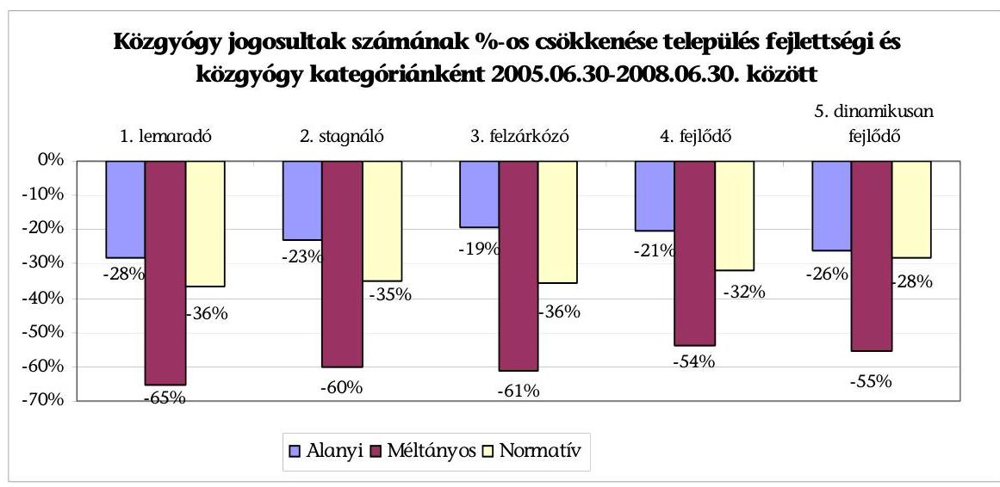

Az 1. sz. grafikon a 2005 és 2008 közötti 10000 lakosra jutó igazolvány szám csökkenést mutatja. Látható, hogy a méltányos és a normatív kategóriában a gazdagabb települések esetén kisebb mértékben esett az igazolvány szám, mint a lemaradó településeken. Azaz a dinamikusan fejlődő és lemaradó települések lakosai közötti hozzáférési különbség emelkedett, a lemaradó településeken a rendszer átalakítása tovább rontotta a szociális rászorultság elvének érvényesülését.

---

A közgyógyellátás gyógyszer szolgáltatásában 2006 júliusától paradigmaváltás következett be. 2006 júliusáig 705 felírható, ún. listán szereplő gyógyszerből mennyiségi és pénzügyi korlát nélkül - a kezelőorvos rendelésének megfelelően - válthattak ki készítményt az igazolvánnyal rendelkezők. A váltás nyomán a korábbi térítésmentességet egyénre szabott, korlátozott összegú hozzájárulás, ún. gyógyszerkeret váltotta fel. A maximálisan adható támogatás összegét, krónikus betegségre havi 12 ezer Ftot és eseti megbetegedésre évi 6 ezer Ft-ot (azaz évente legfeljebb 150 ezer forintot), 2006. július 1-jétől határozták meg azzal a kitétellel, hogy az Országgyűlés évente a költségvetési törvényben módosíthatja. A gyógyszerkeret pénzügyi és mennyiségi korlátot is jelent, és a közgyógyellátás eltérő jogcímein más-más ${ }^{16}$ gyógyító ellátási költséget kell igazolni ahhoz, hogy az igénylő közgyógyellátási igazolványhoz jusson. Alanyi jogcímen 0 Ft-os gyógyszerköltséggel is lehet igazolványhoz jutni, de ekkor nem rendelkezik az ellátott havi gyógyszerkerettel.

A régi közgyógyellátási rendszerben költségvetési támogatási rész (az elvi térítési díj) megközelítőleg fejenként havi 3,5 ezer Ft volt, amely az új rendszerben megduplázódott (7 ezer Ft-ra). 2007. január 1-jétől a havi 12 ezer Ft-os keretet a támogatáskiáramlás szűkítése céljából - a Sztv. módosításával - háziorvosi és szakorvosi 6-6 ezer Ft-os ${ }^{17}$ keretre osztotta a jogalkotó. A korlátozó intézkedés hatására 2007 I. félévében a havi keret 6 ezer Ft-ra, majd II. félévében havi 5 ezer Ft-ra mérséklődött az egy főre jutó átlagos havi keretösszeg, amely 2008-ban is ezen a szinten maradt.

A megállapított keretnek a jogszabály ${ }^{18}$ szerint az igénylő tartós betegségeinek kezeléséhez szükséges rendszeres gyógyszerszükségletén kell alapulnia, ezért az igénylő lapon megnevezik (BNO) a betegségeket. Az igazoláson szerepelhetnek nem tartós betegséghez szükséges készítmények is, amelyek ára szintén szerepet játszik a gyógyszerkeret kialakításában. A MEP-eknek kiadott eljárásrend ${ }^{19}$ értelmében a gyógyító ellátások elismert költségeinek meghatározása során a szakhatóság nem bírálja felül a háziorvos gyógyszerelését, azaz nem gyakorol szakmai kontrollt, ezért tevékenysége nem ad szakmai hozzáadott értéket a beteg terápiájának megállapításához és az Sztv. céljainak megvalósításához.

A MEP a gyógyító ellátások elismert költségeinek meghatározása során nem rendszerszerüen, folyamatba építetten ellenőrzi az igénylő betegsé-

[^0]
[^0]:    ${ }^{16}$ Alanyi jogcímen elegendő 1000 Ft-ot igazolni, normatív esetében 2850 Ft-ot, méltányos ellátásnál a helyi szabályozástól függően $0-7125 \mathrm{Ft}$ között mozog a jogszabályi határ.
    ${ }^{17}$ Az OEP Gyógyszerügyi Főosztálya által készített jelentés szerint a szakmai érvek, az egészségügyi rászorultság nem ilyen arányú megbontást támasztana alá. „Az alsó és a felső keret szétválasztása a kevésbé szükséges gyógyszerekre 4 ezer Ft-os limitet, az életfontosságú készítményekre 8 ezer Ft-os limitet javasol."
    ${ }^{18}$ A szociális igazgatásról és szociális ellátásokról szóló 1993. évi III. tv. 50. §.
    ${ }^{19}$ Eljárásrend a közgyógyellátottak gyógyszerkeretének megállapításáról, a szakhatósági állásfoglalás elkészítéséről és a közgyógyigazolvány kiadásáról - 2007. február 20. V.3. verzió.

---

geit és azok kezeléséhez szükséges gyógyszereket, hanem egyedileg, erőforrástól függően és esetlegesen.

A keretmegállapítás a háziorvosi igazoláson szereplő gyógyszerekből indul ki, de az eljárás több „értékcsökkentő, keretlevágási" mechanizmust alkalmaz, amelyek bonyolulttá és a beteg, valamint a háziorvos számára kiszámíthatatlanná teszik az eljárást, a leendő támogatást.

Az alábbi mozzanatok nehezítik a tisztánlátást:

- A közgyógyellátás „beárazó programja" a KÖZGYÓGY2005 program, és a gazdaságos gyógyszerrendelést segitő vényíró program nem azonos elveken múködik. Míg az utóbbit ismerik a háziorvosok, mert ott van a számítógépeiken, addig a KÖZGYÓGY2005 program nem közismert (OGYI gyógyszer rendelhetőségi kategória), mert csak a MEP gépein fut, a háziorvosokén nincs és számos pontját „kézivezérléssel", az ország különböző pontján különböző felfogás szerint, eltérően működtetik. Nincs egységesen, jogszabályban rögzítve a keretszámítás minden részlete. Pl. a háziorvosi és a szakorvosi 6+6 ezer Ft-ba tartozó gyógyszerek egy része „kézi" beárazású. Számos készítményt mind háziorvos, mind szakorvos rendelhet, de ezek támogatási kategóriába sorolása országosan nem egységes, ami egyes betegségek esetén a biztosító finanszírozási elveivel és a beteg érdekeivel ellentmondó eredményre vezet. A „keretlevágások" az igazán súlyos és drága betegséggel (vagy több egyidejúleg fennálló súlyos betegséggel) élő betegeket érintik hátrányosan. A rendszer előnyösebb az általában olcsó kezelésű betegségeknél. A keretlevágások következtében korlátozottan érvényesül a rendszer egészségügyi szempontú célzottsága.
- Nem azonos elvü a KÖZGYÓGY2005 és az általános gyógyszertámogatási programban a „legolcsóbb terápia" kiválasztása, mert a KÖZGYÓGY2005 a havi kúraköltség alapján, míg a gyógyszertámogatási program a napi terápiás költség és a referencia termék alapján jelöli ki a „legolcsóbb" készítményt, ezért vagy felül, vagy alul árazza be a beteg által szedett készítményeket.
- A közgyógyellátás terhére a 0\%-ban (azaz nem) támogatott termékkör (pl. vitaminok) a teljes ár erejéig vesz részt a gyógyszerkeret meghatározásában pedig a ,,a beteg számára nem hoz olyan egészségnyereséget, hogy a biztosító valódi támogatást nyújtson ezekhez a termékekhez. A források hatékony felhasználásának szükségszerüsége indokolttá teszi, hogy azokhoz a gyógyszerekhez, melyhez a biztosító nem ad egyetlen forint támogatást sem, ahhoz a szociális rendszer se segítsen hozzájutni."20 Az ÁSZ véleménye megegyezik az OEP álláspontjával. 2008. I. félévében a központi költségvetés 2,7 Mrd Ft támogatást nyújtott ezekhez a termékekhez közgyógy jogcímen. (Éves szinten a költségvetési támogatás $25 \%$-át). A $0 \%$-os termékek háziorvosi igazolása, azaz keretbe való beszámítása döntő lehet a jogosultság megszerzésében és nagyságának meghatározásában.

[^0]
[^0]:    ${ }^{20}$ A „keretes" közgyógyellátási rendszer tapasztalatainak kritikai értékelése, OEP Gyógyszerügyi Főo. 2008. 47. o.

---

Az egyéni gyógyszerkeretből keletkeznek maradványok, azaz a betegek a számukra elismert gyógyszerköltségnél kevesebb értékű gyógyszert váltanak ki. A 2008. I. félévében lejárt közel 208 ezer igazolványon mintegy 5,3 Mrd Ft (33\%) megmaradt. Ez azt bizonyítja, hogy a gyógyszerkeretben megállapított és a kiváltott gyógyszermennyiség között jelentős eltérés van. Egyes készítmények esetében a keretmegállapítás során számított gyógyszermennyiség 2-3 szorosa a kiváltott mennyiségnek.

A támogatásba beszámítható gyógyászati segédeszközök számát 30\%-kal szükítették, de továbbra is a jogszabályban meghatározott listáról rendelhetőek. Az Sztv. módosításának hatására a 2005. évi 11,4 Mrd Ftról 2008-ra 6,6 Mrd Ft-ra csökkent a központi költségvetési támogatás. A fogyasztói ár és a közfinanszírozás alapjául elfogadott ár „közgyógyár" közötti különbséget a betegnek kell térítenie, mivel csak a termék közfinanszírozás alapjául elfogadott árának 100\%-áig lehet térítésmentességet nyújtani. 2005-2006. I. félévben (a régi rendszerben) a közgyógyellátás a teljes fogyasztói árat térítette meg, amely meghaladta a közfinanszírozás alapjául elfogadott árat.

A gyógyászati segédeszköz és gyógyfürdő ellátásokban fenti intézkedéssel megszünt az ingyenesség. A betegek térítési díjként a 2005. évi teljes térítésmentességet követően 2006. II. félévében 104,3 M Ft-ot, majd 2007-ben öszszesen 140,8 M Ft-ot fizettek ki.

2007 márciusára alakították ki azt a kormány-, illetve tárcaszintű szabályozást, amely harmonizált a gyógyszer-gazdaságossági törvénnyel. Az árlicit során alkalmazott szabályozás nem ösztönöz árversenyre. A módszer a szállítók valódi árversenyét korlátozza úgy, hogy a forgalmazói árajánlat nyilvánosságra hozatala utáni legális igazodási lehetőséget teremt.

A termékek kihordási idökorláton belüli újra-felírását nem ellenőrzi az OEP vényelszámolásokra alkalmazott (BÉVER) rendszere. A BÉVER rendszert felkészítették erre a feladatra, azonban nem vették használatba ezt a funkciót. Finanszírozási kockázatot jelent, hogy a közgyógyellátásban több fél - a gyártó, a forgalmazó, a páciens - egyaránt érdekelt az eszközök elöírtnál gyakoribb cseréjében. Az eszközök befogadási rendszere a minél olcsóbb termékek támogatásba fogadására ösztönöz. A kihordási idők figyelemmel kísérésének hiányában a finanszírozó nehezen képes megítélni az olcsóbb - gyakran kevésbé tartós - eszközök alkalmasságát.

A rövidebb élettartamú, jellemzően egyszer használatos eszközök (kötszerek, inkontinencia eszközök stb.) betegenkénti felhasználásait célvizsgálatokkal, korlátozott ellenőri kapacitásokkal ellenőrzi az OEP, illetve a MEP-ek.

Összességében a közgyógyellátás rendszere az átalakítás után célzottabbá vált az egyénre szabott gyógyszerkeret bevezetésével, de eltérőek a hozzájutás feltételei és a rászorultsági elv is eltérően érvényesül. Az egyes jogcímeken eltérő gyógyító ellátás költséget kell igazolni; a település gazdagsága befolyásolja a méltányos közgyógyigazolványhoz való hozzáférést; az azonos gyógyszeres terápia nem feltétlenül vezet azonos gyógyszerkerethez.

---

Ezért a rászorultsági elv nem érvényesül egyöntetűen. A résztvevők számára a gyógyszerkeret megállapítása és a kártyához jutás feltételei nem átláthatóak.

Az átalakítás céljai csak részben teljesültek. Bővült a beszerezhető gyógyszerek köre, csak az egyénre szabott gyógyszer szükséglet támogatott, az egyéni gyógyszerkeret bevezetésével célzottabbá vált, megvalósult az egyéni gyógyszerkeret nyilvántartása és a jogosultság folyamatos ellenőrzése. Ugyanakkor nem valósul meg a betegek gyógyszeres terápiájának betegség alapú biztosítói kontrollja. A rászorultsági elv a kitűzött célokkal ellentétben kevésbé érvényesül, így nem valósult meg a rendszer igazságosabbá tétele.

A jelenlegi rendszerben múködő fékek mellett az E. Alap és a központi költségvetés terheit a tervezett keretek között tartották. Az önkormányzatok számára az új rendszerben kevésbé tervezhető a méltányossági közgyógyigazolvány után befizetendő összeg.

A sokszereplős adminisztráció működési költsége tízszerese az OEP működési költségének.

Az új közgyógyellátási rendszer bonyolultan, drágán, hosszú átfutási idővel, a szociális rászorultság nem egységes kritériumok alapján történő figyelembevételével, a felhasználás alacsony szintű ellenőrzése mellett átláthatatlanul múködik.

A helyszíni ellenőrzés megállapításainak hasznosítása mellett javasoljuk:

# a Kormánynak 

1. A végrehajtási tapasztalatok ismeretében tekintse át, hogy miként lehet a tényleges rászorultsághoz igazítani az ellátás mértékét és egységesebbé tenni a jogosultság szempontrendszerét.
2. Kezdeményezze az adatvédelmi és a szociális törvényi szabályozás felülvizsgálatát annak érdekében, hogy az eljárás összehangoltabb, egyszerűbb és átláthatóbb legyen, valamint a múködési költségek csökkenjenek.
3. Vizsgálja felül és módosítsa az eljárás rendet annak érdekében, hogy az egészségbiztosító által ismert tényadatok és a gyógyszertámogatási elv együttes figyelembe vétele alapján határozza meg a közgyógyellátáshoz jutás feltételeit.

## az egészségügyi miniszternek

1. Vizsgálja meg, hogy - az indikációhoz kötöttek kivételével -, megszüntethető-e a nulla százalékban támogatott gyógyszerek közgyógyellátás keretében történő rendelhetősége.
2. Tegye hatékonyabbá a közgyógyellátottak gyógyszer, gyógyászati segédeszköz rendelés biztosító általi szakmai ellenőrzését.

---

# II. RÉSZLETES MEGÁLLAPÍTÁSOK 

## 1. A KÖZGYÓGYELLÁTÁs SZABÁLYOZÁSA ÉS SZERVEZETE

### 1.1. A közgyógyellátási rendszer átalakítása

A közgyógyellátás szabályozásában az Sztv. a jogosultság három típusát, alanyi, normatív ${ }^{21}$ és méltányos jogosultságot állapít meg szociális és egészségügyi rászorultsági kritériumok alapján. Kettős feltételt (a jövedelem és a gyógyító ellátás költsége) a normatív és a méltányos kategóriáknál határoz meg a szabályozás. Az alanyi jogosultaknál a szociális rászorultság nem alapul közvetlen jövedelem vizsgálaton, hanem más szociális vagy egészségügyi (pl. I.-II. csop. rokkant) ellátásokhoz kapcsolódik. Az évtizedek óta változatlan rendszer sok problémát hordozott, visszaélésekre, az ellátások jogosulatlan igénybevételére adott lehetőséget, reformja már 2002-től napirenden volt. Felülvizsgálatával az átalakítás lehetséges módjával a szociális, az egészségügyi, a pénzügyi tárcák és az OEP együtt foglalkozott.

A jogszabály közgyógyellátásra vonatkozó tartalmának módosítása 2006. július 1-jei hatállyal lépett életbe. Az előkészítő munka során 12 előterjesztés született a közgyógyellátás átalakításáról 2004 márciusától a tényleges 2006 júliusi bevezetésig.

Az átalakítást szükségessé tette, hogy a szociális tárca szerint nem esett egybe az egészségügyi és szociális rászorultság, a rendelhető gyógyszerkört korszerűtlennek és szűknek ítélte meg. Nagyszámú érvénytelen igazolvány volt forgalomban, amelyeknél a jogosultság nem állt fenn, elégtelen volt az ellenőrzés, valamint, a központi költségvetés, az önkormányzat és a Tb. támogatás kiáramlása növekvő és tervezhetetlen volt.

A közgyógyellátási rendszer átalakításának kormány- előterjesztés szerinti céljai voltak: a jogosultak által beszerezhető gyógyszerek körének bővítése; ezzel egyidejűleg annak biztosítása, hogy a közgyógyellátott csak a saját szükségletének megfelelő mennyiségű gyógyszert tudja beszerezni; a szociális ellátásokról szóló törvény módosításával a jogosultsági rendszer igazságosabbá tétele; a rászorultsági elv fokozottabb érvényesülése; a támogatás célzottabbá válása; az OEP és a gyógyszertárak közötti on-line kapcsolaton alapuló, a közgyógyellátottak egyéni gyógyszerkeretének nyilvántartására és ellenőrzésére alkalmas rendszer létrehozása; a rendszer fokozottabb ellenőrzése; a visszaélések szankcionálása.

A jogosultsági kategóriákon belül a reform során többször is felmerült az alanyi jogosultak rászorultságának egyedi vizsgálatának szükségessége, esetükben a szociális rászorultság nem képezi vizsgálat tárgyát.

[^0]
[^0]:    ${ }^{21}$ A normatív jogcímet az egyes szociális ellátásokkal kapcsolatos törvények módosításáról szóló 1996. évi XXII. tv. vezette be.

---

A szolgáltatások körében a gyógyszerek rendelhetősége egy több mint 700 készítményből álló listáról korlátlan volt, ami magában hordozta a pazarlás lehetőségét, ezért a javaslatok gyógyszerkeret meghatározását tartották jónak. A javaslatokat hatásszámításokkal alapozták meg.

A jogszabályok - 1993. évi III. tv., a 28/1993. (II. 17.) Korm. rendelet, illetve a gyógyszerkörről rendelkező 10/1995. (II. 24.) NM rendelet - módosításán, hatályon kívül helyezésén túl további szervezési, hatásköri intézkedésekre, valamint a szükséges technikai, informatikai háttér megteremtésére volt szükség.

Az előmunkálatokkal párhuzamosan a 2095/2005. (V. 27.) Korm. határozat a közgyógyellátás átalakításának koncepciójáról a reform szempontjait határozta meg. Ebben a határozat a jogosultsági feltételek változatlanul hagyása mellet döntött, valamint havi gyógyszerkeret bevezetését határozta el, és az igazolvány cserét a jogosultság egyidejú felülvizsgálatával rendelte el. Az intézkedések harmonizáltak a Kormány 100 lépés programján belül a 21 lépés az egészségügy megújításáért programmal.

A változás lényegét az jelentette, hogy a közgyógyellátás keretében a korábbi térítésmentességet felváltotta a szociálisan rászorult személyeknek egészségi állapotuk megőrzéséhez, helyreállításához kapcsolódó kiadásaik csökkentése érdekében biztosított hozzájárulás. Gyógyszereknél a gyógyszerkeret erejéig, gyógyászati segédeszközöknél pedig a közfinanszírozás alapjául elfogadott ár erejéig. A keret az egyéni, rendszeres gyógyszerszükséglethez igazodó 12000 Ftos és az eseti, akut megbetegedés kiadásait fedező 6000 Ft-os részből áll. A keret meghatározás szabályait részletesen tartalmazza a törvény módosítása. A 12000 Ft-os keretet 2007 januárjától két részre bontja a szabályozás.

Az érvényben lévő szabályozás szerint a közgyógyellátás igényléséhez érvényes TAJ kártyával kell rendelkezni. A biztosítotti jogviszonynak járulékfizetésre kell épülnie, ami korábban nem volt kritériuma az egészségügyi, a pénzbeli és a természetbeni ellátásoknak, így a közgyógyellátásnak sem. A közgyógyellátási reform előkészítése és végrehajtása során az ellenőrzések a TAJ érvényességére terjedtek ki.
2008. január 1-jét követően a jogviszony hiánya esetén az OEP köteles átadni a biztosítási jogviszonnyal nem rendelkezők adatait az állami adóhatóságnak, amely vizsgálatot kezdeményezhet és az elmaradt egészségügyi-szolgáltatási járulékot - a mulasztás szankcióival együtt - az elévülési idő figyelembevételével behajtja.

A 151/2008. (V. 30.) Korm. rendelet az egyes egészségbiztosítási tárgyú kormányrendeletek módosításáról az Eb. tv. szerint finanszírozási, illetve ártámogatási szerződéssel rendelkező egészségügyi szolgáltató kötelezettségévé teszi, hogy az OEP nyilvántartásában ellenőrizze a jogosultságot. Ennek elmulasztását szankcionálja, illetve díjazza (ez minden típusú ellátásnál követelmény).

# 1.2. A közgyógyellátás szervezete, eljárásrendje, erőforrásai 

A sokszereplős szervezet eljárásrendjében a törvény előírásaira támaszkodik.

---

2006. június 30-ig a közgyógyellátást biztosító igazolványról rendelkező Korm. rendelet ${ }^{22}$ alapján egyszerű eljárásban juthatott a beteg a jogosultságát igazoló okmányhoz. A régi típusú, keret nélküli igazolványok cseréjének határideje 2007. július 1-je volt.

A közgyógyellátási reformfolyamatban a 63/2006. (III. 27.) Korm. rendelet ${ }^{23}$ újra szabályozta a közgyógyellátás igénybevételéhez szükséges igazolvány kiváltásának rendjét. A bonyolult eljárásban - a vagyoni helyzetre és az egészségi állapotra vonatkozó adatok elhatárolásának kötelezettsége miatt - adatvédelmi szabályoknak is meg kell felelni.

Az adatvédelmi biztos egészségügyi miniszternek írt, ${ }^{24}$ 2006. július 11-én kelt ajánlása értelmében a jogosultságot megállapító jegyző nem ismerheti meg az érintett egészségügyi adatait, az egészségbiztosítási szerv pedig nem ismerheti meg vagyoni helyzetére vonatkozó adatait. Vagyis a személyes adatok védelméről szóló tv. ${ }^{25}$ alapelvének érvényesülését szem előtt tartva mindenki csak annyi adatot kezelhet, ami feladatai ellátásához feltétlenül szükséges.

Az ügymenethez rendelt határidők tovább bonyolítják az eljárást. Ez különösen a szakhatósági állásfoglalás elkészítésénél felmerülő hiánypótlások lehetőségére vonatkozik, ami nem számít bele az ügyintézési határidőbe, de az igénylő hozzájutását késlelteti. A szakhatósági állásfoglalás elkészítésének 15 napos határideje a reform első másfél évében nem tudták betartani a MEP-ekre háruló nagy tömegű munka miatt. Az időigényes, több lépcsős ügyintézés következményeként a betegek késve, a lejárat után kapták meg új típusú igazolványaikat. A MEP-ekhez 2006. július és 2007. december között 556918 kérelem érkezett.

Az egységes, OEP által kiadott eljárásrend rögzíti, hogy értékelni kell a Háziorvosi igazolásban szereplő adatokat. Az értékelést az OEP által készített saját fejlesztésű, MEP-ekkel on-line rendszerben működő számítógépes program segíti. A MEP rendelkezésére álló adatokból, háziorvosi jelentésekből ellenőrizhetők a beteg korábbi betegségei, az alkalmazott terápia, a szerepeltetett BNO, az alkalmazott hatóanyag. Amennyiben ennek megfelelő a háziorvosi igazolás, a program felajánlja az elsőként választandó legalacsonyabb napi terápiás költségű készítményt. Az eljárásrend aktuális 2007. február 20-tól érvényes V. 3 verziószámú változata nem követeli meg a fentiek szerinti értékelést, az a korábbi eljárásrendben szerepelt, holott lényegi kérdés és a folyamatba épített ellenőrzés eszköze. A gyakorlatban alkalmazzák a szakhatósági állásfoglalás készítői.

A vizsgált időszak elején a település képviselőtestületének döntése alapján jutottak méltányos igazolványhoz a jogosultak. Jelenleg a szakhatósági állásfoglalást követően a jegyző hozza meg a határozatot a jogosultság és a gyógyszer-

[^0]
[^0]:    ${ }^{22}$ 28/1993. (II. 17.) Korm. rendelet a közgyógyellátási igazolványról.
    ${ }^{23}$ 63/2006. (III. 27.) Korm. rendelet a pénzbeli, természetbeni szociális ellátások igénylésének és megállapításának, valamint folyósításának részletes szabályairól.
    ${ }^{24}$ Ügyiratszám: 1010/H/2006-2.
    ${ }^{25}$ 1992. évi LXIII. tv. a személyes adatok védelméről és a közérdekű adatok nyilvánosságáról.

---

keret megállapításáról vagy a jogosultság elutasításáról. Ez ellen 15 napon belül lehet fellebbezést benyújtani. A 2007-ben benyújtott 4045 db fellebbezésből mindössze 220 esetben változott a szakhatósági állásfoglalás, 3783 esetben pedig elutasításra került a kérelem (5. számú tanúsítvány). A szakhatósági állásfoglalás felülvizsgálatára OEP-nek 15 nap áll rendelkezésére.

A jegyzőhöz benyújtott fellebbezés a közigazgatási hivatal szervezetén belül elhelyezkedő szociális és gyámhivatalokon keresztül jut az OEP-be, a másodfokú határozatot az OEP bírálata után a közigazgatási hivatal hozza meg.

A fellebbezés elbírálásának az általános ügyintézési határidőre vonatkozó időbeli korlátja a Ket. 33. §-ának megfelelően 30 nap. Ennek betartása nem ellenőrzött, az önkormányzatok tájékoztatása szerint előfordulhatnak több hónapos átfutású döntések. Az OEP-nél lévő iratanyag nem teljes körű, így abból nem látható, hogy az ügyféli kezdeményezésre indult eljárásban hol mennyi időt tölt a fellebbezési ügyirat.

A XIII. kerületben pl. 2008 februárjában, 2007 augusztusában és 2007 decemberében kezdeményezett fellebbezésekre még nem született határozat 2008 augusztusáig.

A közgyógyellátásról megkérdezett válaszadó háziorvosok a kérdőív azon kérdésére, hogy a rendszer az átalakítás óta egyszerűbb-e 73\% nemmel, hogy cél-zottabb-e 54\% igennel, hogy igazságosabb-e 60\% nemmel válaszolt, 90\%-ának konfliktusai vannak a betegekkel, mert más, drágább, több gyógyszert igényelnének, mint amit orvosuk javasol. A betegek közgyógyellátással kapcsolatos lehetőségekről való tájékoztatását pedig a válaszadók 100\%-a tartja szükségesnek.

A szabályozás elemeit az igénylők nem ismerik nem értik, ezt igazolják az önkormányzatoknál folytatott interjúk, a háziorvosok kérdőívre adott válaszai.

Az ügymenet egyszerűsítésére OEP részéről eddig informatikai egyszerűsítések történtek a Közgyógy2005 programban. Ez nem hozott változást sem a szereplők számában, sem az eljárásrend egyszerűsítésében.

Az eljárásrend egyszerúsítésére a MEP-ek és az önkormányzatok közötti online kapcsolat megteremtésével, ${ }^{26}$ a gyógyszerkeret beárazásának háziorvosokhoz való delegálásával van lehetőség. ${ }^{27}$ A szakhatósági állásfoglalás elkészítése hozzáadott értéket nem, csupán óriási többlet feladatot jelent. Az OGYI gyógyszer forgalomba hozatali engedélyezés során meghatározott rendelhetőségi jelzései helyett a közgyógyellátás során a biztosítói támogatási kategóriák érvényesítésével, a jogorvoslatok számának csökkenését eredményezhetné.

[^0]
[^0]:    ${ }^{26}$ Ennek megteremtése a háttér feltételek biztosításán túl a továbbításra kerülő információk hitelesítésének problémáját is felveti.
    ${ }^{27}$ Az ÖEM 2008. november 20-i levelében úgy fogalmazott „a közgyógyellátási jogosultságot megállapító határozatot - az igazolvány kibocsátásával egyidőben - a MEP hozza meg, a jogosultság egészségügyi feltételeiről a háziorvos, míg a szociális rászorultságról a jegyző nyilatkozzon."

---

Egyszerűsítést az alanyi jogosultság két évre emelése jelentett azoknak, akik gyógyszerkeretük újbóli megállapítását nem kérték. További egyszerűsítése volt a szabályozásnak (EüM kezdeményezésére), hogy nincs szükség új szakhatósági állásfoglalásra, ha a terápia nem változott és az állásfoglalás 18 hónapnál nem régebbi.

A közgyógyellátás múködtetésének kiadásai a több szereplős folyamatban a MEP-eknél, az OEP-nél, a helyi önkormányzatoknál, a háziorvosnál merülnek fel.

A szakhatósági állásfoglalás elkészítése a MEP-eknél jelentős többlet humánerőforrás biztosítását tette szükségessé. Az adminisztráció létszám igénye országosan 2004-ben 38,6 fő volt, ami 2006-ban 230 fő, 2007-ben pedig már 337,3 fő volt, vagyis 8,7 -szeresére kellett növelni a munkaerőt a megnövekedett feladatok arányában. Ennek határozatlan, határozott idejű megoszlása 94\% -$6 \%$-ról $75 \%-25 \%$-ra változott (3. sz. tanúsítvány).

A feladatellátáshoz szükséges létszám fentieknek megfelelő emelését úgy valósították meg, hogy közben a szervezet létszáma 2004 és 2007 között országosan 828 fővel csökkent a kötelező leépítés miatt. A feladathoz szükséges humán erőforrást az ellenőri kapacitás rovására történő átcsoportosítás adta, amit az ÁSZ 2006. évi zárszámadási jelentése is megállapított. A megnövekedett feladatokhoz a MEP-ek számára nem volt biztosított a létszám tényleges bővítése. A határozott idejű alkalmazottak átmeneti segítséget jelentenek, foglalkoztatásukhoz a kiemelt feladat előirányzatban további forrásokat biztosított a Kormány.

A szakellenőri kapacitás átcsoportosítása miatt a biztosítói kontroll gyakorlása, mint alapfeladat nem teljesült - a szolgáltatók ellenőrzése csökkent, illetve elmaradt (pl. FPEP 2006-ban mindössze 9 ellenőrzést végzett a szolgáltatóknál).

A közgyógyellátással kapcsolatos feladatellátás bér- és járulék kiadásai 11,6szorosára, a dologi kiadások 6,6-szorosára emelkedtek. Az ellátási kiadásokból fedezett postaköltség 34,7 M Ft-ról 174,5 M Ft-ra, azaz ötszörösére emelkedett. A kiemelt feladatok előirányzatából a változások informatikai követésére 271,7 M Ft-os forrást biztosítottak, ezen felül 810,9 M Ft volt még a költségnövekedés fedezete ebből a forrásból. 2007-ben az OEP és a MEP-ek, a közgyógyellátáshoz kapcsolódó kiadások fedezetére 2170,78 M Ft-tal költött többet, mint 2005-ben. (3. sz. tanúsítvány).

A 2007. év végi kártyaszám alapján az OEP és a MEP-ek egy kártyára eső éves múködési kiadása 6196 Ft .

A háziorvosok megkérdezése alapján ( 31 praxis a praxisok $0,4 \%$-a), átlagosan fél órát töltenek egy-egy közgyógyellátást igénylő háziorvosi igazolásának elkészítésével. Ezt alapul véve a háziorvosi praxisok finanszírozására kifizetett tényadatokra és praxis számra alapozva az egy háziorvosi órára eső finanszírozás összege 5541 Ft , ennek fél órára jutó része 2770 Ft. 2007-ben 62262 TAJ számnak volt eseti kerete (388 545-62 262=326 283), ami háziorvosi igazolás nélküli, a további igazolások költsége ( 326 283x2770 Ft) 904 M Ft. Tehát az OEP, a MEP-ek és háziorvosok közgyógyigazolvány kiállítására fordított együttes kiadása 2007-ben 3,3 Mrd Ft (2,4 Mrd+0,9 Mrd).

---

Vizsgálati kritérium volt, hogy a közgyógyellátás szervezetének múködtetési költsége arányaiban ne legyen magasabb, mint az E. Alap múködési és ellátási kiadásának aránya, amely 2007-ben 1,4\% volt (23,3 Mrd Ft/1 648,6 Mrd Ft). A közgyógyellátás múködtetésének OEP-et, MEP-eket, háziorvosokat terhelő költsége, az önkormányzatok, és a központi költségvetés hozzájárulásához viszonyítva (3,3 Mrd Ft/22 739,6 Mrd Ft) 14,5\%, (mely nem tartalmazza az önkormányzatok ügyintézési költségeit). Azaz a közgyógyellátásra fordított múködési kiadások aránya jóval magasabb, mint az E. Alap múködési és ellátási kiadásának aránya.

Az önkormányzatok közgyógyellátás múködtetésére fordított kiadásairól szolgáltatott adatok csak részben értékelhetők. A kis létszámú hivatalokban tört ügyintézői létszámra vetítve fajlagosan magas ráfordításokkal lehet számolni. Előfordult több százezer forintos és kétezer forintos ügyintézési költség is egy igényre vetítve. A vizsgálat az OEP tanulmányában ${ }^{28}$ az önkormányzatok adminisztrációjára becsült, egy igényre jutó 8 E Ft-os költséggel számolva, a 2007. évi 388545 db igazolvány adminisztrációs költsége további 3,1 Mrd Ft.

A helyszínen felkeresett 4 budapesti önkormányzat adatszolgáltatása is szélsőséges költség adatokat mutat, pl. a VIII. kerület egy igényre jutó költsége meghaladja a 23 E Ft-ot, a XXI. kerületben 18 E Ft, a XIII. kerületben 4,8 E Ft, a IX. kerületben 3,8 E Ft az egy igényre kimutatható költség.

Az ellenőrzés számításai szerint a 2007. évi 22 739,6 M Ft költségvetési és önkormányzati támogatás egy kártyára jutó összege ( 388545 kártya) mintegy 58530 Ft , amit 6,4 Mrd Ft adminisztrációs költséggel osztanak szét a sokszereplős eljárásban. Ennek egy kártyára vetített összege 16471 Ft , vagyis a kvázi térítési díj 28,1\%-a. Amennyiben a gyógyszerkassza közgyógyellátásra jutó kiáramlását is figyelembe vesszük, akkor a múködtetés aránya az ellátás 52 495,7 M Ft-jához viszonyítva 12,2\%. Tehát bármelyik megközelítésben vizsgáljuk a múködés ellátás arányát, a vizsgálati kritériumban meghatározott mértéket jóval meghaladja.

# 1.3. A közgyógyellátás kiadásai 

A közgyógyellátás kiadása a vizsgált időszakban az alábbiak szerint alakult. (Az adatokat részletesen az 1/a, 1/b és 1/c táblázat tartalmazza.)

[^0]
[^0]:    ${ }^{28}$ A keretes közgyógyellátási rendszer tapasztalatainak kritikai értékelése, OEP Gyógyszerügyi Főosztály 2008.

---

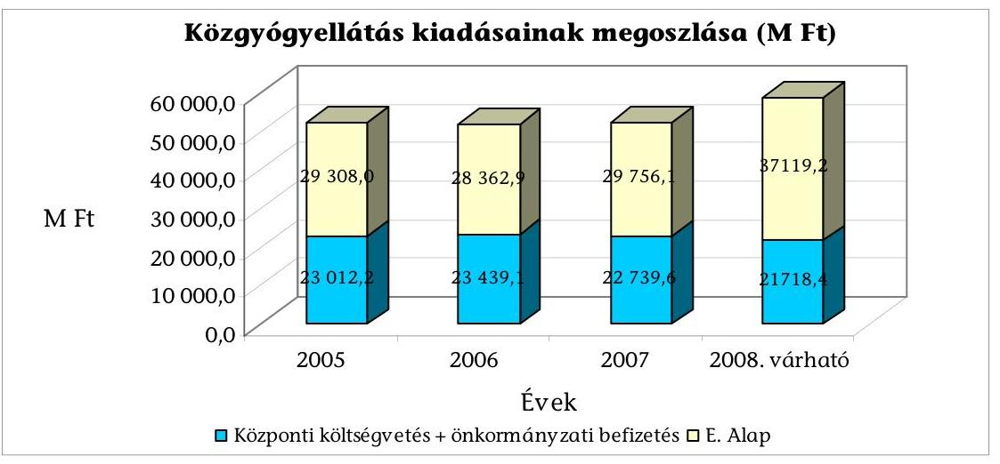

Forrás: OEP, Költségvetési és Gazdálkodási Főosztály Statisztikai Osztály
A közgyógyellátásra fordított kiadások 2007-ig nem nőttek. A 2008. I. félévi adatok alapján a közgyógyellátás jogcímen közgyógyjogosultak által kiváltott gyógyító ellátásokon belül az E. Alapra jutó kiadási hányad várhatóan növekedni fog.

A közgyógyellátási rendszer átalakítására, valamint a többletfeladatok ellátásához határozott időtartamra felvett létszám személyi juttatásaira, dologi kiadásokra a kapcsolódó kormányhatározatok és törvény ${ }^{29}$ alapján a vizsgált időszakban összesen 1065,8 M Ft-ot biztosítottak, ebből 507,2 M Ft-ot személyi juttatásokra és járulékokra, dologi kiadásokra 286,9 M Ft-ot, fejlesztésre 271,7 M Ft-ot, amelyet az 2. számú táblázat mutat be.

[^0]
[^0]:    29 A közgyógyellátás átalakításának koncepciójáról szóló 2095/2005. (V. 27.) Korm. határozat, A 2005. évi központi költségvetés általános tartalékának felhasználásáról szóló 2167/2005. (VIII. 2.) Korm. határozat, A Magyar Köztársaság 2006. évi költségvetéséről szóló 2005. évi CLIII. törvény, Az egészségügyi reform egészségbiztosítási ágazatot érintő egyes feladatai 2007. II. félévi finanszírozásáról szóló 2131/2007. (VII. 12.) Korm. határozat, A 2008. évi központi költségvetés általános tartalékának előirányzatából történő felhasználásról szóló 2046/2008. (IV. 15.) Korm. határozat.

---

2. számú táblázat

M Ft

| A közgyógyellátási rendszer átalakítására biztosított források |  |  |  |  |  |  |  |
| :--: | :--: | :--: | :--: | :--: | :--: | :--: | :--: |
| Évek | Korm. határozat. törvény | Összeg | Ebböl |  | Személyi kiad.+járulék | Dologi kiad. | Fejlesztési kiad. |
| 2005 | 2167/2005. (VIII. 2.)   Korm. hat. | 95,0 | adott évben | 9,4 | 3,2 |  | 6,2 |
|  |  |  | következő évben | 85,0 | 3,0 | 60,0 | 22,0 |
| 2006 | 2005. évi CLIII. törvény | 688,8 | adott évben | 490,7 | 258,0 | 116,2 | 116,5 |
|  |  |  | következő évben | 198,1 |  | 71,0 | 127,0 |
| 2007 | 2131/2007. (VII. 12.)   Korm. hat. | 133,2 | adott évben | 110,4 | 91,8 | 18,6 |  |
|  |  |  | következő évben | 22,8 |  |  |  |
| 2008 | 2046/2008. (IV. 15.)   Korm. hat. | 149,5 | adott évben | 149,5 | 128,6 | 20,9 |  |

Az E. Alap részére közgyógyellátás megtérítésére tervezett és felhasznált központi költségvetési hozzájárulások előirányzatai (önkormányzati befizetés nélkül) a korábbi évek növekedése után 2005-2008 között kis mértékben ingadoztak. A 2007-ben tervezett 21000 M Ft-tal szemben 2008-ban 20800 M Ft -ot terveztek. Az előirányzatok tervezett és ténylegesen felhasznált összegeit a 3. számú grafikon mutatja be.
3. számú grafikon

A közgyógyellátás előirányzatának tervezett és ténylegesen felhasznált összegei
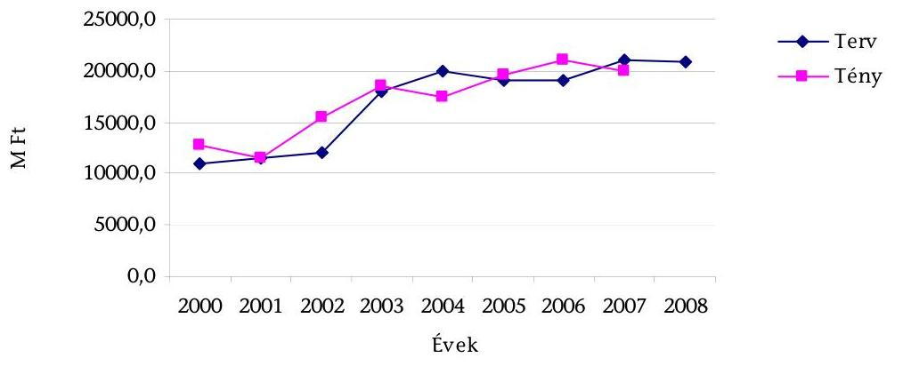

Forrás: Éves költségvetési és zárszámadási törvények
A központi költségvetés kiadását a betegtérítés kompenzálására a vizsgált időszakban szinten tartották. Alulteljesítést a 2007. év (95\%), túlteljesítést a 2005., 2006. év ( $104 \%$, illetve $111 \%$ ) mutat.

---

A közgyógyellátás központi költségvetési oldalról történő kiadásainak tervezése az SZMM ${ }^{30}$ fejezetnél történik, amelyet a PM az E. Alap finanszírozási terve alapján havi megtérítésekre - az előirányzat 1/12-ére - szétosztva, havonta figyel a tényleges kiadások alapján a várható kiadásokat korrigálja, illetve utal a Magyar Államkincstáron keresztül az E. Alap részére.

A zárszámadási törvények keretében az Országgyűlés évente elrendeli, hogy a társadalombiztosítás pénzügyi alapjainak közremúködésével a központi költségvetés terhére finanszírozott ellátások megtérítésének és kiadásainak különbözetét december 31-éig rendezzék. Ennek alapján a központi költségvetés 2005-ben 52,0 M Ft-ot, 2006-ban 101,1 M Ft-ot, 2008-ban 181,3 M Ft-ot utalt közgyógyellátási jogcímen az E. Alap számára. Kivételt a 2007. év képez, ekkor az E. Alap utalt a központi költségvetésnek 432,1 M Ft-ot. A központi költségvetés az E. Alapnak közgyógyellátás jogcímen a vizsgált időszakban 19,6-21,119,9 Mrd Ft-ot térített meg. Kis mértékű csökkenést - közel 6\% - a 2007. évi megtérítés mutat.

Az önkormányzatok hozzájárulása - az általuk méltányossági jogcímen megállapított közgyógyellátásra - a vizsgált időszakban csökkenő tendenciát mutat, 3,3-2,8-2,6 Mrd Ft-ra teljesült (2008. I. félév 1,0 Mrd Ft). Ennek egyik oka, hogy a méltányossági jogcímen kiadott igazolványok száma 50\%-kal csökkent, mert az önkormányzatok - az Sztv. 2006. július 1-jétől történt módosítása következtében - a befizetés átalány jellege megszűnt, a megállapított gyógyszerkeret (egyéni+eseti) után, annak 30\%-át kell befizetni. A csökkenés további oka, hogy a közgyógyigazolvány kiadásának 2006. július 1-jétől nem feltétele az önkormányzati befizetés igazolása, ami alapot szolgáltat arra, hogy egyes önkormányzatok nem, vagy később teljesítik a befizetéseiket.

Az önkormányzati megtérítés összege a méltányossági jogcímen kibocsátott közgyógyigazolványok után a vizsgált időszakban összességében csökkent, egy főre vetítve azonban nőtt. 2007-ben a 86446 db érvényes méltányossági igazolvány után 2634,3 M Ft-ot fizettek be, így az egy igazolványra jutó befizetés 30473 Ft volt. Az öregségi nyugdíj legkisebb összegének 75\%-a ebben az évben $20347 \mathrm{Ft},{ }^{31}$ azaz igazolványonként több mint 10000 Ft-tal fizettek többet az önkormányzatok, mint a korábbi szabályozás szerint, amelyet a 3. számú táblázat szemléltet.
3. számú táblázat

M Ft

| Az önkormányzati megtérítés adatai |  |  |  |
| :-- | :--: | :--: | :--: |
| Megnevezés | $\mathbf{2 0 0 5}$ | $\mathbf{2 0 0 7}$ | $\mathbf{2 0 0 8 .}$ I. félév |
| Önkormányzati befizetés (M Ft) | 3277,0 | 2634,3 | 1005,6 |
| Közgyógyigazolvány méltányossági jogcímen   (db) | 174504 | 86446 | 36914 |
| Egy igazolványra jutó önkormányzati befizetés   (Ft) | 18778,9 | 30473 | 27242 |

Forrás: OEP, Költségvetési és Gazdálkodási Főosztály Statisztikai Osztály

[^0]
[^0]:    ${ }^{30}$ 2005-ben ICSSZEM.
    ${ }^{31}$ 2007. március (a nyugdíjminimum emelése után).

---

A 70 db visszaküldött önkormányzati kérdőív méltányossági közgyógyellátás önkormányzati befizetésével (tervezés, felhasználás) kapcsolatos válaszai alapján a többség (44 önkormányzat) 100\% alatt teljesítette a méltányossági közgyógyellátásra tervezett előirányzatot, 9 önkormányzat 100\%-ban. A tervezett előirányzatot 4 önkormányzat egyáltalán nem használta fel, további 4 önkormányzat pedig felülteljesítette azt. A helyszíni ellenőrzésre kijelölt 5 fővárosi önkormányzat 2006. és 2007. évi előirányzatai is alulteljesültek. Az alulteljesítések oka, hogy a 2006. július 1-jétől érvényes szabályozás életbe lépésével öszszefüggő többletfeladatok eredményeként a MEP-ek szakhatósági állásfoglalása több hónapot késett, így a jogosultság megállapítása és a térítés átutalása a következő évre húzódott át, azaz a 2006 júliusától indult ügyekben 2007. I. félévében jelentkeztek a befizetések.

A települések 2005-2008 között természetbeni és pénzbeli szociális feladataik ellátására 60,7-59,8-62,3-67,6 Mrd Ft normatív hozzájárulásban részesültek a lakosságszám alapján. Ez az összeg a településeket szociális jellemzőkből képzett mutatószám szerint differenciáltan illeti meg. ${ }^{32}$ Az önkormányzatok ebből a forrásból finanszírozzák szociális feladataikat.

A központi költségvetésből pénzbeli ellátásokra kapott támogatás, a pénzbeli ellátásokra fordítva központi és saját forrás összege, valamint az ebből a közgyógyellátáshoz kapcsolódó $30 \%$-os önkormányzati önrészesedés befizetésére irányuló kérdésekre adott válaszok alapján a 70 önkormányzat többsége (42) a központi költségvetésből kapott támogatás 100-200\%-át használta fel, azaz a központi forrást saját forrásból kiegészítették. 12 önkormányzat 100\% alatt, 12 önkormányzat $200 \%$ fölött használta fel a támogatást, 4 válasz nem értékelhető. A közgyógyellátáshoz kapcsolódó $30 \%$-os befizetésre az önkormányzatok többsége (45) a pénzbeli ellátásokból kevesebb, mint 10\%-ot fordított, 17 önkormányzat pedig egyáltalán nem, 3 önkormányzat 10\% fölött, 4 nem értékelhető.

A közgyógy kiadások szerkezetének belső arányai átrendeződtek. A gyógyszerek aránya az összes kiadás tekintetében a 2005. évi 70\%-ról 2007-re 82\%-ra nőtt, eközben a gyógyászati segédeszköz és gyógyfürdő szolgáltatások kiadásai közel felére csökkentek.

A közgyógyellátásra az E. Alapból fordított Tb. támogatás kis mértékben (1,7\%kal) növekedett, ezen belül a gyógyszer támogatása a 2005. évi 60\%-ról 2007-re 77\%-ra nőtt, 2008. I. félév végére tovább nőtt $82 \%$-ra, míg a gyógyászati segédeszközök tekintetében csökkent, a 2005. évi 39\%-ról 2007-re 22\%-ra, 2008. I. félév végére $18 \%$-ra, a gyógyfürdő aránya pedig változatlan maradt ( $1 /$ c. táblázat: Gyógyszer, gyógyászati segédeszköz és gyógyfürdő támogatása 20052007, E. Alap).

A közgyógyellátás kiadásainak ellátási típusokon belüli összege és aránya a vizsgált időszakban a gyógyszerek felé tolódott el. A közgyógyellátásra fordított gyógyszertámogatás összege 2007-ben 37,3\%-kal nőtt az előző évhez képest

[^0]
[^0]:    ${ }^{32}$ 2005-ben ez az összeg min. 3700, max. 17050 Ft/lakos, 2008-ban min. 4000, max. $20000 \mathrm{Ft} /$ lakos között alakult.

---

(2006/16745,9 E Ft, 2007/22992,5 E Ft). A Tb. támogatás növekedésével párhuzamosan a kiváltott vények száma ${ }^{33}$ 2006-ról 2007-re (23 623 E db, 20 286,2 E db) $14 \%$-os csökkenést mutat.

A gyógyászati segédeszköz támogatás csökkenését az időközi szabályozásváltozás indokolja. A 2006. évi 11 284,7 M Ft-ról 2007-re 6534,1 M Ft-ra 42\%-kal csökkent.

A gyógyfürdő kiadás 2006-ról 2007-re 30,9\%-kal csökkent, ami 2008. I. félévében további csökkenést mutat. A 23/2007. (V. 18.) EüM rendelet ${ }^{34}$ fix összegben, illetve kezelés-fajtánként százalékos mértékben állapította meg a támogatást. A társadalombiztosítási támogatás mértéke minden gyógyfürdő kategóriánál (gyógyvizes gyógymedence) 50\%-ra, az orvosi gyógymasszázs esetében $70 \%$-ra csökkent.

A központi költségvetésből és az önkormányzatok által együttesen befizetett összeg (kvázi betegtérítési díj) 2005-ről 2006-ra a 22911,0 M Ft-ról 4\%-kal, 23871,0 M Ft-ra nőtt, majd 2006-ról 2007-re 5,5\%-kal, 22 558,3 M Ft-ra csökkent. 2008-ban 1005,6 Mrd Ft az első féléves önkormányzati hozzájárulás. A 2006. év végén kihirdetésre kerültek azok a jogszabályok, amelyek a gyógyszerés gyógyászati segédeszköz támogatást, a lakosság terheit és a gyártók, forgalmazók teherviselését határozták meg. ${ }^{35}$ (1/d. táblázat: Gyógyszer, gyógyászati segédeszköz és gyógyfürdő támogatása 2005-2007, Központi költségvetés, önkormányzati befizetés.)

Az egyes ellátásokon belüli arányok 2005. és 2007. között a kvázi térítési díjban is a gyógyszerek felé tolódtak el, azonban kisebb mértékben (5\%), mint a Tb. Alapnál. A gyógyászati segédeszközökre fordított kvázi kiadások 2006-ról 2007re $25 \%$-os a csökkenést mutatnak. A legjelentősebb csökkenést a gyógyfürdő kvázi betegtérítési díja mutatja, amely a 2005. évi 369,0 M Ft-ról 2007-re 66,0 M Ft-ra csökkent (a 2008. I. félévi kiadás 38,0 M Ft). A csökkenés oka az Sztv. változásához köthető, amely szerint csak a közfinanszírozás alapjául elfogadott ár 100\%-ig jár a térítésmentesség.
2006. július 1-jétől a méltányossági közgyógyellátási igazolvány kiadásának nem feltétele az önkormányzati befizetés igazolása. Az önkormányzati befizetés és a méltányossági közgyógyellátási igazolvány kiadása független egymástól, az érvényessége nem kötődik a befizetéshez, a jegyzői határozat jogerőre

[^0]
[^0]:    ${ }^{33}$ Forrás: OEP, finanszírozási szerződést kötött gyógyszertárak adatai január 1-jétől december 1-ig terjedő időszak forgalmára vonatkozóan.
    ${ }^{34}$ A társadalombiztosítási támogatással rendelhető gyógyászati ellátások támogatásáról szóló 23/2007. (V. 18.) EüM rendelet.
    ${ }^{35}$ A biztonságos és gazdaságos gyógyszer- és gyógyászati segédeszköz-ellátás, valamint a gyógyszerforgalmazás általános szabályairól szóló 2006. évi XCVIII. tv. (Gyftv.); A törzskönyvezett gyógyszerek és a különleges táplálkozási igényt kielégítő tápszerek társadalombiztosítási támogatásba való befogadásának szempontjairól és a befogadás vagy a támogatás megváltoztatásáról szóló 32/2004. (IV. 26.) ESzCsM rendelet módosítása.

---

emelkedését követően a MEP kiállítja az igazolványt. Az önkormányzatok nem minden esetben tesznek eleget időre befizetési kötelezettségüknek (3 nap).

A MEP-eknél működő informatikai háttér nem teszi lehetővé a törvényben szabályozott elvárásoknak való megfelelést a befizetések, követelések pontos, kártyánkénti naprakész nyilvántartását, így a hátralékok behajtásával a MEP-ek nem éltek.

Az önkormányzatok be nem fizetett térítési díja 2007-ben 63,9 M Ft, túlfizetése 30,4 M Ft volt. Az önkormányzatok tartozás így 33,5 M Ft, ami a 2007. évi 2634,3 M Ft önkormányzati befizetés figyelembevételével 1\%-os tartozásnak felel meg.

A MEP-el szemben keletkezett hátralékra vonatkozóan a 70 válaszadó közül 2 önkormányzat ismerte el a tartozását, a többi nemleges választ adott (3 önkormányzat nem válaszolt). A fővárosi, illetve Pest megyei önkormányzatok tekintetében ez nincs összhangban az FPEP által településsorosan összeállított táblázat adataival, amely részletezi az egyes önkormányzatokkal szemben fennálló követeléseket és túlfizetéseket. A helyszíni ellenőrzésre kiválasztott önkormányzatok a be nem fizetett térítési díjakra szintén nemleges választ adtak.

A befizetések nyomon követésére országosan egységes nyilvántartás nem áll rendelkezésre. A térítés személyhez nem kapcsolható, így a MEP-ek nem éltek az azonnali beszedési felhatalmazásukkal. A pontosabb, gyorsabb követés és ellenőrzés érdekében az ún. „Közgyógy 2005 program" és az önkormányzatok által küldött excel táblában történő elszámolások informatikai összekapcsolása a helyszíni ellenőrzés időszakában folyamatban volt.

# 1.4. A közgyógyellátás információs rendszere 

Az Egészségbiztosítási Alap 2003. évi gyógyszer-támogatási előirányzatának betartásáról szóló 2356/2002. (XI. 28.) Korm. határozat 3. pontja elrendelte, hogy 2003. július 1-jétől készítsék elő a biztosítottak számára kedvező alapvető szív- és érrendszeri gyógyszerek kiemelt támogatásának biztosítását és a közgyógyellátás bővítését elektronikus pénztárca alkalmazásával.

Az elektronikus pénztárca megvalósítására a 2003. júliusban az OEP 4 célt fogalmazott meg:

- közgyógy ellátottak szükségleteinek megfelelő gyógyszer-támogatások meghatározott havi keretek között tartása;
- a jogosulatlan (hamis vény általi) utalványozás kiszűrése;
- egymás gyógyszerrendeléseiről nem tudó házi- és szakorvosok által a jogosult szükségleteit meghaladó vényfelírások megakadályozása;
- a közgyógy igazolvánnyal rendelkező (méltányossági és normatív) jogosult szükségleteit meghaladó, kórtünet nélküli vényfelírások megakadályozása.

Az elektronikus pénztárca megvalósításával az első két cél megvalósult, a negyedik kérdéskörre a helyszíni vizsgálat ideje alatt indult olyan vizsgálat, ami

---

szankcionálná a kórtünet nélküli vényfelírásokat, a harmadik pont nem valósult meg.

A közgyógyellátás átalakításának koncepciójáról szóló 2095/2005. (V. 27.) Korm. határozat 6. pontja elrendelte, hogy biztosítani kell az OEP és a gyógyszertárak közötti on-line kapcsolaton alapuló, a közgyógyellátottak egyéni gyógyszerkeretének nyilvántartására és ellenőrzésére alkalmas rendszer létrehozását, amelynek határideje 2006. április 30. volt.

Az OEP kiépítette a patikák és az OEP között múködő on-line közgyógy jogosultság ellenőrző kapcsolatot (VirEP), a közgyógyjogosultak keretét nyilvántartó elektronikus pénztárcát, és kifejlesztették a keret megállapítást, közgyógy kártyanyilvántartást végző szoftvert (KÖZGYÓGY2005). A két egymással összefüggő fejlesztés képes biztosítani a közgyógy ellátottak gyógyszerkeretének a nyilvántartását és ellenőrzését. A kiépítés során minden közforgalmú, fiók és kórházi zárt forgalmú gyógyszertárban telepítették az OEP-pel való on-line kapcsolat létesítésére alkalmas mobil kommunikációs eszközt. A VirEP a közgyógyellátási rendszerben 2006. július 1-je óta múködik.

A VirEP rendszer megvalósítása a kitűzött határidőhöz ${ }^{36}$ képest 3 évet késett. Az intézkedések bevezetésére szabott mintegy fél éves határidő helyett az éles rendszer csak 3 és fél év múlva indult el. Tekintettel a feladat összetettségére, a közbeszerzési folyamat időigényére, a projektben résztvevők számára (Országos Egészségbiztosítási Pénztár, megyei és fővárosi egészségbiztosítási pénztárak, távközlési vállalat, Magyar Gyógyszerész Kamara, a gyógyszertári rendszergazdák), a részletes műszaki tervek hiányára és a bevezetéssel szembeni ellenállásra az eredetileg kitűzött fél éves határidő az ellenőrzés véleménye szerint nem volt reális, tekintettel a megvalósulás elhúzódására.

A múködtetéshez szükséges eszközök beszerzésére közbeszerzési eljárás keretében került sor, eredményhirdetés 2004. március 17 -én volt. A kétfordulós eljárást követően 2004 júniusában 2750 gyógyszertár on-line összeköttetésére alkalmas GPRS modem és hozzá tartozó adatforgalmazást biztosító szolgáltatás állt a rendelkezésre.

A VirEP rendszer feladatait - TAJ érvényesség, közgyógyigazolvány érvényesség, aktuális gyógyszerkeret -, adatszolgáltatásokat ellátja, eljárásrendjét a jogszabályokkal összhangban alakították ki. A VirEP rendszer jól múködik, képes kiszolgálni az összes gyógyszertárat akár egyszerre, és a tesztek alapján kb. 2 másodperces válaszidővel dolgozik. A VirEP által használt T-mobil hálózatán titkosított, csomagokban megy át a közgyógy jogosultságokat (TAJ, Közgyógy igazolvány száma, keretfigyelés) tartalmazó információ.

A VirEP rendszer kialakításakor cél volt, hogy további feladatokkal és kontrollfunkciókkal lehessen a jövőben kiegészíteni. Ezekből már megvalósult az online jogviszony ellenőrzés. Az on-line kapcsolaton keresztül az OEP-hez érkező vényadatok alapján a VirEP rendszeren keresztül lehetőség volna arra, hogy az

[^0]
[^0]:    ${ }^{36}$ A 2356/2002. (XI. 28.) Korm. határozat szerint 2003. július 1. volt az eredeti határidő, de az 1067/2004. (VII. 8.) Korm. határozat hatályon kívül helyezte.

---

egészségbiztosító ellenőrizhesse, valóban történt-e orvos-beteg találkozás, hogy a betegnek van-e a felírt gyógyszerhez kapcsolódóan ismert betegsége, illetve a kiemelt támogatású gyógyszert a megfelelő szakvizsgával rendelkező orvos ren-delte-e.

A közgyógyellátási reform kapcsán szükségessé vált a közgyógyellátási igazolványok közhiteles nyilvántartási rendszerének kialakítása. Az Sztv. ${ }^{37}$ 2006. július 1-jétől előírja, hogy az OEP a közgyógyellátásra jogosult személy jogosultságáról, továbbá gyógyszerkeretének figyelemmel kísérése céljából hatósági nyilvántartást vezessen.

Az OEP 2005. január 24-én döntött arról, hogy olyan közgyógy programot kell készíteni, amely négy funkciót lát el:

- közgyógyigazolványok nyilvántartása;
- egyedi gyógyszerkeret meghatározása;
- igazolványkészítés;
- patikai autorizáció, on-line jogosultság ellenőrzés.

Az OEP belső fejlesztéssel hozta létre a KÖZGYÓGY2005 programot. A fejlesztést 2005-ben kezdte el, és 2006 júliusában - az új közgyógy rendszer indulásakor már működött. A programot időközben folyamatosan módosítják a MEP-ek igényeinek megfelelően.

A fenti funkciók megvalósultak. A program nem képes az inkasszóhoz szükséges adatok automatikus előállítására, mert nem tartja nyilván településre és közgyógy jogosultra a méltányos jogcíműek esetében a gyógyító ellátási keretére megállapított, az önkormányzatok által befizetendő 30\%-os befizetést.

A KÖZGYÓGY2005 program moduljai a kártyanyilvántartás mellett támogatják a fővárosi és megyei egészségbiztosítási pénztárakban a gyógyszerkeret megállapítását végző orvosok, illetve gyógyszerészek beárazási tevékenységét. A beárazó modul, a gyógyszerbeárazás legnagyobb részét automatikusan végzi. A teljes körű automatizálásához még hiányoznak törzsadatbázisok (TTTBNO, szakvizsga stb.).

A közgyógy igazolványok közhiteles nyilvántartását az Sztv. 50/C. § (2) bekezdésével összhangban létrehozták. Ez a közhiteles nyilvántartás az alapja a VirEP közgyógy jogosultság ellenőrzési funkciójának. A KÖZGYÓGY2005 program a VirEP segítségével figyelemmel kíséri a közgyógyellátásra jogosultakat és az elektronikus pénztárcájában lévő keretösszeget is.

A közgyógy rendszer informatikai korszerűsítésre a szerződések alapján 2005ben és 2006-ban voltak nevesített informatikai dologi és beruházási kiadások, amelyek a szoftver, hardver és hálózati költségeket foglalják magukba, úgymint pl. a GPRS modem beszerzése, kiszállítása, bekötése, gyógyszertári teszte-

[^0]
[^0]:    ${ }^{37}$ A szociális igazgatásról és szociális ellátásokról szóló 1993. évi III. Sztv. 50/C. § (2) bekezdése.

---

lés, gyógyszertárak on-line adatkapcsolat ellenőrzése, konzultáció, tanácsadás, adatátviteli költségek, OEP szerver és kliens oldali adatbázis és fejlesztő eszköz licenszeinek beszerzése. A közgyógy rendszer informatikai korszerűsítésre 2005-2006-ban összesen 280 db szerződést kötöttek melyekre 549364426 Ft -ot fizettek ki, amelyet részletesen a 4. számú táblázat mutat be.
4. sz. táblázat

| A közgyógyellátás információs rendszerének korszerűsítésére fordított források |  |  |  |
| :-- | :--: | :--: | :--: |
| Megnevezés | Dologi   kiadások | Beruházási   kiadások | Összesen |
| Közgyógy korszerúsítés kötelezettségválla-   lásai és kiadásai 2005. év | 60240000 Ft | 28000000 Ft | 88240000 Ft |
| Közgyógy korszerúsítés kötelezettségválla-   lásai és kiadásai 2006. év | 183120386 Ft | 243680040 Ft | 426800426 Ft |
| Jogviszony felülvizsgálat kötelezettségváll   lalásai és teljesítései 2007. év | 33824000 Ft | 500000 Ft | 34324000 Ft |
| Mindösszesen | 277184386 Ft | 272180040 Ft | 549364426 Ft |

# 2. A SZOCIÁLIS RÁSZORULTSÁG ELVÉNEK ÉRVÉNYESÜLÉSE A KÖZGYÓGYELLÁTÁSI JOGOSULTSÁG MEGHATÁROZÁSÁBAN 

### 2.1. Közgyógyellátás jogcímei

Az alanyi jogcímnek nevezett kategória nem klasszikus alanyi jogcím. A közgyógyellátás rászorultsághoz kötött szociális ellátás, amely jövedelmi és egészségügyi rászorultságot is feltételez (kivétel az állami gondozottak). Az 5. számú táblázat szemlélteti az egyes jogcím kategóriákban a rászorultság megállapításának feltételeit.
5. számú táblázat

| Közgyógyellátás jogcímenként a rászorultság megállapításának feltételei |  |  |  |
| :-- | :-- | :-- | :-- |
| Megnevezés | Alanyi | Normatív | Méltányos |
| Szociális   rászorultság   megállapítása | Egészségkárosodáshoz kötött,   meghatározott szociális ellátások   megléte. | Jövedelemteszt. | Jövedelemteszt. |
| Igazoló szerv | Önkormányzat, nyugdíjfolyósító. | Nyugdíjfolyósító/   munkahely/   önkormányzat. | Nyugdíjfolyósító/   munkahely/   önkormányzat. |
| Egészségügyi   rászorultság | Egészségkárosodás mértéke. | Havi gyógyító ellátás   költsége. | Havi gyógyító ellátás   költsége. |
| Igazoló szerv | Orvos szakértői bizottság /   szakorvos. | Háziorvos. | Háziorvos. |

A közgyógyellátás igénylését a 63/2006. (III. 27.) Korm. rendelet szabályozza. A kérelemnek tartalmaznia kell a kérelmező nyilatkozatát a közgyógyellátás iránti igény megalapozottságát alátámasztó tényekről. Az igényléshez az alanyi

---

jogosultak körében a jogosultságról szóló igazolást kell mellékelni (pl. I. és II. kategóriájú rokkantságról szóló igazoló lap és emelt családi pótlékról szóló igazolás).

A normatív és méltányos kategóriában jövedelem-kimutatás szükséges. Az önkormányzatok véleménye szerint ezekben a kategóriákban jellemzően nyugdíjasok veszik igénybe az ellátást, így a kereset-kimutatás a nyugdíjfolyósító által kiadott igazolás, illetve nyugdíjszelvény. A helyszínen interjúval megkérdezett önkormányzatok (összesen 5) az előírt igazolások bekérésén túl a közgyógyellátáshoz kapcsolódóan egyéb vizsgálatot (pl. környezettanulmány) nem végez. Véleményük szerint a közgyógyellátás új rendszerében nem jellemző a jogosulatlan igénybevétel, általában rászorulók igénylik. Ugyanakkor több kérdőívvel megkérdezett önkormányzat jelezte, hogy minimál bérre bejelentett vállalkozók is igényelték az ellátást.

A 70 önkormányzatnak kiküldött kérdőívre adott válaszok alapján 43 település (61\%) szerint célzottabbá vált az ellátás, 61-en (87\%) ítélték meg bonyolultabbnak és 52 -en (74\%) látják úgy, hogy nagyobb terhet ró az önkormányzatokra. Két településen létezik a közgyógyigazolványhoz kapcsolódó más támogatási forma. 12 településen (17\%) végeztek a közgyógyellátáshoz kapcsolódó ellenőrzést. A jogosultság megállapításának alapjául szolgáló tényeket 32 településen (46\%) ellenőrzik pl. környezettanulmánnyal. 34 településen (49\%) rendeletben szabályozták a pénzbeli és természetbeni ellátásokhoz szükséges nyilatkozat igazolásának szabályait. A kérelmekben közölt jövedelem adatok valódiságának ellenőrzését az önkormányzatok nem kérték az adóhatóságtól egyetlen esetben sem. Két településen vagyonteszthez kötötték a méltányos igazolványhoz való jutás feltételeit.

---

# 2.2. A közgyógyjogosultak száma 

Az 6. számú táblázat a jogosultak számát mutatja jogcímcsoportonként.
6. számú táblázat

| Közgyógyellátásra jogosultak száma jogcímcsoportonként |  |  |  |  |  |
| :--: | :--: | :--: | :--: | :--: | :--: |
| Közgyógyigazolványok jogcím szerint | $\begin{gathered} 2003 . \\ \text { dec. } 31 .{ }^{38} \end{gathered}$ | $\begin{gathered} 2005 . \\ \text { dec. } 31 .{ }^{39} \end{gathered}$ | $\begin{gathered} 2006 . \\ \text { dec. } 31 .^{40} \end{gathered}$ | $\begin{gathered} 2007 . \\ \text { dec. } 31 .^{41} \end{gathered}$ | $\begin{gathered} 2008 . \\ \text { ján. } 30 .^{42} \end{gathered}$ |
| A - Intézeti és állami nevelt kiskorú | 28711 | 21171 | 19094 | 12771 | 13227 |
| B - Rendszeres szociális segélyben részesülő | 9663 | 7494 | 6203 | 3963 | 3857 |
| C - Pénzellátásban részesülő hadigondozott | 18862 | 15407 | 13953 | 11043 | 10243 |
| D - Sorkatonai, családi segélyben részesülő | 129 | 23 | 17 | 0 | 0 |
| E - Központi szociális segélyben részesülő ${ }^{43}$ | 1222 | 326 | 267 | 192 | 164 |
| F - Rokkantsági járadékos | 17945 | 17509 | 16273 | 14191 | 13668 |
| G - I-II. csoportú rokkantsági, baleseti nyugdíjas | 132918 | 124874 | 117510 | 99577 | 96278 |
| H - Emelt családi pótlékra jogosult | 71822 | 80963 | 77292 | 70218 | 68610 |
| Alanyi összesen | 281272 | 267767 | 250609 | 211955 | 206047 |
| M - Méltányos | 167212 | 173377 | 156855 | 86074 | 72674 |
| T - Normatív | 86170 | 88422 | 79514 | 66230 | 58318 |
| Összesen | 534654 | 529566 | 486978 | 364259 | 337039 |

A fenti adatokat a Cognosból más időpillanatban nyerték, mint az 1.3. pontban szereplőket, magyarázatot lásd a 4. számú grafikon alatti részbekeszdésben.

Az összes közgyógyellátásra jogosultból a legnagyobb arányt 2007. végén az alanyi jogcímen belül az I-II. csoportú rokkantsági, illetve baleseti nyugdíjasok képviselték (27,3\%); 23,6\%-ot a méltányos jogcímen ellátottak; 19,2\%-ot az alanyi jogcímen belül az emelt családi pótlékra jogosultak és $18,2 \%$-ot a nor-

[^0]
[^0]:    ${ }^{38}$ Közgyógyigazolványok száma, forrás: Tájékoztató a közgyógyellátási reform helyzetéről 2007. december 12. Kerekesné dr. Nemes Mária.
    ${ }^{39}$ Jogosultak száma, forrás: OEP Informatika.
    ${ }^{40}$ Jogosultak száma, forrás: OEP Informatika.
    ${ }^{41}$ Jogosultak száma, forrás: OEP Informatika.
    ${ }^{42}$ Jogosultak száma, forrás: OEP Informatika.
    ${ }^{43}$ Az ezen a jogcímen nyilvántartottak valós száma adminisztrációs hiba miatt a táblázatban közöltnél kevesebb.

---

matív jogcímen ellátottak. A maradék jogcímek összesen 11,7\%-ot képviselt, arányuk nem meghatározó nagyságú.

A közgyógyjogosultak száma a vizsgált időszakban összességében és minden jogcímen (alanyi, méltányos, normatív) csökkent, ezt szemlélteti a 4. számú grafikon.
4. számú grafikon
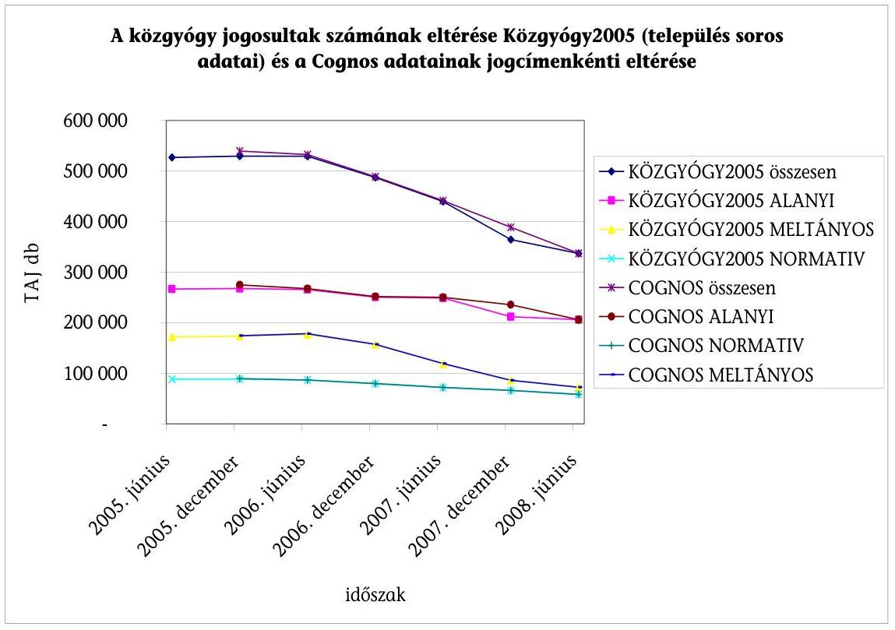

A vizsgálat két adatsorral rendelkezik a közgyógyjogosultak számáról jogcímcsoportonként: az OEP „Cognos"44 havi adataival, és a vizsgált időszak 7 időpontjára településsoros adatokkal a közgyógy programból. A két adatsor tendenciája között nem, de abszolút számai között eltérés van, amelyet az adatgyűjtés és lekérés módszertana magyaráz (3. sz. melléklet).

Az adatsorok különbségének oka, hogy míg a Cognosba bekerülő adat a Közgyógy2005 program (hatósági nyilvántartás) egy időpillanatát rögzíti, addig a Közgyógy 2005 program - mivel élő nyilvántartás - adatai folyamatosan változnak. Ezért ugyanarra az időpontra is más eredményt ad, ha eltérő időpontokban kérdezik le a közgyógyjogosultak számát. A Cognos-ban az „érvényes közgyógyellátási igazolványok száma" adatsor a berögzített jogosultságok számát tartalmazza (függetlenül attól, hogy később törlődött/módosult/visszavonódott), ami állandó, mert a lekérdezéseket csak egyszer, a tárgy időszakban futtatják le, azt rögzítik, az adatbázison később végrehajtott módosítások már nem jennek meg benne. A két adatsor különbségét tehát az utólag, visszamenőleg módosított

[^0]
[^0]:    ${ }^{44}$ Az OEP adattárház adatainak standardizált adatfeldolgozási és megjelentetési rendszere.

---

esetek (hibásan rögzített, MEP által visszavont, később a jegyzők által egyéb okból módosított stb.) okozzák.

A jogosultak számának csökkenése nem egyforma mértékben következett be az egyes közgyógy jogcímeken, így az alanyi jogcímű közgyógyjogosultak aránya 2005. 06. 30. - 2008. 06. 30. között $51 \%$-ról $61 \%$-ra növekedett, míg a méltányos jogcímű közgyógy jogosultak igazolványának aránya 33\%-ról 22\%-ra csökkent, miközben a normatív igazolványok aránya (17\%) változatlan maradt.

A jogosultak számának csökkenése nem egyforma mértékben következett be a különböző anyagi helyzetű településeken sem. A közgyógyellátási igazolványokhoz a rászorultság függvényében való hozzáférés megítélése érdekében az ellenőrzés keretében összekapcsoltuk a települések gazdasági fejlettségét, a településen élők jövedelmi viszonyait mutató adatokat a települések által kiadott közgyógy igazolványok számával és ehhez az OEP és a KSH által szolgáltatott országos (településsoros) adatokat elemeztük.

A település fejlettségét mutató adatokat az ÁSZ vizsgálat a Központi Statisztikai Hivatalnál (KSH) 2005-ben végezett 17 mutatós fejlettségi vizsgálat adataira alapozta. A vizsgálat az ország településeit sorolja be, a társadalmi, gazdasági és infrastrukturális fejlettségük/elmaradottságuk alapján 5 kategóriába. (1. lemaradó; 2. stagnáló; 3. felzárkózó; 4. fejlődő; 5. dinamikusan fejlődő). A besoroláshoz használt 17 (nem súlyozott) mutató egyike a települések egy állandó lakosára jutó SZJA alapot képező jövedelme.

A közgyógyellátás - mint szociális ellátás - az egyének közötti szociális különbségek kiegyenlítését szolgálja, ami akkor múködik jól, ha a közgyógyjogosultak száma az egyes településen élők szegénységével növekszik. A települések gazdasági fejlettsége jelentős mértékben függ az ott élő lakosság jövedelmi viszonyaitól. A lemaradó és a dinamikusan fejlődő településeken élők jövedelem átlagának különbségét a 4. sz. melléklet mutatja. A lemaradó településeken 271 E Ft, míg a dinamikusan fejlődő településeken 775 E Ft volt 2004-ben az egy állandó lakosra jutó SZJA alapot képező jövedelem. A KSH településfejlettségi rangsora alapján a dinamikusan fejlődő településeken élők átlagos jövedelme 2,9 szerese ( $775695 / 271478$ ) a lemaradó településen élőkének.

Az 5. számú grafikon 10 ezer lakosra mutatja a közgyógyjogosultak számát ${ }^{45}$ település-fejlettség és közgyógy-jogosultság szerint bontva, 2005 júniusában és 2008 júniusában.

[^0]
[^0]:    ${ }^{45}$ A közgyógyjogosultak jogcímenkénti településsoros számát az OEP szolgáltatta.

---

5. számú grafikon
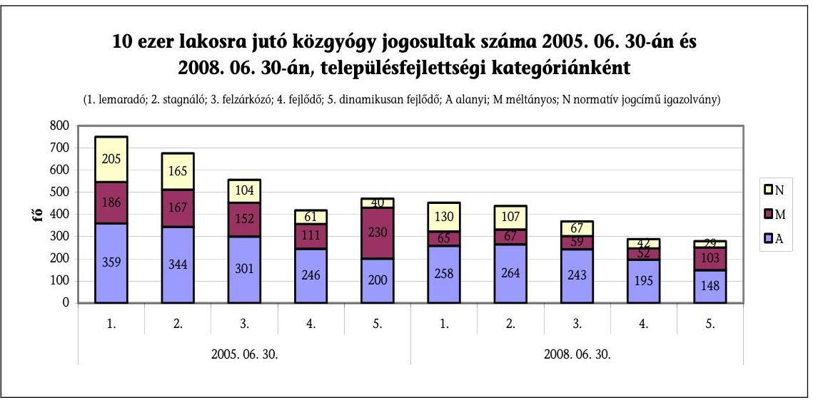

A fenti ábra alapján minden település-fejlettségi kategóriában csökkent a 10 ezer lakosra jutó közgyógyigazolványok száma 2005 óta.

Az 6. számú grafikon a 10 ezer före jutó közgyógyjogosultak száma alapján számítva mutatja be a dinamikusan fejlődő települések adatait a lemaradó településekhez viszonyítva.
6. számú grafikon
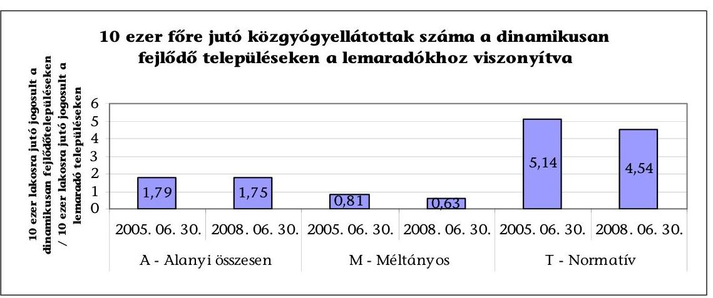

A lemaradó településeken 4,5-ször több a tízezer főre jutó normatív jogcímű közgyógy jogosultak száma, mint a dinamikusan fejlődő területeken. A normatív jogcímű igazolványok esetében a rendszer eléri a közgyógyellátás átalakításáról szóló kormány-előterjesztésben megfogalmazott célt, hogy a rászorultság elve érvényesüljön, illetve a rendszer igazságosabbá váljon, hiszen a jogosultak számában tükröződik a településeken élők jövedelmi viszonyaiban, a települések fejlettségében meglévő különbség és a közgyógy igazolványok szociális kiegyenlítő szerepe érvényesül.

Az alanyi jogcímű igazolványoknál a dinamikusan fejlődő és a lemaradó települések igazolvány aránya már csak 1,75-szörös, azaz hozzávetőleg fele annyi

---

az alanyi igazolványok lakosságra vetített száma a dinamikusan fejlődő településeken, mint a lemaradókon. Ez az arány elmarad a településen élők jövedelmi viszonyaiban fennálló 2,9-szeres különbségtől. Ennek oka, hogy az alanyi jogcímű igazolványt az igénylők többnyire súlyos egészségügyi állapotuk miatt kapják meg, jövedelemi viszonyukat, szociális rászorultságukat nem vizsgálják.

A méltányos igazolványoknál a helyzet éppen fordított, mindkét időpontra régi és új rendszer - elmondható, hogy a dinamikusan fejlődő települések kategóriájában a 10 ezer lakosra jutó méltányos igazolványok száma 2005-ben 230, 2008-ban 103, jelentősen meghaladja minden más település-fejlettségi kategóriában szereplő méltányos igazolvány számot. Azaz minél gazdagabb egy település (és annak polgára) annál valószínűbb, hogy méltányos közgyógy igazolványhoz jut. Minél szegényebb egy település (illetve annak polgára) annál kevésbé valószínű, hogy méltányos közgyógyellátási igazolványa lesz. A méltányos közgyógy igazolványok esetén nem múködik a közgyógyellátás szociális kiegyenlítő funkciója. Ez egyben azt is jelenti, hogy a gazdag és szegény településeken eltérő mértékben kell „szegénynek" lenni, ahhoz, hogy valaki méltányos közgyógy igazolványhoz jusson. A gazdag települések kevésbé szegény lakosaik számára (időnként szociális rászorultság nélkül, pusztán életkor alapján) is juttatnak méltányos közgyógyellátási igazolványt. A fentiek alapján a lakosság nem a települések közötti gazdasági különbség arányban jut hozzá a méltányos közgyógyellátási igazolványhoz.

A méltányos és a normatív jogcímű közgyógyellátási igazolványok kategóriájában - abban a két kategóriában, ahol az igazolványhoz jutás során szociális rászorultság vizsgálat is történik - a dinamikusan fejlődő települések esetében kisebb mértékben esett az igazolványszám 2005 és 2008 között, mint a lemaradó településeken, azaz a közgyógyellátási rendszer átalakítása nem javította, hanem tovább rontott a szociális rászorultság elvének az érvényesülésén. (Ezt mutatja be az összefoglaló 1. sz. grafikonja).

A méltányos jogcímen történő közgyógy igazolványhoz jutás a település anyagi helyzetétől függ a jelenleg múködő közgyógyellátás finanszírozási rendszere értelmében, mivel a közgyógyellátási igazolvánnyal rendelkező lakosainak megállapított kerete 30\%-át kell a településnek a társadalombiztosítás számára megtérítenie. Ezért egy lemaradó település esetében csak kevesebb méltányos közgyógyellátási igazolvány kiadására van forrás, amit a település a méltányos közgyógyellátási igazolványhoz jutás minimális gyógyító ellátási költségének magasabb szinten való meghúzásával ér el. Így az a méltányos közgyógyellátási igazolványt igénylő, akinek a szakhatósági állásfoglalásban a települési szabályozásnál alacsonyabb gyógyító ellátási költséget állapítanak meg, az nem kaphat méltányos jogcímű közgyógyellátási igazolványt. Az 7. sz. táblázat település-fejlettségi kategóriánként mutatja be a települések minimális gyógyszer és gyógyító ellátás költségeinek ${ }^{46}$ 2007. évre vonatkozó átlagát.

[^0]
[^0]:    ${ }^{46}$ Az egyes települések minimális gyógyszerköltsége: azoknak az a legkisebb költségeknek az átlaga, amellyel azon a településen valaki méltányos jogcímen közgyógyellátási igazolványt igényelt és kapott.

---

7. sz. táblázat

| A minimális gyógyszerköltség és a minimális gyógyító ellátási költség átlaga településtípusonként |  |  |
| :--: | :--: | :--: |
| A társadalmi, gazdasági és infrastrukturális fejlettség/elmaradottság | Minimális méltányos gyógyszerköltség átlaga | Minimális méltányos gyógyító ellátási költség átlaga |
| 1. Lemaradó | 6655 | 7586 |
| 2. Stagnáló | 6256 | 7164 |
| 3. Felzárkózó | 6012 | 6976 |
| 4. Fejlődő | 5379 | 6292 |
| 5. Dinamikusan fejlődő | 3807 | 4759 |
| Összesen: | 5622 | 6555 |

Az átlagos minimális költségek csökkennek - mind a gyógyszer, mind a gyógyító ellátások költségei esetében - a települések fejlettségének növekedésével. Azaz a fejlett településeken átlagosan kisebb gyógyszerköltséggel lehet méltányos közgyógyellátási igazolványhoz jutni. A „Minimális méltányos gyógyító ellátási költség átlaga" oszlop adataiból is látszik, hogy pl. a lemaradó településeknél 7586 Ft , míg a dinamikusan fejlődő településeknél 4759 Ft az átlaga a méltányos jogcímú közgyógyellátási igazolvány megszerzéséhez szükséges minimális összegnek.

# 2.3. A közgyógyellátottak kiadásai közgyógy és egyéb jogcí- 

men

Miközben a vizsgált időszakban a közgyógyjogosultak gyógyító ellátásaira közgyógyellátás keretein belül és azon kívül a mindösszesen ${ }^{47}$ kifizetett összeg csökkent 110713 M Ft-ról 87826 M Ft-ra (5. sz. melléklet ${ }^{48}$ ), ez alatt az egy főre eső társadalombiztosítási és a központi költségvetési összegek növekedtek a vizsgált időszakban. A közgyógyjogosultak pénztárcájából (betegtérítési díj) kifizetett összeg mind nominálisan, mind fajlagosan csökkent.

Az egy főre jutó éves kiadás (minden szereplő összesen) - a vizsgált időszakban 209 E Ft-ról 260,58 E Ft-ra növekedett. Ezen belül a fajlagos társadalombiztostási és költségvetési támogatási összeg növekedett a betegtérítési díj csökkent, ezt mutatja be a 7. számú grafikon.

[^0]
[^0]:    ${ }^{47}$ Beteg, társadalombiztosítás, központi költségvetés.
    ${ }^{48}$ Az adatok forrása az OEP által szolgáltatott adatok és az 1. sz. tanúsítvány volt.

---

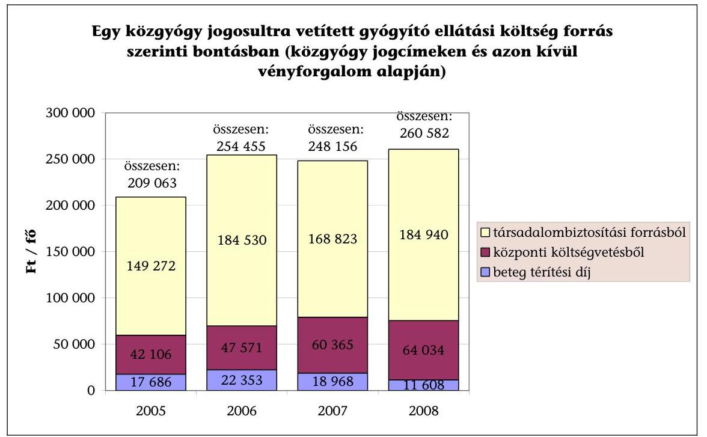

A 8. számú táblázat az OEP vényforgalmi adatai alapján mutatja be a közgyógyjogosultak közgyógy és egyéb (nem közgyógy) jogcímen kiváltott gyógyszerek társadalombiztosítási, központi költségvetési támogatását, valamint a beteg térítési díját.
8. számú táblázat

| ÉV | Gyógyellátások NEM közgyógy jogcímeken*** |  |  |  | Gyógyellátások közgyógy jogcímen |  |  |  | $\begin{gathered} \text { MIND- } \\ \text { ÖSSZESEN } \\ \text { (M Ft) } \end{gathered}$ |
| :--: | :--: | :--: | :--: | :--: | :--: | :--: | :--: | :--: | :--: |
|  | Társada-lombiztositási forrás (M Ft) | Betegtérítési díj   (M Ft) | Központi költségvetési** (M Ft) | Összesen   (M Ft) | Társadalombiztosítási forrás (M Ft) | Betegtérítési díj   (M Ft) | Központi költségvetési forrás (M Ft) | Összesen   (M Ft) |  |
| 2005 | 46607 | 9339 | 2 | 55948 | 32443 | 27 | 22295 | 54765 | 110713 |
| 2006 | 57612 | 10753 | 2 | 68368 | 32250 | 132 | 23164 | 55546 | 123914 |
| 2007 | 28794 | 6755 | 2 | 35552 | 32701 | 154 | 21986 | 54841 | 90393 |
| 2008* | 21119 | 3777 | 1 | 24897 | 41213 | 135 | 21581 | 62929 | 87826 |

Forrás: OEP adatszolgáltatás a vényforgalmi adatok alapján;
*A 2008 féléves tényadat duplája. **HM és Hadirokkant jogcímre történő eladás. ***A különkeretes gyógyszerek támogatását nem tartalmazza az összehasonlíthatóság érdekében

A közgyógyjogosultak által igénybe vett gyógyító ellátásokon belül a közgyógy jogcímű kiváltások növekedtek 54765 M Ft-ról - 62929 M Ft-ra, a nem

---

közgyógy jogcímű kiváltások csökkentek 55948 -ról 24897 M Ft-ra ${ }^{49}$ a vizsgált időszakban (8. sz. táblázat, 6. sz. melléklet).

Csökkent a közgyógyjogosultak által közgyógyellátáson kívül igénybe vett gyógyító ellátásokra beteg által fizetendő térítési díj 9339 M Ft-ról 3777 M Ft-ra és az erre fordított társadalombiztosítási támogatás összege is. ( 46607 M Ft-ról 21119 M Ft-ra.)

A társadalombiztosítási kiadások növekedését a korábban az Eü90 és Eü100 jogcímek közgyógyellátásban való megjelenése okozza - emelt és kiemelt közgyógyellátás elnevezésű, újonnan létrehozott jogcímeken ${ }^{50}$ (7. sz. melléklet). Ez a növekedés látszólagos, mert a közgyógyjogosultak által igénybe vett közgyógy jogcímen megjelenő emelt és kiemelt támogatású fogyasztás ezzel párhuzamosan eltűnik az Eü 90-es és Eü 100-as jogcímről. Ez részben oka a közgyógyellátáson kívüli kiváltások csökkenésének és a közgyógyellátáson belüli fogyasztás (látszólagos) növekedésének. A központi költségvetésből származó források a vizsgált időszakban közel állandóak. A közgyógyellátottak által igénybe vett közgyógy jogcímű ellátások növekményét a társadalombiztosítási támogatás növekedése okozza. A betegtérítési díj abszolút összege önmagában nem számottevő, de növekedési üteme jelentős, a vizsgált időszakban ötszörösére növekedett, 27 M Ft-ról - 135 M Ft-ra.

A 8. számú grafikon az áttekinthetőség kedvéért együtt tartalmazza a közgyógyjogosultak közgyógy jogcímű és közgyógyon kívüli Eü 100, Eü90-es kiváltásait. A grafikon alapján megállapítható, hogy a közgyógy emelt és kiemelt jogcímen megjelenő fogyasztás értékével csökken az Eü 90-es és 100-as jogcímeken történő kiváltás.

[^0]
[^0]:    ${ }^{49}$ Az összehasonlíthatóság miatt az adatok a különkeretes gyógyszereket egy vizsgált évben sem tartalmazzák.
    ${ }^{50}$ A közgyógyjogosultak 2006 év végétől, illetve 2007 elejétől a korábban Eü90 és Eü100-as indikációhoz - valamilyen súlyos betegség kapcsán - kötötten rendelt gyógyszerét az egészségbiztosítási pénztár a közgyógyellátás újonnan létrehozott emelt és kiemelt közgyógyellátási jogcímen számolja el.

---

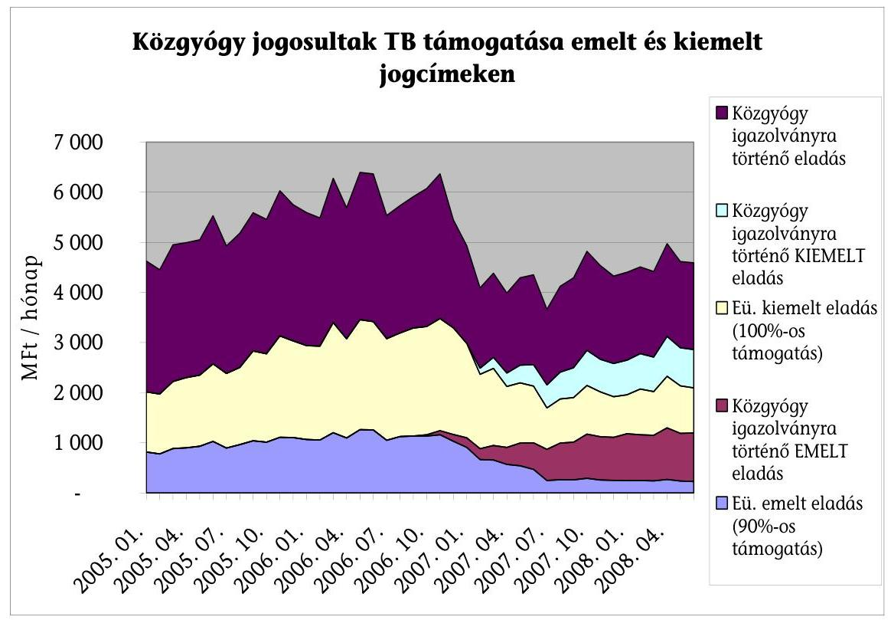

A 9. számú grafikon közgyógyellátási jogcímenként tartalmazza a költségvetés és a társadalombiztosítás által közgyógyellátási jogcímen kifizetett összegeket, (az alapadatokat lásd az 1. sz. tanúsítványban).
9. számú grafikon
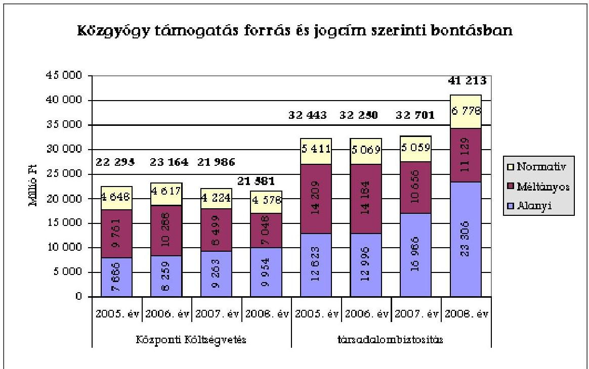

---

A közgyógy jogcímű növekvő társadalombiztosítási támogatásnak és a stagnáló központi költségvetési támogatásnak egyre nagyobb részét az alanyi közgyógyjogosultak gyógyító ellátásainak finanszírozása okozza. A közgyógy jogcímú támogatáson belül az alanyi közgyógyjogosultak támogatása 38\%-ról $53 \%$-ra (33,3 Mrd Ft) növekedett, azaz pont annak a jogcímnek növekedett erőteljesen az aránya, ahol a jogosultság megszerzésénél a jövedelem vizsgálata nem történik meg, az igazolványhoz a jogosultak egyéb - az egészségügyi állapotukban meglévő problémák miatt fennálló - jogviszonyuk alapján jutnak.

A 10. számú grafikon a legfejlettebb és a legfejletlenebb település kategóriában mutatja be a 10 ezer före jutó költségeket, közgyógyellátási jogcím szerinti bontásban.
10. számú grafikon
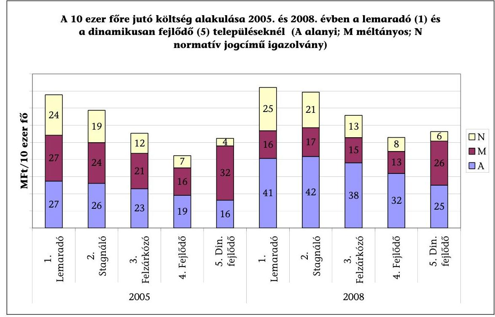

A grafikonról látható, hogy 2008-ban a lemaradó településeken 1,46-szor nagyobb támogatás jut 10 ezer lakosra, mint a dinamikusan fejlődőkön. A közgyógyellátás reformját megelőző időszakban (2005. december 31.) ez az érték hasonló 1,49 volt. Amennyiben a közgyógyellátás szociális kiegyenlítő funkciója jól múködne, akkor a lemaradó települések lakóinál a jövedelemkülönbséggel arányos összeg jelenne meg. A 10. számú grafikonon látható, hogy település-fejlettségi kategóriánként a gazdasági fejlettség növekedésével csökken a 10 ezer lakosra jutó közgyógyellátás támogatásának mértéke. Ezt a tendenciát a dinamikusan fejlődő települések méltányos igazolványai törik meg, amin a közgyógyellátási rendszer átalakítása sem segített. Az alanyi és normatív jogcímű 10 ezer lakosra jutó kifizetés minden település-fejlettségi kategóriában növekedett, míg a méltányos kifizetések abszolút száma és aránya is csökkent a vizsgált időszakban.

---

# 2.4. A települési szabályozások 

A 2.4. fejezet a magyarországi települések társadalmi-gazdaságiinfrastruktúrális fejlettség szempontjából véletlenszerűen és reprezentatívan kiválasztott 70 település kérdőíveinek elemzési tapasztalatait mutatja be.

70 településen kérdőíves adatbekéréssel vizsgáltuk a közgyógyellátás helyzetét, a kártyaszámok alakulását és ezek összefüggését a helyi szabályozással, amelyet a 9. számú táblázat mutat. Az alábbi táblázatok és grafikonok a kitöltött kérdőívek alapján mutatják be a közgyógyellátás helyzetét.

A méltányos közgyógyellátás szabályozása az önkormányzat feladata, a jogszabály csak az ellátási határokat jelölte ki. A helyi szabályok a gyógyszerköltség minimumát és a jövedelem maximumát határozzák meg.
9. számú táblázat

| A kérdöíves megkereséshez választott minta jellemzői |  |  |  |  |
| :-- | :--: | :--: | :--: | :--: |
| Település típus | Darab | Lakónépesség   2005. december 31-én | Mintaszám | A minta   lakónépessége |
| Lemaradó (1) | 964 | 799506 | 6 | 6729 |
| Stagnáló (2) | 802 | 1078274 | 7 | 10564 |
| Felzárkozó (3) | 962 | 2507467 | 17 | 67982 |
| Fejlődő (4) | 321 | 2535180 | 18 | 78987 |
| Dinamikusan fejlődő   (5) | 96 | 3156154 | 22 | 344771 |
| Összesen | 3145 | 10076581 | 70 | 509033 |

A lakosság 8\%-a, 800000 ember a lemaradó településeken él, így a 70 település közé 6 önkormányzat került ebből a típusból. A lakosság 31\%-a olyan településen él, amely a legfejlettebb kategóriába tartozik, így a mintába 22 település került ebből a típusból.

A 11. számú grafikon a településeken ezer lakosra jutó kártyaszámokat mutatja jogcímenként.

---

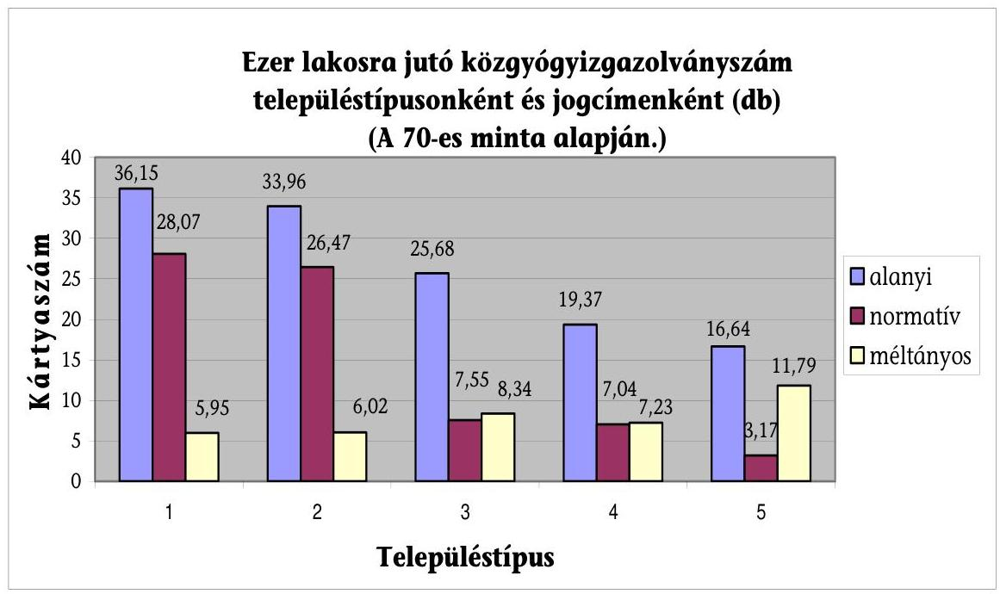
(1. lemaradó; 2. stagnáló; 3. felzárkózó; 4. fejlődő; 5. dinamikusan fejlődő)

Az ábrán az alanyi kategóriájú kártyák száma a dinamikusan fejlődő településeken 16,64, a lemaradó településen 36,15. A különbség több mint kétszeres a lemaradó települések javára.

A normatív kategóriában, amely az állam által garantált minimum ellátást nyújtja a legszegényebb rétegek részére, a kártyák eloszlása alapján, a lemaradó településeken 8,8 -szor annyian rendelkeznek ilyen típusú kártyával, mint a dinamikusan fejlődő településeken.

A méltányos kategóriájú közgyógyigazolványhoz jutás feltételeit az önkormányzatok határozzák meg, anyagi lehetőségeikhez mérten és ez egy magasabb jövedelmi kategóriára vonatkozó ellátás. A kártyaszám a település gazdagságának növekedésével nő. A két legszegényebb település típuson a kártyaszám szinte azonos, 5,95 és 6,02 . A következő két kategóriában, a 3-as és 4-es besorolású településeknél 8,34 , illetve 7,23 . A kiugrás a dinamikusan fejlődő besorolású településeknél fordul elő, ahol az 1000 főre jutó kártyaszám 11,79 és ez kétszerese a legszegényebb településeken előforduló kártyaszámnak, és 1,4szerese a 3-as besorolású, közepes gazdagságú településeknek.

---

A 12. számú grafikon településtípusonként a kártyaszám eloszlását mutatja.
12. számú grafikon
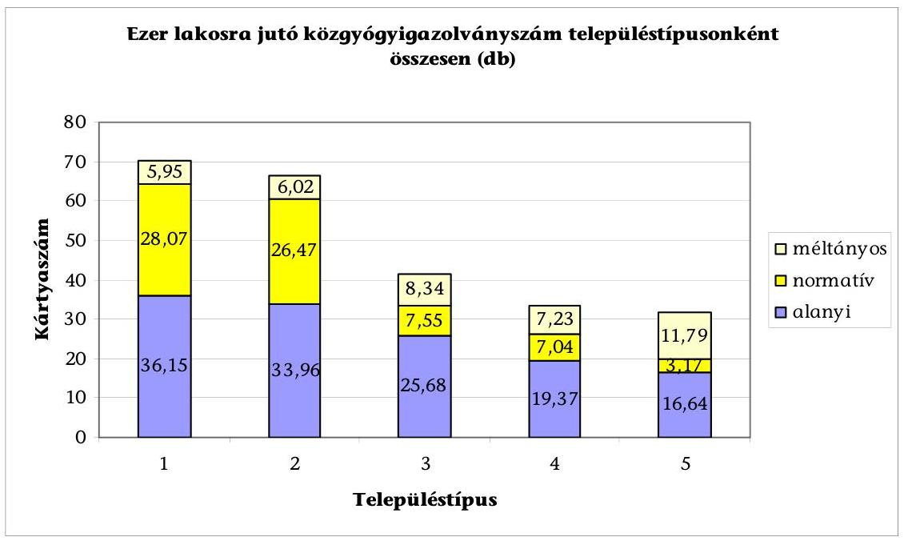
(1. lemaradó; 2. stagnáló; 3. felzárkózó; 4. fejlődő; 5. dinamikusan fejlődő)

A lemaradó településeken az ezer lakosra jutó kártyaszám 70,17 és a dinamikusan fejlődő településeken 31,60, ami a szegény települések javára 2,2-szeres különbséget mutat.

Az alanyi és normatív kategóriájú igazolványokhoz való jutás feltételei országosan egységesek. A méltányos ellátás feltételei bizonyos korlátozással, Sztv.ben rögzített határok betartása mellett az önkormányzatok által bővíthetőek. A hetven önkormányzat szabályozását megvizsgálva látható, hogy az önkormányzatok többsége (58\%-a) élt ezzel a lehetőséggel: 41 önkormányzat a törvényben meghatározottnál enyhébb szabályozást vezetett be, 28 önkormányzat az Sztv.-ben meghatározott szinten hozta meg a szabályozását. Egy önkormányzat helyi rendeletében nem rendelkezett méltányos közgyógyellátásról.

---

10. számú táblázat

| A Sztv-ben meghatározott (minimális) ellátási szintnek megfelelően szabályozó önkormányzatok száma, aránya |  |  |  |
| :--: | :--: | :--: | :--: |
| Településtípus | A mintában szereplő települések száma (db) | Az Sztv.-ben meghatározott szinten szabályozóak a méltányos közgyógyellátást (db) | Az Sztv.-ben meghatározott szinten szabályozók \%-a |
| Lemaradó (1) | 6 | 4 | 67 |
| Stagnáló (2) | 7 | 6 | 86 |
| Felzárkózó (3) | 17 | 9 | 53 |
| Fejlődő (4) | 18 | 4 | 22 |
| Dinamikusan fejlődő (5) | 22 | 5 | 23 |
| Összesen | 70 | 28 | $40 \%$ |

A 10. számú táblázatból látható, hogy a lemaradó településeken az önkormányzatok 67\%-a az Sztv.-ben meghatározott korláthoz igazodva, rendelkezett a helyi rendeletében a méltányos közgyógyellátásról, míg a dinamikusan fejlődő településeken ez az arány csak 23\%, azaz ezen települések 77\%-a ettől enyhébb szabályokat állapított meg.

A szabály enyhítését, vagy az előírt gyógyító ellátás 25\%-os mértékének enyhítésével, vagy a felső jövedelem határ ( $150 \%$, illetve 200\%) növelésével, illetve mindkettővel lehet biztosítani. Az önkormányzatok éltek azzal a lehetőséggel, hogy az enyhítéseket csak meghatározott lakosság csoportok részére tették elérhetővé (pl. bizonyos életkor felett,) és egyébként az általános szabályokat alkalmazták.

19 önkormányzat mindkét feltételt enyhítette, 10 önkormányzat csak a gyógyító ellátás mértékét csökkentette a jövedelem kritérium meghagyása mellett, és 12 önkormányzat a jövedelemhatárt növelte a gyógyító ellátás költségének meghagyása mellett.

---

11. számú táblázat

| A Sztv-ben meghatározott (minimális) ellátási szinttől eltérően sza-   bályozó önkormányzatok száma |  |  |  |  |  |
| :-- | :--: | :--: | :--: | :--: | :--: |
| Településtípus | A mintában   szereplő   települések   száma | A gyógyító   ellátás   költségét   csökkentette | A jövedelemhatárt növelte | Mindkettőt   enyhítette | Összesen |
| Lemaradó (1) | 6 | 1 | 0 | 0 | 1 |
| Stagnáló (2) | 7 | 1 | 0 | 0 | 1 |
| Felzárkózó (3) | 17 | 3 | 3 | 2 | 8 |
| Fejlődő (4) | 18 | 2 | 2 | 10 | 14 |
| Dinamikusan   fejlődő (5) | 22 | 3 | 7 | 7 | 17 |
| Összesen | $\mathbf{7 0}$ | $\mathbf{1 0}$ | $\mathbf{1 2}$ | $\mathbf{1 9}$ | $\mathbf{4 1}$ |

A legnagyobb mértében a 4-es és 5-ös, tehát a két leggazdagabb település típus élt a szabályok enyhítésével.
12. számú táblázat

| A szabályozást enyhítő települések aránya |  |  |
| :-- | :--: | :--: |
| Településtípus | Méltányos igazolványok   száma ezer lakosra   (db) | A szabályozást enyhítő települé-   sek aránya |
| Lemaradó (1) | 5,95 | $17 \%$ |
| Stagnáló (2) | 5,95 | $14 \%$ |
| Felzárkózó (3) | 8,34 | $47 \%$ |
| Fejlődő (4) | 7,23 | $78 \%$ |
| Dinamikusan fejlődő   (5) | 11,79 | $77 \%$ |

Az egyedülállók kategóriájában a felső határt a törvényben előírt minimumszinten (200\%-on) szabályozta 40 önkormányzat, és a felső határ legmagasabb szintű megállapítása, (amely 300\%) 5 önkormányzatnál fordult elő. Ők a dinamikusan fejlődő települések.

Csak a jövedelmet vizsgálva, és a gyógyszerköltséget nem figyelembe véve, az ország egyes településein a 28500 Ft és a 42750 Ft , illetve egyedülálló esetén az 57000 Ft közötti egy főre jutó jövedelemsávban egyforma a hozzájutás esélye. Az e fölötti jövedelemnél a helyi rendelettől függő.

A méltányos közgyógyigazolványhoz való jutás másik feltétele az igazolt gyógyító ellátások költsége, amelynek legmagasabb mértékét a mindenkori legkisebb öregségi nyugdíj $25 \%$-ban állapítja meg az Sztv. az önkormányzatok ré-

---

szére. Az önkormányzat helyi rendeletében ennél magasabbat nem állapíthat meg, csak alacsonyabbat.

1. számú ábra
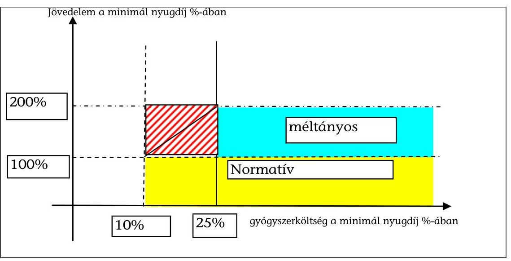

Az 1. számú ábra a normatív és méltányos igazolványhoz jutás feltételeit mutatja egy olyan településen, ahol méltányos igazolványhoz a 25\%-os gyógyító költség igazolása és a minimál nyugdíj 200\%-a a jövedelemhatár. Az áthúzott négyzetbe tartozók nem jutnak közgyógyellátáshoz.

A legenyhébb szabályzást, azaz a 10\%-os ( 2850 Ft ) gyógyító ellátás mértékét feltételként előíró önkormányzat a 70-es mintában összesen 9 volt, de ebből csak 5 olyan, pl. életkori feltételhez ezt nem köti. Mind az 5 település az 5-ös besorolású, azaz a leggazdagabb településekhez tartozik. A települések több mint fele, 40 település a törvényben előírt 25\%-os, legszigorúbb szintet nevesíti a szabályozásban, és 25 településen a minimum és maximum szinttől eltérő, vagy vegyes szabályozás van érvényben. A 7125 Ft-ot meghaladó gyógyító ellátás költség esetén (nagyobb egészségügyi rászorultság esetén) az ellátás mindenki számára biztosított, ahol az önkormányzat rendelkezett a méltányos közgyógyellátásról. (A 70-es mintában egyetlen önkormányzat fordult elő, aki helyi rendeletben nem szabályozta ezt, így ott ez a lehetőség nem biztosított).

Az ellátáshoz való egyenlő hozzáférés egy mutatója ${ }^{51}$ a közgyógyellátásra benyújtott kérelmek elutasításának aránya. A jövedelemhatár túllépése és a gyógyító ellátás költsége miatt elutasított kérelmek száma az egyes településtípusokban eltérő.

[^0]
[^0]:    ${ }^{51}$ Általunk a vizsgálathoz alkalmazott mutatók.

---

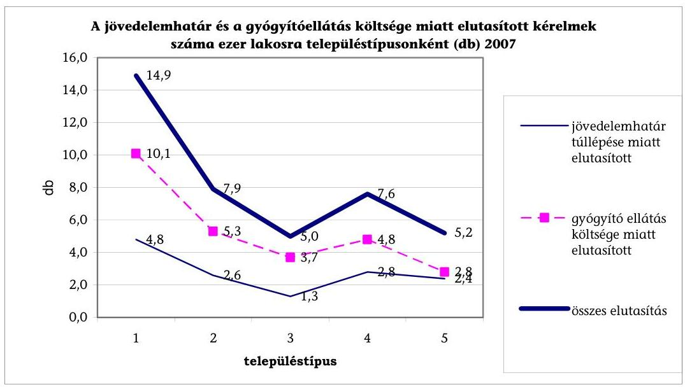

A 13. számú grafikonon látható, hogy a gyógyító ellátás költsége miatti elutasítás a gyakoribb. Az ország legszegényebb településein 1000 lakosra jutó gyógyszerköltség miatti elutasítások száma kétszer magasabb, mint a jövedelemhatár túllépése miatt elutasítások száma. Ezeken a településeken az 1000 lakosra jutó elutasítások száma háromszorosa a leggazdagabb településekhez képest.

A legszegényebb településtípust leszámítva a másik négy kategóriában viszonylag kiegyenlített az ellátáshoz való hozzájutás, az összes elutasítás 1000 lakosra vetítve 5-7,9 között mozog. Tehát országosan a legszegényebb települések kivételével nem jellemző, hogy a település szegénysége miatt több lenne az elutasítás. A legszegényebb településeken - amelyeken a lakosság 8\%-a él - többen szorulnak ki a benyújtott kérvények elutasításának száma alapján a méltányos közgyógyellátásból az ország többi településéhez képest. De fontos hozzátenni, hogy az ország ugyanezen legszegényebb településein a közgyógyellátásban részesülők száma ( 70,17 fő/ezer fő) összesen (alanyi, normatív és méltányos jogcímen) kétszer nagyobb az ország leggazdagabb településeihez (31,6 fő/ezer fő) képest.

---

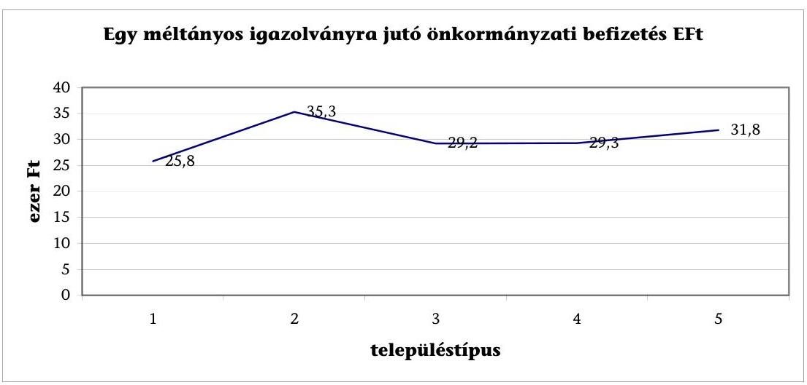

A 70-es mintából 8 önkormányzat nem adott ki méltányos igazolványt 2007ben. A többi 62 településen az egy méltányos igazolványra jutó átlagos önkormányzati befizetés (a gyógyszerkeret 30\%-a) 25,8 E Ft és 35,3 E Ft között szór (ehhez 86 E Ft-os, illetve 117,7 E Ft-os éves egyéni gyógyszerkeret kapcsolódik) és nem mutat összefüggést a település fejlettség szerinti besorolásával.

Tehát a fentiekből megállapítható, hogy a méltányos igazolványhoz való jutás az ország legszegényebb besorolású településein mind a kártyához való jutás helyi szabályai szempontjából, mind az elutasítások számából nézve nehezebb, mint az ország más településein. Az ellátásból való kiszorulás - a legkisebb öregségi nyugdíj a $25 \%$-nál alacsonyabb gyógyszerköltség, vagy annak 200\%nál magasabb jövedelem esetén - ugyanakkor bármilyen településtípuson előfordulhat, ahol az önkormányzat a legszigorúbb szabályozást alkalmazza.

Az önkormányzati autonómia a közgyógyellátás helyi szabályainak megállapításakor az önkormányzatok véleménye szerint jó, mert saját anyagi lehetőségeiknek megfelelően tudják bővíteni az ellátást, és a szabályok megállapításánál figyelembe tudják venni a település lakosságának korösszetételét.

# 3. AZ EGÉSZSÉGÜGYI RÁSZORULTSÁG ELVÉNEK ÉRVÉNYESÜLÉSE A GYÓGYSZERTÁMOGATÁSBAN 

### 3.1. A szakhatósági állásfoglalás kialakítása, a gyógyszerkeret meghatározása

A közgyógyellátás gyógyszerszolgáltatása esetében 2006. július 1-je óta egyénre szabott gyógyszerkeretet vezettek be, ami figyelembe veszi a betegek azon gyógyszerszedését, amelyek a háziorvosi igazoláson szerepelnek. Bár az Sztv. az egyéni gyógyszerkeret összegét a beteg rendszeres gyógyszerszükségletének támogatására hozta létre, a gyógyító ellátások elismert költségeinek megállapítása során szerepelhetnek nem krónikus betegséget alátámasztó BNO kódok (betegségek), nem tartós gyógyszerszedésre alkalmas/ajánlott készítmények, és ezek ára is szerepet játszik a gyógyszerkeret kialakításában. Sem az ügyintézők,

---

sem a KÖZGYÓGY2005 szoftver automatikusan nem vizsgálja, hogy a háziorvosi igazoláson szereplő BNO krónikus betegséghez kapcsolódik-e, a betegnek rendelt gyógyszeres terápia tartós-e, így nem biztosított, hogy a keret a rendszeres gyógyszerszükséglet kielégítésére szolgál.

A jogszabály ${ }^{52}$ értelmében a MEP az egészségügyi miniszter által elfogadott és hivatalosan közzétett terápiás eljárásrendekben, illetve szakmai irányelvekben az adott betegség kezelésére meghatározott hatóanyagok figyelembe vételével alakítja ki szakhatósági állásfoglalását a havi rendszeres gyógyító ellátás dijáról. Amennyiben nincs nyilvánosan közzétett és elfogadott terápiás eljárási rend, illetve szakmai irányelv akkor a háziorvosi igazoláson feltüntetett hatóanyagot kell alapul venni. A MEP-ek nem alkalmazzák ${ }^{53}$ a terápiás eljárási rendeket és szakmai irányelveket, minden esetben a háziorvosi igazolás alapján alakítják ki a szakhatósági állásfoglalásokat. A MEP-eknek kiadott eljárásrend ${ }^{54}$ értelmében a gyógyító ellátások elismert költségeinek meghatározása során a szakhatóság nem bírálhatja felül a háziorvost. Tevékenysége nem ad szakmai hozzáadott értéket a beteg terápiájának megállapításához, és az Sztv. céljainak megvalósításához.

A szakhatósági állásfoglalást elkészítő orvosok és gyógyszerészek a gyógyító ellátások elismert költségének összegét állapítják meg, a KÖZGYÓGY2005 számítógépes program elvégzi a beárazási feladatok jelentős részét (automatikus besorolás). A KÖZGYÓGY2005 program továbbfejlesztésével, és a szükséges törzsadatbázisok létrehozásával/fejlesztésével (TTT-BNO párosítás, közhiteles orvos és szakvizsga adatbázis, terápiás ajánlások) a beárazási tevékenység automatizálhatóvá tehető.

# Az OEP-ben és a megyei pénztárakban az ellenőrzési kapacitás 80\%a betegek egyedi gyógyító ellátásai elismert költségeinek megállapításával foglalkozik. Az OEP ellenőrzési apparátusának jelentős részét köti le olyan feladat, ami alapvetően nem ellenőrzési tevékenység, és amelynek nincs valódi, szakmai hozzáadott értéke a folyamathoz, mivel az eljárásrend értelmében nem kötelesek vizsgálni a betegek által korábban kiváltott gyógyszereket, a beteg krónikus betegségeit, és nem bírálhatják felül a háziorvos által megállapított terápiát. ${ }^{55}$ 

A törvényalkotók eredeti szándéka az volt, hogy a MEP ellenőrizze a háziorvos a betegségnek megfelelő gyógyszeres terápiát alkalmaz-e a kezelés során.

[^0]
[^0]:    ${ }^{52}$ 25/2006. (VI. 26.) EüM rendelet a közgyógyellátásra jogosult gyógyszerkeretének megállapításához szükséges készítmények kiválasztásának szabályairól.
    ${ }^{53}$ A rendelkezésre álló eljárási rendek és szakmai irányelvek sok esetben nem is alkalmasak az egészségbiztosító elveinek érvényesítésére.
    ${ }^{54}$ Eljárásrend a közgyógyellátottak gyógyszerkeretének megállapításáról, a szakhatósági állásfoglalás elkészítéséről és a közgyógyigazolvány kiadásáról - 2007. február 20. V.3. számú verzió.
    ${ }^{55}$ A személyes adatok és a betegségekre vonatkozó adatok együttes kezelése miatt (szenzitív adat) az adatvédelmi törvény alapján szükséges szakorvos, szakgyógyszerész részvétele a szakhatósági állásfoglalás kialakításához.

---

A beteg állandó gyógyszereinek költségét a reformot megelőző rendszerrel ellentétben nem a háziorvos által igazolt készítmények patikai térítési díja alapján állapítják meg. ${ }^{56}$ A szakhatósági állásfoglalás a „javasolt" gyógyszerköltséget több ponton nem ismeri el teljes egészében, a KÖZGYÓGY2005 szoftver, így a betegek költségeit a korábbi rendszerben megállapítottnál és a háziorvos által rendelt terápia költségénél alacsonyabb szinten ismeri el.

A MEP-ek a beteg gyógyító ellátásainak elismert költsége meghatározása során több lépcsőben csökkentik a beteg háziorvos által „javasolt ${ }^{57}$ gyógyszerköltségét" és ennek alapján határozzák meg a havi gyógyszerkeretet.

1. A beteg tartós gyógyszerszedésén alapuló háziorvosi igazolást a tartósan szedett gyógyszerekről, a beteget kezelő háziorvos alakítja ki, költsége a patikában fizetendő térítési díj, ${ }^{58}$ a továbbiakban- „javasolt gyógyszerköltség".
2. A MEP-eknél alkalmazott KÖZGYÓGY2005 szoftver a beárazás során a háziorvosi igazoláson szereplő készítményeket besorolja, és a szakhatósági állásfoglaláson a havi kúraköltség alapján a legalacsonyabb terápiás költségú készítményekre cseréli - beárazás során ezekkel a készítményekkel kalkulált betegtérítési díj „központi költségvetési költség".
3. A MEP-eknél alkalmazott KÖZGYÓGY2005 szoftver az Sztv. 50/A. § (7) bekezdése szerint a háziorvosok által rendelhető (OGYI „ $V^{\prime \prime}$-s besorolású) készítmények összköltségét 6000 Ft-ig veszi figyelembe - „elismert gyógyszerköltség". A 6000 Ft feletti összeg a háziorvosi igazoláson lévő szakorvosi javaslatra, illetve csak szakorvos által rendelhető gyógyszerek esetében az egészségbiztosítási szerv vezetőjének döntése alapján állapítható meg.
4. A havi felhasználható gyógyszerkeretet a települési önkormányzat jegyzője (jogszabály alapján) 12000 Ft-ig állapítja meg.

A 8/a - 8/b. sz. mellékletben szereplő táblázat két indokoltan magas gyógyszerköltségű beteg gyógyszeres terápiáján mutatja be a gyógyszerköltségek levágását.

A 15. számú grafikon közgyógyellátási jogosultsági jogcímenként mutatja be, hogy mekkora a különbség a háziorvos által átlagos „javasolt gyógyszerköltség" és az átlagos „elismert" gyógyszerköltség között. Az ábrán az is megfigyelhető, hogy legmagasabb átlagos költséggel, „javasolt" költséggel és „elismert költséggel" a méltányos közgyógyigazolvány igénylők rendelkeznek, őket a I-II. csoportú rokkantak és a normatív igazolványt igénylők követik.

[^0]
[^0]:    ${ }^{56}$ A korábbi rendszerben a patika árazta be a betegek gyógyszereit.
    ${ }^{57}$ Valós gyógyszerköltség: ennyi lenne a beteg térítési díja, ha a háziorvosi igazoláson szereplő készítményeket váltaná ki.
    ${ }^{58}$ Az összeg nem szerepel a háziorvosi igazoláson, ez a patikai térítési díjak alapján számított költség.

---

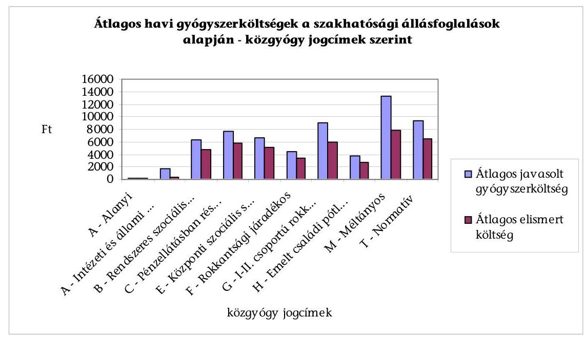

Forrás: OEP adatszolgáltatás
A „keretlevágások" az igazán súlyos és drága betegséggel (vagy több egyidejúleg fennálló súlyos betegséggel) élő betegeket érintik hátrányosan. A rendszer előnyösebb az általában olcsó kezelésű betegségeknél. A keretlevágások következtében korlátozottan érvényesül az egészségügyi célzottság.

# 3.2. A gyógyszerkeret megállapítás ellentmondásai 

A közgyógyellátás eltérő jogcímein (alanyi, normatív, méltányos) más-más gyógyító ellátási költséget kell igazolni ahhoz, hogy az igénylő közgyógyellátási igazolványhoz juthasson. ${ }^{59}$

Ezt mutatja, hogy alanyi körben már $0 \mathrm{Ft},{ }^{60}$ normatív körben a mindenkori öregségi nyugdíj legkisebb összegének 10\%-át, 2850 Ft -ot meghaladó elismert gyógyító ellátási költség mellett válik a beteg egészségügyi szempontból jogosulttá közgyógyellátási igazolványra. Méltányos jogosulti körben az önkormányzati rendelet határozza meg azt a minimális gyógyító ellátási költséget, amellyel közgyógyellátási igazolványhoz lehet jutni, ami terjedhet: 0 Ft-tól az öregségi nyugdíj mindenkori legkisebb összegének $25 \%$-ig, azaz 7125 Ft -ig. „egészségügyi szempontból rászorult"-ság feltétele nem egységes a közgyógyellátás eltérő jogcímein.

A 16. számú grafikon a megállapított gyógyszerkeretek eloszlását mutatja közgyógyellátási jogcímek szerint megbontva.

[^0]
[^0]:    ${ }^{59}$ Az alanyi jogcím esetén a költségigazolás az egyedi gyógyszerkeret megállapításának feltétele.
    ${ }^{60}$ Havi rendszeres gyógyszerkeret megállapításához havi 1000 Ft-ot meghaladó gyógyszerköltséggel mindenképpen kell rendelkezni.

---

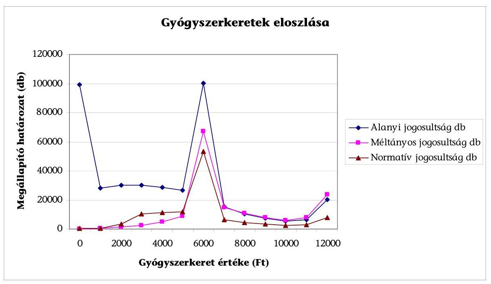

Forrás: OEP adatszolgáltatás
A Szt. 50/A. § (7) bekezdése szerint legfeljebb 6000 Ft-ig vehetők figyelembe a háziorvos által rendelhető készítmények. Az ezen felül jelentkező költségeket a szoftver levágja. Ezért mindhárom kategóriában az elismert gyógyszerköltségek 6000 Ft-nál mutatnak halmozódást. A jegyzői határozat maximum 12000 forintos keretet állapíthat meg, ezért a keretek eloszlását bemutató ábrán nem szerepelhetnek a 12000 Ft-ot meghaladó költségek, így az ábra itt is halmozódást mutat.

A megállapított átlagos gyógyszerkeret a vizsgált időszakban folyamatosan csökkent. A 2007. őszi közel 7000 Ft-hoz képest 2008-ban 5000 Ft körüli értéket mutat.

A betegek a számukra elismert gyógyszerköltségnél kisebb értékű gyógyszert váltanak ki, így keretmaradványok keletkeznek, amelyet a 4. sz. tanúsítvány mutat be. Ennek részben indoka, hogy a gyógyszer és gyógyító ellátás elismert költségeinek megállapítása során, a háziorvosi igazolásokon a beteg által tartósan szedett gyógyszereknél több, és többféle készítmény „töltelék" gyógyszer jelenik meg; részben a biztonságos és gazdaságos gyógyszer- és gyógyászati segédeszköz ellátás, valamint a gyógyszerforgalmazás általános szabályairól szóló 2006. évi XCVIII. törvény életbe lépése hatására bekövetkezett gyógyszerár csökkenés. A 2008. I. félévében lejárt 207711 db kártyabirtokos 32\%-a használta fel legalább $90 \%$-os mértékben a keretét. 15295 kártya esetében a keretmaradvány az arra feltöltött összeg 90-100\%-a volt, ez a lejárt kártyatulajdonosok 7,4\%-a. Ezeken a kártyákon összesen 554026 E Ft keretmaradvány képződött. A kártyatulajdonosok által fel nem használt keretösszeg összértéke 5280 M Ft , ami a számukra megállapított teljes keretösszeg 33\%-a volt.

A háziorvosok az igazoláson sok esetben a beteg valós gyógyszerszükségletét meghaladó mennyiségű és számú gyógyszert igazolnak (9. sz. melléklet). Né-

---

hány a háziorvosi igazolásokon gyakran szereplő készítmény esetében mutatja be az igazoláson szereplő (és a keretszámítás során figyelembe vett) dobozmennyiség és a később kiváltott mennyiség arányát. A táblázat adatai alapján a betegek a fenti készítményeket $40 \%$-ban váltották ki.

A választható készítmények köre bővült. A korábbi listán 705 db készítmény szerepelt, jelenleg minden járóbeteg ellátás keretében rendelhető, társadalombiztosítási támogatásba befogadott készítmény rendelhető és kiváltható a közgyógyellátás terhére. Így a betegek a közgyógyellátás terhére igénybe vehetik a szokásosan használt gyógyszereiket, amennyiben az a háziorvosi igazoláson szerepel. A hatályos jogszabályok megengedik, hogy ne csak az igazoláson szereplő készítményt, hanem vele azonos hatóanyag csoportú készítményt is kiválthasson a beteg.

A beárazás során számos probléma zavarja a betegek valós gyógyszerköltségének, egészségügyi rászorultságának megállapítását.

- a KÖZGYÓGY2005 program és a gazdaságos gyógyszerrendelést segítő program a „legolcsóbb terápia" kiválasztása során nem feltétlenül vezet azonos készítményhez, mivel az előző a havi kúraköltség alapján, míg az utóbbi a napi terápiás költség és a referencia termék alapján jelöli ki a „legolcsóbb" készítményt, így a KÖZGYÓGY2005 program gyógyszerválasztása szempontjából fontos szerepe van, a gyógyszer dozirozásának és adott készítmény kiszerelésének (10. sz. melléklet).
- A keretmegállapítás során a KÖZGYÓGY2005 szoftver a gyógyszer OGYI által definiált rendelhetőségi kategóriája alapján sorolja be a készítmény árát az „alsó", illetve „felső" 6000 Ft-ba, ami egyes betegségek esetén a biztosító finanszírozási elveivel és a beteg érdekeivel ellentmondó eredményre vezet.

Az OEP Gyógyszerügyi Főosztálya által készített elemzés értelmében az elismert gyógyszerköltségek 6000-6000 Ft-os megbontása alapvetően fiskális szemléletű, és a szakmai érvek nem ilyen arányú megbontást támasztanának alá. Az elemzés vizsgálta a keretmegbontás hatását a betegek közgyógyellátási jogosultságának megszerzésére és a betegséghez igazodó terápia felállítására. Az OEP elemzés szerint: „Az „alsó" és a „felső" keret szétválasztása álláspontunk szerint nem a 6000-6000-es tengely mentén célszerú, a kevésbé szükséges gyógyszerekre 4000 Ft-os limitet, az életfontos készítményekre 8000 Ft-os limitet javasolunk biztosítani."

Az OEP Gyógyszerügyi Főosztályának javaslata alapján „az egyéni gyógyszerkeret megállapítása során a gyógyszerészeti hatóság által megadott rendelhetőség helyett a támogatási kategóriákat (biztosító által meghatározott „rendelhetőséget") kell figyelembe venni, vagyis a keretösszeg „alsó" részébe az általános jogcímen támogatott készítmények térítési diját, míg „felső" részébe a Tb. támogatással indikációhoz kötötten rendelhető készítmények térítési diját célszerú bekalkulálni."

- Egyes készítmények kiszerelése (28X, 56X) a havi kúraköltség számítása során a tényleges igénynél nagyobb mennyiségű gyógyszerköltség elismeréséhez vezet (11. sz. melléklet). Egyes készítmények valós és a számított gyógyszerigénye és költsége közötti éves szinten mutatkozó lényeges különbséget mutatja be.

A 28X-os kiszerelésú Plavix esetében napi 1X1-es adagolás esetén 131680 Ft , napi 2X1 adagolás esetén 118512 Ft , napi 3X1-es adagolás esetén 105344 Ft több-

---

letköltség jelenik meg az elismert gyógyszerkeretben, mert a kúraköltséget havi és nem éves szinten állapítja meg a biztosító.

- A közgyógyellátás terhére az egészségbiztosító által támogatott készítményeket lehet kiváltani, ebbe beletartoznak a 0\%-ban támogatott termékek is. 6454 gyógyszerféleség (TTT) rendelhető 0\%-os támogatással. Ezen termékek esetén a gyógyszerkeret számításba beleszámít a termék teljes ára, amelyhez a biztosító nem nyújt semmilyen támogatást. 2008 első félévében a központi költségvetés 2,7 Mrd Ft támogatást nyújtott a Tb. által nem támogatott készítmények megvásárlásához közgyógy jogcímen. ${ }^{61}$

Az OEP Gyógyszerügyi Főosztálya elemző anyagában a következő véleményt alakította ki a 0\%-ban támogatott termékkörről: „a beteg számára nem hoz olyan egészségnyereséget, hogy a biztosító valódi támogatást nyújtson, ezekhez a termékekhez, azonban mivel jogilag a támogatott termékkörbe tartoznak ezek a gyógyszerek is a közgyógyellátásban a teljes ár erejéig vesznek részt a gyógyszerkeret meghatározásában. A források hatékony felhasználásának szükségszerüsége indokolttá teszi, hogy azokhoz a gyógyszerekhez, melyhez a biztositó nem ad egyetlen forinttámogatást sem, a szociális rendszer se segítsen hozzájutni." A fenti vélemény megegyezik az ÁSZ ellenőrzés véleményével.

A fenti problémák mindegyike zavarja az „egészségügyi rászorultság" mértékének az egyéni gyógyszerkeretben való tükröződését, mert egyes esetekben felül, más esetben alulárazza a beteg által szedett készítményeket.

Nincs jelentős eltérés megyénként az orvosok által a háziorvosi igazoláson szerepeltetett betegségek száma (BNO), illetve gyógyszerféleségek száma (TTT kódok) között. Bár a megyénként megállapított központi költségvetési gyógyszerköltségek átlaga jelentősen eltérő ( 4687 Ft-tól, 13635 Ft-ig), azonban az elismert gyógyszerköltség a keretlevágás következtében megyénként már nem mutat ilyen mértékű szórást (3900-6350 Ft-ig). A háziorvosi igazolásokon szereplő gyógyszerköltségekben talált jelentős megyei különbség okát, a betegek eltérő összetételét, illetve a háziorvosok eltérő gyakorlatát a háziorvosi igazolások összeállításában mélyebb szakmai elemzés tudná feltárni.

A szakhatósági állásfoglalásokon azonos gyógyszeres terápia nem vezet feltétlenül azonos gyógyszerkerethez. A gyógyszerköltség meghatározás során bár az egyes megyei egészségbiztosítási pénztárak azonos szoftverrel dolgoznak, és a szoftver a készítmények többségét automatikusan beárazza, de egyes készítmények besorolása során a szakhatósági állásfoglalást készítő ügyintéző határozza meg annak kategóriáját. Emellett minden termék kézi módon is besorolható. A „VN" (vény nélkül) jelzésű terméket - mivel a besorolásuk kézi - a szakhatósági állásfoglalás során az ügyintéző besorolhatja a V-s, SZ-es vagy J-s jelzésű kategóriába is, meghatározva, hogy az a gyógyszerkeret „alsó" vagy „felső" 6000 Ft -ját terheli-e. Az egyes megyékben a kiválasztott VN jelzésű termékek nem azonos arányban kerülnek a V-s, SZ-es, illetve J-s kategóriába, így eltérő mértékben járulnak hozzá a betegek gyógyszerkeretéhez (12. sz. melléklet). Így

[^0]
[^0]:    ${ }^{61}$ Közgyógy emelt jogcímen a társadalombiztosítás további 2,84 milliárd, közgyógy kiemelt jogcímen 3,59 milliárd támogatást nyújtott az egyébként 0\% támogatást élvező termékekhez, betegséghez (indikációhoz) kötötten.

---

azonos gyógyszeres terápia a megyei gyakorlattól függően nem feltétlenül vezet azonos elismert gyógyszerköltséghez.

A háziorvosi igazolás „Megjegyzés" rovata több olyan információt hordozhat, amely a készítmény beárazását befolyásolja. Ezeknek a feldolgozását a KÖZGYÓGY2005 program nem segíti. Ilyen az indikációhoz kötött emelt és kiemelt támogatás jelzése, a szakorvosi bélyegző száma, az orvos ragaszkodása egy megadott gyógyszerkészítményhez, s ennek indoklása. Ezekben az esetekben a gyógyszerek betegtérítési dijának meghatározását (ami függhet a beteg diagnózisától, a rendelő orvos szakvizsgájától, a rendelés helyétől), a szakhatóság végzi el. Ezekben az esetekben a program nem automatikus besorolást, hanem az ügyintéző kézi besorolást végez, az adatok folyamatba épített ellenőrzését a KÖZGYÓGY2005 program nem végzi el. Azaz nem vizsgálja, hogy léte-zik-e az a szakorvosi pecsét, rendelkezik-e az orvos megfelelő szakvizsgával, adott beteget kezelnek-e az igazoláson szereplő betegséggel, adott BNO kódjához - azaz betegségéhez - rendelhető-e valamely gyógyszer és milyen támogatással. A folyamatba épített ellenőrzés megteremtéséhez, a fenti törzsadatbázisok létrehozása, fejlesztése elengedhetetlen. Jelen helyzetben az ügyintéző „lelkismeretességén", illetve idején múlik, hogy a fenti adatokat az állásfoglalás kialakítása során figyelembe veszi-e, illetve ellenőrzi-e.

A szakhatósági állásfoglalás kialakítása során az ügyintézők nem vizsgálják kötelezően a megelőző gyógyszerfogyasztást. A KÖZGYÓGY2005 program, közvetlenül és automatikusan hív be TAJ számhoz rendelt adatokat a betegek megelőző 3 éves időszakában kiváltott gyógyszerkészítményeiről. Az abban szereplő adatok tájékoztató jellegűek, mivel sem a háziorvosnak nem kötelező a háziorvosi igazoláson a beteg által korábban szedett készítményeket megjeleníteni, sem a besorolást végző szakhatóság nem köteles az igénylőnek előzetesen rendelt terápiát figyelembe venni.

# 3.3. Az egészségügyi rászorultság ellenőrzése 

2006 júliusáig ${ }^{62}$ a közgyógyellátás keretében a 705 felírható gyógyszer esetén mennyiségi vonatkozásában nem volt korlát. A közgyógylistán szereplő készítményeket korlátlanul (a kezelőorvos rendelésének megfelelően) kiválthatták az igazolvánnyal rendelkezők. A közgyógyellátás reformja során kialakított gyógyszerkeret pénzügyi és egyben mennyiségi korlátként szerepel a jogosultak gyógyszer kiváltásában (évente legfeljebb 150 ezer forint értékben).

A kiváltott gyógyszerek és a háziorvosi igazolásban szereplő készítmények összhangjának ellenőrzésére 2006 júliusától - a háziorvosi igazolás megjelenésétől - volt mód, az azt megelőző időszakban az érvénytelen közgyógyellátási igazolványokra történt társadalombiztosítási támogatás-elszámolás felderítése volt az OEP ellenőrzések célja. A közgyógyellátási igazolvány alapján történő támogatás kifizetést az OEP 2005-ben és 2006-ban is ellenőrizte. A szociális igazgatásról és szociális ellátásokról szóló 1993. évi III. Sztv. 2005 áprilisával

[^0]
[^0]:    ${ }^{62} 2007$ októberében cserélték le az utolsó régi típusú közgyógy igazolványt, addig a két rendszer párhuzamosan múködött.

---

előírta, hogy érvényüket veszítik a TAJ azonosító nélküli közgyógyigazolványok.

Az OEP ellenőrzések tapasztalata szerint 2005-ben az ellenőrzésre kijelölt vények 82,5\%-a hibás volt: 43,6\%-ban az önkormányzatok (jelentési kötelezettség, illetve annak határideje elmulasztása), 4,1\%-ban MEP (hibás munkaszervezési gyakorlat, létszámhiány), 4,9\%-ban gyógyszertár felelősségi körében (ellenőrzési kötelezettség elmulasztása expediálás során). Az orvosok 3,2\%-ban voltak felelősek az érvénytelen támogatás-elszámolásban, ezen túl az orvosok ellenőrzése rámutatott arra, hogy a közgyógyellátási igazolványok következetes, minden igénybevételkor történő ellenőrzése sehol sem történik meg.

A 2006-ban hasonló céllal lefolytatott ellenőrzés már javuló tendenciát mutatott, az ellenőrzésre kijelölt vények $27,7 \%$-a volt hibás. Az önkormányzatok 8,5\%-ban, a MEP-ek 0,1\%-ban, a gyógyszerészek 12,7\%-ban, az orvosok 6,1\%-ban, a betegek (tájékozatlanság) $0,2 \%$-ban voltak felelősek az érvénytelen támogatás elszámolásért.

2006 júliusától a VirEP on-line rendszer üzembe lépésével, majd 2007 októberétől a közgyógyellátási igazolványok teljes körű cseréjével a patikai rendszerek és az OEP hatósági nyilvántartása közötti kapcsolat megteremtésével folyamatba épített ellenőrzést végeznek. Mind a háziorvos, mind a patika naplózza azon betegeket, akiknek nem érvényes a biztosításuk, de a szolgáltatást így is biztosítják a betegeknek. A jogviszony ellenőrzés keretében kiszűrtek adatait az egészségügyi szolgáltatók átadják az APEH-nek, aki eljárást kezdeményez.

A kiváltott gyógyszerek és a háziorvosi igazolásban szereplő készítmények összhangjának elemzéséről 2007 októberében az OEP ellenőrzési osztálya összefoglalót készített. A hatályos jogszabály ${ }^{63}$ szerint a közgyógyellátás során figyelembe vett - a háziorvosi igazoláson és a szakhatósági állásfoglaláson is szereplő - hatóanyagot tartalmazó terápiás alcsoportba tartozó bármely támogatott gyógyszer rendelhető és kiváltható. Az OEP ellenőrzés célja az volt, hogy megállapítsa, a háziorvosok a jogszabályi előírásoknak megfelelően csak azokat a gyógyszereket rendelték-e közgyógyellátás jogcímen, ami szerepelt az általuk kitöltött háziorvosi igazoláson és a MEP szerepeltette a szakhatósági állásfoglaláson. Az elemzés eredményeként megállapították, hogy az 5124 orvos több mint fele nem tartotta be a jogszabályt, azaz nem a szakhatósági állásfoglaláson lévő gyógyító ellátást rendelte a betegeknek vényen közgyógyellátás terhére. Az elemző munka döntési javaslata volt, hogy minden megyében a hibás gyakorlatot folytató orvosok 10\%-a ellenőrzésre kerüljön. (Az ellenőrzés nem tért ki arra, hogy változtak-e időközben az egyéni terápiák.)

# 3.4. A betegelégedettség felmérése 

A helyszíni vizsgálat kiegészítéseként betegelégedettségi vizsgálatot végeztünk az „újfajta" közgyógyigazolvánnyal rendelkező betegek körében. A kérdőíveket 20 patikában helyeztük el, gyógyszertáranként 10-et. Ebből 13 gyógyszertár küldött vissza összesen 115 db kérdőívet. Ez 57,5\%-os visszaérkezési aránynak

[^0]
[^0]:    ${ }^{63}$ 63/2006. (III. 27.) Korm. rendelet a pénzbeli és természetbeni szociális ellátások igénylésének és megállapításának, valamint folyósításának részletes szabályairól.

---

felel meg. A kérdőívek tanulsága szerint a közgyógyellátottak összességében nem elégedettek a rendszer múködésével.

A betegelégedettségi vizsgálat nem érte el azokat a pácienseket, akik korábban rendelkeztek közgyógyellátási igazolvánnyal, de az új rendszerben már nem folyamodtak érte, illetve nem kapták meg.

A közgyógyellátás keretében a válaszadók többsége 95\% (155/163) gyógyszer és/vagy gyógyászati segédeszköz ellátást vesz igénybe.

A válaszok alapján 42\%-ban a háziorvos, 25\%-ban a patikus, 11\%-ban a polgármesteri hivatal, $15 \%$-ban valamely ismerős, rokon tájékoztatta a jogosultat a közgyógyellátás lehetőségéről. A válaszadók $67 \%$-a elégedett, és $33 \%$-a elégedetlen a kapott tájékoztatással.

A válaszadók 45\%-ának voltak problémái az igazolvány igénylése, megújítása során, ez magas arány. A válaszadók $55 \%$-a válaszolt úgy, hogy problémamentesen lezajlott az igazolványigénylési folyamat. A válaszadók 38\%-a (44 fő) 1 hónapon belül, $40 \%$-a ( 46 fő) 3 hónapon belül, $21 \%$-ban ( 24 fő) több mint 3 hónap alatt jutott hozzá az igazolványához. A 3 hónapot meghaladó ügyintézési idő az esetek $21 \%$-ban magas.

A válaszadók 34\%-a ítéli úgy, hogy a számára megállapított gyógyszerkeret elegendő, $66 \%$-a kevesli azt. A „meg tudja-e vásárolni a szükséges gyógyszereit?" kérdésre összesen 108 db válasz érkezett. A válaszadók $36 \%$-a válaszolta azt, hogy meg tudja vásárolni szükséges gyógyszereit, míg $63 \%$-uk erre a kérdésre nemmel válaszolt. Az „elegendő-e a gyógyszerkerete?" kérdésre nemmel válaszoló 73 beteg közül 72 adott értékelhető választ a „meg tudja-e vásárolni a szükséges gyógyszereit?" kérdésre is. Közülük 72\% (52 fő) úgy nyilatkozott, hogy nem képes megvásárolni a szükséges gyógyszereit.

A közgyógyellátás rendszerének javulására vonatkozó kérdésre 3 fő nem válaszolt. A válaszadók $31 \%$-a ( 35 fő) ítéli úgy, hogy számára jobb lett a közgyógyellátás, mint a korábbi rendszer. A válaszadók $69 \%$-a nem ítéli jobbnak az új rendszert.

A közgyógyellátás rendszerének minőségét firtató kérdésre egy értékelhetetlen válasz érkezett. A közgyógyellátási rendszer egészével való „betegelégedettség" összességében elszomorító képet mutat. A betegek 64\%-ka ( 73 fő) elégedetlen a közgyógyellátás keretében igénybe vehető ellátásokkal.

# 4. AZ EGÉSZSÉGÜGYI RÁSZORULTSÁG ELVÉNEK ÉRVÉNYESÜLÉSE A KÖZGYÓGYELLÁTOTTAK GYÓGYÁSZATI SEGÉDESZKÖZ ÉS GYÓGYFÜRDŐ ELLÁTÁSÁBAN 

### 4.1. Változások az ellátásban

A közgyógyellátás 2006. július 1-jéig korlátozás nélkül átvállalta az eszközökért fizetendő teljes beteg térítési díjakat. Azóta az Sztv. módosítása szerint csak az OEP által megállapított, ún. közfinanszírozás alapjául elfogadott árig

---

ingyenesek a közgyógyellátás eszközei, szolgáltatásai, az ezen felüli összeget a betegeknek kell térítenie. Ezzel az intézkedéssel csökkent a központi költségvetés támogatásának mértéke.

A közgyógyellátásra felírható gyógyászati segédeszköz kör számottevően csökkent. A Gyftv-t ${ }^{64}$ megelőzően erre a jogcímre felírható 4128 termékféleség száma 2006. december 1-jétől mintegy 30\%-kal 2816-ra csökkent. A csökkentésben a forgalom nélküli termékek kivezetése és a forgalmazói választék szűkítése egyaránt szerepet játszott. Jelenleg 2844 tételből áll a közgyógyellátásra rendelhető eszközféleségek száma. A 100\%-os támogatottságúakat kivéve minden eszközcsoportból legalább egy eszköz felírható közgyógyellátásra is.
Szigorodott a kötszerek felírása, (mennyiségi korlát bevezetésével, változott az indikációs kör, felíró orvosok köre, kötelező lett a sebfelmérő lap használata). Megszűnt a térítésmentes, azaz 100\%-os támogatott kötszer, valamint a társadalombiztosítási támogatás mértéke $85 \%$-ról, $70 \%$ és $50 \%$-ra mérséklődött bevezették a fix összegű támogatást.
Az ellátásban részesülők száma közel 60\%-kal csökkent a 2005. évi 280 ezerről 111 ezerre 2008. I. félév végére, ugyanakkor az egy főre jutó társadalombiztosítási támogatás 40 ezer Ft-ról 59 ezer Ft-ra nőtt (46\%), és a központi költségvetési, valamint önkormányzati támogatás 14 ezer Ft-ról 22 ezer Ft-ra (62\%) emelkedett.

A betegtérítések a forgalmazók árjelentései alapján emelkedtek a 2005. évi 0 Ft-ról, 2006 második félévében összesen 104,3 M Ft-ra, (ebből 93,5 M Ft a gyógyászati segédeszközökre és $10,7 \mathrm{M}$ Ft a gyógyászati ellátásokra jutó rész. (2. sz. tanúsítvány) 2007. évben tovább emelkedett összesen 140,8 M Ft-ra. Így a segédeszközök esetében az egy betegre eső átlagos önrész-fizetés 2006-ban 352 Ft, 2007-ben 670 Ft volt, a gyógyfürdő ellátásoknál 2006. II. félévben 545 Ft, 2007-ben 1701 Ft.

A kérdőíves betegelégedettségi felmérésünk szerint 48\%-os arányban fordult elő, hogy közgyógyellátottaknak is térítést kellett (volna) fizetniük gyógyászati segédeszközök kiváltásakor, de fizetésre csak mintegy 24\%-uk volt képes (13. sz. melléklet). Az érintett betegek 60\%-a hozzájutott a szükséges gyógyászati segédeszközökhöz. A jelenlegi közgyógyellátási rendszert azonban 77\%-uk roszszabbnak ítéli meg a korábbihoz képest (13. sz. melléklet: Gyógyászati segédeszköz kérdőív 2. és 6 . kérdésekre adott válaszok).

Az ellátáshoz való hozzáférés megítélése nem egyértelmú, mert egyrészt szűkült a választék, csökkent a támogatási mérték és bizonyos mennyiségi korlátozásokat vezettek be, ugyanakkor az ország több pontján érhetők el a korszerübb eszközök és szolgáltatások. 2005. évről 2008-ra a gyógyászati segédeszköz vényt elfogadó forgalmazó helyek száma 1806-ról 2070-re, a patiká-

[^0]
[^0]:    ${ }^{64}$ A Gyftv.-n túl megjelent a társadalombiztosítási támogatással rendelhető, illetve kölcsönözhető gyógyászati segédeszközökről, a támogatás összegéről és mértékéről, valamint a rendelés, forgalmazás, kölcsönzés és javítás szakmai követelményeiről szóló 19/2003. (IV. 29.) ESzCsM rendelet módosításáról szóló 41/2006. (XI. 13.) EüM rendelet.

---

ké 2094-ről 2426-ra és a gyógyfürdő szolgáltató helyek száma 137-ről 170-re bővült.

# 4.2. Az árlicit rendszere 

A közfinanszírozás alapjául szolgáló árakat a gyógyászati segédeszközöknél ún. árcsökkentési eljárásban forgalmazói ajánlattételekkel („árlicitekkel") alakítják ki 2007 óta. 2007 előtt kétévenként előírt ártárgyalásokat kellett tartania az OEP-nek. (A gyógyászati ellátásokban jelenleg is kétévenként előírt ártárgyalásokon alakítják ki ezeket az árakat.)
„Árlicit": ${ }^{65}$ az OEP-nek folyamatosan beadható forgalmazói árcsökkentési ajánlatok. Egy-egy eljárás minden negyedév végén zárul. Ekkor még három napig lehetőség van „igazodni" a várhatóan új, alacsonyabb referenciaárhoz, ha ilyenre beérkezett érvényes ajánlat.

Az első újszerű árlicit közben megváltoztatott szabályozás nem ösztönöz árversenyre. 2007. II. negyedév végének közeledtével hatályba léptettek egy módosító rendelkezést, amely szerint - ha referencia árcsökkentésre nem is, de - a megtett referencia árajánlattal azonos utólagos igazodásra bárki még egy háromnapos lehetőséget kapott. ${ }^{66}$ A módosítást a folyamatban lévő eljárásokra is alkalmazni kellett. Ezzel a rendelkezéssel már nem ösztönöz a rendszer egyetlen forgalmazót sem további árcsökkentésre, mert nem valószínű, hogy kedvezőbb piaci helyzetbe kerülhet referencia árcsökkentéssel, hiszen utólag a többi szereplő is ugyanoda pozícionálhatja magát. Elegendő a pozíciók tartása, azaz mindenki a már egyszer kialakult referenciaár tartásában érdekelt.

A rendszer hiányossága, hogy akár csak 1 Ft (bizonyos esetekben képletes) árcsökkentést is elfogad. Ezért előfordulhattak nem érdemi árcsökkentések is. Az elsőként lebonyolított, 2006. novemberi eljárásban a szállítói ajánlatok 71\%-a 20 Ft-nál kisebb árcsökkenést tartalmazott. 2007-ben 127 termékcsoportot vizsgálva a csoportok átlag termékárainak nagyobb része (127-ből 91) növekedett, kisebb részéé (127 csoport közül 36) csökkent vagy stagnált. Termékcsoportonként az egy termékre jutó „árak" (azaz az együttes támogatást jelentő közfinanszírozás alapjául szolgáló árak) átlaga 3\%-kal magasabb 2007-ben, mint 2006ban (csak a reálisan összehasonlítható árak figyelembe vételével).

A finanszírozói árcsökkentési elvárásokkal kapcsolatban megfigyelhető például, hogy a közfinanszírozás alapjául szolgáló árak közül a top-listán évek óta megtalálható termékeké a vizsgált években nem csökkent, változatlan volt (lásd a

[^0]
[^0]:    ${ }^{65}$ Az árcsökkentési eljárás részletes szabályait a 14/2007. (III. 14.) EüM rendelet a gyógyászati segédeszközök társadalombiztosítási támogatásba történő befogadásáról, támogatással történő rendeléséről, forgalmazásáról, javításáról és kölcsönzéséről 9. § (1)-(7) bekezdése rögzíti.
    ${ }^{66}$ 25/2007. (VI. 7.) EüM rendelet a gyógyászati segédeszközök társadalombiztosítási támogatásba történő befogadásáról, támogatással történő rendeléséről, forgalmazásáról, javításáról és kölcsönzéséről szóló 14/2007. (III. 14.) EüM rendelet módosításáról, valamint a gyógyszerek társadalombiztosítási támogatása megállapításának egyes átmeneti szabályairól 1. § (1) bekezdése.

---

2/a - 2/e. sz. táblázatokat). A piacra (gyakran először külföldön) már bevezetett termékek technológiai költségeinek csökkenése indokolna árcsökkentéseket.

2007-ben összesen 528 gyógyászati segédeszköz forgalmazói árcsökkentési kérelem és 249 referencia árat érintő árcsökkentés (licit) alapján hozott határozatot az OEP. 2008 első öt hónapjában kérelemre 31 árcsökkentésről, referencia ár csökkenése ügyében 26 esetben döntöttek.

# 4.3. A gyógyászati segédeszközök igénybevételének ellenőrzése 

Az OEP ellenőrzései elsősorban a kiugró elszámolási eseményekre fókuszálnak. A vizsgálatok eredményei azt jelzik, hogy a problémás eseteket kiemelik orvosszakmai ellenőrzésre, mert tényleges visszaéléseket tártak fel. Az összes finanszírozáshoz viszonyított orvosszakmai ellenőrzési arány a közgyógyellátásban alacsony, közgyógyellátásra irányuló ellenőrzést nem jelöltek ki. A Gyógyászati Segédeszköz és Gyógyfürdő Főosztály rendszerbe építetten nem kap írásos visszajelzéseket az eredményről az Elemzési és Szakmai Ellenőrzési Főosztálytól.

A közgyógyellátásra kiállított vényre kiszolgáltatják a terméket, szolgáltatást. A gyógyászati segédeszköz támogatást a forgalmazók utólagosan, összesítve számolják el az OEP (MEP-ek) felé megtérítésre. Kockázatot jelent számukra, hogy a közgyógyellátási igazolványok érvényességéről nincs módjuk meggyőződni a vénykiváltás időpontjában, mert nincs (csak a patikákban építették ki) on-line adatkapcsolatuk az OEP nyilvántartási rendszerével.

A tartós eszközök kihordási idejét nem ellenőrzi az OEP vényelszámolásokra alkalmazott (BÉVER) rendszere. A BÉVER rendszert felkészítették erre a feladatra, azonban nem vették használatba ezt a funkciót. Finanszírozási kockázatot jelent, hogy a gyártó, a forgalmazó, a páciens, egyaránt érdekelt lehet az eszközök előírtnál gyakoribb cseréjében. Az eszközök befogadási rendszere a minél olcsóbb termékek támogatásba fogadására ösztönöz. A kihordási idők figyelemmel kísérésének hiányában a finanszírozó nehezen képes megítélni az olcsóbb - gyakran kevésbé tartós - eszközök alkalmasságát. Az OEP is felismerte ezt a kockázatot, melyet meg is fogalmazott: ha az eszközök „a névleges kihordási időnél rövidebb ideig képesek funkciójuk teljesitésére, hosszabb távon a biztositó ráfizet a rövid távon kedvezőnek látszó eszközök befogadására."67

Az OEP fontos ellenőrzési területnek ítéli a szociális intézmények gyógyászati segédeszköz ellátásának vizsgálatát, ugyanakkor az adatvédelmi biztos 2006. július 11-i ajánlásában ellenzi, hogy a társadalombiztosítási szerv az érintett jövedelmi, szociális rászorultságát megalapozó adatait megismerhesse, ezért az önkormányzatok általában nem adják ki a szociális intézetekben lakók TAJ adatait. Az OEP Gyógyászati Segédeszköz és Gyógyfürdő Főosztálya ebben a körben különösen kockázatosnak tartja a közvetlen forgalmazói termék kiszállításokat, tekintettel arra, hogy a helyszíni ellenőrzések gyakran tártak fel viszszaéléseket a segédeszköz forgalmazók termékek közvetlen betegekhez szállítá-

[^0]
[^0]:    ${ }^{67}$ Idézet a Tájékoztató a gyógyászati segédeszköz ellátás helyzetéről és gondjairól Az Egészségügyi Bizottság 2007. március 27-i ülésére című OEP felterjesztésből.

---

sában. Javasolták, hogy a steril kötszerek kizárólag patikai úton legyenek elérhetőek, tekintettel arra, hogy ott a steril eszközkezelés feltételei jobban adottak, mint a sokszor nagytételű (többhavi felírható mennyiség) házhozszállítások nyomán. Az OEP Gyógyászati Segédeszköz és Gyógyfürdő Főosztályának álláspontja szerint személyi adatvédelmi korlátozások (tartózkodási cím és TAJ szám összekapcsolásának tilalma) miatt egyelőre nem monitorozhatja rendszeresen a kiszállítások egyedi indokoltságát. A szociális intézményekben elhelyezettek személyi adatainak hozzáférhetőségét az OEP ellenőrzések számára azonban nem zárják ki teljesen a jelenlegi jogszabályok. Az 1993. évi Sztv. a szociális igazgatásról és szociális ellátásokról 18-19. §-a alapján az egészségbiztosítási szerv eseti megkeresése alapján kifejezetten szolgáltathatók személyes adatok.

# 5. NEMZETKÖZI KITEKINTÉs 

Az alábbi ábra az egy főre jutó gyógyszer kiadásokat mutatja az OECD országokban. Németországban 500 USD az egy főre jutó gyógyszer kiadás, amiből 128 USD-t fizet a beteg, Magyarországon 466 USD az egy főre jutó gyógyszer kiadás, amiből 153 USD-t fizet a beteg (vásárlóerő paritáson).
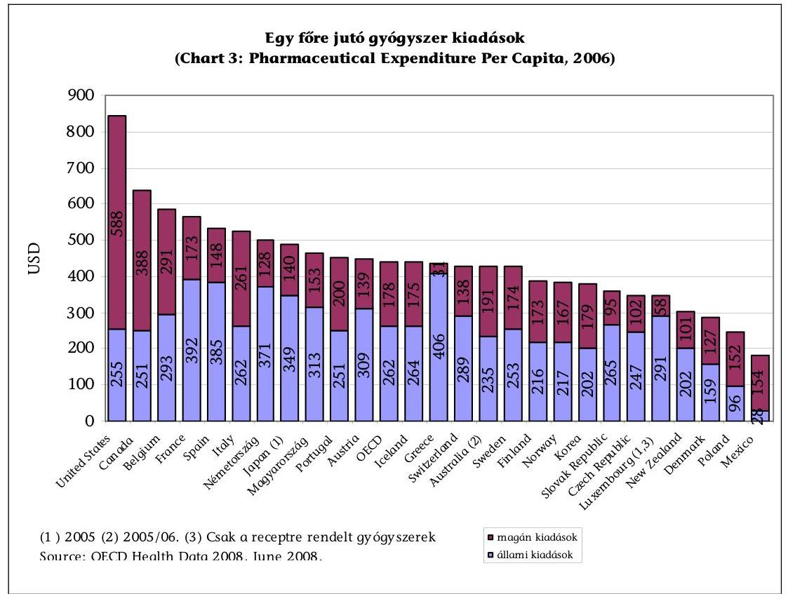

Az unió országaiban nem ismeretlen az „ingyen" gyógyszer fogalma. Csökkentett árakat vagy általános felmentést a gyógyszerár fizetésből („ingyen") a következő esetekben biztosítanak.

---

Klinikai állapot szerint- cukorbetegek Svédországban, a várandósok az Egyesült Királyságban, és speciális krónikus betegségekre Írországban, Finnországban, Spanyolországban és az Egyesült Királyságban. ${ }^{68}$

Jövedelemszint szerint alacsony jövedelműekre Ausztriában, Belgiumban, Németországban, Írországban és az Egyesült Királyságban, alacsony jövedelmű öregekre Görögországban.

Életkor szerint- öregekre Belgiumban, Írországban, Spanyolországban, gyerekre Németországban és az Egyesült Királyságban.

A gyógyszer típusa szerint- krónikus betegségekre Portugáliában, az életet veszélyeztető betegségekre alkalmazható gyógyszerekre Belgiumban, mindkét típusú gyógyszerre Görögországban és hatásos gyógyszerekre Franciaországban.

Néhány kormányzat maximálja a beteg által fizetendő térítési díjak összességét recept felírásra vagy egy adott évre vonatkozóan. Ilyen határokat alkalmaznak Belgiumban, Dániában, Finnországban, Németországban, Írországban, Olaszországban és Svédországban.

Az unió országaiban a térítésmentesség kritériuma lehet életkorhoz kötött, a gyógyszer típusa szerinti, klinikai állapot szerinti illetve jövedelemhez kötött kategória. Néhány ország maximálja a beteg által fizetett térítési díjat adott időszakra, és az e határ fölötti gyógyszerköltségeket az állam átvállalja. A magyar típusú közgyógyellátás egyik kategóriába sem sorolható, hiszen nem a betegterhet maximálja, hanem az állami támogatás mértékét. A magyar közgyógyellátási rendszerben 2007-ben egy közgyógyellátott által kiváltott gyógyító ellátásokra jutó állami támogatás 150134 Ft volt, amelyből a központi költségvetés által átvállalt betegtérítési díj 60359 Ft volt. Ehhez a közgyógyellátottak átlagosan 422 Ft térítési díjat fizettek. A közgyógyigazolvánnyal rendelkező betegek nem közgyógyellátás keretében kiváltott gyógyszereikhez átlagosan 94135 Ft támogatást kaptak, és a beteg által fizetett térítési díj 18545 Ft volt. Ez összesen közgyógyellátottanként havi 1580 Ft betegtérítési díjfizetést jelent.

A magyar betegek számára a közgyógyigazolványhoz jutás rendkívül fontos, mert aki akár 1000 Ft-tal meghaladja a jogosultsági jövedelemhatárt, vagy 100 Ft-tal nem éri el a gyógyítóellátás előírt mértékét, átlagosan évi 60000 Ft betegtérítési díj állami átvállalásától esik el. Így nagyon nagy különbségek lehetnek megközelítőleg azonos jövedelmű és gyógyítóellátási költséggel bíró emberek között aszerint, hogy igazolványhoz jutottak vagy sem. A német rendszerben az állami támogatás minden egyes euróval nő, amellyel a betegnek kisebb a jövedelme, vagy magasabb a gyógyszerköltsége.

A német gyógyszertámogatási rendszerben a betegek (mindenki részt vesz a biztosításban) a gyógyszer árának 10\%-át fizetik, de minimum 5, maximum 10 eurót. A gyógyszerköltségeket a biztosítottak csak a bruttó éves keresetük 2\%-ig

[^0]
[^0]:    ${ }^{68}$ Készült az Euro Observer 2004. Autumn, Vol. 6, No. 3. alapján An overview of cost scaring for health services in the European Union.

---

fizetik, a felett a biztosító átvállalja. Krónikus betegeknél ez a plafon 1\%. Ez azt jelenti, hogy a rendszer figyelembe veszi a jövedelmi viszonyokat, hiszen havi 1000 euró jövedelemmel rendelkező személy gyógyszerköltsége havi 20 euró, ugyanakkor havi 10000 euró jövedelmű személyé havonta maximum 200 euró lehet. A biztosítottak a biztosítóhoz nyújtják be jövedelemigazolásukat (!!!), aki ez alapján kiállít egy másik igazolást arról, hogy az év hátralévő részében a betegtérítési díj fizetése alól mentesítik a beteget. Az igazolás nem tartalmazhat a beteg jövedelmi viszonyaira vonatkozó adatot. 18 év alatti biztosítottak részére minden receptre felírt gyógyszer térítésmentes. Különösen kedvező áru gyógyszereket térítésmentesen biztosítanak minden pénztár biztosítottja részére. Ennek a célja, hogy a fogyasztást e termékek irányába tereljék. (Ez felfogható egy kvázi közgyógylistaként, amely a magyar rendszerrel ellentétben minden biztosított részére elérhető.) Minden pénztár további kedvezményeket biztosíthat tagjainak, akár a gyógyszer térítési dijának felezését vagy teljes eltörlését aszerint, hogy milyen szerződést kötött a gyógyszergyártókkal.

A 13. számú táblázat a magyar és a német „ingyen gyógyszer" ellátási rendszert mutatja be.

---

13. számú táblázat

| Összehasonlítás | Német | Magyar |
| :--: | :--: | :--: |
| Kedvezményezetti kör | 18 év alatt mindenki   Br. Jövedelem 2\%-át meghaladó betegtéritési díj felett mindenki   Kedvező áru gyógyszereknél mindenki | Meghatározott szociális ellátásokkal rendelkezők,   meghatározott jövedelem alatt és meghatározott gyógyító ellátási költség feletti betegek |
| Cél | Az egészségügyi és szociális rászorultság együttes figyelembevétele | Az egészségügyi és szociális rászorultság együttes figyelembevétele |
| A limit meghatározása | A betegtéritési díjat maximálja | Az állami támogatás mértékét maximálja |
| A beteg által fizetett téritési díj | Maximum a bruttó jövedelem 2\%-a (1000 Európa esetén 20 Euró) | Átlagban havonta kb. 1580 Ft |
| Az állami támogatás mértéke | Akár 1 Eurótól egyenletesen nő | A kártyával rendelkezők részére áltagosan évi 60000 Ft |
| Szociális rászorultság | Jövedelemigazolás | Részben jövedelemigazolás (normatív és méltányos igazolványok esetén), részben más szociális ellátás igazolása |
| Egészségügyi rászorultság | tényleges gyógyszerköltségen alapul | fiktív gyógyszerköltségen alapul, részben szubjektív megítélés alapján |
| Területi hozzáférés | Egyenlő | Méltányos igazolványoknál területtől függő |
| Adminisztráció | A biztosító évente egy alkalommal kiállítja az igazolást | A háziorvos listát készít a gyógyszerekről, az önkormányzat megállapítja a jogosultságot, a MEP megállapítja a keretet, az önkormányzat határozatot hoz, az OEP kiállítja a kártyát, mindez papír alapú ügyintézésben. |
| Az adminisztráció költsége | Alacsonyabb | Magasabb |
| Adatvédelem | A biztosító láthatja a biztosított jövedelmi adatait, de nem adhatja ki | A MEP nem láthatja a beteg jövedelmi adatait |

A két támogatási rendszer széles rétegek számára biztosít ingyenességet, és a céljai azonosak (szociális és egészségügyi rászorultság egyidejű figyelembe vétele). Ugyanakkor a kitűzött célokat a német rendszerben egyszerűbb, átláthatóbb, minden biztosítottra vonatkozóan egységes, földrajzi elhelyezkedéstől független szabályok alapján, a tényleges költségek figyelembevételével, és lényegesen egyszerűbb, egyszereplős adminisztrációval éri el. Így az összehasonlításban a német rendszer hatékonyabbnak tekinthető.

Budapest, 2009. február 10 .

Melléklet: $\quad 15 \mathrm{db} \quad 40 \mathrm{lap}$
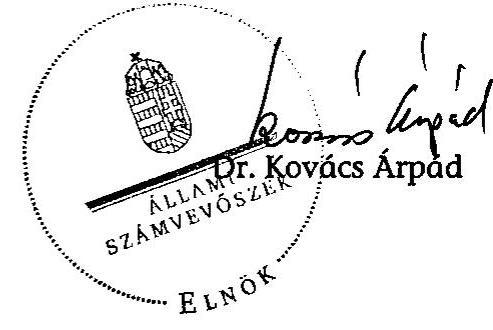

---

# 1. sz. melléklet 

## 0823/2009

$1211 / 09$
$U-2005-98 / 2008$

## EGÉSZSÉGÜGYI MINISZTÉRIUM MINISZTER

## Dr. Kovács Árpád

elnök részére

## Állami Számvevőszék

## Budapest

Apáczai Csere János u. 10. 1052

## Tisztelt Elnök Úr!

Szám: 449-0/2009-0008GYO
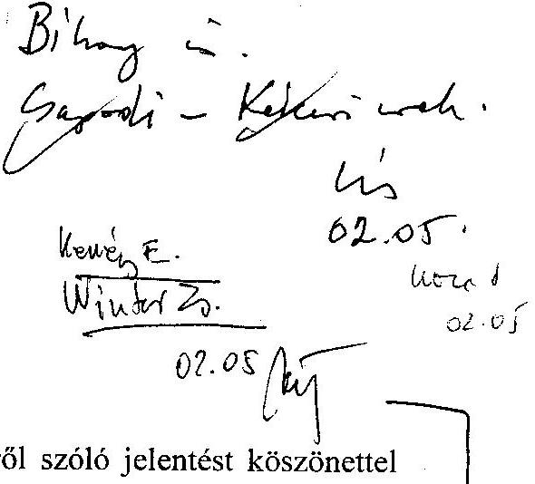

A közgyógyellátási rendszer működésének ellenőrzéséről szóló jelentést köszönettel megkaptam.
A jelentésben megfogalmazott, a kizárólag normatív $0 \%$-os támogatással rendelkező gyógyszerek közgyógyellátás keretében történő rendelhetőségének megszüntetésére tett javaslat kapcsán a hatásvizsgálat elkészült, az elemzés és a jogszabály módosítás előkészítése folyamatban van. Az ellenőrzés hatékonyságának fokozására tett intézkedésekről az Országos Egészségbiztosítási Pénztártól kértem tájékoztatást.

Jelzem egyúttal, hogy a Jelentésben szereplő megállapításokkal egyetértek.

Budapest, 2009. január „²0„.

Tisztelettel:
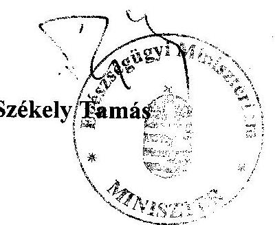

---

# KÉRDÉSEK, KRITÉRIUMOK ÉS ADATFORRÁSOK

## Főkérdés: Eredményesen múködik-e a közgyógyellátási rendszer?

|  Kérdések | Kritériumok, mutatók | Adatforrás  |
| --- | --- | --- |
|  1. A közgyógyellátás szabályozása, szervezete, eljárásrendje, forrásai, információs és az eljárást támogató informatikai rendszere szolgálja-e az átalakításban kitüzött célok elérését? |  |   |
|  1.1. A szabályozás összhangban van-e a célokkal? | A szabályozás átalakítását elemzésekkel, a hatások felmérésével alapozták meg, a tárcák együttműködése igazolható | Korm határozatok, (2356/2002. (XI. 28.), 2095/2005. (V. 27.) az 1993. évi III. tv. módosításának előkészítéséről szóló dokumentumok, a tv. módosítás indoklása, kormány előterjesztés, elemzések OEP, EüM, SZMM anyagai  |
|  1.1.1. Feltétele-e a közgyógyellátásnak a biztosítotti jogviszony? | A jogosultság ellenőrzés kiterjedt a járulék fizetés ellenőrzésére és a TAJ érvényességére | Az új rendszerre való áttérésről kormány számára készített beszámolók, SZMM, EüM, OEP elemzései, az 1997. évi LXXX. tv. járulékkötelezettség teljesítésére vonatkozó szabályai  |
|  1.2. A szervezet és eljárásrend - elősegíti-e a közgyógyellátási rendszer múködését? |  |   |
|  1.2.1. Tettek-e intézkedéseket az ügyviteli folyamatok egyszerűsítése érdekében? (felmérték?, kezdeményezték?, megvalósították?). A szükséges szakmai és pénzügyi kontroll szabályozás kiépítése megvalósul-e az eljárásrendben? | A múködés, a jogosultság megállapítás folyamata, maga az eljárásrend jól kidolgozott, a tv-i szabályozásra épül, a határidőket betartják, az ügyintézés nem okoz időbeli és pénzbeli hátrányt a | 63/2006. (III. 27.) Korm rendelet, az OEP által kidolgozott eljárásrendek, elemzések a bírálatok átfutási idejéről,  |

---

|  Kérdések | Kritériumok, mutatók | Adatforrás  |
| --- | --- | --- |
|   | rászorulóknak, egyszerű, folyamata mind az önkormányzatoknál mind a MEPeknél tartalmaz ellenőrzési pontokat |   |
|  1.2.2. A működési kiadások arányban állnak-e a közgyógyellátásra fordított kiadásokkal? Arányban áll-e a közgyógyellátásra fordított ellenőrzési kapacitás a közgyógy E. Alapon belül elfoglalt súlyával? A megnövekedett feladatok miatti többlet erőforrások fedezete az OEP költségvetésében rendelkezésre állt-e? | A működési kiadások az ellátási kiadások aránya OEP-éval egyezően alakul
A többlet feladatok végrehajtásának anyagi, személyi, tárgyi feltételei adottak, OEP és MEP-költségvetésébe beépítésre került | Tanúsítványi adatok elemzése, országos költségfelmérés, a MEPeknél, ÁSZ elemzés bemutatása önkormányzati kérdőív alapján és képzett mutatókkal a háziorvosok költségének bemutatása 38 háziorvos megkérdezése alapján
Munkafolyamatok elemzése idő szükséglet és kiadás szükséglet meghatározásával  |
|  1.3. Stabilizálódtak-e (átláthatók-e) a közgyógyellátásra fordított kiadások? | A közgyógyellátásra fordított kiadások stabilizálódtak. A közgyógyellátás finanszírozása kiszámítható, tervezhető, átlátható. |   |
|  1.3.1. Központi költségvetésből a térítési díjak kompenzálására E. Alapnak történő befizetést sikerült-e szinten tartani? | A központi költségvetés térítési díját a betegtérítés kompenzálására szinten tartották. | tanúsítvány
zárszámadási adatok
OEP beszámolók, elemzések  |
|  1.3.2. Növelte-e az OEP gyógyszertámogatás kiáramlását a közgyógyellátottak gyógyszerfogyasztása? | A közgyógyellátottak gyógyszerfogyasztása nem növelte az OEP gyógyszertámogatás | tanúsítvány  |

---

|  Kérdések | Kritériumok, mutatók | Adatforrás  |
| --- | --- | --- |
|   | kiáramlását. A keret megállapítás bevezetésével az előirányzatok tervezhetők. | OEP beszámolók, elemzések  |
|  1.3.3. Változott-e az egyes ellátási típusok aránya a kiadásokon belül? | A kiadásokon belül csökkent az egyes ellátási típusok igénybevételi arányra, ami hozzájárul a kiadások csökkenéséhez. | tanúsítvány
OEP beszámolók, elemzések  |
|  1.3.4. Az önkormányzatok terheinek megtérítése központi forrásból a pénzbeli szociális juttatások terhére hozzájárul-e a közgyógyellátással kapcsolatos E. Alapba történő befizetéshez? | A központi költségvetés pénzbeli szociális juttatásai hozzájárultak az önkormányzatok terheinek megtérítéséhez. | ÁSZ elemzés bemutatása önkormányzati kérdőív alapján  |
|  1.3.5. Halmozódtak-e fel hátralékok az önkormányzatok méltányos ellátáshoz kapcsolódó megtérítéseiben? Tudtak-e élni a MEP-ek a hátralékok behajtásával? | Az önkormányzatok határidőre térítenek. A térítés TAJ-hoz kapcsolható. A MEP-ek élnek behajtási felhatalmazásukkal. | OEP beszámolók, elemzések  |
|  1.4. Megvalósultak-e a közgyógyellátás korszerűsítéséhez, szervezéséhez, működtetéséhez szükséges informatikai fejlesztések (Közyyógy, VIREP), biztosították-e ennek forrásait, fejlesztési időszükségletét és eljárásrendjeit? | Az informatikai fejlesztések a kitűzött céloknak megfelelően megvalósultak. | Fejlesztési dokumentáció, költségvetési tervek, részfeladatok időütemezése.  |
|  1.4.1. Az ellátás információs rendszere biztosítja-e az ellenőrizhetőséget és átláthatóságot? Komplex információt szolgáltat-e a patikák és az OEP számára? Jó alapot képez-e a folyamatok átláthatóságához, értékeléséhez? | Programleírás, a program funkciói, a felhasználói igények, és a szabályozás megegyeznek. | Programleírás, a program funkciói, a felhasználói igények, szabályozás.  |
|  1.4.1.1. A VIREP rendszer megfelel-e az elvárásoknak? | A közgyógy átalakítás kapcsán született elvárásokat teljesíti (jogosultság ellenőrzések és elektronikus pénztárca funkció). | Programleírás, a program funkciói, a felhasználói igények, szabályozás.  |

---

|  Kérdések | Kritériumok, mutatók | Adatforrás  |
| --- | --- | --- |
|  1.4.1.2. Az igazolványok hatósági nyilvántartását támogató „Közgyógy program" teljes körű és naprakész adatokat szolgáltat-e? | Az OEP által vezetett hatósági nyilvántartás naprakész és pontos valamint megbízható adatokat tartalmaz. | Az OEP által vezetett hatósági nyilvántartás.  |
|  1.4.2. A megvalósított informatikai fejlesztések elérték-e a közbeszerzési eljárás során megfogalmazott célokat? | A közbeszerzési eljárás céljai szerinti funkciókat az információs és informatikai rendszerbe beépítették és müködtetik. | Programleírás, a program funkciói, a felhasználói igények, közbeszerzési kiírás dokumentumai.  |
|  2. Érvényesül-e a szociális rászorultság elve, ellenőrzött-e? |  |   |
|  2.1. Változott-e az ellátásban részesülők száma és jogcím csoportokon belüli aránya? | A jogosultság ellenőrzése, és a rászorultság szigorúbb érvényesítése miatt csökkent. | tanúsítvány, SZMM, EüM, OEP dokumentumok  |
|  2.2. Biztosított-e az egyenlő hozzáférés az ország különböző területein? | Érvényesül az esélyegyenlőség a közgyógyellátás igénylése és biztosítása során. | KSH, OEP adatbázis elemzés  |
|  2.3. A szociális rászorultság elv érvényesülésére kiépített ellenőrzés meg-felel-e a jogszabályoknak, eredményesen, hatékonyan és következetesen müködik-e? | A normatív és a méltányos közgyógy kategóriában megbízhatóan, eredményesen és következetesen vizsgálják a szociális rászorultságot. Az alanyi kategóriában vizsgálja a jogosultságot. | 1993. évi III. tv.
63/2006 (III. 27.) Korm. rendelet
Önkormányzati dokumentumok és nyilvántartások
Kérdőív  |
|  2.4. Az önkormányzatok által meghatározott jövedelem határ és gyógyszerköltség akadályozza-e az ellátáshoz való hozzáférést? | Nem maradnak ki rászorulók az ellátásból a helyi szabályozás miatt | 1993. évi III. tv.
63/2006 (III. 27.) Korm. rendelet  |

---

|  Kérdések | Kritériumok, mutatók | Adatforrás  |
| --- | --- | --- |
|   |  | Az önkormányzatok helyi rendeletei, kérdőív  |
|  3. Érvényesül-e az egészségügyi rászorultság elve, ellenőrzött-e? |  |   |
|  3.1. A keret meghatározás közgyógyellátási típusonként megfelel-e a krónikus betegek egyéni szükségleteinek? | A gyógyszerkeret meghatározása során figyelembe veszik a betegek krónikus betegségeit. A betegek közgyógyellátás terhére igénybe vehetik a szokásosan használt gyógyszereiket, gyógyászati segédeszközeiket, gyógyfürdő ellátásukat. Az ellátás során a gyógyszerek széles skálájából lehet választani. | Közgyógy lista, OEP támogatással rendelhető készítmények listája, a keret beárazása során használt gyógyszerek listája  |
|  3.2. Hatással van-e a személyre szabott keret megállapítás a jogosultság megszerzésére? Egységes-e a gyógyszerbeárazás gyakorlata azonos terápiák esetében az egyes MEP-eknél, és hatással lehet-e a jogosultság elérésére? A gyógyszerkeret háziorvosi és szakorvosi megbontása hatással van-e a jogosultság megszerzésére. | Azonos gyógyszeres terápia azonos gyógyszerkeretet eredményez. Azonos gyógyszerekből álló terápiákat a megyei pénztárak azonos módon árazzák be.
A MEP-ek országosan egységes programmal dolgoznak.
A gyógyszerkeret háziorvosi és szakorvosi megbontása megalapozott volt, igazodik a betegek ellátásának a terápiás költségeihez. | adatbekérés a MEP-ektől
A szociális igazgatásról és szociális ellátásokról 1993. évi III. törvény; 50/A. § (7)
OEP elemzési anyag  |
|  3.3. Ellenőrzött-e a korábban kiváltott és a jogosultság megszerzését megalapozó krónikus betegséghez tartozó gyógyszerkör egyezősége? | A gyógyszerkeret megállapítása során minden esetben vizsgálják | „Közgyógy program" adatbázisból nyerhető információk  |

---

|  Kérdések | Kritériumok, mutatók | Adatforrás  |
| --- | --- | --- |
|   | az igénylők krónikus betegségeit és a korábban alkalmazott terápiát, a gyógyszerkeret ezekhez igazodik. |   |
|  3.4. A jogosultság alapján kiváltott gyógyszerek és a háziorvosi javaslatban szerepeltetett készítmények összhangban állnak-e? Ellenőrzött-e az egyezőség? | Ellenőrzik, hogy a kiváltás során csak a gyógyszerköltség megállapításához előállított szakhatósági állásfoglalásban szereplő készítményekkel azonos négyszintű ATC5 kódú termékeket lehessen kiváltani. | OEP ellenőrzési anyagok, intézkedési tervek  |
|  3.5. A közgyógyellátás mellett merülnek-e fel további gyógyszer költségei az igazolvánnyal rendelkezőknek? Elemzik-e ennek összetételét?, nagyságrendjét? Hatással van-e a gyógyszer gazdaságosság követelménye közgyógy ellátottak gyógyszereinek árára? | A közgyógy rendszer átalakítását megelőző időszakhoz képest csökkent a közgyógyellátott beteg által a közgyógy körön kiváltott gyógyszerek aránya. | tanúsítvány
OEP elemzés  |
|  3.6. Az egészségügyi rászorultság elv érvényesülésére kiépített ellenőrzés megfelel-e a jogszabályoknak, eredményesen, hatékonyan és következetesen múködik-e? | Az egészségügyi rászorultság megállapítása során múködnek kontrollok | Informatikai rendszerek („Közgyógy program")
Eljárásrend vonatkozó része  |
|  3.7. Elégedettek-e a betegek? | A betegek elégedettek a közgyógyellátási rendszerrel. | Kérdőív a patikáktól  |
|  4. Javult-e a közgyógyellátottak gyógyászati segédeszköz és gyógyfürdő ellátása? |  |   |
|  4.1. Változott-e a gyógyászati segédeszköz és gyógyfürdő ellátás finanszírozása, támogatásának mértéke, a támogatott termékkör? |  |   |
|  4.1.1. A termékek minőségében érvényesül-e a pénzért értéket elv? Ellen-őrzött-e a termékek minősége, rehabilitációra való alkalmassága független, a finanszírozó meggyőződik az eszközök alkalmasságáról, minő- | A finanszírozó meggyőződik az eszközök alkalmasságáról, minő- | OEP befogadási eljárás dokumen-  |

---

|  Kérdések | Kritériumok, mutatók | Adatforrás  |
| --- | --- | --- |
|  len szakértők és az OEP által? | ségéről, ennek eredménye szerint támogat. | tációi, eljárásrend, jogszabályok.  |
|  4.1.2. A támogatott segédeszközök körének változása, cserélődése bizto-sítja-e korszerűbb eszközökhöz való hozzáférést? | A közgyógyellátási eszközlistában egyre gyakoribbak az új befogadások és az elavult eszközök delistázása. | Közzétett közgyógyellátási terméklisták, OEP gyógyászati segédeszköz adatbázis.  |
|  4.2. Változtak-e a betegterhek a gyógyászati segédeszköz és gyógyfürdő ellátásban? Működik-e kontroll az árváltozások betegterhekre gyakorolt hatásában? | A finanszírozók figyelik a betegterhek változását. A közgyógyellátottaknak nem kell többet fizetniük az ellátásért, mint korábban. | OEP tanúsítványok
betegelégedettségi kérdőív  |
|  4.3. Az árlicitek segítik-e az ellátáshoz való hozzáférést? Lehetőséget ad-e érdemi árcsökkentésre a licit? | Az árlicitek hatásos finanszírozói és „fogyasztói" árkontrollt jelentenek. | OEP tanúsítvány és ügyviteli szabályozás, elégedettségi kérdőív.  |
|  4.4. Személyre szabott-e az ellátás, megfelel-e az egészségügyi rászorultságnak? | A finanszírozó vizsgálja és érvényesíti a kész termékek egyedi alkalmasságát, a közgyógyellátott személyeknek való megfelelőségét. | Szakmai ajánlások, OEP szabályozások, finanszírozási szerződések, minőségi észrevételezések, reklamációk, panaszok dokumentációi.  |
|  4.5. A kiépített ellenőrzés megfelel-e a jogszabályoknak, eredményesen, hatékonyan és következetesen múködik-e? | A közgyógyellátottak gyógyászati segédeszköz-ellátásánál múködnek kontrollok | Informatikai rendszerek
Eljárásrend vonatkozó része  |

---

|  Megnevezés | KÖZGYŐGY2005
(település soros
odatok alapján)
összesen | KÖZGYŐGY2005
(település soros
odatok alapján)
ALANTI | KÖZGYŐGY2005
(település soros
odatok alapján)
MELTANYOS | KÖZGYŐGY2005
(település soros
odatok alapján)
NORMATIV | COGNOS összesen | COGNOS
ALANTI | COGNOS
NORMATIV | COGNOS
MELTANYOS  |
| --- | --- | --- | --- | --- | --- | --- | --- | --- |
|  2005.06 .30 | 526697 | 266689 | 171745 | 88263 |  |  |  |   |
|  2005.12 .31 | 529566 | 267767 | 173377 | 88422 | 539208 | 274965 | 89739 | 174504  |
|  2006.06 .30 | 529034 | 265679 | 176759 | 86596 | 532557 | 267411 | 86833 | 178313  |
|  2006.12 .31 | 486978 | 250609 | 156855 | 79514 | 488724 | 251871 | 79666 | 157187  |
|  2007.01 .31 |  |  |  |  | 474408 | 247660 | 77059 | 149689  |
|  2007.02 .28 |  |  |  |  | 466727 | 247753 | 75205 | 143769  |
|  2007.03 .31 |  |  |  |  | 463568 | 247988 | 74944 | 140636  |
|  2007.04 .30 |  |  |  |  | 455932 | 247573 | 73548 | 134811  |
|  2007.05 .31 |  |  |  |  | 449063 | 249215 | 72828 | 127020  |
|  2007.06 .30 | 439303 | 248753 | 118638 | 71912 | 441541 | 250278 | 72062 | 119201  |
|  2007.07 .31 |  |  |  |  | 377413 | 229395 | 63202 | 84816  |
|  2007.08 .31 |  |  |  |  | 398858 | 240845 | 67349 | 90664  |
|  2007.09 .30 |  |  |  |  | 401731 | 242057 | 68205 | 91469  |
|  2007.10 .31 |  |  |  |  | 398288 | 240417 | 67793 | 90078  |
|  2007.11 .30 |  |  |  |  | 395217 | 238852 | 67520 | 88845  |
|  2007.12 .31 | 364259 | 211955 | 86074 | 66230 | 388545 | 235734 | 66365 | 86446  |
|  2008.01 .31 |  |  |  |  | 364831 | 213386 | 66170 | 85275  |
|  2008.02 .29 |  |  |  |  | 364478 | 214327 | 66357 | 83794  |
|  2008.03 .31 |  |  |  |  | 358072 | 213159 | 64337 | 80576  |
|  2008.04 .30 |  |  |  |  | 352882 | 212559 | 61987 | 78336  |
|  2008.05 .31 |  |  |  |  | 344884 | 209757 | 59693 | 75434  |
|  2008.06 .30 | 337039 | 206047 | 72674 | 58318 | 337163 | 206141 | 58332 | 72690  |

---

# Egy állandó lakosra jutó szja alapot képező jövedelem az egyes településfejlettségi kategóriákban 

| A társadalmi, gazdasági és infrastrukturális   fejlettség/ elmaradottság | Lakónépesség:   2005. december   31. (fő) | Lakónépesség:   2005. december   31. (\%) | Az egy állandó   lakosra jutó SZJA   alapot képező   jövedelem 2004.   (Ft/év) | Az egy állandó      Jövedelem   /Dinamikusan   fejlődők   jövedelme (\%) |
| :-- | :--: | :--: | :--: | :--: |
| 1. Lemaradó | 799483 | $8 \%$ | 271478 | $35 \%$ |
| 2. Stagnáló | 1078274 | $11 \%$ | 338310 | $44 \%$ |
| 3. Felzárkózó | 2507467 | $25 \%$ | 440316 | $57 \%$ |
| 4. Fejlődő | 2535180 | $25 \%$ | 595537 | $77 \%$ |
| 5. Dinamikusan fejlődő | 3156154 | $31 \%$ | 775695 | $100 \%$ |
| Összesen: | 10076581 | 100\% | 560104 | $72 \%$ |

---

# **Közgyógyjogosultak által igénybe vett gyógyító ellátások forrás szerinti bontásban közgyógy jogcímeken és azon kívül (vényforgalom alapján)**

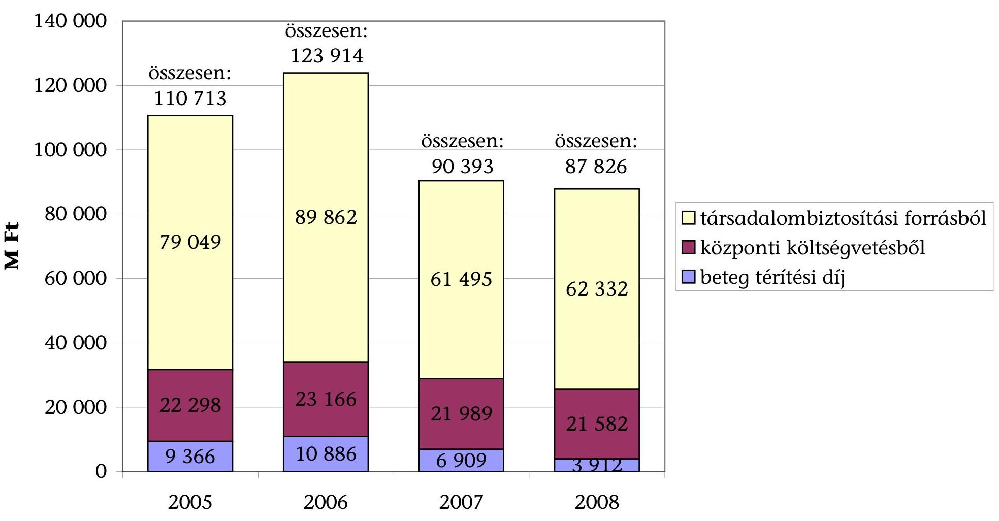

---

# **Közgyógyjogosultak által közgyógy finanszírozási jogcímeken és azon kívül igénybe vett gyógyító ellátások**

|  140 000 | ÖSSZESEN: 110 713 | ÖSSZESEN: 123 914 | ÖSSZESEN: 90 393 | ÖSSZESEN: 87 826  |
| --- | --- | --- | --- | --- |
|  120 000 | 55 948 | 68 368 | 35 552 | 24 897  |
|  100 000 |  |  |  |   |
|  80 000 |  |  |  |   |
|  60 000 |  |  |  |   |
|  40 000 |  |  |  |   |
|  20 000 |  |  |  |   |
|  0 |  |  |  |   |
|  2005 |  | 2006 |  | 2007  |
|  2008 |  |  |  |   |

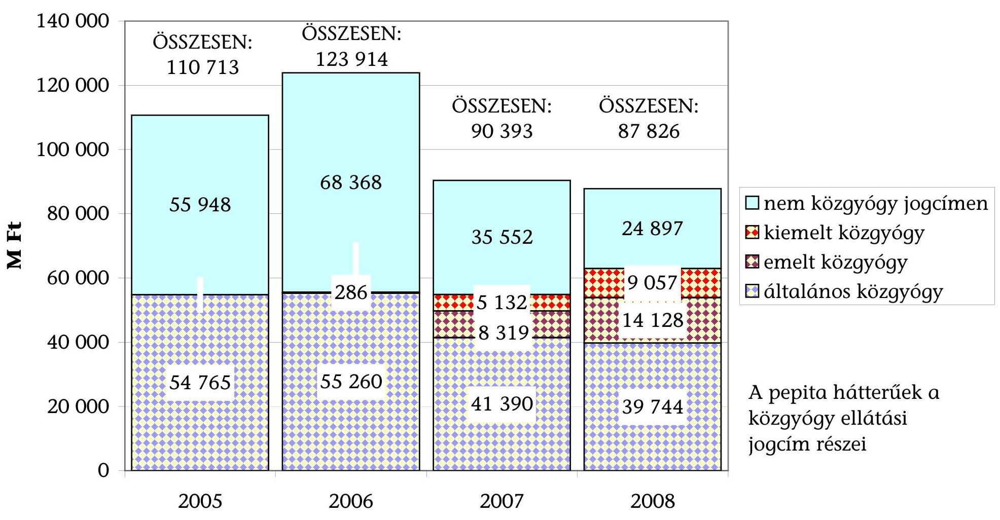

---

# Közgyógyjogosultak emelt 90-100\%-os jogcímú kiváltásának tb támogatása 

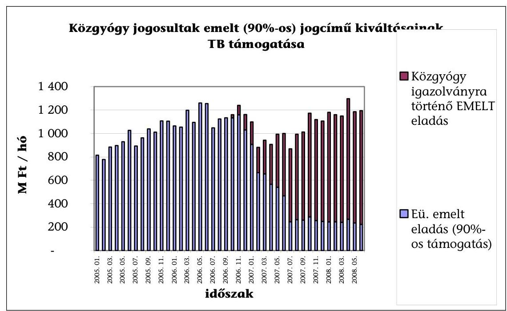
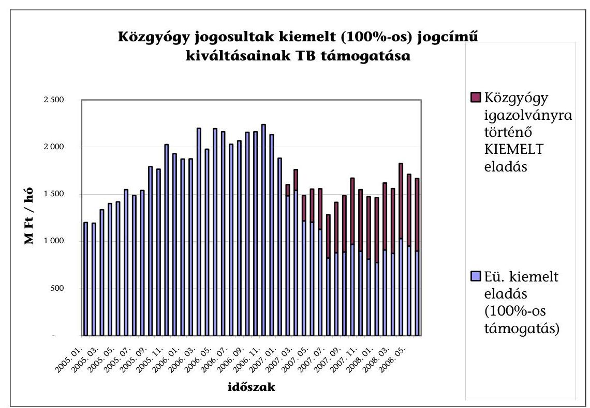

---

# Cystas fibrosisban szenvedő beteg gyógyszeres terápiájának beárazása 

Cystas fibrosis - 17 éves fiúbeteg

| BNO   kód | elnevezés | Gyógyító ellátás | kiszerel és | adagolás | mennyiség (scat. orig) | térítési   dij371 |
| :--: | :--: | :--: | :--: | :--: | :--: | :--: |
| E8490 | cystas fibrosis | Vitamin A Bioextra 25000 NE kapszula | 20x | $1 \times .14$ | 1 | 371 |
|  |  | Kreon 10000 kapszula | 50x | $4 \times 1$ | 3 | 900 |
|  |  | Vitamin D3 Fresenius tabletta | $90 x$ | $1 \times 3$ | 1 | 218 |
|  |  | Vitamin B komplex bioextra kapszula | 100x | $2 \times 1$ | 1 | 964 |
|  |  | Ensure Plus HN narancs ízesítésű* | 200 ml | $1 \times 200$ | 30 | 2610 |
|  |  | Ensure Plus HN csokoládé ízesítésű* | 200 ml | $1 \times 200$ | 30 | 2610 |
|  |  | Ensure Plus HN vanília ízesítés* ú | 200 ml | $1 \times 200$ | 30 | 2610 |
|  |  | Ensure Plus HN banán ízesítésű* | 200 ml | $1 \times 200$ | 30 | 2610 |
|  |  | Ensure Plus HN eper ízesítésű* | 200 ml | $1 \times 200$ | 30 | 2610 |
|  |  | Ensure Plus HN erdei gyümölcs ízesítésű | 200 ml | $1 \times 200$ | 30 | 2610 |
| J42H0 | n. m. idült broncitis | Pulmozyme 2,5 mg oldat porlasztásra | $30 x$ | $2 \times .01$ | 1 | 300 |
| E8490 | cystas fibrosis | Sputopur 200 mg kapszula | $30 x$ | $3 \times 2$ | 6 | 1800 |
|  |  | Ensure Plus HN barack ízesítésű* | 200 ml | $1 \times 200$ | 30 | 2610 |
|  |  | Berodural inhalációs oldat | $\begin{gathered} 1 \times 20 \\ \mathrm{ml} \end{gathered}$ | $2 \times .01$ | 1 | 742 |
|  |  | Glucosum anhydricum | 1000 g |  |  | 2154 |
|  |  | Kalium chloratum (részösszeg) | 1000 g |  |  | 1626,75 |
|  |  | Natrium chloratum (részösszeg) | 1000 g |  |  | 3807 |
|  |  | magi összesen |  |  |  | 7967,14 |
|  |  | Natrium chloratum 0.9\% injekció (részösszeg) | $\begin{gathered} 10 \times 10 \\ \mathrm{ml} \end{gathered}$ | $2 \times .01$ | 1 | 552 |
|  |  | Kreon 25000 kapszula | 100x | $4 \times 1$ | 2 | 600 |
|  |  | Vitamin E Bioextra 400 mg kapszula | $30 x$ | $1 \times 1$ | 1 | 1198 |
|  |  | Béres C-vitamin 500 mg filmtabletta | $60 x$ | $1 \times 1$ | 1 | 591 |
|  |  | Konakion MM injekció | $5 \times 1 \mathrm{ml}$ | $2 \times .01$ | 1 | 440 |
| J47H0 | bronchiectasia | Ventolin evohaler inhalációs aeroszol | $\begin{gathered} 200 \\ \text { adag } \end{gathered}$ | $4 \times 2$ | 2 | 174 |
|  |  | Azithromycin 1A pharma 250 mg filmtabletta | $6 x$ | $1 \times .4$ | 2 | 2998 |
| Gyógyszerköltsége összesen: 19 435Ft + 18270 Ft (tápszer) + 7967 Ft (magisztrális késztmény) $=45672 \mathrm{Ft}$   A MEP által elismert költség: 6740 Ft |  |  |  |  |  |  |
| A cisztás fibrózisban szenvedő betegek életük végéig tápszerre szorulnak   * tápszerek |  |  |  |  |  |  |

---

# Parkinsonos és diabeteses (cukorbeteg) gyógyszeres terápiájának beárazása 

| $\begin{aligned} & \text { háziorvos által rendelt } \\ & \text { antiparkinsonos és } \\ & \text { antidiabeteses gyógyszerek és } \\ & \text { kiszerelésük } \end{aligned}$ | patikai térítési   díja (Ft)   normatív | patikai térítési díj   (Ft)   jogcím: eü tér. köt   2007 | patikai térítési díj (Ft)   jogcím: eü tér. köt 2008 |  |
| :--: | :--: | :--: | :--: | :--: |
| 1. Selegiline Merck 5 mg $30 x$ | 3 doboz 3234 | $\begin{aligned} & 2 \text { doboz } \\ & 526 \end{aligned}$ | 3 doboz | 432 |
| 2. Viregyt-K kapszula $30 x$ | 2 doboz 1232 | 2 doboz 164 | 2 doboz | 164 |
| 3. Sirdalud 4 mg tabletta $30 x$ | 3 doboz 3438 | 3 doboz 1374 | 3 doboz | 1374 |
| 4. Requip 1 mg tabletta $21 x$ | 5 doboz 12445 | 5 doboz 1245 | 5 doboz | 1245 |
| 5. Requip 2 mg tabletta $21 x$ | 5 doboz 23355 | 5 doboz 2335 | 5 doboz | 2335 |
| 6. Duellin $25 \mathrm{mg} / 250 \mathrm{mg}$ $50 x$   tabletta | 3 doboz | 3 doboz 789 |  |  |
| 7. Madopar kapszula $100 x$ | 1 doboz | 3 doboz 396 |  |  |
| 8. Stalevo100mg/25mg/200mg $100 x$ tabletta | 2 doboz 55014 |  | 2 doboz | 5502 |
| 9. Lantus 100NE/ML oldatos $5 x$   injekció patronban 3ml |  | 1 doboz 300 | 1 doboz | 300 |
| 10. Novorapid penfill 100E/ML olda- $5 x$   tos injekció patronban 3ml |  | 1 doboz 300 | 1 doboz | 300 |
| Parkinsonismus kezelés költsége:   Diabetes mellitus " "   Egyéb betegségek " " | 98718 Ft   600 Ft   11060 Ft | 6829 Ft   600 Ft   11060 Ft | 11052 Ft   600 Ft   11968 Ft |  |
| Összesen: |  | 18489 Ft |  | 23620 Ft |
| TEP által elismert térítési díj: |  | 18489 Ft |  | 6600 Ft |
| TEP vezető ellenjegyzésével: |  |  |  | 600 Ft |
| Jegyző határozatában megállapított összeg |  | 12000 Ft |  | 6600 Ft |

A táblázat egy parkinsonos és diabeteses (cukorbeteg) beteg gyógyszereit tartalmazza, 2 egymást követő évben történt közgyógy kártya igénylés háziorvosi igazolásában szereplő gyógyszerlista alapján. A beteg ezeken a gyógyszereken kívül TIA, érelmeszeseđés, alsó végtagi vénás keringési elégtelenség. stb miatt még 8 féle gyógyszert kapott (ezeket a gyógyszereket a táblázatban a könnyebb áttekinthetőség kedvéért nem mutatja be). A táblán szereplő adatok azt szemléltetik, hogy két különböző betegség (parkinsonismus gyógyszerei 1.-8. és cukorbetegség gyógyszerei 9. 10.) költségtérítése között - annak függvényében, hogy az OGYI melyik rendelhetőségi kategóriájába tartozik - mekkora különbség lehet, a „V"-s (háziorvos által rendelhető) Parkinsonismus a „J"-s (szakorvosi javaslatra rendelhető) diabeteshez képest mennyire alultámogatott.
A 2008-ban az igazoláson korábban szereplő Duellin és a Madopar gyógyszereket a beteg állapotának romlása miatt Stalevora cserélték. 2007-hez képest a TEP által elismert térítési díj 2008-ban 6600 Ft-ra csökkent, miközben a beteg költsége csaknem megduplázódott, állapota pedig (a gyógyszeres terápiából következtetve) romlott. Látható, hogy egyazon betegség könnyebb fázisához képest a súlyosabb fázis alacsonyabb támogatottságú lett.
A második oszlop az demonstrálja, hogy a Parkinsonismus kezelése drága. Normatív támogatás mellett 98718 Ft a patikai térítési díja. Eü pontos támogatás mellett 2007-ben 6829 Ft, 2008-ban 11052 Ft.

---

| Gyógyszer | A gyógyszer kiszerelése (db / doboz) | A Szakhatósági állásfoglalásban szereplő dobozszám | Kiváltott dobozszám | A Szakhatósági állásfoglalásban szereplő dobozszám / Kiváltott dobozszám |
| :--: | :--: | :--: | :--: | :--: |
| ALGOPYRIN 500 MG TABLETTA | 10 | 1869 849,5 | 776 497,0 | $41,5 \%$ |
| ALGOZONE 500 MG TABLETTA | 20 | 2344,1 | 957,0 | $40,8 \%$ |
| ANDAXIN TABLETTA | 20 | 1198 534,7 | 538 170,0 | $44,9 \%$ |
| BERES B6 VITAMIN TABLETTA | 20 | 623,6 | 59,0 | $9,5 \%$ |
| BERES C-VITAMIN 500 MG FILMTABLETTA | 60 | 460,0 | 98,0 | $21,3 \%$ |
| CALCIUM 500 MG PHARMAVIT PEZSGÓTABLETTA | 20 | 354 945,7 | 102 873,0 | $29,0 \%$ |
| CHLORDIAZEPOXID LFM TABLETTA | 20 | 22284,4 | 6714,0 | $30,1 \%$ |
| C-VITAMIN 500 MG RAGOTABLETTA | 60 | 144702,7 | 55 530,0 | $38,4 \%$ |
| DEMALGON TABLETTA | 10 | 107 537,2 | 26 083,0 | $24,3 \%$ |
| DICLOFENAC-RATIOPHARM GEL | 100 g | 37516,7 | 16 503,0 | $44,0 \%$ |
| DIPANKRIN DRAZSE | 100 | 95687,8 | 38741,0 | $40,5 \%$ |
| DONALGIN KAPSZULA | 30 | 231 480,7 | 89 081,0 | $38,5 \%$ |
| FRONTIN 0.25 MG TABLETTA | 100 | 237 952,7 | 116 186,0 | $48,8 \%$ |
| FRONTIN 0.5 MG TABLETTA | 100 | 185 007,6 | 93 227,0 | $50,4 \%$ |
| FRONTIN 1 MG TABLETTA | 30 | 1352,5 | 951,0 | $70,3 \%$ |
| FRONTIN 1 MG TABLETTA | 100 | 7027,9 | 4 182,0 | $59,5 \%$ |
| MAGNESIUM 250 MG PHARMAVIT PEZSGÓTABLETTA | 20 | 236 894,7 | 77732,0 | $32,8 \%$ |
| MULTIVITAMIN 50 EVEN FELULIEKNEK FILMTABLETTA | 60 | 70 925,7 | 26 484,0 | $37,3 \%$ |
| NO-5PA 40 MG TABLETTA | 20 | 608 730,6 | 141 606,0 | $23,3 \%$ |
| QUAMATEL 20 MG FILMTABLETTA | 60 | 33 976,7 | 8 817,0 | $26,0 \%$ |
| TABLETTA ANALGETICA FONO VII. PARMA | 10 | 6213,8 | 1338,0 | $21,5 \%$ |
| TRAMADOLOR 50 MG KAPSZULA | 20 | 7823,9 | 3219,0 | $41,1 \%$ |
| TRAMADOL-RATIOPHARM 50 MG KAPSZULA | 30 | 15689,5 | 6230,0 | $39,7 \%$ |
| TRAMALGIC KAPSZULA | 30 | 5247,5 | 2769,0 | $52,8 \%$ |
| VITAMIN A BIOEXTRA 25000 NE KAPSZULA | 20 | 28561,7 | 8 920,0 | $31,2 \%$ |
| VITAMIN B6 20 MG TABLETTA | 20 | 108 864,3 | 36 697,0 | $33,7 \%$ |
| VITAMIN D3 FRESENIUS TABLETTA | 30 | 74811,8 | 37276,0 | $49,8 \%$ |
| VITAMIN E BIOEXTRA 200 MG KAPSZULA | 100 | 44 468,4 | 6259,0 | $14,1 \%$ |
| VITAMIN E BIOEXTRA 400 MG KAPSZULA | 30 | 1003,5 | 304,0 | $30,3 \%$ |
| XANAX 0.25 MG TABLETTA | 30 | 5790,0 | 2821,0 | $48,7 \%$ |
| XANAX 0.25 MG TABLETTA | 100 | 54 170,1 | 24 906,0 | $46,0 \%$ |
| XANAX 0.5 MG TABLETTA | 30 | 2471,9 | 1244,0 | $50,3 \%$ |
| XANAX 0.5 MG TABLETTA | 100 | 64 522,9 | 33475,0 | $51,9 \%$ |
| XANAX 1 MG TABLETTA | 30 | 11 205,7 | 13 303,0 | $118,7 \%$ |
| OSSZESEN | - | 5878 680,4 | 2299 252,0 | 39,1\% |
| FELIRT / KIVALTOTT | - | 2,6 |  | - |

---

A közgyógy2005 és a gazdaságos gyógyszerrendelést segítő program logikájából adódó készítményválasztás különbsége A program által választott termék A legkisebb napi terápiás költségủ termék

|   |  |  |  |  | Adagolás |  |  |  |   |
| --- | --- | --- | --- | --- | --- | --- | --- | --- | --- |
|   |  |  |  | 1x1 |  | 2x1 |  | 3x1 |   |
|   |  | Ntk | Tér. Dij | Havi menny. | Téritési dij | Havi menny. | Téritési dij | Havi menny. | Téritési dij  |
|  210074728 | ACEOMEL 25 MG TABLETTA | 100x | 20,44 | 1022 | 1 | 1022 | 1 | 1022 | 1  |
|  210144735 | CAPTOGAMMA 25 MG TABLETTA | 50x | 23,48 | 587 | 1 | 587 | 2 | 1174 | 2  |
|  210074710 | ACEOMEL 25 MG TABLETTA | 30x | 30,33 | 455 | 1 | 455 | 2 | 910 | 3  |
|  210231257 | METFOGAMMA 850 FILMTABLETTA | 60x | 20,63 | 237 | 1 | 237 | 1 | 237 | 2  |
|  210147937 | METFOGAMMA 850 FILMTABLETTA | 120x | 20,71 | 475 | 1 | 475 | 1 | 475 | 1  |
|  210211451 | METFORMIN 1A PHARMA 850 MG FILMTABLETTA | 120x | 20,88 | 484 | 1 | 484 | 1 | 484 | 1  |
|  210214611 | GLUFORMIN 850 MG FILMTABLETTA | 60x | 21,65 | 262 | 1 | 262 | 1 | 262 | 2  |
|  210123682 | MEGLUCON 850 MG FILMTABLETTA | 120x | 21,98 | 540 | 1 | 540 | 1 | 540 | 1  |
|  210123666 | MEGLUCON 850 MG FILMTABLETTA | 30x | 22,43 | 141 | 1 | 141 | 2 | 282 | 3  |
|  210211469 | METFORMIN 1A PHARMA 850 MG FILMTABLETTA | 30x | 22,59 | 143 | 1 | 143 | 2 | 286 | 3  |
|  210082739 | ADIMET 850 MG FILMTABLETTA | 120x | 24,8 | 684 | 1 | 684 | 1 | 684 | 1  |
|  210074883 | CLONAMOX 250 MG KAPSZULA | 500x | 73,98 | 9247 | 1 | 9247 | 1 | 9247 | 1  |
|  210074875 | CLONAMOX 250 MG KAPSZULA | 100x | 92,04 | 2301 | 1 | 2301 | 1 | 2301 | 1  |
|  210134374 | AMOXICILLIN-B 250 MG KAPSZULA | 10x | 145,6 | 273 | 3 | 819 | 6 | 1638 | 9  |
|  210074867 | CLONAMOX 250 MG KAPSZULA | 20x | 145,8 | 547 | 2 | 1094 | 3 | 1641 | 5  |
|  210134382 | AMOXICILLIN-B 250 MG KAPSZULA | 20x | 145,8 | 547 | 2 | 1094 | 3 | 1641 | 5  |
|  210214328 | APO-FAMOTIDIN 40 MG FILMTABLETTA | 60x | 36,55 | 987 | 1 | 987 | 1 | 987 | 2  |
|  210064228 | APO-FAMOTIDIN 40 MG FILMTABLETTA | 30x | 36,57 | 494 | 1 | 494 | 2 | 988 | 3  |
|  210221692 | FAMOTIDIN 1A PHARMA 40 MG FILMTABLETTA | 30x | 36,97 | 506 | 1 | 506 | 2 | 1012 | 3  |
|  210111198 | MOTIDIN 40 MG FILMTABLETTA | 14x | 38,64 | 259 | 3 | 777 | 4 | 1036 | 7  |
|  210154031 | QUAMATEL 40 MG FILMTABLETTA | 30x | 43,2 | 693 | 1 | 693 | 2 | 1386 | 3  |
|  210027357 | QUAMATEL 40 MG FILMTABLETTA | 14x | 43,5 | 327 | 3 | 981 | 4 | 1308 | 7  |
|  210111481 | CORINFAR 20 RETARD FILMTABLETTA | 100x üveg | 17,06 | 171 | 1 | 171 | 1 | 171 | 1  |
|  210006678 | CORDAFLEX 20 MG RETARD FILMTABLETTA | 60x | 17,38 | 110 | 1 | 110 | 1 | 110 | 2  |
|  210111465 | CORINFAR 20 RETARD FILMTABLETTA | 30x bliszter | 17,75 | 62 | 1 | 62 | 2 | 124 | 3  |
|  210111473 | CORINFAR 20 RETARD FILMTABLETTA | 50x üveg | 18,45 | 127 | 1 | 127 | 2 | 254 | 2  |
|  210008418 | DICLOFENAC 100 STADA RETARD FILMTABLETTA | 100x | 20,94 | 942 | 1 | 942 | 1 | 942 | 1  |
|  210008426 | DICLOFENAC 100 STADA RETARD FILMTABLETTA | 20x | 25,1 | 226 | 2 | 452 | 3 | 678 | 5  |
|  210008434 | DICLOFENAC 100 STADA RETARD FILMTABLETTA | 50x | 25,12 | 565 | 1 | 565 | 2 | 1130 | 2  |
|  210135663 | DICLOFENAC-RATIOPHARM 100 MG RETARD KAPSZULA | 10x | 27,9 | 126 | 3 | 378 | 6 | 756 | 9  |
|  210132932 | DICLOFENAC-RATIOPHARM 100 MG RETARD KAPSZULA | 20x | 28,05 | 252 | 2 | 504 | 3 | 756 | 5  |
|  210008604 | DICLOFENAC PHARMAVIT 100 MG RETARD FILMTABLETTA | 30x | 28,23 | 381 | 1 | 381 | 2 | 762 | 9  |

---

# 28-SZOROS KISZERELÉSŰ KÉSZÍTMÉNYEK TÉRÍTÉSI DÍJA HAVI ÉS ÉVES KÖLTSÉGKALKULÁCIÓ ESETÉN

|  Adagolás
A gyógyszerszükséglet megállapítási módja: |  |  | $1 \times 1$ |  |  |  | $2 \times 1$ |  |  |  | $3 \times 1$ |  |  |   |
| --- | --- | --- | --- | --- | --- | --- | --- | --- | --- | --- | --- | --- | --- | --- |
|   |  |  | Havi |  | Éves |  | Havi |  | Éves |  | Havi |  | Éves |   |
|   |  |  |  |  |  |  |  |  |  |  |  |  |  |   |
|  Név | Kiszerelés | Bruttó
Tér. Díj | doboz | Tér. Díj | doboz | Tér. Díj | doboz | Tér. Díj | doboz | Tér. Díj | doboz | Tér. Díj | doboz | Tér. Díj  |
|  CO-RENITEC TABLETTA | 28 x | 134 | 24 | 3216 | 14 | 1876 | 36 | 4824 | 27 | 3618 | 48 | 6432 | 40 | 5360  |
|  LOKREN 20 MG
FILMTABLETTA | 28 x | 181 | 24 | 4344 | 14 | 2534 | 36 | 6516 | 27 | 4887 | 48 | 8688 | 40 | 7240  |
|  MONO MACK DEPOT 100 MG RETARD TABLETTA | 28 x | 290 | 24 | 6960 | 14 | 4060 | 36 | 10440 | 27 | 7830 | 48 | 13920 | 40 | 11600  |
|  QUAMATEL 20 MG FILMTABLETTA | 28 x | 398 | 24 | 9552 | 14 | 5572 | 36 | 14328 | 27 | 10746 | 48 | 19104 | 40 | 15920  |
|  TRITACE 5 MG TABLETTA | 28 x | 364 | 24 | 8736 | 14 | 5096 | 36 | 13104 | 27 | 9828 | 48 | 17472 | 40 | 14560  |
|  SINGULAIR JUNIOR 5 MG
RÁGÓTABLETTA | 28 x | 8783 | 24 | 210792 | 14 | 122962 | 36 | 316188 | 27 | 237141 | 48 | 421584 | 40 | 351320  |
|  NEBILET TABLETTA | 28 x | 1527 | 24 | 36648 | 14 | 21378 | 36 | 54972 | 27 | 41229 | 48 | 73296 | 40 | 61080  |
|  LESCOL XL 80 MG RETARD TABLETTA | 28 x | 879 | 24 | 21096 | 14 | 12306 | 36 | 31644 | 27 | 23733 | 48 | 42192 | 40 | 35160  |
|  XYZAL 5 MG FILMTABLETTA | 28 x | 2892 | 24 | 69408 | 14 | 40488 | 36 | 104112 | 27 | 78084 | 48 | 138816 | 40 | 115680  |
|  PLAVIX 75 MG
FILMTABLETTA/BLISZTER | 28 x | 13168 | 24 | 316032 | 14 | 184352 | 36 | 474048 | 27 | 355536 | 48 | 632064 | 40 | 526720  |

---

# Egyes „VN" jelzésú készítmények eltérő megyei besorolási gyakorlata 

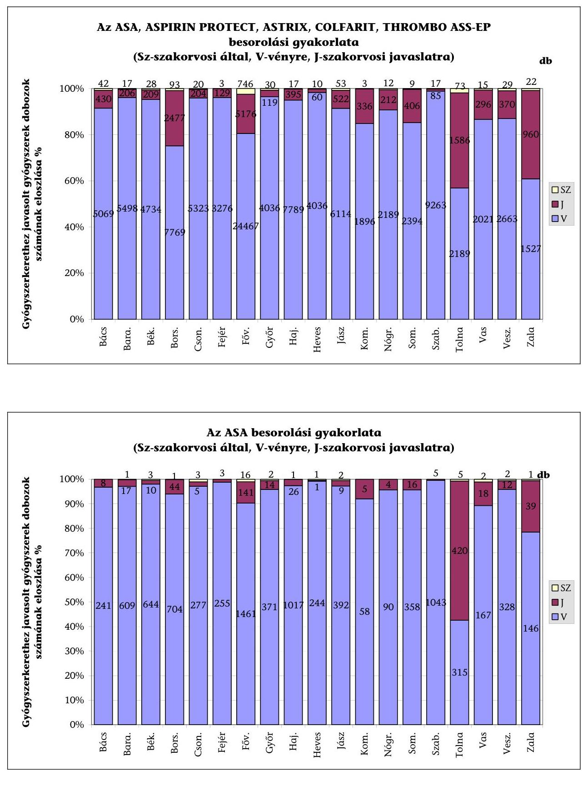

---

Az ASPIRIN PROTECT besorolási gyakorlata (Sz-szakorvosi által, V-vényre, J-szakorvosi javaslatra)
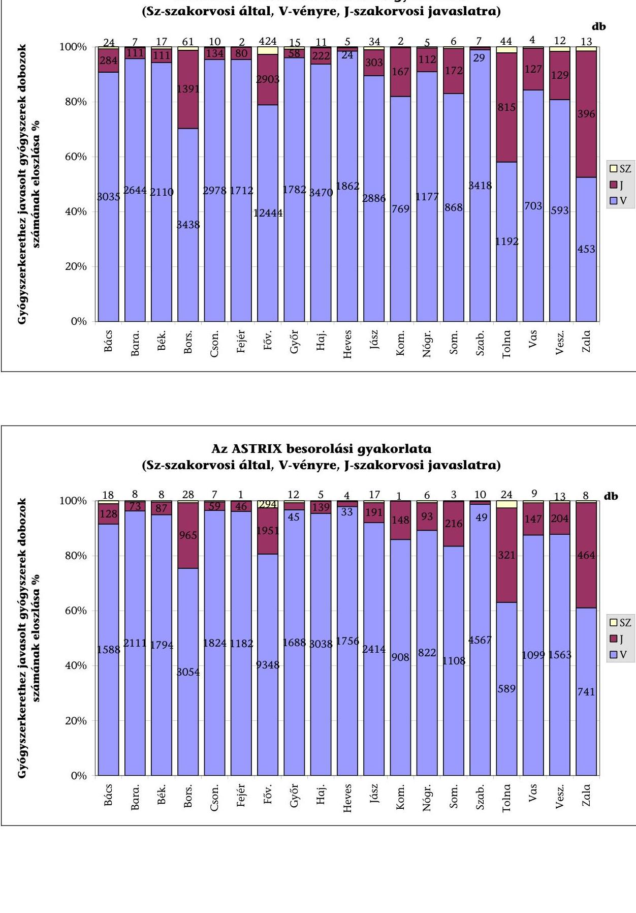

---

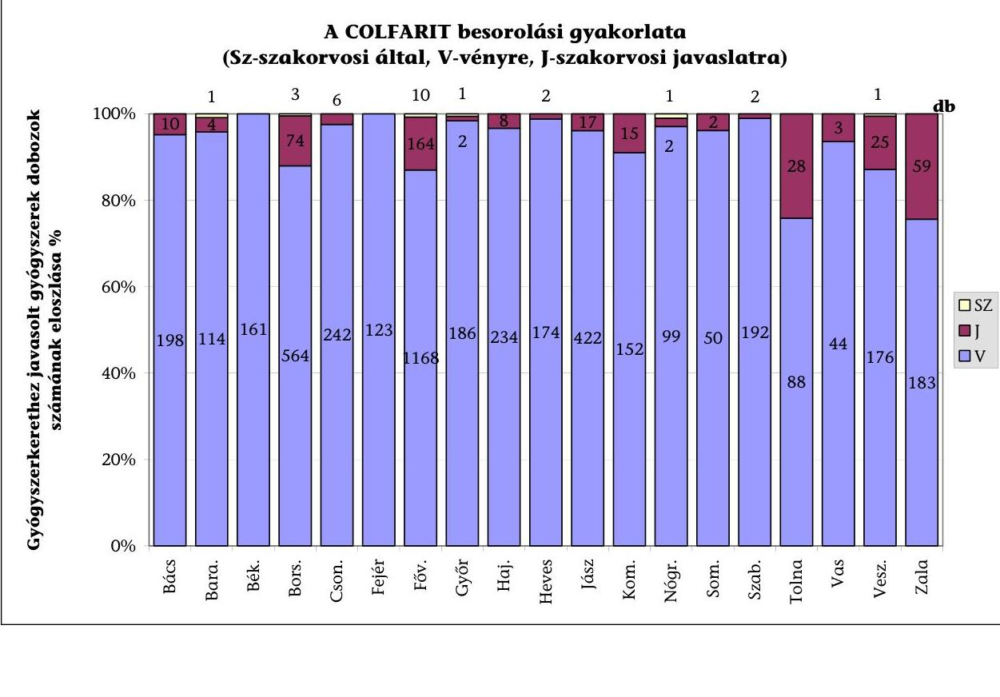

# A THROMBO ASS-EP besorolási gyakorlata (Sz-szakorvosi által, V-vényre, J-szakorvosi javaslatra)

---

# Kérdőív a közgyógyellátási rendszer múködésének értékeléséhez (gyógyászati segédeszközök) 

Tisztelt Válaszadó!
Kérjük, hogy a kérdőív kitöltésével Ön is járuljon hozzá az Állami Számvevőszék vizsgálatához, amelynek során a közgyógyellátás rendszerét értékeli. Véleményét név nélkül, bizalmasan kezeljük és vizsgálatunkban összesítve mutatjuk be. Válaszait az üres négyzetekbe tett x jellel szíveskedjen megadni.

1. Elégedett-e a közgyógyellátás keretében igénybevehető ellátással?
igen
nem
2. Ön számára most jobb-e a közgyógyellátás, mint a korábbi években?
$\square$ igen
$\square$ nem
3. Kapott-e megfelelő tájékoztatást a közgyógyellátásról?
$\square$ igen
$\square$ nem
4. Kitől tudta meg, hogy Ön jogosult lehet közgyógyellátásra?
$\square$ háziorvostól
$\square$ jegyzőtől, hivataltól
$\square$ rokontól, ismerőstől
$\square$ sajtóból
$\square$ egyéb forrásból, éspedig: $\qquad$
5. Voltak-e problémái az igazolvány igénylésével, megújításával?
$\square$ igen
$\square$ nem
6. Folyamatosan hozzájut-e a közgyógyellátásban a szükséges gyógyászati segédeszközökhöz?
$\square$ igen
$\square$ nem
7. Előfordult, hogy a közgyógyellátási igazolványa ellenére még Önnek is fizetnie kellett a kiváltott eszközért?
$\square$ igen
$\square$ nem
8. Amennyiben Önnek is fizetnie kellett, volt elegendő pénze a szükséges eszköz(ök)re?
$\square$ igen
$\square$ nem

---

# Tanúsítványok jegyzéke 

| 1. sz. tanúsítvány | Közgyógyellátás gyógyszer, gyógyászati segédeszköz és gyógyfürdő támogatása |
| :--: | :--: |
| 2. sz. tanúsítvány | Közgyógyellátottak által gyógyászati segédeszközökre és gyógyfürdő ellátásra fizetett térítési díjak |
| 3. sz. tanúsítvány | Országos adatok az OEP és a MEP-ek közgyógyellátásra jutó fejlesztési kiadásairól |
| 4. sz. tanúsítvány | Közgyógy kártyákról törölt keretösszegek (2008. I. félév) |
| 5. sz. tanúsítvány | Eljárások száma 2006. július 1-jétől az OEP-nél és a MEP-eknél |

---

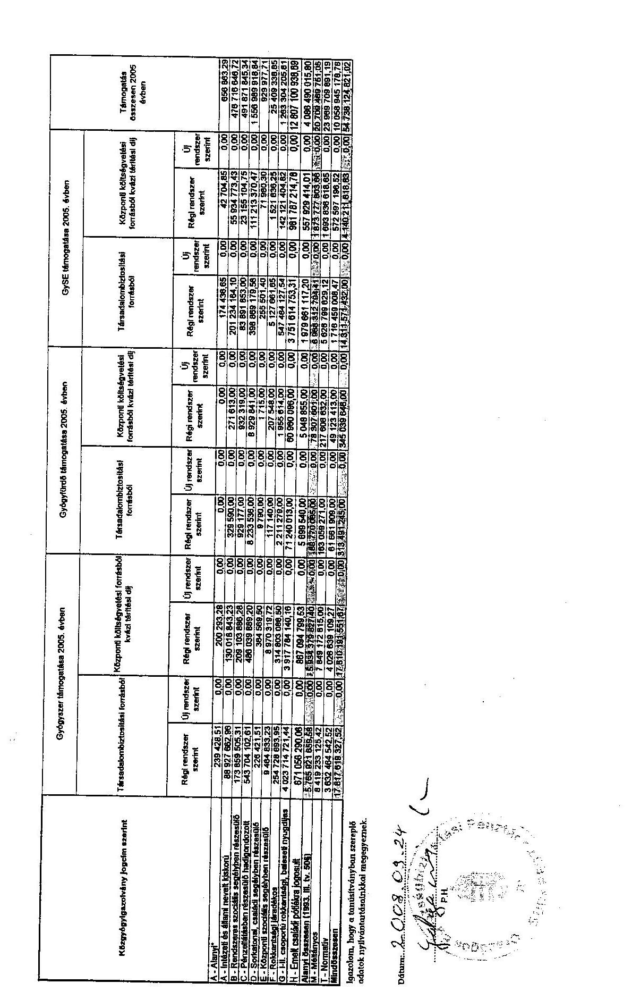

# Közgyógyoltatás gyógyszer gyógyszerát segédeszköz év gyógyítörül támogatása

|   |  | Gyógyszer támogatása 2005. évben |  |  |  | Gyógyítörül támogatása 2005. évben |  |  |  | GyGE támogatása 2005. évben |  |  |  |   |
| --- | --- | --- | --- | --- | --- | --- | --- | --- | --- | --- | --- | --- | --- | --- |
|  Közgyógyigazolvány jogcím szerint | Társadalombiztosítási hordalati | Központi költségvetési hordalati kvást térítési út | Társadalombiztosítási hordalati |  |  |  |  |  |  |  |  |  |  |   |
|   | Régi rendzese szerint | Új rendzese szerint | Régi rendzese szerint | Új rendzese szerint |  |  |  |  |  |  |  |  |  |   |
|  A. Algoz | 239 429,31 | 0,00 | 200 783,26 | 0,00 | 0,00 | 0,00 | 0,00 | 0,00 | 174 438,00 | 0,00 | 47 724,65 | 0,00 | 408 961,29 |   |
|  A. Intézeti és állami correlt kékem | 89 937 662,99 | 0,00 | 180 016 843,23 | 0,00 | 326 589,00 | 0,00 | 311 815,00 | 0,00 | 201 334 164,10 | 0,00 | 55 634 773,43 | 0,00 | 476 716 646,72 |   |
|  B. Domboszon szociális alagképes részesülő | 113 609 625,31 | 0,00 | 208 105 686,36 | 0,00 | 635 177,00 | 0,00 | 632 319,00 | 0,00 | 85 691 803,00 | 0,00 | 23 188 104,79 | 0,00 | 401 811 945,30 |   |
|  C. Páncoléklettes részesülő hatályosztorok | 543 704 102,61 | 0,00 | 486 039 689,20 | 0,00 | 8 253 536,00 | 0,00 | 8 829 841,00 | 0,00 | 398 969 118,00 | 0,00 | 111 213 310,47 | 0,00 | 1 538 069 518,84 |   |
|  D. Dombosok, szabály segédeket részesülő | 228 421,57 | 0,00 | 264 058,80 | 0,00 | 8 780,00 | 0,00 | 1 115,00 | 0,00 | 295 931,00 | 0,00 | 11 580,30 | 0,00 | 629 471,71 |   |
|  E. Központi szociális alagképes részesülő | 9 464 655,23 | 0,00 | 8 970 519,72 | 0,00 | 177 140,00 | 0,00 | 207 548,00 | 0,00 | 5 131 661,00 | 0,00 | 1 521 639,29 | 0,00 | 26 428 228,90 |   |
|  F. Páncsereségi jészehözés | 254 128 091,94 | 0,00 | 314 805 098,50 | 0,00 | 3 111 278,00 | 0,00 | 3 995 614,00 | 0,00 | 347 489 127,54 | 0,00 | 142 321 409,82 | 0,00 | 1 655 604 205,61 |   |
|  G. J.G. cégterek csőkereségi, baleseti rázegölés | 4 923 714 701,44 | 0,00 | 5 917 784 140,16 | 0,00 | 71 240 012,00 | 0,00 | 85 080 096,00 | 0,00 | 2 151 614 752,31 | 0,00 | 661 187 714,18 | 0,00 | 12 907 100 528,59 |   |
|  H. Ccrelt segéd erőfokú baleseti | 671 056 290,04 | 0,00 | 487 064 788,53 | 0,00 | 5 586 545,00 | 0,00 | 5 048 605,00 | 0,00 | 1 679 891 112,20 | 0,00 | 587 879 414,01 | 0,00 | 4 096 490 015,80 |   |
|  I. Kérget (beszesen 11993, III. tv. 598) | 5 745 871 545,58 | 0,00 | 5 918 110 021,94 | 0,00 | 1 032 186 710 000,00 | 0,00 | 1 162 001,00 | 0,00 | 6 996 312 729,41 | 0,00 | 1 673 777 905,68 | 0,00 | 1 043 20 728 469 151,00 |   |
|  J. Kétfőrizett | 5 414 235 125,42 | 0,00 | 5 648 112 615,00 | 0,00 | 1 003 059 271,00 | 0,00 | 1 1 606 620,00 | 0,00 | 6 626 196 628,14 | 0,00 | 1 693 636 618,00 | 0,00 | 23 969 705 683,18 |   |
|  J. Normatív | 1 632 404 542,52 | 0,00 | 1 209 638 126,21 | 0,00 | 81 581 605,00 | 0,00 | 48 123 412,00 | 0,00 | 1 716 459 006,47 | 0,00 | 573 597 186,52 | 0,00 | 10 038 945 178,79 |   |
|  Menőfizetészeti | 11 617 918 127,32 | 0,00 | 11 610 142 031,61 | 0,00 | 11 610 142 031,61 | 0,00 | 11 610 142 031,61 | 0,00 | 11 610 142 031,61 | 0,00 | 11 610 142 031,61 | 0,00 | 11 610 142 031,61 |   |

Igratáma, hogy a kockolvógyhoz szereplő adatok nyilvántartásulatával rengegyesnek.

Dátum: 20.06.2017

---

|   |  |  |  |  |  |  |  |  |  |  |  |  |  |  |  |  |  |  |  |  |  |  |  |  |  |  |  |  |  |  |  |  |  |  |  |  |  |  |  |  |  |   |
| --- | --- | --- | --- | --- | --- | --- | --- | --- | --- | --- | --- | --- | --- | --- | --- | --- | --- | --- | --- | --- | --- | --- | --- | --- | --- | --- | --- | --- | --- | --- | --- | --- | --- | --- | --- | --- | --- | --- | --- | --- | --- | --- | --- |
|   |  |  |  |  |  |  |  |  |  |  |  |  |  |  |  |  |  |  |  |  |  |  |  |  |  |  |  |  |  |  |  |  |  |  |  |  |  |  |  |  |  |  |   |
|   |  |  |  |  |  |  |  |  |  |  |  |  |  |  |  |  |  |  |  |  |  |  |  |  |  |  |  |  |  |  |  |  |  |  |  |  |  |  |  |  |  |  |   |
|   |  |  |  |  |  |  |  |  |  |  |  |  |  |  |  |  |  |  |  |  |  |  |  |  |  |  |  |  |  |  |  |  |  |  |  |  |  |  |  |  |  |  |   |
|   |  |  |  |  |  |  |  |  |  |  |  |  |  |  |  |  |  |  |  |  |  |  |  |  |  |  |  |  |  |  |  |  |  |  |  |  |  |  |  |  |  |  |   |
|   |  |  |  |  |  |  |  |  |  |  |  |  |  |  |  |  |  |  |  |  |  |  |  |  |  |  |  |  |  |  |  |  |  |  |  |  |  |  |  |  |  |  |   |
|   |  |  |  |  |  |  |  |  |  |  |  |  |  |  |  |  |  |  |  |  |  |  |  |  |  |  |  |  |  |  |  |  |  |  |  |  |  |  |  |  |  |  |   |
|   |  |  |  |  |  |  |  |  |  |  |  |  |  |  |  |  |  |  |  |  |  |  |  |  |  |  |  |  |  |  |  |  |  |  |  |  |  |  |  |  |  |  |   |
|   |  |  |  |  |  |  |  |  |  |  |  |  |  |  |  |  |  |  |  |  |  |  |  |  |  |  |  |  |  |  |  |  |  |  |  |  |  |  |  |  |  |  |   |
|   |  |  |  |  |  |  |  |  |  |  |  |  |  |  |  |  |  |  |  |  |  |  |  |  |  |  |  |  |  |  |  |  |  |  |  |  |  |  |  |  |  |  |   |
|   |  |  |  |  |  |  |  |  |  |  |  |  |  |  |  |  |  |  |  |  |  |  |  |  |  |  |  |  |  |  |  |  |  |  |  |  |  |  |  |  |  |  |   |
|   |  |  |  |  |  |  |  |  |  |  |  |  |  |  |  |  |  |  |  |  |  |  |  |  |  |  |  |  |  |  |  |  |  |  |  |  |  |  |  |  |  |  |   |
|   |  |  |  |  |  |  |  |  |  |  |  |  |  |  |  |  |  |  |  |  |  |  |  |  |  |  |  |  |  |  |  |  |  |  |  |  |  |  |  |  |  |  |   |
|   |  |  |  |  |  |  |  |  |  |  |  |  |  |  |  |  |  |  |  |  |  |  |  |  |  |  |  |  |  |  |  |  |  |  |  |  |  |  |  |  |  |  |   |
|   |  |  |  |  |  |  |  |  |  |  |  |  |  |  |  |  |  |  |  |  |  |  |  |  |  |  |  |  |  |  |  |  |  |  |  |  |  |  |  |  |  |  |   |
|   |  |  |  |  |  |  |  |  |  |  |  |  |  |  |  |  |  |  |  |  |  |  |  |  |  |  |  |  |  |  |  |  |  |  |  |  |  |  |  |  |  |  |   |
|   |  |  |  |  |  |  |  |  |  |  |  |  |  |  |  |  |  |  |  |  |  |  |  |  |  |  |  |  |  |  |  |  |  |  |  |  |  |  |  |  |  |  |   |
|   |  |  |  |  |  |  |  |  |  |  |  |  |  |  |  |  |  |  |  |  |  |  |  |  |  |  |  |  |  |  |  |  |  |  |  |  |  |  |  |  |  |  |   |
|   |  |  |  |  |  |  |  |  |  |  |  |  |  |  |  |  |  |  |  |  |  |  |  |  |  |  |  |  |  |  |  |  |  |  |  |  |  |  |  |  |  |  |   |
|   |  |  |  |  |  |  |  |  |  |  |  |  |  |  |  |  |  |  |  |  |  |  |  |  |  |  |  |  |  |  |  |  |  |  |  |  |  |  |  |  |  |  |   |
|   |  |  |  |  |  |  |  |  |  |  |  |  |  |  |  |  |  |  |  |  |  |  |  |  |  |  |  |  |  |  |  |  |  |  |  |  |  |  |  |  |  |  |   |
|   |  |  |  |  |  |  |  |  |  |  |  |  |  |  |  |  |  |  |  |  |  |  |  |  |  |  |  |  |  |  |  |  |  |  |  |  |  |  |  |  |  |  |   |
|   |  |  |  |  |  |  |  |  |  |  |  |  |  |  |  |  |  |  |  |  |  |  |  |  |  |  |  |  |  |  |  |  |  |  |  |  |  |  |  |  |  |  |   |
|   |  |  |  |  |  |  |  |  |  |  |  |  |  |  |  |  |  |  |  |  |  |  |  |  |  |  |  |  |  |  |  |  |  |  |  |  |  |  |  |  |  |  |   |
|   |  |  |  |  |  |  |  |  |  |  |  |  |  |  |  |  |  |  |  |  |  |  |  |  |  |  |  |  |  |  |  |  |  |  |  |  |  |  |  |  |  |  |   |
|   |  |  |  |  |  |  |  |  |  |  |  |  |  |  |  |  |  |  |  |  |  |  |  |  |  |  |  |  |  |  |  |  |  |  |  |  |  |  |  |  |  |  |   |
|   |  |  |  |  |  |  |  |  |  |  |  |  |  |  |  |  |  |  |  |  |  |  |  |  |  |  |  |  |  |  |  |  |  |  |  |  |  |  |  |  |  |  |   |
|   |  |  |  |  |  |  |  |  |  |  |  |  |  |  |  |  |  |  |  |  |  |  |  |  |  |  |  |  |  |  |  |  |  |  |  |  |  |  |  |  |  |  |   |
|   |  |  |  |  |  |  |  |  |  |  |  |  |  |  |  |  |  |  |  |  |  |  |  |  |  |  |  |  |  |  |  |  |  |  |  |  |  |  |  |  |  |  |   |
|   |  |  |  |  |  |  |  |  |  |  |  |  |  |  |  |  |  |  |  |  |  |  |  |  |  |  |  |  |  |  |  |  |  |  |  |  |  |  |  |  |  |  |   |
|   |  |  |  |  |  |  |  |  |  |  |  |  |  |  |  |  |  |  |  |  |  |  |  |  |  |  |  |  |  |  |  |  |  |  |  |  |  |  |  |  |  |  |   |
|   |  |  |  |  |  |  |  |  |  |  |  |  |  |  |  |  |  |  |  |  |  |  |  |  |  |  |  |  |  |  |  |  |  |  |  |  |  |  |  |  |  |  |   |
|   |

---

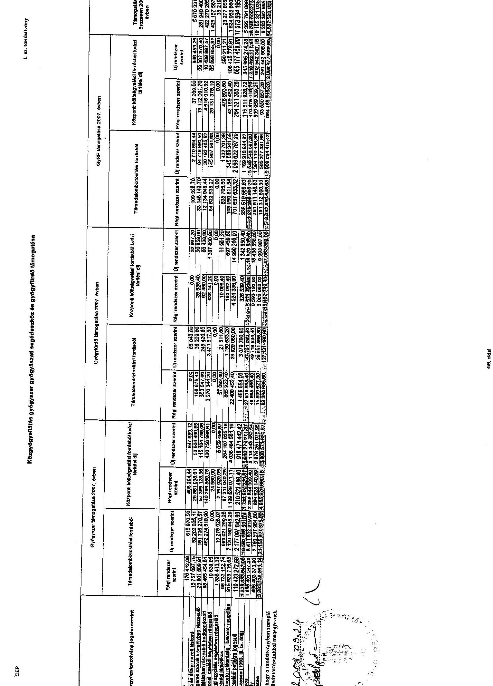

# Közgyógyelőző gyógyszer gyógyszerủi segédeszköz és gyógyítosti támogatása

|   |  |  |  |  |  |  |  |  |  |  |  |  |  |  |  |  |  |  |  |  |  |  |  |  |  |  |  |  |  |  |  |  |  |  |  |  |  |  |  |  |  |  |  |  |  |  |  |  |  |  |   |
| --- | --- | --- | --- | --- | --- | --- | --- | --- | --- | --- | --- | --- | --- | --- | --- | --- | --- | --- | --- | --- | --- | --- | --- | --- | --- | --- | --- | --- | --- | --- | --- | --- | --- | --- | --- | --- | --- | --- | --- | --- | --- | --- | --- | --- | --- | --- | --- | --- | --- | --- | --- | --- | --- |
|   |  |  |  |  |  |  |  |  |  |  |  |  |  |  |  |  |  |  |  |  |  |  |  |  |  |  |  |  |  |  |  |  |  |  |  |  |  |  |  |  |  |  |  |  |  |  |  |  |  |  |   |
|   |  |  |  |  |  |  |  |  |  |  |  |  |  |  |  |  |  |  |  |  |  |  |  |  |  |  |  |  |  |  |  |  |  |  |  |  |  |  |  |  |  |  |  |  |  |  |  |  |  |  |   |
|   |  |  |  |  |  |  |  |  |  |  |  |  |  |  |  |  |  |  |  |  |  |  |  |  |  |  |  |  |  |  |  |  |  |  |  |  |  |  |  |  |  |  |  |  |  |  |  |  |  |  |   |
|   |  |  |  |  |  |  |  |  |  |  |  |  |  |  |  |  |  |  |  |  |  |  |  |  |  |  |  |  |  |  |  |  |  |  |  |  |  |  |  |  |  |  |  |  |  |  |  |  |  |   |
|   |  |  |  |  |  |  |  |  |  |  |  |  |  |  |  |  |  |  |  |  |  |  |  |  |  |  |  |  |  |  |  |  |  |  |  |  |  |  |  |  |  |  |  |  |  |  |  |  |  |   |
|   |  |  |  |  |  |  |  |  |  |  |  |  |  |  |  |  |  |  |  |  |  |  |  |  |  |  |  |  |  |  |  |  |  |  |  |  |  |  |  |  |  |  |  |  |  |  |  |  |  |   |
|   |  |  |  |  |  |  |  |  |  |  |  |  |  |  |  |  |  |  |  |  |  |  |  |  |  |  |  |  |  |  |  |  |  |  |  |  |  |  |  |  |  |  |  |  |  |  |  |  |  |   |
|   |  |  |  |  |  |  |  |  |  |  |  |  |  |  |  |  |  |  |  |  |  |  |  |  |  |  |  |  |  |  |  |  |  |  |  |  |  |  |  |  |  |  |  |  |  |  |  |  |  |   |
|   |  |  |  |  |  |  |  |  |  |  |  |  |  |  |  |  |  |  |  |  |  |  |  |  |  |  |  |  |  |  |  |  |  |  |  |  |  |  |  |  |  |  |  |  |  |  |  |  |  |   |
|   |  |  |  |  |  |  |  |  |  |  |  |  |  |  |  |  |  |  |  |  |  |  |  |  |  |  |  |  |  |  |  |  |  |  |  |  |  |  |  |  |  |  |  |  |  |  |  |  |  |   |
|   |  |  |  |  |  |  |  |  |  |  |  |  |  |  |  |  |  |  |  |  |  |  |  |  |  |  |  |  |  |  |  |  |  |  |  |  |  |  |  |  |  |  |  |  |  |  |  |  |  |   |
|   |  |  |  |  |  |  |  |  |  |  |  |  |  |  |  |  |  |  |  |  |  |  |  |  |  |  |  |  |  |  |  |  |  |  |  |  |  |  |  |  |  |  |  |  |  |  |  |  |  |   |
|   |  |  |  |  |  |  |  |  |  |  |  |  |  |  |  |  |  |  |  |  |  |  |  |  |  |  |  |  |  |  |  |  |  |  |  |  |  |  |  |  |  |  |  |  |  |  |  |  |  |   |
|   |  |  |  |  |  |  |  |  |  |  |  |  |  |  |  |  |  |  |  |  |  |  |  |  |  |  |  |  |  |  |  |  |  |  |  |  |  |  |  |  |  |  |  |  |  |  |  |  |  |   |
|   |  |  |  |  |  |  |  |  |  |  |  |  |  |  |  |  |  |  |  |  |  |  |  |  |  |  |  |  |  |  |  |  |  |  |  |  |  |  |  |  |  |  |  |  |  |  |  |  |  |   |
|   |  |  |  |  |  |  |  |  |  |  |  |  |  |  |  |  |  |  |  |  |  |  |  |  |  |  |  |  |  |  |  |  |  |  |  |  |  |  |  |  |  |  |  |  |  |  |  |  |  |   |
|   |  |  |  |  |  |  |  |  |  |  |  |  |  |  |  |  |  |  |  |  |  |  |  |  |  |  |  |  |  |  |  |  |  |  |  |  |  |  |  |  |  |  |  |  |  |  |  |  |  |   |
|   |  |  |  |  |  |  |  |  |  |  |  |  |  |  |  |  |  |  |  |  |  |  |  |  |  |  |  |  |  |  |  |  |  |  |  |  |  |  |  |  |  |  |  |  |  |  |  |  |  |   |
|   |  |  |  |  |  |  |  |  |  |  |  |  |  |  |  |  |  |  |  |  |  |  |  |  |  |  |  |  |  |  |  |  |  |  |  |  |  |  |  |  |  |  |  |  |  |  |  |  |  |  |   |
|   |  |  |  |  |  |  |  |  |  |  |  |  |  |  |  |  |  |  |  |  |  |  |  |  |  |  |  |  |  |  |  |  |  |  |  |  |  |  |  |  |  |  |  |  |  |  |  |  |  |  |   |
|   |  |  |  |  |  |  |  |  |  |  |  |  |  |  |  |  |  |  |  |  |  |  |  |  |  |  |  |  |  |  |  |  |  |  |  |  |  |  |  |  |  |  |  |  |  |  |  |  |  |  |   |
|   |  |  |  |  |  |  |  |  |  |  |  |  |  |  |  |  |  |  |  |  |  |  |  |  |  |  |  |  |  |  |  |  |  |  |  |  |  |  |  |  |  |  |  |  |  |  |  |  |  |  |   |
|   |  |  |  |  |  |  |  |  |  |  |  |  |  |  |  |  |  |  |  |  |  |  |  |  |  |  |  |  |  |  |  |  |  |  |  |  |  |  |  |  |  |  |  |  |  |  |  |  |  |  |   |
|   |  |  |  |  |  |  |  |  |  |  |  |  |  |  |  |  |  |  |  |  |  |  |  |  |  |  |  |  |  |  |  |  |  |  |  |  |  |  |  |  |  |  |  |  |  |  |  |  |  |  |   |
|   |  |  |  |  |  |  |  |  |  |  |  |  |  |  |  |  |  |  |  |  |  |  |  |  |  |  |  |  |  |  |  |  |  |  |  |  |  |  |  |  |  |  |  |  |  |  |  |  |  |  |   |
|   |  |  |  |  |  |  |  |  |  |  |  |  |  |  |  |  |  |  |  |  |  |  |  |  |  |  |  |  |  |  |  |  |  |  |  |  |  |  |  |  |  |  |  |  |  |  |  |  |  |  |  |   |
|   |  |  |  |  |  |  |  |  |  |  |  |  |  |  |  |  |  |  |  |  |  |  |  |  |  |  |  |  |  |  |  |  |  |  |  |  |  |  |  |  |  |  |  |  |  |  |  |  |  |  |  |   |
|   |  |  |  |  |  |  |  |  |  |  |  |  |  |  |  |  |  |  |  |  |  |  |  |  |  |  |  |  |  |  |  |  |  |  |  |  |  |  |  |  |  |  |  |  |  |  |  |  |  |  |  |   |
|   |  |  |  |  |  |  |  |  |  |  |  |  |  |  |  |  |  |  |  |  |  |  |  |  |  |  |  |  |  |  |  |  |  |  |  |  |  |  |  |  |  |  |  |  |  |  |  |  |  |  |  |   |
|   |  |  |  |  |  |  |  |  |  |  |  |  |  |  |  |  |  |  |  |  |  |  |  |  |  |  |  |  |  |  |  |  |  |  |  |  |  |  |  |  |  |  |  |  |  |  |  |  |  |  |  |   |
|   |  |  |  |  |  |  |  |  |  |  |  |  |  |  |  |  |  |  |  |  |  |  |  |  |  |  |  |  |  |  |  |  |  |  |  |  |  |  |  |  |  |  |  |  |  |  |  |  |  |  |  |   |
|   |  |  |  |  |  |  |  |  |  |  |  |  |  |  |  |  |  |  |  |  |  |  |  |  |  |  |  |  |  |  |  |  |  |  |  |  |  |  |  |  |  |  |  |  |  |  |  |  |  |  |  |   |
|   |  |  |  |  |  |  |  |  |  |  |  |  |  |  |  |  |  |  |  |  |  |  |  |  |  |  |  |  |  |  |  |  |  |  |  |  |  |  |  |  |  |  |  |  |  |  |  |  |  |  |  |   |
|   |  |  |  |  |  |  |  |  |  |  |  |  |  |  |  |  |  |  |  |  |  |  |  |  |  |  |  |  |  |  |  |  |  |  |  |  |  |  |  |  |  |  |  |  |  |  |  |  |  |  |  |   |
|   |  |  |  |  |  |  |  |  |  |  |  |  |  |  |  |  |  |  |  |  |  |  |  |  |  |  |  |  |  |  |  |  |  |  |  |  |  |  |  |  |  |  |  |  |  |  |  |  |  |  |  |   |
|   |  |  |  |  |  |  |  |  |  |  |  |  |  |  |  |  |  |  |  |  |  |  |  |  |  |  |  |  |  |  |  |  |  |  |  |  |  |  |  |  |  |  |  |  |  |  |  |  |  |  |  |   |
|   |  |  |  |  |  |  |  |  |  |  |  |  |  |  |  |  |  |  |  |  |  |  |  |  |  |  |  |  |  |  |  |  |  |  |  |  |  |  |  |  |  |  |  |  |  |  |  |  |  |  |  |   |
|   |  |  |  |  |  |  |  |  |  |  |  |  |  |  |  |  |  |  |  |  |  |  |  |  |  |  |  |  |  |  |  |  |  |  |  |  |  |  |  |  |  |  |  |  |  |  |  |  |  |  |  |   |
|   |  |  |  |  |  |  |  |  |  |  |  |  |  |  |  |  |  |  |  |  |  |  |  |  |  |  |  |  |  |  |  |  |  |  |  |  |  |  |  |  |  |  |  |  |  |  |  |  |  |  |  |   |
|   |  |  |  |  |  |  |  |  |  |  |  |  |  |  |  |  |  |  |  |  |  |  |  |  |  |  |  |  |  |  |  |  |  |  |  |  |  |  |  |  |  |  |  |  |  |  |  |  |  |  |  |   |
|   |  |  |  |  |  |  |  |  |  |  |  |  |  |  |  |  |  |  |  |  |  |  |  |  |  |  |  |  |  |  |  |  |  |  |  |  |  |  |  |  |  |  |  |  |  |  |  |  |  |  |  |   |
|   |  |  |  |  |  |  |  |  |  |  |  |  |  |  |  |  |  |  |  |  |  |  |  |  |  |  |  |  |  |  |  |  |  |  |  |  |  |  |  |  |  |  |  |  |  |  |  |  |  |  |  |   |
|   |  |  |  |  |  |  |  |  |  |  |  |  |  |  |  |  |  |  |  |  |  |  |  |  |  |  |  |  |  |  |  |  |  |  |  |  |  |  |  |  |  |  |  |  |  |  |  |  |  |  |  |   |
|   |  |  |  |  |  |  |  |  |  |  |  |  |  |  |  |  |  |  |  |  |  |  |  |  |  |  |  |  |  |  |  |  |  |  |  |  |  |  |  |  |  |  |  |  |  |  |  |  |  |  |  |   |
|   |  |  |  |  |  |  |  |  |  |  |  |  |  |  |  |  |  |  |  |  |  |  |  |  |  |  |  |  |  |  |  |  |  |  |  |  |  |  |  |  |  |  |  |  |  |  |  |  |  |  |  |   |
|   |  |  |  |  |  |  |  |  |  |  |  |  |  |  |  |  |  |  |  |  |  |  |  |  |  |  |  |  |  |  |  |  |  |  |  |  |  |  |  |  |  |  |  |  |  |  |  |  |  |  |  |  |   |
|   |  |  |  |  |  |  |  |  |  |  |  |  |  |  |  |  |  |  |  |  |  |  |  |  |  |  |  |  |  |  |  |  |  |  |  |  |  |  |  |  |  |  |  |  |  |  |  |  |  |  |  |  |   |
|   |  |  |  |  |  |  |  |  |  |  |  |  |  |  |  |  |  |  |  |  |  |  |  |  |  |  |  |  |  |  |  |  |  |  |  |  |  |  |  |  |  |  |  |  |  |  |  |  |  |  |  |  |   |
|   |  |  |  |  |  |  |  |  |  |  |  |  |  |  |  |  |  |  |  |  |  |  |  |  |  |  |  |  |  |  |  |  |  |  |  |  |  |  |  |  |  |  |  |  |  |  |  |  |  |  |  |  |   |
|   |  |  |  |  |  |  |  |  |  |  |  |  |  |  |  |  |  |  |  |  |  |  |  |  |  |  |  |  |  |  |  |  |  |  |  |  |  |  |  |  |  |  |  |  |  |  |  |  |  |  |  |  |   |
|   |  |  |  |  |  |  |  |  |  |  |  |  |  |  |  |  |  |  |  |  |  |  |  |  |  |  |  |  |  |  |  |  |  |  |  |  |  |  |  |  |  |  |  |  |  |  |  |  |  |  |  |  |   |
|   |  |  |  |  |  |  |  |  |  |  |  |  |  |  |  |  |  |  |  |  |  |  |  |  |  |  |  |  |  |  |  |  |  |  |  |  |  |  |  |  |  |  |  |  |  |  |  |  |  |  |  |  |   |
|   |  |  |  |  |  |  |  |  |  |  |  |  |  |  |  |  |  |  |  |  |  |  |  |  |  |  |  |  |  |  |  |  |  |  |  |  |  |  |  |  |  |  |  |  |  |  |  |  |  |  |  |  |   |
|   |  |  |  |  |  |  |  |  |  |  |  |  |  |  |  |  |  |  |  |  |  |  |  |  |  |  |  |  |  |  |  |  |  |  |  |  |  |  |  |  |  |  |  |  |  |  |  |  |  |  |  |   |
|   |  |  |  |  |  |  |  |  |  |  |  |  |  |  |  |  |  |  |  |  |  |  |  |  |  |  |  |  |  |  |  |  |  |  |  |  |  |  |  |  |  |  |  |  |  |  |  |  |  |  |  |   |
|   |  |  |  |  |  |  |  |  |  |  |  |  |  |  |  |  |  |  |  |  |  |  |  |  |  |  |  |  |  |  |  |  |  |  |  |  |  |  |  |  |  |  |  |  |  |  |  |  |  |  |  |   |
|   |  |  |  |  |  |  |  |  |  |  |  |  |  |  |  |  |  |  |  |  |  |  |  |  |  |  |  |  |  |  |  |  |  |  |  |  |  |  |  |  |  |  |  |  |  |  |  |  |  |  |  |   |
|   |  |  |  |  |  |  |  |  |  |  |  |  |  |  |  |  |  |  |  |  |  |  |  |  |  |  |  |  |  |  |  |  |  |  |  |  |  |  |  |  |  |  |  |  |  |  |  |  |  |  |  |   |
|   |  |  |  |  |  |  |  |  |  |  |  |  |  |  |  |  |  |  |  |  |  |  |  |  |  |  |  |  |  |  |  |  |  |  |  |  |  |  |  |  |  |  |  |  |  |  |  |  |  |  |  |  |   |
|   |  |  |  |  |  |  |  |  |  |  |  |  |  |  |  |  |  |  |  |  |  |  |  |  |  |  |  |  |  |  |  |  |  |  |  |  |  |  |  |  |  |  |  |  |  |  |  |  |  |  |  |  |   |
|   |  |  |  |  |  |  |  |  |  |  |  |  |  |  |  |  |  |  |  |  |  |  |  |  |  |  |  |  |  |  |  |  |  |  |  |  |  |  |  |  |  |  |  |  |  |  |  |  |  |  |  |  |   |
|   |  |  |  |  |  |  |  |  |  |  |  |  |  |  |  |  |  |  |  |  |  |  |  |  |  |  |  |  |  |  |  |  |  |  |  |  |  |  |  |  |  |  |  |  |  |  |  |  |  |  |  |  |  |   |
|   |  |  |  |  |  |  |  |  |  |  |  |  |  |  |  |  |  |  |  |  |  |  |  |  |  |  |  |  |  |  |  |  |  |  |  |  |  |  |  |  |  |  |  |  |  |  |  |  |  |  |  |  |  |  |   |
|   |  |  |  |  |  |  |  |  |  |  |  |  |  |  |  |  |  |  |  |  |  |  |  |  |  |  |  |  |  |  |  |  |  |  |  |  |  |  |  |  |  |  |  |  |  |  |  |  |  |  |  |  |  |  |  |  |   |
|   |  |  |  |  |  |  |  |  |  |  |  |  |  |  |  |  |  |  |  |  |  |  |  |  |  |  |  |  |  |  |  |  |  |  |  |  |  |  |  |  |  |  |  |  |  |  |  |  |  |  |  |  |  |  |  |  |  |   |
|   |  |  |  |  |  |  |  |  |  |  |  |  |  |  |  |  |  |  |  |  |  |  |  |  |  |  |  |  |  |  |  |  |  |  |  |  |  |  |  |  |  |  |  |  |  |  |  |  |  |  |  |  |  |  |  |  |  |  |   |
|   |  |  |  |  |  |  |  |  |  |  |  |  |  |  |  |  |  |  |  |  |  |  |  |  |  |  |  |  |  |  |  |  |  |  |  |  |  |  |  |  |  |  |  |  |  |  |  |  |  |  |  |  |  |  |  |  |  |  |  |   |
|   |  |  |  |  |  |  |  |  |  |  |  |  |  |  |  |  |  |  |  |  |  |  |  |  |  |  |  |  |  |  |  |  |  |  |  |  |  |  |  |  |  |  |  |  |  |  |  |  |  |  |  |  |  |  |  |  |  |  |  |  |  |   |
|   |  |  |  |  |  |  |  |  |  |  |  |  |  |  |  |  |  |  |  |  |  |  |  |  |  |  |  |  |  |  |  |  |  |  |  |  |  |  |  |  |  |  |  |  |  |  |  |  |  |  |  |  |  |  |  |  |  |  |  |  |  |  |  |  |  |  |   |
|   |  |  |  |  |  |  |  |  |  |  |  |  |  |  |  |  |  |  |  |  |  |  |  |  |  |  |  |  |  |  |  |  |  |  |  |  |  |  |  |  |  |  |  |  |  |  |  |  |  |  |  |  |  |  |  |  |  |  |  |  |  |  |  |  |  |  |  |  |  |  |  |  |  |  |  |  |  |  |  |  |  |  |  |  |  |  |  |  |  |  |  |  |  |  |  |  |  |  |  | 

---

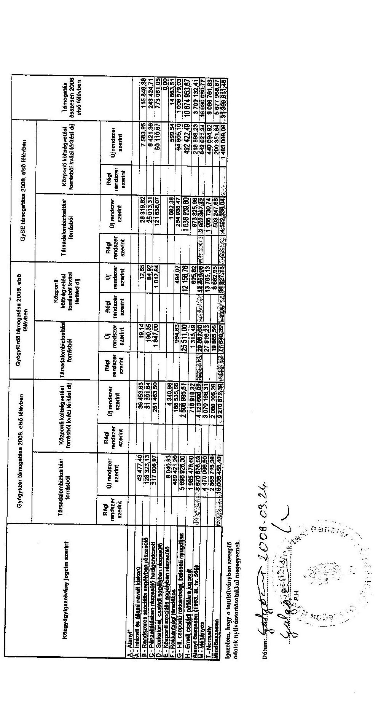

# Közgyógyolata gyógyszor gyógyszozati segédeszköz és gyógyfürdő támogatása

|  Gyógyszor támogatása 2008. első tábérben | Gyógyfürdő támogatása 2008. első tábérben | GyÓZ támogatása 2008. első tábérben  |
| --- | --- | --- |
|  Támezdorítózistikai fordulati | Központi költségvetési fordulati (1) (2) (3) (4) (5) (6) (7) (8) (9) (10) (11) (12) (13) (14) (15) (16) (17) (18) (19) (20) (21) (22) (23) (24) (25) (26) (27) (28) (29) (30) (31) (32) (33) (34) (35) (36) (37) (38) (39) (40) (41) (42) (43) (44) (45) (46) (47) (48) (49) (50) (51) (52) (53) (54) (55) (56) (57) (58) (59) (60) (61) (62) (63) (64) (65) (66) (67) (68) (69) (70) (71) (72) (73) (74) (75) (76) (77) (78) (79) (80) (81) (82) (83) (84) (85) (86) (87) (88) (89) (90) (91) (92) (93) (94) (95) (96) (97) (98) (99) (100) (101) (102) (103) (104) (105) (106) (107) (108) (109) (110) (111) (112) (113) (114) (115) (116) (117) (118) (119) (120) (121) (122) (123) (124) (125) (126) (127) (128) (129) (130) (131) (132) (133) (134) (135) (136) (137) (138) (139) (140) (141) (142) (143) (144) (145) (146) (147) (148) (149) (150) (151) (152) (153) (154) (155) (156) (157) (158) (159) (160) (161) (162) (163) (164) (165) (166) (167) (168) (169) (170) (171) (172) (173) (174) (175) (176) (177) (178) (179) (180) (181) (182) (183) (184) (185) (186) (187) (188) (189) (190) (191) (192) (193) (194) (195) (196) (197) (198) (199) (200) (201) (202) (203) (204) (205) (206) (207) (208) (209) (210) (211) (212) (213) (214) (215) (216) (217) (218) (219) (220) (221) (222) (223) (224) (225) (226) (227) (228) (229) (230) (231) (232) (233) (234) (235) (236) (237) (238) (239) (240) (241) (242) (243) (244) (245) (246) (247) (248) (249) (250) (251) (252) (253) (254) (255) (256) (257) (258) (259) (260) (261) (262) (263) (264) (265) (266) (267) (268) (269) (270) (271) (272) (273) (274) (275) (276) (277) (278) (279) (280) (281) (282) (283) (284) (285) (286) (287) (288) (289) (290) (291) (292) (293) (294) (295) (296) (297) (298) (299) (300) (301) (302) (303) (304) (305) (306) (307) (308) (309) (310) (311) (312) (313) (314) (315) (316) (317) (318) (319) (320) (321) (322) (323) (324) (325) (326) (327) (328) (329) (330) (331) (332) (333) (334) (335) (336) (337) (338) (339) (340) (341) (342) (343) (344) (345) (346) (347) (348) (349) (350) (351) (352) (353) (354) (355) (356) (357) (358) (359) (360) (361) (362) (363) (364) (365) (366) (367) (368) (369) (370) (371) (372) (373) (374) (375) (376) (377) (378) (379) (380) (381) (382) (383) (384) (385) (386) (387) (388) (389) (390) (391) (392) (393) (394) (395) (396) (397) (398) (399) (400) (401) (402) (403) (404) (405) (406) (407) (408) (409) (410) (411) (412) (413) (414) (415) (416) (417) (418) (419) (420) (421) (422) (423) (424) (425) (426) (427) (428) (429) (430) (431) (432) (433) (434) (435) (436) (437) (438) (439) (440) (441) (442) (443) (444) (445) (446) (447) (448) (449) (450) (451) (452) (453) (454) (455) (456) (457) (458) (459) (460) (461) (462) (463) (464) (465) (466) (467) (468) (469) (470) (471) (472) (473) (474) (475) (476) (477) (478) (479) (480) (481) (482) (483) (484) (485) (486) (487) (488) (489) (490) (491) (492) (493) (494) (495) (496) (497) (498) (499) (500) (510) (511) (512) (513) (514) (515) (516) (517) (518) (519) (520) (521) (522) (523) (524) (525) (526) (527) (528) (529) (530) (531) (532) (533) (534) (535) (536) (537) (538) (539) (540) (541) (542) (543) (544) (545) (546) (547) (548) (549) (550) (551) (552) (553) (554) (555) (556) (557) (558) (559) (560) (561) (562) (563) (564) (565) (566) (567) (568) (569) (570) (571) (572) (573) (574) (575) (576) (577) (578) (579) (580) (581) (582) (583) (584) (585) (586) (587) (588) (589) (590) (591) (592) (593) (594) (595) (596) (597) (598) (599) (500) (510) (511) (512) (513) (514) (515) (516) (517) (518) (519) (520) (521) (522) (523) (524) (525) (526) (527) (528) (529) (530) (531) (532) (533) (534) (535) (536) (537) (538) (539) (540) (541) (542) (543) (544) (545) (546) (547) (548) (549) (550) (551) (552) (553) (554) (555) (556) (557) (558) (559) (560) (561) (562) (563) (564) (565) (566) (567) (568) (569) (570) (571) (572) (573) (574) (575) (576) (577) (578) (579) (580) (581) (582) (583) (584) (585) (586) (587) (588) (589) (590) (591) (592) (593) (594) (595) (596) (597) (598) (599) (500) (510) (511) (512) (513) (514) (515) (516) (517) (518) (519) (520) (521) (522) (523) (524) (525) (526) (527) (528) (529) (530) (531) (532) (533) (534) (535) (536) (537) (538) (539) (540) (541) (542) (543) (544) (545) (546) (547) (548) (549) (550) (551) (552) (553) (554) (555) (556) (557) (558) (559) (560) (561) (562) (563) (564) (565) (566) (567) (568) (569) (570) (571) (572) (573) (574) (575) (576) (577) (578) (579) (580) (581) (582) (583) (584) (585) (586) (587) (588) (589) (590) (591) (592) (593) (594) (595) (596) (597) (598) (599) (500) (510) (511) (512) (513) (514) (515) (516) (517) (518) (519) (520) (521) (522) (523) (524) (525) (526) (527) (528) (529) (530) (531) (532) (533) (534) (535) (536) (537) (538) (539) (540) (541) (542) (543) (544) (545) (546) (547) (548) (549) (550) (551) (552) (553) (554) (555) (556) (557) (558) (559) (560) (561) (562) (563) (564) (565) (566) (567) (568) (569) (570) (571) (572) (573) (574) (575) (576) (577) (578) (579) (580) (581) (582) (583) (584) (585) (586) (587) (588) (589) (590) (591) (592) (593) (594) (595) (596) (597) (598) (599) (500) (510) (511) (512) (513) (514) (515) (516) (517) (518) (519) (520) (521) (522) (523) (524) (525) (526) (527) (528) (529) (530) (531) (532) (533) (534) (535) (536) (537) (538) (539) (540) (541) (542) (543) (544) (545) (546) (547) (548) (549) (550) (551) (552) (553) (554) (555) (556) (557) (558) (559) (560) (561) (562) (563) (564) (565) (566) (567) (568) (569) (570) (571) (572) (573) (574) (575) (576) (577) (578) (579) (580) (581) (582) (583) (584) (585) (586) (587) (588) (589) (590) (591) (592) (593) (594) (595) (596) (597) (598) (599) (500) (510) (511) (512) (513) (514) (515) (516) (517) (518) (519) (520) (521) (522) (523) (524) (525) (526) (527) (528) (529) (530) (531) (532) (533) (534) (535) (536) (537) (538) (539) (540) (541) (542) (543) (544) (545) (546) (547) (548) (549) (550) (551) (552) (553) (554) (555) (556) (557) (558) (559) (560) (561) (562) (563) (564) (565) (566) (567) (568) (569) (570) (571) (572) (573) (574) (575) (576) (577) (578) (579) (580) (581) (582) (583) (584) (585) (586) (587) (588) (589) (590) (591) (592) (593) (594) (595) (596) (597) (598) (599) (500) (510) (511) (512) (513) (514) (515) (516) (517) (518) (519) (520) (521) (522) (523) (524) (525) (526) (527) (528) (529) (530) (531) (532) (533) (534) (535) (536) (537) (538) (539) (540) (541) (542) (543) (544) (545) (546) (547) (548) (549) (550) (551) (552) (553) (554) (555) (556) (557) (558) (559) (560) (561) (562) (563) (564) (565) (566) (567) (568) (569) (570) (571) (572) (573) (574) (575) (576) (577) (578) (579) (580) (581) (582) (583) (584) (585) (586) (587) (588) (589) (590) (591) (592) (593) (594) (595) (596) (597) (598) (599) (500) (510) (511) (512) (513) (514) (515) (516) (517) (518) (519) (520) (521) (522) (523) (524) (525) (526) (527) (528) (529) (530) (531) (532) (533) (534) (535) (536) (537) (538) (539) (540) (541) (542) (543) (544) (545) (546) (547) (548) (549) (550) (551) (552) (553) (554) (555) (556) (557) (558) (559) (560) (561) (562) (563) (564) (565) (566) (567) (568) (569) (570) (571) (572) (573) (574) (575) (576) (577) (578) (579) (580) (581) (582) (583) (584) (585) (586) (587) (588) (589) (590) (591) (592) (593) (594) (595) (596) (597) (598) (599) (500) (510) (511) (512) (513) (514) (515) (516) (517) (518) (519) (520) (521) (522) (523) (524) (525) (526) (527) (528) (529) (530) (531) (532) (533) (534) (535) (536) (537) (538) (539) (540) (541) (542) (543) (544) (545) (546) (547) (548) (549) (550) (551) (552) (553) (554) (555) (556) (557) (558) (559) (560) (561) (562) (563) (564) (565) (566) (567) (568) (569) (570) (571) (572) (573) (574) (575) (576) (577) (578) (579) (580) (581) (582) (583) (584) (585) (586) (587) (588) (589) (590) (591) (592) (593) (594) (595) (596) (597) (598) (599) (500) (510) (511) (512) (513) (514) (515) (516) (517) (518) (519) (520) (521) (522) (523) (524) (525) (526) (527) (528) (529) (530) (531) (532) (533) (534) (535) (536) (537) (538) (539) (540) (541) (542) (543) (544) (545) (546) (547) (548) (549) (550) (551) (552) (553) (554) (555) (556) (557) (558) (559) (560) (561) (562) (563) (564) (565) (566) (567) (568) (569) (570) (571) (572) (573) (574) (575) (576) (577) (578) (579) (580) (581) (582) (583) (584) (585) (586) (587) (588) (589) (590) (591) (592) (593) (594) (595) (596) (597) (598) (599) (500) (510) (511) (512) (513) (514) (515) (516) (517) (518) (519) (520) (521) (522) (523) (524) (525) (526) (527) (528) (529) (530) (531) (532) (533) (534) (535) (536) (537) (538) (539) (531) (532) (533) (534) (535) (536) (537) (538) (539) (531) (532) (533) (534) (535) (536) (537) (538) (539) (531) (532) (533) (534) (535) (536) (537) (538) (539) (531) (532) (533) (534) (535) (536) (537) (538) (539) (531) (532) (533) (534) (535) (536) (537) (538) (539) (531) (532) (533) (534) (535) (536) (537) (538) (539) (531) (532) (533) (534) (535) (536) (537) (538) (539) (531) (532) (533) (534) (535) (536) (537) (538) (539) (531) (532) (533) (534) (535) (536) (537) (538) (539) (531) (532) (533) (534) (535) (536) (537) (538) (539) (531) (532) (533) (534) (535) (536) (537) (538) (539) (531) (532) (533) (534) (535) (536) (537) (538) (539) (531) (532) (533) (534) (535) (536) (537) (538) (539) (531) (532) (533) (534) (535) (536) (537) (538) (539) (531) (532) (533) (534) (535) (536) (537) (538) (539) (531) (532) (533) (534) (535) (536) (537) (538) (539) (531) (532) (533) (534) (535) (536) (537) (538) (539) (531) (532) (533) (534) (535) (536) (537) (538) (539) (531) (532) (533) (534) (535) (536) (537) (538) (539) (531) (532) (533) (534) (535) (536) (537) (538) (539) (531) (532) (533) (534) (535) (536) (537) (538) (539) (531) (532) (533) (534) (535) (536) (537) (538) (539) (531) (532) (533) (534) (535) (536) (537) (538) (539) (531) (532) (533) (534) (535) (536) (537) (538) (539) (531) (532) (533) (534) (535) (536) (537) (538) (539) (531) (532) (533) (534) (535) (536) (537) (538) (539) (531) (532) (533) (534) (535) (536) (537) (538) (539) (531) (532) (533) (534) (535) (536) (537) (538) (539) (531) (532) (533) (534) (535) (536) (537) (538) (539) (531) (532) (533) (534) (535) (536) (537) (538) (539) (531) (532) (533) (534) (535) (536) (537) (538) (539) (531) (532) (533) (534) (535) (536) (537) (538) (539) (531) (532) (533) (534) (535) (536) (537) (538) (539) (531) (532) (533) (534) (535) (536) (537) (538) (539) (531) (532) (533) (534) (535) (536) (537) (538) (539) (531) (532) (533) (534) (535) (536) (537) (538) (539) (531) (532) (533) (534) (535) (536) (537) (538) (539) (531) (532) (533) (534) (535) (536) (537) (538) (539) (531) (532) (533) (534) (535) (536) (537) (538) (539) (531) (532) (533) (534) (535) (536) (537) (538) (539) (531) (532) (533) (534) (535) (536) (537) (538) (539) (531) (532) (533) (534) (535) (536) (537) (538) (539) (531) (532) (533) (534) (535) (536) (537) (538) (539) (531) (532) (533) (534) (535) (536) (537) (538) (539) (531) (532) (533) (534) (535) (536) (537) (538) (539) (531) (532) (533) (534) (535) (536) (537) (538) (539) (531) (532) (533) (534) (535) (536) (537) (538) (539) (531) (532) (533) (534) (535) (536) (537) (538) (539) (531) (532) (533) (534) (535) (536) (537) (538) (539) (531) (532) (533) (534) (535) (536) (537) (538) (539) (531) (532) (533) (534) (535) (536) (537) (538) (539) (531) (532) (533) (534) (535) (536) (537) (538) (539) (531) (532) (533) (534) (535) (536) (537) (538) (539) (531) (532) (533) (534) (535) (536) (537) (538) (539) (531) (532) (533) (534) (535) (536) (537) (538) (539) (531) (532) (533) (534) (535) (536) (537) (538) (539) (531) (532) (533) (534) (535) (536) (537) (538) (539) (531) (532) (533) (534) (535) (536) (537) (538) (539) (531) (532) (533) (534) (535) (536) (537) (538) (539) (531) (532) (533) (534) (535) (536) (537) (538) (539) (531) (532) (533) (534) (535) (536) (537) (538) (539) (531) (532) (533) (534) (535) (536) (537) (538) (539) (531) (532) (533) (534) (535) (536) (537) (538) (539) (531) (532) (533) (534) (535) (536) (537) (538) (539) (531) (532) (533) (534) (535) (536) (537) (538) (539) (531) (532) (533) (534) (535) (536) (537) (538) (539) (531) (532) (533) (534) (535) (536) (537) (538) (539) (531) (532) (533) (534) (535) (536) (537) (538) (539) (531) (532) (533) (534) (535) (536) (537) (538) (539) (531) (532) (533) (534) (535) (539) (531) (532) (533) (534) (535) (536) (537) (538) (539) (531) (532) (533) (534) (535) (536) (537) (538) (539) (531) (532) (533) (534) (535) (536) (537) (538) (539) (531) (532) (533) (534) (535) (539) (531) (532) (533) (534) (535) (536) (537) (538) (539) (531) (532) (533) (534) (535) (536) (537) (538) (539) (531) (532) (533) (534) (535) (539) (531) (532) (533) (534) (535) (536) (537) (538) (539) (531) (532) (533) (534) (535) (537) (538) (539) (531) (532) (533) (534) (535) (536) (537) (538) (539) (531) (532) (533) (534) (535) (539) (531) (532) (533) (534) (535) (536) (537) (538) (539) (531) (532) (534) (535) (537) (538) (539) (531) (532) (533) (534) (535) (536) (537) (539) (531) (532) (533) (534) (535) (539) (531) (532) (533) (534) (535) (536) (537) (538) (539) (531) (532) (534) (535) (539) (531) (532) (537) (538) (539) (531) (532) (533) (534) (535) (531) (532) (533) (534) (535) (537) (539) (531) (532) (531) (532) (533) (534) (535) (536) (537) (538) (539) (531) (532) (533) (534) (535) (539) (531) (532) (533) (534) (535) (539) (531) (532) (533) (534) (535) (531) (531) (532) (533) (534) (535) (537) (538) (539) (531) (532) (533) (534) (535) (539) (531) (531) (531) (531) (532) (531) (532) (532) (533) (531) (531) (531) (531) (531) (531) (531) (531) (531) (531) (531) (531) (531) (531) (531) (531) (531) (531) (531) (531) (531) (531) (531) (531) (531) (531) (531) (531) (531) (531) (531) (531) (531) (531) (531) (531) (531) (531) (531) (531) (5

---

|  Közgyógyigazolvány jogcím szerint | Azon közgyógy igazolványra jogosultak száma, akik nem váltottak ki gyógyszert (fő) |  |  |  | Azon közgyógy igazolványra jogosultak száma 2008. első félévben (nemcsak közgyógy jogcímre) vényre kiváltófi gyógyszerek |  |  |   |
| --- | --- | --- | --- | --- | --- | --- | --- | --- |
|   | 2005. (fő) | 2006. (fő) | 2007. (fő) | 2008. (fő) |  |  |  |   |
|  A. Alany | 0 | 41 | 46 | 0 | 0 | 0 | 0 | 0  |
|  A. Inténző és állami neveit kiskorú | 4 359 | 4 572 | 4 612 | 6 129 | 14 204 | 144 489 | 1 | 17 508  |
|  B. Rendszeres szociális segélyben részesülő | 706 | 746 | 723 | 579 | 739 | 81 432 | 0 | 12 007  |
|  C. Pénzelátásban részesülő hadigondozott | 706 | 659 | 641 | 907 | 613 | 146 276 | 3 | 61 674  |
|  D. Sorketonál, csatádi segélyben részesülő | 19 | 14 | 9 | 0 | 0 | 0 | 0 | 0  |
|  E. Központi szociális segélyben részesülő | 34 | 45 | 38 | 19 | 22 | 8 159 | 0 | 971  |
|  F. Rokkantsági járadékos | 1 530 | 1 850 | 1 670 | 2 494 | 4 696 | 484 306 | 1 | 51 498  |
|  G. I-II. csoportú rokkantsági, baleseti nyugdíjas | 8 958 | 9 314 | 8 440 | 9 548 | 8 463 | 5 220 573 | 168 | 559 429  |
|  H. Emsít családi pótlékra jogosult | 14 154 | 15 445 | 15 880 | 16 060 | 33 236 | 2 591 201 | 271 | 204 145  |
|  Alanyt összesen (1993. III. tv. 50§) | 30 468 | 32 647 | 32 013 | 35 736 | 61 973 | 8 876 436 | 260 | 907 232  |
|  M. Móltányos | 6 429 | 4 657 | 9 253 | 4 945 | 86 | 1 666 091 | 49 | 504 492  |
|  T. Normatív | 4 438 | 3 783 | 5 073 | 3 886 | 203 | 1 026 071 | 58 | 258 369  |
|  Mindösszesen | 41 335 | 41 087 | 46 339 | 44 567 | 82 252 | 11 268 597 | 307 | 1 670 093  |

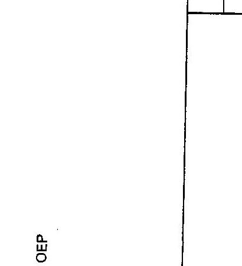

6/6. oldal

---

Adatszolgáltató: Országos Egészségbiztosítási Pénztár

2. sz. tanúsítvány

Közgyógyellátottak által gyógyászati segédeszközökre és gyógyfürdő ellátásra fizetett térítési díjak

|  Sorsz. | Megnevezés | 2005. | 2006. | 2007.  |
| --- | --- | --- | --- | --- |
|   |  | Személy (tő) | Térítés (E Ft) | év össz. személy (tő)  |
|  1. | Gyógyászati segédeszközök | 280 575 | 0 | 266 038  |
|  2. | Gyógyfürdő ellátások | 19 331 | 0 | 19 743  |

Igazolom, hogy a tanúsítványban szereplő adatok nyilvántartásainkkal megegyeznek.

Dátum: 2008. augusztus 7.

Dr. Daubner Monika főosztályvezető

---

Országos adatok az OEP és a MEP-ek közgyógyellátásra jutó fejlesztési kiadásairól

|   | Megnevezés | 2004 | 2005 | 2006 | 2007 | 2008**  |
| --- | --- | --- | --- | --- | --- | --- |
|  1 | létszám (fő) | 4 074 | 3 914 | 3 849 | 3 246 | 3 262  |
|   | ebből |  |  |  |  |   |
|  2 | határozott idejű (fő) | 159 | 189 | 221 | 402 | 473  |
|  3 | határozatlan idejű (fő) | 3 915 | 3 725 | 3 628 | 2 844 | 2 789  |
|  4 | 1-ből adminisztratív létszám (fő) |  |  | 404 | 343 | 344  |
|  5 | 1-bői érdemi ügyintészői létszám (fő) |  |  | 3 445 | 2 903 | 2 918  |
|  6 | közgyógyhoz kapcsolódó létszám (fő) | 38,6 | 35,1 | 230,05 | 337,35 | 311,8  |
|   | ebből |  |  |  |  |   |
|  7 | határozott idejű (fő) | 1 | 2,3 | 14,05 | 85,75 | 102,25  |
|  8 | határozatlan idejű (fő) | 37,6 | 32,8 | 216 | 251,6 | 209,55  |
|  9 | 6-bői adminisztratív létszám (fő) | 2 | 3 | 39,75 | 77 | 78,2  |
|  10 | 6-bői érdemi ügyintészői létszám (fő) | 36,6 | 37,6 | 190,3 | 280,35 | 233,6  |
|  11 | bére + járulékai (M Ft) | 146,77 | 154,05 | 1 274,32 | 1 710,45 | 391,82  |
|  12 | dologi kiadás (M Ft)* | 67,08 | 67,91 | 367,58 | 446,67 | 149,92  |
|  13 | fejlesztési kiadás (M Ft) | 7,84 | 14,70 | 238,39 | 250,32 | 4,96  |
|   | ebből |  |  |  |  |   |
|  14 | Informatika (M Ft) |  | 6,2 | 138,3 | 127,2 | 0  |
|   | Összesen (M Ft) 11+12+13 | 221,69 | 238,66 | 1 880,29 | 2 407,44 | 546,70  |

*Kibős, világítás, irodal eszközök, postadig. stb.

* 1-3 havi adat

Igazolom, hogy a tanúsítványban szereplő adatok nyilvántartásainkkal megegyeznek.

Dátum: 2008. július 28.

---

# Közgyógy kártyákról törölt keretösszegek (2008 I. félév)

|  "Elveszett" keretösszeg az éves keret százalékában | Közgyógy kártya lejáratakor (meghosszabbítás után is) "elveszett" |  | Passziválás miatt "elveszett" |   |
| --- | --- | --- | --- | --- |
|   | Kártya (db) | Ft | Kártya (db) | Ft  |
|  10% vagy annál kevesebb | 66315 | 109 950 938 Ft | 943 | 1 647 172 Ft  |
|  20% vagy annál kevesebb | 19847 | 271 215 546 Ft | 482 | 5 482 315 Ft  |
|  30% vagy annál kevesebb | 18256 | 396 607 123 Ft | 796 | 15 753 526 Ft  |
|  40% vagy annál kevesebb | 17856 | 539 682 552 Ft | 718 | 20 856 635 Ft  |
|  50% vagy annál kevesebb | 17507 | 674 752 322 Ft | 991 | 35 224 391 Ft  |
|  60% vagy annál kevesebb | 16198 | 734 440 222 Ft | 967 | 43 303 609 Ft  |
|  70% vagy annál kevesebb | 14656 | 752 923 388 Ft | 982 | 50 745 515 Ft  |
|  80% vagy annál kevesebb | 12238 | 685 669 279 Ft | 1097 | 66 429 159 Ft  |
|  90% vagy annál kevesebb | 9543 | 561 268 100 Ft | 1082 | 74 088 341 Ft  |
|  100% vagy annál kevesebb | 15295 | 554 026 461 Ft | 2363 | 145 953 922 Ft  |
|  Azon közgyógyosok teljes keretösszege összesen, akiknek "elveszett" valamekkora keretösszege (Ft) | 207711 | 15 684 604 152 Ft | 10421 | 752 753 106 Ft  |
|  Ebből mekkora a kártyára (negyedévenként) feltöltött felhasználhatatlan ("elveszett") keretösszeg (Ft) | 207711 | 5 280 535 931 Ft | 10421 | 459 484 585 Ft  |

Mivel kiderült, hogy tévesen a 6000 Ft-os évi egyszeri jóváírásokat a statisztika készítésénél nem vettük figyelembe, a táblázatot újra generáltuk. Néhány magyarázat:

Olyan adatok szerepelnek a táblázatban, amelyekre a közgyógy igazolvány lejárt 2008. január 1 és június 30 között.

Az első adatoszlopban olyan kártyák szerepelnek, amelyhez tartozó TAJ szám az igazolvány lejártakor még érvényes volt. (Ha idő előtt is lett a kártya lezárva (pl. téves kiadás), a TAJ szám a közgyógy igazolvány eredeti 1 éves érvényessége alatt végig élő volt.)

A második adatoszlopban olyan kártyák szerepelnek, amelyekhez tartozó TAJ szám passziválásra került a kártya eredeti érvényességi ideje alatt.

A táblázatban összesen 30610 új tétel szerepel, ebből:

- 30153 olyan, amelynek nulla havi kerete volt, csak az éves 6000 Ft-os összeget kapta meg. (Eredeti lekérdezésből tévedéből kimaradtak)
- A fennmaradó 457 új sor olyan, amelynek igazolványát utólagosan, pl. passziválás, vagy új igazolvány kiadása miatt MEP-en időközben 2008.07.01 előtti dátummal zárták le.

Igazolom, hogy a tanúsítványban szereplő adatok nyilvántartásainkkal megegyeznek.

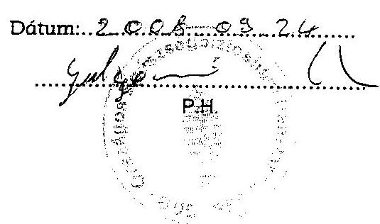

---

# Eljárások száma 2006. július 1-jétől az OEP-nél és a MEP-eknél

|  Megnevezés | 2006.* | 2007.  |
| --- | --- | --- |
|  A MEP-ek által lefolytatott eljárások száma ☐ | 124.210 | 406.590  |
|  ebből elutasított | 16.537 | 62.235  |
|  ebből ismételten benyújtott | 525 | 3248  |
|  Másodfokú eljárások száma összesen | 445 | 4045  |
|  ebből |  |   |
|  - megváltoztatott állásfoglalás | 18 | 220  |
|  - új eljárásra kötelezett | 14 | 42  |
|  - elutasított | 413 | 3783  |

- 2006. július 1-től (2006. szeptembertől II. fokú kgy.)

Igazolom, hogy a tanúsítványban szereplő adatok nyilvántartásainkkal megegyeznek.

Dátum: 2008. július 08.

Az elsőfokú eljárásokra vonatkozó adatokat az ISF Főosztály szolgáltatta.

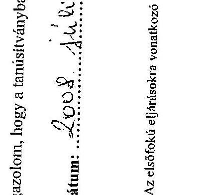

---

# Táblázatok jegyzéke 

| 1/a. sz. táblázat | Gyógyszer, gyógyászati segédeszköz és gyógyfürdő támogatása, 2003 - 2007, 2008. I. félév (bruttó értékben) |
| :--: | :--: |
| 1/b. sz. táblázat | Gyógyszer, gyógyászati segédeszköz, gyógyfürdő szolgáltatás összes kiadása, aránya (2005 - 2008. I. félév) |
| 1/c. sz. táblázat | Gyógyszer, gyógyászati segédeszköz és gyógyfürdő támogatása, (2005 - 2008. I. félév) (E. Alap) |
| 1/d. sz. táblázat | Gyógyszer, gyógyászati segédeszköz és gyógyfürdő támogatása, (2005 - 2007.) (Központi költségvetés, önkormányzati befizetés) |
| 2/a - 2/e. táblázat | Közgyógyellátás legnagyobb forgalmú gyógyászati segédeszközeinek közfinanszírozás alapját képező árai (2005 - 2008. I. negyedév) |

---

Gyógyszer, gyógyászati segédeszköz és gyógyfürdő támogatása, 2003-2007, 2008. I. félév ${ }^{a)}$ (bruttó értékben)

|  Megnevezés | 2003 | 2004 | 2005 | 2006 | 2007 | 2008. I. félév ${ }^{\text {b) }}$  |
| --- | --- | --- | --- | --- | --- | --- |
|  Gyógyszer, gyse, gyógyfürdő tb. támogatása | 291238,9 | 336793,3 | 397759,2 | 442401,2 | 364804,9 | 179330,6  |
|  ebből: gyógyszertámogatás | 251818,0 | 288949,6 | 348869,1 | 388710,8 | 323639,0 | 158416,8  |
|  ebből: közgyógyellátásc) | 16301,8 | 16606,1 | 17628,7 | 16745,9 | 22992,5 | 15193,0  |
|  gyógyászati segédeszköz támogatás | 34957,5 | 42982,6 | 44131,7 | 48527,3 | 36626,1 | 18983,2  |
|  ebből: közgyógyellátásc) | 10483,6 | 11571,4 | 11369,6 | 11284,7 | 6534,1 | 3291,3  |
|  gyógyfürdő és egyéb gyógyászati ellátását) | 4463,3 | 4861,1 | 4758,5 | 5163,0 | 4539,8 | 1930,6  |
|  ebből: közgyógyellátásc) | 184,0 | 305,5 | 309,7 | 332,3 | 229,5 | 75,3  |
|  Közgyógyellátás kiadásai központi költségvetésből |  |  |  |  |  |   |
|  és helyi önkormányzatok által | 19728,8 | 20568,5 | 23012,1 | 23439,0 | 22739,6 | 10859,2  |
|  ebből: gyógyszer | 15810,6 | 17107,0 | 19172,1 | 19675,2 | 20072,6 | 9623,7  |
|  gyógyászati segédeszköz | 3644,6 | 3064,2 | 3471,1 | 3482,7 | 2601,0 | 1197,5  |
|  gyógyfürdő | 273,6 | 397,3 | 369,0 | 281,2 | 66,0 | 38,0  |
|  Közgyógyellátás megtérítése összesen | 19723,5 | 20516,5 | 22911,0 | 23871,0 | 22558,3 | 11291,6  |
|  ebből: központi költségvetésből | 16913,0 | 17439,0 | 19634,0 | 21009,0 | 19924,0 | 10286,0  |
|  önkormányzatok által | 2810,5 | 3077,5 | 3277,0 | 2862,0 | 2634,3 | 1005,6  |

${ }^{a)}$ Főkönyvi adat ${ }^{\text {b) }} 2008$. 07. 24-i könyvelési állapotnak megfelelően (előzetes főkönyvi adat). ${ }^{\text {c) }}$ ÁFA nélkül ${ }^{\text {d) }} 18$ éves kor alatti csoportos gyógyúszás, mint egyéb rehabilitációs célú gyógyászati ellátás.

Készítette: Bende Hedvig OEP Költségvetési és Gazdálkodási Főosztály Statisztikai Osztály Ellenőrizte: Dénes Edit OEP Költségvetési és Gazdálkodási Főosztály Statisztikai Osztály Adatforrás: Kettős-Könyvviteli Összesítő Rendszer

---

Gyógyszer, gyógyászati segédeszköz, gyógyfürdő szolgáltatás összes kiadása, aránya (2005-2008. I. félév)

|  Megnevezés | 2005 | 2006 | 2007 | 2008. I. félév | 2008. prognózis | 2005-2007 összesen  |
| --- | --- | --- | --- | --- | --- | --- |
|   | E Ft | E Ft | E Ft | E Ft | E Ft | E Ft  |
|  Közgyógyellátásra fordított összes kiadás | 52320,2 | 51802,0 | 52495,7 | 29418,8 | 58837,6 | 156617,9  |
|  ebből |  |  |  |  |  |   |
|  E. Alap | 29308,0 | 28362,9 | 29756,1 | 18559,6 | 37119,2 | 87427,0  |
|  gyógyszer | 17628,7 | 16745,9 | 22992,5 | 15193,0 | 30386,0 |   |
|  gyógyászati segédeszköz | 11369,6 | 11284,7 | 6534,1 | 3291,3 | 6582,6 |   |
|  gyógyfürdő szolgáltatás | 309,7 | 332,3 | 229,5 | 75,3 | 150,6 |   |
|  Központi költségvetés és önkormányzati befizetés | 23012,2 | 23439,1 | 22739,6 | 10859,2 | 21718,4 | 69190,9  |
|  gyógyszer | 19172,1 | 19675,2 | 20072,6 | 9623,7 | 19247,4 |   |
|  gyógyászati segédeszköz | 3471,1 | 3482,7 | 2601,0 | 1197,5 | 2395,0 |   |
|  gyógyfürdő szolgáltatás | 369,0 | 281,2 | 66,0 | 38,0 | 76,0 |   |

|  Közgyógyellátásra fordított összes kiadás megoszlási aránya (\%) | 2005 | 2006 | 2007 | 2008. I. félév  |
| --- | --- | --- | --- | --- |
|  Összes kiadás (100\%) | 52320,2 | 51802,0 | 52495,7 | 29418,8  |
|  ebből |  |  |  |   |
|  gyógyszer | $70 \%$ | $70 \%$ | $82 \%$ | $84 \%$  |
|  gyógyászati segédeszköz | $28 \%$ | $29 \%$ | $17 \%$ | $15 \%$  |
|  gyógyfürdő szolgáltatás | $1 \%$ | $1 \%$ | $1 \%$ | $0 \%$  |

Fornás: OEP, Költségvetési és Gazdálkodási Főosztály, Statisztikai Osztály

---

Gyógyszer, gyógyászati segédeszköz és gyógyfürdő támogatása (2005-2008. I. félév) (E. ALAP)

|  Megnevezés | 2005 | 2006 | 2007 | 2008. I. félév | 2008. prognózis  |
| --- | --- | --- | --- | --- | --- |
|  Gyógyszertámogatás | 348869,1 | 388710,8 | 323639,0 | 158416,8 | 316833,6  |
|  ebből közgyógy | 17628,7 | 16745,9 | 22992,5 | 15193,0 | 30386,0  |
|  Arány | $5 \%$ | $4 \%$ | $7 \%$ | $10 \%$ | $10 \%$  |
|  Gyógyászati segédeszköz támogatás | 44131,7 | 48527,3 | 36626,1 | 18983,2 | 37966,4  |
|  ebből közgyógy | 11369,6 | 11284,7 | 6534,1 | 3291,3 | 6582,6  |
|  Arány | $26 \%$ | $23 \%$ | $18 \%$ | $17 \%$ | $17 \%$  |
|  Gyógyfürdő és egyéb gyógyászati ellátás | 4758,5 | 5163,0 | 4539,8 | 1930,6 | 3861,2  |
|  ebből közgyógy | 309,7 | 332,3 | 229,5 | 75,3 | 150,6  |
|  Arány | $7 \%$ | $6 \%$ | $5 \%$ | $4 \%$ | $4 \%$  |
|  Megnevezés | 2005 | 2006 | 2007 | 2008. I. félév | 2008. prognózis  |
|  Gyógyszer, gyse, gyógyfürdő tb. támogatása | 397759,3 | 442401,1 | 364804,9 | 179330,6 | 358661,2  |
|  ebből közgyógy | 29308,0 | 28362,9 | 29756,1 | 18559,6 | 37119,2  |
|  Arány | $7 \%$ | $6 \%$ | $8 \%$ | $10 \%$ | $10 \%$  |
|  Megnevezés | 2005 | 2006 | 2007 | 2008. I. félév | 2008. prognózis  |
|  Közgyógy E. Alapból összesen | 29308,3 | 28363,2 | 29756,3 | 18559,6 | 37119,2  |
|  ebből | $100 \%$ | $100 \%$ | $100 \%$ | $100 \%$ | $100 \%$  |
|  Gyógyszer | $60 \%$ | $59 \%$ | $77 \%$ | $82 \%$ | $82 \%$  |
|  Gyse | $39 \%$ | $40 \%$ | $22 \%$ | $18 \%$ | $18 \%$  |
|  Gyógyfürdő | $1 \%$ | $1 \%$ | $1 \%$ | $0 \%$ | $0 \%$  |

Forrás: OEP, Költségvetési és Gazdálkodási Főosztály, Statisztikai Osztály

---

Gyógyszer, gyógyászati segédeszköz és gyógyfürdő támogatása (2005-2008. I. félév) (Központi költségvetés, önkormányzati befizetés)

|  Megnevezés | 2005 |  | 2006 |  | 2007 |  | 2008. I. félév  |
| --- | --- | --- | --- | --- | --- | --- | --- |
|  Gyógyszer közgyógyellátási |  | 19172,1 |  | 19675,2 |  | 20072,6 | 9623,7  |
|  Gyógyászati segédeszköz |  | 3471,1 |  | 3482,7 |  | 2601,0 | 1197,5  |
|  Gyógyfürdő szolgáltatás |  | 369,0 |  | 281,2 |  | 66,0 | 38,0  |
|  Gyógyászati segédeszköz, gyógyszer, gyógyfürdő szolgáltatás összesen |  | 23012,2 |  | 23439,1 |  | 22739,6 | 10859,2  |

|  Megnevezés | 2005 |  | 2006 |  | 2007 |  | 2008. I. félév  |
| --- | --- | --- | --- | --- | --- | --- | --- |
|  Közgyógy központi költségvetésből és helyi önkormányzatok által |  | 23012,2 |  | 23439,1 |  | 22739,6 | 10859,2  |
|  ebből |  |  |  |  |  |  |   |
|  Gyógyszer |  | 83\% |  | 84\% |  | 88\% | 89\%  |
|  Gyse |  | 15\% |  | 15\% |  | 11\% | 11\%  |
|  Gyógyfürdő |  | 2\% |  | 1\% |  | 0\% | 0\%  |

Forrás: OEP, Költségvetési és Gazdálkodási Főosztály, Statisztikai Osztály

---

Közgyógyellátás legnagyobb forgalmú gyógyászati segédeszközeinek közfinanszírozás alapját képező árai 2005. év

Ft/m.e.

|  Sorrend | ISO termék-kód | Megnevezés, mértékegység | Nettó | ÁFA | Bruttó  |
| --- | --- | --- | --- | --- | --- |
|  1. | 0633060306001 | C-13 deformált lábra, darab | 10110 | $20 \%$ | 12132  |
|  2. | 0633060618001 | C-21 erősen deformált lábra, darab | 18050 | $20 \%$ | 21660  |
|  3. | 214503330945001 | Beltone Opera Plus CSP IIP, darab | 118000 | $20 \%$ | 141600  |
|  4. | 0209090303004 | Lyofoam $10 \times 17,5 \mathrm{~cm}$, darab | 2300 | $20 \%$ | 2760  |
|  5. | 0206091203001 | Mepitel $20 \times 30 \mathrm{~cm}$, darab | 2250 | $20 \%$ | 2700  |
|  6. | 214503481503001 | Resound CC 4, darab | 153360 | $20 \%$ | 184032  |
|  7. | 0209090303013 | Lyofoam $15 \times 20 \mathrm{~cm}$, darab | 2300 | $20 \%$ | 2760  |
|  8. | 0630360309001 | Keményakrilát műfog, darab | 374 | $0 \%$ | 374  |
|  9. | 0603090312001 | Cheneau, darab | 143680 | $20 \%$ | 172416  |
|  10. | 214503151251001 | Victofon V6 Class D, darab | 74373 | $20 \%$ | 89248  |

---

Közgyógyellátás legnagyobb forgalmú gyógyászati segédeszközeinek közfinanszírozás alapját képező árai 2006. év

|  Sorrend | ISO termék-kód | Megnevezés, mértékegység | Nettó | ÁFA | Bruttó  |
| --- | --- | --- | --- | --- | --- |
|  1. | 0424120603016 | Personal Aktiv Test 50 db/doboz, csomag/doboz | 2850 | $5 \%$ | 2993  |
|  2. | 0424120603001 | C-Test 50 db/doboz, csomag/doboz | 2850 | $5 \%$ | 2993  |
|  3. | 0633060306001 | C-13 deformált lábra, darab | 10110 | $20 \%$ | 12132  |
|  4. | 0633060618001 | C-21 erősen deformált lábra, darab | 18050 | $20 \%$ | 21660  |
|  5. | 214503330945001 | Beltone Opera Plus CSP IIP, darab | 118000 | $20 \%$ | 141600  |
|  6. | 214503481503001 | Resound CC 4, darab | 153360 | $20 \%$ | 184032  |
|  7. | 1215060303004 | EL-GO, elektromos, darab | 352000 | $20 \%$ | 422400  |
|  8. | 214503330945003 | Phonak Astro MC-EP-ITC, darab | 118000 | $20 \%$ | 141600  |
|  9. | 0209090303004 | Lyofoam $10 \times 17,5 \mathrm{~cm}$, darab | 2300 | $20 \%$ | 2760  |
|  10. | 1221270306001 | B-4220/V, darab | 740000 | $20 \%$ | 888000  |

---

Közgyógyellátás legnagyobb forgalmú gyógyászati segédeszközeinek közfinanszírozás alapját képező árai 2007. I. félév

|  Sorrend | ISO termék-kód | Megnevezés, mértékegység | Nettó | ÁFA | Bruttó  |
| --- | --- | --- | --- | --- | --- |
|  1. | 0424120603016 | Personal Aktiv Test 50 db/doboz, csomag/doboz | 2790 | $5 \%$ | 2930  |
|  2. | 0424120603001 | C-Test 50 db/doboz, csomag/doboz | 2790 | $5 \%$ | 2930  |
|  3. | 0633060618001 | C-21 erősen deformált lábra, darab | 18050 | $20 \%$ | 21660  |
|  4. | 0633060306001 | C-13 deformált lábra, darab | 10110 | $20 \%$ | 12132  |
|  5. | 1215060303004 | EL-GO, elektromos, darab | 345000 | $20 \%$ | 414000  |
|  6. | 0209090303004 | Lyofsam $10 \times 17,5 \mathrm{~cm}$, darab | 2299 | $20 \%$ | 2759  |
|  7. | 0930040621014 | Seni Standard Large ( 1543 ml ), darab | 112 | $20 \%$ | 134  |
|  8. | 1221270306001 | B-4220/V, darab | 740000 | $20 \%$ | 888000  |
|  9. | 0212030903002 | Combiderm $15 \times 18 \mathrm{~cm}$, darab | 1913 | $20 \%$ | 2296  |
|  10. | 0930040615017 | Seni Standard Medium ( 1358 ml ), darab | 96 | $20 \%$ | 115  |

---

Közgyógyellátás legnagyobb forgalmú gyógyászati segédeszközelnek közfinanszírozás alapját képező árai 2007. II. félév

|  Sorrend | ISO termék-kód | Megnevezés, mértékegység | Nettó | ÁFA | Bruttó  |
| --- | --- | --- | --- | --- | --- |
|  1. | 0424120603016 | Personal Aktiv Test 50 db/doboz, csomag/doboz | 2790 | $5 \%$ | 2930  |
|  2. | 0424120603001 | C-Test 50 db/doboz, csomag/doboz | 2790 | $5 \%$ | 2930  |
|  3. | 0633060618001 | C-21 erősen deformált lábra, darab | 18050 | $20 \%$ | 21660  |
|  4. | 0209090303004 | Lyofsam $10 \times 17,5 \mathrm{~cm}$, darab | 2299 | $20 \%$ | 2759  |
|  5. | 1216060303002 | EL-GO, elektromos, darab | 345000 | $20 \%$ | 414000  |
|  6. | 0633060306001 | C-13 deformált lábra, darab | 10110 | $20 \%$ | 12132  |
|  7. | 0930040621003 | Molicare L (1270 ml), darab | 112 | $20 \%$ | 134  |
|  8. | 1221270306001 | B-4220/V, darab | 740000 | $20 \%$ | 888000  |
|  9. | 0930040621014 | Seni Standard Large (1543 ml), darab | 112 | $20 \%$ | 134  |
|  10. | 0930040615003 | Molicare M (1150 ml), darab | 96 | $20 \%$ | 115  |

---

Közgyógyellátás legnagyobb forgalmú gyógyászati segédeszközeinek közfinanszírozás alapját képező árai 2008. I. negyedév

|  Sorrend | ISO termék-kód | Megnevezés, mértékegység | Nettó | ÁFA | Bruttó  |
| --- | --- | --- | --- | --- | --- |
|  1. | 0424120603016 | Personal Aktív Test 50 db/doboz, csomag/doboz | 2790 | $5 \%$ | 2930  |
|  2. | 0424120603001 | C-Test 50 db/doboz, csomag/doboz | 2790 | $5 \%$ | 2930  |
|  3. | 0633060618001 | C-21 erősen deformált lábra, doboz | 18050 | $20 \%$ | 21660  |
|  4. | 0209090303004 | Lyofoam $10 \times 17,5 \mathrm{~cm}$, doboz | 2299 | $20 \%$ | 2759  |
|  5. | 0633060306001 | C-13 deformált lábra, doboz | 10110 | $20 \%$ | 12132  |
|  6. | 0930040621003 | Molicare L (1270 ml), doboz | 112 | $20 \%$ | 134  |
|  7. | 1216060303002 | EL-GO, elektromos, doboz | 345000 | $20 \%$ | 414000  |
|  8. | 0930040615003 | Molicare M (1150 ml), doboz | 96 | $20 \%$ | 115  |
|  9. | 0930040624013 | Molicare Super L (2400 ml), doboz | 132 | $20 \%$ | 158  |
|  10. | 0930040621014 | Seni Standard Large (1543 ml), doboz | 112 | $20 \%$ | 134  |