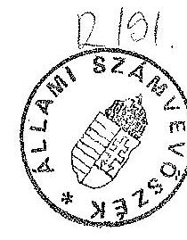
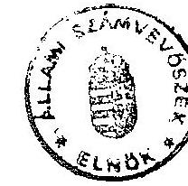

5156. szám

# Allami Számưutóósek 

## BESZÁMOLÓ

az Állami Számvevőszék 1991. évi munkájáról

---

A-74-2/1992.

# Tartalomjegyzék 

Bevezetó ..... 1

1. Az Állami Számvevőszék 1991. évi ellenőrzési tevékenysége ..... 2
1.1. A vizsgálatok tapasztalatai ..... 3
1.2. Vizsgálataink hasznosítása, a realizálás általános jellemzői ..... 11
2. Ellenjegyzési kötelezettségünk teljesítése ..... 13
2.1. A számviteli törvény ellenjegyzése ..... 13
2.2. A költségvetés hitelfelvételeinek ellenjegyzése ..... 13
3. Kapcsolataink az Országgyúléssel és bizottságaival ..... 14
3.1. Jelentéseink országgyűlési fogadtatása ..... 14
3.2. Véleményezési tevékenységünk ..... 15
4. Nemzetközi kapcsolataink ..... 15
4.1. Együttműködés a nemzetközi szervezetekkel ..... 15
4.2. Az Állami Számvevőszék kétoldalú kapcsolatai ..... 16
5. Az Állami Számvevőszék müködési feltételei ..... 17
5.1. Személyi feltételek, továbbképzés ..... 17
5.2. Tárgyi feltételek ..... 18
6. sz. melléklet: Az 1992. évre áthúzódó ellenőrzések
7. sz. melléklet: Ellenőrzési tapasztalatok ..... $1-91$

---

# BEVEZETŐ 

Az Állami Számvevőszék az elmúlt év végén müködésének második esztendejét zárta. Elmúlt évi tevékenységünkről elkészítettük beszámolónkat, hogy az Országgyúlésnek számot adjunk törvényi kötelezettségeink teljesítéséről. Éves munkánk összefoglaló áttekintésével lehetőség nyílik arra, hogy a képviselők egész tevékenységünkről képet kapjanak, értékeljék ellenőrzéseinket, azok hasznosíthatóságát.

Tapasztalataink összegezése saját magunk számára is tanulságul szolgál, mert ezeket értékelve állapíthatjuk meg, hogy feladataink függvényében hogyan éltünk lehetőségeinkkel, hol és miben érzékeljük müködésünk további külső és belső tartalékait, hol látunk feszültségeket. Az önkormányzati törvény tartalmában módosította az ÁSZ törvényben meghatározott ellenőrzési kötelezettséget. Ennek alapján az Állami Számvevőszék az egyetlen állami szervezet, amely a helyi önkormányzatok gazdálkodását ellenőrizheti. Ugyanakkor a képviselő testületek érdeke és szerencsére egyre többször igénye is, hogy - a pénzügyi ellenőrző bizottságok felügyelő tevékenységén kívül - évente ellenőriztessék a pénzügyi apparátus munkáját, a könyvvezetés helyességét. Belátható, hogy a nagy számú és területileg is szétszórtan elhelyezkedő önkormányzatok évenkénti rendszeres, szabályossági, pénzügyi és gazdasági ellenőrzése a Számvevőszék kizárólagos ellenőrzésével nem oldható meg.

Az önkormányzatokkal kapcsolatos ellenőrzési feladataink automatikusan megnövekedtek azáltal, hogy az ellenőrzések megalapozottságát biztosító reprezentációhoz több önkormányzathoz kell eljutnunk. Az 1992. évre engedélyezett létszámnövelési lehetőség ellenére is korlátozott erőforrásaink miatt az a felfogásunk, hogy a számvevőszéki ellenőrzéseket olyan területekre irányítsuk, amelyek megállapításait, javaslatait az Országgyűlés a törvényhozási munkában közvetlenül hasznosítani tudja.

A hazai számvevőszéki ellenőrzést egy alapjaiban átalakuló társadalmi-gazdasági rendszer gyorsan változó feltételei között kell kialakítanunk. A számvevőszéki ellenőrzés az ellenőrzési feladatok olyan új megközelítését igényli, amelyhez a gazdasági környezet sajátos adottságai miatt sem a magyar számvevőszéki múlt, sem a fejlett országok számvevőszéki gyakorlata nem szolgált kész modellel. Szakmai tevékenységünk kialakítása és továbbfejlesztése során igénybe vettünk és

---

veszünk minden lehetőséget, amelyet a kialakult számvevőszéki gyakorlat kínál. Az Állami Számvevőszék tagja a számvevőszékek nemzetközi és európai szervezetének. Így lehetőségünk, de érdekünk is, hogy a nemzetközi szervezetek szakmai ajánlásait beépítsük tevékenységünkbe.

A változó politikai és gazdasági körülmények miatt szinte a teljes gazdasági joganyag ujjáalkotása van folyamatban. A megszülető jogszabályok tükrözik a tulajdoni és egyéb viszonyok megváltozását. Ugyancsak cél, hogy a már korábban felismert pazarló, rosszul müködő mechanizmusok megszűnjenek, s helyettük ésszerű szabályozás érvényesüljön. E munkához kívánunk hozzájárulni azzal, hogy beszámolónkban összegezzük mindazokat az általános érvényü, a törvényalkotók számára is hasznosítható következtetéseinket, amelyeket ellenőrzéseink alapján gyüjtöttünk össze. A számvevőszéki ellenőrzések tapasztalatainak célirányos öszszegezésével az államháztartás reformjának végrehajtását is segíteni szeretnénk.

A kialakuló társadalmi-gazdasági rendszer nem nélkülözheti a pénzügyi, gazdasági és igazgatási fegyelem megteremtésének törvényes biztosítékait. Ennek egyik eleme az állami ellenőrzés egységes és összehangolt rendszere, amelyben az ellenőrző szervek eltérő feladattal és hatáskörrel, folyamatosan és hatékonyan biztosítják az állami pénzeszközök felhasználásának, az állami és kincstári vagyon megőrzésének megbízható kontrollját.

# 1. Az Állami Számvevőszék 1991. évi ellenőrzési tevékenysége 

Az ÁSZ-törvény évenkénti ellenőrzést ír elő a költségvetés, a zárszámadás, a hitelkapcsolatok és a pártok esetében, rendszeres (de nem évenkénti) kötelezettséget fogalmaz meg a fejezetekre és az elkülönített állami pénzalapokra. Ezen kívül országgyűlési határozatban rögzített felkérésekre, valamint saját elhatározásból is végeztünk vizsgálatokat.

Vizsgálataink középpontjába a törvényesség, a szabályszerűség és az eredményesség ellenőrzését állítottuk, mint legfontosabb követelményt. Ellenőrzési tervünkben - a hazai aktuális igények, törvényi kötelezettségeink és a nemzetközi gyakorlat alapján - a kiadások ellenőrzésére fektettük a hangsúlyt.

Ellenőriztük az 1990. évi költségvetés végrehajtását, az állami pénzeszközökkel való gazdálkodást, az államigazgatás szervezeteinek múködését és az állami vagyonkezelést. A vizsgált területek és témakörök kiválasztásával arra törekedtünk,

---

hogy megfelelően reprezentált ellenőrzési tapasztalatokkal és megállapításokkal segítsük az Országgyűlés munkáját, a törvényjavaslatok előkészítését.

Sokféle feladatunk miatt egyre szűkebbnek bizonyuló ellenőrzési kapacitásunk racionális felhasználását szolgálták azok a keresztmetszet-, téma- és célvizsgálatok, amelyek azonos témát, vagy meghatározott feladat végrehajtását több szervezetnél vizsgáltak. Ilyenek voltak például a bér- és létszámgazdálkodás ellenőrzése a központi fejezeteknél, vagy a céltámogatási igények megalapozottságának ellenőrzése az önkormányzatoknál.

Az 1990-ről áthúzódó 11 és az elmúlt év során indított 36 vizsgálatból 35 témát zártunk le. Ezen felül 17 párt gazdálkodásának törvényességét ellenőriztük, amelyből 3 párt vizsgálata húzódott át erre az évre. Az ellenőrzött pártok közül 11 párt részesült költségvetési támogatásban.

Vizsgálatainkra közel 20 ezer revizori napot fordítottunk, amelynek közel felét az önkormányzatoknál végzett ellenőrzések kötötték le. Eredetileg tervezett vizsgálati témáink változtatására, illetve átütemezésére a szakszervezeti vagyonfelmérés hitelesítésével összefüggő feladat következtében került sor. Az 1992. évre, áthúzódó 15 vizsgálatunk az 1991. évi kapacitás $15 \%$-át vette igénybe (1.sz. melléklet).

A teljeskörű áttekintéshez 1991. évi vizsgálatainkról rövid, összefoglaló ismertetőket készítettünk, amelyeket a 2. sz. melléklet tartalmaz.

# 1.1. A vizsgálatok általános tapasztalatai 

Az államháztartás különböző területein végzett ellenőrzéseink révén - a gazdálkodást átfogóan érintő megállapítások és következtetések összegezésével - képet nyerhetünk az államháztartás egyes alrendszereiről, a gazdálkodás helyzetéről, főbb vonásairól. Ezen keresztül nemcsak az általános megítéléshez kívánunk segítséget nyújtani, hanem jelzéseinkkel, a változtatások irányának felvázolásával közvetlenül is támogatni szeretnénk a képviselők munkáját.

### 1.1.1. Az állami költségvetéssel kapcsolatos vizsgálatok

Az 1990. évi költségvetés végrehajtása és az erről szóló kormányzati jelentés - a Zárszámadás -, valamint az 1992. évi költségvetési javaslat ellenőrzésének tapasztalatait az Országgyűlésnek benyújtott jelentéseinkben foglaltuk össze. Az Állami Számvevőszéknek a Magyar Köztársaság 1990. évi költségvetése végrehajtása ellenőrzéséről szóló jelentését az Országgyűlés 51/1991. (X.3.) OGy. határozatával

---

elfogadta. Az 1992. évi költségvetési törvényjavaslat ellenőrzéséről készített jelentésünket az országgyűlési vitában hasznosították.

A költségvetési javaslat és a zárszámadás szerkezete és tartalma megalapozza a Kormánynak a költségvetési gazdálkodásról történő elszámolását és annak ellenőrzését. Ennek során a költségvetési gazdálkodásra vonatkozó szabályoknak kitüntetett jelentősége van. E szabályoktól függ, hogy az Országgyűlés a költségvetés végrehajtásában milyen hatáskört tart meg, s ennek függvényében a Kormány gazdálkodási szabadsága meddig terjedhet. Mindezek alapján ellenőrizhető és minősíthető a gazdálkodás törvényessége és szabályszerűsége.

Az állami költségvetés végrehajtásával kapcsolatos vizsgálati jelentésünkben felhívtuk a figyelmet arra, hogy a zárszámadás szerkezete nem alkalmas a gazdálkodás folyamatának, belső pénzügyi összefüggéseinek nyomonkövetésére. A Kormánynak 1990-ben a gyakorlatban szinte korlátlan előirányzat átcsoportosítási és felhasználási felhatalmazása volt. Ehhez járult a költségvetési szervek szinte teljes gazdálkodási szabadsága. Ezek a gazdálkodási szabályok nemcsak az Országgyűlés költségvetéssel kapcsolatos ellenőrzési jogának érdemi érvényesítését korlátozták, hanem az állami költségvetés pénzeszközeinek feladatcentrikus, hatékony felhasználására sem ösztönöztek, kényszerítettek eléggé.

A Pénzügyminisztérium 1991-től a korábbi évekhez viszonyítva a költségvetést új szerkezetben, az előirányzatok részletesebb bemutatásával készítette el. Az új szerkezet mindenképpen előrelépést jelentett abban a tekintetben, hogy ezáltal az egyes költségvetési fejezetek előirányzatai, illetve azok felhasználása követhetővé, a miniszterek hatásköre és felelőssége pedig megállapíthatóvá vált. A pozitív elmozdulás ellenére a költségvetési javaslat szerkezete, számszaki és szöveges tartalma nem alkalmas arra, hogy a képviselők egyértelmű, áttekinthető képet kapjanak az állam által támogatott feladatokról, illetve ezek mértékéről. Ez nemcsak a költségvetéssel kapcsolatos parlamenti döntéseket helyezi bizonytalan alapokra, hanem az ellenőrzést is szűk korlátok közé szorítja, sőt gátolja a költségvetés feladatoldalról történő átalakítását is.

Az ellenőrzéseink által feltárt hiányosságok megszüntetése csak az államháztartási reform következetes megvalósítása keretében képzelhető el, ami minden bizonnyal több éves folyamat lesz.

---

# 1.1.2. A központi költségvetési szervek ellenőrzése 

A költségvetés egyensúlyának növekvő feszültségei a kiadási oldal csökkentését, a központi költségvetési szervek által ellátott feladatok felülvizsgálatát indokolták volna. Hiányzott azonban a kellő elhatározottság, s az érintettek nyilvánvaló ellenérdekeltsége is hátráltatta a feladatok újragondolását. Az intézmények azért sem kényszerültek hatékony, a pénzeszközöket kímélő működés kialakítására, mert az állami feladatok ellátásában eddig nem alakulhatott ki versenyhelyzet.

E problémát a pénzügyi kormányzat - a költségvetés egyre növekvő hiányának szorításában - már korábban felismerte. A költségvetés korlátozott kiadási lehetősége azonban csak egy általános, "minden támogatást egyformán csökkentő" restrikció végrehajtását kényszerítette ki, ami több területen inkább elmélyítette az ellátó rendszerek működésében mutatkozó válságjelenségeket, mint segítette volna a hatékonyabb feladatellátást.

A fejezeti ellenőrzéseknél alapvető szempontunk volt a költségvetési előirányzatok törvényes, célszerű és eredményes felhasználásának vizsgálata. Ezen belül ellenőriztük, hogy a múködést meghatározó szabályzatokat kialakították-e, azok alkalma-sak-e a döntési, felelősségi hatáskörök gyakorlására, számonkérésére. Minden feladat racionális ellátásának alapfeltétele, hogy az ellátandó feladathoz igazodjék a szervezeti felépítés. Követelmény, hogy a szervezetben a munkamegosztás az ott dolgozók számára világos és deklarált legyen, s ehhez kapcsoltan a feladatellátáshoz igénybevett pénzeszközök célirányos felhasználását, a vagyontárgyak megőrzését is biztosítsák.

Ellenőrzéseink e területen meglehetősen lehangoló képet mutatnak. Általános tapasztalat, hogy a folyamatosan változó feladatkör ellenére a müködést meghatározó szabályzatok átdolgozása, kidolgozása nem történik meg. Ez ugyan még nem egyértelmű bizonyítéka annak, hogy a feladatok és az azokat szolgáló eszközrendszer összehangolására nem hoznak intézkedéseket, de mindenesetre arra mutat, hogy tételesen átgondolt, rendszerelvű, szabályzatban rögzített módon a feladatok megfogalmazása hiányzik.

A pénzügyi jellegű szabályzatok, nyílvántartások intézményenkénti szabályozottsága teremti meg a feltételét annak, hogy visszaélés, pazarlás ne történjék, s az intézmények tulajdonában lévő eszközök védelme biztosított legyen. Ezen a területen kedvezőbbek a tapasztalataink, de néhány intézménynél itt is feltártunk olyan hiányosságokat, amelyek az állami tulajdon megkárosítását okozhatják.

---

Különös figyelmet érdemel, hogy rendezetlen az ingatlanok tulajdonjoga, azok kezelőinek jogi státusza, valamint a földterületek nyilvántartása. A nyilvántartások rendezése minden szervezet számára sürgető feladat azért is, hogy az állami vagyon a nyilvántartások hiányosságai miatt kárt ne szenvedjen, az állampolgári tulajdon pedig védett legyen.

A takarékos és tervszerű feladatellátás azt igényli, hogy a pénzügyi feltételeket és a feladatokat összehangolják, s pontosan tervezett előirányzatok alapozzák meg az évközi gazdálkodást. A korábbi gazdálkodási szabályok az intézményi többletbevételek eléréséhez személyi ösztönzési lehetőséget biztosítottak. Voltak olyan bevételek is, amelyek tervezését kifejezetten tiltották a tervezési utasítások. Ezért - az irreálisan alacsony bevételek miatt - az intézmények a fenntartásukhoz szükséges kiadásokat sem tervezhették meg reálisan. Általános volt a költségvetési alapokmánytól eltérő, ún. "házi használatra készülő" költségvetések készítése.

A gazdálkodási szabályok már nem ösztönöznek ilyen típusú tervezésre. A több év alatt kialakult gyakorlat azonban folytatódott, a bevételek és a kiadások reális megtervezése továbbra sem követelmény. A támogatásból és az ún. "saját" bevételekből fedezendő kiadások összemosódása miatt nem egy esetben az alacsony szinten tervezett intézményi bevételek segítségével megalapozatlan támogatás-növekedést lehetett elérni.

Az állami kiadások tetemes hányadát a bérköltség tette ki, amelynek alakulására több tényező hat. A szervezetek racionális felépítése nemcsak a munka hatékonyságát növeli, hanem a szükséges létszámigényt is csökkentheti. Az adott terület bérszínvonala szintén befolyásolja a bérkiadásokat.

Az utóbbi évtizedben a költségvetési szervek bérgazdálkodási szabályozása több ízben módosult. A kötött bér- és létszámgazdálkodást 1990-re egy teljesen liberalizált rendszer váltotta fel. A kötöttségek fokozatos oldása azért következett be, mert az ellátandó feladatok által indokolt bér- és létszámigény meghatározására és az ehhez szükséges költségvetési fedezet biztosítására az érintett kormányzati szervek egyre kevésbé vállalkoztak. E feszültség oldása az állami feladatok felülvizsgálatáig nem is várható, ennek ellenére kezdeti lépésként a bérgazdálkodás 1991-re ismét szigorúbbá vált.

A racionális gazdálkodást megcélzó "rugalmas" szabályozás keretei között az intézmények nem kényszerültek feladataik folyamatos felülvizsgálatára, létszámuk indokolt csökkentésére, sőt a szabályozás "rugalmasságát" kihasználva, saját elha-

---

tározásuk alapján újabb és újabb feladatra vállalkoztak. A felügyeleti szervek a megszünő feladatok miatt a legritkább esetben csökkentették a bért és létszámot, míg az új feladatok esetében a többletigényt általában kielégítették. Az ilymódon keletkezett forrásokból teljesen esetleges és indokolatlan mértékü bérszínvonal-különbségek jöttek létre.

A költségvetési gazdálkodási szabályok lehetőséget adtak meghatározott pénzeszközök "költségvetésen kívüli" kezelésére. Letéti számlákon és fejezeti elhatározás alapján létrehozott "Alapok" bankszámláin különböző nagyságrendű, de sokszor milliárdos összeget is elérő pénzeszközöket kezelnek. Ez az a terület, ahol vizsgálataink szinte kivétel nélkül szabálytalan gyakorlattal találkoztak. A kifizetések több esetben nem feleltek meg még a lazán megfogalmazott céloknak sem. Rendszerint olyan feladatokra fordítottak pénzeszközöket, amelyek a költségvetés feladatkörébe tartoznak, de kikerülve a szabályozott utat indokolatlan, vagy sajátos érdekeket szolgáló kifizetésekre adtak alkalmat.

Az elkülönített alapokból beruházásokra, kutatási feladatokra és egyéb, rendszerint a vállalkozói kört érintő kedvezmények "hitel jelleggel", visszatérítési kötelezettséggel kerülnek a felhasználókhoz. A támogatások nyílvántartásának pontatlanságai és a visszatérítési kötelezettségek előírásának elhanyagolása miatt több milliárd Ft-os kár éri a költségvetést, aminek pontos összege - éppen a nyílvántartások hiányosságai miatt - sokszor fel sem mérhető.

# 1.1.3. Az önkormányzatok ellenőrzése 

Az önkormányzatok 1991. évi ellenőrzése részben a tanácsokhoz/önkormányzatokhoz céljelleggel juttatott pénzeszközök felhasználására irányult. Már az 1990. évi költségvetésben szereplő céljellegű - pályázati úton elosztott - előirányzatok ellenőrzése kapcsán tapasztaltuk, hogy az amúgy is szűkös források célszerű elosztása szinte lehetetlen volt. A pályázati feltételek szakszerű meghatározása, az előirányzatokkal való összehangolása nem történt meg, ami a források szétforgácsolásához vezetett.

Az 1991. évi költségvetési törvény előkészítésekor még nem sikerült hasznosítani az 1990. évi pályázati feladatokkal összefüggő tapasztalatokat. Ezért az önkormányzatoknak az 1991. évi költségvetés végrehajtása során is pontatlanul megfogalmazott feltételek alapján kellett pályázniuk a költségvetésüket kiegészítő előirányzatok elnyeréséért. Országgyűlési határozat alapján, bizottsági felkérésre ellenőriztük, hogy a törvényben meghatározott pénzeszközök elosztásakor a beér-

---

kezett pályázatok közül a feltételeknek megfelelő igényeket nem utasítottak-e el. Ezeket az ellenőrzési feladatokat a rendelkezésre álló pénzeszközök elosztásának jóváhagyásával egyidejűleg kaptuk. Megállapítottuk, hogy az elutasított céltámogatási igények között a feltételeknek megfelelőek is szerepelnek, amelyeket azonban az Országgyűlés pénzeszközök hiányában kielégíteni nem tudott. Az önhibájukon kívül hátrányos helyzetben lévő önkormányzatok elutasított támogatási igényeinek felülvizsgálatáról készült jelentést az Önkormányzati Bizottság a vizsgálat befejezését követően megtárgyalta, a támogatások korrekcióját az 1992. évi költségvetés terhére rendezik.

Ezeknek az ellenőrzéseknek a legfontosabb tanulsága az, hogy a pénzeszközök pályázat útján történő elosztásához a pályázati rendszert kellő időben, pontosan meghatározva kell előkészíteni.

Az önkormányzatok felhalmozódott adósságterhei a 80-as évek települést fejlesztő, jórészt infrastruktúrális beruházásaival, valamint az ellátatlan területek fejlesztésével, rekonstrukciójával vannak összefüggésben. Megállapítottuk, hogy az adósságterhet csökkentő támogatások alig több mint fele tekinthető olyannak, amely a támogatás eredeti céljának megfelelt, a többi helyi érdekeket szolgált. A támogatási kérelmekben számítási hibák is előfordultak. A nem egyértelmű szabályozás miatt az adósságteher összegének kimutatásakor egyes megyék a számított, mások a hitelszerződésben szereplő üzleti kamatot érvényesítették igénybejelentésük során.

Az önkormányzatok ellenőrzésénél hangsúlyt helyeztünk annak feltárására és bemutatására, hogy az önkormányzatok a kötelező jellegű és egyéb, a lakosság életkörülményeit meghatározó feladataik ellátását milyen feltételekre támaszkodva kezdhetik meg. Ellenőrzéseink a kommunális jellegű infrastrukturális ellátás területére irányultak. Megállapítottuk, hogy az utóbbi évtized restrikciós intézkedései ezt a területet különösen kedvezőtlenül érintették, jelentősek az elmaradások, ugyanakkor a gazdálkodásban is számos tartalék rejlik.

# 1.1.4. Az állami vagyon kezelésének ellenőrzése 

Az állami vagyon kezelését, az állam vállalkozásokban működő vagyonának védelmét, értékmegőrzését és hasznosítását is törvényi felhatalmazás alapján ellenőrizzük. Feladatunkat képezi ezen kívül az Állami Vagyonügynökség tevékenységének vizsgálata is, ami magában foglalja az állami vállalatok átalakulásának, a társaságalapításnak és a privatizálásnak figyelemmel kísérését. Ide sorolandó továbbá az ÁVÜ hatáskörébe tartozó vagyon kezelésének, ezen belül az állam, mint

---

tulajdonos képviseletének ellenőrzése. Kiemelést érdemel a döntési mechanizmus, valamint az államigazgatási felügyelet alá vont állami vállalatok, a vállalati biztosok kinevezésének és beszámoltatásának gyakorlata is.

Ellenőriztük az ÁVÜ tevékenységéből származó bevételek és a költségek alakulását, valamint azt, hogy az így képződő pénzeszközöket a Vagyonpolitikai Irányelvekben meghatározott célokra használták-e.

Ugyancsak törvényi előírások szerint végeztük el az ÁVÜ 1990. évi tevékenységének teljeskörű vizsgálatát. Az így szerzett tapasztalatok és megállapítások képezték az alapját annak a jelentésnek, amit a müködésükről szóló kormánybeszámolóval egyidejúleg nyújtottunk be az Országgyűlésnek.

Az ÁVÜ tevékenységének vizsgálata mellett több állami vállalat átalakulását, vagyonkihelyezését és értékesítését ellenőriztük a privatizációs folyamat gyakorlati tapasztalatainak felmérése érdekében. Ennek keretében egyes korábbi nagyvállalatok (Medicor, Ganz Danubius, Özdi Kohászati Üzemek stb.) átalakulásának vizsgálata tapasztalatokat adott az ÁVÜ megalakulása előtti folyamatok, illetve a megalakulás és beavatkozás utáni helyzet elemzéséhez.

Megállapítottuk, hogy a társaságokat az állami vállalatok döntően a társasági törvény alapján alapították. Az ÁVÜ felállítását megelőzően kevesebb volt a tényleges és teljeskörű átalakulás, a nagyvállalatoknál pedig "kiürült vállalati központok" alakultak ki. A vagyonértékelés különböző módszerei ellenére általános tapasztalat volt, hogy az ingatlanokat jelentősen felértékelve, a készleteket alulértékelve vitték be a társaságokba. A külföldi befektetéseknél kétféle szemlélet érvényesült. Az egyik a vállalkozási nyereségadó kedvezmény eléréséhez szükséges minimális tőkebefektetést célozta meg, míg a másik a többségi tulajdonlás mielőbbi elérésére irányuló céltudatos üzletpolitikában jelent meg.

Összességében azonban az 1990. márciusáig alapított társaságokban az állami tulajdon többsége volt jellemző. A vizsgált vállalatok az átalakulással próbálták likviditási problémáikat enyhíteni, szervezeti életképtelenségüket leplezni és a felszámolás veszélyét elkerülni.

Vizsgálati tapasztalataink hozzásegítettek bennünket ahhoz, hogy gazdaságunk jelenlegi átmeneti helyzetében feltárjuk az állami tulajdon képviselőinek és kezelőinek érdekeit a vagyonátalakítás folyamatában. Egyúttal rámutattunk azokra a jellemző megoldásokra, amelyek veszélyeztetik az állami vagyon értékmegőrzését, illetve piaci értékesítését. A feltárt hiányosságok, szabálytalanságok kiküszöbölésére

---

intézkedéseket kezdeményeztünk, valamint törvényalkotási, módosítási igényeket fogalmaztunk meg. Néhány fontos gazdaságpolitikai konzekvenciát is feltártunk. Jeleztük, hogy a Kormány tulajdonosi és privatizációs stratégiájának hiánya lassítja az állami tulajdon lebontásának folyamatát. Felhívtuk a figyelmet a privatizációs folyamatban közremüködő szervezetek munkamegosztásának újragondolására, ezen belül a vagyonkezelési feladatok, a tulajdonosi jogok gyakorlásának javítására. A Vagyonpolitikai Irányelvek újraszabályozásakor a privatizációs bevételek felhasználásának lehetőségeire tettünk javaslatot. Sürgettük az állami vagyon teljeskörü felmérését, a vagyonleltár elkészitését. Foglalkoztunk az előprivatizáció gyorsítása érdekében teendő intézkedésekkel, így a hitelkonstrukciók bővítésének szükségességével, a bérleti díjak kiszámíthatóvá tételével, a profilkötöttségek oldásával.

# 1.1.5. A Társadalombiztosítási Alap ellenőrzése 

Az ellenőrzés központi kérdése az volt, hogy az egészségügy biztosítási alapokra helyezésének kezdeti lépését jelentő új finanszírozási folyamat miként biztosította a pénzeszközök célszerű és hatékony felhasználását, mennyiben készítette elő a társadalombiztosítás reformját.

Megállapítottuk, hogy az új finanszírozási rendszerre való áttérés a Társadalombiztosítási Alap kezelőjét felkészületlenül érte, a feladat ellátásának jogszabályi, szervezeti keretei nem voltak megfelelőek. A vizsgált szervezetek között nincs megfelelően kiépített információs kapcsolat, a hatáskörök rendezetlenek, ezért a célirányos felhasználás a vizsgálat idején rendszerszerűen még nem volt biztosított. Ez nem jelenti azt, hogy az eredetileg tervezettől teljesen eltérő volt a pénzeszközök felhasználása, bár ilyen példával is találkoztunk. A finanszírozás módosulásával a bázisalapú tervezési rend nem változott.

Az OTF az intézmények pénzellátását 1990-ben a fejezeteken keresztül biztosította, 1991-ben pedig - a megyei tanácsok megszünése miatt - a települési önkormányzatokkal került kapcsolatba. A zavartalan hosszú távú múködéshez az egészségügyi intézmények, a felügyeletet ellátó önkormányzatok és a Társadalombiztosítási Alap között a feladatok és hatáskörök pontos tisztázása, koordinációja és rögzítése szükséges.

### 1.1.6. Egyéb törvényi kötelezettségen alapuló vizsgálatok

A pártokról szóló törvény az állami költségvetésből támogatott pártok gazdálkodásának évenkénti törvényességi ellenőrzési kötelezettségét írja elő. Megállapítottuk, hogy a hatályos párttörvény előírásai nem egyértelműek, több ponton módosításra

---

szorulnak. Ugyanakkor felhívtuk a pártok figyelmét a belső nyilvántartási, valamint a pénzügyi tevékenység színvonalának javítására.

Vizsgáltuk a választások elökészitésére, lebonyolítására szolgáló pénzeszközök felhasználását is. Rendkívüli feladatunk volt az elmúlt rendszerhez kötődő társadalmi szervezetek és a szakszervezek vagyonelszámolásának hitelesítése. E vizsgálatok több szervezetnél megállapították, hogy az elszámolások nem hitelesíthetők. Ennek oka az elszámolás teljeskörűségének, dokumentáltságának hiánya, valamint számszaki hibák. Általánosítható megállapítás, hogy a társadalmi szervezetek vagyonának átadása, átvétele nem volt szabályszerű, a vagyon új kezelői pedig nincsenek felkészülve a számbavételre, a megőrzésre és a hatékony működtetésre.

# 1.2. Vizsgálataink hasznosítása, a realizálás általános jellemzői 

Alapvető célunk, hogy az ellenőrzések által feltárt tényekre alapozott javaslatokkal, jövőbe mutató ajánlásokkal segítsük a döntéselőkészítő, adott esetben a törvényalkotó munkát. A vizsgált szerveknél kezdeményezzük a feltárt hibák megszüntetését, a pénzügyi-gazdasági folyamatok szabályozását, újabb hiányosságok megelőzését szolgáló intézkedések kidolgozását és végrehajtását.

Lezárt ellenőrzéseink során megközelítőleg egymilliárd forint olyan kintlévőséget tártunk fel, amelynek behajtása megfelelő kormányzati intézkedésekkel sikeres lehet.

Az önkormányzatok ellenőrzésével kapcsolatosan eredménynek tekintjük, hogy az 1992. évi költségvetési törvényben, a céltámogatási rendszer működésének átalakításában javaslataink egy részét hasznosították, figyelembe vették.

A vizsgált szervezetek általában egyetértettek értékeléseinkkel, következtetéseinkkel. Ajánlásaink, javaslataink elfogadását, a szükséges intézkedések kidolgozását megelőző személyes tárgyalások és többszöri levélváltás alkalmával természetesen voltak vitatott kérdések a feltárt problémák megítélésében, azok közgazdasági, szakmai mérlegelésében.

Vizsgálataink alapján az ellenőrzött szervezetek intézkedési tervet készítettek, néhány esetben kormányzati döntések, miniszteri utasítások születtek. A vizsgált szervezetek olyan belső intézkedéseket hoztak, amelyek végrehajtásával javulhat az

---

ellenőrzött intézmények, szervezetek működése, pénzügyi-gazdasági munkájának szabályozottsága, a gazdálkodási és bizonylati fegyelem, az állami tulajdon védelme.

Az ellenőrzött szervezetek intézkedési terveinek elfogadásával sikerült vizsgálataink többségét azzal lezárni, hogy a végrehajtásról meghatározott időn belül az ÁSZ-t tájékoztatniok kell.

Ennek ellenére az ellenőrzött szervezetek részéről az általunk javasolt intézkedések, ajánlások fogadtatása különböző, ezek közül némelyik tanulságokkal is szolgálhat:
— Törvényességi, szabályszerűségi vizsgálataink által feltárt hibák, hiányosságok (és kijavításuk elmulasztása) indokaként gyakran különböző törvények hiányára hivatkoznak. A szükséges belső szabályzatok korszerűsítése, kimunkálása ezekre való várakozással marad el.
— Széles körben jellemző az átmeneti időszakra történő hivatkozás paradox módon olyan esetekben is, amikor éppen az átmeneti időszak rendjének kialakítását hiányoltuk és jogilag rendezetlen kérdések szabályozását javasoltuk.
—Általános ellenállás érzékelhető a visszamenőleges pénzügyi elszámoltatással szemben. A korábbi lazább gazdálkodási és felelősségi rend anyagi konzekvenciái nem érvényesíthetők. Jellemző a felelősség megállapításának nehézségeire, valamint személyi és egyéb változásokra való hivatkozás is. A "személyes felelősség visszamenőleges keresése helyett a rendszer átalakítására kell koncentrálnunk" miniszteri vélemény ezt a szemléletet jelzi. Tekintve, hogy 1991. évi vizsgálataink általában az 1989. és 1990. év gazdálkodását érintették, ezek az érvek ma még nem kifogásolhatók.
—Az önkormányzatok vizsgálatával kapcsolatban előfordult, hogy az ÁSZ ellenőrzési kompetenciáját a kormányzati szerv vitatta, ezért több levélváltás keretében - többek között - a vonatkozó törvények értelmezése is vita tárgyát képezte.
—Említésre méltónak tartjuk, hogy az ellenőrzött fejezetek közül a funkcionális tárcák - elsősorban a Pénzügyminisztérium - többnyire nem igazolják vissza javaslataink fogadtatását, holott egyes esetekben halaszthatatlan, a költségvetési gazdálkodás egészére, illetve hosszabb távra szükséges intézkedésekre tettünk ajánlásokat.

---

Realizálási tevékenységünk hatékony eszközei lehetnek az évente végzett utóvizsgálatok. Ezek célja, hogy a feltárt hibák kijavításáról, a szükséges intézkedések megtételéről a helyszínen meggyőződjünk. A működésünk kezdetétől eltelt rövid időszak utóellenőrzések beiktatását még nem tette lehetővé, de 1992-ben már ellenőrzési tervünkbe felvettük néhány 1990. évi ellenőrzés utóvizsgálatát.

# 2. Ellenjegyzési kötelezettségünk teljesítése 

Az ellenjegyzési kötelezettség a költségvetés hitelszerződéseire és az állami számviteli rend továbbfejlesztésére vonatkozó javaslatra vonatkozik.

### 2.1. A számviteli törvény ellenjegyzése

A törvény előkészítése során a törvényjavaslatot az ÁSZ elnöke - írásban kifejtett véleményének fenntartása mellett - ellenjegyezte. A törvényjavaslat szerint a költségvetési szervekre vonatkozó számviteli rendet - az államháztartási törvény megalkotásáig - a Kormány rendelettel szabályozhatja. Írásos véleményünkben rögzítettük, hogy törvényi szintű szabályozást tartunk indokoltnak.

### 2.2. A költségvetés hitelfelvételeinek ellenjegyzése

A költségvetési ellenőrzés körébe az ellenjegyzés fogalmát az ÁSZ-törvény vezette be. Az 1991. évi költségvetési törvény a költségvetés hitelfelvételi lehetőségét - a korábbiakhoz képest - pontosan rögzítette. Az ellenjegyzéskor a törvényi feltételek meglétét ellenőrizzük. A hitel szükségességét - tekintettel arra, hogy azt törvényi felhatalmazás alapján veszi fel a Kormány - nem vizsgáljuk.

Az 1991-ben ellenjegyzett hitelszerződések két csoportba sorolhatók. Az egyik csoportba tartoznak az 1991. előtt keletkezett államadósság hitelszerződései, amelyeknek az okmányait utólag, az 1991. évi költségvetési törvény alapján kellett elkészíteni, majd ellenjegyezni. E szerződéseknek csak egy része készült el, mert néhány esetben - dokumentumok hiányában - a pontos összeg nem volt megállapítható.

A hitelszerződések másik nagy csoportját az 1991. évi költségvetési hiány fedezetére felvett hosszú lejáratú hitelek alkotják. A hitelfelvételi lehetőséget szintén az 1991. évi költségvetési törvény szabályozta. Ennek alapján történt meg az ellenjegyzés.

---

# 3. Kapcsolataink az Országgyúléssel és bizottságaival 

Az elmúlt két esztendő alatt folyamatos szakmai kapcsolat alakult ki az Országgyűléssel és bizottságaival. Rendezettek a kapcsolataink az Országgyűlés főtitkári apparátusával is, amely segíti munkánkat. Jelentéseinket az Országgyűlés elnöke, továbbá a hatáskörileg illetékes Költségvetési bizottság elnöke és a frakcióvezetők mindíg megkapják. Jelentéseinket a témában illetékes más bizottságoknak az Országgyűlés elnökének ajánlását figyelembe véve juttatjuk el. Egyes jelentések a törvényben foglalt kötelzettségeknek megfelelően - minden képviselőhöz eljutnak. A Költségvetési bizottság rendre megtárgyalja ellenőrzési terveinket, amelyet az ÁSZ elnöke ezt követően jóváhagyásával véglegesít.

### 3.1. Jelentéseink országgyúlési fogadtatása

Az Országgyűlés plenáris ülése a költségvetési- és zárszámadási törvényjavaslathoz, valamint a kormányprogramokhoz készített jelentéseinket tárgyalta meg, illetve hasznosította a vitákban. Írásos jelentéseinken kívül az ÁSZ elnöke hozzászólásaival is részt vett az Országgyűlés munkájában. Ezeket rendszerint megelőzte a bizottsági vitákban történő részvételünk. Célszerű lenne, ha a plenáris ülésen a pénzügyminiszter, illetve a miniszterek magyarázatot adnának a képviselőknek az általunk felvetett hiányosságokra, konkrét elképzeléseket vázolnának fel javaslataink megvalósítására, vagy megindokolnák azok elutasítását. Ez segítené a képviselőket annak megítélésében, hogy pl. a Kormány zárszámadását elfogadhatják-e, illetve támpontot adhat a költségvetési törvényjavaslat módosításának kezdeményezéséhez.

Önálló napirendi pontként a parlamenti bizottságok 10 alkalommal tárgyalták meg jelentéseinket. A Költségvetési, adó- és pénzügyi bizottság elsősorban az éves költségvetési folyamatokat, elszámolásokat érintő jelentéseinkkel, véleményeinkkel foglalkozott. Ezen kívül a közérdeklődésre számottartó, közpénzek felhasználására vonatkozó vizsgálatainkat is megvitatták (pl. Magyar Televízió). Az állami vagyonról, privatizációról szóló jelentéseinket szintén tárgyalta a bizottság.

Az Önkormányzati bizottság az önkormányzatok támogatási rendszerét, gazdálkodását érintő vizsgálatokat tárgyalta meg. A Szociális, egészségügyi és családvédelmi bizottság a társadalombiztosítással kapcsolatos ellenőrzéseink tapasztalatait vitatta meg, és a gyógyító-megelőző ellátás társadalombiztosítási finanszírozása kapcsán az ÁSZ-t utóvizsgálat lefolytatására kérte fel. A bizottságok az ellenőrzések megállapításai, tapasztalatai alapján határozatot hoztak a hibák kijavítására, a hasznosítás lehetőségére.

---

# 3.2. Véleményezési tevékenységünk 

Az ÁSZ ellenőrzési tevékenységének eredménye akkor hasznosulhat igazán, ha tapasztalataink beépülhetnek a törvényalkotásba is. A jogalkotás folyamatában napirendre kerültek olyan, az államháztartás vitelét is érintő törvények, amelyekben véleményünk kinyilvánítását szükségesnek tartottuk.

Írásos véleményt nyújtottunk be az államháztartási törvénytervezet parlamenti vitájához. A törvénytervezet bizottsági megtárgyalásán és a képviselők által benyújtott módosító indítványok vitáján elmondtuk szakvéleményünket.

Törvényi kötelezettségünk alapján az elmúlt évben két kormányprogramot véleményeztünk. A Bös-Nagymarosi Vizlépcsőrendszer nagyberuházással kapcsolatban az ÁSZ vizsgálta, hogy az objektumon végzett munkálatok a felfüggesztésre hozott kormány, illetve országgyúlési döntéseknek megfelelően történtek-e. A megállapításokat részben szakvélemény, részben jelentés formájában hoztuk nyilvánosságra. A szakvéleményt az Országgyúlés bizottságai hasznosították, a jelentést pedig az Országgyúlés határozatainál figyelembe vették.

Az 1996-ban megrendezendő világkiállítással kapcsolatban az ÁSZ szakvéleményt, illetve a törvényjavaslathoz hozzászólást adott. Mindkét dokumentum föként a pénzügyi megalapozottságot vizsgálta, amelyben több bizonytalansági tényezőre hívtuk fel a figyelmet. A viták során az ÁSZ észrevételeit hasznosították.

## 4. Nemzetközi kapcsolataink

Kétéves múködésünk során jelentős nemzetközi kapcsolatokat alakítottunk ki, sőt eddig rendezvényeinkkel már nemzetközi tekintélyre is szert tettünk. A fejlett országok számvevőszékei részéről segítő szándékot tapasztalunk. A volt szocialista országok állami ellenőrzési szerveivel a közvetlen kétoldalú kapcsolat ma még nem kielégítő.

### 4.1. Együttmúködés a nemzetközi szervezetekkel

Megalakulásunk után aktív együttműködést építettünk ki több jelentős nemzetközi számvevőszéki szervezettel. A legjelentősebb az ENSZ keretében múködő INTOSAI (Legfőbb Ellenőrző Intézmények Nemzetközi Szervezete), melynek Kormányzó Tanácsában az ÁSZ elnöke aktívan látja el a tagságból fakadó feladatokat.

---

Résztvettünk az INTOSAI Washingtonban megtartandó XIV. Kongresszusának, valamint annak európai regionális szervezete, az EUROSAI megalakításának előkészítésében. Aktív szerepet játszottunk a kelet-európai országok ellenőrzési szervei és az EUROSAI közötti kapcsolatok kiépítésében. Az EUROSAI I. Kongresszusán Madridban 1990. novemberében az ÁSZ elnökét megválásztották alelnökké, s egyben a Kormányzó Tanács tagjává. Az EUROSAI II. Kongresszusának előkészítésében szintén közreműködünk.

Az EUROSAI megbízása alapján szemináriumot szerveztünk a kelet-európai országok ellenőrző szervezeteinek vezetői részére, 1991. szeptember 8-22. között Velencén az ÁSZ Továbbképző Intézetében. A szemináriumhoz jelentős anyagi támogatást nyújtott az EUROSAI, az IDI /az INTOSAI önállósult oktatási szervezete/ és több fejlett európai ország /Nagy-Britannia, Németország, Franciaország stb./.

Az Európai Közösségek Számvevőszékével a kapcsolatok felvételét az ÁSZ kezdeményezte, tekintettel az ország Európai Gazdasági Közösséggel való egyre szorosabb kapcsolataira. Meghívásunkra 1991. májusában Budapesten járt a közösség számvevőszékének elnöke.

Az együttműködés koordinálása érdekében 1991. augusztusában felvettük a kapcsolatokat a cseh-szlovák és a lengyel ellenőrző szervekkel, valamint kapcsolat jött létre az ÁSZ és a Közös Piac Végrehajtó Bizottsága között is. Részt veszünk a Közösség által kezdeményezett PHARE Program ellenőrzésében.

# 4.2. Az Állami Számvevőszék kétoldalú kapcsolatai 

Működésünk kezdetén elsősorban Ausztria és az NSZK számvevőszékeinél szerzett tapasztalatokra támaszkodhattunk. Mára azonban Európa számos, nagy hagyományokkal rendelkező számvevőszékével alakítottunk ki kapcsolatokat a számvevőszéki típusú ellenőrzés gyakorlatának megismerésére.

A Brit Számvevőszékkel (NAO) hosszú távú együttműködés indult el. Hosszú lejáratú együttműködési megállapodás jött létre az ÁSZ és a Svéd Számvevőszék között is. Eddig a legintenzívebb szakmai kapcsolat a Német Szövetségi Számvevőszékkel alakult ki. A kezdetben kinyilvánított segítőszándék máig sem csökkent. A Szövetségi Számvevőszék (BRH) és a Kormány - a Német Alapítvány Nemzetközi Fejlesztésre (DSE) - bevonásával az elmúlt két évben négy szemináriumot szervezett az ÁSZ munkatársainak továbbképzésére, amelyből kettőt Németországban, kettőt pedig Magyarországon tartottak meg. A szemináriumi költségeket külföldön telje-

---

sen, Magyarországon pedig részben a DSE fedezte, az előadókat a BRH biztosította. Az Egyesült Államok Számvevőszékével (GAO) is jó a kapcsolatunk. A GAO elnöke, Charles Bowsher úr már közvetlenül az ÁSZ megalakulása után 1990. májusában látogatást tett az ÁSZ-nál. Ugyancsak jó kapcsolataink vannak Izrael Állam Számvevőszékével. Lehetőség nyílt arra, hogy egy munkatárs 1991-ben egy hónapig tanulmányozza a számvevőszék tevékenységét, munkamódszereit.

# 5. Az Állami Számvevőszék működési feltételei 

### 5.1. Személyi feltételek, továbbképzés

Az ÁSZ létszámát az Országgyűlés eredetileg 300 fóben határozta meg, amit az elmúlt év végéig csaknem teljesen feltöltöttünk, 1991-ben 61 munkatársat vettünk fel. Döntően a közvetlen vizsgálatot folytató főcsoportok kapacitása bővült. Legnagyobb arányban a területi-önkormányzati ellenőrzéseket végző főcsoport létszáma nőtt. Ennek ellenére - az állami vagyonellenőrzés mellett - ez az a szakmai terület, ahol ma is feszítő az ellentmondás a feladatok és a vizsgáló kapacitás között. Az ÁSZ belső, hivatali feladatait ellátó egységeinél kisebb volt a létszámnövekedés.

Az ÁSZ ellenőrzési feladatait 1991. december 31 -én 185 munkatárs végezte. Kétharmaduk a helyszini ellenőrzést folytató szervezeti egységekben dolgozik. A munkatársak több mint fele okleveles közgazdász, de jelentős a pénzügyi-számviteli főiskolát ( $13 \%$ ), továbbá a jogi ( $10 \%$ ), illetőleg a műszaki egyetemet végzettek (10 \%) aránya is. Szakembereink közel egynegyede többdiplomás, és mind többen rendelkeznek okleveles könyvvizsgálói, vagy más pénzügyi szakértői képesítéssel. Kedvező a munkatársak életkor szerinti összetétele is, a számvevők fele a legaktívabb (40 - 50 év közötti) életkorban van. A férfi és nő munkatársak aránya 60-40 \%.

A legnagyobb arányú létszámfluktuáció az ellenőrzést folytató munkatársak körében van. Figyelmet érdemel, hogy 4 vezető, 7 tanácsos és 6 olyan számvevő talált magának megfelelőbb munkahelyet, akik több évtizedes ellenőrzési gyakorlattal rendelkeztek. A pénzügyi szakismeretek piaci felértékelődése, továbbá az anyagilag jobb feltételeket kínáló vállalkozói és pénzintézeti szektor elszívó hatása miatt a jövőben is számítani kell számottevő létszámmozgásra.

A számvevői munka speciális követelményeinek megfelelően 1991-ben a képzés gerincét a vizsgálati feladatokra felkészítő tanfolyamok, szemináriumok jelentették. Ezek, valamint a szervezet számítástechnikai rendszerének használatát oktató

---

továbbképzések belső szervezéssel voltak ésszerűen megoldhatók, amelyeket az ÁSZ velencei továbbképző intézetében tartottunk 64 oktatási napon, közel 500 résztvevővel. A hivatal által szervezett tanfolyamokon kívül sokan külső továbbképzésekben vesznek részt.

Az ÁSZ múködése megkezdésétől érzékelhető hiányt pótoltak azok a stúdiumok, amelyeken az alkalmazott vizsgálati módszerekkel és eljárásokkal - ezek lehetséges értelmezésével - ismerkedtek meg a vizsgálatokat végző munkatársak. Ugyancsak általános igényként felmerült és megoldottuk, hogy a hivatalba belépő új dolgozók önálló kurzus keretében átfogó, érdemi tájékoztatást kapjanak az ÁSZ jogállását, feladatait, szervezeti-működési rendjét érintő kérdésekről.

# 5.2 Tárgyi feltételek 

Az elmúlt évben tovább folytatódtak az ÁSZ információs rendszer koncepciójának megfelelő számítástechnikai fejlesztések. Egyik fő törekvésünknek megfelelően több olyan rendszerfejlesztés történt, amely segítette ellenőrzési feladataink teljesitését.

Fejlesztéseinknél követelményként fogalmaztuk meg, hogy kapcsolódjunk a kormányzati szinten elfogadott nyilt rendszer koncepcióhoz. A költségvetési adatbázisunk segítségével végeztük el a költségvetési és zárszámadási véleményezési feladatunkhoz a Kormány által benyújtott törvényjavaslatok számszaki ellenőrzését.

Belső szoftver fejlesztésekkel járultunk hozzá több vizsgálat adatainak feldolgozásához, elemzéséhez, így az önkormányzatok normatív állami támogatásának ellenőrzéséhez, a szakszervezeti vagyon védelmének és elszámolásának vizsgálatához, a központi államigazgatási szervezetek létszám- és bérgazdálkodásának ellenőrzéséhez.

Eszközparkunk bővítése arra ad lehetőséget, hogy a szövegszerkesztés és adatfeldolgozás mellett megkezdődhessen a számítástechnika integrálása a közvetlen ellenőrzési munkába. Ennek módszerei azonban jórészt még kidolgozatlanok. A saját fejlesztések mellett, a külföldi tapasztalatok átvételével tudunk előbbre lépni ezen a területen.

Az elmúlt két évben az ÁSZ könyvtárának kialakításához, múködtetéséhez "minimális program"-ot alakítottunk ki, amely egy korszerű szakkönyvtár megteremtését célozta.

---

A könyvtári adatbázisok csatlakoznak az ÁSZ számítógépes hálózatához, így a munkatársak részére könnyen hozzáférhetők és lekérdezhetők a mindennapi munkához szükséges legfontosabb adatbázisok (pl. ÁSZ-jelentések, MNB, KSH szolgáltatások).

Az ÁSZ létrehozásakor az Országgyúlés határozatával rendelkezésünkre bocsátott - jogszerű használatunkban lévő - központi épület felújításának második ütemét hajtottuk végre 1991-ben. Az erősen leromlott állagú épületben ezzel a legsürgősebb felújítási munkákat elvégeztük.

A jelenlegi létszám elhelyezése is csak nagy nehézségek árán lehetséges, ezért 1992-ben további átalakítási munkák szükségesek. Várhatóan a takarékosabb helykihasználás sem teszi lehetővé az engedélyezett létszám elhelyezését. Ezért kezdeményezéseket tettünk további iroda épület felkutatására.

A megnövekedett önkormányzati ellenőrzési feladatokhoz jóváhagyott létszámnövekedést követően a megyei önkormányzatoktól bérbevett irodák 1991. évben több megyében szűkösnek bizonyultak, ezért a bérelt alapterület növelésére kényszerültünk.

A gépjárművezetők által vezetett üzemi személygépkocsikat (összesen 8 db) igazodva "Az államigazgatási gépjárműpark korszerűsítése" keretében elfogadott ajánlásokhoz - Volkswagen típusú gépkocsikra cseréltük.

Összességében elmondható, hogy a működés tárgyi-technikai feltételeit az ÁSZ működésének első két évében sikerült megteremtenünk, színvonala megközelíti az államigazgatásban átlagosnak mondható mértéket.

A beruházások és az üzemeltetés-működtetés szabályozását, rendjét az első év tapasztalatai és a belső ellenőrzések vizsgálatai alapján áttekintettük. A szükséges szervezeti, személyi és tárgyi feltételek ma már kielégítő módon szolgálják az ÁSZ ellenőrzési tevékenységét.

---

Az Alkotmány és a hatályos ÁSZ törvény szakmai ellentmondásának feloldására hivatottan a Parlament határozata alapján ad-hoc bizottságot hoztak létre. Ezzel egyidejúleg költségvetésünket negyedévenként - a költségvetési törvény negyedévenkénti módosításával - bocsátották rendelkezésünkre. A bizonytalanság az új, kialakuló szervezetben a munkához szükséges feltételek megteremtését nehezítette, s sajnos néhány jól felkészült szakember el is hagyta szervezetünket.

Működésünket, feladatainkat érintő vitatott kérdések feltehetően hamarosan megoldódnak, így tevékenységünket zavartalanul szakmai munkánk fejlesztésére összpontosíthatjuk.

Változatlanul alapvető feladatunknak tekintjük az ÁSZ-törvényben meghatározott kötelezettségek teljesítését. Emellett folyamatosan felmérjük és igyekszünk megoldani az új helyzetnek megfelelő, új törvényekből fakadó feladatokat. Jelenleg dolgozunk az önkormányzatok és az állami vállalatok rendszeres ellenőrzésének szakmai, metodikai megoldásán, a számviteli törvény alapján megváltozott költségvetési könyvvezetési rend ellenőrzési módszerének kialakításán. Az ebben az évben várhatóan jóváhagyásra kerülő államháztartási törvényből eredő ellenőrzési feladatok értelmezése folyamatos feladatunk, hogy a törvény megalkotása után felkészülten végezzük ellenőrzéseinket.

Budapest, 1992. március

Hagelmayer István

---

# AZ 1992. ÉVRE ÁTHÚZÓDÓ ELLENŐRZÉSEK 

1. A Bős- Nagymarosi Vízlépcsőrendszer nagyberuházás állami és politikai döntési folyamata
2. A Bős-Nagymarosi Vízlépcsőrendszer állami nagyberuházás lezárásnak pénzügyi felülvizsgálata
3. A belföldi államadósság ellenőrzése
4. Nemzeti és területi gyermek és ifjusági alapítványok pénzügyi-gazdasági ellenőrzése
5. A Magyar Honvédség ruházati ellátására fordított állami pénzek felhasználásának ellenőrzése
6. A környezetvédelem és a vízügy szervezeti szétválasztása körülményeinek és végrehajtásának vizsgálata
7. A Társadalombiztosítási Alap kezelőjénél végzett számvevőszéki vizsgálatok hasznosulásának ellenőrzése
8. A Magyar Rádió költségvetési fejezet pénzügyi-gazdasági ellenőrzése
9. Az Országgyűlés költségvetési fejezet pénzügyi-gazdasági ellenőrzése
10. A Miniszterelnökség költségvetési fejezet pénzügyi-gazdasági ellenőrzése
11. A Központi Földtani Hivatal és a földtani kutatások pénzügyi-gazdasági ellenőrzése
12. Az MHSZ, DEMISZ, MSZP, Magyar Úttörők Szövetsége, OBT, MSZBT vagyonelszámolásának ellenőrzése
13. 14., 15.) Az SZDSZ, MSZP és a HVK (Hazafias Választási Koalició) gazdálkodásának törvényességi ellenőrzése

---

# Tartalomjegyzék 

1. AZ ÁLLAMI KÖLTSÉGVETÉSSEL KAPCSOLATOS ELLENÖRZÉSEK ..... 1
1.1. Az 1990. évi zárszámadás ellenőrzése ..... 1
1.1.1. Realizálás ..... 5
1.2. Az 1991. évi költségvetés I. negyedévi teljesítésének véleményezése ..... 6
1.2.1. Realizálás ..... 7
1.3. Az 1992. évi költségvetési törvényjavaslat ellenőrzése ..... 7
1.3.1. Realizálás ..... 9
2. KÖZPONTI KÖLTSÉGVETÉSI SZERVEK ELLENŐRZÉSE ..... 10
2.1. A Földművelésügyi Minisztérium fejezet pénzügyi-gazdasági ellenőrzése ..... 10
2.1.1. A fejezet gazdálkodása ..... 11
2.1.2. Ágazati feladatok pénzforrásainak felhasználása ..... 13
2.1.3. A K+F pénzforrások felhasználása ..... 13
2.1.4. Kedvezőtlen adottságú gazdaságok támogatása ..... 15
2.1.5. A meliorációs és öntözési beruházások támogatása ..... 15
2.1.6. Minisztériumi kezelésű alapok ..... 16
Földvédelmi Alap ..... 16
Erdőfenntartási Alap ..... 16
Halászatfejlesztési és Vadgazdálkodási alapok ..... 17
2.1.7. Realizálás ..... 17
2.2. A Munkaügyi Minisztérium pénzügyi-gazdasági ellenőrzése ..... 18
2.2.1. A fejezet gazdálkodása ..... 19
2.2.2. Realizálás ..... 20
2.3. Az Igazságügyi Minisztérium Büntetésvégrehajtás pénzügyi-gazdasági ellenőrzése ..... 21

---

2.3.1. Az intézmény gazdálkodása ..... 21
2.3.2. Realizálás ..... 23
2.4. A Központi Statisztikai Hivatal pénzügyi-gazdasági ellenőrzése ..... 24
2.4.1. Az intézmény gazdálkodása ..... 24
2.4.2. Ágazati feladatok ..... 25
2.4.3. Realizálás ..... 26
2.5. A Magyar Televízió pénzügyi-gazdasági ellenőrzése ..... 27
2.5.1. A fejezet gazdálkodása ..... 27
2.5.2. Realizálás ..... 30
2.6. A Magyar Köztársaság külképviseleteinek pénzügyi-gazdasági ellenőrzése ..... 31
2.6.1. Realizálás ..... 33
3. ÖNKORMÁNYZATOK ELLENŐRZÉSE ..... 34
3.1. Az 1990. évi költségvetés végrehajtásához kapcsolódó ellenőrzések ..... 34
3.1.1. A pályázati úton nyújtott szociálpolitikai támogatások ellenőrzési tapasztalatai ..... 34
3.1.2. A színházi bemutatók pályázati úton történő támogatásának ellenőrzése ..... 37
Realizálás ..... 38
3.2. Az 1991. évi költségvetés végrehajtásával kapcsolatos ellenőrzések ..... 39
3.2.1. A helyi önkormányzatok áthúzódó kötelezettségeinek vizsgálata, különös tekintettel az adósságszolgálathoz kapcsolódó 1991. évi címzett támogatásra ..... 39
Realizálás ..... 40
3.2.2. Az önkormányzatok elutasított céltámogatási igényeinek felülvizsgálata ..... 41
3.2.3. Az önhibáján kívül hátrányos helyetben lévő önkormányzatok elutasított támogatási igényeinek helyszíni felülvizsgálata ..... 42
3.3. Az önkormányzatok helyzetét, müködési feltételeit feltáró ellenőrzések ..... 45
3.3.1. Az önkormányzati rendszerre való átállás szervezeti, gazdálkodási kérdéseinek ellenőrzési tapasztalatai ..... 45
3.3.2. A településszolgáltató vállalatok 1990. évi állami támogatásának vizsgálata ..... 47
3.3.3. Az önkormányzatok kiemelt kommunális feladatai (közvilágítás, temető- és útfenntartás, lakásgazdálkodás) megoldásának, s az ehhez kapcsolódó állami hozzájárulás hatásának vizsgálata ..... 49

---

3.3.4. Az egészséges ivóvízellátás feltételeinek javítására fordított eszközök felhasználásának vizsgálata ..... 51
3.3.5. A szennyvízelvezetésre és tisztításra fordított eszközök felhasználásának vizsgálata ..... 53
3.3.6. A közműves ivóvízellátás, a szennyvízelvezetés és -tisztítás helyzete, továbbá a közmü-olló alakulása ..... 55
3.3.7. A távfütés- és melegvizszolgáltatás támogatási és gazdálkodási rendszerének vizsgálata ..... 57
4. AZ ÁLLAMI KÖTELEZETTSÉGVÁLLALÁSSAL JÁRÓ
BERUHÁZÁSOK ELLENŐRZÉSE ..... 60
4.1. Az egyéb központi beruházásokra előirányzott pénzeszközök felhasználása ..... 60
4.1.1. Realizálás ..... 63
4.2. A MÁV közforgalmú vasúti közlekedési hálózatának fejlesztésére szolgáló beruházási források 1989-90. évi felhasználása tárgyában lefolytatott vizsgálat tapasztalatai ..... 64
4.3. A Bős-Nagymarosi Vízlépcsőrendszer nagyberuházással kapcsolatos ÁSZ vizsgálatok ..... 66
4.3.1. Szakvélemény a Bős-Nagymarosi Vízlépcsőrendszer nagyberuházás 1990. évi költségelőirányzatainak jóváhagyásához ..... 66
4.3.2. Jelentés a Bős-Nagymarosi Vízlépcsőrendszer nagyberuházással kapcsolatos kifizetések indokoltságának, a nagyberuházásért felelős szervek intézkedései célszerűségének vizsgálatáról. (Az 1989. május 31-i felfüggesztéstől 1990. június 1-ig.) ..... 66
4.4. Az 1996. évben megrendezendő világkiállítás ..... 67
5. TÁRSADALOMBIZTOSÍTÁSI ALAP ..... 70
5.1. A Társadalombiztosítási Alapból gyógyító-megelőző egészségügyi ellátásra fordított pénzeszközök felhasználása ..... 70
5.1.1. Realizálás ..... 73
6. ÁLLAMI VAGYONKEZELÉS ..... 74
6.1. Az Állami Vagyonügynökség 1990. évi tevékenységének ellenőrzése, valamint az ÁVÜ működéséről szóló beszámoló ÁSZ véleményezése ..... 74
6.2. A Ganz Danubius átalakulása, az Óbudai sziget hasznosítása ..... 77
6.3. A MEDICOR Vállalat átalakulása tárgyában lefolytatott célvizsgálat tapasztalatai ..... 78
6.4. A Budapest, V. Dorottya u. 1. sz. alatti Gerbeaud-ház privatizációs folyamatának ellenőrzése ..... 79
6.5. Az Ózdi Kohászati Üzemek privatizációs átalakulásának és müködésének vizsgálata ..... 81

---

6.6. A Compack Rt. privatizációs folyamatának ellenőrzése ..... 82
7. EGYÉB, TÖRVÉNYI KÖTELEZETTSÉGEN
ALAPULÓ VIZSGÁLATOK ..... 84
7.1. Az 1991. november 20 -ig végzett, a pártok gazdálkodása törvényességének ellenőrzési tapasztalatai ..... 84
7.2. A szakszervezeti vagyon védelméről, a munkavállalók szervezkedési és szervezeteik müködési esélyegyenlőségéről szóló 1991. évi XXVIII. törvény alapján készített vagyonelszámolások ..... 86
7.3. Az elmúlt rendszerhez kötődő egyes társadalmi szervezetek vagyonelszámoltatása ..... 88
7.4. Az 1990. évi önkormányzati választások előkészítésével és lebonyolításával kapcsolatos állami feladatok végrehajtására biztosított költségvetési pénzeszközök felhasználásáról és az 1989-90. évi választások pénzügyi összegezéséről ..... 89

---

# 1. AZ ÁLLAMI KÖLTSÉGVETÉSSEL KAPCSOLATOS ELLENŐRZÉSEK 

### 1.1. Az 1990. évi zárszámadás ellenőrzése

Az Állami Számvevőszék az 1990. évi költségvetés végrehajtásának és az erről szóló kormányzati jelentésnek, a zárszámadásnak az ellenőrzését törvényi kötelezettsége alapján végezte, mely szerint ellenőriznie kell az államháztartás gazdálkodását, ennek keretében a költségvetési felhasználások törvényességét, szükségességét és célszerűségét. A zárszámadás ellenőrzése sokrétű, jellegében és tartalmában is eltérő feladatot jelentett. Az ellenőrzési feladatok eredményes elvégzését a költségvetési gazdálkodás konkrét rendszere, illetve kiindulópontként ennek kereteit meghatározó jogszabályi- szabályozási rendszer alapvetően meghatározza, hiszen ezek teremtik meg az érdemi ellenőrzés és ellenőrizhetőség feltételeit azon keresztül, hogy a gazdálkodás megítéléséhez, minősítéséhez alapvető normatívákat, bizonyítási alapot teremtenek.

A zárszámadás ellenőrzése során a költségvetési gazdálkodás évközi vizsgálatok eredményein alapuló értékelésén és a költségvetési törvény végrehajtásának megítélésén túl kiemelt figyelmet fordítottunk a szabályozás hiányából, illetve hiányosságaiból fakadó gazdálkodásbeli problémákra, amelyek az Országgyűlés költségvetési gazdálkodásra vonatkozó jogköre érdemi érvényesülésének és a gazdálkodás ellenőrzésének korlátozásában, végsősoron a költségvetési pénzeszközökkel való gazdálkodás nem kielégítő hatékonyságában összegződnek.

Az Állami Számvevőszék az 1990. évi költségvetés végrehajtásának ellenőrzéséről készült jelentésében a gazdálkodást és az ellenőrzési tevékenységet átfogóan érintő alábbi főbb megállapításokat tette:

1. A költségvetési gazdálkodás törvényességének ellenőrzése annak megítélésére irányult, hogy a Kormány az éves költségvetési gazdálkodása során az Országgyűlés által a költségvetési törvényben meghatározott gazdálkodásra vonatkozó rendelkezések szerint járt-e el, a törvény felhatalmazása alapján, a törvényben meghatározott célokra, feladatok ellátására teljesítették-e a kiadásokat, azaz a felhasználás a törvényben megjelölt fejezeteknél, címeknél az előirányzott

---

kiadási összegeknek megfelelően történt-e. Az államháztartás jelenlegi rendszerében ennek ellenőrzése és a költségvetési törvénytől eltérő felhasználások egyes eseteinek minősítése, törvényességének megítélése és számonkérése csak korlátozottan volt lehetséges. A költségvetési átcsoportosítások, a kiadások túllépésének ellenőrzése csak addig terjedhetett, ameddig a költségvetés tartalma, szerkezete, részletezettsége, valamint a gazdálkodásra vonatkozó jogszabályok alapot teremtettek.

A költségvetési pénzeszközök felhasználására vonatkozó és a zárszámadás ellenőrzését megalapozó törvények, jogszabályok 1990. évben hatályos rendelkezései az Országgyűlésnek sok vonatkozásban csak formális jogokat, ezzel szemben a végrehajtó Kormánynak a gyakorlatban szinte korlátlan átcsoportosítási és felhasználási felhatalmazást adtak. A költségvetési törvényben elfogadott finanszírozható célok és feladatok nem voltak kellően részletezettek és pontosak, számos átfedést tartalmaztak, s az érvényben lévő túlliberalizált gazdálkodási szabályokkal együtt jelentősen korlátozták a költségvetési felhasználások érdemi ellenőrizhetőségét, a felhasználások szükségességének és célszerűségének megítélését.
2. A költségvetési mérleg valódiságát, a mérlegben kimutatott költségvetési hiány valós összegének kimutatását jelentős mértékben torzította a költségvetési kötelezettségek pénzügyi teljesítésének idejére vonatkozó egyértelmű szabályok hiánya. Ebben a helyzetben a tárgyévi költségvetési hiány összege az év végi pénzügyi helyzettől függően, az átutalások előbbre hozatalával, illetve halasztásával nagymértékben befolyásolható volt. Ellenőrzésünk néhány kifizetés indokolatlanságát ugyan megállapította, de szabályozás hiányában törvényességi-szabályszerűségi kifogást nem tehetett.
3. Az 1990. évi költségvetési gazdálkodásról készült zárszámadási jelentés számszaki összefüggéseinek, az adatok megbízhatóságának, a szöveges indoklások és részletes számítások megfelelésének ellenőrzését részben helyszíni vizsgálatokkal, részben pedig adatbankunk segítségével végeztük. Megállapítottuk, hogy a jelentés számszaki és szöveges tartalma, szerkezete nem teszi lehetővé a költségvetési gazdálkodás folyamatának teljeskörủ nyomonkövetését. A szöveges indoklásban szereplő adatok és az ezeket alátámasztani hivatott részadatok eltérő tartalma, más esetekben az adatszerűség teljes hiánya tette kétségessé a zárszámadási jelentés megállapításainak ellenőrzését, illetve ezek alátámasztottságának érdemi értékelését.

---

4. A költségvetési felhasználások szükségességének és célszerűségének ellenőrzése az államháztartás egyes területein a gazdálkodás átfogó vagy különböző vonatkozásának évközi ellenőrzésein alapszik.

A költségvetési pénzeszközök célszerű és hatékony felhasználását, a közpénzekkel való takarékos gazdálkodást - az elvégzett ellenőrzések megállapításait összegezve - számos körülmény gátolja. Ezek közül fontosságukat tekintve elsőként kell említeni a pénzeszközökkel való gazdálkodás liberalizáltságát. A pénzeszközök elosztására, megszerzésére, felhasználására és nem utolsó sorban a felhasználás ellenőrzésére vonatkozó gazdálkodási szabályok és eljárási rend nem kényszeríti a felhasználókat a pénzeszközökkel való megalapozott, célszerű és hatékony gazdálkodásra. Ellenőrzési megállapításaink közül e vonatkozásban összefoglalóan a következőket emeljük ki:

- A feladatokra épülő, alulról induló költségvetési tervezés hiányában nem határozhatók meg a feladatok ellátásához tartozó költségigények, s ennek következtében a feladatváltozás költségvonzata sem. Az ellátandó feladatok, finanszírozható célok és pénzügyi eszközök egymáshoz rendelésének hiányában a felesleges pénzköltés nehezen érhető tetten és a gazdálkodás költségérzéketlenné válik.
- Az előzőekkel összefüggésben tapasztaljuk ellenőrzéseink során, hogy az intézményi gazdálkodásban nincs határozott törekvés a költségtakarékos eljárások kimunkálására. Az intézmények előbb fordulnak pótelőirányzat igénylésével a költségvetéshez, vagy forrásteremtő vállalkozásokhoz, mint saját tevékenységükben rejlő tartalékok céltudatos feltárásához.
- A feladatok ellátásához szükséges létszám meghatározása is feltételezi a feladatokra épülő részletes tervezést. A saját hatáskörben végrehajtott létszámleépítés - amely több esetben feladatcsökkenésből eredt - egy-egy szervezet esetében függetlenül a munka minőségétől, jelentős mértékű bérfejlesztési lehetőséget biztosított. Így napjainkra a bértömeg gazdálkodás alapján erőteljesen differenciált bérszínvonal alakult ki.
- A céljelleggel elkülönített költségvetési pénzeszközök felhasználásánál általában tapasztalható az eredeti céltól eltérő felhasználás, sőt az elkülönített állami pénzalapok esetében a pénzeszközök egy részét költségvetésen kívülre terelték és kezelték. Az elkülönített állami pénzalapokból, költségvetésből visszatérítési kötelezettséggel kihelyezett támogatások nyilvántartását, behaj-

---

tását nagyvonalúan kezelik, ami az állami költségvetést jelentős bevételektől fosztja meg.

Összességében megállapítható, hogy a költségvetési gazdálkodás - változatlan állami feladatvállalás és kiadási struktúra esetén, a gazdálkodás eddigi liberalizáltságának folytatódásával együtt - egyre nyilvánvalóbban ellehetetlenül. A rendelkezésre álló pénzügyi keretek - a változatlan feladatkörhöz - nem biztosítanak elegendő forrásokat. Ez a pénzeszközök szétaprózódásán keresztül - a hiány többé-kevésbé egyenletes terítésével - a feladatok nem kielégítő ellátását eredményezi, s egyben a költségvetéssel szemben újabb igények jelentkezését váltja ki, miközben jelentős mértékű pazarlást hordoz magában.

A jelentésünk második részében részletesebben ismertettük azokat az ellenőrzési tapasztalatainkat, amelyekre megállapításainkat alapoztuk. Az 1990. évi zárszámadáshoz kapcsolódott egy olyan céljellegű ellenőrzési kötelezettségünk, amelyet az 1990. évi költségvetési törvény nevesítetten írt elő számunkra. A törvény alapján az önkormányzatok számára juttatott normatív támogatások igénybevételének jogosságát-kellett ellenőriznünk.

A Magyar Köztársaság 1990. évi állami költségvetéséről szóló 1989. évi L. törvény (továbbiakban: költségvetési törvény) 20. §/3/ bekezdése úgy rendelkezik, hogy "az állami támogatás rendelkezésre bocsátása tervezett mutatók alapján történik, a tényleges mutatók alapján a tárgyév lezárását követően a tanácsok az állami költségvetéssel elszámolnak".

Társközségek esetében az elszámolási kötelezettség - az önkormányzatok megalakulásával összefüggő átmeneti törvény alapján - a volt székhely-községek önkormányzatait terheli. A hatályba lépett önkormányzati törvény alapján megváltozott a tanácsok jogutódaként múködő önkormányzatok jogállása és jogi személyisége. Megszünt a felügyeleti és a támogatás jóváhagyási jogkört gyakorló megyei tanács is. A helyi önkormányzatok támogatásának megállapítása, módosítása az Országgyúlés hatáskörébe került.

Az ellenőrzés megállapította, hogy a normatív támogatások pontos tervezéséhez és elszámolásához a 1990. évi költségvetési törvény vonatkozó szakaszai nem nyújtottak kellő alapot. Az elszámolás lebonyolításához a BM-PM 1990. év júniusában még a tanácsok számára - jogszabálynak nem minősülő - "Tájékoztató"-t adott ki.

---

Egyrészt az érintett szervezetek - tanácsok-önkormányzatok - jogállásának változása, másrészt a pontatlan költségvetési törvény azt indokolta volna, hogy az elszámolás módosuló feltételeit az Országgyúlés döntése alapozza meg.

Az Állami Számvevőszék az 1990. évi költségvetési törvényben foglalt kötelezettsége alapján ellenőrizte az önkormányzatok elszámolásait. A zá́rszámadásban egyenlegként kimutatott 1851,5 millió Ft önkormányzatokat terhelő befizetési kötelezettséghez képest további - egyenlegében 399 millió Ft - eltérést állapítottunk meg.

Célunk az volt, hogy segítsük a jogszabályon alapuló szabályszerű és korrekt elszámolást, feltárjuk az önkormányzatok jogos támogatási igényeit, illetve rámutassunk az állami költségvetésből jogtalanul igénybe vett támogatásokra. Ellenőrzésünket azon jogi feltételekre alapoztuk, melyekkel az önkormánmyzatok is rendelkeztek a támogatás elszámolásához, illetve ahogyan a Belügyminisztérium és a Pénzügyminisztérium előkészítette az év végi elszámolást.

Eltéréseket 572 önkormányzat elszámolásánál, 11 normatíva esetében tapasztaltunk. (A beszámolót benyújtó mintegy 1600 önkormányzat $36 \%$-ánál.) Az ellenőrzés által megállapított befizetési kötelezettség $22 \%$-kal nagyobb, mint az önkormányzatok által kimutatott összegek. Ezek önmagában is jelzik a rendszer szabályozásának hibáit.

Az ellenőrzés által feltárt ellentmondások, a szabályozottság hiánya miatt az elszámolási kötelezettség módszerének újragondolását, országgyűlési döntéssel történő szabályozását javasoltuk.

# 1.1.1. Realizálás 

Az Országgyűlés az 51/1991. (X.3.1) OGY határozatával az Állami Számvevőszéknek a Magyar Köztársaság 1990. évi költségvetése végrehajtásának ellenőrzéséről szóló jelentését elfogadta.

---

# 1.2. Az 1991. évi költségvetés I. negyedévi teljesítésének véleményezése 

A Magyar Köztársaság 1991. évi állami költségvetéséről és az államháztartás vitelének 1991. évi szabályozásáról szóló 1990. évi CIV. törvény (továbbiakban költségvetési törvény) beszámolásra kötelezte a Kormányt az 1991. I.negyedévi költségvetési folyamatok alakulásáról. Az Állami Számvevőszék számára a törvény nem írt elő ellenőrzési kötelezettséget. Az ÁSZ azonban feladatának tekintette, hogy a Kormány beszámolójáról véleményt mondjon.

Megállapítottuk, hogy az 1991. I. negyedévi költségvetési mérleg adatai (beleértve a hiány összegét is) számszakilag megegyeztek az állami költségvetés központi bankszámláin szereplő I. negyedévi pénzforgalom adataival.

A kedvezményes kamatozású lakáshitelek prognosztizáltnál lényegesen nagyobb lakossági törlesztéseinek hatása - az OTP nyilvántartásának és elszámolásának elmaradása miatt - nem jelent meg az I. negyedévi teljesítésben.

A költségvetési törvény 5. § (3) bekezdése alapján a Kormány a beszámoló benyújtásáig az általános tartalék terhére csak az Országgyűlés külön felhatalmazása alapján vállalhatott kötelezettséget. Több, kormányhatározattal megerősített kötelezettségvállalás történt azonban, amelyek fedezetéről a határozatok nem rendelkeztek.

A Kormány az 1991. évi költségvetés módosítására javaslatot nem nyújtott be a beszámoló időpontjáig. A negyedéves adatok alátámasztották azt az indoklást, hogy az előirányzatok változtatásának szükségessége akkor még nem volt megítélhető.

Megállapítottuk, hogy sem a fejezetek, sem a PM nem volt felkészülve a rendkívüli időpontban való részletes beszámoló készítésére. A kiépített információs és számítógépes összesítő rendszer nem felelt meg az 1991. évi költségvetési törvényben szereplő struktúrának. Az adatok megbízhatósága ezért kétséges volt.

Ehhez kapcsolódó általános hiányosság, hogy az intézmények nem rendelkeztek a részletes előirányzataikat és azok változásait folyamatosan követő nyilvántartással, a PM pedig a költségvetési címek aktuális támogatási előirányzatát tartalmazó kimutatással.

Felhívtuk a figyelmet arra is, hogy a költségvetési törvény 9. § (2) bekezdésében rögzített alapelvtől - miszerint a fejezetek közötti előirányzat átcsoportosítás joga

---

az Országyűlés hatásköre - a további paragrafusokban kivételként megjelölt lehetőségek szinte minden átcsoportosításra módot adnak.

Jeleztük, hogy véleményünk szerint az 1991. évben vezetett költségvetési szerkezeti rend a központi költségvetés tényleges hiányának áttekinthető és ellenőrizhető bemutatására nem alkalmas, a zárszámadás elkészítéséhez megfelelő intézkedések szükségesek.

Javasoltuk, hogy a parlamenti hatáskörbe tartozó előirányzat módosítások egyértelmű törvényi szabályozása mielőbb történjék meg, s a Kormány tekintse át a Lakás Alap helyzetét és tegyen javaslatot a várható pénzügyi feszültség megnyugtató rendezésére, a konstrukció esetleges megváltoztatására az Országgyűlésnek.

# 1.2.1. Realizálás 

Az Országgyűlés a 38/1991. (VII. 1.) OGY határozatával az 1991. évi költségvetési folyamatok alakulásáról szóló beszámoló jelentést elfogadta. A vita során hasznosították az ÁSZ véleményét is.

### 1.3. Az 1992. évi költségvetési törvényjavaslat ellenőrzése

Az Állami Számvevőszék feladata a vonatkozó törvények szerint kiterjed az állami költségvetési javaslat megalapozottságának, a bevételi előirányzatok teljesíthetőségének, a tervezett felhasználások törvényességének, szükségességének és célszerűségének ellenőrzésére.

Ezen ellenőrzési kötelezettség teljesítése rendkívüli körültekintést igénylő ellenőrzési feladatot jelent a Számvevőszék számára, tekintettel arra, hogy a költségvetési törvényjavaslat tartalmában közvetlenül is kifejeződésre jutnak politikai, társadalompolitikai és gazdaságpolitikai szándékok, értékek, amelyeket a Számvevőszék nem minősíthet függetlenségének, politika mentességének megőrzése érdekében. (Meg kell jegyezni, hogy valószínűleg ez a magyarázata annak, hogy a legtöbb országban a számvevőszéknek ilyen tartalmú törvényi kötelezettsége nincs.)

---

A költségvetési törvényjavaslat ellenőrzése a számszaki összefüggések ellenőrzésén túl az állami költségvetés főbb előirányzatai megalapozottságának vizsgálatára irányult, valamint alapos elemzés alá vettük a törvényjavaslat kötelezettséget, illetve gazdálkodási szabályokat tartalmazó rendelkezéseit is.

A költségvetési tervezési munka több fejezetnél történő helyszíni ellenőrzése alapján kaptunk képet arról, hogy a tervezési munka a költségvetési előirányzatok kialakításának, a költségvetés kidolgozásának menete mennyiben biztosítja a bevételek és kiadások kellően alátámasztott, reális számbavételét.

Az ellenőrzésről készült véleményünkből elsősorban azokra a főbb megállapításokra hívjuk föl a figyelmet, amelyek a költségvetés megalapozottsága és érdemi ellenőrizhetősége szempontjából meghatározó jelentőségűek és ezen keresztül a későbbiekben közvetlenül hozzájárulhatnak, segíthetik az éves költségvetési törvényjavaslatok parlamenti vitáját, a Parlament döntéshozatalát.

1. A költségvetési előirányzatok megalapozottságát számos esetben azért nem lehetett megítélni, mert hiányoztak az alátámasztást szolgáló információk, adatok. A költségvetési folyamatok alakulását, belső összefüggéseit csak egyes részleteket tekintve lehetett követni.
2. A költségvetési bevételek és kiadások számbavételének, elszámolásának szabályozatlansága (a pótkezelésbe bevont tételek köre, a rendes és rendkívüli bevételek és kiadások elhatárolása, vagy a többéves elkötelezettséggel járó kiadási tételek későbbi évekre vonatkozó kihatásainak számbavétele, stb.) következtében az előirányzatok tartalmát és ezért nagyságát sem lehetett kellő biztonsággal megítélni. Ez természetesen maga után vonja a költségvetési egyensúly - hiány - megítélésének bizonytalanságát is.

Az ellenőrzésünk ismételten alátámasztotta az államháztartásra vonatkozó, átfogó szabályozás megalkotásának - az Államháztartási törvény mielőbbi hatályba lépésének sürgető szükségességét.
3. A költségvetési tervező munka több fejezetnél történő helyszíni ellenőrzése azt bizonyította, hogy a szándékként megfogalmazott költségvetési tervezési munka új alapokra helyezése, az alulról építkező költségvetési tervezés nem valósult meg. Az intézményi és fejezeti báziselőirányzatok érdemi felülvizsgálata nem történt meg, csupán a fejezetek támogatási előirányzatainak egyeztetésére került

---

sor. A költségvetési intézmények bevételeinek jelentős mértékủ alultervezettsége miatt a fejezetek bevételi és kiadási előirányzatai önmagukban is, de az alátámasztásul szolgáló feladatokat tekintve is megalapozatlanok.

# 1.3.1. Realizálás 

Az 1992. évi költségvetési törvényjavaslathoz készített ellenőrzési jelentésünk az országgyűlési vitában hasznosult.

---

# 2. KÖZPONTI KÖLTSÉGVETÉSI SZERVEK ELLENŐRZÉSE 

A központi költségvetési szervek támogatása, az állami költségvetés kiadási főösszegét közel egyharmad arányban terheli. A központi költségvetési szervek a közpénzek legnagyobb felhasználói közé tartoznak, ezért az Állami Számvevőszék nagy jelentőséget tulajdonít rendszeres és mélyreható ellenőrzésüknek. Az 1991. évi költségvetésben e szervek támogatása 279,1 milliárd Ft volt, ebből 53,6 milliárd Ft-ot tett ki az a támogatás, amelyet a lezárt fejezeti ellenőrzéseink érintettek.

Az ellenőrzések a törvényesség, a célszerűség és az eredményesség szempontjából fogják át a múködés és a gazdálkodás különböző területeit. Az ellenőrzések célja a szervezeti múködés rendjére, a gazdálkodás szervezettségére, szabályozottságára, a feladatok és a rendelkezésre álló pénzeszközök összhangjának feltárására, a költségvetési tervezés megalapozottságára, a pénzgazdálkodásra, az állami vagyonmegőrző tevékenységre, a belső ellenőrzés rendszerére, a létszám- és bérgazdálkodásra, az eszközgazdálkodásra, a reprezentációra, kiküldetésekre irányul. Ezen túl az egyes fejezetek speciális tevékenységeit is vizsgáljuk.

### 2.1.A Földmúvelésügyi Minisztérium fejezet pénzügyi-gazdasági ellenőrzése

A fejezet speciális feladatköre miatt az általános ellenőrzési célok kibővültek az ágazati feladatokhoz rendelkezésre bocsátott pénzforrások - ezek között elsősorban a K+F célokra, a kedvezőtlen adottságú gazdaságok támogatására, a föld- és talajvédelemre és az erdő- és vadgazdálkodás támogatására - rendelkezésre bocsátott költségvetési előirányzatok és elkülönített központi alapok vizsgálatával a törvényességi, célszerűségi és eredményességi követelmények alapján.

---

# 2.1.1. A fejezet gazdálkodása 

A fejezet 1988-1990. években évente 16-20 milliárd Ft költségvetési pénzforrással gazdálkodott. Ezen felül a fejezet elkülönített állami pénzalapokból és egyéb forrásokból évente további 2,3 - 2,6 milliárd Ft pénzeszköz felett is rendelkezett nem számítva az egyes ágazati feladatok támogatására szolgáló speciális forrásokat. A minisztérium mintegy 31 ezer főt foglalkoztatva 19-20 milliárd Ft értékű vagyont müködtet.

Az állami feladatok és azok támogatási szükségletének felülvizsgálata a vizsgált időszakban megkezdődött, azonban a korszerűbb intézményhálózat kialakítására tett intézkedések hatása a fejezet egésze szempontjából csak néhány részterületen érzékelhető. A feladat- és szervezeti rendszer átalakításának, szelektálásának folyamata nem halad kellően előre. Egyes esetekben a korábbi szervezések visszarendezése is megfigyelhető volt.

A költségvetési tervezés az előírásoknak megfelelően folyt, annak megalapozottsága azonban, a hatályos szabályozási keretek között, nem javulhatott. A fejezet költségvetési támogatásainak összege és részaránya a vizsgált időszakban emelkedett. Ez az új feladatoknak, az automatizmusoknak, részben az intézményrendszer változásainak tulajdonítható. A bevételek óvatos tervezése is a költségvetési támogatások iránti igényt növelte, amihez a fejezetnél különösen nagymértékben járult az hozzá, hogy a más csatornán juttatott központi forrásokból - pl. alapokból - származó bevételek tervezését a jogszabályok nem teszik lehetővé. A rendszeresen elért többletbevételek a költségvetési megszorítások ellenére "szabadabb", de nem mindig célszerű és takarékos döntésekhez vezettek.

A fejezet pénzgazdálkodását jellemezte, hogy jelentősen nőttek a tőkekihelyezések, szaporodtak a befektetésekkel kapcsolatos tranzakciók. A fejezet intézményei 1989. év végén összesen 753,7 millió Ft kihelyezett tőkével, vagyonnal rendelkeztek, amely az intézmények szűk körét érinti. A tőkehozadékok elszámolása a minisztérium és az intézmények számvitelében is gyakran hiányos. A különböző tőkekihelyezések hozadékai a Központi Műszaki Fejlesztési Alap (KMÜFA) bevételeit 5 év alatt 334,6 millió Ft-tal növelték. Kifogásoltuk, azokat az eseteket, amikor a hozadéki bevételeket a költségvetési gazdálkodáson kívül és nem is mindig az eredeti előirányzatok céljával összhangban használták fel.

---

A fejezetnél költségvetésen kívüli gazdálkodás kirívó eseteit tárta fel az ellenőrzés. Ezek közül a legnagyobb horderejű pénzügyi "manőverek" a Központi Fejlesztési Alaphoz (KFA) és a KMÜFA-hoz kapcsolódtak. A költségvetési intézmények befizetéseiből képzett KFA pénzeszközeit az éves mérlegadatok nem tartalmazták és az alap forrásainak mintegy egyharmada elhagyta az államháztartás körét és vállalatok beruházásaihoz járult hozzá. Ugyancsak nem mutatták ki a mérlegben a KMÜ-FA-ból lekötött pénzforrások AGROBANK-nál gyüjtött kamatait sem, amelyeket azután jórészt szabálytalan kifizetésekre fordítottak.

Az állóeszközgazdálkodást a beszűkült lehetőségek jellemezték, az állomány állaga romlott, a ráfordítások zöme a fenntartást szolgálta. Jellemző volt az állóeszközök túlhasználása és gyakori a gazdaságtalan javítás. Új beruházás kevés volt. Ezeket részben meg nem engedett módon - pl. K+F pénzforrásokból - finanszírozták. A legtöbb területen az elaprózott befektetések a selejtezett állományt is alig pótolták.

A költségvetési szervek vállalattá alakítása során, valamint a forráshiánnyal összefüggő feladatleépítések miatt az állóeszközöket értékesítik vagy apportként fektetik be, ezért a kincstári vagyon számottevő csökkenésével kell számolni.

Több területen került sor a kincstári vagyon privatizálására. A privatizációs tevékenység gyakorlatának értékelése alapján megállapítottuk, hogy az a szabályszerű megoldások esetén is áron aluli értékesítéshez és erkölcsileg vitatható megoldásokhoz vezetett. Az ellenőrzött területeken a jogszabályi ellentmondásokat, a pénzügyi szabályok megsértését az alapítványok létrehozásánál, valamint a szolgálati és bérlakások értékesítésénél tapasztaltuk.

A kincstári vagyon csökkenésének igen látványos területe az intézményi kezelésű szolgálati és bérlakások számának csökkenése. Az 1986-1990. években 326 lakást értékesítettek. A lakások eladási ára a legtöbb esetben az egykori bruttó értéket sem érte el és messze elmaradt a forgalmi értéktól.

A minisztériumnál a költségvetési ellenőrzés függetlensége, így hatékonysága megkérdőjelezhető, mivel a minisztérium szervezeti felépítésében a gazdálkodás, a finanszírozás és az ellenőrzés egy főosztály keretében bonyolódik.

---

# 2.1.2. Ágazati feladatok pénzforrásainak felhasználása 

A speciális ágazati feladatokra rendelkezésre álló pénzforrások alakulását és felhasználását meghatározó támogatási rendszer bonyolult és ellentmondásos, azt a pénzforrások és jogcímek koordinálhatatlan sokfélesége jellemezte. A termelési, fejlesztési támogatások pl. négy alrendszerre tagozódva több mint 30 jogcímen kerültek szétosztásra, 1989. évben pl. 30 milliárd Ft-ot meghaladó összegben.

A sokrétű - egymással átfedésben lévő - pénzforrások és támogatási jogcímek szövevényében az eredeti célkitűzések elmosódtak és általános (pl. foglalkoztatási, élet-színvonal-politikai) kiegyenlító, stabilizáló funkciót töltöttek be. Gyakorivá vált az eredeti célok megváltoztatása és a tömeges, céltól eltérő felhasználás. Napjainkra a mezőgazdaság támogatási rendszere elavult, ellentmondásai az utóbbi években a romló gazdasági helyzet következtében egyre nyilvánvalóbbá váltak. Továbbélését annak a gazdasági- társadalmi környezetnek a lassú változása tette csak lehetővé, amely ilyen formában eredetileg létrehozta.

### 2.1.3. A K+F pénzforrások felhasználása

A tárca az országos $\mathrm{K}+\mathrm{F}$ előirányzatokból összesen $10 \%$-kal, a MÜFA pénzforrásaiból 11-12 \%-kal részesedett.A minisztérium 1986-1990. években $\mathrm{K}+\mathrm{F}$ célokra mintegy 9,5 milliárd Ft központi pénzforrást kezelt. Ebből a Központi Műszaki Fejlesztési Alapban (KMÜFA) 4,8 milliárd Ft (50 \%), a Tárcakutatási Alapban (TKA) 1,8 milliárd Ft (19 \%), azaz a két alapban összesen 6,6 milliárd Ft (69 \%) állt rendelkezésükre. A fejezet felügyelete alá tartozó intézmények - 6 egyetemi kutatóhely és 9 kutatóintézet - költségvetési előirányzataiból kutatás-fejlesztési célokra megközelítően 2,9 - 3,0 milliárd Ft-ot (31 \%) fordítottak.

A KMÜFA forrásainak $87 \%$-át - 4,2 milliárd Ft-ot - a központosított hányad biztosította. A KMÜFA kiegészítő forrásai közül a visszatérítések szerepe az indokoltnál és a máshol szokásosnál jóval kisebb, a kamat- és osztalékbevételeké viszont nagyobb volt. Az 5 év alatt visszatérített 248,8 millió Ft a források alig $5 \%$-a volt.

A visszatérítések alacsony szintje több tényezőre vezethető vissza. Így mindenekelőtt a KMÜFA felhasználást - közel 3,2 milliárd Ft-tal - olyan építésekkel összefüggő beruházási, vállalkozási, vállalati beruházási célra kiutalt és a TKA javára elkülönített

---

összegekkel is terhelték, amelyekre visszatérítést eleve nem írtak elő. Más esetekben a behajtást nem biztosították következetesen.

A KMÜFA MNB számlájáról különböző időben leemelt, vagy oda vissza nem utalt összegek 1986-1990. között összesen 878,7 millió Ft-ot tettek ki. Ezeket a teljesített kiadásként elszámolt tételeket valójában konkrét - de nem mindig közvetlen K+F célokra tartalékolták.

Ilyen tartalékok a TKA-nál is rejlenek, amelynek bevételeit az intézményi árbevételek már csak $4 \%$-ban fedezték. A TKA forrásai $41 \%$-át a KMÜFA-ból ide utalt 1.249,1 millió Ft, 30 \%-át ( 897,8 millió Ft) közvetlen költségvetési támogatás biztosította. A teljesítésként elszámolt kiadások ott sem kerültek maradéktalanul felhasználásra (pl. 1990. végén 89 millió Ft függő kiadás, 1991. évtől visszafizetendő összeg).

A tőkekihelyezések bonyolítása a KMÜFA-nál likviditási problémát is okoztak. A helyszíni vizsgálat idején, 1990. év májusában már alaphiánnyal számoltak. A beruházási (pl. Gödöllői Biotechnológiai Kutatóközpont) elkötelezettségek és pótlólagos igények miatt a programos kutatások szerződésállományának 50 millió Ft-os csökkentését, s az új pénzügyi kötelezettségvállalások leállítását tervezték. Ezekre sem került azonban sor és a hiányt végül - támogatási - többlettel próbálták ellensúlyozni.

A Fertődi Eszterházy Kastély vállalkozásba vitelének előkészítése keretében az egyes épületrészek kiürítésére és közel 40 hektár terület megvételére eddig összesen 230 millió Ft-ot, ezen belül a KMÜFA-ból, kerülő úton 200 millió Ft-ot fordítottak. Ennek az akciónak a K+F célokhoz - a célkitúzés helyességét egyébként nem vitatva - semmi köze.

A minisztériumnak a K+F pénzforrások összetételéről és felhasználásáról, a visszatérítési kötelezettségekről megbízható nyilvántartása nincs. A nyilvántartások nem képeznek áttekinthető, egységes és zárt rendszert, nem naprakészek. Ezt már az 1989. évi minisztériumi belső célellenőrzés is megállapította, az eltelt másfél év alatt lényegi változás nem történt.

A K+F pénzforrások (pl. KMÜFA, TKA-ok, OTKA, Felsőoktatási Fejlesztési Alap) mozgatási keresztirányait, a felhasználások átfedéseit tekintve egészében megkérdőjelezhető azok elkülönítésének szükségessége. A különféle alapok egymástól és a szabályozottabb úton nyújtott költségvetési támogatásoktól alig eltérő célokat szolgálnak. Elkülönítésük a rendelkezésre álló források elaprózódásához vezet, felesleges adminisztrációt okoz, s elősegíti olyan gyakorlat kialakulását, amelyben a célok áttekinthetetlennek, s az eredeti céloknak megfelelő pénzfelhasználás megkerülhető.

---

# 2.1.4. Kedvezőtlen adottságú gazdaságok támogatása 

A mezőgazdasági támogatási rendszer keretében egyik kiemelt feladat volt az u.n. negatív földjáradék formájában a kedvezőtlen adottságú üzemek támogatása, amelynek fedezetéül régebben a jobb adottságú gazdaságok járadékának elvonása (földadó) szolgált.

Ez a támogatási alrendszer, amely önmagában is több formát tartalmaz, sikeresen kompenzálta a gazdaságok bizonyos adottságokból származó hátrányait, de különösen nem választható el az elmúlt évtizedek gazdaságpolitikai, foglalkoztatási és életszínvonal politikájában követett gyakorlattól.

A rendszer elsősorban szociális meggondolásokra alapozva, a hatékonysági követelményeket egészében háttérbe szorította. A támogatások hatása mérlegadatokkal nem volt mérhető, a gazdaságok eredményeiben csak áttételesen tükröződött. A felhasználható keret is fokozatosan zsugorodott, mivel régebben az Országgyúlés elé terjesztett beszámolókból nem derült ki, hogy az 1986-1989. években a Kormány az eredeti céloktól eltérő területekre nagyobb összegeket csoportosított át.

Az általános jogszabályok és a még általánosabban megjelölt célok mellett egyébként csak néhány esetben tapasztaltunk eredeti céltól eltérő, vagy célszerútlen felhasználást. Ez annak is tulajdonítható, hogy a szabályozás lehetővé tette az állami pénzek felhasználhatóságának "tágabb értelmezését".

A szakemberellátás célját szolgáló, a 33/1980.XII.28. MÉM. számú rendelet alapján fizetett támogatások a vizsgált években betöltötték rendeltetésüket, hozzájárultak a felsőfokú végzettségű szakemberek letelepedéséhez. A támogatásokat általában szabályszerűen folyósitották és kielégítően ellenőrizték. Az üzemi lakásépítések támogatásával az 1986-1990. években 332 db szolgálati lakás épült. Mivel legfeljebb a bekerülési költség $50 \%$-áig lehetett támogatást nyújtani, e kedvezményt éppen a leggyengébb termelőszövetkezetek nem tudták igénybe venni.

### 2.1.5. A meliorációs és öntözési beruházások támogatása

A támogatások céljai és mértékei szinte évente változtak. A támogatások felhasználása az utóbbi évek aszálykárainak következtében az öntözés irányába tolódott el. Gyakorlatilag azonos keretből 1988-ban 301 millió Ft-ot, 1990-ben több, mint

---

600 millió Ft-ot költöttek az öntözés támogatására. 1987-től pedig - jogszabályi lehetőség nélkül PM-MÉM egyeztetéssel - genetikus talajtérképezési célra évi 20-25 milliót fordítottak.

A vonatkozó rendelet ez esetben is lehetővé tette, hogy a megyék a visszatérítésként előírt és befolyt összegeket "alapszerűen" kezeljék és újraosszák. A visszatérítendő összegek behajtása azonban e támogatási formánál sem volt kielégítő.

A megyék által a minisztériumnak szolgáltatott pontatlan adatokat alapul véve 1990. év végén az 1981. óta halmozódó kintlevőség országosan meghaladja a 770 millió Ft-ot, ami pl. az 1990. évi támogatási keret $49 \%$-a.

# 2.1.6. Minisztériumi kezelésű alapok 

## Földvédelmi Alap

Az alap célszerűségét és hatékonyságát megalapozó jogi eszközrendszer több ponton is ellentétes a hatékonysági követelményekkel. Az Alap az elsősorban mennyiségi (szántóterület növekedés) szemléleten alapuló agrárpolitikát bizonyos ideig jól szolgálta. Az alap meghatározó bevételi forrása a termelésből kivont földek után fizetendő földvédelmi járulék, valamint bírság és 1990-ig a mezőgazdasági szövetkezetek tulajdonába kerülő állami földekért fizetett megváltás. Az Alap bevételeit azonban a járulék kiegyenlítés (kompenzálási lehetősége) csökkentette. Az 1988-1989. években pl. évi 1.400-1.500 hektár (az összes kivonás $41 \%$-a) mentes is volt a járulékfizetés alól. A járulékfizetési kötelezettségeknek pedig csak kb. 1/4-e került befizetésre az Alapba, a többit csere rekultivációval rótták le.

Az odaítélés kritériumrendszere gazdaságossági követelményeket nem tartalmazott. A megyei támogatási kérelmek döntően helyi érdekeket tükröztek, amelyekhez a minisztériumi elbírálás mechanikusan alkalmazkodott. Kormányhatározatok alapján az alapból nem finaszírozható célokra is jelentős összegeket fordítottak.

## Erdőfenntartási Alap

Magyarország 1673 ezer hektár faállománnyal borított területén, a fakivágások következtében évi 21-22 ezer hektár felújítási kötelezettség keletkezik. Ennek fede-

---

zetét az 1-1,5 milliárd Ft összegű Erdőfenntartási Alap biztosítja. Az Alap önfenntartó képessége több okból - többek között az erdőművelés költségeinek növekedése miatt - megszünőben van.

Az Alap nyilvántartási rendjében a képzés és felhasználás jól nyomonkövethető. Az Alapból az 1986-1989. években átlagosan évi 800 millió Ft-ot fizettek ki az erdőfenntartást és bővítést szolgáló munkákra. Az alapot azonban esetenként - különösen 1988-ig - sajátos és szabálytalan tranzakciókra is felhasználták, abból céltól eltérő feladatokat is finanszíroztak.

A beruházások céljára termelésből kivont erdőterületekért fizetett kártalanítást az erdőgazdálkodók teljes összegben megkapták részint erdősítési munkákra és a kieső termelési kapacitásuk pótlására. Ez az erdőgazdálkodókat jelentős és indokolatlan többletjövedelemhez juttatta, mivel a kártalanítás összegében a kivont földterület ellenértéke is megjelent, amit sok esetben nem földvásárlásra fordítottak.

A szabálytalan kifizetésekre is tekintettel kifogásolható, hogy 1990. év közepéig az Erdészeti és Faipari Hivatal, később az FM Erdészeti Főosztályának vezetője egy személyben volt jogosult rendelkezni az Alapról.

# Halászatfejlesztési és Vadgazdálkodási alapok 

Mindkét alap kisösszegű, forgalmuk nem haladta meg az évi 4-6 millió Ft-ot. Az alapok bevételeire jellemző az igen alacsony összegű hozzájárulások késedelmes befizetése, amit szankcionálni nem tudnak. Az alapokból nyújtott támogatások odaítélése nem nyilvános pályázati rendszerben történt és a felhasználási célok jelentéktelenek, de igen tágan értelmezhetők. A vadgazdálkodási alap legjelentősebb bevételi forrása megszűnt, mivel az 1990. évi önkormányzati törvény alapján a vadászati jog értékesítéséből származó bevételek az önkormányzatoké.

### 2.1.7. Realizálás

Az FM intézkedési tervet készített, amelynek lényege:

- Felülvizsgálják a fejezet által ellátott feladatok és a meglévő intézményrendszer összhangját, csökkentik az államilag finanszírozott célokat. Ez utóbbi keretében megszigorítják a beruházások, fejlesztések támogatását.

---

- A gazdálkodó szervek belső költségvetését, gazdálkodását áttekintik, ennek során intézkednek a kintlevőségek, tartozások felméréséről és visszafizetéséről, illetve szabályszerű elszámolásáról ami mintegy 910 millió forintot érint. Gondoskodnak a költségvetésen kívüli gazdálkodás felszámolásáról, több érdekeltségi és alapképzési megoldás felülvizsgálatáról a pénzügyi műveletek és a vagyonmozgás számviteli rendszernek megfelelő nyilvántartásáról, illetve a kincstári vagyon privatizációjáról. Szabályozzák a költségvetésen kívüli pénzkezelést.
- Intézkednek a K+F tevékenység szakszerűbb, célszerűbb és hatékonyabb finanszírozásáról, a támogatások pályázati rendszer keretében történő szétosztásáról.
- Felülvizsgálják az Alapok kezelését, felhasználási szabályait, önfenntartó képességét, megvizsgálják az abból finanszírozott feladatok célszerűségét.
- Korszerűsítik, ezzel együtt egyszerűsítik a minisztérium - ezen belül a Gazdasági Hivatal - szervezetét és a feladatokkal jobban összhangban álló, racionálisabb szervezeteket és létszámarányokat alakítanak ki.

# 2.2. A Munkaügyi Minisztérium pénzügyi-gazdasági ellenőrzése 

A vizsgált időszakban - 1989-1990. évek - szervezeti változások történtek a munkaügyek állami irányításában. Az Állami Bér- és Munkaügyi Hivatal (ÁBMH) jogutódjaként létrehozták a Munkaügyi Minisztériumot. (MÜM)

Az ellenőrzés mindkét szervezet gazdálkodásának törvényességi, célszerűségi, eredményességi, szabályozottságának vizsgálatára kiterjedt, s kiegészült a fejezet kezelésébe tartozó Szakképzési Alap és a Foglalkoztatási Alap törvényességi szempontok szerinti ellenőrzésével.

---

# 2.2.1. A fejezet gazdálkodása 

Az Állami Bér- és Munkaügyi Hivatallal összefüggésben megállapítottuk, hogy a rendelkezésre álló költségvetési források biztosították a szakmai feladatok megfelelő szinvonalú ellátását. A gazdálkodás szervezettségét, szabályszerűségét, belső rendjét a hivatal különböző szabályzatokban rögzítette.

Az új szervezet, a Munkaügyi Minisztérium vonatkozásában a szabályozottság hiányosságát tárta fel az ellenőrzés. Kifogásolható, hogy a minisztériumnak az ellenőrzés befejezésekor közel egy éves működés után sem volt még elfogadott szervezeti és működési szabályzata. Ebből következően hiányzott az egyes szervezeti egységek jóváhagyott feladatmeghatározása is. A gazdálkodásra vonatkozó szabályzatok, amelyek az ÁBMH-tól kerültek átvételre részben elavultak, átdolgozásra szorultak. Jóváhagyott szervezeti és működési szabályzattal a fejezethez tartozó intézmények sem rendelkeztek.

A MÜM a jogelődje, az ÁBMH részére megállapított költségvetés keretei között kezdte el a gazdálkodását. A MÜM megalakulásával összefüggő költségek 1990. évi fedezetére igényelt 56 millió Ft-tal szemben a Pénzügyminisztérium a támogatást csak 30 millió Ft-tal növelte. Ellenőrzésünk megállapította, hogy a benyújtott többletigény valóban túlzott volt.

A MÜM 1990. évi kiadási előirányzata összességében 415,6 millió Ft volt, amely 161,7 millió Ft-ra teljesült. Az elmaradást az okozta, hogy a harmadik ipari szerkezetátalakítási program munkaerőpiaci- és átképzési szolgáltatások fejlesztéséhez a Világbanktól kapott 310 millió Ft csak töredékében került felhasználásra, a program elhúzódása miatt.

A Szakképzési Alap működtetéséről a Munkaügyi Minisztérium 1991-től gondoskodik. Az Alap 1990. évi felosztható összege 1,7 milliárd Ft, ebből 66 millió Ft önkéntes hozzájárulás, a többit a gazdálkodó szervek kötelezettségként (bérköltség $1,5 \%$-a) fizették be. A vizsgálat idejéig a hozzájárulási rendszer információs bázisának megteremtésére a Minisztérium részéről nem történt konkrét intézkedés. Az 1990. év utáni befizetések figyelemmel kísérése, nyilvántartása hiányos, nem megbízható.

Az Állami Számvevőszék 1990-ben vizsgálta az Alap gazdálkodását, amelynek megállapításait, javaslatait hasznosították a gazdálkodást szabályozó 1990. évi CIII. törvény kialakítása során.

---

A Foglalkoztatási Alap 1990. évi felosztható összege 9,6 milliárd Ft, amelyet teljes egészében a költségvetés finanszírozott. Kifogásoltuk, hogy az egyre nagyobb összegű felhasználások független, pénzügyi-gazdasági, illetve belső ellenőrzési feltételeit nem teremtették meg. Az Alap felhasználása, nyilvántartása, pénzügyi elszámolása szabályozott. Nem került rögzítésre azonban az Alapot kezelő és a tényleges fejlesztéseket végrehajtó Országos Munkaerőpiaci Központ feladatai között a beruházások nyilvántartása. Hiányos a belső szabályozás az egyes tevékenységet végzők jog- és hatásköre tekintetében is.

Javasoltuk, hogy a minisztérium és az intézmények szervezeti-működési szabályzatának, valamint egyéb belső szabályzatainak mielőbbi véglegesítésére intézkedés történjék, mert annak jóváhagyása szükséges a gazdálkodás szabályozottsága érdekében.

A Szakképzési Alap múködtetésében tovább kell fejleszteni az Alap nyílvántartási rendszerét, valamint a szakképzési hozzájárulási rendszer információs bázisát. Az 1990. évi CIII. módosító törvény előírásai alapján ki kell dolgozni az Alap felhasználásának részletes szabályait.

A Foglalkoztatási Alappal kapcsolatosan a kezelő és a felhasználó jogainak és kötelezettségeinek egyértelmű rögzítése szükséges.

# 2.2.2. Realizálás 

- A Munkaügyi Minisztériumban és az intézményeknél véglegesítik a szervezeti és müködési, valamint az egyéb belső szabályzatokat.
- Továbbfejlesztik a Szakképzési Alap nyilvántartási rendszerét.
- A Foglalkoztatási Alappal kapcsolatosan egyértelműen rögzítik a kezelő és a felhasználó jogait és kötelezettségeit, továbbá rendezik a számítástechnikai beruházások nyilvántartását és elvégzik az eszközök aktiválását.

---

# 2.3. Az Igazságügyi Minisztérium Büntetésvégrehajtás pénzügyi-gazdasági ellenőrzése 

A vizsgált időszakban az IM Büntetésvégrehajtás (BV) gazdálkodásának az általánostól (19/1980. (IX.27.) PM rendelet) eltérő szabályait a 12/1990. (V.22.) PM-HM együttes rendelet, valamint a 107/1981. (Pk. 10.) PM utasítás tartalmazta. Az eltéréseket a 4/1991. (II. 13.) PM rendelet gyakorlatilag megszüntette. Ezek figyelembevételével a vizsgálat a költségvetési gazdálkodás különböző területeire, az alaptevékenységhez biztosított állami pénzeszközök felhasználására, a központi alapokra, a munkáltatás rendszerére, a belső ellenőrzésre, valamint az e terület sajátosságából adódóan a költségvetési és a vállalati gazdálkodás összefüggéseire irányult, törvényességi, célszerűségi és eredményességi szempontok alapján.

### 2.3.1. Az intézmény gazdálkodása

A Büntetésvégrehajtás költségvetési támogatása 1990-ben 3.059,6 millió Ft, az 1991. évi előirányzat pedig 4.296,6 millió Ft volt. A Büntetésvégrehajtás feladatai, a feladatellátás szervezeti keretei hosszú idő óta lényegében nem változtak. Az elmúlt évtizedek során a fogvatartottak ellátásának fedezetét, a szervezet müködési költségeit döntő mértékben az állami költségvetés biztosította. A munkáltatásra létrehozott vállalatok bevételei mind kisebb mértékben járulnak hozzá a költségvetés tehermentesítéséhez.

A BV vállalatok összességének mérlegszerinti eredménye az ellenőrzött időszakban $77 \%$-kal esett vissza és további csökkenéssel számolnak. A vállalatok romló pénzügyi helyzetét az is mutatja, hogy hitelállományuk növekszik, amely az 1990. év végén 254,8 millió Ft volt.

Az ellenőrzött időszakban a vállalati és intézeti feladatok, hatáskörök összefonódtak, a pénzforgalmi és felelősségi viszonyok rendezetlenek voltak. A jövedelmek sajátos újraelosztása révén a költségvetési és vállalati pénzek keveredtek. Az eltérő feladatokból és követelményrendszerből adódó éredekellentétet tovább bonyolította, hogy az intézet parancsnoka egyúttal a vállalat igazgatója volt.

---

A kettős könyvvitel bevezetésével együttjáró feladatokra a költségvetés 1990-ben 30 millió Ft-ot biztosított, majd 1991-re további 60 millió Ft céljellegủ keretet és a személyi feltételek megteremtésére 80 fős létszámfejlesztést hagyott jóvá. A rendelkezésre bocsátott források alapján kellett tovább javítani a kettős könyvvitel személyi és tárgyi feltételeit.

Nem volt biztosított a fogvatartottak teljes foglalkoztatottsága. A felvevő piac hiányában 1991-ben a fogvatartottaknak csak $74 \%$-át tudták foglalkoztatni, annak ellenére, hogy a tárgyi eszközkapacitás rendelkezésre állt. Ez rontotta a költségvetés pozícióját is, mivel a fogvatartottak az elmaradó jövedelem miatt a tartási díjat sem tudták fizetni.

A fogvatartottak munkadíja meg sem közelítette a hivatalos minimálbér összegét. Ebből adódóan az alacsony szinten megállapított tartási díj a fogvatartottak élelmezési költségeit sem fedezte.

A szabadulás utáni munkába állásig eltelt időre jutó megélhetési költségek fedezetét jelentő tartalék rendkívül alacsony. Célszerű lenne azt a mindenkori minimálbér összegéhez igazítani.

A foglalkoztatottak után 1987-ig a BV vállalatok TB járulékot fizettek a Társadalombiztosítási Alapba. Ugyanakkor az elítéltek állampolgári jogaik korlátozásaként ki vannak zárva a társadalombiztosítási rendszerből. A foglalkoztatási idő kiesése elsősorban az elítéltek családjára hátrányos, a nyugdíj jogosultság megszerzését, és ezzel a társadalomba való visszailleszkedés lehetőségét is veszélyezteti.

Az Országos Parancsnokság felügyeleti tevékenysége korszerűsítésre szorul. Jelenleg a centralizációs törekvések és a részletkérdésekre kiterjedő szabályozás a jellemző.

A hatályos Alkotmányhoz és törvényekhez igazodóan a hazai jogrendszer fejlődési folyamatába illeszkedően a Büntetésvégrehajtás feladatának, jogállásának törvényi szintű szabályozása szükséges. Javaslataink arra irányultak, hogy ennek megfelelően kell kialakítani a Büntetésvégrehajtás új szervezeti és irányítási rendszerét, valamint a múködés anyagi szükségleteit. Indokolt, hogy az Igazságügyi Minisztérium keresse annak a lehetőségét, hogy kincstári megrendelésekkel a termelő kapacitás kihasználtsága és a tevékenység eredményessége javuljon.

Véleményünk szerint tovább kell folytatni a szervezet demilitarizálását, ami azt jelenti, hogy az objektumok őrzése - mint részfeladat - továbbra is fegyveres szol-

---

gálat maradna, de az Igazságügyi Minisztérium Büntetésvégrehajtás egészének szervezete ne legyen fegyveres szerv.

Felül kell vizsgálni és nyilvános jogszabályban kell rögzíteni a dolgozó és a nem dolgozó fogvatartottak társadalombiztosítási jogait, illetve azok korlátozását. Változtatni kell az elítéltek keresetére vonatkozó szabályozást.

# 2.3.2. Realizálás 

Az Igazságügyi Minisztérium Büntetésvégrehajtás pénzügyi-gazdasági ellenőrzését követően - a jelentésben rögzített javaslatok megvalósítására - az IM BV országos parancsnoka intézkedési tervet dolgozott ki. A realizálás során az ÁSZ elnöke az intézkedési tervet - annak tartalmi hiányosságai miatt - csak kiegészítések után fogadta el.

A müködési kereteket alapvetően meghatározó szervezeti kérdésekkel, illetve a fogvatartottak munkáltatásával, szociális ellátásukkal, ezen belül társadalombiztosítási helyzetükkel kapcsolatosan magasszintű jogszabályi változtatásokat tartottunk szükségesnek. Álláspontunkat megerősítette a Legfőbb Ügyész azzal, hogy mind a törvényességi felügyeleti, mind a kodifikációs munkák során jelentésünk megállapításait hasznosítani kívánják.

A költségvetési és vállalati gazdálkodás generális problémájaként vetettük fel, hogy e területek pénzeszközei keveredtek. Ennek megszüntetésére, jövőbeni megakadályozására az IM BV országos parancsnok intézkedett.

A BV vállalatok "csődközeli" helyzetének megoldása a gazdálkodás új alapokra helyezése az országos parancsnok véleménye szerint döntően állami pénzeszközökből finanszírozható. Szükségesnek tartottuk azonban felhívni a figyelmet arra, hogy a forrásokról és ezek mértékéről csak mindenre kiterjedő, részletes gazdasági számítások után lehet megalapozottan véleményt formálni.

A lakásgazdálkodás részterületein (ellátás, hatósági feladatok, értékesítés) az ÁSZ vizsgálat által sürgetett újraszabályozását részben a törvényalkotói munka késedelmessége hátráltatta. Másrészt viszont a kedvezőtlen tapasztalatok, a megfelelő szakmai felkészültség hiánya a "sajáterős" beruházási konstrukció megszüntetését eredményezte.

---

A fogvatartottak új jövedelmi és munkadíjazási rendszerének kidolgozása az európai normáknak megfelelően közelítés a minimálbérhez, ezzel összefüggésben a megtakarítások kezelésének újraszabályozása 1992-ben kerül sorra az intézkedési terv szerint.

A költségvetési és vállalati gazdálkodás területén feltárt hiányosságok nyomán szükségesnek tartottuk a személyi felelősség megállapítását is. Fegyelmi felelősségrevonást azonban a közkegyelemről szóló törvényeket követő miniszteri parancsok alapján nem alkalmaztak. Az eljárás törvényességét a Legfőbb Ügyész nem kifogásolta.

# 2.4.A Központi Statisztikai Hivatal pénzügyi-gazdasági ellenőrzése 

A Központi Statisztikai Hivatal tevékenységét alapvetően az 1973. évi V. törvény határozza meg, amelyhez kapcsolódnak a 78/1990.IV.25.MT.sz. rendelet és az 1O17/1985.(III.20).MT.sz. határozat.

Az ellenőrzés kiterjedt a népszámlálás, valamint az Elektronikai Fejlesztési Program (EGP), - mint speciális ágazati feladat - ellenőrzésére is, szintén célszerűségi, eredményességi és törvényességi szempontok szerint.

### 2.4.1. Az intézmény gazdálkodása

Az intézmény tevékenységét szabályozó törvény és rendelet értelmében a KSH elnökének feladata "a statisztikai tevékenységek összehangolásának, fejlesztésének és ellenőrzésének irányítása." Közvetlen hatáskörébe azonban csak a központi statisztikai rendszer tartozott. A különböző statisztikák összehangolását, az állami statisztika egységes rendszerét a korábbi években nem sikerült megvalósítani. Az 1990. évi szervezeti módosítás továbbra is több célszerütlen megoldást tartott fenn, amelyek a múködést nehezítették és a szervezet fenntartását gazdaságtalanná tették.

A KSH vezetése sem a hivatal központja, sem az intézményei vonatkozásában nem tett határozott lépéseket a statisztikai- és feladatrendszer átfogó felülvizsgálatára és a változó követelményekhez igazított szelektív módosítására. A feladatok és a költ-

---

ségvetési támogatás közötti összhang nem érvényesült, az éves költségvetési előirányzatok alátervezettek voltak. A napi pénzügyi likviditási problémák ellenére jellemző volt a szabad pénzeszközök kamatra történő lekötése, amit elsősorban a népszámlálási célú pénzeszközök tervezettől eltérő felhasználása tett lehetővé.

A hivatal gazdálkodását illetően megállapítást nyert, hogy a gazdálkodást megalapozó szabályzatok hiányoztak, a hivatalnál összefogott gazdálkodás nem volt. Ezt a feladatot a háttérintézményként múködő Gazdasági Műszaki Ellátó Szervezet (GMESZ) látta el.

Az állami vagyonmegőrző tevékenység ellenőrzése alapján kifogásoltuk,hogy a vállalkozásokba kihelyezett vagyoni értékek a KSH vagyonnyilvántartásában (mérlegében) nem szerepeltek.

# 2.4.2. Ágazati feladatok 

Az 1990. évi népszámlálásról szóló 2016/1987(.XI.16).MT.sz. határozat a népszámlálás költségkeretét reálértéken 350 millió Ft-ban szabta meg. E céljellegủ előirányzatnak minősülő keretről a KSH Népszámlálás intézmény elkülönített nyilvántartást és elszámolást nem készített, így a felhasználás kellő pontossággal nem volt ellenőrizhető. A népszámlálás célfeladatra 1991-ig igénybevett támogatás összege 729,5 millió Ft volt. A támogatási igények gyakran és jelentős kihatással nem a tényleges feladatellátás költségigényei szerint kerültek a tervekbe. Az 1989.-91. években a költségvetési támogatás megállapításának megalapozatlanságából - a költségigények túltervezését is figyelembevéve - együttesen mintegy 200 millió Ft többlet-támogatást vettek igénybe. A vizsgált felhasználási körben 60-70 millió Ft-ra tehetők azok a kiadások, amelyek célszerű, takarékos gazdálkodással megtakaríthatók lettek volna.

Az Elektronikai Fejlesztési Programot (EGP) a 3238/1986. Mt.sz. határozat hagyta jóvá. A határozat az EGP célkitűzéseit megvalósító, "a számítástechnika államigazgatási alkalmazásának fejlesztése" című egyik ágazatközi részprogram felelőseként a KSH elnökét jelölte meg. A részprogram pénzügyi előirányzata 2,6- 3,0 milliárd Ft volt. A részprogram irányítását a KSH nem tudta kellő eredményességgel ellátni. Felelőssége csak az igényfelmérésre és keretelosztásra összpontosult, nem terjedt ki a tárcákon belüli keretfelhasználások ellenőrzésére. A fejlesztési koordinációra irá-

---

nyuló hatáskörén kívül esett a lecserélt, vagy feleslegessé vált gépekkel való tervszerű gazdálkodás. (Pl. a vállalati szektorba (SZÜV) való átadás könyvjóváírással vagy értékbecsléssel alá nem támasztott árral történt). Az ellenértékből nem a beruházások forrásait egészítették ki, hanem a működés folyó finanszírozására használták fel. A KSH a költségvetési keretek kezeléséből adódó lehetőségeket kihasználva az ország legjelentősebb információ-feldolgozó hálózatát hozta létre. (KSH Számítóközpont, Állami Népességnyilvántartó Hivatal, Államigazgatási Számítógépes Szolgálat, Számítástechnikai és Ügyvitelszervező Vállalat.)

Az EGP időtartama alatt e szervezetek a beruházási keretekből 840 millió Ft-tal részesültek. A KSH-ban a vizsgált időszakban célszerűtlen gépi beruházásokra is sor került. Így az IBM géprendszer üzembehelyezését követően alig egy évvel a PHA-RE-program keretében az egész géprendszer lecserélését látták indokoltnak. Az EGP-nek a KSH által irányított részprogramja fokozatosan elvesztette a központi prioritások irányába befolyásoló szerepét. Annak ellenére, hogy az EGP 1990. végére megszűnt, a KSH 1991. évi támogatási igénye 475 millió Ft-ot tett ki, amiből 240 millió Ft elismerést is nyert.

A célirányos múködés feltételeként javasoltuk az európai igényeknek megfelelő statisztikai információs rendszer működésének jogi, szervezeti és pénzügyi feltételeit megalapozó, a statisztikai rendszer egyes alrendszereit összefogó törvény kidolgozását.

A törvény előkészítése során indokolt felülvizsgálni a KSH-nak a számítástechnika alkalmazásával kapcsolatos ágazati felelősségét és kijelölni azt a szervezetet, amely az államigazgatás informatikai fejlesztésének az összehangolását ellátja.

# 2.4.3. Realizálás 

- az európai igényeknek megfelelő statisztikai információs rendszer működtetését új statisztikai törvény megalkotásával fogják megalapozni. Ehhez igazodóan folytatják a szervezeti korszerűsítést és ésszerűsítést a párhuzamosságok kiiktatásával, valamint a fejezeten belül szükséges integrációk végrehajtásával.
- A költségvetési tervezés megalapozottságának javítása érdekében felülvizsgálják a ráfordítások indokoltságát és a bevételi forrásokat.

---

- Felülvizsgálják a népszámlálási feladatokkal kapcsolatos költséggazdálkodás megalapozottságát, az indokolatlan többletköltségek elkerülésére belsó utasítást adnak ki, amelynek betartását folyamatosan ellenőrzik.
- Az intézkedések végrehajtásáról az ÁSZ-t szakaszosan tájékoztatják

# 2.5. A Magyar Televízió pénzügyi-gazdasági ellenőrzése 

Az MTV tevékenységi körét "Az Állami Rádió és Televízió Bizottságról, valamint a Magyar Rádióról és a Magyar Televízióról" szóló 1047/1974. (IX. 18.) Mt határozat állapítja meg. A jogszabályban rögzített feladatokat az MTV Központi Szervezete és az MTV - az MTV Kereskedelmi Főigazgatósága szervezeti keretein belül - jelentős vagyoni érték bázisán közel évi 8 milliárd Ft összegű pénzforgalommal látja el. Az ellenőrzés különös hangsúlyt fektetett a feladat ellátásához szükséges nagyértékű vagyontárgyak, eszközök, anyagok nyílvántartása szervezettségének, a speciális személyi ösztönzési rendszer múködésének a vizsgálatára.

### 2.5.1. A fejezet gazdálkodása

A Magyar Televízió fejezetnek nincs alapító levele. A szervezet jogállását szabályozó "Az Állami Rádió és Televízió Bizottságról, valamint a Magyar Rádióról és a Magyar Televízióról" szóló Mt határozat tartalmában olyan szűk és elavult szabályozási elemeket tartalmaz, hogy arra belső szabályozás nem is alapozható.

A MTV szervezeti és múködési szabályzatát 1986. óta nem korszerűsítették. A szabályzat jelenlegi formájában és tartalmában alkalmatlan az intézmény múködésének szabályozására. Az irányítást, múködést, és a szervezeti struktúrát alapvetően elnöki utasításokkal és körlevelekkel szabályozzák, a szervezet és annak tevékenysége dezorganizált.

A gazdálkodás felelősségi rendszerét megalapozó belső szabályozás sok tekintetben hiányos vagy elavult, nehezen áttekinthető. Az utalványozás és kötelezettségvállalás ügyrendben nincs szabályozva. Nincs olyan belső érdekeltségi rendszer, amely meg-

---

felelő garanciát nyújtana az erőforrások ésszerű, hatékony felhasználására. A szervezetlenség, az előkészítetlenség következtében általános a kapacitások túlbiztosítása, a művészi koncepció fűtött kamerák melletti "megálmodása".

A pénzügyi és bizonylati fegyelem nem kielégítő. A megfelelő bizonylatok hiányában a felhasználások nem követhetőek és ellenőrizhetőek, ami nehezíti a belső ellenőrzés működését is. A kialakított nyilvántartási rendszerek hiányosak, nem alkotnak zárt rendszert, a belőlük nyert adatok valódisága is nehezen bizonyítható. Rendszerszerű közgazdasági munka nem folyik, a költségnövekedés okait nem elemzik.

A fejezet állóeszközállományának bruttó értéke 3,7 milliárd Ft, ebből az ingatlanok értéke 1 milliárd Ft. Az állóeszköz- nyilvántartási rendszer nem biztosítja a vagyontárgyak hiánytalan, pontos nyilvántartását. Több vagyontárgy nem szerepel a nyilvántartásokban, más vagyontárgyakat pedig helytelen értékkel rögzítettek. Nem megfelelő a készletgazdálkodás szabályozottsága sem. A beszerzések célszerűsége, hasznossága és a takarékossági törekvések nem követhetők. A részérdekek érvényesülésének nincs rendszerbeli korlátozása. A mérlegadatok valódisága bizonyíthatóan elfogadhatatlan a számviteli nyilvántartás alapvető hiányosságai miatt.

1990-ben 26 db Peugeot gépkocsi lizingügylete, az ÁFA kétszeres felszámítása és a szállító $65 \%$-os árrése következtében 35 millió Ft többletkiadással járt.

Az MTV nem teljesítette az állammal szemben fizetendő jogszabály szerinti kötelezettségeit az ingatlanok értékesítéséből származó bevétele után. Továbbá az 1988. és 1989. években nem a jogszabályban előírt módon és összegben fizetett nyereségadót.

A vizsgált időszakban a Központi Szervezet költségvetési gazdálkodására a pénzügyi egyensúly tartós megbomlása, a növekvő adósságállomány és az állandósult likviditási gondok voltak jellemzőek. Ebben kisebb részben külső, meghatározóan a következő belső okok játszottak közre:

- A feladatok és a pénzügyi lehetőségek összhangját nem teremtették meg. Az intézményi költségvetés megalapozatlanságát, a költségvetési és pénzügyi tervezés hibáit mutatja, hogy például az ár- és díjbevételeket rendszeresen alátervezték. 1990 évben például 4.148 millió Ft volt a nem tervezett többletbevétel, így az ezek terhére teljesített kiadások sem szerepelhettek a tervezett előirányzatokban.

---

- A gazdálkodás tervszerűtlen, pazarló, esetenként visszaélésektől sem mentes, az ügyviteli fegyelem laza.
- A Központi Szervezet és a Kereskedelmi Igazgatóság között a tevékenység megosztása ésszerűtlen, egymás közötti szolgáltatásaikban a költségelszámolások valótlanok.
- Pénzügyi fedezet nélkül indítottak nagyberuházást.
- A pénzügyi lehetőségeket meghaladó bérfejlesztést hajtottak végre. Több alkalommal a teljesítményekkel nem áll összhangban a béralapfelhasználás (megbízási díjak, az önkéntes túlmunka és az átdolgozás esetében).
- A kulcspozíciókban gyakori személycserék, a tisztázatlan feladat-, hatás- és felelősségi körök miatt a szervezet rugalmatlan, s a szabályozó változások miatt módosítások szükségességét nem ismerték fel.

A szervezet belső ellenőrzési rendszerének hiánya a felsorolt hiányosságok kialakulását megkönnyítette. A szervezet megújítását célzó átszervezési intézkedések ellentmondásosak. Az MTV elnöke olyan horderejű új szervezeti struktúra létrehozását határozta el, amelyhez nem rendelkezett elégséges kompetenciával, és az illetékes szervek előzetes egyetértését sem szerezte meg.

Az átszervezés kitűzött céljai érdekében tett intézkedések ellentmondásosságára utal, hogy a vezetői döntések szakmai bázis és támogatás nélküliek, végrehajtásuk kellő átgondoltság és szakszerűség hiányában elakadt. A koncepció részleteinek kidolgozására nem létesültek operativ bizottságok, a hivatali szervezetek pedig alkalmatlannak bizonyultak arra, hogy a múködést meghatározó szabályzatokba foglalják saját átalakulásukat.

Az MTV elnöke az ellenőrzés javaslatainak végrehajtására, a gazdálkodásban tapasztalt hiányosságok megszüntetésére intézkedési tervet készített. Ennek első változatait az ÁSZ nem fogadta el, mert több vonatkozásban hiányos és alkalmatlan volt a fennálló helyzet tényleges javítására és hiányzott belőle a felelősség tisztázása és megjelölése. A módosított és kiegészített intézkedési terv összhangban van a jelentéssel és a javaslatokkal, ezek után azt az ÁSZ elnöke elfogadta.

Javasoltuk, hogy a megjelenő törvényekkel összhangban korszerűsítsék az MTV alapítólevelét. A törvényi szabályozás körében célszerű szabályozni azoknak az etikai normáknak a meghatározását, amelyek betartásával az MTV szponzori- vagy mű-

---

sor-támogatást elfogadhat. Biztosítani kell, hogy az MTV mint közszolgálati televízió gazdaságilag minél önállóbb legyen.
A törvényi szabályozás során indokoltnak tartjuk meghatározni a nemzeti médiák privatizálásának elveit és korlátait, illetve azok részvételét különböző gazdasági társaságokban. Szabályozandó a külföldi tőke részvételének lehetősége vagy tilalma a közszolgálati médiák működtetésében, fenntartásában, fejlesztésében.

# 2.5.2. Realizálás 

Az MTV a számvevőszéki ellenőrzés által feltárt hiányosságok megszüntetésére 33 pontból álló intézkedési tervet dolgozott ki, amelyeket három csoportba tagoltak:
a.) azonnali intézkedések,
b.) szervezeti módosítások,
c.) a média törvények elfogadása után megvalósítandó intézkedések.

A rövidlejáratú (azonnali) intézkedések célja a legalapvetőbb számviteli hiányosságok megszüntetése és a pénzügyi egyensúly helyreállítása, az állammal szembeni kötelezettségek rendezése.

A szervezeti módosítások hivatottak a körzeti stúdiók, a músorgyártással foglalkozó szervezetek és a Kereskedelmi Igazgatóság szervezeti problémáit rendezni, a szervezeti profilok egyértelmúbb elhatárolásával. A harmadik csoportba tartozó intézkedéseket a törvények ismeretében fogja az MTV meghatározni.

A jelentést megtárgyalta az Országgyúlés Költségvetési, adó- és pénzügyi bizottsága, és a Kultúrális, oktatási, tudományos, sport, televízió- és sajtófelügyeleti bizottsága.

### 2.6. A Magyar Köztársaság külképviseleteinek pénzügyi-gazdasági ellenőrzése

A külképviseletek pénzügyi-gazdasági ellenőrzése a fejezeti ellenőrzések körébe tartozó sajátos ellenőrzési feladatot jelent. A külképviseletek múködése több minisz-

---

térium feladatával függ össze, egységes szempontok szerinti ellenőrzésükre jogosult szervezet a Számvevőszéken kívül nincs. Ezért évenként ütemezetten iktatjuk feladataink közé néhány viszonylat ellenőrzését. Ezek a vizsgálatok a költségvetési tervezésre és felhasználásra, a feladatok és erőforrások összhangjának vizsgálatára terjednek ki, törvényességi, célszerűségi és eredményességi szempontból. Az 1991. évi ellenőrzéseink az Ausztriában és a Szovjetunióban múködött külképviseletek 1989-1991. évi gazdálkodását értékelték.

A külképviseletek gazdálkodása egészében szabályszerűnek és takarékosnak volt értékelhető annak ellenére, hogy egyes nagyobb jelentőségű kérdésekben is, a részletek tekintetében pedig számos esetben, sürgős intézkedéseket kívánó hibákat, hiányosságokat is tapasztaltunk.

Pazarló gazdálkodást nem tapasztaltunk, de különösen a Szovjetunióban jelentős volt a tartalékolásra való törekvés és általában lassan haladt a külképviseleti szervezetek korszerűsítése. Ennek ellenére több példa szerint is a képviseletek létszáma csökkent és kiadásaik növekedése arányban állt a feladatok, illetve az adott viszonylat árainak emelkedésével.

Beszerzéseik általában indokoltak voltak, de olyan kivételekkel is találkoztunk, mint pl. a kijevi fókonzulátus, ahol 760 ezer Ft értékű beszerzett bútor jelentős része használaton kívül állt. A moszkvai kultúrális központnál 1990 óta állt üresen egy lakás, amit a minisztérium hivatalos kiutazói ingyenesen használtak. A nagykövetségen 1990-ben beszerzett 28 személygépkocsi tulajdonosai közül csak 12 dolgozott a követségen. A bécsi nagykövetségünk beszerzésének felét pedig még mindig a minisztérium részére teljesítették. A moszkvai kereskedelmi kirendeltségen 105 ezer SUR értékű reprezentációs készletet szabályszerű nyilvántartás nélkül kezeltek.

A moszkvai nagykövetség épülete és a telken álló lakóház, valamint a bécsi Collegium Hungaricum épületének tulajdonára vonatkozó nemzetközi megállapodásokat és okmányokat nem tudták rendelkezésünkre bocsátani. A tulajdonjogi helyzet tisztázásához szükséges dokumentumok és a vagyonnyilvántartás rendezése sürgető feladat.

A képviseletek ellátottsági színvonala mind a személyi, mind a tárgyi feltételek tekintetében kielégítő körülményeket biztosított a szakmai feladatok ellátásához. Ez a helyzet az egyes részletkérdések differenciált megítélhetősége ellenére az 19891990. években általában jellemző volt és az 1991. évi gazdálkodás stabilitása sem látszott veszélyeztetettnek.

---

Megfelelő szervezeti előkészítéssel indokolt azonban a magyar külképviseletek szakmai és gazdasági együttmúködését növelni, kihasználva az integrációs lehetőségekből fakadó előnyöket, felszámolva a párhuzamosságokat. A külképviseletek költségvetési tervező munkája is alapos reformálásra szorul annak érdekében, hogy a kiadások és bevételek áttekinthetően, egy ütemezett finanszírozás alapjaként teljeskörűen legyenek kimutathatók. Szakmai és gazdasági szempontok egyaránt indokolják a fokozatos struktúrális változásokat és a tervezés bázis szemléletének megváltoztatását. A szabályozások, a költségvetési tervek az elmúlt időszakban bekövetkezett nagy arányú szervezeti és szerkezeti változásokat sehol sem tükrözték.

A külképviseletek gazdálkodásának egységes, aktuális elveken és törvényeken alapuló szabályozását is haladéktalanul napirendre kell tüzni. Évtizedes mulasztások eredményeként még az azonos feladatokat ellátó, vagy azonos felügyelet alatt dolgozó külképviseletek ügyvitele sem egységes. A gazdálkodási és elszámolási rend színvonala pedig jórészt a helyi munkatársak igényességétől függ.

A moszkvai kereskedelmi képviselet üzemeltetési és ellátási igazgatóságának szervezeti és múködési szabályzatát máig sem alakították ki, aminek következtében - a múködés elfogadható belső rendje ellenére - évi 7-9 millió SUR bevételi forgalommal és mintegy 540 millió Ft értékű vagyonnal költségvetésen kívül, a kötelező elszámolási és beszámolási rendet mellőzve gazdálkodtak.

Az Ausztriában múködő kilenc külképviselet esetében - amelyek mintegy 90 főt foglalkoztatva évente 230 millió Ft-tal és milliárdos nagyságrendű vagyonnal gazdálkodtak - az érintett felügyeleti szervek megállapodására lenne például szükség, hogy a múködési költségek megfelelően legyenek elhatárolhatók, az egyes külképviseletek gazdálkodási önállósága és felelőssége növekedjen. Ugyanitt javasoltuk, hogy teremtsék meg az összhangot a külképviseletek feladatai és költségvetési előirányzatai között.

A Szovjetunióban múködő külképviseletek 1990-ben 300 millió Ft kiadással és mintegy 900 millió Ft értékű vagyonnal gazdálkodtak. Feladataikat egyre nehezebb körülmények között oldották meg, amit a közismert problémákon túl a sajátos belföldi árrendszer és a valuták árfolyam problémái is tetéztek.

Ellenőrzéseink mindkét viszonylatban jelentős pénztartalékokat tártak fel. A bécsi kereskedelmi kirendeltségnél 7 millió ATS, a moszkvai igazgatóságnál a költségvetés érdekeit sértő pénzgazdálkodás eredményeként is, 2-3 millió SUR, más képviseleteknél pedig 3-10 ezer USD összegek feküdtek el indokolatlanul. Moszkvából ugyan-

---

akkor az említett igazgatóság 1,3 millió SUR-t utalt haza, amit a minisztérium költségvetésen kívül, letéti számlán kezelt.

A bevételek mindkét viszonylatban jelentősek voltak, azok elszámolási rendje általában megfelelő volt, de kisebb-nagyobb kifogások mindenhol előfordultak. Bécsben javasoltuk, hogy haladéktalanul kezdeményezzék a jogosan visszajáró hozzáadott értékadó visszatérítését. A bevételi lehetőségek jobb kiaknázásának lehetőségeire számos más összefüggésben is rámutattunk.

# 2.6.1. Realizálás 

Az ellenőrzéseink tapasztalatai és javaslataink alapján az érintett minisztériumok többek között kilátásba helyezték, hogy

- tervezési, gazdálkodási, számviteli rendjüket korszerűsítik, az aktuális előírásoknak megfelelően felülvizsgálják és a szabálytalan megoldásokat, különösen a moszkvai kereskedelmi képviseletnél tapasztalt nagy értékű költségvetésen kívüli gazdálkodást, megszüntetik;
- a költségvetés és pénzellátás összhangjának folyamatos biztosítása érdekében intézkedéseket tesznek;
- kiküszöbölik a pénz- és értékkezelés területén tapasztalt hiányosságokat, mobilizálják a felesleges pénzkészleteket és fokozottabban biztosítják a vagyonvédelem feltételeit. Az ingatlanok tulajdonjogának bizonyításához szükséges nemzetközi megállapodásokat és egyéb dokumentációkat összegyűjtik és rendezik.

---

# 3. ÖNKORMÁNYZATOK ELLENŐRZÉSE 

Az önkormányzatokról szóló LXV. 1990. évi törvény megalkotásával az Országgyűlés életre hívta a tanácsokat felváltó önkormányzati rendszert. A törvény 92. paragrafusa alapján a helyi önkormányzatok gazdálkodását az Állami Számvevőszék ellenőrzi. Intézményeik ellenőrzését az önkormányzatok maguk látják el. A törvény 90. paragrafusa a helyi önkormányzat gazdálkodásának biztonságáért a képviselőtestületet, szabályszerűségéért pedig a polgármestert teszi felelőssé. E rendelkezések nagymértékben bővítették, új alapokra helyezték az önkormányzatok önállóságát, ami természetesen meghatározó az ellenőrzések módszerére is. Az államot képviselő ellenőrzésnek úgy kell meggyőződnie arról, hogy a helyi feladatok ellátásához folyósított támogatást miként használják fel, hogy az önkormányzatok szuverenitása ne szenvedjen csorbát. Ellenőrzéseinkben elsősorban nem a pénzügyi-számviteli szabályszerűséget kontrolláljuk, hanem a kijelölt feladat megvalósulásának pénz-ügyi-gazdasági feltételeit.

### 3.1.Az 1990. évi költségvetés végrehajtásához kapcsolódó ellenőrzések

### 3.1.1. A pályázati úton nyújtott szociálpolitikai támogatások ellenőrzési tapasztalatai

A Szociális és Egészségügyi Minisztérium 1990. év februárban pályázati felhívást tett közzé a szociális ellátás fejlesztési programjának megvalósítására. A vizsgálat célja annak megállapítása volt, hogy a szociális ellátás fejlesztésére kiírt felhívás mozgósította-e a helyi erőforrásokat, milyen társadalmi igényeket jelzett, melyek a legellátatlanabb területek, milyen mértékủ a pályázati célban megjelölt feladatok megvalósulása.

A vizsgálatot az érintett központi szerveken - a Belügyminisztérium, a Népjóléti Minisztérium és a Pénzügyminisztériumon - kívül 15 megyében és a fővárosban folytattuk le. Helyszíni vizsgálatot összesen 237 pályázónál végeztünk.

---

Az Országgyűlés az 1990. évi költségvetési törvényben 230 millió Ft-ot hagyott jóvá a tanácsok központosított előirányzatai között a szociálpolitikai ellátások fejlesztésére, amit a tanácsok pályázat útján vehettek igénybe. A pályázat meghirdetése fóként a többszektorú szociálpolitika kialakítására, családsegítő és mentálhigienes fejlesztésekre, valamint szociális szakember képzésre irányult.

A törvény a pályázat kiírására, elbírálására, finanszírozása lebonyolítására név szerinti felelőst nem határozott meg, hanem az érintett központi szervek Belügyminisztérium, Pénzügyminisztérium, Szociális és Egészségügyi Minisztérium (későbbiekben Népjóléti Minisztérium) együttmúködését tételezte fel. Ennek alapján a pályázatkiírás a Szociális és Egészségügyi Minisztérium, a finanszírozás pedig a Pénzügyminisztérium feladata lett volna, miközben a Belügyminisztérium tanácsi felügyeleti funkciója miatt rendelkezett a központi előirányzatok felett.

A vizsgálat megállapította, hogy noha a törvény a 230 millió Ft felhasználását célzottan a tanácsok normatív támogatásának kiegészítéseként határozta meg, a Szociális és Egészségügyi Minisztérium az összeget olyan szakmai programként kezelte, amelyből nemcsak tanácsi szervezetek részesülhettek. Ez menetközben szakmai vitákhoz, koordinációs zavarokhoz vezetett, nem kismértékben hozzájárulva a pályázati rendszer sikertelenségéhez, a folyamat időbeni - egy éves - elhúzódásához.

Ellentétes volt a költségvetési törvény előírásaival a pályázat szektorsemleges meghirdetése is. Bárki, bármely szervezet pályázhatott a törvény alapján a tanácsok finanszírozását szolgáló céltámogatás összegére. A felhívás az akkori megyei, városi tanácsoknak még véleményező koordináló szerepet sem biztosított, az intézmények közvetlenül a minisztériumhoz nyújtották be pályázataikat.

A pályázatok közel $70 \%$-a tanácsi szervektől, a többi egyházaktól, alapítványoktól, magánszemélyektől érkezett. A pályázat hibájaként róható fel, hogy a rendelkezésre álló szerény támogatási összeghez képest a szociális ellátás túl széles területét kívánták támogatni. A 230 millió Ft-os összegre 1500 pályázat érkezett 4,2 milliárd Ft-os támogatási igénnyel.

A benyújtott pályázatok jellege, irányultsága a szociális ellátás szinte valamennyi területén súlyos ellátatlansági hiányokat, differenciált gondozási szükségletek iránti igényeket jelzett. A vizsgálat rámutatott, hogy különösen az idős emberek, fogyatékosok ellátása megoldatlan. E két terület pénzigénye az összes forrásigény 55 $\%$-a volt 1990-ben.

---

Az 1500 beérkezett pályázat elbírálására az időközben megalakult Népjóléti Minisztérium külső szakértőkből, minisztériumi szakemberekből álló munkacsoportokat, csúcsbizottságot hozott létre. A csúcsbizottság a pályázat nyitottságával ellentétben utólagosan alakította ki az elbírálás szempontjait. E bizottság - a rendelkezésre álló keret szorításában - pályázat elnyerése feltételeként $50 \%$-os forráskiegészítést, a 10 millió Ft-on felüli támogatást igénylő pályázatok elutasítását és témacsoportonként keretösszeget határozott meg. A csúcsbizottság helyismeret és megfelelő dokumentációk nélkül, a pályázatokban jellemzett helyzet alapján döntött.

A pályázatok elbírálását tartalmazó bizottsági vélemények többségükben szóvirágokkal teletűzdelt ködös megállapításokat tartalmaztak. Ennek illusztris példája egy, a tehetséggondozással kapcsolatos pályázatnál a következő: "A pályázat erénye, hogy a szerencsés véletlent nagy bravúrral építi be pedagógiai gondozási rendszerébe, ettől adekvát megoldást talál."

A megítélt támogatásoknál a szerződéskötések lebonyolításában a Népjóléti Minisztérium nem vonta be sem a Belügyminisztériumot, sem pedig a Pénzügyminisztériumot.

Az esetek többségében az igényelt és végül elnyert támogatási összeg oly mértékben tért el egymástól, amely vagy csak egy szűkített program megvalósítását tette lehetővé, vagy az eredeti elképzelés feladásával járt együtt.

Példaként említjük meg, hogy az egyik vidéki egészségügyi intézetben 2,8 millió Ft-os támogatási igénnyel új intézetet kívántak létrehozni. Mivel a kért összeg helyett végül csak 500 ezer Ft-ot kaptak, ezt személygépkocsi beszerzésre, iroda helyiség és garázs kialakításához használták fel. A csökkentett mértékben megítélt támogatás több pályázónál a beruházás későbbi időpontra halasztását idézte elő, vagy eleve kilátástalanná tette megvalósítását. Több pályázó a megkapott összeget - szabálytalanul - a működés finanszírozására használta fel. Ezáltal a pályázat a helyi erőforrásokat mozgósító szerepét nem tudta betölteni.

A vizsgálat alapján javasoltuk, hogy a jövőben pályázatok kiírásánál a célokat pontosan fogalmazzák meg, egyértelműen kössék ki a szakmai és pénzügyi alapfeltételeket, ezen belül saját forrás arányát a pályázatok részletes költségvetés- és tervdokumentációval való alátámasztást.

Javasolta a vizsgálat az önkormányzatok koordináló, véleményező szerepkörének erősítését is, valamint azt, hogy a támogatási szerződést a pályázók az önkormányzatok közreműködésével kössék meg.

---

# Realizálás 

A tárca részéről a szakmai fogadtatás kedvező volt, az általunk javasolt szempontokat az 1991. évi pályázatok kiírásánál figyelembe vették.

### 3.1.2. A színházi bemutatók pályázati úton történő támogatásának ellenőrzése

A vizsgálat célja a Múvelődési és Közoktatási Minisztérium pályázati feltételei szerint felhasznált 300 millió Ft központi támogatás odaítélésének, valamint célszerú, eredményes és hatékony felhasználásának ellenőrzése volt.

A vizsgálat kiterjedt a Belügyminisztériumra, a Művelődési és Közoktatási Minisztériumra, a Pénzügyminisztériumra, valamint a fővárosban és öt megyében múködő színházakra: 11 színházat, illetve a színházak múködését felügyelő tanácsokat érintette a vizsgálat.

Az Országgyúlés által jóváhagyott 300 millió Ft - a törvényben elfogadottak szerint színházi bemutatók támogatására vonatkozott, melyet pályázat útján lehetett igénybe venni. Ez a támogatás kiegészítette a színházi nézőszám alapján adható tanácsi támogatásokat.

A céltámogatásnak színházanként kellett feloldania azt a különbséget, ami a normatív támogatások alapján keletkezett. Ez az összesített számokban úgy mutatkozott meg, hogy 1990. évre 285 Ft-ra csökkent az egy nézőre vetített 1989. évi 345,6 Ft-os támogatási szint. A számítások szerint a fővárosban 116 millió Ft többlet, a vidéki színházaknál 331 millió Ft hiány keletkezett.

A Müvelődési Minisztérium és a megyei tanácsok között folyó egyeztetés a Színházmúvészeti Szövetség megerősítésével nem tartotta indokoltnak a pályázat kiírását. Vizsgálatunk megállapította, hogy a törvényi előírásokkal szemben a Múvelődési Minisztérium nem írt ki pályázatot, hanem a színházak igénybejelentése alapján elosztotta a 300 millió Ft-ot. A központi támogatás elosztására kuratóriumot hoztak létre, és 1990. március 26-án döntöttek a céltámogatás elosztásáról. A múvelődési tárca - a Belügyminisztérium álláspontjával szemben - központi színházakat is támogatni kívánt a céltámogatásból. A minisztertanácsi határozat a 300 millió Ft-ból 276 milliót engedélyezett a tanácsi színházaknak, amelyből a vidéki színházak 226 millió Ft-ot, a fővárosi színházak pedig 50 millió Ft-ot kaptak.

---

A művelődési tárca és a kuratórium nem vizsgálta a benyújtott igények jogosságát, továbbá a felhasználásra és elszámolásra semmilyen kikötést nem tett, így a 276 millió Ft céltámogatás nem célhoz kötötten került felhasználásra.

A jelentés részletesen tartalmazza a vizsgált színházak helyzetét. Összességében megállapítható, hogy a színházak erősen támogatásigényes kultúrális intézmények, amelyeknek eltérő múködési feltételei speciális finanszírozási rendet igényelnek, a fizető nézők számának aránya alapján juttatott támogatás a színvonalas előadások szinrevitelére nem ösztönöz. Ehhez szükséges lenne az állam és az önkormányzatok közötti feladatmegosztás meghatározása is.

Javasoltuk a színházak finanszírozásában, illetve a pályázatok kiírásában közreműködő kormányzati szerveknek, hogy a tervezés előkészítő szakaszában hangolják össze a támogatni kívánt célokat és pénzügyi lehetőségeket, egyértelműen határozzák meg a pályázati feltételeket, a saját források arányát és a számonkérés módját. Dolgozzanak ki vegyes finanszírozási rendszert, amely az állam feladatvállalásának pontos és garantált részarányán, az önkormányzatok és a színházak érdekeinek egyeztetésén és teherbíró képességén, a térségi sajátosságok figyelembevételén nyugszik.

# Realizálás 

A szakmai fogadtatás kedvező volt, bár a tárcák (PM, MKM) nem értettek egyet a központi színházak részére jogosulatlanul juttatott 24 millió forint központi tartalékba való visszavonására tett javaslatunkkal. A rendszer módosítására tett ajánlásainkat figyelembe vették, azok beépítésre kerültek az 1992. évi költségvetésben deklarált finanszírozási rendbe.

---

# 3.2. Az 1991. évi költségvetés végrehajtásával kapcsolatos ellenőrzések 

### 3.2.1. A helyi önkormányzatok áthúzódó kötelezettségeinek vizsgálata, különös tekintettel az adósságszolgálathoz kapcsolódó 1991. évi címzett támogatásra

Az 1991. évi költségvetés 11,8 milliárd Ft-ot tartalmazott a helyi önkormányzatok fejlesztési és rekonstrukciós feladataihoz kapcsolódó címzett támogatásokra. Ebből a korábban felvett hitelek, kibocsátott kötvények és a kamatterhek fedezésére 925,5 millió Ft adósságszolgálati címzett támogatást irányoztak elő.

Az önkormányzatok felhalmozódott adósságterhei a 80-as évek települést fejlesztő, jórészt infrastrukturális beruházásaival, valamint az ellátatlan területek fejlesztésével, rekonstrukciójával vannak összefüggésben.

A vizsgálat célja annak megállapítása, hogy az adósságszolgálati címzett támogatás igénylése és felhasználása törvényszerű-e. A címzett támogatással nem érintett helyi önkormányzatoknál az adósság felhalmozás milyen mértékű, a fizetési kötelezettség összhangban van-e a teherbíró képességeikkel.

A helyszíni vizsgálatot a Belügyminisztériumon és a Pénzügyminisztériumon kívül 11 megyei (fővárosi) önkormányzatnál, 8 megyei jogú városnál, 42 városi és községi önkormányzatnál végeztük el.

A központi szervek munkájának ellenőrzése során megállapítottuk, hogy

- a Belügyminisztérium a folyamatban lévő beruházások és az ehhez kapcsolódó támogatási igények felmérése, valamint a megyei pénzügyi vezetőkkel folytatott egyeztető tárgyalások alapján alakította ki a címzett, ezen belül az adósságszolgálati címzett támogatások összegét;
- a Belügyminisztérium nem vizsgálta a benyújtott igények megalapozottságát, a számítások pontosságát, valamint az adósságszolgálati címzett támogatás juttatásának jogosultságát;

---

- az állami költségvetés az adósságszolgálati körben (10 megye és a főváros) 1991. évre teljeskörűen átvállalta a volt megyei tanácsok által felvett hitelek, továbbá az általuk kibocsátott kötvények esedékes tőke- és kamatterhét;
- a központi szervek az állami támogatás rendelkezésre bocsátásának és esedékességének összhangját nem vizsgálták.

Az adósságszolgálati címzett támogatások megyeközpontoknál történő ellenőrzése során megállapítottuk, hogy a tervezés nem megfelelő előkészítése, az igények elbírálásának nem egyértelmű rögzítése következtében az állami költségvetés egyes megyékben részlegesen, míg más megyékben teljeskörűen vállalta át az adósságszolgálatok terhét.

A megyeközpontoknál támogatott célok vizsgálata során megállapítottuk, hogy a 925,5 millió Ft támogatásnak alig több, mint fele tekinthető olyannak, amely a támogatás eredeti céljának megfelelt. A többi támogatás jórészt helyi érdekeket szolgált.

A benyújtott igények dokumentáltságának ellenőrzése során megállapítottuk, hogy 5,7 millió Ft támogatás - számítási hiba miatt - nem illeti meg az önkormányzatokat.

A Belügyminisztérium nem intézkedett egyértelműen a kamatterhek átvállalásának mértékéről. Ezért egyes megyék számított, mások a hitelszerződésben szereplő üzleti kamatot érvényesítették a támogatási kérelemben.

A vizsgálatok alapján javaslatot tettünk arra, hogy Békés, Vas és Veszprém megyei önkormányzatok részére többletként, Somogy megye részére pedig jogosulatlanul juttatott 15,7 millió Ft állami támogatást a költségvetési tartalékba vonják vissza. Indokolt, hogy a szabálytalanul lehívott állami támogatásból eredő nettó kamatmegtakarításokat szintén a költségvetési tartalékba helyezzék.

Az önkormányzatok növekvő eladósodottságának megakadályozása érdekében javasoltuk az önkormányzati vagyon egészének átgondolt, bevételt hozó hasznosítását, új beruházások mértéktartó indítását, az intézményi struktúra felülvizsgálatát, helyi adók kivetését.

# Realizálás 

- A BM és a PM a realizálás során néhány elvi kérdést vitatott, illetőleg nem javasolta a számítási hibából eredő juttatások és a nettó kamatmegtakarítás

---

visszavonását. Észrevételeik nem voltak helytállóak, ezért azokat visszautasítottuk.

A jelentést az Országgyúlés Önkormányzati, közigazgatási, belbiztonsági és rendőrségi bizottsága megtárgyalta, értékesnek tartotta az általa nyert információkat.

# 3.2.2. Az önkormányzatok elutasított céltámogatási igényeinek felülvizsgálata 

A vizsgálat lefolytatására az 1991. évi XXI. törvény kötelezte a Számvevőszéket. A vizsgálat célja annak megállapítása volt, hogy az 1991. évre benyújtott céltámogatások elutasítása minden esetben teljesen megalapozott volt-e.

A vizsgálat valamennyi elutasított támogatási igénybejelentésre kiterjedt. Az elutasított igénybejelentések minősítése egyrészt a céltámogatási igénylések rendszerét, feltételeit megfogalmazó törvény, másrészt a további előírásokat tartalmazó belügyminisztériumi közlemény alapján történt.

A céltámogatási rendszer fontos kiegészítő szerepet tölt be az önkormányzati feladatok finanszírozásban. Lényegéből az következne, hogy meghatározott és meghirdetett feltételek megléte esetén a támogatás az önkormányzatoknak alanyi jogon járjon. Ezért magasnak minősíthető az elutasított igénybejelentések aránya. A 2655 benyújtott igény több mint $1 / 3-\mathrm{a}, 912 \mathrm{db}$ elutasítás. A magas arány arra hívja fel a figyelmet, hogy a rendszer müködésén is javítani kell.

A vizsgálat tapasztalatai a következők voltak:

- Az önkormányzatoknak rövid idő állt rendelkezésére a konkrét feltételek ismeretében megfogalmazott igénybejelentéseik összeállítására.
- A Belügyminisztériumnak jelentős tömegű kérelem elbírálását kellett elvégeznie, ezért helyszíni tájékozódásra, konzultációra nem jutott idő és energia. - Egyes feltételeket tágan értelmezték az önkormányzatok.
- Olyan feladatokra is igényeltek támogatást, amelyek megvalósítási feltételei nem voltak meg az önkormányzatoknál.

Megállapítottuk, hogy az elutasított 912 db igényből 76 igény a költségvetési törvényben és a Belügyminisztérium közleményében foglaltaknak megfeleltek.

---

A benyújtott pályázatokról az elhúzódó döntés, illetve az erről kapott informácók késése nehezítette az önkormányzatok időbeli reagálását. A céltámogatás elmaradása több önkormányzatot rendkívül nehéz helyzet elé állított. Különös súllyal jelentkezett ez azon esetekben, amikor az egyébként preferált cél forrását nem tudták saját erőből megteremteni.

A vizsgálat tapasztalatai alapján az Állami Számvevőszék ajánlotta, hogy a feltételeknek, előírásoknak megfelelő, helytelenül elutasított igénybejelentéseket az elismert, de az 1991. évi céltámogatási előirányzatból kielégítetlen igényekhez hasonlóan kezeljék.

A Számvevőszék javasolta azon elutasított igények ismételt felülvizsgálatát, melyek a költségvetési törvényben foglalt feltételeknek megfelelnek, elutasításuk a Belügyminisztérium évközben megjelent, szűkítő tartalmú közleményében szereplő követelmények miatt volt indokolt.

A céltámogatás rendszerére olyan modellt indokolt bevezetni, amelyben a tervezés első fázisaként e támogatások lehetséges céljairól születne döntés. A célok kiválasztását követheti a várható igények felmérése. Az összegyűjtött igények alapján lehet kidolgozni azt, hogy egy-egy cél támogatása a költségvetésnek éves szinten milyen terhet jelent. Ez egyben azt is eredményezné, hogy az önkormányzatok - amennyiben a feltételeknek megfelelnek - a támogatáshoz alanyi jogon jutnának hozzá.

# 3.2.3. Az önhibáján kívül hátrányos helyetben lévő önkormányzatok elutasított támogatási igényeinek helyszíni felülvizsgálata 

Az 1991. évi állami költségvetésről és az államháztartás vitelének 1991. évi szabályozásáról szóló 1990. évi CIV. törvény az önhibájukon kívül hátrányos helyzetben lévő önkormányzatoknak 5 milliárd Ft-ot biztosított.

Az ellenőrzés célja annak megállapítása volt, hogy a Pénzügyminisztérium által kért adatszolgáltatás alapján megítélhető-e az önhibáján kívül hátrányos helyzetben lévő önkormányzatok pénzügyi helyzete, a Pénzügyminisztérium megfelelő információkat kapott-e a kérelmek egységes, objektív szempontok alapján történő felülvizsgálatához, mennyiben tekinthető megalapozottnak az önkormányzati pályázatok elutasítása.

---

A helyszíni ellenőrzés keretében valamennyi - számszerűen 320 db - a rész-, vagy teljes összeggel elutasított pályázatot megvizsgáltuk.

# 1. A 234 db forráshiány miatt elutasított pályázat közül 

- 178-nál egyetértettünk a Pénzügyminisztérium bírálatával, ezeknek az önkormányzatoknak támogatási igénye 436 millió Ft volt, amit az 1991. évi LIV. törvény már jóváhagyott,
- 24 esetben nem értettünk egyet a Pénzügyminisztériummal, mivel a tárca nem konzekvens módon véleményezte a támogatási igényeket. A törvény ebben a körben 15 millió Ft támogatást elismert, amit 32 millió Ft-tal javasoltunk növelni,
- további 32 pályázatnál nem fogadtuk el a Pénzügyminisztérium bírálatát, mivel helyszíni ellenőrzéseink során megállapítottuk, hogy az önkormányzatok forráshiányosak ugyan, de a tényleges hátrányos helyzetet nem a Pénzügyminisztérium által elfogadható szempontok okozták. Ezen önkormányzatok számára az 1991. LIV. törvény 150 millió Ft-ot elismert, amit további 189 millió Ft-tal javasoltunk növelni,
- a felújítási támogatásra benyújtott 86 pályázat közül 4 esetben nem értettünk egyet a Pénzügyminisztériummal. Az Állami Számvevőszék által javasolt összeg 6 millió Ft, a Pénzügyminisztérium az önkormányzatok támogatására 9,9 millió Ft-ot elismert.

Az Állami Számvevőszék által javasolt többlet támogatási igény összesen 228 millió Ft, amit javasoltunk az önhibájukon kívül hátrányos helyzetű települések részére az 1992. évi költségvetésben előirányzott 3 milliárd Ft terhére elfogadni.

---

# 2. Az 1991. CIV. törvény 1. paragrafus (5) bekezdés végrehajtásával kapcsolatban - általános tapasztalatként - a következőket állapítottuk meg 

- Az 1991. évi állami költségvetésről szóló törvény a támogatás mértékéről döntött, feltételeiről azonban nem.
- Nem fogalmazták meg milyen ismérvek alapján lehet eldönteni az önhibáján kívüli hátrányos helyzetet.
- Azt sem határozták meg, hogy forráshiány esetén milyen jogos önkormányzati igényeket lehet elismerni. A jelenlegi pénzügyi szabályozás szerint az önkormányzatok forrásainak igen kis hányadára vonatkozik felhasználási kötöttség, ezért a müködési, fejlesztési, felújítási tevékenységek fedezetének elkülönítése értelmét veszti.
- A pályázati feltételek nem voltak közzétéve, a jogi szabályozás helyett a Pénzügyminisztérium döntötte el a forráshiány jogcímeit. (Természeti csapások, határátkelők közegészségügyi problémája stb.)

A helyszíni vizsgálatok során megállapítottuk, hogy az önhibáján kívül hátrányos helyzetet ennél szélesebb körű problémák okozták (áthúzódó kötelezettség-vállalás, alapellátást nyújtó beruházások pénzügyi igénye stb.).

- A volt társközségek felújítási igényeit maximum 4 millió Ft-ig elismerték. Ezeket azonban a bírálat során nem mérlegelték.
- A pénzügyi keretek szűkössége miatt utólag kikerültek a pályázatból az energiatöbblettel kapcsolatos kiadási igények.
- A pályázati kimutatás (táblarendszer) nem volt alkalmas a pályázatok elbírálására, félrevezető és bonyolult volt.

A pályázati rendszerben meglévő bizonytalanság azt eredményezte, hogy a Pénzügyminisztérium pályázati bírálata jónéhány esetben ellentmondásos volt.

A pályázatok elbírálásának dokumentálása is kifogásolható, általában nem követhető nyomon, hogy a Pénzügyminisztérium hogyan vezette le a számított hiányt, illetve a támogatási igényt.

---

Azt javasoltuk, hogy az önhibájukon kívül hátrányos helyzetben lévő települések külön támogatási rendszerét továbbra is müködtetni kell. Ez azonban csak akkor szolgálja az eredeti célokat, ha törvényi szinten több évre rögzített feltételek mellett, tényleges pályázatként kerül kiírásra.

Célszerű arra törekedni, hogy a feltételek úgy kerüljenek kialakításra, hogy azok teljesülése esetén a támogatás alanyi jogon járjon az önkormányzatoknak.

# 3.3. Az önkormányzatok helyzetét, müködési feltételeit feltáró ellenőrzések 

### 3.3.1. Az önkormányzati rendszerre való átállás szervezeti, gazdálkodási kérdéseinek ellenőrzési tapasztalatai

A Parlament az 1990. évi LXV. törvény megalkotásával létrehozta a tanácsokat felváltó önkormányzati rendszert.

Az ellenőrzés célja az volt, hogy az érvényes szabályozás figyelembe vételével megvizsgáljuk az önkormányzatok szervezeti, működési, pénzügyi feltételeit. Helyzetértékelést adjunk a kialakult új államigazgatási egységek müködéséről, gazdálkodásáról.

Az ellenőrzésre 11 megyében került sor, ahol a vizsgálat idején 1871 önkormányzat müködött, az önkormányzatok $60 \%$-a.

Megállapítottuk, hogy az új önkormányzati szervezetek kialakítását lassította, illetve kedvezőtlenül befolyásolta, hogy

- hiányoztak az alapvető jogszabályok (államháztartásról, számvitelről, földről stb.), amelyek lehetővé tették volna a tudatos szervezetépítést,
- megszünt a tanácsi hierarchia hármas szintje, az eddigi függőségi viszonyt olyan együttműködés váltotta fel, amelynek módszerei még nem alakultak ki.

A fentiekben felsorolt tényezők miatt az önkormányzatok rendkívïl heterogén, ideiglenesnek tekinthető szervezeti formákat alakítottak ki.

---

A vizsgálat idején a feladat- és hatásköröket rendezô törvény hiánya elsôsorban a megyei önkormányzatoknál okozott gondot, ahol a korábbi feladatok alapján a megyei hivatalok még jelentős létszám többlettel rendelkeztek.

Az átszervezéssel járó többlet költségek, illetve ennek TB vonzata (felmondási idó, korkedvezményes nyudijazás) országosan mintegy 350 millió Ft-ot tett ki.

A létrehozni tervezett decentralizált szervezetek miatt a vizsgálat idején még nem volt tisztázott, hogy az önkormányzatok csak intézmény-fenntartó szerepet kapnak, vagy szakmai irányítást is végeznek.

Az önkormányzati törvény hatályba lépését követően mintegy 2900 községi, nagyközségi önkormányzat jött létre. Ezeken a kis településeken lakik a lakosság közel 40 \%-a. Ebben a körben volt a legerősebb az önállósulási szándék, nem egy esetben még ott is szétváltak, ahol eddig az együttmúködés hatékony volt.

Ezeken a településeken az önkormányzatok általában tiszteletdíjas polgármestert választottak. A vizsgált megyékben 920 nagyközség 335 körjegyzőséget hozott létre, amelyek jó része apparátus nélküli.

Az új önkormányzatok megalakulásuk után csak hozzávetőlegesen mérték fel induló pénzügyi, vagyoni helyzetüket. Az önkormányzatok többségénél a gazdálkodás kielégítő pénzügyi kondicióval indult. A vizsgált önkormányzatok kisebbik része azonban jelentős, évek óta halmozódó hitelállományt örökölt a volt tanácsoktól (Tiszafüred, Kunmadaras).

Az 1991. évi költségvetési törvény késői megjelenése miatt elhúzódott az önkormányzati költségvetések jóváhagyása. Az 1991. évi költségvetés a normatívák alapján elosztható, de felhasználási kötöttség nélkül juttatott állami támogatásra 147 milliárd Ft-ot irányzott elố. A gyakorlatban az önkormányzatok túlnyomó többsége a normatívákat feladatfinanszírozás jellegủ hozzájárulásnak tekinti annak ellenére, hogy a normatíva összege önkormányzatonként változó mértékben a feladatok tényleges költségétől jelentősen elmarad.

Ellenőrzésünk során a legnagyobb feszültséget - a normatíva és a tényleges költségek különbsége miatt - az óvodai, az általános iskolai, a közmúvelődési és a kommunális feladatoknál tapasztaltuk.

A bevételi érdekeltségek kiszélesítésére életbe lépett a helyi adózási rendszer. Vizsgálatunk megállapította, hogy az önkormányzatok többsége csak későbbiekben ter-

---

vezi a helyi adók bevezetését, mert az ezzel kapcsolatos felmérések, elemzések hosszabb időt vesznek igénybe.

Az önkormányzatok vagyonukat az előzőekben említett törvények hiányában nem tudták teljeskörűen számba venni. Tapasztalataink szerint a vagyoni helyzet tisztázása után sem várható gyors előrelépés a vagyon hasznosításában. Az önkormányzatok többségénél nincs olyan szakapparátus, amely a rövid és hosszú távú érdekek összehangolásával képes a vagyon jövedelmező hasznosítására. Hiányoznak azon szervezetek - pl. állami, érdekképviseleti -, amelyek segítséget nyújtanak a vagyontárgyak hasznosításában.

# 3.3.2. A településszolgáltató vállalatok 1990. évi állami támogatásának vizsgálata 

A vizsgálat célja a tisztasági-gyógy-strandfürdő, temetkezési, hajózási személyszállítást, valamint a szennyvíztisztítási szolgáltatásokat nyújtó ún. településszolgáltató vállalatok támogatási rendszerének ellenőrzése volt, különös tekintettel e támogatások hatásának bemutatására a vizsgált vállalatok gazdálkodásában.

A vizsgálat a Budapest Főváros Polgármesteri Hivatalára, a Baranya, Heves, Vas, Zala megyei közgyűlések hivatalaira és 24 települési szolgáltató vállalatra terjedt ki. A célhoz kötötten meghatározott 789 millió Ft-os 1990. évi állami támogatásból 428 millió Ft-os támogatás felhasználását ellenőriztük.

Megállapítottuk, hogy a településszolgáltató vállalatok támogatás igénybevétele a vizsgált körben általában a vonatkozó jogszabályoknak megfelelően történt. A nem kielégítő tanácsi munka következtében indokolatlanul 10,5 millió Ft támogatást folyósítottak három vállalatnak.

A jogszabályok alapján a Pénzügyminisztérium a településszolgáltató vállalatok részére évek óta szabályos "tervalku" keretében nyújtotta a támogatásokat, amelyet számítási anyag, elemzés nem is támasztott alá. A megyei tanácsok az előző évek tapasztalatai alapján terjesztették elő a területükön működő vállalatok igényeit a Pénzügyminisztérium illetékes főosztályainál.

A támogatási rendszer kialakult gyakorlata miatt a támogatások részben a vállalati veszteség csökkentését, másrészt a nyereség növelését szolgálták, a költséggazdálkodásra, takarékosságra ösztönző hatásuk nem volt.

---

Sajátos ugyanakkor, hogy az önállóan múködő gyógyfürdők árkiegészítése (Harkány, Zalakaros) az érintett vállalatok eredményét gyarapította, amelyek az idegenforgalom miatt egyébként is kedvezőbb helyzetben voltak és vannak. Ez megmutatkozott az értékpapír és kötvényállomány, illettve azok hozama növekedésében. E gyógyfürdő vállalatok kedvező gazdasági pozícióját elősegítette a $80 \%$-os adókedvezmény is 1990-ben. Növelte az ártámogatás a Mohácsi Révhajózási Vállalat értékpapír állományát is. A vállalat 1,5 millió Ft-os állami támogatást fordított határidős kötvényvásárlásra 1991-ben. A tanácsok körültekintőbb elemző munkájával e vállalatok kedvező likviditási helyzete feltárható, és az állami támogatás odaítélése elkerülhető lett volna.

A vizsgálat megállapította, hogy ugyanakkor a nem önállóan működő fűrdőket üzemeltető megyei víz- és csatornamú vállalatok tisztasági- gyógy- és strandfürdő üzemeltető tevékenysége veszteséges volt, alapvetően az energia és karbantartás területén bekövetkezett jelentékeny mértékű áremelkedés miatt, amit az árkiegészítés csak mérsékelni tudott.

A több évvel ezelőtt kialakított rendszernek megfelelően - figyelmen kívül hagyva a költségemelkedést - változatlan módszerrel történt 1990-ben is a szennyvíztisztítás támogatása. Az ivóvízellátással lépést nem tartó csatornázás miatt egyre nagyobb mennyiségben képződő folyékony szennyvíz gyűjtés szippantási költségei dinamikusan emelkedtek, ugyanakkor 1990-ig a támogatások szintentartása, majd 1991-es csökkentése súlyos gondokat okoz e vállalatok gazdálkodásában és a környezet szennyezésében. A köbméterenkénti támogatási összeg - amely 1991-ben 65 Ft volt - a vidéki településeken nem nyújt fedezetet a felmerülő költségekre.

A kialakult helyzetre tekintettel a vizsgálat javasolta, hogy az állami támogatások odaítélését megelőzően és a folyósítást követően is kerüljön sor a vállalati költséggazdálkodás ellenőrzésére.

---

# 3.3.3. Az önkormányzatok kiemelt kommunális feladatai (közvilágitás, temetöés útfenntartás, lakásgazdálkodás) megoldásának, s az ehhez kapcsolódó állami hozzájárulás hatásának vizsgálata 

A vizsgálat célja annak megállapítása volt, hogy a települési önkormányzatok részére kötelező jelleggel meghatározott kiemelt kommunális feladatok (közvilágítás, teme-tö- és útfenntartás), lakásgazdálkodás megoldásához milyen nagyságrendű pénzügyi források állnak rendelkezésre és ezek a feladat ellátását milyen szinvonalon biztosítják. A kommunális célra igényelhető támogatások mennyiben segítik a folyamatban lévő beruházások befejezését és más kiemelt feladatok megoldását.

A lakásgazdálkodási rendszer változásából adódóan az önkormányzatok milyen mértékben tudják támogatni a fiatal házasok első lakásvásárlását, valamint a megnövekedett kamatterhek miatt jelentkező lakossági terhek enyhítését. A vizsgálat 146 települési önkormányzatra, valamint a fővárosi és 7 kerületi önkormányzatra terjedt ki.

Az 1991. évi költségvetési törvény az önkormányzatok kommunális tevékenységéhez - közvilágitás, temető- és útfenntartás, lakásgazdálkodás- egy állandó lakosra számítva 1.400.-Ft/fő normatívát biztosított. Ez az önkormányzatok költségvetésében összesen 14.766,5 MFt központilag biztosított forrást jelentett. A normatív hozzájárulást címzett, cél- és központosított előirányzat egészítette ki.

Megállapítottuk, hogy a közvilágítás, temetö-, útfenntartási feladatok tekintetében a többszöri energiaáremelkedés eredményeként a közvilágítási többletköltségek miatt az útfenntartás-felújítás az 1991. évben háttérbe szorult. Ebből következik, hogy az önkormányzatok által fenntartott úthálózat múszaki állapota romlott.

A lakásgazdálkodás finanszírozási rendszerében bekövetkezett változásnak, azaz a normatíva alapján múködő elosztási rendszernek az lett a következménye, hogy egyes önkormányzatok úgy jutottak ilyen címen támogatáshoz, illetve forrástöbblethez, hogy ezek nemcsak az előre meghatározott célt szolgálták. A lakás kamatterhek enyhítésére vonatkozó elosztási rendszer alapján azok is támogatásban részesülhettek, ahol hitelszámlák kis számban, vagy egyáltalán nem fordultak elő. A helyi

---

önkormányzatok részéről igényelhető céltámogatás és központosított támogatások rendszere a gyakorlatban nem érte el tervezett célját.

A szilárd hulladéklerakó telep építésére biztosított 50 MFt előirányzat csak töredéke a megkezdett beruházások megvalósításához szükséges összegnek. A versenysemlegesség azt kívánná, hogy a folyékony hulladék gyűjtésével foglalkozó szervezetek közül ne csak a helyi önkormányzatok vállalatai, illetőleg maga az önkormányzat részesüljön támogatásban. A lakosság által fizetendő fajlagos köbméterenkénti díjtétel az egyes települések között igen jelentős eltérést mutat. A szolgáltatás magas díja hátrányosan érinti a csatornázatlan területeken élő lakosságot és nem ösztönzi a folyékony hulladék rendszeres elszállíttatására.

A helykímélő hamvasztásos temetésre esetenként biztosított 4.000 Ft támogatási rendszer nem tesz különbséget a szükségszerűen változó szállítási távolság között.

# A vizsgálat tapasztalatai alapján az Állami Számvevőszék tette a Pénzügyminisztérium és Belügyminisztérium részére a következő ajánlásokat: 

A kommunális normatíva - közvilágítás-, út-, temetőfenntartás-, lakásgazdálkodás jelenlegi modelljének fenntartását nem tartjuk indokoltnak. Amennyiben nem dolgozható ki e feladatokra pontosabb mutatószám rendszer, úgy célszerű e pénzeszközöket más normatívához kapcsolni és az itt jelentkező feladatokat az önkormányzatok más bevételi forrásából fedezni.

Az energiaköltségek csökkentése érdekében a közvilágítás korszerűsítési program felgyorsítását szolgáló fejlesztések támogatását - a pénzügyi lehetőségek függvényében - célszerű lenne a céltámogatások körébe beépíteni, ugyanis az országos szinten elért energia megtakarítások az állami költségvetés későbbi kiadásait mérséklik. Például lakossági kötvény kibocsátással a fejlesztések pénzügyi forrásait bővíteni lehetne.

A céltámogatások között a szilárd hulladéklerakó telep építésére nyújtott támogatás kevés, amennyiben ez nem növelhető, célszerű csak a regionális jellegű feladatokat támogatni. A helykímélő (hamvasztásos) temetkezési módhoz a számított állami támogatást a tényleges szállítási költséghez igazodóan, sávos átlagok alapján lenne célszerű meghatározni.

---

Az érintett tárcák vizsgálják meg a költségvetés teherbíró képességének figyelembevételével a lakossági folyékony települési hulladékgyűjtés és ártalmatlanítás tekintetében, hogy a támogatás a különböző begyűjtési megoldásokra azonos feltételek mellett valósuljon meg és a meghatározó a lakosság támogatása legyen.

# 3.3.4. Az egészséges ivóvízellátás feltételeinek javítására fordított eszközök felhasználásának vizsgálata 

A vizsgálat célja annak megállapítása volt, hogy az egészséges ivóvíz ellátás veszélyeztetettségének (nitrát, ill. arzéntartalom) csökkentésére hozott felső szintű és a helyi határozatok végrehajtása mennyire volt célszerű és hatékony az 1986-1990. években. A központi forrásokból származó előirányzatok felhasználása, valamint a központi és helyi kezdeményezések milyen mérhető eredménnyel jártak. Az önkormányzatokról szóló 1990. évi LXV. törvény 8. és 112. §-ában megfogalmazott, a települések egészséges ivóvízellátására vonatkozó feladat határidőre történő végrehajtásához milyen további intézkedések megtételére van szükség.

Magyarország lakosságának közüzemi ivóvízzel való ellátottsága a dinamikus fejlesztések eredményeként mennyiségi mutatóit tekintve jelenleg közelít a fejlett európai országok színvonalához.

A közegészségügyileg veszélyeztetett, nitrátos vízú települések száma egy 1977. évi felmérés időpontjában 944 volt. Az Állami Tervbizottság 5005/1978. sz. határozata nyomán elért eredmények ellenére 1985. végén 824 település egészséges ivóvízzel való végleges megoldása nem valósult még meg, mert időközben újabb települések váltak veszélyeztetetté. A Számvevőszék helyszíni vizsgálatai az 1990ben még veszélyeztetettnek minősített 442 nitrátos vizű település $20 \%$-át kitevő reprezentációra terjedtek ki.

A nitrát-szennyezettség megszüntetésére vonatkozó 1978. évi ÁTB határozat a feladatok megoldására nem biztosított elkülönített állami pénzeszközöket. Erre a későbbiekben, a VII. ötéves terv kidolgozásakor sem került sor. A vízellátási beruházásokhoz szükséges központi pénzügyi forrásokat beépítették a megyei tanácsok költségvetésébe. Ezeket a pénzeszközöket a továbbiakban nem elkülönítve tartották nyilván.

---

Az 1983-ban, ill. azután veszélyeztetté nyilvánított arzénes vízú települések mindegyikét tételesen ellenőrizte a vizsgáló csoport. Az arzénes vízú településekre vonatkozó 3365/1983. Mt. határozat következtében 1990. végére 30-ra csökkent a veszélyeztetett települések száma.

Az arzénmentesítés műszaki megoldási módozatai körüli viták miatt a kivitelezési munkák lelassultak; a pénzügyi teljesítés a lehetőségektől elmaradt. Hátráltatta a célok megvalósítását az is, hogy a programot szolgáló pénzeszközök egy részét nem célirányosan használták fel.

Megállapítottuk, hogy az egészségre ártalmas vízú (nitrátos, arzénes) települések gondjainak megoldására a központi és helyi szervek nem fordítottak kellő figyelmet. Ebből adódóan a programok indulásakor kitűzött célokat nem sikerült elérni. Így az egészségre ártalmas vízú települések más településekhez viszonyított helyzete, különösen a sok kistelepülést magában foglaló megyékben tovább romlott.

A megyei tanácsok a vízellátási feladatok megvalósításához lakossági és egyéb helyi forrásokat normatív jellegű tanácsi céltámogatási rendszer kidolgozásával kívánták mind nagyobb mértékben bevonni. A pályázatok elbírálásánál a döntést alapvetően nem a települések ivóvízének szennyezettségi foka befolyásolta, hanem az, hogy a település milyen nagyságrendű érdekeltségi hozzájárulás megfizetésére vállalkozott, a beruházások műszaki-gazdasági előkészítettsége milyen szinten volt, mennyire illeszkedett a megye vízhálózati rendszerének általános fejlesztési lehetőségeihez. Ebből következően az egészségre ártalmas ivóvízű települések már a tervezéskor hátrányos helyzetbe kerültek. Az 1990. évi önkormányzati törvényben úgy határozták meg az önkormányzatok vízellátással kapcsolatos jövőbeni feladatait és a végrehajtás határidejét, hogy akkor még nem volt ismert sem a feladat, sem a megoldásához rendelhető állami eszközök nagyságrendje. Az 1991. évi költségvetési törvényben kilátásba helyezett támogatási lehetőségek a veszélyeztetett települések közül csak azoknak jelentenek megoldást, amelyek vízellátási beruházásai megfelelő előkészítettségi szinten álltak.

A lakosság mind nagyobb hányadának egészséges ivóvízzel való ellátásához a következőkre van szükség:

- a 442 nitrátos település helyzetét indokolt tételesen felülvizsgálni és a veszélyeztetettség foka, a műszaki lehetőségek és a pénzügyi szükségletek alapján objektív rangsort felállítani, majd ennek alapján megállapítani, hogy az egyes településeket milyen mértékű állami támogatásban indokolt részesíteni,

---

- a végleges megoldásig fenn kell tartani - gazdaságosabb változatokat alkalmazva - az "átmeneti megoldásokat",
- ismételten át kellene tekinteni az arzénmentesítésben érintett 30 település részére szükséges anyagi eszközök reális nagyságrendjét, biztosíthatóságának lehetőségeit. Egyértelmű állásfoglalás szükséges az egyes településeken alkalmazható műszaki megoldásokat illetően.

# 3.3.5. A szennyvízelvezetésre és tisztításra fordított eszközök felhasználásának vizsgálata 

A vizsgálat célja annak megállapítása volt, hogy az 1986-1990. évek között milyen nagyságrendű központi, tanácsi és egyéb pénzeszközöket fordítottak a szennyvíz elvezetésére és tisztítására. A felhasznált pénzeszközökkel milyen fejlesztéseket hajtottak végre és ennek révén milyen eredményeket értek el az ún. "közmű-olló" további nyílásának megakadályozására.

Megállapítottuk, hogy a szennyvízelvezetés és tisztítás helyzetének alakulására a vizsgált időszakot megelőző évtizedekben rányomta bélyegét az, hogy - az ötéves tervekben megfogalmazottakon kívül - önálló, központi határozatok nem készültek. A szennyvíz kérdést csupán a Balaton térségére vonatkozó 1983. és 1985. évi minisztertanácsi határozatok közelítették kiemelt témaként. Ezenkívül csak egyes vízminőségvédelmi területek és nagyobb ipari városok szennyvíztisztítási feladatait kezelték kiemelten. A szennyvízelvezetésre és tisztításra vonatkozó elképzelések, célkitűzések a központi iránymutatások figyelembevételével kialakított megyei un. "vízgazdálkodási koncepciók" részét képezték. Ezekre viszont az volt jellemző, hogy a figyelmet elsősorban az egészséges ivóvízellátás feltételeinek megteremtésére fordították.

A vizsgált időszakban összességében a tervezettnél ugyan $8,4 \%$-kal nagyobb összeget fordítottak a szennyvízelvezetésre és tisztításra, de ez nem tette lehetővé az eredeti célkitűzések naturáliákban való teljesítését. A központi forrásokat 1988-90-ben csökkentették, ezzel párhuzamosan mérséklődött a tanácsok rendelkezésére álló fejlesztési eszközök nagyságrendje is. A tanácsok visszafogottabb beruházási politikát folytattak, a központi és a saját források csökkenését a tanácsok elsősorban lakossági és vállalati többletforrások nagyobb mértékű igénybevételével igyekeztek kompenzálni.

---

A "közmű-olló" nyílása az öt év alatt nem mérséklődött. Az ivóvízhálózat szükségszerűen gyorsütemű növekedése miatt az olló tovább nyílt, a csatornázottság és szennyvíztisztítás helyzete 1990-re tovább romlott. A "szennyvíz ágazat" említett fejlesztési forrásainak csökkenése miatt a beruházások egy részének megvalósítása elhúzódott, s a bekövetkezett inflációs hatások következtében több tervezett beruházás kivitelezése elmaradt.

A szennyvíztisztító telepek létesítésénél az volt a jellemző, hogy ezek megvalósításának költségvonzata jelentette az alapvető szempontot és az üzemeltetés költségei másodlagossá váltak. Komplex értékelemző munkát nem találtunk.

További probléma az is, hogy a beruházások területén jelentős mértékű koordinálatlanság volt a csatornahálózat és a szennyvíztisztító telepek megépítésének kívánatostól eltérő időbeli és kapacitásbeli összehangolásában. Általános tapasztalat volt, hogy egyes időközökben a szennyvíztisztító telepek túlterheltek voltak, így a szennyvíz nagy része tisztítatlanul került ki a telepekről. A telepek nagy része rendszeresen szennyvízbírságot fizet. A vízügyi igazgatóságok azonban nem tudtak eredményesen fellépni akkor, amikor a tanácsnak kellett volna megvalósítania a szennyvízelvezető,- tisztító létesítményeket, mivel a tanács nem volt szankcionálható.

Az ipari termelés gyártási technológiái nincsenek összhangban a vízminőségvédelem szempontjaival. Az utóbbi egy-két évben a környezetszennyező vállalatok csatornabírság fizetésére való kötelezését nehezíti , hogy a bírságot kiszabó víz- és csatornamű vállalat - a nagyvállalatokból alakult számos kis utód vállalat miatt - a szennyező forrást nem tudja egyértelműen megállapítani.

Mindeddig nem sikerült megoldást találni a keletkező szennyvíziszap elhelyezésére, ártalmatlanítására, ill. hasznosítására. Az un. szippantott szennyvizek környezetvédelmi szempontból megfelelő elhelyezése egyre kevésbé követhető nyomon. Ez többek között visszavezethető a begyűjtéssel foglalkozó magánvállalkozók működési engedélyének kiadását érintő nem megfelelő követelményrendszerhez, és arra is, hogy magánvállalkozók nem igényelhetnek költségvetési támogatást a szippantott szennyvíz után.

A jelenlegi állapot javításához egyrészt arra van szükség, hogy a BM és PM vizsgáltassa meg, hogyan lehetne a szennyvíz elvezetésére és tisztítására irányuló kezdeményezéseket a jelenleginél nagyobb mértékben támogatni. Beleértendő ezek közé a lakosság önerős fejlesztési tevékenységéhez kapcsolódó hitelkonstrukció korszerűsítése és a támogatás kiterjesztése a szippantott szennyvíziszap elhelyezésére is.

---

Másrészt a Közlekedési- Hírközlési- és Vízügyi Minisztérium által elkészített vízellátási és szennyvízelvezetési koncepció kiegészítésére van szükség a szennyvizek és szennyvíziszapok elhelyezésével, ill. hasznosításával, továbbá a szippantott szennyvizek elhelyezésére és kezelésére vonatkozó megoldási módozatokkal kapcsolatban. Ebbe be kell vonni a Környezetvédelmi és Területfejlesztési, valamint a Belügyminisztériumot is.

Végül az önkormányzatok hatósági eszközökkel, rendszeres ellenőrzésekkel, a pénz-ügyi-gazdasági szabályozás adta lehetőségekkel, a termelő vállalatoknak nyújtott kedvezményekkel segítsék elő a szennyező források felszámolását és támogassák a szennyvíziszap ártalmatlanításának és folyamatos elhelyezésének megoldását célzó vállalati kezdeményezéseket.

# 3.3.6. A közmúves ivóvízellátás, a szennyvízelvezetés és -tisztítás helyzete, továbbá a közmú-olló alakulása 

Az összefoglaló jelentés alapvetően az előbbiekben ismertetett két vizsgálat megállapításainak összevetésén és további elemzésén alapul.

Az összefoglaló készítésének célja az volt, hogy elemezze az elmúlt negyven év ivóvízellátásának, szennyvízelvezetésének és tisztításának fejlődési tendenciát. Ez alapján kívánt eljutni a jelenlegi helyzet kialakulása okainak feltárásához és a közmú-ollóval kapcsolatos megállapításokhoz.

Megállapítottuk, hogy az ivóvízellátás dinamikus fejlődésével nem tartott lépést a csatornázás, de különösen a szennyvíztisztítás fejlesztése. Az aránytalan fejlesztés következtében kialakult közmú-olló nyomán igen komoly vízminőségi, közegészségügyi a környezetvédelmi károkkal kell számolni. További megoldatlan problémát jelent, hogy a szennyvizek, a szennyvíziszapok hasznosítása és az iszapok ártalommentes elhelyezése kérdéseiben még csak kezdeti eredmények tapasztalhatók, valamint a szippantott szennyvizek szállítása, lerakása, tisztítása nem felel meg a környezetvédelmi követelményeknek.

A közüzemi szennyvíztisztitó telepek egy része a szennyvízbírságról szóló rendeletben előírt határértékeket nem tudja teljesíteni. A telepek túlterheltségét részben az ipari termelésből eredő anyagok okozzák, mivel a gyártási technológiák és a

---

szennyvízkezelés megoldásai nincsenek összhangban a vízminőségvédelmi, környezetvédelmi követelményekkel.

A közműves ivóvíz és csatornaellátásban kialakult aránytalanságok mögött meghúzódó pénzügyi folyamatok közül a törvényi és az alacsonyabb szintű szabályozásra visszavezethető főbb okok a következők:

- az egészséges ivóvízellátás megoldását preferáló lakossági érdekek és tanácsi kényszerlépések nyomán kialakult tendenciát két kormánydöntés is erősítette (1978-ban a közegészségügyileg veszélyeztetett települések támogatása, 1983ban a dél- alföldi térség vízminőség javítása kérdésében),
— az önkormányzatokról szóló 1990. évi LXV.törvény 8. és 112. paragrafusa csak a települések egészséges ivóvízellátását írja elő 1994-ig, a csatornázásról nem rendelkezik,
- az 1986. évi szakmai ágazati útmutatás kiadásáig a víziközmű társulatok megalakítása során a központi támogatások odaítélésénél nem részesítették előnyben a csatornázást,
- nem volt az egészséges ivóvízellátáshoz hasonló kormányprogram a szennyvízelvezetés és tisztítás gyorsítására az ország egészére vonatkozóan. (Kivételt csupán a Balaton térség és kiemelt 8 nagyváros jelentett).

A víziközművek fejlesztésének további feladatait indokolt megosztani az érdekeltekkel. Ivóvízellátási beruházások területén állami feladatként továbbra is a kiemelt regionális víztermelő- szolgáltató rendszerek jelentkeznek. A szennyvízelvezetés és tisztítás tekintetében az állam szerepvállalásának nagyobb arányát célszerű megcélozni. A PHARE program keretében a vízminőségvédelmi beruházásoknak indokolt prioritást adni. Továbbra is szükséges felhasználni a víziközmű társulatok adta lehetőségeket, a Vízügyi Alap és a Környezetvédelmi Alap pénzeszközeinek e feladatokra történő orientálásával.

A címzett és céltámogatások rendszerében kiemelten szükséges kezelni a csatornázás, a szennyvíztisztitás, a szennyvíz és szennyvíziszap hasznosítás és elhelyezés fejlesztésének támogatását. A szippantott szennyvízek elhelyezésének, tisztításának támogatását célszerű az ilyen beruházásokra is kiterjeszteni. Az illetékes tárcák (MB, PM, KHVM, KTM, Népj.M.) a szükséges müszaki, gazdasági és jogi szabá-

---

lyozások mielőbbi kidolgozásában szorosan müködjenek együtt. Az önkormányzatok hatósági eszközökkel, ellenőrzésekkel, a vállalati kezdeményezések támogatásával is segítsék elő a vízminőség védelmét.

# Realizálás 

Az Országgyűlés 22/1991./IV.3./069. határozata alapján kidolgozott "Vízellátási és Szennyvízelvezetési Koncepció" összeállításánál a Közlekedési, Hírközlési és Víz ügyi Minisztérium figyelembe vette az ÁSZ két vizsgálatának jelentésében szereplő, az adott időben rendelkezésre álló javaslatait.

### 3.3.7. A távfütés- és melegvízszolgáltatás támogatási és gazdálkodási rendszerének vizsgálata

A vizsgálat célja a távhőszolgáltatás támogatási rendszerének, valamint az önkormányzati felügyelet alatt álló vállalatok gazdálkodásának értékelése. Az ellenőrzés során foglalkoztunk annak feltárásával, milyen lehetőségei vannak a vállalatoknak a hőfelhasználás mérséklésére és a szolgáltatás színvonalának javítására.

A vizsgálat 10 hőszolgáltató vállalatra terjedt ki, átfogta e tevékenység több mint egyharmadát.

A távhőszolgáltatáshoz nyújtott fogyasztói árkiegészítés összege 1989-ben 8,1, 1990-ben 9,2 milliárd Ft volt, amit a távhőszolgáltatásban érdekelt gazdálkodó szervezetek (távhőszolgáltató, városgazdálkodási, ingatlankezelő vállalatok, költségvetési üzemek) kaptak a költségvetéstől a lakossági szolgáltatásaik árbevétele után.

Megállapítottuk, hogy a fogyasztói árkiegészítést a termelői ár és a lakosságtól származó bevétel figyelembevétele alapján vették igénybe az érintett szervezetek. A rendkívül eltérő feltételek (fütött lakásszám, vásárolt, ill. termelt hőenergia aránya stb.), valamint a tüzelőanyag fajtája miatt a termelői ár mértéke a gazdálkodó szervezeteknél eltérő. Ezért a fogyasztói ár mértéke is követte a termelői ár alakulását.

A gazdasági érdekviszonyok ellentmondásai miatt a fogyasztói árkiegészítés nem ösztönözte a gazdálkodó szervezeteket hatékony gazdálkodásra, az elosztás kialakított mechanizmusa könnyen elérhető biztos jövedelemhez juttatta a szolgáltatókat, sőt a termelői ár és az árkiegészítés közti kapcsolat a termelői ár növelésében tette érdekeltté a vizsgált szervezeteket. A gazdálkodó szervezetek törekvése volt, hogy

---

a szabályozás puha költségvetési korlátait kihasználva a termelői árakban minden lehetséges költséget érvényesítsen. A termelői árak jóváhagyása az árhatósági felügyeleti funkciót is betöltő fővárosi, illetve megyei tanácsok, majd 1991. január 1-jétől az Ipari és Kereskedelmi Minisztérium jogköre volt. A támogatás igénybevételéhez költségelemzésre és felülvizsgálatra sohasem került sor.

A kialakított érdekeltségi mechanizmus következtében vizsgálatunk a termelői árak képzése során mintegy 30-40 \%-os nagyságrendben felesleges, megtakarítható költségelemeket tárt fel.

E megtakarítás lehetősége több elszámolást érintő tényezőre vezethetők vissza, példaéként a következőket említjük meg:

- A fűtés biztosításához szükséges fűtőolaj, fűtőgáz mennyisége az átlagos külső hőmérséklettől függ. Az átlagos külső hőmérséklet és a felhasznált energia közti kapcsolat alapján " 1 celsius fok" átlagos hőfokemelkedés 5-6 \%-os energia szükséglet csökkenést eredményezhet. A szolgáltató vállalatok a szükséges hőenergia számításánál következetesen a hazai hőmérsékleti viszonyoknál kedvezőtlenebb hőmérséklettel terveztek. (Például a Fővárosi Távfűtő Művek 198890. között a tervezettnél kisebb hőenergia szükséglet miatt 661,2 millió Ft olyan bevételre tett szert, amely mögött nem volt szolgáltatás.)
- Többletbevételre tettek szert a vizsgált vállalatok amiatt is, hogy az elő- és utószezonban nem csökkentették az árakat, annak ellenére, hogy a magasabb külső hőmérséklet miatt a ráfordítások az elő- és utószezonban 40-50 \%-kal alacsonyabbak. (A Fővárosi Távfűtő Múveknél mindebből 1988-90. között összesen 493,7 millió Ft többletbevétel származott.)
- Csökkentheti a termelői árat a földgáz és tüzelőolaj termelői árának a lakossági árhoz közelítése is. A földgáz közületi ára a lakossági ár kétszerese, a tüzelőolajé csaknem háromszorosa volt 1991-ben.

E tényezők miatt a fogyasztói árkiegészítés növekményének döntő hányada a vizsgált vállalatok nyereségét gyarapította. Fogyasztói árkiegészítésük 1988-tól 1990ig 1,2 milliárd Ft-tal nőtt, miközben nyereségük 1,1 milliárd Ft-tal emelkedett. Így a fogyasztói árkiegészítés növekedése $90 \%$-ban a vállalatok nyereségét növelte.

Vizsgálatunk alapján nem indokolt, hogy a fogyasztói árkiegészítés megszüntetésének terhe az 1991. évi fűtési idény kezdetétől teljes egészében a lakosságot

---

terhelje. A termelői ár a gazdálkodásban rejlő tartalékok feltárásával több vállalatnál csökkenthető.

A nagymértékben eltérő termelői árak miatt szűkebb körben és átmenetileg az ÁSZ indokoltnak tartja a távfűtés támogatási rendszere további fenntartását. A helyi önkormányzati érdekeltség megteremtése (áralakulás, kapacitás kihasználás) miatt a hőszolgáltató vállalatok települési, önkormányzati résztulajdonba kerülését javasoltuk az árhatósági feladat önkormányzathoz kerülésével egyidejűleg.

Az energiagazdálkodás javítása miatt a vizsgálat szükségesnek tartja a hő- és melegvízfogyasztás mérés útján való rögzítése jogszabályi rendezését is.

Az újonnan épülő lakások esetében a fűtés és melegvízszolgáltatás mérésének, szabályozási lehetőségének, technikai megoldása kidolgozását javasoltuk. A mérést szolgáló technikai eszközök beépítési költségeit indokolt kedvezményes hitelkonstrukcióval támogatni.

---

# 4. AZ ÁLLAMI KÖTELEZETTSÉGVÁLLALÁSSAL JÁRÓ BERUHÁZÁSOK ELLENŐRZÉSE 

Az ÁSZ-ról szóló törvény 2. §-ának /7/ bekezdése írja elő, hogy véleményeznie kell az Országgyúlés elé terjesztett kormányprogramok és az állami kötelezettség vállalással járó beruházási előirányzatok indokoltságát, célszerűségét és teljesítését.

Az állami kötelezettségvállalások jelentős formája az ún. egyéb központi beruházások kategóriája, mely lényegében a különböző fejezetek beruházási forrásait bővíti. A közpénz felhasználás ezen kategóriáját az ÁSZ 1991. évben célvizsgálat keretében több fejezetnél vizsgálta.

Hasonló szemléletű vizsgálatot folytatott az ÁSZ a MÁV-nál, amikor a közforgalmú vasuti közlekedési hálózat fejlesztését szolgáló beruházási források felhasználását vizsgálta általánosságban, s néhány konkrét beruházás kapcsán.

Az elmúlt évben a legvitatottabb téma az 1996-ban megrendezendő Világkiállítás volt, mely témakörben az ÁSZ már 1990-ben is adott véleményt (akkor még BécsBudapest Világkiállítás projekt tervhez). A megváltozott program, az újabb, részletesebb elképzelések alapján ismételten kifejtette véleményét az ÁSZ, az év első felében szakértői anyagként, az év második felében a témáról szóló törvényjavaslat tárgyalása kapcsán, írásbeli hozzászólás formájában.

### 4.1. Az egyéb központi beruházásokra előirányzott pénzeszközök felhasználása

A központi fejezetek egyéb központi beruházások céljaira 1988-91. években mintegy 90 milliárd Ft előirányzattal rendelkeztek. Ezekben az években a tervezett összeget jelentős mértékben módosították. Az előirányzatokat 1988-ban $24 \%$-kal, 1989-ben $22 \%$-kal, 1990-ben $26 \%$-kal, 1991-ben $9 \%$-kal növelték. 1988-ban a módosított előirányzat 19,3 milliárd Ft volt, 1991-ben, a vizsgált időszak utolsó évében pedig 26,2 milliárd Ft.

---

Az előirányzatok növekedését a beruházási javak árainak emelkedése meghaladta, ezért reálértékét tekintve az 1991. évi módosított pénzügyi előirányzat az 1988. évit sem érte el.

Az egyéb központi beruházások pénzügyi forrását döntően és növekvő mértékben a központi költségvetési támogatás képezte. 1991-ben a központi költségvetési támogatás módosított előirányzatának összege 21,9 milliárd Ft volt. Az intézményi saját források részaránya $12-20 \%$ között, az egyéb források - átvett pénzeszközök, előző évi beruházási pénzmaradvány - aránya pedig 5- $14 \%$ között alakult.

Az ellenőrzés célja az előirányzott beruházási pénzeszközök felhasználásának értékelése volt célszerűségi, eredményességi és törvényességi szempontok szerint. A vizsgálat a beruházási pénzeszközökkel való gazdálkodásnak, a beruházási tevékenység összetevőinek megítélésére irányult.

A helyszini ellenőrzésbe bevont területek - a Közlekedési, Hírközlési és Vízügyi Minisztérium, a Magyar Tudományos Akadémia, a Művelődési és Közoktatási Minisztérium, a Népjóléti Minisztérium, valamint a Tủzoltóság Országos Parancsnoksága - az 1988-91. évek központi beruházási előirányzatának $47 \%$-ával, mintegy 42 milliárd Ft-tal rendelkeztek. Az ellenőrzést a felsorolt fejezetekhez, illetve címhez tartozó 34 beruházás létesítménynél végeztük el.

A vizsgálat az 1988. január 1. - 1991. június 30. közötti időszakra terjedt ki.
Megállapítottuk, hogy a vizsgált időszak beruházásainak nagy része korábbi döntéseken alapult - hosszú távú szakmai programokon, a VII. ötéves terven -, amelyek felülvizsgálatára általában nem került sor. Mindezek meghatározták az éves terveket, amelyeket viszont gyakran módosítottak (átütemeztek), megbontva ezáltal a források és a beruházási igények egyensúlyát.

Ellenőrzésünk a beruházási pénzeszközök rendeltetésellenes, illetve jogszabálytól eltérő felhasználását csak néhány esetben állapította meg, javaslatot téve az érintetteknek a szükséges intézkedésekre.

A beruházások előkészítésének hiányosságai, a beruházási tervek gazdasági-pénzügyi, műszaki megalapozatlansága (a költségek nagymértékű alátervezése, a menetközben szükségessé váló áttervezések, az engedélyokiratok gyakori és széleskörű módosítása, stb.) több esetben a beruházások elhúzódásához és számottevő - az eredetinek akár többszörösét is kitevő - többletköltséghez vezetett. A beruházás

---

megkezdésének bizonytalansága esetén az addig felmerült költségek hasznosulása vált kétségessé.

Az ellenőrzés során még olyan esettel is találkoztunk, ahol a vonatkozó jogszabályi előírások teljes figyelmen kívül hagyásával kezdtek el építési beruházásokat teljeskörű kiviteli terv és költségvetés, valamint a szükséges pénzügyi fedezet hiányában.

A fejezeteknél a beruházási tevékenység irányítására, szervezésére és ellenőrzésére nem fordítottak megfelelő figyelmet. Több esetben hiányzott a beruházási tevékenységre vonatkozó belső szabályozás, illetve a szabályzatok elavultak voltak. A feladat, felelősség és hatáskörök pontos szabályozása hiányában a beruházási pénzeszközök védelme nem volt biztosított és több esetben indokolatlan kiadásokat eredményezett.

A beruházók a kivitelezők megválasztásánál - a versenytárgyalás ellenére - helyenként nem kellő gondossággal jártak el, ami a beruházások átfutási idejének és a költségek jelentős növekedéséhez vezetett.

A beruházási költségekhez viszonyítottan a kivitelezőknek adott előlegek több esetben is túlságosan nagy összegűek voltak, elszámolásukra esetenként jóval a beruházás befejezése után került sor. Az is előfordult, hogy a versenykiírási feltételekben szereplő összeg utáni kamatfizetési kötelezettség a kivitelezővel kötött szerződésben már nem szerepelt.

A beruházások elszámolása és nyilvántartása a számviteli és bizonylati rend követelményeinek megfelelően történt, a beruházások ráfordításait az előírások szerint aktiválták a vizsgált intézmények többségénél. Ellenőrzésünk azonban több esetben alapvető hiányosságot is megállapított. A fejezet szintű előirányzatok tényleges felhasználásáról nem minden fejezet alakított ki információs rendszert. Ez esetben a vizsgált időszak pénzügyi teljesítésének adatait csak a finanszírozó bank tudta szolgáltatni. Több beruházás esetében az üzembehelyezést követően hosszabb idő után sem került sor a beruházás aktiválására.

Az üzembehelyezett beruházások rendeltetésszerű kihasználása a vizsgált létesítmények közül néhány esetben nem biztosított, részben a kapacitás túlméretezettsége, részben pedig a működtetést szolgáló költségfedezeti előirányzatok elégtelensége következtében.

A Számvevőszék javasolta, hogy a felügyeleti szervek vizsgálják felül a beruházási tevékenység irányítási, szervezési és ellenőrzési rendszerét, melynek keretében ké-

---

szítsék el a beruházási tevékenységre vonatkozó szabályzatokat. A szabályzatban határozzák meg a beruházási szervezet feladatait, felelősségét, a beruházási folyamatban betöltött szerepét, a megbízott bonyolító szervezetekkel kapcsolatos eljárási szabályokat. Vizsgálják felül a beruházási szervezetek müködését. A felügyeleti szervek erősítsék meg a beruházásokat felügyelő és ellenőrző tevékenységüket.

A költségvetési eszközök védelme érdekében a Számvevőszék a beruházási előlegekre vonatkozó szabályok (jogszabályok) kialakítását javasolta.

Az érintett intézmények esetében javasoltuk a kihasználtságra, hasznosításra vonatkozó döntések meghozatalának szükségességét.

Az ÁSZ felkérte a Közlekedési, Hírközlési és Vízügyi Minisztériumot, gondoskodjon arról, hogy a Ferihegyi repülőtér zajvédelmi beruházásai keretében épített cserelakások felének értékesítéséből származó bevétel - mivel a fedezete teljes egészében költségvetési támogatás volt - befizetésre kerüljön az állami költségvetésbe.

# 4.1.1. Realizálás 

- A beruházási tevékenység hiányzó szabályozásait elkészítik az elavult szabályzatokat aktualizálják. A beruházások irányítását a szervezeti feltételek korszerűsítésével is tovább kívánják fejleszteni.
- A beruházások éves tervezése során előírták, hogy csak megfelelően előkészített, jóváhagyott szakmai programra alapozott és költségbecsléssel rendelkező igények kerülhetnek elbírálásra.
- Az MTA-nál gazdasági társaságba - jogszabállyal ellentétesen - bevitt beruházási pénz visszafizetésére intézkedtek.

---

# 4.2. A MÁV közforgalmú vasúti közlekedési hálózatának fejlesztésére szolgáló beruházási források 1989-90. évi felhasználása tárgyában lefolytatott vizsgálat tapasztalatai 

Az állami költségvetés felhalmozási kiadásai között a vizsgált időszakban kiemelten jelenik meg a MÁV beruházási forrásaihoz történő hozzájárulás. A 100 \%-ban állami tulajdonú MÁV részére nyújtott alapjuttatás és a költségvetési támogatás a beruházások költségvetési fedezetére elkülönített összeg 8-10 \%-át teszi ki évente.

Az 1989-90 éveket átfogó vizsgálat célja annak feltárása, hogy a MÁV eleget tett-e a közforgalmú hálózatot érintő beruházásoknál a törvényes előírásoknak, gazdaságossági követelményeknek.

A vizsgálat három konkrét beruházás részletesebb elemzését is érintette:

- a dél-balatoni vonal Szabadbattyán - Keszthely szakaszának megvalósítása;
- a Budapest-Hegyeshalom vonal korszerűsítésének keretében a Tatabánya-felső -Tatabánya-alsó vonalszakaszának átépítése;
- a világbanki hitel felhasználása a MÁV Ferencváros pályaudvar korszerűsítése érdekében.

Az ellenőrzés keretében a MÁV Vezérigazgatóság beruházásokkal foglalkozó szervezeteinek vizsgálata is megtörtént. Az ellenőrzés kiterjedt a belső és külső előírások betartására, a pénzfelhasználás dokumentációira, a konkrét beruházások előkészítésének szervezésére, lebonyolítására, üzemeltetésére.

A MÁV állóeszközeinek bruttó értéke 211 milliárd Ft, nettó értéke 78,7 milliárd Ft, saját vagyona 99 milliárd Ft, létszáma 122 ezer fő, s az 1990-es évet 1,3 milliárd Ft mérlegszerinti veszteséggel zárta. A MÁV likviditási problémáit jelzi az is, hogy 1990-ben a hálózatfejlesztéseknél a ki nem egyenlített számlák értéke 526 millió Ft volt, a beruházási forrásokból pedig 803 millió Ft-ot a folyó termelés finanszírozására használtak fel.

A vizsgált időszakban reálértékben a beruházási ráfordítások összege évről-évre csökkent. Nominálértékben 1989-ben 7,6 milliárd állami alapjuttatást kapott 15 évre

---

szóló hitelként, 6,7 \%-os kamatteherrel. 1991-ben az állam hozzájárulása teljes egészében költségvetési támogatás volt.

A vizsgálat megállapította, hogy a beruházások megvalósítása során a folyamatba épített ellenőrzés nem müködött. A Szabadbattyán - Keszthely vonalvillamosításnál például a vontatási transzformátor állomások megvalósítása során a beruházási programban előirányzott összeg több mint háromszorosát meghaladó összegre kötöttek újabb megállapodást - a már megkötött szerződések módosításaival.

A központi támogatás mértékét általában a költségvetés mindenkori - a vizsgált időszakban egyre szükülő - lehetőségei határozták meg, így a gazdaságosság figyelembevétele háttérbe szorult. Az állami támogatások felhasználását a Pénzügyminisztérium az ÁFI (ÁFB) bevonásával kíséri figyelemmel.

A vizsgált időszakban a beruházásokhoz nyújtott állami támogatás - alapjuttatás, költségvetési támogatás - mértéke stagnált. 1989-ben $20 \%$, 1990-ben $17 \%$, az 1991. évi előirányzat szerint $17 \%$. Így a MÁV 1989-ben a beruházások finanszírozására 1,8 milliárd Ft, 1990-ben 1,7 milliárd forint állami támogatást kapott. A költségvetési támogatás 1991. évi előirányzata 1,9 milliárd Ft, amely mintegy 30 beruházás között oszlik meg.

A beruházások ütemének, pénzügyi teljesítésének ellenőrzése megfelelő volt, a műszaki előrehaladás ütemes teljesítését azonban nem ellenőrzik, azzal nem is foglalkoztak.

A vizsgálat tapasztalatai alapján a 78/1991.(VI.13.) a kormányzati beruházások egyes kérdéseiről intézkedő rendelet végrehajtása érdekében felhívtuk a figyelmet a pénzügyi források megnyitása és a műszaki tartalom összhangjának betartatására. A beruházási támogatás odaítélésénél a PM, az illetékes ágazati minisztérium és az adott gazdálkodó szervezet kapcsolatrendszerét a kétoldalú felelősségvállalást rendezni kell, a kölcsön- és beruházási megállapodás alapján kell szabályozni. Javasoltuk, hogy a Világbank által alkalmazott előkészítési, ellenőrzési módszereket honosítsák meg a hazai gyakorlatban az állami pénzek felhasználásakor, a beruházóknál, és a folyósító pénzintézeteknél egyaránt. A beruházási programok értékeléséhez szükséges lenne olyan valorizációs módszerre, mely megfelelő összevetési alapot jelent az ütemes teljesítés méréséhez.

Szükségesnek láttuk, hogy a MÁV a beruházások előkészítésére, szervezésére, lebonyolítására, műszaki- és pénzügyi ellenőrzésére az eddigieknél hatékonyabb intézkedéseket hozzon.

---

# 4.3. A Bős-Nagymarosi Vízlépcsőrendszer nagyberuházással kapcsolatos ÁSZ vizsgálatok 

### 4.3.1. Szakvélemény a Bős-Nagymarosi Vízlépcsőrendszer nagyberuházás 1990. évi költségelőirányzatainak jóváhagyásához

Miniszterelnöki felkérésre feldolgoztuk és értékeltük a Vízlépcsőrendszer 1990. évre tervezett munkáinak és költségelőirányzatainak előkészítő dokumentumait, a megkötött vállalkozói szerződéseket, stb. A fő hangsúlyt annak tisztázására fordítottuk, hogy a tervezett munkálatok megfelelnek-e a beruházás felfüggesztésével kapcsolatos kormányzati követelményeknek. Az elvégzett értékelés alapján javasoltuk az előirányozott munkák kisebb arányú módosítását, azok részleteinek további pontosítását és néhány tisztázatlan kérdés rendezését.
4.3.2. Jelentés a Bős-Nagymarosi Vízlépcsőrendszer nagyberuházással kapcsolatos kifizetések indokoltságának, a nagyberuházásért felelős szervek intézkedései célszerűségének vizsgálatáról. (Az 1989. május 31-i felfüggesztéstől 1990. június 1-ig.)

Az Országgyűlés Költségvetési, adó- és pénzügyi bizottságának felkérésére végzett vizsgálat annak feltárására irányult, hogy a beruházásért felelős szervek intézkedései és a teljesített beruházási kifizetések megfeleltek-e az Országgyűlés, illetve a Kormány felfüggesztő határozatának. A vizsgálat megállapította, hogy a végrehajtó szervek intézkedései formailag igazodtak a felsőszintű döntésekhez, intézkedéseik tartalma azonban ellentmondásos és kifogásolható. Az elvégzett munkák és a teljesített beruházási kifizetések megfeleltek a jóváhagyottaknak, de maga a jóváhagyás tartalma hagyott arra lehetőséget, hogy ne érvényesüljön teljeskörűen a költségek mérséklésének és a károk megelőzésének követelménye. Emellett a vizsgálat ajánlatot tett néhány konkrét, a Vízlépcsővel kapcsolatos kérdés rendezésére irányuló intézkedésre.

---

Az Országgyúlés Költségvetési, adó- és pénzügyi, illetve Környezetvédelmi bizottságai a jelentést megtárgyalták, tapasztalatait és javaslatait hasznosították a költségelőirányzat jóváhagyása során. Javaslatunkat figyelembevéve hozott határozatot az Országgyűlés [26/1991. (IV. 23.)] a Bős-Nagymarosi Vízlépcsőrendszer állami nagyberuházás azonnali lezárásáról és az érintett terület rehabilitálásáról.

# 4.4.Az 1996. évben megrendezendő világkiállítás 

Az Országgyűlés 1991. december 3-i ülésnapján hozta az 1991. évi LXXV. törvényt az 1996. évben megrendezendő világkiállításról. Az ÁSZ az Állami Számvevőszékről szóló törvény 2. paragrafus (7) bekezdése értelmében, mint az Országgyűlés elé terjesztendő - állami kötelezettségvállalással járó kormányprogramot - folyamatosan vizsgálta a törvényelőkészítő munkát, s országgyűlési bizottsági előterjesztések véleményezésével, illetve parlamenti hozzászólással vett részt a munkában.

Az ÁSZ két ízben készített szakvéleményt az Országgyűlés illetékes szakbizottságai részére a világkiállítással kapcsolatos fejlesztési program költségeiről és finanszírozásának megalapozottságáról.Az 1990. októberi szakvéleményünk azt tartalmazta, hogy az akkori előkészítési szakaszban sem a költségek nagyságrendje, sem azok finanszírozási forrásai (ezen belül a külföldi tőkebevonás lehetőségei) nem ítélhetők meg reálisan, s e nagyfoku bizonytalanságok miatt a döntés beláthatatlan kockázattal járna az állami költségvetés számára.

Az 1991. áprilisi - a világkiállítás finanszírozási lehetőségeiről készített - szakvélemény hangsúlyozottan a kiállítás megrendezésére vonatkozó döntés főbb kockázati tényezőire hívta fel a figyelmet:

- a műszaki előkészítés alacsony foka, a kivitelezés kényszerű koncentrálódása és időtartamának lerövidülése miatt a tervezetthez képest jelentős költségtöbblet valószínűsíthető; - a fejlesztések finanszírozási forrásai között előtérbe került az állami és az önkormányzati ingatlanok nagyarányu értékesítésének szükségessége;
- a szükséges törvényi háttér megalkotásának elhúzódása és a szervezeti felkészülés várható időszükséglete miatt a fejlesztések megvalósítására rendelkezésre álló

---

idő még tovább szűkül, ami fokozza a megvalósítás műszaki és pénzügyi kockázatait.

Mindezek összegzéseként az ÁSZ véleménye szerint a világkiállítás megrendezésével kapcsolatos erkölcsi és pénzügyi kockázat - az idő mulásával - tovább fokozódott.

Az Állami Számvevőszék a törvényjavaslathoz fűzött hozzászólásában megfogalmazta, hogy a világkiállítás megrendezése eldöntésében nem foglalhat állást, mert az nem tartozik kompetenciájába.

Az 1996. évben megrendezendő világkiállításról beterjesztett törvényjavaslathoz készített számvevőszéki hozzászólás kizárólag a finanszirozással összefüggő kérdésekkel foglalkozott:

- A döntés megalapozása szempontjából alapvető hiányosságként említettük meg, hogy nem készült áttekinthető finanszírozási terv, lehetetlenné téve ezáltal az eligazodást, a finanszírozási problémák megítélését.
- A törvényjavaslat alapján úgy ítélhető, hogy a fejlesztések finanszírozásának egyetlen biztos pontja továbbra is az állami költségvetés kötelezettségvállalása, amely folyó áron 30 milliárd Ft maradt.
- A finanszírozás gondját a javaslatban szereplő számítások a világkiállítás helyszínére, illetve a megrendezéshez elengedhetetlenül szükséges infrastrukturális fejlesztésekre korlátozták, figyelmen kívül hagyva a 12-18 millió látogató megfelelő fogadásához, ellátásához szükséges objektumok, és egyéb infrastruktúra megépítését. Ez az állami költségvetés számára ismeretlen mértékű, de valós kockázatvállalást jelent.
- Elfogadhatatlannak tartottuk a javaslatban az egyik variációból a másik, kevésbé költséges megoldásra való visszalépés kidolgozását, annak részletezettségét.

Felhívtuk a figyelmet arra is, hogy a törvényjavaslathoz mellékelt terjedelmes dokumentáció az általános követelmények szintjén mozogva, számtalan feltételezést és felesleges variációs eszmefuttatásokat tartalmazva, inkább gátolja, mint segíti a fontosabb kérdésekben való eligazodást. A beterjesztett dokumentáció alapján a világkiállítással kapcsolatos fejlesztések finanszírozhatósága reálisan nem volt megítélhető.

---

A Számvevőszék elnöke a hozzászólást kiegészítő parlamenti felszólalásában is javasolta a világkiállítás megrendezéséhez szükséges országos és budapesti infrastrukturális fejlesztési igények Fővárosi Önkormányzattal egyeztetett rögzítését, a finanszírozási terv összeállítását és a megrendezés jogszabályi hátterének teljesebbé tételét.

Az Országgyűlés - részben figyelembe vette az ÁSZ korábban és a Hozzászólásban kifejtett aggályait, illetve véleményét - megalkotta a 1991. évi LXXV. törvényt az 1996. évben megrendezendő világkiállításról.

---

# 5. TÁRSADALOMBIZTOSÍTÁSI ALAP 

A társadalombiztosítás rendszerében az utóbbi évtizedekben felmerült súlyos feszültségek miatt, amelyek alapvetően a kedvezőtlen gazdasági helyzettel összefüggésben kerültek felszínre, szakmai körökben nyílvánvalóvá vált, hogy mélyreható változásokra, reformra van szükség. A reform első lépéseként 1989. január 1-jétől létrejött az önálló Társadalombiztosítási Alap, majd a következő évtől megvalósult a családi pótlék és az egészségügy feladatcseréje is a központi költségvetéssel.

E változtatások alapvetően pénzügyi jellegúek voltak. A szakmai, tartalmi, jogi kérdések tisztázása hosszabb időt igényel. Elégtelenek a társadalombiztosítás tulajdonosi jogosultságai, az Alap önkormányzatáról szóló törvény csak 1991. végén jelent meg, s érdemi müködése csak 1993-tól várható. Mindezideig nem születtek meg az ellátó rendszerek átalakításával járó döntések (a 60/1991. (X. 29) OGY számú határozaton kívül). A társadalombiztosításnak nincs érdemleges hatása a gyógyító- megelőző ellátások finanszírozására fordított kiadások alakulására sem. Az ellátások biztosítási alapokra helyezése, ezzel összefüggésben a feladat és teljesítmény elven alapuló finanszírozás kialakítása még várat magára.

Vizsgálatunk törvényi felhatalmazás alapján a Társadalombiztosítási Alap 1991. évi 454 milliárd Ft-os kiadási előirányzatán belül a gyógyító-megelőző ellátásokra fordított péneszközök felhasználására irányult.

### 5.1.A Társadalombiztosítási Alapból gyógyító-megelőző egészségügyi ellátásra fordított pénzeszközök felhasználása

A vizsgálat célja annak megállapítása volt, hogy - az állami költségvetés és a Társadalombiztosítási Alap költségvetése közötti feladatcserét követően - az Országos Társadalombiztosítási Főigazgatóság (OTF) a gyógyító-megelőző ellátásokra fordítható összeget hogyan használta fel. Az 1990. évi finanszírozás során milyen tapasztalatokat szereztek és ezeket a tapasztalatokat hogyan hasznosították az 1991. évi tervezés során.

---

A gyógyító-megelőző ellátás finanszírozása 1990. január 1-ig állami feladat volt. Az 1989. évi XLVIII. törvény megalkotásával egy sajátos feladat- és finanszírozás váltásra került sor: a gyógyító-megelőző ellátások múködési költségeit 1990. január 1- jétől a Társadalombiztosítási Alap járulékbevételei terhére fedezi. A családi pótlékot pedig - mely az állami szociálpolitikai rendszer részét képezi - 1990. április 1-jétől a költségvetés finanszírozza.

Az 1990-es törvényi szabályozás szerint az egészségügy finanszírozása megosztott az állami költségvetés az önkormányzatok és a társadalombiztosítás között, amennyiben a múködtetést a társadalombiztosítás, míg a beruházást, fejlesztést az állami költségvetés és az önkormányzatok finanszírozzák. A forráscserét követően az egészségügyi intézményekben felmerülő kiadások döntő hányadát (egyes intézményekben $85-98 \%$-át) a társadalombiztosítás fedezi. Az új finanszírozási rendszerre való áttérés a Társadalombiztosítási Alapot, illetve a lebonyolító intézményt, a Társadalombiztosítási Főigazgatóságot felkészületlenül érte. A forráscserét a társadalombiztosítás az egészségügyi költségrobbanástól tartva ellenezte. Az áttérésre erőltetetten került sor, az OTF nem rendelkezett olyan szervezeti egységgel, amely az előkészítés, szervezés feladatait megfelelően elláthatta volna, a döntés nem járt együtt egészségügyi szakmai előkészítéssel. Időközben egyértelművé vált, hogy az egészségügyi reform csak az egyéb, a költségvetési, társadalombiztosítási szociálpolitikai reformfolyamatokkal szoros összhangban, megfelelő jogszabályi keretek között valósítható meg.

A forráscserével bekövetkezett változás nem érintette sem az egészségügyi ágazat szakmai irányítását, sem pedig a személyi, tárgyi feltételekkel (beruházások, felújítások, oktatás, kutatás) kapcsolatos döntés jogát. Utóbbi feladatokkal kapcsolatos jogkörök a Népjóléti Minisztériumnál maradtak, nem kerültek az OTF hatáskörébe. Nem történt változás a finanszírozás tervezési rendszerében sem. Az intézményi költségvetés továbbra is báziselvű maradt, feladatátvilágításra teljeseítményen alapuló költségvetési tervezésre nem került sor.

A gyógyító-megelőző ellátási feladatokra előirányzott összeg 1990-ben 66 milliárd Ft volt, a Társadalombiztosítási Alap $19 \%$-a. A tényleges felhasználás a fogyasztói árak tervezettet meghaladó mértékủ növekedése és minimális bérek emelkedése miatt, törvényi módosítással 67,7 milliárd Ft lett. Az egészségügyi kiadások aránya a társadalombiztosításon belül 1991-ben 20 \% fölé emelkedik. Gondot okoz, hogy a növekedés dinamikája várhatóan meghaladja a járulék bevételek növekedését.

---

A társadalombiztosítási körbe átkerült egészségügyi ellátások müködési ráfordításait 1990-ben a TB alap a költségvetési rend általános szabályai szerint a költségvetési fejezeteken, tanácsokon (felügyeleti szerveken) keresztül biztosította. A pénzellátást e célra megnyitott külön társadalombiztosítási számlákon keresztül havonta folyósította az OTF.

Megállapítottuk, hogy nem megfelelően kiépített az információs kapcsolat az irányító, finanszírozó és az egészségügyi intézmények között. A pénzmozgás figyelemmel követését megnehezítette, hogy az OTF a támogatás egy részét a fejezeteket, tanácsokat megkerülve közvetlenül az egészségügyi intézményeknek utalta át, illetve beruházási szállítókat is finanszírozott. A Társadalombiztosítási Alap müködési költségei terhére jelentős összegeket fordított ( 809 millió Ft) nagyértékű gép- és műszer beszerzésekre, amihez nemcsak törvényi felhatalmazással, de az illetékes szakmai fórumok hozzájárulásával sem rendelkezett. Ezt az tette lehetővé, hogy az OTF-en belül feladatcserével egyidejűleg kialakult Egészségügyi Finanszírozási főosztály vezetője a működési költségek finanszírozását szolgáló pénzeszközök felett - a törvényi szabályozást figyelmen kívül hagyva - korlátlan döntési, kötelezettségvállalási, utalványozási jogkörrel rendelkezett 1990-ben, illetve a vizsgálat idején.

A müködési kiadások terhére történt beruházási célú vásárlások ellenértékének közvetlenül a szállító számlájára történő átutalását kifogásolta a vizsgálat azért is, mert nem járt együtt a szállítók versenyeztetésével, a relative legkedvezőbb ajánlat kiválasztásával, amit úgy értékeltünk, hogy az OTF nem érvényesítette a közpénzek kezelésében elvárható gondosságot.

Az önkormányzati rendszer kialakítása és párhuzamosan a megyei pénzügyi-gazdasági irányítás megszüntetése az OTF-et új helyzet elé állította. Az 1990. évi feladatcsere időszakát jellemző hagyományos fejezeteken keresztül történő finanszírozást felváltotta a közvetlen intézményi és önkormányzati finanszírozás. Ez azt jelenti, hogy míg az OTF 1990-ben 25 szervvel (költségvetési fejezettel, megyei tanáccsal) állt közvetlen pénzügyi kapcsolatban, úgy 1991-ben már közel 2000-re nőtt a finanszírozandó egységek száma. A feladat méreteinél fogva az irányítási rendszer változtatását igényelte.

Az egészségügy szektorsemleges finanszírozási rendszere nem megoldott. Bár az 1991. évi III. törvény elvi lehetőséget teremtett a nem állami intézmények egészségügyi költségei megtérítésére és a teljesítmény-finanszírozási, vagy más kísérleti formában történő működésre való áttérésre a megvalósítás feltételeit nem biztosí-

---

totta. Ellentmondásosnak tűnik, hogy miközben a törvény szerint a finanszírozás, beszámoltatás, pénzellátás rendjét az OTF határozza meg, ugyanakkor az OTF nem jogalkotó, következésképpen rendelkezései nem kötelező érvényűek az intézmények számára.

A vizsgálat alapján az ÁSZ felkérte a Társadalombiztosítási Főigazgatóság vezetőjét, hogy a gyógyító-megelőző ellátás finanszírozása során a költségvetési törvénnyel ellentétesnek, vagy szabályozatlannak, ellenőrizhetetlennek ítélt esetek okait vizsgálja meg.

Javasoltuk, hogy a törvények és egyéb rendeletek ellentmondásos szabályozása esetén kezdeményezze azok megváltoztatását.

A biztosítási alapú egészségügyi finanszírozási rendszer megteremtése érdekében szükséges, hogy a Kormány a jogszabályi háttér előkészítését szorgalmazza (egészségügyi törvény, biztosítási alapokról szóló törvények stb.).

Javasoltuk továbbá, hogy az egészségügyi biztosítási ág kialakításának feltételeként a Népjóléti Minisztérium határozza meg a teljesítmény finanszírozási normák megállapításában illetékes szervezeteket és teremtse meg a bevezetés feltételeit.

# 5.1.1. Realizálás 

A vizsgálat tapasztalatairól készített jelentést az Országgyűlés Szociális- egészségügyi és családvédelmi bizottsága megtárgyalta és elfogadta. Feladatokat fogalmazott meg a Kormány és az OTF részére az Állami Számvevőszéket pedig utóvizsgálatra kérte fel. Az időközben megkezdett utóvizsgálat az OTF, a Pénzügyminisztérium és a Néjóléti Minisztérium tevékenységét érinti.

---

# 6. ÁLLAMI VAGYONKEZELÉS 

Az Állami Számvevőszék alkotmányos, s ezen belül törvényi kötelezettsége ellenőrizni az állami vagyon kezelését, az állami tulajdonban lévő vállalatok, vállalkozások vagyonérték-megőrző és vagyongyarapító tevékenységét /Alkotmány 32/C paragrafus /1/ bekezdés, ÁSZ törvény 2. paragrafus /6/ bekezdés). E feladatkörében ugyancsak törvényi kötelezettsége van az Állami Vagyonügynökség tevékenységének ellenőrzésére, illetve az ÁVÜ országgyűlés előtti beszámolójának véleményezésére, jelentés formájában.

A nemzetgazdaság privatizációs programja, az ÁVÜ 1990. márciusában történt megalakulása különös jelentőséget adtak 1991. évben a privatizációs eljárások során az állami vagyonnal való gazdálkodásnak. Ellenőrzéseink során az ÁVÜ alig több mint egyéves müködését, egyes konkrét privatizációs témáit vizsgáltuk. A vizsgálatok számos olyan tapasztalatot eredményeztek, melyek egyes esetekben az utóellenőrzéseket indokolták.

### 6.1. Az Állami Vagyonügynökség 1990. évi tevékenységének ellenőrzése, valamint az ÁVÜ müködéséről szóló beszámoló ÁSZ véleményezése

Az ÁVÜ 1990. évi tevékenységének ellenőrzését az ÁSZ a vállalati kezdeményezésű (spontán), valamint a központi irányítású privatizációs folyamatok jellemzőinek feltárásával és a privatizációs bevételek alakulásának, a felmerült költségek jogosságának a vizsgálatával kapcsolta össze.

Az ÁVÜ tevékenységének vizsgálata megállapította, hogy az ÁVÜ feladata, hatásköre a törvénymódosítások következményeként lényegesen kibővült. Tevékenységét az új feladatok ellátására való folyamatos felkészülés jellemezte. Ebből következett az, hogy viszonylag kevés vállalati átalakulás történt az ÁVÜ közreműködésével. A privatizációs bevételek - a vizsgált időszakban - jelentősen elmaradtak az előirányzottól. Az ÁVÜ által kezdeményezett (aktív) programok, az előprivatizáció előkészítése, beindítása megtörtént, de érdemi eredményeket 1990-ben még nem

---

hozott. A gazdálkodó szervezeteknél működő állami vagyonnak mindössze $4 \%$-a került az ÁVÜ-höz részvények, üzletrészek formájában. E vagyontömeg privatizációja 1990-ben nem történt meg, továbbá elmaradt a vagyonkezelési feladatok törvényi előírások szerinti - kihelyezése, az állami vagyon hasznosulásának mérése is. Az ÁVÜ bekapcsolódása a "spontán" privatizációs folyamatokba jelentős javulást hozott a vagyon értékesülésében.

Az Állami Számvevőszék ellenőrzése kiterjedt az ÁVÜ tevékenységének belső szabályozottságára és mint költségvetési fejezet gazdálkodásának vizsgálatára is. Megállapítottuk, hogy a Vagyonügynökség alapítói okirattal és a Kormány által jóváhagyott szervezeti és müködési szabályzattal nem rendelkezett. Szervezettsége a törvényi keretek gyakori változásai, a szabályozási ellentmondások miatt, továbbá saját belső munkafolyamatainak kiforratlansága, létszámhiánya, elhelyezési problémái és belső információs rendszerének kiépítetlensége következtében jelentős gondokkal terhelt. A megállapításokat az ÁVÜ ügyvezetése elfogadta, kiküszöbölésükre intézkedési tervét elkészítette.

Jelentésünk az ÁVÜ beszámolóját nem tartotta elég önkritikusnak és problémafeltárónak. A beszámoló időintervalluma nem felelt meg a költségvetési szervekre vonatkozó "beszámolási időszak" követelményeinek, így a bemutatott adatok hitelességét az ÁSZ csak részben tudta visszaigazolni. Az ÁSZ kifogásolta, hogy a beszámoló tartalma nem elégíti ki a törvény konkrét előírásait. A beszámoló nem tért ki a privatizációs bevételek és kiadások alakulásának, az ÁVÜ-höz tartozó állami vagyon nagyságrendjének és hasznosításának elemzésére, a vagyonpolitikai irányelvek teljesítésének értékelésére.

Javasoltuk az Országgyűlésnek, igényelje a Kormánytól, hogy:

1. Dolgozza ki és véglegesítse tulajdonosi és privatizációs stratégiáját. Ebben a legfontosabb általános alapelveket rögzítse, így:

- a vállalkozásokban lévő állami tulajdon részarányát,
- a tulajdonosi struktúrában a külföldi részesedés arányát,
- az egyes ágazatokban, vállalatokban az állami tulajdon fenntartását, az állami irányítás szükségességét,

---

- az előprivatizáció gyorsítása érdekében a meglévő hitelkonstrukciók bővítését; a bérleti díjak kiszámíthatóvá tételével, a profilkötöttségek oldásával a vállalkozói kockázat csökkentését.

2. A privatizáció folyamatában mérlegelje a feladatok, a munkamegosztás újragondolását az ÁVÜ-re épülő központosított hatáskörök decentralizálását:

- az önkormányzatok bevonását és szerepének növelését a kiskereskedelmi, vendéglátóipari és fogyasztói szolgáltató tevékenységet végző állami vállalatok vagyonának, üzlethelyiségeinek értékesítésében,
- a tömegesen jelentkező kis- és közepes állami vállalatok privatizálásánál az Állami Vagyonügynökség funkciói az ellenőrzésre koncentrálódjanak,
- az állami, illetve többségi állami tulajdonban maradó szervezetek esetében a tulajdonosi jogok gyakorlásának kialakítását, valamint a kisebbségi állami résztulajdonok értékesítéséig a vagyonkezelési feladatok követelményszintjének meghatározását,
- az ÁVÜ szerepének, feladatkörének és ágazati tárcákkal kialakult kapcsolatrendszerének újragondolását, és szabályozását az államigazgatási felügyelet alá vont vállalatok esetében. Célszerű tisztázni, hogy az ÁVÜ mennyiben és milyen formában vegyen részt a privatizálás előtt a vállalatok reorganizálásában, struktúraváltásának végrehajtásában. Milyen stádiumban kezdje meg a vállalatok értékesítését, tőzsdei bevezetését.

3. A Vagyonpolitikai Irányelvek kidolgozását, ezen belül a privatizációs bevételek felhasználásának módozatait;
4. Az állami vagyon teljeskörű felmérését, a vagyonleltár elkészítését.

Mindezek alapján az Állami Számvevőszék elnöke azt javasolta az Országgyűlésnek, hogy az Állami Vagyonügynökség 1990. évi tevékenységéről szóló kormánybeszámolót az elnöki jelentéssel együtt fogadja el. Az Országgyűlés ezt figyelembe véve hozta meg döntését.

---

# 6.2. A Ganz Danubius átalakulása, az Óbudai sziget hasznosítása 

A vizsgálat célja az államigazgatási felügyelet alá vont vállalat helyzetének felmérésén keresztül az Állami Vagyonügynökség átfogó ellenőrzésének, előkészítése az Ügynökség kapcsolódó tevékenységének értékelése volt.

A vizsgálat megállapította, hogy a vállalat a bekövetkezett jelentős piacvesztése kapcsán kialakuló válság áthidalására az "önállóvá" váló társaságok túlélési próbálkozásaira alapozva választotta e társasági átalakulási formát.

A jelentős adósságteherrel induló termelő profilú társaságok móködőképességüket nem tudták stabilizálni. A vállalat a társaságok alapításáról a vagyon, ezen belül különösen a nagyértékű ingatlan-vagyon értékének meghatározását mellőzte, és a társaságok alapítási tőkéjét a könyv szerinti érték alapján alacsony szinten rögzítette. Az így meghatározott vagyonérték nem nyújtott fedezetet a vállalatcsoport adósságaira, és az adósságrendezés jelentős tulajdonosi váltást eredményezett. A vállalatcsoport egységes tulajdonosi irányítása már az átalakulás kezdeti fázisában megszűnt. A vagyon döntő része ugyan a pénzintézetek révén állami körön belül maradt, de az államot megszemélyesítő különböző tulajdonosok között érdemi együttműködés nem alakult ki. A hajóipar struktúrális válságának kezelési módja a jelenlegi megosztott állami tulajdonosi szerkezetben nem alakult ki, és ez a válság elmélyülésével, a jövőben hasznosítható kapacitások megsemmisülését eredményezheti.

A Ganz Danubius vagyonkezelő központot az állandósuló pénzügyi problémák miatt az ÁVÜ államigazgatási felügyelet alá vonta és a vagyonvesztéshez vezető folyamatok megfékezésére vállalati biztost nevezett ki, akinek müködése számottevő eredményt nem hozott.

A vizsgálat tapasztalatai alapján az Állami Számvevőszék kezdeményezte az ÁVÜnél a korábbi vezető által indított vagyonátruházási tevékenységek rendezését, valamint a termelésből felszabadított, és egyéb célú hasznosításra szánt Óbudai Sziget tulajdonjogának a vagyonkezelő központtól történő leválasztását.

---

# 6.3.A MEDICOR Vállalat átalakulása tárgyában lefolytatott célvizsgálat tapasztalatai 

A minisztériumi alapítású vállalat vagyonkihelyezési és átalakulási tevékenységeinek ellenőrzése tárgyú témavizsgálatunkhoz kapcsolódva célvizsgálat formájában mértük fel a kiürült és funkció nélkülivé vált Medicor állami irányító vállalat vagyonkezelési tevékenységét.

A Medicor Vállalat valamennyi privatizációs vagyon átruházási lépése az egyre szigorodó jogi szabályok hatálybalépése előtt az ÁVÜ létrehozását megelőzően történt. A kereszttulajdonlások, valamint a vagyoni jogoknak bizonyos kereskedelmi bankokkal közösen alapított vagyonkezelő Holding RT-nek - saját hatáskörben eszközölt, jelentős leértékeléssel történő - átadása nyomán a Medicor irányító állami vállalat vagyona 2 év alatt 3,3 milliárd Ft-tal csökkenve a vizsgálat időpontjában mindössze 30 millió Ft volt. A különbözet tulajdonosai nagyobb részben kereskedelmi bankok és a Holding RT.

Az állami vállalat a birtokában lévő 300 millió Ft névértékủ Holding részvényeket egy általa létrehozott alapítványba helyezte. Ennek alapszabálya szerint, ha az alapító vállalat jogutód nélkül megszűnik, annak az alapítványhoz fűződő jogai átszállnak az általa korábban alapított Medicor társaságokra.

Az ismertetett "átalakulási" folyamat során a tulajdon privatizálásából az államnak bevétele nem keletkezett, a vállalat által utolsó lépésként kezdeményezett egyszerűsített felszámolás esetén az állam tulajdonosi részesedése pedig teljesen megszűnt volna.

A vizsgálat időszakában, a Holding RT megalakulását követően csak az a személyi kötöttség tartotta össze a Medicor csoportot, hogy az állami vállalat vezérigazgatója, a Holding RT elnök vezérigazgatója és az Alapítvány kuratóriumának elnöke azonos személy volt.

Az ÁSZ a vizsgálati tapasztalatok közreadása mellett kezdeményezte az ÁVÜ-nél az államot ért vagyoni sérelmek részleges orvosolását. A vagyonától kiürült állami vállalat államigazgatási felügyelet alá vonásán keresztül az alapítványba helyezett állami vagyon felett rendelkezési jog visszaszerzését. Kezdeményeztük továbbá az

---

államot károsító vagyoni döntések személyi összefüggéseinek tisztázását a Legfőbb Ügyészségnél.

Kezdeményezésünkre az elmúlt időszakban a Medicor irányító vállalatot az ÁVÜ államigazgatási felügyelet alá vonta. A Legfelsőbb Ügyészség pedig törvényességi óvást tett folyamatba a Medicor Alapítvány tárgyában.

# 6.4. A Budapest, V. Dorottya u. l. sz. alatti Gerbeaud-ház privatizációs folyamatának ellenőrzése 

A Gerbeaud-ház privatizációs folyamatának vizsgálatával az ÁSZ 1991-ben - képviselői megkeresésekre - két alkalommal is foglalkozott, először januárban, majd júliusban. A jelzett ingatlan kezelői joga a Gabonaforgalmi és Malomipari Szolgáltató Vállalaté (továbbiakban: GMSZV) volt, mely vállalat szindikátusi szerződést kötött 1989. decemberében a GSB Betriebe und Beteiligung Gmbh (továbbiakban: GSB) NSZK székhelyű és a TRADE-INVEST (továbbiakban: TI) budapesti székhelyű társaságokkal.

A felek abban állapodtak meg, hogy társaságot alapítanak a jelzett ingatlan kiürítésére, felújítására és szállodaként történő működtetésére. A megkötött szerződést Legfelsőbb Biróság-i döntés alapján módosítani kellett. Ekkor már az állami vagyon védelméről szóló törvény érvénybe lépett, így a módosítás az Állami Vagyonügynökség bevonásával történhetett. Az Állami Vagyonügynökség beavatkozásával kötött újabb szerződés új helyzetet teremtett, mely alapján a külföldi partner jogi úton kívánt kártérítést követelni. Ezt megelőzendő az ÁVÜ egyezségi megállapodást kötött a GSB-vel. Az országgyűlési képviselői megkeresések arra irányultak, hogy a folyamat a vonatkozó törvényeknek megfelelnek-e, az ÁVÜ megállapodása sérti-e a társadalom érdekeit, és ez esetben felelősség terheli-e a szerződés felbontással kapcsolatos terhek tekintetében, az ügy szereplőit.

Tekintettel arra, hogy januári vizsgálatunkat rendkívül rövid idő alatt kellett lefolytatni, a témák egy részénél a bírósági folyamatok még nem zárultak le, így a júliusban befejeződött újabb vizsgálat kiterjedt az ÁSZ januárban tett javaslatainak realizálódására is.

---

A GMSZV-GSB-TI által kötött szeződés Legfelsőbb Bíróság-i megtámadása az alapítói vagyonaránytalanságok miatt történt. Az ingatlant ugyanis ellenszolgáltatás nélkül kívánták a Társaság tulajdonába adni, annak ellenére, hogy az állami tulajdon. A módosított szerződésben nem a piaci viszonyoknak megfelelően értékelték az ingatlant, s ekkor már az ÁVÜ jogosultsága is hatályba lépett, mely a módosító szerződés megkötését - a szerződés aránytalanságaira való hivatkozással 1990. június 14 -én megtiltotta. A Társaság pert indított az ÁVÜ határozata ellen, amely a vizsgálat idején még nem fejeződött be, sőt a felek kérésére a bíróság 1991. májusában hozott döntésével 4 hónapra szüneteltette az eljárást. Az ÁVÜ a privatizáció érdekében külön megállapodásokkal próbálta a megegyezést elérni.

Az ÁVÜ az örökölt rossz tárgyalási helyzetből - a külföldi tőke magyarországi beruházásaira vonatkozó általános összképre is tekintettel - nem bírósági eljárásokkal, hanem minden esetben az Igazgatótanács beleegyezését is bíró megállapodásokkal kívánt kikerülni, amely magatartás nem vitatható.

Az ÁVÜ a korábbi tapasztalatok felülvizsgálata alapján, külön megállapodást kötött a GSB-vel a kártérítés rendezésére, s az 1991. március 29 -én kötött valamennyi szerződés és megállapodás kölcsönös függőségére. Ezzel lényegében a GSB követeléseitől részben visszalépett, de ennek ellentételeként, valamint a jogok felmondásáért és a nézeteltérések végleges rendezése érdekében a GSB kétmillió USA dollárral megegyező forint ellenértékű általános (nem bizonyított) kártérítésre tartott igényt.

Az ÁVÜ Igazgatótanácsa határozott az ingatlan további sorsáról. Az ingatlant jogkörénél fogva - az alapító FM egyetértésével - a GMSZV-től elvonta. Egyben döntött arról, hogy az épület esetében nem kívánnak állami részesedést fenntartani, apportálás helyett az épület $100 \%$-os tulajdonjogának eladását tűzik ki célul.

A vizsgálat idején az ÁVÜ szerepének az értékelésénél tudomásul kellett vennünk, hogy a különböző bírósági döntések elhúzódása és lezáratlansága az ÁVÜ végleges döntéseinek kialakítását nem segítette. A vitás kérdések rendezését igényelte az a körülmény, hogy a Társaság alapítása óta nem tudott múködni. A kárösszeg számítása nem dokumentált, így annak mértékét a vizsgálat nem tudta minősíteni. A GSB-Tár-saság-ÁVÜ ügy a két megállapodás alapján - ha az ÁVÜ minden vállalását teljesíti - nyugvópontra kerül. Ezt követően születhet végleges döntés a Társaság sorsa, a GMSZV tulajdoni hányadának további indokoltságát illetően és kerülhet újbóli versenypályázat alapján értékesítésre az épület, a benne lévő bérlők igényének rendezését követően.

---

Az ÁVÜ-nek a GSB-vel kötött egyezségi megállapodásaiban foglaltak arra utalnak, hogy az ÁVÜ-nek a vállalt cél elérése érdekében nyújtott sorozatos engedményei az ésszerű kockázatviselés határán mozognak. Az ÁVÜ nem tanusított határozott ellenállást a GSR követeléseivel szemben. A fellelt dokumentumok alapján, nem lehetett bizonyítani, hogy közvetlen kár keletkezett volna.

Javasoltuk, hogy az ÁVÜ Igazgatótanácsa vizsgálja felül és minősítse az ÁVÜ-nek a Gerbeaud-ház privatizálása során tanusított kockázatvállalásait az ésszerűségi szempontok figyelembevételével. Az Igazgatótanács vizsgálja meg a GSB-nek megállapitott 2 millió USA dollár kárösszeg indokoltságát. Az Igazgatótanács soron kívül számoltassa be az ÁVÜ ügyvezetését az ÁVÜ-Confidentia Gmbh között létrejött, az irodaházak vagyonértékelésére vonatkozó szerződés teljesítésére történt kifizetések indokoltságáról. Az ÁVÜ Igazgatótanácsa és ügyvezetése gondoskodjon az ÁVÜ és a GSB közötti érvényes megállapodások maradéktalan végrehajtásáról.

Javasoltuk azt is, hogy az ÁVÜ ügyvezetése biztosítsa minden nem magyar nyelven kötött és kötelezettséget vállaló szerződés magyar nyelvű változatának valamennyi illetékes ÁVÜ igazgatóság, illetékes gazdasági vezető részére történő eljuttatását.

# 6.5. Az Ózdi Kohászati Üzemek privatizációs átalakulásának és müködésének vizsgálata 

A vizsgálat eredetileg a vegyes tulajdonú Ózdi Acélipari Rt. (OÁRT) alapítására és a tulajdonosi együttműködést szabályozó konzorciális szerződéssel kapcsolatos tények rögzítésérre irányult.

Az ellenőrzés indítását követően olyan súlyos negatív gazdálkodási eredményekről szerzett az ÁSZ tudomást, hogy a vizsgálati célt módosítva, azt főként a tetemes gazdálkodási veszteségek rendezésére és a német fél kivonulásának az ellenőrzésére irányította.

A $60 \%$-os tulajdonosi többségen és kereskedelmi monopóliumon alapuló német irányítással működő OÁRT működésének 12 hónapja alatt az alapítói vagyont meghaladó veszteséget produkált.

---

Megállapítottuk, hogy az OÁRT alapításával olyan kohászati vagyonmegosztás alakult ki, melyben az állami tulajdonban maradó, termelési infrastruktúrát képező vagyon önálló hasznosítása nem volt biztosítható, a megalakított társasággal folytatott "szolgáltatói közösség" pedig hosszabb távon müködésképtelennek bizonyult.

A német fél az eredeti célkitüzéseinek nem megfelelően alakult üzletmenetű OÁRT termelését leállította, majd 12 hónapi müködést követően kivonult a társaságból.

A negatív nemzetközi befektetői precedens elkerülésére az állam a megállapodásban a német tulajdonost illető veszteségek jelentős részét az ÁFI kezelésében lévő portfolió vagyon kompenzálásával - befektetés-csere formájában - átvállalta.

Az Ózdi Kohászat vagyona visszaszállt az államra, azonban képviselete a tulajdonosi szerep ellátására nem készült fel. Indokolatlanul elhúzódott a termelés részleges újraindításának kérdésében történő döntés, nem került sor a veszteséges kohászati termelés visszaszorítására, létszámcsökkentésre.

Az elkészített jelentést a német fél követeléseinek befektetés-cserével történő kielégítéséig - összhangban a csendes kivonulásra vonatkozó megállapodással - az ÁSZ titkosnak minősítette.

# 6.6.A Compack Rt. privatizációs folyamatának ellenőrzése 

A Compack Vállalat átalakulásának ellenőrzési célja az volt, hogy megállapítsa az állami tulajdon hasznosítása törvényesen ment-e végbe.

Az Állami Vagyonügynökség Igazgató Tanácsa 1990. X. 24 -én tekintette át a Vállalat átalakulásával kapcsolatos előterjesztést és úgy döntött, hogy szakmai körben zártkörű pályázat kiírására kerüljön sor.

A piaci érték meghatározása a tőkepiac információk alapján történt. A pályázati kiírásban a Compack piaci értéke 5 milliárd Ft, amely a Compack Vállalat saját vagyonértékelését meghaladja.

A zártkörű pályázati feltételeket 4 cég kapta meg: a Tchibo Gmbh, a Nestlé, a Sara LEE/DE, az E.D. and F.Man. A pályázati kiírás határidejéig az utóbb felsorolt

---

kivételével három cég ajánlata érkezett be. A bejelentést tevő Tchibo Gmbh és a tendernyertes Sara LEE/DE az ajánlatát azonos struktúrában adta meg. A partnerkiválasztás kérdésében a kiírási szempontok szerint történt a döntés. Ennek alapján anyagi, pénzügyi szempontból, a tevékenységi kör, a termékátfedés, valamint a nemzetközi piaci tapasztalatai miatt a Sarah LEE/DE ajánlata egyértelmúen kedvezőbb volt.

A Vállalati Tanács döntését az Állami Vagyonügynökség Igazgató Tanácsa 1990. XII. 19-én elfogadta, és felhatalmazta a Vállalatot a nyertes cég ajánlata alapján a végleges szerződések előkészítésére.

A megkötött szerződésben a külföldi tulajdonhányad $51 \%$, amely a pályázati kiírástól jelentősen eltér. A meghírdetett tenderben a külföldi tulajdonhányad mértéke csak $40 \%$ volt.

Az általános nemzetközi gyakorlatban nem elfogadott eljárás, hogy a partnerválasztás és a szerződéskötés időszaka között lényeges feltételrendszeri módosítást hajtson végre az eladó. Az eljárás valóban okot adhat a verseny tisztaságának kétségbevonására. Ezért az ÁVÜ ügyvezetését felelősség terheli, hiszen az igazgató tanácsi döntés az előterjesztésben rögzített $40 \%$-os külföldi tulajdonhányadra vonatkozott.

A vizsgálat eredményeként nincs ok annak feltételezésére, hogy a Tchibo céget hátrányosan érintette ajánlatának megtételénél az, hogy később a szerződéses feltételek egy pontjában lényeges változás történt. Ezért a Sarah LEE/DE és az ÁVÜ közötti szerződés felülbírálása, a Compack Rt jelenlegi helyzetének változtatását nem tartottuk indokoltnak.

---

# 7. EGYÉB, TÖRVÉNYI KÖTELEZETTSÉGEN ALAPULÓ VIZSGÁLATOK 

Az ÁSZ egyéb, törvényi kötelezettsége kapcsán az 1991-ben 700 millió Ft állami támogatásban részesülő pártok gazdálkodását a párttörvénnyel szinkronban törvényességi szempontból vizsgálta.

Törvényi előírások alapján került sor az 1990. évi választásokat megelőző, "múlt" rendszerhez kötődő társadalmi és politikai szervezetek, valamint a szakszervezetek vagyonelszámoltatására. Az elszámolások teljességéért és valódiságáért az elszámoló volt felelős, a vonatkozó törvények értelmében az ÁSZ feladata az elszámolások hitelességének ellenőrzése volt.

Országgyűlési döntés alapján került sor az 1990. évi önkormányzati választások előkészítésére és lebonyolítására jóváhagyott 560 millió Ft-os előirányzat felhasználásának vizsgálatára.

### 7.1.Az 1991. november 20-ig végzett, a pártok gazdálkodása törvényességének ellenőrzési tapasztalatai

A vizsgálat 17 párt 1990. évi gazdálkodására terjedt ki, célja annak ellenőrzése, hogy a pártok gazdálkodása mennyiben felelt meg a párttörvény előírásainak. Az ellenőrzés arra irányult, hogy megállapítsa a pártok szabályszerűen igénybe vehető forrásokat használtak-e fel működésükhöz, a párttörvényben előírt gazdálkodási tevékenységet folytatták-e, továbbá betartották-e a pénzügyi- számviteli szabályokat.

1990. évben a pártok támogatása az országgyűlési választásokig - a bevallott taglétszám figyelembevételével - normatív alapon, majd a választásokat követően a párttörvény szabályai szerint alakult. Ennek alapján 1990-ben 42 szervezet számára a választásokig több, mint 200 millió Ft-ot, majd a választásokon elért eredmények alapján 1990. májusától márcsak 11 párt részesült közel 500 millió Ft állami költségvetési támogatásban. A vizsgálatok időpontjában további 36 olyan párt is

---

volt, amely bár állami támogatásban nem részesült, de a törvényi előírások értelmében beszámolási kötelezettséggel tartozik.

A vizsgálat megkezdése előtt az egységes vizsgálati gyakorlat kialakítása és az együttműködés érdekében az ÁSZ a Magyar Közlöny 1991. évi 28. számában közzétette a vizsgálatok ellenőrzési programját. Vizsgálatunk megállapította, hogy a párttörvény szerint költségvetési támogatásban részesült 7- vizsgált - párt egyike sem rendelkezett teljeskörű és pontos pénzügyi zárómérleggel. Ezt részben az okozta, hogy a párttörvényben nem egyértelműen meghatározott és szakmailag vitatható a pénzügyi zárómérleg tartalma. Kifogásolható, hogy a törvény kitöltési útmutatót nem tartalmaz.

Több esetben a helyi szervezetek a pénzügyi zárómérleg elkészítéséhez a szükséges információkat a megadott határidőre nem biztosították, ami akadályozta a mérleg teljeskörű elkészítését. Másutt a helyi szervek részjelentései adatainak helytelen összegzése, könyvvezetési hiba eredményezett téves zárómérleg kitöltést.

A közvélemény tájékoztatását hívatott szolgálni a mérlegek közzétételére vonatkozó törvényi szabályozás 1991. március 31-i határideje. Az ÁSZ a tapasztalt hiányosságok, szabálytalanságok miatt a pártokat az MDF kivételével az 1990. évi pénzügyi zárómérleg ismételt elkészítésére és a Magyar Közlönyben való helyesbített közzétételére szólította fel.

A pártok gazdálkodására vonatkozó törvény előírásai a legváltozatosabb felfogások érvényesítését tették lehetővé. Emiatt az ÁSZ csak azon gazdasági eseményeket kifogásolta, és élt a tiltott tevékenység felhagyására irányuló törvényességi felhívás jogi eszközével, amelyek egyértelmű ellentmondást tartalmaztak a párttörvénnyel (pl. hitelnyújtás, belkereskedelmi tevékenység, helyiségek bérbeadása). Mivel a párttörvény jelenleg a szabálytalan gazdasági tevékenységből származó bevételt nem szankcionálja, továbbá, mivel a pénzügyi zárómérleg tartalma vitatható, ezért az ÁSZ szükségesnek tartja a párttörvény módosítását.

A parlamenti frakciók részére biztosított szakértői díjak kifizetése sem rendezett. Több parlamenti párt esetében e szakértői díjakat a pártok bankszámlájára utalták, holott az országgyűlési képviselők tiszteletdíjáról, költségtérítéséről és kedvezményeiről szóló törvény szerint e pénzösszeg a pártok képviselő-csoportjait illeti, kezelésére az Országgyűlési Hivatal jogosult. E szakértői díjak törvényellenesen többlettámogatási forrást biztosítottak az említett pártok számára, hozzájárultak átmeneti likviditási problémáik megoldásához.

---

A vonatkozó országgyúlési határozatnak megfelelően, csak a bevallott taglétszám alapján támogatásban részesülő pártok számára 1990. I. negyedévében nyújtott pártonként átlag 2 millió Ft-os állami támogatás jogosultságát az ÁSZ nem tudta ellenőrizni, mivel országgyúlési határozat nem írta elő a taglétszám utólagosan ellenőrizhető rögzítését. A vizsgálatot akadályozta az is, hogy a társadalmi szervek nyílvántartására vonatkozó igazságügyi miniszteri rendelet nem rendelkezik az adatokban bekövetkezett változások bejelentési határidejéről, emiatt az adatok számos esetben nem naprakészek.

A 10 vizsgált párt ellenőrzési tapasztalata alapján, a főbb jellemzőket összegezve, a következők állapíthatók meg: e pártok tevékenységét alapvetően az befolyásolta, hogy a választásokon értékelhető eredményt nem értek el, gazdálkodói tevékenységet nem folytattak, számottevő bevétellel nem rendelkeztek és általában felélték az állami támogatás összegét. Arra is volt példa, hogy a támogatás teljes összegét letéti jegyben helyezték el. E pártok vagyonmérlegében is a tapasztalható pontatlanság általában a szakértelem és a kitöltési útmutató hiányából adódott.

Az állami támogatásban nem részesülő 36 pártról pénzügyi zárómérlegük közzététele hiányában az ÁSZ megfelelő információval nem rendelkezett. Az írásbeli megkeresésre 17 párt válaszolt és utólag 6 párt tette közzé zárómérlegét. Az információk alapján e pártok gazdálkodói tevékenységet nem folytatnak, pénzmozgásuk, következésképpen könyvelési tevékenységük minimális. Mivel támogatást nem kapnak a párttörvény szabályait nem tekintik mértékadónak.

Az ÁSZ indokoltnak tartja a párttörvény és a hozzá kapcsolódó jogszabályok felülvizsgálatát, amihez lehetőségei keretén belül igyekszik minden segítséget, beleértve a közvetlen konzultációt is megadni.

# 7.2. A szakszervezeti vagyon védelméről, a munkavállalók szervezkedési és szervezeteik müködési esélyegyenlőségéről szóló 1991. évi XXVIII. törvény alapján készített vagyonelszámolások 

Az 1991. évi XXVIII. törvény alapján - a törvény hatálya alá tartozó, nyilvántartásba vett munkavállalói érdekképviseleti szervezetek (továbbiakban: szakszervezetek) 1991. augusztus 31-ig kötelesek voltak az Állami Számvevőszékhez - a törvény

---

mellékletében meghatározott rendszerben - vagyonelszámolást benyújtani. Az elszámolási kötelezettség az 1991. január 1-én és a törvény hatályba lépésének napján - 1991. július 17 -én fennálló vagyonra terjedt ki. Az elszámolások teljességéért és valódiságáért az elszámoló volt felelős, melyet a bevalláshoz csatolt "Teljességi nyilatkozat"-tal kellett vállalnia.

Az Állami Számvevőszéknek a törvény végrehajtása során a benyújtott vagyonelszámolásokat be kellett fogadnia, ellenőrizni kellett a kitöltések pontosságát, felszereltségét, - szúrópróbaszerüen - a tartalmát, a hitelesség-nem hitelesség megállapításáról értesíteni a benyújtó szervezetet. A tapasztalatokról jelentést készítettünk az Országgyúlésnek, melyet valamennyi szakszervezet is megkapott. A vagyonnyilatkozatok egy példányát átadtuk a Vagyont Ideiglenesen Kezelő Szervezetnek.

A törvényben rögzített határidőig csak 700 elszámolást nyújtottak be, azonban az ÁSZ a későbbiekben is befogadott dokumentumokat, egészen addig, amíg a Törvényben előírt ÁSZ jelentéstételi kötelezettség határideje nem volt veszélyeztetve. Így összesen 1980 vagyonnyilatkozatot dolgoztak fel, melyből 1683 volt hiteles, 224 nem hiteles, s 73 az úgynevezett jelöletlen, mely nem volt egyértelműen azonosítható.

Az ÁSZ nem tudott olyan adatokat beszerezni, melyből egyértelműen megállapítható lett volna az adatszolgáltatásra kötelezettek teljes köre, így csak azokat a dokumentumokat lehetett feldolgozni, amelyeket az ÁSZ számára megküldtek. A törvényi előírást megtagadó szervezetek egy része írásban is értesítette az ÁSZ-t ezen magatartásáról, melyről az ÁSZ elnöke tájékoztatta a Legfőbb Ügyészt, s Jelentésében az Országgyűlést. A megküldött vagyonnyilatkozatok feldolgozása nagy terhet rótt az ÁSZ apparátusára, tekintve, hogy az éves munkatervében e feladat nem szerepelt, s a szervezet alapfeladatai alapján adatfeldolgozásra, összesítésre nincs berendezkedve. Ideiglenesen a feldolgozáshoz külső munkaerőket is foglalkoztatni kellett. A feldolgozás számítástechnikai feladata, a többezer oldal megfelelő példányban történő sokszorosítása, a Jelentés elkészítése jelentős költséggel járt, ami az ÁSZ költségvetésének céltámogatás keretében történő kiegészítését igényelte.

A hitelesnek értékelt vagyonnyilatkozatok 1991. januári adata 2,3 milliárd Ft, júliusi adata 2,5 milliárd Ft. A hitelesnek nem értékelhető nyilatkozatok adatai ugyanezen időpontokra 0,4 Md Ft, illetve 1,9 Md Ft.

Az Állami Számvevőszék megítélése szerint annak ellenére, hogy 1907 - azonosítható - szervezet számolt el, a bevallott értékek a szakszervezeti vagyonnak csupán

---

egy részét képezik. Következésképpen a vagyonelszámolásban kimutatott vagyonérték nem ad országos összképet a ténylegesen létező, múködő szakszervezeti vagyonról.

E vagyon is rendkívül szétaprózott, nincsenek összefüggő gazdálkodói felelősséget vállaló tömörülések.

# 7.3. Az elmúlt rendszerhez kötődő egyes társadalmi szervezetek vagyonelszámoltatása 

Az 1990. évi LXXIII. törvény alapján az Állami Számvevőszék megvizsgálta az egyes elmúlt rendszerhez kötődő társadalmi szervezetek vagyonelszámolását és azok hitelességéről 1991. január 15-éig beszámolt az Országgyúlésnek.

A vizsgálat alapján hitelesnek minősült a Magyar Nők Szövetsége, a Magyar Ellenállók és Antifasiszták Szövetsége és a Társadalmi Egyesülések Szövetsége által benyújtott vagyonelszámolás.

Az Állami Számvevőszék nem minősítette hitelesnek a Magyar Honvédelmi Szövetség, a Magyar Szocialista Párt, a Demokratikus If júsági Szövetség és tagszervezetei, a Magyar Úttörők Szövetsége, az Országos Béketanács és a Magyar Szovjet Baráti Társaság vagyonelszámolását.

A törvény a vagyonelszámolást az ingatlanokra, 50 ezer Ft értéket meghaladó állóeszközökre, védett műalkotásokra, az elszámoló által alapított vagy részvételével működő gazdálkodó szervezetekre, alapítványokra, valamint értékpapírokra, a pénz és bankszámlákra írta elő. Az elszámolásnak az 1949-től 1988-ig terjedő évek vagyonváltozásait kellett bemutatni. A tulajdonviszonyokat alapjaiban átformáló évtizedekben társadalmi tulajdonba, kezelésbe, valamint használatba került javakra vonatkozóan nem mindenütt álltak rendelkezésre teljeskörűen adatok.

Az elszámolási időszakban hatályban volt különféle jogszabályok lehetővé tették egyes iratok selejtezését. A selejtezett vagy vis maior következtében megsemmisült iratok nem pótolhatók.

---

A Kormánynak 1991. január 31-ig javaslatot kellett tennie az Országgyűlésnek a szükséges intézkedések megtételére.

Tekintve, hogy a vagyonelszámolások többsége nem volt hiteles, az Országgyűlés az 1991. évi LI. törvényben előírta az elmúlt rendszerhez kötődő egyes társadalmi szervezetek vagyonelszámolásának hiánypótlását és annak benyújtását az Állami Számvevőszékhez.

A hiánypótlások, illetőleg adatok pótolhatatlanságáról szóló nyilatkozatok benyújtása és ellenőrzése 1992. évben történik meg. Az erről készülő ÁSZ jelentést az Országgyűléshez kell benyújtani.

# 7.4. Az 1990. évi önkormányzati választások előkészítésével és lebonyolításával kapcsolatos állami feladatok végrehajtására biztosított költségvetési pénzeszközök felhasználásáról és az 1989-90. évi választások pénzügyi összegezéséről 

A vizsgálat célja az 1990. évi önkormányzati választások előkészítésére és lebonyolítására jóváhagyott költségvetés és a tényleges felhasználás ellenőrzése, az eltérés okainak megállapítása. A vizsgálat kiterjedt az 1989-90-es években választási pénzeszközök címén a Belügyminisztérium részére átutalt összegek ellenőrzésére is.

Az Országgyűlés 70/1990.(IX.14.) határozata az önkormányzati választások lebonyolítására 560 millió Ft-ot biztosított a Belügyminisztérium részére pótelőirányzatként, céljelleggel és utólagos elszámolási kötelezettség mellett. A Pénzügyminisztérium az előírt határidőn (1990. szept. 30.) belül két részletben szeptember 5-én 100 millió Ft, szeptember 11-én 460 millió Ft - nyitotta meg a támogatást.

Az utólagos elszámolás megállapítása alapján az önkormányzati kiadások tényleges, bizonylatokkal alátámasztott összege 611,4 millió Ft volt. A túllépés összege az előirányzotthoz képest 51,4 millió Ft, amelyhez a fedezetet az 1990. július 29-ei népszavazás maradványösszege ( 96 millió Ft) teremtette meg az 57/1990. VII.27ei országgyűlési határozat alapján.

---

A túllépés alapvető oka, hogy a kétfordulósra tervezett választás második fordulóját a települések 50 \%-ában a tervezettnél jóval nagyobb arányban kellett megtartani.

A vizsgálat megállapította, hogy bár a pénzfelhasználás törvényességi szempontból nem kifogásolható, a pénzfelhasználás körültekintőbb módszerek alkalmazásával hatékonyabb lehetett volna.

Az önkormányzati választások lebonyolítására kialakított normatív finanszírozási rendszer nem volt megalapozott sem területi, sem pedig helyi szinten. Nem készültek olyan előkalkulációk, amelyek a központi szervek ezirányú tevékenységét elősegítették volna. Bebizonyosodott, hogy a választási költségek csak kisebb hányada (választási értesítők készíttetése, kézbesítése) kapcsolódik a választópolgárok számához, nagyobb része a választási szervek, szavazatszedő bizottságok, területi választási bizottságok múködtetésével függ össze. A normatívák kialakított rendszere nem volt összhangban a felhasználás helyén mutatkozó pénzügyi igényekkel. A kiutalt támogatás egyes területeken fóként városokban forrásfelhalmozást idézett elő, míg a kisebb településeken az alapvető feladat ellátását sem biztosította.

A vonatkozó országgyűlési határozat a dologi kiadások megtakarításainak személyi célú felhasználását nem korlátozta. A tanácsok (önkormányzatok) a takarékos felhasználásban nem voltak érdekeltek, mert a maradványt elvonták. A túlmunka anyagi elismerése igen nagy szélsőséget tükröz. Megyénként, településenként a 400-500 Ft-os kifizetés mellett megtalálható volt a 180 eFt-os jutalom fizetés is. Az anyagi elismerés mértéke nemcsak a végzett munkával, hanem sokkal inkább az anyagi lehetőségekkel állt arányban.

A vizsgálat megállapította továbbá, hogy az önkormányzati választások előirányzott összegének túllépését csökkenteni lehetett volna takarékossággal, megfontoltabb intézkedésekkel:

- A szavazólapok, hirdetmények nyomdai és papírköltségét növelte a nyomtatványok és papíráruk túlbiztosítása. A tételes ellenőrzés az előirányzott 85 millió Ft helyett 134 millió Ft-os tényleges kifizetést talált. Érdekességként említjük meg, hogy az önkormányzati választásokhoz megrendelt és leszállított papíráruk összsúlya 330 tonna. Önmagában ez a tény is felveti a jövőbeni választások költség és anyagtakarékosabb módszere kialakításának igényét.
- Csökkenthette volna a választás költségeit az önkormányzati és választási törvény megfontoltabb propaganda célú terjesztése is. A választási törvény

---

többszöri terjesztésére irányuló propaganda tevékenység pl. 2,7 millió Ft költségtúllépést eredményezett.

- Közrejátszott a választási költségek túllépésében az is, hogy az első forduló alacsony részvételi aránya miatt a belügyminiszter engedett a hatékonyabb propaganda kifejtésre irányuló pártpresszióknak. Ennek érdekében a további 6,6 millió Ft propaganda költség felhasználását rendelte el.

A vizsgálat megállapította, hogy 1989-90. években a törvényesen szabályozott keretek között 4 országos méretű választás megtartására és finanszírozására került sor. Az erre fordított megközelítően 1,8 milliárd Ft összeg felhasználása a törvényes keretek között történt.

Javasoltuk, hogy az Országgyűlés az későbbi választások törvényi előkészítésénél fogadjon el egy költségkímélőbb választási rendszer kialakítását. Szükségesnek tartja az Állami Számvevőszék a személyi kifizetések törvényi szabályozását, a felhasználási jogcímek részletezését, az átcsoportosítási lehetőség korlátozását. A Belügyminisztérium dolgozzon ki olyan normatív finanszírozási rendszert, amely a választók számán kívül figyelembe veszi a szavazókörök számát és a települési típusok szerkezetét is.

Tekintve, hogy a választások költségei terhére nagyértékű számítógépek, sokszorosító berendezések, ill. alkatrészeik beszerzésére is sor került a Belügyminisztérium intézkedjen, hogy ilyen eszközök további beszerzésére csak előzetes jóváhagyás alapján kerülhessen sor.