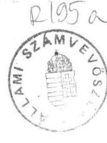

5460. szám

# Allami Számưuböséé 

## ÉSZREVÉTELEK

a Magyar Köztársaság Kormánya 5320. számú jelentéséhez

---

# É S Z R E V É T E L E K 

a Magyar Köztársaság Kormánya 5320. számú jelentéséhez

A Magyar Köztársaság 1990. évi költségvetése végrehajtásának ellenőrzéséről szóló 51/1991. (X.3.) sz. OGY határozat előírja, hogy a Kormány tegye meg a szükséges intézkedéseket, és azokról az Állami Számvevőszékkel egyeztetett jelentést terjessze az Országgyűlés elé. A határozat 1992. január 1-i határidőt írt elő.

A Kormány benyújtotta 5320. számú jelentését. Ezzel kapcsolatban az Állami Számvevőszék a következő észrevételeket teszi:

1. Az Országgyűlés elé 5320. szám alatt beterjesztett jelentést (annak végleges formáját, tartalmát) a Kormány a Számvevőszékkel nem egyeztette. Megelőzően a Számvevőszék és a Pénzügyminisztérium között több menetben - megítélésünk szerint indokolatlanul hosszúra nyúlóan - folyt az egyeztetés a Kormány elé kerülő tervezet egyes változatairól. E kifogás alapvetően csak formai jellegü, mivel az előkészítés menetében többnyire sikerült érvényesíteni - két témakör kivételével - a Számvevőszék álláspontját.
2. Álláspontunk szerint - a jelentés 2. sz. mellékletében foglaltakat erősítve és hangsúlyozva - már 1992-93-ban fel kell készülni az adósságterhek hosszú távú menedzselésére, csükkentésére. Ennek a szolgálatába kell állítani a kincstári vagyon kezelésének szabályozását, a privatizációs és tulajdonosi stratégia alakítását. Félő ugyanis, hogy más fontos célok finanszírozására való felhasználás következtében az államadósság csökkentésére, fedezetére a privatizációs bevétel egyre kevésbé szolgál.
3. A Kormány jelentése a Számvevőszéknek az állami feladat felülvizsgálatról megfogalmazott véleményét korrektül, de igen tömören foglalta össze. Figyelem felhívásként ezért szükséges megemlíteni, hogy véleményünk szerint - amit az 1992. évi költségvetés megalapozottságának ellenőrzési tapasztalatai is megerősítettek - nincsenek látható jelei annak, hogy a törvényalkotási folyamatban államinak minősített feladatok és a pénzügyi források összhangját megalapozott és részletes számításokkal kívánják megteremteni. A komplex áttekintés hiánya azzal a veszéllyel jár, hogy az egymástól

---

elszigetelten készülő szakmai törvények aránytalan támogatásigényt fognak teremteni a központi költségvetéssel szemben.
4. Fel kell hívnunk a figyelmet arra, hogy a Kormány jelentésében a relizálásra tett igéretek végrehajtásának határideje és felelősségi rendje nincs jelezve. Egyes részletek, így pl. az államháztartási törvényjavaslat letéti pénzkezeléssel összefüggő módosításának megoldási módja is kérdésesek. Így a megvalósítás ellenőrzési eszközökkel való figyelemmel kisérése - jogalap és követelmények hiányában - nem megoldott.

Budapest, 1992. április 1.

Hagelmayer István