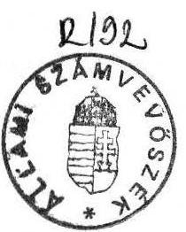
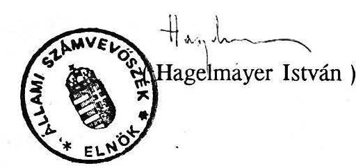

#  

## JELENTÉS

a helyi önkormányzatok beruházásaihoz és rekonstrukcióihoz nyújtott 1991. évi céltámogatások vizsgálatáról

---

# Jelentés 

a helyi önkormányzatok beruházásaihoz és rekonstrukcióihoz nyújtott 1991. évi céltámogatások vizsgálatáról

Az önkormányzatok forrásorientált pénzügyi szabályozásában fontos szerepet tölt be a céltámogatás rendszere. Müködtetését - a vizsgálatok tapasztalata szerint - az indokolja, hogy a normatív állami hozzájárulás és a kiegészítő támogatás, továbbá a saját bevételek az önkormányzati feladatok ellátásának szintentartását nem fedezik. A fejlesztésekhez hiánypótló forrásokra van szükség, amit részben a cél- és címzett támogatások alkotják. Az 1991. évi állami költségvetésről és az államháztartás vitelének 1991. évi szabályairól szóló 1990. évi CIV. tv. alapján a helyi önkormányzatok kiemelt fontosságú feladataikhoz a törvény 6. sz. mellékletében felsorolt feltételek mellett és mértékben céltámogatást igényelhettek.

Erre a célra az állami költségvetésben 6,2 milliárd Ft szolgált. A helyi önkormányzatok mintegy 2800 db céltámogatási igénybejelentése 15,8 milliárd Ft központi támogatási szükségletet tartalmazott. Ebből az Országgyűlés 8,5 milliárd Ft összegű támogatást fogadott el. A 2,3 milliárd elismert többlet céltámogatás fedezetét csak 1992. évre teremtették meg, mivel az 1991. évi állami költségvetésben erre fedezetet nem tudtak biztosítani.

Az Állami Számvevőszék 1991. II. félévi munkaterve alapján 18 megyében, 13 megyei, 49 városi és 116 községi,továbbá a fővárosban 5 kerületi önkormányzatnál összesen 347 db céltámogatást, mintegy 2 milliárd Ft összeg felhasználását ellenőriztük, ami a jóváhagyott támogatási célok $29 \%$-át jelentette.

A vizsgálat célja annak megállapítása volt, hogy:
—a céltámogatási rendszer működése hogyan segíti az önkormányzati feladatok finanszírozását,

---

- a támogatások odaítélésében és felhasználásában érvényesül-e a törvényesség,
- a céltámogatások felhasználása miképpen javítja az önkormányzatok kommunális, egészségügyi, szociális és oktatási ellátó képességét, hatékony pénzfelhasználás tapasztalható-e.

# I. 

## A vizsgálat részletes megállapításai

## 1. A települések kommunális ellátottsága, fejlesztése

Az ellenőrzés tapasztalatai szerint az 1991. évi céltámogatással preferált területeken a települések ellátottságának helyzete indokolta a céltámogatás rendszerének müködtetését.

1991-ben kiemelt célok voltak: vízgazdálkodás, egészségügyi és szociális ellátás, alapfokú és középfokú oktatás, szilárd hulladéklerakó telep fejlesztése. A támogatások nyújtotta lehetőségeket a kistelepülések önkormányzatai kevésbé tudták kihasználni, elsősorban a nagy költségigényű fejlesztésekhez szükséges saját források szűkössége miatt. A községekben egyes intézmények fajlagos költségei - a mérsékeltebb kihasználtság miatt - (pl. 1 általános iskolai tanulóra jutó költség) gyakran meghaladják a városokét, így ezen intézmények működtetése a normatív támogatáson túl, több saját forrást igényel.

A céltámogatások segítségével már az első évben számottevő, a lakosság ellátottságát és életkörülményeit előnyösen befolyásoló fontos fejlesztések valósultak meg, illetve kezdődhettek el. Ugyanakkor a fejlesztések egy része az 1991. évi tervezett befejezéssel szemben különböző okok miatt áthúzódott 1992-re. Az 1991. évi XXI. tv. 2. és 3. sz. mellékletében jóváhagyott céltámogatások $58 \%$-a a folyamatban lévő, $42 \%$-a pedig az új, induló fejlesztésekhez kapcsolódott.
a/ Vizgazdálkodás fejlesztése (ivóvíz ellátás, csatornázás és szennyvíztisztítás)
Az 1990. év végén 442 nitrátos és 30 arzénes vizű település (471 ezer lakos)

---

- ivóvízének szennyezettsége miatt - közegészségügyileg veszélyeztetett volt, illetve nagyobb részük jelenleg is veszélyeztetett.

Közüzemi vízellátással rendelkezik a települések $80 \%$-a, itt él a lakosság $92 \%$-a. Az egyes megyék - a közüzemi vízellátással bíró települések arányában - jelentős eltéréseket mutatnak, ennek szélső értéke: 51 és $100 \%$.

Az önkormányzatok kiemelt feladata a lakosság egészséges ivóvízzel való ellátása, amit az önkormányzati törvény szerint legkésőbb 1994-ig kell megoldani.

Ezen a területen a céltámogatások hatására jelentős fejlődés tapasztalható, bár az egyes térségekben továbbra sem megnyugtató a helyzet.

Baranya megyében 1990. év végén a települések $48 \%$-a közegészségügyileg veszélyeztetett. Ezeken a településeken a 0-3 éves korú gyermekek és a terhes anyák részére zacskós vizet, a felnőtt lakosság egy részének lajtkocsis és tartályos vízellátást szolgáltattak. Folyamatban lévő víziközmű beruházásra 4 település 5 millió Ft , Pécs városa vízbázis fejlesztésre 7 millió Ft céltámogatásban részesült.

Az új, induló beruházásokból 50 településen megoldható az egészséges ivóvízellátás 124 millió Ft céltámogatással. A megyei önkormányzat 25 millió Ft támogatást kapott a drávaszabolcsi kistérségi vízmú beruházására, mely a környező településeknek teremt lehetőséget arra, hogy a rendszerre rákötve egészséges ivóvízhez jussanak.

Borsod megyében a vízgazdálkodási ágazat új induló beruházásaihoz nyújtott céltámogatás $80 \%$-át azok a kistelepülések kapták, ahol a körülmények miatt egyedi formában lehetett csak megoldani az egészséges ivóvízellátást.

Nógrád megyében az ivóvíz magas nitráttartalma miatt közegészségügyileg veszélyeztetett települések aránya $45 \%$, ahol a lakosságnak a $22 \%$-a él. A közüzemi vízellátásba bekapcsolt települések részaránya $51 \%$, a lakosság ellátottsága $81 \%$-os, elmarad az országos átlagtól. A veszélyeztetett települések többségében a vízellátás csak költségesebb módon, regionális rendszerek kiépítésével, illetve azokhoz történő csatlakozással oldható meg. Ezért a megyei térség fejlesztéséhez címzett támogatás is kapcsolódik.

Az 1991. évi fejlesztésekkel az egészséges ivóvízellátás kiépítése, 31 millió Ft támogatással 8 településen valósul meg, melyből 4 közegészségügyileg veszélyeztetett.

Annak ellenére, hogy mind felismertebbé válik a környezet, a vízbázisok védelme miatt létfontosságú csatornázás és a szennyvíztisztítás javítása, e területen nem sikerült

---

megfelelő szintű fejlődést elérni. Az ún."közmű olló" nyílása növekedett. Egyes területeken még mindig hiányoznak a megfelelő kapacitású, komplex (mechanikai-bi-ológiai-kémiai) szennyvíztisztító telepek. Az un. szippantott szennyvizek kielégítő elhelyezése nem megoldott, ami növeli az ivóvíz készleteink szennyeződését.
1990-ben az 1 km vízvezetékhálózatra jutó csatornahálózat hossza - a fővárosi 0,9 km-es fajlagos mutatóval együtt országosan - $0,3 \mathrm{~km}$. Ezen mutató legkisebb, illetve legnagyobb értékei a megyékben 0,1 és $0,3 \mathrm{~km}$.
1990. évben az elvezetett összes szennyvíznek ( 1.002 millió m3) $75 \%$-át tisztították valamilyen hatásfokkal. Az öszes szennyvízből a mechanikai és biológiai tisztítás aránya mintegy $30 \%$-os.

Bács megyében a szolgáltatott víz mennyisége 1990-ben 41 millió m 3 volt, ugyanakkor csak 24 millió m 3 szennyvízet vezettek el. Ez utóbbiból 22 millió m3-t, többségében csak mechanikailag tisztították. Kedvezőtlen, hogy 1980-ban a termelt víz $62 \%$-át vezették el szennyvízként, 1990-ben pedig $58,6 \%$-át.

Pest megyében a közcsatorna hiánya miatt 107 településen (az összes $58 \%$-án) a szennyvízelhelyezés házi derítöben történhet. A csatornázottságban való elmaradást mutatja, hogy míg a megye lakóinak $81 \%$-a rendelkezik közüzemi vízhálózattal, addig a csatorna- hálózatba bekötöttek aránya mindössze $18 \%$. A közmüolló $63 \%$-pont.

A folyamatban lévő és új induló vízgazdálkodási fejlesztések 1.650 millió Ft céltámogatásban részesültek 1991. évre, amely az összes támogatás $26,6 \%$-a.
b/ Egészségügyi és szociális ellátás fejlesztése (városi kórház fejlesztése, szociális otthoni férőhelybővítés, múködő egészségügyi intézmények, új induló, 50 ezer Ft egyedi érték fölötti gép-műszer beszerzése)

A városi kórházaknál a folyamatban lévő fejlesztéseket támogatták. Számottevő céltámogatás irányult gép-műszer beszerzésekre, melyek hozzájárultak a betegellátás diagnosztikai és terápiás feltételeinek javításához. Egyrészt az elhasználódott eszközöket cserélték korszerűbbekre, másrészt a fontosnak ítélt hiányzókat vásárolják meg, amelyek gyakran minőségi változást eredményeznek olyan területeken, ahol eddig egyes vizsgálatokat, mútéteket a településen vagy a megyében nem tudtak elvégezni.

Baranya megyében egészségügyi intézmények gép-múszer beszerzéséhez 22 településnek 33 millió Ft céltámogatást juttattak 1991. évben, valamint további 10 település igényét 46 millió Ft támogatással később, illetve 1992. évben találták kelégithetőnek.

---

A Salgótarjáni Megyei Kórházban a jóváhagyott szakmai programnak megfelelően az összesen 20 millió Ft müszerbeszerzéshez nyújtott 12 millió Ft céltámogatás a szemlencse beültetések, az orr-, gége és tüdődaganatok korai felismerésének tárgyi feltételeit, valamint a szövetdiagnosztikai müszerpark fejlesztését alapozza meg.

A szociális otthonok 1990. év végén az elhelyezési igényeket változatlanul nem voltak képesek teljes mértékben kielégíteni. Az egészségügyi és szociális ellátás területe 1.510 millió Ft céltámogatásban részesült 1991-ben, amely az összes támogatás $24,3 \%$-a. Az új induló fejlesztések támogatásának $42,7 \%$-a, 0,8 milliárd Ft az egészségügyi intézmények gép-műszer beszerzését szolgálta.
c/ Alapfokú és középfokú oktatás és fejlesztése (folyamatban lévő fejlesztésként: kiszolgáló létesítmény, középiskolai tanterem, tornaterem, kollégium építése, folyamatban lévő és új fejlesztésként: alsófokú oktatáshoz tanterem, tornaterem).

A tanácsok fejlesztési célkitűzései között az általános iskolai tanteremépítés hosszabb ideje kiemelt szerepet töltött be, s egyben segítette az iskolakörzetesítések programját is.

A kisebb népességű településeken (főleg a volt társközségekben) a körzetesítés kapcsán részben vagy egészben megszüntetett általános iskolai oktatást - a lakosság kérése alapján - több helyen visszaállítják, ami újabb igényeket támaszt a tantermek építésében. Az oktatási intézmények jelentős hányadában, megyénként eltérő arányban nincs (162 m 2 -es vagy nagyobb) tornaterem.

A céltámogatással épülő általános iskolai tantermek részben már "minőségi cserét" is biztosítanak.

Az önkormányzatok az utóbbi években - figyelemmel a nagy létszámú korosztályok miatti növekvő igényekre - intézkedéseket tettek a középfokú oktatási- nevelési intézményhálózat bővítésére.

Vácott 11 tt-es zeneművészeti szakközépiskola épült, Nagykörösön pedig az Élelmiszeripari Szakközépiskola és Szakmunkásképző Intézetet 4 tt-mel bővitették.

Vas megyében a vizsgált területeken, a hét oktatási intézménynél 21 tt létesült céltámogatással. A meglévők leromlott állapotára jellemző, hogy a 21 közül 15 szükségtantermek kiváltását szolgálta.

---

A kedvezőtlen tornatermi ellátottságot mutatja, hogy Bács megyében 61 általános és 12 középiskolában nincs tornaterem, ezért indokolt volt a tornatermek építésének támogatása pl. Ágasegyháza, Kunadacs, Orgovány, Helvécia önkormányzatoknál. Hajdú-Bihar megyében az általános iskolák $52 \%$-ában nincs tornaterem-, s ezen belül mintegy $30 \%$-a tornaszobával'sem rendelkezik. Heves megyében a 183 általános és középiskola közül 90-ben nincs megfelelő tornaterem.

Az 1991. évi céltámogatásból az oktatási ágazat részaránya meghatározó, $48,3 \%$, mely jelentősebben javítja az intézményhálózat ellátó képességét, ez összegét tekintve 3,0 milliárd Ft-ot jelent.
d/ Szilárd hulladéklerakó telep építése, bővítése (csak folyamatban lévő fejlesztésként)

A rendszeres hulladékgyűjtésbe bevont települések száma növekedett, ennek ellenére ez az önkormányzatok kisebb részét érintette még 1990-ben is.

A rendszeres hulladékgyűjtésbe bekapcsolt települések arányában a megyék között lényeges különbségek vannak, ennek szélső értéke $12 \%$ és $100 \%$. A köztisztasági tevékenységet végző szervezetek kezelésében 1990. év végén 299 hulladéklerakóhely volt, amelynek csak egy része felel meg a környezetvédelmi követelményeknek.

Az önkormányzatok egy része - a regionális lerakóhelyek kiépítése helyett - önállóan keresi a hulladékelhelyezés megoldását, ami költségigényes, környezetvédelmi szempontból is a gondok forrása.

A Fejér megyei Nádasladány és Jenő községek közösen épített, az eredetileg tervezettnél korszerübb hulladéklerakó telepének megvalósítása $90 \%$-os készültségű volt. A többletköltséget az önkormányzatok együttesen viselik.

Vanyarcon a létesítményt önállóan építették meg, a szomszédos önkormányzattal a közös beruházás elvetésre került.

Ezen fejlesztések - a nagyobb igények ellenére - 50 millió Ft céltámogatásba részesültek, amelyek a folyamatban lévő beruházások támogatásának mindössze 1,4 $\%$-át tették ki.

---

# 2. A céltámogatási rendszer múködési mechanizmusának tapasztalatai 

A céltámogatások ösztönözik az önkormányzatokat a társadalmilag fontosnak ítélt fejlesztések megvalósítására, ezzel egyidejúleg a saját forrásokat is e célok érdekében mobilizálják.

A támogatási célok és feltételek központi meghatározása alapvetően összhangban van az önkormányzatok igényeivel. Az állam új tornaterem építését támogatja, valamennyi új iskolai tanterem építését és a kiszolgáló létesítményeket nem. A támogatási feltételként teljes költség összeghatár, vagy a 162 m 2 -es méret előírása a tornateremnél lehet indokolt, de a hátrányos helyzetű kisebb községekkel szemben, annak diszkriminatív jellege van. Az iskolaépítés támogatását a lakosság és nem az iskoláskorú gyermekek számához kötötték (elöregedő és növekvő létszámú falvak közötti különbség).

Az önkormányzatok az említett és a törvényben meghatározott célokkal való egyetértés mellett azok bővítését szorgalmazzák.

A támogatott célok kiterjesztése azonban megfontolandó, mert a növekvő támogatási igények miatt a költségvetési támogatás elaprózódásához és a felhasználás hatásfokának a gyengüléséhez vezethet.

A céltámogatási rendszer lényegéből az következne, hogy a meghatározott - és meghirdetett - feltételek megléte esetén a támogatás az önkormányzatoknak alanyi jogon jár. A gyakorlatban ez nem érvényesült, mert az igényeket a fedezettel nem tudták összehangolni.

A céltámogatási rendszer múködését nehezítő tényezők a következő okokra vezethetők vissza:
a/ A céltámogatás rendszerének bevezetésére rövid idő állt rendelkezésre. A költségvetési törvényben megjelölt határidőhöz képest a BM közlemény két hét késéssel, 1991. I. 15 -én jelent meg. Ezek alapján a céltámogatási feltételek megismerésére, és az igénybejelentések összeállítására, a testülettel történő elfogadtatására és benyújtására az 1991. II. 22-ei határidő kevésnek bizonyult. Az önkormányzatok így sikerrel többnyire csak a folyamatban lévő, vagy a már egyébként is indításra tervezett fejlesztésekkel pályázhattak.

---

b/ A pályázatok előkészítését és a rendszer múködését nehezítették a központi rendelkezések, szabályozások anomáliái is.

A költségvetési törvényben és a BM közleményben megjelent támogatás, feltételei nem voltak egyértelműek és kellően konkrétak.

Az önkormányzatok esélyegyenlőségét rontották az előírás pontatlanságai:

Például: a támogatás mértékének - folyamatban lévő fejlesztéseknél célonként eltérő módon történő - meghatározását a költségvetési törvényben indokolatlanul különböző módon rögzítették.

- a víziközmú beruházásoknál a beruházási költségek meghatározott \%-ában,
- a szilárd hulladéklerakodó telep építése, bővítése esetén, az 1991. évi ütem meghatározott \%-ában,
- a többi beruházás esetén az 1990. évi engedély- okirat szerinti 1991. évi ütem meghatározott \%-ában.

A "szennyvíztisztító telep építése, bővítése" fejlesztési céllal kapcsolatban értelmezési problémát jelentett, hogy az ad-e lehetőséget olyan kisebb telepek építésére, amelyek csatornahálózat nélkül (szippantós szállítással) oldják meg a szennyvíz kezelését. Az ilyen tartalmú igényeket elutasították, holott - főképpen az aprófalvas településeken a szennyvíztisztításnak az is eredményes módszere lehet.

A költségvetési törvény feltételként írja elő az új, induló beruházásoknál a szükséges saját források meglétét, azonban ennek igazolására a megyei önkormányzat vállalási nyilatkozata kivételével - a BM közlemény sem intézkedett. Ugyanakkor a BM előkészítő munkájában a saját források igazolására vonatkozó dokumentumok "megkövetelése" is elbírálási szempont volt.
c/ A beruházások rendjéről szóló 4/1984.(XI.6.) MT és 3/1984.(XI.6.) OT-PM együttes rendelet vonatkozó részeit, ezen belül az engedélyokiratok kiadásáról szóló rendelkezéseket hatályon kívül helyezték. Az önkormányzatok hatáskörébe utalták a beruházások előkészítésének és jóváhagyásának rendjét, ugyanakkor a BM közleményben a beruházási programnak vagy tanulmánytervnek, valamint az engedélyokiratnak az igénybejelentéshez csatolását előírták.
d/ Főként a kistelepüléseknél okozott és okoz gondot a saját erő előteremtése, annak hiánya, illetve a céltámogatás alacsony mértéke a nagy költségigényű fejlesztések

---

megvalósításában. Így a beruházások ésszerűtlen szakaszolására, a kivitelezési idő növelésére kényszerülnek, s közben a költségek emelkednek.

Néhány önkormányzat az előírtnál kisebb arányú céltámogatásban részesült. Ilyen esetekben is a tervezett célok általában megvalósíthatók. Helyenként azonban a lecsökkentett támogatás mértéke gondokat okozott.

Az újonnan induló szennyvíztisztitó beruházásnál az előirt támogatási arány 60 \%. Szarvas város ezzel a forrással számolt, a ténylegesen biztosított támogatás aránya viszont csak $17 \%$ volt. Így ez a beruházás a vizsgálat idejéig meg sem kezdődött. Ugyancsak Szarvason folyamatban lévő beruházásként épül a szennyvíztisztitómü, amihez az igényelhető támogatás aránya $30 \%$, a jóváhagyott pedig $20 \%$. A mérséklés indokát nem közölték velük.

Hajdú-Bihar megyében a pocsaji önkormányzat 1990. évben egy 4 tantermes általános iskola és tornaterem építését kezdte meg. A létesítmény beruházási költsége, 1990. évi árakon 84 millió Ft. A megyei támogatással növelt saját forrás 1991. évre 14 millió Ft-os beruházási ütem vállalását tette lehetővé.

Az 1992. évre ismét pályázatot nyújtottak be, melyben az időközi árváltozások hatásaként a várható költséget már több mint 111 millió Ft-ban jelez- ték. Az 1992. és 1993. évre várható saját források figyelembevételével tervezett ütem szerint - a jelenlegi árakon számolva - a költség több mint $40 \%$-a az 1993. utáni évekre húzódik át.

# 3. A céltámogatások igénybevételének és felhasználásának törvényessége 

a/ Az odaítélt és ellenőrzött céltámogatások igénybenyújtásánál, felhasználásánál az önkormányzatok egy része nem tartotta be a törvényes előírásokat. A törvényesség megsértése a következő főbb okokkal jellemezhető.

Valótlan adatszolgáltatással új, induló fejlesztést folyamatban lévőnek tüntették fel, holott 1990-ben a pénzügyi kifizetés nem történt, vagy nem a költségvetési törvényben támogatási feltételként meghatározott mértékben.

Többször tapasztalható volt olyan eset is, hogy az önkormányzatok a szükséges saját forrással nem rendelkeztek. Esetenként pedig a hivatkozott törvényben meghatározott mértéknél nagyobb összeget hívtak le az önkormányzatok a megengedettnél, így a különbözet visszavonása indokolt.

---

Mindezek következtében az ellenőrzés összesen 98.829 eFt olyan támogatás igénybevételét tárta fel, amelyek nem feleltek meg az 1991. évi költségvetési törvényben foglalt feltételeknek. Tekintettel arra, hogy az önkormányzatok egy része a jogtalanul igénybe vett, illetve a többlet támogatás visszafizetését felajánlotta és azok folyamatban vannak, így a törvényes intézkedés csupán 42.061 eFt visszafizettetésére indokolt (2. sz. melléklet).

Több önkormányzat a saját forrás kiegészítéseként hitelt vett igénybe, lakossági erőforrást vont be, gazdálkodó szervezetektől pénzeszközt vett át. Az önkormányzatok társadalmi munkát szerveztek a fejlesztések megoldásához.
b/ A támogatások lehívása az 1991. évi állami költségvetésről szóló 1990. évi CIV. tv. 37. (4) bek. szerint teljesítményarányosan, a fejlesztések megvalósítási ütemével és a kapcsolódó saját forrásokkal arányosan történik.

A BM Ög-2151/1991. (VII. 8) sz. leirata alapján az önkormányzatoknak a jóváhagyott céltámogatás kiutalására vonatkozó tárgyhavi igénybejelentést - a kötelezettség teljesítését megelőző hónapban - a TÁKISZ-okon keresztül kellett eljuttatni a BM-be.

A BM intézkedései alapján a céltámogatást a PM az APEH útján folyósította az érintett önkormányzatoknak.

Az elmúlt év december végéig az önkormányzatok 5,5 milliárd Ft támogatást hívtak le. A felhasználási szükséglethez igazodó további támogatásokat - a jóváhagyott összeg erejéig - 1992-ben az önkormányzatok megkapják.

Nem mindíg volt mód a pénzügyi teljesítés és a műszaki készültség összhangjának megítélésére, mivel a szerződések helyenként nem tartalmazták a pénzügyi ütemezést, illetve azt, hogy a kifizetés milyen műszaki készültségi fokhoz kötődik.

Az önkormányzatok a teljesítményarányos céltámogatás lehívásában nem folytattak egységes gyakorlatot. Egy részük túl szorosan, csak a kifizetéseket követően igényelte a támogatást. Más részük ezt - a BM leiratos szabályozásának megfelelően - a kötelezettség teljesítést megelőzően, az előző hónapban kérte. Gyakori volt, hogy a kiviteli szerződés ütemezését tekintették az igénylés alapjának. Az ellenőrzött szervek jelentős hányadánál tapasztalható volt, hogy év közben az indokolt teljesítményarányosnál nagyobb összegủ céltámogatást vettek igénybe, - ami a költségvetési törvényben foglaltakkal ellentétes - többletterhet jelentettek az állami költségvetésnek és egyidejűleg javították az önkormányzatok likviditási helyzetét.

---

Baranya megyében a mattyi polgármesteri hivatal a víziközmủ beruházásaihoz 5,4 millió Ft céltámogatást július hónapban igényelte és azt augusztus 14-én meg is kapta. A helyszíni vizsgálat befejezéséig azonban arra kifizetés nem történt.

Az 1990. évi CIV. tv. 42. paragrafusa (3) bekezdése szerint a helyi önkormányzatok az éves költségvetés lezárását követően elszámolnak a céltámogatásokkal, illetve azok maradványaival.

# 4. Fejlesztések előkészítése, megvalósítása, hatékonysága 

A jelentősebb, főleg építési jellegű fejlesztések számottevő részének műszaki előkészítése lassított ütemben folyt, illetve állt addig, amíg az Országgyűlés nem döntött a céltámogatások odaítéléséről.

E támogatások jóváhagyása után a műszaki előkészítő munkákat felgyorsították, a kivitelezés megkezdéséhez a szükséges intézkedéseket megtették.

A fejlesztések előkészítésének színvonalát meghatározta az önkormányzati szakemberek felkészültsége, illetve helyenként a hozzáértés hiánya.

A Fővárosi Önkormányzatok beruházásai még egy önkormányzaton belül is egymástól eltérő színvonalon, más-más szervezési és lebonyolítási módszerek alkalmazásával valósulnak meg. Ennek egyik oka az, hogy a testületek még nem szabályozták a beruházás megvalósításának belső rendjét, a döntési szinteket és hatásköröket.

A beruházások egy részének igénybejelentéseiben tapasztalható a költségek alultervezettsége.

A Dombóvár városi szennyvíztisztító kapacitás bővítésének költségelőirányzatát az igénybejelentésben - egy korábbi terv alapján - 53 millió Ft-ban határozták meg, ezzel szemben a szerződés szerinti teljes költség 71 millió Ft.

Az ellenőrzések megállapításai szerint a céltámogatások felhasználása többnyire ésszerűen, takarékosan történt, de előfordultak e területen fogyatékosságok is.

Az önkormányzatok a beruházások kivitelezését megelőzően általában nyílt, illetve zártkörű versenytárgyalás kiírásával próbálták megtalálni a legkedvezőbb műszaki és gazdasági megoldásokat, amelyek gyakran eredményesek is voltak. Több szempont

---

mérlegelése alapján (szakértői javaslatokat is figyelembe véve) nem mindíg a legalacsonyabb összegű vállalkozói ajánlatokat fogadták el, hanem az ehhez olyan közelebb állókat, amelyek műszaki tartalmukat tekintve is kielégítették a beruházók igényeit. Helyenként az önkormányzatok versenytárgyalás nélkül kötötték meg az építési szerződést. Ebben szerepet játszott a céltámogatási igények elbírálásának elhúzódása miatti "időveszteség behozása" is.

A versenytárgyalások egy része azonban nem hozta meg a várt eredményt, mert az előkészítés során a feltételek kiírásánál nem az alternatív megoldási lehetőségeket tüntették fel, hanem inkább a formális elemeket.

A Kémesi Körjegyzőség, a Drávasipeki Község ívóvízellátását 16,1 millió Ft bekerülési költséggel tervezte megvalósítani. A versenytárgyaláson 11,7 millió Ft-ra sikerült a beruházási költségeket - változatlan műszaki tartalom mellett csökkenteni.

Siófok város 1990-ben tornacsarnok építésére hirdetett meg versenytárgyalást. A 39,47 és a 62 millió Ft-os ajánlatok közül a középsőt fogadták el, mert a szakértői bizottság a műszaki tartalom és egyéb paraméterek alapján tekintettel volt a leendő létesítmény várható élettartamára és müködtetése gazdaságosságára is.

A vizsgált önkormányzatok egy része egy összegű átalányáron kötött építési szerződéssel törekedett az inflációs hatások kivédésére.

Az önkormányzatok többsége a beruházások lebonyolítására külső szervezeteket bízott meg. Előfordult, hogy a műszaki ellenőrzést a polgármesteri hivatal megfelelő felkészültségű műszaki szakemberei végezték, vagy arra magánvállalkozót bíztak meg.

Több helyen a kisebb fejlesztéseket saját rezsis kivitelezéssel valósították meg, egyes részfeladatok megoldásába, kedvező áron dolgozó kisiparosokat vontak be.

Helyenként a munkák szervezése és kivitelezése során tapasztalható volt a szakmai hozzáértés hiánya. Az önkormányzatok szűkös anyagi lehetőségeik miatt a beruházási költségek csökkentésére törekedve, alacsonyabb műszaki színvonalú megoldásokat szorgalmaztak, a gazdaságosság figyelmen kívül hagyásával.

A Baranya Megyei Rádfalva község ivóvízellátásának megoldásánál I. ütemben csak a gerincvezetéket építették meg, a műszaki átadásial kiderült, hogy még további műszaki átalakítások szükségesek.

---

Matty község az iskolaépítés lebonyolítását szakmai hozzáértés nélkül végezte el, ez megmutatkozott a műszaki kivitelezés és a számlaellenőrzés hiányosságaiban is.

# II. 

## Következtetések, javaslatok

Az Országgyűlés a céltámogatási rendszer működtetésével, a beruházási célok befolyásolásával, a társadalmilag kiemelt fejlesztések megvalósulására ösztönözte az önkormányzatokat.

A normatív alapon juttatott állami hozzájárulás a települések ellátóképességének, a lakosság életkörülményeinek javításához szükséges beruházásokra és rekonstrukciókra nem nyújt fedezetet, a saját források növelésére pedig a települések többségének nem volt lehetősége. Mindezek következtében az önkormányzatok fejlesztései csak állami segítségnyújtással, cél- vagy címzett támogatással valósulhatnak meg.

E rendszer működése legfőbb erényének tekinthető, hogy az önkormányzatok a fontosnak ítélt fejlesztésekhez nyilvános, törvényben szabályozott feltételek alapján, kiegészítő forráshoz juthatnak.

A céltámogatás rendszere alapvetően alkalmas a kitűzött célok elérésére, működési mechanizmusa azonban több tekintetben finomításra, továbbfejlesztésre szorul. Ezek a korrekciók a helyi önkormányzatok 1992. évi címzett és céltámogatási rendszeréről szóló 1/1991. (XII.31) OGY irányelvben csak részben történtek meg.

Az 1991. évre meghirdetett célok alapvetően összhangban vannak az önkormányzatok igényeivel.

E feladatok közül az egészséges ivóvízellátás - a választási cikluson belüli - megteremtését az önkormányzati törvény deklarálja, ennek ellenére nem kapott kiemelt szerepet a támogatandó célok között.

A szennyvizek hiányos tisztítása, különösen községekben a szippantott szennyvizek nem megfelelő tárolása, kezelése felmérhetetlen károkat okoz a talajban, a vízbázisok

---

egyre nagyobb mértékű szennyezésében, a céltámogatás rendszere e területen mégsem bizonyul hatékony befolyásolási eszköznek.

A településtisztaság, a szilárd hulladékok gyűjtésében, kezelésében és megsemmisítésében helyenként még a kezdeti lépések megtétele is hiányos, e feladatok támogatása összegében és arányaiban elenyésző.

A céltámogatási rendszertől joggal elvárható, hogy az önkormányzatok, illetve feladataik jellegéhez jobban igazodó finanszírozási formaként működjön.

A támogatási rendszer működési mechanizmusa - az előző okok miatt - nem tette lehetővé, hogy a feltételeknek megfelelő önkormányzati pályázatok alanyi jogon kielégíthetők legyenek. A gyakorlat nem igazolta a fejlesztési célok és támogatási arányok évenkénti meghatározásának helyességét. Az önkormányzatok biztonságát, előrelátását és egy-egy feladatra történő előtakarékoskodását, továbbá a beruházások tervszerűségét jobban szolgálná a rendszer stabilitása, annak több évre történő kiterjesztése.

A támogatási rendszer továbbfejlesztése érdekében a következők figyelembevételét ajánljuk.
1.a/ A Belügyminisztérium a céltámogatási rendszer 1991. évi működésének, a Számvevőszék vizsgálatának tapasztalatait értékelje és a rendszer továbbfejlesztésénél azokat hasznosítsa. Olyan céltámogatási rendszer segítené jobban az önkormányzatok gazdálkodását, amelyben az eddigieknél fokozottabban érvényesülne a normativitás és a hosszabb távra való előrelátás.

Ehhez a rendszert úgy kellene fejleszteni, hogy a támogatást a teljes bekerülési költség arányában és összegszerűségében határoznák meg, mely utóbbinak évenkénti ütemét a költségvetési törvény tartalmazná.
b/ Ugyanakkor indokolt lenne az is, hogy a céltámogatásokat a bekerülési költségek arányában, azok felső határát, az indokolt mértékű fejlesztések figyelembevételével is normativizálni kellene.
c/ A célok és a feltételek több évre történő meghatározása egyben megteremtené annak a feltételét is, hogy a Belügyminisztérium az igénybejelentéseket - kellő időt hagyva előkészítésükre - olyan időpontban kérje be, mely garantálja a támogatásoknak a pénzügyi megalapozását.

---

2. Célszerű lenne az állami támogatásokkal megvalósuló beruházások és rekonstrukciók rendjét keretjelleggel szabályozni. Ez képezhetné az alapját az önkormányzatoknál a beruházási és rekonstrukciós tevékenység lebonyolítási rendje kialakításának.
3. Az 1991. évi céltámogatási rendszer ellenőrzése során tapasztalható volt több olyan támogatás, amelyek jogszerútlenül jutottak az önkormányzatokhoz. Azokat nem a költségvetési törvény 6. sz. mellékletében foglalt feltételek alapján igényelték, ezért javasoljuk a 2. sz. mellékletben foglalt céltámogatások visszavonását.
A Belügyminisztérium ehhez a szükséges intézkedéseket tegye meg.

Budapest, 1992. április hó
Melléklet: 2 db (7 lap)

---

# A vizsgálatot vezette és az összefoglaló jelentést összeállította: Nagy József főtanácsos 

Közreműködött: Fercsik Gyula számvevő tanácsos

## A vizsgálatot végezték:

Baranya megye:
dr. Nagy Ágnes számvevő
Remeczki László számvevő
Bács-Kiskun megye:
Gaborjákné dr. Vydareny Klára számvevő
Tréfás Antal számvevő
Békés megye:
Kollár Lászlóné számvevő tanácsos
Borsod-Abaúj-Zemplén megye:
Hegedűs György számvevő
dr. Takács András számvevő tanácsos
Csongrád megye:
dr. Boda Sándor számvevő
Fejér megye:
Ébner Vilmosné számvevő
Győr-Moson-Sopron megye:
Kalmár István számvevő
dr. Szeli Tibor számvevő
Hajdú-Bihar megye:
Kozák György számvevő tanácsos

---

Jász-Nagykun-Szolnok megye:
Buczkó András számvevő
Csomán Mihály számvevő tanácsos
Heves megye:
Maróti Sándor számvevő
Komárom-Esztergom megye:
Koltayné Szepesi Zsuzsanna számvevő tanácsos
Nógrád megye:
Fercsik Gyula számvevő tanácsos
Pest megye:
Farkas Tamás számvevő
dr. Spilák Antal számvevő
Somogy megye:
dr. Hegedűs György számvevő tanácsos
Szabolcs-Szatmár-Bereg megye:
László András számvevő
Tolna megye:
Péntek László számvevő
Vas megye:
Horváth János számvevő
Veszprém megye:
Rénes Mária számvevő tanácsos
dr. Vasváriné dr. Rózsa Anikó számvevő
Főváros:
Benczik Lászlóné számvevő
dr. Felleg Zsoltné számvevő tanácsos
dr. Szirota István külső szakértő

---

# A helyszíni vizsgálat során feltárt jogtalanul igénybe vett 1991. évi céltámogatásokról 

| Önkor-   minyzat | Feladat | Az 1991. XXI.   tv. 2., 3. sz.   melléklet szerint   elfogadott céltámogatási igény   sorszáma | 1991. évre   jóváhagyott   céltámogatás   eFt | Elvonásra   javasolt   összeg   eFt |
| :-- | :-- | :-- | :-- | :-- |
| 1. | 2. | 3. | 4. | 5. |

## Baranya megye:

1. Pécs szociális otthon építése
$3 / 690$
32.500
2.600

A szociális otthon építésére igénybe vett támogatásból 2.600 eFt céltámogatást ténylegesen a nyugdíjas ház építésére fordították.
2. Siklós szennyvíztisztító
telep bővítése
2/106
3000
600
A 2,4 millió Ft céltámogatás helyett 3,0 millió Ft-ot igényeltek le, mert helytelenül a kifizetett ÁFA-t figyelembe vették.

## Bács-Kiskun megye:

3. Ágasegyháza általános iskolai tornaterem kialakítása
$2 / 139$
1.400153

Az 1991. évi kifizetés 3.118 eFt volt, ennek $40 \%$-a a 1.247 eFt , ennyi céltámogatást vehettek volna igénybe az 1.400 eFt helyett. A különbségként mutatkozó 153 eFt lehívása jogtalan volt. (A visszafizetés folyamatban van, nem indokolt a törvényes intézkedés.)
4. Kunadacs általános iskolai tornaterem építése
$2 / 254$
1.400702

Az 1991. évi pénzügyi teljesítés 646 eFt volt. Ennek $40 \%$-a 258 eFt , amit céltámogatásként igénybe vehettek volna, ezzel szemben 960 eFt-ot hívtak le. A különbségként mutatkozó 702 eFt-ot jogtalanul vették igénybe. (A visszafizetés folyamatban van, nem indokolt a törvényes intézkedés.)

---

5. Városföld szilárd hulladékle-
rakó telep építése $2 / 492$
881
360

A beruházás nem tekinthető folyamatban lévőnek, mert 1990-ben nem volt kifizetés. Így fejlesztés a támogatott célok között nem szerepelt. (Az 551 eFt visszafizetése folyamatban van, a különbségként mutatkozó 360 eFt elvonása indokolt.)

# 6. Hódmezővá- Hodtó-i 8+8 tt-es Ált. sárhely iskola és tornacsarnok építése $2 / 225$ 20.000 9.595 

A céltámogatási igényt úgy nyújtották be, hogy arra saját fedezet nem állt rendelkezésre és a kivitelezés folyamata is megszakadt. Ez a törvényes feltételekkel ellentétes. (A támogatásból 10.405 eFt visszafizetése folyamatban van, a 9.595 eFt elvonása indokolt.)

Győr-Moson-Sopron megye:
7. Győrasszony- alapfokú oktatás fa kiszolgáló léte- sítményeinek re- konstrukciója $2 / 215$
1.600
368

Egy épülettömbben lévő óvoda, polgármesteri hivatal, szolgálati lakás, tanterem rekonstrukciójában az utóbbira a költségeknek $77 \%$-a jut. Az igénybejelentés nem a tanteremre arányos költségét veszi alapul.
A tanteremre jutó rész költsége 1.232 eFt. A különbségként mutatkozó 368 eFt visszavonása indokolt.

| 8. Moson- | középiskolai- |  |  |
| :-- | :-- | :-- | :-- |
| magyaróvár | kollégium kialakítása | $2 / 429$ | 12.500 |

Tervezték, hogy 1990-ben megvásárolnak e célra egy épületet, de az adás-vétel nem jött létre. Az 1990. évi költségvetési beszámolóban szerepeltetett 12,5 millió Ft fejlesztési kiadás fiktív volt, ténylegesen 1990-ben pénzügyi teljesítés nincs.
Az önkormányzat 1991-ben fel-használt 2.659 eFt-ot, 1992-ben 1.659 eFt felhasználását tervezi, 8.182 eFt támogatásról az önkormányzat lemondott.

## Hajdú-Bihar megye:

| 9. Berettyóúj- | alapfokú oktatás |
| :-- | :-- |
| falu | (óvoda) fejlesztése |

$2 / 163$
2.544
2.544

Egy óvoda rekonstrukciójához azért kapták a jelzett támogatást, mert fejlesztési célként tanterem és általános iskolai tornaterem létesítését is megjelölték. Valójában csupán az óvodai fejlesztés valósult meg, melynek tetőterében egy tornaszobát is berendeznek. (A törvény 5. sz. mellékletében ez a feladat az elutasított igénybejelentések között az 536. sorszámon is szerepel).

---

10. Berettyőúj- középiskolai falu rekonstrukció 2/399 5.019 5.019

Az igénybejelentésben az 1990. évi kifizetést a beruházási költség $18 \%$-ában tüntették fel. Ezzel szemben valójában csupán 104 eFt ( $2 \%$ ) kifizetés történt. A pályázatban feltüntetett bekerülési költség összege sem bizonyult valósnak, így az elvonás indokolt.

# Komárom-Esztergom megye: 

11. Baj általános iskola építése $2 / 147$
12. 980
13.944

A beruházás nem tekinthető folyamatban lévőnek, műszaki átadás-átvétel 1990. VIII. hóban megtörtént. 1991-ben e beruházásra X. 31-ig mindössze 1.732 eFt-ot fizettek ki. A valóságnak nem megfelelő igénybejelentéssel, az elnyert céltámogatással lehetővé vált, hogy e beruházáshoz 1988-1990. években felvett hitel 1991-94. években esedékes kamattal történő visszafizetését ( 13,1 millió Ft) 1991-ben teljesítsék.
12. Oroszlány alapfokú oktatás kiszolgáló épületének beruházása
$2 / 299$
1.200
1.200

Az önkormányzat a kiszolgáló létesítmények célba beleértette az Oktatási és Közművelődési GAMESZ épület beruházását is. A törvényelőkészítés helytelenül a fejlesztést Bánki Donát utca, mint telephely helyett Bánki D. általános iskolaként jelölte meg. E félreértés tisztázása után a szaktárca a támogatás igénybevételével egyébként szóban egyetértett.

## Jász-Nagykun-Szolnok megye:

13. Kisújszállás eü.int.gép-múszer
beruházása
$3 / 483$
1.685
393

A vizsgálat megállapítása szerint az ultrahangos berendezés és az első fogyóeszköz 3.229 eFt. Ennek $40 \%$-a 1.685, az önkormányzat felhasznált 1.292 eFt-ot, a különbségként mutatkozó 393 eFt visszavonása indokolt.
14. Dudar szilárd hulladék-
2/463
2.000
2.000
lerakó telep építése
Az igénybejelentésben a hulladéklerakótelep építését folyamatban lévő beruházásnak tüntették fel, holott pénzügyi ráfordítás 1990. év végéig nem volt. Így a fejlesztés a támogatott célok között nem szerepelt.

## Veszprém megye:

15. Somlóvásár- óvoda és közellátás hely (szociális-, napközi-otthonos-, óvodás) étkeztetést biztosító konyha építése
$2 / 331$
7.120
7.120

---

Az önkormányzat olyan új induló fejlesztéshez kért, de folyamatban lévőként jóváhagyott beruházás megvalósításához kapott céltámogatást - óvoda és konyha építés -, amely nem tartozott a támogatott célok közé. Az 1990. évi pénzügyi teljesítés sem érte el a költségvetési törvényben meghatározott $18 \%$-ot ( $16,5 \%$ ).

Budapest, 1992. április hó