5593. szám

# Allami sááintéboóssé 

## JELENTÉS

az elmúlt rendszerhez kötődő egyes társadalmi szervezetek vagyonelszámoltatásának vizsgálatáról az 1991. évi LI. törvénnyel módosított 1990. évi LXXIII. törvény alapján
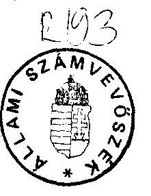

---

A vizsgálatot vezette:
dr. Zsarnai Dezsöné fötanácsos

A vizsgálatot végezték:

MSZP
dr. Dotterweich Antal tanácsos
dr. Elek János főtanácsos
dr. Szávai Tamás tanácsos
Écsy Lajosné szakértö
dr. Ocsovai Sándor szakértö

DEMISZ
dr. Zsarnai Dezsöné fötanácsos
dr. Baki József számvevő
Berzé tey Attiláné számvevő
Rideg Margit tanácsos
Sólyom László számvevő
dr. Horváth Ferencné szakértö
dr. Szálka Béla szakértö
dr. Várlaki Pál szakértö
dr. Velényi János szakértö

Magyar Uttörö Szövetség
dr. Horváth Ferencné szakértö
dr. Szálka Béla szakértö

Országos Béketanács
dr. Borisz József tanácsos
dr. Molnár Barnabás tanácsos

Magyar Szovjet Baráti Társaság
Lörinc Alajos tanácsos
Németh Béláné tanácsos

Magyar Honvédelmi Sportszövetség
Hudik Zoltán fötanácsos
Gömöri József számvevő
Kovácsné Soós Piroska tanácsos
Számely Kornél tanácsos
Szilas István számvevő

---

# ÁLLAMI SZÁMVEVÖSZÉK 

V-150-61/1991/1992.
Témaszám: 100 .

## J E L E N T É S

az elmúlt rendszerhez kötödö egyes társadalmi szervezetek pót vagyone1számolása hitelességének vizsgálatáról az 1991. évi LI. törvénnyel módosított
1990. évi LXXIII. törvény alapján

Az 1990. évi LXXIII. törvény az elmúlt rendszerhez kötödö egyes társadalmi szervezetek vagyone1számoltatásáról rendelkezett. A törvény elöírásai szerint az ÁSZ-nak a vagyone1számolások hitelességét meg kellett vizsgálni és annak eredményéröl 1991. január 15-ig az Országgyülésnek beszámolni.

Az Állami Számvevőszék a feladatnak úgy tett eleget, hogy a vagyone1számolásokat szervezetenként megvizsgálta és minösítette, valamint általános tapasztalatairól a megadott határidőn belül az Országgyülés elnökét tájékoztatta.

Az Állami Számvevőszék 1991. januárjában közzétett nyilatkozata szerint a beszámolásra kötelezett 9 szervezet közül 3 szervezetnek a vagyone1számolása minősült elfogadhatónak, a hivatkozott törvényben felsorolt további 6 szervezeté pedig nem.

---

Az adatok hiánya miatt nem hitelesített vagyone Iszámolást benyújtott szervezetek pótvagyone Iszámolás benyújtási lehetöségéról az 1990. évi LXXIII. törvény módosítására kiadott és 1991. november 4-én hatályba lépett 1991. évi LI. törvény rendelkezett. A törvėnyi elöirás szerint az ÁSZ által tett felszólítást követően 120 nap állt rendelkezésre a hiányok pótlására és a hitelesítési feladat teljesítésére. E kötelezettségnek az ÁSZ az alábbiak szerint tett eleget.

Az elöírások szerint a konkrét igények feltüntetésével pótelszámolásra kötelezte a Magyar Szocialista Pártot (mint a volt MSZMP jogutódját, továbbiakban MSZP), a Magyar Demokratikus Ifjúsági Szövetséget és tagszervezeteit (mint a Kommunista Ifjúsági Szövetség jogutódjait, a továbbiakban DEMISZ), a Magyar Úttörök Szövetségét (továbbiakban MÚSZ), az Országos Béketanácsot (továbbiakban OBT), a Magyar-Szovjet Baráti Társaságot (továbbiakban MSZBT) és a Magyar Honvédelmi Szövetség (továbbiakban MHSZ) nevében elszámoló Kincstári Vagyonkezelö Szer vezeté.

A törvény lehetővé tette, hogy az ÁSZ csak a korábban hiányos, vagy el nem fogadott adatlapokat, elszámolásokat kérje meg. Módot adott továbbá arra is, hogy azon DEMISZ tagszervezeteknél, ahol a korábbi vagyone Iszámolás hiteles volt, ott az újabból eltekintsen. Ennek megfelelően 28 DEMISZ tagszervezetet, valamint a DEMISZ Gazdasági Irodát szólította fel az adatok pótlására irányuló tel jeskörü, vagy részleges elszámolásra.

---

Az érintett szervezetek közül az MSZP, a MÜSZ, az OBT, az MSZBT és az MHSZ nevében elszámoló Kincstári Vagyonkezelö Szervezet, valamint a DEMISZ Gazdasági Iroda és néhány DEMISZ tagszervezet azonnal, illetve rövid időn belül eleget tett kötelezettségének. A póte1számolásra felszólított DEMISZ tagszervezetek többsége azonban csak többszöri sürgetésre, ügyészi intézkedés kezdeményezését ki látásba helyezö, ismételt felszólításra küldte meg a kért adatokat.

Az ÁSZ csak március hó második felére kapta meg teljeskörűen azokat az adattáblákat, dokumentumokat, amelyek a hitelesítési vizsgálatok kiindulásához nélkülözhetetlenek voltak. Ennek következtében az egyes szervezeteknél meg1ehetösen eltérő időhatárok között fejeződött be a helyszíni ellenőrzés és tették meg zárónyilatkozataikat a számvevők.

Az 1990. évi LXXIII. és az 1991. évi LI. törvények keretei között az ÁSZ munkatársai kizárólag a hitelesítési vizsgálattal foglalkoztak. A pótvagyone1számolások dokumentáltságát, a kimutatások zártságát és egyezőségét teljeskörűen, vagy - ahol a terjedelmi korlátok kizárták -, véletlenszerű kiválasztással ellenőrizték, pontosításokat, kiegészítéseket eszközöltek. A vizsgálatot végzők az érintett szervezeteket arra késztették, mindent tegyenek meg annak érdekében, hogy az 1949. január 1-től kimutatni kötelezett vagyonmozgások minél követhetőbben, tisztábban legyenek láthatók.

---

Az Állami Számvevőszék megvizsgálta és az 1991. évi LI. törvénnyel módosított 1990. évi LXXIII. törvény 6. §. (5) bekezdés alapján elfogadta
a Magyar Szocialista Párt, a Magyar Úttörök Szövetsége, az Országos Béketanács,
a Magyar-Szovjet Baráti Társaság és
a Magyar Honvédelmi Szövetség
vagyone1számolását, mig
nem hitelesítette
a Magyar Demokratikus Ifjúsági Szövetségnck
a vagyone1számolását.

A DEMISZ Gazdasági Iroda és 18 tagszervezet "elfogadott", illetve "hiteles" minősitésủ elszámolást nyújtott be. A szövetség elszámolása azonban a többszöri adatkiegészités, nagymennyiségủ pótlólagos dokumentum benyújtás, és egyes vagyonmozgások tisztázása.ellenére sem volt zárttá tehető és így elfogadható. Ugyanis idöközben 1 szervezet törvényes végzéssel megszünt (irataihoz nem jutottunk hozzá), 2 szervezet nem számolt el, további 7 szervezetnél pedig a számvevök "nem hiteles" minősitéssel zárták jelentésüket.

Az MSZP, a DEMISZ Gazdasági Iroda és más DEMISZ tagszervezetek vagyone1számolása elfogadására, és így a hitelesítésre lehetőséget az 1991. évi LI. törvénnyel módosított 1990. évi LXXIII. törvény 6. §. (5) bekezdése adott, amely szerint "az

---

elszámolás nem pótolható adathiany esetén is elfogadottnak tekintendö. Az adathiany pótolhatóságáról az Állami Számvevöszék nyilatkozik". A hitelesités e formájánál - amennyiben az adatok valóban nem voltak pótolhatók - az ÁSZ-nak lényegében nem adódott mérlegelési lehetősége a hitelesitésre vonatkozóan.

Az ÁSZ munkatársai pótolhatatlansági nyilatkozatot csak az adatok beszerezhetőségének idöközbeni ellehetetlenüléséröl való meggyőződés, többszörös ellenörzés után fogadtak be. Ez esetekben is azonban arra késztették az érintett szervezetet, hogy azok másodlagos-harmadlagos adathordozókra támaszkodva, folyamatában mutassák be az elmúlt évtizedek vagyoni változásait. Mindez jelzi, az ÁSZ jelentése nem pusztán egy kiegészitő adatközlés és annak befogadásáról, vagy be nem fogadásáról szól, hanem egy valós vagyonkép kikényszerítése irányába mutató folyamatról, ami a vonatkozó törvény szellemének igyekszik megfelelni.

A volt MHSZ vagyone1számolásának hitelességét a póte1számolás keretében szolgáltatott adatok alapján sem lehetett megállapítani. Ezt elismerve azonban a Kincstári Vagyonkezelö Szervezet nyilatkozatot tett a vagyone1számolást, a hitelesíthetőséget elősegítő dokumentumok pótolhatatlanságáról. Az ÁSZ az adathiany pótolhatóságával kapcsolatban a törvény szerinti vagyone1számolást meghatározó módon akadályozó tény̌ezőként mérlegelte az MHSZ (félkatonai jellege miatt) más társadalmi szervektől eltérő elszámolási rendjét, továbbá a szervezet 1990. évi általános jogutód nélküli megszüntetéséröl, valamint a vagyone1számolásról szóló kormányzati és tárca intézkedések összhangjának hiányát a törvényi szabályozással, mindezek következményeként a végrehajtás során felmerült elszámolási nehézségeket.

---

A vagyoni nagyságrendet tekintve összehasonlithatatlanul kisebb, vagy könnyebben felkutatható adatkörrel elszámoló MÚSZ, OBT, MSZBT esetében ilyen "pótolhatatlansági" nyilatkozatok tételére nem volt szükség. Pótvagyonelszámolásaik ellenörzés után e nélkül is - hitelesíthetőek voltak.

Az egyes szervezetekre vonatkozó megállapításokat, az ÁSZ indoklással alátámasztott minősitését az 1-6. sz. függelék tartalmazza.

A függelékben szereplő szervezetenkénti jelentések néhány olyan menetközbeni kezdeményezésre is utalnak, amelyek egy-egy függő helyzetű ingatlan sorsa állami rendezését célozzák.

# III. 

Kérem az Országgyülést, hogy az ÁSZ jelentését a vagyonelszámolások teljesítéséről és hitelesítésükről fogadja el.

Budapest, 1992. április
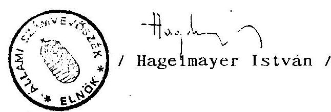

---

# 21lami ふ̧ámbehóssék 

1. sz. Függelék
a V-150-61/1991/91. sz. jelentéshez

## JELENTÉS

a Magyar Szocialista Párt pótvagyonelszámolása hitelességének ellenőrzéséról az 1991. évi LI. törvénnyel módosított 1990. évi LXXIII. törvény alapján

---

A vizsgálatot vezette: dr. Dotterweich Antal tanácsos

A vizsgálatot végezték:
dr. Dotterweich Antal
dr. Elek János
dr. Szávai Tamás
Écsy Lajosné
dr. Ocsovai Sándor
számvevö-tanácsos
számvevö-tanácsos
számvevö-tanácsos
szakértö
szakértö

---

Állami Számve vöszék
V-149-8/1991/1992.
Témaszám: 100.

# J E L E N T É S 

a Magyar Szocialista Párt
pót vagyonelszámolása hitelességének ellenőrzéséröl
az 1991. évi LI. törvénnyel módosított
1990. évi LXXIII. törvény alapján

Az Országgyülés az 1991. október 22-i ülés napján elfogadott 1991. évi LI. törvénnyel módosította az elmúlt rendszerhez kötődő egyes társadalmi szervezetek vagyonelszámoltatásáról szó16 1990. évi LXXIII. törvényt (továbbiakban törvény). A törvény értelmében az Állami Számvevőszék (a továbbiakban ÁSZ) a Magyar Szocialista Pártot (a továbbiakban MSZP), mint a volt Magyar Szocialista Munkáspárt jogutódját - amely szervezetnek a vagyonelszámolása az adatok hiánya miatt nem volt hitelesíthető - felhívta a hiányok pótlására. A pótlás benyújtását követően az ÁSZ ellenőrizte az MSZP pótvagyonelszámolását, ame lynek eredményéről az alábbi jelentést teszi az Országgyülésnek.

Az Állami Számvevőszék az MSZP pótvagyonelszámolását a jelentés II. fejezetében részletezett indokok alapján, figyelemmel a törvény 6. §. (5) bekezdésében biztosított lehetőségre amely szerint az elszámolás nem pótolható adathiany esetén is elfogadottnak tekintendő - azt
elfogadja
és az a törvény 6. §. (6) bekezdése alapján
"hiteles"-nek
minősül.

---

# A feladat végrehajtásának körülményei 

Az MSZP 1992. január 20-i keltü P-06/92. sz. levelével küldte meg pótvagyone1számolását, valamint a nem pótolható adathianyokra vonatkozó nyilatkozatokat (jelentés 1. sz. melléklete). Az MSZP pótvagyone1számolása mintegy 130 oldalnyi dokumentumot tett ki, amely adatainak előállítása több száz alapbizonylat felkutatását, rendszerezését és feldolgozását igényelte.

Ennek következtében az ÁSZ részéről a hitelesség ellenőrzésénél csak helyszíni mintavételes vizsgálatra volt lehetőség. A feladat elvégzése igy is többszer oldal bizonylat, dokumentum egyeztetését, ellenőrzését igényelte. Emellett az ellenőrzés során szükségessé vált újabb dokumentumok bekérése a hitelesíthetőség érdekében. (ezek a jelentés 2-6. sz. mellékleteként csatolva).

A törvény elöírásának megfelelően az ÁSZ csak a pótvagyone1számolást és az adathiany pótolhatatlanságát vizsgálta. Ennek keretében a vizsgálat a pótvagyone1számolásként benyújtott mellékleteknek az eredetihez (az első vagyone1számoláshoz) képest módosított adataira terjedt ki.

Így nem terjedt ki a vizsgálat a már előzőleg benyújtott vagyone1számolás teljes anyagára. Ennek megfelelően az ÁSZ nem vizsgálta a törvény 2. sz. mellékletére (a szervezet vállalataira) vonatkozó adatokat, mivel azokat a V-5-10/1991. sz. vizsgálati jelentésben hitelesnek minösítette és erre vonatkozóan az MSZP-nek nem kellett hiánypótlást benyújtania.

---

A törvény értelmében az ellenőrzésnek nem volt továbbá feladata a volt MSZMP vagyonát illetően végrehajtott vagyonmozgások célszerűségének, eredményességének vizsgálata. Ugyancsak nem ellenőrizte az ÁSZ a volt MSZMP által alapított gazdálkodó szervezetek müködési kérdéseit, az e szervezeteket illetően végrehajtott gazdasági eseményeket.

# A pót vagyone Iszámolás minösítését megalapozó vizsgálati megállapítások 

1. A törvény 1. és 6. sz. mellékletéhez kapcsolódó megállapítások (a szervezet és intézményei ingatlanaira vonatkozó 1949. január 1.-1990. augusztus 31. közötti adatok).

Az MSZP az 1990. évi vagyonelszámolás teljesítésekor az ingatlanokra vonatkozó adatokat 19 számítógépes táblán 758 oldalon nyújtotta be, valamint a kapcsolódó földhivatali ingatlanjegyzékek másolatait is csatolta, amely 1501 oldalt tett ki. A közölt adatok szerint a volt MSZMP 1988. december 31-én 2641 ingatlannal rendelkezett. Az állományváltozások következtében 1990. augusztus 31-ére az ingatlanok száma 365-re csökkent.

A törvény 6. §. (2) bekezdésében előirt kötelezettsége alapján - az első vagyonelszámoláshoz kapcsolódva - az ÁSz ellenőrizte az ingatlanállományt tartalmazó táblázatokat.

---

Tekintettel arra, hogy

- az ingatlanokra vonatkozó adatokat az MSZP nem a törvény elöírásainak megfelelően adta meg,
- nem volt viszonyítási alap az ingatlanok ellenőrzéséhez, mert csak az MSZP által közölt adatokra lehetett támaszkodni, valamint
- a telekrendezéseknél, illetve az ingatlannyilvántartásban - különbözö okok miatti - rendezetlen állapotok voltak tapasztalhatók, nem volt lehetöség az egyértelmü hitelesítésre. Az 1985. elötti időszakra vonatkozó adatok - az 1980. december 31-i állapotot tükröző földhivatali jegyzők kivételével - a megsemmisült, eltünt, illetve beszerezhetetlen dokumentumok, ingatlannyilvántartási hiányok stb. miatt nem voltak rekonstruálhatók.

A fentiekre figyelemmel az 1990-ben benyújtott vagyone1számolásban az ingatlanokra vonatkozó adatok nem voltak hitelesíthetők, így azokat az ÁSZ nem hitelesítette.

Az MSZP a benyújtott pótvagyone1számolásban a V-5-10/1991. sz. ÁSZ jelentésben az ingatlanok körében kifogásolt nyilvántartási pontatlanságokat kijavította, az arról készült kiegészítő táblázatot megküldte. Megerősítette korábbi nyilatkozatát, miszerint a volt MSZMP nyilvántartásában 1980 elöttröl nem találtak olyan átfogó nyilvántartást, ame1y tételesen és hitelesen az elszámolás alapja lehetett volna, ame1ynek alapján az 1949-töl 1980-ig terjedő időszakra adatszolgáltatását el tudta volna készíteni. Pontosította az ingatlanok megszerzése jogcímére és időpontja feltüntetésére vonatkozó nyilatkozatát és az adatszolgáltatását (e jelentés 2. sz. melléklete). Az adathiány pótolhatatlanságáról a pótvagyone1számolás keretében külön nyilatkozatot is csatoltak (lásd e jelentés 1. sz. melléklete iratai között).

---

Az ÁSZ ellenőrzése során megállapította, hogy a pótvagyonelszámolásban jelzett pótolhatatlan adathlányok fennállnak.

Az ÁSZ a mintavételes ellenőrzésnél az MSZP iratanyagai között 1980. évet megelöző időszakra vonatkozó ingatlannyi1vántartást nem lelt fel. Az előző vizsgálat során bekért tulajdoni lapmásolatokból, az MSZP által rendelkezésre bocsátott birtoklapokból - egy-két kivételtől eltekintve nem állapítható meg, hogy 1980. előtt az adott ingatlan mikor, milyen jogcímen került a volt MSZMP birtokába. A teljességhez tartozik az is, hogy nem minden ingatlanról lelhető fel birtoklap, illetve a földhivatalok nem minden esetben tudták azokat megküldeni az MSZP részére.

A párt ingatlan állománya egységesen a volt MSZMP KB Titkársága 1976. december 6-ai, valamint a Minisztertanács 3339/1977. sz. határozata, s a végrehajtására született MÉM 16/b/1977. sz. utasítás alapján került úgy bejegyzésre, hogy a Magyar Állam tulajdona mellett a volt MSZMP Központi Bizottsága kezelői jogát tüntették fel. Ennek eredményeként a volt MSZMP ingatlanainak telekkönyvi nyilvántartása 1980-ra rendeződött, s ezzel a vonatkozó adatok mind a megszerzés jogcíme, mind időpontja esetében egységessé váltak. Ezt követően számítógépen kerültek rögzítésre a párt ingatlanadatai, amelyek a korábbi ÁSZ jelentésben foglaltakra figyelemmel nyomon követhetők.

Az előzőekben kifejtettekre tekintettel az ÁSZ nyilatkozik, hogy a törvény 1. és 6. sz. melléklete esetében az elszámolás nem pótolható adathlány miatt elfogadottnak tekintendö.

---

2. A törvėny 3. sz. mellékletéhez kapcsolódó megállapítások (a szervezet által létrehozott gazdasági társaságokra, leányvállalatokra, alapítványokra vonatkozó adatok).

A korábbi vagyone1számolásra vonatkozó ÁSZ vizsgálat megállapítása szerint két Kft esetében a mellékletben feltüntetett adatok nem egyeztek meg a cégbíróságoknál fellelt dokumentumokkal :

- Az MSZP a Borsod-Abaúj-Zemplén Megyei Bíróság Cégbíróságánál bejegyzett Belvárosi Autójavító Kft 1990. augusztus 31-ei állapotnak megfelelő vagyoni betétjeként 4.150 eFt törzstökét tüntetett fel a tényleges 5.526 eFt helyett. A törzstöke 1990. március 29-ei 1.376 eFt emelését nem vették figyelembe.
- Az MSZP Győr-Moson-Sopron Megyei Bíróság Cégbíróságánál bejegyzett "Allegro" Szolgálató Kft vagyoni betétjénél nem tüntették fel, hogy annak mértékében a Legfelsőbb Bíróság 1990. január 3-án kelt új eljárást elrendelő végzése következtében jogvita volt folyamatban. Nem tüntették fel továbbá, hogy két ingatlan kezelői jogát is bevitték nem pénzbeni apportként a Kft-be. Az 1990. szeptember 21-én hozott, jogerős Cg. 0809.000.085/90. sz. határozat szerint a törzstöke 10.380 eFt a mellékletben feltüntetett 4.762 eFt-tal szemben.

A pótvagyone1számolás keretében ismételten benyújtott a törvény 3. sz. melléklete az említett két Kft esetében a helyes összegeket mutatja, a módosításokat a könyvviteli nyilvántartásokon is átvezették. Az ezt tanusító két gépitábla lapot e jelentés 3. és 4. sz. mellékleteként csatoljuk.
Az elözőekre tekintettel a törvény 3. sz. melléklete hitelesnek tekintendö.

---

3. A törvėny 4. és 5. sz. mellékletéhez kapcsolódó megállapítások (a szervezet beveteli forrásainak és kiadásainak alakulása 1979. december 31.-1990. augusztus 31. között). A korábbi vizsgálati jelentésünk is együtt tárgyalta a bevételeket és kiadásokat tartalmazó mellékleteket.

A korábbi vagyone Iszámolásra vonatkozó ÁSZ vizsgálat mindkét melléklet esetében számszaki hibákat, a törvény 5. sz. melléklete esetében pedig a hitelesitést akadályozó tényeket is megállapított.

Az ÁSZ ellenőrzése szerint a pótvagyone Iszámolás keretében beküldött mellékletekben a korábban kifogásolt számszaki hibák kijavítása megtörént. Figyelemmel arra, hogy az MSZP kiadásainak alakulását tartalmazó a hivatkozott törvény 5. sz. melléklete csak számszaki hibákat tartalmazott, ezért azt az ellenőrzés az adatok kijavítása következtében hitelesnek minösíti.

A törvény 4. sz. mellékletét illetően az MSZP pénztárnoka a pótvagyone Iszámoláshoz nyilatkozatot csatolt az adathiény póto1hatatlanságáról, továbbá ennek bizonyítására négy dokumentumot is benyújtott. Az ÁSZ ellenőrzése szerint a csatolt dokumentumok hitelt érdemlően igazol ják, hogy a törvény elöírásai szerint nem tud adatot szolgáltatni az MSZP, mivel

- a volt MSZMP vállalatai költségvetési kapcsolatai eltértek az állami vállalatokétól,
- a beruházási tevékenység nem épült be a volt MSZMP számvitelébe,
- a volt MSZMP-t illetően az állami szervektől eltérő gyakorlat érvényesült az adózásra és az adatszolgáltatásra.

---

Az elözoekre tekintettel az ÁSZ nyilatkozik, hogy a törvény 4. sz. melléklete esetében az elszámolás nem pótolható adathlány miatt elfogadot tnak tekintendö.
4. A törvėny 7. sz. mellékletéhez kapcsolódó megállapítások (a szervezet, valamint az általa fenntartott intézmények ingatlanokon kivüli egyéb állóeszközei könyv szerinti adatai).

A korábbi vagyonelszámolásra vonatkozó ÁSZ vizsgálat megállapítása szerint a benyújtott adatok számszaki hibákat tartalmaztak, továbbá az is megállapításra került, hogy az MSZP nem tud elszámolni a képzömüvészeti alkotásokkal.

A jelenlegi ellenörzés esetében az ÁSZ megállapítása szerint a "gépek, berendezések, felszerelések" és "jármüvek" során az adatszolgáltatás pontatlanságát korrigálták, a pótvagyoneszámolás e sora hiteles.

A képzömüvészeti alkotások adatsorán lévö pontatlanság is korrigálásra került, azonban továbbra sem tudott az MSZP teljeskörüen alapbizonylatot bemutatni ezek eredetéről, az adathlány pótolhatatlanságáról nyilatkozatot adtak (lásd , e jelentés 1. sz. melléklete iratai között). A vizsgálat megállapítása szerint a meglévö nyilvántartásokból nem állapítható meg minden üzemkörön kivüli állóeszköz eredete (pl. vétel, ajándék, letét, stb.) és egyedi pontos azonosíthatósága. Ennek dokumentálására e jelentés 5/a-b. mellékleteként becsatolunk két "Berendezések- és felszerelések nyilvántartó lapja" c. eszköznyilvántartó lapot.

Az elözőekre tekintettel az ÁSZ nyilatkozik, hogy a hivatkozott törvény 7. sz. melléklete esetében az elszámolás nem pótolható adathlány miatt elfogadottnak tekintendö.

---

5. A törvėny 8. sz. mellékletéhez kapcsolódó megállapítások (értékpapírfogalom, pénzforgalom alakulása).

A korábbi vagyone1számolásra vonatkozó ÁSZ vizsgálat megállapítása szerint a törvény 8/a. melléklete hitelesíthetőségét a megyei irodák pontatlan adatszolgáltatása a $8 / \mathrm{b}$. melléklete hitelesíthetőségét pedig a hiányzó adatok adadályozták.

Az MSZP a törvény 6.§. (3) bekezdésében elöirt hiánypótlási kötelezettségének az értékpapírforgalomra, valamint a pénzforgalomra vonatkozó mellékleteket illetően eleget tett a pótvagyone1számolás keretében. Az értékpapírok állományáról a törvényben elöirtak szerint az MSZP elkészítette az évenkénti (év végi), valamint a törvény hatálybalépésének idópontjára vonatkozó kimutatásokat.

Az ÁSZ jelenlegi ellenőrzése megállapítása szerint az MSZP Borsod-Abaúj-Zemplén megyei irodája birtokában 1989-ben volt árfolyamgaranciás kötvények nem értékapírok. Ezek ugyanis csak elnevezésükben voltak kötvények, ténylegesen azonban határidős betétek voltak. Mindezek figyelembevételével az értékpapírok állományának alakulására vonatkozó adatszolgáltatás (a törvény 8/a. melléklete) az ÁSZ elleörzésének megállapításai alapján teljeskörünek és hitelesnek tekintendö.

Kiegészítette az MSZP a pénzforgalom alakulására vonatkozó mellékleteket is. Az elszámolások azonban a kiegészítésekkel sem teljeskörüek, mivel egyes időszakok adatai azokból hiányoznak.

A hiányzó adatokkal kapcsolatban az MSZP 1992. február 28-án kelt nyilatkozatában (e jelentés 6. sz. melléklete) előadja, hogy a volt MSZMP megszünésekor - 1989-ben - az

---

egyes szervezetek pénzforgalmi bizonylatai összegyüjtésre kerültek anélkül, hogy azok átadás-átvételét megfelelően rendszerezve jegyzökönyvezték volna.

Tovább fokozta a begyüjtött bizonylatok sorsának áttekinthetetlenségét a pártszervezeteknek az átalakulással kapcsolatos többszöri költöztetése, valamint a gazdasági vezetök jelentős részének a szervezetekböl való kilépése.

Mindezen okok miatt a bizonylatok egy részét az MSZP nem tudta fellelni és azok pótlására nem lát lehetöséget, az ÁSZ ellenőrzésének megállapításai ezt megerősítik.

Az ellenőrzés a nyilatkozatban foglaltakat valósnak, az adathiányt az abban felsorolt indokok alapján pótolhatatlannak ítéli, ezért az ÁSZ nyilatkozik, hogy a törvény 8/b. sz. melléklete esetében az elszámolás nem pótolható adathlány miatt elfogadottnak tekintendö.
6. A törvény 6. §. (4) bekezdése alapján benyújtandó szerzödésekre vonatkozó megállapítások.

A törvény 6. §. (4) bekezdésében meghatározott ingatlanok, gépek, berendezések, felszerelések, valamint jármüvek, továbbá védett müalkotások és az MSZP által alapított gazdálkodó szervezetek és alapítványok állományában 1990. augusztus 31-e és 1990. szeptember 18-a közötti elidegenítésére, illetve megterhelésére az MSZP nyilatkozata szerint (lásd e jelentés 1. sz. melléklete iratanyagában) nem került sor. A szúrópróbaszerü ellenőrzés tapasztalatai igazolták, hogy a jelzett időszakban és körben elidegenités, illetve megterhelés nem fordult elő.

---

# ALLAMI SZÁMVEVÖSZÉK 

V-149-8/1991/1992.

## M E L L É K L E T E K

a Magyar Szocialista Párt
pót vagyonelszámolása hitelességének ellenőrzéséről
az 1991. évi LI. törvénnyel módosított
1991. évi LXXIII. törvény alapján

---

# TARTALOMJEGYZÉK 

1. sz. melléklet az MSZP pénztárnokának 1990. január 20-i levele és mellékletei (pótvagyone1számolás)
2. sz. melléklet az MSZP pénztárnokának 1992. február 12-i levele és mellékletei (pótvagyone1számolás kiegészitése)
3. sz. melléklet 394-07. sz. fókönyvi számlalap ("Be1városi Garázs" és Autójavító Kft helyesbített törzs- tőkéje)
4. sz. melléklet 394-03. sz. fókönyvi számlalap (Állami Szolgáltató Kft helyesbített törzstőkéje)

5/a-b. sz. melléklet 2 db Berendezések és felszerelések nyilvántartó lapja
6. sz. melléklet az MSZP pénztárnokának 1992. február 28-án kelt nyilatkozata

---

# MAGYAR SZOCIALISTA PÁRT GAZDASAGI IIIVATALA 

$P=06 / 92$.
Állami Számvevőszék
Dr. Kovács Árpád
főcsoportfőnők úr részére
Budapest, V.
Apáczai Csere János u.
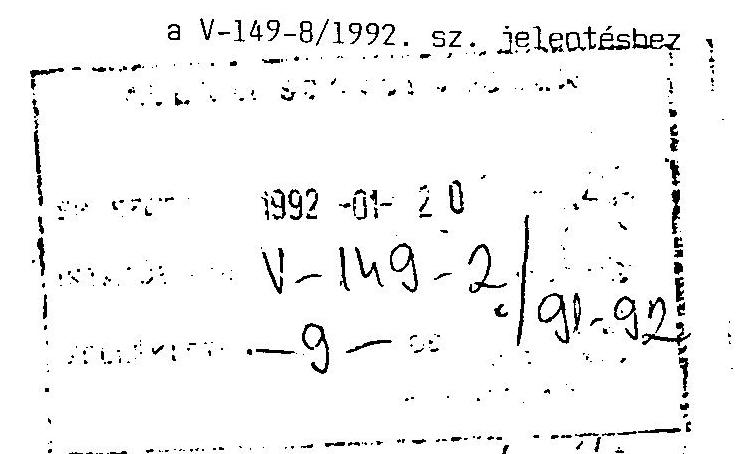

Tisztelt Kovács Úr!

Csatoltan megküldjük az MSZP vagyonelszámoltatásához szükséges általunk 0 kiegészített, javított tablókat szíves felhasználásukra.

Melléklet: Jelentés: az Állami Számvevőszék számára az MSZP vagyonelszámoltatást kiegészítő intézkedésekről
3. sz. melléklet: a szervezet által létrehozott gazdasági társaságokra, alapítványokra
4. sz. melléklet: a szervezet bevételi forrásainak alakulása
5. sz. melléklet: a szervezetek kiadásainak alakulása
7. sz. melléklet: a szervezetet, valamint az általa fenntartott intézmények ingatlanon kívüli egyéb állóeszközei könyvszerinti adatai
8. sz. melléklet: értékpapír és pénzforgalom alakulása

1-6-os számú melléklethez: kiegészítő
Kimutatás az 1990. évi ingatlanállomány
/15/ növekedéséről
/16/ csökkenéséről
4. számú melléklethez kiegészítő levelezések:

- PM Bevételi Főigazgatósága 184/1968.
- PM Bevételi Főigazgatósága 1968. 05. 20.
- MSZMP Költségvetési és Tervezési alosztály 1970. 04. 9-i feljegyzése
- PM Testületi Szervek Főosztálya K/607/1989. IX.

---

- Pártvállalatok befizetései és juttatások 1979-1990. VIII. 31.

Nyilatkozatok adathiány pótolhatatlanságáról
1-es és 6-os számú melléklethez
'4-es számú melléklethez
7-es számú melléklethez
8-as számú melléklethez

Budapest, 1992. január 20.
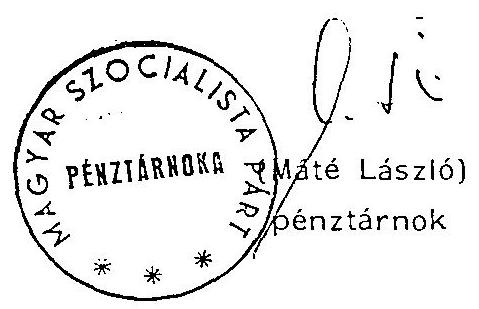

---

# MAGYAR SZOCIALISTA PÁRT 

Jelentés az Állami Számvevőszék számára az MSZP vagyon-elszámoltatást kiegészitő
intézkedésekröl

Az 1990. évi LXXIII.tv. elöírása szerint az MSZP, mint az MSZMP gazdasági jogutódja 1990. október 19-én benyújtotta az ÁsZ felé a vagyonelszámolását. Az akkori jelentést a lehető legnagyobb körültekintéssel, a teljességre törekedve állítottuk össze.

Az Ász 1990-ben az elszámolás alapját képező 8 táblából 1 táblát (a 2. számút) minősített hitelesnek, 1 további táblát (a 3. számút) kiegészítésekkel hitelesíthetőnek tartott, 6 tábláról különböző okok miatt azt mondta ki, hogy nem hiteles. Az MSZP az Ász megállapításait szakmailag korrektnek és megalapozottnak ismerte el. Az elmúlt 42 évről hiteles vagyonelszámolást készíteni csaknem lehetetlen feladat.

Az 1990. évi vizsgálat óta a feladaton tovább dolgozott az MSZP gazdasági részlege. Az egyes táblák újbóli hitelesítéséhez - az országgyülés 1991. októberi kiegészítő törvénye alapján - az alábbi kiegészítő információkat adjuk, illetve a következö intézkedéseket tettük:

---

1. és a 6. számú tábla:

Ismételten megerősítjük korábbi nyilatkozatunkat, miszerint az MSZMP nyilvántartásában 1980 elöttröl nem találtunk olyan átfogó ingatlan-nyilvántartást, ame1y tételesen és hitelesen az elszámolás alapja lehetett volna.
Az elsö hiteles összesített nyílvántartást az MSZMP KB 1976. december 6-ai határozata, valamint a MÉM $16 / b / 1977$. sz. utasítása alapján készített 1980. december 31. alapadatokkal találtuk meg. Az eredeti tulajdonosokat - az ösbirtokosokat - azonban ez sem tartalmazta.

Az Ász jelentésében kifogásolt 10. sz. gépi tabló 33, 97, 99, 101, 104, 114, 124 sorain szereplö ingatlanokat pontosítottuk és beazonosításuk megtörtént.

Az Ász által történt észrevételnek megfelelően az MSZMP nyilvántartását kiegészítettük az abban nem szereplö toalmási, kocseri, sarrodi, szegedi ingatlanokkal. (Valamennyi már évekkel korábban leadásra került az állam felé.)

Az MSZMP ingatlan-nyílvántartásában a részkezelöi jog alapján az alapterület és az érték adatok módosítását elvégeztük, azok a fökönyvi nyilvántartás értékadatában követhetők. Ennek ellenére megjegyezzük, hogy a területmegosztásoknál megkifogásolt részkezelöjogok megtartása; illetve ezek pontatlan rögzítése idöközben elvesztették aktualitásukat, hiszen az országgyülés a társadalmi szervezetek és az MSZP kezelői jogát előbb a zárolt Állami Vagyonkezelőhöz telepítette, majd megszüntette. Bár e lépés alkotmányellenes volt (mert az alkotmány az államosítást csak kártárítés ellenében teszi lehetővé és a kezelői jog értékkel bíró vagyon volt) az MSZP nem emelt kifogást ellene, mert egyetértett ezen örökölt kiváltság megszüntetésével.

---

A befejezetlen beruházások mindegyike átkerült az államhoz. Az ÁsZ által kifogásolt 5 befejezetlen beruházás nem szerepelt az MSZMP nyílvántartásában.

A felsorolt változásokat az ingatlanvagyon elszámolásához készített tablókon átvezettük. Ezzel együtt is tudjuk, hogy a tablók csak 1980-tól teljes körüek (kivétel ez alól a megszerzés jogcíme) és e táblákat az Ász nem tekintheti hitelesnek az 1949-1980 közötti adatok hiányosságai miatt.

Az MSZP nyilatkozik, tehát: az 1. és a 6. sz. táblák adathlányait nem tudjuk pótolni, illetve beszerezni. Kérjük, hogy az Ász az adathlányt igazolja és ennek alapján mondja ki az 1. és a 6. számú tábla hitelességét.
2. sz. tábla:

Az MSZMP vállalataira vonatkozó adatszolgáltatást (19491990) az Ász 1990. évi jelentése hitelesnek fogadta el.
3. sz. tábla:

Az MSZMP, illetve az MSZP által alapított KFT-kre, alapítványokra vonatkozó megállapításokra a következö intézkedéseket tettük:

- Az MSZP BAZ megyei szervezete által alapított Belvárosi Autójavító KFT törzstökéjét 5.526 eFt-ra módosítottuk.
- Az Allegro KFT apportlistáját véglegesítettük.

Mivel az ÁsZ jelentése e két tétel kivételével az elszámolásunkat teljeskörünek ismerte el, s e két tételt korrigáltuk, az adatszolgáltatáson átvezettük ezért kérjük, hogy az ÁsZ a 3. sz. táblát minösítse hitelesnek.

---

4. sz. tábla:

Az MSZMP bevételeire vonatkozó tábla pontosításra került:

- Az MSZMP 1987. évi tagdíjbevételei összesítésében szereplő 49.500 eFt-os összeadási hibát korrigáltuk.
- A BAZ megyei 1990. évi kamatbevételt a tényleges számra pontosítottuk.
- A Baranya megyei 1990. évi tagdíjbevételek adatsorát bruttósítottuk.
- Az MSZMP vállalati bevételeire az állami költségvetési kapcsolatokra, a beruházási juttatásokra vonatkozóan további adatkiegészítéseket tettünk az időközben fellelt dokumentumok alapján, melyeket beterjesztünk az Állami Számvevőszéknek mellék-letként. A Pénzügyminisztérium Bevételi Föigazgatósá-gának 1968. áprilisában kelt 184/1968. számú intéz-kedése, ugyancsak a PM Bevételi Föigazgatóságának 1968. május 20 -ai levele, valamint az MSZMP Költségvetési és Tervezési Alosztályának 1970. április 9-ei feljegyzése, és a PM Testületi Szervek Föosztálya K/607/1989. IX. jelü feljegyzése az illetékes államtitkárnak. Ezekböl a dokumentumokból egyértelmüen kiderül, hogy az MSZMP-ben az állami szervektől eltérő gyakorlatot engedélyeztek az adózásra és az adatszolgáltatásra.

Fentiek alapján a törvényi előírásnak megfelelő MSZMP összesítők nem készülhettek.

Az MSZP nyilatkozik, hogy adathiány miatt a 4. sz. táblát a kért bontásban nem tudja megadni, ezért kéri az ÁsZ-t, hogy az adathiányt igazolja, s annak alapján a 4. sz. táblát hitelesnek minösítse.

---

5. sz. tábla:

Az MSZP kiadásaira vonatkozó táblában pontosításra kerültek:

- a Csongrád megyei munkabérek és azok közterhei, illetve a müködési és fenntartási költségei,
- a Baranya megyei munkabérek és közterhei soron elkövetett 10 ezer forintos összeadási hiba,
- a BAZ megyei 1990. évi bérek és közterhek, valamint a müködési kiadások közötti átvezetés.

Az 5. sz. táblát újra elkészítettük és azt az Állami Számvevőszékhez ismét benyújtjuk.
Kérjük, hogy az Állami Számvevőszék az 5. sz. táblát minösítse hitelesnek.
7. sz. tábla:

Az Állami Számvevőszék azon megállapítása, miszerint az MSZMP az általános gyakorlattól szigorúbb nyílvántartást vezetett azáltal, hogy a 2000 Ft-tól nagyobb értékü beszerzéseket már állóeszköznek minősítette, a tábla összeállítását nem zavarta alapvetően.

Az állóeszközállomány vízsgálatakor feltárt hiányosságokat pótoltuk:

- Gépek, berendezések és felszerelések állományát a Csongrád megyei átvezetés az 1990. augusztus 31-ei készletből a csökkenés oszlopba 478,3 eFt-tal módosította.
- Közlekedési eszközöknél a Csongrád megyei állományból a DIANTUS KFT-be apportként bevitt személygépkocsi értéke kivezetésre került.

---

- H2emkörön kívüli állóeszközök adatállományát növeltük, a Csongrád megyei fogyóeszközökböl átadott, de tévesen az állóeszközökböl kivezetett képzömüvészeti alkotások értéével.

A gépek, berendezések és felszerelések, a közlekedési eszközök adatait módosítottuk, azok teljeskörüek.

Az üzemkörön kívüli állóeszközök állományában lévő képzömüvészeti, iparmüvészeti alkotások eredete az MSZMP nyilvántartásából alapbizonylatok részbeni hiánya miatt nem állapítható meg hitelesen.

A korábban beadott nyilatkozatunkat megerösítjük, hogy az MSZMP védett müalkotásokkal nem rendelkezett.
A pontosított 7. sz. táblát ismételten elkészítettük és kérjük az Állami Számvevöszéket, hogy a pótolhatatlan adathíányokat igazolja és a táblát minösítse hitelesnek.
8. sz. tábla:

A 8. sz. táblát az ÁsZ észrevételeit alapulvéve és a fellelt adatok alapján átdolgoztuk, a jelzett hiányosságokat részben pótoltuk és e táblát az ÁsZ-nak ismételten benyújtjuk.
E tábla azonban ezek után is csak részben hiteles. Hitelesen mutatja be a Szocialista Párt értékpapírjait. A fellelt dokumentumokból azonban nem lehet maradéktalanul bemutatni az MSZMP 1983 elötti pénz- és bankszámláinak mindegyikét. Itt például a megszünt járási pártbizottságok gazdasági iratainak hiányos archiválása megoldhatatlan szakmai problémákat jelentett.

Mindezek alapján kérjük, hogy a 8. sz. táblát az Ász pótolhatatlan adathíány elismerése mellett minösítse hitelessé.

Nyilatkozunk, hogy az 1991. évi LI. törvény - az elmúlt rendszerhez kötödö egyes társadalmi szervezetek

---

vagyonelszámoltatásáról szóló - 1990. évi LXXIII. törvény módosításában meghatározott vagyontárgyak elidegenítésére, megterhelésére 1990. augusztus 31. és 1990. szeptember 18. közötti időszakban nem került sor.

# Ö S S Z E G E Z VE: 

A Magyar Szocialista Párt ismételten benyújtja a volt MSZMP vagyonról szóló elszámolást. Az elszámolást csak az MSZP helyzetére teljeskörü és hiteles, az MSZMP-re vonatkozóan 1949-töl 1988-ig sok gazdasági adat hiányzik és ezt a korszakot maradéktalanul nem tudtuk bemutatni.

Az MSZMP-re vonatkozó adatok az utolsó 10 évre csaknem maradéktalanul a rendelkezésünkre álltak. Itt az okozott gondot, hogy az állam és az MSZMP kapcsolata miatt az MSZMP az általános gazdasági gyakorlattól eltérő módon kapcsolódott az állami költségvetéshez. Így a kért bontásban a rendelkezésre álló adatokból csak részben hiteles elszámolást lehetett készíteni.

Kérjük az Állami Számvevőszéket, hogy az adathiányokat alapulvéve mondja ki az elszámolás hitelességét.

Budapest, 1991. december
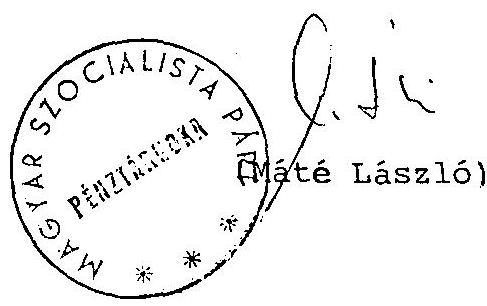

---

"1991. évi LI. törvény

- pótelszámolás -
- melléklete".

A szervezet által létrehozott gazdasági társaságokra, leányvállalatokra, alapítványokra vonatkozó adatok
1949. I. 1. -- 1990. VIII. 31.

| Sorszám | Megnevezés | Létesítés, alapítás | Megszünés idópontja | Vagyoni betét megnevezés | Összeg |
| :--: | :--: | :--: | :--: | :--: | :--: |
| 1. | "Bács-Touring" Szálloda és Közlekedési Szolgáltató Kft. | Cg. 9063/89/2 | - | törzstőke | 16.279 .0 EFt |
| 2. | "Komfort" Kereskedelmi Szálláshely Értékesító Kft | Cg. 30065/89 | felszámolva 1990. VIII. 5. | törzstőke | 4.393 .0 EFt |
| 3. | "Allegro" Szolgáltató Kft | Cg. 60056/89 | felszámolás alatt | törzstőke | 10.380 .0 EFt |
| 4. | "OSZSZI" Oktatásszervezó és Szolgáltató Kft | Cg. 60055/89 | felszámolás alatt | törzstőke | 6.764 .0 EFt |
| 5. | "Polszol" Ugyviteli Szolgáltató és Gazdálkodási Kft | Cg. 60346/89/3 | felszámolva 1990. VI. 30. | törzstőke | 1.000 .0 EFt |
| 6. | "Cimbriana" Kommunikációs és Szolgáltató Kft | Cg. 60055/89 | felszámolás alatt | törzstőke | 95.000 .0 EFt |
| 7. | "Belvárosi"Garázs és Autójavító Kft | Cg. 60120/89/6. | - | törzstőke | 5.526 .0 EFt |
| 8. | "Garázs" Autójavító Szolgáltató és Vendéglátó Kft | Cg. 60034/89/5. | - | törzstőke | 2.000 .0 EFt |
| 9. | "NEXT" 2000 Kft | Cg. 62481/89 | felszámolva 1990.V.15. | törzsbetét | 2.900 .0 EFt |
| 10. | "PARITÁS" Kft | Cg. 02090001/89 | - | törzsbetét | 2.516 .0 EFt |
| 11. | "ARCHIV" Kft | Cg. 01090-65968/90 | - | törzsbetét | 1.100 .0 EFt |
| 12. | "KIME-NET" Kft | Cg. 0109068752/90 | - | törzsbetét | 1.028 .0 EFt |
| 13. | "Vállalkozásszervező" Kft | Cg. 66414/89 | értékesítve 1990. VIII. | törzsbetét | 1.000 .0 EFt |

---

| 14. | "Mószaki-Gazdasági" Szolgáltató Kft | Cg. 67253/90 | értékesítvel990.VIII. | törzsbetét | 1.000 .0 | EFt |
| :--: | :--: | :--: | :--: | :--: | :--: | :--: |
| 15. | "VÁRAO" Kft | Cg. 020900098 | - | törzsbetét | 2.945 .0 | EFt |
| 16. | "HOLIOAY" Kft | Cg. 0109-065-493/90 | - | törzsbetét | 1.000 .0 | EFt |
| 17. | "KOPIR" Kft | Cg. 0509000397/90 | - | törzsbetét | 9.170 .0 | EFt |
| 18. | "ORGONA" Kft | Cg. 1709000641/90 | - | törzsbetét | 2.000 .0 | EFt |
| 19. | "DIANTHUS" Kereskedelmi és Szolgáltató Kft | Cg. 06-09-000456/90 | - | törzsbetét | 1.050 .0 | EFt |
|  |  |  |  |  | 167.051 .0 | EFt |

---

"1991. évi Li. tủiver.y

- pótelszámolás -
melléklete".

# 3. sz melléklet 

A szervezet által létrehozott gazdasági társaságokra, leányvállalatokra, alapítványokra vonatkozó adatok 1949. I. 1.--1990. VIII. 31.

| Sorszám | Megnevezés | Létesítés, alapítás időpontja | Megszünés időpontja | Vagyoni betét |  |
| :--: | :--: | :--: | :--: | :--: | :--: |
|  |  |  |  | megnevezés | összeg |
| 1. | Lukács György | 1989. III. 29. | - | Letéti jegyek | 40.000.-EFt |
| 2. | Szabad Sajtó | 1990. IV. 27. | - | Készpénz | 1.000.-EFt |

---

"1991. évi LI. törvény

- - pótelszámolás melléklete".
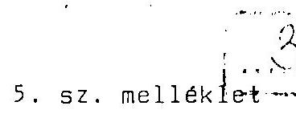
$V-1 h 9-2 / 91-92$

A szervezet kiadásának alakulása 1979. XII. 31. -- 1990. VIII. 31. között
millió Ft-ban

| Ráfordítások összesen |  | E b b ó 1 |  |  |  |
| :--: | :--: | :--: | :--: | :--: | :--: |
|  |  | bérek és közterhek | múködési és fenntartási költségek | Allóeszközök |  |
|  |  |  |  | felújítás | beszerzés |
| 1979 | $1,352,0$ | 628,0 | 500,0 | 183,0 | 41,0 |
| 1980 | $1,470,0$ | 676,0 | 588,0 | 186,0 | 20,0 |
| 1981 | $1,590,0$ | 708,0 | 607,0 | 248,0 | 27,0 |
| 1982 | $1,736,0$ | 750,0 | 647,0 | 301,0 | 38,0 |
| 1983 | $1,793,0$ | 773,0 | 699,0 | 286,0 | 35,0 |
| 1984 | 2,004,0 | 833,0 | 786,0 | 320,0 | 65,0 |
| 1985 | 2,208,0 | 910,0 | 924,0 | 287,0 | 87,0 |
| 1986 | 2,342,0 | 984,0 | 981,0 | 280,0 | 97,0 |
| 1987 | 2,648,0 | 1,035,0 | 1,107,0 | 410,0 | 96,0 |
| 1988 | 3,069,0 | 1,634,0 | 1,024,0 | 353,0 | 58,0 |
| 1989 | 2,830,0 | 1,840,0 | 862,0 | 102,0 | 26,0 |
| 1990 | 471,0 | 175,0 | 293,0 | 1,0 | 2,0 |

---

- "1991. évi LI. törvény
- pótelszámolás -
melléklete".
ÖSSZESÍTÓ az 5. sz. melléklethez

1990. évi adatok
1000 Ft-ban

| Szervek | Munkabérek,   közterhek | Múködési és   fenntartási   költségek | Á 11 ó e $s$ z 2 ö z ök   felújitás |  | Összesen |
| :--: | :--: | :--: | :--: | :--: | :--: |
| Baranya | $4,048,0$ | $4,458,0$ | - | 579,0 | $9,085,0$ |
| Bács | $4,070,0$ | $8,061,0$ | - | - | $12,131,0$ |
| Békés | $2,119,0$ | $1,058,0$ | - | - | $3,177,0$ |
| Borsod | $4,157,0$ | $6,196,0$ | - | - | $10,353,0$ |
| Csongrád | $7,392,0$ | $7,621,0$ | - | - | $15,013,0$ |
| Fejér | $3,001,0$ | $2,053,0$ | - | - | $5,054,0$ |
| Győr | $2,012,0$ | $3,491,0$ | 236,0 | - | $5,739,0$ |
| Hajdú | $2,283,0$ | $11,669,0$ | - | - | $13,952,0$ |
| Heves | $4,335,0$ | $3,459,0$ | - | - | $7,794,0$ |
| Komárom | $2,644,0$ | $3,355,0$ | - | - | $5,999,0$ |
| Nógrád | $3,640,0$ | $2,596,0$ | - | - | $6,236,0$ |
| Pest | $3,597,0$ | $31,606,0$ | 16,0 | - | $35,219,0$ |
| Somogy | $3,106,0$ | $4,614,0$ | - |  | $7,720,0$ |
| Szabolcs | $4,216,0$ | $4,201,0$ | - | - | $8,417,0$ |
| Szolnok | $1,710,0$ | $3,280,0$ | 200,0 | - | $5,190,0$ |
| Tolna | $1,946,0$ | $2,087,0$ | - | - | $4,033,0$ |
| Vas | $2,886,0$ | $1,070,0$ | - | 671,0 | $4,627,0$ |
| Veszprém | $5,192,0$ | $3,999,0$ | 117,0 | 180,0 | $9,488,0$ |

---

| Zala | $3,205,0$ | $13,362,0$ | - | - | $16,567,0$ |
| :-- | --: | --: | --: | --: | --: |
| Bp-i PVB | $27,476,0$ | $14,009,0$ | - | - | $41,485,0$ |
| Tihany | $2,683,0$ | $3,000,0$ | - | 378,0 | $6,061,0$ |
| Párt.tört. Int. | $9,484,0$ | $1,529,0$ | - | - | $11,013,0$ |
| Külügyt Szálld | $9,407,0$ | $6,427,0$ | 431,0 | - | $16,265,0$ |
| Leányfalu | $2,531,0$ | $1,840,0$ | 157,0 | - | $4,528,0$ |
| Orsz. Iroda | $57,717,0$ | $148,339,0$ | - | - | $206,056,0$ |
| Összesen | $174,857,0$ | $293,380,0$ | $1,157,0$ | $1,808,0$ | $471,202,0$ |

---

Nyilatkozó szervezet neve: Magyar Szocialista Párt
címe: 1081. Budapest, Köztársaság tér 26.
jogelődje neve: Magyar Szocialista Munkáspárt

# N Y I L A T K O Z A T 

adathiány pótolhatatlanságáról

1. Alulírott Máté László
(név, tisztség, illetve
munkakör megjelölése), mint a ..... MSZP pénztárnoka az MSZMP
(szervezet megnevezése) vagyonelszámolása során nyilatkozattételre jogosult büntetőjogi felelősségem tudatában kijelentem, hogy az Állami Számvevőszék által az 1991. évi LI. törvénnyel módosított 1990. évi LXXIII. törvény alapján a hitelesítés érdekében kért 1 és 6 . sz. ..... mellékletéből a hiányzó
adatokat nem tudjuk biztosítani, mivel azokkal nem rendelkezünk és szervezetünk számára pótolhatatlanok.

Budapest, 1992. .január 20.
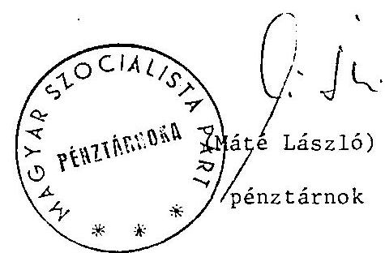

---

$\mathrm{P} / \mathrm{E} / 163 / 4 i$

Kincstári Vagyonkezeló Szervezet
Penz András igazgató úr részére
B u d a o e s t. V.
Szabadság tér 3 .

Tisztelt Penz András Úr!

Tájékoztatjuk, hogy az Állami Számvevôszék a volt MSZMP vagyon elszámoltatása során a Földhivataloknál, néhány olyan ingatlanon talált MSZMP KB kezelôi jog bejegyzést, melyet a párt nyilvántartásában nem leltünk.

Ezen tételekkel az Önök részére benyujtott 1990. évi 15-ös és 16-os gépi táblák adatait kiegészítettük, melyet csatoltan megküldünk.

Budapest, 1991. december 11.

Melléklet: 15. tábla: tételes kimutatás az ingatlanállomány növekedéséról
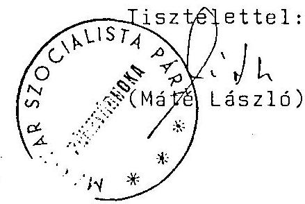
16. tábla: ua. csökkenés ról.

---

1.LAP

|  MAZP | 10GATLAMI YILVANTANTASI KEJASZER | TEIFLES KIMUTATAS AZ INGATLAVALLOHANY NOVEREUESEHOL | "1991. évi L1. törvény - pótelszámolás - melléklete".  |
| --- | --- | --- | --- |
|   |  | 1990. EV | JÜGCIAÉ  |
|  5244 | 10GATLANI INGATLANI BELYE | TULAZOOPH LAP | MELKREJZI-  |
|  5244 | 82AKA | 5244 | 5244  |
|  1 | 066420 |  |   |
|  2 | 003913 | 6360 KALUCSA | 7044  |
|  3 | 063366 | 6090 KUNSZENTIYELOS | 574  |
|  4 | 063433 | 6704 MIZUREPERY | 1441  |
|  5 | 050456 | 5920 CSUNJAS | 108  |
|  6 | 050566 | 5525 FUZESGYARNAT | 729  |
|  7 | 050316 | 5741 KETEGYHAZA | 5525 FUZESGYARNAT  |
|  8 | 050575 | 5743 LUKOSHAZA | 1129  |
|  9 | 050285 | 5432 GADUAUS | 845  |
|  10 | 050581 | 5527 BUCRA | 964  |
|  11 | 050625 | 5466 DAGYBANNEGYES | 327  |
|  12 | 063445 | 5560 GYORGEGUHUH | 100  |
|  13 | 063453 | 5720 SARKAU | 2411  |
|  14 | 063255 | 6040 SZERESFENEGYAS | 211  |
|  15 | 063413 | 7040 SORGAGANI | 714  |
|  16 | 063321 | 5340 FUZESGYAR | 230.71  |
|  17 | 063337 | 2311 KIRAZA | 117  |
|  18 | 018167 | 3104 SALMUTIYEJ | 11444  |
|  19 | 012427 | 2757 SANTANA | 243477  |

---

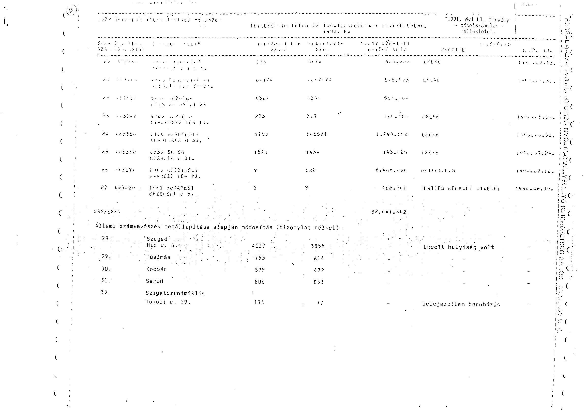

# 1991. évi L1. törvény

## 1991. évi L1. törvény

## 1991. évi L1. törvény

## 1991. évi L1. törvény

## 1991. évi L1. törvény

## 1991. évi L1. törvény

## 1991. évi L1. törvény

## 1991. évi L1. törvény

## 1991. évi L1. törvény

## 1991. évi L1. törvény

## 1991. évi L1. törvény

## 1991. évi L1. törvény

## 1991. évi L1. törvény

## 1991. évi L1. törvény

## 1991. évi L1. törvény

## 1991. évi L1. törvény

## 1991. évi L1. törvény

## 1991. évi L1. törvény

## 1991. évi L1. törvény

## 1991. évi L1. törvény

## 1991. évi L1. törvény

## 1991. évi L1. törvény

## 1991. évi L1. törvény

## 1991. évi L1. törvény

## 1991. évi L1.

---

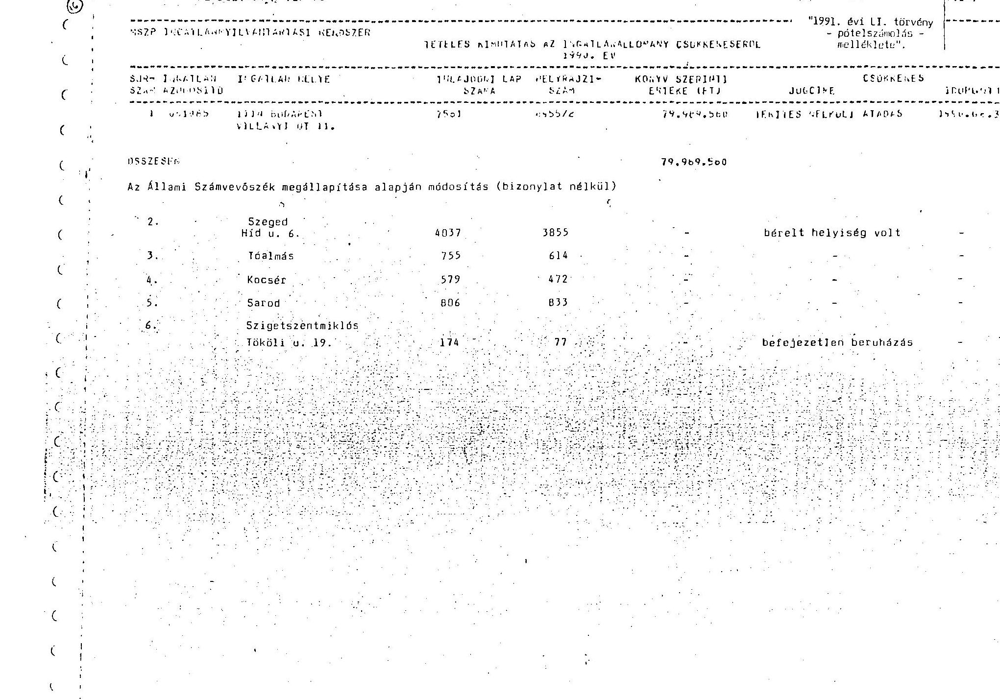

# 1.1.1

## 1991. évi L. törvény

### 1991. évi L. törvény

#### 1991. évi L. törvény

##### 1991. évi L. törvény

###### 1991. évi L. törvény

###### 1991. évi L. törvény

###### 1991. évi L. törvény

###### 1991. évi L. törvény

###### 1991. évi L. törvény

###### 1991. évi L. törvény

###### 1991. évi L. törvény

###### 1991. évi L. törvény

###### 1991. évi L. törvény

###### 1991. évi L. törvény

###### 1991. évi L. törvény

###### 1991. évi L. törvény

###### 1991. évi L. törvény

###### 1991. évi L. törvény

###### 1991. évi L. törvény

###### 1991. évi L. törvény

###### 1991. évi L. törvény

###### 1991. évi L. törvény

###### 1991. évi L. törvény

###### 1991. évi L. törvény

###### 1991. évi L. törvény

###### 1991. évi L. törvény

###### 1991. évi L. törvény

###### 1991. évi L. törvény

###### 1991. évi L. törvény

###### 1991. évi L. törvény

###### 1991. évi L. törvény

###### 1991. évi L. törvény

###### 1991. évi L. törvény

###### 1991. évi L. törvény

###### 1991. évi L. törvény

---

Nyilatkozó szervezet neve: Magyar Szocialista Párt
címe: 1081. Budapest, Köztársaság tér 26.
jogelődje neve: Magyar Szocialista Munkáspárt

# N Y I L A T K O Z A T   adathiány póto1hatatlanságáról 

1. Alulírott Máté László ...................... (név, tisztség, illetve munkakör megjelölése), mint a .. MSZP pénztárnoka az MSZMP (szervezet megnevezése) vagyonelszámolása során nyilatkozattételre jogosult büntetőjogi felelősségem tudatában kijelentem, hogy az Állami Számvevőszék által az 1991. évi LI. törvénnyel módosított 1990. évi LXXIII. törvény alapján a hitelesítés érdekében kért ............4. sz.......... mellékletéből a hiányzó
adatokat nem tudjuk biztosítani, mivel azokkal nem rendelkezünk és szervezetünk számára póto1hatatlanok.

Budapest, 1992. január 20.
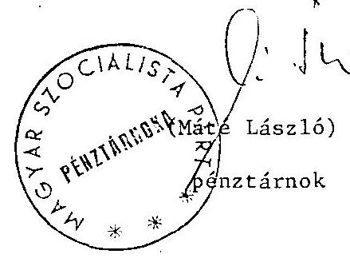

---

A szervezet bevételi forrásainak alakulása 1979. XII. 31. -- 1990. VIII. 31. között
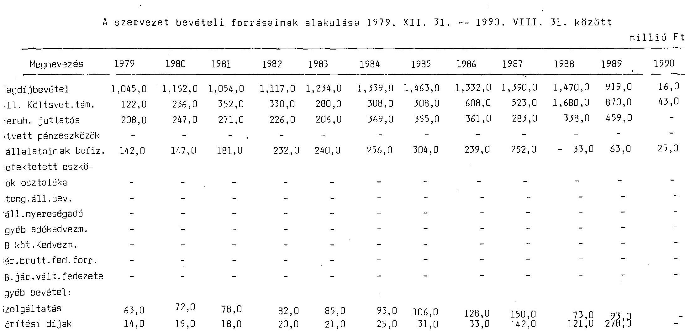

---

|  Egyéb bevételek | 9,0 | 13,0 | 14,0 | 8,0 | 10,0 | 8,0 | 9,0 | 12,0 | 11,0 | 15,0 | 72,0 | 25,0  |
| --- | --- | --- | --- | --- | --- | --- | --- | --- | --- | --- | --- | --- |
|  Kamatbevétel | - | - | - | - | - | - | - | - | - | - | - | 16,0  |
|  Tulajdonba |  |  |  |  |  |  |  |  |  |  |  |   |
|  Ievő ingók bevétele | - | - | - | - | - | - | - | - | - | - | - | 8,0  |
|  Propaganda |  |  |  |  |  |  |  |  |  |  |  |   |
|  tev. bev. | - | - | - | - | - | - | - | - | - | - | - | 3,0  |
|  Egyéb hozzájárulások | - | - | - | - | - | - | - | - | - | - | - | 2,0  |
|  Belker. tev. | - | - | - | - | - | - | - | - | - | - | - | 31,0  |
|  Eszközhaszn. bevétel | - | - | - | - | - | - | - | - | - | - | - | 34,0  |
|  Üsszesen | 1,603,0 | 1,882,0 | 1,968,0 | 2,015,0 | 2,076,0 | 2,398,0 | 2,576,0 | 2,713,0 | 2,651,0 | 3,664,0 | 2,754,0 | 203,0  |

---

4. sz. melléklet

Összesítö

"1991. évi LI. törvény - pótelszámolás melléklete". 1000 Ft-ban

|  Szerv | Áll.ktg vet.t. | Tagdij Váll. bev. | Befekt. eszk. bevétel | Hazzájárulás jogi sz.m.sz. | Bérletiőterítés díj | Bérlet | Selejte-Sok | - Sok | - Keresk. tev. | Egyéb Propa- | Összesen  |
| --- | --- | --- | --- | --- | --- | --- | --- | --- | --- | --- | --- |
|   |  |  |  |  |  |  | 89.évböl | zett szoro- |  | ganda |   |
|   |  |  |  |  |  |  | eszk. sítás |  |  |  |   |
|   |  |  |  |  |  |  | bevét. |  |  |  |   |
|  Baranya | 475,0 |  | 527,0 |  |  |  | 747,0 |  |  | 313,0 | 2,062,0  |
|  Bács | 571,0 |  |  |  |  |  |  |  |  | 5,314,0 | 5,885,0  |
|  Békés | 570,0 | 100,0 |  |  |  | 1,198,0 |  |  |  |  | 1,868,0  |
|  Borsod | 1,024,0 |  | 4,941,0 |  |  |  | 3,403,0 |  |  |  | 9,563,0  |
|  Csongrád | 615,0 |  |  |  |  |  |  |  |  | 5,338,0 | 5,953,0  |
|  Fejér | 480,0 |  |  |  | 75,0 | 65,0 | 761,0 | 21,0 |  | 1,137,0 | 2,539,0  |
|  Győr | 595,0 | 1,051,0 |  |  | 2,0 | 739,0 |  |  |  |  | 2,387,0  |
|  Hajdú | 613,0 | 800,0 | 480,0 |  | 20,0 |  | 4,640,0 | 87,0 |  | 53,0 | 6,693,0  |
|  Heves | 358,0 |  |  |  |  |  | 1,159,0 |  |  |  | 1,517,0  |
|  Komárom | 409,0 |  |  |  |  |  | 512,0 |  |  |  | 921,0  |
|  Nógrád | 221,0 |  | 685,0 |  |  | 522,0 | 801,0 |  |  | 2,0 | 2,231,0  |
|  Pest | 760,0 |  |  |  | 687,0 |  | 2,032,0 |  |  | 1,068,0 | 4,547,0  |
|  Somogy | 417,0 |  |  |  |  |  |  |  |  | 3,341,0 | 3,758,0  |
|  Szabolcs | 362,0 |  |  |  |  |  | 4,841,0 |  |  |  | 5,203,0  |
|  Szolnok | 916,0 |  |  |  |  |  | 1,718,0 |  |  |  | 2,634,0  |
|  Tolna | 120,0 |  | 19,0 173,0 |  | 4,0 | 6,0 | 270,01,263,0 | 123,0 |  |  | 1,978,0  |
|  Vas | 357,0 |  | 534,0 |  |  |  | 43,01,533,0 | 8,0 |  | 22,0 | 2,497,0  |
|  Veszprém | 719,0 |  | 2,176,0 |  |  |  | 3,032,0 |  |  | , | 5,927,0  |
|  Zala | 292,0 |  |  |  |  |  |  |  |  | 7,533,0 | 7,875,0  |

---

|  Bp.-i PV8 | 6,539,0 | 1,645,0 | 261,0 | 73,0 | 3,878,0 | 4,0 | 124,0 | 728,0 | 812,0 | 14,064,0  |
| --- | --- | --- | --- | --- | --- | --- | --- | --- | --- | --- |
|  Tihany | - | 316,0 |  |  |  |  | 825,0 |  |  | 1,141,0  |
|  Párttört.I. | - | - |  |  |  |  |  | 16,0 |  | 16,0  |
|  Külügyi Sz. | - | - |  |  |  |  | 23,729,0 |  |  | 23,729,0  |
|  Leányfalu | - | - |  |  |  |  | 2,802,0 |  |  | 2,802,0  |
|  Orsz.Ir. 43,338,0 | 62,0 | 22,864,0 | 65,0 | 5,012,0 | 533,0 | 860,0 | 7,597,0 | 2,733,0 | 84,0 | 2,372,0  |
|  Összesen 43,338,0 | 24,815,0 | 16,335,0 | 1,582,0 | 6,151,0 | 156,0 | 24,999,0 | 203,115,0 |  |  |   |
|  16,475,0 | 65,0 | 173,0 | 2,265,0 | 33,364,0 | 30,213,0 | 3,184,0 |  |  |  |   |

---

|   | 1979 | 1980 | 1981 | 1982 | 1983 | 1984 | 1985 | 1986 | 1987 | 1988 | 1989 | 1990
VIII. 31.  |
| --- | --- | --- | --- | --- | --- | --- | --- | --- | --- | --- | --- | --- |
|  1. Nyereségadó | 73.027 | 77.052 | 103.811 | 101.838 | 87.241 | 118.792 | 31.832 | 73.194 | 88.868 | 68.083 | - |   |
|  2. Termelési adó | 105.005 | 101.261 | 99.188 | 151.760 | 142.909 | 118.135 | 272.864 | 177.702 | 161.566 | 76.161 | - |   |
|  3. Közp. amort. | 14.764 | 15.519 | 9.119 | 9.423 | 60.050 | 82.753 | - | 7.851 | 6.122 | - | - |   |
|  4. Eszközleköt. jár. | 15.290 | - | - | - | - | - | - | - | - | - | - |   |
|  5. Műszaki fej.a.elv. | 1.297 | 1.487 | 1.839 | 2.272 | - | - | - | - | - | - | - |   |
|  6. Város és község fej. | 7.408 | 12.161 | 26.954 | 25.516 | 23.235 | 28.574 | 11.432 | 24.146 | 28.277 | - | - |   |
|  7. Bérfej. alap | 726 | 55 | - | 173 | - | - | - | - | - | - | - |   |
|  8. Telek használja | 1.093 | 2.130 | 1.492 | 1.832 | 1.706 | 1.695 | 1.695 | 1.695 | 1.695 | - | 401 |   |
|  9. Ok. selejt. árbev. | 9.331 | 8.398 | 5.511 | 11.949 | 8.121 | 8.067 | 9.373 | 14.936 | 7.824 | 12.437 | 5.985 |   |
|  10. Béradó |  |  |  |  |  |  | 13.281 | 14.168 | 14.869 | - | - |   |
|  11. Kereseti adó |  |  |  |  |  |  | 11.843 | 58.672 | 70.847 | 90.486 | - |   |
|  12. Vagyon és felh. adó |  |  |  |  |  |  | 63.231 | 66.391 | 64.803 | - | - |   |
|  13. Egyéb befiíz. | 260 | 657 | 3.401 | 76 | 369 | 970 | 25.279 | 3.856 | 6.986 | 23.929 | 114.856 | 24.815  |
|  14. Befizetés összesen | 228.201 | 218.640 | 251.315 | 304.839 | 323.631 | 358.986 | 440.830 | 441.011 | 451.857 | 271.096 | 121.242 | -  |
|  15. Működési dátáció | 73.022 | 60.200 | 54.758 | 59.034 | 58.567 | 62.271 | 62.950 | 58.916 | 55.741 | 227.568 | 38.300 | -  |
|  16. Céldatáció | - | - | - | 4.497 | 13.826 | 30.843 | 45.892 | 117.593 | 65.034 | 73.989 |  |   |
|  17. MHDT részesedés | 7.300 | 6.400 | 6.600 | 7.900 | 11.000 | 8.570 | 10.750 | 10.000 | 13.900 | - |  |   |
|  18. Alapjutt. (fej. forg.) | 4.700 | 505 | 7.605 | 48 | - | 1.630 | 5.800 | 14.500 | 57.446 | 2.000 | 20.000 |   |
|  19. Ok. biztosítás | 1.150 | 1.126 | 1.112 | 990 | - | - | - | - | - | - | - |   |
|  20. Egyéb jutt. | 187 | 2.978 | 422 | 105 | 41 | 8 | 12.274 | 209 | - | 431 | - |   |
|  Juttatás összesen | 86.359 | 71.209 | 70.497 | 72.574 | 83.434 | 182.522 | 136.866 | 201.218 | 192.121 | 303.988 | 58.500 |   |
|  21. Hattó befiíz. | 141.842 | 147.431 | 180.818 | 232.265 | 240.197 | 256.464 | 303.964 | 239.793 | 259.736 | - 32.892 | 62.942 | 24.815  |

Budapest, 1991.

---

PÉNZÜGYMINISZTÉRIUM Bevételi Föigazgatósága Föigazgatóhelyettes

184/1968.

S z a t m á r i A n ú r á s elvtárs, a MSZMP KB osztályvezetőhelyettese

15-1/3

Budapest
MSZMP KB
Pártgazdasági és Ugykezelési Osztály
Kedves Szatmári Elvtárs!
Utalással Adler Vilmos, a PM Bevételi Főigazgatóság vezetőjével történt telefonbeszélgetésre, a/vállalati mérlegösszesítés kérdésében/az alábbiakat közöljük és állásfoglalását, illetve szíves intézkedését kérjük.

A vállalatok és szövetkezetek idôszaki és éves mérlegbeszámolóinak népgazdasági szintü összesítése - amelyet eddig tárcaszintig a felügyeleti fôhatóságok, majd a KSH végeztek - 1968. január 1-től a PM Bevételi Főigazgatóság feladatává vált. Az öszszesítés a funkcionális fôhatóságok alapvető igénye szerint elsõrendúen szakágazati - azon belül szektorális - és az ennél lépcsönként összevontabb csoportosításban /alágazat, ágazat, népgazdasági ág/ készülnek.

Ezen kivül készülnek cimzett felügyeleti szervek szerint szakágazati és népgazdasági ági összesitések is. E mérlegösszesítésekkel szemben lényeges követelmény a teljeskörüség, hogy az arra illetékes szerveknek a népgazdaság egészére kiterjedő információt biztosítsanak, s igy pl. egy-egy szakágazati összesítés az illető szakágazatban müködő valamennyi vállalat adatát tartalmazza. Ez pedig megkivánja, hogy az összesitésekbe a Párt, illetve tömegszervezetek vállalatainak adatai is beépüljenek, különösen azokban a szakágazatokban, ahol ezek a vállalatok a teljes szakágazat jelentés, vagy esetleg nagyobb hánya-

---

Az említett vállalatok mérlegbeszámolóinak megfelelő bizalmas kezelését és sajátos statisztikai feldolgozási módszerét természetesen biztosítanánk, mint ahogy erre a titkos ügykezelés szabályai szerint a bizalmas vállalatok adatai tekintetében is kötelezettek vagyunk.

Megjegyzem, hogy a teljeskörüség biztosításához részünkre az azonos szakágazatba tartozó vállalatok összevont adatainak rendelkezésre bocsátása is teljesen kielégitő lenne.

Kérem Szatmári elvtársat, hogy e kérdésben történt állásfoglalásról sürgősen tájékoztatni szíveskedjék, mivel az 1968. I. l-i rendezô, illetve nyitómérlegek összesitése május 4.-ével megkezdôdik, majd május 15.-ével aktuális lesz az 1968. I. negyedévi "Fénzügyi jelentés" összeoitése is, amelyre vonatkozó nyomtatvány egy példányát szíves tájékoztatásul csatoltan megküldöm.

B u d a p e s t, 1968. április hó 27.

Elvtársi üdvözlettel:
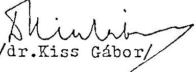

---

PÉNZÜGYMINISZTÉRIUM
Bevèteli Föigazgatósága

S z a t m á r i A n d r á s elvtárs turit adyis mey. 13 a MSZMP KB osztályvezetőhelyettese Pártgazdasági és Ugykezelési osztály félreíntu, lagy anoris allotire minulre me jthe 4 - 100 - 111 rrit

# Budapest 

Kedves Szatmári Elvtárs!

Köszönettel vettem a pártvállalatokra vonatkozó 1968. I. negyedévi pénzügyi jelentéseket, melyeket részemre határidöben megküldött.

Az adatszolgáltatás a pénzügyi jelentés kitöltési utasításának megfelelően történt, melynek értelmében a III. "Elszámolások a költségvetéssel" címü táblán feltüntetett adatok csak azon költségvetési kötelezettségeket /befizetéseket/, illetve költségvetési juttatásokat tartalmazzák, amelyeket az illetékes adóhatóságok /ez esetben PM. Bevételi Föigazgatóság Területi Igazgatósága, Budapest/ fizettek be, illetve igényeltek.

Az MSZMP felügyelete alá tartozó vállalatok azonban költségvetési kapcsolataiknak egyrészét /nyereségadó, központosított amortizáció, stb./ nem az illetékes adóhatóságon keresztül bonyolítják le s igy azok nevezett táblán nem szerepelnek.

A vállalati jövedelemszabályozás adatainak összesitése során azonban a teljeskörüséget biztosítanom kell - ahogy ezt a 184/1968. f.év április hó 27-én

---

kelt levelemben már jeleztem, hogy a népgasdasági tervszámitásokkal való összhangot biztosítani tudjam. Ezért kérem szíves intézkedését, hogy az ehhez szükséges adatokat megkaphassam f. hó 27 -ig szakágazatonként összesítve.

A kérdéses adatok a következök:
1./ Nyereségadó
2./ Központosított amortizáció
3./ Egyéb befizetés
4./ Dotáció
5./ Egyéb támogatás
6./ Az 1967. évi rendezőmérleggel kapcsolatos forgóalaprendezés költségvetési kihatása.

Budapest, 1968. május 20.

Elvtarsi üdvözlettel:
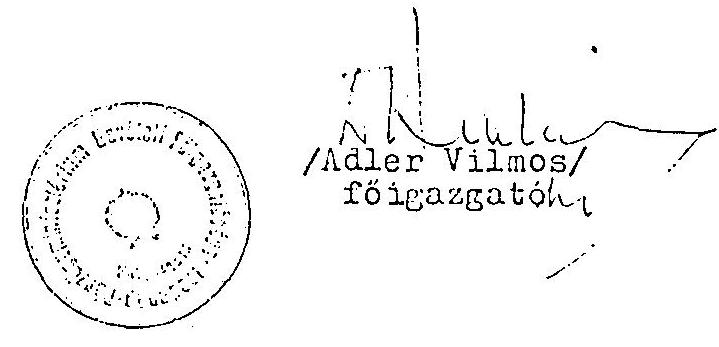

---

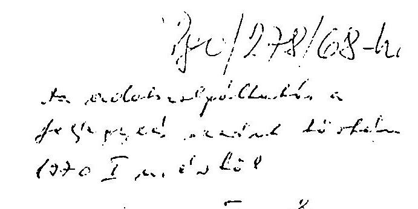

# F E I J E C Y Z E G 

a pártvallalatok részéről a PM Bevételi Püigazgatósáaának teljesitendö adatszolgaftatásrol

A vallalatok idôssaki és éves mérlegbeszámolóinak népgasdasági szintü üsszesitéce - amelyet korúbban tárcassintig a folügyeleti fóhatóságok, majd végösszesenjét a KOH vógestók - 1968. január 1-tól a PM Bevételi Püigazgatósáaának feladatát képezi.

Az üsszesitések teljesküruiségének biztosítása céljából a P' Bevételi Fúigazgatósága annak idején kórússel fordult osztályunkhoz, hogy az irányitúsunk alá tartosó párt-és KICZ-vállala tok mérlegbeszámolóit szakáazazati üssevonásban boceássuk rendelkezésére. Osztailyunk a kóréshez hozzájárult.

A teljesités alosztályunk számára feszitott feladatot jelent, mert az e célra rendelkezésre álló 3-4 nap alatt az üsszesitésen kivül a mérlegbeszámolók számszerü felülvizsgálatát is el kell végezni. A feladat munkaigénye az clmult évben növekedett, mert a PM igényét az adóbevallások felülvizsgálatára és üsszesitésére is kiterjesztette. A feldolgozási idótartam meghosszabbítására azonban lehetóség nem volt ezért könnyitésül a Pli javasolta, hogy a vállalatok névtelen "Anonim" mérlegbeszámolóit és adóbevallásait üsszesités nélkül kapja meg.
Ozztályunk a javaslatot a könyv- és Lapkiadé vállalatok kivételével elfogadta, mert az önmagukban egy-egy népgazdasági ágat képviscló párt, ill. KISZ-vállalatok vonatkozásában, emúsz munkát és együttmüküdést segitő javaslat megta-

---

gadásának sem politikai, sem racionális indoka nem volt. Vnnck alapján as clmult év második negyedévétól kezdve a Usikra Iapnyonda, a WNV, az "Fscrmester"Rolt Vállalat és as Express IIjusági és Diákutazási Iroda mérlegbeszámolóinak elsödleges felülvizsgálatát a PII küsvetlenül látta el, a hozzá benyujtotit anonim példányok alapjún. A künyv és lapkisdási ágazatban a mérlegbeszámolók és adóbevallásak folillvizsgálatát és üsszesitését változatlanul osztályunk véseste. A PII javaslatára való állásfoglalást osztályunk a künyv- és lapkiadís tekintetében függüben tartotta, réssben további megfontolás céljából, részben azért, mert a döntés egyébként sem volt idószerü, mivel a feldolgozás módjának évközi változtatása metodikailag nem volt kivánatos.

Az clmult év tapasztalatai és a javaslat alapos megfontolása alapján célszerünek és racionálisnak tartjuk, hogy a künyv- és lapkiadó ágazatba tartozó párt- és KISZ-vállalatok mérlegeinek és adóbevallásainak csődleges felülvizsgálatát és üsszesitését 1970. évben a PM Bevétcli Püigazgatóságának bizalmas részlege végezze. Javasoljuk ezért, hogy vállalataink részére engedélyozsük mérlegbeszámolóik és adóbevallásnik anonim példányninak közvetlenül a PM részére történő továbbítását.

Budapest, 1970. április 9.

---

IX. Testilleti szervek
Föosztálya
$\mathrm{K} / 687 / 1989 . \mathrm{IX}$.

# F e l j e u y z é s 

Ur.Kunus Péter allamlltkár elvtárs részére

## I.

Az MSZMP és az állami költségvelés közöttl kapcsolatokról 1968. óta állnak rendelkezésünkre viszonylag teljesértéko információk. Ezek szerint az új gazdaságirányítási mechanizmus, tehát a reform életbelépésével egyidejüleg megszlint az un. 3 központi pártvállalatnál a tételes nyereségelszámoltatás és eltól kezdve az akkori új szabályok alapján elöírt nyereség-befizetéseket nem az állami költségvetéshez, hanem a párthoz teljesítették, illetve a nekik járó támogatásokat (dotációkat) nem a költségvetésböl téritették, hanem az a párt eszközei terhére került elszámolásra. Korábbl szóbeli információk szerint a vállalatokkal az elszámolás az induláskor együttesen nullszalúo körüll volt. Ez az elszámolás természetesen érintetlenül hagyta az adókat és más, az állami költségvetést illetö befizetéseket (SZTK járulék, illetékek stb.). A 60-as években egyéb direkt költségvetési tómogatásban a PM részéről az MSZMP nem részesült.

## 11.

Az MSZMP és a Pénzügyminisztérium vezetése közölti megállapodás alapján az MSZMP 1970. óta részesül az állami költségvetésböl állami költségtérítésben. A költségtérités az MSZMP intézményel által végzett állami jellegú feladatok (oktatás, kutatás, levéltári, udültetési tevékenység) ráfurditásalnak egy részéhez nyújt kö̉ponti ellentételezést. Így többek között a Polltikai Fölskola

---

1968. óta vált az állami felsōoktatás szerves részévé, s a reformidőszak alatt a 70-es évek elején kerültek közvelett feladatkörébe az egyéb pártintézmények (megyei oktatási kïzpontok, társadalomtudományi Intézel). Emellett levél tári jettegö feladatokat is lát el a Párttörténeti Intézel. (Az e területeken felmerült tényleges ráfordításokat éves bontásban az l.sz.melléklet, a rendelkezésre hoissátolt források alakulását a 2.sz. melléklet mutatja he.)

A különféle oktatási, kutatási, üdültetési ráfordításokat 1987. végéig csak részben térítette meg az állami költségvetés. Az un. költségtérítések növekedését - az inflációs hatásokon k (vül - különbözö párt és állami döntések befolyásolták.

A növekvō felújítási igények miatt az állami intézményekhez hasonlóan a VI. ötéves tervidőszakban az MSZMP is részesült felújítási hányadk legész-ítésben éveqként egyaránt 30-30 millió ft-ban. Hasonló Igényt jelentettek be az 1986. évtöl Induló ötéves tervidőszakra is, de végül ez nem került elfogadásra.

A költségtérítési igényektól függetlenül a növekedésben tükrözödlk a pártlagdijaknak az 1981-ben és 1986-ban végrehajtolt lényeges csökkentése is. Az 1986. évi tagdijmérséklés már olyan mérvü bevételkleséssel járt, amelyet az MS/MF - egyéb forrás híján - képtelen volt pótolni, ezért az állami költségtérítés radikális növelése az intézményreudszer müködletéséhez elengedhetetlenné vált.

Az MSZMP 1988-ban - látszólag - a korábbiakhoz viszonyítva jelentősen megnövelt mértékö állami támogatást (költségtérítést) kapott. Köztudott azonban, hogy azon esztendő elcjétōl léptel életbe az új adórendszer első eleme1: az SZJA és az AFA. Az un. bruttósítás központi forrás

---

terhére kęrult végreha,jtásra valamennyi költségvetési Jutézmény és költségvetési rend szerint gazdálkodó szervezetuél, igy az MSZMP-nél is. Ez a központi intézkedés (a két adótörvény) közel 1 milljárd $n$-os többletkiadást okozott a pártintézményeknél.

Az MSZMP által alapitott és jelenleg is a felugyelete alall müködö vállalatok (SZIKRA nyomda, KMV, Lapkiadó) 1988. végé-jg - mint erre már utalás történt - nem az állami költségvelésbe fizették a jövedelemszabályozás alá tartozó nyereségadót és az oket megilletó támogatást sem onnan kaplák. (Ez a megoldás az 1968. évi reform bevezetésekor - Vályi Péter miniszter elvtárs hozzájárulásával - az MSZMP és a PM vezetői között született megállapodáson alapult. Hasonló rendszer müködött a KISZ, a Sz(1) és a Múvészeli Alap vállalatal esetében is.) Ezzel összhangban 1988. végéig az APEII, illetve jogelödei az un. társadalmi szervek - köztük az MSZMP - vállalatajnál a nyereségadóztalást és azzal összefügyó támogatásokat nem vizsgálták.

A szervezet és szektorsemlegesség elvén alapuló vállalkozój nyereségadó törvény 1989-101 hatályon kivül helyezte ezt a lényegét tekintve leirati szabályozást, igy az MSZMP ezen bevéteikiesését is központi forrásból kellett volna pótolni.

# III. 

Az 1989. évi állami köllségvetést tárgyaló Országgyülés, majd az ezl követő lovábbi tómogatáscsökkentési intézkedések az MSZMP szervel és intézményel gazdálkodási tevékenységében ma már müködési zavarokat okoznak. A 18 -járulék emelését figyelembe vevö mintegy 2,2 milliárd $n$-ra

---

Lorvezelt köllséglérllés az elöbbiek kövelkeztében 870 millió R-ra mérséklődött, ami már a közvellenül és közvelve az állami költségvelésbe visszaáramló IB-járulék és személyi jüvedelem, valamint általános forgalmi adók mér lékét (küzelttölleg 1,1 milliárd R) sem éri el.

Budapest, 1989. augusztus ho 1.
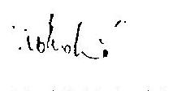

---

# 1.52.melléklet 

Az N57MP költsnglérltés szempontjából figyelembe veheto intézményeinek kiadásai

|  |  |  |  | Millió forintban! |
| :--: | :--: | :--: | :--: | :--: |
| 1.1.inszak | uktatási ráfordítások |  | Udultetési | Usszesen |
| 1971). | 76,6 | 12,8 | 40,6 | 130,0 |
| 1971. | 88,8 | 14,2 | 56,4 | 159,4 |
| 1972. | 91,0 | 15,3 | 57,7 | 164,0 |
| 1973. | 95,3 | 16,2 | 60,8 | 172,3 |
| 1974. | 96,4 | 18,8 | 69,4 | 184,2 |
| 1975. | 117,9 | 18,8 | 86,7 | 223,4 |
| 1976. | 128,5 | 22,9 | 75,3 | 226,7 |
| 1977. | 138,7 | 25,9 | 119,6 | 284,2 |
| 1978. | 149,9 | 28,7 | 129,1 | 307,7 |
| 1979. | 165,0 | 30,5 | 116,1 | 311,6 |
| 1980. | 199,5 | 32,5 | 111,1 | 343,1 |
| 1981. | 226,0 | 36,3 | 127,0 | 389,3 |
| 1982. | 259,0 | 40,4 | 132,0 | 431,4 |
| 1983. | 275,0 | 41,4 | 163,5 | 479,9 |
| 1984. | 280,0 | 47,5 | 167,8 | 495,3 |
| 1985. | 296,0 | 52,0 | 179,3 | 527,3 |
| 1986. | 296,5 | 76,0 | 191,2 | 563,7 |
| 1987. | 335,2 | 107,6 | 227,4 | 670,2 |
| 1918. | 392,5 | 87,1 | 386,0 | 785,6 |

---

# 2.sz.melleklet 

Az NtizMP lérltésben rószesuló intézményel
kiadásának és lónyleyes allami költséglérl téselnck alakulása

|  |  |  | Millió forintban! |
| :--: | :--: | :--: | :--: |
| Idüszak | Inteziményi   kiadások   összesen | Igénybe   velt   térítés | El térés   $+$ |
| 1970. | 130,0 | 40,0 | $-90,0$ |
| 1971. | 159,4 | 96,0 | $-63,0$ |
| 1972. | 164,0 | 116,0 | $-48,0$ |
| 1973. | 172,3 | 116,0 | $-56,3$ |
| 1974. | 184,2 | 139,0 | $-45,2$ |
| 1975. | 223,4 | 128,0 | - 95,4 307.7 |
| 1976. | 226,7 | 124,0 | $-102,7$ |
| 1977. | 284,2 | 106,0 | $-178,2$ |
| 1978. | 307,7 | 106,0 | $-201,7$ |
| 1979. | 311,6 | 122,0 | - 189,0 |
| 1980. | 343,1 | 236,0 | - 107,1 772.7 |
| 1981. | 309,3 | 322,0 | $-67,3$ |
| 1982. | 431,4 | 300,0 | $-131,4$ |
| 1983. | 479,9 | 255,0 | $-224,9$ |
| 1984. | 495,3 | 278,0 | $-217,3$ |
| 1985. | 527,3 | 278,0 | - 249,3 870.2 |
| 1986. | 563,7 | 560,0 | $-3,7$ |
| 1987. | $\begin{aligned} & 670,2 \\ & 6,063,7 \end{aligned}$ | $\begin{aligned} & 523,0 \\ & 2,84,3,7 \end{aligned}$ | $\begin{aligned} & -147,2 \\ & 2,147,2 \end{aligned}$ |
| 1988. | 785,6 | $1.680,0^{1 /}$ | $+894,4$ |
|  |  |  |  |

1/ Az itt jelzelt un. térités figyelembe vette a pártapparatus bértruttúsítása miatll többletterhek ellentételezzését is.

---

Nyilatkozó szervezet neve: Magyar Szocialista Párt
címe: 1081. Budapest, Köztársaság tér 26.
jogelödje neve: Magyar Szocialista Munkáspárt

# N Y I L A T K O Z A T   adathiány pótolhatatlanságáról 

1. Alulírott Máté László
munkakör megjelölése), mint a ..... MSZP pénztárnoka ..... az MSZMP
(szervezet megnevezése) vagyonelszámolása során nyilatkozattételre jogosult büntetőjogi felelősségem tudatában kijelentem, hogy az Állami Számvevőszék által az 1991. évi LI. törvénnyel módosított 1990. évi LXXIII. törvény alapján a hitelesítés érdekében kért ..... 8. sz. ..... mellékletéből a
hiányzó
adatokat nem tudjuk biztosítani, mivel azokkal nem rendelkezünk és szervezetünk számára póto1hatatlanok.

Budapest, 1992. január 20.
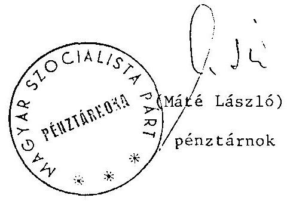

---

Nyilatkozá szervezet neve: Magyar Szocialista Párt
cime: 1081. Budapest, Köztároaság tér 26.
jogelödje neve: Magyar Szocialista Munkáspárt

# NYILATKOZAT 

Alulirott az Allami Szdmvevöszék ellenöreinek felkérésére kijelentem, hogy a
8. A. értékpapir forgalmának mellékletéhez
az MSZMP 1989. év elötti idöszakban mindössze
telefonkötvénnyel
rendelkezett.

Budapest, 1992. február 20.
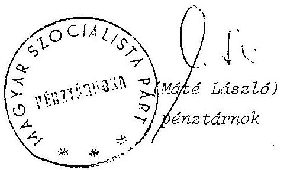

---

Nyilatkozo szervezet neve: Magyar Szocialista Párt
cime: 1081. Budapest, Köztársaság tér 26.
jogelöaje neve: Magyar Szocialista Munkáspárt

# NYILATKOZAT 

Alulirott az Allami Számvevöszék ellenöreinek felkérésére kijelentem, hogy a Postaforgalmi betétkönyv 1990. IX. 18-i
egyenlege azonos a
vagyonelszámolás 8. B.
mellékletében szereplő 1990. VIII. 31-i egyenlegekkel.

Budapest, 1992. február 20.
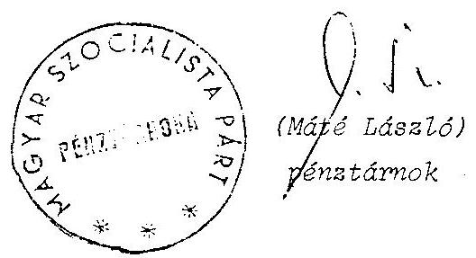

---

Nyilatkozó szervezet neve: Magyar Szocialista Párt
cime: 1081. Budapest, Köntdrasadg tér 26.
jogelödje neve: Magyar Szocialista Munkáspárt

# NYILATKOZAT 

Alulirott az Allami Számvevöszék ellenöreinek felkérésére kijelentem, hogy az OTP lakásépítési betétszdmldk 1990. IX. 18-i
egyenlegei azonosak a
vagyonelszámolds 8. B.
mellékletében szerepiö 1990. VIII. 31-i egyenlegekkei.

Budapest, 1992. február 20.
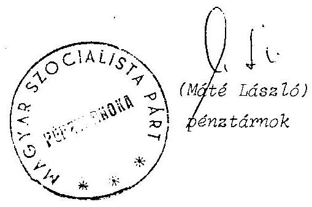

---

8. sz. melléklet A. Értékpapírforgalom alakulása 1984. évtől

|  Sorszám | Értékpapír megnevezése | Kibocsátó | Érték e (vételi árfolyam) |  |  |  |  | Ft-ban |  |   |
| --- | --- | --- | --- | --- | --- | --- | --- | --- | --- | --- |
|   |  |  | 1984. | 1985. | 1986. | 1987. | 1988. | 1989. | 1990. | 1991.  |
|   |  |  | X11.31. | X11.31. | X11.31. | X11.31. | X11.31. | X11.31. | X11.31. | X11.31.  |
|   | Csanaprád megye |  |  |  |  |  |  |  |  |   |
|  1. | Telefonkötvény | Magyar Posta | 100.000.- | 90.000.- | 80.000.- | 70.000.- | 60.000.- | 50.000.- | 50.000.- |   |
|  2. | Telefonkötvény | " | - | - | 100.000.- | 90.000.- | 80.000.- | 70.000.- | 70.000.- | 70.000.-  |
|  3. | Lakásalapkötvény | OKHB |  |  |  |  |  |  |  | 1.500.000.-  |
|  4. | Lakásalapkötvény | " |  |  |  |  |  |  |  | 1.000.000.-  |
|  5. | Állankötvény | Mezőbank |  |  |  |  |  | 1.600.000.- | 1.600.000.- |   |
|   | Hajdú megye |  |  |  |  |  |  |  |  |   |
|  6. | Lakásalapred. kötvény | MRA Ber.ujfalu |  |  |  |  |  |  |  | 4.000.000.-  |
|  7. | OTP Pénztárjegy 11. | OTP Hajdunánás |  |  |  |  |  |  |  | 184.522.-  |
|   | Komárom megye |  |  |  |  |  |  |  |  |   |
|  8. | SKAP Lakásép. kötvény | AGROSARK Nr. |  |  |  |  |  |  |  | 500.000.-  |
|  9. | " | " |  |  |  |  |  |  |  | 400.000.-  |
|  10. | " | " |  |  |  |  |  |  |  | 100.000.-  |
|   | Somogy megye |  |  |  |  |  |  |  |  |   |
|  11. | Telefonkötvény | Magyar Posta |  |  |  | 100.000.- | 90.000.- | 80.000.- | 80.000.- |   |
|  12. | Hat. idős kötvény (TERVIN) | Bp. Bank |  |  |  |  |  |  |  | 7.000.000.-  |
|  13. | Letéti jegy | OKHB |  |  |  |  |  |  |  | 2.000.000.-  |
|   | Szabolcs megye |  |  |  |  |  |  |  |  |   |
|  14. | Olsakont kincstárjegy | PM |  |  |  |  |  | 1.958.000.- |  |   |
|  15. | Lakáskötvény | Ybl bank |  |  |  |  |  |  |  | 3.000.000.-  |
|   | Sósínak megye |  |  |  |  |  |  |  |  |   |
|  16. | Telefonkötvény | Magyar Posta |  |  |  |  | 25.000.- | 25.000.- | 25.000.- |   |
|   | Veseprém megye |  |  |  |  |  |  |  |  |   |
|  17. | Telefonkötvény |  |  |  |  | 200.000.- | 180.000.- | 160.000.- | 160.000.- |   |
|  18. | OTP Pénztárjegy 11. | OTP Pápa |  |  |  |  |  |  |  | 100.000.-  |
|  19. | OTP Pénztárjegy 11. | " |  |  |  |  |  |  |  | 100.000.-  |
|  20. | OTP Pénztárjegy | " |  |  |  |  |  |  |  | 200.000.-  |
|  21. | MRA Lakáskötvény | Konzombank Sz. hely |  |  |  |  |  |  |  | 10.000.000.-  |
|  22. | Kincstárjegy ankető | MRA Bp. |  |  |  |  |  |  |  | 931.370.-  |

---

### 8. az. melléklet

A. értékpapírtorgalan alakulása 1985. évtát

|  Sorszám | Értékpapír megnevezése | Kibocsátó | Érték (vételi árfolyás) |  |  |  | Et-ban |   |
| --- | --- | --- | --- | --- | --- | --- | --- | --- |
|   |  |  | 1985. | 1986. | 1987. | 1988. | 1989. | 1990.  |
|   |  |  | X11.31. | X11.31. | X11.31. | X11.31. | X11.31. | X11.31.  |
|   | Veszprém megye |  |  |  |  |  |  |   |
|  23. | MSK Lakáskötvény | Konzonbánk Sz.hely |  |  |  |  |  | 4.000.000.-  |
|  24. | MSK Lakáskötvény |  |  |  |  |  |  | 1.000.000.-  |
|  25. | MSK Lakáskötvény |  |  |  |  |  |  | 10.000.000.-  |
|  26. | MSK Lakáskötvény |  |  |  |  |  |  | 500.000.-  |
|  27. | MSK Lakáskötvény |  |  |  |  |  |  | 500.000.-  |
|   | Mezőp. kb. |  |  |  |  |  |  |   |
|  28. | Telefonkötvény (ÁF1) |  |  | 1.500.000.- | 1.350.000.- | 1.200.000.- | 1050.000.- | 1050.000.-  |
|   | Zala megye |  |  |  |  |  |  |   |
|  29. | Kötvény | Bp. Bak |  |  |  |  |  | 300.000.-  |
|   | Békés megye |  |  |  |  |  |  |   |
|  30. | Telefonkötvény | Magyar Posta |  | 200.000.- | 180.000.- | 160.000.- | 140.000.- | 140.000.-  |

---

Nyilatkozó szervezet neve: Magyar Szocialista Párt
címe: 1081. Budapest, Köztársaság tér 26.
jogelődje neve: Magyar Szocialista Munkáspárt

# N Y I L A T K O Z A T 

adathlány póto1hatatlanságáról

1. Alulírott Máté László
munkakör megjelölése), mint a ..... MSZP pénztárnoka ..... az MSZMP
(szervezet megnevezése) vagyone 1számolása során nyilatkozattételre jogosult büntetőjogi felelősségem tudatában kijelentem, hogy az Állami Számvevőszék által az 1991. évi LI. törvénnyel módosított 1990. évi LXXIII. törvény alapján a hitelesítés érdekében kért ..... 7. sz.
mellékletéből a
hiányzó
adatokat nem tudjuk biztosítani, mivel azokkal nem rendelkezünk és szervezetünk számára póto1hatatlanok.

Budapest, 1992. . . január 20.
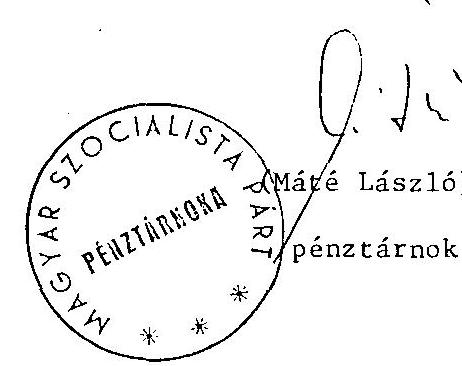

---

"1991. évi LI. törvény

- pótelszámolás -
melléklete".
7. sz. melléklet

A szervezet, valamint az általa fenntartott intézmények ingatlanon kívüli egyéb állóeszközei könyv szerinti adatai

| Megnevezés | Érték   1988. XII. 31-én | Növekedés 1988. XII. 31. 1990. VIII. 31. | Csökkenés 1988. XII. 31. 1990. VIII. 31. | Összesen 1990. VIII. 31. |
| :--: | :--: | :--: | :--: | :--: |
| -- gépek, berendezések, felszerelések | 1.160 .505 .0 | 313.860 .0 | 1.165 .807 .0 | 308.558 .0 |
| -- jármúvek | 52.008 .0 | 35.002 .0 | 69.941 .0 | 17.069 .0 |
| -- jóléti állóeszközök | - | - | - | - |
| -- üzemkörön kívüli állóeszközök | 39.926 .0 | 2.372 .0 | 38.561 .0 | 3.737 .0 |
| ebból -- képzőművészeti alkotások | 39.926 .0 | 2.372 .0 | 38.561 .0 | 3.651 .0 |
| -- egyéb |  |  |  | 86.0 |

---

| Szabolcs | $36,242,0$ | $1,332,0$ | $33,545,0$ | $4,029,0$ |
| :--: | :--: | :--: | :--: | :--: |
| Szolnok | $24,239,0$ | $3,596,0$ | $25,127,0$ | $2,708,0$ |
| Tolna | $25,163,0$ | 70,0 | $23,161,0$ | $2,072,0$ |
| Vas | $24,303,0$ | 250,0 | $23,515,0$ | $1,038,0$ |
| Veszprém | $33,114,0$ | 625,0 | $29,723,0$ | $4,016,0$ |
| Zala | $26,730,0$ | $1,458,0$ | $19,787,0$ | $8,401,0$ |
| Bpesti PVB | $106,772,0$ | $11,980,0$ | $101,755,0$ | $16,997,0$ |
| Pol.Föiskola | $53,575,0$ | $4,966,0$ | $58,541,0$ | - |
| Párttört. Int. | $16,152,0$ | $2,853,0$ | $6,385,0$ | $12,620,0$ |
| Társ.tud. Int. | $25,504,0$ | 578,0 | $26,082,0$ | - |
| Tihany | $3,948,0$ | - | - | $3,948,0$ |
| Külügyi Szálló | $11,331,0$ | 246,0 | $10,052,0$ | $1,525,0$ |
| Leányfalu | $5,319,0$ | 103,0 | $3,760,0$ | $1,662,0$ |
| ÜOÜLÖK | $107,585,0$ | $6,295,0$ | $113,880,0$ | - |
| Orsz. Iroda | $275,726,0$ | $256,191,0$ | $328,144,0$ | $203,773,0$ |
| ÖSSZESEN | $1,160,505,0$ | $313,860,0$ | $1,165,807,0$ | $308,558,0$ |

---

991. évi LI. törvény

- pótelszámolás -
melléklete".

# 7. sz. melléklet 

OSSZESITO

A szervezet, valamint az általa fenntartott intézmények ingatlanon kívüli egyéb állóeszközei könyv szerinti adatai

Gépek, berendezések, felszerelések
$1000,-\mathrm{Ft}-\mathrm{ban}$

| Szervek | Erték   1988. XII. 31-én | Növekedés   1988. XII. 311990. VIII. 31. | Csökkenés   1988. XII. 311990. VIII.31. | Összesen   1990. VIII. 31. |
| :--: | :--: | :--: | :--: | :--: |
| Baranya | 22,762,0 | 308,0 | 21,484,0 | 1,586,0 |
| Bács | 28,373,0 | $4,680,0$ | 27,444,0 | $5,609,0$ |
| Békés | $34,842,0$ | $1,801,0$ | $33,527,0$ | $3,116,0$ |
| Borsod | $44,996,0$ | 2,733,0 | $40,128,0$ | 7,601,0 |
| Csongrád | 25,714,0 | 182,0 | 23,426,0 | 2,470,0 |
| Fejér | 25,597,0 | 2,655,0 | 23,607,0 | $4,645,0$ |
| Győr | 27,545,0 | $1,780,0$ | 25,898,0 | $3,427,0$ |
| Hajdú | 25,422,0 | $1,557,0$ | 23,809,0 | $3,170,0$ |
| Heves | 40,025,0 | 306,0 | 35,651,0 | $4,680,0$ |
| Komárom | 23,103,0 | 823,0 | 20,888,0 | $3,038,0$ |
| Nógrád | 25,989,0 | $3,896,0$ | 26,370,0 | $3,515,0$ |
| Pest | 30,874,0 | 2,428,0 | 32,156,0 | 1,146,0 |
| Somogy | 29,560,0 | 168,0 | 27,962,0 | $1,766,0$ |

---

"1991. évi LI. törvény

- pótelszámolás -
- melléklete".

# 7. sz. melléklet 

## ÖSSZESITÖ

A szervezet, valamint az általa fenntartott intézmények ingatlanon kívüli egyéb állóeszközei könyv szerinti adatai

Közlekedési eszközök
1000 Ft-ban

| Szervek | $\begin{gathered} \text { Érték } \\ \text { 1988. XII. } 31 \text {-én } \end{gathered}$ | $\begin{gathered} \text { Növekedés } \\ \text { 1988. XII. } 31- \\ \text { 1990. VIII. } 31 . \end{gathered}$ | $\begin{gathered} \text { Csökkenés } \\ \text { 1988. XII. } 31- \\ \text { 1990. VIII. } 31 . \end{gathered}$ | Összesen 1990. VIII. 31. |
| :--: | :--: | :--: | :--: | :--: |
| Baranya | 2,017,0 | 1,058,0 | 3,075,0 | - |
| Bács | 2,457,0 | 1,178,0 | 3,451,0 | 184,0 |
| Békés | 2,970,0 | 696,0 | 3,666,0 | - |
| Borsod | 3,101,0 | 480,0 | 3,341,0 | 240,0 |
| Csongrád | 2,660,0 | 415,0 | 3,075,0 | - |
| Fejér | 2,562,0 | 1,108,0 | 3,670,0 | - |
| Győr | 2,037,0 | 1,756,0 | 3,565,0 | 228,0 |
| Hajdú | 3,078,0 | 403,0 | 3.322,0 | 159,0 |
| Heves | 2,135,0 | 625,0 | 2,520,0 | 240,0 |
| Komárom | 2,343,0 | 1,952,0 | 4,120,0 | 175,0 |
| Négrád | 2,337,0 | 553,0 | 2,710,0 | 180,0 |

---

| Pest | 110,0 | - | 110,0 | - |
| :--: | :--: | :--: | :--: | :--: |
| Somogy | 2,383,0 | 480,0 | 2,623,0 | 240,0 |
| Szabolcs | 2,247,0 | 409,0 | 2,456,0 | 200,0 |
| Szolnok | $3,125,0$ | 368,0 | $3,313,0$ | 180,0 |
| Tolna | 2,735,0 | 240,0 | 2,735,0 | 240,0 |
| Vas | 2,835,0 | $1,988,0$ | $4,600,0$ | 223,0 |
| Veszprém | $3,414,0$ | 837,0 | $4,071,0$ | 180,0 |
| Zala | 2,748,0 | 869,0 | $3,377,0$ | 240,0 |
| Bp-i PVB | 136,0 | 204,0 | 141,0 | 199,0 |
| Pol. Fóiskola | 445,0 | - | 445,0 | - |
| Párttört. Int. | 47,0 | - | 47,0 | - |
| Társ.tud. Int. | 7,0 | - | 7,0 | - |
| Orsz. Iroda | 436,0 | $18,445,0$ | $6,034,0$ | $12,847,0$ |
| Tihany | 422,0 | 378,0 | - | 800,0 |
| Külügyi Szálló | - | - | - | - |
| Leányfalu | 435,0 | - | 121,0 | 314,0 |
| Üdülo̊k | 2,786,0 | 560,0 | $3,346,0$ | - |
| OSSZESEN | $52,008,0$ | $35,002,0$ | $69,941,0$ | $17,069,0$ |

---

"1991. évi LI. törvény

- pótelszámolás -
- melléklete".

# 7. sz. melléklet 

ÖSSZESÍTÓ
A szervezet, valamint az általa fenntartott intézmények ingatlanon kívüli egyéb állóeszközei könyv szerinti adatai
Uzemkörön kívüli állóeszközök
1000.-Ft-ban

| Szervezet | Érték   1988. XII. 31-én | Növekedés   1988. XII. 31-   1990. VIII. 31. | Csökkenés   1988. XII. 31   1990. VIII. 31. | Összesen   1990. VIII. 31. |
| :--: | :--: | :--: | :--: | :--: |
| Baranya | $1,151,0$ | - | $1,151,0$ | - |
| Bács | 629,0 | - | 629,0 | - |
| Békés | $1,319,0$ | - | $1,009,0$ | 310,0 |
| Borsod | 698,0 | - | 698,0 | - |
| Csongrád | $2,190,0$ | - | $1,060,0$ | $1,130,0$ |
| Fejér | 282,0 | - | 282,0 | - |
| Győr | 181,0 | - | 181,0 | - |
| Hajdú | 484,0 | - | 484,0 | - |
| Heves | 991,0 | - | 991,0 | - |
| Komárom | 323,0 | - | 323,0 | - |
| Nógrád | 534,0 | - | 462,0 | 72,0 |
| Pest | 896,0 | - | 896,0 | - |
| Somogy | $7,913,0$ | 20,0 | $7,882,0$ | 51,0 |

---

| Szabolcs | 1,651,0 | 16,0 | 1,667,0 | - |
| :--: | :--: | :--: | :--: | :--: |
| Szolnok | 591,0 | 275,0 | 866,0 | - |
| Tolna | 569,0 | - | 569,0 | - |
| Vas | 772,0 | - | 710,0 | 62,0 |
| Veszprém | 725,0 | - | 725,0 | - |
| Zala | 286,0 | - | 286,0 | - |
| Bp-i PVB | $6,549,0$ | 1,0 | $5,724,0$ | 826,0 |
| Pol. Fóiskola | 509,0 | - | 509,0 | - |
| Párttört. Int. | 29,0 | - | 29,0 | - |
| Társ.tud. Int. | 227,0 | - | 227,0 | - |
| Orsz. Iroda | $4,064,0$ | 2,030,0 | 5,085,0 | 1,009,0 |
| Tihany | - | - | - | - |
| Külügyi Szálló | 559,0 | - | 559,0 | - |
| Leányfalu | $1,578,0$ | 30,0 | $1,331,0$ | 277,0 |
| Üdü1ők | $4,226,0$ | - | $4,226,0$ | - |
| ÖSSZESEN | $39,926,0$ | $2,372,0$ | $38,561,0$ | $3,737,0$ |

---

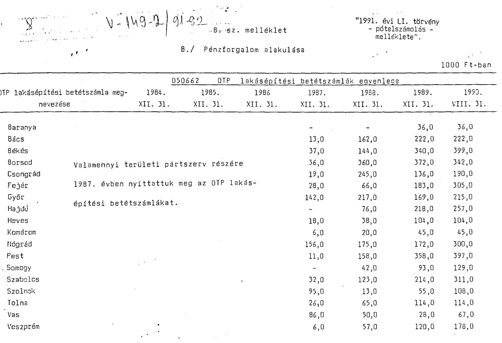

1000 Ft-ban

---

|  Zala |  |  |  | 136,0 | 185,0 | 134,0 | 134,0  |
| --- | --- | --- | --- | --- | --- | --- | --- |
|  Bpesti PVB |  |  |  | 81,0 | 150,0 | 104,0 | 104,0  |
|  Pol. Főiskola |  |  |  | 7,0 | 53,0 | 109,0 | -  |
|  Páertört. Int. |  |  |  | - | - | - | -  |
|  Társ.-tud. Int. |  |  |  | - | - | - | -  |
|  Orsz. Iroda | 1.087,0 | 445,0 | 350,0 | 408,0 | 756,0 | 346,0 | 1007,0  |
|  Összesen | 1.087,0 | 445,0 | 350,0 | 1.343,0 | 3.155,0 | 3.672,0 | 4964,0  |

---

8. sz. melléklet
B. Pénzforgalom alakulása -- Kamatozó betétszámlák Ft-ban

| Sorszám | a bankszámlák és a számlavezető pénzintézet megnevezés | s z á ml á k e g y e n l e g e |
| :--: | :--: | :--: |
|  |  | 1989. XII. 31-én 1990. IX. 18-án |
|  | Borsod megye |  |
| 1. | Betéti szerződés | Budapest Bank Rt |
| 2. | Betéti szerződés | " |
|  | Veszprém megye |  |
| 3. | Vállalkozási betét | Magyar Hitelbank Ajka |
| 4. | Betételhelyezés | OTP Zirc |
| 5. | Betételhelyezés | " |
| 6. | Betételhelyezés | CITIBANK Bp. |

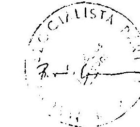

---

8. számú melléklet
B./ Pénzforgalom alakulása

Ft-ban

| Sor-   szám | Pénzforgalmi betétkönyvet vezető postafiók megnevezése, címe | A pénzforgalmi betétkönyvek ezvenlege |  |  |  |  |  |
| :--: | :--: | :--: | :--: | :--: | :--: | :--: | :--: |
|  |  | 1987.   XII.31. | 1988.   XII. 31. | 1989.   IX.30. | 1989.   XII.31. | 1990.   VIII.31. | 1990.   szeptember 12. |
|  | BÁCS-KISKUN |  |  |  |  |  |  |
| 1. | Postahivatal Kfélegyháza |  |  |  |  | 30.000 ,- | 30.000 , 25.000 , |
| 2. | " Kszentmiklós |  |  |  |  |  | 25.000 , |
|  | HAJDU-BIHAR |  |  |  |  |  |  |
| 3. | Postahivatal Hajdunánás |  |  |  |  | 201.336, | 16.814, |
| 4. | " H.szoboszló |  |  |  |  | 100.000, | 100.000, |
| 5. | " Berettyóujfalu |  |  |  |  | 41.531, | 41.531, |
| 6. | " Balmazujváros |  |  |  |  | 38.600, | 38.600, |
| 7. | " Püspökladány |  |  |  |  | 100.000, | 100.000, |
| 8. | " Hajdudorog | 9000,- | 77193,20 | 96396,60 |  | 40.000, | 40.000, |
| 9. | " H.htéglás | 9567,- | 25130,50 | 51794,30 |  | 14.000, | 14.000, |
| 10. | " B.keresztes | 9859,10 | 3403,70 | 13640,40 |  |  |  |
| 11. | " Derecske | 20200,10 | 28.431,80 | 53064,80 |  |  |  |
| 12. | " Hádudvar | 24061,90 | 4354,20 | 32480,30 |  |  |  |
| 13. | " Folgár | 15682,- | 16792,10 | 18384,20 |  |  |  |
| 14. | " Kaba |  | 8912,40 | 29185,90 |  |  |  |
| 15. | " Komádi |  | 5888,96 | 15105, |  |  |  |
| 16. | " Létavértes |  | 811,90 | 26493,50 |  |  |  |
| 17. | " Nyiradony |  | 6465,90 | 18637,10 |  |  |  |
| 18. | " Vámospércs |  | 10411,60 | 23341,20 |  |  |  |

---

# 8. számú melléklet 

B./ Pénzforgalom alakulása

## Ft-ban

| Sor-   szám | Pénzforgalmi betétkönyvet   vezetö postafiók megnevezése,   cime | A pénzforgalmi betétkönyvek egyenlege |  |  |  |  |  |
| :--: | :--: | :--: | :--: | :--: | :--: | :--: | :--: |
|  |  | 1987.   XII.31. | 1988.   XII. 31. | 1989.   IX.30. | 1989.   XII.31. | 1990.   VIII.31. | 1990.   szeptember 12. |
| 19. | Postahivatal Tiszacsege |  |  | 15.586,80 |  |  |  |
| 20. | " Egyek |  |  | 22.033,- |  |  |  |
| 21. | " Pocsaj |  |  | 15.105,90 |  |  |  |
| 22. | " Zsáka |  |  | 23.740,50 |  |  |  |
| 23. | " Körösszegapáti |  |  | 18.553,90 |  |  |  |
| 24. | " Hagyrábé |  |  | 27.845,50 |  |  |  |
| 25. | " Földes |  |  | 24.352,30 |  |  |  |
| 26. | " Sárrétudvari |  |  | 21.376,50 |  |  |  |
| 27. | " Hajdusámson |  |  | 24.581,- |  |  |  |
| 28. | " Hosszupályi |  |  | 9.490,50 |  |  |  |
| 29. | " Sáránd |  |  | 7.169,80 |  |  |  |
| 30. | " Bagamér |  |  | 22.031,80 |  |  |  |
| HEVES |  |  |  |  |  |  |  |
| 31. | Posta pétervásári Fiókja |  |  | 20.300,- |  |  |  |
| 32. | Gyöngyös, Posta |  |  | 220.000,- |  |  |  |

---

# 8. számú melléklet

## B./ Pénzforgalom alakulása

### Ft-ban

|  Sor-
szám | Pénzforgalmi betétkönyvet
vezető postafiók megnevezése,
címe | 1987.
XII.31. | 1988.
XII.31. | 1989.
IX.30. | 1989.
XII.31. | 1990.
VIII.31. | 1990.
szépténbar 12.  |
| --- | --- | --- | --- | --- | --- | --- | --- |
|  |   |   |   |   |   |   |   |

### SZABOLCS-SZÁTHÁR

|  33. | Posta Fehérgyarmat | 44.000 | 123.000 | 36.000 | 39.750 | 204.750  |
| --- | --- | --- | --- | --- | --- | --- |
|  34. | Kisvárda | 28.000 | 27.000 | 205.000 |  |   |
|  35. | Hátészallka | 75.000 | 60.000 | 50.000 | 6.000 | 256.000  |
|  36. | Nyírbátor | 18.500 | 25.000 | 23.000 | 60.000 | 210.000  |
|  37. | Vásárosnamény | 53.000 | 60.000 | 10.000 |  |   |
|  38. | Tisza | 20.000 | 5.000 | 10.000 | 90.000 | 60.000  |

### SZOLNOK

|  39. | Posta Tiszaföldvár | 6.000 | 8.500 | 3.000  |
| --- | --- | --- | --- | --- |
|  40. | Martfű | 5.000 | 10.400 | 4.100  |

### T. O. L. N. A.

|  41. | Posta Dunaföldvár | 84.861  |
| --- | --- | --- |
|  42. | Tolna | 97.305  |

---

B. számú melléklet
B./ Pénzforgalom alakulása

Ft-ban
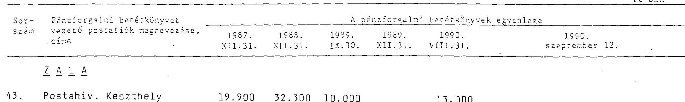

# Z A L A 

43. Postahiv. Keszthely
19.900
32.300
10.000
13.000

Budapest, 1991. december 6.

Pénzforgalmi betétkönyvek nyitására 1987. X. hóban került sor először

---

B. sajon mölklet:

1. Nienforgetten eløbørlige.

NOR SZÁNLÁK EGYENLEGE

|  No. | Kred. | Kred. | Kred. | Kred. | Kred. | Kred. | Kred. | Kred. | Kred. | Kred. | Kred. | Kred. | Kred. | Kred. | Kred. | Kred. | Kred. | Kred. | Kred. | Kred. | Kred. | Kred. | Kred. | Kred. | Kred. | Kred. | Kred. | Kred. | Kred. | Kred. | Kred. | Kred. | Kred. | Kred. | Kred. | Kred. | Kred. | Kred. | Kred. | Kred. | Kred. | Kred. | Kred. | Kred. | Kred. | Kred. | Kred. | Kred. | Kred. | Kred

---

B. sains nelisker.

# Kusturgujan elinolöns.

|  S.av. | 1990. | 1991. | 1992. | 1993. | 1994. | 1995. | 1996. | 1997.  |
| --- | --- | --- | --- | --- | --- | --- | --- | --- |
|  sain | 111.11 | 111.11 | 111.11 | 111.11 | 111.11 | 111.11 | 111.11 | 111.11  |
|  1. | 7.607.599,90 | 6.235.517,41 | 8.840.275,09 | 9.266.439,29 | 15.944.673,32 | 284.667,10 | 326.141,- | 18.461,-  |
|  2. | 21.794,40 | 18.013,80 | 39.603,22 | 101.436,18 | 373.835,- | 460.560,40 | 421.204,90 | 326.767,50  |
|  3. | 21.761,76 | 37.937,46 | 41.772,87 | 239.763,27 |  |  |  |   |
|  4. | 49.344,80 | 121.542,10 | 113.871,28 | 217.367,94 |  |  |  |   |
|  5. | 82.383,66 | 81.142,10 | 79.263,81 | 396.238,81 |  |  |  |   |
|  6. | 60.800,48 | 187.557,31 | 130.501,03 | 216.912,13 | 428.420,15 |  |  |   |
|  7. | 82.894,- | 213.214,50 | 286.052,10 | 173.931,10 |  |  |  |   |
|  8. |  |  |  |  |  |  |  |   |
|  9. |  |  |  |  |  |  |  |   |
|  10. |  |  |  |  |  |  |  |   |
|  11. |  |  |  |  |  |  |  |   |
|  12. |  |  |  |  |  |  |  |   |
|  13. |  |  |  |  |  |  |  |   |
|  14. |  |  |  |  |  |  |  |   |
|  15. |  |  |  |  |  |  |  |   |

|  S.av. | 1990. | 1991. | 1992. | 1993. | 1994. | 1995. | 1996. | 1997.  |
| --- | --- | --- | --- | --- | --- | --- | --- | --- |
|  sain | 111.11 | 111.11 | 111.11 | 111.11 | 111.11 | 111.11 | 111.11 | 111.11  |
|  1. | 7.607.599,90 | 6.235.517,41 | 8.840.275,09 | 9.266.439,29 | 15.944.673,32 | 284.667,10 | 326.141,- | 18.461,-  |
|  2. | 21.794,40 | 18.013,80 | 39.603,22 | 101.436,18 | 373.835,- | 460.560,40 | 421.204,90 | 326.767,50  |
|  3. | 21.761,76 | 37.937,46 | 41.772,87 | 239.763,27 |  |  |  |   |
|  4. | 49.344,80 | 121.542,10 | 113.871,28 | 217.367,94 |  |  |  |   |
|  5. | 82.383,66 | 81.142,10 | 79.263,81 | 396.238,81 |  |  |  |   |
|  6. | 60.800,48 | 187.557,31 | 130.501,03 | 216.912,13 | 428.420,15 |  |  |   |
|  7. | 82.894,- | 213.214,50 | 286.052,10 | 173.931,10 |  |  |  |   |
|  8. |  |  |  |  |  |  |  |   |
|  9. |  |  |  |  |  |  |  |   |
|  10. |  |  |  |  |  |  |  |   |
|  11. |  |  |  |  |  |  |  |   |
|  12. |  |  |  |  |  |  |  |   |
|  13. |  |  |  |  |  |  |  |   |
|  14. |  |  |  |  |  |  |  |   |
|  15. |  |  |  |  |  |  |  |   |
|  16. |  |  |  |  |  |  |  |   |
|  17. |  |  |  |  |  |  |  |   |
|  18. |  |  |  |  |  |  |  |   |
|  19. |  |  |  |  |  |  |  |   |
|  20. |  |  |  |  |  |  |  |   |
|  21. |  |  |  |  |  |  |  |   |
|  22. |  |  |  |  |  |  |  |   |
|  23. |  |  |  |  |  |  |  |   |
|  24. |  |  |  |  |  |  |  |   |
|  25. |  |  |  |  |  |  |  |   |
|  26. |  |  |  |  |  |  |  |   |
|  27. |  |  |  |  |  |  |  |   |
|  28. |  |  |  |  |  |  |  |   |
|  29. |  |  |  |  |  |  |  |   |
|  30. |  |  |  |  |  |  |  |   |
|  31. |  |  |  |  |  |  |  |   |
|  32. |  |  |  |  |  |  |  |   |
|  33. |  |  |  |  |  |  |  |   |
|  34. |  |  |  |  |  |  |  |   |
|  35. |  |  |  |  |  |  |  |   |
|  36. |  |  |  |  |  |  |  |   |
|  37. |  |  |  |  |  |  |  |   |
|  38. |  |  |  |  |  |  |  |   |
|  39. |  |  |  |  |  |  |  |   |
|  40. |  |  |  |  |  |  |  |   |
|  41. |  |  |  |  |  |  |  |   |
|  42. |  |  |  |  |  |  |  |   |
|  43. |  |  |  |  |  |  |  |   |
|  44. |  |  |  |  |  |  |  |   |
|  45. |  |  |  |  |  |  |  |   |
|  46. |  |  |  |  |  |  |  |   |
|  47. |  |  |  |  |  |  |  |   |
|  48. |  |  |  |  |  |  |  |   |
|  49. |  |  |  |  |  |  |  |   |
|  50. |  |  |  |  |  |  |  |   |
|  51. |  |  |  |  |  |  |  |   |
|  52. |  |  |  |  |  |  |  |   |
|  53. |  |  |  |  |  |  |  |   |
|  54. |  |  |  |  |  |  |  |   |
|  55. |  |  |  |  |  |  |  |   |
|  56. |  |  |  |  |  |  |  |   |
|  57. |  |  |  |  |  |  |  |   |
|  58. |  |  |  |  |  |  |  |   |
|  59. |  |  |  |  |  |  |  |   |
|  60. |  |  |  |  |  |  |  |   |
|  61. |  |  |  |  |  |  |  |   |
|  62. |  |  |  |  |  |  |  |   |
|  63. |  |  |  |  |  |  |  |   |
|  64. |  |  |  |  |  |  |  |   |
|  65. |  |  |  |  |  |  |  |   |
|  66. |  |  |  |  |  |  |  |   |
|  67. |  |  |  |  |  |  |  |   |
|  68. |  |  |  |  |  |  |  |   |
|  69. |  |  |  |  |  |  |  |   |
|  70. |  |  |  |  |  |  |  |   |
|  71. |  |  |  |  |  |  |  |   |
|  72. |  |  |  |  |  |  |  |   |
|  73. |  |  |  |  |  |  |  |   |
|  74. |  |  |  |  |  |  |  |   |
|  75. |  |  |  |  |  |  |  |   |
|  76. |  |  |  |  |  |  |  |   |
|  77. |  |  |  |  |  |  |  |   |
|  78. |  |  |  |  |  |  |  |   |
|  79. |  |  |  |  |  |  |  |   |
|  80. |  |  |  |  |  |  |  |   |
|  81. |  |  |  |  |  |  |  |   |
|  82. |  |  |  |  |  |  |  |   |
|  83. |  |  |  |  |  |  |  |   |
|  84. |  |  |  |  |  |  |  |   |
|  85. |  |  |  |  |  |  |  |   |
|  86. |  |  |  |  |  |  |  |   |
|  87. |  |  |  |  |  |  |  |   |
|  88. |  |  |  |  |  |  |  |   |
|  89. |  |  |  |  |  |  |  |   |
|  90. |  |  |  |  |  |  |  |   |
|  91. |  |  |  |  |  |  |  |   |
|  92. |  |  |  |  |  |  |  |   |
|  93. |  |  |  |  |  |  |  |   |
|  94. |  |  |  |  |  |  |  |   |
|  95. |  |  |  |  |  |  |  |   |
|  96. |  |  |  |  |  |  |  |   |
|  97. |  |  |  |  |  |  |  |   |
|  98. |  |  |  |  |  |  |  |   |
|  99. |  |  |  |  |  |  |  |   |
|  100. |  |  |  |  |  |  |  |   |
|  101. |  |  |  |  |  |  |  |   |
|  102. |  |  |  |  |  |  |  |   |
|  103. |  |  |  |  |  |  |  |   |
|  104. |  |  |  |  |  |  |  |   |
|  105. |  |  |  |  |  |  |  |   |
|  106. |  |  |  |  |  |  |  |   |
|  107. |  |  |  |  |  |  |  |   |
|  108. |  |  |  |  |  |  |  |   |
|  109. |  |  |  |  |  |  |  |   |
|  110. |  |  |  |  |  |  |  |   |
|  111. |  |  |  |  |  |  |  |   |
|  112. |  |  |  |  |  |  |  |   |
|  113. |  |  |  |  |  |  |  |   |
|  114. |  |  |  |  |  |  |  |   |
|  115. |  |  |  |  |  |  |  |   |
|  116. |  |  |  |  |  |  |  |   |
|  117. |  |  |  |  |  |  |  |   |
|  118. |  |  |  |  |  |  |  |   |
|  119. |  |  |  |  |  |  |  |   |
|  120. |  |  |  |  |  |  |  |   |
|  121. |  |  |  |  |  |  |  |   |
|  122. |  |  |  |  |  |  |  |   |
|  123. |  |  |  |  |  |  |  |   |
|  124. |  |  |  |  |  |  |  |   |
|  125. |  |  |  |  |  |  |  |   |
|  126. |  |  |  |  |  |  |  |   |
|  127. |  |  |  |  |  |  |  |   |
|  128. |  |  |  |  |  |  |  |   |
|  129. |  |  |  |  |  |  |  |   |
|  130. |  |  |  |  |  |  |  |   |
|  131. |  |  |  |  |  |  |  |   |
|  132. |  |  |  |  |  |  |  |   |
|  133. |  |  |  |  |  |  |  |   |
|  134. |  |  |  |  |  |  |  |   |
|  135. |  |  |  |  |  |  |  |   |
|  136. |  |  |  |  |  |  |  |   |
|  137. |  |  |  |  |  |  |  |   |
|  138. |  |  |  |  |  |  |  |   |
|  139. |  |  |  |  |  |  |  |   |
|  140. |  |  |  |  |  |  |  |   |
|  141. |  |  |  |  |  |  |  |   |
|  142. |  |  |  |  |  |  |  |   |
|  143. |  |  |  |  |  |  |  |   |
|  144. |  |  |  |  |  |  |  |   |
|  145. |  |  |  |  |  |  |  |   |
|  146. |  |  |  |  |  |  |  |   |
|  147. |  |  |  |  |  |  |  |   |
|  148. |  |  |  |  |  |  |  |   |
|  149. |  |  |  |  |  |  |  |   |
|  150. |  |  |  |  |  |  |  |   |
|  151. |  |  |  |  |  |  |  |   |
|  152. |  |  |  |  |  |  |  |   |
|  153. |  |  |  |  |  |  |  |   |
|  154. |  |  |  |  |  |  |  |   |
|  155. |  |  |  |  |  |  |  |   |
|  156. |  |  |  |  |  |  |  |   |
|  157. |  |  |  |  |  |  |  |   |
|  158. |  |  |  |  |  |  |  |   |
|  159. |  |  |  |  |  |  |  |   |
|  160. |  |  |  |  |  |  |  |   |
|  161. |  |  |  |  |  |  |  |   |
|  162. |  |  |  |  |  |  |  |   |
|  163. |  |  |  |  |  |  |  |   |
|  164. |  |  |  |  |  |  |  |   |
|  165. |  |  |  |  |  |  |  |   |
|  166. |  |  |  |  |  |  |  |   |
|  167. |  |  |  |  |  |  |  |   |
|  168. |  |  |  |  |  |  |  |   |
|  169. |  |  |  |  |  |  |  |   |
|  170. |  |  |  |  |  |  |  |   |
|  171. |  |  |  |  |  |  |  |   |
|  172. |  |  |  |  |  |  |  |   |
|  173. |  |  |  |  |  |  |  |   |
|  174. |  |  |  |  |  |  |  |   |
|  175. |  |  |  |  |  |  |  |   |
|  176. |  |  |  |  |  |  |  |   |
|  177. |  |  |  |  |  |  |  |   |
|  178. |  |  |  |  |  |  |  |   |
|  179. |  |  |  |  |  |  |  |   |
|  180. |  |  |  |  |  |  |  |   |
|  181. |  |  |  |  |  |  |  |   |
|  182. |  |  |  |  |  |  |  |   |
|  183. |  |  |  |  |  |  |  |   |
|  184. |  |  |  |  |  |  |  |   |
|  185. |  |  |  |  |  |  |  |   |
|  186. |  |  |  |  |  |  |  |   |
|  187. |  |  |  |  |  |  |  |   |
|  188. |  |  |  |  |  |  |  |   |
|  189. |  |  |  |  |  |  |  |   |
|  190. |  |  |  |  |  |  |  |   |
|  191. |  |  |  |  |  |  |  |   |
|  192. |  |  |  |  |  |  |  |   |
|  193. |  |  |  |  |  |  |  |   |
|  194. |  |  |  |  |  |  |  |   |
|  195. |  |  |  |  |  |  |  |   |
|  196. |  |  |  |  |  |  |  |   |
|  197. |  |  |  |  |  |  |  |   |
|  198. |  |  |  |  |  |  |  |   |
|  199. |  |  |  |  |  |  |  |   |
|  200. |  |  |  |  |  |  |  |   |
|  201. |  |  |  |  |  |  |  |   |
|  202. |  |  |  |  |  |  |  |   |
|  203. |  |  |  |  |  |  |  |   |
|  204. |  |  |  |  |  |  |  |   |
|  205. |  |  |  |  |  |  |  |   |
|  206. |  |  |  |  |  |  |  |   |
|  207. |  |  |  |  |  |  |  |   |
|  208. |  |  |  |  |  |  |  |   |
|  209. |  |  |  |  |  |  |  |   |
|  210. |  |  |  |  |  |  |  |   |
|  211. |  |  |  |  |  |  |  |   |
|  212. |  |  |  |  |  |  |  |   |
|  213. |  |  |  |  |  |  |  |   |
|  214. |  |  |  |  |  |  |  |   |
|  215. |  |  |  |  |  |  |  |   |
|  216. |  |  |  |  |  |  |  |   |
|  217. |  |  |  |  |  |  |  |   |
|  218. |  |  |  |  |  |  |  |   |
|  219. |  |  |  |  |  |  |  |   |
|  220. |  |  |  |  |  |  |  |   |
|  221. |  |  |  |  |  |  |  |   |
|  222. |  |  |  |  |  |  |  |   |
|  223. |  |  |  |  |  |  |  |   |
|  224. |  |  |  |  |  |  |  |   |
|  225. |  |  |  |  |  |  |  |   |
|  226. |  |  |  |  |  |  |  |   |
|  227. |  |  |  |  |  |  |  |   |
|  228. |  |  |  |  |  |  |  |   |
|  229. |  |  |  |  |  |  |  |   |
|  230. |  |  |  |  |  |  |  |   |
|  231. |  |  |  |  |  |  |  |   |
|  232. |  |  |  |  |  |  |  |   |
|  233. |  |  |  |  |  |  |  |   |
|  234. |  |  |  |  |  |  |  |   |
|  235. |  |  |  |  |  |  |  |   |
|  236. |  |  |  |  |  |  |  |   |
|  237. |  |  |  |  |  |  |  |   |
|  238. |  |  |  |  |  |  |  |   |
|  239. |  |  |  |  |  |  |  |   |
|  240. |  |  |  |  |  |  |  |   |
|  241. |  |  |  |  |  |  |  |   |
|  242. |  |  |  |  |  |  |  |   |
|  243. |  |  |  |  |  |  |  |   |
|  244. |  |  |  |  |  |  |  |   |
|  245. |  |  |  |  |  |  |  |   |
|  246. |  |  |  |  |  |  |  |   |
|  247. |  |  |  |  |  |  |  |   |
|  248. |  |  |  |  |  |  |  |   |
|  249. |  |  |  |  |  |  |  |   |
|  250. |  |  |  |  |  |  |  |   |
|  251. |  |  |  |  |  |  |  |   |
|  252. |  |  |  |  |  |  |  |   |
|  253. |  |  |  |  |  |  |  |   |
|  254. |  |  |  |  |  |  |  |   |
|  255. |  |  |  |  |  |  |  |   |
|  256. |  |  |  |  |  |  |  |   |
|  257. |  |  |  |  |  |  |  |   |
|  258. |  |  |  |  |  |  |  |   |
|  259. |  |  |  |  |  |  |  |   |
|  260. |  |  |  |  |  |  |  |   |
|  261. |  |  |  |  |  |  |  |   |
|  262. |  |  |  |  |  |  |  |   |
|  263. |  |  |  |  |  |  |  |   |
|  264. |  |  |  |  |  |  |  |   |
|  265. |  |  |  |  |  |  |  |   |
|  266. |  |  |  |  |  |  |  |   |
|  267. |  |  |  |  |  |  |  |   |
|  268. |  |  |  |  |  |  |  |   |
|  269. |  |  |  |  |  |  |  |   |
|  270. |  |  |  |  |  |  |  |   |
|  271. |  |  |  |  |  |  |  |   |
|  272. |  |  |  |  |  |  |  |   |
|  273. |  |  |  |  |  |  |  |   |
|  274. |  |  |  |  |  |  |  |   |
|  275. |  |  |  |  |  |  |  |   |
|  276. |  |  |  |  |  |  |  |   |
|  277. |  |  |  |  |  |  |  |   |
|  278. |  |  |  |  |  |  |  |   |
|  279. |  |  |  |  |  |  |  |   |
|  280. |  |  |  |  |  |  |  |   |
|  281. |  |  |  |  |  |  |  |   |
|  282. |  |  |  |  |  |  |  |   |
|  283. |  |  |  |  |  |  |  |   |
|  284. |  |  |  |  |  |  |  |   |
|  285. |  |  |  |  |  |  |  |   |
|  286. |  |  |  |  |  |  |  |   |
|  287. |  |  |  |  |  |  |  |   |
|  288. |  |  |  |  |  |  |  |   |
|  289. |  |  |  |  |  |  |  |   |
|  290. |  |  |  |  |  |  |  |   |
|  291. |  |  |  |  |  |  |  |   |
|  292. |  |  |  |  |  |  |  |   |
|  293. |  |  |  |  |  |  |  |   |
|  294. |  |  |  |  |  |  |  |   |
|  295. |  |  |  |  |  |  |  |   |
|  296. |  |  |  |  |  |  |  |   |
|  297. |  |  |  |  |  |  |  |   |
|  298. |  |  |  |  |  |  |  |   |
|  299. |  |  |  |  |  |  |  |   |
|  300. |  |  |  |  |  |  |  |   |
|  301. |  |  |  |  |  |  |  |   |
|  302. |  |  |  |  |  |  |  |   |
|  303. |  |  |  |  |  |  |  |   |
|  304. |  |  |  |  |  |  |  |   |
|  305. |  |  |  |  |  |  |  |   |
|  306. |  |  |  |  |  |  |  |   |
|  307. |  |  |  |  |  |  |  |   |
|  308. |  |  |  |  |  |  |  |   |
|  309. |  |  |  |  |  |  |  |   |
|  310. |  |  |  |  |  |  |  |   |
|  311. |  |  |  |  |  |  |  |   |
|  311. |  |  |  |  |  |  |  |   |
|  312. |  |  |  |  |  |  |  |   |
|  312. |  |  |  |  |  |  |  |   |
|  313. |  |  |  |  |  |  |  |   |
|  313. |  |  |  |  |  |  |  |   |
|  314. |  |  |  |  |  |  |  |   |
|  314. |  |  |  |  |  |  |  |   |
|  315. |  |  |  |  |  |  |  |   |
|  315. |  |  |  |  |  |  |  |   |
|  316. |  |  |  |  |  |  |  |   |
|  316. |  |  |  |  |  |  |  |   |
|  317. |  |  |  |  |  |  |  |   |
|  317. |  |  |  |  |  |  |  |   |
|  318. |  |  |  |  |  |  |  |   |
|  318. |  |  |  |  |  |  |  |   |
|  319. |  |  |  |  |  |  |  |   |
|  320. |  |  |  |  |  |  |  |   |
|  319. |  |  |  |  |  |  |  |   |
|  321. |  |  |  |  |  |  |  |   |
|  322. |  |  |  |  |  |  |  |   |
|  322. |  |  |  |  |  |  |  |   |
|  323. |  |  |  |  |  |  |  |   |
|  323. |  |  |  |  |  |  |  |   |
|  324. |  |  |  |  |  |  |  |   |
|  324. |  |  |  |  |  |  |  |   |
|  325. |  |  |  |  |  |  |  |   |
|  325. |  |  |  |  |  |  |  |   |
|  326. |  |  |  |  |  |  |  |   |
|  327. |  |  |  |  |  |  |  |   |
|  327. |  |  |  |  |  |  |   |
|  328. |  |  |  |  |  |  |  |   |
|  328. |  |  |  |  |  |  |   |
|  329. |  |  |  |  |  |  |   |
|  330. |  |  |  |  |  |  |   |
|  329. |  |  |  |  |  |  |   |
|  331. |  |  |  |  |  |  |   |
|  331. |  |  |  |  |  |  |   |
|  332. |  |  |  |  |  |  |   |
|  332. |  |  |  |  |  |  |   |
|  333. |  |  |  |  |  |  |   |
|  332. |  |  |  |  |  |  |   |
|  333. |  |  |  |  |  |  |   |
|  333. |  |  |  |  |  |  |   |
|  334. |  |  |  |  |  |  |   |
|  334. |  |  |  |  |  |  |   |
|  335. |  |  |  |  |  |  |   |
|  335. |  |  |  |  |  |  |   |
|  335. |  |  |  |  |  |   |
|  336. |  |  |  |  |  |   |
|  336. |  |  |  |  |  |   |
|  337. |  |  |  |  |  |  |   |
|  337. |  |  |  |  |  |   |
|  337. |  |  |  |  |  |   |
|  338. |  |  |  |  |  |   |
|  338. |  |  |  |  |  |   |
|  339. |  |  |  |  |  |   |
|  340. |  |  |  |  |  |   |
|  339. |  |  |  |  |  |   |
|  340. |  |  |  |  |  |   |
|  341. |  |  |  |  |  |   |
|  341. |  |  |  |  |  |   |
|  342. |  |  |  |  |  |   |
|  342. |  |  |  |  |  |   |
|  342. |  |  |  |  |  |   |
|  343. |  |  |  |  |  |   |
|  343. |  |  |  |  |  |   |
|  343. |  |  |  |  |  |   |
|  344. |  |  |  |  |  |   |
|  344. |  |  |  |  |  |   |
|  344. |  |  |  |  |  |   |
|  345. |  |  |  |  |  |   |
|  345. |  |  |  |  |  |   |
|  345. |  |  |  |  |  |   |
|  346. |  |  |  |  |  |   |
|  346. |  |  |  |  |  |   |
|  347. |  |  |  |  |  |   |
|  347. |  |  |  |  |  |   |
|  347. |  |  |  |  |  |   |
|  348. |  |  |  |  |  |   |
|  348. |  |  |  |  |   |
|  348. |  |  |  |  |  |   |
|  349. |  |  |  |  |   |
|  350. |  |  |  |  |  |   |
|  349. |  |  |  |  |  |   |
|  351. |  |  |  |  |  |   |
|  351. |  |  |  |  |   |
|  352. |  |  |  |  |   |
|  352. |  |  |  |  |   |
|  353. |  |  |  |  |   |
|  352. |  |  |  |  |   |
|  353. |  |  |  |  |   |
|  353. |  |  |  |  |   |
|  354. |  |  |  |  |   |
|  354. |  |  |  |  |   |
|  354. |  |  |  |  |   |
|  354. |  |  |  |  |   |
|  355. |  |  |  |  |   |
|  355. |  |  |  |  |   |
|  355. |  |  |  |  |   |
|  355. |  |  |  |  |   |
|  355. |  |  |  |   |
|  356. |  |  |  |  |   |
|  356. |  |  |  |  |   |
|  357. |  |  |  |  |   |
|  357. |  |  |  |   |
|  357. |  |  |  |  |   |
|  358. |  |  |  |   |
|  358. |  |  |  |   |
|  358. |  |  |  |   |
|  359. |  |  |  |   |
|  359. |  |  |  |   |
|  360. |  |  |  |   |
|  359. |  |  |  |   |
|  360. |  |  |  |   |
|  359. |  |  |   |
|  360. |  |  |  |   |
|  360. |  |  |  |   |
|  360. |  |  |   |
|  360. |  |  |  |   |
|  360. |  |  |   |
|  360. |  |  |   |
|  360. |  |  |   |
|  360. |  |  |   |
|  360. |  |  |   |
|  360. |  |  |   |
|  360. |  |  |   |
|  360. |  |  |   |
|  360. |  |  |   |
|  360. |  |  |   |
|  360. |  |  |   |
|  360. |  |  |   |
|  360. |  |  |   |
|  360. |  |  |   |
|  360. |  |  |   |
|  360. |  |  |   |
|  360. |  |  |   |
|  360. |  |   |
|  360. |  |  |   |
|  360. |  |  |   |
|  360. |  |  |   |
|  360. |  |  |   |
|  360. |  |  |   |
|  360. |  |  |   |
|  360. |  |   |
|  360. |  |  |   |
|  360. |  |   |
|  360. |  |  |   |
|  360. |  |   |
|  360. |  |  |   |
|  360. |  |  |   |
|  360. |  |   |
|  360. |  |  |   |
|  360. |  |   |
|  360. |  |  |   |
|  360. |  |   |
|  360. |  |   |
|  360. |  |   |
|  360. |  |   |
|  360. |  |   |
|  360. |  |   |
|  360. |  |   |
|  360. |  |   |
|  360. |  |   |
|  360. |  |   |
|  360. |  |   |
|  360. |  |   |
|  360. |  |   |
|  360. |  |   |
|  360. |  |   |
|  360. |  |   |
|  360. |  |   |
|  360. |  |   |
|  360. |  |   |
|  360. |  |   |
|  360. |  |   |
|  360. |  |   |
|  360. |  |   |
|  360. |  |   |
|  360. |  |   |
|  360. |  |   |
|  360. |  |   |
|  360. |  |   |
|  360. |  |   |
|  360. |  |   |
|  360. |  |   |
|  

---

# BÁCS MEGYEIRIZOTTSÁG

## 8. szám melléklet:

## 8. Pénsforgalon alakulása:

## 8.1. Számlák Egyébű

|  Számlák | 1979. | 1980. | 1981. | 1982. | 1983. | 1984. | 1985.  |
| --- | --- | --- | --- | --- | --- | --- | --- |
|  1. |  |  |  |  |  |  |   |
|  1.1. |  |  |  |  |  |  |   |
|  1.2. |  |  |  |  |  |  |   |
|  1.3. |  |  |  |  |  |  |   |
|  1.4. |  |  |  |  |  |  |   |
|  1.5. |  |  |  |  |  |  |   |
|  1.6. |  |  |  |  |  |  |   |
|  1.7. |  |  |  |  |  |  |   |
|  1.8. |  |  |  |  |  |  |   |
|  1.9. |  |  |  |  |  |  |   |
|  2. |  |  |  |  |  |  |   |
|  2.1. |  |  |  |  |  |  |   |
|  2.2. |  |  |  |  |  |  |   |
|  2.3. |  |  |  |  |  |  |   |
|  2.4. |  |  |  |  |  |  |   |
|  2.5. |  |  |  |  |  |  |   |
|  2.6. |  |  |  |  |  |  |   |
|  2.7. |  |  |  |  |  |  |   |
|  2.8. |  |  |  |  |  |  |   |
|  2.9. |  |  |  |  |  |  |   |
|  2.10. |  |  |  |  |  |  |   |
|  2.11. |  |  |  |  |  |  |   |
|  2.12. |  |  |  |  |  |  |   |
|  2.13. |  |  |  |  |  |  |   |
|  2.14. |  |  |  |  |  |  |   |
|  2.15. |  |  |  |  |  |  |   |
|  2.16. |  |  |  |  |  |  |   |
|  2.17. |  |  |  |  |  |  |   |
|  2.18. |  |  |  |  |  |  |   |
|  2.19. |  |  |  |  |  |  |   |
|  2.20. |  |  |  |  |  |  |   |
|  2.21. |  |  |  |  |  |  |   |
|  2.22. |  |  |  |  |  |  |   |
|  2.23. |  |  |  |  |  |  |   |
|  2.24. |  |  |  |  |  |  |   |
|  2.25. |  |  |  |  |  |  |   |
|  2.26. |  |  |  |  |  |  |   |
|  2.27. |  |  |  |  |  |  |   |
|  2.28. |  |  |  |  |  |  |   |
|  2.29. |  |  |  |  |  |  |   |
|  2.29. |  |  |  |  |  |  |   |
|  2.30. |  |  |  |  |  |  |   |
|  2.31. |  |  |  |  |  |  |   |
|  2.32. |  |  |  |  |  |  |   |
|  2.33. |  |  |  |  |  |  |   |
|  2.34. |  |  |  |  |  |  |   |
|  2.35. |  |  |  |  |  |  |   |
|  2.36. |  |  |  |  |  |  |   |
|  2.37. |  |  |  |  |  |  |   |
|  2.38. |  |  |  |  |  |  |   |
|  2.39. |  |  |  |  |  |  |   |
|  2.40. |  |  |  |  |  |  |   |
|  2.41. |  |  |  |  |  |  |   |
|  2.42. |  |  |  |  |  |  |   |
|  2.43. |  |  |  |  |  |  |   |
|  2.44. |  |  |  |  |  |  |   |
|  2.45. |  |  |  |  |  |  |   |
|  2.46. |  |  |  |  |  |  |   |
|  2.47. |  |  |  |  |  |  |   |
|  2.48. |  |  |  |  |  |  |   |
|  2.49. |  |  |  |  |  |  |   |
|  2.50. |  |  |  |  |  |  |   |
|  2.51. |  |  |  |  |  |  |   |
|  2.52. |  |  |  |  |  |  |   |
|  2.53. |  |  |  |  |  |  |   |
|  2.54. |  |  |  |  |  |  |   |
|  2.55. |  |  |  |  |  |  |   |
|  2.56. |  |  |  |  |  |  |   |
|  2.57. |  |  |  |  |  |  |   |
|  2.58. |  |  |  |  |  |  |   |
|  2.59. |  |  |  |  |  |  |   |
|  2.60. |  |  |  |  |  |  |   |
|  2.61. |  |  |  |  |  |  |   |
|  2.62. |  |  |  |  |  |  |   |
|  2.63. |  |  |  |  |  |  |   |
|  2.64. |  |  |  |  |  |  |   |
|  2.65. |  |  |  |  |  |  |   |
|  2.66. |  |  |  |  |  |  |   |
|  2.67. |  |  |  |  |  |  |   |
|  2.68. |  |  |  |  |  |  |   |
|  2.69. |  |  |  |  |  |  |   |
|  2.70. |  |  |  |  |  |  |   |
|  2.71. |  |  |  |  |  |  |   |
|  2.72. |  |  |  |  |  |  |   |
|  2.73. |  |  |  |  |  |  |   |
|  2.74. |  |  |  |  |  |  |   |
|  2.75. |  |  |  |  |  |  |   |
|  2.76. |  |  |  |  |  |  |   |
|  2.77. |  |  |  |  |  |  |   |
|  2.78. |  |  |  |  |  |  |   |
|  2.79. |  |  |  |  |  |  |   |
|  2.80. |  |  |  |  |  |  |   |
|  2.81. |  |  |  |  |  |  |   |
|  2.82. |  |  |  |  |  |  |   |
|  2.83. |  |  |  |  |  |  |   |
|  2.84. |  |  |  |  |  |  |   |
|  2.85. |  |  |  |  |  |  |   |
|  2.86. |  |  |  |  |  |  |   |
|  2.87. |  |  |  |  |  |  |   |
|  2.88. |  |  |  |  |  |  |   |
|  2.89. |  |  |  |  |  |  |   |
|  2.90. |  |  |  |  |  |  |   |
|  2.91. |  |  |  |  |  |  |   |
|  2.92. |  |  |  |  |  |  |   |
|  2.93. |  |  |  |  |  |  |   |
|  2.94. |  |  |  |  |  |  |   |
|  2.95. |  |  |  |  |  |  |   |
|  2.96. |  |  |  |  |  |  |   |
|  2.97. |  |  |  |  |  |  |   |
|  2.98. |  |  |  |  |  |  |   |
|  2.99. |  |  |  |  |  |  |   |
|  3.00. |  |  |  |  |  |  |   |
|  3.01. |  |  |  |  |  |  |   |
|  3.02. |  |  |  |  |  |  |   |
|  3.03. |  |  |  |  |  |  |   |
|  3.04. |  |  |  |  |  |  |   |
|  3.05. |  |  |  |  |  |  |   |
|  3.06. |  |  |  |  |  |  |   |
|  3.07. |  |  |  |  |  |  |   |
|  3.08. |  |  |  |  |  |  |   |
|  3.09. |  |  |  |  |  |  |   |
|  3.10. |  |  |  |  |  |  |   |
|  3.11. |  |  |  |  |  |  |   |
|  3.12. |  |  |  |  |  |  |   |
|  3.13. |  |  |  |  |  |  |   |
|  3.14. |  |  |  |  |  |  |   |
|  3.15. |  |  |  |  |  |  |   |
|  3.16. |  |  |  |  |  |  |   |
|  3.17. |  |  |  |  |  |  |   |
|  3.18. |  |  |  |  |  |  |   |
|  3.19. |  |  |  |  |  |  |   |
|  3.20. |  |  |  |  |  |  |   |
|  3.21. |  |  |  |  |  |  |   |
|  3.22. |  |  |  |  |  |  |   |
|  3.23. |  |  |  |  |  |  |   |
|  3.24. |  |  |  |  |  |  |   |
|  3.25. |  |  |  |  |  |  |   |
|  3.26. |  |  |  |  |  |  |   |
|  3.27. |  |  |  |  |  |  |   |
|  3.28. |  |  |  |  |  |  |   |
|  3.29. |  |  |  |  |  |  |   |
|  3.30. |  |  |  |  |  |  |   |
|  3.31. |  |  |  |  |  |  |   |
|  3.32. |  |  |  |  |  |  |   |
|  3.33. |  |  |  |  |  |  |   |
|  3.34. |  |  |  |  |  |  |   |
|  3.35. |  |  |  |  |  |  |   |
|  3.36. |  |  |  |  |  |  |   |
|  3.37. |  |  |  |  |  |  |   |
|  3.38. |  |  |  |  |  |  |   |
|  3.39. |  |  |  |  |  |  |   |
|  3.40. |  |  |  |  |  |  |   |
|  3.41. |  |  |  |  |  |  |   |
|  3.42. |  |  |  |  |  |  |   |
|  3.43. |  |  |  |  |  |  |   |
|  3.44. |  |  |  |  |  |  |   |
|  3.45. |  |  |  |  |  |  |   |
|  3.46. |  |  |  |  |  |  |   |
|  3.47. |  |  |  |  |  |  |   |
|  3.48. |  |  |  |  |  |  |   |
|  3.49. |  |  |  |  |  |  |   |
|  3.50. |  |  |  |  |  |  |   |
|  3.51. |  |  |  |  |  |  |   |
|  3.52. |  |  |  |  |  |  |   |
|  3.53. |  |  |  |  |  |  |   |
|  3.54. |  |  |  |  |  |  |   |
|  3.55. |  |  |  |  |  |  |   |
|  3.56. |  |  |  |  |  |  |   |
|  3.57. |  |  |  |  |  |  |   |
|  3.58. |  |  |  |  |  |  |   |
|  3.59. |  |  |  |  |  |  |   |
|  3.60. |  |  |  |  |  |  |   |
|  3.61. |  |  |  |  |  |  |   |
|  3.62. |  |  |  |  |  |  |   |
|  3.63. |  |  |  |  |  |  |   |
|  3.64. |  |  |  |  |  |  |   |
|  3.65. |  |  |  |  |  |  |   |
|  3.66. |  |  |  |  |  |  |   |
|  3.67. |  |  |  |  |  |  |   |
|  3.68. |  |  |  |  |  |  |   |
|  3.69. |  |  |  |  |  |  |   |
|  3.70. |  |  |  |  |  |  |   |
|  3.71. |  |  |  |  |  |  |   |
|  3.72. |  |  |  |  |  |  |   |
|  3.73. |  |  |  |  |  |  |   |
|  3.74. |  |  |  |  |  |  |   |
|  3.75. |  |  |  |  |  |  |   |
|  3.76. |  |  |  |  |  |  |   |
|  3.77. |  |  |  |  |  |  |   |
|  3.78. |  |  |  |  |  |  |   |
|  3.79. |  |  |  |  |  |  |   |
|  3.80. |  |  |  |  |  |  |   |
|  3.81. |  |  |  |  |  |  |   |
|  3.82. |  |  |  |  |  |  |   |
|  3.83. |  |  |  |  |  |  |   |
|  3.84. |  |  |  |  |  |  |   |
|  3.85. |  |  |  |  |  |  |   |
|  3.86. |  |  |  |  |  |  |   |
|  3.87. |  |  |  |  |  |  |   |
|  3.88. |  |  |  |  |  |  |   |
|  3.89. |  |  |  |  |  |  |   |
|  3.90. |  |  |  |  |  |  |   |
|  3.91. |  |  |  |  |  |  |   |
|  3.92. |  |  |  |  |  |  |   |
|  3.93. |  |  |  |  |  |  |   |
|  3.94. |  |  |  |  |  |  |   |
|  3.95. |  |  |  |  |  |  |   |
|  3.96. |  |  |  |  |  |  |   |
|  3.97. |  |  |  |  |  |  |   |
|  3.98. |  |  |  |  |  |  |   |
|  3.99. |  |  |  |  |  |  |   |
|  3.10. |  |  |  |  |  |  |   |
|  3.11. |  |  |  |  |  |  |   |
|  3.12. |  |  |  |  |  |  |   |
|  3.13. |  |  |  |  |  |  |   |
|  3.14. |  |  |  |  |  |  |   |
|  3.15. |  |  |  |  |  |  |   |
|  3.16. |  |  |  |  |  |  |   |
|  3.17. |  |  |  |  |  |  |   |
|  3.18. |  |  |  |  |  |  |   |
|  3.19. |  |  |  |  |  |  |   |
|  3.20. |  |  |  |  |  |  |   |
|  3.21. |  |  |  |  |  |  |   |
|  3.22. |  |  |  |  |  |  |   |
|  3.23. |  |  |  |  |  |  |   |
|  3.24. |  |  |  |  |  |  |   |
|  3.25. |  |  |  |  |  |  |   |
|  3.26. |  |  |  |  |  |  |   |
|  3.27. |  |  |  |  |  |  |   |
|  3.28. |  |  |  |  |  |  |   |
|  3.29. |  |  |  |  |  |  |   |
|  3.30. |  |  |  |  |  |  |   |
|  3.31. |  |  |  |  |  |  |   |
|  3.32. |  |  |  |  |  |  |   |
|  3.33. |  |  |  |  |  |  |   |
|  3.34. |  |  |  |  |  |  |   |
|  3.35. |  |  |  |  |  |  |   |
|  3.36. |  |  |  |  |  |  |   |
|  3.37. |  |  |  |  |  |  |   |
|  3.38. |  |  |  |  |  |  |   |
|  3.39. |  |  |  |  |  |  |   |
|  3.40. |  |  |  |  |  |  |   |
|  3.41. |  |  |  |  |  |  |   |
|  3.42. |  |  |  |  |  |  |   |
|  3.43. |  |  |  |  |  |  |   |
|  3.44. |  |  |  |  |  |  |   |
|  3.45. |  |  |  |  |  |  |   |
|  3.46. |  |  |  |  |  |  |   |
|  3.47. |  |  |  |  |  |  |   |
|  3.48. |  |  |  |  |  |  |   |
|  3.49. |  |  |  |  |  |  |   |
|  3.50. |  |  |  |  |  |  |   |
|  3.51. |  |  |  |  |  |  |   |
|  3.52. |  |  |  |  |  |  |   |
|  3.53. |  |  |  |  |  |  |   |
|  3.54. |  |  |  |  |  |  |   |
|  3.55. |  |  |  |  |  |  |   |
|  3.56. |  |  |  |  |  |  |   |
|  3.57. |  |  |  |  |  |  |   |
|  3.58. |  |  |  |  |  |  |   |
|  3.59. |  |  |  |  |  |  |   |
|  3.60. |  |  |  |  |  |  |   |
|  3.61. |  |  |  |  |  |  |   |
|  3.62. |  |  |  |  |  |  |   |
|  3.63. |  |  |  |  |  |  |   |
|  3.64. |  |  |  |  |  |  |   |
|  3.65. |  |  |  |  |  |  |   |
|  3.66. |  |  |  |  |  |  |   |
|  3.67. |  |  |  |  |  |  |   |
|  3.68. |  |  |  |  |  |  |   |
|  3.69. |  |  |  |  |  |  |   |
|  3.70. |  |  |  |  |  |  |   |
|  3.71. |  |  |  |  |  |  |   |
|  3.72. |  |  |  |  |  |  |   |
|  3.73. |  |  |  |  |  |  |   |
|  3.74. |  |  |  |  |  |  |   |
|  3.75. |  |  |  |  |  |  |   |
|  3.76. |  |  |  |  |  |  |   |
|  3.77. |  |  |  |  |  |  |   |
|  3.78. |  |  |  |  |  |  |   |
|  3.79. |  |  |  |  |  |  |   |
|  3.80. |  |  |  |  |  |  |   |
|  3.81. |  |  |  |  |  |  |   |
|  3.82. |  |  |  |  |  |  |   |
|  3.83. |  |  |  |  |  |  |   |
|  3.84. |  |  |  |  |  |  |   |
|  3.85. |  |  |  |  |  |  |   |
|  3.86. |  |  |  |  |  |  |   |
|  3.87. |  |  |  |  |  |  |   |
|  3.88. |  |  |  |  |  |  |   |
|  3.89. |  |  |  |  |  |  |   |
|  3.90. |  |  |  |  |  |  |   |
|  3.91. |  |  |  |  |  |  |   |
|  3.92. |  |  |  |  |  |  |   |
|  3.93. |  |  |  |  |  |  |   |
|  3.94. |  |  |  |  |  |  |   |
|  3.95. |  |  |  |  |  |  |   |
|  3.96. |  |  |  |  |  |  |   |
|  3.97. |  |  |  |  |  |  |   |
|  3.98. |  |  |  |  |  |  |   |
|  3.99. |  |  |  |  |  |  |   |
|  3.10. |  |  |  |  |  |  |   |
|  3.11. |  |  |  |  |  |  |   |
|  3.12. |  |  |  |  |  |  |   |
|  3.13. |  |  |  |  |  |  |   |
|  3.14. |  |  |  |  |  |  |   |
|  3.15. |  |  |  |  |  |  |   |
|  3.16. |  |  |  |  |  |  |   |
|  3.17. |  |  |  |  |  |  |   |
|  3.18. |  |  |  |  |  |  |   |
|  3.19. |  |  |  |  |  |  |   |
|  3.20. |  |  |  |  |  |  |   |
|  3.21. |  |  |  |  |  |  |   |
|  3.22. |  |  |  |  |  |  |   |
|  3.23. |  |  |  |  |  |  |   |
|  3.24. |  |  |  |  |  |  |   |
|  3.25. |  |  |  |  |  |  |   |
|  3.26. |  |  |  |  |  |  |   |
|  3.27. |  |  |  |  |  |  |   |
|  3.28. |  |  |  |  |  |  |   |
|  3.29. |  |  |  |  |  |  |   |
|  3.30. |  |  |  |  |  |  |   |
|  3.31. |  |  |  |  |  |  |   |
|  3.32. |  |  |  |  |  |  |   |
|  3.33. |  |  |  |  |  |  |   |
|  3.34. |  |  |  |  |  |  |   |
|  3.35. |  |  |  |  |  |  |   |
|  3.36. |  |  |  |  |  |  |   |
|  3.37. |  |  |  |  |  |  |   |
|  3.38. |  |  |  |  |  |  |   |
|  3.39. |  |  |  |  |  |  |   |
|  3.40. |  |  |  |  |  |  |   |
|  3.41. |  |  |  |  |  |  |   |
|  3.42. |  |  |  |  |  |  |   |
|  3.43. |  |  |  |  |  |  |   |
|  3.44. |  |  |  |  |  |  |   |
|  3.45. |  |  |  |  |  |  |   |
|  3.46. |  |  |  |  |  |  |   |
|  3.47. |  |  |  |  |  |  |   |
|  3.48. |  |  |  |  |  |  |   |
|  3.49. |  |  |  |  |  |  |   |
|  3.50. |  |  |  |  |  |  |   |
|  3.51. |  |  |  |  |  |  |   |
|  3.52. |  |  |  |  |  |  |   |
|  3.53. |  |  |  |  |  |  |   |
|  3.54. |  |  |  |  |  |  |   |
|  3.55. |  |  |  |  |  |  |   |
|  3.56. |  |  |  |  |  |  |   |
|  3.57. |  |  |  |  |  |  |   |
|  3.58. |  |  |  |  |  |  |   |
|  3.59. |  |  |  |  |  |  |   |
|  3.60. |  |  |  |  |  |  |   |
|  3.61. |  |  |  |  |  |  |   |
|  3.62. |  |  |  |  |  |  |   |
|  3.63. |  |  |  |  |  |  |   |
|  3.64. |  |  |  |  |  |  |   |
|  3.65. |  |  |  |  |  |  |   |
|  3.66. |  |  |  |  |  |  |   |
|  3.67. |  |  |  |  |  |  |   |
|  3.68. |  |  |  |  |  |  |   |
|  3.69. |  |  |  |  |  |  |   |
|  3.70. |  |  |  |  |  |  |   |
|  3.71. |  |  |  |  |  |  |   |
|  3.71. |  |  |  |  |  |  |   |
|  3.72. |  |  |  |  |  |  |   |
|  3.72. |  |  |  |  |  |  |   |
|  3.73. |  |  |  |  |  |  |   |
|  3.74. |  |  |  |  |  |  |   |
|  3.75. |  |  |  |  |  |  |   |
|  3.76. |  |  |  |  |  |  |   |
|  3.77. |  |  |  |  |  |  |   |
|  3.78. |  |  |  |  |  |  |   |
|  3.79. |  |  |  |  |  |  |   |
|  3.80. |  |  |  |  |  |  |   |
|  3.81. |  |  |  |  |  |  |   |
|  3.81. |  |  |  |  |  |  |   |
|  3.82. |  |  |  |  |  |  |   |
|  3.82. |  |  |  |  |  |  |   |
|  3.83. |  |  |  |  |  |  |   |
|  3.84. |  |  |  |  |  |  |   |
|  3.84. |  |  |  |  |  |  |   |
|  3.85. |  |  |  |  |  |  |   |
|  3.85. |  |  |  |  |  |  |   |
|  3.86. |  |  |  |  |  |  |   |
|  3.86. |  |  |  |  |  |  |   |
|  3.87. |  |  |  |  |  |  |   |
|  3.87. |  |  |  |  |  |  |   |
|  3.88. |  |  |  |  |  |  |   |
|  3.88. |  |  |  |  |  |  |   |
|  3.89. |  |  |  |  |  |  |   |
|  3.89. |  |  |  |  |  |  |   |
|  3.90. |  |  |  |  |  |  |   |
|  3.91. |  |  |  |  |  |  |   |
|  3.91. |  |  |  |  |  |  |   |
|  3.92. |  |  |  |  |  |  |   |
|  3.92. |  |  |  |  |  |  |   |
|  3.93. |  |  |  |  |  |  |   |
|  3.93. |  |  |  |  |  |  |   |
|  3.94. |  |  |  |  |  |  |   |
|  3.94. |  |  |  |  |  |  |   |
|  3.94. |  |  |  |  |  |  |   |
|  3.95. |  |  |  |  |  |  |   |
|  3.95. |  |  |  |  |  |  |   |
|  3.95. |  |  |  |  |  |  |   |
|  3.96. |  |  |  |  |  |  |   |
|  3.96. |  |  |  |  |  |  |   |
|  3.96. |  |  |  |  |  |  |   |
|  3.97. |  |  |  |  |  |  |   |
|  3.97. |  |  |  |  |  |  |   |
|  3.97. |  |  |  |  |  |  |   |
|  3.98. |  |  |  |  |  |  |   |
|  3.98. |  |  |  |  |  |  |   |
|  3.98. |  |  |  |  |  |  |   |
|  3.99. |  |  |  |  |  |  |   |
|  3.99. |  |  |  |  |  |  |   |
|  3.99. |  |  |  |  |  |  |   |
|  3.10. |  |  |  |  |  |  |   |
|  3.10. |  |  |  |  |  |  |   |
|  3.10. |  |  |  |  |  |  |   |
|  3.10. |  |  |  |  |  |  |   |
|  3.10. |  |  |  |  |  |  |   |
|  3.10. |  |  |  |  |  |  |   |
|  3.10. |  |  |  |  |  |  |   |
|  3.10. |  |  |  |  |  |  |   |
|  3.10. |  |  |  |  |  |   |
|  3.10. |  |  |  |  |  |   |
|  3.10. |  |  |  |  |  |   |
|  3.10. |  |  |  |  |  |   |
|  3.10. |  |  |  |  |  |   |
|  3.10. |  |  |  |  |  |   |
|  3.10. |  |  |  |  |  |   |
|  3.10. |  |  |  |  |  |   |
|  3.10. |  |  |  |  |   |
|  3.10. |  |  |  |  |  |   |
|  3.10. |  |  |  |  |  |   |
|  3.10. |  |  |  |  |  |   |
|  3.10. |  |  |  |  |  |   |
|  3.10. |  |  |  |  |  |   |
|  3.10. |  |  |  |  |  |   |
|  3.10. |  |  |  |  |  |   |
|  3.10. |  |  |  |  |  |   |
|  3.10. |  |  |  |  |  |   |
|  3.10. |  |  |  |  |  |   |
|  3.10. |  |  |  |  |  |   |
|  3.10. |  |  |  |  |  |   |
|  3.10. |  |  |  |  |  |   |
|  3.10. |  |  |  |  |  |   |
|  3.10. |  |  |  |  |  |   |
|  3.10. |  |  |  |  |  |   |
|  3.10. |  |  |  |  |  |   |
|  3.10. |  |  |  |  |  |   |
|  3.10. |  |  |  |  |   |
|  3.10. |  |  |  |  |   |
|  3.10. |  |  |  |  |   |
|  3.10. |  |  |  |  |  |   |
|  3.10. |  |  |  |  |  |   |
|  3.10. |  |  |  |  |  |   |
|  3.10. |  |  |  |  |  |   |
|  3.10. |  |  |  |  |  |   |
|  3.10. |  |  |  |  |  |   |
|  3.10. |  |  |  |  |   |
|  3.10. |  |  |  |  |   |
|  3.10. |  |  |  |  |   |
|  3.10. |  |  |  |  |   |
|  3.10. |  |  |  |  |  |   |
|  3.10. |  |  |  |  |   |
|  3.10. |  |  |  |  |   |
|  3.10. |  |  |  |  |   |
|  3.10. |  |  |  |  |   |
|  3.10. |  |  |  |  |   |
|  3.10. |  |  |  |  |   |
|  3.10. |  |  |  |  |   |
|  3.10. |  |  |  |   |
|  3.10. |  |  |  |   |
|  3.10. |  |  |  |  |   |
|  3.10. |  |  |  |  |   |
|  3.10. |  |  |  |  |   |
|  3.10. |  |  |  |   |
|  3.10. |  |  |  |   |
|  3.10. |  |  |  |  |   |
|  3.10. |  |  |  |  |   |
|  3.10. |  |  |  |   |
|  3.10. |  |  |  |   |
|  3.10. |  |  |  |   |
|  3.10. |  |  |  |  |   |
|  3.10. |  |  |  |   |
|  3.10. |  |  |   |
|  3.10. |  |  |  |   |
|  3.10. |  |  |  |   |
|  3.10. |  |  |   |
|  3.10. |  |  |  |   |
|  3.10. |  |  |  |   |
|  3.10. |  |  |  |   |
|  3.10. |  |  |   |
|  3.10. |  |  |  |   |
|  3.10. |  |  |  |   |
|  3.10. |  |  |   |
|  3.10. |  |  |   |
|  3.10. |  |  |  |   |
|  3.10. |  |  |   |
|  3.10. |  |  |   |
|  3.10. |  |  |  |   |
|  3.10. |  |  |   |
|  3.10. |  |  |   |
|  3.10. |  |  |  |   |
|  3.10. |  |  |   |
|  3.10. |  |  |   |
|  3.10. |  |  |   |
|  3.10. |  |  |   |
|  3.10. |  |  |   |
|  3.10. |  |  |   |
|  3.10. |  |  |   |
|  3.10. |  |  |   |
|  3.10. |  |  |  |   |
|  3.10. |  |  |   |
|  3.10. |  |  |   |
|  3.10. |  |  |   |
|  3.10. |  |  |   |
|  3.10. |  |  |   |
|  3.10. |  |  |   |
|  3.10. |  |  |   |
|  3.10. |  |  |   |
|  3.10. |  |  |   |
|  3.10. |  |  |   |
|  3.10. |  |  |   |
|  3.10. |  |  |   |
|  3.10. |  |  |   |
|  3.10. |  |  |   |
|  3.10. |  |  |   |
|  3.10. |  |  |   |
|  3.10. |  |  |   |
|  3.10. |  |  |   |
|  3.10. |  |  |   |
|  3.10. |  |  |   |
|  3.10. |  |  |   |
|  3.10. |  |  |   |
|  3.10. |  |  |   |
|  3.10. |  |   |
|  |  |   |
|  3.10. |  |   |
|  3.10. |  |  |   |
|  3.10. |  |   |
|  3.10. |  |   |
|  3.10. |  |   |
|  3.10. |  |   |
|  3.10. |  |   |
|  3.10. |  |   |
|  3.10. |  |  |   |
|  3.10. |  |  |   |
|  3.10. |  |   |
|  3.10. |  |  |   |
|  3.10. |  |   |
|  |  |   |
|  3.10. |  |   |
|  |  |   |
|  |  |   |
|  3.10. |  |  |   |
|  3.10. |  |   |
|  |  |   |
|  |  |   |
|  |  |   |
| 3.10. |  |  |   |
|  |  |   |
|  |  |   |
|  |  |   |
|  |  |   |
|  |  |   |
|  |  |   |
|  |  |   |
|  |  |   |
|  |  |   |
|  |  |   |
|  |  |   |
|  |  |   |
|  |  |   |
|  |  |   |
|  |  |   |
|  |  |   |
|  |  |   |
|  |  |   |
|  |  |   |
|  |  |   |
|  |  |   |
|  |  |   |
|  |  |   |
|  |  |   |
|  |  |   |
|  |  |   |
|  |  |   |
|  |  |   |
|  |  |   |
|  |  |   |
|  |  |   |
|  |

---

BÁCS MB 8. szám: palléklet. 8. Pénzforgalma alakulása.

MSB SZÁRLÁK EGYENLEGE

|  Sor- | A honlapakilák és a szántó- | 1979. | 1980. | 1981. | 1982. | 1983. | 1984. | 1985.  |
| --- | --- | --- | --- | --- | --- | --- | --- | --- |
|  sz. | a. | b. | c. | d. | e. | f. | g. | h.  |
|  sz. | a. | b. | c. | d. | e. | f. | g. | h.  |
|  sz. | a. | b. | c. | d. | e. | f. | g. | h.  |
|  14. | Agrébaek Rst. |  |  |  |  |  |  |   |
|   | 259-98535/752-01057 |  |  |  |  |  |  |   |
|   | Kerskenét VB |  |  |  |  |  |  |   |
|  15. | MRS. Raja 258-88883-10286 |  |  |  |  |  |  |   |
|   | Raja VB |  |  |  |  |  |  |   |
|  16. | Kalocsa OSNB Rt. |  |  |  |  |  |  |   |
|   | 253-97518-7007 |  |  |  |  |  |  |   |
|   | Kalocsa VB |  |  |  |  |  |  |   |
|  17. | El. körös EB Rt. |  |  |  |  |  |  |   |
|   | 254-85583-70070 |  |  |  |  |  |  |   |
|   | Elköbrös VB |  |  |  |  |  |  |   |
|  18. | Kizhenhalga Tak. Szöv |  |  |  |  |  |  |   |
|   | 251-75510-5077 |  |  |  |  |  |  |   |
|   | Elköprados |  |  |  |  |  |  |   |

---

Bács MB
8. számú melléklet.

# 8 Pénsforgalom alakulása. 

|  |  |  |  |  |  |  |  |  |  |
| :--: | :--: | :--: | :--: | :--: | :--: | :--: | :--: | :--: | :--: |
| Sze- | 1976. | 1987. | 1988. | 1989. | 1990. | 1990. | 1990. |  | 1990. |
|  | .511 .31 | .511 .31 | .511 .31 | .18 .30 | .511 .31 | .511 .31 | .18 .17 . |  | 18.18. |
| 1. | 8.554 .734 .26 | 9.128 .658 .50 | 6.685 .311 .23 | 5.632 .312 .07 | 8.896 .551 .- | 126.436 .- | 40.183 .- |  | 74.274 .- |
| 2. | 55.626 .66 | 84.700 .88 | $x$ | 832.628 .14 | 0 | 313.405 .- | 251.753 .- |  | 174.282 .- |
| 3. | 118.559 .63 | 130.814 .24 | $x$ | 467.301 .99 | megazint |  |  |  |  |
| 4. | 7.316 .60 | 13.874 .90 | $x$ | 62.161 .38 | megazint |  |  |  |  |
| 5. |  |  | stalakult | 72.002 .54 | 0 | 267.665 .- | 128.624 .- |  | 128.624 .- |
| 6. | 41.760 .56 | 124.682 .96 | $x$ | 225.297 .58 | megazint |  |  |  |  |
| 7. | 823.36 | 9.849 .90 | $x$ | 11.520 .04 | megazint |  |  |  |  |
| 8. | 107.911 .13 | 4.313 .21 | $x$ | 229.016 .15 | 0 | 410.548 .- | 368.425 .- |  | 343.805 .- |
| 9. | 74.200 .23 | 55.002 .30 | $x$ | 220.890 .20 | megazint |  |  |  |  |
| 10. | 14.287 .43 | 45.878 .29 | $x$ | 104.115 .28 | 0 | 81.361 .- | 76.894 .- |  | 76.894 .- |
| 11. | 5.001 .51 | 32.529 .32 | $x$ | 14.663 .21 | 0 | 123.641 .- | 216.076 .- |  | 216.076 .- |
| 12. | 102.903 .80 | 154.741 .89 | $x$ | 869.122 .59 | megazint |  |  |  |  |
| 13. | 62.489 .83 | 40.311 .87 | $x$ | 34.770 .25 | megazint |  |  |  |  |
| 14. |  |  |  |  | stalakult | 5.686 .- | 5.686 .- |  | 5.686 .- |
| 15. |  |  |  |  |  | 190.969 .- | 189.345 .- |  | 179.345 .- |
| 16. |  |  |  |  |  | 635.269 .- | 273.269 .- |  | 273.249 .- |
| 17. |  |  |  |  |  | 344.828 .- | 133.578 .- |  | 139.068 .- |
| 18. |  |  |  |  |  | 115.461 .- | 130.048 .- |  | 71.219 .- |

Megjegyzés: Nincs adat: 1975.1980.1981, 1982 évekre, valamint az
x-uzel jelentsekre.
Dokument, 199 1. ekatradart 6.

---

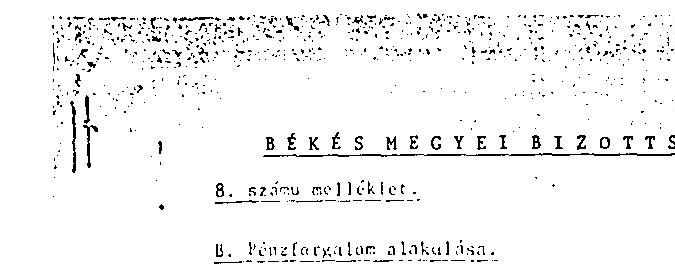

# BÉKÉS MEGYEI RIZOTTSÁG

## 8. szám melléklet.

## 8. Pénsforgalon alakulása.

## 1979. 1980. 1981. 1982. 1983. 1984. 1985. 1986. 1987.

## 1. HHB 2. csaba 269-90172-6835 Békés HS

|  1979. 1980. 1981. 1982. 1983. 1984. 1985. 1986. 1987. | |
| --- | --- |
|  1. HHB 2. csaba 269-90172-6835 Békés HS | |
|  2. HHB 2. csaba 269-90172-7331 2. csaba V8 | |
|  3. HHB Gyula 269-90172-7348 Gyula V8 | |
|  4. HHB Orush. 269-90172-7355 Orushéza V8 | |
|  5. HHB Békéscs. 269-90172-7984 Békés V8 | |
|  6. HHB Szarvas 269-90172-9508 Szarvas V8 | |
|  7. HHB Szegh. 269-90172-7977 Szeghalza V8 | |
|  8. HHB Hh. héra 269-90172-7939 Hh. héra 269-90172-7939 Hh. héra 269-90172-6598 Gyenszedvöd | |
|  9. HHB Szarvas 269-90172-6550 Szarvas V8 | |
|  10. MSB 269-90172-6550 Szarvas V8 | |
|  11. MSB 2. csaba 269-90172-9917 Oktatási Igezgotóság | |
|  12. MSZP. Gyula ORHB | |
|  13. "Orushéza OTP" | |
|  14. "Szarvas Tak.szöv." | |
|  15. "Szeghalza OTP" | |

## 1991. évi LI. törvény - pótelszámolás - mellékletek.

## 1. HHB Számák Egyénlég

|  Száma | 1979. 1980. 1981. 1982. 1983. 1984. 1985. 1986. 1987. 1988. 1989. 1990. 1991. 1992. 1993. 1994. 1995. 1996. 1997. 1998. 1999. 2000. 2001. 2002. 2003. 2004. 2005. 2006. 2007. 2008. 2009. 2010. 2011. 2012. 2013. 2014. 2015. 2016. 2017. 2018. 2019. 2020. 2021. 2022. 2023. 2024. 2025. 2026. 2027. 2028. 2029. 2030. 2031. 2032. 2033. 2034. 2035. 2036. 2037. 2038. 2039. 2040. 2041. 2042. 2043. 2044. 2045. 2046. 2047. 2048. 2049. 2050. 2051. 2052. 2053. 2054. 2055. 2056. 2057. 2058. 2059. 2060. 2061. 2062. 2063. 2064. 2065. 2066. 2067. 2068. 2069. 2070. 2071. 2072. 2073. 2074. 2075. 2076. 2077. 2078. 2079. 2080. 2081. 2082. 2083. 2084. 2085. 2086. 2087. 2088. 2089. 2090. 2091. 2092. 2093. 2094. 2095. 2096. 2097. 2098. 2099. 2010. 2011. 2012. 2013. 2014. 2015. 2016. 2017. 2018. 2019. 2020. 2021. 2022. 2023. 2024. 2025. 2026. 2027. 2028. 2029. 2030. 2031. 2032. 2033. 2034. 2035. 2036. 2037. 2038. 2039. 2040. 2041. 2042. 2043. 2044. 2045. 2046. 2047. 2048. 2049. 2050. 2051. 2052. 2053. 2054. 2055. 2056. 2057. 2058. 2059. 2060. 2061. 2062. 2063. 2064. 2065. 2066. 2067. 2068. 2069. 2070. 2071. 2072. 2073. 2074. 2075. 2076. 2077. 2078. 2079. 2080. 2081. 2082. 2083. 2084. 2085. 2086. 2087. 2088. 2089. 2090. 2091. 2092. 2093. 2094. 2095. 2096. 2097. 2098. 2099. 2010. 2011. 2012. 2013. 2014. 2015. 2016. 2017. 2018. 2019. 2020. 2021. 2022. 2023. 2024. 2025. 2026. 2027. 2028. 2029. 2030. 2031. 2032. 2033. 2034. 2035. 2036. 2037. 2038. 2039. 2040. 2041. 2042. 2043. 2044. 2045. 2046. 2047. 2048. 2049. 2050. 2051. 2052. 2053. 2054. 2055. 2056. 2057. 2058. 2059. 2060. 2061. 2062. 2063. 2064. 2065. 2066. 2067. 2068. 2069. 2070. 2071. 2072. 2073. 2074. 2075. 2076. 2077. 2078. 2079. 2080. 2081. 2082. 2083. 2084. 2085. 2086. 2087. 2088. 2089. 2090. 2091. 2092. 2093. 2094. 2095. 2096. 2097. 2098. 2099. 2010. 2011. 2012. 2013. 2014. 2015. 2016. 2017. 2018. 2019. 2020. 2021. 2022. 2023. 2024. 2025. 2026. 2027. 2028. 2029. 2030. 2031. 2032. 2033. 2034. 2035. 2036. 2037. 2038. 2039. 2040. 2041. 2042. 2043. 2044. 2045. 2046. 2047. 2048. 2049. 2050. 2051. 2052. 2053. 2054. 2055. 2056. 2057. 2058. 2059. 2060. 2061. 2062. 2063. 2064. 2065. 2066. 2067. 2068. 2069. 2070. 2071. 2072. 2073. 2074. 2075. 2076. 2077. 2078. 2079. 2080. 2081. 2082. 2083. 2084. 2085. 2086. 2087. 2088. 2089. 2090. 2091. 2092. 2093. 2094. 2095. 2096. 2097. 2098. 2099. 2010. 2011. 2012. 2013. 2014. 2015. 2016. 2017. 2018. 2019. 2020. 2021. 2022. 2023. 2024. 2025. 2026. 2027. 2028. 2029. 2030. 2031. 2032. 2033. 2034. 2035. 2036. 2037. 2038. 2039. 2040. 2041. 2042. 2043. 2044. 2045. 2046. 2047. 2048. 2049. 2050. 2051. 2052. 2053. 2054. 2055. 2056. 2057. 2058. 2059. 2060. 2061. 2062. 2063. 2064. 2065. 2066. 2067. 2068. 2069. 2070. 2071. 2072. 2073. 2074. 2075. 2076. 2077. 2078. 2079. 2080. 2081. 2082. 2083. 2084. 2085. 2086. 2087. 2088. 2089. 2090. 2091. 2092. 2093. 2094. 2095. 2096. 2097. 2098. 2099. 2010. 2011. 2012. 2013. 2014. 2015. 2016. 2017. 2018. 2019. 2020. 2021. 2022. 2023. 2024. 2025. 2026. 2027. 2028. 2029. 2030. 2031. 2032. 2033. 2034. 2035. 2036. 2037. 2038. 2039. 2040. 2041. 2042. 2043. 2044. 2045. 2046. 2047. 2048. 2049. 2050. 2051. 2052. 2053. 2054. 2055. 2056. 2057. 2058. 2059. 2060. 2061. 2062. 2063. 2064. 2065. 2066. 2067. 2068. 2069. 2070. 2071. 2072. 2073. 2074. 2075. 2076. 2077. 2078. 2079. 2080. 2081. 2082. 2083. 2084. 2085. 2086. 2087. 2088. 2089. 2090. 2091. 2092. 2093. 2094. 2095. 2096. 2097. 2098. 2099. 2010. 2011. 2012. 2013. 2014. 2015. 2016. 2017. 2018. 2019. 2020. 2021. 2022. 2023. 2024. 2025. 2026. 2027. 2028. 2029. 2030. 2031. 2032. 2033. 2034. 2035. 2036. 2037. 2038. 2039. 2040. 2041. 2042. 2043. 2044. 2045. 2046. 2047. 2048. 2049. 2050. 2051. 2052. 2053. 2054. 2055. 2056. 2057. 2058. 2059. 2060. 2061. 2062. 2063. 2064. 2065. 2066. 2067. 2068. 2069. 2070. 2071. 2072. 2073. 2074. 2075. 2076. 2077. 2078. 2079. 2080. 2081. 2082. 2083. 2084. 2085. 2086. 2087. 2088. 2089. 2090. 2091. 2092. 2093. 2094. 2095. 2096. 2097. 2098. 2099. 2010. 2011. 2012. 2013. 2014. 2015. 2016. 2017. 2018. 2019. 2020. 2021. 2022. 2023. 2024. 2025. 2026. 2027. 2028. 2029. 2030. 2031. 2032. 2033. 2034. 2035. 2036. 2037. 2038. 2039. 2040. 2041. 2042. 2043. 2044. 2045. 2046. 2047. 2048. 2049. 2050. 2051. 2052. 2053. 2054. 2055. 2056. 2057. 2058. 2059. 2060. 2061. 2062. 2063. 2064. 2065. 2066. 2067. 2068. 2069. 2070. 2071. 2072. 2073. 2074. 2075. 2076. 2077. 2078. 2079. 2080. 2081. 2082. 2083. 2084. 2085. 2086. 2087. 2088. 2089. 2090. 2091. 2092. 2093. 2094. 2095. 2096. 2097. 2098. 2099. 2010. 2011. 2012. 2013. 2014. 2015. 2016. 2017. 2018. 2019. 2020. 2021. 2022. 2023. 2024. 2025. 2026. 2027. 2028. 2029. 2030. 2031. 2032. 2033. 2034. 2035. 2036. 2037. 2038. 2039. 2040. 2041. 2042. 2043. 2044. 2045. 2046. 2047. 2048. 2049. 2050. 2051. 2052. 2053. 2054. 2055. 2056. 2057. 2058. 2059. 2060. 2061. 2062. 2063. 2064. 2065. 2066. 2067. 2068. 2069. 2070. 2071. 2072. 2073. 2074. 2075. 2076. 2077. 2078. 2079. 2080. 2081. 2082. 2083. 2084. 2085. 2086. 2087. 2088. 2089. 2090. 2091. 2092. 2093. 2094. 2095. 2096. 2097. 2098. 2099. 2010. 2011. 2012. 2013. 2014. 2015. 2016. 2017. 2018. 2019. 2020. 2021. 2022. 2023. 2024. 2025. 2026. 2027. 2028. 2029. 2030. 2031. 2032. 2033. 2034. 2035. 2036. 2037. 2038. 2039. 2040. 2041. 2042. 2043. 2044. 2045. 2046. 2047. 2048. 2049. 2050. 2051. 2052. 2053. 2054. 2055. 2056. 2057. 2058. 2059. 2060. 2061. 2062. 2063. 2064. 2065. 2066. 2067. 2068. 2069. 2070. 2071. 2072. 2073. 2074. 2075. 2076. 2077. 2078. 2079. 2080. 2081. 2082. 2083. 2084. 2085. 2086. 2087. 2088. 2089. 2090. 2091. 2092. 2093. 2094. 2095. 2096. 2097. 2098. 2099. 2010. 2011. 2012. 2013. 2014. 2015. 2016. 2017. 2018. 2019. 2020. 2021. 2022. 2023. 2024. 2025. 2026. 2027. 2028. 2029. 2030. 2031. 2032. 2033. 2034. 2035. 2036. 2037. 2038. 2039. 2040. 2041. 2042. 2043. 2044. 2045. 2046. 2047. 2048. 2049. 2050. 2051. 2052. 2053. 2054. 2055. 2056. 2057. 2058. 2059. 2060. 2061. 2062. 2063. 2064. 2065. 2066. 2067. 2068. 2069. 2070. 2071. 2072. 2073. 2074. 2075. 2076. 2077. 2078. 2079. 2080. 2081. 2082. 2083. 2084. 2085. 2086. 2087. 2088. 2089. 2090. 2091. 2092. 2093. 2094. 2095. 2096. 2097. 2098. 2099. 2010. 2011. 2012. 2013. 2014. 2015. 2016. 2017. 2018. 2019. 2020. 2021. 2022. 2023. 2024. 2025. 2026. 2027. 2028. 2029. 2030. 2031. 2032. 2033. 2034. 2035. 2036. 2037. 2038. 2039. 2040. 2041. 2042. 2043. 2044. 2045. 2046. 2047. 2048. 2049. 2050. 2051. 2052. 2053. 2054. 2055. 2056. 2057. 2058. 2059. 2060. 2061. 2062. 2063. 2064. 2065. 2066. 2067. 2068. 2069. 2070. 2071. 2072. 2073. 2074. 2075. 2076. 2077. 2078. 2079. 2080. 2081. 2082. 2083. 2084. 2085. 2086. 2087. 2088. 2089. 2090. 2091. 2092. 2093. 2094. 2095. 2096. 2097. 2098. 2099. 2010. 2011. 2012. 2013. 2014. 2015. 2016. 2017. 2018. 2019. 2020. 2021. 2022. 2023. 2024. 2025. 2026. 2027. 2028. 2029. 2030. 2031. 2032. 2033. 2034. 2035. 2036. 2037. 2038. 2039. 2040. 2041. 2042. 2043. 2044. 2045. 2046. 2047. 2048. 2049. 2050. 2051. 2052. 2053. 2054. 2055. 2056. 2057. 2058. 2059. 2060. 2061. 2062. 2063. 2064. 2065. 2066. 2067. 2068. 2069. 2070. 2071. 2072. 2073. 2074. 2075. 2076. 2077. 2078. 2079. 2080. 2081. 2082. 2083. 2084. 2085. 2086. 2087. 2088. 2089. 2090. 2091. 2092. 2093. 2094. 2095. 2096. 2097. 2098. 2099. 2010. 2011. 2012. 2013. 2014. 2015. 2016. 2017. 2018. 2019. 2020. 2021. 2022. 2023. 2024. 2025. 2026. 2027. 2028. 2029. 2020. 2021. 2022. 2023. 2024. 2025. 2026. 2027. 2028. 2029. 2020. 2021. 2022. 2023. 2024. 2025. 2026. 2027. 2028. 2029. 2020. 2021. 2022. 2023. 2024. 2025. 2026. 2027. 2028. 2029. 2020. 2021. 2022. 2023. 2024. 2025. 2026. 2027. 2028. 2029. 2020. 2021. 2022. 2023. 2024. 2025. 2026. 2027. 2028. 2029. 2020. 2021. 2022. 2023. 2024. 2025. 2026. 2027. 2028. 2029. 2020. 2021. 2022. 2023. 2024. 2025. 2026. 2027. 2028. 2029. 2020. 2021. 2022. 2023. 2024. 2025. 2026. 2027. 2028. 2029. 2020. 2021. 2022. 2023. 2024. 2025. 2026. 2027. 2028. 2029. 2020. 2021. 2022. 2023. 2024. 2025. 2026. 2027. 2028. 2029. 2020. 2021. 2022. 2023. 2024. 2025. 2026. 2027. 2028. 2029. 2020. 2021. 2022. 2023. 2024. 2025. 2026. 2027. 2028. 2029. 2020. 2021. 2022. 2023. 2024. 2025. 2026. 2027. 2028. 2029. 2020. 2021. 2022. 2023. 2024. 2025. 2026. 2027. 2028. 2029. 2020. 2021. 2022. 2023. 2024. 2025. 2026. 2027. 2028. 2029. 2020. 2021. 2022. 2023. 2024. 2025. 2026. 2027. 2028. 2029. 2020. 2021. 2022. 2023. 2024. 2025. 2026. 2027. 2028. 2029. 2020. 2021. 2022. 2023. 2024. 2025. 2026. 2027. 2028. 2029. 2020. 2021. 2022. 2023. 2024. 2025. 2026. 2027. 2028. 2029. 2020. 2021. 2022. 2023. 2024. 2025. 2026. 2027. 2028. 2029. 2020. 2021. 2022. 2023. 2024. 2025. 2026. 2027. 2028. 2029. 2020. 2021. 2022. 2023. 2024. 2025. 2026. 2027. 2028. 2029. 2020. 2021. 2022. 2023. 2024. 2025. 2026. 2027. 2028. 2029. 2020. 2021. 2022. 2023. 2024. 2025. 2026. 2027. 2028. 2029. 2020. 2021. 2022. 2023. 2024. 2025. 2026. 2027. 2028. 2029. 2020. 2021. 2022. 2023. 2024. 2025. 2026. 2027. 2028. 2029. 2020. 2021. 2022. 2023. 2024. 2025. 2026. 2027. 2028. 2029. 2020. 2021. 2022. 2023. 2024. 2025. 2026. 2027. 2028. 2029. 2020. 2021. 2022. 2023. 2024. 2025. 2026. 2027. 2028. 2029. 2020. 2021. 2022. 2023. 2024. 2025. 2026. 2027. 2028. 2029. 2020. 2021. 2022. 2023. 2024. 2025. 2026. 2027. 2028. 2029. 2020. 2021. 2022. 2023. 2024. 2025. 2026. 2027. 2028. 2029. 2020. 2021. 2022. 2023. 2024. 2025. 2026. 2027. 2028. 2029. 2020. 2021. 2022. 2023. 2024. 2024. 2024. 2025. 2026. 2027. 2028. 2029. 2020. 2021. 2022. 2023. 2024. 2025. 2024. 2024. 2024. 2024. 2024. 2024. 2024. 2024. 2024. 2024. 2024. 2024. 2024. 2024. 2024. 2024. 2024. 2024. 2024. 2024. 2024. 2024. 2024. 2024. 2024. 2024. 2024. 2024. 2024. 2024. 2024. 2024. 2024. 2024. 2024. 2024. 2024. 2024. 2024. 2024. 2024. 2024. 2024. 2024. 2024. 2024. 2024. 2024. 2024. 2024. 2024. 2024. 2024. 2024. 2024. 2024. 2024. 2024. 2024. 2024. 2024. 2024. 2024. 2024. 2024. 2024. 2024. 2024. 2024. 2024. 2024. 2024. 2024. 2024. 2024. 2024. 2024. 2024. 2024. 2024. 2024. 2024. 2024. 2024. 2024. 2024. 2024. 2024. 2024. 2024. 2024. 2024. 2024. 2024. 2024. 2024. 2024. 2024. 2024. 2024. 2024. 2024. 2024. 2024. 2024. 2024. 2024. 2024. 2024. 2024. 2024. 2024. 2024. 2024. 2024. 2024. 2024. 2024. 2024. 2024. 2024. 2024. 2024. 2024. 2024. 2024. 2024. 2024. 2024. 2024. 2024. 2024. 2024. 2024. 2024. 2024. 2024. 2024. 2024. 2024. 2024. 2024. 2024. 2024. 2024. 2024. 2024. 2024. 2024. 2024. 2024. 2024. 2024. 2024. 2024. 2024. 2024. 2024. 2024. 2024. 2024. 2024. 2024. 2024. 2024. 2024. 2024. 2024. 2024. 2024. 2024. 2024. 2024. 2024. 2024. 2024. 2024. 2024. 2024. 2024. 2024. 2024. 2024. 2024. 2024. 2024. 2024. 2024. 2024. 2024. 2024. 2024. 2024. 2024. 2024. 2024. 2024. 2024. 2024. 2024. 2024. 2024. 2024. 2024. 2024. 2024. 2024. 2024. 2024. 2024. 2024. 2024. 2024. 2024. 2024. 2024. 2024. 2024. 2024. 2024. 2024. 2024. 2024. 2024. 2024. 2024. 2024. 2024. 2024. 2024. 2024. 2024. 2024. 2024. 2024. 2024. 2024. 2024. 2024. 2024. 2024. 2024. 2024. 2024. 2024. 2024. 2024. 2024. 2024. 2024. 2024. 2024. 2024. 2024. 2024. 2024. 2024. 2024. 2024. 2024. 2024. 2024. 2024. 2024. 2024. 2024. 2024. 2024. 2024. 2024. 2024. 2024. 2024. 2024. 2024. 2024. 2024. 2024. 2024. 2024. 2024. 2024. 2024. 2024. 2024. 2024. 2024. 2024. 2024. 2024. 2024. 2024. 2024. 2024. 2024. 2024. 2024. 2024. 2024. 2024. 2024. 2024. 2024. 2024. 2024. 2024. 2024. 2024. 2024. 2024. 2024. 2024. 2024. 2024. 2024. 2024. 2024. 2024. 2024. 2024. 2024. 2024. 2024. 2024. 2024. 2024. 2024. 2024. 2024. 2024. 2024. 2024. 2024. 2024. 2024. 2024. 2024. 2024. 2024. 2024. 2024. 2024. 2024. 2024. 2024. 2024. 2024. 2024. 2024. 2024. 2024. 2024. 2024. 2024. 2024. 2024. 2024. 2024. 2024. 2024. 2024. 2024. 2024. 2024. 2024. 2024. 2024. 2024. 2024. 2024. 2024. 2024. 2024. 2024. 2024. 2024. 2024. 2024. 2024. 2024. 2024. 2024. 2024. 2024. 2024. 2024. 2024. 2024. 2024. 2024. 2024. 2024. 2024. 2024. 2024. 2024. 2024. 2024. 2024. 2024. 2024. 2024. 2024. 2024. 2024. 2024. 2024. 2024. 2024. 2024. 2024. 2024. 2024. 2024. 2024. 2024. 2024. 2024. 2024. 2024. 2024. 2024. 2024. 2024. 2024. 2024. 2024. 2024. 2024. 2024. 2024. 2024. 2024. 2024. 2024. 2024. 2024. 2024. 2024. 2024. 2024. 2024. 2024. 2024. 2024. 2024. 2024. 2024. 2024. 2024. 2024. 2024. 2024. 2024. 2024. 2024. 2024. 2024. 2024. 2024. 2024. 2024. 2024. 2024. 2024. 2024. 2024. 2024. 2024. 2024. 2024. 2024. 2024. 2024. 2024. 2024. 2024. 2024. 2024. 2024. 2024. 2024. 2024. 2024. 2024. 2024. 2024. 2024. 2024. 2024. 2024. 2024. 2024. 2024. 2024. 2024. 2024. 2024. 2024. 2024. 2024. 2024. 2024. 2024. 2024. 2024. 2024. 2024. 2024. 2024. 2024. 2024. 2024. 2024. 2024. 2024. 2024. 2024. 2024. 2024. 2024. 2024. 2024. 2024. 2024. 2024. 2024. 2024. 2024. 2024. 2024. 2024. 2024. 2024. 2024. 2024. 2024. 2024. 2024. 2024. 2024. 

---

# BÉKÉS MB

B. szám belsőköt.

# B. Pénztorgatos alakulása

|  Száma | 100.000.000 | 100.000.000 | 100.000.000 | 100.000.000 | 100.000.000 | 100.000.000 | 100.000.000 | 100.000.000  |
| --- | --- | --- | --- | --- | --- | --- | --- | --- |
|  1. | 601.543,98 | 5.449.910,62 | 1.580.515,92 | 7.934.290,87 | 9.674.908,36 | 269.795,03 | 175.621,03 | 161.641,03  |
|  2. | 20,18 | 27.719,46 | 77.315,56 | 307.739,36 | 476,80 | 44.115,88 | 40.586,70 | 47.568,88  |
|  3. | 504,31 | 6.605,51 | 496,15 | 268.377,33 | 3.198,00 | megszünt |  |   |
|  4. | x | 716,87 | 13.295,20 | 93.178,96 | 29.164,00 | megszünt |  |   |
|  5. | 7.702,49 | 1.385,07 | 21.567,53 | 228.141,75 | 13.443,17 | 27.471,61 | 29.180,61 | 29.401,61  |
|  6. | 786,91 | 170,54 | 189,88 | 212.311,98 | 15.079,13 | megszünt |  |   |
|  7. | 6.304,95 | 29.158,95 | 10.893,32 | 188.832,62 | megszünt |  |  |   |
|  8. | 3.840,05 | 56.338,80 | 56.184,62 | 82.956,68 | 18.058,28 | 0 | 0 | 42.481,90  |
|  9. | 5.570,30 | 51.253,23 | 39.114,77 | 110.088,25 | 4.051,00 | megszünt |  |   |
|  10. | 7.572,85 | 6.561,41 | 26.842,15 | 67.432,25 | 9.537,01 | megszünt |  |   |
|  11. | 41.407,18 | 12.859,65 | 13,46 | 261.133,11 | megszünt |  |  |   |
|  12. |  |  |  |  | átalakult | 21.360,20 | 19.295,20 | 151.288,60  |
|  13. |  |  |  |  | átalakult | 283.560,50 | 283.560,50 | 278.935,50  |
|  14. |  |  |  |  | átalakult | 127.764,52 | 110.770,52 | 85.770,52  |
|  15. |  |  |  |  | átalakult | átalakult | 45.327,00 | 38.170,00  |

Feltérezés: Nincs adat: 1979, 1980, 1981, 1982. évekre, valamintaz nezel jelöltekre.

Budapest, 1991. december 6.

---

# BORSÓD - ÁBAÚJ - ZEMFLEN MÉGYKI BIZOTTSÁG

## 8. szám melléklet

## 8. Pénsforgalom alakulása

## N N E S Z Á N I Á K E C Y E N L E G E

|  Sorvály | A bunkázánták és a számtámennyel és a mezőtől pénzintézetek megbízásának | 1979. 811.31. | 1980. 811.31. | 1981. 811.31. | 1982. 811.31. | 1983. 811.31. | 1984. 811.31. | 1985. 811.31.  |
| --- | --- | --- | --- | --- | --- | --- | --- | --- |
|  1. | MKB Miskolc 279-90172-6845
Borsod MB | x | x | x | x | 16,648,894.83 | 21,083,437.26 | 21,421,454.53  |
|  2. | MKB Miskolc 279-90172-7365
Miskolc VB | x | x | x | 49,654. | 43,773.75 | 92,556.61 | 189,686.26  |
|  3. | MKB Encs 279-90172-8005
Encs VB | x | x | x | 70,045. | 55,689.13 | 14,559.13 | 54,960.93  |
|  4. | MKB Miskolc 279-90172-7389
Kezincbarcika VB | x | x | x | x | 15,578.46 | 52,508.11 | 67,123.65  |
|  5. | MKB Lentov. 279-90172-9374
Lentováros VB | x | x | x | x | 2,442.88 | 41,162.91 | 32,219.91  |
|  6. | MKB Nezők. 279-90172-7956
Nezőkövezd VB | x | x | x | 29,385. | 23,481.95 | 59,131.56 | 41,332.76  |
|  7. | MKB Özd 279-90172-7664
Özd VB | x | x | x | x | 2,857.89 | 34,551.11 | 237.36  |
|  8. | MKB Szék. 279-90172-9587
Sźszapátak VB | x | x | x | x | 22,923.43 | 41,163. | 77,401.52  |
|  9. | MKB Szék. 279-90172-8047
Sźtoraljaujhely VB | x | x | x | 115,702. | 49,766.51 | 96,352.51 | 74,304.71  |
|  10. | MKB Miskolc 279-90172-8074
Szetenes VB | x | x | x | 107,943. | 79,285.20 | 366.15 | 16,907.12  |
|  11. | MKB Miskolc 279-90172-7994
Ezelény VB | x | x | x | 67,901. | 5,646.16 | 80,334.70 | 12,313.21  |
|  12. | MKB Miskolc 279-90172-6759
Tokaj VB |  |  |  |  |  |  | átalakult  |
|  13. | MKB Miskolc 279-90172-9192
Oktarási igazgatások | x | x | x | x | 49,990.59 | 70,198.44 | 37,503.49  |
|  14. | F儲率 (Vd. Y. 271-88880-70511)
F儲率 (Vd. Y. 271-88880-70511) |  |  |  |  |  |  |   |
|  15. | BB. Rt. 271-88880-70511
Kezincbarcika |  |  |  |  |  |  |   |
|  16. | BB. RT 271-88880-70469
Lentováros VB |  |  |  |  |  |  |   |
|  17. | BB. Rt. 271-88880-70478
Nezőkövezd |  |  |  |  |  |  |   |
|  18. | BB. Rt. 271-88880-70502
Özd |  |  |  |  |  |  |   |
|  19. | B. patak Y. 271-88880-70502
Özd |  |  |  |  |  |  |   |

---

BORSCO HS

1/4.

# 8. szám melléklet.

## B. Pórónyalmatás alakulása.

|  Sz. |  |  |  |  |  |  |  |   |
| --- | --- | --- | --- | --- | --- | --- | --- | --- |
|  1978. |  |  |  |  |  |  |  |   |
|  1979. |  |  |  |  |  |  |  |   |
|  1980. |  |  |  |  |  |  |  |   |
|  1981. |  |  |  |  |  |  |  |   |
|  1982. |  |  |  |  |  |  |  |   |
|  1983. |  |  |  |  |  |  |  |   |
|  1984. |  |  |  |  |  |  |  |   |
|  1985. |  |  |  |  |  |  |  |   |
|  1986. |  |  |  |  |  |  |  |   |
|  1987. |  |  |  |  |  |  |  |   |
|  1988. |  |  |  |  |  |  |  |   |
|  1989. |  |  |  |  |  |  |  |   |
|  1990. |  |  |  |  |  |  |  |   |
|  1991. |  |  |  |  |  |  |  |   |
|  1992. |  |  |  |  |  |  |  |   |
|  1993. |  |  |  |  |  |  |  |   |
|  1994. |  |  |  |  |  |  |  |   |
|  1995. |  |  |  |  |  |  |  |   |
|  1996. |  |  |  |  |  |  |  |   |
|  1997. |  |  |  |  |  |  |  |   |
|  1998. |  |  |  |  |  |  |  |   |
|  1999. |  |  |  |  |  |  |  |   |
|  2000. |  |  |  |  |  |  |  |   |
|  2001. |  |  |  |  |  |  |  |   |
|  2002. |  |  |  |  |  |  |  |   |
|  2003. |  |  |  |  |  |  |  |   |
|  2004. |  |  |  |  |  |  |  |   |
|  2005. |  |  |  |  |  |  |  |   |
|  2006. |  |  |  |  |  |  |  |   |
|  2007. |  |  |  |  |  |  |  |   |
|  2008. |  |  |  |  |  |  |  |   |
|  2009. |  |  |  |  |  |  |  |   |
|  2010. |  |  |  |  |  |  |  |   |
|  2011. |  |  |  |  |  |  |  |   |
|  2012. |  |  |  |  |  |  |  |   |
|  2013. |  |  |  |  |  |  |  |   |
|  2014. |  |  |  |  |  |  |  |   |
|  2015. |  |  |  |  |  |  |  |   |
|  2016. |  |  |  |  |  |  |  |   |
|  2017. |  |  |  |  |  |  |  |   |
|  2018. |  |  |  |  |  |  |  |   |
|  2019. |  |  |  |  |  |  |  |   |
|  2020. |  |  |  |  |  |  |  |   |
|  2021. |  |  |  |  |  |  |  |   |
|  2022. |  |  |  |  |  |  |  |   |
|  2023. |  |  |  |  |  |  |  |   |
|  2024. |  |  |  |  |  |  |  |   |
|  2025. |  |  |  |  |  |  |  |   |
|  2026. |  |  |  |  |  |  |  |   |
|  2027. |  |  |  |  |  |  |  |   |
|  2028. |  |  |  |  |  |  |  |   |
|  2029. |  |  |  |  |  |  |  |   |
|  2030. |  |  |  |  |  |  |  |   |
|  2031. |  |  |  |  |  |  |  |   |
|  2032. |  |  |  |  |  |  |  |   |
|  2033. |  |  |  |  |  |  |  |   |
|  2034. |  |  |  |  |  |  |  |   |
|  2035. |  |  |  |  |  |  |  |   |
|  2036. |  |  |  |  |  |  |  |   |
|  2037. |  |  |  |  |  |  |  |   |
|  2038. |  |  |  |  |  |  |  |   |
|  2039. |  |  |  |  |  |  |  |   |
|  2040. |  |  |  |  |  |  |  |   |
|  2041. |  |  |  |  |  |  |  |   |
|  2042. |  |  |  |  |  |  |  |   |
|  2043. |  |  |  |  |  |  |  |   |
|  2044. |  |  |  |  |  |  |  |   |
|  2045. |  |  |  |  |  |  |  |   |
|  2046. |  |  |  |  |  |  |  |   |
|  2047. |  |  |  |  |  |  |  |   |
|  2048. |  |  |  |  |  |  |  |   |
|  2049. |  |  |  |  |  |  |  |   |
|  2050. |  |  |  |  |  |  |  |   |
|  2051. |  |  |  |  |  |  |  |   |
|  2052. |  |  |  |  |  |  |  |   |
|  2053. |  |  |  |  |  |  |  |   |
|  2054. |  |  |  |  |  |  |  |   |
|  2055. |  |  |  |  |  |  |  |   |
|  2056. |  |  |  |  |  |  |  |   |
|  2057. |  |  |  |  |  |  |  |   |
|  2058. |  |  |  |  |  |  |  |   |
|  2059. |  |  |  |  |  |  |  |   |
|  2060. |  |  |  |  |  |  |  |   |
|  2061. |  |  |  |  |  |  |  |   |
|  2062. |  |  |  |  |  |  |  |   |
|  2063. |  |  |  |  |  |  |  |   |
|  2064. |  |  |  |  |  |  |  |   |
|  2065. |  |  |  |  |  |  |  |   |
|  2066. |  |  |  |  |  |  |  |   |
|  2067. |  |  |  |  |  |  |  |   |
|  2068. |  |  |  |  |  |  |  |   |
|  2069. |  |  |  |  |  |  |  |   |
|  2070. |  |  |  |  |  |  |  |   |
|  2071. |  |  |  |  |  |  |  |   |
|  2072. |  |  |  |  |  |  |  |   |
|  2073. |  |  |  |  |  |  |  |   |
|  2074. |  |  |  |  |  |  |  |   |
|  2075. |  |  |  |  |  |  |  |   |
|  2076. |  |  |  |  |  |  |  |   |
|  2077. |  |  |  |  |  |  |  |   |
|  2078. |  |  |  |  |  |  |  |   |
|  2079. |  |  |  |  |  |  |  |   |
|  2080. |  |  |  |  |  |  |  |   |
|  2081. |  |  |  |  |  |  |  |   |
|  2082. |  |  |  |  |  |  |  |   |
|  2083. |  |  |  |  |  |  |  |   |
|  2084. |  |  |  |  |  |  |  |   |
|  2085. |  |  |  |  |  |  |  |   |
|  2086. |  |  |  |  |  |  |  |   |
|  2087. |  |  |  |  |  |  |  |   |
|  2088. |  |  |  |  |  |  |  |   |
|  2089. |  |  |  |  |  |  |  |   |
|  2090. |  |  |  |  |  |  |  |   |
|  2091. |  |  |  |  |  |  |  |   |
|  2092. |  |  |  |  |  |  |  |   |
|  2093. |  |  |  |  |  |  |  |   |
|  2094. |  |  |  |  |  |  |  |   |
|  2095. |  |  |  |  |  |  |  |   |
|  2096. |  |  |  |  |  |  |  |   |
|  2097. |  |  |  |  |  |  |  |   |
|  2098. |  |  |  |  |  |  |  |   |
|  2099. |  |  |  |  |  |  |  |   |
|  2010. |  |  |  |  |  |  |  |   |
|  2011. |  |  |  |  |  |  |  |   |
|  2012. |  |  |  |  |  |  |  |   |
|  2013. |  |  |  |  |  |  |  |   |
|  2014. |  |  |  |  |  |  |  |   |
|  2015. |  |  |  |  |  |  |  |   |
|  2016. |  |  |  |  |  |  |  |   |
|  2017. |  |  |  |  |  |  |  |   |
|  2018. |  |  |  |  |  |  |  |   |
|  2019. |  |  |  |  |  |  |  |   |
|  2020. |  |  |  |  |  |  |  |   |
|  2021. |  |  |  |  |  |  |  |   |
|  2022. |  |  |  |  |  |  |  |   |
|  2023. |  |  |  |  |  |  |  |   |
|  2024. |  |  |  |  |  |  |  |   |
|  2025. |  |  |  |  |  |  |  |   |
|  2026. |  |  |  |  |  |  |  |   |
|  2027. |  |  |  |  |  |  |  |   |
|  2028. |  |  |  |  |  |  |  |   |
|  2029. |  |  |  |  |  |  |  |   |
|  2030. |  |  |  |  |  |  |  |   |
|  2031. |  |  |  |  |  |  |  |   |
|  2032. |  |  |  |  |  |  |  |   |
|  2033. |  |  |  |  |  |  |  |   |
|  2034. |  |  |  |  |  |  |  |   |
|  2035. |  |  |  |  |  |  |  |   |
|  2036. |  |  |  |  |  |  |  |   |
|  2037. |  |  |  |  |  |  |  |   |
|  2038. |  |  |  |  |  |  |  |   |
|  2039. |  |  |  |  |  |  |  |   |
|  2040. |  |  |  |  |  |  |  |   |
|  2041. |  |  |  |  |  |  |  |   |
|  2042. |  |  |  |  |  |  |  |   |
|  2043. |  |  |  |  |  |  |  |   |
|  2044. |  |  |  |  |  |  |  |   |
|  2045. |  |  |  |  |  |  |  |   |
|  2046. |  |  |  |  |  |  |  |   |
|  2047. |  |  |  |  |  |  |  |   |
|  2048. |  |  |  |  |  |  |  |   |
|  2049. |  |  |  |  |  |  |  |   |
|  2050. |  |  |  |  |  |  |  |   |
|  2051. |  |  |  |  |  |  |  |   |
|  2052. |  |  |  |  |  |  |  |   |
|  2053. |  |  |  |  |  |  |  |   |
|  2054. |  |  |  |  |  |  |  |   |
|  2055. |  |  |  |  |  |  |  |   |
|  2056. |  |  |  |  |  |  |  |   |
|  2057. |  |  |  |  |  |  |  |   |
|  2058. |  |  |  |  |  |  |  |   |
|  2059. |  |  |  |  |  |  |  |   |
|  2060. |  |  |  |  |  |  |  |   |
|  2061. |  |  |  |  |  |  |  |   |
|  2062. |  |  |  |  |  |  |  |   |
|  2063. |  |  |  |  |  |  |  |   |
|  2064. |  |  |  |  |  |  |  |   |
|  2065. |  |  |  |  |  |  |  |   |
|  2066. |  |  |  |  |  |  |  |   |
|  2067. |  |  |  |  |  |  |  |   |
|  2068. |  |  |  |  |  |  |  |   |
|  2069. |  |  |  |  |  |  |  |   |
|  2070. |  |  |  |  |  |  |  |   |
|  2071. |  |  |  |  |  |  |  |   |
|  2072. |  |  |  |  |  |  |  |   |
|  2073. |  |  |  |  |  |  |  |   |
|  2074. |  |  |  |  |  |  |  |   |
|  2075. |  |  |  |  |  |  |  |   |
|  2076. |  |  |  |  |  |  |  |   |
|  2077. |  |  |  |  |  |  |  |   |
|  2078. |  |  |  |  |  |  |  |   |
|  2079. |  |  |  |  |  |  |  |   |
|  2080. |  |  |  |  |  |  |  |   |
|  2081. |  |  |  |  |  |  |  |   |
|  2082. |  |  |  |  |  |  |  |   |
|  2083. |  |  |  |  |  |  |  |   |
|  2084. |  |  |  |  |  |  |  |   |
|  2085. |  |  |  |  |  |  |  |   |
|  2086. |  |  |  |  |  |  |  |   |
|  2087. |  |  |  |  |  |  |  |   |
|  2088. |  |  |  |  |  |  |  |   |
|  2089. |  |  |  |  |  |  |  |   |
|  2090. |  |  |  |  |  |  |  |   |
|  2091. |  |  |  |  |  |  |  |   |
|  2092. |  |  |  |  |  |  |  |   |
|  2093. |  |  |  |  |  |  |  |   |
|  2094. |  |  |  |  |  |  |  |   |
|  2095. |  |  |  |  |  |  |  |   |
|  2096. |  |  |  |  |  |  |  |   |
|  2097. |  |  |  |  |  |  |  |   |
|  2098. |  |  |  |  |  |  |  |   |
|  2099. |  |  |  |  |  |  |  |   |
|  2010. |  |  |  |  |  |  |  |   |
|  2011. |  |  |  |  |  |  |  |   |
|  2012. |  |  |  |  |  |  |  |   |
|  2013. |  |  |  |  |  |  |  |   |
|  2014. |  |  |  |  |  |  |  |   |
|  2015. |  |  |  |  |  |  |  |   |
|  2016. |  |  |  |  |  |  |  |   |
|  2017. |  |  |  |  |  |  |  |   |
|  2018. |  |  |  |  |  |  |  |   |
|  2019. |  |  |  |  |  |  |  |   |
|  2020. |  |  |  |  |  |  |  |   |
|  2021. |  |  |  |  |  |  |  |   |
|  2022. |  |  |  |  |  |  |  |   |
|  2023. |  |  |  |  |  |  |  |   |
|  2024. |  |  |  |  |  |  |  |   |
|  2025. |  |  |  |  |  |  |  |   |
|  2026. |  |  |  |  |  |  |  |   |
|  2027. |  |  |  |  |  |  |  |   |
|  2028. |  |  |  |  |  |  |  |   |
|  2029. |  |  |  |  |  |  |  |   |
|  2030. |  |  |  |  |  |  |  |   |
|  2031. |  |  |  |  |  |  |  |   |
|  2032. |  |  |  |  |  |  |  |   |
|  2033. |  |  |  |  |  |  |  |   |
|  2034. |  |  |  |  |  |  |  |   |
|  2035. |  |  |  |  |  |  |  |   |
|  2036. |  |  |  |  |  |  |  |   |
|  2037. |  |  |  |  |  |  |  |   |
|  2038. |  |  |  |  |  |  |  |   |
|  2039. |  |  |  |  |  |  |  |   |
|  2040. |  |  |  |  |  |  |  |   |
|  2041. |  |  |  |  |  |  |  |   |
|  2042. |  |  |  |  |  |  |  |   |
|  2043. |  |  |  |  |  |  |  |   |
|  2044. |  |  |  |  |  |  |  |   |
|  2045. |  |  |  |  |  |  |  |   |
|  2046. |  |  |  |  |  |  |  |   |
|  2047. |  |  |  |  |  |  |  |   |
|  2048. |  |  |  |  |  |  |  |   |
|  2049. |  |  |  |  |  |  |  |   |
|  2050. |  |  |  |  |  |  |  |   |
|  2051. |  |  |  |  |  |  |  |   |
|  2052. |  |  |  |  |  |  |  |   |
|  2053. |  |  |  |  |  |  |  |   |
|  2054. |  |  |  |  |  |  |  |   |
|  2055. |  |  |  |  |  |  |  |   |
|  2056. |  |  |  |  |  |  |  |   |
|  2057. |  |  |  |  |  |  |  |   |
|  2058. |  |  |  |  |  |  |  |   |
|  2059. |  |  |  |  |  |  |  |   |
|  2060. |  |  |  |  |  |  |  |   |
|  2061. |  |  |  |  |  |  |  |   |
|  2062. |  |  |  |  |  |  |  |   |
|  2063. |  |  |  |  |  |  |  |   |
|  2064. |  |  |  |  |  |  |  |   |
|  2065. |  |  |  |  |  |  |  |   |
|  2066. |  |  |  |  |  |  |  |   |
|  2067. |  |  |  |  |  |  |  |   |
|  2068. |  |  |  |  |  |  |  |   |
|  2069. |  |  |  |  |  |  |  |   |
|  2070. |  |  |  |  |  |  |  |   |
|  2071. |  |  |  |  |  |  |  |   |
|  2072. |  |  |  |  |  |  |  |   |
|  2073. |  |  |  |  |  |  |  |   |
|  2074. |  |  |  |  |  |  |  |   |
|  2075. |  |  |  |  |  |  |  |   |
|  2076. |  |  |  |  |  |  |  |   |
|  2077. |  |  |  |  |  |  |  |   |
|  2078. |  |  |  |  |  |  |  |   |
|  2079. |  |  |  |  |  |  |  |   |
|  2080. |  |  |  |  |  |  |  |   |
|  2081. |  |  |  |  |  |  |  |   |
|  2082. |  |  |  |  |  |  |  |   |
|  2083. |  |  |  |  |  |  |  |   |
|  2084. |  |  |  |  |  |  |  |   |
|  2085. |  |  |  |  |  |  |  |   |
|  2086. |  |  |  |  |  |  |  |   |
|  2087. |  |  |  |  |  |  |  |   |
|  2088. |  |  |  |  |  |  |  |   |
|  2089. |  |  |  |  |  |  |  |   |
|  2090. |  |  |  |  |  |  |  |   |
|  2091. |  |  |  |  |  |  |  |   |
|  2092. |  |  |  |  |  |  |  |   |
|  2093. |  |  |  |  |  |  |  |   |
|  2094. |  |  |  |  |  |  |  |   |
|  2095. |  |  |  |  |  |  |  |   |
|  2096. |  |  |  |  |  |  |  |   |
|  2097. |  |  |  |  |  |  |  |   |
|  2098. |  |  |  |  |  |  |  |   |
|  2099. |  |  |  |  |  |  |  |   |
|  2090. |  |  |  |  |  |  |  |   |
|  2091. |  |  |  |  |  |  |  |   |
|  2092. |  |  |  |  |  |  |  |   |
|  2093. |  |  |  |  |  |  |  |   |
|  2094. |  |  |  |  |  |  |  |   |
|  2095. |  |  |  |  |  |  |  |   |
|  2096. |  |  |  |  |  |  |  |   |
|  2097. |  |  |  |  |  |  |  |   |
|  2098. |  |  |  |  |  |  |  |   |
|  2099. |  |  |  |  |  |  |  |   |
|  2090. |  |  |  |  |  |  |  |   |
|  2091. |  |  |  |  |  |  |  |   |
|  2092. |  |  |  |  |  |  |  |   |
|  2093. |  |  |  |  |  |  |  |   |
|  2094. |  |  |  |  |  |  |  |   |
|  2095. |  |  |  |  |  |  |  |   |
|  2096. |  |  |  |  |  |  |  |   |
|  2097. |  |  |  |  |  |  |  |   |
|  2098. |  |  |  |  |  |  |  |   |
|  2099. |  |  |  |  |  |  |  |   |
|  2099. |  |  |  |  |  |  |  |   |
|  2091. |  |  |  |  |  |  |  |   |
|  2092. |  |  |  |  |  |  |  |   |
|  2093. |  |  |  |  |  |  |  |   |
|  2094. |  |  |  |  |  |  |  |   |
|  2095. |  |  |  |  |  |  |  |   |
|  2096. |  |  |  |  |  |  |  |   |
|  2097. |  |  |  |  |  |  |  |   |
|  2098. |  |  |  |  |  |  |  |   |
|  2099. |  |  |  |  |  |  |  |   |
|  2099. |  |  |  |  |  |  |  |   |
|  2091. |  |  |  |  |  |  |  |   |
|  2091. |  |  |  |  |  |  |  |   |
|  2092. |  |  |  |  |  |  |  |   |
|  2093. |  |  |  |  |  |  |  |   |
|  2094. |  |  |  |  |  |  |  |   |
|  2095. |  |  |  |  |  |  |  |   |
|  2096. |  |  |  |  |  |  |  |   |
|  2097. |  |  |  |  |  |  |  |   |
|  2098. |  |  |  |  |  |  |  |   |
|  2099. |  |  |  |  |  |  |  |   |
|  2099. |  |  |  |  |  |  |  |   |
|  2091. |  |  |  |  |  |  |  |   |
|  2091. |  |  |  |  |  |  |  |   |
|  2091. |  |  |  |  |  |  |  |   |
|  2092. |  |  |  |  |  |  |  |   |
|  2093. |  |  |  |  |  |  |  |   |
|  2094. |  |  |  |  |  |  |  |   |
|  2095. |  |  |  |  |  |  |  |   |
|  2096. |  |  |  |  |  |  |   |
|  2097. |  |  |  |  |  |  |   |
|  2098. |  |  |  |  |  |  |   |
|  2099. |  |  |  |  |  |  |   |
|  2099. |  |  |  |  |  |  |   |
|  2091. |  |  |  |  |  |  |   |
|  2091. |  |  |  |  |  |  |   |
|  2091. |  |  |  |  |  |  |   |
|  2091. |  |  |  |  |  |  |   |
|  2092. |  |  |  |  |  |  |   |
|  2091. |  |  |  |  |  |  |   |
|  2093. |  |  |  |  |  |  |   |
|  2091. |  |  |  |  |  |  |   |
|  2094. |  |  |  |  |  |  |   |
|  2091. |  |  |  |  |  |   |
|  2091. |  |  |  |  |  |   |
|  2091. |  |  |  |  |  |   |
|  2091. |  |  |  |  |  |   |
|  2091. |  |  |  |  |  |   |
|  2091. |  |  |  |  |  |   |
|  2091. |  |  |  |  |  |   |
|  2091. |  |  |  |  |  |   |
|  2091. |  |  |  |  |  |   |
|  2091. |  |  |  |  |   |
|  2091. |  |  |  |  |  |   |
|  2091. |  |  |  |  |   |
|  2091. |  |  |  |  |   |
|  2091. |  |  |  |  |   |
|  2091. |  |  |  |  |   |
|  2091. |  |  |  |  |   |
|  2091. |  |  |  |  |   |
|  2091. |  |  |  |  |   |
|  2091. |  |  |  |  |   |
|  2091. |  |  |  |  |   |
|  2091. |  |  |  |  |   |
|  2091. |  |  |  |  |   |
|  2091. |  |  |  |  |   |
|  2091. |  |  |  |  |   |
|  2091. |  |  |  |  |   |
|  2091. |  |  |  |  |   |
|  2091. |  |  |  |  |   |
|  2091. |  |  |  |  |   |
|  2091. |  |  |  |  |   |
|  2091. |  |  |  |  |   |
|  2091. |  |  |  |  |   |
|  2091. |  |  |  |  |   |
|  2091. |  |  |  |  |   |
|  2091. |  |  |  |   |
|  2091. |  |  |  |   |
|  2091. |  |  |  |   |
|  2091. |  |  |  |  |   |
|  2091. |  |  |  |   |
|  2091. |  |  |  |   |
|  2091. |  |  |  |   |
|  2091. |  |  |  |   |
|  2091. |  |  |  |   |
|  2091. |  |  |  |   |
|  2091. |  |  |  |   |
|  2091. |  |  |  |   |
|  2091. |  |  |  |   |
|  2091. |  |  |  |   |
|  2091. |  |  |  |   |
|  2091. |  |  |  |   |
|  2091. |  |  |  |   |
|  2091. |  |  |  |   |
|  2091. |  |  |  |   |
|  2091. |  |  |  |   |
|  2091. |  |  |   |
|  2091. |  |  |  |   |
|  2091. |  |  |  |   |
|  2091. |  |  |  |   |
|  2091. |  |  |  |   |
|  2091. |  |  |  |   |
|  2091. |  |  |   |
|  2091. |  |  |  |   |
|  2091. |  |  |  |   |
|  2091. |  |  |  |   |
|  2091. |  |  |  |   |
|  2091. |  |  |  |   |
|  2091. |  |  |   |
|  2091. |  |  |  |   |
|  2091. |  |  |  |   |
|  2091. |  |  |  |   |
|  2091. |  |  |   |
|  2091. |  |  |   |
|  2091. |  |  |   |
|  2091. |  |  |  |   |
|  2091. |  |  |  |   |
|  2091. |  |  |   |
|  2091. |  |  |  |   |
|  2091. |  |  |   |
|  2091. |  |  |   |
|  2091. |  |  |  |   |
|  2091. |  |  |   |
|  2091. |  |  |   |
|  2091. |  |  |   |
|  2091. |  |  |   |
|  2091. |  |  |   |
|  2091. |  |  |   |
|  2091. |  |  |   |
|  2091. |  |  |   |
|  2091. |  |  |   |
|  2091. |  |  |   |
|  2091. |  |  |   |
|  2091. |  |  |   |
|  2091. |  |  |   |
|  2091. |  |  |   |
|  2091. |  |  |   |
|  2091. |  |  |   |
|  2091. |  |  |   |
|  2091. |  |  |   |
|  2091. |  |  |   |
|  2091. |  |  |   |
|  2091. |  |  |   |
|  2091. |  |  |   |
|  2091. |  |  |   |
|  2091. |  |  |   |
|  2091. |  |  |   |
|  2091. |  |  |   |
|  2091. |  |  |   |
|  2091. |  |  |   |
|  2091. |  |  |   |
|  2091. |  |  |   |
|  2091. |  |  |   |
|  

---

# 8. azóno melléklet. 

## 8. Pénztorgalom alakulása.

MANISZÁMLAKECKELLEGE

| Sur- | 1936. | 1987. | 1988. | 1989. | 1990. | 1990. | 1990. | 1990. |
| :--: | :--: | :--: | :--: | :--: | :--: | :--: | :--: | :--: |
| szent | .511 .31 | .511 .31 | .511 .31 | 13. 10 | .511 .31 | .511 .31 | .15. 17. | 19.18. |

| 1. | $18.859 .615,58$ | $15.734 .005,93$ | $8.491 .917 .96$ | $13.628 .517 .11$ | $12.950 .793 .61$ | $434.252,-$ | $2.384,30$ | $1.847 .587 .70$ |
| :--: | :--: | :--: | :--: | :--: | :--: | :--: | :--: | :--: |
| 2. | $40.173,11$ | $190.132,91$ | 194.961 . | $515.877 .35$ | $52.696 .22$ | $6.013 .74$ | $17.282,74$ | $414.027 .14$ |
| 3. | $30.963 .52$ | $59.741 .83$ | 235.318 . | $106.526 .91$ | megazünt |  |  |  |
| 4. | $85.942 .29$ | $75.273 .91$ | 137.570 . | 165.760 . | 2.100 . | megazünt |  |  |
| 5. | $223.379 .84$ | $141.186,10$ | 105.058 . | $64.162 .40$ | megazünt |  |  |  |
| 6. | $53.807 .78$ | $72.168 .20$ | 45.049 . | $134.158 .84$ | 146.234 . | megazünt |  |  |
| 7. | 813,10 | $115.781 .11$ | 279.022 . | $120.948 .82$ | $24.167 .34$ | megazünt |  |  |
| 8. | $25.469 .52$ | $183.180,15$ | 87.708 . | $161.530 .10$ | megazünt |  |  |  |
| 9. | $75.328 .26$ | $200.647 .58$ | 295.435 . | 335.499 . | megazünt |  |  |  |
| 10. | $105.216 .23$ | $30.704 .41$ | 40.345 . | $180.314 .64$ | $50.337 .74$ | megazünt |  |  |
| 11. | $130.694 .26$ | $125.108 .48$ | $123.077 .-$ | $84.079 .65$ | megazünt |  |  |  |
| 12. | $54.032 .20$ | $13.917 .60$ | $14.404 .-$ | $73.922 .90$ | megazünt |  |  |  |
| 13. | $73.150 .88$ | $140.591 .70$ | 28.279 . | $25.572 .12$ | megazünt |  |  |  |
| 14. |  |  |  |  | átalakult | 32.962 . | 33.050 . | 73.090 . |
| 15. |  |  |  |  | átalakult | 55.618 . | 55.618 . | 55.618 . |
| 16. |  |  |  |  | átalakult | 3.950 .60 | 1.291 . | 1.291 . |
| 17. |  |  |  |  | átalakult | 77.752 . | 77.752 . | 57.672 . |
| 18. |  |  |  |  | átalakult | 1.399 .60 | 1.330 .60 | 1.130 .60 |
| 19. |  |  |  |  | átalakult | 33.050 . | 33.050 . | 1.000 . |
| 20. |  |  |  |  | átalakult | 55.794 . | 55.794 . | 59.703 . |
| 21. |  |  |  |  | átalakult | 35.825 .40 | 35.825 .40 | 33.427 .40 |
| 22. |  |  |  |  | átalakult | 1.773 . | 2.713 . | 2.713 . |
| 23. |  |  |  |  | átalakult | 4.481 . | 4.481 . | 4.481 . |

Megjegyzési díocs adat: 1979, 1980, 1981, . évekre, valamint az x-szel jelentekre,

Budapest, 199 1. december 6.

---

### CS O N G R Á D M E G Y E I S I Z O T T S Á G

#### 8. szám melléklet.

#### 9. Pénzforgalom alakulása.

#### HAS SZÁHLÁK ECYÉNLEGE

|  Sar- | a Szolgáltól és a szálák
szóni: | 1970. | 1983. | 1987. | 1982. | 1981. | 1984. | 1985.  |
| --- | --- | --- | --- | --- | --- | --- | --- | --- |
|  szót: |  |  |  |  |  |  |  |   |
|  1. | HHB Szeged 289-90172-6855
Csongrád VB |  |  |  |  | 3,194.949,47 | 3,937,485,75 | 8,311.390,70  |
|  2. | HHB Hochely 289-90172-7399
Búdnezővásárhely |  |  |  |  | 19.759,43 | 240.535,41 | 5.713,05  |
|  3. | HHB Szentes 289-90172-9418
Csongrád VB |  |  |  |  | 5.615,48 | 93,490,18 | 178,58  |
|  4. | HHB Szentes 289-90172-9391
Szentes VB |  |  |  |  | 10.454,35 | 276.119,35 | 43.770,89  |
|  5. | HHB Hakó 289-90172-9475
Hakó VB |  |  |  |  | 21.269,76 | 254.791,82 | 77.952,34  |
|  6. | HHB Szeged 289-90172-6859
Kistelek |  |  |  |  | átalakult | 85.742,30 | 9.532,20  |
|  7. | HHB Szeged 289-90172-6666
Kistelek |  |  |  |  | átalakult | 82.966,20 | 999,40  |
|  8. | HHB Szeged 289-90172-9889
Oktetási igazgatóság |  |  |  |  | 3.627,10 | 45.637,77 | 21.742,38  |
|  9. | HHB Szeged 289-90172-7409
Szeged |  |  |  |  | 134.964,70 | 954.947,36 | 145.375,89  |
|  10. | 28. Sz. Szeged 281-10395
Házf Hegpel 1. |  |  |  |  |  |  |   |
|  11. | Mezőbank Szentes 289-98929-5615500
Szentes |  |  |  |  |  |  |   |
|  12. | Mezőbank Rt. Hakó 289-98929-5606800
Hakó |  |  |  |  |  |  |   |
|  13. | OTP Kistelek 289-98080-67300440
Kistelek |  |  |  |  |  |  |   |
|  14. | OTP Búrabalon 289-98046-674000054
Búrabalon |  |  |  |  |  |  |   |
|  15. | HHB Rt. Hochely 281-88883-00109
Búdnezővhely |  |  |  |  |  |  |   |

---

CSOUGRÁD NEOYEI RIZOTYSÁG

8. szám melléklet.

- 2 -

A: Pénzforgalom alakuláin.

|  SZT. | 1950. | 1951. | 1952. | 1953. | 1954. | 1955. | 1956. | 1957.  |
| --- | --- | --- | --- | --- | --- | --- | --- | --- |
|  szám | 311.31 | 311.31 | 311.31 | 311.31 | 311.31 | 311.31 | 311.31 | 311.31  |
|  1. | 3,246.551,- | 7,659.678,61 | 10,006.340,92 | 6,901.591,23 | 8,276.640,- | 57.370,- | 31.258,- | 21.273,-  |
|  2. | 44.963,- | 23.341,45 | 27.896,- | 228.140,71 | 114.900,- | mogazünt |  |   |
|  3. | 12.260,- | 11.353,88 | 10.631,00 | 190.873,42 | 27.130,- | 368.244,- | 365.884,- | 365.884,-  |
|  4. | 49.701,- | 30.097,33 | 213,- | 299.316,- | 41.111,- | 1.131,- | 1.131,- | 1.131,-  |
|  5. | 48.156,- | 6.265,18 | 7.362,- | 301.086,- | 264.998,- | mogazünt |  |   |
|  6. | 4.831,- | 2.040,58 | 29.231,- | 152.302,- | 67.973,- | 43.724,- | mogazünt |   |
|  7. | 9.631,- | 72.846,- | 13.801,- | 132.314,- | 100.222,- | 64.849,- | 76.009,- | 72.339,-  |
|  8. | 54.940,- | 27.022,83 | 99.052,- | 314.373,34 | 2,148.673,- | mogazünt |  |   |
|  9. | 403.913,- | 54.429,81 | 259.986,- | 424.055,- | 125.055,- | mogazünt |  |   |
|  10. |  |  |  |  | átalakult | 1.798.536,- | 1.475.012,- | 1.464.559,-  |
|  11. |  |  |  |  | átalakult | 261.901,- | 161.901,- | 161.901,-  |
|  12. |  |  |  |  | átalakult | 760.732,- | 790.127,- | 760.732,-  |
|  13. |  |  |  |  | átalakult | 500,- | 98.061,- | 90.061,-  |
|  14. |  |  |  |  | átalakult | 45.000,- | 47.900,- | 47.900,-  |
|  15. |  |  |  |  | átalakult | 47.969,- | 47.969,- | 125.085,-  |

Készenség: Elszu adat: 1979. 1980. 1991. 1982. óv Pfirz.

Budapest, 199 1. december 6.

---

# FEJÉR MEGYEI BIZOTYSÁG

## 8. szám melléklet.

## 8. Pénsforgalom alakulása.

## SZÁSÍÁK ÉGYEZLEGE

|  Sár- | A bezkurámlák és a számlá-
szánt | 1989.
B11.31. | 1989.
B11.31. | 1989.
B11.31. | 1983.
B11.31. | 1985.
B11.31. | 1985.
B11.31.  |
| --- | --- | --- | --- | --- | --- | --- | --- |
|  1. | MGB Szfvár 299-90172-6865
Fajár MB | 2.031.700,- | 2.651.069,- | 1.346.082,- | 3.058.934,- | 3.006.747,83 | 2.256.076,33  |
|  2. | MGB Dunaujváros | 71.374,- | 65.940,- | 92.613,- | 97.332,- | 119.243,- | 128.772,70  |
|  3. | MGB Szfvár 299-90172-7419
Szákszfehérvár | x | x | x | 76.960,- | 117.903,- | 107.749,77  |
|  4. | MGB Szfvár 299-90172-8128
Már | 111.221,- | 70.027,- | 64.880,- | 286.067,- | 149.366,- | 83.511,64  |
|  5. | MGB Bicske 299-90172-8166
Bíziós | 64.313,- | x | 28.612,- | 85.946,- | x | 90.716,43  |
|  6. | MGB Szfvár 299-90172-6731
Córdany |  |  |  |  | átalszult | 321.695,67  |
|  7. | MGB Szfvár 299-90172-8166
Sźvegyint | x | x | x | x | x | 62.953,06  |
|  8. | MGB Szfvár 299-90172-6203
Cémikon |  |  |  |  |  |   |
|  9. | CIP Sárbogárd |  |  |  |  |  |   |
|  10. | CIP Bicske |  |  |  |  |  |   |
|  11. | CIP Dunaujváros |  |  |  |  |  |   |
|  12. | CIP Sárdeny |  |  |  |  |  |   |
|  13. | Iskusákszóvetkezet Már |  |  |  |  |  |   |
|  14. | MGB Székszfehérvár |  |  |  |  |  |   |

"1991. évi L1. törvény - pólószámolás - melléklete"

---

TEJER MB 8. szám adlúktat.

1991. évi L1. törvény - pótelszámlás - melléklete".

N. Főrsfergelme alakulása.

SZERGÁTLEK ELTÉZETGE

|  Név | 1986. | 1987. | 1988. | 1989. | 1990. | 1991. | 1992. | 1993. | 1994.  |
| --- | --- | --- | --- | --- | --- | --- | --- | --- | --- |
|  mázst | .331.31 | .331.31 | .331.31 | .331.31 | .331.31 | .331.31 | .331.31 | .331.31 | .331.31  |
|  1. | 3.288.991,40 | 4.853.413,99 | 3.667.556,45 | 7.323.301,26 | 10.690.194,- | 570.585,76 | 124.647,06 | 96.483,06 |   |
|  2. | 103.029,- | 244.739,40 | 560.593,- | 974.019,40 | 51.931,- | megszünt |  |  |   |
|  3. | 121.079,- | 114.861,57 | 282.583,- | 1.004.028,65 | megszünt |  |  |  |   |
|  4. | 1.747,- | 681,03 | 2.556,- | 254.143,51 | 4.432,- | megszünt |  |  |   |
|  5. | x | 98.413,43 | 61.848,- | 376.711,73 | megszünt |  |  |  |   |
|  6. | x | 97.726,05 | 77.470,- | 242.740,79 | megszünt |  |  |  |   |
|  7. | 84.068,- | 208.248,43 | x | 395.213,54 | 23.407,- | megszünt |  |  |   |
|  8. | 88.318,- | 203.502,80 | 17.584,- | 478.002,03 | megszünt |  |  |  |   |
|  9. |  |  |  | átalakult | 55.486,- | 118.525,- | 168.309,- | 161.653,92 |   |
|  10. |  |  |  | átalakult | 212.267,- | 262.267,- | 262.267,- | 262.267,- |   |
|  11. |  |  |  | átalakult | 12.275,- | 397.065,- | 398.785,20 | 398.785,20 |   |
|  12. |  |  |  | átalakult | 76.830,- | 72.567,- | 149.035,- | 107.080,- |   |
|  13. |  |  |  |  | 50.000,- | 96.094,- | 76.094,- | 217.681,55 |   |
|  14. |  |  |  | átalakult | 206.000,- | 321.487,- | 314.667,- | 297.079,55 |   |

Megjegyzés: Nincs adat: az x-szel jelöltekre.

Budapest, 1991. december 6.

---

8. szám: melléklet.

# 8. Pénsforgalom alakulása

## SZÁSZÁMLAK ECYERLEGE

|  No. | Számoknak és a szándékosztus (számszám) | 1974. | 1980. | 1981. | 1982. | 1983. | 1984. | 1985.  |
| --- | --- | --- | --- | --- | --- | --- | --- | --- |
|  1. | MKB Győr 339-90172-6875 |  |  |  |  |  |  |   |
|   | Győr KB | x | 2,662.396,- | x | 2,470.222,- | 1,050.527,- | 2,688.349,- | 3,059.372,-  |
|  2. | MKB Győr 339-90172-7161 |  |  |  |  |  |  |   |
|   | Győr KB | x | 38.050,- | 25.003,- | 69.001,- | 99.500,- | 136.100,- | 90.950,-  |
|  3. | MKB Győr 339-90172-9359 |  |  |  |  |  |  |   |
|   | Esti Eegyeten | x | 36.110,- | 14.100,- | 10.002,- | 53.719,- | 55.000,- | 74.002,-  |
|  4. | MKB Csorna 339-90172-8059 |  |  |  |  |  |  |   |
|   | Csorna VB | x | 41.000,- | 30.000,- | 124.201,- | 26.090,- | 165.000,- | 151.200,-  |
|  5. | MKB Csorna 339-90172-7443 |  |  |  |  |  |  |   |
|   | Csorna VB | x | 32.800,- | 22.200,- | 50.900,- | 14.500,- | 425.121,- | 124.200,-  |
|  6. | MKB Söpran 339-90172-8224 |  |  |  |  |  |  |   |
|   | Esponja VB | x | 32.002,- | 11.100,- | 299.002,- | 61.401,- | 230.600,- | 87.400,-  |
|  7. | MKB Söpran 339-90172-7430 |  |  |  |  |  |  |   |
|   | Esponja VB | x | 69.470,- | 85.100,- | 43.000,- | 143.000,- | 199.000,- | 87.200,-  |
|  8. | MKB Söpran 339-90172-9312 |  |  |  |  |  |  |   |
|   | Esponja VB | x | 50.000,- | 22.002,- | 100.003,- | megazünt |  |   |
|  9. | MKB Söpran 339-90172-9318 |  |  |  |  |  |  |   |
|   | Esponja VB | x | 143.000,- | 139.001,- | megazünt |  |  |   |
|  10. | MKB Söpran 339-90172-9318 |  |  |  |  |  |  |   |
|   | Söpran JB | x | 38.008,- | 60.100,- | 40.001,- | megazünt |  |   |

---

# 8. arjua melléklet

## 8. Pénsformálus alakulása

|  Igen | 1990. | 1991. | 1992. | 1993. | 1994. | 1995. | 1996.  |
| --- | --- | --- | --- | --- | --- | --- | --- |
|  1. | 1.687.863.60 | 1.687.863.60 | 1.687.863.60 | 1.687.863.60 | 1.687.863.60 | 1.687.863.60 | 1.687.863.60  |
|  2. | 1.920.536.60 | 1.784.291.80 | 1.687.863.60 | 1.687.863.60 | 1.687.863.60 | 1.687.863.60 | 1.687.863.60  |
|  3. | 2.833.830.60 | 2.434.038.60 | 2.434.038.60 | 2.434.038.60 | 2.434.038.60 | 2.434.038.60 | 2.434.038.60  |
|  4. | 5.915.888.60 | 5.111.31.60 | 5.111.31.60 | 5.111.31.60 | 5.111.31.60 | 5.111.31.60 | 5.111.31.60  |
|  5. | 140.003.60 | 135.001.60 | 135.001.60 | 135.001.60 | 135.001.60 | 135.001.60 | 135.001.60  |
|  6. | 298.005.60 | 298.005.60 | 298.005.60 | 298.005.60 | 298.005.60 | 298.005.60 | 298.005.60  |
|  7. | 110.002.60 | 110.002.60 | 110.002.60 | 110.002.60 | 110.002.60 | 110.002.60 | 110.002.60  |
|  8. |  |  |  |  |  |  |   |
|  9. |  |  |  |  |  |  |   |

**Lebenszám: Hízen adott 1979 évre, valamint az e-szatt jelölésével.**

**Végtől az EHK egymásitásának megvalotott, a 339-50112-1375 kivételével.**

**Indigent: 199 1. december 6.**

---

# HADU-BIHARMEGYEI BIZOTTSÁG

## 8. szám melléklet.

## B. Pénzturgalom alakulása.

## MSB SZÁHLÁK EGYENLEGE

|  Sor-
szár
számlák | 1979.
Kil. 31. | 1980.
Kil. 31. | 1981.
Kil. 31. | 1982.
Kil. 31. | 1983.
Kil. 31. | 1984.
Kil. 31. | 1985.
Kil. 31.  |
| --- | --- | --- | --- | --- | --- | --- | --- |
|  1. | 4.220.801.- | 3.796.158.- | 4.401.207 | 4.225.867.- | 5.891.930,16 | 6.449.150,96 | 2.807.901,82  |
|  2. | 754.546.- | 317.564.- | 117.284.- | 122.484.- | 415.827,61 | 895.120,47 | 264.904,20  |
|  3. | 23.090.- | 14.018 | 114.570.- | 97.072.- | 181.599,43 | 169.234,83 | 242.107,84  |
|  4. | 81.142.- | 29.614.- | 20.309.- | 152.866.- | 315.681,60 | 286.056,55 | 589.433,77  |
|  5. | 52.054.- | 119.169 | 5.534.- | 27.688.- | 44.432,21 | 139.145,41 | 49.439,13  |
|  6. | 84.948.- | 127.033.- | 2.380.- | 8.194.- | 42.371,47 | 159.098,66 | 109.737,50  |
|  7. | 130.665.- | 5.998.- | 32.328.- | 205.834.- | 93.975,35 | 158.748,20 | 219.681,27  |
|  8. |  |  |  |  | átalakult | 4.509,56 | 319.973,24  |
|  9. | 124.521.- | 163.731.- | 32.957.- | 552.865.- | 1.157.035,77 | 1.193.477,58 | 1.082.817,63  |
|  10. |  |  |  |  |  |  |   |
|  11. | 243.522.- | 194.692.- | 75.381.- | 31.148.- | megszünt. |  |   |

---

MAJDU MB. B. kaivu melléklet. 8. fev/nyester alakulása.

|  1990. | 1990. | 1990.  |
| --- | --- | --- |
|  1990. | 1990. | 1990.  |
|  1990. | 1990. | 1990.  |
|  1990. | 1990. | 1990.  |
|  1990. | 1990. | 1990.  |
|  1990. | 1990. | 1990.  |
|  1990. | 1990. | 1990.  |
|  1990. | 1990. | 1990.  |
|  1990. | 1990. | 1990.  |
|  1990. | 1990. | 1990.  |
|  1990. | 1990. | 1990.  |
|  1990. | 1990. | 1990.  |
|  1990. | 1990. | 1990.  |
|  1990. | 1990. | 1990.  |
|  1990. | 1990. | 1990.  |
|  1990. | 1990. | 1990.  |
|  1990. | 1990. | 1990.  |
|  1990. | 1990. | 1990.  |
|  1990. | 1990. | 1990.  |
|  1990. | 1990. | 1990.  |
|  1990. | 1990. | 1990.  |
|  1990. | 1990. | 1990.  |
|  1990. | 1990. | 1990.  |
|  1990. | 1990. | 1990.  |
|  1990. | 1990. | 1990.  |
|  1990. | 1990. | 1990.  |
|  1990. | 1990. | 1990.  |
|  1990. | 1990. | 1990.  |
|  1990. | 1990. | 1990.  |
|  1990. | 1990. | 1990.  |
|  1990. | 1990. | 1990.  |
|  1990. | 1990. | 1990.  |
| 

---

NEVESNKOYEI BIZOTYSÁG 8. szám melléklet. B. Pénsforgalom alakulása.

|  Net- | A bankacskalák és a mellel- | 1979. | 1980. | 1981. | 1982. | 1983. | 1984. | 1985.  |
| --- | --- | --- | --- | --- | --- | --- | --- | --- |
|  mellel. | bal mellel. |  |  |  |  |  |  |   |
|  mellel. | mellel. | 11.31. | 11.31. | 11.31. | 11.31. | 11.31. | 11.31. | 11.31.  |
|  1. | NNB Eger 359-90172-6895 |  |  |  |  |  |  |   |
|   | Neves NB | 1.916.540.03 | 956.962.84 | 1.832.725.68 | 2.850.489.95 | 2.739.006,05 | 14.138.353,94 | 854.342,59  |
|  2. | NNB Eger 359-90172-7504 |  |  |  |  |  |  |   |
|   | Eger VB | 27.811.78 | 33.105.25 | 9.279.11 | 26.027.73 | 32.699,93 | 34.030,24 | 124.354,33  |
|  3. | NNB Eger 359-90172-9465 |  |  |  |  |  |  |   |
|   | Gyöngyás VB | 16.067.20 | 14.224.02 | 24.345.22 | 37.365.16 | 78.423,91 | 421.771,66 | 107.200,06  |
|  4. | NNB Eger 359-90172-9472 |  |  |  |  |  |  |   |
|   | Hatvan VB | 40.235.53 | 74.918.06 | 26.125.62 | 45.865.40 | 104.768,43 | 242.684,54 | 432.877,85  |
|  5. | NNB Eger 359-90172-8525 |  |  |  |  |  |  |   |
|   | Neves VB | 94.926.76 | 41.104.68 | 37.823.28 | 76.011.08 | 62.759,03 | 161.471,86 | 13.154,99  |
|  6. | NNB Eger 359-90172-8347 |  |  |  |  |  |  |   |
|   | Füzesebony VB | 12.738.23 | 52.97 | 169.444.01 | 30.557.21 | 75.461,96 | 143.875,31 | 21,71  |
|  7. | NNB Eger 359-90172-9939 |  |  |  |  |  |  |   |
|   | Ukiatki Igazgatóság | 175.345.84 | 37.176.26 | 112.608.75 | 154.672.01 | 99.737,53 | 340.266,29 | 411.851,13  |
|  8. | NNB Et. Gyöngyás 352-10111 |  |  |  |  |  |  |   |
|   | Gyöngyás V |  |  |  |  |  |  |   |
|  9. | OTP. Hatvan 359-98086 |  |  |  |  |  |  |   |
|   | Hatvan V. |  |  |  |  |  |  |   |
|  10. | OTP P. vására 359-98024 |  |  |  |  |  |  |   |
|   | Pétervására V |  |  |  |  |  |  |   |
|  11. | OTP. Petőfi b. 359-98093 |  |  |  |  |  |  |   |
|   | Lárinci |  |  |  |  |  |  |   |

"1991. évi LI. törvény - pótelszámolás - melléklete".

---

# Neves MB

## 8. szám melléklet.

## B Pénsforgalom alakulása.

## MÁ R SZÁMÍÁK EGYÉNLEGE

|  Sorsz. | 1987. | 1988. | 1989. | 1990. | 1991. | 1992. | 1993.  |
| --- | --- | --- | --- | --- | --- | --- | --- |
|  szánt | .517,31 | .511,31 | .511,31 | .15,30 | .511,31 | .511,31 | .15, 12.  |

|  1. | 2.466.357,87 | 4.579.190,80 | 5.208.486,43 | 4.359.609,96 | 9.696.800,70 | 1.905.643,49 | 514.116,49 | 494.116,49  |
| --- | --- | --- | --- | --- | --- | --- | --- | --- |
|  2. | 139.989,76 | 156.599,74 | 221.103,62 | 755.470,45 | 80.110,15 | 161.058,31 | 391.588,93 | 391.428,93  |
|  3. | 162.471,70 | 103.071,03 | 120.998,83 | 363.111,57 | 38.364,07 | megszünt |  |   |
|  4. | 104.532,10 | 201.076,76 | 164.023,47 | 214.322,90 | 92.341,68 | 341,30 | megszünt |   |
|  5. | 57.024,19 | 63.719,69 | 158.614,43 | 1.046,47 | 354.923,57 | 99.519,07 | 189.519,07 | 189.519,07  |
|  6. | 57.763,06 | 174.674,46 | 2.224,20 | 445.428,35 | 18.404,65 | 81.594,85 | 131.437,75 | 131.487,75  |
|  7. | 142.965,87 | 332.442,02 | 457.754,66 | 367.916,53 | megszünt |  |  |   |
|  8. |  |  |  |  | átalakult | 25.016,36 | 111.415,36 | 136.302,36  |
|  9. |  |  |  |  | átalakult | 50.000,40 | 50.000,40 |   |
|  10. |  |  |  |  | átalakult | 55.000,- | 107.130,- | 107.130,-  |
|  11. |  |  |  |  | átalakult | 1.950,30 | 51.950,30 | 51.950,30  |

Budapest, 1981. december 6.

---

# KOMÁROM MEGYEI BIZOTYSÁG

## 8. szám melléklet.

## 8. Pénzforgalos alakulása.

## 108 SZÁNLÁE LOVÉSLEGE

|  Sor-
adás | A konkaválás és a medülé-
szár vonzó pótolózásak
nemzetségére: | 1979.
X11.31. | 1980.
X11.31. | 1981.
X11.31. | 1982.
X11.31. | 1983.
X11.31. | 1984.
X11.31. | 1985.
X11.31.  |
| --- | --- | --- | --- | --- | --- | --- | --- | --- |
|  1. | MHB Thánya 369-90172-6908
Kondros HZ | x | x | x | x | 3,230.786,15 | 2,777.261,98 | 3,038.117,33  |
|  2. | MHB Thánya 369-90172-7538
Tarabánya | x | x | x | x | 7.341,63 | 150.740,63 | 984,03  |
|  3. | MHB Esztergom
369-90172-7545
Esztergom VB | x | x | x | x | 26.499,78 | 126.291,50 | 27.374,10  |
|  4. | MHB Tatab. 369-90172-7473
Gut. áláp. | x | x | x | x | 14.181,35 | 115.805,75 | 21.748,60  |
|  5. | MHB Tatab. 369-90172-7480
Tatx | x | x | x | x | 21.067,94 | 143.764,14 | 93.711,42  |
|  6. | MHB Zsolnos
369-90172-7465
Zsolnos VZ | x | x | x | x | 1.221,64 | 122.944,0 | 33.765,09  |
|  7. | MHB Esztergom
369-90172-8371
Porcs VB |  |  |  |  | átalakult | 122.914,0 | 34.373,70  |
|  8. | MHB Tatab. 369-90172-6544
Kibőv |  |  |  |  | átalakult | 138.109,05 | 9.934,70  |
|  9. | MHB Tatab. 369-90172-9925
Gut. ágong. | x | x | x | x | 14.843,42 | 192.136,82 | 8.798,85  |

---

Komárom MS 8. azúto melléklet. 2

- 2 -

N N A S Z Á M L Á R E G Y C S L E G E

|  SZÁT |  |  |  |  |  |  |  |   |
| --- | --- | --- | --- | --- | --- | --- | --- | --- |
|  mialst | . 811. 41 | . 811. 41 | . 811. 11 | 1980. | 1980. | 1980. | 1990. | 1990.  |
|   |  |  |  | IX. 60 | . 811. 41 | . 811. 41 | IX. 12. | IX. 18.  |
|  1. | 4.208.036,47 | 6.665.286,48 | 7.921.866,75 | 7.623.953,97 | x | 447.394,09 | 447.394,09 | 447.394.09  |
|  2. | 229.718,73 | 209.345,23 | 24.059,93 | 6.053,44 | 301,79 | 105.030,70 | 123.222,70 | 123.222.70  |
|  3. | 207.935,60 | 185.460,90 | 11,32 | 167.933,28 | 0 | 59.861,70 | 48.074,70 | 38.074.70  |
|  4. | 213.151,05 | 149.902,63 | 39.397,61 | 69.785,51 | 0 | 96.742,- | 96.742,- | 106.742.-  |
|  5. | 349.883,62 | 324.473,87 | 54.459,43 | 7.609,29 | 0 | 139.435,31 | 139.435,31 | 139.435.31  |
|  6. | 283.588,40 | 232.123,19 | 809,60 | 86.073,51 | 17.884,- | 173.776,70 | 173.776,70 | 175.296.70  |
|  7. | 265.231,60 | 157.765,90 | 75.149,50 | 42.753,60 | 118.087,96 | 151.324,86 | 26.193,80 | 26.193.80  |
|  8. | 99.262,80 | 98.510,- | 3.397,80 | 99.911,26 | megszünt |  |  |   |
|  9. | 409.871,25 | 411.913,04 | 42.810,30 | 198.901,00 | 2.795,70 | megszünt |  |   |

I:ki-jazvata: Illera adat: 1979, 1980, 1981, 1982 évekre, valamint az x-szal jelöltelre.

Budapest, 1991. december 6.

---

# MÓGRÁD MEGYEI BIZOTTSÁG

## 8. szám melléklet.

## 8. Pénztorgolna alakulása.

## MSB SZÁNLAK ECYENLEGE

|  No. | Adatellen | 1979. | 1980. | 1981. | 1982. | 1983. | 1984. | 1985.  |
| --- | --- | --- | --- | --- | --- | --- | --- | --- |
|  1. | MSB Starján 379-90172-6918 |  |  |  |  |  |  |   |
|   | Bégrád MB | x | x | 3,450,050,- | 3,591,569,- | 4,853,076,23 | 2,722,643,83 | 642,448,51  |
|  2. | MSB Egyern. 379-90172-9605 |  |  |  |  |  |  |   |
|   | Balassagyornat VB | x | x | x | x | 125,070,62 | 691,426,47 | 324,847,33  |
|  3. | MSB Starján 379-90172-8488 |  |  |  |  | átalakult | 270,046,25 | 269,291,35  |
|   | Bánnyterénye |  |  |  |  |  |  |   |
|  4. | MSB Starján 379-90172-8398 |  |  |  |  |  |  |   |
|   | Pásztó | x | x | x | x | 165,536,77 | 565,414,37 | 193,990,45  |
|  5. | MSB Egyern. 379-90172-8422 |  |  |  |  |  |  |   |
|   | Székesgyőr | x | x | x | x | 196,833,86 | 485,998,26 | 201,617,28  |
|  6. | MSB Starján 379-90172-7438 |  |  |  |  |  |  |   |
|   | Salgótarján | x | x | x | x | 206,111,57 | 562,942,76 | 254,008,94  |
|  7. | MSB 379-90172-6695 Starján |  |  |  |  |  |  |   |
|   | Székesgyőr |  |  |  |  | átalakult | 293,576,- | 294,121,25  |
|  8. | MSB Starján 379-90172-8234 |  |  |  |  |  |  |   |
|   | Vételést Szolgáltás | x | x | x | x | 212,521,01 | 525,268,30 | 193,464,03  |
|  9. | Takarókarib. K.gyorm. |  |  |  |  |  |  |   |
|   | Balassagyornat |  |  |  |  |  |  |   |
|  10. | OTP Bátanyterénye |  |  |  |  |  |  |   |
|   | Bátanyterénye |  |  |  |  |  |  |   |
|  11. | OTP Pásztó |  |  |  |  |  |  |   |
|   | Pásztó |  |  |  |  |  |  |   |
|  12. | OTP Starján |  |  |  |  |  |  |   |
|   | Salgótarján |  |  |  |  |  |  |   |
|  13. | OTP Szécsény |  |  |  |  |  |  |   |
|   | Székesgyőr |  |  |  |  |  |  |   |

---

# B. Számlák Égyeslége

|  Számlák | 1990. évi L1. törvény | 1991. évi L1. törvény | 1992. évi L1. törvény | 1993. évi L1. törvény | 1994. évi L1. törvény | 1995. évi L1. törvény | 1996. évi L1. törvény  |
| --- | --- | --- | --- | --- | --- | --- | --- |
|  1. | 1,991.086,- | 5,306.052,95 | 2,525.999,95 | 8,430.852,76 | 12,689.537,- | 2,170.191,- | 1,640.798,-  |
|  2. | 104.191.- | 109.908,89 | 511.618,- | 365.218,37 | megszünt |  |   |
|  3. | 100.776.- | 257.873,83 | 42,- | 377.688,95 | megszünt |  |   |
|  4. | 131.424.- | 215.647,90 | 103.266,- | 261.114,26 | megszünt |  |   |
|  5. | 122.821.- | 145.694,63 | 215.472,- | 364.325,08 | megszünt |  |   |
|  6. | 131.532.- | 180.844,05 | 403.647,- | 915.549,47 | megszünt |  |   |
|  7. | 8.879.- | 139.812,49 | 134.524,- | 268.980,45 | megszünt |  |   |
|  8. | 16.686.- | 96.798,65 | 119,60 | 153.400,08 | megszünt |  |   |
|  9. |  |  |  |  | átalakult | 67.238,90 | 146.238,90  |
|  10. |  |  |  |  | átalakult | 8.236,75 | 50.629,75  |
|  11. |  |  |  |  | átalakult | 58.453,- | 90.910,-  |
|  12. |  |  |  |  | átalakult | 109.692,- | 177.565,40  |
|  13. |  |  |  |  | átalakult | 60.051,- | 96.051,30  |
|  14. | OTP Rötvás |  |  |  |  |  |   |
|   |  |  |  |  |  |  | 81.215,20  |
|   |  |  |  |  |  |  | 81.215,20  |
|   |  |  |  |  |  |  | 81.215,20  |

- 2 -

**Közteregési díjazás**

**B. Közteregési díjazás**

**SZÁMLÁK ÉGYESLEGE**

**SZÁMLÁK ÉGYESLEGE**

**SZÁMLÁK**

**1990. évi L1. törvény**

**1991. évi L1. törvény**

**1992. évi L1. törvény**

**1993. évi L1. törvény**

**1994. évi L1. törvény**

**1995. évi L1. törvény**

**1996. évi L1. törvény**

**1997. évi L1. törvény**

**1998. évi L1. törvény**

**1999. évi L1. törvény**

**2000. évi L1. törvény**

**2001. évi L1. törvény**

**2002. évi L1. törvény**

**2003. évi L1. törvény**

**2004. évi L1. törvény**

**2005. évi L1. törvény**

**2006. évi L1. törvény**

**2007. évi L1. törvény**

**2008. évi L1. törvény**

**2009. évi L1. törvény**

**2010. évi L1. törvény**

**2011. évi L1. törvény**

**2012. évi L1. törvény**

**2013. évi L1. törvény**

**2014. évi L1. törvény**

**2015. évi L1. törvény**

**2016. évi L1. törvény**

**2017. évi L1.将军**

**2018. évi L1. törvény**

**2019. évi L1. tervény**

**2020. évi L1. tervény**

**2021. évi L1. tervény**

**2022. évi L1. tervény**

**2023. évi L1. tervény**

**2024. évi L1. tervény**

**2025. évi L1. tervény**

**2026. évi L1. tervény**

**2027. évi L1. tervény**

**2028. évi L1. tervény**

**2029. évi L1. tervény**

**2030. évi L1. tervény**

**2031. évi L1. tervény**

**2032. évi L1. tervény**

**2033. évi L1. tervény**

**2034. évi L1. tervény**

**2035. évi L1. tervény**

**2036. évi L1. tervény**

**2037. évi L1. tervény**

**2038. évi L1. tervény**

**2039. évi L1. tervény**

**2040. évi L1. tervény**

**2041. évi L1. tervény**

**2042. évi L1. tervény**

**2043. évi L1. tervény**

**2044. évi L1. tervény**

**2045. évi L1. tervény**

**2046. évi L1. tervény**

**2047. évi L1. tervény**

**2048. évi L1. tervény**

**2049. évi L1. tervény**

**2050. évi L1. tervény**

**2051. évi L1. tervény**

**2052. évi L1. tervény**

**2053. évi L1. tervény**

**2054. évi L1. tervény**

**2055. évi L1. tervény**

**2056. évi L1. tervény**

**2057. évi L1. tervény**

**2058. évi L1. tervény**

**2059. évi L1. tervény**

**2060. évi L1. tervény**

**2061. évi L1. tervény**

**2062. évi L1. tervény**

**2063. évi L1. tervény**

**2064. évi L1. tervény**

**2065. évi L1. tervény**

**2066. évi L1. tervény**

**2067. évi L1. tervény**

**2068. évi L1. tervény**

**2069. évi L1. tervény**

**2070. évi L1. tervény**

**2071. évi L1. tervény**

**2072. évi L1. tervény**

**2073. évi L1. tervény**

**2074. évi L1. tervény**

**2075. évi L1. tervény**

**2076. évi L1. tervény**

**2077. évi L1. tervény**

**2078. évi L1. tervény**

**2079. évi L1. tervény**

**2080. évi L1. tervény**

**2081. évi L1. tervény**

**2082. évi L1. tervény**

**2083. évi L1. tervény**

**2084. évi L1. tervény**

**2085. évi L1. tervény**

**2086. évi L1. tervény**

**2087. évi L1. tervény**

**2088. évi L1. tervény**

**2089. évi L1. tervény**

**2090. évi L1. tervény**

**2091. évi L1. tervény**

**2092. évi L1. tervény**

**2093. évi L1. tervény**

**2094. évi L1. tervény**

**2095. évi L1. tervény**

**2096. évi L1. tervény**

**2097. évi L1. tervény**

**2098. évi L1. tervény**

**2099. évi L1. tervény**

**2090. évi L1. tervény**

**2091. évi L1. tervény**

**2092. évi L1. tervény**

**2093. évi L1. tervény**

**2094. évi L1. tervény**

**2095. évi L1. tervény**

**2096. évi L1. tervény**

**2097. évi L1. tervény**

**2098. évi L1. tervény**

**2099. évi L1. tervény**

**2090. évi L1. tervény**

**2091. évi L1. tervény**

**2092. évi L1. tervény**

**2093. évi L1. tervény**

**2094. évi L1. tervény**

**2095. évi L1. tervény**

**2096. évi L1. tervény**

**2097. évi L1. tervény**

**2098. évi L1. tervény**

**2099. évi L1. tervény**

**2090. évi L1. tervény**

**2091. évi L1. tervény**

**2092. évi L1. tervény**

**2093. évi L1. tervény**

**2094. évi L1. tervény**

**2095. évi L1. tervény**

**2096. évi L1. tervény**

**2097. évi L1. tervény**

**2098. évi L1. tervény**

**2099. évi L1. tervény**

**2090. évi L1. tervény**

**2091. évi L1. tervény**

**2092. évi L1. tervény**

**2093. évi L1. tervény**

**2094. évi L1. tervény**

**2095. évi L1. tervény**

**2096. évi L1. tervény**

**2097. évi L1. tervény**

**2098. évi L1. tervény**

**2099. évi L1. tervény**

**2090. évi L1. tervény**

**2091. évi L1. tervény**

**2092. évi L1. tervény**

**2093. évi L1. tervény**

**2094. évi L1. tervény**

**2095. évi L1. tervény**

**2096. évi L1. tervény**

**2097. évi L1. tervény**

**2098. évi L1. tervény**

**2099. évi L1. tervény**

**2090. évi L1. tervény**

**2091. évi L1. tervény**

**2092. évi L1. tervény**

**2093. évi L1. tervény**

**2094. évi L1. tervény**

**2095. évi L1. tervény**

**2096. évi L1. tervény**

**2097. évi L1. tervény**

**2098. évi L1. tervény**

**2099. évi L1. tervény**

**2090. évi L1. tervény**

**2091. évi L1. tervény**

**2092. évi L1. tervény**

**2093. évi L1. tervény**

**2094. évi L1. tervény**

**2095. évi L1. tervény**

**2096. évi L1. tervény**

**2097. évi L1. tervény**

**2098. évi L1. tervény**

**2099. évi L1. tervény**

**2090. évi L1. tervény**

**2091. évi L1. tervény**

**2092. évi L1. tervény**

**2093. évi L1. tervény**

**2094. évi L1. tervény**

**2095. évi L1. tervény**

**2096. évi L1. tervény**

**2097. évi L1. tervény**

**2098. évi L1. tervény**

**2099. évi L1. tervény**

**2090. évi L1. tervény**

**2091. évi L1. tervény**

**2092. évi L1. tervény**

**2093. évi L1. tervény**

**2094. évi L1. tervény**

**2095. évi L1. tervény**

**2096. évi L1. tervény**

**2097. évi L1. tervény**

**2098. évi L1. tervény**

**2099. évi L1. tervény**

**2090. évi L1. tervény**

**2091. évi L1. tervény**

**2092. évi L1. tervény**

**2093. évi L1. tervény**

**2094. évi L1. tervény**

**2095. évi L1. tervény**

**2096. évi L1. tervény**

**2097. évi L1. tervény**

**2098. évi L1. tervény**

**2099. évi L1. tervény**

**2090. évi L1. tervény**

**2091. évi L1. tervény**

**2092. évi L1. tervény**

**2093. évi L1. tervény**

**2094. évi L1. tervény**

**2095. évi L1. tervény**

**2096. évi L1. tervény**

**2097. évi L1. tervény**

**2098. évi L1. tervény**

**2099. évi L1. tervény**

**2090. évi L1. tervény**

**2091. évi L1. tervény**

**2092. évi L1. tervény**

**2093. évi L1. tervény**

**2094. évi L1. tervény**

**2095. évi L1. tervény**

**2096. évi L1. tervény**

**2097. évi L1. tervény**

**2098. évi L1. tervény**

**2099. évi L1. tervény**

**2090. évi L1. tervény**

**2091. évi L1. tervény**

**2092. évi L1. tervény**

**2093. évi L1. tervény**

**2094. évi L1. tervény**

**2095. évi L1. tervény**

**2096. évi L1. tervény**

**2097. évi L1. tervény**

**2098. évi L1. tervény**

**2099. évi L1. tervény**

**2090. évi L1. tervény**

**2091. évi L1. tervény**

**2092. évi L1. tervény**

**2093. évi L1. tervény**

**2094. évi L1. tervény**

**2095. évi L1. tervény**

**2096. évi L1. tervény**

**2097. évi L1. tervény**

**2098. évi L1. tervény**

**2099. évi L1. tervény**

**2090. évi L1. tervény**

**2091. évi L1. tervény**

**2092. évi L1. tervény**

**2093. évi L1. tervény**

**2094. évi L1. tervény**

**2095. évi L1. tervény**

**2096. évi L1. tervény**

**2097. évi L1. tervény**

**2098. évi L1. tervény**

**2099. évi L1. tervény**

**2090. évi L1. tervény**

**2091. évi L1. tervény**

**2092. évi L1. tervény**

**2093. évi L1. tervény**

**2094. évi L1. tervény**

**2095. évi L1. tervény**

**2096. évi L1. tervény**

**2097. évi L1. tervény**

**2098. évi L1. tervény**

**2099. évi L1. tervény**

**2090. évi L1. tervény**

**2091. évi L1. tervény**

**2092. évi L1. tervény**

**2093. évi L1. tervény**

**2094. évi L1. tervény**

**2095. évi L1. tervény**

**2096. évi L1. tervény**

**2097. évi L1. tervény**

**2098. évi L1. tervény**

**2099. évi L1. tervény**

**2090. évi L1. tervény**

**2091. évi L1. tervény**

**2092. évi L1. tervény**

**2093. évi L1. tervény**

**2094. évi L1. tervény**

**2095. évi L1. tervény**

**2096. évi L1. tervény**

**2097. évi L1. tervény**

**2098. évi L1. tervény**

**2099. évi L1. tervény**

**2090. évi L1. tervény**

**2091. évi L1. tervény**

**2092. évi L1. tervény**

**2093. évi L1. tervény**

**2094. évi L1. tervény**

**2095. évi L1. tervény**

**2096. évi L1. tervény**

**2097. évi L1. tervény**

**2098. évi L1. tervény**

**2099. évi L1. tervény**

**2100. évi L1. tervény**

**2101. évi L1. tervény**

**2102. évi L1. tervény**

**2103. évi L1. tervény**

**2104. évi L1. tervény**

**2105. évi L1. tervény**

**2106. évi L1. tervény**

**2107. évi L1. tervény**

**2108. évi L1. tervény**

**2109. évi L1. tervény**

**2111. évi L1. tervény**

**2112. évi L1. tervény**

**2113. évi L1. tervény**

**2114. évi L1. tervény**

**2115. évi L1. tervény**

**2116. évi L1. tervény**

**2117. évi L1. tervény**

**2118. évi L1. tervény**

**2119. évi L1. tervény**

**2120. évi L1. tervény**

**2121. évi L1. tervény**

**2122. évi L1. tervény**

**2122. évi L1. tervény**

**2123. évi L1. tervény**

**2124. évi L1. tervény**

**2125. évi L1. tervény**

**2126. évi L1. tervény**

**2127. évi L1. tervény**

**2128. évi L1. tervény**

**2129. évi L1. tervény**

**2130. évi L1. tervény**

**2131. évi L1. tervény**

**2132. évi L1. tervény**

**2133. évi L1. tervény**

**2133. évi L1. tervény**

**2134. évi L1. tervény**

**2135. évi L1. tervény**

**2136. évi L1. tervény**

**2137. évi L1. tervény**

**2138. évi L1. tervény**

**2139. évi L1. tervény**

**2140. évi L1. tervény**

**2141. évi L1. tervény**

**2142. évi L1. tervény**

**2143. évi L1. tervény**

**2144. évi L1. tervény**

**2145. évi L1. tervény**

**2146. évi L1. tervény**

**2147. évi L1. tervény**

**2148. évi L1. tervény**

**2149. évi L1. tervény**

**2148. évi L1. tervény**

**2149. évi L1. tervény**

**2150. évi L1. tervény**

**2151. évi L1. tervény**

**2152. évi L1. tervény**

**2153. évi L1. tervény**

**2155. évi L1. tervény**

**2153. évi L1. tervény**

**2154. évi L1. tervény**

**2155. évi L1. tervény**

**2155. évi L1. t sever**

**2155. évi L1. t sever**

**2156. évi L1. t sever**

**2157. évi L1. t sever**

**2155. évi L1. t sever**

**2156. évi L1. t sever**

**2157. évi L1. t sever**

**2152. évi L1. t sever**

**2152. évi L1. t sever**

**2153. évi L1. t sever**

**2152. évi L1. t sever**

**2152. évi L1. t sever**

**2152. évi L1. t sever**

**2152. évi L1. t sever**

**2152. évi L1. t sever**

**2152. évi L1. t sever**

**2152. évi L1. t sever**

**2152. évi L1. t sever**

**2152. évi L1. t sever**

**2152. évi L1. t sever**

**2152. évi L1. t sever**

**2152. évi L1. t sever**

**2152. évi L1. t sever**

**2152. évi L1. t sever**

**2152. évi L1. t sever**

**2152. évi L1. t sever**

**2152. évi L1. t sever**

**2152. évi L1. t sever**

**2152. évi L1. t sever**

**2152. évi L1. t sever**

**2152. évi L1. t sever**

**2152. évi L1. t sever**

**2152. évi L1. t sever**

**2152. évi L1. t sever**

**2152. évi L1. t sever**

**2152. évi L1. t sever**

**2152. évi L1. t sever**

**2152. évi L1. t sever**

**2152. évi L1. t sever**

**2152. évi L1. t sever**

**2152. évi L1. t sever**

---

# M K B S Z Á H L Á K E G Y E N L E G E

|  Sor-
szõet | A bankszámlák és a számlá-
kat vezető pénzintézetek
segnevezéseit | 1979.
XII. 31. | 1980.
XII. 31. | 1981.
XII. 31. | 1982.
XII. 31. | 1983.
XI. 31. | 1984.
XI. 31. | 1985.
XI. 31.  |
| --- | --- | --- | --- | --- | --- | --- | --- | --- |
|  1. | MSB Bp. 235-90172-6924
Post MB |  |  |  |  |  |  |   |
|  2. | MSB Bp. 235-90172-8445
Bodafor |  |  |  |  |  |  |   |
|  3. | MSB Cegléd 235-90172-7554
Cegléd |  |  |  |  |  |  |   |
|  4. | MSB Vác 235-90172-9642
Bomakalzi |  |  |  |  |  |  |   |
|  5. | MSB Bp. 235-90172-9996
Érd. |  |  |  |  |  |  |   |
|  6. | MSB Gödölő 235-90172-9484
Gödölő |  |  |  |  |  |  |   |
|  7. | MSB Cegléd 235-90172-7561
Bagykörös |  |  |  |  |  |  |   |
|  8. | MSB Bp. 235-90172-7523
Százhalombatta |  |  |  |  |  |  |   |
|  9. | MSB Bp. 235-90172-9381
Szantandre |  |  |  |  |  |  |   |
|  10. | MSB Ráckeve 235-90172-6742
Szigetszentmiklós |  |  |  |  |  |  |   |
|  11. | MSB Vác 235-90172-7578
Vác |  |  |  |  |  |  |   |
|  12. | MSB Dabas 235-90172-8469
Dabas |  |  |  |  |  |  |   |
|  13. | MSB Honor 235-90172-8483
Honor |  |  |  |  |  |  |   |
|  14. | MSB Jászlo 235-90172-8493
Jászlátó |  |  |  |  |  |  |   |
|  15. | MSB Ráckeve 235-90172-8500
Ráckeve |  |  |  |  |  |  |   |
|  16. | MSB Bp. 235-90172-9240
Oktatóni Ígazg. |  |  |  |  |  |  |   |
|  17. | Dlátork, V. Tak. Szöv. 219-98306/40068
Bodafor |  |  |  |  |  |  |   |
|  18. | RE Bt Cegléd 381-88884/70089
Cegléd |  |  |  |  |  |  |   |

---

1. fa. oldal

"1991. évi L.1. törvény - pótolszámolás - moltókinté".

# FEST HR

## 8. szám moltókiat:

## B. Pénztorgalom alakulása:

## NEMBÉRÁLÓS KÖYELEGÉ

|  Sorszám | Némbékolók és a moltókinté | 1979. | 1980. | 1981. | 1982. | 1983. | 1984. | 1985.  |
| --- | --- | --- | --- | --- | --- | --- | --- | --- |
|  19. |  |  |  |  |  |  |  |   |
|  19. | ÖV Érd 219-98227/788001071 Érd |  |  |  |  |  |  |   |
|  20. |  |  |  |  |  |  |  |   |
|  21. |  |  |  |  |  |  |  |   |
|  21. |  |  |  |  |  |  |  |   |
|  22. |  |  |  |  |  |  |  |   |
|  23. |  |  |  |  |  |  |  |   |
|  24. |  |  |  |  |  |  |  |   |
|  25. |  |  |  |  |  |  |  |   |
|  26. |  |  |  |  |  |  |  |   |
|  27. |  |  |  |  |  |  |  |   |
|  28. |  |  |  |  |  |  |  |   |
|  29. |  |  |  |  |  |  |  |   |
|  30. |  |  |  |  |  |  |  |   |
|  31. |  |  |  |  |  |  |  |   |
|  32. |  |  |  |  |  |  |  |   |
|  33. |  |  |  |  |  |  |  |   |
|  34. |  |  |  |  |  |  |  |   |
|  35. |  |  |  |  |  |  |  |   |
|  36. |  |  |  |  |  |  |  |   |
|  37. |  |  |  |  |  |  |  |   |
|  38. |  |  |  |  |  |  |  |   |
|  39. |  |  |  |  |  |  |  |   |
|  40. |  |  |  |  |  |  |  |   |
|  41. |  |  |  |  |  |  |  |   |
|  42. |  |  |  |  |  |  |  |   |
|  43. |  |  |  |  |  |  |  |   |
|  44. |  |  |  |  |  |  |  |   |
|  45. |  |  |  |  |  |  |  |   |
|  46. |  |  |  |  |  |  |  |   |
|  47. |  |  |  |  |  |  |  |   |
|  48. |  |  |  |  |  |  |  |   |
|  49. |  |  |  |  |  |  |  |   |
|  50. |  |  |  |  |  |  |  |   |
|  51. |  |  |  |  |  |  |  |   |
|  52. |  |  |  |  |  |  |  |   |
|  53. |  |  |  |  |  |  |  |   |
|  54. |  |  |  |  |  |  |  |   |
|  55. |  |  |  |  |  |  |  |   |
|  56. |  |  |  |  |  |  |  |   |
|  57. |  |  |  |  |  |  |  |   |
|  58. |  |  |  |  |  |  |  |   |
|  59. |  |  |  |  |  |  |  |   |
|  60. |  |  |  |  |  |  |  |   |
|  61. |  |  |  |  |  |  |  |   |
|  62. |  |  |  |  |  |  |  |   |
|  63. |  |  |  |  |  |  |  |   |
|  64. |  |  |  |  |  |  |  |   |
|  65. |  |  |  |  |  |  |  |   |
|  66. |  |  |  |  |  |  |  |   |
|  67. |  |  |  |  |  |  |  |   |
|  68. |  |  |  |  |  |  |  |   |
|  69. |  |  |  |  |  |  |  |   |
|  70. |  |  |  |  |  |  |  |   |
|  71. |  |  |  |  |  |  |  |   |
|  72. |  |  |  |  |  |  |  |   |
|  73. |  |  |  |  |  |  |  |   |
|  74. |  |  |  |  |  |  |  |   |
|  75. |  |  |  |  |  |  |  |   |
|  76. |  |  |  |  |  |  |  |   |
|  77. |  |  |  |  |  |  |  |   |
|  78. |  |  |  |  |  |  |  |   |
|  79. |  |  |  |  |  |  |  |   |
|  80. |  |  |  |  |  |  |  |   |
|  81. |  |  |  |  |  |  |  |   |
|  82. |  |  |  |  |  |  |  |   |
|  83. |  |  |  |  |  |  |  |   |
|  84. |  |  |  |  |  |  |  |   |
|  85. |  |  |  |  |  |  |  |   |
|  86. |  |  |  |  |  |  |  |   |
|  87. |  |  |  |  |  |  |  |   |
|  88. |  |  |  |  |  |  |  |   |
|  89. |  |  |  |  |  |  |  |   |
|  90. |  |  |  |  |  |  |  |   |
|  91. |  |  |  |  |  |  |  |   |
|  92. |  |  |  |  |  |  |  |   |
|  93. |  |  |  |  |  |  |  |   |
|  94. |  |  |  |  |  |  |  |   |
|  95. |  |  |  |  |  |  |  |   |
|  96. |  |  |  |  |  |  |  |   |
|  97. |  |  |  |  |  |  |  |   |
|  98. |  |  |  |  |  |  |  |   |
|  99. |  |  |  |  |  |  |  |   |
|  100. |  |  |  |  |  |  |  |   |
|  101. |  |  |  |  |  |  |  |   |
|  102. |  |  |  |  |  |  |  |   |
|  103. |  |  |  |  |  |  |  |   |
|  104. |  |  |  |  |  |  |  |   |
|  105. |  |  |  |  |  |  |  |   |
|  106. |  |  |  |  |  |  |  |   |
|  107. |  |  |  |  |  |  |  |   |
|  108. |  |  |  |  |  |  |  |   |
|  109. |  |  |  |  |  |  |  |   |
|  110. |  |  |  |  |  |  |  |   |
|  111. |  |  |  |  |  |  |  |   |
|  112. |  |  |  |  |  |  |  |   |
|  113. |  |  |  |  |  |  |  |   |
|  114. |  |  |  |  |  |  |  |   |
|  115. |  |  |  |  |  |  |  |   |
|  116. |  |  |  |  |  |  |  |   |
|  117. |  |  |  |  |  |  |  |   |
|  118. |  |  |  |  |  |  |  |   |
|  119. |  |  |  |  |  |  |  |   |
|  120. |  |  |  |  |  |  |  |   |
|  121. |  |  |  |  |  |  |  |   |
|  122. |  |  |  |  |  |  |  |   |
|  123. |  |  |  |  |  |  |  |   |
|  124. |  |  |  |  |  |  |  |   |
|  125. |  |  |  |  |  |  |  |   |
|  126. |  |  |  |  |  |  |  |   |
|  127. |  |  |  |  |  |  |  |   |
|  128. |  |  |  |  |  |  |  |   |
|  129. |  |  |  |  |  |  |  |   |
|  130. |  |  |  |  |  |  |  |   |
|  131. |  |  |  |  |  |  |  |   |
|  132. |  |  |  |  |  |  |  |   |
|  133. |  |  |  |  |  |  |  |   |
|  134. |  |  |  |  |  |  |  |   |
|  135. |  |  |  |  |  |  |  |   |
|  136. |  |  |  |  |  |  |  |   |
|  137. |  |  |  |  |  |  |  |   |
|  138. |  |  |  |  |  |  |  |   |
|  139. |  |  |  |  |  |  |  |   |
|  140. |  |  |  |  |  |  |  |   |
|  141. |  |  |  |  |  |  |  |   |
|  142. |  |  |  |  |  |  |  |   |
|  143. |  |  |  |  |  |  |  |   |
|  144. |  |  |  |  |  |  |  |   |
|  145. |  |  |  |  |  |  |  |   |
|  146. |  |  |  |  |  |  |  |   |
|  147. |  |  |  |  |  |  |  |   |
|  148. |  |  |  |  |  |  |  |   |
|  149. |  |  |  |  |  |  |  |   |
|  150. |  |  |  |  |  |  |  |   |
|  151. |  |  |  |  |  |  |  |   |
|  152. |  |  |  |  |  |  |  |   |
|  153. |  |  |  |  |  |  |  |   |
|  154. |  |  |  |  |  |  |  |   |
|  155. |  |  |  |  |  |  |  |   |
|  156. |  |  |  |  |  |  |  |   |
|  157. |  |  |  |  |  |  |  |   |
|  158. |  |  |  |  |  |  |  |   |
|  159. |  |  |  |  |  |  |  |   |
|  160. |  |  |  |  |  |  |  |   |
|  161. |  |  |  |  |  |  |  |   |
|  162. |  |  |  |  |  |  |  |   |
|  163. |  |  |  |  |  |  |  |   |
|  164. |  |  |  |  |  |  |  |   |
|  165. |  |  |  |  |  |  |  |   |
|  166. |  |  |  |  |  |  |  |   |
|  167. |  |  |  |  |  |  |  |   |
|  168. |  |  |  |  |  |  |  |   |
|  169. |  |  |  |  |  |  |  |   |
|  170. |  |  |  |  |  |  |  |   |
|  171. |  |  |  |  |  |  |  |   |
|  172. |  |  |  |  |  |  |  |   |
|  173. |  |  |  |  |  |  |  |   |
|  174. |  |  |  |  |  |  |  |   |
|  175. |  |  |  |  |  |  |  |   |
|  176. |  |  |  |  |  |  |  |   |
|  177. |  |  |  |  |  |  |  |   |
|  178. |  |  |  |  |  |  |  |   |
|  179. |  |  |  |  |  |  |  |   |
|  180. |  |  |  |  |  |  |  |   |
|  181. |  |  |  |  |  |  |  |   |
|  182. |  |  |  |  |  |  |  |   |
|  183. |  |  |  |  |  |  |  |   |
|  184. |  |  |  |  |  |  |  |   |
|  185. |  |  |  |  |  |  |  |   |
|  186. |  |  |  |  |  |  |  |   |
|  187. |  |  |  |  |  |  |  |   |
|  188. |  |  |  |  |  |  |  |   |
|  189. |  |  |  |  |  |  |  |   |
|  190. |  |  |  |  |  |  |  |   |
|  191. |  |  |  |  |  |  |  |   |
|  192. |  |  |  |  |  |  |  |   |
|  193. |  |  |  |  |  |  |  |   |
|  194. |  |  |  |  |  |  |  |   |
|  195. |  |  |  |  |  |  |  |   |
|  196. |  |  |  |  |  |  |  |   |
|  197. |  |  |  |  |  |  |  |   |
|  198. |  |  |  |  |  |  |  |   |
|  199. |  |  |  |  |  |  |  |   |
|  200. |  |  |  |  |  |  |  |   |
|  201. |  |  |  |  |  |  |  |   |
|  202. |  |  |  |  |  |  |  |   |
|  203. |  |  |  |  |  |  |  |   |
|  204. |  |  |  |  |  |  |  |   |
|  205. |  |  |  |  |  |  |  |   |
|  206. |  |  |  |  |  |  |  |   |
|  207. |  |  |  |  |  |  |  |   |
|  208. |  |  |  |  |  |  |  |   |
|  209. |  |  |  |  |  |  |  |   |
|  210. |  |  |  |  |  |  |  |   |
|  211. |  |  |  |  |  |  |  |   |
|  212. |  |  |  |  |  |  |  |   |
|  213. |  |  |  |  |  |  |  |   |
|  214. |  |  |  |  |  |  |  |   |
|  215. |  |  |  |  |  |  |  |   |
|  216. |  |  |  |  |  |  |  |   |
|  217. |  |  |  |  |  |  |  |   |
|  218. |  |  |  |  |  |  |  |   |
|  219. |  |  |  |  |  |  |  |   |
|  220. |  |  |  |  |  |  |  |   |
|  221. |  |  |  |  |  |  |  |   |
|  222. |  |  |  |  |  |  |  |   |
|  223. |  |  |  |  |  |  |  |   |
|  224. |  |  |  |  |  |  |  |   |
|  225. |  |  |  |  |  |  |  |   |
|  226. |  |  |  |  |  |  |  |   |
|  227. |  |  |  |  |  |  |  |   |
|  228. |  |  |  |  |  |  |  |   |
|  229. |  |  |  |  |  |  |  |   |
|  230. |  |  |  |  |  |  |  |   |
|  231. |  |  |  |  |  |  |  |   |
|  232. |  |  |  |  |  |  |  |   |
|  233. |  |  |  |  |  |  |  |   |
|  234. |  |  |  |  |  |  |  |   |
|  235. |  |  |  |  |  |  |  |   |
|  236. |  |  |  |  |  |  |  |   |
|  237. |  |  |  |  |  |  |  |   |
|  238. |  |  |  |  |  |  |  |   |
|  239. |  |  |  |  |  |  |  |   |
|  240. |  |  |  |  |  |  |  |   |
|  241. |  |  |  |  |  |  |  |   |
|  242. |  |  |  |  |  |  |  |   |
|  243. |  |  |  |  |  |  |  |   |
|  244. |  |  |  |  |  |  |  |   |
|  245. |  |  |  |  |  |  |  |   |
|  246. |  |  |  |  |  |  |  |   |
|  247. |  |  |  |  |  |  |  |   |
|  248. |  |  |  |  |  |  |  |   |
|  249. |  |  |  |  |  |  |  |   |
|  250. |  |  |  |  |  |  |  |   |
|  251. |  |  |  |  |  |  |  |   |
|  252. |  |  |  |  |  |  |  |   |
|  253. |  |  |  |  |  |  |  |   |
|  254. |  |  |  |  |  |  |  |   |
|  255. |  |  |  |  |  |  |  |   |
|  256. |  |  |  |  |  |  |  |   |
|  257. |  |  |  |  |  |  |  |   |
|  258. |  |  |  |  |  |  |  |   |
|  259. |  |  |  |  |  |  |  |   |
|  260. |  |  |  |  |  |  |  |   |
|  261. |  |  |  |  |  |  |  |   |
|  262. |  |  |  |  |  |  |  |   |
|  263. |  |  |  |  |  |  |  |   |
|  264. |  |  |  |  |  |  |  |   |
|  265. |  |  |  |  |  |  |  |   |
|  266. |  |  |  |  |  |  |  |   |
|  267. |  |  |  |  |  |  |  |   |
|  268. |  |  |  |  |  |  |  |   |
|  269. |  |  |  |  |  |  |  |   |
|  270. |  |  |  |  |  |  |  |   |
|  271. |  |  |  |  |  |  |  |   |
|  272. |  |  |  |  |  |  |  |   |
|  273. |  |  |  |  |  |  |  |   |
|  274. |  |  |  |  |  |  |  |   |
|  275. |  |  |  |  |  |  |  |   |
|  276. |  |  |  |  |  |  |  |   |
|  277. |  |  |  |  |  |  |  |   |
|  278. |  |  |  |  |  |  |  |   |
|  279. |  |  |  |  |  |  |  |   |
|  280. |  |  |  |  |  |  |  |   |
|  281. |  |  |  |  |  |  |  |   |
|  282. |  |  |  |  |  |  |  |   |
|  283. |  |  |  |  |  |  |  |   |
|  284. |  |  |  |  |  |  |  |   |
|  285. |  |  |  |  |  |  |  |   |
|  286. |  |  |  |  |  |  |  |   |
|  287. |  |  |  |  |  |  |  |   |
|  288. |  |  |  |  |  |  |  |   |
|  289. |  |  |  |  |  |  |  |   |
|  290. |  |  |  |  |  |  |  |   |
|  291. |  |  |  |  |  |  |  |   |
|  292. |  |  |  |  |  |  |  |   |
|  293. |  |  |  |  |  |  |  |   |
|  294. |  |  |  |  |  |  |  |   |
|  295. |  |  |  |  |  |  |  |   |
|  296. |  |  |  |  |  |  |  |   |
|  297. |  |  |  |  |  |  |  |   |
|  298. |  |  |  |  |  |  |  |   |
|  299. |  |  |  |  |  |  |  |   |
|  300. |  |  |  |  |  |  |  |   |
|  301. |  |  |  |  |  |  |  |   |
|  302. |  |  |  |  |  |  |  |   |
|  303. |  |  |  |  |  |  |  |   |
|  304. |  |  |  |  |  |  |  |   |
|  305. |  |  |  |  |  |  |  |   |
|  306. |  |  |  |  |  |  |  |   |
|  307. |  |  |  |  |  |  |  |   |
|  308. |  |  |  |  |  |  |  |   |
|  309. |  |  |  |  |  |  |  |   |
|  310. |  |  |  |  |  |  |  |   |
|  311. |  |  |  |  |  |  |  |   |
|  312. |  |  |  |  |  |  |  |   |
|  313. |  |  |  |  |  |  |  |   |
|  314. |  |  |  |  |  |  |  |   |
|  315. |  |  |  |  |  |  |  |   |
|  316. |  |  |  |  |  |  |  |   |
|  317. |  |  |  |  |  |  |  |   |
|  318. |  |  |  |  |  |  |  |   |
|  319. |  |  |  |  |  |  |  |   |
|  320. |  |  |  |  |  |  |  |   |
|  321. |  |  |  |  |  |  |  |   |
|  322. |  |  |  |  |  |  |  |   |
|  323. |  |  |  |  |  |  |  |   |
|  324. |  |  |  |  |  |  |  |   |
|  325. |  |  |  |  |  |  |  |   |
|  326. |  |  |  |  |  |  |  |   |
|  327. |  |  |  |  |  |  |  |   |
|  328. |  |  |  |  |  |  |  |   |
|  329. |  |  |  |  |  |  |  |   |
|  330. |  |  |  |  |  |  |  |   |
|  331. |  |  |  |  |  |  |  |   |
|  332. |  |  |  |  |  |  |  |   |
|  333. |  |  |  |  |  |  |  |   |
|  334. |  |  |  |  |  |  |  |   |
|  335. |  |  |  |  |  |  |  |   |
|  336. |  |  |  |  |  |  |  |   |
|  337. |  |  |  |  |  |  |  |   |
|  338. |  |  |  |  |  |  |  |   |
|  339. |  |  |  |  |  |  |  |   |
|  340. |  |  |  |  |  |  |  |   |
|  341. |  |  |  |  |  |  |  |   |
|  342. |  |  |  |  |  |  |  |   |
|  343. |  |  |  |  |  |  |  |   |
|  344. |  |  |  |  |  |  |  |   |
|  345. |  |  |  |  |  |  |  |   |
|  346. |  |  |  |  |  |  |  |   |
|  347. |  |  |  |  |  |  |  |   |
|  348. |  |  |  |  |  |  |  |   |
|  349. |  |  |  |  |  |  |  |   |
|  350. |  |  |  |  |  |  |  |   |
|  351. |  |  |  |  |  |  |  |   |
|  352. |  |  |  |  |  |  |  |   |
|  353. |  |  |  |  |  |  |  |   |
|  354. |  |  |  |  |  |  |  |   |
|  355. |  |  |  |  |  |  |  |   |
|  356. |  |  |  |  |  |  |  |   |
|  357. |  |  |  |  |  |  |  |   |
|  358. |  |  |  |  |  |  |  |   |
|  359. |  |  |  |  |  |  |  |   |
|  360. |  |  |  |  |  |  |  |   |
|  361. |  |  |  |  |  |  |  |   |
|  362. |  |  |  |  |  |  |  |   |
|  363. |  |  |  |  |  |  |  |   |
|  364. |  |  |  |  |  |  |  |   |
|  365. |  |  |  |  |  |  |  |   |
|  366. |  |  |  |  |  |  |  |   |
|  367. |  |  |  |  |  |  |  |   |
|  368. |  |  |  |  |  |  |  |   |
|  369. |  |  |  |  |  |  |  |   |
|  370. |  |  |  |  |  |  |  |   |
|  371. |  |  |  |  |  |  |  |   |
|  372. |  |  |  |  |  |  |  |   |
|  373. |  |  |  |  |  |  |  |   |
|  374. |  |  |  |  |  |  |  |   |
|  375. |  |  |  |  |  |  |  |   |
|  376. |  |  |  |  |  |  |  |   |
|  377. |  |  |  |  |  |  |  |   |
|  378. |  |  |  |  |  |  |  |   |
|  379. |  |  |  |  |  |  |  |   |
|  380. |  |  |  |  |  |  |  |   |
|  381. |  |  |  |  |  |  |  |   |
|  382. |  |  |  |  |  |  |  |   |
|  383. |  |  |  |  |  |  |  |   |
|  384. |  |  |  |  |  |  |   |
|  385. |  |  |  |  |  |  |   |
|  386. |  |  |  |  |  |  |   |
|  387. |  |  |  |  |  |  |   |
|  388. |  |  |  |  |  |  |   |
|  389. |  |  |  |  |  |  |   |
|  390. |  |  |  |  |  |  |   |
|  391. |  |  |  |  |  |  |   |
|  392. |  |  |  |  |  |  |   |
|  393. |  |  |  |  |  |  |   |
|  394. |  |  |  |  |  |  |   |
|  395. |  |  |  |  |  |  |   |
|  396. |  |  |  |  |  |   |
|  397. |  |  |  |  |  |  |   |
|  398. |  |  |  |  |  |   |
|  399. |  |  |  |  |  |   |
|  399. |  |  |  |  |  |   |
|  3910. |  |  |  |  |  |   |
|  399. |  |  |  |  |  |   |
|  3911. |  |  |  |  |  |   |
|  399. |  |  |  |  |  |   |
|  399. |  |  |  |  |  |   |
|  3911. |  |  |  |  |  |   |
|  392. |  |  |  |  |  |   |
|  393. |  |  |  |  |  |   |
|  393. |  |  |  |  |  |   |
|  393. |  |  |  |  |  |   |
|  394. |  |  |  |  |  |   |
|  394. |  |  |  |  |  |   |
|  395. |  |  |  |  |  |   |
|  396. |  |  |  |  |  |   |
|  397. |  |  |  |  |   |
|  397. |  |  |  |  |  |   |
|  398. |  |  |  |  |   |
|  399. |  |  |  |  |  |   |
|  399. |  |  |  |  |  |   |
|  399. |  |  |  |  |  |   |
|  399. |  |  |  |  |   |
|  399. |  |  |  |  |   |
|  399. |  |  |  |  |  |   |
|  399. |  |  |  |  |   |
|  399. |  |  |  |  |  |   |
|  3910. |  |  |  |  |   |
|  399. |  |  |  |  |   |
|  3911. |  |  |  |  |   |
|  3911. |  |  |  |  |   |
|  3911. |  |  |  |  |   |
|  3911. |  |  |  |  |   |
|  3911. |  |  |  |  |   |
|  3912. |  |  |  |  |   |
|  3912. |  |  |  |   |
|  3913. |  |  |  |  |   |
|  3913. |  |  |  |  |   |
|  3913. |  |  |  |  |   |
|  3914. |  |  |  |  |   |
|  3914. |  |  |  |   |
|  3915. |  |  |  |  |   |
|  3915. |  |  |  |  |   |
|  3915. |  |  |  |  |   |
|  3916. |  |  |  |   |
|  3916. |  |  |  |   |
|  3917. |  |  |  |  |   |
|  3917. |  |  |  |  |   |
|  3918. |  |  |  |   |
|  3918. |  |  |  |   |
|  3919. |  |  |  |   |
|  3920. |  |  |  |   |
|  3919. |  |  |  |   |
|  3919. |  |  |  |   |
|  3921. |  |  |  |   |
|  3921. |  |  |  |   |
|  3921. |  |  |   |
|  3922. |  |  |  |   |
|  3922. |  |  |  |   |
|  3923. |  |  |  |   |
|  3923. |  |  |   |
|  3924. |  |  |  |   |
|  3925. |  |  |  |   |
|  3925. |  |  |   |
|  3926. |  |  |   |
|  3927. |  |  |  |   |
|  3927. |  |  |  |   |
|  3928. |  |  |   |
|  3928. |  |  |  |   |
|  3929. |  |  |  |   |
|  3930. |  |  |   |
|  3929. |  |  |   |
|  3931. |  |  |  |   |
|  39321. |  |  |   |
|  39322. |  |  |   |
|  39332. |  |  |  |   |
|  39333. |  |  |  |   |
|  39333. |  |  |   |
|  39334. |  |  |   |
|  39335. |  |  |  |   |
|  3934. |  |  |   |
|  3935. |  |  |   |
|  3935. |  |  |  |   |
|  3935. |  |  |   |
|  3936. |  |  |   |
|  3936. |  |  |   |
|  3937. |  |  |   |
|  3937. |  |  |   |
|  3937. |  |  |   |
|  3938. |  |  |   |
|  3938. |  |  |   |
|  3939. |  |  |   |
|  3940. |  |  |   |
|  3939. |  |  |   |
|  3941. |  |  |   |
|  3939. |  |  |   |
|  3942. |  |  |   |
|  3942. |  |  |   |
|  3942. |  |  |   |
|  3943. |  |  |   |
|  3943. |  |  |   |
|  3943. |  |  |   |
|  3943. |  |  |   |
|  3944. |  |  |   |
|  3944. |  |  |   |
|  3945. |  |  |   |
|  3945. |  |  |   |
|  3945. |  |   |
|  3946. |  |  |   |
|  3947. |  |  |   |
|  3947. |  |   |
|  3948. |  |  |   |
|  3948. |  |   |
|  3949. |  |  |   |
|  395. |  |   |
|  395. |  |   |
|  3949. |  |  |   |
|  395. |  |   |
|  395. |  |  |   |
|  395. |  |   |
|  396. |  |  |   |
|  396. |  |   |
|  396. |  |   |
|  396. |  |   |
|  397. |  |   |
|  397. |  |   |
|  397. |  |   |
|  398. |  |   |
|  398. |  |   |
|  398. |  |   |
|  399. |  |   |
|  399. |  |  |   |
|  399. |  |   |
|  399. |  |  |   |
|  399. |  |   |
|  399. |  |   |
|  399. |  |   |
|  399. |  |   |
|  399. |  |   |
|  399. |  |   |
|  399. |  |   |
|  399. |  |   |
|  399. |  |   |
|  399. |  |   |
|  399. |  |   |
|  399. |  |   |
|  399. |  |   |
|  399. |  |   |
|  399. |  |   |
|  399. |  |   |
|  399. |  |   |
|  399. |  |   |
|  399. |  |   |
|  399. |  |   |
|  399. |  |   |
|  399. |  |   |
|  399. |  |   |
|  399. |  |   |
|  399. |  |   |
|  399. |  |   |
|  399. |  |   |
|  399. |  |   |
|  399. |  |   |
|  399. |  |   |
|  399. |  |   |
|  

---

#### PEST MB

B. szám melleklet.

#### B. Pénzforgalon alakulása.

|  Kap. | 1990. | 1987. | 1982. | 1980. | 1979. | 1980. | 1990. | 1990.  |
| --- | --- | --- | --- | --- | --- | --- | --- | --- |
|  szánt | .511.31 | .511.31 | .511.31 | .511.31 | .511.31 | .511.31 | .1x. 12. | 1x.18.  |
|  1. | 7.743.948,29 | 9.481.941,78 | 6.005.693,02 | 3.336.512,64 | 11.220.292,80 | 99.080,52 | 176.375,52 | 130.070,52  |
|  2. | 140.088,31 | 80.589,61 | 175.697,02 | 672.426,22 | megszünt |  |  |   |
|  3. | 93.318,74 | 46.693,32 | 225.087,62 | 67.629,17 | megszünt |  |  |   |
|  4. | 172.066,93 | 112.878,78 | 111.936,84 | 402.378,85 | 49.679,- | 96.607,68 | 4.017,68 | 3.017,86  |
|  5. | 105,44 | 109.271,34 | 290.696,14 | 99.733,54 | megszünt |  |  |   |
|  6. | 12.224,61 | 3.943,71 | 165.355,71 | 188.661,77 | 960,31 | megszünt |  |   |
|  7. | 41.831,84 | 64.729,54 | 307.694,94 | 251.400,12 | 87.420,02 | megszünt |  |   |
|  8. | 56.205,21 | 4.818,21 | 868,59 | 164.899,49 | 13.861,49 | megszünt |  |   |
|  9. | 325,72 | 64.231,35 | 8.771,95 | 255.925,49 | 2.30,69 | megszünt |  |   |
|  10. | 3.770,17 | 15.182,01 | 350.230,52 | 20.480,15 | 2.20,21 | megszünt |  |   |
|  11. | 139.711,84 | 193.113,74 | 711.550,29 | 250.327,54 | megszünt |  |  |   |
|  12. | 130.030,30 | 21.028,32 | 56.637,92 | 352.069,78 | 2.01,35 | megszünt |  |   |
|  13. | 1.300,11 | 21.119,11 | 269.300,32 | 12.521,11 | 2.00,10 | megszünt |  |   |
|  14. | 1.300,11 | 1.300,11 | 70.733,11 | 12.433,20 | 2.00,10 | 20.555,50 | 20.738,50 |   |
|  15. | 1.300,11 | 60.828,52 | 88.256,10 | 6.321,80 | 2.00,00 | 20.555,50 | 20.738,50 |   |
|  16. |  |  |  |  | átalakult | 50.524,- | 50.524,- | 50.524,-  |
|  17. |  |  |  |  | átalakult | 197.977,20 | 197.977,20 | 197.977,20  |
|  18. |  |  |  |  | átalakult | 51.503,50 | 143.691,50 | 263.041,50  |
|  19. |  |  |  |  | átalakult | 219.129,60 | 175.019,60 | 175.019,60  |
|  20. |  |  |  |  | átalakult | 105.563,72 | 130.353,72 | 65.120,72  |
|  21. |  |  |  |  | átalakult | 59.721,- | 59.721,- | 59.721,-  |
|  22. |  |  |  |  | átalakult | 280.694,20 | 272.009,20 | 322.009,20  |
|  23. |  |  |  |  | átalakult | 1.631,- | 1.631,- | 1.061,-  |
|  24. |  |  |  |  | átalakult | 213.742,- | 63.742,- | 63.742,-  |
|  25. |  |  |  |  | átalakult | 4.500,- | 4.500,- | 128.507,20  |

Megjegyzés: A 24. sorszám alatt szereplő Szigetszentmiklós nem alakult át, megszünt.

Budapest, 1991. december 6.

---

# SOMOGYNEKYKI BIZZOTYZÁG

S. szám melléklet: B. Pénsforgalom alakulása:

|  Sor-
szám: A barikszánták és a számlá-
szám: Emi vezető pénzintézetek
– ny. 10. 1979.
– 10. 1980.
– 10. 1981. | 1979.
E11. 31. | 1980.
E11. 31. | 1981.
E11. 31. | 1982.
E11. 31. | 1983.
E11. 31. | 1984.
E11. 31. | 1985.
E11. 31.  |
| --- | --- | --- | --- | --- | --- | --- | --- |
|  1. MKB Kaposv. 399-90172-6938
Somogy MB
2. MKB Magyar. 399-90172-8545
Burcs
3. MKB Szár 399-90172-7582
Kaposvár
4. MKB Marcalt 399-90172-8583
Marcalt
5. MKB Magyar. 399-90172-7630
Bagynető
6. MKB Szár 399-90172-9560
Stéfok
7. MKB Fonyód 399-90172-6701
Bajkórielle
8. MKB Magyar. 399-90172-6718
Csergő
9. MKB Kaposv. 399-90172-9276
Csergő Igrégszázig
10. MKB Szár. 399-90172-6725
Izb
11. OKHB 322-10026
Burcs
12. OTP 399-98033-81
Baglórielle
13. RB 320-10016
Marcalt
14. OTP 399-98088
Bagynető
15. RB 396-00813-0017
Stéfok
16. OTP 399-354
Csergő
17. OKHB 391-88904
Izb
18. OTP 793-000216
Fonyód | 1,746.744,55
x
x
x
x
x
x
x
x
x
x
x | 3,113,743,76
161.566,08
26.091,93
x
115.715,80
331,67
331,67
x
60.108,53 | 1,449.171,11
138.854,63
7.595,83
213.314,87
115.715,80
9.673,77
146.765,83
7.595,83
213.314,87
115.715,80
9.673,77
144.190,60
144.190,60
144.190,60
145.429,16
145.429,16
145.429,16 | 5,069.693,24
4,831.467,86
4,920.481,55
146.765,83
261.893,33
261.893,33
575.735,02
215.378,77
389.504,41
83.304,84
377.815,00
377.815,00
377.815,00
377.815,00
377.815,00
377.815,00
377.815,00 | 4,920.481,55
261.893,33
219.291,03
575.735,02
242.316,63
156.153,01
138.333,54
111.992,90
111.992,90
39.162,56
94.995,83
411.291,85
58.254,80  |

"1991. évi LI. törvény - pótelszámolás - melléklete".

---

# SOMOGY MS

- 2 -

## B. Számo melléklet.

## B. Pénforgalom alakulása.

|  Sor-
szám: | 1986.
KIL. 31 | 1987.
KIL. 31 | 1988.
KIL. 32 | 1989.
KIL. 32 | 1990.
KIL. 32 | 1990.
KIL. 32 | 1990.
KIL. 32 | 1990.
KIL. 38  |
| --- | --- | --- | --- | --- | --- | --- | --- | --- |
|  1. | 5,142,475,46 | 9,254,331,47 | 9,860,874,14 | 5,924,022,12 | 17,806,110,28 | 1,115,714,08 | 1,629,101,08 | 901,709,18  |
|  2. | 18,676,85 | 39,754,95 | 27,995,98 | 287,005,08 | megszünt |  |  |   |
|  3. | 9,321,06 | 36,516,91 | 195,319,50 | 220,869,40 | 126,594,20 | 649,831,66 | 597,703,60 | 598,750,06  |
|  4. | 62,970,38 | 9,994,03 | 60,315,04 | 334,660,84 | 1,137,20 | megszünt |  |   |
|  5. | 36,133,36 | 19,724,56 | 155,323,02 | 27,274,36 | 14,200,- | megszünt |  |   |
|  6. | 54,637,60 | 43,959,30 | 69,525,06 | 383,690,28 | 124,432,38 | megszünt |  |   |
|  7. | 13,510,40 | 24,869,40 | 133,231,79 | 333,835,69 | megszünt |  |  |   |
|  8. | 10,000,- | 51,845,70 | 87,551,40 | 289,108,52 | 39,547,32 | megszünt |  |   |
|  9. | 63,889,97 | 37,785,98 | 66,03 | 403,365,66 | megszünt |  |  |   |
|  10. | 7,343,34 | 23,211,92 | 18,326,41 | 188,650,67 | 31,271,86 | megszünt |  |   |
|  11. |  |  |  |  | átalskult | 52,246,30 | 106,885,30 | 106,832,60  |
|  12. |  |  |  |  | átalskult | 24,579,00 | 28,579,00 | 28,579,-  |
|  13. |  |  |  |  | átalskult | 230,035,- | 239,535,- | 227,698,-  |
|  14. |  |  |  |  | átalskult | 163,610,90 | 163,836,90 | 165,043,90  |
|  15. |  |  |  |  | átalskult | 307,332,72 | 303,938,76 | 275,938,78  |
|  16. |  |  |  |  | átalskult | 49,908,44 | 49,908,44 | 49,908,44  |
|  17. |  |  |  |  | átalskult | 65,103,56 | 62,435,56 | 72,226,66  |
|  18. |  |  |  |  | átalskult | 445,50 | 8,195,50 | 8,195,50  |

Mezjegyzés: Nincs adat: az x-szel jelöltekkel

Budapest, 1991. december 6.

---

SZABOLCS - SZATHÁR MÉNYEI RIZOTTSÁG

8. szám melléklet.

B. Pénsforgalom alakulása.

|  Sor-
szám | A bezkednélők és a szándékat ésszti pénzintételek
képeséséhez | 1979.
XII. 31. | 1980.
XII. 31. | 1981.
XII. 31. | 1982.
XII. 31. | 1983.
XII. 31. | 1984.
XII. 31. | 1985.
XII. 31.  |
| --- | --- | --- | --- | --- | --- | --- | --- | --- |
|  1. KHB Ny.hóza 449-90172-6941
Szabolcs MB | x | x | x | x | 567.271,78 | 2,891.068,53 | 1,294.045,22 |   |
|  2. KHB Fgyen.449-90172-8644
Fehérgyarmat | x | x | x | x | 50.628,97 | 457.029,97 | 264.966,41 |   |
|  3. KHB Kisvárda 449-90172-8699
Kisvárda VB | x | x | x | x | 150.885,89 | 349.931,49 | 72.237,33 |   |
|  4. KHB M.szalka 449-90172-7605
Pótészalka | x | x | x | x | 116.854,77 | 394.847,27 | 152.541,12 |   |
|  5. KHB Szirb. 449-90172-8675
Nyirbátor | x | x | x | x | 74.460,78 | 180.788,78 | 105.388,0 |   |
|  6. KHB Ny.hóza 449-90172-7595
Nyiréghóza | x | x | x | x | 58.393,48 | 800.827,93 | 259.302,29 |   |
|  7. KHB V.hámány 449-90172-8668
Vásároshámány | x | x | x | x | 16.532,23 | 266.131,15 | 108.726,90 |   |
|  8. KHB Ny.hóza 449-90172-6583
Tiszamcsdári |  |  |  |  | átalszult | 208.449,85 | 90.544,95 |   |
|  9. KHB Ryegyh.449-90172-9322.
Oktatási Igazgatóság | x | x | x | x | 41.437,76 | 80.988,68 | 53.403,47 |   |
|  10. KHB Rt. Kisvárda
Kisvárda |  |  |  |  |  |  |  |   |

"1991. évi LI. törvény - pótelszámolás - melléklete".

---

# SZABOLCS MB

## 8. szám melléklet

## 8 Pénzforgalom alakulása

## N N 8 S Z Á M L Á K E G V E U T F G E

|  SZABOLCS |  |  |  |  |  |  |  |   |
| --- | --- | --- | --- | --- | --- | --- | --- | --- |
|  1990. |  |  |  |  |  |  |  |   |
|  1990. |  |  |  |  |  |  |  |   |
|  1990. |  |  |  |  |  |  |  |   |
|  1990. |  |  |  |  |  |  |  |   |
|  1990. |  |  |  |  |  |  |  |   |
|  1990. |  |  |  |  |  |  |  |   |
|  1990. |  |  |  |  |  |  |  |   |
|  1990. |  |  |  |  |  |  |  |   |
|  1990. |  |  |  |  |  |  |  |   |
|  1990. |  |  |  |  |  |  |  |   |
|  1990. |  |  |  |  |  |  |  |   |
|  1990. |  |  |  |  |  |  |  |   |
|  1990. |  |  |  |  |  |  |  |   |
|  1990. |  |  |  |  |  |  |  |   |
|  1990. |  |  |  |  |  |  |  |   |
|  1990. |  |  |  |  |  |  |  |   |
|  1990. |  |  |  |  |  |  |  |   |
|  1990. |  |  |  |  |  |  |  |   |
|  1990. |  |  |  |  |  |  |  |   |
|  1990. |  |  |  |  |  |  |  |   |
|  1990. |  |  |  |  |  |  |  |   |
|  1990. |  |  |  |  |  |  |  |   |
|  1990. |  |  |  |  |  |  |  |   |
|  1990. |  |  |  |  |  |  |  |   |
|  1990. |  |  |  |  |  |  |  |   |
|  1990. |  |  |  |  |  |  |  |   |
|  1990. |  |  |  |  |  |  |  |   |
|  1990. |  |  |  |  |  |  |  |   |
|  1990. |  |  |  |  |  |  |  |   |
|  1990. |  |  |  |  |  |  |  |   |
|  1990. |  |  |  |  |  |  |  |   |
| 

---

# SZOLNOR MEGYKIRIZOTTSÁG

## 8. szám melléklet.

## 8. Pénzforgalom alakulása.

## N N B SZÁMLÁK EGYEMLECE

|  Sor-
szám
bok
százó
bok
vezető
pénzinté
százó | 1979.
211.31. | 1980.
211.31. | 1981.
211.31. | 1982.
211.31. | 1983.
211.31. | 1984.
211.31. | 1985.
211.31.  |
| --- | --- | --- | --- | --- | --- | --- | --- |
|  1. MRS Szoln. 459-90172-6951
Szolnok MB | 397.139,- | 2.726.006,- | 1.516.079,- | 3.059.943,- | 1.966.620.30 | 4.809.501.72 | 2.311.793.38  |
|  2. MRS J.berény 459-90172-8733
Járzberény | 7.231,- | 12.814,- | 18.320,- | 40.353,- | 11.684.07 | 69.932.07 | 28.075.67  |
|  3. MRS Karcag 459-90172-7622
Karcag | 11.235,- | 28.866,- | 12.035,- | 17.533,- | 1.204.38 | 55.385.28 | 81.244.11  |
|  4. MRS Karcag 459-90172-7677
Kisajszállás | 5.945,- | 8.915,- | 911,- | 9.634,- | 13.627.83 | 31.975.01 | 19.736.86  |
|  5. MRS Kádrtan 459-90172-8757
Kamozentmárton | 21.633,- | 181.149,- | 23.501,- | 17.584,- | 113.882.31 | 81.755.63 | 105.340.23  |
|  6. MRS Szoln. 459-90172-7646
Mazóttor | 28.892,- | 38.942,- | 9.990,- | 10.952,- | 51.800.83 | 82.769.88 | 54.898.91  |
|  7. MRS Szoln. 459-90172-7652
Szólnok | 201.094,- | 106.237,- | 29.519,- | 14.302,- | 34.150.32 | 273.147.27 | 18.355.58  |
|  8. MRS T.ftized 459-90172-8788
Tiszafüred | 3.975,- | 54.253,- | 31.128,- | 23.284,- | 51.605.82 | 69.636.92 | 20.006.82  |
|  9. MRS Szoln. 459-90172-7323
Törökszentmiklós | 6.405,- | 27.257,- | 9.124,- | 23.352,- | 25.727.02 | 41.039.36 | 63.794.96  |
|  10. MRS Szoln. 459-90172-7691
Türkeve | 9.238,- | 12.032,- | 3.562,- | 15.332,- | 17.584.81 | 12.936.75 | 22.860.85  |
|  11. MRS Szoln. 459-90172-9040
Oktatóai Igazgatóság | 8.842,- | 32.889,- | 14.399,- | 85.477,- | 79.026.35 | 32.108.85 | 178.627.29  |
|  12. Járzapáti MRS 459-90172-9710 |  |  |  |  |  |  |   |
|  13. MRS Szoln. 459-90172-9727
Kunhegyes |  |  |  |  |  |  |   |
|  14. MRS Szoln. 459-90172-9734
Martfű |  |  |  |  |  |  |   |
|  15. MRS Rt.
Kunozentmárton |  |  |  |  |  |  |   |

---

8. sądnu melickeiet.

# 9 Pónyforgalma atakuldus.

## M 88 SZÁMLÁK EOYEZLEGE

|  1940. | 1950. | 1960. | 1970. | 1980. | 1990. | 1950. | 1960. | 1970.  |
| --- | --- | --- | --- | --- | --- | --- | --- | --- |
|  .311.31 | .311.31 | .311.31 | .15.30 | .311.31 | .311.31 | .311.31 | .15.17 | 15.18  |
|  1. 5.117.661,14 | 4.852.017,41 | 16.786.005,43 | 2.125.613,61 | 7.850.508,- | 1.175.453,- | 1.252.966,- | 795.051 |   |
|  2. 18.439,69 | 3.773,84 | 42.353,- | 420.208,06 | 9.998,- | 144.810,- | 64.731,- | 194.785 |   |
|  3. 42.732,09 | 134.571,27 | 24.456,- | 211.646,98 | 0 | 91.098,- | 66.068,- | 67.058 |   |
|  4. 34.082,56 | 20.490,64 | 89.342,- | 219.224,98 | 69.200,- | megazúnt | 0 | 96.554 | (OTP)  |
|  5. 31.608,76 | 594,96 | 24.470,- | 326.700,62 | 2.362,- | megazúnt | 0 | 0 |   |
|  6. 67.477,51 | 34.819,56 | 48.267,- | 199.726,52 | 9.826,- | 76.178,- | 33.159,- | 154.694,50 |   |
|  7. 22.448,52 | 257.335,11 | 133.025,- | 636.584,55 | 6.141,- | 449.022,- | 210.022,- | 409.382,- |   |
|  8. 140.071,92 | 23.404,52 | 17.831,- | 375.178,92 | 31.261,- | 136.322,- | 135.441,- | 134.651,- |   |
|  9. 50.384,23 | 53.566,90 | 10.103,- | 266.752,15 | megazúnt |  |  | 76.474,- | (OTP)  |
|  10. 33.527,81 | 31.683,25 | 34.202,- | 172.800,07 | 32.137,- | megazúnt |  |  |   |
|  11. 133.247,02 | 246.031,07 | 13.683,- | 955.328,16 | 122.323,- | megazúnt |  |  |   |
|  12. |  | átalakult | 120.463,90 | 56.133,- | 120.300,- | 47.169,- | 60.186,- |   |
|  13. |  | átalakult | 49.408,84 | 39.549,- | 57.616,- | 53.026,- | 53.026,- |   |
|  14. |  | átalakult | 100.163,40 | megazúnt |  |  |  |   |
|  15. |  |  |  | átalakult | 115.819,- | 69.819,- | 68.815,- | (OTP)  |

Badapezt, 195 1. december 6.

---

### TOLNA MEGYEIBIZOTISÁG

#### 8. szám melléklet.

#### 8. Pénzforgalom alakulása.

|  Sor-
szám: | A bankszámlák és a számlá-
kat vesztő pénzintézetek
megnévezései | 1979.
XII. 31. | 1980.
XII. 31. | 1981.
XII. 31. | 1982.
XII. 31. | 1983.
XII. 31. | 1984.
XII. 31. | 1985.
XII. 31.  |
| --- | --- | --- | --- | --- | --- | --- | --- | --- |
|  1. | MNB Szekszárd 469-90172-6961
Tolna MB |  |  |  |  |  |  |   |
|  2. | MNB Szekszárd 469-90172-7302
Szekszárd VB |  |  |  |  |  |  |   |
|  3. | MNB Dombovár 469-90172-7773
Dombovár |  |  |  |  |  |  |   |
|  4. | MNB Szekszárd 469-90172-9665
Bonyhád |  |  |  |  |  |  |   |
|  5. | MNB Paks 469-90172-9988
Paks VZ |  |  |  |  |  |  |   |
|  6. | MNB Tanást 469-90172-8823
Tanást VB |  |  |  |  |  |  |   |
|  7. | MNB Szekszárd 469-90172-9201
Ottatási Igazgatósing |  |  |  |  |  |  |   |
|  8. | MNB Tolna 469-90172-9972
Tolna VD |  |  |  |  |  |  |   |
|  9. | MNB 469-90172-9669
Dumeföldvár |  |  |  |  |  |  |   |
|  10. | MNB 466-50190-0012
Szekszárdi Iroda |  |  |  |  |  |  |   |
|  11. | MNB 462-60175-0014
Dombovári Iroda |  |  |  |  |  |  |   |
|  12. | MNB 468-90102
Bonyhád |  |  |  |  |  |  |   |
|  13. | BB Rt. 463-10057
Paks |  |  |  |  |  |  |   |
|  14. | BB 465-8887-7016
Tanást |  |  |  |  |  |  |   |

"1991. évi LI. törvény - pótolszámolás - melléklete".

---

# 8. azóno melléklet. 

## B Póerforgalom alakulása.

## N N N X A M I A C I GY E L I C E

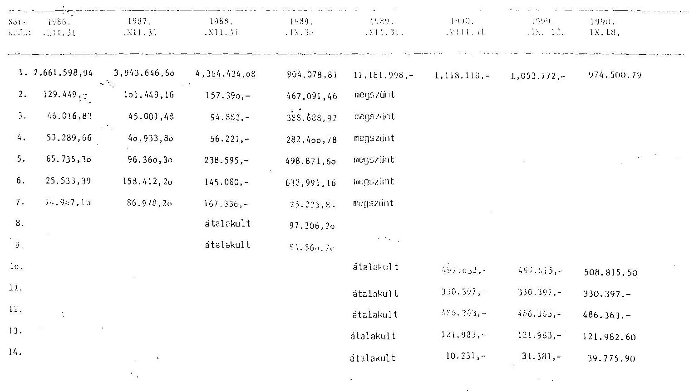

Eszjegyzém: Nincs adati 1979.1980,1981, 1982. évekre.

Budapest, 199 1. december 6.

---

# VAS MEGTEI BIZOTTSÁG

## 8. szám melléklet.

## 8. Pénsforgalom alakulása.

|  Sorszám | A bocsázás (ak és a szám) | 1979. | 1980. | 1981. | 1982. | 1983. | 1984. | 1985.  |
| --- | --- | --- | --- | --- | --- | --- | --- | --- |
|   |  | KIL. 31. | KIL. 31. | KIL. 31. | KIL. 31. | KIL. 31. | KIL. 31. | KIL. 31.  |
|  1. | KRB Szhely 479-90172-6971 Vas M8 | 1.589.174,75 | 410.214,26 | 2.472.645,53 | 2.507.172,16 | 1.689.664,23 | 4.414.294,82 | 1.464.668,54  |
|  2. | KRB Sárv. 479-90172-9558 Sárvár | x | x | x | 23.110,50 | 43.295,80 | 123.209,21 | 159.386,55  |
|  3. | KRB Szhely 479-90172-9572 Kőszeg | x | x | x | 124.521, | 45.478,77 | 250.803,87 | 80.235,42  |
|  4. | KRB Szhely 479-90172-7680 Szankóhely | x | x | x | 28.554,20 | 73.374,80 | 104.415,80 | 222.446,84  |
|  5. | KRB Csild. 479-90172-8836 Csildcsild | x | x | x | 19.896,36 | 15.474,90 | 72.703,26 | 7.633,96  |
|  6. | KRB Kőzn 479-90172-8887 Kőzsred | x | x | x | 8.421,15 | 53.350,05 | 60.435,65 | 563,65  |
|  7. | KRB Sárv. 479-90172-6579 Szankóhőzd |  |  |  |  |  |  |   |
|  8. | KRB Szhely 479-90172-6586 Szavár |  |  |  |  |  |  |   |
|  9. | KRB Szhely 479-90172-9893 Chizstási Igazg. | x | x | x | 246.677,30 | 717,90 | 31.996,10 | 26.003,59  |
|  10. | OKHB 473-4739-0117 Sárvár |  |  |  |  |  |  |   |
|  11. | OIF 2272 Férremi |  |  |  |  |  |  |   |

"1991. évi L1. törvény - pótelszámolás - melléklete".

---

# VAS MR

## 8. szám melléklet

## 8. Főterősegítése alakulása

|  Személy | 1986. | 1987. | 1988. | 1989. | 1990. | 1991. | 1992. | 1993. | 1994.  |
| --- | --- | --- | --- | --- | --- | --- | --- | --- | --- |
|  1. | 2.910.527,83 | 4.683.279,59 | 12.479.294,66 | 3.262.284,53 | 19.283.460,- | 287.177,- | 153.437,- | 201.199,02 |   |
|  2. | 21.839,- | 23.431,76 | 196,63 | 165.761,12 | megszűnt |  |  |  |   |
|  3. | 40.405,32 | 28.416,77 | 288.248,57 | 216.850,58 | megszűnt |  |  |  |   |
|  4. | 79.566,12 | 58.981,02 | 645.992,32 | 916.209,52 | megszűnt |  |  |  |   |
|  5. | 274,86 | 44.704,16 | 53.743,80 | 128.913,98 | megszűnt |  |  |  |   |
|  6. | 11.171,17 | 86,33 | 829,24 | 200.129,59 | megszűnt |  |  |  |   |
|  7. | 721,90 | 10.239,50 | 2.619,40 | 93.042,22 | megszűnt |  |  |  |   |
|  8. | 73.536,39 | 37.360,03 | 4.244,73 | 195.787,63 | megszűnt |  |  |  |   |
|  9. | 283.156,06 | 232.322,- | 287.431,30 | megszűnt |  |  |  |  |   |
|  10. |  |  |  |  | átalakult | 39.352,- | 35.352,- | 39.531,80 |   |
|  11. |  |  |  |  | átalakult | 112.742,- | 112.742,- | 114.742,- |   |

Mezésszáz sincs adat:

G1 x-szel jelzettekre.

Budapest, 199.1. december 6.

---

## 8. szám melléklet

### B. Pénsforgalom alakulása

|  Sorszám | A bockázámlák és azokat vezetője az 1. pénsintésszak megnevezései | 1980. | 1981. | 1982. | 1983. | 1984. | 1985.  |
| --- | --- | --- | --- | --- | --- | --- | --- |
|   |  | X11.31 | X11.31 | X11.31 | X11.31 | X11.31 | X11.31  |
|  1. | NGB Veszpr.489-90172-9646 |  |  |  |  |  |   |
|   | Veszprén N8 | 1,296,093,49 | 3,425,864,35 | 3,526,617,65 | 1,120,073,53 | 2,498,049,71 | 1,996,799,03  |
|  2. | NGB Veszpr.489-90172-6981 |  |  |  |  |  |   |
|   | Üzstdát Égazgatóság | x | 111,18 | 504,230,50 | 311,372,98 | 580,068,90 | 384,552,41  |
|  3. | NGB Veszpr.489-90172-9616 |  |  |  |  |  |   |
|   | B. füred | x | 28,029,73 | 19,762,03 | 29,731,37 | 159,987,12 | 57,516,82  |
|  4. | NGB Veszpr.489-90172-6620 |  |  |  | átalakult | 139,572,30 | 132,872,85  |
|   | B. almódi |  |  |  |  |  |   |
|  5. | NGB Ajka 489-90172-8914 |  |  |  |  |  |   |
|   | Ajka | x | 22,654,95 | 23,364,55 | 18,760,25 | 27,061,45 | 41,761,55  |
|  6. | NGB Veszpr.489-90172-6613 |  |  |  | átalakult | 101,847,70 | 33,104,50  |
|   | Sümeg |  |  |  |  |  |   |
|  7. | NGB Veszpr.489-90172-6606 |  |  |  | átalakult | 143,687,70 | 43,439,90  |
|   | Ztre |  |  |  |  |  |   |
|  8. | NGB Veszpr.489-90172-9496 |  |  |  |  |  |   |
|   | Ztre | x | 23,371,50 | 11,431,06 | 20,127,16 | 382,393,06 | 46,404,92  |
|  9. | NGB Veszpr.489-90172-7712 |  |  |  |  |  |   |
|   | Tárgat almódi | x | 14,662,43 | 8,386,33 | 12,176,23 | 184,541,03 | 25,033,05  |
|  10. | NGB Veszpr.489-90172-7726 |  |  |  |  |  |   |
|   | Veszprén | x | 20,578,41 | 76,452,28 | 46,052,19 | 303,638,35 | 200,903,85  |
|  11. | Pápaind.489-90172-9945 |  |  |  |  |  |   |
|   | Pápai | x | x | 48,752,52 | 99,855,22 | 99,205,56 | 88,324,31  |
|  12. | NGB Veszprén |  |  |  |  |  |   |
|   | Tapalca | átalakult | 46,235,00 | 32,688,86 | megszínt |  |   |
|  13. | NGB Veszprén |  |  |  |  |  |   |
|   | Ajka | átalakult | 21,865,25 | 51,774,05 | megszínt |  |   |
|  14. | NGB Veszprén |  |  |  |  |  |   |
|   | Veszprén |  | átalakult | 37,587,90 | megszínt |  |   |
|  15. | Off. B. füred |  |  |  |  |  |   |
|   | B. füred |  |  |  |  |  |   |
|  16. | Tak. Szöv. B. fákajár |  |  |  |  |  |   |
|   | B. almódi |  |  |  |  |  |   |
|  17. | NGB Ajka |  |  |  |  |  |   |
|   | Ajka |  |  |  |  |  |   |
|  18. | Off. Sümeg |  |  |  |  |  |   |
|   | Sümeg |  |  |  |  |  |   |

---

- VESZPRÉM MB

1.  szánu melléklet B. Pótoitszámolás alakulása

|  1980. | 1981. | 1982. | 1983. | 1984. | 1985.  |
| --- | --- | --- | --- | --- | --- |
|  1980. | 1981. | 1982. | 1983. | 1984. | 1985.  |
|  1980. | 1981. | 1982. | 1983. | 1984. | 1985.  |
|  1980. | 1981. | 1982. | 1983. | 1984. | 1985.  |
|  1980. | 1981. | 1982. | 1983. | 1984. | 1985.  |
|  1980. | 1981. | 1982. | 1983. | 1984. | 1985.  |
|  1980. | 1981. | 1982. | 1983. | 1984. | 1985.  |
|  1980. | 1981. | 1982. | 1983. | 1984. | 1985.  |
|  1980. | 1981. | 1982. | 1983. | 1984. | 1985.  |
|  1980. | 1981. | 1982. | 1983. | 1984. | 1985.  |
|  1980. | 1981. | 1982. | 1983. | 1984. | 1985.  |
|  1980. | 1981. | 1982. | 1983. | 1984. | 1985.  |
|  1980. | 1981. | 1982. | 1983. | 1984. | 1985.  |
|  1980. | 1981. | 1982. | 1983. | 1984. | 1985.  |
|  1980. | 1981. | 1982. | 1983. | 1984. | 1985.  |
|  1980. | 1981. | 1982. | 1983. | 1984. | 1985.  |
|  1980. | 1981. | 1982. | 1983. | 1984. | 1985.  |
|  1980. | 1981. | 1982. | 1983. | 1984. | 1985.  |
|  1980. | 1981. | 1982. | 1983. | 1984. | 1985.  |
|  1980. | 1981. | 1982. | 1983. | 1984. | 1985.  |
|  1980. | 1981. | 1982. | 1983. | 1984. | 1985.  |
|  1980. | 1981. | 1982. | 1983. | 1984. | 1985.  |
|  1980. | 1981. | 1982. | 1983. | 1984. | 1985.  |
|  1980. | 1981. | 1982. | 1983. | 1984. | 1985.  |
|  1980. | 1981. | 1982. | 1983. | 1984. | 1985.  |
|  1980. | 1981. | 1982. | 1983. | 1984. | 1985.  |
|  1980. | 1981. | 1982. | 1983. | 1984. | 1985.  |
|  1980. | 1981. | 1982. | 1983. | 1984. | 1985.  |
|  1980. | 1981. | 1982. | 1983. | 1984. | 1985.  |
|  1980. | 1981. | 1982. | 1983. | 1984. | 1985.  |
|  1980. | 1981. | 1982. | 1983. | 1984. | 1985.  |
|  1980. | 1981. | 1982. | 1983. | 1984. | 1985.  |
|

---

# VESZPÂĖM MB

## 8. szám: melléklet.

## B Pánforgalom alakulása.

|  Sorszám | 1986. 201. 31. | 1987. 201. 31. | 1988. 201. 31. | 1989. 201. 31. | 1989. 201. 31. | 1990. 201. 31. | 1990. 10. 12. | 1990. 10. 18.  |
| --- | --- | --- | --- | --- | --- | --- | --- | --- |
|  1. | 6,619.822,71 | 7,363.323,43 | 14,118.813,40 | 723,72 | 26,319.469,63 | 359.715,85 | 145.163,85 | 169.221,85  |
|  2. | x | 536.118,73 | 1,277.252,67 | 844,59 | megszünt |  |  |   |
|  3. | x | 79.810,99 | 107.628,49 | 191.667,99 | megszünt |  |  |   |
|  4. | x | 11.132,97 | 37.094,83 | 172.512,11 | megszünt |  |  |   |
|  5. | x | 35.125,30 | 58.107,74 | 375.760,12 | megszünt |  |  |   |
|  6. | x | 50.732,95 | 39.813,89 | 73.941,89 | megszünt |  |  |   |
|  7. | x | 37.445,92 | 57.474,60 | 134.493,30 | megszünt |  |  |   |
|  8. | x | 57.765,60 | 52.721,90 | 423.668,30 | megszünt |  |  |   |
|  9. | x | 87.799,80 | 90.651,72 | 257.218,48 | megszünt |  |  |   |
|  10. | x | 4.926,- | 157.019,60 | 1.882.728,10 | megszünt |  |  |   |
|  11. | 332.076,51 | 27.964,10 | 89.373,59 | 463.804,17 | megszünt |  |  |   |
|  12. |  |  |  |  |  |  |  |   |
|  13. |  |  |  |  |  |  |  |   |
|  14. |  |  |  |  |  |  |  |   |
|  15. |  |  |  | átalskult | 108.315,- | 168.315,- | 106.443,50 |   |
|  16. |  |  |  | átalskult | 121.400,- | 121.400,- | 121.400,- |   |
|  17. |  |  |  | átalskult | 238.776,40 | 238.776,40 | 326.286,40 |   |
|  18. |  |  |  | átalskult | 150.592,60 | 150.592,60 | 190.592,60 |   |
|  19. |  |  |  | átalskult | 152.962,30 | 142.470,30 | 130.470,30 |   |
|  20. |  |  |  | átalskult | 116.889,70 | 116.889,70 | 116.899,70 |   |
|  21. |  |  |  | átalskult | 246.198,60 | 245.398,60 | 243.856,60 |   |
|  22. |  |  |  | átalskult | 223.013,- | 203.343,- | 204.934,- |   |
|  23. |  |  |  | átalskult | 238.697,20 | 223.648,20 | 233.590,20 |   |

Mezzerzés: Kincs adat: 1979. évre, valamint az e-szel jelzettekmől.

Budapest, 1991. december 6.

---

### ZALAMEGYEI BIZOTISÁG

#### 8. azágy melléklet

#### 8. Pénzforgalom alakulása

|  Sor-
szám: | Bankszámlák és azokat
vezető pénzintézetek
negynevezése: | 1983.
XII.31. | 1984.
XII.31 | 1985.
XII.31 | 1986.
XII.31 | 1987.
XII.31 | 1988.
XII.31 | 1989.
IX.30 | 1989.
XII.31 | 1990.
VIII.31 | 1990.
IX.12 | 1990.
IX.18.  |
| --- | --- | --- | --- | --- | --- | --- | --- | --- | --- | --- | --- | --- |
|  1. | HNB 499-90172-6991
Zsla MS | 3,752.079,59 | 5,854.837,06 | 6,289.244,52 | 5,192.990,70 | 4,164.112,68 | 6,143.808,72 | 6,370.452,59 | 6,696.957,11 | 552.074,71 | 187.552,71 | 181.500,51  |
|  2. | HNB 499-90172-9310
Oktatási Ig. | 118.217,94 | 127.827,64 | 671.685,84 | 115.222,39 | 40.479,29 | 0 | mopszünt. |  |  |  |   |
|  3. | HNB 499-20172-8931.
Keszthely | 159.932,17 | 299.089,02 | 99.982,07 | 30.098,62 | 214.424,31 | 324.938, | 85.395,28 | 266.228,80 | 220.763,76 | 37.653, | 157.213,78  |
|  4. | HNB 499-50172-5028
Z.egersz.
Lanti | 202.639,67 | 354.765,57 | 150.443,77 | 261.597,27 | 110.356,67 | 223.325,16 | 426.886,42 | 331.487,60 | 3.014,20 | 2.560,20 |   |
|  5. | HNB 499-90172-7741
Megakontina | átalskult | 159.498,40 | 134.469,10 | 86.703,20 | 118.399,50 | 271.788,70 | 169.206,40 | 243.502,20 | 36.853, | 38.853, | 52.653,44  |
|  6. | HNB 499-90172-7741
Kagykontina | 447.500,72 | 692.766,81 | 169.409,89 | 636,74 | 163,32 | 157.180,53 | 529.338,25 | 628.827,77 | 1.223,65 | 2.223,69 | 6.596,48  |
|  7. | HNB 2.eg.499-90172-7734
Z. segerszeg | 141.947,38 | 513.795,06 | 198.189,30 | 43.872,63 | 177.028,34 | 458.555,93 | 1,625.151,93 | 939.749,40 | 144.725,23 | 262.123,33 | 354.406,83  |
|  8. | HNB 2.eg.499-90172-6630
Zalaszentgrát | átalskult | 19.940,18 | 81.110,48 | 137.872,68 | 199.735,38 | 104.099,66 | 105.032,12 | 198.362,50 | 82.181,72 | 81.232,72 | 110.432,72  |

Megjegyzés: Kincse adat: 1979, 1980, 1981, 1982. óvokra.

Endüpert: 199 1. december 6.

---

BUDAPESTI BIZOTTSÁG

1. azáru melléklet.

1. Pénzforgalom alakulása.

|  Sor- | A bealkazáslák és a szánd- | 1976. | 1980. | 1981. | 1982. | 1983. | 1984. | 1985.  |
| --- | --- | --- | --- | --- | --- | --- | --- | --- |
|  - nem |  | S11. 31. | S11. 31. | S11. 31. | S11. 31. | S11. 31. | S11. 31. | S11. 31.  |
|  1. | MAB 235-90172-7011 |  |  |  |  |  |  |   |
|   | I. ker. | x | x | x | 64.590,20 | 222.540,14 | 682.027,12 | 346.000,68  |
|  2. | MAB 235-90172-7028 |  |  |  |  |  |  |   |
|   | II. ker. | x | x | x | 191.447,33 | 124.536,97 | 501.362,32 | 565.458,12  |
|  3. | MAB 235-90172-7035 |  |  |  |  |  |  |   |
|   | III.ker. | x | x | x | 509,48 | 234.543,07 | 701.969,26 | 380.161,43  |
|  4. | MAB 235-90172-7042 |  |  |  |  |  |  |   |
|   | IV.ker. | x | x | x | 648.249,99 | 147.022,28 | 1.070.564,51 | 232.812,80  |
|  5. | MAB 235-90172-7059 |  |  |  |  |  |  |   |
|   | V. ker. | x | x | x | 203.447,33 | 674.133,91 | 637.097,10 | 3.886.686,27  |
|  6. | MAB 235-90172-7066 |  |  |  |  |  |  |   |
|   | VI. ker. | x | x | x | 197,33 | 3.488,49 | 1.127.480,88 | 801.748,40  |
|  7. | MAB 235-90172-7073 |  |  |  |  |  |  |   |
|   | VII. ker. | x | x | x | 4.451,48 | 1.678.258,33 | 1.144.076,87 | 1.426.763,78  |
|  8. | MAB 235-90172-7082 |  |  |  |  |  |  |   |
|   | VIII.ker. | x | x | x | 125.833,29 | 99.799,23 | 201.146,34 | 140.370,34  |
|  9. | MAB 235-90172-7097 |  |  |  |  |  |  |   |
|   | IX. ker. | x | x | x | 233.104,02 | 687.454,65 | 637.986,36 | 1.085.011,69  |
|  10. | MAB 235-90172-7107 |  |  |  |  |  |  |   |
|   | X. ker. | x | x | x | 181.687,99 | 598.039,76 | 960.306,39 | 737.730,61  |
|  11. | MAB 235-90172-7114 |  |  |  |  |  |  |   |
|   | XI.ker. | x | x | x | 471.190,02 | 236.441,34 | 1.605.412,66 | 1.009.206,32  |
|  12. | MAB 235-90172-7121 |  |  |  |  |  |  |   |
|   | XII.ker. | x | x | x | 57.481,83 | 75.163,81 | 355.764,68 | 383.504,38  |
|  13. | MAB 235-90172-7138 |  |  |  |  |  |  |   |
|   | XIII.ker. | x | x | x | 554.351,66 | 981.569,52 | 880.727,44 | 1.397.471,72  |
|  14. | MAB 235-90172-7145 |  |  |  |  |  |  |   |
|   | XIV. ker. | x | x | x | 185.983,95 | 227.441,92 | 962.976,91 | 309.572,11  |
|  15. | MAB 235-90172-7152 |  |  |  |  |  |  |   |
|   | XV.ker. | x | x | x | 281.477,59 | 600.895,88 | 439.253,25 | 1.113.677,30  |
|  16. | MAB 235-90172-7169 |  |  |  |  |  |  |   |
|   | XVI. | x | x | x | 241.352,57 | 148.578,37 | 148.795,56 | 282.568,47  |
|  17. | MAB 235-90172-7176 |  |  |  |  |  |  |   |
|   | XVII.ker. | x | x | x | 116.220,43 | 324.427,39 | 189.477,25 | 844.192,0  |
|  18. | MAB 235-90172-7183 |  |  |  |  |  |  |   |
|   | XVIII.ker. | x | x | x | 225.521,01 | 219.805,30 | 83.773,14 | 785.176,30  |

---

# 8. szám/melléklet.

# 9. Pénforgalon alakulása.

# 10. SZÁNLÁK KÖYESLEGŰ

|  SZÁNLÁK KÖYESLEGŰ |  |  |  |  |  |  |   |
| --- | --- | --- | --- | --- | --- | --- | --- |
|  Számlák és szám |  |  |  |  |  |  |   |
|  női |  |  |  |  |  |  |   |
|  női |  |  |  |  |  |  |   |
|  19. 233-90172-7190 |  |  |  |  |  |  |   |
|  Kik. |  |  |  |  |  |  |   |
|  20. 235-90172-7200 |  |  |  |  |  |  |   |
|  Kik. |  |  |  |  |  |  |   |
|  21. 233-90172-7217 |  |  |  |  |  |  |   |
|  Kik. |  |  |  |  |  |  |   |
|  22. 235-90172-7224 |  |  |  |  |  |  |   |
|  Kik. |  |  |  |  |  |  |   |
|  23. 235-90172-7004 |  |  |  |  |  |  |   |
|  Budapesti Biz. |  |  |  |  |  |  |   |
|  24. 233-90172-9116 |  |  |  |  |  |  |   |
|  Ciktacza Isparg. |  |  |  |  |  |  |   |
|  25. OTP III. |  |  |  |  |  |  |   |
|  26. 012-511. |  |  |  |  |  |  |   |
|  27. 012-511. |  |  |  |  |  |  |   |
|  28. 012-511. |  |  |  |  |  |  |   |
|  29. OTP XXII. |  |  |  |  |  |  |   |
|  Hiv. az. 2425 |  |  |  |  |  |  |   |

|  1/1. oldal | 1991. évi LI. törvény - pótolózásulás - melléklete"  |
| --- | --- |
|  |   |

---

Bp-1 Btz.

1. azóre melléklet.

B. Pécsforzaton alakulása.

|  Név | 1980. | 1981. | 1982. | 1983. | 1984. | 1985. | 1986. | 1987.  |
| --- | --- | --- | --- | --- | --- | --- | --- | --- |
|  1. | 444.798,81 | 782.657,40 | 331.828,92 | 841.717,42 | 483.160,88 | 30.716,76 | 66.564,70 | 68.870,76  |
|  2. | 791.101,55 | 1.279.717,16 | 473.901,48 | 1.523.160,15 | 535.905,97 | 1.243.696,43 | 1.241.045,43 | 1.396.544,83  |
|  3. | 248.247,91 | 386.757,78 | 972.684,35 | 426.797,44 | 193.550,34 | 11.644,38 | 1.884,38 | 220.879,-  |
|  4. | 466.542,80 | 968.258,50 | 642.058,01 | 2.133.741,86 | 1.041.638,46 | 272.641,32 | 14.656,32 | 37.525,32  |
|  5. | 4.228.209,04 | 1.702.383,45 | 2.476.767,61 | 7.422.327,03 | 4.189.439,08 | 1.415.854,62 | 1.499.484,62 | 1.395.977,62  |
|  6. | 502.463,06 | 1.537.647,59 | 1.577.032,04 | 1.871.852,98 | 3.650.837,58 | 231.664,44 | 452.761,94 | 445.161,94  |
|  7. | 1.237.368,50 | 529.894,57 | 1.528.873,78 | 1.971.939,11 | 941.086,07 | 1.062.435,39 | 14.919,20 | 377.246,39  |
|  8. | 314.012,05 | 2.233.661,41 | 936.281,- | 3.255.395,45 | 1.780.546,23 | 266.170,89 | 251.078,89 | 149.042,20  |
|  9. | 703.210,14 | 1.145.647,03 | 895.552,95 | 3.500.683,61 | 417.382,29 | 264.303,05 | 7.265,56 | 1.565,55  |
|  10. | 2.236.654,87 | 496.807,89 | 2.315.499,51 | 1.789.699,91 | 375.244,51 | 45.176,51 | 46.076,51 | 489.290,-  |
|  11. | 1.283.918,45 | 2.155.105,27 | 1.206.532,09 | 1.440.294,91 | 547.400,79 | 556.004,27 | 618.155,27 | 540.429,27  |
|  12. | 174.825,91 | 659.819,52 | 337.040,14 | 783.843,16 | 143.731,68 | 331.118,78 | 211.265,- | 70.225,78  |
|  13. | 1.197.366,70 | 1.806.703,77 | 941.026,81 | 1.712.109,37 | 1.629.395,79 | 492.628,73 | 61.817,73 | 66.817,73  |
|  14. | 933.981,13 | 1.036.622,10 | 716.424,75 | 1.127.273,95 | 11.456,05 | 100.224,61 | 13.726,61 | 13.472,61  |
|  15. | 374.028,51 | 130.388,48 | 927.722,38 | 987.099,30 | 312.628,08 | 318.691,78 | 214.379,25 | 229.203,20  |
|  16. | 164.119,74 | 30.541,03 | 1.162.258,05 | 302.485,99 | 56.999,24 | 209.737,34 | 321.950,34 | 245.791,34  |
|  17. | 394.188,53 | 19.429,01 | 548.066,75 | 1.297.359,95 | 626.720,83 | 426.721,95 | 434.925,95 | 375.740,95  |
|  18. | 419.855,44 | 198.691,71 | 681.488,29 | 677.878,60 | 434.006,80 | 574.752,82 | 342.020,32 | 251.297,32  |
|  19. | 506.222,66 | 455.857,61 | 317.042,66 | 618.533,95 | 30.990,77 | 354.905,11 | 432.940,11 | 214.017,11  |
|  20. | 232.925,16 | 442.257,30 | 853.100,82 | 154.974,38 | 248.439,84 | 156.268,16 | 432.428,16 | 121.428,16  |
|  21. | 555.264,89 | 378.265,84 | 965.938,33 | 720.611,35 | 194.788,33 | 139.668,33 | 9.305,33 | 2.305,33  |
|  22. | 158.154,30 | 241.284,64 | 539.856,10 | 739.050,66 | 124.714,86 | 42.167,06 | 152.719,06 | 151.649,06  |
|  23. | 5.152.814,02 | 35.248.624,92 | 53.324.287,22 | 33.340.038,38 | 40.569.566,94 | 8.937.111,75 | 1.012.415,05 | 1.038.395,65  |
|  24. | 191.715,34 | 7.298.987,75 | 1.879.749,9 | 4.575.806,03 | 2.558.118,42 |  |  |   |

Megjegyzés: Nincs adat: 1979.1980. 1981. évekre,

---

# INTERMÉNYEK

## 8. szám: melléklet

## 9. Pényesapatos alakulása

## NRB SZÁMLÁK EGYEHLEGE

|  Sorszám | 1983. | 1984. | 1985. | 1986. | 1987. | 1988. | 1989. | 1990. | 1991.  |
| --- | --- | --- | --- | --- | --- | --- | --- | --- | --- |
|  Azat: 200.000.000 |  |  |  |  |  |  |  |  |   |
|  Azat: 200.000.000 |  |  |  |  |  |  |  |  |   |
|  Személyes: 100.000.000 |  |  |  |  |  |  |  |  |   |
|  1. KWZ Ny. 235-90172-9082. |  |  |  |  |  |  |  |  |   |
|  Politikai Váluknál | 2,899.743,96 | 8,938,640,63 | 2,233,888,98 | 13,788,871,78 | 22,046,268,27 | 12,743,142,88 | 33,681,706,07 | megszínt |   |
|  2. HAB 235-90172-9824 |  |  |  |  |  |  |  |  |   |
|  Társtud. Intézet | 309.245,98 | 846,65 | 543,536,92 | 4,053,460,81 | 3,497,339,71 | 3,601,135,86 | 5,199,061,29 | megszínt |   |
|  3. HAB 235-90172-9068 |  |  |  |  |  |  |  |  |   |
|  Párttárt. Intézet | 1,216,273,33 | 1,868,814,45 | 679,175,54 | 2,983,397,78 | 4,040,149,62 | 2,295,986,37 | 3,948,028,42 | 686,793,22 | 392,153,52  |
|  1990. Pol. tud. Int. |  |  |  |  |  |  |  |  |   |

Mezletvízás: Kicsa adat: 1979. 1980. 1981. 1982. évekre.

Budapest, 1991. 1. december 6.

---

MSZMP - MSZP 8. szám melléklet 8. Pénzturgalom alakulása

|  Sár- |  |  |  |  |  |  |  |   |
| --- | --- | --- | --- | --- | --- | --- | --- | --- |
|  |   |   |   |   |   |   |   |   |
|  Sor- |  |  |  |  |  |  |  |   |
|  Bar- |  |  |  |  |  |  |  |   |
|  |   |   |   |   |   |   |   |   |
|  1. | MKB 235-90172-6807 |  |  |  |  |  |  |   |
|   | MSZMP KB |  |  |  |  |  |  |   |
|   |  | 59,512.420,84 | 217,377,151,86 | 269.907.794,41 | 397.172.507,61 | 542,746.882,11 | 504,171.389,81 | 618,661.040,77  |
|  2 | MKB 235-90172-6807 |  |  |  |  |  |  |   |
|   | MSZP Orsz.Iroda |  |  |  |  |  |  |   |
|  3. | MKB 235-90172-6797 |  |  |  |  |  |  |   |
|   | MSZP Választási Alap |  |  |  |  |  |  |   |
|  4. | MKB 235-90172-6780. |  |  |  |  |  |  |   |
|   | Egéb célra elkülönített |  |  |  |  |  |  |   |
|   | pénzeszköz |  |  |  |  |  |  |   |
|   |  | 1995. | 1987. | 1988. | 1989. | 1990. | 1990. | 1990.  |
|   |  | 637.635.661,93 | 358.395.654,87 | 655.121.337,97 | 248.618.129,96 |  | 111.31 | IX.12  |
|  1. |  |  |  |  |  |  |  |   |
|  2. |  |  |  |  | átalakult | 97.683.283,63 | 14.078.170,84 | 4.954.872,52  |
|  3. |  |  |  |  | átalakult | 2.038.296,38 | 3.024.048,38 | 3.845.257,38  |
|  4. |  |  |  |  | átalakult | 1.000.000,- | 1.000.000,- | 1.000.000,-  |
|   | Budapest, 1991. december 6. |  |  |  |  |  |  |   |
|   | Budapest, 1991. december 6. |  |  |  |  |  |  |   |

Budapest, 1991.

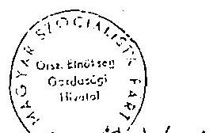

---

# B.O B LOK

## B. szám melleklet.

## B. Pénsforgalom alakulása.

## N N B SZÁMLÁK EGYKBLEGE

|  Sorszám | A kankerőnik és a szénképzés (egyevezése) | 1979. | 1980. | 1981. | 1982. | 1983. | 1984. | 1985.  |
| --- | --- | --- | --- | --- | --- | --- | --- | --- |
|   |  | X11.31. | X11.31 | X11.31. | X11.31. | X11.31 | X11.31 | X11.31  |
|  1. | NSB 299-90172-9738 |  |  |  |  |  |  |   |
|   | B.aliga | x | x | x | 381.748,47 | 2.190.077,35 | 2.536.346,87 | 5.429.961,65  |
|  2. | NSB 299-90172-9763 |  |  |  |  |  |  |   |
|   | E.Güldośr | x | x | x | 1.005.056,45 | 2.245.396,08 | 3.631.689,54 | 2.659.386,72  |
|  3. | NSB 489-90172-9843 |  |  |  |  |  |  |   |
|   | Tihany | x | x | x | 156.440,53 | 2.289.183,19 | 4.108.579,75 | 1.279.775,76  |
|  4. | NSB 489-90172-9867 |  |  |  |  |  |  |   |
|   | Balatonarács | x | x | x | 107.843,54 | 91.701,28 | 260.663,08 | 1.844.111,08  |
|  5. | NSB 235-90172-9790 |  |  |  |  |  |  |   |
|   | Dusagókö | x | x | x | 1.038.783,23 | 14.890.037,43 | 7.330.309,34 | 13.920.371,47  |
|  6. | NSB 235-90172-9783 |  |  |  |  |  |  |   |
|   | Lelegyés | x | x | x | 270.677,57 | 217.944,68 | 233.060,61 | 203.236,28  |
|  7. | NSB 235-90172-9831 |  |  |  |  |  |  |   |
|   | Külögyí Szélsz | x | x | x | 319.545,50 | 1.533.028,40 | 1.073.158,69 | 2.241.471,77  |
|  8. | NSB 235-90172-9817 |  |  |  |  |  |  |   |
|   | Sárp. Neur. Elí. F. | x | x | x | 1.498.160,28 | 1.182.035,47 | 1.033.295,51 | 2.447.845,98  |
|  9. | NSB 235-90172-9055 |  |  |  |  |  |  |   |
|   | Bónai parti Udölő | x | x | x | 56.824,52 | 10.029.835,26 | 691.686,88 | 52.402,42  |

---

# B. kvèrna melleklet.

## B. béreforgátom alakulása.

|  Bér. | 1980. | 1981. | 1982. | 1983. | 1984. | 1985. | 1986. | 1987. | 1988.  |
| --- | --- | --- | --- | --- | --- | --- | --- | --- | --- |
|  mester | .321.31 | .331.31 | .311.31 | .11.31 | .11.31 | .11.31 | .11.31 | .11.31 | .11.18  |

|  1. | 753.993,32 | 1.795.918,74 | 450.129,30 | x | 3.405.946,03 | megszínt |  |  |   |
| --- | --- | --- | --- | --- | --- | --- | --- | --- | --- |
|  2. | 1.800.912,32 | 2.029.721,85 | 6.352.348,79 | x | 8.277.113,44 | megszínt |  |  |   |
|  3. | 1.383.195,88 | 2.216.905,44 | 348.242,23 | x | 730.780,16 | 1.671.708,70 | megszínt |  |   |
|  4. | 83.772,80 | 252.169,84 | 1.121.897,70 | x | 601.073,16 | megszínt |  |  |   |
|  5. | 2.124.591,92 | 652.290,29 | 336.460,02 | x | 1.815.117,10 | megszínt |  |  |   |
|  6. | 851.799,52 | 600.350,68 | 462.809,88 | x | 548.256,10 | 870.548,62 | 534.573,39 | 420.286,49 |   |
|  7. | 1.412.510,02 | 4.276.190,16 | 1.544.601,31 | x | 3.026.121,66 | 4.422.209,49 | 4.636.376,31 | 5.894.160,07 |   |
|  8. | 1.361.798,93 | 1.651.464,22 | 687.853,81 | x | 5.417.658,85 | megszínt |  |  |   |
|  9. | 1.07.833,42 | 4.963.913,35 | 2.219.358,84 | x | 1.631.250,28 | megszínt |  |  |   |

B. béreforgátom alakulása.

# 1991. évi 11. törvény - pótelszámolás - melleklete

B. béreforgátom alakulása.

Bordapest, 1991. december 6.

---

# BARANTA MEGYEI BIZOTTÁG

## B. szám melléklet

## B. Pénsforgalom alakulása

|  SZM: | Pártszervenkénti | 1983. | 1984. | 1985. | 1986. | 1987. | 1988. | 1989. | 1990. | 1990. | 1990. | 1990.  |
| --- | --- | --- | --- | --- | --- | --- | --- | --- | --- | --- | --- | --- |
|   |  | X11.31. | X11.31. | X11.31. | X11.31. | X11.31. | X11.31. |  |  |  |  |   |
|  1. | Baranya MS | 12.904,40 | 12.500,50 | 13.868,60 | 18.558,90 | 16.830,0 | 31.309,20 | 557420,50 | 5.673,10 | 10.764,80 | 16.743,80 | 12.393,80  |
|  2. | Pécs | 5.994,33 | 10.215,48 | 2.002,70 | 2.681,90 | 5.603,60 | 8.183,90 | 6070,10 | 5.099,70 | 933,60 | 31.892,40 | 27.017,80  |
|  3. | KGSLÓ | 801,60 | 3.967,90 | 3.079,70 | 2.432,10 | 725,80 | 5.696,60 | 159,40 | 9.812,30 | 8.520,96 | 32.760,36 | 28.185,96  |
|  4. | Mohács | 2.489,60 | 462,70 | 5.032,80 | 4.049,0 | 4.987,50 | 10.153,50 | 14874,50 | 0 | 5.430,80 | 3.890,0 | 22.689,80  |
|  5. | SZKLÓS | 309,34 | 2.740,14 | 440,20 | 4.933,70 | 7.531,90 | 8.574,20 | 8881,80 | 51.433,0 | 14.078,40 | 27.417,90 | 21.629,70  |
|  6. | SZIGETVÁK | 3.046,69 | 2.384,19 | 4.443,59 | 1.823,89 | 9.557,89 | 5.405,09 | 7613,49 | 2.992,09 | 10.258,60 | 1.642,20 | 30.197,20  |
|  7. | OKTATÁSI IGAZG: | X | 4.275,30 | 101,90 | 2550,50 | 3.989,20 | 1.459,60 |  |  |  |  |   |

**Megényelés:** Zilárd adat: 1979, 1980, 1981, 1982. évekre, valamint 1983. okt.igra

Budapest, 1991. december 6.

---

# 8. azáru melléklet 

## 8. Pénzforgalom alakulása

## HÁZIPÉNZTÁR EUTENLEGE

| Sor- Pértszervenkénti azám bontáshoz: | 1983.   XII. 31. | 1984.   XII. 31. | 1985.   XII. 31. | 1986.   XII. 31. | 1987.   XII. 31. | 1988.   XII. 31. | 1989.   IX. 30. | 1989.   XII. 31. | 1990.   XII. 31. | 1990.   IX. 18. |
| :--: | :--: | :--: | :--: | :--: | :--: | :--: | :--: | :--: | :--: | :--: |
| 1. Bács MB | 19.486,20 | 10.222,48 | 12.437,90 | 14.846,80 | 14.346,70 | 14.341,60 | 14.468,- | 15.000 .- | 20.285 .- | 20.205 .- |
| 2. Fecskenut VB | 3.504 . | 3.843 .50 | 2608,30 | 3.210 .40 | 3.527 .70 | $x$ | 5.827 .80 | 13.968 .- | 8.147 .- | 23.140 .- |
| 3. Baja VB | 2.143,24 | 476,98 | 11.558,48 | 4.449,67 | 68.699,97 | $x$ | 64.653,27 | 2.014 .- | 3.823 .- | 6.148 .- |
| 4. Bácsaímás VB. | átalakult | 5.278 .70 | 4.384 .10 | 5.176 .70 | 13.837 .50 | $x$ | 10.554 .80 | 0 | 9.799 .- | 23.097 .- |
| 5. Kaloesa VB. | 1.683 .- | 1.796 .50 | 4.108 .65 | 1.926 .05 | 2.349 .35 | $x$ | 31.807 .25 | 0 | 1.620 .- | 11.775 .- |
| 6. Kisbürös VB. | 4.462 .20 | 2.108 .70 | 4.446 .40 | 3.979 .70 | 487.40 | $x$ | 43.853 .70 | 0 | 11.334 .- | 9.623 .- |
| 7. Kizbunfélegyháza | 5.471 .56 | 5.468 .06 | 419.63 | 5.651 .36 | 49.242 .10 | $x$ | 29.803 .90 | 0 | 3.990 .- | 1.190 .- |
| 8. Kisúmhalas VB | 1.416 .21 | 3.290 .71 | 2.583 .41 | 830.61 | 36.686 .51 | $x$ | 49.831 .81 | 0 | 27.924 .- | 21.850 .- |
| 9. I. | átalakult | 6.136 .40 | 4.108 .90 | 4.163 .60 | 20.822 .30 | $x$ | 34.226 .70 | 2.981 .- | 50.934 .- | 19.012 .- |
| 10. Vinnahárzáa | átalakult | 61.50 | 5.710 .33 | 4.790 .83 | 519.20 | $x$ | 27.344 .30 | 0 | 49.401 . | 43.081 .- |
| 11. Kizbunotjaa | átalakult | 2.428 .10 | 3.704 .20 | 5.681 .20 | 17.659 .64 | $x$ | 31.790 .50 | megszünt |  |  |
| 12. Wazzási igazg. | 4.121 .60 | 2.115 .50 | 4.082 .50 | 793.70 | 4.003 .10 | $x$ | 2.254 .16 | megszünt |  |  |
| 13. Jánoshalma |  |  |  |  |  |  | átalaku | 12.015 .- | megszünt |  |

Megjegyzés: Nincs adat: 1979, 1980, 1981, 1982. évekre, valamint
az x-szel jelölteknél.
Dodupent, 199 1.docember 6.

---

# BÉKÉS MEGYEI BIZOTSÁG

## 8. szám: melléklet

## 8. Pénzforgalom alakulása

### HÁZIPÉNZIÁR ECYÉNLEGE

|  Sor-
szám: | Párszervenkénti
1983.
XII.31. | 1984.
XII.31. | 1985.
XII.31. | 1986.
XII.31. | 1987.
XII.31. | 1988.
XII.31. | 1989.
IX.30. | 1989.
XI.31. | 1990.
XI.31. | 1990.
XI.12. | 1990.
IX.18.  |
| --- | --- | --- | --- | --- | --- | --- | --- | --- | --- | --- | --- |
|  1. Békés MB | 8.481,52 13.684,20 | 8.619,80 13.274,20 | 7.710,40 | 6.086,60 | 368,94 | 4.378,65 | 8.340,25 | 18.275,25 | 5.835,- |  |   |
|  2. Békéscsaba VB | 3.410,29 | 389,34 1.110,54 | 2.866,06 | 201,59 | 7.492,38 | 4.489,38 23.925,38 | 40.586,20 | 18.557,20 | 39.116,80 |  |   |
|  3. Gyula VB | 30,45 2.657,35 | 2.489,35 | 930,35 | 9.929,65 | 5.783,85 | 2.020,45 | 0 | 158.233,60 153.863,60 | 18.652,80 |  |   |
|  4. Drosháza VB | 2.072,07 1.815,26 | 1.110,87 | 7.359,49 | 12.340,09 | 389,12 | 143.247,10 | 0 | 33.419,90 20.260, | 19.445,90 |  |   |
|  5. Békés VB | 4.849,80 2.701,40 | 2.663,70 | 4.141,30 | 1.996,40 | 2.824,60 | 5.216,60 | 0 | 19.105,30 | 6.533,20 | 5.532,20 |   |
|  6. Szarvas VB | 2.087,87 2.725,17 | 1.919,91 | 1.121,61 | 10.329,71 | 1.713,96 | 5.863,41 | 0 | 311,-- | 125,-- | 26.535,-- |   |
|  7. Szeghalom VB | 57,60 344,20 | 139,80 | 3.230,10 | 1.347,30 | 4.021,20 | 7.150,80 | 0 | 9.694,50 | 8.494,50 | 5.830,50 |   |
|  8. Marókovázsháza | 1.740,55 2.602,45 | 1.416,75 | 1.579,65 | 5.258,60 | 4.700,90 | 5.997,60 | 0 | 8.116,90 | 3.818,50 | 11.945,50 |   |
|  9. Gyomannárás | átalakult 312,60 | 3.251,70 | 3.641,80 | 4.148,66 | 9.695,10 | 5.276,10 | megszünt |  |  |  |   |
|  10. Sarkad VB | átalakult 86,10 | 2.255,90 | 8.138,30 | 2.616,30 | 1.851,90 | 4.409,90 | megszünt |  |  |  |   |
|  11. Maróberény |  |  |  |  |  |  |  |  |  |  |   |
|  12. Hattonya |  |  |  |  |  |  |  |  |  |  |   |
|  13. Maróhegyes |  |  |  |  |  |  |  |  |  |  |   |
|  14. Oktatás: Egazg. | 1.231,50 5.197,-- | 8.869,60 4.770,30 | 8.476,70 | 6.993,93 | 6.303,88 | megszünt |  |  |  |  |   |

Merjesezés: Hincs adat: 1979, 1980, 1981, 1982. évekre.

Budapest, 199 1. december 6.

---

# KORSDD - ARAUJ - ZKMPLÉN MEGYKI BIZOTTSÁG

## 8. számkísélet

## 8. Pénsforgalom alakulása

|  Sír |  |  |  |  |  |  |  |  |  |  |  |  |   |
| --- | --- | --- | --- | --- | --- | --- | --- | --- | --- | --- | --- | --- | --- |
|  Sír | Pénszervenkától | 1983. | 1984. | 1985. | 1986. | 1987. | 1988. | 1989. | 1990. | 1990. | 1990. | 1990. | 1990.  |
|  szám | bontásban | XII.31. | XII.31. | XII.31. | XII.31. | XII.31. | XII.31. | IX.30. | XII.31. | VIII.31. | IX.12. | XII.31. | IX.18.  |
|  1. | Borzod MB | 13.163,00 | 15.857,70 | 4.471,80 | 10.803,70 | 8.916,50 | 8.428,50 | 12.338,60 | 11.102,30 | 13.668,50 | 23.669,60 | x | 21.118,60  |
|  2. | Miskolc VB | 2.272,80 | 3.371,70 | 5.840,30 | 4.786,60 | 5.741,50 | 5.607,00 | 7.206,50 | 0 | 22.823,14 | 15.567,80 | 2.096,00 | 14.108,34  |
|  3. | Ecos VB | 3.214,10 | 2.310,20 | 5.978,90 | 2.711,00 | 7.845,90 | 372,00 | 2.589,80 | 0 | 7.520,50 | 6.368,50 | 544,00 | 5.615,50  |
|  4. | Kazincbarcika | 3.625,84 | 5.727,56 | 3.577,10 | 2.572,00 | 1.216,90 | 4.830,00 | 8.949,10 | 0 | 4.405,20 | 12.099,20 | x | 12.099,20  |
|  5. | Leninváros VB | 2.137,30 | 2.764,90 | 4.800,40 | 94,60 | 9.529,30 | 1.323,00 | 10.432,40 | 0 | 42.712,90 | 44.692,90 | x | 44.192,90  |
|  6. | Mazdúkocod VB | 1.691,70 | 2.825,70 | 2.525,02 | 1.965,12 | 9.436,72 | 6.532,00 | 2.970,12 | 0 | 5.741,70 | 7.051,70 | 1.336,00 | 7.051,70  |
|  7. | Özd. VB | 6.979,20 | 1.710,70 | 3.274,95 | 6.417,35 | 456,85 | 649,00 | 6.030,45 | 0 | 17.147,80 | 10.567,80 | x | 15.512,80  |
|  8. | Sárospatak VB | 717,10 | 908,20 | 3.887,90 | 3.365,60 | 8.521,70 | 5.072,00 | 6.181,10 | 0 | 3.443,80 | 3.443,80 | x | 5.348,80  |
|  9. | Sétorraljonghely | 3.911,10 | 698,30 | 3.632,10 | 1.711,30 | 9.026,60 | 221,00 | 7.671,60 | 0 | 4.721,40 | 7.635,40 | 2.279,00 | 8.760,40  |
|  10. | Szerencs VB | 3.854,84 | 5.352,64 | 5.971,40 | 2.046,70 | 3.752,80 | 7.793,00 | 2.711,50 | 0 | 2.663,00 | 4.462,20 | 4.008,00 | 6.817,70  |
|  11. | Zsolány VB | 4.426,52 | 4.279,12 | 4.315,22 | 4.566,12 | 4.049,43 | 4.437,00 | 8.829,62 | 0 | 4.377,00 | 11.877,00 | 3.200,00 | 11.877,00  |
|  12. | Sajónszatpéter |  |  |  |  |  |  |  | átalakulit | 4.210,60 | 4.210,60 |  | 4.210,60  |
|  13. | Tokaj VB |  |  |  |  |  |  |  |  |  |  |  |   |
|  14. | Oktatási Igazg. | 1.678,80 | 2.561,00 | 2.306,70 | 1.682,70 | 2.630,70 | 1.424,00 | 1.588,60 | megszűnt |  |  | x |   |

Megjegyzés: Nincs adat: 1979, 1980, 1981, évekre, valamint az x-szel jelöltskre.

Budapest, 1994. december 6.

---

CS O N G K Á D M E G Y E I B I Z O T T S Á G 8. számú melléklet B. Fönsforgalom alakulása

H Á Z I P E R T Á R E G Y E L L E G E

|  Sorsz. | Főtergőszembén | 1983. | 1984. | 1985. | 1986. | 1987. | 1988. | 1989. | 1990. | 1991. | 1992. | 1993.  |
| --- | --- | --- | --- | --- | --- | --- | --- | --- | --- | --- | --- | --- |
|  szám |  | XIL.31. | XIL.31. | XIL.31. | XIL.31. | XIL.31. | XIL.31. | IX.30. | XIL.31. | VIII.31. | IX.12. | IX.18.  |
|  1. | Csongrád MB | 10.610,00 | 12.341,50 | 2.252,00 | 5.605,00 | 2.101,00 | 14.096,00 | 14.847,70 | 102.062,00 | 418.061,- | 268.675,00 | 107.174.-  |
|  2. | Hódoszávásárhely | 5.107,10 | 1.348,30 | 761,40 | 5.027,00 | 5.543,10 | 8.297,00 | 6.182,30 | 1.320,00 | 15.763,0 | 17.355,00 | 8.448.-  |
|  3. | Csongrád VB | 950,00 | 2.116,20 | 1.364,70 | 2.966,00 | 9.852,60 | 6.117,00 | 4.042,30 | 6.984,00 | 4.400,0 | 5.200,00 | 4.737.-  |
|  4. | Szeged VB | 5.786,50 | 5.062,10 | 4.860,00 | 3.871,00 | 2.182,20 | 9.155,00 | 5.582,00 | megszünt |  |  |   |
|  5. | Szentes VB | 5.379,98 | 3.838,40 | 5.851,50 | 5.457,00 | 9.868,90 | 7.791,00 | 4.969,90 | 10.544,00 | 11.633,0 | 16.029,00 | 15.815.-  |
|  6. | Mádó VB | 1.395,80 | 5.332,70 | 4.935,70 | 1.273,00 | 3.358,20 | 9.900,00 | 9.393,00 | 859,00 | 9.142,00 | 10.461,00 | 7.960.-  |
|  7. | Kistelek VS | átalakult | 993,05 | 1.105,90 | 4.604,00 | 6.043,60 | 6.698,00 | 5.277,00 | 8.682,00 | 14.220,00 | 14.220,00 | 12.803.-  |
|  8. | Hárzhalom VS | átalakult | 5.485,90 | 5.132,00 | 2.746,00 | 1.219,90 | 2.262,00 | 2.303,00 | 1.875,00 | 5.004,00 | 5.765,00 | 5.004.-  |
|  9. |  | 4.942,41 | 4.852,11 | 1.514,05 | 1.460,00 | 9.136,90 | 6.416,00 | 5.810,00 | 8.270,00 | megszünt |  |   |

Mességszázi Kincse zdat: 1979. 1980. 1981. 1982. évekre

Budapest, 1991. december: 6.

---

# FEJÉR-MEGYKI RIZOTTSÁG

## 8. szám: melléklet

## 8. Péncfőrzalom alakulása

### HÁZIPÉRZTÁR DETEDLEGE

|  Sor-
szám: | Pártszervenkénti
XII.31. | 1983.
XII.31. | 1984.
XII.31. | 1985.
XII.31. | 1986.
XII.31. | 1987.
XII.31. | 1988.
XII.31. | 1989.
IX.30. | 1989.
XII.31. | 1990.
1990. | 1990.
1990. | 1991.
1991. | 1991. | 1992.
1992. | 1992. | 1993. | 1993.  |
| --- | --- | --- | --- | --- | --- | --- | --- | --- | --- | --- | --- | --- | --- | --- | --- | --- | --- |
|  Fejér MI | 4.744,20 | 4.483,30 | 4.442,00 | 7.876,90 | 5.101,10 | 12.058,50 | 6.799,70 | 24.959,10 | 39.574,10 | 1.514,50 | 6.860,00 | 4.056,00 | 17.853,00 | 7.522,00 | 4.962,00 |  |   |
|  Dunaujváros | 1.467,70 | 2.290,70 | 4.530,60 | 3.375,00 | 12.556,30 | 12.413,00 | 15.566,90 | 26.665,00 | 4.471,00 | 11.715,00 | 1.095,00 | 2.866,00 | 156,00 | 2.373,00 | 5.245,00 |  |   |
|  Székesfehérvár | 1.249,70 | 3.593,20 | 368,50 | x | 719,40 | 1.886,00 | 2.423,10 | 5.776,00 | 10.275,00 | x | x | x | 2.984,00 | 20.867,20 |  |  |   |
|  Mór | 711,56 | 4.675,76 | 3.872,54 | x | 2.390,39 | 10.394,00 | 7.400,49 | 9.239,00 | 4.995,00 | 10.304,00 | 1.643,00 | 1.326,00 | 2.356,00 | 15.742,00 |  |  |   |
|  Sütke | 2.854,50 | 6,90 | 760,80 | x | 31.261,90 | 25.263,00 | 20.848,20 | 158.433,21 | 7.793,00 | 267.793,00 | 1.793,00 | x | 427,00 | 1.917,00 | 183.836,00 |  |   |
|  Gärdony | átalakult | 784,70 | 2.982,30 | x | 3.980,10 | 5.101,00 | 3.706,40 | 6.060,00 | 8.182,00 | 4.366,00 | x | x | x | x | 2.249,50 |  |   |
|  Sárbogárd | 2.854,80 | 4.006,10 | 3.440,60 | x | 360,80 | x | 3.094,80 | 27.869,00 | 4.498,00 | 9.689,00 | x | x | x | x | 9.689,60 |  |   |
|  Oktázási Igazd. | 451,20 | 539,40 | 1.865,80 | 643,00 | 2.821,10 | 1.454,00 | 4.365,50 | megszínt | x | 654,00 | 1.095,00 | 2.008,00 |  |  |  |  |   |

Megjegyzés: Kincs adzt: az e-szel jelöltékről.

Budapest, 199 1. december 6.

---

# GYÖR - SOPRON MEGYEI BIKOTTSÁG

## 8. szám: melléklet

## 8. Pénzforgalom alakulása

|  Sor- Pécsas- | 1980. | 1981. | 1982. | 1983. | 1984. | 1985. | 1986. | 1987. | 1988. | 1989. | 1990. | 1991. | 1992. | 1993.  |
| --- | --- | --- | --- | --- | --- | --- | --- | --- | --- | --- | --- | --- | --- | --- |
|  szánt: |  |  |  |  |  |  |  |  |  |  |  |  |  |   |
|  Bentárban: | XII.31. | XII.31. | XII.31. | XII.31. | XII.31. | XII.31. | XII.31. | XII.31. | XII.31. | XII.31. | XII.31. | XII.31. | XII.31. | 1990.  |
|  1. Győr-Sopron VB. | 9.731,- | 5.779,- | 905,- | 5.676,- | 3.949,- | 6.165,- | 14.199,- | 13.699,- | 18.230,- | 14.171,- | 347566,59 | 180143,74 | 178495,24 | 178.617.-  |
|  2. Győr VB. | 2.409,- | 2.280,70 | 1.193,- | 1.389,- | 2.724,- | 1.310,- | 5.914,- | 2.040,- | 1.407,- | 1.167,40 | megszünt |  |  |   |
|  3. Esti Egyetem | 1.061,- | 2.216,- | 446,- | 2.047,- | 1.011,- | 1.492,- | 2.583,- | 5.719,- | 6.095,- | 6.559,- | megszünt |  |  |   |
|  4. Csorna VB. | 4.581,- | 231,- | 2.961,- | 1.009,- | 864,- | 2.400,- | 1.008,- | 3.485,- | 4.989,- | 4.871,- | megszünt |  |  |   |
|  5. Sopron VB. | 4.039,- | 2.020,- | 1.003,- | 1.484,- | 3.000,- | 1.912,- | 2.160,- | 2.683,- | 8.296,- | 9.284,- | megszünt |  |  |   |
|  6. Kapuvár VB. | 2.200,- | 1.329,- | 2.370,- | 2.600,- | 1.787,- | 6.800,- | 6.992,- | 12.322,- | 20.406,- | 5.153,- | megszünt |  |  |   |
|  7. Mosann.örér | 4.809,- | 1.007,- | 2.103,- | 1.010,- | 1.320,- | 5.621,- | 5.952,- | 3.740,- | 5.909,- | 8.309,- | megszünt |  |  |   |
|  8. Győri JB. | 7.700,- | 1.430,- | 7.720,- | megszünt |  |  |  |  |  |  |  |  |  |   |
|  9. Kővár JB. | 4.000,- | 2.583,- | megszünt |  |  |  |  |  |  |  |  |  |  |   |
|  10. Sopron JB. | 1.860,- | 1.496,- | 5.936,- | megszünt |  |  |  |  |  |  |  |  |  |   |

Megjegyzés: Xincs adat: 1979. évre.

1989.IX.30-tól MSZP pénzforgalmát mutatja, az 1-es rovatban.

Budapest, 199 1. december 6.

---

# -BAJDU- BIRAX MEGYE I BIZOTISÁG

B. azéma melléklet

B. pénzforgalon alakulása

|  Sur- Pótlészrenségtól | 1943. | 1950. | 1982. | 1985. | 1986. | 1989. | 1989. | 1990. | 1990. | 1990.  |
| --- | --- | --- | --- | --- | --- | --- | --- | --- | --- | --- |
|  szánt: Szotásban: | XII. 31. | XII. 31. | XII. 31. | XII. 31. | XII. 31. | XII. 31. | IX. 31. | XII. 31. | VIII. 31. | IX. 12.  |
|  1. Rajón XX. | 20.133,47 103.614,11 | 5.487,86 12.194,89 | 7.951,04 | 8.632,95 | 8.082,49 11.852,31 | 18.514,82 | 6.964,62 | 25.481,42 |  |   |
|  2. Debrecen VX | 2.950,23 | 3.876,73 | 3.660,64 | 1.156,34 | 8.083,60 | 9.168,30 | 5.938,60 | 5.938,60 | 21.091,60 |   |
|  3. H. sóbszámány | 4.669,90 | 3.968,90 | 5.896,50 | 3.597,60 | 3.589,20 | 1.956,80 megiszünt |  |  | 15.127,40 |   |
|  4. H. sérás | 4.015,- | 3.782,30 | 983,80 | 3.165,70 | 9.671,80 | 2.098,20 | 23.602,93 | 23.602,93 | 13.648,- |   |
|  5. H. szoboszló | 4.641,70 | 1.744,10 | 6.062,40 | 4.322,90 | 3.747,50 | 9.937,10 | 3.117,90 | 1.117,90 | 4.920,70 |   |
|  6. Berettyőujfalu | 1.156,80 | 2.934,- | 1.401,10 | 3.360,30 | 3.888,60 | 7.863,- | 6.817,90 | 7.944,90 | 9.108,90 |   |
|  7. Püspöblázvány | 3.751,60 | 3.202,- | 5.506,93 | 3.644,43 | 8.073,53 | 6.307,50 | 7.024,42 | 7.024,42 | 3.865,50 |   |
|  8. Számezsárós | átalakulát 3.575,20 | 5.279,90 | 1.763,90 | 4.732,90 | 12.729,- | 8.470,- | 8.470,- | 8.470,- | 8.470,- |   |
|  9. Oktatási Igazg. | 3.484,10 | 3.451,40 | 3.594,- | 757,60 | 3.004,30 | 4.525,90 megiszünt |  |  |  |   |

Megjegyzés: Hajdú-Bihar MB adatai: 1979 1980 1981 1982. XII. 31. 2.991,07 893,64 2.435,12 8.740,21

Nincs adat: 1979, 1980, 1981, 1982. évekre (kivéve fent MB).

Budapest, 1991. december 6.

---

# MEVEB NEGYEI BIZOTYSÁG

## 8. szám melléklet

## B. Pénsforgalom alakulása

|  Sor-
szám | 1983.
Kil. | 1984.
Kil. | 1985.
Kil. | 1986.
Kil. | 1987.
Kil. | 1988.
Kil. | 1989.
Kil. | 1990.
Kil. | 1991.
Kil. | 1992.
Kil. | 1993.
Kil. | 1994.
Kil. | 1995.
Kil. | 1996.
Kil. | 1997.
Kil. | 1998.
Kil. | 1999.
Kil. | 19900.
Kil.  |
| --- | --- | --- | --- | --- | --- | --- | --- | --- | --- | --- | --- | --- | --- | --- | --- | --- | --- | --- |
|  1. | Neves VB | 18.499,50 | 26.645,70 | 18.882,20 | 15.195,50 | 35.942,13 | 48.456,60 | 35.616,80 | 97.653,20 | 51.288,40 | 12.992,60 | 10.254,00 | 16.935,00 | 13.186,50 | 30.984,50 | 27.984,00 |  |   |
|  2. | Eger VB | 2.811,97 | 3.849,57 | 1.134,77 | 2.156,72 | 4.031,52 | 4.249,12 | 8.895,52 | 5.807,82 | 15.691,22 | 45.691,22 | 4.164,29 | 742,17 | 1.619,87 | 1.434,97 | 31.421,00 |  |   |
|  3. | Gyöngyös VB | 2.505,16 | 4.687,26 | 4.646,40 | 1.378,70 | 3.288,70 | 55.761,20 | 17.674,40 | 10.914,20 | 515,50 | 4.969,70 | 796,70 | 1.815,20 | 3.042,20 | 2.765,76 | 802,00 |  |   |
|  4. | Hatvan VB | 4.442,52 | 14.833,94 | 11.810,90 | 9.634,49 | 13.800,79 | 23.570,49 | 8.761,47 | 4.533,97 | 5.220,27 | 4.200,30 | 2.731,72 | 272,77 | 2.565,07 | 4.913,97 | 4.200,00 |  |   |
|  5. | Neves VB | 27.405,97 | 4.822,47 | 2.602,10 | 2.835,30 | 276,20 | 3.957,60 | 2.588,00 | 10.187,10 | 10.187,10 | 412,99 | 5.938,27 | 3.448,47 | 796,77 | 8.784,00 |  |  |   |
|  6. | Füreszöony | 3.028,90 | 2.584,90 | 33.390,10 | 2.803,20 | 8.220,30 | 15.242,20 | 3.866,60 | 12.041,70 | 10.655,90 | 21.944,50 | 2.303,10 | 2.905,50 | 3.448,40 | 979,10 | 21.944,00 |  |   |
|  7. | Pátervására |  |  |  |  |  | átalakult | 4.160,30 | 31.272,40 | 23.558,40 | 23.928,40 |  |  |  |  | 35.231,00 |  |   |
|  8. | Lárinci KK |  |  |  |  |  |  |  |  |  |  |  |  |  |  |  |  |   |
|  9. | Ostatási Igazg. | 725,10 | 4.682,40 | 1.744,70 | 6.902,40 | 3.605,30 | 30.000,00 |  |  |  |  |  |  |  |  |  |  |   |

Budapest, 1991. december 6.

---

# KOMÁROM - ESZTERGOM MEGYE I BIZOTTSÁG

## 8. számú melléklet

### B. Pénzforgalom alakulása

|  Sorszám | 1990. | 1991. | 1992. | 1993. | 1994. | 1995. | 1996. | 1997. | 1998. | 1999. | 2000. | 2001.  |
| --- | --- | --- | --- | --- | --- | --- | --- | --- | --- | --- | --- | --- |
|  1991. év | 1992. | 1993. | 1994. | 1995. | 1996. | 1997. | 1998. | 1999. | 2000. | 2001. | 2002. | 2003.  |
|  1990. | 1991. | 1992. | 1993. | 1994. | 1995. | 1996. | 1997. | 1998. | 2000. | 2001. | 2002. | 2003.  |
|  1990. | 1991. | 1992. | 1993. | 1994. | 1995. | 1996. | 1997. | 1998. | 2000. | 2001. | 2002. | 2003.  |
|  1990. | 1991. | 1992. | 1993. | 1994. | 1995. | 1996. | 1997. | 1998. | 2000. | 2001. | 2002. | 2003.  |
|  1990. | 1991. | 1992. | 1993. | 1994. | 1995. | 1996. | 1997. | 1998. | 2000. | 2001. | 2002. | 2003.  |
|  1990. | 1991. | 1992. | 1993. | 1994. | 1995. | 1996. | 1997. | 1998. | 2000. | 2001. | 2002. | 2003.  |
|  1990. | 1991. | 1992. | 1993. | 1994. | 1995. | 1996. | 1997. | 1998. | 2000. | 2001. | 2002. | 2003.  |
|  1990. | 1991. | 1992. | 1993. | 1994. | 1995. | 1996. | 1997. | 1998. | 2000. | 2001. | 2002. | 2003.  |
|  1990. | 1991. | 1992. | 1993. | 1994. | 1995. | 1996. | 1997. | 1998. | 2000. | 2001. | 2002. | 2003.  |
|  1990. | 1991. | 1992. | 1993. | 1994. | 1995. | 1996. | 1997. | 1998. | 2000. | 2001. | 2002. | 2003.  |
|  1990. | 1991. | 1992. | 1993. | 1994. | 1995. | 1996. | 1997. | 1998. | 2000. | 2001. | 2002. | 2003.  |
|  1990. | 1991. | 1992. | 1993. | 1994. | 1995. | 1996. | 1997. | 1998. | 2000. | 2001. | 2002. | 2003.  |
|  1990. | 1991. | 1992. | 1993. | 1994. | 1995. | 1996. | 1997. | 1998. | 2000. | 2001. | 2002. | 2003.  |
|  1990. | 1991. | 1992. | 1993. | 1994. | 1995. | 1996. | 1997. | 1998. | 2000. | 2001. | 2002. | 2003.  |
|  1990. | 1991. | 1992. | 1993. | 1994. | 1995. | 1996. | 1997. | 1998. | 2000. | 2001. | 2002. | 2003.  |
|  1990. | 1991. | 1992. | 1993. | 1994. | 1995. | 1996. | 1997. | 1998. | 2000. | 2001. | 2002. | 2003.  |
|  1990. | 1991. | 1992. | 1993. | 1994. | 1995. | 1996. | 1997. | 1998. | 2000. | 2001. | 2002. | 2003.  |
|  1990. | 1991. | 1992. | 1993. | 1994. | 1995. | 1996. | 1997. | 1998. | 2000. | 2001. | 2002. | 2003.  |
|  1990. | 1991. | 1992. | 1993. | 1994. | 1995. | 1996. | 1997. | 1998. | 2000. | 2001. | 2002. | 2003.  |
|  1990. | 1991. | 1992. | 1993. | 1994. | 1995. | 1996. | 1997. | 1998. | 2000. | 2001. | 2002. | 2003.  |
|  1990. | 1991. | 1992. | 1993. | 1994. | 1995. | 1996. | 1997. | 1998. | 2000. | 2001. | 2002. | 2003.  |
|  1990. | 1991. | 1992. | 1993. | 1994. | 1995. | 1996. | 1997. | 1998. | 2000. | 2001. | 2002. | 2003.  |
|  1990. | 1991. | 1992. | 1993. | 1994. | 1995. | 1996. | 1997. | 1998. | 2000. | 2001. | 2002. | 2003.  |
|  1990. | 1991. | 1992. | 1993. | 1994. | 1995. | 1996. | 1997. | 1998. | 2000. | 2001. | 2002. | 2003.  |
|  1990. | 1991. | 1992. | 1993. | 1994. | 1995. | 1996. | 1997. | 1998. | 2000. | 2001. | 2002. | 2003.  |
|  1990. | 1991. | 1992. | 1993. | 1994. | 1995. | 1996. | 1997. | 1998. | 2000. | 2001. | 2002. | 2003.  |
|  1990. | 1991. | 1992. | 1993. | 1994. | 1995. | 1996. | 1997. | 1998. | 2000. | 2001. | 2002. | 2003.  |
|  1990. | 1991. | 1992. | 1993. | 1994. | 1995. | 1996. | 1997. | 1998. | 2000. | 2001. | 2002. | 2003.  |
|  1990. | 1991. | 1992. | 1993. | 1994. | 1995. | 1996. | 1997. | 1998. | 2000. | 2001. | 2002. | 2003.  |
|  1990. | 1991. | 1992. | 1993. | 1994. | 1995. | 1996. | 1997. | 1998. | 2000. | 2001. | 2002. | 2003.  |
|  1990. | 1991. | 1992. | 1993. | 1994. | 1995. | 1996. | 1997. | 1998. | 2000. | 2001. | 2002. | 2003.  |
|  1990. | 1991. | 1992. | 1993. | 1994. | 1995. | 1996. | 1997. | 1998. | 2000. | 2001. | 2002. | 2003.  |

---

# HÓGRÁD MEGYKI BIZOTTSÁG

## B. szám melléklet

## B. Pénztargalom alakulása

### HÁZIPÉSZTÁR EXTERIACE

|  Sír |  |  |  |  |  |  |  |  |  |  |  |  |   |
| --- | --- | --- | --- | --- | --- | --- | --- | --- | --- | --- | --- | --- | --- |
|  Szé | Pénzzerveeként | 1983. | 1984. | 1985. | 1986. | 1987. | 1988. | 1989. | 1989. | 1990. | 1990. | 1990. | 1990.  |
|  szám | beírásban | X11.31. | X11.31. | X11.31. | X11.31. | X11.31. | X11.31. | 1X.30. | X11.31. | 1X.12. | 1X.12. | 1X.18. |   |
|  1. | Hógrád MB | 2.491,22 | 4.288,22 | 9.989,- | 8.322,10 | 5.330,80 | 10.604,90 | 8.733,50 | 9.426,70 | 3.249,70 | 5.005,40 | 5.40 |   |
|  2. | Balassagyarmat | x | 1.491,80 | 1.362,10 | 1.117,50 | 5.944,- | 8.712,30 | 5.164,30 | 0 | 5.272,- | 9.560,80 | 21.547,70 |   |
|  3. | Háromyterénye | átalakult | 142,31 | 2.109,70 | 499,- | 3.816,90 | 4.451,20 | 7.870,20 | 549,20 | 2.261,10 | 1.700,10 | 15.943,10 |   |
|  4. | Pásztó | 1.231,20 | 5.831,90 | 3.723,10 | 2.919,10 | 260,30 | 5.692,30 | 3.560,60 | 6.240,70 | 6.811,20 | 5.540,20 | 10.337,90 |   |
|  5. | Rátság | 953,30 | 3.610,90 | 5.153,60 | 2.198,30 | 6.166,40 | 8.803,80 | 7.003,90 | 11.185,70 | 3.846,- | 23.846,- | 6.276,80 |   |
|  6. | Salgatarján | 1.895,51 | 6.004,62 | 5.188,01 | 443,21 | 1.057,80 | 1.865,30 | 5.035,20 | 22.001,10 | 4.509,50 | 4.509,50 | 7.059,50 |   |
|  7. | Szécsény | átalakult | 2.586,80 | 4.359,20 | 2.216,80 | 1.944,20 | 10.007,30 | 10.358,20 | 3.883,40 | 7.928,70 | 5.773,70 | 164,90 |   |
|  8. | Oktatási Igazg | 1.555,55 | 4.711,25 | 3.338,53 | 1.535,36 | 24,- | 1.123,70 | 2.798,- | megszűnt |  |  |  |   |
|   | Hógrád MB | 1981. | 1982. |  |  |  |  |  |  |  |  |  |   |
|   |  | X11.31. | X11.31. |  |  |  |  |  |  |  |  |  |   |
|   |  | 2.783,52 | 1.733,10 |  |  |  |  |  |  |  |  |  |   |

Xincx adat: 1979, 1980, 1981, 1982. Érekre /kivére két érzési hógrád MB/, valamint az x-szel jelzetteknél.

Budapest, 1991. december 6.

---

# PEST MEGYE

## 8. számú melléklet

### B/ Pégzőorganom alakulása: házipénztár egyenlege

|  Partszerv vezet | 1979.XII.31. | 1980.XII.31. | 1981.XII.31. | 1982.XII.31.  |
| --- | --- | --- | --- | --- |
|  Pest megyi Biz. | 4.372.40 | 4.590.85 | 9.979.40 | 9.920.40  |
|  Budai Jb. | 2.639.15 | 1.670.10 | 1.102.70 | 1.483.31  |
|  Cegléd JB. | átalakult | 694.36 | 2.800.06 | 688.66 megsz.  |
|  Cegléd város | 220.- | 951.90 | 1.343.30 | 1.351.30  |
|  Dunakeszi | 2.577.30 | 1.189.20 | 596.- | 1.761.90  |
|  Erd | 1.221.80 | 1.796.20 | 2.217.10 | 1.114.10  |
|  Gödöllő JB | 1.715.60 | 665.60 | 2.592.50 | 2.135.50  |
|  Gödöllő város | 211.40 | 2.946.20 | 1.215.10 | 876.90  |
|  Nagykórós | 1.249.40 | 1.256.30 | 575.79 | 1.060.60  |
|  Százhalombatta | 401.87 | 1.440.97 | 685.97 | 1.770.70  |
|  Szentendre JB | 3.852.80 | 2.434.70 | 8.962.60 | megszünt  |
|  Szentendre város | 2.699.73 | 296.25 | 2.984.05 | 2.314.70  |
|  Szigetszemmikiós |  | 1984-től van önálló szervezeti |  |   |
|  Vác JB | 2.165.95 | 1.046.30 | 69.10 | 694.10  |
|  Vác város | 2.734.30 | 1.939.60 | 1.960.30 | 1.818.60  |
|  Dabas JB | 1.116.73 | 2.722.37 | 905.89 | 63.09  |
|  Honor JB | 153.41 | 809.60 | 2.888.76 | 2.064.16  |
|  Nagykáta JB | 184.90 | 1.484.60 | 2.628.30 | 2.250.70  |
|  Kávkeve JB | 1.543.30 | 594.50 | 6.173.80 | 30.557.-  |
|  Oktatási Ig. | 2.087.80 | 1.491.20 | 2.645.- | 4.537.-  |

31.147.86 30.021.06 52.325.72 60.470.72

---

# PEST MEGYEI BIZOTTSÁG

## 8. szám melléklet

### B. Pénzforgalon alakulása

|  Sor-
szám: | Pártszervezként:
XII.31. | 1984.
XII.31. | 1985.
XII.31. | 1986.
XII.31. | 1987.
XII.31. | 1988.
XII.31. | 1989.
IX.30. | 1990.
XII.31. | 1990.
VIII.31. | 1990.
IX.12. | 1990.
IX.18.  |
| --- | --- | --- | --- | --- | --- | --- | --- | --- | --- | --- | --- |
|  1. Pest MB | 6.244,70 | 14.279,60 | 8.321,70 | 14.977,10 | 11.311,40 | 17.615,90 | 13.635,10 | 9.498,20 | 366.762,80 | 11.867,20 | 11.867,20  |
|  2. Budapest | 5.113,60 | 5.406,18 | 3.149,13 | 5.257,70 | 3.161,90 | 5.806,00 | 4.732,50 | 0 | 10.464,20 | 8.655,70 | 43.306,40  |
|  3. Cegléd | 1.950,80 | 3.577,60 | 3.294,80 | 1.970,00 | 3.768,60 | 5.223,70 | 3.805,90 | 0 | 21.216,80 | 9.266,80 | 2.547,80  |
|  4. Dunakesz | 5.834,80 | 5.904,20 | 5.544,10 | 5.973,60 | 4.168,80 | 5.792,80 | 5.227,90 | 0 | 31.207,60 | 69.097,70 | 82.587,70  |
|  5. Érd | 881,00 | 311,50 | 1.592,60 | 1.981,80 | 3.859,60 | 1.195,60 | 3.056,40 | 38,20 | 676,60 | 1.398,60 | 4.258,10  |
|  6. Gödöllő | 2.582,80 | 4.389,50 | 3.385,20 | 3.084,90 | 531,10 | 9.308,40 | 7.067,80 | 11.001,10 | 4.683,00 | 13.400,50 | 31.522,00  |
|  7. Nagykötés | 951,70 | 1.629,40 | 3.102,70 | 525,50 | 2.348,40 | 3.113,20 | 532,50 | 5.291,00 | 3.221,80 | 60,00 | 6.510,00  |
|  8. Százhalamhatta | 2.113,60 | 4.149,60 | 2.132,10 | 3.442,20 | 2.003,30 | 450,00 | 3.513,40 | 0 | 13.164,60 | 13.164,60 | 7.890,80  |
|  9. Szentendre | 3.754,10 | 2.302,00 | 3.528,90 | 5.595,20 | 4.163,80 | 2.871,10 | 1.480,60 | 25,70 | 48.731,60 | 48.731,60 | 36.022,00  |
|  10. Szigetszentlőns | 3.433,50 | 2.444,50 | 2.400,50 | 5.951,20 | 5.981,30 | 2.839,00 | 3.469,50 | 186,40 | 0 | 70.000,00 | 60.500,00  |
|  11. Vár | 5.819,40 | 6.617,60 | 3.007,30 | 5.244,10 | 153.572,80 | 38.009,40 | 3.793,30 | 0 | 164.720,00 | 164.720,00 | 45.658,50  |
|  12. Dabas | 5.418,19 | 5.460,59 | 1.458,40 | 1.643,80 | 1.061,40 | 5.451,60 | 5.936,50 | megszünt |  |  |   |
|  13. Honor | 4.796,76 | 2.428,70 | 2.879,30 | 3.911,40 | 5.380,00 | 15.133,50 | 2.268,10 | átalakult | 10.037,90 | 30.378,00 | 22.990,00  |
|  14. Nagykáta | 3.549,80 | 7.866,50 | 141,00 | 1.194,30 | 5.682,50 | 3.342,60 | 8.405,60 | 0 | 10.525,00 | 10.525,00 | 23.815,30  |
|  15. Rákkeve | 4.941,00 | 9.288,17 | 2.637,97 | 3.252,17 | 6.469,17 | 12.593,77 | 6.678,67 | 36.350,27 | 431.684,00 | 429.260,00 | 420.864,00  |
|  16. Oktatás: Ig. | 5.249,00 | 3.891,80 | 4.860,10 | 11.651,00 | 5.468,50 | 2.113,20 | 3.341,80 | 18,00 | megszünt |  |   |

Budapest, 1991 / december 6.

---

# SOMOGYMEGYE I. BIZOTTSÁG

## B. Szám melléklet

### B. Pénztorgalom alakulása

|  Sorszám: | 1981. 1982. 1983. 1984. 1985. 1986. 1987. 1988. 1989. 1990. 1991. 1992. 1993. 1994. 1995. 1996. 1997. 1998. 1999. 1990. 1991. 1992. 1993. 1994. 1995. 1996. 1997. 1998. 1999. 1990. 1991. 1992. 1993. 1994. 1995. 1996. 1997. 1998. 1999. 1990. 1991. 1992. 1993. 1994. 1995. 1996. 1997. 1998. 1999. 1990. 1991. 1992. 1993. 1994. 1995. 1996. 1997. 1998. 1999. 1990. 1991. 1992. 1993. 1994. 1995. 1996. 1997. 1998. 1999. 1990. 1991. 1992. 1993. 1994. 1995. 1996. 1997. 1998. 1999. 1990. 1991. 1992. 1993. 1994. 1995. 1996. 1997. 1998. 1999. 1990. 1991. 1992. 1993. 1994. 1995. 1996. 1997. 1998. 1999. 1990. 1991. 1992. 1993. 1994. 1995. 1996. 1997. 1998. 1999. 1990. 1991. 1992. 1993. 1994. 1995. 1996. 1997. 1998. 1999. 1990. 1991. 1992. 1993. 1994. 1995. 1996. 1997. 1998. 1999. 1990. 1991. 1992. 1993. 1994. 1995. 1996. 1997. 1998. 1999. 1990. 1991. 1992. 1993. 1994. 1995. 1996. 1997. 1998. 1999. 1990. 1991. 1992. 1993. 1994. 1995. 1996. 1997. 1998. 1999. 1990. 1991. 1992. 1993. 1994. 1995. 1996. 1997. 1998. 1999. 1990. 1991. 1992. 1993. 1994. 1995. 1996. 1997. 1998. 1999. 1990. 1991. 1992. 1993. 1994. 1995. 1996. 1997. 1998. 1999. 1990. 1991. 1992. 1993. 1994. 1995. 1996. 1997. 1998. 1999. 1990. 1991. 1992. 1993. 1994. 1995. 1996. 1997. 1998. 1999. 1990. 1991. 1992. 1993. 1994. 1995. 1996. 1997. 1998. 1999. 1990. 1991. 1992. 1993. 1994. 1995. 1996. 1997. 1998. 1999. 1990. 1991. 1992. 1993. 1994. 1995. 1996. 1997. 1998. 1999. 1990. 1991. 1992. 1993. 1994. 1995. 1996. 1997. 1998. 1999. 1990. 1991. 1992. 1993. 1994. 1995. 1996. 1997. 1998. 1999. 1990. 1991. 1992. 1993. 1994. 1995. 1996. 1997. 1998. 1999. 1990. 1991. 1992. 1993. 1994. 1995. 1996. 1997. 1998. 1999. 1990. 1991. 1992. 1993. 1994. 1995. 1996. 1997. 1998. 1999. 1990. 1991. 1992. 1993. 1994. 1995. 1996. 1997. 1998. 1999. 1990. 1991. 1992. 1993. 1994. 1995. 1996. 1997. 1998. 1999. 1990. 1991. 1992. 1993. 1994. 1995. 1996. 1997. 1998. 1999. 1990. 1991. 1992. 1993. 1994. 1995. 1996. 1997. 1998. 1999. 1990. 1991. 1992. 1993. 1994. 1995. 1996. 1997. 1998. 1999. 1990. 1991. 1992. 1993. 1994. 1995. 1996. 1997. 1998. 1999. 1990. 1991. 1992. 1993. 1994. 1995. 1996. 1997. 1998. 1999. 1990. 1991. 1992. 1993. 1994. 1995. 1996. 1997. 1998. 1999. 1990. 1991. 1992. 1993. 1994. 1995. 1996. 1997. 1998. 1999. 1990. 1991. 1992. 1993. 1994. 1995. 1996. 1997. 1998. 1999. 1990. 1991. 1992. 1993. 1994. 1995. 1996. 1997. 1998. 1999. 1990. 1991. 1992. 1993. 1994. 1995. 1996. 1997. 1998. 1999. 1990. 1991. 1992. 1993. 1994. 1995. 1996. 1997. 1998. 1999. 1990. 1991. 1992. 1993. 1994. 1995. 1996. 1997. 1998. 1999. 1990. 1991. 1992. 1993. 1994. 1995. 1996. 1997. 1998. 1999. 1990. 1991. 1992. 1993. 1994. 1995. 1996. 1997. 1998. 1999. 1990. 1991. 1992. 1993. 1994. 1995. 1996. 1997. 1998. 1999. 1990. 1991. 1992. 1993. 1994. 1995. 1996. 1997. 1998. 1999. 1990. 1991. 1992. 1993. 1994. 1995. 1996. 1997. 1998. 1999. 1990. 1991. 1992. 1993. 1994. 1995. 1996. 1997. 1998. 1999. 1990. 1991. 1992. 1993. 1994. 1995. 1996. 1997. 1998. 1999. 1990. 1991. 1992. 1993. 1994. 1995. 1996. 1997. 1998. 1999. 1990. 1991. 1992. 1993. 1994. 1995. 1996. 1997. 1998. 1999. 1990. 1991. 1992. 1993. 1994. 1995. 1996. 1997. 1998. 1999. 1990. 1991. 1992. 1993. 1994. 1995. 1996. 1997. 1998. 1999. 1990. 1991. 1992. 1993. 1994. 1995. 1996. 1997. 1998. 1999. 1990. 1991. 1992. 1993. 1994. 1995. 1996. 1997. 1998. 1999. 1990. 1991. 1992. 1993. 1994. 1995. 1996. 1997. 1998. 1999. 1990. 1991. 1992. 1993. 1994. 1995. 1996. 1997. 1998. 1999. 1990. 1991. 1992. 1993. 1994. 1995. 1996. 1997. 1998. 1999. 1990. 1991. 1992. 1993. 1994. 1995. 1996. 1997. 1998. 1999. 1990. 1991. 1992. 1993. 1994. 1995. 1996. 1997. 1998. 1999. 1990. 1991. 1992. 1993. 1994. 1995. 1996. 1997. 1998. 1999. 1990. 1991. 1992. 1993. 1994. 1995. 1996. 1997. 1998. 1999. 1990. 1991. 1992. 1993. 1994. 1995. 1996. 1997. 1998. 1999. 1990. 1991. 1992. 1993. 1994. 1995. 1996. 1997. 1998. 1999. 1990. 1991. 1992. 1993. 1994. 1995. 1996. 1997. 1998. 1999. 1990. 1991. 1992. 1993. 1994. 1995. 1996. 1997. 1998. 1999. 1990. 1991. 1992. 1993. 1994. 1995. 1996. 1997. 1998. 1999. 1990. 1991. 1992. 1993. 1994. 1995. 1996. 1997. 1998. 1999. 1990. 1991. 1992. 1993. 1994. 1995. 1996. 1997. 1998. 1999. 1990. 1991. 1992. 1993. 1994. 1995. 1996. 1997. 1998. 1999. 1990. 1991. 1992. 1993. 1994. 1995. 1996. 1997. 1998. 1999. 1990. 1991. 1992. 1993. 1994. 1995. 1996. 1997. 1998. 1999. 1990. 1991. 1992. 1993. 1994. 1995. 1996. 1997. 1998. 1999. 1990. 1991. 1992. 1993. 1994. 1995. 1996. 1997. 1998. 1999. 1990. 1991. 1992. 1993. 1994. 1995. 1996. 1997. 1998. 1999. 1990. 1991. 1992. 1993. 1994. 1995. 1996. 1997. 1998. 1999. 1990. 1991. 1992. 1993. 1994. 1995. 1996. 1997. 1998. 1999. 1990. 1991. 1992. 1993. 1994. 1995. 1996. 1997. 1998. 1999. 1990. 1991. 1992. 1993. 1994. 1995. 1996. 1997. 1998. 1999. 1990. 1991. 1992. 1993. 1994. 1995. 1996. 1997. 1998. 1999. 1990. 1991. 1992. 1993. 1994. 1995. 1996. 1997. 1998. 1999. 1990. 1991. 1992. 1993. 1994. 1995. 1996. 1997. 1998. 1999. 1990. 1991. 1992. 1993. 1994. 1995. 1996. 1997. 1998. 1999. 1990. 1991. 1992. 1993. 1994. 1995. 1996. 1997. 1998. 1999. 1990. 1991. 1992. 1993. 1994. 1995. 1996. 1997. 1998. 1999. 1990. 1991. 1992. 1993. 1994. 1995. 1996. 1997. 1998. 1999. 1990. 1991. 1992. 1993. 1994. 1995. 1996. 1997. 1998. 1999. 1990. 1991. 1992. 1993. 1994. 1995. 1996. 1997. 1998. 1999. 1990. 1991. 1992. 1993. 1994. 1995. 1996. 1997. 1998. 1999. 1990. 1991. 1992. 1993. 1994. 1995. 1996. 1997. 1998. 1999. 1990. 1991. 1992. 1993. 1994. 1995. 1996. 1997. 1998. 1999. 1990. 1991. 1992. 1993. 1994. 1995. 1996. 1997. 1998. 1999. 1990. 1991. 1992. 1993. 1994. 1995. 1996. 1997. 1998. 1999. 1990. 1991. 1992. 1993. 1994. 1995. 1996. 1997. 1998. 1999. 1990. 1991. 1992. 1993. 1994. 1995. 1996. 1997. 1998. 1999. 1990. 1991. 1992. 1993. 1994. 1995. 1996. 1997. 1998. 1999. 1990. 1991. 1992. 1993. 1994. 1995. 1996. 1997. 1998. 1999. 1990. 1991. 1992. 1993. 1994. 1995. 1996. 1997. 1998. 1999. 1990. 1991. 1992. 1993. 1994. 1995. 1996. 1997. 1998. 1999. 1990. 1991. 1992. 1993. 1994. 1995. 1996. 1997. 1998. 1999. 1990. 1991. 1992. 1993. 1994. 1995. 1996. 1997. 1998. 1999. 1990. 1991. 1992. 1993. 1994. 1995. 1996. 1997. 1998. 1999. 1990. 1991. 1992. 1993. 1994. 1995. 1996. 1997. 1998. 1999. 1990. 1991. 1992. 1993. 1994. 1995. 1996. 1997. 1998. 1999. 1990. 1991. 1992. 1993. 1994. 1995. 1996. 1997. 1998. 1999. 1990. 1991. 1992. 1993. 1994. 1995. 1996. 1997. 1998. 1999. 1990. 1991. 1992. 1993. 1994. 1995. 1996. 1997. 1998. 1999. 1990. 1991. 1992. 1993. 1994. 1995. 1996. 1997. 1998. 1999. 1990. 1991. 1992. 1993. 1994. 1995. 1996. 1997. 1998. 1999. 1990. 1991. 1992. 1993. 1994. 1995. 1996. 1997. 1998. 1999. 1990. 1991. 1992. 1993. 1994. 1995. 1996. 1997. 1998. 1999. 1990. 1991. 1992. 1993. 1994. 1995. 1996. 1997. 1998. 1999. 1990. 1991. 1992. 1993. 1994. 1995. 1996. 1997. 1998. 1999. 1990. 1991. 1992. 1993. 1994. 1995. 1996. 1997. 1998. 1999. 1990. 1991. 1992. 1993. 1994. 1995. 1996. 1997. 1998. 1999. 1990. 1991. 1992. 1993. 1994. 1995. 1996. 1997. 1998. 1999. 1990. 1991. 1992. 1993. 1994. 1995. 1996. 1997. 1998. 1999. 1990. 1991. 1992. 1993. 1994. 1995. 1996. 1997. 1998. 1999. 1990. 1991. 1992. 1993. 1994. 1995. 1996. 1997. 1998. 1999. 1990. 1991. 1992. 1993. 1994. 1995. 1996. 1997. 1998. 1999. 1990. 1991. 1992. 1993. 1994. 1995. 1996. 1997. 1998. 1999. 1990. 1991. 1992. 1993. 1994. 1995. 1996. 1997. 1998. 1999. 1990. 1991. 1992. 1993. 1994. 1995. 1996. 1997. 1998. 1999. 1990. 1991. 1992. 1993. 1994. 1995. 1996. 1997. 1998. 1999. 1990. 1991. 1992. 1993. 1994. 1995. 1996. 1997. 1998. 1999. 1990. 1991. 1992. 1993. 1994. 1995. 1996. 1997. 1998. 1999. 1990. 1991. 1992. 1993. 1994. 1995. 1996. 1997. 1998. 1999. 1990. 1991. 1992. 1993. 1994. 1995. 1996. 1997. 1998. 1999. 1990. 1991. 1992. 1993. 1994. 1995. 1996. 1997. 1998. 1999. 1990. 1991. 1992. 1993. 1994. 1995. 1996. 1997. 1998. 1999. 1990. 1991. 1992. 1993. 1994. 1995. 1996. 1997. 1998. 1999. 1990. 1991. 1992. 1993. 1994. 1995. 1996. 1997. 1998. 1999. 1990. 1991. 1992. 1993. 1994. 1995. 1996. 1997. 1998. 1999. 1990. 1991. 1992. 1993. 1994. 1995. 1996. 1997. 1998. 1999. 1990. 1991. 1992. 1993. 1994. 1995. 1996. 1997. 1998. 1999. 1990. 1991. 1992. 1993. 1994. 1995. 1996. 1997. 1998. 1999. 1990. 1991. 1992. 1993. 1994. 1995. 1996. 1997. 1998. 1999. 1990. 1991. 1992. 1993. 1994. 1995. 1996. 1997. 1998. 1999. 1990. 1991. 1992. 1993. 1994. 1995. 1996. 1997. 1998. 1999. 1990. 1991. 1992. 1993. 1994. 1995. 1996. 1997. 1998. 1999. 1990. 1991. 1992. 1993. 1994. 1995. 1996. 1997. 1998. 1999. 1990. 1991. 1992. 1993. 1994. 1995. 1996. 1997. 1998. 1999. 1990. 1991. 1992. 1993. 1994. 1995. 1996. 1997. 1998. 1999. 1990. 1991. 1992. 1993. 1994. 1995. 1996. 1997. 1998. 1999. 1990. 1991. 1992. 1993. 1994. 1995. 1996. 1997. 1998. 1999. 1990. 1991. 1992. 1993. 1994. 1995. 1996. 1997. 1998. 1999. 1990. 1991. 1992. 1993. 1994. 1995. 1996. 1997. 1998. 1999. 1990. 1991. 1992. 1993. 1994. 1995. 1996. 1997. 1998. 1999. 1990. 1991. 1992. 1993. 1994. 1995. 1996. 1997. 1998. 1999. 1990. 1991. 1992. 1993. 1994. 1995. 1996. 1997. 1998. 1999. 1990. 1991. 1992. 1993. 1994. 1995. 1996. 1997. 1998. 1999. 1990. 1991. 1992. 1993. 1994. 1995. 1996. 1997. 1998. 1999. 1990. 1991. 1992. 1993. 1994. 1995. 1996. 1997. 1998. 1999. 1990. 1991. 1992. 1993. 1994. 1995. 1996. 1997. 1998. 1999. 1990. 1991. 1992. 1993. 1994. 1995. 1996. 1997. 1998. 1999. 1990. 1991. 1992. 1993. 1994. 1995. 1996. 1997. 1998. 1999. 1990. 1991. 1992. 1993. 1994. 1995. 1996. 1997. 1998. 1999. 1990. 1991. 1992. 1993. 1994. 1995. 1996. 1997. 1998. 1999. 1990. 1991. 1992. 1993. 1994. 1995. 1996. 1997. 1998. 1999. 1990. 1991. 1992. 1993. 1994. 1995. 1996. 1997. 1998. 1999. 1990. 1991. 1992. 1993. 1994. 1995. 1996. 1997. 1998. 1999. 1990. 1991. 1992. 1993. 1994. 1995. 1996. 1997. 1998. 1999. 1990. 1991. 1991. 1992. 1993. 1994. 1995. 1996. 1997. 1998. 1999. 1990. 1991. 1992. 1993. 1994. 1995. 1996. 1997. 1998. 1999. 1990. 1991. 1991. 1991. 1991. 1991. 1991. 1991. 1992. 1993. 1994. 1995. 1996. 1997. 1998. 1990. 1991. 1991. 1991. 1991. 1991. 1991. 1991. 1991. 1991. 1991. 1991. 1991. 1991. 1991. 1991. 1991. 1991. 1991. 1991. 1991. 1991. 1991. 1991. 1991. 1991. 1991. 1991. 1991. 1991. 1991. 1991. 1991. 1991. 1991. 1991. 1991. 1991. 1991. 1991. 1991. 1991. 1991. 1991. 1991. 1991. 1991. 1991. 1991. 1991. 1991. 1991. 1991. 1991. 1991. 1991. 1991. 1991. 1991. 1991. 1991. 1991. 1991. 1991. 1991. 1991. 1991. 1991. 1991. 1991. 1991. 1991. 1991. 1991. 1991. 1991. 1991. 1991. 1991. 1991. 1991. 1991. 1991. 1991. 1991. 1991. 1991. 1991. 1991. 1991. 1991. 1991. 1991. 1991. 1991. 1991. 1991. 1991. 1991. 1991. 1991. 1991. 1991. 1991. 1991. 1991. 1991. 1991. 1991. 1991. 1991. 1991. 1991. 1991. 1991. 1991. 1991. 1991. 1991. 1991. 1991. 1991. 1991. 1991. 1991. 1991. 1991. 1991. 1991. 1991. 1991. 1991. 1991. 1991. 1991. 1991. 1991. 1991. 1991. 1991. 1991. 1991. 1991. 1991. 1991. 1991. 1991. 1991. 1991. 1991. 1991. 1991. 1991. 1991. 1991. 1991. 1991. 1991. 1991. 1991. 1991. 1991. 1991. 1991. 1991. 1991. 1991. 1991. 1991. 1991. 1991. 1991. 1991. 1991. 1991. 1991. 1991. 1991. 1991. 1991. 1991. 1991. 1991. 1991. 1991. 1991. 1991. 1991. 1991. 1991. 1991. 1991. 1991. 1991. 1991. 1991. 1991. 1991. 1991. 1991. 1991. 1991. 1991. 1991. 1991. 1991. 1991. 1991. 1991. 1991. 1991. 1991. 1991. 1991. 1991. 1991. 1991. 1991. 1991. 1991. 1991. 1991. 1991. 1991. 1991. 1991. 1991. 1991. 1991. 1991. 1991. 1991. 1991. 1991. 1991. 1991. 1991. 1991. 1991. 1991. 1991. 1991. 1991. 1991. 1991. 1991. 1991. 1991. 1991. 1991. 1991. 1991. 1991. 1991. 1991. 1991. 1991. 1991. 1991. 1991. 1991. 1991. 1991. 1991. 1991. 1991. 1991. 1991. 1991. 1991. 1991. 1991. 1991. 1991. 1991. 1991. 1991. 1991. 1991. 1991. 1991. 1991. 1991. 1991. 1991. 1991. 1991. 1991. 1991. 1991. 1991. 1991. 1991. 1991. 1991. 1991. 1991. 1991. 1991. 1991. 1991. 1991. 1991. 1991. 1991. 1991. 1991. 1991. 1991. 1991. 1991. 1991. 1991. 1991. 1991. 1991. 1991. 1991. 1991. 1991. 1991. 1991. 1991. 1991. 1991. 1991. 1991. 1991. 1991. 1991. 1991. 191. 191. 191. 191. 191. 191. 191. 191. 191. 191. 191. 191. 191. 191. 191. 191. 191. 191. 191. 191. 191. 191. 191. 191. 191. 191. 191. 191. 191. 191. 191. 191. 191. 191. 191. 191. 191. 191. 191. 19

---

SZABOLCS- SZATHÁR- BEREG HEGYEI BIZOTISÁG

B. azánu melléklet

B. Pénzforgalom alakulása

HÁZIPÉSZTÁR EGYENLEGE

|  Sor- | Hátaszervenkénti | 1983. | 1984. | 1985. | 1986. | 1987. | 1988. | 1989. | 1990. | 1991. | 1992. | 1993.  |
| --- | --- | --- | --- | --- | --- | --- | --- | --- | --- | --- | --- | --- |
|  azán: boncácban: |  | XII.31. | XII.31. | XII.31. | XII.31. | XII.31. | XII.31. | 12.30. | XII.31. | VIII.31. | IX.12. | IX.18.  |
|  1. Szabolcs HB |  | 12.490,- | 11.836,- | 14.358,- | 14.045,- | 14.412,- | 14.600,- | 10.760,- | 48.006,- | 62.963,- | 440.536,- | 372.335,-  |
|  2. Tehérgyarmat |  | 1.910,- | 4.137,- | 3.536,- | 2.603,- | 47.846,90 | 3.611,- | 2.771,- | 0 | 21.607,- | 24.607,- | 24.607.-  |
|  3. Kisvárda |  | 1.556,- | 3.819,- | 3.377,- | 3.099,- | 31.759,60 | 6.487,- | 2.078,- | 0 | 476,60 | 476,60 | 477.-  |
|  4. Mátéozalka |  | 3.538,- | 931,40 | 2.774,- | 3.187,- | 80.730,90 | 5.884,- | 210,- | 0 | 5.431,- | 5.931,- | 7.237.-  |
|  5. Nyírbátor |  | 733,- | 2.304,- | 2.726,- | 2.887,- | 21.247,- | 71,- | 3.434,- | 0 | 8.123,- | 58.101,- | 13.060.-  |
|  6. Szirregvídán |  | 865,- | 4.478,- | 3.777,- | 5.566,- | 941,- | 6.597,- | 7.620,- | 4.722,- | megszünt |  |   |
|  7. Vádárosnanény |  | 1.364,- | 4.335,- | 4.747,- | 97,- | 55.850,70 | 8.360,- | 5.469,- | 0 | 61.911,- | 261.911,- | 247.832.-  |
|  8. Tiszavaszúti |  | 2.592,- | 20.472,- | 3.348,- | 23.217,50 | 5.991,- | 4.112,- | 14.067,- | 9.131,- | 28.336,- | 36.818.- |   |
|  9. |  | 239,- | 2.878,- | 1.217,- | 401,- | 2.192,- | 6.746,- | 9.807,- | megszünt |  |  |   |

Megjegyzés: Nincs adat: 1979, 1980, 1981, 1982, évekre

Budapest, 1991. december 6.

---

# SZOLNOK HEGYE I KIZOTTSÁG

## 8. szén meléklet

## 5. Vásforgalon alakulása

|  SZ- | Férszervenkénti szén: bentásban: | 1979. XII.31. | 1980. XII.31. | 1981. XII.31. | 1982. XII.31.  |
| --- | --- | --- | --- | --- | --- |
|  1. | Szolnok MR | 17.071,- | 15.121,70 | 18.632,- | 14.460,-  |
|  2. | Oktatás Igszg. | 3.511,70 | 2.404,70 | 2.805,- | 2.687,-  |
|  3. | Jászberény | 1.067,20 | 947,37 | 802,- | 1.542,-  |
|  4. | Kunszentmárton | 993,18 | 8.516,50 | 5.773,- | 4.697,-  |
|  5. | Szolnok JB. | 2.618,72 | 1.713,40 | 1.311,- | 1.003,-  |
|  6. | Jászberény JB | 2.793,40 | 2.770,30 | megszínt |   |
|  7. | Karrag VB | 2.424,70 | 213,60 | 3.178,- | 150,-  |
|  8. | Húsuzsállás | 2.451,50 | 1.165,20 | 2.903,- | 2.462,-  |
|  9. | Hazótor | 2.274,37 | 2.717,32 | 3.611,- | 2.203,-  |
|  10. | Szolnok VB | 4.422,70 | 4.558,77 | 1.109,- | 344,-  |
|  11. | Tiszafüved VB. | 2.856,75 | 11.133,44 | 2.397,- | 1.001,-  |
|  12. | Törökszt.miklos | 968,- | 409,60 | 3.660,- | 1.556,-  |
|  13. | Turkeve VB | 1.915,60 | 4.946,90 | 6.823,- | 2.055,-  |

"1991. évi LI. törvény - pótelszámolás - melléklete".

---

# JÁSZ - NAGYKUN - SZOLNOK MEGYE I BIZOTTSÁG

## 8. számra melléklet

## 8. Pénsforgalon alakulása

|  Sz. |  |  |  |  |  |  |  |  |  |  |  |  |  |  |   |
| --- | --- | --- | --- | --- | --- | --- | --- | --- | --- | --- | --- | --- | --- | --- | --- |
|  1991. évi L. |  |  |  |  |  |  |  |  |  |  |  |  |  |  |   |
|  Szám: |  |  |  |  |  |  |  |  |  |  |  |  |  |  |   |
|  Szám: |  |  |  |  |  |  |  |  |  |  |  |  |  |  |   |
|  Szám: |  |  |  |  |  |  |  |  |  |  |  |  |  |  |   |
|  1990. |  |  |  |  |  |  |  |  |  |  |  |  |  |  |   |
|  1990. |  |  |  |  |  |  |  |  |  |  |  |  |  |  |   |
|  1990. |  |  |  |  |  |  |  |  |  |  |  |  |  |  |   |
|  1990. |  |  |  |  |  |  |  |  |  |  |  |  |  |  |   |
|  1990. |  |  |  |  |  |  |  |  |  |  |  |  |  |  |   |
|  1990. |  |  |  |  |  |  |  |  |  |  |  |  |  |  |   |
|  1990. |  |  |  |  |  |  |  |  |  |  |  |  |  |  |   |
|  1990. |  |  |  |  |  |  |  |  |  |  |  |  |  |  |   |
|  1990. |  |  |  |  |  |  |  |  |  |  |  |  |  |  |   |
|  1990. |  |  |  |  |  |  |  |  |  |  |  |  |  |  |   |
|  1990. |  |  |  |  |  |  |  |  |  |  |  |  |  |  |   |
|  1990. |  |  |  |  |  |  |  |  |  |  |  |  |  |  |   |
|  1990. |  |  |  |  |  |  |  |  |  |  |  |  |  |  |   |
|  1990. |  |  |  |  |  |  |  |  |  |  |  |  |  |  |   |
|  1990. |  |  |  |  |  |  |  |  |  |  |  |  |  |  |   |
|  1990. |  |  |  |  |  |  |  |  |  |  |  |  |  |  |   |
|  1990. |  |  |  |  |  |  |  |  |  |  |  |  |  |  |   |
|  1990. |  |  |  |  |  |  |  |  |  |  |  |  |  |  |   |
|  1990. |  |  |  |  |  |  |  |  |  |  |  |  |  |  |   |
|  1990. |  |  |  |  |  |  |  |  |  |  |  |  |  |  |   |
|  1990. |  |  |  |  |  |  |  |  |  |  |  |  |  |  |   |
|  1990. |  |  |  |  |  |  |  |  |  |  |  |  |  |  |   |
|  1990. |  |  |  |  |  |  |  |  |  |  |  |  |  |  |   |
|  1990. |  |  |  |  |  |  |  |  |  |  |  |  |  |  |   |
|  1990. |  |  |  |  |  |  |  |  |  |  |  |  |  |  |   |
|  1990. |  |  |  |  |  |  |  |  |  |  |  |  |  |  |   |
|  1990. |  |  |  |  |  |  |  |  |  |  |  |  |  |  |   |
|  1990. |  |  |  |  |  |  |  |  |  |  |  |  |  |  |   |
|  1990. |  |  |  |  |  |  |  |  |  |  |  |  |  |  |   |
|  1990. |  |  |  |  |  |  |  |  |  |  |  |  |  |  |   |
|  1990. |  |  |  |  |  |  |  |  |  |  |  |  |  |  |   |
|  

---

TOLNAMEGYEI-BIZOTTSÁG

B. szám: melléklet B. Főszfurgolom alakulása

HÁZIPÉSZTÁR EGYERLEGE

|  Sor- | Fárszzervenkénti szám: bontásban: | 1983. XII.31. | 1984. XII.31. | 1985. XII.31. | 1986. XII.31. | 1987. XII.31. | 1988. XII.31. | 1989. IX.30. | 1989. XII.31. | 1990. VIII.31. | 1990. IX.12. | 1990. IX.18.  |
| --- | --- | --- | --- | --- | --- | --- | --- | --- | --- | --- | --- | --- |
|  1. | Tolna MB | 12.781,- | 5.542,- | 8.581,- | 953,40 | 8.273,80 | 4.740,- | 1294.476,20 | 55.069,- | 289,- | 6.028,- | 4.951,60  |
|  2. | Szekszárd | 2.817,17 | 905,- | 4.174,- | 3.865,07 | 5.399,67 | 1.827,- | 5.978,- | 0 | 1.705,- | 1.955,- | 1.295,50  |
|  3. | Dombovár | 730,50 | 3.820,- | 2.225,- | 2.406,60 | 8.089,20 | 8.432,- | 3.889,- | 0 | 13.266,- | 7.660,- | 8.654,30  |
|  4. | Bonyhád | 1.781,40 | 2.352,- | 2.716,- | 299,90 | 5.099,20 | 7.441,- | 7.101,40 | 0 | 7.624,- | 6.284,- | 5.498,90  |
|  5. | Paka | 1.726,20 | 4.057,- | 2.893,- | 1.782,40 | 3.730,30 | 7.636,- | 8.313,- | 0 | 32.147,- | 2.504,- | 2.504,-  |
|  6. | Tondai | 2.834,32 | 5.561,- | 5.806,- | 121,52 | 9.826,32 | 2.112,- | 4.787,- | 0 | 3.840,- | 71.557,- | 66.696,70  |
|  7. | Tolna VB |  |  |  |  |  | átalakult | 3.225,- | megszünt |  |  |   |
|  8. | Dunaföldvár |  |  |  |  |  | átalakult | 712,- | megszünt |  |  |   |
|  9. | Mátézési igazg. | 3.499,40 | 3.790,- | 3.752,- | 5.033,50 | 1.652,50 | 2.971,- | 3.834,- | megszünt |  |  |   |

Mezletvétel kincs adat: 1979. 1980. 1981. 1982. évekre,

Budapest, 1991. december 6.

---

# VAS MEGYEI BIZOTTSÁG

## 8. számú melléklet

## 6. Pénzturgalom alakulása

### HÁZIPÉNZTÁR GYENLÜGE

|  Sorszám | 1983. X11.31. | 1984. X11.31. | 1985. X11.31. | 1986. X11.31. | 1987. X11.31. | 1988. X11.31. | 1989. X11.31. | 1990. X11.31. | 1991. X11.31. | 1992. X11.31. | 1993. X11.31. | 1994. X11.31. | 1995. X11.31. | 1996. X11.31. | 1997. X11.31. | 1998. X11.31. | 1999. X11.31. | 1990. X11.31.  |
| --- | --- | --- | --- | --- | --- | --- | --- | --- | --- | --- | --- | --- | --- | --- | --- | --- | --- | --- |
|  Vas MB | 16.649,99 | 23.662,40 | 20.308,0 | 13.106,60 | 13.820,10 | 14.129,60 | 1013.617,60 | 130.153,0 | 16.273,0 | 8.907,10 | 6.806,90 |  |  |  |  |  |  |   |
|  Celldőmölk VB | 332,40 | 328,60 | 1.273,30 | 145,40 | 44,60 | 3.043,70 | 4.097,10 |  |  |  |  |  |  |  |  |  |  |   |
|  Vasvár VB | átolakult | 36,40 | 5.296,30 | 2.622,70 | 8.382,90 | 12.505,40 | 2.649,40 |  |  |  |  |  |  |  |  |  |  |   |
|  Szentgotthárd | átolakult | 1.019,50 | 3.768,90 | 14,90 | 14.816,90 | 3.600,30 | 6.034,20 |  |  |  |  |  |  |  |  |  |  |   |
|  Körmend VB | 8.066,0 | 11.738,0 | 11.764,30 | 6.935,80 | 5.391,50 | 15.435,0 | 23.895,96 |  |  |  |  |  |  |  |  |  |  |   |
|  Köszeg VB | 562,0 | 5.605,20 | 3.007,10 | 3.076,30 | 8.965,80 | 5.059,70 | 14.252,40 |  |  |  |  |  |  |  |  |  |  |   |
|  Szombathely VB | 3.692,0 | 3.382,50 | 8.196,0 | 10.002,60 | 11.265,40 | 7.801,40 | 8.290,20 |  |  |  |  |  |  |  |  |  |  |   |
|  Sárvár VB | 1.966,0 | 5.719,12 | 24.216,57 | 2.892,37 | 22.672,57 | 27.462,42 | 35.912,62 |  |  |  |  |  |  |  |  |  |  |   |
|  Sárvár JB | 235,0 |  |  |  |  |  |  |  |  |  |  |  |  |  |  |  |  |   |
|  Szombathely JB | 11.307,0 |  |  |  |  |  |  |  |  |  |  |  |  |  |  |  |  |   |
|  Oktatás Igrzg. | 3.786,0 | 4.402,60 | 5.905,0 | 852,0 | 727,60 | 570,50 |  |  |  |  |  |  |  |  |  |  |  |   |

Megjegyzés: Hincs adat: 1979. 1980, 1981, 1982. évekre,

Budapest, 1991. december 6.

---

# VESZPREN MEGYKI-BIZOTTSÁG

8. azámu melléklet

B. Pénztorgalom alakulása

|  Sor-
szám: | Pénztorgalom alakulása | 1981.
XII.31. | 1982.
XII.31. | 1983.
XII.31. | 1984.
XII.31. | 1985.
XII.31. | 1986.
XII.31. | 1987.
XII.31. | 1988.
XII.31. | 1989.
IX.30. | 1990.
XII.31. | 1990.
VIII.31. | 1990.
IX.12. | 1990.
IX.18.  |
| --- | --- | --- | --- | --- | --- | --- | --- | --- | --- | --- | --- | --- | --- | --- |
|  1. | Veszprém MB | 8.168,91 | 6.957,91 | 14.866,26 | 14.412,86 | 14.950,70 | 13.665,60 | 13.555,20 | 10.882,30 | 66.239,43 | 8.502,80 | 31.476,50 | 55.660,50 | 55.660,50  |
|  2. | Okt. Igazg. | 981,55 | 880,80 | 180,44 | 4.540,47 | 1.762,72 | 1.632,22 | 6.860,22 | 8.023,02 | megszűnt |  |  |  |   |
|  3. | B. füred | 5.909,73 | 2.189,83 | 5.627,83 | 5.733,33 | 5.711,40 | 2.908,40 | 14.094,80 | 8.625,80 | 4.902,80 | 0 | 124.190,80 | 124.190,80 | 125.470,-  |
|  4. | B. almádí |  |  | átalskult | 4.522,10 | 4.762,90 | 5.686,20 | 9.038,40 | 9.955,40 | 116.108,70 | 0 | 5.204,20 | 3.050,70 | 4.214,20  |
|  5. | Ajka | 2.502,94 | 2.180,54 | 5.225,84 | 1.992,10 | 5.187,70 | 5.383,20 | 9.028,20 | 9.853,90 | 1.389,70 | 18.552,60 | 6.783,60 | 5.280,60 | 4.667,60  |
|  6. | Sümeg |  |  | átalskult | 10.005,80 | 6.575,60 | 4.769,90 | 7.147,30 | 9.504,10 | 7.443,- | 0 | 6.805,80 | 4.859,70 | 1.718,70  |
|  7. | Zire |  |  | átalskult | 4.385,- | 1.681,10 | 4.045,80 | 8.795,80 | 6.562,- | 3.166,60 | 0 | 8.317,60 | 1.696,40 | 1.471,40  |
|  8. | Tapolca | 2.530,40 | 1.245,90 | 2.567,60 | 2.715,10 | 2.400,10 | 953,90 | 2.095,20 | 4.497,60 | 220.644,90 | 0 | 9.804,- | 7.871,40 | 5.751,40  |
|  9. | Veszprém | 2.300,80 | 1.723,16 | 614,46 | 2.302,76 | 2.167,90 | 1.191,44 | 8.510,04 | 7.938,84 | 4.187,14 | 0 | 6.185,20 | 6.262,20 | 5.637,20  |
|  10. | Veszprém | 13,90 | 1.817,60 | 5.087,10 | 5.703,80 | 1.417,30 | 2.168,60 | 4.596,70 | 8.573,70 | 2.554,- | 0 | 4.898,20 | 4.679,20 | 24.946,50  |
|  11. | Pápó | x | 1.883,01 | 5.265,41 | 4.768,10 | 3.955,10 | 3.717,80 | 3.506,80 | 9.208,53 | 22.277,35 | 0 | 12.334,60 | 8.930,40 | 5.089,90  |
|  12. | Tapolca JB | 1965,60 | 42,72 | megszűnt |  |  |  |  |  |  |  |  |  |   |
|  13. | Ajka JB | 2.878,60 | 1.296,-- | megszűnt |  |  |  |  |  |  |  |  |  |   |
|  14. | Veszprém JB. | 1.936,20 | 2.234,90 | megszűnt |  |  |  |  |  |  |  |  |  |   |

Megjegyzés: Nincs adat: 1979, 1980, valamint az x-szel jelölteknél. Veszprém MB 1980. XII. 31-i egyenlege: 7.874,20. Budapest, 1981. december 6.

---

# ZALAMEGYE I BISOTTSÁG

## 8.szám melléklet

## B. Férőforgalom alakulása

### NÁZIPÉSZTÁR EGYEKTÉS

|  Sor- | Férőszárcsokénti | 1983. | 1984. | 1985. | 1986. | 1987. | 1988. | 1989. | 1990. | 1990. | 1990.  |
| --- | --- | --- | --- | --- | --- | --- | --- | --- | --- | --- | --- |
|  szám: | bontásban: | XII.31. | XII.31. | XII.31. | XII.31. | XII.31. | XII.31. | IX.30. | XII.31. | VIII.31. | IX.12.  |
|  1. | Zsin NB | 16,302.40 | 13,676.60 | 8,531.90 | 9,027.60 | 10,632.40 | 12,542.04 | 13,76,524.40 | 12,553.30 | megszónt |   |
|  2. | Oktatás Igszg: | 19,240.94 | x | x | 339.73 | 556.58 | 0 | megszónt |  |  |   |
|  3. | Keszthely | 2,337.05 | 5,987.50 | 2,325.30 | 1,020.20 | 8,012.40 | 36,205.30 | 185,449.80 | 168,279.90 | 7,723.90 | 6,623.70  |
|  4. | Lenti | 6,360.39 | 8,864.49 | 5,719.09 | 9,819.69 | 11,301.09 | 9,671.74 | 259,998.34 | 240,803.00 | 81,440.84 | 62,566.84  |
|  5. | Letenye | átalakult | 5,897.60 | 6,000.00 | 5,979.60 | 9,191.50 | 16,519.00 | 1,871.40 | 1,435.20 | 80,959.00 | 78,959.00  |
|  6. | Kégykattész | 3,887.90 | 3,396.70 | 537.80 | 4,845.40 | 4,669.00 | 39,908.40 | 8,094.10 | 5,224.70 | 7,510.90 | 3,100.00  |
|  7. | Zsinégerszeg | 6,655.60 | 1,053.00 | 2,894.80 | 6,011.65 | 1,261.60 | 546.60 | 376,338.10 | 369,405.00 | 143,683.70 | 416.90  |
|  8. | Zsinest.grót | átalakult | 5,181.00 | 2,090.10 | 2,592.20 | 4,515.30 | 0 | 195,817.60 | 155,619.30 | 2,118.40 | 9,325.60  |

Megjegyzés: Dincs adat: 1979. 1980. 1981. 1982. évadra, valamint az x-tzel jelöltésre.

Budapest, 1991. december 6.

---

# 8. aräou melléklet

## B. Pénsforgalom alakulása

|  Sor-
szám: bontásken: | Pártszarveskénti
1982.
XII.31. | Pártszarveskénti
1983.
XII.31. | 1984.
XII.31. | 1985.
XII.31. | 1986.
XII.31. | 1987.
XII.31. | 1988.
XII.31. | 1989.
IX.30. | 1989.
XII.31. | 1990.
1991.31. | 1990.
1991.31. | 1990.
1990.  |
| --- | --- | --- | --- | --- | --- | --- | --- | --- | --- | --- | --- | --- |
|  1. I. kerülhet | 4.226,61 | 9.093,49 | 7.679,30 | 6.647,32 | 20.596,27 | 3.510,02 | 7.477,42 | 21.274,82 | 37.365,32 | 23.219,90 | 415.109,90 | 421.285,40  |
|  2. II. | 5.350,20 | 6.305,40 | 8.660,70 | 4.359,- | 8.769,60 | 12.480,90 | 6.680,30 | 8.062,40 | 41.932,70 | 17.483,10 | 44.595,60 | 44.595,60  |
|  3. III. | 2.863,67 | 13.011,02 | 12.367,82 | 6.059,92 | 8.402,13 | 6.568,40 | 5.759,70 | 147.120,80 | 83.551,70 | 30.234,24 | 21.519,- | 138.413,24  |
|  4. IV. | 5.612,80 | 9.724,60 | 6.301,40 | 7.967,10 | 4.540,30 | 7.836,60 | 1.033,70 | 8.015,90 | 18.963,80 | 1.112,70 | 11.512,50 | 8.886,20  |
|  5. V. | 2.674,41 | 5.149,77 | 2.323,66 | 3.160,44 | 2.250,84 | 4.681,54 | 9.504,34 | 2.838,30 | 6.299,20 | 30.679,- | 5.499,- | 5.135,-  |
|  6. VI. | 4.599,10 | 4.300,45 | 6.475,85 | 5.636,75 | 3.215,40 | 11.606,20 | 3.447,60 | 3.603,30 | 15.807,- | 2695.298,60 | 2.655.133,60 | 155.133,60  |
|  7. VII. | 9.980,10 | 1.237,10 | 4.711,50 | 2.741,90 | 6.294,50 | 9.804,20 | 6.962,70 | 37.976,40 | 11.738,20 | 28.707,70 | 788.788,39 | 14.919,20  |
|  8. VIII. | 4.065,77 | 2.739,23 | 2.526,84 | 5.391,77 | 9.756,30 | 7.018,60 | 8.301,10 | 15.558,80 | 20.355,20 | 436.297,40 | 421.187,40 | 582.755,40  |
|  9. IX. | 298,15 | 4.419,80 | 1.616,77 | 10.059,10 | 10.571,60 | 1.440,90 | 4.385,- | 7.089,10 | 11.176,10 | 32.033,10 | 283.886,20 | 211.653,40  |
|  10. X. | 105,90 | 7.147,30 | 11.758,20 | 927,- | 2.886,- | 863,20 | 1.906,60 | 10.146,60 | 24.333,60 | 8.377,30 | 63.664,40 | 5.918,60  |
|  11. XI. | 594,40 | 708,40 | 1.996,55 | 24.755,70 | 1.473,50 | 1.834,80 | 9.426,90 | 459,10 | 459,10 | 32.459,70 | 7.437,60 | 6.783,-  |
|  12. XII. | 5.104,20 | 6.350,60 | 6.079,60 | 379,30 | 3.928,20 | 7.062,60 | 5.958,60 | 3.790,50 | 54.307,40 | 2.576,20 | 16.910,70 | 67.060,70  |
|  13. XIII. | 4.885,40 | 9.170,50 | 6.234,30 | 9.660,90 | 1.985,30 | 4.789,50 | 1.829,50 | 2.918,20 | 181.191,50 | 73.058,10 | 71.893,10 | 117.374,10  |
|  14. XIV. | 4.501,03 | 4.295,09 | 8.794,37 | 6.606,95 | 66,34 | 384,24 | 7.061,18 | 4.936,18 | 33.357,48 | 4.703,48 | 29.596,52 | 103.461,80  |
|  15. XV. | 4.482,90 | 11.424,20 | 2.856,50 | 20.195,10 | 12.370,34 | 2.231,70 | 9.542,90 | 9.862,70 | 13.100,30 | 38.363,49 | 25.590,49 | 65.885,49  |
|  16. XVI. | 1.971,40 | 1.939,- | 7.935,60 | 7.080,90 | 5.246,- | 6.515,90 | 6.986,50 | 343.513,70 | 38.421,90 | 10.512,20 | 11.171,90 | 66.914,40  |
|  17. XVII. | 5.550,90 | 5.286,60 | 9.162,20 | 4.359,50 | 8.405,80 | 8.478,50 | 1.935,80 | 13.216,40 | 21.393,70 | 24.004,20 | 24.004,20 | 12.990,20  |
|  18. XVIII. | 4.079,85 | 3.840,20 | 651,05 | 9.772,10 | 8.349,40 | 8.533,20 | 7.922,70 | 9.904,30 | 6.486,40 | 12.265,30 | 60.130,30 | 7.897,90  |
|  19. XIX. | 5.605,30 | 602,79 | 11.202,38 | 8.484,29 | 1.717,94 | 7.726,05 | 967,85 | 9.400,25 | 6.841,15 | 5.815,- | 13.216,-- | 3.669,-  |
|  20. XX. | 337,80 | 574,90 | 3.960,- | 3.589,70 | 8.778,30 | 2.432,60 | 6.968,90 | 8.122,80 | 4.828,20 | 27.566,60 | 34.086,40 | 54.200,70  |

---

Budapesti Bizottság

B. azóna melléklet

B. Pénsforgalom alakulása

|  Sorszám | Külterekvétel | 1982. | 1983. | 1984. | 1985. | 1986. | 1987. | 1988. | 1989. | 1990. | 1991. | 1992. | 1993. | 1994. | 1995.  |
| --- | --- | --- | --- | --- | --- | --- | --- | --- | --- | --- | --- | --- | --- | --- | --- |
|  azóna |  |  |  |  |  |  |  |  |  |  |  |  |  |  |   |
|  azóna |  |  |  |  |  |  |  |  |  |  |  |  |  |  |   |
|  21. | XXI. |  |  |  |  |  |  |  |  |  |  |  |  |  |   |
|  22. | XXII. |  |  |  |  |  |  |  |  |  |  |  |  |  |   |
|  23. | Okt. |  |  |  |  |  |  |  |  |  |  |  |  |  |   |
|  24. | Rp-1 |  |  |  |  |  |  |  |  |  |  |  |  |  |   |
|  Megjegyzés: |  |  |  |  |  |  |  |  |  |  |  |  |  |  |   |

"1991. évi L1. törvény - pótelszámolás - melléklete".

---

# 8. sz. HELLEKLET 

## h Pénzturakos alakulása

## HÁZIPÉRZIÁN

| Sor- Intérményenkénti szánt bontásban: | 1983.   XII. 31. | 1984.   XII. 31. | 1985.   XII. 31. | 1986.   XII. 31. | 1987.   XII. 31. | 1988.   XII. 31. | 1989.   IX. 30. | 1989.   XII. 31. | 1990   VIII. 31. |
| :--: | :--: | :--: | :--: | :--: | :--: | :--: | :--: | :--: | :--: |
| 1. Pol. Fülskola | 16.091,20 | 16.041,50 | 17.598,70 | 16.688,30 | 18.332,90 | 19.483,30 | $x$ | 50.286,80 | megszünt |
| 2. Térs.tud. Intézet | 312,81 | 17.368,91 | 4.608,50 | 13.638,80 | 12.703,- | 8.363,50 | $x$ | 14.194,30 | megszünt |
| 3. Párttört. Intézet | 922,- | 1.036,60 | 31.534,70 | 72.345,30 | 21.140,- | 3.808,10 | $x$ | 940,30 | átalakult |
|  | $\begin{aligned} & \text { TY. } \\ & \text { VIII.31. } \end{aligned}$ | $\begin{aligned} & \text { TY. } \\ & \text { IX. } 13 . \end{aligned}$ | 1990.   IX. 18. |  |  |  |  |  |  |

Theskegyüat Xiona adat: 1979. 1980. 1981. 1982. észire, valamint az a-szal jelölésére.

Budapest, 1991. december 6.

---

# D D U L O K

## 8. azámo melléklet

## B. Pénsformalom alakulása

## HÁZIPÉNZTÁR EGYENLEGE

|  F | 1982. | 1983. | 1984. | 1985. | 1986. | 1987. | 1988. | 1989. | 1990. | 1991.  |
| --- | --- | --- | --- | --- | --- | --- | --- | --- | --- | --- |
|  m |  | X11.31. | X11.31. | X11.31. | X11.31. | X11.31. | X11.31. | X11.31. |  |   |
|  1. | Balatonaliga | 35.492,90 | 28.187,20 | 36.659,30 | 36.258,70 | 39.453,30 | 103.027,90 | 54.313,20 | 19.114,80 | megszünt  |
|  2. | Balatonföldvár | 2.970,90 | 4.610,40 | 3.475,10 | 2.421,- | 124.207,80 | 4.329,20 | 10.719,50 | 1.309,468,- | megszönt  |
|  3. | Tihany | 1.739,70 | 1.802,50 | 3.407,30 | 4.846,10 | 2.661,80 | 2.993,40 | 2.178,90 | 4.909,40 | 31.157,90  |
|  4. | B.azács | 6.931,40 | 3.873,20 | 3.841,- | 9.529,- | 2.456,10 | 7.945,50 | 4.335,10 | 60.394,40 | megszönt  |
|  5. | Dabegékő | 10.698,80 | 2.354,90 | 954,20 | 2.571,50 | 1.832,- | 2.305,20 | 4.887,90 | 9.079,40 | megszönt  |
|  6. | Lefegtalu | 17.627,24 | 27.953,90 | 2.899,60 | 8.273,60 | 2.226,80 | 9.020,- | 7.194,- | 3.552,10 | 4.219,20  |
|  7. | Rülögri Szélső | 20.054,51 | 3.741,90 | 37.993,10 | 8.598,- | 11.673,- | 11.304,60 | 57.131,70 | 6.557,10 | 29.369,40  |
|  8. | Központi Rektár | 2.551,90 | 6.183,30 | 4.505,70 | 471,20 | 11.398,50 | 11.080,50 | 11.828,80 | 72.660,90 | megszönt  |
|  9. | Jószá-1000 | 2.287,30 | 1.812,80 | 4.054,50 | 4.548,20 | 2.481,70 | 3.919,80 | 4.787,40 | 16.903,20 | megszönt  |

Mezzerelés: Nincs adats: 1978, 1980, 1981, 1980. övekre.

Szeker: 100 1. december 6.

---

"1991. évi L1. törvény - pótelszámolás - melléklete".

# 8.az. melléklet

## 1. Pótelszámolás kiabítása

### HÁZIPÉNZTÁR FOTOSZÁGE

|  Sor-
szám: | Főrtsszervenkénti
Kt1.31. | 1979.
Kt1.31. | 1980.
Kt1.31. | 1981.
Kt1.31. | 1982.
Kt1.31. | 1983.
Kt1.31. | 1984.
Kt1.31. | 1985.
Kt1.31. | 1986.
Kt1.31. | 1987.
Kt1.31. | 1988.
Kt1.31.  |
| --- | --- | --- | --- | --- | --- | --- | --- | --- | --- | --- | --- |
|  1. | HSEHP Ks | 959.123,60 | 928.161,30 | 1249.665,96 | 621.791, | 953.063,50 | 975.546,90 | 676.746,70 | 682.388,30 | 817.713,70 | 1392.214,70  |
|  2. | HSEHP Országos
összesen: | 1.357,6 E | 1.217,- E | 1.640,5 E | x | 1309.073,59 | 1349.797,22 | 1016.472,64 | 1228.231,66 | 1256.934,09 | 2030.751,53  |

|   | 1989. | 1988. | 1980. | 1981. | 1982. | 1983. | 1984.  |
| --- | --- | --- | --- | --- | --- | --- | --- |
|   | IX.30. | X11.31 | VIII.31. | IX.17. | IX.18. |  |   |

|  1. | HSEHP Ks | 12578.934,11 | megazánt  |
| --- | --- | --- | --- |
|  2. | HSEHP Országos
összesen | 1.536.022,03 | megazánt  |
|  3. | HSEHP Országos | átalakult | 2.003.619,90  |

Megjegyzés: Nincs adat: az x-szel jelölteknél.

Budapest, 19.91. december 6.

---

2. sz. melléklet
a V-149-B/1991/1992. sz. jelentéshez

MAGYAR SZOCIATISTA PÁPT PÊNZTÁRNOKA $P=1 / 92$.

Állami Számvevőszék

Budapest

Csatoltan megküldjük vagyonelszámolásunk további kiegészítő adatait szíves felhasználásra.

Megjegyezzük, hogy az ingatlanállományról készített kimutatások (l-es és 6-os számú táblák) esetében egyetlen ingatlannál sem tüntettük fel a megszerzés jogcímét és idópontját. Tettük ezt azért, mert az MSZMP KB Titkársága 1976. december 6-ai, valamint a Minisztertanács 3339/1977. számú határozata, s a végrehajtására született MÉM 16/b/1977. számú utasítás alapján a pártszervek ingatlanállománya egységesen a Magyar Állam tulajdonába és az MSZMP Központi Bizottsága kezelésébe kerültek.

Telekkönyvi nyílvántartásunk ily módon rendezödött, s ezzel a vonatkozó adatok mind a megszerzés jogcíme, idöpontja esetében egységessé váltak.

Az ingatlan rendezés elötti időszakról az MSZMP KB nem rendelkezett belső nyílvántartással, melyből a kért adatok megállapíthatók lettek volna, a tulajdoni- és ösbirtoklapokból sem állapítható meg, hogy mikor és milyen jogcímen kerültek az ingatlanok a párt birtokába, használatába.

Az ingatlannyílvántartás rendezésének befejezéséről 1980. évtől - az általunk benyújtott ingatlannyílvántartási táblázatokban jeleztük, hogy milyen jogcímen kerültek épületek a párt birtokába, kezelésébe.

---

Az általános ingatlan rendezés előtti idöszakban, hogy kinek a tulajdonában állt az ingatlan, a következöket nyilatkozzuk:

Tekintettel arra, hogy az elszámolás időszakában az MSZMP belső nyílvántartásából nem volt megállapítható, hogy kinek a tulajdonában, illetve birtokában álltak az ingatlanok - az ösbírtoklapok nem álltak rendelkezésre - így adatot szolgáltatni nem volt módunkban.

Megjegyezzük azonban, hogy információink alapján az ösbírtoklapok folyamatos vezetését az államosításokat követően a Földhivatalok megszüntették. A szerepüket betöltö tulajdoni lapok pedig csak egy állapotot tükrözve kerültek megnyitásra. Azokból fenti kérdésekre nem lehetett választ találni.

Ezt a gondunkat megerősítette, hogy a Pénzügyminisztérium 16/1991. (V.30.) PM rendelete alapján a társadalmi szervezetek által használt állami tulajdonú ingatlanok felméréséhez módunkban állt beszerezni a kezelői jog alapján az MSZP használatába kerülö 365 ingatlan, részingatlan ösbírtoklapjainak nagy részét. Meg kell említenünk, hogy megkeresésünket néhány Fölfdhivatal elutasította (mellékeljük levélmásolataikat).

A 365 ingatlan esetében 183 db ösbírtoklapot sikerült beszerezni, a fennmaradó ingatlanoknál 9 db kivételével a tulajdoni lapok adataira hagyatkoztunk, de ismételten megjegyezzük, hogy a tulajdoni lap sem megy vissza a vonatkozó törvényben megfogalmazott idópontig.

A mellékelt adatlapokból egyértelmüen megállapítható, hogy 1978. év előtt többségében - 360 darab - állami tulajdonban voltak az ingatlanok. Tekintettel arra, hogy az ösbírtoklapokból, illetve a tulajdoni lapokból nem állapítható meg, hogy a párt használta, illetve mikortól használta az ingatlanokat, a megjegyzés rovatba a bizonylatokból kitünö adatokat tüntettük fel..

---

Ismételten meg kell jegyezni, hogy az 1978. évi jogszabályi rendezés előtt nem lehetett megállapítani, hogy mikortól és milyen jogcímen használta a párt az ingatlanokat.

Az eredeti levelünknek megfelelően jelen kiegészítésünkkel nem pótolható adathilány miatt kérjük az l-es és a 6-os számú, a párt ingatlanaira vonatkozó adatok tábláit hitelesíteni.

Az elszámolás 4. számú táblájához további tájékoztatást adunk:

Az állami költségvetési kapcsolatokon belül a beruházási juttatásokra vonatkozóan jeleztük, hogy a beruházási tevékenység nem épült be az MSZMP költségvetési számvitelébe.

E területre vonatkozóan az idöközben előkerült hiányos anyagokból értékelhető a törvényben előírt adatszolgáltatást nyújtani továbbra sem tudunk.

A rendelkezésre álló anyagokból megállapítható, hogy az MSZMP KB PGO a vezető-testületek által az éves, illetve ötéves beruházási tervekben jóváhagyott keretek fölött rendelkezett. Ennek pénzügyi bonyolítását - belsö megállapodás alapján - az Állami Fejlesztési Intézet általános osztályán keresztül végezte, az MSZMP PGO-on belül szervezett beruházási csoportján keresztül.

Ez a csoport ügyintézte az állami rendelkezésekben előírt OT, Állami Fejlesztési Intézet és KSA elszámolásokat és adatszolgáltatásokat. Ugyancsak itt vezették az operatív nyilvántartásokat is. Ezek a nyilvántartások hiányosak.

A beruházások pénzügyi tervezésére és megvalósítására vonatkozóan az illetékes felsőbb pártszervek részére összeállított előkészítő anyagok rendezetlenül az írat-

---

tárban feltalálhatók, azonban alapvető dokumentumok hiányoznak.

Megismételjük, hogy minderről összefüggö részletes nyilvántartást nem találtunk fel, ezért pénzügyisZámviteli elszámolást nem tudunk összeállítani.

Budapest, 1992. február 12.

# Mellékletek 

Tisztelettel:
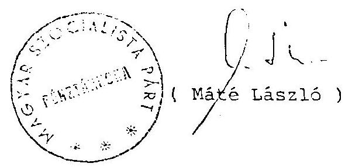

---

Kirzeti Fölhhivatal
siólok, inntan us u. 46
8.00

Neryar iuocialista lärt Pénztárnoka

Budanent
Föztírané: tér 26
1031

Fenti K. azíma koríbbi /1991 Janius 24 kelt/
Kovalerber tifíktattatton, hogy korídi ingatlenuk
rúgi aukorísteinek feltérísa iránt megkerestem
a semony megyei levélterat. Szennel erectben
regiölclu ar séott válaszukat.
Kérem a fentiek szíves tudcmísul vételét.
Siólok, 1991 augusztus 05.

Györi Gabrlella
alóodé

SOMOGY MEGYEI LEVÉLTÁR
7401 Kaposvár, Rippí-Bánai tér 1.
Tel.: 20-743, 14-347 (Igazgató)
PL 91

Tárgy: éntesítén
Ikt. szám: 1258-IVP/198/01.
Hiv. szám: 4260/1001.11.
Melt.:
Körzeti FÖLDHIVATAL
Siólok

Ulvatkozott számu levélére közlöm, hogy a közölt adatok alapján kérelmét nem áll módonban teljesíteni.

Kaposvár, 1001. július 16.

Srili Ferenc
Dr. Srili Ferenc
levéltrinizazgató

R. K. 180243

---

Városi Földhivatal Vezetője Mohács Szabadság u. 24

Ugyiratszám: 32.708/1991.

Tárgy: Adatközlés

Magyar Szocialista Párt
Pénztárnoka
Bud a p e s t

Tisztelt Máté Ur!
A Mohács Radnóti ltp. 3.sz. alatti MSZP által használt iroda "ősbirtoklapjáról" másolatot nem áll módomban megküldeni.
Tájékoztatom, hogy a kérdéses iroda egy társasházban van. A társasház építési telkét a liagyar Allam kisajátitással szerezte meg, a bejegyzése 1972-ben történt.
Az OTP beruházásában épült társasház ingatlan nyilvántartásba vétele 1979-ben történt meg, az irodára az MSZMP-nek kezelői jog került bejegyzésre, erról már korábbi idöben tulajdoni lap másolatot - kérésre már küldtünk.
A fentiek alapján - figyelemmel a kisajátitással vałó állami tulajdonszerzésre - íreleváns az azt megelőző tulajdoni állapot.
Kérem fentiek szíves tudomásul vételét.

Mohács, 1991. junius 20.
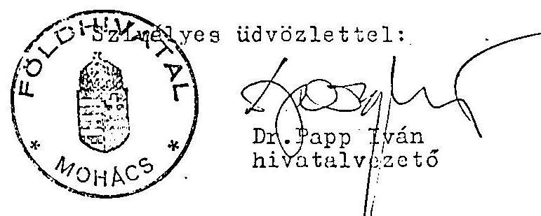

---

1991.
2020/2021.../1991.

# 6. 

## MEGRENDELŐ LAP

(Kérjük nyomtatott nagybetüvel kitölteni)

Kérelmező neve: $\qquad$
Kérelmező lakcíme: $\qquad$

## Ingatlan jelenlegi adatai:

Kerület, utca, házszám: $\qquad$
Tulajdoni lap száma: $\qquad$
Helyrajzi szám: $\qquad$
Fekvés: (Belterület - Külterület - Zártkert) $\qquad$

## Az ingatlan régi adatai:

Község (kerület), utca, házszám: $\qquad$
Telekkönyvi betét száma: $\qquad$
Helyrajzi szám: $\qquad$
Államositás előtti tulajdonos neve: $\qquad$

Budapest, 1991. 12 $\qquad$

Átvehető: 5. 6. 1. 1. 1. 1. 1. 1. 1. 1. 1. 1. 1. 1. 1. 1. 1. 1. 1. 1. 1. 1. 1. 1. 1. 1. 1. 1. 1. 1. 1. 1. 1. 1. 1. 1. 1. 1. 1. 1. 1. 1. 1. 1. 1. 1. 1. 1. 1. 1. 1. 1. 1. 1. 1. 1. 1. 1. 1. 1. 1. 1. 1. 1. 1. 1. 1. 1. 1. 1

---

/1991.

23;

MEGRENDELŐ LAP
(Kérjük nyomtatott nagybetűvel kitölteni)

Kérelmező neve: 23.08. 2012/02/22 11:23:22 +0000000000000000000000000000000000000000000000000000000000000000000000000000000000000000000000000000000000000000000000000000000000000000000000000000000000000000000000000000000000000000000000000000000000

---

/1991.

# MEGRENDELŐ LAP

(Kérjük nyomtatott nagybetűvel kitölteni)

Kérelmező neve: ..................................................................................................................................................................................................................................................................................................................................................................................................................................................................................................................................................................................................................................................................................................................................................................................................................................................................................................................................................................................................................................................................................................................................................................................................................................................................................................................................................................................................................................................................................................................................................................................................................................................................................................................................................................................................................................................................................................................................................................................................................................................................................................................................................................................................................................................................................................................................................................................................................................................................................................................................................................................................................................................................................................................................................................................................................................................................................................................................................................................................................................................................................................................................................................................................................................................................................................................................................

---

/1991.

# MEGRENDELŐ LAP
(Kérjük nyomtatott nagybetűvel kitölteni)

Kérelmező neve: ..................................................................................................................................................................................................................................................................................................................................................................................................................................................................................................................................................................................................................................................................................................................................................................................................................................................................................................................................................................................................................................................................................................................................................................................................................................................................................................................................................................................................................................................................................................................................................................................................................................................................................................................................................................................................................................................................................................................................................................................................................................................................................................................................................................................................................................................................................................................................................................................................................................................................................................................................................................................................................................................................................................................................................................................................................................................................................................................................................................................................................................................................................................................................................................................................................................................................................................................................

---

/1991.

2000/1244 1/1991.

MEGRENDELŐ LAP
(Kérjük nyomtatott nagybetűvel kitölteni)

Kérelmező neve: ..................................................................................................................................................................................................................................................................................................................................................................................................................................................................................................................................................................................................................................................................................................................................................................................................................................................................................................................................................................................................................................................................................................................................................................................................................................................................................................................................................................................................................................................................................................................................................................................................................................................................................................................................................................................................................................................................................................................................................................................................................................................................................................................................................................................................................................................................................................................................................................................................................................................................................................................................................................................................................................................................................................................................................................................................................................................................................................................................................................................................................................................................................................................................................................................................................................................................................................................................

---

6. sz. melléklet az 1990. évi LXXIII. törvényhez

A szervezet és intézményei ingatlanaira vonatkozó adatok 1988. XII. 31.--1990. VIII. 31.

| - | Ingatlan helye | Tulajdoni lapszám hrsz. | Megszerzésének jógcime | időpontja | Könyv szerinti értéke | Megjegyzés |
| :--: | :--: | :--: | :--: | :--: | :--: | :--: |
|  | 1. | 2. | 3. | 4. | 5. | 6. |
|  | 1013. Bp. Krisztina tér 1. | $717 / 7173$ |  |  | 19.041 .720 | Államositás 1952 |
|  | 1026 Bp. Szilágyi E. fasor 73. | 1105/11510/45 |  |  |  |  |
|  |  |  |  |  | 1.967 .789 | Államositás 1952 |
|  | 1023. Bp.Szemlôhegy u. 13. | $3657 / 12959$ |  |  | 7.229 .000 | Államositás 1952 |
|  | 1039. Bp. Füst Milán u. 26. | 12790/6552/60 |  |  | 8.129 .622 | Magyar Állam 1980 |
|  | 1036. Bp. Tiraár u. 2. | 12851/17929/11 |  |  | 9.858 .439 . | Államositás 1952 |
|  | 1041. Bp. Fóti út $35 / a$. | 4343/74504/1 |  |  | 1.859 .018 | Államositás 1951 |
|  | 1052. Bp. Városháza u. 14. | $515 / 24285$ |  |  | 2.120 .433 | Államositás 1950 |
|  | 1051. Bp. Október 6. u. 22. | 767/24595 |  |  | 1.202 .931 | Államositás 1952 |

---

6. sz. melléklet az 1990. évi LXXIII. tơrvényhez

A szervezet és intézményei ingatlanaira vonatkozó adatok 1988. XII. 31.--1990. VIII. 31.

| $\begin{aligned} & \text { or- } \\ & \dot{\mathrm{s}} \end{aligned}$ | Ingatlan   helye | Tulajdoni lapszám hrsz. | Megszerzésének   jogcíme | idópontja | Könyv szerinti értéke | Megjegyzés |
| :--: | :--: | :--: | :--: | :--: | :--: | :--: |
| 0 . | 1. | 2. | 3. | 4. | 5. | 6. |
| 9. | 1062. Bp. Népköztár- $1397 / 29637$ |  |  |  | 12.086 .653 | Államositás 1952 |
|  | saság út 105 . |  |  |  |  |  |
| 1. | 1073. Bp. Lenin $\cdot$ krt. 42. | 1505/10/34355/A |  |  | 1.031 .604 | Államositás 1952 |
|  | 1077. Bp. Wesselényi $973 / 33798$ |  |  |  | 1.100 .070 | Államositás 1952 |
|  | u. 69. |  |  |  |  |  |
| 2. | 1088. Bp. Szentki- $1883 / 36594$ |  |  |  | 1.510 .069 | Magyar Állam 1978 |
|  | rályi u. $22 / 24$. |  |  |  |  |  |
|  | 1083. Bp. Szigony $2461 / 35728 / 2$ |  |  |  | 8.047 .838 | Magyar Állam 1939 |
|  | u. 13. |  |  |  |  |  |
|  | 1085. Bp. József $1047 / 35645$ |  |  |  | 1.274 .671 | Magyar Állam 1978 |
|  | krt. 70. |  |  |  |  |  |
|  | 1098. Bp. Toronyház $1414 / 38236 / 77$ |  |  |  | 4.106 .208 | Magyar Állam 1978 |
|  | u. $3 / b$. |  |  |  |  |  |
|  | 1094. Bp. Balázs Béla u. 36. |  | Betársulás Társasház | 1989.12.30. | 2.082 .706 | Társasház tul. |
|  | 1102. Bp. Veszprémi $3883 / 41460 / 11$ |  |  |  | 3.101 .038 | Magyar Állam 1978 |

---

6. sz. melléklet az 1990. évi LXXIII. törvényhez

A szervezet és intézményei ingatlanaira vonatkozó adatok 1988. XII. 31.--1990. VIII. 31.

| Sor-   szim | Ingatlan   helye | Tulajdoni   lapszám hrsz. | Megszerzésének   jogcíme | időpontja | Könyv szerinti   értéke | Meğjegyzés |
| :--: | :--: | :--: | :--: | :--: | :--: | :--: |
| 0 . | 1. | 2. | 3. | 4. | 5. | 6. |
| 18. | 1111. Bp. Zenta   u. 1. | 8030/23/5517/2/A/23 |  |  | 289.251 | Államositás 1952 |
| i9. | 1112. Bp. Budaörsi   u. $40 / \mathrm{b}$. | 4282/2782-6 |  |  | 352.334 | Államositás 1952 |
| 20. | 1119. Bp. Bikszádi   u. 43. | 5103/3261-35 |  |  | 3.177 .725 | Magyar Állam 1978 |
| 21. | 1125. Bp. Szarvas   Gábor u. 21. | 5608/10699 |  |  | 398.177 | Államositás 1956 |
| 22. | 1126. Bp. Kiss János   altb. 42/44. | 779/7895 |  |  | 6.624 .361 | Magyar Állam 1921 |
| 23. | 1136. Bp. Rajk   L. u. 40. | 415/25261/12 |  |  | 1.719 .418 | Államositás 1952 |
| 24. | 1131. Bp. Mosoly   u. $23 / 25$. | 3383/26085/194 |  |  | 1.905 .740 | Kisajátítás 1911 |
| 25. | 1132. Bp. Visegrá-   di u. 19. | 323/25233 |  |  | 1.842 .445 | Államositás 1952 |
| 26. | 1134. Bp. Váci u.   $63 / 67$. | 2925/27817/1 |  |  | 1.745 .064 | Kisajátítás 1926 |

---

6. sz. zelléklet az 1990. évi LXXIII. törvényhez

A szervezet és intézményei ingatlanaira vonatkozó adatok 1988. XII. 31.--1990. VIII. 31.

| $\begin{gathered} \text { or- } \\ \text { śm } \end{gathered}$ | Ingatlan helye | Tulajdoni lapszám hrsz. | Megszerzésének jogcíme | idópontja | Könyv szerinti értéke | Megjegyzés |
| :--: | :--: | :--: | :--: | :--: | :--: | :--: |
| 0 . | 1. | 2. | 3. | 4. | 5. | 6. |
| $\cdot$ | 1153. Bp. Eötvös u. 8. | 7094/87535 |  |  | 4.695 .562 | Államositás 1952 |
|  | 1163. Bp. Albán u. 2. | 1645/101656 |  |  | 1.347 .238 | Államositás 1952 |
|  | 1173. Bp. Pesti u. 167. | $\begin{aligned} & 5518 / 125630 / 3 \\ & 5519 / 125630 / 4 \end{aligned}$ |  |  | 7.244 .407 | Kisajátítás 1964 |
|  | 1184. Bp. Vörös Hadsereg útja 114. | 14861/155142 |  |  | 3.255 .577 | Magyar Állam 1952 |
|  | 1191. Bp. Vörös Hadsereg útja 107. | 1618/161772 |  |  | 5.841 .780 | Államositás 1953 |
|  | 1203. Bp. Kossuth Lajos u. 49. | 685/170442 |  |  | 6.947 .429 | Államositás 1950 |
|  | 1221. Bp. Varga Jenó tér 13. | 11927/223609/3 |  |  | 1.590 .413 | Magyar Állam 1938 |
|  | 7633. Pécs   Tüzér u. 3. | 307/3384 |  |  | 8.025 .223 | Magyar Állam 1963 |

---

6. sz. zelléklet az 1990. évi LXXIII. törvényhez

A szervezet és intézményei ingatlanaira vonatkozó adatok 1988. XII. 31.--1990. VIII. 31.

| Sor-
zám | Ingatlan helye | Tulajdoni lapszám hrsz. | Megszerzésének jogcíme | idópontja | Könyv szerinti értéke | Megjegyzés |
| :--: | :--: | :--: | :--: | :--: | :--: | :--: |
| 0. | 1. | 2. | 3. | 4. | 5. | 6. |
| 5. | 7632. Pécs | 9009/23908/2 |  |  | 2.700 .000 | Kisajátítás 1980 |
|  | Németh L. u. 16. |  |  |  |  |  |
| 6. | 7700. Mohács | 9043-21/118 3A21 |  |  | 392.269 | Magyar Állam 1979 |
|  | Radnóti Hp. 3. |  |  |  |  |  |
| 7. | 6065. Lakitelek Tős- 2673/0216/2 |  |  |  | 7.658 .772 | Magyar Állam 1970 |
|  | erdő, Szikraüdülö Hrsz: 0216/2 |  |  |  |  |  |
| 8. | 6000. Kecskemét | 23413/3498/2 |  |  | 4.462 .226 | Magyar Állam 1952 |
|  | Ady E. u. 18. |  |  |  |  |  |
| 9. | 6050. Lajosmizse | $134 / 32$ |  |  | 175.919 | Magyar Állam 1969 |
|  | Dózsa Gy. út 82. |  |  |  |  |  |
| 0. | 6440. Jánoshalma | $104 / 1 / 4$ |  |  | 376.167 | Magyar Állam 1955 |
|  | Béke tér 1. |  |  |  |  |  |
| 1. | 6000. Kecskemét | 3165/1 3340/A/1 |  |  | 5.372 .197 | Magyar Állam 1952 |
|  | Május 1.tér 5. |  |  |  |  |  |
| 2. | 6070. Izsák | 3409/1/2 | Betársulás | 1986.09.30. | 168.803 | Magyar Állam 1931 |
|  | Szabadság tér 1. |  |  |  |  |  |
| 3. | 6300. Kalocsa | 579/514 |  |  | 1.104 .425 | Magyar Állam 1952 |
|  | Hunyadi út 82. |  |  |  |  |  |

---

6. sz. melléklet az 1990. évi LXXIII. törvényhez

A szervezet és intézményei ingatlanaira vonatkozó adatok 1983. XII. 31.--1990. VIII. 31.

| $\begin{aligned} & \text { or- } \\ & \text { ám } \end{aligned}$ | Ingatlan   helye | Tulajdoni   lapszám hrsg. | Megszerzésének   jogcíme |  | Könyv szerinti   értéke | Megjegyzés |
| :--: | :--: | :--: | :--: | :--: | :--: | :--: |
| 0 . | 1. | 2. | 3. | 4. | 5. | 6. |
| i. | 6336. Szakmár Erzsébet u. 1. | $110 / 12$ |  |  | 61.209 | Magyar Âllam 1969 |
| 5. | 6320. Solt   Béke tér 2. | $344 / 269$ |  |  | 171.362 | Magyar Âllam 1970 |
| 5. | 6326. Harta   Kossuth út 57. | $2752927 / 4$ |  |  | 52.573 | Magyar Âllam 1989 |
| 7. | 6344. Hajós   Kossuth út 2/a. | $348294-2$ |  |  | 190.513 | Magyar Âllam 1978 |
| 6. | 6334. Gederlak   Dunabenedeki út 1. | $637 / 578$ |  |  | 53.000 | Magyar Âllam 1939 |
| 9 . | 6352. Fajsz   Szt.István u. 18. | $1328 / 1317$ |  |  | 141.442 | Magyar Âllam 1952 |
| 0. | 6328. Dunapataj   Vasut u. 2. | $12071330 / 1$ |  |  | 49.036 | Magyar Âllam 1970 |
| 1. | 6323. Dunaegyháza   Táncsics M. u. 13. | $521 / 424$ |  |  | 40.000 | Magyar Âllam 1949 |
| 2. | 6300. Kalocsa   I. István u. 46. | $271 / 289$ |  |  | 5.278 .817 | Magyar Âllam 1982 |

---

6. sz. melléklet az 1990. évi LXXIII. törvényhez

A szervezet és intézményei ingatlanaira vonatkozó adatok 1988. XII. 31.--1990. VIII. 31.

| $\begin{aligned} & \text { 3. } \\ & \text { 3. } \end{aligned}$ | Ingatlan helye | Tulajdoni lapszám hrsz. | Megszerzésének jogcíme | idópontja | Könyv szerinti értéke | Megjégyzés |
| :--: | :--: | :--: | :--: | :--: | :--: | :--: |
|  | 1. | 2. | 3. | 4. | 5. | 6. |
|  | 6332. Uszod | 1346/3665 | Csere | 1986.12 .05 . | 98.837 | Magyar Âllam 1986 |
|  | Szabadság út 17 . |  |  |  |  |  |
|  | 6000. Kecskemét | 17830/3708/10 |  |  | 3.589 .962 | Magyar Âllam 1966 |
|  | Széchenyi sé. 6 . |  |  |  |  |  |
|  | 6100. Kiskunfélegyháza | 3129/1 3159/A/1 |  |  | 3.553 .000 | Magyar Âllam 1907 |
|  | Gorkij u. 2. |  |  |  |  |  |
|  | 6066. Tiszaalpár | 1424/1395 |  |  | 120.305 | Magyar Âllam 1978 |
|  | Dózsa Gy. u. 2. |  |  |  |  |  |
|  | 6112 Pálzonostora | 1598/123 |  |  |  | Magyar Âllam 1957 |
|  | Dózsa Gy. u. 50. |  |  |  | 69.427 |  |
|  | 6114. Buzac | 3002/229 |  |  | 66.120 | Magyar Âllam 1981 |
|  | Béke u. 15. |  |  |  |  |  |
|  | 6115. Kusszállás | 103/3 |  |  | 49.400 | Alamositás-1952: |
|  | Dózsa Gy. u. 22. |  |  |  |  |  |
|  | 6113. Petőfiszállás | 102/2 |  |  | 71.520 | Magyar Âllam 1978 |
|  | Kossuth u. 1. |  |  |  |  |  |
|  | 6111. Gátér | 325/240 |  |  | 150.000 | Államositás 1958 |
|  | Petöfi u. 25. |  |  |  |  |  |

---

6. sz. melléklet az 1990. évi LXXIII. törvényhez

A szervezet és intézményei ingatlanaira vonatkozó adatok 1988. XII. 31.--1990. VIII. 31.

| $\begin{aligned} & \text { cr- } \\ & \text { èn } \end{aligned}$ | Ingatlan helye | Tulajdoni lapszám hrsz. | Megszerzésének jogcíme | idópontja | Könyv szerinti értéke | Megjegyzés |
| :--: | :--: | :--: | :--: | :--: | :--: | :--: |
| 0 . | 1. | 2. | 3. | 4. | 5. | 6. |
| : | 6500. Baja | 1245/965 |  |  | 3.012 .268 | Magyar Âllam 1971 |
|  | November 7. tér 1. |  |  |  |  |  |
|  | 6400. Kiskunhalas | 4739/4807 |  |  | 3.841 .000 | Államositás 1952 |
|  | Katona J. u. 1. |  |  |  |  |  |
|  | 6239. Császártöltés | 2289/2526 |  |  | 903.141 | Államositás 1968 |
|  | Bajcsy-Zsilinszky u. 3. |  |  |  |  |  |
|  | 6230. Soltvadkert | 103/3 |  |  | 263.393 | Államositás 1952 |
|  | Hösök tere 6. |  |  |  |  |  |
|  | 6200. Kiskörös | 3048/3093 |  |  | 244.172 | Államositás 1970 |
|  | Petöfi tér 7. |  |  |  |  |  |
|  | 6237. Kecel | 17 8243/1 974/1/A | Betársulás | 1986.10.19. | 1.336 .984 | Magyar Âllam 1986 |
|  | Szabadság tér 1. |  |  |  |  |  |
|  | 6430. Bácsalmás | 2023/2 2015/A/2 |  |  | 2.829 .484 | Magyar Âllam 1987 |
|  | Fürst u. 4/6. |  |  |  |  |  |
|  | 6120. Kiskunmajsa | 978/902 | ・ |  | 115.411 | Magyar Âllam 1970 |
|  | Félegyházi út 5. |  |  |  |  |  |
|  | 6080. Szabadszállás | 1871/1741 |  |  | 146.682 | Államositás 1952 |
|  | Kossuth u. 2. | ・ |  |  |  |  |

---

6. sz. melléklet az 1990. évi LXXIII. törvényhez

A szervezet és intézményei ingatlanaira vonatkozó adatok 1988. XII. 31.--1990. VIII. 31.

|  Sorszám | Ingatlan helye | Tulajdoni lapszám hrsz. | Megszerzésének jogcíme | időpontja | Könyv szerinti értéke | Megjegyzés  |
| --- | --- | --- | --- | --- | --- | --- |
|  0. | 1. | 2. | 3. | 4. | 5. | 6.  |
|  71. | 6098. Tass
Tolbuchin krt. 44. | 701/696 |  |  | 112.429 | Magyar Âllam 1964  |
|  72. | 6097. Kunadacs
Kossuth u. 51. | 439/367 |  |  | 131.046 | Magyar Âllam 1978  |
|  73. | 6090. Kunszentmiklós Ságvári E. u. 1. | 1441/1358 | Csere | 1990.08 .16 . | 624.906 | Magyar Âllam 1971  |
|  74. | 6060. Tiszakécske Béke tér 1. | 6422/1089 |  |  | 1.455 .263 | Magyar Âllam 1972  |
|  75. | 5940. Tótkomlós Lenin u. 8. | 507/448 |  |  | 1.980 .000 | Államositás 1952  |
|  76. | 5920. Csorvás
Rákóczi út 13. | 729/661 |  |  | 109.564 | Államositás 1952  |
|  77. | 5530. Vésztó
Kossuth u. 35. | 401/314 |  |  | 1.154 .290 | Államositás 1978  |
|  78. | 5661. Ujkígyós Petőfi u. 38. | 806/707 |  |  | 164.000 | Államositás 1950  |
|  79. | 5525. Füzesgyarmat
Kossuth u. 10. | 111/11/1 |  |  | 132.724 | Államositás 1958  |

---

6. sz. melléklet az 1990. évi LXXIII. törvényhez

A szervezet és intézményei ingatlanaira vonatkozó adatok 1988. XII. 31.--1990. VIII. 31.

|  Sorszám | Ingatlan helye | Tulajdoni lapszám hrsz. | Megszerzésének jogcíme | időpontja | Könyv szerinti értéke | Megjegyzés  |
| --- | --- | --- | --- | --- | --- | --- |
|  0. | 1. | 2. | 3. | 4. | 5. | 6.  |
|  80. | 5600. Békéscsaba Szabadság tér 11/17. | 14314/2936/2 |  |  | 4.221 .179 | Államositás 1953  |
|  81. | 5600. Békéscsaba Szabadság tér 11/17. | 14314/2936/2 |  |  | 331.340 | Államosítás 1953  |
|  82. | 5650. Mezőberény Szabadság u. 9. | $\begin{aligned} & 108 / 8 \ & 108 / 8 \end{aligned}$ | Csere | 1990.04.28. | 0 | Magyar Állam 1981  |
|  83. | 5600. Békéscsaba Irányi u. 2. | 3680/9 3802/A-9 |  |  | 358.000 | Államosítás 1971  |
|  84. | 5925. Gerendás Kossuth u. 24. | 502/464/8 |  |  | 166.000 | Magyar Állam 1947  |
|  85. | 5600. Békéscsaba Dózsa Gy. út 35. | 2264/2258 |  |  | 2.464 .402 | Államosítás 1961  |
|  86. | 5741. Kétegyháza Dózsa Gy. u. 16. | 153/58 |  |  | 88.068 | Államosítás 1958  |
|  87. | 5743. Lökősháza Alapitók útja 19. | 1129/513/1 |  |  | 24.770 | Magyar Állam 1951  |
|  88. | 5700. Gyula Vásárhelyi P. u. 2: | ?/4245/1 |  |  | 5.564 .000 | Magyar Állam 1987  |

---

6. sz. melléklet az 1990. évi LXXIII. törvényhez

A szervezet és intézményei ingatlanaira vonatkozó adatok 1988. XII. 31.--1990. VIII. 31.

|  or-   ám | Ingatlan   helye | Tulajdoní   lapszém hrsz. | Megszerzésének   jogcíme | időpontja | Könyv szerinti   értéke | Megjegyzés  |
| --- | --- | --- | --- | --- | --- | --- |
|  0. | 1. | 2. | 3. | 4. | 5. | 6.  |
|  5900. Orosháza-Rákóczi tlp. 8295/8932 |  |  |  |  | 59.600 | Magyar Âllam 1954  |
|  Lórántffy u. 37. |  |  |  |  |  |   |
|  5932. Gádoros | $846 / 779$ |  |  |  | 383.763 | Magyar Âllam 1967  |
|  November 7. út 9. |  |  |  |  |  |   |
|  5900. Orosháza | $5434 / 5811$ |  |  |  | 68.403 | Magyar Âllam 1974  |
|  Asztalos J. u. 5. |  |  |  |  |  |   |
|  5900. Orosháza | $2810 / 2937$ |  |  |  | 358.960 | Államositás 1952  |
|  Szabadság tér 3. |  |  |  |  |  |   |
|  5630. Békés | $3124 / 3210$ |  |  |  | 620.738 | Magyar Âllam 1949  |
|  Csabai út 56. |  |  |  |  |  |   |
|  5630. Békés | $106 / 12$ |  |  |  | 1.711 .170 | Magyar Âllam 1977  |
|  Széchenyi tér 15. |  |  |  |  |  |   |
|  5551. Csabacsüd | $200 / 116 / 2$ |  |  |  | 65.000 | Magyar Âllam 1968  |
|  Szabadság út 44 |  |  |  |  |  |   |
|  5561. Békésszentandrás | $1165 / 1122$ |  |  |  | 97.000 | Magyar Âllam 1950  |
|  Szabadság út 18. |  |  |  |  |  |   |
|  5540. Szarvas | $7441 / 1593 / 2$ |  |  |  | 2.221 .124 | Magyar Âllam 1968  |
|  Szabadság út 36. |  |  |  |  |  |   |

---

6. sz. melléklet az 1990. évi LXXIII. törvényhez

A szervezet és intézményei ingatlanaira vonatkozó adatok 1988. XII. 31.--1990. VIII. 31.

|  $\begin{aligned} & \text { r- } \\ & \text { i } \end{aligned}$ | Ingatlan helye | Tulajdoni lapszám hrsz. | Megszerzésének
jogcíme | időpontja | Könyv szerinti értéke | Megjegyzés |
| :--: | :--: | :--: | :--: | :--: | :--: | :--: |
| 3. | 1. | 2. | 3. | 4. | 5. | 6. |
| 8. | 5527. Bucsa | 964/908 |  |  | 116.620 | Magyar Âllam 1960 |
|  | Kossuth u. 37. |  |  |  |  |  |
| 9. | 5516. Körösladány | 3474/660/2 |  |  | 103.430 | Államositás 1966 |
|  | Nadányi út 2. |  |  |  |  |  |
| 0. | 5534. Okány | 109/9 |  |  | 129.920 | Államositás 1962 |
|  | Kossuth u. 5. |  |  |  |  |  |
| 1. | 5666. Medgyésegyháza | 218/118 |  |  | 106.760 | Államositás 1952 |
|  | Kossuth tér 23. |  |  |  |  |  |
| 2. | 5746. Kunágota | 505/433 |  |  | 1.011 .000 | Magyar Âllam 1910 |
|  | Rákóczi u. 18. |  |  |  |  |  |
| 3. | 5668. Nagybánhegyes | 327/206 |  |  | 61.090 | Államositás 1950 |
|  | Vörös tér 1. |  |  |  |  |  |
| 4. | 5800. Mezökovácsháza | 570/446/2 |  |  | 350.178 | Magyar Âllam 1940 |
|  | Árpád u. 167. |  |  |  |  |  |
| 5. | 5500. Gyomaendrőd | 106/6 | - Csere | 1990.08 .31 . | $\emptyset$ | Magyar Âllam 1950 |
|  | Kossuth u. 3. |  |  |  |  |  |
| 6. | 5720. Sarkad | 2811/3092 | Csere | 1990.05 .01 . | $\emptyset$ | Magyar Âllam 1973 |
|  | Kossuth u. 39. |  |  |  |  |  |

---

6. sz. melléklet az 1990. évi LXXIII. törvényhez

A szervezet és intézményei ingatlanaira vonatkozó adatok 1988. XII. 31.--1990. VIII. 31.

| 1 | Ingatlan helye | Tulajdoni lapszám hrsz. | Megszerzésének jogcíme | idöpontja | Könyv szerinti értéke | Megjegyzés |
| :--: | :--: | :--: | :--: | :--: | :--: | :--: |
|  | 1. | 2. | 3. | 4. | 5. | 6. |
|  | 3501. Miskolc MSZB tér 1. | 6989/6942/2 |  |  | 262.000 | Magyar Âllam 1967 |
|  | 3530. Miskolc | 6722/8021 | Térités nélküli átvétel | 1989.07.31. | 2.466 .654 | Magyar Âllam 1952 |
|  | Budai J. ut 8. |  |  |  |  |  |
|  | 3564. Hernádnémeti Kossuth út 2. | $1136 / 898$ |  |  | 57.000 | Államositás 1952 |
|  | 3530. Miskolc | 11509/3700/70 |  |  | 6.262 .000 | Államosítás 1983 |
|  | Korvin 0. u. |  |  |  |  |  |
|  | 3529. Miskolc | 12318/40026/30 |  |  | 3.250 .000 | Kisajátítás 1970 |
|  | Testvêrvárosok útja 1. |  |  |  |  |  |
|  | 3532. Miskolc | 2272/22006 |  |  | 1.336 .000 | Államosítás 1958 |
|  | Györi Kapu 123. |  |  |  |  |  |
|  | 3535. Miskolc | 5160/30519-24 |  |  | 1.440 .000 | Magyar Âllam 1967 |
|  | Kuruc út 49. |  |  |  |  |  |
|  | 3528. Miskolc | 5106/5302 |  |  | 420.000 | Magyar Âllam 1963 |
|  | Kisfaludy út 7. |  |  |  |  |  |

---

6. sz. melléklet az 1990. évi LXXIII. törvényhez

A szervezet és intézményei ingatlanaira vonatkozó adatok 1988. XII. 31.--1990. VIII. 31.

| $\begin{aligned} & \mathrm{r}- \\ & \mathrm{~m} \end{aligned}$ | Ingatlan helye | Tulajdoni lapszám hrsz. | Megszerzésének |  | Könyv szerinti értéke | Megjegyzés |
| :--: | :--: | :--: | :--: | :--: | :--: | :--: |
|  |  |  | jogcíne | idópontja |  |  |
| 1. |  | 2. | 3. | 4. | 5. | 6. |
| 5. | 3741. Izsófalva | 1137/1145 |  |  | 54.000 | Magyar Âllam 1960 |
|  | Izsó M. út 96 . |  |  |  |  |  |
| 5. | 3735. Felsötelekes Fö út 54 . | 178/85/1 |  |  | 42.000 | Magyar Âllam 1960 |
| 7. | 3700. Kazincbarcika | 8739/1499/2 |  |  | 18.000 | Magyar Âllam 1960 |
|  | Babits M. út 3 . |  |  |  |  |  |
| 3. | 3700. Kazincbarcika | 8572/623/5 | Csere | 1987.12.15. | 100.000 | Magyar Âllam 1957 |
|  | Derkovits tér 1. |  |  |  |  |  |
| 3. | 3600. Özd | 4558/5261 |  |  | 4.068 .000 | Magyar Âllam 1971 |
|  | Alkotmány út 3 . |  |  |  |  |  |
| 3. | 3671. Borsoónádasd | 360/297 |  |  | 359.000 | Magyar Âllam 1975 |
|  | Engels telep 3. |  |  |  |  |  |
| 1. | 3664. Járdánháza | 745/750 |  |  | 66.000 | Magyar Âllam 1978 |
|  | IV. Béla út 27 . |  |  |  |  |  |
| 2. | 3600. Özd-Béketelep | 7214/8360 |  |  | 207.000 | Magyar Âllam 1967 |
|  | Árpádvezér út 22 . |  |  |  |  |  |
| 4. | 3580. Leninváros | 1650 2208/1440/4,5 |  |  | 5.000 .000 | Magyar Âllam 1982 |
|  | Munkácsy út 20 . |  |  |  |  |  |

---

6. sz. melléklet az 1990. évi LXXIII. törvényhez

A szervezet és intézményei ingatlanaira vonatkozó adatok 1988. XII. 31.--1990. VIII. 31.

|  $\begin{aligned} & \text { ㄴ } \\ & \text { ㄴ } \end{aligned}$ | Ingatlan helye | Tulajdoni lapszám hrsz. | Megszerzésének
jogcíme | idópontja | Könyv szerinti értéke | Megjegyzés |
| :--: | :--: | :--: | :--: | :--: | :--: | :--: |
|  | 1. | 2. | 3. | 4. | 5. | 6. |
| 3950. | Sárospatak | $413 / 330$ |  |  | 253.771 | Magyar Âllam 1969 |
|  | Eötvös út 5. |  |  |  |  |  |
| 3974. | Ricse | 509/414 |  |  | 2.200 .181 | Magyar Âllam 1980 |
|  | Kossuth út 5. |  |  |  |  |  |
| 3965. | Nagyrozvágy | $12 / 363$ |  |  | 244.920 | Magyar Âllam 1980 |
|  | Vörös Hads. út 2. |  |  |  |  |  |
| 3980. | Sátoraljaújhely | 2938/2861 | Csere | 1986.10 .01 . | 1.550 .000 | Âllamositás 1952 |
|  | Kossuth tér 12. |  |  |  |  |  |
| 3462. | Borsodivánka | 257/232 |  |  | 62.507 | Magyar Âllam 1965 |
|  | Béke út 21. |  |  |  |  |  |
| 3400. | Mezökövesd | 2569/2575 |  |  | 1.365 .802 | Âllamositás 1950 |
|  | Varga P. út 2/a. |  |  |  |  |  |
| 3461. | Egerlövő | 300/211 |  |  | 61.000 | Magyar Âllam 1961 |
|  | Dózsa Gy. út 15. |  |  |  |  |  |
| 3885. | Boldogköváralja | 520/392 | - Ajándékozás | 1988.11 .01 . | 104.400 | Magyar Âllam 1947 |
|  | Kossuth út 40. |  |  |  |  |  |
| 3900. | Szerencs | 2003/1669 |  |  | 147.142 | Magyar Âllam 1965 |
|  | Rákóczi út 89. |  |  |  |  |  |

---

5. st. melléklet az 1990. évi LXXIII. törvényhez

A szervezet és intézményei ingatlanaira vonatkozó adatok 1988. XII. 31.--1990. VIII. 31.

|  Ingatlan helye | Tulajdoni lapszám hrsz. | Megszerzésének jogcíme | időpontja | Könyv szerinti értéke | Megjegyzés  |
| --- | --- | --- | --- | --- | --- |
|  1. | 2. | 3. | 4. | 5. | 6.  |
|  3916. Bodrogkeresztúr Fö út 63. | $535 / 455$ |  |  | 372.000 | Magyar Âllam 1939  |
|  3733. Rudabánya | 199/97-21 |  |  | 144.000 | Magyar Âllam 1975  |
|  Ady E. út 6. |  |  |  |  |   |
|  3780. Edelény | 2160/1732 |  |  | 108.000 | Âllamositás 1952  |
|  Áprílis 4. út 7. |  |  |  |  |   |
|  3759. Aggtelek | 172/70 |  |  | 112.000 | Magyar Âllam 1967  |
|  Kossuth út 1. |  |  |  |  |   |
|  3910. Tokaj | 1390/1287/3 |  |  | 78.000 | Magyar Âllam 1970  |
|  Münnich F. u. 26. |  |  |  |  |   |
|  3630. Putnok | 3523/1337/2 |  |  | 199.599 | Magyar Âllam 1980  |
|  Rákóczi út 2/a. |  |  |  |  |   |
|  6800. Hódmezővásárhely | 12466/46 12827/A |  |  | 2.179 .000 | Magyar Âllam 1984  |
|  Lenin u. 1. |  |  |  |  |   |
|  6641. Csongrád | 455/42 365/A/42 |  |  | 572.000 | Magyar Âllam 1978  |
|  - Felszabadulás u. 6/10. |  |  |  |  |   |
|  6723. Szeged | 5003/15453/10 |  |  | 2.892 .000 | Magyar Âllam 1975  |
|  Csongor tér |  |  |  |  |   |

---

5. sz. melléklet az 1990. évi LXXIII. törvényhez

A szervezet és intézményei ingatlanaira vonatkozó adatok 1988. XII. 31.--1990. VIII. 31.

| 1 | Ingatlan helye | Tulajdoni lapszám hrsz. | Megszerzésének jogcíme | idópontja | Könyv szerinti értéke | Megjegyzés  |
| --- | --- | --- | --- | --- | --- | --- |
|   | 1. | 2. | 3. | 4. | 5. | 6.  |
|  6721. Szeged |  | 4180/4038 | Csere | 1986.12 .05 . | 110.000 .226 | Magyar Âllam 1952  |
|  Komócsín tér 1. |  |  |  |  |  |   |
|  6600. Szentes |  | 5922/6012 | Betársulás | 1988.05 .01 . | 2.992 .837 | Államositás 1951  |
|  Nagyörvény u. 59. |  |  |  |  |  |   |
|  6900. Makó |  |  |  |  |  |   |
|  Juhász Gy. tér |  | 1795/1636/20 |  |  | 1.224 .000 | Magyar Âllam 1978  |
|  8000. Székesfehérvár |  |  |  |  |  |   |
|  Dózsa Gy. tér 10. |  | 214/22 |  |  | 7.129 .000 | Magyar Âllam 1934  |
|  2400. Dunaújváros |  |  |  |  |  |   |
|  Tanácsközt. út 2/4. |  | 3995/2 42/22 |  |  | 1.313 .128 | Magyar Âllam 1978  |
|  8060. Mór |  |  |  |  |  |   |
|  Lenin tér 2. |  | 101/1 |  |  | 437.157 | Magyar Âllam 1978  |
|  2483. Gárdony |  | 2236/2238 | Csere | 1986.11 .18 . | 9.640 .650 | Magyar Âllam 1986  |
|  Tanácsház u. 44. |  |  |  |  |  |   |
|  7000. Sárbogárd |  | 719/658 | Csere | 1990.06 .15 . | 410.206 | Magyar Âllam 1990  |
|  Ady E. u. 164. |  |  |  |  |  |   |
|  9021. Győr |  | 14450/7120 |  |  | 19.967 .886 | Magyar Âllam 1980  |

---

6. sz. melléklet az 1990. évi LXXIII. törvényhez

A szervezet és intézményei ingatlanaira vonatkozó adatok 1988. XII. 31.--1990. VIII. 31.

| 1. | Ingatlan helye | Tulajdoni lapszám hrsz. | Megszerzésének jogcíme | időpontja | Könyv szerinti értéke | Megjegyzés  |
| --- | --- | --- | --- | --- | --- | --- |
|  2. |  | 2. | 3. | 4. | 5. | 6.  |
|  9025. Győr |  | 19185/8706 |  |  | 5.440 .000 | Magyar Âllam 1949  |
|  Hid u. 20. |  |  |  |  |  |   |
|  9021. Győr |  | 67067 |  |  | 5.970 .288 | Magyar Âllam 1963  |
|  Amadé l. u. 1. |  |  |  |  |  |   |
|  9021. Győr |  | 24264/7218/2 |  |  | 735.000 | Magyar Âllam 1980  |
|  Lenin út 23. |  |  |  |  |  |   |
|  9023. Győr |  | 24564/429/4 |  |  | 5.693 .090 | Magyar Âllam 1981  |
|  Hermann 0. út 22. |  |  |  |  |  |   |
|  9400. Sopron |  | 4553/1/2576/87 |  |  | 1.850 .000 | Magyar Âllam 1973  |
|  Magyar u. 24. |  |  |  |  |  |   |
|  9200. Mosonmagyaróvár |  | 3608/3394 |  |  | 203.000 | Magyar Âllam 1978  |
|  Erzsébet tér 2. |  |  |  |  |  |   |
|  9201. Mosonmagyaróvár |  | 7239/1810/4 | Betársulás | 1987.12.30. | 2.100 .000 | Magyar Âllam 1987  |
|  Engels u. 10. |  |  |  |  |  |   |
|  9330. Kapuvár |  | 3096/3462 |  |  | 680.000 | Magyar Âllam 1960  |
|  Kossuth u. 24. |  |  |  |  |  |   |
|  1.026. Debrecen |  | 35685/88318 |  |  | 7.825 .786 | Magyar Âllam 1964  |
|  Perényi u. 1. |  |  |  |  |  |   |

---

5. sz. zelléklet az 1990. évi LXXIII. törvényhez

A szervezet és intézményei ingatlanaira vonatkozó adatok 1988. XII. 31.--1990. VIII. 31.

|  1. | Ingatlan helye | Tulajdoni lapszám hrsz. | Megszerzésének |  | Könyv szerinti értéke | Megjegyzés  |
| --- | --- | --- | --- | --- | --- | --- |
|   |  |  | jogcíme | időpontja |  |   |
|   | 1. | 2. | 3. | 4. | 5. | 6.  |
|  4110. | Biharkeresztes | 290/8210 |  |  | 264.861 | Magyar Âllam 1955  |
|   | Dózsa Gy. u. 6. |  |  |  |  |   |
|  4142. | Zsáka | 725/8742/2 |  |  | 75.327 | Államositás 1970  |
|   | Szabadság tér 3. |  |  |  |  |   |
|  4066. | Tiszacsege | 149/851 |  |  | 263.473 | Magyar Âllam 1947  |
|   | Kossuth u. 3. |  |  |  |  |   |
|  4183. | Kaba | 3848/81677/2 |  |  | 937.933 | Magyar Âllam 1983  |
|   | Szabadság tér $1 / b$. |  |  |  |  |   |
|  4220. | Hajdúböszörmény | 3585/3716 |  |  | 897.091 | Magyar Âllam 1976  |
|   | Bocskai tér 2. |  |  |  |  |   |
|  4200. | Hajdúszoboszló | 2236/82286 |  |  | 1.129 .931 | Magyar Âllam 1967  |
|   | Gönczi u. 1. |  |  |  |  |   |
|  4145. | Csokmó | 163/864/2 |  |  | 99.014 | Magyar Âllam 1952  |
|   | Kossuth u. 110. |  |  |  |  |   |
|  4150. | Püspökladány | 1670/1580/1 |  |  | 874.576 | Magyar Âllam 1972  |
|   | Kossuth u. 6. |  |  |  |  |   |
|  4060. | Balmazújváros | 5888/81/2 |  |  | 787.806 | Magyar Âllam 1978  |
|   | Dózsa Gy. u. 1. |  |  |  |  |   |

---

6. sz. melléklet az 1990. évi LXXIII. törvényhez

A szervezet és intézményei ingatlanaira vonatkozó adatok 1988. XII. 31.--1990. VIII. 31.

|  Sorszám | Ingatlan helye | Tulajdoni lapszám hrsz. | Megszerzésének jogcíme | időpontja | Könyv szerinti értéke | Megjegyzés  |
| --- | --- | --- | --- | --- | --- | --- |
|  0. | 1. | 2. | 3. | 4. | 5. | 6.  |
|  69. | 3300. Eger Telekessy út 2. | 6928/7218 |  |  | 8.625 .965 | Magyar Âllam 1924  |
|  70. | 3390. Füzesabony Baross u. 12. | 2326/12449/A | Csere | 1990.01 .03 . | 681.000 | Magyar Âllam 1955  |
|  71. | 3250. Pétervására Szabadság tér 1. | 197/110 |  |  | 505.600 | Államositás 1952  |
|  72. | 3300. Eger Széchenyi út 23. | 4421/4615 |  |  | 559.575 | Magyar Âllam 1959  |
|  73. | 3300. Eger Ráckapu tér 1. | 4532/4725 |  |  | 360.500 | Magyar Âllam 1952  |
|  74. | 3300. Eger Köztársaság tér 10. | 8591/9174 |  |  | 2.252 .653 | Magyar Âllam 1978  |
|  75. | 3200. Gyöngyös Fó tér 3. | 4244/4530 |  |  | 1.654 .700 | Magyar Âllam 1970  |
|  76. | 3021. Lőrinci Szabadság tér 7. | 2562/1153 |  |  | 745.594 | Magyar Âllam 1981  |
|  77. | 3000. Hatvan Horváth M. úti 1tp. | 416/1 3978/29 | Betársulás | 1987.12.31. | 3.800 .000 | Magyar Âllam 1987  |

---

6. sz. melléklet az 1990. évi LXXIII. törvényhez

A szervezet és intézményei ingatlanaira vonatkozó adatok 1988. XII. 31.--1990. VIII. 31.

|  | Ingatlan   helye | Tulajdoni   lapszám hisz. | Megszerzésének   jogcíme | időpontja | Könyv szerinti   értéke | Megjegyzés |
| :--: | :--: | :--: | :--: | :--: | :--: | :--: |
|  | 1. | 2. | 3. | 4. | 5. | 6. |
|  | 3385. Tiszanána Vöröshadsereg út 139. | $1172 / 1126$ |  |  | 415.700 | Magyar Âllam 1979 |
|  | 3360. Heves Hunyadi út 11/13. | 26 1458/1 | Betársulás | 1988.11.23. | 2.100 .000 | Rákóczi Mgtsz. 1965. |
|  | 2801. Tatabánya Felszabadulás tér 6. | 8420/11205 |  |  | 1.187 .816 | Magyar Âllam 1967 |
|  | 2943. Bábolna Ácsi u. 4. | 220/142 |  |  | 234.540 | Magyar Âllam 1984 |
|  | 2536. Nyergesujfalu Bartók B. u. 2. | 872/2/791/4/B |  |  | 117.854 | Magyar Âllam 1978 |
|  | 2541. Lábstlan   Zalka M. 1tp. 5. | 3712/1 1543/2/A |  |  | 178.551 | Magyar Âllam 1978 |
|  | 2870. Kisbár   Kossuth u. 21. | $110 / 11 / 2$ | Csere | 1990.08.31. | $\emptyset$ | Magyar Âllam 1963 |
|  | 2800. Tatabánya   Gál I. 1tp. 535. | ? ? | ? |  | 2.800 .000 | Magyar Âllam 1984 |
|  | 2531. Tokod   Népköztársaság u. 1. | 2807/2903 |  |  | 43.680 | Magyar Âllam 1970 |

---

6. sz. melléklet az 1990. évi LXXIII. törvényhez

A szervezet és intézményei ingatlanaira vonatkozó adatok 1988. XII. 31.--1990. VIII. 31.

|  $\begin{aligned} & r- \\ & m \end{aligned}$ | Ingatlan helye | Tulajdoni lapszám hrsz. | Megszerzésének
jogcíme | időpontja | Könyv szerinti értéke | Megjegyzés  |
| --- | --- | --- | --- | --- | --- | --- |
|  - | 1. | 2. | 3. | 4. | 5. | 6.  |
|  - | 2534. Tát
Felszabadulás u. 122. | 121 |  |  | 46.096 | Magyar Âllam 1961  |
|   | 2500. Esztergom
Bajcsy-Zsilinszky 4. | 12931/19760/19 | Betársulás | 1987.12.31. | 3.695 .058 | Magyar Âllam 1952  |
|   | 2840. Oroszlány
Népek Barátság 18. | 2257/40 /1982A-40 |  |  | 388.131 | Magyar Âllam 1978  |
|   | 2890. Tata
Agostyáni u. 1. | 4466/3064/2 |  |  | 883.608 | Magyar Âllam 1980  |
|   | 2890. Tata
Kossuth tér 17. | 2237/1690/2 |  |  | 78.780 | Magyar Âllam 1963  |
|   | 2900. Komároz
Jedlik A. 8. | 647/556 |  |  | 706.776 | Magyar Âllam 1968  |
|   | 2941. Ács
Szabadság u. 47. | 2460/2339/2 |  |  | 92.327 | Magyar Âllam 1973  |
|   | 2942. Nagyigzánd
Kossuth u. 3. | 122 17/1 |  |  | 149.532 | Magyar Âllam 1978  |
|   | 2510. Dorog
Felszabadulás u. 40. | 1231/1191 |  |  | 477.166 | Magyar Âllam 1959  |

---

6. sz. melléklet az 1990. évi LXXIII. törvényhez

A szervezet és intézményei ingatlanaira vonatkozó adatok 1988. XII. 31.--1990. VIII. 31.

|  $\begin{aligned} & \text { 1. } \\ & \text { 1. } \end{aligned}$ | Ingatlan   helye | Tulajdoni lapszám hrsz. | Megszerzésének jogcíme | idópontja | Könyv szerinti értéke | Megjegyzés |
| :--: | :--: | :--: | :--: | :--: | :--: | :--: |
|  | 1. | 2. | 3. | 4. | 5. | 6. |
| 1. | 3100. Salgótarján Kossuth u. 8. | 690/478 |  |  | 15.213 .561 | Magyar Âllam 1958 |
|  | 3042. Palotáshalom | 16/0149/5 |  |  | 796.725 | Magyar Âllam 1985 |
|  | Víztároló út |  |  |  |  |  |
|  | 2660. Balassagyarmat Rákóczi út 23. | 4996/1584 |  |  | 3.553 .410 | Magyar Âllam 1983 |
|  | 3100. Salgótarján Mérleg út | 11448/493/4 |  |  | 3.760 .498 | Magyar Âllam 1975 |
|  | 3127. Kazár Hunyadi út 4. | 1598/849/A/1 |  |  | 130.002 | Zöldmezô Mgtsz 1963 |
|  | 3060. Pásztó Szabadság út 102. | 4413/1973/22 |  |  | 2.737 .778 | Magyar Âllam 1986 |
|  | 3170. Szécsény Rákóczi út 113. | 224/129 |  |  | 774.440 | Magyar Âllam 1955 |
|  | 3176. Hollókő Kossuth út 86. | 144/46 |  |  | 1.235 .774 | Magyar Âllam 1975 |
|  | 3078. Kisterenye Rákóczi út 17. | 3470/1319 |  |  | 2.164 .973 | Magyar Âllam 1980 |

---

6. sz. melléklet az 1990. évi LXXIII. törvényhez

A szervezet és intézményei ingatlanaira vonatkozó adatok 1988. XII. 31.--1990. VIII. 31.

|  $\begin{aligned} & \text { ㄷ } \\ & \text { a } \end{aligned}$ | Ingatlan helye | Tulajdoni lapszám hrsz. | Megszerzésének
jogcíme | idópontja | Könyv szerinti értéke | Megjegyzés  |
| --- | --- | --- | --- | --- | --- | --- |
|  . | 1. | 2. | 3. | 4. | 5. | 6.  |
|  . | 2651. Rétság | 500/424 |  |  | 894.556 | Magyar Âllam 1963  |
|   | Rákóczi út 54. |  |  |  |  |   |
|  . | 2623. Veröcemaros | 1415/1300 |  |  | 452.283 | Magyar Âllam 1977  |
|   | 2747. Törtel | 906/1744 |  |  | 87.480 | Magyar Âllam 1974  |
|   | Dózsa Gy. út 22. |  |  |  |  |   |
|  . | 2740. Abony | 5455/5508 |  |  | 313.973 | Magyar Âllam 1901  |
|   | Kossuth tér 1. |  |  |  |  |   |
|  . | 2700. Cegléd | 2610/2731 |  |  | 1.832 .520 | Magyar Âllam 1967  |
|   | Rákóczi út 22/24. |  |  |  |  |   |
|  3. | 2144. Kerepestarcsa | 1659/1666 |  |  | 402.000 | Magyar Âllam 1978  |
|   | Szabadság út 17. |  |  |  |  |   |
|  . | 2141. Csömör | 740/641 |  |  | 100.560 | Magyar Âllam 1958  |
|   | Vörösmarty u. 1. |  |  |  |  |   |
|  . | 2142. Nagytarcsa | 541/456 |  |  | 250.054 | Magyar Âllam 1980  |
|   | Rákóczi út 4. |  |  |  |  |   |
|  . | 2117. Isaszeg | 530/442 |  |  |  |   |
|   | Rákóczi út 12. |  |  |  | 303.300 | Magyar Âllam 1974  |

---

6. sz. melléklet az 1990. évi LXXIII. törvényhez

A szervezet és intézményei ingatlanaira vonatkozó adatok 1988. XII. 31.--1990. VIII. 31.

| - | Ingatlan helye | Tulajdoni lapszám hrsz. | Megszerzésének jogcíme | idöpontja | Könyv szerinti értéke | Megjegyzés |
| :--: | :--: | :--: | :--: | :--: | :--: | :--: |
|  | 1. | 2. | 3. | 4. | 5. | 6. |
| i. | 2101. Gödöllő | 8840/5876 | Csere | 1987.04.07. | 842.939 | Magyar Âllam 1965 |
|  | Ady E. sétány 3. |  |  |  |  |  |
| 5. | 2750. Nagykórös Hösök tere 7. | 5281/5250 |  |  | 906.600 | Magyar Âllam 1978 |
| 5. | 2440. Százhalombatta Május 1. tér 3. | ? ? | Betársulás | 1986.12.31. | 1.580 .145 | Magyar Âllam 1986 |
| 7. | 2600. Vác Lenin út 45. | 3338/3273 |  |  | 733.740 | Magyar Âllam 1949 |
| 3. | 2634. Nagybörzsöny Petöfi S. út 19. | 601/528/1 |  |  | 154.760 | Magyar Âllam 1984 |
| 3. | 2635. Vámosmikola Kossuth út 7. | 1161/278/1 |  |  | 191.680 | Magyar Âllam 1949 |
| 3. | 2133. Szödliget Szt. István út 2. | 504/410 |  |  | 233.940 | Magyar Âllam 1952 |
| 1. | 2626. Nagymaros Váci út 11. | 2281/1850 |  |  | 1.991 .526 | Magyar Âllam 1952 |
| 2. | 2637. Perőcsény Ady E. úz 3. | 596/435/A |  |  | 100.000 | Magyar Âllam 1978 |

---

E. sz. melléklet az 1990. évi LXXIII. törvényhez

A szervezet és intézményei ingatlanaira vonatkozó adatok 1988. XII. 31.--1990. VIII. 31.

|  Ingatlan helye | Tulajcioni lapszám hrsz. | Megszerzésének jogcíme | időpontja | Könyv szerinti értéke | Megjegyzés  |
| --- | --- | --- | --- | --- | --- |
|  1. | 2. | 3. | 4. | 5. | 6.  |
|  2682. Püspökhatvan | $570 / 1$ 539/A |  |  |  |   |
|  Szabadság út 6. | $570 / 2$ 539/B |  |  | 72.300 | Magyar Âllam 1974  |
|  2163. Vácrátót | 192/1/101/A |  |  | 120.000 | Magyar Âllam 1978  |
|  Szabadság út 28. |  |  |  |  |   |
|  2120. Dunakeszi | 3-009/3034 | Betársulás | 1986.08.20. | 3.912 .075 | Magyar Âllam 1978  |
|  Verseny u. 12. |  |  |  |  |   |
|  2131. Göd Nagyközség | 2609/2691 |  |  | 1.108 .000 | Magyar Âllam 1978  |
|  Felszabadulás út 93. |  |  |  |  |   |
|  2030. Erdliget | 941/11922 |  |  | 1.355 .219 | Magyar Âllam 1978  |
|  Fürdő u. 5. |  |  |  |  |   |
|  2030. Erd | ? ? | Betársulás | 1986.12.31. | 1.853 .000 | Magyar Âllam 1986  |
|  Engels u. 1/3. |  |  |  |  |   |
|  2000. Szentendre | 9553/1975 |  |  | 366.000 | Magyar Âllam 1982  |
|  Iskola u. 5. |  |  |  |  |   |
|  2013. Pomáz | 13/3294 |  |  | 97.520 | Magyar Âllam 1971  |
|  Kossuth u. 38. |  |  |  |  |   |
|  2011. Budakalász | 3549/606/2 |  |  | 185.440 | Magyar Âllam 1979  |
|  Felszabadulás út 3/A |  |  |  |  |   |

---

i. sz. melléklet az 1990. évi LXXIII. törvényhez

A szervezet és intézményei ingatlanaira vonatkozó adatok 1988. XII. 31.--1990. VIII. 31.

| Ingatlan | Tulajdoni | Megszerzésének |  | Könyv szerinti | Megjegyzés |
| :--: | :--: | :--: | :--: | :--: | :--: |
| kelye | lapszám hrsz. | jogcíme | idópontja | értéke |  |
| 1. | 2. | 3. | 4. | 5. | 6. |
| 2000. Szentendre | 1843/1795 | Betársulás | 1986.09 .30 . | 7.680 .180 | Magyar Âllam 1952 |
| Somogyi B. part 18. |  |  |  |  |  |
| 2370. Dabas | $2131 / 2267$ |  |  | 1.401 .060 | Magyar Âllam 1966 |
| Lenin tér $1 / A$ |  |  |  |  |  |
| 2724. Ujlengyel | $302 / 161 / 3$ |  |  | 18.016 | Magyar Âllam 1927 |
| Kossuth u. 69. |  |  |  |  |  |
| 2381. Táborfalva | 991/548 |  |  | 14.110 | Magyar Âllam 1968 |
| Tanácsköztársaság tér 1. |  |  |  |  |  |
| 2366. Kakucs | $6 / 569$ |  |  | 20.280 | Magyar Âllam 1975 |
| Fö u. 20. |  |  |  |  |  |
| 2360. Gyál | $10 / 2617$ |  |  | 150.000 | Államositás 1950 |
| Körösi út 112/114. |  |  |  |  |  |
| 2373. Dabas | $4032 / 4455$ |  |  | 727.315 | Magyar Âllam 1969 |
| Biksza M. u. 554. |  |  |  |  |  |
| 2347. Bugyi | $8 / 509 / 1$ |  |  | 27.846 | Magyar Âllam 1963 |
| Szabadság tér 2. |  |  |  |  |  |
| 2375. Tatárszentgyörgy | $234 / 120$ |  |  | 46.384 | Magyar Âllam 1958 |
| Rákóczi u. 17. |  |  |  |  |  |

---

6. sz. melléklet az 1990. évi LXXIII. törvényhez

A szervezet és intézményei ingatlanaira vonatkozó adatok 1988. XII. 31.--1990. VIII. 31.

| $\begin{aligned} & \text { r- } \\ & \text { m } \end{aligned}$ | Ingatlan hrelye | Tulajdoni lapszám hrsz. | Megszerzésének jogcime | idópontja | Könyv szerinti értéke | Megjegyzés |
| :--: | :--: | :--: | :--: | :--: | :--: | :--: |
|  | 1. | 2. | 3. | 4. | 5. | 6. |
| 1. | 2200. Monor | 6659/6752 |  |  | 538.920 | Magyar Âllam 1976 |
|  | Kossuth u. 88. |  |  |  |  |  |
| 2. | 2225. Ülló | $14 / 2162$ |  |  | 133.380 | Magyar Âllam 1955 |
|  | Vöröshadsereg út 39. |  |  |  |  |  |
| 3. | 2211. Vasad | 2842/10/6 |  |  | 62.000 | Magyar Âllam 1972 |
|  | Petöfi u. 28. |  |  |  |  |  |
| 4. | 2721. Pilis | 2684/2478 |  |  | 97.725 | Magyar Âllam 1950 |
|  | Dózsa Gy. u. 2. |  |  |  |  |  |
| 5. | 2723. Nyáregyháza | $14 / 306 / 2$ |  |  | 209.000 | Magyar Âllam 1974 |
|  | Ady E. u. 3. |  |  |  |  |  |
| 6. | 2220. Vecsés | 2636/1651/17 |  |  | 226.920 | Államositás 1952 |
|  | Bajcsy-Zsilinszky 43. |  |  |  |  |  |
| 7. | 2241. Süljjsáp | 4253/1/11/2 |  |  | 132.640 | Magyar Âllam 1975 |
|  | Engels tér 3. |  |  |  |  |  |
| 8. | 2244. Uri | 336/765 |  |  | 113.000 | Magyar Âllam 1952 |
|  | Rákóczi u. 31/a. |  |  |  |  |  |
| 9. | 2766. Tápiószele | 2388/2353 |  |  | 51.280 | Magyar Âllam 1967 |
|  | Rákóczi u. 4. |  |  |  |  |  |

---

6. sz. melléklet az 1990. évi LXXIII. törvényhez

A szervezet és intézményei ingatlanaira vonatkozó adatok 1988. XII. 31.--1990. VIII. 31.

|  - | Ingatlan helye | Tulajdoni lapszám hrsz. | Megszerzésének jogcíme | időpontja | Könyv szerinti értéke | Megjegyzés  |
| --- | --- | --- | --- | --- | --- | --- |
|   | 1. | 2. | 3. | 4. | 5. | 6.  |
|  10. | 2760. Nagykáta Szabadság tér 4. | $2454 / 2 \quad 2149 / 1 / A / 2$ |  |  | 1.200 .744 | Magyar Âllam 1980  |
|  11. | 2300. Ráckeve István tér 11. | 614/5401 |  |  | 987.700 | Magyar Âllam 1964  |
|  12. | 2341. Kiskunlacháza Dózsa Gy. u. 219. | 843/742 | Betársulás | 1987.06.30. | 801.550 | Magyar Âllam 1987  |
|  13. | 2310. Szigetszentmiklós Kossuth u. 2. | 101/1 |  |  | 94.160 | Magyar Âllam 1969  |
|  14. | 2315. Szigethalom Kassai út 13. | 2568/2619 |  |  | 130.800 | Magyar Âllam 1966  |
|  15. | 2314. Halásztelek | 1081/895 |  |  | 154.280 | Magyar Âllam 1975  |
|  16. | 2096. Uröm Dózsa Gy. út 16. | 256/149 |  |  | 155.000 | Magyar Âllam 1949  |
|  17. | 2072. Zsámbék Szabadság tér 4. | 944/877 |  |  | 254.000 | Magyar Âllam 1952  |
|  13. | 2094. Nagykovácsi Kossuth u. 64. | 463/390 |  |  | 202.900 | Magyar Âllam 1949  |

---

6. sz. celléklet az 1590. évi LXXIII. törvényhez

A szervezet és intézményei ingatlanaira vonatkozó adatok 1988. XII. 31.--1990. VIII. 31.

|  - | Ingatlan helye | Tulajdoni lapszám hrsz. | Megszerzésének jogcíme | időpontja | Könyv szerinti értéke | Megjegyzés  |
| --- | --- | --- | --- | --- | --- | --- |
|  1. |  | 2. | 3. | 4. | 5. | 6.  |
|  1. | 7400. Kaposvár | 3416/4216 |  |  | 800.229 | Magyar Âllam 1938  |
|   | Lenin u. 14. |  |  |  |  |   |
|  1. | 7400. Kaposvár | 3416/4216 |  |  | 41.481 | Magyar Âllam 1938  |
|   | Lenin u. 14. |  |  |  |  |   |
|  1. | 7258. Baté | 373/1 27/A |  |  | 285.950 | Magyar Âllam 1948  |
|   | November 7. u. 7. |  |  |  |  |   |
|  1. | 7272. Gölle | 496/417 |  |  | 148.600 | Magyar Âllam 1963  |
|   | Árpád u. 65. |  |  |  |  |   |
|  1. | 7275. Igal | 1052/1012 |  |  | 361.450 | Magyar Âllam 1951  |
|   | Vöröshadsereg u. 89. |  |  |  |  |   |
|  1. | 7561. Nagybajom | 1063/1018/2 |  |  | 1.217 .888 | Államositás 1952  |
|   | Kossuth u. 19. |  |  |  |  |   |
|  1. | 7255. Nagyberki | 977/ 87/2 |  |  | 83.620 | Magyar Âllam 1980  |
|   | Kossuth u.,61/a. |  |  |  |  |   |
|  1. | 7443. Somogyiád | 27/567 |  |  | 78.568 | Magyar Âllam 1972  |
|   | Kossuth u. 16. |  |  |  |  |   |
|  1. | 7477. Szenna | 837/1 63/A |  |  | 859.403 | Magyar Âllam 1985  |
|   | Rákóczi u. 5. |  |  |  |  |   |

---

6. sz. melléklet az 1990. évi LXXIII. törvényhez

A szervezet és intézményei ingatlanaira vonatkozó adatok 1988. XII. 31.--1990. VIII. 31.

|  $\begin{aligned} & \text { 1. } \\ & \text { 3. } \end{aligned}$ | Ingatlan helye | Tulajdoni lapszám hrsz. | Megszerzésének
jogcíme | időpontja | Könyv szerinti értéke | Megjegyzés |
| :--: | :--: | :--: | :--: | :--: | :--: | :--: |
|  | 1. | 2. | 3. | 4. | 5. | 6. |
| 8. | 7400. Kaposvár Szondi u. 16. | 13203/5504/2 |  |  | 1.500 .000 | Magyar Âllam 1980 |
| 9. | 7400. Kaposvár Beloiannisz u. 4. | 17822/1 867/14 | Betársulás | 1988.12.31. | 2.500 .000 | Társasház 1988 |
| 0. | 8600. Siófok Tanácsház u. 3. | 5880/6301 |  |  | 164.560 | Magyar Âllam 1978 |
| 1. | 7500. Nagyatád Április 4. út 7. | 3753/518/2 |  |  | 1.000 .000 | Magyar Âllam 1961 |
| 2. | 7584. Babocsa Szabadság tér 18. | 1791/581/2 |  |  | 100.630 | Magyar Âllam 1978 |
| 3. | 7570. Barcs Bajcsy-Zsilinszky 45. | 3175/38/1978/A/38 | Csere | 1987.04.01. | 1.354 .000 | Magyar Âllam 1981 |
| 4. | 8700. Marcali Rákóczi u. 16. | 17711630566 |  |  | 271.800 | Magyar Âllam 1963 |
| 5. | 8630. Boglárlelle Dózsa Gy. út 15. | $1 / 2574$ |  |  | 933.890 | Magyar Âllam 1949 |
| 6. | 8630. Boglárlelle Dózsa Gy. út 15. | $1 / 2574$ |  |  | 27.000 | Magyar Âllam 1949 |

---

6. sz. zelléklet az 1990. évi LXXIII. törvényhez

A szervezet és intézményei ingatlanaira vonatkozó adatok 1988. XII. 31.--1990. VIII. 31.

| 1 | Ingatlan helye | Tulajdoni lapszám hrsz. | Megszerzésének jogcíme | idöpontja | Könyv szerinti értéke | Megjegyzés  |
| --- | --- | --- | --- | --- | --- | --- |
|   | 1. | 2. | 3. | 4. | 5. | 6.  |
|  7. | 8693. Lengyeltóti Csokonai u. 1. | $1 / 364-2$ |  |  | 259.020 | Államositás 1953  |
|  8. | 8676. Karád Attila u. 31. | $963 / 0 \quad 933 / 3$ | Betársulás | 1987.06.30. | 810.000 | Magyar Âllam 1959  |
|  9. | 4400. Nyíregyháza Szarvas út 13. | 7403/6060 |  |  | 1.935 .550 | Magyar Âllam 1968  |
|  10. | 4765. Csenger Ady E. út 8. | 1823/1779 |  |  | 112.743 | Magyar Âllam 1969  |
|  11. | 4600. Kisvárda Lenin út 42. | 2628/2485 |  |  | 1.064 .323 | Államositás 1952  |
|  12. | 4921. Tivadar | $8014 / 3$ |  |  | 608.782 | Magyar Âllam 1962  |
|  13. | 4361. Nyírbogát Béke tér 4. | 2583/206/2 |  |  | 236.736 | Magyar Âllam 1908  |
|  14. | 4800. Vásárosnamény Tiszai Fürdőstrand | 4250/3009/4 | Betársulás | 1986.12.30. | 628.691 | Magyar Âllam 1989  |
|  15. | 4331. Nyírcsászári Rákóczi út 9. | 276/50 | Betársulás | 1986.10.31. | 71.800 | Magyar Âllam 1946  |

---

6. sz. celléklet az 1990. évi LXXIII. törvényhez

A szervezet és intézményei ingatlanaira vonatkozó adatok 1988. XII. 31.--1990. VIII. 31.

| $\begin{aligned} & \mathrm{r}- \\ & \mathrm{n} \end{aligned}$ | Ingatlan helye | Tulajdoni lapszám hrsz. | Megszerzésének jogcíme | idöpontja | Könyv szerinti értéke | Megjegyzés |
| :--: | :--: | :--: | :--: | :--: | :--: | :--: |
|  | 1. | 2. | 3. | 4. | 5. | 6. |
| 286. | 4375. Piricse Petöfi út 11. | 302/196 | Betársulás | 1987.09.30. | 102.576 | Magyar Âllam 1952 |
| 287. | 4326. Máriapócs Kossuth tér 2. | 108/27 | Betársulás | 1989.09.30. | 274.652 | Magyar Âllam 1950 |
| 288. | 4300. Nyírbátor Szabadság tér 9. | 135/30/2 | Csere | 1990.07.13. | 300.600 | Magyar Âllam 1955 |
| 289. | 4900. Fehérgyarmat Kossuth tér 36/38. | 601/4/488/A/4 | Csere | 1990.08.31. | 545.923 | Magyar Âllam 1979 |
| 290. | 44:0. Tiszavasvári Vasvári P. u. 2. | 1758/1693 |  |  | 407.539 | Magyar Âllam 1978 |
| 291. | 5000. Szolnok Tiszaliget | 8977/9709/1 |  |  | 4.226 .090 | Magyar Âllam 1947 |
| 292. | 5000. Szolnok Vörös Csillag út 8. | 237/144/2 |  |  | 304.000 | Magyar Âllam 1951 |
| 293. | 5200. Törökszentmiklós Kossuth tér 6. | 3638/3557 |  |  | 230.000 | Magyar Âllam 1975 |
| 294. | 5234. Tiszaroff   Szabadság út 24. | 118/20 |  |  | 200.000 | Magyar Âllam 1952 |

---

6. sz. melléklet az 1990. évi LXXIII. törvényhez

A szervezet és intézményei ingatlanaira vonatkozó adatok 1988. XII. 31.--1990. VIII. 31.

| - | Ingatlan helye | Tulajdoni lapszám hrsz. | Megszerzésének jogcíme | időpontja | Könyv szerinti értéke | Megjegyzés |
| :--: | :--: | :--: | :--: | :--: | :--: | :--: |
|  | 1. | 2. | 3. | 4. | 5. | 6. |
| 95. | 5400. Nezótúr | 4324/4399 |  |  | 554.000 | Magyar Âllam 1962 |
|  | Kiss J. út 29. |  |  |  |  |  |
| 96. | 5300. Karcag | 6403/6935 |  |  | 197.600 | Magyar Âllam 1947 |
|  | Kossuth út 14. |  |  |  |  |  |
| 97. | 5330. Kenderes | $106 / 5$ |  |  | 541.124 | Magyar Âllam 1976 |
|  | Lenin út 33. |  |  |  |  |  |
| 98. | 5052. Ujszász | 1119/1021/2 |  |  | 623.000 | Magyar Âllam 1976 |
|  | Szabadság tér 5. |  |  |  |  |  |
| 99. | 5000. Szolnok Holt-Tiszapart 9. | 14125/10168/2 |  |  | 1.827 .986 | Magyar Âllam 1978 |
|  | 5435. Martfü | 1461/182 |  |  | 1.034 .000 | Magyar Âllam 1970 |
|  | Kossuth L. u. 6. |  |  |  |  |  |
| 01. | 5000. Szolnok | 2036-124 1966-A-124 | Betársulás | 1987.12.31. | 4.127 .000 | Magyar Âllam 1987 |
|  | Tófenék út $1 / 3$. |  |  |  |  |  |
| 02. | 5100. Jászberény | 610/404 |  |  | 2.082 .528 | Magyar Âllam 1952 |
|  | Táncsics M. út 6. |  |  |  |  |  |
| 03. | 5121. Jászjákóhalma | 841 780-1 |  |  | 233.800 | Magyar Âllam 1988 |
|  | Fö u. 27. |  |  |  |  |  |

---

6. sz. melléklet az 1990. évi LXXIII. törvényhez

A szervezet és intézményei ingatlanaira vonatkozó adatok 1988. XII. 31.--1990. VIII. 31.

| Sorszám | Ingatlan helye | Tulajdoni   lapszám hrsz. | Megszerzésének jogcíme | időpontja | Könyv szerinti.   értéke | Megjegyzés |
| :--: | :--: | :--: | :--: | :--: | :--: | :--: |
| 0. | 1. | 2. | 3. | 4. | 5. | 6. |
| 304. | 5462. Cibakháza   Álmos u. 14. | 264/1981/1 |  |  | 152.700 | Államositás 1952 |
| 305. | 7044. Nagydorog   Kossuth u. 48. | 526/458 |  |  | 143.980 | Magyar Állam 1974 |
| 306. | 7140. Bátaszék   Budai u. 21. | 803/589/2 |  |  | 275.170 | Magyar Állam 1952 |
| 307. | 7064. Gyönk   Ady u. 561/562. | 806/1034 |  |  | 33.785 | Magyar Állam 1969 |
| 308. | 7100. Szekszárd   Kölcsey ltp. 24. | 13052/70 2518/4/A |  |  | 850.000 | Magyar Állam 1970 |
| 309. | 7100. Szekszárd   Mikes u. 24. | 4143/77 3976/2/A |  |  | 1.250 .000 | Magyar Állam 1952 |
| 310. | 7200. Dombóvár   Szabadság u. 18. | $102 / 2$ |  |  | 725.256 | Magyar Állam 1949 |
| 311. | 7200. Dombóvár   Fö u. 43. | 3616/3481 |  |  | 131.710 | Magyar Állam 1976 |
| 312. | 7150. Bonyhád   Perczel Mór u. 9. | 146/44 |  |  | 779.536 | Magyar Állam 1953 |

---

6. sz. melléklet az 1990. évi LXXIII. törvényhez

A szervezet és intézményei ingatlanaira vonatkozó adatok 1988. XII. 31.--1990. VIII. 31.

| Sor-
zám | Ingatlan helye | Tulajdoni lapszám hrsg. | Megszerzésének jogcíme | idópontja | Könyv szerinti értéke | Megjegyzés |
| :--: | :--: | :--: | :--: | :--: | :--: | :--: |
| 0 . | 1. | 2. | 3. | 4. | 5. | 6. |
| 313. | 7355. Nagymányok Petöfi PA RK | 733/661-2 |  |  | 77.227 | Magyar Âllam 1972 |
| 314. | 7184. Lengyel   Petöfi u. 53/a. | 478/141-1 | Betársulás | 1986.12.22. | 201.768 | Magyar Âllam 1967 |
| 315. | 7025. Bölcske Paksi u. 14. | 628/8 564 |  |  | 80.723 | Magyar Âllam 1970 |
| 316. | 7030. Paks Dózsa Gy. u. 21. | 850/815 |  |  | 1.367 .550 | Magyar Âllam 1952 |
| 317. | 7047. Sárszentlőrinc Bocskai u. 5. | 359/279-2 |  |  | 91.122 | Magyar Âllam 1965 |
| 318. | 7090. Tamási   Szabadság út 36. | 423/356 |  |  | 490.184 | Magyar Âllam 1977 |
| 319. | 7092. Nagykónyi   Nagy u. 108. | 704/646 |  |  | 97.973 | Magyar Âllam 1952 |
| 320. | 7083. Tolnanémedi   Pincehelyi u. 1. | 266/192 |  |  | 124.800 | Magyar Âllam 1950 |
| 321. | 7130. Tolna   Kossuth u. 6. | 774/640 |  |  | 463.886 | Magyar Âllam 1952 |

---

6. sz. melléklet az 1990. évi LXXIII. törvényhez
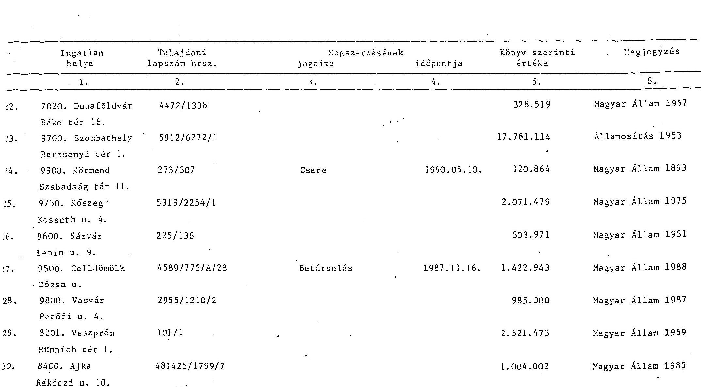

---

6. sz. melléklet az 1990. évi LXXIII. törvényhez

A szervezet és intézményei ingatlanaira vonatkozó adatok 1988. XII. 31.--1990. VIII. 31.

| Sor-zám | Ingatlan helye | Tulajdoní lapszám hrsz. | Megszerzésének jogcíme | idópontja | Könyv szerinti értéke | Megjegyzés |
| :--: | :--: | :--: | :--: | :--: | :--: | :--: |
| 0. | 1. | 2. | 3. | 4. | 5. | 6. |
| 331. | 8500. Pápa Györi u. 12. | $3943 / 4060$ |  |  | 2.248 .370 | Magyar Állam 1962 |
| 332. | 8300. Tapolca Szamuely u. 13. | $5065 / 3437 / 12$ | Betársulás | 1989.12.15. | 2.520 .000 | Magyar Állam 1986 |
| 333. | 8100. Várpalota Alsoinkam u. 31. | $1750 / 1465 / 1$ | Csere | 1990.06.01. | 1.293 .650 | Magyar Állam 1967 |
| 334. | 8200. Veszprém Felszabadulás út $65 / b$. | $7197 / 83338$ |  |  | 600.000 | Magyar Állam 1978 |
| 335. | 8200. Veszprém Kiskörösi u. 20/a. | $5477 / 5969$ |  |  | 1.600 .702 | Magyar Állam 1977 |
| 336. | 8220. Balatonalrádí Lenin u. 22. | $2282 / 2176$ | Betársulás | 1987.12.31. | 549.200 | Magyar Állam 1952 |
| 337. | 8330. Sümeg Kossuth u. 31. | $1521 / 1434$ | Csere | 1990.07.24. | 193.825 | Magyar Állam 1966 |
| 338. | 8900. Zalaegerszeg Hóvirág u. 7. | $63 / 22478 / 1$ |  |  | 7.069 .125 | Államositás 1952 |
| 339. | 8900.Keszthely Rákóczi tér 21. | $660 / 2 / 522 / A / 2$ | Betársulás | 1990.02.12. | 8.448 .000 | Társasház 1990 |

---

6. sz. melléklet az 1990. évi LXXIII. törvényhez

A szervezet és intézményei ingatlanaira vonatkozó adatok 1988. XII. 31.-r1990. VIII. 31.
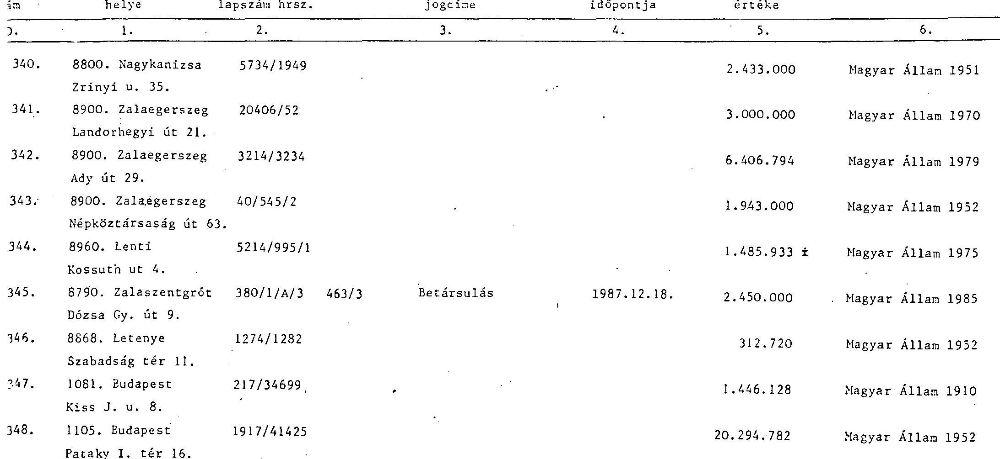

---

6. sz. melléklet az 1990. évi LXXIII. törvényhez

A szervezet és intézményei ingatlanaira vonatkozó adatok 1988. XII. 31.--1990. VIII. 31.

| Sor-
zám | Ingatlan helye | Tulajdoni lapszám hrsz. | Megszerzésének jogcíme | időpontja | Könyv szerinti értéke | Megjegyzés |
| :--: | :--: | :--: | :--: | :--: | :--: | :--: |
| 0 . | 1. | 2. | 3. | 4. | 5. | 6. |
| 349. | 1081. Budapest Köztársaság tér 26. | 147/834622 |  |  | 140.746 .986 | Magyar Âllam 1951 |
| 350. | 1081. Budapest Köztársaság tér 27. | 154/834629 |  |  | 18.372 .114 | Magyar Âllam 1950 |
| 351. | 1086. Budapest   Szerdahelyi u. 10. | 593/35140 |  |  | 1.213 .313 | Magyar Âllam 1952 |
| 352. | 2484. Agárd   Chernel I. u. 25. | 5222/5373 |  |  | 9.341 .777 | Magyar Âllam 1962 |
| 353. | 1081. Budapest   Bezerédi u. 5. | 186/34667 | Könyvjóváirás | 1990.06.19. | 462.000 | Magyar Âllam 1952 |
| 354. | 1054. Budapest   Alkotmány u. 2. | 1019/24898 |  |  | 84.118 .093 | Magyar Âllam 1926 |
| 355. | 8237. Tihany   Fürdőtelepi út 1. | 597/5702 |  |  | 80.307 .901 | Magyar Âllam 1955 |
| 356. | 8237. Tihany   Fürdőtelepi út 1. | 597/5702 |  |  | 64.098 .325 | Magyar Âllam 1955 |
| 357. | 8237. Tihany   Fürdőtelepi út 1. | 597/5702 |  |  | 8.836 .264 | Magyar Âllam 1955 |

---

6. sz. melléklet az 1990. évi LXXIII. törvényhez

A szervezet és intézményei ingatlanaira vonatkozó adatok 1988. XII. 31.--1990. VIII. 31.

| Sor-   szám | Ingatlan helye | Tulajdoni lapszám hrsz. | Megszerzésének |  | Könyv szerinti | Megjegyzés |
| :--: | :--: | :--: | :--: | :--: | :--: | :--: |
| 0 . | 1. | 2. | 3. | 4. | 5. | 6. |
| 358. | 8237. Tihany | 597/5702 |  |  | 1.149 .422 | Magyar Állam 1955 |
|  | Fürdőtelepi út 1. |  |  |  |  |  |
| 359. | 8237. Tihany | 597/5702 | Beruházás | 1987.08.17. | 19.787 .624 | Magyar Állam 1955 |
|  | Fürdőtelepi út 1. |  |  |  |  |  |
| 360. | 2016. Leányfalu | 2027/2100 |  |  | 16.823 .059 | Magyar Állam 1949 |
|  | Móricz Zs. út 117. |  |  |  |  |  |
| 361. | 2016. Leányfalu | 2027/2100 |  |  | 844.867 | Magyar Állam 1949 |
|  | Móricz Zs. út 117. |  |  |  |  |  |
| 362. | 2016. Leányfalu | 2027/2100 |  |  | 729.016 | Magyar Állam 1949 |
|  | Móricz Zs. út 117. |  |  |  |  |  |
| 363. | 2016. Leányfalu | 2027/2100 |  |  | 2.134 .061 | Magyar Állam 1949 |
|  | Móricz Zs. út 117. |  |  |  |  |  |
| 364. | 2016. Leányfalu | 2027/2100 |  |  | 11.469 .300 | Magyar Állam 1949 |
|  | Móricz Zs. út 117. |  |  |  |  |  |
| 365. | 1063. Budapest | 1403/29644-1 |  |  | 52.438 .377 | Államositás 1952 |
|  | Munkácsy M. u. 5/7. |  |  |  |  |  |

---

FOLDHIVATAL
Szentendre, Kossuth L. u. 5.
M.: 59
Telefon: 06-26-11091, 06-26-12413
2001
20.047/91

MSZI Orszigos Kőzpontja
Budap e s t 81.
pf. "D"
1430

1991 - 17 - 18
06/202/91

Tárgy: Tulajóoni lap és betét másolatok megküldése
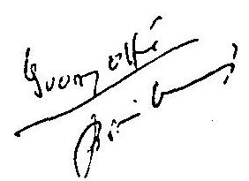

Hivatelunkhoz érkezett megkoresisükre mellékelten megküldöm a kért tulajóoni lap másolatokot, csatolva a hozzájuk tartozó betéteket.
A jolgles szentendrei 1795 hraz-on és 1815 hraz-on nyilvantartoit ingatlannak telekkönyvi betútje nem volt.

Szentendre, 1991. julius 15.
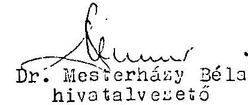

---

Körzeti Földhivatal
6101 Kiekunféle $\cdot$ h h h h h h h h h h h h h h h h h h h h h h h h h h h h h h h h h h h h h h h h h h h h h h h h h h h h h h h h h h h h h h h h h h h h h h h h h h h h h h h h h h h h h h h h h h h h h h h h h h h h h h h h h h h h h h h h h h h h h h h h h h h h h h h h h h h h h h h h h h h h h h h h h h h h h h h h h h h h h h h h h h h h h h h h h h h h h h h h h h h h h h h h h h h h h h h h h h h h h h h h

---

Váci Földhivatal Ingatlannyilvántartási csoport 26ol. Vác, Káptalan u.1-3.

34323/1991.szám. Tárgy:Betétmásolatok megküldése. Melléklet: 8 db.

MSZP Orazágos Központja
1081. Budapest VIII.,

Kéztársaság tér 26.
1430. Budapest 81 Pf. "D"

Hivatalomhoz érkezett kérelmére mellékelten megküldöm a kimutatás 1-2, 4-6, 9. sorszáma szarinti ingatlanok betétmásolatait.

A kimutatás 3, 7-8. sorszám szarinti ingatlanok betétei sajnos többszóri keresés után sem találhatók, ezért azokról másolatot megküldeni nem tudok.

Vác, 1991.junius 26.
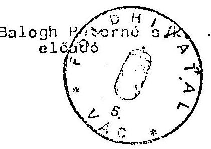
kiadni cimnek melléklettel.

---

Földhivatal Szolnok
5002 Szolnok, József A.u. 46.
Szám: 11/3541/1991. Tárgy: Telekkönyvi betétek megkiildése
MSZP Országos Központja
1081 Budapest VIII.,
Köz társaság tér 26.
Fenti szám megkeresésükkel kapcsolatban mellékelten megluildöm a kért telekkönyvi betéteket további felhasználás végett, továbbá tájékoztatom Onöket, hogy a
Szolnok Tiszalizet
Szolnok Holt-Tissapart
Szolnok Tófenék u. 1-3.
alatti ingatlanoknak telekkönyvi betétjei nem voltak.
$3 \mathrm{z} 01 \mathrm{n} 0 \mathrm{k}, 1991$. junius 20.
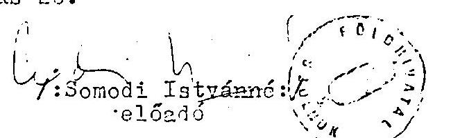

---

# Földhivatal 

## Dorog

$33542 / 91 . \mathrm{sz}$.
MSZF Országos Közrontja
Líté Liszló fénztáros úr részére

## Eucapest

Kiztársaság tér 26.
1081
Ingatlan felmérésgel kapcsolatos megkeresésére szíves tájékoztatással az alátbákat kizlés.

Az in által kért adatokat csak egy része talílható az irattírunkban Liftatlan és Lyergesúijalu voz atkozásilan csak az új munkarészek állrak a rendelkezésemre.
Egyidejlleg csatolom isztergom, dorog, Tát és Tokol telekkényvi betítmásolatát tovítli szíves felbrenclís céljétól.

Dorog, 1991. 07. 05:
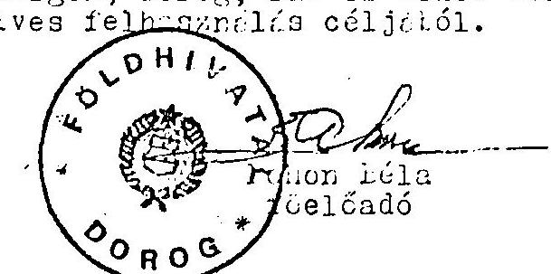

---

# KISK HASSENEN PENOSSER

## 0107

**KOMMUNESBERGELSER**

**FEBRUARI 1991**

**KOMMUNESBERGELSER**

**FEBRUARI 1991**

**KOMMUNESBERGELSER**

**FEBRUARI 1991**

**KOMMUNESBERGELSER**

**FEBRUARI 1991**

**KOMMUNESBERGELSER**

**FEBRUARI 1991**

**KOMMUNESBERGELSER**

**FEBRUARI 1991**

**KOMMUNESBERGELSER**

**FEBRUARI 1991**

**KOMMUNESBERGELSER**

**FEBRUARI 1991**

**KOMMUNESBERGELSER**

**FEBRUARI 1991**

**KOMMUNESBERGELSER**

**FEBRUARI 1991**

**KOMMUNESBERGELSER**

**FEBRUARI 1991**

**KOMMUNESBERGELSER**

**FEBRUARI 1991**

**KOMMUNESBERGELSER**

**FEBRUARI 1991**

**KOMMUNESBERGELSER**

**FEBRUARI 1991**

**KOMMUNESBERGELSER**

**FEBRUARI 1991**

**KOMMUNESBERGELSER**

**FEBRUARI 1991**

**KOMMUNESBERGELSER**

**FEBRUARI 1991**

**KOMMUNESBERGELSER**

**FEBRUARI 1991**

**KOMMUNESBERGELSER**

**FEBRUARI 1991**

**KOMMUNESBERGELSER**

**FEBRUARI 1991**

**KOMMUNESBERGELSER**

**FEBRUARI 1991**

**KOMMUNESBERGELSER**

**FEBRUARI 1991**

**KOMMUNESBERGELSER**

**FEBRUARI 1991**

**KOMMUNESBERGELSER**

**FEBRUARI 1991**

**KOMMUNESBERGELSER**

**FEBRUARI 1991**

**KOMMUNESBERGELSER**

**FEBRUARI 1991**

**KOMMUNESBERGELSER**

**FEBRUARI 1991**

**KOMMUNESBERGELSER**

**FEBRUARI 1991**

**KOMMUNESBERGELSER**

**FEBRUARI 1991**

**KOMMUNESBERGELSER**

**FEBRUARI 1991**

**KOMMUNESBERGELSER**

**FEBRUARI 1991**

**KOMMUNESBERGELSER**

**FEBRUARI 1991**

**KOMMUNESBERGELSER**

**FEBRUARI 1991**

**KOMMUNESBERGELSER**

**FEBRUARI 1991**

**KOMMUNESBERGELSER**

**FEBRUARI 1991**

**KOMMUNESBERGELSER**

**FEBRUARI 1991**

**KOMMUNESBERGELSER**

**FEBRUARI 1991**

**KOMMUNESBERGELSER**

**FEBRUARI 1991**

**KOMMUNESBERGELSER**

**FEBRUARI 1991**

**KOMMUNESBERGELSER**

**FEBRUARI 1991**

**KOMMUNESBERGELSER**

**FEBRUARI 1991**

**KOMMUNESBERGELSER**

**FEBRUARI 1991**

**KOMMUNESBERGELSER**

**FEBRUARI 1991**

**KOMMUNESBERGELSER**

**FEBRUARI 1991**

**KOMMUNESBERGELSER**

**FEBRUARI 1991**

**KOMMUNESBERGELSER**

**FEBRUARI 1991**

**KOMMUNESBERGELSER**

**FEBRUARI 1991**

**KOMMUNESBERGELSER**

**FEBRUARI 1991**

**KOMMUNESBERGELSER**

**FEBRUARI 1991**

**KOMMUNESBERGELSER**

**FEBRUARI 1991**

**KOMMUNESBERGELSER**

**FEBRUARI 1991**

**KOMMUNESBERGELSER**

**FEBRUARI 1991**

**KOMMUNESBERGELSER**

**FEBRUARI 1991**

**KOMMUNESBERGELSER**

**FEBRUARI 1991**

**KOMMUNESBERGELSER**

**FEBRUARI 1991**

**KOMMUNESBERGELSER**

**FEBRUARI 1991**

**KOMMUNESBERGELSER**

**FEBRUARI 1991**

**KOMMUNESBERGELSER**

**FEBRUARI 1991**

**KOMMUNESBERGELSER**

**FEBRUARI 1991**

**KOMMUNESBERGELSER**

**FEBRUARI 1991**

**KOMMUNESBERGELSER**

**FEBRUARI 1991**

**KOMMUNESBERGELSER**

**FEBRUARI 1991**

**KOMMUNESBERGELSER**

**FEBRUARI 1991**

**KOMMUNESBERGELSER**

**FEBRUARI 1991**

**KOMMUNESBERGELSER**

**FEBRUARI 1991**

**KOMMUNESBERGELSER**

**FEBRUARI 1991**

**KOMMUNESBERGELSER**

**FEBRUARI 1991**

**KOMMUNESBERGELSER**

**FEBRUARI 1991**

**KOMMUNESBERGELSER**

**FEBRUARI 1991**

**KOMMUNESBERGELSER**

**FEBRUARI 1991**

**KOMMUNESBERGELSER**

**FEBRUARI 1991**

**KOMMUNESBERGELSER**

**FEBRUARI 1991**

**KOMMUNESBERGELSER**

**FEBRUARI 1991**

**KOMMUNESBERGELSER**

**FEBRUARI 1991**

**KOMMUNESBERGELSER**

**FEBRUARI 1991**

**KOMMUNESBERGELSER**

**FEBRUARI 1991**

**KOMMUNESBERGELSER**

**FEBRUARI 1991**

**KOMMUNESBERGELSER**

**FEBRUARI 1991**

**KOMMUNESBERGELSER**

**FEBRUARI 1991**

**KOMMUNESBERGELSER**

**FEBRUARI 1991**

**KOMMUNESBERGELSER**

**FEBRUARI 1991**

**KOMMUNESBERGELSER**

**FEBRUARI 1991**

**KOMMUNESBERGELSER**

**FEBRUARI 1991**

**KOMMUNESBERGELSER**

**FEBRUARI 1991**

**KOMMUNESBERGELSER**

**FEBRUARI 1991**

**KOMMUNESBERGELSER**

**FEBRUARI 1991**

**KOMMUNESBERGELSER**

**FEBRUARI 1991**

**KOMMUNESBERGELSER**

**FEBRUARI 1991**

**KOMMUNESBERGELSER**

**FEBRUARI 1991**

**KOMMUNESBERGELSER**

**FEBRUARI 1991**

**KOMMUNESBERGELSER**

**FEBRUARI 1991**

**KOMMUNESBERGELSER**

**FEBRUARI 1991**

**KOMMUNESBERGELSER**

**FEBRUARI 1991**

**KOMMUNESBERGELSER**

**FEBRUARI 1991**

**KOMMUNESBERGELSER**

**FEBRUARI 1991**

**KOMMUNESBERGELSER**

**FEBRUARI 1991**

**KOMMUNESBERGELSER**

**FEBRUARI 1991**

**KOMMUNESBERGELSER**

**FEBRUARI 1991**

**KOMMUNESBERGELSER**

**FEBRUARI 1991**

**KOMMUNESBERGELSER**

**FEBRUARI 1991**

**KOMMUNESBERGELSER**

**FEBRUARI 1991**

**KOMMUNESBERGELSER**

**FEBRUARI 1991**

**KOMMUNESBERGELSER**

**FEBRUARI 1991**

**KOMMUNESBERGELSER**

**FEBRUARI 1991**

**KOMMUNESBERGELSER**

**FEBRUARI 1991**

**KOMMUNESBERGELSER**

**FEBRUARI 1991**

**KOMMUNESBERGELSER**

**FEBRUARI 1991**

**KOMMUNESBERGELSER**

**FEBRUARI 1991**

**KOMMUNESBERGELSER**

**FEBRUARI 1991**

**KOMMUNESBERGELSER**

**FEBRUARI 1991**

**KOMMUNESBERGELSER**

**FEBRUARI 1991**

**KOMMUNESBERGELSER**

**FEBRUARI 1991**

**KOMMUNESBERGELSER**

**FEBRUARI 1991**

**KOMMUNESBERGELSER**

**FEBRUARI 1991**

**KOMMUNESBERGELSER**

**FEBRUARI 1991**

**KOMMUNESBERGELSER**

**FEBRUARI 1991**

**KOMMUNESBERGELSER**

**FEBRUARI 1991**

**KOMMUNESBERGELSER**

**FEBRUARI 1991**

**KOMMUNESBERGELSER**

**FEBRUARI 1991**

**KOMMUNESBERGELSER**

**FEBRUARI 1991**

**KOMMUNESBERGELSER**

**FEBRUARI 1991**

**KOMMUNESBERGELSER**

**FEBRUARI 1991**

**KOMMUNESBERGELSER**

**FEBRUARI 1991**

**KOMMUNESBERGELSER**

**FEBRUARI 1991**

**KOMMUNESBERGELSER**

**FEBRUARI 1991**

**KOMMUNESBERGELSER**

**FEBRUARI 1991**

**KOMMUNESBERGELSER**

**FEBRUARI 1991**

**KOMMUNESBERGELSER**

**FEBRUARI 1991**

**KOMMUNESBERGELSER**

**FEBRUARI 1991**

**KOMMUNESBERGELSER**

**FEBRUARI 1991**

**KOMMUNESBERGELSER**

**FEBRUARI 1991**

**KOMMUNESBERGELSER**

**FEBRUARI 1991**

**KOMMUNESBERGELSER**

**FEBRUARI 1991**

**KOMMUNESBERGELSER**

**FEBRUARI 1991**

**KOMMUNESBERGELSER**

**FEBRUARI 1991**

**KOMMUNESBERGELSER**

**FEBRUARI 1991**

**KOMMUNESBERGELSER**

**FEBRUARI 1991**

**KOMMUNESBERGELSER**

**FEBRUARI 1991**

**KOMMUNESBERGELSER**

**FEBRUARI 1991**

**KOMMUNESBERGELSER**

**FEBRUARI 1991**

**KOMMUNESBERGELSER**

**FEBRUARI 1991**

**KOMMUNESBERGELSER**

**FEBRUARI 1991**

**KOMMUNESBERGELSER**

**FEBRUARI 1991**

**KOMMUNESBERGELSER**

**FEBRUARI 1991**

**KOMMUNESBERGELSER**

**FEBRUARI 1991**

**KOMMUNESBERGELSER**

**FEBRUARI 1991**

**KOMMUNESBERGELSER**

**FEBRUARI 1991**

**KOMMUNESBERGELSER**

**FEBRUARI 1991**

**KOMMUNESBERGELSER**

**FEBRUARI 1991**

**KOMMUNESBERGELSER**

**FEBRUARI 1991**

**KOMMUNESBERGELSER**

**FEBRUARI 1991**

**KOMMUNESBERGELSER**

**FEBRUARI 1991**

**KOMMUNESBERGELSER**

**FEBRUARI 1991**

**KOMMUNESBERGELSER**

**FEBRUARI 1991**

**KOMMUNESBERGELSER**

**FEBRUARI 1991**

**KOMMUNESBERGELSER**

**FEBRUARI 1991**

**KOMMUNESBERGELSER**

**FEBRUARI 1991**

**KOMMUNESBERGELSER**

**FEBRUARI 1991**

**KOMMUNESBERGELSER**

**FEBRUARI 1991**

**KOMMUNESBERGELSER**

**FEBRUARI 1991**

**KOMMUNESBERGELSER**

**FEBRUARI 1991**

**KOMMUNESBERGELSER**

**FEBRUARI 1991**

**KOMMUNESBERGELSER**

**FEBRUARI 1991**

**KOMMUNESBERGELSER**

**FEBRUARI 1991**

**KOMMUNESBERGELSER**

**FEBRUARI 1991**

**KOMMUNESBERGELSER**

**FEBRUARI 1991**

**KOMMUNESBERGELSER**

**FEBRUARI 1991**

**KOMMUNESBERGELSER**

**FEBRUARI 1991**

**KOMMUNESBERGELSER**

**FEBRUARI 1991**

**KOMMUNESBERGELSER**

**FEBRUARI 1991**

**KOMMUNESBERGELSER**

**FEBRUARI 1991**

**KOMMUNESBERGELSER**

**FEBRUARI 1991**

**KOMMUNESBERGELSER**

**FEBRUARI 1991**

**KOMMUNESBERGELSER**

**FEBRUARI 1991**

**KOMMUNESBERGELSER**

**FEBRUARI 1991**

**KOMMUNESBERGELSER**

**FEBRUARI 1991**

**KOMMUNESBERGELSER**

**FEBRUARI 1991**

**KOMMUNESBERGELSER**

**FEBRUARI 1991**

**KOMMUNESBERGELSER**

**FEBRUARI 1991**

**KOMMUNESBERGELSER**

**FEBRUARI 1991**

**KOMMUNESBERGELSER**

**FEBRUARI 1991**

**KOMMUNESBERGELSER**

**FEBRUARI 1991**

**KOMMUNESBERGELSER**

**FEBRUARI 1991**

**KOMMUNESBERGELSER**

**FEBRUARI 1991**

**KOMMUNESBERGELSER**

**FEBRUARI 1991**

**KOMMUNESBERGELSER**

**FEBRUARI 1991**

**KOMMUNESBERGELSER**

**FEBRUARI 1991**

**KOMMUNESBERGELSER**

**FEBRUARI 1991**

**KOMMUNESBERGELSER**

**FEBRUARI 1991**

**KOMMUNESBERGELSER**

**FEBRUARI 1991**

**KOMMUNESBERGELSER**

**FEBRUARI 1991**

**KOMMUNESBERGELSER**

**FEBRUARI 1991**

**KOMMUNESBERGELSER**

**FEBRUARI 1991**

**KOMMUNESBERGELSER**

**FEBRUARI 1991**

**KOMMUNESBERGELSER**

**FEBRUARI 1991**

**KOMMUNESBERGELSER**

**FEBRUARI 1991**

**KOMMUNESBERGELSER**

**FEBRUARI 1991**

**KOMMUNESBERGELSER**

**FEBRUARI 1991**

**KOMMUNESBERGELSER**

**FEBRUARI 1991**

**KOMMUNESBERGELSER**

**FEBRUARI 1991**

**KOMMUNESBERGELSER**

**FEBRUARI 1991**

**KOMMUNESBERGELSER**

**FEBRUARI 1991**

**KOMMUNESBERGELSER**

**FEBRUARI 1991**

**KOMMUNESBERGELSER**

**FEBRUARI 1991**

**KOMMUNESBERGELSER**

**FEBRUARI 1991**

**KOMMUNESBERGELSER**

**FEBRUARI 1991**

**KOMMUNESBERGELSER**

**FEBRUARI 1991**

**KOMMUNESBERGELSER**

**FEBRUARI 1991**

**KOMMUNESBERGELSER**

**FEBRUARI 1991**

**KOMMUNESBERGELSER**

**FEBRUARI 1991**

**KOMMUNESBERGELSER**

**FEBRUARI 1991**

**KOMMUNESBERGELSER**

**FEBRUARI 1991**

**KOMMUNESBERGELSER**

**FEBRUARI 1991**

**KOMMUNESBERGELSER**

**FEBRUARI 1991**

**KOMMUNESBERGELSER**

**FEBRUARI 1991**

**KOMMUNESBERGELSER**

**FEBRUARI 1991**

**KOMMUNESBERGELSER**

**FEBRUARI 1991**

**KOMMUNESBERGELSER**

**FEBRUARI 1991**

**KOMMUNESBERGELSER**

**FEBRUARI 1991**

**KOMMUNESBERGELSER**

**FEBRUARI 1991**

**KOMMUNESBERGELSER**

**FEBRUARI 1991**

**KOMMUNESBERGELSER**

**FEBRUARI 1991**

**KOMMUNESBERGELSER**

**FEBRUARI 1991**

**KOMMUNESBERGELSER**

**FEBRUARI 1991**

**KOMMUNESBERGELSER**

**FEBRUARI 1991**

**KOMMUNESBERGELSER**

**FEBRUARI 1991**

**KOMMUNESBERGELSER**

**FEBRUARI 1991**

**KOMMUNESBERGELSER**

**FEBRUARI 1991**

**KOMMUNESBERGELSER**

**FEBRUARI 1991**

**KOMMUNESBERGELSER**

**FEBRUARI 1991**

**KOMMUNESBERGELSER**

**FEBRUARI 1991**

**KOMMUNESBERGELSER**

**FEBRUARI 1991**

**KOMMUNESBERGELSER**

**FEBRUARI 1991**

**KOMMUNESBERGELSER**

**FEBRUARI 1991**

**KOMMUNESBERGELSER**

**FEBRUARI 1991**

**KOMMUNESBERGELSER**

**FEBRUARI 1991**

**KOMMUNESBERGELSER**

**FEBRUARI 1991**

**KOMMUNESBERGELSER**

**FEBRUARI 1991**

**KOMMUNESBERGELSER**

**FEBRUARI 1991**

**KOMMUNESBERGELSER**

**FEBRUARI 1991**

**KOMMUNESBERGELSER**

**FEBRUARI 1991**

**KOMMUNESBERGELSER**

**FEBRUARI 1991**

**KOMMUNESBERGELSER**

**FEBRUARI 1991**

**KOMMUNESBERGELSER**

**FEBRUARI 1991**

**KOMMUNESBERGELSER**

**FEBRUARI 1991**

**KOMMUNESBERGELSER**

**FEBRUARI 1991**

**KOMMUNESBERGELSER**

**FEBRUARI 1991**

**KOMMUNESBERGELSER**

**FEBRUARI 1991**

**KOMMUNESBERGELSER**

**FEBRUARI 1991**

**KOMMUNESBERGELSER**

**FEBRUARI 1991**

**KOMMUNESBERGELSER**

**FEBRUARI 1991**

**KOMMUNESBERGELSER**

**FEBRUARI 1991**

**KOMMUNESBERGELSER**

**FEBRUARI 1991**

**KOMMUNESBERGELSER**

**FEBRUARI 1991**

**KOMMUNESBERGELSER**

**FEBRUARI 1991**

**KOMMUNESBERGELSER**

**FEBRUARI 1991**

**KOMMUNESBERGELSER**

**FEBRUARI 1991**

**KOMMUNESBERGELSER**

**FEBRUARI 1991**

**KOMMUNESBERGELSER**

**FEBRUARI 1991**

**KOMMUNESBERGELSER**

**FEBRUARI 1991**

**KOMMUNESBERGELSER**

**FEBRUARI 1991**

**KOMMUNESBERGELSER**

**FEBRUARI 1991**

**KOMMUNESBERGELSER**

**FEBRUARI 1991**

**KOMMUNESBERGELSER**

**FEBRUARI 1991**

**KOMMUNESBERGELSER**

**FEBRUARI 1991**

**KOMMUNESBERGELSER**

**FEBRUARI 1991**

**KOMMUNESBERGELSER**

**FEBRUARI 1991**

**KOMMUNESBERGELSER**

**FEBRUARI 1991**

**KOMMUNESBERGELSER**

**FEBRUARI 1991**

**KOMMUNESBERGELSER**

**FEBRUARI 1991**

**KOMMUNESBERGELSER**

**FEBRUARI 1991**

**KOMMUNESBERGELSER**

**FEBRUARI 1991**

**KOMMUNESBERGELSER**

**FEBRUARI 1991**

**KOMMUNESBERGELSER**

**FEBRUARI 1991**

**KOMMUNESBERGELSER**

**FEBRUARI 1991**

**KOMMUNESBERGELSER**

**FEBRUARI 1991**

**KOMMUNESBERGELSER**

**FEBRUARI 1991**

**KOMMUNESBERGELSER**

**FEBRUARI 1991**

**KOMMUNESBERGELSER**

**FEBRUARI 1991**

**KOMMUNESBERGELSER**

**FEBRUARI 1991**

**KOMMUNESBERGELSER**

**FEBRUARI 1991**

**KOMMUNESBERGELSER**

**FEBRUARI 1991**

**KOMMUNESBERGELSER**

**FEBRUARI 1991**

**KOMMUNESBERGELSER**

**FEBRUARI 1991**

**KOMMUNESBERGELSER**

**FEBRUARI 1991**

**KOMMUNESBERGELSER**

**FEBRUARI 1991**

**KOMMUNESBERGELSER**

**FEBRUARI 1991**

**KOMMUNESBERGELSER**

**FEBRUARI 1991**

**KOMMUNESBERGELSER**

**FEBRUARI 1991**

**KOMMUNESBERGELSER**

**FEBRUARI 1991**

**KOMMUNESBERGELSER**

**FEBRUARI 1991**

**KOMMUNESBERGELSER**

**FEBRUARI 1991**

**KOMMUNESBERGELSER**

**FEBRUARI 1991**

**KOMMUNESBERGELSER**

**FEBRUARI 1991**

**KOMMUNESBERGELSER**

**FEBRUARI 1991**

**KOMMUNESBERGELSER**

**FEBRUARI 1991**

**KOMMUNESBERGELSER**

**FEBRUARI 1991**

**KOMMUNESBERGELSER**

**FEBRUARI 1991**

**KOMMUNESBERGELSER**

**FEBRUARI 1991**

**KOMMUNESBERGELSER**

**FEBRUARI 1991**

**KOMMUNESBERGELSER**

**FEBRUARI 1991**

**KOMMUNESBERGELSER**

**FEBRUARI 1991**

**KOMMUNESBERGELSER**

**FEBRUARI 1991**

**KOMMUNESBERGELSER**

**FEBRUARI 1991**

**KOMMUNESBERGELSER**

**FEBRUARI 1991**

**KOMMUNESBERGELSER**

**FEBRUARI 1991**

**KOMMUNESBERGELSER**

**FEBRUARI 1991**

**KOMMUNESBERGELSER**

**FEBRUARI 1991**

**KOMMUNESBERGELSER**

**FEBRUARI 1991**

**KOMMUNESBERGELSER**

**FEBRUARI 1991**

**KOMMUNESBERGELSER**

**FEBRUARI 1991**

**KOMMUNESBERGELSER**

**FEBRUARI 1991**

**KOMMUNESBERGELSER**

**FEBRUARI 1991**

**KOMMUNESBERGELSER**

**FEBRUARI 1991**

**KOMMUNESBERGELSER**

**FEBRUARI 1991**

**KOMMUNESBERGELSER**

**FEBRUARI 1991**

**KOMMUNESBERGELSER**

**FEBRUARI 1991**

**KOMMUNESBERGELSER**

**FEBRUARI 1991**

**KOMMUNESBERGELSER**

**FEBRUARI 1991**

**KOMMUNESBERGELSER**

**FEBRUARI 1991**

**KOMMUNESBERGELSER**

**FEBRUARI 1991**

**KOMMUNESBERGELSER**

**FEBRUARI 1991**

**KOMMUNESBERGELSER**

**FEBRUARI 1991**

**KOMMUNESBERGELSER**

**FEBRUARI 1991**

**KOMMUNESBERGELSER**

**FEBRUARI 1991**

**KOMMUNESBERGELSER**

**FEBRUARI 1991**

**KOMMUNESBERGELSER**

**FEBRUARI 1991**

**KOMMUNESBERGELSER**

**FEBRUARI 1991**

**KOMMUNESBERGELSER**

**FEBRUARI 1991**

**KOMMUNESBERGELSER**

**FEBRUARI 1991**

**KOMMUNESBERGELSER**

**FEBRUARI 1991**

**KOMMUNESBERGELSER**

**FEBRUARI 1991**

**KOMMUNESBERGELSER**

**FEBRUARI 1991**

**KOMMUNESBERGELSER**

**FEBRUARI 1991**

**KOMMUNESBERGELSER**

**FEBRUARI 1991**

**KOMMUNESBERGELSER**

**FEBRUARI 1991**

**KOMMUNESBERGELSER**

**FEBRUARI 1991**

**KOMMUNESBERGELSER**

**FEBRUARI 1991**

**KOMMUNESBERGELSER**

**FEBRUARI 1991**

**KOMMUNESBERGELSER**

**FEBRUARI 1991**

**KOMMUNESBERGELSER**

**FEBRUARI 1991**

**KOMMUNESBERGELSER**

**FEBRUARI 1991**

**KOMMUNESBERGELSER**

**FEBRUARI 1991**

**KOMMUNESBERGELSER**

**FEBRUARI 1991**

**KOMMUNESBERGELSER**

**FEBRUARI 1991**

**KOMMUNESBERGELSER**

**FEBRUARI 1991**

**KOMMUNESBERGELSER**

**FEBRUARI 1991**

**KOMMUNESBERGELSER**

**FEBRUARI 1991**

**KOMMUNESBERGELSER**

**FEBRUARI 1991**

**KOMMUNESBERGELSER**

**FEBRUARI 1991**

**KOMMUNESBERGELSER**

**FEBRUARI 1991**

**KOMMUNESBERGELSER**

**FEBRUARI 1991**

**KOMMUNESBERGELSER**

**FEBRUARI 1991**

**KOMMUNESBERGELSER**

**FEBRUARI 1991**

**KOMMUNESBERGELSER**

**FEBRUARI 1991**

**KOMMUNESBERGELSER**

**FEBRUARI 1991**

**KOMMUNESBERGELSER**

**FEBRUARI 1991**

**KOMMUNESBERGELSER**

**FEBRUARI 1991**

**KOMMUNESBERGELSER**

**FEBRUARI 1991**

**KOMMUNESBERGELSER**

**FEBRUARI 1991**

**KOMMUNESBERGELSER**

**FEBRUARI 1991**

**KOMMUNESBERGELSER**

**FEBRUARI 1991**

**KOMMUNESBERGELSER**

**FEBRUARI 1991**

**KOMMUNESBERGELSER**

**FEBRUARI 1991**

**KOMMUNESBERGELSER**

**FEBRUARI 1991**

**KOMMUNESBERGELSER**

**FEBRUARI 1991**

**KOMMUNESBERGELSER**

**FEBRUARI 1991**

**KOMMUNESBERGELSER**

**FEBRUARI 1991**

**KOMMUNESBERGELSER**

**FEBRUARI 1991**

**KOMMUNESBERGELSER**

**FEBRUARI 1991**

**KOMMUNESBERGELSER**

**FEBRUARI 1991**

**KOMMUNESBERGELSER**

**FEBRUARI 1991**

**KOMMUNESBERGELSER**

**FEBRUARI 1991**

**KOMMUNESBERGELSER**

**FEBRUARI 1991**

**KOMMUNESBERGELSER**

**FEBRUARI 1991**

**KOMMUNESBERGELSER**

**FEBRUARI 1991**

**KOMMUNESBERGELSER**

**FEBRUARI 1991**

**KOMMUNESBERGELSER**

**FEBRUARI 1991**

**KOMMUNESBERGELSER**

**FEBRUARI 1991**

**KOMMUNESBERGELSER**

**FEBRUARI 1991**

**KOMMUNESBERGELSER**

**FEBRUARI 1991**

**KOMMUNESBERGELSER**

**FEBRUARI 1991**

**KOMMUNESBERGELSER**

**FEBRUARI 1991**

**KOMMUNESBERGELSER**

**FEBRUARI 1991**

**KOMMUNESBERGELSER**

**FEBRUARI 1991**

**KOMMUNESBERGELSER**

**FEBRUARI 1991**

**KOMMUNESBERGELSER**

**FEBRUARI 1991**

**KOMMUNESBERGELSER**

**FEBRUARI 1991**

**KOMMUNESBERGELSER**

**FEBRUARI 1991**

**KOMMUNESBERGELSER**

**FEBRUARI 1991**

**KOMMUNESBERGELSER**

**FEBRUARI 1991**

**KOMMUNESBERGELSER**

**FEBRUARI 1991**

**KOMMUNESBERGELSER**

**FEBRUARI 1991**

**KOMMUNESBERGELSER**

**FEBRUARI 1991**

**KOMMUNESBERGELSER**

**FEBRUARI 1991**

**KOMMUNESBERGELSER**

**FEBRUARI 1991**

**KOMMUNESBERGELSER**

**FEBRUARI 1991**

**KOMMUNESBERGELSER**

**FEBRUARI 1991**

**KOMMUNESBERGELSER**

**FEBRUARI 1991**

**KOMMUNESBERGELSER**

**FEBRUARI 1991**

**KOMMUNESBERGELSER**

**FEBRUARI 1991**

**KOMMUNESBERGELSER**

**FEBRUARI 1991**

**KOMMUNESBERGELSER**

**FEBRUARI 1991**

**KOMMUNESBERGELSER**

**FEBRUARI 1991**

**KOMMUNESBERGELSER**

**FEBRUARI 1991**

**KOMMUNESBERGELSER**

**FEBRUARI 1991**

**KOMMUNESBERGELSER**

**FEBRUARI 1991**

**KOMMUNESBERGELSER**

**FEBRUARI 1991**

**KOMMUNESBERGELSER**

**FEBRUARI 1991**

**KOMMUNESBERGELSER**

**FEBRUARI 1991**

**KOMMUNESBERGELSER**

**FEBRUARI 1991**

**KOMMUNESBERGELSER**

**FEBRUARI 1991**

**KOMMUNESBERGELSER**

**FEBRUARI 1991**

**KOMMUNESBERGELSER**

**FEBRUARI 1991**

**KOMMUNESBERGELSER**

**FEBRUARI 1991**

**KOMMUNESBERGELSER**

**FEBRUARI 1991**

**KOMMUNESBERGELSER**

**FEBRUARI 1991**

**KOMMUNESBERGELSER**

**FEBRUARI 1991**

**KOMMUNESBERGELSER**

**FEBRUARI 1991**

**KOMMUNESBERGELSER**

**FEBRUARI 1991**

**KOMMUNESBERGELSER**

**FEBRUARI 1991**

**KOMMUNESBERGELSER**

**FEBRUARI 1991**

**KOMMUNESBERGELSER**

**FEBRUARI 1991**

**KOMMUNESBERGELSER**

**FEBRUARI 1991**

**KOMMUNESBERGELSER**

**FEBRUARI 1991**

**KOMMUNESBERGELSER**

**FEBRUARI 1991**

**KOMMUNESBERGELSER**

**FEBRUARI 1991**

**KOMMUNESBERGELSER**

**FEBRUARI 1991**

**KOMMUNESBERGELSER**

**FEBRUARI 1991**

**KOMMUNESBERGELSER**

**FEBRUARI 1991**

**KOMMUNESBERGELSER**

**FEBRUARI 1991**

**KOMMUNESBERGELSER**

**FEBRUARI 1991**

**KOMMUNESBERGELSER**

**FEBRUARI 1991**

**KOMMUNESBERGELSER**

**FEBRUARI 1991**

**KOMMUNESBERGELSER**

**FEBRUARI 1991**

**KOMMUNESBERGELSER**

**FEBRUARI 1991**

**KOMMUNESBERGELSER**

**FEBRUARI 1991**

**KOMMUNESBERGELSER**

**FEBRUARI 1991**

**KOMMUNESBERGELSER**

**FEBRUARI 1991**

**KOMMUNESBERGELSER**

**FEBRUARI 1991**

**KOMMUNESBERGELSER**

**FEBRUARI 1991**

**KOMMUNESBERGELSER**

**FEBRUARI 1991**

**KOMMUNESBERGELSER**

**FEBRUARI 1991**

**KOMMUNESBERGELSER**

**FEBRUARI 1991**

**KOMMUNESBERGELSER**

**FEBRUARI 1991**

**KOMMUNESBERGELSER**

**FEBRUARI 1991**

**KOMMUNESBERGELSER**

**FEBRUARI 1991**

**KOMMUNESBERGELSER**

**FEBRUARI 1991**

**KOMMUNESBERGELSER**

**FEBRUARI 1991**

**KOMMUNESBERGELSER**

**FEBRUARI 1991**

**KOMMUNESBERGELSER**

**FEBRUARI 1991**

**KOMMUNESBERGELSER**

**FEBRUARI 1991**

**KOMMUNESBERGELSER**

**FEBRUARI 1991**

**KOMMUNESBERGELSER**

**FEBRUARI 1991**

**KOMMUNESBERGELSER**

**FEBRUARI 1991**

**KOMMUNESBERGELSER**

**FEBRUARI 1991**

**KOMMUNESBERGELSER**

**FEBRUARI 1991**

**KOMMUNESBERGELSER**

**FEBRUARI 1991**

**KOMMUNESBERGELSER**

**FEBRUARI 1991**

**KOMMUNESBERGELSER**

**FEBRUARI 1991**

**KOMMUNESBERGELSER**

**FEBRUARI 1991**

**KOMMUNESBERGELSER**

**FEBRUARI 1991**

**KOMMUNESBERGELSER**

**FEBRUARI 1991**

**KOMMUNESBERGELSER**

**FEBRUARI 1991**

**KOMMUNESBERGELSER**

**FEBRUARI 1991**

**KOMMUNESBERGELSER**

**FEBRUARI 1991**

**KOMMUNESBERGELSER**

**FEBRUARI 1991**

**KOMMUNESBERGELSER**

**FEBRUARI 1991**

**KOMMUNESBERGELSER**

**FEBRUARI 1991**

**KOMMUNESBERGELSER**

**FEBRUARI 1991**

**KOMMUNESBERGELSER**

**FEBRUARI 1991**

**KOMMUNESBERGELSER**

**FEBRUARI 1991**

**KOMMUNESBERGELSER**

**FEBRUARI 1991**

**KOMMUNESBERGELSER**

**FEBRUARI 1991**

**KOMMUNESBERGELSER**

**FEBRUARI 1991**

**KOMMUNESBERGELSER**

**FEBRUARI 1991**

**KOMMUNESBERGELSER**

**FEBRUARI 1991**

**KOMMUNESBERGELSER**

**FEBRUARI 1991**

**KOMMUNESBERGELSER**

**FEBRUARI 1991**

**KOMMUNESBERGELSER**

**FEBRUARI 1991**

**KOMMUNESBERGELSER**

**FEBRUARI 1991**

**KOMMUNESBERGELSER**

**FEBRUARI 1991**

**KOMMUNESBERGELSER**

**FEBRUARI 1991**

**KOMMUNESBERGELSER**

**FEBRUARI 1991**

**KOMMUNESBERGELSER**

**FEBRUARI 1991**

**KOMMUNESBERGELSER**

**FEBRUARI 1991**

**KOMMUNESBERGELSER**

**FEBRUARI 1991**

**KOMMUNESBERGELSER**

**FEBRUARI 1991**

**KOMMUNESBERGELSER**

**FEBRUARI 1991**

**KOMMUNESBERGELSER**

**FEBRUARI 1991**

**KOMMUNESBERGELSER**

**FEBRUARI 1991**

**KOMMUNESBERGELSER**

**FEBRUARI 1991**

**KOMMUNESBERGELSER**

**FEBRUARI 1991**

**KOMMUNESBERGELSER**

**FEBRUARI 1991**

**KOMMUNESBERGELSER**

**FEBRUARI 1991**

**KOMMUNESBERGELSER**

**FEBRUARI 1991**

**KOMMUNESBERGELSER**

**FEBRUARI 1991**

**KOMMUNESBERGELSER**

**FEBRUARI 1991**

**KOMMUNESBERGELSER**

**FEBRUARI 1991**

**KOMMUNESBERGELSER**

**FEBRUARI 1991**

**KOMMUNESBERGELSER**

**FEBRUARI 1991**

**KOMMUNESBERGELSER**

**FEBRUARI 1991**

**KOMMUNESBERGELSER**

**FEBRUARI 1991**

**FEBRUARI 1991**

**FEBRUARI 1991**

**KOMMUNESBERGELSER**

**FEBRUARI 1991**

**KOMMUNESBERGELSER**

**FEBRUARI 1991**

**KOMMUNESBERGELSER**

**FEBRUARI 1991**

**KOMMUNESBERGELSER**

**FEBRUARI 1991**

**KOMMUNESBERGELSER**

**FEBRUARI 1991**

**KOMMUNESBERGELSER**

**FEBRUARI 1991**

**KOMMUNESBERGELSER**

**FEBRUARI 1991**

**KOMMUNESBERGELSER**

**FEBRUARI 1991**

**FEBRUARI 1991**

**FEBRUARI 1991**

**FEBRUARI 1991**

**F

---

MEIP GAZDASASI FEHOSZER

MEIP ORGANOSI IRZDA
TERILET: 00: 3231222

1991.Januar - 1991. December

1.122

1983

S I A M L A S D A G S C I S T A
1991.Januar - 1991. December

BIANLA
ALEZIANLASIAN

MEDNEVEZES
TETELAZONOSITO

FORBALOM
TAKTOZIK
IOVETEL

18.172.253.23 T

29.00 12 12 2 ASI jagus.alagjan kivez.(GYOR)
8.00 6.022.212.00
01.01 12 4 1 Allegro KFT torzabetet eze mod
228.000.00 2.03
228.000.00 6.022.212.00 18.250.278.02 T

2.03

294-22

OSSISSEN

4. sz. melléklet
a V-149-8/1991/1992. sz. jelentéshez

---

16-1 N/1/0 5/a-sz. melléklet
a V-149-B/1591/1992. nr. je'en'úshez

A szerv leltári jele:
A ÁB
BPB
páriszervezet

A-8
BERENDEZÉSEK ÉS FELSZERELÉSEK
NYILVÁNTARTÓ LAPJA

Lenin bronz portré dombormü
az állóeszküz megnevezése, típusa
Beszcrzési éve: 1985
Gyártási jele: száma: Egységára: 80.000

| A készlet értéke: (bruttó) | Ft-ban | A bejegyzés kelte | A bejegyzó aláírása (teljes név) |
| --- | --- | --- | --- |
| Leltárba vételkor 1 db | 80.000 | 1985 xk 31. 150/2 4. 4. |  |
| 1986... évi rovanesnál | 80.000 | 1986.X11.31. 1/2 |  |
| 1987.. évi rovanesnál | 80.000 | 1988.X11.31. 1/2 |  |
| 1989... évi rovanesnál | 80.000 | 1989 X1.30. Küss (pénge) |  |
|  |  |  |  |
|  |  |  |  |
|  |  |  |  |
|  |  |  |  |
|  |  |  |  |
|  |  |  |  |
|  |  |  |  |
|  |  |  |  |
|  |  |  |  |
|  |  |  |  |
|  |  |  |  |
|  |  |  |  |
|  |  |  |  |
|  |  |  |  |
|  |  |  |  |
|  |  |  |  |
|  |  |  |  |
|  |  |  |  |
|  |  |  |  |
|  |  |  |  |
|  |  |  |  |
|  |  |  |  |
|  |  |  |  |
|  |  |  |  |
|  |  |  |  |
|  |  |  |  |
|  |  |  |  |
|  |  |  |  |
|  |  |  |  |
|  |  |  |  |
|  |  |  |  |

---

5/b sz. melléklet
a V-149-8/1991/1992. sz. jelentéshez
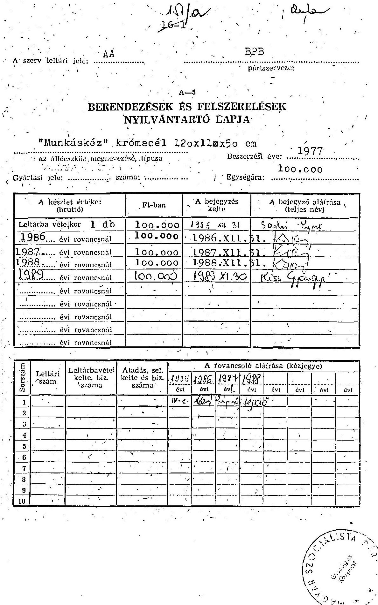

---

Nyilatkozó szervezet neve: Magyar Szocialista Párt
címe: 1081. Budapest, Köztársaság tér 26. jogelődje neve: Magyar Szocialista Munkáspárt

# N Y I L A T K O Z A T 

Alulirott az Állami Számvevőszék ellenő́reinek felkérésére a
8.B.Pénzforgalom alakulása
melléklethez az alábbiakat jelentem ki:
Az MSZMP megszünésekor - 1989-ben - a pártszervezetek MNB számláira, pénztáraira és betétszámláira vonatkozó bizonylatok is összegyuijtésre kerültek.

Az összegyuijtött bizonylatok átadásáról-átvételéről jegyzökönyvek nem készültek. A szervezetek felszámolási folyamatával kapcsolatos költözések miatt a begyuijtött bizonylatok is többször át lettek szállítva az eredeti begyuijtési helyekről anélkül, hogy az átszállítások dokumentálva lettek volna.

Súlyosbította a zavaros helyzetet, hogy a pártszervezetek gazdasági vezetőinek tulnyomó többsége is kivált a szervezetekbő̉.

Mindezek eredményeként a bizonylatok egy része eltunt, illetve fellelhetetlen és pótolhatatlan.

Budapest, 1992. február 28.
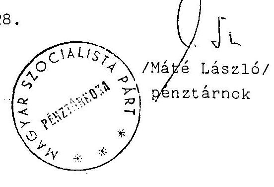

---

# Allami Számbeböséé 

2. sz. Függelék
a V-150-61/1991/91. sz.
jelentéshez

## JELENTÉS

a Magyar Demokratikus Ifjúsági Szövetség
(DEMISZ és tagszervezetei)
pótvagyonelszámolása hitelességének ellenôrzésérô
az 1991. évi LI. törvénnyel módosított
1990. évi LXXIII. törvény alapján

---

A vizsgálatot vezette és a jelentést összeállitotta:
dr. Zsarnai Dezsöné fötanácsos

A vizsgálatot végezték:
dr. Baki József számvevö
Berzétey Attiláné számvevö
Rideg Margit számvevö
Sólyom László számvevö
dr. Horváth Ferencné szakértö
dr. Szálka Béla szakértö
dr. Várlak1 Pál szakértö
dr. Velényi János szakértö

---

# J E L E N T É S 

a Magyar Demokratikus Ifjúsági Szövetség /DEMISZ és tagszervezetei/ pót vagyone Iszámolása hitelességének ellenőrzéséről az 1991. évi LI. törvénnyel módosított 1990. évi LXXIII. törvény alapján

Az elmúlt rendszerhez kötődő egyes társadalmi szervezetek vagyoneIszámolásáról szóló 1990. évi LXXIII. törvényt kiegészítő és módosító 1991. évi LI. törvény alapján a DEMISZ és tagszervezetei /a Kommunista Ifjúsági Szövetség és az Úttöröszövetség jogutódjaként/ elszámoltak vagyonukkal. E szervezetek közül számosan póto1ták egyes adatok hiányát, korrigálták az Állami Számvevőszék 1990-1991. évi 36. sz. jelentésében megállapított adathibákat, továbbá nyilatkoztak az általuk pótolhatatlan adatokról.

Az 1991. és az 1992. évi pótvagyone1számoltatás e11enőri megállapításainak együttes adatai alapján a DEMISZ 49 tagszervezete * közül:

38 tagszervezet és a Gazdasági Iroda vagyone1számolása hiteles (részletes felsorolásuk az 1. sz. mellékletben),
7 tagszervezet elszámolása nem minősül hitelesnek (Budavári Fiatalok Szövetsége, Baranya Megyei DEMISZ, Baranya Megyei Diákszövetség, Ifjúsági Szervezetek Szabolcsi Szövetsége, Tolna Megyei Ifjúsági Szervezetek Szövetsége, BÁCSÚNIÓ, Jász-Nagykun-Szolnok Megyei DEMISZ),
3 tagszervezet megszünt /a szovjetunióbeli, a német demokratikus köztársaságbeli és a Szegedi Sportolói Ifjúsági Szövetség vagyontalanok voltak/;

* (1990. évi adat)

---

2 tagszervezet /ODU, AGRYA/ kivált, még 1990-ben és perelte vagyonért a szövetséget.

Jelenleg 35 tagszervezetet tart számon a DEMISZ.

Az Állami Számvevöszék a DEMISZ és tagszervezetei vagyonelszámolását összességében

# NEM HITELES-nek 

minösíti.

A minösítés az alábbi megállapításokon alapul.

A KISZ 1989. április 22-i megszüntekor nem készült a társadalmi szerveżet gazdálkodásáról zárómérleg. A DEMISZ egyidejü megalakulását követöen nem készült leltáron alapuló nyitó mérleg. A DEMISZ tagszervezetei közötti vagyonmegosztás vagyonmérleg nélkül történt. A leltáron alapuló, valós mérlegek hiánya nem pótolható, következésképpen a vagyon számbavétele csak közvetett módon lehetséges, amely számos bizonytalansággal jár.

A vagyonelszámolás egyes idöszakokra csak közvetetten dokumentált, mert a hatályos KISZ ügyrendi értesítő, valamint az íratselejtezési rendelet értelmében 5, illetve 10 évente selejtezhetök voltak az elsődleges adathordozók. Erről az elszámolók pótolhatatlansági nyilatkozatot adtak, amit az Állami Számvevőszék elfogadott.

A 7 nem hitelesnek minösült vagyonelszámolású DEMISZ tagszervezet esetében azonban a gazdasági események rögzitése nem felelt meg a hatályos könyvviteli elöírásoknak, és ezen kívül alapvető - nem selejtezhető - dokumentumok is hiányoztak, emiatt a néhai KISZ vagyonnak azon része nem volt megállapítható.

---

A DEMISZ és tagszervezetei vagyonelszámolása nem teljeskörü. A KISZ megszünte után a megalakult DEMISZ-hez nem minden - korábban a területi KISZ szervezetekhez tartozó - alapszervezet csatlakozott. Ezek számáról, vagyonáról és tételes megnevezéséről a DEMISZ vezetése nem tudott pontos kimutatást adni. A megalakuláskor csatlakozott, de később kilépett, megszűnt tagszervezetek miatt, valamint a még formailag müködő, de városi tagságukat, alapszervezeteiket fokozatosan elvesztő tagszervezetek vagyonelszámolása nem képes teljeskörűen bemutatni az egykori KISZ vagyont.

A hitelesnek minősített vagyonelszámolások abban az értelemben valósak, hogy kimutatják a könyvekkel egyezően az egyes vagyonelemeket.

A 39 tagszervezet vagyonelszámolásának hitelesítése, az elszámoló felelősségével benyújtott pótolhatatlansági nyilatkozaton, a fellelhető másodlagos, harmadlagos dokumentumokon alapul. Eseti leltárak készültek a 81/1990.(IV.27.) MT rendelettel létrehozott Nemzeti Gyermek és Ifjúsági Alapítványba (továbbiakban: NGYIA) bevitt ingatlanokról a területi szeveknél, amelyek ténylegesen átadták az általuk kezelt javakat.

A DEMISZ Gazdasági Iroda, a KISZ KB jogutódja, központilag csak a könyv szerinti átadást végezte, egyébként sem jogosítványaiban, sem szervezetében, sem gazdálkodása körülményeiben nem azonos jogelődjével, országos gazdálkodási adatokat nem készít, mert a tagszervezetek önállóak.

A KISZ javairól fellelhető legutolsó egységes országos elszámolást az 1988. évi beszámoló tartalmazta. Eszerint a KISZ-nek

- 2,6 milliárd Ft értékủ állóeszközállománya volt, ebből 2,3 milliárd Ft értékủ volt ingatlanállomány / 77 ingatlan/;

---

- a fogyóeszközök értéke 0,2 milliárd Ft volt,
- a forgóeszközök 0,9 milliárd Ft-ot tettek ki.

Az ezt követő időszakra országos vagyonképet nyújtó, a halmozódásokat és hiányokat pontosan megállapító elszámolásra nincs mód. Megjegyzendó, hogy az egykori KISZ vagyon már nincs a DEMISZ kezelésében, mert alapítványba /NGYIA/, vállalkozásokba vitték, illetve volt KISZ vállalatok szanálására fordították jelentós részét.

A DEMISZ és tagszervezetei vagyonelszámolása két - időben jól elkülönülő - szakaszban valósult meg, és az ellenőrzés minősítései részletelben az alábbiak voltak:

| Minösités | $\begin{aligned} & \text { Az } 1990-91 . \text { évi } \\ & \text { ellenőrzés az } \\ & 1990 . \text { évi } 1 \text { LXXIII.tv. } \\ & \text { alapján } \end{aligned}$ | $\begin{aligned} & \text { Az } 1992 . \text { évi } \\ & \text { ellenőrzés az } \\ & 1991 . \text { évi } 11 . \text { tv. } \\ & \text { alapján } \end{aligned}$ | Végsó   összesített minösités |
| :--: | :--: | :--: | :--: |
| Hiteles | 18 tagszervezet | 21 tagszervezet | 39 tagszerve- |
|  |  | a Gazd.Irodával együtt | zet a Gazd.   Irodával együtt |
| Nem hiteles | 29 tagszervezet   a Gazd.Irodával | 7 tagszervezet | 7 tagszervezet |
| Megszünt   tagszervezet   1agszervezet | 2 tagszervezet (vagyontalanok) | 1 tagszervezet | 3 tagszervezet |
| DEMISZ és tag- |  | Elszámolásra pót- |  |
| szervezetei |  | 16lag kötelezett |  |
| 1990-ben 8ssz. | 49 | 29 | 49 tagszerv. |

Az egyes tagszervezetekre címzetten vonatkozó minősítést a Jelentés i. sz. melléklete tartalmazza.

Az összesített minősítést a teljeskörü áttekintés érdekében mutatta be a táblázat. A beszámolási kötelezettség csak az 1991. évi LI. törvény végrehajtására áll fenn.

---

Az 1991. évi LI. törvény végrehajtására vonatkozó ellenőrzés megállapításai a korábbi eljárás során "nem hiteles"-nek minösített vagyonelszámolási táblázatokra korlátozódtak, beleértve a hiánypótlási tételeket, a pótolhatatlansági nyilatkozatot, valamint egyéb - az elszámolás valóságát bizonyító - közvetett dokumentumokat.

A vizsgálat a benyújtott adatoknak a számszaki egyezöségére, számviteli dokumentáltságára alapozta a vagyonelszámolás minösítését, egyidejüleg jelezve egyes nyilvántartott ingatlanok, vagyontárgyak jogi rendezetlenségét.

Az Állami Számvevőszék megállapításai a gazdasági események idöpontjában hatályban volt jogszabályok elöírásainak való megfelelöséget minösítik.

Nem volt feladata az ellenőrzésnek megvizsgálni az egyes folyamatok etikai, politikai megfelelőségét, illetve esetlegesen "a társadalmi igazságérzet" oldaláról történő megközelítésben mérlegelni a gazdasági eseményeket. Ennek megfelelően járt el a pótelszámolás során az egykori KISZ KB székház (Bp. XIII., Garam u. 4. sz.) eladásának ügyével, valamint az 1987. évi I. törvény (földtörvény) alapján történt tulajdonszerzésekkel kapcsolatban is.

A KISZ-DEMISZ 1957-1990. augusztus 31-e közötti müködése alatt tulajdonába, kezelésébe / jogcím nélkül/ használatába került vagyontárgyak átvételének, átadásának jogi körülményeit a Jelentés külön ismerteti, mert a vagyonnak döntő nagyságrendjét kitevö ingatlanokhoz $/ 2,3 \mathrm{Mrd}$ Ft/ kapcsolódik és pontosan nem számszerüsíthető értékủ /cca. 0,2 Mrd Ft/ fogyóeszköz vagyont érint.

---

# Következtetések, jelzések 

A KISZ vagyon keletkezését a Magyar Szocialista Munkáspárt /MSZMP/ Ideig1enes Központi Bizottsága 1957. március 11-i alapító határozata alapozta meg, ame1y felhívta az állami és gazdasági szervezeteket, tanácsokat, szakszervezeteket, más szervezeteket, intézményeket, hogy "erkölcsileg és anyagilag támogassák a KISZ" - t .

Következésképpen a KISZ 1957. évi megalakulásától kezdve 1988-ig föként az MSZMP költségvetéséból kapott eszközökkel, valamint más (számos) szervezettól kapott juttatásokból gazdálkodott. Ebben csak kisebb részt jelentettek saját bevételei.

Más oldalról viszont megalakulásától kezdve 1989. április 22-ei megszüntéig, a KISZ költségvetéséból finanszírozták a Magyar Úttörőszövetséget is. Az Úttörőszövetségnek 1989-ig nem volt önálló gazdasági ügyvitele sem, mert azt a KISZ vezette sajátjával együtt.

A KISZ vagyonnak a DEMISZ-hez kerülése elméletileg magát jogfolytonosnak tekintö, de gyorsan kicserélődő vezetővel, gazdasági adminisztrációval történt és csak utóbb kapott jelentöséget 1989. év végén - az önálló jogi személyekböl álló Szövetségnek más jellege, lehetősége, felelőssége a vagyon kezelésével és a gazdálkodásával kapcșolatban. Ez a folyamat a KISZ - központi szervéból a KISZ KB-ból és a 19 megyei, valamint a Budapesti KISZ Bizottságból állt - törzskari szervezete által folytatott országos szintű szervezeti gazdálkodásnak a fokozatos megszünését, vagyoni vitákat, és a vagyonmegosztás igényét jelentette.

---

A vagyonmegosztás a DEMISZ területi szervei és a DEMISZ Gazdasági Iroda közötti jogvitákkal ment végbe. Ezzel párhuzamosan történt az ifjúsági vagyon egybentartása érdekében az ifjúsági célú ingatlanok felajánlása a Kormánynak. A Kormány a felajánlást követően 1073/1990.(IV.17.) MT határozatával, valamint a 81/1990.(IV.27.) MT rendelettel intézkedett a Nemzeti Gyermek és Ifjúsági Alapít vány létrehozásáról a KISZ-DEMISZ 60 db ingatlanából. Ezek között voltak olyanok is, amelyeket jogcím nélkül használt a KISZ-DEMISZ, tehát felajánlásukra és átadásukra nem volt jogosúlt. Más ingatlanokat pedig nem a tulajdoni lapon bejegyzett kezelőnek adták vissza, hanem tanácsoknak adtak át. Néhány ingatlant pedig egyáltalán nem adott át a DEMISZ, annak ellenére, hogy a NGYIA létrehozásáról szóló 81/1990.(VI.27.) MT rendeletben tételesen, nevesítve fel vannak sorolva. Ennek rendezését az Állami Számvevőszék szükségesnek tartja. Ugyanakkor a hitelességi kritériumokat nem érintik ezek az ügýek.

A hatályos jogszabályban meghírdetett egyes ingatlan átadások végrehajtásának - az átadó és átvevő utólagos eltérő megállapodásával történt - elmulasztását jelezzük.

A 81/1990.(IV.27.) MT rendeletben felsorolt és emiatt az NGYIA-hoz - jogilag nem rendezetten - került ingatlanok átadásának helyesbítését az Állami Számvevőszék javasolja.

Az ingatlanokat felszerelésüket képező ingóságokkal együtt ajánlották fel. Az összvagyon csökkenése kiterjedt az ingatlanokban lévő álló- és fogyóeszközökre is. Utóbb ezek miatt is voltak jogviták. E jogvitákat a megállapításokat szervezetenként tartalmazó fejezet ismerteti részletesen.

---

# A hitelesitési feladat és végrehajtása 

Az elmúlt rendszerhez kötődó egyes társadalmi szervezetek vagyonelszámolásáról szóló 1990. évi LXXIII- törvény 1. §-a szerint a Demokratikus Ifjúsági Szövetség és tagszervezetei /mint a Kommunista Ifjúsági Szövetség és az Úttörőszövetség jogutódjai/ vagyonával köteles elszámolni. A törvény 2. §-a alapján az elszámolási kötelezettség alá esó vagyon:
a/ ingatlanok - értékhatár nélkül,
b/ gépek, berendezések, felszerelések, jármüvek, jóléti állóeszközök, üzemkörön kívüli állóeszközök, ha beszerzési értékük az 50 ezer Ft-ot meghaladta,
c/ a védett múalkotások - értékhatár nélkül,
d/ az elszámoló által alapított vagy a részvételével müködö gazdálkodó szervezetek /Ptk. 685. §. c/ pont/ és alapítványok,
e/ értékpapírok /értékhatár nélkü1/,
f/ pénz- és bankszámlák.

A törvény az a/, b/, c/ és d/ pontban felsorolt vagyontárgyak tekintetében a törvény hatályba lépésétől /1990. szeptember 18./ az Országgyúlés további intézkedéséig elidegenítési és terhelési tilalmat rendelt el.

A törvény 6. §-ában meghatározott kötelezettség alapján 1990-ben az Állami Számvevőszék ellenőrizte az elszámolások hitelességét, és 29 ellenőrzött szervezet esetében azt "nem hiteles"-nek minösítette az ÁSZ 1990-1991. évi 36. sz. Jelentésében.

---

Az 1990. évi LXXIII. törvény módosításáról szóló 1991. évi LI. törvény alapján az Állami Számvevőszék 1991. december 16-án felhívta az elszámolókat, hogy a hivatkozott törvény 1. §-ának (4) és (5) bekezdésében megjelölt szerződések másolatát és a nem póto1ható adathlányokra vonatkozó nyilatkozatot a hiánypótlással nyújtsa be.

Az elszámolás az 1949. január 1. - 1990. augusztus 31. között idöszakra terjedt ki.

Az 1991. évi LI. törvény kiegészítette az 1990. évi LXXIII. törvényben elöirt feladatot egy további adatszolgáltatási és ellenőrzési kötelezettséggel, miszerint: az 1990. augusztus 31 szeptember 18. közötti időszakban az ingatlanok; az 50 ezer Ft feletti értékű állóeszközök, műalkotások, valamint gazdálkodó szervezetek és alapítványok elidegenítéséről, megterheléséről szóló szerződéseket is mellékelni kellett az elszámolónak.

Az elszámolók nyilatkozata szerint tartós vagyontárgyak elidegenítésére, megterhelésére szerzödést nem kötöttek.

Az elszámoló felelős az elszámolások teljességéért és valódiságáért a csatolt nyilatkozatok alapján, beleértve a pótolhatatlan adatok hiányáról szóló nyilatkozatot is.

Az Állami Számvevőszék feladatai az 1991. évi LI. törvény végrehajtásában:
1./ A vagyone1számolásra kötelezettek /29 DEMISZ tagszervezet/ felszólítása a pótlólagos vagyone1számolásra;
2./ A benyújtott vagyone1számolások érkeztetése és befogadása.
3./ A felszólításra, elszámolást be nem nyújtó tagszervezetek nevének és címének nyomozása, továbbá a megyei Bíróságok megkeresése, nyilatkozzanak a megszűnt szervezetek törléséről a társadalmi szervezeteknek az 1989. évi 11. törvény alapján vezetett nyilvántartása alapján.

---

4. Az elszámolások ellenőrzése, majd a hitelesség vagy nem hitelesség megállapításának közlése a vizsgált szervezetekkel.
5. Beszámolás az Országgyưlésnek a pótlólagos vagyonelszámolás hitelessége ellenőrzésének megállapításairól.

Az Állami Számvevőszék a számára elơírt feladatoknak az alábbiak szerint tett eleget.

A feladat elvégzésének körülményei

Az Állami Számvevőszék 1991. december 16-án összesen 29 DEMISZ tagszervezetet szólított fel pótelszámolásra. Felhívása nyomán 1992. január 21-töl 1992. március 24-ig folyamatosan érkeztek be pótlólagos vagyonelszámolások, nyilatkozatok. A BÁCSÚNIÓ és a Jász-Nagykun-Szolnok Megyei DEMISZ bevallás helyett mindössze leveleket küldött, s a személyes megbeszélések sem vezettek eredményre.

Az elszámolókat 14 esetben az Állami Számvevőszéknek ismételten fel kellett hívni kötelezettségük teljesítésére, és csak a benyújtást követöen kerülhetett sor a helyszíni ellenőrzésre: A többezer oldalnyi iratanyag ellenőrzése mintavételes vizsgálattal történt.

Az Állami Számvevőszék helyszíni vizsgálatait ebből következöen 1992. március 31-én fejezte be, amit az eljárási szabályok szerint 8 napos észrevételezési határidő és az észrevételekre to-

---

vábbi 8 napon belül válaszadás követett. Nem volt olyan megalapozott észrevétel, ami miatt a revizio megállapításait módosítani kellett volna.

Az Állami Számvevőszék a helyszíni ellenőrzések során sorozatosan kezdeményezett adatkiegészítéseket, dokumentumpótlásokat, valamint kénytelen volt befogadni további elszámolásokat annak érdekében, hogy minél valósabb adatokat nyerjen.

Számos tagszervezetnél nincs már gazdasági ügyekhez értó munkatárs, hanem társadalmi munkában ideiglenesen megbízott személyek látják el a feladatot. A vagyonelszámolás aláírására való jogosultságot is kénytelen volt emiatt ellenőrizni az Állami Számvevőszék. A vizsgálat megkezdésekor másolatban megkérte a bírósági végzést az aláírásra jogosult személyekröl.

A DEMISZ-nél dolgozók száma mindenütt jelentösen csökkent, elhelyezésük többszöri költözések után bérelt helyiségekre, magánlakásokra korlátozódott. Következésképpen a revizio számára szükséges bizonylatokat, iratokat csak elózetes összeírással, szállítással lehetett biztosítani.

A vizsgált szervezetek munkatársai közremüködtek az elszámolások pontosításában, de ez nem mindenütt volt eredményes. Ennek az volt az oka, hogy az előkészítetlen átszervezések, valamint költözködések során számos irat elveszett. Az Észak-Magyarországi DEMISZ-nél egykor a pártszervezet bonyolította a költöztetést, és ezalatt többévi iratanyag tünt el. A Tolna megyei DEMISZ viszont 1987-ben, idő előtt leadta az iratokat a pártarchívumnak, ahonnan állítólag minden a megyei levéltárhoz került.

---

A TOMISZ iratairól azonban a levéltár nem tud, bizonyiték, átadási jegyzőkönyv pedig nincs. (Ilyen esetekben az ÁSZ a "pótolhatatlansági nyilatkozatokat" nem fogadta be.)

A jelenlegi adminisztrációnak sincs hatékony "kutatásra" módja. Az elszámolások általában nem tartalmazták a városi alapszervezetek vagyonát, ezek közül pedig számosan megszüntek. /PI. a Veszprémhez tartozott 12 alapszervezetböl egy év alatt 5 megszünt./ A Baranya megyei Diákszövetség, és a Somogy megyei DEMISZ bizonylatai is hiányoztak, a számlakifizetések engedélyek nélkül történtek, külföldi utazási költséget is hasonlóan számoltak el.

A Szegedi Sportolók Ifjúsági Szövetsége idöközben megszünt és a Budavári Fiatalok Szövetsége nem volt fellelhető a nyilvántartott címen. Cimnyomozásunk alapján a bíróság megkeresésünkre közölte, hogy a bírósági nyilvántartás szerint még nem szünt meg a szervezet, székhelye azonban nincs, képviselöje saját lakásán tárolta a dokumentumokat.

Az elszámoltatás időszakában, 1990. augusztus 31-én a szervezet MNB elszámolási betétszámláján volt $841.757,23 \mathrm{Ft}$ egyenleg volt. Az ellenörzés felhívta a képviselö figyelmét arra, hogy a megszünés esetén vagyonával el kell számolnia.

Mindezek a jelenségek arra utalnak, hogy az 1990. augusztus 31-i állapotot rekonstruáló vagyonelszámoltatás adataihoz képest napjainkra jelentösen mérséklödött a DEMISZ és a tagszervezetei tényleges vagyona. Az állami támogatás 1990-ben megszünt, ezért a müködési költségeket - tagdíj hiján - a birtokukban volt javak folymatos felhasználásából fedezték, majd azt követően megszüntek, illetöleg néhány szervezet csak nyilvántartás szerint müködik.

---

# III. 

## Megállapítások

A szervezet szövetségként müködik, ezért a vagyonel iszámolásokkal kapcsolatos nyilatkozatokat az Állami Számvevőszék az önálló gazdálkodást folytató egységeknél egyenként teszi meg.

1. A DEMISZ Gazdasági Iroda vagyonelszámolását

Az Állami Számvevőszék az 1991. évi LI. törvėny 1. §. (5) bekezdés alapján

## "ELFOGADJA"

a DEMISZ Gazdasági Iroda (továbbiakban: GI) 1991. évi LI. törvėny alapján tett pótlólagos vagyonelszámolását, és azt az ugyanezen törvėny 1. §. (6) bekezdés alapján hitelesnek minösíti.

Az 1990-1991. évi vagyonelszámolás alkalmával a GI által benyújtott adatsorok nem minösültek hitelesnek, ezért helyesbitve benyújtásra kerültek:
az ingatlanok /1, 6. táblázat/,
a bevételek /4. táblázat/,
az állóeszközök /7. táblázat/,
az értékpapírok és pénzeszközök /8. táblázat/.

A korábbi elszámoláskor hitelesnek minösített 2., 3., 5. sz. táblázatokkal kapcsolatban is voltak kisebb észrevételei a reviziónak, ezért az elszámoló helyesbitetten ismét benyújtotta az 1-8. sz. táblázatot.

---

A hibákat kijavitották, a pótolhatatlan adatokról felelös nyilatkozatot adtak és az ellenörzés felhívására kiegészítették az ingatlanelszámolást. Az 1991. évi LI. törvény adta nyilatkozattételi és a pótolhatatlan adatok hiányát áthidaló közvetett - lehetőségek mellett a DEMISZ Gazdasági Iroda vagyonelszámolásának elfogadása az alábbiak rögzítése mellett történt meg.

# 1.1. Általános megállapítások 

Az ingatlanok póte 1 számolásával kapcsolatosan /1., 6. táblázatok/ Illetékességi kérdéseket is értelmezni kellett. Az elszámolási kötelezettség terjedelmét illetően a Fövárosi Bíróság 1989. június 23 -án kelt, 7.Pk.22.490/1989/2. sz. végzése a KISZ törlése mellett jogutódként vette nyilvántartásba a DEMISZ-t. A DEMISZ 1991. április 27 -én hatályba lépett alapszabálya 8. §-a értelmében a Gazdasági Iroda jogi személy és felelös a szövetség közös gazdasági ügyeiert, annak ellenére, hogy jelenleg nincs rendelkezési joga az önálló tagszervezetek vagyona felett.

Az egykori KISZ vagyon
2,6 Mrd Ft könyvi értékủ állóeszköz,
0,9 Mrd Ft forgóeszköz volt
1988. december 31-én.

A DEMISZ 1989-ben
0,8 Mrd Ft költségvetési támogatást kapott,
0,9 Mrd Ft-ért eladta a néhai KISZ KB Székházát.

A KISZ vagyonát a KISZ KB könyvelben összesitet ten mutatták ki, de a vagyon ténylegesen a területi szervek birtokában volt.

---

A KISZ KB Gazdasági 0sztálya 26/1988. sz. "szigorúan bizalmas" jelzésü javaslatára a Titkárság 1988. szeptember 26-i ülésén elfogadta, hogy a KISZ használatában lévő ingatlanok tulajdonjogát szerezzék meg az 1987. évi I. törvény alapján. (A KISZ KB tulajdonjogot az ingatlanokra a területi szervektől 100 Ft eszmei értékben kötött taktikai adás-vétellel szerzett.) Ez a javaslat melléklete szerint 51 ingatlant érintett, köztük olyanokat is amelyre sem tulajdonjoga, sem kezelöi joga nem volt a KISZ-nek, hanem egyéb címen használta.

1988-ban kezdte meg a KISZ a tulajdonlapok megszerzését. Emiatt az egykori KISZ KB-nak teljeskörüen kellett ismernie ingatlannyilvántartási adatait, az ingatlanok bruttó, nettó értékeit, értékcsökkenését. Következésképpen elvárható volt, hogy könyvíleg a DEMISZ Gazdasági Iroda elszámoljon a KISZ ingatlanokkal az 1988. december 31-i mérleg alapján.

A DEMISZ Gazdasági Iroda által 1992. január 22-én benyújtott vagyonelszámolásban 35 ingatlannal számolt el. Az elszámolás nem volt teljeskörü, ezért az ellenörzés nem fogadta el. A DEMISZ Gazdasági Iroda ugyanis rendelkezik a KISZ KB könyvviteli iratanyagával, azokban pedig 77 ingatlan értéke szerepelt.

Felszólításra, a Gazdasági Iroda a revízió időtartama alatt 77 ingatlanra kiegészítette és tulajdoni lapokkal bizonylatolta elszámolását. Az Állami Számvevőszék az ingatlanok értékét ellenőrizte és az számszakíleg egyező volt az 1988. évi mérleg 2,3 Mrd Ft adatával.

---

1.2 Az ingatlanelszámolásnak a Nemzeti Gyermek és Ifjúsági Alapítványba bevitt ingatlanok mennyiségével és jogi rendezetlenségeivel kapcsolatos megállapítások
a. A DEMISZ az általa kezelt ijfúsági ingatlanvagyont felajánlotta a Minisztertanácsnak, amely a vagyonnal való gazdálkodást az If júságpolitikai Titkárságra bízta.

A felajánlást Nagy Imre a DEMISZ Úgyvivö Testület tagjaként írta alá, és ez az okmány tételesen nem sorolta fel a felajánlott ingatlanokat, hanem arra utal, hogy készek if júsági célra átadni mind a kezelésükben, mind a tulajdonukban lévö ingatlanokat.

Ez a későbbiekben birtokolási vitákra adott okot egyes DEMISZ tagszervezetek és az NGYIA között, az ingatlanokra, valamint a bennük lévő álló és forgóeszközökre vontakozóan.

A DEMISZ és a NGYIA képviselöinek 1990. október 11-i jegyzökönyve szerint az ingatlanok természetbeni átadása 1990. augusztus 31-ig megtörtént, kivéve néhány ingatlant, amelyet pedig tételesen felsorolt az alapítványt létrehozó 81/1990.(IV.27.) MT rendelet. Ez azt jelenti, hogy nem hajtották végre a Minisztertanács rendeletét, annak tartalmát önkényesen a jogszabály módosítása nélkül megváltoztatták.

Az egyéb állóeszközök és fogyóeszközök átadását is szelektíven hajtották végre. A felek "értelmezték" a DEMISZ felajánlását és rögzítették a jegyzökönyvben azt is, hogy egyes irodaeszközök, berendezések, gépek nem tárgyai a felajánlásnak. A helyi érintettek, a DEMISZ tagszervezetek döntése, megállapodása alapján kerülnek az eszközök közös használatba, vagy alapítványi tulajdonba. Megjegyzendó, hogy ez a "megállapodási lehetöség" a későbbiekben megváltoztatja a jelenlegi vagyonkép egyes elemeit.

---

A DEMISZ Gazdasági Iroda a Nemzeti Gyermek és I júsági Alapítványról szóló minisztertanácsi rendeletben foglalt vagyon átadásáról kijelentette nyilatkozatában, hogy a létesítményeket üzemeltető helyi DEMISZ tagszervezetek végezték az ingatlanok, és az üzemeltetéshez szükséges ingóságok tényleges átadását az If júsági Titkárság, majd az NGYIA igényeinek megfelelően.

A DEMISZ Gazdasági Iroda csak a számviteli rendezést, könyvileg végezte és e célból 16 db ingatlan "állóeszköz át-adási-átvételi bizonylatá"-t állította ki. Ebből 4 db a MÚSZ, 11 db a DEMISZ tagszervezetei és 1 db a Budapest, XIV. Amerikai u. 96. sz. MSZMP kezelói jogú ingatlan volt.

E kérdések további tisztázása a DEMISZ területi szerveinek pótelszámolása során csak részlegesen volt végrehajtható, mert nem minden szervezet nyújtott be hiánypótlást, valamint mert 7 tagszervezet elszámolása nem hiteles.

Az Állami Számvevőszék a NGYIA-nál külön vizsgálatot folytatott, amely során személyi felelősségi kérdéseket is felvetett. A vizsgálat megállapításait az ÁSZ 1991-92. évi 81. sz. jelentése tartalmazza.

A DEMISZ Gazdasági I rodánál e témában az előző tényekre figyelemmel az ÁSZ ellenőrei vizsgálatot nem folytattak.
b. Az ellenőrzés nem terjedt ki a pótelszámolás során az egykori KISZ KB székház (Bp., XIII. Garam u. 4. sz./ eladásának ügyére, valamint az 1987. évi I. törvény alapján történt tulajdonszerzésekre, mert korábban már megvizsgálta az Állami Számvevőszék és ezeket a jogügyleteket akkor a Legfőbb Úlgyész jogszerünek minösítette.

---

Tájékoztatásul ismertetni szükséges, hogy az egykori KISZ KB székház eladásából származó 950 MFt bevétel szétosztásra került a tagszervezetek között, a vagyonmegosztás során, továbbá veszteséges vállalkozásaikat szanálta ( 780 MFt fel-használásával). Az Állami Számvevőszéknek Kötelessége jelezni, hogy képviselói interpellációra a KISZ KB székház adás-vételi szerzödésének megsemmisitésére irányuló, a pénzügyminiszter útján indítandó perre tett javaslatot 1992. február 21-ei ülésén a Kormánynak az Országgyülés Alkotmányügyi, Törvényelökészítő és Igazságügyi Bizottsága.

Ha a bíróság megsemmisíti az adás-vételi szerződést, az megdönti a DEMISZ-nél 49 db a jelenlegi vizsgálat alapján minösített vagyonelszámolás valósságát.

# 1.3 Az ingatlanokra vonatkozó részletes megállapítások 

A volt KISZ ingatlanok rendeltetésük szerint

- ifjúsági és úttörőtáborok,
- székházak,
- oktatási központok, politikai képzési intézmények voltak.

A KISZ ingatlanok könyv szerinti értékében a mérlegben nemcsak azoknak a létesítményeknek az értékei szerepeltek, amelyek a KISZ kezelésében, tulajdonában voltak, hanem azok is, amelyeket egyéb címen, vagy jogcím nélkül használt.

Ez annak a következménye volt, hogy müködtek KISZ, illetve úttörőtáborok olyan területeken, amelyeknek tulajdoni lapján kezelőként a tanács vagy erdőgazdság volt feltüntetve. A rendezetlen ügyek jelentósége az 1987. évi I. törvény kapcsán taktikai kérdésként felvetödött a tulajdonjog megszerzése érdekében, de végül nem oldották meg mindenütt a tulajdonlást.

---

Egy része a rendezetlen jogi hátterü ingatlanoknak szerepelt a NGYIA-t létrehozó 81/1990/IV.27. MT rendelet tételes felsorolásában, mint az alapítványnak átadandó létesítmény. A DEMISZ pótelszámolásába pedig azért kerültek bele, mert könyvi értékük szerepelt a mérlegben, annak ellenére, hogy az ingatlannyilvántartás adatai szerint más szerv, nem a DEMISZ a kezelőjük. Az elszámolás tehát számszakilag pontos egyezö, de a jog szerinti kezelö meg van fosztva ingatlana használatától.

Az elszámolási kötelezetség körében közölt adatok ellenörzése során megállapítást nyert, hogy azok egyeznek a bevallás alapjául szolgáló dokumentumokkal, a tulajdoni lapokkal, szerzödésekkel. A DEMISZ Gazdasági Iroda az ellenörök kérésére írásbeli nyilatkozatot adott arról, hogy a pótelszámolásban közölt ingatlanok legjobb tudomása szerint `teljeskörüen fel vannak sorolva, továbbá részletezte az NGYIA-nak történt ingatlan átadás körülményeit, valamint a jelenleg "birtokolt" ingatlanokat.

A nyilatkozat szerint jelenleg két ingatlana - Tisza melletti vizitúra bázishely - van a DEMISZ Gazdasági I rodának.

1. Tuzsér
2. tul.lap 027/13. hrsz. tulajdon, könyvsz.ért. 50 eFt
3. Dombrád
3521.tul.lap 018/5.hrsz. kezelöi jog, /az 1990.évi LXX.tv.alapján jelenleg ingyenes használati jogú, értékmegállapitása folyamatban van/

---

1.4. Az ingatlanvagyon (1-6. sz. táblázatok) számviteli minösitése és a jogilag rendezetlen tételekre vonatkozó észrevételek összegzése

Az ellenörzés a KISZ-DEMISZ ingatlanvagyon teljeskörü elszámoltatása során a KISZ 1988. december 31-i mérlegében kimutatott 77 db ingatlan könyvszerinti bruttó értékének: 2.325 .4 millió Ft dokumentáltságát, valamint az 1990. augusztus 31-ig történt ingatlan- és értékmozgást vizsgálta. Az ingatlanmozgások és az ezzel kapcsolatos bruttó értékek nyomon követhetöek voltak a törvény által elöirt és az ÁSZ-hoz benyújtott mellékletek, több esetben másod- és harmadlagos dokumentációk alapján.

Megállapítható, hogy a KISZ-DEMISZ ingatlanokról a vagyonelszámolás 1. és 6. sz. melléklete
"ELFOGADHATÓ".

Számviteli szempontból az ingatlanelszámolás valós képet mutat, mivel számszakilag a mérlegadatokkal egyezö, tulajdoni lapokkal dokumentált.

Jogilag rendezendö ingatlan ügyek

A hitelesités törvényi kritériumát nem érinti, de a mérlegadatokkal egyezöen elszámolásra került ingatlanok közül néhány rendezetlen jogilag, illetve nem jogszerűen került átadásra más szervezet részére. Ezen ingatlanokat az alábbiak szerint lehet csoportosítani:
a) A Nemzeti Gyermek és Ifjúsági Alapítványról szóló 81/1990.(IV.27.) MT rendelet olyan, a DEMISZ által

---

használt ingatlanokat is alapítványi célra rendelt, amelyeknek más szervezetek voltak a kezelöi. Ezen ingatlanokat a DEMISZ átadta az Alapítvány részére:

If jusági Szolgáltató Iroda
Bp., XIV. Amerikai út 96. Kezelö: MSZMP KB

Szol nok-Tiszaliget
PKU-Vendég lőház
Kezelő: Városi Tan. VB Szolnok

Dédestapolcsány tábor
Kezelő: Községi Tan. VB Dédestapolcsány
b) A Nemzeti Gyermek és If jusági Alapítványról szóló minisztertanácsi rendelet nem realizálódott teljeskörüen. Egyes, a rendeletben szereplő ingatlanokat a felajánlás és az alapítványt létrehozó minisztertanácsi rendelet kihirdetése közötti időszakban helyi tanács vb-k részére átadtak:

Mezökövesd, I rodaház Kezelöi jogot átvette: MezőköTáncsics M.u.4. vesd Városi Tan. VB

Gyermektábor
Törökkoppány-Csesznek
Somogy m. -i Tan. VB

Miskolc-Csanyik
B. -A. -Z m. -i Tan. VB
c) A DEMISZ által más szervezetek részére átadott - nem alapítványról szóló rendeletben szereplő - ingatlanok között is voltak olyanok, amelyeknek a rendelkezésre álló ingatlannyilvántartási adatok szerint a DEMISZ kezelöje nem volt, így azok kezelöi jogát sem ruházhatta volna át.

---

Ezen ingatlanok: Kezelö: Kez. jog átadva
Debrecen, Úttörötábor Felsö-Tiszai Erdö- Debrecen
Fafeld. Gazd. Nyháza Városi T. VB

Kaposvár, PUK MSZMP KB Kaposvár
Városi T. VB.
d) Sajátos kört képeznek azok az ingatlanok, amelyek a KISZ-DEMISZ mérlegében értékben szerepeltek, de a DEMISZ Gazdasági Iroda adatai szerint azoknak sem tulajdonosai, sem kezelöi nem voltak.

Amel lett, hogy ezen ingatlankörrel elszámolt, az állami tulajdon védelmének érdekében, esetleges további intézkedések céljából indokolt a Pénzügvminisztérium finvelméthívni
...nokat a r isz.ulajás 1. és 6. ...mellekleteinek c) pontjai tartalmazzák.

Összegezve a megállapításokat: a DEMISZ Gazdasági Iroda 1991. évi LI. törvény alapján benyújtott pótelszámolásának - ingatlanokra vonatkozó - 1. és 6. sz. melléklete a helyszini ellenörzés során történt kiegészitésekre és elszámoló által tett nyilatkozatban foglaltakra tekintettel, az ismertetett megjegyzésekkel

# "elfogadhatónak" 

minösül.

### 1.5 A szervezet vállalataira vonatkozó adatok hitelesek

(2.sz.táblázat)

Az adatszolgáltatás 1949. január 1.-1990. augusztus 31. között időszakra volt kötelező.

---

A DEMISZ és jogelödje a KISZ, 6 vállalatot hozott létre 72 millió Ft költségvetési juttatásból 1951-töl 1988. január 1-ig bezárólag. E cégek veszteségét és forgóalaphiányát 1990. évben a volt KISZ KB Székház (Bp., XIII. Garam u.4.) értékesitési bevételéból rendezték, összesen 363.7 millió Ft felhasználásával.

Ez jogilag az alapító feladata, de indokoltsága megkérdőjelezhető, mert felszámolás alatt áll a Vianco Kisvállalat és a Vitamin Kisvállalat.
1.6 A szervezet által létrehozott gazdasági társaságokra, leányvállalatokra, alapítványokra vonatkozó adatok (3. sz. táblázat) az 1949. január 1. - 1990. augusztus 31. közötti időszakra hitelesek
a. Az ÁSZ 1991. januárjában lezárt 36. sz. jelentésében megállapítást nyert, hogy a DEMISZ-nek jogutódként 66.9 millió Ft vagyoni betéttel létrehozott 7 gazdasági társaságában az állami támogatást változtatták át társasági alaptökévé.

Az alapítás jogilag nem vitatható, de a gazdálkodás többségüknél veszteséges. A társaságok cégbejegyzése törvényes, müködésük legális. A DEMISZ által adott törzstöke átutalásra került.
b. A DEMISZ alapítványait jogszerűen (az Új Népi Kollégiumot 10 millió Ft, a Diákturisztikai Alapítványt 0.3 millió Ft, a Gaudeamus Alapítványt 6 millió Ft) összesen 16.3 millió Ft készpénz formájában nyújtott vagyoni betéttel hozta létre. További 118.2 millió Ft-ot nyújtott pénzbeni adományként más szervezet által alapított alapítványoknak.

---

A Nemzeti Gyermek és If jusági Alapitványt (NGYIA) a Minisztertanács 1073/1990.(IV.27.) számu határozata szerint a KISZ kezelésében volt ingatlanoknak és a bennük lévő ingóságoknak a DEMISZ részéről történt átadásával a Kormány 81/1990.(IV.27.) rendeletével hozták létre.

A hivatkozott kormányrendelet mellékletében felsorolt ingatlanok azonosítása a területi szervekkel való egyeztetés keretében történt, végsỏ összegezés nélkül. Időközben ugyanis egyes területi DEMISZ tagszervezetek megszüntek, kiváltak, vagy nem nyújtottak be vagyonelszámolásukhoz hiánypótlást, így azokra az 1991. évi ellenőrzés megállapításai maradtak érvényben. Az eredeti dokumentumok hiányát a pótolhatatlansági nyilatkozatok, valamint ráutaló dokumentumok befogadásával hidalta át az ellenőrzés. Egyes vagyonnemekre részletes megállapításokat a jelentés vonatkozó részei tartalmazzák.
1.7 A társadalmi szervezet bevételeit kimutató 4.sz. melléklet hiteles az alábbi megjegyzésekkel elfogadható.

A vagyonelszámolás 4. sz. melléklete a szervezet bevételeinek alakulásáról számol el az 1979. június 31. - 1990. augusztus 31. közötti időszakban.
a) A bevételek közül a KISZ országos, közvetlen beruházási támogatását az elmúlt évtizedben az MSZMP-töl, az Állami Fejlesztési Bankon (ÁFB), (Intézeten) keresztül kapta. A területi szervek felé a KISZ KB Gazdasági Osztályán keresztül rendelkeztek a felhasználható összegröl, a benyújtott megyei igények alapján, a Titkárság döntését követően. Az év végén az ÁFB pénzforgalmi teljesítési kivonata alapján elkészítették és benyújtották a KSH-hoz a beruházási statisztikát. Ko-

---

rábban az 5 éves tervidőszakra előre - éves bontásban - határozta meg az MSZMP a KISZ beruházási támogatását. A támogatás forrása az MSZMP költségvetési elöirányzatának vonatkozó része volt.

A DEMISZ a vagyonkimutatásban szereplő, 1979-töl 1990. augusztus 31-ig terjedő időszakban kapott közvetlen beruházási támogatások összegeit az MSZMP-KISZ ún. "testületi anyagai" alapján határozta meg. Ezek bizonyításához azonban nem álltak rendelkezésre elsődleges bizonylatok.

Az ellenőrzés során csak a beruházási statisztika, valamint a fökönyvi kivonat adatainak összevetésére volt lehetöség. Elvileg kontrollt jelenthetett volna a Pénzügyminisztérium 1989. októberi országgyülési tájékoztatója 4. sz. mellékletének adata, de ennek minden tétele alacsonyabb összeget tartalmaz, mint a DEMISZ vagyone1számolása. A különböz et 11 év alatt ( 641 millió Ft /DEMISZ/-533 millió Ft/PM/=) 108 millió Ft.

Az eltérés okainak tisztázása végett az Állami Számvevőszék felkérte az Állami Fejlesztési Intézet vezérigazgatóját, mint az Állami Fejlesztési Bank jogutódját, valamint a Pénzügyminisztérium szakmai államtitkárát, hogy az adatok minösitéséhez, pontosbitásához nyújtsanak információt.
b) Az Állami Fejlesztési Intézet csatolt 1992. február 17-én kelt levelében úgy nyilatkozott, hogy a KISZ KB-nak az 1979-1990. évekre vonatkozó adatait minden évben egyeztették és eltérés nem volt.

A DEMISZ főkönyvi adatai ugyanis nemcsak a tárgyévi költségvetési támogatási előirányzat összegét tartalmazzák, hanem az évenkénti aktiválások áthúzódásából, az utolsó két évben pe-

---

dig az általános forgalmi adóból (ÁFA) adódó értékeket is. Ezen kívül a DEMISZ nyilvántartásaiban szerepelhetnek olyan beruházások is, amelyeket nem az ÁFI finanszírozott.

A KISZ beruházási kifizetéseiról és az ebben foglalt költségvetési juttatásról, valamint az ÁFA összegeiról az alábbi kimutatást adta az Állami Fejlesztési Intézet:

# Elszámolás 

a KISZ-DEMISZ-ról az Állami Fejlesztési Intézet adatai szerint

|  |  |  |  |  | mililó |  |  |  |  |  |
| :--: | :--: | :--: | :--: | :--: | :--: | :--: | :--: | :--: | :--: | :--: |
|  | Beruházási   kifizetés |  | E b b ó l   ktg.vet.   JJUtatás |  | Az ASZ 1991.éví 36.sz. jelentése szerint beruh.-ok ktg.ve- eltérés tési támogatása $P M$-hez DEMISZ - PM |  |  |  |  |  |
| 1979. | 188 |  | 184 |  | 188 |  | 173 |  | $+$ | 15 |
| 1980. | 69 |  | 69 |  | 70 |  | 58 |  | $+$ | 12 |
| 1981. | 70 |  | 57 |  | 68 |  | 51 |  | $+$ | 17 |
| 1982. | 99 |  | 86 |  | 109 |  | 68 |  | $+$ | 41 |
| 1983. | 92 |  | 80 |  | 47 |  | 84 |  | - | 37 |
| 1984. | 1 |  | 1 |  | - |  | - |  |  | - |
| 1985. | 14 |  | 14 |  | 14 |  | 14 |  |  | - |
| 1986. | 39 |  | 39 |  | 36 |  | 29 |  | $+$ | 7 |
| 1987. | 44 |  | 44 |  | 41 |  | 20 |  | - | 21 |
| 1988. | 38 |  | 38 | 6 | 24 |  | 36 |  | - | 12 |
| 1989. | 52 |  | 52 | 11 | 44 |  | - |  | $+$ | 44 |
| 1990. | - |  | - | - | - |  | - |  |  | - |
| Összesen | 706 |  | 664 | 17 | 641 |  | 533 |  | $+$ | 108 |

összegezve: a 4. sz. melléklet adatai a szervezet beveteli forrásaíról, a DEMISZ-nél fellelhető másodlagos adathordozókkal, valamint a szintetikus könyvelés adataival egyezöek, de az elszámoltatás teljes időtartamára bizonylatokkal nem igazolhatók.

---

Közvetlen dokumentumok csak 1989. évre voltak és ezzel egyezik a vagyone1számolás vonatkozó része. Tekintve, hogy közvetlenül egyeztethető adatokat sem a Pénzügyminisztérium sem az Állami Fejlesztési Intézet nem közölt, ezért a bevétele1számolást e megjegyzéssel elfogadta az ellenőrzés. (Az AFI és a PM levele mellékletként csatolva)

# 1.8 A szervezet kiadásainak alakulása 5.sz. melléklet hiteles 

Az 1979.december 31.-1990.augusztus 31. közötti időszakra vonatkozó elszámolást az ÁSZ 1991. január hónapban lezárt 36. sz. jelentése hitelesnek minősítette, az ellenőrzés folyamán elvégzett kisebb korrekciókkal. Az adatok hitelessége többnyire másodlagos adathordozókra épült, egy részükhöz pedig a KISZ KB éves beszámolója, tájékoztatója szolgált - harmadlagos adathordozóként - alapul.

A kiadások a szervezet működési költségein kívül if juságpolitikai, szociális és gazdaságpolitikai célokat is szolgáltak, amelyet a területileg illetékes KISZ KB titkárok hagytak jóvá. A konkrét felhasználás célszerűségét vizsgálni nem volt feladat. Utoljára 1989-ben voltak ilyen cél jellegü kifizetések, de ekkor már csak az előző évi maradványt használták fel.
1.9 A DEMISZ és az általa fenntartott intézmények ingatlanon kívüli 50 ezer Ft érték feletti állóeszközeit kimutató 7.sz. melléklet hiteles.

A vagyone1számolás az 50 ezer Ft feletti állóeszközök állományi és forgalmi adatait az 1988. december 31.-1990. augusztus 31. idöszakra tartalmazza.

---

A pótlólagos vagyone 1 számolás keretében az ÁSZ 36. sz. jelentésében rögzített hibákat kí javították. (Az értékcsökkenési leírás helyesbitése megtörtént az 1990. augusztus 31-én a DEMISZ tulajdonában volt 3 gépjármünél, továbbá kivezették az összesítésböl a selejtezett Salvin másológép adatait. Az Ötlet Kft apportját és a Székely M. úti raktár egyes álló eszköz adatait helyesbítették.) A 7.sz. melléklet korrekciójához számszaki alátámasztást csatoltak.

A KISZ KB 7. számu vagyone 1 számolási melléklete 1988. december 31-i adata tartalmazta a Bp., XIV. Amerikai út 96.sz. (tulajdoni lapszám: 193., hrsz. 29.830) alatti volt KISZ Központi Iskola állóeszközeit. Az 1990. szeptember 18-i fókönyvi adatban ez már nem szerepelt, mert évközben a Nemzeti Gyermek és Ifjusaigi Alapítvány átvette a létesítményt, ingóságaival, bankszámlájával és személyi állományával együtt. A többféle elnevezésú (fél éven át önálló adószamon Módszertani és Képzési Központ, majd Ifjusaigi Szolgáltató Iroda néven múködött) létesítményben volt DEMISZ ingóságokra, fotó és video berendezésekre (nyomdai eszközparkra) vonatkozóan 1990. május 15 -én írásban megállapodott az NGYIA volt elnöke a DEMISZ Úgyvivö Testületével. Ezt a megállapodást vitatja dr.Rokusfalvy Pál az NGYIA jelenlegi elnöke jogvita a vagyone 1 számolás hitelesitését - a már jelzett törvènvi feladat szerint - nem befolyásolhatja. Az intézmény átadásáról, átvételéről készült leltárt és jegyzőönyvet az elszámoló dokumentációként benyújtotta a vagyone 1 számolásához.

# 1. 10 A KISZ-DEMISZ pénz és értékpapír forgalmát tartalmazó 8. sz. mellékletet a pótolhatatlansági nyilatkozattal az ÁSZ elfogadja 

A vizsgálat a korábbi eljárás során "nem hiteles"-nek minósített 8/a. és 8/b.' mellékletekre (táblázatokra) vonatkozó megállapítások nyomán a benyújtott hiánypótlás és pótolhatatlansági nyilatkozat, valamint egyéb dokumentumok ismételt ellenörzésére terjedt ki és az alábbiakat állapította meg.

---

a) Értékpapírforgalom alakulása 8/a. sz. táblázat

Az 1990. évi LXXIII. tv. alapján benyújtott vagyone1számolás 8/a. sz. mellékletében a DEMISZ Gazdasági Iroda 1979-1990. évekre nem mutatott ki adatokat. Az Állami Számvevőszék előző 1991. évi 36. sz. jelentése 7.1. pontja azonban rögzitette, hogy 1989. és 1990. évben 10 millió Ft összegű részvénnyel rendelkezett a DEMISZ Gazdasági Iroda az Alkotó Rt.-ben. A hibát kijavítva az 1992. évi LI. tv. alapján benyújtott pótvagyone1számolás során a 8/a. sz. táblázatban (1992. január 22-én készült) a 10 millió Ft összegű részvényt szerepe1tették, így a 8/a. sz. táblázat hitelesnek minősül.
b) A pénzforgalom alakulása (8/b. sz. táblázat)

A Magyar Nemzeti Bank és az Országos Takarékpénztár bankszámla kivonatai alapján az Állami Számvevőszék 1991. évi 36. sz. jelentése 7.2. pontja négy hibát rögzített. Az 1992. évi LI. tv. alapján tett pótvagyone1számolás során a kifogásolt tételeket kijavították. A bizonyító erejű dokumentumokat bemutatta a szervezet. Az 1979. évi adatok hiányáról pótolhatatlansági nyilatkozatot adtak.

A pótvagyone1számoláshoz csatolták az 1987. december 31-i OTP számlakivonatot és ezzel egyező értéket 59.851,2 ezer Ft-ot szerepe1tettek a 8/b. táblázaton. (Az 1990-ben benyújtott vagyone1számolásban.) Ezt helyesbittették, az OTP-nél az 1987. december 31-én KISZ KB 13.0404-2 számon szereplő egyenleg 199.7 ezer Ft.
Az MNB 1990. szeptember 18-ai bankszámla adatról az összes elszámolási betétszámla egyenlegét helyesbítette a szervezet.

---

A pénzforgalom alakulása bankszámla adata
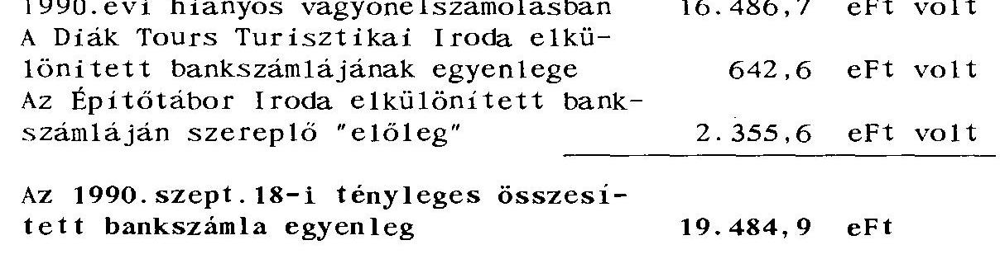

A helyesbitett 8/b. sz. melléklet adatai hitelesek, mert a bankszámla kivonatokkal egyezöek.
c) A pótolhatatlan adathiányról szóló nyilatkozatok elbírálása.

Pótolhatatlan adathiányt a 8/b. sz. pénzforgalom alakulása táblázatok dokumentálásához a revízió 1979. évre tárt fel. A vizsgált szervezet a pótolhatatlan adathiány okáról nyilatkozatot tett.

A hatályos jogszabályok 60/1975.(XI.22.) PM rendelettel módosított 55/1970.(XII.30.) PM rendelet, valamint a KISZ KB ügyrendi értesítője 9. pontja alapján 10 évi dokumentum megörzés után selejtezték az iratokat.

Az ÁSZ 1991. évi 36. sz. jelentésének 7. pontjában megállapított hiányosságokat a DEMISZ Gazdasági Iroda pótvagyonbeval lásában korrigálta.

---

1.11 A pótolhatatlan adatok hiányáról szóló DEMISZ Gazdasági Iroda nyilatkozatát elfogadta az ellenörzés

A DEMISZ Gazdasági Iroda az 1990. évi LXXIII.tv. következő mellékleteihez nyújtott be - egyes időszakokra vonatkozó adatok pótolhatatlanságáról nyilatkozatot.
a) 1. és 6. sz. melléklet az ingatlanokról

Az elszámoló nyilatkozott arról, hogy a KISZ ingatlanairól országos, egységes ingatlan kataszter nem állt rendelkezésére. Az 1989. április 28-i dátumozású, a KISZ Központi Bizottsága által készített, a KISZ összes ingatlanát magában foglaló, az 1988. évi Egységes Intézményi Költségvetési Beszámolójával, - illetve ennek értékbeni adatát kimutató egyidejü fökönyvvel egyező kimutatást nyújtottak be az Állami Számvevőszékhez.

Az Állami Számvevőszék közhiteles okiratként elfogadta az ingatlanvagyont dokumentáló tulajdoni lapokat, az ott szereplő bejegyzéseket. A tulajdoni lapokon lévő bejegyzéssel kapcsolatos tartalmi, formai megállapításokat a jelentés ingatlanokról szóló pontjai tartalmazzák.
b) A 8/b.sz. melléklet a KISZ-DEMISZ pénz- és értékpapír forgalmáról "elfogadható" az 1979.évre vonatkozó bizonylatok pótolhatatlanságáról szóló nyilatkozattal.

Az 1979. évi bizonylatokat a KISZ KB Ügyrendi Értesítője 9. §. értelmében 5, illetve 10 év után selejtezték, beleértve a gépileg adathordozón tárolt számviteli adatokat. Emiatt 1980. év előtti időszakról bizonylatok nem állnak rendelkezésre.

---

1.12 Az 1991. évi LI. törvény 1. §. /4/ bekezdésében elöirta az 1990. agusztus 31. és 1990. szeptember 18-i időszakban kötött elidegenítési vagy terhelési tartalmú szerződések ellenőrzését. A DEMISZ csatolt nyllatkozata szerint az idöszakban az 1990. évi LXXIII. tv. 2. §. a), b), c), és d) pontjaiban foglalt vagyontárgyat nem idegenítettek el, nem terheltek meg.
2. A szövetséghez tartozó szervezetek pótlólagos vagyonelszámolása

Az ÁSZ összesen 26 szervezettől kapott vagyonelszámolást, melyek közül változatlan formában, vagy további adatkiegészítésekkel hitelesíthető, ille... : pótolhatatlansági nyilatkozattal 19 elfogadható volt. Nem voli iielesíthető 7 tagszervezet vagyonelszámolása.
2.1. Elfogadható, illetve hiteles vagyonelszámolást benyújtó szervezetek.

Ezek közül jelentős vagyonértéket érintő kérdéseket tisztázott az ellenőrzés a következő tagszervezeteknél.

# 2.1.1. Baloldali Ifjúsági Társulás 

A Baloldali If júsági Társaság (továbbiakban: BIT), korábban Budapesti KISZ Bizottság volt. Az Állami Számvevőszék felhívására 1992. február 2-án benyújtotta hiánypótló vagyonelszámolását a V-78/1990. sz. ÁSZ vizsgálat során nem hitelesnek minősített, az 1990. évi LXXIII. törvény mellékletét képező 1., 6., 3., 4., 5., 6., 7., 8. sz. adatlapok ismételt kitöltésével. A bevalláshoz mellékelte az adatok valódiságát igazoló hivatalos dokumentumok másolatát is.

---

Az 1991. évi LI. törvény alapján tett pótlólagos vagyone1számolás
"HI TELES"-nek
minösült.

A BIT által benyújtott vagyonbeval1ásban feltüntetett vagyonérték hitelességének vizsgálata a helyszinen lefolytatott, a szervezet analitikus és szintetikus számviteli nyilvántartásaival történt összevetés útján történt.

A minösités mellékletenként a következő megállapításokkal történt:
a) Az 1. és 6. sz. táblázatok esetében a póte1számolás - az 1. sz. táblázatra vonatkozóan az 1991. évi L1. törvény 1. §-ának (5) bek.-ben foglalt felhatalmazás alapján adott pótolhatatlansági nyilatkozatok figyelembevételével - elfogadható. A 6. sz. táblázaton közölt póte1számolás a hitelesítés követelményeinek megfelel, az adatok az elszámolás alapjául szolgáló dokumentumokkal megegyeznek.

A szervezet összesen 10 helyrajzi számon nyilvántartott 8 db ingatlanról adott számot. Ezek közül egy volt korábban vitatott, de bizonyítást nyert az ingatlan ügyének rendezése.

A Budapest, VIII. Köztársaság tér 27. sz. ingatlan értékadatai 1981. évtöl kezdődően szerepelnek könyveikben, a fent említett "Létesítményjegyzék"-ben szereplő értéken.

Jelen vizsgálat során derült fény arra, hogy az ingatlan értékadatait tévesen szerepelttették mérlegükben, mivel a székházként funkcionáló épületre a jogelöd KISZ Budapesti Bizottságának bejegyzett tulajdonosi vagy kezelöi joga nem is volt. A korábbi években

---

is az MSZMP-ve1 kōtōtt megállapodás alapján használták az épületet. A megállapodásban rögzítették a használt épületrész és szolgáltatások (telefon, kōzmüvek, stb.) arányában megállapított költségtérítés összegét.

Az épület 1946. február 4-én még a Szovjetúnió tulajdona, 1960. május 3-tól a Magyar Állam tulajdona, ame lyen az MSZMP használati joggal, majd 1978-tól kezelói joggal rendelkezett. Jelenleg az MSZP tulajdonában van.

A Baloldali Ifjúsági Társulás - az 1990. augusztus 24-én kelt szerzödésben foglaltak szerint - 1990. szeptember 1-jétől az ingatlant három évig dijmenetesen használja. Az ingatlanviszonyok rendezödése után 1990. évtől az ingatlan értékét a BIT könyveiből kivezette.

Megállapítást nyert, hogy az 50 eFt feletti értékü állóeszközök az átadása során intézkedtek az álló- és fogyóeszközök leltár szerinti átadására. Az átadás a NGYIA és a DEMISZ által 1990. október 11-én aláirt jegyzőkönyvben foglaltak szerint történt. Az átadás-átvétel eredeti dokumentumai Tatán és Balatonszemesen találhatók, immár a NGYIA-nál.
b) A 2.sz. "nemleges" kitöltésü táblázat hitelesíthető, mivel a helyszíni mintavételes ellenőrzés nem tárt fel ennek ellentmondó adatokat és az 1990. évi LXXIII. tv. 5. §-ában foglaltak szerint az elszámolás teljességéért és valódiságáért az elszámló felelős. Ezt a mellékletet az előző vizsgálat is hitelesnek fogadta el.
c) A 3.4.5.6.7.8/a.és 8/b. táblázatok esetében a póte1számolás a hitelesítés követelményeinek megfelel. A póte1számolásban közölt adatok az elszámolás alapjául szolgáló doku-

---

mentumokkal megegyeznek, illetőleg a helyszini mintavételes ellenőrzés során nem merült fel olyan adathiány, vagy súlyos nyilvántartási és egyéb hiba, amely alapján az elszámolás során bejelentett vagyon hũ és valós bemutatása kétségessé vált volna.

# 2.1.2. Pest Megyei Demokratikus If jusági Szövetség 

A Szövetség vagyonbevallását - a beval1áshoz adott pótolhatatlansági nyilatkozatok figyelembevételével az ÁSZ elfogadta.

A beszámoltatási idö - 1990. augusztus 31., illetve szeptember 18. - utáni időszakra vonatkozóan, azonban a szervezet - mint ún. megyei középszery - önálló müködését a jövőben nem tartja indokoltnak, ezért megszüntetését tervezi. Jelenleg - az elszámolás idópontjában - még egy alapítvánnyal, két kft-vel és egy egyesüléssel rendelkezik, illetve e társaságokban rendelkezik befektetett vagyonrésszel. Addig tehát, amíg meglévő vagyonáról nem rendelkezett, nem intézkedik a szervezet megszüntetése iránt.

Az elszámoltatást képező időszakban összesen 1.780 .000 Ft vagyoni betéttel, valamint elszámolási betétszámláján 56.695,71 Ft-tal, házipénztárában 12.052,20 Ft készpénzzel rendelkezett.

### 2.1.3. Nógrád megyei DEMISZ

A vagyonelszámolást az ÁSZ "elfogadta", azonban a szervezet Salgótarján, Medvesi u. 9. sz. ingatlanával kapcsolatban (8669. tulajdoni lapszám, 12.001 hrsz., 3 ha $8548 \mathrm{~m}^{2}$ ) hosszas vizsgálódást, íratbeszerzést kellett folytatni, mert az 1990. évi revizori vizsgálat nagyon megalapzottan

---

kétségbe vonta, hogy a KISZ kezelöi jogát helyesen tüntet-ték-e fel a tulajdoni lapon . Végülis a Salgótarjáni Földhivatal újabban kiadott igazolása legalizálta a kezelöi jog bejegyzését, s így az ingatlan törvénynek megfelelö átszállását az NGY1A-ra, illetve végül a Nógrád Ifjúságért Alapítványra (Ingatlan jegyzék 9. sorszám).

A vizsgálódás során azonban kiderült, hogy az Ipolyvidéki Erdö- és Fafeldolgozó Gazdaság (Balassagyarmat, Balcsy Zsilinszki u. 10.) az ingatlan területéböl 1 ha $6542 \mathrm{~m}^{2}-\mathrm{t}$ a sajátjának vitat (Fercsik Gyula revizorhoz 1990. november 22-én intézett levél). Az Állami Számvevőszéknek az illetékesek felé (FM) kezdeményezést tett, hogy az állami vagyont érintö igényét tisztázza és érvényesítse.

# 2.1.4. Demokratikus If jusági Únio 

A vagyonelszámolás "hiteles", mert a pótbeval iás már tartalmazta azt az ingatlant, amely korábban kimaradt.

### 2.1.5. Békés Megyei If jusági Únio

A vagyonelszámolást az ÁSZ "elfogadja". A korábbi adathiány - egy ingatlanra vonatkozó nem lényegi vagyonértéket jelentö dokumentum - nem pótolható, mint a hiányról folyó polgári perben a birói itélet is említést tesz.
2.1.6. A Szövetség további 13 tagszervezetének pótlólagos vagyone 1 számolása elfogadottnak, illetve hitelesnek minősült, mert adataikat helyesbitve nyújtották be, az elszámolás valós tartalmát dokumentálták, továbbá a pótolhatatlan adatokról, bizonylatokról felelős nyilatkozatot adtak.

Az 1991. évi LI. törvény alapján végzett ellenőrzés végső minősitését a "Jelentés" 1.sz. melléklete tartalmazza.

---

2.2. Nem hiteles a vagyonelszámolásuk

# 2.2.1. Budavári Fiatalok Szövetsége 

Az 1990. évi LXXIII. törvény alapján nem nyújtott be vagyonelszámolást, a szervezet nem volt fellelhető a megadott címen.

A Fövárosi Bíróság - megkeresésünkre adott - tájékoztatása szerint a szervezet a bíróság nyilvántartásában még szerepel.

Az 1991. évi L1. törvényben foglalt beval lási kötelezettségének - az Állami Számvevőszék hosszas címnyomozását követő felhívására - a szervezet képviselöje eleget tett. Ekkor nyilatkozata szerint - már nem rendelkezett huzamos ideje székhellyel. Ezért a vagyonbevallás ellenőrzésére az ÁSZ hivatalos helyiségében került sor. Az ellenőrzés a vagyonelszámolást - a bemutatott áttekinthetetlen irathalmaz alapján - nem hitelesnek minösítette.

A szervezet képviselöje előadta, hogy székhelyük nincs, a meglévő hivatalos dokumentumokat saját lakásán tárolja. 1990. év végétöl a szervezet megszüntnek tekinthető, nyilvántartott tagsága, vagyona nincs, MNB számlájuk 1991. február hónaptól megszűnt, ezért haladéktalanul intézkedést tesz a Fövárosi Bíróságnál a szervezet megszüntetésére.

Az elszámoltatás időszakában - 1990. augusztus 31-én - a szervezet MNB elszámolási betétszámláján még 841.757 .23 Ft egyenleg szerepelt. Az ellenőrzés felhívta a képviselő figyelmét arra, hogy megszünés esetén vagyonával el kell számolnia. Megszüntetését, az 1989. évi II. törvény alapján dinokolt kezdeményezni.

---

# 2.2.2. Baranya Megyei Demokratikus If jusági Szövetség 

A Baranya Megyei DEMISZ - mint az 1991. évi LI. törvény által pótlólagos vagyonelszámolásra kötelezett szervezet nem nyújtott be hiánypótló vagyonelszámolást, ezért az 1990. évi vagyonelszámolása változatlanul "nem hite-les"-nek minösül. Ezen belül nem hitelesek az ingatlanokra (1. és 6.), a bevételekre (4.), a kiadásokra (5.), az ingatlanon kivülí egyéb állóeszközökre (7.) és az értékpapír és pénzforgalomra (8.) vonatkozó kimutatások.

### 2.2.3. Baranya Megyei Diákszövetség

A Baranya Megyei Diákszövetség esetében a bevételekröl (4.), a kiadásokról (5.) és az értékpapír és pénzforgalomról (8.) készült beval lást a pótvagyonelszámolás sem tette hitelessé, ezért vagyonelszámolása továbbra is "nem hite-les"-nek minösül.

A bevételekröl készült kimutatás az 1989. és 1990. évi bevételeket változatlanul összevontan közli és semmiféle számviteli dokumentum nem állt a helyszini ellenörzés rendelkezésére ahhoz, hogy a bevételek évenkénti alakulását megál lapíthassa.

A kiadások 1989. évi adatainak hitelesitéséhez mindössze olyan könyvelési alapbizonylatokról készült másolatok -álltak rendelkezésre, amely bizonylatok jórészt hiányosak voltak, teljeskörüségüket pedig nem volt mi igazolja.

Az értékpapír és pénzforgalom alakulásáról a pótvagyonelszámolás sem tartalmazott kitöltött táblázatot. Az 1990. decemberében tett nyilatkozat nem igazolta az adathiany póto1hatat lanságát.

---

# 2.2.4. Ifjúsági Szervezetek Szabolcsi Szövetsége 

Az Ifjúsági Szervezetek Szabolcsi Szövetségének vagyonelszámolása "nem hiteles", mert a bevételekröl (4.), a kidásokról (5.) és az értékpapír- és pénzforgalomról (8.) készített mellékletek a pótelszámolás után sem tekinthetök hitelesnek. Mindhárom mellékletböl változatlanul hiányoznak az 1979-1984. évi adatok és az adathiany okára tett nyilatkozat az adatok pótolhatatlanságáról nem igazolja.

További ok, hogy a bevételeket és a kiadásokat tartalmazó mellékeltekben az 1990. évi ellenörzés által észrevételezett hiányosságok kijavítása az 1988. évre vonatkozóan pontatlan, más évek kijavított adatainak ellenörzéséhez pedig nem voltak kéznél a szükséges dokumentumok.

### 2.2.5. Tolna Megyei Ifjusági Szervezetek Szövetsége

A Tolna Megyei Ifjúsági Szervezetek Szövetségének vagyonelszámolása nem hiteles, mert a bevételekröl (4.), a kiadásokról (5.), az ingatlanon kivüli egyéb állóeszközökröl (7.) és az értékpapír- és pénzforgalomról (8.) készített mellékletek adattartalma nem dokumentált és nem teljeskörü.

A pótvagyonelszámolás ugyanis a mellékletek esetében nem tartalmazza az 1990. évi ellenörzés által feltárt adathiany pótlását, téves adatok helyesbitését.

Adattartalmuk hitelességét alátámasztó - ugyancsak a fenti ellenörzés által hiányolt - számviteli dokumentumok változatlanul nem álltak a helyszini ellenörzés rendelkezésére. A dokumentumok pótolhatatlanságát bizonyítani hivatott nyilatkozatok, igazolások pedig nem adtak elfogadható magyarázatot a gazdasági íratanyag hollétéről.

---

2.2.6. BÁCSÚNIÓ És Jász-Nagykun-Szolnok Megyei DEMISZ (a megszünt Szolnok Megyei DEMISZ jogutódja) "nem hiteles" minösitésü szervezetek. Bevalás helyett elfogadhatatlan leveleket küldtek, s többszörí személyes megbeszélés alapján nem valószinüsithető, hogy valaha is szakszerü beval lást adjanak.

---

# ALLAMI SZÁMVEVÖSZÉK 

V-150-58/1991/1992.

## MELLÉKLETEK

a Magyar Demokratikus If jusági Szövetség
(DEMISZ és tagszervezetei)
pót vagyonelszámolása hitelességének ellenőrzéséről
az 1991. évi LI. törvénnyel módosított
1991. évi LXXIII. törvény alapján

---

# TARTALOMJEGYZÉK 

1.sz. melléklet

Kimutatás a DEMISZ tagszervezetei vagyone1számolásának hitelesitéséröl az 1991. évi LI. törvénnyel módosított 1990. évi LXXIII. tv. alapján
2.sz. melléklet

A bevételeket kimutató 4. sz. vagyone1számolási táblázathoz az Állami Fejlesztési Intézet nyilatkozata a beruházási költségvetési támogatásokról 1979-1990. években
3. sz. melléklet

A Pénzügyminisztérium 53.101/1992. sz. államtitkári nyilatkozata a KISZ-DEMISZ beruházási költségvetési támogatásáról 1979-1990. években
4. sz. melléklet

A DEMISZ 1989. április 23-i megalakulásakori és 1992. január 1-jén meglévő tagszervezeteinek jegyzéke a DEMISZ Országos Iroda nyilvántartása szerint
5. sz. melléklet

A DEMISZ Gazdasági Iroda 1992. március 2-ai nyilatkozata az ingatlan vagyone1számolás adatairól (3. sz. melléklet)
6. sz. melléklet

A Magyar Kommunista Ifjúsági Szövetség Gazdasági Orszálya a "Szigorúan Bizalmas" javaslata az ingatlanok tulajdonjogának megszerzésére

---

KIMUTATAS a DEMISZ zagęszczonych socjomolącznościami mistelemedyki az 1990 dni LXXIII. Szczecin, albo in

A rozszalot 1992. dni zrodzinye az 1991. dni LI. 1x, albo in

|  Zagęszczonego |  |  |  |  |  |  |  |  |   |
| --- | --- | --- | --- | --- | --- | --- | --- | --- | --- |
|  1. BAJAS DEMOKRATIKUS IFJUSACI SZCZCIEŻ | 6900 Bajz
Poddzi 83-got 5. | dr. Rozna Gyslanc |  |  |  |  |  |  |   |
|  2. BALOLSKI FIATALOK SZCZCIEŻ | 9022 Győr
Temecznich (szesny 0.5). |  |  |  |  |  |  |  |   |
|  3. BALOLSKI SZCZCIEŻ TARSZLAS | 1081 Buzomest
Rozszczony ter 27. | Romoczic Laszlanc
Tazbac Tarsz
Gordos Laszlo |  |  |  |  |  |  |   |
|  4. BARUHAR MEDYEI DEMOKRATIKUS IFJUSACI SZCZCIEŻ | 7624 Pécs
Apo ut 4. | Romoczic Laszlo
dr. Magy Agres |  |  |  |  |  |  |   |
|  5. BARUHAR MEDYEI OTAK SZCZCIEŻ | 7624 Pécs
Pet ut 4. | Romoczic Laszlo
dr. Magy Agres |  |  |  |  |  |  |   |
|  6. BACI KITNUN MEDYEI DEMOKRATIKUS IFJUSACI UNIO | 6000 Buzomest
Majus 1 ter 5. |  |  |  |  |  |  |  |   |
|  7. BELVANSKI SZCZCIEŻ SZCZCIEŻ | 1056 Buzomest
Marzola 15-e ter 8. | dr. Rozna Gyslanc |  |  |  |  |  |  |   |
|  8. BURHARDI FIATALOK SZCZCIEŻ | 1012 Buzomest
Tebur 0.2. | dr. Rozna Gyslanc |  |  |  |  |  |  |   |
|  9. DEMISZENI DEMOKRATIKUS IFJUSACI SZCZCIEŻ | 4028 Gościen
Sumny ut 14. | Kozak György
Karczy Jarosz |  |  |  |  |  |  |   |
|  10. DEMISZENI MAJSU BIAHR MEDYE | 4028 Gościen
Sumny ut 14. | Kozak György
Karczy Jarosz |  |  |  |  |  |  |   |
|  11. DEMISZ BOKES MEDYEI TASZSZERVEJSTE | 5600 Bałuszczony
Lanczebi ut 136. |  |  |  |  |  |  |  |   |
|  12. DEMISZ DUMAGIHANSKI SZCZCIEŻ | 2400 Dunajzykrzc
Lazyn ter 3. | dr. Laki Arpad |  |  |  |  |  |  |   |
|  13. DEMISZ NOK-DELI OTAK-ODLOGOU UNIO | Berlin
Unter dem Linden 76. |  |  |  |  |  |  |  |   |
|  14. DEMISZ SZCZCIA HANUSZ
TASZSZERVEJSTE | 5000 Gyslanc
Koronczollag ut 8. | dr. Laki Arpad |  |  |  |  |  |  |   |
|  15. DEMOKRATIKUS IFJUSACI SZCZCIEŻ EKONOZA | 6720 Szegesi
Komolczon ter 1. | dr. Gbatt Lajos |  |  |  |  |  |  |   |
|  16. DUMOLEN SZCZCIEŻ SZCZCIEŻ | 2510 Durog
Esztergoni ut 1. | dr. Laki Arpad |  |  |  |  |  |  |   |
|  17. DUMONSKI OTAK EL
PEZKOZOUS SZCZCIEŻ | 2400 Dunajzykrzc
Komolczon 0. V/1. | Gaufmanné dr. Adboz Éva |  |  |  |  |  |  |   |
|  18. ERTELMESĖKI FIATALOK SZCZCIEŻ | 1087 Buzomest
Koryves 8.art. 76. | dr. Rozna Gyslanc |  |  |  |  |  |  |   |
|  19. EIJAK-MACHARENCEEI DEMOKRATIKUS IFJUSACI SZCZCIEŻ | 3501 Miskolc
Pł. 92. | Domać Gąs
Koczla István |  |  |  |  |  |  |   |
|  20. FEJER MEDYEI FIATALOK SZCZCIEŻ | 8000 Szeweszerdevar
Komolcz. 0.8. | Gaufmanné dr. Adboz Éva |  |  |  |  |  |  |   |
|  21. FELCOVNEJAI DEMOKRATIKUS
IFJUSACI SZCZCIEŻ | 6100 Kiskunfélingvkás
Fasciner 3.0. 12. | dr. Laki Arpad |  |  |  |  |  |  |   |
|  22. GYŐKI IFJUSACI SZCZCIEŻ | 9022 Győr
Arpad ut 44. |  |  |  |  |  |  |  |   |

---

|  Tag | Name | Adresse | Adresse |  |  |  |  |  |   |
| --- | --- | --- | --- | --- | --- | --- | --- | --- | --- |
|  21. HALAS TEHULUTI IFJUSAGI SZERVEJET | 6400 Kasvunnala
Szilardy A. u. 4. | dz. Laki Árpád | hiteles |  |  |  |  |  |   |
|  22. HEVES MEDJET IFJUSAGI
SZERVEJETEN SZÖLETSEDE | 3300 Éger
Széchenyi u. 18. | dz. Tóth Andreas | nem hiteles | 27. | Minna Margit
dz. Szalva Béla | hiteles | nem hiteles | hiteles |   |
|  23. IFJUSAGI LABÓ | 1087 Budapest
Korvses K. het. 76. | dz. Árpád Gyulánd | hiteles |  |  |  |  |  |   |
|  24. IFJUSAGI SZERVEJETEN
SZABUKISZ SZÖLETSEDE | 4400 Muiteguháza
Szabuk út 1-3. | Rende Sándor | nem hiteles | 28. | Rózsa Margit
dz. Szalva Béla | nem hiteles | nem hiteles | nem hiteles |   |
|  25. KELSKEMETI DEMOKRATINUS
IFJUSAGI SZÖLETSED | 4000 Kaczmarek
Ethel út 1/4. | Guajon Jand
Tzejás Antal | nem hiteles | 18. | Sályom László
dz. Selényi János | hiteles | nem hiteles | hiteles |   |
|  26. KÖHÄRÖM ESZTUNGOM MEDJET
DEMOKRATINUS IFJUSAGI SZÖLETSED | 2801 Tétesőnye
Felszabukolás út 36. Koltayné Szepesi 2a. | nem hiteles |  | 12. | Sályom László
dz. Selényi János | hiteles | nem hiteles | hiteles |   |
|  27. MADYAR GOLGSZOK IFJUSAGI
SZÖLETSEDE | 1087 Budapest
Korvses K. het. 76. | dz. Laki Árpád | hiteles |  |  |  |  |  |   |
|  28. MADYARÓNYJAGI FIATALOK
SZERJETENCORON MORGOD SZERVEJETE | Múszkva
Móströmudszáza 42.
Mazjusi Rázsvikokirág | (Tétesőnyes)
Muljatszerint adott |  |  |  |  |  |  | kultúris, minna éttereke  |
|  29. MÁRRAKJÁL IFJUSAGI SZERVEJET | 3200 Szöngyös
Jónai u. 9. | dz. Laki Árpád | hiteles |  |  |  |  |  |   |
|  30. HÖLWÁD MEDJET DEMOKRATINUS
IFJUSAGI SZÖLETSED | 3101 Szegetségön
Kosmets út 8. | Forcain Gyula | nem hiteles | 29. | Rózsa Margit
dz. Szalva Béla | hiteles | nem hiteles | hiteles |   |
|  31. HYÜREGYHAZI DEMOKRATINUS
IFJUSAGI SZÖLETSED | 4400 Muiteguháza
Kozanyi F. út. 32. | Rende Sándor | hiteles |  |  |  |  |  |   |
|  32. PÉPA ES KORMYEKE DEMOKRATINUS
IFJUSAGI SZÖLETSED | 8500 Pápú
Győzi út 12. | Konemszky Sándor | hiteles |  |  |  |  |  |   |
|  33. PEST MEDJET DEMOKRATINUS
IFJUSAGI SZÖLETSED | 1126 Budapest
Nagy Jand u. 5. | Bencsik László
Farnak Tamás
Günner László | nem hiteles | 3. | Borzshay Attilard | hiteles | nem hiteles | hiteles |   |
|  34. SOHGUY MEDJET DEMOKRATINUS
IFJUSAGI SZERVEJETEK SZÖLETSEDE | 7400 Kaposvár
Larson út 14. | dz. Megesős György
dz. Szigeti István | nem hiteles | 7. | Rózsa Margit
dz. Szalva Béla | hiteles | nem hiteles | hiteles |   |
|  35. SOHGUY DEMOKRATINUS
IFJUSAGI SZÖLETSEDE | 9400 Gresem
Rét u. 25. | Vécsey László | hiteles |  |  |  |  |  |   |
|  36. SZEGEDI STÁVOK ES PEDAGÓGUSOK
SZÖLETSEDE | 6721 Szeged
Kaleyk tér 7. | dz. Ötzt Lajos | nem hiteles | 19. | Súlyom László
dz. Selényi János | hiteles | nem hiteles | hiteles |   |
|  37. SZEGEDI FIATALOK SZÖLETSEDE | 6720 Szeged
Komácsín tér 1. | dz. Ötzt Lajos | nem hiteles | 20. | Súlyom László
dz. Selényi János | hiteles | nem hiteles | hiteles |   |
|  38. SZEGEDI SPORTOLOJ IFJUSAGI
SZÖLETSED | 6720 Szeged
Szaba Gy. út 2. | dz. Ötzt Lajos | nem hiteles |  |  |  |  |  | 1991. XII. IT-kuel. megszent
M. út 28/1991/10.  |
|  39. SZOLMON MEDJET SZÖCZALTSZA
IFJUSAGI SZERVEJETEK SZÖLETSEDE | 5001 Szolmon
Tiszaligot Pf. 126. | Csonkó Mihály | nem hiteles | 22. | Súlyom László
dz. Selényi János | nem hiteles | nem hiteles | nem hiteles | 20.  |
|  40. TEHULUTI DEMOKRATINUS IFJUSAGI
SZERVEJETEK KISKUNKOLA | 6120 Kasvunnajka
Felszabát út 2. | dz. Fényed Erzsébet | nem hiteles | 27. | Súlyom László
dz. Selényi János | hiteles | nem hiteles | hiteles |   |
|  41. TÖJNA MEDJET IFJUSAGI
SZERVEJETEK SZÖLETSEDE | 7100 Szervszép
Béla tér 6. | Ponton László | nem hiteles | 8. | Rózsa Margit
dz. Szalva Béla | nem hiteles | nem hiteles | nem hiteles |   |
|  42. VASI DEÁNSZÖLETSED | 9300 Szomkatholy
Kisfaluty u. 1. | dz. Gyuk József | hiteles |  |  |  |  |  |   |
|  43. VASI IFJUSAGI SZÖLETSED | 9300 Szomkatholy
Kisfaluty u. 1. | dz. Gyuk József | nem hiteles | 20. | Súlyom László
dz. Selényi János | hiteles | nem hiteles | hiteles |   |

---

|  46. 465/165 (F.R.O.N.I. 520/ETRE) |  |  |  |  |  |  |  |   |
| --- | --- | --- | --- | --- | --- | --- | --- | --- |
|  47. 471/165 (F.R.O.N.I. 520/ETRE) |  |  |  |  |  |  |  |   |
|  48. 24/41 (BENMAN/EN-19.28/UE) 520/ETRE |  |  |  |  |  |  |  |   |
|  49. 25/41 (BENMAN/EN-2 19.28/UE) 520/ETRE |  |  |  |  |  |  |  |   |
|  50. Mag. 48 (U.S. 50/ETRE) |  |  |  |  |  |  |  |   |
|  51. Mag. 49 (U.S. 50/ETRE) |  |  |  |  |  |  |  |   |
|  52. Mag. 48 (U.S. 50/ETRE) |  |  |  |  |  |  |  |   |

---

# Állami Fejlesztési Intézet 

Vezérigazgató
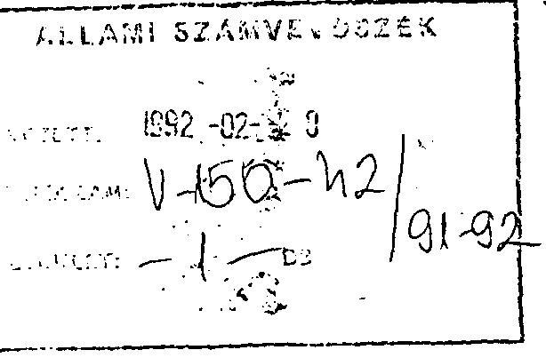

Tisztelt Kovács úr !

Kérésére megadjuk a KISZ KB. Intézetünk által finanszirozott beruhizási adatait 1979-1990. évek között idôszakra, kièmelve a költségvetési forrás összegeit.

Az általunk közölt adatok a tárgyévek lezárása után egyeztetve lett a KISZ-el és az a közölt idôszakban minden esetben megegyezô volt. A DEMISZ által adott adatoktól az eltérés véleményünk szerint részben az évenkénti aktiválások áthuzódásából az utolsó két évben az ÁFA elszámolásából adódik. A DEMISZ nyilvántartásaiban szerepelhet nem általunk finanszirozott beruházások is.

Információink szerint a Pénzügyminisztérium által között adatok a tervelőirányzatot tartalmazzák.

Budapest, 1992. február 17.

---

# Ezer Ft-ban 

|  | Beruházási kifizetés | $\begin{aligned} & \text { E b b } \delta \text { l } \\ & \text { költségvetési } \\ & \text { juttatás } \end{aligned}$ | $\begin{aligned} & \text { E b b } \delta 1 \\ & \text { ÁFA } \end{aligned}$ |
| :--: | :--: | :--: | :--: |
| 1979 | 187.993 | 183.993 |  |
| 1980 | 68.918 | 68.918 |  |
| 1981 - | 70.140 | 57.160 |  |
| 1982 | 98.448 | 85.930 |  |
| 1983 | 91.732 | 79.820 |  |
| 1984 | 1.005 | 1.005 |  |
| 1985 | 14.003 | 14.003 |  |
| 1986 | 39.060 | 39.060 |  |
| 1987 | 44.397 | 44.397 |  |
| 1988 | 38.059 | 38.009 | 5.803 |
| 1989 | 51.795 | 51.795 | 10.816 |
| 1990 | -- | -- |  |
| Gsszesen: | 705.550 | 664.090 | 16.619 |

Budapest, 1992. február 13.

---

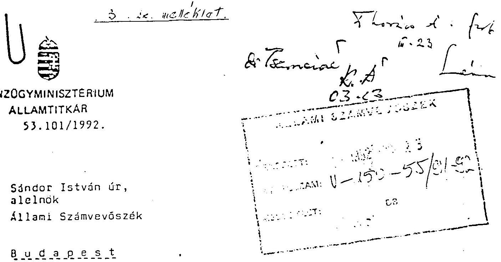

Tisztelt Alelnök Úr!
A V-150-28/1991/92. számú levelében feltárt eltérésekre vonatkozó adatokkal nem rendelkezünk, így azokat közölni sem tudom. Az eltérés oka viszont valószinüsíthető. A tárgyalt idószakban a költségvetés rendszerint csak "Tárascálmi szorvezetek beruházásainak támogatása" címen szerepeltetett elöirányzatot. Ez tartalmazta az MSZMP-nek szánt összeget, amelyböl a párt juttatott a KISZ-nek. Ennek megfelelően utalt az Állami Fejlesztési Intézet. Az említett Tájékoztató az AFI adatai alapján az ismert elöirányzatokat - azaz tervszámokat - közll. A DEMISZ adatai viszont tényszámok, amelyeket csak ők ismerhetnek. A KISZ vagy más címen is kapott támogatást, vagy egyéb forrásból egészítette ki az összegeket.
Mivel elszámolási kötelezettségük gyakorlatilag nem volt, a PM nem rendelkezhet tényadatokkal.

Budapest, 1992. március 4.
Üdvözlettel:

---

|  4.52.melléklet |  |  |  |  |  |  |  |  |  |  |  |  |  |  |  |  |  |  |  |  |  |  |  |  |  |  |  |  |  |  |  |  |  |  |  |  |  |  |  |  |  |  |  |  |  |  |  |  |  |  |  |  |  |  |  |  |  |  |  |  |  |  |  |  |  |  |  |  |  |  |  |  |  |  |  |  |  |  |  |  |  |  |  |  |  |  |  |  |  |  |  |  |  |  |  |  |  |  |  |  | 

---

|  25. |  | 26. | 27. | 28. | 29.  |
| --- | --- | --- | --- | --- | --- |
|  29. |  | 30. |  |  |   |
|  29. |  | 31. |  |  |   |
|  31. |  | 32. |  |  |   |
|  32. |  | 33. |  |  |   |
|  33. |  | 34. |  |  |   |
|  34. |  | 35. |  |  |   |
|  35. |  | 36. |  |  |   |
|  36. |  | 37. |  |  |   |
|  37. |  | 38. |  |  |   |
|  38. |  | 39. |  |  |   |
|  39. |  | 40. |  |  |   |
|  40. |  | 41. |  |  |   |
|  41. |  | 42. |  |  |   |
|  42. |  | 43. |  |  |   |
|  43. |  | 44. |  |  |   |
|  45. |  | 46. |  |  |   |
|  47. |  | 48. |  |  |   |
|  49. |  | 50. |  |  |   |
|  50. |  | 51. |  |  |   |
|  51. |  | 52. |  |  |   |
|  52. |  | 53. |  |  |   |
|  53. |  | 54. |  |  |   |
|  54. |  | 55. |  |  |   |
|  55. |  | 56. |  |  |   |
|  56. |  | 57. |  |  |   |
|  57. |  | 58. |  |  |   |
|  58. |  | 59. |  |  |   |
|  59. |  | 60. |  |  |   |
|  60. |  | 61. |  |  |   |
|  61. |  | 62. |  |  |   |
|  62. |  | 63. |  |  |   |
|  63. |  | 64. |  |  |   |
|  64. |  | 65. |  |  |   |
|  65. |  | 66. |  |  |   |
|  66. |  | 67. |  |  |   |
|  67. |  | 68. |  |  |   |
|  68. |  | 69. |  |  |   |
|  69. |  | 70. |  |  |   |
|  69. |  | 71. |  |  |   |
|  69. |  | 72. |  |  |   |
|  69. |  | 73. |  |  |   |
|  69. |  | 74. |  |  |   |
|  70. |  | 75. |  |  |   |
|  70. |  | 76. |  |  |   |
|  71. |  | 77. |  |  |   |
|  71. |  | 78. |  |  |   |
|  72. |  | 79. |  |  |   |
|  73. |  | 80. |  |  |   |
|  74. |  | 81. |  |  |   |
|  75. |  | 82. |  |  |   |
|  76. |  | 83. |  |  |   |
|  77. |  | 84. |  |  |   |
|  78. |  | 85. |  |  |   |
|  79. |  | 86. |  |  |   |
|  80. |  | 87. |  |  |   |
|  81. |  | 88. |  |  |   |
|  82. |  | 89. |  |  |   |
|  83. |  | 90. |  |  |   |
|  84. |  | 91. |  |  |   |
|  85. |  | 92. |  |  |   |
|  86. |  | 93. |  |  |   |
|  87. |  | 94. |  |  |   |
|  88. |  | 95. |  |  |   |
|  89. |  | 96. |  |  |   |
|  90. |  | 97. |  |  |   |
|  98. |  | 98. |  |  |   |
|  99. |  | 99. |  |  |   |
|  91. |  | 92. |  |  |   |
|  99. |  | 93. |  |  |   |
|  99. |  | 94. |  |  |   |
|  99. |  | 95. |  |  |   |
|  100. |  | 101. |  |  |   |
|  101. |  | 102. |  |  |   |
|  102. |  | 103. |  |  |   |
|  103. |  | 104. |  |  |   |
|  104. |  | 105. |  |  |   |
|  105. |  | 106. |  |  |   |
|  106. |  | 107. |  |  |   |
|  107. |  | 108. |  |  |   |
|  108. |  | 109. |  |  |   |
|  109. |  | 110. |  |  |   |
|  110. |  | 111. |  |  |   |
|  111. |  | 112. |  |  |   |
|  112. |  | 113. |  |  |   |
|  113. |  | 114. |  |  |   |
|  114. |  | 115. |  |  |   |
|  115. |  | 116. |  |  |   |
|  116. |  | 117. |  |  |   |
|  117. |  | 118. |  |  |   |
|  118. |  | 119. |  |  |   |
|  119. |  | 120. |  |  |   |
|  119. |  | 121. |  |  |   |
|  119. |  | 122. |  |  |   |
|  119. |  | 123. |  |  |   |
|  120. |  | 124. |  |  |   |
|  121. |  | 125. |  |  |   |
|  122. |  | 126. |  |  |   |
|  123. |  | 127. |  |  |   |
|  124. |  | 128. |  |  |   |
|  125. |  | 129. |  |  |   |
|  126. |  | 129. |  |  |   |
|  127. |  | 130. |  |  |   |
|  128. |  | 131. |  |  |   |
|  129. |  | 132. |  |  |   |
|  129. |  | 133. |  |  |   |
|  129. |  | 134. |  |  |   |
|  129. |  | 135. |  |  |   |
|  129. |  | 136. |  |  |   |
|  129. |  | 137. |  |  |   |
|  129. |  | 138. |  |  |   |
|  129. |  | 139. |  |  |   |
|  129. |  | 140. |  |  |   |
|  129. |  | 141. |  |  |   |
|  129. |  | 142. |  |  |   |
|  129. |  | 143. |  |  |   |
|  129. |  | 144. |  |  |   |
|  129. |  | 145. |  |  |   |
|  129. |  | 146. |  |  |   |
|  129. |  | 147. |  |  |   |
|  129. |  | 148. |  |  |   |
|  129. |  | 149. |  |  |   |
|  129. |  | 150. |  |  |   |
|  129. |  | 151. |  |  |   |
|  129. |  | 152. |  |  |   |
|  129. |  | 153. |  |  |   |
|  129. |  | 154. |  |  |   |
|  129. |  | 155. |  |  |   |
|  129. |  | 156. |  |  |   |
|  129. |  | 157. |  |  |   |
|  129. |  | 158. |  |  |   |
|  129. |  | 159. |  |  |   |
|  129. |  | 151. |  |  |   |
|  129. |  | 152. |  |  |   |
|  129. |  | 153. |  |  |   |
|  129. |  | 154. |  |  |   |
|  129. |  | 155. |  |  |   |
|  129. |  | 156. |  |  |   |
|  129. |  | 157. |  |  |   |
|  129. |  | 158. |  |  |   |
|  129. |  | 159. |  |  |   |
|  129. |  | 151. |  |  |   |
|  129. |  | 152. |  |  |   |
|  129. |  | 153. |  |  |   |
|  129. |  | 154. |  |  |   |
|  129. |  | 155. |  |  |   |
|  129. |  | 156. |  |  |   |
|  129. |  | 157. |  |  |   |
|  129. |  | 158. |  |  |   |
|  129. |  | 159. |  |  |   |
|  129. |  | 151. |  |  |   |
|  129. |  | 152. |  |  |   |
|  129. |  | 153. |  |  |   |
|  129. |  | 154. |  |  |   |
|  129. |  | 155. |  |  |   |
|  129. |  | 156. |  |  |   |
|  129. |  | 157. |  |  |   |
|  129. |  | 158. |  |  |   |
|  129. |  | 159. |  |  |   |
|  129. |  | 151. |  |  |   |
|  129. |  | 152. |  |  |   |
|  129. |  | 153. |  |  |   |
|  129. |  | 154. |  |  |   |
|  129. |  | 155. |  |  |   |
|  129. |  | 156. |  |  |   |
|  129. |  | 157. |  |  |   |
|  129. |  | 158. |  |  |   |
|  129. |  | 159. |  |  |   |
|  129. |  | 151. |  |  |   |
|  129. |  | 152. |  |  |   |
|  129. |  | 153. |  |  |   |
|  129. |  | 154. |  |  |   |
|  129. |  | 155. |  |  |   |
|  129. |  | 156. |  |  |   |
|  129. |  | 157. |  |  |   |
|  129. |  | 158. |  |  |   |
|  129. |  | 159. |  |  |   |
|  129. |  | 151. |  |  |   |
|  129. |  | 152. |  |  |   |
|  129. |  | 153. |  |  |   |
|  129. |  | 154. |  |  |   |
|  129. |  | 155. |  |  |   |
|  129. |  | 156. |  |  |   |
|  129. |  | 157. |  |  |   |
|  129. |  | 158. |  |  |   |
|  129. |  | 159. |  |  |   |
|  129. |  | 151. |  |  |   |
|  129. |  | 152. |  |  |   |
|  129. |  | 153. |  |  |   |
|  129. |  | 154. |  |  |   |
|  129. |  | 155. |  |  |   |
|  129. |  | 156. |  |  |   |
|  129. |  | 157. |  |  |   |
|  129. |  | 158. |  |  |   |
|  129. |  | 159. |  |  |   |
|  129. |  | 151. |  |  |   |
|  129. |  | 152. |  |  |   |
|  129. |  | 153. |  |  |   |
|  129. |  | 154. |  |  |   |
|  129. |  | 155. |  |  |   |
|  129. |  | 156. |  |  |   |
|  129. |  | 157. |  |  |   |
|  129. |  | 158. |  |  |   |
|  129. |  | 159. |  |  |   |
|  129. |  | 151. |  |  |   |
|  129. |  | 152. |  |  |   |
|  129. |  | 153. |  |  |   |
|  129. |  | 154. |  |  |   |
|  129. |  | 155. |  |  |   |
|  129. |  | 156. |  |  |   |
|  129. |  | 157. |  |  |   |
|  129. |  | 158. |  |  |   |
|  129. |  | 159. |  |  |   |
|  129. |  | 151. |  |  |   |
|  129. |  | 152. |  |  |   |
|  129. |  | 153. |  |  |   |
|  129. |  | 154. |  |  |   |
|  129. |  | 155. |  |  |   |
|  129. |  | 156. |  |  |   |
|  129. |  | 157. |  |  |   |
|  129. |  | 158. |  |  |   |
|  129. |  | 159. |  |  |   |
|  129. |  | 151. |  |  |   |
|  129. |  | 152. |  |  |   |
|  129. |  | 153. |  |  |   |
|  129. |  | 154. |  |  |   |
|  129. |  | 155. |  |  |   |
|  129. |  | 156. |  |  |   |
|  129. |  | 157. |  |  |   |
|  129. |  | 158. |  |  |   |
|  129. |  | 159. |  |  |   |
|  129. |  | 151. |  |  |   |
|  129. |  | 152. |  |  |   |
|  129. |  | 153. |  |  |   |
|  129. |  | 154. |  |  |   |
|  129. |  | 155. |  |  |   |
|  129. |  | 156. |  |  |   |
|  129. |  | 157. |  |  |   |
|  129. |  | 158. |  |  |   |
|  129. |  | 159. |  |  |   |
|  129. |  | 151. |  |  |   |
|  129. |  | 152. |  |  |   |
|  129. |  | 153. |  |  |   |
|  129. |  | 154. |  |  |   |
|  129. |  | 155. |  |  |   |
|  129. |  | 156. |  |  |   |
|  129. |  | 157. |  |  |   |
|  129. |  | 158. |  |  |   |
|  129. |  | 159. |  |  |   |
|  129. |  | 151. |  |  |   |
|  129. |  | 152. |  |  |   |
|  129. |  | 153. |  |  |   |
|  129. |  | 154. |  |  |   |
|  129. |  | 155. |  |  |   |
|  129. |  | 156. |  |  |   |
|  129. |  | 157. |  |  |   |
|  129. |  | 158. |  |  |   |
|  129. |  | 159. |  |  |   |
|  129. |  | 151. |  |  |   |
|  129. |  | 152. |  |  |   |
|  129. |  | 153. |  |  |   |
|  129. |  | 154. |  |  |   |
|  129. |  | 155. |  |  |   |
|  129. |  | 156. |  |  |   |
|  129. |  | 157. |  |  |   |
|  129. |  | 158. |  |  |   |
|  129. |  | 159. |  |  |   |
|  129. |  | 151. |  |  |   |
|  129. |  | 152. |  |  |   |
|  129. |  | 153. |  |  |   |
|  129. |  | 154. |  |  |   |
|  129. |  | 155. |  |  |   |
|  129. |  | 156. |  |  |   |
|  129. |  | 157. |  |  |   |
|  129. |  | 158. |  |  |   |
|  129. |  | 159. |  |  |   |
|  129. |  | 151. |  |  |   |
|  129. |  | 152. |  |  |   |
|  129. |  | 153. |  |  |   |
|  129. |  | 154. |  |  |   |
|  129. |  | 155. |  |  |   |
|  129. |  | 156. |  |  |   |
|  129. |  | 157. |  |  |   |
|  129. |  | 158. |  |  |   |
|  129. |  | 159. |  |  |   |
|  129. |  | 151. |  |  |   |
|  129. |  | 152. |  |  |   |
|  129. |  | 153. |  |  |   |
|  129. |  | 154. |  |  |   |
|  129. |  | 155. |  |  |   |
|  129. |  | 156. |  |  |   |
|  129. |  | 157. |  |  |   |
|  129. |  | 158. |  |  |   |
|  129. |  | 159. |  |  |   |
|  129. |  | 151. |  |  |   |
|  129. |  | 152. |  |  |   |
|  129. |  | 153. |  |  |   |
|  129. |  | 154. |  |  |   |
|  129. |  | 155. |  |  |   |
|  129. |  | 156. |  |  |   |
|  129. |  | 157. |  |  |   |
|  129. |  | 158. |  |  |   |
|  129. |  | 159. |  |  |   |
|  129. |  | 151. |  |  |   |
|  129. |  | 152. |  |  |   |
|  129. |  | 153. |  |  |   |
|  129. |  | 154. |  |  |   |
|  129. |  | 155. |  |  |   |
|  129. |  | 156. |  |  |   |
|  129. |  | 157. |  |  |   |
|  129. |  | 158. |  |  |   |
|  129. |  | 159. |  |  |   |
|  129. |  | 151. |  |  |   |
|  129. |  | 152. |  |  |   |
|  129. |  | 153. |  |  |   |
|  129. |  | 154. |  |  |   |
|  129. |  | 155. |  |  |   |
|  129. |  | 156. |  |  |   |
|  129. |  | 157. |  |  |   |
|  129. |  | 158. |  |  |   |
|  129. |  | 159. |  |  |   |
|  129. |  | 151. |  |  |   |
|  129. |  | 152. |  |  |   |
|  129. |  | 153. |  |  |   |
|  129. |  | 154. |  |  |   |
|  129. |  | 155. |  |  |   |
|  129. |  | 156. |  |  |   |
|  129. |  | 157. |  |  |   |
|  129. |  | 158. |  |  |   |
|  129. |  | 159. |  |  |   |
|  129. |  | 151. |  |  |   |
|  129. |  | 152. |  |  |   |
|  129. |  | 153. |  |  |   |
|  129. |  | 154. |  |  |   |
|  129. |  | 155. |  |  |   |
|  129. |  | 156. |  |  |   |
|  129. |  | 157. |  |  |   |
|  129. |  | 158. |  |  |   |
|  129. |  | 159. |  |  |   |
|  129. |  | 151. |  |  |   |
|  129. |  | 152. |  |  |   |
|  129. |  | 153. |  |  |   |
|  129. |  | 154. |  |  |   |
|  129. |  | 155. |  |  |   |
|  129. |  | 156. |  |  |   |
|  129. |  | 157. |  |  |   |
|  129. |  | 158. |  |  |   |
|  129. |  | 159. |  |  |   |
|  129. |  | 151. |  |  |   |
|  129. |  | 152. |  |  |   |
|  129. |  | 153. |  |  |   |
|  129. |  | 154. |  |  |   |
|  129. |  | 155. |  |  |   |
|  129. |  | 156. |  |  |   |
|  129. |  | 157. |  |  |   |
|  129. |  | 158. |  |  |   |
|  129. |  | 159. |  |  |   |
|  129. |  | 151. |  |  |   |
|  129. |  | 152. |  |  |   |
|  129. |  | 153. |  |  |   |
|  129. |  | 154. |  |  |   |
|  129. |  | 155. |  |  |   |
|  129. |  | 156. |  |  |   |
|  129. |  | 157. |  |  |   |
|  129. |  | 158. |  |  |   |
|  129. |  | 159. |  |  |   |
|  129. |  | 151. |  |  |   |
|  129. |  | 152. |  |  |   |
|  129. |  | 153. |  |  |   |
|  129. |  | 154. |  |  |   |
|  129. |  | 155. |  |  |   |
|  129. |  | 156. |  |  |   |
|  129. |  | 157. |  |  |   |
|  129. |  | 158. |  |  |   |
|  129. |  | 159. |  |  |   |
|  129. |  | 151. |  |  |   |
|  129. |  | 152. |  |  |   |
|  129. |  | 153. |  |  |   |
|  129. |  | 154. |  |  |   |
|  129. |  | 155. |  |  |   |
|  129. |  | 156. |  |  |   |
|  129. |  | 157. |  |  |   |
|  129. |  | 158. |  |  |   |
|  129. |  | 159. |  |  |   |
|  129. |  | 151. |  |  |   |
|  129. |  | 152. |  |  |   |
|  129. |  | 153. |  |  |   |
|  129. |  | 154. |  |  |   |
|  129. |  | 155. |  |  |   |
|  129. |  | 156. |  |  |   |
|  129. |  | 157. |  |  |   |
|  129. |  | 158. |  |  |   |
|  129. |  | 159. |  |  |   |
|  129. |  | 151. |  |  |   |
|  129. |  | 152. |  |  |   |
|  129. |  | 153. |  |  |   |
|  129. |  | 154. |  |  |   |
|  129. |  | 155. |  |  |   |
|  129. |  | 156. |  |  |   |
|  129. |  | 157. |  |  |   |
|  129. |  | 158. |  |  |   |
|  129. |  | 159. |  |  |   |
|  129. |  | 159. |  |  |   |
|  129. |  | 151. |  |  |   |
|  129. |  | 151. |  |  |   |
|  129. |  | 152. |  |  |   |
|  129. |  | 153. |  |  |   |
|  129. |  | 152. |  |  |   |
|  129. |  | 153. |  |  |   |
|  129. |  | 154. |  |  |   |
|  129. |  | 155. |  |  |   |
|  129. |  | 156. |  |  |   |
|  129. |  | 157. |  |  |   |
|  129. |  | 157. |  |  |   |
|  129. |  | 158. |  |  |   |
|  129. |  | 159. |  |  |   |
|  129. |  | 159. |  |  |   |
|  129. |  | 159. |  |  |   |
|  129. |  | 159. |  |  |   |
|  129. |  | 159. |  |  |   |
|  129. |  | 159. |  |  |   |
|  129. |  | 159. |  |  |   |
|  129. |  | 159. |  |  |   |
|  129. |  | 159. |  |  |   |
|  129. |  | 159. |  |  |   |
|  129. |  | 159. |  |  |   |
|  129. |  | 159. |  |  |   |
|  129. |  | 159. |  |  |   |
|  129. |  | 159. |  |  |   |
|  129. |  | 159. |  |  |   |
|  129. |  | 159. |  |  |   |
|  129. |  | 159. |  |  |   |
|  129. |  | 159. |  |  |   |
|  129. |  | 159. |  |  |   |
|  129. |  | 159. |  |  |   |
|  129. |  | 159. |  |  |   |
|  129. |  | 159. |  |  |   |
|  129. |  | 159. |  |  |   |
|  129. |  | 159. |  |  |   |
|  129. |  | 159. |  |  |   |
|  129. |  | 159. |  |  |   |
|  129. |  | 159. |  |  |   |
|  129. |  | 159. |  |  |   |
|  129. |  | 159. |  |  |   |
|  129. |  | 159. |  |  |   |
|  129. |  | 159. |  |  |   |

---

|  1910-ken legéső be a 10.6.12 tagjai kárta |  |  |  |  |  |  |  |  |  |  |  |  |  |  |  |  |  |  |  |  |  |  |  |  |  |  |  |  |  |  |  |  |  |  |  |  |  |  |  |  |  |  |  |  |  |  |  |  |  |  |  |  |  |  |  |  |  |  |  |  |  |  |  |  |  |  |  |  |  |  |  |  |  |  |  |  |  |  |  |  |  |  |  |  |  |  |  |  |  |  |  |  |  |  |  |  |  |  |  |  | 

---

KINJIATAS A DOHISZ TASSEERMEZETEIRAL 1992. F. II C.

|  TASSEERMEZET MESNEMEZKSE | CIME | KAPVIRALG HIME | TELEFON  |
| --- | --- | --- | --- |
|  01. DASAI DEMOHRATIKUS IFJUSAGI SZERMEZET | 6000. BajavFutófi sziget S. | Martenosi Attila | 79/24-682  |
|  02. BALOLSALI FIATALOK SZIMETSKEE | 5000. Gvar-Szent 1.0. 51. | Takács Péter | 96/16-500  |
|  03. BAKANVA MISWEI DEMOHRATIKUS IFJUSAGI SZIMETSKE | 7624. Fács, Tüzér u. 3/1. | Szöke József | 78/19-221  |
|  04. BAKANVA MISWEI DIARSZIMETSKE | 7624. Fács, Szilágyi 0. 10. | Fekete Tibor | 78/22-400  |
|  05. DEMISZONI DEMOHRATIKUS IFJUSAGI SZIMETSKE | 4000. Debrecen-Dianesi út 14. | Debrecen István | 58/13-377  |
|  06. DEMONTACH HANOU DIHAR MESKE | 4000. Debrecen-Sianesi út 14. | Hovács Csaba | 58/19-700  |
|  07. DEMISZ DEKES MISWEI TASSEERMEZETE | 5000. Debrecen-haldenovist u.108. | Deger Tibor | 66/22-171  |
|  08. DEMISZ DUNKURVIRGSI SZIMETSKEE | 2400. Dunányvaros-Várcsikóra tér 3. | Dukai László | 25/17-256  |
|  09. SZOLNOKI SZARAGIDAS TAROLLAS | 5001. Szolnok-Tiszuliget-Városmajor 8. Csák László |  | 56/44-335  |
|  10. DEMOHRATIKUS IFJUSAGI SZERMEZETEK UNIQUA | 6000. Szepag-Tiszuliget krt. 2. | Záborszky Magadina | 62/24-377  |
|  11. DUNOS ES VIRGASFARZETENEK IFJUSAGI SZIMETSKEE | 2510. Daroguhájua 1 út 1. | Fülöp Ferenc | 33/21-202  |
|  12. ENTELMISSAI FIATALOK SZIMETSKEE | 1133. Ep. Katana J. 29. | Rabi Béla |   |
|  13. FELIKO-MISRAKKURSZAGI DEMOHRATIKUS IFJUSAGI SZIMETSKE | 3001. Miskolc-Várcsavrty VS. VII/1. | gr. Staginger Csaba | 44/44-522  |
|  14. FELIKO MISWEI FIATALOK SZIMETSKEE | 3000. Székesfehérvár-Révség út 8. | Lázzi Zoltán | 22/16-500  |
|  15. FELLEVINZZI DEMOHRATIKUS IFJUSAGI SZIMETSKE | 1100. KiskunVölnyháza-Fagmoz u.11. | Palásti László | 76/62-289  |
|  16. GASRI IFJUSAGI SZIMETSKE | 4000. Gvar-Szent 1. u. 51. | Németh László | 56/17-703  |
|  17. HAVES MISWEI IFJUSAGI SZERMEZETEK SZIMETSKEE | 3001. Eger-Szichérvi u. 18. | Török Zsolt | 36/10-033  |
|  18. IFJUSAGI UNIO | 1000. To. Szoló u. 60. 12. 14. | Lestak József | 1-605-756  |
|  19. IFJUSAGI SZERMEZETEK SZAROLOSI SZIMETSKEE | 4000. Mviragshára-Szarvas út 1-3. | Zsolgos Ferenc | 48/10-703  |
|  20. KISZKISHEII DEMOHRATIKUS IFJUSAGI SZIMETSKE | 6000. Fecskosöt. Ertvi út 1/4. | Magarász Zsolt | 76/21-500  |
|  21. KOMAROM-ESZTEROOM MISWEI DEMOHRATIKUS IFJUSAGI SZMV. | 2801. Tatabánva. Felszabagulás tér 36. | Hajgu Ferenc | 34/10-624  |
|  22. KOSWAR GOLSSZUK IFJUSAGI SZIMETSKEE | 1100. Eo. Népfúrgo u. 21/b. IV.20. | Varju László | 1-732-000  |
|  23. KHIRESVAVZI DEMOHRATIKUS IFJUSAGI SZIMETSKE | 4000. Mviragshára-Koranvi út 12. | Nagyió Dózze Katalin | 42/14-423  |

---

DEMISZ
Budapest.
Népfürdõ u. 21/b.
1138
Jogelõdje: KISZ Központi Bizottsága

# NYILATKOZAT 

Az 1991. évi LI. törvény - az elmúlt rendszerhez kötödõ egyes társadalmi szervezetek vagyonelszámoltatásáról szóló 1990. évi LXXIII. törvény módosításáról - 1 és 6 "A szervezet és intézményei ingatlanaira vonatkozó adatok"táblázatokhoz.

Alulírott Karl Imre a DEMISZ Gazdasági Iroda vezetője, mint a DEMISZ Gazdasági Iroda vagyonelszámolása során nyilatkozattételre jogosult büntetőjogi felelőségem tudatában nyilatkozom az alábbiakról:

---

- 2 -

A DEMISZ Gazdasági Iroda a vagyonelszámolás hitelesítése érdekében a teljesköröség biztosítása mellett készítette el az 1 és 6 számú mellékleteket.

A mellékletek így tartalmilag és formailag is megfelelnek a törvényi előírásoknak.

Számszakilag jól összevethetők az értékadatok az 1989. április 28. dátumozású, a KISZ Központi Bizottsága által készített a teljes KISZ vagyont magában foglaló 1988. évi Egységes Intézményi Költségvetési Beszámoló-val, illetve ennek alapját képező főkönyvvel.

Az 1 és 6 sz. mellékletek belső felépítése a KISZ ingatlan állományának valóságos állapotát tükrözi.

E szerint:

- 1988. év végéig bezárólag készültek a KISZ egészére vonatkozó összesített beszámolók. Ezek alapját a KISZ KB és a területi szervek beszámolói képezték.

- A KISZ által használt ingatlanállomány jellegű szerint ifjúsági, gyermek táborok politikai képzési központok székházak, irodák voltak.

- Az ingatlanállomány üzemeltetését a KISZ KB Székház és Központi KISZ Iskolán kívül a KISZ területi szervei végezték. Ezeket főkönyvükben, mérlegükben szerepeltették, állóeszközeiket nyilvántartották.

- Tulajdonviszonyokra, az adott időszak tulajdonviszonyainak általában is jellemző rendezetlensége, volt tapasztalható.

A KISZ-en belül az ingatlanok tulajdonviszonyaival kapcsolatos kérdések 1988. évben erősödtek fel.

Különböző felmérések készültek az ingatlanállományra a tudó

---

# - 3 - 

lajdonviszony, az üzemeltetési költségek, férőhelyek, a mûszaki állag szempontjai alapján. Ezen összegyûjtött adatokat a vagyonelszámolás során felhasználtuk.

A tulajdonviszonyok alapján készített felmérésbõl kiderült, hogy a KISZ használatában lévô ingatlanok (földrészletek és építmények) az ingatlan-nyilvántartásba eltérő módon vannak bejegyezve. Tulajdonos, kezelő, használó a KISZ különbözõ szervei nevén és sok esetben külsõ szervek nevén voltak.

A KISZ KB Titkársága 1988. IX. 26-i ülésén határozatot fogadott el - A KISZ által kezelt, illetve használt ingatlanok tulajdonjogának egységesítésére -, vagyis a tényleges gyakorlat legalizálására. Gyakorlatilag ez indította el a késõbb sokat kivált un. "100 Ft-os akciót", mely nem lett végig vive és így a tárgyi határozat megvalósítása abbamaradt, "eredményeként" azonban jelentôs változások történtek az ingatlanok tulajdonlapi bejegyzésében.

A jellemzõ megoldás - az 1987. évi I. törvény (Földtörvény) adta lehetôséggel élve a KISZ KB az ingatlanokat a területi szerveitől megvásárolta, majd ezeknek ajánkékozás címén visszajuttatta. Ez a folyamat kizárólag papíron játszódott le az ingatlanok tényleges átadása-átvétele nem kísérte, ez nem is volt célja.

1989-ben a KISZ utolsó idôszakában, illetve a DEMISZ megalakulását követôen széleskörü egyeztetés folyt az ingatlan vagyon, végül is az ifjúsági vagyon legjelentősebb részét kitevô vagyon, társadalmasítása érdekében. Gyakorlatilag ennek lezárására 1989. december 9-i ülésén döntött úgy a DEMISZ Szövetségi Tanácsa, hogy ingatlanállományát felajánlja a Kormány számára ifjúsági célú hasznosításra, azzal a megkötéssel, hogy a helyi társadalmasítási legitim megoldások

---

elismerésre kerüljenek.
Nagy Imre DEMISZ ügyvivô e döntés alapján tette meg Németh Miklós kormányfô részére az elvi, közérdekü kötelezettségvállalási nyilatkozatot.

A felajánlás elfogadását a kormány részéről a Minisztertanács Hivatala elnökhelyettese Bercsényi Botond igazolta vissza 1989. december 15-i levelében, melyben a DEMISZ-t arról tájékoztatta, hogy
"A Minisztertancs elnöke a kormány részéről az átvétel és a további hasznosítás feltételeinek koordinálásával az ifjúságpolitikai kormánybiztost bízta meg".

Gyakorlatilag ezt követôen a DEMISZ szerepe közremüködôvé, végrehajtóvá vált. Végeredményként a Minisztertanács 81/1990 (IV.27.) MT rendeletével létrehozta a Nemzeti- Gyermek és Ifjúsági Alapítványt, melybe 60 db ingatlant helyezett el. Az ingatlanok, illetve azok rendeltetésszerű müködését szolgáló ingóságok átadását teljes egészében az azokat üzemeltetô DEMISZ tagszervezetek végezték az Ifjúsági Titkárság, illetve késôbb az NGYIA igényeinek megfelelôen.
A DEMISZ Gazdasági iroda tényleges átadást nem végzett. A számviteli rendezés érdekében azonban 16 db ingatlan állóeszköz átadás-átvételi bizonylatát állította ki. Ebből 4 db MUSZ, 11 db DEMISZ tagszervezeti és 1 db Amerikai u. 96. MSZMP kezelôi jogú ingatlan volt.

A DEMISZ Gazdasági Iroda birtokában 1990. augusztus 31-én 2 db Tisza melletti Vizitura bázishely (földterület) maradt Tuzsér és Dombrád összesen 50 e Ft értékben, melyek jelenleg is megvannak.
A DEMISZ fôkönyveiben, mérlegében fenti változások nyomonkövethetők.

Budapest, 1992. március 2.
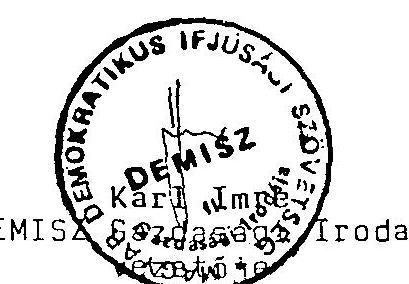

---

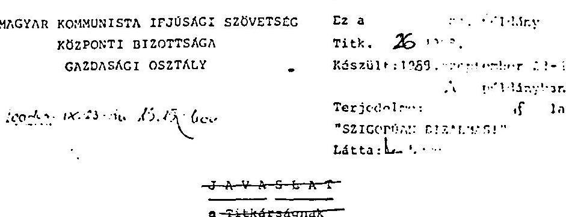

A KISZ által kezelt illetve használt ingatlanok tulajdonjogának egységesitésése
/Eijogalla a. Tillusici 02 1988 iv 26 i
A KISZ használatában lévô ingatlanok (földrészletck és ípitmények) az ingatlan-nyilvántartásba eltéró módon vannak bejegyczve. (Tulajdonos, kezelő, használó) KISZ különbözô szervel nevén, vagy külsô szerv nevén.) (Lásd: melléklet)
Az ingatlan-nyilvántartásba történó egységes bejegyeztetésnek nogy oka van:

1. Várhatóan a közeljövőben újból felerősödik és foleyorsul a társadalmi szervezetek tulajdonában ill. kezelésében lévó ingatlanok megosztásának kérdése.
A javaslatunkban szereplő, a KISZ KB nevére történC egységes bejegyzés, megitélésünk szerint kelló úttckinthetőséget és nagyobb garanciát biztosít ezen kérdéskör ' kezeléséhez.
2. Elindult a KISZ vagyonával való gondolkodás, az eladás, a különbözô társulási formákba való befektetés kezdeményezése: ani pozitív eredménsként értékelheté, de kontroll nélkül esetenként az ingatlanok indokolatlan lekötéséhez vezetne, illetve nem kelló szakmai hozzáértés miatt

---

adott esetben gazdaságtalan befektetést eredményezhet.
3. Jelenleg az ingatlanaink nincsenek biztosítva. Az Állami biztosítóval történt tárgyalásaink alapján jelentós kedvezményehet érhetnénk el, ha ingatlanainkat egységesen (egyóaszogú biztosítással) tudnánk biztosítani. Ennek alapfcltétele az egy néven történő tulajdoni vagy kezelói jog bejegyzés.
4. Az 1987. évi I.törvény (Földtörvény) lehetóséget ad arra, hogy társadalmi szervezet a kezelésében lévó ingatlan tulajdonjogát megszerezze. A tulajdonjog biztosítja azt, hogy esetleges átszervezés esetén a KISZ jogclódként önállóan rendelkezhet saját vagyontárgyai felett. Kezelóijog bejegyzés esetén ez garantáltan nem áll fenn. Tekintettel arra, hogy a tulajdonjog nagyobb védelmet jelent, mint a kezelói jog, indokolt a KISZ részére a tulajdonjogot bejegyeztetni.

Fulli-akok-mrort javasoljuk, hogy a KISZ szervek tulajdonában, kezelésében, használatában lévó ingatlanokat - szüksóg esetén az illutékes helyi tanáccsal történő egyeztetés után - egységesen a KISZ KB tulajdonaként jegyezteseitne az állami ingatlannyilvántartásba (használó továbbra is az adott KISZ szerv maras).

# HETAROZOTK I 

1. A Titkárság megbizzá a gazdasági osztályt, hogy a KISZ szervek használatában lévó ingatlanokat 1988. december 31-19 a KISZ KB tulajdonaként jegyeztesse be az állami ingatlannyilvántartásba.

---

2. A Titkárság megbizzs Domonkos László elvtárzat, b. m.
az elsótitkári értekexleten a döntészól bizalrm
. tájdkoztatást adjon.
/1 Maron Soltán 2

# ZARADEK 

Kapja:

- GO
- Irattár

---

# A KISZ Használatában levő vonatlanv

|  M e m e v e z c : | Tulajdonos | Fozció | Használó | Egyéb megjegyzés  |
| --- | --- | --- | --- | --- |
|  Daranya megye |  |  |  |   |
|  Útt.vez.képz.T. Sikonda | KISZ MB | KISZ MB |  | t.lap folyamatban  |
|  Obánya | KISZ MB | KISZ MB |  | t.lap folyamatban  |
|  KISZ vez.képz.T. Balatonfenyves | KISZ MB | KISZ MB |  | t.lap folyamatban  |
|  Bács-Kiskun megye |  |  |  |   |
|  Kiskörös VB | Magyar Állam | KISZ MB |  |   |
|  PKK Baja | Magyar Állam | KISZ MB |  |   |
|  Útt.vez.képz.T. Balatonfenyves | Magyar Állam | KISZ MB |  |   |
|  Bugac | Magyar Állam | KISZ MB |  |   |
|  Soltvadkert | Magyar Állam | Nagyközségi Tan VB |  |   |
|  Bökés megye |  |  |  |   |
|  PKK Békéscsaba | Magyar Állam | Városi Tandcs VB |  |   |
|  Doboz-Szanazug | Magyar Állam | KISZ MB |  |   |
|  Szarvas Gőülőház | Magyar Állam | KISZ Szarvas MB |  |   |

---

|  Megnevezés | Tulajdonos | Kezelő | Használó | Egyéb megjegyzés  |
| --- | --- | --- | --- | --- |
|  Borzod-Ahazij-Zemplén megye |  |  |  |   |
|  Mozókövesd VB | Magyar Állam | KISZ Mozókövesd VB |  |   |
|  FFEK Csanyik | KISZ MB | KISZ MB |  | t.lap folyamatban  |
|  Dédestapolcsány útt.tábor | Magyar Állam | Községi Tanács VB |  |   |
|  Csongrád megye |  |  |  |   |
|  Kistelek VZW | Magyar Állam | KISZ MB |  | t.lap folyamatban  |
|  Magyar Ifjúsági Központ | Magyar Állam | KISZ MB |  | t.lap folyamatban  |
|  Mártóly üdülőkáz | Magyar Állam | KISZ MB |  | t.lap folyamatban  |
|  Fejér megye |  |  |  |   |
|  Gárdony VZHB | Magyar Állam | KISZ MB |  |   |
|  FFEK Fejér | Magyar Állam | KISZ MB |  |   |
|  Orsvezetéképz.T. Bodajk | Magyar Állam | KISZ MB |  |   |
|  Győr-Soprán megye |  |  |  |   |
|  KISZ MB | Magyar Állam | KISZ MB |  |   |
|  Csorna VZ | Magyar Állam | KISZ |  |   |
|  Kapcsár VZ | Magyar Állam | KISZ MB |  |   |
|  Vez. képz.T. Nováeguszta | Magyar Állam | KISZ MB |  |   |
|  FSB: Győr | Magyar Állam | KISZ Vez. képz. lts. |  |   |
|  Úttörővezetőképező megyez. | Magyar Állam | KISZ MB |  |   |

---

|  Megnevezés | Tulajdonos | Kezelő | Használó | Egyéb megjegyzés  |
| --- | --- | --- | --- | --- |
|  Hajdusolhar megye |  |  |  |   |
|  KISZ MB | Magyar Állam | KISZ MB |  | t.lap folyamatban  |
|  PKK Hajduszoboszló | Magyar Állam | MSSMP KB |  |   |
|  Úttörővez. képz. Debrecen | Magyar Állam | Felsőtiszai és Fafeldolga, MSSMP KB Gazdasági Nyírszabáza |  |   |
|  Havas megye |  |  |  |   |
|  KISZ MB | Magyar Állam | KISZ MB |  |   |
|  PKK Felsötárkány | Magyar Állam | KISZ MB |  |   |
|  Komárna megye |  |  |  |   |
|  KISZ MB | Magyar Állam | KISZ MB |  | t.lap folyamatban  |
|  Ifj.táb. Búbánatvölgy | Magyar Állam | KISZ MB |  | t.lap folyamatban  |
|  PKK Tata | Magyar Állam | KISZ MB |  | t.lap folyamatban  |
|  Gubacs | Magyar Állam | KISZ MB |  | t.lap folyamatban  |
|  Kögrád megye |  |  |  |   |
|  PKK Salędzánya | Magyar Állam | KISZ MB |  |   |
|  Úttörőzőkor Nyírjes | Járási KISZ Útt.eln. | KISZ MB |  |   |
|  Post megye |  |  |  |   |
|  Úttörővíz 5 T. Zawárdi | Magyar Állam | KISZ MB, KISZ KB |  |   |
|  Szentendre üdülő | Magyar Állam | KISZ MB |  |   |
|  Verőcsráros lakóküz | Magyar Állam | KISZ MB |  |   |
|  PKK Szüclámet | Magyar Állam | KISZ MB |  | t.lap folyamatban  |

---

|  4 - |  |  |  |   |
| --- | --- | --- | --- | --- |
|  4 e 5 n e v e z é s | Tulajdonos | Kezelő | Használó | Egyéb megjegyzés  |
|  onnoy megye |  |  |  |   |
|  fj. Táb. Balatonfenyves, Ponyód | Magyar Állam | KISZ KB |  |   |
|  fj. Táb. Törökköpány | Magyar Állam | KISZ MB |  |   |
|  zaboles-Szatmár megye |  |  |  |   |
|  KK Sóstó | Magyar Állam | KISZ |  | t.lap folyamatban  |
|  ivadar üdülőház |  |  |  |   |
|  volnok megye |  |  |  |   |
|  ISZ MB | Magyar Állam | KISZ MB |  | t.lap folyamatban  |
|  isújszállás VB | Magyar Állam | KISZ Kisújszállás VB |  | t.lap folyamatban  |
|  iszafüred VB | Magyar Állam | KISZ Tiszafüred VB |  | t.lap folyamatban  |
|  IK Szolnok | Magyar Állam | PKK |  | t.lap folyamatban  |
|  -ina megye |  |  |  |   |
|  ekszárd VB + PKK | Magyar Állam | PKK |  | t.lap folyamatban  |
|  dd-Dombori | Magyar Állam | KISZ |  | t.lap folyamatban  |
|  ánya Vt.bázishely | Magyar Állam | KISZ |  | t.lap folyamatban  |

---

- 5 -

|  M e q n e v e z ó s | Tulajdonos | Pozaló | Haszn.iló | Örjepség  |
| --- | --- | --- | --- | --- |
|  Vas megv |  |  |  |   |
|  PKK Velem | Magyar Állam | KISZ KB |  |   |
|  Hogyhátszentjakeb Vt.bázishely | Magyar Állam | KISZ VB Szentnetthárd |  |   |
|  Zennye horeásztanyák | Magyar Állam | KISZ MB |  |   |
|  Veszprém megy |  |  |  |   |
|  Sakonyosziop | Magyar Állam | KISZ MB |  |   |
|  PKK Csopak | Magyar Állam | KISZ MB |  | t.lap folyamatban  |
|  PKK Veszprém | Magyar Állam | KISZ MB |  | t.lap folyamatban  |
|  Zala megy |  |  |  |   |
|  Vez. képz. Balatongyőrök | Magyar Állam | KISZ KB |  |   |
|  PKK Zalaegerszeg | Magyar Állam | KISZ MB |  |   |
|  Zalakaros | Magyar Állam | MSEMP KB |  |   |
|  Budapest |  |  |  |   |
|  MPC | Magyar Állam | KISZ MB |  | t.lap folyamatban  |
|  Tata | Magyar Állam | KISZ MB |  | t.lap folyamatban  |
|  Balatonszenes | Magyar Állam | KISZ MB |  | t.lap folyamatban  |
|  XVIII. kerület | Magyar Állam | XVIII.kerület |  | t.lap folyamatban  |
|  XXII. kerület | Magyar Állam | XXII. kerület |  | t.lap folyamatban  |

---

|  24. RAFA ES KERNAINE DEMOHRATINUS IFJUSAGI SZEMETSZG | 5500. Pasa. Gvori út 18. | Veszprém Iiona | 89/13-519  |
| --- | --- | --- | --- |
|  25. JEST MESMEI DEMOHRATINUS IFJUSAGI SZEMETSZG | 1054. Bp. Steini 1. u. 18. | Dorda Sángor | 1-123-662  |
|  26. COFRONI DEMOHRATINUS IFJUSAGI SZEMETSZG | 9400. Suoran-Rat u. 25. | Simon Gáhor | 99/11-259  |
|  27. SZEREDI DIANOK ES FEDRODOLEOK SZEMETSZGE | 6721. Szegeg-Kálvin tér 7. | Sütőri László | 62/21-103  |
|  28. SZEREDI FIATALOK SZEMETSZGE | 6720. Szegeg-Etelka sor 6. V.om. | Csányi Zoltán | 62/24-647  |
|  29. DEMIES JAZZ-NAGRAUN SZOLNOK MESMEI SZERVEZETE | 5425. Martóli-Ifjúság út 9. fszt.1. | Csanna János | 56/50-675  |
|  30. TOULA MESMEI IFJUSAGI SZERVEZETEK SZEMETSZGE | 7100. Szekszárg.Csokonal u. 11. | Barna Tamás | 74/11-167  |
|  31. VEGI DIAN SZEMETSZG | 9700. Serabatholv.Kisfalupy u. 1. | Labrovits Elvira | 94/11-294  |
|  32. VEGI IFJUSAGI SZEMETSZG | 9700. Serabatholv.Kisfalupy u. 1. | Horváth László | 94/14-200/15  |
|  33. VAGURAG IFJUSAGI SZEMETSZG | 4625. Zviogur-József A. u. 34. | Snítész László | 48/60-122  |
|  34. VESZTNER MEGYI DEMOHRATINUS IFJUSAGI SZEMETSZG | 8100. Várpalota | Kicsák Miklén | 80/76-445  |
|  35. ZALAI DEMOHRATINUS IFJUSAGI SZEMETSZG | 0700. Zalacgorszeg.Langarhegyi u. 23. | Kapicz Csaba | 92/14-444  |

Közrült, 1998. március 11.

---

# Allami S̊zámototóósek 

3. sz. Függelék
a V-150-61/1991/91. sz. jelentéshez

## JELENTÉS

a Magyar Úttörők Szövetsége pótvagyonelszámolása hitelességének ellenőrzéséról az 1991. évi LI. törvénnyel módosított 1990. évi LXXIII. törvény alapján

---

A vizsgálatot vezette:
dr. Zsarnal Dezsöné osztályvezetö fötanácsos

A vizsgálatot végezték:
dr. Horváth Ferencné szakértö
dr. Szálka Béla szakértö

---

Állami Számvevőszék
V-151-4/1991/1992.
Témaszám: 100.

# J E L E N T É S 

a Magyar Úttörök Szövetsége
pót vagyone Iszámolása hitelességének ellenörzéséröl
az 1991. évi LI. törvénnyel módosítot t
1990. évi LXXIII. törvény alapján

Az elmúlt rendszerhez kötődő egyes társadalmi szervezetek vagyone Iszámolásáról szóló 1990. évi LXXIII. törvényt módosító 1991. évi LI. törvény alapján a Magyar Úttörök Szövetsége elszámolt vagyonával. A pótlólagos vagyone Iszámolás keretében kijavították az Állami Számvevőszék 1990-1991. évi 36. sz. jelentésében megállapított hibákat, pótolták egyes adatok hiányát, továbbá nyilatkoztak az általuk pótolhatatlan adatokról. Az elszámoló felelős nyilatkozatait elfogadva az Állami Számvevőszék a Magyar Úttörök Szövetsége vagyone Iszámolását

## "HITELES"-nek

## minösítette.

A Magyar Úttörök Szövetsége (továbbiakban MUSZ) csak 1990. évre vonatkozóan számolt el vagyonával, mert 1989. év végéig korábban a KISZ, majd a megalakult DEMISZ gazdálkodásában szerepeltek adataik, ugyanis önálló könyvvitelt nem vezettek, elkülönült gazdasági apparátusuk nem volt. Önálló társadalmi szervezetként az 1989. évi II. törvény alapján 1989. január 27-én jegyezték be. A MUSZ müködésével kapcsolatos változásokat, alapszabály módosítást a Fővárosi Bíróság 1990. január 4-én vette tudomásul.

---

# A HITELESÍTÉSI FELADAT ÉS VÉGREHAJTÁSA 

Az 1991. évi LI. törvénnyel módosított 1990. évi LXXIII. tv. alapján tett pótlólagos vagyone1számolásában a MUSZ az Állami Számvevöszék 1991. évi 37. sz. jelentésében "nem hiteles"-nek minösített 1-6. ingatlanok, 2. vállalatok, 3. gazdasági társaságok, 4. bevételek, 5. kiadások, 7. egyéb állóeszközök, 8. pénzforgalom és értékpapírok táblázatokat helyesbítve és kiegészítve benyújtotta. Az ellenörzés folyamán azonban további pontosbitások váltak szükségessé, ezért azokat az elszámolótól pótlólag elfogadta az Állami Számvevőszék.

A vizsgált szervezet a helyszini ellenörzés során bemutatta az 1991. december 15 -én kelt alapszabályát, valamint az Országos Ügyvivo Testület 1992. január 4-i üléséről január 14-én felvett emlékeztetőt. Ennek alapján megállapítható volt, hogy a társadalmi elnöknek van aláírási joga. Az ellenőrzés során az alapszabály szerinti vezető és irásos megbizottja (a korábbi gazdasági vezető) Alács Tibor szolgáltattak adatokat.

Az 1991. évi LI. törvénnyel módosított 1990. évi LXXIII. törvény 2. §. szerint a vagyone1számolási kötelezettség a következökre terjedt ki.

---

a) Ingatlanok - értékhatár nélkül,
b) gépek, berendezések, felszerelések, jármüvek, jóléti állóeszközök, üzemkörön kívüli állóeszközök - ha beszerzési értékük az 50 ezer Ft-ot meghaladta,
c) a védett múalkotások - értékhatár nélkü1,
d) az elszámoló által alapított, vagy a részvételével müködő gazdálkodó szervezetek (Ptk. 685. §. c) pont) és alapítványok,
e) értékpapírok (értékhatár nélkü1),
f) pénz- és bankszámlák.

A törvény az a), b), c) és d) pontban felsorolt vagyontárgyak tekintetében a törvény hatályba lépésétől (1990. szeptember 18.) az Országgyúlés további intézkedéséig elidegenítési és terhelési tilalmat rendelt el.

A törvény 6. §-ában meghatározott kötelezettség alapján az Állami Számvevőszék ellenőrizte az elszámolások hitelességét és az ellenőrzött - a jelentés 1. pontjában megnevezett - szervezet esetében azt "nem hiteles"-nek minősítette. (Vizsgálati jelentés kelte, száma: 37/1991. január 11.)

Az 1990. évi LXXIII. törvény módosításáról szóló 1991. évi LI. törvény alapján az Állami Számvevőszék 1991. decemberében felhívta elszámolót, hogy a hivatkozott törvény 1. §-ának (4) és (5) bekezdésében megjelölt szerződések másolatát és a nem póto1ható adathlányokra vonatkozó nyilatkozatot a hiánypótlással nyújtsa be.

---

# M E G Á L L A P Í T Á S O K 

1. Az ingatlanok 1949. január 1.-1988. december 31. között (1. sz. melléklet)

Az 1. sz. melléklet nemleges volt és ez hitelesnek minösül. Az 1990. évi LXXIII. törvény alapján tett hiánypótlás alkalmával e jelentés mellékleteként csatolták az ellenörzés számára a földhivatalokhoz-intézett úttöröszövetségi körlevelet, melyben kérték megerősíteni ingatlanmentességüket, vagy a tuladjoni lap friss másolatát. A földhivatalok válasza igazolta, hogy a MÚSZ nevén nem volt ingatlan az elmúlt 39 évben.
2. Ingatlanok 1989. január 1-töl - 1990. július 31-ig (6. sz. melléklet)

Az 1989. év folyamán megállapodás jött létre a DEMISZ és a vizsgált szervezet között az előbbi tulajdonában, illetve kezelésében levő ingatlanok megosztásáról. A vizsgált szervezet azon az állásponton volt, hogy az ingatlanokat társadalmasítani kell. E megállapodás keretében a DEMISZ átadta a Bp., Konkoly Thege u. 21. sz. alatti ingatlant, melyet a vizsgált szervezet a hiánypótlási vagyone Iszámolás 6. sz. mellékletén 5. sorszám alatt jelentett.

Az ingatlan átadásával egyidejűleg a fogyóeszközöket leltárfelvételi íveken vették át, s csupán 1 db motoros fókasza volt köztük, melyet a 7. sz. melléklet 15. tételeként jelentett.

---

A fent hivatkozott megállapodás alapján a DEMISZ átadta a Bp., Konkoly Thege u. 19. sz. alatti ingatlant (a 6. sz. melléklet 6. tétel). Az ingatlant perlik.

A vizsgált szervezet ezt az ingatlant 1990. június -8-án VECTOR Kereskedelmi Kft-nek eladta 180 millió Ft-ért. A jogügyletet az ügyészség perrel támadta meg a Fövárosi Bíróságnál (28.G.536.39/1990.), elóbb azt vitatva, hogy az eladási ár sérelmes, utóbb megtámadta a DEMISZ-nek - az erdónek - az Úttörőszövetség részére való átadási jogcselekményét is, azon az alapon, hogy ehhez hatósági hozzájárulás kellett volna, ami nem jött létre. A keresetet elutasító elsőfokú ítélet adás-vételi szerződést hatályában fenntartotta. Fellebbezés folytán a Legfelsőbb Bíróságot az ügy újbóli tárgyalására hívta fel. Az ügyben a közeljövőben lesz tárgyalás. A jogügylet az elszámoltatási időszakban kezdődött és még folyamatban van a per. Az ellenőrzés során az adás-vétel tényét elfogadva hitelesítettük a kimutatást.

A DEMISZ-szel kötött már fent hivatkozott megállapodás alapján a vizsgált szervezet négy további ingatlant kapott, amelyeket a 6. sz. melléklet 1-4. tételei alatt sorolt fel. Ezek az ingatlanok a vizsgált szervezet részéről tényleges átvételre nem kerültek, mert ezeket a DEMISZ közvetlenül adta át felajánlása alapján a Nemzeti Gyermekés Ifjúsági Alapítványnak.

Az ingatlanokat azonban a tuladjoni lapon átjegyezték a vizsgált szervezet tulajdonába, s innen került a NGYIA nevére. A vizsgált szervezet NGYIA-nak történt átadásról éppen mert megkerülésével történt - nem rendelkezik átadási jegyzőkönyvvel, de mindegyik ingatlanról kiállítot-

---

tak egy átadási kartont, mely az ingatlanok helyrajzi számát és értékadatait tartalmazza. Minthogy ezeket a kartonokat a DEMISZ állította ki jóval a tényleges átadás után, az átvevöi aláírás pedig még később (1990. augusztus) történt, a vizsgált szervezet az ingatlanokat állóeszközei közé nem vette fel, mert nem tekintette magáénak.

A vizsgált szervezet központi irodája elhelyezésére szükségesnek látta megvásárolni a Bp., Kolostor u. 23/a. és b. sz. épületet, melyet a 6. sz. melléklet 7. tételeként jelentett.

A 20 millió Ft vételárat a vizsgálati időszakban vette fel a bemutatott kölcsönszerződés alapján a DEMISZ-töl. A kölcsönt 1991. januárjában visszafizették a MEZÖBANK-nál elhelyezett 22 millió Ft betét átengedésével.

A vizsgálat a fentiek rögzítése után megállapította, hogy a hiánypótlási bejelentés 6. sz. mellékletének számadatában leírási hibák mutatkoznak, az értékelési adatok pedig nem konzekvensek. Ezért a vizsgált szervezet a 6. sz. melléklet tábláját újraszerkesztette, s e jelentéshez csatolta. Becsatolta továbbá a 6. sz. melléklet 1-4. sorszám alatt jelentett ingatlanok tuladjoni lapjaínak fénymásolatát.

A kiegészített és újabb bizonylatokkal alátámasztott 6. sz. melléklet adattartalmát a vizsgálat hitelesnek fogadja el.

---

3. A szervezet vállalatairól szóló (2. sz.) melléklet nemleges és ez az állítás hitelesnek minösült.

A MÚSZ 1990. évi önálló müködése alatt nyilatkozata szerint vállalatot nem alapított, illetve vállalat alapításában nem vett részt. Következésképpen e körben sem elidegenítésre, sem megterhelésre nem került sór. Megjegyzendó, hogy a nevében Ezermester és Úttörö Vállalatot a DEMISZ elszámolása tartalmazza, mert 1957-1989. között a KISZ, majd a DEMISZ gazdasági ügyvitele tartalmazta a MÚSZ adatait.
4. A szervezet által létrehozott gazdasági társaságra, alapítványra vonatkozó (3. sz.) melléklet hiteles.

A Gulliver Lap- és Könyvkiadó Kereskedelmi Kft-ben a MÚSZ vagyonrészként megtestesüló 16,3 millió Ft törzstöke és apportja sem 1990. augusztus 31.- 1990. szeptember 18-a között, sem azóta nem lett elidegenítve, sem megterhelve, ezt a pótelszámolás Függeléke B/3.3. sz. mellékletében csatolt "Cégkivonat" tanusítja. A Kft 1990-ben veszteséges volt, emiatt a lapkiadást megszüntették. A taggyülés azonban nem értékelte le a törzstökét, bízva a jövöbeni eredményes müködésben.

A Gyermekekért Alapítványt 1988-ban 1,85 millió Ft alapítási vagyonnal hozta létre a MÚSZ és 1990-ben további 1,6 millió Ft-tal támogatta.

A Gyermekek Táborozásáért Alapítványt 1990. január 16-án 5 millió Ft induló vagyonnal hozták létre, s időközben megszünt a MÚSZ tagsága a kuratóriumban, az Alapitó Okirat 11. pontja alapján.

---

A Természet Központú Ơvoda Alapítvány megszũnt az Alapító Okirat VII. fejezete szerint (meghatározott idöre tett alapítvány volt a volt KISZ óvoda bázisán).

A Szól a Szív Alapítványhoz a MÚSZ 100 ezer Ft-tal járult hozzá. Az alapítványok bejegyzése, a pénzösszegek átutalása megtörtént.
5. A szervezet bevételeit tartalmazó (4. sz.) melléklet hitelesnek minösült 1990. évre vonatkozóan.

Az 1979. december 31.-1989. december 31. közötti idöszakra vonatkozóan a MÚSZ nyilatkozott, hogy nem rendelkeznek adatokkal, mert a KISZ-DEMISZ jogelödei adataitól a bevételek és kiadások nem különithetők el. Megjegyzendő, hogy az Állami Számvevőszék 31. sz. jelentése 8. pontja rögzítette, hogy a MÚSZ bevételeinek egy része még 1990-ben is a DEMISZ számláján jelent meg, illetőleg a DEMISZ-től kapott összegeket - önálló MÚSZ bankszámla hiányában - a Csillebérci Központon keresztül utalták át.
6. A szervezet kiadásait tartalmazó (5. sz.) melléklet hitelesnek minösült.

1990-re vonatkozóan az 1979. december 31.- 1989. december 31. közötti időszakra vonatkozó póto1hatatlansági nyilatkozat figyelembevételével.
7. A szervezet, valamint az általa fenntartott intézmények ingatlanon kívüli egyéb állóeszközeit tartalmazó (7.sz.) mellékletet már az Állami Számvevőszék 37. sz. jelentése is hitelesnek minösítette. Az állóeszközök szerepelnek a MÚSZ könyveiben.

---

8. A szervezet pénzforgalmának kialakulásáról szóló (8.sz.) mellékletet hitelesnek minösítette már az Állami Számvevöszék 37. sz. jelentése 8. pontja is.
9. A pótolhatatlan adathlányról szóló nyilatkozatok elbírálása

A MÚSZ pótolhatatlan adathlányról szóló nyilatkozatát DEMISZ Gazdasági Iroda gazdasági vezetőjének nyilatkozata alátámasztja. A MÚSZ a vizsgált időszakban csak 1990. évben különült el gazdaságilag és jogilag a KISZ-DEMISZ-ről.
10. Az 1991. évi LI. törvény 1. §-ának (4) bekezdése alapján benyújtott szerződésekre vonatkozó megállapítások.

Az ellenőrzés nem tárt fel olyan tényt, amely az 1990. augusztus 31.-1990. szeptember 18-a közötti időszakban történt elidegenítésre, vagy terhelésre utalt volna a fentiekben hivatkozott törvényhelyen megjelölt javakra vonatkozóan.
11. A vizsgálat körülményeit illetően rögzíteni szükséges, hogy az Állami Számvevőszék a vagyonelszámolás pontositása érdekében befogadta a vizsgált szervezet további adatszolgáltatását az ellenőrzés időtartama alatt. Az ellenőrök nem foglalkoztak a folyamatok etikai, politikai megítélésével. Az ellenőrzés megállapításait a bemutatott dokumentumokra, teljeskörűségi és pótolhatatlansági nyilatkozatokra alapozta. A peresített vagyonrészeket a hatályos joghelyzetnek megfelelően kezelte.

Budapest, 1992. április hó

---

# Zillami S̊zámototóó̧ék 

4. sz. Függelék
a V-150-61/1991/91. sz. jelentéshez

## JELENTÉS

az Országos Béketanács pótvagyonelszámolása hitelességének ellenôrzésérôl az 1991. évi LI. törvénnyel módosított 1990. évi LXXIII. törvény alapján

---

A vizsgálatot vezette: dr. Zsarnai Dezsöné fötanácsos

A vizsgálatot végezték: dr.Borísz József tanácsos dr. Molnár Barnabás tanácsos

---

ÁLLAMI SZÁMVEVÖSZÉK
V-153-10/1991/1992.
Témaszám: 100.

# J E L E N T É S 

az Országos Béketanács
pót vagyone Iszámolása hitelességének ellenörzéséröl
az 1991. évi LI. törvénnyel módosított
1990. évi LXXIII. törvény alapján

## I.

## M i n ö s i t é s

Az elmúlt rendszerhez kötődő egyes társadalmi szervezetek vagyone Iszámoltatásáról szóló 1990. évi LXXIII. törvényt kiegészítő 1991. évi LI. törvény alapján az Országos Béketanács pótlólagos adatszolgáltatást nyújtott be az Állami Számvevőszéknek.

A pótlólagos vagyone Iszámolással kiegészített alapadatok, valamint az előző minősítést követően tett intézkedések figyelembevételével az Állami Számvevőszéknek az Országos Béketanács vagyone Iszámolását

## "HITELES"-nek

minősítette.

Korábban nyitott kérdésként kezeltük a Bp., V. Széchenyi rkp. 6. sz. ingatlan használati jogáról való lemondás kapcsán kártérités címén kapott 50 millió Ft bevétel felhasználásának jogosságát az OBT részéről. Ez azonban már nem tartozik a vagyone Iszámoltatás hitelességének körébe.

---

Az ügy időközben lezártnak tekinthetővé vált, mert az APEH álláspontja szerint OBT mint költségvetési juttatásból is gazdálkodó szervezet jogosult volt az 50 millió Ft-ot saját rendelkezése szerint felhasználni, miután ezt jogszabályi rendelkezés nem tiltotta.

# A hitelesítési feladat és végrehajtása 

## A minösítés végrehajtásának körülményei

A korábbi vagyone1számoltatás negatív minösitése alapvetően az OBT ingatlannyilvántartás és a gazdálkodás során kapott bevételek helytelen, téves elszámolásából és annak származékos hibáiból következett, továbbá abból a tényböl, hogy a vizsgálat lezárásáig nem került sor az Állami Számvevőszék által feltárt hiányosságok átvezetésére. Az ÁsZ olyan szabálytalanságokat is feltárt, amelyek kiküszöbölésére más szerveknél kellett lépéseket tenni az ügy egyértelmü tisztázására. Ezen tapasztalatok címzettje azonban nem az OBT.

Felemlitendő az érintett szervek egyértelmü együttmüködési készségének hiánya, amely formálisan ugyan megvolt, tartalmilag azonban nem, és ez a vizsgálat lezárását késleltette.

Az Országos Béketanács vagyone1számoltatásának hitelesítését az 1990. évi LXXIII. törvény alapján az Állami Számvevőszék nem tartotta hitelesnek az 1. és 6., valamint a 4-5. sz. mellékleteket, mert nem a valós, a jogszabályok szabta feltételeket és helyzetet tartalmazták.

---

Az 1991. évi LI. törvény lehetővé tette, hogy azok az érdekelt társadalmi szervezetek, amelyek vagyone Iszámoltatása adathiány miatt nem volt hitelesíthetö, az adatokat pótolják és nyújtsák be az Állami Számvevőszéknek hitelesítés alátámasztásául.

# III. 

## Megállapitások

A vizsgálat a következőket állapította meg:

- az 1. és 6. sz., mellékletek dokumentációival történt alátámasztása kapcsán megállapítást nyert, hogy az OBT ingatlanainak nyilvántartása megfelel a Fővárosi Kerületek Földhivatala nyilvántartásaiban feltüntettekkel. Eszerint a Bp., Jégvirág ú. 14. sz. alatti ingatlan az OBT közbenső tulajdonlásával az Európa Ház Alapítvány tulajdonába került, tehát az OBT tulajdonjoga a vitatott ingatlanra megszünt;
- a 4-5. sz. mellékletek ugyancsak kifogásolás tényét képezték. Az APEH által lefolytatott vizsgálat az ÁSZ korábbi megállapításait igazolta. Az OBT az 1989. 'évi pénz-ügyi-gazdasági beszámolójában a korrekciókat átvezette, ezáltal a. nyilvántartás, illetve elszámolás vitatott kérdései rendeződtek.

Budapest, 1992. április hó

---

# ALLAMI SZÁMVEVÖSZÉK 

V-153-10/1991-92.

## MELLÉKLETEK TARTALOMJEGYZÉKE   az Országos Béketanács   vagyonelszámoltatása hitelességének ellenőrzéséhez   az 1991. évi LI. törvénnyel módosított   1990. évi LXXIII. törvény alapján .

1. sz. melléklet

Az Állami Számvevőszék V-7-9/1991. ikt. számú levele az APEH elnökéhez és az ezzel kapcsolatos levélváltás
2. sz. melléklet

A Pénzügyminisztérium főosztályvezetőjének irt állásfog1alást kérő levél és annak válasza
3. sz. melléklet

Fővárosi Kerületek Földhivatalától a 20.037/1992.sz. levél ingatlan tulajdonjogi rendezésével kapcsolatban
1992. április hó

---

Budapest, 1991. január 14. $\mathrm{V}-7 / 9 / 1991$.

Dr. S Ü T O DEZSO úr,
az ADO- ES PENZOGYI KLLENORZESI HIVATAL
elnöke

# B U D A P K S T 

Tisztelt Elnök Ơr!

Az 1990. évi LXXIII. sz. törvény alapján az Állami Számvevőszék az elmúlt rendszerhez kötődő egyes társadalmi szervezetek vagyonelszámolásának hitelességével kapcsolatban a Magyar Szovjet Baráti Társaságnál és az Országos Béket anácsnál ellenőrzést folytatott.

A Magyar Szovjet Baráti Társaságnál végzett vizsgálatunk során megállapítottuk, hogy a társaság 1989-1990. években a "Rejtvény Újság" negyedévenkénti rendszeres megjelentetésével vállalkozói, illetve az apparátusának leépítése kapcsán felszabadult közel 687 m 2 iroda területek kiadásával olyan bérbeadói tevékenységet folytatott, amely adóköteles tevékenység. Az MSZBT vállalkozói nyeresége, illetve bérleti dijbevételei után VANYA illetve AFA befizetési kötelezettségeket nem teljesített.
Az MSZBT a vizsgálati jelentésünk vonatkozó megállapítását 1990. december 6 -ai észrevételében vitatta, felsorolt érveit (alanyi jogon való AFA mentesség, illetve az újság időszakos propaganda kiadványnak történő minősítése) az Állami Számvevőszék részint azok megalapozatlansága, illetve téves értelmezés miatt nem tudta elfogadni.

Az Országos Béketanácsnál megállapítást nyert, hogy az 1989-90. években ingatlan használati jogának lemondásáért 50 millió forint bevételre tett szert és használt fel maradéktalanul 1990. évben, az állami költségvetés jóváhagyása nélkül. A bevételt az Országos Béketanács szabálytalanul, az

---

1990. évi bevételei között számolta el az 1989. évi bevételei helyett, ezért az Allami Számvevöszék az Országos Béketanács elszámolását nem fogadta el.
Kérem Elnök urat, hogy az említett 50 millió forintos bevétel 1989. illetve 1990. évi illetöségét-, esetleges adóvonzatát megállapítani-, a teljes bevétel felhasználásának jogosságát kivizsgáltatni szíveskedjék. Szükségesnek tartom továbbá az Országos Béketanácsnak az Európa Ház Alapítvány részére 1990. évben ingyenesen juttatott 22 millió forintos ingatlan vásárlása és átadása telekkönyvi bejegyzési körülményeit kivizsgáltatni az esetleges illeték befizetési elmaradások megállapítása céljából.

Kérem a fenti ügyekben állásfoglalását illetve az esetleges adó- és illetékfizetési elmaradás rendezésére tett intézkedését.

Fáradozását elöre is megköszönöm, egyben kérem, hogy intézkedéseiről tájékoztatni szíveskedjék.

Udvözlettel

Dr. Hagelmayer István

---

ADO- ÉS PÉNZÜGYI ELLENÓRZÉSI HIVATAL 1373 Budapest V., Széchenyi u. 2. Pf. 561
Adónemek Föosztálya $40.407 / 1992$.

Ar. Kovács Arpád úr, föcsoportfönök

Allami Számvevöszék

Budapest
Apáczai Csere János u. LO.
$1052$

Előadó: Kristófné/Ő.F
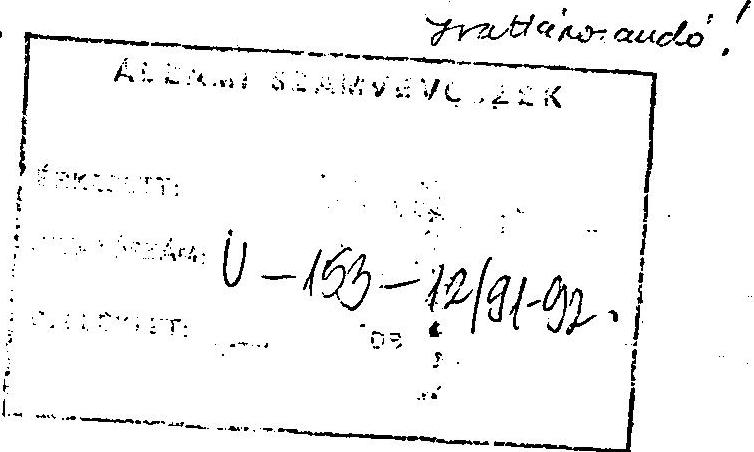

Tisztelt Kovács úr!

Az Országos Béketanács vagyonelszámoltatásának hitelesítésével kapcsolatosan felvetett állásfoglalás kérésükre ismételten tájékoztatom önöket, hogy a válasz nem adóhatósági kompetencia.

Alláspontom szerint azonban az Országos Béketanács jogosult volt az 1989. évi használati jog átadásáért kapott 50 millió forintot 1990. évben felhasználni, miután ezt jogszabályi rendelkezés nem tiltotta.

Budapest, 1992. március 30.
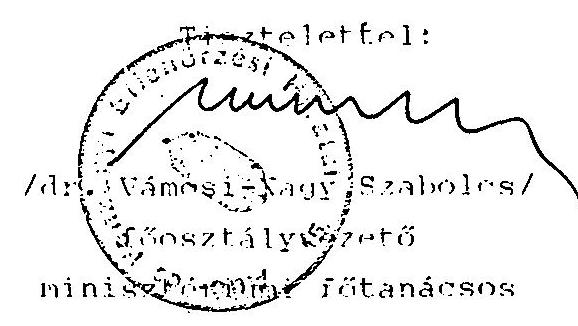

---

ADÓ. ÉS PÉNZÜGYI ELLENÓRZÉSI HIVATAL 1373 Budapest V., Széchenyi u. 2. Pf. 561
Àdónemek FØosztálya
$40.407 / 1 / 1992$.

Előadó: Kristófné. dr./Nné
Hiv.sz.: V.-153-8/1992.

Dr. Kovács Árpád úr
főcsoportfőnök

Állami Számvevőszék
Budapest
Apáczai Csere János u. 10.
1052

Tisztelt Kovács Ưr!

Tájékoztatom, hogy az Országos Béketanács vagyonelszámoltatásának hitelesítése során felvetett állásfoglalás kérésére - nevezetesen, hogy a Béketanács jogosult volt-e az 1989. évi használati jog átadásáért kapott 50 millió forintot 1990. évben felhasználni - a válasz nem adóhatósági kompetencia.

Az adóhatóság az Országos Béketanács tevékenységét kizárólag az adózás szempontjából vizsgálta (vizsgáltatta), az ellenôrzés csak arra terjedt ki, hogy a használati jogból eredó bevételt adófizetési kötelezettség terheli-e.

Budapest, 1992 március 17.

Tisztelettel:
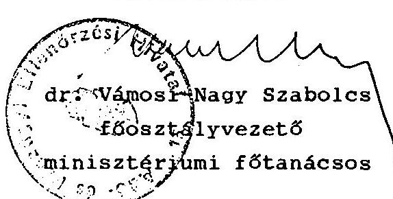

---

ADO- ES PENZÜGYI ELLENORZESI HIVATAL ELNOK

$$
\begin{aligned}
& \text { 80.079/2/1991. Elĩadó : Kristóf Andrásné dr./Zné } \\
& \text { Hiv. szám : V-7/9/1991. }
\end{aligned}
$$

Dr. Hagelmayer István Úr, clnök

Állami Számvevõszék

# Budapest 

Tisztelt Hagelmayer Úr !
Tájékoztatom, hogy a Magyar Szovjet Baráti Társaságnál és az Országos Béketanácsnál a Hivatal Fővárosi Igazgatósága Költségvetési és Társadalmi Szervek Ellenôrzési Osztálya az adóellenôrzést lefolytatta, és annak eredményeként a következôket állapította meg.

A Magyar Szovjet Baráti Társaság az 1989. évre vonatkozó vállalkozási tevékenysége eredményérôl nem készített beszámolót. s nem tett eleget a vállalkozási nyereségadóról szóló 1988. évi IX. törvénv 1. S-ában. valamint a társadalmi szervezetek gazdálkodó tevékenységérôl rendelkezõ 16/1989. (II. 26.) MT rendelet 3. S (2) bekezdésében és a 6. S-ában foglaltaknak.

Az adóalany 1989. évi vállalkozási tevékenysége után a vizsgálat 1. 426.000 Ft befizetendô vállalkozási nyereségadó hiányt tárt fel. Ezen túlmenően 1.080 .000 Ft általános forgalmi adókülönbözetel is megállapított az ellenôrzés (1988. és 1989. évekre), amelyhôl a befizetendô általános forgalmi adóhiány összege 418.000 Ft.

1990. évre az adóellenôrzés lefolytatására - tekintettel arra, hogy az még adóbevallással nem lezárt év - nem kerülhetett sor.

Az Országos Béketanácsnál tartott adóellenôrzés során megállapítást nyert, hogy a társadalmi szervezet a Budapest, V. kerïlet Széchenyi rakpart 6. szám alatti ingatlan IV. ezeletén lévô, összesen 630 m irodahelyiségeinek használati jogáról lezondott az Agrár Innovációs Bank javára, 50 millió forintért. A Bank 1959. december 29-én 2 db 25 millió forintos pénztárjeggyel fizetett.

A Béketanács a Számvevõszék vizgsálatát követôen 1990. december 20-án az Adóhatósághoz zódosított beszámolót uxújtott be, avelvben a használati jog átadásáért járó 50 millió forintot a sérlegében az értékpapírok között, az eredménylevezetés táblában a vállalhozáson kivili bevételek között szerepeltette, mint a helyizégazdálkodásról szóló 19/1984. (IV. 15.) MT rendelet 3. S-ában foglaltaknak segfeteiñ pénzbeli térítésként, kártalanítás jogefren kapott bevetel.

---

A használati jog átadás nem minősül értékesítésnek, általános forgalmi adókörön kívüli tevékenység, ezért, és a fentiekben leírták alapján az ellenôrzés az 50 millió forint után sem általános forgalmi adófizetési, sem vállalkozási nyereségadó fizetési kötelezettséget, illetve adóhiányt nem állapított meg.

A Béketanács 1990. évben az 50 millió forintból 22 millió forintért megvásárolta a Budapest, XI. kerület Jégvirág u. 14. szám alatti ingatlant, és az abban lévô ingóságok egy részét.

A rendelkezésre álló iratok és a fôtitkár, valamint a gazdasági vezetö nyilatkozata szerint az adás-vételi szerzödést a Béketanács az ingatlanra az eladókkal 1990. január 8-án kötötte meg. 1990. január 25-én egy módosító szerződés alapján nem a Béketanács, hanem a VÉDA Külkereskedelmi Kft lett a vevő. Az ingatlannyilvántartásba is tulajdonosként a Kft-t jegyezték be. A Kft "1990. január 31-én a szerzödést közös megegyezéssel felbontotta, s az abban foglaltak alapján helyébe az eredeti szerződés, a Béketanáccsal kötött adás-vételi szerzödés lép hatályba. Ezt a Béketanács képviselöje magára nézve érvényesnek ismerte el.

A Béketanács 1990. szeptember 3-án a 22 millió forint értékú ingatlant térítésmentesen az Európa Ház Alapítványnak adományozta.

Az Országos Béketanács tulajdonjogát az ingatlannyilvántartásba nem jegyezték be, 1990. december 5-én az Európa Ház Alapítvány tulajdonjoga került bejegyzésre a "közbensõ tulajdonostól az Országos Béketanácstól".

Az ingatlannyilvántartásba való bejegyzések jogszerüségének vizsgálata, valamint az esetleges illetékfizetési kötelezettség vizsgálata nem tartozik az Adóhatóság hatáskörébe.

Az Országos Béketanács 1990. évi ügyleteinek adóvouzata ennél a szervezetnél sem volt még vizsgálható, arra csupán az adóbevallás benyújtása, 1991. április 20-a után lesz lehetőség.

A két szervezetnél az 1990. évre vonatkozó adóhatósági vizsgálatok eredményéröl az ellenőrzések lefolytatását követően tájékoztatom.

Budapest, 1991. március " $v$ ".
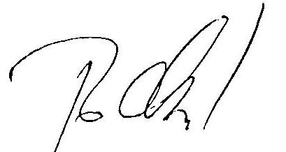

Udvözlettel:
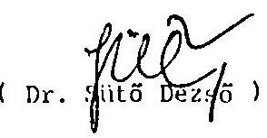

---

Budapest, 1992. február 28. V-153/1991/1992.

Dr. A R A D I ZSOLT úr
főosztályvezető
Pénzügyminisztérium

# B U D A P E S T 

Tisztelt Főosztályvezető Úr!

Az Országos Béketanács vagyonelszámolásának hitelesítése kapcsán kérjük szíves állásfoglalásukat arra vonatkozóan, hogy a nevezett társadalmi szervezet bérleti jog átadása címén kapott 50 millió Ft összeget bevétélei között elszámolhatta, illetve saját döntés szerint felhasználhatta.

Tisztelettel
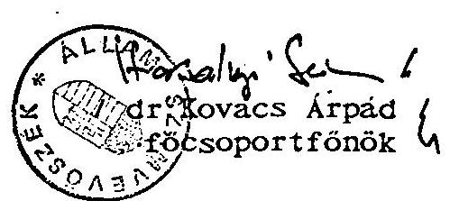

---

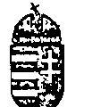

# PÉNZÜGYMINISZTÉRIUM 

1051 BUDAPEST, JÓZSEF NÁDOR TÉR 2.4 Postacím: 1369 Budapest, Postafiók 481 Telefon: 118-2066
Telefax: 1182670 Telex: 20-2763 $53.086 / 92$
dr. Kovács Árpád úrnak, fócsoportfónök

Állami Számvevőszék

## Budapest

Tisztelt Kovács Úr!
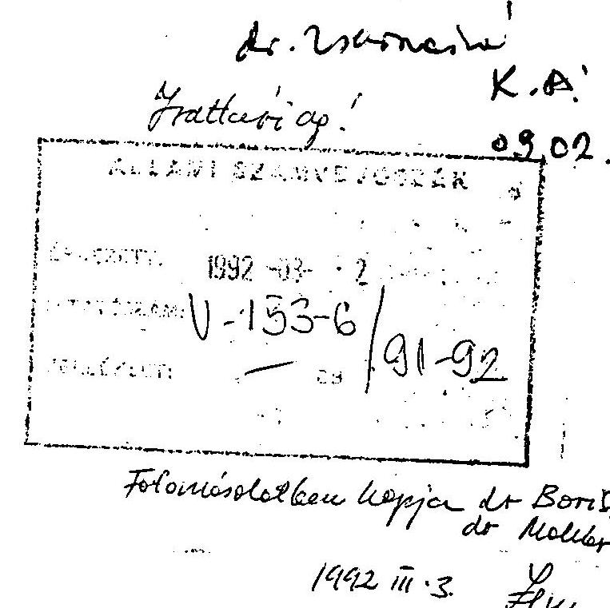

Az Országos Béketanács vagyonelszámoltatásának hitelesítése kapcsán írt levelére válaszolva tájékoztatom, hogy a bérleti jog átadása címén kapott bevételt az Országos Béketanács a társadalmi szervezetek gazdálkodási rendjéről szóló 16/1989.(II.26.)MT rendelet elöírásainak megfelelően számolhatta el, illetőleg használhatta fel.

Kérem tájékoztatásom szíves elfogadását.

Budapest, 1992. február 28.
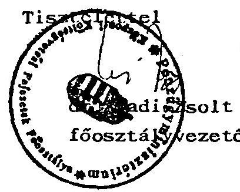

---

# FÓVÁROSI KERÜLETEK FÖLDHIVATALA 

BUDAPEST VI., BENCZÚR UTCA 34.
Tárgy:
1368 Budapest - Postaflok: 196 - Telefon: 211-710

Ikt. szám: 20.037/1992
Úgylintézo:
Telefon: 1420-374
Cím: Állami Számvavôszék
Vagyonkezelö Föcsoport
dr. 0 0 R I S Z József tanácsos úr részére
B U D A P E S I
V.Apácal Csere János uu10.

Az Orszános Béketanács 1990. január 00-án adásvételi szerzödést kötött a Budapest, XI.ker. 067 szánú tulajcioni lapon nyilvántartott 931/4 hrsz-ú ingatlanra.
A szerzödést 1990. január 25-én nyujtották be a Fülchivatalhoz. Ezzel egyidejóleg 1990. január 25-én nyujtották be az ugyan az nap kelt adásvételi szerződést mócosító nyilatkozatot, mely szerint az Országos Béketanács maga helyett a VÉDA Külkereskedelmi XFT-t állítja vevōnek, továbbá az ugyancssk 1990. január 25-én kelt, az elacok Sarkóczi Balázs és felesége, és a VÉDA Külkereskedelmi KFT. között létrejött adásvételi szerzödést.
A hivatalban fellelhető iratokból nem állapítható meg, hogy az Állami Számvevõszék birtokában levõ, 1990. március 20-án záradékolt tulajcioni lapra milyen körülmények között lett az Országos Béketanács tulajdonosként bejegyezve, hiszen sem erre utaló határozat, sem pedig határozatnak minösülö tulajcioni lap másolat nincs.
A 37.239/1990 sz. üryirat alapján 1990. szeptember 05-én történt intézkedés, melyben a VÉDA Külkereskedelmi KFT. került tulajdonosként bejegyzésre.'
Az érdekeltek a bejienyzésröl határozatnak minösülö tulajcioni lap másolatokkal lettek értesítve: A kiadás kelte: 1990. november 05. Az iratok között fellelhető tulajcioni lap másolat mér a pótlús elötti állapotot tükrözi.
Ezután történhetett a tulajcioni lap elkallócésa, majd ezt követöen a meglévö iratok alapján a pótlása.

---

A továbai tulajdonjog változások már a pótolt tulajdoni lapon kerültak etvuzctésre.

Az olacok és a VÉDA KFT. wüzött 1990. január 31.-i keltuzéssel adásvételi szerzảdást felbontó és hatálytalanító megállapodás jött létre, melyet a fölchivatalhoz 1990. december 05-én nyujtottak be, és abben az 1990. január 08-i szerzảdést tekintik irányadónak. Ezért került sor arra, hogy az ügyben telefonon az Ősztályvezető állásfoglalást kért a Fővárosi Fölchivatal fömunkatársától, hogy az Országos Béketanács szerezhet-e tulajdon jogot.
Erro a telefonbeszélgatésre hivatkozva küldte non tolafaxon a madositatt PTK. ide vonatkozó rendelkezisít.

B U D A P E S T, 1992. február 24.
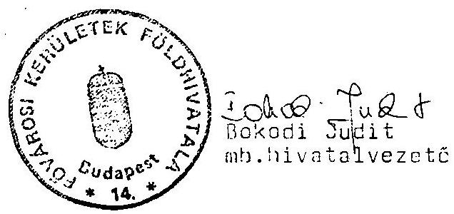

---

# Allami S̊zámototóó̧ék 

5. sz. Függelék
a V-150-61/1991/91. sz. jelentéshez

## JELENTÉS

a Magyar-Szovjet Baráti Társaság pótvagyonelszámolása hitelességének ellenőrzéséről az 1991. évi LI. törvénnyel módosított 1990. évi LXXIII. törvény alapján

---

A vizsgálatot vezette:
dr. Zsarnal Dezsöné osztályvezető fötanácsos

A vizsgálatot végezték:
Németh Béláné számvevö tanácsos
Lörinc Alajos számvevö tanácsos

---

# ÁLLAMI SZÁMVEVÖSZÉK 

$\mathrm{V}-153-7 / 1991 / 1992$.
Témaszám: 100 .

## J E L E N T É S

a Magyar-Szovjet Baráti Társaság pótvagyonelszámolása hitelességének ellenőrzéséről az 1991. évi Li. törvénnyel módosított 1990. évi LXXIII. törvény alapján

Az Országgyűlés 1991. október 22-i űlésén elfogadta az 1991. évi LI. törvényt, amely az elmúlt rendszerhez kötődő egyes társadalmi szervezetek vagyonelszámoltatásáról szóló 1990. évi LXXIII. sz. törvény módosításáról szól. A törvény értelmében az Állami Számvevőszék (a továbbiakban ÁSZ) azokat az elszámolókat, akiknek további vagyone1számoltatása az adatok hiánya miatt nem volt hitelesíthető - e szervezetek egyike a Ma-gyar-Szovjet Baráti Társaság (a továbbiakban MSZBT) - felhívta a pótvagyone1számolás benyújtására.

Az ÁSZ az MSZBT pótvagyone1számolás hitelességét ellenőrizte és azt
"HITELES"-nek
minősíti.

---

# A feladat végrehajtásának körülményei 

Az ÁSZ alapvizsgálata a társadalmi szervezetek vagyone Iszámoltatására rendszeresített 1-8. sz. táblázatok közül az MSZBT vagyonbevallásánál a $4,5,7$. és 8 . sz. táblázatokat nem fogadta el hitelesnek.

Az MSZBT 1991. december 17-i keltü, 119/1991/05/K sz. levelével küldte meg a pótvagyonélszámolását, valamint a nem pótolható adathiányokra vonatkozó nyilatkozatokat. Az MSZBT által becsatolt dokumentációt mellékletként csatoljuk.

1. A hiteles minösitésnél az ÁSZ figyelembe vette, hogy írásos kezdeményezése alapján az APEH ellenőrzést folytatott az elmulaszott adóbefizetések tárgyában és 1991. február 13-án lezárt jegyzőkönyvében az MSZBT-t 1.844 E Ft adóhiány és 1.072 E Ft bírság megfizetésére kötelezte. Adóigazgatási eljárás keretében a befizetések behajtása folyamatban van.
2. Az Állami Számvevőszék továbbá írásos jelzést tett a legfőbb ügyész felé az MSZBT-nek a Váltó, illetve Energosoft Kft-vel kötött és számára jelentős anyagi hátrányt eredményező megállapodás vizsgálatára, a vélelmezett jogalap nélküli gazdagodás rendezésére.

Az elmúlt időszakban az ügyészség pótnyomozást folytatott és a legfőbb ügyész 1992. március 17-i levelében foglaltak szerint a Fővárosi Főügyészségnél az MSZBT, illetőleg a Váltó és az Energosoft Kft-k közötti szerződés érvénytelenségének megállapítására, a felek elszámoltatására a bírósági kereset benyújtása folyamatban van.

---

3. Az MSZBT a pótvagyone1számoltatás során becsatolt egy 1990. december 18-i ke1tezésű vagyonátruházási megállapodást is (6. sz. melléklet). Bár a vizsgálatnak nem volt feladata az 1990. szeptember 18-át követő időszak vagyonmozgásait ellenőrizni, a megállapodás vitatható tartalma miatt a- következő észrevételeket teszi.

Az MSZBT 1991-ben már nem részesült állami támogatásban, illetve helyette a "Nemzetek Háza", a Nemzetek Közötti Baráti Társaságok Szövetsége volt a kedvezményezett (18/1991. OGy. határozat). A tagdijakon alapuló önfinanszirozó müködés feltételeinek biztositása átmenetileg igen feszitett szervezési követelményt jelent az MSZBT részére. Mindemel1ett a "Nemzetek Háza" Szövetséggel kötött vagyonátruházási megállapodás a szolgáltatások aránytalansága miatt vitatható.

A megállapodás a különböző vagyonelemek Nemzetek Háza Szövetségnek történő átruházását 14 pontban taglalja.

Ebből a megállapodás 1-4. pontjában foglaltak megegyeznek a Szövetség megalapításakor eszközölt, az MSZBT által kötött 1990. július 18-i és augusztus 8-i megállapodások tartalmával. Ezeket a megállapodásokat már a korábbi ÁSZ alapvizsgálat feldolgozta és elfogadta, az 1990. augusztusi vagyoni állapothoz képest nem eredményeznek eltérést. (Székház bérleti jog átadás, illetve a folyó múködési költségekhez a Rejtvényújság kiadási jogának és bevételeinek átadása.)

A megállapodás 5-6. pontjában átadásra elöirányzott mintegy 3,7 millió Ft nyilvántartási értékủ eszközök és felszerelési tárgyak használata túlnyomórészt kapcsolódik a Gorkij fasori székház bérletéhez és üzemeltetéséhez, igy ezek átruházását az ellenőrzés érdemben nem vitatja. (Megitélésünk

---

szerint ezen értékek átruházása már kellő fedezetet nyújthatott volna az MSZBT átmeneti müködési feltételeit biztosító kedvezményes irodabérleti és egyéb szolgáltatások nyújtására.)

A megállapodás 7-12. pontjai részletezik a további vagyontárgyak, egy balatonkenesei házas üdülőingatlan és 6 millió. Ft értékủ értékpapír küllőnbőző feltételekhez kötött átruházását. A tárgybani "Nemzetek Háza" Szövetségre történő vagyoná truházás alapvetően megváltoztatja az ÁSZ alapvizsgálatban felmért 1990. augusztusi vagyoni állapotot, az átruházással a MSZBT vagyon nélkü livé válik. Ezáltal megszűnik a MSZBT adótartozásai rendezésének vagyoni alapja is. A vagyonelemek birtoklása nem kötődik szorosan a baráti szövetségek müködési profiljához. A vagyonképzés korábbi forrása fóként az MSZBT-nek juttatott állami támogatás volt, így ezek tovább-, illetve átruházása nem fogadható el.

# II. 

A pót vagyonelszámolás hiteles minösítését megalapozó vizsgálati megállapítások

1. Az 1990. évi LXXIII. törvény 4. és 5. sz. mellékletei a társadalmi szervezet bevételi forrásainak és kiadásainak alakulását mutatja be. Az ÁSZ kezdeményezésére lefolytatott APEH vizsgálat az adófizetési mulasztásokat feltárta. A folyamatban lévő adóigazgatási eljárást figyelembe véve a kimutatások hitelesnek tekinthetők.

---

2. A 7. sz. vagyonbeval lási táblázat a társadalmi szervezet ingatlanon kivüli egyéb állóeszközeinek számbavételére szo1gál.

Az alapvizsgálat a szervezet állóeszköz gazdálkodásában, nyilvántartásában különféle hiányosságokat tárt fel. Föként az 1988-ban lefolytatott mintegy 1.760 E Ft értékủ állóeszköz átminösités dokumentáltságát észrevételezte, mivel közel 1 millió Ft állóeszköz átminösitésére dokumentumokkal nem rendelkezett. Az elmúlt időszakban az.MSZBT be1sö ellenörzést folytatott és intézkedett a gazdálkodási nyilvántartások javitására. Az MSZBT-nek a pótolhatatlan adathianyra vonatkozó nyilatkozatát az ellenörzés elegendó igazolásnak fogadta el, mivel ennek ellentmondó helyszini tapasztalatot az ellenörök nem szereztek. Továbbá a pótadatszolgáltatás keretében az MSZBT nemleges vagyonnyilatkozatok formájában rendezte a Gorkij Nyelviskola öt megyeközpontban müködtetett vidéki tagozatok vagyone1számoltatását, melyet az ellenörzés szintén elfogadott. Ezek figyelembevételével az MSZBT "egyéb állóeszközökre" vonatkozó beval1ását hitelesnek fogadjuk el.
3. A 8. sz. táblázat a társadalmi szervezet értékpapír- és pénzforgalmának alakulását rögziti.
Az MSZBT az értékpapír állományának terhére a Váltó Kft-ve1 keletkezett vitás ügyének rendezésére elönyte1en megállapodást kötött, me1yet az alapvizsgálat aránytalanság miatt vitatott.
ÁSZ kezdeményezésre ügyészségi el járás indult, me1y birósági peres ügy formájában a hiteles vagyoni állapotot helyreállítja.

Budapest, 1992. április

---

Állami Számvevőszék
V-153-7/1991/1992.

# M E L L É K L E T E K 

a Magyar-Szovjet Baráti Társaság
pótvagyonelszámolása hitelességének ellenőrzéséről
az 1991. évi LI. törvénnyel módosított
1990. évi LXXIII. törvény alapján

Budapest, 1992. április hó

---

# T A R T A L O M J E G Y Z É K 

1. sz. melléklet

Nyilatkozat a Magyar-Szovjet Baráti Társaság Országos Elnöksége részéről az 1., 4., 5., 7., és 8. sz. mellékletek benyújtásával
2. sz. melléklet

Nyilatkozat a MSZBT Országos Elnökségétól az 1988. évi állóeszközök ellenőrizhetőségére
3. sz. melléklet

Nyilatkozat az MSZBT Országos Elnökségétől a megyei nyelviskolai tagozatok ellenőrizhetőségére
4. sz. melléklet

Nyilatkozat az MSZBT Országos Elnökségétől az 1991. február 13-án kelt záradékkal lezárt APEH ellenőrzésről
5. sz. melléklet

Nyilatkozat a Váltó Kft-vel szembeni pénzbeli követelés rendezéséről
6. sz. melléklet

Az MSZBT és a "Nemzetek Háza" közötti megállapodásról

---

# WAGYAR-SZOVJST BARÁTI TÁRSASÁG 

ORSZAGOS ELKÖKSEGE
1406. Budapest, Gorkij fasor 45.

Iktatószám: 119/1991/05/k

## HYILATKOZAT

Alulirott dr.Ábel László /1125. Budapest, Varázs utca 6./ mint az i.SZBT titkára a következö nyilatkozatot teszem az Állami Számvevöszék elszámoltató ellenörzése kapcsán az 1990. évi LXXIII. törvényt módositó 1991. évi LI. törvény alapján annak előirásai szerint jelen levelemhez csatoltan ismételten benyujtom a társaság vagyonelszámolása során nem hitelesített 1, 4, 5, 7, 3. szánu mellékletek /táblázatok/ pontositott adatokat tartalmazó anyagát.

Jirsasáaunk kezdeményezője volt a HEMZETEK HÁZA H̄emzetek közöttI Baráti Társaságok Szövetsége létrehozásának megalakulásának. a Szövetség meiy közel félszáz társaságot tömörit - részéze az i.3333 fegyzökönyvileg átadta az eddig tulajdonában és kezelésében lövö vagyontárgyakat, kezelési és bérleti jogot. Az átadás tényét tartalmazó okmányt csatoltan beterjesztem.

Kérem a Tisztelt Állami Számvevőszéket a fentiekze tekintettel tekintsék lezártnak az ellenőrzésük során elszámoltatásunkkal kapcsolatos kérdéseket és azt elfogadásra ajánljik az Országgyulésnek.
Budapest, 1991. december 17.

---

...i.i.iYAR.SZOVJET BARÁTI TÁRSASÁG ORSZAGOS ELNÖKSEGE
UEHTPANbHOE ПPABПEНИE
OBLLECTBA BEHFEPO-COBETCHOH APYHIEb
1406 BUDAPEST VII., GORKIJ FASOR 45.
Budapest, $198^{\circ} 0$.oktúber 20.
Iktatószám: $460 / 10 / 90$

Állami Számvevõszék
dr.Kovács Árád fõcsoportfõnök
úr részére,
Budapest
Apáczai Csere J.u. 10.
1052

Tisztelt dr.Kovács Árpád Úr!

A Magyar-Szovjet Baráti Társaság jelenleg rendelkezésre álló vagyonáróí tisztelettel megküldöm az elszámolást az LXXIII.sz .törvényben foglaltak alapján 1990. augusztus 31-i állapot szerint.

Nyilatkozom arról, hogy a jelenleg fellelhetõ iratok alapján, azokból összegezve bocsátottam a lisztelt Számvevõszék rendelkezésére a vonatkozú adatokat az 1.2.3.4.5.6.7.B.sz. melléklet szerint.

Megjegyzem, hogy a Magyar-Szovjet Baráti Társaság a Budapest, VII. kerület; Gorkij fasor 45.sz. alatti irodaház $930 \mathrm{~m}^{2}$-ének jogszerũ fõbérlõje, a fõbérlet átadása a "Nemzetek Házä"-nak, Nemzetek Közötti Bará- ti Társaságok Szövetségének folyamatban van az MSZBI és a "Nemzetek Házc" 1990. július 18-i megállapodása szerint.

Tisztelettel:

Mellékletek
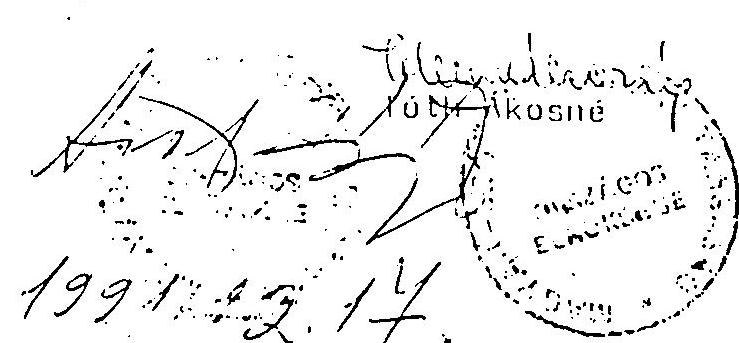

---

# 1.sz. melléklet az 1990. évi LXXIII. törvènyhez 

A szervezet és intézményei ingatlanaira vonatkozó adatok 1949. I.1. - 1988.XII. 31. között
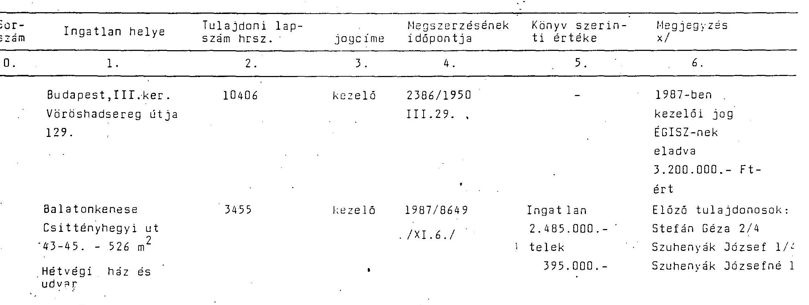
x/ A xíus.atassan fel kell tüntetni, hogy a megszerzés idópontja elôtt az ingatlan kinek a tulajdonában, illetve birtokában állt. Az 1988.XII. 31. elôtt tulajgonából és kezeléséból bármilyen jogcímen kikerült ingatlanokat is ki kell mutatni.

---

2.32. ma2. 1. 1990. évt LXXIII. törvènı!ıa

A szervezet vállalataira vonatkozú allatai 1919.1. 1. - 1990. VIII.31.

|  Sor-
szám | Vállalat megnevezése | Alapításának éve | Megazünésínuk éve | Az induló vagyon részletezése |  |   |
| --- | --- | --- | --- | --- | --- | --- |
|   |  |  |  | saját | költségvetési
juttatás | egyéb külső
forrás  |

---

3.sz. melléklet az 1990. évi LXXIII. törvėnyhez

A szervezet által létrehozott gazdasági társaságokra, leányvállalatokra, alapítványokra vonatkozó adatok

1949.I.1. - 1990. VIII.31.

| Sorszám | Megr. vezés | Létesítés, alapítás időpontja | Megszűnés időpontja | Vagyoni betét megnevezés | Vagyoni összeg |
| :--: | :--: | :--: | :--: | :--: | :--: |
| 1. | Szentgyörgyi Albert   Alapítvány | 1990. | - | alapító töke | 500.000 .- Ft. |
| 2. | Nemzetek Háza   Nemzetek Közötti Baráti   Társaságok Szövetsége | 1990 | - | alaptőke   a Gorkij fasor 45.   irodaház $\sim 1000 \mathrm{~m}^{2}$   jogszerinti bérlemény   használata | 1.793.985.- Ft. |

---

4.sz. melléklet az 1990. évi LXXIII. törvén t
A szervezet bevételi, forrá, utalulasa 1979.XII.31. - 1990.VIII.31.-közütt
*Megnevezés
összeg évenként/1000.- Ft-ban
1979 1980 1981 1982 1983 1984 1985 1986 1987 1988 1989 1990
- tagdíjbevétel
- állami költségvetési
támogatás
20.300.0 16.650.0 17.650.0 18.600.0 17.750.0 29.900.0 31.363.0 47.380.0 38.211.0 55.287.0 39.338.0 3.750
- átvett pénzeszköz
- vállalatainak befizetései
- befektetett eszközök osztaléka
- átengedett állami bevételek
- vállalati nyereségadó
- egyéb adókedvezmények
- társadalombiztosítási kötelezettség kedvezménye x/
bérbruttósítási fedezet forrásai
társadalombiztosítási járulék változásának fedezete x/
-

---

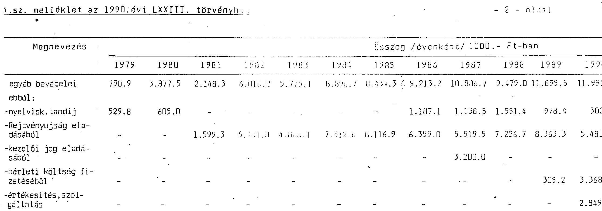

A kedvezményre utaló sorban a lü's-nál kevesebb járulè fizetést l,ell elszámini. A járulékváltozásnál akkor kell a l0\%-ról /ill. annál alacsonyacb/ 43 \%-ra emeleśs feltüntetni, na az 1989. évi fedezetét az állami költségvetés biztosította.

---

5.sz. melléklet az 1990. évi LXXIII. törvėn: hea
a Szervezet kiadásának al:l:11:31. - 1990.VIII.31. köżött

|  |  |  |  |  |
| :--: | :--: | :--: | :--: | :--: |
|  | Ráfordítások összesen |  |  |  |
|  |  | bérek és   köztem: | $\begin{aligned} & \text { 1. } 1111 \text {. } 11 \text {. } 1 \text {. } 1 \text {. } 1 \text {. } 1 \text {. } 1 \text {. } 1 \text {. } 1 \text {. } 1 \text {. } 1 \text {. } 1 \text {. } 1 \text {. } 1 \text {. } 1 \text {. } 1 \text {. } 1 \text {. } 1 \text {. } 1 \text {. } 1 \text {. } 1 \text {. } 1 \text {. } 1 \text {. } 1 \text {. } 1 \text {. } 1 \text {. } 1 \text {. } 1 \text {. } 1 \text {. } 1 \text {. } 1 \text {. } 1 \text {. } 1 \text {. } 1 \text {. } 1 \text {. } 1 \text {. } 1 \text {. } 1 \text {. } 1 \text {. } 1 \text {. } 1 \text {. } 1 \text {. } 1 \text {. } 1 \text {. } 1 \text {. } 1 \text {. } 1 \text {. } 1 \text {. } 1 \text {. } 1 \text {. } 1 \text {. } 1 \text {. } 1 \text {. } 1 \text {. } 1 \text {. } 1 \text {. } 1 \text {. } 1 \text {. } 1 \text {. } 1 \text {. } 1 \text {. } 1 \text {. } 1 \text {. } 1 \text {. } 1 \text {. } 1 \text {. } 1 \text {. } 1 \text {. } 1 \text {. } 1 \text {. } 1 \text {. } 1 \text {. } 1 \text {. } 1 \text {. } 1 \text {. } 1 \text {. } 1 \text {. } 1 \text {. } 1 \text {. } 1 \text {. } 1 \text {. } 1 \text {. } 1 \text {. } 1 \text {. } 1 \text {. } 1 \text {. } 1 \text {. } 1 \text {. } 1 \text {. } 1 \text {. } 1 \text {. } 1 \text {. } 1 \text {. } 1 \text {. } 1 \text {. } 1 \text {. } 1 \text {. } 1 \text {. } 1 \text {. } 1 \text {. } 1 \text {. } 1 \text {. } 1 \text {. } 1 \text {. } 1 \text {. } 1 \text {. } 1 \text {. } 1 \text {. } 1 \text {. } 1 \text {. } 1 \text {. } 1 \text {. } 1 \text {. } 1 \text {. } 1 \text {. } 1 \text {. } 1 \text {. } 1 \text {. } 1 \text {. } 1 \text {. } 1 \text {. } 1 \text {. } 1 \text {. } 1 \text {. } 1 \text {. } 1 \text {. } 1 \text {. } 1 \text {. } 1 \text {. } 1 \text {. } 1 \text {. } 1 \text {. } 1 \text {. } 1 \text {. } 1 \text {. } 1 \text {. } 1 \text {. } 1 \text {. } 1 \text {. } 1 \text {. } 1 \text {. } 1 \text {. } 1 \text {. } 1 \text {. } 1 \text {. } 1 \text {. } 1 \text {. } 1 \text {. } 1 \text {. } 1 \text {. } 1 \text {. } 1 \text {. } 1 \text {. } 1 \text {. } 1 \text {. } 1 \text {. } 1 \text {. } 1 \text {. } 1 \text {. } 1 \text {. } 1 \text {. } 1 \text {. } 1 \text {. } 1 \text {. } 1 \text {. } 1 \text {. } 1 \text {. } 1 \text {. } 1 \text {. } 1 \text {. } 1 \text {. } 1 \text {. } 1 \text {. } 1 \text {. } 1 \text {. } 1 \text {. } 1 \text {. } 1 \text {. } 1 \text {. } 1 \text {. } 1 \text {. } 1 \text {. } 1 \text {. } 1 \text {. } 1 \text {. } 1 \text {. } 1 \text {. } 1 \text {. } 1 \text {. } 1 \text {. } 1 \text {. } 1 \text {. } 1 \text {. } 1 \text {. } 1 \text {. } 1 \text {. } 1 \text {. } 1 \text {. } 1 \text {. } 1 \text {. } 1 \text {. } 1 \text {. } 1 \text {. } 1 \text {. } 1 \text {. } 1 \text {. } 1 \text {. } 1 \text {. } 1 \text {. } 1 \text {. } 1 \text {. } 1 \text {. } 1 \text {. } 1 \text {. } 1 \text {. } 1 \text {. } 1 \text {. } 1 \text {. } 1 \text {. } 1 \text {. } 1 \text {. } 1 \text {. } 1 \text {. } 1 \text {. } 1 \text {. } 1 \text {. } 1 \text {. } 1 \text {. } 1 \text {. } 1 \text {. } 1 \text {. } 1 \text {. } 1 \text {. } 1 \text {. } 1 \text {. } 1 \text {. } 1 \text {. } 1 \text {. } 1 \text {. } 1 \text {. } 1 \text {. } 1 \text {. } 1 \text {. } 1 \text {. } 1 \text {. } 1 \text {. } 1 \text {. } 1 \text {. } 1 \text {. } 1 \text {. } 1 \text {. } 1 \text {. } 1 \text {. } 1 \text {. } 1 \text {. } 1 \text {. } 1 \text {. } 1 \text {. } 1 \text {. } 1 \text {. } 1 \text {. } 1 \text {. } 1 \text {. } 1 \text {. } 1 \text {. } 1 \text {. } 1 \text {. } 1 \text {. } 1 \text {. } 1 \text {. } 1 \text {. } 1 \text {. } 1 \text {. } 1 \text {. } 1 \text {. } 1 \text {. } 1 \text {. } 1 \text {. } 1 \text {. } 1 \text {. } 1 \text {. } 1 \text {. } 1 \text {. } 1 \text {. } 1 \text {. } 1 \text {. } 1 \text {. } 1 \text {. } 1 \text {. } 1 \text {. } 1 \text {. } 1 \text {. } 1 \text {. } 1 \text {. } 1 \text {. } 1 \text {. } 1 \text {. } 1 \text {. } 1 \text {. } 1 \text {. } 1 \text {. } 1 \text {. } 1 \text {. } 1 \text {. } 1 \text {. } 1 \text {. } 1 \text {. } 1 \text {. } 1 \text {. } 1 \text {. } 1 \text {. } 1 \text {. } 1 \text {. } 1 \text {. } 1 \text {. } 1 \text {. } 1 \text {. } 1 \text {. } 1 \text {. } 1 \text {. } 1 \text {. } 1 \text {. } 1 \text {. } 1 \text {. } 1 \text {. } 1 \text {. } 1 \text {. } 1 \text {. } 1 \text {. } 1 \text {. } 1 \text {. } 1 \text {. } 1 \text {. } 1 \text {. } 1 \text {. } 1 \text {. } 1 \text {. } 1 \text {. } 1 \text {. } 1 \text {. } 1 \text {. } 1 \text {. } 1 \text {. } 1 \text {. } 1 \text {. } 1 \text {. } 1 \text {. } 1 \text {. } 1 \text {. } 1 \text {. } 1 \text {. } 1 \text {. } 1 \text {. } 1 \text {. } 1 \text {. } 1 \text {. } 1 \text {. } 1 \text {. } 1 \text {. } 1 \text {. } 1 \text {. } 1 \text {. } 1 \text {. } 1 \text {. } 1 \text {. } 1 \text {. } 1 \text {. } 1 \text {. } 1 \text {. } 1 \text {. } 1 \text {. } 1 \text {. } 1 \text {. } 1 \text {. } 1 \text {. } 1 \text {. } 1 \text {. } 1 \text {. } 1 \text {. } 1 \text {. } 1 \text {. } 1 \text {. } 1 \text {. } 1 \text {. } 1 \text {. } 1 \text {. } 1 \text {. } 1 \text {. } 1 \text {. } 1 \text {. } 1 \text {. } 1 \text {. } 1 \text {. } 1 \text {. } 1 \text {. } 1 \text {. } 1 \text {. } 1 \text {. } 1 \text {. } 1 \text {. } 1 \text {. } 1 \text {. } 1 \text {. } 1 \text {. } 1 \text {. } 1 \text {. } 1 \text {. } 1 \text {. } 1 \text {. } 1 \text {. } 1 \text {. } 1 \text {. } 1 \text {. } 1 \text {. } 1 \text {. } 1 \text {. } 1 \text {. } 1 \text {. } 1 \text {. } 1 \text {. } 1 \text {. } 1 \text {. } 1 \text {. } 1 \text {. } 1 \text {. } 1 \text {. } 1 \text {. } 1 \text {. } 1 \text {. } 1 \text {. } 1 \text {. } 1 \text {. } 1 \text {. } 1 \text {. } 1 \text {. } 1 \text {. } 1 \text {. } 1 \text {. } 1 \text {. } 1 \text {. } 1 \text {. } 1 \text {. } 1 \text {. } 1 \text {. } 1 \text {. } 1 \text {. } 1 \text {. } 1 \text {. } 1 \text {. } 1 \text {. } 1 \text {. } 1 \text {. } 1 \text {. } 1 \text {. } 1 \text {. } 1 \text {. } 1 \text {. } 1 \text {. } 1 \text {. } 1 \text {. } 1 \text {. } 1 \text {. } 1 \text {. } 1 \text {. } 1 \text {. } 1 \text {. } 1 \text {. } 1 \text {. } 1 \text {. } 1 \text {. } 1 \text {. } 1 \text {. } 1 \text {. } 1 \text {. } 1 \text {. } 1 \text {. } 1 \text {. } 1 \text {. } 1 \text {. } 1 \text {. } 1 \text {. } 1 \text {. } 1 \text {. } 1 \text {. } 1 \text {. } 1 \text {. } 1 \text {. } 1 \text {. } 1 \text {. } 1 \text {. } 1 \text {. } 1 \text {. } 1 \text {. } 1 \text {. } 1 \text {. } 1 \text {. } 1 \text {. } 1 \text {. } 1 \text {. } 1 \text {. } 1 \text {. } 1 \text {. } 1 \text {. } 1 \text {. } 1 \text {. } 1 \text {. } 1 \text {. } 1 \text {. } 1 \text {. } 1 \text {. } 1 \text {. } 1 \text {. } 1 \text {. } 1 \text {. } 1 \text {. } 1 \text {. } 1 \text {. } 1 \text {. } 1 \text {. } 1 \text {. } 1 \text {. } 1 \text {. } 1 \text {. } 1 \text {. } 1 \text {. } 1 \text {. } 1 \text {. } 1 \text {. } 1 \text {. } 1 \text {. } 1 \text {. } 1 \text {. } 1 \text {. } 1 \text {. } 1 \text {. } 1 \text {. } 1 \text {. } 1 \text {. } 1 \text {. } 1 \text {. } 1 \text {. } 1 \text {. } 1 \text {. } 1 \text {. } 1 \text {. } 1 \text {. } 1 \text {. } 1 \text {. } 1 \text {. } 1 \text {. } 1 \text {. } 1 \text {. } 1 \text {. } 1 \text {. } 1 \text {. } 1 \text {. } 1 \text {. } 1 \text {. } 1 \text {. } 1 \text {. } 1 \text {. } 1 \text {. } 1 \text {. } 1 \text {. } 1 \text {. } 1 \text {. } 1 \text {. } 1 \text {. } 1 \text {. } 1 \text {. } 1 \text {. } 1 \text {. } 1 \text {. } 1 \text {. } 1 \text {. } 1 \text {. } 1 \text {. } 1 \text {. } 1 \text {. } 1 \text {. } 1 \text {. } 1 \text {. } 1 \text {. } 1 \text {. } 1 \text {. } 1 \text {. } 1 \text {. } 1 \text {. } 1 \text {. } 1 \text {. } 1 \text {. } 1 \text {. } 1 \text {. } 1 \text {. } 1 \text {. } 1 \text {. } 1 \text {. } 1 \text {. } 1 \text {. } 1 \text {. } 1 \text {. } 1 \text {. } 1 \text {. } 1 \text {. } 1 \text {. } 1 \text {. } 1 \text {. } 1 \text {. } 1 \text {. } 1 \text {. } 1 \text {. } 1 \text {. } 1 \text {. } 1 \text {. } 1 \text {. } 1 \text {. } 1 \text {. } 1 \text {. } 1 \text {. } 1 \text {. } 1 \text {. } 1 \text {. } 1 \text {. } 1 \text {. } 1 \text {. } 1 \text {. } 1 \text {. } 1 \text {. } 1 \text {. } 1 \text {. } 1 \text {. } 1 \text {. } 1 \text {. } 1 \text {. } 1 \text {. } 1 \text {. } 1 \text {. } 1 \text {. } 1 \text {. } 1 \text {. } 1 \text {. } 1 \text {. } 1 \text {. } 1 \text {. } 1 \text {. } 1 \text {. } 1 \text {. } 1 \text {. } 1 \text {. } 1 \text {. } 1 \text {. } 1 \text {. } 1 \text {. } 1 \text {. } 1 \text {. } 1 \text {. } 1 \text {. } 1 \text {. } 1 \text {. } 1 \text {. } 1 \text {. } 1 \text {. } 1 \text {. } 1 \text {. } 1 \text {. } 1 \text {. } 1 \text {. } 1 \text {. } 1 \text {. } 1 \text {. } 1 \text {. } 1 \text {. } 1 \text {. } 1 \text {. } 1 \text {. } 1 \text {. } 1 \text {. } 1 \text {. } 1 \text {. } 1 \text {. } 1 \text {. } 1 \text {. } 1 \text {. } 1 \text {. } 1 \text {. } 1 \text {. } 1 \text {. } 1 \text {. } 1 \text {. } 1 \text {. } 1 \text {. } 1 \text {. } 1 \text {. } 1 \text {. } 1 \text {. } 1 \text {. } 1 \text {. } 1 \text {. } 1 \text {. } 1 \text {. } 1 \text {. } 1 \text {. } 1 \text {. } 1 \text {. } 1 \text {. } 1 \text {. } 1 \text {. } 1 \text {. } 1 \text {. } 1 \text {. } 1 \text {. } 1 \text {. } 1 \text {. } 1 \text {. } 1 \text {. } 1 \text {. } 1 \text {. } 1 \text {. } 1 \text {. } 1 \text {. } 1 \text {. } 1 \text {. } 1 \text {. } 1 \text {. } 1 \text {. } 1 \text {. } 1 \text {. } 1 \text {. } 1 \text {. } 1 \text {. } 1 \text {. } 1 \text {. } 1 \text {. } 1 \text {. } 1 \text {. } 1 \text {. } 1 \text {. } 1 \text {. } 1 \text {. } 1 \text {. } 1 \text {. } 1 \text {. } 1 \text {. } 1 \text {. } 1 \text {. } 1 \text {. } 1 \text {. } 1 \text {. } 1 \text {. } 1 \text {. } 1 \text {. } 1 \text {. } 1 \text {. } 1 \text {. } 1 \text {. } 1 \text {. } 1 \text {. } 1 \text {. } 1 \text {. } 1 \text {. } 1 \text {. } 1 \text {. } 1 \text {. } 1 \text {. } 1 \text {. } 1 \text {. } 1 \text {. } 1 \text {. } 1 \text {. } 1 \text {. } 1 \text {. } 1 \text {. } 1 \text {. } 1 \text {. } 1 \text {. } 1 \text {. } 1 \text {. } 1 \text {. } 1 \text {. } 1 \text {. } 1 \text {. } 1 \text {. } 1 \text {. } 1 \text {. } 1 \text {. } 1 \text {. } 1 \text {. } 1 \text {. } 1 \text {. } 1 \text {. } 1 \text {. } 1 \text {. } 1 \text {. } 1 \text {. } 1 \text {. } 1 \text {. } 1 \text {. } 1 \text {. } 1 \text {. } 1 \text {. } 1 \text {. } 1 \text {. } 1 \text {. } 1 \text {. } 1 \text {. } 1 \text {. } 1 \text {. } 1 \text {. } 1 \text {. } 1 \text {. } 1 \text {. } 1 \text {. } 1 \text {. } 1 \text {. } 1 \text {. } 1 \text {. } 1 \text {. } 1 \text {. } 1 \text {. } 1 \text {. } 1 \text {. } 1 \text {. } 1 \text {. } 1 \text {. } 1 \text {. } 1 \text {. } 1 \text {. } 1 \text {. } 1 \text {. } 1 \text {. } 1 \text {. } 1 \text {. } 1 \text {. } 1 \text {. } 1 \text {. } 1 \text {. } 1 \text {. } 1 \text {. } 1 \text {. } 1 \text {. } 1 \text {. } 1 \text {. } 1 \text {. } 1 \text {. } 1 \text {. } 1 \text {. } 1 \text {. } 1 \text {. } 1 \text {. } 1 \text {. } 1 \text {. } 1 \text {. } 1 \text {. } 1 \text {. } 1 \text {. } 1 \text {. } 1 \text {. } 1 \text {. } 1 \text {. } 1 \text {. } 1 \text {. } 1 \text {. } 1 \text {. } 1 \text {. } 1 \text {. } 1 \text {. } 1 \text {. } 1 \text {. } 1 \text {. } 1 \text {. } 1 \text {. } 1 \text {. } 1 \text {. } 1 \text {. } 1 \text {. } 1 \text {. } 1 \text {. } 1 \text {. } 1 \text {. } 1 \text {. } 1 \text {. } 1 \text {. } 1 \text {. } 1 \text {. } 1 \text {. } 1 \text {. } 1 \text {. } 1 \text {. } 1 \text {. } 1 \text {. } 1 \text {. } 1 \text {. } 1 \text {. } 1 \text {. } 1 \text {. } 1 \text {. } 1 \text {. } 1 \text {. } 1 \text {. } 1 \text {. } 1 \text {. } 1 \text {. } 1 \text {. } 1 \text {. } 1 \text {. } 1 \text {. } 1 \text {. } 1 \text {. } 1 \text {. } 1 \text {. } 1 \text {. } 1 \text {. } 1 \text {. } 1 \text {. } 1 \text {. } 1 \text {. } 1 \text {. } 1 \text {. } 1 \text {. } 1 \text {. } 1 \text {. } 1 \text {. } 1 \text {. } 1 \text {. } 1 \text {. } 1 \text {. } 1 \text {. } 1 \text {. } 1 \text {. } 1 \text {. } 1 \text {. } 1 \text {. } 1 \text {. } 1 \text {. } 1 \text {. } 1 \text {. } 1 \text {. } 1 \text {. } 1 \text {. } 1 \text {. } 1 \text {. } 1 \text {. } 1 \text {. } 1 \text {. } 1 \text {. } 1 \text {. } 1 \text {. } 1 \text {. } 1 \text {. } 1 \text {. } 1 \text {. } 1 \text {. } 1 \text {. } 1 \text {. } 1 \text {. } 1 \text {. } 1 \text {. } 1 \text {. } 1 \text {. } 1 \text {. } 1 \text {. } 1 \text {. } 1 \text {. } 1 \text {. } 1 \text {. } 1 \text {. } 1 \text {. } 1 \text {. } 1 \text {. } 1 \text {. } 1 \text {. } 1 \text {. } 1 \text {. } 1 \text {. } 1 \text {. } 1 \text {. } 1 \text {. } 1 \text {. } 1 \text {. } 1 \text {. } 1 \text {. } 1 \text {. } 1 \text {. } 1 \text {. } 1 \text {. } 1 \text {. } 1 \text {. } 1 \text {. } 1 \text {. } 1 \text {. } 1 \text {. } 1 \text {. } 1 \text {. } 1 \text {. } 1 \text {. } 1 \text {. } 1 \text {. } 1 \text {. } 1 \text {. } 1 \text {. } 1 \text {. } 1 \text {. } 1 \text {. } 1 \text {. } 1 \text {. } 1 \text {. } 1 \text {. } 1 \text {. } 1 \text {. } 1 \text {. } 1 \text {. } 1 \text {. } 1 \text {. } 1 \text {. } 1 \text {. } 1 \text {. } 1 \text {. } 1 \text {. } 1 \text {. } 1 \text {. } 1 \text {. } 1 \text {. } 1 \text {. } 1 \text {. } 1 \text {. } 1 \text {. } 1 \text {. } 1 \text {. } 1 \text {. } 1 \text {. } 1 \text {. } 1 \text {. } 1 \text {. } 1 \text {. } 1 \text {. } 1 \text {. } 1 \text {. } 1 \text {. } 1 \text {. } 1 \text {. } 1 \text {. } 1 \text {. } 1 \text {. } 1 \text {. } 1 \text {. } 1 \text {. } 1 \text {. } 1 \text {. } 1 \text {. } 1 \text {. } 1 \text {. } 1 \text {. } 1 \text {. } 1 \text {. } 1 \text {. } 1 \text {. } 1 \text {. } 1 \text {. } 1 \text {. } 1 \text {. } 1 \text {. } 1 \text {. } 1 \text {. } 1 \text {. } 1 \text {. } 1 \text {. } 1 \text {. } 1 \text {. } 1 \text {. } 1 \text {. } 1 \text {. } 1 \text {. } 1 \text {. } 1 \text {. } 1 \text {. } 1 \text {. } 1 \text {. } 1 \text {. } 1 \text {. } 1 \text {. } 1 \text {. } 1 \text {. } 1 \text {. } 1 \text {. } 1 \text {. } 1 \text {. } 1 \text {. } 1 \text {. } 1 \text {. } 1 \text {. } 1 \text {. } 1 \text {. } 1 \text {. } 1 \text {. } 1 \text {. } 1 \text {. } 1 \text {. } 1 \text {. } 1 \text {. } 1 \text {. } 1 \text {. } 1 \text {. } 1 \text {. } 1 \text {. } 1 \text {. } 1 \text {. } 1 \text {. } 1 \text {. } 1 \text {. } 1 \text {. } 1 \text {. } 1 \text {. } 1 \text {. } 1 \text {. } 1 \text {. } 1 \text {. } 1 \text {. } 1 \text {. } 1 \text {. } 1 \text {. } 1 \text {. } 1 \text {. } 1 \text {. } 1 \text {. } 1 \text {. } 1 \text {. } 1 \text {. } 1 \text {. } 1 \text {. } 1 \text {. } 1 \text {. } 1 \text {. } 1 \text {. } 1 \text {. } 1 \text {. } 1 \text {. } 1 \text {. } 1 \text {. } 1 \text {. } 1 \text {. } 1 \text {. } 1 \text {. } 1 \text {. } 1 \text {. } 1 \text {. } 1 \text {. } 1 \text {. } 1 \text {. } 1 \text {. } 1 \text {. } 1 \text {. } 1 \text {. } 1 \text {. } 1 \text {. } 1 \text {. } 1 \text {. } 1 \text {. } 1 \text {. } 1 \text {. } 1 \text {. } 1 \text {. } 1 \text {. } 1 \text {. } 1 \text {. } 1 \text {. } 1 \text {. } 1 \text {. } 1 \text {. } 1 \text {. } 1 \text {. } 1 \text {. } 1 \text {. } 1 \text {. } 1 \text {. } 1 \text {. } 1 \text {. } 1 \text {. } 1 \text {. } 1 \text {. } 1 \text {. } 1 \text {. } 1 \text {. } 1 \text {. } 1 \text {. } 1 \text {. } 1 \text {. } 1 \text {. } 1 \text {. } 1 \text {. } 1 \text {. } 1 \text {. } 1 \text {. } 1 \text {. } 1 \text {. } 1 \text {. } 1 \text {. } 1 \text {. } 1 \text {. } 1 \text {. } 1 \text {. } 1 \text {. } 1 \text {. } 1 \text {. } 1 \text {. } 1 \text {. } 1 \text {. } 1 \text {. } 1 \text {. } 1 \text {. } 1 \text {. } 1 \text {. } 1 \text {. } 1 \text {. } 1 \text {. } 1 \text {. } 1 \text {. } 1 \text {. } 1 \text {. } 1 \text {. } 1 \text {. } 1 \text {. } 1 \text {. } 1 \text {. } 1 \text {. } 1 \text {. } 1 \text {. } 1 \text {. } 1 \text {. } 1 \text {. } 1 \text {. } 1 \text {. } 1 \text {. } 1 \text {. } 1 \text {. } 1 \text {. } 1 \text {. } 1 \text {. } 1 \text {. } 1 \text {. } 1 \text {. } 1 \text {. } 1 \text {. } 1 \text {. } 1 \text {. } 1 \text {. } 1 \text {. } 1 \text {. } 1 \text {. } 1 \text {. } 1 \text {. } 1 \text {. } 1 \text {. } 1 \text {. } 1 \text {. } 1 \text {. } 1 \text {. } 1 \text {. } 1 \text {. } 1 \text {. } 1 \text {. } 1 \text {. } 1 \text {. } 1 \text {. } 1 \text {. } 1 \text {. } 1 \text {. } 1 \text {. } 1 \text {. } 1 \text {. } 1 \text {. } 1 \text {. } 1 \text {. } 1 \text {. } 1 \text {. } 1 \text {. } 1 \text {. } 1 \text {. } 1 \text {. } 1 \text {. } 1 \text {. } 1 \text {. } 1 \text {. } 1 \text {. } 1 \text {. } 1 \text {. } 1 \text {. } 1 \text {. } 1 \text {. } 1 \text {. } 1 \text {. } 1 \text {. } 1 \text {. } 1 \text {. } 1 \text {. } 1 \text {. } 1 \text {. } 1 \text {. } 1 \text {. } 1 \text {. } 1 \text {. } 1 \text {. } 1 \text {. } 1 \text {. } 1 \text {. } 1 \text {. } 1 \text {. } 1 \text {. } 1 \text {. } 1 \text {. } 1 \text {. } 1 \text {. } 1 \text {. } 1 \text {. } 1 \text {. } 1 \text {. } 1 \text {. } 1 \text {. } 1 \text {. } 1 \text {. } 1 \text {. } 1 \text {. } 1 \text {. } 1 \text {. } 1 \text {. } 1 \text {. } 1 \text {. } 1 \text {. } 1 \text {. } 1 \text {. } 1 \text {. } 1 \text {. } 1 \text {. } 1 \text {. } 1 \text {. } 1 \text {. } 1 \text {. } 1 \text {. } 1 \text {. } 1 \text {. } 1 \text {. } 1 \text {. } 1 \text {. } 1 \text {. } 1 \text {. } 1 \text {. } 1 \text {. } 1 \text {. } 1 \text {. } 1 \text {. } 1 \text {. } 1 \text {. } 1 \text {. } 1 \text {. } 1 \text {. } 1 \text {. } 1 \text {. } 1 \text {. } 1 \text {. } 1 \text {. } 1 \text {. } 1 \text {. } 1 \text {. } 1 \text {. } 1 \text {. } 1 \text {. } 1 \text {. } 1 \text {. } 1 \text {. } 1 \text {. } 1 \text {. } 1 \text {. } 1 \text {. } 1 \text {. } 1 \text {. } 1 \text {. } 1 \text {. } 1 \text {. } 1 \text {. } 1 \text {. } 1 \text {. } 1 \text {. } 1 \text {. } 1 \text {. } 1 \text {. } 1 \text {. } 1 \text {. } 1 \text {. } 1 \text {. } 1 \text {. } 1 \text {. } 1 \text {. } 1 \text {. } 1 \text {. } 1 \text {. } 1 \text {. } 1 \text {. } 1 \text {. } 1 \text {. } 1 \text {. } 1 \text {. } 1 \text {. } 1 \text {. } 1 \text {. } 1 \text {. } 1 \text {. } 1 \text {. } 1 \text {. } 1 \text {. } 1 \text {. } 1 \text {. } 1 \text {. } 1 \text {. } 1 \text {. } 1 \text {. } 1 \text {. } 1 \text {. } 1 \text {. } 1 \text {. } 1 \text {. } 1 \text {. } 1 \text {. } 1 \text {. } 1 \text {. } 1 \text {. } 1 \text {. } 1 \text {. } 1 \text {. } 1 \text {. } 1 \text {. } 1 \text {. } 1 \text {. } 1 \text {. } 1 \text {. } 1 \text {. } 1 \text {. } 1 \text {. } 1 \text {. } 1 \text {. } 1 \text {. } 1 \text {. } 1 \text {. } 1 \text {. } 1 \text {. } 1 \text {. } 1 \text {. } 1 \text {. } 1 \text {. } 1 \text {. } 1 \text {. } 1 \text {. } 1 \text {. } 1 \text {. } 1 \text {. } 1 \text {. } 1 \text {. } 1 \text {. } 1 \text {. } 1 \text {. } 1 \text {. } 1 \text {. } 1 \text {. } 1 \text {. } 1 \text {. } 1 \text {. } 1 \text {. } 1 \text {. } 1 \text {. } 1 \text {. } 1 \text {. } 1 \text {. } 1 \text {. } 1 \text {. } 1 \text {. } 1 \text {. } 1 \text {. } 1 \text {. } 1 \text {. } 1 \text {. } 1 \text {. } 1 \text {. } 1 \text {. } 1 \text {. } 1 \text {. } 1 \text {. } 1 \text {. } 1 \text {. } 1 \text {. } 1 \text {. } 1 \text {. } 1 \text {. } 1 \text {. } 1 \text {. } 1 \text {. } 1 \text {. } 1 \text {. } 1 \text {. } 1 \text {. } 1 \text {. } 1 \text {. } 1 \text {. } 1 \text {. } 1 \text {. } 1 \text {. } 1 \text {. } 1 \text {. } 1 \text {. } 1 \text {. } 1 \text {. } 1 \text {. } 1 \text {. } 1 \text {. } 1 \text {. } 1 \text {. } 1 \text {. } 1 \text {. } 1 \text {. } 1 \text {. } 1 \text {. } 1 \text {. } 1 \text {. } 1 \text {. } 1 \text {. } 1 \text {. } 1 \text {. } 1 \text {. } 1 \text {. } 1 \text {. } 1 \text {. } 1 \text {. } 1 \text {. } 1 \text {. } 1 \text {. } 1 \text {. } 1 \text {. } 1 \text {. } 1 \text {. } 1 \text {. } 1 \text {. } 1 \text {. } 1 \text {. } 1 \text {. } 1 \text {. } 1 \text {. } 1 \text {. } 1 \text {. } 1 \text {. } 1 \text {. } 1 \text {. } 1 \text {. } 1 \text {. } 1 \text {. } 1 \text {. } 1 \text {. } 1 \text {. } 1 \text {. } 1 \text {. } 1 \text {. } 1 \text {. } 1 \text {. } 1 \text {. } 1 \text {. } 1 \text {. } 1 \text {. } 1 \text {. } 1 \text {. } 1 \text {. } 1 \text {. } 1 \text {. } 1 \text {. } 1 \text {. } 1 \text {. } 1 \text {. } 1 \text {. } 1 \text {. } 1 \text {. } 1 \text {. } 1 \text {. } 1 \text {. } 1 \text {. } 1 \text {. } 1 \text {. } 1 \text {. } 1 \text {. } 1 \text {. } 1 \text {. } 1 \text {. } 1 \text {. } 1 \text {. } 1 \text {. } 1 \text {. } 1 \text {. } 1 \text {. } 1 \text {. } 1 \text {. } 1 \text {. } 1 \text {. } 1 \text {. } 1 \text {. } 1 \text {. } 1 \text {. } 1 \text {. } 1 \text {. } 1 \text {. } 1 \text {. } 1 \text {. } 1 \text {. } 1 \text {. } 1 \text {. } 1 \text {. } 1 \text {. } 1 \text {. } 1 \text {. } 1 \text {. } 1 \text {. } 1 \text {. } 1 \text {. } 1 \text {. } 1 \text {. } 1 \text {. } 1 \text {. } 1 \text {. } 1 \text {. } 1 \text {. } 1 \text {. } 1 \text {. } 1 \text {. } 1 \text {. } 1 \text {. } 1 \text {. } 1 \text {. } 1 \text {. } 1 \text {. } 1 \text {. } 1 \text {. } 1 \text {. } 1 \text {. } 1 \text {. } 1 \text {. } 1 \text {. } 1 \text {. } 1 \text {. } 1 \text {. } 1 \text {. } 1 \text {. } 1 \text {. } 1 \text {. } 1 \text {. } 1 \text {. } 1 \text {. } 1 \text {. } 1 \text {. } 1 \text {. } 1 \text {. } 1 \text {. } 1 \text {. } 1 \text {. } 1 \text {. } 1 \text {. } 1 \text {. } 1 \text {. } 1 \text {. } 1 \text {. } 1 \text {. } 1 \text {. } 1 \text {. } 1 \text {. } 1 \text {. } 1 \text {. } 1 \text {. } 1 \text {. } 1 \text {. } 1 \text {. } 1 \text {. } 1 \text {. } 1 \text {. } 1 \text {. } 1 \text {. } 1 \text {. } 1 \text {. } 1 \text {. } 1 \text {. } 1 \text {. } 1 \text {. } 1 \text {. } 1 \text {. } 1 \text {. } 1 \text {. } 1 \text {. } 1 \text {. } 1 \text {. } 1 \text {. } 1 \text {. } 1 \text {. } 1 \text {. } 1 \text {. } 1 \text {. } 1 \text {. } 1 \text {. } 1 \text {. } 1 \text {. } 1 \text {. } 1 \text {. } 1 \text {. } 1 \text {. } 1 \text {. } 1 \text {. } 1 \text {. } 1 \text {. } 1 \text {. } 1 \text {. } 1 \text {. } 1 \text {. } 1 \text {. } 1 \text {. } 1 \text {. } 1 \text {. } 1 \text {. } 1 \text {. } 1 \text {. } 1 \text {. } 1 \text {. } 1 \text {. } 1 \text {. } 1 \text {. } 1 \text {. } 1 \text {. } 1 \text {. } 1 \text {. } 1 \text {. } 1 \text {. } 1 \text {. } 1 \text {. } 1 \text {. } 1 \text {. } 1 \text {. } 1 \text {. } 1 \text {. } 1 \text {. } 1 \text {. } 1 \text {. } 1 \text {. } 1 \text {. } 1 \text {. } 1 \text {. } 1 \text {. } 1 \text {. } 1 \text {. } 1 \text {. } 1 \text {. } 1 \text {. } 1 \text {. } 1 \text {. } 1 \text {. } 1 \text {. } 1 \text {. } 1 \text {. } 1 \text {. } 1 \text {. } 1 \text {. } 1 \text {. } 1 \text {. } 1 \text {. } 1 \text {. } 1 \text {. } 1 \text {. } 1 \text {. } 1 \text {. } 1 \text {. } 1 \text {. } 1 \text {. } 1 \text {. } 1 \text {. } 1 \text {. } 1 \text {. } 1 \text {. } 1 \text {. } 1 \text {. } 1 \text {. } 1 \text {. } 1 \text {. } 1 \text {. } 1 \text {. } 1 \text {. } 1 \text {. } 1 \text {. } 1 \text {. } 1 \text {. } 1 \text {. } 1 \text {. } 1 \text {. } 1 \text {. } 1 \text {. } 1 \text {. } 1 \text {. } 1 \text {. } 1 \text {. } 1 \text {. } 1 \text {. } 1 \text {. } 1 \text {. } 1 \text {. } 1 \text {. } 1 \text {. } 1 \text {. } 1 \text {. } 1 \text {. } 1 \text {. } 1 \text {. } 1 \text{. } 1 \text{. } 1 \text{. } 1 \text{. } 1 \text{. } 1 \text {. } 1 \text {. } 1 \text {. } 1 \text{. } 1 \text{. } 1 \text{. } 1 \text{. } 1 \text{. } 1 \text{. } 1 \text{. } 1 \text{. } 1 \text{. } 1 \text{. } 1 \text{. } 1 \text{. } 1 \text{. } 1 \text{. } 1 \text{. } 1 \text{. } 1 \text{. } 1 \text{. } 1 \text{. } 1 \text{. } 1 \text{. } 1 \text{. } 1 \text{. } 1 \text{. } 1 \text{. } 1 \text{. } 1 \text{. } 1 \text{. } 1 \text{. } 1 \text{. } 1 \text{. } 1 \text{. } 1 \text{. } 1 \text{. } 1 \text{. } 1 \text{. } 1 \text{. } 1 \text{. } 1 \text{. } 1 \text{. } 1 \text{. } 1 \text{. } 1 \text{. } 1 \text{. } 1 \text{. } 1 \text{. } 1 \text{. } 1 \text{. } 1 \text{. } 1 \text{. } 1 \text{. } 1 \text{. } 1 \text{. } 1 \text{. } 1 \text{. } 1 \text{. } 1 \text{. } 1 \text{. } 1 \text{. } 1 \text{. } 1 \text{. } 1 \text{. } 1 \text{. } 1 \text{. } 1 \text{. } 1 \text{. } 1 \text{. } 1 \text{. } 1 \text{. } 1 \text{. } 1 \text{. } 1 \text{. } 1 \text{. } 1 \text{. } 1 \text{. } 1 \text{. } 1 \text{. }

---

E.ez. melléklet az 1990. évi LXXIII. lüüvelet

A szervezet és intézményei ingatlanaitia vonathozó adatok 1988.XII.31.- 1990.VIII.31.

| Sorszám | Ingatlan helye | Tulajden
lapszín | Hengszerszécének
jogtime |  | Künyv szerin-
ti értéke | Megjegyzés x/ |
| :--: | :--: | :--: | :--: | :--: | :--: | :--: |
| 0. | 1. | 2. | 3. | 4. | 5. | 6. |
| Balatonkenese |  | 3455 | Hazeló | 1987/8649 | Ingatlan | Elózó tulajdonoosok: |
| Csittényhegyi ut |  | 2686/77 |  | /XI.6./ | 2.485000.- |  |
| 43-45. - 526 m |  |  |  |  | telek | Stefan Géza 2/ |
| Hétvégi ház és udvar |  |  |  |  | 395.000 .- | Szuhenyák József $1 / 4$ |
|  |  |  |  |  |  | Szuhenyák Józsefic $1 / 4$ |

[x] A kimutatásban fel kell tüntetni, hogy a meguzerzés idópontja elôtt az ingatlan kinek a tulajdonában, illetve birtokában állt. Az 1988.XII.31. elôtt tulajoonából és kezeléséből bármilyen jogcimen kikerült ingatlanokat is ki kell mutatni.
E rovatban kell feltüntetni a Magyar szociatiata Párt által a megadott idôközben a magyar állam javára átadott ingatlanokat is.

---

7.számu melléklet az 1990. évi LXXIII. tün

A szervezet, valamint az általa fennlatulhatnak, ingatlanon kívüli egyéb állóeszközei könyv szerinti általa:

|  Megnevezés | Érték 1988.XII.31. | Érték 1988.XII.31.- 1989.VIII.31. | Csökkenés 1988.XII.31.- 1990.VIII.31. | Üsszesen 1990.VIII.31.  |
| --- | --- | --- | --- | --- |
|  - gépek, berendezések, felszerelések | 3.449.940.- |  | 1.760.740.- | 1.689.200.-  |
|  - járművek | 682.600.- | 240.000.- | 682.600.- | 240.000.-  |
|  - jóléti állóeszközök | - |  | - | -  |
|  - üzemkörön kívüli állóeszközök | - |  | - | -  |
|  - esből - képzőművészeti alkotások | - |  | - | -  |
|  - - i, árművészeti alkotások | - |  | - | -  |
|  - - egyéb üzemkörön kívüli állóeszközök | - |  | - | -  |
|  x/ 1.760.740.- Ft. állóeszköz értébből fogyóeszköz értéke átminősítése |  |  | 977.395.- |   |

x/ Ebből a védett módon kérjük feltüntetni.

---

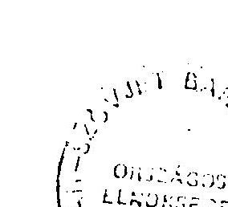

1990. 1111.31-i állapot 12.

1.  |  |  |  |  |  |  |  |  |  |  |  |  |  |  |  |  |  |  |  |  |  |  |  |  |  |  |  |  |  |  |  |  |  |  |  |  |  |  |  |  |  |  |  |  |  |  |  |  |  |  |  |  |  |  |  |  |  |  |  |  |  |  |  |  |  |  |  |  |  |  |  |  |  |  |  |  |  |  |  |  |  |  |  |  |  |  |  |  |  |  |  |  |  |  |  |  |  |  |  |  |

---

MAGYAR-SZOVJET BARÁTI TÁRSASÁG ORSZÁGOS ELNÖKSÉGE
OBIHECTBO BEHTEPO-COBETCNOÏI JPPHEN
1405 BUDAPEST VII., GORKIJ FASOR 45. POSTAFIOK: 13

Budapest, 19891.dec.17.
Iktatószám: 110/109/1

# iYILATKOZAT 

Alulirott dr. Abel László /1125. Budapest, Varázs utca 6./ mint az NSS3? tithára nyilathozom arról, hogy az LXXIII. sz. törvényben foglalt elöirások szerint ismételten végrehajtott belső ellenőrzés tanusága szerint /szakértői ellenőrzésről készuilt irásos összeroglaló mellékletként ezen nyilatkozathoz mellérelve/ az 1988. évi állapot szerinti 50.000 Ft-on felüli áll.esszörök ellenörizhetösége a rendelkezésre álló nyilván-$\because \mathrm{zz}$-szok porzatlansága és aiányai miatt nem rekonstruálható.

- Jenti hiányosságok az idö mulásával nem sótolhatóak.

Isme:ecteim szerint, az NSS3T-ét a nyilvántartási mulasztásokon és munaköri szabálytalanságokon kivül anyagi kár nem érte.

Kérem a Tisztelt Állami Számvevőszéket nyilatkozatom és a szakértői jelentésben foglaltak elfogadására. Mindezekre tekintettel kérem szíveskedjenek az NSS3T elszámoltatását ebben a témakörben lezártnak tekinteni.

Budapest, 1991.december 17.
1 db melléklet

---

# MAGYAR-SZOVJET BARATI TÁRSASÁG ORSZAGOS ELNÖKSĖGE 

## 1406 BUDAPEST VII. GORKIJ FASOR 43. POSTAFIOK: 13

Budapest. 1911.december 17.
Iktatószám: 115/1991/CV

## NYILATKOZAT

Alulirott dr. Ábel László /1125. Budapest, Varázs utca 6./ mint az 15ZBT titkára nyilatkozom, hogy az LXXIII. sz. törvényben foglalt elöirások szerint ismételten végrehajtott pontositó pótlólagos ellenőrzésünk szerint megállapitoztuk, :ob: az MSZBT leltári eszközökkel a megyékben müködött Gorkij Iyelviskoláinál nem rendelkezett /a szükséges nyilatkozatok mellékelve/. Az MSZBT a vidéki nyelviskoláktól pénzt nem szedett be, ellenben müködésüket esetenként szerény összezekiel támogatta.

Kérem a Sisztelt Illami Számvevőszéket nyilatkozatom és a csatoit megeei nyelviskolai nyilatkozatokat elfogadni szivuskeajen. .incezekre tekintettel kérem az MSZBT elszámoltatását ebben a témakörben lezártnak tekinteni.

Budapest,1991.december 17.
1 db melléklet 7 lap.
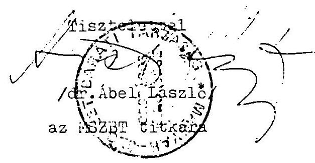

---

# LAGYAR-SZOVJET BARÁTI TÁRSASÁG 

ORSTAGOS ELIJCKSÉGE
1406. Budapest, Gorkij fasor 45.

Iktatúszám: 119/1991/05/k

## HYILATKOZAT

Alulirott dr.Ábel László /1125. budapest, Varázs utca 8./ mint az ISZBT titkára a következö nyilatkozatot teszem az Állami Számvevöszék elszámoltató ellenörzése kapcsán a táraságot terhelö adónátralék rendezése ügyében.

Az :SZBT elismerte az APEH Fövírozi Igazgatósága 1991. Jebruár 13-án kelt záradékkal lezárt adóellenörzés jegyzökönyvi megállapitásait meiyet osatolok jelen nyilatkozatomhoz.

Az adóhátralékot még nem fizettilk vissza/meg. a Nemzetek Húza Szövetséggel keressük azokat a lehetöségeket ulely lehetüvé tenné az adónátralékunk megtéritését. abban bizunk, hogy a társaságunk a VÁL2. Lft.-töl visszaküvetelt pánzböl rendezni tudja az APEH felé fennálló kötelezettségeit.

Kérem a Tisztelt Állami Számvevösziket a fentiekre tekintettel tekintsék lezártnak az ellenörzésük során az általunk júhiszemüen megnem fizetett adók ügyét.
Budapest, 1991.december 17.
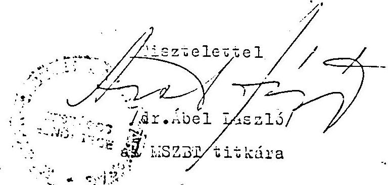

---

ADO. ES PÊNZÜGYI ELLENÔRZÉSI HIVATAL
FÔVAROSI IGAZGATOSAGA
BUDAPEST. IX., HÂMÂN K.U. 3-5. POSTAFIÔK 39. 1453

Költségvetési és Társadalmi Szervek Ellenôrzési Osztály

Iktatószám: 19002598/9101
Adószám: 19002598-2-01
Elôadó: Dr. Danyi Katalin/FM
Telefon: 1130-296
Tárgy: utólagos adómegál
lapítás:
5/22

MAGYAR SZOVJET BARÁTI TÁRSASÁG

BUDAPEST

# H A T Á R D Z A T 

Az 1991. febrưâr 13-án`kelt záradékkal lezárt adóellenôrzés jegyzôkònyvi megállapításai alapján a Magyar Szovjet Baráti Társaságnak az Adó- és Pénzügyi Ellenôrzési Hivatal Adóelszámolási Irodájánál vezetett folyószámláin, a szervezet adóbevallásához képest az alábbi adókülönbözetek elôírását
r e m d e l e m e l :

Adóév, adónem Adókülönbözet Adókülönbüzetbôl
terhére javára adóhiánynak minôsül
1988. általános
forgalmi adó $1.080 .000 \quad-\quad 357.000$
1989. általános
forgalmi adó 61.000 - 61.000
1989. személyi jö-
vedelemadó 55.000
1989. vállakozási
nyereségadó $1.426 .000 \quad-\quad 1.426 .000$

---

A megallapított adókülönbözetbôl, a vállalkozási adóhiánynak minösülö adóhiány 1.426 .000 Ft összege után $50 \%$ bírságot, 713.000 Ft azaz Hetesszáztizenháromezer forintot, az általános forgalmi adókülönbözetek és személyi jövedelemadó különbözct együttes összege, 1.196 .000 Ft után pedig $30 \%$ bírságot, 359.000 Ft, azaz Háromszázötvenkilencezer forint bírságot is megallapitok. A birságok együttes összege: 1.072 .000 Ft , azaz Egymillióhetvenkétezer forint.

A szervezetnek a terhére megállapított adókülönbözetekbôl csak a személyi jövedelemadó különbözct összegét nem kell rendeznie, a tobbi adóhiánynak minösülö adókülönbözetet be kell fizetnie.

Fainivom a szervezetet, hogy a határozat jogeröre emelkedésétöl szómított 15 napon belül az adóhiánynak minösülö adókülönbözeteket is a kiszadott bírságotk összegeit az Adóelszámolási Iroda alábbi 225013ira fizesse be:
számla neve:
UIP
MHB

Általános forgalmiadó
$548-168640$
$232-90107-6864$
személyi jövedelemadó
$548-263352$
$232-90605-6359$
vállalkozási nyereségadó
$548-160150$
$232-90107-6015$
bírság, önellenőrzéssel
kapcsolatos és különbözetti pótlék
$548-163070$
$232-90107-6307$

---

A fizctési kötelezettség elmulasztása, vagy nem a lenti határidoben valo teljesitése esetén, az esedékesség napjaitól számított minden náptári nap után késedelmi pótlékot kell fizetni, melynek mértéke naponként a felszámítás idópontjában érvényes jegybanki alapkamat kétszeresének 365 -öd része:

Kötelezem továbbá a szervezetet, hogy

- az általános forgalmi adóra vonatkozóan az adókötelezettség és a visszaigénylési jogosultség megállapítására alkalmas analitikát fektessen fel és vezessen;
- késztse el-a jogszábályi elóirásoknak megfelelủ számlarendjét.

E határozat ellen a kézhezvételtól számított 15 napon belül az -dó- is Fénzügyi Ellenőrzési Hivatal Költségyetési is Társadalmi Szurvezotok Ellenőrzési Osztúlyához címzett, de az elsőfokú adóazáságnál benyújtandó, illctékkötcles fellubbezusuel lehet élni. A fellebbezés illetéke a vitatott összef mincen mekezoett 10.000 Ft -ja után 50 Ft , de legalább 600 Ft .

# I N D O K B L Á S 

Az elsőfokú adóhatóság a szervezetnél az 1988. és 1989-es adóévek vonatkozásában adóellenőrzést tartott, melynek megúllapításait a szervezet részére átadott 1991. fcbruúr 13-1 záradékkal ellátott jegyzökönyv tartalmazza.

A szervezet a jegyzökönyvi megállapításokra 1991. II. 18-án tett észrevételében a megállapított tényeket elismerte, és a hiányos teljesítésre vonatkozóan elúadta, hogy azok juhiszemü jogértelmezésből eredtek. Hangsúlyozták, hogy anyagi helyzetük

---

miatt fizetési kötelezettségüket nem tudják teljesíteni, azok elengedését kérték.

Mél tányossági kérelmüket jelen határozatom meghozatala során csak a bírság nagyságának megállapításakor vehettem figyelembe, azt megismételhetik a határozat kézhezvétcle után.

Határozatomat a jegyzőkönyv megállapításai és a szervezet észrevételében foglaltak alapján hoztam, a következök szerint:

A revízió megállapította, hogy a szervezet által 1988-ban viszszaigényelt 721.000 Ft-böl csak 364.000 Ft lett volna visszaigünveiheto. A szervezet 357.000 Ft elözetesen felszámított általános forgalmi adót jogosulatlanul igényelt vissza, ezért terhére 1.080 .000 Ft adókülönbözetet írtam elö, melyhöl 37.000 Ft adóhiánynak minősül. Az adóhiány összegét a szervezetnek be kell fizetnie.

1739-ben a szervezet bérbeadási tevékenységet is vónzett, de a zevétele után nem vallotta be és nem is fizette meg az általános forgalmi adót 305.000 Ft adóalapot figyelembe véve a szervezet terhére adóhiánynak minősülö; adókülönbözetet írtam elö azzal, hogy a 61.000 Ft általános forgalmi adót be kell fizetnie.

A szervezet 1989-ben a személyi jövedelemadó vonatkozásában bevallási kötelezettségét csak részben teljesítetṭe, ezért 55.000 Ftt adókülönbözetet állapítottam meg a terhére, melyet befizetnie nem kell.

A revízió megállapította, hogy a szervezct 1989-ben vállalkozási tevékenységet ís végzett, de tevékenységének eredményéröl beszámolást nem készített. A vizsgálat adatai szerint a szervezet

---

terhére 1.426 .000 Ft adóhiánynak minúsülũ adókülönbözetet határoztam meg, melynck befizetéséról a szervozetnek gondoskodnia kell.

A jegyzökönyvben foglalt hiányosságuk alapján a szervezetet a nyilvántartási és a számviteli rend helyreállitására is köteleztem.
1991. január 1-én lépett hatályba az adózás rendjéról szóló 1990. évi XCI. törvény, melynek rendelkezéseit a folyamatban levô ügyekben is alkalmazni kell. A törvény a korábbi adóhiány és adótöbblet fogalmát megváltoztatta, most adókülönbözetnek minúsül az adó*ételezettséa és az adóbevallás, küzötti eltérés, mefvisöl adóhiánv csak az esedékesség idópontjáin pénzünvileg rengezett vesz.
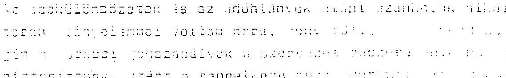

Határozatom az általános forgalmi utorol azolio. auneitott 1987. évi V. törvény 25.§ (1) bekezdésén, a módosított . 8". ovi NL törvény 66.§ (2) bekezdésén, a magánszemelyen jivouletmadójáról szóló, módosított 1987. évi VI. törvèny 24.5 .1. és (2) bekezdésein, a módosított 1989. évi XLV. törvèny 66.3 (4) bekezdésén, a 68.§ (1) és (2) bekezdésein, a vállalkozási nvéreségadóról szóló, módosított 1989. évi XLIV. törvény 27. (1) és (2) bekezdésein, a 30.§-án, valamint az adóigazgatás rendjéról szóló 1990. évi XCI. törvény 27.§ (1) bekezdésén, a 72.§-án, a 79.§ (1), (2) és (5) bekezdésein, a 99.§ (2) bekezdésén, és a 101.§ (1) bekezdésén alapul.

---

Az illetćkekröl szóló 1990. évi XCIII. törvény 5.§ (1) bekezdésének d., pontja alapján a szervezet teljes személyes illetékmentességben részesüine, de vállalkozási nyereségadó fizetési kötelezettsége volt, ezért az 5.§ (2) bekezdése alapján, a 21.§ (2) bekezdés szerinti illetéket köteles fizetni fellebbezése esetén.

Budapest, 1991. III. 20.
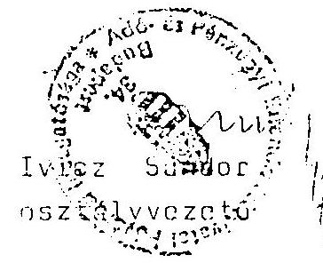

Tresil áresüinek:

- - imsest
- :dóciszámolási iroca
- Irsztár

---

# MAGYAR-SZOVIEI BARATI TÁRSASÁG 

ORSZAGOS ELÍOKSEGE
LEHIPATSHOE ПPABJEHHE
OBUECTBA GEHTEPO-COBETCKOH APYHES
1406 BUDAPLST VIL. GORKIJ LASOR 45.
FOSTAFIOK: 13

Budapest. 1991.febr. 19.
IKT.sz. 1991/05/1K/36
Telefon: 1424-107 Alpá

APEH Fövárosi Igazgatósága
Költségvetési és Társadalmi
Szervezetek Ellenőrzési
Osztálya
3p.IX. Haller u.3-5

Tisztelt Osztályvezető Url
Az Osztály a Magyar -Szovjet Baráti Társsaságnál 1991 január 29 é február 13 közötti helyszini ellenőrzését követően jegyzőkönyvbe rögzítette - az 1988 és 1989 évekre vonatkozó- megállapításait. Ennek lényege, hogy a Társaság

- nem szi. osza ki számlarendjét a 16/1989/II.26/MT rendelet
- nem szzt eleget nyereségadó kötelezettségeinek,
- az az azerze való bejelentkezését késedelmesen, -szztési kötelezettségét nem az elöírásoknak meg-
szelően teljesítette, valamint a
- a. Szüszemelyek jövedelemadójával kapcsolatban adóhátraléka val
- mezzetsi a számviteli és bizonylati rend több vonatkozásban
- nem szel . . . . . az elöírásoknak.

Iknsze: eredményeként 1.844 e Ft adóhiány megállapítására
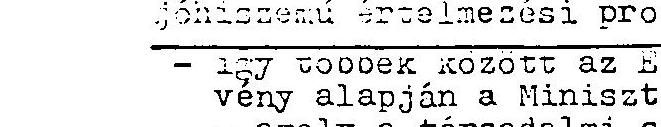

- 15y többek között az egyesulési jogról szóló 1989 évi II. tö: vény alapján a Minisztertanács 16/1989/II:26/IT rendeletét - amely a társadalmi szervezetek gazdálkodási tevékenységét szabályozta úgy értelmeztük, hogy pl. a rejtvényújság kiadása az MSZBT propaganda feladatai körébe tartozik, tehát alap. tevékenység, igy nem tartozik a vállalkozás körébe. Ugyanaz értelmeztük a bevételek növelésére, amikor a felszabadult helyiségeket bérletbe adtuk,
- adódott ezen - ma már tudjuk helytelen-értelmezés azért mert a költségvetési támogatások mértéke rendkívül lecsökkent, ig. szinte az innen származó bevétel jelentette csaknem egyetlen forrását a Társaság müködési költségeének fedezetére,
- további indokunk, hogy ezen cselekvésünk jóniszemüen történt, az elért bevételeket kizárólag az alapfeladatok jobb szinvonalú ellátására forditottuk.

Ezen tulmenően tájékoztatásul közöljük, hogy az MSZBT Szám: izs ló Bizottsága külső szakértőt kért fel a Társaság gazdálkociáni tevékenysége̋nek vizsgálatára. A szakértő munkáját megkezite, azonban ezt felfüggesztettük az Állami Számvevőszék ellenőrzés nek időszakára, igy munkáját csak 1991. január 21-én fejezte be.

---

Jelentésében javasolta, hogy önrevizio keretében rendezzük a VARYA és AFA területén feltárt kötelezettségeinket. Ennek végrehajtásá - a számszerüségek kimunkálását- előkészítettük, de ekkor már az Osztály munkatársa az MSZBT-nél helyszini vizsgálatát megkezdte.
A Társaság az elmult évben ujjáalakult és mozgalmi életét állami támogatás nélkül önerőből szervezi .
A kimutatott hátralékot nincs miből visszafizetnünk.
Igyekszünk a felsorolt hiányosságokat további munkánk során elkerülni, felhasználva a szerzett tapasztalatokat gazdálkodási rendünket a törvényes előirásoknak megfelelően kialakítani.

Köszönettel vettük az ellenőrzésük során tanusított segitőkész támogatásukat és kérjük,hogy alapos indokaink valamint objektiv helyzetünk figyelembevételével az adóhiányt és késedelmipotlékot teljes mértékben elengedni szíveskedjenek.

Budzrest, 1991. február 18.
az :SZBT Úgyvezető Elnöksége
megoizásából:
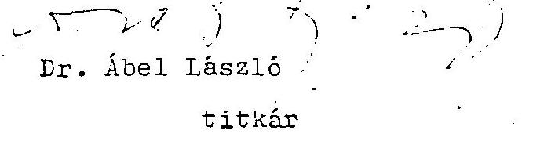

---

# 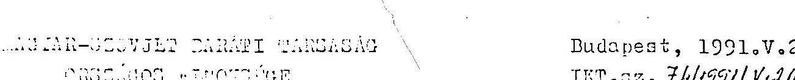 

Budapest, 1991.V.20. IKT.oz. 74/1691/V.20/ ${ }^{\text {T }}$
Tel.: 142-4107.A1pár

1406. Budupest, VII.Gorkij f. 45.

A:EH Fövizeci Igazgatósága
Kültségvetési és Társadalmi Szervezetek
Ellenörzési Csatálya Tezetőjének
IVICE SANUOR Ur!

## HORASZS

IX. Hámán K. u. 3-5.

Tisztelt IVICE Sánuor Ur!
Az adó és zénzügyi Ellenörzési Hivatal a Magyar-Szovjet Baráti
Gírsaságnál az év elején végzett adóellenörzése során megállapított sányoket tartalmazó 1991, május 8-án kézhez kapott 1300 1352/9101./1991.III.20/ iktatószámu határozatában baráti Tár-

---

- uyan est órtelmestik a helyizégek bérletbe adásival szerzett póncünszegel felhacsn'lisával kapcsolatban,
- adódott esen - ma már tudjuk, hogy helytelen - órtelmezés ezért, mert a kültségvetósi támogatások mértéke az idöben rendkivill lecsükkent, illetve megcsünt, igy szinte csak az innen szánnase bevétel jelentette csaknem egyetlen forrásit a baráti Társaság de mindenek előtt a szótkház müködési-fenn- tartsai töltségeinek fedezetére,
- tovibbi indokunk, hogy ezen cselekvésünk jóbiszemüen történt, az elért bevételeket is alapfeledatok ellátására forditottuk, otthont adtunk és megteremtettük a "HELZEITER HAZA" Hennetek tüzötti Baráti Társaságok Szüvetsége megalakulásának anyagi-technikai-pénzhgri feltételeit,
- alcsnerve hilsintat kérjük vegyék figyelembe rzt, hogy asen mulesztásaink eleovetően órtelmezési problémákból adódtak és muleszt jóbisszmüen tettük, a pénzüsszegek felhassználása Baráti Társszáqun'k és a tüsel harmine baráti társaságot - tüzsük mint alapitó tagot az LSEET is - magába foglaló "HELZETER HAZA" Hennetek tüzötti Baráti TársszágoK Szüvetsége eóttialtól is vészett munkájásól adódoan - melyet a Magyar urszág- "tölés valrmint a magyar normány a tüselaultban nanyra irtó- "elt - nem egyéni, honem a magyar nép és a vilég szímen urszá- "s népei tüzötti baráti kapcsolatok ápolását szolgáló tóren-dalmi-küzüszégi célok érdekében kerültek felhassználásra,
- tájékoztatásul említjük meg, Baráti Társszáqunk 1990-ben átszerveséare került és ujjalakult, vagyonával az 1990 évi LXXIII. törvény 6.8 -ában elöirtatnak megfelelően elszámolt. Lüködése szerény keretek közé szugorodott. Az addig keselésében lévő ingatlant, a szótkházat mint bárleményt teljes berendezésével együtt és minden vagyontárgyát a "HELZETER HAZA" Henzetek tüzötti Baráti TársszágoK Szüvetsége részére átadts,
- Baráti Társszáquink olyan helynetben van, hogy a megállapitott adóhiányt és bírsárot nincs miból kifizetnie, öszintén sajnáljuk, hogy a fellebbesési illeték üszsegének elengedését nem tették lehetővé szimunkra.

---

Az elmondottak alapján az ügy összes körülményeire tekintettel kérjük, hogy a megállapított adóhiány és bírség megfizetésétől Baráti Tárgaságunkat mentesíteni szíveskedjék, miután e kötelezettségnek vagyon és pénz hiányában nem tudunk eleget tenni.

A határozatban leírt észrevételeket, intelmeket ós kötelezõ jellegü elõirásokat a gazdálkodási-pénzügyi munkánkban következetesen végrehajtottuk és megvalósítjuk a jövőben is.

Tisztelt IVICZ Sándor Osztályvezető Ur!
Bizva megértésében, várjuk Baráti Társaságunk számára és a világ nézei közötti baráti kapcsolatok ápolása nemes ügyét szolgáló méltányos döntését. Kérésünk táljesitéséze számítva vórjuk szíves értesitését ügyünkben.

Budapest, 1991.májuz 20-án.
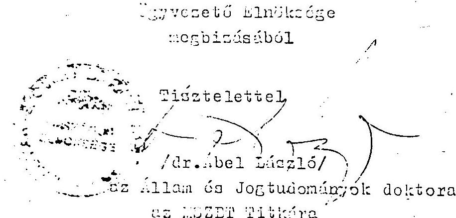

---

# MAGYAR-SZOVJET BARÁTI TÁRSASÁG ORSZÁGOS ELNÖKSÉGE 

OBIHECTBO BEHPEPO-COBETCIOII JPY:KBLI
1486 BUDAPEST VII.. GORKIJ FASOR 43.
POSTAFIOK: 13

Budapest, 1991. december 17
Iktatószám: 110/1991c.

## KYILATKOZAT

Alulirott dr. Abel László /1125. Budapest, Varázs utca 6./ mint az MSZ3T titliára a következő nyilatkozatot teszem az Állami Számvevôszék elszámoltató ellenôrzése kapcsán a társaság VÁLTÓ kft.-vel szembeni pénzbeli követelése rendezése ügyében.
iz :SZ3T egyetértve a Számvevôjszék ellenôrzési j̧egyzökönyvéDen :ogiaitaikal a VÁLTÓ kft.- vel szemben a tulfizetés visszaHövetelése érdekében az illetékes Fővárosi Biróságnál polgári zert ináit.

A zeres aljárással az ügyben tényfeltáró vizsgálatot folytató LezseisSob ügészség Polgári Jogi Főosztálya vezetője dr.Virág Iária ezyetért és azt támogatja. Fenti szándékunkról az ügyben eljáró Polgári Jogi Főosztályt írásban értesítettem.

Kérem a Tisztelt Állami Számvevöszéket szíveskedjenek elfogadni érdemi döntésként lépésünket. A per fejleményeiről és kimeneteléről társaságunk folyamatosan tájékoztatni fogja ínöket. Kérem ezzel az MSZ3T ellenőrzése ügyében, az elszámoltatás végleges lerendezése érdekében az MSZ3T=VÁLTÓ kft. ügyet lezártnak tekinteni.
Budapest. 1991.december 17 .
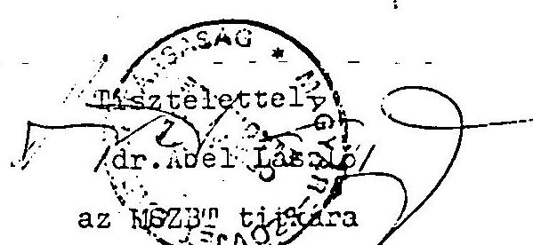

---

FÖVÁROSI FÔÜGYESZSÉG
P.20.120/1991/1-III.

Magyar Szovjet Baráti Társaság Gazdasági Vezetöjének
B u d a o e s t
Gorkij fasor 45.
1071

$$
\begin{aligned}
& 325-930 \\
& \text { s'c. } 315-415 \\
& \text { Gorkij. e } 416-452
\end{aligned}
$$

$$
1.325-930
$$

Tényfeltáró vizsgálat keretében az 1989. évi XLVI.tv.25.9. /3/bekezdése alapján folytatott adatkiegészités keretében kérem, szíveskedjék felkeresni 1991. fehruár 5-én, kedden 9 órakor a Fővárosi Föügyészségl Polgári Jogi Usztalya 8p.v., Markó u.27.III.em. 58.sz. szoba hivatalos helyiségeben.
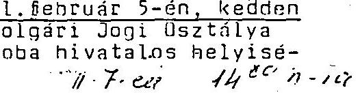

Szíveskedjék megával hozni a Budapest, VII.kerületiGorkij fasosr 45.szám alatti, az MSZBT használatában lévô székház egyes helyiségeinek a VÁLTO KFT és ERGONOSOFT KFT részére történt használati szerzödésre vonatkozó összes iratot, közöttük az elhelyező hatósáq hozzájárulását tartalmazó határozatokat is, valamint az 1990.október 4-én kelt "Megállapodás" az MSZBT és a VÁLTO Kft, továbbá az ERGONOSOFT Kft közötti eqyezséq tárgyában kötött szerződés 1./ 2./ 3./pontjában foqlalt tételek dokumentációit, szmláit és ott hivatkozott bizonylatait, valamint e szerzödés 3./ oldal második bekezdéséen a VÁÜJÜ Kft által vállalt 1.500.614,-R átutalásáról szóló banki kivonatot.

Amennyiben a Társaság gazdasági vezetője a megjelenésben skadályozott, a jelzett témában nyilatkozattételre jancsult és ténybeli ismeretekkel rendelkező munkatársa 7egjelenéséről szíveskedjék gononskooni.

Budapest, 1991. január 30.
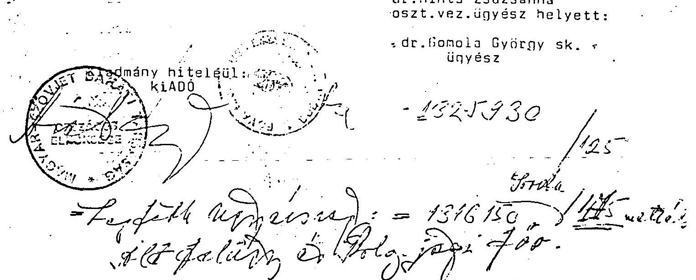

---

# Megállapodás 

mely létrejött egyrészrōl a Magyar-Szovjet Baráti Társaság /tuvábhiakban: MSZJI/, másrészrōl a "Nemzetek Háza", a Nemzetek Közötti Baráti Társaságnk Szövetsége /továbbiakban: Szövetség/ között, az MSZGT Országos Elnöksége 1990. október 12-i határozata alapján, alulírott napon az alábbi feltételekkel:
1./ Az MSZBT, mint a Szövetség alapító tagszervezete, továbbra is részt vállal a Szövetség pénzügyi, müködési feltételeirrek kialakításában.
2./ A felek között 1990. július 18-án kötött megállapodás szerint /1.sz. melléklet/ az MSZBT, mint a Szövetség alapító tagszervezete, az általa jogszerũen használt Budapest, VII., kur. Gorkij fasor 45.sz. alatti bérelt ingatlan következō jogszerũen használt helyiségeit:

## I.emelet

4 db tanácskozó terem - I. em. 15.
B db irodahelyiség - I. em. 17,19,20,21,22,23,24,25.
1 db konyha - I. em. 18.
2 db WC
folyosó
belsō elötér I.

## II.emelet

6 db irodahelyiség - II.em. $25,26,27,28,29,30,31,32,33$, $34,35,36,37,38,39,40$.
1 db fürdōszoba
II.
1 db konyha
II.
2 db elötér
1 db. belsō folyosó
összesen kb. 950 m hasznos alapterületet a Szüvetség, illetōleg annak tagszervezetei számára ingyenesen rendelkezésre bocsátja annak érdekében, hogy a müködésükhöz szükséges feltételek megteremtödjenek.

---

3./ A 2. pontban körülírt megállapodás alapján a Szüvetsén vállalja, hogy a helyiségeket rendeltetésszerűen használja és gondoskodik a bérleti szerzōdés alapján és a müködésre vonatkozóan az MSZBT-t terhelō kötelezettségek teljesítésérōl 1991. január 1-töl kezdödöen.
4./ Az MSZBT a Rejtvényújság 1990. évi bevételéből a Szövetség számlájára - a Szövetség müködésének megkezdéséhez - a Postabank Rt. 021-00285.sz. számlájára átutalt 1.793.985.- Ft-ot.
5./ Az MSZBT ingyenesen a Szövetség használatába adja az üsszes ál-1óeszközét a következō szerint:

| Megnevezés | db. | Nyilvántartási ár |
| :--: | :--: | :--: |
| Rank Xerox 1025 E másológép | 1 | 337.000 . |
| Lumoprint Economy másológép | 1 | 294.000 . |
| MEI) 5xB vetitōgép /255.000.-Ft/ | 2 | 510.000 . |
| F11T 16 CO vetitōgép | 1 | 72.700 . |
| Hangosító berendezés | 1 | 85.600 . |
| C64 számitógép + tartozékok | 1 | 270.000 . |
| SABA videomagnetofon /4781636/ | 1 | 68.000 . |
| ITT szines TV | 1 | 51.900 . |
| LADA 2107-S személygépkocsi | 1 | 240.000 . |

Üsszesen:
$10 \quad 1.929 .200 .-$ Ft.
azaz Egymilliókilencszázhuszonkilencezerkettōszáz forint nyilvántartott értékben.
6./ Az MSZBT könyvjóváírással a Szövetség tulajdonába adja a 2.sz. mellókletben szereplő alábbi eszközöket:
1./ Bútorok
663.371 .-
2./ Csillárok
181.388 . -
3./ Boylerek
12.040 . -
4./ Függönyök
93.106 . -
5./ Szōnyegek
162.420 . -

6./ Gépek
6.803.864.- Ft.

Üsszesen:
1.803.864.- Ft.
azaz Egymilliónyolcszázháromezernyolcszázhatvannógy forint nyilvántartott értékben.

---

7./ Az MSZBT az 1990. LXXIII. törvény értelmében hásználati joggal rendelkezik a /Balatonkenese, Csittényhegyi ut 43-45. sz. alatti 10460 tulajdoni lapszámú, $525 \mathrm{~m}^{2}$ területü hétvégi ház és udvar, nyilvántartási értók: $2.880 .000 .-$ Ft./ ingatlanra.

- Amennyiben az ingatlan forgalomképessé válik, úgy az MSZBT á használati jog gyakorlását a Szövetségnck adja át.
8./ Az MSZBT közös felhasználásra adja át a Szïvetségnek 6.UUO.UOU.-_Ft., azaz Ilatmillió forint értékũ ċrtćkpapírjait, amely alapösszeg csak közös döntéssel használható fel, külön-külön egyik fél sem csökkentheti.
9./ A 8. pontban meghatározott alapösszeg évi hozadékának 50 \%-át a Szövetség elfogadja az MSZBT éves szüvetségi tagdijának. Az éves tagdij terhére a Szövetség az MSZBTre háruló munkáltatói jog gyakorlásából adódó korcongedményes nyugdijak 6 fô - meghatározott ideig, 1994-ig költségeit visszatéríti.
10./ A 8. pontban meghatározott alapösszeg éves hozadéka továbbí $50 \%$-a az MSZBT-t illeti.
11./ Felek megállapodnak abban, hogy a 9. pontban meghatáruzott tagdij ellenében az MSZBT-t a tagsági viszony fennállásáig megilleti:

---

- a 2. pontban körülírt ingatlan I.emelet 25 .számú kb. $25 \mathrm{~m}^{2}$ alapterületũ helyiségének ingyenes hasinálata,
- a 1424-107 számú telefon fövonal és a 1426-950 szãmú telefonvonal egy mellékállomásának térítésmentes használata,
- a papir és irodaszer-ellátás, sokszorosítás éves terv alapján meghatározott, szükséglet szerinti igénybevétele térítésmentesen.

13./ Felek megállapodnak abban, hogy ezen megállapodást küzjegyzōi letétbe helyezik.
14./ Felck ezen megállapodás mellékleteként csatolják a következũ iratckat:

- az 1990. július 18-án az MSZBT és a Szövetség között kelt megállapodás másolatát, e tárgyban a Fōvárosi Tanács Kerületi Hivatalához címzett levél másolatát,
- az 1990. november 30-i keltezésũ leltárösszesítőt az átadott nyilvántartott eszközök részletezésérōl.

A megállapodás 1991. január 1-töl lép hatályba.

Budapest, 1990. december 18.

Magyar-Szovjet Baráti Társaság
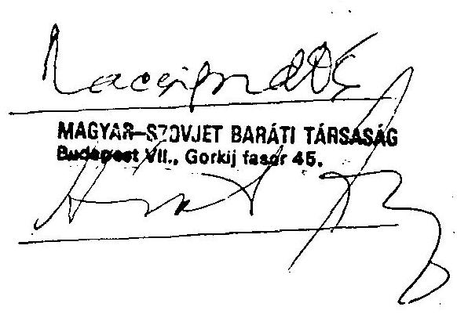
"Nemzetek Hlaza"
Nemzetck Közüthti Baráti Társaságok
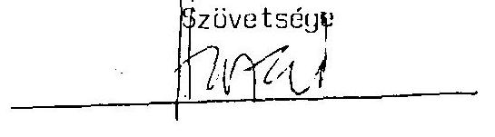

---

# 21lami ふ̧ámbrbösé́k 

6. sz. Függelék
a V-150-61/1991/91. sz. jelentéshez

## JELENTÉS

a Magyar Honvédelmi Szövetség pótvagyonelszámolása hitelességének ellenôrzésérôl az 1991. évi LI. törvénnyel módosított 1990. évi LXXIII. törvény alapján

---

Az ellenőrzést vezette:

Hudik Zoltán fötanácsos

Az ellenőrzést végezték:

Kovácsné Soós Piroska tanácsos
Számèly Kornèł tanácsos
Gömöri József számvevö
Szilas István számvevö

---

# ÁLLAMI SZÁMVEVÖSZÉK 

$\mathrm{V}-148 / 14 / 1991-92$.
Témaszám: 100

## J E L E N T É S

a Magyar Honvédelmi Szövetség pót vagyone Iszámolása hitelességének ellenőrzéséröl
az 1991. évi LI. törvénnyel módositott
1990. évi LXXIII. törvény alapján

Az elmúlt rendszerhez kötődő egyes társadalmi szervezetek vagyone Iszámoltatásáról szóló 1990. évi LXXIII. törvény 1991. évi LI. törvénnyel módositott 6. §-ában foglaltak szerint az Állami Számvevőszék a konkrét igények meghatározásával felhívta a volt Magyar Honvédelmi Szövetség (továbbiakban: MHSZ) vagyone Iszámolásában illetékes Kincstári Vagyonkezelő Szervezetet a hiánypótlásra.

A hiánypótlás címén szolgáltatott dokumentumokat az Állami Számvevőszék megvizsgálta, ezek alapján a vagyone Iszámolás hitelességét továbbra sem találta elfogadhatónak. Ezzel a Kincstári Vagyonkezelő Szervezet - mint a kormányszintü döntés következtében felelős elszámoló - szintén egyetértett. Egyidejüleg azonban írásos nyilatkozatot tett arról, hogy a legnagyobb eröfeszítések ellenére sem tud több, vagy más - az MHSZ vagyone Iszámolását, a hitelesíthetőséget elősegítő - dokumentációt az Állami Számvevőszék rendelkezésére bocsátani.

A vagyone 1 számoltatásról szóló módositott törvény értelmében az elszámolás nem pótolható adathiény esetén is elfogadottnak tekintendő. Ilyen alapon és az adatpótlást egyértelműen kizáró elszámolói nyilatkozatra figyelemmel (a fennálló hiányosságok ellenére) az MHSZ - a PM Zárolt Állami Vagyont Kezelő és Hasznosító Intézménye, illetve a jogutód Kincstári Vagyonkezelő Szervezet gondozásában összeállitott - vagyone1számolása
e 1 f o g a d o t t n a k
tekintendő.

---

Az Állami Számvevőszék az adathiainy pótolhatóságával kapcsolatban a törvény szerinti vagyonelszámolást meghatározó módon akadályozó tényezőként mérlegelte az MHSZ (félkatonai jellege miatt) más társadalmi szervektől eltérő elszámolási rendjét, továbbá a szervezet 1990. évi általános jogutód nélküli megszüntetéséről, a vagyonleltár felvételéről, a társadalmi szervezetté szerveződésről, valamint a vagyonelszámolásról szóló kormányzati intézkedések és a törvényi szabályozás összhangjának hiányát, ezek következményeként a végrehajtás során felmerült elszámolási nehézségeket.

# 1. HITELESÍ TÉSI FELADAT ÉS VÉGREHAJTÁSA 

Az MHSZ-t az elmúlt .rendszerhez kötődő egyes társadalmi szervezetek között az 1990. évi LXXIII. törvény vagyone1szamolásra kötelezte 1990. október 31-i határidővel.

Az elszámolási kötelezettség - a törvény 4. §-a, illetve a mellékleteiben meghatározott módon - a következő vagyoncsoportokra terjedt ki:
a./ ingatlanok - értékhatár nélkü1,
b./ gépek, berendezések, felszerelések, járművek, jóléti állóeszközök, űzemkörön kívüli állóeszközök - ha beszerzési értékük az 50.000 Ft-ot meghaladta,
c. / védett műalkotások - értékhatár nélkü1,
d./ Az elszámoló által alapított, vagy a részvételével működő gazdálkodó szervezetek /Ptk. 685. §. c) pont/ és alapitványok,
e./ értékpapírok (értékhatár nélkü1),
f./ pénz- és bankszámlák.

Az a), b), c) és d) pontokban felsorolt vagyontárgyakra vonatkozóan a törvény hatálybalépésétől - 1990. szeptember 18-tól - az Országgyülés további intézkedéséig elidegenitési és terhelési tilalmat rendelt el.

---

Az MHSZ-t a Minisztertanács a 1022/1990.(II.14.) határozatában 1990. október 1-jével egyetemes jogutód nélkül megszüntette, ezért a törvényben elöirt kötelezettségének mint elszámoló - nem tudott eleget tenni.

Az MHSZ-t megszüntető MT határozat értelmében az MHSZ szervezetei - az egyesülési jogról szóló törvény rendelkezései alapján - önkéntes alapon társadalmi szervezetekké alakulhattak, és a kezelésükben lévő állami tulajdont tovább használhatták. Az MHSZ ügyvezető főtitká a az MHSZ szervezetekböl átalakult és önállóvá vált utódszervezetek tulajdonába adta az általuk végzett tevékenységet közvetlenül szolgáló ingó-, és az MHSZ tulajdont képező ingatlan vagyont. Az állami tulajdonban lévö ingatlanok az 1990. szeptember 18-án hatálybalépő 1990. évi LXX. törvény szerint a Kincstári Vagyonkezelő Szervezet kezelésébe kerültek.

A Kormány 1990. október 4-én kelt 3388/1990. számú (titkos) határozatában a Pénzügyminisztérium Zárolt Állami Vagyont Kezelő és Hasznosító Intézményét (jelenlegi jogutódja a Kincstári Vagyonkezelő Szervezet) bizta meg - 1990. november 15-i határidővel - az elszámolással. Az elszámolást a Honvédelmi Minisztérium (a továbbiakban: HM) által rendelkezésre bocsátott vagyonfe1mérési, pénzügyi és az MHSZ ügyvezető főtitkári vagyonátadási okmányok alapján - az utódszervezetek bevonásával - kellett elvégezni.

Az Állami Számvevőszék (továbbiakban: ÁSZ) az átadott vagyonelszámolást a törvény 6. §-ában meghatározott kötelezettség alapján ellenörizte és annak hitelességét nem találta elfogadhatónak (a vizsgálati jelentés száma: V-4-26/1991., ke1te: 1991. január 11.).

A vagyonelszámolás nem volt teljeskörü, emellett alapvető hiányossága az volt, hogy nem a törvény mellékleteiben meghatározott időszakokat fogta át. Az MHSZ megszűnésével összefüggésben elrendelt 1990. május 31-i fordulónappal elkészített vagyonleltár adataira épült, emiatt a törvényben elöirt 1990. augusztus 31-i határnapig terjedő idöszak állományváltozásaít - néhány kivétellel - általában nem tartalmazta.

Az 1990. évi LXXIII. törvény módosításáról szóló 1991. évi LI. törvény 1. §-ában kapott felhatalmazás alapján 1991. november 21-én az ÁSZ a konkrét igények meghatározásával felkérte a Kincstári Vagyonkezelö Szervezetet (a továbbiakban:

---

KVSZ) - mint kijelölt elszámolót - a korábbl vagyonelszámolás hiányosságainak 60 napon belüli pótlására. A felhívás tartalmazta azt is, hogy a hiánypótláshoz a törvény modósitott 6. §-a (4) bekezdésében megjelölt szerzödések másolatát is csatolni szükséges.

A volt MHSZ vagyonának elszámolására kötelezett KVSZ 1991. december 12-én levélben tájékoztatta az ÁSZ-t a hiánypótlás érdekében tett intézkedéseiröl. Jelezte, hogy nem rendelkezik a korábbinál több, az MHSZ vagyonelszámolását igazoló okmányokkal, adatokkal, ezért a vagyonelszámolás hiánypótlása érdekében megkereste az utód szervezetek közül a Magyar Technikai Tömegsportklubok Szövetségének Országos Elnökségét, a Magyar Repülö Szövetséget, a Kulturált Közlekedésért Alapitványt, valamint az MHSZ átalakulásával kapcsolatos feladatok végrehajtásában résztvevő HM szerveket.

Az ÁSZ rendelkezésére bocsátott`korábbí adatok szerint 140 utódszervezet (tovább müködö klub, egyesület, szövetség) igényelt az MHSZ ingó- és ingatlan vagyonából. A társadalmi szervezetek, amelyek az MHSZ tulajdonában lévő vagyontárgyakat tulajdonukba kapták, ezeket a vagyontárgyakat illetően jogutódnak tekinthetők, emiatt kötelesek adatot szolgáltatni az elszámolási kötelezettség körében. Ebböl következóen az ellenörzés kifogásolta, hogy a KVSZ felhívása nem a teljes körre terjedt ki, csupán három utódszervezethez fordult adatigénnyel. A KVSZ magyarázata szerint azokat a szervezeteket kisérelték meg az elszámolásba bevonni, ame lyek jelentősebb vagyonhasználat szempontjából tekinthetők jogutódnak. Azt állitották, hogy az MHSZ jogutód szervezeteinek teljes köre az elszámolás keretében nem volt felderíthető a megszünés sajátos körülményei miatt. Erre az ingatlan vagyon elszámolására nagy valószínüséggel csak az 1990. évi LXX. törvénnyel érintett ingatlanok sorsát rendezö új törvény végrehajtása során látnak lehetöséget.

Az elszámolásban közremüködésre felhívott utódszervezetek közül a Magyar Technikai és Tömegsportklubok Szövetsége (1990. október 1-től müködik önálló szervezetként) és a Magyar Repülö Szövetség (1989. november 11-e óta müködik önálló szervezetként) jelezték, hogy az MHSZ-tól semmilyen okmányt nem vettek át, amelyek elősegíthetnek az ÁSZ által jelzett adatok pontosítását. A rendelkezésre álló információk szerint mindkét szervezet részesült az MHSZ vagyonból. Tekintettel arra, hogy a társadalmi szervezetek gazdálkodási

---

tevékenységéről szóló 16/1989.(II.26.) MT rendelet értelmében az alapítói, illetve átvett vagyont meg kell határozni és nyilván kell tartani, a pótelszámolásban való közremüködésük elutasítását az ellenőrzés nem találta elfogadhatónak. Ugyanakkor a KVSZ továbbra is azt hangsúlyozta, hogy az elszámolásban való közremüködésre általa felkért szevezetek elszámolási hiányosságait nem állt és nem áll módjában pótolni (KVSZ 1-330/1992. sz. levele). Az utódszervezetek közül a Kulturált Közlekedésért Alapítvány 1992. január 17-én küldte meg az elszámolás pontosításához szükséges anyagot, ezt 1992. február 20-án - az ÁSZ kérésének megfelelően - kiegészítették.

A HM az MHSZ vagyone Iszámolásával kapcsolatos kérdéskört ismételten megvizsgálta. Tapasztalatai alapján javaslatot tett a KVSZ-nek az elszámolás egyes kérdéseinek rendezésére. Felhívta a figyelmet, hogy az MHSZ vagyonfelosztási intézkedéseinek egy része, valamint a megszűnő szervezetek elszámolásának íratanyaga a KVSZ-nél rendelkezésre áll. A HM azokat már korábban átadta, illetve az elszámolást a HM megbizása alapján - a KVSZ (jogelődje) végezte és írattározta. Az általuk - még az 1991. évi LI. törvényben elöirt 60 napos határidőn (1992. január 21.) belül - összeállított anyagot a KVSZ értékelés és kiegészítés nélkül, csupán egy kisérőlevéllel 1992. február 13-án küldte meg az ÁSZ részére. A jelentős késést nem indokolta, viszont közölte, hogy nem tud sem több, sem más dokumentációt előteremteni. Az ÁSZ - a határidőn túli benyújtás ellenére - a HM által összeállított anyag felülvizsgálatát pótelszámolásként elvégezte.

Az ÁSZ ellenőrzése az előző hitelesítési eljárás során "nem hitelesíthető"-nek minősített mellékletekre, a benyújtott hiánypótlásra, az 1991. évi LI. törvénnyel módosított 6. §. (4) bekezdésében előirt 1990. augusztus 31-szeptember 18. közötti időszakban bekövetkezett vagyonmozgás okmányaira, valamint az adathiany pótolhatatlanságánál figyelembe vehető adatokra és egyéb jelentőséggel bíró dokumentumokra terjedt ki.

# II. MEGÁLLA PÍTÁSOK 

1./ Az 1990. évi LXXIII. törvény 4. §-ában meghatározott mellékletekkel összefüggésben - a pótlólagos adatszolgáltatások figyelembevételével az ellenőrzés a következőket állapította meg.

---

# 1. számú melléklethez: 

A hitelesítésre alkalmas kimutatásnak az ingatlan vagyonról 1949. január 1-tól 1988. december 31-ig terjedő időszakra vonatkozó adatokat kellett tartalmaznia. Külön ki kellett mutatni az 1988. december 31. előtt az MHSZ tulajdonából és kezeléséból bármilyen jogcímen kikerült ingatlanokat. Azt is fel kellett tüntetni, hogy a megszerzés időpontja elött az ingatlan kinek a tulajdonában, illetve birtokában állt.

Az előző elszámolás 361 ingatlanra terjedt ki, de nem volt tel jeskörü. Az átadott mellékletek hiányosak voltak, vagy eltértek a földhivatali nyilvántartásoktól. Több esetben hiányzott, illetőleg nem felelt meg a valóságnak az ingatlanok könyv szerinti értékadata.

A pótelszámolás - a törvény elöírásától eltérően - továbbra is az 1990. május 31-i fordulónappal készített vagyonfelmérés adataira épült. Az MHSZ használatából a jelzett dátum előtt kikerült ingatlanokra, illetve az ingatlanok megszerzése elötti tulajdonosaira vonatkozó adatokat pótlólag sem biztosították. A rendelkezésre bocsátott adatok is ellentmondóak (pl.:itt is szerepelnek az 1988. december 31. után MIISZ használatába került olyan ingatlanok, amelyeket a 6. számú mellékletnek kellene tartalmaznia).

A KVSZ az 1992. január 16-i levelében tájékoztatta az ÁSZ-t, hogy az MHSZ objektumainak korábbi nyilvántartását idöközben egyeztették a területileg illetékes földhivatalokkal. Az 1990. novemberi elszámolásban szereplő 361 ingatlannal szemben telekkönyvíleg 299 ingatlan volt az MHSZ kezelésében, 74 a tulajdonában (az ingatlanok egyéb adatait nem közölte, illetve ezeket alátámasztó dokumentumokat nem mellékelt).

A KVSZ kezelésébe átkerült ingatlanok közül néhányat szúrópróba szerüen megyékben, illetve Budapesten egyeztettünk a földhivatali nyilvántartásokkal. Elöfordult, hogy a megváltozott kezelői jogot a tulajdoni lapon nem vezették át.

P1.: a Budapest XIII., Dagály u. 11. sz. Általános Iskola és a XIII., Vizafogó u. ipartelep bejegyzett kezelője még 1992. februárjában is az MHSZ, Beloiannisz u. 16. volt.

---

A HM által felülvizsgált anyag még további 99 volt MHSZ használatú ingatlant jelez, amely a korábbi elszámolásból kimaradt (annak 1. sz. mellékletében 361, a 6. sz. mellékletben 10 ingatlanról adtak számot; a jelenlegi elszámolás szerint az MHSZ 371+99 ingatlannal rendelkezett). Az ÁSZ a volt MHSZ vagyonát képező olyan ingatlanok, objektumok (épületek, építmények) sorsáról, amelyek más szervezetek tulajdonában, vagy kezelésében lévő telken létesültek a KVSZ-től nem kapott anyagot. Ezek gyakran több millió Ft-os értékeket képviselnek.

Az ingatlanok feltüntetett könyv szerinti értéke nem felel meg a törvény előirásának, mert az 1990. május 31-i leltárnál (az MHSZ által elöirt számítási módon elöállitott) diktált értékeket tartalmazza. Több ingatlannál ez az érték a pótelszámolásból is hiányzik. A törvényben elöirt adatok hiánya, illetve a pótlólag beküldött anyag ellentmondásai tehát továbbra is fennállnak.

Figyelembevéve az MHSZ megszünését, a sajátos nyilvántartási rendet (az ingatlanokról értéknyilvántartást nem vezettek), valamint az erre utaló nyilatkozatokat - az MHSZ használatából 1949. január 1-1988. december 31. között kikerült ingatlanok adatai nem pótolhatók. Az előző tulajdonos adatai - a megfelelő tulajdoni lapok beszerzésével további jelentős ráfordítással elvileg pótolhatók. Az 1. számú mellékletben foglalt ingatlanok darab számának pontosítása, illetve a hiányzó könyv szerinti értékadat szintén pótolható, de ettől az adatszolgáltatás a megszünés és az elszámolás körülményeire tekintettel továbbra sem lehet alkalmas a törvényben elöirt hitelesítésre.

# 2. számú melléklethez: 

Az MHSZ által alapított, vagy részvételével működő vállalatokról az 1949. január 1-től az 1990. augusztus 31-ig terjedő időszakra kellett elszámolni. Az előző elszámolásnál beküldött "nemleges" kitöltésű táblázatot az ÁSZ "hiteles"-nek fogadta el. A jelenlegi ellenőrzés sem tárt fel ennek ellentmondó adatokat (az 1990. évi LXXIII. törvény 5. paragrafusában foglaltak szerint az elszámolás teljességéért és valódiságáért az elszámoló felelős).

---

# 3. számú melléklethez: 

A hitelesítésre alkalmas kimutatásnak 1949. január 1. és 1990. augusztus 31. között az MHSZ által létrehozott, vagy részvételével múködö gazdasági társaságokra, leányvállalatokra, alapítványokra vonatkozó adatokat kellett tartalmaznia.

Korábban a gépjármüvezetőképzö iskolákból létrehozott 20 egyszemélyes korlátolt felelősségü társaságra (Kft) vonatkozóan nyújtottak be adatszolgáltatást. Az elszámolás hiányos volt, illetve a létesítés idópontjára a vagyoni betét megnevezésére és összegére vonatkozóan nem a törvény elöirása szerinti valós adatokat tartalmazta.

A mellékletre vonatkozó hiánypótlást a 20 gépjármüvezetőképzö Kft-böl alakult Kulturált Közlekedésért Alapítvány küldte meg tekintettel arra, hogy más nem rendelkezett a Kft-k és az alapítvány teljeskörü, hiteles okmányaival.

Az átadott dokumentumok alapján megállapítható volt, hogy a Kft-ket az MHSZ 1989. november 29-én 33 millió Ft törzstökével alapította (bírósági bejegyzésük 1990. augusztus 23-ig megtörtént). Az MHSZ főtitkára 1990. január 15-én alaptöke emelést hajtott végre (a bírósági bejegyzés 1990. augusztus 30-ig megtörtént). Ennek következtében a Kft-k törzstökéje 1990. augusztus 31-én 178.680 ezer Ft volt, amelyböl 12.335 ezer Ft a pénzbeni, 165.345 ezer Ft az egyéb vagyoni betét. A Kft-k ingatlannal nem rendelkeztek.

A melléklet gazdasági társaságokra vonatkozó része a hitelesítés követelményeinek megfelel. A pótelszámolásban szereplő, illetve az utólag között adatok az elszámolás alapjául szolgáló okmányokkal (alapító okiratok, cégbírósági bejegyzések, egyéb bizonylatok) megegyeznek, ezért a 20 gépjármüvezetőképzö Kft-k vagyonelszámolását az ÁSZ "hiteles"-nek fogadta el.

Az MHSZ 1990. augusztus 16-án az általa alapított és kizárólagos tulajdonát képezö 20 Kft-böl létrehozta a Kulturált Közlekedésért Alapítványt. Az alapító határozat szerint a vagyon teljes egészében átment az Alapítvány tulajdonába (a Fövárosi Bíróság 1990. szeptember 6-án a 63.752/a. számú végzésével 489. sorszámon nyilvántartásba vette). Az Alapítvány elszámolása az 1990. augusztus 31-ig terjedő idöszakra "hiteles"-nek minösíthető.

---

# 4. számú melléklethez: 

A bevételek alakulásáról az elszámolási kötelezettségek 1979. december 31-töl 1990. augusztus 31-ig tartó idöszakra terjedtek ki.

A melléklet az előző hitelesítési eljárásnál akkor lett volna a törvényes elöírások szerint elfogadható, ha a tagdíjbevétel, az állami költségvetési támogatás, a közvetlen beruházási támogatás és a juttatás, az átvett pénzeszköz, a társadalombiztosítási fedezet forrásai, a társadalombiztosítási járulék változásának fedezete, illetve az egyéb bevételek (jogcímenkénti) évenkénti öszegét tartalmazza. A benyújtott elszámolás az elöirt követelményeket - a bérbruttósítás adatsorának kivételével - nem elégítette ki.

A KVSZ az elszámolás hiányosságainak pótlásához érdemben figyelembevehető adatokat nem közölt. Az előző elszámolás az 1990. augusztus 31-i záróadatok helyett 1990. szeptember 30-i (felszámoláskori) MHSZ összesített adatokat tartalmazta. Tekintettel arra, hogy a törvényben elöirt határidöre összesités nem készült, az adatok utólag sem pótolhatóak.

A melléklet tagdíjbevétel sorára vonatkozóan a KVSZ jelenleg sem tudott adatot közölni, mivel az MHSZ klubok müködésük során azt saját hatáskörben állapították meg és használták fel. Erről beszámolási kötelezettségük nem volt, ezért az erre vonatkozó adatigényt a KVSZ nem tudja pótolni.

A társadalombiztosítási kötelezettség kedvezményét a korábbi melléklet nem tartalmazta. A fegyveres testületek 10 \%-nál kevesebb járulékot fizettek, de a különbözetet kiszámítani és nyilvántartani nem kellett, emiatt az adathiany utólag nem pótolható.

A korábbi elszámolásban a járulékváltozás fedezetét utólag, számítással állapították meg. Az adat helyességét sem akkor, sem a pótelszámolásnál - megfelelő dokumentumok hiányában az elszámoló nem tudta igazolni.

A beruházási támogatás adatsorának pontositásához a HM a pótelszámolásban közölte a tárca épités-beruházási keretéböl az elszámolási időszakban az MHSZ részére átadott összegeket. Javasolta a KVSZ-nek az adatsor tartalmi helyességét az Állami Fejlesztési Intézettel ismételten leegyeztetni, mivel korábban eltérések mutatkoztak. Ilyen egyeztetésre nem került sor.

---

A bevételek alakulására vonatkozó elszámolásból a hiányzó adatok nem teljeskörüen, csak részben pótolhatók, így a 4. számú mellékletet a pótolhatatlanságról szóló KVSZ nyilatkozatot figyelembevéve lehet elfogadottnak tekinteni.

# 5. számú melléklethez: 

A kiadások alakulásáról az 1979. december 31-töl 1990. augusztus 31-i terjedő időszakra vonatkozóan kellett elszámolni. Az adatszolgáltatás a ráforditásokat nem teljeskörüen és nem a törvényi elöírásoknak megfelelö részletezettséggel tartalmazta.

Az elszámoló a mellékletre vonatkozóan hiánypótlást nem nyújtott be. A korábbi elszámolásnál jelezték, hogy a kiadások alakulásáról csak az MHSZ - költségvetési beszámolóinak megfelelö részletezettséggel (rovat és tétel bontásban) tud szamot adni. A megjelölt határidő helyett az MHSZ felszámolása idópontjának (1990. szeptember 30.) adatait tartalmazzák, az 1990. augusztus 31-re vonatkozóak utólag sem pótolhatók.

A kiadások alakulására vonatkozóan a szervezet megszünésére és a fegyveres testületek általánostól eltérő tartalmú beszámolási kötelezettségére tekintettel a pótolhatatlanságra utaló nyilatkozat elfogadható. Ennek figyelembevételével - az 1991. évi LI. törvény 1. §-ának (5) bekezdésében foglalt felhatalmazás alapján - 1990. szeptember 30-i határnapra vonatkozóan az elszámolás elfogadható.

## 6. számú melléklethez:

Az elszámolási kötelezettség az 1988. december 31. és 1990. augusztus 31-ig terjedő időszak ingatlanvagyon állományváltozását érintette. A táblázatnak tartalmaznia kellett ezen időszak alatt az MHSZ használatába kerülő ingatlanok teljes körét, illetve az 1988. december 31. után az MHSZ tulajdonából és kezeléséből bármilyen jogcímen kikerült ingatlanokat is. A korábbi elszámolás nem volt teljeskörü. Pontatlansága mellett a könyv szerinti értéket nem a valóságnak megfelelően tartalmazta.

---

A benyújtott pótelszámolás nem elégítette ki a hiánypótlás követelményeit. Továbbra sem közölték a volt MHSZ használatába kerülö ingatlanok teljes körét, valamint a használatából ezen időszak alatt kikerülő ingatlanokat. Ezen túlmenően a könyv szerinti értékeket sem a valóságnak megfelelően tartalmazta. A jelzett idöszakban bekövetkezett vagyonváltozás mennyiségi és értékadatai elvileg pótolhatóak, ezért az elszámolás a még hiányzó adatok pótlása mellett lenne elfogadható. Hasonlóan az 1. számú mellékletre vonatkozó megállapításokhoz a sajátosságok miatt azonban a törvényben elöírt hitelesítésre az adatszolgáltatás ez esetben sem lehet maradéktalanul alkalmas.

# 7. számú melléklethez: 

Az elszámolási kötelezettség az 50.000 Ft beszerzési értéket meghaladó ingatlanon kivül1 egyéb állóeszközök (gépek, berendezések, felszerelések, jármüvek, jóléti- és üzemkörön kivüli állóeszközök) állományváltozásáról az 1988. december 31. és 1990. augusztus 31. közötti időszakra terjedt ki. A benyújtott melléklet formáját és tartalmát tekintve nem felelt meg a törvényben elöirt követelményeknek. A vagyonértéket, illetve az állományváltozás adatait nem a meghatározottak szerint tartalmazta.

A KVSZ pótelszámolást nem nyújtott be arra való hivatkozással, hogy nem rendelkezett a korábbinál több információval. Az előző elszámolás az 1990. május 31-i vagyonleltár adataira épült, ezt követő állományváltozásokról továbbra sem tud adatot szolgáltatni.

Az előző elszámolásnál a KVSZ jegyzőkönyvben nyilatkozott arról, hogy "az adatszolgáltatás szerinti (1990. május 31-i) és a törvényben adatszolgáltatási kötelezettségként elöirt augusztus 31-i időszak között anyag és eszközmozgás nem történt". Ennek ellentmond az, hogy a HM által a pótelszámolásnál átadott intézkedés-jegyzék tanúsága szerint az MHSZ ügyvezető főtitkára - 1990. augusztus 7-i 15-2/1990. sz. intézkedésével - az MHSZ tulajdonában lévő ingóságokat és pénzeszközöket az átalakult MHSZ klubok végleges tulajdonába adta. A KVSZ a pótelszámolással sem az intézkedést, sem annak végrehajtására vonatkozó okmányokat nem küldött.

---

A fentieket figyelembevéve az ingatlanon kivül i egyéb állóeszköz elszámolás a hiányzó adatok pótlása mellett fogadható el hitelesnek, ugyanakkor a KVSZ - az 1992. március 30-i hivatalos nyilatkozata szerint - a vagyonelszámolásból hiányzó adatokat nem tudja biztosítani.

# 8. számú melléklethez: 

Az értékpapír- és pénzforgalom alakulásáról 1979. december 31-töl kezdődően évenként az év végi és 1990. szeptember 18-i állapotnak megfelelően kellett az elszámolást elkészíteni.

Az értékpapír forgalomra vonatkozó kimutatásnak minden jogszabályon alapuló értékpapírt, annak kibocsátóját, valamint vételi árfolyamon az értékét kellett tartalmazni. Az MHSZ gazdálkodó szervezeteinek 1989-töl volt lehetőségük értékpapír vásárlására. A KVSZ a korábbi elszámolásnál az erről szóló adatszolgáltatási kötelezettségét információ hiányra hivatkozással nem teljesítette. Az adathiány pótlására a jelenlegi elszámolásnál sem került sor.

A pénzforgalom alakulásáról átadott kimutatás a házipénztár, a pénzforgalmi betétkönyv és az elszámolási betétszámlaik adatait az előző elszámolás nem teljeskörűen tartalmazta. Hiányzott a bankszámlák, a számlavezető pénzintézetek megnevezése, illetve az általuk vezetett számlák egyenlegének közlése is.

Az elszámoló az MHSZ MNB-nél vezetett bankszámláira vonatkozó hiánypótlási kötelezettségét 1985-90. évekre vonatkozóan teljesítette. 1979. évig visszamenőlegesen nem tud adatot szolgáltatni, mivel a selejtezési előirások 5 év megőrzési idót írnak elő, és az alapokmányokat már megsemmisitették.

Az ÁSZ az MNB Testületi Szervek Főosztályától kért okmányok (hóvégi jelentések, egyenlegértesítők, bankszámla kivonatok) alapján végezte el a hitelesítést. Az MNB - mivel a belsö iratkezelési és irattározási rend 2 év megőrzési időt ír elő - csak 1988-90. évekre tudott adatot szolgáltatni.

A KVSZ az előző elszámolást az éves MHSZ beszámolók pénzmaradvány kimutatásaiból állította össze, amely 1985-86. és 1989. években megegyezik a pótelszámoláshoz csatolt MNB kimutatás adataival. A korábbi elszámolás 1987-88. évi adatsora eltért az MNB kimutatás egyenlegétől. Mivel a hiányzó

---

- téves - adatokat most megfelelö bankbizonylatokkal alátámasztották, ezért a mellékletnek az elszámolási betétszámlákra vonatkozó része "hiteles"-nek minösithetö..

A házipénztárra és a pénzforgalmi betétkönyvekre vonatkozóan a pótelszámolás nem tartalmazott a törvény által előirt részletes kiegészítést. A hiánypótlás megyénkénti összesítésben csak a Felszámolási Bizottság elszámolási számlájára 1990. október 1-je után befizetett pénztáregyenlegeket tartalmazta. A KVSZ szerint információk nem álltak rendelkezésére. Ezért a törvény elöírásának megfelelő hiánypótlásához a több ezer volt MHSZ klub házipénztára és pénzforgalmi betétkönyvre vonatkozó utólagos elszámoltatása egyáltalán nem, vagy csak jelentős munkaráfordítással oldható meg.

A honvédelmi miniszteri biztos az MHSZ átalakulásával kapcsolatos feladatok végrehajtásáról szóló 68/1990. (HK.4.) intézkedése szerint "az MHSZ gazdálkodó szervezeteinél, a felelős személyek által hitelesített részletes kimutatást kell készíteni a gazdálkodás fordulónapi helyzetéről, a fennálló összes tartozásról és követelésről, a befizetési kötelezettségekről, a vezetett OTP számlák egyenl egéről, a készpénz készletről, a különböző értékpapírokról, valamennyi rendezetlen, átfutó, illetve függő tételekről." Az MHSZ Intézó Bizottsága ezzel összefüggésben úgy foglalt állást, hogy a fordulónapi állapotnak megfelelő adatszolgáltatást az Országos Központ Anyagi-Technikai Osztálya összesíti. Ebböl következik, hogy az adathiány az 1990. május 31-i állapotra vonatkozóan elvileg pótolható. Ezekre is tekintettel a pénzforgalomról szóló kimutatás a hiányzó adatok pótolhatatlanságára szóló KVSZ nyilatkozat mellett fogadható el.
2./ Az 1990. évi LXXIII. törvény - 1991. évi LI. törvénnyel módosított - 6. §. (4) bekezdése értelmében a hiánypótláshoz csatolni kellett mindazon szerzödések másolatát, amelyek alapján 1990. augusztus 31. és szeptember 18. között a 2. §. a), b), c) és d) pontjaiban felsorolt vagyontárgyak elidegenítésére, vagy megterhelésére sor került.

A KVSZ az 1992. január 16-i levelében tájékoztatást adott arról, hogy "a végleges jelentéshez csatolni fogja a jelenleg rendelkezésére álló, illetve az időközben elótalált azon intézkedéseket, leveleket, amelyekböl kiderül, hogy az MHSZ főtitkára 1990. augusztus 31. és 1990. szeptember 18. között nagy értékủ eszközöket, berendezéseket adományozott az MHSZ utódszervezetei részére". Ennek ellenére a KVSZ adatszolgáltatása nem lett teljeskörü.

---

A HM által összeállitott póte1számolás 1. számú me1léklete felsorolta azokat az MHSZ fötitkári intézkedéseket, ame lyben az MHSZ vagyon egy részének sorsáról döntött (1990: augusztus 6-szeptember 26. között 10 intézkedés). Kiadásuk többségeben arra az idöszakra esett, ame lyre a vagyonmozgást igazoló szerzödések felülvizsgálatát a törvénymódosítás elöirta.

Az ÁSZ a rendelkezésére álló dokumentumok hitelességét a törvényben meghatározott vagyontárgyak szerinti csoportosításban ellenörizte, ezzel összefüggésben a megállapítások a következők:

# Ingatlanok értékhatár nélkül: 

Az MHSZ ingatlan vagyonának 1990. augusztus 31-szeptember 18-a közötti időszakban történt változására meghatározó volt az MHSZ ügyvezető főtitkárának 1990. szeptember 14-én kiadott két intézkedése: "Az MHSZ tulajdonában, kezelésében és használatában lévő ingatlanok tulajdonbaadása, illetve további használatának szabályozásá"-ról (15-10/1990.sz.) és "Az MHSZ Országos Központ központi szerveinek és ingóságainak átadásá"-ról (15-11/1990.sz.).(Ez utóbbi intézkedés végrehajtására vonatkozóan nem bocsátottak adatot az ÁSZ részére).

Az MHSZ ügyvezető főtitkára a tulajdonjog bejegyzéséhez - a 15-10/1990. számú. intézkedése folyományaként több nyi-latkozat-sorozatot is kiadott. Ilyen nyilatkozatból 1990. szeptember 10-i keltezéssel $15 \mathrm{db}, 1990$. szeptember 14-i dátummal 73 db állt az ellenőrzés rendelkezésére.

A különböző keltezésű nyilatkozat-sorozatoknál az új tulajdonos megnevezése többségében azonos volt, de elöfordultak egymással ellentétes tartalmúak is. Az adott ingatlanra az új tulajdonos bejegyzését az 1022/1990.(II.14.) MT határozatra hivatkozással kérte, holott az MT határozat csak az állami tulajdonú, MHSZ kezelésében lévő ingatlanok további használatáról rendelkezett.

Az átadott ingatlan közül néhánynak az adatát a földhivatali nyilvántartással egyeztettük. Ennek során tapasztalható volt, hogy a földhivatalnál a tulajdonost a korábbi dátummal kiadott nyilatkozat alapján vezették be a nyilvántartásba.

---

P1.:a Mezőcsát Kossuth L.u. 19. sz. alatti ingatlan tulajdonjogának bejegyzését 1990. szeptember 10-én 4-76/1990. számon a Kulturált Közlekedésért Alapítvány, 1990. szeptember 14-én 8-96/73/90. számon az MTTSZ Megyei Elnökség javára kérték (a tulajdoni lapra az előbbi került bejegyzésre).

Az egyes ingatlanok több szervezet részére történő juttatása esetén előfordult, hogy a megosztás következtében a megszűnt MHSZ tulajdonjoga is részben megmaradt a tulajdoni lapon.

P1.: a Szekszárd, Kossuth u. 13. sz. alatti ingatlant a Szekszárdi Rádió Klub és a Kulturált Közlekedésért Alapítvány javára jegyezték be (1090 és 382/2046 részben). A fennmaradó (574/2046-od) részre a már megszűnt MHSZ tulajdonjoga megmaradt.

MHSZ főtitkári intézkedéseken kívül az ingatlan átruházására vonatkozó szabályos átadás-átvételi okiratot, földhivatali tulajdoni lapokat a KVSZ nem bocsátott az ÁSZ rendelkezésére.

A törvénymódosításban előírt ingatlan átruházási szerződések hiánya miatt az ingatlan vagyon mozgására vonatkozó adatszolgáltatás nem volt hitelesíthető, a szerződések pótolhatatlanságára vonatkozó nyilatkozat mellett fogadható el.

Gépek, berendezések, felszerelések, jármüvek, jóléti állóeszközök, üzemkörön kívüli állóeszközök - ha beszerzési értékük az 50.000 Ft -ot meghaladta:

A HM pótelszámolás 1. számú melléklete tartalmazza az MHSZ vagyonának átruházásával kapcsolatos intézkedéseket. Az 1,3 milliárd Ft értékủ ingó vagyon átadásával foglalkozó intézkedések közül négy tételesen meghatározza az átadót, illetve az átvevő jogutód szervezetet, őt azonban nem jelöli meg a kedvezményezett szervezetet.

P1.: 1990. szeptember 13-án az MHSZ Központi Lövész Klub ingó vagyonát a jogutód Budapesti Polgári Lövész Egyesület, a repülőtechnikai eszközöket és felszereléseket az átalakult MHSZ klubok

---

kapták meg; 1990. szeptember 25-én az MHSZ Országos Központ Gazdasági Ellátó Szolgálata kezelésében lévö gépjármúveket adták át; 1990. szeptember 17-én az MHSZ Modellkisérleti Kiképzési Csoport ingó vagyonát adták át a Magyar Modell lező Szövetség részére (a kiadott nyilatkozatok szerint).

A fötitkári intézkedésekböl nem tűnik ki, hogy az átruházásra kerülő ingó vagyonból mennyi az 50.000 Ft értéken felül1i állóeszköz. Az intézkedések végrehajtására vonatkozó átadó-átvevő szerződéseket nem bocsátották az ÁSZ rendelkezéseire. Ezek hiányában az ingatlanokon kivüli állóeszközök vagyonmozgása nem igazolható, az elszámolás az alátámasztó szerződések pótolhatatlanságáról szóló nyilatkozat mellett fogadható el.

# Védett múalkotások - értékhatár 'nélkül: 

A képző és iparművészeti alkotásokat az MHSZ-nél a vagyontárgyak között elkülönítetten nem tartották nyilván. A KVSZ a korábbi elszámolásnál nyilatkozott arról, hogy ilyen vagyontárgyakkal az MHSZ nem rendelkezett. Ezt a tényt a védett múalkotásokat nyilvántartó Központi Múzeumi Igazgatóság is megerősítette.

Az elszámoló által alapított, vagy részvételével müködő gazdálkodó szervezetek Ptk 685. §. c. pont) és alapítványok:

A szervezet által létrehozott gazdasági társaságokra, leányvállalatokra, alapítványokra vonatkozó 3. számú melléklet kiegészítésre került. A pótlólagos adatokkal a Kulturált Közlekedésért Alapítvány tulajdonába adott 20 Kft tekintetében ez az elszámolás hiteles volt. A KVSZ által pótelszámolásra felhívott szervek elzárkozó nyilatkozatai miatt kétséges lehet, hogy az MHSZ, illetve utódszervezetei csak az adott 20 Kft-vel és az ezekből alakult Kulturált Közlekedésért Alapítvánnyal rendelkeztek. Nyilatkozataik hiányában nem zárható ki más gazdasági társaság, leányvállalat, vagy alapítvány létezése. Ennek következtében a gazdasági társaságokra, alapítványokra vonatkozó elszámolás az MHSZ egészére kiterjedően nem tekintető igazoltan teljeskörünek.

Az MHSZ ügyvezető főtitkára a Kulturált Közlekedésért Alapítvány 1990. szeptember 6-i alapító okiratában kötelezettséget vállalt arra, hogy a mellékletben felsorolt ingatlanok tulajdonjogának az alapítvány javára történő bejegyzé-

---

séhez a szükséges nyilatkozatot 1990. szeptember 10-ig kiadja. Ez 14 ingatlanra vonatkozóan a határnapon megtörtént (a 4-18/91/1990. és a 4-68/1990-töl 4-80/1990-ig terjedő számok alatt). Ugyanerre a 14 és még további 9 (igy összesen 23) ingatlanra 1990. szeptember 14-én is kiadásra került vagyonátruházó nyilatkozat (8-96/1990. szám alatt).

A telekkönyvi nyilvántartásba a kétszeresen kiadott vagyonátruházó nyilatkozatok alapján csak 14 ingatlanra jegyezték be az alapítvány tulajdonjogát, 9 ingatlan még rendezetlen (pl.: egy ingatlan bejegyzését társasházzá alakítás idejéig felfüggesztették). A tulajdonjog rendezetlenségéhez hozzájárult az is, hogy 6 ingatlanra vonatkozóan az MHSZ fötitkár az alapítvánnyal egyidejúleg más utódszervezet javára is kiadott nyilatkozatokat.

Az alapítványtól kapott kimutatás szerint részükre az MHSZ ügyvezető főtitkára 21 ingatlan tulajdonjogát adta át. Az átadásra került ingatlanok közül 6 esetben az eljárás még nem zárult le, ennek következtében a hiányzó adatok idővel pótolhatók. Tudomásunk van arról is, hogy az MHSZ ügyvezető főtitkára 1990. szeptember 25-i hatállyal pótfelajánlásként teljes vagyonával az Alapítvány tulajdonába adta a Propaganda Anyagellátó Üzemet (az ellenőrzés befejezéséig a cégbíróság nem jegyezte be). Az átadott vagyonról egyéb információt (vagyonleltár, átadás-átvételi jegyzőkönyv, stb.) az elszámoló nem szolgáltatott.

Az Alapítvány össz vagyona 394.282 ezer Ft, ebből az ingatlan 181.416 ezer Ft értékủ. Az ezzel összefüggő vagyonátvételi szerződéseket nem bocsátották az ÁSZ rendelkezésére. Az ingatlanok pontatlansága, valamint az MHSZ Propaganda Üzeme körüli rendezetlen viszonyok jelentik a törvényes előírás szerinti vagyone1számolás akadályát. A folyamatban lévő bírósági eljárás lezárásáig a hitelesítendő adatok nem pótolhatók, a vagyon átadó-átvevő szerződések pótolhatatlanságának figyelembevételével a módosító törvény alapján fogadható el az elszámolás.

Budapest, 1992. április

---

# M E L L É K L, E T E K 

az 1991. évi LI. törvénnyel módosított 1990. évi LXXIII. törvény alapján a volt Magyar Honvédelmi Szövetség vagyone1számolása hitelességének ellenőrzéséről készített jelentéshez

---

# T a r t a 1 o m 

I. A Kincstári Vagyonkezelö Szervezet 1991. december 12-i tájékoztatása a volt MHSZ vagyone 1 számolásának hiánypótlásával kapcsolatban
II. A Kincstári Vagyonkezelö Szervezet 1992. január 16-i tájékoztatása a volt MHSZ vagyone 1 számolásának hiánypótlásával kapcsolatban
III. A Kulturált Közlekedésért Alapítvány által póte1számoláshoz megkü1dött okmányok
IV. A Kincstári Vagyonkezelö Szervezet 1992. február 11-i átirata, csatolva a Honvédelmi Minisztériumtól származó dokumentáció
V. A Kincstári Vagyonkezelö Szervezet nyilatkozata a volt MHSZ vagyone 1 számolásának hitelességéröl és az adathiany pótolhatatlanságáról
VI. A Kincstári Vagyonkezelö Szervezet észrevétele az Állami Számvevöszék vizsgálati megállapításaival kapcsolatban

---

A Kincstári Vagyonkezelö Szervezet 1991. december 12-i tájékoztatása a volt MHSZ vagyonelszámolásának hiánypótlásával kapcsolatban
/V-148-2/1991./

---

Iktatószám: 3-GSG/1/91.

Állami Számvevőszék
Bihari Zsigmond úr
Fejezeti Föcsoport vezetöje
Budapest
Apáczal Csere János u. 10.
1052
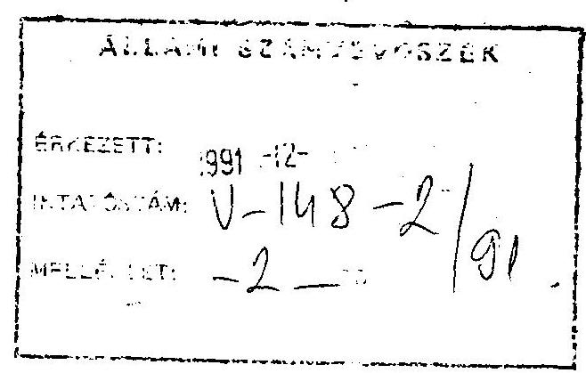

Tisztelt Bihari úr!

Hivatkozással az Állami Számvevőszék elnöke által aláirt: V-148-1/1991.sz. levelükre, - melyben az MHSz vagyonelszámolásáról 1990. december 22-én megküldött jelentés hiányosságainak pótlására hívja fel a Kincstári Vagyonkezelö Szervezet igazgatójának a figyelmét - tájékoztatásul az alábbiakat közlöm.

Tekintettel a feladat jelentöségére, nemkevésbé a hivatkozott "R"-ben a jelzett következményekre, értesítettük az MHSz utód szervezeteit, (MTTSZ-MRSZ-Kulturált Közlekedésért Alapítvány) hogy a még rendelkezésükre álló adatok, dokumentációk felhasználásával próbálják pótolni az ÁSZ részéről jelzett hiányosságokat.

Ugyanakkor értesítést küldtünk Kelemen József vezérörnagy úr részére az eddig tett intézkedésünkröl, egyidejüleg segitségét kérve a hiányzó adatok pótlásához.

Tekintettel arra, hogy a KVSZ jelenleg nem rendelkezik a korábbinál több, az MHSz vagyonelszámolását igazoló okmányokkal, adatokkal, kénytelenek voltunk részben az utód-szervezetekhez, részben a felszámolást végzó és ellenörzó HM.szervekhez fordulni, hogy a jelzett hiányosságok pótolhatók legyenek.

---

Kérem tájékoztatásom tudomásulvételét.

Budapest, 1991. december "12"

Mellékletek:

1) MHSz utód-szervezetek, részére írt levél másolata
2) Kelemen József vezérörnagy úr részére írt levél másolata
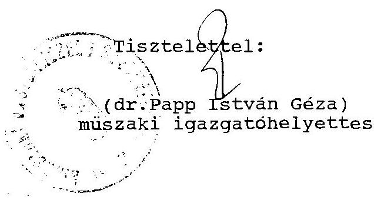

---

Iktatószám: $3-G G / 1-2-3 / 91$.
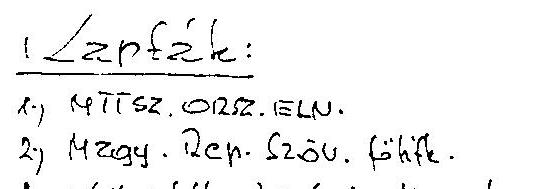

Ugyintéző: Seipert Rudolf
Telefon : 111-7850

Ertesítem, hogy az 1991. évi LI.törvényre való hivatkozással (MK. 122 szám) az Állami Számvevőszék (a továbbiakban: ÁSZ) elnöke levélben fordult a KVSz igazgatójához, hogy az MHSz elszámoltatásával kapcsolatosan kifogásolt hiányosságokat az 1-8.sz. melléklet hitelesítése érdekében, 60 napon belül pótolja. Az ÁSZ levél másolatát csatoltan megküldöm.

A Kormány megbizása alapján a KVSz jogelőd szervezete (PM. ZÁVKHI) 1990. november hónapban, az akkor elötalált okmányok és információk alapján készítette el és adta át hívatalosan az ASZ részére az mHSz elszámoltatására vonatkozó beszámoló jelentést.

Mint ismeretes a Parlament az ÁSZ részéről előterjesztett jelentést nem fogadta el. Tekintettel arra, hogy a KVSz - az MHSz részéről korábban rendelkezésére bocsájtott anyagokon túl nem rendelkezik egyéb okmányokkal, nem tud az ÁSZ részéről kért újbóli elvárásnak eleget tenni.

Az előbbiekböl kiindulva kérem, hogy a csatolt levél tartalmát áttanulmányozva, amennyiben az 1-8.sz. melléklethez a korábbi adatszolgáltatáson túl vagy az azokat pontositó, kiegészítő okmányokkal igazolható anyagok, információk állnak a rendelkezésükre, úgy azt az MHSz beszámoló jelentésének hitelesítése érdekében, rövid úton küldjék meg a KVSz igazgatója részére.

Amennyiben a hiánypótlást követően sem válik hitelesíthetővé az MHSz elszámoló jelentése, úgy a társadalmi szervezetek kezelői jogának megszüntetéséről szóló 1990. évi LXX. törvény 2.§-ában említett használati jog ingyenessége megszünik. (1991.évi LI.törvény 1.§(7) bekezdése)

---

Ismételten kérem a csatolt levélben foglaltak alapos áttanulmányozását és az azzal kapcsolatos írásos észrevételük megküldését.

Budapest, 1991. december " "

Melléklet: 1 db V-148-1/1991 sz. Ász
levélmásolat

Tisztelettel:
(dr.Papp István Géza)
múszaki igazgatóhelyettes

---

Iktatószám: $3-65^{\prime} 6 / 4 / 91$

# Kelemen József vezérörnagy úr 

MH. Vezérkari Fönök
Általános helyettese

## B u d a p e s t   Pf. 25 .

1885

Tisztelt Vezérörnagy úr!

Tájékoztatom önt, hogy az 1991. évi LI. törvényre való hívatkozással az Állami Számvevöszék (továbbiakban: ÁsZ) elnöke levelében értesitette a Rinuscári Vagyonkeze15 Szervezet (továbbiakban: KVSZ) igazgatóját, hogy - mint az MHSz felszámolásával a Kormány részéről megbizott szervezet - pótolja mindazokat a hiányosságokat, amelyek miatt az Ász korábban, az MHSz vagyonelszámolás hitelességét nem találta elfogadhatónak. (Az Ász levélmásolatát csatoltan megküldöm.)

Tekintettel arra, hogy a KVSZ - az MHSz részéröl korábban rendelkezésre bocsájtott anyagokon túl - nem rendelkezik egyéb okmányokkal, adatokkal, nem tud az Ász részéröl kért újbóli elvárásnak eleget tenni.

Az Ász átiratában hivatkozott 1-8. mellékletekben meghatározottak hitelesíthetösége érdekében levélben értesítettük az MHSz utód-szervezeteit, (MTTSZ O.E. - MRSZ - Kulturált Közlekedésért Alapítvány) hogy a "R"-ben jelzett szigorú szankciók elkerülése végett, amennyiben a hiányzó adatokkal, okmányokkal rendelkeznek, úgy azokat a részünkre, rövid időn belül küldjék meg.

---

A kialakult helyzet jelentöségére való tekintettel kérem Vezérórnagy úr segítségét arra vonatkozóan, hogy amennyiben a MH. azon részlegei, bizottságai, amelyek az MHSZ vagyonelszámoltatását végezték és a birtokukba van az MHSZ elszámolás hitelességét igazoló okmány, bizonylat - netán információ úgy azt bocsássák az utód-szervezetek, illetve a KVSZ rendelkezésére.

Kérésem ügyében tett fáradozását elơre is köszönöm.

Budapest, 1991. december " "2"

Mellékletek: 1 db ÁsZ levél-másolat
1 db az HHSZ atód-szervezetei
részére megküldött
levél-másolat

Tisztelettel:
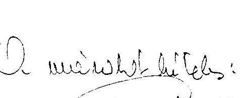
(dr.Papp István Géza)
müszaki igazgatóhelyettes

---

A Kincstári Vagyonkezelö Szervezet 1992. január 16-i tájékoztatása a volt MHSZ vagyone1számolásának hiánypótlásával kapcsolatban

$$
/ V-148-3 / 1991 / 1992 . /
$$

---

Iktatószám: $3-656 / 6 / 92$

Állami Számvevőszék
Bihari Zsigmond úr
Fejezeti Föcsoport vezetöje
Budapest
Apáczai Csere János u. 10.
1052
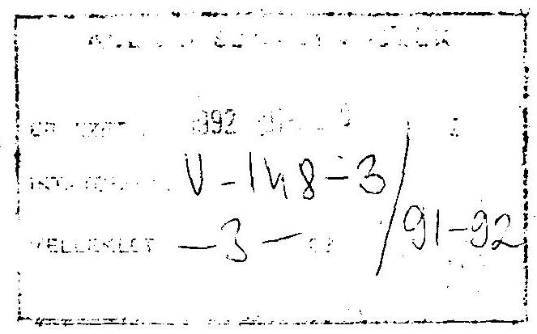

Tisztelt Bihari úr!

1. Az elmúlt év december 12-én a 3-656/5/91 sz. levelemben tájékoztattam önt, hogy az MHSz vagyonelszámolás hitelesítése érdekében milyen formában intézkedtem.
2. Az elszámolásban érintett négy szervezet közül az MHSz utód szervezetei - a Magyar Technikai Tömegsportklubok Szövetségének Országos Elnöksége, a Magyar Repülö Szövetség, valamint a Kulturált Közlekedésért Alapítvány levélben válaszoltak felhívásunkra.
3. A válaszlevelekben foglaltak alapján - amelyeket jelen levelem mellékleteként megküldök - szinte egybehangzóan közlik, hogy érdemben a LXXIII.törvény mellékleteire vonatkozóan nem tudnak olyan - az Ász részéről is elfogadható - információkkal, dokumentációkkal szolgálni, amelyek alapján a mellékletekre korábban jelentett adatok hitelesíthetők lennének.
4. A fentiek rendezése érdekében a Honvédelmi Minisztériumba - Kelemen József vezérörnagy úr részére megküldött levelem alapján egy személyes megbeszélésre került sor. Ezen a megbeszélésen a témakörben érintett HM.illetékes vezetöin kivül részt vettek az Igazságügyi Minisztérium, valamint a Miniszterelnökség Kabinet Irodájának képviselöi. Tekintettel a szóbanforgó téma jelentőségére, bonyolultáságára, annak megnyugtató rendezése érdekében az a közös álláspont fogalmazódott meg, hogy az MHSz vagyonelszámolásával kapcsolatos kérdéskört - a HM-ben meglévő dokumentációk, jelentések alapján - komplex módon kell megvizsgálni.

---

A vizsgálat eredményéról szervezetünk hivatalos úton értesítést kap, aminek alapján a végleges jelentés elkészíthető lesz.

A Honvédelmi Minisztérium idơközben történő felkérésére, természtesen a szervezetünknél rendelkezésre álló információkat, adatokat folyamatosan szolgáltatjuk.
5. Tájékoztatásul közlöm, hogy idôközben szervezetünk a területileg illetékes földhivatalokkal pontosította az MHSz objektumainak korábbi nyilvántartását. Jelenleg a számítógépes nyilvántartásunk szerint: 299 db - volt MHSz kezelésben, illetve használatban lévő ingatlan kezelői jogát gyakoroljuk. Pontosításra került azoknak az objektumoknak a száma is, amelyek telekkönyvileg az MHSz tulajdonában voltak. Ez országosan összesen: 74 objektum.
6. Tehát az 1.sz.mellékletben korábban közölt 361 ingatlannal szemben dokumentáltan: 373 objektum volt a két jogcím alatt az MHSz használatában.
7. A végleges jelentéshez csatolni fogom a jelenleg rendelkezésünkre álló, illetve az idöközben elótalált azon intézkedéseket, leveleket, amelyekböl kiderül, hogy az MHSz fötitkára, 1990. augusztus 31. és 1990. szeptember 18. között nagyértékủ eszközöket, berendezéseket adományozott az MHSz utód szervezetei részére.
Igy került sor Pl.: a jelentös értéket képviselö Központi Gépjármú Javító Ưzem komplex módon történő átadására az "AUTOPEST" Kft. részére, aminek bejegyzését a Cégbíróság a mai napig nem igazolt vissza, továbbá igy került ugyancsak átadásra az MHSz komplett Propaganda Ellátó Uzeme a Kulturált Közlekedésért Alapítvány részére, amely még utód szervnek sem minösíthető.
8. Végleges jelentésemet a HM-töl kapott értesítés után küldöm meg.

Kérem tájékoztatásom szíves tudomásulvételét.
Budapest, 1992. január "16"
Melléklet: 3 db válaszlevél

Tisztélettel:
(Dr.Papp István Géza)
müszaki igazgatóhelyettes

---

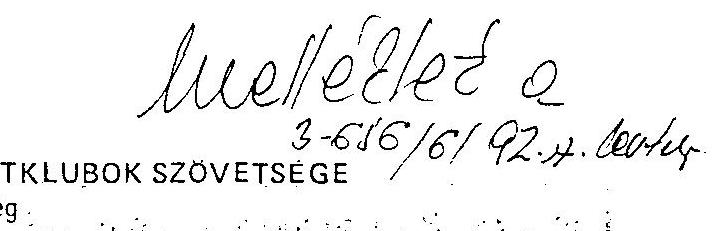

Szám: 07.11
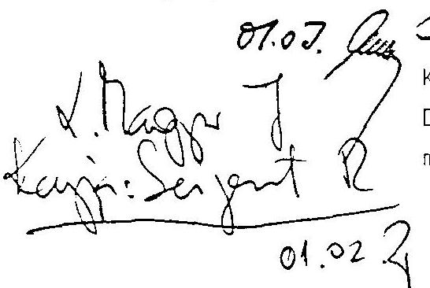

Kincstári Vagyonkezeló Szervezet
Dr. Papp János Géza úr
mũszaki igazgatóhelyettes

1392 Budapest
p.f. 282

Tisztelt Igazgatóhelyettes ứ!

Hivatkozással a 3-656/3/91. sz. levelére, sajnálattal közlöm, hogy az MHSZ elszámoltatásával összefüggésben az Állami Számvevôszék által kifogásolt kérdések tisztázásához nem tudok érdemi információkkal szolgálni.

A Magyar Technikai és Tömegsportklubok Szövetsége 1990. október 1-tôl mũködik önálló szervezetként. Elôd szervezetétôl, a Magyar Honvédelmi Szövetségtôl nem kapott, nem vett át egyetlen olyan okmányt sem, amely elôsegíthetné az ÁSz által kifogásolt adatok pontositását.

On elôtt is ismert, hogy az MHSZ felszámolását, illetve elszámoltatását - minden, az MHSZ mũködésével, gazdálkodásával összefüggô okmány birtokában - a HM államtitkár által kinevezett MHSZ fôtitkár végezte. Ebbe a munkába az MTTSZ Drszágos Elnökségét nem vonták be, az errôl készült jelentést még tájékoztatásul sem kaptuk meg. Annak sem tartalmát, sem a hitelesítendô 1-8. sz. mellékletét nem ismerjük.

Személy szerint én legjobb esetben csak emlékezetbôl tudnék néhány kérdésre választ adni, de okmányokkal igazolható

---

# - 2 - 

adatok nem állnak rendelkezésemre. Esetleg konkrét kérdések esetén természetesen állok rendelkezésedre.

Budapest, 1991. december 18.
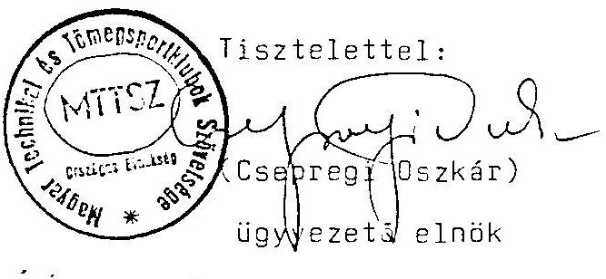

---

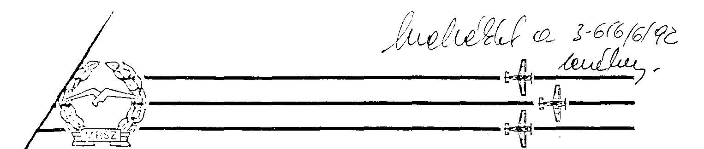

# MAGYAR REPÜLÖ SZÖVETSÉG 

HUNGARIAN AERONAUTICAL ASSOCIATION
H-1093 BUDAPEST, LÖNYAY U. 44. HUNGARY
TEL:361/11.70.351
FAX:361/13.77.222 TX:223472
Acc. No.: MB 219-98911-0192-400
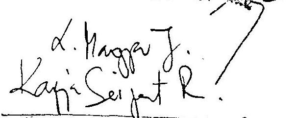

BUDAPEST

Tisztelt Igazgatóhelyettes Ưr!

Hivatkozással a 3-656/3/91 sz. levelére, sajnálattal tájékoztatom, hogy az MHSZ elszámoltatásával kapcsolatosan az Állami Számvevôszék által kifogásolt kérdések tisztázása érdekében nem tudok érdemi információkkal szolgálni.
A Magyar Repülõ Szövetség 1989. november 11-e óta müködik önálló szervezetként. Előd szervezettôl a Magyar Honvédelmi Szövetségtôl ezt megelôzôen sem annak megszûnéséig nem kapott, nem vett át egyetlen okmányt sem, amelyek elósegíthetnék az ÁSZ által kifogásolt adatok pontosítását.
Ưn elôtt is ismert, hogy az MHSZ felszámolását, illetve elszámoltatását - minden az MHSZ müködésével, gazdálkodásával, összefüggő okmány birtokában a HM államtitkár által kinevezett MHSZ főtitkár végezte. Ebbe a munkába az MHSZ elnökségét, fôtitkárát nem vonták be érdemlegesen, az errôl készült jelentést még tájékoztatásul sem kaptuk meg. Annak sem tartalmát, sem a hitelesítendô 1-8. sz. mellékletét nem ismerjük. Személy szerint én legjobb esetben is csak emlékezetbôl tudnék esetleg néhány kérdésre választ adni, de okmányokkal igazolható adatok nem állnak rendelkezésemre.

Esetleges konkrét kérdések esetén természetesen állok rendelkezésére. Budapest, 1991. december 29.
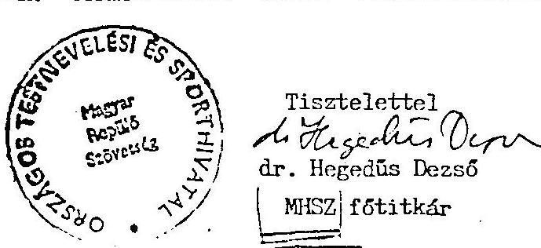

---

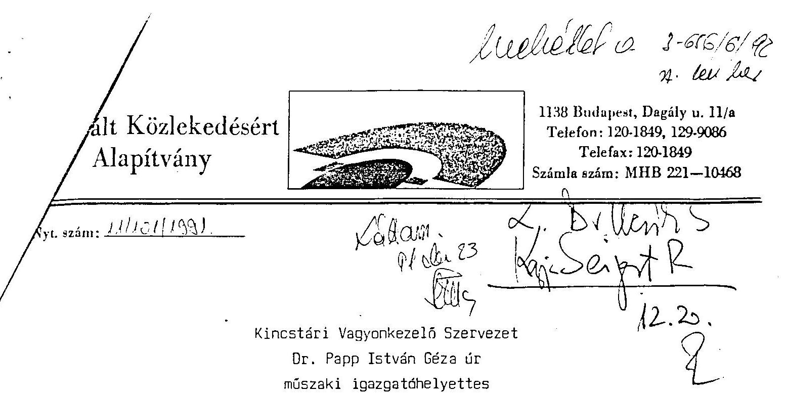

Budapest

Tisztelt Papp Úr !

Az 1991. december 11-én kelt 3-656/2/91. számú levelük alapján az alábbi okmányok és információk biztosításával kívánjuk elösegíteni az MHSZ vagyonelszámoltatásával kapcsolatos feladat végrehajtását:
1./ Jelen levelünk 1. és 2.sz. mellékleteként csatoljuk a Kulturált Közlekedésért Alapítvány alapító okiratát és a Fôvárosi Bíróság bejegyzésünkröl szóló végzését.

A fentiekböl kitünik, hogy az MHSZ Fôtitkára 1990. augusztus 15-i hatálylyal a kijelölt miniszteri biztosok egyetértésével hozta létre Alapítványunkat.
2./ A jelzett alapító okiratból kitünik, hogy Alapítványunk tulajdonába került az MHSZ által korábban alapított és kizárólagos tulajdonát képező 20 gépjármũvezető-képzõ Kft. teljes törzstőkéjével és az alapítóval szemben fennálló tartozásával. A 3.sz. melléklet a Kft létesítési idejét és cégbírósági bejegyzésének számát tartalmazza.
3./ Ugyancsak az alapító okirat sorolja fel azon ingatlanokat, amelyek korábban az MHSZ tulajdonát képezték és amelyeket eredetileg az Alapítványnak adományozott.

Késöbb az MHSZ Fôtitkára további ingatlanokat adományozott szervezetünknek.

---

A 4sz. mellékletben felsoroljuk az ingatlanokat, azok értékét, és csatoljuk a Fölhivatal által kiállított tulajdoni lapok másolatát. Ez utóbbiak segítségével a jelzett ingatlanok korábbi tulajdonosai is megállapíthatók.
4./ Az Alapítvány létrejöttét követően 1990. szeptember 10-én az MHSZ Fötitkára pótfelajánlásként tulajdonunkba adta az MHSZ Propaganda Anyagellátó Üzemét teljes vagyonával. (5. és 6.sz. melléklet)
5./ A 7.sz. melléklet kimutatásszerċen tartalmazza az Alapítvány induló vagyonát, ideértve az alapító okiratban tételesen felsorolt ingó vagyont is.
6./ Az MHSZ, mint alapító 1989. november 29-én a gazdasági társaságok (Alapítványunkat alkotó Kft-k) ingyenes használatába adta az MHSZ kezelésében lévő ingatlanok azon részét, amelyet korábban is használtak. A Fővárosi és Megyei Bíróságok, mint Cégbíróságok a Kft-k alapító okiratának mellékletében szereplő "ingyenes használati jogot" a gazdasági társaságok bejegyzésekor elfogadták.

Alapítványunk a Kft-k kizárólagos tulajdonosaként az 1990. évi LXX. törvény 5. §-a értelmében 1990. október 05-én kelt 20/29/1990. sz. levelében a ZÁvKI-nak bejelentette használati jogát, amelyet az idézett törvény 4. §ában meghatározott jogcímen gyakorolt.

Amennyiben az MHSZ vagyonelszámoltatásához további információkra van szükségük, készséggel állunk rendelkezésükre.

Melléklet: 7 db (csak címzettnek)
Budapest, 1991. december 20.

Tisztelettel:
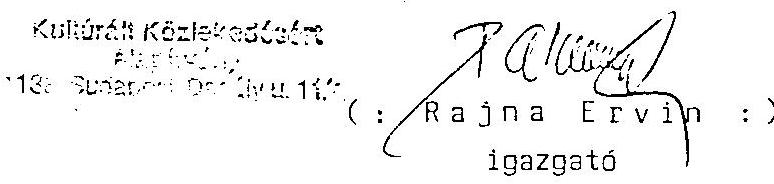

---

# III. 

A Kulturált Közlekedésért Alapítvány által
pótelszámoláshoz megküldött okmányok
/V-148-4/1991/1992./

---

# Kultúrált Közlekedésért Alapítvány 

1138 Budapest, Dagály u. 11/a Telefon: 120-1849, 129-9086 Telefax: 120-1849 Számla szám: MHB 221-10468
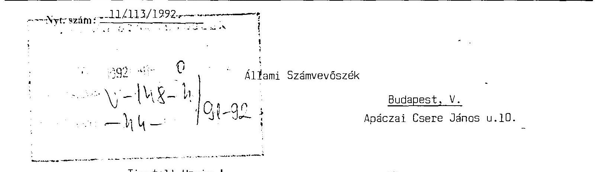

Tisztelt Uraim !
Az MHSZ Fôtitkára - az erre felhatalmazott Miniszteri Biztosok egyetértésével - 1990. augusztus 15-i hatállyal létrehozta a Kulturált Közlekedésért Alapítványt. Szervezetünk nem jogutóda az MHSZ-nek, de mivel vagyona onnan származik, a KVSZ-nek küldött információkkal egyezōen Ünöknek is megküldjük a vagyonelszámolást segitő okmányainkat.
1./ Az l.sz. mellékletként csatolt Alapító okiratból kitünik, hogy az MHSZ Alapítványunk tulajdonába adta a kizárólagos tulajdonát képező 20 gépjármúvezető-képzō Kft törzstőkéjét, az alapítóval szemben fennálló tartozását. A Kft-k legfontosabb adatait a 3. és a 4.sz. melléklet tartalmazza.
2./ Az Alapítvány és a Kft-k vagyonát illetően közönbös, de az MHSZ vagyonelszámoltatása szempontjából fontos kérdés a következō.

Az MHSZ a Kft-ket nem a megszûnö gépjármũvezető-képzō iskolák jogutódaként - átalakulás jogcímén - hanem újonnan alapított gazdasági társaságként hozta létre. Ebből adódóan nem háríthatta a Kft-kre a tanulók által 1989-ben befizetett (és az MHSZ által ábevételként elszámolt) tanfolyamdij 1990. évi gazdálkodását terhelō képzési költségeit. Ennek fedezetéül az MHSZ a volt gépjármúvezető képzō iskolák vagyonából 44.591 eft értékũ eszközt térítésmentesen átadott.

---

3./ Az Alapító okirat szerint illetve pótlólagos felajánlásként Alapítványunk az 5.sz. mellékletben felsorolt ingatlanokat kapta tulajdonába. Az ingatlanok átruházásáról szóló okiratok másolatát ill. a Földhivatalok által névünkre már bejegyzett ingatlanok tulajdonlapját mellékletként csatoljuk.
4./ Az MHSZ az Alapítvány létrejöttét követöen pótfelajánlásként tulajdonunkba adta Propaganda Anyagellátó üzemét teljes vagyonával. (6. és 7. sz. meiléklet)
5./ A 8.sz.melléklet kimutatásszerüen tartalmazza az Alapítvány induló vagyonát, ideértve az Alapító okiratban feltüntetett ingó vagyont is.

Mellékletek:
1.sz. melléklet Alapító okirat
2.sz. melléklet Fővárosi Bíróság végzése
3.sz. melléklet A Kft-k fontosabb adatai
4.sz. melléklet Kimutatás a Kft-k törzstőkéjének megoszlásáról
5.sz. melléklet Kimutatásaz Alapítvány tulajdonába került ingatlanokról
6.sz. melléklet A PropagandaAnyagellátó üzem fela jánlása
7.sz. melléklet Intézkedés a Propaganda Anyagellátó üzem átadására
8.sz. melléklet Kimutatás az Alapítvány induló vagyonáról
22 db nyilatkozat tulajdonjog bejegyzéséhez
14 db tulajdoni lap a Földhivatalnál bejegyzett ingatlanokról az 5.sz. melléklet részletezése szerint

Budapest, 1992. január 17.
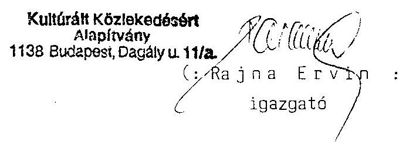

---

# ALAPITÚ OKIRAT 

amellyel a Hagyar Honvédelmi Szüvetség az alibbi feltételekkel létrehozza a

KULTURALT KÜZLEKEDÉSÉRT ALAPITVÁHYT

1. Az Alapitvány
a/ neve: " Kulturált Küzlekedésért Alapitvány":
b/ székhelye: Budapest, XIII. Oagúly 11.11/7.
c/ vagyona: a Magyar Honvédelmi Szüvetség által alapitott és kizárólagus tulajdonát képezũ 20 gúpjármívezetáképzũ korlátolt felelũsségũ társaság /a továbbiakban: Kft/ törzstũkéje és az alapitóval szemben fennálló tartozása,az alapitó által átadott ingatlan, illetve ingó vagyon az alapitó okirat mellékletében fuglaltak szerint, továbbá jüvedelemként a Kft-k nyereségének az alapitót megilletũ mértékü osztalóka.
2. Az Alapitvány célja:
a hazai közúti közlekedés kulturájának és biztonságának fejlesztése. Olyan gépjármüvezetők képzése akik jó szakmai felkészültség birtokában kulturáltan és megbizhatóan vesznek részt a hazai és nemzetközi forgalomban.
3. Az Alapitvány jogi szomély, amely gyakorolja Kft-k alapitói jogait, azonban a vagyonát és a jüvedelmét kizárólag céljai megvalósitására fordíthatja.
4. Az Alapitvány nyitott, ezért bármely olyan magyar vagy külföldi természetes, illetőleg jogi személy eseti anyagi hozzájárulását vagy rendszeres támogatását elfogadja, aki az Alapitvány céljával egyetért.
5. Az Alapitvány politikamentes, ezért a tevékenységével semmiféle politikai cél elérését nem tünogathatja. Feladatai teljesítése érdekében kész együttmüküdni minden olyan szervezettel, amelynek a tevékenysége nem ellenlétes az Alapitvány céljával.

---

6. Az Alapitvány a célja megvalósitása érdekében:
a/ a jüvedelméból a helyi igénynk és szïkségletek figyelembevételével lámogatja a Kft-kben folyó gépjármüvezetō-képzés szakmai technikai szinvonalának fojlesztését,
b/ fountartja és fejleszti a Kft-k gépjármüvezelöképzō intézményhálózatát,
c/ oktatástechnikai eszközök és információhordozók biztosításával segiti a kulturált és biztonságus küzlekudésre irányuló nevelö munkát a közoktatási intézményekben,
d/ részt vesz a pedagógus jelöl tek és gyakorló pedagógusok közlekedési-szakmai felkészitésében,
e/ támogatja az általános és a küzépfukú oktatási intézményekben a tanulók kulturált és biztonságus küzlekedésre nevelését szolgáló szakkïrök és diákkïrök szervezését,
f/ dijazásban részesiti a szakkiiri és a diákküri nevelö munkát végzö pedagógusokat, a szociálisan rászoruló tanulók részére pedig a gépjármüvezetöképzō tanfolyamok di jához - kérelemre - lámogatást nyújt,
g/ a Magyar Honvédség felkérésére küzremüködik a speciális gépjármüvezetō képzési igények hatékonyabb kielégitésönck megszervezésében,
h/ figyelemmel kiséri a gépjármüvezetō-képzés fejlödésének nemzetközi tapasztalatait, szervezi és tämogatja ezeknek a Kft-k munkájában tïrténö hasznosítását;
i/ szervezi a Kft-k gépjármü oktatóinak szakmai továbbképzését,
j/ rószt vesz a gépjármüvezetō képzés szakmai és oktatási módszertani lúmáinak kutatásában. Az ennek eredményeként általa kifejlesztett eszközüket, oktatói programokat rendszerbe állítja, a Kft-k rendelkezésére bocsátja és mások számára is hozzáférhetővé teszi.
7. Az Alapitvány kezelö és döntést hozó szerve az igazgatótanács, amelynek tagjai az Alapitvány igazgatója és az Alapitvány tulajdonában lévö gépjármüvezetöképzō Kft-k ügyvezetō igazgatói.

---

8. Az Alapitvány első igazgatóját pályázat és az igazgatótanács javaslata alapján 5 évre az alapitó nevezi ki. A továbbiakban az új igazgató kinevezésére az igazgatótanács kezdonányozésére - a Kuratárium véleményének figyelembe vételével - a Fövárosi Birúsáy jogosult.
9. Az igazgatótanács
a/ dönt a rendelkezésére álló alapitványi vagyon felhasználásáról és az Alapitvány szervezeti és müküdési szabályzatának jóváhagyásáról,
b/ javaslatot tesz az Alapitvány igazgatójának kinevezésére.
10. Az igazgatótanács a 9. pontban meghatározott döntéseit kétharmados szótöbbséggel hozza. Az igazgatótanács határuzatképes, ha a tagok kétharmada jelen van.
11. Az igazgatótanács az alapitványi tevékenység szervezésére, a gépjármüvezetőképzõ Kft-kkel kapcsolatos alapitói feladatnk, valamint a részükre biztosított érdeképviseleti, jogi, szakmódszertani és számviteli szolgáltatások ellátására szakemberekböl álló ügyintézi szervet hoz létre. Ennek szervazetét és müküdését az Alapitvány szervezeti és müküdési szabályzatában kell meghatározni.
12. Az alapitványi céluk megvalósitásának pártatlan felügyeletére 9 tagú Kuratóriumot kell létrehozni. A Kuratórium tagjai közül:

- 4 fôt a Magyar Horvédség parancsnoka,
- 1-1 fôt a Közlekedési és Hírkiütési Minisztérium, a Hïvelödési és Közoktatási Minisztérium, valamint az Országos Közlekedésbiztonsági Tanács Elnüksége,
- 2 fôt az Alapitvány igazgatótanácsa, a küzïli jármüvezetőképzés elismerl pártatlan szakemberei közül
jelöl ki.

13. A Kuratórium a saját tagjai közül maga válaszlja meg az elnökét 2 évi idötartamra. A Kuratórium szükség szerint, de évenként legalább kétszer ülésezik. Ennek során az Alapitvány igazgatótanácsúnak javaslata alapján

- megállapítja az Alapitvány igazgatójának munkabérét,

---

- egyetértési jogát gyakorolja az Alapitvány türzstökéjének változtatása, ingatlan vásárlása vagy eladása kérdésében, - véleményt nyilvánlt az igazgatútanácsnak az igazgatú személyére vonatkozó javaslatáról, az Alapitvány kezelö és ügyintézo szervének éves kültségvetéséröl, valamint a nyereségosztalék felhasználásáról, az Alapitvány céljainakmegvalósulásáról.

14. A Kuratúrium a saját munkaterve alapján tevékenykedik. Ettöl eltérően is üsszehivható az Alapitvány igazgatújának, igazgatútanácsának javaslata, vagy a kuratúriumi tagok egyharmadának irásbeli kezdeményezése alapján. A kuratúrium müködési feltételeinek biztosításáról az Alapitvány igazgatója köteles gondoskodni.
15. Az Alapitvány l/c. pontban említett jövedelme elsösorban a Kft-k 20 \%-os nyereségosztalékának befizetéséböl származik. Ezen túl az Alapitvány önállú gazdásági-vállalkozási tevékenységre is jogosult azzal a feltétellel, hogy az ebböl származó alapitványi jövedelem is kizárólag csak az Alapitvány céljának megvalósitására használható fel a 3. pont rendelkezésé szerint.
16. Az Alapitvány kezelö és ügyintézo szervének müködési költségeire a Kft-k az éves árbovételiik 1,5 8-át kötelessk befizetni érdekképviseleti támogatás címén. A kezelőszerv ennek a tämogatásnak a felhasználására - az Alapitvány költségvetésétől elkiülönitott - éves költségvetési tervet készt, amelyet az igazgatútanács hagy jóvá.
17. Az alapitványi vagyont növelik az Alapitványhoz késöbb csatlakozó természetes vagy jogi személyek feltétel nélküli, valamint feltételhez kötött hozzájárulásai és támogatásai feltéve, hogy ezukat az Alapitvány igazgatútanácsa a Kuratúrium egyetértésével elfogadja.
18. Az alapitvány igazgatútanácsa köteles évenként irásban értékelni az Alapitvány tevékenységét és gazdálkodását, és az urröl szóló jelentést a Kuratúrium elé terjeszteni.
19. Az Alapitványt az alapitó határozatlan idöre létesiti. Megszünéséröl, illetve megszünése esetén a vagyona felhasználásáról az igazgatútanács a Kuratúrium egyetértésével határoz.

---

20. Az Alapitványra és gazdálkódására az ebben az okiratban nom szabályozott kérdéseken a Polgári Törvénykönyv ús az alapitványok gazdálkodására vonatkozó jogszabályok rendeikezéseit kell alkalmazni.
21. Az alapitó ennek az okiratnak az aláírásával kötelezettséget vállal arra, hogy a melléklet szorinti ingatlanai tulajdonjogának az Alapitvány javára történő bejegyzéséhez szükséges tulajdonútruházási nyilatkozatot 1990. szoptember lo-ig az Alapitvány igazgatójának kiadja.
22. Ezt az alapitó okiratot a Fővárosi Birúságnál kell bejegyeztetni.

Budapest, 1990. augusztus $1: 0-n$.
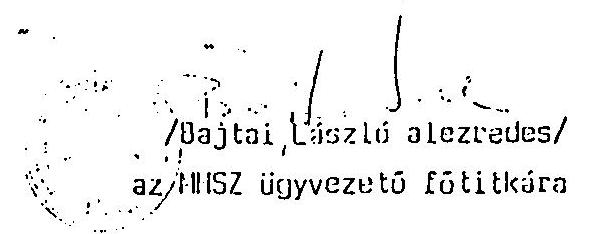

Egyetértünk:
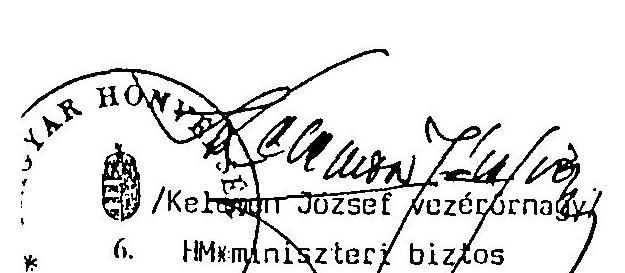
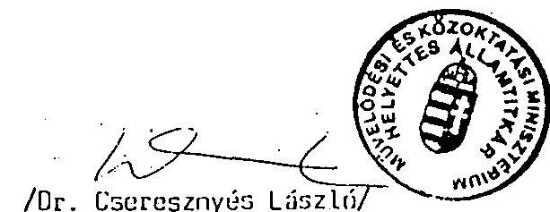
/Dr. Cseresznyes Lásztio/
/Dr. Useresznyes Lásztio/
/KH miniszteri biztos

---

# Alapitó okirat melléklete 

A Magyar Iknvédelmi Szüvetsóg a Kullurált Kizlokedésért Alapitványra ruházza az aläbbiakban részletezett vagyonát:

MHSZ tulajdonu társasági vagyonkent:

| Megye | Kft. megnevezése | Türizstöke   elt | Alapitól hitel elt |
| :--: | :--: | :--: | :--: |
| Baranya | "Baranya" Kft. | 7.860 | 600 |
| Bács | "Kiskun" Gépjármüvezetö Kft. | 8.500 | 800 |
| Békés | Oefenziv Autúvezetö Kft. | 4.010 | 800 |
| Borsod | RUTIN Kft. | 11.500 | 1.900 |
| Csongrád | MHSZ Autóiskola Kft. | 9.940 | 900 |
| Fejór | "Dinamika" Kft. | 10.590 | 500 |
| Gyór | "Bilux" Kft. | 12.030 | 1.100 |
| Hajdú | "Hajdú" Kft. | 9.950 | 1.300 |
| Heves | "Mátra Autós Kft." | 3.950 | 400 |
| Komárom | Mobilitás Kft. | 6.930 | 400 |
| Nügrád | "PALÚC RUTIN" Kft. | 5.230 | 100 |
| Pest | "Autópest" Kft. | 20.950 | 1.700 |
| Somogy | "Didaktika" Kft. | 4.920 | 600 |
| Szabolcs | MHSZ Sz-Sz-B. Megyei Kft. | 11.720 | 1.000 |
| Szolnok | INDEX Kft. | 8.550 | 700 |
| Tolna | MHSZ TEMPÖ Gépjármiivezetö Kft. | 3.720 | 400 |
| VAS | RITMÚ Kft. | 6.360 | 200 |
| Veszprém | MHSZ Veszprém Megyei Kft. | 1.650 | 1.000 |
| Zala | Technika Kft. | 5.560 | 500 |
| Budapest | "V. Sebessúg" Kft. | 16.770 | 4.600 |
| Összesen: |  | 178.680 | 19.500 |

---

# [I. 

MHSZ tulajdonú ingatlan vagyonként:

| Ingatlan cime: | Tulajdoni lap szúma: | Hrsz: |
| :--: | :--: | :--: |
| Mezöcsát, Kossuth L.u. 19.   (gépjármívezetô-képzõ kirendeltség) | 1399 | 1834 |
| Györ, Jereváni u. 42.   (Gépjármívezetô-képzõ iskola) | $24523 / 1$ | $333 / 5 / A$ |
| Mosonmagyaróvár, Széchenyl u.2.   (gépjármívezetô-képzõ kirendel tség) | $35 / 2$ | $1313 / 6 / A$ |
| Eger, Vörüstizér u. 36.   (gépjármívezetô-képzõ iskola) | 2735 | $2332 / 3$ |
| Gyöngyös, Puskin u.1.   (gépjármívezetô-képzõ kirendeltség) | 4100 | 4456 |
| Esztergom, Kossuth z. 42.   (gépjármívezetô-képzõ kirendel tség) | 5365 | 17496 |
| Balassagyarmat, Táncsics M.u. 17.   (gépjármívezetô-képzõ kirendel tség) | 1832 | 1572 |
| Boglátlelle, Árpád u. 22.   (gépjármívezetô-képzõ kirendul tség) | 152 | 57 |
| Hyiregyháza, Arany J.11.7.   (gépjármú telephely) | 7437 | 6097 |
| Nyiregyháza, Törpe u.1.   (gépjármívezetô-képzõ isk. tanpálya) | 27274 | $073 / 17$ |
| Tiszavasvári, Kossuth L.u. 34.   (gépjármívezetô-képzõ kirendel tség) | 2837 | 2780 |
| Szekszárd, Kossuth L.u. 13.   (gépjármívezetô-képzõ iskola) | 2223 | 1964 |
| Szombathely, Puskás T.u. 7.   (gépjármívezetô-képzõ iskola) | 6923 | $7302 / 3$ |
| Balatonalmádi, Hunyadi u.17.   (gépjármívezetô-képzõ kirendel tség) | 4898 | 4736 |

## III.

Az MHSZ tulajdonú ingú vagyonkent:

| Megnevezés | do szúm |
| :--: | :--: |
| - MINOLTAFAX 258 | 21 |
| - BG 42-55 Lada 2105 szgk. | 1 |
| - IOM AT számítógép az összes konfigurációival | 1 |
| - az MHSZ OK Gépjármüvezetô Kiképzési Osztály kiképzési uszközök, információhordozók, és irodai berendezések leltár szerint. |  |

---

Fővárosi Birósás
8.Pk.63.752/2.

V é c. $26_{3}$

A Fővárosi Birósás a "Kulturált Kszlekádésért Alapítvány"-t az 1959.6vi IV.tv. (Ptk) 74/A. (4) bokozdésa alapján 489. sorszám alatt nyilvántartásba vatte.

Az alapítvány szökholýo: Budapest, XIII., Dagály u.ll/a.

A képviseló nova: Rajna Arvia 1-460107-1217
cima: 1068 Budapest, Bencsár u. 5 .

Az alapítvány célja: a hezai küzati közlekedés kultúrájának és biztos. ágának fejlesztése érdekében cépjármüvesotők képzése

Budapest, 1990. szoptombor 6.

Caikyné dr. Szobáosi Julianna sk. biró

A kiadmány hitelơll:
UY
Ugyv.alk.

---

Az Alapítvány Kft-inek cégneve, alapításának idópontja és cégbírósági bejegyzésének száma

| Megye | C é gnév: | Kft létorrozásank idtpontja | Cogdirosagi bejegyzés szam: |
| :--: | :--: | :--: | :--: |
| Baranya | "Baranya" Kft. | 1989. 11. 29. | 10.185/89-2. |
| Bács | "Kiskun" Gopjámúvezető Kft. | 1989. 11. 29. | Cg.9170/89/3. |
| Békés | "Defenzív" Autóvezető Kft. | 1989. 11. 29. | Cg.230/89/3. |
| Borsod | "RUTIN" Kft. | 1989. 11...29. | 2.C.60.258/89/2. |
| Csongrád | "VICTORIA" Autósiskola Kft | 1989. 11. 29. | 06.09.000172 |
| Fejér | "DINAMIKA" Kft. | 1989. 11. 29. | 07.09.000072 |
| Györ | "BILUX" Kft. | 1989. 11. 29. | Cg.60.138/1989. |
| Hajdu | "HAJDÚ" Kft. | 1989. 11. 29. | C.50.129/1989/2. |
| Heves | "MÁTRA" Autós Kft. | 1989. 11. 29. | Cg.15083/77/89/6. |
| Komárom | "MOBILITÁS" Kft. | 1989. 11. 29. | VI/136/1989/2. |
| Nógrád | "PALOC" Rutin Kft. | 1989. 11. 29. | Cg.110.080/1989/2. |
| Pest | "AUTOPEST" Kft. | 1989. 11. 29. | 01-09-064467 |
| Somogy | "DIOAKTIKA" Kft. | 1989. 11. 29. | Cg.80.201/89/1. |
| Szabolcs | "PARTNER-T" Kft. | 1989. 11. 29. | C.60.146/89/3/I. |
| Szolnok | "INDEX" Kft. | 1989. 11. 29. | Cg.37.093/89/4. |
| Tolna | "TEMPO" Kft. | 1989. 11. 29. | Cg. 50.051/3 |
| Vas | "RITMO" Kft. | 1989. 11. 29. | 18.09.032489 |
| Veszprém | "TURBO" Kft. | 1989. 11. 29. | Cg: 60.102/89/6. |
| Zala | "Technika" Kft. | 1989. 11. 29. | Cg. 60.075/89/6. |
| Budapest | "V. SEBESSÉG" Kft. | 1989. 11. 29. | 01-09-064964 |
| Összesen |  |  |  |

---

Kimutatás
a Kft-k törzstőkéjének megoszlásáról

| Megye | Kft. megnevezése | Türizstüke   eft | Törzstőkéből pénz-   beni betét eft |
| :--: | :--: | :--: | :--: |
| Baranya | "Baranya" Kft. | 7.060 | 500 |
| Bács | "Kiskun" Gópjármüvezetō Kft. | 8.500 | 500 |
| Békés | Defenziv Autóvezetō Kft. | 4.000 | 500 |
| Borsod | RUTIN Kft. | 11.500 | 500 |
| Csongrád | MHSZ Autóiskola Kft. | 9.940 | 500 |
| Fejér | "Dinamika" Kft. | 10.590 | 500 |
| Györ | "Bilux" Kft. | 12.030 | 500 |
| Hajdu | "Hajdó" Kft. | 9.950 | 500 |
| Heves. | "Mátra Autós Kft." | 3.950 | 500 |
| Komárom | Mubilitás Kft. | 6.930 | 500 |
| Nógrád | "PALÚC RUFIN" Kft. | 5.230 | 500 |
| Pest | "Autópest" Kft. | 20.950 | 500 |
| Somogy | "Didaktika" Kft. | 4.920 | 500 |
| Szabolcs | MHSZ Sz-Sz-B. Megyei Kft. | 11.720 | 500 |
| Szolnok | INDEX Kft. | 8.550 | 500 |
| Tolna | MHSZ TEMPŐ Gópjármïvezetō Kft. | 3.720 | 500 |
| VAS | RITMÓ Kft. | 6.360 | 500 |
| Veszprém | MHSZ Veszprém Negyei Kft. | 1.650 | 500 |
| Zala | Technika Kft. | 5.560 | 500 |
| Budapest | "V. Sebessóg" Kft. | 16.770 | 500 |
| Összesen: |  | 178.680 | 10.000 |

---

# KIMUTATAS 

## az Alapítvány tulajdonába:került ingatlanokról

I.

Az alapító okirat szerint eredetileg átadott ingatlanok felsorolása

| Sorsz: | Ingatlan címe: | Tulajdoni lap   száma | Hrsz: | - Erték   eft-ban |
| :--: | :--: | :--: | :--: | :--: |
| 1. | 1: Mezőcsát,Kossuth L.u.19. | 1889 | 1834 | 2.500 |
| 2. | Győr, Jereváni u. 42. | 24523/1 | 338/5/A | 42.000 |
| 3. | 3: Mosonmagyaróvár, Széchenyi u.2. | $35 / 2$ | 1818/6/A | 6.800 ha beifar |
| 4. | Eger, Kisasszony u.36. | 2735 | 2882/3 | 27.499 |
| 5. | Gyöngyös, Puskin u.l. | 4180 | 4456 | 7.000 ha beby |
| 6. | Esztergom, Kossuth L.u.42. | 5365 | 17496 | 8.912 |
| 7. | Balassagyarmat, Táncsics u.17. | 1832 | 1572 |  |
| 8. | Boglárlelle, Árpád u. 22. | 152 | 57 | 5.920 ha beby |
| 9. | Nyiregyháza, Arany J.u.7. | 7437 | 6097 | 800 ha b.ber |
| 10. | Nyiregyháza, Törpe u.l. | 27274 | 078/17 | 15.000 |
| 11. | Tiszavasvári, Kossuth L.u.34. | 2837 | 2780 | 3.455 |
| 12. | Szekszárd, Kossuth L.u.13. | 2223 | 1964 | 23.800 |
| 13. | Szombathely, Puskás T.u.7. | 6923 | 7302/3 | 30.000 |
| 14. | Balatonalmádi, Hunyadi u.17. | 4898 | 4736 | 6.100 |

## II.

Az MHSZ által pótlólag átadott ingatlanok felsorolása

| 15. 5: Kaposvár, (telek) | 4839 | 5886 | 1.630 |  |
| :--: | :--: | :--: | :--: | :--: |
| 16. 5: Tab, Kossuth L.u.82. | 1098 | 1028/1 |  |  |
| 17. 23 Mako, József A.u.6. | 108 | 9 |  |  |
| 18. 3 Szigetvár, Széchenyi u.44. | 1510 | 1281 |  |  |
| 19. 4 Tapolca, | 3096, | 3436, |  |  |
|  | 3095, | 3437/1. |  |  |
| 20. 41 Rétság, Lenin u.3. | 374 | 285 |  |  |

## III.

MHSZ-töl MTTSZ-nek átadott ingatlan ingyenes használata
21. Lenti, Ifjuság u.16.
$1017 / A$
Ingatlan össz. értéke:
181.416

Megjegyzés: a 7.,16.,17.,18.19.,20. sorszám alatt szereplő ingatlanok ügyében az eljárás még nem zárult le, ezért ezek vagyonértéke az Alapítvány tulajnodaként jogszerűen nem szerepel.

---

MAGYAR HONVÉGELMI SZƠVETSÉG
ÜGYVEZETO FÔTITKÁRA
Budapest, V. Belolannisz u.16.

Nyt.szám: 4-69/1990.

# NYILATKOZAT 

tulajdonjog bejegyzéséhez

Az MHSZ Országos Központ képviseletében az 1022/1990. (II.14.) MT határozat rendelkezései végrehajtásaként hozzájárulok ahhoz, hogy az MHSZ tulajdonában lévô, Mezôcsát, Kossuth L.u. 19. sz. tulajdoni. lapszám: 1809, hrsz: 1834, gépjármôvezetô kirendeltség rendeltetésũ ingatlan tulajdonjoga az MHSZ által alapított Kulturált Közlekedésért Alapítvány javára az ingatlannyilvántartásba bejegyzésre kerüljön.

Budapest, 1990. szeptember 10.

Kapják:
1-5. pld. Földhivatal
6. pld. KKA
7. pld. MHSZ OK.
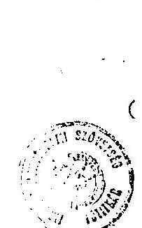
(: Bajtai ászló mk.alezredes :) ügyvezetô fôtitkár

---

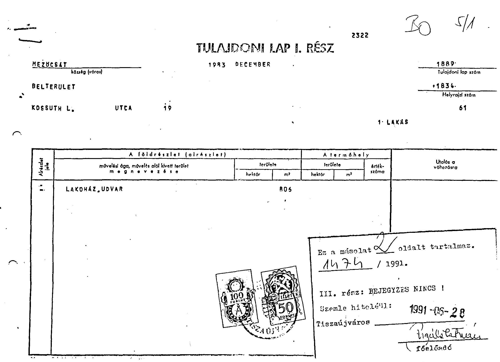

# TULAJDONI LAP I. RÉSZ

1983 DECEMBER 2322 5/1

1889 Tulajdoni lap szóm

1836 Helyrajzi szóm

61

1. LAKÁS

|  |   |   |   |   |   |   |
| --- | --- | --- | --- | --- | --- | --- |
|  1. LAKÁS | A földrészlet (alrászlet) |  |  | A termőhely |  |   |
|  1889
Tulajdoni lap szóm | móvelési ága, móvelés alól kivett terület | területe |  | területe | érték
szóma | Utalós a
vállarásra  |
|  1836 | m
m
m
m
m
a
n
e
z
e
z
6
2 | heldár | m² | hektár | m² |   |
|  1836 |  |  |  |  |  |   |
|  1. LAKOHÁZ, UDVAR |  | 806 |  |  |  |   |
|   |  |  |  | Ez a másolat |  |   |
|   |  |  |  | 1474 / 1991. |  |   |
|   |  |  |  | III. rész: BEJEGYZES NINCS ! |  |   |
|   |  |  |  | Szemle hitelé: |  |   |
|   |  |  |  | Tiszaújváros |  |   |
|   |  |  |  |  |  | 1991-05-28  |
|   |  |  |  |  |  | 1991-05-28  |
|   |  |  |  |  |  | 1991-05-28  |
|   |  |  |  |  |  | 1991-05-28  |
|   |  |  |  |  |  | 1991-05-28  |

---

|  Mezôcsát |  |  |  |  |  |  |   |
| --- | --- | --- | --- | --- | --- | --- | --- |
|  közzég |  | TULAJDONI LAP II. RÉSZ |  |  | 1834 | 1889 |   |
|  Sor-
szám | Jegcím,
határozat száma,
érkezési idő |  | A t u l a | d o n o s |  | Tulsjdon
hányad | Utalás
a változás
sorvá-
számára  |
|   |  | kezelő,
használó termelőszövekeket
neve, lakáscíme (székhelye) | szül.
éve | anyja neve | Tulsjdon
hányad |  | Jegyzet
(széljegy, utalás
a III. rész
sorszámára stb.)  |
|  1 | 2 | 3 | 4 | 5 | 6 | 7 | 8  |
|  1
2 | vétel
423/1965/III.14./ | Szilágyi István
és felesége
Kalász Gizella
Kossuth út |  |  | 1/2
1/2 | 3. |   |
|   |  |  | Készítette: Rábiud Iwa Ellenőziztatásó |  |  |  |   |
|  3. | vétel
3046/3/1981.X.6./ | MHBG-BAB-megyei Vesztség
Miskolc-Rábóozi u.12. |  |  | 1/1 | 4 | 3046/1981  |
|  4. | átadás
35.757/1990/X.17/ | Kultúrált Közlokedósért Alapítvány
1138 Budapest XIII. Dagály u.11/a. |  |  | 1/1 |  | 35.757/1990/X.17/  |

---

# MAGYAR HONVÉOELMI SZÖVETSÉG   6. .sz.példány   UGYVEZETÓ FÔTITKÁRA 

Budapest, V. Beloiannisz u.16.
Nyt.szám: 4-6B/1990.

## NYILATKOZAT

tulajdonjog bejegyzéséhez

Az MHSZ Orszgos Központ képviseletében az 1022/1990. (II. 14.) MT határozat rendelkezései végrehajtásaként hozzájárulok ahhoz, hogy az MHSZ tulajdonában lévô Győr, Jereváni u. 42. sz. (tulajdoni lapszám: 24523/1, hrsz.: 338/5/A) gépjármũve-zetô-képzõ iskola rendeltetésũ ingatlan tulajdonjoga az MHSZ által alapított Kulturált Közlekedésért Alapítvány javára az ingatlannyilvántartásba bejegyzésre kerüljön.

Budapest, 1990. szeptember 10.
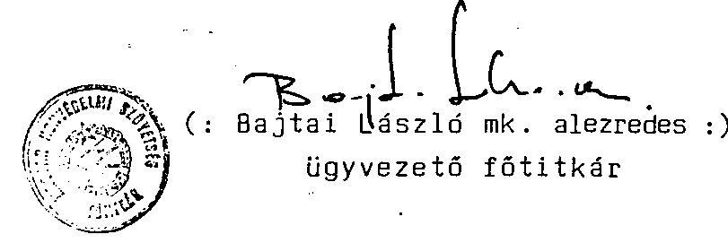

Kapják :
1-5. pld. Földhivatal
6. pld. KKA
7. pld. MHSZ. OK.

---

# 20/19/1990. 5/2

Gyöki. 24523/1

## 24523/1

### 111011 a 3311/5 hryz-u 111011.1011" 44311.1011" 111011.1011" 111011.1011" 210

|  1. | 1311/5/2. | 1100 | HRSZ 111011.1011" 3. |  |   |
| --- | --- | --- | --- | --- | --- |
|   |  |  |  | A 100 m 101011.1011" |   |
|   |  |  |  | 101011.1011" |   |
|   |  |  |  | 111011.1011" |   |
|   |  |  |  | 111011.1011" |   |
|   |  |  |  | 111011.1011" |   |
|   |  |  |  | 111011.1011" |   |
|   |  |  |  | 111011.1011" |   |
|   |  |  |  | 111011.1011" |   |
|   |  |  |  | 111011.1011" |   |
|   |  |  |  | 111011.1011" |   |
|   |  |  |  | 111011.1011" |   |
|   |  |  |  | 111011.1011" |   |
|   |  |  |  | 111011.1011" |   |
|   |  |  |  | 111011.1011" |   |
|   |  |  |  | 111011.1011" |   |
|   |  |  |  | 111011.1011" |   |
|   |  |  |  | 111011.1011" |   |
|   |  |  |  | 111011.1011" |   |
|   |  |  |  | 111011.1011" |   |
|   |  |  |  | 111011.1011" |   |
|   |  |  |  | 111011.1011" |   |
|   |  |  |  | 111011.1011" |   |
|   |  |  |  | 111011.1011" |   |
|   |  |  |  | 111011.1011" |   |
|   |  |  |  | 111011.1011" |   |
|   |  |  |  | 111011.1011" |   |
|   |  |  |  | 111011.1011" |   |
|   |  |  |  | 111011.1011" |   |
|   |  |  |  | 111011.1011" |   |
|   |  |  |  | 111011.1011" |   |
|   |  |  |  | 111011.1011" |   |
|   |  |  |  | 111011.1011" |   |
|   |  |  |  | 111011.1011" |   |
|

---

MAGYAR HONVÉDELMI SZÖVETSÉG
ÜGYVEZETÕ FÔTITKARA
Budapest, V. Beloiannisz u.16.
Nyt.szám: 4-70/1990.

# NYILATKOZAT 

tulajdonjog bejegyzéséhez

Az MHSZ Orszgos Központ képviseletében az 1022/1990. (II. 14.) MT határozat rendelkezései végrehajtásaként hozzájárulok ahhoz, hogy az MHSZ tulajdonában lévô Mosonmagyaróvár, Széchenyi u. 2. sz. (tulajdoni-lap szám: 35/2, hrsz.: 1810/6/A) gép-jármũvezetô-képzõ kirendeltség rendeltetésũ ingatlan tulajdonjoga az MHSZ által alapított Kulturált Közlekedésért Alapítvány javára az ingatlannyilvántartásba bejegyzésre kerüljön.

Budapest, 1990. szeptember 10.
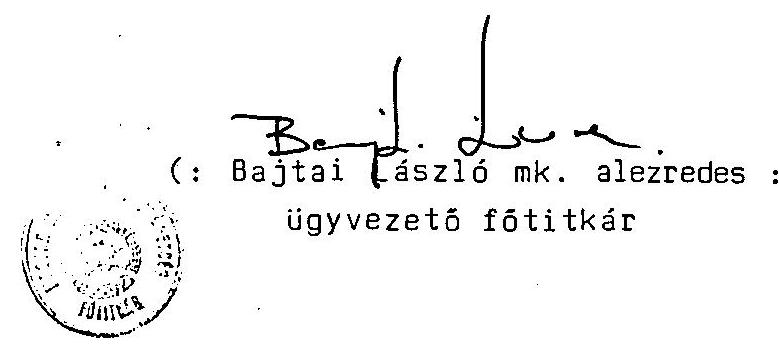

Kapják:
1-5. pld. Földhivatal
6. pld. KKA
7. pld. MHSZ OK.

---

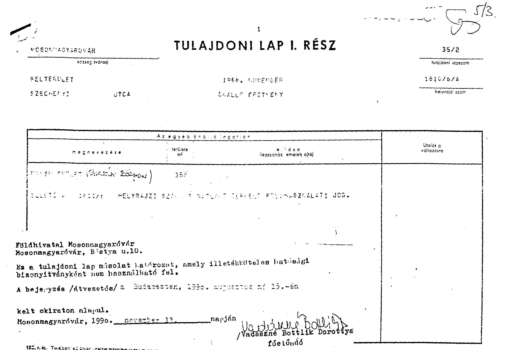

# TULAJDONI LAP I. RÉSZ

35/2

Tulajdoní doszorn

1810/6/4

1810/6/4

Tel.: 0222/2 257 257

## TULAJDONI LAP I. RÉSZ

|  Aregvėdė |  |   |
| --- | --- | --- |
|  megnevezės | tenliete
ml | e  |
|  35% |  |   |
|  35% |  |   |
|  1810/6 | HELYRAJZI | 520  |
|  1810/6 | HELYRAJZI | 520  |

## Fuldhivatal Mosonmagyaróvár

Mosonmagyaróvár, Bietya u.10.

Es a tulajdoni lap másolat halórozat, amely illetékköteles hatósági bizonyítványként nem használható fel.

A bejegyzés /átvezetés/ a Budszester, 1990. megnevezés 15.-én

Kelt okiraton alapul. Mosonmagyaróvár, 1990. nevezés 17. napján

Vadászné Bottlík Dorottya

182. K. 8. Tulajdoní 20. áraz - Patria myunina 11. 2010. 10:12

---

|  100x100x100 LAF II. REJL |  |  |  |  |  |  |   |
| --- | --- | --- | --- | --- | --- | --- | --- |
|  Nozseg |  |  |  |  |  |  |   |
|  Sor-
szam | jogzim.
hazározza száma,
erkezési idő | A t u l a
A t u l a
kezelő,
használó termelőszövetkezet
neve, ígkészíme (székhelye) | Szül.
eve | anyja neve | Tulajdon
hanyád | Utalás
a változás
sor-
számára | Legyzet
(sz. leg.) utalás
a ill. rész
sorszámára stb.)  |
|  1. | evedeti felvézel
52556/195..7.50/ | Magyar Hozzáderhalározza
szároza megyei vezetése
szár, Bajcsy Zs. u. 6. Ft. 79 |  |  | 1/1 | 2. |   |
|  2. | Nagyoni hozzájárulás
35953/1990./X.2./ | "Kulturélt Közlekedésért Alapítvány"
Budapest, XIII. ker. Dagály
u. 11/a. |  |  | 1/1 |  |   |
|  3. |  |  |  |  |  |  |   |
|  4. |  |  |  |  |  |  |   |
|  5. |  |  |  |  |  |  |   |
|  6. |  |  |  |  |  |  |   |
|  7. |  |  |  |  |  |  |   |
|  8. |  |  |  |  |  |  |   |
|  9. |  |  |  |  |  |  |   |
|  10. |  |  |  |  |  |  |   |
|  11. |  |  |  |  |  |  |   |
|  12. |  |  |  |  |  |  |   |
|  13. |  |  |  |  |  |  |   |
|  14. |  |  |  |  |  |  |   |
|  15. |  |  |  |  |  |  |   |
|  16. |  |  |  |  |  |  |   |
|  17. |  |  |  |  |  |  |   |
|  18. |  |  |  |  |  |  |   |
|  19. |  |  |  |  |  |  |   |
|  20. |  |  |  |  |  |  |   |
|  21. |  |  |  |  |  |  |   |
|  22. |  |  |  |  |  |  |   |
|  23. |  |  |  |  |  |  |   |
|  24. |  |  |  |  |  |  |   |
|  25. |  |  |  |  |  |  |   |
|  26. |  |  |  |  |  |  |   |
|  27. |  |  |  |  |  |  |   |
|  28. |  |  |  |  |  |  |   |
|  29. |  |  |  |  |  |  |   |
|  30. |  |  |  |  |  |  |   |
|  31. |  |  |  |  |  |  |   |
|  32. |  |  |  |  |  |  |   |
|  33. |  |  |  |  |  |  |   |
|  34. |  |  |  |  |  |  |   |
|  35. |  |  |  |  |  |  |   |
|  36. |  |  |  |  |  |  |   |
|  37. |  |  |  |  |  |  |   |
|  38. |  |  |  |  |  |  |   |
|  39. |  |  |  |  |  |  |   |
|  40. |  |  |  |  |  |  |   |
|  41. |  |  |  |  |  |  |   |
|  42. |  |  |  |  |  |  |   |
|  43. |  |  |  |  |  |  |   |
|  44. |  |  |  |  |  |  |   |
|  45. |  |  |  |  |  |  |   |
|  46. |  |  |  |  |  |  |   |
|  47. |  |  |  |  |  |  |   |
|  48. |  |  |  |  |  |  |   |
|  49. |  |  |  |  |  |  |   |
|  50. |  |  |  |  |  |  |   |
|  51. |  |  |  |  |  |  |   |
|  52. |  |  |  |  |  |  |   |
|  53. |  |  |  |  |  |  |   |
|  54. |  |  |  |  |  |  |   |
|  55. |  |  |  |  |  |  |   |
|  56. |  |  |  |  |  |  |   |
|  57. |  |  |  |  |  |  |   |
|  58. |  |  |  |  |  |  |   |
|  59. |  |  |  |  |  |  |   |
|  60. |  |  |  |  |  |  |   |
|  61. |  |  |  |  |  |  |   |
|  62. |  |  |  |  |  |  |   |
|  63. |  |  |  |  |  |  |   |
|  64. |  |  |  |  |  |  |   |
|  65. |  |  |  |  |  |  |   |
|  66. |  |  |  |  |  |  |   |
|  67. |  |  |  |  |  |  |   |
|  68. |  |  |  |  |  |  |   |
|  69. |  |  |  |  |  |  |   |
|  70. |  |  |  |  |  |  |   |
|  71. |  |  |  |  |  |  |   |
|  72. |  |  |  |  |  |  |   |
|  73. |  |  |  |  |  |  |   |
|  74. |  |  |  |  |  |  |   |
|  75. |  |  |  |  |  |  |   |
|  76. |  |  |  |  |  |  |   |
|  77. |  |  |  |  |  |  |   |
|  78. |  |  |  |  |  |  |   |
|  79. |  |  |  |  |  |  |   |
|  80. |  |  |  |  |  |  |   |
|  81. |  |  |  |  |  |  |   |
|  82. |  |  |  |  |  |  |   |
|  83. |  |  |  |  |  |  |   |
|  84. |  |  |  |  |  |  |   |
|  85. |  |  |  |  |  |  |   |
|  86. |  |  |  |  |  |  |   |
|  87. |  |  |  |  |  |  |   |
|  88. |  |  |  |  |  |  |   |
|  89. |  |  |  |  |  |  |   |
|  90. |  |  |  |  |  |  |   |
|  91. |  |  |  |  |  |  |   |
|  92. |  |  |  |  |  |  |   |
|  93. |  |  |  |  |  |  |   |
|  94. |  |  |  |  |  |  |   |
|  95. |  |  |  |  |  |  |   |
|  96. |  |  |  |  |  |  |   |
|  97. |  |  |  |  |  |  |   |
|  98. |  |  |  |  |  |  |   |
|  99. |  |  |  |  |  |  |   |
|  100. |  |  |  |  |  |  |   |
|  101. |  |  |  |  |  |  |   |
|  102. |  |  |  |  |  |  |   |
|  103. |  |  |  |  |  |  |   |
|  104. |  |  |  |  |  |  |   |
|  105. |  |  |  |  |  |  |   |
|  106. |  |  |  |  |  |  |   |
|  107. |  |  |  |  |  |  |   |
|  108. |  |  |  |  |  |  |   |
|  109. |  |  |  |  |  |  |   |
|  110. |  |  |  |  |  |  |   |
|  111. |  |  |  |  |  |  |   |
|  112. |  |  |  |  |  |  |   |
|  113. |  |  |  |  |  |  |   |
|  114. |  |  |  |  |  |  |   |
|  115. |  |  |  |  |  |  |   |
|  116. |  |  |  |  |  |  |   |
|  117. |  |  |  |  |  |  |   |
|  118. |  |  |  |  |  |  |   |
|  119. |  |  |  |  |  |  |   |
|  120. |  |  |  |  |  |  |   |
|  121. |  |  |  |  |  |  |   |
|  122. |  |  |  |  |  |  |   |
|  123. |  |  |  |  |  |  |   |
|  124. |  |  |  |  |  |  |   |
|  125. |  |  |  |  |  |  |   |
|  126. |  |  |  |  |  |  |   |
|  127. |  |  |  |  |  |  |   |
|  128. |  |  |  |  |  |  |   |
|  129. |  |  |  |  |  |  |   |
|  130. |  |  |  |  |  |  |   |
|  131. |  |  |  |  |  |  |   |
|  132. |  |  |  |  |  |  |   |
|  133. |  |  |  |  |  |  |   |
|  134. |  |  |  |  |  |  |   |
|  135. |  |  |  |  |  |  |   |
|  136. |  |  |  |  |  |  |   |
|  137. |  |  |  |  |  |  |   |
|  138. |  |  |  |  |  |  |   |
|  139. |  |  |  |  |  |  |   |
|  140. |  |  |  |  |  |  |   |
|  141. |  |  |  |  |  |  |   |
|  142. |  |  |  |  |  |  |   |
|  143. |  |  |  |  |  |  |   |
|  144. |  |  |  |  |  |  |   |
|  145. |  |  |  |  |  |  |   |
|  146. |  |  |  |  |  |  |   |
|  147. |  |  |  |  |  |  |   |
|  148. |  |  |  |  |  |  |   |
|  149. |  |  |  |  |  |  |   |
|  150. |  |  |  |  |  |  |   |
|  151. |  |  |  |  |  |  |   |
|  152. |  |  |  |  |  |  |   |
|  153. |  |  |  |  |  |  |   |
|  154. |  |  |  |  |  |  |   |
|  155. |  |  |  |  |  |  |   |
|  156. |  |  |  |  |  |  |   |
|  157. |  |  |  |  |  |  |   |
|  158. |  |  |  |  |  |  |   |
|  159. |  |  |  |  |  |  |   |
|  160. |  |  |  |  |  |  |   |
|  161. |  |  |  |  |  |  |   |
|  162. |  |  |  |  |  |  |   |
|  163. |  |  |  |  |  |  |   |
|  164. |  |  |  |  |  |  |   |
|  165. |  |  |  |  |  |  |   |
|  166. |  |  |  |  |  |  |   |
|  167. |  |  |  |  |  |  |   |
|  168. |  |  |  |  |  |  |   |
|  169. |  |  |  |  |  |  |   |
|  170. |  |  |  |  |  |  |   |
|  171. |  |  |  |  |  |  |   |
|  172. |  |  |  |  |  |  |   |
|  173. |  |  |  |  |  |  |   |
|  174. |  |  |  |  |  |  |   |
|  175. |  |  |  |  |  |  |   |
|  176. |  |  |  |  |  |  |   |
|  177. |  |  |  |  |  |  |   |
|  178. |  |  |  |  |  |  |   |
|  179. |  |  |  |  |  |  |   |
|  180. |  |  |  |  |  |  |   |
|  181. |  |  |  |  |  |  |   |
|  182. |  |  |  |  |  |  |   |
|  183. |  |  |  |  |  |  |   |
|  184. |  |  |  |  |  |  |   |
|  185. |  |  |  |  |  |  |   |
|  186. |  |  |  |  |  |  |   |
|  187. |  |  |  |  |  |  |   |
|  188. |  |  |  |  |  |  |   |
|  189. |  |  |  |  |  |  |   |
|  190. |  |  |  |  |  |  |   |
|  191. |  |  |  |  |  |  |   |
|  192. |  |  |  |  |  |  |   |
|  193. |  |  |  |  |  |  |   |
|  194. |  |  |  |  |  |  |   |
|  195. |  |  |  |  |  |  |   |
|  196. |  |  |  |  |  |  |   |
|  197. |  |  |  |  |  |  |   |
|  198. |  |  |  |  |  |  |   |
|  199. |  |  |  |  |  |  |   |
|  200. |  |  |  |  |  |  |   |
|  201. |  |  |  |  |  |  |   |
|  202. |  |  |  |  |  |  |   |
|  203. |  |  |  |  |  |  |   |
|  204. |  |  |  |  |  |  |   |
|  205. |  |  |  |  |  |  |   |
|  206. |  |  |  |  |  |  |   |
|  207. |  |  |  |  |  |  |   |
|  208. |  |  |  |  |  |  |   |
|  209. |  |  |  |  |  |  |   |
|  210. |  |  |  |  |  |  |   |
|  211. |  |  |  |  |  |  |   |
|  212. |  |  |  |  |  |  |   |
|  213. |  |  |  |  |  |  |   |
|  214. |  |  |  |  |  |  |   |
|  215. |  |  |  |  |  |  |   |
|  216. |  |  |  |  |  |  |   |
|  217. |  |  |  |  |  |  |   |
|  218. |  |  |  |  |  |  |   |
|  219. |  |  |  |  |  |  |   |
|  220. |  |  |  |  |  |  |   |
|  221. |  |  |  |  |  |  |   |
|  222. |  |  |  |  |  |  |   |
|  223. |  |  |  |  |  |  |   |
|  224. |  |  |  |  |  |  |   |
|  225. |  |  |  |  |  |  |   |
|  226. |  |  |  |  |  |  |   |
|  227. |  |  |  |  |  |  |   |
|  228. |  |  |  |  |  |  |   |
|  229. |  |  |  |  |  |  |   |
|  230. |  |  |  |  |  |  |   |
|  231. |  |  |  |  |  |  |   |
|  232. |  |  |  |  |  |  |   |
|  233. |  |  |  |  |  |  |   |
|  234. |  |  |  |  |  |  |   |
|  235. |  |  |  |  |  |  |   |
|  236. |  |  |  |  |  |  |   |
|  237. |  |  |  |  |  |  |   |
|  238. |  |  |  |  |  |  |   |
|  239. |  |  |  |  |  |  |   |
|  240. |  |  |  |  |  |  |   |
|  241. |  |  |  |  |  |  |   |
|  242. |  |  |  |  |  |  |   |
|  243. |  |  |  |  |  |  |   |
|  244. |  |  |  |  |  |  |   |
|  245. |  |  |  |  |  |  |   |
|  246. |  |  |  |  |  |  |   |
|  247. |  |  |  |  |  |  |   |
|  248. |  |  |  |  |  |  |   |
|  249. |  |  |  |  |  |  |   |
|  250. |  |  |  |  |  |  |   |
|  251. |  |  |  |  |  |  |   |
|  252. |  |  |  |  |  |  |   |
|  253. |  |  |  |  |  |  |   |
|  254. |  |  |  |  |  |  |   |
|  255. |  |  |  |  |  |  |   |
|  256. |  |  |  |  |  |  |   |
|  257. |  |  |  |  |  |  |   |
|  258. |  |  |  |  |  |  |   |
|  259. |  |  |  |  |  |  |   |
|  260. |  |  |  |  |  |  |   |
|  261. |  |  |  |  |  |  |   |
|  262. |  |  |  |  |  |  |   |
|  263. |  |  |  |  |  |  |   |
|  264. |  |  |  |  |  |  |   |
|  265. |  |  |  |  |  |  |   |
|  266. |  |  |  |  |  |  |   |
|  267. |  |  |  |  |  |  |   |
|  268. |  |  |  |  |  |  |   |
|  269. |  |  |  |  |  |  |   |
|  270. |  |  |  |  |  |  |   |
|  271. |  |  |  |  |  |  |   |
|  272. |  |  |  |  |  |  |   |
|  273. |  |  |  |  |  |  |   |
|  274. |  |  |  |  |  |  |   |
|  275. |  |  |  |  |  |  |   |
|  276. |  |  |  |  |  |  |   |
|  277. |  |  |  |  |  |  |   |
|  278. |  |  |  |  |  |  |   |
|  279. |  |  |  |  |  |  |   |
|  280. |  |  |  |  |  |  |   |
|  281. |  |  |  |  |  |  |   |
|  282. |  |  |  |  |  |  |   |
|  283. |  |  |  |  |  |  |   |
|  284. |  |  |  |  |  |  |   |
|  285. |  |  |  |  |  |  |   |
|  286. |  |  |  |  |  |  |   |
|  287. |  |  |  |  |  |  |   |
|  288. |  |  |  |  |  |  |   |
|  289. |  |  |  |  |  |  |   |
|  290. |  |  |  |  |  |  |   |
|  291. |  |  |  |  |  |  |   |
|  292. |  |  |  |  |  |  |   |
|  293. |  |  |  |  |  |  |   |
|  294. |  |  |  |  |  |  |   |
|  295. |  |  |  |  |  |  |   |
|  296. |  |  |  |  |  |  |   |
|  297. |  |  |  |  |  |  |   |
|  298. |  |  |  |  |  |  |   |
|  299. |  |  |  |  |  |  |   |
|  300. |  |  |  |  |  |  |   |
|  301. |  |  |  |  |  |  |   |
|  302. |  |  |  |  |  |  |   |
|  303. |  |  |  |  |  |  |   |
|  304. |  |  |  |  |  |  |   |
|  305. |  |  |  |  |  |  |   |
|  306. |  |  |  |  |  |  |   |
|  307. |  |  |  |  |  |  |   |
|  308. |  |  |  |  |  |  |   |
|  309. |  |  |  |  |  |  |   |
|  310. |  |  |  |  |  |  |   |
|  311. |  |  |  |  |  |  |   |
|  312. |  |  |  |  |  |  |   |
|  313. |  |  |  |  |  |  |   |
|  314. |  |  |  |  |  |  |   |
|  315. |  |  |  |  |  |  |   |
|  316. |  |  |  |  |  |  |   |
|  317. |  |  |  |  |  |  |   |
|  318. |  |  |  |  |  |  |   |
|  319. |  |  |  |  |  |  |   |
|  320. |  |  |  |  |  |  |   |
|  321. |  |  |  |  |  |  |   |
|  322. |  |  |  |  |  |  |   |
|  323. |  |  |  |  |  |  |   |
|  324. |  |  |  |  |  |  |   |
|  325. |  |  |  |  |  |  |   |
|  326. |  |  |  |  |  |  |   |
|  327. |  |  |  |  |  |  |   |
|  328. |  |  |  |  |  |  |   |
|  329. |  |  |  |  |  |  |   |
|  330. |  |  |  |  |  |  |   |
|  331. |  |  |  |  |  |  |   |
|  332. |  |  |  |  |  |  |   |
|  333. |  |  |  |  |  |  |   |
|  334. |  |  |  |  |  |  |   |
|  335. |  |  |  |  |  |  |   |
|  336. |  |  |  |  |  |  |   |
|  337. |  |  |  |  |  |  |   |
|  338. |  |  |  |  |  |  |   |
|  339. |  |  |  |  |  |  |   |
|  340. |  |  |  |  |  |  |   |
|  341. |  |  |  |  |  |  |   |
|  342. |  |  |  |  |  |  |   |
|  343. |  |  |  |  |  |  |   |
|  344. |  |  |  |  |  |  |   |
|  345. |  |  |  |  |  |  |   |
|  346. |  |  |  |  |  |  |   |
|  347. |  |  |  |  |  |  |   |
|  348. |  |  |  |  |  |  |   |
|  349. |  |  |  |  |  |  |   |
|  350. |  |  |  |  |  |  |   |
|  351. |  |  |  |  |  |  |   |
|  352. |  |  |  |  |  |  |   |
|  353. |  |  |  |  |  |  |   |
|  354. |  |  |  |  |  |  |   |
|  355. |  |  |  |  |  |  |   |
|  356. |  |  |  |  |  |  |   |
|  357. |  |  |  |  |  |  |   |
|  358. |  |  |  |  |  |  |   |
|  359. |  |  |  |  |  |  |   |
|  360. |  |  |  |  |  |  |   |
|  361. |  |  |  |  |  |  |   |
|  362. |  |  |  |  |  |  |   |
|  363. |  |  |  |  |  |  |   |
|  364. |  |  |  |  |  |  |   |
|  365. |  |  |  |  |  |  |   |
|  366. |  |  |  |  |  |  |   |
|  367. |  |  |  |  |  |  |   |
|  368. |  |  |  |  |  |  |   |
|  369. |  |  |  |  |  |  |   |
|  370. |  |  |  |  |  |  |   |
|  371. |  |  |  |  |  |  |   |
|  372. |  |  |  |  |  |  |   |
|  373. |  |  |  |  |  |  |   |
|  374. |  |  |  |  |  |  |   |
|  375. |  |  |  |  |  |  |   |
|  376. |  |  |  |  |  |  |   |
|  377. |  |  |  |  |  |  |   |
|  378. |  |  |  |  |  |  |   |
|  379. |  |  |  |  |  |  |   |
|  380. |  |  |  |  |  |  |   |
|  381. |  |  |  |  |  |  |   |
|  382. |  |  |  |  |  |  |   |
|  383. |  |  |  |  |  |  |   |
|  384. |  |  |  |  |  |  |   |
|  385. |  |  |  |  |  |  |   |
|  386. |  |  |  |  |  |  |   |
|  387. |  |  |  |  |  |  |   |
|  388. |  |  |  |  |  |  |   |
|  389. |  |  |  |  |  |  |   |
|  390. |  |  |  |  |  |  |   |
|  391. |  |  |  |  |  |  |   |
|  392. |  |  |  |  |  |  |   |
|  393. |  |  |  |  |  |  |   |
|  394. |  |  |  |  |  |  |   |
|  395. |  |  |  |  |  |  |   |
|  396. |  |  |  |  |  |  |   |
|  397. |  |  |  |  |  |  |   |
|  398. |  |  |  |  |  |  |   |
|  399. |  |  |  |  |  |  |   |
|  399. |  |  |  |  |  |  |   |
|  3910. |  |  |  |  |  |  |   |
|  399. |  |  |  |  |  |  |   |
|  399. |  |  |  |  |  |  |   |
|  3911. |  |  |  |  |  |  |   |
|  399. |  |  |  |  |  |  |   |
|  399. |  |  |  |  |  |  |   |
|  3912. |  |  |  |  |  |  |   |
|  399. |  |  |  |  |  |  |   |
|  399. |  |  |  |  |  |  |   |
|  3913. |  |  |  |  |  |  |   |
|  399. |  |  |  |  |  |  |   |
|  399. |  |  |  |  |  |  |   |
|  3914. |  |  |  |  |  |   |
|  3914. |  |  |  |  |  |  |   |
|  399. |  |  |  |  |  |  |   |
|  399. |  |  |  |  |  |  |   |
|  3915. |  |  |  |  |  |   |
|  3915. |  |  |  |  |  |   |
|  399. |  |  |  |  |  |   |
|  3916. |  |  |  |  |  |   |
|  3917. |  |  |  |  |  |   |
|  3917. |  |  |  |  |  |   |
|  3918. |  |  |  |  |  |   |
|  3918. |  |  |  |  |  |   |
|  3919. |  |  |  |  |  |   |
|  3919. |  |  |  |  |  |   |
|  3919. |  |  |  |  |  |   |
|  3919. |  |  |  |  |  |   |
|  3919. |  |  |  |  |  |   |
|  3919. |  |  |  |  |  |   |
|  3919. |  |  |  |  |  |   |
|  3919. |  |  |  |  |  |   |
|  3919. |  |  |  |  |  |   |
|  3919. |  |  |  |  |  |   |
|  3919. |  |  |  |  |  |   |
|  3919. |  |  |  |  |  |   |
|  3919. |  |  |  |  |  |   |
|  3919. |  |  |  |  |  |   |
|  3919. |  |  |  |  |   |
|  3919. |  |  |  |  |  |   |
|  3919. |  |  |  |  |  |   |
|  3919. |  |  |  |  |  |   |
|  3919. |  |  |  |  |  |   |
|  3919. |  |  |  |  |   |
|  3919. |  |  |  |  |  |   |
|  3919. |  |  |  |  |  |   |
|  3919. |  |  |  |  |  |   |
|  3919. |  |  |  |  |   |
|  3919. |  |  |  |  |   |
|  3919. |  |  |  |  |   |
|  3919. |  |  |  |  |   |
|  3919. |  |  |  |  |   |
|  3919. |  |  |  |  |   |
|  3919. |  |  |  |  |   |
|  3919. |  |  |  |  |   |
|  3919. |  |  |  |  |   |
|  3919. |  |  |  |  |   |
|  3919. |  |  |  |  |   |
|  3919. |  |  |  |  |   |
|  3919. |  |  |  |  |   |
|  3919. |  |  |  |  |   |
|  3919. |  |  |  |  |   |
|  3919. |  |  |  |  |   |
|  3919. |  |  |  |  |   |
|  3919. |  |  |  |   |
|  3919. |  |  |  |   |
|  3919. |  |  |  |  |   |
|  3919. |  |  |  |  |   |
|  3919. |  |  |  |  |   |
|  3919. |  |  |  |   |
|  3919. |  |  |  |  |   |
|  3919. |  |  |  |   |
|  3919. |  |  |  |   |
|  3919. |  |  |  |   |
|  3919. |  |  |  |   |
|  3919. |  |  |  |   |
|  3919. |  |  |  |   |
|  3919. |  |  |  |   |
|  3919. |  |  |  |   |
|  3919. |  |  |  |   |
|  3919. |  |  |  |   |
|  3919. |  |  |  |   |
|  3919. |  |  |  |   |
|  3919. |  |  |  |   |
|  3919. |  |  |  |   |
|  3919. |  |  |  |   |
|  3919. |  |  |  |   |
|  3919. |  |  |  |   |
|  3919. |  |  |   |
|  3919. |  |  |  |   |
|  3919. |  |  |  |   |
|  3919. |  |  |  |   |
|  3919. |  |  |  |   |
|  3919. |  |  |  |   |
|  3919. |  |  |   |
|  3919. |  |  |  |   |
|  3919. |  |  |  |   |
|  3919. |  |  |   |
|  3919. |  |  |   |
|  3919. |  |  |  |   |
|  3919. |  |  |   |
|  3919. |  |  |   |
|  3919. |  |  |   |
|  3919. |  |  |   |
|  3919. |  |  |   |
|  3919. |  |  |   |
|  3919. |  |  |   |
|  3919. |  |  |   |
|  3919. |  |  |   |
|  3919. |  |  |   |
|  3919. |  |  |   |
|  3919. |  |  |   |
|  3919. |  |  |   |
|  3919. |  |  |   |
|  3919. |  |  |   |
|  3919. |  |  |   |
|  3919. |  |  |   |
|  3919. |  |  |   |
|  3919. |  |  |   |
|  3919. |  |  |   |
|  3919. |  |  |   |
|  3919. |  |  |   |
|  3919. |  |  |   |
|  3919. |  |  |   |
|  3919. |  |  |   |
|  3919. |  |  |   |
|  3919. |  |  |   |
|  3919. |  |  |   |
|  3919. |  |  |   |
|  3919. |  |  |   |
|  3919. |  |  |   |

---

MAGYAR HONVÉDELMI SZÖVETSÉG
ÜGYVEZETÓ FÔTITKÁRA
Budapest, V. Beloiannisz u.16.
Nyt.szám: 4-71/1990.

# NYILATKOZAT 

tulajdonjog bejegyzéséhez

Az MHSZ Orszgos Központ képviseletében az 1022/1990. (II. 14.) MT határozat rendelkezései végrehajtásaként hozzájárulok ahhoz, hogy az MHSZ tulajdonában. lévô Eger, Vöröstüzér u. 36. sz. (tulajdoni-lap szám: 2735, hrsz.: 2882/3) gépjármũveze-tô-képzõ iskola rendeltetésũ ingatlan tulajdonjoga az MHSZ által alapított Kulturált Közlekedésért Alapítvány javára az ingatlannyilvántartásba bejegyzésre kerüljön.

Budapest, 1990. szeptember 10.

Kapják:
1-5. pld. Földhivatal
6. pld. KKA
7. pld. MHSZ DK.
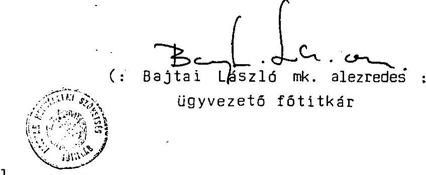

---

# FÖLDHIVATAL,EGER 

## 2735

számú

## TULAJDONI LAP

másolata

## 85

kö̀̀ségbén-városban
fekvö Ingatlanról
Ez a másolat hatóságl eljórósbon a klálítóstól számitott 90 napig használható fel. Est követöen csok újabb hitelesítéssel érvényes.
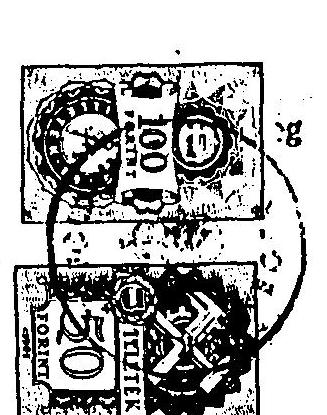

Megrendelás azáma: 2715/1991
Ez a másolat, az eredeti tulajdoni lap bajegyzásoivel a kiadást megelózó
napig megegyezik óa 2 ozámozott oldalt tartalmaz.
Eger, 1991. Junius
P.H.
aláirás
Változatlan:
Eger,
P.H.
aláirás

---

|   |  |  |  |  |  |  |  |  |  |  |  |  |  |  |  |  |  |  |  |  |  |  |  |  |  |  |  |  |  |  |  |  |  |  |  |  |  |  |  |  |  |  |  |  |  |  |  |  |  |  |  |  |  |  |  |  |  |  |  |  |  |  |  |  |  |  |  |  |  |  |  |  |  |  |  |  |  |  |  |  |  |  |  |  |  |  |  |  |  |  |  |  |  |  |  |  |  |  |  |  |  |  |

---

# MAGYAR HONVÉDELMI SZÖVETSÉG   2015/1990.   6. sz.példány   UGYVEZETO FOTITKARA 

Budapest, V. Beloiannisz u.16.

Nyt.szám: 4-72/1990.

## NYILATKOZAT

tulajdonjog bejegyzéséhez

Az MHSZ Orszgos Központ képviseletében az 1022/1990. (II. 14.) MT határozat rendelkezései végrehajtásaként hozzájárulok ahhoz, hogy az MHSZ tulajdonában Iévõ Gyöngyös, Puskin u. 1. sz. (tulajdoni-lap szám: 4180, hrsz.: 4456) gépjármũvezetô-képzô kirendeltség rendeltetésũ ingatlan tulajdonjoga az MHSZ által alapított Kulturált Közlekedésért Alapítvány javára az ingatlannyi1vántartásba bejegyzésre kerüljön.

Budapest, 1990. szeptember 10.

Kapják:
1-5. pld. Földhivatal
6. pld. KKA
7. pld. MHSZ OK.
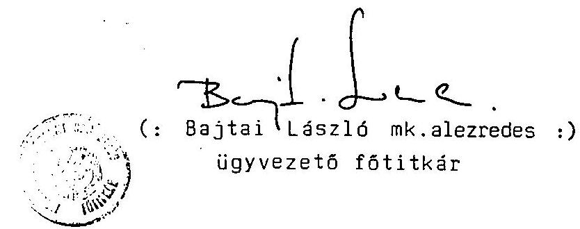

---

# TULAJJONI LAP I. KÉSZ 

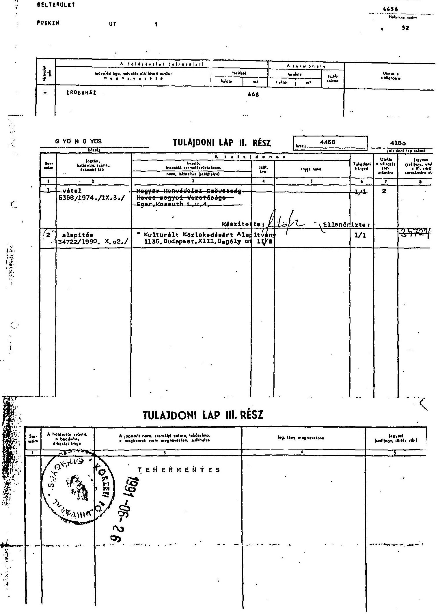

---

# TULAJDONI LAP I. RÉSZ 

## GYINGYUS

közzég (város)
BELTERÜLET
KENYÉrGYÁr
DT

| 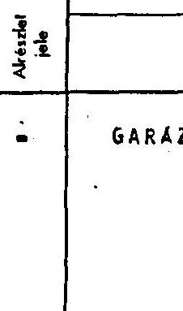 | A foldrészlet (alrészlet) |  |  | A termóhely |  |  |
| :--: | :--: | :--: | :--: | :--: | :--: | :--: |
|  | móvelési ága, móvelés alól kivett terület me g nevezése | területe |  | területe |  | érték-
szóma |
|  |  | hektar | $\mathrm{m}^{2}$ | hektar | $\mathrm{m}^{2}$ |  |
| * | GARÁZS ES UDVAR | 663 |  |  |  |  |

194. r. sz. Tulajdoni lap I. rész - Ekkocp Nyomda - M 144

---

|  Gyöngyös |  |  | TULAJDONI LAP II. RÉSZ |  |  |  | 3525  |
| --- | --- | --- | --- | --- | --- | --- | --- |
|  közzég |  |  |  |  |  |  | tulajdoni lap száma  |
|  Sor-
szám | jogcím,
határozat száma,
érkezési idő |  | A t u l a
d o n
o s |  |  | Tulaidoni
hányad | Utalás
a változás
sor-
számára  |
|   |  |  | kazaló,
használó termelőszövetkezet
neve, lakáscíme (székhelye) | szül.
öve | anyja neve |  |   |
|  1 | 2 |  | 3 | 4 | 5 | 6 | 7  |
|  21 | vétel
304-2/1981/II.20./ |  | Vincszur János /1 440714 1538 /
Róbert K. ut 23. | 1944 | Belogh Mária | 2/38
2/40 | 39  |
|  22 | tényleges birtoklás
532-3/1981./III.17./ |  | Kovács István 1-280717-0176
/ Élmunkás u 32. |  |  | 2/40
2/50 | 39  |
|  23 | vétel
6917-2/1981./XI.24./ |  | Rajki Sándor 1 431212 1909
/ Élmunkás ut 34. | 1943 | Somogyi Kornélia | 2/38 | 35  |
|  24 | vétel
1689-2/1983./II.28./ |  | Pap Sándor 1 490825 2268
/ és felesége | 1949 | Pleiner Ilona | 1/38 | 34  |
|  25 |  |  | Fribert Ilona 2 461225 8293
/ Farkas T. ut 8.1/1. | 1946 | Varga Margit | 1/38 |   |
|  26 | vétel
2490/1983./III.31./ |  | Mátyási János 1 381031 1343
/ és felesége | 1938 | Bozsik Anna | 1/38
1/40 | 39  |
|  27 |  |  | Juhász Anna 2 440324 7413
/ Olímpia ut 15.11/2. | 1944 | Bogdány Etelka | 1/38
1/40 | 39  |
|  28 | házastársi közös
vagyönközösség
712-3/1984./II.1./ |  | Endrész János 1 460131 1538
/ Török I. ut 24. | 1946 | Szabó Erzsébet | 2/38
2/40 | 39  |
|  29 | vétel
3770-2/1984./VII.5./ |  | MHSZ. Gegarin Bőőrőmű Könnyű
/ buvár Klub.
Visehta. Pf. 21. |  |  | 2/38
2/40 | 39  |
|  30 | örökés
4817/1984./IX.18./ |  | Ozsvári Ágnes 2 551003 2755
/ Bajcsy Zs. körut 32. | 1955 | Tard Julianna | 1/38
1/40 | 39  |
|  31 |  |  | Ozsvári Tamás 1 660513 3133
/ Élmunkás ut 34. | 1966 | Tari Julianna | 1/38
1/40 | 39  |
|   |  |  |  |  |  |  | 4332146
37062173  |

MZM OFTH 672. v. Rajdoni lap II. rész. - 76-31 Pécsi Szilva Nyomda

1/38

1/40

1/50

1/50

1/50

1/50

1/50

1/50

1/50

1/50

1/50

1/50

1/50

1/50

1/50

1/50

1/50

1/50

1/50

1/50

1/50

1/50

1/50

1/50

1/50

1/50

1/50

1/50

1/50

1/50

1/50

1/50

1/50

1/50

1/50

1/50

1/50

1/50

1/50

1/50

1/50

1/50

---

# 1 

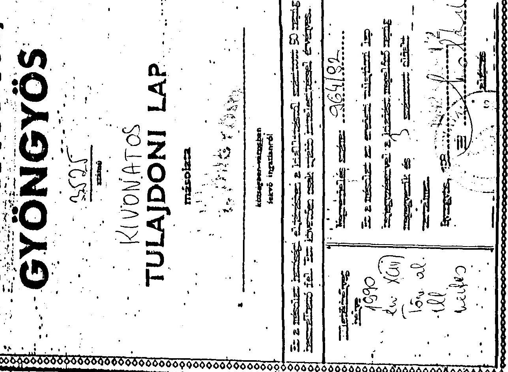

---

# TULAJDONI LAP I. RÉSZ 

## GYONGYOS

kószég (város)
BELTERULET

PUSKIN
UT
1

|  | A foldreszlet (alreszlet) |  |  | A termóhely |  |  |
| :--: | :--: | :--: | :--: | :--: | :--: | :--: |
|  | múvelési ága, múvelés olól kivett terület me g n e v e z e s e | területe |  | terúlete |  | értékszóma |
|  |  | hektar | $\mathrm{m}^{2}$ | hektar | $\mathrm{m}^{2}$ |  |
| IRODAHAZ |  | 468 |  |  |  |  |

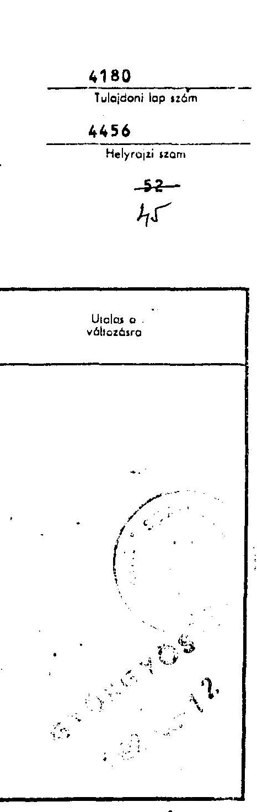

---

|  GYO NG YOS |  | TULAJDONI LAP II. RÉSZ |  | 4456 |  | 4180 |   |
| --- | --- | --- | --- | --- | --- | --- | --- |
|  közzég |  |  |  |  |  |  |   |
|  Sorszám | Jogcím, hasározat száma, érkezési idő | A t u l a j d o n o s |  |  | Tulajdoni hányad | Utalás a változás sorszámára | Jegyzet (széljegy, utalás a III. rész sorszámára stb.)  |
|   |  | kezelő, használó termelőszővetkezet | szül. éve | anyja neve |  |  |   |
|  1 | 2 | 3 | 4 | 5 | 6 | 7 | 8  |
|  1 | vétel 5368/1974./IX.3./ | Magyar Honvédelmi Szövetség
Havas megyei vezetősége
Eger. Kossuth L.U.4. |  |  | 1/1 | 2 |   |
|   |  |  | Készítette: |  | Ellenőrizte: |  |   |
|  2 | alapítás 34722/1990. X.02./ | " Kulturált Közlekedésért Alapítvány 1135. Budapest. XIII. Dagály út 11/1" |  |  | 1/1 |  | 317275  |

---

# LQDHIVAIAL GYONGYOS

## TULAJDONI LAP

másolapa

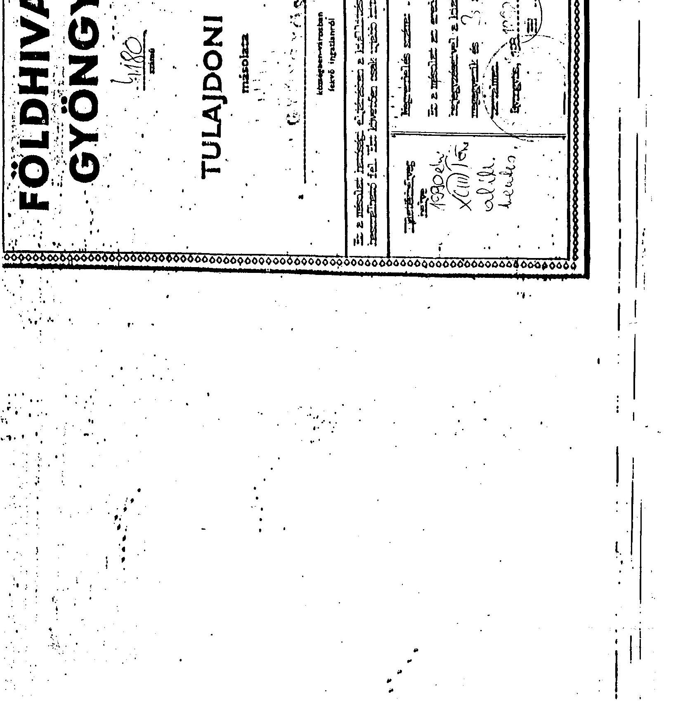

---

# TULAJDONI LAP III. RÉSZ

|  Sor-
szám | Határozat száma,
érkezési idő | A megkereső szerv megnevezése | Jog, tény megnevezése | Jegyzet
(széljegv. törlés
stb.)  |
| --- | --- | --- | --- | --- |
|   |  | A jogosult neve (szül. éve, anyja neve)
Iakáscíme (székhelye) |  |   |
|  1 | 30803/1991
/II.13./ | Magyar Technika és Tömegsport Szövetség. Heves megyei elnökeége
3300. Eger. Lenin ut 53.
Dr. Pintér István | Fellebbezés a 34722/1990. számu
határozat ellen. | 5  |
|   |  |  |  | 50803/1991
11.12.1991  |

---

# TULAJDONI LAP III. RÉSZ

|  Sor-
szám | Határozat száma, érkezési lơó | A megkeresô szerv megnevezése | Jeg, tény megnevezése | Jegyzet (széljegy, tórlés stb.)  |
| --- | --- | --- | --- | --- |
|   |  | A jogosult neve (szül. éve, anyja neve) Iskáscime (székhelye) |  |   |
|  1. | 30.207/1991. /I.16./ | Kulturált Közlekedésért Alapítvány Budapest Dagály u.11/a. | Fellebbezés tulajdonjog bejegyzése ellen. | 5  |
|  2. | 30.207/4/199 II.27. | Kulturált Közlekedésért Alapítvány Budapest. | Nm. Földhivatal 30.017/1991.az határozatának megváltozatátás iránti kérelem. |   |

---

Megremdelás száma: 415/1292
Ez a teljes másolat az eredeti tulajdoni lap bejegyzésélet a kiadást
megeti a nagy megegyek
Feltesetésnyilga 1902-03-12
1902-02-12
19
hó
nap

Báris Rákóczi
elésés

---

# MAGYAR HONVÉOELMI SZƠVETSÉG 

## ÜGYVEZETO FÔTITKÁRA

Budapest, V. Beloiannisz u.16.
Nyt.szám: 4-73/1990.

## NYILATKOZAT

tulajdonjog bejegyzéséhez

Az MHSZ Orszgos Központ képviseletében az 1022/1990. (II. 14.) MT határozat rendelkezései végrehajtásaként hozzájárulok ahhoz, hogy az MHSZ tulájdonában.lévô Esztergom, Kossuth u.42. sz. (tulajdoni-lap szám: 5365, hrsz. 17496) gépjármũvezetô-képzõ kirendeltség rendeltetésũ ingatlan tulajdonjoga az MHSZ által alapított Kulturált Közlekedésért Alapítvány javára az ingatlannyilvántartásba bejegyzésre kerüljön.

Budapest, 1990. szeptember 10.
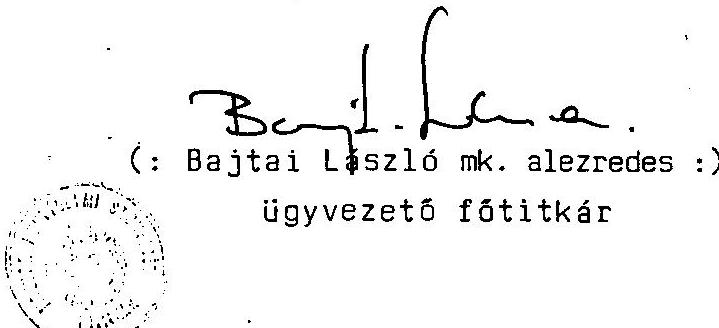

Kapják:
1-5. pld. Földhivatal
6. pld. KKA
7. pld. MHSZ OK.

---

ESZTERGOM

1984 JANUAR

TULAJDONI LAP I. RÉSZ

576.

5365

Tulajdoni lap szám

17486

Helyrajzi szám

17486

15

BELTEROLET

KOSSUTH L.

UTCA

42

MÜSMLÉK

|  |   |   |   |   |   |
| --- | --- | --- | --- | --- | --- |
|  A Földrészlet (alrészlet) |  |  |  | A termékoly |   |
|  művelési ága, művelési alól kivett terület |  |  |  |  |   |
|  1913 |  |  |  |  |   |
|  1914 |  |  |  |  |   |
|  1913 |  |  |  |  |   |
|  1912-1914 |  |  |  |  |   |
|  1913-1914 |  |  |  |  |   |
|  1912-1914 |  |  |  |  |   |
|  1913-1914 |  |  |  |  |   |
|  1912-1914 |  |  |  |  |   |
|  1913-1914 |  |  |  |  |   |
|  1912-1914 |  |  |  |  |   |
|  1913-1914 |  |  |  |  |   |
|  1912-1914 |  |  |  |  |   |
|  1913-1914 |  |  |  |  |   |
|  1912-1914 |  |  |  |  |   |
|  1913-1914 |  |  |  |  |   |
|  1912-1914 |  |  |  |  |   |
|  1913-1914 |  |  |  |  |   |
|  1912-1914 |  |  |  |  |   |
|  1913-1914 |  |  |  |  |   |
|  1912-1914 |  |  |  |  |   |
|  1913-1914 |  |  |  |  |   |
|  1912-1914 |  |  |  |  |   |
|  1913-1914 |  |  |  |  |   |
|  1912-1914 |  |  |  |  |   |
|  1913-1914 |  |  |  |  |   |
|  1912-1914 |  |  |  |  |   |
|  1913-1914 |  |  |  |  |   |
|  1912-1914 |  |  |  |  |   |
|  1913-1914 |  |  |  |  |   |
|  1912-1914 |  |  |  |  |   |
|  1913-1914 |  |  |  |  |   |
|  1912-1914 |  |  |  |  |   |
|  1913-1914 |  |  |  |  |   |
|  1912-1914 |  |  |  |  |   |
|  1913-1914 |  |  |  |  |   |
|  1912-1914 |  |  |  |  |   |
|  1913-1914 |  |  |  |  |   |
|  1912-1914 |  |  |  |  |   |
|  1913-1914 |  |  |  |  |   |
|  1912-1914 |  |  |  |  |   |
|  1913-1914 |  |  |  |  |   |
|  1912-1914 |  |  |  |  |   |
|  1913-1914 |  |  |  |  |   |
|  1912-1914 |  |  |  |  |   |
|  1913-1914 |  |  |  |  |   |
|  1912-1914 |  |  |  |  |   |
|  1913-1914 |  |  |  |  |   |
|  1912-1914 |  |  |  |  |   |
|  1913-1914 |  |  |  |  |   |
|  1912-1914 |  |  |  |  |   |
|  1913-1914 |  |  |  |  |   |
|  1912-1914 |  |  |  |  |   |
|  1913-1914 |  |  |  |  |   |
|  1912-1914 |  |  |  |  |   |
|  1913-1914 |  |  |  |  |   |
|  1912-1914 |  |  |  |  |   |
|  1913-1914 |  |  |  |  |   |
|  1912-1914 |  |  |  |  |   |
|  1913-1914 |  |  |  |  |   |
|  1912-1914 |  |  |  |  |   |
|  1913-1914 |  |  |  |  |   |
|  1912-1914 |  |  |  |  |   |
|  1913-1914 |  |  |  |  |   |
|  1912-1914 |  |  |  |  |   |
|  1913-1914 |  |  |  |  |   |
|  1912-1914 |  |  |  |  |   |
|  1913-1914 |  |  |  |  |   |
|  1912-1914 |  |  |  |  |   |
|  1913-1914 |  |  |  |  |   |
|  1912-1914 |  |  |  |  |   |
|  1913-1914 |  |  |  |  |   |
|  1912-1914 |  |  |  |  |   |
|  1913-1914 |  |  |  |  |   |
|  1912-1914 |  |  |  |  |   |
|  1913-1914 |  |  |  |  |   |
|  1912-1914 |  |  |  |  |   |
|  1913-1914 |  |  |  |  |   |
|  1912-1914 |  |  |  |  |   |
|  1913-1914 |  |  |  |  |   |
|  1912-1914 |  |  |  |  |   |
|  1913-1914 |  |  |  |  |   |
|  1912-1914 |  |  |  |  |   |
|  1913-1914 |  |  |  |  |   |
|  1912-1914 |  |  |  |  |   |
|  1913-1914 |  |  |  |  |   |
|  1912-1914 |  |  |  |  |   |
|  1913-1914 |  |  |  |  |   |
|  1912-1914 |  |  |  |  |   |
|  1913-1914 |  |  |  |  |   |
|  1912-1914 |  |  |  |  |   |
|  1913-1914 |  |  |  |  |   |
|  1912-1914 |  |  |  |  |   |
|  1913-1914 |  |  |  |  |   |
|  1912-1914 |  |  |  |  |   |
|  1913-1914 |  |  |  |  |   |
|  1912-1914 |  |  |  |  |   |
|  1913-1914 |  |  |  |  |   |
|  1912-1914 |  |  |  |  |   |
|  1913-1914 |  |  |  |  |   |
|  1912-1914 |  |  |  |  |   |
|  1913-1914 |  |  |  |  |   |
|  1912-1914 |  |  |  |  |   |
|  1913-1914 |  |  |  |  |   |
|  1912-1914 |  |  |  |  |   |
|  1913-1914 |  |  |  |  |   |
|  1912-1914 |  |  |  |  |   |
|  1913-1914 |  |  |  |  |   |
|  1912-1914 |  |  |  |  |   |
|  1913-1914 |  |  |  |  |   |
|  1912-1914 |  |  |  |  |   |
|  1913-1914 |  |  |  |  |   |
|  1912-1914 |  |  |  |  |   |
|  1913-1914 |  |  |  |  |   |
|  1912-1914 |  |  |  |  |   |
|  1913-1914 |  |  |  |  |   |
|  1912-1914 |  |  |  |  |   |
|  1913-1914 |  |  |  |  |   |
|  1912-1914 |  |  |  |  |   |
|  1913-1914 |  |  |  |  |   |
|  1912-1914 |  |  |  |  |   |
|  1913-1914 |  |  |  |  |   |
|  1912-1914 |  |  |  |  |   |
|  1913-1914 |  |  |  |  |   |
|  1912-1914 |  |  |  |  |   |
|  1913-1914 |  |  |  |  |   |
|  1912-1914 |  |  |  |  |   |
|  1913-1914 |  |  |  |  |   |
|  1912-1914 |  |  |  |  |   |
|  1913-1914 |  |  |  |  |   |
|  1912-1914 |  |  |  |  |   |
|  1913-1914 |  |  |  |  |   |
|  1912-1914 |  |  |  |  |   |
|  1913-1914 |  |  |  |  |   |
|  1912-1914 |  |  |  |  |   |
|  1913-1914 |  |  |  |  |   |
|  1912-1914 |  |  |  |  |   |
|  1913-1914 |  |  |  |  |   |
|  1912-1914 |  |  |  |  |   |
|  1913-1914 |  |  |  |  |   |
|  1912-1914 |  |  |  |  |   |
|  1913-1914 |  |  |  |  |   |
|  1912-1914 |  |  |  |  |   |
|  1913-1914 |  |  |  |  |   |
|  1912-1914 |  |  |  |  |   |
|  1913-1914 |  |  |  |  |   |
|  1912-1914 |  |  |  |  |   |
|  1913-1914 |  |  |  |  |   |
|  1912-1914 |  |  |  |  |   |
|  1913-1914 |  |  |  |  |   |
|  1912-1914 |  |  |  |  |   |
|  1913-1914 |  |  |  |  |   |
|  1912-1914 |  |  |  |  |   |
|  1913-1914 |  |  |  |  |   |
|  1912-1914 |  |  |  |  |   |
|  1913-1914 |  |  |  |  |   |
|  1912-1914 |  |  |  |  |   |
|  1913-1914 |  |  |  |  |   |
|  1912-1914 |  |  |  |  |   |
|  1913-1914 |  |  |  |  |   |
|  1912-1914 |  |  |  |  |   |
|  1913-1914 |  |  |  |  |   |
|  1912-1914 |  |  |  |  |   |
|  1913-1914 |  |  |  |  |   |
|  1912-1914 |  |  |  |  |   |
|  1913-1914 |  |  |  |  |   |
|  1912-1914 |  |  |  |  |   |
|  1913-1914 |  |  |  |  |   |
|  1912-1914 |  |  |  |  |   |
|  1913-1914 |  |  |  |  |   |
|  1912-1914 |  |  |  |  |   |
|  1913-1914 |  |  |  |  |   |
|  1912-1914 |  |  |  |  |   |
|  1913-1914 |  |  |  |  |   |
|  1912-1914 |  |  |  |  |   |
|  1913-1914 |  |  |  |  |   |
|  1912-1914 |  |  |  |  |   |
|  1913-1914 |  |  |  |  |   |
|  1912-1914 |  |  |  |  |   |
|  1913-1914 |  |  |  |  |   |
|  1912-1914 |  |  |  |  |   |
|  1913-1914 |  |  |  |  |   |
|  1912-1914 |  |  |  |  |   |
|  1913-1914 |  |  |  |  |   |
|  1912-1914 |  |  |  |  |   |
|  1913-1914 |  |  |  |  |   |
|  1912-1914 |  |  |  |  |   |
|  1913-1914 |  |  |  |  |   |
|  1912-1914 |  |  |  |  |   |
|  1913-1914 |  |  |  |  |   |
|  1912-1914 |  |  |  |  |   |
|  1913-1914 |  |  |  |  |   |
|  1912-1914 |  |  |  |  |   |
|  1913-1914 |  |  |  |  |   |
|  1912-1914 |  |  |  |  |   |
|  1913-1914 |  |  |  |  |   |
|  1912-1914 |  |  |  |  |   |
|  1913-1914 |  |  |  |  |   |
|  1912-1914 |  |  |  |  |   |
|  1913-1914 |  |  |  |  |   |
|  1912-1914 |  |  |  |  |   |
|  1913-1914 |  |  |  |  |   |
|  1912-1914 |  |  |  |  |   |
|  1913-1914 |  |  |  |  |   |
|  1912-1914 |  |  |  |  |   |
|  1913-1914 |  |  |  |  |   |
|  1912-1914 |  |  |  |  |   |
|  1913-1914 |  |  |  |  |   |
|  1912-1914 |  |  |  |  |   |
|  1913-1914 |  |  |  |  |   |
|  1912-1914 |  |  |  |  |   |
|  1913-1914 |  |  |  |  |   |
|  1912-1914 |  |  |  |  |   |
|  1913-1914 |  |  |  |  |   |
|  1913-1914 |  |  |  |  |   |
|  1913-1914 |  |  |  |  |   |
|  1913-1914 |  |  |  |  |   |
|  1913-1914 |  |  |  |  |   |
|  1913-1914 |  |  |  |  |   |
|  1913-1914 |  |  |  |  |   |
|  1913-1914 |  |  |  |  |   |
|  1913-1914 |  |  |  |  |   |
|  1913-1914 |  |  |  |  |   |
|  1913-1914 |  |  |  |  |   |
|  1913-1914 |  |  |  |  |   |
|  1913-1914 |  |  |  |  |   |
|  1913-1914 |  |  |  |  |   |
|  1913-1914 |  |  |  |  |   |
|  1913-1914 |  |  |  |  |   |
|  1913-1914 |  |  |  |  |   |
|  1913-1914 |  |  |  |  |   |
|  1913-1914 |  |  |  |  |   |
|  1913-1914 |  |  |  |  |   |
|  1913-1914 |  |  |  |  |   |
|  1913-1914 |  |  |  |  |   |
|  1913-1914 |  |  |  |  |   |
|  1913-1914 |  |  |  |  |   |
|  1913-1914 |  |  |  |  |   |
|  1913-1914 |  |  |  |  |   |
|  1913-1914 |  |  |  |  |   |
|  1913-1914 |  |  |  |  |   |
|  1913-1914 |  |  |  |  |   |
|  1913-1914 |  |  |  |  |   |
|  1913-1914 |  |  |  |  |   |
|  

---

|  Esztergom |  | TULAJDONI LAP II. RÉSZ | hrsz.: 17486 |  | 5365
tulajdoni lap száma |   |
| --- | --- | --- | --- | --- | --- | --- |
|  Sorszám | Jogcím,
a határozat száma,
a beadvány érkezési ideje | A tulajdonos neve, személyi száma, lakáscime,
a kezelő, (használó termelőszövetkezet) neve, székhelye |  | Tulajdoni
hányad | Utalás
a változás
sor-
számára | Jegyzet
(ezítjegy, utalás
a III. rész
sorszámára stb.)  |
|  1 | 2 | 3 | 4 | 5 | 6 |   |
|  1 | Vétel 4084/1974 IX
53.016/1990.IX.28. | Kulturált közlekedésért alapítvány
Magyar-Honvédelmi Szövetség-Komárom-megyei Vezetőzég
1/1
Tatabánya-V, Byjári-11 Budapest, Dagály út 11/a. Készítette:
Ellen: rizte: |  |  |  | 53006/90  |
|  2 | 50.317/1991.IV.30.
eredeti áll. vissza
állítás | Magyar-Technikai és Tömegapottklubok Szövetsége
Komárom-Esztergom megyei Elnöksége
Tatabánya |  | 1/1 |  |   |
|  3 | átengedés
53.629/1991./X.4./ | KULTURÁLT KÖZLEKEDÉSÉRT ALAPÍTVÁNY
1138. Budapest, Dagály u. 11/a. |  | 1/1 |  |   |
|  |   |   |   |   |   |   |
|  |   |   |   |   |   |   |
|  |   |   |   |   |   |   |
|  |   |   |   |   |   |   |
|  MEM-OFTR 676. f. 82. - Tulajdoni lap II-III. rész. - 80. - BR. - 72788 - NY. NY. |  |  |  |  |  |   |

---

|  Esztergom |  | TULAJDONI LÁP II. RÉSZ | hrsz. | 17486 | 5365  |
| --- | --- | --- | --- | --- | --- |
|  14267 |  |  |  |  |   |
|  Sorszám | Jogcím, a határozat száma, a beadvány érkezési ideje | A tulajdonos neve, személyi száma, lakáscíme, a kezelő, (használó termelőszövetkezet) neve, székhelye |  |  |   |
|  1 | 2 | 3 | 4 | 5 | 6  |
|  1 | Vétel 4084/1974 IX
53.016/1990.IX.28. | Kulturált Közlekedésárt Alapítvány
Magyar Hozzádeny Szövetség Komárom-megyei Vezetőege
1/1
Tatabánya V, Győri a Budapest, Dagály út 11/a. Készlet
1/1
Ellendírt
Éssze |  |  |   |
|  2 | 50.317/1991.IV.30.
eredeti áll. visszaállítás | Magyar Fechnikai és Tömegapottklubok Szövetsége
Komárom-Esztergom megyei Elnőkésége
1/1
Tatabánya |  |  |   |
|  3 | átengedés
53.629/1991./X.4./ | KULTURÁLT KÖZLEKEDÉSÉRT ALAPÍTVÁNY
1138. Budapest, Dagály u. 11/a. |  |  |   |
|  |   |   |   |   |   |
|   |  | MEGYAR TECHNÍKAI ÉS TÖMEGEPORTKLUBOK SZÖVETSÉGE
1/1
1138. Budapest, Dagály u. 11/a. |  |  |   |
|  |   |   |   |   |   |
|   |  | MEGYAR TECHNÍKAI ÉS TÖMEGEPORTKLUBOK SZÖVETSÉGE
1/1
1138. Budapest, Dagály u. 11/a. |  |  |   |
|  |   |   |   |   |   |
|   |  | MEGHOR
1138. Budapest, Dagály u. 11/a. |  |  |   |
|  |   |   |   |   |   |
|   |  | MEGHOR
1138. Budapest, Dagály u. 11/a. |  |  |   |
|  |   |   |   |   |   |
|   |  | MEGHOR
1138. Budapest, Dagály u. 11/a. |  |  |   |
|  |   |   |   |   |   |
|   |  | MEGHOR
1138. Budapest, Dagály u. 11/a. |  |  |   |
|  |   |   |   |   |   |
|   |  | MEGHOR
1138. Budapest, Dagály u. 11/a. |  |  |   |
|  |   |   |   |   |   |
|   |  | MEGHOR
1138. Budapest, Dagály u. 11/a. |  |  |   |
|  |   |   |   |   |   |
|   |  | MEGHOR
1138. Budapest, Dagály u. 11/a. |  |  |   |
|  |   |   |   |   |   |
|   |  | MEGHOR
1138. Budapest, Dagály u. 11/a. |  |  |   |
|  |   |   |   |   |   |
|   |  | MEGHOR
1138. Budapest, Dagály u. 11/a. |  |  |   |
|  |   |   |   |   |   |
|   |  | MEGHOR
1138. Budapest, Dagály u. 11/a. |  |  |   |
|  |   |   |   |   |   |
|   |  | MEGHOR
1138. Budapest, Dagály u. 11/a. |  |  |   |
|  |   |   |   |   |   |
|   |  | MEGHOR
1138. Budapest, Dagály u. 11/a. |  |  |   |
|  |   |   |   |   |   |
|   |  | MEGHOR
1138. Budapest, Dagály u. 11/a. |  |  |   |
|  |   |   |   |   |   |
|   |  | MEGHOR
1138. Budapest, Dagály u. 11/a. |  |  |   |
|  |   |   |   |   |   |
|   |  | MEGHOR
1138. Budapest, Dagály u. 11/a. |  |  |   |
|  |   |   |   |   |   |
|   |  | MEGHOR
1138. Budapest, Dagály u. 11/a. |  |  |   |
|  |   |   |   |   |   |
|   |  | MEGHOR
1138. Budapest, Dagály u. 11/a. |  |  |   |
|  |   |   |   |   |   |
|   |  | MEGHOR
1138. Budapest, Dagály u. 11/a. |  |  |   |
|  |   |   |   |   |   |
|   |  | MEGHOR
1138. Budapest, Dagály u. 11/a. |  |  |   |
|  |   |   |   |   |   |
|   |  | MEGHOR
1138. Budapest, Dagály u. 11/a. |  |  |   |
|  |   |   |   |   |   |
|   |  | MEGHOR
1138. Budapest, Dagály u. 11/a. |  |  |   |
|  |   |   |   |   |   |
|   |  | MEGHOR
1138. Budapest, Dagály u. 11/a. |  |  |   |
|  |   |   |   |   |   |
|   |  | MEGHOR
1138. Budapest, Dagály u. 11/a. |  |  |   |
|  |   |   |   |   |   |
|   |  | MEGHOR
1138. Budapest, Dagály u. 11/a. |  |  |   |
|  |   |   |   |   |   |
|   |  | MEGHOR
1138. Budapest, Dagály u. 11/a. |  |  |   |
|  |   |   |   |   |   |
|   |  | MEGHOR
1138. Budapest, Dagály u. 11/a. |  |  |   |
|  |   |   |   |   |   |
|   |  | MEGHOR
1138. Budapest, Dagály u. 11/a. |  |  |   |
|  |   |   |   |   |   |
|   |  | MEGHOR
1138. Budapest, Dagály u. 11/a. |  |  |   |
|  |   |   |   |   |   |
|   |  | MEGHOR
1138. Budapest, Dagály u. 11/a. |  |  |   |
|  |   |   |   |   |   |
|   |  | MEGHOR
1138. Budapest, Dagály u. 11/a. |  |  |   |

---

ESZTERGOM

község (város)

BELTEROLET

KOSSUTH L.

UTCA 42

MÜZEMLEK

17316

TULAJDONI LAP I. RÉSZ

1984 JANUAR

5365

Tulajdoni lap szám

17486

Helyrajzi szám

15

MÜZEMLEK

|  |   |   |   |   |   |   |   |   |   |   |   |   |   |   |   |   |   |   |   |   |   |   |   |   |   |   |   |   |   |   |   |   |   |   |   |   |   |   |   |   |   |   |   |   |   |   |   |   |   |   |   |   |   |   |   |   |   |   |   |   |   |   |   |   |   |   |   |   |   |   |   |   |   |   |   |   |   |   |   |   |   |   |   |   |   |   |   |   |   |   |   |   |   |   |   |   |   |   |   |   |  

---

# TULAJDONI LAP III. RÉSZ.

|  Sor-
szám | A határozat száma,
a beadvány
érkezési ideje | A jogosult neve, személyi száma, lakáscíme,
a megkereső szerv megnevezése, székhelye | Jog, tény megnevezése | Jegyzet
(széljegy, törlés
ztb.)  |
| --- | --- | --- | --- | --- |
|  1 | 3384/1978 | Régészetileg védett terület |  |   |

---

# MAGYAR HONVÉOELMI SZOVETSÉG 

## UGYVEZETO FÔTITKÁRA

Budapest, V. Beloiannisz u.16.
Nyt.szám: $4-74 / 1990$

## NYILATKOZAT

tulajdonjog bejegyzéséhez

Az MHSZ Orszgos központ képviseletében az 1022/1990. (II. 14.) MT határozat rendelkezései végrehajtásaként hozzájárulok ahhoz, hogy az MHSZ tulajdonában lévô Balassagyarmat, Táncsics M. u. 17. (tulajdoni-láp szám: 1832, hrsz.: 1572) gépjármũve-zetô-képzô kirendeltség rendeltetésũ ingatlan tulajdonjoga az MHSZ által alapított Kulturált Közlekedésért Alapítvány javára az ingatlannyilvántartásba bejegyzésre kerüljön.

Budapest, 1990. szeptember 10.

Kapják:
1-5. pld. Földhivatal
6. pld. KKA.
7. pld. MHSZ OK.
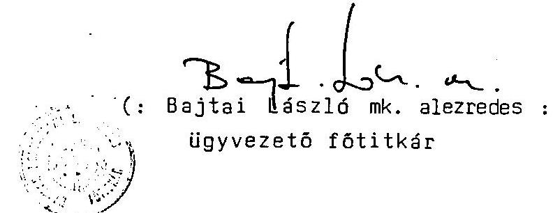

---

# NULDRIVATAL 

r.utl Szumbathely, Hunyadi u. 11.
Tut. f....... 004. Pf.: 04.
A mambat végét arere nova
$1-179 \quad 11990$
arim
EL.: $72 / 1990$

## MEGOSZTASI VAZRAJZ

a 7302/3 helyrajzi szórni fóldréazketrol

Mérstorány: 1:1000
Térképezésény uráma: 45

| Változás utőit |  |  |  | Változás után |  |  |  |  |  |  |  |
| :--: | :--: | :--: | :--: | :--: | :--: | :--: | :--: | :--: | :--: | :--: | :--: |
| Hrss. |  |  |  | Hrss. |  | Mbr.   kg | Telapdanoe |  | Terület |  | $\begin{gathered} \text { Jegy } \\ \text { art } \end{gathered}$ |
|  |  |  |  |  |  |  | neve és lakróma |  | ba | $\mathrm{m}^{2}$ |  |
| 1 | 2 | 3 | 4 | 5 | 6 | 7 | 8 | 5 | 10 | 11 | 12 |
| 7302/2 |  | 1 | 7675 | 7302/5 |  | 6p.6a Kulturalt Köslakodóait Alapítvány Budapest |  | 1 | 4577 |  |  |
|  |  |  |  | 7302/5 |  | 6p.6a Magyar Technikai és Tőmegaportklubok Szörvetage Szombathely |  | - | 3098 |  |  |
|  |  | 1 | 7675 |  |  |  |  | 1 | 7675 |  |  |
| A megnezdés akaratunknak megédeően történis |  |  |  |  |  |  |  |  |  |  |  |

A helyrajzi szórnaos és terüleledelégés helyes. P. 3. 4. 5. 6. 7. 8. 9. 10. 11. 12. 13. 14. 15. 16. 17. 18. 19. 20. 21. 22. 23. 24. 25. 26. 27. 28. 29. 30. 31. 32. 33. 34. 35. 36. 37. 38. 39. 40. 41. 42. 43. 44. 45. 46. 47. 48. 49. 50. 51. 52. 53. 54. 55. 56. 57. 58. 59. 60. 61. 62. 63. 64. 65. 66. 67. 68. 69. 70. 71. 72. 73. 74. 75. 76. 77. 78. 79. 80. 81. 82. 83. 84. 85. 86. 87. 88. 89. 90. 91. 92. 93. 94. 95. 96. 97. 98. 99. 100. 101. 102. 103. 104. 105. 106. 107. 108. 109. 110. 111. 112. 113. 114. 115. 116. 117. 118. 119. 120. 121. 122. 123. 124. 125. 126. 127. 128. 129. 130. 131. 132. 133. 134. 135. 136. 137. 138. 139. 140. 141. 142. 143. 144. 145. 146. 147. 148. 149. 150. 151. 152. 153. 154. 155. 156. 157. 158. 159. 160. 161. 162. 163. 164. 165. 166. 167. 168. 169. 170. 171. 172. 173. 174. 175. 176. 177. 178. 179. 180. 181. 182. 183. 184. 185. 186. 187. 188. 189. 190. 191. 192. 193. 194. 195. 196. 197. 198. 199. 200. 201. 202. 203. 204. 205. 206. 207. 208. 209. 210. 211. 212. 213. 214. 215. 216. 217. 218. 219. 220. 221. 222. 223. 224. 225. 226. 227. 228. 229. 230. 231. 232. 233. 234. 235. 236. 237. 238. 239. 240. 241. 242. 243. 244. 245. 246. 247. 248. 249. 250. 251. 252. 253. 254. 255. 256. 257. 258. 259. 260. 262. 263. 264. 265. 266. 267. 268. 269. 270. 271. 272. 273. 274. 275. 276. 277. 278. 279. 280. 282. 283. 284. 285. 286. 287. 288. 289. 290. 291. 292. 293. 294. 295. 296. 297. 298. 299. 210. 211. 212. 213. 214. 215. 216. 217. 218. 219. 220. 221. 222. 223. 224. 225. 226. 227. 228. 229. 230. 231. 232. 233. 234. 235. 236. 237. 238. 239. 240. 241. 242. 243. 244. 245. 246. 247. 248. 249. 250. 251. 252. 253. 254. 255. 256. 257. 258. 259. 260. 262. 263. 264. 265. 266. 267. 268. 269. 270. 271. 272. 273. 274. 275. 276. 277. 278. 279. 280. 281. 282. 283. 284. 285. 286. 287. 288. 289. 290. 291. 292. 293. 294. 295. 296. 297. 298. 299. 210. 211. 212. 213. 214. 215. 216. 217. 218. 219. 220. 221. 222. 223. 224. 225. 226. 227. 228. 229. 230. 231. 232. 233. 234. 235. 236. 237. 238. 239. 240. 241. 242. 243. 244. 245. 246. 247. 248. 249. 250. 251. 252. 253. 254. 255. 256. 257. 258. 259. 260. 262. 263. 264. 265. 266. 267. 268. 269. 270. 271. 272. 273. 274. 275. 276. 277. 278. 279. 280. 281. 282. 283. 284. 285. 286. 287. 288. 289. 290. 291. 292. 293. 294. 295. 296. 297. 298. 299. 210. 211. 212. 213. 214. 215. 216. 217. 218. 219. 220. 221. 222. 223. 224. 225. 226. 227. 228. 229. 230. 231. 232. 233. 234. 235. 236. 237. 238. 239. 240. 241. 242. 243. 244. 245. 246. 247. 248. 249. 250. 251. 252. 253. 254. 255. 256. 257. 258. 259. 260. 262. 263. 264. 265. 266. 267. 268. 269. 270. 271. 272. 273. 274. 275. 276. 277. 278. 279. 280. 281. 282. 283. 284. 285. 286. 287. 288. 289. 290. 291. 292. 293. 294. 295. 296. 297. 298. 299. 210. 211. 212. 213. 214. 215. 216. 217. 218. 219. 220. 221. 222. 223. 224. 225. 226. 227. 228. 229. 230. 231. 232. 233. 234. 235. 236. 237. 238. 239. 240. 241. 242. 243. 244. 245. 246. 247. 248. 249. 250. 251. 252. 253. 254. 255. 256. 257. 258. 259. 260. 262. 263. 264. 265. 266. 267. 268. 269. 270. 271. 272. 273. 274. 275. 276. 277. 278. 279. 280. 281. 282. 283. 284. 285. 286. 287. 288. 289. 290. 291. 292. 293. 294. 295. 296. 297. 298. 299. 210. 211. 212. 213. 214. 215. 216. 217. 218. 219. 220. 221. 222. 223. 224. 225. 226. 227. 228. 229. 230. 231. 232. 233. 234. 235. 236. 237. 238. 239. 240. 241. 242. 243. 244. 245. 246. 247. 248. 249. 250. 251. 252. 253. 254. 255. 256. 257. 258. 259. 260. 262. 263. 264. 265. 266. 267. 268. 269. 270. 271. 272. 273. 274. 275. 276. 277. 278. 279. 280. 281. 282. 283. 284. 285. 286. 287. 288. 289. 290. 291. 292. 293. 294. 295. 296. 297. 298. 299. 210. 211. 212. 213. 214. 215. 216. 217. 218. 219. 220. 221. 222. 223. 224. 225. 226. 227. 228. 229. 230. 231. 232. 233. 234. 235. 236. 237. 238. 239. 240. 241. 242. 243. 244. 245. 246. 247. 248. 249. 250. 251. 252. 253. 254. 255. 256. 257. 258. 259. 260. 262. 263. 264. 265. 266. 267. 268. 269. 270. 271. 272. 273. 274. 275. 276. 277. 278. 279. 280. 281. 282. 283. 284. 285. 286. 287. 288. 289. 290. 291. 292. 293. 294. 295. 296. 297. 298. 299. 210. 211. 212. 213. 214. 215. 216. 217. 218. 219. 220. 221. 222. 223. 224. 225. 226. 227. 228. 229. 230. 231. 232. 233. 234. 235. 236. 237. 238. 239. 240. 241. 242. 243. 244. 245. 246. 247. 248. 249. 250. 251. 252. 253. 254. 255. 256. 257. 258. 259. 260. 262. 263. 264. 265. 266. 267. 268. 269. 270. 271. 272. 273. 274. 275. 276. 277. 278. 279. 280. 281. 282. 283. 284. 285. 286. 287. 288. 289. 290. 291. 292. 293. 294. 295. 296. 297. 298. 299. 210. 211. 212. 213. 214. 215. 216. 217. 218. 219. 220. 221. 222. 223. 224. 225. 226. 227. 228. 229. 230. 231. 232. 233. 234. 235. 236. 237. 238. 239. 240. 241. 242. 243. 244. 245. 246. 247. 248. 249. 250. 251. 252. 253. 254. 255. 256. 257. 258. 259. 260. 262. 263. 264. 265. 266. 267. 268. 269. 270. 271. 272. 273. 274. 275. 276. 277. 278. 279. 280. 281. 282. 283. 284. 285. 286. 287. 288. 289. 290. 291. 292. 293. 294. 295. 296. 297. 298. 299. 210. 211. 212. 213. 214. 215. 216. 217. 218. 219. 220. 221. 222. 223. 224. 225. 226. 227. 228. 229. 230. 231. 232. 233. 234. 235. 236. 237. 238. 239. 240. 241. 242. 243. 244. 245. 246. 247. 248. 249. 250. 251. 252. 253. 254. 255. 256. 257. 258. 259. 260. 262. 263. 264. 265. 266. 267. 268. 269. 270. 271. 272. 273. 274. 275. 276. 277. 278. 279. 280. 281. 282. 283. 284. 285. 286. 287. 288. 289. 290. 291. 292. 293. 294. 295. 296. 297. 298. 299. 210. 211. 212. 213. 214. 215. 216. 217. 218. 219. 220. 221. 222. 223. 224. 225. 226. 227. 228. 229. 230. 231. 232. 233. 234. 235. 236. 237. 238. 239. 240. 241. 242. 243. 244. 245. 246. 247. 248. 249. 250. 251. 252. 253. 254. 255. 256. 257. 258. 259. 260. 262. 263. 264. 265. 266. 267. 268. 269. 270. 271. 272. 273. 274. 275. 276. 277. 278. 279. 280. 281. 282. 283. 284. 285. 286. 287. 288. 289. 290. 291. 292. 293. 294. 295. 296. 297. 298. 299. 200. 201. 202. 203. 204. 205. 206. 207. 208. 209. 210. 211. 212. 213. 214. 215. 216. 217. 218. 219. 220. 221. 222. 223. 224. 225. 226. 227. 228. 229. 230. 231. 232. 233. 234. 235. 236. 237. 238. 239. 240. 241. 242. 243. 244. 245. 246. 247. 248. 249. 250. 251. 252. 253. 254. 255. 256. 257. 258. 259. 260. 262. 263. 264. 265. 266. 267. 268. 269. 270. 271. 272. 273. 274. 275. 276. 277. 278. 279. 280. 281. 282. 283. 284. 285. 286. 287. 288. 289. 290. 291. 292. 293. 294. 295. 296. 297. 298. 299. 200. 201. 202. 203. 204. 205. 206. 207. 208. 209. 210. 211. 212. 213. 214. 215. 216. 217. 218. 219. 220. 221. 222. 223. 224. 225. 226. 227. 228. 229. 230. 231. 232. 233. 234. 235. 236. 237. 238. 239. 240. 241. 242. 243. 244. 245. 246. 247. 248. 249. 250. 251. 252. 253. 254. 255. 256. 257. 258. 259. 260. 262. 263. 264. 265. 266. 267. 268. 269. 270. 271. 272. 273. 274. 275. 276. 277. 278. 279. 280. 281. 282. 283. 284. 285. 286. 287. 288. 289. 290. 291. 292. 293. 294. 295. 296. 297. 298. 299. 200. 201. 202. 203. 204. 205. 206. 207. 208. 209. 210. 211. 212. 213. 214. 215. 216. 217. 218. 219. 220. 221. 222. 223. 224. 225. 226. 227. 228. 229. 230. 231. 232. 233. 234. 235. 236. 237. 238. 239. 240. 241. 242. 243. 244. 245. 246. 247. 248. 249. 250. 251. 252. 253. 254. 255. 256. 257. 258. 259. 260. 262. 263. 264. 265. 266. 267. 268. 269. 270. 271. 272. 273. 274. 275. 276. 277. 278. 279. 280. 281. 282. 283. 284. 285. 286. 287. 288. 289. 290. 291. 292. 293. 294. 295. 296. 297. 298. 299. 210. 211. 212. 213. 214. 215. 216. 217. 218. 219. 220. 221. 222. 223. 224. 225. 226. 227. 228. 229. 230. 231. 232. 233. 234. 235. 236. 237. 238. 239. 240. 241. 242. 243. 244. 245. 246. 247. 248. 249. 250. 251. 252. 253. 254. 255. 256. 257. 258. 259. 260. 262. 263. 264. 265. 266. 267. 268. 269. 270. 271. 272. 273. 274. 275. 276. 277. 278. 279. 280. 281. 282. 283. 284. 285. 286. 287. 288. 289. 290. 291. 292. 293. 294. 295. 296. 297. 298. 299. 210. 211. 212. 213. 214. 215. 216. 217. 218. 219. 220. 221. 222. 223. 224. 225. 226. 227. 228. 229. 230. 231. 232. 233. 234. 235. 236. 237. 238. 239. 240. 241. 242. 243. 244. 245. 246. 247. 248. 249. 250. 251. 252. 253. 254. 255. 256. 257. 258. 259. 260. 262. 263. 264. 265. 266. 267. 268. 269. 270. 271. 272. 273. 274. 275. 276. 277. 278. 279. 280. 281. 282. 283. 284. 285. 286. 287. 288. 289. 290. 291. 292. 293. 294. 295. 296. 297. 298. 299. 210. 211. 212. 213. 214. 215. 216. 217. 218. 219. 220. 221. 222. 223. 224. 225. 226. 227. 228. 229. 230. 231. 232. 233. 234. 235. 236. 237. 238. 239. 240. 241. 242. 243. 244. 245. 246. 247. 248. 249. 250. 251. 252. 253. 254. 255. 256. 257. 258. 259. 260. 262. 263. 264. 265. 266. 267. 268. 269. 270. 271. 272. 273. 274. 275. 276. 277. 278. 279. 280. 281. 282. 283. 284. 285. 286. 287. 288. 289. 290. 291. 292. 293. 294. 295. 296. 297. 298. 299. 210. 211. 212. 213. 214. 215. 216. 217. 218. 219. 220. 221. 222. 222. 223. 224. 225. 226. 227. 228. 229. 230. 231. 232. 233. 234. 235. 236. 237. 238. 239. 240. 241. 242. 243. 244. 245. 246. 247. 248. 249. 250. 251. 252. 253. 254. 255. 256. 257. 258. 259. 260. 262. 263. 264. 265. 266. 267. 268. 269. 270. 271. 272. 273. 274. 275. 276. 277. 278. 279. 280. 281. 282. 283. 284. 285. 286. 287. 288. 289. 290. 291. 292. 293. 294. 295. 296. 297. 298. 299. 290. 291. 292. 293. 294. 295. 296. 297. 298. 299. 290. 291. 292. 293. 294. 295. 296. 297. 298. 299. 290. 291. 292. 293. 294. 295. 296. 297. 298. 299. 290. 291. 292. 293. 294. 295. 296. 297. 298. 299. 290. 291. 292. 293. 294. 295. 296. 297. 298. 299. 290. 291. 292. 293. 294. 295. 296. 297. 298. 299. 290. 291. 292. 293. 294. 295. 296. 297. 298. 299. 290. 291. 292. 293. 294. 295. 296. 297. 298. 299. 290. 291. 292. 293. 294. 295. 296. 297. 298. 299. 290. 291. 292. 293. 294. 295. 296. 297. 298. 299. 290. 291. 292. 293. 294. 295. 296. 297. 298. 299. 290. 291. 292. 293. 294. 295. 296. 297. 298. 299. 290. 291. 292. 293. 294. 295. 296. 297. 298. 299. 290. 291. 292. 293. 294. 295. 296. 297. 298. 299. 290. 291. 292. 293. 294. 295. 296. 297. 298. 299. 290. 291. 292. 293. 294. 295. 296. 297. 298. 299. 290. 291. 292. 293. 294. 295. 296. 297. 298. 299. 290. 291. 292. 293. 294. 295. 296. 297. 298. 299. 290. 291. 292. 293. 294. 295. 296. 297. 298. 299. 290. 291. 292. 293. 294. 295. 296. 297. 298. 299. 290. 291. 292. 293. 294. 295. 297. 298. 299. 290. 291. 292. 293. 294. 295. 297. 298. 299. 290. 291. 292. 293. 294. 295. 296. 297. 298. 299. 290. 291. 292. 293. 294. 294. 295. 296. 297. 298. 299. 290. 291. 292. 293. 294. 294. 295. 296. 297. 298. 290. 291. 292. 293. 294. 294. 294. 294. 295. 297. 298. 298. 298. 298. 298. 298. 298. 298. 298. 299. 290. 291. 292. 293. 294. 294. 294. 294. 294. 294. 294. 294. 295. 298. 298. 298. 298. 298. 298. 298. 298. 298. 298. 298. 298. 298. 298. 298. 298. 298. 298. 298. 298. 298. 298. 298. 298. 298. 298. 298. 298. 298. 298. 298. 298. 298. 298. 298. 298. 298. 298. 298. 298. 298. 

---

# MAGYAR HONVÉDELMI SZƠVETSÉG 

ÜGYVEZETO FÔTITKÁRA
Budapest, V. Beloiannisz u.16.
Nyt.szám: 4-80/1990.

## NYILATKOZAT

tulajdonjog bejegyzéséhez

Az MHSZ Orszgos központ képviseletében az 1022/1990. (II. 14.) MT határozat rendelkezései végrehajtásaként hozzájárulok ahhoz, hogy az MHSZ tulajdonában lévô Balatonalmádi, Hunyadi u. 17. sz. (tulajdoni-lap szám: 4898; hrsz.: 4736) gépjármũveze-tô-képzõ kirendeltség rendeltetésũ ingatlan tulajdonjoga az MHSZ által alapított Kulturált Közlekedésért Alapítvány javára az ingatlannyilvántartásba bejegyzésre kerüljön.

Budapest, 1990. szeptember 10.

Kapják:
1-5. pld. Földhivatal
6. pld. KKA
7. pld. MHSZ OK.
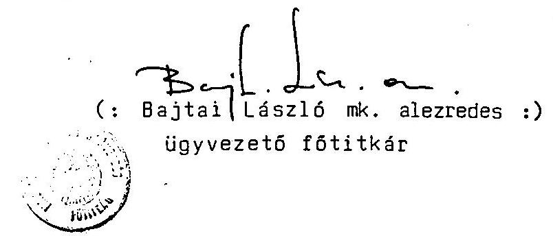

---

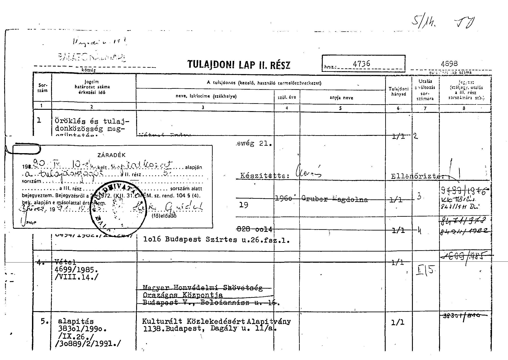

# TULAJDONI LAP II. RÉSZ

|  Sor-
szám | Jogcím
határozat száma
érkezési idő | A tulajdonos (kezelő, használó termelőszávatkazat) |  |  |  |  |  |  |  |  |  |  |  |  |  |  |  |  |  |  |  |  |  |  |  |  |  |  |  |  |  |  |  |  |  |  |  |  |  |  |  |  |  |  |  |  |  |   |
| --- | --- | --- | --- | --- | --- | --- | --- | --- | --- | --- | --- | --- | --- | --- | --- | --- | --- | --- | --- | --- | --- | --- | --- | --- | --- | --- | --- | --- | --- | --- | --- | --- | --- | --- | --- | --- | --- | --- | --- | --- | --- | --- | --- | --- | --- | --- | --- | --- | --- | --- | --- | --- | --- | --- |
|   |  | neve, laktacime (székhelye) |  |  |  |  |  |  |  |  |  |  |  |  |  |  |  |  |  |  |  |  |  |  |  |  |  |  |  |  |  |  |  |  |  |  |  |  |  |  |  |  |  |  |  |  |  |   |
|  1 |  | 2 |  |  |  |  |  |  |  |  |  |  |  |  |  |  |  |  |  |  |  |  |  |  |  |  |  |  |  |  |  |  |  |  |  |  |  |  |  |  |  |  |  |  |  |  |  |  |   |
|  1 |  | Örökélés és tulajdonítás |  |  |  |  |  |  |  |  |  |  |  |  |  |  |  |  |  |  |  |  |  |  |  |  |  |  |  |  |  |  |  |  |  |  |  |  |  |  |  |  |  |  |  |  |  |   |
|   |  |  |  |  |  |  |  |  |  |  |  |  |  |  |  |  |  |  |  |  |  |  |  |  |  |  |  |  |  |  |  |  |  |  |  |  |  |  |  |  |  |  |  |  |  |  |  |   |
|   |  |  |  |  |  |  |  |  |  |  |  |  |  |  |  |  |  |  |  |  |  |  |  |  |  |  |  |  |  |  |  |  |  |  |  |  |  |  |  |  |  |  |  |  |  |  |  |   |
|   |  |  |  |  |  |  |  |  |  |  |  |  |  |  |  |  |  |  |  |  |  |  |  |  |  |  |  |  |  |  |  |  |  |  |  |  |  |  |  |  |  |  |  |  |  |  |  |  |   |
|   |  |  |  |  |  |  |  |  |  |  |  |  |  |  |  |  |  |  |  |  |  |  |  |  |  |  |  |  |  |  |  |  |  |  |  |  |  |  |  |  |  |  |  |  |  |  |  |  |  |   |
|   |  |  |  |  |  |  |  |  |  |  |  |  |  |  |  |  |  |  |  |  |  |  |  |  |  |  |  |  |  |  |  |  |  |  |  |  |  |  |  |  |  |  |  |  |  |  |  |  |  |  |   |
|   |  |  |  |  |  |  |  |  |  |  |  |  |  |  |  |  |  |  |  |  |  |  |  |  |  |  |  |  |  |  |  |  |  |  |  |  |  |  |  |  |  |  |  |  |  |  |  |  |  |  |   |
|   |  |  |  |  |  |  |  |  |  |  |  |  |  |  |  |  |  |  |  |  |  |  |  |  |  |  |  |  |  |  |  |  |  |  |  |  |  |  |  |  |  |  |  |  |  |  |  |  |  |  |   |
|   |  |  |  |  |  |  |  |  |  |  |  |  |  |  |  |  |  |  |  |  |  |  |  |  |  |  |  |  |  |  |  |  |  |  |  |  |  |  |  |  |  |  |  |  |  |  |  |  |  |  |  |   |
|   |  |  |  |  |  |  |  |  |  |  |  |  |  |  |  |  |  |  |  |  |  |  |  |  |  |  |  |  |  |  |  |  |  |  |  |  |  |  |  |  |  |  |  |  |  |  |  |  |  |  |  |   |
|   |  |  |  |  |  |  |  |  |  |  |  |  |  |  |  |  |  |  |  |  |  |  |  |  |  |  |  |  |  |  |  |  |  |  |  |  |  |  |  |  |  |  |  |  |  |  |  |  |  |  |  |   |
|   |  |  |  |  |  |  |  |  |  |  |  |  |  |  |  |  |  |  |  |  |  |  |  |  |  |  |  |  |  |  |  |  |  |  |  |  |  |  |  |  |  |  |  |  |  |  |  |  |  |  |  |   |
|   |  |  |  |  |  |  |  |  |  |  |  |  |  |  |  |  |  |  |  |  |  |  |  |  |  |  |  |  |  |  |  |  |  |  |  |  |  |  |  |  |  |  |  |  |  |  |  |  |  |  |  |  |   |
|   |  |  |  |  |  |  |  |  |  |  |  |  |  |  |  |  |  |  |  |  |  |  |  |  |  |  |  |  |  |  |  |  |  |  |  |  |  |  |  |  |  |  |  |  |  |  |  |  |  |  |  |  |   |
|   |  |  |  |  |  |  |  |  |  |  |  |  |  |  |  |  |  |  |  |  |  |  |  |  |  |  |  |  |  |  |  |  |  |  |  |  |  |  |  |  |  |  |  |  |  |  |  |  |  |  |  |  |   |
|   |  |  |  |  |  |  |  |  |  |  |  |  |  |  |  |  |  |  |  |  |  |  |  |  |  |  |  |  |  |  |  |  |  |  |  |  |  |  |  |  |  |  |  |  |  |  |  |  |  |  |  |  |  |   |
|   |  |  |  |  |  |  |  |  |  |  |  |  |  |  |  |  |  |  |  |  |  |  |  |  |  |  |  |  |  |  |  |  |  |  |  |  |  |  |  |  |  |  |  |  |  |  |  |  |  |  |  |  |  |   |
|   |  |  |  |  |  |  |  |  |  |  |  |  |  |  |  |  |  |  |  |  |  |  |  |  |  |  |  |  |  |  |  |  |  |  |  |  |  |  |  |  |  |  |  |  |  |  |  |  |  |  |  |  |  |  |   |
|   |  |  |  |  |  |  |  |  |  |  |  |  |  |  |  |  |  |  |  |  |  |  |  |  |  |  |  |  |  |  |  |  |  |  |  |  |  |  |  |  |  |  |  |  |  |  |  |  |  |  |  |  |  |  |   |
|   |  |  |  |  |  |  |  |  |  |  |  |  |  |  |  |  |  |  |  |  |  |  |  |  |  |  |  |  |  |  |  |  |  |  |  |  |  |  |  |  |  |  |  |  |  |  |  |  |  |  |  |  |  |  |   |
|   |  |  |  |  |  |  |  |  |  |  |  |  |  |  |  |  |  |  |  |  |  |  |  |  |  |  |  |  |  |  |  |  |  |  |  |  |  |  |  |  |  |  |  |  |  |  |  |  |  |  |  |  |  |  |   |
|   |  |  |  |  |  |  |  |  |  |  |  |  |  |  |  |  |  |  |  |  |  |  |  |  |  |  |  |  |  |  |  |  |  |  |  |  |  |  |  |  |  |  |  |  |  |  |  |  |  |  |  |  |  |  |  |   |
|   |  |  |  |  |  |  |  |  |  |  |  |  |  |  |  |  |  |  |  |  |  |  |  |  |  |  |  |  |  |  |  |  |  |  |  |  |  |  |  |  |  |  |  |  |  |  |  |  |  |  |  |  |  |  |  |  |   |
|   |  |  |  |  |  |  |  |  |  |  |  |  |  |  |  |  |  |  |  |  |  |  |  |  |  |  |  |  |  |  |  |  |  |  |  |  |  |  |  |  |  |  |  |  |  |  |  |  |  |  |  |  |  |  |  |   |
|   |  |  |  |  |  |  |  |  |  |  |  |  |  |  |  |  |  |  |  |  |  |  |  |  |  |  |  |  |  |  |  |  |  |  |  |  |  |  |  |  |  |  |  |  |  |  |  |  |  |  |  |  |  |  |  |   |
|   |  |  |  |  |  |  |  |  |  |  |  |  |  |  |  |  |  |  |  |  |  |  |  |  |  |  |  |  |  |  |  |  |  |  |  |  |  |  |  |  |  |  |  |  |  |  |  |  |  |  |  |  |  |  |  |  |   |
|   |  |  |  |  |  |  |  |  |  |  |  |  |  |  |  |  |  |  |  |  |  |  |  |  |  |  |  |  |  |  |  |  |  |  |  |  |  |  |  |  |  |  |  |  |  |  |  |  |  |  |  |  |  |  |  |  |  |   |
|   |  |  |  |  |  |  |  |  |  |  |  |  |  |  |  |  |  |  |  |  |  |  |  |  |  |  |  |  |  |  |  |  |  |  |  |  |  |  |  |  |  |  |  |  |  |  |  |  |  |  |  |  |  |  |  |  |  |  |   |
|   |  |  |  |  |  |  |  |  |  |  |  |  |  |  |  |  |  |  |  |  |  |  |  |  |  |  |  |  |  |  |  |  |  |  |  |  |  |  |  |  |  |  |  |  |  |  |  |  |  |  |  |  |  |  |  |  |  |  |   |
|   |  |  |  |  |  |  |  |  |  |  |  |  |  |  |  |  |  |  |  |  |  |  |  |  |  |  |  |  |  |  |  |  |  |  |  |  |  |  |  |  |  |  |  |  |  |  |  |  |  |  |  |  |  |  |  |  |  |  |   |
|   |  |  |  |  |  |  |  |  |  |  |  |  |  |  |  |  |  |  |  |  |  |  |  |  |  |  |  |  |  |  |  |  |  |  |  |  |  |  |  |  |  |  |  |  |  |  |  |  |  |  |  |  |  |  |  |  |  |  |  |   |
|   |  |  |  |  |  |  |  |  |  |  |  |  |  |  |  |  |  |  |  |  |  |  |  |  |  |  |  |  |  |  |  |  |  |  |  |  |  |  |  |  |  |  |  |  |  |  |  |  |  |  |  |  |  |  |  |  |  |  |  |  |   |
|   |  |  |  |  |  |  |  |  |  |  |  |  |  |  |  |  |  |  |  |  |  |  |  |  |  |  |  |  |  |  |  |  |  |  |  |  |  |  |  |  |  |  |  |  |  |  |  |  |  |  |  |  |  |  |  |  |  |  |  |  |  |  |   |
|   |  |  |  |  |  |  |  |  |  |  |  |  |  |  |  |  |  |  |  |  |  |  |  |  |  |  |  |  |  |  |  |  |  |  |  |  |  |  |  |  |  |  |  |  |  |  |  |  |  |  |  |  |  |  |  |  |  |  |  |  |  |  |  |  |  |   |
|   |  |  |  |  |  |  |  |  |  |  |  |  |  |  |  |  |  |  |  |  |  |  |  |  |  |  |  |  |  |  |  |  |  |  |  |  |  |  |  |  |  |  |  |  |  |  |  |  |  |  |  |  |  |  |  |  |  |  |  |  |  |  |  |  |  |  |  |  |  |  |  |  |  |  |  |  |  |  |  |  |  |  |  |  |  |  |  |  |  |  |  |  |  |  |  |  |  |  |  | 

---

# MAGYAR HONVÉOELMI SZÜVETSÉG 

## UGYVEZETO FÔIITKÁRA

Budapest, V. Beloiannisz u. 16.
Nyt.szám: $4-12131 / 1930$.

## NYILATKOZAT

tulajdonjog bejegyzéséhez

Az MHSZ Országos Központ képviseletében az 1022/1990. (II. 14.) MT határozat rendelkezései végrehajtásaként hozzájárulok ahhoz, hogy az MHSZ tulajdonában lévô Kaposvár, Jutai uti 764 $\mathrm{m}^{2}$ területũ telket (tulajdoni lap szám: 4839, helyrajzi szám: 5886) gépjármũvezetô-képzõ kirendeltség, rutinpálya rendeltetésũ ingatlan tulajdonjoga az MHSZ által alapított Kultúrált Közlekedésért Alapítvány javára az ingatlan-nyilvántartásba bejegyzésre kerüljön.

Budapest, 1990. szeptember 14.
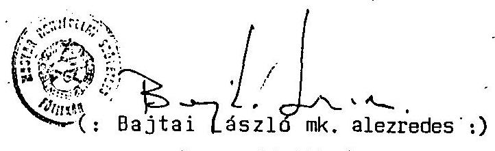

Kapják:
1-5. pld. Földhivatal
6. pld. KKA
7. pld. MHSZ OK:
8. pld. MHSZ Megyei Vez.

---

# TULAJDÓNI LAP I. RÉSZ

5145

1/15

KAPOSVÁR

4839

Tulajdoni lap szám

5886

Halvrajd szám

15

1 LAKOTELEK

|  |   |   |   |   |   |   |
| --- | --- | --- | --- | --- | --- | --- |
|  1 |  |  |  |  |  |   |
|  2 |  |  |  |  |  |   |
|  3 |  |  |  |  |  |   |
|  4 |  |  |  |  |  |   |
|  5 |  |  |  |  |  |   |
|  6 |  |  |  |  |  |   |
|  7 |  |  |  |  |  |   |
|  8 |  |  |  |  |  |   |
|  9 |  |  |  |  |  |   |
|  10 |  |  |  |  |  |   |
|  11 |  |  |  |  |  |   |
|  12 |  |  |  |  |  |   |
|  13 |  |  |  |  |  |   |
|  14 |  |  |  |  |  |   |
|  15 |  |  |  |  |  |   |
|  16 |  |  |  |  |  |   |
|  17 |  |  |  |  |  |   |
|  18 |  |  |  |  |  |   |
|  19 |  |  |  |  |  |   |
|  20 |  |  |  |  |  |   |
|  21 |  |  |  |  |  |   |
|  22 |  |  |  |  |  |   |
|  23 |  |  |  |  |  |   |
|  24 |  |  |  |  |  |   |
|  25 |  |  |  |  |  |   |
|  26 |  |  |  |  |  |   |
|  27 |  |  |  |  |  |   |
|  28 |  |  |  |  |  |   |
|  29 |  |  |  |  |  |   |
|  30 |  |  |  |  |  |   |
|  31 |  |  |  |  |  |   |
|  32 |  |  |  |  |  |   |
|  33 |  |  |  |  |  |   |
|  34 |  |  |  |  |  |   |
|  35 |  |  |  |  |  |   |
|  36 |  |  |  |  |  |   |
|  37 |  |  |  |  |  |   |
|  38 |  |  |  |  |  |   |
|  39 |  |  |  |  |  |   |
|  40 |  |  |  |  |  |   |
|  41 |  |  |  |  |  |   |
|  42 |  |  |  |  |  |   |
|  43 |  |  |  |  |  |   |
|  44 |  |  |  |  |  |   |
|  45 |  |  |  |  |  |   |
|  46 |  |  |  |  |  |   |
|  47 |  |  |  |  |  |   |
|  48 |  |  |  |  |  |   |
|  49 |  |  |  |  |  |   |
|  50 |  |  |  |  |  |   |
|  51 |  |  |  |  |  |   |
|  52 |  |  |  |  |  |   |
|  53 |  |  |  |  |  |   |
|  54 |  |  |  |  |  |   |
|  55 |  |  |  |  |  |   |
|  56 |  |  |  |  |  |   |
|  57 |  |  |  |  |  |   |
|  58 |  |  |  |  |  |   |
|  59 |  |  |  |  |  |   |
|  60 |  |  |  |  |  |   |
|  61 |  |  |  |  |  |   |
|  62 |  |  |  |  |  |   |
|  63 |  |  |  |  |  |   |
|  64 |  |  |  |  |  |   |
|  65 |  |  |  |  |  |   |
|  66 |  |  |  |  |  |   |
|  67 |  |  |  |  |  |   |
|  68 |  |  |  |  |  |   |
|  69 |  |  |  |  |  |   |
|  70 |  |  |  |  |  |   |
|  71 |  |  |  |  |  |   |
|  72 |  |  |  |  |  |   |
|  73 |  |  |  |  |  |   |
|  74 |  |  |  |  |  |   |
|  75 |  |  |  |  |  |   |
|  76 |  |  |  |  |  |   |
|  77 |  |  |  |  |  |   |
|  78 |  |  |  |  |  |   |
|  79 |  |  |  |  |  |   |
|  80 |  |  |  |  |  |   |
|  81 |  |  |  |  |  |   |
|  82 |  |  |  |  |  |   |
|  83 |  |  |  |  |  |   |
|  84 |  |  |  |  |  |   |
|  85 |  |  |  |  |  |   |
|  86 |  |  |  |  |  |   |
|  87 |  |  |  |  |  |   |
|  88 |  |  |  |  |  |   |
|  89 |  |  |  |  |  |   |
|  90 |  |  |  |  |  |   |
|  91 |  |  |  |  |  |   |
|  92 |  |  |  |  |  |   |
|  93 |  |  |  |  |  |   |
|  94 |  |  |  |  |  |   |
|  95 |  |  |  |  |  |   |
|  96 |  |  |  |  |  |   |
|  97 |  |  |  |  |  |   |
|  98 |  |  |  |  |  |   |
|  99 |  |  |  |  |  |   |
|  100 |  |  |  |  |  |   |
|  101 |  |  |  |  |  |   |
|  102 |  |  |  |  |  |   |
|  103 |  |  |  |  |  |   |
|  104 |  |  |  |  |  |   |
|  105 |  |  |  |  |  |   |
|  106 |  |  |  |  |  |   |
|  107 |  |  |  |  |  |   |
|  108 |  |  |  |  |  |   |
|  109 |  |  |  |  |  |   |
|  110 |  |  |  |  |  |   |
|  111 |  |  |  |  |  |   |
|  112 |  |  |  |  |  |   |
|  113 |  |  |  |  |  |   |
|  114 |  |  |  |  |  |   |
|  115 |  |  |  |  |  |   |
|  116 |  |  |  |  |  |   |
|  117 |  |  |  |  |  |   |
|  118 |  |  |  |  |  |   |
|  119 |  |  |  |  |  |   |
|  120 |  |  |  |  |  |   |
|  121 |  |  |  |  |  |   |
|  122 |  |  |  |  |  |   |
|  123 |  |  |  |  |  |   |
|  124 |  |  |  |  |  |   |
|  125 |  |  |  |  |  |   |
|  126 |  |  |  |  |  |   |
|  127 |  |  |  |  |  |   |
|  128 |  |  |  |  |  |   |
|  129 |  |  |  |  |  |   |
|  130 |  |  |  |  |  |   |
|  131 |  |  |  |  |  |   |
|  132 |  |  |  |  |  |   |
|  133 |  |  |  |  |  |   |
|  134 |  |  |  |  |  |   |
|  135 |  |  |  |  |  |   |
|  136 |  |  |  |  |  |   |
|  137 |  |  |  |  |  |   |
|  138 |  |  |  |  |  |   |
|  139 |  |  |  |  |  |   |
|  140 |  |  |  |  |  |   |
|  141 |  |  |  |  |  |   |
|  142 |  |  |  |  |  |   |
|  143 |  |  |  |  |  |   |
|  144 |  |  |  |  |  |   |
|  145 |  |  |  |  |  |   |
|  146 |  |  |  |  |  |   |
|  147 |  |  |  |  |  |   |
|  148 |  |  |  |  |  |   |
|  149 |  |  |  |  |  |   |
|  150 |  |  |  |  |  |   |
|  151 |  |  |  |  |  |   |
|  152 |  |  |  |  |  |   |
|  153 |  |  |  |  |  |   |
|  154 |  |  |  |  |  |   |
|  155 |  |  |  |  |  |   |
|  156 |  |  |  |  |  |   |
|  157 |  |  |  |  |  |   |
|  158 |  |  |  |  |  |   |
|  159 |  |  |  |  |  |   |
|  160 |  |  |  |  |  |   |
|  161 |  |  |  |  |  |   |
|  162 |  |  |  |  |  |   |
|  163 |  |  |  |  |  |   |
|  164 |  |  |  |  |  |   |
|  165 |  |  |  |  |  |   |
|  166 |  |  |  |  |  |   |
|  167 |  |  |  |  |  |   |
|  168 |  |  |  |  |  |   |
|  169 |  |  |  |  |  |   |
|  170 |  |  |  |  |  |   |
|  171 |  |  |  |  |  |   |
|  172 |  |  |  |  |  |   |
|  173 |  |  |  |  |  |   |
|  174 |  |  |  |  |  |   |
|  175 |  |  |  |  |  |   |
|  176 |  |  |  |  |  |   |
|  177 |  |  |  |  |  |   |
|  178 |  |  |  |  |  |   |
|  179 |  |  |  |  |  |   |
|  180 |  |  |  |  |  |   |
|  181 |  |  |  |  |  |   |
|  182 |  |  |  |  |  |   |
|  183 |  |  |  |  |  |   |
|  184 |  |  |  |  |  |   |
|  185 |  |  |  |  |  |   |
|  186 |  |  |  |  |  |   |
|  187 |  |  |  |  |  |   |
|  188 |  |  |  |  |  |   |
|  189 |  |  |  |  |  |   |
|  190 |  |  |  |  |  |   |
|  191 |  |  |  |  |  |   |
|  192 |  |  |  |  |  |   |
|  193 |  |  |  |  |  |   |
|  194 |  |  |  |  |  |   |
|  195 |  |  |  |  |  |   |
|  196 |  |  |  |  |  |   |
|  197 |  |  |  |  |  |   |
|  198 |  |  |  |  |  |   |
|  199 |  |  |  |  |  |   |
|  200 |  |  |  |  |  |   |
|  201 |  |  |  |  |  |   |
|  202 |  |  |  |  |  |   |
|  203 |  |  |  |  |  |   |
|  204 |  |  |  |  |  |   |
|  205 |  |  |  |  |  |   |
|  206 |  |  |  |  |  |   |
|  207 |  |  |  |  |  |   |
|  208 |  |  |  |  |  |   |
|  209 |  |  |  |  |  |   |
|  210 |  |  |  |  |  |   |
|  211 |  |  |  |  |  |   |
|  212 |  |  |  |  |  |   |
|  213 |  |  |  |  |  |   |
|  214 |  |  |  |  |  |   |
|  215 |  |  |  |  |  |   |
|  216 |  |  |  |  |  |   |
|  217 |  |  |  |  |  |   |
|  218 |  |  |  |  |  |   |
|  219 |  |  |  |  |  |   |
|  220 |  |  |  |  |  |   |
|  221 |  |  |  |  |  |   |
|  222 |  |  |  |  |  |   |
|  223 |  |  |  |  |  |   |
|  224 |  |  |  |  |  |   |
|  225 |  |  |  |  |  |   |
|  226 |  |  |  |  |  |   |
|  227 |  |  |  |  |  |   |
|  228 |  |  |  |  |  |   |
|  229 |  |  |  |  |  |   |
|  230 |  |  |  |  |  |   |
|  231 |  |  |  |  |  |   |
|  232 |  |  |  |  |  |   |
|  233 |  |  |  |  |  |   |
|  234 |  |  |  |  |  |   |
|  235 |  |  |  |  |  |   |
|  236 |  |  |  |  |  |   |
|  237 |  |  |  |  |  |   |
|  238 |  |  |  |  |  |   |
|  239 |  |  |  |  |  |   |
|  240 |  |  |  |  |  |   |
|  241 |  |  |  |  |  |   |
|  242 |  |  |  |  |  |   |
|  243 |  |  |  |  |  |   |
|  244 |  |  |  |  |  |   |
|  245 |  |  |  |  |  |   |
|  246 |  |  |  |  |  |   |
|  247 |  |  |  |  |  |   |
|  248 |  |  |  |  |  |   |
|  249 |  |  |  |  |  |   |
|  250 |  |  |  |  |  |   |
|  251 |  |  |  |  |  |   |
|  252 |  |  |  |  |  |   |
|  253 |  |  |  |  |  |   |
|  254 |  |  |  |  |  |   |
|  255 |  |  |  |  |  |   |
|  256 |  |  |  |  |  |   |
|  257 |  |  |  |  |  |   |
|  258 |  |  |  |  |  |   |
|  259 |  |  |  |  |  |   |
|  260 |  |  |  |  |  |   |
|  261 |  |  |  |  |  |   |
|  262 |  |  |  |  |  |   |
|  263 |  |  |  |  |  |   |
|  264 |  |  |  |  |  |   |
|  265 |  |  |  |  |  |   |
|  266 |  |  |  |  |  |   |
|  267 |  |  |  |  |  |   |
|  268 |  |  |  |  |  |   |
|  269 |  |  |  |  |  |   |
|  270 |  |  |  |  |  |   |
|  271 |  |  |  |  |  |   |
|  272 |  |  |  |  |  |   |
|  273 |  |  |  |  |  |   |
|  274 |  |  |  |  |  |   |
|  275 |  |  |  |  |  |   |
|  276 |  |  |  |  |  |   |
|  277 |  |  |  |  |  |   |
|  278 |  |  |  |  |  |   |
|  279 |  |  |  |  |  |   |
|  280 |  |  |  |  |  |   |
|  281 |  |  |  |  |  |   |
|  282 |  |  |  |  |  |   |
|  283 |  |  |  |  |  |   |
|  284 |  |  |  |  |  |   |
|  285 |  |  |  |  |  |   |
|  286 |  |  |  |  |  |   |
|  287 |  |  |  |  |  |   |
|  288 |  |  |  |  |  |   |
|  289 |  |  |  |  |  |   |
|  290 |  |  |  |  |  |   |
|  291 |  |  |  |  |  |   |
|  292 |  |  |  |  |  |   |
|  293 |  |  |  |  |  |   |
|  294 |  |  |  |  |  |   |
|  295 |  |  |  |  |  |   |
|  296 |  |  |  |  |  |   |
|  297 |  |  |  |  |  |   |
|  298 |  |  |  |  |  |   |
|  299 |  |  |  |  |  |   |
|  300 |  |  |  |  |  |   |
|  301 |  |  |  |  |  |   |
|  302 |  |  |  |  |  |   |
|  303 |  |  |  |  |  |   |
|  304 |  |  |  |  |  |   |
|  305 |  |  |  |  |  |   |
|  306 |  |  |  |  |  |   |
|  307 |  |  |  |  |  |   |
|  308 |  |  |  |  |  |   |
|  309 |  |  |  |  |  |   |
|  310 |  |  |  |  |  |   |
|  311 |  |  |  |  |  |   |
|  312 |  |  |  |  |  |   |
|  313 |  |  |  |  |  |   |
|  314 |  |  |  |  |  |   |
|  315 |  |  |  |  |  |   |
|  316 |  |  |  |  |  |   |
|  317 |  |  |  |  |  |   |
|  318 |  |  |  |  |  |   |
|  319 |  |  |  |  |  |   |
|  320 |  |  |  |  |  |   |
|  321 |  |  |  |  |  |   |
|  322 |  |  |  |  |  |   |
|  323 |  |  |  |  |  |   |
|  324 |  |  |  |  |  |   |
|  325 |  |  |  |  |  |   |
|  326 |  |  |  |  |  |   |
|  327 |  |  |  |  |  |   |
|  328 |  |  |  |  |  |   |
|  329 |  |  |  |  |  |   |
|  330 |  |  |  |  |  |   |
|  331 |  |  |  |  |  |   |
|  332 |  |  |  |  |  |   |
|  333 |  |  |  |  |  |   |
|  334 |  |  |  |  |  |   |
|  335 |  |  |  |  |  |   |
|  336 |  |  |  |  |  |   |
|  337 |  |  |  |  |  |   |
|  338 |  |  |  |  |  |   |
|  339 |  |  |  |  |  |   |
|  340 |  |  |  |  |  |   |
|  341 |  |  |  |  |  |   |
|  342 |  |  |  |  |  |   |
|  343 |  |  |  |  |  |   |
|  344 |  |  |  |  |  |   |
|  345 |  |  |  |  |  |   |
|  346 |  |  |  |  |  |   |
|  347 |  |  |  |  |  |   |
|  348 |  |  |  |  |  |   |
|  349 |  |  |  |  |  |   |
|  350 |  |  |  |  |  |   |
|  351 |  |  |  |  |  |   |
|  352 |  |  |  |  |  |   |
|  353 |  |  |  |  |  |   |
|  354 |  |  |  |  |  |   |
|  355 |  |  |  |  |  |   |
|  356 |  |  |  |  |  |   |
|  357 |  |  |  |  |  |   |
|  358 |  |  |  |  |  |   |
|  359 |  |  |  |  |  |   |
|  360 |  |  |  |  |  |   |
|  361 |  |  |  |  |  |   |
|  362 |  |  |  |  |  |   |
|  363 |  |  |  |  |  |   |
|  364 |  |  |  |  |  |   |
|  365 |  |  |  |  |  |   |
|  366 |  |  |  |  |  |   |
|  367 |  |  |  |  |  |   |
|  368 |  |  |  |  |  |   |
|  369 |  |  |  |  |  |   |
|  370 |  |  |  |  |  |   |
|  371 |  |  |  |  |  |   |
|  372 |  |  |  |  |  |   |
|  373 |  |  |  |  |  |   |
|  374 |  |  |  |  |  |   |
|  375 |  |  |  |  |  |   |
|  376 |  |  |  |  |  |   |
|  377 |  |  |  |  |  |   |
|  378 |  |  |  |  |  |   |
|  379 |  |  |  |  |  |   |
|  380 |  |  |  |  |  |   |
|  381 |  |  |  |  |  |   |
|  382 |  |  |  |  |  |   |
|  383 |  |  |  |  |  |   |
|  384 |  |  |  |  |  |   |
|  385 |  |  |  |  |  |   |
|  386 |  |  |  |  |  |   |
|  387 |  |  |  |  |  |   |
|  388 |  |  |  |  |  |   |
|  389 |  |  |  |  |  |   |
|  390 |  |  |  |  |  |   |
|  391 |  |  |  |  |  |   |
|  392 |  |  |  |  |  |   |
|  393 |  |  |  |  |  |   |
|  394 |  |  |  |  |  |   |
|  395 |  |  |  |  |  |   |
|  396 |  |  |  |  |  |   |
|  397 |  |  |  |  |  |   |
|  398 |  |  |  |  |  |   |
|  399 |  |  |  |  |  |   |
|  400 |  |  |  |  |  |   |
|  401 |  |  |  |  |  |   |
|  402 |  |  |  |  |  |   |
|  403 |  |  |  |  |  |   |
|  404 |  |  |  |  |  |   |
|  405 |  |  |  |  |  |   |
|  406 |  |  |  |  |  |   |
|  407 |  |  |  |  |  |   |
|  408 |  |  |  |  |  |   |
|  409 |  |  |  |  |  |   |
|  410 |  |  |  |  |  |   |
|  411 |  |  |  |  |  |   |
|  412 |  |  |  |  |  |   |
|  413 |  |  |  |  |  |   |
|  414 |  |  |  |  |  |   |
|  415 |  |  |  |  |  |   |
|  416 |  |  |  |  |  |   |
|  417 |  |  |  |  |  |   |
|  418 |  |  |  |  |  |   |
|  419 |  |  |  |  |  |   |
|  420 |  |  |  |  |  |   |
|  421 |  |  |  |  |  |   |
|  422 |  |  |  |  |  |   |
|  423 |  |  |  |  |  |   |
|  424 |  |  |  |  |  |   |
|  425 |  |  |  |  |  |   |
|  426 |  |  |  |  |  |   |
|  427 |  |  |  |  |  |   |
|  428 |  |  |  |  |  |   |
|  429 |  |  |  |  |  |   |
|  430 |  |  |  |  |  |   |
|  431 |  |  |  |  |  |   |
|  432 |  |  |  |  |  |   |
|  433 |  |  |  |  |  |   |
|  434 |  |  |  |  |  |   |
|  435 |  |  |  |  |  |   |
|  436 |  |  |  |  |  |   |
|  437 |  |  |  |  |  |   |
|  438 |  |  |  |  |  |   |
|  439 |  |  |  |  |  |   |
|  440 |  |  |  |  |  |   |
|  441 |  |  |  |  |  |   |
|  442 |  |  |  |  |  |   |
|  443 |  |  |  |  |  |   |
|  444 |  |  |  |  |  |   |
|  445 |  |  |  |  |  |   |
|  446 |  |  |  |  |  |   |
|  447 |  |  |  |  |  |   |
|  448 |  |  |  |  |  |   |
|  449 |  |  |  |  |  |   |
|  450 |  |  |  |  |  |   |
|  451 |  |  |  |  |  |   |
|  452 |  |  |  |  |  |   |
|  453 |  |  |  |  |  |   |
|  454 |  |  |  |  |  |   |
|  455 |  |  |  |  |  |   |
|  456 |  |  |  |  |  |   |
|  457 |  |  |  |  |  |   |
|  458 |  |  |  |  |  |   |
|  459 |  |  |  |  |  |   |
|  460 |  |  |  |  |  |   |
|  451 |  |  |  |  |  |   |
|  452 |  |  |  |  |  |   |
|  453 |  |  |  |  |  |   |
|  454 |  |  |  |  |  |   |
|  455 |  |  |  |  |  |   |
|  456 |  |  |  |  |  |   |
|  457 |  |  |  |  |  |   |
|  458 |  |  |  |  |  |   |
|  459 |  |  |  |  |  |   |
|  460 |  |  |  |  |  |   |
|  459 |  |  |  |  |  |   |
|  461 |  |  |  |  |  |   |
|  462 |  |  |  |  |  |   |
|  463 |  |  |  |  |  |   |
|  464 |  |  |  |  |  |   |
|  464 |  |  |  |  |  |   |
|  465 |  |  |  |  |  |   |
|  466 |  |  |  |  |  |   |
|  467 |  |  |  |  |  |   |
|  467 |  |  |  |  |  |   |
|  468 |  |  |  |  |  |   |
|  469 |  |  |  |  |  |   |
|  470 |  |  |  |  |  |   |
|  471 |  |  |  |  |  |   |
|  472 |  |  |  |  |  |   |
|  473 |  |  |  |  |  |   |
|  474 |  |  |  |  |  |   |
|  474 |  |  |  |  |  |   |
|  474 |  |  |  |  |  |   |
|  475 |  |  |  |  |  |   |
|  476 |  |  |  |  |  |   |
|  477 |  |  |  |  |  |   |
|  477 |  |  |  |  |  |   |
|  477 |  |  |  |  |  |   |
|  477 |  |  |  |  |  |   |
|  477 |  |  |  |  |  |   |
|  478 |  |  |  |  |  |   |
|  479 |  |  |  |  |  |   |
|  480 |  |  |  |  |  |   |
|  481 |  |  |  |  |  |   |
|  482 |  |  |  |  |  |   |
|  483 |  |  |  |  |  |   |
|  484 |  |  |  |  |  |   |
|  485 |  |  |  |  |  |   |
|  486 |  |  |  |  |  |   |
|  487 |  |  |  |  |   |
|  487 |  |  |  |  |  |   |
|  487 |  |  |  |  |   |
|  487 |  |  |  |  |  |   |
|  488 |  |  |  |  |   |
|  489 |  |  |  |  |  |   |
|  490 |  |  |  |  |   |
|  491 |  |  |  |  |   |
|  491 |  |  |  |  |   |
|  492 |  |  |  |  |   |
|  493 |  |  |  |  |   |
|  493 |  |  |  |  |   |
|  494 |  |  |  |  |   |
| 494 |  |  |  |  |   |
| 495 |  |  |  |  |   |
|  496 |  |  |  |  |   |
| 497 |  |  |  |  |   |
| 497 |  |  |  |  |   |
|  497 |  |  |  |  |   |
| 497 |  |  |  |  |   |
|  498 |  |  |  |  |   |
|  498 |  |  |  |  |   |
|  499 |  |  |  |  |   |
|  499 |  |  |  |  |   |
|  500 |  |  |  |   |
| 499 |  |  |  |   |
|  501 |  |  |  |   |
|  502 |  |  |  |   |
|  503 |  |  |  |   |
|  504 |  |  |  |   |
| 505 |  |  |  |   |
| 506 |  |  |  |   |
| 507 |  |  |  |   |
| 508 |  |  |  |   |
| 509 |  |  |  |   |
| 510 |  |  |  |   |
| 511 |  |  |  |   |
| 512 |  |  |  |   |
| 513 |  |  |  |   |
| 513 |  |  |  |   |
| 514 |  |  |  |   |
| 514 |  |  |  |   |
| 515 |  |  |  |   |
| 515 |  |  |  |   |
| 516 |  |  |  |   |
| 516 |  |  |  |   |
| 517 |  |  |  |   |
| 517 |  |  |  |   |
| 517 |  |  |  |   |
| 517 |  |  |   |
| 517 |  |  |  |   |
| 517 |  |  |  |   |
| 518 |  |  |  |   |
| 518 |  |  |  |   |
| 518 |  |  |  |   |
| 519 |  |  |  |   |
| 519 |  |  |  |   |
| 519 |  |  |   |
| 519 |  |  |   |
| 519 |  |  |  |   |
| 519 |  |  |  |   |
| 519 |  |  |   |
| 519 |  |  |  |   |
| 519 |  |  |  |   |
| 519 |  |  |  |   |
| 519 |  |  |   |
| 519 |  |  |  |   |
| 519 |  |  |  |   |
| 519 |  |  |  |   |
| 519 |  |  |   |
| 519 |  |  |   |
| 519 |  |  |  |   |
| 519 |  |  |  |   |
| 519 |  |  |   |
| 519 |  |  |  |   |
| 519 |  |  |  |   |
| 519 |  |  |  |   |
| 519 |  |  |   |
| 519 |  |  |   |
| 519 |  |  |  |   |
| 519 |  |  |   |
| 519 |  |  |   |
| 519 |  |  |  |   |
| 519 |  |  |   |
| 519 |  |  |   |
| 519 |  |  |  |   |
| 519 |  |  |  |   |
| 519 |  |  |   |
| 519 |  |  |   |
| 519 |  |  |  |   |
| 519 |  |  |   |
| 519 |  |  |   |
| 519 |  |  |   |
| 519 |  |  |   |
| 519 |  |  |   |
| 519 |  |  |   |
| 519 |  |  |   |
| 519 |  |  |   |
| 519 |  |  |   |
| 519 |  |  |   |
| 519 |  |  |   |
| 519 |  |  |   |
| 519 |  |  |   |
| 519 |  |  |   |
| 519 |  |  |   |
| 519 |  |  |   |
| 519 |  |  |   |
| 519 |  |  |   |
| 519 |  |  |   |
| 519 |  |  |   |
| 519 |  |  |   |
| 519 |  |  |   |
| 519 |  |  |   |
| 519 |  |  |   |
| 519 |  |  |   |
| 519 |  |  |   |
| 519 |  |  |   |
| 519 |  |  |   |
| 519 |  |  |   |
| 519 |  |  |   |
| 519 |  |  |   |
| 5

---

|  Kaposyár |  |  | TULAJDONI LAP II. RÉSZ |  |  |  | 4839 |   |
| --- | --- | --- | --- | --- | --- | --- | --- | --- |
|  4839 |  |  |  |  |  |  |  |   |
|  Sor-
szám | Jogelme
hazároza száma,
érkezési idő |  | A 1 u 1 a 1 d 0 n 0 s |  |  | Tulajdoni
hányad | Utalás
a változás
sor-
számára | Jegyzet
(szeljegyzet, utalás
a III. rész
sorszámára stb.)  |
|   |  |  | kezelő,
használó termelőszővetkezet
neve, lakáscíme (székhelye) | szül.
eve | anyja neve |  |  |   |
|  1 | 2 |  | 3 | 4 | 5 | 6 | 7 | 8  |
|  1. | csere
2790/1950./I.7./ |  | MÁGYÁR HONVÉDELMT SZÖVETSÉG
Örszéges Központ
Budapest V. Belálandozó u.16.
Készítette: Jóel Rózsa |  |  | 1/1 |  | 1. | 13965/90  |
|  2. | felajánlás
38977/3/1990 X.17. |  | KULTÚRÁLT KOZLEKEDÉSÉRT ALAPÍTVÁNY
Budapest XIII. Dagály u.11/A |  |  | 1/1 |  | 1. | 13965/90
1.  |

---

# 20/55/1990. 5/16. 

Körzeti Földhivatal
Siófok, Batthyány u. 46.

Ogyiratszám: 39.180/1990
Tárgy: Értesités

Kultúrált Közlekedésért Alapítvány

1138 B u d a e e s t
Dagály u. 11/a.

A tulajdonjog bejegyzését kérte a tabi lo98 számu tulajdon1 lapon nyilvántartott 1028/1 helyrajzi számu 942 m2 nagyságu belterületi ingatlanon létesitett - lakásra.

Értesitem, hogy kérelmét a társasházzá történő alakításig 6 hónapra nyilvántartásba tettem.

Kérem a fentiek miatt szives türelmét.

S i ó f o k, 1990.nbvember 14.

Lk. levélként

---

# MAGYAR HONVÉDELMI SZÖVETSÉG ÜGYVEZETŐ FÜTITKÁRA

Bp., V., Belolannisz u. 16.

Nyt. szám: 8-96/63/90

# FOLDBRYATAS MÁKS

Érkezett: 1990 NOV

## NYTIA TKOZÁJÁT

Tulajdonjog bejegyzéséhez

Az MHSZ Országos Központ képviseletében az 1022/1990. /II.14./ MT határozat rendelkezései végrehajtásaként hozzájárulok ahhoz, hogy az MHSZ tulajdonában lévő, az Cséngrád m. számú betétben 9. hiszám alatt felvett Városi székhéz megjelölésű és rendeltetésű ingatlan tulajdonjoga a Alagitvány.

Jogutód társadalmi szervezet javára az ingatlannyilvántartásba bejegyzésre kerül jön.

Budapest, 1990. szeptember

(Bajtai László m. alezredes)

Kevjen: 1. sz.pld. jogutód 2. sz.pld. Irattár

1991 FEB 2 1

30381-21

---

MAGYAR NONVÉDELMI SZÜVEISÉG
ÜGYVEZETŐ FÖTTIKÁRA
Ilp., V., Beloiamnisz u. 16.
Hyt.szám: 8. $x 2 / 23 / 90$

# HYILATKOZAI 

tulajdonjog bejegyzéséhez

Az MHSZ Urszággos Kizpont képviseletében az 1022/1990. /II.14./ MI határozat rendelkezésai végrehajtásaként hozzájárulok ahhoz, hogy az MHSZ tulajdonában lévô, az"...Baranya, on...........-i leigedeaí számí betétben ..1201.... hrszám alatt felvett kiképpá, bárja..... (irodaház)
megjellilésũ és rendeltetésũ ingatlan tulajdongga a ...... Alapjlyágy.
jogutód társadalmi szervezet javára az ingatlannyflvántartásba bejegyzésre kerüljün.

Budapest, 1990. szeptember "fr"

---

MACYAR NONVÉDELMI SZÖVETSÉG
UCYVEZETÓ FOTIIKÁRA
Bp., V., Beloiannisz u. 16.

Nyt.szám: $8-96 / 62 / 90$

# HYILAIKDZAI 

tulajdonjog bejegyzéséhez

Az MHSZ Országos Kőzpont képviseletében az 1022/1990. /II.14./ MT határozat rendelkezései végrehajtásaként hozzájárulok ahhoz, hogy az MHSZ tulajdonában lévô, az . .Vesżprém m:...........-i Topolss. számú betétben 3436:.... hrszám alatt felvett Gépjármũ gvakorlópálya, tereplotér megjelölésũ és rendeltetésũ ingatlan tulajdonjoga a Alapítvány.

Jogutód társadalmi szervezet javára az ingatlannyilvántartásba bejegyzésre kerüljön.

Budapest, 1990. szeptember " 14 ".

$$
\begin{aligned}
& \text { Bif. } \\
& \text { (Bajtai Uászlo mk.alezredes) }
\end{aligned}
$$

Kapják: 1.sz.pld. jogutód szervezet
2.sz.pld. Irattár

---

BALASSAGYANPAT 19e2 OKTOBER 2078

Kazeg (Kass) 1832

BELTEPULET 1572

TANCSTCS HTCA 17 15

|  |   |   |   |
| --- | --- | --- | --- |
|  1 | 2 | 3 | 4  |
|  5 |  |  |   |
|  6 |  |  |   |
|  7 |  |  |   |
|  8 |  |  |   |
|  9 |  |  |   |
|  10 |  |  |   |
|  11 |  |  |   |
|  12 |  |  |   |
|  13 |  |  |   |
|  14 |  |  |   |
|  15 |  |  |   |
|  16 |  |  |   |
|  17 |  |  |   |
|  18 |  |  |   |
|  19 |  |  |   |
|  20 |  |  |   |
|  21 |  |  |   |
|  22 |  |  |   |
|  23 |  |  |   |
|  24 |  |  |   |
|  25 |  |  |   |
|  26 |  |  |   |
|  27 |  |  |   |
|  28 |  |  |   |
|  29 |  |  |   |
|  30 |  |  |   |
|  31 |  |  |   |
|  32 |  |  |   |
|  33 |  |  |   |
|  34 |  |  |   |
|  35 |  |  |   |
|  36 |  |  |   |
|  37 |  |  |   |
|  38 |  |  |   |
|  39 |  |  |   |
|  40 |  |  |   |
|  41 |  |  |   |
|  42 |  |  |   |
|  43 |  |  |   |
|  44 |  |  |   |
|  45 |  |  |   |
|  46 |  |  |   |
|  47 |  |  |   |
|  48 |  |  |   |
|  49 |  |  |   |
|  50 |  |  |   |
|  51 |  |  |   |
|  52 |  |  |   |
|  53 |  |  |   |
|  54 |  |  |   |
|  55 |  |  |   |
|  56 |  |  |   |
|  57 |  |  |   |
|  58 |  |  |   |
|  59 |  |  |   |
|  60 |  |  |   |
|  61 |  |  |   |
|  62 |  |  |   |
|  63 |  |  |   |
|  64 |  |  |   |
|  65 |  |  |   |
|  66 |  |  |   |
|  67 |  |  |   |
|  68 |  |  |   |
|  69 |  |  |   |
|  70 |  |  |   |
|  71 |  |  |   |
|  72 |  |  |   |
|  73 |  |  |   |
|  74 |  |  |   |
|  75 |  |  |   |
|  76 |  |  |   |
|  77 |  |  |   |
|  78 |  |  |   |
|  79 |  |  |   |
|  80 |  |  |   |
|  81 |  |  |   |
|  82 |  |  |   |
|  83 |  |  |   |
|  84 |  |  |   |
|  85 |  |  |   |
|  86 |  |  |   |
|  87 |  |  |   |
|  88 |  |  |   |
|  89 |  |  |   |
|  90 |  |  |   |
|  91 |  |  |   |
|  92 |  |  |   |
|  93 |  |  |   |
|  94 |  |  |   |
|  95 |  |  |   |
|  96 |  |  |   |
|  97 |  |  |   |
|  98 |  |  |   |
|  99 |  |  |   |
|  100 |  |  |   |
|  101 |  |  |   |
|  102 |  |  |   |
|  103 |  |  |   |
|  104 |  |  |   |
|  105 |  |  |   |
|  106 |  |  |   |
|  107 |  |  |   |
|  108 |  |  |   |
|  109 |  |  |   |
|  110 |  |  |   |
|  111 |  |  |   |
|  112 |  |  |   |
|  113 |  |  |   |
|  114 |  |  |   |
|  115 |  |  |   |
|  116 |  |  |   |
|  117 |  |  |   |
|  118 |  |  |   |
|  119 |  |  |   |
|  120 |  |  |   |
|  121 |  |  |   |
|  122 |  |  |   |
|  123 |  |  |   |
|  124 |  |  |   |
|  125 |  |  |   |
|  126 |  |  |   |
|  127 |  |  |   |
|  128 |  |  |   |
|  129 |  |  |   |
|  130 |  |  |   |
|  131 |  |  |   |
|  132 |  |  |   |
|  133 |  |  |   |
|  134 |  |  |   |
|  135 |  |  |   |
|  136 |  |  |   |
|  137 |  |  |   |
|  138 |  |  |   |
|  139 |  |  |   |
|  140 |  |  |   |
|  141 |  |  |   |
|  142 |  |  |   |
|  143 |  |  |   |
|  144 |  |  |   |
|  145 |  |  |   |
|  146 |  |  |   |
|  147 |  |  |   |
|  148 |  |  |   |
|  149 |  |  |   |
|  150 |  |  |   |
|  151 |  |  |   |
|  152 |  |  |   |
|  153 |  |  |   |
|  154 |  |  |   |
|  155 |  |  |   |
|  156 |  |  |   |
|  157 |  |  |   |
|  158 |  |  |   |
|  159 |  |  |   |
|  160 |  |  |   |
|  161 |  |  |   |
|  162 |  |  |   |
|  163 |  |  |   |
|  164 |  |  |   |
|  165 |  |  |   |
|  166 |  |  |   |
|  167 |  |  |   |
|  168 |  |  |   |
|  169 |  |  |   |
|  170 |  |  |   |
|  171 |  |  |   |
|  172 |  |  |   |
|  173 |  |  |   |
|  174 |  |  |   |
|  175 |  |  |   |
|  176 |  |  |   |
|  177 |  |  |   |
|  178 |  |  |   |
|  179 |  |  |   |
|  180 |  |  |   |
|  181 |  |  |   |
|  182 |  |  |   |
|  183 |  |  |   |
|  184 |  |  |   |
|  185 |  |  |   |
|  186 |  |  |   |
|  187 |  |  |   |
|  188 |  |  |   |
|  189 |  |  |   |
|  190 |  |  |   |
|  191 |  |  |   |
|  192 |  |  |   |
|  193 |  |  |   |
|  194 |  |  |   |
|  195 |  |  |   |
|  196 |  |  |   |
|  197 |  |  |   |
|  198 |  |  |   |
|  199 |  |  |   |
|  200 |  |  |   |
|  201 |  |  |   |
|  202 |  |  |   |
|  203 |  |  |   |
|  204 |  |  |   |
|  205 |  |  |   |
|  206 |  |  |   |
|  207 |  |  |   |
|  208 |  |  |   |
|  209 |  |  |   |
|  210 |  |  |   |
|  211 |  |  |   |
|  212 |  |  |   |
|  213 |  |  |   |
|  214 |  |  |   |
|  215 |  |  |   |
|  216 |  |  |   |
|  217 |  |  |   |
|  218 |  |  |   |
|  219 |  |  |   |
|  220 |  |  |   |
|  221 |  |  |   |
|  222 |  |  |   |
|  223 |  |  |   |
|  224 |  |  |   |
|  225 |  |  |   |
|  226 |  |  |   |
|  227 |  |  |   |
|  228 |  |  |   |
|  229 |  |  |   |
|  230 |  |  |   |
|  231 |  |  |   |
|  232 |  |  |   |
|  233 |  |  |   |
|  234 |  |  |   |
|  235 |  |  |   |
|  236 |  |  |   |
|  237 |  |  |   |
|  238 |  |  |   |
|  239 |  |  |   |
|  240 |  |  |   |
|  241 |  |  |   |
|  242 |  |  |   |
|  243 |  |  |   |
|  244 |  |  |   |
|  245 |  |  |   |
|  246 |  |  |   |
|  247 |  |  |   |
|  248 |  |  |   |
|  249 |  |  |   |
|  250 |  |  |   |
|  251 |  |  |   |
|  252 |  |  |   |
|  253 |  |  |   |
|  254 |  |  |   |
|  255 |  |  |   |
|  256 |  |  |   |
|  257 |  |  |   |
|  258 |  |  |   |
|  259 |  |  |   |
|  260 |  |  |   |
|  261 |  |  |   |
|  262 |  |  |   |
|  263 |  |  |   |
|  264 |  |  |   |
|  265 |  |  |   |
|  266 |  |  |   |
|  267 |  |  |   |
|  268 |  |  |   |
|  269 |  |  |   |
|  270 |  |  |   |
|  271 |  |  |   |
|  272 |  |  |   |
|  273 |  |  |   |
|  274 |  |  |   |
|  275 |  |  |   |
|  276 |  |  |   |
|  277 |  |  |   |
|  278 |  |  |   |
|  279 |  |  |   |
|  280 |  |  |   |
|  281 |  |  |   |
|  282 |  |  |   |
|  283 |  |  |   |
|  284 |  |  |   |
|  285 |  |  |   |
|  286 |  |  |   |
|  287 |  |  |   |
|  288 |  |  |   |
|  289 |  |  |   |
|  290 |  |  |   |
|  291 |  |  |   |
|  292 |  |  |   |
|  293 |  |  |   |
|  294 |  |  |   |
|  295 |  |  |   |
|  296 |  |  |   |
|  297 |  |  |   |
|  298 |  |  |   |
|  299 |  |  |   |
|  300 |  |  |   |
|  301 |  |  |   |
|  302 |  |  |   |
|  303 |  |  |   |
|  304 |  |  |   |
|  305 |  |  |   |
|  306 |  |  |   |
|  307 |  |  |   |
|  308 |  |  |   |
|  309 |  |  |   |
|  310 |  |  |   |
|  311 |  |  |   |
|  312 |  |  |   |
|  313 |  |  |   |
|  314 |  |  |   |
|  315 |  |  |   |
|  316 |  |  |   |
|  317 |  |  |   |
|  318 |  |  |   |
|  319 |  |  |   |
|  320 |  |  |   |
|  321 |  |  |   |
|  322 |  |  |   |
|  323 |  |  |   |
|  324 |  |  |   |
|  325 |  |  |   |
|  326 |  |  |   |
|  327 |  |  |   |
|  328 |  |  |   |
|  329 |  |  |   |
|  330 |  |  |   |
|  331 |  |  |   |
|  332 |  |  |   |
|  333 |  |  |   |
|  334 |  |  |   |
|  335 |  |  |   |
|  336 |  |  |   |
|  337 |  |  |   |
|  338 |  |  |   |
|  339 |  |  |   |
|  340 |  |  |   |
|  341 |  |  |   |
|  342 |  |  |   |
|  343 |  |  |   |
|  344 |  |  |   |
|  345 |  |  |   |
|  346 |  |  |   |
|  347 |  |  |   |
|  348 |  |  |   |
|  349 |  |  |   |
|  350 |  |  |   |
|  351 |  |  |   |
|  352 |  |  |   |
|  353 |  |  |   |
|  354 |  |  |   |
|  355 |  |  |   |
|  356 |  |  |   |
|  357 |  |  |   |
|  358 |  |  |   |
|  359 |  |  |   |
|  360 |  |  |   |
|  361 |  |  |   |
|  362 |  |  |   |
|  363 |  |  |   |
|  364 |  |  |   |
|  365 |  |  |   |
|  366 |  |  |   |
|  367 |  |  |   |
|  368 |  |  |   |
|  369 |  |  |   |
|  370 |  |  |   |
|  371 |  |  |   |
|  372 |  |  |   |
|  373 |  |  |   |
|  374 |  |  |   |
|  375 |  |  |   |
|  376 |  |  |   |
|  377 |  |  |   |
|  378 |  |  |   |
|  379 |  |  |   |
|  380 |  |  |   |
|  381 |  |  |   |
|  382 |  |  |   |
|  383 |  |  |   |
|  384 |  |  |   |
|  385 |  |  |   |
|  386 |  |  |   |
|  387 |  |  |   |
|  388 |  |  |   |
|  389 |  |  |   |
|  390 |  |  |   |
|  391 |  |  |   |
|  392 |  |  |   |
|  393 |  |  |   |
|  394 |  |  |   |
|  395 |  |  |   |
|  396 |  |  |   |
|  397 |  |  |   |
|  398 |  |  |   |
|  399 |  |  |   |
|  400 |  |  |   |
|  401 |  |  |   |
|  402 |  |  |   |
|  403 |  |  |   |
|  404 |  |  |   |
|  405 |  |  |   |
|  406 |  |  |   |
|  407 |  |  |   |
|  408 |  |  |   |
|  409 |  |  |   |
|  410 |  |  |   |
|  411 |  |  |   |
|  412 |  |  |   |
|  413 |  |  |   |
|  414 |  |  |   |
|  415 |  |  |   |
|  416 |  |  |   |
|  417 |  |  |   |
|  418 |  |  |   |
|  419 |  |  |   |
|  420 |  |  |   |
|  421 |  |  |   |
|  422 |  |  |   |
|  423 |  |  |   |
|  424 |  |  |   |
|  425 |  |  |   |
|  426 |  |  |   |
|  427 |  |  |   |
|  428 |  |  |   |
|  429 |  |  |   |
|  430 |  |  |   |
|  431 |  |  |   |
|  432 |  |  |   |
|  433 |  |  |   |
|  434 |  |  |   |
|  435 |  |  |   |
|  436 |  |  |   |
|  437 |  |  |   |
|  438 |  |  |   |
|  439 |  |  |   |
|  440 |  |  |   |
|  441 |  |  |   |
|  442 |  |  |   |
|  443 |  |  |   |
|  444 |  |  |   |
|  445 |  |  |   |
|  446 |  |  |   |
|  447 |  |  |   |
|  448 |  |  |   |
|  449 |  |  |   |
|  450 |  |  |   |
|  451 |  |  |   |
|  452 |  |  |   |
|  453 |  |  |   |
|  454 |  |  |   |
|  455 |  |  |   |
|  456 |  |  |   |
|  457 |  |  |   |
|  458 |  |  |   |
|  459 |  |  |   |
|  460 |  |  |   |
|  461 |  |  |   |
|  462 |  |  |   |
|  463 |  |  |   |
|  464 |  |  |   |
|  465 |  |  |   |
|  466 |  |  |   |
|  467 |  |  |   |
|  468 |  |  |   |
|  469 |  |  |   |
|  470 |  |  |   |
|  471 |  |  |   |
|  472 |  |  |   |
|  473 |  |  |   |
|  474 |  |  |   |
|  475 |  |  |   |
|  476 |  |  |   |
|  477 |  |  |   |
|  478 |  |  |   |
|  479 |  |  |   |
|  480 |  |  |   |
|  481 |  |  |   |
|  482 |  |  |   |
|  483 |  |  |   |
|  484 |  |  |   |
|  485 |  |  |   |
|  486 |  |  |   |
|  487 |  |  |   |
|  488 |  |  |   |
|  489 |  |  |   |
|  490 |  |  |   |
|  491 |  |  |   |
|  492 |  |  |   |
|  493 |  |  |   |
|  494 |  |  |   |
|  495 |  |  |   |
|  496 |  |  |   |
|  497 |  |  |   |
|  498 |  |  |   |
|  499 |  |  |   |
|  500 |  |  |   |
|  501 |  |  |   |
|  502 |  |  |   |
|  503 |  |  |   |
|  504 |  |  |   |
|  505 |  |  |   |
|  506 |  |  |   |
|  507 |  |  |   |
|  508 |  |  |   |
|  509 |  |  |   |
|  510 |  |  |   |
|  511 |  |  |   |
|  512 |  |  |   |
|  513 |  |  |   |
|  514 |  |  |   |
|  515 |  |  |   |
|  516 |  |  |   |
|  517 |  |  |   |
|  518 |  |  |   |
|  519 |  |  |   |
|  520 |  |  |   |
|  521 |  |  |   |
|  522 |  |  |   |
|  523 |  |  |   |
|  524 |  |  |   |
|  525 |  |  |   |
|  526 |  |  |   |
|  527 |  |  |   |
|  528 |  |  |   |
|  529 |  |  |   |
|  530 |  |  |   |
|  531 |  |  |   |
|  532 |  |  |   |
|  533 |  |  |   |
|  534 |  |  |   |
|  535 |  |  |   |
|  536 |  |  |   |
|  537 |  |  |   |
|  538 |  |  |   |
|  539 |  |  |   |
|  540 |  |  |   |
|  541 |  |  |   |
|  542 |  |  |   |
|  543 |  |  |   |
|  544 |  |  |   |
|  545 |  |  |   |
|  546 |  |  |   |
|  547 |  |  |   |
|  548 |  |  |   |
|  549 |  |  |   |
|  550 |  |  |   |
|  551 |  |  |   |
|  552 |  |  |   |
|  553 |  |  |   |
|  554 |  |  |   |
|  555 |  |  |   |
|  556 |  |  |   |
|  557 |  |  |   |
|  558 |  |  |   |
|  559 |  |  |   |
|  560 |  |  |   |
|  561 |  |  |   |
|  562 |  |  |   |
|  563 |  |  |   |
|  564 |  |  |   |
|  565 |  |  |   |
|  566 |  |  |   |
|  567 |  |  |   |
|  568 |  |  |   |
|  569 |  |  |   |
|  570 |  |  |   |
|  571 |  |  |   |
|  572 |  |  |   |
|  573 |  |  |   |
|  574 |  |  |   |
|  575 |  |  |   |
|  576 |  |  |   |
|  577 |  |  |   |
|  578 |  |  |   |
|  579 |  |  |   |
|  580 |  |  |   |
|  581 |  |  |   |
|  582 |  |  |   |
|  583 |  |  |   |
|  584 |  |  |   |
|  585 |  |  |   |
|  586 |  |  |   |
|  587 |  |  |   |
|  588 |  |  |   |
|  589 |  |  |   |
|  590 |  |  |   |
|  591 |  |  |   |
|  592 |  |  |   |
|  593 |  |  |   |
|  594 |  |  |   |
|  595 |  |  |   |
|  596 |  |  |   |
|  597 |  |  |   |
|  598 |  |  |   |
|  599 |  |  |   |
|  591 |  |  |   |
|  592 |  |  |   |
|  593 |  |  |   |
|  594 |  |  |   |
|  595 |  |  |   |
|  596 |  |  |   |
|  597 |  |  |   |
|  598 |  |  |   |
|  599 |  |  |   |
|  591 |  |  |   |
|  592 |  |  |   |
|  593 |  |  |   |
|  594 |  |  |   |
|  595 |  |  |   |
|  596 |  |  |   |
|  597 |  |  |   |
|  598 |  |  |   |
|  599 |  |  |   |
|  591 |  |  |   |
|  592 |  |  |   |
|  593 |  |  |   |
|  594 |  |  |   |
|  595 |  |  |   |
|  596 |  |  |   |
|  597 |  |  |   |
|  598 |  |  |   |
|  599 |  |  |   |
|  591 |  |  |   |
|  592 |  |  |   |
|  593 |  |  |   |
|  594 |  |  |   |
|  595 |  |  |   |
|  596 |  |  |   |
|  597 |  |  |   |
|  598 |  |  |   |
|  599 |  |  |   |
|  591 |  |  |   |
|  592 |  |  |   |
|  593 |  |  |   |
|  594 |  |  |   |
|  595 |  |  |   |
|  596 |  |  |   |
|  597 |  |  |   |
|  598 |  |  |   |
|  599 |  |  |   |
|  591 |  |  |   |
|  592 |  |  |   |
|  593 |  |  |   |
|  594 |  |  |   |
|  595 |  |  |   |
|  596 |  |  |   |
|  597 |  |  |   |
|  598 |  |  |   |
|  599 |  |  |   |
|  591 |  |  |   |
|  599 |  |  |   |
|  591 |  |  |   |
|  592 |  |  |   |
|  593 |  |  |   |
|  594 |  |  |   |
|  595 |  |  |   |
|  596 |  |  |   |
|  597 |  |  |   |
|  598 |  |  |   |
|  599 |  |  |   |
|  591 |  |  |   |
|  591 |  |  |   |
|  592 |  |  |   |
|  593 |  |  |   |
|  594 |  |  |   |
|  595 |  |  |   |
|  596 |  |  |   |
|  597 |  |  |   |
|  598 |  |  |   |
|  599 |  |  |   |
|  591 |  |  |   |
|  591 |  |  |   |
|  591 |  |  |   |
|  592 |  |  |   |
|  593 |  |  |   |
|  594 |  |  |   |
|  595 |  |  |   |
|  596 |  |  |   |
|  597 |  |  |   |
|  598 |  |  |   |
|  599 |  |  |   |
|  591 |  |  |   |
|  591 |  |  |   |
|  591 |  |  |   |
|  591 |  |  |   |
|  591 |  |  |   |
|  592 |  |  |   |
|  593 |  |  |   |
|  594 |  |  |   |
|  595 |  |  |   |
|  596 |  |  |   |
|  597 |  |  |   |
|  598 |  |  |   |
|  591 |  |  |   |
|  591 |  |  |   |
|  591 |  |  |   |
|  591 |  |  |   |
|  591 |  |  |   |
|  591 |  |  |   |
|  592 |  |  |   |
|  593 |  |  |   |
|  594 |  |  |   |
|  591 |  |  |   |
|  595 |  |  |   |
|  591 |  |  |   |
|  591 |  |  |   |
|  591 |  |  |   |
|  591 |  |  |   |
|  591 |  |  |   |
|  591 |  |  |   |
|  591 |  |  |   |
|  591 |  |  |   |
|  591 |  |  |   |
|  591 |  |  |   |
|  591 |  |  |   |
|  591 |  |  |   |
|  591 |  |  |   |
|  591 |  |  |   |
|  591 |  |  |   |
|  591 |  |  |   |
|  591 |  |  |   |
|  591 |  |  |   |
|  591 |  |  |   |
|  591 |  |  |   |
|  591 |  |  |   |
|  591 |  |  |   |
|  591 |  |  |   |
|  591 |  |  |   |
|  591 |  |  |   |
|  591 |  |  |   |
|  591 |  |  |   |
|  591 |  |  |   |
|  591 |  |  |   |
|  591 |  |  |   |
|  591 |  |  |   |

---

|  BALASSAGYARHAT |  |  |  |  |  |  |  |  |  |  |  |  |  |  |  |  |  |  |  |  |  |  |  |  |  |  |  |  |  |  |  |  |  |  |  |  |  |  |  |  |  |  |  |  |  |  |  |  |  |  |  |  |  |  |  |  |  |  |  |  |  |  |  |  |  |  |  |  |  |  |  |  |  |  |  |  |  |  |  |  |  |  |  |  |  |  |  |  |  |  |  |  |  |  |  |  |  |  |  |  |

---

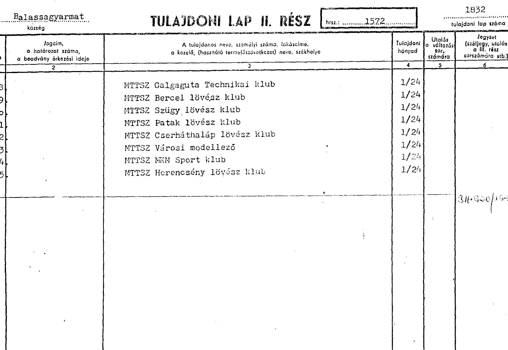

| Sor-
szóm | Jogcím,
a határozat száma,
a beadvány ónkezési ideje | TULAJDONI LAP II. RÉSZ | 1572. |  | 1832. |  |
| :--: | :--: | :--: | :--: | :--: | :--: | :--: |
|  |  |  |  |  | tulajdoni lap száma |  |
|  |  |  |  |  |  |  |
|  |  |  |  |  |  |  |
| 1 | 2 |  | 3 | 4 | 5 | 6 |
| 18 |  | MTTSZ Galgaguta Technikai klub |  | $1 / 24$ |  |  |
| 19 |  | MTTSZ Bercel lövész klub |  | $1 / 24$ |  |  |
| 20 |  | MTTSZ Szügy lövész klub |  | $1 / 24$ |  |  |
| 21 |  | MTTSZ Patak lövész klub |  | $1 / 24$ |  |  |
| 22 |  | MTTSZ Cserháthaláp lövész klub |  | $1 / 24$ |  |  |
| 23 |  | MTTSZ Városi modellező |  | $1 / 24$ |  |  |
| 24 |  | MTTSZ NRM Sport klub |  | $1 / 24$ |  |  |
| 25 |  | MTTSZ Horencsény lövész kiub |  | $1 / 24$ |  |  |

---

MAGYAR HONVÉDELMI SZÖVETSÉG
ÜGYVEZETÓ FÔTITKÁRA
Budapest, V. Beloiannisz u.16.
Nyt.szám: 4-75/1990.

# NYILATKOZAT 

tulajdonjog bejegyzéséhez

Az MHSZ Orszgos Központ képviseletében az 1022/1990. (II. 14.) MT határozat rendelkezései végrehajtásaként hozzájárulok ahhoz, hogy az MHSZ tulajdonában lévô Boglárlelle, Árpád u. 22. sz (tulajdoni-lap szám: 152, hrsz.: 57) gépjármũvezetô-képzõ kirendeltség rendeltetésũ ingatlan tulajdonjoga az MHSZ által alapított Kulturált Közlekedésért Alapítvány javára az ingatlannyilvántartásba bejegyzésre kerüljön.

Budapest, 1990. szeptember 10.

Kapják:
1-5. pld. Földhivatal
6. pld. KKA
7. pld. MHSZ OK.
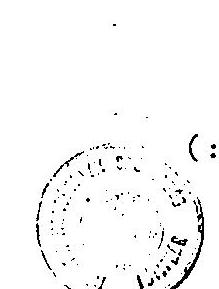
(: Bajtai László mk. alezredes :) ügyvezetô fôtitkár

---

# TULAJDONI LAP I. RÉSZ

5/8

1982 JANUAR

152

Tulajdoni lap szám

57

Melyrepi szám

61

2 LAKAS

|  SZERJE | A toldészlet (olészlet) |  |  |  | A termóhely |  |   |
| --- | --- | --- | --- | --- | --- | --- | --- |
|  57 | mindazágy, másolat alá kivett terület |  | terület |  | terület |  |   |
|   | megnevezése |  | holsor | m² | holsor | m² | 57
szóma  |
|  A | LAKOHAZUDVIG.ÉP |  |  | 400 |  |  |   |
|  H | KERT |  |  | 950 |  |  |   |
|   |  | DSSZESEN |  | 1390 |  |  |   |

Ezt a másolatot a bocsárlatlat követi földhivatal távmásolán /telefúxon/ utta ki.

A tulajdoni lap másolat az evadeti tulajdoni lap bejegyzánai val a kiadást magolázó napom mindazágy megnevezik.

Bocsárlalla, 19.12. áv. 10.12.1982. ád. 10.12.1982.

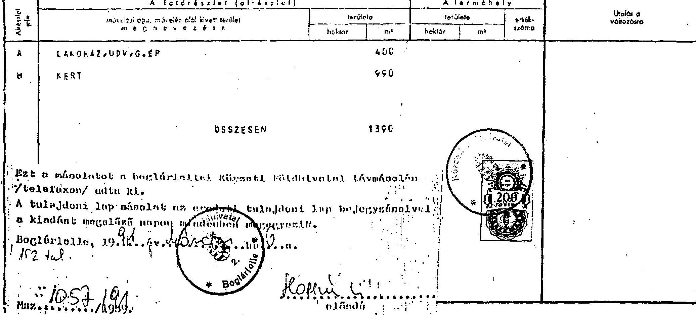

---

# TULAJDONI LAP II. RÉSZ

|  Sor-
szám | Túlajdon
lap 11-111. rész
1.  |
| --- | --- |
|  1 | 2  |
|  1. | Vétel
4939/1971.IX.20./  |
|  2. | átsdás
30.687/1991.II.20.  |

|  Túlajdon
lap 11-111. rész
1.  |
| --- |
|  152. | |

|  Túlajdon
lap 11-111. rész
1.  |
| --- |
|  152. | |

|  Túlajdon
lap 11-111. rész
1.  |
| --- |
|  152. | |

|  Túlajdon
lap 11-111. rész
1.  |
| --- |
|  152. | |

|  Túlajdon
lap 11-111. rész
1.  |
| --- |
|  152. | |

|  Túlajdon
lap 11-111. rész
1.  |
| --- |
|  152. | |

|  Túlajdon
lap 11-111. rész
1.  |
| --- |
|  152. | |

|  Túlajdon
lap 11-111. rész
1.  |
| --- |
|  152. | |

---

MAGYAR HONVÉDELMI SZÖVETSÉG
ÜGYVEZETO FÔTITKÁRA
Budapest, V. Beloiannisz u.16.
Nyt.szám: $4-76 / 1990$.

# NYILATKOZAT 

tulajdonjog bejegyzéséhez

Az MHSZ Orszgos Központ képviseletében az 1022/1990. (II. 14.) MT határozat rendelkezései végrehajtásaként hozzájárulok ahhoz, hogy az MHSZ tulajdonában lévõ Nyiregyháza, Arany J.u. 7. sz. (tulajdoni-lap szám: 7437, hřsz.: 6097) gépjármö telephely rendeltetésũ ingatlan tulajdonjoga az MHSZ által alapított Kulturált Közlekedésért Alapítvány javára az ingatlannyilvántartásba bejegyzésre kerüljön.

Budapest, 1990. szeptember 10.

Kapják:
1-5. pld. Földhivatal
6. pld. KKA
7. pld. MHSZ OK.
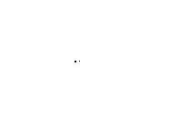
(: Bajtai Luszló mk. alezredes :)
ügyvezető főtitkár

---

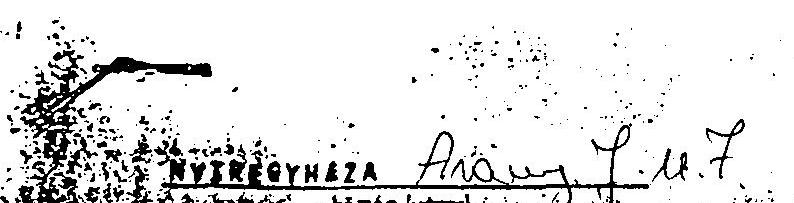

# TULAJDONI LAP I. RÉSZ

1983 PAJUS

7506

9/9

7437

Tulajdoni lap szám

6097

Helytojai szám

52

|  Átko | A foldrészlet (alrészlet) |  | A termőhely |   |
| --- | --- | --- | --- | --- |
|  1003 | művelési ága, művelési ajánléket terílet | területe | területe | értékszáma  |
|   | megnevezése |  |  |   |
|   |  |  |  | 6  |
|   |  |  |  | 1003  |

194. p. 82. Tulajdoni lap I. rész - Szépcső Nyomás - 14. 744

---

|  1. | kisajátítás
8519/1969. | Magyar Állam | 1/1  |
| --- | --- | --- | --- |
|  2. | 3243/1979./II.21. | Kezelő:
Magyar Honvédelmi Szövetség Szabolcs-Szatmár megyei
Vezetősége
Nyíregyháza, Arany J. u. 5.sz. | 3.  |
|  3. | vétel.10568/1975.
/ VIII.3./ felvétel
11. niba kijavítás.
/ 54.177/1969/XI.15./ |  |   |
|  4. | jogutódlás
52591/1990./X.4./ | KULTURÁLT KÖZLEKENESÉRT ALAPITÁNY 489
Budapest, Dagály u.11/a.sz. | 1/1  |
|   |  | Tulajdonl Isp III. rész: ÜRES! | 2+36  |
|   |  | a másolat – a kiadások megelőző napig –
az eredetivel megegyekik.
Nyíregyháza, Arany J. u. 5.sz. | 1991 MAJ 28.  |
|   |  |  | 2004  |
|   |  |  | 100  |
|   |  |  | 100  |
|   |  |  | 100  |
|   |  |  | 100  |
|   |  |  | 100  |
|   |  |  | 100  |
|   |  |  | 100  |
|   |  |  | 100  |
|   |  |  | 100  |
|   |  |  | 100  |
|   |  |  | 100  |
|   |  |  | 100  |
|   |  |  | 100  |
|   |  |  | 100  |
|   |  |  | 100  |
|   |  |  | 100  |
|   |  |  | 100  |
|   |  |  | 100  |
|   |  |  | 100  |
|   |  |  | 100  |
|   |  |  | 100  |
|   |  |  | 100  |
|   |  |  | 100  |
|   |  |  | 100  |
|   |  |  | 100  |
|   |  |  | 100  |
|   |  |  | 100  |
|   |  |  | 100  |
|   |  |  | 100  |
|   |  |  | 100  |
|   |  |  | 100  |

---

MAGYAR HONVÉOELMI SZƠVETSÉG
ÜGYVEZETO FÔTITKÁRA
Budapest, V. Beloiannisz u.16.
Nyt.szám: 4-77/1990.

# NYILATKOZAT 

tulajdonjog bejegyzéséhez

Az MHSZ Orszgos Központ képviseletében az 1022/1990. (II. 14.) MT határozat rendelkezései végrehajtásaként hozzájárulok ahhoz, hogy az MHSZ tulajdonában-lévô Nyiregyháza, Törpe u. 1. sz. (tulajdoni-lap szám: 27274, hrsz.: B78/17) gépjármũvezetôképzõ iskola, tanpálya rendeltetésũ ingatlan tulajdonjoga az MHSZ által alapított Kulturált Közlekedésért Alapítvány javára az ingatlannyilvántartásba bejegyzésre kerüljön.

Budapest, 1990. szeptember 10.

Kapják:
1-5. pld. Földhivatal
6. pld. KKA
7. pld. MHSZ OK.
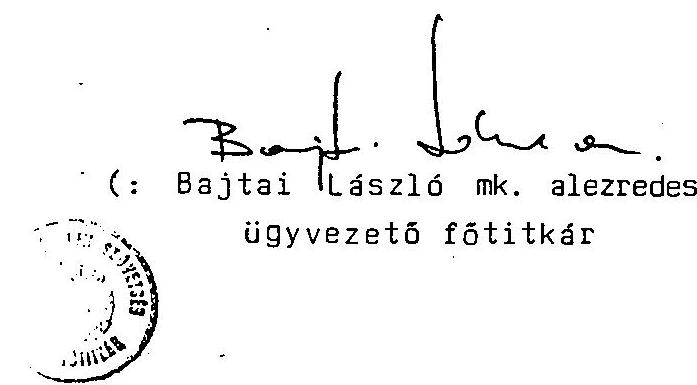

---

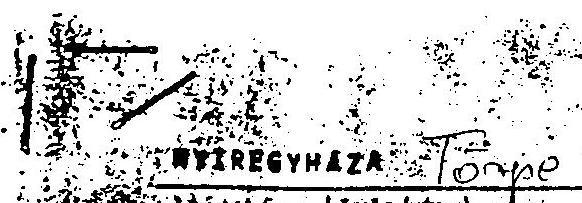

TULAJDONI LAP I. RÉSZ 1983 MAJUS

27274 Tulajdoni lap sáam 078/2374 Helyrajzi szám 15

|  Alusdás | A faldrászlet (alrászlet) |  | A termőhely |  |  |   |
| --- | --- | --- | --- | --- | --- | --- |
|   | műveleti oga, műveleti ajai kivett terület | területe | területe | érték-
szema |  | Unióis a
voltazásra  |
|   | megnevezése | hektor | m² |  |  |   |
|  SPORTTELEP |  | 3.4817. |  |  |  |   |
|   |  | 3. 3509. |  |  |  | III/2.  |
|   |  | 3. 2735. |  |  |  | III/3.  |

194. f. sz. Tulajdoni lap I. rész - Faxaczi Próvindó - M. 44

---

|  NYINBOYHÁZA: | TULAJDONI LAP II. RÉSZ |  |  |  |  |  |  |  |  |  |  |  |  |  |  |  |  |  |  |  |  |  |  |  |  |  |  |  |  |  |  |  |  |  |  |  |  |   |
| --- | --- | --- | --- | --- | --- | --- | --- | --- | --- | --- | --- | --- | --- | --- | --- | --- | --- | --- | --- | --- | --- | --- | --- | --- | --- | --- | --- | --- | --- | --- | --- | --- | --- | --- | --- | --- | --- |
|  1 | 2 |  |  |  |  |  |  |  |  |  |  |  |  |  |  |  |  |  |  |  |  |  |  |  |  |  |  |  |  |  |  |  |  |  |  |  |   |
|  1. | Vétel:
17753/1981, XII.13/
1/12450/1982/1 |  |  |  |  |  |  |  |  |  |  |  |  |  |  |  |  |  |  |  |  |  |  |  |  |  |  |  |  |  |  |  |  |  |  |  |   |
|  2. |  |  |  |  |  |  |  |  |  |  |  |  |  |  |  |  |  |  |  |  |  |  |  |  |  |  |  |  |  |  |  |  |  |  |  |  |   |
|  3. |  |  |  |  |  |  |  |  |  |  |  |  |  |  |  |  |  |  |  |  |  |  |  |  |  |  |  |  |  |  |  |  |  |  |  |  |   |
|  4. |  |  |  |  |  |  |  |  |  |  |  |  |  |  |  |  |  |  |  |  |  |  |  |  |  |  |  |  |  |  |  |  |  |  |  |  |   |
|  5. |  |  |  |  |  |  |  |  |  |  |  |  |  |  |  |  |  |  |  |  |  |  |  |  |  |  |  |  |  |  |  |  |  |  |  |  |  |   |
|  6. |  |  |  |  |  |  |  |  |  |  |  |  |  |  |  |  |  |  |  |  |  |  |  |  |  |  |  |  |  |  |  |  |  |  |  |  |  |   |
|  7. |  |  |  |  |  |  |  |  |  |  |  |  |  |  |  |  |  |  |  |  |  |  |  |  |  |  |  |  |  |  |  |  |  |  |  |  |  |   |
|  8. |  |  |  |  |  |  |  |  |  |  |  |  |  |  |  |  |  |  |  |  |  |  |  |  |  |  |  |  |  |  |  |  |  |  |  |  |  |  |   |
|  9. |  |  |  |  |  |  |  |  |  |  |  |  |  |  |  |  |  |  |  |  |  |  |  |  |  |  |  |  |  |  |  |  |  |  |  |  |  |  |   |
|  10. |  |  |  |  |  |  |  |  |  |  |  |  |  |  |  |  |  |  |  |  |  |  |  |  |  |  |  |  |  |  |  |  |  |  |  |  |  |  |   |
|  11. |  |  |  |  |  |  |  |  |  |  |  |  |  |  |  |  |  |  |  |  |  |  |  |  |  |  |  |  |  |  |  |  |  |  |  |  |  |  |   |
|  12. |  |  |  |  |  |  |  |  |  |  |  |  |  |  |  |  |  |  |  |  |  |  |  |  |  |  |  |  |  |  |  |  |  |  |  |  |  |  |   |
|  13. |  |  |  |  |  |  |  |  |  |  |  |  |  |  |  |  |  |  |  |  |  |  |  |  |  |  |  |  |  |  |  |  |  |  |  |  |  |  |   |
|  14. |  |  |  |  |  |  |  |  |  |  |  |  |  |  |  |  |  |  |  |  |  |  |  |  |  |  |  |  |  |  |  |  |  |  |  |  |  |  |   |
|  15. |  |  |  |  |  |  |  |  |  |  |  |  |  |  |  |  |  |  |  |  |  |  |  |  |  |  |  |  |  |  |  |  |  |  |  |  |  |  |   |
|  16. |  |  |  |  |  |  |  |  |  |  |  |  |  |  |  |  |  |  |  |  |  |  |  |  |  |  |  |  |  |  |  |  |  |  |  |  |  |  |   |
|  17. |  |  |  |  |  |  |  |  |  |  |  |  |  |  |  |  |  |  |  |  |  |  |  |  |  |  |  |  |  |  |  |  |  |  |  |  |  |  |   |
|  18. |  |  |  |  |  |  |  |  |  |  |  |  |  |  |  |  |  |  |  |  |  |  |  |  |  |  |  |  |  |  |  |  |  |  |  |  |  |  |  |   |
|  19. |  |  |  |  |  |  |  |  |  |  |  |  |  |  |  |  |  |  |  |  |  |  |  |  |  |  |  |  |  |  |  |  |  |  |  |  |  |  |  |   |
|  20. |  |  |  |  |  |  |  |  |  |  |  |  |  |  |  |  |  |  |  |  |  |  |  |  |  |  |  |  |  |  |  |  |  |  |  |  |  |  |  |   |
|  21. |  |  |  |  |  |  |  |  |  |  |  |  |  |  |  |  |  |  |  |  |  |  |  |  |  |  |  |  |  |  |  |  |  |  |  |  |  |  |  |   |
|  22. |  |  |  |  |  |  |  |  |  |  |  |  |  |  |  |  |  |  |  |  |  |  |  |  |  |  |  |  |  |  |  |  |  |  |  |  |  |  |  |   |
|  23. |  |  |  |  |  |  |  |  |  |  |  |  |  |  |  |  |  |  |  |  |  |  |  |  |  |  |  |  |  |  |  |  |  |  |  |  |  |  |  |   |
|  24. |  |  |  |  |  |  |  |  |  |  |  |  |  |  |  |  |  |  |  |  |  |  |  |  |  |  |  |  |  |  |  |  |  |  |  |  |  |  |  |   |
|  25. |  |  |  |  |  |  |  |  |  |  |  |  |  |  |  |  |  |  |  |  |  |  |  |  |  |  |  |  |  |  |  |  |  |  |  |  |  |  |  |   |
|  26. |  |  |  |  |  |  |  |  |  |  |  |  |  |  |  |  |  |  |  |  |  |  |  |  |  |  |  |  |  |  |  |  |  |  |  |  |  |  |  |   |
|  27. |  |  |  |  |  |  |  |  |  |  |  |  |  |  |  |  |  |  |  |  |  |  |  |  |  |  |  |  |  |  |  |  |  |  |  |  |  |  |  |  |   |
|  28. |  |  |  |  |  |  |  |  |  |  |  |  |  |  |  |  |  |  |  |  |  |  |  |  |  |  |  |  |  |  |  |  |  |  |  |  |  |  |  |  |   |
|  29. |  |  |  |  |  |  |  |  |  |  |  |  |  |  |  |  |  |  |  |  |  |  |  |  |  |  |  |  |  |  |  |  |  |  |  |  |  |  |  |  |   |
|  30. |  |  |  |  |  |  |  |  |  |  |  |  |  |  |  |  |  |  |  |  |  |  |  |  |  |  |  |  |  |  |  |  |  |  |  |  |  |  |  |  |   |
|  31. |  |  |  |  |  |  |  |  |  |  |  |  |  |  |  |  |  |  |  |  |  |  |  |  |  |  |  |  |  |  |  |  |  |  |  |  |  |  |  |  |   |
|  32. |  |  |  |  |  |  |  |  |  |  |  |  |  |  |  |  |  |  |  |  |  |  |  |  |  |  |  |  |  |  |  |  |  |  |  |  |  |  |  |  |   |
|  33. |  |  |  |  |  |  |  |  |  |  |  |  |  |  |  |  |  |  |  |  |  |  |  |  |  |  |  |  |  |  |  |  |  |  |  |  |  |  |  |  |   |
|  34. |  |  |  |  |  |  |  |  |  |  |  |  |  |  |  |  |  |  |  |  |  |  |  |  |  |  |  |  |  |  |  |  |  |  |  |  |  |  |  |  |  |   |
|  35. |  |  |  |  |  |  |  |  |  |  |  |  |  |  |  |  |  |  |  |  |  |  |  |  |  |  |  |  |  |  |  |  |  |  |  |  |  |  |  |  |  |   |
|  36. |  |  |  |  |  |  |  |  |  |  |  |  |  |  |  |  |  |  |  |  |  |  |  |  |  |  |  |  |  |  |  |  |  |  |  |  |  |  |  |  |  |  |   |
|  37. |  |  |  |  |  |  |  |  |  |  |  |  |  |  |  |  |  |  |  |  |  |  |  |  |  |  |  |  |  |  |  |  |  |  |  |  |  |  |  |  |  |  |   |
|  38. |  |  |  |  |  |  |  |  |  |  |  |  |  |  |  |  |  |  |  |  |  |  |  |  |  |  |  |  |  |  |  |  |  |  |  |  |  |  |  |  |  |  |  |   |
|  39. |  |  |  |  |  |  |  |  |  |  |  |  |  |  |  |  |  |  |  |  |  |  |  |  |  |  |  |  |  |  |  |  |  |  |  |  |  |  |  |  |  |  |  |  |   |
|  40. |  |  |  |  |  |  |  |  |  |  |  |  |  |  |  |  |  |  |  |  |  |  |  |  |  |  |  |  |  |  |  |  |  |  |  |  |  |  |  |  |  |  |  |  |  |   |
|  41. |  |  |  |  |  |  |  |  |  |  |  |  |  |  |  |  |  |  |  |  |  |  |  |  |  |  |  |  |  |  |  |  |  |  |  |  |  |  |  |  |  |  |  |  |  |  |   |
|  42. |  |  |  |  |  |  |  |  |  |  |  |  |  |  |  |  |  |  |  |  |  |  |  |  |  |  |  |  |  |  |  |  |  |  |  |  |  |  |  |  |  |  |  |  |  |  |  |   |
|  43. |  |  |  |  |  |  |  |  |  |  |  |  |  |  |  |  |  |  |  |  |  |  |  |  |  |  |  |  |  |  |  |  |  |  |  |  |  |  |  |  |  |  |  |  |  |  |  |  |   |
|  44. |  |  |  |  |  |  |  |  |  |  |  |  |  |  |  |  |  |  |  |  |  |  |  |  |  |  |  |  |  |  |  |  |  |  |  |  |  |  |  |  |  |  |  |  |  |  |  |  |  |  |  |   |
|  45. |  |  |  |  |  |  |  |  |  |  |  |  |  |  |  |  |  |  |  |  |  |  |  |  |  |  |  |  |  |  |  |  |  |  |  |  |  |  |  |  |  |  |  |  |  |  |  |  |  |  |  |  |  |  |  |  |  |  |  |  |  |  |  |  |  |  |  |  |  |  |  |  |  |  |  |  |  |  |  |  |  |  |  |  |  |  |  |  |  |  |  |  |  |  |  |  |  |  |  | 

---

MAGYAR HONVÉDELMI SZÖVETSÉG
ÜGYVEZETŐ FÔTITKÁRA
Budapest, V. Beloiannisz u.16.
Nyt.szám: 4-78/1990.

# NYILATKOZAT 

tulajdonjog bejegyzéséhez

Az MHSZ Orszgos Központ képviseletében az 1022/1990. (II. 14.) MT határozat rendelkezései végrehajtásaként hozzájárulok ahhoz, hogy az MHSZ tulajdonában lévô Tiszavasvári, Kossuth L.u. 34. sz. (tulajdoni-lap szám: 2837, hrsz.: 2780) gépjármũveze-tô-képzõ kirendeltség rendeltetésũ ingatlan tulajdonjoga az MHSZ által alapított Kulturált Közlekedésért Alapítvány javára az ingatlannyilvántartásba bejegyzésre kerüljön.

Budapest, 1990. szeptember 10.

Kapják:
1-5. pld. Földhivatal
6. pld. KKA
7. pld. MHSZ OK.
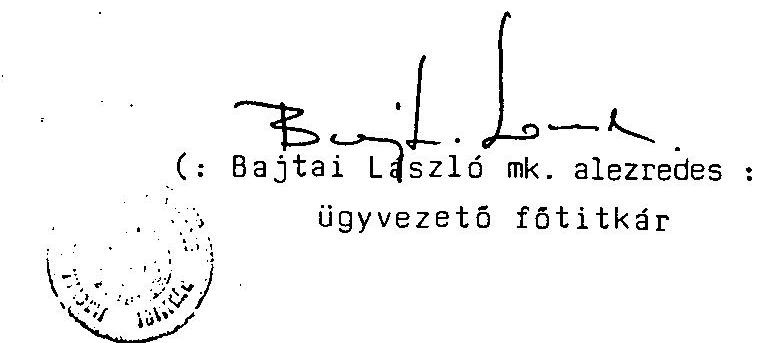

---

TULAJDONI LAP I. RÉSZ

2962

2837

Tuhandone lap azona

2780

Helsvapal azona

15

1 LAKAS

|  A foldrászlat (olvaszlat) | A formásti |  |   |
| --- | --- | --- | --- |
|  múvelési lap, múvelés zöld lávad, lakóval, |  |  |   |
|  10.000 | 10.000 | 10.000 | 10.000  |
|  10.000 | 10.000 | 10.000 | 10.000  |
|  10.000 | 10.000 | 10.000 | 10.000  |
|  10.000 | 10.000 | 10.000 | 10.000  |
|  10.000 | 10.000 | 10.000 | 10.000  |
|  10.000 | 10.000 | 10.000 | 10.000  |
|  10.000 | 10.000 | 10.000 | 10.000  |
|  10.000 | 10.000 | 10.000 | 10.000  |
|  10.000 | 10.000 | 10.000 | 10.000  |
|  10.000 | 10.000 | 10.000 | 10.000  |
|  10.000 | 10.000 | 10.000 | 10.000  |
|  10.000 | 10.000 | 10.000 | 10.000  |
|  10.000 | 10.000 | 10.000 | 10.000  |
|  10.000 | 10.000 | 10.000 | 10.000  |
|  10.000 | 10.000 | 10.000 | 10.000  |
|  10.000 | 10.000 | 10.000 | 10.000  |
|  10.000 | 10.000 | 10.000 | 10.000  |
|  10.000 | 10.000 | 10.000 | 10.000  |
|  10.000 | 10.000 | 10.000 | 10.000  |
|  10.000 | 10.000 | 10.000 | 10.000  |
|  10.000 | 10.000 | 10.000 | 10.000  |
|  10.000 | 10.000 | 10.000 | 10.000  |
|  10.000 | 10.000 | 10.000 | 10.000  |
|  10.000 | 10.000 | 10.000 | 10.000  |
|  10.000 | 10.000 | 10.000 | 10.000  |
|  10.000 | 10.000 | 10.000 | 10.000  |
|  10.000 | 10.000 | 10.000 | 10.000  |
|  10.000 | 10.000 | 10.000 | 10.000  |
|  10.000 | 10.000 | 10.000 | 10.000  |
|  10.000 | 10.000 | 10.000 | 10.000  |
|  10.000 | 10.000 | 10.000 | 10.000  |

---

|  TULAJDONI LAP II. RÉSZ |  |  |  |  |  |  |  |  |  |  |  |  |  |  |  |  |  |  |  |  |  |  |  |  |  |  |  |  |  |  |  |  |  |  |  |  |  |  |  |  |  |  |  |  |  |  |  |  |  |  |  |  |  |  |  |  |  |  |  |  |  |  |  |  |  |  |  |  |  |  |  |  |  |  |  |  |  |  |  |  |  |  |  |  |  |  |  |  |  |  |  |  |  |  |  |  |  |  |  |  |  |

---

MAGYAR HONVÉDELMI SZÖVETSÉG
ÜGYVEZETŐ FÔTITKÁRA
Budapest, V. Beloiannisz u.16.
Nyt.szám: 4-79/1990.

# NYILATKOZAT 

tulajdonjog bejegyzéséhez

Az MHSZ Orszgos Központ képviseletében az 1022/1990. (II. 14.) MT határozat rendelkezései végrehajtásaként hozzájárulok ahhoz, hogy az MHSZ tulajdonában lévô Szekszárd, Kossuth L.u. 13. sz. (tulajdoni-lap szám: 2223; hrsz.: 1964) gépjármũveze-tô-képzõ iskola rendeltetésũ ingatlan tulajdonjoga az MHSZ által alapított Kulturált Közlekedésért Alapítvány javára az ingatlannyilvántartásba bejegyzésre kerüljön.

Budapest, 1990. szeptember 10.
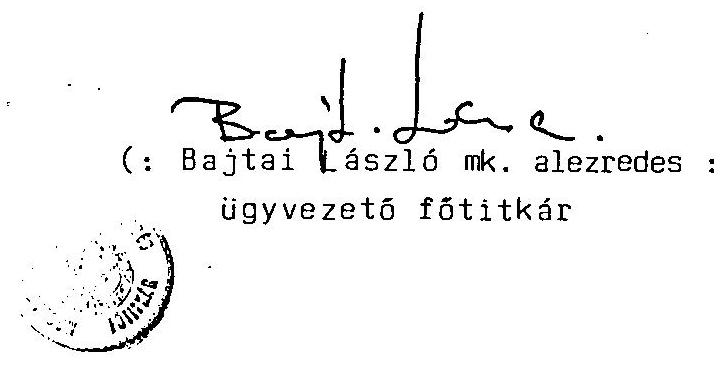

Kapják:
1-5. pld. Földhivatal
6. pld. KKA
7. pld. MHSZ OK.

---

# TULAJDONI LAP I. RÉSZ

## SZEKSZÁRD

- **közeleg (váres)**

  - 1985 JUNIUS

- **BELTEROLET**

  - 2223
  - 1964
  - Melyrőit 120m

  - 1964
  - Melyrőit 120m

- **RAKOCZI FERENC**

  - UTCA: 16

- **LAKÁS**

  - 15. 52.

## A Toldreszlet (olreszlet)

- **Művészti ugy. művelet ülő kivált térület**
  - 100000
  - 100000
  - 100000
  - 100000

- **LAKOHÁZ, UDV, G. ÉP**

  - 2046

- **Irodaház/gépjármű iskola/**

- **A másolat hiteléül:**
  - Szekszárd, 1991. 10. 10. 10. 10. nap.
  - A megrendelőkönyv: 4. 4. 4. 4. /1991. t.a. bevezetve

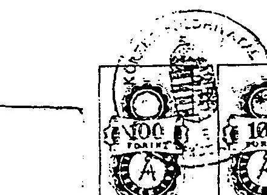

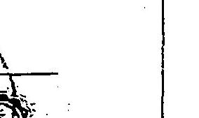

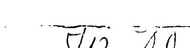

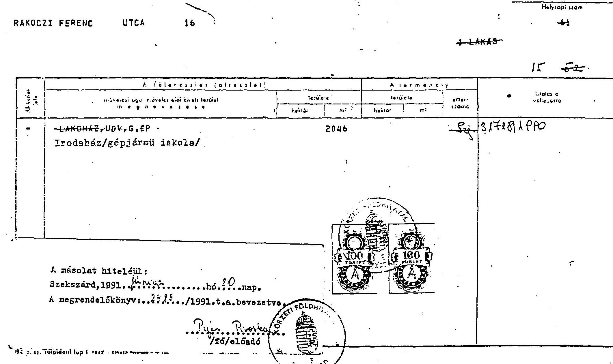

---

|  Szekszárd köszég |  | TULAJDONI LAP II. RÉSZ |  | 1964 |  | 2008 |   |
| --- | --- | --- | --- | --- | --- | --- | --- |
|  Sorszám | Jogcím, határozat száma, érkezési idő | A t u l a | d o n o s |  | Tulajdoni hányad | Utalás a változás sorszámára | Jegyzet (széljegv. utalás a III. rész)  |
|   |  | kezelő, használó termelőszövetkezet | szül. éve | anyja neve |  |  |   |
|  1 | 2 | 3 | 4 | 5 | 6 | 7 | 8  |
|  1. | Kisajátítás 2691/1966/VI.10./ | Magyar Honvédelmi Szövetség MHSZ |  |  | 1/1 | 2/ |   |
|   |  | Hákóczi u. 16. |  |  |  |  |   |
|   |  | Készítette: | Ellenőrizte |  |  |  |   |
|  2. | Átadás 38253/1990./X.2./ | " Kulturált Közlekedésért Alapítvány" |  |  | 1/1
1090/2046 |  | 38253/1990  |
|   |  | Budapest, XIII. Dagály u. 11/4. |  |  |  |  |   |
|  3. | eredeti állapot vissza 38253-2/1990/X.17/ | Magyar Honvédelmi Szövetség Szekszárd. Rákóczi u. 16. |  |  | 574/2046
956/2046
II/4 |  | 38253-2/1990  |
|  4. | Átadás 30186/1990/I.7/ 40505/1990:/ | Szekszárdi Rádió Klub |  |  | 382/2046 |  | 40505/1990  |

---

# NYILATKOZAT 

A "Kulturált Közlekedésért" Alapítvány a szekszárdi Földhivatalhoz 1990. szeptember 25 napján dátumozott és a Földthivatalnál 1990. X. 2. napján 38.253/90 szám alatt iktatott kérelmével kapcsolatban elôadja, hogy a kérelem benyuj tásakor tévedésben volt.
A kérelem nem vonatkozik az WHSZ tulajdonát képező szekszárdi 2223 tulajdon lapon az 1964 hrsz. alatt nyilvántartott egész ingatlanra, illetve ezen belül az WHSZ irodaházra.

A kérelem kizárólag a Kossuth I. ut. 13-szám alatti Gép-jármüvezető-képzõ Iskola és a hozzá tartozó terïleti hányadra terjed ki.

Az iródaház továbbra is az MHSZ tulajdonát képezi a járulékos terïlettel.

Fentiek miatt kérjük, hogy az irodaház + járulékos terület keriiljön visszajegyzésre az iHSZ javára.

A bejegyzést a mellékelt alaprajz, és terïleti kimutatás alapján kérjük elvégezni.

Szekszárd, 1990. október "IS".

## 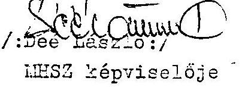

A "Kultuá́l tüzle ̇̇ódésérz"
Alapitvány
Ijazgato Canács tagja
Tanuk:
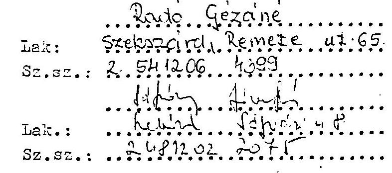

---

# TULAJDONI LAP I. RÖSZ

## SZEKSZÁRD

### kötség (vörös)

#### BELTERÖLET

#### RÁKOCZI FERENC

#### UTCA

#### 16

1. LÁKÁS

15 52

A földrészlet (olvaszlat)

móvelési úgú, móvelés alól kivett terület

1. LÁKÓHAZ, UDV, G. ÉP

2046

Irodabáz/gépjármú iskola/

A másolat hiteléül:

Szekszárd, 1992. 16. 11. nap.

A megrendelőkönyv: 1992. t.a. bevezetve.

1990. évi XCIII. tv. 5. §. 1/ bekezdése alapján illetékmentes.

/fő/előadó

Fő, víz, felpisoni lap I. rész - Felsz. lezámás - 20 122

---

# Szekszárd

## TULAJDONI LAP II. RÉSZ

|  Sorszám | Fogadási haza | 1964 | 1982  |
| --- | --- | --- | --- |
|  1 | 2 | 3 | 4  |
|  Százszáza |  |  |   |
|  1964 |  |  |   |
|  1982 |  |  |   |
|  2 |  |  |   |
|  3 |  |  |   |
|  4 |  |  |   |
|  5 |  |  |   |
|  6 |  |  |   |
|  7 |  |  |   |
|  8 |  |  |   |
|  9 |  |  |   |
|  10 |  |  |   |
|  11 |  |  |   |
|  12 |  |  |   |
|  13 |  |  |   |
|  14 |  |  |   |
|  15 |  |  |   |
|  16 |  |  |   |
|  17 |  |  |   |
|  18 |  |  |   |
|  19 |  |  |   |
|  20 |  |  |   |
|  21 |  |  |   |
|  22 |  |  |   |
|  23 |  |  |   |
|  24 |  |  |   |
|  25 |  |  |   |
|  26 |  |  |   |
|  27 |  |  |   |
|  28 |  |  |   |
|  29 |  |  |   |
|  30 |  |  |   |
|  31 |  |  |   |
|  32 |  |  |   |
|  33 |  |  |   |
|  34 |  |  |   |
|  35 |  |  |   |
|  36 |  |  |   |
|  37 |  |  |   |
|  38 |  |  |   |
|  39 |  |  |   |
|  40 |  |  |   |
|  41 |  |  |   |
|  42 |  |  |   |
|  43 |  |  |   |
|  44 |  |  |   |
|  45 |  |  |   |
|  46 |  |  |   |
|  47 |  |  |   |
|  48 |  |  |   |
|  49 |  |  |   |
|  50 |  |  |   |
|  51 |  |  |   |
|  52 |  |  |   |
|  53 |  |  |   |
|  54 |  |  |   |
|  55 |  |  |   |
|  56 |  |  |   |
|  57 |  |  |   |
|  58 |  |  |   |
|  59 |  |  |   |
|  60 |  |  |   |
|  61 |  |  |   |
|  62 |  |  |   |
|  63 |  |  |   |
|  64 |  |  |   |
|  65 |  |  |   |
|  66 |  |  |   |
|  67 |  |  |   |
|  68 |  |  |   |
|  69 |  |  |   |
|  70 |  |  |   |
|  71 |  |  |   |
|  72 |  |  |   |
|  73 |  |  |   |
|  74 |  |  |   |
|  75 |  |  |   |
|  76 |  |  |   |
|  77 |  |  |   |
|  78 |  |  |   |
|  79 |  |  |   |
|  80 |  |  |   |
|  81 |  |  |   |
|  82 |  |  |   |
|  83 |  |  |   |
|  84 |  |  |   |
|  85 |  |  |   |
|  86 |  |  |   |
|  87 |  |  |   |
|  88 |  |  |   |
|  89 |  |  |   |
|  90 |  |  |   |
|  91 |  |  |   |
|  92 |  |  |   |
|  93 |  |  |   |
|  94 |  |  |   |
|  95 |  |  |   |
|  96 |  |  |   |
|  97 |  |  |   |
|  98 |  |  |   |
|  99 |  |  |   |
|  100 |  |  |   |
|  101 |  |  |   |
|  102 |  |  |   |
|  103 |  |  |   |
|  104 |  |  |   |
|  105 |  |  |   |
|  106 |  |  |   |
|  107 |  |  |   |
|  108 |  |  |   |
|  109 |  |  |   |
|  110 |  |  |   |
|  111 |  |  |   |
|  112 |  |  |   |
|  113 |  |  |   |
|  114 |  |  |   |
|  115 |  |  |   |
|  116 |  |  |   |
|  117 |  |  |   |
|  118 |  |  |   |
|  119 |  |  |   |
|  120 |  |  |   |
|  121 |  |  |   |
|  122 |  |  |   |
|  123 |  |  |   |
|  124 |  |  |   |
|  125 |  |  |   |
|  126 |  |  |   |
|  127 |  |  |   |
|  128 |  |  |   |
|  129 |  |  |   |
|  130 |  |  |   |
|  131 |  |  |   |
|  132 |  |  |   |
|  133 |  |  |   |
|  134 |  |  |   |
|  135 |  |  |   |
|  136 |  |  |   |
|  137 |  |  |   |
|  138 |  |  |   |
|  139 |  |  |   |
|  140 |  |  |   |
|  141 |  |  |   |
|  142 |  |  |   |
|  143 |  |  |   |
|  144 |  |  |   |
|  145 |  |  |   |
|  146 |  |  |   |
|  147 |  |  |   |
|  148 |  |  |   |
|  149 |  |  |   |
|  150 |  |  |   |
|  151 |  |  |   |
|  152 |  |  |   |
|  153 |  |  |   |
|  154 |  |  |   |
|  155 |  |  |   |
|  156 |  |  |   |
|  157 |  |  |   |
|  158 |  |  |   |
|  159 |  |  |   |
|  160 |  |  |   |
|  161 |  |  |   |
|  162 |  |  |   |
|  163 |  |  |   |
|  164 |  |  |   |
|  165 |  |  |   |
|  166 |  |  |   |
|  167 |  |  |   |
|  168 |  |  |   |
|  169 |  |  |   |
|  170 |  |  |   |
|  171 |  |  |   |
|  172 |  |  |   |
|  173 |  |  |   |
|  174 |  |  |   |
|  175 |  |  |   |
|  176 |  |  |   |
|  177 |  |  |   |
|  178 |  |  |   |
|  179 |  |  |   |
|  180 |  |  |   |
|  181 |  |  |   |
|  182 |  |  |   |
|  183 |  |  |   |
|  184 |  |  |   |
|  185 |  |  |   |
|  186 |  |  |   |
|  187 |  |  |   |
|  188 |  |  |   |
|  189 |  |  |   |
|  190 |  |  |   |
|  191 |  |  |   |
|  192 |  |  |   |
|  193 |  |  |   |
|  194 |  |  |   |
|  195 |  |  |   |
|  196 |  |  |   |
|  197 |  |  |   |
|  198 |  |  |   |
|  199 |  |  |   |
|  200 |  |  |   |
|  201 |  |  |   |
|  202 |  |  |   |
|  203 |  |  |   |
|  204 |  |  |   |
|  205 |  |  |   |
|  206 |  |  |   |
|  207 |  |  |   |
|  208 |  |  |   |
|  209 |  |  |   |
|  210 |  |  |   |
|  211 |  |  |   |
|  212 |  |  |   |
|  213 |  |  |   |
|  214 |  |  |   |
|  215 |  |  |   |
|  216 |  |  |   |
|  217 |  |  |   |
|  218 |  |  |   |
|  219 |  |  |   |
|  220 |  |  |   |
|  221 |  |  |   |
|  222 |  |  |   |
|  223 |  |  |   |
|  224 |  |  |   |
|  225 |  |  |   |
|  226 |  |  |   |
|  227 |  |  |   |
|  228 |  |  |   |
|  229 |  |  |   |
|  230 |  |  |   |
|  231 |  |  |   |
|  232 |  |  |   |
|  233 |  |  |   |
|  234 |  |  |   |
|  235 |  |  |   |
|  236 |  |  |   |
|  237 |  |  |   |
|  238 |  |  |   |
|  239 |  |  |   |
|  240 |  |  |   |
|  241 |  |  |   |
|  242 |  |  |   |
|  243 |  |  |   |
|  244 |  |  |   |
|  245 |  |  |   |
|  246 |  |  |   |
|  247 |  |  |   |
|  248 |  |  |   |
|  249 |  |  |   |
|  250 |  |  |   |
|  251 |  |  |   |
|  252 |  |  |   |
|  253 |  |  |   |
|  254 |  |  |   |
|  255 |  |  |   |
|  256 |  |  |   |
|  257 |  |  |   |
|  258 |  |  |   |
|  259 |  |  |   |
|  260 |  |  |   |
|  261 |  |  |   |
|  262 |  |  |   |
|  263 |  |  |   |
|  264 |  |  |   |
|  265 |  |  |   |
|  266 |  |  |   |
|  267 |  |  |   |
|  268 |  |  |   |
|  269 |  |  |   |
|  270 |  |  |   |
|  271 |  |  |   |
|  272 |  |  |   |
|  273 |  |  |   |
|  274 |  |  |   |
|  275 |  |  |   |
|  276 |  |  |   |
|  277 |  |  |   |
|  278 |  |  |   |
|  279 |  |  |   |
|  280 |  |  |   |
|  281 |  |  |   |
|  282 |  |  |   |
|  283 |  |  |   |
|  284 |  |  |   |
|  285 |  |  |   |
|  286 |  |  |   |
|  287 |  |  |   |
|  288 |  |  |   |
|  289 |  |  |   |
|  290 |  |  |   |
|  291 |  |  |   |
|  292 |  |  |   |
|  293 |  |  |   |
|  294 |  |  |   |
|  295 |  |  |   |
|  296 |  |  |   |
|  297 |  |  |   |
|  298 |  |  |   |
|  299 |  |  |   |
|  300 |  |  |   |
|  301 |  |  |   |
|  302 |  |  |   |
|  303 |  |  |   |
|  304 |  |  |   |
|  305 |  |  |   |
|  306 |  |  |   |
|  307 |  |  |   |
|  308 |  |  |   |
|  309 |  |  |   |
|  310 |  |  |   |
|  311 |  |  |   |
|  312 |  |  |   |
|  313 |  |  |   |
|  314 |  |  |   |
|  315 |  |  |   |
|  316 |  |  |   |
|  317 |  |  |   |
|  318 |  |  |   |
|  319 |  |  |   |
|  320 |  |  |   |
|  321 |  |  |   |
|  322 |  |  |   |
|  323 |  |  |   |
|  324 |  |  |   |
|  325 |  |  |   |
|  326 |  |  |   |
|  327 |  |  |   |
|  328 |  |  |   |
|  329 |  |  |   |
|  330 |  |  |   |
|  331 |  |  |   |
|  332 |  |  |   |
|  333 |  |  |   |
|  334 |  |  |   |
|  335 |  |  |   |
|  336 |  |  |   |
|  337 |  |  |   |
|  338 |  |  |   |
|  339 |  |  |   |
|  340 |  |  |   |
|  341 |  |  |   |
|  342 |  |  |   |
|  343 |  |  |   |
|  344 |  |  |   |
|  345 |  |  |   |
|  346 |  |  |   |
|  347 |  |  |   |
|  348 |  |  |   |
|  349 |  |  |   |
|  350 |  |  |   |
|  351 |  |  |   |
|  352 |  |  |   |
|  353 |  |  |   |
|  354 |  |  |   |
|  355 |  |  |   |
|  356 |  |  |   |
|  357 |  |  |   |
|  358 |  |  |   |
|  359 |  |  |   |
|  360 |  |  |   |
|  361 |  |  |   |
|  362 |  |  |   |
|  363 |  |  |   |
|  364 |  |  |   |
|  365 |  |  |   |
|  366 |  |  |   |
|  367 |  |  |   |
|  368 |  |  |   |
|  369 |  |  |   |
|  370 |  |  |   |
|  371 |  |  |   |
|  372 |  |  |   |
|  373 |  |  |   |
|  374 |  |  |   |
|  375 |  |  |   |
|  376 |  |  |   |
|  377 |  |  |   |
|  378 |  |  |   |
|  379 |  |  |   |
|  380 |  |  |   |
|  381 |  |  |   |
|  382 |  |  |   |
|  383 |  |  |   |
|  384 |  |  |   |
|  385 |  |  |   |
|  386 |  |  |   |
|  387 |  |  |   |
|  388 |  |  |   |
|  389 |  |  |   |
|  390 |  |  |   |
|  391 |  |  |   |
|  392 |  |  |   |
|  393 |  |  |   |
|  394 |  |  |   |
|  395 |  |  |   |
|  396 |  |  |   |
|  397 |  |  |   |
|  398 |  |  |   |
|  399 |  |  |   |
|  391 |  |  |   |
|  392 |  |  |   |
|  393 |  |  |   |
|  394 |  |  |   |
|  395 |  |  |   |
|  396 |  |  |   |
|  397 |  |  |   |
|  398 |  |  |   |
|  399 |  |  |   |
|  391 |  |  |   |
|  392 |  |  |   |
|  393 |  |  |   |
|  394 |  |  |   |
|  395 |  |  |   |
|  396 |  |  |   |
|  397 |  |  |   |
|  398 |  |  |   |
|  399 |  |  |   |
|  391 |  |  |   |
|  392 |  |  |   |
|  393 |  |  |   |
|  394 |  |  |   |
|  395 |  |  |   |
|  396 |  |  |   |
|  397 |  |  |   |
|  398 |  |  |   |
|  399 |  |  |   |
|  391 |  |  |   |
|  392 |  |  |   |
|  393 |  |  |   |
|  394 |  |  |   |
|  395 |  |  |   |
|  396 |  |  |   |
|  397 |  |  |   |
|  398 |  |  |   |
|  399 |  |  |   |
|  391 |  |  |   |
|  392 |  |  |   |
|  393 |  |  |   |
|  394 |  |  |   |
|  395 |  |  |   |
|  396 |  |  |   |
|  397 |  |  |   |
|  398 |  |  |   |
|  399 |  |  |   |
|  391 |  |  |   |
|  392 |  |  |   |
|  393 |  |  |   |
|  394 |  |  |   |
|  395 |  |  |   |
|  396 |  |  |   |
|  397 |  |  |   |
|  398 |  |  |   |
|  399 |  |  |   |
|  391 |  |  |   |
|  392 |  |  |   |
|  393 |  |  |   |
|  394 |  |  |   |
|  395 |  |  |   |
|  396 |  |  |   |
|  397 |  |  |   |
|  398 |  |  |   |
|  399 |  |  |   |
|  391 |  |  |   |
|  392 |  |  |   |
|  393 |  |  |   |
|  394 |  |  |   |
|  395 |  |  |   |
|  396 |  |  |   |
|  397 |  |  |   |
|  398 |  |  |   |
|  399 |  |  |   |
|  391 |  |  |   |
|  392 |  |  |   |
|  393 |  |  |   |
|  394 |  |  |   |
|  395 |  |  |   |
|  396 |  |  |   |
|  397 |  |  |   |
|  398 |  |  |   |
|  399 |  |  |   |
|  391 |  |  |   |
|  392 |  |  |   |
|  393 |  |  |   |
|  394 |  |  |   |
|  395 |  |  |   |
|  396 |  |  |   |
|  397 |  |  |   |
|  398 |  |  |   |
|  399 |  |  |   |
|  391 |  |  |   |
|  392 |  |  |   |
|  393 |  |  |   |
|  394 |  |  |   |
|  395 |  |  |   |
|  396 |  |  |   |
|  397 |  |  |   |
|  398 |  |  |   |
|  399 |  |  |   |
|  391 |  |  |   |
|  392 |  |  |   |
|  393 |  |  |   |
|  394 |  |  |   |
|  395 |  |  |   |
|  396 |  |  |   |
|  397 |  |  |   |
|  398 |  |  |   |
|  399 |  |  |   |
|  391 |  |  |   |
|  392 |  |  |   |
|  393 |  |  |   |
|  394 |  |  |   |
|  395 |  |  |   |
|  396 |  |  |   |
|  397 |  |  |   |
|  398 |  |  |   |
|  399 |  |  |   |
|  391 |  |  |   |
|  392 |  |  |   |
|  393 |  |  |   |
|  394 |  |  |   |
|  395 |  |  |   |
|  396 |  |  |   |
|  397 |  |  |   |
|  398 |  |  |   |
|  399 |  |  |   |
|  391 |  |  |   |
|  392 |  |  |   |
|  393 |  |  |   |
|  394 |  |  |   |
|  395 |  |  |   |
|  396 |  |  |   |
|  397 |  |  |   |
|  398 |  |  |   |
|  399 |  |  |   |
|  391 |  |  |   |
|  392 |  |  |   |
|  393 |  |  |   |
|  394 |  |  |   |
|  395 |  |  |   |
|  396 |  |  |   |
|  397 |  |  |   |
|  398 |  |  |   |
|  399 |  |  |   |
|  391 |  |  |   |
|  392 |  |  |   |
|  393 |  |  |   |
|  394 |  |  |   |
|  395 |  |  |   |
|  396 |  |  |   |
|  397 |  |  |   |
|  398 |  |  |   |
|  399 |  |  |   |
|  391 |  |  |   |
|  392 |  |  |   |
|  393 |  |  |   |
|  394 |  |  |   |
|  395 |  |  |   |
|  396 |  |  |   |
|  397 |  |  |   |
|  398 |  |  |   |
|  399 |  |  |   |
|  391 |  |  |   |
|  392 |  |  |   |
|  393 |  |  |   |
|  394 |  |  |   |
|  395 |  |  |   |
|  396 |  |  |   |
|  397 |  |  |   |
|  398 |  |  |   |
|  399 |  |  |   |
|  391 |  |  |   |
|  392 |  |  |   |
|  393 |  |  |   |
|  394 |  |  |   |
|  395 |  |  |   |
|  396 |  |  |   |
|  397 |  |  |   |
|  398 |  |  |   |
|  399 |  |  |   |
|  391 |  |  |   |
|  392 |  |  |   |
|  393 |  |  |   |
|  394 |  |  |   |
|  395 |  |  |   |
|  396 |  |  |   |
|  397 |  |  |   |
|  398 |  |  |   |
|  399 |  |  |   |
|  391 |  |  |   |
|  392 |  |  |   |
|  393 |  |  |   |
|  394 |  |  |   |
|  395 |  |  |   |
|  396 |  |  |   |
|  397 |  |  |   |
|  398 |  |  |   |
|  399 |  |  |   |
|  391 |  |  |   |
|  392 |  |  |   |
|  393 |  |  |   |
|  394 |  |  |   |
|  395 |  |  |   |
|  396 |  |  |   |
|  397 |  |  |   |
|  398 |  |  |   |
|  399 |  |  |   |
|  391 |  |  |   |
|  392 |  |  |   |
|  393 |  |  |   |
|  394 |  |  |   |
|  395 |  |  |   |
|  396 |  |  |   |
|  397 |  |  |   |
|  398 |  |  |   |
|  399 |  |  |   |
|  391 |  |  |   |
|  392 |  |  |   |
|  393 |  |  |   |
|  394 |  |  |   |
|  395 |  |  |   |
|  396 |  |  |   |
|  397 |  |  |   |
|  398 |  |  |   |
|  399 |  |  |   |
|  391 |  |  |   |
|  392 |  |  |   |
|  393 |  |  |   |
|  394 |  |  |   |
|  395 |  |  |   |
|  396 |  |  |   |
|  397 |  |  |   |
|  398 |  |  |   |
|  399 |  |  |   |
|  391 |  |  |   |
|  392 |  |  |   |
|  393 |  |  |   |
|  394 |  |  |   |
|  395 |  |  |   |
|  396 |  |  |   |
|  397 |  |  |   |
|  398 |  |  |   |
|  399 |  |  |   |
|  391 |  |  |   |
|  392 |  |  |   |
|  393 |  |  |   |
|  394 |  |  |   |
|  395 |  |  |   |
|  396 |  |  |   |
|  397 |  |  |   |
|  398 |  |  |   |
|  399 |  |  |   |
|  391 |  |  |   |
|  392 |  |  |   |
|  393 |  |  |   |
|  394 |  |  |   |
|  395 |  |  |   |
|  396 |  |  |   |
|  397 |  |  |   |
|  398 |  |  |   |
|  399 |  |  |   |
|  391 |  |  |   |
|  391 |  |  |   |
|  392 |  |  |   |
|  393 |  |  |   |
|  394 |  |  |   |
|  395 |  |  |   |
|  396 |  |  |   |
|  397 |  |  |   |
|  398 |  |  |   |
|  399 |  |  |   |
|  391 |  |  |   |
|  391 |  |  |   |
|  392 |  |  |   |
|  393 |  |  |   |
|  394 |  |  |   |
|  395 |  |  |   |
|  396 |  |  |   |
|  397 |  |  |   |
|  398 |  |  |   |
|  391 |  |  |   |
|  391 |  |  |   |
|  391 |  |  |   |
|  392 |  |  |   |
|  393 |  |  |   |
|  394 |  |  |   |
|  395 |  |  |   |
|  396 |  |  |   |
|  397 |  |  |   |
|  398 |  |  |   |
|  391 |  |  |   |
|  391 |  |  |   |
|  391 |  |  |   |
|  392 |  |  |   |
|  391 |  |  |   |
|  391 |  |  |   |
|  391 |  |  |   |
|  391 |  |  |   |
|  392 |  |  |   |
|  391 |  |  |   |
|  391 |  |  |   |
|  391 |  |  |   |
|  391 |  |  |   |
|  392 |  |  |   |
|  391 |  |  |   |
|  391 |  |  |   |
|  391 |  |  |   |
|  391 |  |  |   |
|  391 |  |  |   |
|  391 |  |  |   |
|  391 |  |  |   |
|  391 |  |  |   |
|  391 |  |  |   |
|  391 |  |  |   |
|  391 |  |  |   |
|  391 |  |  |   |
|  391 |  |  |   |
|  391 |  |  |   |
|  391 |  |  |   |
|  391 |  |  |   |
|  391 |  |  |   |
|  391 |  |  |   |
|  391 |  |  |   |
|  391 |  |  |   |
|  391 |  |  |   |
|  391 |  |  |   |
|  391 |  |  |   |
|  391 |  |  |   |
|  391 |  |  |   |
|  391 |  |  |   |
|  391 |  |  |   |
|  391 |  |  |   |
|  391 |  |  |   |
|  391 |  |  |   |
|  391 |  |  |   |

---

# TULAJDONI LAP III. RÉSZ

|  Sorszám | Mátározat száma, tízó rékszéd, idő | A megkereső szerv megnevezése | Jog, tény megnevezése | Jegyzet (széljegv. törlés stb.)  |
| --- | --- | --- | --- | --- |
|  2162/1990 | 2162/1990-TIT-14. | A 1962. határoza, ingatlan mindenkori tulajdonosa javára. | Gázvezeték szolgalmi jog. | 2162/1990  |

---

MAGYAR HONVÉDELMI SZÖVETSÉG
U゙GYVEZETO FÔTITKÁRA
Budapest, V. Beloiannisz u.16.
Nyt.szám: $4-81 / 1990$

# NYILATKOZAT 

tulajdonjog bejegyzéséhez

Az MHSZ Orszgos Központ képviseletében az 1022/1990. (II. 14.) MT határozat rendelkezései végrehajtásaként hozzájárulok ahhoz, hogy az MHSZ tulajdonában lévô Szombathely, Puskás T. u. 7. sz. (tulajdoni-lap szám: 6923, hrsz.: 7302/3) gépjármúveze-tô-képzô iskola rendeltetésũ ingatlan tulajdonjoga az MHSZ által alapított Kulturált Közlekedésért Alapítvány javára az ingatlannyilvántartásba bejegyzésre kerüljön.

Budapest, 1990. szeptember 10.

Kapják:
1-5. pld. Földhivatal
6. pld. KKA
7. pld. MHSZ OK.
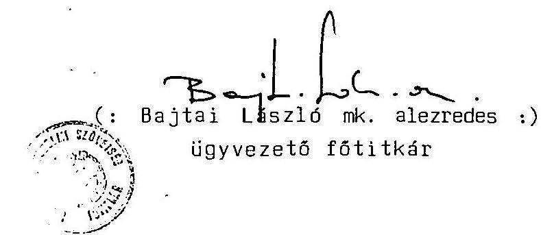

---

SZOMBATHELY késség (város) BELTÉROLET

Purszá T. utca

TULAJDONI LAP I. RÉSZ 1985 APRILIS 5/13. 31 6923 Tulajdani lap szám 7302/2-25 Helyesí szám 15

|  Alvázzla | A faldrászlet (alrászlet) |  |  |  | A terméhely |  | Utalás a váltszáma  |
| --- | --- | --- | --- | --- | --- | --- | --- |
|   | művelési óge, művelési aláí kivett terület megnevezése | területe |  | területe |  | érték-szeme |   |
|   |  | halvár | m² | halvár | m² |  |   |
|  EPOLET ÉS LÚWAR. |  | 1.6018 |  |  |  |  | 10/1,2,3,4  |
|   |  | 4.4577 |  |  |  |  |   |

174. V. 82. Tulajdani lap 1. rész - Szóvas Főzetele - M 144

---

|  SZCKOLTEZLY |  |  |  |  |  |  |  |  |  |  |  |  |  |  |  |  |  |  |  |  |  |  |  |  |  |  |  |  |  |  |  |  |  |  |  |  |  |  |  |  |  |  |  |  |  |  |  |  |  |  |  |  |  |  |  |  |  |  |  |  |  |  |  |  |  |  |  |  |  |  |  |  |  |  |  |  |  |  |  |  |  |  |  |  |  |  |  |  |  |  |  |  |  |  |  |  |  |  |  | 

---

MAGYAR NONVÉDELMI SZƠVETSÉG
UGYVEZETO FÜTITKARA
Bp., V., Beloiannisz u. 16.

Nyt.szám: 8-96/61/90

# NYILATKDZAT 

tulajdonjog bejegyzéséhez

Az MHSZ Országos Központ képviseletében az 1022/1990. /11.14./ MT határozat rendelkezései végrehajtásaként hozzájárulok ahhoz, hogy az MHSZ tulajdonában lévô, az .Veszprém m. .....Tayolca számú betétben 3437/1. . . hrszám alatt felvett Gépjármũ gyakorló-
pálya, tereplotér. megjelölésũ és rendeltetésũ ingatlan tulajdonioga a Alapítvány
jogutód társadalmi szervezet javára az ingatlannyilvántartásba bejegyzésre kerüljön.

Budapest, 1990. szeptember "14".

$$
B_{m} l_{1} l_{1} l_{e}
$$

(Bajtal László mk.alezredes)

Kapják: 1.sz.pld. jogutód szervezet
2.sz.pld. Irattár

---

MAGYAR HONVÉDELMI SZÖVEISEG
UGYVEZETO FÔIITKÁRA
Dp., V., Beloiannisz u. 16.
Nyt.szäm: $8-96 / 46 / 70$

# HYILAIKOZAI 

tulajdonjog bejegyzéséhez

Az MHSZ Országos Központ kópviselctében az 1022/1990. /II.14./ MI határozat rendelkezései végrehajtásaként hozzájárulok ahhoz, hogy az MHSZ tulajdonában lévô, az . Hógrád m..............-i Aditnig. számú betétben ... 285.... hiszám alatt felvett Várnsi, házis
megjeloolésú és rendeltetésú ingatlan tulajdonjoga a ... Jerilleti, Klubbok

Alapítvány
jogutód társadalmi szervezet javára az ingatlannyilvántartásba bejegyzésre kerüljün.

Budapest, 1990. szeptember "14".
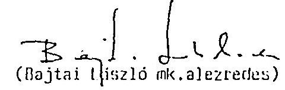

Kapják: 1.sz.pld. jogutód szervezet
2.sz.pld. Irattár

---

# TULAIDONI LAP L. EÉSZ 

RETSAG
$1983 \quad$ NOVEMBER
$374$
Tulajdoni lapszóm
BELTERULET RAKOCZI
UT
29
285
Helyrajzi szóm

1 LAKAS
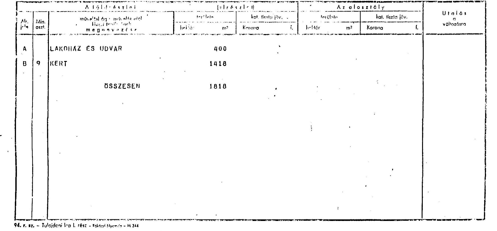

---

|  RÉTSÁG |  |  |  |  |  |  |  |  |  |  |  |  |  |  |  |  |  |  |  |  |   |
| --- | --- | --- | --- | --- | --- | --- | --- | --- | --- | --- | --- | --- | --- | --- | --- | --- | --- | --- | --- | --- | --- | --- |
|  közzég |  |  |  |  |  |  |  |  |  |  |  |  |  |  |  |  |  |  |  |  |  |   |
|  Sorszám | Jogcím, határozat száma, érkezési idő |  |  |  |  |  |  |  |  |  |  |  |  |  |  |  |  |  |  |  |  |   |
|   |  |  |  |  |  |  |  |  |  |  |  |  |  |  |  |  |  |  |  |  |  |   |
|  1 | 2 |  |  |  |  |  |  |  |  |  |  |  |  |  |  |  |  |  |  |  |  |   |
|  1 | Vétel 4208/1973. |  |  |  |  |  |  |  |  |  |  |  |  |  |  |  |  |  |  |  |  |   |
|  2. |  |  |  |  |  |  |  |  |  |  |  |  |  |  |  |  |  |  |  |  |  |   |
|  2. |  |  |  |  |  |  |  |  |  |  |  |  |  |  |  |  |  |  |  |  |  |   |
|  3. |  |  |  |  |  |  |  |  |  |  |  |  |  |  |  |  |  |  |  |  |  |   |
|  |   |   |   |   |   |   |   |   |   |   |   |   |   |   |   |   |   |   |   |   |   |   |
|  |   |   |   |   |   |   |   |   |   |   |   |   |   |   |   |   |   |   |   |   |   |   |
|  |   |   |   |   |   |   |   |   |   |   |   |   |   |   |   |   |   |   |   |   |   |   |
|  |   |   |   |   |   |   |   |   |   |   |   |   |   |   |   |   |   |   |   |   |   |   |
|  |   |   |   |   |   |   |   |   |   |   |   |   |   |   |   |   |   |   |   |   |   |   |
|  |   |   |   |   |   |   |   |   |   |   |   |   |   |   |   |   |   |   |   |   |   |   |
|  |   |   |   |   |   |   |   |   |   |   |   |   |   |   |   |   |   |   |   |   |   |   |
|  |   |   |   |   |   |   |   |   |   |   |   |   |   |   |   |   |   |   |   |   |   |   |
|  |   |   |   |   |   |   |   |   |   |   |   |   |   |   |   |   |   |   |   |   |   |   |
|  |   |   |   |   |   |   |   |   |   |   |   |   |   |   |   |   |   |   |   |   |   |   |
|  |   |   |   |   |   |   |   |   |   |   |   |   |   |   |   |   |   |   |   |   |   |   |
|  |   |   |   |   |   |   |   |   |   |   |   |   |   |   |   |   |   |   |   |   |   |   |
|  |   |   |   |   |   |   |   |   |   |   |   |   |   |   |   |   |   |   |   |   |   |   |
|  |   |   |   |   |   |   |   |   |   |   |   |   |   |   |   |   |   |   |   |   |   |   |
|  |   |   |   |   |   |   |   |   |   |   |   |   |   |   |   |   |   |   |   |   |   |   |
|  |   |   |   |   |   |   |   |   |   |   |   |   |   |   |   |   |   |   |   |   |   |   |
|  |   |   |   |   |   |   |   |   |   |   |   |   |   |   |   |   |   |   |   |   |   |   |
|  |   |   |   |   |   |   |   |   |   |   |   |   |   |   |   |   |   |   |   |   |   |   |
|  |   |   |   |   |   |   |   |   |   |   |   |   |   |   |   |   |   |   |   |   |   |   |
|  |   |   |   |   |   |   |   |   |   |   |   |   |   |   |   |   |   |   |   |   |   |   |
|  |   |   |   |   |   |   |   |   |   |   |   |   |   |   |   |   |   |   |   |   |   |   |
|  |   |   |   |   |   |   |   |   |   |   |   |   |   |   |   |   |   |   |   |   |   |   |
|  |   |   |   |   |   |   |   |   |   |   |   |   |   |   |   |   |   |   |   |   |   |   |
|  |   |   |   |   |   |   |   |   |   |   |   |   |   |   |   |   |   |   |   |   |   |   |
|  |   |   |   |   |   |   |   |   |   |   |   |   |   |   |   |   |   |   |   |   |   |   |
|  |   |   |   |   |   |   |   |   |   |   |   |   |   |   |   |   |   |   |   |   |   |   |
|  |   |   |   |   |   |   |   |   |   |   |   |   |   |   |   |   |   |   |   |   |   |   |
|  |   |   |   |   |   |   |   |   |   |   |   |   |   |   |   |   |   |   |   |   |   |   |
|  |   |   |   |   |   |   |   |   |   |   |   |   |   |   |   |   |   |   |   |   |   |   |
|  |   |   |   |   |   |   |   |   |   |   |   |   |   |   |   |   |   |   |   |   |   |   |
|  |   |   |   |   |   |   |   |   |   |   |   |   |   |   |   |   |   |   |   |   |   |   |
| 

---

RETBAG

458

TULAJDONI LAP I. RÉSZ

1985 APRILIS

község (város)

458

BELTEROLET

Tulajdoni lap szám

381

Helyrajzi szám

LENIN

UTCA

3

-1-LAKÁB

|  Ábásdát | A faldrászlat (alrészlet) |  |  |  | A termőhely |  |   |
| --- | --- | --- | --- | --- | --- | --- | --- |
|   | mỏvelési ága, mỏvelés nőt kizett terület |  |  |  | területe | terül | Érték  |
|   | megnevezése |  |  |  |  |  | szám  |
|   |  |  |  |  | hektér | m² | szám  |
|  - | ~~LAKOHÁZ~~ |  |  |  | 393 |  |   |
|   | Irodaház |  |  |  |  |  | 50/1988.  |
|  |   |   |   |   |   |   |   |
|  |   |   |   |   |   |   |   |
|  |   |   |   |   |   |   |   |
|  |   |   |   |   |   |   |   |
|  |   |   |   |   |   |   |   |
|  |   |   |   |   |   |   |   |
|  |   |   |   |   |   |   |   |
|  |   |   |   |   |   |   |   |
|  |   |   |   |   |   |   |   |
|  |   |   |   |   |   |   |   |
|  |   |   |   |   |   |   |   |
|  |   |   |   |   |   |   |   |
|  |   |   |   |   |   |   |   |
|  |   |   |   |   |   |   |   |
|  |   |   |   |   |   |   |   |
|  |   |   |   |   |   |   |   |
|  |   |   |   |   |   |   |   |
|  |   |   |   |   |   |   |   |
|  |   |   |   |   |   |   |   |
|  |   |   |   |   |   |   |   |
|  |   |   |   |   |   |   |   |
|  |   |   |   |   |   |   |   |
|  |   |   |   |   |   |   |   |
|  |   |   |   |   |   |   |   |
|  |   |   |   |   |   |   |   |
|  |   |   |   |   |   |   |   |
|  |   |   |   |   |   |   |   |
|  |   |   |   |   |   |   |   |
|  |   |   |   |   |   |   |   |
|  |   |   |   |   |   |   |   |
|  |   |   |   |   |   |   |   |

---

|  R é t s é g |  |  |  |  |  | 458  |
| --- | --- | --- | --- | --- | --- | --- |
|   | közzég | TULAJDONI LAP II. RÉSZ | hrsz.: |  |  | tulajdoni lap száma  |
|  Sor. szám | Jegcími, a határozat száma, a beadvány érkezési ideje | A tulajdonos neve, személyi száma, lakáscíme, a kezelő, (használó termelőszüvetkezel) neve, székhelye |  | Tulajdani hányad | Utalás a változás sor. számára | Jegyzet (széljegv, utalás a III. rész sorszámára stb.)  |
|  1 | 2 | 3 |  | 4 | 5 | 6  |
|  1. | Atszállás 45/1951. | Magyar Állam |  | 1/1 | 3 |   |
|  2. |  | Kezelője: Nagyközségi Közök Tanács - Rétság |  |  |  |   |
|  3. |  | Magyar Honvédelmi Szövetsége Hógrád mégyei vezetősége 1/1 |  |  | 4-15 |   |
|   |  | Salgótarján, Vöröshadéereg-u. 66. |  |  |  |   |
|  4. | Jogutódás: 31.561-4/1990. | Magyar Technikai és Tömegsportkubbok Szövetségéhez csatlakozó Szervezetek |  |  |  | 34.561/1990  |
|   |  | MTTSZ. Hont Tömegsportklub |  | 1/12 |  |   |
|  5. |  | MTTSZ. Alsópatény Tömegsportklub |  | 1/12 |  |   |
|  6. |  | MTTSZ. Nőtincs Tömegsportklub |  | 1/12 |  |   |
|  7. |  | MTTSZ. Rétság Tömegsportklub |  | 1/12 |  |   |
|  8. |  | MTTSZ. Nagyoroszi Tömegsportklub |  | 1/12 |  |   |
|  9. |  | MTTSZ. Hógrádsáp Tömegsportklub |  | 1/12 |  |   |
|  10. |  | MTTSZ. Diósjono Tömegsportklub |  | 1/12 |  |   |
|  11. |  | MTTSZ. Házsa Tömegsportklub |  | 1/12 |  |   |
|  12. |  | MTTSZ. Rombány Tömegsportklub |  | 1/12 |  |   |
|  13. |  | MTTSZ. Hógrád Modellező Klub |  | 1/12 |  |   |
|  14. |  | MTTSZ. Szátok Tömegsportklub |  | 1/12 |  |   |
|  15. |  | MTTSZ. Szendoholy Tömegsportklub |  | 1/12 |  |   |

---

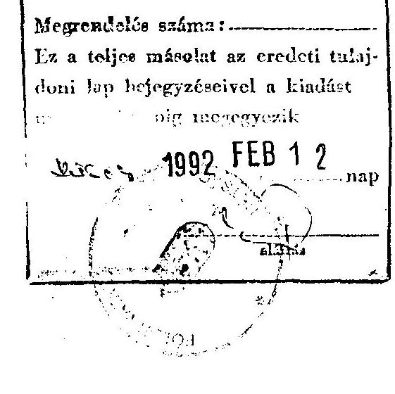

A tulajdoni lap III. részén bejegyzés nincs

---

MACYAR HONVÉDELMI SZÖVETSÉG
U゙GYVEZETÓ FÔTITKÁRA
Bp., V., Beloiannisz u. 16.

Nyt.szám: $4-96 / 71 / 90$

# NYILATKOZAT   tulajdonjog bejegyzéséhez 

Az MHSZ Országos Központ képviseletében az 1022/1990. /II.14./ MT határozat rendelkezései végrehajtásaként hozzájárulok ahhoz, hogy az MHSZ tulajdonában lévô, az ....ZpJa mpqxpi......-i ...Lenti
számú betétben ..1017/6.. hrszám alatt felvett ....Kiképz6 bázis
megjelölésũ és. rendeltetésũ ingatlan tulaj-
donjoga az. MTTSZ. Megyni Elnükség és a gépjarmú "Alapítvány" ingyenes részhasználatával
jogutód társadalmi szervezet javára az ingatlannyilvántartásba bejegyzésre kerüljön.

Budapest, 1990. szeptember "J4".
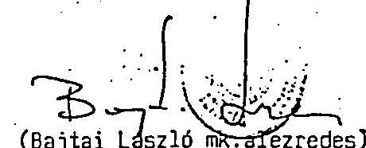

Kapják: 1.sz.pld. jogutód szervezet
2.sz.pld. Irattár

---

# Rajna Ervin Ưr   a Kulturált k3zlokedésért Alapítvány igazgatója 

Budapest

Tisztelt Rajna Ưr !

Szövetségünk átalakítása során úgy döntöttem, hogy az MHSZ Propaganda Anyagellátó Uzemét teljes vagyonával a Kluturált Közlekedésért Alapítványnak adományozzom, annak érdekében, hogy a társadalom számára fontos munkájukat eredményesebben végezhessék.

Kérem nyilatkozzanak az átvételról és foglaljanak állást arra vonatkozóan, vállalják-e az üzem dolgozóinak foglalkoztatását. Kérem vállaljanak kötelezettséget arra vonatkozóan, hogy az MHSZ jogutódaiként müködő MTTSZ és Repüló Szövetség részére - Uzleti alapon - elsobbseget biztosítanak nyomdai termékek gyártásában.

Budapest, 1990. szeptember "10".

Udvözlettel:
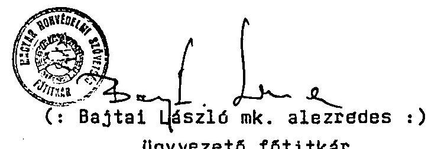

---

# A MAGYAR HONVÉDELMI SZOVETSÉG ÜGYVEZETO FÔTITKÁR 

intézkedése
az MHSZ Propaganda Anyagellátó Üzem
átadására

Az MHSZ átalakítása során létrehoztuk a Kulturált Közlekedésért Alapítványt. Annak érdekében, hogy ez a szervezet megfelelő technikai eszközök birtokában, hatékonyan tudja szolgálni a lakosság és ezen belül különösen a tanulóifjúság közlekedésre nevelését, az MHSZ Propaganda Anyagellátó Üzemét teljes vagyonával 1990. szeptember 25-1 hatállyal tulajdonukba adom.

Az üzem vezetője a fenti idópontig gondoskodjon a pénzügyi zárás és a vagyonértékelés végrehajtásáról, és készüljön fel az átadásra.

Budapest, 1990 .szeptember "13".
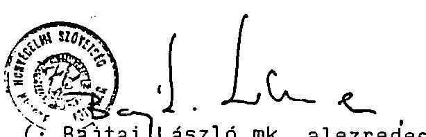
(1) Bajtai László mk. alezredes :) ügyvezető főtitkár

---

# Kimutatás 

A Kul turált Közlekedésért Alapítvány induló vagyonáról
1./ Gépjármúvezető-képzô Kft-k törzstőkéje ..... 178.680 eR
2./ Kft-k hiteltartozása: ..... 19.500 eR
3./ Ingatlanérték ..... 181.416 eR
4./ Alapítványnak átadott eszközök értéke ..... 14.686 eR
Alapítvány vagyonának össz. értéke: ..... 394.282 eR

---

# Kultúrált Közlekedésért Alapítvány 

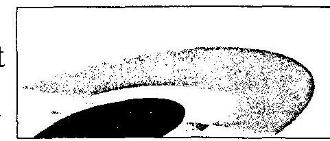

1138 Budapest, Dagály u. 11/a
Telefon: 120-1849, 129-9086
Telefax: 120-1849
Számla szám: MHB 221-10468

Nyt. szám: 11/132/1992.

Állami Számvevőszék

Budapest

Tisztelt Uraim !

A munkatársaikkal 1992. február 18-án folytatott személyes megbeszélés értelmében a mellékletben feltüntetett adatokkal, valamint a Makó, hrsz. 9., ingatlanátadási nyilatkozattal egészítjük ki az előzőekben (11/113/1992. sz. alatt) megküldött vagyonelszámolásunkat.

Melléklet: 1 db kimutatás
1 db átadási nyilatkozat

Budapest, 1992. február 20.
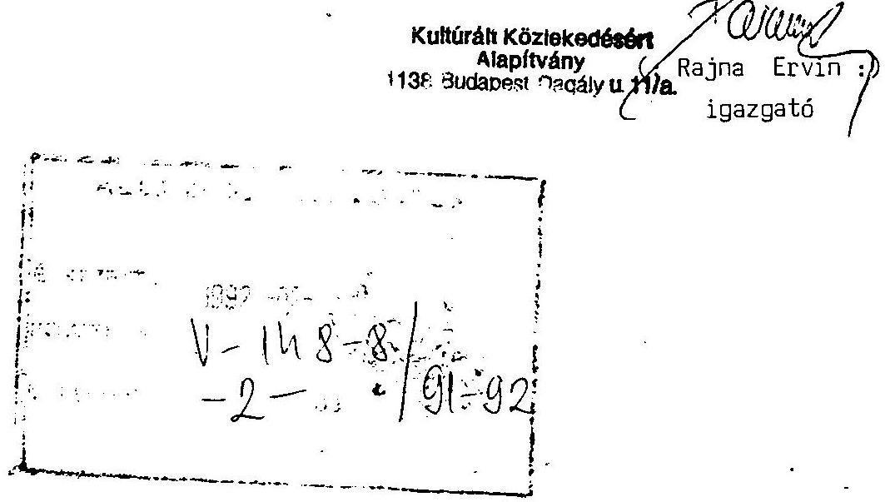

---

# Kimutatás 

## A Kulturált Közlekedésért Alapítvány induló vagyonáról

1./ Gépjármũvezetô-képzõ Kft-k törzstõkéje ..... 178.680 eft
2./ Kft-k hiteltartozása: ..... 19.500 eft
3./ Ingatlanérték ..... 181.416 eft
4./ Alapítványnak átadott eszközök értéke ..... 14.686 eft
Alapítvány vagyonának össz. értéke: ..... 394.282 eft
Ny. pénzeszköz: ..... 3.945 eft
Ny. tartozása ..... 298 eft
Ny. követelés ..... 405 eft
Ny. anyag ..... 2.190 eft
Ny. fogyóeszközök ..... 306 eft
Ny. állóeszközök: ..... 4.185 eft
A. fogyóeszközök ..... 115 eft
A. állóeszközök ..... 3.838 eft
Összesen: ..... 14.686 eft

---

# Kimutatás 

## a Kulturált Közlekedésért Alapítvány MHSZ-töl származó vagyonának összetételéröl

1./ Az Alapítvány saját kezelésũ vagyona

| Ingatlan | 181.416 eR |
| :--: | :--: |
| Gépjármúvek | 129 eR |
| Egyéb állóeszköz | 7.894 eR |
| Egyéb eszközök | 2.718 eR |
| Alapítvány Kft-khez |  |
| kihelyezett hitelek | 19.500 eR |
| Készpénz | 3.945 eR |
| Összesen: | 215.602 eR |

---

2./ Az Alapítvány kizárólagos tulajdonát képező Kft.-k törzstőkéjének megoszlása.

| Kft. megnevezése | Pénzbetét | Gépjármú érték | Egyéb állóeszk. | Egyéb eszk. | Törzs-   töke   össz. |
| :--: | :--: | :--: | :--: | :--: | :--: |
|  | eft | eft | eft | eft |  |
| "Baranya" Kft. | 500 | 4670 | 330 | 2360 | 7860 |
| "Kiskun" Gépjármúvezető Kft. | 500 | 7046 | 703 | 251 | 8500 |
| "Defenzív" Autóvezető Kft. | 500 | 3500 | - | - | 4000 |
| "Rutin" Kft. | 500 | 5526 | 2952 | 2522 | 11500 |
| MHSZ. Autósiskola Kft.   új neve: VICTORIA Autósiskola Kft. | 500 | 5317 | 345 | 3728 | 9940 |
| "Dinamika" Kft. | 500 | 5250 | 2165 | 2675 | 10590 |
| "Bilux" Kft. | 500 | 8374 | 400 | 2756 | 12030 |
| "Hajdú" Kft. | 500 | 6983 | - | 2467 | 9950 |
| "Mátra Autós" Kft. | 500 | 3241 | 64 | 145 | 3950 |
| "Mobilitás" Kft. | 500 | 3539 | 70 | 2821 | 6930 |
| "PALÓC RUTIN" Kft. | 500 | 3410 | - | 1320 | 5230 |
| "Autópest" Kft. | 2180 | 10352 | 5078 | 11340 | 28950 |
| "Oidaktika" Kft. | 500 | 3995 | 425 | - | 4920 |
| MHSZ.Sz-Sz-B. Megyei Kft. új neve: Partner-T Kft. | 500 | 8475 | 116 | 2629 | 11720 |
| "Index" Kft. | 1155 | 4461 | 669 | 2265 | 8550 |
| MHSZ.TEMPO Gépjármúvezető Kft. új neve: "TEMPO" Kft. | 500 | 3056 | 164 | - | 3720 |
| "RITMÓ" Kft. | 500 | 3258 | 2026 | 576 | 6360 |
| MHSZ. Veszprém Megyei Kft. új neve: "TURBO" Kft. | 500 | 1150 | - | - | 1650 |
| "Technika" Kft. | 500 | 5060 | - | - | 5560 |
| "V. Sebesség" Kft. | 500 | 16270 | - | - | 16770 |
| Összesen: | 12335 | 112933 | 15507 | 37905 | 178680 |

---

3./ Az Alapítvány_össz. vagyonának megoszlása a fenti részletezés szerint
a./ Ingatlan ..... 181.416 eR
b./ Gépjármú ..... 113.062 eR
c./ Egyéb állóeszköz ..... 23.401 eR
d./ Egyéb eszközök ..... 40.623 eR
e./ Kft-khez kihelyezett hitelek ..... 19.500 eR
f./ Pénzvagyon ..... 16.280 eR
Mindösszesen: ..... 394.282 eR

---

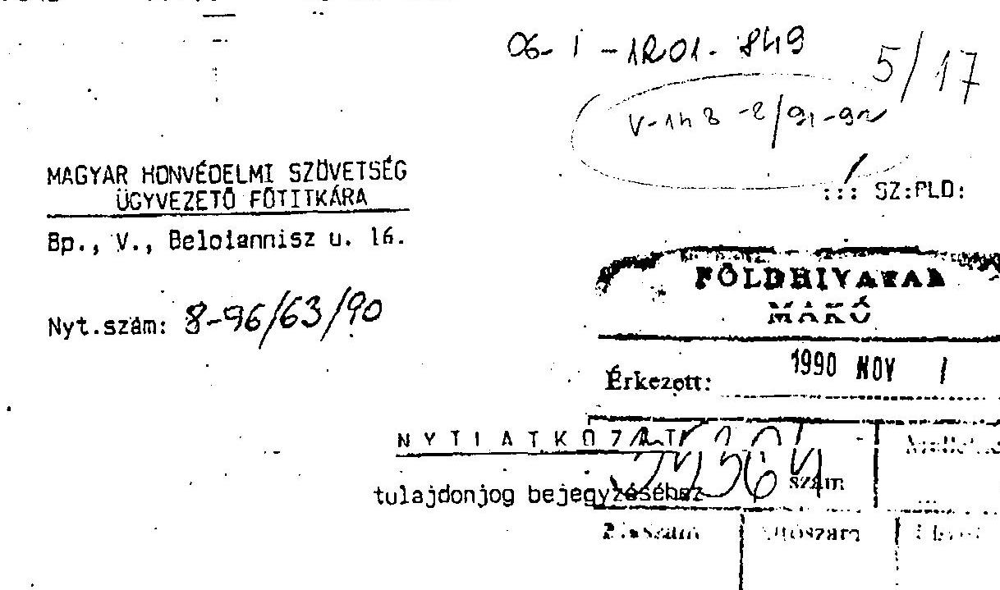

Az MHSZ Országos Központ képviseletében az 1022/1990./II.14./ MT határozat rendelkezései végrehajtásaként hozzájárulok ahhoz, hogy az MHSZ tulajdonában lévő, az ..Csongrád m. ..... -i ........ számú betétben ..? ...... hrszám alatt felvett ..Városi székház ........................ megjelölésű és rendeltetésű ingatlan tulajdonioga a ..... Alagitvány ..................................................................................................................................................................................................................................................................................................................................................................................................................................................................................................................................................................................................................................................................................................................................................................................................................................................................................................................................................................................................................................................................................................................................................................................................................................................................................................................................................................................................................................................................................................................................................................................................................................................................................................................................................................................................................................................................................................................................................................................................................................................................................................................................................................................................................................................................................................................................................................................................................................................................................................................................................................................................................................................................................................................................................................................................................................................................................................................................................................................................................................................................................................................................................................................................................................................................................................................................................................

---

IV.

A Kincstári Vagyonkezelő Szervezet 1992. február 11-i átirata, csatolva a Honvédelmi Minisztériumtól
származó dokumentáció
/V-148-7/1991/1992./

---

KINCSTÁRI VAGYONKEZELÓ SZERVEZET
Levélcím: 1392 Budapest, Pf. 282.
Tel: 112-9200, Fax: 131-7148
Iktatószám: $3-104 / 4 / 1992$.

Állami Számvevơszék
Bihari zsigmond úr
Fejezeti Fơcsoport vezetơje
Budap e s t
Apáczai Csere János u. 10.
1052

Tárgy: MHSz vagyonelszámolása

Tisztelt Bihari úr!
Hivatkozással a V-148-5/1992 sz. levelére, melyben az 1991. évi LI. törvényben meghatározott hiánypótlás megküldésének határidejére hívja fel a figyelmet, - azt tudomásulvève - az alábbiakat hozom szíves tudomására.

Az MHSz vagyonelszámolásának hiánypótlása érdekében - mint azt már egy korábbi levelemben közöltem - valamennyi érintett szervezetet értesítettem, illetve felkértem közremüködésre, remélve, hogy ezen szervezetek a korábbi ismereteik, dokumentációjuk alapján a vagyonelszámolás hitelesítését elơsegíthetik. Egyébként ilyen indítékkal kerestem meg levélben Kelemen József vezérornagy urat, helyettes államtitkárt is. Az elơzøekben említett levelek másolatát, valamint az arra kapott válaszleveleket - a HM levele és mellékleteinek kivételével, amely határidơn túl érkezett - az ön részére egy korábban írt levél mellékleteként megküldtem.

A Honvédelmi Minisztérium helyettes államtitkára által aláirt - T-3357/135/1990 sz. - levelet és annak mellékleteit, valamint idơközben részemre átküldött - az 1990. évi LXIII. törvényt értelmezơ Igazságügyi Minisztériumi - telefaxot csatoltan megküldöm.

---

Összegezve az eddigi tapasztalataimat megállapíthatóva vált, hogy a KVSz a legnagyobb erofeszítések ellenére sem tud több, vagy más - az MHSz vagyonelszámolását, hitelességét elơsegítơ - dokumentációt elơteremteni, illetve elơteremtetni. Ezt a megállapításomat más vonatkozásban, a Honvédelmi miniszter úr 1990. október 5-én - az Állami Számvevơszék elnôkének - írt levelében foglaltak is alátámasztják.

Kérem tájékoztatásom szíves tudomásulvételét.
Budapest, 1992. február 11.
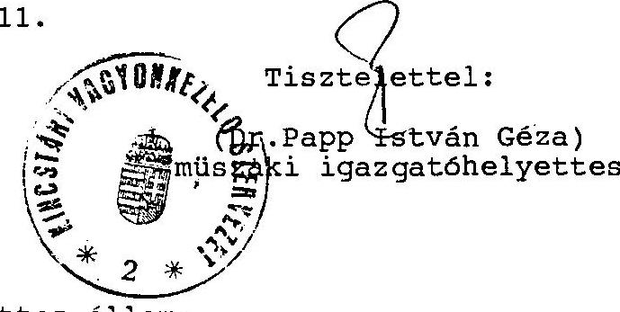

Mellékletek:
1.sz.melléklet: HM helyettes allamtitkári levél
(T-3357/135/1990) +
7 db melléklet
2.sz.melléklet: Igazságügyi Minisztérium faxa

---

# 12.mellésled. 

HONVÉDELMI MINISZTÉRIUM HELYETTES ÁLLAMTITKÁR

1. számu példány

Nyt.szám: $\frac{T-3517 / 135 / 1990}{\text { Hiv.szám: } 3-656 / 4 / 91 .}$
$3-104 / 1 / 1992$

Dr. Papp István Géza úr
Kincstári Vagyonkezelö Szervezet. müszaki igazgató helyettes
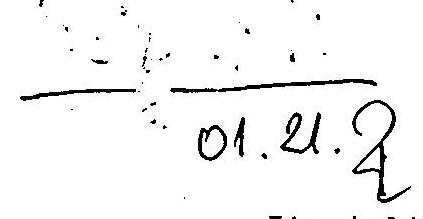

1392 Budapest Pf. B2.

Tisztelt Múszaki Igázgató Helyettes Úr!

Az MHSz 1990. évi LXXIII. törvényben elöírt elszámolásával kapcsolatos helyzetet a hivatkozott számon küldött levelében foglaltaknak megfelelően áttekintettem.

Az 1991. évi LI. törvényben elöírt adatpontosítás elősegítése és az ÁSz által jelzett hiányosságok pótlása érdekében elvégzett munkánk eredménye a következö:
(1.) Az MHSz-töl az MH-hoz átkerült okmányok közül az 1. sz. mellékletben felsoroltuk azokat, melyek az MHSz vagyonát érintik. Az MHSz fôtitkári intézkedések közül az 1-7. fsz.-on szereplőket Ünök részére másolatban 1990. december 12-én átadtuk. A 8., 9. és 10. fsz-on szereplőket 2-4. sz. mellékletként ezúton megküldöm.

Egyben tájékoztatom arról, hogy az MH, illetve a HM szervezetei az intézkedésekben foglaltak végrehajtását dokumentáló átadás-átvételi jegyzőkönyvekkel nem rendelkeznek, azokat az érintettek az MHSz OK-hoz küldték meg.

---

A 15-10/1990. sz. intézkedéshez kapcsolódó, az MHSz tulajdonú ingatlanok tulajdonjogának bejegyzéséhez kiadott fôtitkári nyilatkozatokból csak az Önöknél is meglévô másolatokkal rendelkezünk. Az eredeti - irattári - példányokat âz MH Központi Irattárban sem sikerült elôtalálnunk.
2.) Az 1990. évi LXXIII. törvény 1. és 6. mellékletének adatpontosításával kapcsolatosan nem rendelkezünk információval a volt MHSz tulajdonából és kezeléséből a vagyonfelmérést megelôzôen kikerült ingatlanokról, sem arról, hogy az ingatlanok a megszerzés idôpontja elôtt kinek a tulajdönában, illetve birtokában álltak. Az MHSz vagyonfelmérése ezen információk beszerzésére - mivel ebben az idôszakban még igény sem vetôdött fel - nem terjedt ki.

Az MHSz sajátos számviteli rendje miatt az ingatlanokról értéknyilvántartást nem vezetett.

Az ingatlanok értéke csak az 1022/1990. (II. 4.) Kormányhatározat alapján elrendelt, az 1990. május 31. fordulónappal végrehajtott vagyonfelmérés során került meghatározásra.

Az ingatlanok könyv szerinti értékét az MHSz OK 17-57/ /1990. nyt. számon 1990. február 12-én kiadott 1990. április 04-én kiegészített. állásfoglalása alapján határozták meg az MHSz szervezetek vagyonfelmérő bizottságai, melyek munkáját az MH szakértői segítették.

Az 1990. évi LXXIII. törvény hatálybalépésekor a becsült értékadaton kívül más nem állt rendelkezésre az elszámoláshoz.

Az ÁSz által az ingatlanok körének teljességére tett észrevétel miatt a rendelkezésünkre álló okmányokat egyeztettük, és a megtalált eltéroségeket az 5. sz. mellékletben foglaltuk össze. Az összehasonlított okmányok:

---

- az MHSz vagyonfelmérés ingatlanjegyzéke (melyet az MHSz vagyonra 1990. szeptemberéig az MH-hoz, illetve a HM-hez beérkezett vagyonigényekhez csatolt hiteles iratok alapján pontosítottunk és 1990. október hó elsó felében az Önök részére az elszámolás feladataihoz teljeskörũen átadtunk);
- az MHSz vagyonelszámolásának Önök által 1990. november 16-án részünkre megküldött példánya (MHSZ/1-38/1990., P/1990/796);
- az MHSz fôtitkár tulajdonjog bejegyzéshez kiadott, másolatban elôtalált nyilatkozatai;
- az Önök által az 1990. évi LXX. tv. alapján az állami tulajdonú, MHSz kezelôi jogú ingatlanokról készített, 1992. január 9-i állapotot rögzítő jegyzék;
- a Kultúrált Közlekedésért Alapítvány Alapító okirata.

Az egyes ingatlanok vagyonfelmérés során pontosított okmányai az MHSz OK-ban és a megyei vezetőségeknél álltak rendelkezésre, melyek irattározását az elszámolást követő időszakban felkérésünkre Önök hajtották végre. Az MHSz tulajdonú ingatlanok tulajdonjog átadására kiadott nyilatkozatok bejegyzésének helyzetéről teljeskörũ információval nem rendelkezünk.
3.) Az 1990. évi LXXIII. törvény 3. sz. mellékletének adatpontosítása érdekében felvettük a kapcsolatot a Kultúrált Közlekedésért Alapítvánnyal, mivel az MHSz által létesített kft-k és az alapítvány teljeskörũ, hiteles okmányaival nem rendelkezünk.

Az alapítvány kuratóriumának igazgatójával egyeztettük az elszámolás pontosításához szükséges adatokat.

Felkértük arra, hogy az Önök részére az 1991. december 20-án a 11/101/1991. nyt. számon az alapítvány létrehozásával

---

kapcsolatosan megküldött okmányokat egészítse ki a kft-k alapítására, a vagyoni betét bevitelére (pénzbeni betét, elsõ apport, törzstöke felemelés), és az egyéb vagyoni értékek rendezésére (alapítói hitel, tartozás fe jében térítésmentes átadás, ingyenes ingatlanhasználati jog, erdekképviseleti támogatás) vonatkozó okmányokkal.

h- Az 1990. évi LXXIII. törvény 4. számú mellékletének adatpontosítására 1990. december 12-én a T-3357/91/1990. nyt. számon a HM fejezetszintũ beszámolóiból feltárt adatok alapján tettünk javaslatot a költségvetési és speciális ímport támogatás, valamint jóváhagyott elôzõ évi pénzmaradványról.

Kérem megvizsgáltatni. a mellékletben szereplő "Beruházások teljesítése" adatsor tartalmát és hitelességét. Ezzel kapcsolatosan tájékoztatom arról, hogy az ÁSz felkérésére kigyũjtettük az MHSz részére a HM tárca építés-beruházási keretébõl az elszámolási idôszakban átadott összegeket. Ezek:

| Ev | eFt | 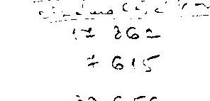 |
| :--: | :--: | :--: |
| 1980. | 15.000 | 4615 |
| 1981. | 36.000 | 37656 |
| 1982. | 34.000 | 1935 t |
| 1983. | 19.000 | 32829 |
| 1984. | 30.000 | 23340 |
| 1985. | 64.000 | 80713 |
| 1986. | 70.000 | 59365 |
| 1987. | 30.000 | 33562 |
| 1988. | 37.500 | 24703 |
| 1989. | 37.500 | Go 104 |
| 1990. | 37.500 | 23181 |
|  |  |  |

Az elszámolásban szereplő Beruházások teljesítése adatsor tartalmi helyességét az AFI-val javaslom újra egyeztetni.

---

A tagdijbevétellel kapcsolatos adatszolgáltatás - mivel az MHSz-nél az nem volt elrendelve az elszámolási időszakban véleményünk szerint ma már nem pótolható.
(5) Az 1990. évi LXXIII. törvény 7. számú mellékletének pontosításához információval nem rendelkezünk. A csoportosítást a törvény szerint javaslom átszerkeszteni. Azonban ez sem oldja meg az MHSz számviteli rendjében az értéknyilvántartás hiányából eredő problémát. A törvény szerinti értékadatokat csak becsléssel, a mennyiségi nyilvántartások -alapján lehetséges biztosítani.
(6.) Az 1990. évi LXXIII. törvény 8. számú mellékletének pontosításához az MHSz szervezetek részére megnyitott MNB számlák egyenlegére vonatkozó - az MH-nál és az MNB-nél - rendelkezésre álló információkat a 6. számú melléklet tartalmazza.

A bizonylatmegőrzés szabályaira tekintettel az 1985. évet megelôzõ idôszakra a bankszámlánkénti részletes adatokkal nem rendelkezünk.

A melléklethez kapcsolódó más információkkal nem rendelkezünk.

Üsszességében a feltárt adatok az MHSz elszámolás pontosításához hozzájárulnak, azoban azt teljeskörũvé nem teszik.

A teljeskörűséget olyan objektív körülmények akadályozzák, melyek az MHSz-nek az elszámolás idejére való megszűnéséből, az általános jogutód hiányából, az MHSz sajátos számviteléből, valamint a bizonylatmegőrzési idôből következnek. Az elszámolás tartalmára kiható körülményekre a honvédelmi miniszter 1990. október 5-én kelt levelében (7. sz. mellékletként csatolva) az ÁSz elnökének figyelmét felhívta, és kérte annak jelzését az országgyûlés elôtt. Erre azonban illetékességi vita miatt nem került sor.

---

Az elszámolás óta eltelt idöben az elszámolás pontosításának lehetôségei romlottak. Az MHSz már nem müködő szervezet, és mivel általános jogutód nélkül szünt meg, az elszámolást alátámasztó iratok irattározása következtében az adątpontosításhoz rendelkezésre álló idô is rendkívül kevés annak teljesítéséhez.

Kérem észrevételeim szíves hasznosítását az MHSz elszámolás pontosításánál.

# Melléklet: 

1.sz. Jegyzék az MHSz vagyon átadásával kapcsolatban kiadott MHSz fôtitkári Intézkedésekröl Ny, 2 lap
2.sz. Az 1022/1990. (II. 14.) MT határozattal megszûnõ MHSz gazdasági szervezetei anyagi-költségvetési és pénzügyi zárásának végrehajtása Ny, nyt.sz.: 15-5/1990. 2 lap
3.sz. Az MHSz OK GESz kezelésében lévõ gépjármũvek átadása
Ny, nyt.sz.: 12-15/11/1990. 2 lap
4.sz. Az MHSz tevékenység zárásban és felszámolásában közremüködő szervek müködési feltételeinek biztosítása.
Ny, nyt.sz.: 15-15/1990. 2 lap
5.sz. Javaslat a volt MHSz vagyonelszámoltatása 1. és 6.sz. mellékletének pontosításához Ny, 36 lap
6.sz. Az MHSz szervezetek MNB számlái és egyenlegei Ny, 36 lap
7.sz. MHSz vagyonelszámoltatás ÁSz Elnökének szóló levél
Ny, nyt.sz.: T-3957/56/1990. 5 lap

Budapest, 1992. január "Q"-n.
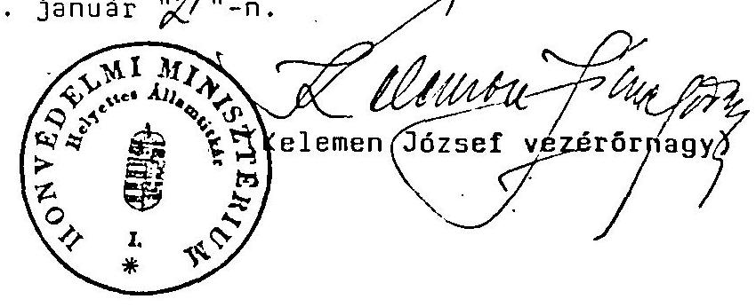

---

1. számu_melléklet a $T_{-3009} / 135 / 1990$

HM HÁT nyt. számhoz

HONVÉDELMI MINISZTÉRIUM
ÜNÁLLÓ GAZOASÁGI ÉS PÉNZÜGYI
FELÜGYELETI OSZTÁLY
számú példány

# JEGYZÉK 

az MHSz vagyon átadásával kapcsolatban kiadott
MHSz Fötitkári Intézkedésekröl

| Fsz. | Intézkedés tárgya | Kiadás idópontja | Nyilvántartási száma |
| :--: | :--: | :--: | :--: |
| 1. | Az MHSz tulajdonában lévő ingóságok és pénzeszközök végleges (tulajdonba) átadása az átalakult MHSz-   klubok részére   Az intézkedés kiadására engedélyt kérő jelentés | $\begin{aligned} & 1990.08 .07 . \\ & 1990.08 .06 . \end{aligned}$ | $\begin{aligned} & 15-2 / 1990^{\times} \\ & 15-1 / 1990^{\times} \end{aligned}$ |
| 2. | Az MHSz KLK által használt ingó vagyon átadása a jogutód BPLE részére | 1990.09.13. | $15-3 / 1990^{\times}$ |
| 3. | Az MHSz tulajdonában, kezelésében és használatában lévő ingatlanok tulajdonba adása, illetve további használatának szabályozása | 1990.09.14. | $15-10 / 1990^{\times} \checkmark$ |
| 4. | Az MHSz OK központi szerveinek és ingóságainak átadása | 1990.09.14. | $15-11 / 1990^{\times}$ |
| 5. | Az MHSz MOKI, valamint az MHSz OK Képzési Csoport ingó vagyonának átadása a Magyar Modellező Szövetség részére | 1990.09.17. | $15-14 / 1990^{\times}$ |
| 6. | Az MHSz tulajdonában lévő repülötechnikai eszközök és felszerelések végleges (tulajdonba) átadása az átalakult MHSz-klubok részére | 1990.09.18. | $10-79 / 1990^{\times}$ |
| 7. | Az MHSz közös használatában levô ingóságok átadása | 1990.09.21. | $15-6 / 1990^{\times} \checkmark$ |
| 8. | Az 1022/1990. (II.14.) MT határozattal megszűnő MHSz gazdasági szervezetei anya-gi-, költségvetési és pénzügyi zárásának végrehajtása | 1990.09.25. | $15-5 / 1990$. |

---

| Fsz. | Intézkedés tárgya | Kiadás   idópontja | Nyilvántartási   száma |
| :-- | :-- | :--: | :--: |
| 9. | Az MHSz OK GESz kezelésében   levô gépjármũvek átadása | 1990.09 .25 . | $12-15 / 1990$. |
| 10. | Az MHSz tevékenység zárásá-   ban és felszámolásában köz-   remüködô szervek mũködési   feltételeinek biztosítása | 1990.09 .26 . | $15-15 / 1990$. |

Budapest, 1992. január " 20n.
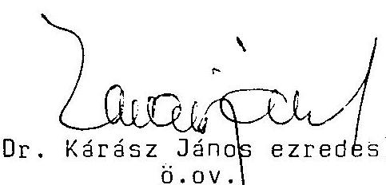
* A jelölt okmányok átvételét az eredeti számon a HM Kézbesítô könyvében a 233/160/1990. folyószámon 1990. 12.10-én a PM ZÁVKI képviseletében Vladár Zoltán aláírásával igazolta.

---

# MAGYAR HONVÉDELMI SZÜVETSÉG FÔTITKÁRA 

Nyt.szám: $15-5 / 1990$

Tárgy: a 1022/1990.(II.14.) Mt. számú
határozattal megszûnõ
Magyar Honvédelmi Szövetség
gazdasági szervezetei anyagi-,
költségvetési és pénzügyi zárá-
sának végrehajtása.

Az MHSZ fôtitkára által jóváhagyott költségvetéssel rendelkezo̊ szervek 1990. évi anyagi-, pénzügyi- és költségvetési zárásának végrehajtására az alábbiak szerint intézkedem:
(6.) 1990. szeptember 28-i fordulónappal valamennyi költségve-tési-, anyagi- pénzügyi nyílvántartás, okmány zárását végre kell hajtani. A házipénztár pénzkészletét a bankszámlákra szeptember 28-ig be kell fizetni.
(2.) Az 1990. évi gazdálkodásról készített beszámoló jelentéseket az MHSZ OK (gazdasági elszámolással megbízott szervezet) részére 1990. október 15 -ig fel kell terjeszteni.
3./ A beszámoló jelentések valódiságáért, hitelességéért, számszaki egyezőségéért, a felterjesztés határidejének betartásáért azok összeállítói felelősek.

---

4./ A beszámolójelentés mellékletei értelemszerũ kitöltésén túlmenũen külon-mellékelni szüksénes az alábbiakat:

- a gjmũ KFT-k részérôl teljesített szolgáltatás költségeit (15-39 kv. tétel);
- a pjmũ KFT-k részérôl teljesített bevételek összegét (52. kv. rovat);
- a fordulónapig/lerendezetlen fïngô-átfutó tētelek teljes-
körü részletezését;
- az MHSZ-t terhelô járadékok, fol'yamatban lévô kártérítési ügyek kimutatását (a vonatkozó okmányok megküldésével);

Kérem, hogy az MHSZ gazdasági tevékenységének zárását személyes hozzáállásukkal, felelôsségérzetükkel, az elszámolást segitő (végzõ) szervezet munkájának támogatásával - a jogutód szervezetek gazdasági tevékenységének elôsegítése érdekében - segítsék.

Melléklet: Beszámoló jelentés okmánya.

Budapest, 1990. szeptember " $25^{\text {"-n. }}$.
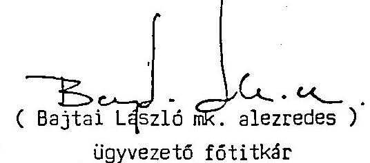

---

3. szánu melléklet a $T-3057 / 155 / 1000$

HM HAT nyt.számho

MAGYAR HONVÉDELMI SZÜVETSÉG
ORSZÁGOS KUZHUNT
GAZDASÁGI ELLATU SZOLGALAT
Njth:12-15/11/1390

Bajtai László mk. alazredes Ur
HHSZ Fötitkíra részére

Kérem a Fötitkár Urat, hogy a megalakuló MTTSZ Központi szervezete részére a Magyar Honvédelmi Szövetség Országos Központ Gazdasági Ellátó Szolgálat kezelésében lévő gépjárműveket az alábbi kimutatás szerint "szíveskedjen átadni a megalakult szervezet részére 1990.október ol-töl.

VAZ 2105 typ.1300-as szgk. BF 71-56 frdsz.

|  |  |  | BG 00-51 | " |
| :--: | :--: | :--: | :--: | :--: |
|  | 2105 | " | BG 42-54 | " |
| VAZ | 2106 | 1500 S | GB-21-57 | " |
|  | 2107 | " | BF 86-94 | " |
|  | 2107 | 1500 | GB 01-89 | " |
|  | 2107 | 1500 | GB 01-91 | " |
|  | 2107 | 1500 | GB 15-72 | " |
|  | 2107 | 1500 | GB 22-01 | " |
|  | 2107 | 1500 | GB 52-71 | " |
|  | 2107 | 1500 | GB 58-44 | " |
| BARKAS | 1000 |  | AR 60-35 | " |
| RAF 2203 | LATVIJA |  | BY 39-61 | " |
| RAF 2203 |  |  | BU 61-25 | " |
| ZIL | 130-as | tgk. | SI 64-58 | " |
|  |  |  | SI 64-59 | " |
|  |  |  | SI 28-49 | " |
| RAF 2203 | LATVIJA |  | BX 08-08 | " Miskolc Tapolca 0dülö $B$ |
| VAZ 2121 | typ. 1600 | /NIVA/ | AS 65-38 | " Csogak 0dülö |
| BARKAS | 1000 | typ. | SO 92-94 | " Ahugdung, wdnoin. |
|  | 1000 | typ. | SO 92-95 | " |
| IKARUS | 250 | typ 46 | BU 78-89 | " Yain merind HRSL. |
|  |  | 44 | BX 54-21 |  |
|  | 256 | 39 | BY 61-04 |  |

---

Tisztelt Fötitkár Ur továbbá jelentem, hogy az Un utasitására, illetve engedélyével a megalakult klubok, Magyar Repülö Szövetség, valamint Alapítvány részére az alábbi gépjárműveket,átadtam:

Magyar Repülö Szövetség részére átadva:
VAZ 2105 typ. 1300-as szgk. BG 42-53 frdsz.
Kuiturált Közelekedésért Alapítvány részére:
VAZ 2105 typ. 1300-as szgk. BG 42-55 frdsz.
TIEL RÁDIÓ-Klub részére:
ARO 10,3-as szgk. SZ 97-55 frdsz.
UAZ 452 typ./OE . . AP 99-97 "
UAZ 452 " AP 84-95
Magyar Modellezö Szövetség részére:
BARKAS 1000-es typ. AR 39-43 frdsz.

Budapest, 1990. szeptember 25.
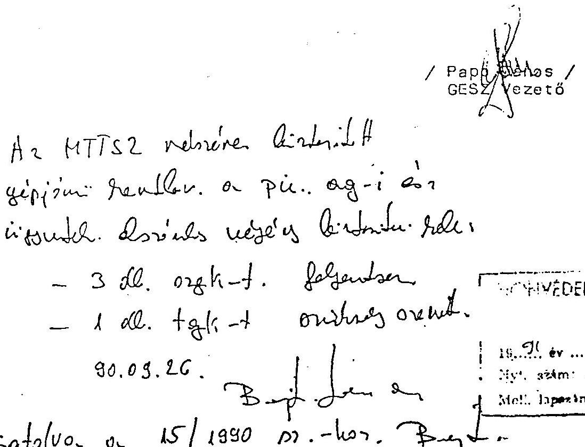

---

# MAGYAR HONVÉDELMI SZÖVETSÉG 

Nyt.szám: $15-15 / 1990$

## MAGYAR HONVÉDELMI SZÖVETSÉF FÔTITKÁRÁNAK

## I N T É Z K E D É S E

az MHSZ tevékenység zárásában és felszámolásában közremüködő szervek müködési feltételeinek biztosítására.

A 15-10/1990. számú intézkedés 10. pontja a 15-6/1990. számú intézkedés 7. pontja és a 15-11/1990. számú intézkedés végrehajtására az alábbiak szerint rendelkezem:
1./ A PN ZÁVKI megyei (budapesti) megbizottai és alkalmazottai az MHSZ jogutód szervezetek - fenti intézkedések alapján tulajdonába és használatába adott ingó- és ingatlan vagyont a munkavégzéshez szükséges mértékben használhatják. Ezen belül az anyagi-gazdasági-pénzügyi-beruházási-ügyviteli elszámolást végzők számára az MHSZ azonos funkciójú megyei (budapesti) szervei által használt irodákat felszereléssel, butorzattal és irodatechnikai eszközökkel együtt leltár szerint át kell adni. A fentieken túl a ZÁVKI megyei (budapesti) megbizottai részére egy-egy darab - eddig mozgalmi gépkocsiként használt - személygépkocsit kell átadni. Minden ingatlanban biztosítani kell egy darab városi telefonvonalat és a telefax használati jogát.

A jelen pontban meghatározott átadás-átvételt a megyei gazdasági helyettes 1990. szeptemb er 28-ig jegyzökönyvileg hajtsa végre.
2./ Az MHSZ OK tevékenységének zárásához és elszámolásához szükséges elhelyezési és müködési feltételek biztosítása érdekében a ZÁVKI apparátusa és a HM miniszteri biztosi bizottsága részére át kell adni:

---

- az NHSZ fôtitkár irodáját és titkárságot, tárgyalótermet (III. emelet 301.sz. elhelyezési egység., valamint a III. emelet 303-as irodai egység);
- a pénzügyi és közgazdasági osztály,
a beruházási és elhelye.ési osztály,
az anyagi technikai osztály,
személyügyi osztály,
ügyviteli alosztály által használt helyiségeket a
bantlévő irodai butorzattal, felszereléssel és technikai eszküzökkel együtt leltár szerint;
- a GESZ gépjármú állományából 3 darab LADA típusú üzenképes gépjármúvet;
- a fent felsorolt irodákhoz tartozó HM "K" és városi telefonvonalakat, valamint a telefax berendezést;
- a jelen pontban meghatározott helyiségek és felszerelési tárgyak, valamint gépjármúvek átadását a GESZ vezetője 1990. szeptember 20-ig jegyzőkönyvileg hajtsa végre.
3./ A jelen intézkedéssel átadott eszközök, felszerelési tárgyak és ingatlan részek tulajdon, illetve használati jogát a jogutód szervezetek a fenti intézkedéseknek megfelelően megtartják. A birtokbalépés időpontja az MHSZ tevékenység zárásának és felszámolásának befejezését követően a helyiségek, gépjármúvek és irodai felszerelések ZÁVKItól történő átvételével kezdődik.

Budapest, 1990. szeptember "26n.
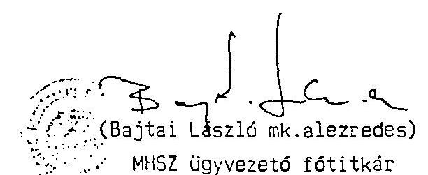

---

5. számul melléklet a T-33:7/15:1/1000 HM HÁT nyt. számhoz

HONVÉDELMI MINISZTÉRIUM
számu példány
ONÁLLÓ GAZDASÁGI ÉS PÉNZÜGYI
FELÜGYELETI OSZTÁLY

# Javaslat 

a volt MHSz vagyonelszámoltatása 1. és 6.sz. mellékletének pontosításához
1.sz. melléklethez:

## Országos Központ:

4. fsz.: érték adat felmérés szerint 7.697 eFt;
5. fsz.: Az elszámolásban eltérő Tsz.: 1250, Hrsz.: 26055 szerepel, mint a KVSz jegyzéken (Tsz.: 6025, Hrsz.: 9810).
6. fsz.: KVSz jegyzéken nem szerepel, rendezetlen jogviszonyú ingatlanként az elszámolásban továbbra is szerepeljen;
7. fsz.: helytelenül tulajdonként került az elszámolásba. Felmérés szerint kezelés, KVSz jegyzéken szerepel.

Budapest:
13-14. fsz.-ú ingatlanok MHSz tulajdonúak a felmérés szerint. A többi folyószámon MHSz kezelői jogú ingatlan szerepel.
14. fsz.: érték adata felmérés szerint 502 eFt;
4. fsz.: érték adata felmérés szerint 85.232 eFt.

---

Az elszámolásban nem szerepelnek:

- a felmérés és a KVSz jegyzék szerint is volt MHSz kezelöi jogú ingatlanok:
Bp., X. Hangár u. Tsz.: 3446
Hrsz.: $4244 / 16$

Bp., XVI. Margit u. 2. Tsz.:
Hrsz.:
Bp. XVI. Sarjú u. Tsz.: 6734,6735 .
Hrsz.: 107266, 107267

- a felmérés szerint volt MHSz kezelöi jogú ingatlan, mely a KVSz jegyzéken nem szerepel:
Bp., XVIII. Thököly u. 3. (Rádió klub); valamint
- a volt MHSz egyéb használatában (valószínũleg rendezetlen jogi helyzetben) levõ ingatlanok:

1. Bp., III.Szentendrei út 133.
Lötér
12.531
2. Bp., XX. Pöltenberg u. 13.

Lőtér
7.414
3. Bp., XVII. Táncsics u.2B.

Lőtér
4. Bp., VII. Wesselényi u. 5B.

Lőtér
Lőtér
5. Bp., XXI. Rákóczi u.1B9.

Lőtér
Lőtér
6. Bp., XIII. Tahi út 9-11.

Lőtér
Rádiós bázis
7. Bp., VI. Bajcsy Zs. út 5.

Rádiós bázis
8. Bp., VIII. Bródy S. u. $32 / 34$

Rádiós bázis
9. Bp., XIX. Kisfaludy u. 46.

Rádiós bázis
10. Bp., Hármashatárhegy
hrsz.: 01536/BB
Vizibázis
11. Kopaszigát hrsz.: 4074

Vizibázis
12. Bp., IX. Pipa u. 6.

Kerületi
székház

---

# Baranya megye: 

4. fsz.: Felmérés szerint MHSz tulajdon (irodaház).
5. fsz.: Az elszámolásban eltérő Tsz (21223) és hrsz. (0557/33) szerepel, mint a KVSz jegyzéken (Tsz.: 7160, hrsz.: 42118).

Az elszámolás nem tartalmazza:

- a KVSz jegyzék szerint MHSz kezelõi jogú ingatlant: Pécs, I. ker. Tsz.: 7160

Hrsg.: 42118 (Sportlötér)
(A 8. fsz.-on szereplõ ingatlannal való egyezõséget pontosítani szükséges.) ・ .

- a felmérés szerint idegen területen levõ MHSz létesítmény
Siklós, Vásártér (Gjmũ. rutinpálya) 3.592 eFt.

---

Bács-Kiskun megye:
3. fsz.: Az elszámolásban eltérő hrsz. (8550/8) szerepel, mint a KVSz jegyzéken (33058).
5. fsz.: Az elszámolásban eltérő Tsz. (14223) és hrsz. (44714, 495) szerepel, mint a KVSz jegyzéken (Tsz.: 495, 548; hrsz.: 8831, 8352).
9. fsz.: Az elszámolásban eltérő Tsz. (20029) szerepel, mint a KVSz jegyzéken (2340/62).
11. fsz.: A felmérés szerint MHSz tulajdon, a KVSz jegyzéken nem szerepel.

Az elszámolás nem tartalmazza:

- a felmérés és a KVSz jegyzék szerint is volt MHSz kezelői jogú ingatlanokat:

Baja, Siska F. u. Tsz.: 7208/1975 (lőtér)
Hrsg.: 5637

Kiskunfélegyháza, Csányi u. Tsz.: 19 (lőtér, rutinpálya)
Hrsg.: 075/9

---

# Békés megye: 

3. fsz.: Az elszámolásban szereplő tsz. és hrsz-en túl a KVSz jegyzék a Tsz.: 6580, illetve a hrsz.: $6864 / 15$ számokat is tartalmazza.

Az elszámolás nem tartalmazza:

- a felmérés és a KVSz jegyzék szerint is volt MHSz kezelöi jogú ingatlant
Gyomaendrōd, Tsz.: (kiképzō bázis)
Felszabadulás u. 11. Hrsz.: 0321/6 9.955 eFt;
- a felmérés szerint volt`MHSz kezelöi jogú ingatlant, mely a KVSz jegyzéken nem szerepel
Szeghalom, Bocskai út B. (kiképzô bázis) 31.000 eFt;
valamint
- a felmérés szerint egyéb MHSz használatú ingatlant

Orosháza, Arany János u. 19/a. (Kiképzõ bázis) 22.012 eFt
(Gjmú tanpálya) 1.630 eFt;

- a KVSz jegyzék szerint volt MHSz kezelöi jogú ingatlant Gyula, Mártírok útja Tsz.:

Hrsg.: 0583/1 (Modellezõ pálya).

---

# Borsod-Abaúj-Zemplén megye: 

10. fsz.: A felmérésben 190 eft-tal szerepel a Rádió klub bázis.
11. fsz.: A felmérésben 4.456 eft-tal szerepel a rádió állomás.
12. fsz.: Tsz.: 28.. helyett 26.
13. fsz.: A megadott Hrsz.-en túl hiányzik a 031/1.
14. fsz.: A Tsz.: 7.426 helyett: 427, 426.
15. fsz.: A felmérés szerint volt MHSz tulajdon, a KVSz jegyzéken nem szerepel.
16. fsz.: A felmérés szerint volt MHSz tulajdon, a KVSz jegyzéken nem szerepel. Hrsz.: 87.

Az elszámolásban nem szerepelnek:

- a felmérés és a KVSz jegyzék szerint is volt MHSz kezelöi jogú ingatlanok:

Özd, Brassói út 12.
(Irodaház) 3.200 eFt,
Nekézseny, külterület Tsz.: 13
Hrsg.: 034/2 (Lótér, forg.ért. 42 eft)

- felmérés szerint volt MHSz tulajdonú, KVSz jegyzéken nem szereplő ingatlanok:

Lillafüred, Tópart sétány Tsz.: 1135/2 (Búvár klub) 1.953 eFt, Hrsz: $691 / 2$

Sátoraljaújhely, Karcsa, Karcsapart (Klub épület) 995 eFt, Tiszakeszi, Tanács. u. 33. (Lópavilon) 32 eFt, Szendrô, Billér dülo Tsz.: Hrsz.: 0423/3 (Tereplőtér) 492 eFt, Nyékládháza, Mályi Tanya (Lőtér)
(A szendrôi és nyékládházi vagyonrészekre tulajdonjog bejegyzéshez kiadott okmányról nincs ismeretünk.);

---

- a KVSz jegyzék szerint vol't MHSz kezelöi jogú ingatlanok, melyek a felmérésben nem szerepelnek:

| Bogács | Tsz.: 18 | Sportlötér |
| :-- | :-- | :-- |
|  | Hrsz.: 083/3 |  |

| Borsodgesz | Tsz.: 6 | Sportlötér |
| :-- | :-- | :-- |
|  | Hrsz.: 016/1 |  |

| Bokkzsérc | Tsz.: 9 | Sportlötér |
| :-- | :-- | :-- |
|  | Hrsz.: 30 |  |

| Kacs | Tsz.: 4 | Sportlötér |
| :-- | :-- | :-- |
|  | Hrsz.: 064/2 |  |

| Négyes | Tsz.: | Sportlötér |
| :-- | :-- | :-- |
|  | Hrsz.: 159/1 |  |

| Szomolya | Tsz.: 7 | Sportlötér |
| :-- | :-- | :-- |
|  | Hrsz.: 0105/1 |  |

| Sály | Tsz.: 7 | Sportlötér |
| :-- | :-- | :-- |
|  | Hrsz.: 0153/1 |  |

| Tard | Tsz.: 13 | Sportlötér |
| :-- | :-- | :-- |
|  | Hrsz.: 860/3 |  |

| Tibolddaróc | Tsz.: | Sportlötér |
| :-- | :-- | :-- |
|  | Hrsz.: 073/1 |  |

---

# Csongrád megye: 

1. fsz.: A felmérésben 47.416 eFt-tal szerepel

2-3. fsz.: Az elszámolásban szereplő Tsz.: 108 és hrsz.: 10013 nem szerepel a KVSz jegyzéken, csak a Tsz.: 104, 105, illetve hrsz.: 10008, 10010.
4. fsz.: A hrsz. (0110/1, 02048) nem egyezik a KVSz jegyzéken szereplővel (02048/1). A Tsz.:3/III., hrsz.: 02048/1 ingatlan HM kezelói jogú mind a felmérés, mind a HM adataí alapján.
Az MHSz által épített hangár értéke lett a felmérésben 64.596 eFt-tal rögzítve.
A KVSz jegyzéken `a teljes ingatlan MHSz kezelói jogúként szerepel.
5. fsz.: A felmérés szerint MHSz tulajdon.

Az elszámolásban nem szerepel:

- a felmérés szerint volt MHSz tulajdonú ingatlan

Mórahalom, Felszabadulás u. 46. (Garázs).
(Az ingatlanra tuladonjog bejegyzéshez kiadott okmányról nincs ismeretünk.)

---

# Fejér megye: 

2. fsz.: A felmérésben 11.260 eFt-tal szerepel.
3. fsz.: A felmérésben 1.800 eFt-tal szerepel..

Az elszámolásban nem szerepel:

- a felmérés szerint egyéb MHSz használatú ingatlan, mely a KVSz jegyzéken nem szerepel:

Lovasberény, Karolhegye (Tereplőtér) 24 eFt;

- a KVSz jegyzék szerint volt MHSz kezelői jogú ingatlanok, melyek a felmérésben nem szerepeltek:

Ercsi, Marx Károly u. Tsz.: (Sportlőtér)
Hrsg.: $1370 / 2$

Nádasdladány, Csortetői út Tsz.: (Sportlőtér)
Hrsg.: 014

Sárbogárd Tsz.:
Hrsg.: 0241/1 (Sportlőtér).

---

# Győr-Sopron megye: 

Az 1., 2., 9., 10., 11., 14., 16., 18. fsz.-ú ingatlanok tulajdonként szerepelnek a felmécésben, a KVSz jegyzéken nem szerepelnek. A többi fsz.-ú MHSz kezelöi jogú ingatlan.

A felmérésben a telkek a

- a 2. fsz.-hoz
(Tsz.: 24523, hrsz.: 338/5 forg. érték: 754 eFt),
- a 10. fsz.-hoz
(Tsz.: 35, hrsz.: 1810/6 forg. érték: 800 eFt),
- a 11. fsz.-hoz
(Tsz.: 35, hrsz.: 0519/114 forg. érték: 9.500 eFt),
- a 16. fsz.-hoz
(Tsz.: 2917, hrsz.: 2916, firg, lrtlj? 450 eFt)

MHSz kezelői jogú ingatlanként kerültek felvételre, csak a földnyilvántartásba külön bejegyzett épület, építmények szerepelnek MHSz tulajdonként.
(A tulajdonjog bejegyzéshez nyilatkozat a 10. fsz.-on szereplő ingatlan egészére ki lett adva. A 2., 11., 16. fsz.-hoz csak az épületre.)
13. fsz.: A felmérésben 12.150 eFt-tal szerepel.
15. fsz.: A felmérésben 6.000 eFt-tal szerepel.
18. fsz.: A felmérésben 3.040 eFt-tal szerepel.

---

# Hajdú-Bihar megye: 

1. fsz.: Az elszámoláshoz képest a KVSz jegyzéken további Tsz. (7850) és hrsz. (10148) is szerepel.
2. fsz.: A felmérésben 5.362 eFt-tal szerepel.
3. fsz.: A felmérésben 11.940 eFt-tal szerepel.
4. fsz.: A felmérésben és az elszámolásban MHSz kezelõi jogú ingatlant a KVSz jegyzékkel összhangban Jász-Nagykun-Szolnok megyénél kell szerepeltetni.
5. fsz.: MHSz tulajdonú ingatlanként lett felmérve.

A többi elszámolásban szereplõ ingatlan MHSz kezelõi jogú.

Az elszámolásban nem szerepel:

- felmérés szerint volt MHSz tulajdonú ingatlan

Füzérkajata, Ady E u. 23. Tsz.: (Pihenõ) 3.416 eFt Hrsz.: 178

- a felmérés szerint volt MHSz kezelõ jogú ingatlan, Komádi (Lótér)
Hajdúszoboszló (Repülõtéri épületek) illetve
- a felmérés szerint egyéb MHSz használatú ingatlan Debrecen -Bánk Diószegi útfél Hrsz.: 0628/1
rádiós versenyállomás $\quad 3.904 \mathrm{eFt}$,
melyeket a KVSz jegyzék nem tartalmaz.

---

# Heves megye: 

Az 1., 10., 12., 16., 17. fsz.-ú ingatlanok volt MHSz tulajdonként lettek felmérve.
2. fsz.: A felmérésben 3.492 eFt-tal szerepel.
4. fsz.: A felmérésben 25 eFt-tal szerepel.
16. fsz.: A felmérésben 4.075 eFt-tal szerepel.

Az elszámolásban nem szerepel:

- a KVSz jegyzék szerint volt MHSz kezelői jogú ingatlan, mely a felmérésben nem szerepelt.

Nagytállya Tsz.: (Beépítetlen szabad terület.) Hrsz.:

---

# Komárom-Esztergom megye: 

3. fsz.: A felmérésben $14.674+682=15.356$ eFt-tal szerepel.
4. fsz.: A felmérés MHSz kezelői jogúként tartalmazza, a KVSz jegyzéken szerepel. Tulajdon be'jegyzéshez nyilatkozat kiadásra került.
5. fsz.: Tsz.: 1200 ;
6. fsz.: Tsz.: 8110,8115
Hrsz.: $7719 / 3,7719 / 9$;
7. fsz.: Tatabánya, Fürdő u. Tsz.: 21, Hrsz.: 0991/2. MHSz kezelés.
8. fsz.: Esztergom, Komáromi u. MHSz kezelés.
9. fsz.: Esztergom, Schweidel u. 50. Hrsz.: 0536/2-4.
10. fsz.: Esztergom, Schweidel u. 4. MHSz kezelés.
11. fsz.: Tsz.: $3618,3986$

Hrsg.: $714 / 1,2,3,6$.
22. fsz.: A kecskédi repülőtér a felmérés szerint és a HM nyilvántartása szerint is HM kezelői jogú. A felmérésben 5.044 eFt-tal a repülőtér területén levô MHSz használatú épület került felvételre. A KVSz jegyzéken kecskédi MHSz kezelői jogú ingatlan nem szerepel.
23. fsz.: szintén egyéb MHSz használat (lőpavilon). A KVSz jegyzéken nem szerepel.

---

Az elszámolásban nem szerepel:

- a felmérés szerint az MHSz Komárom megyai vezetőségének, illetve klubjainak tulajdonát képező egyéb MHSz használat, melyeket a KVSz jegyzék nem tartalmaz.

| Tatabánya, Strand | Lőpavilon, faház | 52 eFt, |
| :-- | :-- | --: |
| Tata, Fényesfürdő | Faház | 81 eFt, |
|  | Búvárklub | 110 eFt, |
| Komárom, Termálfürdő | Búvárklub | 207 eFt, |
| Dunapart, Vám-hütő | Garázs | 235 eFt. |

---

# Nógrád megye: 

3. fsz.: A felmérés szerint MHSz tulajdon. Julajdonjog bejegyzéshez nyilaitkozat kiadásra került.
4. fsz.: A KVSz jegyzéken nem szerepel.
5. fsz.: Salgótarján, Bajcsy Zs. u. 13.
6. fsz.: a feltüntetett értékadat a telek becsült forgalmi értéke.

Az elszámolásban, nem szerepel:

- a felmérés és a KVSz jegyzék szerint volt MHSz kezelöi jogú ingatlan

Balassagyarmat, Külterület (Városi lőtér)
Tsz:: 35,
Hrsg.: $0125 / 2$

- a felmérés szerint volt MHSz tulajdonú ingatlan, me-
lyet a KVSz jegyzék nem tartalmaz

Szécsény, Rákóczi u. 18. hrsz.: 525/2. (Városi vezetőség)

- a KVSz jegyzék szerint volt MHSz kezelői jogú, fel nem
mért ingatlan
TAR Hrsz: : 073
(Repülőtér)

---

# Pest megye: 

11. fsz.: A KVSz jegyzék szerint az ingatlanhoz tartozik a hrsz.: $2703 / 2$ is.
12. fsz.: A KVSz jegyzéken nem szerepel.

Az elszámolásban nem szerepelnek:

- a felmérés szerint volt MHSz kezelõi jogú, KVSz jegyzéken nem szerepló ingatlanok:

Ounakeszi, Felszabadulás u. 45. . Kik. bázis lőtér 3.400 eFt, Monar, Kossuth L. u. külterület Rutinpálya Hrsz.: 0295/12
Monor, hrsz:: 295/5, 295/12-14, 679/82 Rádiós bázis, Gyömrô, Üllõi út 17. Lőtér, rádiós versenyállomás;

- felmérés szerint egyéb volt MHSz használat, a KVSz jegyzéken nem szereplő ingatlanok:

Vác, Sztáron Sándor u. 16. Irodaépület 15.000 eFt, Szigetszentmiklós, Erkel u. 3-4. Irodaépület 7.520 eFt, Incsó

Futóvad skeet pálya.

---

# Somogy megye: 

2. fsz.: Kaposvár, Zaranyi út
3. fsz.: A felmérésben 870 eFt-tal szerepel
4. fsz.: A felmérés szerint volt MHSz tulajdon. KVSz jegyzék nem tartalmazza. Tulajdon átruházó nyilatkozat kiadásra került.
5. fsz.: KVSz jegyzéken nem szerepel.
6. fsz.: Somogy, Landor hegy 1.000 eFt-tal szerepel a felmérésben, KVSz jegyzéken nem szerepel.

Az elszámolásban nem szerepel:

- a felmérés és a KVSz jegyzék szerint volt MHSz kezelöi jogú ingatlan

Csokonyavisonta hrsz.: 220/2 (Modellezõ pálya);

- a felmérés szerint volt MHSz kezelöi jogú ingatlan, melyet a KVSz jegyzék nem tartalmaz:

Siófok
(Városi lőtér);

- a felmérés szerint volt MHSz használatú ingatlanok, melyeket a KVSz jegyzék nem tartalmaz:

Csurgó, Petőfi tér 36. (Városi vezetőség) 4.179 eFt, Kapusújlak 033/2 hrsz. Repülőtéri épület 27.191 eFt (melyre tulajdon átadó nyilatkozat került kiadásra),

- az alapítvány tulajdonába került volt MHSz tulajdonú ingatlan
Kaposvár, Tsz.: 4839, hrsz.: 5886.

---

# Szabolcs-Szatmár megye: 

2. fsz.: A felmérés szerint volt MHSz kezelöi jogú ingatlan. A KVSz jegyzéken szerepel. A hrsz.: 078/17-re tulajdonjog átadó nyilatkozat került kiadásra.
3. fsz.: A felmérés szerint volt MHSz kezelöi jogú ingatlan. A KVSz jegyzéken a Tsz.: 7436, hrsz.: 6096 ingatlan szerepel. A TSz.: 7437, hrsz:: 6097 ingatlanra tulajdonjog átadó nyilatkozat került kiadásra. A felmérésben 66.910 eft-tal szerepel.
4. fsz.: A felmérésben 24.933 eft-tal szerepel.
5. fsz.: A felmérésben (0430/2) és a KVSz jegyzéken (0430/3) eltérő hrsz. szerepel.
6. fsz.: A Tsz.: 6411, hrsz.: $2647 / 3$ is szerepel a KVSz jegyzéken az elszámolásban feltüntetetteken (6.sz. mellékletet is figyelembe véve) kivül.
A felmérés szerinti 24.646 eft kellene, hogy itt értékként szerepeljen, mivel a 831 eFt a 6.sz. mellékletben szerepel.
7. fsz.: A felmérés szerint volt MHSz kezelöi jogú ingatlan. Tulajdonjog átadó nyilatkozat kiadásra került. KVSz jegyzéken nem szerepel.
8. fsz.: A felmérésben 15.521 eft-tal szerepel.
9. fsz:: A KVSz jegyzéken hrsz:: 1294 is szerepel.
10. fsz.: A felmérésben 7.000 eFt-tal szerepel.

A 2., 3. és 10. fsz.-on kivüli ingatlanok volt MHSz kezelöi jogúak.

---

Az elszámolásban nem szerepelnek:

- a felmérés szerint egyéb volt MHSz használatú, a KVSz jegyzéken felvett ingatlan

Nyírpazony Kabalás hrsz.: 193/A, B, C, D, E, F, G 664 eFt

- a felmérés szerint volt MHSz tulajdonú, KVSz jegyzéken nem szerepló ingatlanok:

Rakamaz, Tiszapart hrsz:: 2253-54
39 eFt,
Tiszalök, József A. u. 2. hrsz.: 224/2/8
2.859 eFt,
melyekre tulajdonjog átadó nyilátkozatok kiadásra kerültek.

---

Jász-Nagykun-Szolnok megye:

1. fsz.: Szolnok, Baross u. 20.
2. fsz.: Tiszaliget, Üdülősor 1.
3. fsz.: Törökszentmiklós, Stadion u.
4. fsż.: Tiszasüly, Tessedik S. u.

Az elszámolásban nem szerepel:

- a felmérésben helytelenül HM kezelöi jogú ingatlanon MHSz használatként feltüntetett hrsz.: 0164732.023 eFt értékũ ingatlan, mely KVSz jegyzék szerint hrsz.: 01647/3, volt MHSz kezelöi jogú ingatlan;
- a KVSz jegyzék szerint volt MHSz kezelöi jogú, fel nem mért ingatlan

Jászberény, Jákóhalmi u. 5. Tsz.: 16528 (Sportlőtér)
Hrsg.: 0593/5

---

# Tolna megye: 

2. fsz.: Szekszárd, Sárköz u.
3. fsz.: A felmérésben 16.£22 eFt-tal szerepel.

Az 1., 5., 6. és 7. fsz.-ú ingatlanok a felmérés szerint MHSz tulajdonúak, a tulajdonjog átadó nyilatkozatok kiadásra kerültek.
7. fsz.: A felmérésben 1.040 eFt-tal szerepel.
8. fsz.: A felmérésben 1.390 eFt-tal szerepel.
9. fsz.: A felmérésben 3.353 eFt-tal szerepel.
8., 9. fsz.-ok a.KVSz jegyzéken nem szerepelnek.

---

# Vas megye: 

1. fsz.: A felmérés szerint volt MHSz tulajdonú ingatlan, 44.593 eFt értékk.1, a KVSz jegyzéken nem szerepel, tulajdonjog átadó nyilatkozatok kiadásra kerültek.
2. fsz.: A felmérés szerint volt MHSz tulajdonú ingatlan, a KVSz jegyzéken MHSz kezelöi jogúként szerepel, tulajdonjog átadó nyilatkozat kiadásra került.
3., 4. fsz.: volt MHSz tulajdonú ingatlanként lettek felmérye, a KVSz jegyzéken nem szerepelnek, a tulajdonjog átadó nyilatkozatok kiadásra kerültek.
3. fsz.: hrsz.: $4178 / 1$
4. és 13. fsz.: a KVSz jegyzéken nem szerepel.
5. fsz.: A felmérésben 3.906 eFt-tal szerepel.

5-16. fsz.: A felmérés szerint volt MHSz kezelöi jogú, az említettek kivételével szerepelnek a KVSz jegyzéken.

Az elszámolás nem tartalmazza:

- a felmérés és a KVSz jegyzék szerint volt MHSz kezelöi jogú ingatlant

Köszeg, Táncsics M. u. 23. hrsz.: 2167/3 (rádióbázis).

---

# Veszprém megye: 

1-4. fsz.: Üsszesített értékadata nem egyezik a felmérés adatával. A KVSz jegyzék Tsz. és hrsz. adatai részben eltérők.
6. fsz.: Az egyéb volt MHSz hasżnálatú ingatlan a KVSz jegyzéken nem szerepel.
8. fsz.: A felmérésben 21.814 eFt-tal szerepel.

1-11. fsz.: A felmérés szerint volt MHSz kezelói jogú ingatlanok. A 6. fsz. kivételével szerepelnek a KVSz jegyzéken.
12., 13. fsz.: A felmérés szerint volt MHSz tulajdonú ingatlanok. A KVSz jegyzéken nem szerepelnek. A tulajdonjog átadó nyilatkozatok kiadásra kerültek.

Az elszámolás nem tartalmazza:

- a felmérés szerint volt MHSz tulajdonou ingatlant, mely a KVSz jegyzéken nem szerepel

Ajka Tókert Rádiós klubház
449 eFt
(a tulajdonjog átadó nyilatkozat kiadásra került),

- a felmérés szerint egyéb volt MHSz használatú ingatlant Balatonfüred Camping Búvár klubház

156 eFt.

---

# Zala megye: 

9. fsz..: A felmérés szerint volt MHSz kezelöi jogú. A KVSz jegyzéken nem szerepel. Tulajdonjog átadó nyilatkozat kiadásra került a hrsz.: 1017/A ingatlanra.

Az elszámolásban nem szerepel:

- a felmérés szerint egyéb volt MHSz használatú, a KVSz jegyzéken nem szereplő ingatlanok:

Zalaegerszeg, Zala u. hrsz.: 5753 szgk. tanpálya 2.268 eFt, Letenye, Kossuth u. 10. Irodaépületrész 1.324 eFt, Keszthely, Pethe F. u. 7. Gk. tanpálya 1.791 eFt.

---

6. sz. melléklethez:

Budapest:
2. fsz.: A felmérés szerint volt MHSz tulajdon. KVSz jegyzéken nem szerepel. A tulajdonjog ätadó nyilatkozat kiadásra került.

Hajdú-Bihar megye:

1. fsz.: A felmérés szerint volt MHSz tulajdon. KVSz jegyzéken nem szerepel. A tulajdonjog átadó nyilatkozat kiadásra került.

Heves megye:

1. fsz.: A KVSz jegyzéken eltérő hrsz-ek szerepelnek.

Nógrád megye:

1. fsz.: A felmérés szerint egyéb volt MHSz használat. KVSz jegyzéken nem szerepel. Tulajdonjog átadó nyilatkozat kiadásra került.

Szabolcs-Szatmár megye:

1. fsz.: A felmérésben 831 eFt-tal szerepel, volt MHSz kezelői jogú, KVSz jegyzéken szerepel.
2. fsz.: A felmérés szerint volt MHSz tulajdonú, KVSz jegyzéken nem szerepel, tulajdonjog átadó nyilatkozat kiadásra került.

---

Az ÁSz elszámolás nem tartalmazza azon vagyonrészek többségét, melyek a volt MHSz használatában HM kezelői jogú ingatlanokon kerültek felvételre a felmérés során...Ezek az alábbiak:

Országos Központ:

| Budaörs, Kőérberki út 36. | Tsz.: | 1015 | Repülőtér |
| :-- | :-- | :-- | :-- |
|  | hrsz: | $1236 / 20$ | 221.021 eFt |
| Vecsés, Tamás u. 15. | lakás |  | 1.640 eFt |

Baranya megye:
Pécs, Somogyi B. u. 4. Hrsz.: 19094 Kiképző bázis 18.137 eFt

Békés megye:
Békéscsaba, Gyulai út Tsz.: 2 (Repülőtér 56.000 eFt Hrsz.: 1296 épületek)

# Fejér megye: 

Székesfehérvár, Ady Endre u. 7. Hrsz.: 149, Irodaép. 50.000 eFt
Sárbogárd, Ady E. u. 184. hrsz:: 529, Irodaép. 1.500 eft

Györ-Sopron megye:
Pér tsz.: $2772,2724$ Repülőtér hrsz.: $052 / 2,085 / 1$

## Hajdú-Bihar megye:

Debrecen, Szabadság u. 26. hrsz.: 10797, Megyei bázis

---

Heves megye:

Gyöngyös-Pipishegy hrsz.: 085 Repülôtér 21.687 eFt

Nógrád megye:

Salgótarján 064/9 hrsz. Erdért faház, Rádiós bázis
Tolna megye:
Ôcsény, hrsz.: 05, 07, 0349/1, 0264 17.964 eFt
Vas megye:
Szombathely, Repülôtér hrsz.: 619 (épület) 15.246 eFt
Veszprém megye:
Hajagtető Adóház + antenna 518 eFt
Zala megye:
Zalaegerszeg, Andráshida Sárkány rep. tároló 1.176 eFt
Nagykanizsa, Repülôtér

---

Az 1. és 6. sz. melléklethez fúzött megjegyzés 6. pontjához:

|  Fsz. | Ingatlan címe | Tul.lap.sz. Hrsz.: | Tulajdonjog átadó nyilatkozat | Társadalmi szervezet  |
| --- | --- | --- | --- | --- |
|   | Országos Központ: |  |  |   |
|  1. | Budapest, VIII. Múzeum u.7. | Tsz.: 1859
Hrsg.: 36565 | 8-96/17/1990. | MTTSz Országos Elnökség 50 %
MRSz  |
|  2. | Budapest, II. Marczibányi tér 5-7. | Tsz.: 3409
Hrsg.: 12720/11 | 8-96/18/1990.
10-36/1990. | Budapesti Lövész Egylet  |
|  3. | Csopak, Forrás u. 24. | Tsz.: 715
Hrsg.: 612 | 8-96/16/1990. | MTTSz Országos Elnökség 50 %
MRSz  |
|  4. | Miskolc-Tapolca, Váradi u. 21. | Tsz.: 4566
Hrsg.: 45835 | 8-96/19/1990. | MTTSz Országos Elnökség 50 %
MRSz  |
|   | Budapest: |  |  |   |
|  5. | Budapest, XVI. Veress Péter u. 127. | Tsz.: 5359
Hrsg.: 105786 | 8-96/41/1990. | Mátyásföldi SE  |
|  6. | Kunpeszér, | Tsz.: 585
Hrsg.: 1094 | 8-96/42/1990. | Gambrinus SE  |
|  7. | Pilisszentkereszt, | Tsz.: 964
Hrsg.: 1011 | 8-96/43/1990. | FMV Rádiós Klub  |
|  8. | Dobogókő, | megegyezik Pilisszentkereszttel | 8-96/44/1990.
stornózva | FMV Rádiós Klub  |

---

| Fsz. | Ingatlan címe | Tul.lap.sz.   Hrsz.: | Tulajdonjog átadó nyilatkozat | Társadalmi szervezet |
| :--: | :--: | :--: | :--: | :--: |
|  | Baranya megye: |  |  |  |
| 9. | Szigetvár, Széchenyi u. 44. | Tsz.: 1510   Hrsz.: 1281 | 8-96/23/1990. | Alapítvány |
|  | Bács-Kiskun megye: |  |  |  |
| 10. | Baja, Engels F. u. 24. | Tsz.: 538   Hrsz.: 585 | 8-96/24/A/1990. MTTSz Bács-Kiskun Megyei Elnökség |  |
| 11. | Kiskunfélegyháza, Löwey S. u. 22. | Tsz.: 17818   Hrsz.: 2738/198 | 8-96/25/A/1990. MTTSz Bács-Kiskun Megyei Elnökség |  |
| 12. | Kalocsa, István u. 60. | Tsz.: 1108   Hrsz.: 1051 | 8-96/24/1990. MTTSz Bács-Kiskun Megyei Elnökség |  |
| 13. | Soltvackert, Margaréta u. 3. | Tsz.: 13243   Hrsz.: 10351   10350 | 8-96/26/26-1/1990. MTTSz KönnyGbúvár Klub |  |
| 14. | Kiskunhalas, Bajcsy Zs. u. 26. | Tsz.: 9615   Hrsz.: 2024/5 | 8-96/25/1990. MTTSz Bács-Kiskun Megyei Elnökség |  |
|  | Borsod-Abauj-Zemplén megye: |  |  |  |
| 15. | Sérospatak, Rákóczi u. 78. | Tsz.: 2806   Hrsz.: 2825 | 8-96/72/1990. MTTSz Bács-Kiskun Megyei Elnökség |  |
| 16. | Sátoraljaújhely, Petőfi S. u. 20. | Tsz.: $\square$   Hrsz.: 87 | 8-96/38/1990. | Elzet Certa HK |
| 17. | Mezöcsát, Kossuth u. 19. | Tsz.: 1883   Hrsz.: 1834 | 8-96/73/1990. | MTTSz Bács-Kiskun Megyei Elnökség |

---

| Fsz. | Ingatlan címe | Tul.lap.sz. Hrsz.: | Tulajdonjog átadó nyilatkozat | Társadalmi szervezet |
| :--: | :--: | :--: | :--: | :--: |
| 18. | Mezökövesd, Varga P. u. 5. | Tsz.: 2599   Hrsz.: 2564/1 | B-96/40/1990. |  |
| 19. | Tiszakeszi, Tanácsház u. 33. | Tsz.: -   Hrsz.: - | B-96/34/1990. | HK |
| 20. | Miskolc, Mizsér Kilián Gy. u. 6/A | Tsz.: -   Hrsz.: 1894/6 | B-96/35/1990. | Neptun Búvár Klub |
| 21. | Miskolc, Lillafüred Tóparti sétány | $\begin{aligned} & \text { Tsz.: - } \\ & \text { Hrsz.: } 691 / 2, \\ & 1135 / 2 \end{aligned}$ | B-96/36-37/1990.   B-96/39/1990. | Neptun Búvár Klub   Dohánygyár HK (csak felépítmény) |
| 22. | Sátoraljaújhely, Karcsa-Karcsapart | $\begin{aligned} & \text { Tsz.: - } \\ & \text { Hrsz.: } 084 / 2 \end{aligned}$ | 8-96/39/1990. | Dohánygyár HK (csak felépítmény) |
|  | Csongrád megye: |  |  |  |
| 23. | Makó, József Attila u. 6.   Mórahalom, Felszab. u. 46. Garázs | $\begin{aligned} & \text { Tsz.: } 108 \\ & \text { Hrsz.: } 9 \end{aligned}$ | B-96/63/1990. | Alapítvány |
|  | Fejér megye: |  |  |  |
| 24. | Agárd, Tél u. 1-3. | $\begin{aligned} & \text { Tsz.: } 3894 / 1 \\ & \text { Hrsz.: } 3984 / A \end{aligned}$ | B-96/2-3/1990. | MTTSz Fejér Megyei Elnökség |
|  | Györ-Sopron megye: |  |  |  |
| 25. | Győr, Bajcsy Zs. u.6. | $\begin{aligned} & \text { Tsz.: } 14641 \\ & \text { Hrsz.: } 7206 / 119 \end{aligned}$ | B-96/50/1990. | MTTSz Győr-Sopron Megyei Elnökség |
| 26. | Győr, Jereváni u. 42. | $\begin{aligned} & \text { Tsz.: } 24523 / 1 \\ & \text { Hrsz.: } 338 / 5 / a \end{aligned}$ | B-96/51/1990. | Alapítvány $\quad$ ? |
| 27. | Győrszentiván, Kertváros | $\begin{aligned} & \text { Tsz.: } 26526 \\ & \text { Hrsz.: } 0724 / 4 \end{aligned}$ | B-96/52/1990. | Györi Erdész Klub |

---

| Fsz. | Ingatlan címe | Tul.lap.sz. Hrsz.: | Tulajdonjog átadó nyilatkozat | Társadalmi szervezet |
| :--: | :--: | :--: | :--: | :--: |
| 28. | Csorna, Felszabadulás u. 64. | Tsz.: 2433/1 Hrsz.: 2431/A | 8-96/53/1990. | Csornai Városi Rádiós Klub,   Városi Modellezo̊ Klub |
| 29. | Győrság, Sághalom alja 469/2. | Tsz.: 993   Hrsz.: 469/2 | 8-96/54/1990. | Győri Városi Rádiós Klub |
| 30. | Csorna, Botond u. | Tsz.: 2917/1 Hrsz.: 2916 | 8-96/55/1990. | MTTSz Győr-Sopron Megyei Elnökség |
| 31. | Mosonmagyaróvár, Alkotmány u. | Tsz.: 35/1 Hrsz.: 0519/114/A | 8-96/56/1990. | MTTSz Győr-Sopron Megyei Elnökség |
| 32. | Mosonmagyaróvár, Széchenyi u. 2. | Tsz.: 35, 35/2   Hrsz.: 1810/6   $1810 / 6 / A$ | 8-96/57-58/1990. | Alapítvány |
|  | Hajdú-Bihar megye: |  |  |  |
| 33. | Felsőtárkány, Kisfaludi u. 5. | Tsz.: 2015   Hrsz.: 33/1 | 8-96/20/1990. | Vasvári Pál Klub |
| 34. | Füzérkajata, Ady E. u. 23. | Tsz.: -   Hrsz.: 178 | 8-96/21/1990. | ÉFŁ Szabadidő és Tömegsport Egyesület |
| 35. | Miskolc-Tapolca, Branyiszkói u. 30. | Tsz.: 4155   Hrsz.: 45440/7 | 8-96/22/1990. | Balmazújvárosi TTK |
|  | Heves megye: |  |  |  |
| 36. | Gyöngyös, Kenyérgyár u. 6. | Tsz.: 3525   Hrsz.: 3784 | 8-96/9/1990. | MTTSz Heves Megyei Elnökség |
| 37. | Gyöngyös, Puskin u. 1. | Tsz.: 4180   Hrsz: 4456 | 8-96/10/1990. | Alapítvány |

---

| Fsz. | Ingatlan címe | Tul.lap.sz. Hrsz.: | Tulajdonjog átadó nyilatkozat | Társadalmi szervezet |
| :--: | :--: | :--: | :--: | :--: |
| 38. | Eger, Vöröstüzér u. 36. | Tsz.: $\quad 2735$   Hrsz.: 2882/3 | 8-96/7/1990. | Alapítvány 4 |
| 39. | Eger, Diófakert u. 1. | Tsz.: $\quad 5859 / 30$   Hrsz.: $6050 / 1 /$   $/ A / 30$ | 8-96/8/1990. | Dobó István Búvárklub |
| 40. | Eger, Legányi F. u. 3. (SZDT telken) | Tsz.: $\quad 5601$   Hrsz.: 5807 | 8-96/11/1990. | Egri Polgári Lövész Egylet, Vár Rádiós Klub |
|  | Komárom-Eszternom megye: |  |  |  |
| 41. | Tatabánya, Fürdő u. | Tsz.: $\quad 43$   Hrsz.: 0991/1 | 8-96/71/1990. | Vértes Volán LK |
| 42. | Tatabánya, Fürdő u. | Tsz.: $\quad 43$   Hrsz.: 0996/4-7 | 8-96/72/1990. | Vertes Volán LK |
| 43. | Tata, IV. Dülö Újhegy | Tsz.: $\quad 121$   Hrsz.: 15324 | 8-96/73/1990. | MTTSz Komárom-Esztergom Megyei Elnökség |
| 44. | Esztergom, Kossuth u. 42. (faházzal) | Tsz.: $\quad 5365$   Hrsz.: 17486 | 8-96/70/1990. | Alapítvány 6 |
| 45. | Csolnok, Sallai u. | Tsz.: $\quad 162$   Hrsz.: 62 | 8-96/74/1990. | MTTSz Komárom-Esztergom Megyei Elnökség |
|  | Nógrád megye: |  |  |  |
| 46. | Balassagyarmat, Táncsics u. 17. | Tsz.: $\quad 2332$   Hrsz.: 1572 | 8-96/45/1990. | Területi klubok, Alapítvány ? |
| 47. | Rétság, Lenin u. 3. | Tsz.: $\quad 374$   Hrsz.: 285 | 8-96/46/1990. | Területi klubok, Alapítvány $\because$ |

---

| Fsz. | Ingatlan címe | Tul.lap.sz. Hrsz.: | Tulajdonjog átadó nyilatkozat | Társadalmi szervezet |
| :--: | :--: | :--: | :--: | :--: |
| 48. | Szécsény, Bem u. 2. | Tsz.: 608   Hrsz.: 525 | 8-96/47/1990. | Területi Tömegsport Klubok, Alapítvány |
| 49. | Szécsény, Rákóczi u. 18. | Tsz.: -   Hrsz.: 525/2 | 8-96/48/1990. | Területi Tömegsport Klubok |
| 50. | Salgótartján, Bartók B. u. 10. (épület) | Tsz.: 13570   Hrsz.: 812/5 | 8-96/49/1990. | MTTSz Nógrád Megyei Elnökség |
|  | Pest megye: |  |  |  |
| 51. | Monor, Petöfi u. 30. | Tsz.: 3632   Hrsz.: 244/1, 2 | 8-96/30-31/1990. | Monori Rádiós Klub |
| 52. | Budakeszi, Vörös Hadsereg u. 38. | $\begin{aligned} & \text { Tsz.: } 3768 \\ & \text { Hrsz.: } 406 \\ & 405 / 2 \end{aligned}$ | 8-96/32-33/1990. | Budakeszi TTSz |
|  | Somogy megye: |  |  |  |
| 53. | Boglárlelle, Árpád u. 22. | $\begin{aligned} & \text { Tsz.: } 152 \\ & \text { Hrsz.: } 57 \end{aligned}$ | 8-96/4/1990. | Alapítvány $\quad \lambda$ |
| 54. | Tab, Kossuth L. u. 82. | $\begin{aligned} & \text { Tsz.: } 1098 \\ & \text { Hrsz.: } 1028 / 1 \end{aligned}$ | 8-96/5/1990. | Alapítvány / |
| 55. | Kaposújlak, (Repülöklub épülete) | $\begin{aligned} & \text { Tsz.: - } \\ & \text { Hrsz.: } 033 / 2 \end{aligned}$ | 8-96/6/1990. | Császár Károly Repülöklub |
| 56. | Kaposvár, | $\begin{aligned} & \text { Tsz.: } 4839 \\ & \text { Hrsz.: } 5886 \end{aligned}$ |  | Alapítvány / |

---

| Fsz. | Ingatlan címe | Tul.lap.sz. Hrsz.: | Tulajdonjog átadó nyilatkozat | Társadalmi szervezet |
| :--: | :--: | :--: | :--: | :--: |
| Szabolcs-Szatmár megye: |  |  |  |  |
| 57. | Rakamaz, Tiszapart | Tsz.: -   Hrsz.: 2253, 2254 | B-96/75-76/1990. Búvár Klub |  |
| 58. | Nyírpazony | Tsz.: 2244   Hrsz.: 127/43 | B-96/77/1990. Városi Rádiós Klub |  |
| 59. | Tiszalök, József A. u. 2. | Tsz.: -   Hrsz.: 224/2/B | B-96/7B/1990. Búvár Klub |  |
| 60. | Tiszavasvári, Kossuth u. 34. | Tsz.: 2837   Hrsz.: 2780 | B-96/79/1990. Alapítvány | 11 |
| 61. | Nyíregyháza, Törpe u. | Tsz.: 27274   Hrsz.: 078/17 | B-96/80/1990. Alapítvány | 12 |
| 62. | Nyíregyháza, Arany J. u. 7. udvara | Tsz.: 7437   Hrsz.: 6097 | B-96/81/1990. Alapítvány | 5 |
| Tolna megye: |  |  |  |  |
| 63. | Szekszárd, Rákóczi u. 16. | Tsz.: 2223   Hrsz.: 1964 | B-96/12/1990. MTTSz Megyei Elnöksége | $60 \%$ |
| 64. | Szekszárd, Kossuth L. u. 13. | Tsz.: 2223   Hrsz.: 1964 | B-96/13/1990.   Alapítvány | $40 \%$ |
| 65. | Szekszárd, Rákóczi u. 14. | Tsz.: 2222   Hrsz.: 1963 | B-96/14/1990.   MTTSz Megyei Elnöksége |  |
| 66. | Bátaszék, Kápolna u. 1. | Tsz.: 1344   Hrsz.: 1015 | B-96/15/1990.   MTTSz Megyei Elnöksége |  |

---

| Fsz. | Ingatlan címe | Tul.lap.sz. Hrsz.: | Tulajdonjog átadó nyilatkozat | Társadalmi szervezet |
| :--: | :--: | :--: | :--: | :--: |

Zala megye:
76. Lenti, Ifjúság u. 16.
Tsz.: -
Hrsz.: 1017/A
B-96/71/1990. MTTSz ME, Alapítvány
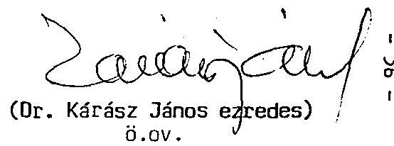

Budapest, 1992. január 23-n.

---

# MAGYAR HOMYEDGEG PARANCINOKSAGA

## Közgazdasági és Pénzhgyí Fönökség

### FELJEGYZÉS

#### a HM Védelemgazdasági Főosztály részére

Az MHSZ részére megnyitott bankszámlákkal kapcsolatban kért adatok és információk a következők:

1. A bankszámlák év végi egyenlegeit az 1985-89-es évekre vonatkozóan a feljegyzéshez csatoltan megküldjük.

Az 1985. év előtti bizonylatok a selejtítási előírásoknak megfelelően - ami 5 évi megőrzést írt elő - már megsemmisítésre kerültek, így ezen időszakra adat csak az MNB-től szerezhető be.

Az MHSZ bankszámlák 1990. szeptember 30-i megszüntetése után a bank részéről a záróegyenlegek összegéről, illetve a Felszámoló Bizottság számlájára áttett összegekről adatszolgáltatás nem történt.

A felszámolás során készített kimutatás szerint szervenként a következő összegek kerültek át a Felsz. Bizottság elszámolási számlára 1990. október 1-je után:

|   |  |  |  |  |  |  |  |  |  |  |  |  |  |  |  |  |  |  |  |  |  |  |  |  |  |  |  |  |  |  |  |  |   |
| --- | --- | --- | --- | --- | --- | --- | --- | --- | --- | --- | --- | --- | --- | --- | --- | --- | --- | --- | --- | --- | --- | --- | --- | --- | --- | --- | --- | --- | --- | --- | --- | --- | --- | --- | --- |
|   |  |  |  |  |  |  |  |  |  |  |  |  |  |  |  |  |  |  |  |  |  |  |  |  |  |  |  |  |  |  |  |  |  |   |
|  Országos Központ |  |  |  |  |  |  |  |  |  |  |  |  |  |  |  |  |  |  |  |  |  |  |  |  |  |  |  |  |  |  |  |  |  |   |
|  Pest m. |  |  |  |  |  |  |  |  |  |  |  |  |  |  |  |  |  |  |  |  |  |  |  |  |  |  |  |  |  |  |  |  |  |   |
|  Bp-i |  |  |  |  |  |  |  |  |  |  |  |  |  |  |  |  |  |  |  |  |  |  |  |  |  |  |  |  |  |  |  |  |  |   |
|  Országos Ell. Központ |  |  |  |  |  |  |  |  |  |  |  |  |  |  |  |  |  |  |  |  |  |  |  |  |  |  |  |  |  |  |  |  |  |   |
|  OK Üzemi konyha |  |  |  |  |  |  |  |  |  |  |  |  |  |  |  |  |  |  |  |  |  |  |  |  |  |  |  |  |  |  |  |  |  |   |
|  Közp. Iskola-Idülő |  |  |  |  |  |  |  |  |  |  |  |  |  |  |  |  |  |  |  |  |  |  |  |  |  |  |  |  |  |  |  |  |  |   |
|  Baranya megyei |  |  |  |  |  |  |  |  |  |  |  |  |  |  |  |  |  |  |  |  |  |  |  |  |  |  |  |  |  |  |  |  |  |  |   |
|  Bács-Kiskun m. |  |  |  |  |  |  |  |  |  |  |  |  |  |  |  |  |  |  |  |  |  |  |  |  |  |  |  |  |  |  |  |  |  |  |   |
|  Békés m. |  |  |  |  |  |  |  |  |  |  |  |  |  |  |  |  |  |  |  |  |  |  |  |  |  |  |  |  |  |  |  |  |  |  |   |
|  Borsof m. |  |  |  |  |  |  |  |  |  |  |  |  |  |  |  |  |  |  |  |  |  |  |  |  |  |  |  |  |  |  |  |  |  |  |   |
|  Csongrád m. |  |  |  |  |  |  |  |  |  |  |  |  |  |  |  |  |  |  |  |  |  |  |  |  |  |  |  |  |  |  |  |  |  |  |   |
|  Fejér m. |  |  |  |  |  |  |  |  |  |  |  |  |  |  |  |  |  |  |  |  |  |  |  |  |  |  |  |  |  |  |  |  |  |  |   |
|  Győr-Sopron m. |  |  |  |  |  |  |  |  |  |  |  |  |  |  |  |  |  |  |  |  |  |  |  |  |  |  |  |  |  |  |  |  |  |  |   |
|  Hajdú-Bihar m. |  |  |  |  |  |  |  |  |  |  |  |  |  |  |  |  |  |  |  |  |  |  |  |  |  |  |  |  |  |  |  |  |  |  |   |
|  Heves m. |  |  |  |  |  |  |  |  |  |  |  |  |  |  |  |  |  |  |  |  |  |  |  |  |  |  |  |  |  |  |  |  |  |  |   |
|  Komárcs m. |  |  |  |  |  |  |  |  |  |  |  |  |  |  |  |  |  |  |  |  |  |  |  |  |  |  |  |  |  |  |  |  |  |  |   |
|  Nógrád m. |  |  |  |  |  |  |  |  |  |  |  |  |  |  |  |  |  |  |  |  |  |  |  |  |  |  |  |  |  |  |  |  |  |  |   |
|  Sonogy m. |  |  |  |  |  |  |  |  |  |  |  |  |  |  |  |  |  |  |  |  |  |  |  |  |  |  |  |  |  |  |  |  |  |  |   |

---

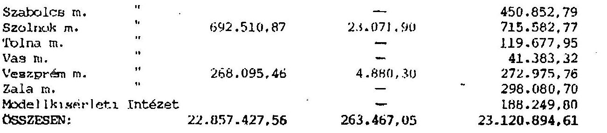
2.) A vizsgált idôszakban az MHSZ-nek két letéti számlaja volt. Ezek megnevezése és év végi záróegyenlegei:
a.) 235-90177-5564 Magyar Repülöszóvetség letéti számla

| 1986. decernber 30. | $1.501 .219 .67 \mathrm{Ft}$. |
| :--: | :--: |
| 1987. december 31. | $5.395 .905 .24$ |
| 1988. december 30. | $1.811 .046 .62$ |
| 1989. december 29. | $28.825 .02$ |

Az 1986-ban megnyitott számla 1990. augusztusban lett megszintetve az 1989. decernber 29-i záróegyenleggel egyezô összegygel, jogutód számlaja az MHSZ Orsz. Kozpont lett.
b.) 235-90177-6091 MHSZ OK importforg. letéti számla

| 1985. december 30. | $6.547 .995 .49 \mathrm{Ft}$ |
| :-- | :-- |
| 1986. decernber 30. | $519.940 .88$ |
| 1987. derember 31. | $303.471 .43$ |

A szánlán 1988. év végén már nem volt pénz és 1989-ben megszüntetésre kenilt.

Me 1 lóklet: MNS-kimutatások (6 lap)

Budapest, 1992. január $l o-n$
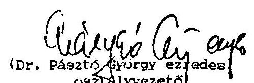

Készült: 1 pld.-ban
Egy pld. 2 lap
1tsz.: 2607
Készítette: Kovács kpa.

---

# MAGYAR HONVEDGEG PARANCENORSAGA

Közeazdasiagi és Pénzikryi Fönökség

Az MHSZ részére megnyílott bankazámlák megnevezése és számlaszáma

|  MHSZ Országos Központ |  | 7p. | 235-90176-9301  |
| --- | --- | --- | --- |
|  Baranya m. Vez.GjmG. képz.Isk. |  | Pécs | 249  |
|  Bács-Kiskun m. | " | Kecskemét | 259  |
|  Békés m. | " | Békéscsaba | 269  |
|  Borsod m. | " | Miskolc | 279  |
|  Csongrád m. | " | Szeged | 289  |
|  Fejér m. | " | Székesfehérvár | 299  |
|  Győr-Sopron m. | " | Győr | 339  |
|  Hajdú-Bihar m. | " | Debrecen | 349  |
|  Heves m. | " | Eger | 359  |
|  Komárom m. | " | Tatabánya | 369  |
|  Nógrád m. | " | Salgótarján | 379  |
|  Pest m. | " | Bp. | 235  |
|  Somogy m. | " | Kaposvár | 399  |
|  Szabolcs m. | " | Nyíregyháza | 449  |
|  Szolnok m. | " | Szolnok | 459  |
|  Tolna m. | " | Szekszárd | 469  |
|  Vas m. | " | Szombathely | 479  |
|  Veszprém m. | " | Veszprém | 489  |
|  Zala m. | " | Zalaegerszeg | 499  |
|  Bp-i | " | Bp. | 235  |
|  Bp-i | " | Bp. | 235  |
|  Propaganda Ello. Uzem |  | Bp. | 235  |
|  Pest m. Vezetőség |  | Bp. | 235  |
|  OK.Gazd.Ello.Szolgálat |  | Bp. | 235  |
|  Országos Ell.Központ |  | Dunakeszi | 235  |
|  Baranya m. Vezetőség |  | Pécs | 249  |
|  Bács-Kiskun m. | " | Kecskemét | 259  |

---

| Békés m. Vezetöség | Békéscsaba | 269-90176-9573 |
| :--: | :--: | :--: |
| Borsod m. " | Miskolc | 2799583 |
| Bp-i | Bp. | 2359590 |
| Csongrád m. " | Szeged | 2899603 |
| Fejér in | Székesfehérvár | 2999613 |
| Győr-Sopron m. " | Győr | 3399623 |
| Hajdú-Bihar m. " | Debrecen | 3499633 |
| Heves m. " | Eger | 3599643 |
| Komárom m. " | Tatabánya | 3699660 |
| Kózp.Rádióelektr.jav.Bázis | Bp. | 2359679 |
| Nógrád m. Vezetöség | Salgótarján | 3799687 |
| Kózp. Repülögép Jav.Üzem | Bp. | 2359703 |
| Somogy m. Vezetöség | Kaposvár | 3999717 |
| Szabolcs-Szatmár m. Vezetöség | Nyíregyháza | 4499720 |
| Szolnok m " | Szolnok | 4599730 |
| Tolna m. " | Szekszárd | 4699740 |
| Vas m. " | Szombathely | 4799750 |
| Veszprém m. " | Veszprém | 4899760 |
| Zala m. " | Zalaegerszeg | 4999770 |
| Kózp-i Lövészklub | Bp. | 2359789 |
| Pest m.V.magángjmú.k.isk. | Bp. | 2359796 |
| Szolnok m.Rep.Klub.J.mühely | Szolnok | 4599802 |
| Szolnok m.Rep.Klub, rep.modell. és Anyagraktár | Szolnok | 4599819 |
| Kozp. Repülötér | Bp. | 2359844 |
| Modellkisérleti Intézet | Bp. | 2359868 |
| Békés m.V.Jav-szolg.mühely | Békéscsaba | 2699872 |
| Kozp. Iskola-udulí | Miskolo-T | 2799923 |
| Kozp.Gjmü.jav.mühely | Bp. | 2359947 |
| OK Uzemi konyha | Bp. | 2359978 |
| Repülö fönökség | Bp. | 2359985 |
| HM MHSZ Felszám.Biz.elsz.szla. | Bp. | 235-90178-1040 |

A Bp-i és megyei Gépjármúvezető képzó Iskolák bankszámlái és a Központi Lövészklub bankszámlája 1990. augusztusban, a Központi Gépjármújavító

---

Mühely szamlaja ezeptenber közepén, a tôbb1 MHSZ bankszámla szeptember 30val keriilt megszüntetésre.

A helyettik 1990. október 1-vel meanyított bankszámla (235-901781040 HM MHSZ Felszám.Biz.elsz.szla Hp.) 1991. április 15 -ével keriilt megszüntetésre. Ennek jogutód számla ja: 232-90148-3260 Kincstári Vagyonkeżelo Szervezet kv-i elszámolási számla Hp.

Budapest, 1992. január 09 -n
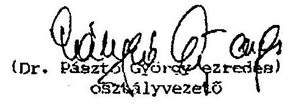

---

| Magyar Nemzeti Bank |  |
| :--: | :--: |
| Folyószámla Póosstóly |  |
| Allamhozartási Osstóly |  |

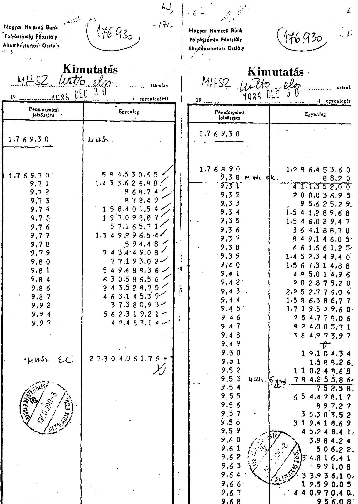

---

| 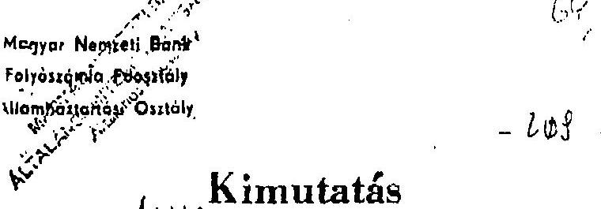 | 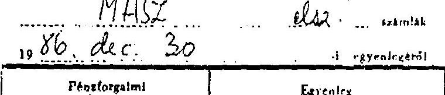 |
| :--: | :--: |
| 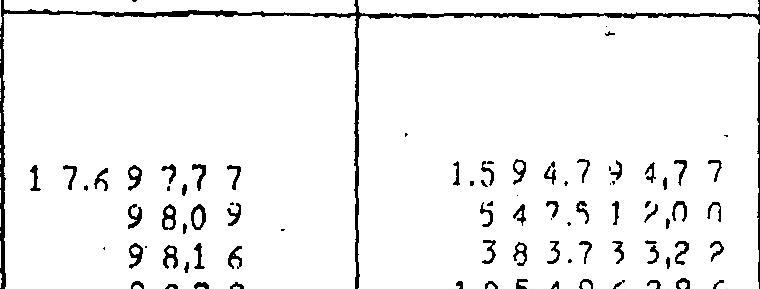 | 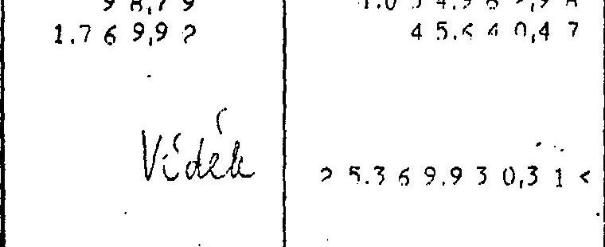 |

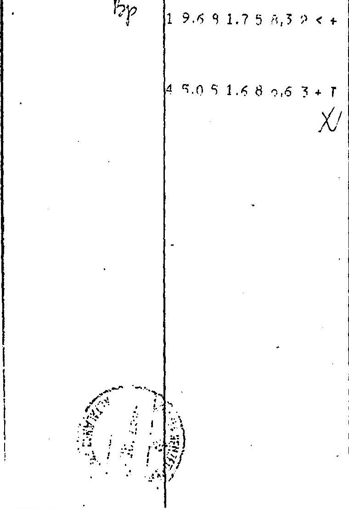
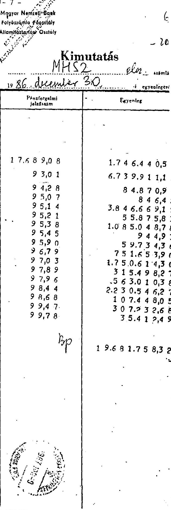

---

| 17.693 .16 | 418.309 .6 |
| :--: | :--: |
| 93,26 | 98.424 .0 |
| 93,36 | 556.020 .2 |
| 93,46 | 3.165 .093 .9 |
| 93,56 | 71.449 .7 |
| 93,66 | 1.353 .323 .1 |
| 93,76 | 1.005 .783 .4 |
| 93,86 | 1.289 .025 .7 |
| 93,96 | 1.402 .530 .3 |
| 94,09 | 418.234 .0 |
| 94,19 | 493.097 .1 |
| 94,39 | 2.302 .114 .2 |
| 94,42 | 2.287 .298 .8 |
| 94,52 | 1.219 .926 .4 |
| 94,62 | 396.3 |
| 94,72 | 966.913 .1 |
| 94,82 | 709.031 .5 |
| 94,92 | 2 |
| 95,50 | 46.169 .1 |
| 95,60 | 193.705 .7 |
| 95,70 | 193.4 |
| 95,80 | 1.852 .165 .9 |
| 96,00 | 13.381 .8 |
| 961,00 | 74.350 .5 |
| 96,20 | 267.425 .9 |
| 96,30 | 370.619 .8 |
| 96,40 | 58.609 .2 |
| 96,67 | 74.646 .9 |
| 96,84 | 37.266 .4 |
| 97,14 | 445.472 .5 |
| 97,27 | 168.663 .6 |
| 97,37 | 112.561 .5 |
| 97,47 | 131.895 .02 |
| 97,57 | 34.324 .42 |
| 97,67 | 104.860 .55 |

---

Magyar Nemzeti Bank
Folyószámla Fơosztály
Allamháztartási Osztály

## Kimutatás

$M H S 2$
19. 87. acenter 31
19.87. acenter 31
-i egyenlegéról

| Pénztorgalmi   jeleószám | Egyenleg |
| :--: | :--: |
| 176 |  |
| 17.689 .08 | 1.812 .866 .74 |
| 17.693 .01 .0 | 26.029 .571 .66 |
| 17.694 .28 | 38.245 .30 |
| 17.695 .07 | 101.364 .65 |
| 17.695 .140 | 3.447 .555 .08 |
| 17.695 .210 | 890060.54 |
| 17.695 .380 | 1.141 .441 .83 |
| 17.695 .450 | 134.944 .57 |
| 17.695 .910 | 61.598 .09 |
| 17.696 .790 | 635.803 .72 |
| 17.697 .030 | 2.367 .134 .61 |
| 17.697 .890 | 242.182 .99 |
| 17.697 .96 | 1.724 .838 .48 |
| 17.698 .44 | 458.282 .68 |
| 17.698 .68 | 1.807 .128 .74 |
| 17.699 .47 | 975.914 .84 |
| 17.699 .78 | 62.813 .35 |
| 17.699 .85 |  |

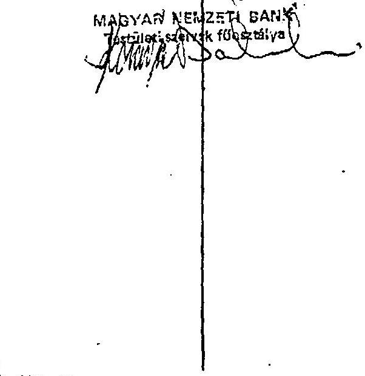

## Kimutatás

Elomudalmi wumthimthumis
1987. decenber 31. 11452
i egyenlegér

| Pénztorgalmi   jelzésé | Egyenleg |
| :--: | :--: |
| 17.693 .19 ? | 2077.648 .32 |
| 93.29 | 384.615 .59 |
| 93.39 | 876.331 .59 |
| 93.49 | 5.832 .742 .50 |
| 93.59 | 1.578 .854 .29 |
| 93.69 | 492.630 .98 |
| 93.79 | 1.021 .077 .15 |
| 93.89 | 1.410 .176 .72 |
| 93.99 | 939.494 .24 |
| 94.02 | 288.040 .55 |
| 94.12 | 713.660 .15 |
| 94.32 | 2.846 .933 .39 |
| 94.55 | 1.096 .194 .99 |
| 94.65 | 227.987 .02 |
| 94.75 | 1.062 .095 .03 |
| 94.85 | 576.958 .29 |
| 94.95 |  |
| 95.530 | 89.527 .00 |
| 95.630 | 68.487 .67 |
| 95.730 | 1.240 .916 .69 |
| 95.830 | 7.290 .611 .75 |
| 96.030 | 1.196 .811 .19 |
| 96.130 | 2.156 .154 .46 |
| 96.230 | 336.857 .12 |
| 96.330 | 6.429 .418 .39 |
| 96.430 | 10.155 .29 |
| 96.600 | 1.025 .963 .09 |
| 96.870 | 1.007 .693 .89 |
| 97.170 | 7.825 .39 |
| 97.300 | 286.514 .24 |
| 97.400 | 252.947 .24 |
| 97.500 | 133.889 .38 |
| 97.600 | 199.093 .86 |
| 97.700 | 1.859 .771 .72 |
| 98.02 | 571.242 .45 |
| 98.19 | 234.515 .90 |
| 98.72 | 1.100 .684 .32 |
| 99.230 | 18.640 .31 |
| 94.45 | 3.731 .034 .20 |
| 97.200 | 315.693 .96 |
| Videk: | 50.989 .890 .210 |
| Budapest: |  |
|  | 41.931 .747 .87 |
| Ömerer.: | 92.921 .638 .08 |

---

Magyar Nemzeti Bank
Folyószámla Főosztály
Államháztartási Osztály

- 10 -
Magyar Nemzeti Bank
Folyószámla Főosztály
Államháztartási Osztály

- 11 -

| Kintutatás MHSJ |  |
| :--: | :--: |
| 1988 dicembre 30 | -1 egyenlegérd |
| Főszüregelm: jeizöszám | Egyenleg |
| 35.1017 .689 .08 | 42479.16 |
| 93,01 | 36.970268 .97 |
| 94,28 |  |
| 9507 | - |
| 95,14 | 586.873 .98 |
| 95,21 | 1.578 .046 .92 |
| 95,36 | 516.94 |
| 95,45 | 80313.95 |
| 95,90 | 94.386 .75 |
| 95,79 | 737.400 .42 |
| 97.03 | 209.2239.77 |
| 97.99 | 165.143.72 |
| 97.96 | 1.745 .780 .66 |
| 98.44 | 283457.75 |
| 98,69 | 858.606 .19 |
| 99.47 | 398.619 .09 |
| 180052,54 | 170037.43 |
| 99,85 | 248.793 .002 |
| $B_{f}$ | 4.353 .990 .500 |
| Z. Hhsc | 91.459 .351 .63 |

P. 289-B - s17089 Pnyy 11.

- 10 -

| Kintutatás MHSJ |  |
| :--: | :--: |
| 1988 dicemier 30 | -1 egyenlegérd |
| Főszüregelm: jeizöszám | Egyenleg |
| 17.693 .19 ? | 3.252 .761 .65 |
| 93,29 | 2.196 .837 .0 C |
| 93,39 | 1.070 .944 .99 |
| 93,49 | 3.792 .667 .47 |
| 93,59 | 967.238 .62 |
| 93,69 | 3.831 .143 .62 |
| 93,79 | 1.094 .505 .55 |
| 93,89 | 1.886 .961 .96 |
| 93,99 | 757.988 .60 |
| 94,02 | 261.812 .39 |
| 94,12 | 1.075 .992 .68 |
| 94,32 | 3.664 .818 .71 |
| 94,45 | 2.969 .113 .53 |
| 94,55 | 505.290 .65 |
| 94,65 | 485.647 .75 |
| 94,75 | 727.077 .19 |
| 94,85 | 1.103 .098 .65 |
| 94,95 | 1.700 .842 .96 |
| 95,53 | 25.116 .98 |
| 95,63 | 48.321 .36 |
| 95,73 | 1.529 .302 .05 |
| 95,83 | 809.21 |
| 96,03 | 31.339 .15 |
| 96,13 | 202.654 .23 |
| 96,23 | 497.201 .00 |
| 96,33 | 52.143 .26 |
| 96,43 | 1.883 .379 .76 |
| 96,60 | 20.201 .95 |
| 96,87 | 913.315 .96 |
| 97,17 | 3.685 .993 .02 |
| 97,20 | 170.066 .27 |
| 97,30 | 137.438 .23 |
| 97,40 | 134.287 .29 |
| 97,50 | 88.410 .99 |
| 97,60 | 230.247 .78 |
| 97,70 | 1.024 .941 .19 |
| 98,02 | 160.828 .25 |
| 98,19 | 282.577 .18 |
| 98,72 | 2.887 .668 .04 |
| 99,23 | 54.373 .99 |
| Vögt | 45.405 .361 .134 .7 |

---

$\cdot$ 92 01/13 09:28 23611495564

Magyar Nemzeti Bank Folyószámla Fóosztóly Allamházfóráá Osztóly

Kimutatás MH52- vidék

|  |   |
| --- | --- |
|  1989. decemlér 29. | 29. 4 egyenlegéról  |
|  Pénzlertalmi jelzészám | Egyenleg  |
|  400017.603 .19 | 191.98301  |
|  95.53 | 54.527 .10  |
|  500017.603 .20 | 1.658 .314 .78  |
|  95.63 | 7.958 .60  |
|  600017.693 .30 | 275.001 .46  |
|  95.73 | 2.327 .60  |
|  98.72 | 29.257 .10  |
|  790017.693 .40 | 1.867 .061 .56  |
|  95.83 | 436.738 .91  |
|  99.23 | 64485  |
|  99.0017 .693 .50 | 383.956 .12  |
|  96.03 | 60.106 .52  |
|  970017.693 .69 | 642.222 .37  |
|  95.13 | 273.590 .59  |
|  1302017.593 .79 | 161.65900  |
|  06.23 | 70.745 .05  |
|  400017.693 .80 | 205.458 .06  |
|  95.33 | 406.510 .04  |
|  520017.693 .10 | 57.686 .10  |
|  96.43 | 1.289 .782 .73  |
|  579017.694 .02 | 1.24 .792 .38  |
|  96.60 | 277.062 .59  |
|  799017.694 .12 | 306  |
|  96.87 |   |
|  902009204 |   |
|  900017.694 .32 |   |
|  00000000000000000000000000000000000000000000000000000000000000000000000000000000000000000000000000000000000000000000000000000000000000000000000000000000000000000000000000000000000000000000000000000000

---

# MAGYAR HONVEDSEG   KÖZGAZDASAGI ES PENZIGYI FONDKEG 

Nyt.szám: 151/52/1990.

## Magyar Nemzeti Bank Testületi Szervek Főosztálya

Budapest

Tárgy: Bankszámia megszüntetés

Kérem azonnali hatállyal az alábbi bankszúulákat megszöntetni szíveskedjenek.

235-20176-8908 MISZ E. -i Vezetóséy Magángépjármi képzũ iskola Budapest 249-90176-9319 Baranya megyei Vez. Gépjármũ V. képzũ iskola Pécs 259-90176-9329 Bács-Kiskun m.Vez. Gépjármũ V. képzõ iskola Kecskemét 269-00176-9339 Békés m. Vez. Gépjármũ V. képzõ iskola Békéscsaba 279-10176-9349 Borsod megyei Vez. Gépjármũ V. képzũ iskola Miskolc 289-90176-9359 Csongrád megyei Vez. Gépjármũ V. képzõ iskola Szeged 299-90176-9369 Fejér m. Vez. Gépjármũ V. kúpzũ iskola Székeqfehérvár 339-10176-9379 Győr-Sopron megyei Vez. Gépjármũ V. képzõ iskola Győr 349-10176-9399 Hajdú-Binar m.Vez. Gépjármũ V. képzõ iskola Deurecen 359-90176-9399 Heves megyei Vez. Gépjármũ V. képzõ iskola Eger 369-10176-9402 Komárom megyei Vez. Gépjármũ V. kúpzũ iskola Tatabánya 379-10176-9412 Múgrád megyei Vez. Gépjármũ V. képzõ iskola Salgótarján 235-70176-9428 Pest megyei Vez. Gépjármũ V. képzõ iskola Budapest 399-90176-9432 Somogy megyei Vez. Gépjármũ V. képzũ iskola Kaposvár 449-90176-9445 Szabolcs-Gzatmár m. Vez. Hagángjm. képzũ iskola Nyíregyháza 459-90176-9455 Szolnok megyei Vez. Gépjármũ V. képzõ iskola Szolnok 469-90176-9465 Tolna megyei Vez. Gépjármũ V. képzũ iskola Szakszárd

---

- 2 -

479-90176-7475 Vas megvri Vez. Gépjármũ V. képzõ iskola Szombathely
489-90175-9485 Veszprém megyei Vez. Gépjármũ V. képzõ iskola Veszprém
499-90176-9495 Zala megyei Vez. Gépjármũ V. képzõ iskola Zalsegerszeg
235-90176-9507 Bp.-i Vez. Vez. Gépjármũ V. képzõ iskola Budapest
235-90176-9796 Pest megyei Vaz. Magángépjármũ képzõ iskola Budapest
235-90176-9789 MMSZ Központi Lövészklub Budapest
235-90177-5564 Magyar Repülöszövetség Budapest

Jogutód számla:

235-90176-9301 MMSZ Országos Központ Budapest

Tájékoztatásul közlöm, hogy az alábbi számlatulajdonosok felügyeleti
szerve MINK pénzügyi elosztály, helyett - szervezési változás következtében
- MNK fegyverzeti és Technikai Főcsoportfőnökség pénzügyi alosztályra módos-
sult:

- Hiradótechnikai Izzem Gödöllő
- Hiradó Anyag Gazd. Központ Gödöllő
- Sattyán János Hiradó Anyag Raktár Nyíregyháza.

Budapest, 1990. augusztus hó 22-n.

(Dr. Pásztó György alázredés)
osztályvezető

Készült: 2 pld.-ban
Egy pld. 1 lap
Itsz.: 2607
Készítette: Jozefik kpa.
K. 1790.0825.52 11.11.

---

MAGYAR HONVEDSEG PARANCSNOKSAGA
Küzgazdaságl és Pénzllyyl Fönökség
$\therefore$ sz.példány

Nyt.szém: $151 / 65 / 1990$

# Magyar Neazeti Bank   Testllati Szarvek Főosztálya 

Budapest

Tárgy: Benkszámla megszüntetés
Kéren 1990 nítórr 1-1 hatállal ar nithil hanharnilnt marnilntalnt szíveskedjenek.

235-90178-4115 MN Építési Tervezõ Intézet Bp.

## Jogutód számla:

235-90178-4287 MN Beruházási és Fenntert. Fön.Bp.

235-90176-9301 MHSZ Országos Központ Bp.
235-90176-9514 MHSZ Propaganda Elláto Üzem Bp.
235-90176-9521 MHSZ Pest m. Vezetőség Bp.
235-90176-9538 MHSZ OK. Gazd. Ello.Szolgálat Bp.
235-90176-9545 MHSZ Orsz. Elláto Küzpont Bp.
249-90176-9553 MHSZ Baranya m. Vezetóség Pécs
259-90176-9563 MHSZ Bács-Kiskun m. Vez. Kecskemét
269-90176-9573 MHSZ Békés m. Vezetóség Békéscsaba
279-90176-9583 MHSZ BAZ m. Vezetóség Miskolc
235-90176-9590 MHSZ Bp-1 Vezetóség Bp.
289-90176-9603 MHSZ Csongrád m. Vezetóség Szeged
299-90176-9613 MHSZ Fejér m. Vezetóség Székesfehérvár
339-90176-9623 MHSZ Győr-Sopron m. Vezetóség Győr
349-90176-9633 MHSZ Hajdú-Bihar m. Vezetóség Debrecen

---

- 2 -

359-90176-9643 MHSZ Heves m. Vezetőség Eger
369-90176-9660 MHSZ Komárom m. Vezetőség Tatabánya
235-90176-9679 MHSZ Közp. Rádidelektronikai Javító Bázis Bp.
379-90176-9687 MHSZ Nógrád m. Vezetőség Salgótarján
235-90176-9703 MHSZ Közp. Repülögépjav. Üzem Bp.
399-90176-9717 MHSZ Somogy m. Vezetőség Kaposvár
449-90176-9720 MHSZ Szabolcs-Szatmár m. Vezetőség Nyíregyháza
459-90176-9730 MHSZ Szolnok m. Vezetőség Szolnok
469-90176-9740 MHSZ Tolna m. Vezetőség Szekszárd
479-90176-9750 MHSZ Vas m. Vezetőség Szombathely
489-90176-9760 MHSZ Veszprém m. Vezetőség Veszprém
499-90176-9770 MHSZ Zala m. Vezetőség Zalaegerszeg
459-90176-9802 MHSZ Szolnok m. Rep.Klub Javító móhely Szolnok
459-90176-9819 MHSZ Szolnok m.Rep.Klub Rep.modellező és Ag.raktár Szolnok
235-90176-9844 MHSZ Központi Repülötár Bp.
235-90176-9868 MHSZ Modellkisérleti Intézet Bp.
269-90176-9872 MHSZ Békés m.V.Jav.szolg.móhely Békéscsaba
279-90176-9923 MHSZ Központi Iskola-Udülő Miskolc
235.90176 9978 MHSZ OK Üzemi kenyhe Bp.
235-90176-9985 MHSZ Repülöfönökség Bp.

Jogutód számisként kérem megnyitni a

235-90178-1040 HM MHSZ Felszámoló Bizottság elszámolási számla Bp.

Számlatulajdonos: MHP Ellátó Ig. I. píl.elosztály
1885. Budapest, Pf. 25.

Budapest, 1990. szeptember 21 -n

Rólyad O.-. see
(Dr. Pásztó György alézreses)
osztályvezető

---

# MAGYAR HONVEDSEG PARANCENOKSÁGA 

## Köggazdaságl és Pánzikgyl Fönökség

Nyt.szám: $151 / 71 / 1990$.

## Magyar Nemzeti Bank   Testilleti Szervek Főosztálya

Budapest

Tárgy: Bankszámla megszûntetés módosítása

Kérem, hogy az MHSZ bankszámláinak megszûntetésére vonatkozó 151/65/1990. számú átiratunkban, a jogutódlásra történt utalást, az MHSZ fátitkárának 10-83/1990. számú, Önökhöz intézett levelének figyelembevételével szíveskedjenek módosítani.

Egyúttal kérem az MHSZ átiratában megnevezett számlatulajdonosokat az érintett bankszámlák esetében jogutódnak tekinteni szíveskedjenek.

Budapest, 1990. szeptember ho 28 -n.
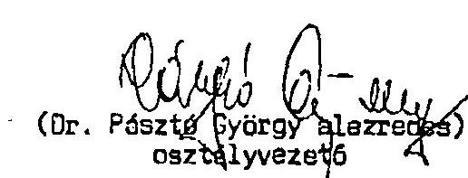

Készillt: 2 pld.-ban
Egy pld. 1 lap
Itsz.: 2607
Készítette: Jozefik Vilmos kpa.

---

# MAGYAR HONVÉOELMI SZÖVETSÉG FÖTITKÁRA 

Nyt.szám: $10-85 / 1950$.

## dr. Szigeti Gáborné   MNB Testületi Szervek Főosztálya osztályvezető

Budapest, V.
Szabadság tér 9.

Tisztelt Asszonyom !

A 1022/1990.(II.14.) Mt. számú határozat alapján a Magyar Honvédelmi Szövetség 1990. szeptember 30-án megszũnik. Egyes - termelö, szolgáltató tevékenységet folytató szerveit azonban, a szellemi és mũszaki kapacitások megôrzése érdekében tovább szükséges mũködtetni, ingóságait és pénzeszközeit a jogutódként kijelölt szervezetek részére át kell adni.
dr. Várhelyi István ezredes úrral a mai napon folytatott telefonbeszélgetésünk alapján kérem, hogy az alábbiakra intézkedni szíveskedjen:
1./ A jogelőd MHSZ OK Repülöfönökség /MNB 235-90176-9985/
MHSZ Közp.Rep.tér B.örs
/MNB 235-90176-9844/
MHSZ Közp.rep.-eje.jav.üz. /MNB 235-90176-9703/
szervezetek 1990. szeptember 28-i záróegyenlegeit a Mezöbank Rt. Bp. 219-98911 MRSZ 0192-400 sz. szla. javára kérem telepíteni.
2./ A jogelőd MHSZ Modellkísérleti Intézet /MNB 235-90176-9868 szla./ 1990.09.28-i záróegyenlegét a Magyar Modellezõ Szövetség MHB 222-14380 szla. javára kérem telepíteni. Egyben kérem, hogy az MH Pság. 235-90178-1040 HM felszámoló bizottság elszámolási számlára átutalt, de az MNB által még nem teljesített 2 mFt összeg is a Modellezõ Szövetség számlájára kerüljön átutalásra.

---

3./ Az MHSZ OK Propaganda-, Anyagellátó Üzem MNB 235-90176-9514 számú számlájának 1990.09.25-i záróegyenlegét a "Kultúrált Közlekedésért Alapítvány" MHB Rt. 221-10468. sz. számlára kérem telepíteni.
4./ Az MHSZ Rádióelektronikai Intézet MNB 235-90176-9679. sz. szla. 1990.09.28-i záróegyenlegét a Magyar Rádióamatôr Szövetség MNB 222-145B6 számú számlára kérem jóváirni.

Egyben kérem szíves intézkedését, hogy a jogelód számlák egyúttal megszüntetésre kerüljenek, illetve a késôbb felmerülõ terhelések és jóváírások már a jogutọ́d számlákat érintsék.

Szíves intézkedését elôre is köszönöm.

Budapest, 1990. szeptember 26.
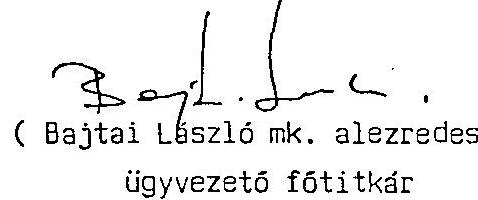

Készült: 13 példányban
Egy példány: 2 lap
Kapják: 1-es számú példány: Címzett
2-es számú példány: MH Közg. és PüF-ség
3-as számú példány: MHSZ OK Rep.F-ség
4-es számú példány: MHSZ Közp.Rep.tér
5-ös számú példány: MHSZ Közp. Rep.-eje.jav.üz.
6-os számú példány: Magyar Repülõ Szövetség
7-es számú példány: MHSZ MOKI
8-as számú példány: Magyar Modellezõ Szövetség
9-es számú példány: MHSZ OK Prop.Ag.Ello.Üzem
10-es számú példány: "Kultúrált Közlekedésért Alapítvány"
11-es számú példány: MHSZ REKI
12-es számú példány: Magyar Rádióamatôr Szövetség
13-as számú példány: Irattár

---

# JÓVÁIRÁSI ÉRTEGTE

## BELSÓ OGYKEZÉLES

Értelítők Örüket hogy az alábbi összeget bankszámlájuk javára utuk.

A megfelelő bankszámla tulajdonosának neve és szálhelye:

### MHSZ Hevesmegyei Vezetősége Eger

|  A címzett: |  |  |  |  |  |   |
| --- | --- | --- | --- | --- | --- | --- |
|  H: | MHSZ | Felszámoló | Biz. első szám | Budapest |  |   |
|  |   |   |   |   |   |   |
|   |  |  |  |  |  | pénzforgalmi jelzőszáma:  |
|  359-90176-9643 | 9815 |  |  |  |  | 235-90178-1040  |
|  Köztemény: |  |  |  |  |  |   |
|  |   |   |   |   |   |   |
|   |  |  |  |  |  | 140.510.99  |
|   |  |  |  |  |  | 140.510.99  |
|  |   |   |   |   |   |   |
|  MAGYAR NEMZETI BANK |  |  |  |  |  | U927766  |
|  Heves megyei igazgatósítja |  |  |  |  |  |   |
|  |   |   |   |   |   |   |
|  JÓVÁIRÁSI ÉRTEGTE |  |  |  |  |  |   |
|  |   |   |   |   |   |   |
|  Értelítők Örüket hogy az alábbi összeget bankszámlájuk javára utuk. |  |  |  |  |  |   |
|  A megfelelő bankszámla tulajdonosának neve és szálhelye: |  |  |  |  |  |   |
|  MHSZ Sz.Sz.m-i Vezetősége |  |  |  |  |  |   |
|  |   |   |   |   |   |   |
|  449-90176-9720 | 9815 |  |  |  |  |   |
|  Köztemény: |  |  |  |  |  |   |
|  |   |   |   |   |   |   |
|  Egyenleg beutalás |  |  |  |  |  |   |
|  |   |   |   |   |   |   |
|  JÓVÁIRÁSI ÉRTEGTE |  |  |  |  |  |   |
|  |   |   |   |   |   |   |
|  Értelítők Örüket hogy az alábbi összeget bankszámlájuk javára utuk. |  |  |  |  |  |   |
|  A megfelelő bankszámla tulajdonosának neve és szálhelye: |  |  |  |  |  |   |
|  MHSZ Sz.Sz.m-i Vezetősége |  |  |  |  |  |   |
|  |   |   |   |   |   |   |
|  449-90176-9720 | 9815 |  |  |  |  |   |
|  Köztemény: |  |  |  |  |  |   |
|  |   |   |   |   |   |   |
|  Egyenleg beutalás |  |  |  |  |  |   |
|  |   |   |   |   |   |   |
|  JÓVÁIRÁSI ÉRTEGTE |  |  |  |  |  |   |
|  |   |   |   |   |   |   |
|  Értelítők Örüket hogy az alábbi összeget bankszámlájuk javára utuk. |  |  |  |  |  |   |
|  A megfelelő bankszámla tulajdonosának neve és szálhelye: |  |  |  |  |  |   |
|  MHSZ Békés megyei vezetőség |  |  |  |  |  |   |
|  |   |   |   |   |   |   |
|  269-90176-9573 | 9815 |  |  |  |  |   |
|  Köztemény: |  |  |  |  |  |   |
|  |   |   |   |   |   |   |
|  A Testületi Szervek 324/90 az. levele alapjúprazdolamegszüntetés miatt egyenleg beutalása utóaszámlára. |  |  |  |  |  |   |
|  |   |   |   |   |   |   |
|  MAGYAR NEMZETI BANK |  |  |  |  |  |   |
|  |   |   |   |   |   |   |
|  MAGYAR NEMZETI BANK |  |  |  |  |  | U936351  |
|  |   |   |   |   |   |   |
|  |   |   |   |   |   |   |
|  |   |   |   |   |   |   |
|  |   |   |   |   |   |   |
|  |   |   |   |   |   |   |
|  |   |   |   |   |   |   |
|  |   |   |   |   |   |   |
|  |   |   |   |   |   |   |
|  |   |   |   |   |   |   |
|  |   |   |   |   |   |   |
|  |   |   |   |   |   |   |
|  |   |   |   |   |   |   |
|  |   |   |   |   |   |   |
|  |   |   |   |   |   |   |
|  |   |   |   |   |   |   |
|  |   |   |   |   |   |   |
|  |   |   |   |   |   |   |
|  |   |   |   |   |   |   |
|  |   |   |   |   |   |   |
|  |   |   |   |   |   |   |
|  |   |   |   |   |   |   |
|  |   |   |   |   |   |   |
|  |   |   |   |   |   |   |
|  |   |   |   |   |   |   |
|  |   |   |   |   |   |   |
|  |   |   |   |   |   |   |
|  |   |   |   |   |   |   |
|  |   |   |   |   |   |   |
|  |   |   |   |   |   |   |
|  |   |   |   |   |   |   |
|  |   |   |   |   |   |   |

---

JOVAIRASI ERTESITES

BELSO OGYKEZELES

Ertestük Önöket, hogy az alábbi őszzeget bankszámlójuk javára írjuk.

A megterhelt bankszámló kiadámasának neve és szállítója:

19132 Csereszés Képzett

20

BELSO OGYKEZELES

19

A címzett: 10

BELSO ÖGYKEZELES

pénzforgalmi jelzőszáma:

Közlemény:

200-90176-9953 9817

Közlemény:

200-90176-9953 9817

0705655

MAGYAR NEMZETI BANK

BELSO OGYKEZELES

0705655

MAGYAR NEMZETI BANK

BELSO OGYKEZELES

0705657

MAGYAR NEMZETI BANK

BELSO OGYKEZELES

0705657

Ertestük Önöket, hogy az alábbi őszzeget bankszámlójuk javára írjuk.

A megterhelt bankszámló kiadámasának neve és szállítója:

A címzett:

19132 Darszámló Biz. elsz. szla. Budapest

pénzforgalmi jelzőszáma:

249-90176-9953 9817

249-90176-9953 9817

0705657

MAGYAR NEMZETI BANK

0705657

---

JOVAIRÁSI ÉRTEBITÉS

Értestjük Önöket, fogy az alábbi összeget bankszámlájuk javára írtuk. A megterhelt bankszámla tulajdonosának neve és székhelye:

**BELSO OGYKEZELÉS**

A címzető:

**III. Felbízomoló Bizottság**

pánforgalmi jelzéssáma:

**BELSO-90170-1040**

Közlemény:

**MAGYAR NEMZETI BANK**

**BELSO OGYKEZELÉS**

Értestjük Önöket, fogy az alábbi összeget bankszámlájuk javára írtuk. A megterhelt bankszámla tulajdonosának neve és székhelye:

**BELSO BIZOPATI VONTOGÁG**

A címzető:

**III. Felbízomoló Bizottság**

pánforgalmi jelzéssáma:

**BELSO-90170-1040**

Közlemény:

**MAGYAR NEMZETI BANK**

**BELSO OGYKEZELÉS**

Értestjük Önöket, fogy az alábbi összeget bankszámlájuk javára írtuk. A megterhelt bankszámla tulajdonosának neve és székhelye:

**BELSO BIZOPATI VONTOGÁG**

A címzető:

**III. Felbízomoló Bizottság**

pánforgalmi jelzéssáma:

**BELSO-90170-1040**

Közlemény:

**MAGYAR NEMZETI BANK**

**BELSO OGYKEZELÉS**

Értestjük Önöket, fogy az alábbi összeget bankszámlájuk javára írtuk. A megterhelt bankszámla tulajdonosának neve és székhelye:

**BELSO BIZOPATI VONTOGÁG**

A címzető:

**III. Felbízomoló Bizottság**

pánforgalmi jelzéssáma:

**BELSO-90170-1040**

Közlemény:

**MAGYAR NEMZETI BANK**

---

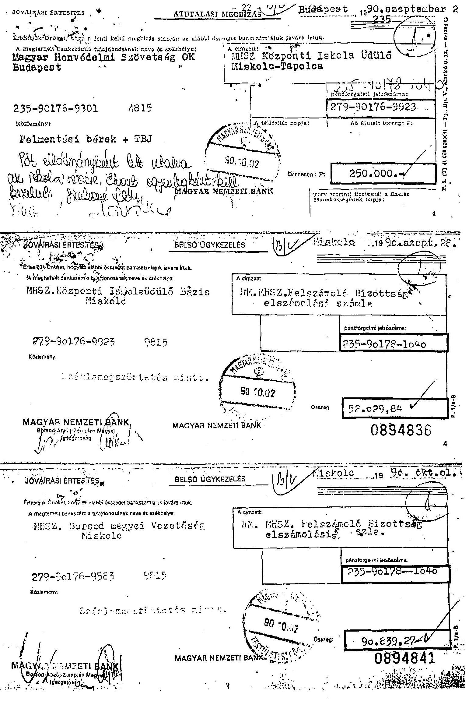

# ANTISMUSISIS

## ANTISMUSISIS

### Antismis

- **Antismis**: A anti-smisis isi isi isi isi isi isi isi isi isi isi isi isi isi isi isi isi isi isi isi isi isi isi isi isi isi isi isi isi isi isi isi isi isi isi isi isi isi isi isi isi isi isi isi isi isi isi isi isi isi isi isi isi isi isi isi isi isi isi isi isi isi isi isi isi isi isi isi isi isi isi isi isi isi isi isi isi isi isi isi isi isi isi isi isi isi isi isi isi isi isi isi isi isi isi isi isi isi isi isi isi is

---

Ertezkők Önöket, hogy az alábbi összeget bankszámlájuk javára íruk.
A megtermelt bankszámla tulajdonosának neve és szakkolyu.

MHSZ Győr-5. m. vezetősége

339-901769623 9925

Közlemeny:

Egyenlegátutalás szánlomegszüntésnek miatt.

90.10.02

0918014

MAGYAR NEMZETLBAKK

JÓVAIRASI ÉRTEGITÉS

Éfeszítők Önöket, hogy az alábbi összeget bankszámlájuk javára íruk.
A megtermelt bankszámla tulajdonosának neve és szakkolyu.

MHSZ Fejér megyei vezetőség

299-90176-9613 4815

Közlemeny:

Számla-egyenleg utalása utódászkárától.
Testületi szervek Főoszt. 334750 m³ levon alapján.

MAGYAR NEMZETLBAKK

299-90176-9613 4815

MAGYAR NEMZETLBAKK

BELSÓ ÖGYKEZELÉS

Értezők Önöket, hogy az alábbi összeget bankszámlájuk javára íruk.
A megtermelt bankszámla tulajdonosának neve és szakkolyu.

MHSZ. Csongrád m-1 Vez.

289-90176-9603 9817

Közlemeny:

BELSÓ ÖGYKEZELÉS

235-90178-1040

0929249

Szes 1990.10.01.

A címzett:
HM MHSZ Felszámoló Biz. elsz.szla.

pánztorgalmi utószáma:
235-90178-1040

1990.okt. 1-1 számla megszűnése miatt jogútőszámlára egyenleg beutalása.

90.10.02

0926710

0926710

MAGYAR NEMZETLBAKK

---

92 01/21 08:30 36 1 1495564 HH KOZG.ES PU.F. --- KOZG FOOSZTALY 0912 JOVAIRÁSI ENTESITÉS BELSO UGYKEZÉLES 10

- 24 -

- Erjesítjük Önceket, hogy az utolsóı összeget bankszámítjuk javára írjuk.

A megterhelt bankszámla tulajdonozának neve és szakhelye:
MHSZ Hajdu m. Vez.
Debrecen

A címzett:
HM MHSZ Felszémoló Biz. elsz.
szla. Budapest

235-90178-1040

349-90176-9633 9815

Közlemény:

Egyenleg rendezése.

MAGYAR NEMEZETI BANK
BELSO UGYKEZÉLES 11

MAGYAR NEMEZETI BANK
BELSO UGYKEZÉLES 12

MAGYAR NEMEZETI BANK
BELSO UGYKEZÉLES 13

A címzett:
HM MHSZ Felszémoló Biz. elsz. szla.

369-90176-9660 9815

Közlemény:

Számlamegazüntetés miatt egyenleg utaláshoz átódszámára.

MAGYAR NEMEZETI BANK
BELSO UGYKEZÉLES 14

MAGYAR NEMEZETI BANK
BELSO UGYKEZÉLES 15

MAGYAR NEMEZETI BANK
BELSO UGYKEZÉLES 16

Tatabányas 90. október

A címzett:
HM MHSZ Felszémoló Biz. elsz. szla.

369-90176-9660 9815

Közlemény:

Számlamegazüntetés miatt egyenleg utaláshoz átódszámára.

MAGYAR NEMEZETI BANK
BELSO UGYKEZÉLES 17

MAGYAR NEMEZETI BANK
BELSO UGYKEZÉLES 18

MAGYAR NEMEZETI BANK
BELSO UGYKEZÉLES 19

Tatabányas 90. október 1.

Záróútjuk Önceket, hogy a fejeit kerül megbízás alapján az utolsó összeget bankszámítjuk javára írjuk.

A megterhelt bankszámla tulajdonozának neve és szakhelye:
MHSZ Bóyrád megyei Vezet mege
Salgoturján

379-90176-9687 4815

Közlemény:

A címzett: Húszó és evő. 10-sz rés miatt.

MAGYAR NEMEZETI BANK
BELSO UGYKEZÉLES 20

MAGYAR NEMEZETI BANK
BELSO UGYKEZÉLES 21

Terv szerinti fizetésnél a Bizetés csodékszágganak napja!

---

JOVÁRÁSI ÉRTEGTEZ
2000 1 1490064
BELSO OGYKEZELÉS
HH KOZC. ES PU.F.
--- KOZC. FOOSZTÁLY
Szekszárd 19 90.okt.1.
--- 25 - elad. 10. oldalán
A cénzett
H.M. M.H.Sz. Feisz. Biz. Budapest
A cénzett
H.M. M.H.Sz. Feisz. Biz. Budapest
449-90.176.9740
9.81.5
közlemény.
1990.okt.1. számlamegszüntétés miatt.
90.10.62
1.119.677.95
Összeg:
0932858
MAGYAR NEMZETI BANK
JOVÁRÁSI ÉRTEGTEZ
BELSO OGYKEZELÉS
Szolnok 90. szeptem
Értestítik Önököt, hogy az alábbi összeget begházatoljon lenéve írtuk.
A megtermelt bankszámla tulajdonosának neve és azúkhelye:
MRSZ Szolnok m.-i' Vezetősége
A cénzett:
MN MRSZ Felszámoló Bizottság
Bp-
1.119.677.95
Összeg:
0932858
459-90176-9730
9015
Közlemény.
Számla megszüntetés.
MAGYAR NEMZETI, BANK
JOVÁRÁSI ÉRTEGTEZ
BELSO OGYKEZELÉS
Kaposvár 90. október ol.
Értestítik Önököt, hogy az alábbi összeget bankszámlájuk neve a volt
A megtermelt bankszámla tulajdonosának neve és azúkhelye:
MRSZ, Somog megyei Vezetőség Kaposvár
A cénzett:
HM.MRSZ, Felszámoló Bizottság elss.szlm B.
pénzforgalmi jelzőszámó:
399-90176-9717
9815
pénzforgalmi jelzőszámó:
235-90178-1040
Közlemény.
Egyenleg bontalása számlamegszünés miatt az utóászámlára a Téstületi szervek
főosztálya Számviteli osztály 324/90. 10. levele alapján 1990.október 1-1 hatályt
1.119.677.95
Összeg:
0905037
MAGYAR NEMZETI BANK
41
41
41

---

92 01/21 08:31 236 1 1495564 MH KOZG. EG PU. F. --- KOZG. FOOSZTALY 001
JOVAIRASI ÉRTESITÉS BELSO OGYKEZELES

Erőeltök Önkert, hogy az előbbi összeget bankszámlatuk levém írjuk.
A megterhelt befikszámla szájdonosá-100 neve és székhelye:

A címzett:

MHSZ Megyezi vezetésére Zolaegerszeg HM. MHSZ Felszámolási Bizottság
Budapest

400-90176-9770 9815 benkepest

pánforgalmi plágszámra:
235-90178-1140

Közlemény:

Számlemepaxüntetés miatt.

90.10.02

MAGYAR NEMZETI BANK
MAGYAR NEMZETI BANK
U920481

JOVAIRASI ÉRTESITÉS
BELSO OGYKEZELES
Veszprém 19990 október 1.

Erőeltök Önkert, hogy az előbbi összeget bankszámlatuk levém írjuk.
A megterhelt bankszámla szájdonosá-100 neve és székhelye:

A címzett:

MHSZ Veszprém megyei vezetősége
MHSZ Apost

pánforgalmi plágszámra:
235-90178-1040

489-90176-9760 9815

Egyenleg beutal

90.000

MAGYAR NEMZETI BANK
Oszrert
268.095,46
U934332

JOVAIRASI ÉRTESITÉS
BELSO OGYKEZELES
Uzhely 19 90.szep.28.

Erőeltök Önkert, hogy az előbbi összeget bankszámlatuk levém írjuk.
A megterhelt bankszámla szájdonosá-100 neve és székhelye:

A címzett:

MHSZ Vas megyei Vez. Szambathely
MHSZ Felszámoló Biz. elez.szla

Budapest

479-90176-9750 9817 benkepest

Közlemény:
235-90178-1040

324/90.sz.levél alapján egyneleg benkejtik
számlemepaxüntetés miatt

90.000

MAGYAR NEMZETI BANK
MAGYAR NEMZETI BANK
0883225

---

- 27 -

'92 01/21 08:39 236 1 1495564 MH KOZG. ES PU. F. HM KOZG. FOO.

JOVAIRASI ÉRTESITÉS

Értesítők Önökét, hogy az alábbi összeget bankszámlójuk javára írjuk.
A megterhelt bankszámla tulajdonosának neve és szakafölje:
Magyar Nemzeti Bank Veszprém m-1 Iz. Veszprém

463-993332007 9793

Közlemény:

Téves POSH rendezése.

MAGYAR NEMZETI BANK

Veszprém 19 90. okt. 92

A címzett
MISZ Veszprém m-1 Vezetőség

pénzforgalmi jelzőszáma:
235-90178-1040

4.009,30

Összeg:

4.000,30 1/

0934427

JOVAIRASI ÉRTESITÉS

Értesítők Önökét, hogy az alábbi összeget bankszámlójuk javára írjuk.
A megterhelt bankszámla tulajdonosának neve és szakafölje:
Magyar Nemzeti Bank
Baranya m-1 Iz. Vécs

249-994478008 9815

Közlemény:

POSH téves iránytisa miatt.

94-39-41

MAGYAR NEMZETI BANK

Pécs 19 90. okt. 10

A címzett
HM-MISZ felszám. szla. Bp.

pénzforgalmi jelzőszáma:
235-90178-1040

Összeg:

40.618,-1/

0915855

---

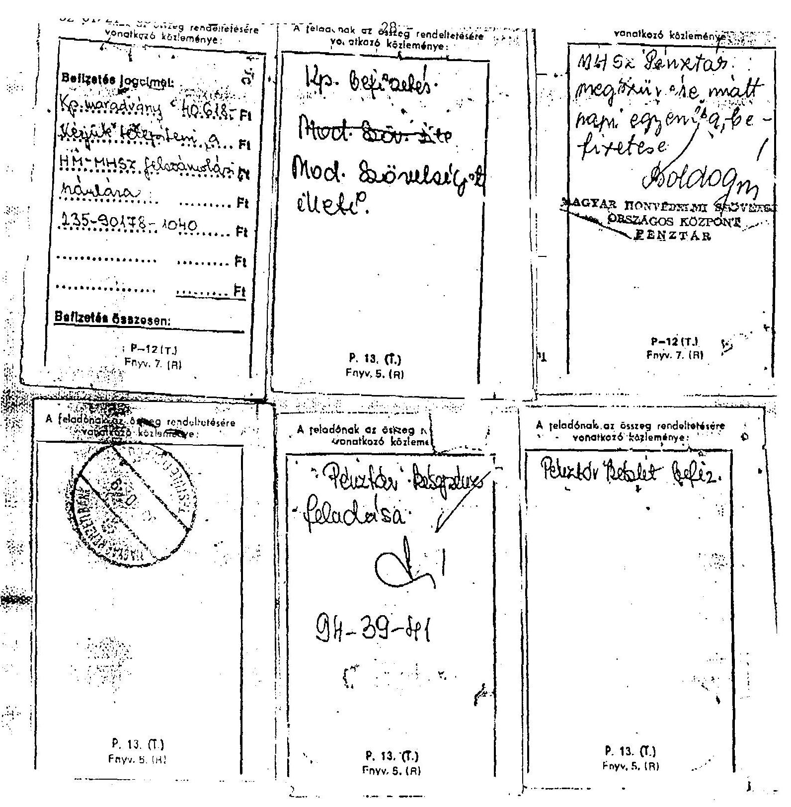

A feladónak az ószreg rendeltetésére vonatkozó közleménye:

---

JOVAIRÁSI ÉHTESÍTÉS

- 29 -

Éttelítők Önőkét, hogy az alábbi összeget bankszámlójuk javára írjuk
A megterhelt bankszámla tulajdonosának neve és szökhelye:
MHSZ Hajdu, m. Vez.
Debrecen

349-90176-9633 9815
Közlemény

Egyenleg rendezése.

MAGYAR NEMZETI BANK
Bajsz-Nihas Megyei Igazgatósá
Megyelem

JOVAIRÁSI ÉHTESÍTÉS

Éttelítők Önőkét, hogy az alábbi összeget bankszámlójuk javára írjuk.
A megterhelt bankszámla tulajdonosának neve és szökhelye:
MHSZ Kom.m. Vezetősége
Tatabánya

369-90176-9660 9815

Közlemény:

A címzett:
HM MHSZ Felszámoló Biz. elsz. szála. Budapest

pénsforgalmi jelzőszámó
235-90178-1040

MAGYAR NEMZETI BANK
Bajsz-Nihas Megyei Igazgatósá
Megyelem

369-90176-9660 9815

MAGYAR NEMZETI BANK
Bajsz-Nihas Megyelem

MAGYAR NEMZETI BANK
MAGYAR NEMZETI BANK
MAGYAR NEMZETI BANK
MAGYAR NEMZETI BANK
MAGYAR NEMZETI BANK
MAGYAR NEMZETI BANK
MAGYAR NEMZETI BANK
MAGYAR NEMZETI BANK
MAGYAR NEMZETI BANK
MAGYAR NEMZETI BANK
MAGYAR NEMZETI BANK
MAGYAR NEMZETI BANK
MAGYAR NEMZETI BANK
MAGYAR NEMZETI BANK
MAGYAR NEMZETI BANK
MAGYAR NEMZETI BANK
MAGYAR NEMZETI BANK
MAGYAR NEMZETI BANK
MAGYAR NEMZETI BANK
MAGYAR NEMZETI BANK
MAGYAR NEMZETI BANK
MAGYAR NEMZETI BANK
MAGYAR NEMZETI BANK
MAGYAR NEMZETI BANK
MAGYAR NEMZETI BANK
MAGYAR NEMZETI BANK
MAGYAR NEMZETI BANK
MAGYAR NEMZETI BANK
MAGYAR NEMZETI BANK
MAGYAR NEMZETI BANK
MAGYAR NEMZETI BANK
MAGY

---

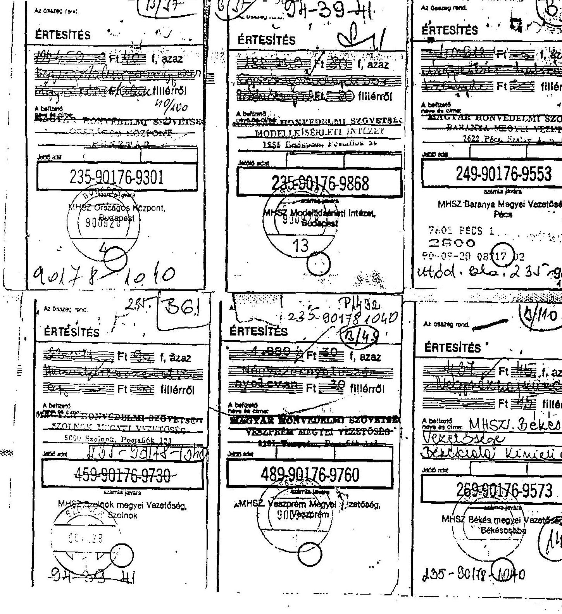

# Értesítés

- **Ft 100 f, azaz**
- **Ft 100 f, állomáta azzázege**
- **Ft 100 f, azaz**
- **Ft 100 f, állomáta azzázege**
- **A balfüti**
- **A balfüti**
- **A balfüti**
- **A balfüti**
- **A balfüti**
- **A balfüti**
- **A balfüti**
- **A balfüti**
- **A balfüti**
- **A balfüti**
- **A balfüti**
- **A balfüti**
- **A balfüti**
- **A balfüti**
- **A balfüti**
- **A balfüti**
- **A balfüti**
- **A balfüti**
- **A balfüti**
- **A balfüti**
- **A balfüti**
- **A balfüti**
- **A balfüti**
- **A balfüti**
- **A balfüti**
- **A balfüti**
- **A balfüti**
- **A balfüti**
- **A balfüti**
- **A balfüti**
- **A balfüti**
- **A

---

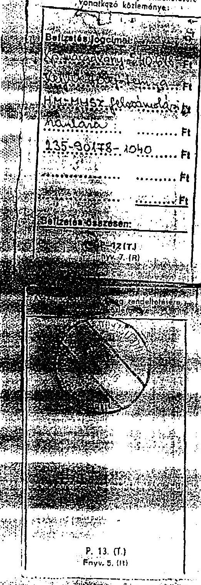

P. 13. (T.)
Fnyv. 5. (H)

A fuinmonax az összeg rendeltetésére vonatkozó közleménye

## 14. 15. 16. 17. 18. 19. 20. 21. 22. 23. 24. 25. 26. 27. 28. 29. 30. 31. 32. 33. 34. 35. 36. 37. 38. 39. 40. 41. 42. 43. 44. 45. 46. 47. 48. 49. 50. 51. 52. 53. 54. 55. 56. 57. 58. 59. 60. 61. 62. 63. 64. 65. 66. 67. 68. 69. 70. 71. 72. 73. 74. 75. 76. 77. 78. 79. 80. 81. 82. 83. 84. 85. 86. 87. 88. 89. 90. 91. 92. 93. 94. 95. 96. 97. 98. 99. 100. 101. 102. 103. 104. 105. 106. 107. 108. 109. 110. 111. 112. 113. 114. 115. 116. 117. 118. 119. 120. 121. 122. 123. 124. 125. 126. 127. 128. 129. 130. 131. 132. 133. 134. 135. 136. 137. 138. 139. 140. 141. 142. 143. 144. 145. 146. 147. 148. 149. 150. 151. 152. 153. 154. 155. 156. 157. 158. 159. 160. 161. 162. 163. 164. 165. 166. 167. 168. 169. 170. 171. 172. 173. 174. 175. 176. 177. 178. 179. 180. 181. 182. 183. 184. 185. 186. 187. 188. 189. 190. 191. 192. 193. 194. 195. 196. 197. 198. 199. 200. 201. 202. 203. 204. 205. 206. 207. 208. 209. 210. 211. 212. 213. 214. 215. 216. 217. 218. 219. 220. 221. 222. 223. 224. 225. 226. 227. 228. 229. 230. 231. 232. 233. 234. 235. 236. 237. 238. 239. 240. 241. 242. 243. 244. 245. 246. 247. 248. 249. 250. 251. 252. 253. 254. 255. 256. 257. 258. 259. 260. 261. 262. 263. 264. 265. 266. 267. 268. 269. 270. 271. 272. 273. 274. 275. 276. 277. 278. 279. 280. 281. 282. 283. 284. 285. 286. 287. 288. 289. 290. 291. 292. 293. 294. 295. 296. 297. 298. 299. 200. 201. 202. 203. 204. 205. 206. 207. 208. 209. 210. 211. 212. 213. 214. 215. 216. 217. 218. 219. 220. 221. 222. 223. 224. 225. 226. 227. 228. 229. 230. 231. 232. 233. 234. 235. 236. 237. 238. 239. 240. 241. 242. 243. 244. 245. 246. 247. 248. 249. 250. 251. 252. 253. 254. 255. 256. 257. 258. 259. 260. 261. 262. 263. 264. 265. 266. 267. 268. 269. 270. 271. 272. 273. 274. 275. 276. 277. 278. 279. 280. 281. 282. 283. 284. 285. 286. 287. 288. 289. 290. 291. 292. 293. 294. 295. 296. 297. 298. 299. 200. 201. 202. 203. 204. 205. 206. 207. 208. 209. 210. 211. 212. 213. 214. 215. 216. 217. 218. 219. 220. 221. 222. 223. 224. 225. 226. 227. 228. 229. 230. 231. 232. 233. 234. 235. 236. 237. 238. 239. 240. 241. 242. 243. 244. 245. 246. 247. 248. 249. 250. 251. 252. 253. 254. 255. 256. 257. 258. 259. 260. 261. 262. 263. 264. 265. 266. 267. 268. 269. 270. 271. 272. 273. 274. 275. 276. 277. 278. 279. 280. 281. 282. 283. 284. 285. 286. 287. 288. 289. 290. 291. 292. 293. 294. 295. 296. 297. 298. 299. 200. 201. 202. 203. 204. 205. 206. 207. 208. 209. 210. 211. 212. 213. 214. 215. 216. 217. 218. 219. 220. 221. 222. 223. 224. 225. 226. 227. 228. 229. 230. 231. 232. 233. 234. 235. 236. 237. 238. 239. 240. 241. 242. 243. 244. 245. 246. 247. 248. 249. 250. 251. 252. 253. 254. 255. 256. 257. 258. 259. 260. 261. 262. 263. 264. 265. 266. 267. 268. 269. 270. 271. 272. 273. 274. 275. 276. 277. 278. 279. 280. 281. 282. 283. 284. 285. 286. 287. 288. 289. 290. 291. 292. 293. 294. 295. 296. 297. 298. 299. 200. 201. 202. 203. 204. 205. 206. 207. 208. 209. 210. 211. 212. 213. 214. 215. 216. 217. 218. 219. 220. 221. 222. 223. 224. 225. 226. 227. 228. 229. 230. 231. 232. 233. 234. 235. 236. 237. 238. 239. 240. 241. 242. 243. 244. 245. 246. 247. 248. 249. 250. 251. 252. 253. 254. 255. 256. 257. 258. 259. 260. 261. 262. 263. 264. 265. 266. 267. 268. 269. 270. 271. 272. 273. 274. 275. 276. 277. 278. 279. 280. 281. 282. 283. 284. 285. 286. 287. 288. 289. 290. 291. 292. 293. 294. 295. 296. 297. 298. 299. 200. 201. 202. 203. 204. 205. 206. 207. 208. 209. 210. 211. 212. 213. 214. 215. 216. 217. 218. 219. 220. 221. 222. 223. 224. 225. 226. 227. 228. 229. 230. 231. 232. 233. 234. 235. 236. 237. 238. 239. 240. 241. 242. 243. 244. 245. 246. 247. 248. 249. 250. 251. 252. 253. 254. 255. 256. 257. 258. 259. 260. 261. 262. 263. 264. 265. 266. 267. 268. 269. 270. 271. 272. 273. 274. 275. 276. 277. 278. 279. 280. 281. 282. 283. 284. 285. 286. 287. 288. 289. 290. 291. 292. 293. 294. 295. 296. 297. 298. 299. 200. 201. 202. 203. 204. 205. 206. 207. 208. 209. 210. 211. 212. 213. 214. 215. 216. 217. 218. 219. 220. 221. 222. 223. 224. 225. 226. 227. 228. 229. 230. 231. 232. 233. 234. 235. 236. 237. 238. 239. 240. 241. 242. 243. 244. 245. 246. 247. 248. 249. 250. 251. 252. 253. 254. 255. 256. 257. 258. 259. 260. 261. 262. 263. 264. 265. 266. 267. 268. 269. 270. 271. 272. 273. 274. 275. 276. 277. 278. 279. 280. 281. 282. 283. 284. 285. 286. 287. 288. 289. 290. 291. 292. 293. 294. 295. 296. 297. 298. 299. 200. 201. 202. 203. 204. 205. 206. 207. 208. 209. 210. 211. 212. 213. 214. 215. 216. 217. 218. 219. 220. 221. 222. 223. 224. 225. 226. 227. 228. 229. 230. 231. 232. 233. 234. 235. 236. 237. 238. 239. 240. 241. 242. 243. 244. 245. 246. 247. 248. 249. 250. 251. 252. 253. 254. 255. 256. 257. 258. 259. 260. 261. 262. 263. 264. 265. 266. 267. 268. 269. 270. 271. 272. 273. 274. 275. 276. 277. 278. 279. 280. 281. 282. 283. 284. 285. 286. 287. 288. 289. 290. 291. 292. 293. 294. 295. 296. 297. 298. 299. 200. 201. 202. 203. 204. 205. 206. 207. 208. 209. 210. 211. 212. 213. 214. 215. 216. 217. 218. 219. 220. 221. 222. 223. 224. 225. 226. 227. 228. 229. 230. 231. 232. 233. 234. 235. 236. 237. 238. 239. 240. 241. 242. 243. 244. 245. 246. 247. 248. 249. 250. 251. 252. 253. 254. 255. 256. 257. 258. 259. 260. 261. 262. 263. 264. 265. 266. 267. 268. 269. 270. 271. 272. 273. 274. 275. 276. 277. 278. 279. 280. 281. 282. 283. 284. 285. 286. 287. 288. 289. 290. 291. 292. 293. 294. 295. 296. 297. 298. 299. 200. 201. 202. 203. 204. 205. 206. 207. 208. 209. 210. 211. 212. 213. 214. 215. 216. 217. 218. 219. 220. 221. 222. 223. 224. 225. 226. 227. 228. 229. 230. 231. 232. 233. 234. 235. 236. 237. 238. 239. 240. 241. 242. 243. 244. 245. 246. 247. 248. 249. 250. 251. 252. 253. 254. 255. 256. 257. 258. 259. 260. 261. 262. 263. 264. 265. 266. 267. 268. 269. 270. 271. 272. 273. 274. 275. 276. 277. 278. 279. 280. 281. 282. 283. 284. 285. 286. 287. 288. 289. 290. 291. 292. 293. 294. 295. 296. 297. 298. 299. 200. 201. 202. 203. 204. 205. 206. 207. 208. 209. 210. 211. 212. 213. 214. 215. 216. 217. 218. 219. 220. 221. 222. 223. 224. 225. 226. 227. 228. 229. 230. 231. 232. 233. 234. 235. 236. 237. 238. 239. 240. 241. 242. 243. 244. 245. 246. 247. 248. 249. 250. 251. 252. 253. 254. 255. 256. 257. 258. 259. 260. 261. 262. 263. 264. 265. 266. 267. 268. 269. 270. 271. 272. 273. 274. 275. 276. 277. 278. 279. 280. 281. 282. 283. 284. 285. 286. 287. 288. 289. 290. 291. 292. 293. 294. 295. 296. 297. 298. 299. 200. 201. 202. 203. 204. 205. 206. 207. 208. 209. 210. 211. 212. 213. 214. 215. 216. 217. 218. 219. 220. 221. 222. 223. 224. 225. 226. 227. 228. 229. 230. 231. 232. 233. 234. 235. 236. 237. 238. 239. 240. 241. 242. 243. 244. 245. 246. 247. 248. 249. 250. 251. 252. 253. 254. 255. 256. 257. 258. 259. 260. 261. 262. 263. 264. 265. 266. 267. 268. 269. 270. 271. 272. 273. 274. 275. 276. 277. 278. 279. 280. 281. 282. 283. 284. 285. 286. 287. 288. 289. 290. 291. 292. 293. 294. 295. 296. 297. 298. 299. 200. 201. 202. 203. 204. 205. 206. 207. 208. 209. 210. 211. 212. 213. 214. 215. 216. 217. 218. 219. 220. 221. 222. 223. 224. 225. 226. 227. 228. 229. 230. 231. 232. 233. 234. 235. 236. 237. 238. 239. 240. 241. 242. 243. 244. 245. 246. 247. 248. 249. 250. 251. 252. 253. 254. 255. 256. 257. 258. 259. 260. 261. 262. 263. 264. 265. 266. 267. 268. 269. 270. 271. 272. 273. 274. 275. 276. 277. 278. 279. 280. 281. 282. 283. 284. 285. 286. 287. 288. 289. 290. 291. 292. 293. 294. 295. 296. 297. 298. 299. 200. 201. 202. 203. 204. 205. 206. 207. 208. 209. 210. 211. 212. 213. 214. 215. 216. 217. 218. 219. 220. 221. 222. 223. 224. 225. 226. 227. 228. 229. 230. 231. 232. 233. 234. 235. 236. 237. 238. 239. 240. 241. 242. 243. 244. 245. 246. 247. 248. 249. 250. 251. 252. 253. 254. 255. 256. 257. 258. 259. 260. 261. 262. 263. 264. 265. 266. 267. 268. 269. 270. 271. 272. 273. 274. 275. 276. 277. 278. 279. 280. 281. 282. 283. 284. 285. 286. 287. 288. 289. 290. 291. 292. 293. 294. 295. 296. 297. 298. 299. 200. 201. 202. 203. 204. 205. 206. 207. 208. 209. 210. 211. 212. 213. 214. 215. 216. 217. 218. 219. 220. 221. 222. 223. 224. 225. 226. 227. 228. 229. 230. 231. 232. 233. 234. 235. 236. 237. 238. 239. 240. 241. 242. 243. 244. 245. 246. 247. 248. 249. 250. 251. 252. 253. 254. 255. 256. 257. 258. 259. 260. 261. 262. 263. 264. 265. 266. 267. 268. 269. 270. 271. 272. 273. 274. 275. 276. 277. 278. 279. 280. 281. 282. 283. 284. 285. 286. 287. 288. 289. 290. 291. 292. 293. 294. 295. 296. 297. 298. 299. 210. 211. 212. 213. 214. 215. 216. 217. 218. 219. 220. 221. 222. 223. 224. 225. 226. 227. 228. 229. 230. 231. 232. 233. 234. 235. 236. 237. 238. 239. 240. 241. 242. 243. 244. 245. 246. 247. 248. 249. 250. 251. 252. 253. 254. 255. 256. 257. 258. 259. 260. 261. 262. 263. 264. 265. 266. 267. 268. 269. 270. 271. 272. 273. 274. 275. 276. 277. 278. 279. 280. 281. 282. 283. 284. 285. 286. 287. 288. 289. 290. 291. 292. 293. 294. 295. 296. 297. 298. 299. 210. 211. 212. 213. 214. 215. 216. 217. 218. 219. 220. 221. 222. 223. 224. 225. 226. 227. 228. 229. 230. 231. 232. 233. 234. 235. 236. 237. 238. 239. 240. 241. 242. 243. 244. 245. 246. 247. 248. 249. 250. 251. 252. 253. 254. 255. 256. 257. 258. 259. 260. 261. 262. 263. 264. 265. 266. 267. 268. 269. 270. 271. 272. 273. 274. 275. 276. 277. 278. 279. 280. 281. 282. 283. 284. 285. 286. 287. 288. 289. 290. 291. 292. 293. 294. 295. 296. 297. 298. 299. 210. 211. 212. 213. 214. 215. 216. 217. 218. 219. 220. 221. 222. 223. 224. 225. 226. 227. 228. 229. 230. 231. 232. 233. 234. 235. 236. 237. 238. 239. 240. 241. 242. 243. 244. 245. 246. 247. 248. 249. 250. 251. 252. 253. 254. 255. 256. 257. 258. 259. 260. 261. 262. 263. 264. 265. 266. 267. 268. 269. 270. 271. 272. 273. 274. 275. 276. 277. 278. 279. 280. 281. 282. 283. 284. 285. 286. 287. 288. 289. 290. 291. 292. 293. 294. 295. 296. 297. 298. 299. 210. 211. 212. 213. 214. 215. 216. 217. 218. 219. 220. 221. 222. 223. 224. 225. 226. 227. 228. 229. 230. 231. 232. 233. 234. 235. 236. 237. 238. 239. 240. 241. 242. 243. 244. 245. 246. 247. 248. 249. 250. 251. 252. 253. 254. 255. 256. 257. 258. 259. 260. 261. 262. 263. 264. 265. 266. 267. 268. 269. 270. 271. 272. 273. 274. 275. 276. 277. 278. 279. 280. 281. 282. 283. 284. 285. 286. 287. 288. 289. 290. 291. 292. 293. 294. 295. 296. 297. 298. 299. 210. 211. 212. 213. 214. 215. 216. 217. 218. 219. 220. 221. 222. 223. 224. 225. 226. 227. 228. 229. 230. 231. 232. 233. 234. 235. 236. 237. 238. 239. 240. 241. 242. 243. 244. 245. 246. 247. 248. 249. 250. 251. 252. 252. 253. 254. 255. 256. 257. 258. 259. 260. 261. 262. 263. 264. 265. 266. 267. 268. 269. 270. 271. 272. 273. 274. 275. 276. 277. 278. 279. 280. 281. 282. 282. 283. 284. 285. 286. 287. 288. 289. 290. 291. 292. 293. 294. 295. 296. 297. 298. 299. 210. 211. 212. 213. 214. 215. 216. 217. 218. 219. 220. 221. 222. 223. 224. 225. 226. 227. 228. 229. 230. 231. 232. 232. 233. 234. 235. 236. 237. 238. 239. 240. 241. 242. 243. 244. 245. 246. 247. 248. 249. 250. 251. 252. 252. 253. 253. 253. 253. 253. 253. 254. 254. 255. 256. 257. 258. 259. 260. 261. 262. 262. 263. 264. 265. 266. 267. 268. 269. 270. 271. 272. 272. 273. 274. 275. 276. 277. 278. 279. 28. 29. 29. 29. 29. 29. 29. 29. 29. 29. 29. 29. 29. 29. 29. 29. 29. 29. 29. 29. 29. 29. 29. 29. 29. 29. 29. 29. 29. 29. 29. 29. 29. 29. 29. 29. 29. 29. 29. 29. 29. 29. 29. 29. 29. 29. 29. 29. 29. 29. 29. 

---

JOVÁIRÁSI ÉRTÉSÍTÉS
BELSO OGYKEZELES
101K
Szekszárd
19 90. okt.1.
* Értesítők Önöket, hogy az alábbi összeget bankszámlájuk jutott áruk.
A megbontó bankszámla tulajdonosának neve és arckhalva:
A. elmező:
M.H. Sz. Tm-i. Vezetőség Szekszárd
H.M. M.H.Sz. Felsz. Biz. Budapest
Benyitorgalmi jelrőszáma:
459-90.176.9740 9.81.5
A 35-90.178.1040
Közlemény:
1990.okt.l. számlamegszüntétés miatt
00.10.02
Összeg
119.677.95
U932858
MAGYAR NEMZETI BANK
4.
JOVÁIRÁSI ÉRTÉSÍTÉS
BELSO OGYKEZELES
101K Szolnok 90. szeptemb.
Értesítők Önöket, hogy az alábbi összeget bankszámlájuk jutotta a 354.
A megbontó bankszámla tulajdonosának neve és arckhalva:
MHSZ Szolnok m.-i Vezetősége
A. elmező:
MN MHSZ Felszámoló Bizottság
Bp-
benyitorgalmi jelrőszáma:
235-90178-1040
459-90176-9730 9:15
Közlemény:
Számla megszüntetés.
00.10.02
Összeg:
692.510.87
0860551
MAGYAR NEMZETI BANK
MAGYAR NEMZETI BANK
JOVÁIRÁSI ÉRTÉSÍTÉS
BELSO OGYKEZELES
101K
Kaposvár 90. október ol.
Értesítők Önöket, hogy az alábbi összeget bankszámlájuk jutotta a 354.
A megbontó bankszámla tulajdonosának neve és arckhalva:
A. elmező:
MRSZ, Somog megyei Vezetőség Kaposvár
HM.MHSZ, Felszámoló Bizottság elsz.szlm B.pe
benyitorgalmi jelrőszáma:
235-90178-1040
399-90176-9717 9815
Közlemény:
Egyenleg beutalása számlamegszűnés miatt az utóaszámlára a Téstületi szervek
főosztálya Számviteli osztály 324/90. sz. levele alapján 1990.október 1-1 hatályjal.
00.10.02
Osztag:
204.396.16
0905037
Csomkánévev Mezejné
MAGYAR NEMZETI BANK
1-1

---

JOVAIRASI ÉRTESÍTÉS
BELSO ÜGYKEZELÉS
Értesítük ÖnRkst hogy az alábbi összeget bankszámoljuk javára ütük.
A megtermelt bankszámla tulajdonosáidik neve és székhelye:
- 33 -
A címzete

MHSZ Megyei Vezetősége Zalaggerszeg HM. MHSZ Felszámolási Bizottság
M. Budapest

479-90176-9770 9815

Közlemény:

Ezúmlamerszüntetés miatt.

90.10.02

MAGYAR NEMZETI BANK
A címzete
19990. október 1.

MAGYAR NEMZETI BANK
A meglenhet bankszámla tulajdonosáidik neve és székhelye.

JOVAIRÁSI ÉRTESÍTÉS
BELSO ÜGYKEZELÉS
Értesítük ÖnRkst hogy az alábbi összeget bankszámoljuk javára ütük.
A meglemelt bankszámla tulajdonosáidik neve és székhelye.
A célzete:

MHSZ Veszprém megyei Vezetősége
MHSZ Bpost

Jenőforgalmi jelzőszáma:

235-90178-1040

469-90176-9760 9815

Égyenleg beutal

90.10.02

MAGYAR NEMZETI BANK
Összér

268.095,46
U934332

JOVAIRÁSI ÉRTESÍTÉS
BELSO ÜGYKEZELÉS
Szhely, 19. 90. szep.2H.

Értesítük ÖnRkst hogy az alábbi összeget bankszámoljuk javára ütük.
A meglenhet bankszámla tulajdonosáidik neve és székhelye.
MHSZ Vas megyei Vez. Szombathely
A címzete:

479-90176-9750 9817 ✓
Közlemény:
235-90178-1040

324/90. sez. levél alapján egyneleg beutalás
számlamerszüntetés miatt
90.10.02

MAGYAR NEMZETI BANK
MAGYAR NEMZETI BANK
Vek Megyei Igazgatóság
11.383,32 ✓
0883225

---

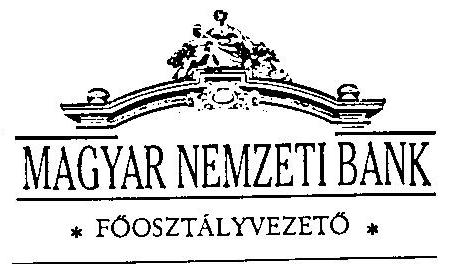

Honvédelmi Minisztérium
Védelemgazdasági Főosztály
Ellenőrzési űsztály
Dr.Kárász János ezredes
osztályvezető

# Tisztelt Ezredes Úr ! 

A T-3375/129/1990 számu levelére válaszolva, kérésének megfelelően, a kért adatokat megküldöm.
A mellékelt kimutatás a következôket tartalmazza:

- a pontositott volt MHSZ bankszámlák jegyzékét, a számlák megszüntetési idópontjával együtt
- a megszüntetés elôtti egyenleget / vidéken vezetett számláknak az 1990. szeptember 30-i egyenlegét, a 235. fiókban vezetetteknél a kivezetéskorit /
- a jogutód számlákat, ahová a megszüntetéskori egyenleg átvezetésre került
- az 1990. szeptember 18-i egyenlegeket a 235. fiókban vezetett bankszámlákra vonatkozóan. Ugyanezen adatok vidéki viszonylatban nem állnak rendelkezésünkre.
Mivel a Magyar Nemzeti Bank irattározási rendje a napi könyvelési bizonylatokra 2 év megôrzési idôt ir elô, igy az 1979-1984. évek év végi záróegyenlegeiról nem áll módunkban tájékoztatást adni.

Budapest, 1992.január 15
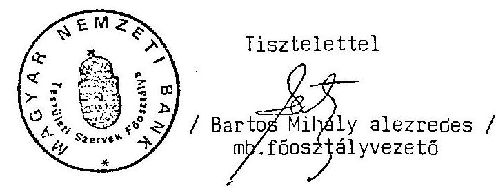

Melléklet: kimutatás a volt MHSZ szlákról

[^0]
[^0]:    H-1850 Budapest V. Szubadság tér 8/9.
    Telefon: $153-2600 \cdot 132-3320 \cdot 132-3323$
    Telex: $22-5679$

---

# K i m u t a t a s

a volk HHGZ számlákról

|  Pénzforgalmi jelzőszám | Megszüntető lev. számá | Megszüntető lev. dátuma | Jogutód | Záró egyenleg 1990.09.30. | Záró egyenleg 1990.10.30. | K i v e z e t é s Dátuma | Összege | Záró egyenleg 1990.09.18.  |
| --- | --- | --- | --- | --- | --- | --- | --- | --- |
|  235- 90176 -9301 | 324/90 | 90.10.01. | 235- 90178-1040 | 15.429.153,06 |  | 90.X.1. | 15.432.060,06 | 47.888.982,89  |
|  249 9319 | 256/90 | 90.07.12. | 249- 98518 |  |  |  |  |   |
|   |  |  | 845-41174-00 |  |  |  |  |   |
|  259 9329 | 263/90 | 90.07.31. | 257- 10225 |  |  |  |  |   |
|  269 9339 | 301/90 | 90.08.30. | 235- 90176-9301 |  |  |  |  |   |
|  279 9349 | 301/90 |  | 235- 90176-9301 |  |  |  |  |   |
|  289 9359 | 90/90 | 90.08.21. | 289- 98905- |  |  |  |  |   |
|   |  |  | 8410- 6033 |  |  |  |  |   |
|  299 9369 | 99/90 |  | 290- 10558 |  |  |  |  |   |
|  339 9379 | 301/90 | 90.08.30. | 235- 90176-9301 | 215.086,90 |  |  |  |   |
|  349 9389 | 373/89 |  | 342- 00418 |  |  |  |  |   |
|  359 9399 | 238/90 | 90.07.05. | 359- 98938 |  |  |  |  |   |
|   |  |  | K-10-11392 |  |  |  |  |   |
|  369 9402 | 301/90 | 90.08.30. | 235- 90176-9301 |  |  |  |  |   |
|  379 9412 | 228/90 | 90.07.31. | 372- 10258 |  |  |  |  |   |
|  235 9428 | 301/90 | 90.08.30. | 235- 90176-9301 |  |  |  |  |   |
|  399 9432 | 301/90 |  | 235- 90176-9301 |  |  |  |  |   |
|  449 9445 | 301/90 |  | 235- 90176-9301 |  |  |  |  |   |
|  459 9455 | 227/90 | 90.06.21. | 456- 10141 |  |  |  |  |   |
|  469 9465 | 226/90 | 90.06.26. | 466- 10333 |  |  |  |  |   |
|  479 9475 | 235/90 | 90.07.05. | 474- 10394 |  |  |  |  |   |
|  489 9485 | 301/90 | 90.08.30. | 235- 90176-9301 |  |  |  |  |   |
|  499 9495 | 236/90 | 90.07.05. | 490- 10495 |  |  |  |  |   |
|  235 9507 |  | 90.08.30. | 235- 90176-8908 |  |  |  |  |   |
|  235 8908 | 280/90 | 90.08.06. | 221- 10107 |  |  | 90.VIII.7 | 387.235,03 |   |
|  235 9521 | 324/90 | 90.10.01. | 235- 90178-1040 | 337.814,30 |  | 90.X.1. | 1.496.289,40 | 3.429.260,30  |
|  235 9538 | 215/88 |  | 235- 90176-90-301 |  |  |  |  |   |
|  235 9545 | 324/90 | 90.10.01. | 235- 90178-1040 | 59.516,86 |  | 90.X.1. | 28.792,76 | 84.691,86  |
|  249 9553 | 324/90 | 90.10.01. | 235- 90178-1040 |  |  |  |  |   |
|  259 9563 |  |  |  |  |  |  |  |   |
|  269 9573 |  |  |  | 76.803,76 |  |  |  |   |
|  279 9583 |  |  |  | 1.228.599,27 |  |  |  |   |
|  235 9514 |  | 90.09.28. | 221- 10468 |  |  | 90.09.28. | 3.944.921,07 | 157.393,17  |

---

|  Pénzforgalmi
jelzõszám | Megazü
tetõ
level | Megazü
tõ
leveli
dátuma | Jogutód | Záró egyen
90.09.30. | Záró egyen
90.10.30. | Kiv e
dátuma | Gászege | Záró egyen
leg
90.09.18.  |
| --- | --- | --- | --- | --- | --- | --- | --- | --- |
|  235-90176-9590 | 324/90 | 90.10.01. | 235-90178-1040 | 772.546,29 |  | 90.X.1. | 981.849,99* | 2.353.004,47  |
|  289 9603 |  |  |  | 60.600,99 |  |  |  |   |
|  299 9613 |  |  |  | 362.740,52 |  |  |  |   |
|  339 9623 |  |  |  | 458.610,67 |  |  |  |   |
|  349 9633 |  |  |  | 1.195.910,96 |  |  |  |   |
|  359 9643 |  |  |  | 135.553,49 |  |  |  |   |
|  369 9660 |  |  |  | 54.824,98 |  |  |  |   |
|  235 9679 | 328/90 | 90.09.28. | 222-14586 |  |  | 90.IX.28. | 780.940,56 | 826.177,16  |
|  379 9687 | 324/90 | 90.10.01. | 235-90178-1040 | 94.078,72 |  |  |  |   |
|  235 9703 | 328/90 | 90.09.28. | 219-98911
MRSZ 0192-400 |  |  | 90.IX.28. | 4.574.001,08 | 4.965.816,28  |
|  399 9717 | 324/90 | 90.10.01. | 235-90178-1040 | 672.370,76 |  |  |  |   |
|  449 9720 |  |  |  | 1.518.472,39 |  |  |  |   |
|  459 9730 |  |  |  |  |  |  |  |   |
|  469 9740 |  |  |  | 120.234,95 |  |  |  |   |
|  479 9750 |  |  |  |  |  |  |  |   |
|  489 9760 |  |  |  | 250.669,96 |  |  |  |   |
|  499 9770 |  |  |  | 298.080,70 |  |  |  |   |
|  235 9789 | 286/90 | 90.08.15. | 235-90176-9820 |  |  | 90.VIII.15 | 3.614.794,49 |   |
|  235 9796 | 301/90 | 90.08.30. | 235-90176-9301 |  |  | 90.VIII.31 | 383.038,98 |   |
|  459 9802 | 324/90 | 90.10.01. | 235-90178-1040 |  |  |  |  |   |
|  459 9819 |  |  |  |  |  |  |  |   |
|  235 9844 | 328/90 | 90.09.28. | 219-98911
MRSZ 0192-400 |  |  | 90.IX.28. | 363.417,62 | 5.419,87  |
|  235 9868 | 328/90 | 90.09.28. | 222-14380 |  |  | 90.IX.28. | 927.615,57 | 3.073.026,27  |
|  269 9872 | 324/90 | 90.10.01. | 235-90178-1040 |  |  |  |  |   |
|  279 9923 |  |  |  | 52.029,84 |  |  |  |   |
|  235 9947 | 314/90 | 90.09.19. | 235-90176-9301 |  |  | 90.IX.14. | 1.042.776,41 |   |
|  235 9978 | 324/90 | 90.10.01. | 235-90178-1040 | 688,10 |  | 90.X.1. | 688,10 | 688,10  |
|  235 9985 | 328/90 | 90.09.28. | 219-9890
MRSZ 0192-400 |  |  | 90.IX.28. | 165.011,92 | 1.050.193,77  |
|  235-90178-1040 | 89/91. | 91.04.15. | 232-90148-3260 |  |  | 14.204.884,01 | 91.04.12. | 3.267.685,32  |
|  * MNB kivonat Bank által javított összege 978.849,99 |  |  |  |  |  |  |  |   |

---

7. szamu melléklet a $1-3354 / 155 / 1000$

HM HÁt nyt. számhoz

Nyt.szám: T-3354/56/1990.

Dr. Hágelmayer István
Allami Számvevôszék elnöke

Budapest

Tárgy: MHSz vagyonelszámoltatása

Tisztelt Elnök Úr!

Az 1990. évi LXXIII. törvény a Magyar Honvédelmi Szövetséget (továbbiakban: MHSz) is vagyonelszámolásra kötelezi, melyet 1990. október 31-re kell benyújtania az Állami Számvevôszékhez.

Az elszámolási kötelezettség törvényl elõírások szerinti teljesítését az alábbi körülmények gátolják.

A törvény 1., 5. §-ában említett felelős elszámoló nem létezik, mivel az MHSz az 1022/1990. (II. 14.) MT határozat értelmében 1990. szeptember 30-ával befejezte tevékenységét, szakági- és honvédelmi klubjainak többsége - általános jogutód nélkül - önálló társadalmi szervezetté alakult át. Ezzel egyidejűleg a honvédelmi miniszter MHSz feletti állami felügyeleti jogköre is megszünt.

A Minisztertanács fenti határozatában elrendelt, az MHSz átalakulásával és vagyonfelmérésével összefüggő feladatok végrehajtása befejeződött. A megszünt szervezet szeptember 30-a után végrehajtásra kerülő felszámoló munkált felkérésünkre a PM ZÁVKI végzi, ezirányú tevékenységüket a miniszteri biztos irányításával a Magyar Honvédség állományából kijelölt bizottság segíti.

---

Az MHSz vagyonának döntō része (mintegy 61 4-a) állami tulajdonú ingatlan, melynek kezelöi joga az 1990. évi LXX. törvény értelmében a PM ZAVKI-t illeti meg. A további hasznosításról a Kormány elóterjesztése alapján 1990. november 30-át követöen az Országgyûlés dönt.

A gépjármũvezetõ képzést szolgáló vagyon az oktatás szakmai színvonalának emelése érdekében létrehozott "Kulturált Közlekedésért Alapítvány"-nak lett átadva.

Az ingó-, valamint az MHSz tulajdonú ingatlan vagyon a sportszövetségekbe tömörült jogutód társadalmi szervezetek rászére került átadásra.

Tehát az MHSz, mint az elmúlt 40 év vagyoni helyzetéról elszámolásra kötelezett szervezet nem létezik, jogutódnak gyakorlatilag a mintegy 4000 különbözö módon társadalmi szervezetté alakult egyesület, klub, szövetség tekintheto. Vagyonukat csak 1990. október 01-töl kezdödően kell a társadalmi szervezetekre érvényes jogszabályok elóirásai szerint nyilvántartani és számba vennni.

Az MHSz számvitele a rá vonatkozó szabályok alapján az általánostól eltérő volt, így az 1990. évi a LXXIII. törvény által elólrt elszámolásokat az MHSz nyilvántartásaiból teljeskörüen nem lehet elkészíteni.

Az 1022/1990. (II.14.) MT határozat alapján az MHSz vagyona 1990. május 31. fordulónappal a speciális szakágazati rendszerének megfelelő csoportosításban került felmérésre becsült értéken.

A közel 3 hónapos, a Magyar Honvédség jelentös segítségével végrehajtott leltározó és értékeló munkának azonban nem volt (nem lehetett) célja az elmúlt időszak változásainak átte-

---

kintése. A vagyonfelmérés adatai az MHSz küllönbözठ vezetési szintjein összegzésre kerültek. Azok teljes részletességükben - visszaellenơrizhetően - csak a mintegy 4000 társadalmi szervezetnél találhatók meg.

A fentiekbôl eredően az MHSz végrehajtott vagyonfelmérése nem felel meg az 1990. évi LXXIII. törvény tartalmi elठírásainak. Mindezek részletes számviteli indokait a csatolt melléklet tartalmazza.

Tisztelt Elnök Úr!
Az MHSz az 1022/1990. (II.14.) MT határozat alapján általános jogutód nélkül szünt meg, ezért, mint felelős elszámoló nem tud eleget tenni az. 1990. évi LXXIII. tövényben foglalt kötelezettségének. A létrejött társadalmi szervezetek csak az általuk továbbfolytatott tevékenységek és az ezekhez átadott vagyonrészek vonatkozásában tekinthetők jogutódnak. Az MHSz-re vonatkozó számviteli elठírások nem teszik lehetővé, hogy a jogutódok az 1990. évi LXXIII. törvény mellékleteiben elठírt adatszolgaítatást teljesítsék, mert az ehhez szükséges adatok az MHSz-nek sem álltak rendelkezésére.

Kérem Elnök Urat, hogy egyetértése esetén az MHSz vagyonelszámoltatását gátló körülméryekrôl az Országgyolést szíveskedjék tájékoztatni.

Melléklet: 1.sz. Az 1990. évi LXXIII. törvényben az MHSz-re elठírt vagyonelszámoltatást gátló számviteli sajátosságok Nyilt, 2 lap

Budapest, 1990. október " J "-n.
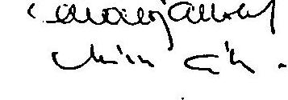
(Or. Für Lajos)
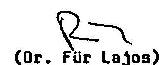

---

1. számu melléklet a $\bar{\tau}-17 \tau \exists / \tau \xi / 1990$. nyt. számhoz

# Az 1990. évi LXXIII. törvényben az MHSz-re elơirt vagyonelszámoltatást gátlo számviteli sajátosságok 

1. Az MHSz számviteli rendjének sajátosságai a következôkben foglalhatók össze:

- értékben csak a pénzeszközök forgalmát kellett naprakészen vezetni;
- beszámolási kötelezettség csak az éves költségvetésre terjedt ki, a vagyonra nem;
- a vagyont értéken nem kellett nyilvántartani, csak naturáliákban;
- a nyilvántartások a használó szervezeteknél teljeskörũen, a központosított beszerzés, ellátás körébe tartozó kiemelt eszközökre-anyagokra csak a megfelelठ (városi, kerületi, megyei illetve az országos központ) szinteken álltak rendelkezésre;
- a vagyon szakanyag szerinti csoportosítása eltér a számvitel általános elơírásaitól, a csoportosítás alapján az állóeszközök a készletektól nem kerültek elkülönítésre;
- a vagyonértéket 5 évenként, fordulónapi helyzetet tükrözően kellett felmérni, a mindenkori árszintre hozott, becsült értékekkel számolva, az állományváltozás értékelésére azonban ekkor sem került sor.

2. Fentiekbôl eredően az MHSz számviteléből az 1990. évi LXXIII. törvény tartalmi elơírásainak megfelelठ adatok az alábbiak szerint nem állíthatók eló.

---

a/ Az ingatlanok elszámoltatását célzó 1. és 6.sz. melléklet elkészítéséhez az ingatlannyilvántartásból nem biztosítható:

- a bekerülés ideje; a megszerzés jogcíme, idópontja, a könyv szerinti érték, az elôzó tulajdonos;
- az MHSz tulajdonából és kezeléséból az elmúlt idôszakban kikerült ingatlanok adatal.
b/ Az állóeszközök állományváltozásáról a 7.sz. melléklet szerinti elszámolást nem lehet elkészíteni, mivel:
- az MHSz eszközök és anyagok csoportosítása a mellékletben foglaltaktól eltérő, annak nem feleltetheto meg, az állóeszközök és a készletek nem különíthetők el;
- az 1988. XII. 31-1, az 1990. VIII. 31-1 helyzetnek megfelelő, valamint az állományváltozás adatal az értéknyilvántartás hiányában nem állnak rendelkezésre.

Az ingatlanokról és a szakanyagokról csak az 1990. május 31-1 helyzetet tükrözo vagyonfelmérés adatain alapuló becsült értékeket tartalmazó kimutatások állnak rendelkezésre.
c/ A bevételi források, kiadások (4., 5. sz. melléklet) alakulásáról csak az MHSz költségvetési beszámolóinak megfelelő részletezettséggel a költségvetési rovat- és tételrend alapján lehetséges számot adni.
d/ Az értékpapír és a pénzforgalom (8.sz. melléklet) alakulásáról teljeskörũ adat nem áll rendelkezésre, azok csak a mintegy 4000 volt MHSz szervezet irattááaból szarezhetők meg.

Budapest, 1990. október " "n.

---

$1319106$
dr. Pepp lstrale Geze
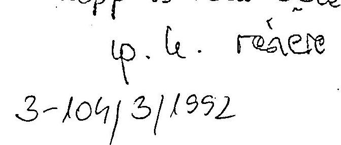
$3-104 / 3 / 1992$

KELEMEN J $\Omega$ Z S E F úrnak, vezérörnagy, helyettes allamtitkár, Honvédelmi Minisztérium

## 22. merélet

$v-148 / 7 / 1$
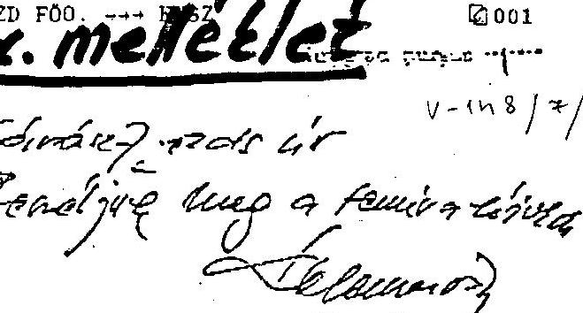

K E L E M E N J $\Omega$ Z S E F úrnak, vezérörnagy, helyettes allamtitkár, Honvédelmi Minisztérium
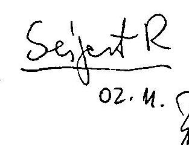

## SEJETR

02.4 .9

# B U D A P E S I 

## TISZTELT HELYETTES ÁLLAMTITKÁR ÚRI

Az 1990.. évi LXIII. törvény értelmezésével kapcsolatos levelére közlöm, hogy a Kormény 3388/1990. számú határozatában megállapította, hogy a Magyar Honvédelmi Szövetség 1990. október l-jén általános jogutód nélkül szünt meg.

Ebből következöen azok a társadalmi szervezetek, amelyek az MHSZ tulajdonában álló vagyontárgyakat tulajdonba kapták, csak e vagyontárgyakat illetően tekinthetöek jogutódnak. E minőségükben viszont kötelesek adatokat szolgáltatni az elszámolási kötelezettség körében.

Azokra a szervezetekre, amelyek az MHSZ tulajdonát képező vagyontárgyakat tulajdonba kapták kiterjed a törvény hatálya abban a körben is, amennyiben köti őket a törvény 8. §-ában meghatározott elidegenítési és terhelési tilalom. A törvény ugyanis nem az elszámoló szervezetekhez, hanem a 2. § a), b), c) és d) pontjaiban felsorolt vagyontárgyakhoz kapcsolja az elidegenítési és terhelési tilalmat.

---

A jogi szakértöi bizottság vezetésére Dr. Szabady Attilát jelölöm ki.

Budapest, 1992. január 31.

Tisztelettel
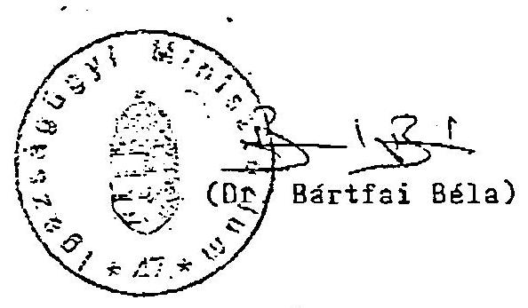

---

A Kincstári Vagyonkezelő Szervezet nyilatkozata a volt

MHSZ vagyone Iszámolásának hitelességéról és az
adathlány póto1hatat1anságáról
/V-148-13/1991/1992./

---

Ny1latkozó szervezet neve: Kincstári Vagyonkezelö Szervezet Cime: 1392. Budapest, Pf. 282.
Jogelödje neve: Zárolt Állami Vagyonkezelö és Hasznositó Intézmény

$$
\begin{gathered}
\text { Ny 11 a t k o z a t } \\
\text { adathiány póto1hatatlanságáról }
\end{gathered}
$$

Alulírottak dr. Németh Tibor, Majtényi Gábor és dr. Papp István Géza, mint a Kincstári Vagyonkezelö Szervezet miniszteri biztosa, valamint gazdasági, illetve múszaki igazgatóhelyettesei a Magyar Honvédelmi Szövetség vagyonelszámlása során nyilatkozattételre jogosultak, büntetőjogi felelösségünk tudatában az alábbiakat jelent jük ki:

Az Állami Számvevőszéknek a Magyar Honvédelmi Szövetség póte1számolása hitelességének ellenörzéséről készített V-148/9/1991/1992. számú 1992. március 16-án kelt jelentését megismertük. Egyetértünk abban, hogy a vagyonelszámolás - az Állami Számvevőszéknek átadott táblázatok, kimutatások alapján - a jelenlegl adattartalom mellett nem minösithető hitelesnek. Egyidejüleg azonban azt is kijelentjük, hogy a vagyonelszámolásból hiányzó adatokat nem tudjuk biztosítani, ennélfogva azokat póto1hatatlannak tartjuk.

A helyzet ilyen alakulásában közrejátszott a Magyar Honvédelmi Szövetség sajátos elszámolási rendje/ a szervezet félkatonai jellege miatt/, valamint az, hogy a szervezet általános jogutód nélkül került megszüntetésre. A jelentésben nem hitelesnek rögzített mellékletekben foglalt adatok és a hozzájuk szükséges iratok már nem lelhetők fel. Az iratbeszerzés érdekében tett intézkedéseink eredménytelenek voltak.

---

A Kincstári Vagyonkezelő Szervezet a legnagyobb erőfeszítések ellenére sem tud több, vagy más - a volt Magyar Honvédelmi Szövetség vagyoneIszámolását, hitelességét elősegítő dokumentációt az Állami Számvevőszék rendelkezésére bocsátani.

Budapest, 1992. március 30.
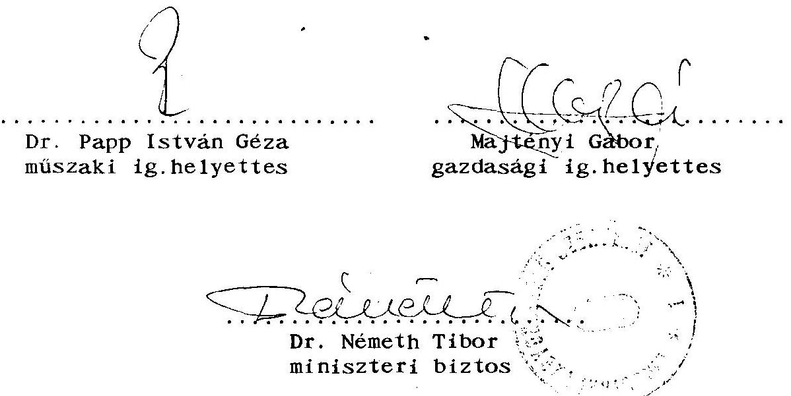

---

VI.

A Kincstári Vagyonkezelő Szervezet észrevétele az

Állami Számvevőszék vizsgálati
megállapításaival kapcsolatban
/V-148-17/1991/1992.

---

Ikt.sz 3:104138/1992.

Bihari Zsigmond úr Fejezati Föcsoport vezetöje Állami Számvevöszék

Budapest

Tisztelt Bihari Ơr !

Hivatkozócoal a réczomre észrevételenés végett a, V-148-15/1991/1992. számú levél mellékleteként megküldött je-lentés-tervezetet - amely a volt Magyar Honvédelmi Szövetsóg vagyonelszámolása hitelességének éllenörzéséröl készült - köszönettel vettem.

A jelentés tervezethen foglaltakat megismertem, annak tartalmával miután az hűen tükrözi mindazon problémákat, amelyekkel Szervezetünk is kezdettöl fogva szembetalálkozott - egyetértek.

Tekintettel arra, hogy az Állami Számvevöszék megállapításai egybeesnek a Szervezetünk által is tapasztaltakkal, ezért a jelentés-tervezethez scm kiegészitést, sem észrevételt nem kívánok tenni.

Budapest, 1992. április "I"